# 第十五章：使用 Pthreads 进行多线程编程第二部分-同步

多线程强大并且在性能上产生巨大影响的一个关键原因是它适用于并行或并发的概念；根据我们在之前的[第十四章]中学到的，*使用 Pthreads 进行多线程编程第一部分-基础*，我们了解到一个进程的多个线程可以（而且确实）并行执行。在大型多核系统上（多核现在几乎是标准，即使在嵌入式系统中），效果会被放大。

然而，正如经验告诉我们的那样，总是存在权衡。并行性带来了丑陋的竞争和随后的缺陷的潜在可能。不仅如此，这种情况通常变得极其难以调试，因此也难以修复。

在本章中，我们将尝试：

+   让读者了解并发（竞争）缺陷的位置和具体内容

+   如何通过良好的设计和编码实践在多线程应用程序中避免这些问题

同样，本章分为两个广泛的领域：

+   在第一部分中，我们清楚地解释了问题，比如原子性的重要性和死锁问题。

+   在本章的后半部分，我们将介绍 pthread API 集提供给应用程序开发人员的锁定（和其他）机制，以帮助解决和完全避免这些问题。

# 竞争问题

首先，让我们尝试理解我们试图解决的问题是什么以及问题的确切位置。在上一章中，我们了解到一个进程的所有线程除了堆栈之外都共享一切；每个线程都有自己的私有堆栈内存空间。

仔细再看一下[第十四章]，*使用 Pthreads 进行多线程编程第一部分-基础：图 2*（省略内核内容）；虚拟地址空间-文本和数据段，但不包括堆栈段-在一个进程的所有线程之间共享。数据段当然是全局和静态变量所在的地方。

冒着过分强调这些事实的风险，这意味着给定进程的所有线程真正（如果不可能，则使 COW 也成为正常字体而不是**写时复制**（COW））共享以下内容：

+   文本段

+   数据段-初始化数据，未初始化数据（之前称为 BSS）和堆段

+   几乎所有由操作系统维护的进程的内核级对象和数据（再次参考[第十四章]，*使用 Pthreads 进行多线程编程第一部分-基础*：图 2*）

一个非常重要的理解点是共享文本段根本不是问题。为什么？文本是代码；机器代码-构成我们所谓的机器语言的操作码和操作数-驻留在这些内存页中。回想一下[第二章]，*虚拟内存*，所有文本（代码）的页面都具有相同的权限：**读-执行**（r-x）。这很重要，因为多个线程并行执行文本（代码）不仅是可以的-而且是鼓励的！毕竟，这就是并行性的全部意义。想想看；如果我们只读取和执行代码，我们不以任何方式修改它；因此，即使在并行执行时，它也是完全安全的。

另一方面，数据页的权限为**读-写**（rw）。这意味着一个线程 A 与另一个线程 B 并行工作在一个数据页上时是固有的危险。为什么？这是相当直观的：它们可能会破坏页面内的内存值。（可以想象两个线程同时写入全局链表，例如。）关键点是，共享的可写内存必须受到保护，以防止并发访问，以便始终保持数据完整性。

要真正理解为什么我们如此关心这些问题，请继续阅读。

# 并发和原子性

并发执行意味着多个线程可以在多个 CPU 核心上真正并行运行。当这在文本（代码）上发生时，这是好事；我们获得了更高的吞吐量。然而，一旦我们在处理共享可写数据时并发运行，我们将遇到数据完整性的问题。这是因为文本是只读的（和可执行的），而数据是可读写的。

当然，我们真正想要的是贪婪地同时拥有两全其美的情况：通过多个线程并发执行代码，但是在必须处理共享数据的时候停止并发（并行），并且只有一个线程按顺序运行数据部分，直到完成，然后恢复并行执行。

# 教学银行账户示例

一个经典（教学）例子是有缺陷的银行账户软件应用。想象一下，卡卢尔（不用说，这里使用了虚构的名字和数字），一个自由职业的雕塑家，有一个银行账户；他目前的余额是 12000.00 美元。同时发生了两笔交易，分别是 3000 美元和 8000 美元的存款，这是他成功完成工作的付款。毫无疑问，很快，他的账户余额应该反映出 23000.00 美元的金额（假设没有其他交易）。

为了这个例子，让我们想象银行软件应用是一个多线程进程；为了保持简单，我们考虑一个线程被分派来处理一个交易。软件运行的服务器系统是一台强大的多核机器——它有 12 个 CPU 核心。当然，这意味着线程可以同时在不同的核心上并行运行。

因此，让我们想象一下，对于卡卢尔的每一笔交易，我们都有一个线程在运行来执行它——线程 A 和线程 B。线程 A（在 CPU＃0 上运行）处理 3000 美元的第一笔存款，而线程 B（在 CPU＃1 上运行）处理（几乎立即的）8000 美元的第二笔存款。

我们在这里考虑两种情况：

+   偶然情况下，交易成功进行。下图清楚地显示了这种情况：

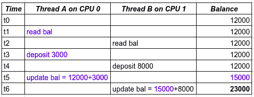

图 1：银行账户；由于偶然而正确

+   再次偶然情况下，交易不成功进行。下图显示了这种情况：

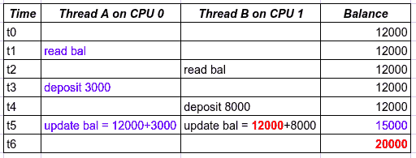

图 2：银行账户；由于偶然而不正确

在前面的表格中，问题区域已经被突出显示：很明显，线程 B 已经对余额进行了无效读取——它读取了 12000 美元的陈旧值（**t4 时刻**的值），而不是获取实际的当前值 15000 美元，导致卡卢尔损失了 3000 美元。

这是怎么发生的？简而言之，竞争条件导致了问题。要理解这场竞赛，请仔细看前面的表格并想象活动：

+   代表账户当前余额的变量；余额是全局的：

+   它位于数据段中

+   它被进程的所有线程共享

+   **在 t3 时刻**，**CPU＃0 上的线程 A**：存款 3000 美元；`余额`仍然是 12000 美元（尚未更新）

+   **在 t4 时刻**，**CPU＃1 上的线程 B**：存款 8000 美元；余额仍然是 12000 美元（尚未更新）

+   **在 t5 时刻**：

+   CPU＃0 上的线程 A：更新余额

+   同时，但在另一个核心上：

+   CPU＃1 上的线程 B：更新余额

+   偶然情况下，如果线程 B 在 CPU＃1 上比线程 A 在 CPU＃0 上更新`余额`变量早了几微秒！？

+   然后，线程 B 读取余额为 12000 美元（少了 3000 美元！）这被称为脏读，是问题的核心。这种情况被称为竞争；竞争是一种结果不确定和不可预测的情况。在大多数情况下，这将是一个问题（就像这里一样）；在一些罕见的情况下，这并不重要，被称为良性竞争。

需要强调的事实是，存款和更新余额（或相反，取款和更新余额）的操作必须保证是原子的。它们不能竞争，因为那将是一个缺陷（错误）。

短语原子操作（或原子性）在软件编程上下文中意味着一旦开始，操作将在没有中断的情况下完成。

# 临界区

我们如何修复前面的竞争？这实际上非常简单：我们必须确保，如前所述，银行操作 - 存款、取款等 - 被保证执行两件事：

+   成为在那个时间点上运行代码的唯一线程

+   原子性 - 完成，不中断

一旦实现了这一点，共享数据将不受损坏。必须以前述方式运行的代码部分称为临界区。

在我们虚构的银行应用程序中，运行执行银行操作（存款或取款）的线程必须在临界区中执行，如下所示：

！[](img/4f210b98-b336-46d2-b12e-96597699f140.png)

图 3：临界区

现在，假设银行应用程序已经根据这些事实进行了更正；线程 A 和线程 B 的垂直时间线执行路径现在如下：

！[](img/6e4698e1-51d8-4dec-914b-66b6eaf8efd4.png)

图 4：正确的银行应用程序 - 临界区

在这里，一旦线程 A 和线程 B 开始它们的（存款）操作，它们就会独自完成（不中断）；因此，按顺序和原子方式。

总结一下：

+   临界区是必须的代码：

+   在处理一些共享资源（如全局数据）时，不受其他线程的干扰运行

+   原子地运行（完成，不中断）

+   如果临界区的代码可以与其他线程并行运行，这是一个缺陷（错误），称为竞争。

+   为了防止竞争，我们必须保证临界区的代码独立和原子地运行

+   为此，我们必须同步临界区

现在，问题是：我们如何同步临界区？继续阅读。

# 锁定概念

软件中有几种形式的同步；其中一种常见的形式，也是我们将要大量使用的一种，称为**锁定**。在编程术语中，锁，如应用程序开发人员所见，最终是作为变量实例化的数据结构。

当需要临界区时，只需将临界区的代码封装在锁和相应的解锁操作之间。（现在，不要担心代码级 API 细节；我们稍后会涵盖。在这里，我们只关注正确理解概念。）

让我们表示临界区，以及同步机制 - 锁 - 使用图表（前述*图 3*的超集）：

！[](img/6889d1bb-3e14-4d0c-9c7a-12ca130fe2ea.png)

图 5：带锁的临界区

锁的基本前提如下：

+   在任何给定时间点，只有一个线程可以持有或拥有锁；该线程是锁的所有者。

+   在解锁时，当多个线程尝试获取或获取锁时，内核将保证只有一个线程会获取锁。

+   获得锁的线程称为赢家（或锁的所有者）；尝试但未获得锁的线程称为失败者。

因此，想象一下：假设我们有三个线程 A、B 和 C，在不同的 CPU 核心上并行运行，都试图获取锁。锁的保证是确切地有一个线程得到它 - 假设线程 C 获胜，获取锁（因此线程 C 是锁的赢家或所有者）；线程 A 和 B 是失败者。之后会发生什么？

+   赢家线程将锁操作视为非阻塞调用；它继续进入临界区（可能在处理一些共享可写资源，如全局数据）。

+   失败的线程将锁操作视为阻塞调用；他们现在阻塞（等待），但究竟在等待什么？（回想一下，阻塞调用是指我们等待事件发生并在事件发生后解除阻塞。）嗯，当然是解锁操作！

+   获胜的线程在（原子地）完成临界区后执行解锁操作。

+   现在线程 A 或 B 将获得锁，整个序列重复。

更一般地说，我们现在可以理解为：如果有 N 个线程竞争一个锁，那么锁操作（由操作系统）的保证是只有一个线程——获胜者——会获得锁。因此，我们将有一个获胜者和 N-1 个失败者。获胜的线程进入临界区的代码；与此同时，所有 N-1 个失败者线程等待（阻塞）解锁操作。在将来的某个时刻（希望很快），获胜者执行解锁操作；这将重新触发整个序列：N-1 个失败者再次竞争锁；我们将有一个获胜者和 N-2 个失败者；获胜的线程进入临界区的代码。与此同时，所有 N-2 个失败者线程等待（阻塞）解锁操作，依此类推，直到所有失败者线程都成为获胜者并因此运行了临界区的代码。

# 它是原子的吗？

关于对临界区进行原子执行的必要性的前述讨论可能会让您，程序员，感到担忧：也许您正在想，如何才能识别临界区？嗯，这很容易：如果您有并行性的潜力（多个线程可以并行运行通过代码路径）并且代码路径正在处理某些共享资源（通常是全局或静态数据），那么您就有一个临界区，这意味着您将通过锁定来保护它。

一个快速的经验法则：在大多数情况下，多个线程将通过代码路径运行。因此，从一般意义上讲，任何一种可写的共享资源的存在——全局变量、静态变量、IPC 共享内存区域，甚至是表示设备驱动程序中硬件寄存器的数据项——都会使代码路径成为临界区。规则是：保护它。

我们在上一节中看到的虚构的银行账户示例清楚地表明，我们有一个需要保护的临界区（通过锁定）。然而，有些情况下，我们可能并不清楚是否确实需要锁定。举个例子：在一个多线程的 C 应用程序中，我们有一个全局整数`g`；在某个时刻，我们增加它的值，比如：`g++`。

看起来很简单，但等等！这是一个可写的共享资源——全局数据；多个线程可能会并行运行这段代码，因此它成为一个需要保护的临界区（通过锁）。是的？还是不是？

乍一看，简单的增量（或减量）操作可能看起来是原子的（回想一下，原子操作是指在没有中断的情况下完成），因此不需要通过锁或任何其他形式的同步进行特殊保护。但事实真的是这样吗？

在我们继续之前，还有一个关键事实需要注意，那就是，现代微处理器上唯一保证原子性的是单个机器语言指令。每当一个机器指令完成后，CPU 上的控制单元会检查是否需要处理其他事情，通常是硬件中断或（软件）异常条件；如果需要，它会将程序计数器（IP 或 PC）设置为该地址并进行分支；如果不需要，执行将继续顺序进行，PC 寄存器将适当递增。

因此，请仔细考虑这一点：增量操作`g++`是否原子取决于两个因素：

+   正在使用的微处理器的指令集架构（ISA）（更简单地说，这取决于 CPU 本身）

+   该处理器的 C 编译器如何生成代码

如果编译器为`g++` C 代码生成了单个机器语言指令，那么执行确实是原子的。但是真的吗？让我们找出来！（实证的重要性——实验，尝试事物——是一个关键特征；我们的第十九章，*故障排除和最佳实践*，涵盖了更多这样的要点）。

一个非常有趣的网站，[`godbolt.org`](https://godbolt.org)（屏幕截图将随后出现），允许我们看到各种编译器如何编译给定的高级语言代码（在撰写本书时，它支持 14 种语言，包括 C 和 C++，以及各种编译器，当然包括 gcc(1)和 clang(1)。有趣的是，将语言下拉菜单设置为 C++后，还可以通过 gcc 为 ARM 进行编译！）。

让我们从访问这个网站开始，然后进行以下操作：

1.  通过下拉菜单选择 C 作为语言

1.  在右窗格中，选择编译器为 x86_64 gcc 8.2

1.  在左窗格中，输入以下程序：

```
int g=41;
int main(void)
{
    g ++;
}
```

以下是输出：

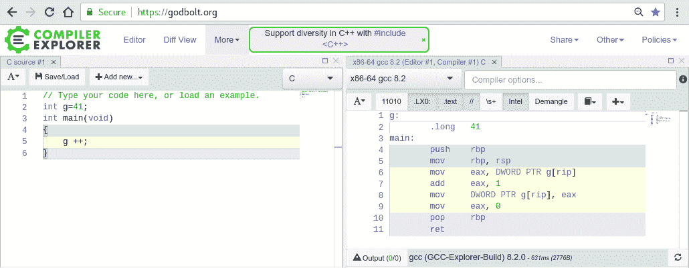

图 6：通过 x86_64 上的 gcc 8.2 进行 g++增量，无优化

看看右窗格——可以看到编译器生成的汇编语言（当然，随后将成为与处理器 ISA 相对应的机器代码）。那么呢？请注意，`g++` C 高级语言语句在其左窗格中以淡黄色突出显示；右窗格中使用相同的颜色突出显示相应的汇编。有什么明显的发现吗？单行 C 代码`g++`已经变成了四条汇编语言指令。因此，根据我们之前的学习，这段代码本身不能被认为是原子的（但我们当然可以使用锁来强制它成为原子）。

下一个实验：保持一切不变，只是注意到在右窗格中有一个文本小部件，你可以在其中输入传递给编译器的选项开关；我们输入`-O2`，表示我们希望编译器使用优化级别 2（一个相当高的优化级别）。现在，输出为：

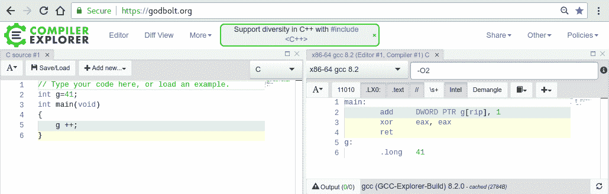

图 7：通过 x86_64 上的 gcc 8.2 进行 g++增量，优化级别 2

`g++` C 代码现在只剩下一个汇编指令，因此确实变成了原子的。

使用 ARM 编译器，没有优化，`g++`转换为几行汇编——显然不是原子的：

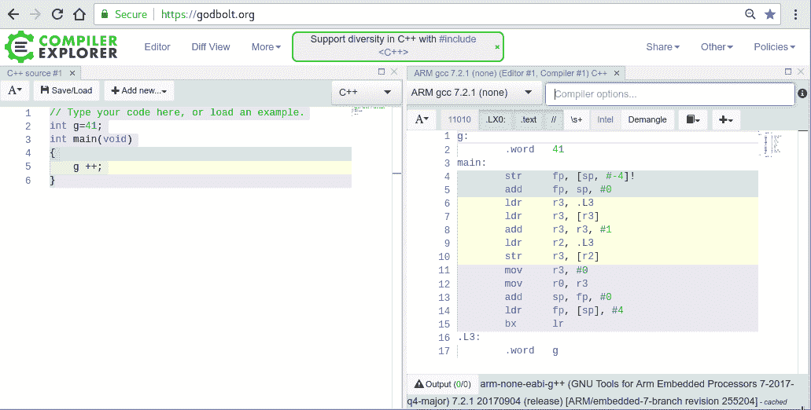

图 8：通过 ARM 上的 gcc 7.2.1 进行 g++增量，无优化

我们的结论？对于应用程序来说，我们编写的代码通常很重要，要跨（CPU）架构保持可移植性。在前面的例子中，我们清楚地发现，编译器为简单的`g++`操作生成的代码有时是原子的，有时不是。（这将取决于几个因素：CPU 的 ISA，编译器，以及它编译的优化级别`-On`等等。）因此，我们唯一可以得出的安全结论是：要安全，并且无论何时存在关键部分，都要保护它（使用锁或其他手段）。

# 脏读

许多对这些主题新手的程序员会做出一个致命的假设，认为类似这样：好吧，我明白了，当修改共享资源——比如全局数据结构——时，我将需要将代码视为关键部分，并用锁来保护它，但是，我的代码只是在全局链表上进行迭代；它只是读取它而不是写入它，因此，这不是一个关键部分，不需要保护（我甚至会因高性能而得到好处）。

请打破这个泡泡！这是一个关键部分。为什么？想象一下：当您的代码在全局链表上进行迭代（仅读取它）时，正因为您没有采取锁定或以其他方式进行同步，另一个写入线程很可能正在写入数据结构，而您正在读取它。想一想：这是一场灾难的预兆；您的代码很可能最终会读取过时或不一致的数据。这就是所谓的*脏读*，当您不保护关键部分时，它可能发生。实际上，这正是我们虚构的银行应用示例中的缺陷。

再次强调这些事实：

+   如果代码正在访问任何类型的可写共享资源，并且存在并行性的潜力，那么它就是一个关键部分。保护它。

+   这些的一些副作用包括：

+   如果您的代码确实具有并行性，但仅适用于局部变量，则没有问题，这不是关键部分。（记住：每个线程都有自己的私有堆栈，因此在没有显式保护的情况下使用局部变量是可以的。）

+   如果全局变量标记为`const`，那当然没问题——它是只读的，在任何情况下。

（尽管在 C 语言中，const 关键字实际上并不保证值确实是常量（通常理解的常量）！它只意味着变量是只读的，但它所引用的数据仍然可以在另一个指针从下面访问时被更改，使用宏而不是 const 关键字可能有所帮助）。

正确使用锁定有一个学习曲线，可能比其他编程结构陡峭一些；这是因为，首先必须学会识别关键部分，因此需要锁定（在前一节中介绍），然后学习和使用良好的设计锁定指南，第三，理解并避免令人讨厌的死锁！

# 锁定指南

在本节中，我们将提出一组小而重要的启发式或指导原则，供开发人员在设计和实现使用锁的多线程代码时牢记。这些可能适用于特定情况，也可能不适用；通过经验，人们学会在适当的时候应用正确的指导原则。

话不多说，它们在这里：

+   **保持锁定粒度足够细**：锁定数据，而不是代码。

+   **简单是关键**：涉及多个锁和线程的复杂锁定方案不仅会导致性能问题（极端情况是死锁），还会导致其他缺陷。保持设计尽可能简单始终是一个好的实践。

+   **预防饥饿**：持有锁定的时间任意长会导致失败者线程饿死；必须设计——并确实测试——以确保，作为一个经验法则，每个关键部分（在 lock 和 unlock 操作之间的代码）尽快完成。良好的设计确保代码关键部分不会花费太长时间；在锁定中使用超时是缓解这个问题的一种方法（稍后详细介绍）。

+   还要了解锁定会产生瓶颈。锁定的良好物理类比如下：

+   漏斗：将漏斗的茎视为关键部分——它只宽到足够容纳一个线程通过（赢家）；失败者线程则保持阻塞在漏斗口

+   多车道繁忙公路上的一个收费站

因此，避免长时间的关键部分是关键：

+   将同步构建到设计中，并避免诱惑，比如，好吧，我先写代码，然后再回来看锁定。通常情况下效果不佳；锁定本身就很复杂；试图推迟其正确的设计和实现只会加剧问题。

让我们更详细地检查这些观点中的第一个。

# 锁定粒度

在应用程序中工作时，假设有几个地方需要通过锁定来保护数据，换句话说，有几个关键部分：

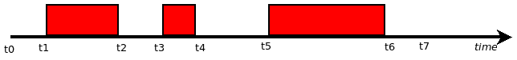

图 9：具有几个关键部分的时间线

我们已经在时间线上用实心红色矩形显示了关键部分（正如我们所学到的，需要同步锁定）。开发人员可能会意识到，为什么不简化一下呢？只需在 t1 时刻获取一个锁，然后在 t6 时刻解锁它：

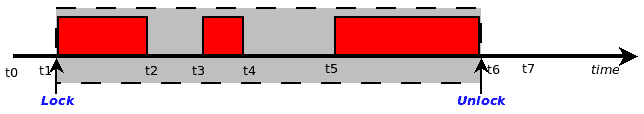

图 10：粗粒度锁定

这将保护所有的关键部分。但这是以性能为代价的。想想看；每次一个线程运行前面的代码路径时，它必须获取锁，执行工作，然后解锁。这没问题，但并行性呢？它实际上被打败了；从 t1 到 t6 的代码现在被序列化了。这种过度放大的锁定所有关键部分的行为被称为粗粒度锁定。

回想我们之前的讨论：代码（文本）从来不是问题——根本不需要在这里锁定；只需锁定可写共享数据的地方。这些就是关键部分！这就产生了细粒度锁定——我们只在关键部分开始的时候获取锁，并在结束的时候解锁；以下图表反映了这一点：

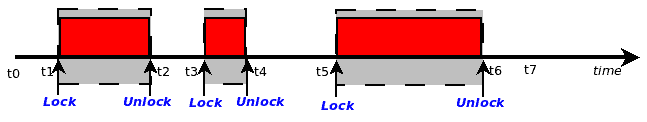

图 11：细粒度锁定

正如我们之前所述，一个好的经验法则是锁定数据，而不是代码。

超细粒度锁定总是最好的吗？也许不是；锁定是一个复杂的业务。实际工作表明，有时即使在代码上工作（纯文本——关键部分之间的代码），持有锁也是可以的。这是一个平衡的行为；开发人员理想情况下应该利用经验和试错来判断锁定的粒度和效率，不断测试和重新评估代码路径的健壮性和性能。

在任何方向上走得太远都可能是一个错误；锁定粒度太粗会导致性能不佳，但粒度太细也是如此。

# 死锁及其避免

死锁是一种不希望发生的情况，其中相关线程无法再取得进展。死锁的典型症状是应用程序（或设备驱动程序或任何其他软件）似乎“挂起”。

# 常见的死锁类型

思考一些典型的死锁场景将有助于读者更好地理解。回想一下，锁的基本前提是只能有一个赢家（获得锁的线程）和 N-1 个输家。另一个关键点是只有赢家线程才能执行解锁操作，没有其他线程可以这样做。

# 自死锁（重新锁定）

了解了上述信息，想象一下这种情况：有一个锁（我们称之为 L1）和三个竞争它的线程（我们称它们为 A、B 和 C）；假设线程 B 是赢家。这没问题，但是如果线程 B 在其关键部分内再次尝试获取相同的锁 L1 会发生什么呢？嗯，想想看：锁 L1 当前处于锁定状态，因此迫使线程 B 在其解锁时阻塞（等待）。然而，除了线程 B 本身，没有其他线程可能执行解锁操作，因此线程 B 最终将永远等待下去！这就是死锁。这种类型的死锁被称为自死锁，或重新锁定错误。

有人可能会争辩，实际上确实存在这种情况，锁能够递归地被获取吗？是的，正如我们将在后面看到的，这可以在 pthread API 中完成。然而，良好的设计通常会反对使用递归锁；事实上，Linux 内核不允许这样做。

# ABBA 死锁

在涉及嵌套锁定的情况下，可能会出现更复杂的死锁形式：两个或更多竞争线程和两个或更多锁。在这里，让我们以最简单的情况为例：两个线程（A 和 B）与两个锁（L1 和 L2）一起工作。 

假设这是在垂直时间线上展开的情况，如下表所示：

| **时间** | **线程 A** | **线程 B** |
| --- | --- | --- |
| t1 | 尝试获取锁 L1 | 尝试获取锁 L2 |
| t2 | 获取锁 L1 | 获取锁 L2 |
| t3 | <--- 在 L1 的临界区中 ---> |  <--- 在 L2 的临界区中 ---> |
| t4 | 尝试获取锁 L2 | 尝试获取锁 L1 |
| t5 | 阻塞，等待 L2 解锁 | 阻塞，等待 L1 解锁 |
|  | <永远等待：死锁> |  <永远等待：死锁> |

很明显，每个线程都在等待另一个解锁它想要的锁；因此，每个线程都永远等待，保证了死锁。这种死锁通常被称为致命拥抱或 ABBA 死锁。

# 避免死锁

显然，避免死锁是我们希望确保的事情。除了*锁定指南*部分涵盖的要点之外，还有一个关键点，那就是获取多个锁的顺序很重要；始终保持锁定顺序一致将提供对抗死锁的保护。

为了理解原因，让我们重新看一下刚才讨论过的 ABBA 死锁场景（参考上表）。再次看表格：注意线程 A 获取锁 L1，然后尝试获取锁 L2，而线程 B 则相反。现在我们将表示这种情况，但有一个关键的警告：锁定顺序！这一次，我们将有一个锁定顺序规则；它可能很简单，比如：首先获取锁 L1，然后获取锁 L2：

锁 L1 --> 锁 L2

考虑到这种锁定顺序，我们发现情况可能会如下展开：

| **时间** | **线程 A** | **线程 B** |
| --- | --- | --- |
| t1 | 尝试获取锁 L1 | 尝试获取锁 L1 |
| t2 |  | 获取锁 L1 |
| t3 | <等待 L1 解锁> | <--- 在 L1 的临界区中 ---> |
| t4 |  | 解锁 L1 |
| t5 | 获取锁 L1 |  |
| t6 | <--- 在 L1 的临界区中 ---> | 尝试获取锁 L2 |
| t7 | 解锁 L1 | 获取锁 L2 |
| t8 | 尝试获取锁 L2 | <--- 在 L2 的临界区中  |
| t9 | <等待 L2 解锁> |                                                             ---> |
| t10 |  | 解锁 L2 |
| t11 | 获取锁 L2 | <继续其他工作> |
| t12 | <--- 在 L2 的临界区中 ---> | ... |
| t13 | 解锁 L2 | ... |

关键点在于两个线程尝试按照给定顺序获取锁；首先是 L1，然后是 L2。在上表中，我们可以想象一种情况，即线程 B 首先获取锁，迫使线程 A 等待。这是完全正常和预期的；不发生死锁是整个重点。

确切的顺序本身并不重要；重要的是设计者和开发者记录并遵守要遵循的锁定顺序。

锁定顺序语义，实际上开发者关于这一关键点的评论，通常可以在 Linux 内核源代码树（截至本文撰写时的版本 4.19）中找到。以下是一个例子：`virt/kvm/kvm_main.c``...`

`/*`

` * 锁的顺序：`

` *`

` * kvm->lock --> kvm->slots_lock --> kvm->irq_lock`

` */`

`...`

因此，回顾我们的第一个表格，我们现在可以清楚地看到，死锁发生是因为违反了锁定顺序规则：线程 B 在获取锁 L1 之前获取了锁 L2！

# 使用 pthread API 进行同步

既然我们已经涵盖了所需的理论背景信息，让我们继续进行实际操作：在本章的其余部分，我们将专注于如何使用 pthread API 进行同步，从而避免竞争。

我们已经了解到，为了保护任何类型的可写共享数据，我们需要在临界区域进行锁定。pthread API 为这种情况提供了互斥锁；我们打算只在临界区域内短暂持有锁。

然而，有些情况下，我们需要一种不同类型的同步 - 我们需要根据某个数据元素的值进行同步；pthread API 为这种情况提供了条件变量（CV）。

让我们依次来看看这些。

# 互斥锁

**互斥锁**一词实际上是**互斥排斥**的缩写；对于所有其他（失败的）线程的互斥排斥，一个线程 - 赢家 - 持有（或拥有）互斥锁。只有在它被解锁时，另一个线程才能获取锁。

一个常见问题：信号量和互斥锁之间的真正区别是什么？首先，信号量可以以两种方式使用 - 一种是作为计数器（使用计数信号量对象），另一种（我们这里关注的）基本上是作为互斥锁 - 二进制信号量。

二进制信号量和互斥锁之间存在两个主要区别：一是信号量用于在进程之间进行同步，而不是单个进程内部的线程（它确实是一个众所周知的 IPC 设施）；互斥锁用于同步给定（单个）进程的线程。 （话虽如此，可以创建一个进程共享的互斥锁，但这并不是默认值）。

其次，信号量的 SysV IPC 实现提供了这样的可能性，即内核可以在所有者进程被突然终止时（总是可能通过信号#9）解锁信号量（通过`semop(2)` `SEM_UNDO`标志）；对于互斥锁，甚至不存在这样的可能性 - 获胜者必须解锁它（我们稍后将介绍开发人员如何确保这一点）。

让我们从一个简单的示例开始，初始化、使用和销毁互斥锁。在这个程序中，我们将创建三个线程，仅在线程的工作例程中每次增加三个全局整数。

为了可读性，只显示了源代码的关键部分；要查看完整的源代码，请构建并运行它。整个树可在 GitHub 上克隆：[`github.com/PacktPublishing/Hands-on-System-Programming-with-Linux`](https://github.com/PacktPublishing/Hands-on-System-Programming-with-Linux)。

代码：`ch15/mutex1.c`：

```
static long g1=10, g2=12, g3=14;    /* our globals */
pthread_mutex_t mylock;   /* lock to protect our globals */ 
```

为了使用互斥锁，必须首先将其初始化为未锁定状态；可以这样做：

```
 if ((ret = pthread_mutex_init(&mylock, NULL)))
     FATAL("pthread_mutex_init() failed! [%d]\n", ret);
```

或者，我们可以将初始化作为声明来执行，例如：

```
pthread_mutex_t mylock = PTHREAD_MUTEX_INITIALIZER;
```

实际上，有一些可以为互斥锁指定的互斥属性（通过`pthread_mutexattr_init(3)` API）；我们将在本章后面介绍这一点。现在，属性将是系统默认值。

另外，一旦完成，我们必须销毁互斥锁：

```
 if ((ret = pthread_mutex_destroy(&mylock)))
     FATAL("pthread_mutex_destroy() failed! [%d]\n", ret);
```

通常情况下，我们在循环中创建（三个）工作线程（我们不在这里显示这段代码，因为它是重复的）。这是线程的工作例程：

```
void * worker(void *data)
{
     long datum = (long)data + 1;
     if (locking)
         pthread_mutex_lock(&mylock);

     /*--- Critical Section begins */
 g1 ++; g2 ++; g3 ++;
     printf("[Thread #%ld] %2ld %2ld %2ld\n", datum, g1, g2, g3);
     /*--- Critical Section ends */

     if (locking)
         pthread_mutex_unlock(&mylock);

     /* Terminate with success: status value 0.
      * The join will pick this up. */
     pthread_exit((void *)0);
}
```

因为我们正在使用每个线程的可写共享（它在数据段中！）资源进行操作，我们意识到这是一个临界区域！

因此，我们必须保护它 - 在这里，我们使用互斥锁。因此，在进入临界区域之前，我们首先获取互斥锁，然后处理全局数据，然后解锁我们的锁，使操作安全地抵御竞争。（请注意，在前面的代码中，我们只在变量称为`locking`为真时才执行锁定和解锁；这是一种测试代码的故意方式。在生产中，当然，请取消`if`条件并执行锁定！）细心的读者还会注意到，我们将临界区域保持得相当短 - 它只包含全局更新和随后的`printf(3)`，没有更多的内容。（这对于良好的性能很重要；回想一下我们在前一节关于*锁定粒度*中学到的内容）。

如前所述，我们故意为用户提供了一个选项，可以完全避免使用锁定，这当然会导致错误行为。让我们试一试：

```
$ ./mutex1 
Usage: ./mutex1 lock-or-not
 0 : do Not lock (buggy!)
 1 : do lock (correct)
$ ./mutex1 1
At start:   g1 g2 g3
            10 12 14
[Thread #1] 11 13 15
[Thread #2] 12 14 16
[Thread #3] 13 15 17
$ 
```

它确实按预期工作。即使我们将参数传递为零，从而关闭锁定，程序（通常）似乎也能正常工作：

```
$ ./mutex1 0
At start:   g1 g2 g3
            10 12 14
[Thread #1] 11 13 15
[Thread #2] 12 14 16
[Thread #3] 13 15 17
$ 
```

为什么？啊，这很重要要理解：回想一下我们在前一节“它是原子的吗？”中学到的内容。对于一个简单的整数增量和编译器优化设置为高级别（实际上是`-O2`），整数增量很可能是原子的，因此不真正需要锁定。然而，这并不总是情况，特别是当我们对整数变量进行比简单的增量或减量更复杂的操作时（考虑读取/写入一个大的全局链表等）！最重要的是：我们必须始终识别关键部分并确保我们保护它们。

# 看到竞争

为了确切地演示这个问题（实际上看到数据竞争），我们将编写另一个演示程序。在这个程序中，我们将计算给定数字的阶乘（一个快速提醒：3！= 3 x 2 x 1 = 6；从学校时代记得的符号 N！表示 N 的阶乘）。以下是相关代码：

为了便于阅读，只显示了源代码的关键部分；要查看完整的源代码，构建并运行它。整个树可以从 GitHub 克隆到这里：[`github.com/PacktPublishing/Hands-on-System-Programming-with-Linux`](https://github.com/PacktPublishing/Hands-on-System-Programming-with-Linux)*.*

代码：`ch15/facto.c`：

在`main()`中，我们初始化我们的互斥锁（并创建两个工作线程；我们没有显示创建线程、销毁线程以及互斥锁的代码）：

```
printf( "Locking mode : %s\n" 
        "Verbose mode : %s\n",
          (gLocking == 1?"ON":"OFF"),
          (gVerbose == 1?"ON":"OFF"));

if (gLocking) {
     if ((ret = pthread_mutex_init(&mylock, NULL)))
         FATAL("pthread_mutex_init() failed! [%d]\n", ret);
 }
...
```

线程的`worker`例程如下：

```
void * worker(void *data)
{
    long datum = (long)data + 1;
    int N=0;
...
    if (gLocking)
        pthread_mutex_lock(&mylock);

    /*--- Critical Section begins! */
 factorize(N);
    printf("[Thread #%ld] (factorial) %d ! = %20lld\n",
      datum, N, gFactorial);
    /*--- Critical Section ends */

    if (gLocking)
        pthread_mutex_unlock(&mylock);
...
```

识别临界区，我们获取（然后解锁）我们的互斥锁。`factorize`函数的代码如下：

```
/*
 * This is the function that calculates the factorial of the given   parameter. 
Stress it, making it susceptible to the data race, by turning verbose mode On; then, it will take more time to execute, and likely end up "racing" on the value of the global gFactorial. */
static void factorize(int num)
{
     int i;
     gFactorial = 1;
     if (num <= 0)
         return;
    for (i=1; i<=num; i++) {
         gFactorial *= i;
         VPRINT(" i=%2d fact=%20lld\n", i, gFactorial);
    }
}
```

仔细阅读前面的评论；这对这个演示很关键。让我们试一试：

```
$ ./facto 
Usage: ./facto lock-or-not [verbose=[0]|1]
Locking mode:
 0 : do Not lock (buggy!)
 1 : do lock (correct)
(TIP: turn locking OFF and verbose mode ON to see the issue!)
$ ./facto 1
Locking mode : ON
Verbose mode : OFF
[Thread #2] (factorial) 12 ! =     479001600
[Thread #1] (factorial) 10 ! =       3628800
$ 
```

结果是正确的（自行验证）。现在我们关闭锁定并打开详细模式重新运行它：

```
$ ./facto 0 1
Locking mode : OFF
Verbose mode : ON
facto.c:factorize:50: i= 1 fact=                 1
facto.c:factorize:50: i= 2 fact=                 2
facto.c:factorize:50: i= 3 fact=                 6
facto.c:factorize:50: i= 4 fact=                24
facto.c:factorize:50: i= 5 fact=               120
facto.c:factorize:50: i= 6 fact=               720
facto.c:factorize:50: i= 7 fact=              5040
facto.c:factorize:50: i= 8 fact=             40320
facto.c:factorize:50: i= 9 fact=            362880
facto.c:factorize:50: i=10 fact=            3628800
[Thread #1] (factorial) 10 ! =           3628800
facto.c:factorize:50: i= 1 fact=                        1
facto.c:factorize:50: i= 2 fact=         7257600  *<-- Dirty Read!*
facto.c:factorize:50: i= 3 fact=                 21772800
facto.c:factorize:50: i= 4 fact=                 87091200
facto.c:factorize:50: i= 5 fact=                435456000
facto.c:factorize:50: i= 6 fact=               2612736000
facto.c:factorize:50: i= 7 fact=              18289152000
facto.c:factorize:50: i= 8 fact=             146313216000
facto.c:factorize:50: i= 9 fact=            1316818944000
facto.c:factorize:50: i=10 fact=           13168189440000
facto.c:factorize:50: i=11 fact=          144850083840000
facto.c:factorize:50: i=12 fact=         1738201006080000
[Thread #2] (factorial) 12 ! =        1738201006080000
$ 
```

啊哈！在这种情况下，`10！`是正确的，但`12！`是错误的！我们可以从前面的输出中清楚地看到发生了脏读（在计算 12！时的 i==2 迭代中），导致了缺陷。当然：我们在这里没有保护关键部分（锁定被关闭）；难怪出错了。

我们再次要强调的是，这些竞争是微妙的时间巧合；在一个有错误的实现中，你的测试用例可能仍然会成功，但这并不能保证任何事情（它很可能在实际应用中失败，正如墨菲定律告诉我们的那样！）。（一个不幸的事实是测试可以揭示错误的存在，但不能保证它们的不存在。重要的是，第十九章，*故障排除和最佳实践*，涵盖了这些要点）。

读者会意识到，由于这些数据竞争是微妙的时间巧合，它们可能会或可能不会在您的测试系统上完全如此发生。多次重试应用程序可能有助于重现这些情况。

我们留给读者尝试在锁定模式和详细模式下使用用例；当然它应该工作。

# 互斥锁属性

互斥锁可以有几个与之关联的属性。此外，我们列举了其中的几个。

# 互斥锁类型

互斥锁可以是四种类型之一，默认情况下通常是正常互斥锁，但并不总是（这取决于实现）。使用的互斥锁类型会影响锁定和解锁的行为。这些类型是：PTHREAD_MUTEX_NORMAL，PTHREAD_MUTEX_ERRORCHECK，PTHREAD_MUTEX_RECURSIVE 和 PTHREAD_MUTEX_DEFAULT。

系统手册中关于`pthread_mutex_lock(3)`的行为取决于互斥锁类型的表格；为了读者方便，我们在这里重复了相同的内容。

如果线程尝试重新锁定已经锁定的互斥锁，则`pthread_mutex_lock(3)`将按照以下表格中的重新锁定列中描述的行为进行。如果线程尝试解锁未锁定或已解锁的互斥锁，则`pthread_mutex_unlock(3)`将按照以下表格中的**非所有者解锁**列中描述的行为进行：

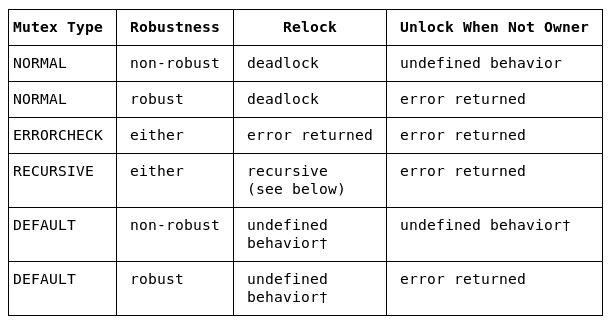

如果互斥锁类型为 PTHREAD_MUTEX_DEFAULT，则`pthread_mutex_lock(3)`的行为可能对应于前表中描述的三种其他标准互斥锁类型之一。如果它不对应于这三种中的任何一种，对于标记为†的情况，行为是未定义的。

重新锁定列直接对应于我们在本章前面描述的自死锁场景，比如，尝试重新锁定已经锁定的锁（或许是诗意的措辞？）会产生什么影响。显然，除了递归和错误检查互斥锁的情况，最终结果要么是未定义的（这意味着任何事情都可能发生！），要么确实是死锁。

同样，除了拥有者之外的任何线程尝试解锁互斥锁都会导致未定义行为或错误。

人们可能会想：为什么锁定 API 的行为会根据互斥锁的类型而有所不同——在错误返回或失败方面？为什么不为所有类型都设定一个标准行为，从而简化情况？嗯，这是简单性和性能之间的通常权衡：实现的方式允许，例如，一个编写良好、在程序上经过验证正确的实时嵌入式应用程序放弃额外的错误检查，从而获得速度（这在关键代码路径上尤为重要）。另一方面，在开发或调试环境中，开发人员可能选择允许额外的检查，以便在发货前捕捉缺陷。（`pthread_mutex_destroy(3)`的 man 页面有一个名为*错误检查和性能支持之间的权衡*的部分，其中对这个方面进行了比较详细的描述。）

`get`和`set`互斥锁类型属性的一对 API（在上表的第一列）非常直接：

```
include <pthread.h>
int pthread_mutexattr_gettype(const pthread_mutexattr_t *restrict attr,     int *restrict type);
int pthread_mutexattr_settype(pthread_mutexattr_t *attr, int type);
```

# 鲁棒互斥锁属性

看一下上表，人们会注意到鲁棒性列；这是什么意思？回想一下，只有互斥锁的拥有者线程可能解锁互斥锁；现在，我们问，如果拥有者线程碰巧死亡会怎么样？（首先，良好的设计将确保这种情况永远不会发生；其次，即使发生了，也有方法来保护线程取消，这是我们将在下一章中讨论的一个主题。）从表面上看，没有帮助；任何其他等待锁的线程现在都将陷入死锁（实际上，它们将被挂起）。这实际上是默认行为；这也是由称为 PTHREAD_MUTEX_STALLED 的鲁棒属性设置的行为。在这种情况下，可能的救援存在于另一个鲁棒互斥锁属性的值：PTHREAD_MUTEX_ROBUST。可以通过以下一对 API 查询和设置这些属性：

```
#include <pthread.h>
int pthread_mutexattr_getrobust(const pthread_mutexattr_t *attr,
    int *robustness);
int pthread_mutexattr_setrobust(const pthread_mutexattr_t *attr,
    int robustness);
```

如果在互斥锁上设置了此属性（值为 PTHREAD_MUTEX_ROBUST），那么如果拥有者线程在持有互斥锁时死亡，随后对锁的`pthread_mutex_lock(3)`将成功返回值`EOWNERDEAD`。不过，即使调用返回了（所谓的）成功返回，重要的是要理解，相关的锁现在被认为处于不一致状态，并且必须通过`pthread_mutex_consistent(3)`API 将其重置为一致状态：

`int pthread_mutex_consistent(pthread_mutex_t *mutex);`

这里返回值为零表示成功；互斥锁现在恢复到一致（稳定）状态，并且可以正常使用（使用它，当然在某个时候，你必须解锁它）。

总之，要使用鲁棒属性互斥锁，请使用以下方法：

+   初始化互斥锁：

`pthread_mutexattr_t attr`;

`pthread_mutexattr_init(&attr)`；

+   在它上面设置 robust 属性：`pthread_mutexattr_setrobust(&attr, PTHREAD_MUTEX_ROBUST)`；

+   拥有者线程

+   锁定它：`pthread_mutex_lock(&mylock)`。

+   现在，假设线程所有者突然死亡（同时持有互斥锁）

+   另一个线程（可能是主线程）可以假定所有权：

+   首先，检测情况：

+   `ret = pthread_mutex_lock(&mylock)`；

`if (ret == EOWNERDEAD) {`

+   然后，使其一致：

`pthread_mutex_consistent(&mylock)`；

+   使用它（或解锁它）

+   解锁它：`pthread_mutex_unlock(&mylock)`；

我们不打算重复造轮子，我们将读者指向一个简单易读的示例，该示例使用了之前描述的 robust 互斥锁属性功能。在`pthread_mutexattr_setrobust(3)`的 man 页面中可以找到它。

在底层，Linux pthreads 互斥锁是通过`futex(2)`系统调用（因此由操作系统）实现的。`futex（快速用户互斥锁）`提供了快速、健壮、仅原子指令的锁定实现。更多详细信息的链接可以在 GitHub 存储库的*进一步阅读*部分中找到。

# IPC、线程和进程共享的互斥锁

想象一个由几个独立的多线程进程组成的大型应用程序。现在，如果这些进程想要相互通信（他们通常会想要这样做），这该如何实现？答案当然是**进程间通信**（IPC）——为此目的存在的机制。广义上说，在典型的 Unix/Linux 平台上有几种 IPC 机制可用；这些包括共享内存（以及`mmap(2)`）、消息队列、信号量（通常用于同步）、命名（FIFO）和无名管道、套接字（Unix 和互联网域），在一定程度上还有信号。

不幸的是，由于空间限制，我们在本书中没有涵盖进程 IPC 机制；我们敦促感兴趣的读者查看 IPC 部分在 GitHub 存储库的*进一步阅读*部分中提供的链接（和书籍）。

这里需要强调的是，所有这些 IPC 机制都是用于在 VM 隔离的进程之间进行通信。因此，我们在这里讨论的重点是多线程，那么给定进程内的线程如何相互通信呢？实际上很简单：就像可以设置并使用共享内存区域来有效和高效地在进程之间进行通信（写入和读取该区域，通过信号量同步访问），线程可以简单有效地使用全局内存缓冲区（或任何适当的数据结构）作为彼此通信的媒介，并且当然，通过互斥锁同步访问全局内存区域。

有趣的是，可以使用互斥锁作为不同进程的线程之间的同步原语。这是通过设置名为 pshared 或进程共享的互斥锁属性来实现的。获取和设置 pshared 互斥锁属性的一对 API 如下：

```
int pthread_mutexattr_getpshared(const pthread_mutexattr_t *attr,
    int *pshared);
int pthread_mutexattr_setpshared(pthread_mutexattr_t *attr,
    int pshared);
```

第二个参数 pshared 可以设置为以下之一：

+   **PTHREAD_PROCESS_PRIVATE**：默认值；在这里，互斥锁只对创建互斥锁的进程内的线程可见。

+   **PTHREAD_PROCESS_SHARED**：在这里，互斥锁对在创建互斥锁的内存区域中具有访问权限的任何线程可见，包括不同进程的线程。

但是，如何确保互斥锁存在的内存区域在进程之间是共享的（如果没有，将无法让相关进程使用互斥锁）？嗯，这实际上是基本的：我们必须使用我们提到的 IPC 机制之一——共享内存原来是正确的。因此，我们让应用程序设置一个共享内存区域（通过传统的 SysV IPC `shmget(2)`或较新的 POSIX IPC `shm_open(2)`系统调用），并且在这个共享内存中实例化我们的进程共享的互斥锁。

因此，让我们用一个简单的应用程序将所有这些联系在一起：我们将编写一个应用程序，创建两个共享内存区域：

+   一、一个小的共享内存区域，用作进程共享互斥锁和一次性初始化控制的共享空间（稍后详细介绍）

+   二、一个共享内存区域，用作存储 IPC 消息的简单缓冲区

我们将使用进程共享属性初始化互斥锁，以便在不同进程的线程之间同步访问；在这里，我们 fork 并让原始父进程和新生的子进程的线程竞争互斥锁。一旦它们（顺序地）获得它，它们将向第二个共享内存段写入消息。在应用程序结束时，我们销毁资源并显示共享内存缓冲区（作为一个简单的概念验证）。

让我们尝试一下我们的应用程序（`ch15/pshared_mutex_demo.c`）：

为了便于阅读，我们在下面的代码中添加了一些空行。

```
$ ./pshared_mutex_demo 
./pshared_mutex_demo:15317: shmem segment successfully created / accessed. ID=38928405
./pshared_mutex_demo:15317: Attached successfully to shmem segment at 0x7f45e9d50000
./pshared_mutex_demo:15317: shmem segment successfully created / accessed. ID=38961174
./pshared_mutex_demo:15317: Attached successfully to shmem segment at 0x7f45e9d4f000

[pthread_once(): calls init_mutex(): from PID 15317]

Worker thread #0 [15317] running ...
 [thrd 0]: attempting to take the shared mutex lock...
 [thrd 0]: got the (shared) lock!
#0: work done, exiting now

 Child[15319]: attempting to taking the shared mutex lock...
 Child[15319]: got the (shared) lock!

main: joining (waiting) upon thread #0 ...
Thread #0 successfully joined; it terminated with status=0

Shared Memory 'comm' buffer:
00000000 63 63 63 63 63 00 63 68 69 6c 64 20 31 35 33 31 ccccc.child 1531
00000016 39 20 68 65 72 65 21 0a 00 74 74 74 74 74 00 74 9 here!..ttttt.t
00000032 68 72 65 61 64 20 31 35 33 31 37 20 68 65 72 65 hread 15317 here
00000048 21 0a 00 00 00 00 00 00 00 00 00 00 00 00 00 00 !...............
00000064 00 00 00 00 00 00 00 00 00 00 00 00 00 00 00 00 ................
00000080 00 00 00 00 00 00 00 00 00 00 00 00 00 00 00 00 ................
00000096 00 00 00 00 00 00 00 00 00 00 00 00 00 00 00 00 ................
00000112 00 00 00 00 00 00 00 00 00 00 00 00 00 00 00 00 ................
```

在现实世界中，事情并不像这样简单；还存在一个额外的同步问题需要考虑：如何确保互斥锁正确且原子地初始化（只由一个进程或线程），并且只初始化一次，其他线程应该如何使用它？在我们的演示程序中，我们使用了`pthread_once(3)` API 来实现互斥对象的一次性初始化（但忽略了线程等待并且只在初始化后使用的问题）。 （Stack Overflow 上的一个有趣的问答突出了这个问题；请看：[`stackoverflow.com/questions/42628949/using-pthread-mutex-shared-between-processes-correctly#`](https://stackoverflow.com/questions/42628949/using-pthread-mutex-shared-between-processes-correctly#)*。）然而，事实是`pthread_once(3)` API 是用于在一个进程的线程之间使用的。此外，POSIX 要求`once_control`的初始化是静态完成的；在这里，我们在运行时执行了它，所以并不完美。

在`main`函数中，我们设置并初始化（IPC）共享内存段；我们敦促读者仔细阅读源代码（阅读所有注释），并自行尝试：

为了便于阅读，只显示了源代码的关键部分；要查看完整的源代码，请构建并运行它。整个树可以在 GitHub 上克隆：[`github.com/PacktPublishing/Hands-on-System-Programming-with-Linux`](https://github.com/PacktPublishing/Hands-on-System-Programming-with-Linux)*.*

```
...

  /* Setup a shared memory region for the process-shared mutex lock.
   * A bit of complexity due to the fact that we use the space within for:
   * a) memory for 1 process-shared mutex
   * b) 32 bytes of padding (not strictly required)
   * c) memory for 1 pthread_once_t variable.
   * We need the last one for performing guaranteed once-only
   * initialization of the mutex object.
   */
  shmaddr = shmem_setup(&gshm_id, argv[0], 0, 
              (NUM_PSMUTEX*sizeof(pthread_mutex_t) + 32 +  
                sizeof(pthread_once_t)));
  if (!shmaddr)
      FATAL("shmem setup 1 failed\n");

  /* Associate the shared memory segment with the mutex and 
   * the pthread_once_t variable. */
  shmtx = (pthread_mutex_t *)shmaddr;
  mutex_init_once = (pthread_once_t *)shmaddr +     
                      (NUM_PSMUTEX*sizeof(pthread_mutex_t)) + 32;
  *mutex_init_once = PTHREAD_ONCE_INIT; /* see below comment on pthread_once */

  /* Setup a second shared memory region to be used as a comm buffer */
  gshmbuf = shmem_setup(&gshmbuf_id, argv[0], 0, GBUFSIZE);
  if (!gshmbuf)
      FATAL("shmem setup 2 failed\n");
  memset(gshmbuf, 0, GBUFSIZE);

  /* Initialize the mutex; here, we come across a relevant issue: this
   * mutex object is already instantiated in a shared memory region that
   * other processes might well have access to. So who will initialize
   * the mutex? (it must be done only once).
   * Enter the pthread_once(3) API: it guarantees that, given a
   * 'once_control' variable (1st param), the 2nd param - a function
   * pointer, that function will be called exactly once.
   * However: the reality is that the pthread_once is meant to be used
   * between the threads of a process. Also, POSIX requires that the
   * initialization of the 'once_control' is done statically; here, we
   * have performed it at runtime...
   */
  pthread_once(mutex_init_once, init_mutex);
...
```

`init_mutex`函数用于使用进程共享属性初始化互斥锁，如下所示：

```
static void init_mutex(void)
{
  int ret=0;

  printf("[pthread_once(): calls %s(): from PID %d]\n",
      __func__, getpid());
  ret = pthread_mutexattr_init(&mtx_attr);
  if (ret)
      FATAL("pthread_mutexattr_init failed [%d]\n", ret);

  ret = pthread_mutexattr_setpshared(&mtx_attr, PTHREAD_PROCESS_SHARED);
  if (ret)
      FATAL("pthread_mutexattr_setpshared failed [%d]\n", ret);

  ret = pthread_mutex_init(shmtx, &mtx_attr);
  if (ret)
      FATAL("pthread_mutex_init failed [%d]\n", ret);
}
```

工作线程的代码——`worker`例程——如下所示。在这里，我们需要操作第二个共享内存段，这意味着这是一个关键部分。因此，我们获取进程共享锁，执行工作，然后解锁互斥锁：

```
void * worker(void *data)
{
  long datum = (long)data;
  printf("Worker thread #%ld [%d] running ...\n", datum, getpid());
  sleep(1);
  printf(" [thrd %ld]: attempting to take the shared mutex lock...\n", datum);

  LOCK_MTX(shmtx);
  /*--- critical section begins */
  printf(" [thrd %ld]: got the (shared) lock!\n", datum);
  /* Lets write into the shmem buffer; first, a 5-byte 'signature',
     followed by a message. */
  memset(&gshmbuf[0]+25, 't', 5);
  snprintf(&gshmbuf[0]+31, 32, "thread %d here!\n", getpid());
  /*--- critical section ends */
  UNLOCK_MTX(shmtx);

  printf("#%ld: work done, exiting now\n", datum);
  pthread_exit(NULL);
}
```

请注意，锁定和解锁操作是通过宏执行的；这里它们是：

```
#define LOCK_MTX(mtx) do {                           \
  int ret=0;                                         \
  if ((ret = pthread_mutex_lock(mtx)))               \
    FATAL("pthread_mutex_lock failed! [%d]\n", ret); \
} while(0)

#define UNLOCK_MTX(mtx) do {                           \
  int ret=0;                                           \
  if ((ret = pthread_mutex_unlock(mtx)))               \
    FATAL("pthread_mutex_unlock failed! [%d]\n", ret); \
} while(0)
```

我们留给读者查看代码，在那里我们 fork 并让新生的子进程基本上做与前面的工作线程相同的事情——操作（相同的）第二个共享内存段；作为关键部分，它也尝试获取进程共享锁，一旦获取，执行工作，然后解锁互斥锁。

除非有令人信服的理由不这样做，在设置进程之间的 IPC 时，我们建议您使用专门为此目的设计的众多 IPC 机制之一（或其中一些）。使用进程共享互斥锁作为两个或多个进程的线程之间的同步机制是可能的，但请问自己是否真的需要。

话虽如此，使用互斥锁而不是传统的（二进制）信号量对象也有一些优点；其中包括互斥锁始终与一个所有者线程相关联，只有所有者才能对其进行操作（防止一些非法或有缺陷的情况），互斥锁可以设置为使用嵌套（递归）锁定，并有效地处理**优先级反转**问题（通过继承协议和/或优先级天花板属性）。

# 优先级反转，看门狗和火星

**实时操作系统**（RTOS）通常在其上运行时间关键的多线程应用程序。非常简单地说，但仍然是真的，RTOS 调度程序决定下一个要运行的线程的主要规则是最高优先级的可运行线程必须是正在运行的线程。（顺便说一下，我们将在第十七章中涵盖有关 Linux 操作系统的 CPU 调度，*Linux 上的 CPU 调度*；现在不用担心细节。）

# 优先级反转

让我们想象一个包含三个线程的应用程序；其中一个是高优先级线程（让我们称其为优先级为 90 的线程 A），另一个是低优先级线程（让我们称其为优先级为 10 的线程 B），最后是一个中等优先级线程 C。（SCHED_FIFO 调度策略的优先级范围是 1 到 99，99 是最高可能的优先级；稍后的章节中会详细介绍。）因此，我们可以想象我们在一个进程中有这三个不同优先级的线程：

+   线程 A：高优先级，90

+   线程 B：低优先级，10

+   线程 C：中等优先级，45

此外，让我们考虑一下我们有一些共享资源 X，线程 A 和 B 都渴望拥有它；这当然构成了一个关键部分，因此，我们需要同步访问它以确保正确性。我们将使用**互斥锁**来做到这一点。

正常情况可能是这样的（现在先忽略线程 C）：线程 B 正在 CPU 上运行一些代码；线程 A 正在另一个 CPU 核心上处理其他事情。两个线程都不在关键部分；因此，互斥锁处于未锁定状态。

现在（在时间**t1**），线程 B 进入关键部分的代码并获取互斥锁，从而成为**所有者**。它现在运行关键部分的代码（处理 X）。与此同时，如果—在时间**t2**—线程 A 也碰巧进入关键部分，因此尝试获取互斥锁呢？嗯，我们知道它已经被锁定，因此线程 A 将不得不等待（阻塞），直到线程 B 执行（希望很快）解锁。一旦线程 B 解锁互斥锁（在时间**t3**），线程 A 获取它（在时间**t4**；我们认为延迟**t4**-**t3**非常小），生活（非常愉快地）继续。这看起来很好：

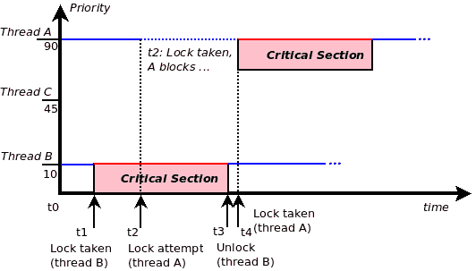

图 12：互斥锁定：正常情况

然而，也存在潜在的不良情况！继续阅读。

# 简要介绍看门狗定时器

看门狗是一种用于定期检测系统是否处于健康状态的机制，如果被认为不是，就会重新启动系统。这是通过设置（内核）定时器（比如，60 秒超时）来实现的。如果一切正常，看门狗守护进程（守护进程只是系统后台进程）将始终取消定时器（在其到期之前，当然），然后重新启用它；这被称为**抚摸狗**。如果守护进程没有这样做（由于某些事情出了大问题），看门狗就会生气并重新启动系统！纯软件看门狗实现将无法防止内核错误和故障；硬件看门狗（它连接到板复位电路）将始终能够在需要时重新启动系统。

通常，嵌入式应用的高优先级线程被设计为在其中必须完成一些工作的非常真实的截止日期；否则，系统被认为已经失败。人们不禁想，如果操作系统本身在运行时由于不幸的错误而崩溃或挂起（恐慌）会怎么样？然后应用线程就无法继续；我们需要一种方法来检测并摆脱这种困境。嵌入式设计人员经常利用**看门狗定时器**（**WDT**）硬件电路（以及相关的设备驱动程序）来精确实现这一点。如果系统或关键线程未能在截止日期前完成其工作（未能喂狗），系统将重新启动。

所以，回到我们的场景。假设我们对线程 A 的截止日期为 100 毫秒；在你的脑海中重复前面的锁定场景，但有一个区别（参考*图 13*：）：

+   **线程 B**（低优先级线程）在时间**t1**获得互斥锁。

+   **线程 A**也在时间**t2**请求互斥锁（但必须等待线程 B 的解锁）。

+   在线程 B 完成关键部分之前，另一个中等优先级的线程 C（在同一 CPU 核心上运行，并且优先级为 45）醒来了！它会立即抢占线程 B，因为它的优先级更高（请记住，可运行的最高优先级线程必须是正在运行的线程）。

+   现在，在线程 C 离开 CPU 之前，线程 B 无法完成关键部分，因此无法执行解锁。

+   这反过来会显著延迟线程 A，它正在等待线程 B 尚未发生的解锁：

+   然而，线程 B 已被线程 C 抢占，因此无法执行解锁。

+   如果解锁的时间超过了线程 A 的截止日期（在时间**t4**）会怎么样？

+   然后看门狗定时器将会过期，强制系统重新启动：

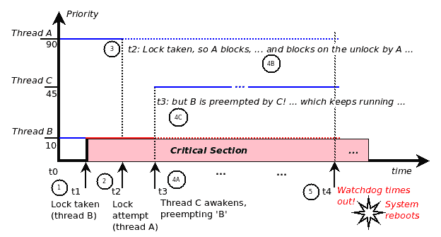

图 13：优先级反转

有趣而不幸的是；你是否注意到最高优先级的线程（A）实际上被迫等待系统中优先级最低的线程（B）？这种现象实际上是一种已记录的软件风险，正式称为优先级反转。

不仅如此，想象一下，如果在线程 B 处于其关键部分（因此持有锁）时，有几个中等优先级的线程醒来会发生什么？线程 A 的潜在等待时间现在可能会变得非常长；这种情况被称为无界优先级反转。

# 火星探路者任务简介

非常有趣的是，这种精确的优先级反转场景在一个真正超凡脱俗的环境中发生了：在火星表面！美国宇航局成功地在 1997 年 7 月 4 日将一艘机器人飞船（探路者着陆器）降落在火星表面；然后它继续卸载并部署了一个更小的机器人——Sojourner Rover——到表面上。然而，控制器发现着陆器遇到了问题——每隔一段时间就会重新启动。对实时遥测数据的详细分析最终揭示了潜在问题——是软件，它遇到了优先级反转问题！值得赞扬的是，美国宇航局的**喷气推进实验室**（**JPL**）团队，以及 Wind River 公司的工程师，他们为美国宇航局提供了定制的 VxWorks RTOS，他们从地球上诊断和调试了这种情况，确定了根本原因是优先级反转问题，修复了它，上传了新的固件到探路者，一切都正常运行了：


图 14：火星探路者着陆器的照片

当微软工程师迈克·琼斯在 IEEE 实时研讨会上写了一封有趣的电子邮件，讲述了 NASA 的 Pathfinder 任务发生了什么事情时，这一消息以病毒式传播。这封电子邮件最终得到了 NASA 的 JPL 团队负责人格伦·里夫斯的详细回复，题为《火星上到底发生了什么？》。这和后续文章中捕捉到了许多有趣的见解。在我看来，所有软件工程师都应该读一读这些文章！（在 GitHub 存储库的*进一步阅读*部分查找提供的链接，标题为火星 Pathfinder 和优先级倒置。）

Glenn Reeves 强调了一些重要的教训和他们能够重现和解决问题的原因，其中之一是：我们坚信测试你所飞行的东西，飞行你所测试的哲学。实际上，由于设计决策将相关的详细诊断和调试信息保留在跟踪/日志环形缓冲区中，这些信息可以随意转储（并发送到地球），他们能够调试手头的根本问题。

# 优先级继承-避免优先级倒置

好的；但是如何解决优先级倒置这样的问题呢？有趣的是，这是一个已知的风险，互斥锁的设计包括了一个内置的解决方案。关于帮助解决优先级倒置问题的互斥锁属性存在两个——优先级继承（PI）和优先级上限。

PI 是一个有趣的解决方案。想想看，关键问题是操作系统调度线程的方式。在操作系统（尤其是在实时操作系统上），实时线程的调度——决定谁运行——基本上与竞争线程的优先级成正比：你的优先级越高，你运行的机会就越大。所以，让我们快速重新看一下我们之前的场景示例。回想一下，我们有这三个不同优先级的线程：

+   线程 A：高优先级，90

+   线程 B：低优先级，10

+   线程 C：中等优先级，45

优先级倒置发生在线程 B 长时间持有互斥锁时，从而迫使线程 A 在解锁时可能要等待太久（超过截止日期）。所以，想想这个：如果线程 B 一抓住互斥锁，我们就把它的优先级提高到系统上等待相同互斥锁的最高优先级线程的优先级。然后，当然，线程 B 将获得优先级 90，因此不能被抢占（无论是被线程 C 还是其他任何线程）！这确保了它快速完成临界区并解锁互斥锁；一旦解锁，它就会恢复到原来的优先级。这解决了问题；这种方法被称为 PI。

pthreads API 集提供了一对 API 来查询和设置协议互斥锁属性，你可以利用 PI：

```
int pthread_mutexattr_getprotocol(const pthread_mutexattr_t
     *restrict attr, int *restrict protocol);
int pthread_mutexattr_setprotocol(pthread_mutexattr_t *attr,
     int protocol);
```

协议参数可以取以下值之一：PTHREAD_PRIO_INHERIT，

PTHREAD_PRIO_NONE，或 PTHREAD_PRIO_PROTECT（默认为 PTHREAD_PRIO_NONE）。当互斥锁具有 INHERIT 或 PROTECT 协议之一时，其所有者线程在调度优先级方面会受到影响。

对于使用 PTHREAD_PRIO_INHERIT 协议初始化的任何互斥锁，持有锁（拥有它）的线程将继承任何线程的最高优先级（因此以该优先级执行），这些线程在任何使用此协议的互斥锁（鲁棒或非鲁棒）上阻塞（等待）。

对于使用 PTHREAD_PRIO_PROTECT 协议初始化的任何互斥锁，持有锁（拥有它）的线程将继承任何使用此协议的线程的最高优先级上限（因此以该优先级执行），无论它们当前是否在任何这些互斥锁（鲁棒或非鲁棒）上阻塞（等待）。

如果一个线程使用了使用不同协议初始化的互斥锁，它将以它们中定义的最高优先级执行。

在“开拓者”任务中，RTOS 使用的是著名的 VxWorks，由风河公司提供。互斥锁（或信号量）肯定具有 PI 属性；只是 JPL 软件团队忘记打开互斥锁的 PI 属性，导致了优先级反转问题！（实际上，软件团队对此非常清楚，并在几个地方使用了它，但没有在发生问题的地方使用 —— 这就是墨菲定律在起作用！）

此外，开发人员可以利用优先级上限——这是所有者线程执行临界区代码的最低优先级。因此，通过能够指定这一点，可以确保它具有足够高的值，以确保所有者线程在临界区时不会被抢占。Pthreads `pthread_mutexattr_getprioceiling(3)` 和 `pthread_mutexattr_setprioceiling(3)` API 可以用于查询和设置互斥锁的优先级上限属性。（它必须在有效的 SCHED_FIFO 优先级范围内，通常在 Linux 平台上为 1 到 99）。

再次强调，在实践中，使用优先级继承和上限属性存在一些挑战，主要是性能开销：

+   更重的任务/上下文切换可能会导致

+   优先级传播会增加开销

+   有许多线程和许多锁时，会有性能开销，同时也会有死锁的潜在风险

# 互斥属性使用摘要

实际上，如果您想彻底测试和调试您的应用程序，并且现在并不真的关心性能，那么请设置您的互斥锁如下：

+   在其上设置 robust 属性（允许捕获所有者死亡而不解锁的情况）：`pthread_mutexattr_setrobust(&attr, PTHREAD_MUTEX_ROBUST)`

+   将类型设置为错误检查（允许捕获自死锁/重新锁定的情况）：

`pthread_mutexattr_settype(&attr, PTHREAD_MUTEX_ERRORCHECK)`

另一方面，一个设计良好且经过验证的应用程序，需要您挤出性能，将使用正常（默认）的互斥锁类型和属性。前面的情况不会被捕捉到（而是导致未定义的行为），但是它们本来就不应该发生！

如果需要递归锁定，（显然）将互斥锁类型设置为 PTHREAD_MUTEX_RECURSIVE。对于递归互斥锁，重要的是要意识到，如果互斥锁被锁定 `n` 次，则为了被认为真正处于解锁状态（因此可以再次锁定），它也必须被解锁 `n` 次。

在多进程和多线程应用程序中，如果需要在不同进程的线程之间使用互斥锁，可以通过互斥对象的进程共享属性来实现。请注意，在这种情况下，包含互斥锁的内存本身必须在进程之间共享（通常使用共享内存段）。

PI 和优先级上限属性使开发人员能够保护应用程序免受众所周知的软件风险：优先级反转。

# 互斥锁定 - 附加变体

本节帮助理解互斥锁的附加变体，稍微不同的语义。我们将涵盖超时互斥锁变体、"忙等待"用例和读者-写者锁。

# 争取互斥锁超时

在前面的“锁定指南”部分中，在防止饥饿的标签下，我们了解到长时间持有互斥锁会导致性能问题；显然，失败的线程会饿死。避免这个问题的一种方法（尽管，当然，修复任何饥饿的根本原因才是重要的！）是让失败的线程等待一定时间后再等待互斥锁；如果等待时间超过一定时间，就放弃。这正是 `pthread_mutex_timedlock(3)` API 提供的功能：

```
#include <pthread.h>
#include <time.h>
int pthread_mutex_timedlock(pthread_mutex_t *restrict mutex,
        const struct timespec *restrict abstime);
```

很明显：所有锁定语义与通常的`pthread_mutex_lock(3)`一样，只是如果在锁上花费的阻塞时间（等待）超过第二个参数——作为绝对值指定的时间，API 返回失败——返回的值将是`ETIMEDOUT`。（我们已经在第十三章中详细编程了超时，*定时器*。）

请注意，其他错误返回值也是可能的（例如，对于先前所有者终止的鲁棒互斥锁，可能返回`EOWNERDEAD`，对于检查错误的互斥锁检测到死锁，等等）。有关详细信息，请参阅`pthread_mutex_timedlock(3)`的手册页。

# 忙等待（非阻塞变体）锁

我们知道互斥锁的正常工作方式：如果锁已经被锁定，那么尝试获取锁将导致该线程阻塞（等待）解锁事件发生。如果有人想要一个设计，大致如下：如果锁已被锁定，不要让我等待；我会做一些其他工作然后重试？这种语义通常被称为忙等待或非阻塞，并由 trylock 变体提供。顾名思义，我们尝试获取锁，如果成功，很好；如果没有，没关系——我们不会强迫线程等待。锁可以被进程内的任何线程（甚至是外部线程，如果它是进程共享的互斥锁）获取，包括相同的线程——如果它被标记为递归。但是等等；如果互斥锁确实是递归锁，那么获取它将立即成功，并且调用将立即返回。

其 API 如下：

`int pthread_mutex_trylock(pthread_mutex_t *mutex);`。

虽然这种忙等待语义偶尔会很有用——具体来说，它用于检测和防止某些类型的死锁——但在使用时要小心。想一想：对于一个轻度争用的锁（很少被使用的锁，在这种情况下，尝试获取锁的线程很可能会立即获得锁），使用这种忙等待语义可能是有用的。但对于一个严重争用的锁（在热代码路径上的锁，经常被获取和释放），这实际上可能会损害获得锁的机会！为什么？因为你不愿意等待它。（有时软件模仿生活，是吧？）

# 读者-写者互斥锁

想象一个多线程应用程序，有十个工作线程；假设大部分时间（比如 90%的时间），八个工作线程都在忙于扫描全局链表（或类似的数据结构）。现在，当然，由于它是全局的，我们知道它是一个临界区；如果没有用互斥锁保护它，很容易导致脏读错误。但是，这会带来很大的性能成本：因为每个工作线程都想要搜索列表，它被迫等待来自所有者的解锁事件。

计算机科学家已经提出了一种创新的替代方案，用于这种情况（也称为读者-写者问题），其中数据访问的大部分时间（共享）数据只被读取而不被写入。我们使用了一种特殊的互斥锁变体，称为读者-写者锁：

```
int pthread_rwlock_rdlock(pthread_rwlock_t *rwlock);
int pthread_rwlock_tryrdlock(pthread_rwlock_t *rwlock);
int pthread_rwlock_wrlock(pthread_rwlock_t *rwlock);
```

请注意，这是一种全新的锁类型：`pthread_wrlock_t`。

如果一个线程为自己获取了读锁，关键点在于：实现现在信任这个线程只会读取而不会写入；因此，不会进行实际的锁定，API 将直接返回成功！这样，读者实际上是并行运行的，从而保持了性能；没有安全问题或竞争，因为他们保证只会读取。

然而，一旦一个线程希望写入数据，它必须获得写锁：当这发生时，正常的锁定语义适用。写入线程现在必须等待所有读者执行解锁，然后写入者获得写锁并继续。在临界区内，没有线程——读者也不是写者——能够干预；它们将像通常一样阻塞（等待）写入者的解锁。因此，现在两种情况都得到了优化。

通常的嫌疑犯——用于设置读写互斥锁属性的 API 存在（按字母顺序排列）：

+   `pthread_rwlockattr_destroy(3P)`

+   `pthread_rwlockattr_getpshared(3P)`

+   `pthread_rwlockattr_setkind_np(3P)`

+   `pthread_rwlockattr_getkind_np(3P)`

+   `pthread_rwlockattr_init(3P)`

+   `pthread_rwlockattr_setpshared(3P)`

请注意，以`_np`结尾的 API 意味着它们是非便携的，仅适用于 Linux。

同样，读写锁定的 API 遵循通常的模式——超时和尝试变体也存在。

+   `pthread_rwlock_destroy(3P)`

+   `pthread_rwlock_init(3P)`

+   `pthread_rwlock_timedrdlock(3P)`

+   `pthread_rwlock_tryrdlock(3P)`

+   `pthread_rwlock_unlock(3P)`

+   `pthread_rwlock_rdlock(3P)`

+   `pthread_rwlock_timedwrlock(3P)`

+   `pthread_rwlock_trywrlock(3P)`

+   `pthread_rwlock_wrlock(3P)`

我们期望程序员按照正常的方式设置——初始化读写锁属性对象，初始化读写锁本身（使用`pthread_rwlock_init(3P)`），在完成后销毁属性结构，然后根据需要执行实际的锁定。

请注意，当使用读写锁时，应该仔细测试性能；已经注意到它比通常的互斥锁实现要慢。此外，还有一个额外的担忧，在负载下，读写锁的语义可能导致写入者饥饿。想象一下：如果读者不断出现，写入线程可能要等很长时间才能获得锁。

显然，使用读写锁也可能出现相反的动态：读者可能被饥饿。有趣的是，Linux 提供了一个非便携的 API，允许程序员指定要防止哪种类型的饥饿——读者还是写者，其中默认是写者被饥饿。调用此 API 进行设置的方法是`pthread_rwlockattr_setkind_np(3)`。这允许根据特定的工作负载进行一定程度的调整。（然而，实现显然仍然存在一个 bug，实际上，写者饥饿仍然是现实。我们不打算进一步讨论这一点；如有需要，读者可以参考手册页以获得进一步的帮助。）

然而，读写锁变体通常是有用的；想想那些经常需要扫描某些键值映射数据结构并执行某种表查找的应用程序。（例如，操作系统经常有网络代码路径经常查找路由表但很少更新它。）不变的是，所讨论的全局共享数据通常被读取，但很少被写入。

# 自旋锁变体

这里有一点重复：我们已经了解了互斥锁的正常工作方式；如果锁已经被锁定，那么尝试获取锁将导致该线程阻塞（等待解锁）。让我们深入一点；失败的线程究竟如何阻塞——等待——互斥锁的解锁？答案是，对于互斥锁，它们通过睡眠（被操作系统调度下 CPU）来实现。事实上，这是互斥锁的一个定义属性。

另一方面，还存在一种完全不同的锁——spinlock（在 Linux 内核中非常常用），其行为恰恰相反：它通过让失败的线程等待解锁操作来工作（旋转/轮询）——实际上，实际的 spinlock 实现要比这里描述的更加精细和高效；不过，这个讨论已经超出了本书的范围。乍一看，轮询似乎是让失败的线程等待解锁的一种不好的方式；它能够与 spinlock 很好地配合工作的原因在于临界区内所需的时间保证非常短（从技术上讲，小于执行两次上下文切换所需的时间），因此在临界区很小的情况下，使用 spinlock 比互斥锁更加高效。

尽管 pthread 实现确实提供了自旋锁，但应明确以下几点：

+   自旋锁只应该由使用实时操作系统调度策略（SCHED_FIFO，可能还有 SCHED_RR；我们在第十七章中讨论这些，*Linux 上的 CPU 调度*）的极端性能实时线程使用。

+   Linux 平台上的默认调度策略从不是实时的；它是非实时的 SCHED_OTHER 策略，非常适合非确定性应用程序；使用互斥锁是正确的方法。

+   在用户空间使用自旋锁不被认为是正确的设计方法；此外，代码将更容易受到死锁和（无限）优先级反转的影响。

出于上述原因，我们不深入研究以下 pthread spinlock API：

+   `pthread_spin_init(3)`

+   `pthread_spin_lock(3)`

+   `pthread_spin_trylock(3)`

+   `pthread_spin_unlock(3)`

+   `pthread_spin_destroy(3)`

如果需要，确保在各自的手册页中查找它们（但在使用时要格外小心！）。

# 一些互斥锁使用指南

除了之前提供的提示和指南（参考*锁定指南*部分）之外，也要考虑这一点：

+   应该使用多少个锁？

+   有了许多锁实例，如何知道何时使用哪个锁变量？

+   测试互斥锁是否被锁定。

我们逐一来看这些要点。

在小型应用程序中（如此处所示的类型），也许只使用一个锁来保护临界区就足够了；这样做的好处是保持简单（这很重要）。然而，在大型项目中，只使用一个锁来对可能遇到的每个临界区进行锁定可能会成为一个主要的性能瓶颈！思考一下为什么会这样：一旦代码中的任何地方遇到一个互斥锁，所有的并行性都会停止，代码将以串行方式运行；如果这种情况经常发生，性能将迅速下降。

有趣的是，Linux 内核多年来一直因为在代码库的大部分区域中使用了一把锁而导致了严重的性能问题——以至于它被昵称为**大内核锁**（**BKL**）（一个巨大的锁）。它最终在 Linux 内核的 2.6.39 版本中才被彻底摆脱（在 GitHub 存储库的*进一步阅读*部分中有关于 BKL 的更多链接）。

因此，虽然没有规则可以准确决定应该使用多少个锁，但启发式方法是考虑简单性与性能之间的权衡。在大型生产质量项目（如 Linux 内核）中，我们经常使用单个锁来保护单个数据——数据对象；通常，这是一种数据结构。这将确保在访问时保护全局数据，但只有实际访问它的代码路径，从而确保数据安全和并行性（性能）。

好的。现在，如果我们遵循这个指南，如果最终有几百个锁怎么办？（是的，在有几百个全局数据结构的大型项目中，这是完全可能的。）现在，我们有另一个实际问题：开发人员必须确保他们使用正确的锁来保护给定的数据结构（使用为数据结构 X 设计的锁 X 来访问数据结构 Y 有什么用呢？那将是一个严重的缺陷）。因此，一个实际的问题是我怎么确定哪个数据结构由哪个锁保护，或者另一种陈述方式是：我怎么确定哪个锁变量确实保护哪个数据结构？天真的解决方案是适当地命名每个锁，也许像`lock_<DataStructureName>`这样。嗯，这并不像看起来那么简单！

非正式的调查显示，程序员经常做的最困难的事情之一是变量命名！（请参阅 GitHub 存储库上的*进一步阅读*部分，以获取相关链接。）

因此，这里有一个提示：将保护给定数据结构的锁嵌入到数据结构本身中；换句话说，将其作为保护它的数据结构的成员！（再次，Linux 内核经常使用这种方法。）

# 互斥锁被锁定了吗？

在某些情况下，开发人员可能会想问：给定一个互斥锁，我能否找出它是锁定还是未锁定状态？也许推理是：如果锁定了，让我们解锁它。

有一种方法可以测试这个问题：使用`pthread_mutex_trylock(3)`API。如果它返回`EBUSY`，这意味着互斥锁当前被锁定（否则，它应该返回`0`，表示它是未锁定的）。但等等！这里存在一个固有的竞争条件；想一想：

```
if (pthread_mutex_trylock(&mylock) != EBUSY)) {    <-- time t1
    // it's unlocked                               <-- time t2
}
// it's locked
```

当我们到达时间 t2 时，没有保证另一个线程现在没有锁定该互斥锁！因此，这种方法是不正确的。（这种同步的唯一现实方法是放弃使用互斥锁，而是使用条件变量；这是我们在下一节中讨论的内容。）

这结束了我们对互斥锁的（相当长的）覆盖。在我们结束之前，我们想指出另一个有趣的地方：我们之前说过，原子意味着能够完整地运行临界代码段而不被中断。但现实是，我们的现代系统确实经常中断我们——硬件中断和异常是常态！因此，人们应该意识到：

+   在用户空间中，由于无法屏蔽硬件中断，进程和线程随时可能因此而中断。因此，使用用户空间代码实际上不可能真正地原子化。（但如果我们被硬件中断/故障/异常中断，那又怎样呢？它们会执行它们的工作并迅速将控制权交还给我们。我们几乎不可能与这些代码实体共享全局可写数据而发生竞争。）

+   在内核空间中，我们以操作系统特权运行，实际上可以屏蔽甚至硬件中断，从而使我们能够以真正的原子方式运行（你认为著名的 Linux 内核自旋锁是如何工作的？）。

现在我们已经介绍了用于锁定的典型 API，我们鼓励读者一方面以实际操作的方式尝试示例；另一方面，重新访问之前涵盖的部分，*锁定指南*和*死锁*。

# 条件变量

CV 是一种线程间的事件通知机制。在我们使用互斥锁来同步（串行化）对临界区的访问，从而保护它时，我们使用条件变量来促进有效的通信——根据数据项的值来同步进程的线程之间的通信。以下讨论将使这一点更清晰。

在多线程应用程序的设计和实现中，经常会面临这种情况：一个线程 B 正在执行一些工作，另一个线程 A 正在等待该工作的完成。只有当线程 B 完成工作时，线程 A 才能继续；我们如何在代码中高效地实现这一点？

# 没有 CV - 幼稚的方法

我们可能会记得线程的退出状态（通过`pthread_exit(3)`）会传递回调用`pthread_join(3)`的线程；我们能利用这个特性吗？好吧，不行：首先，并不一定线程 B 一旦指定的工作完成就会终止（它可能只是一个里程碑，而不是它要执行的所有工作），其次，即使它终止了，也许除了调用`pthread_join(3)`的线程之外，可能还有其他线程需要知道。

好吧，为什么不让线程 A 通过简单的技术来轮询完成工作，即当工作完成时，线程 B 将一个全局整数（称为`gWorkDone`）设置为 1（当然线程 A 会轮询它），也许就像伪代码中的以下内容：

| **时间** | **线程 B** | **线程 A** |
| --- | --- | --- |
| t0 | 初始化：`gWorkDone = 0` |  <通用> |
| t1 | 执行工作... | `while (!gWorkDone) ;` |
| t2 | ... | ... |
| t3 | 工作完成；`gWorkDone = 1` | ... |
| t4 |  | 检测到；跳出循环并继续 |

它可能有效，但实际上并不是。为什么呢？：

+   首先，对变量进行无限期的轮询在 CPU 方面非常昂贵（而且设计不好）。

+   其次，注意我们在没有保护的情况下操作共享可写全局变量；这正是引入数据竞争和 bug 的方法。

因此，前表中显示的方法被认为是幼稚、低效甚至可能有 bug（竞争条件）。

# 使用条件变量

正确的方法是使用 CV。条件变量是线程以高效的方式同步数据值的一种方式。它实现了与幼稚的轮询方法相同的最终结果，但以一种更高效、更重要的正确方式。

查看以下表格：

| **时间** | **线程 B** | **线程 A** |
| --- | --- | --- |
| t0 | 初始化：gWorkDone = 0；初始化{CV，互斥锁}对 |  <通用> |
| t1 |  | 等待来自线程 B 的信号：锁定相关的互斥锁；`pthread_cond_wait()` |
| t2 | 执行工作... |  <...阻塞...> |
| t3 | 工作完成；锁定相关的互斥锁；向线程 A 发出信号：`pthread_cond_signal()`；解锁相关的互斥锁 | ... |
| t4 |  | 解除阻塞；检查工作是否真的完成，如果是，解锁相关的互斥锁，然后继续... |

尽管前表显示了步骤的顺序，但需要一些解释。在幼稚的方法中，我们看到一个（严重的）缺点是全局共享数据变量在没有保护的情况下被操纵！条件变量通过要求条件变量始终与互斥锁相关联来解决了这个问题；我们可以将其视为**{CV，互斥锁}对**。

这个想法很简单：每当我们打算使用全局谓词来告诉我们工作是否已经完成（在我们的例子中是`gWorkDone`），我们会锁定互斥锁，读/写全局变量，解锁互斥锁，从而重要的是保护它。

CV 的美妙之处在于我们根本不需要轮询：等待工作完成的线程使用`pthread_cond_wait(3)`来阻塞（等待）事件发生，完成工作的线程通过`pthread_cond_signal(3)`API 向其对应的线程发出“信号”：

```
int pthread_cond_wait(pthread_cond_t *restrict cond,
                      pthread_mutex_t *restrict mutex);
int pthread_cond_signal(pthread_cond_t *cond);
```

尽管我们在这里使用了“信号”这个词，但这与我们在之前的第十一章和第十二章中讨论的 Unix/Linux 信号和信号毫无关系。

（注意{CV，mutex}对是如何一起使用的）。当然，就像线程一样，我们必须首先初始化 CV 及其关联的互斥锁；CV 可以通过静态方式进行初始化：

`pthread_cond_t cond = PTHREAD_COND_INITIALIZER; `

或者在运行时动态地通过以下 API 进行初始化：

```
int pthread_cond_init(pthread_cond_t *restrict cond,
                          const pthread_condattr_t *restrict attr);
```

如果需要设置 CV 的特定非默认属性，可以通过`pthread_condattr_set*(3P)`API 来设置，或者通过首先调用`pthread_condattr_init(3P)`API 并将初始化的 CV 属性对象作为第二个参数传递给`pthread_cond_init(3P)`来将 CV 设置为默认值：

`int pthread_condattr_init(pthread_condattr_t *attr);`

相反，当完成时，使用以下 API 来销毁 CV 属性对象和 CV 本身：

```
int pthread_condattr_destroy(pthread_condattr_t *attr);
int pthread_cond_destroy(pthread_cond_t *cond);
```

# 一个简单的 CV 使用演示应用程序

太多的初始化/销毁？查看下面的简单代码（`ch15/cv_simple.c`）将澄清它们的用法；我们编写一个小程序来演示条件变量及其关联互斥锁的用法。在这里，我们创建两个线程 A 和 B。然后，线程 B 执行一些工作，线程 A 在完成该工作后使用{CV，mutex}对进行同步：

为了便于阅读，只显示了源代码的关键部分；要查看完整的源代码，请构建并运行它。整个树可以从 GitHub 克隆到这里：[`github.com/PacktPublishing/Hands-on-System-Programming-with-Linux`](https://github.com/PacktPublishing/Hands-on-System-Programming-with-Linux)。

```
...
#define LOCK_MTX(mtx) do { \
  int ret=0; \
  if ((ret = pthread_mutex_lock(mtx))) \
    FATAL("pthread_mutex_lock failed! [%d]\n", ret); \
} while(0)

#define UNLOCK_MTX(mtx) do { \
  int ret=0; \
  if ((ret = pthread_mutex_unlock(mtx))) \
    FATAL("pthread_mutex_unlock failed! [%d]\n", ret); \
} while(0)

static int gWorkDone=0;
/* The {cv,mutex} pair */
static pthread_cond_t mycv;
static pthread_mutex_t mycv_mutex = PTHREAD_MUTEX_INITIALIZER;
```

在前面的代码中，我们再次显示了实现互斥锁和解锁的宏，全局谓词（布尔）变量`gWorkDone`，当然还有{CV，mutex}对变量。

在下面的代码中，在 main 函数中，我们初始化了 CV 属性对象和 CV 本身：

```
// Init a condition variable attribute object
  if ((ret = pthread_condattr_init(&cvattr)))
      FATAL("pthread_condattr_init failed [%d].\n", ret);
  // Init a {cv,mutex} pair: condition variable & it's associated mutex
  if ((ret = pthread_cond_init(&mycv, &cvattr)))
      FATAL("pthread_cond_init failed [%d].\n", ret);
  // the mutex lock has been statically initialized above.
```

工作线程 A 和 B 被创建并开始他们的工作（我们这里不重复显示线程创建的代码）。在这里，你会找到线程 A 的工作例程 - 它必须等待直到线程 B 完成工作。我们使用{CV，mutex}对来轻松高效地实现这一点。

然而，该库要求应用程序在调用`pthread_cond_wait(3P)`API 之前保证关联的互斥锁被获取（锁定）；否则，这将导致未定义的行为（或者当互斥锁类型为`PTHREAD_MUTEX_ERRORCHECK`或者鲁棒互斥锁时会导致实际失败）。一旦线程在 CV 上阻塞，互斥锁会自动释放。

此外，如果在线程在等待条件上阻塞时传递了信号，它将被处理并且等待将会恢复；这也可能导致虚假唤醒的返回值为零（稍后会详细介绍）：

```
static void * workerA(void *msg)
{
  int ret=0;

  LOCK_MTX(&mycv_mutex);
  while (1) {
      printf(" [thread A] : now waiting on the CV for thread B to finish...\n");
      ret = pthread_cond_wait(&mycv, &mycv_mutex);
      // Blocking: associated mutex auto-released ...
      if (ret)
          FATAL("pthread_cond_wait() in thread A failed! [%d]\n", ret);
      // Unblocked: associated mutex auto-acquired upon release from the condition wait...

      printf(" [thread A] : recheck the predicate (is the work really "
 "done or is it a spurious wakeup?)\n");
 if (gWorkDone)
 break;
      printf(" [thread A] : SPURIOUS WAKEUP detected !!! "
             "(going back to CV waiting)\n");
  }
 UNLOCK_MTX(&mycv_mutex);
  printf(" [thread A] : (cv wait done) thread B has completed it's work...\n");
  pthread_exit((void *)0);
}
```

非常重要的是要理解：仅仅从`pthread_cond_wait(3P)`返回并不一定意味着我们等待（阻塞）的条件 - 在这种情况下，线程 B 完成工作 - 实际发生了！在软件中，可能会发生虚假唤醒（由于其他事件 - 也许是信号而导致的虚假唤醒）；健壮的软件将会在循环中重新检查条件，以确定我们被唤醒的原因是正确的 - 在我们这里，工作确实已经完成。这就是为什么我们在一个无限循环中运行，并且一旦从`pthread_cond_wait(3P)`中解除阻塞，就会检查全局整数`gWorkDone`是否确实具有我们期望的值（在这种情况下为 1，表示工作已经完成）。

好吧，但也要考虑这一点：即使是读取共享全局变量也会成为一个临界区（否则会导致脏读）；因此，在这之前我们需要获取互斥锁。啊，这就是{CV，mutex}对的一个内置自动机制，真的帮助了我们——一旦调用`pthread_cond_wait(3P)`，关联的互斥锁会自动原子释放（解锁），然后我们会阻塞在条件变量信号上。当另一个线程（这里是 B）向我们发出信号（显然是在同一个 CV 上），我们就会从`pthread_cond_wait(3P)`中解除阻塞，并且关联的互斥锁会自动原子锁定，允许我们重新检查全局变量（或其他内容）。所以，我们完成工作然后解锁它。

这是线程 B 的工作例程的代码，它执行一些示例工作然后向线程 A 发出信号：

```
static void * workerB(void *msg)
{
  int ret=0;

  printf(" [thread B] : perform the 'work' now (first sleep(1) :-)) ...\n");
  sleep(1);
  DELAY_LOOP('b', 72);
  gWorkDone = 1;

  printf("\n [thread B] : work done, signal thread A to continue ...\n");
  /* It's not strictly required to lock/unlock the associated mutex
   * while signalling; we do it here to be pedantically correct (and
   * to shut helgrind up).
   */
  LOCK_MTX(&mycv_mutex);
  ret = pthread_cond_signal(&mycv);
  if (ret)
      FATAL("pthread_cond_signal() in thread B failed! [%d]\n", ret);
  UNLOCK_MTX(&mycv_mutex);
  pthread_exit((void *)0);
}
```

注意注释详细说明了为什么我们在信号之前再次获取互斥锁。好的，让我们试一下（我们建议您构建和运行调试版本，因为这样延迟循环才能正确显示）：

```
$ ./cv_simple_dbg 
 [thread A] : now waiting on the CV for thread B to finish...
 [thread B] : perform the 'work' now (first sleep(1) :-)) ...
bbbbbbbbbbbbbbbbbbbbbbbbbbbbbbbbbbbbbbbbbbbbbbbbbbbbbbbbbbbbbbbbbbbbbbbb
 [thread B] : work done, signal thread A to continue ...
 [thread A] : recheck the predicate (is the work really done or is it a spurious wakeup?)
 [thread A] : (cv wait done) thread B has completed it's work...
$ 
```

API 还提供了阻塞调用的超时变体：

```
int pthread_cond_timedwait(pthread_cond_t *restrict cond,
    pthread_mutex_t *restrict mutex, const struct timespec *restrict abstime);
```

语义与`pthread_cond_wait`相同，只是如果第三个参数 abstime 中指定的时间已经过去，API 会返回（失败值为`ETIMEDOUT`）。用于测量经过的时间的时钟是 CV 的属性，并且可以通过`pthread_condattr_setclock(3P)`API 进行设置。

（`pthread_cond_wait`和`pthread_cond_timedwait`都是取消点；这个主题将在下一章中讨论。）

# CV 广播唤醒

正如我们之前看到的，`pthread_cond_signal(3P)` API 用于解除阻塞在特定 CV 上的线程。这个 API 的变体如下：

`int pthread_cond_broadcast(pthread_cond_t *cond);`

这个 API 允许你解除阻塞在同一个 CV 上的多个线程。例如，如果有三个线程在同一个 CV 上阻塞；当应用程序调用`pthread_cond_broadcast(3P)`时，哪个线程会首先运行？嗯，这就像问，当线程被创建时，哪一个会首先运行（回想一下前一章中的讨论）。答案当然是，在没有特定调度策略的情况下，这是不确定的。当应用到 CV 解除阻塞并在 CPU 上运行时，也是同样的答案。

继续，一旦等待的线程解除阻塞，要记住关联的互斥锁会被获取，但当然只有一个解除阻塞的线程会首先获取它。同样，这取决于调度策略和优先级。在所有默认情况下，无法确定哪个线程会首先获取它。无论如何，在没有实时特性的情况下，这对应用程序不应该有影响（如果应用程序是实时的，那么首先在每个应用程序线程上阅读我们的第十七章，*Linux 上的 CPU 调度*，并设置实时调度策略和优先级）。

此外，这些 API 的手册页面清楚地指出，尽管调用前面的 API（`pthread_cond_signal`和`pthread_cond_broadcast`）的线程在这样做时不需要持有关联的互斥锁（请记住，我们总是有{CV，mutex}对），但严谨的正确语义要求他们持有互斥锁，执行信号或广播，然后解锁互斥锁（我们的示例应用程序`ch15/cv_simple.c`遵循了这一准则）。

为了结束对 CV 的讨论，这里有一些建议：

+   不要在信号处理程序中使用条件变量方法；该代码不被认为是异步信号安全的（回想我们之前的第十一章，*信号-第一部分*和第十二章，*信号-第二部分*）。

+   使用众所周知的 Valgrind 套件（回想一下，我们在第六章中介绍了 Valgrind 的 Memcheck 工具，*内存问题的调试工具*），特别是名为 helgrind 的工具，有时可以检测到 pthread 多线程应用程序中的同步错误（数据竞争）。使用方法很简单：

`$ valgrind --tool=helgrind [-v] <app_name> [app-params ...]`：

+   然而，像这种类型的许多工具一样，helgrind 经常会引发许多错误警报。例如，我们发现在我们之前编写的`cv_simple`应用程序中消除`printf(3)`会消除 helgrind 中的许多（错误的）错误和警告！

+   在调用`pthread_cond_signal`和/或`pthread_cond_broadcast` API 之前，如果未首先获取相关的互斥锁（不是必需的），helgrind 会抱怨。

请尝试使用 helgrind（再次提醒，GitHub 存储库的*进一步阅读*部分有链接到其（非常好的）文档）。

# 摘要

我们开始本章时，重点关注并发性、原子性的关键概念，以及识别和保护关键部分的必要性。锁定是实现这一点的典型方式；pthread API 集提供了强大的互斥锁来实现。然而，在大型项目中使用锁定，尤其是隐藏的问题和危险，我们讨论了有用的*锁定指南*、*死锁*及其避免。

本章随后指导读者使用 pthread 互斥锁。这里涵盖了很多内容，包括各种互斥锁属性，识别和避免优先级反转问题的重要性，以及互斥锁的变化。最后，我们介绍了条件变量（CV）的需求和用法，以及如何有效地促进线程间事件通知。

下一章是这个关于多线程的三部曲的最后一章；在其中，我们将专注于线程安全的重要问题（和线程安全的 API），线程取消和清理，将信号与 MT 混合，一些常见问题和提示，并看看多进程与多线程模型的利弊。
