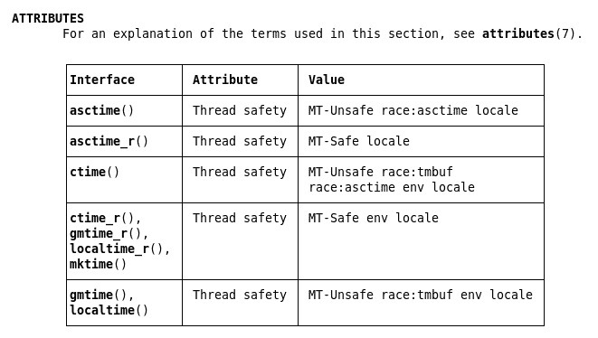
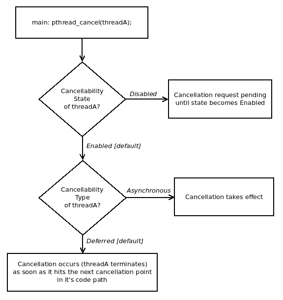

# 第十六章：Pthreads 多线程第三部分

在第十四章和第十五章中已经涵盖了编写强大的多线程（MT）应用程序的许多原因和方法，本章重点介绍了教授读者多线程编程的几个关键安全方面。

它为开发安全和健壮的 MT 应用程序的许多关键安全方面提供了一些启示；在这里，读者将了解线程安全性，为什么需要它以及如何使函数线程安全。在运行时，可能会有一个线程杀死另一个线程；这是通过线程取消机制实现的——与取消一起，如何确保在线程终止之前，首先确保它释放任何仍在持有的资源（如锁和动态内存）？线程清理处理程序用于展示这一点。

最后，本章深入探讨了如何安全地混合多线程和信号，多进程与多线程的一些优缺点，以及一些技巧和常见问题解答。

# 线程安全

在开发多线程应用程序时一个关键，但不幸的是经常不明显的问题是线程安全。一个*线程安全*，或者如 man 页面所指定的那样，MT-Safe 的函数或 API 是可以安全地由多个线程并行执行而没有不利影响的函数。

要理解这个线程安全问题实际上是什么，让我们回到我们在[附录 A](https://www.packtpub.com/sites/default/files/downloads/File_IO_Essentials.pdf)中看到的程序之一，*文件 I/O 基础知识*；您可以在书的 GitHub 存储库中找到源代码：[`github.com/PacktPublishing/Hands-on-System-Programming-with-Linux/blob/master/A_fileio/iobuf.c`](https://github.com/PacktPublishing/Hands-on-System-Programming-with-Linux/blob/master/A_fileio/iobuf.c)。在这个程序中，我们使用`fopen(3)`以附加模式打开文件，然后对其进行一些 I/O（读/写）；我们在这里复制了该章节的一小段：

+   我们通过`fopen(3)`在附加模式（`a`）中打开一个流到我们的目标，只是在`/tmp`目录中的一个常规文件（如果不存在，将创建它）

+   然后，在一个循环中，对用户提供的迭代次数，我们将执行以下操作：

+   通过`fread(3)`stdio 库 API 从源流中读取几个（512）字节（它们将是随机值）

+   通过`fwrite(3)`stdio 库 API 将这些值写入我们的目标流（检查 EOF 和/或错误条件）

这是代码片段，主要是`testit`函数执行实际的 I/O；参考：[`github.com/PacktPublishing/Hands-on-System-Programming-with-Linux/blob/master/A_fileio/iobuf.c`](https://github.com/PacktPublishing/Hands-on-System-Programming-with-Linux/blob/master/A_fileio/iobuf.c)：

```
static char *gbuf = NULL;

static void testit(FILE * wrstrm, FILE * rdstrm, int numio)
{
  int i, syscalls = NREAD*numio/getpagesize();
  size_t fnr=0;

  if (syscalls <= 0)
      syscalls = 1;
  VPRINT("numio=%d total rdwr=%u expected # rw syscalls=%d\n",
                 numio, NREAD*numio, NREAD*numio/getpagesize());

  for (i = 0; i < numio; i++) {
     fnr = fread(gbuf, 1, NREAD, rdstrm);
     if (!fnr)
         FATAL("fread on /dev/urandom failed\n");

     if (!fwrite(gbuf, 1, fnr, wrstrm)) {
         free(gbuf);
         if (feof(wrstrm))
             return;
         if (ferror(wrstrm))
             FATAL("fwrite on our file failed\n");
     }
  }
}
```

注意代码的第一行，它对我们的讨论非常重要；用于保存源和目标数据的内存缓冲区是一个全局（静态）变量，`gbuf`。

这是在应用程序的`main()`函数中分配的位置：

```
...
  gbuf = malloc(NREAD);
  if (!gbuf)
      FATAL("malloc %zu failed!\n", NREAD);
...
```

那又怎样？在《附录 A》*文件 I/O 基础*中，我们以隐含的假设为前提，即进程是单线程的；只要这个假设保持不变，程序就能正常工作。但仔细想想；一旦我们想要将这个程序移植成多线程能力，这段代码就不够好了。为什么？很明显：如果多个线程同时执行`testit`函数的代码（这正是预期的），全局共享的可写内存变量`gbuf`的存在告诉我们，在代码路径中会有临界区。正如我们在《第十五章》*使用 Pthreads 进行多线程 - 同步*中详细学到的，每个临界区必须要么被消除，要么被保护起来以防止数据竞争。

在前面的代码片段中，我们高兴地在这个全局缓冲区上调用了`fread(3)`和`fwrite(3)`，而没有任何保护。*想象一下多个线程同时运行这段代码路径；结果将是一片混乱。

所以，现在我们可以看到并得出结论，`testit`函数是不是线程安全的（至少，程序员必须记录这一事实，防止其他人在多线程应用中使用这段代码！）。

更糟糕的是，我们开发的前面的线程不安全函数被合并到一个共享库（在 Unix/Linux 上通常称为共享对象文件）中；任何链接到这个库的（多线程）应用程序都将可以访问这个函数。如果这样的应用程序的多个线程曾经调用它，我们就有了潜在的竞争 - 一个错误，一个缺陷！不仅如此，这样的缺陷是真正难以发现和理解的，会引起各种问题，也许还会有各种临时的应急措施（这只会让情况变得更糟，让客户对软件的信心更少）。灾难确实是以看似无辜的方式引起的。

我们的结论是，要么使函数线程安全，要么明确将其标记为线程不安全（如果有的话，只在单线程环境中使用）。

# 使代码线程安全

显然，我们希望使`testit`函数线程安全。现在问题变成了，我们究竟该如何做到呢？嗯，再次，这很简单：有两种方法（实际上不止两种，但我们稍后再讨论）。

如果我们能消除代码路径中的任何全局共享可写数据，我们将不会有临界区问题；换句话说，它将变得线程安全。因此，实现这一点的一种方法是确保函数只使用本地（自动）变量。该函数现在是可重入安全的。在进一步进行之前，了解一些关于可重入和线程安全的关键要点是很重要的。

# 可重入安全与线程安全

可重入安全究竟与线程安全有何不同？混淆确实存在。这里有一个简洁的解释：可重入安全是在多任务和多线程操作系统出现之前的一个问题，其含义是只有一个相关的线程在执行。为了使函数具有可重入安全性，它应该能够在上一个上下文尚未完成执行的情况下，从另一个上下文中被正确地重新调用（想象一个信号处理程序在已经执行的情况下重新调用给定的函数）。关键要求是：它应该只使用局部变量，或者具有保存和恢复它使用的全局变量的能力，以便它是安全的。（这些想法在《第十一章》*信号 - 第一部分*的*可重入安全和信号*部分中有详细讨论。正如我们在那一章中提到的，信号处理程序应该只调用那些保证是可重入安全的函数；在信号处理上下文中，这些函数被称为是异步信号安全的。）

另一方面，线程安全是一个更近期的问题-我们指的是支持多线程的现代操作系统。一个线程安全的函数可以在多个线程（可能在多个 CPU 核心上）同时并行调用，而不会破坏它。共享的可写数据是重要的，因为代码本身只能读取和执行，因此完全可以并行执行。

通过使用互斥锁使函数线程安全（这些讨论将详细介绍并举例说明）是可能的，但会引入性能问题。有更好的方法使函数线程安全：重构它，或者使用 TLS 或 TSD-我们将在“通过 TLS 实现线程安全”和“通过 TSD 实现线程安全”部分介绍这些方法。

简而言之，可重入安全关注的是一个线程在活动调用仍然存在时重新调用函数；线程安全关注的是多个线程-并发代码-同时执行相同的函数。 （一个优秀的 Stack Overflow 帖子更详细地描述了这一点，请参考 GitHub 存储库上的*进一步阅读*部分。）

现在，回到我们之前的讨论。理论上，只使用局部变量听起来不错（对于小型实用函数，我们应该设计成这样），但现实是，有些复杂的项目会以这样的方式发展，以至于在函数内部使用全局共享可写数据对象是无法避免的。在这种情况下，根据我们在之前的第十五章中学到的关于同步的知识，我们知道答案：识别和保护关键部分，使用互斥锁。

是的，那样可以，但会显著影响性能。请记住，锁会破坏并行性并使代码流程串行化，从而创建瓶颈。在不使用互斥锁的情况下实现线程安全才是真正构成可重入安全函数的关键。这样的代码确实是有用的，并且可以实现；有两种强大的技术可以实现这一点，称为 TLS 和 TSD。请稍作耐心，我们将在“通过 TLS 实现线程安全”和“通过 TSD 实现线程安全”部分介绍如何使用这些技术。

需要强调的一点是：设计师和程序员必须保证所有可以在任何时间点由多个线程执行的代码都被设计、实现、测试和记录为线程安全。这是设计和实现多线程应用程序时需要满足的关键挑战之一。

另一方面，如果可以保证一个函数始终只会被单个线程执行（例如在创建线程之前从 main()调用的早期初始化例程），那显然就不需要保证它是线程安全的。

# 总结表-使函数线程安全的方法

让我们总结前面的观点，以表格的形式告诉我们如何实现所有函数的重要目标-线程安全：

| **使函数线程安全的方法** | **评论** |
| --- | --- |
| 只使用局部变量 | 天真；在实践中难以实现。 |
| 使用全局和/或静态变量，并使用互斥锁保护关键部分 | 可行但可能会显著影响性能[1] |
| 重构函数，使其可重入安全-通过使用更多参数来消除函数中静态变量的使用 | 有用的方法-将几个旧的`foo` glibc 函数重构为`foo_r`。 |
| **线程本地存储**（**TLS**） | 通过每个线程拥有一个变量副本来确保线程安全；工具链和操作系统版本相关。非常强大且易于使用。 |
| **线程特定数据**（**TSD**） | 同样的目标：使数据线程安全-旧的实现，使用起来更麻烦。 |

表 1：使函数线程安全的方法

[1]虽然我们说使用互斥锁可能会显著影响性能，但在正常情况下，互斥锁的性能确实非常高（主要是因为在 Linux 上通过 futex-快速用户互斥锁进行内部实现）。

让我们更详细地查看这些方法。

第一种方法，只使用局部变量，是一个相当天真的方法，可能只适用于小型程序；我们就此打住。

# 通过互斥锁实现线程安全

考虑到函数确实使用全局和/或静态变量，并且决定继续使用它们（我们在*表 1*中提到的第二种方法），显然在代码中使用它们的地方构成了关键部分。正如第十五章“使用 Pthreads 进行多线程编程第二部分-同步”中详细展示的那样，我们必须保护这些关键部分；在这里，我们使用 pthread 的互斥锁来实现。

为了可读性，这里只显示了源代码的关键部分；要查看完整的源代码，构建并运行它，整个树都可以从 GitHub 克隆：[`github.com/PacktPublishing/Hands-on-System-Programming-with-Linux`](https://github.com/PacktPublishing/Hands-on-System-Programming-with-Linux)。

我们将这种方法应用于我们示例函数的 pthread 互斥锁的添加（我们适当地重命名它；在下面的片段中找到完整的源代码：`ch16/mt_iobuf_mtx.c`）：

```
static void testit_mt_mtx(FILE * wrstrm, FILE * rdstrm, int numio,
                             int thrdnum)
{
 ...
  for (i = 0; i < numio; i++) {
 LOCK_MTX(&mylock);
      fnr = fread(gbuf, 1, NREAD, rdstrm);
      UNLOCK_MTX(&mylock);
      if (!fnr)
          FATAL("fread on /dev/urandom failed\n");

 LOCK_MTX(&mylock);
      if (!fwrite(gbuf, 1, fnr, wrstrm)) {
          free(gbuf);
 UNLOCK_MTX(&mylock);
          if (feof(wrstrm))
              return;
          if (ferror(wrstrm))
              FATAL("fwrite on our file failed\n");
      }
 UNLOCK_MTX(&mylock);
   }
}
```

在这里，我们使用相同的宏来执行互斥锁和解锁，就像我们在（为了避免重复，我们不显示初始化互斥锁的代码，请参考第十五章“使用 Pthreads 进行多线程编程第二部分-同步”中的细节。我们还添加了一个额外的`thrdnum`参数到函数中，以便能够打印出当前正在运行的线程编号。）

关键点：在关键部分——我们访问（读取或写入）共享可写全局变量`gbuf`的代码部分——我们获取互斥锁，执行访问（在我们的情况下是`fread(3)`和`fwrite(3)`），然后释放互斥锁。

现在，即使多个线程运行前面的函数，也不会出现数据完整性问题。是的，它会工作，但会付出显著的性能代价；正如前面所述，每个关键部分（在`lock`和相应的`unlock`之间的代码）都将被序列化。因此，在代码路径中，锁定可能形成瓶颈，特别是如果，就像我们的示例一样，`numio`参数是一个大数，那么`for`循环将执行一段时间。类似地，如果函数是一个繁忙的函数并且经常被调用，那么也会产生瓶颈。（使用`perf(1)`进行快速检查，单线程版本执行 100,000 次 I/O 需要 379 毫秒，而带锁的多线程版本执行相同次数的 I/O 需要 790 毫秒。）

我们已经涵盖了这一点，但让我们快速测试一下自己：为什么我们没有保护使用变量`fnr`和`syscalls`的代码部分？答案是因为它是一个局部变量；更重要的是，当执行前面的函数时，每个线程都会获得自己的局部变量副本，因为每个线程都有自己的私有堆栈，局部变量是在堆栈上实例化的。

为了使程序工作，我们必须重构前面的函数如何实际设置为线程工作程序；我们发现需要使用自定义数据结构向每个线程传递各种参数，然后有一个小的`wrapper`函数—`wrapper_testit_mt_mtx()`—调用实际的 I/O 函数；我们留给读者详细查看源代码。

让我们运行它：

```
$ ./mt_iobuf_mtx 10000
./mt_iobuf_mtx: using default stdio IO RW buffers of size 4096 bytes; # IOs=10000
mt_iobuf_mtx.c:testit_mt_mtx:62: [Thread #0]: numio=10000   total rdwr=5120000   expected # rw syscalls=1250
mt_iobuf_mtx.c:testit_mt_mtx:66: gbuf = 0x23e2670
mt_iobuf_mtx.c:testit_mt_mtx:62: [Thread #1]: numio=10000   total rdwr=5120000   expected # rw syscalls=1250
mt_iobuf_mtx.c:testit_mt_mtx:66: gbuf = 0x23e2670
 Thread #0 successfully joined; it terminated with status=0
 Thread #1 successfully joined; it terminated with status=0
$ 
```

这揭示了全部情况；显然，正在使用的 I/O 缓冲区`gbuf`对于两个线程是相同的（看打印出的地址），因此需要对其进行锁定。

顺便说一下，在标准文件流 API 中存在（非标准）*_unlocked APIs，例如`fread_unlocked(3)`和`fwrite_unlocked(3)`。它们与常规 API 相同，只是在文档中明确标记为 MT-unsafe。不建议使用它们。

顺便说一下，打开的文件是进程的线程之间共享的资源；开发人员也必须考虑到这一点。在同一底层文件对象上同时使用多个线程进行 IO 可能会导致损坏，除非使用文件锁定技术。在这种特定情况下，我们明确使用互斥锁来保护临界区-这些临界区恰好是我们进行文件 I/O 的地方，因此显式文件锁定变得不必要。

# 通过函数重构实现线程安全

正如我们在前面的示例中看到的，我们需要互斥锁，因为`gbuf`全局缓冲区被所有应用程序线程用作它们的 I/O 缓冲区。因此，请考虑一下：如果我们可以为每个线程分配一个本地 I/O 缓冲区呢？那确实会解决问题！具体如何做将在下面的代码中展示。

但首先，现在您已经熟悉了之前的示例（我们在其中使用了互斥锁），请研究重构后程序的输出：

```
$ ./mt_iobuf_rfct 10000
./mt_iobuf_rfct: using default stdio IO RW buffers of size 4096 bytes; # IOs=10000
mt_iobuf_rfct.c:testit_mt_refactored:51: [Thread #0]: numio=10000   total rdwr=5120000   expected # rw syscalls=1250
 iobuf = 0x7f283c000b20
mt_iobuf_rfct.c:testit_mt_refactored:51: [Thread #1]: numio=10000   total rdwr=5120000   expected # rw syscalls=1250
 iobuf = 0x7f2834000b20
 Thread #0 successfully joined; it terminated with status=0
 Thread #1 successfully joined; it terminated with status=0
$ 
```

关键认识：这里使用的 I/O 缓冲区`iobuf`对于每个线程都是唯一的（只需查看打印出的地址）！因此，这消除了 I/O 函数中的临界区和使用互斥锁的需要。实际上，该函数仅使用本地变量，因此既可重入又线程安全。

为了可读性，这里只显示了源代码的关键部分。要查看完整的源代码，请构建并运行它；整个树可在 GitHub 上克隆：[`github.com/PacktPublishing/Hands-on-System-Programming-with-Linux`](https://github.com/PacktPublishing/Hands-on-System-Programming-with-Linux)。

以下代码片段清楚地显示了如何设置（完整源代码：`ch16/mt_iobuf_rfct.c`）：

```
struct stToThread {
    FILE *wrstrm, *rdstrm;
    int thrdnum, numio;
 char *iobuf;
};
static struct stToThread *ToThread[NTHREADS];
static void * wrapper_testit_mt_refactored(void *msg)
{
  struct stToThread *pstToThread = (struct stToThread *)msg;
  assert (pstToThread);

  /* Allocate the per-thread IO buffer here, thus avoiding the global
 * heap buffer completely! */
 pstToThread->iobuf = malloc(NREAD);
  ...
  testit_mt_refactored(pstToThread->wrstrm, pstToThread->rdstrm,
           pstToThread->numio, pstToThread->thrdnum,
           pstToThread->iobuf);

  free(pstToThread->iobuf);
  pthread_exit((void *)0);
}
```

可以看到，我们通过向自定义`stToThread`结构添加额外的缓冲区指针成员来进行重构。重要的部分是：在线程包装函数中，我们分配了内存并将指针传递给我们的线程例程。我们为此目的向我们的线程 I/O 例程添加了额外的参数：

```
static void testit_mt_refactored(FILE * wrstrm, FILE * rdstrm, int numio, int thrdnum, char *iobuf)
{
...
  for (i = 0; i < numio; i++) {
      fnr = fread(iobuf, 1, NREAD, rdstrm);
      if (!fnr)
          FATAL("fread on /dev/urandom failed\n");
      if (!fwrite(iobuf, 1, fnr, wrstrm)) {
      ...
  }
```

现在，在前面的 I/O 循环中，我们操作每个线程的`iobuf`缓冲区，因此没有临界区，也不需要锁定。

# 标准 C 库和线程安全

标准 C 库（glibc）中有相当多的代码不是线程安全的。什么？有人会问。但是，嘿，很多这些代码是在 20 世纪 70 年代和 80 年代编写的，当时多线程并不存在（至少对于 Unix 来说）；因此，我们几乎不能责怪他们没有设计成线程安全！

# 不需要线程安全的 API 列表

标准 C 库 glibc 有许多较旧的函数，按照 Open Group 手册的说法，这些函数不需要线程安全（或者不需要线程安全）。POSIX.1-2017 的这一卷中定义的所有函数都应该是线程安全的，除了以下函数不需要线程安全。这实际上意味着什么？简单：这些 API 不是线程安全的。因此，请小心-不要在 MT 应用程序中使用它们。完整列表可以在以下网址找到：[`pubs.opengroup.org/onlinepubs/9699919799/functions/V2_chap02.html#tag_15_09_01`](http://pubs.opengroup.org/onlinepubs/9699919799/functions/V2_chap02.html#tag_15_09_01)。

当然，前面的列表只适用于 POSIX.1-2017，并且可能会过时。读者必须意识到这个反复出现的问题，以及不断更新这样的信息的需要。

它们大多是库层（glibc）的 API。在所有前面的 API 中，只有一个-`readdir(2)`-是一个系统调用；这也被认为是不推荐使用的（我们应该使用它的 glibc 包装器`readdir(3)`）。作为一个经验法则，所有系统调用都是编写为线程安全的。

一个有趣的事实：PHP，一种流行的 Web 脚本语言，被认为不是线程安全的；因此，提供 PHP 页面的 Web 服务器使用传统的多进程模型，而不是更快的多线程框架（例如，Apache 使用其内部的`mpm_prefork`模块-这是单线程的-来处理 PHP 页面）。

因此，看到我们刚刚讨论的内容，有人会得出结论说`glibc`不再适用于开发线程安全的 MT 应用程序吗？不，工作已经进行，将前面的许多 API 转换为线程安全。继续阅读。

# 从`foo`重构`glibc`API 为`foo_r`

当然，今天，随着 MT 应用程序成为事实上的现实，我们该怎么办呢？`glibc`的维护人员了解这些问题，并且已经使用了精确的重构技术-传递额外的参数以避免使用全局和/或静态变量（就像我们之前在`ch16/mt_iobuf_rfct.c`代码中所做的那样），包括使用参数作为返回值-来重构标准的`glibc`函数以使其成为线程安全。`glibc`的命名约定是，如果旧函数被命名为`foo`，则重构后的，通常是可重入和线程安全的版本被命名为`foo_r`。

为了帮助澄清这个讨论，让我们以一个`glibc`API 的例子来说明，它既有旧的`foo`功能，也有新的`foo_r`功能。`ctime(3)`API 经常被应用程序开发人员使用；给定一个 Unix 时间戳，它将其转换为可读的日期时间戳（ASCII 文本）。 （回想一下我们在第十三章中使用了`ctime`API，*定时器*。）让我们回忆一下，直接来自第十三章，*定时器，*Unix 系统将时间存储为自 1970 年 1 月 1 日午夜（00:00）以来经过的秒数-可以将其视为 Unix 的诞生！这个时间值被称为自纪元以来的时间或 Unix 时间。好的，但是今天会是一个相当大的秒数，对吧？那么如何以人类可读的格式表示它呢？很高兴你问到了；这正是`ctime(3)`和`ctime_r(3)`API 的工作。

`ctime(3)`API 的签名如下：

```
include <time.h>
char *ctime(const time_t *timep);
```

你是否发现了多线程应用程序的问题？返回值是以纯 ASCII 文本表示的时间；它由`ctime(3)`存储在静态（因此是共享的）数据变量中。如果多个线程同时执行`ctime(3)`（这在现代多核系统上确实会发生），就会存在脏读或写共享数据的风险。这是因为它没有受到保护；仅仅因为当`ctime(3)`首次设计和实现时，只有一个线程会在给定时间点运行它。当然，这在今天不是这样的情况。换句话说，`ctime(3)`在手册页中被标记为 MT-Unsafe，也就是说，它不是线程安全的。因此，从 MT 应用程序中调用`ctime(3)`是错误的-你会面临在某个时候出现竞争、错误或缺陷的风险。

`glibc`的开发人员确实重新实现（重构）了`ctime(3)`，使其成为可重入和线程安全；新的 API 被命名为`ctime_r(3)`。以下是它的手册页中的一句引用：可重入版本`ctime_r()`做同样的事情，但将字符串存储在用户提供的缓冲区中，该缓冲区至少应该有 26 个字节的空间。

```
char *ctime_r(const time_t *timep, char *buf);
```

太棒了！你注意到这里的关键点是`ctime(3)` API 已经被重构（并重命名为`ctime_r(3)`)，通过让用户提供结果返回的缓冲区，使其成为可重入和线程安全的？用户将如何做到这一点？简单；下面是一些代码，展示了实现这一点的一种方式（我们只需要理解概念，没有显示错误检查）：

```
// Thread Routine here
struct timespec tm;
char * mybuf = malloc(32);
...
clock_gettime(CLOCK_REALTIME, &tm); /* get the current 'UNIX' timestamp*/
ctime_r(&tm.tv_sec, mybuf); /* put the human-readable ver into 'mybuf'*/
...
free(mybuf);
```

想想看：执行前面代码的每个线程都会分配一个独立的唯一缓冲区，并将该缓冲区指针传递给`ctime_r(3)`例程。这样，我们确保不会互相干扰；API 现在是可重入和线程安全的。

请注意在前面的代码中，我们如何在 C 中实现了这种重构技巧：通过将要写入的唯一缓冲区作为值-结果式参数传递！这确实是一种常见的技术，通常由 glibc `foo_r`例程使用：我们通过传递一个或多个值给它（甚至返回给调用者，作为一种返回值）而不使用静态或全局变量（而是使用值-结果（或输入-输出）式参数）来保持例程的线程安全！

`ctime(3)`的 man 页面，以及大多数其他 API 的 man 页面，都记录了它描述的 API 是否是线程安全的：这一点非常重要！我们无法过分强调：多线程应用程序的程序员必须检查并确保在一个应该是线程安全的函数中调用的所有函数本身（记录为）是线程安全的。

这是`ctime(3)`man 页面的一部分截图，显示在**ATTRIBUTES**部分下的这些信息：



图 1：`ctime(3)` man 页面的 ATTRIBUTES 部分的截图

显然，MT-Safe 意味着例程是线程安全的；MT-Unsafe 意味着它不是。attributes(7)上的 man 页面深入探讨了这些细节；它清楚地指出，线程安全并不保证 API 也是原子的；请仔细阅读。

我们还注意到 man 页面指出，POSIX.1-2008 将`ctime_r` API 本身标记为过时，并建议使用`strftime(3)`来替代。请这样做。在这里，我们仅仅使用`ctime(3)`和`ctime_r(3)` API 来举例说明 glibc 例程的线程不安全和安全版本。

# 一些 glibc `foo`和`foo_r` API

`ctime(3)`，这是不安全的线程，现在被它的线程安全的对应物`ctime_r(3)`所取代；这只是现代 glibc 中一种通用趋势的一个例子：

+   旧的、线程（MT-unsafe）不安全的函数被称为`foo`

+   有一个新的、线程（MT-Safe）安全的`foo_r` API

为了让读者了解这一点，我们列举了一些（不是全部！）glibc `foo_r`风格的 API：

| `asctime_r(3)` `crypt_r(3)`

`ctime_r(3)`

`drand48_r(3)` | `getpwnam_r(3)` `getpwuid_r(3)`

`getrpcbyname_r(3)`

`getrpcbynumber_r(3)`

`getrpcent_r(3)`

`getservbyname_r(3)` | `seed48_r(3)` `setkey_r(3)`

`srand48_r(3)`

`srandom_r(3)`

`strerror_r(3)`

`strtok_r(3)` |

| `getdate_r(3)` `getgrent_r(3)`

`getgrgid_r(3)`

`getgrnam_r(3)`

`gethostbyaddr_r(3)`

`gethostbyname2_r(3)`

`gethostbyname_r(3)`

`gethostent_r(3)`

`getlogin_r(3)` | `nrand48_r(3)` `ptsname_r(3)`

`qecvt_r(3)`

`qfcvt_r(3)`

`qsort_r(3)`

`radtofix_r(3)`

`rand_r(3)`

`random_r(3)`

`readdir_r(3)` | `ustrtok_r(3)` `val_gethostbyaddr_r(3)`

`val_gethostbyname2_r(3)`

`val_gethostbyname_r(3)` |

表 3：一些 glibc `foo_r` API

这个列表并不是详尽无遗的；请注意`ctime_r(3)` API 在这个列表中。冒着重复的风险，请确保在 MT 应用程序中只使用`foo_r` API，因为它们是`foo` API 的线程安全版本。

# 通过 TLS 实现线程安全

前面的讨论是关于已经存在的标准 C 库 glibc 及其 API 集。那么新设计和开发的 MT 应用程序呢？显然，我们为它们编写的代码必须是线程安全的。

不要忘记我们如何通过重构将我们的`testit_mt_refactored`函数变得线程安全——添加一个`iobuf`参数，传递要用于 I/O 的缓冲区的地址——确保每个线程的缓冲区都是唯一的，因此是线程安全的（无需任何锁定）。

我们能自动获得这样的功能吗？嗯，是的：编译器（GCC 和 clang）确实提供了一个几乎神奇的功能来做类似的事情：TLS。使用 TLS，用`__thread`特殊存储类关键字标记的变量将在每个活动的线程中实例化一次。实际上，如果我们只使用本地和 TLS 变量，我们的函数将根据定义是线程安全的，而无需任何（昂贵的）锁定。

确实存在一些基本规则和注意事项；让我们来看看：

+   `__thread`关键字可以单独使用，也可以与（实际上，只能与）`static`或`extern`关键字一起使用；如果与它们一起使用，必须出现在它们之后。

```
__thread long l;
extern __thread struct MyStruct s1;
static __thread int safe;
```

+   更广泛地说，`__thread`关键字可以针对任何全局和文件或函数作用域的`static`或`extern`变量进行指定。它不能应用于任何局部变量。

+   TLS 只能在（相当）新版本的工具链和内核上使用。

重要的是要理解：尽管它可能看起来类似于有锁的变量，但实际上并非如此！考虑这一点：给定一个名为`mytls`的 TLS 变量，不同的线程并行使用它是可以的。但是，如果一个线程对 TLS 变量使用地址运算符`&mytls`，它将具有该变量的实例的地址。任何其他线程，如果访问此地址，都可以使用此地址来访问该变量；因此，从实质上讲，它并没有真正被锁定。当然，如果程序员使用正常的约定（不让其他线程访问不同线程的 TLS 变量），那么一切都会很顺利。

重要的是要意识到 TLS 支持仅在 Linux 2.6 内核及更高版本、gcc ver 3.3 或更高版本和 NPTL 中可用。实际上，这意味着几乎任何相当新的 Linux 发行版都将支持 TLS。

因此，像往常一样，让我们通过 TLS 将我们的线程不安全的函数移植为线程安全。这真的很简单；我们所要做的就是将以前的全局缓冲区`gbuf`变成线程安全的 TLS 缓冲区（`iobuf`）：

```
static __thread char iobuf[NREAD];     // our TLS variable

static void testit_mt_tls(FILE * wrstrm, FILE * rdstrm, int numio, int thrdnum)
{
  int i, syscalls = NREAD*numio/getpagesize();
  size_t fnr=0;

  if (syscalls <= 0)
    syscalls = 1;
  VPRINT("[Thread #%d]: numio=%d total rdwr=%u expected # rw 
          syscalls=%d\n"
         " iobuf = %p\n", thrdnum, numio, NREAD*numio, syscalls, iobuf);
...
```

唯一重要的变化是现在将`iobuf`变量声明为 TLS 变量；其他几乎都保持不变。快速测试确认每个线程都会收到 TLS 变量的单独副本：

```
$ ./mt_iobuf_tls 12500
./mt_iobuf_tls: using default stdio IO RW buffers of size 4096 bytes; # IOs=12500
mt_iobuf_tls.c:testit_mt_tls:48: [Thread #0]: numio=12500 total rdwr=6400000 expected # rw syscalls=1562
 iobuf = 0x7f23df1af500
mt_iobuf_tls.c:testit_mt_tls:48: [Thread #1]: numio=12500 total rdwr=6400000 expected # rw syscalls=1562
 iobuf = 0x7f23de9ae500
 Thread #0 successfully joined; it terminated with status=0
 Thread #1 successfully joined; it terminated with status=0
$ 
```

每个`iobuf`都是一个每个线程的 TLS 实例；每个都有一个唯一的地址。没有锁定，没有麻烦，工作完成。TLS 的实际使用很高；未初始化的全局`errno`是一个完美的例子。

TLS 似乎是一种强大且易于使用的技术，可以使函数线程安全；有什么缺点吗？嗯，想想看：

+   对于每个标记为 TLS 存储类的变量，将必须为每个活动的线程分配内存；如果我们有大型 TLS 缓冲区，这可能导致分配大量内存。

+   平台支持：如果您的 Linux 平台太旧，将不支持它（通常不应该是这种情况）。

# 通过 TSD 实现线程安全

在我们刚刚看到的 TLS 技术之前（也就是在 Linux 2.6 和 gcc 3.3 之前），如何保证编写的新 API 是线程安全的？还存在一种更古老的技术，称为 TSD。

总之，从应用程序开发人员的角度来看，TSD 是一个更复杂的解决方案——需要做更多的工作才能实现 TLS 轻松给我们的相同结果；使函数线程安全。

使用 TSD，线程安全的例程必须调用一个初始化函数（通常使用 `pthread_once(3)` 完成），该函数创建一个唯一的线程特定数据键（使用 `pthread_key_create(3)` API）。这个初始化例程使用 `pthread_getspecific(3)` 和 `pthread_setspecific(3)` API 将一个线程特定的数据变量（例如我们例子中的 `iobuf` 缓冲指针）与该键关联起来。最终的结果是数据项现在是线程特定的，因此是线程安全的。在这里，我们不深入讨论使用 TSD，因为它是一个旧的解决方案，在现代 Linux 平台上 TLS 轻松而优雅地取代了它。然而，对于感兴趣的读者，请参考 GitHub 仓库上的 *进一步阅读* 部分——我们提供了一个使用 TSD 的链接。

# 线程取消和清理

pthread 的设计提供了一个复杂的框架，用于实现多线程应用程序的另外两个关键活动：使应用程序中的一个线程取消（实际上是终止）另一个线程，以及使一个线程能够正常终止（通过 `pthread_exit(3)`）或异常终止（通过取消）并能够执行所需的资源清理。

以下部分涉及这些主题。

# 取消线程

想象一个运行的 GUI 应用程序；它弹出一个对话框，通知用户它现在正在执行一些工作（也许还显示一个进度条）。我们想象这项工作是由整个应用程序进程的一个线程执行的。为了用户的方便，还提供了一个取消按钮；点击它应该导致正在进行的工作被取消。

我们如何实现这个？换句话说，如何终止一个线程？首先要注意的是，pthreads 提供了一个框架，用于正是这种类型的操作：线程取消。取消线程不是发送信号；它是一种让一个线程请求另一个线程死掉的方式。要实现这一点，我们需要理解并遵循提供的框架。

# 线程取消框架

为了带来清晰，让我们举个例子：假设一个应用程序的主线程创建了两个工作线程 A 和 B。现在，主线程想要取消线程 A。

请求取消目标线程（这里是 A）的 API 如下：

`int pthread_cancel(pthread_t thread);`

`thread` 参数是目标线程——我们（礼貌地）请求它请去死，非常感谢。

但是，你猜对了，事情并不像那么简单：目标线程有两个属性（它可以设置），决定它是否以及何时被取消：

+   取消能力状态

+   取消能力类型

# 取消能力状态

目标线程需要处于适当的取消能力状态。该状态是布尔型取消能力（在目标线程 A 上）要么是 *启用* 要么是 *禁用*；以下是设置这一点的 API：

`int pthread_setcancelstate(int state, int *oldstate);`

线程的两种可能的取消能力状态，作为第一个参数提供的值，如下所示：

+   `PTHREAD_CANCEL_ENABLE`（默认创建时）

+   `PTHREAD_CANCEL_DISABLE`

显然，前一个取消能力状态将在第二个参数 `oldstate` 中返回。只有当目标线程的取消能力状态为启用时，才能取消线程。线程的取消能力状态在创建时默认为启用。

这是框架的一个强大特性：如果目标线程 A 正在执行关键活动，并且不希望被考虑取消，它只需将其取消能力状态设置为禁用，并在完成所述的关键活动后将其重置为启用。

# 取消能力类型

假设目标线程已启用取消状态是第一步；线程的可取消类型决定接下来会发生什么。有两种类型：延迟（默认）和异步。当线程的可取消类型是异步时，它可以在任何时候被取消（实际上，它应该立即发生，但并不总是保证）；如果可取消类型是延迟（默认），它只能在下一个取消点时被取消（终止）。

取消点是一个（通常是阻塞的）函数列表（稍后会详细介绍）。当目标线程——记住，它是启用取消状态和延迟类型的——在其代码路径中遇到下一个取消点时，它将终止。

这是设置可取消类型的 API：

`int pthread_setcanceltype(int type, int *oldtype);`

作为第一个参数类型提供的两种可能的可取消类型值是：

+   `PTHREAD_CANCEL_DEFERRED`（默认创建时）

+   `PTHREAD_CANCEL_ASYNCHRONOUS`

显然，以前的可取消类型将在第二个参数`oldtype`中返回。

呼！让我们尝试将这个取消框架表示为一个流程图：



图 2：Pthreads 取消

`pthread_cancel(3)`是一个非阻塞的 API。我们的意思是，即使目标线程已禁用其可取消状态，或者其可取消状态已启用但可取消类型是延迟的，并且尚未达到取消点，尽管目标线程可能需要一些时间才能真正死去，主线程的`pthread_cancel(3)`调用将成功返回（返回值为`0`），这意味着取消请求已成功排队。

在进行关键活动时短暂禁用取消状态是可以的，但是长时间禁用可能会导致应用程序看起来无响应。

通常不应该使用异步值作为可取消类型。为什么？嗯，这变成了一个竞赛，究竟是在线程分配一些资源（例如通过`malloc(3)`分配内存）之前取消，还是之后取消？在这种情况下，即使清理处理程序也不是真正有用。此外，只有被记录为“异步取消安全”的 API 才能安全地以异步方式取消；实际上只有很少的 API——只有取消 API 本身。因此，最好避免异步取消。另一方面，如果一个线程主要是高度 CPU 绑定的（执行一些数学计算，比如素数生成），那么使用异步取消可以帮助确保线程立即在请求时死亡。

另一个关键点：（在我们的例子中）主线程如何知道目标线程是否已经终止？请记住，主线程预期会加入所有线程；因此，目标线程在终止时将被加入，并且这里的关键是`pthread_join(3)`的返回值（状态）将是`PTHREAD_CANCELED`。`pthread_join(3)`是检查取消是否实际发生的唯一方法。

我们已经了解到，默认的取消类型为延迟时，实际的线程取消将不会发生，直到目标线程遇到取消点函数。取消点只是一个 API，在该 API 中，线程取消实际上被检测并由底层实现生效。取消点不仅限于 pthread API；许多 glibc 函数都充当取消点。读者可以通过在 GitHub 存储库的*进一步阅读*部分提供的链接（Open Group POSIX.1c 线程）找到取消点 API 的列表。作为一个经验法则，取消点通常是阻塞库 API。

但是，如果一个线程正在执行的代码中根本没有取消点（比如说，是一个 CPU 密集型的计算循环）怎么办？在这种情况下，可以使用异步取消类型，或者更好的是，通过调用`void pthread_test_cancel(void);`API 在循环中显式引入一个保证的取消点。

如果将要取消的目标线程调用此函数，并且有一个取消请求挂起，它将终止。

# 取消线程-一个代码示例

以下是一个简单的代码示例，演示了线程取消；我们让`main`线程创建两个工作线程（将它们视为线程 A 和线程 B），然后让`main`线程取消线程 A。同时，我们故意让线程 A 禁用取消（通过将取消状态设置为禁用），做一些虚假的工作（我们调用我们信任的`DELAY_LOOP`宏来模拟工作），然后重新启用取消。取消请求在下一个取消点生效（因为`type`默认为延迟），这里，就是`sleep(3)`API。

演示线程取消的代码（`ch16/cancelit.c`）如下。

为了可读性，这里只显示了源代码的关键部分。要查看完整的源代码，请构建并运行它。整个树可在 GitHub 上克隆：[`github.com/PacktPublishing/Hands-on-System-Programming-with-Linux`](https://github.com/PacktPublishing/Hands-on-System-Programming-with-Linux)。

我们在线程创建循环完成后在`main`中接着执行代码：

```
int main(void)
{
...  
  // Lets send a cancel request to thread A (the first worker thread)
  ret = pthread_cancel(tid[0]);
  if (ret)
      FATAL("pthread_cancel(thread 0) failed! [%d]\n", ret);

  // Thread join loop
  for (i = 0; i < NTHREADS; i++) {
      printf("main: joining (waiting) upon thread #%ld ...\n", i);
      ret = pthread_join(tid[i], (void **)&stat);
      ...
          printf("Thread #%ld successfully joined; it terminated with"
                 "status=%ld\n", i, stat);
          if ((void *)stat == PTHREAD_CANCELED)
              printf(" *** Was CANCELLED ***\n");
      }
  }
```

这是线程`worker`例程：

```
void * worker(void *data)
{
  long datum = (long)data;
  int slptm=8, ret=0;

  if (datum == 0) { /* "Thread A"; lets keep it in a 'critical' state,
           non-cancellable, for a short while, then enable
           cancellation upon it. */
      printf(" worker #%ld: disabling Cancellation:"
      " will 'work' now...\n", datum);
      if ((ret = pthread_setcancelstate(PTHREAD_CANCEL_DISABLE, NULL)))
          FATAL("pthread_setcancelstate failed 0 [%d]\n", ret);
      DELAY_LOOP(datum+48, 100);   // the 'work'
      printf("\n worker #%ld: enabling Cancellation\n", datum);
      if ((ret = pthread_setcancelstate(PTHREAD_CANCEL_ENABLE, NULL)))
          FATAL("pthread_setcancelstate failed 1 [%d]\n", ret);
  }

  printf(" worker #%ld: will sleep for %ds now ...\n", datum, slptm);
 sleep(slptm); // sleep() is a 'cancellation point'
  printf(" worker #%ld: work (eyeroll) done, exiting now\n", datum);

  /* Terminate with success: status value 0.
   * The join will pick this up. */
  pthread_exit((void *)0);
}
```

快速测试运行显示它确实有效；可以看到线程 A 已被取消。我们建议您运行程序的调试版本，因为这样可以看到`DELAY_LOOP`宏的效果（否则它几乎会被编译器优化掉，几乎瞬间完成其工作）：

```
$ ./cancelit_dbg 
main: creating thread #0 ...
main: creating thread #1 ...
 worker #0: disabling Cancellation: will 'work' now...
0 worker #1: will sleep for 8s now ...
main: joining (waiting) upon thread #0 ...
000000000000000000000000000000000000000000000000000000000000000000000000000000000000000000000000000
 worker #0: enabling Cancellation
 worker #0: will sleep for 8s now ...
Thread #0 successfully joined; it terminated with status=-1
 *** Was CANCELLED ***
main: joining (waiting) upon thread #1 ...
 worker #1: work (eyeroll) done, exiting now
Thread #1 successfully joined; it terminated with status=0

main: now dying... <Dramatic!> Farewell!
$ 
```

# 在线程退出时进行清理

考虑这种假设情况：一个线程获取互斥锁并分配了一些堆内存。显然，一旦它所在的临界区完成，我们期望它释放堆内存并解锁互斥锁。未进行这种清理将导致严重的，甚至是致命的应用程序错误（缺陷），如内存泄漏或死锁。

但是，有人会想，如果可怜的线程在释放和解锁之前被取消了怎么办？这可能发生，对吧？不！只要开发人员理解并使用 pthreads 框架提供的线程清理处理程序机制就不会发生。

当线程终止时会发生什么？以下步骤是 pthreads 清理框架的一部分：

1.  所有清理处理程序都被弹出（清理处理程序推送的相反顺序）

1.  如果存在 TSD 析构函数，则会被调用

1.  线程死亡

这让我们看到了一个有趣的事实：pthreads 框架提供了一种保证线程在终止之前清理自己的方法-释放内存资源，关闭打开的文件等。

程序员可以通过设置线程清理处理程序来处理所有这些情况-实际上是一种析构函数。清理处理程序是一个在线程被取消或使用`pthread_exit(3)`终止时自动执行的函数；通过调用`pthread_cleanup_push(3)`API 来设置它：

```
void pthread_cleanup_push(void (*routine)(void *), void *arg);
```

显然，前面例程的第一个参数是清理处理程序函数指针，换句话说，是清理处理程序函数的名称。第二个参数是任何一个想要传递给处理程序的参数（通常是指向动态分配的缓冲区或数据结构的指针）。

通过相应的清理弹出例程可以实现相反的语义；当调用时，它会弹出清理处理程序堆栈，并以相反的顺序执行先前推送到清理处理程序堆栈上的清理处理程序：

`void pthread_cleanup_pop(int execute);`

还可以通过调用`thread_cleanup_pop(3)`API 并传递一个非零参数来显式调用清理堆栈上面的清理处理程序。

POSIX 标准规定，前面一对 API——推送和弹出清理处理程序——可以实现为扩展为函数的宏；事实上，在 Linux 平台上似乎是这样实现的。作为这一副作用，程序员必须在同一个函数内调用这两个例程（一对）。不遵守这一规定会导致奇怪的编译器失败。

正如所指出的，如果存在 TSD 析构处理程序，它们也会被调用；在这里，我们忽略了这一方面。

你可能会想，好吧，如果我们使用这些清理处理程序技术，我们可以安全地恢复状态，因为线程取消和终止都将保证调用任何注册的清理处理程序（析构函数）。但是，如果另一个进程（也许是一个 root 进程）向我的 MT 应用程序发送了一个致命信号（比如`kill -9 <mypid>`）呢？那么就没什么可做的了。请意识到，对于致命信号，进程中的所有线程，甚至整个进程本身，都将死亡（在这个例子中）。这是一个学术问题——一个无关紧要的问题。另一方面，一个线程不能随意被杀死；必须对其进行显式的`pthread_exit(3)`或取消操作。因此，懒惰的程序员没有借口——设置清理处理程序来执行适当的清理，一切都会好起来。

# 线程清理-代码示例

作为一个简单的代码示例，让我们修改我们之前重构的程序——`ch16/mt_iobif_rfct.c`，通过安装一个线程清理处理程序例程。为了测试它，如果用户将`1`作为第二个参数传递给我们的演示程序`ch16/cleanup_hdlr.c`，我们将取消第一个工作线程。

为了便于阅读，这里只显示了源代码的关键部分。要查看完整的源代码，请构建并运行它。整个树可在 GitHub 上克隆：[`github.com/PacktPublishing/Hands-on-System-Programming-with-Linux`](https://github.com/PacktPublishing/Hands-on-System-Programming-with-Linux)。

这是清理处理程序函数和重新编写的包装程序——现在带有清理处理程序推送和弹出 API：

```
static void cleanup_handler(void *arg)
{
    printf("+++ In %s +++\n" " free-ing buffer %p\n", __func__, arg);
 free(arg);
}
...
static void *wrapper_testit_mt_refactored(void *msg)
{
  struct stToThread *pstToThread = (struct stToThread *)msg;
  ...
  /* Allocate the per-thread IO buffer here, thus avoiding the global
   * heap buffer completely! */
 pstToThread->iobuf = malloc(NREAD);
  ...
 /* Install a 'cleanup handler' routine */
 pthread_cleanup_push(cleanup_handler, pstToThread->iobuf);

  testit_mt_refactored(pstToThread->wrstrm, pstToThread->rdstrm,
           pstToThread->numio, pstToThread->thrdnum,
           pstToThread->iobuf);

/* *Must* invoke the 'push's counterpart: the cleanup 'pop' routine;
 * passing 0 as parameter just registers it, it does not actually pop
 * off and execute the handler. Why not? Because that's precisely what
 * the next API, the pthread_exit(3) will implicitly do!
 */
 pthread_cleanup_pop(0);
  free(pstToThread->iobuf);

 // Required for pop-ping the cleanup handler!
 pthread_exit((void *)0);
}
```

在这里，`main()`设置了所需的线程取消：

```
...
  if (atoi(argv[2]) == 1) {
    /* Lets send a cancel request to thread A */
    ret = pthread_cancel(tid[0]);
  ...
```

快速测试确认，在取消时，清理处理程序确实被调用并执行了清理：

```
$ ./cleanup_hdlr 23114 1
./cleanup_hdlr: using default stdio IO RW buffers of size 4096 bytes; # IOs=23114
main: sending CANCEL REQUEST to worker thread 0 ...
cleanup_hdlr.c:testit_mt_refactored:52: [Thread #0]: numio=23114 total rdwr=11834368 expected # rw syscalls=2889
 iobuf = 0x7f2364000b20
cleanup_hdlr.c:testit_mt_refactored:52: [Thread #1]: numio=23114 total rdwr=11834368 expected # rw syscalls=2889
 iobuf = 0x7f235c000b20
+++ In cleanup_handler +++
 free-ing buffer 0x7f2364000b20
 Thread #0 successfully joined; it terminated with status=-1
 : was CANCELED
 Thread #1 successfully joined; it terminated with status=0
$ 
```

# 线程和信号

在第十一章中，*信号-第 I 部分*，和第十二章中，*信号-第 II 部分*，我们详细介绍了信号。我们仍然在同一个 Unix/Linux 平台上；信号及其在应用程序设计/开发中的使用并没有因为我们现在正在处理 MT 应用程序而消失！我们仍然必须处理信号（请记住，你可以在 shell 上用简单的`kill -l`列出你平台上可用的信号）。

# 问题

那么问题是什么？在 MT 应用程序中，我们处理信号的方式有很大的不同。为什么？事实是，传统的信号处理方式与 pthread 框架并不真正兼容。如果你可以避免在 MT 应用程序中使用信号，请尽量这样做。如果不行（在现实世界的 MT 应用程序中通常是这样），那么请继续阅读——我们将详细介绍在 MT 应用程序中处理信号的方法。

但是为什么现在发出信号成了一个问题？很简单：信号是为进程模型设计和用于的。想想看：一个进程如何向另一个进程发送信号？很明显——使用`kill(2)`系统调用：

`int kill(pid_t pid, int sig);`

显然，第一个参数 pid 是要将信号`sig`（数字）传递给的进程的 PID。但是，这里我们看到，一个进程可以是多线程的——哪个特定线程会接收，哪个特定线程会处理这个信号？POSIX 标准懦弱地声明“任何准备好的线程都可以处理给定的信号”。如果所有线程都准备好了怎么办？那么谁来处理？所有的线程？至少可以说是模棱两可的。

# POSIX 处理 MT 上的信号的解决方案

好消息是，POSIX 委员会为 MT 应用程序的开发人员提出了信号处理的建议。这个解决方案基于一个有趣的设计事实；虽然进程有一个由内核和`sigaction(2)`系统调用设置的信号处理表，但进程内的每个线程都有自己独立的信号掩码（使用它可以选择性地阻塞信号）和信号挂起掩码（内核记住了要传递给线程的挂起信号）。

知道这一点，POSIX 标准建议开发人员在 pthreads 应用程序中处理信号如下：

+   在主线程中屏蔽（阻塞）所有信号。

+   现在，主线程创建的任何线程都会继承其信号掩码，这意味着所有随后创建的线程中的信号都将被阻塞——这正是我们想要的。

+   创建一个专门的线程，专门用于执行整个应用程序的信号处理。它的工作是捕获（陷阱）所有必需的信号并处理它们（以同步方式）。

请注意，虽然可以通过`sigaction(2)`系统调用捕获信号，但在多线程应用程序中，信号处理的语义通常导致使用信号 API 的阻塞变体——`sigwait(3)`、`sigwaitinfo(3)`和`sigtimedwait(3)`库 API。通常最好在专用的信号处理程序线程中使用这些阻塞 API 来阻塞所有所需的信号。

因此，每当信号到达时，信号处理程序线程将被解除阻塞，并接收到信号；此外（假设我们使用`sigwait(3)` API），信号编号将更新到`sigwait(3)`的第二个参数中。现在它可以代表应用程序执行所需的信号处理。

# 代码示例-在 MT 应用程序中处理信号

遵循 POSIX 推荐的处理 MT 应用程序中信号的技术的快速演示如下（`ch16/tsig.c`）：

为了便于阅读，这里只显示了源代码的关键部分。要查看完整的源代码，请构建并运行它。整个树都可以从 GitHub 克隆：[`github.com/PacktPublishing/Hands-on-System-Programming-with-Linux`](https://github.com/PacktPublishing/Hands-on-System-Programming-with-Linux)。

```
// ... in main:
/* Block *all* signals here in the main thread.
 * Now all subsequently created threads also block all signals. */
  sigfillset(&sigset);
  if (pthread_sigmask(SIG_BLOCK, &sigset, NULL))
      FATAL("main: pthread_sigmask failed");
...
  /*--- Create the dedicated signal handling thread ---*/
  ret = pthread_create(&pthrd[t], &attr, signal_handler, NULL);
  if (ret)
      FATAL("pthread_create %ld failed [%d]\n", t, ret);
...
```

工作线程并没有做太多事情——它们只是调用我们的`DELAY_LOOP`宏来模拟一些工作。在这里，看看信号处理程序线程例程：

```
static void *signal_handler(void *arg)
{
  sigset_t sigset;
  int sig;

  printf("Dedicated signal_handler() thread alive..\n");
  while (1) {
      /* Wait for any/all signals */
      if (sigfillset(&sigset) == -1)
          FATAL("sigfillset failed");
      if (sigwait(&sigset, &sig) < 0)
          FATAL("sigwait failed");

  /* Note on sigwait():
   * sigwait suspends the calling thread until one of (any of) the  
   * signals in set is delivered to the calling thread. It then stores 
   * the number of the signal received in the location pointed to by 
   * "sig" and returns. The signals in set must be blocked and not 
   * ignored on entrance to sigwait. If the delivered signal has a 
   * signal handler function attached, that function is *not* called.
   */
 switch (sig) {
    case SIGINT:
        // Perform signal handling for SIGINT here
        printf("+++ signal_handler(): caught signal #%d +++\n", sig);
        break;
    case SIGQUIT:
        // Perform signal handling for SIGQUIT here
        printf("+++ signal_handler(): caught signal #%d +++\n", sig);
        break;
    case SIGIO:
        // Perform signal handling for SIGIO here
        printf("+++ signal_handler(): caught signal #%d +++\n", sig);
        break;
    default:
        // Signal <whichever> caught
        printf("*** signal_handler(): caught signal #%2d [unhandled] ***\n", sig);
        break;
    }
  }
  return (void *)0;
}
```

我们将其留给读者快速尝试，并注意输出。顺便问一下，你最终会如何杀死它？只需打开另一个终端窗口，然后从那里发出`kill -9 <PID>`。

为了方便读者，我们重复了第十二章中最重要的提示，*信号-第二部分*。

一个重要的要点是：`sigwait(3)`、`sigwaitinfo(2)`和`sigtimedwait(2)` API 都不能等待来自内核的同步生成的信号——通常是指示某种失败的信号，比如`SIGFPE`和`SIGSEGV`。这些只能以正常的异步方式捕获——通过`signal(2)`或`sigaction(2)`。对于这种情况，正如我们反复展示的那样，`sigaction(2)`系统调用将是更好的选择。

此外，在 MT 应用程序中屏蔽信号时，不要使用`sigprocmask(2)` API——它不是线程安全的。而是使用`pthread_sigmask(3)`库例程。

请注意，以下 API 可用于向进程内的线程发送信号：

+   `pthread_kill(3)`：向同一进程内的特定线程发送信号的 API

+   `tgkill(2)`：向给定线程组内的特定线程发送信号的 API。

+   `tkill(2)`：`tgkill`的已弃用前身。

查阅它们各自的手册页面上的详细信息。话虽如此，最好通过 pthread 取消框架来终止线程，而不是通过发送信号。 

# 线程与进程-再次查看

从这个三部曲的开始（第十四章，*使用 Pthreads 进行多线程编程第一部分-基础*，第十五章，*使用 Pthreads 进行多线程编程第二部分-同步*，和第十六章，*使用 Pthreads 进行多线程编程第三部分*），关于多线程编程，关于多进程（单线程）与多线程的争论，我们一再说过，并不是完全优势或劣势——总是有一些优点和缺点，是一种权衡。

*表 4*和*表 5*描述了多进程（多个单线程进程）与多线程（单个进程内的多个线程）方法的一些优缺点。

# 多进程与多线程模型- MT 模型的优点

MT 模型相对于单线程进程的一些优点如下：

| **上下文** | **多进程（单线程）模型** | **多线程（MT）模型** |
| --- | --- | --- |
| 为并行化工作负载设计 |

+   繁琐

+   不直观

+   重复使用 fork/wait 语义（创建大量进程）也不简单或直观

|

+   适用于构建并行化软件；在循环中调用`pthread_create(3)`也很容易和直观

+   实现任务的逻辑分离变得容易

+   操作系统将隐式地使线程利用多核系统；对于 Linux 操作系统，调度的粒度是线程，而不是进程（关于这一点，下一章会详细介绍）*

+   重叠 CPU 与 IO 变得容易

|

| 创建/销毁性能 | 比较慢 | 比进程快得多；资源共享保证了这一点 |
| --- | --- | --- |
| 上下文切换 | 慢 | 在进程的线程之间快得多 |
| 数据共享 | 通过 IPC（进程间通信）机制完成；需要学习曲线，可能相当复杂；需要同步（通过信号量） | 内在；给定进程的所有全局和静态数据项在线程之间隐式共享；需要同步（通过互斥锁） |

表 4：多进程与多线程模型- MT 模型的优点

# 多进程与多线程模型- MT 模型的缺点

MT 模型相对于单线程进程的一些缺点

| **上下文** | **多进程（单线程）模型** | **多线程（MT）模型** |
| --- | --- | --- |
| 线程安全 | 没有这样的要求；进程始终具有地址空间分离。 | 最严重的缺点：MT 应用程序中可以由线程并行运行的每个函数都必须编写、验证和记录为线程安全。这包括应用程序代码和项目库，以及其链接到的任何第三方库。 |
| 应用程序完整性 | 在大型 MT 应用程序中，如果任何一个线程遇到致命错误（如段错误），整个应用程序现在都有 bug 并且必须关闭。 | 在多进程应用程序中，只有遇到致命错误的进程必须关闭；项目的其余部分继续运行[1]。 |
| 地址空间限制 | 在 32 位 CPU 上，用户模式应用程序可用的虚拟地址空间（VAS）相当小（2GB 或 3GB），但对于典型的单线程应用程序来说仍然足够大；在 64 位 CPU 上，VAS 是巨大的（2⁶⁴ = 16 EB）。 | 在 32 位系统上（许多嵌入式 Linux 产品仍然常见），用户模式的可用 VAS 将很小（2/3GB）。考虑到具有许多线程的复杂 MT 应用程序，这并不多！事实上，这是嵌入式供应商积极将产品迁移到 64 位系统的原因之一。 |

| Unix 的一切都是文件语义 | 语义成立：文件（描述符）、设备、套接字、终端等都可以被视为文件；此外，每个进程都有自己的资源副本。| 资源共享，被视为优势，也可以被视为劣势：

+   共享可能会破坏传统的 Unix 模型优势

+   共享打开文件、内存区域、IPC 对象、分页表、资源限制等会导致访问时的同步开销

|

| 信号处理 | 针对进程模型设计。 | 不适用于 MT 模型；可以做到，但处理信号有点笨拙。 |
| --- | --- | --- |
| 设计、维护和调试 | 与 MT 模型相比相当直接。 | 增加了复杂性，因为程序员必须同时跟踪（在脑海中）多个线程的状态，包括众所周知的复杂锁定场景。调试死锁（和其他）情况可能会非常困难（诸如 GDB 和 helgrind 之类的工具有所帮助，但人仍然需要跟踪事物）。 |

表 5：多进程与多线程模型的比较 - MT 模型的缺点

[1] Google Chrome 开源项目的架构基于多进程模型；请参阅他们关于此的漫画改编：[`www.google.com/googlebooks/chrome/med_00.html`](http://www.google.com/googlebooks/chrome/med_00.html)。从软件设计的角度来看，该网站非常有趣。

# Pthreads - 一些随机提示和常见问题

为了结束本章，我们提供了关于多线程的常见问题的答案，以及如何使用 GDB 调试 MT 应用程序的简要说明。请继续阅读。

您的 MT 应用程序中可以由线程并行运行的每个函数都必须编写、验证和记录为线程安全。这包括您的 MT 应用程序代码、项目库以及您链接到的任何第三方库。

# Pthreads - 一些常见问题

+   问：在多线程进程中，当一个线程调用`exec*()`例程之一时会发生什么？

答：调用应用程序（前任）完全被后续进程替换，后续进程将只是调用 exec 的线程。请注意，不会调用 TSD 析构函数或线程清理处理程序。

+   问：在多线程进程中，当一个线程调用`fork(2)`时会发生什么？

答：这取决于操作系统。在现代 Linux 上，只有调用`fork(2)`的线程会在新的子进程中复制。所有在 fork 之前存在的其他线程都消失了。不会调用 TSD 析构函数或线程清理处理程序。在多线程应用程序中调用 fork 可能会导致困难；不建议这样做。在 GitHub 存储库的*进一步阅读*部分中找到有关这个问题的链接。

这样想：在 MT 应用程序中调用`fork`进行多进程处理被认为是错误的方法；仅为执行另一个程序而调用 fork 是可以的（通过我们学到的典型的 fork-exec-wait 语义）。换句话说，新生的子进程应该只调用被记录为异步信号安全和/或 exec*例程的函数来调用另一个应用程序。

此外，您可以设置处理程序，以在通过`pthread_atfork(3)`API 调用 fork 时运行。

+   问：多线程应用程序中资源限制（参见 ulimit/prlimit）的影响是什么？

答：所有资源限制 - 当然不包括堆栈大小限制 - 都由进程中的所有线程共享。在旧版 Linux 内核上，情况并非如此。

# 使用 GDB 调试多线程（pthread）应用程序

GDB 支持调试 MT 应用程序；几乎所有常用命令都可以正常工作，只有少数命令倾向于特定于线程。以下是需要注意的关键命令：

+   查看所有可见线程：

```
(gdb) info threads
 Id     Target  Id              Frame
<thr#>  Thread  <addr> (LWP ...) in <function> [at <srcfile>]
```

+   通过使用`thread <thread#>`命令切换上下文到特定线程*。*

+   将给定命令应用于进程的所有线程：`(gdb) thread apply all <cmd>`

+   显示所有线程的堆栈（GDB 的回溯或`bt`命令）（以下示例输出来自我们之前的 MT 应用程序`mt_iobuf_rfct_dbg`；首先，我们通过`thread find .`命令显示线程）：

```
(gdb) thread find . Thread 1 has target name 'tsig_dbg'
Thread 1 has target id 'Thread 0x7ffff7fc9740 (LWP 24943)'
Thread 2 has target name 'tsig_dbg'
Thread 2 has target id 'Thread 0x7ffff77f7700 (LWP 25010)'
Thread 3 has target name 'tsig_dbg'
Thread 3 has target id 'Thread 0x7ffff6ff6700 (LWP 25194)' (gdb) thread apply all bt

Thread 3 (Thread 0x7fffeffff700 (LWP 21236)):
#0 testit_mt_refactored (wrstrm=0x603670, rdstrm=0x6038a0, numio=10, thrdnum=1, iobuf=0x7fffe8000b20 "")
    at mt_iobuf_rfct.c:44
#1 0x00000000004010e9 in wrapper_testit_mt_refactored (msg=0x603c20) at mt_iobuf_rfct.c:88
#2 0x00007ffff7bbe594 in start_thread () from /lib64/libpthread.so.0
#3 0x00007ffff78f1e6f in clone () from /lib64/libc.so.6

Thread 2 (Thread 0x7ffff77f7700 (LWP 21235)):
#0 testit_mt_refactored (wrstrm=0x603670, rdstrm=0x6038a0, numio=10, thrdnum=0, iobuf=0x7ffff0000b20 "")
    at mt_iobuf_rfct.c:44
#1 0x00000000004010e9 in wrapper_testit_mt_refactored (msg=0x603ad0) at mt_iobuf_rfct.c:88
#2 0x00007ffff7bbe594 in start_thread () from /lib64/libpthread.so.0
#3 0x00007ffff78f1e6f in clone () from /lib64/libc.so.6

Thread 1 (Thread 0x7ffff7fc9740 (LWP 21203)):
#0 0x00007ffff7bbfa2d in __pthread_timedjoin_ex () from /lib64/libpthread.so.0
#1 0x00000000004013ec in main (argc=2, argv=0x7fffffffcd88) at mt_iobuf_rfct.c:150
(gdb) 
```

关于使用 pthread 进行 MT 编程的一些其他提示和技巧（包括我们已经遇到的几个），在 GitHub 存储库的*进一步阅读*部分中提到的博客文章中（Pthreads Dev - 避免的常见编程错误）；请务必查看。

# 总结

在本章中，我们涵盖了使用强大的 pthreads 框架处理线程时的几个安全方面。我们看了线程安全的 API，它们是什么，为什么需要，以及如何使线程例程线程安全。我们还学习了如何让一个线程取消（有效地终止）给定的线程，以及如何让受害线程处理任何必要的清理工作。

本章的其余部分侧重于如何安全地混合线程与信号接口；我们还比较和对比了典型的多进程单线程与多线程（一个进程）方法的利弊（确实是一些值得思考的东西）。提示和常见问题解答结束了这一系列章节（第十四章，*使用 Pthreads 进行多线程编程第一部分-基础知识* 和本章）。

在下一章中，读者将通过详细了解 Linux 平台上的 CPU 调度，以及非常有趣的是，应用程序开发人员如何利用 CPU 调度（使用多线程应用程序演示）。
