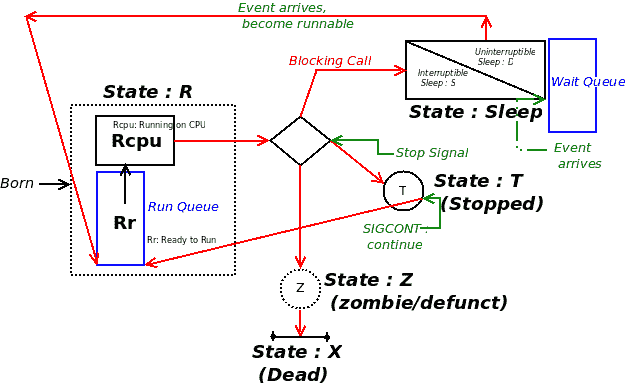
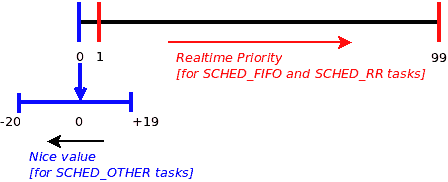

# 第十七章：Linux 上的 CPU 调度

人们经常问关于 Linux 的一个问题是，调度是如何工作的？我们将在本章中详细解答这个问题，以便用户空间应用程序开发人员清楚地掌握有关 Linux 上 CPU 调度的重要概念，以及如何在应用程序中强大地使用这些概念，我们还将涵盖必要的背景信息（进程状态机，实时等）。本章将以简要说明 Linux 操作系统如何甚至可以用作硬实时操作系统而结束。

在本章中，读者将了解以下主题：

+   Linux 进程（或线程）状态机，以及 Linux 在幕后实现的 POSIX 调度策略

+   相关概念，如实时和 CPU 亲和力

+   如何利用这一事实，即在每个线程基础上，您可以使用给定的调度策略和实时优先级来编程线程（将显示一个示例应用程序）

+   关于 Linux 也可以用作 RTOS 的简要说明

# Linux 操作系统和 POSIX 调度模型

为了理解应用程序开发人员的调度（以及如何在实际代码中利用这些知识），我们首先必须涵盖一些必需的背景信息。

开发人员必须理解的第一个非常重要的概念是，操作系统维护一种称为**内核可调度实体**（**KSE**）的构造。*KSE 是操作系统调度代码操作的粒度。实际上，操作系统调度的是什么对象？是应用程序、进程还是线程？嗯，简短的答案是 Linux 操作系统上的 KSE 是一个线程。换句话说，所有可运行的线程都竞争 CPU 资源；内核调度程序最终是决定哪个线程在哪个 CPU 核心上运行以及何时运行的仲裁者。

接下来，我们将概述进程或线程的状态机。

# Linux 进程状态机

在 Linux 操作系统上，每个进程或线程都会经历各种明确定义的状态，并通过对这些状态进行编码，我们可以形成 Linux 操作系统上进程（或线程）的状态机（在阅读本文时，请参考下一节中的*图 1*）。

既然我们现在了解了 Linux 操作系统上的 KSE 是一个线程而不是一个进程，我们将忽略使用单词*进程*的传统，而在描述通过各种状态的实体时使用单词*线程*。（如果更舒适的话，您可以在脑海中用*线程*替换*进程*。）

Linux 线程可以循环经历的状态如下（`ps(1)`实用程序通过此处显示的字母对*状态*进行编码）：

+   **R**：准备运行或正在运行

+   睡眠：

+   **S**：可中断睡眠

+   **D**：不可中断睡眠

+   **T**：停止（或暂停/冻结）

+   **Z**：僵尸（或无效）

+   **X**：死亡

当线程新创建（通过`fork(2)`，`pthread_create(3)`或`clone(2)`API）时，一旦操作系统确定线程完全创建，它通过将线程放入可运行状态来通知调度程序其存在。**R**状态的线程实际上正在 CPU 核心上运行，或者处于准备运行状态。我们需要理解的是，在这两种情况下，线程都被排队在操作系统内的一个称为**运行队列**（**RQ**）的数据结构上。运行队列中的线程是可以运行的有效候选者；除非线程被排队在操作系统运行队列上，否则不可能运行任何线程。 （供您参考，从 2.6 版开始，Linux 通过为每个 CPU 核心设置一个 RQ 来充分利用所有可能的 CPU 核心，从而获得完美的 SMP 可伸缩性。）Linux 不明确区分准备运行和运行状态；它只是将处于**R**状态的线程标记为准备运行或运行状态。

# 睡眠状态

一旦线程正在运行其代码，显然会一直这样做，直到通常发生以下几种情况：

+   它在 I/O 上阻塞，因此进入睡眠状态**S**或**D**，具体取决于（见下一段）。

+   它被抢占；没有状态改变，它仍然处于就绪运行状态**R**，在运行队列上。

+   它收到一个导致其停止的信号，因此进入状态**T**。

+   它收到一个信号（通常是 SIGSTOP 或 SIGTSTP），导致其终止，因此首先进入状态**Z**（僵尸状态是通向死亡的瞬态状态），然后实际死亡（状态 X）。

通常，线程在其代码路径中会遇到一个阻塞 API，这会导致它进入睡眠状态，等待事件。在被阻塞时，它会从原来的运行队列中移除（或出队），然后添加到所谓的**等待队列**（**WQ**）上。当它等待的事件发生时，操作系统会发出唤醒信号，导致它变为可运行状态（从等待队列中出队并加入运行队列）。请注意，线程不会立即运行；它将变为可运行状态（*图 1*中的**Rr**），成为调度程序的候选；很快，它将有机会在 CPU 上实际运行（**Rcpu**）。

一个常见的误解是认为操作系统维护一个运行队列和一个等待队列。不，Linux 内核为每个 CPU 维护一个运行队列。等待队列通常由设备驱动程序（以及内核）创建和使用；因此，可以有任意数量的等待队列。

睡眠的深度确定了线程被放入的确切状态。如果一个线程发出了一个阻塞调用，底层内核代码（或设备驱动程序代码）将其放入可中断睡眠状态，状态标记为**S**。可中断的睡眠状态意味着当发送给它的任何信号被传递时，线程将被唤醒；然后，它将运行信号处理程序代码，如果没有终止（或停止），将恢复睡眠（回想一下`sigaction(2)`中的`SA_RESTART`标志，来自第十一章*，信号-第一部分*）。这种可中断的睡眠状态**S**确实非常常见。

另一方面，操作系统（或驱动程序）可能会将阻塞线程放入更深的不可中断睡眠状态，此时状态标记为**D**。不可中断的睡眠状态意味着线程不会响应信号（没有；甚至没有来自 root 的 SIGKILL！）。当内核确定睡眠是关键的，并且线程必须等待挂起的事件时，会这样做（一个常见的例子是从文件中读取`read(2)`—当实际读取数据时，线程被放入不可中断的睡眠状态；另一个是挂载和卸载文件系统）。

性能问题通常是由非常高的 I/O 瓶颈引起的；高 CPU 使用率并不总是一个主要问题，但持续高的 I/O 会使系统感觉非常慢。确定哪个应用程序（实际上是进程和线程）导致了大量 I/O 的一个快速方法是过滤`ps(1)`输出，查找处于**D**状态的进程（或线程），即不可中断的睡眠状态。例如，参考以下内容：

**`$ ps -LA -o state,pid,cmd | grep`** `"^D"`

`**D** 10243 /usr/bin/gnome-shell`

`**D** 13337 [kworker/0:2+eve]`

`**D** 22545 /home/<user>/.dropbox-dist/dropbox-lnx.x86_64-58.4.92/dropbox`

`$`

请注意我们使用了`ps -LA`；`-L`开关显示所有活动的线程。 （FYI，前面方括号中显示的线程，`[kworker/...]`，是一个内核线程。）

以下图表示了任何进程或线程的 Linux 状态机：



图 1：Linux 状态机

前面的图表显示了状态之间的转换，通过红色箭头。请注意，为了清晰起见，一些转换（例如，线程在睡眠或停止时可能被终止）在前面的图表中没有明确显示。

# 什么是实时？

关于“实时”（在应用程序编程和操作系统上下文中）的含义存在许多误解。实时基本上意味着实时线程（或线程）不仅要正确执行其工作，而且它们必须在给定的最坏情况截止日期内执行。实际上，实时系统的关键因素称为确定性。确定性系统对真实世界（或人工生成的）事件有保证的最坏情况响应时间；它们将在有限的时间约束内处理这些事件。确定性导致可预测的响应，在任何条件下都是如此，甚至在极端负载下也是如此。计算机科学家对算法进行分类的一种方式是通过它们的时间复杂度：大 O 符号。O(1)算法是确定性的；它们保证无论输入负载如何，都将在一定的最坏情况时间内完成。真实的实时系统需要 O(1)算法来实现其性能敏感的代码路径。

有趣的是，实时并不一定意味着真正快速。 VDC 调查（有关更多详细信息，请参阅 GitHub 存储库上的“进一步阅读”部分）显示，大多数实时系统的截止日期（实时响应时间）要求为 1 至 9 毫秒。只要系统能够始终且无故障地在给定的截止日期内处理事件（可能相当长），它就是实时的。

# 实时类型

实时通常被分类为三种类型，如下：

+   **硬实时系统**被定义为必须始终满足所有截止日期的系统。甚至一次未能满足截止日期都会导致系统的灾难性失败，包括可能造成人员伤亡、财务损失等。硬实时系统需要一个**实时操作系统**（RTOS）来驱动它。（此外，应用程序编写成硬实时也非常重要！）。可能的硬实时领域包括各种人员运输工具（飞机、船舶、宇宙飞船、火车和电梯）以及某些类型的军用或国防设备、核反应堆、医疗电子设备和股票交易所。（是的，股票交易所确实是一个硬实时系统；请阅读书籍《自动化：算法如何统治我们的世界》—请参阅 GitHub 存储库上的“进一步阅读”部分获取更多信息。）

+   **软实时系统**都是尽最大努力；截止日期确实存在，但绝对不能保证会被满足。系统将尽最大努力满足它们；未能做到这一点被认为是可以接受的（通常只是对最终用户而言更多是一种烦恼而不是危险）。消费类电子产品（如我们的智能手机、MP3 播放器、相机、平板电脑和智能音箱）是典型的例子。在使用它们时，经常会发生听音乐时出现故障，或者流媒体视频出现卡顿、缓冲和抖动。虽然令人讨厌，但用户不太可能因此而丧生。

+   **中实时系统**介于硬实时和软实时系统之间——截止日期很重要，尽可能会被满足，但同样，无法做出铁 clad 保证。由于错过太多截止日期而导致性能下降是一个问题。

# 调度策略

**操作系统**（OS）的一个关键工作是调度可运行的任务。POSIX 标准规定 POSIX 兼容的操作系统必须提供（至少）三种调度策略。调度策略实际上是操作系统用于调度任务的调度算法。在本书中，我们不会深入探讨这些细节，但我们确实需要应用程序开发人员了解可用的调度策略。这些如下：

+   `SCHED_FIFO`

+   `SCHED_RR`

+   `SCHED_OTHER`（也称为`SCHED_NORMAL`）

我们的讨论自然而然地将仅涉及 Linux 操作系统。

首先要理解的第一件重要事情是，普通的 Linux 操作系统不是实时操作系统；它不支持硬实时，并且被分类为**通用目的操作系统**（**GPOS**），就像其他操作系统一样——Unix，Windows 和 macOS。

不过，请继续阅读；我们将看到，虽然普通的 Linux 不支持硬实时，但确实可以运行一个经过适当打补丁的 Linux 作为 RTOS。

尽管 Linux 是一个 GPOS，但它很容易表现为一个软实时系统。事实上，它的高性能特征使其接近成为一个坚实的实时系统。因此，Linux 操作系统在消费电子产品（和企业）产品中的主要使用并不奇怪。

接下来，我们提到的前两个调度策略——`SCHED_FIFO`和`SCHED_RR`——是 Linux 的软实时调度策略。`SCHED_OTHER`（也称为`SCHED_NORMAL`）策略是非实时调度策略，并且始终是默认的。`SCHED_OTHER`策略在现代 Linux 内核上实现为**完全公平调度器**（**CFS**）；其主要设计目标是提供整体高系统吞吐量和对每个可运行任务（线程）的公平性，确保线程不会饿死。这与实时策略算法的主要动机——线程的优先级相反。

对于`SCHED_FIFO`和`SCHED_RR`软实时策略，Linux 操作系统指定了一个优先级范围。这个范围是从 1 到 99，其中 1 是最低的实时优先级，99 是最高的。Linux 上的软实时调度策略设计遵循所谓的*固定优先级抢占调度*，这一点很重要。固定优先级意味着应用程序决定并固定线程优先级（并且可以更改它）；操作系统不会。抢占是操作系统从运行线程手中夺走 CPU 的行为，将其降回运行队列，并切换到另一个线程。关于调度策略的精确抢占语义将在接下来进行介绍。

现在，我们将简要描述在这些不同的调度策略下运行意味着什么。

运行中的`SCHED_FIFO`线程只能在以下三种情况下被抢占：

+   它（不）自愿地放弃处理器（从技术上讲，它从**R**状态移出）。当任务发出阻塞调用或调用`sched_yield(2)`等系统调用时会发生这种情况。

+   它停止或终止。

+   更高优先级的实时任务变为可运行状态。

这是需要理解的关键点：`SCHED_FIFO`任务是具有侵略性的；它以无限时间片运行，除非它被阻塞（或停止或终止），否则将继续在处理器上运行。然而，一旦更高优先级的线程变为可运行状态（状态**R**，进入运行队列），它将被优先于这个线程。

`SCHED_RR`的行为几乎与`SCHED_FIFO`相同，唯一的区别是：

+   它有一个有限的时间片，因此在时间片到期时可以被抢占的额外情况。

+   被抢占时，任务被移动到其优先级级别的运行队列尾部，确保所有相同优先级级别的`SCHED_RR`任务依次执行（因此它的名称为轮询）。

请注意，在 RTOS 上，调度算法是简单的，因为它实际上只需要实现这个语义：最高优先级的可运行线程必须是正在运行的线程。

所有线程默认情况下都在`SCHED_OTHER`（或`SCHED_NORMAL`）调度策略下运行。这是一个明显的非实时策略，重点是公平性和整体吞吐量。从 Linux 内核版本 2.6.0 到 2.6.22（包括）的实现是通过所谓的 O(1)调度程序；从 2.6.23 开始，进一步改进的算法称为**完全公平调度器**（**CFS**）实现了这种调度策略（实际上是一种调度类）。有关更多信息，请参考以下表格：

| **调度策略** | **类型** | **优先级范围** |
| --- | --- | --- |
| `SCHED_FIFO` | 软实时：激进，不公平 | 1 到 99 |
| `SCHED_RR` | 软实时：较不激进 | 1 到 99 |
| `SCHED_OTHER` | 非实时：公平，时间共享；默认值 | 优先级范围（-20 到+19） |

尽管不太常用，但我们指出 Linux 也支持使用 SCHED_BATCH 策略的批处理模式进程执行策略。此外，SCHED_IDLE 策略用于非常低优先级的后台任务。（实际上，CPU 空闲线程 - 名为`swapper`，PID 为`0`，每个 CPU 都存在，并且只有在绝对没有其他任务想要处理器时才运行）。

# 查看调度策略和优先级

Linux 提供了`chrt(1)`实用程序来查看和更改线程（或进程）的实时调度策略和优先级。可以在以下代码中看到使用它来显示给定进程（按 PID）的调度策略和优先级的快速演示：

```
$ chrt -p $$
pid 1618's current scheduling policy: SCHED_OTHER
pid 1618's current scheduling priority: 0
$ 
```

在前面的内容中，我们已经查询了`chrt(1)`进程本身的调度策略和优先级（使用 shell 的`$$`变量）。尝试对其他线程执行此操作；您会注意到策略（几乎）总是`SCHED_OTHER`，而实时优先级为零。实时优先级为零意味着该进程不是实时的。

您可以通过将线程 PID（通过`ps -LA`的输出或类似方式）传递给`chrt(1)`来查询线程的调度策略和（实时）优先级。

# `nice value`

那么，现在您可能会想知道，如果所有非实时线程（`SCHED_OTHER`）的优先级都为零，那么我如何在它们之间支持优先级？好吧，这正是`SCHED_OTHER`线程的`nice value`的用途：这是（较旧的）Unix 风格的优先级模型，现在在 Linux 上指定了非实时线程之间的相对优先级。

`nice value`是在现代 Linux 上介于`-20`到`+19`之间的优先级范围，基本优先级为零。在 Linux 上，这是一个每个线程的属性；当创建线程时，它会继承其创建者线程的`nice value` - 零是默认值。请参考以下图表：



图 2：Linux 线程优先级范围

从 2.6.23（使用 CFS 内核调度程序），线程的`nice value`对调度有很大影响（每个`nice value`度的因素为 1.25）；因此，`-20`的`nice value`线程获得更多的 CPU 带宽（这对于像多媒体这样对 CPU 敏感的应用程序很有好处），而`+19`的`nice value`线程获得的 CPU 很少。

应用程序员可以通过`nice(1)`命令行实用程序以及`nice(2)`，`setpriority(2)`和`sched_setattr(2)`系统调用（最后一个是最近和正确的使用方法）来查询和设置`nice value`。我们建议您参考这些 API 的相应手册页。

请记住，实时（`SCHED_FIFO`或`SCHED_RR`）线程在优先级方面始终优于`SCHED_OTHER`线程（因此几乎可以保证它将有机会更早运行）。

# CPU 亲和力

让我们想象一个具有四个 CPU 核心的 Linux 系统，为简单起见，有一个准备运行的线程。这个线程将在哪个 CPU 核心上运行？内核将决定这一点；要意识到的关键事情是它可以在四个可用的 CPU 中的任何一个上运行！

程序员可以指定它可能运行的 CPU 吗？是的，确实；这个特性本身就叫做 CPU 亲和力。在 Linux 上，这是一个每个线程的属性（在操作系统内）。CPU 亲和力可以通过改变线程的 CPU 亲和力掩码来在每个线程上进行更改；当然，这是通过系统调用实现的。让我们看一下下面的代码：

```
#define _GNU_SOURCE /* See feature_test_macros(7) */
#include <sched.h>
int sched_setaffinity(pid_t pid, size_t cpusetsize,
                        const cpu_set_t *mask);
int sched_getaffinity(pid_t pid, size_t cpusetsize,
                        cpu_set_t *mask);
```

内核调度程序将遵守程序员设置的 CPU 掩码，即线程被允许执行的 CPU 集合。我们期望将 CPU 亲和力掩码指定为`cpu_set_t`对象。（我们建议读者参考`sched_setaffinity(2)`的手册页，它提供了一个示例程序）。

请注意，pthread 框架提供了包装 API `pthread_setaffinity_np(3)`和`pthread_getaffinity_np(3)`，以在给定线程上执行相同的操作（它们在内部调用`sched_setaffinity(2)`系统调用）。

CPU 预留的一个有趣设计是 CPU 亲和力掩码模型，可以在多核系统上有效地为性能关键的线程（或线程）设置一个 CPU 核心。这意味着必须为该线程设置特定的 CPU 掩码，并且将所有其他线程的 CPU 掩码设置为排除核心 3。

尽管听起来很简单，但这并不是一个微不足道的练习；其中一些原因如下：

+   您必须意识到，预留的 CPU 并不是真正专门为指定的线程（们）保留的；对于真正的 CPU 预留，除了在该 CPU 上运行的给定线程（们）之外，整个系统上的所有其他线程都必须以某种方式被排除在该 CPU 之外。

+   作为一般准则，操作系统调度程序最了解如何在可用的 CPU 核心之间分配 CPU 带宽（它具有负载平衡器组件并了解 CPU 层次结构）；因此，最好将 CPU 分配留给操作系统。

现代 Linux 内核支持一个非常强大的功能：**控制组**（**cgroups**）。关于 CPU 预留，可以通过 cgroup 模型实现。请参考 Stack Overflow 上的以下问答以获取更多详细信息：*如何使用 cgroups 限制除白名单之外的所有进程到单个 CPU*：[`unix.stackexchange.com/questions/247209/how-to-use-cgroups-to-limit-all-processes-except-whitelist-to-a-single-cpu`](https://unix.stackexchange.com/questions/247209/how-to-use-cgroups-to-limit-all-processes-except-whitelist-to-a-single-cpu)。

为了方便起见，Linux 提供了`taskset(1)`实用程序，作为查询和指定任何给定进程（或线程）的 CPU 亲和力掩码的简单方法。在这里，我们将查询两个进程的 CPU 亲和力掩码。（我们假设我们运行的系统有四个 CPU 核心；我们可以使用`lscpu(1)`来查询这一点）：

```
$ taskset -p 1
pid 1's current affinity mask: f
$ taskset -p 12446
pid 12446's current affinity mask: 7
$ 
```

PID 1（systemd）的 CPU 亲和力掩码是`0xf`，当然，这是二进制`1111`。如果设置了一个位`1`，则表示线程可以在由该位表示的 CPU 上运行。如果清除了该位`0`，则表示线程不能在由该位表示的 CPU 上运行。正如预期的那样，在一个四 CPU 的盒子上，CPU 亲和力位掩码默认为 0xf（1111），这意味着进程（或线程）可以在任何可用的 CPU 上运行。有趣的是，在前面的输出中，bash 进程似乎具有 CPU 亲和力掩码为`7`，这对应于二进制`0111`，这意味着它永远不会被调度到 CPU 3 上运行。

在下面的代码中，一个简单的 shell 脚本在循环中调用`chrt(1)`和`taskset(1)`实用程序，显示系统上每个进程的调度策略（实时）优先级和 CPU 亲和力掩码。

```
# ch17/query_sched_allprcs.sh
for p in $(ps -A -To pid)
do
    chrt -p $p 2>/dev/null
    taskset -p $p 2>/dev/null
done
```

我们鼓励读者在自己的系统上尝试这个。在下面的代码中，我们使用`grep(1)`来查找任何`SCHED_FIFO`任务：

```
$ ./query_sched_allprcs.sh | grep -A2 -w SCHED_FIFO
pid 12's current scheduling policy: SCHED_FIFO
pid 12's current scheduling priority: 99
pid 12's current affinity mask: 1
pid 13's current scheduling policy: SCHED_FIFO
pid 13's current scheduling priority: 99
pid 13's current affinity mask: 1
--
pid 16's current scheduling policy: SCHED_FIFO
pid 16's current scheduling priority: 99
pid 16's current affinity mask: 2
pid 17's current scheduling policy: SCHED_FIFO
pid 17's current scheduling priority: 99
pid 17's current affinity mask: 2
--
[...]
```

是的！我们找到了一些线程。哇，它们都是`SCHED_FIFO`实时优先级 99！让我们来看看这些线程是谁（还有一个很酷的一行脚本）：

```
$ ps aux | awk '$2==12 || $2==13 || $2==16 || $2==17 {print $0}'
USER PID %CPU %MEM  VSZ  RSS TTY STAT   START  TIME   COMMAND
root 12  0.0  0.0     0    0   ?    S   13:42  0:00   [migration/0]
root 13  0.0  0.0     0    0   ?    S   13:42  0:00   [watchdog/0]
root 16  0.0  0.0     0    0   ?    S   13:42  0:00   [watchdog/1]
root 17  0.0  0.0     0    0   ?    S   13:42  0:00   [migration/1]
$ 
```

为了清晰起见，前面的代码中显示了通常不会显示的`ps aux`标题。此外，我们使用`ps aux`样式，因为内核线程会显示在括号中。

事实证明（至少在这个特定的例子中），它们都是内核线程（请参阅下面的信息框）。要理解的重要一点是，它们故意设置为`SCHED_FIFO`（实时）优先级 99，这样，当它们想要在 CPU 上运行时，它们几乎立即就会运行。实际上，让我们来看一下它们的 CPU 亲和性掩码：它们被故意分配（具有值如 1,2,4,8），以便它们与特定的 CPU 核心相关联。重要的是要理解，这些内核线程并不会占用 CPU；实际上，它们大部分时间都处于睡眠状态（状态**S**），只有在需要时才会立即行动。

内核线程与它们的用户空间对应物并没有太大的不同；它们也会竞争 CPU 资源。关键的区别在于，内核线程无法看到用户空间，它们只在内核虚拟地址空间中执行（而用户空间线程当然可以看到用户模式下的用户空间，并且在发出系统调用时会切换到内核空间）。

# 利用 Linux 的软实时能力

回想一下，在本章的前面，我们曾经说过：Linux 上的软实时调度策略设计遵循所谓的固定优先级抢占式调度；固定优先级意味着应用程序决定并固定线程优先级（并且可以更改它）；操作系统不会。

应用程序不仅可以在线程优先级之间切换，甚至可以由应用程序开发人员更改调度策略（实际上是操作系统在后台使用的调度算法）；这可以在每个线程的基础上进行。这确实非常强大；这意味着一个应用程序拥有，比如说，五个线程，可以决定为每个线程分配什么调度策略和优先级！

# 调度策略和优先级 API

显然，为了实现这一点，操作系统必须暴露一些 API；事实上，有一些系统调用处理这一点——改变给定进程或线程的调度策略和优先级。

这里列出了一些更重要的这些 API 中的一部分，实际上只是一小部分：

+   `sched_setscheduler(2)`: 设置指定线程的调度策略和参数。

+   `sched_getscheduler(2)`: 返回指定线程的调度策略。

+   `sched_setparam(2)`: 设置指定线程的调度参数。

+   `sched_getparam(2)`: 获取指定线程的调度参数。

+   `sched_get_priority_max(2)`: 返回指定调度策略中可用的最大优先级。

+   `sched_get_priority_min(2)`: 返回指定调度策略中可用的最小优先级。

+   `sched_rr_get_interval(2)`: 获取在轮转调度策略下调度的线程使用的时间片。

+   `sched_setattr(2)`: 设置指定线程的调度策略和参数。这个（特定于 Linux 的）系统调用提供了`sched_setscheduler(2)`和`sched_setparam(2)`功能的超集。

+   `sched_getattr(2)`: 获取指定线程的调度策略和参数。这个（特定于 Linux 的）系统调用提供了`sched_getscheduler(2)`和`sched_getparam(2)`功能的超集。

`sched_setattr(2)`和`sched_getattr(2)`目前被认为是这些 API 中最新和最强大的。此外，在 Ubuntu 上，可以使用方便的`man -k sched`命令来查看与调度相关的所有实用程序和 API（-k：关键字）。

敏锐的读者很快会注意到我们之前提到的所有 API 都是系统调用（手册的第二部分），但 pthread API 呢？的确，它们也存在，并且，正如你可能已经猜到的那样，它们大多只是调用底层系统调用的包装器；在下面的代码中，我们展示了其中的两个：

```
#include <pthread.h>
int pthread_setschedparam(pthread_t thread, int policy,
                           const struct sched_param *param);
int pthread_getschedparam(pthread_t thread, int *policy,
                           struct sched_param *param);
```

重要的是要注意，为了设置线程（或进程）的调度策略和优先级，您需要以 root 访问权限运行。请记住，赋予线程特权的现代方式是通过 Linux Capabilities 模型（我们在第八章中详细介绍了*进程特权*）。具有`CAP_SYS_NICE`能力的线程可以任意将其调度策略和优先级设置为任何它想要的值。想一想：如果不是这样的话，那么几乎所有的应用程序都可以坚持以`SCHED_FIFO`优先级 99 运行，从而有效地使整个概念变得毫无意义！

`pthread_setschedparam(3)`在内部调用了`sched_setscheduler(2)`系统调用，`pthread_getschedparam(3)`在底层调用了`sched_getscheduler(2)`系统调用。它们的 API 签名是：

```
#include <sched.h>
int sched_setscheduler(pid_t pid, int policy,
                        const struct sched_param *param);
int sched_getscheduler(pid_t pid);
```

还存在其他 pthread API。请注意，这里显示的 API 有助于设置线程属性结构：`pthread_attr_setinheritsched(3)`、`pthread_attr_setschedparam(3)`、`pthread_attr_setschedpolicy(3)`和`pthread_setschedprio(3)`等。

`sched(7)`的 man 页面（在终端窗口中键入`man 7 sched`查找）详细介绍了用于控制线程调度策略、优先级和行为的可用 API。它提供了有关当前 Linux 调度策略、更改它们所需的权限、相关资源限制值和调度的内核可调参数，以及其他杂项细节。

# 代码示例-设置线程调度策略和优先级

为了巩固本章前几节学到的概念，我们将设计并实现一个小型演示程序，演示现代 Linux pthreads 应用程序如何设置单个线程的调度策略和优先级，以使线程（软）实时。

我们的演示应用程序将有三个线程。第一个当然是`main()`。以下要点显示了应用程序的设计目的：

+   线程 0（实际上是`main()`）：

这以`SCHED_OTHER`调度策略和实时优先级 0 运行，这是默认值。它执行以下操作：

+   查询`SCHED_FIFO`的优先级范围，并打印出值

+   创建两个工作线程（可连接状态设置为分离状态）；它们将自动继承主线程的调度策略和优先级

+   在循环中向终端打印字符`m`（使用我们的`DELAY_LOOP`宏；比平常长一点）

+   终止

+   工作线程 1：

+   将其调度策略更改为`SCHED_RR`，将其实时优先级设置为命令行传递的值

+   休眠 2 秒（因此在 I/O 上阻塞，允许主线程完成一些工作）

+   唤醒后，它在循环中向终端打印字符`1`（通过`DELAY_LOOP`宏）

+   终止

+   工作线程 2：

+   将其调度策略更改为`SCHED_FIFO`，将其实时优先级设置为命令行传递的值加上 10

+   休眠 4 秒（因此在 I/O 上阻塞，允许线程 1 完成一些工作）

+   唤醒后，它在循环中向终端打印字符`2`

+   终止

让我们快速看一下代码（`ch17/sched_rt_eg.c`）：

为了便于阅读，这里只显示了源代码的关键部分；要查看完整的源代码，并构建和运行它，整个树可在 GitHub 上克隆：[`github.com/PacktPublishing/Hands-on-System-Programming-with-Linux`](https://github.com/PacktPublishing/Hands-on-System-Programming-with-Linux)。

以下代码是`main()`的代码。（我们省略了显示错误检查代码）：

```
#define NUMWORK   200
...
  min = sched_get_priority_min(SCHED_FIFO);
  max = sched_get_priority_max(SCHED_FIFO);
  printf("SCHED_FIFO: priority range is %d to %d\n", min, max);
  rt_prio = atoi(argv[1]);
...
  ret = pthread_create(&tid[0], &attr, worker1, (void *)rt_prio);
  ret = pthread_create(&tid[1], &attr, worker2, (void *)rt_prio);
  pthread_attr_destroy(&attr);
  DELAY_LOOP('m', NUMWORK+100);
  printf("\nmain: all done, app exiting ...\n");
  pthread_exit((void *)0);
}
```

以下代码是工作线程 1 的代码。我们省略了显示错误检查代码：

```
void *worker1(void *msg)
{
  struct sched_param p;
  printf(" RT Thread p1 (%s():%d:PID %d):\n"
   " Setting sched policy to SCHED_RR and RT priority to %ld"
   " and sleeping for 2s ...\n", __func__, __LINE__, getpid(), (long)msg);

   p.sched_priority = (long)msg;
   pthread_setschedparam(pthread_self(), SCHED_RR, &p);
   sleep(2);
   puts(" p1 working");
   DELAY_LOOP('1', NUMWORK);
   puts(" p1: exiting..");
   pthread_exit((void *)0);
}
```

工作线程 2 的代码几乎与前面的工作线程相同；然而，不同之处在于我们将策略设置为`SCHED_FIFO`，并且将实时优先级提高了 10 分，从而使其更具侵略性。我们只在这里显示这个片段：

```
  p.sched_priority = prio + 10;
  pthread_setschedparam(pthread_self(), SCHED_FIFO, &p);
  sleep(4);
  puts(" p2 working");
  DELAY_LOOP('2', NUMWORK);
```

让我们构建它（我们强烈建议构建调试版本，因为这样`DELAY_LOOP`宏的效果就可以清楚地看到），然后试一试：

```
$ make sched_rt_eg_dbg
gcc -g -ggdb -gdwarf-4 -O0 -Wall -Wextra -DDEBUG -pthread -c sched_rt_eg.c -o sched_rt_eg_dbg.o
gcc -o sched_rt_eg_dbg sched_rt_eg_dbg.o common_dbg.o -pthread -lrt
$ 
```

我们必须以 root 身份运行我们的应用程序；我们使用`sudo(8)`来做到这一点：

```
$ sudo ./sched_rt_eg_dbg 14
SCHED_FIFO: priority range is 1 to 99
main: creating RT worker thread #1 ...
main: creating RT worker thread #2 ...
  RT Thread p1 (worker1():68:PID 18632):
 Setting sched policy to SCHED_RR and RT priority to 14 and sleeping for 2s ...
m RT Thread p2 (worker2():101:PID 18632):
 Setting sched policy to SCHED_FIFO and RT priority to 24 and sleeping for 4s ...
mmmmmmmmmmmmmmmmmmmmmmmmmmmmmmmmmmmmmmmmmmmmmmmmmmmmmmmmmmmmmmmmmmmmmmmmmmmmmmmmmmmmmmmmmmmmmmmmmmmmmmmmmmmmmmmmmmmmm p1 working
1m1m1m1m1m1m1m1m1m1m1m1m1m1m1m1m1m1m1m1m1m1m1m1m1m1m1m1m1m1m1m1m1m1m1m1m1m1m1m1m1m1m1m1m1m1m1m1m1m1m1m1m1m1m1m1m1m1m1m11m1m1m1m1m1m1m1m1m1m1m1m1m1m1m1m1m1m1m1m1m1m1m1m1m1m1m1m1m1m1m1m1m1m11m1m1m1m1m1m1m1m1m1m1m1m1m1m1m1m1m1m1m1m1m1m1m1m1m1m1m11m1m1m p2 working
2m12m12m1m2m12m12m1m2m12m12m1m2m12m12m12m12m12m112m12m12m12m112m12m12m112m12m12m112m12m12m12m112m12m12m121m211m21m21m21m211m21m21m21m211m21m21m21m211m21m21m21m211m21m21m21m211m21m21m21
main: all done, app exiting ...
$ 
```

在前面的输出中，我们可以看到以下字符：

+   `m`：这意味着`main`线程目前正在 CPU 上运行

+   `1`：这意味着（软）实时工作线程 1 目前正在 CPU 上运行

+   `2`：这意味着（软）实时工作线程 2 目前正在 CPU 上运行

但是，哎呀，前面的输出并不是我们期望的：`m`，`1`和`2`字符混在一起，让我们得出它们已经被分时切片的结论。

但事实并非如此。仔细想想——输出与前面的代码中所显示的一样，是因为我们在多核系统上运行了应用程序（在前面的代码中，在一个具有四个 CPU 核心的笔记本电脑上）；因此，内核调度程序巧妙地利用了硬件，在不同的 CPU 核心上并行运行了所有三个线程！因此，为了使我们的演示应用程序按我们的期望运行，我们需要确保它只在一个 CPU 核心上运行，而不是更多。如何做到？回想一下 CPU 亲和力：我们可以使用`sched_setaffinity(2)`系统调用来做到这一点。还有一种更简单的方法：我们可以使用`taskset(1)`来保证进程（因此其中的所有线程）只在一个 CPU 核心上运行（例如，CPU 0），方法是将 CPU 掩码值指定为`01`。因此，让我们执行以下命令：

```
$ sudo taskset 01 ./sched_rt_eg_dbg 14
[sudo] password for <username>: xxx 
SCHED_FIFO: priority range is 1 to 99
main: creating RT worker thread #1 ...
main: creating RT worker thread #2 ...
m RT Thread p2 (worker2():101:PID 19073):
 Setting sched policy to SCHED_FIFO and RT priority to 24 and sleeping for 4s ...
 RT Thread p1 (worker1():68:PID 19073):
 Setting sched policy to SCHED_RR and RT priority to 14 and sleeping for 2s ...
mmmmmmmmmmmmmmmmmmmmmmmmmmmmmmmmmmmmmmmmmmmmmmmmmmmmmmmmmmmmmmmmmmmmmmmmmmmmmmmmmmmmmmmmmmmmmmmmmmmmmmmmmmmmmmmmmmmmmmmmm p1 working
11111111111111111111111111111111111111111111111111111111111111111111111111111111111111111111111111111111111111111111111111111111 p2 working
22222222222222222222222222222222222222222222222222222222222222222222222222222222222222222222222222222222222222222222222222222222222222222222222222222222222222222222222222222222222222222222222222222222 p2 exiting ...
111111111111111111111111111111111111111111111111111111111111111111111111 p1: exiting..
mmmmmmmmmmmmmmmmmmmmmmmmmmmmmmmmmmmmmmmmmmmmmmmmmmmmmmmmmmmmmmmmmmmmmmmmmmmmmmmmmmmmmmmmmmmmmmmmmmmmmmmmmmmmmmmmmmmmmmmmmmmmmmmmmmmmmmmmmmmmmmmmmmmmmmmmmmmmmmmmmmmmmmmmmmmmmmmmmm
main: all done, app exiting ...
$ 
```

是的，使用`taskset(1)`来确保整个应用程序——所有三个线程——在第一个 CPU 核心上运行产生了期望的效果。现在，仔细研究前面的输出；我们可以看到`main()`线程——非实时——首先运行了大约 2 秒；一旦经过了 2 秒，工作线程 1 就会醒来，变得可运行。由于它的策略和优先级远远超过了`main()`，它抢占了`main()`并运行，向终端打印 1s。请记住，工作线程 2 也在并行运行，但是它当然会睡眠 4 秒。所以，2 秒后——一共经过了 4 秒——工作线程 2 醒来，变得可运行。由于它的策略是`SCHED_FIFO`，更重要的是，它的优先级比线程 1 高 10 分，它抢占了线程 1 并运行，向终端打印`2s`。在它终止之前，其他线程无法运行；一旦它终止，工作线程 1 运行。同样，在它终止之前，`main()`无法运行；一旦它终止，`main()`最终获得 CPU 并完成，应用程序终止。有趣；你自己试试吧。

供您参考，关于`pthread_setschedparam(3)`的 man 页面有一个相当详细的示例程序：[`man7.org/linux/man-pages/man3/pthread_setschedparam.3.html`](http://man7.org/linux/man-pages/man3/pthread_setschedparam.3.html)。

# 软实时——额外考虑

还有一些额外的要点需要考虑：我们有权将线程与（软）实时策略和优先级相关联（前提是我们拥有 root 访问权限；或者 CAP_SYS_NICE 能力）。对于大多数人机交互应用领域来说，这不仅是不必要的，而且会给典型的桌面或服务器系统最终用户带来令人不安的反馈和副作用。一般来说，您应该避免在交互式应用程序上使用这些实时策略。只有在必须高度优先考虑一个线程时——通常是为了实时应用程序（可能在嵌入式 Linux 盒子上运行），或某些类型的基准测试或分析软件（`perf(1)`是一个很好的例子；可以指定`--realtime=n`参数给`perf`，使其以`SCHED_FIFO`优先级`n`运行）——您才应该考虑使用这些强大的技术。

此外，要使用的精确实时优先级留给应用架构师；对于`SCHED_FIFO`和`SCHED_RR`线程使用相同的优先级值（请记住，这两种策略是同级的，`SCHED_FIFO`更为激进）可能会导致不可预测的调度。仔细考虑设计，并相应地设置每个实时线程的策略和优先级。

最后，尽管本书没有深入介绍，但 Linux 的 cgroups 模型允许您强大地控制资源（CPU、网络和块 I/O）的带宽分配给特定进程或一组进程。如果需要这样做，请考虑使用 cgroups 框架来实现您的目标。

# RTL - Linux 作为 RTOS

事实上，令人难以置信的是，Linux 操作系统可以用作 RTOS；也就是说，可以用作硬实时 RTOS。该项目最初是 Linutronix 的 Thomas Gleixner 的构想。

再次强调，这真的是开源模型和 Linux 的美丽之处；作为开源项目，有兴趣和动力的人将 Linux（或其他项目）作为起点，并在此基础上构建，通常会产生显著新颖和有用的产品。

关于该项目的一些要点如下：

+   修改 Linux 内核以成为 RTOS 是一个必然具有侵入性的过程；事实上，Linux 的领导者 Linus Torvalds 不希望这些代码出现在上游（原始）Linux 内核中。因此，实时 Linux 内核项目作为一个补丁系列存在（在 kernel.org 本身上；请参阅 GitHub 存储库上的*进一步阅读*部分中的链接以获取更多信息），可以应用于主线内核。

+   这一努力从 Linux 2.6.18 内核开始就已经成功进行（大约从 2006 年或 2007 年开始）。

+   多年来，该项目被称为 Preempt-RT（补丁本身被称为 PREEMPT_RT）。

+   后来（从 2015 年 10 月起），该项目的管理权被**Linux 基金会**（**LF**）接管——这是一个积极的举措。名称从 Preempt RT 更改为**real-time Linux**（**RTL**）。

+   事实上，RTL 路线图非常有推动相关的 PREEMPT_RT 工作上游（进入主线 Linux 内核；请参阅 GitHub 存储库上的*进一步阅读*部分以获取相关链接）的目标。

实际上，您可以应用适当的 RTL 补丁，然后将 Linux 用作硬实时 RTOS。行业已经开始在工业控制应用程序、无人机和电视摄像机中使用该项目；我们只能想象这将会大大增长。还要注意的是，拥有硬实时操作系统并不足以满足真正实时使用的要求；甚至应用程序也必须按照实时预期进行编写。请查看 RTL 项目维基站点上提供的*HOWTO*文档（请参阅 GitHub 存储库上的*进一步阅读*部分）。

# 总结

在本章中，我们涵盖了与 Linux 和实时 CPU 调度相关的重要概念。读者已经逐步了解了 Linux 线程状态机、实时性、CPU 亲和力以及可用的 POSIX 调度策略等主题。此外，我们展示了在 pthread 和系统调用层面利用这些强大机制的 API。演示应用程序强化了我们学到的概念。最后，我们简要介绍了 Linux 也可以用作硬实时（RTOS）的事实。

在下一章中，读者将学习如何利用现代技术实现最佳的 I/O 性能。
