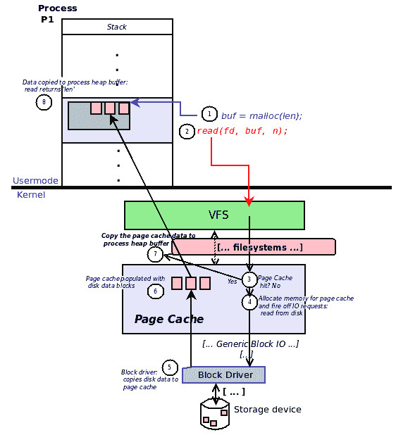
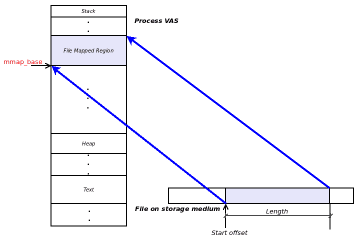
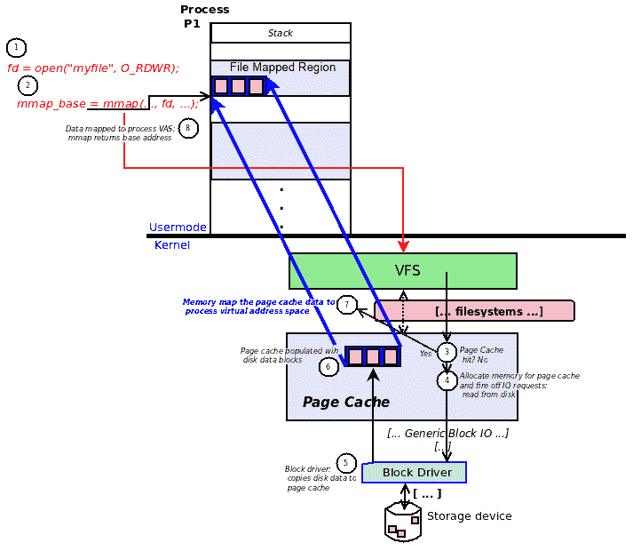

# 第十八章：高级文件 I/O

在[附录 A](https://www.packtpub.com/sites/default/files/downloads/File_IO_Essentials.pdf)，*文件 I/O 基础*中，我们介绍了应用程序开发人员如何利用可用的 glibc 库 API 以及执行文件 I/O（打开、读取、写入和关闭）的典型系统调用。虽然它们可以工作，但实际上性能并没有得到真正优化。在本章中，我们将重点介绍更高级的文件 I/O 技术，以及开发人员如何利用更新和更好的 API 来提高性能。

通常，人们会对 CPU 及其性能感到紧张。虽然重要，但在许多（如果不是大多数）真实的应用工作负载中，真正拖慢性能的不是 CPU，而是 I/O 代码路径。这是可以理解的；回想一下，从第二章 *虚拟内存*中我们展示了磁盘速度与 RAM 相比要慢几个数量级。网络 I/O 也是类似的情况；因此，可以推断真正的性能瓶颈是由于大量持续的磁盘和网络 I/O 造成的。

在本章中，读者将学习几种改进 I/O 性能的方法；广义上讲，这些方法将包括以下内容：

+   充分利用内核页面缓存

+   向内核提供关于文件使用模式的提示和建议

+   使用分散-聚集（向量）I/O

+   利用内存映射进行文件 I/O

+   学习和使用复杂的 DIO 和 AIO 技术

+   学习 I/O 调度程序

+   用于监视、分析和带宽控制 I/O 的实用程序/工具/API/cgroups

# I/O 性能建议

进行 I/O 时的关键是意识到底层存储（磁盘）硬件比 RAM 慢得多。因此，制定策略以最小化对磁盘的访问并更多地从内存中工作总是有帮助的。事实上，库层（我们已经详细讨论了 studio 缓冲区），以及操作系统（通过页面缓存和块 I/O 层中的其他功能，事实上，甚至在现代硬件中）将执行大量工作来确保这一点。对于（系统）应用程序开发人员，下面提出了一些建议。

如果可行，执行文件 I/O 操作时使用大缓冲区（用于保存读取或要写入的数据）——但有多大？一个经验法则是使用与文件系统的 I/O 块大小相同的本地缓冲区大小（实际上，这个字段在文件系统 I/O 中内部记录为块大小）。查询很简单：在要执行 I/O 的文件上发出`stat(1)`命令。例如，假设在 Ubuntu 18.04 系统上，我们想要读取当前运行的内核配置文件的内容：

```
$ uname -r
4.15.0-23-generic
$ ls -l /boot/config-4.15.0-23-generic 
-rw-r--r-- 1 root root 216807 May 23 22:24 /boot/config-4.15.0-23-generic
$ stat /boot/config-4.15.0-23-generic 
 File: /boot/config-4.15.0-23-generic
 Size: 216807 Blocks: 424 IO Block: 4096 regular file
Device: 801h/2049d Inode: 398628 Links: 1
Access: (0644/-rw-r--r--) Uid: ( 0/ root) Gid: ( 0/ root)
Access: 2018-07-30 12:42:09.789005000 +0530
Modify: 2018-05-23 22:24:55.000000000 +0530
Change: 2018-06-17 12:36:34.259614987 +0530
 Birth: -
$ 
```

从代码中可以看出，`stat(1)`从文件的 inode 数据结构中显示了几个文件特性（或属性），其中包括 I/O 块大小。

在内部，`stat(1)`实用程序发出`stat(2)`系统调用，解析底层文件的 inode 并向用户空间提供所有细节。因此，当需要以编程方式时，利用`[f]stat(2)`API。

此外，如果内存不是一个限制，为什么不分配一个中等到非常大的缓冲区并通过它执行 I/O；这将有所帮助。确定需要多大需要在目标平台上进行一些调查；为了给你一个概念，在早期，管道 I/O 通常使用一个页面大小的内核缓冲区；在现代 Linux 内核上，默认情况下管道 I/O 缓冲区大小增加到了一兆字节。

# 内核页面缓存

从[附录 A](https://www.packtpub.com/sites/default/files/downloads/File_IO_Essentials.pdf)中我们了解到，当一个进程（或线程）通过使用`fread(3)`或`fwrite(3)`库层 API 执行文件 I/O 时，最终会通过`read(2)`和`write(2)`系统调用发出到底层操作系统。这些系统调用让内核执行 I/O；尽管这似乎是直观的，但实际情况是读写系统调用并不是同步的；也就是说，它们可能在实际 I/O 完成之前返回。（显然，对文件的写入会是这种情况；同步读取必须将读取的数据返回到用户空间内存缓冲区；在此之前，读取会被阻塞。然而，即使是读取也可以通过**异步 I/O**（**AIO**）变成异步。）

事实上，在内核中，每个单个文件 I/O 操作都被缓存在一个称为*页缓存*的全局内核缓存中。因此，当一个进程向文件写入数据时，数据缓冲区并不会立即刷新到底层块设备（磁盘或闪存存储），而是被缓存在页缓存中。同样，当一个进程从底层块设备读取数据时，数据缓冲区也不会立即复制到用户空间进程内存缓冲区；不，你猜对了，它首先存储在页缓存中（进程实际上会从那里接收到它）。再次参考[附录 A](https://www.packtpub.com/sites/default/files/downloads/File_IO_Essentials.pdf)，*文件 I/O 基础*，*图 3：更多细节—应用到 stdio I/O 缓冲区到内核页缓存*，来看看这一点。

为什么内核页缓存中的缓存有用呢？简单：通过利用缓存的关键属性，即缓存内存区域（RAM）和正在缓存的区域（块设备）之间的速度差异，我们获得了巨大的性能提升。页缓存位于 RAM 中，因此保持所有文件 I/O 的内容被缓存（尽可能）几乎可以保证应用程序在文件数据上执行读取时命中缓存；从 RAM 读取比从存储设备读取要快得多。同样，内核将写入数据缓冲区缓存到页缓存中，而不是将应用程序数据缓冲区慢慢同步地直接写入块设备。显然，刷新已写入的数据到底层块设备以及管理页缓存内存本身的工作都在 Linux 内核的工作范围之内（我们在这里不讨论这些内部细节）。

程序员总是可以显式地将文件数据刷新到底层存储设备；我们在[附录 A](https://www.packtpub.com/sites/default/files/downloads/File_IO_Essentials.pdf)中已经介绍了相关的 API 及其用法，*文件 I/O 基础*。

# 给内核提供文件 I/O 模式的提示

我们现在明白了内核会缓存所有文件 I/O 在其页缓存中；这对性能有好处。想象一个例子会很有用：一个应用程序设置并对一个非常大的视频文件进行流式读取（在某个应用窗口中向用户显示；我们假设特定的视频文件是第一次被访问）。一般来说，从磁盘读取文件时进行缓存是有帮助的，但在这种特殊情况下，它并不会帮助太多，因为第一次，我们仍然必须首先去磁盘读取。因此，我们耸耸肩，继续以通常的方式编写代码，顺序读取视频数据块（通过其底层编解码器）并将其传递给渲染代码。

# 通过 posix_fadvise(2) API

我们能做得更好吗？是的，Linux 提供了`posix_fadvise(2)`系统调用，允许应用程序进程通过一个名为`advice`的参数向内核提供关于其对文件数据访问模式的提示。与我们的示例相关，我们可以将建议作为值`POSIX_FADV_SEQUENTIAL`，`POSIX_FADV_WILLNEED`传递，以通知内核我们期望按顺序读取文件数据，并且我们期望我们将来会需要访问文件的数据。这个建议会导致内核按顺序（从较低到较高的文件偏移）积极地预读文件数据到内核页缓存中。这将极大地帮助提高性能。

`posix_fadvise(2)`系统调用的签名如下：

```
#include <fcntl.h>
int posix_fadvise(int fd, off_t offset, off_t len, int advice);
```

显然，第一个参数`fd`代表文件描述符（我们参考读者到[附录 A](https://www.packtpub.com/sites/default/files/downloads/File_IO_Essentials.pdf)，*文件 I/O 基础*），第二个和第三个参数`offset`和`len`指定了文件的一个区域，我们通过第四个参数`advice`传递了提示或建议。（长度实际上是按页粒度四舍五入的。）

不仅如此，应用程序在处理完视频数据块后，甚至可以通过调用`posix_fadvise(2)`并将建议设置为值`POSIX_FADV_DONTNEED`来告知操作系统，它将不再需要那个特定的内存块；这将是一个提示给内核，它可以释放持有该数据的页（页）的页缓存，从而为重要数据（以及可能仍然有用的已缓存数据）腾出空间。

需要注意一些注意事项。首先，开发人员要意识到这个建议实际上只是对操作系统的一个提示，一个建议；它可能会被采纳，也可能不会。其次，即使目标文件的页被读入页缓存，它们也可能因为各种原因被驱逐，内存压力是一个典型的原因。尽管如此，尝试也没有坏处；内核通常会考虑这个建议，并且它确实可以提高性能。（关于这个 API 的更多建议值可以像往常一样在 man 页面中查找。）

有趣的是，现在可以理解，`cat(1)`使用`posix_fadvise(2)`系统调用通知内核，它打算执行顺序读取直到文件结束。在`cat(1)`上使用强大的`strace(1)`工具可以发现以下内容：`...fadvise64(3, 0, 0, POSIX_FADV_SEQUENTIAL) = 0`

不要被 fadvise64 搞得紧张，它只是 Linux 上`posix_fadvise(2)`系统调用的底层实现。显然，`cat(1)`已经在文件（描述符 3），偏移量 0 和长度 0 上调用了这个系统调用，意味着直到文件结束，并且将`advice`参数设置为`POSIX_FADV_SEQUENTIAL`。

# 通过 readahead(2) API

Linux（GNU）特定的`readahead(2)`系统调用实现了与我们刚刚看到的`posix_fadvise(2)`类似的结果，以便进行积极的文件预读。它的签名如下：

```
include <fcntl.h>
ssize_t readahead(int fd, off64_t offset, size_t count);
```

预读是从指定为`fd`的目标文件开始的，从文件`offset`开始，最多`count`字节（按页粒度四舍五入）。

虽然通常不需要，但如果您想要明确地清空（清理）Linux 内核页缓存的内容怎么办？如果需要，以 root 用户身份执行以下操作：

`# sync && echo 1 > /proc/sys/vm/drop_caches`

不要忘记先使用`sync(1)`，否则会有丢失数据的风险。再次强调，正常情况下不应该刷新内核页缓存，因为这实际上可能会损害 I/O 性能。在 GitHub 上有一个有用的**命令行接口**（**CLI**）包装工具集合，称为 linux-ftools，可以在这里找到：[`github.com/david415/linux-ftools`](https://github.com/david415/linux-ftools)。它提供了`fincore(1)`（读作 f-in-core）、`fadvise(1)`和`fallocate(1)`工具；查看它们的 GitHub README，阅读它们的 man 页面，并尝试使用它们，这是非常有教育意义的。

# 使用 pread、pwrite API 的 MT 应用程序文件 I/O

回想一下我们在[附录 A](https://www.packtpub.com/sites/default/files/downloads/File_IO_Essentials.pdf)中看到的`read(2)`和`write(2)`系统调用，它们构成了对文件进行 I/O 的基础。你还会记得，使用这些 API 时，操作系统会隐式更新底层文件的偏移量。例如，如果一个进程通过`open(2)`打开一个文件，然后执行 512 字节的`read(2)`，文件的偏移量（或所谓的寻位位置）现在将是 512。如果现在写入，比如说 200 字节，写入将从位置 512 到 712 进行，从而将新的寻位位置或偏移量设置为这个数字。

那又怎样？我们的观点很简单，文件的偏移量被隐式设置会在多线程应用程序中引起问题，当多个线程同时对同一底层文件进行 I/O 操作时。但是，等等，我们之前提到过：文件需要被锁定然后进行操作。但是，锁定会导致主要的性能瓶颈。如果你设计一个 MT 应用程序，其线程并行地处理同一文件的不同部分，听起来很棒，除了文件的偏移量会不断变化，从而破坏我们的并行性和性能（你还会记得我们在[附录 A](https://www.packtpub.com/sites/default/files/downloads/File_IO_Essentials.pdf)中的讨论，*文件 I/O 基础*，简单地使用`lseek(2)`来显式设置文件的寻位位置可能导致危险的竞争）。

那么，你该怎么办？Linux 提供了`pread(2)`和`pwrite(2)`系统调用（p 代表定位 I/O）来解决这个问题；使用这些 API，可以指定要执行 I/O 的文件偏移量（或定位），操作系统不会改变实际的底层文件偏移量。它们的签名如下：

```
#include <unistd.h>
ssize_t pread(int fd, void *buf, size_t count, off_t offset);
ssize_t pwrite(int fd, const void *buf, size_t count, off_t offset);
```

`pread(2)`/`pwrite(2)`与通常的`read(2)`/`write(2)`系统调用的区别在于，前者的 API 需要额外的第四个参数——文件偏移量，用于执行读取或写入 I/O 操作，而不会修改它。这使我们能够实现我们想要的：通过多个线程同时并行读取和写入文件的不同部分，从而使 MT 应用程序执行高性能 I/O。（我们将尝试这个任务留给读者作为一个有趣的练习。）

需要注意的一些注意事项：首先，就像`read(2)`和`write(2)`一样，`pread(2)`和`pwrite(2)`也可能在没有传输所有请求的字节的情况下返回；程序员有责任检查并调用 API，直到没有剩余的字节需要传输（参见[附录 A](https://www.packtpub.com/sites/default/files/downloads/File_IO_Essentials.pdf)，*文件 I/O 基础知识*）。正确使用读/写 API，解决这类问题）。其次，当文件以指定了`O_APPEND`标志打开时，Linux 的`pwrite(2)`系统调用总是将数据追加到 EOF，而不管当前偏移值如何；这违反了 POSIX 标准，该标准规定`O_APPEND`标志不应对写入发生的起始位置产生影响。第三，显而易见的是（但我们必须声明），正在操作的文件必须能够进行寻址（即支持`fseek(3)`或`lseek(2)`的 API）。常规文件总是支持寻址操作，但管道和某些类型的设备不支持）。

# 分散-聚集 I/O

为了帮助解释这个主题，让我们假设我们被委托向文件写入数据，使得三个不连续的数据区域 A、B 和 C 被写入（分别填充为 A、B 和 C）；以下图表显示了这一点：

```
+------+-----------+---------+-----------+------+-----------+
|      | ... A ... |         | ... B ... |      | ... C ... |
+------+-----------+---------+-----------+------+-----------+
|A_HOLE|   A_LEN   | B_HOLE  |   B_LEN   |C_HOLE|  C_LEN    |
+------+-----------+---------+-----------+------+-----------+
       ^                     ^                  ^
       A_START_OFF           B_START_OFF        C_START_OFF
```

不连续的数据文件

注意文件中有空洞——不包含任何数据内容的区域；这在常规文件中是可能实现的（大部分是空洞的文件称为稀疏文件）。如何创建空洞呢？简单：只需执行`lseek(2)`，然后`write(2)`数据；向前寻找的长度确定了文件中空洞的大小。

那么，我们如何实现所示的数据文件布局呢？我们将展示两种方法——一种是传统的方法，另一种是更为优化性能的方法。让我们从传统方法开始。

# 不连续的数据文件-传统方法

这似乎很简单：首先寻找所需的起始偏移量，然后为所需的长度写入数据内容；这可以通过一对`lseek(2)`和`write(2)`系统调用来完成。当然，我们将不得不调用这一对系统调用三次。因此，我们编写一些代码来实际执行这个任务；在这里查看代码的（相关片段）(`ch18/sgio_simple.c`)：

为了可读性，只显示了源代码的关键部分；要查看完整的源代码，构建并运行它，整个树都可以从 GitHub 克隆到这里：[`github.com/PacktPublishing/Hands-on-System-Programming-with-Linux`](https://github.com/PacktPublishing/Hands-on-System-Programming-with-Linux)。

```
#define A_HOLE_LEN  10
#define A_START_OFF A_HOLE_LEN
#define A_LEN       20

#define B_HOLE_LEN  100
#define B_START_OFF (A_HOLE_LEN+A_LEN+B_HOLE_LEN)
#define B_LEN        30

#define C_HOLE_LEN  20
#define C_START_OFF (A_HOLE_LEN+A_LEN+B_HOLE_LEN+B_LEN+C_HOLE_LEN)
#define C_LEN       42
...
static int wr_discontig_the_normal_way(int fd)
{ ...
    /* A: {seek_to A_START_OFF, write gbufA for A_LEN bytes} */
    if (lseek(fd, A_START_OFF, SEEK_SET) < 0)
        FATAL("lseek A failed\n");
    if (write(fd, gbufA, A_LEN) < 0)
        FATAL("write A failed\n");

    /* B: {seek_to B_START_OFF, write gbufB for B_LEN bytes} */
    if (lseek(fd, B_START_OFF, SEEK_SET) < 0)
        FATAL("lseek B failed\n");
    if (write(fd, gbufB, B_LEN) < 0)
        FATAL("write B failed\n");

    /* C: {seek_to C_START_OFF, write gbufC for C_LEN bytes} */
    if (lseek(fd, C_START_OFF, SEEK_SET) < 0)
        FATAL("lseek C failed\n");
    if (write(fd, gbufC, C_LEN) < 0)
        FATAL("write C failed\n");
    return 0;
}
```

注意我们已经编写了代码，连续三次使用`{lseek, write}`系统调用；让我们试一试：

```
$ ./sgio_simple 
Usage: ./sgio_simple use-method-option
 0 = traditional lseek/write method
 1 = better SG IO method
$ ./sgio_simple 0
In setup_buffers_goto()
In wr_discontig_the_normal_way()
$ ls -l tmptest 
-rw-rw-r--. 1 kai kai 222 Oct 16 08:45 tmptest
$ hexdump -x tmptest 
0000000 0000 0000 0000 0000 0000 4141 4141 4141
0000010 4141 4141 4141 4141 4141 4141 4141 0000
0000020 0000 0000 0000 0000 0000 0000 0000 0000
*
0000080 0000 4242 4242 4242 4242 4242 4242 4242
0000090 4242 4242 4242 4242 4242 4242 4242 4242
00000a0 0000 0000 0000 0000 0000 0000 0000 0000
00000b0 0000 0000 4343 4343 4343 4343 4343 4343
00000c0 4343 4343 4343 4343 4343 4343 4343 4343
00000d0 4343 4343 4343 4343 4343 4343 4343 
00000de
$ 
```

它起作用了；我们创建的文件`tmptest`（我们没有展示创建文件、分配和初始化缓冲区等代码，请通过书的 GitHub 存储库查找），长度为 222 字节，尽管实际的数据内容（A、B 和 C）的长度为 20+30+42=92 字节。剩下的（222-92）130 字节是文件中的三个空洞（长度分别为 10+100+20 字节；请查看代码中定义这些的宏）。`hexdump(1)`实用程序方便地转储了文件的内容；0x41 代表 A，0x42 代表 B，0x43 代表 C。空洞清楚地显示为我们想要的长度的空值填充区域。

# 不连续的数据文件- SG-I/O 方法

当然，使用连续三次`{lseek, write}`系统调用的传统方法是有效的，但性能上存在相当大的惩罚；事实上，发出系统调用被认为是非常昂贵的。从性能上讲，一种更优越的方法是称为*分散-聚集 I/O*（SG-I/O，或向量 I/O）。相关的系统调用是`readv(2)`和`writev(2)`；这是它们的签名：

```
#include <sys/uio.h>
ssize_t readv(int fd, const struct iovec *iov, int iovcnt);
ssize_t writev(int fd, const struct iovec *iov, int iovcnt);
```

这些系统调用允许您一次性指定一堆要读取或写入的段；每个段通过称为`iovec`的结构描述一个单独的 I/O 操作：

```
struct iovec {
    void *iov_base; /* Starting address */
    size_t iov_len; /* Number of bytes to transfer */
};
```

程序员可以传递一个描述要执行的 I/O 操作的段数组；这正是第二个参数——指向 struct iovecs 数组的指针；第三个参数是要处理的段数。第一个参数很明显——表示要执行聚集读或分散写的文件描述符。

因此，请考虑一下：您可以通过 I/O 向量指针将给定文件的不连续读取聚集到您指定的缓冲区（及其大小）中，也可以通过 I/O 向量指针将给定文件的不连续写入分散到您指定的缓冲区（及其大小）中；这些类型的多个不连续 I/O 操作因此称为 scatter-gather I/O！这里是真正酷的部分：系统调用保证按数组顺序和原子方式执行这些 I/O 操作；也就是说，它们只有在所有操作完成时才会返回。不过，要注意：`readv(2)`或`writev(2)`的返回值是实际读取或写入的字节数，失败时为-1。始终有可能 I/O 操作执行的字节数少于请求的数量；这不是一个失败，开发人员需要检查。

现在，对于我们之前的数据文件示例，让我们看一下通过`writev(2)`设置和执行不连续的分散有序和原子写入的代码：

```
static int wr_discontig_the_better_SGIO_way(int fd)
{
  struct iovec iov[6];
  int i=0;

  /* We don't want to call lseek of course; so we emulate the seek
   * by introducing segments that are just "holes" in the file. */

  /* A: {seek_to A_START_OFF, write gbufA for A_LEN bytes} */
  iov[i].iov_base = gbuf_hole;
  iov[i].iov_len = A_HOLE_LEN;
  i ++;
  iov[i].iov_base = gbufA;
  iov[i].iov_len = A_LEN;

  /* B: {seek_to B_START_OFF, write gbufB for B_LEN bytes} */
  i ++;
  iov[i].iov_base = gbuf_hole;
  iov[i].iov_len = B_HOLE_LEN;
  i ++;
  iov[i].iov_base = gbufB;
  iov[i].iov_len = B_LEN;

  /* C: {seek_to C_START_OFF, write gbufC for C_LEN bytes} */
  i ++;
  iov[i].iov_base = gbuf_hole;
  iov[i].iov_len = C_HOLE_LEN;
  i ++;
  iov[i].iov_base = gbufC;
  iov[i].iov_len = C_LEN;
  i ++;

  /* Perform all six discontiguous writes in order and atomically! */
  if (writev(fd, iov, i) < 0)
    return -1;
/* Do note! As mentioned in Ch 19:
   * "the return value from readv(2) or writev(2) is the actual number
   * of bytes read or written, and -1 on failure. It's always possible
   * that an I/O operation performs less than the amount requested; this
   * is not a failure, and it's up to the developer to check."
   * Above, we have _not_ checked; we leave it as an exercise to the
   * interested reader to modify this code to check for and read/write
   * any remaining bytes (similar to this example: ch7/simpcp2.c).
   */
  return 0;
}
```

最终结果与传统方法相同；我们将其留给读者去尝试并查看。这是关键：传统方法要求我们发出至少六个系统调用（3 x `{lseek, write}`对）来执行对文件的不连续数据写入，而 SG-I/O 代码只需一个系统调用就可以执行相同的不连续数据写入。这将带来显著的性能提升，特别是对于 I/O 工作负载较重的应用程序。

对于前面示例程序（`ch18/sgio_simple.c`）的完整源代码感兴趣的读者可能会注意到一些奇怪的事情（甚至是错误的）：明目张胆地使用了备受争议的`goto`语句！事实上，`goto`在错误处理中非常有用——在由于失败而退出函数内部的深层嵌套路径时执行所需的代码清理。请查看 GitHub 存储库中*进一步阅读*部分提供的链接以获取更多信息。Linux 内核社区已经很长时间以来一直很高兴地使用`goto`；我们敦促开发人员研究其适当的用法。

# SG - I/O 变体

回想一下*MT app 文件 I/O 与 pread、pwrite APIs*部分，我们可以使用`pread(2)`和`pwrite(2)`系统调用通过多个线程有效地并行执行文件 I/O（在多线程应用程序中）。类似地，Linux 提供了`preadv(2)`和`pwritev(2)`系统调用；正如你猜到的那样，它们提供了`readv(2)`和`writev(2)`的功能，并增加了第四个参数 offset；就像`readv(2)`和`writev(2)`一样，可以指定要执行 SG-IO 的文件偏移量，并且不会更改（再次，对于 MT 应用程序可能有用）。`preadv(2)`和`pwritev(2)`的签名如下所示：

```
#include <sys/uio.h>
ssize_t preadv(int fd, const struct iovec *iov, int iovcnt,
                      off_t offset);
ssize_t pwritev(int fd, const struct iovec *iov, int iovcnt,
                       off_t offset);
```

最近的 Linux 内核（某些版本从 4.6 开始）还提供了 API 的另一个变体：`preadv2(2)`和`pwritev2(2)`系统调用。与以前的 API 不同之处在于，它们接受一个额外的第五个参数 flag，允许开发人员更多地控制 SG-I/O 操作的行为，可以指定它们是同步的（通过 RWF_DSYNC 和 RWF_SYNC 标志）、高优先级的（通过 RWF_HIPRI 标志）还是非阻塞的（通过 RWF_NOWAIT 标志）。我们建议读者查看`preadv2(2)`/`pwritev2(2)`的手册页面以获取详细信息。

# 文件 I/O 通过内存映射

在[附录 A](https://www.packtpub.com/sites/default/files/downloads/File_IO_Essentials.pdf)中，*文件 I/O 基础*，以及本章中，我们已经多次提到 Linux 内核的*页面缓存*通过在其中缓存文件内容大大提高了性能（减轻了每次都需要访问真正缓慢的存储设备的需求，而是在 RAM 中只读取或写入数据块）。然而，尽管我们通过页面缓存获得了性能，但使用传统的`read(2)`、`write(2)`API 或者更快的 SG-I/O（`[p][read|write][v]2`）API 仍然存在一个隐藏的问题。

# Linux I/O 代码路径简介

为了理解问题所在，我们必须首先更深入地了解 I/O 代码路径的工作原理；以下图表概括了相关的要点：



图 1：页面缓存填充

磁盘数据

读者应该意识到，尽管这个图表看起来相当详细，但我们实际上只是看到了整个 Linux I/O 代码路径（或 I/O 堆栈）的一个相当简化的视图，只有与本讨论相关的内容。有关更详细的概述（和图表），请参见 GitHub 存储库中*进一步阅读*部分提供的链接。

假设**进程 P1**打算从它打开的目标文件（通过`open(2)`系统调用）中读取大约 12KB 的数据；我们设想它是通过通常的方式来做到这一点：

+   通过`malloc(3)`API 分配一个 12KB 的堆缓冲区（3 页= 12,288 字节）。

+   发出`read(2)`系统调用，将数据从文件读入堆缓冲区。

+   `read(2)`系统调用在操作系统中执行工作；当读取完成时，它返回（希望值为`12,288`；请记住，检查这一点是程序员的工作，不要假设任何东西）。

这听起来很简单，但在幕后发生了更多的事情，我们有兴趣深入挖掘一下。以下是更详细的视图（在前面的图表中，数字点**1**、**2**和**3**以圆圈的形式显示；请跟随）：

1.  **进程 P1**通过`malloc(3)`API 分配了一个 12KB 的堆缓冲区（长度= 12KB = 12,288 字节）。

1.  接下来，它发出一个`read(2)`系统调用，从文件（由 fd 指定）中读取数据到刚刚分配的堆缓冲区 buf 中，长度为 12KB。

1.  由于`read(2)`是一个系统调用，进程（或线程）现在切换到内核模式（记得我们在第一章中讨论过的单 olithic 设计吗？），它进入 Linux 内核的通用文件系统层（称为**虚拟文件系统开关**（**VFS**）），然后将自动转移到适当的底层文件系统驱动程序（也许是 ext4 fs），之后 Linux 内核首先检查：所需文件数据的这些页面是否已经缓存在我们的页面缓存中？如果是，工作就完成了（我们直接跳到*步骤 7*），只需将页面复制回用户空间缓冲区。假设我们遇到了缓存未命中-所需的文件数据页面不在页面缓存中。

1.  因此，内核首先为页面缓存分配足够的 RAM（页面框架）（在我们的示例中，三个框架，显示为页面缓存内存区域中的粉色方块）。然后，它向底层层发出适当的 I/O 请求，请求文件数据。

1.  请求最终到达块（存储）驱动程序；我们假设它知道自己的工作，并从底层存储设备控制器（磁盘或闪存控制器芯片，也许）读取所需的数据块。然后（有趣的是）给出一个目标地址来写入文件数据；这是页面缓存内分配的页面框架的地址；因此，块驱动程序总是将文件数据写入内核的页面缓存，而不是直接写回用户模式进程缓冲区。

1.  块驱动程序已成功地将数据块从存储设备（或其他设备）复制到内核页缓存中先前分配的帧中。（实际上，这些数据传输是通过一种称为**直接内存访问**（**DMA**）的高级内存传输技术进行高度优化的，在这种技术中，驱动程序利用硬件直接在设备和系统内存之间传输数据，而无需 CPU 的干预。显然，这些话题远远超出了本书的范围。）

1.  刚刚填充的内核页缓存帧现在由内核复制到用户空间堆缓冲区。

1.  （阻塞的）`read(2)`系统调用现在终止，返回值为 12,288，表示文件数据的三个页面确实已经被传输（再次强调，您作为应用程序开发人员应该检查此返回值，而不是假设任何内容）。

看起来一切都很好，是吗？实际上并不是；仔细考虑一下：尽管`read(2)`（或`pread[v]2`）API 确实成功了，但这种成功是以相当大的代价为代价的：内核必须分配 RAM（页面帧）以在其页缓存中保存文件数据（步骤 4），一旦数据传输完成（步骤 6），然后将该内容复制到用户空间堆内存（步骤 7）。因此，我们使用了应该使用的两倍 RAM 来保留数据的额外副本。这是非常浪费的，显然，数据缓冲区在块驱动程序和内核页缓存之间以及内核页缓存和用户空间堆缓冲区之间的多次复制也会降低性能（更不用说 CPU 缓存不必要地被这些内容占用）。通过以前的代码模式，解决了不等待慢存储设备的问题（通过页缓存的效率），但其他方面都非常糟糕——我们实际上将所需的内存使用量加倍了，而且在复制过程中 CPU 缓存被（不必要的）文件数据覆盖。

# 为 I/O 映射文件

以下是解决这些问题的方法：通过`mmap(2)`系统调用进行内存映射。Linux 提供了非常强大的`mmap(2)`系统调用；它使开发人员能够将任何内容直接映射到进程的虚拟地址空间（VAS）。这些内容包括文件数据、硬件设备（适配器）内存区域或通用内存区域。在本章中，我们将只关注使用`mmap(2)`将常规文件的内容映射到进程的 VAS。在深入讨论`mmap(2)`如何成为我们刚刚讨论的内存浪费问题的解决方案之前，我们首先需要更多地了解如何使用`mmap(2)`系统调用本身。

`mmap(2)`系统调用的签名如下所示：

```
#include <sys/mman.h>
void *mmap(void *addr, size_t length, int prot, int flags,
           int fd, off_t offset);
```

我们希望将文件的给定区域，从给定的`offset`开始，映射到我们的进程 VAS 中的`length`字节；我们希望实现的简单视图如下图所示：



图 2：将文件区域映射到进程虚拟地址空间

为了将文件映射到进程 VAS，我们使用`mmap(2)`系统调用。从其签名可以看出，我们首先需要做的是：通过`open(2)`打开要映射的文件（以适当的模式：只读或读写，取决于您想要做什么），从而获得文件描述符；将此描述符作为第五个参数传递给`mmap(2)`。要映射到进程 VAS 的文件区域可以分别通过第六个和第二个参数指定——映射应该从哪个文件`offset`开始以及`length`（以字节为单位）。

第一个参数`addr`是对内核的提示，指示在进程 VAS 中应该创建映射的位置；建议在这里传递`0`（NULL），允许操作系统决定新映射的位置。这是使用`mmap(2)`的正确可移植方式；然而，一些应用程序（是的，一些恶意的安全黑客也是如此！）使用此参数来尝试预测映射将发生的位置。无论如何，映射在进程 VAS 中创建的实际（虚拟）地址是`mmap(2)`的返回值；NULL 返回表示失败，必须进行检查。

这是一个有趣的技术，用于修复映射的位置：首先执行所需映射大小的`malloc(3)`，并将此`malloc(3)`的返回值传递给`mmap(2)`的第一个参数（还要设置 flags 参数以包括 MAP_FIXED 位）！如果长度超过 MMAP_THRESHOLD（默认为 128 KB）并且大小是系统页面大小的倍数，则这可能有效。再次注意，这种技术不具有可移植性，可能有效也可能无效。

另一个要注意的是，大多数映射（始终是文件映射）都是以页面大小的倍数进行的；因此，返回地址通常是页面对齐的。

`mmap(2)`的第三个参数是一个整数位掩码`prot`——给定区域的内存保护（回想一下我们已经在第四章的*Dynamic Memory Allocation*中的*Memory protection*部分遇到的内存保护）。`prot`参数是一个位掩码，可以是只有`PROT_NONE`位（意味着没有权限）或其余位的按位或；这个表列举了位及其含义：

| **保护位** | **含义** |
| --- | --- |
| `PROT_NONE` | 页面上不允许访问 |
| `PROT_READ` 读取页面允许 |
| `PROT_WRITE` | 页面上允许写入 |
| `PROT_EXEC` | 页面上允许执行访问 |

mmap(2)保护位

页面的保护必须与文件的`open(2)`相匹配。还要注意，在旧的 x86 系统上，可写内存意味着可读内存（即`PROT_WRITE => PROT_READ`）。这不再适用；必须明确指定映射的页面是否可读（可执行页面也是如此：必须指定，文本段是典型示例）。为什么要使用`PROT_NONE`？一个现实的例子是*guard page*（回想一下第十四章的*Stack guards*部分，*使用 Pthreads 的多线程 Part I - Essentials*）。

# 文件和匿名映射

下一个要理解的要点是，有广泛两种类型的映射；文件映射区域或匿名区域。文件映射区域很明显地映射了文件的（全部或部分）内容（如前面的图所示）。我们认为该区域由文件支持；也就是说，如果操作系统内存不足并决定回收一些文件映射的页面，它不需要将它们写入交换分区——它们已经在映射的文件中可用。另一方面，匿名映射是内容动态的映射；初始化数据段、BSS、堆的数据段，库映射的数据部分以及进程（或线程）的堆栈都是匿名映射的绝佳例子。将它们视为没有文件支持；因此，如果内存不足，它们的页面可能确实被操作系统写入交换分区。还要记得我们在第四章中学到的关于`malloc(3)`的内容；事实上，glibc 的`malloc(3)`引擎仅在分配小额时（默认为 128 KB 以下）才使用堆段来提供分配。超过这个值的任何`malloc(3)`都将导致内部调用`mmap(2)`来设置所需大小的匿名内存区域——映射！这些映射（或段）将存在于堆的顶部和主栈之间的可用虚拟地址空间中。

回到`mmap(2)`：第四个参数是一个称为`flags`的位掩码；有几个标志，它们影响映射的许多属性。其中，两个标志确定了映射的私密性，并且彼此互斥（一次只能使用其中任何一个）：

+   MAP_SHARED：映射是共享的；其他进程可能同时在同一映射上工作（实际上，这是实现常见 IPC 机制——共享内存的通用方式）。在文件映射的情况下，如果对内存区域进行写入，底层文件将被更新！（您可以使用`msync(2)`来控制将内存中的写入刷新到底层文件。）

+   MAP_PRIVATE：这设置了一个私有映射；如果可写，它意味着 COW 语义（导致最佳内存使用，如第十章中所解释的，*进程创建*）。私有的文件映射区域不会将写入传递到底层文件。实际上，在 Linux 上私有文件映射是非常常见的：这正是在开始执行进程时，加载器（见信息框）如何将二进制可执行文件的文本和数据以及进程使用的所有共享库的文本和数据带入的方式。

事实上，当一个进程运行时，控制首先转到嵌入到您的`a.out`二进制可执行文件中的程序——加载器（`ld.so`或`ld-linux[-*].so`）。它执行设置 C 运行时环境的关键工作：它通过`mmap(2)`将二进制可执行文件中的文本（代码）和初始化数据段映射到进程中，从而在 VAS 中创建我们自从第二章以来一直在谈论的段。此外，它设置了初始化数据段、BSS、堆和`main()`的栈，然后寻找并将所有共享库内存映射到进程 VAS 中。

尝试对程序执行`strace(1)`；您将看到（在执行早期）所有`mmap(2)`系统调用设置进程 VAS！`mmap(2)`对 Linux 至关重要：实际上，进程 VAS 的整个设置，包括进程启动时和以后的段或映射，都是通过`mmap(2)`系统调用完成的。

为了帮助读者清楚这些重要事实，我们展示了运行`strace(1)`对`ls(1)`的（截断的）输出；（例如）看看`open(2)`是如何在 glibc 上执行的，返回文件描述符 3，然后`mmap(2)`使用它创建 glibc 代码的私有文件映射只读映射（我们可以通过看到第一个`mmap`中的偏移量为`0`来判断）。`strace(1)`（截断的）输出如下：

```
$ strace -e trace=openat,mmap ls > /dev/null
...
openat(AT_FDCWD, "/lib/x86_64-linux-gnu/libc.so.6", O_RDONLY|O_CLOEXEC) = 3 
mmap(NULL, 4131552, PROT_READ|PROT_EXEC, MAP_PRIVATE|MAP_DENYWRITE, 3, 0) = 0x7f963d8a5000
mmap(0x7f963dc8c000, 24576, PROT_READ|PROT_WRITE, MAP_PRIVATE|MAP_FIXED|MAP_DENYWRITE, 3, 0x1e7000) = 0x7f963dc8c000
...
```

内核为每个进程的每个这样的映射维护一个称为**虚拟内存区域**（**VMA**）的数据结构；proc 文件系统通过`/proc/PID/maps`向我们展示所有映射。请看一下；您将在进程用户空间中实际看到虚拟内存映射。（尝试`sudo cat /proc/self/maps`查看 cat 进程本身的映射。）`proc(5)`手册详细解释了如何解释这个映射；请查看。

# mmap 优势

现在我们了解了如何使用`mmap(2)`系统调用，我们重新讨论了之前的讨论：回想一下，使用`read(2)`/`write(2)`甚至 SG-I/O 类型的 API（`[p]readv|writev2`）会导致双重拷贝；内存浪费（还有 CPU 缓存也会被清空）。

理解`mmap(2)`如此有效地解决这个严重问题的关键在于：`mmap(2)`通过内部映射包含文件数据（从存储设备中读取的数据）的内核页缓存页面，直接映射到进程虚拟地址空间。这个图表（*图 3*）将这一点放入了透视图中（并使其不言自明）：



图 3：页面缓存填充

磁盘数据

映射不是复制；因此，基于`mmap(2)`的文件 I/O 被称为零拷贝技术：一种在内核的页面缓存中维护的 I/O 缓冲区上执行工作的方式；不需要更多的拷贝。

事实上，设备驱动程序作者寻求使用零拷贝技术优化其数据路径，其中`mmap(2)`当然是一个候选者。在 GitHub 存储库的*进一步阅读*部分提供了有关这个有趣的高级主题的更多信息。

`mmap(2)`在设置映射时确实会产生显著的开销（第一次），但一旦完成，I/O 速度非常快，因为它基本上是在内存中执行的。想想看：要在文件中寻找位置并在那里执行 I/O，只需使用常规的'C'代码从`mmap(2)`的返回值（它只是一个指针偏移量）移动到给定位置，并在内存中进行 I/O 工作（通过`memcpy(3)`、`s[n]printf(3)`或您喜欢的其他方法）；完全没有`lseek(2)`、`read(2)`/`write(2)`或 SG-I/O 系统调用开销。对于非常小的 I/O 工作量，使用`mmap(2)`可能不是最佳选择；建议在指示大量和连续的 I/O 工作负载时使用它。

# 代码示例

为了帮助读者使用`mmap(2)`进行文件 I/O，我们提供了一个简单应用程序的代码；它通过`mmap(2)`内存映射给定文件（文件路径名、起始偏移量和长度作为参数提供），并将指定的内存区域的十六进制转储（使用略微增强的开源`hexdump`函数）到`stdout`。我们敦促读者查看代码，构建并尝试运行它。

本书的完整源代码可以从 GitHub 克隆到这里：[`github.com/PacktPublishing/Hands-on-System-Programming-with-Linux`](https://github.com/PacktPublishing/Hands-on-System-Programming-with-Linux)。前述程序在源代码树中的位置是：`ch18/mmap_file_simple.c`。

# 内存映射-额外要点

以下是一些额外要点的快速总结，以结束内存映射的讨论：

+   `mmap(2)`的第四个参数`flags`可以采用其他几个（非常有趣的）值；我们建议读者查阅`mmap(2)`的 man 页面以浏览这些值：[`man7.org/linux/man-pages/man2/mmap.2.html`](http://man7.org/linux/man-pages/man2/mmap.2.html)。

+   与我们可以通过`posix_fadvise(2)`API 向内核提供关于内核页缓存页面的提示或建议类似，您可以通过`posix_madvise(3)`库 API 向内核提供关于给定内存范围的内存使用模式的类似提示或建议（提供起始地址、长度）。建议值包括能够说我们期望对数据进行随机访问（从而通过`POSIX_MADV_RANDOM`位减少预读取），或者我们期望很快访问指定范围内的数据（通过`POSIX_MADV_WILLNEED`位，导致更多的预读取和映射）。此例程在 Linux 上调用底层系统调用`madvise(2)`。

+   假设我们已经将文件的某个区域映射到我们的进程地址空间中；我们如何知道映射的哪些页面当前驻留在内核页（或缓冲）缓存中？可以通过`mincore(2)`系统调用（读作“m-in-core”）精确确定这一点。

+   程序员可以通过`msync(2)`系统调用显式（和精细调整的）控制同步（刷新）文件映射区域（返回到文件）。

+   完成后，应通过`munmap(2)`系统调用取消内存映射；参数是映射的基地址（从`mmap(2)`返回的值）和长度。如果进程终止，映射将被隐式取消。

+   在`fork(2)`中，内存映射被子进程继承。

+   如果映射了一个巨大的文件，并且在运行时分配页面帧以在进程 VAS 中保存映射时，系统耗尽了内存（这是极端的，但可能发生）；在这种情况下，进程将收到`SIGSEGV`信号（因此，这取决于应用程序的信号处理能力是否能够优雅地终止）。

# DIO 和 AIO

使用阻塞的`[p]readv` / `[p]writev` API 以及`mmap(2)`（实际上更多地是使用`mmap`）的一个重要缺点是：它们依赖于内核页缓存始终填充有文件的页面（它正在处理或映射）。如果不是这种情况——当数据存储远大于 RAM 大小时（也就是说，文件可能非常庞大）——它将导致内核**内存管理**（**mm**）代码进行大量的元工作，从磁盘中带入页面到页缓存，分配帧，为它们编制页表条目等等。因此，当 RAM 与存储的比率尽可能接近 1:1 时，`mmap`技术效果最好。当存储大小远大于 RAM 时（通常是数据库、云虚拟化等大规模软件的情况），它可能会因为所有元工作而导致延迟，再加上大量的内存将用于分页元数据。

两种 I/O 技术——DIO 和 AIO——缓解了这些问题（以复杂性为代价）；我们接下来简要介绍它们。（由于空间限制，我们将重点放在这些主题的概念方面；学习使用相关 API 实际上是一个相对容易的任务。请参考 GitHub 存储库上的*进一步阅读*部分。）

# 直接 I/O（DIO）

一个有趣的 I/O 技术是**直接 I/O**（**DIO**）；要使用它，在通过`open(2)`系统调用打开文件时指定`O_DIRECT`标志。

使用 DIO，内核页缓存完全被绕过，因此立即获得了使用`mmap`技术可能面临的所有问题的好处。另一方面，这意味着整个缓存管理完全由用户空间应用程序处理（像数据库这样的大型项目肯定需要缓存！）。对于没有特殊 I/O 要求的常规小型应用程序，使用 DIO 可能会降低性能；要小心，对工作负载进行压力测试，并确定是否使用 DIO 或跳过它。

传统上，内核处理哪些 I/O 请求在何时服务——换句话说，I/O 调度（虽然与此不直接相关，但也请参阅*I/O 调度器*部分）。使用 DIO（以及接下来要介绍的 AIO），应用程序开发人员可以基本上接管 I/O 调度，决定何时执行 I/O。这既是一种福音，也是一种诅咒：它为（复杂的）应用程序开发人员提供了灵活性，可以设计和实现 I/O 调度，但这并不是一件容易做好的事情；像往常一样，这是一种权衡。

此外，你应该意识到，尽管我们称 I/O 路径是直接的，但这并不保证写入会立即刷新到底层存储介质；这是一个单独的特性，可以通过在`open(2)`中指定`O_SYNC`标志或显式刷新（通过`[f]sync(2)`系统调用）来请求。

# 异步 I/O（AIO）

异步 I/O（AIO）是 Linux 实现的一种现代高性能的异步非阻塞 I/O 技术。想象一下：非阻塞和异步意味着应用程序线程可以发出读取（文件或网络数据）的请求；用户模式 API 立即返回；I/O 在内核中排队；应用程序线程可以继续在 CPU 密集型任务上工作；一旦 I/O 请求完成，内核通知线程读取已准备就绪；然后线程实际执行读取操作。这是高性能的——应用程序不会在 I/O 上保持阻塞，而是可以在 I/O 请求处理时执行有用的工作；不仅如此，当 I/O 工作完成时，它还会异步通知应用程序。

使用 AIO，一个线程可以同时启动多个 I/O 传输；每个传输都需要一个上下文——称为*[a]iocb*——即异步 I/O 控制块数据结构（Linux 将该结构称为 iocb，POSIX AIO 框架（一个包装库）将其称为 aiocb）。[a]iocb 结构包含文件描述符、数据缓冲区、异步事件通知结构`sigevent`等。细心的读者会记得，我们已经在第十三章的*定时器*部分中使用了这个强大的`sigevent`结构，在*创建和使用 POSIX（间隔）定时器*部分。实际上，正是通过这个`sigevent`结构实现了异步通知机制（我们在第十三章的*定时器*中使用它，以异步通知我们的定时器已过期；这是通过将`sigevent.sigev_notify`设置为值`SIGEV_SIGNAL`来实现的，从而在定时器到期时接收信号）。Linux 为应用程序开发人员暴露了五个系统调用来利用 AIO；它们分别是：`io_setup(2)`、`io_submit(2)`、`io_cancel(2)`、`io_getevents(2)`和`io_destroy(2)`。

AIO 包装器 API 由两个库提供-libaio 和 librt（与 glibc 一起发布）；您可以使用它们的包装器，最终会调用系统调用。还有 POSIX AIO 包装器；请参阅`aio(7)`的手册页，了解如何使用它以及示例代码。（还可以在 GitHub 存储库的*进一步阅读*部分中查看更多详细信息和示例代码的文章。）

# I/O 技术-快速比较

以下表格提供了我们所见过的四到五种 Linux I/O 技术之间一些更显著的比较要点的快速比较，即：阻塞`read(2)`/`write(2)`（以及 SG-I/O/定位`[p]readv`/`[p]writev`），内存映射，非阻塞（大部分同步）DIO 和非阻塞异步 AIO：

| **I/O 类型** | **API** | **优点** | **缺点** |
| --- | --- | --- | --- |
| 阻塞（常规和 SG-IO / 定位） | `[p]readv`/`[p]writev` | 易于使用 | 慢；数据缓冲区的双重拷贝 |
| 内存映射 | `mmap(2)` | （相对）易于使用；快速（内存 I/O）；数据的单次拷贝（零拷贝技术）；当 RAM:Storage :: ~ 1:1 时效果最佳 | 当 RAM: Storage 比例为 1:N（N>>1）时，需要大量 MMU（高页表开销，元工作） |
| DIO（非阻塞，大部分同步） | 带有`O_DIRECT`标志的`open(2)` | 零拷贝技术；对页面缓存没有影响；对缓存有控制；对 I/O 调度有一定控制 | 设置和使用相对复杂：应用程序必须执行自己的缓存 |
| AIO（非阻塞，异步） | <各种：参见 aio(7)-POSIX AIO，Linux `io_*(2)`等> | 真正的异步和非阻塞-适用于高性能应用程序；零拷贝技术；对页面缓存没有影响；完全控制缓存、I/O 和线程调度 | 设置和使用复杂 |

Linux I/O 技术-快速比较

在 GitHub 存储库的*进一步阅读*部分，我们提供了两篇博客文章的链接（来自两个真实世界的产品：Scylla，一个现代高性能的分布式 No SQL 数据存储，以及 NGINX，一个现代高性能的 Web 服务器），深入讨论了这些替代强大的 I/O 技术（AIO，线程池）在（各自的）真实世界产品中的使用方式；一定要看一看。

# 多路复用或异步阻塞 I/O-简要说明

您经常听说强大的多路复用 I/O API-`select(2)`，`poll(2)`，以及最近的 Linux 强大的`epoll(7)`框架。这些 API，`select(2)`，`poll(2)`，和/或`epoll(7)`，提供了所谓的异步阻塞 I/O。它们在保持 I/O 阻塞的描述符上工作良好；例如套接字，Unix 和 Internet 域，以及管道-无名管道和命名管道（FIFO）。

这些 I/O 技术是异步的（您可以发出系统调用并立即返回），但实际上它们仍然是阻塞的，因为线程必须检查 I/O 完成，例如通过使用`poll(2)`与`read(2)`系统调用配合使用，这仍然是一个阻塞操作。

这些 API 对于网络 I/O 操作非常有用，典型的例子是繁忙的（Web）服务器监视数百（甚至数千）个连接。首先，每个连接由套接字描述符表示，使用`select(2)`或`poll(2)`系统调用非常吸引人。然而，事实是`select(2)`已经过时且受限（最多 1,024 个描述符；不够）；其次，`select(2)`和`poll(2)`的内部实现具有 O(n)的算法时间复杂度，这使它们不可扩展。`epoll(7)`的实现没有（理论上的）描述符限制，并使用 O(1)算法以及所谓的边缘触发通知。这张表总结了这些要点。

| **API** | **算法时间复杂度** | **最大客户端数** |
| --- | --- | --- |
| `select(2)` | O(n) | FD_SETSIZE（1024） |
| `poll(2)` | O(n) | （理论上）无限 |
| `epoll(7)` API | O(1) | （理论上）无限 |

Linux 异步阻塞 API

这些特性使得`epoll(7)`一组 API（`epoll_create(2)`、`epoll_ctl(2)`、`epoll_wait(2)`和`epoll_pwait(2)`）成为实现网络应用程序上非阻塞 I/O 的首选，这些应用程序需要非常高的可扩展性。（在 GitHub 存储库的*进一步阅读*部分中，有一篇博客文章提供了有关在 Linux 上使用多路复用 I/O，包括 epoll 的更多详细信息的链接。）

# I/O – 其他

以下是本章的一些其他杂项主题。

# Linux 的 inotify 框架

尽管对于网络 I/O 非常出色，这些多路复用 API 在理论上可以用于监视常规文件描述符，但它们将简单地报告这些描述符始终准备就绪（用于读取、写入或发生错误条件），从而降低了它们的实用性（当用于常规文件时）。

也许 Linux 的 inotify 框架，一种监视文件系统事件（包括单个文件上的事件）的方法，可能是你正在寻找的。inotify 框架提供以下系统调用来帮助开发人员监视文件：`inotify_init(2)`、`inotify_add_watch(2)`（随后可以`read(2)`），然后`inotify_rm_watch(2)`。查看`inotify(7)`的手册页面以获取更多详细信息：[`man7.org/linux/man-pages/man7/inotify.7.html`](http://man7.org/linux/man-pages/man7/inotify.7.html)。

# I/O 调度程序

Linux I/O 堆栈中的一个重要特性是内核块层的一部分，称为 I/O 调度程序。这里要解决的问题基本上是：内核不断地发出 I/O 请求（因为应用程序希望执行各种文件数据/代码读取和写入）；这导致块驱动程序最终接收和处理连续的 I/O 请求流。内核人员知道 I/O 影响性能的主要原因之一是典型 SCSI 磁盘的物理搜索速度非常慢（与硅速度相比；是的，当然，SSD（固态设备）现在使这变得更加可接受）。

因此，如果我们可以使用一些智能来对块 I/O 请求进行排序，以使其在底层物理介质方面最有意义，这将有助于性能。想象一下建筑物中的电梯：它使用一种排序算法，以最佳方式在穿越各个楼层时搭载和卸载人员。这基本上是操作系统 I/O 调度程序试图做的事情；事实上，第一个实现被称为 Linus 的电梯。

存在各种 I/O 调度程序算法（截止时间、完全公平队列（cfq）、noop、预期调度程序：这些现在被认为是传统的；截至撰写本文时，最新的似乎是 mq-deadline 和预算公平队列（bfq）I/O 调度程序，bfq 对于重型或轻型 I/O 工作负载看起来非常有前途（bfq 是最近的添加，内核版本为 4.16）。您的 Linux 操作系统中存在的 I/O 调度程序是一个内核特性；您可以检查它们是哪些以及正在使用哪个；在我的 Ubuntu 18.04 x86_64 系统上进行了演示：

```
$ cat /sys/block/sda/queue/scheduler 
noop deadline [cfq] 
$ 
```

在我的 Fedora 28 系统上正在使用的 I/O 调度程序是`bfq`（使用了更近期的内核）：

```
$ cat /sys/block/sda/queue/scheduler 
mq-deadline [bfq] none
$ 
```

这里的默认 I/O 调度程序是`bfq`。有趣的是：用户实际上可以在 I/O 调度程序之间进行选择，运行他们的 I/O 压力工作负载和/或基准测试，并查看哪个产生了最大的好处！如何？要在引导时选择 I/O 调度程序，请通过内核参数传递（通常是 GRUB 在基于 x86 的笔记本电脑、台式机或服务器系统上，嵌入式 Linux 上是 U-Boot）；所涉及的参数作为`elevator=<iosched-name>`传递；例如，要将 I/O 调度程序设置为 noop（对于可能使用 SSD 的系统有用），将参数传递给内核为`elevator=noop`。

有一个更简单的方法可以立即在运行时更改 I/O 调度程序；只需将所需的调度程序写入伪文件中；例如，要将 I/O 调度程序更改为`mq-deadline`，请执行以下操作：

```
# echo mq-deadline > /sys/block/sda/queue/scheduler 
# cat /sys/block/sda/queue/scheduler 
[mq-deadline] bfq none
# 
```

现在，您可以对不同的 I/O 调度程序进行（压力）测试，从而决定哪种对您的工作负载产生最佳性能。

# 确保有足够的磁盘空间

Linux 提供了`posix_fallocate(3)` API；它的作用是保证给定文件的特定范围内有足够的磁盘空间。这实际上意味着每当应用程序在该范围内写入该文件时，由于磁盘空间不足而导致写入失败是被保证不会发生的（如果失败，`errno`将被设置为 ENOSPC；这不会发生）。它的签名如下：

```
#include <fcntl.h>
int posix_fallocate(int fd, off_t offset, off_t len);
```

以下是关于此 API 的一些要点：

+   文件是由描述符`fd`引用的文件。

+   范围是从`offset`开始，长度为`len`字节；实际上，这是将为文件保留的磁盘空间。

+   如果当前文件大小小于范围请求（即`offset`+`len`），则文件将增长到这个大小；否则，文件的大小保持不变。

+   `posix_fallocate(3)`是对底层系统调用`fallocate(2)`的可移植包装。

+   为了使此 API 成功，底层文件系统必须支持`fallocate`；如果不支持，则会进行模拟（但有很多警告和问题；请参阅手册页以了解更多）。

+   此外，还存在一个名为`fallocate(1)`的 CLI 实用程序，可以从 shell 脚本中执行相同的任务。

这些 API 和工具可能对诸如备份、云提供、数字化等软件非常有用，确保在长时间 I/O 操作开始之前有足够的磁盘空间可用。

# 用于 I/O 监控、分析和带宽控制的实用程序

这张表总结了各种实用程序、API、工具，甚至包括 cgroup blkio 控制器；这些工具/功能在监视、分析（以确定 I/O 瓶颈）和分配 I/O 带宽（通过`ioprio_set(2)`和强大的 cgroups blkio 控制器）方面将非常有用。

| **实用程序名称** | **功能** |
| --- | --- |
| `iostat(1)` | 监控 I/O 并显示有关设备和存储设备分区的 I/O 统计信息。从`iostat(1)`的手册页上：`iostat`命令用于通过观察设备活动时间与其平均传输速率的关系来监视系统输入/输出设备的负载。`iostat`命令生成的报告可用于更好地平衡物理磁盘之间的输入/输出负载，从而改变系统配置。 |
| `iotop(1)` | 类似于`top(1)`（用于 CPU），iotop 不断显示按其 I/O 使用情况排序的线程。必须以 root 身份运行。 |
| `ioprio_get&#124;set` | 用于查询和设置给定线程的 I/O 调度类和优先级的系统调用；有关详细信息，请参阅手册页面：[`man7.org/linux/man-pages/man2/ioprio_set.2.html`](http://man7.org/linux/man-pages/man2/ioprio_set.2.html)；也可以查看其包装实用程序`ionice(1)`。 |
| perf-tools | 在这些工具（来自 B Gregg）中有`iosnoop-perf(1)`和`iolatecy-perf(1)`，分别用于窥探 I/O 事务和观察 I/O 延迟。从这里的 GitHub 存储库安装这些工具：[`github.com/brendangregg/perf-tools`](https://github.com/brendangregg/perf-tools)。 |
| cgroup blkio 控制器 | 使用强大的 Linux cgroup 的 blkio 控制器以任何所需的方式限制进程或一组进程的 I/O 带宽（在云环境中广泛使用，包括 Docker）；请在 GitHub 存储库的*进一步阅读*部分中查看相关链接。 |

用于 I/O 监控、分析和带宽控制的工具/实用程序/API/cgroups

注意：前面提到的实用程序可能不会默认安装在 Linux 系统上；（显然）安装它们以尝试它们。

还要查看 Brendan Gregg 的出色的 Linux 性能博客页面和工具（其中包括 perf-tools、iosnoop 和 iosnoop 延迟热图）；请在 GitHub 存储库的*进一步阅读*部分中找到相关链接。

# 总结

在本章中，我们学习了处理文件时确保 I/O 性能尽可能高的强大方法，因为在许多真实世界的工作负载中，I/O 确实是性能瓶颈。这些技术包括向操作系统传递文件访问模式建议、SG-I/O 技术和 API、文件 I/O 的内存映射、DIO、AIO 等等。

书中的下一章简要介绍了守护进程；它们是什么以及如何设置。请查看这一章节：[`www.packtpub.com/sites/default/files/downloads/Daemon_Processes.pdf`](https://www.packtpub.com/sites/default/files/downloads/Daemon_Processes.pdf)。
