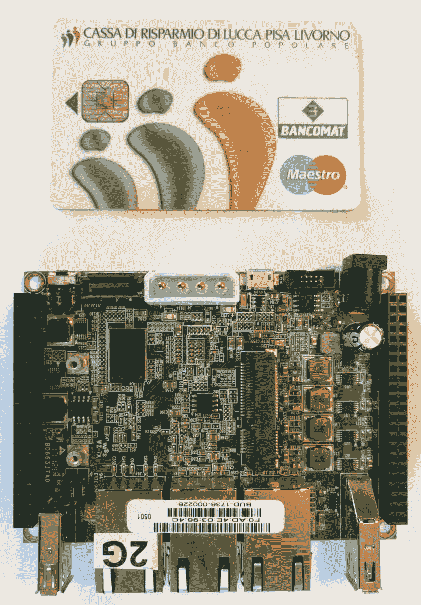
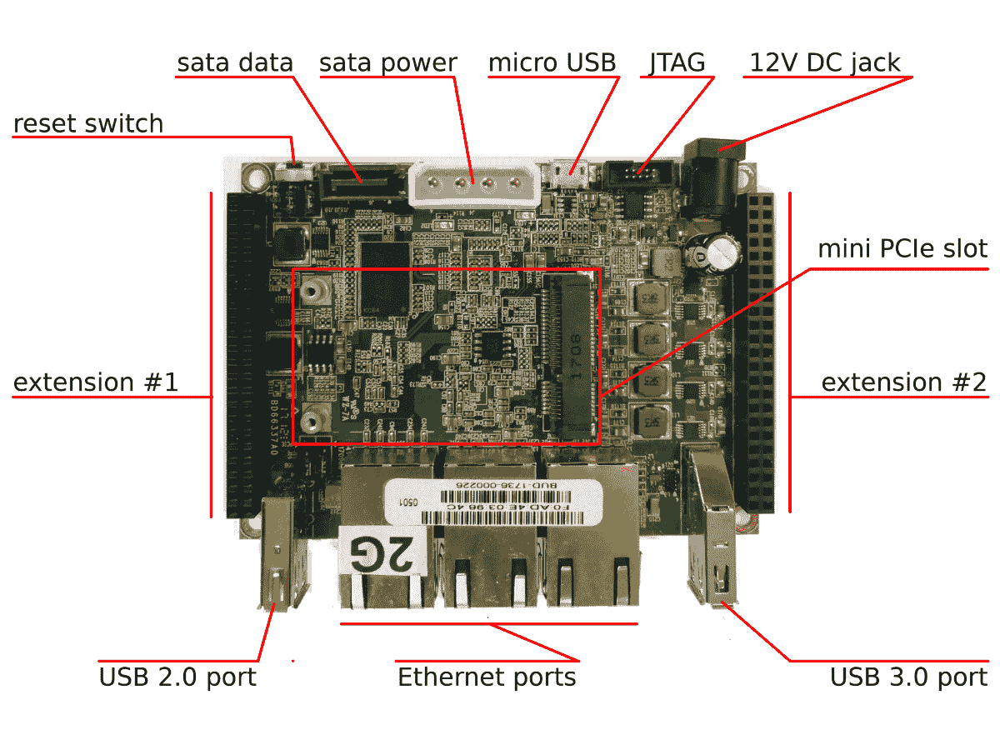
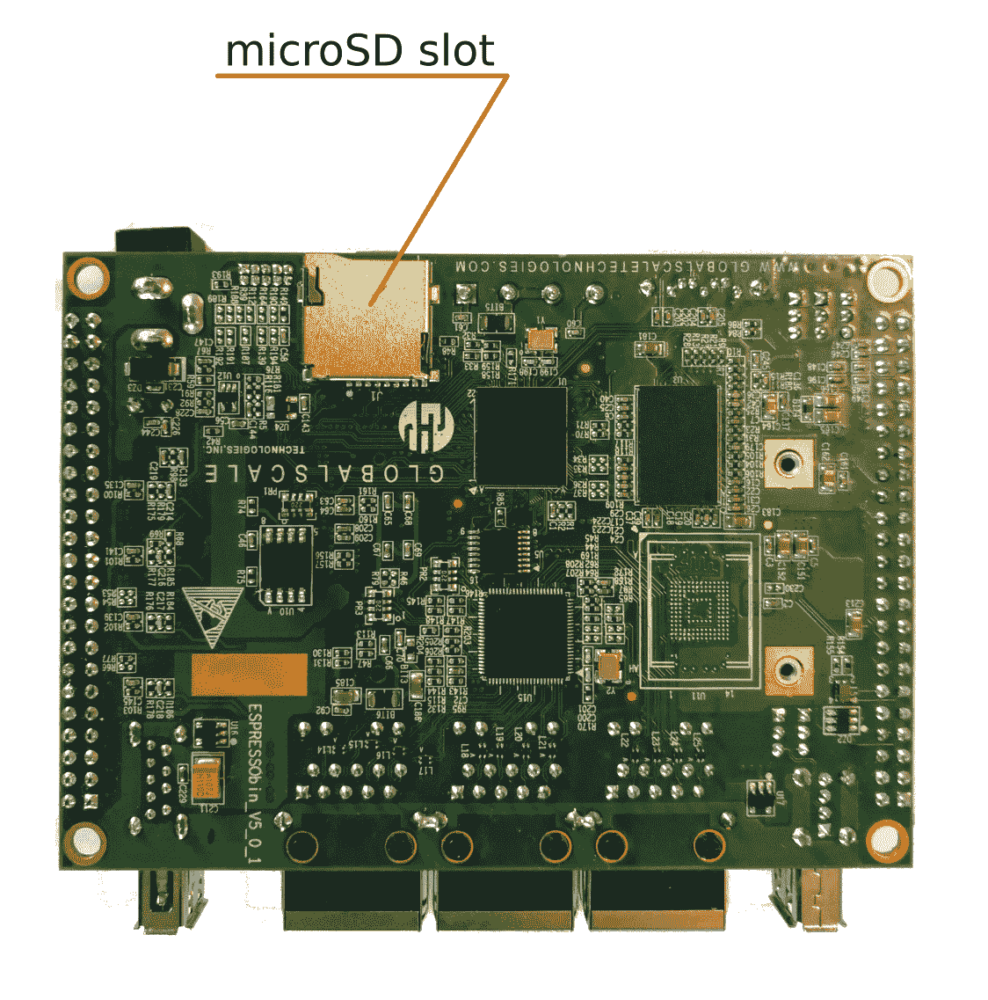
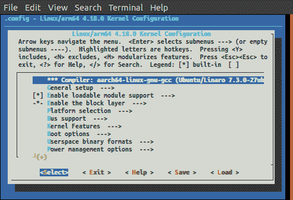
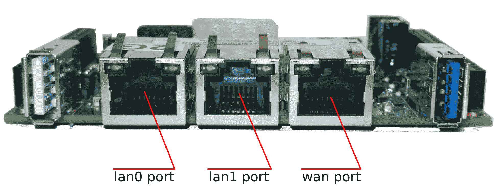

# 第一章：安装开发系统

在本章中，我们将介绍并设置我们的工作平台。实际上，即使我们在工作 PC 上编写并测试自己的设备驱动程序，建议使用第二台设备来测试代码。这是因为我们将在内核空间工作，即使有一个小错误也可能导致严重的故障！此外，使用一个平台，可以测试各种外设，这些外设并不总是在 PC 上可用。当然，您可以自由选择使用自己的系统来编写和测试驱动程序，但在这种情况下，您需要注意适应您的板规格所需的修改。

在本书中，我将使用**Marvell ESPRESSObin**系统，这是一台功能强大的**ARM** 64 位机器，具有许多有趣的功能。在下图中，您可以看到 ESPRESSObin 与信用卡并排，可以了解到板的真实尺寸：



我使用的是 ESPRESSObin 的 v5 版本，而在撰写本书时最新版本（于 2018 年 9 月宣布）是 v7，因此读者应该能够在本书出版时获得这个新版本。新的 ESPRESSObin v7 将提供 1GB DDR4 和 2GB DDR4 配置（而 v5 使用 DDR3 RAM 芯片），并且新的 1.2GHz 芯片组将取代目前销售的配置，其 CPU 频率限制为 800MHz 和 1GHz。即使快速查看新的板布局，我们可以看到单个 SATA 连接器取代了现有的 SATA 电源和接口的组合，LED 布局现在重新排列成一行，并且现在放置了一个内置的 eMMC。此外，这个新版本将配备一个可选的 802.11ac +蓝牙 4.2 迷你 PCIe 无线网络卡，需另外购买。

最后，您现在可以选择订购带有完整外壳的 v7 ESPRESSObin。该产品已获得 FCC 和 CE 认证，有助于实现大规模部署。有关修订版 v7（和 v5）的更多信息，请访问[`wiki.espressobin.net/tiki-index.php?page=Quick+User+Guide`](http://wiki.espressobin.net/tiki-index.php?page=Quick+User+Guide)。

为了测试我们的新驱动程序，我们将在本章中涵盖以下内容：

+   设置主机

+   使用串行控制台

+   配置和构建内核

+   设置目标机器

+   在外部硬件上进行本地编译

# 技术要求

以下是一些有用的技术信息的网址，我们可以在这些网址上获取有关板的技术信息：

+   主页：[`espressobin.net/`](http://espressobin.net/)

+   文档维基：[`wiki.espressobin.net/tiki-index.php`](http://wiki.espressobin.net/tiki-index.php)

+   论坛：[`espressobin.net/forums/`](http://espressobin.net/forums/)

查看[`espressobin.net/tech-spec/`](http://espressobin.net/tech-spec/)上的技术规格，我们得到以下信息，可以看到 ESPRESSObin v5 在计算能力、存储、网络和可扩展性方面的优势：

| **系统芯片** (**SoC**) | Marvell Armada 3700LP (88F3720) 双核 ARM Cortex A53 处理器，最高 1.2GHz |
| --- | --- |
| 系统内存 | 1GB DDR3 或可选 2GB DDR3 |
| 存储 | 1x SATA 接口 1x 微型 SD 卡槽，可选 4GB EMMC |

| 网络连接 | 1x Topaz 网络交换机 2x GbE 以太网 LAN

1x 以太网 WAN

1x 用于无线/蓝牙低功耗外设的 MiniPCIe 插槽 |

| USB | 1x USB 3.0 1x USB 2.0

1x 微型 USB 端口 |

| 扩展 | 2 个 46 针 GPIO 头，用于连接 I2C、GPIO、PWM、UART、SPI、MMC 等附件和扩展板。 |
| --- | --- |
| 杂项 | 复位按钮和 JTAG 接口 |
| 电源供应 | 12V DC 插孔或通过微型 USB 端口 5V |
| 功耗 | 1GHz 时小于 1W 的热耗散 |

特别是，下一张截图显示了 Marvell ESPRESSObin v5 的顶部视图（从现在开始，请注意我不会再明确添加“v5”）：



在前面的截图中，我们可以看到以下组件：

+   电源连接器（12V DC 插孔）

+   重置开关

+   微型 USB 设备端口（串行控制台）

+   以太网端口

+   USB 主机端口

下一张截图显示了板子的底部视图，微型 SD 卡槽位于其中；这是我们将在本章后面创建的微型 SD 卡的插入位置：



在这本书中，我们将看到如何管理（和重新安装）完整的 Debian 发行版，这将使我们能够拥有一系列准备运行的软件包，就像在普通 PC 上一样（事实上，Debian ARM64 版本等同于 Debian x86 版本）。之后，我们将为板载开发设备驱动程序，然后在可能的情况下，将它们与连接到 ESPRESSObin 本身的真实设备进行测试。本章还包括有关如何设置主机系统的简短教程，您可以使用它来设置基于 GNU/Linux 的工作机器或专用虚拟机。

本章中使用的代码和其他文件可以从 GitHub 上下载：[`github.com/giometti/linux_device_driver_development_cookbook/tree/master/chapter_01`](https://github.com/giometti/linux_device_driver_development_cookbook/tree/master/chapter_01)。

# 设置主机机器

正如每个优秀的设备驱动程序开发者所知，主机机器是绝对必要的。

即使嵌入式设备如今变得更加强大（以及 ESPRESSObin

是其中之一），主机机器可以帮助处理一些资源密集型的任务。

因此，在本节中，我们将展示如何设置我们的主机机器。

我们决定使用的主机机器可以是普通 PC 或虚拟机——它们是等效的——但重要的是它必须运行基于 GNU/Linux 的操作系统。

# 准备工作

在本书中，我将使用基于 Ubuntu 18.04 LTS 的系统，但您可以决定尝试在另一个主要的 Linux 发行版中复制一些设置和安装命令，对于 Debian 衍生版来说，这将需要很少的努力，或者在非 Debian 衍生版发行版中需要更多的复杂操作。

我不打算展示如何在 PC 上或虚拟机上安装全新的 Ubuntu 系统，因为对于真正的程序员来说，这是一项非常容易的任务；然而，作为本章的最后一步（*在外部硬件上进行本地编译*配方），我将介绍一个有趣的跨平台环境，并详细介绍如何安装它，这个环境被证明对于在主机机器上编译外部目标代码非常有用。当我们需要在开发 PC 上运行多个不同的操作系统时，这个过程非常有用。

因此，此时，读者应该已经拥有自己的 PC 运行（本地或虚拟化）全新安装的 Ubuntu 18.04 LTS 操作系统。

主机 PC 的主要用途是编辑和交叉编译我们的新设备驱动程序，并通过串行控制台管理我们的目标设备，创建其根文件系统等等。

为了正确执行此操作，我们需要一些基本工具；其中一些是通用的，而其他一些取决于我们将要编写驱动程序的特定平台。

通用工具肯定包括编辑器、版本控制系统和编译器及其相关组件，而特定平台工具主要是交叉编译器及其相关组件（在某些平台上，我们可能需要额外的工具，但我们的需求可能有所不同，在任何情况下，每个制造商都会为我们提供所有所需的舒适编译环境）。

关于编辑器：我不打算在上面浪费任何言语，因为读者可以使用他们想要的任何编辑器（例如，我仍然使用 vi 编辑器进行编程），但是对于其他工具，我将不得不更具体。

# 如何做...

现在我们的 GNU/Linux 发行版已经在我们的主机 PC 上运行起来了，我们可以开始安装一些我们在本书中要使用的程序：

1.  首先，让我们安装基本的编译工具：

```
$ sudo apt install gcc make pkg-config \
 bison flex ncurses-dev libssl-dev \
 qemu-user-static debootstrap
```

正如您已经知道的那样，`sudo`命令用于以特权用户身份执行命令。它应该已经存在于您的系统中，否则您可以使用`apt install sudo`命令作为 root 用户进行安装。

1.  接下来，我们必须测试编译工具。我们应该能够编译一个 C 程序。作为一个简单的测试，让我们使用存储在`helloworld.c`文件中的以下标准*Hello World*代码：

```
#include <stdio.h>

int main(int argc, char *argv[])
{
    printf("Hello World!\n");

    return 0;
}
```

请记住，代码可以从我们的 GitHub 存储库中下载。

1.  现在，我们应该能够通过使用以下命令来编译它：

```
$ make CFLAGS="-Wall -O2" helloworld
cc -Wall -O2 helloworld.c -o helloworld
```

在上面的命令中，我们同时使用了编译器和`make`工具，这是在舒适和可靠的方式下编译每个 Linux 驱动程序所必需的。

您可以通过查看[`www.gnu.org/software/make/`](https://www.gnu.org/software/make/)来获取有关`make`的更多信息，对于`gcc`，您可以转到[`www.gnu.org/software/gcc/`](https://www.gnu.org/software/gcc/)。

1.  最后，我们可以在主机 PC 上进行测试，如下所示：

```
$ ./helloworld 
Hello World!
```

1.  下一步是安装交叉编译器。由于我们将使用 ARM64 系统，我们需要一个交叉编译器及其相关工具。要安装它们，我们只需使用以下命令：

```
$ sudo apt install gcc-7-aarch64-linux-gnu
```

请注意，我们还可以使用 ESPRESSObin 维基中报告的外部工具链，网址为[`wiki.espressobin.net/tiki-index.php?page=Build+From+Source+-+Toolchain`](http://wiki.espressobin.net/tiki-index.php?page=Build+From+Source+-+Toolchain)；但是，Ubuntu 工具链运行得很完美！

1.  安装完成后，通过使用上述*Hello World*程序来测试我们的新交叉编译器，如下所示：

```
$ sudo ln -s /usr/bin/aarch64-linux-gnu-gcc-7 /usr/bin/aarch64-linux-gnu-gcc
$ make CC=aarch64-linux-gnu-gcc CFLAGS="-Wall -O2" helloworld
aarch64-linux-gnu-gcc-7 -Wall -O2 helloworld.c -o helloworld
```

请注意，我已经删除了先前编译的`helloworld`程序，以便能够正确编译这个新版本。为此，我使用了`mv helloworld helloworld.x86_64`命令，因为我将再次需要 x86 版本。

还要注意，由于 Ubuntu 不会自动创建标准的交叉编译器名称`aarch64-linux-gnu-gcc`，我们必须在执行`make`之前手动执行上述`ln`命令。

1.  好了，现在我们可以通过使用以下`file`命令来验证为 ARM64 新创建的`helloworld`程序的版本。这将指出程序编译为哪个平台：

```
$ file helloworld
helloworld: ELF 64-bit LSB shared object, ARM aarch64, version 1 (SYSV), dynamically linked, interpreter /lib/ld-linux-aarch64.so.1, for GNU/Linux 3.7.0, BuildID[sha1]=c0d6e9ab89057e8f9101f51ad517a253e5fc4f10, not stripped
```

如果我们再次在先前重命名的版本`helloworld.x86_64`上使用`file`命令，我们会得到以下结果：

```
$ file helloworld.x86_64 
helloworld.x86_64: ELF 64-bit LSB shared object, x86-64, version 1 (SYSV), dynamically linked, interpreter /lib64/ld-linux-x86-64.so.2, for GNU/Linux 3.2.0, BuildID[sha1]=cf932fab45d36f89c30889df98ed382f6f648203, not stripped
```

1.  要测试这个新版本是否真的是为 ARM64 平台而编译的，我们可以使用**QEMU**，这是一个开源的通用机器模拟器和虚拟化程序，能够在运行平台上执行外部代码。要安装它，我们可以使用`apt`命令，如上述代码中所示，指定`qemu-user-static`包：

```
$ sudo apt install qemu-user-static
```

1.  然后，我们可以执行我们的 ARM64 程序：

```
$ qemu-aarch64-static -L /usr/aarch64-linux-gnu/ ./helloworld
Hello World!
```

要获取有关 QEMU 的更多信息，一个很好的起点是它的主页[`www.qemu.org/`](https://www.qemu.org/)。

1.  下一步是安装版本控制系统。我们必须安装用于 Linux 项目的版本控制系统，即`git`。要安装它，我们可以像之前一样使用以下命令：

```
$ sudo apt install git
```

如果一切正常，我们应该能够按如下方式执行它：

```
$ git --help
usage: git [--version] [--help] [-C <path>] [-c <name>=<value>]
           [--exec-path[=<path>]] [--html-path] [--man-path]
           [--info-path] [-p | --paginate | --no-pager]
           [--no-replace-objects] [--bare] [--git-dir=<path>]
           [--work-tree=<path>] [--namespace=<name>]
           <command> [<args>]

These are common Git commands used in various situations:

start a working area (see also: git help tutorial)
   clone Clone a repository into a new directory
   init Create an empty Git repository or reinitialise an existing one
...
```

在本书中，我将解释每个使用的`git`命令，但是为了完全了解这个强大的工具，我建议您开始阅读[`git-scm.com/`](https://git-scm.com/)。

# 另请参阅

+   有关 Debian 软件包管理的更多信息，您可以在互联网上搜索，但一个很好的起点是[`wiki.debian.org/Apt，`](https://wiki.debian.org/Apt)而有关编译工具（`gcc`，`make`和其他 GNU 软件）的最佳文档在[`www.gnu.org/software/`](https://www.gnu.org/software/)。

+   然后，有关`git`的更好文档的最佳位置在[`git-scm.com/book/en/v2`](https://git-scm.com/book/en/v2)，那里有在线提供的精彩书籍*Pro Git*！

# 使用串行控制台

正如已经说明的（以及任何嵌入式设备的真正程序员所知道的），串行控制台在设备驱动程序开发阶段是必不可少的！因此，让我们看看如何通过其串行控制台访问我们的 ESPRESSObin。

# 准备工作

如*技术要求*部分的截图所示，有一个微型 USB 连接器可用，并且直接连接到 ESPRESSObin 的串行控制台。因此，使用适当的 USB 电缆，我们可以将其连接到我们的主机 PC。

如果所有连接都正常，我们可以执行任何串行终端仿真器来查看串行控制台的数据。关于这个工具，我必须声明，作为编辑程序，我们可以使用任何我们喜欢的。但是，我将展示如何安装两个更常用的终端仿真程序——`minicom`和`screen`。

请注意，此工具并非绝对必需，其使用取决于您将要使用的平台；但是，在我看来，这是有史以来最强大的开发和调试工具！因此，您绝对需要它。

要安装`minicom`，请使用以下命令：

```
$ sudo apt install minicom
```

现在，要安装名为`screen`的终端仿真器**，**我们只需将`minicom`字符串替换为`screen`数据包名称，如下所示：

```
$ sudo apt install screen
```

它们都需要一个串行端口来工作，并且调用命令非常相似。为简洁起见，我将仅报告它们与 ESPRESSObin 连接的用法；但是，有关它们的更多信息，您应该参考它们的手册页（使用`man minicom`和`man screen`来显示它们）。

# 如何做到...

要测试与目标系统的串行连接，我们可以执行以下步骤：

1.  首先，我们必须找到正确的串行端口。由于 ESPRESSObin 使用 USB 模拟串行端口（波特率为 115,200），通常我们的目标端口被命名为`ttyUSB0`（但您的情况可能有所不同，因此在继续之前让我们验证一下），因此我们必须使用以下`minicom`命令来连接 ESPRESSObin 串行控制台：

```
$ minicom -o -D /dev/ttyUSB0
```

要正确访问串行控制台，我们可能需要适当的权限。实际上，我们可以尝试执行前面的`minicom`命令，但是我们没有输出！这是因为如果我们没有足够的权限访问端口，`minicom`命令会悄悄退出。我们可以通过简单地使用另一个命令来验证我们的权限，如下所示：

**`$ cat /dev/ttyUSB0`**

`cat: /dev/ttyUSB0: Permission denied`

在这种情况下，`cat`命令完美地告诉我们出了什么问题，因此我们可以使用`sudo`来解决这个问题，或者更好的是，通过正确将我们系统的用户添加到正确的组，如下所示：

**`$ ls -l /dev/ttyUSB0`** `crw-rw---- 1 root dialout 188, 0 Jan 12 23:06 /dev /ttyUSB0`

**`$ sudo adduser $LOGNAME dialout`**

然后，我们注销并重新登录，就可以无问题地访问串行设备了。

1.  使用`screen`的等效命令如下所示：

```
$ screen /dev/ttyUSB0 115200
```

请注意，在`minicom`上，我没有指定串行通信选项（波特率，奇偶校验等），而对于`screen`，我在命令行上添加了波特率；这是因为我的默认`minicom`配置会自动使用正确的通信选项，而`screen`使用 9,600 波特率作为默认波特率。有关如何进行此设置以适应您的需求的进一步信息，请参阅程序手册页。

1.  如果一切顺利，在正确的串行端口上执行终端仿真器后，打开我们的 ESPRESSObin（只需插入电源）。我们应该在终端上看到以下输出：

```
NOTICE: Booting Trusted Firmware
NOTICE: BL1: v1.3(release):armada-17.06.2:a37c108
NOTICE: BL1: Built : 14:31:03, Jul 5 2NOTICE: BL2: v1.3(release):armada-17.06.2:a37c108
NOTICE: BL2: Built : 14:31:04, Jul 5 201NOTICE: BL31: v1.3(release):armada-17.06.2:a37c108
NOTICE: BL31:

U-Boot 2017.03-armada-17.06.3-ga33ecb8 (Jul 05 2017 - 14:30:47 +0800)

Model: Marvell Armada 3720 Community Board ESPRESSOBin
       CPU @ 1000 [MHz]
       L2 @ 800 [MHz]
       TClock @ 200 [MHz]
       DDR @ 800 [MHz]
DRAM: 2 GiB
U-Boot DComphy-0: USB3 5 Gbps 
Comphy-1: PEX0 2.5 Gbps 
Comphy-2: SATA0 6 Gbps 
SATA link 0 timeout.
AHCI 0001.0300 32 slots 1 ports 6 Gbps 0x1 impl SATA mode
flags: ncq led only pmp fbss pio slum part sxs 
PCIE-0: Link down
MMC: sdhci@d0000: 0
SF: Detected w25q32dw with page size 256 Bytes, erase size 4 KiB, total 4 MiB
Net: eth0: neta@30000 [PRIME]
Hit any key to stop autoboot: 2 
```

# 另请参阅

+   有关如何连接 ESPRESSObin 串行端口的更多信息，您可以查看其关于串行连接的 wiki 部分[`wiki.espressobin.net/tiki-index.php?page=Serial+connection+-+Linux`](http://wiki.espressobin.net/tiki-index.php?page=Serial+connection+-+Linux)。

# 配置和构建内核

现在，是时候下载内核源代码，然后配置和构建它们了。这一步是必需的，原因有几个：第一个是我们需要一个内核来引导我们的 ESPRESSObin 以启动操作系统，第二个是我们需要一个配置好的内核源树来编译我们的驱动程序。

# 准备就绪

由于我们的 ESPRESSObin 现在已经支持到 vanilla 内核自 4.11 版本以来，我们可以使用以下`git`命令获取 Linux 源代码：

```
$ git clone git://git.kernel.org/pub/scm/linux/kernel/git/torvalds/linux.git
```

这个命令需要很长时间才能完成，所以我建议您喝杯您最喜欢的咖啡休息一下（就像真正的程序员应该做的那样）。

完成后，我们可以进入`linux`目录查看 Linux 源代码：

```
$ cd linux/
$ ls
arch CREDITS firmware ipc lib mm scripts usr
block crypto fs Kbuild LICENSES net security virt
certs Documentation include Kconfig MAINTAINERS README sound
COPYING drivers init kernel Makefile samples tools
```

这些源代码与最新的内核发布相关，可能不稳定，因此为了确保我们使用的是稳定的内核发布（或*长期发布*），让我们提取 4.18 版本，这是撰写本章时的当前稳定发布，如下所示：

```
$ git checkout -b v4.18 v4.18
```

# 如何做...

在开始编译之前，我们必须配置内核和我们的编译环境。

1.  最后一个任务非常简单，它包括执行以下环境变量分配：

```
$ export ARCH=arm64
$ export CROSS_COMPILE=aarch64-linux-gnu-
```

1.  然后，我们可以通过简单地使用以下命令选择 ESPRESSObin 标准内核配置：

```
$ make defconfig
```

根据您使用的内核版本，默认配置文件也可能称为`mvebu_defconfig`，也可能称为`mvebu_v5_defconfig`或`mvebu_v7_defconfig`。因此，请查看`linux/arch/arm64/configs/`目录，以查看哪个文件最适合您的需求。

在我的系统中，我有以下内容：

**`$ ls linux/arch/arm64/configs/`**

`defconfig`

1.  如果我们希望修改此默认配置，可以执行`make menuconfig`命令，这将显示一个漂亮的菜单，我们可以在其中输入我们的修改以满足我们的需求。以下屏幕截图显示了内核配置菜单在终端上的外观：



1.  在继续之前，我们必须确保**分布式交换架构**（**DSA**）已经在内核中启用，否则我们将无法使用以太网端口！这是因为 ESPRESSObin 具有一个复杂（而且非常强大）的内部网络交换机，必须使用此特殊支持进行管理。

有关 DSA 的更多信息，您可以开始阅读`linux/Documentation/networking/dsa/dsa.txt`文件，该文件位于我们目前正在处理的内核源代码中。

1.  要启用 DSA 支持，只需在内核菜单中导航至网络支持。转到网络选项，最后启用分布式交换架构支持条目。之后，我们必须返回到菜单的顶层，然后选择这些条目：设备驱动程序 | 网络设备支持 | 分布式交换架构驱动程序，然后启用 Marvell 88E6xxx 以太网交换芯片支持，这是 ESPRESSObin 的内置交换芯片。

请记住，要将内核功能启用为模块或内置，您需要突出显示所需的功能，然后按空格键，直到<>字符内的字符更改为*（表示内置，即<*>)或 M（表示模块，即<M>)。

请注意，要将 DSA 作为内置启用而不是作为模块，我们必须禁用 802.1d 以太网桥接支持（即上面的条目）。

1.  好了，所有内核设置都就绪后，我们可以使用以下`make`命令开始内核编译：

```
$ make Image dtbs modules
```

与下载命令一样，此命令将需要很长时间才能完成，因此让我建议您再休息一下。但是，为了加快编译过程，您可以尝试使用`-j`选项参数，告诉`make`使用多个并行进程来编译代码。例如，在我的机器上，有八个 CPU 线程，我使用以下命令：

**`$ make -j8 Image dtbs modules`**

因此，让我们尝试使用以下`lscpu`命令来获取系统的 CPU 数量：

**`lscpu | grep '^CPU(s):'`**

`CPU(s): 8`

或者，在 Ubuntu/Debian 上，还有预安装的`nproc`实用程序，因此以下命令也可以完成任务：

**`$ make -j$(nproc)`**

完成后，我们应该将内核映像放入`arch/arm64/boot/Image`文件中，并将设备树二进制文件放入`arch/arm64/boot/dts/marvell/armada-3720-espressobin.dtb`文件中，这些文件已准备好传输到我们将在下一个配方中构建的 microSD 中，*设置目标机器*。

# 另请参阅

+   有关可用的 ESPRESSObin 内核版本以及如何获取、编译和安装它们的进一步信息，请参阅 ESPRESSObin 的维基页面[`wiki.espressobin.net/tiki-index.php?page=Build+From+Source+-+Kernel`](http://wiki.espressobin.net/tiki-index.php?page=Build+From+Source+-+Kernel)。

# 设置目标机器

现在，是时候在目标系统上安装我们需要的东西了；由于 ESPRESSObin 只带有引导加载程序出售，我们必须做一些工作，以便获得一个具有适当操作系统的完全功能系统。

在本书中，我将使用 Debian OS 为 ESPRESSObin，但您可以使用其他 OS，如[`wiki.espressobin.net/tiki-index.php?page=Software+HowTo`](http://wiki.espressobin.net/tiki-index.php?page=Software+HowTo)中所述。在这个网站上，您可以获取有关如何正确设置 ESPRESSObin 以满足您需求的更详细信息。

# 准备工作

即使 ESPRESSObin 可以从不同的介质引导，我们将使用 microSD，因为这是设置系统的最简单和最有用的方式。有关不同介质，请参阅 ESPRESSObin 的维基页面—参见[`wiki.espressobin.net/tiki-index.php?page=Boot+from+removable+storage+-+Ubuntu`](http://wiki.espressobin.net/tiki-index.php?page=Boot+from+removable+storage+-+Ubuntu)以获取一些示例。

# 如何做到这一点...

要设置 microSD，我们必须使用我们的主机 PC，因此插入它，然后找到相应的设备。

1.  如果我们使用 SD/microSD 插槽，一旦插入介质，我们将在内核消息中得到类似以下内容：

```
mmc0: cannot verify signal voltage switch
mmc0: new ultra high speed SDR50 SDHC card at address aaaa
mmcblk0: mmc0:aaaa SL08G 7.40 GiB 
 mmcblk0: p1
```

要在终端上获取内核消息，我们可以使用`dmesg`命令。

但是，如果我们要使用 microSD 到 USB 适配器内核，消息将如下所示：

```
usb 1-6: new high-speed USB device number 5 using xhci_hcd
usb 1-6: New USB device found, idVendor=05e3, idProduct=0736
usb 1-6: New USB device strings: Mfr=3, Product=4, SerialNumber=2
usb 1-6: Product: USB Storage
usb 1-6: Manufacturer: Generic
usb 1-6: SerialNumber: 000000000272
usb-storage 1-6:1.0: USB Mass Storage device detected
scsi host4: usb-storage 1-6:1.0
usbcore: registered new interface driver usb-storage
usbcore: registered new interface driver uas
scsi 4:0:0:0: Direct-Access Generic STORAGE DEVICE 0272 PQ: 0 ANSI: 0
sd 4:0:0:0: Attached scsi generic sg3 type 0
sd 4:0:0:0: [sdc] 15523840 512-byte logical blocks: (7.95 GB/7.40 GiB)
sd 4:0:0:0: [sdc] Write Protect is off
sd 4:0:0:0: [sdc] Mode Sense: 0b 00 00 08
sd 4:0:0:0: [sdc] No Caching mode page found
sd 4:0:0:0: [sdc] Assuming drive cache: write through
 sdc: sdc1
sd 4:0:0:0: [sdc] Attached SCSI removable disk
```

1.  另一个查找介质的简单方法是使用`lsblk`命令，如下所示：

```
$ lsblk 
NAME MAJ:MIN RM SIZE RO TYPE MOUNTPOINT
loop0 7:0 0 5M 1 loop /snap/gedit/66
loop1 7:1 0 4.9M 1 loop /snap/canonical-livepatch/50
...
sdb 8:16 0 931.5G 0 disk 
└─sdb1 8:17 0 931.5G 0 part /run/schroot/mount/ubuntu-xenial-amd64-f72c490
sr0 11:0 1 1024M 0 rom 
mmcblk0 179:0 0 7.4G 0 disk 
└─mmcblk0p1
        179:1 0 7.4G 0 part /media/giometti/5C60-6750
```

1.  现在很明显，我们的 microSD 卡在此列为`/dev/mmcblk0`，但它不是空的。由于我们想要清除它的所有内容，我们必须首先使用以下命令清除它：

```
$ sudo dd if=/dev/zero of=/dev/mmcblk0 bs=1M count=100
```

1.  在进行清除之前，您可能需要卸载设备，以便在媒体设备上安全工作，因此让我们使用`umount`命令在所有设备的所有分区上卸载它们，就像我将在我的 microSD 上的唯一定义的分区中所做的那样：

```
$ sudo umount /dev/mmcblk0p1
```

对于 microSD 上定义的每个分区，您必须重复此命令。

1.  现在，我们将使用下一个命令在空 SD 卡上创建一个新分区`/dev/mmcblk0p1`：

```
$ (echo n; echo p; echo 1; echo ''; echo ''; echo w) | sudo fdisk /dev/mmcblk0
```

如果一切正常，我们的 microSD 介质应该显示为格式化的，如下所示：

```
$ sudo fdisk -l /dev/mmcblk0
Disk /dev/mmcblk0: 7.4 GiB, 7948206080 bytes, 15523840 sectors
Units: sectors of 1 * 512 = 512 bytes
Sector size (logical/physical): 512 bytes / 512 bytes
I/O size (minimum/optimal): 512 bytes / 512 bytes
Disklabel type: dos
Disk identifier: 0x34f32673

Device Boot Start End Sectors Size Id Type
/dev/mmcblk0p1 2048 15523839 15521792 7.4G 83 Linux
```

1.  然后，我们必须使用以下命令将其格式化为 EXT4：

```
$ sudo mkfs.ext4 -O ^metadata_csum,⁶⁴bit -L root /dev/mmcblk0p1
```

请注意，此命令行仅适用于`e2fsprogs`版本>=1.43！如果您使用较旧的版本，应使用以下命令：

**`$ sudo mkfs.ext4 -L root /dev/mmcblk0p1`**

1.  接下来，在本地 Linux 机器上挂载此分区：

```
$ sudo mount /dev/mmcblk0p1 /mnt/
```

请注意，在某些操作系统（特别是 Ubuntu）上，一旦我们拔掉然后再次插入媒体设备，它就会自动挂载到`/media/$USER/root`中，其中`$USER`是一个保存您用户名的环境变量。例如，在我的机器上，我有以下内容：

**`$ ls -ld /media/$USER/root`**

`drwxr-xr-x 3 root root 4096 Jan 10 14:28 /media/giometti/root/`

# 添加 Debian 文件

我决定使用 Debian 作为目标操作系统，因为它是我用于开发（并且在可能的情况下用于生产）系统的最喜欢的发行版：

1.  要安装它，我们再次使用 QEMU 软件，使用以下命令：

```
$ sudo qemu-debootstrap \
 --arch=arm64 \
 --include="sudo,file,openssh-server" \
 --exclude="debfoster" \
 stretch ./debian-stretch-arm64 http://deb.debian.org/debian
```

您可能会看到有关密钥环的警告；它们是无害的，可以安全地忽略：

`W: 无法检查发布签名；`

我想这是另一个咖啡时间的命令。

1.  完成后，我们应该在`debian-stretch-arm64`中找到一个干净的 Debian 根文件系统，但是，在将其转移到 microSD 之前，我们应该像这样修复`hostname`文件的内容：

```
$ sudo bash -c 'echo espressobin | cat > ./debian-stretch-arm64/etc/hostname'
```

1.  然后，我们必须将串行设备`ttyMV0`添加到`/etc/securetty`文件中，以便能够通过串行设备`/dev/ttyMV0`登录为根用户。使用以下命令：

```
$ sudo bash -c 'echo -e "\n# Marvell serial ports\nttyMV0" | \
 cat >> ./debian-stretch-arm64/etc/securetty'
```

使用`man securetty`获取有关通过串行连接登录根用户的更多信息。

1.  最后一步，我们必须设置根密码：

```
$ sudo chroot debian-stretch-arm64/ passwd
Enter new UNIX password: 
Retype new UNIX password: 
passwd: password updated successfully
```

在这里，我使用`root`字符串作为根用户的密码（您可以选择自己的密码）。

为了进一步了解`chroot`命令的使用，您可以使用`man chroot`命令，或者继续阅读本章的最后，我将更好地解释它的工作原理。

现在，我们可以使用以下命令将所有文件安全地复制到我们的 microSD 中：

```
$ sudo cp -a debian-stretch-arm64/* /media/$USER/root/
```

这是 microSD 内容应该是这样的：

```
$ ls /media/$USER/root/
bin   dev  home  lost+found  mnt  proc  run   srv  tmp  var
boot  etc  lib   media       opt  root  sbin  sys  usr
```

# 添加内核

在 OS 文件之后，我们还需要内核映像来获得运行的内核，并且在前面的部分中，我们将内核映像放入`arch/arm64/boot/Image`文件中，并将设备树二进制文件放入`arch/arm64/boot/dts/marvell/armada-3720-espressobin.dtb`文件中，这些文件已准备好转移到我们新创建的 microSD 中：

1.  让我们将它们复制到`/boot`目录中，就像这样：

```
$ sudo cp arch/arm64/boot/Image \
 arch/arm64/boot/dts/marvell/armada-3720-espressobin.dtb \
 /media/$USER/root/boot/
```

如果 microSD 中没有`/boot`目录，并且前面的命令返回错误，您可以使用以下命令进行恢复，并重新运行前面的`cp`命令：

`$ sudo mkdir /media/$USER/root/boot`

然后，`/boot`目录应该是这样的：

```
$ ls /media/$USER/root/boot/
armada-3720-espressobin.dtb  Image
```

1.  前面的文件足以启动系统；但是，为了安装内核模块和头文件，这对于编译新软件很有用，我们可以在将所有 Debian 文件安装到 microSD 后使用下一个命令（以避免用 Debian 文件覆盖）：

```
$ sudo -E make modules_install INSTALL_MOD_PATH=/media/$USER/root/
$ sudo -E make headers_install INSTALL_HDR_PATH=/media/$USER/root/usr/
```

好了，现在我们终于准备好将所有内容绑定在一起并运行我们的新 Debian 系统，所以让我们卸载 microSD 并将其插入 ESPRESSObin。

# 设置引导变量

上电后，我们应该从串行控制台获得引导加载程序的消息，然后我们应该看到超时运行到 0，然后执行自动引导：

1.  通过按键盘上的*Enter*键快速停止倒计时，以获得引导加载程序的提示，如下所示：

```
Model: Marvell Armada 3720 Community Board ESPRESSOBin
       CPU @ 1000 [MHz]
       L2 @ 800 [MHz]
       TClock @ 200 [MHz]
       DDR @ 800 [MHz]
DRAM: 2 GiB
U-Boot DComphy-0: USB3 5 Gbps 
Comphy-1: PEX0 2.5 Gbps 
Comphy-2: SATA0 6 Gbps 
SATA link 0 timeout.
AHCI 0001.0300 32 slots 1 ports 6 Gbps 0x1 impl SATA mode
flags: ncq led only pmp fbss pio slum part sxs 
PCIE-0: Link down
MMC: sdhci@d0000: 0
SF: Detected w25q32dw with page size 256 Bytes, erase size 4 KiB, total 4 MiB
Net: eth0: neta@30000 [PRIME]
Hit any key to stop autoboot: 0 
Marvell>>
```

ESPRESSObin 的引导加载程序是 U-Boot，其主页位于[`www.denx.de/wiki/U-Boot`](https://www.denx.de/wiki/U-Boot)。

1.  现在，让我们再次使用`ext4ls`命令检查 microSD 卡是否具有必要的文件，如下所示：

```
Marvell>> ext4ls mmc 0:1 boot
<DIR> 4096 .
<DIR> 4096 ..
        18489856 Image
            8359 armada-3720-espressobin.dtb
```

好了，一切就绪，所以只需要一些变量就可以从 microSD 卡启动。

1.  我们可以使用`echo`命令在任何时候显示当前定义的变量，并且可以使用`setenv`命令可选地重新配置它们。首先，检查并设置正确的镜像和设备树路径和名称：

```
Marvell>> echo $image_name
Image
Marvell>> setenv image_name boot/Image
Marvell>> echo $fdt_name
armada-3720-espressobin.dtb
Marvell>> setenv fdt_name boot/armada-3720-espressobin.dtb
```

请注意，文件名是正确的，但路径名不正确；这就是为什么我使用`setenv`命令正确重新定义它们。

1.  接下来，定义`bootcmd`变量，我们将使用它从 microSD 卡启动：

```
Marvell>> setenv bootcmd 'mmc dev 0; \
 ext4load mmc 0:1 $kernel_addr $image_name; \
 ext4load mmc 0:1 $fdt_addr $fdt_name; \
 setenv bootargs $console root=/dev/mmcblk0p1 rw rootwait; \
 booti $kernel_addr - $fdt_addr'
```

我们必须小心设置前面的根路径，指向我们提取 Debian 文件系统的位置（在我们的情况下是第一个分区）。

1.  使用`saveenv`命令随时保存设置的变量。

1.  最后，我们通过简单输入`reset`命令启动 ESPRESSObin，如果一切正常，我们应该看到系统启动并运行，最后，我们应该看到系统登录提示，如下所示：

```
Debian GNU/Linux 9 espressobin ttyMV0

giometti-VirtualBox login:
```

1.  现在，使用之前设置的`root`密码以 root 身份登录：

```
Debian GNU/Linux 9 espressobin ttyMV0

espressobin login: root
Password: 
Linux espressobin 4.18.0 #2 SMP PREEMPT Sun Jan 13 13:05:03 CET 2019 aarch64

The programs included with the Debian GNU/Linux system are free software;
the exact distribution terms for each program are described in the
individual files in /usr/share/doc/*/copyright.

Debian GNU/Linux comes with ABSOLUTELY NO WARRANTY, to the extent
permitted by applicable law.
root@espressobin:~# 
```

# 设置网络

好了，现在我们的 ESPRESSObin 已经准备好执行我们的代码和驱动程序了！然而，在结束本节之前，让我们看一下网络配置，因为使用 SSH 连接登录到板上或者快速复制文件可能会进一步有用（即使我们可以移除 microSD，然后直接从主机 PC 复制文件）：

1.  查看 ESPRESSObin 上可用的网络接口，我们看到以下内容：

```
# ip link
1: lo: <LOOPBACK,UP,LOWER_UP> mtu 65536 qdisc noqueue state UNKNOWN mode DEFAULT
 group default qlen 1000
    link/loopback 00:00:00:00:00:00 brd 00:00:00:00:00:00
2: eth0: <BROADCAST,MULTICAST> mtu 1500 qdisc noop state DOWN mode DEFAULT group
 default qlen 532
    link/ether 3a:ac:9b:44:90:e9 brd ff:ff:ff:ff:ff:ff
3: wan@eth0: <BROADCAST,MULTICAST,M-DOWN> mtu 1500 qdisc noop state DOWN mode DE
FAULT group default qlen 1000
    link/ether 3a:ac:9b:44:90:e9 brd ff:ff:ff:ff:ff:ff
4: lan0@eth0: <BROADCAST,MULTICAST,M-DOWN> mtu 1500 qdisc noop state DOWN mode D
EFAULT group default qlen 1000
    link/ether 3a:ac:9b:44:90:e9 brd ff:ff:ff:ff:ff:ff
5: lan1@eth0: <BROADCAST,MULTICAST,M-DOWN> mtu 1500 qdisc noop state DOWN mode D
EFAULT group default qlen 1000
    link/ether 3a:ac:9b:44:90:e9 brd ff:ff:ff:ff:ff:ff
```

`eth0`接口是将 CPU 与以太网交换机连接的接口，而`wan`、`lan0`和`lan1`接口是我们可以物理连接以太网电缆的接口（请注意，系统将它们称为`wan@eth0`、`lan0@eth0`和`lan1@eth1`，以突出它们是`eth0`的从属）。以下是 ESPRESSObin 的照片，我们可以看到每个以太网端口及其标签：



1.  尽管它们的名称不同，但所有端口都是等效的，因此将以太网电缆连接到一个端口（我将使用`wan`），然后在`eth0`之后启用它，如下所示：

```
# ip link set eth0 up
mvneta d0030000.ethernet eth0: configuring for fixed/rgmii-id link mode
mvneta d0030000.ethernet eth0: Link is Up - 1Gbps/Full - flow control off
# ip link set wan up 
mv88e6085 d0032004.mdio-mii:01 wan: configuring for phy/ link mode
mv88e6085 d0032004.mdio-mii:01 wan: Link is Up - 100Mbps/Full - flow control rx/tx
```

请注意，在上述输出中，还有显示一切正常时应看到的内核消息。

1.  现在，我们可以手动设置 IP 地址，或者使用`dhclient`命令询问 DHCP 服务器，以获取上网所需的信息：

```
# dhclient wan
```

这是我的网络配置：

```
# ip addr show wan
3: wan@eth0: <BROADCAST,MULTICAST,UP,LOWER_UP> mtu 1500 qdisc noqueue state UP g
roup default qlen 1000
    link/ether 9e:9f:6b:5c:cf:fc brd ff:ff:ff:ff:ff:ff
    inet 192.168.0.100/24 brd 192.168.0.255 scope global wan
       valid_lft forever preferred_lft forever
```

1.  现在，我们已经准备好安装新软件，或者尝试建立与 ESPRESSObin 的 SSH 连接；为此，让我们验证`/etc/ssh/sshd_config`文件中是否有以下 SSH 服务器的配置：

```
# grep 'PermitRootLogin yes' /etc/ssh/sshd_config
PermitRootLogin yes
```

1.  如果我们没有输出，就无法以 root 身份登录到我们的 ESPRESSObin，因此我们必须将`PermitRootLogin`设置更改为`yes`，然后重新启动守护程序：

```
# /etc/init.d/ssh restart

Restarting ssh (via systemctl): ssh.service.
```

1.  现在，在主机 PC 上，我们可以尝试通过 SSH 登录，如下所示：

```
$ ssh root@192.168.0.100
root@192.168.0.100's password: 
Linux espressobin 4.18.0 #2 SMP PREEMPT Sun Jan 13 13:05:03 CET 2019 aarch64

The programs included with the Debian GNU/Linux system are free software;
the exact distribution terms for each program are described in the
individual files in /usr/share/doc/*/copyright.

Debian GNU/Linux comes with ABSOLUTELY NO WARRANTY, to the extent
permitted by applicable law.
Last login: Thu Nov 3 17:16:59 2016
-bash: warning: setlocale: LC_ALL: cannot change locale (en_GB.UTF-8)
```

# 参见

+   要获取有关如何在不同操作系统上设置 ESPRESSObin 的更多信息，您可以查看[`wiki.espressobin.net/tiki-index.php?page=Software+HowTo`](http://wiki.espressobin.net/tiki-index.php?page=Software+HowTo)。

+   有关`qemu-debootstrap`的更多信息，一个很好的起点是[`wiki.ubuntu.com/ARM/RootfsFromScratch/QemuDebootstrap`](https://wiki.ubuntu.com/ARM/RootfsFromScratch/QemuDebootstrap)。要管理以太网设备并获取有关 Debian 操作系统上网络的更多信息，您可以查看以下内容：[`wiki.debian.org/NetworkConfiguration`](https://wiki.debian.org/NetworkConfiguration)。

# 在外部硬件上进行本地编译

在结束本章之前，我想介绍一个有趣的跨平台系统，当我们需要在开发 PC 上运行多个不同的操作系统时非常有用。当我们需要一个完整的操作系统来编译设备驱动程序或应用程序，但没有目标设备来进行编译时，这一步非常有用。我们可以使用我们的主机 PC 来跨不同的操作系统和操作系统版本为外部硬件编译代码。

# 准备就绪

在我的职业生涯中，我使用了大量不同的平台，并且为它们所有都有一个虚拟机非常复杂且真正消耗系统资源（特别是如果我们决定同时运行其中几个！）。这就是为什么拥有一个可以在您的 PC 上执行外部代码的轻量级系统可能会很有趣。当然，这种方法不能用于测试设备驱动程序（我们需要真正的硬件来进行测试），但我们可以用它来快速运行本地编译器和/或本地用户空间代码，以防我们的嵌入式平台出现问题。让我们看看我在说什么。

在*设置目标机器*配方中，关于 Debian OS 安装，我们使用`chroot`命令设置根密码。这个命令得到了 QEMU 的支持；事实上，在`debian-stretch-arm64`目录中，我们有一个 ARM64 根文件系统，可以在 x86_64 平台上仅使用 QEMU 执行。很明显，以这种方式，我们应该能够执行任何我们想要的命令，当然，我们将能够像下一个配方中一样执行 Bash shell。

# 如何做...

现在是时候看看`chroot`是如何工作的了：

1.  通过使用我们的 x86_64 主机执行 ARM64 `bash`命令，如下所示：

```
$ sudo chroot debian-stretch-arm64/ bash
bash: warning: setlocale: LC_ALL: cannot change locale (en_GB.UTF-8)
root@giometti-VirtualBox:/# 
```

1.  然后，我们可以像在 ESPRESSObin 上那样使用每个 ARM64 命令；例如，要列出当前目录中的文件，我们可以使用以下命令：

```
# ls /
bin  dev  home media  opt   root  sbin  sys  usr
boot etc  lib  mnt    proc  run   srv   tmp  var
# cat /etc/hostname 
espressobin
```

但是，也有一些陷阱；例如，我们完全错过了`/proc`和`/sys`目录和程序，这些程序依赖于它们，肯定会失败：

```
# ls /{proc,sys}
/proc:

/sys:
# ps
Error: /proc must be mounted
  To mount /proc at boot you need an /etc/fstab line like:
      proc /proc proc defaults
  In the meantime, run "mount proc /proc -t proc"
```

为了解决这些问题，我们可以在执行`chroot`之前手动挂载这些缺失的目录，但由于它们太多了，这相当麻烦，所以我们可以尝试使用`schroot`实用程序，它反过来可以为我们完成所有这些步骤。让我们看看如何做。

有关`schroot`的详细信息，您可以使用`man schroot`查看其手册页面。

# 安装和配置 schroot

在 Ubuntu 中，这个任务非常简单：

1.  首先，我们以通常的方式安装程序：

```
$ sudo apt install schroot
```

1.  然后，我们必须配置它，以便正确进入我们的 ARM64 系统。为此，让我们将之前创建的根文件系统复制到一个专用目录中（在那里我们还可以添加任何其他我们希望用`schroot`模拟的发行版）：

```
$ sudo mkdir /srv/chroot/
$ sudo cp -a debian-stretch-arm64/ /srv/chroot/
```

1.  然后，我们必须通过在`schroot`配置目录中添加一个新文件来为我们的新系统创建适当的配置，如下所示：

```
$ sudo bash -c 'cat > /etc/schroot/chroot.d/debian-stretch-arm64 <<__EOF__
[debian-stretch-arm64]
description=Debian Stretch (arm64)
directory=/srv/chroot/debian-stretch-arm64
users=giometti
#groups=sbuild
#root-groups=root
#aliases=unstable,default
type=directory
profile=desktop
personality=linux
preserve-environment=true
__EOF__'
```

请注意，`directory`参数设置为包含我们的 ARM64 系统的路径，`users`设置为`giometti`，这是我的用户名（这是允许访问`chroot`环境的用户的逗号分隔列表—请参阅`man schroot.conf`）。

从前面的设置中，我们看到`profile`参数设置为`desktop`；这意味着它将考虑`/etc/schroot/desktop/`目录中的所有文件。特别是，`fstab`文件包含我们希望挂载到系统中的所有挂载点。因此，我们应该验证它至少包含以下行：

```
# <filesystem> <mount point> <type> <options> <dump> <pass>
/proc           /proc         none   rw,bind   0      0
/sys            /sys          none   rw,bind   0      0
/dev            /dev          none   rw,bind   0      0
/dev/pts        /dev/pts      none   rw,bind   0      0
/home           /home         none   rw,bind   0      0
/tmp            /tmp          none   rw,bind   0      0
/opt            /opt          none   rw,bind   0      0
/srv            /srv          none   rw,bind   0      0
tmpfs           /dev/shm      tmpfs  defaults  0      0
```

1.  现在，我们必须重新启动`schroot`服务，如下所示：

```
$ sudo systemctl restart schroot
```

请注意，您也可以使用老式的方法重新启动：

**`$ sudo /etc/init.d/schroot restart`**

1.  现在我们可以通过要求它们`schroot`来列出所有可用的环境，如下所示：

```
$ schroot -l
 chroot:debian-stretch-arm64
```

1.  好的，一切就绪，我们可以进入模拟的 ARM64 系统了：

```
$ schroot -c debian-stretch-arm64
bash: warning: setlocale: LC_ALL: cannot change locale (en_GB.UTF-8)
```

由于我们还没有安装任何区域设置支持，因此前面的警告是相当明显的，应该可以安全地忽略。

1.  现在，为了验证我们是否真的在执行 ARM64 代码，让我们尝试一些命令。例如，我们可以使用`uname`命令请求一些系统信息：

```
$ uname -a
Linux giometti-VirtualBox 4.15.0-43-generic #46-Ubuntu SMP Thu Dec 6 14:45:28 UTC 2018 aarch64 GNU/Linux
```

正如我们所看到的，系统显示其平台为`aarch64`，即 ARM64。然后，我们可以尝试执行之前交叉编译的`helloworld`程序；因为在`chroot`之后，当前目录没有改变（我们的主目录仍然是相同的），我们可以简单地回到编译的地方，然后像往常一样执行程序：

```
$ cd ~/Projects/ldddc/github/chapter_1/
$ file helloworld
helloworld: ELF 64-bit LSB shared object, ARM aarch64, version 1 (SYSV), dynamically linked, interpreter /lib/ld-linux-aarch64.so.1, for GNU/Linux 3.7.0, BuildID[sha1]=c0d6e9ab89057e8f9101f51ad517a253e5fc4f10, not stripped
$ ./helloworld
Hello World!
```

该程序仍然像我们在 ARM64 系统上时一样执行。太棒了！

# 配置模拟的操作系统

如果我们不配置新系统进行本地编译，那么我们刚才看到的关于`schroot`的一切都没有意义，为了这样做，我们可以使用我们在主机 PC 上使用的每个 Debian 工具：

1.  安装完整的编译环境后，我们可以在`schroot`环境中执行以下命令：

```
$ sudo apt install gcc make \
 bison flex ncurses-dev libssl-dev
```

请注意，`sudo`将要求您通常的密码，也就是您当前用于登录到主机 PC 的密码。

您可能不会从`sudo`获得密码请求，而会收到以下错误消息：

`sudo: no tty present and no askpass program specified`

您可以尝试再次执行前面的`sudo`命令，并添加`-S`选项参数。

`apt`命令可能会通知您某些软件包无法得到验证。只需忽略此警告并继续安装，按下*Y*键回答是。

如果一切顺利，我们现在应该能够执行之前使用的每个编译命令。例如，我们可以尝试再次本地重新编译`helloworld`程序（我们应该先删除当前的可执行文件；`make`将尝试重新编译它）：

```
$ rm helloworld
$ make CFLAGS="-Wall -O2" helloworld
cc -Wall -O2 helloworld.c -o helloworld
$ file helloworld
helloworld: ELF 64-bit LSB shared object, ARM aarch64, version 1 (SYSV), dynamically linked, interpreter /lib/ld-linux-aarch64.so.1, for GNU/Linux 3.7.0, BuildID[sha1]=1393450a08fb9eea22babfb9296ce848bb806c21, not stripped
$ ./helloworld
Hello World!
```

请注意，网络支持是完全功能的，因此我们现在正在主机 PC 上的模拟 ARM64 环境上工作，就像我们在 ESPRESSObin 上一样。

# 另请参阅

+   在互联网上，有关`schroot`使用的几个示例，一个很好的起点是[`wiki.debian.org/Schroot`](https://wiki.debian.org/Schroot)。
