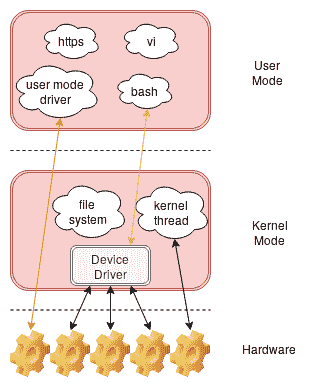

# 第三章：使用 Char 驱动程序

设备驱动程序是一种特殊的代码（在内核空间中运行），它将物理设备与系统进行接口，并通过实现一些**系统调用**在**特殊文件**上向用户空间进程提供访问，这是因为在类 Unix 的操作系统中，**一切都是文件**，物理设备被表示为特殊文件（通常放置在`/dev`目录中），每个文件连接到特定设备（因此，例如，键盘可以是名为`/dev/input0`的文件，串行端口可以是名为`/dev/ttyS1`的文件，实时时钟可以是`/dev/rtc2`）。

我们可以预期，网络设备属于一组特定的设备，不遵守这个规则，因为我们没有`/dev/eth0`文件用于`eth0`接口。这是真的，因为网络设备是唯一不遵守这个规则的设备类，因为与其他设备类不同，与网络相关的应用程序不关心单个网络接口；它们通过引用套接字在更高级别上工作。这就是为什么 Linux 不提供对网络设备的直接访问，就像其他设备类一样。

从下图中可以看出，内核空间用于将硬件抽象到用户空间，以便每个进程都使用相同的接口来访问外围设备，这个接口由一组系统调用组成。



该图还显示，除了使用设备驱动程序之外，还可以通过使用另一个接口（如**sysfs**）或实现用户空间驱动程序来访问外围设备。

由于我们的外围设备只是（特殊）文件，因此我们的驱动程序应该实现我们需要操作这些文件的系统调用，特别是用于交换数据的系统调用。例如，我们需要`open()`和`close()`系统调用来启动和停止与外围设备的通信，以及`read()`和`write()`系统调用来与其交换数据。

普通 C 函数和系统调用之间的主要区别在于后者主要在内核中执行，而函数仅在用户空间中执行。例如，`printf()`是一个函数，而`write()`是一个系统调用。后者（除了 C 函数的序言和尾声部分）在内核空间中执行，而前者主要在用户空间中执行，即使最终调用`write()`来实际将数据写入输出流（这是因为所有输入/输出数据流无论如何都必须通过内核）。

有关更多信息，请查看本书：[`prod.packtpub.com/hardware-and-creative/gnulinux-rapid-embedded-programming`](https://prod.packtpub.com/hardware-and-creative/gnulinux-rapid-embedded-programming)

好吧，本章将向我们展示如何至少实现`open()`、`close()`、`read()`和`write()`系统调用，以介绍设备驱动程序编程和字符驱动程序开发的第一步。

现在是时候编写我们的第一个设备驱动程序了！在本章中，我们将从一个非常简单的字符（或 char）驱动程序开始，以涵盖以下内容：

+   创建最简单的 char 驱动程序

+   与 char 驱动程序交换数据

+   使用“一切都是文件”抽象

# 技术要求

在本章中，我们将需要第一章和第二章中使用的内容，*安装开发系统*和*内核内部一瞥*，因此请参考它们进行交叉编译、内核模块加载和管理等操作。

有关本章的更多信息，请阅读*附录*。

本章中使用的代码和其他文件可以从 GitHub 上下载：[`github.com/giometti/linux_device_driver_development_cookbook/tree/master/chapter_03`](https://github.com/giometti/linux_device_driver_development_cookbook/tree/master/chapter_03)。

# 创建最简单的字符驱动程序

在 Linux 内核中，存在三种主要的设备类型——字符设备、块设备和网络设备。当然，我们有三种主要的设备驱动程序类型；即字符、块和网络驱动程序。在本章中，我们将看一下字符（或字符）设备，这是一种可以作为字节流访问的外围设备，例如串行端口、音频设备等。然而，在这个配方中，我们将介绍一个真正基本的字符驱动程序，它只是注册自己，除此之外什么也不做。即使它可能看起来毫无用处，我们将发现这一步确实引入了许多新概念！

实际上，可能可以通过简单地使用**sysfs**提供的一些机制在外围设备和用户空间之间交换数据，而不是通过字符、块或网络驱动程序，但这是一种特殊情况，通常仅用于必须交换简单数据类型的非常简单的设备。

# 准备工作

要实现我们的第一个字符驱动程序，我们需要使用上一章介绍的模块。这是因为使用内核模块是我们将代码注入内核空间的最简单方法。当然，我们可以决定将我们的驱动程序编译为内核内置，但是这样做，每次修改代码时我们都必须完全重新编译内核并重新启动系统（这是一种可能性，但绝对不是最好的！）。

在继续之前，先说明一点：为了更清楚地解释字符驱动程序的工作原理，并且提供一个真正简单的示例，我决定使用传统的方式将字符驱动程序注册到内核中。没有什么需要担心的，因为这种操作模式是完全合法的，仍然得到支持，在任何情况下，在*使用设备树描述字符驱动程序*配方中，在第四章中，*使用设备树*，我将介绍目前建议的注册字符驱动程序的方式。

# 如何做...

让我们从 GitHub 源代码中查看`chrdev_legacy.c`文件。我们有我们的第一个驱动程序，所以让我们开始并详细检查它：

1.  首先，让我们看一下文件的开头：

```
#define pr_fmt(fmt) "%s:%s: " fmt, KBUILD_MODNAME, __func__
#include <linux/kernel.h>
#include <linux/module.h>
#include <linux/fs.h>

/* Device major umber */
static int major;
```

1.  在`chrdev_legacy.c`的末尾，检查以下代码，其中模块的`init()`函数定义如下：

```
static int __init chrdev_init(void)
{
    int ret;

    ret = register_chrdev(0, "chrdev", &chrdev_fops);
    if (ret < 0) {
        pr_err("unable to register char device! Error %d\n", ret);
        return ret;
    }
    major = ret;
    pr_info("got major %d\n", major);

    return 0;
}
```

模块的`exit()`函数如下所示：

```
static void __exit chrdev_exit(void)
{
    unregister_chrdev(major, "chrdev");
}

module_init(chrdev_init);
module_exit(chrdev_exit);
```

1.  如果`major`号是内核中用户空间的驱动程序引用，那么**文件操作**结构（由`chrdev_fops`引用）代表了我们可以在驱动程序上执行的唯一允许的系统调用，它们定义如下：

```
static struct file_operations chrdev_fops = {
    .owner    = THIS_MODULE,
    .read     = chrdev_read,
    .write    = chrdev_write,
    .open     = chrdev_open,
    .release  = chrdev_release
};
```

1.  然后，方法基本上实现如下。这里是`read()`和`write()`方法：

```
static ssize_t chrdev_read(struct file *filp,
                           char __user *buf, size_t count,
                           loff_t *ppos)
{
    pr_info("return EOF\n");

    return 0;
}

static ssize_t chrdev_write(struct file *filp,
                            const char __user *buf, size_t count,
                            loff_t *ppos)
{
    pr_info("got %ld bytes\n", count);

    return count;
}
```

这里是`open()`和`release()`（又名`close()`）方法：

```
static int chrdev_open(struct inode *inode, struct file *filp)
{
    pr_info("chrdev opened\n");

    return 0;
}

static int chrdev_release(struct inode *inode, struct file *filp)
{
    pr_info("chrdev released\n");

    return 0;
}
```

1.  要编译代码，我们可以在主机上使用通常的方式进行，如下所示：

```
$ make KERNEL_DIR=../../../linux/
make -C ../../../linux/ \
            ARCH=arm64 \
            CROSS_COMPILE=aarch64-linux-gnu- \
            SUBDIRS=/home/giometti/Projects/ldddc/github/chapter_3/chrdev_legacy modules
make[1]: Entering directory '/home/giometti/Projects/ldddc/linux'
  CC [M] /home/giometti/Projects/ldddc/github/chapter_3/chrdev_legacy/chrdev_legacy.o
  Building modules, stage 2.
  MODPOST 1 modules
  CC /home/giometti/Projects/ldddc/github/chapter_3/chrdev_legacy/chrdev_legacy.mod.o
  LD [M] /home/giometti/Projects/ldddc/github/chapter_3/chrdev_legacy/chrdev_legacy.ko
make[1]: Leaving directory '/home/giometti/Projects/ldddc/linux'
```

1.  然后，为了测试我们的驱动程序，我们可以在目标系统中加载它（再次可以使用`scp`命令将模块文件加载到 ESPRESSObin 中）：

```
# insmod chrdev_legacy.ko 
chrdev_legacy: loading out-of-tree module taints kernel.
chrdev_legacy:chrdev_init: got major 239
```

好了。驱动程序已加载，我们的主要号码是`239`。

1.  最后，让我建议您查看 ESPRESSObin 上的`/proc/devices`文件。这个特殊的文件是在有人读取它时动态生成的，它保存了所有注册到系统中的字符（和块）驱动程序；这就是为什么如果我们用`grep`命令过滤它，我们应该找到以下内容：

```
# grep chrdev /proc/devices 
239 chrdev
```

当然，你的主要号码可能是一个不同的号码！这一点并不奇怪；只需根据你得到的号码重写下一个命令。

1.  要在我们的驱动程序上有效地执行一些系统调用，我们可以使用存储在`chrdev_test.c`文件中的程序（仍然来自 GitHub 源代码）；其`main()`函数的开头如下所示：

```
int main(int argc, char *argv[])
{
    int fd;
    char buf[] = "DUMMY DATA";
    int n, c;
    int ret;

    if (argc < 2) {
        fprintf(stderr, "usage: %s <dev>\n", argv[0]);
        exit(EXIT_FAILURE);
    }

    ret = open(argv[1], O_RDWR);
    if (ret < 0) {
        perror("open");
        exit(EXIT_FAILURE);
    }
    printf("file %s opened\n", argv[1]);
    fd = ret;
```

1.  首先，我们需要打开文件设备，然后获取文件描述符；这可以通过使用`open()`系统调用来完成。

1.  然后，`main()`函数继续，通过在设备中写入数据：

```
    for (c = 0; c < sizeof(buf); c += n) {
        ret = write(fd, buf + c, sizeof(buf) - c);
        if (ret < 0) {
            perror("write");
            exit(EXIT_FAILURE);
        }
        n = ret;

        printf("wrote %d bytes into file %s\n", n, argv[1]);
        dump("data written are: ", buf + c, n);
    }
```

通过刚刚写入的数据进行读取：

```
    for (c = 0; c < sizeof(buf); c += n) {
        ret = read(fd, buf, sizeof(buf));
        if (ret == 0) { 
            printf("read EOF\n");
            break;
        } else if (ret < 0) {
            perror("read");
            exit(EXIT_FAILURE);
        }
        n = ret;

        printf("read %d bytes from file %s\n", n, argv[1]);
        dump("data read are: ", buf, n);
    }
```

设备打开后，我们的程序执行`write()`，然后是`read()`系统调用。

我们应该注意，我在`for()`循环内调用`read()`和`write()`系统调用；这种实现背后的原因将在下一个配方*与字符驱动程序交换数据*中更清晰地看到这些系统调用实际上是如何工作的。

1.  最后，`main()`可以关闭文件设备，然后退出：

```
    close(fd);

    return 0;
}
```

通过这种方式，我们可以测试我们之前实现的系统调用。

# 它是如何工作的...

在*步骤 1*中，正如您所看到的，它与我们在上一章中介绍的内核模块非常相似，即使有一些新的`include`文件。然而，最重要的新条目是`major`变量，为了理解它的用途，我们应该直接转到文件末尾，在那里找到真正的字符驱动程序注册。

在步骤 2 中，我们再次看到`module_init()`和`module_exit()`函数和宏，例如`MODULE_LICENSE()`（请参阅第二章，*内核内部*，与内核模块一起工作的配方）；然而，这里真正重要的是`chrdev_init()`和`chrdev_exit()`函数的实际作用。实际上，`chrdev_init()`调用`register_chrdev()`函数，而`register_chrdev()`函数又是将新的字符驱动程序注册到系统中的函数，将其标记为`chrdev`，并使用提供的`chrdev_fops`作为文件操作，同时将返回值存储到 major 变量中。

我们应该考虑这一事实，因为如果没有返回错误，`major`将是系统中新驱动程序的主要引用！实际上，内核仅通过其**主要编号**来区分一个字符驱动程序和另一个字符驱动程序（这就是为什么我们保存它，然后在`chrdev_exit()`函数中将其用作`unregister_chrdev()`的参数）。

在*步骤 3*中，然后每个字段指向一个明确定义的函数，这些函数又实现了系统调用体。这里唯一的非函数字段是`owner`，它只用于指向模块的所有者，与驱动程序无关，仅与内核模块管理系统有关。

在*步骤 4*中，通过前面的代码，我们的字符驱动程序使用四种方法实现了四个系统调用：`open()`，`close()`（称为`release()`），`read()`和`write()`，这是我们可以在字符驱动程序中定义的非常简单的系统调用集。

请注意，此时所有方法都不执行任何操作！当我们在驱动程序上发出`read()`系统调用时，内核空间中的驱动程序内部将正确调用`chrdev_read()`方法（请参阅下一节以了解如何与用户空间交换数据）。

我交替使用**函数**和**方法**名称，因为所有这些函数都可以被视为对象编程中的方法，这些函数名称根据它们应用的对象而专门化为不同的步骤。

对于驱动程序也是一样的：例如，它们都有一个`read()`方法，但是这个方法的行为会根据它所应用的对象（或外围设备）而改变。

在*步骤 6*中，`loading out-of-tree module taints kernel`消息只是一个警告，可以安全地忽略；但请注意，模块文件名为`chrdev_legacy.ko`，而驱动程序的名称只是`chrdev`。

# 还有更多...

我们可以验证我们的新驱动程序的工作方式，因此让我们编译之前看到的`chrdev_test.c`文件中存储的程序。为此，我们可以在 ESPRESSObin 上使用以下命令：

```
# make CFLAGS="-Wall -O2" chrdev_test
cc -Wall -O2 chrdev_test.c -o chrdev_test
```

如果尚未安装，可以使用常规的`apt`命令`apt install make gcc`轻松将`make`和`gcc`命令安装到您的 ESPRESSObin 中（在 ESPRESSObin 连接到互联网后）。

现在我们可以通过执行它来尝试它：

```
# ./chrdev_test 
usage: ./chrdev_test <dev>
```

是的！我们必须使用哪个文件名？我们一直说我们的设备是 Unix OS 中的文件，但是哪个文件？好吧，要生成这个文件——也就是代表我们的驱动程序的文件——我们必须使用`mknod`命令，如下所示：

```
# mknod chrdev c 239 0
```

有关`mknod`命令的更多信息，您可以使用命令行`man mknod`查看其手册页面。

通常`mknod`创建的文件位于`/dev`目录中；但是，它们可以创建在我们希望的任何地方，这只是一个示例，展示了机制的工作原理。

上述命令在当前目录中创建一个名为`chrdev`的文件，这是一种特殊文件类型**字符**（或**无缓冲**），其主要编号为`239`（这当然是我们驱动程序的主要编号，如*步骤 1*中所见），次要编号为`0`。

此时，我们还没有引入次要编号，但是，您应该将它们视为内核简单传递给驱动程序的一个简单的额外参数。驱动程序本身知道如何管理次要编号。

实际上，如果我们使用`ls`命令检查它，我们会看到以下内容：

```
# ls -l chrdev
crw-r--r-- 1 root root 239, 0 Feb 7 14:30 chrdev
```

这里，初始字符`c`指出这个`chrdev`文件不是一个普通文件（用`-`字符表示），而是一个字符设备文件。

好的。现在我们的文件*已连接*到我们的驱动程序，让我们在上面尝试我们的测试程序。

我们在终端上得到以下输出：

```
# ./chrdev_test chrdev
file chrdev opened
wrote 11 bytes into file chrdev
data written are: 44 55 4d 4d 59 20 44 41 54 41 00 
read EOF
```

但是，在串行控制台（或通过`dmesg`），我们得到以下输出：

```
chrdev_legacy:chrdev_open: chrdev opened
chrdev_legacy:chrdev_write: got 11 bytes
chrdev_legacy:chrdev_read: return EOF
chrdev_legacy:chrdev_release: chrdev released
```

这正是我们所期望的！如*步骤 4*中所述，我们可以验证所有系统调用`open()`、`close()`（称为`release()`）、`read()`和`write()`，我们在驱动程序中定义的，是否通过调用相应的方法有效执行。

请注意，如果您直接在串行控制台上执行`chrdev_test`程序，所有先前的消息将重叠在一起，您可能无法轻松识别它们！因此，让我建议您使用 SSH 连接来执行测试。

# 另请参阅

+   有关如何使用传统功能注册字符设备的更多信息，一个很好的起点是*Linux 内核模块编程指南*的一些旧（但仍然存在）页面[`www.tldp.org/LDP/lkmpg/2.6/html/x569.html`](https://www.tldp.org/LDP/lkmpg/2.6/html/x569.html)

# 与字符驱动程序交换数据

在本配方中，我们将看到如何根据`read()`和`write()`系统调用的行为从驱动程序中读取和写入数据。

# 准备工作

为了修改我们的第一个字符驱动程序，以便允许它在用户空间之间交换数据，我们仍然可以在上一个配方中使用的模块上进行工作。

# 如何做...

为了与我们的新驱动程序交换数据，我们需要根据我们之前说的修改`read()`和`write()`方法，并且我们必须添加一个数据缓冲区，用于存储交换的数据：

1.  因此，让我们修改我们的文件`chrdev_legacy.c`，如下所示，以包括`linux/uaccess.h`文件并定义我们的内部缓冲区：

```
#define pr_fmt(fmt) "%s:%s: " fmt, KBUILD_MODNAME, __func__
#include <linux/kernel.h>
#include <linux/module.h>
#include <linux/fs.h>
#include <linux/uaccess.h>

/* Device major umber */
static int major;

/* Device data */
#define BUF_LEN 300
static char chrdev_buf[BUF_LEN];
```

1.  然后，`chrdev_read()`方法应该修改如下：

```
static ssize_t chrdev_read(struct file *filp,
                char __user *buf, size_t count, loff_t *ppos)
{
    int ret;

    pr_info("should read %ld bytes (*ppos=%lld)\n", 
                                     count, *ppos);

    /* Check for end-of-buffer */
    if (*ppos + count >= BUF_LEN)
        count = BUF_LEN - *ppos;

    /* Return data to the user space */
    ret = copy_to_user(buf, chrdev_buf + *ppos, count);
    if (ret < 0)
        return -EFAULT;

    *ppos += count;
    pr_info("return %ld bytes (*ppos=%lld)\n", count, *ppos);

    return count;
}
```

所有先前的修改和本节中的下一个修改都可以通过使用 GitHub 来源中的`modify_read_write_to_chrdev_legacy.patch`补丁文件轻松应用，发出以下命令行，该命令行位于`chrdev_legacy.c`文件所在的同一目录中：

`$ patch -p3 < modify_read_write_to_chrdev_legacy.patch`

1.  我们可以重复这个过程，对`chrdev_write()`方法进行修改：

```
static ssize_t chrdev_write(struct file *filp,
             const char __user *buf, size_t count, loff_t *ppos)
{
    int ret;

    pr_info("should write %ld bytes (*ppos=%lld)\n", count, *ppos);

    /* Check for end-of-buffer */
    if (*ppos + count >= BUF_LEN)
        count = BUF_LEN - *ppos;

    /* Get data from the user space */
    ret = copy_from_user(chrdev_buf + *ppos, buf, count);
    if (ret < 0)
        return -EFAULT;

    *ppos += count;
    pr_info("got %ld bytes (*ppos=%lld)\n", count, *ppos);

    return count;
}
```

# 工作原理...

在*步骤 2*中，通过对我们的`chrdev_read()`方法进行上述修改，现在我们将使用`copy_to_user()`函数将用户空间提供的数据复制到驱动程序的内部缓冲区中，同时移动`ppos`指针，并返回已读取的数据量（或错误）。

请注意，`copy_from/to_user()`函数在成功时返回零，或者返回非零以指示未传输的字节数，因此在这里，我们应该考虑这种情况（即使很少发生），并适当更新`count`，减去未传输的字节数（如果有的话），以便正确更新`ppos`并向用户空间返回正确的计数值。但是，为了尽可能简单，我们只是选择返回错误条件。

还要注意，如果`*ppos + count`指向缓冲区末尾之外，`count`将相应地重新计算，并且该函数将返回表示传输字节数的值，该值小于输入时提供的原始`count`值（该值表示提供的目标用户缓冲区的大小，因此是允许传输的数据的最大长度）。

在*步骤 3*中，我们可以考虑与`copy_to_user()`返回值相同的注意事项。但是，另外在`copy_from_user()`上，如果无法复制一些数据，该函数将使用零字节填充已复制的数据以达到请求的大小。

正如我们所看到的，这个函数与前一个函数非常相似，即使它实现了相反的数据流。

# 还有更多...

修改完成并且新的驱动程序版本已经重新编译并正确加载到 ESPRESSObin 的内核中后，我们可以再次执行我们的测试程序`chrdev_test`。我们应该会得到以下输出：

```
# ./chrdev_test chrdev
file chrdev opened
wrote 11 bytes into file chrdev
data written are: 44 55 4d 4d 59 20 44 41 54 41 00 
read 11 bytes from file chrdev
data read are: 00 00 00 00 00 00 00 00 00 00 00 
```

从串行控制台，我们应该看到类似于以下内容：

```
chrdev_legacy:chrdev_open: chrdev opened
chrdev_legacy:chrdev_write: should write 11 bytes (*ppos=0)
chrdev_legacy:chrdev_write: got 11 bytes (*ppos=11)
chrdev_legacy:chrdev_read: should read 11 bytes (*ppos=11)
chrdev_legacy:chrdev_read: return 11 bytes (*ppos=22)
chrdev_legacy:chrdev_release: chrdev released
```

好的。我们得到了我们预期的结果！实际上，从内核消息中，我们可以看到`chrdev_open()`的调用，然后当调用`chrdev_write()`和`chrdev_read()`时发生了什么：传输了 11 个字节，并且`ppos`指针移动了我们预期的位置。然后，调用了`chrdev_release()`，文件被关闭。

现在一个问题：如果我们再次调用前面的命令会发生什么？

嗯，我们应该期望完全相同的输出；实际上，每次打开文件时，`ppos`都会重新定位到文件开头（即 0），我们继续在相同的位置读取和写入。

以下是第二次执行的输出：

```
# ./chrdev_test chrdev
file chrdev opened
wrote 11 bytes into file chrdev
data written are: 44 55 4d 4d 59 20 44 41 54 41 00 
read 11 bytes from file chrdev
data read are: 00 00 00 00 00 00 00 00 00 00 00
```

此外，以下是相关的内核消息：

```
chrdev_legacy:chrdev_open: chrdev opened
chrdev_legacy:chrdev_write: should write 11 bytes (*ppos=0)
chrdev_legacy:chrdev_write: got 11 bytes (*ppos=11)
chrdev_legacy:chrdev_read: should read 11 bytes (*ppos=11)
chrdev_legacy:chrdev_read: return 11 bytes (*ppos=22)
chrdev_legacy:chrdev_release: chrdev released
```

如果我们希望读取刚刚写入的数据，我们可以修改`chrdev_test`程序，使其在调用`write()`后关闭然后重新打开文件：

```
...
        printf("wrote %d bytes into file %s\n", n, argv[1]);
        dump("data written are: ", buf, n);
    }

    close(fd);

    ret = open(argv[1], O_RDWR);
    if (ret < 0) {
        perror("open");
        exit(EXIT_FAILURE);
    }
    printf("file %s reopened\n", argv[1]);
    fd = ret;

    for (c = 0; c < sizeof(buf); c += n) {
        ret = read(fd, buf, sizeof(buf));
...
```

请注意，所有这些修改都存储在 GitHub 来源的`modify_close_open_to_chrdev_test.patch`补丁文件中，可以使用以下命令应用该补丁，该命令位于`chrdev_test.c`文件所在的位置：

`$ patch -p2 < modify_close_open_to_chrdev_test.patch`

现在，如果我们再次尝试执行`chrdev_test`，我们应该会得到以下输出：

```
# ./chrdev_test chrdev
file chrdev opened
wrote 11 bytes into file chrdev
data written are: 44 55 4d 4d 59 20 44 41 54 41 00 
file chrdev reopened
read 11 bytes from file chrdev
data read are: 44 55 4d 4d 59 20 44 41 54 41 00
```

完美！现在，我们读取到了我们写入的内容，并且从内核空间中，我们得到了以下消息：

```
chrdev_legacy:chrdev_open: chrdev opened
chrdev_legacy:chrdev_write: should write 11 bytes (*ppos=0)
chrdev_legacy:chrdev_write: got 11 bytes (*ppos=11)
chrdev_legacy:chrdev_release: chrdev released
chrdev_legacy:chrdev_open: chrdev opened
chrdev_legacy:chrdev_read: should read 11 bytes (*ppos=0)
chrdev_legacy:chrdev_read: return 11 bytes (*ppos=11)
chrdev_legacy:chrdev_release: chrdev released
```

现在，我们可以清楚地看到`ppos`发生了什么，以及`chrdev_read()`和`chrdev_write()`方法是如何工作的，以便与用户空间交换数据。

# 另请参阅

+   有关`read()`和`write()`系统调用的更多信息，读者可以开始阅读相关的 man 页面，可以使用以下常规命令获得：`man 2 read`和`man 2 write`。

请注意，这次我们必须指定手册页的第二部分（系统调用）；否则，我们将直接从第一部分（可执行程序）获取信息。

+   关于`copy_from_user()`和`copy_to_user()`函数，读者可以查看[`www.kernel.org/doc/htmldocs/kernel-api/API---copy-from-user.html`](https://www.kernel.org/doc/htmldocs/kernel-api/API---copy-from-user.html)和[`www.kernel.org/doc/htmldocs/kernel-api/API---copy-to-user.html`](https://www.kernel.org/doc/htmldocs/kernel-api/API---copy-to-user.html)上的*Linux 内核 API*。

# 使用“一切皆文件”抽象

当我们介绍设备驱动程序时，我们说它们位于 Unix 文件抽象之下；也就是说，在类 Unix 操作系统中，一切都是文件。现在，是时候验证它了，所以让我们看看如果我们尝试对我们的新驱动程序执行一些与文件相关的实用程序会发生什么。

由于我们对`chrdev_legacy.c`文件进行了最新的修改，我们的驱动程序模拟了一个 300 字节长的文件（参见`chrdev_buf[BUF_LEN]`缓冲区，其中`BUF_LEN`设置为`300`），我们可以在其上执行`read()`和`write()`系统调用，就像我们在*普通*文件上做的那样。

然而，我们可能仍然有一些疑问，所以让我们考虑标准的`cat`或`dd`命令，因为我们知道它们是用于操作文件内容的实用程序。例如，在`cat`命令的 man 页面中，我们可以读到以下定义：

```
NAME
       cat - concatenate files and print on the standard output

SYNOPSIS
       cat [OPTION]... [FILE]...

DESCRIPTION
       Concatenate FILE(s) to standard output.
```

对于`dd`，我们有以下定义：

```
NAME
       dd - convert and copy a file

SYNOPSIS
       dd [OPERAND]...
       dd OPTION

DESCRIPTION
       Copy a file, converting and formatting according to the operands.
```

我们没有看到任何与设备驱动程序的引用，只有文件，因此如果我们的驱动程序像文件一样工作，我们应该能够在其上使用这些命令！

# 准备就绪

为了检查“一切都是文件”的抽象，我们仍然可以使用我们的新字符驱动程序，它可以像处理常规文件一样进行管理。因此，让我们确保驱动程序已正确加载到内核中，并转到下一节。

# 如何操作...

让我们按照以下步骤来操作：

1.  首先，我们可以尝试通过以下命令将所有`0`字符写入驱动程序的缓冲区以清除它：

```
# dd if=/dev/zero bs=100 count=3 of=chrdev
3+0 records in
3+0 records out
300 bytes copied, 0.0524863 s, 5.7 kB/s
```

1.  现在，我们可以通过使用`cat`命令读取刚刚写入的数据，如下所示：

```
# cat chrdev | tr '\000' '0'
000000000000000000000000000000000000000000000000000000000000000000000000000000000000000000000000000000000000000000000000000000000000000000000000000000000000000000000000000000000000000000000000000000000000000000000000000000000000000000000000000000000000000000000000000000000000000000000000000000000000
```

完美！正如我们所预期的那样，我们擦除了驱动程序的内部缓冲区。

读者应该注意，我们使用`tr`命令来将数据字节 0 转换为可打印字符 0；否则，我们会看到垃圾（或很可能什么也看不到）。

请参阅`man tr`中的`tr`手册页，以获取有关其用法的更多信息。

1.  现在，我们可以尝试将普通文件数据移入我们的字符设备；例如，如果我们考虑`/etc/passwd`文件，我们应该看到以下内容：

```
# ls -lh /etc/passwd
-rw-r--r-- 1 root root 1.3K Jan 10 14:16 /etc/passwd
```

这个文件大于 300 字节，但我们仍然可以尝试使用下一个命令将其移入我们的字符驱动程序：

```
# cat /etc/passwd > chrdev
cat: write error: No space left on device
```

正如我们预期的那样，由于我们的文件不能容纳超过 300 字节，我们收到了错误消息。然而，真正有趣的事情在于内核中：

```
chrdev_legacy:chrdev_open: chrdev opened
chrdev_legacy:chrdev_write: should write 1285 bytes (*ppos=0)
chrdev_legacy:chrdev_write: got 300 bytes (*ppos=300)
chrdev_legacy:chrdev_write: should write 985 bytes (*ppos=300)
chrdev_legacy:chrdev_write: got 0 bytes (*ppos=300)
chrdev_legacy:chrdev_release: chrdev released
```

1.  即使我们收到错误消息，从前面的内核消息中，我们看到确实已经写入了一些数据到我们的字符驱动程序中，所以我们可以尝试使用`grep`命令来找到其中的特定行：

```
# grep root chrdev
root:x:0:0:root:/root:/bin/bash
```

有关`grep`的更多信息，请参阅其`man`手册页。

由于引用根用户的行是`/etc/passwd`中的第一行之一，它肯定已经被复制到字符驱动程序中，然后我们按预期得到它。为了完整起见，下面报告了相对内核消息，我们可以在其中看到`grep`在我们的驱动程序上执行的所有系统调用：

```
chrdev_legacy:chrdev_open: chrdev opened
chrdev_legacy:chrdev_read: should read 32768 bytes (*ppos=0)
chrdev_legacy:chrdev_read: return 300 bytes (*ppos=300)
chrdev_legacy:chrdev_read: should read 32768 bytes (*ppos=300)
chrdev_legacy:chrdev_read: return 0 bytes (*ppos=300)
chrdev_legacy:chrdev_release: chrdev released
```

# 工作原理...

通过前面的`dd`命令，我们生成了三个长度为 100 字节的块，并将它们传递给`write()`系统调用；实际上，如果我们查看内核消息，我们明确看到了发生了什么：

```
chrdev_legacy:chrdev_open: chrdev opened
chrdev_legacy:chrdev_write: should write 100 bytes (*ppos=0)
chrdev_legacy:chrdev_write: got 100 bytes (*ppos=100)
chrdev_legacy:chrdev_write: should write 100 bytes (*ppos=100)
chrdev_legacy:chrdev_write: got 100 bytes (*ppos=200)
chrdev_legacy:chrdev_write: should write 100 bytes (*ppos=200)
chrdev_legacy:chrdev_write: got 100 bytes (*ppos=300)
chrdev_legacy:chrdev_release: chrdev released
```

首次调用后，在`open()`之后，`ppos`设置为`0`，然后在写入数据后移动到 100。然后，在下一次调用中，`ppos`每次增加 100 字节，直到达到 300。

在*步骤 2*中，当我们发出`cat`命令时，看到内核空间中发生了什么是非常有趣的，所以让我们看看与此相关的内核消息：

```
chrdev_legacy:chrdev_open: chrdev opened
chrdev_legacy:chrdev_read: should read 131072 bytes (*ppos=0)
chrdev_legacy:chrdev_read: return 300 bytes (*ppos=300)
chrdev_legacy:chrdev_read: should read 131072 bytes (*ppos=300)
chrdev_legacy:chrdev_read: return 0 bytes (*ppos=300)
chrdev_legacy:chrdev_release: chrdev released
```

正如我们所看到的，`cat`要求 131,072 字节，但由于我们的缓冲区较短，只返回了 300 字节；然后，`cat`再次执行`read()`，要求 131,072 字节，但现在`ppos`指向文件末尾，因此返回 0，表示文件结束的条件。

当我们尝试将太多数据写入设备文件时，显然会收到错误消息，但真正有趣的事情在于内核中的情况：

```
chrdev_legacy:chrdev_open: chrdev opened
chrdev_legacy:chrdev_write: should write 1285 bytes (*ppos=0)
chrdev_legacy:chrdev_write: got 300 bytes (*ppos=300)
chrdev_legacy:chrdev_write: should write 985 bytes (*ppos=300)
chrdev_legacy:chrdev_write: got 0 bytes (*ppos=300)
chrdev_legacy:chrdev_release: chrdev released
```

首先，`write()`调用要求写入 1,285 字节（这是`/etc/passwd`的实际大小），但实际只写入了 300 字节（由于有限的缓冲区大小）。然后，第二个`write()`调用要求写入 985 字节（*1,285-300*字节），但现在`ppos`指向 300，这意味着缓冲区已满，然后返回 0（写入的字节数），这被写入命令解释为设备上没有空间的错误条件。

在*步骤 4*中，与前面的`grep`命令相关的内核消息报告如下：

```
chrdev_legacy:chrdev_open: chrdev opened
chrdev_legacy:chrdev_read: should read 32768 bytes (*ppos=0)
chrdev_legacy:chrdev_read: return 300 bytes (*ppos=300)
chrdev_legacy:chrdev_read: should read 32768 bytes (*ppos=300)
chrdev_legacy:chrdev_read: return 0 bytes (*ppos=300)
chrdev_legacy:chrdev_release: chrdev released
```

我们可以很容易地看到，`grep`命令首先使用`open()`系统调用打开我们的设备文件，然后使用`read()`持续读取数据，直到我们的驱动程序返回文件结束（用 0 表示），最后执行`close()`系统调用释放我们的驱动程序。
