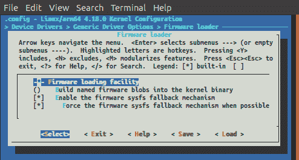

# 第四章：使用设备树

现代计算机是由复杂的外围设备组成的复杂系统，这些外围设备有大量不同的配置设置；这就是为什么在专用文件中具有所有可能的设备驱动程序配置变体可以解决很多问题。有关系统结构的逻辑描述（即它们如何相互连接而不仅仅是它们的列表）可以让系统开发人员将注意力集中在设备驱动程序机制上，而不是管理所有可能的用户设置的乏味工作。

此外，了解每个外围设备如何连接到系统（例如，外围设备依赖于哪个总线）可以实现一个非常智能的外围设备管理系统。这样的系统可以正确地按照特定设备所需的顺序激活（或停用）所有子系统。

让我们来看一个例子：想象一下一个 USB 键，当插入电脑时会激活多个设备。系统知道 USB 端口连接到特定的 USB 控制器，该控制器映射到系统内存的特定地址，依此类推。

出于这些原因（和其他原因），Linux 开发人员采用了**设备树**，简单地说，这是一种描述硬件的数据结构。它可以将所有内核设置硬编码到代码中，而是可以在启动时由引导加载程序传递给内核的一种明确定义的数据结构中进行描述。这也是所有设备驱动程序（和其他内核实体）可以获取其配置数据的地方。

设备树和内核配置文件（Linux 源代码上级目录中的`.config`文件）之间的主要区别在于，虽然这些文件告诉我们内核的哪些组件已启用，哪些未启用，但设备树保存它们的配置。因此，如果我们希望将内核源代码中的驱动程序添加到我们的系统中，我们必须在`.config`文件中指定它。另一方面，如果我们希望指定驱动程序的设置（内存地址、特殊设置等），我们必须在设备树中指定它们。

在本章中，我们将看到如何编写设备树，以及如何从中获取有用的信息来为我们的驱动程序提供支持。

本章包括以下内容：

+   使用设备树编译器和实用程序

+   从设备树获取特定应用程序数据

+   使用设备树描述字符驱动程序

+   下载固件

+   为特定外围设备配置 CPU 引脚

# 技术要求

您可以在*附录*中找到有关本章的更多信息。

本章中使用的代码和其他文件可以从 GitHub 下载：[`github.com/giometti/linux_device_driver_development_cookbook/tree/master/chapter_04`](https://github.com/giometti/linux_device_driver_development_cookbook/tree/master/chapter_04)。

# 使用设备树编译器和实用程序

我们需要适当的工具将我们的代码转换为 Linux 可以理解的二进制格式。具体来说，我们需要一种方法将**设备树源**（**DTS**）文件转换为其二进制形式：**设备树二进制**（**DTB**）。

在本教程中，我们将了解如何在系统上安装**设备树编译器**（`dtc`），以及如何使用它生成任何设备树的二进制文件。

# 准备工作

要将 DTS 文件转换为 DTB 文件，我们必须使用**设备树编译器**（名为`dtc`）和一组适当的工具，我们可以用来检查或操作 DTB 文件（**设备树实用程序**）。

每个最新的 Linux 发行版都有自己的`dtc`程序的副本，位于`linux/scripts/dtc`目录中，用于内核编译。但是，我们不需要安装 Linux 源代码来在 Ubuntu 上获得`dtc`及其实用程序的工作版本；实际上，我们可以使用以下常规安装命令获取它们：

```
$ sudo apt install device-tree-compiler
```

安装后，我们可以执行以下命令来显示`dtc`编译器的版本：

```
$ dtc -v
Version: DTC 1.4.5
```

# 操作步骤

现在我们准备将我们的第一个 DTS 文件转换为其等效的 DTB 二进制形式，使用以下步骤。

1.  我们可以使用以下命令行使用`dtc`编译器来做到这一点：

```
$ dtc -o simple_platform.dtb simple_platform.dts
```

`simple_platform.dts`可以从 GitHub 源中检索；但是读者可以使用自己的 DTS 文件来测试`dtc`。

现在我们的 DTB 文件应该在当前目录中可用：

```
$ file simple_platform.dtb
simple_platform.dtb: Device Tree Blob version 17, size=1602, boot CPU=0, string block size=270, DT structure block size=1276
```

# 它是如何工作的...

将 DTS 文件转换为 DTB 文件类似于正常编译器的工作，但是关于逆向操作应该说一些事情。

如果我们看一下`simple_platform-reverted.dts`，我们会注意到它看起来与原始的`simple_platform.dts`文件非常相似（除了 phandles、标签和十六进制形式的数字）；事实上，关于时钟设置，我们有以下差异：

```
$ diff -u simple_platform.dts simple_platform-reverted.dts | tail -29
-      clks: clock@f00 {
+      clock@f00 {
           compatible = "fsl,mpc5121-clock";
           reg = <0xf00 0x100>;
-          #clock-cells = <1>;
-          clocks = <&osc>;
+          #clock-cells = <0x1>;
+          clocks = <0x1>;
           clock-names = "osc";
+          phandle = <0x3>;
       };
```

关于串行控制器设置，我们有以下差异：

```

-      serial0: serial@11100 {
+      serial@11100 {
           compatible = "fsl,mpc5125-psc-uart", "fsl,mpc5125-psc";
           reg = <0x11100 0x100>;
-          interrupt-parent = <&ipic>;
-          interrupts = <40 0x8>;
-          fsl,rx-fifo-size = <16>;
-          fsl,tx-fifo-size = <16>;
-          clocks = <&clks 47>, <&clks 34>;
+          interrupt-parent = <0x2>;
+          interrupts = <0x28 0x8>;
+          fsl,rx-fifo-size = <0x10>;
+          fsl,tx-fifo-size = <0x10>;
+          clocks = <0x3 0x2f 0x3 0x22>;
           clock-names = "ipg", "mclk";
       };
   };
```

从前面的输出中，我们可以看到`serial0`和`clks`标签已经消失，因为它们在 DTB 文件中不需要；phandles 现在也明确报告，并且已经相应地替换为`ipic`和`clks`等相应的符号名称，并且所有数字已经转换为它们的十六进制形式。

# 还有更多...

设备树是一个非常复杂的软件，是描述系统的强大方式，这就是为什么我们需要更多地谈论它。由于对于内核开发人员来说，管理设备树二进制形式非常有用，因此我们还应该看一下设备树实用程序。

# 将二进制设备树还原为其源代码

`dtc`程序可以逆转编译过程，允许开发人员使用以下命令行从二进制文件中检索源文件：

```
$ dtc -o simple_platform-reverted.dts simple_platform.dtb
```

当我们需要检查 DTB 文件时，这可能非常有用。

# 另请参阅

+   有关`dtc`编译器的更多信息，读者可以查看设备树用户手册[`git.kernel.org/pub/scm/utils/dtc/dtc.git/tree/Documentation/manual.txt`](https://git.kernel.org/pub/scm/utils/dtc/dtc.git/tree/Documentation/manual.txt)。

+   关于设备树实用程序，一个很好的起点是它们各自的 man 页面（`man fdtput`，`man fdtget`等）。

# 从设备树中获取特定应用程序的数据

现在我们知道如何读取设备树文件以及如何在用户空间中管理它。在这个配方中，我们将看到如何提取内核中保存的配置设置。

# 做好准备

为了完成我们的工作，我们可以使用存储在 DTB 中的所有数据来引导我们的 ESPRESSObin，然后使用 ESPRESSObin 作为系统测试。

正如我们所知，ESPRESSObin 的 DTS 文件存储在内核源代码中的`linux/arch/arm64/boot/dts/marvell/armada-3720-espressobin.dts`，或者可以通过执行以下代码中呈现的`dtc`命令从运行的内核中提取出来：

```
# dtc -I fs -o espressobin-reverted.dts /proc/device-tree/
```

现在让我们拆开这个文件，因为我们可以使用它来验证我们刚刚读取的数据是否正确。

# 如何做到这一点...

为了展示我们如何从运行的设备树中读取数据，我们可以使用 GitHub 源中的一个内核模块（如文件`get_dt_data.c`中报告的模块）。

1.  在文件中，由于我们在模块的`init()`函数中没有分配任何内容，所以我们有一个空的模块`exit()`函数；事实上，它只是向我们展示了如何解析设备树。`get_dt_data_init()`函数接受一个可选的输入参数：存储在以下代码片段中定义的`path`变量中的设备树路径：

```
#define PATH_DEFAULT "/"
static char *path = PATH_DEFAULT;
module_param(path, charp, S_IRUSR | S_IWUSR);
MODULE_PARM_DESC(path, "a device tree pathname " \
                       "(default is \"" PATH_DEFAULT "\")");
```

1.  然后，作为第一步，`get_dt_data_init()`函数使用`of_find_node_by_path()`函数获取指向要检查的所需节点的指针：

```
static int __init get_dt_data_init(void)
{
    struct device_node *node, *child;
    struct property *prop;

    pr_info("path = \"%s\"\n", path);

    /* Find node by its pathname */
    node = of_find_node_by_path(path);
    if (!node) {
        pr_err("failed to find device-tree node \"%s\"\n", path);
        return -ENODEV;
    }
    pr_info("device-tree node found!\n");
```

1.  接下来，它调用`print_main_prop()`函数，该函数只打印节点的主要属性，如下所示：

```
static void print_main_prop(struct device_node *node)
{
    pr_info("+ node = %s\n", node->full_name);
    print_property_u32(node, "#address-cells");
    print_property_u32(node, "#size-cells");
    print_property_u32(node, "reg");
    print_property_string(node, "name");
    print_property_string(node, "compatible");
    print_property_string(node, "status");
}
```

每个打印函数都报告如下：

```
static void print_property_u32(struct device_node *node, const char *name)
{
    u32 val32;
    if (of_property_read_u32(node, name, &val32) == 0)
        pr_info(" \%s = %d\n", name, val32); 
}

static void print_property_string(struct device_node *node, const char *name)
{
    const char *str;
    if (of_property_read_string(node, name, &str) == 0)
        pr_info(" \%s = %s\n", name, str);
}
```

1.  对于最后两个步骤，`get_dt_data_init()`函数使用`for_each_property_of_node()`宏来显示所有节点的属性，使用`for_each_child_of_node()`宏来迭代所有节点的子节点并显示它们的所有主要属性，如下所示：

```
    pr_info("now move through all properties...\n");
    for_each_property_of_node(node, prop)
        pr_info("-> %s\n", prop->name);

    /* Move through node's children... */
    pr_info("Now move through children...\n");
    for_each_child_of_node(node, child)
        print_main_prop(child);

    /* Force module unloading... */
    return -EINVAL;
    }
```

# 工作原理...

在步骤 1 中，很明显，如果我们将模块插入内核并指定`path=<my_path>`，我们会强制使用所需的值；否则，我们只接受默认值，即根目录（由`/`字符表示）。其余步骤都很容易理解。

理解代码应该非常容易；实际上，`get_dt_data_init()`函数只是调用`of_find_node_by_path()`，传递设备路径名称；没有错误，我们使用`print_main_prop()`来显示节点名称和一些主要（或有趣的）节点属性：

```
static void print_main_prop(struct device_node *node)
{
    pr_info("+ node = %s\n", node->full_name);
    print_property_u32(node, "#address-cells");
    print_property_u32(node, "#size-cells");
    print_property_u32(node, "reg");
    print_property_string(node, "name");
    print_property_string(node, "compatible");
    print_property_string(node, "status");
}
```

请注意，`print_property_u32()`和`print_property_string()`函数的定义方式是，如果提供的属性不存在，则不显示任何内容：

```
static void print_property_u32(struct device_node *node, const char *name)
{
    u32 val32;
    if (of_property_read_u32(node, name, &val32) == 0)
        pr_info(" \%s = %d\n", name, val32);
}

static void print_property_string(struct device_node *node, const char *name)
{
    const char *str;
    if (of_property_read_string(node, name, &str) == 0)
        pr_info(" \%s = %s\n", name, str);
}
```

诸如`of_property_read_u32()`/`of_property_read_string()`和`for_each_child_of_node()`/`for_each_property_of_node()`等函数在内核源码的头文件`linux/include/linux/of.h`中定义。

从`get_dt_data.c`文件编译后，我们应该得到其编译版本，命名为`get_dt_data.ko`，适合加载到 ESPRESSObin 中：

```
$ make KERNEL_DIR=../../../linux
make -C ../../../linux \
            ARCH=arm64 \
            CROSS_COMPILE=aarch64-linux-gnu- \
            SUBDIRS=/home/giometti/Projects/ldddc/github/chapter_4/get_dt_data modules
make[1]: Entering directory '/home/giometti/Projects/ldddc/linux'
  CC [M] /home/giometti/Projects/ldddc/github/chapter_4/get_dt_data/get_dt_data.o
  Building modules, stage 2.
  MODPOST 1 modules
  CC /home/giometti/Projects/ldddc/github/chapter_4/get_dt_data/get_dt_data.mod.o
  LD [M] /home/giometti/Projects/ldddc/github/chapter_4/get_dt_data/get_dt_data.ko
make[1]: Leaving directory '/home/giometti/Projects/ldddc/linux'
```

如果我们在新创建的内核模块中使用`modinfo`，我们应该得到以下内容：

```
# modinfo get_dt_data.ko 
filename: /root/get_dt_data.ko
version: 0.1
description: Module to inspect device tree from the kernel
author: Rodolfo Giometti
license: GPL
srcversion: 6926CA8AD5E7F8B45C97CE6
depends: 
name: get_dt_data
vermagic: 4.18.0 SMP preempt mod_unload aarch64
parm: path:a device tree pathname (default is "/") (charp)
```

# 还有更多...

好的，让我们尝试使用以下命令使用`path`的默认值：

```
# insmod get_dt_data.ko
```

我们应该得到以下输出：

```
get_dt_data: path = "/"
get_dt_data: device-tree node found!
...
```

通过使用`/`作为路径名，显然我们在设备树中找到了相应的条目，因此输出继续如下：

```
...
get_dt_data: now getting main properties...
get_dt_data: + node = 
get_dt_data: #address-cells = 2
get_dt_data: #size-cells = 2
get_dt_data: name = 
get_dt_data: compatible = globalscale,espressobin
get_dt_data: now move through all properties...
get_dt_data: -> model
get_dt_data: -> compatible
get_dt_data: -> interrupt-parent
get_dt_data: -> #address-cells
get_dt_data: -> #size-cells
get_dt_data: -> name
...
```

以下是可以根据原始源或`espressobin-reverted.dts`文件验证的根节点的所有属性：

```
/ {
    #address-cells = <0x2>;
    model = "Globalscale Marvell ESPRESSOBin Board";
    #size-cells = <0x2>;
    interrupt-parent = <0x1>;
    compatible = "globalscale,espressobin", "marvell,armada3720", "marvell,armada3710";
```

读者应该注意，在这种情况下，`name`属性为空，因为我们正在检查根节点，并且对于`compatible`属性，只显示第一个条目，因为我们使用了`of_property_read_string()`函数，而不是相应的数组`of_property_read_string_array()`版本和相关函数。

在打印出所有节点的属性之后，我们的程序将遍历所有子节点，如下所示：

```
...
get_dt_data: Now move through children...
get_dt_data: + node = aliases
get_dt_data: name = aliases
get_dt_data: + node = cpus
get_dt_data: #address-cells = 1
get_dt_data: #size-cells = 0
get_dt_data: name = cpus
...
get_dt_data: + node = soc
get_dt_data: #address-cells = 2
get_dt_data: #size-cells = 2
get_dt_data: name = soc
get_dt_data: compatible = simple-bus
get_dt_data: + node = chosen
get_dt_data: name = chosen
get_dt_data: + node = memory@0
get_dt_data: reg = 0
get_dt_data: name = memory
get_dt_data: + node = regulator
get_dt_data: name = regulator
get_dt_data: compatible = regulator-gpio
...
```

在这一点上，`get_dt_data_init()`函数执行`return -EINVAL`，不是为了返回错误条件，而是为了强制模块卸载；实际上，作为最后打印出的消息，我们看到以下内容：

```
insmod: ERROR: could not insert module get_dt_data.ko: Invalid parameters
```

现在，只是为了展示不同的用法，我们可以尝试通过在命令行中指定`path=/cpus`来请求有关系统 CPU 的信息：

```
# insmod get_dt_data.ko path=/cpus
```

程序表示找到了一个节点：

```
get_dt_data: path = "/cpus"
get_dt_data: device-tree node found!
```

然后它开始打印节点的信息：

```
get_dt_data: now getting main properties...
get_dt_data: + node = cpus
get_dt_data: #address-cells = 1
get_dt_data: #size-cells = 0
get_dt_data: name = cpus
```

最后，它显示所有子节点的属性：

```
get_dt_data: now move through all properties...
get_dt_data: -> #address-cells
get_dt_data: -> #size-cells
get_dt_data: -> name
get_dt_data: Now move through children...
get_dt_data: + node = cpu@0
get_dt_data: reg = 0
get_dt_data: name = cpu
get_dt_data: compatible = arm,cortex-a53
get_dt_data: + node = cpu@1
get_dt_data: reg = 1
get_dt_data: name = cpu
get_dt_data: compatible = arm,cortex-a53
```

请注意，以下错误消息可以安全地忽略，因为我们强制它自动检索要由`insmod`命令卸载的模块：

`insmod: ERROR: could not insert module get_dt_data.ko: Invalid parameters`

以类似的方式，我们可以获取有关 I2C 控制器的信息，如下所示：

```
# insmod get_dt_data.ko path=/soc/internal-regs@d0000000/i2c@11000
get_dt_data: path = "/soc/internal-regs@d0000000/i2c@11000"
get_dt_data: device-tree node found!
get_dt_data: now getting main properties...
get_dt_data: + node = i2c@11000
get_dt_data: #address-cells = 1
get_dt_data: #size-cells = 0
get_dt_data: reg = 69632
get_dt_data: name = i2c
get_dt_data: compatible = marvell,armada-3700-i2c
get_dt_data: status = disabled
get_dt_data: now move through all properties...
...
```

# 另请参阅

+   要查看检查设备树的所有可用函数，读者可以查看包含的`linux/include/linux/of.h`文件，该文件有很好的文档。

# 使用设备树描述字符驱动程序

在这一点上，我们已经有了使用设备树定义新字符设备所需的所有信息。特别是，这一次，为了注册我们的`chrdev`设备，我们可以使用我们在第三章中跳过的新 API，*使用字符驱动程序*。

# 准备就绪

如前一段所述，我们可以使用设备树节点向系统添加新设备。特别是，我们可以获得如下所述的定义：

```
chrdev {
    compatible = "ldddc,chrdev";
    #address-cells = <1>;
    #size-cells = <0>;

    chrdev@2 {
        label = "cdev-eeprom";
        reg = <2>;
    };

    chrdev@4 {
        label = "cdev-rom";
        reg = <4>;
        read-only;
    };
};
```

所有这些修改都可以使用根目录中的`add_chrdev_devices.dts.patch`文件来应用，如下所示：

**`$ patch -p1 < ../github/chapter_04/chrdev/add_chrdev_devices.dts.patch`**

然后必须重新编译和重新安装内核（使用 ESPRESSObin 的 DTB 文件）才能生效。

在这个例子中，我们定义了一个`chrdev`节点，它定义了一个与`"ldddc,chrdev"`兼容的新设备集，并且有两个子节点；每个子节点定义了一个具有自己设置的特定设备。第一个子节点定义了一个标记为`"cdev-eeprom"`的`"ldddc,chrdev"`设备，其`reg`属性等于`2`，而第二个子节点定义了另一个标记为`"cdev-rom"`的`"ldddc,chrdev"`设备，其`reg`属性等于`4`，并且具有`read-only`属性。

`#address-cells`和`#size-cells`属性必须是 1 和 0，因为子设备的`reg`属性包含一个表示"设备地址"的单个值。实际上，可寻址设备使用`#address-cells`、`#size-cells`和`reg`属性将地址信息编码到设备树中。

每个可寻址设备都有一个`reg`属性，如下所示的列表：

```
reg = <address1 length1 [address2 length2] [address3 length3] ... >
```

每个元组表示设备使用的地址范围，每个地址或长度值都是一个或多个称为**cells**的 32 位整数列表（长度也可以为空，就像我们的示例一样）。

由于地址和长度字段都可能变化且大小可变，因此父节点中的`#address-cells`和`#size-cells`属性用于说明每个子节点字段中有多少个 cells。

有关`#address-cells`、`#size-cells`和`reg`属性的更多信息，可以查看[`www.devicetree.org/specifications/`](https://www.devicetree.org/specifications/)上的设备树规范。

# 如何做到...

现在是时候看看如何使用前面的设备树定义来创建我们的字符设备了（请注意，这次我们要创建多个设备！）。

1.  模块的`init()`和`exit()`函数都必须按照以下代码进行重写。`chrdev_init()`如下所示：

```
static int __init chrdev_init(void)
{
    int ret;

    /* Create the new class for the chrdev devices */
    chrdev_class = class_create(THIS_MODULE, "chrdev");
    if (!chrdev_class) {
        pr_err("chrdev: failed to allocate class\n");
        return -ENOMEM;
    }

    /* Allocate a region for character devices */
    ret = alloc_chrdev_region(&chrdev_devt, 0, MAX_DEVICES, "chrdev");
    if (ret < 0) {
        pr_err("failed to allocate char device region\n");
        goto remove_class;
    }

    pr_info("got major %d\n", MAJOR(chrdev_devt));

    return 0;

remove_class:
    class_destroy(chrdev_class);

    return ret;
}
```

1.  `chrdev_exit()`函数如下所示：

```
static void __exit chrdev_exit(void)
{
    unregister_chrdev_region(chrdev_devt, MAX_DEVICES);
    class_destroy(chrdev_class);
}
```

所有代码都可以从 GitHub 的`chrdev.c`文件中检索到。

1.  如果我们尝试将模块插入内核，应该会得到如下内容：

```
# insmod chrdev.ko 
chrdev: loading out-of-tree module taints kernel.
chrdev:chrdev_init: got major 239
```

1.  要创建字符设备，我们必须使用下一个`chrdev_device_register()`函数，但首先我们必须进行一些检查，看设备是否已经创建：

```
int chrdev_device_register(const char *label, unsigned int id,
                unsigned int read_only,
                struct module *owner, struct device *parent) 
{
    struct chrdev_device *chrdev;
    dev_t devt;
    int ret;

    /* First check if we are allocating a valid device... */
    if (id >= MAX_DEVICES) {
        pr_err("invalid id %d\n", id);
        return -EINVAL;
    }
    chrdev = &chrdev_array[id];

    /* ... then check if we have not busy id */
    if (chrdev->busy) {
        pr_err("id %d\n is busy", id);
        return -EBUSY; 
    }
```

然后我们要做的事情比前一章简单调用`register_chrdev()`函数要复杂一些；现在真正重要的是调用`cdev_init()`、`cdev_add()`和`device_create()`函数的顺序，这些函数实际上完成了工作，如下所示：

```
    /* Create the device and initialize its data */
    cdev_init(&chrdev->cdev, &chrdev_fops);
    chrdev->cdev.owner = owner;

    devt = MKDEV(MAJOR(chrdev_devt), id);
    ret = cdev_add(&chrdev->cdev, devt, 1); 
    if (ret) {
        pr_err("failed to add char device %s at %d:%d\n",
                label, MAJOR(chrdev_devt), id);
        return ret;
    }

    chrdev->dev = device_create(chrdev_class, parent, devt, chrdev,
                   "%s@%d", label, id);
    if (IS_ERR(chrdev->dev)) {
        pr_err("unable to create device %s\n", label); 
        ret = PTR_ERR(chrdev->dev);
        goto del_cdev;
    }
```

一旦`device_create()`函数返回成功，我们就使用`dev_set_drvdata()`函数来保存指向我们驱动程序数据的指针，然后初始化如下：

```
  dev_set_drvdata(chrdev->dev, chrdev);

 /* Init the chrdev data */
 chrdev->id = id; 
 chrdev->read_only = read_only;
 chrdev->busy = 1;
 strncpy(chrdev->label, label, NAME_LEN);
 memset(chrdev->buf, 0, BUF_LEN);

 dev_info(chrdev->dev, "chrdev %s with id %d added\n", label, id);

 return 0;

del_cdev:
 cdev_del(&chrdev->cdev);

 return ret;
}
EXPORT_SYMBOL(chrdev_device_register);
```

所有这些函数都作用于`struct chrdev_device`，定义如下：

```
/* Main struct */
struct chrdev_device {
    char label[NAME_LEN];
    unsigned int busy : 1;
    char buf[BUF_LEN];
    int read_only;

    unsigned int id; 
    struct module *owner;
    struct cdev cdev;
    struct device *dev;
};
```

# 工作原理...

在*步骤 1*中，在`chrdev_init()`函数中，这次我们使用`alloc_chrdev_region()`函数，请求内核保留一些名为`chrdev`的字符设备（在我们的情况下，这个数字等同于`MAX_DEVICES`的定义）。`chrdev`信息然后存储在`chrdev_devt`变量中。

在这里，我们应该注意并注意，我们还通过调用`class_create()`函数创建了一个设备类。设备树中定义的每个设备都必须属于适当的类，由于我们的`chrdev`驱动程序是新的，所以我们需要一个专门的类。

在接下来的步骤中，我将更清楚地解释我们需要以这种方式进行的原因；目前，我们应该将其视为强制性的数据分配。

很明显，`unregister_chrdev_region()`函数只是释放了`alloc_chrdev_region()`分配的所有`chrdev`数据。

在*步骤 3*中，如果我们查看`/proc/devices`文件，我们会得到以下内容：

```
# grep chrdev /proc/devices
239 chrdev
```

好了！现在我们有了类似[第三章](https://cdp.packtpub.com/linux_device_driver_development_cookbook/wp-admin/post.php?post=27&action=edit#post_26)的东西，*使用字符驱动程序*！然而，这一次，如果我们尝试使用`mknod`创建一个特殊字符文件，并尝试从中读取，我们会得到一个错误！

```
# mknod /dev/chrdev c 239 0
# cat /dev/chrdev
cat: /dev/chrdev: No such device or address
```

内核告诉我们设备不存在！这是因为我们还没有创建任何东西，只是保留了一些内核内部数据。

在*步骤 4*中，前面的字段只是相对于我们特定的实现，而最后四个字段几乎出现在每个字符驱动程序实现中：`id`字段只是每个`chrdev`的唯一标识符（请记住我们的实现支持`MAX_DEVICES`实例），`owner`指针用于存储我们驱动程序模块的所有者，`cdev`结构保存了关于我们字符设备的所有内核数据，`dev`指针指向了与设备树中指定的设备相关的内核`struct device`。

因此，`cdev_init()`用于使用我们的文件操作初始化`cdev`；`cdev_add()`用于定义驱动程序的主要和次要编号；`device_create()`用于将`devt`数据与由`dev`指向的数据连接起来；我们的`chrdev`类（由`chrdev_class`指针表示）实际上创建了字符设备。

然而，`chrdev_device_register()`函数并没有被`chrdev.c`文件中的任何函数调用；这就是为什么它被声明为一个导出符号，使用`EXPORT_SYMBOL()`定义。事实上，这个函数被另一个模块中的`chrdev-req.c`文件中定义的`chrdev_req_probe()`函数调用，如下面的片段所示。该函数首先了解我们需要注册多少设备：

```
static int chrdev_req_probe(struct platform_device *pdev)
{
    struct device *dev = &pdev->dev;
    struct fwnode_handle *child;
    struct module *owner = THIS_MODULE;
    int count, ret;

    /* If we are not registering a fixed chrdev device then get
     * the number of chrdev devices from DTS
     */
    count = device_get_child_node_count(dev);
    if (count == 0)
        return -ENODEV;
    if (count > MAX_DEVICES)
        return -ENOMEM;
```

然后，对于每个设备，在读取设备的属性之后，`chrdev_device_register()`调用来在系统上注册设备（对于设备树中报告的每个设备都会这样做，如前面的代码所示）：

```
 device_for_each_child_node(dev, child) {
        const char *label;
        unsigned int id, ro;

        /*
         * Get device's properties
         */

        if (fwnode_property_present(child, "reg")) {
            fwnode_property_read_u32(child, "reg", &id);
        } else {
...

        }
        ro = fwnode_property_present(child, "read-only");

        /* Register the new chr device */
        ret = chrdev_device_register(label, id, ro, owner, dev);
        if (ret) { 
            dev_err(dev, "unable to register");
        }
    }

    return 0;
}
```

但是系统如何知道何时调用`chrdev_req_probe()`函数呢？如果我们继续阅读`chrdev-req.c`，就会很清楚；事实上，在接近结尾的地方，我们找到了以下代码：

```
static const struct of_device_id of_chrdev_req_match[] = {
    {
        .compatible = "ldddc,chrdev",
    },
    { /* sentinel */ }
};
MODULE_DEVICE_TABLE(of, of_chrdev_req_match);

static struct platform_driver chrdev_req_driver = {
    .probe = chrdev_req_probe,
    .remove = chrdev_req_remove,
    .driver = {
        .name = "chrdev-req",
        .of_match_table = of_chrdev_req_match,
    },
};
module_platform_driver(chrdev_req_driver);
```

当我们将`chrdev-req.ko`模块插入内核时，我们使用`module_platform_driver()`定义了一个新的平台驱动程序，然后内核开始寻找一个节点，其`compatible`属性设置为`"ldddc,chrdev"`；如果找到了，就执行由我们设置为`chrdev_req_probe()`的`probe`指针指向的函数。这将导致注册一个新的驱动程序。

在展示它是如何工作之前，让我们看看相反的步骤，用于释放我们在字符驱动程序分配期间从内核请求的任何内容。当我们移除`chrdev-req.ko`模块时，内核会调用平台驱动程序的`remove`函数，即`chrdev-req.c`文件中的`chrdev_req_remove()`，部分如下所示：

```
static int chrdev_req_remove(struct platform_device *pdev)
{
    struct device *dev = &pdev->dev;
    struct fwnode_handle *child;
    int ret;

    device_for_each_child_node(dev, child) {
        const char *label; 
        int id;

        /*
         * Get device's properties
         */

        if (fwnode_property_present(child, "reg")) 
            fwnode_property_read_u32(child, "reg", &id);
        else
            BUG();
        if (fwnode_property_present(child, "label"))
            fwnode_property_read_string(child, "label", &label);
        else
            BUG();

        /* Register the new chr device */
        ret = chrdev_device_unregister(label, id);
        if (ret)
            dev_err(dev, "unable to unregister");
    }

    return 0;
}
```

这个函数，位于`chrdev.c`文件中，调用`chrdev_device_unregister()`（对于设备树中的每个`chrdev`节点），如下所示；它首先进行一些健全性检查：

```

int chrdev_device_unregister(const char *label, unsigned int id)
{
    struct chrdev_device *chrdev;

    /* First check if we are deallocating a valid device... */
    if (id >= MAX_DEVICES) {
        pr_err("invalid id %d\n", id);
        return -EINVAL;
    }
    chrdev = &chrdev_array[id];

    /* ... then check if device is actualy allocated */
    if (!chrdev->busy || strcmp(chrdev->label, label)) {
        pr_err("id %d is not busy or label %s is not known\n",
                        id, label);
        return -EINVAL;
    }
```

但然后它使用`device_destroy()`和`cdev_del()`函数注销驱动程序：

```
    /* Deinit the chrdev data */
    chrdev->id = 0;
    chrdev->busy = 0;

    dev_info(chrdev->dev, "chrdev %s with id %d removed\n", label, id);

    /* Dealocate the device */
    device_destroy(chrdev_class, chrdev->dev->devt);
    cdev_del(&chrdev->cdev);

    return 0;
}
EXPORT_SYMBOL(chrdev_device_unregister);
```

# 还有更多...

使用设备树不仅仅用于描述外围设备（以及整个系统）；通过使用它，我们还可以访问 Linux 为内核开发人员提供的几个现成的有用功能。因此，让我们来看看最重要（和有用）的功能。

# /dev 中如何创建设备文件

在第三章中，*使用字符驱动程序*，当我们创建一个新的字符设备时，用户空间中什么都没有发生，我们不得不手动使用`mknod`命令创建一个字符设备文件；然而，在本章中，当我们插入第二个内核模块时，它创建了我们的新`chrdev`设备。通过从设备树中获取它们的属性，在`/dev`目录中，两个新的字符文件被自动创建。

正是 Linux 的内核对象机制实现了这一点；让我们看看是如何实现的。

每当内核中创建新设备时，都会生成一个新的内核事件并发送到用户空间；然后专用应用程序会捕获这个新事件并对其进行解释。这些特殊的应用程序可能各不相同，但几乎所有重要的 Linux 发行版都使用的最著名的这种类型的应用程序是`udev`应用程序。

`udev`守护程序是为了替换和创建一个机制，以自动在`/dev`目录下创建特殊设备文件，并且它运行得非常好，以至于现在用于多种不同的任务。实际上，`udev`守护程序直接从内核接收设备内核事件（称为**uevents**），每当系统添加或删除设备（或更改其状态）时，它都会执行一组规则，根据其配置文件。如果规则匹配各种设备属性，则会执行规则，然后相应地在`/dev`目录中创建新文件；匹配规则还可以提供其他设备信息，用于创建有意义的符号链接名称，执行脚本等等！

有关`udev`规则的更多信息，一个很好的起点是 Debian Wiki 上的相关页面[`wiki.debian.org/udev`](https://wiki.debian.org/udev)。

要监视这些事件，我们可以使用`udevadm`工具，该工具包含在`udev`软件包中，如以下命令所示：

```
# udevadm monitor -k -p -s chrdev
monitor will print the received events for:
KERNEL - the kernel uevent
```

通过使用`monitor`子命令，我们选择`udevadm`监视功能（因为`udevadm`还可以执行其他几项任务），并通过指定`-k`选项参数，要求仅显示内核生成的消息（因为一些消息可能也来自用户空间）；此外，通过使用`-p`选项参数，我们要求显示事件属性，并通过`-s`选项参数，我们仅选择与`chrdev`字符串匹配的子系统的消息。

要查看所有内核消息，在`chrdev`模块插入时，内核发送的只需执行`udevadm monitor`命令，放弃所有这些选项参数。

要查看新事件，只需执行上述命令，并在另一个终端（或直接从串行控制台）重复内核模块插入。在插入`chrdev-req.ko`模块后，我们看到与之前相同的内核消息：

```
# insmod chrdev-req.ko 
chrdev cdev-eeprom@2: chrdev cdev-eeprom with id 2 added
chrdev cdev-rom@4: chrdev cdev-rom with id 4 added
```

然而，在我们执行`udevadm`消息的终端中，现在应该看到类似以下的内容：

```
KERNEL[14909.624343] add /devices/platform/chrdev/chrdev/cdev-eeprom@2 (chrdev)
ACTION=add
DEVNAME=/dev/cdev-eeprom@2
DEVPATH=/devices/platform/chrdev/chrdev/cdev-eeprom@2
MAJOR=239
MINOR=2
SEQNUM=2297
SUBSYSTEM=chrdev

KERNEL[14909.631813] add /devices/platform/chrdev/chrdev/cdev-rom@4 (chrdev)
ACTION=add
DEVNAME=/dev/cdev-rom@4
DEVPATH=/devices/platform/chrdev/chrdev/cdev-rom@4
MAJOR=239
MINOR=4
SEQNUM=2298
SUBSYSTEM=chrdev
```

这些是内核消息，通知`udev`已创建了两个名为`/dev/cdev-eeprom@2`和`/dev/cdev-rom@4`的新设备（具有其他属性），因此`udev`已经拥有了创建`/dev`目录下新文件所需的所有信息。

# 下载固件

通过使用设备树，我们现在能够为我们的驱动程序指定许多不同的设置，但还有最后一件事情我们必须看到：如何将固件加载到我们的设备中。实际上，一些设备可能需要一个程序才能正常工作，出于许可证原因，这些程序不能链接到内核中。

在本节中，我们将看到一些示例，说明我们如何要求内核为我们的设备加载固件。

# 准备就绪

一些外围设备需要固件才能工作，然后我们需要一种机制将这些二进制数据加载到其中。 Linux 为我们提供了不同的机制来完成这项工作，它们都与`request_firmware()`函数有关。

每当我们在驱动程序中使用`request_firmware(..., "filename", ...)`函数调用（指定文件名）时，内核开始查看不同的位置：

+   首先，它查看引导映像文件，并在必要时从中加载固件；这是因为我们可以在编译期间将二进制代码与内核捆绑在一起。但是，只有在固件是自由软件的情况下才允许此解决方案；否则它不能链接到 Linux。如果我们必须重新编译内核来更改固件数据，这种解决方案在更改固件数据时也不够灵活。

+   如果内核中没有存储任何数据，它将开始直接从文件系统加载固件数据，从指定内核命令行的路径开始查找`filename`，然后在`/lib/firmware/updates/<UTS_RELEASE>`，然后进入`/lib/firmware/updates`，然后进入`/lib/firmware/<UTS_RELEASE>`，最后进入`/lib/firmware`目录。

`<UTS_RELEASE>`是内核发布版本号，可以通过使用`uname -r`命令直接从内核中获取，如下所示：

`$ uname -r`

`4.15.0-45-generic`

+   如果最后一步也失败了，那么内核可能会尝试回退程序，这包括启用固件加载器用户辅助程序。必须通过启用以下内核配置设置来启用内核的最后一次加载固件：

```
CONFIG_FW_LOADER_USER_HELPER=y
CONFIG_FW_LOADER_USER_HELPER_FALLBACK=y
```

通过使用通常的`make menuconfig`方法，我们必须通过设备驱动程序，然后通用驱动程序选项，固件加载器条目来启用它们（参见下面的屏幕截图）。



在启用这些设置并重新编译内核后，我们可以详细了解如何在内核中为我们的驱动程序加载自定义固件。

# 如何做...

首先，我们需要一个专注于固件加载的修改版本的`chrdev-req.c`文件；这就是为什么最好使用另一个文件。

1.  为了完成我们的工作，我们可以使用`chrdev-fw.c`文件和以下设备定义：

```
static const struct of_device_id of_chrdev_req_match[] = {
    {
        .compatible = "ldddc,chrdev-fw_wait",
    },
    {
        .compatible = "ldddc,chrdev-fw_nowait",
    },
    { /* sentinel */ }
};
MODULE_DEVICE_TABLE(of, of_chrdev_req_match);

static struct platform_driver chrdev_req_driver = {
    .probe = chrdev_req_probe,
    .remove = chrdev_req_remove,
    .driver = {
        .name = "chrdev-fw",
        .of_match_table = of_chrdev_req_match,
    },
};
module_platform_driver(chrdev_req_driver);
```

`chrdev-fw.c`文件可以在本章的 GitHub 源中找到。

1.  在这种情况下，我们的探测功能可以实现如下，`chrdev_req_probe()`函数的开头我们读取设备的一些属性：

```
static int chrdev_req_probe(struct platform_device *pdev)
{
    struct device *dev = &pdev->dev;
    struct device_node *np = dev->of_node;
    struct fwnode_handle *fwh = of_fwnode_handle(np);
    struct module *owner = THIS_MODULE;
    const char *file;
    int ret = 0;

    /* Read device properties */
    if (fwnode_property_read_string(fwh, "firmware", &file)) {
        dev_err(dev, "unable to get property \"firmware\"!");
        return -EINVAL;
    }

    /* Load device firmware */
    if (of_device_is_compatible(np, "ldddc,chrdev-fw_wait"))
        ret = chrdev_load_fw_wait(dev, file);
    else if (of_device_is_compatible(np, "ldddc,chrdev-fw_nowait"))
        ret = chrdev_load_fw_nowait(dev, file);
    if (ret)
        return ret;
```

然后我们注册字符设备：

```
    /* Register the new chr device */
    ret = chrdev_device_register("chrdev-fw", 0, 0, owner, dev);
    if (ret) {
        dev_err(dev, "unable to register");
        return ret;
    }

    return 0;
}
```

1.  以前的设备类型调用`chrdev_load_fw_wait()`函数，执行下一步。它首先请求固件的数据结构：

```
static int chrdev_load_fw_wait(struct device *dev, const char *file)
{
    char fw_name[FIRMWARE_NLEN];
    const struct firmware *fw;
    int ret;

    /* Compose firmware filename */
    if (strlen(file) > (128 - 6 - sizeof(FIRMWARE_VER)))
        return -EINVAL;
    sprintf(fw_name, "%s-%s.bin", file, FIRMWARE_VER);

    /* Do the firmware request */
    ret = request_firmware(&fw, fw_name, dev);
    if (ret) {
        dev_err(dev, "unable to load firmware\n");
        return ret;
    }
```

然后转储接收到的数据，最后释放先前分配的固件数据结构：

```
    dump_data(fw->data, fw->size);

    /* Firmware data has been read, now we can release it */
    release_firmware(fw);

    return 0;
}
```

`FIRMWARE_VER`和`FIRMWARE_NLEN`宏已经在`chrdev-fw.c`文件中定义如下：

`#define FIRMWARE_VER "1.0.0"`

`#define FIRMWARE_NLEN 128`

# 它是如何工作的...

在*步骤 1*中，在`of_chrdev_req_match[]`数组中，我们现在有两个设备可以用来测试不同的固件加载方式。一个名为`ldddc,chrdev-fw_wait`的设备可以用来测试直接从文件系统加载固件，而另一个名为`ldddc,chrdev-fw_nowait`的设备可以用来测试固件加载器的用户辅助程序。

我使用这两个示例来向读者展示两种不同的固件加载技术，但实际上，这两种方法可以用于不同的目的；前者可以在我们的设备需要其固件时使用，否则它无法工作（这会强制驱动程序不内置），而后者可以在我们的设备即使没有任何固件也可以部分使用，并且可以在设备初始化后稍后加载（这会删除强制内置形式）。

在*步骤 2*中，在读取`firmware`属性（保存固件文件名）后，我们检查设备是否与`ldddc,chrdev-fw_wait`或`ldddc,chrdev-fw_nowait`设备兼容，然后调用适当的固件加载函数，然后注册新设备。

在*步骤 3*中，`chrdev_load_fw_wait()`函数构建了一个以`<name>-<version>.bin`形式的文件名，然后调用了名为`request_firmware()`的有效固件加载函数。作为响应，这个函数可能返回一个错误，导致驱动程序加载时出现错误，或者它可以返回一个包含固件的适当结构，该结构将固件保存在`buffer fw->data`指针中，大小为`long fw->size`字节。`dump_data()`函数通过将固件数据打印到内核消息中来简单地转储固件数据，但`release_firmware()`函数很重要，必须调用它来通知内核我们已经读取了所有数据并完成了处理，然后它可以释放资源。

另一方面，如果在设备树中指定了`ldddc,chrdev-fw_nowait`设备，那么将调用`chrdev_load_fw_nowait()`函数。这个函数的操作方式与之前类似，但最后会调用`request_firmware_nowait()`，它的工作方式类似于`request_firmware()`。然而，如果固件不是直接从文件系统加载的，它会执行回退程序，涉及固件加载器的用户辅助程序。这个特殊的辅助程序会向`udev`工具（或类似工具）发送 uevent 消息，导致自动加载固件，或在 sysfs 中创建一个条目，用户可以用它来手动加载内核。

`chrdev_load_fw_nowait()`函数的主体如下：

```
static int chrdev_load_fw_nowait(struct device *dev, const char *file)
{
    char fw_name[FIRMWARE_NLEN];
    int ret;

    /* Compose firmware filename */
    if (strlen(file) > (128 - 6 - sizeof(FIRMWARE_VER)))
        return -EINVAL;
    sprintf(fw_name, "%s-%s.bin", file, FIRMWARE_VER);

    /* Do the firmware request */
    ret = request_firmware_nowait(THIS_MODULE, false, fw_name, dev,
            GFP_KERNEL, dev, chrdev_fw_cb);
    if (ret) {
        dev_err(dev,
            "unable to register call back for firmware loading\n");
        return ret;
    } 

    return 0;
}
```

`request_firmware_nowait()`和`request_firmware()`之间的一些重要区别是，前者定义了一个回调函数，每当固件实际从用户空间加载时就会调用该函数，并且它有一个布尔值作为第二个参数，可以用来要求内核向用户空间发送 uevent 消息或不发送。通过使用一个值，我们实现了类似于`request_firmware()`的功能，而如果我们指定了一个 false 值（如我们的情况），我们强制手动加载固件。

然后，当用户空间进程采取所需的步骤来加载所需的固件时，将使用回调函数，我们可以像下面的例子中那样实际加载固件数据：

```
static void chrdev_fw_cb(const struct firmware *fw, void *context)
{
    struct device *dev = context;

    dev_info(dev, "firmware callback executed!\n");
    if (!fw) {
        dev_err(dev, "unable to load firmware\n");
        return; 
    } 

    dump_data(fw->data, fw->size);

    /* Firmware data has been read, now we can release it */
    release_firmware(fw);
}
```

在这个函数中，我们实际上采取了与之前相同的步骤，将固件数据转储到内核消息中。

# 还有更多

让我们验证一下这个步骤中的所有操作。作为第一步，让我们尝试使用`ldddc,chrdev-fw_wait`设备，它使用`request_firmware()`函数；我们需要在设备树中添加下一个条目：

```
--- a/arch/arm64/boot/dts/marvell/armada-3720-espressobin.dts
+++ b/arch/arm64/boot/dts/marvell/armada-3720-espressobin.dts
@@ -41,6 +41,11 @@
              3300000 0x0>;
          enable-active-high;
      };
+
+     chrdev {
+         compatible = "ldddc,chrdev-fw_wait";
+         firmware = "chrdev-wait";
+     };
 };

 /* J9 */
```

然后我们需要编译代码，可以通过将新的`chrdev-fw.c`文件添加到`makefile`中来实现，如下所示：

```
--- a/chapter_4/chrdev/Makefile
+++ b/chapter_4/chrdev/Makefile
@@ -6,7 +6,7 @@ ARCH ?= arm64
 CROSS_COMPILE ?= aarch64-linux-gnu-

 obj-m = chrdev.o
-obj-m += chrdev-req.o
+obj-m += chrdev-fw.o

 all: modules
```

一旦我们在 ESPRESSObin 的文件系统中有了新的模块，我们可以尝试将它们插入内核，如下所示：

```
# insmod chrdev.ko 
chrdev: loading out-of-tree module taints kernel.
chrdev:chrdev_init: got major 239
# insmod chrdev-fw.ko 
chrdev-fw chrdev: Direct firmware load for chrdev-wait-1.0.0.bin 
failed with error -2
chrdev-fw chrdev: Falling back to syfs fallback for: chrdev-wait-1.0.0.bin
chrdev-fw chrdev: unable to load firmware
chrdev-fw: probe of chrdev failed with error -11
```

正如我们所看到的，内核尝试加载`chrdev-wait-1.0.0.bin`文件，但由于文件系统中根本不存在，它找不到文件；然后，内核转到 sysfs 回退，但由于再次失败，我们会得到一个错误，驱动程序加载也会失败。

为了获得积极的结果，我们必须在搜索路径中添加一个名为`chrdev-wait-1.0.0.bin`的文件；例如，我们可以将它放在`/lib/firmware/`中，如下例所示：

```
# echo "THIS IS A DUMMY FIRMWARE FOR CHRDEV DEVICE" > \
 /lib/firmware/chrdev-wait-1.0.0.bin
```

如果`/lib/firmware`目录不存在，我们可以使用`mkdir /lib/firmware`命令来创建它。

现在我们可以尝试加载我们的`chrdev-fw.ko`模块，如下所示：

```
# rmmod chrdev-fw 
# insmod chrdev-fw.ko 
chrdev_fw:dump_data: 54[T] 48[H] 49[I] 53[S] 20[ ] 49[I] 53[S] 20[ ] 
chrdev_fw:dump_data: 41[A] 20[ ] 44[D] 55[U] 4d[M] 4d[M] 59[Y] 20[ ] 
chrdev_fw:dump_data: 46[F] 49[I] 52[R] 4d[M] 57[W] 41[A] 52[R] 45[E] 
chrdev_fw:dump_data: 20[ ] 46[F] 4f[O] 52[R] 20[ ] 43[C] 48[H] 52[R] 
chrdev_fw:dump_data: 44[D] 45[E] 56[V] 20[ ] 44[D] 45[E] 56[V] 49[I] 
chrdev_fw:dump_data: 43[C] 45[E] 0a[-] 
chrdev chrdev-fw@0: chrdev chrdev-fw with id 0 added
```

完美！现在固件已经按预期加载，`chrdev`设备已经正确创建。

现在我们可以尝试使用第二个设备，方法是修改设备树如下，然后重新启动 ESPRESSObin 并使用新的 DTB 文件：

```
--- a/arch/arm64/boot/dts/marvell/armada-3720-espressobin.dts
+++ b/arch/arm64/boot/dts/marvell/armada-3720-espressobin.dts
@@ -41,6 +41,11 @@
              3300000 0x0>;
          enable-active-high;
      };
+
+     chrdev {
+         compatible = "ldddc,chrdev-fw_nowait";
+         firmware = "chrdev-nowait";
+     };
 };

 /* J9 */
```

有了这些新的配置设置，如果我们尝试加载`chrdev`模块，我们会得到以下消息：

```
# insmod chrdev.ko 
chrdev: loading out-of-tree module taints kernel.
chrdev:chrdev_init: got major 239
# insmod chrdev-fw.ko 
chrdev-fw chrdev: Direct firmware load for chrdev-nowait-1.0.0.bin failed with error -2
chrdev-fw chrdev: Falling back to syfs fallback for: chrdev-nowait-1.0.0.bin
chrdev chrdev-fw@0: chrdev chrdev-fw with id 0 added
```

这次，内核仍然尝试直接从文件系统加载固件，但失败了，因为没有名为`chrdev-nowait-1.0.0.bin`的文件；然后它退回到回退固件加载器用户助手，我们已经强制进入手动模式。然而，驱动程序的探测功能成功注册了我们的`chrdev`驱动程序，即使没有加载固件，它现在也是完全功能的。

要手动加载固件，我们可以使用`/sys/class/firmware/`目录中的特殊 sysfs 条目，如下所示：

```
# ls /sys/class/firmware/
chrdev-nowait-1.0.0.bin  timeout
```

`chrdev-nowait-1.0.0.bin`目录被作为传递给`request_firmware_nowait()`函数的`fw_name`参数的字符串调用，并且在其中，我们找到以下文件：

```
# ls /sys/class/firmware/chrdev-nowait-1.0.0.bin
data  device  loading  power  subsystem  uevent
```

现在，自动加载固件的必需步骤如下：

```
# echo 1 > /sys/class/firmware/chrdev-nowait-1.0.0.bin/loading 
# echo "THIS IS A DUMMY FIRMWARE" > /sys/class/firmware/chrdev-nowait-1.0.0.bin/data 
# echo 0 > /sys/class/firmware/chrdev-nowait-1.0.0.bin/loading
chrdev-fw chrdev: firmware callback executed!
chrdev_fw:dump_data: 54[T] 48[H] 49[I] 53[S] 20[ ] 49[I] 53[S] 20[ ] 
chrdev_fw:dump_data: 41[A] 20[ ] 44[D] 55[U] 4d[M] 4d[M] 59[Y] 20[ ] 
chrdev_fw:dump_data: 46[F] 49[I] 52[R] 4d[M] 57[W] 41[A] 52[R] 45[E] 
chrdev_fw:dump_data: 0a[-] 
```

我们通过向`loading`文件写入`1`来开始下载过程，然后我们必须将所有固件数据复制到`data`文件中；然后我们通过在`loading`文件中写入`0`来完成下载。一旦我们这样做，内核就会调用我们驱动程序的回调函数，固件就会被加载。

# 另请参阅

+   有关固件加载的更多信息，一个很好的起点是 Linux 驱动实现者的 API 指南，可在线获取，网址为[`www.kernel.org/doc/html/v5.0/driver-api/firmware/request_firmware.html`](https://www.kernel.org/doc/html/v5.0/driver-api/firmware/request_firmware.html)。

# 为特定外围设备配置 CPU 引脚

作为设备驱动程序开发人员，这个任务非常重要，因为为了能够与外部设备（或者内部设备但带有外部信号线）进行通信，我们必须确保每个 CPU 引脚都被正确配置以与这些外部信号进行通信。在这个教程中，我们将看看如何使用设备树来配置 CPU 引脚。

# 操作步骤...

举个简单的例子，让我们尝试修改 ESPRESSObin 的引脚配置。

1.  首先，我们应该通过查看`/sys/bus/platform/drivers/mvebu-uart/`目录中的 sysfs 来查看当前的配置，从中我们可以验证当前只有一个 UART 被启用：

```
# ls /sys/bus/platform/drivers/mvebu-uart/
d0012000.serial  uevent
# ls /sys/bus/platform/drivers/mvebu-uart/d0012000.serial/tty/
ttyMV0
```

然后`mvebu-uart`驱动程序管理`d0012000.serial`设备，可以使用`/dev/ttyMV0`文件进行访问。我们还可以通过查看`/sys/kernel/debug/pinctrl/d0013800.pinctrl-armada_37xx-pinctrl/pinmux-pins`文件在 debugfs 中验证 CPU 的引脚是如何配置的，我们可以看到只有`uart1`组被启用：

```
# cat /sys/kernel/debug/pinctrl/d0013800.pinctrl-armada_37xx-p
inctrl/pinmux-pins 
Pinmux settings per pin
Format: pin (name): mux_owner gpio_owner hog?
pin 0 (GPIO1-0): (MUX UNCLAIMED) (GPIO UNCLAIMED)
pin 1 (GPIO1-1): (MUX UNCLAIMED) (GPIO UNCLAIMED)
pin 2 (GPIO1-2): (MUX UNCLAIMED) (GPIO UNCLAIMED)
pin 3 (GPIO1-3): (MUX UNCLAIMED) GPIO1:479
pin 4 (GPIO1-4): (MUX UNCLAIMED) GPIO1:480
pin 5 (GPIO1-5): (MUX UNCLAIMED) (GPIO UNCLAIMED)
...
pin 24 (GPIO1-24): (MUX UNCLAIMED) (GPIO UNCLAIMED)
pin 25 (GPIO1-25): d0012000.serial (GPIO UNCLAIMED) function uart group uart1
pin 26 (GPIO1-26): d0012000.serial (GPIO UNCLAIMED) function uart group uart1
pin 27 (GPIO1-27): (MUX UNCLAIMED) (GPIO UNCLAIMED)
...
```

有关 debugfs 的更多信息，请参阅[`en.wikipedia.org/wiki/Debugfs`](https://en.wikipedia.org/wiki/Debugfs) [然后跟随一些外部链接。](https://en.wikipedia.org/wiki/Debugfs)

1.  然后我们应该尝试修改 ESPRESSObin 的 DTS 文件，以启用另一个名为`uart1`的 UART 设备，其自己的引脚定义在`uart2_pins`组中，如下所示：

```
--- a/arch/arm64/boot/dts/marvell/armada-3720-espressobin.dts
+++ b/arch/arm64/boot/dts/marvell/armada-3720-espressobin.dts
@@ -97,6 +97,13 @@
    status = "okay";
 };

+/* Exported on extension connector P9 at pins 24(UA2_TXD) and 26(UA2_RXD) */
+&uart1 {
+   pinctrl-names = "default";
+   pinctrl-0 = <&uart2_pins>;
+   status = "okay";
+};
+
 /*
  * Connector J17 and J18 expose a number of different features. Some pins are
  * multiplexed. This is the case for instance for the following features:
```

这个引脚组在`linux/arch/arm64/boot/dts/marvell/armada-37xx.dtsi`文件中定义如下：

```
    uart2_pins: uart2-pins {
        groups = "uart2";
        function = "uart";
    };
```

# 工作原理...

让我们通过测试我们的 pinctrl 修改来检查这是如何工作的。为此，我们必须像往常一样重新生成 ESPRESSObin 的 DTB 文件，并重新启动系统。如果一切顺利，我们现在应该有两个 UART 设备，如下所示：

```
# ls /sys/bus/platform/drivers/mvebu-uart/
d0012000.serial d0012200.serial uevent
# ls /sys/bus/platform/drivers/mvebu-uart/d0012200.serial/tty/
ttyMV1
```

此外，如果我们再次查看`/sys/kernel/debug/pinctrl/d0013800.pinctrl-armada_37xx-pinctrl/pinmux-pins`文件，我们会发现这次`uart2`引脚组已经被添加，然后我们的新串行端口可以在 P9 扩展连接器的 24 号和 26 号引脚上使用。

# 另请参阅

+   有关 pinctrl 子系统的更多信息，一个很好的起点是[`www.kernel.org/doc/Documentation/pinctrl.txt`](https://www.kernel.org/doc/Documentation/pinctrl.txt)。
