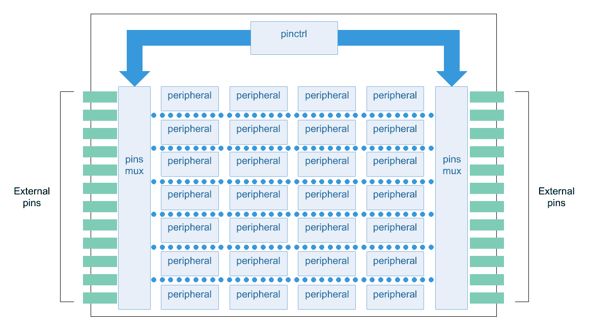

# 第九章：附加信息：使用设备树

# 设备树内部

设备树是一种树形数据结构，其中的节点告诉您系统中当前存在哪些设备以及它们的配置设置。每个节点都有描述所代表设备属性/值对。每个节点只有一个父节点，但根节点没有父节点。

下面的代码显示了一个简单设备树的示例表示，该示例几乎足够完整以引导一个简单的操作系统，其中包括平台类型、CPU、内存和一个**通用同步和异步收发器**（UART），并描述了其时钟和中断线。设备节点显示为每个节点内的属性和值。

设备树语法几乎是自解释的；但是，我们将通过查看与第四章相关的 GitHub 存储库中的`simple_platform.dts`文件来详细解释它。因此，让我们从文件末尾开始查看：

```
        serial0: serial@11100 {
            compatible = "fsl,mpc5125-psc-uart", "fsl,mpc5125-psc";
            reg = <0x11100 0x100>;
            interrupt-parent = <&ipic>;
            interrupts = <40 0x8>; 
            fsl,rx-fifo-size = <16>;
            fsl,tx-fifo-size = <16>;
            clocks = <&clks 47>, <&clks 34>; 
            clock-names = "ipg", "mclk";
        };
    };
};
```

首先，我们应该注意，属性定义是以下形式的名称/值对：

```
[label:] property-name = value;
```

这是真实的，除了具有空（零长度）值的属性，其形式如下：

`[label:] property-name;`

例如，在前面的例子中，我们有`serial@11100`节点（标记为`serial0`）的`compatible`属性设置为由两个字符串`"fsl,mpc5125-psc-uart"`和`"fsl,mpc5125-psc"`组成的列表，而`fsl,rx-fifo-size`属性设置为数字`16`。

属性值可以定义为 8、16、32 或 64 位整数元素的数组，作为以 NULL 结尾的字符串，作为字节字符串，或者这些的组合。元素的存储大小可以使用`/bits/`前缀进行更改，如下所示，它将属性`interrupts`定义为字节数组，`clock-frequency`定义为 64 位数字：

```
interrupts = /bits/ 8 <17 0xc>;
clock-frequency = /bits/ 64 <0x0000000100000000>;
```

`/bits/`前缀允许创建 8、16、32 和 64 位元素。

设备树中的每个节点都根据以下`node-name@unit-address`约定命名，其中`node-name`组件指定节点的名称（通常描述设备的一般类别），而名称的`unit-address`组件是特定于节点所在总线类型的。例如，在前面的例子中，我们有`serial@11100`，这意味着我们在地址`0x11100`处有一个串行端口，偏移量为`soc`节点的基地址`0x80000000`。

看前面的例子，很明显每个节点都是由节点名称和单元地址定义的，用大括号标记节点定义的开始和结束（它们可能由标签前导），如下所示：

```
[label:] node-name[@unit-address] {
    [properties definitions]
    [child nodes]
};
```

设备树中的每个节点都有描述节点特征的属性；存在具有明确定义和标准化功能的标准属性，但我们也可以使用自己的属性来指定自定义值。属性由名称和值组成，对于我们串行端口的示例，我们将`interrupts`属性设置为`<40 0x8>`数组，而`compatible`属性设置为字符串列表，`fsl,rx-fifo-size`设置为数字。

设备树中的节点可以通过清楚地说明从根节点到所需节点的所有后代节点的完整路径来唯一标识。指定设备路径的约定类似于我们通常用于文件系统中的文件的路径名称；例如，在前面的定义中，我们串行端口的设备路径是`/soc@80000000/serial@11100`，而根节点的路径显然是`/`。这种情况是标签发挥作用的地方；实际上，它们可以用来代替节点的完整路径，即串行端口使用`clks`标签可以轻松寻址，如下所示：

```
    clks: clock@f00 {
        ...
    };

    serial0: serial@11100 {
        compatible = "fsl,mpc5125-psc-uart", "fsl,mpc5125-psc";
        ....     
        clocks = <&clks 47>, <&clks 34>;
        clock-names = "ipg", "mclk";
    };

```

我们还可以注意到`serial0`被定义为`tty0`的别名。这种语法为开发人员提供了另一种使用标签而不是使用完整路径名引用节点的方式：

```
    aliases {
        tty0 = &serial0;
    };
```

前面的定义等同于以下内容：

```
    aliases {
        tty0 = "/soc@80000000/serial@11100";
    }
```

现在很明显，标签可以在设备树源文件中作为属性句柄（标签通常被命名为 phandle）值或路径使用，具体取决于上下文。实际上，如果`&`字符在数组内部，则它只引用 phandle；否则（如果在数组外部），它引用路径！

别名不直接在设备树源中使用，而是由 Linux 内核进行解引用。实际上，当我们要求内核通过路径找到一个节点时（我们将很快在本章中看到这样的函数的用法，比如`of_find_node_by_path()`），如果路径不以`/`字符开头，那么路径的第一个元素必须是`/aliases`节点中的属性名称。该元素将被别名的完整路径替换。

在节点、标签和别名中，另一个设备树的重要实体是 phandles。官方定义告诉我们，phandle 属性指定了设备树中唯一的节点的数值标识符。实际上，其他需要引用与该属性关联的节点的节点使用了该属性值，因此这实际上只是一个绕过设备树没有指针数据类型的方法。

在上面的例子中，`serial@11100`节点是指定哪个节点是中断控制器，哪个节点是 phandles 使用的时钟定义的一种方式。然而，在该示例中，它们没有被显式定义，因为`dtc`编译器会从标签中创建 phandles。因此，在上面的例子中，我们有以下语法（已删除不需要的信息以便更好地阅读）：

```
        ipic: interrupt-controller@c00 {
            compatible = "fsl,mpc5121-ipic", "fsl,ipic";
            ...
        };

        clks: clock@f00 {
            compatible = "fsl,mpc5121-clock";
            ...
        };

        serial0: serial@11100 {
            compatible = "fsl,mpc5125-psc-uart", "fsl,mpc5125-psc";
            ...
            interrupt-parent = <&ipic>;
            ...
            clocks = <&clks 47>, <&clks 34>; 
            ...
        };
```

`dtc`编译器是设备树编译器，在第四章中将介绍*使用设备树*，使用设备树编译器和实用程序。

这相当于下一个语法，其中 phandles 被显式地制作出来：

```
        interrupt-controller@c00 {
            compatible = "fsl,mpc5121-ipic", "fsl,ipic";
            ...
            phandle = <0x2>;
        };

        clock@f00 {
            compatible = "fsl,mpc5121-clock";
            ...
            phandle = <0x3>;
        };

        serial@11100 {
            compatible = "fsl,mpc5125-psc-uart", "fsl,mpc5125-psc";
            ...
            interrupt-parent = <0x2>;
            ...
            clocks = <0x3 0x2f 0x3 0x22>;
            ...
        };
```

简而言之，`&`字符告诉`dtc`后面的字符串是引用与该字符串匹配的标签的 phandle；然后它将为每个用于 phandle 引用的标签创建一个唯一的`u32`值。

当然，您可以在一个节点中定义自己的 phandle 属性，并在不同节点的名称上指定一个标签。然后，`dtc`将意识到任何明确声明的 phandle 值，并在为带标签的节点创建 phandle 值时不使用这些值。

关于设备树语法有很多要说的。然而，我们已经涵盖了足够理解如何在设备驱动程序开发过程中使用设备树的内容。

有关此主题的完整文档，请阅读[`www.devicetree.org/specifications/`](https://www.devicetree.org/specifications/)上的设备树规范。

# 使用设备树编译器和实用程序

以下是关于`dtc`及其实用程序的一些有趣用法的注释，这些用法在设备驱动程序开发和内核配置过程中可能非常有用。

# 获取运行设备树的源代码形式

`dtc`也可以用来将运行中的设备树转换为人类可读的形式！假设我们想知道我们的 ESPRESSObin 是如何配置的；首先要做的事情是查看内核源代码中 ESPRESSObin 的 DTS 文件。但是，假设我们没有它。在这种情况下，我们可以要求`dtc`回退到相应的 DTB 文件，就像前面的部分所示，但是假设我们仍然没有它。我们能做什么？嗯，`dtc`可以通过回退存储在`/proc/device-tree`目录中的数据再次帮助我们，该目录保存了运行设备树的文件系统表示。

实际上，我们可以使用`tree`命令检查`/proc/device-tree`目录，就像下面所示的那样（这个输出只是整个目录内容的一部分）：

```
# tree /proc/device-tree/proc/device-tree/
|-- #address-cells
|-- #size-cells
|-- aliases
|   |-- name
|   |-- serial0
|   `-- serial1
|-- chosen
|   |-- bootargs
|   |-- name
|   `-- stdout-path
|-- compatible
|-- cpus
|   |-- #address-cells
|   |-- #size-cells
|   |-- cpu@0
|   |   |-- clocks
|   |   |-- compatible
|   |   |-- device_type
|   |   |-- enable-method
|   |   |-- name
|   |   `-- reg
...
```

如果不存在，可以像通常一样使用`apt install tree`命令安装`tree`命令。

然后我们可以按以下方式读取每个文件中的字符串数据：

```
# cat /proc/device-tree/compatible ; echo
globalscale,espressobinmarvell,armada3720marvell,armada3710
# cat /proc/device-tree/cpus/cpu\@0/compatible ; echo 
arm,cortex-a53arm,armv8
```

最后的`echo`命令只是用于在`cat`输出后添加一个新行字符，以获得更可读的输出。

数字必须按以下方式读取：

```
# cat /proc/device-tree/#size-cells | od -tx4
0000000 02000000
0000004
# cat /proc/device-tree/cpus/cpu\@1/reg | od -tx4
0000000 01000000
0000004
```

但是，通过使用`dtc`，我们可以获得更好的结果。实际上，如果我们使用下一个命令行，我们要求`dtc`将所有 DTB 数据转换为人类可读的形式：

```
# dtc -I fs -o espressobin-reverted.dts /proc/device-tree/
```

当然，我们还必须使用`apt install device-tree-compiler`命令将`dtc`程序安装到我们的 ESPRESSObin 中。

现在，从`espressobin-reverted.dts`文件中，我们可以轻松读取设备树数据：

```
# head -20 espressobin-reverted.dts
/dts-v1/;

/ {
    #address-cells = <0x2>;
    model = "Globalscale Marvell ESPRESSOBin Board";
    #size-cells = <0x2>;
    interrupt-parent = <0x1>;
    compatible = "globalscale,espressobin", "marvell,armada3720", "marvell,armada3710";

    memory@0 {
        device_type = "memory";
        reg = <0x0 0x0 0x0 0x80000000 0x0 0x0 0x0 0x0 0x0 0x0 0x0 0x0 0x0 0x0 0x0 0x0>;
    };

    regulator {
        regulator-max-microvolt = <0x325aa0>;
        gpios-states = <0x0>;
        regulator-boot-on;
        enable-active-high;
        regulator-min-microvolt = <0x1b7740>;
..
```

# 设备树实用程序的注意事项

如果我们查看之前安装的`device-tree-compiler`软件包中的程序，我们会发现除了`dtc`之外还有更多的程序：

```
$ dpkg -L device-tree-compiler | grep '/usr/bin'
/usr/bin
/usr/bin/convert-dtsv0
/usr/bin/dtc
/usr/bin/dtdiff
/usr/bin/fdtdump
/usr/bin/fdtget
/usr/bin/fdtoverlay
/usr/bin/fdtput
```

这些其他程序通常称为**设备树实用程序**，可用于检查或操作设备树的二进制形式（DTB）。

例如，我们可以使用`fdtdump`实用程序轻松转储 DTB 文件：

```
$ fdtdump simple_platform.dtb | head -23

**** fdtdump is a low-level debugging tool, not meant for general use.
**** If you want to decompile a dtb, you probably want
**** dtc -I dtb -O dts <filename>

/dts-v1/;
// magic: 0xd00dfeed
// totalsize: 0x642 (1602)
...

/ {
    model = "fsl,mpc8572ds";
    compatible = "fsl,mpc8572ds";
    #address-cells = <0x00000001>;
    #size-cells = <0x00000001>;
    interrupt-parent = <0x00000001>;
    chosen {
        bootargs = "root=/dev/sda2";
    };
    aliases {
        tty0 = "/soc@80000000/serial@11100";
    };
```

细心的读者会注意到`fdtdump`实用程序本身告诉我们它只是一个低级调试工具，然后使用`dtc`而不是反编译（或恢复为 DTS）DTB 文件！

另外两个有用的命令是`fdtget`和`fdtput`，可以用来读取和写入数据到我们的 DTB 文件中。以下是我们可以用来读取前述 DTB 文件的`bootargs`条目的命令：

```
$ fdtget simple_platform.dtb /chosen bootargs
root=/dev/sda2
```

然后，我们可以使用下一个命令进行更改：

```
$ fdtput -ts simple_platform.dtb /chosen bootargs 'root=/dev/sda1 rw'
$ fdtget simple_platform.dtb /chosen bootargs
root=/dev/sda1 rw
```

请注意，我们必须使用`-ts`选项参数告诉`fdtput`我们的数据类型，否则可能会写入错误的值！

不仅如此，我们还可以要求`fdtget`列出每个提供节点的所有子节点：

```
$ fdtget -l simple_platform.dtb /cpus /soc@80000000
cpu@0
cpu@1
interrupt-controller@c00
clock@f00
serial@11100
```

此外，我们还可以要求它列出每个节点的所有属性：

```
$ fdtget -p simple_platform.dtb /cpus /soc@80000000
#address-cells
#size-cells
compatible
#address-cells
#size-cells
device_type
ranges
reg
bus-frequency
```

# 从设备树获取特定应用程序数据

通过使用`linux/drivers/of`目录中的函数，我们将能够从设备树中提取我们的驱动程序所需的所有信息。例如，通过使用`of_find_node_by_path()`函数，我们可以通过其路径名获取节点指针：

```
struct device_node *of_find_node_by_path(const char *path);
```

然后，一旦我们有了指向设备树节点的指针，我们可以使用它来通过使用`of_property_read_*()`函数提取所需的信息，如下所示：

```
int of_property_read_u8(const struct device_node *np,
                        const char *propname,
                        u8 *out_value);
int of_property_read_u16(const struct device_node *np,
                         const char *propname,
                         u16 *out_value);
int of_property_read_u32(const struct device_node *np,
                         const char *propname,
                         u32 *out_value);
...
```

请注意，我们可以使用许多其他函数从设备树中提取信息，因此您可以查看`linux/include/linux/of.h`文件以获取完整列表。

如果我们希望解析节点的每个属性，我们可以使用`for_each_property_of_node()`宏来迭代它们，其定义如下：

```
#define for_each_property_of_node(dn, pp) \
        for (pp = dn->properties; pp != NULL; pp = pp->next)
```

然后，如果我们的节点有多个子节点，我们可以使用`for_each_child_of_node()`宏来迭代它们，其定义如下：

```
#define for_each_child_of_node(parent, child) \
        for (child = of_get_next_child(parent, NULL); child != NULL; \
             child = of_get_next_child(parent, child))
```

# 使用设备树描述字符驱动程序

我们已经看到，通过使用设备树，我们可以指定不同的驱动程序设置，然后修改驱动程序的功能。但是，我们的可能性并不止于此！实际上，我们可以将相同的代码用于不同的驱动程序发布版本或相同设备的不同类型。

# 如何管理不同的设备类型

假设我们的`chrdev`有另外两个实现（加上当前的实现），在这两个实现中，硬件的大部分参数都是固定的（并且是众所周知的），开发人员无法选择；在这种情况下，我们仍然可以使用节点属性来指定它们，但这样做容易出错，并且迫使用户了解这些约束。例如，如果在这两个实现中，硬件只能以只读或读/写模式工作（即用户无法自由指定`read-only`属性），我们可以将这些特殊情况称为`"chrdev-fixed"`用于读/写版本，`"chrdev-fixed_read-only"`用于只读版本。

此时，我们可以指定驱动程序现在与其他两个设备兼容，方法是修改`of_chrdev_req_match`数组，如下所示：

```
static const struct of_device_id of_chrdev_req_match[] = {
    {
        .compatible = "ldddc,chrdev",
    },
    {
        .compatible = "ldddc,chrdev-fixed",
        .data = &chrdev_fd,
    },
    {
        .compatible = "ldddc,chrdev-fixed_read-only",
        .data = &chrdev_fd_ro,
    },
    { /* sentinel */ }
};
MODULE_DEVICE_TABLE(of, of_chrdev_req_match);
```

我们只需添加两个具有适当`compatible`字符串和两个特殊数据条目，如下所定义：

```
static const struct chrdev_fixed_data chrdev_fd = {
    .label = "cdev-fixed",
};

static const struct chrdev_fixed_data chrdev_fd_ro = {
    .label = "cdev-fixedro",
    .read_only = 1, 
};
```

通过这种方式，我们告诉驱动程序这些设备只能有一个实例，并且它们可以以读/写或只读模式工作。通过这样做，用户可以通过简单地指定设备树来使用我们的设备，如下所示：

```
--- a/arch/arm64/boot/dts/marvell/armada-3720-espressobin.dts
+++ b/arch/arm64/boot/dts/marvell/armada-3720-espressobin.dts
@@ -41,6 +41,10 @@
             3300000 0x0>;
         enable-active-high;
     };
+
+    chrdev {
+        compatible = "ldddc,chrdev-fixed_read-only";
+    };
 };

 /* J9 */
```

同样，您必须修改 ESPRESSObin 的 DTS 文件，然后重新编译和重新安装内核。

通过使用这种解决方案，用户不需要了解硬件内部情况，因为驱动程序开发人员（在这种情况下是我们）已将其封装到驱动程序中。

可以使用`of_device_is_compatible()`函数为驱动程序评估此兼容属性，如下例所示，我们已修改`chrdev_req_probe()`函数以支持我们的`chrdev`特殊版本：

```
static int chrdev_req_probe(struct platform_device *pdev)
{
    struct device *dev = &pdev->dev;
    struct device_node *np = dev->of_node;
    const struct chrdev_fixed_data *data = of_device_get_match_data(dev);
    struct fwnode_handle *child;
    struct module *owner = THIS_MODULE;
    int count, ret;

    /* Check the chrdev device type */
    if (of_device_is_compatible(np, "ldddc,chrdev-fixed") ||
        of_device_is_compatible(np, "ldddc,chrdev-fixed_read-only")) {
        ret = chrdev_device_register(data->label, 0,
                         data->read_only, owner, dev);
        if (ret)
            dev_err(dev, "unable to register fixed");

        return ret;
    }

    /* If we are not registering a fixed chrdev device then get
     * the number of chrdev devices from DTS
     */
    count = device_get_child_node_count(dev);
    if (count == 0)
        return -ENODEV;
    if (count > MAX_DEVICES)
        return -ENOMEM;

    device_for_each_child_node(dev, child) {
        const char *label; 
        unsigned int id, ro; 
...
```

正如我们所看到的，在扫描节点的子项之前，我们只需验证当前已安装的系统的`chrdev`设备版本；在这种情况下，我们有两个新设备中的一个，因此我们相应地注册一个新的`chrdev`设备。

所有这些修改都可以使用`add_fixed_chrdev_devices.patch`文件和以下命令行进行：

**`$ patch -p3 < add_fixed_chrdev_devices.patch`**

现在我们可以通过重新编译我们的`chrdev`驱动程序并将其重新插入（实际上是两个模块）到 ESPRESSObin 中来尝试代码，如下所示：

```
# insmod chrdev.ko 
chrdev:chrdev_init: got major 239
# insmod chrdev-req.ko 
chrdev cdev-fixedro@0: chrdev cdev-fixedro with id 0 added
# ls -l /dev/cdev-fixedro\@0 
crw------- 1 root root 239, 0 Feb 28 15:23 /dev/cdev-fixedro@0
```

正如我们所看到的，驱动程序正确地识别出设备树中已定义了`chrdev`设备的特殊版本（只读版本）。

# 如何向设备添加 sysfs 属性

在前面的部分中，我们简要讨论了`/sys/class/chrdev`目录。我们说它与设备类（可以在系统中定义）和内核设备有关。实际上，当我们调用`device_create()`函数时，我们必须指定第一个参数，即为`chrdev_init()`函数分配的设备类指针，此操作将为每个`chrdev`设备创建`/sys/class/chrdev`目录，如下所示：

```
# ls /sys/class/chrdev/
cdev-eeprom@2 cdev-rom@4
```

因此，设备类将所有具有共同特征的设备分组在一起，但我们在谈论哪些特征？简单地说，这些特征或属性（我们将很快看到它们确切的名称）是关于我们设备的一组共同信息。

每次向系统添加新设备时，内核都会创建默认属性，可以在用户空间中看到这些属性，如下所示：

```
# ls -l /sys/class/chrdev/cdev-eeprom\@2/
total 0
-r--r--r-- 1 root root 4096 Feb 28 10:51 dev
lrwxrwxrwx 1 root root 0 Feb 28 10:51 device -> ../../../chrdev
drwxr-xr-x 2 root root 0 Feb 28 10:51 power
lrwxrwxrwx 1 root root 0 Feb 27 19:53 subsystem -> ../../../../../class/chrdev
-rw-r--r-- 1 root root 4096 Feb 27 19:53 uevent
```

在前面的列表中，有些是文件，有些是目录或符号链接；然而，在这里，重要的是，对于每个设备，我们都有一些描述它的属性。例如，如果我们查看`dev`属性，我们会得到以下内容：

```
# cat /sys/class/chrdev/cdev-eeprom\@2/dev
239:2
```

我们设备的主次编号是多少？现在的问题是，我们可以有更多（和自定义）属性吗？当然，答案是肯定的，所以让我们看看如何做到这一点。

首先，我们必须修改`chrdev.c`文件，向`chrdev_init()`添加一行，如下所示：

```
--- a/chapter_4/chrdev/chrdev.c
+++ b/chapter_4/chrdev/chrdev.c
@@ -216,6 +288,7 @@ static int __init chrdev_init(void)
        pr_err("chrdev: failed to allocate class\n");
        return -ENOMEM;
    }
+   chrdev_class->dev_groups = chrdev_groups;

    /* Allocate a region for character devices */
    ret = alloc_chrdev_region(&chrdev_devt, 0, MAX_DEVICES, "chrdev");
```

此修改只是将指向`chrdev_class`的结构的`dev_groups`字段设置为`chrdev_groups`结构，如下所示：

```
static struct attribute *chrdev_attrs[] = {
    &dev_attr_id.attr,
    &dev_attr_reset_to.attr,
    &dev_attr_read_only.attr,
    NULL,
};

static const struct attribute_group chrdev_group = {
    .attrs = chrdev_attrs,
};

static const struct attribute_group *chrdev_groups[] = {
    &chrdev_group,
    NULL,
};
```

本段中的所有修改都可以使用`add_sysfs_attrs_chrdev.patch`文件和以下命令行进行：

**`$ patch -p3 < add_sysfs_attrs_chrdev.patch`**

前面的代码是向我们的 chrdev 设备添加一组属性的复杂方式。更具体地说，该代码只是向名为`id`、`reset_to`和`read_only`的一组属性添加了单个组。所有这些属性名称仍然在修改后的`chrdev.c`文件中定义，如下摘录所示。这是只读属性：

```
static ssize_t id_show(struct device *dev,
                struct device_attribute *attr, char *buf)
{
    struct chrdev_device *chrdev = dev_get_drvdata(dev);

    return sprintf(buf, "%d\n", chrdev->id);
}
static DEVICE_ATTR_RO(id);
```

然后，只写属性如下：

```
static ssize_t reset_to_store(struct device *dev,
                struct device_attribute *attr,
                const char *buf, size_t count)
{
    struct chrdev_device *chrdev = dev_get_drvdata(dev);

    if (count > BUF_LEN)
        count = BUF_LEN;
    memcpy(chrdev->buf, buf, count);

    return count;
}
static DEVICE_ATTR_WO(reset_to);
```

最后，读/写属性如下：

```
static ssize_t read_only_show(struct device *dev,
                struct device_attribute *attr, char *buf)
{
    struct chrdev_device *chrdev = dev_get_drvdata(dev);

    return sprintf(buf, "%d\n", chrdev->read_only);
}

static ssize_t read_only_store(struct device *dev,
                struct device_attribute *attr,
                const char *buf, size_t count)
{
    struct chrdev_device *chrdev = dev_get_drvdata(dev);
    int data, ret;

    ret = sscanf(buf, "%d", &data);
    if (ret != 1)
        return -EINVAL;

    chrdev->read_only = !!data;

    return count;
}
static DEVICE_ATTR_RW(read_only);
```

通过使用`DEVICE_ATTR_RW()`，`DEVICE_ATTR_WO()`和`DEVICE_ATTR_RO()`，我们声明读/写、只写和只读属性，这些属性与名为`chrdev_attrs`的数组中的条目相关联，该数组被定义为`struct attribute`类型。

当我们使用 DEVICE_ATTR_RW(read_only)时，我们必须定义两个名为 read_only_show()和 read_only_store()的函数（变量名为 read_only，带有后缀 _show 和 _store），这样内核在用户空间进程在属性文件上执行 read()或 write()系统调用时会调用每个函数。当然，DEVICE_ATTR_RO()和 DEVICE_ATTR_WO()变体只需要 _show 和 _store 函数，分别。

为了更好地理解数据是如何交换的，让我们更仔细地看看这些函数。通过查看 read_only_show()函数，我们可以看到要写入的数据由 buf 指向，而通过使用 dev_get_drvdata()，我们可以获得指向我们的 struct chrdev_device 的指针，其中包含与我们自定义实现相关的所有必要信息。例如，read_only_show()函数将返回存储在 read_only 变量中的值，该值表示设备的只读属性。请注意，read_only_show()必须返回一个表示返回多少字节的正值，或者如果有任何错误则返回一个负值。

以类似的方式，`read_only_store()`函数为我们提供要写入`buf`缓冲区和`count`的数据，同时我们可以使用相同的技术来获得指向`struct chrdev_device`的指针。`read_only_store()`函数以人类可读形式（即 ASCII 表示）读取一个数字，然后如果我们读取值为 0，则将`read_only`属性设置为 0，否则设置为 1。

其他属性 id 和 reset_to 分别用于显示设备的 id 或强制内部缓冲区达到所需状态，而不管设备本身是否被定义为只读。

为了测试代码，我们必须像之前描述的那样修改 chrdev.c 文件，然后重新编译代码并将生成的内核模块移动到 ESPRESSObin。现在，如果我们插入模块，我们应该得到几乎与之前相同的内核消息，但是现在/sys/class/chrdev 子目录的内容应该已经改变。实际上，现在我们有以下内容：

```
# ls -l /sys/class/chrdev/cdev-eeprom\@2/
total 0
-r--r--r-- 1 root root 4096 Feb 28 13:45 dev
lrwxrwxrwx 1 root root 0 Feb 28 13:45 device -> ../../../chrdev
-r--r--r-- 1 root root 4096 Feb 28 13:45 id
drwxr-xr-x 2 root root 0 Feb 28 13:45 power
-rw-r--r-- 1 root root 4096 Feb 28 13:45 read_only
--w------- 1 root root 4096 Feb 28 13:45 reset_to
lrwxrwxrwx 1 root root 0 Feb 28 13:45 subsystem -> ../../../../../class/chrdev
-rw-r--r-- 1 root root 4096 Feb 28 13:45 uevent
```

正如预期的那样，我们在代码中定义了三个新属性。然后，我们可以尝试从中读取：

```
# cat /sys/class/chrdev/cdev-eeprom\@2/id 
2
# cat /sys/class/chrdev/cdev-eeprom\@2/read_only 
0
# cat /sys/class/chrdev/cdev-eeprom\@2/reset_to 
cat: /sys/class/chrdev/cdev-eeprom@2/reset_to: Permission denied
```

所有答案都如预期；实际上，cdev-eeprom 设备的 id 等于 2，并且不是只读的，而 reset_to 属性是只写的，不可读。类似的输出也可以从 cdev-rom 中获得，如下所示：

```
# cat /sys/class/chrdev/cdev-rom\@4/id 
4
# cat /sys/class/chrdev/cdev-rom\@4/read_only 
1
```

这些属性对于检查当前设备状态很有用，但也可以用于修改其行为。实际上，我们可以使用 reset_to 属性来为只读 cdev-rom 设备设置初始值，如下所示：

```
# echo "THIS IS A READ ONLY DEVICE!" > /sys/class/chrdev/cdev-rom\@4/reset_to 
```

现在/dev/cdev-rom@4 设备仍然是只读的，但不再被全部零填充：

```
# cat /dev/cdev-rom\@4
THIS IS A READ ONLY DEVICE!
```

或者，我们可以从/dev/cdev-rom@4 设备中移除只读属性：

```
# echo 0 > /sys/class/chrdev/cdev-rom\@4/read_only
```

现在，如果我们尝试再次向其中写入数据，我们会成功（echo 命令下方的内核消息是从串行控制台报告的）：

```
root@espressobin:~# echo "TEST STRING" > /dev/cdev-rom\@4 
chrdev cdev-rom@4: chrdev (id=4) opened
chrdev cdev-rom@4: should write 12 bytes (*ppos=0)
chrdev cdev-rom@4: got 12 bytes (*ppos=12)
chrdev cdev-rom@4: chrdev (id=4) released
```

请注意，这样做是有效的，但会产生意外的副作用；我们可以写入设备，但新的 TEST STRING 会覆盖我们刚刚设置的新（更长的）reset_to 字符串（即 THIS IS A READ-ONLY DEVICE），因此随后的读取将会得到：

＃cat /dev/cdev-rom\@4

测试字符串

只读设备！

然而，这只是一个例子，我们可以安全地接受这种行为。

# 为特定外围设备配置 CPU 引脚

即使 ESPRESSObin 是本书的参考平台，在本段中，我们将解释内核开发人员如何修改不同平台的引脚设置，因为这个任务可能因不同的实现而有所不同。实际上，即使所有这些实现都是基于设备树的，它们之间存在一些必须概述的差异。

当前的 CPU 是非常复杂的系统——复杂到大多数 CPU 都被赋予了缩写**SoC**，意思是**片上系统**；事实上，在一个芯片上，我们可能不仅可以找到**中央处理单元**（**CPU**），还有很多外围设备，CPU 可以用来与外部环境进行通信。因此，我们可以在一个芯片内找到显示控制器、键盘控制器、USB 主机或设备控制器、磁盘和网络控制器。不仅如此，现代 SoC 还有几个副本！所有这些外围设备都有自己的信号，每个信号都通过专用的物理线路进行路由，每条线路都需要一个引脚与外部环境进行通信；然而，可能会出现 CPU 引脚不足以将所有这些线路路由到外部的情况，这就是为什么大多数引脚都是多路复用的原因。这意味着，例如，CPU 可能有六个串行端口和两个以太网端口，但它们不能同时使用。这就是**pinctrl 子系统**发挥作用的地方。

Linux 的 pinctrl 子系统处理枚举、命名和多路可控引脚，例如软件控制的偏置和驱动模式特定的引脚，例如上拉/下拉、开漏、负载电容等。所有这些设置都可以通过**引脚控制器**来完成，这是一种硬件（通常是一组寄存器），可以控制 CPU 引脚，可能能够对单个引脚或引脚组进行多路复用、偏置、设置负载电容或设置驱动强度。



无符号整数从 0 到最大引脚编号用于表示我们想要控制的封装输入或输出线路。

这个数字空间是每个引脚控制器本地的，因此在系统中可能有几个这样的数字空间；每次实例化引脚控制器时，它都会注册一个包含一组引脚描述符的描述符，描述这个特定引脚控制器处理的引脚。

在本书中，我们不打算解释如何在内核中定义引脚控制器，因为这超出了本书的范围（而且也是一个相当复杂的任务），但我们将尝试为读者提供配置每个 CPU 引脚的能力，以便它们可以与他们正在开发的驱动程序一起使用，例如，在嵌入式系统行业中使用的三种最常用的 CPU。

# Armada 3720

ESPRESSObin 的 CPU 是 Marvell 的 Armada 3720，我们可以通过查看`linux/arch/arm64/boot/dts/marvell/armada-37xx.dtsi`文件来了解其内部外围设备的情况。该文件定义了内部外围设备的内存映射（即每个外围设备在 CPU 内存中的映射方式和位置），以及按引脚控制器和引脚功能分组的所有 CPU 引脚。

例如，以下代码段定义了一个名为`pinctrl@13800`的引脚控制器：

```
   pinctrl_nb: pinctrl@13800 {
        compatible = "marvell,armada3710-nb-pinctrl",
                 "syscon", "simple-mfd";
        reg = <0x13800 0x100>, <0x13C00 0x20>;
        /* MPP1[19:0] */
        gpionb: gpio {
            #gpio-cells = <2>;
            gpio-ranges = <&pinctrl_nb 0 0 36>;
            gpio-controller;
            interrupt-controller;
            #interrupt-cells = <2>;
            interrupts =
            <GIC_SPI 51 IRQ_TYPE_LEVEL_HIGH>,
            <GIC_SPI 52 IRQ_TYPE_LEVEL_HIGH>,
            <GIC_SPI 53 IRQ_TYPE_LEVEL_HIGH>,
            <GIC_SPI 54 IRQ_TYPE_LEVEL_HIGH>,
            <GIC_SPI 55 IRQ_TYPE_LEVEL_HIGH>,
            <GIC_SPI 56 IRQ_TYPE_LEVEL_HIGH>,
            <GIC_SPI 57 IRQ_TYPE_LEVEL_HIGH>,
            <GIC_SPI 58 IRQ_TYPE_LEVEL_HIGH>,
            <GIC_SPI 152 IRQ_TYPE_LEVEL_HIGH>,
            <GIC_SPI 153 IRQ_TYPE_LEVEL_HIGH>,
            <GIC_SPI 154 IRQ_TYPE_LEVEL_HIGH>,
            <GIC_SPI 155 IRQ_TYPE_LEVEL_HIGH>;
        };

        xtalclk: xtal-clk {
            compatible = "marvell,armada-3700-xtal-clock";
            clock-output-names = "xtal"; 
            #clock-cells = <0>;
        };

        spi_quad_pins: spi-quad-pins {
            groups = "spi_quad";
            function = "spi";
        };
...
```

我们应该记住，这个表示法意味着它从名为`internal-regs@d0000000`的父节点的开头偏移`0x13800`处进行映射，并映射到`0xd0000000`处。

`compatible`属性表示这个引脚控制器的驱动程序（存储在`linux/drivers/pinctrl/mvebu/pinctrl-armada-37xx.c`文件中），而每个子节点描述了引脚的功能。我们可以看到一个带有时钟设备和一组引脚定义的 GPIO 控制器（从`spi_quad_pins`开始），这些引脚控制器在以下报告的代码中进行了定义。

```
static struct armada_37xx_pin_group armada_37xx_nb_groups[] = {
    PIN_GRP_GPIO("jtag", 20, 5, BIT(0), "jtag"),
    PIN_GRP_GPIO("sdio0", 8, 3, BIT(1), "sdio"),
    PIN_GRP_GPIO("emmc_nb", 27, 9, BIT(2), "emmc"),
    PIN_GRP_GPIO("pwm0", 11, 1, BIT(3), "pwm"),
    PIN_GRP_GPIO("pwm1", 12, 1, BIT(4), "pwm"),
    PIN_GRP_GPIO("pwm2", 13, 1, BIT(5), "pwm"),
    PIN_GRP_GPIO("pwm3", 14, 1, BIT(6), "pwm"),
    PIN_GRP_GPIO("pmic1", 17, 1, BIT(7), "pmic"),
    PIN_GRP_GPIO("pmic0", 16, 1, BIT(8), "pmic"),
    PIN_GRP_GPIO("i2c2", 2, 2, BIT(9), "i2c"),
    PIN_GRP_GPIO("i2c1", 0, 2, BIT(10), "i2c"),
    PIN_GRP_GPIO("spi_cs1", 17, 1, BIT(12), "spi"),
    PIN_GRP_GPIO_2("spi_cs2", 18, 1, BIT(13) | BIT(19), 0, BIT(13), "spi"),
    PIN_GRP_GPIO_2("spi_cs3", 19, 1, BIT(14) | BIT(19), 0, BIT(14), "spi"),
    PIN_GRP_GPIO("onewire", 4, 1, BIT(16), "onewire"),
    PIN_GRP_GPIO("uart1", 25, 2, BIT(17), "uart"),
    PIN_GRP_GPIO("spi_quad", 15, 2, BIT(18), "spi"),
    PIN_GRP_EXTRA("uart2", 9, 2, BIT(1) | BIT(13) | BIT(14) | BIT(19),
              BIT(1) | BIT(13) | BIT(14), BIT(1) | BIT(19),
              18, 2, "gpio", "uart"),
    PIN_GRP_GPIO("led0_od", 11, 1, BIT(20), "led"),
    PIN_GRP_GPIO("led1_od", 12, 1, BIT(21), "led"),
    PIN_GRP_GPIO("led2_od", 13, 1, BIT(22), "led"),
    PIN_GRP_GPIO("led3_od", 14, 1, BIT(23), "led"),

};
```

`PIN_GRP_GPIO()`和`PIN_GRP_GPIO_2()`宏用于指定引脚组可以被内部外围设备使用，或者只能作为普通的 GPIO 线路使用。因此，当我们在 ESPRESSObin 的 DTS 文件中使用以下代码（来自`linux/arch/arm64/boot/dts/marvell/armada-3720-espressobin.dts`文件）时，我们要求引脚控制器为`uart0`设备保留`uart1_pins`组。

```
/* Exported on the micro USB connector J5 through an FTDI */
&uart0 {
    pinctrl-names = "default";
    pinctrl-0 = <&uart1_pins>;
    status = "okay";
};
```

请注意，`status = "okay"` 这一行是必需的，因为每个设备通常都是禁用的，如果不指定，设备将无法工作。

请注意，这次我们使用了 `pinctrl-0` 属性来声明外围设备的引脚。

`pinctrl-0` 和 `pinctrl-names` 属性的使用与多引脚配置状态密切相关，由于空间有限，本书未对其进行报告。然而，有兴趣的读者可以查看 `https://www.kernel.org/doc/Documentation/devicetree/bindings/pinctrl/pinctrl-bindings.txt` 以获取更多信息。

# i.MX7Dual

另一个相当著名的 CPU 是来自 Freescale 的 **i.MX7Dual**，它在 `linux/arch/arm/boot/dts/imx7s.dtsi` 设备树文件中有描述。在该文件中，我们可以看到其两个引脚控制器的定义如下：

```
    iomuxc_lpsr: iomuxc-lpsr@302c0000 {
        compatible = "fsl,imx7d-iomuxc-lpsr";
        reg = <0x302c0000 0x10000>;
        fsl,input-sel = <&iomuxc>;
    };

    iomuxc: iomuxc@30330000 {
        compatible = "fsl,imx7d-iomuxc";
        reg = <0x30330000 0x10000>;
    };
```

通过使用 `compatible` 属性，我们可以发现引脚控制器的驱动程序存储在文件 `linux/drivers/pinctrl/freescale/pinctrl-imx7d.c` 中，我们可以在其中找到所有 CPU 引脚的列表，如下所示（由于空间原因，仅报告了第二个引脚控制器的引脚）：

```
enum imx7d_lpsr_pads {
    MX7D_PAD_GPIO1_IO00 = 0,
    MX7D_PAD_GPIO1_IO01 = 1,
    MX7D_PAD_GPIO1_IO02 = 2,
    MX7D_PAD_GPIO1_IO03 = 3,
    MX7D_PAD_GPIO1_IO04 = 4,
    MX7D_PAD_GPIO1_IO05 = 5,
    MX7D_PAD_GPIO1_IO06 = 6,
    MX7D_PAD_GPIO1_IO07 = 7,
};
```

然后，所有需要引脚的外围设备只需声明它们，就像从 Freescale 的 **i.MX 7Dual SABRE board** 的 DTS 文件中取出的以下示例一样：

```
...
    panel {
        compatible = "innolux,at043tn24";
        pinctrl-0 = <&pinctrl_backlight>;
        enable-gpios = <&gpio1 1 GPIO_ACTIVE_HIGH>;
        power-supply = <&reg_lcd_3v3>;

        port {
            panel_in: endpoint {
                remote-endpoint = <&display_out>; 
            };
        };
    };
};
...
&wdog1 {
    pinctrl-names = "default";
    pinctrl-0 = <&pinctrl_wdog>;
    fsl,ext-reset-output;
};
...
&iomuxc_lpsr {
    pinctrl_wdog: wdoggrp {
        fsl,pins = <
            MX7D_PAD_LPSR_GPIO1_IO00__WDOG1_WDOG_B 0x74
        >;
    };

    pinctrl_backlight: backlightgrp {
        fsl,pins = <
            MX7D_PAD_LPSR_GPIO1_IO01__GPIO1_IO1 0x110b0
        >;
    };
};
```

在前面的示例中，`panel` 节点要求 `pinctrl_backlight` 引脚组，而 `wdog1` 要求 `pinctrl_wdog` 引脚组；所有这些组都需要来自 `lpsr` 垫的引脚。

请注意，DTS 中定义的引脚可以在文件 `linux/arch/arm/boot/dts/imx7d-pinfunc.h` 中找到。此外，以下数字是特定的引脚设置，这些设置在 CPU 的用户手册中有解释，因此请参考手册以获取有关这些神奇数字的更多信息。

同样，`pinctrl-0` 属性已用于寻址默认引脚配置。

# SAMA5D3

最后一个示例是关于名为 **SAMA5D3 from Microchip** 的 CPU，在 `linux/arch/arm/boot/dts/sama5d3.dtsi` 文件中有描述。引脚定义模式与前面的相似，其中引脚控制器驱动程序存储在 `linux/drivers/pinctrl/pinctrl-at91.c` 文件中，并且所有引脚特性都根据设备树中的定义进行管理，如下例所示：

```
    pinctrl@fffff200 {
        #address-cells = <1>;
        #size-cells = <1>;
        compatible = "atmel,sama5d3-pinctrl", "atmel,at91sam9x5-pinctrl", "simple-bus";
        ranges = <0xfffff200 0xfffff200 0xa00>;
        atmel,mux-mask = <
            /* A B C */
            0xffffffff 0xc0fc0000 0xc0ff0000 /* pioA */
            0xffffffff 0x0ff8ffff 0x00000000 /* pioB */
            0xffffffff 0xbc00f1ff 0x7c00fc00 /* pioC */
            0xffffffff 0xc001c0e0 0x0001c1e0 /* pioD */
            0xffffffff 0xbf9f8000 0x18000000 /* pioE */
            >;

        /* shared pinctrl settings */
        adc0 {
            pinctrl_adc0_adtrg: adc0_adtrg {
                atmel,pins =
                    <AT91_PIOD 19 AT91_PERIPH_A AT91_PINCTRL_NONE>; /* PD19 periph A ADTRG */
            };
            pinctrl_adc0_ad0: adc0_ad0 {
                atmel,pins =
                    <AT91_PIOD 20 AT91_PERIPH_A AT91_PINCTRL_NONE>; /* PD20 periph A AD0 */
            };
...
            pinctrl_adc0_ad7: adc0_ad7 {
                atmel,pins =
                    <AT91_PIOD 27 AT91_PERIPH_A AT91_PINCTRL_NONE>; /* PD27 periph A AD7 */
...
```

同样，当外围设备需要一个以上的引脚组时，它只需声明它们，就像从 Microchip Technology 的 **SAMA5D3 Xplained board** 的 DTS 文件中取出的以下代码一样：

```
    adc0: adc@f8018000 {
        atmel,adc-vref = <3300>; 
        atmel,adc-channels-used = <0xfe>; 
        pinctrl-0 = <
            &pinctrl_adc0_adtrg
            &pinctrl_adc0_ad1
            &pinctrl_adc0_ad2
            &pinctrl_adc0_ad3
            &pinctrl_adc0_ad4
            &pinctrl_adc0_ad5
            &pinctrl_adc0_ad6
            &pinctrl_adc0_ad7
            >;
        status = "okay"; 
    };
```

在前面的示例中，`adc0` 节点要求多个引脚组，以便能够管理其内部 ADC 外围设备。

SAMA5D3 CPU 的 DTS 模式仍然使用 `pinctrl-0` 属性来寻址默认引脚配置。

# 使用设备树描述字符驱动程序

为了测试在本章中呈现的代码，并展示一切是如何工作的，我们必须在采取任何进一步步骤之前对其进行编译：

```
$ make KERNEL_DIR=../../../linux
make -C ../../../linux \
            ARCH=arm64 \
            CROSS_COMPILE=aarch64-linux-gnu- \
            SUBDIRS=/home/giometti/Projects/ldddc/github/chapter_4/chrdev modules
make[1]: Entering directory '/home/giometti/Projects/ldddc/linux'
  CC [M] /home/giometti/Projects/ldddc/github/chapter_4/chrdev/chrdev.o
  CC [M] /home/giometti/Projects/ldddc/github/chapter_4/chrdev/chrdev-req.o
...
  LD [M] /home/giometti/Projects/ldddc/github/chapter_4/chrdev/chrdev.ko
make[1]: Leaving directory '/home/giometti/Projects/ldddc/linux'
```

然后，我们必须将 `chrdev.ko` 和 `chrdev-req.ko` 文件移动到 ESPRESSObin。现在，如果我们插入第一个模块，我们将在串行控制台上（或内核消息中）看到与之前完全相同的输出：

```
# insmod chrdev.ko
chrdev: loading out-of-tree module taints kernel.
chrdev:chrdev_init: got major 239
```

当我们插入第二个模块时，差异将会出现：

```
# insmod chrdev-req.ko 
chrdev cdev-eeprom@2: chrdev cdev-eeprom with id 2 added
chrdev cdev-rom@4: chrdev cdev-rom with id 4 added
```

太棒了！现在已经创建了两个新设备。通过这样做，以下两个字符文件已自动创建到 `/dev` 目录中：

```
# ls -l /dev/cdev*
crw------- 1 root root 239, 2 Feb 27 18:35 /dev/cdev-eeprom@2
crw------- 1 root root 239, 4 Feb 27 18:35 /dev/cdev-rom@4
```

实际上，这里没有什么神奇之处，而是由 `udev` 程序为我们完成的，这将在下一节中更深入地解释。

新设备的名称根据设备树中指定的标签进行命名（如前所述），次要编号对应于每个 `reg` 属性使用的值。

请注意，当我们指定 printf 格式时，`cdev-eeprom@2` 和 `cdev-rom@4` 名称是由 `device_create()` 函数创建的：

`device_create(... , "%s@%d", label, id);`

现在我们可以尝试在我们新创建的设备中读取和写入数据。根据设备树中的定义，标记为`cdev-eeprom`的设备应该是读/写设备，而标记为`cdev-rom`的设备是只读设备。因此，让我们在`/dev/cdev-eeprom@2`字符设备上尝试一些简单的读/写命令：

```
# echo "TEST STRING" > /dev/cdev-eeprom\@2 
# cat /dev/cdev-eeprom\@2
TEST STRING
```

请注意在`@`之前的反斜杠（`\`）字符，否则，BASH 会生成错误。

为了验证一切是否与以前一样，相关的内核消息报告如下：

```
chrdev cdev-eeprom@2: chrdev (id=2) opened
chrdev cdev-eeprom@2: should write 12 bytes (*ppos=0)
chrdev cdev-eeprom@2: got 12 bytes (*ppos=12)
chrdev cdev-eeprom@2: chrdev (id=2) released
chrdev cdev-eeprom@2: chrdev (id=2) opened
chrdev cdev-eeprom@2: should read 131072 bytes (*ppos=0)
chrdev cdev-eeprom@2: return 300 bytes (*ppos=300)
chrdev cdev-eeprom@2: should read 131072 bytes (*ppos=300)
chrdev cdev-eeprom@2: return 0 bytes (*ppos=300)
chrdev cdev-eeprom@2: chrdev (id=2) released
```

我们可以看到，通过第一个命令，我们调用了`open()`系统调用，驱动程序识别出设备`id`等于 2，然后我们写入了 12 个字节（即`TEST STRING`加上终止字符）；之后，我们关闭了设备。相反，使用`cat`命令，我们仍然打开了设备，但之后，我们进行了 131,072 字节的第一次读取（驱动程序只正确返回了 300 字节），然后进行了相同数量的字节的另一次读取，得到了答案 0，表示文件结束；因此，`cat`命令关闭了设备并打印了接收到的数据（或者至少是所有可打印的字节），然后退出。

现在我们可以尝试在另一个`/dev/cdev-rom@4`设备上执行相同的命令。输出如下：

```
# echo "TEST STRING" > /dev/cdev-rom\@4 
-bash: echo: write error: Invalid argument
# cat /dev/cdev-rom\@4 
```

第一个命令如预期般失败，而第二个似乎没有返回任何内容；然而，这是因为所有读取的数据都是 0，为了验证这一点，我们可以使用`od`命令如下：

```
# od -tx1 -N 16 /dev/cdev-rom\@4 
0000000 00 00 00 00 00 00 00 00 00 00 00 00 00 00 00 00
0000020
```

这表明没有数据被写入`/dev/cdev-rom@4`设备，该设备在设备树中被定义为只读。

与前面的代码一样，我们可以再次查看内核消息，以验证一切是否正常（以下是与`od`命令相关的报告的内核消息）：

```
chrdev cdev-rom@4: chrdev (id=4) opened
chrdev cdev-rom@4: should write 12 bytes (*ppos=0)
chrdev cdev-rom@4: chrdev (id=4) released
chrdev cdev-rom@4: chrdev (id=4) opened
chrdev cdev-rom@4: should read 131072 bytes (*ppos=0)
chrdev cdev-rom@4: return 300 bytes (*ppos=300)
chrdev cdev-rom@4: should read 131072 bytes (*ppos=300)
chrdev cdev-rom@4: return 0 bytes (*ppos=300)
chrdev cdev-rom@4: chrdev (id=4) released
chrdev cdev-rom@4: chrdev (id=4) opened
chrdev cdev-rom@4: should read 16 bytes (*ppos=0)
chrdev cdev-rom@4: return 16 bytes (*ppos=16)
chrdev cdev-rom@4: chrdev (id=4) released
```

在前面的输出中，我们可以看到我们首先打开了设备（这次是设备 id 等于四的设备），然后我们使用了`write()`系统调用，显然失败了，所以设备被简单地关闭了。接下来的两次读取与前面的读取完全相同。

现在我们应该尝试修改设备树以定义不同的 chrdev 设备，或者更好的是，应该尝试修改驱动程序以添加更多功能。
