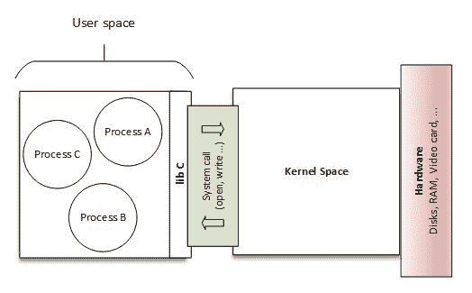
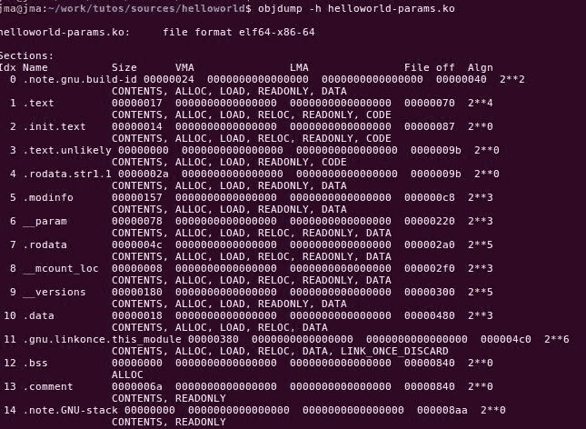
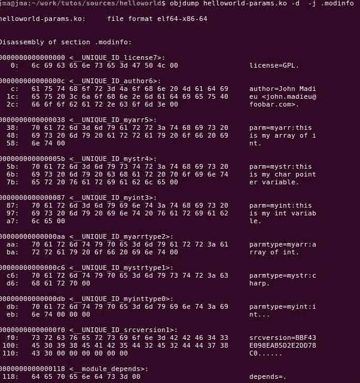
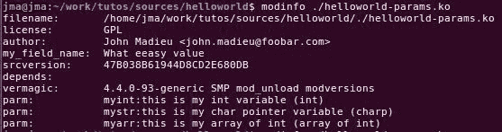
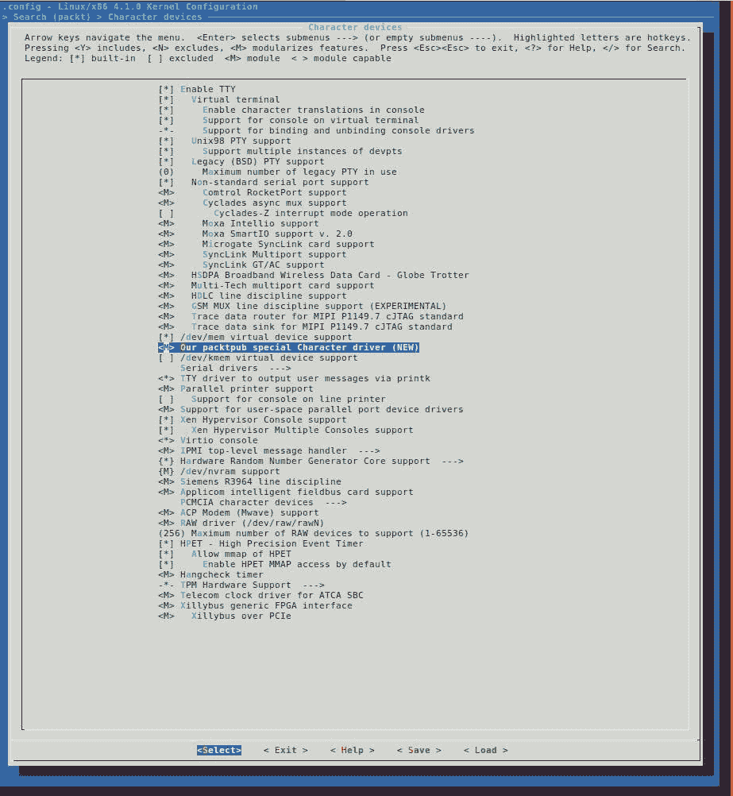

# 第二章：设备驱动程序基础

驱动程序是一种旨在控制和管理特定硬件设备的软件。因此得名设备驱动程序。从操作系统的角度来看，它可以在内核空间（以特权模式运行）或用户空间（权限较低）中。本书只涉及内核空间驱动程序，特别是 Linux 内核驱动程序。我们的定义是设备驱动程序向用户程序公开硬件的功能。

这本书的目的不是教你如何成为 Linux 大师——我自己也不是——但在编写设备驱动程序之前，你应该了解一些概念。C 编程技能是必需的；你至少应该熟悉指针。你还应该熟悉一些操作函数。还需要一些硬件技能。因此，本章主要讨论：

+   模块构建过程，以及它们的加载和卸载

+   驱动程序骨架和调试消息管理

+   驱动程序中的错误处理

# 用户空间和内核空间

内核空间和用户空间的概念有点抽象。这一切都与内存和访问权限有关。人们可能认为内核是特权的，而用户应用程序是受限制的。这是现代 CPU 的一个特性，允许它在特权或非特权模式下运行。这个概念在[第十一章](http://post%2011) *内核内存管理*中会更清楚。



用户空间和内核空间

前面的图介绍了内核空间和用户空间之间的分离，并强调了系统调用代表它们之间的桥梁（我们稍后在本章讨论这一点）。可以描述每个空间如下：

+   **内核空间：**这是内核托管和运行的一组地址。内核内存（或内核空间）是一段内存范围，由内核拥有，受到访问标志的保护，防止任何用户应用程序无意中干扰内核。另一方面，内核可以访问整个系统内存，因为它以更高的优先级在系统上运行。在内核模式下，CPU 可以访问整个内存（包括内核空间和用户空间）。

+   **用户空间：**这是正常程序（如 gedit 等）受限制运行的一组地址（位置）。你可以把它看作是一个沙盒或监狱，这样用户程序就不能干扰其他程序拥有的内存或其他资源。在用户模式下，CPU 只能访问带有用户空间访问权限标记的内存。用户应用程序运行的优先级较低。当进程执行系统调用时，会向内核发送软件中断，内核会打开特权模式，以便进程可以在内核空间中运行。当系统调用返回时，内核关闭特权模式，进程再次被限制。

# 模块的概念

模块对于 Linux 内核来说就像插件（Firefox 就是一个例子）对于用户软件一样。它动态扩展了内核的功能，甚至不需要重新启动计算机。大多数情况下，内核模块都是即插即用的。一旦插入，它们就可以被使用。为了支持模块，内核必须已经使用以下选项构建：

```
CONFIG_MODULES=y 
```

# 模块依赖

在 Linux 中，模块可以提供函数或变量，并使用`EXPORT_SYMBOL`宏导出它们，使它们对其他模块可用。这些被称为符号。模块 B 对模块 A 的依赖是，模块 B 使用了模块 A 导出的符号之一。

# depmod 实用程序

`depmod` 是在内核构建过程中运行的工具，用于生成模块依赖文件。它通过读取`/lib/modules/<kernel_release>/`中的每个模块来确定它应该导出哪些符号以及它需要哪些符号。该过程的结果被写入文件`modules.dep`，以及它的二进制版本`modules.dep.bin`。它是一种模块索引。

# 模块加载和卸载

要使模块运行，应该将其加载到内核中，可以使用`insmod`给定模块路径作为参数来实现，这是开发过程中首选的方法，也可以使用`modprobe`，这是一个聪明的命令，但在生产系统中更受欢迎。

# 手动加载

手动加载需要用户的干预，用户应该具有 root 访问权限。实现这一点的两种经典方法如下所述：

# modprobe 和 insmod

在开发过程中，通常使用`insmod`来加载模块，并且应该给出要加载的模块的路径：

```
insmod /path/to/mydrv.ko

```

这是一种低级形式的模块加载，它构成了其他模块加载方法的基础，也是本书中我们将使用的方法。另一方面，有`modprobe`，主要由系统管理员或在生产系统中使用。`modprobe`是一个聪明的命令，它解析文件`modules.dep`以便先加载依赖项，然后再加载给定的模块。它自动处理模块依赖关系，就像软件包管理器一样：

```
modprobe mydrv

```

是否可以使用`modprobe`取决于`depmod`是否知道模块安装。

# /etc/modules-load.d/<filename>.conf

如果您希望某个模块在启动时加载，只需创建文件`/etc/modules-load.d/<filename>.conf`，并添加应该加载的模块名称，每行一个。`<filename>`应该对您有意义，人们通常使用模块：`/etc/modules-load.d/modules.conf`。您可以根据需要创建多个`.conf`文件：

`/etc/modules-load.d/mymodules.conf`的一个例子如下：

```
#this line is a comment 
uio 
iwlwifi 
```

# 自动加载

`depmod`实用程序不仅构建`modules.dep`和`modules.dep.bin`文件。它做的不仅仅是这些。当内核开发人员实际编写驱动程序时，他们确切地知道驱动程序将支持哪些硬件。然后他们负责为驱动程序提供所有受支持设备的产品和供应商 ID。`depmod`还处理模块文件以提取和收集这些信息，并生成一个`modules.alias`文件，位于`/lib/modules/<kernel_release>/modules.alias`，它将设备映射到它们的驱动程序：

`modules.alias`的摘录如下：

```
alias usb:v0403pFF1Cd*dc*dsc*dp*ic*isc*ip*in* ftdi_sio 
alias usb:v0403pFF18d*dc*dsc*dp*ic*isc*ip*in* ftdi_sio 
alias usb:v0403pDAFFd*dc*dsc*dp*ic*isc*ip*in* ftdi_sio 
alias usb:v0403pDAFEd*dc*dsc*dp*ic*isc*ip*in* ftdi_sio 
alias usb:v0403pDAFDd*dc*dsc*dp*ic*isc*ip*in* ftdi_sio 
alias usb:v0403pDAFCd*dc*dsc*dp*ic*isc*ip*in* ftdi_sio 
alias usb:v0D8Cp0103d*dc*dsc*dp*ic*isc*ip*in* snd_usb_audio 
alias usb:v*p*d*dc*dsc*dp*ic01isc03ip*in* snd_usb_audio 
alias usb:v200Cp100Bd*dc*dsc*dp*ic*isc*ip*in* snd_usb_au 
```

在这一步，您将需要一个用户空间热插拔代理（或设备管理器），通常是`udev`（或`mdev`），它将向内核注册，以便在新设备出现时得到通知。

内核通过发送设备的描述（pid、vid、class、device class、device subclass、interface 以及可能标识设备的所有其他信息）来通知，这些信息发送到热插拔守护程序，它再调用`modprobe`来处理这些信息。`modprobe`然后解析`modules.alias`文件以匹配与设备关联的驱动程序。在加载模块之前，`modprobe`将在`module.dep`中查找它的依赖项。如果找到任何依赖项，那么在加载相关模块之前将加载依赖项；否则，模块将直接加载。

# 模块卸载

卸载模块的常用命令是`rmmod`。应该优先使用此命令来卸载使用`insmod`命令加载的模块。应该将模块名称作为参数给出。模块卸载是一个内核功能，可以根据`CONFIG_MODULE_UNLOAD`配置选项的值来启用或禁用。如果没有此选项，将无法卸载任何模块。让我们启用模块卸载支持：

```
CONFIG_MODULE_UNLOAD=y 
```

在运行时，内核将阻止卸载可能破坏事物的模块，即使有人要求这样做。这是因为内核保持对模块使用的引用计数，以便它知道模块是否实际上正在使用。如果内核认为移除模块是不安全的，它就不会这样做。显然，人们可以改变这种行为：

```
MODULE_FORCE_UNLOAD=y 
```

为了强制模块卸载，应该在内核配置中设置前述选项：

```
rmmod -f mymodule

```

另一方面，以智能方式卸载模块的更高级命令是`modeprobe -r`，它会自动卸载未使用的依赖项：

```
modeprobe -r mymodule

```

正如你可能已经猜到的，这对开发人员来说是一个非常有帮助的选项。最后，可以使用以下命令检查模块是否已加载：

```
lsmod

```

# 驱动程序骨架

让我们考虑以下`helloworld`模块。它将成为本章其余部分工作的基础：

helloworld.c

```
#include <linux/init.h> 
#include <linux/module.h> 
#include <linux/kernel.h> 

static int __init helloworld_init(void) { 
    pr_info("Hello world!\n"); 
    return 0; 
} 

static void __exit helloworld_exit(void) { 
    pr_info("End of the world\n"); 
} 

module_init(helloworld_init); 
module_exit(helloworld_exit); 
MODULE_AUTHOR("John Madieu <john.madieu@gmail.com>"); 
MODULE_LICENSE("GPL"); 
```

# 模块入口和出口点

内核驱动程序都有入口和出口点：前者对应于模块加载时调用的函数（`modprobe`，`insmod`），后者是在模块卸载时执行的函数（在`rmmod`或`modprobe -r`中）。

我们都记得`main()`函数，它是每个以 C/C++编写的用户空间程序的入口点，当该函数返回时程序退出。对于内核模块，情况有所不同。入口点可以有任何你想要的名称，而不像用户空间程序在`main()`返回时退出，出口点是在另一个函数中定义的。你需要做的就是告诉内核哪些函数应该作为入口或出口点执行。实际的函数`hellowolrd_init`和`hellowolrd_exit`可以被赋予任何名称。实际上，唯一强制的是将它们标识为相应的加载和卸载函数，并将它们作为参数传递给`module_init()`和`module_exit()`宏。

总之，`module_init()`用于声明在加载模块（使用`insmod`或`modprobe`）时应调用的函数。初始化函数中所做的事情将定义模块的行为。`module_exit()`用于声明在卸载模块（使用`rmmod`）时应调用的函数。

无论是`init`函数还是`exit`函数，在模块加载或卸载后都只运行一次。

# `__init`和`__exit`属性

`__init`和`__exit`实际上是内核宏，在`include/linux/init.h`中定义，如下所示：

```
#define __init__section(.init.text) 
#define __exit__section(.exit.text) 
```

`__init`关键字告诉链接器将代码放置在内核对象文件的一个专用部分中。这个部分对内核是预先知道的，并且在模块加载和`init`函数完成后被释放。这仅适用于内置驱动程序，而不适用于可加载模块。内核将在其引导序列期间首次运行驱动程序的初始化函数。

由于驱动程序无法卸载，其初始化函数直到下次重启之前都不会再次被调用。不再需要保留对其初始化函数的引用。对于`__exit`关键字也是一样，当模块被静态编译到内核中时，或者未启用模块卸载支持时，其对应的代码将被省略，因为在这两种情况下，`exit`函数永远不会被调用。`__exit`对可加载模块没有影响。

让我们花更多时间了解这些属性是如何工作的。这一切都关于名为**可执行和可链接格式**（**ELF**）的对象文件。一个 ELF 对象文件由各种命名的部分组成。其中一些是强制性的，并且构成了 ELF 标准的基础，但人们可以创造任何想要的部分，并让特殊程序使用它。这就是内核的做法。可以运行`objdump -h module.ko`来打印出构成给定`module.ko`内核模块的不同部分：



helloworld-params.ko 模块的部分列表

在标题中的部分中，只有少数是标准的 ELF 部分：

+   `.text`，也称为代码，其中包含程序代码

+   `.data`，其中包含初始化数据，也称为数据段

+   `.rodata`，用于只读数据

+   `.评论`

+   未初始化数据段，也称为 **由符号开始的块**（**bss**）

其他部分是根据内核目的的需求添加的。对于本章来说，最重要的是 **.modeinfo** 部分，它存储有关模块的信息，以及 **.init.text** 部分，它存储以 `__init` 宏为前缀的代码。

链接器（Linux 系统上的 `ld` ）是 binutils 的一部分，负责将符号（数据、代码等）放置在生成的二进制文件的适当部分，以便在程序执行时由加载器处理。可以通过提供链接器脚本（称为 **链接器定义文件**（**LDF**）或 **链接器定义脚本**（**LDS**））来自定义这些部分，更改它们的默认位置，甚至添加额外的部分。现在，您只需要通过编译器指令通知链接器符号的放置。GNU C 编译器提供了用于此目的的属性。在 Linux 内核的情况下，提供了一个自定义的 LDS 文件，位于 `arch/<arch>/kernel/vmlinux.lds.S` 中。然后使用 `__init` 和 `__exit` 来标记要放置在内核的 LDS 文件中映射的专用部分中的符号。

总之，`__init` 和 `__exit` 是 Linux 指令（实际上是宏），它们包装了用于符号放置的 C 编译器属性。它们指示编译器将它们分别放置在 `.init.text` 和 `.exit.text` 部分，即使内核可以访问不同的对象部分。

# 模块信息

即使不必阅读其代码，人们也应该能够收集有关给定模块的一些信息（例如作者、参数描述、许可证）。内核模块使用其 `.modinfo` 部分来存储有关模块的信息。任何 `MODULE_*` 宏都将使用传递的值更新该部分的内容。其中一些宏是 `MODULE_DESCRIPTION()`、`MODULE_AUTHOR()` 和 `MODULE_LICENSE()`。内核提供的真正底层宏用于在模块信息部分中添加条目是 `MODULE_INFO(tag, info)`，它添加了形式为 tag = info 的通用信息。这意味着驱动程序作者可以添加任何他们想要的自由形式信息，例如：

```
MODULE_INFO(my_field_name, "What eeasy value"); 
```

可以使用 `objdump -d -j .modinfo` 命令在给定模块上转储 `.modeinfo` 部分的内容：



helloworld-params.ko 模块的 .modeinfo 部分的内容

modinfo 部分可以被视为模块的数据表。实际上以格式化的方式打印信息的用户空间工具是 `modinfo`：



modinfo 输出

除了自定义信息外，还应提供标准信息，内核为此提供了宏；这些是许可证、模块作者、参数描述、模块版本和模块描述。

# 许可

许可在给定模块中由 `MODULE_LICENSE()` 宏定义：

```
MODULE_LICENSE ("GPL"); 
```

许可证将定义您的源代码应如何与其他开发人员共享（或不共享）。`MODULE_LICENSE()`告诉内核我们的模块使用的许可证。它会影响您的模块行为，因为不兼容 GPL 的许可证将导致您的模块无法看到/使用内核通过`EXPORT_SYMBOL_GPL()`宏导出的服务/函数，该宏仅向兼容 GPL 的模块显示符号，这与`EXPORT_SYMBOL()`相反，后者为任何许可证的模块导出函数。加载不兼容 GPL 的模块还将导致内核受到污染；这意味着已加载非开源或不受信任的代码，您可能不会得到社区的支持。请记住，没有`MODULE_LICENSE()`的模块也不被视为开源，并且也会污染内核。以下是`include/linux/module.h`的摘录，描述了内核支持的许可证：

```
/* 
 * The following license idents are currently accepted as indicating free 
 * software modules 
 * 
 * "GPL"                   [GNU Public License v2 or later] 
 * "GPL v2"                [GNU Public License v2] 
 * "GPL and additional rights"   [GNU Public License v2 rights and more] 
 * "Dual BSD/GPL"                [GNU Public License v2 
 *                          or BSD license choice] 
 * "Dual MIT/GPL"                [GNU Public License v2 
 *                          or MIT license choice] 
 * "Dual MPL/GPL"                [GNU Public License v2 
 *                          or Mozilla license choice] 
 * 
 * The following other idents are available 
 * 
 * "Proprietary"                 [Non free products] 
 * 
 * There are dual licensed components, but when running with Linux it is the 
 * GPL that is relevant so this is a non issue. Similarly LGPL linked with GPL 
 * is a GPL combined work. 
 * 
 * This exists for several reasons 
 * 1\.    So modinfo can show license info for users wanting to vet their setup 
 * is free 
 * 2\.    So the community can ignore bug reports including proprietary modules 
 * 3\.    So vendors can do likewise based on their own policies 
 */ 
```

您的模块至少必须与 GPL 兼容，才能享受完整的内核服务。

# 模块作者

`MODULE_AUTHOR()`声明模块的作者：

```
MODULE_AUTHOR("John Madieu <john.madieu@gmail.com>");  
```

可能有多个作者。在这种情况下，每个作者都必须用`MODULE_AUTHOR()`声明：

```
MODULE_AUTHOR("John Madieu <john.madieu@gmail.com>"); 
MODULE_AUTHOR("Lorem Ipsum <l.ipsum@foobar.com>"); 
```

# 模块描述

`MODULE_DESCRIPTION()`简要描述模块的功能：

```
MODULE_DESCRIPTION("Hello, world! Module"); 
```

# 错误和消息打印

错误代码要么由内核解释，要么由用户空间应用程序（通过`errno`变量）解释。错误处理在软件开发中非常重要，比在内核开发中更重要。幸运的是，内核提供了几个几乎涵盖了你可能遇到的每个错误的错误，并且有时你需要打印它们以帮助你调试。

# 错误处理

返回给定错误的错误代码将导致内核或用户空间应用程序产生不必要的行为并做出错误的决定。为了保持清晰，内核树中有预定义的错误，几乎涵盖了您可能遇到的每种情况。一些错误（及其含义）在`include/uapi/asm-generic/errno-base.h`中定义，其余列表可以在`include/uapi/asm-generic/errno.h`中找到。以下是`include/uapi/asm-generic/errno-base.h`中错误列表的摘录：

```
#define  EPERM        1    /* Operation not permitted */ 
#define  ENOENT             2    /* No such file or directory */ 
#define  ESRCH        3    /* No such process */ 
#define  EINTR        4    /* Interrupted system call */ 
#define  EIO          5    /* I/O error */ 
#define  ENXIO        6    /* No such device or address */ 
#define  E2BIG        7    /* Argument list too long */ 
#define  ENOEXEC            8    /* Exec format error */ 
#define  EBADF        9    /* Bad file number */ 
#define  ECHILD            10    /* No child processes */ 
#define  EAGAIN            11    /* Try again */ 
#define  ENOMEM            12    /* Out of memory */ 
#define  EACCES            13    /* Permission denied */ 
#define  EFAULT            14    /* Bad address */ 
#define  ENOTBLK           15    /* Block device required */ 
#define  EBUSY       16    /* Device or resource busy */ 
#define  EEXIST            17    /* File exists */ 
#define  EXDEV       18    /* Cross-device link */ 
#define  ENODEV            19    /* No such device */ 
#define  ENOTDIR           20    /* Not a directory */ 
#define  EISDIR            21    /* Is a directory */ 
#define  EINVAL            22    /* Invalid argument */ 
#define  ENFILE            23    /* File table overflow */ 
#define  EMFILE            24    /* Too many open files */ 
#define  ENOTTY            25    /* Not a typewriter */ 
#define  ETXTBSY           26    /* Text file busy */ 
#define  EFBIG       27    /* File too large */ 
#define  ENOSPC            28    /* No space left on device */ 
#define  ESPIPE            29    /* Illegal seek */ 
#define  EROFS       30    /* Read-only file system */ 
#define  EMLINK            31    /* Too many links */ 
#define  EPIPE       32    /* Broken pipe */ 
#define  EDOM        33    /* Math argument out of domain of func */ 
#define  ERANGE            34    /* Math result not representable */ 
```

大多数时候，返回错误的经典方法是以`return -ERROR`的形式返回，特别是当涉及到回答系统调用时。例如，对于 I/O 错误，错误代码是`EIO`，应该`return -EIO`：

```
dev = init(&ptr); 
if(!dev) 
return -EIO 
```

错误有时会跨越内核空间并传播到用户空间。如果返回的错误是对系统调用（`open`，`read`，`ioctl`，`mmap`）的回答，则该值将自动分配给用户空间的`errno`全局变量，可以使用`strerror(errno)`将错误转换为可读字符串：

```
#include <errno.h>  /* to access errno global variable */ 
#include <string.h> 
[...] 
if(wite(fd, buf, 1) < 0) { 
    printf("something gone wrong! %s\n", strerror(errno)); 
} 
[...] 
```

当遇到错误时，必须撤消发生错误之前设置的所有操作。通常的做法是使用`goto`语句：

```
ptr = kmalloc(sizeof (device_t)); 
if(!ptr) { 
        ret = -ENOMEM 
        goto err_alloc; 
} 
dev = init(&ptr); 

if(dev) { 
        ret = -EIO 
        goto err_init; 
} 
return 0; 

err_init: 
        free(ptr); 
err_alloc: 
        return ret; 
```

使用`goto`语句的原因很简单。当涉及到处理错误时，比如在第 5 步，必须清理之前的操作（步骤 4、3、2、1）。而不是进行大量的嵌套检查操作，如下所示：

```
if (ops1() != ERR) { 
    if (ops2() != ERR) { 
        if ( ops3() != ERR) { 
            if (ops4() != ERR) { 
```

这可能会令人困惑，并可能导致缩进问题。人们更喜欢使用`goto`以便有一个直接的控制流，如下所示：

```
if (ops1() == ERR) // | 
    goto error1;   // | 
if (ops2() == ERR) // | 
    goto error2;   // | 
if (ops3() == ERR) // | 
    goto error3;   // | 
if (ops4() == ERR) // V 
    goto error4; 
error5: 
[...] 
error4: 
[...] 
error3: 
[...] 
error2: 
[...] 
error1: 
[...] 
```

这意味着，应该只使用 goto 在函数中向前移动。

# 处理空指针错误

当涉及到从应该返回指针的函数返回错误时，函数经常返回`NULL`指针。这是一种有效但相当无意义的方法，因为人们并不确切知道为什么返回了这个空指针。为此，内核提供了三个函数，`ERR_PTR`，`IS_ERR`和`PTR_ERR`：

```
void *ERR_PTR(long error); 
long IS_ERR(const void *ptr); 
long PTR_ERR(const void *ptr); 
```

第一个实际上将错误值作为指针返回。假设一个函数在失败的内存分配后可能会`return -ENOMEM`，我们必须这样做`return ERR_PTR(-ENOMEM);`。第二个用于检查返回的值是否是指针错误，`if (IS_ERR(foo))`。最后返回实际的错误代码`return PTR_ERR(foo);`。以下是一个例子：

如何使用`ERR_PTR`，`IS_ERR`和`PTR_ERR`：

```
static struct iio_dev *indiodev_setup(){ 
    [...] 
    struct iio_dev *indio_dev; 
    indio_dev = devm_iio_device_alloc(&data->client->dev, sizeof(data)); 
    if (!indio_dev) 
        return ERR_PTR(-ENOMEM); 
    [...] 
    return indio_dev; 
} 

static int foo_probe([...]){ 
    [...] 
    struct iio_dev *my_indio_dev = indiodev_setup(); 
    if (IS_ERR(my_indio_dev)) 
        return PTR_ERR(data->acc_indio_dev); 
    [...] 
} 
```

这是错误处理的一个优点，也是内核编码风格的一部分，其中说：如果函数的名称是一个动作或一个命令，函数应该返回一个错误代码整数。如果名称是一个谓词，函数应该返回一个`succeeded`布尔值。例如，`add work`是一个命令，`add_work（）`函数成功返回`0`，失败返回`-EBUSY`。同样，`PCI device present`是一个谓词，`pci_dev_present（）`函数在成功找到匹配设备时返回`1`，如果没有找到则返回`0`。

# 消息打印 - printk（）

`printk（）`对内核来说就像`printf（）`对用户空间一样。由`printk（）`编写的行可以通过`dmesg`命令显示。根据您需要打印的消息的重要性，您可以在`include/linux/kern_levels.h`中定义的八个日志级别消息之间进行选择，以及它们的含义：

以下是内核日志级别的列表。这些级别中的每一个都对应于字符串中的一个数字，其优先级与数字的值成反比。例如，`0`是更高的优先级：

```
#define KERN_SOH     "\001"            /* ASCII Start Of Header */ 
#define KERN_SOH_ASCII     '\001' 

#define KERN_EMERG   KERN_SOH "0"      /* system is unusable */ 
#define KERN_ALERT   KERN_SOH "1"      /* action must be taken immediately */ 
#define KERN_CRIT    KERN_SOH "2"      /* critical conditions */ 
#define KERN_ERR     KERN_SOH "3"      /* error conditions */ 
#define KERN_WARNING KERN_SOH "4"      /* warning conditions */ 
#define KERN_NOTICE  KERN_SOH "5"      /* normal but significant condition */ 
#define KERN_INFO    KERN_SOH "6"      /* informational */ 
#define KERN_DEBUG   KERN_SOH "7"      /* debug-level messages */ 
```

以下代码显示了如何打印内核消息以及日志级别：

```
printk(KERN_ERR "This is an error\n"); 
```

如果省略调试级别（`printk("This is an error\n")`），内核将根据`CONFIG_DEFAULT_MESSAGE_LOGLEVEL`配置选项为函数提供一个调试级别，这是默认的内核日志级别。实际上可以使用以下更有意义的宏之一，它们是对先前定义的宏的包装器：`pr_emerg`，`pr_alert`，`pr_crit`，`pr_err`，`pr_warning`，`pr_notice`，`pr_info`和`pr_debug`：

```
pr_err("This is the same error\n"); 
```

对于新驾驶员，建议使用这些包装器。 `printk（）`的现实是，每当调用它时，内核都会将消息日志级别与当前控制台日志级别进行比较；如果前者较高（值较低）则消息将立即打印到控制台。您可以使用以下命令检查日志级别参数：

```
 cat /proc/sys/kernel/printk

 4 4 1 7

```

在此代码中，第一个值是当前日志级别（4），第二个值是默认值，根据`CONFIG_DEFAULT_MESSAGE_LOGLEVEL`选项。其他值对于本章的目的并不重要，因此让我们忽略这些。

内核日志级别列表如下：

```
/* integer equivalents of KERN_<LEVEL> */ 
#define LOGLEVEL_SCHED           -2    /* Deferred messages from sched code 
                            * are set to this special level */ 
#define LOGLEVEL_DEFAULT   -1    /* default (or last) loglevel */ 
#define LOGLEVEL_EMERG           0     /* system is unusable */ 
#define LOGLEVEL_ALERT           1     /* action must be taken immediately */ 
#define LOGLEVEL_CRIT            2     /* critical conditions */ 
#define LOGLEVEL_ERR       3     /* error conditions */ 
#define LOGLEVEL_WARNING   4     /* warning conditions */ 
#define LOGLEVEL_NOTICE          5     /* normal but significant condition */ 
#define LOGLEVEL_INFO            6     /* informational */ 
#define LOGLEVEL_DEBUG           7     /* debug-level messages */ 
```

当前日志级别可以通过以下更改：

```
 # echo <level> > /proc/sys/kernel/printk

```

`printk（）`永远不会阻塞，并且即使从原子上下文中调用也足够安全。它会尝试锁定控制台并打印消息。如果锁定失败，输出将被写入缓冲区，函数将返回，永远不会阻塞。然后当前控制台持有者将收到有关新消息的通知，并在释放控制台之前打印它们。

内核还支持其他调试方法，可以动态使用`#define DEBUG`或在文件顶部使用`#define DEBUG`。对此类调试风格感兴趣的人可以参考内核文档中的*Documentation/dynamic-debug-howto.txt*文件。

# 模块参数

与用户程序一样，内核模块可以从命令行接受参数。这允许根据给定的参数动态更改模块的行为，并且可以帮助开发人员在测试/调试会话期间不必无限制地更改/编译模块。为了设置这一点，首先应该声明将保存命令行参数值的变量，并对每个变量使用`module_param()`宏。该宏在`include/linux/moduleparam.h`中定义（代码中也应该包括：`#include <linux/moduleparam.h>`），如下所示：

```
module_param(name, type, perm); 
```

该宏包含以下元素：

+   `name`：用作参数的变量的名称

+   `type`：参数的类型（bool、charp、byte、short、ushort、int、uint、long、ulong），其中`charp`代表 char 指针

+   `perm`：这表示`/sys/module/<module>/parameters/<param>`文件的权限。其中一些是`S_IWUSR`，`S_IRUSR`，`S_IXUSR`，`S_IRGRP`，`S_WGRP`和`S_IRUGO`，其中：

+   `S_I`只是一个前缀

+   `R`：读取，`W`：写入，`X`：执行

+   `USR`：用户，`GRP`：组，`UGO`：用户，组，其他人

最终可以使用`|`（或操作）来设置多个权限。如果 perm 为`0`，则`sysfs`中的文件参数将不会被创建。您应该只使用`S_IRUGO`只读参数，我强烈建议；通过与其他属性进行`|`（或）运算，可以获得细粒度的属性。

在使用模块参数时，应该使用`MODULE_PARM_DESC`来描述每个参数。这个宏将在模块信息部分填充每个参数的描述。以下是一个示例，来自书籍的代码库中提供的`helloworld-params.c`源文件：

```
#include <linux/moduleparam.h> 
[...] 

static char *mystr = "hello"; 
static int myint = 1; 
static int myarr[3] = {0, 1, 2}; 

module_param(myint, int, S_IRUGO); 
module_param(mystr, charp, S_IRUGO); 
module_param_array(myarr, int,NULL, S_IWUSR|S_IRUSR); /*  */ 

MODULE_PARM_DESC(myint,"this is my int variable"); 
MODULE_PARM_DESC(mystr,"this is my char pointer variable"); 
MODULE_PARM_DESC(myarr,"this is my array of int"); 

static int foo() 
{ 
    pr_info("mystring is a string: %s\n", mystr); 
    pr_info("Array elements: %d\t%d\t%d", myarr[0], myarr[1], myarr[2]); 
    return myint; 
} 
```

要加载模块并传递我们的参数，我们需要执行以下操作：

```
# insmod hellomodule-params.ko mystring="packtpub" myint=15 myArray=1,2,3

```

在加载模块之前，可以使用`modinfo`来显示模块支持的参数的描述：

```
$ modinfo ./helloworld-params.ko

filename: /home/jma/work/tutos/sources/helloworld/./helloworld-params.ko

license: GPL

author: John Madieu <john.madieu@gmail.com>

srcversion: BBF43E098EAB5D2E2DD78C0

depends:

vermagic: 4.4.0-93-generic SMP mod_unload modversions

parm: myint:this is my int variable (int)

parm: mystr:this is my char pointer variable (charp)

parm: myarr:this is my array of int (array of int)

```

# 构建您的第一个模块

有两个地方可以构建一个模块。这取决于您是否希望人们使用内核配置界面自行启用模块。

# 模块的 makefile

Makefile 是一个特殊的文件，用于执行一系列操作，其中最重要的是编译程序。有一个专门的工具来解析 makefile，叫做`make`。在跳转到整个 make 文件的描述之前，让我们介绍`obj-<X>` kbuild 变量。

在几乎每个内核 makefile 中，都会看到至少一个`obj<-X>`变量的实例。这实际上对应于`obj-<X>`模式，其中`<X>`应该是`y`，`m`，留空，或`n`。这是由内核 makefile 从内核构建系统的头部以一般方式使用的。这些行定义要构建的文件、任何特殊的编译选项以及要递归进入的任何子目录。一个简单的例子是：

```
 obj-y += mymodule.o 
```

这告诉 kbuild 当前目录中有一个名为`mymodule.o`的对象。`mymodule.o`将从`mymodule.c`或`mymodule.S`构建。`mymodule.o`将如何构建或链接取决于`<X>`的值：

+   如果`<X>`设置为`m`，则使用变量`obj-m`，`mymodule.o`将作为一个模块构建。

+   如果`<X>`设置为`y`，则使用变量`obj-y`，`mymodule.o`将作为内核的一部分构建。然后说 foo 是一个内置模块。

+   如果`<X>`设置为`n`，则使用变量`obj-m`，`mymodule.o`将根本不会被构建。

因此，通常使用`obj-$(CONFIG_XXX)`模式，其中`CONFIG_XXX`是内核配置选项，在内核配置过程中设置或不设置。一个例子是：

```
obj-$(CONFIG_MYMODULE) += mymodule.o 
```

`$(CONFIG_MYMODULE)`根据内核配置过程中的值评估为`y`或`m`。如果`CONFIG_MYMODULE`既不是`y`也不是`m`，则文件将不会被编译或链接。`y`表示内置（在内核配置过程中代表是），`m`代表模块。`$(CONFIG_MYMODULE)`从正常配置过程中获取正确的答案。这将在下一节中解释。

最后一个用例是：

```
obj-<X> += somedir/ 
```

这意味着 kbuild 应进入名为`somedir`的目录；查找其中的任何 makefile 并处理它，以决定应构建哪些对象。

回到 makefile，以下是我们将用于构建书中介绍的每个模块的内容 makefile：

```
obj-m := helloworld.o 

KERNELDIR ?= /lib/modules/$(shell uname -r)/build 

all default: modules 
install: modules_install 

modules modules_install help clean: 
$(MAKE) -C $(KERNELDIR) M=$(shell pwd) $@ 
```

+   `obj-m := hellowolrd.o`：`obj-m`列出我们要构建的模块。对于每个`<filename>.o`，构建系统将寻找一个`<filename>.c`进行构建。`obj-m`用于构建模块，而`obj-y`将导致内置对象。

+   `KERNELDIR := /lib/modules/$(shell uname -r)/build`：`KERNELDIR`是预构建内核源的位置。正如我们之前所说，我们需要预构建的内核才能构建任何模块。如果您已经从源代码构建了内核，则应将此变量设置为构建源目录的绝对路径。`-C`指示 make 实用程序在读取 makefile 或执行其他任何操作之前切换到指定的目录。

+   `M=$(shell pwd)`：这与内核构建系统有关。内核 Makefile 使用此变量来定位要构建的外部模块的目录。您的`.c`文件应放置在这里。

+   `all default: modules`：此行指示`make`实用程序执行`modules`目标，无论是`all`还是`default`目标，这些都是在构建用户应用程序时的经典目标。换句话说，`make default`或`make all`或简单地`make`命令将被转换为`make modules`。

+   `modules modules_install help clean：`：此行表示此 Makefile 中有效的列表目标。

+   `$(MAKE) -C $(KERNELDIR ) M=$(shell pwd) $@`：这是要为上述每个目标执行的规则。`$@`将被替换为导致规则运行的目标的名称。换句话说，如果调用 make modules，`$@`将被替换为 modules，规则将变为：`$(MAKE) -C $(KERNELDIR ) M=$(shell pwd) module`。

# 在内核树中

在内核树中构建驱动程序之前，您应首先确定驱动程序应放置在哪个驱动程序目录中的`.c`文件。给定您的文件名`mychardev.c`，其中包含您的特殊字符驱动程序的源代码，它应放置在内核源中的`drivers/char`目录中。驱动程序中的每个子目录都有`Makefile`和`Kconfig`文件。

将以下内容添加到该目录的`Kconfig`中：

```
config PACKT_MYCDEV 
   tristate "Our packtpub special Character driver" 
   default m 
   help 
     Say Y here if you want to support the /dev/mycdev device. 
     The /dev/mycdev device is used to access packtpub. 
```

在同一目录的 makefile 中添加：

```
obj-$(CONFIG_PACKT_MYCDEV)   += mychardev.o 
```

更新`Makefile`时要小心；`.o`文件名必须与您的`.c`文件的确切名称匹配。如果您的源文件是`foobar.c`，则必须在`Makefile`中使用`foobar.o`。为了使您的驱动程序作为模块构建，将以下行添加到`arch/arm/configs`目录中的板 defconfig 中：

```
CONFIG_PACKT_MYCDEV=m 
```

您还可以运行`make menuconfig`从 UI 中选择它，并运行`make`构建内核，然后运行`make modules`构建模块（包括您自己的模块）。要使驱动程序内置构建，只需用`y`替换`m`：

```
CONFIG_PACKT_MYCDEV=m 
```

这里描述的一切都是嵌入式板制造商为了提供带有他们的板的**BSP**（**Board Support Package**）而做的，其中包含已经包含他们自定义驱动程序的内核：



内核树中的 packt_dev 模块

配置完成后，您可以使用`make`构建内核，并使用`make modules`构建模块。

包含在内核源树中的模块将安装在`/lib/modules/$(KERNELRELEASE)/kernel/`中。在您的 Linux 系统上，它是`/lib/modules/$(uname -r)/kernel/`。运行以下命令以安装模块：

```
make modules_install

```

# 树外

在构建外部模块之前，您需要拥有完整的预编译内核源代码树。内核源代码树的版本必须与您将加载和使用模块的内核相同。获取预构建内核版本有两种方法：

+   自行构建（之前讨论过）

+   从您的发行版存储库安装`linux-headers-*`软件包

```
 sudo apt-get update

 sudo apt-get install linux-headers-$(uname -r)

```

这将只安装头文件，而不是整个源代码树。然后，头文件将安装在`/usr/src/linux-headers-$(uname -r)`中。在我的计算机上，它是`/usr/src/linux-headers-4.4.0-79-generic/`。将会有一个符号链接，`/lib/modules/$(uname -r)/build`，指向先前安装的头文件。这是您应该在`Makefile`中指定为内核目录的路径。这是您为预构建内核所需做的一切。

# 构建模块

现在，当您完成了您的 makefile，只需切换到您的源目录并运行`make`命令，或者`make modules`：

```
    jma@jma:~/work/tutos/sources/helloworld$ make

    make -C /lib/modules/4.4.0-79-generic/build \

        M=/media/jma/DATA/work/tutos/sources/helloworld modules

    make[1]: Entering directory '/usr/src/linux-headers-4.4.0-79-generic'

      CC [M]  /media/jma/DATA/work/tutos/sources/helloworld/helloworld.o

      Building modules, stage 2.

      MODPOST 1 modules

      CC      /media/jma/DATA/work/tutos/sources/helloworld/helloworld.mod.o

      LD [M]  /media/jma/DATA/work/tutos/sources/helloworld/helloworld.ko

    make[1]: Leaving directory '/usr/src/linux-headers-4.4.0-79-generic'

    jma@jma:~/work/tutos/sources/helloworld$ ls

    helloworld.c  helloworld.ko  helloworld.mod.c  helloworld.mod.o  helloworld.o  Makefile  modules.order  Module.symvers

    jma@jma:~/work/tutos/sources/helloworld$ sudo insmod  helloworld.ko

    jma@jma:~/work/tutos/sources/helloworld$ sudo rmmod helloworld

    jma@jma:~/work/tutos/sources/helloworld$ dmesg

    [...]

    [308342.285157] Hello world!

    [308372.084288] End of the world

```

前面的例子只涉及本地构建，在 x86 机器上为 x86 机器进行编译。那么交叉编译呢？这是指在 A 机器上（称为主机）编译旨在在 B 机器上（称为目标机）运行的代码的过程；主机和目标机具有不同的架构。经典用例是在 x86 机器上构建应在 ARM 架构上运行的代码，这恰好是我们的情况。

当涉及交叉编译内核模块时，内核 makefile 需要了解的基本上有两个变量；这些是：`ARCH`和`CROSS_COMPILE`，分别代表目标架构和编译器前缀名称。因此，本地编译和交叉编译内核模块之间的变化是`make`命令。以下是为 ARM 构建的命令行：

```
make ARCH=arm CROSS_COMPILE=arm-none-linux-gnueabihf- 

```

# 摘要

本章向您展示了驱动程序开发的基础知识，并解释了模块/内置设备的概念，以及它们的加载和卸载。即使您无法与用户空间交互，您也可以准备编写完整的驱动程序，打印格式化消息，并理解`init`/`exit`的概念。下一章将涉及字符设备，您将能够针对增强功能编写代码，编写可从用户空间访问的代码，并对系统产生重大影响。
