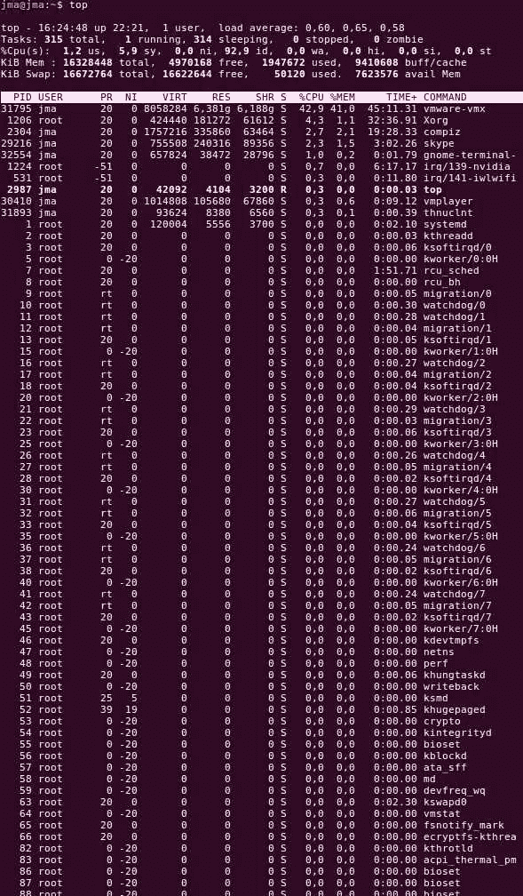

# 第三章：内核设施和辅助函数

内核是一个独立的软件，正如您将在本章中看到的，它不使用任何 C 库。它实现了您可能在现代库中遇到的任何机制，甚至更多，例如压缩、字符串函数等。我们将逐步介绍这些功能的最重要方面。

在本章中，我们将涵盖以下主题：

+   引入内核容器数据结构

+   处理内核睡眠机制

+   使用定时器

+   深入了解内核锁定机制（互斥锁、自旋锁）

+   使用内核专用 API 推迟工作

+   使用 IRQs

# 理解 container_of 宏

当涉及到在代码中管理多个数据结构时，您几乎总是需要将一个结构嵌入到另一个结构中，并在任何时刻检索它们，而不需要询问有关内存偏移或边界的问题。假设您有一个`struct person`，如此定义：

```
 struct person { 
     int  age; 
     char *name; 
 } p;
```

只需拥有`age`或`name`的指针，就可以检索包含该指针的整个结构。正如其名称所示，`container_of`宏用于查找结构的给定字段的容器。该宏在`include/linux/kernel.h`中定义，如下所示：

```
#define container_of(ptr, type, member) ({               \ 
   const typeof(((type *)0)->member) * __mptr = (ptr);   \ 
   (type *)((char *)__mptr - offsetof(type, member)); }) 
```

不要害怕指针；只需将其视为：

```
container_of(pointer, container_type, container_field); 
```

以下是前面代码片段的元素：

+   `pointer`：这是结构中字段的指针

+   `container_type`：这是包装（包含）指针的结构的类型

+   `container_field`：这是指针在结构内指向的字段的名称

让我们考虑以下容器：

```
struct person { 
     int  age; 
     char *name; 
 }; 
```

现在让我们考虑它的一个实例，以及指向`name`成员的指针：

```
struct person somebody; 
[...] 
char *the_name_ptr = somebody.name; 
```

以及指向`name`成员的指针（`the_name_ptr`），您可以使用`container_of`宏来获取包含此成员的整个结构（容器）的指针，方法如下：

```
struct person *the_person; 
the_person = container_of(the_name_ptr, struct person, name); 
```

`container_of`考虑了`name`在结构的开头的偏移量，以获取正确的指针位置。如果您从指针`the_name_ptr`中减去字段`name`的偏移量，您将得到正确的位置。这就是宏的最后一行所做的事情：

```
(type *)( (char *)__mptr - offsetof(type,member) ); 
```

将其应用于一个真实的例子，得到以下结果：

```
struct family { 
    struct person *father; 
    struct person *mother; 
    int number_of_suns; 
    int salary; 
} f; 

/* 
 * pointer to a field of the structure 
 * (could be any member of any family) 
*/ 
struct *person = family.father; 
struct family *fam_ptr; 

/* now let us retrieve back its family */ 
fam_ptr = container_of(person, struct family, father); 
```

这就是您需要了解的关于`container_of`宏的全部内容，相信我，这已经足够了。在我们将在本书中进一步开发的真实驱动程序中，它看起来像这样：

```
struct mcp23016 { 
    struct i2c_client *client; 
    struct gpio_chip chip; 
} 

/* retrive the mcp23016 struct given a pointer 'chip' field */ 
static inline struct mcp23016 *to_mcp23016(struct gpio_chip *gc) 
{ 
    return container_of(gc, struct mcp23016, chip); 
} 

static int mcp23016_probe(struct i2c_client *client, 
                const struct i2c_device_id *id) 
{ 
    struct mcp23016 *mcp; 
    [...] 
    mcp = devm_kzalloc(&client->dev, sizeof(*mcp), GFP_KERNEL); 
    if (!mcp) 
        return -ENOMEM; 
    [...] 
} 
```

`controller_of`宏主要用于内核中的通用容器。在本书的一些示例中（从第五章开始，*平台设备驱动程序*），您将遇到`container_of`宏。

# 链表

想象一下，您有一个管理多个设备的驱动程序，比如说五个设备。您可能需要在驱动程序中跟踪每个设备。您需要的是一个链表。实际上存在两种类型的链表：

+   简单链表

+   双向链表

因此，内核开发人员只实现循环双向链表，因为这种结构允许您实现 FIFO 和 LIFO，并且内核开发人员会努力维护一组最小的代码。要支持列表，需要在代码中添加的标头是`<linux/list.h>`。内核中列表实现的核心数据结构是`struct list_head`结构，定义如下：

```
struct list_head { 
    struct list_head *next, *prev; 
 }; 
```

`struct list_head`在列表的头部和每个节点中都使用。在内核世界中，要将数据结构表示为链表，该结构必须嵌入一个`struct list_head`字段。例如，让我们创建一个汽车列表：

```
struct car { 
    int door_number; 
    char *color; 
    char *model; 
}; 
```

在我们可以为汽车创建一个列表之前，我们必须改变其结构以嵌入一个`struct list_head`字段。结构变为：

```
struct car { 
    int door_number; 
    char *color; 
    char *model; 
    struct list_head list; /* kernel's list structure */ 
}; 
```

首先，我们需要创建一个`struct list_head`变量，它将始终指向我们列表的头部（第一个元素）。这个`list_head`的实例不与任何汽车相关联，它是特殊的：

```
static LIST_HEAD(carlist) ; 
```

现在我们可以创建汽车并将它们添加到我们的列表`carlist`：

```
#include <linux/list.h> 

struct car *redcar = kmalloc(sizeof(*car), GFP_KERNEL); 
struct car *bluecar = kmalloc(sizeof(*car), GFP_KERNEL); 

/* Initialize each node's list entry */ 
INIT_LIST_HEAD(&bluecar->list); 
INIT_LIST_HEAD(&redcar->list); 

/* allocate memory for color and model field and fill every field */ 
 [...] 
list_add(&redcar->list, &carlist) ; 
list_add(&bluecar->list, &carlist) ; 
```

就是这么简单。现在，`carlist` 包含两个元素。让我们深入了解链表 API。

# 创建和初始化列表

有两种方法可以创建和初始化列表：

# 动态方法

动态方法包括一个 `struct list_head` 并使用 `INIT_LIST_HEAD` 宏进行初始化：

```
struct list_head mylist; 
INIT_LIST_HEAD(&mylist); 
```

以下是 `INIT_LIST_HEAD` 的展开：

```
static inline void INIT_LIST_HEAD(struct list_head *list) 
   { 
       list->next = list; 
       list->prev = list; 
   } 
```

# 静态方法

通过 `LIST_HEAD` 宏进行静态分配：

```
LIST_HEAD(mylist) 
```

`LIST_HEAD` 的定义如下：

```
#define LIST_HEAD(name) \ 
    struct list_head name = LIST_HEAD_INIT(name) 
```

以下是它的展开：

```
#define LIST_HEAD_INIT(name) { &(name), &(name) } 
```

这将把 `name` 字段内的每个指针（`prev` 和 `next`）都指向 `name` 本身（就像 `INIT_LIST_HEAD` 做的那样）。

# 创建列表节点

要创建新节点，只需创建我们的数据结构实例，并初始化它们的嵌入式 `list_head` 字段。使用汽车示例，将得到以下内容：

```
struct car *blackcar = kzalloc(sizeof(struct car), GFP_KERNEL); 

/* non static initialization, since it is the embedded list field*/ 
INIT_LIST_HEAD(&blackcar->list); 
```

如前所述，使用 `INIT_LIST_HEAD`，这是一个动态分配的列表，通常是另一个结构的一部分。

# 添加列表节点

内核提供了 `list_add` 来将新条目添加到列表中，它是对内部函数 `__list_add` 的封装：

```
void list_add(struct list_head *new, struct list_head *head); 
static inline void list_add(struct list_head *new, struct list_head *head) 
{ 
    __list_add(new, head, head->next); 
} 
```

`__list_add` 将接受两个已知的条目作为参数，并在它们之间插入您的元素。它在内核中的实现非常简单：

```
static inline void __list_add(struct list_head *new, 
                  struct list_head *prev, 
                  struct list_head *next) 
{ 
    next->prev = new; 
    new->next = next; 
    new->prev = prev; 
    prev->next = new; 
} 
```

以下是我们列表中添加两辆车的示例：

```
list_add(&redcar->list, &carlist); 
list_add(&blue->list, &carlist); 
```

这种模式可以用来实现栈。另一个将条目添加到列表中的函数是：

```
void list_add_tail(struct list_head *new, struct list_head *head); 
```

这将给定的新条目插入到列表的末尾。根据我们之前的示例，我们可以使用以下内容：

```
list_add_tail(&redcar->list, &carlist); 
list_add_tail(&blue->list, &carlist); 
```

这种模式可以用来实现队列。

# 从列表中删除节点

在内核代码中处理列表是一项简单的任务。删除节点很简单：

```
 void list_del(struct list_head *entry); 
```

按照前面的示例，让我们删除红色的车：

```
list_del(&redcar->list); 
```

`list_del` 断开给定条目的 `prev` 和 `next` 指针，导致条目被移除。节点分配的内存尚未被释放；您需要使用 `kfree` 手动释放。

# 链表遍历

我们有宏 `list_for_each_entry(pos, head, member)` 用于列表遍历。

+   `head` 是列表的头节点。

+   `member` 是我们数据结构中 `struct list_head` 的列表名称（在我们的例子中是 `list`）。

+   `pos` 用于迭代。它是一个循环游标（就像 `for(i=0; i<foo; i++)` 中的 `i`）。`head` 可能是链表的头节点，也可能是任何条目，我们不关心，因为我们处理的是双向链表。

```
struct car *acar; /* loop counter */ 
int blue_car_num = 0; 

/* 'list' is the name of the list_head struct in our data structure */ 
list_for_each_entry(acar, carlist, list){ 
    if(acar->color == "blue") 
        blue_car_num++; 
} 

```

为什么我们需要在数据结构中的 `list_head` 类型字段的名称？看看 `list_for_each_entry` 的定义：

```
#define list_for_each_entry(pos, head, member)      \ 
for (pos = list_entry((head)->next, typeof(*pos), member);   \ 
     &pos->member != (head);        \ 
     pos = list_entry(pos->member.next, typeof(*pos), member)) 

#define list_entry(ptr, type, member) \ 
    container_of(ptr, type, member) 
```

通过这个，我们可以理解这一切都是关于 `container_of` 的力量。还要记住 `list_for_each_entry_safe(pos, n, head, member)`。

# 内核睡眠机制

睡眠是一个进程使处理器放松的机制，有可能处理另一个进程。处理器可以进入睡眠状态的原因可能是为了感知数据的可用性，或者等待资源空闲。

内核调度程序管理要运行的任务列表，称为运行队列。睡眠进程不再被调度，因为它们已从运行队列中移除。除非其状态发生变化（即它被唤醒），否则睡眠进程永远不会被执行。只要有一个进程在等待某些东西（资源或其他任何东西），您就可以放松处理器，并确保某个条件或其他人会唤醒它。也就是说，Linux 内核通过提供一组函数和数据结构来简化睡眠机制的实现。

# 等待队列

等待队列主要用于处理阻塞的 I/O，等待特定条件成立，并感知数据或资源的可用性。为了理解它的工作原理，让我们来看看 `include/linux/wait.h` 中的结构：

```
struct __wait_queue { 
    unsigned int flags; 
#define WQ_FLAG_EXCLUSIVE 0x01 
    void *private; 
    wait_queue_func_t func; 
    struct list_head task_list; 
}; 
```

让我们关注`task_list`字段。如您所见，它是一个列表。您想要让进程进入睡眠状态的每个进程都排队在该列表中（因此称为*等待队列*），并进入睡眠状态，直到条件成为真。等待队列可以被视为一系列进程和一个锁。

处理等待队列时您将经常遇到的函数是：

+   静态声明：

```
DECLARE_WAIT_QUEUE_HEAD(name) 
```

+   动态声明：

```
wait_queue_head_t my_wait_queue; 
init_waitqueue_head(&my_wait_queue); 
```

+   阻塞：

```
/* 
 * block the current task (process) in the wait queue if 
 * CONDITION is false 
 */ 
int wait_event_interruptible(wait_queue_head_t q, CONDITION); 
```

+   解除阻塞：

```
/* 
 * wake up one process sleeping in the wait queue if  
 * CONDITION above has become true 
 */ 
void wake_up_interruptible(wait_queue_head_t *q); 
```

`wait_event_interruptible`不会持续轮询，而只是在调用时评估条件。如果条件为假，则将进程置于`TASK_INTERRUPTIBLE`状态并从运行队列中移除。然后在等待队列中每次调用`wake_up_interruptible`时重新检查条件。如果在`wake_up_interruptible`运行时条件为真，则等待队列中的进程将被唤醒，并且其状态设置为`TASK_RUNNING`。进程按照它们进入睡眠的顺序被唤醒。要唤醒等待队列中的所有进程，您应该使用`wake_up_interruptible_all`。

实际上，主要功能是`wait_event`，`wake_up`和`wake_up_all`。它们与队列中的进程一起使用，处于独占（不可中断）等待状态，因为它们不能被信号中断。它们应该仅用于关键任务。可中断函数只是可选的（但建议使用）。由于它们可以被信号中断，您应该检查它们的返回值。非零值意味着您的睡眠已被某种信号中断，驱动程序应返回`ERESTARTSYS`。

如果有人调用了`wake_up`或`wake_up_interruptible`，并且条件仍然为`FALSE`，那么什么也不会发生。没有`wake_up`（或`wake_up_interuptible`），进程将永远不会被唤醒。以下是等待队列的一个示例：

```
#include <linux/module.h> 
#include <linux/init.h> 
#include <linux/sched.h> 
#include <linux/time.h> 
#include <linux/delay.h> 
#include<linux/workqueue.h> 

static DECLARE_WAIT_QUEUE_HEAD(my_wq); 
static int condition = 0; 

/* declare a work queue*/        
static struct work_struct wrk; 

static void work_handler(struct work_struct *work) 
{  
    printk("Waitqueue module handler %s\n", __FUNCTION__); 
    msleep(5000); 
    printk("Wake up the sleeping module\n"); 
    condition = 1; 
    wake_up_interruptible(&my_wq); 
} 

static int __init my_init(void) 
{ 
    printk("Wait queue example\n"); 

    INIT_WORK(&wrk, work_handler); 
    schedule_work(&wrk); 

    printk("Going to sleep %s\n", __FUNCTION__); 
    wait_event_interruptible(my_wq, condition != 0); 

    pr_info("woken up by the work job\n"); 
    return 0; 
} 

void my_exit(void) 
{ 
    printk("waitqueue example cleanup\n"); 
} 

module_init(my_init); 
module_exit(my_exit); 
MODULE_AUTHOR("John Madieu <john.madieu@foobar.com>"); 
MODULE_LICENSE("GPL"); 
```

在上面的例子中，当前进程（实际上是`insmod`）将被放入等待队列中，等待 5 秒钟后由工作处理程序唤醒。`dmesg`输出如下：

```
    [342081.385491] Wait queue example

    [342081.385505] Going to sleep my_init

    [342081.385515] Waitqueue module handler work_handler

    [342086.387017] Wake up the sleeping module

    [342086.387096] woken up by the work job

    [342092.912033] waitqueue example cleanup

```

# 延迟和定时器管理

时间是最常用的资源之一，仅次于内存。它用于几乎所有事情：延迟工作，睡眠，调度，超时和许多其他任务。

时间有两个类别。内核使用绝对时间来知道现在是什么时间，也就是说，日期和时间，而相对时间则由内核调度程序等使用。对于绝对时间，有一个名为**实时时钟**（**RTC**）的硬件芯片。我们将在本书的第十八章中处理这些设备，*RTC 驱动程序*。另一方面，为了处理相对时间，内核依赖于一个称为定时器的 CPU 特性（外围设备），从内核的角度来看，它被称为*内核定时器*。内核定时器是我们将在本节中讨论的内容。

内核定时器分为两个不同的部分：

+   标准定时器，或系统定时器

+   高分辨率定时器

# 标准定时器

标准定时器是以 jiffies 为粒度运行的内核定时器。

# Jiffies 和 HZ

jiffy 是在`<linux/jiffies.h>`中声明的内核时间单位。要理解 jiffies，我们需要介绍一个新的常数 HZ，它是在一秒钟内递增`jiffies`的次数。每次递增称为*tick*。换句话说，HZ 表示 jiffy 的大小。HZ 取决于硬件和内核版本，并且还确定时钟中断的频率。这在某些架构上是可配置的，在其他架构上是固定的。

这意味着`jiffies`每秒递增 HZ 次。如果 HZ = 1,000，则递增 1,000 次（也就是说，每 1/1,000 秒递增一次）。一旦定义了**可编程中断定时器**（**PIT**），它是一个硬件组件，就会使用该值来对 PIT 进行编程，以便在 PIT 中断时递增 jiffies。

根据平台的不同，jiffies 可能会导致溢出。在 32 位系统上，HZ = 1,000 将导致大约 50 天的持续时间，而在 64 位系统上，持续时间约为 6 亿年。通过将 jiffies 存储在 64 位变量中，问题得到解决。然后引入了第二个变量，并在`<linux/jiffies.h>`中定义：

```
extern u64 jiffies_64; 
```

在 32 位系统上，`jiffies`将指向低位 32 位，而`jiffies_64`将指向高位位。在 64 位平台上，`jiffies = jiffies_64`。

# 定时器 API

定时器在内核中表示为`timer_list`的实例：

```
#include <linux/timer.h> 

struct timer_list { 
    struct list_head entry; 
    unsigned long expires; 
    struct tvec_t_base_s *base; 
    void (*function)(unsigned long); 
    unsigned long data; 
); 
```

`expires`是 jiffies 中的绝对值。`entry`是一个双向链表，`data`是可选的，并传递给回调函数。

# 定时器设置初始化

以下是初始化定时器的步骤：

1.  **设置定时器**：设置定时器，提供用户定义的回调和数据：

```
void setup_timer( struct timer_list *timer, \ 
           void (*function)(unsigned long), \ 
           unsigned long data); 
```

也可以使用以下方法：

```
void init_timer(struct timer_list *timer); 
```

`setup_timer`是`init_timer`的包装器。

1.  **设置到期时间**：当初始化定时器时，需要在回调触发之前设置其到期时间：

```
int mod_timer( struct timer_list *timer, unsigned long expires); 
```

1.  **释放定时器**：当您完成定时器时，需要释放它：

```
void del_timer(struct timer_list *timer); 
int del_timer_sync(struct timer_list *timer); 
```

`del_timer`返回`void`，无论它是否已停用挂起的定时器。其返回值为 0 表示未激活的定时器，1 表示激活的定时器。最后，`del_timer_sync`等待处理程序完成执行，即使可能发生在另一个 CPU 上的处理程序。您不应持有阻止处理程序完成的锁，否则将导致死锁。您应在模块清理例程中释放定时器。您可以独立检查定时器是否正在运行：

```
int timer_pending( const struct timer_list *timer); 
```

此函数检查是否有任何已触发的定时器回调待处理。

# 标准定时器示例

```
#include <linux/init.h> 
#include <linux/kernel.h> 
#include <linux/module.h> 
#include <linux/timer.h> 

static struct timer_list my_timer; 

void my_timer_callback(unsigned long data) 
{ 
    printk("%s called (%ld).\n", __FUNCTION__, jiffies); 
} 

static int __init my_init(void) 
{ 
    int retval; 
    printk("Timer module loaded\n"); 

    setup_timer(&my_timer, my_timer_callback, 0); 
    printk("Setup timer to fire in 300ms (%ld)\n", jiffies); 

    retval = mod_timer( &my_timer, jiffies + msecs_to_jiffies(300) ); 
    if (retval) 
        printk("Timer firing failed\n"); 

    return 0; 
} 

static void my_exit(void) 
{ 
    int retval; 
    retval = del_timer(&my_timer); 
    /* Is timer still active (1) or no (0) */ 
    if (retval) 
        printk("The timer is still in use...\n"); 

    pr_info("Timer module unloaded\n"); 
} 

module_init(my_init); 
module_exit(my_exit); 
MODULE_AUTHOR("John Madieu <john.madieu@gmail.com>"); 
MODULE_DESCRIPTION("Standard timer example"); 
MODULE_LICENSE("GPL"); 
```

# 高分辨率定时器（HRTs）

标准定时器精度较低，不适用于实时应用。高分辨率定时器在内核 v2.6.16 中引入（并通过内核配置中的`CONFIG_HIGH_RES_TIMERS`选项启用）具有微秒级（取决于平台，可达纳秒级）的分辨率，而标准定时器依赖于 HZ（因为它们依赖于 jiffies），而 HRT 实现基于`ktime`。

在您的系统上使用 HRT 之前，内核和硬件必须支持 HRT。换句话说，必须实现与体系结构相关的代码以访问您的硬件 HRT。

# HRT API

所需的头文件是：

```
#include <linux/hrtimer.h> 
```

HRT 在内核中表示为`hrtimer`的实例：

```
struct hrtimer { 
   struct timerqueue_node node; 
   ktime_t _softexpires; 
   enum hrtimer_restart (*function)(struct hrtimer *); 
   struct hrtimer_clock_base *base; 
   u8 state; 
   u8 is_rel; 
}; 
```

# HRT 设置初始化

1.  **初始化 hrtimer**：在 hrtimer 初始化之前，您需要设置一个代表时间持续的`ktime`。我们将在以下示例中看到如何实现：

```
 void hrtimer_init( struct hrtimer *time, clockid_t which_clock, 
                    enum hrtimer_mode mode); 
```

1.  **启动 hrtimer**：hrtimer 可以如以下示例所示启动：

```
int hrtimer_start( struct hrtimer *timer, ktime_t time, 
                    const enum hrtimer_mode mode); 
```

`mode`表示到期模式。对于绝对时间值，它应为`HRTIMER_MODE_ABS`，对于相对于现在的时间值，它应为`HRTIMER_MODE_REL`。

1.  **hrtimer 取消**：您可以取消定时器，或者查看是否可能取消它：

```
int hrtimer_cancel( struct hrtimer *timer); 
int hrtimer_try_to_cancel(struct hrtimer *timer); 
```

当定时器未激活时，两者返回`0`，当定时器激活时返回`1`。这两个函数之间的区别在于，如果定时器处于活动状态或其回调正在运行，`hrtimer_try_to_cancel`将失败，返回`-1`，而`hrtimer_cancel`将等待回调完成。

我们可以独立检查 hrtimer 的回调是否仍在运行，如下所示：

```
int hrtimer_callback_running(struct hrtimer *timer); 
```

请记住，`hrtimer_try_to_cancel`内部调用`hrtimer_callback_running`。

为了防止定时器自动重新启动，hrtimer 回调函数必须返回`HRTIMER_NORESTART`。

您可以通过以下方式检查系统是否支持 HRT：

+   通过查看内核配置文件，其中应包含类似`CONFIG_HIGH_RES_TIMERS=y`的内容：`zcat /proc/configs.gz | grep CONFIG_HIGH_RES_TIMERS`。

+   通过查看`cat /proc/timer_list`或`cat /proc/timer_list | grep resolution`的结果。`.resolution`条目必须显示 1 纳秒，事件处理程序必须显示`hrtimer_interrupts`。

+   通过使用`clock_getres`系统调用。

+   从内核代码中，通过使用`#ifdef CONFIG_HIGH_RES_TIMERS`。

在系统上启用 HRT 后，睡眠和定时器系统调用的准确性不再取决于 jiffies，但它们仍然与 HRT 一样准确。这就是为什么有些系统不支持`nanosleep()`的原因，例如。

# 动态滴答/无滴答内核

使用先前的 HZ 选项，内核每秒被中断 HZ 次以重新安排任务，即使在空闲状态下也是如此。如果 HZ 设置为 1,000，则每秒将有 1,000 次内核中断，防止 CPU 长时间处于空闲状态，从而影响 CPU 功耗。

现在让我们看一个没有固定或预定义滴答声的内核，其中滴答声被禁用，直到需要执行某些任务。我们称这样的内核为**无滴答内核**。实际上，滴答激活是根据下一个动作安排的。正确的名称应该是**动态滴答内核**。内核负责任务调度，并在系统中维护可运行任务的列表（运行队列）。当没有任务需要调度时，调度程序切换到空闲线程，通过禁用周期性滴答声来启用动态滴答，直到下一个定时器到期（新任务排队等待处理）。

在底层，内核还维护任务超时的列表（然后知道何时以及需要睡眠多长时间）。在空闲状态下，如果下一个滴答声比任务列表超时中的最低超时时间更长，则内核将使用该超时值对定时器进行编程。当定时器到期时，内核重新启用周期性滴答声并调用调度程序，然后调度与超时相关的任务。这就是无滴答内核在空闲时如何移除周期性滴答声并节省电源的方式。

# 内核中的延迟和睡眠

不深入细节，根据代码运行的上下文，有两种类型的延迟：原子或非原子。内核中处理延迟的强制头文件是`#include <linux/delay>`。

# 原子上下文

在原子上下文中的任务（例如 ISR）无法睡眠，也无法被调度；这就是为什么在原子上下文中用于延迟目的的忙等待循环。内核公开了`Xdelay`函数系列，这些函数将在忙循环中花费时间，足够长（基于 jiffies）以实现所需的延迟：

+   `ndelay(unsigned long nsecs)`

+   `udelay(unsigned long usecs)`

+   `mdelay(unsigned long msecs)`

您应该始终使用`udelay()`，因为`ndelay()`的精度取决于您的硬件定时器的准确性（在嵌入式 SOC 上并非总是如此）。还不鼓励使用`mdelay()`。

定时器处理程序（回调）在原子上下文中执行，这意味着根本不允许睡眠。通过*睡眠*，我的意思是可能导致调用者进入睡眠状态的任何函数，例如分配内存，锁定互斥锁，显式调用`sleep()`函数等。

# 非原子上下文

在非原子上下文中，内核提供了`sleep[_range]`函数系列，使用哪个函数取决于您需要延迟多长时间：

+   `udelay(unsigned long usecs)`：基于忙等待循环。如果您需要睡眠几微秒（<〜10 微秒），则应使用此函数。

+   `usleep_range(unsigned long min, unsigned long max)`：依赖于 hrtimers，并建议让此睡眠几个~微秒或小毫秒（10 微秒-20 毫秒），避免`udelay()`的忙等待循环。

+   `msleep(unsigned long msecs)`：由 jiffies/legacy_timers 支持。您应该用于更大的毫秒睡眠（10 毫秒以上）。

内核源代码中的*Documentation/timers/timers-howto.txt*中很好地解释了睡眠和延迟主题。

# 内核锁定机制

锁定是一种帮助在不同线程或进程之间共享资源的机制。共享资源是可以由至少两个用户同时访问的数据或设备，或者不可以。锁定机制可以防止滥用访问，例如，一个进程在另一个进程读取相同位置时写入数据，或者两个进程访问相同的设备（例如相同的 GPIO）。内核提供了几种锁定机制。最重要的是：

+   互斥锁

+   信号量

+   自旋锁

我们只会学习互斥锁和自旋锁，因为它们在设备驱动程序中被广泛使用。

# 互斥锁

**互斥排他**（**mutex**）是事实上最常用的锁定机制。要了解它的工作原理，让我们看看在`include/linux/mutex.h`中它的结构是什么样的：

```
struct mutex { 
    /* 1: unlocked, 0: locked, negative: locked, possible waiters */ 
    atomic_t count; 
    spinlock_t wait_lock; 
    struct list_head wait_list; 
    [...] 
}; 
```

正如我们在*等待队列*部分中所看到的，结构中还有一个`list`类型的字段：`wait_list`。睡眠的原理是相同的。

竞争者从调度程序运行队列中移除，并放入等待列表（`wait_list`）中的睡眠状态。然后内核调度和执行其他任务。当锁被释放时，等待队列中的等待者被唤醒，移出`wait_list`，并重新调度。

# 互斥锁 API

使用互斥锁只需要几个基本函数：

# 声明

+   静态地：

```
DEFINE_MUTEX(my_mutex); 
```

+   动态地：

```
struct mutex my_mutex; 
mutex_init(&my_mutex); 
```

# 获取和释放

+   锁：

```
void mutex_lock(struct mutex *lock); 
int  mutex_lock_interruptible(struct mutex *lock); 
int  mutex_lock_killable(struct mutex *lock); 
```

+   解锁：

```
void mutex_unlock(struct mutex *lock); 
```

有时，您可能只需要检查互斥锁是否被锁定。为此，您可以使用`int mutex_is_locked(struct mutex *lock)`函数。

```
int mutex_is_locked(struct mutex *lock); 
```

这个函数的作用只是检查互斥锁的所有者是否为空（`NULL`）或不为空。还有`mutex_trylock`，如果互斥锁尚未被锁定，则会获取互斥锁，并返回`1`；否则返回`0`：

```
int mutex_trylock(struct mutex *lock); 
```

与等待队列的可中断系列函数一样，`mutex_lock_interruptible()`是推荐的，将导致驱动程序能够被任何信号中断，而`mutex_lock_killable()`只有杀死进程的信号才能中断驱动程序。

在使用`mutex_lock()`时，应非常小心，并且只有在可以保证无论发生什么都会释放互斥锁时才使用它。在用户上下文中，建议始终使用`mutex_lock_interruptible()`来获取互斥锁，因为如果收到信号（甚至是 c*trl + c*），`mutex_lock()`将不会返回。

以下是互斥锁实现的示例：

```
struct mutex my_mutex; 
mutex_init(&my_mutex); 

/* inside a work or a thread */ 
mutex_lock(&my_mutex); 
access_shared_memory(); 
mutex_unlock(&my_mutex); 
```

请查看内核源码中的`include/linux/mutex.h`，以了解您必须遵守的互斥锁的严格规则。以下是其中一些规则：

+   一次只有一个任务可以持有互斥锁；这实际上不是一条规则，而是一个事实

+   不允许多次解锁

+   它们必须通过 API 进行初始化

+   持有互斥锁的任务可能不会退出，因为互斥锁将保持锁定，并且可能的竞争者将永远等待（将永远睡眠）

+   保存锁定的内存区域不得被释放

+   持有的互斥锁不得被重新初始化

+   由于它们涉及重新调度，因此在原子上下文中可能无法使用互斥锁，例如任务和定时器

与`wait_queue`一样，互斥锁没有轮询机制。每次在互斥锁上调用`mutex_unlock`时，内核都会检查`wait_list`中是否有等待者。如果有，其中一个（仅一个）会被唤醒并调度；它们被唤醒的顺序与它们入睡的顺序相同。

# 自旋锁

与互斥锁类似，自旋锁是一种互斥排他机制；它只有两种状态：

+   已锁定（已获取）

+   未锁定（已释放）

需要获取自旋锁的任何线程都将主动循环，直到获取锁为止，然后才会跳出循环。这是互斥锁和自旋锁的区别所在。由于自旋锁在循环时会大量消耗 CPU，因此应该在非常快速获取锁的情况下使用，特别是当持有自旋锁的时间小于重新调度的时间时。自旋锁应该在关键任务完成后尽快释放。

为了避免通过调度可能旋转的线程来浪费 CPU 时间，尝试获取由另一个线程持有的锁，内核在运行持有自旋锁的代码时禁用了抢占。通过禁用抢占，我们防止自旋锁持有者被移出运行队列，这可能导致等待进程长时间旋转并消耗 CPU。

只要持有自旋锁，其他任务可能会在等待它时旋转。通过使用自旋锁，你断言并保证它不会被长时间持有。你可以说在循环中旋转，浪费 CPU 时间，比睡眠线程、上下文切换到另一个线程或进程的成本，然后被唤醒要好。在处理器上旋转意味着没有其他任务可以在该处理器上运行；因此，在单核机器上使用自旋锁是没有意义的。在最好的情况下，你会减慢系统的速度；在最坏的情况下，你会死锁，就像互斥体一样。因此，内核只会在单处理器上对`spin_lock(spinlock_t *lock)`函数做出响应时禁用抢占。在单处理器（核心）系统上，你应该使用`spin_lock_irqsave()`和`spin_unlock_irqrestore()`，分别禁用 CPU 上的中断，防止中断并发。

由于你事先不知道要为哪个系统编写驱动程序，建议你使用`spin_lock_irqsave(spinlock_t *lock, unsigned long flags)`来获取自旋锁，它会在获取自旋锁之前禁用当前处理器（调用它的处理器）上的中断。`spin_lock_irqsave`内部调用`local_irq_save(flags);`，一个依赖于体系结构的函数来保存 IRQ 状态，并调用`preempt_disable()`来禁用相关 CPU 上的抢占。然后你应该使用`spin_unlock_irqrestore()`释放锁，它会执行我们之前列举的相反操作。这是一个执行锁获取和释放的代码。这是一个 IRQ 处理程序，但让我们只关注锁方面。我们将在下一节讨论更多关于 IRQ 处理程序的内容。

```
/* some where */ 
spinlock_t my_spinlock; 
spin_lock_init(my_spinlock); 

static irqreturn_t my_irq_handler(int irq, void *data) 
{ 
    unsigned long status, flags; 

    spin_lock_irqsave(&my_spinlock, flags); 
    status = access_shared_resources(); 

    spin_unlock_irqrestore(&gpio->slock, flags); 
    return IRQ_HANDLED; 
} 
```

# 自旋锁与互斥体

在内核中用于并发的自旋锁和互斥体各自有各自的目标：

+   互斥体保护进程的关键资源，而自旋锁保护 IRQ 处理程序的关键部分

+   互斥体将竞争者置于睡眠状态，直到获得锁，而自旋锁会无限循环旋转（消耗 CPU），直到获得锁

+   由于前面的观点，你不能长时间持有自旋锁，因为等待者会浪费 CPU 时间等待锁，而互斥体可以持有资源需要受保护的时间，因为竞争者被放置在等待队列中睡眠

在处理自旋锁时，请记住抢占仅对持有自旋锁的线程禁用，而不是对自旋等待者禁用。

# 工作延迟机制

延迟是一种安排将来执行的工作的方法。这是一种以后报告动作的方式。显然，内核提供了实现这种机制的设施；它允许你推迟函数，无论它们的类型，以便以后调用和执行。内核中有三种：

+   **SoftIRQs**：在原子上下文中执行

+   **Tasklets**：在原子上下文中执行

+   **Workqueues**：在进程上下文中执行

# Softirqs 和 ksoftirqd

软件中断（softirq），或软件中断是一种延迟机制，仅用于非常快速的处理，因为它在禁用调度程序的情况下运行（在中断上下文中）。你几乎不会直接处理 softirq。只有网络和块设备子系统使用 softirq。Tasklets 是 softirq 的一个实例，在几乎所有需要使用 softirq 的情况下都足够了。

# ksoftirqd

在大多数情况下，softirqs 在硬件中断中调度，这可能会非常快，比它们能够被服务的速度更快。然后它们被内核排队以便稍后处理。**Ksoftirqds**负责延迟执行（这次是在进程上下文中）。ksoftirqd 是每个 CPU 的内核线程，用于处理未服务的软中断：



在我个人电脑的前面的`top`示例中，您可以看到`ksoftirqd/n`条目，其中`n`是 ksoftirqd 运行的 CPU 编号。消耗 CPU 的 ksoftirqd 可能表明系统负载过重或处于**中断风暴**下，这是不好的。您可以查看`kernel/softirq.c`，了解 ksoftirqd 的设计方式。

# Tasklets

Tasklet 是建立在 softirqs 之上的一种底半部（稍后我们将看到这意味着什么）机制。它们在内核中表示为`tasklet_struct`的实例：

```
struct tasklet_struct 
{ 
    struct tasklet_struct *next; 
    unsigned long state; 
    atomic_t count; 
    void (*func)(unsigned long); 
    unsigned long data; 
}; 
```

tasklet 本质上不是可重入的。如果代码在执行过程中可以在任何地方被中断，然后可以安全地再次调用，则称为可重入代码。tasklet 被设计成只能在一个 CPU 上同时运行（即使在 SMP 系统上也是如此），这是它被计划的 CPU，但不同的 tasklet 可以在不同的 CPU 上同时运行。tasklet API 非常基本和直观。

# 声明一个 tasklet

+   动态地：

```
void tasklet_init(struct tasklet_struct *t, 
          void (*func)(unsigned long), unsigned long data); 
```

+   静态地：

```
DECLARE_TASKLET( tasklet_example, tasklet_function, tasklet_data ); 
DECLARE_TASKLET_DISABLED(name, func, data); 
```

这两个函数之间有一个区别；前者创建一个已经启用并准备好在没有任何其他函数调用的情况下进行调度的 tasklet，通过将`count`字段设置为`0`，而后者创建一个已禁用的 tasklet（通过将`count`设置为`1`），在这种情况下，必须调用`tasklet_enable()`才能使 tasklet 可调度：

```
#define DECLARE_TASKLET(name, func, data) \ 
    struct tasklet_struct name = { NULL, 0, ATOMIC_INIT(0), func, data } 

#define DECLARE_TASKLET_DISABLED(name, func, data) \ 
    struct tasklet_struct name = { NULL, 0, ATOMIC_INIT(1),  func, data } 
```

全局地，将`count`字段设置为`0`意味着 tasklet 被禁用，不能执行，而非零值意味着相反。

# 启用和禁用 tasklet

有一个函数可以启用 tasklet：

```
void tasklet_enable(struct tasklet_struct *); 
```

`tasklet_enable`简单地启用 tasklet。在旧的内核版本中，可能会发现使用`void tasklet_hi_enable(struct tasklet_struct *)`，但这两个函数实际上是一样的。要禁用 tasklet，调用：

```
void tasklet_disable(struct tasklet_struct *); 
```

您还可以调用：

```
void tasklet_disable_nosync(struct tasklet_struct *); 
```

`tasklet_disable`将禁用 tasklet，并且只有在 tasklet 终止执行后才会返回（如果它正在运行），而`tasklet_disable_nosync`会立即返回，即使终止尚未发生。

# Tasklet 调度

有两个用于 tasklet 的调度函数，取决于您的 tasklet 是具有正常优先级还是较高优先级的：

```
void tasklet_schedule(struct tasklet_struct *t); 
void tasklet_hi_schedule(struct tasklet_struct *t);
```

内核在两个不同的列表中维护正常优先级和高优先级的 tasklet。`tasklet_schedule`将 tasklet 添加到正常优先级列表中，并使用`TASKLET_SOFTIRQ`标志调度相关的 softirq。使用`tasklet_hi_schedule`，tasklet 将添加到高优先级列表中，并使用`HI_SOFTIRQ`标志调度相关的 softirq。高优先级 tasklet 用于具有低延迟要求的软中断处理程序。有一些与 tasklet 相关的属性您应该知道：

+   对已经计划的 tasklet 调用`tasklet_schedule`，但其执行尚未开始，将不会产生任何效果，导致 tasklet 只执行一次。

+   `tasklet_schedule`可以在 tasklet 中调用，这意味着 tasklet 可以重新安排自己。

+   高优先级的 tasklet 始终在正常优先级的 tasklet 之前执行。滥用高优先级任务会增加系统的延迟。只能用于非常快速的任务。

您可以使用`tasklet_kill`函数停止 tasklet，这将阻止 tasklet 再次运行，或者在当前计划运行时等待其完成后再杀死它：

```
void tasklet_kill(struct tasklet_struct *t); 
```

让我们来看看。看下面的例子：

```
#include <linux/kernel.h> 
#include <linux/module.h> 
#include <linux/interrupt.h>    /* for tasklets API */ 

char tasklet_data[]="We use a string; but it could be pointer to a structure"; 

/* Tasklet handler, that just print the data */ 
void tasklet_work(unsigned long data) 
{ 
    printk("%s\n", (char *)data); 
} 

DECLARE_TASKLET(my_tasklet, tasklet_function, (unsigned long) tasklet_data); 

static int __init my_init(void) 
{ 
    /* 
     * Schedule the handler. 
     * Tasklet arealso scheduled from interrupt handler 
     */ 
    tasklet_schedule(&my_tasklet); 
    return 0; 
} 

void my_exit(void) 
{ 
    tasklet_kill(&my_tasklet); 
} 

module_init(my_init); 
module_exit(my_exit); 
MODULE_AUTHOR("John Madieu <john.madieu@gmail.com>"); 
MODULE_LICENSE("GPL"); 
```

# 工作队列

自 Linux 内核 2.6 以来，最常用和简单的推迟机制是工作队列。这是我们将在本章中讨论的最后一个。作为一个推迟机制，它采用了与我们所见其他机制相反的方法，仅在可抢占的上下文中运行。当您需要在底半部分休眠时，它是唯一的选择（我将在下一节中解释什么是底半部分）。通过休眠，我指的是处理 I/O 数据，持有互斥锁，延迟和所有可能导致休眠或将任务移出运行队列的其他任务。

请记住，工作队列是建立在内核线程之上的，这就是为什么我决定根本不谈论内核线程作为推迟机制的原因。但是，在内核中处理工作队列有两种方法。首先，有一个默认的共享工作队列，由一组内核线程处理，每个线程在一个 CPU 上运行。一旦有要安排的工作，您就将该工作排入全局工作队列，该工作将在适当的时刻执行。另一种方法是在专用内核线程中运行工作队列。这意味着每当需要执行工作队列处理程序时，将唤醒您的内核线程来处理它，而不是默认的预定义线程之一。

根据您选择的是共享工作队列还是专用工作队列，要调用的结构和函数是不同的。

# 内核全局工作队列-共享队列

除非您别无选择，或者需要关键性能，或者需要从工作队列初始化到工作调度的所有控制，并且只偶尔提交任务，否则应该使用内核提供的共享工作队列。由于该队列在整个系统中共享，因此您应该友好，并且不应该长时间垄断队列。

由于在每个 CPU 上对队列中的挂起任务的执行是串行化的，因此您不应该长时间休眠，因为在您醒来之前，队列中的其他任务将不会运行。您甚至不知道与您共享工作队列的是谁，因此如果您的任务需要更长时间才能获得 CPU，也不要感到惊讶。共享工作队列中的工作在由内核创建的每个 CPU 线程中执行。

在这种情况下，工作还必须使用`INIT_WORK`宏进行初始化。由于我们将使用共享工作队列，因此无需创建工作队列结构。我们只需要作为参数传递的`work_struct`结构。有三个函数可以在共享工作队列上安排工作：

+   将工作绑定到当前 CPU 的版本：

```
int schedule_work(struct work_struct *work); 
```

+   相同但带有延迟功能：

```
static inline bool schedule_delayed_work(struct delayed_work *dwork, 
                            unsigned long delay) 
```

+   实际在给定 CPU 上安排工作的函数：

```
int schedule_work_on(int cpu, struct work_struct *work); 
```

+   与之前显示的相同，但带有延迟：

```
int scheduled_delayed_work_on(int cpu, struct delayed_work *dwork, unsigned long delay); 
```

所有这些函数都将作为参数安排到系统的共享工作队列`system_wq`中，该队列在`kernel/workqueue.c`中定义：

```
struct workqueue_struct *system_wq __read_mostly; 
EXPORT_SYMBOL(system_wq); 
```

已经提交到共享队列的工作可以使用`cancel_delayed_work`函数取消。您可以使用以下方法刷新共享工作队列：

```
void flush_scheduled_work(void); 
```

由于队列在整个系统中共享，因此在`flush_scheduled_work()`返回之前，人们无法真正知道它可能持续多长时间：

```
#include <linux/module.h> 
#include <linux/init.h> 
#include <linux/sched.h>    /* for sleep */ 
#include <linux/wait.h>     /* for wait queue */ 
#include <linux/time.h> 
#include <linux/delay.h> 
#include <linux/slab.h>         /* for kmalloc() */ 
#include <linux/workqueue.h> 

//static DECLARE_WAIT_QUEUE_HEAD(my_wq); 
static int sleep = 0; 

struct work_data { 
    struct work_struct my_work; 
    wait_queue_head_t my_wq; 
    int the_data; 
}; 

static void work_handler(struct work_struct *work) 
{ 
    struct work_data *my_data = container_of(work, \ 
                                 struct work_data, my_work);  
    printk("Work queue module handler: %s, data is %d\n", __FUNCTION__, my_data->the_data); 
    msleep(2000); 
    wake_up_interruptible(&my_data->my_wq); 
    kfree(my_data); 
} 

static int __init my_init(void) 
{ 
    struct work_data * my_data; 

    my_data = kmalloc(sizeof(struct work_data), GFP_KERNEL); 
    my_data->the_data = 34; 

    INIT_WORK(&my_data->my_work, work_handler); 
    init_waitqueue_head(&my_data->my_wq); 

    schedule_work(&my_data->my_work); 
    printk("I'm goint to sleep ...\n"); 
    wait_event_interruptible(my_data->my_wq, sleep != 0); 
    printk("I am Waked up...\n"); 
    return 0; 
} 

static void __exit my_exit(void) 
{ 
    printk("Work queue module exit: %s %d\n", __FUNCTION__,  __LINE__); 
} 

module_init(my_init); 
module_exit(my_exit); 
MODULE_LICENSE("GPL"); 
MODULE_AUTHOR("John Madieu <john.madieu@gmail.com> "); 
MODULE_DESCRIPTION("Shared workqueue"); 
```

为了将数据传递给我的工作队列处理程序，您可能已经注意到在这两个示例中，我将我的`work_struct`结构嵌入到自定义数据结构中，并使用`container_of`来检索它。这是将数据传递给工作队列处理程序的常用方法。

# 专用工作队列

在这里，工作队列表示为`struct workqueue_struct`的一个实例。要排入工作队列的工作表示为`struct work_struct`的一个实例。在将您的工作安排到自己的内核线程之前，有四个步骤：

1.  声明/初始化一个`struct workqueue_struct`。

1.  创建您的工作函数。

1.  创建一个`struct work_struct`，以便将您的工作函数嵌入其中。

1.  将您的工作函数嵌入`work_struct`。

# 编程语法

以下函数在`include/linux/workqueue.h`中定义：

+   声明工作和工作队列：

```
struct workqueue_struct *myqueue; 
struct work_struct thework; 
```

+   定义工作函数（处理程序）：

```
void dowork(void *data) {  /* Code goes here */ }; 
```

+   初始化我们的工作队列并嵌入我们的工作：

```
myqueue = create_singlethread_workqueue( "mywork" ); 
INIT_WORK( &thework, dowork, <data-pointer> ); 
```

我们也可以通过一个名为 `create_workqueue` 的宏创建我们的工作队列。`create_workqueue` 和 `create_singlethread_workqueue` 之间的区别在于前者将创建一个工作队列，该工作队列将为每个可用的处理器创建一个单独的内核线程。

+   调度工作：

```
queue_work(myqueue, &thework); 
```

在给定的延迟时间后排队到给定的工作线程：

```
    queue_dalayed_work(myqueue, &thework, <delay>); 
```

如果工作已经在队列中，则这些函数返回 `false`，如果不在队列中则返回 `true`。`delay` 表示排队前等待的 jiffies 数。您可以使用辅助函数 `msecs_to_jiffies` 将标准毫秒延迟转换为 jiffies。例如，要在 5 毫秒后排队工作，可以使用 `queue_delayed_work(myqueue, &thework, msecs_to_jiffies(5));`。

+   等待给定工作队列上的所有待处理工作：

```
void flush_workqueue(struct workqueue_struct *wq) 
```

`flush_workqueue` 等待直到所有排队的工作都完成执行。新进入的（排队的）工作不会影响等待。通常可以在驱动程序关闭处理程序中使用这个函数。

+   清理：

使用 `cancel_work_sync()` 或 `cancel_delayed_work_sync` 进行同步取消，如果工作尚未运行，将取消工作，或者阻塞直到工作完成。即使工作重新排队，也将被取消。您还必须确保在处理程序返回之前，最后排队的工作队列不会被销毁。这些函数分别用于非延迟或延迟工作：

```
int cancel_work_sync(struct work_struct *work); 
int cancel_delayed_work_sync(struct delayed_work *dwork); 
```

自 Linux 内核 v4.8 起，可以使用 `cancel_work` 或 `cancel_delayed_work`，这是取消的异步形式。必须检查函数是否返回 true 或 false，并确保工作不会重新排队。然后必须显式刷新工作队列：

```
if ( !cancel_delayed_work( &thework) ){

flush_workqueue(myqueue);

destroy_workqueue(myqueue);

}
```

另一个是相同方法的不同版本，将为所有处理器创建一个线程。如果需要在工作排队之前延迟，请随时使用以下工作初始化宏：

```
INIT_DELAYED_WORK(_work, _func); 
INIT_DELAYED_WORK_DEFERRABLE(_work, _func); 
```

使用上述宏意味着您应该使用以下函数在工作队列中排队或调度工作：

```
int queue_delayed_work(struct workqueue_struct *wq, 
            struct delayed_work *dwork, unsigned long delay) 
```

`queue_work` 将工作绑定到当前 CPU。您可以使用 `queue_work_on` 函数指定处理程序应在哪个 CPU 上运行：

```
int queue_work_on(int cpu, struct workqueue_struct *wq, 
                   struct work_struct *work); 
```

对于延迟工作，您可以使用：

```
int queue_delayed_work_on(int cpu, struct workqueue_struct *wq, 
    struct delayed_work *dwork, unsigned long delay);
```

以下是使用专用工作队列的示例：

```
#include <linux/init.h> 
#include <linux/module.h> 
#include <linux/workqueue.h>    /* for work queue */ 
#include <linux/slab.h>         /* for kmalloc() */ 

struct workqueue_struct *wq; 

struct work_data { 
    struct work_struct my_work; 
    int the_data; 
}; 

static void work_handler(struct work_struct *work) 
{ 
    struct work_data * my_data = container_of(work, 
                                   struct work_data, my_work); 
    printk("Work queue module handler: %s, data is %d\n", 
         __FUNCTION__, my_data->the_data); 
    kfree(my_data); 
} 

static int __init my_init(void) 
{ 
    struct work_data * my_data; 

    printk("Work queue module init: %s %d\n", 
           __FUNCTION__, __LINE__); 
    wq = create_singlethread_workqueue("my_single_thread"); 
    my_data = kmalloc(sizeof(struct work_data), GFP_KERNEL); 

    my_data->the_data = 34; 
    INIT_WORK(&my_data->my_work, work_handler); 
    queue_work(wq, &my_data->my_work); 

    return 0; 
} 

static void __exit my_exit(void) 
{ 
    flush_workqueue(wq); 
    destroy_workqueue(wq); 
    printk("Work queue module exit: %s %d\n", 
                   __FUNCTION__, __LINE__); 
} 

module_init(my_init); 
module_exit(my_exit); 
MODULE_LICENSE("GPL"); 
MODULE_AUTHOR("John Madieu <john.madieu@gmail.com>"); 
```

# 预定义（共享）工作队列和标准工作队列函数

预定义的工作队列在 `kernel/workqueue.c` 中定义如下：

```
struct workqueue_struct *system_wq __read_mostly; 
```

它只是一个标准工作，内核为其提供了一个简单包装标准工作的自定义 API。

内核预定义的工作队列函数与标准工作队列函数的比较如下：

| **预定义工作队列函数** | **等效标准工作队列函数** |
| --- | --- |
| `schedule_work(w)` | `queue_work(keventd_wq,w)` |
| `schedule_delayed_work(w,d)` | `queue_delayed_work(keventd_wq,w,d)`（在任何 CPU 上） |
| `schedule_delayed_work_on(cpu,w,d)` | `queue_delayed_work(keventd_wq,w,d)`（在给定的 CPU 上） |
| `flush_scheduled_work()` | `flush_workqueue(keventd_wq)` |

# 内核线程

工作队列运行在内核线程之上。当您使用工作队列时，已经在使用内核线程。这就是为什么我决定不谈论内核线程 API 的原因。

# 内核中断机制

中断是设备停止内核的方式，告诉内核发生了有趣或重要的事情。在 Linux 系统上称为 IRQ。中断提供的主要优势是避免设备轮询。由设备告知其状态是否发生变化；不是由我们轮询它。

为了在中断发生时得到通知，您需要注册到该 IRQ，提供一个称为中断处理程序的函数，每次引发该中断时都会调用它。

# 注册中断处理程序

您可以注册一个回调函数，在您感兴趣的中断（或中断线）被触发时运行。您可以使用`<linux/interrupt.h>`中声明的`request_irq()`函数来实现这一点。

```
int request_irq(unsigned int irq, irq_handler_t handler, 
    unsigned long flags, const char *name, void *dev) 
```

`request_irq()`可能会失败，并在成功时返回`0`。前面代码的其他元素如下所述：

+   `flags`：这些应该是`<linux/interrupt.h>`中定义的掩码的位掩码。最常用的是：

+   `IRQF_TIMER:` 通知内核，此处理程序由系统定时器中断发起。

+   `IRQF_SHARED:` 用于可以被两个或更多设备共享的中断线。共享同一线的每个设备都必须设置此标志。如果省略，只能为指定的 IRQ 线注册一个处理程序。

+   `IRQF_ONESHOT:` 主要用于线程化的 IRQ。它指示内核在硬中断处理程序完成后不要重新启用中断。它将保持禁用状态，直到线程处理程序运行。

+   在旧的内核版本（直到 v2.6.35），有`IRQF_DISABLED`标志，它要求内核在处理程序运行时禁用所有中断。现在不再使用这个标志。

+   `name`：这由内核用于在`/proc/interrupts`和`/proc/irq`中标识您的驱动程序。

+   `dev`：其主要目标是作为处理程序的参数传递。这应该对每个注册的处理程序都是唯一的，因为它用于标识设备。对于非共享的 IRQ，它可以是`NULL`，但对于共享的 IRQ 则不行。通常的使用方式是提供一个`device`结构，因为它既是唯一的，也可能对处理程序有用。也就是说，任何与设备相关的数据结构的指针都是足够的：

```
struct my_data { 
   struct input_dev *idev; 
   struct i2c_client *client; 
   char name[64]; 
   char phys[32]; 
 }; 

 static irqreturn_t my_irq_handler(int irq, void *dev_id) 
 { 
    struct my_data *md = dev_id; 
    unsigned char nextstate = read_state(lp); 
    /* Check whether my device raised the irq or no */ 
    [...] 
    return IRQ_HANDLED; 
 } 

 /* some where in the code, in the probe function */ 
 int ret; 
 struct my_data *md; 
 md = kzalloc(sizeof(*md), GFP_KERNEL); 

 ret = request_irq(client->irq, my_irq_handler, 
                    IRQF_TRIGGER_LOW | IRQF_ONESHOT, 
                    DRV_NAME, md); 

 /* far in the release function */ 
 free_irq(client->irq, md); 
```

+   `handler`：这是当中断触发时将运行的回调函数。中断处理程序的结构如下：

```
static irqreturn_t my_irq_handler(int irq, void *dev) 
```

+   这包含以下代码元素：

+   `irq`：IRQ 的数值（与`request_irq`中使用的相同）。

+   `dev`：与`request_irq`中使用的相同。

这两个参数由内核传递给您的处理程序。处理程序只能返回两个值，取决于您的设备是否引起了 IRQ：

+   `IRQ_NONE`：您的设备不是该中断的发起者（这在共享的 IRQ 线上经常发生）

+   `IRQ_HANDLED`：您的设备引起了中断

根据处理情况，可以使用`IRQ_RETVAL(val)`宏，如果值非零，则返回`IRQ_HANDLED`，否则返回`IRQ_NONE`。

在编写中断处理程序时，您不必担心重入性，因为内核会在所有处理器上禁用服务的 IRQ 线，以避免递归中断。

释放先前注册的处理程序的相关函数是：

```
void free_irq(unsigned int irq, void *dev) 
```

如果指定的 IRQ 不是共享的，`free_irq`不仅会删除处理程序，还会禁用该线路。如果是共享的，只有通过`dev`（应该与`request_irq`中使用的相同）标识的处理程序被删除，但中断线路仍然存在，只有在最后一个处理程序被删除时才会被禁用。`free_irq`将阻塞，直到指定 IRQ 的所有执行中断完成。然后，您必须避免在中断上下文中同时使用`request_irq`和`free_irq`。

# 中断处理程序和锁

不用说，您处于原子上下文中，只能使用自旋锁进行并发。每当全局数据可被用户代码（用户任务；即系统调用）和中断代码访问时，这些共享数据应该在用户代码中由`spin_lock_irqsave()`保护。让我们看看为什么我们不能只使用`spin_lock`。中断处理程序将始终优先于用户任务，即使该任务持有自旋锁。简单地禁用 IRQ 是不够的。中断可能发生在另一个 CPU 上。如果用户任务更新数据时被中断处理程序尝试访问相同的数据，那将是一场灾难。使用`spin_lock_irqsave()`将在本地 CPU 上禁用所有中断，防止系统调用被任何类型的中断中断：

```
ssize_t my_read(struct file *filp, char __user *buf, size_t count,  
   loff_t *f_pos) 
{ 
    unsigned long flags; 
    /* some stuff */ 
    [...] 
    unsigned long flags; 
    spin_lock_irqsave(&my_lock, flags); 
    data++; 
    spin_unlock_irqrestore(&my_lock, flags) 
    [...] 
} 

static irqreturn_t my_interrupt_handler(int irq, void *p) 
{ 
    /* 
     * preemption is disabled when running interrupt handler 
     * also, the serviced irq line is disabled until the handler has completed 
     * no need then to disable all other irq. We just use spin_lock and 
     * spin_unlock 
     */ 
    spin_lock(&my_lock); 
    /* process data */ 
    [...] 
    spin_unlock(&my_lock); 
    return IRQ_HANDLED; 
} 
```

在不同的中断处理程序之间共享数据（即，同一驱动程序管理两个或多个设备，每个设备都有自己的 IRQ 线），应该在这些处理程序中使用`spin_lock_irqsave()`来保护数据，以防止其他 IRQ 被触发并且无用地旋转。

# 底半部分的概念

底半部分是一种将中断处理程序分成两部分的机制。这引入了另一个术语，即顶半部分。在讨论它们各自之前，让我们谈谈它们的起源以及它们解决了什么问题。

# 问题-中断处理程序设计的限制

无论中断处理程序是否持有自旋锁，都会在运行该处理程序的 CPU 上禁用抢占。在处理程序中浪费的时间越多，分配给其他任务的 CPU 就越少，这可能会显着增加其他中断的延迟，从而增加整个系统的延迟。挑战在于尽快确认引发中断的设备，以保持系统的响应性。

在 Linux 系统（实际上在所有操作系统上，根据硬件设计），任何中断处理程序都会在所有处理器上禁用其当前中断线，并且有时您可能需要在实际运行处理程序的 CPU 上禁用所有中断，但绝对不想错过中断。为了满足这个需求，引入了*halves*的概念。

# 解决方案-底半部分

这个想法是将处理程序分成两部分：

+   第一部分称为顶半部分或硬中断，它是使用`request_irq()`注册的函数，最终会掩盖/隐藏中断（在当前 CPU 上，除了正在服务的 CPU，因为内核在运行处理程序之前已经禁用了它），根据需要执行快速操作（基本上是时间敏感的任务，读/写硬件寄存器以及对这些数据的快速处理），安排第二部分和下一个部分，然后确认该线路。所有被禁用的中断必须在退出底半部分之前重新启用。

+   第二部分，称为底半部分，将处理耗时的任务，并在重新启用中断时运行。这样，您就有机会不会错过中断。

底半部分是使用工作推迟机制设计的，我们之前已经看到了。根据您选择的是哪一个，它可能在（软件）中断上下文中运行，或者在进程上下文中运行。底半部分的机制有：

+   软中断

+   任务 let

+   工作队列

+   线程中断

软中断和任务 let 在（软件）中断上下文中执行（意味着抢占被禁用），工作队列和线程中断在进程（或简单任务）上下文中执行，并且可以被抢占，但没有什么可以阻止我们改变它们的实时属性以适应您的需求并改变它们的抢占行为（参见`CONFIG_PREEMPT`或`CONFIG_PREEMPT_VOLUNTARY`。这也会影响整个系统）。底半部分并不总是可能的。但当可能时，这绝对是最好的选择。

# 任务 let 作为底半部分

任务延迟机制在 DMA、网络和块设备驱动程序中最常用。只需在内核源代码中尝试以下命令：

```
 grep -rn tasklet_schedule

```

现在让我们看看如何在我们的中断处理程序中实现这样的机制：

```
struct my_data { 
    int my_int_var; 
    struct tasklet_struct the_tasklet; 
    int dma_request; 
}; 

static void my_tasklet_work(unsigned long data) 
{ 
    /* Do what ever you want here */ 
} 

struct my_data *md = init_my_data; 

/* somewhere in the probe or init function */ 
[...] 
   tasklet_init(&md->the_tasklet, my_tasklet_work, 
                 (unsigned long)md); 
[...] 

static irqreturn_t my_irq_handler(int irq, void *dev_id) 
{ 
    struct my_data *md = dev_id; 

    /* Let's schedule our tasklet */ 
    tasklet_schedule(&md.dma_tasklet); 

    return IRQ_HANDLED; 
} 
```

在上面的示例中，我们的 tasklet 将执行函数`my_tasklet_work()`。

# 工作队列作为底半部分。

让我们从一个示例开始：

```
static DECLARE_WAIT_QUEUE_HEAD(my_wq);  /* declare and init the wait queue */ 
static struct work_struct my_work; 

/* some where in the probe function */ 
/* 
 * work queue initialization. "work_handler" is the call back that will be 
 * executed when our work is scheduled. 
 */ 
INIT_WORK(my_work, work_handler); 

static irqreturn_t my_interrupt_handler(int irq, void *dev_id) 
{ 
    uint32_t val; 
    struct my_data = dev_id; 

    val = readl(my_data->reg_base + REG_OFFSET); 
   if (val == 0xFFCD45EE)) { 
       my_data->done = true; 
         wake_up_interruptible(&my_wq); 
   } else { 
         schedule_work(&my_work); 
   } 

   return IRQ_HANDLED; 
}; 
```

在上面的示例中，我们使用等待队列或工作队列来唤醒可能正在等待我们的进程，或者根据寄存器的值安排工作。我们没有共享的数据或资源，因此不需要禁用所有其他 IRQs（`spin_lock_irq_disable`）。

# Softirqs 作为底半部分

正如本章开头所说，我们不会讨论 softirq。在你感觉需要使用 softirqs 的任何地方，tasklets 都足够了。无论如何，让我们谈谈它们的默认值。

Softirq 在软件中断上下文中运行，禁用了抢占，保持 CPU 直到它们完成。Softirq 应该很快；否则它们可能会减慢系统。当由于任何原因 softirq 阻止内核调度其他任务时，任何新进入的 softirq 将由**ksoftirqd**线程处理，运行在进程上下文中。

# 线程化的 IRQs

线程化的 IRQs 的主要目标是将中断禁用的时间减少到最低限度。使用线程化的 IRQs，注册中断处理程序的方式有些简化。你甚至不需要自己安排底半部分。核心会为我们做这件事。然后底半部分将在一个专用的内核线程中执行。我们不再使用`request_irq()`，而是使用`request_threaded_irq()`：

```
int request_threaded_irq(unsigned int irq, irq_handler_t handler,\ 
                            irq_handler_t thread_fn, \ 
                            unsigned long irqflags, \ 
                            const char *devname, void *dev_id) 

```

`request_threaded_irq()`函数在其参数中接受两个函数：

+   **@handler 函数**：这与使用`request_irq()`注册的函数相同。它代表顶半部分函数，运行在原子上下文（或硬中断）中。如果它可以更快地处理中断，以至于你可以完全摆脱底半部分，它应该返回`IRQ_HANDLED`。但是，如果中断处理需要超过 100 微秒，如前面讨论的那样，你应该使用底半部分。在这种情况下，它应该返回`IRQ_WAKE_THREAD`，这将导致调度必须已经提供的`thread_fn`函数。

+   **@thread_fn 函数**：这代表了底半部分，就像你在顶半部分中安排的那样。当硬中断处理程序（处理函数）返回`IRQ_WAKE_THREAD`时，与该底半部分相关联的 kthread 将被调度，在运行 ktread 时调用`thread_fn`函数。`thread_fn`函数在完成时必须返回`IRQ_HANDLED`。执行完毕后，kthread 将不会再次被调度，直到再次触发 IRQ 并且硬中断返回`IRQ_WAKE_THREAD`。

在任何你会使用工作队列来安排底半部分的地方，都可以使用线程化的 IRQs。必须定义`handler`和`thread_fn`以正确使用线程化的 IRQ。如果`handler`为`NULL`且`thread_fn != NULL`（见下文），内核将安装默认的硬中断处理程序，它将简单地返回`IRQ_WAKE_THREAD`以安排底半部分。`handler`总是在中断上下文中调用，无论是由你自己提供还是默认情况下由内核提供的。

```
/* 
 * Default primary interrupt handler for threaded interrupts. Is 
 * assigned as primary handler when request_threaded_irq is called 
 * with handler == NULL. Useful for oneshot interrupts. 
 */ 
static irqreturn_t irq_default_primary_handler(int irq, void *dev_id) 
{ 
    return IRQ_WAKE_THREAD; 
} 

request_threaded_irq(unsigned int irq, irq_handler_t handler, 
                         irq_handler_t thread_fn, unsigned long irqflags, 
                         const char *devname, void *dev_id) 
{ 
        [...] 
        if (!handler) { 
                if (!thread_fn) 
                        return -EINVAL; 
                handler = irq_default_primary_handler; 
        } 
        [...] 
} 
EXPORT_SYMBOL(request_threaded_irq); 

```

使用线程化的 IRQs，处理程序的定义不会改变，但它的注册方式会有一点变化。

```
request_irq(unsigned int irq, irq_handler_t handler, \ 
            unsigned long flags, const char *name, void *dev) 
{ 
    return request_threaded_irq(irq, handler, NULL, flags, \ 
                                name, dev); 
} 
```

# 线程化的底半部分

以下简单的摘录演示了如何实现线程化的底半部分机制：

```
static irqreturn_t pcf8574_kp_irq_handler(int irq, void *dev_id) 
{ 
    struct custom_data *lp = dev_id; 
    unsigned char nextstate = read_state(lp); 

    if (lp->laststate != nextstate) { 
        int key_down = nextstate < ARRAY_SIZE(lp->btncode); 
        unsigned short keycode = key_down ?  
            p->btncode[nextstate] : lp->btncode[lp->laststate]; 

        input_report_key(lp->idev, keycode, key_down); 
        input_sync(lp->idev); 
        lp->laststate = nextstate; 
    } 
    return IRQ_HANDLED; 
} 

static int pcf8574_kp_probe(struct i2c_client *client, \ 
                          const struct i2c_device_id *id) 
{ 
    struct custom_data *lp = init_custom_data(); 
    [...] 
    /* 
     * @handler is NULL and @thread_fn != NULL 
     * the default primary handler is installed, which will  
     * return IRQ_WAKE_THREAD, that will schedule the thread  
     * asociated to the bottom half. the bottom half must then  
     * return IRQ_HANDLED when finished 
     */ 
    ret = request_threaded_irq(client->irq, NULL, \ 
                            pcf8574_kp_irq_handler, \ 
                            IRQF_TRIGGER_LOW | IRQF_ONESHOT, \ 
                            DRV_NAME, lp); 
    if (ret) { 
        dev_err(&client->dev, "IRQ %d is not free\n", \ 
                 client->irq); 
        goto fail_free_device; 
    } 
    ret = input_register_device(idev); 
    [...] 
} 
```

当中断处理程序被执行时，所有 CPU 上的服务 IRQ 始终被禁用，并在硬件 IRQ（顶半部）完成时重新启用。但是，如果出于任何原因，您需要在顶半部完成后不重新启用 IRQ 线，并且保持禁用直到线程处理程序运行完毕，您应该使用启用了 `IRQF_ONESHOT` 标志的线程 IRQ（只需像之前显示的那样执行 OR 操作）。然后 IRQ 线将在底半部完成后重新启用。

# 从内核调用用户空间应用程序

用户空间应用程序大多数情况下是由其他应用程序从用户空间调用的。不深入细节，让我们看一个例子：

```
#include <linux/init.h> 
#include <linux/module.h> 
#include <linux/workqueue.h>    /* for work queue */ 
#include <linux/kmod.h> 

static struct delayed_work initiate_shutdown_work; 
static void delayed_shutdown( void ) 
{ 
   char *cmd = "/sbin/shutdown"; 
   char *argv[] = { 
         cmd, 
         "-h", 
         "now", 
         NULL, 
   }; 
   char *envp[] = { 
         "HOME=/", 
         "PATH=/sbin:/bin:/usr/sbin:/usr/bin", 
         NULL, 
   }; 

   call_usermodehelper(cmd, argv, envp, 0); 
} 

static int __init my_shutdown_init( void ) 
{ 
    schedule_delayed_work(&delayed_shutdown, msecs_to_jiffies(200)); 
    return 0; 
} 

static void __exit my_shutdown_exit( void ) 
{ 
  return; 
} 

module_init( my_shutdown_init ); 
module_exit( my_shutdown_exit ); 

MODULE_LICENSE("GPL"); 
MODULE_AUTHOR("John Madieu", <john.madieu@gmail.com>); 
MODULE_DESCRIPTION("Simple module that trigger a delayed shut down"); 
```

在前面的例子中，使用的 API（`call_usermodehelper`）是 Usermode-helper API 的一部分，所有函数都在 `kernel/kmod.c` 中定义。它的使用非常简单；只需查看 `kmod.c` 就能给你一个想法。您可能想知道这个 API 是为什么定义的。例如，内核使用它进行模块（卸载）和 cgroups 管理。

# 总结

在本章中，我们讨论了开始驱动程序开发的基本元素，介绍了驱动程序中经常使用的每种机制。本章非常重要，因为它涉及到本书其他章节依赖的主题。例如，下一章将处理字符设备，将使用本章讨论的一些元素。
