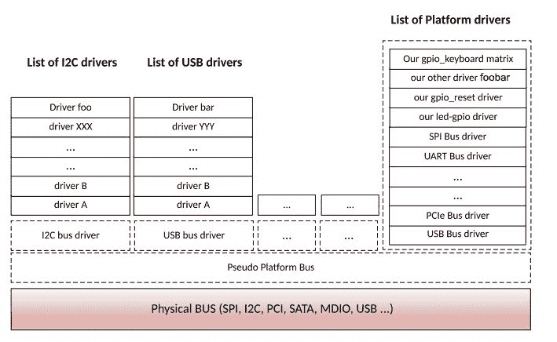

# 第五章：平台设备驱动程序

我们都知道即插即用设备。它们在插入时立即由内核处理。这些可能是 USB 或 PCI Express，或任何其他自动发现的设备。因此，还存在其他类型的设备，这些设备不是热插拔的，内核需要在管理之前知道它们。有 I2C、UART、SPI 和其他未连接到可枚举总线的设备。

您可能已经知道的真实物理总线：USB、I2S、I2C、UART、SPI、PCI、SATA 等。这些总线是名为控制器的硬件设备。由于它们是 SoC 的一部分，因此无法移除，不可发现，也称为平台设备。

人们经常说平台设备是芯片上的设备（嵌入在 SoC 中）。实际上，这在一定程度上是正确的，因为它们被硬连到芯片中，无法移除。但连接到 I2C 或 SPI 的设备不是芯片上的设备，它们也是平台设备，因为它们不可发现。同样，可能存在芯片上的 PCI 或 USB 设备，但它们不是平台设备，因为它们是可发现的。

从 SoC 的角度来看，这些设备（总线）通过专用总线内部连接，并且大多数时间是专有的，特定于制造商。从内核的角度来看，这些是根设备，与任何东西都没有连接。这就是*伪平台总线*的作用。伪平台总线，也称为平台总线，是内核虚拟总线，用于内核不知道的物理总线上的设备。在本章中，平台设备指的是依赖于伪平台总线的设备。

处理平台设备基本上需要两个步骤：

+   注册一个管理您的设备的平台驱动程序（使用唯一名称）

+   使用与驱动程序相同的名称注册您的平台设备，以及它们的资源，以便让内核知道您的设备在那里

话虽如此，在本章中，我们将讨论以下内容：

+   平台设备及其驱动程序

+   内核中的设备和驱动程序匹配机制

+   注册平台驱动程序与设备，以及平台数据

# 平台驱动程序

在继续之前，请注意以下警告。并非所有平台设备都由平台驱动程序处理（或者我应该说伪平台驱动程序）。平台驱动程序专用于不基于常规总线的设备。I2C 设备或 SPI 设备是平台设备，但分别依赖于 I2C 或 SPI 总线，而不是平台总线。一切都需要使用平台驱动程序手动完成。平台驱动程序必须实现一个`probe`函数，当模块被插入或设备声明它时，内核会调用该函数。在开发平台驱动程序时，必须填写的主要结构是`struct platform_driver`，并使用以下显示的专用函数将驱动程序注册到平台总线核心：

```
static struct platform_driver mypdrv = { 
    .probe    = my_pdrv_probe, 
    .remove   = my_pdrv_remove, 
    .driver   = { 
    .name     = "my_platform_driver", 
    .owner    = THIS_MODULE, 
    }, 
}; 
```

让我们看看组成结构的每个元素的含义，以及它们的用途：

+   `probe()`：这是在设备在匹配后声明您的驱动程序时调用的函数。稍后，我们将看到核心如何调用`probe`。其声明如下：

```
static int my_pdrv_probe(struct platform_device *pdev) 
```

+   `remove()`：当设备不再需要时，调用此函数来摆脱驱动程序，其声明如下：

```
static int my_pdrv_remove(struct platform_device *pdev) 
```

+   `struct device_driver`：这描述了驱动程序本身，提供名称、所有者和一些字段，我们稍后会看到。

使用`platform_driver_register()`或`platform_driver_probe()`在`init`函数中（加载模块时）注册平台驱动程序与内核一样简单。这些函数之间的区别在于：

+   `platform_driver_register()`将驱动程序注册并放入内核维护的驱动程序列表中，以便在发生新的匹配时可以按需调用其`probe()`函数。为了防止您的驱动程序被插入和注册到该列表中，只需使用`next`函数。

+   使用`platform_driver_probe()`，内核立即运行匹配循环，检查是否有与匹配名称相匹配的平台设备，然后调用驱动程序的`probe()`，如果发生匹配，表示设备存在。如果没有，驱动程序将被忽略。这种方法可以防止延迟探测，因为它不会在系统上注册驱动程序。在这里，`probe`函数放置在`__init`部分中，在内核引导完成后释放，从而防止延迟探测并减少驱动程序的内存占用。如果您 100%确定设备存在于系统中，请使用此方法：

```
ret = platform_driver_probe(&mypdrv, my_pdrv_probe); 
```

以下是一个简单的平台驱动程序，它在内核中注册自己：

```
#include <linux/module.h> 
#include <linux/kernel.h> 
#include <linux/init.h> 
#include <linux/platform_device.h> 

static int my_pdrv_probe (struct platform_device *pdev){ 
    pr_info("Hello! device probed!\n"); 
    return 0; 
} 

static void my_pdrv_remove(struct platform_device *pdev){ 
    pr_info("good bye reader!\n"); 
} 

static struct platform_driver mypdrv = { 
    .probe          = my_pdrv_probe, 
    .remove         = my_pdrv_remove, 
    .driver = { 
            .name  = KBUILD_MODNAME, 
            .owner = THIS_MODULE, 
    }, 
}; 

static int __init my_drv_init(void) 
{ 
    pr_info("Hello Guy\n"); 

    /* Registering with Kernel */ 
    platform_driver_register(&mypdrv); 
    return 0; 
} 

static void __exit my_pdrv_remove (void) 
{ 
    Pr_info("Good bye Guy\n"); 

    /* Unregistering from Kernel */ 
    platform_driver_unregister(&my_driver); 
} 

module_init(my_drv_init); 
module_exit(my_pdrv_remove); 

MODULE_LICENSE(

"GPL

");

MODULE_AUTHOR(

"John Madieu

");

MODULE_DESCRIPTION(

"My platform Hello World module

");

```

我们的模块在`init`/`exit`函数中除了在平台总线核心中注册/注销之外什么也不做。大多数驱动程序都是这样。在这种情况下，我们可以摆脱`module_init`和`module_exit`，并使用`module_platform_driver`宏。

`module_platform_driver`宏如下所示：

```
/* 
 * module_platform_driver() - Helper macro for drivers that don't 
 * do anything special in module init/exit. This eliminates a lot 
 * of boilerplate.  Each module may only use this macro once, and 
 * calling it replaces module_init() and module_exit() 
 */ 
#define module_platform_driver(__platform_driver) \ 
module_driver(__platform_driver, platform_driver_register, \ 
platform_driver_unregister) 
```

这个宏将负责在平台驱动核心中注册我们的模块。不再需要`module_init`和`module_exit`宏，也不再需要`init`和`exit`函数。这并不意味着这些函数不再被调用，只是我们可以忘记自己编写它们。

`probe`函数不能替代`init`函数。每当给定设备与驱动程序匹配时，都会调用`probe`函数，而`init`函数只在模块加载时运行一次。

```

[...] 
static int my_driver_probe (struct platform_device *pdev){ 
    [...] 
} 

static void my_driver_remove(struct platform_device *pdev){ 
    [...] 
} 

static struct platform_drivermy_driver = { 
    [...] 
}; 
module_platform_driver(my_driver); 
```

每个总线都有特定的宏，用于注册驱动程序。以下列表不是详尽无遗的：

+   `module_platform_driver(struct platform_driver)` 用于平台驱动程序，专用于不位于传统物理总线上的设备（我们刚刚在上面使用了它）

+   `module_spi_driver(struct spi_driver)` 用于 SPI 驱动程序

+   `module_i2c_driver(struct i2c_driver)` 用于 I2C 驱动程序

+   `module_pci_driver(struct pci_driver)` 用于 PCI 驱动程序

+   `module_usb_driver(struct usb_driver)` 用于 USB 驱动程序

+   `module_mdio_driver(struct mdio_driver)` 用于 mdio

+   [...]

如果您不知道驱动程序需要位于哪个总线上，那么它是一个平台驱动程序，您应该使用`platform_driver_register`或`platform_driver_probe`来注册驱动程序。

# 平台设备

实际上，我们应该说伪平台设备，因为这一部分涉及的是位于伪平台总线上的设备。当您完成驱动程序后，您将不得不向内核提供需要该驱动程序的设备。平台设备在内核中表示为`struct platform_device`的实例，并且如下所示：

```
struct platform_device { 
   const char *name; 
   u32 id; 
   struct device dev; 
   u32 num_resources; 
   struct resource *resource; 
}; 
```

在涉及平台驱动程序之前，驱动程序和设备匹配之前，`struct platform_device`和`static struct platform_driver.driver.name`的`name`字段必须相同。`num_resources`和`struct resource *resource`字段将在下一节中介绍。只需记住，由于`resource`是一个数组，因此`num_resources`必须包含该数组的大小。

# 资源和平台数据

与可热插拔设备相反，内核不知道系统上存在哪些设备，它们的功能是什么，或者为了正常工作需要什么。没有自动协商过程，因此内核提供的任何信息都是受欢迎的。有两种方法可以通知内核设备需要的资源（中断请求，直接内存访问，内存区域，I/O 端口，总线）和数据（任何自定义和私有数据结构，您可能希望传递给驱动程序），如下所述：

# 设备供应 - 旧的和不推荐的方式

这种方法适用于不支持设备树的内核版本。使用此方法，驱动程序保持通用，设备在与板相关的源文件中注册。

# 资源

资源代表了从硬件角度来看设备的所有特征元素，以及设备需要的元素，以便进行设置和正常工作。内核中只有六种资源类型，全部列在`include/linux/ioport.h`中，并用作标志来描述资源的类型：

```
#define IORESOURCE_IO  0x00000100  /* PCI/ISA I/O ports */ 
#define IORESOURCE_MEM 0x00000200  /* Memory regions */ 
#define IORESOURCE_REG 0x00000300  /* Register offsets */ 
#define IORESOURCE_IRQ 0x00000400  /* IRQ line */ 
#define IORESOURCE_DMA 0x00000800  /* DMA channels */ 
#define IORESOURCE_BUS 0x00001000  /* Bus */ 
```

资源在内核中表示为`struct resource`的实例：

```
struct resource { 
        resource_size_t start; 
        resource_size_t end; 
        const char *name; 
        unsigned long flags; 
    }; 
```

让我们解释结构中每个元素的含义：

+   `start/end`：这表示资源的开始/结束位置。对于 I/O 或内存区域，它表示它们的开始/结束位置。对于 IRQ 线、总线或 DMA 通道，开始/结束必须具有相同的值。

+   `flags`：这是一个掩码，用于描述资源的类型，例如`IORESOURCE_BUS`。

+   `name`：这标识或描述资源。

一旦提供了资源，就需要在驱动程序中提取它们以便使用。`probe`函数是提取它们的好地方。在继续之前，让我们记住平台设备驱动程序的`probe`函数的声明：

```
int probe(struct platform_device *pdev); 
```

`pdev`由内核自动填充，其中包含我们之前注册的数据和资源。让我们看看如何选择它们。

嵌入在`struct platform_device`中的`struct resource`可以使用`platform_get_resource()`函数检索。以下是`platform_get_resource`的原型：

```
struct resource *platform_get_resource(structplatform_device *dev, 
                    unsigned int type, unsigned int num); 
```

第一个参数是平台设备本身的实例。第二个参数告诉我们需要什么类型的资源。对于内存，它应该是`IORESOURCE_MEM`。再次，请查看`include/linux/ioport.h`以获取更多详细信息。`num`参数是一个索引，表示所需的资源类型。零表示第一个，依此类推。

如果资源是 IRQ，我们必须使用`int platform_get_irq(struct platform_device * pdev, unsigned intnum)`，其中`pdev`是平台设备，`num`是资源中的 IRQ 索引（如果有多个）。我们可以使用以下整个`probe`函数来提取我们为设备注册的平台数据：

```
static int my_driver_probe(struct platform_device *pdev) 
{ 
struct my_gpios *my_gpio_pdata = 
                   (struct my_gpios*)dev_get_platdata(&pdev->dev); 

    int rgpio = my_gpio_pdata->reset_gpio; 
    int lgpio = my_gpio_pdata->led_gpio; 

    struct resource *res1, *res2; 
    void *reg1, *reg2; 
    int irqnum; 

    res1 = platform_get_resource(pdev, IORESSOURCE_MEM, 0); 
    if((!res1)){ 
        pr_err(" First Resource not available"); 
        return -1; 
    } 
    res2 = platform_get_resource(pdev, IORESSOURCE_MEM, 1); 
    if((!res2)){ 
        pr_err(" Second Resource not available"); 
        return -1; 
    } 

    /* extract the irq */ 
    irqnum = platform_get_irq(pdev, 0); 
    Pr_info("\n IRQ number of Device: %d\n", irqnum); 

    /* 
     * At this step, we can use gpio_request, on gpio, 
     * request_irq on irqnum and ioremap() on reg1 and reg2\. 
     * ioremap() is discussed in chapter 11, Kernel Memory Management  
     */ 
    [...] 
    return 0; 
} 
```

# 平台数据

任何其他数据，其类型不属于前一节中列举的资源类型（例如 GPIO），都属于这里。无论它们的类型是什么，`struct platform_device`包含一个`struct device`字段，该字段又包含一个`struct platform_data`字段。通常，应该将这些数据嵌入到一个结构中，并将其传递给`platform_device.device.platform_data`字段。例如，假设您声明了一个平台设备，该设备需要两个 GPIO 号作为平台数据，一个中断号和两个内存区域作为资源。以下示例显示了如何注册平台数据以及设备。在这里，我们使用`platform_device_register(struct platform_device *pdev)`函数，该函数用于向平台核心注册平台设备：

```
/* 
 * Other data than irq or memory must be embedded in a structure 
 * and passed to "platform_device.device.platform_data" 
 */ 
struct my_gpios { 
    int reset_gpio; 
    int led_gpio; 
}; 

/*our platform data*/ 
static struct my_gpiosneeded_gpios = { 
    .reset_gpio = 47, 
    .led_gpio   = 41, 
}; 

/* Our resource array */ 
static struct resource needed_resources[] = { 
   [0] = { /* The first memory region */ 
         .start = JZ4740_UDC_BASE_ADDR, 
         .end   = JZ4740_UDC_BASE_ADDR + 0x10000 - 1, 
         .flags = IORESOURCE_MEM, 
         .name  = "mem1", 
   }, 
   [1] = { 
         .start = JZ4740_UDC_BASE_ADDR2, 
         .end   = JZ4740_UDC_BASE_ADDR2 + 0x10000 -1, 
         .flags = IORESOURCE_MEM, 
         .name  = "mem2", 
   }, 
   [2] = { 
         .start = JZ4740_IRQ_UDC, 
         .end   = JZ4740_IRQ_UDC, 
         .flags = IORESOURCE_IRQ, 
         .name  = "mc", 
   }, 
}; 

static struct platform_devicemy_device = { 
    .name = "my-platform-device", 
    .id   = 0, 
    .dev  = { 
        .platform_data      = &needed_gpios, 
    }, 
    .resource              = needed_resources, 
    .num_resources = ARRY_SIZE(needed_resources), 
}; 
platform_device_register(&my_device); 
```

在前面的示例中，我们使用了`IORESOURCE_IRQ`和`IORESOURCE_MEM`来告知内核我们提供了什么类型的资源。要查看所有其他标志类型，请查看内核树中的`include/linux/ioport.h`。

为了检索我们之前注册的平台数据，我们可以直接使用`pdev->dev.platform_data`（记住`struct platform_device`结构），但建议使用内核提供的函数（尽管它做的是同样的事情）：

```
void *dev_get_platdata(const struct device *dev) 
struct my_gpios *picked_gpios = dev_get_platdata(&pdev->dev); 
```

# 在哪里声明平台设备？

设备与其资源和数据一起注册。在这种旧的和不推荐的方法中，它们被声明为一个单独的模块，或者在`arch/<arch>/mach-xxx/yyyy.c`中的板`init`文件中声明，这在我们的情况下是`arch/arm/mach-imx/mach-imx6q.c`，因为我们使用的是基于 NXP i.MX6Q 的 UDOO quad。函数`platform_device_register()`让您可以这样做：

```
static struct platform_device my_device = { 
        .name                   = "my_drv_name", 
        .id                     = 0, 
        .dev.platform_data      = &my_device_pdata, 
        .resource              = jz4740_udc_resources, 
        .num_resources         = ARRY_SIZE(jz4740_udc_resources), 
}; 
platform_device_register(&my_device); 

```

设备的名称非常重要，内核使用它来将驱动程序与相同名称的设备进行匹配。

# 设备配置-新的推荐方式

在第一种方法中，任何修改都将需要重新构建整个内核。如果内核必须包含任何应用程序/板特定的配置，其大小将会大幅增加。为了保持简单，并将设备声明（因为它们实际上并不是内核的一部分）与内核源代码分开，引入了一个新概念：*设备树*。DTS 的主要目标是从内核中删除非常特定且从未经过测试的代码。使用设备树，平台数据和资源是同质的。设备树是硬件描述文件，其格式类似于树结构，其中每个设备都表示为一个节点，并且任何数据、资源或配置数据都表示为节点的属性。这样，您只需要在进行一些修改时重新编译设备树。设备树将成为下一章的主题，我们将看到如何将其引入到平台设备中。

# 设备、驱动程序和总线匹配

在任何匹配发生之前，Linux 都会调用`platform_match(struct device *dev, struct device_driver *drv)`。平台设备通过字符串与其驱动程序匹配。根据 Linux 设备模型，总线元素是最重要的部分。每个总线都维护着与其注册的驱动程序和设备的列表。总线驱动程序负责设备和驱动程序的匹配。每当连接新设备或向总线添加新驱动程序时，该总线都会启动匹配循环。

现在，假设您使用 I2C 核心提供的函数（在下一章中讨论）注册了一个新的 I2C 设备。内核将通过调用与 I2C 总线驱动程序注册的 I2C 核心匹配函数来触发 I2C 总线匹配循环，以检查是否已经有与您的设备匹配的注册驱动程序。如果没有匹配项，将不会发生任何事情。如果发生匹配，内核将通过一种称为 netlink 套接字的通信机制通知设备管理器（udev/mdev），后者将加载（如果尚未加载）与您的设备匹配的驱动程序。一旦驱动程序加载，其`probe()`函数将立即执行。不仅 I2C 工作方式如此，而且每个总线都有自己的匹配机制，大致相同。在每个设备或驱动程序注册时都会触发总线匹配循环。

我们可以总结前面部分所说的内容如下图所示：


每个注册的驱动程序和设备都位于总线上。这构成了一棵树。USB 总线可能是 PCI 总线的子级，而 MDIO 总线通常是其他设备的子级，依此类推。因此，我们前面的图将如下所示：



当您使用`platform_driver_probe()`函数注册驱动程序时，内核会遍历已注册的平台设备表，并寻找匹配项。如果有匹配项，它将使用平台数据调用匹配驱动程序的`probe`函数。

# 平台设备和平台驱动程序如何匹配？

到目前为止，我们只讨论了如何填充设备和驱动程序的不同结构。但现在我们将看到它们如何在内核中注册，以及 Linux 如何知道哪些设备由哪个驱动程序处理。答案是`MODULE_DEVICE_TABLE`。这个宏让驱动程序暴露其 ID 表，描述了它可以支持哪些设备。同时，如果驱动程序可以编译为模块，`driver.name`字段应该与模块名称匹配。如果不匹配，模块将不会自动加载，除非我们使用`MODULE_ALIAS`宏为模块添加另一个名称。在编译时，该信息从所有驱动程序中提取出来，以构建设备表。当内核需要为设备找到驱动程序（需要执行匹配时），内核会遍历设备表。如果找到与添加的设备的`compatible`（对于设备树）、`device/vendor id`或`name`（对于设备 ID 表或名称）匹配的条目，那么提供该匹配的模块将被加载（运行模块的`init`函数），并调用`probe`函数。`MODULE_DEVICE_TABLE`宏在`linux/module.h`中定义：

```
#define MODULE_DEVICE_TABLE(type, name) 
```

以下是给这个宏的每个参数的描述：

+   `type`：这可以是`i2c`、`spi`、`acpi`、`of`、`platform`、`usb`、`pci`或您可能在`include/linux/mod_devicetable.h`中找到的任何其他总线。它取决于我们的设备所在的总线，或者我们想要使用的匹配机制。

+   `name`：这是一个指向`XXX_device_id`数组的指针，用于设备匹配。如果我们谈论的是 I2C 设备，结构将是`i2c_device_id`。对于 SPI 设备，应该是`spi_device_id`，依此类推。对于设备树**Open Firmware**（**OF**）匹配机制，我们必须使用`of_device_id`。

对于新的非可发现平台设备驱动程序，建议不再使用平台数据，而是改用设备树功能，使用 OF 匹配机制。请注意，这两种方法并不是互斥的，因此可以混合使用。

让我们深入了解匹配机制的细节，除了我们将在第六章中讨论的 OF 风格匹配之外，*设备树的概念*。

# 内核设备和驱动程序匹配函数

内核中负责平台设备和驱动程序匹配功能的函数在`/drivers/base/platform.c`中定义如下：

```
static int platform_match(struct device *dev, struct device_driver *drv) 
{ 
   struct platform_device *pdev = to_platform_device(dev); 
   struct platform_driver *pdrv = to_platform_driver(drv); 

   /* When driver_override is set, only bind to the matching driver */ 
   if (pdev->driver_override) 
         return !strcmp(pdev->driver_override, drv->name); 

   /* Attempt an OF style match first */ 
   if (of_driver_match_device(dev, drv)) 
         return 1; 

   /* Then try ACPI style match */ 
   if (acpi_driver_match_device(dev, drv)) 
         return 1; 

   /* Then try to match against the id table */ 
   if (pdrv->id_table) 
         return platform_match_id(pdrv->id_table, pdev) != NULL; 

   /* fall-back to driver name match */ 
   return (strcmp(pdev->name, drv->name) == 0); 
} 
```

我们可以列举四种匹配机制。它们都基于字符串比较。如果我们看一下`platform_match_id`，我们就会了解底层的工作原理：

```
static const struct platform_device_id *platform_match_id( 
                        const struct platform_device_id *id, 
                        struct platform_device *pdev) 
{ 
        while (id->name[0]) { 
                if (strcmp(pdev->name, id->name) == 0) { 
                        pdev->id_entry = id; 
                        return id; 
                } 
                id++; 
        } 
        return NULL; 
} 
```

现在让我们来看一下我们在第四章中讨论的`struct device_driver`结构：

```
struct device_driver { 
        const char *name; 
        [...] 
        const struct of_device_id       *of_match_table; 
        const struct acpi_device_id     *acpi_match_table; 
}; 
```

我故意删除了我们不感兴趣的字段。`struct device_driver`构成了每个设备驱动程序的基础。无论是 I2C、SPI、TTY 还是其他设备驱动程序，它们都嵌入了一个`struct device_driver`元素。

# OF 风格和 ACPI 匹配

OF 风格在第六章中有解释，*设备树的概念*。第二种机制是基于 ACPI 表的匹配。我们在本书中不会讨论它，但供您参考，它使用`acpi_device_id`结构。

# ID 表匹配

这种匹配风格已经存在很长时间，它基于`struct device_id`结构。所有设备 id 结构都在`include/linux/mod_devicetable.h`中定义。要找到正确的结构名称，您需要使用总线名称作为前缀，即您的设备驱动程序所在的总线名称。例如：`struct i2c_device_id`用于 I2C，`struct platform_device_id`用于平台设备（不在真实物理总线上），`spi_device_id`用于 SPI 设备，`usb_device_id`用于 USB 等。平台设备的`device_id 表`的典型结构如下：

```
struct platform_device_id { 
   char name[PLATFORM_NAME_SIZE]; 
   kernel_ulong_t driver_data; 
}; 
```

无论如何，如果注册了 ID 表，每当内核运行匹配函数以查找未知或新的平台设备的驱动程序时，都会遍历它。如果匹配成功，将调用匹配驱动程序的 `probe` 函数，并将匹配的 ID 表条目的指针作为参数传递给 `struct platform_device` ，该指针将指向发起匹配的匹配 ID 表条目。`.driver_data` 元素是一个 `unsigned long` ，有时会被强制转换为指针地址，以便指向任何东西，就像在 serial-imx 驱动程序中一样。以下是 `drivers/tty/serial/imx.c` 中使用 `platform_device_id` 的示例：

```
static const struct platform_device_id imx_uart_devtype[] = { 
        { 
              .name = "imx1-uart", 
              .driver_data = (kernel_ulong_t) &imx_uart_devdata[IMX1_UART], 
        }, { 
              .name = "imx21-uart", 
              .driver_data = (kernel_ulong_t) &imx_uart_devdata[IMX21_UART], 
        }, { 
              .name = "imx6q-uart", 
              .driver_data = (kernel_ulong_t) &imx_uart_devdata[IMX6Q_UART], 
        }, { 
                /* sentinel */ 
        } 
}; 
```

`.name` 字段必须与在特定于板的文件中注册设备时给出的设备名称相同。负责此匹配样式的函数是 `platform_match_id` 。如果查看 `drivers/base/platform.c` 中的定义，你会看到：

```
static const struct platform_device_id *platform_match_id( 
        const struct platform_device_id *id, 
        struct platform_device *pdev) 
{ 
    while (id->name[0]) { 
        if (strcmp(pdev->name, id->name) == 0) { 
            pdev->id_entry = id; 
            return id; 
        } 
        id++; 
    } 
    return NULL; 
} 
```

在下面的示例中，这是内核源代码中 `drivers/tty/serial/imx.c` 的摘录，可以看到平台数据是如何通过强制转换转换回原始数据结构的。这就是人们有时将任何数据结构作为平台数据传递的方式：

```
static void serial_imx_probe_pdata(struct imx_port *sport, 
         struct platform_device *pdev) 
{ 
   struct imxuart_platform_data *pdata = dev_get_platdata(&pdev->dev); 

   sport->port.line = pdev->id; 
   sport->devdata = (structimx_uart_data *) pdev->id_entry->driver_data; 

   if (!pdata) 
         return; 
   [...] 
} 
```

`pdev->id_entry` 是一个 `struct platform_device_id` ，它是一个指向内核提供的匹配 ID 表条目的指针，其 `driver_data` 元素被强制转换回数据结构的指针。

**ID 表匹配的每个特定设备数据**

在前一节中，我们已经将 `platform_device_id.platform_data` 用作指针。你的驱动程序可能需要支持多种设备类型。在这种情况下，你将需要为你支持的每种设备类型使用特定的设备数据。然后，你应该将设备 ID 用作包含每种可能的设备数据的数组的索引，而不再是指针地址。以下是示例中的详细步骤：

1.  我们根据驱动程序需要支持的设备类型定义一个枚举：

```
enum abx80x_chip { 
    AB0801, 
    AB0803, 
    AB0804, 
    AB0805, 
    AB1801, 
    AB1803, 
    AB1804, 
    AB1805, 
    ABX80X 
}; 
```

1.  我们定义特定的数据类型结构：

```
struct abx80x_cap { 
    u16 pn; 
boolhas_tc; 
}; 
```

1.  我们使用默认值填充数组，并根据 `device_id` 中的索引，我们可以选择正确的数据：

```
static struct abx80x_cap abx80x_caps[] = { 
    [AB0801] = {.pn = 0x0801}, 
    [AB0803] = {.pn = 0x0803}, 
    [AB0804] = {.pn = 0x0804, .has_tc = true}, 
    [AB0805] = {.pn = 0x0805, .has_tc = true}, 
    [AB1801] = {.pn = 0x1801}, 
    [AB1803] = {.pn = 0x1803}, 
    [AB1804] = {.pn = 0x1804, .has_tc = true}, 
    [AB1805] = {.pn = 0x1805, .has_tc = true}, 
    [ABX80X] = {.pn = 0} 
}; 
```

1.  我们使用特定索引定义我们的 `platform_device_id`：

```
static const struct i2c_device_id abx80x_id[] = { 
    { "abx80x", ABX80X }, 
    { "ab0801", AB0801 }, 
    { "ab0803", AB0803 }, 
    { "ab0804", AB0804 }, 
    { "ab0805", AB0805 }, 
    { "ab1801", AB1801 }, 
    { "ab1803", AB1803 }, 
    { "ab1804", AB1804 }, 
    { "ab1805", AB1805 }, 
    { "rv1805", AB1805 }, 
    { } 
}; 
```

1.  在 `probe` 函数中我们只需要做一些事情：

```
static int rs5c372_probe(struct i2c_client *client, 
const struct i2c_device_id *id) 
{ 
    [...] 

    /* We pick the index corresponding to our device */ 
int index = id->driver_data; 

    /* 
     * And then, we can access the per device data 
     * since it is stored in abx80x_caps[index] 
     */ 
} 
```

# 名称匹配 - 平台设备名称匹配

现在，大多数平台驱动程序根本不提供任何表；它们只是在驱动程序的名称字段中填写驱动程序本身的名称。但匹配仍然有效，因为如果查看 `platform_match` 函数，你会发现最终匹配会回退到名称匹配，比较驱动程序的名称和设备的名称。一些旧的驱动程序仍然使用该匹配机制。以下是 `sound/soc/fsl/imx-ssi.c` 中的名称匹配：

```
static struct platform_driver imx_ssi_driver = { 
   .probe = imx_ssi_probe, 
   .remove = imx_ssi_remove, 

    /* As you can see here, only the 'name' field is filled */ 
   .driver = { 
         .name = "imx-ssi", 
   }, 
}; 

module_platform_driver(imx_ssi_driver); 
```

要添加与此驱动程序匹配的设备，必须在特定于板的文件中（通常在 `arch/<your_arch>/mach-*/board-*.c` 中）调用 `platform_device_register` 或 `platform_add_devices` ，并使用相同的名称 `imx-ssi` 。对于我们的四核 i.MX6-based UDOO，它是 `arch/arm/mach-imx/mach-imx6q.c` 。

# 总结

内核伪平台总线对你来说已经没有秘密了。通过总线匹配机制，你能够理解你的驱动程序何时、如何以及为什么被加载，以及它是为哪个设备加载的。我们可以根据我们想要的匹配机制实现任何 `probe` 函数。由于驱动程序的主要目的是处理设备，我们现在能够在系统中填充设备（旧的和不推荐的方式）。最后，下一章将专门讨论设备树，这是用于在系统上填充设备及其配置的新机制。
