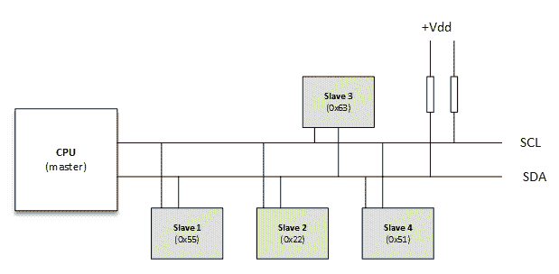

# 第七章：I2C 客户端驱动程序

由飞利浦（现在是 NXP）发明的 I2C 总线是一种双线：**串行数据**（**SDA**），**串行时钟**（**SCL**）异步串行总线。它是一个多主总线，尽管多主模式并不广泛使用。SDA 和 SCL 都是开漏/开集电器，这意味着它们中的每一个都可以将其输出拉低，但没有一个可以在没有上拉电阻的情况下将其输出拉高。SCL 由主机生成，以同步通过总线传输的数据（由 SDA 携带）。从机和主机都可以发送数据（当然不是同时），从而使 SDA 成为双向线。也就是说，SCL 信号也是双向的，因为从机可以通过保持 SCL 线低来拉伸时钟。总线由主机控制，而在我们的情况下，主机是 SoC 的一部分。这种总线经常用于嵌入式系统，用于连接串行 EEPROM、RTC 芯片、GPIO 扩展器、温度传感器等等：



I2C 总线和设备

时钟速度从 10 KHz 到 100 KHz，400 KHz 到 2 MHz 不等。我们不会在本书中涵盖总线规格或总线驱动程序。然而，总线驱动程序负责管理总线并处理规格。例如，i.MX6 芯片的总线驱动程序的示例可以在内核源代码的`drivers/i2C/busses/i2c-imx.c`中找到，I2C 规格可以在[`www.nxp.com/documents/user_manual/UM10204.pdf`](http://www.nxp.com/documents/user_manual/UM10204.pdf)中找到。

在本章中，我们对客户端驱动程序感兴趣，以处理坐在总线上的从设备。本章将涵盖以下主题：

+   I2C 客户端驱动程序架构

+   访问设备，因此从/向设备读取/写入数据

+   从 DT 中声明客户端

# 驱动程序架构

当您为其编写驱动程序的设备坐在称为*总线控制器*的物理总线上时，它必须依赖于称为*控制器驱动程序*的总线的驱动程序，负责在设备之间共享总线访问。控制器驱动程序在您的设备和总线之间提供了一个抽象层。每当您在 I2C 或 USB 总线上执行事务（读或写）时，例如，I2C/USB 总线控制器会在后台自动处理。每个总线控制器驱动程序都导出一组函数，以便为坐在该总线上的设备开发驱动程序。这适用于每个物理总线（I2C、SPI、USB、PCI、SDIO 等）。

I2C 驱动程序在内核中表示为 `struct i2c_driver` 的实例。I2C 客户端（代表设备本身）由 `struct i2c_client` 结构表示。

# i2c_driver 结构

在内核中，I2C 驱动程序被声明为`struct i2c_driver`的实例，其外观如下：

```
struct i2c_driver { 
    /* Standard driver model interfaces */ 
int (*probe)(struct i2c_client *, const struct i2c_device_id *); 
int (*remove)(struct i2c_client *); 

    /* driver model interfaces that don't relate to enumeration */ 
    void (*shutdown)(struct i2c_client *); 

struct device_driver driver; 
const struct i2c_device_id *id_table; 
}; 
```

`struct i2c_driver` 结构包含和表征了通用访问例程，需要处理声称驱动程序的设备，而 `struct i2c_client` 包含设备特定信息，比如它的地址。`struct i2c_client` 结构代表和表征了一个 I2C 设备。在本章的后面，我们将看到如何填充这些结构。

# probe()函数

`probe()`函数是`struct i2c_driver`结构的一部分，一旦实例化了一个 I2C 设备，它就会被执行。它负责以下任务：

+   检查设备是否是您期望的设备

+   使用`i2c_check_functionality`函数检查 SoC 的 I2C 总线控制器是否支持设备所需的功能

+   初始化设备

+   设置设备特定数据

+   注册适当的内核框架

`probe` 函数的原型如下：

```
static int foo_probe(struct i2c_client *client, const struct 
                                              i2c_device_id *id) 
```

正如您所看到的，它的参数是：

+   `struct i2c_client` 指针：这代表 I2C 设备本身。这个结构继承自设备结构，并由内核提供给您的`probe`函数。客户端结构在`include/linux/i2c.h`中定义。它的定义如下：

```
struct i2c_client { 
  unsigned short flags;  /* div., see below  */ 
  unsigned short addr;   /* chip address - NOTE: 7bit    */ 
                         /* addresses are stored in the  */ 
                         /* _LOWER_ 7 bits               */ 
  char name[I2C_NAME_SIZE]; 
  struct i2c_adapter *adapter; /* the adapter we sit on  */ 
  struct device dev;     /* the device structure         */ 
  intirq;               /* irq issued by device         */ 
  struct list_head detected; 
 #if IS_ENABLED(CONFIG_I2C_SLAVE) 
  i2c_slave_cb_t slave_cb; /* callback for slave mode  */ 
 #endif 
}; 
```

+   所有字段都由内核填充，基于您提供的参数来注册客户端。我们稍后将看到如何向内核注册设备。

+   `struct i2c_device_id`指针：这指向与正在被探测的设备匹配的 I2C 设备 ID 条目。

# 每个设备的数据

I2C 核心为您提供了将指针存储到您选择的任何数据结构中的可能性，作为特定于设备的数据。要存储或检索数据，请使用 I2C 核心提供的以下函数：

```
/* set the data */ 
void i2c_set_clientdata(struct i2c_client *client, void *data); 

/* get the data */ 
void *i2c_get_clientdata(const struct i2c_client *client); 
```

这些函数内部调用`dev_set_drvdata`和`dev_get_drvdata`来更新或获取`struct i2c_client`结构中`struct device`子结构的`void *driver_data`字段的值。

这是一个如何使用额外客户数据的例子；摘自`drivers/gpio/gpio-mc9s08dz60.c:`

```
/* This is the device specific data structure */ 
struct mc9s08dz60 { 
   struct i2c_client *client; 
   struct gpio_chip chip; 
}; 

static int mc9s08dz60_probe(struct i2c_client *client, 
const struct i2c_device_id *id) 
{ 
    struct mc9s08dz60 *mc9s; 
    if (!i2c_check_functionality(client->adapter, 
               I2C_FUNC_SMBUS_BYTE_DATA)) 
    return -EIO; 
    mc9s = devm_kzalloc(&client->dev, sizeof(*mc9s), GFP_KERNEL); 
    if (!mc9s) 
        return -ENOMEM; 

    [...] 
    mc9s->client = client; 
    i2c_set_clientdata(client, mc9s); 

    return gpiochip_add(&mc9s->chip); 
} 
```

实际上，这些函数并不真正特定于 I2C。它们只是获取/设置`struct device`的`void *driver_data`指针，它本身是`struct i2c_client`的成员。实际上，我们可以直接使用`dev_get_drvdata`和`dev_set_drvdata`。可以在`linux/include/linux/i2c.h`中看到它们的定义。

# `remove()`函数

`remove`函数的原型如下：

```
static int foo_remove(struct i2c_client *client) 
```

`remove()`函数还提供与`probe()`函数相同的`struct i2c_client*`，因此您可以检索您的私有数据。例如，您可能需要根据您在`probe`函数中设置的私有数据进行一些清理或其他操作：

```
static int mc9s08dz60_remove(struct i2c_client *client) 
{ 
    struct mc9s08dz60 *mc9s; 

    /* We retrieve our private data */ 
    mc9s = i2c_get_clientdata(client); 

    /* Wich hold gpiochip we want to work on */ 
   return gpiochip_remove(&mc9s->chip); 
} 
```

`remove`函数负责从我们在`probe()`函数中注册的子系统中注销我们。在上面的例子中，我们只是从内核中移除`gpiochip`。

# 驱动程序初始化和注册

当模块加载时，可能需要进行一些初始化。大多数情况下，只需向 I2C 核心注册驱动程序即可。同时，当模块被卸载时，通常只需要从 I2C 核心中移除自己。在第五章，*平台设备驱动程序*中，我们看到使用 init/exit 函数并不值得，而是使用`module_*_driver`函数。在这种情况下，要使用的函数是：

```
module_i2c_driver(foo_driver); 
```

# 驱动程序和设备供应

正如我们在匹配机制中看到的，我们需要提供一个`device_id`数组，以便公开我们的驱动程序可以管理的设备。由于我们谈论的是 I2C 设备，结构将是`i2c_device_id`。该数组将向内核通知我们对驱动程序中感兴趣的设备。

现在回到我们的 I2C 设备驱动程序；在`include/linux/mod_devicetable.h`中查看，您将看到`struct i2c_device_id`的定义：

```
struct i2c_device_id { 
    char name[I2C_NAME_SIZE]; 
    kernel_ulong_tdriver_data;     /* Data private to the driver */ 
}; 
```

也就是说，`struct i2c_device_id`必须嵌入在`struct i2c_driver`中。为了让 I2C 核心（用于模块自动加载）知道我们需要处理的设备，我们必须使用`MODULE_DEVICE_TABLE`宏。内核必须知道每当发生匹配时调用哪个`probe`或`remove`函数，这就是为什么我们的`probe`和`remove`函数也必须嵌入在同一个`i2c_driver`结构中：

```
static struct i2c_device_id foo_idtable[] = { 
   { "foo", my_id_for_foo }, 
   { "bar", my_id_for_bar }, 
   { } 
}; 

MODULE_DEVICE_TABLE(i2c, foo_idtable); 

static struct i2c_driver foo_driver = { 
   .driver = { 
   .name = "foo", 
   }, 

   .id_table = foo_idtable, 
   .probe    = foo_probe, 
   .remove   = foo_remove, 
} 
```

# 访问客户端

串行总线事务只是访问寄存器以设置/获取其内容。I2C 遵守这一原则。I2C 核心提供了两种 API，一种用于普通的 I2C 通信，另一种用于与 SMBUS 兼容设备通信，它也适用于 I2C 设备，但反之则不然。

# 普通 I2C 通信

以下是通常在与 I2C 设备通信时处理的基本函数：

```
int i2c_master_send(struct i2c_client *client, const char *buf, int count); 
int i2c_master_recv(struct i2c_client *client, char *buf, int count); 
```

几乎所有 I2C 通信函数的第一个参数都是`struct i2c_client`。第二个参数包含要读取或写入的字节，第三个表示要读取或写入的字节数。与任何读/写函数一样，返回的值是读取/写入的字节数。还可以使用以下函数处理消息传输：

```
int i2c_transfer(struct i2c_adapter *adap, struct i2c_msg *msg, 

                 int num); 
```

`i2c_transfer`发送一组消息，每个消息可以是读取或写入操作，并且可以以任何方式混合。请记住，每个事务之间没有停止位。查看`include/uapi/linux/i2c.h`，消息结构如下：

```
struct i2c_msg { 
        __u16 addr;    /* slave address */ 
        __u16 flags;   /* Message flags */ 
        __u16 len;     /* msg length */ 
        __u8 *buf;     /* pointer to msg data */ 
}; 
```

`i2c_msg`结构描述和表征了一个 I2C 消息。对于每个消息，它必须包含客户端地址、消息的字节数和消息有效载荷。

`msg.len`是`u16`。这意味着您的读/写缓冲区的长度必须始终小于 2¹⁶（64k）。

让我们看一下微芯片 I2C 24LC512eeprom 字符驱动程序的`read`函数；我们应该了解事物是如何真正工作的。本书的源代码中提供了完整的代码。

```
ssize_t 
eep_read(struct file *filp, char __user *buf, size_t count, loff_t *f_pos) 
{ 
    [...] 
    int _reg_addr = dev->current_pointer; 
    u8 reg_addr[2]; 
    reg_addr[0] = (u8)(_reg_addr>> 8); 
    reg_addr[1] = (u8)(_reg_addr& 0xFF); 

    struct i2c_msg msg[2]; 
    msg[0].addr = dev->client->addr; 
    msg[0].flags = 0;                /* Write */ 
    msg[0].len = 2;                  /* Address is 2bytes coded */ 
    msg[0].buf = reg_addr; 

    msg[1].addr = dev->client->addr; 
    msg[1].flags = I2C_M_RD;         /* We need to read */ 
    msg[1].len = count;  
    msg[1].buf = dev->data; 

    if (i2c_transfer(dev->client->adapter, msg, 2) < 0) 
        pr_err("ee24lc512: i2c_transfer failed\n");  

    if (copy_to_user(buf, dev->data, count) != 0) { 
        retval = -EIO; 
    goto end_read; 
    } 
    [...] 
} 
```

`msg.flags`应为`I2C_M_RD`表示读取，`0`表示写入事务。有时，您可能不想创建`struct i2c_msg`，而只是进行简单的读取和写入。

# 系统管理总线（SMBus）兼容函数

SMBus 是由英特尔开发的双线总线，与 I2C 非常相似。I2C 设备是 SMBus 兼容的，但反之则不然。因此，如果对于正在为其编写驱动程序的芯片有疑问，最好使用 SMBus 函数。

以下显示了一些 SMBus API：

```
   s32 i2c_smbus_read_byte_data(struct i2c_client *client, u8 command); 
   s32 i2c_smbus_write_byte_data(struct i2c_client *client, 
                           u8 command, u8 value); 
   s32 i2c_smbus_read_word_data(struct i2c_client *client, u8 command); 
   s32 i2c_smbus_write_word_data(struct i2c_client *client, 
                           u8 command, u16 value); 
   s32 i2c_smbus_read_block_data(struct i2c_client *client, 
                           u8 command, u8 *values); 
   s32 i2c_smbus_write_block_data(struct i2c_client *client, 
                            u8 command, u8 length, const u8 *values); 
```

有关更多解释，请查看内核源代码中的`include/linux/i2c.h`和`drivers/i2c/i2c-core.c`。

以下示例显示了在 I2C gpio 扩展器中进行简单的读/写操作：

```
struct mcp23016 { 
   struct i2c_client   *client; 
   structgpio_chip    chip; 
   structmutex        lock; 
}; 
[...] 
/* This function is called when one needs to change a gpio state */ 
static int mcp23016_set(struct mcp23016 *mcp, 
             unsigned offset, intval) 
{ 
    s32 value; 
    unsigned bank = offset / 8 ; 
    u8 reg_gpio = (bank == 0) ? GP0 : GP1; 
    unsigned bit = offset % 8 ; 

    value = i2c_smbus_read_byte_data(mcp->client, reg_gpio); 
    if (value >= 0) { 
        if (val) 
            value |= 1 << bit; 
        else 
            value &= ~(1 << bit); 
        return i2c_smbus_write_byte_data(mcp->client, 
                                         reg_gpio, value); 
    } else 
        return value; 
} 
[...] 
```

# 在板配置文件中实例化 I2C 设备（旧的和不推荐的方法）

我们必须告知内核系统上物理存在哪些设备。有两种方法可以实现。在 DT 中，正如我们将在本章后面看到的，或者通过板配置文件（这是旧的和不推荐的方法）。让我们看看如何在板配置文件中实现这一点：

`struct i2c_board_info`是用于表示我们板上的 I2C 设备的结构。该结构定义如下：

```
struct i2c_board_info { 
    char type[I2C_NAME_SIZE]; 
    unsigned short addr; 
    void *platform_data; 
    int irq; 
}; 
```

再次，我们已经从结构中删除了对我们不相关的元素。

在上述结构中，`type`应包含与设备驱动程序中的`i2c_driver.driver.name`字段中定义的相同值。然后，您需要填充一个`i2c_board_info`数组，并将其作为参数传递给板初始化例程中的`i2c_register_board_info`函数：

```
int i2c_register_board_info(int busnum, struct i2c_board_info const *info, unsigned len) 
```

在这里，`busnum`是设备所在的总线编号。这是一种旧的和不推荐的方法，因此我不会在本书中进一步介绍。请随时查看内核源代码中的*Documentation/i2c/instantiating-devices*，以了解如何完成这些操作。

# I2C 和设备树

正如我们在前面的章节中所看到的，为了配置 I2C 设备，基本上有两个步骤：

+   定义和注册 I2C 驱动程序

+   定义和注册 I2C 设备

I2C 设备属于 DT 中的非内存映射设备系列，而 I2C 总线是可寻址总线（通过可寻址，我是指您可以在总线上寻址特定设备）。在这种情况下，设备节点中的`reg`属性表示总线上的设备地址。

I2C 设备节点都是它们所在总线节点的子节点。每个设备只分配一个地址。没有长度或范围的涉及。I2C 设备需要声明的标准属性是`reg`，表示设备在总线上的地址，以及`compatible`字符串，用于将设备与驱动程序匹配。有关寻址的更多信息，可以参考第六章，*设备树的概念*。

```
&i2c2 { /* Phandle of the bus node */ 
    pcf8523: rtc@68 { 
        compatible = "nxp,pcf8523"; 
        reg = <0x68>; 
    }; 
    eeprom: ee24lc512@55 { /* eeprom device */ 
        compatible = "packt,ee24lc512"; 
        reg = <0x55>; 
       }; 
}; 
```

上述示例声明了 SoC 的 I2C 总线编号 2 上地址为 0x50 的 HDMI EDID 芯片，以及在同一总线上地址为 0x68 的**实时时钟**（**RTC**）。

# 定义和注册 I2C 驱动程序

到目前为止，我们所看到的并没有改变。我们需要额外的是定义一个`struct of_device_id`。`Struct of_device_id`定义为匹配`.dts`文件中相应节点的结构：

```
/* no extra data for this device */ 
static const struct of_device_id foobar_of_match[] = { 
        { .compatible = "packtpub,foobar-device" }, 
        {} 
}; 
MODULE_DEVICE_TABLE(of, foobar_of_match); 
```

现在我们定义`i2c_driver`如下：

```
static struct i2c_driver foo_driver = { 
    .driver = { 
    .name   = "foo", 
    .of_match_table = of_match_ptr(foobar_of_match), /* Only this line is added */ 
    }, 
    .probe  = foo_probe, 
    .id_table = foo_id, 
}; 
```

然后可以通过以下方式改进`probe`函数：

```
static int my_probe(struct i2c_client *client, const struct i2c_device_id *id) 
{ 
    const struct of_device_id *match; 
    match = of_match_device(mcp23s08_i2c_of_match, &client->dev); 
    if (match) { 
        /* Device tree code goes here */ 
    } else { 
        /*  
         * Platform data code comes here. 
         * One can use 
         *   pdata = dev_get_platdata(&client->dev); 
         * 
         * or *id*, which is a pointer on the *i2c_device_id* entry that originated 
         * the match, in order to use *id->driver_data* to extract the device 
         * specific data, as described in platform driver chapter. 
         */ 
    } 
    [...] 
} 
```

# 备注

对于早于 4.10 的内核版本，如果查看`drivers/i2c/i2c-core.c`，在`i2c_device_probe()`函数中（供参考，这是内核每次向 I2C 核心注册 I2C 设备时调用的函数），将看到类似于以下内容：

```
    if (!driver->probe || !driver->id_table) 
            return -ENODEV; 
```

这意味着即使一个人不需要使用`.id_table`，在驱动程序中也是强制性的。实际上，可以只使用 OF 匹配样式，但不能摆脱`.id_table`。内核开发人员试图消除对`.id_table`的需求，并专门使用`.of_match_table`进行设备匹配。补丁可以在此 URL 找到：[`git.kernel.org/cgit/linux/kernel/git/torvalds/linux.git/commit/?id=c80f52847c50109ca248c22efbf71ff10553dca4`](https://git.kernel.org/cgit/linux/kernel/git/torvalds/linux.git/commit/?id=c80f52847c50109ca248c22efbf71ff10553dca4)。

然而，已经发现了回归问题，并且提交已被撤销。有关详细信息，请查看此处：[`git.kernel.org/cgit/linux/kernel/git/torvalds/linux.git/commit/?id=661f6c1cd926c6c973e03c6b5151d161f3a666ed`](https://git.kernel.org/cgit/linux/kernel/git/torvalds/linux.git/commit/?id=661f6c1cd926c6c973e03c6b5151d161f3a666ed)。自内核版本>= 4.10 以来，已经修复了此问题。修复如下：

```
/* 
 * An I2C ID table is not mandatory, if and only if, a suitable Device 
 * Tree match table entry is supplied for the probing device. 
 */ 
if (!driver->id_table && 
    !i2c_of_match_device(dev->driver->of_match_table, client)) 
        return -ENODEV; 
```

换句话说，对于 I2C 驱动程序，必须同时定义`.id_table`和`.of_match_table`，否则您的设备将无法在内核版本 4.10 或更早版本中进行探测。

# 在设备树中实例化 I2C 设备-新方法

`struct i2c_client`是用于描述 I2C 设备的结构。但是，使用 OF 样式，这个结构不再能在板文件中定义。我们需要做的唯一的事情就是在 DT 中提供设备的信息，内核将根据此信息构建一个设备。

以下代码显示了如何在`dts`文件中声明我们的 I2C `foobar`设备节点：

```
&i2c3 { 
    status = "okay"; 
    foo-bar: foo@55 { 
    compatible = "packtpub,foobar-device"; 
reg = &lt;55>; 
    }; 
}; 
```

# 将所有内容放在一起

总结编写 I2C 客户端驱动程序所需的步骤：

1.  声明驱动程序支持的设备 ID。您可以使用`i2c_device_id`来实现。如果支持 DT，也可以使用`of_device_id`。

1.  调用`MODULE_DEVICE_TABLE(i2c, my_id_table)`将设备列表注册到 I2C 核心。如果支持设备树，必须调用`MODULE_DEVICE_TABLE(of, your_of_match_table)`将设备列表注册到 OF 核心。

1.  根据各自的原型编写`probe`和`remove`函数。如果需要，还要编写电源管理函数。`probe`函数必须识别您的设备，配置它，定义每个设备（私有）数据，并向适当的内核框架注册。驱动程序的行为取决于您在`probe`函数中所做的事情。`remove`函数必须撤消您在`probe`函数中所做的一切（释放内存并从任何框架中注销）。

1.  声明并填充`struct i2c_driver`结构，并使用您创建的 id 数组设置`id_table`字段。使用上面编写的相应函数的名称设置`.probe`和`.remove`字段。在`.driver`子结构中，将`.owner`字段设置为`THIS_MODULE`，设置驱动程序名称，最后，如果支持 DT，则使用`of_device_id`数组设置`.of_match_table`字段。

1.  使用刚刚填写的`i2c_driver`结构调用`module_i2c_driver`函数：`module_i2c_driver(serial_eeprom_i2c_driver)`，以便将驱动程序注册到内核中。

# 总结

我们刚刚处理了 I2C 设备驱动程序。现在是时候选择市场上的任何 I2C 设备并编写相应的驱动程序，支持 DT。本章讨论了内核 I2C 核心和相关 API，包括设备树支持，以便为您提供与 I2C 设备通信所需的技能。您应该能够编写高效的`probe`函数并向内核 I2C 核心注册。在下一章中，我们将使用在这里学到的技能来开发 SPI 设备驱动程序。
