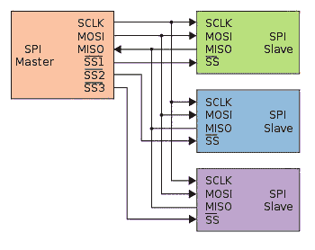
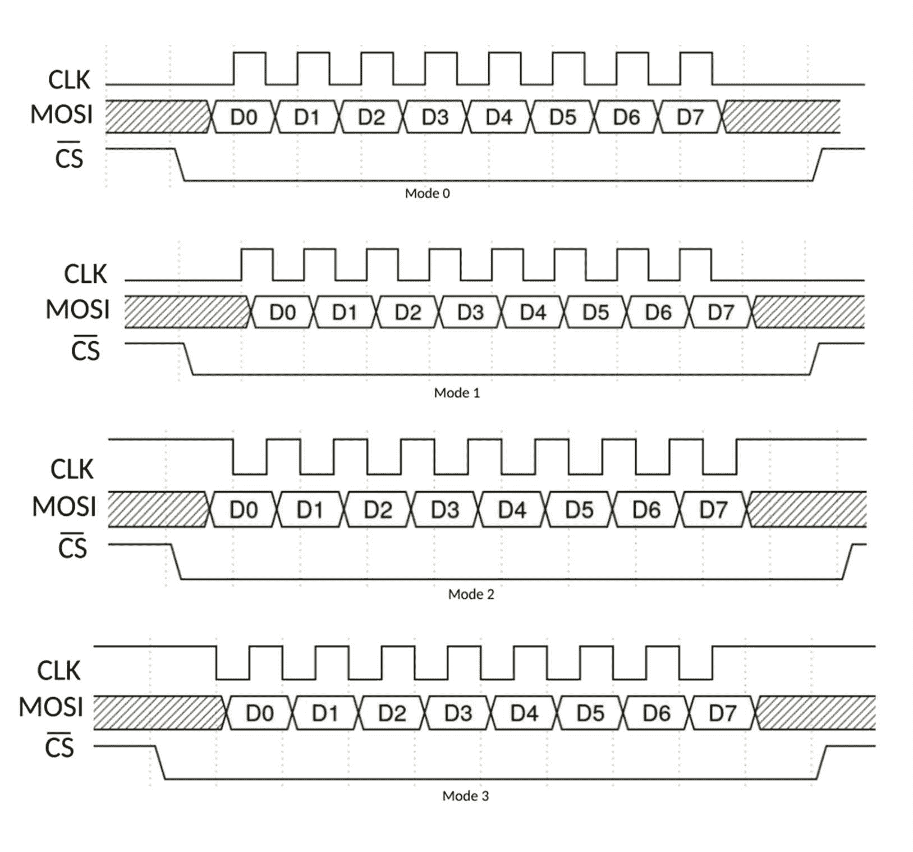
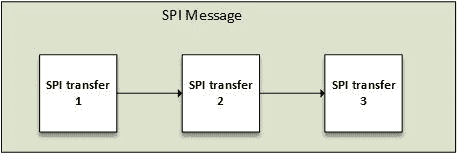

# 第八章：SPI 设备驱动程序

**串行外围接口**（**SPI**）是一个（至少）四线总线--**主输入从输出**（**MISO**），**主输出从输入**（**MOSI**），**串行时钟**（**SCK**）和**片选**（**CS**），用于连接串行闪存，AD/DA 转换器。主机始终生成时钟。其速度可以达到 80 MHz，即使没有真正的速度限制（比 I2C 快得多）。CS 线也是由主机管理的。

每个信号名称都有一个同义词：

+   每当您看到 SIMO，SDI，DI 或 SDA 时，它们指的是 MOSI。

+   SOMI，SDO，DO，SDA 将指的是 MISO。

+   SCK，CLK，SCL 将指的是 SCK。

+   S̅ S̅是从选择线，也称为 CS。可以使用 CSx（其中 x 是索引，CS0，CS1），也可以使用 EN 和 ENB，表示启用。CS 通常是一个低电平有效的信号：



SPI 拓扑结构（来自维基百科的图片）

本章将介绍 SPI 驱动程序的概念，例如：

+   SPI 总线描述

+   驱动程序架构和数据结构描述

+   半双工和全双工中的数据发送和接收

+   从 DT 声明 SPI 设备

+   从用户空间访问 SPI 设备，既可以进行半双工也可以进行全双工

# 驱动程序架构

在 Linux 内核中 SPI 的必需头文件是`<linux/spi/spi.h>`。在讨论驱动程序结构之前，让我们看看内核中如何定义 SPI 设备。在内核中，SPI 设备表示为`spi_device`的实例。管理它们的驱动程序实例是`struct spi_driver`结构。

# 设备结构

`struct spi_device`结构表示一个 SPI 设备，并在`include/linux/spi/spi.h`中定义：

```
struct spi_device { 
    struct devicedev; 
    struct spi_master*master; 
    u32 max_speed_hz; 
    u8 chip_select; 
    u8 bits_per_word; 
    u16 mode; 
    int irq; 
    [...] 
    int cs_gpio;        /* chip select gpio */ 
}; 
```

对我们来说没有意义的一些字段已被删除。也就是说，以下是结构中元素的含义：

+   `master`：这代表 SPI 控制器（总线），设备连接在其上。

+   `max_speed_hz`：这是与芯片一起使用的最大时钟速率（在当前板上）；此参数可以从驱动程序内部更改。您可以使用每次传输的`spi_transfer.speed_hz`覆盖该参数。我们将在后面讨论 SPI 传输。

+   `chip_select`：这允许您启用需要通信的芯片，区分由主控制的芯片。`chip_select`默认为低电平有效。此行为可以通过在模式中添加`SPI_CS_HIGH`标志来更改。

+   `mode`：这定义了数据应该如何进行时钟同步。设备驱动程序可以更改这个。默认情况下，每次传输中的每个字的数据同步是**最高有效位**（**MSB**）优先。可以通过指定`SPI_LSB_FIRST`来覆盖此行为。

+   `irq`：这代表中断号（在您的板`init`文件或通过 DT 中注册为设备资源），您应该传递给`request_irq()`以从此设备接收中断。

关于 SPI 模式的一点说明；它们是使用两个特征构建的：

+   `CPOL`：这是初始时钟极性：

+   `0`：初始时钟状态为低，并且第一个边沿为上升

+   `1`：初始时钟状态为高，并且第一个状态为下降

+   `CPHA`：这是时钟相位，选择在哪个边沿对数据进行采样：

+   `0`：数据在下降沿（高到低转换）锁存，而输出在上升沿改变

+   `1`：在上升沿（低到高转换）锁存的数据，并在下降沿输出

这允许根据`include/linux/spi/spi.h`中的以下宏在内核中定义四种 SPI 模式：

```
#define  SPI_CPHA  0x01 
#define  SPI_CPOL  0x02 
```

然后可以生成以下数组来总结事情：

| **模式** | **CPOL** | **CPHA** | **内核宏** |
| --- | --- | --- | --- |
| 0 | 0 | 0 | `#define SPI_MODE_0 (0&#124;0)` |
| 1 | 0 | 1 | `#define SPI_MODE_1 (0&#124;SPI_CPHA)` |
| 2 | 1 | 0 | `#define SPI_MODE_2 (SPI_CPOL&#124;0)` |
| 3 | 1 | 1 | `#define SPI_MODE_3 (SPI_CPOL&#124;SPI_CPHA)` |

以下是每种 SPI 模式的表示，如前述数组中定义的。也就是说，只有 MOSI 线被表示，但对于 MISO 原理是相同的。



常用模式是`SPI_MODE_0`和`SPI_MODE_3`。

# spi_driver 结构

`struct spi_driver`代表您开发的用于管理 SPI 设备的驱动程序。其结构如下：

```
struct spi_driver { 
   const struct spi_device_id *id_table; 
   int (*probe)(struct spi_device *spi); 
   int (*remove)(struct spi_device *spi); 
   void (*shutdown)(struct spi_device *spi); 
   struct device_driver    driver; 
}; 
```

# probe()功能

它的原型如下：

```
static int probe(struct spi_device *spi) 
```

您可以参考[第七章]（text00189.html），*I2C 客户端驱动程序*，以了解在“探测”功能中要做什么。相同的步骤也适用于这里。因此，与无法在运行时更改控制器总线参数（CS 状态，每字位，时钟）的 I2C 驱动程序不同，SPI 驱动程序可以。您可以根据设备属性设置总线。

典型的 SPI“探测”功能如下所示：

```
static int my_probe(struct spi_device *spi) 
{ 
    [...] /* declare your variable/structures */ 

    /* bits_per_word cannot be configured in platform data */ 
    spi->mode = SPI_MODE_0; /* SPI mode */ 
    spi->max_speed_hz = 20000000;   /* Max clock for the device */ 
    spi->bits_per_word = 16;    /* device bit per word */ 
    ret = spi_setup(spi); 
    ret = spi_setup(spi); 
    if (ret < 0) 
        return ret; 

    [...] /* Make some init */ 
    [...] /* Register with apropriate framework */ 

    return ret; 
} 
```

`struct spi_device*`是一个输入参数，由内核传递给“探测”功能。它代表您正在探测的设备。在您的“探测”功能中，您可以使用`spi_get_device_id`（在`id_table match`的情况下）获取触发匹配的`spi_device_id`并提取驱动程序数据：

```
const struct spi_device_id *id = spi_get_device_id(spi); 
my_private_data = array_chip_info[id->driver_data]; 
```

# 每个设备数据

在“探测”功能中，跟踪私有（每个设备）数据以在模块生命周期中使用是一项常见任务。这已在[第七章]（text00189.html），*I2C 客户端驱动程序*中讨论过。

以下是用于设置/获取每个设备数据的函数的原型：

```
/* set the data */ 
void spi_set_drvdata(struct *spi_device, void *data); 

/* Get the data back */ 
 void *spi_get_drvdata(const struct *spi_device); 
```

例如：

```
struct mc33880 { 
    struct mutex    lock; 
    u8      bar; 
    struct foo chip; 
    struct spi_device *spi; 
}; 

static int mc33880_probe(struct spi_device *spi) 
{ 
    struct mc33880 *mc; 
    [...] /* Device set up */ 

    mc = devm_kzalloc(&spi->dev, sizeof(struct mc33880), 
                      GFP_KERNEL); 
    if (!mc) 
        return -ENOMEM; 

    mutex_init(&mc->lock); 
    spi_set_drvdata(spi, mc); 

    mc->spi = spi; 
    mc->chip.label = DRIVER_NAME, 
    mc->chip.set = mc33880_set; 

    /* Register with appropriate framework */ 
    [...] 
} 
```

# remove()功能

`remove`功能必须释放在“探测”功能中抓取的每个资源。其结构如下：

```
static int  my_remove(struct spi_device *spi); 
```

典型的`remove`功能可能如下所示：

```
static int mc33880_remove(struct spi_device *spi) 
{ 
    struct mc33880 *mc; 
    mc = spi_get_drvdata(spi); /* Get our data back */ 
    if (!mc) 
        return -ENODEV; 

    /* 
     * unregister from frameworks with which we registered in the 
     * probe function 
     */ 
    [...] 
    mutex_destroy(&mc->lock); 
    return 0; 
} 
```

# 驱动程序初始化和注册

对于设备坐在总线上，无论是物理总线还是伪平台总线，大部分时间都是在“探测”功能中完成的。 `init`和`exit`功能只是用来在总线核心中注册/注销驱动程序：

```
static int __init foo_init(void) 
{ 
    [...] /*My init code */ 
   return spi_register_driver(&foo_driver); 
} 
module_init(foo_init); 

static void __exit foo_cleanup(void) 
{ 
    [...] /* My clean up code */ 
   spi_unregister_driver(&foo_driver); 
} 
module_exit(foo_cleanup); 
```

也就是说，如果您除了注册/注销驱动程序之外什么都不做，内核会提供一个宏：

```
module_spi_driver(foo_driver); 
```

这将在内部调用`spi_register_driver`和`spi_unregister_driver`。这与我们在上一章中看到的完全相同。

# 驱动程序和设备配置

由于我们需要对 I2C 设备使用`i2c_device_id`，所以我们必须对 SPI 设备使用`spi_device_id`，以便为我们的设备提供`device_id`数组进行匹配。它在`include/linux/mod_devicetable.h`中定义：

```
struct spi_device_id { 
   char name[SPI_NAME_SIZE]; 
   kernel_ulong_t driver_data; /* Data private to the driver */ 
}; 
```

我们需要将我们的数组嵌入到`struct spi_device_id`中，以便通知 SPI 核心我们需要在驱动程序中管理的设备 ID，并在驱动程序结构上调用`MODULE_DEVICE_TABLE`宏。当然，宏的第一个参数是设备所在的总线的名称。在我们的情况下，它是 SPI：

```
#define ID_FOR_FOO_DEVICE  0 
#define ID_FOR_BAR_DEVICE  1  

static struct spi_device_id foo_idtable[] = { 
   { "foo", ID_FOR_FOO_DEVICE }, 
   { "bar", ID_FOR_BAR_DEVICE }, 
   { } 
}; 
MODULE_DEVICE_TABLE(spi, foo_idtable); 

static struct spi_driver foo_driver = { 
   .driver = { 
   .name = "KBUILD_MODULE", 
   }, 

   .id_table    = foo_idtable, 
   .probe       = foo_probe, 
   .remove      = foo_remove, 
}; 

module_spi_driver(foo_driver); 
```

# 在板配置文件中实例化 SPI 设备-旧的和不推荐的方法

只有在系统不支持设备树时，设备才应该在板文件中实例化。由于设备树已经出现，这种实例化方法已被弃用。因此，让我们只记住板文件位于`arch/`目录中。用于表示 SPI 设备的结构是`struct spi_board_info`，而不是我们在驱动程序中使用的`struct spi_device`。只有在您填写并使用`spi_register_board_info`函数注册了`struct spi_board_info`后，内核才会构建一个`struct spi_device`（它将传递给您的驱动程序并在 SPI 核心中注册）。

请随意查看`include/linux/spi/spi.h`中的`struct spi_board_info`字段。`spi_register_board_info`的定义可以在`drivers/spi/spi.c`中找到。现在让我们来看看板文件中的一些 SPI 设备注册：

```
/** 
 * Our platform data 
 */ 
struct my_platform_data { 
   int foo; 
   bool bar; 
}; 
static struct my_platform_data mpfd = { 
   .foo = 15, 
   .bar = true, 
}; 

static struct spi_board_info 
   my_board_spi_board_info[] __initdata = { 
    { 
       /* the modalias must be same as spi device driver name */ 
        .modalias = "ad7887", /* Name of spi_driver for this device */ 
        .max_speed_hz = 1000000,  /* max spi clock (SCK) speed in HZ */ 
        .bus_num = 0, /* Framework bus number */ 
        .irq = GPIO_IRQ(40), 
        .chip_select = 3, /* Framework chip select */ 
        .platform_data = &mpfd, 
        .mode = SPI_MODE_3, 
   },{ 
        .modalias = "spidev", 
        .chip_select = 0, 
        .max_speed_hz = 1 * 1000 * 1000, 
        .bus_num = 1, 
        .mode = SPI_MODE_3, 
    }, 
}; 

static int __init board_init(void) 
{ 
   [...] 
   spi_register_board_info(my_board_spi_board_info, ARRAY_SIZE(my_board_spi_board_info)); 
   [...] 

   return 0; 
} 
[...] 
```

# SPI 和设备树

与 I2C 设备一样，SPI 设备属于设备树中的非内存映射设备系列，但也是可寻址的。这里，地址表示控制器（主控）给定的 CS（从 0 开始）列表中的 CS 索引。例如，我们可能在 SPI 总线上有三个不同的 SPI 设备，每个设备都有自己的 CS 线。主控将获得一组 GPIO，每个 GPIO 代表一个 CS 以激活设备。如果设备 X 使用第二个 GPIO 线作为 CS，我们必须将其地址设置为 1（因为我们总是从 0 开始）在`reg`属性中。

以下是 SPI 设备的真实 DT 列表：

```
ecspi1 { 
    fsl,spi-num-chipselects = <3>; 
    cs-gpios = <&gpio5 17 0>, <&gpio5 17 0>, <&gpio5 17 0>; 
    pinctrl-0 = <&pinctrl_ecspi1 &pinctrl_ecspi1_cs>; 
    #address-cells = <1>; 
    #size-cells = <0>; 
    compatible = "fsl,imx6q-ecspi", "fsl,imx51-ecspi"; 
    reg = <0x02008000 0x4000>; 
    status = "okay"; 

    ad7606r8_0: ad7606r8@0 { 
        compatible = "ad7606-8"; 
        reg = <0>; 
        spi-max-frequency = <1000000>; 
        interrupt-parent = <&gpio4>; 
        interrupts = <30 0x0>; 
   }; 
   label: fake_spi_device@1 { 
        compatible = "packtpub,foobar-device"; 
        reg = <1>; 
        a-string-param = "stringvalue"; 
        spi-cs-high; 
   }; 
   mcp2515can: can@2 { 
        compatible = "microchip,mcp2515"; 
        reg = <2>; 
        spi-max-frequency = <1000000>; 
        clocks = <&clk8m>; 
        interrupt-parent = <&gpio4>; 
        interrupts = <29 IRQ_TYPE_LEVEL_LOW>; 
    }; 
}; 
```

SPI 设备节点中引入了一个新属性：`spi-max-frequency`。它表示设备的最大 SPI 时钟速度（以赫兹为单位）。每当访问设备时，总线控制器驱动程序将确保时钟不会超过此限制。其他常用的属性包括：

+   `spi-cpol`：这是一个布尔值（空属性），表示设备需要反向时钟极性模式。它对应于 CPOL。

+   `spi-cpha`：这是一个空属性，表示设备需要移位时钟相位模式。它对应于 CPHA。

+   `spi-cs-high`：默认情况下，SPI 设备需要 CS 低才能激活。这是一个布尔属性，表示设备需要 CS 高活动。

也就是说，要获取完整的 SPI 绑定元素列表，您可以参考内核源代码中的*Documentation/devicetree/bindings/spi/spi-bus.txt*。

# 在设备树中实例化 SPI 设备-新的方法

通过正确填写设备节点，内核将为我们构建一个`struct spi_device`，并将其作为参数传递给我们的 SPI 核心函数。以下只是先前定义的 SPI DT 列表的摘录：

```
&ecspi1 { 
    status = "okay"; 
    label: fake_spi_device@1 { 
    compatible = "packtpub,foobar-device"; 
    reg = <1>; 
    a-string-param = "stringvalue"; 
    spi-cs-high; 
   }; 
 }; 
```

# 定义和注册 SPI 驱动程序

同样的原则适用于 I2C 驱动程序。我们需要定义一个`struct of_device_id`来匹配设备，然后调用`MODULE_DEVICE_TABLE`宏来注册到 OF 核心：

```
static const struct of_device_id foobar_of_match[] = { 
           { .compatible = "packtpub,foobar-device" }, 
           { .compatible = "packtpub,barfoo-device" }, 
        {} 
}; 
MODULE_DEVICE_TABLE(of, foobar_of_match); 
```

然后定义我们的`spi_driver`如下：

```
static struct spi_driver foo_driver = { 
    .driver = { 
    .name   = "foo", 
        /* The following line adds Device tree */ 
    .of_match_table = of_match_ptr(foobar_of_match), 
    }, 
    .probe   = my_spi_probe, 
    .id_table = foo_id, 
}; 
```

然后可以通过以下方式改进`probe`函数：

```
static int my_spi_probe(struct spi_device *spi) 
{ 
    const struct of_device_id *match; 
    match = of_match_device(of_match_ptr(foobar_of_match), &spi->dev); 
    if (match) { 
        /* Device tree code goes here */ 
    } else { 
        /*  
         * Platform data code comes here. 
         * One can use 
         *   pdata = dev_get_platdata(&spi->dev); 
         * 
         * or *id*, which is a pointer on the *spi_device_id* entry that originated 
         * the match, in order to use *id->driver_data* to extract the device 
         * specific data, as described in Chapter 5, Platform Device Drivers. 
         */ 
    } 
    [...] 
} 
```

# 访问和与客户端交流

SPI I/O 模型由一组排队的消息组成。我们提交一个或多个`struct spi_message`结构，这些结构被同步或异步地处理和完成。单个消息由一个或多个`struct spi_transfer`对象组成，每个对象代表一个全双工 SPI 传输。这两个主要结构用于在驱动程序和设备之间交换数据。它们都在`include/linux/spi/spi.h`中定义：



SPI 消息结构

`struct spi_transfer`代表一个全双工 SPI 传输：

```
struct spi_transfer { 
    const void  *tx_buf; 
    void *rx_buf; 
    unsigned len; 

    dma_addr_t tx_dma; 
    dma_addr_t rx_dma; 

    unsigned cs_change:1; 
    unsigned tx_nbits:3; 
    unsigned rx_nbits:3; 
#define  SPI_NBITS_SINGLE   0x01 /* 1bit transfer */ 
#define  SPI_NBITS_DUAL            0x02 /* 2bits transfer */ 
#define  SPI_NBITS_QUAD            0x04 /* 4bits transfer */ 
    u8 bits_per_word; 
    u16 delay_usecs; 
    u32 speed_hz; 
}; 
```

以下是结构元素的含义：

+   `tx_buf`：这个缓冲区包含要写入的数据。在只读事务的情况下，它应为 NULL 或保持不变。在需要通过**直接内存访问**（**DMA**）执行 SPI 事务的情况下，它应该是`dma`-安全的。

+   `rx_buf`：这是用于读取数据的缓冲区（具有与`tx_buf`相同的属性），或在只写事务中为 NULL。

+   `tx_dma`：这是`tx_buf`的 DMA 地址，如果`spi_message.is_dma_mapped`设置为`1`。DMA 在[第十二章](http://post)中讨论，*DMA-直接内存访问*。

+   `rx_dma`：这与`tx_dma`相同，但用于`rx_buf`。

+   `len`：这表示`rx`和`tx`缓冲区的字节大小，这意味着如果两者都被使用，它们必须具有相同的大小。

+   `speed_hz`：这会覆盖默认速度，指定为`spi_device.max_speed_hz`，但仅适用于当前传输。如果为`0`，则使用默认值（在`struct spi_device`结构中提供）。

+   `bits_per_word`：数据传输涉及一个或多个字。一个字是数据的单位，其大小以位为单位根据需要变化。在这里，`bits_per_word`表示此 SPI 传输的字位大小。这将覆盖`spi_device.bits_per_word`中提供的默认值。如果为`0`，则使用默认值（来自`spi_device`）。

+   `cs_change`：这确定此传输完成后`chip_select`线的状态。

+   `delay_usecs`：这表示在此传输之后的延迟（以微秒为单位），然后（可选）更改`chip_select`状态，然后开始下一个传输或完成此`spi_message`。

在另一侧，`struct spi_message`被用来原子地包装一个或多个 SPI 传输。驱动程序将独占使用 SPI 总线，直到完成构成消息的每个传输。SPI 消息结构也在`include/linux/spi/spi.h`中定义：

```
    struct spi_message { 
       struct list_head transfers; 
       struct spi_device *spi; 
       unsigned is_dma_mapped:1; 
       /* completion is reported through a callback */ 
       void (*complete)(void *context); 
       void *context; 
       unsigned frame_length; 
       unsigned actual_length; 
       int status; 
    }; 
```

+   `transfers`：这是构成消息的传输列表。稍后我们将看到如何将传输添加到此列表中。

+   `is_dma_mapped`：这告诉控制器是否使用 DMA（或不使用）执行事务。然后，您的代码负责为每个传输缓冲区提供 DMA 和 CPU 虚拟地址。

+   `complete`：这是在事务完成时调用的回调，`context`是要传递给回调的参数。

+   `frame_length`：这将自动设置为消息中的总字节数。

+   `actual_length`：这是所有成功段中传输的字节数。

+   `status`：这报告传输状态。成功为零，否则为`-errno`。

消息中的`spi_transfer`元素按 FIFO 顺序处理。在消息完成之前，您必须确保不使用传输缓冲区，以避免数据损坏。您进行完成调用以确保可以。

在消息可以提交到总线之前，必须使用`void spi_message_init(struct spi_message *message)`对其进行初始化，这将将结构中的每个元素都设置为零，并初始化`transfers`列表。对于要添加到消息中的每个传输，应该在该传输上调用`void spi_message_add_tail(struct spi_transfer *t, struct spi_message *m)`，这将导致将传输排队到`transfers`列表中。完成后，您有两种选择来启动事务：

+   同步地，使用`int spi_sync(struct spi_device *spi, struct spi_message *message)`函数，这可能会休眠，不应在中断上下文中使用。这里不需要回调的完成。这个函数是第二个函数（`spi_async()`）的包装器。

+   异步地，使用`spi_async()`函数，也可以在原子上下文中使用，其原型为`int spi_async(struct spi_device *spi, struct spi_message *message)`。在这里提供回调是一个好习惯，因为它将在消息完成时执行。

以下是单个传输 SPI 消息事务可能看起来像的内容：

```
char tx_buf[] = { 
        0xFF, 0xFF, 0xFF, 0xFF, 0xFF, 
        0xFF, 0x40, 0x00, 0x00, 0x00, 
        0x00, 0x95, 0xEF, 0xBA, 0xAD, 
        0xF0, 0x0D, 
}; 

char rx_buf[10] = {0,}; 
int ret; 
struct spi_message single_msg; 
struct spi_transfer single_xfer; 

single_xfer.tx_buf = tx_buf; 
single_xfer.rx_buf = rx_buf; 
single_xfer.len    = sizeof(tx_buff); 
single_xfer.bits_per_word = 8; 

spi_message_init(&msg); 
spi_message_add_tail(&xfer, &msg); 
ret = spi_sync(spi, &msg); 
```

现在让我们写一个多传输消息事务：

```
struct { 
    char buffer[10]; 
    char cmd[2] 
    int foo; 
} data; 

struct data my_data[3]; 
initialize_date(my_data, ARRAY_SIZE(my_data)); 

struct spi_transfer   multi_xfer[3]; 
struct spi_message    single_msg; 
int ret; 

multi_xfer[0].rx_buf = data[0].buffer; 
multi_xfer[0].len = 5; 
multi_xfer[0].cs_change = 1; 
/* command A */ 
multi_xfer[1].tx_buf = data[1].cmd; 
multi_xfer[1].len = 2; 
multi_xfer[1].cs_change = 1; 
/* command B */ 
multi_xfer[2].rx_buf = data[2].buffer; 
multi_xfer[2].len = 10; 

spi_message_init(single_msg); 
spi_message_add_tail(&multi_xfer[0], &single_msg); 
spi_message_add_tail(&multi_xfer[1], &single_msg); 
spi_message_add_tail(&multi_xfer[2], &single_msg); 
ret = spi_sync(spi, &single_msg); 
```

还有其他辅助函数，都围绕着`spi_sync()`构建。其中一些是：

```
int spi_read(struct spi_device *spi, void *buf, size_t len) 
int spi_write(struct spi_device *spi, const void *buf, size_t len) 
int spi_write_then_read(struct spi_device *spi, 
        const void *txbuf, unsigned n_tx, 
void *rxbuf, unsigned n_rx) 
```

请查看`include/linux/spi/spi.h`以查看完整列表。这些包装器应该与少量数据一起使用。

# 把所有东西放在一起

编写 SPI 客户端驱动程序所需的步骤如下：

1.  声明驱动程序支持的设备 ID。您可以使用`spi_device_id`来做到这一点。如果支持 DT，也使用`of_device_id`。您可以完全使用 DT。

1.  调用`MODULE_DEVICE_TABLE(spi, my_id_table);`将设备列表注册到 SPI 核心。如果支持 DT，必须调用`MODULE_DEVICE_TABLE(of, your_of_match_table);`将设备列表注册到`of`核心。

1.  根据各自的原型编写`probe`和`remove`函数。`probe`函数必须识别您的设备，配置它，定义每个设备（私有）数据，如果需要配置总线（SPI 模式等），则使用`spi_setup`函数，并向适当的内核框架注册。在`remove`函数中，只需撤消`probe`函数中完成的所有操作。

1.  声明并填充`struct spi_driver`结构，使用您创建的 ID 数组设置`id_table`字段。使用您编写的相应函数的名称设置`.probe`和`.remove`字段。在`.driver`子结构中，将`.owner`字段设置为`THIS_MODULE`，设置驱动程序名称，最后使用`of_device_id`数组设置`.of_match_table`字段，如果支持 DT。

1.  在`module_spi_driver(serial_eeprom_spi_driver);`之前，使用您刚刚填充的`spi_driver`结构调用`module_spi_driver`函数，以便向内核注册您的驱动程序。

# SPI 用户模式驱动程序

有两种使用用户模式 SPI 设备驱动程序的方法。为了能够这样做，您需要使用`spidev`驱动程序启用您的设备。一个示例如下：

```
spidev@0x00 { 
    compatible = "spidev"; 
    spi-max-frequency = <800000>; /* It depends on your device */ 
    reg = <0>; /* correspond tochipselect 0 */ 
}; 
```

您可以调用读/写函数或`ioctl()`。通过调用读/写，您一次只能读取或写入。如果需要全双工读写，您必须使用**输入输出控制**（**ioctl**）命令。提供了两种的示例。这是读/写的示例。您可以使用平台的交叉编译器或板上的本地编译器进行编译：

```
#include <stdio.h> 
#include <fcntl.h> 
#include <stdlib.h> 

int main(int argc, char **argv)  
{ 
   int i,fd; 
   char wr_buf[]={0xff,0x00,0x1f,0x0f}; 
   char rd_buf[10];  

   if (argc<2) { 
         printf("Usage:\n%s [device]\n", argv[0]); 
         exit(1); 
   } 

   fd = open(argv[1], O_RDWR); 
   if (fd<=0) {  
         printf("Failed to open SPI device %s\n",argv[1]); 
         exit(1); 
   } 

   if (write(fd, wr_buf, sizeof(wr_buf)) != sizeof(wr_buf)) 
         perror("Write Error"); 
   if (read(fd, rd_buf, sizeof(rd_buf)) != sizeof(rd_buf)) 
         perror("Read Error"); 
   else 
         for (i = 0; i < sizeof(rd_buf); i++) 
             printf("0x%02X ", rd_buf[i]); 

   close(fd); 
   return 0; 
} 
```

# 使用 IOCTL

使用 IOCTL 的优势在于您可以进行全双工工作。您可以在内核源树中的`documentation/spi/spidev_test.c`中找到最好的示例。

也就是说，前面使用读/写的示例并没有改变任何 SPI 配置。然而，内核向用户空间公开了一组 IOCTL 命令，您可以使用这些命令来根据需要设置总线，就像在 DT 中所做的那样。以下示例显示了如何更改总线设置：

```
 #include <stdint.h> 
 #include <unistd.h> 
 #include <stdio.h> 
 #include <stdlib.h> 
 #include <string.h> 
 #include <fcntl.h> 
 #include <sys/ioctl.h> 
 #include <linux/types.h> 
 #include <linux/spi/spidev.h> 
static int pabort(const char *s) 
{ 
    perror(s); 
    return -1; 
} 

static int spi_device_setup(int fd) 
{ 
    int mode, speed, a, b, i; 
    int bits = 8; 

    /* 
     * spi mode: mode 0 
     */ 
    mode = SPI_MODE_0; 
    a = ioctl(fd, SPI_IOC_WR_MODE, &mode); /* write mode */ 
    b = ioctl(fd, SPI_IOC_RD_MODE, &mode); /* read mode */ 
    if ((a < 0) || (b < 0)) { 
        return pabort("can't set spi mode"); 
    } 

    /* 
     * Clock max speed in Hz 
     */ 
    speed = 8000000; /* 8 MHz */ 
    a = ioctl(fd, SPI_IOC_WR_MAX_SPEED_HZ, &speed); /* Write speed */ 
    b = ioctl(fd, SPI_IOC_RD_MAX_SPEED_HZ, &speed); /* Read speed */ 
    if ((a < 0) || (b < 0)) { 
        return pabort("fail to set max speed hz"); 
    } 

    /* 
     * setting SPI to MSB first.  
     * Here, 0 means "not to use LSB first". 
     * In order to use LSB first, argument should be > 0 
     */ 
    i = 0; 
    a = ioctl(dev, SPI_IOC_WR_LSB_FIRST, &i); 
    b = ioctl(dev, SPI_IOC_RD_LSB_FIRST, &i); 
    if ((a < 0) || (b < 0)) { 
        pabort("Fail to set MSB first\n"); 
    } 

    /* 
     * setting SPI to 8 bits per word 
     */ 
    bits = 8; 
    a = ioctl(dev, SPI_IOC_WR_BITS_PER_WORD, &bits); 
    b = ioctl(dev, SPI_IOC_RD_BITS_PER_WORD, &bits); 
    if ((a < 0) || (b < 0)) { 
        pabort("Fail to set bits per word\n"); 
    } 

    return 0; 
} 
```

您可以查看*Documentation/spi/spidev*以获取有关 spidev ioctl 命令的更多信息。在发送数据到总线时，您可以使用`SPI_IOC_MESSAGE(N)`请求，它提供了全双工访问和复合操作，而无需取消芯片选择，从而提供了多传输支持。这相当于内核的`spi_sync()`。这里，一个传输被表示为`struct spi_ioc_transfer`的实例，它相当于内核的`struct spi_transfer`，其定义可以在`include/uapi/linux/spi/spidev.h`中找到。以下是一个使用示例：

```
static void do_transfer(int fd) 
{ 
    int ret; 
    char txbuf[] = {0x0B, 0x02, 0xB5}; 
    char rxbuf[3] = {0, }; 
    char cmd_buff = 0x9f; 

    struct spi_ioc_transfer tr[2] = { 
        0 = { 
            .tx_buf = (unsigned long)&cmd_buff, 
            .len = 1, 
            .cs_change = 1; /* We need CS to change */ 
            .delay_usecs = 50, /* wait after this transfer */ 
            .bits_per_word = 8, 
        }, 
        [1] = { 
            .tx_buf = (unsigned long)tx, 
            .rx_buf = (unsigned long)rx, 
            .len = txbuf(tx), 
            .bits_per_word = 8, 
        }, 
    }; 

    ret = ioctl(fd, SPI_IOC_MESSAGE(2), &tr); 
    if (ret == 1){ 
        perror("can't send spi message"); 
        exit(1); 
    } 

    for (ret = 0; ret < sizeof(tx); ret++) 
        printf("%.2X ", rx[ret]); 
    printf("\n"); 
} 

int main(int argc, char **argv) 
{ 
    char *device = "/dev/spidev0.0"; 
    int fd; 
    int error; 

    fd = open(device, O_RDWR); 
    if (fd < 0) 
        return pabort("Can't open device "); 

    error = spi_device_setup(fd); 
    if (error) 
        exit (1); 

    do_transfer(fd); 

    close(fd); 
    return 0; 
} 
```

# 总结

我们刚刚处理了 SPI 驱动程序，现在可以利用这个更快的串行（和全双工）总线。我们讨论了 SPI 上的数据传输，这是最重要的部分。也就是说，您可能需要更多的抽象，以便不必理会 SPI 或 I2C 的 API。这就是下一章的内容，介绍了 Regmap API，它提供了更高和统一的抽象级别，使得 SPI（或 I2C）命令对您来说变得透明。
