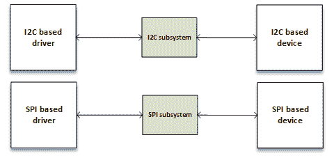
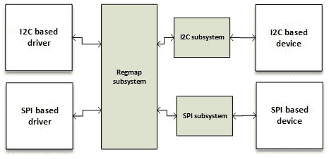

# 第九章：Regmap API - 寄存器映射抽象

在开发 regmap API 之前，处理 SPI 核心、I2C 核心或两者的设备驱动程序存在冗余代码。原则是相同的；访问寄存器进行读/写操作。以下图显示了在 Regmap 引入内核之前，SPI 或 I2C API 是如何独立存在的：



regmap 之前的 SPI 和 I2C 子系统

regmap API 是在内核的 3.1 版本中引入的，以因式分解和统一内核开发人员访问 SPI/I2C 设备的方式。然后只是如何初始化、配置 regmap，并流畅地处理任何读/写/修改操作，无论是 SPI 还是 I2C：



regmap 之后的 SPI 和 I2C 子系统

本章将通过以下方式介绍 regmap 框架：

+   介绍了 regmap 框架中使用的主要数据结构

+   通过 regmap 配置进行漫游

+   使用 regmap API 访问设备

+   介绍 regmap 缓存系统

+   提供一个总结先前学习的概念的完整驱动程序

# 使用 regmap API 进行编程

regmap API 非常简单。只有少数结构需要了解。此 API 的两个最重要的结构是`struct regmap_config`，它表示 regmap 的配置，以及`struct regmap`，它是 regmap 实例本身。所有 regmap 数据结构都在`include/linux/regmap.h`中定义。

# regmap_config 结构

`struct regmap_config`在驱动程序的生命周期内存储 regmap 的配置。您在这里设置的内容会影响读/写操作。这是 regmap API 中最重要的结构。源代码如下：

```
struct regmap_config { 
    const char *name; 

    int reg_bits; 
    int reg_stride; 
    int pad_bits; 
    int val_bits; 

    bool (*writeable_reg)(struct device *dev, unsigned int reg); 
    bool (*readable_reg)(struct device *dev, unsigned int reg); 
    bool (*volatile_reg)(struct device *dev, unsigned int reg); 
    bool (*precious_reg)(struct device *dev, unsigned int reg); 
    regmap_lock lock; 
    regmap_unlock unlock; 
    void *lock_arg; 

    int (*reg_read)(void *context, unsigned int reg, 
                    unsigned int *val); 
    int (*reg_write)(void *context, unsigned int reg, 
                    unsigned int val); 

    bool fast_io; 

    unsigned int max_register; 
    const struct regmap_access_table *wr_table; 
    const struct regmap_access_table *rd_table; 
    const struct regmap_access_table *volatile_table; 
    const struct regmap_access_table *precious_table; 
    const struct reg_default *reg_defaults; 
    unsigned int num_reg_defaults; 
    enum regcache_type cache_type; 
    const void *reg_defaults_raw; 
    unsigned int num_reg_defaults_raw; 

    u8 read_flag_mask; 
    u8 write_flag_mask; 

    bool use_single_rw; 
    bool can_multi_write; 

    enum regmap_endian reg_format_endian; 
    enum regmap_endian val_format_endian; 
    const struct regmap_range_cfg *ranges; 
    unsigned int num_ranges; 
} 
```

+   `reg_bits`：这是寄存器地址中的位数，是强制性字段。

+   `val_bits`：表示用于存储寄存器值的位数。这是一个强制性字段。

+   `writeable_reg`：这是一个可选的回调函数。如果提供，当需要写入寄存器时，regmap 子系统将使用它。在写入寄存器之前，将自动调用此函数以检查寄存器是否可以写入：

```
static bool foo_writeable_register(struct device *dev, 
                                    unsigned int reg) 
{ 
    switch (reg) { 
    case 0x30 ... 0x38: 
    case 0x40 ... 0x45: 
    case 0x50 ... 0x57: 
    case 0x60 ... 0x6e: 
    case 0x70 ... 0x75: 
    case 0x80 ... 0x85: 
    case 0x90 ... 0x95: 
    case 0xa0 ... 0xa5: 
    case 0xb0 ... 0xb2: 
        return true; 
    default: 
        return false; 
    } 
} 
```

+   `readable_reg`：与`writeable_reg`相同，但用于每个寄存器读取操作。

+   `volatile_reg`：这是一个回调函数，每当需要通过 regmap 缓存读取或写入寄存器时都会调用。如果寄存器是易失性的，则函数应返回 true。然后对寄存器执行直接读/写。如果返回 false，则表示寄存器是可缓存的。在这种情况下，将使用缓存进行读取操作，并在写入操作的情况下写入缓存：

```
static bool foo_volatile_register(struct device *dev, 
                                    unsigned int reg) 
{ 
    switch (reg) { 
    case 0x24 ... 0x29: 
    case 0xb6 ... 0xb8: 
        return true; 
    default: 
        return false; 
    } 
} 
```

+   `wr_table`：可以提供`writeable_reg`回调，也可以提供`regmap_access_table`，它是一个包含`yes_range`和`no_range`字段的结构，都指向`struct regmap_range`。属于`yes_range`条目的任何寄存器都被视为可写，并且如果属于`no_range`，则被视为不可写。

+   `rd_table`：与`wr_table`相同，但用于任何读取操作。

+   `volatile_table`：可以提供`volatile_reg`，也可以提供`volatile_table`。原则与`wr_table`或`rd_table`相同，但用于缓存机制。

+   `max_register`：这是可选的，它指定了最大有效寄存器地址，超过该地址将不允许任何操作。

+   `reg_read`：您的设备可能不支持简单的 I2C/SPI 读取操作。那么您别无选择，只能编写自己定制的读取函数。`reg_read`应指向该函数。也就是说，大多数设备不需要。

+   `reg_write`：与`reg_read`相同，但用于写操作。

我强烈建议您查看`include/linux/regmap.h`以获取有关每个元素的更多详细信息。

以下是`regmap_config`的一种初始化方式：

```
static const struct regmap_config regmap_config = { 
    .reg_bits     = 8, 
    .val_bits     = 8, 
    .max_register = LM3533_REG_MAX, 
    .readable_reg = lm3533_readable_register, 
    .volatile_reg = lm3533_volatile_register, 
    .precious_reg = lm3533_precious_register, 
}; 
```

# regmap 初始化

正如我们之前所说，regmap API 支持 SPI 和 I2C 协议。根据驱动程序中需要支持的协议，您将需要在`probe`函数中调用`regmap_init_i2c()`或`regmap_init_sp()`。要编写通用驱动程序，regmap 是最佳选择。

regmap API 是通用和同质的。只有初始化在总线类型之间变化。其他函数都是一样的。

在`probe`函数中始终初始化 regmap 是一个良好的实践，必须在初始化 regmap 之前始终填充`regmap_config`元素。

无论是分配了 I2C 还是 SPI 寄存器映射，都可以使用`regmap_exit`函数释放它：

```
void regmap_exit(struct regmap *map) 
```

此函数只是释放先前分配的寄存器映射。

# SPI 初始化

Regmap SPI 初始化包括设置 regmap，以便任何设备访问都会在内部转换为 SPI 命令。执行此操作的函数是`regmap_init_spi()`。

```
struct regmap * regmap_init_spi(struct spi_device *spi, 
const struct regmap_config); 
```

它以一个有效的`struct spi_device`结构的指针作为参数，这是将要交互的 SPI 设备，以及代表 regmap 配置的`struct regmap_config`。此函数在成功时返回分配的 struct regmap 的指针，或者在错误时返回`ERR_PTR()`的值。

一个完整的例子如下：

```
static int foo_spi_probe(struct spi_device *client) 
{ 
    int err; 
    struct regmap *my_regmap; 
    struct regmap_config bmp085_regmap_config; 

        /* fill bmp085_regmap_config somewhere */ 
        [...] 
    client->bits_per_word = 8; 

    my_regmap = 
           regmap_init_spi(client,&bmp085_regmap_config); 

    if (IS_ERR(my_regmap)) { 
        err = PTR_ERR(my_regmap); 
        dev_err(&client->dev, "Failed to init regmap: %d\n", err); 
        return err; 
    } 
    [...] 
} 
```

# I2C 初始化

另一方面，I2C regmap 初始化包括在 regmap 配置上调用`regmap_init_i2c()`，这将配置 regmap，以便任何设备访问都在内部转换为 I2C 命令：

```
struct regmap * regmap_init_i2c(struct i2c_client *i2c, 
const struct regmap_config); 
```

该函数以`struct i2c_client`结构作为参数，这是将用于交互的 I2C 设备，以及代表 regmap 配置的指针`struct regmap_config`。此函数在成功时返回分配的`struct regmap`的指针，或者在错误时返回`ERR_PTR()`的值。

一个完整的例子是：

```
static int bar_i2c_probe(struct i2c_client *i2c, 
const struct i2c_device_id *id) 
{ 
    struct my_struct * bar_struct; 
    struct regmap_config regmap_cfg; 

        /* fill regmap_cfgsome  where */ 
        [...] 
    bar_struct = kzalloc(&i2c->dev, 
sizeof(*my_struct), GFP_KERNEL); 
    if (!bar_struct) 
        return -ENOMEM; 

    i2c_set_clientdata(i2c, bar_struct); 

    bar_struct->regmap = regmap_init_i2c(i2c, 
&regmap_config); 
    if (IS_ERR(bar_struct->regmap)) 
        return PTR_ERR(bar_struct->regmap); 

    bar_struct->dev = &i2c->dev; 
    bar_struct->irq = i2c->irq; 
    [...] 
} 
```

# 设备访问函数

该 API 处理数据解析、格式化和传输。在大多数情况下，使用`regmap_read`、`regmap_write`和`regmap_update_bits`执行设备访问。这些是在存储/从设备中获取数据时应该始终记住的三个最重要的函数。它们的原型分别是：

```
int regmap_read(struct regmap *map, unsigned int reg, 
                 unsigned int *val); 
int regmap_write(struct regmap *map, unsigned int reg, 
                 unsigned int val); 
int regmap_update_bits(struct regmap *map, unsigned int reg, 
                 unsigned int mask, unsigned int val); 
```

+   `regmap_write`：向设备写入数据。如果在`regmap_config`中设置了`max_register`，则将用它来检查您需要从中读取的寄存器地址是大于还是小于。如果传递的寄存器地址小于或等于`max_register`，则将执行写入操作；否则，regmap 核心将返回无效的 I/O 错误（`-EIO`）。紧接着，将调用`writeable_reg`回调。回调必须在进行下一步之前返回`true`。如果返回`false`，则返回`-EIO`并停止写操作。如果设置了`wr_table`而不是`writeable_reg`，则：

+   如果寄存器地址位于`no_range`中，则返回`-EIO`。

+   如果寄存器地址位于`yes_range`中，则执行下一步。

+   如果寄存器地址既不在`yes_range`也不在`no_range`中，则返回`-EIO`并终止操作。

+   如果`cache_type != REGCACHE_NONE`，则启用缓存。在这种情况下，首先更新缓存条目，然后执行硬件写入；否则，执行无缓存操作。

+   如果提供了`reg_write`回调，则将使用它执行写操作；否则，将执行通用的 regmap 写函数。

+   `regmap_read`：从设备中读取数据。它与`regmap_write`的工作方式完全相同，具有适当的数据结构（`readable_reg`和`rd_table`）。因此，如果提供了`reg_read`，则将使用它执行读取操作；否则，将执行通用的 remap 读取函数。

# regmap_update_bits 函数

`regmap_update_bits`是一个三合一的函数。其原型如下：

```
int regmap_update_bits(struct regmap *map, unsigned int reg, 
         unsigned int mask, unsigned int val) 
```

它在寄存器映射上执行读取/修改/写入循环。它是`_regmap_update_bits`的包装器，其形式如下：

```
static int _regmap_update_bits(struct regmap *map, 
                    unsigned int reg, unsigned int mask,  
                    unsigned int val, bool *change) 
{ 
    int ret; 
    unsigned int tmp, orig; 

    ret = _regmap_read(map, reg, &orig); 
    if (ret != 0) 
        return ret; 

    tmp = orig& ~mask; 
    tmp |= val & mask; 

    if (tmp != orig) { 
        ret = _regmap_write(map, reg, tmp); 
        *change = true; 
    } else { 
        *change = false; 
    } 

    return ret; 
} 
```

这样，您需要更新的位必须在`mask`中设置为`1`，并且相应的位应在`val`中设置为您需要给予它们的值。

例如，要将第一位和第三位设置为`1`，掩码应为`0b00000101`，值应为`0bxxxxx1x1`。要清除第七位，掩码必须为`0b01000000`，值应为`0bx0xxxxxx`，依此类推。

# 特殊的 regmap_multi_reg_write 函数

`remap_multi_reg_write()`函数的目的是向设备写入多个寄存器。其原型如下所示：

```
int regmap_multi_reg_write(struct regmap *map, 
                    const struct reg_sequence *regs, int num_regs) 
```

要了解如何使用该函数，您需要知道`struct reg_sequence`是什么：

```
/** 
 * Register/value pairs for sequences of writes with an optional delay in 
 * microseconds to be applied after each write. 
 * 
 * @reg: Register address. 
 * @def: Register value. 
 * @delay_us: Delay to be applied after the register write in microseconds 
 */ 
struct reg_sequence { 
    unsigned int reg; 
    unsigned int def; 
    unsigned int delay_us; 
}; 
```

这就是它的使用方式：

```
static const struct reg_sequence foo_default_regs[] = { 
    { FOO_REG1,          0xB8 }, 
    { BAR_REG1,          0x00 }, 
    { FOO_BAR_REG1,      0x10 }, 
    { REG_INIT,          0x00 }, 
    { REG_POWER,         0x00 }, 
    { REG_BLABLA,        0x00 }, 
}; 

staticint probe ( ...) 
{ 
    [...] 
    ret = regmap_multi_reg_write(my_regmap, foo_default_regs, 
                                   ARRAY_SIZE(foo_default_regs)); 
    [...] 
} 
```

# 其他设备访问函数

`regmap_bulk_read()`和`regmap_bulk_write()`用于从/向设备读取/写入多个寄存器。将它们与大块数据一起使用。

```
int regmap_bulk_read(struct regmap *map, unsigned int reg, void 
                     *val, size_tval_count); 
int regmap_bulk_write(struct regmap *map, unsigned int reg, 
                     const void *val, size_t val_count); 
```

随时查看内核源中的 regmap 头文件，了解您有哪些选择。

# regmap 和缓存

显然，regmap 支持缓存。是否使用缓存系统取决于`regmap_config`中的`cache_type`字段的值。查看`include/linux/regmap.h`，接受的值为：

```
/* Anenum of all the supported cache types */ 
enum regcache_type { 
   REGCACHE_NONE, 
   REGCACHE_RBTREE, 
   REGCACHE_COMPRESSED, 
   REGCACHE_FLAT, 
}; 
```

默认情况下，它设置为`REGCACHE_NONE`，表示缓存已禁用。其他值只是定义缓存应如何存储。

您的设备可能在某些寄存器中具有预定义的上电复位值。这些值可以存储在一个数组中，以便任何读操作都返回数组中包含的值。但是，任何写操作都会影响设备中的真实寄存器，并更新数组中的内容。这是一种我们可以使用的缓存，以加快对设备的访问速度。该数组是`reg_defaults`。它在源代码中的结构如下：

```
/** 
 * Default value for a register.  We use an array of structs rather 
 * than a simple array as many modern devices have very sparse 
 * register maps. 
 * 
 * @reg: Register address. 
 * @def: Register default value. 
 */ 
struct reg_default { 
    unsigned int reg; 
    unsigned int def; 
}; 
```

如果将`cache_type`设置为 none，则将忽略`reg_defaults`。如果未设置`default_reg`但仍然启用缓存，则将为您创建相应的缓存结构。

使用起来非常简单。只需声明它并将其作为参数传递给`regmap_config`结构。让我们看看`drivers/regulator/ltc3589.c`中的`LTC3589`调节器驱动程序：

```
static const struct reg_default ltc3589_reg_defaults[] = { 
{ LTC3589_SCR1,   0x00 }, 
{ LTC3589_OVEN,   0x00 }, 
{ LTC3589_SCR2,   0x00 }, 
{ LTC3589_VCCR,   0x00 }, 
{ LTC3589_B1DTV1, 0x19 }, 
{ LTC3589_B1DTV2, 0x19 }, 
{ LTC3589_VRRCR,  0xff }, 
{ LTC3589_B2DTV1, 0x19 }, 
{ LTC3589_B2DTV2, 0x19 }, 
{ LTC3589_B3DTV1, 0x19 }, 
{ LTC3589_B3DTV2, 0x19 }, 
{ LTC3589_L2DTV1, 0x19 }, 
{ LTC3589_L2DTV2, 0x19 }, 
}; 
static const struct regmap_config ltc3589_regmap_config = { 
        .reg_bits = 8, 
        .val_bits = 8, 
        .writeable_reg = ltc3589_writeable_reg, 
        .readable_reg = ltc3589_readable_reg, 
        .volatile_reg = ltc3589_volatile_reg, 
        .max_register = LTC3589_L2DTV2, 
        .reg_defaults = ltc3589_reg_defaults, 
        .num_reg_defaults = ARRAY_SIZE(ltc3589_reg_defaults), 
        .use_single_rw = true, 
        .cache_type = REGCACHE_RBTREE, 
}; 
```

对数组中存在的任何寄存器进行任何读操作都会立即返回数组中的值。但是，写操作将在设备本身上执行，并更新数组中受影响的寄存器。这样，读取`LTC3589_VRRCR`寄存器将返回`0xff`；在该寄存器中写入任何值，它将更新数组中的条目，以便任何新的读操作将直接从缓存中返回最后写入的值。

# 将所有内容放在一起

执行以下步骤设置 regmap 子系统：

1.  根据设备的特性设置一个`regmap_config`结构。如果需要，设置寄存器范围，默认值，如果需要，`cache_type`等等。如果需要自定义读/写函数，请将它们传递给`reg_read/reg_write`字段。

1.  在`probe`函数中，使用`regmap_init_i2c`或`regmap_init_spi`分配一个 regmap，具体取决于总线：I2C 或 SPI。

1.  每当您需要从寄存器中读取/写入时，请调用`remap_[read|write]`函数。

1.  当您完成对 regmap 的操作后，调用`regmap_exit`来释放在`probe`中分配的寄存器映射。

# 一个 regmap 示例

为了实现我们的目标，让我们首先描述一个假的 SPI 设备，我们可以为其编写驱动程序：

+   8 位寄存器地址

+   8 位寄存器值

+   最大寄存器：0x80

+   写入掩码为 0x80

+   有效地址范围：

+   0x20 到 0x4F

+   0x60 到 0x7F

+   不需要自定义读/写函数。

以下是一个虚拟的骨架：

```
/* mandatory for regmap */ 
#include <linux/regmap.h> 
/* Depending on your need you should include other files */ 

static struct private_struct 
{ 
    /* Feel free to add whatever you want here */ 
    struct regmap *map; 
    int foo; 
}; 

static const struct regmap_range wr_rd_range[] = 
{ 
    { 
            .range_min = 0x20, 
            .range_max = 0x4F, 
    },{ 
            .range_min = 0x60, 
            .range_max = 0x7F 
    }, 
};  

struct regmap_access_table drv_wr_table = 
{ 
        .yes_ranges =   wr_rd_range, 
        .n_yes_ranges = ARRAY_SIZE(wr_rd_range), 
}; 

struct regmap_access_table drv_rd_table = 
{ 
        .yes_ranges =   wr_rd_range, 
        .n_yes_ranges = ARRAY_SIZE(wr_rd_range), 
}; 

static bool writeable_reg(struct device *dev, unsigned int reg) 
{ 
    if (reg>= 0x20 &&reg<= 0x4F) 
        return true; 
    if (reg>= 0x60 &&reg<= 0x7F) 
        return true; 
    return false; 
} 

static bool readable_reg(struct device *dev, unsigned int reg) 
{ 
    if (reg>= 0x20 &&reg<= 0x4F) 
        return true; 
    if (reg>= 0x60 &&reg<= 0x7F) 
        return true; 
    return false; 
} 

static int my_spi_drv_probe(struct spi_device *dev) 
{ 
    struct regmap_config config; 
    struct custom_drv_private_struct *priv; 
    unsigned char data; 

    /* setup the regmap configuration */ 
    memset(&config, 0, sizeof(config)); 
    config.reg_bits = 8; 
    config.val_bits = 8; 
    config.write_flag_mask = 0x80; 
    config.max_register = 0x80; 
    config.fast_io = true; 
    config.writeable_reg = drv_writeable_reg; 
    config.readable_reg = drv_readable_reg; 

    /*  
     * If writeable_reg and readable_reg are set, 
     * there is no need to provide wr_table nor rd_table. 
     * Uncomment below code only if you do not want to use 
     * writeable_reg nor readable_reg. 
     */ 
    //config.wr_table = drv_wr_table; 
    //config.rd_table = drv_rd_table; 

    /* allocate the private data structures */ 
    /* priv = kzalloc */ 

    /* Init the regmap spi configuration */ 
    priv->map = regmap_init_spi(dev, &config); 
    /* Use regmap_init_i2c in case of i2c bus */ 

    /*  
     * Let us write into some register 
     * Keep in mind that, below operation will remain same 
     * whether you use SPI or I2C. It is and advantage when 
     * you use regmap. 
     */  
    regmap_read(priv->map, 0x30, &data); 
    [...] /* Process data */ 

    data = 0x24; 
    regmap_write(priv->map, 0x23, data); /* write new value */ 

    /* set bit 2 (starting from 0) and 6 of register 0x44 */ 
    regmap_update_bits(priv->map, 0x44, 0b00100010, 0xFF); 
    [...] /* Lot of stuff */      
    return 0; 
} 
```

# 总结

本章主要讲述了 regmap API。它有多么简单，让你了解了它有多么有用和广泛使用。本章告诉了你关于 regmap API 的一切你需要知道的东西。现在你应该能够将任何标准的 SPI/I2C 驱动程序转换成 regmap。下一章将涵盖 IIO 设备，这是一个用于模数转换器的框架。这些类型的设备总是位于 SPI/I2C 总线的顶部。在下一章结束时，使用 regmap API 编写 IIO 驱动程序将是一个挑战。
