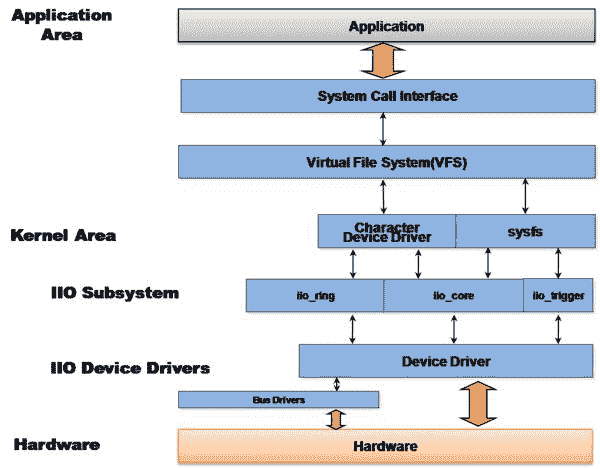

# 第十章：IIO 框架

**工业 I/O**（**IIO**）是一个专门用于**模拟到数字转换器**（**ADC**）和**数字到模拟转换器**（**DAC**）的内核子系统。随着不断增加的传感器（具有模拟到数字或数字到模拟能力的测量设备）以不同的代码实现分散在内核源代码中，对它们进行收集变得必要。这就是 IIO 框架以一种通用和统一的方式所做的。自 2009 年以来，Jonathan Cameron 和 Linux-IIO 社区一直在开发它。

加速度计、陀螺仪、电流/电压测量芯片、光传感器、压力传感器等都属于 IIO 设备系列。

IIO 模型基于设备和通道架构：

+   设备代表芯片本身。它是层次结构的最高级别。

+   通道表示设备的单个采集线。一个设备可能有一个或多个通道。例如，加速度计是一个具有三个通道的设备，分别用于每个轴（X、Y 和 Z）。

IIO 芯片是物理和硬件传感器/���换器。它以字符设备（当支持触发缓冲时）和一个**sysfs**目录条目暴露给用户空间，该目录将包含一组文件，其中一些表示通道。单个通道用单个**sysfs**文件条目表示。

这是从用户空间与 IIO 驱动程序交互的两种方式：

+   `/sys/bus/iio/iio:deviceX/`：这代表传感器以及其通道

+   `/dev/iio:deviceX`：这是一个字符设备，用于导出设备的事件和数据缓冲区



IIO 框架的架构和布局

前面的图显示了 IIO 框架在内核和用户空间之间的组织方式。驱动程序管理硬件并将处理报告给 IIO 核心，使用 IIO 核心提供的一组设施和 API。然后，IIO 子系统通过 sysfs 接口和字符设备将整个底层机制抽象到用户空间，用户可以在其上执行系统调用。

IIO API 分布在几个头文件中，列举如下：

```
#include <linux/iio/iio.h>    /* mandatory */ 
#include <linux/iio/sysfs.h>  /* mandatory since sysfs is used */ 
#include <linux/iio/events.h> /* For advanced users, to manage iio events */ 
#include <linux/iio/buffer.h> /* mandatory to use triggered buffers */ 
#include <linux/iio/trigger.h>/* Only if you implement trigger in your driver (rarely used)*/ 
```

在本章中，我们将描述和处理 IIO 框架的每个概念，比如

+   遍历其数据结构（设备、通道等）

+   触发缓冲区支持和连续捕获，以及其 sysfs 接口

+   探索现有的 IIO 触发器

+   以单次模式或连续模式捕获数据

+   列出可用的工具，可以帮助开发人员测试他们的设备

# IIO 数据结构

IIO 设备在内核中表示为`struct iio_dev`的实例，并由`struct iio_info`结构描述。所有重要的 IIO 结构都在`include/linux/iio/iio.h`中定义。

# iio_dev 结构

这个结构表示 IIO 设备，描述设备和驱动程序。它告诉我们关于：

+   设备上有多少个通道可用？

+   设备可以以哪些模式操作：单次、触发缓冲？

+   这个驱动程序有哪些可用的钩子？

```
struct iio_dev { 
   [...] 
   int modes; 
   int currentmode; 
   struct device dev; 

   struct iio_buffer *buffer; 
   int scan_bytes; 

   const unsigned long *available_scan_masks; 
   const unsigned long *active_scan_mask; 
   bool scan_timestamp; 
   struct iio_trigger *trig; 
   struct iio_poll_func *pollfunc; 

   struct iio_chan_spec const *channels; 
   int num_channels; 
   const char *name; 
   const struct iio_info *info; 
   const struct iio_buffer_setup_ops *setup_ops; 
   struct cdev chrdev; 
}; 
```

完整的结构在 IIO 头文件中定义。这里删除了我们不感兴趣的字段。

+   `modes`：这代表设备支持的不同模式。支持的模式有：

+   `INDIO_DIRECT_MODE` 表示设备提供 sysfs 类型的接口。

+   `INDIO_BUFFER_TRIGGERED` 表示设备支持硬件触发。当您使用`iio_triggered_buffer_setup()`函数设置触发缓冲区时，此模式会自动添加到您的设备中。

+   `INDIO_BUFFER_HARDWARE`显示设备具有硬件缓冲区。

+   `INDIO_ALL_BUFFER_MODES`是上述两者的并集。

+   `currentmode`：这代表设备实际使用的模式。

+   `dev`：这代表了 IIO 设备绑定的 struct device（根据 Linux 设备模型）。

+   `buffer`：这是您的数据缓冲区，在使用触发缓冲区模式时推送到用户空间。当使用`iio_triggered_buffer_setup`函数启用触发缓冲区支持时，它会自动分配并与您的设备关联。

+   `scan_bytes`：这是捕获并馈送到`buffer`的字节数。当从用户空间使用触发缓冲区时，缓冲区应至少为`indio->scan_bytes`字节大。

+   `available_scan_masks`：这是允许的位掩码的可选数组。在使用触发缓冲区时，可以启用通道以被捕获并馈送到 IIO 缓冲区中。如果不希望允许某些通道被启用，应该只填充此数组。以下是为加速度计提供扫描掩码的示例（具有 X、Y 和 Z 通道）：

```
/* 
 * Bitmasks 0x7 (0b111) and 0 (0b000) are allowed. 
 * It means one can enable none or all of them. 
 * one can't for example enable only channel X and Y 
 */ 
static const unsigned long my_scan_masks[] = {0x7, 0}; 
indio_dev->available_scan_masks = my_scan_masks; 
```

+   `active_scan_mask`：这是启用通道的位掩码。只有这些通道的数据应该被推送到`buffer`中。例如，对于 8 通道 ADC 转换器，如果只启用第一个（0）、第三个（2）和最后一个（7）通道，位掩码将是 0b10000101（0x85）。`active_scan_mask`将设置为 0x85。然后驱动程序可以使用`for_each_set_bit`宏来遍历每个设置的位，根据通道获取数据，并填充缓冲区。

+   `scan_timestamp`：这告诉我们是否将捕获时间戳推送到缓冲区。如果为 true，则时间戳将作为缓冲区的最后一个元素推送。时间戳为 8 字节（64 位）。

+   `trig`：这是当前设备的触发器（当支持缓冲模式时）。

+   `pollfunc`：这是在接收到触发器时运行的函数。

+   `channels`：这代表通道规范结构表，描述设备具有的每个通道。

+   `num_channels`：这代表在`channels`中指定的通道数。

+   `name`：这代表设备名称。

+   `info`：来自驱动程序的回调和常量信息。

+   `setup_ops`：在启用/禁用缓冲区之前和之后调用的回调函数集。此结构在`include/linux/iio/iio.h`中定义如下：

```
struct iio_buffer_setup_ops { 
    int (* preenable) (struct iio_dev *); 
    int (* postenable) (struct iio_dev *); 
    int (* predisable) (struct iio_dev *); 
    int (* postdisable) (struct iio_dev *); 
    bool (* validate_scan_mask) (struct iio_dev *indio_dev, 
                                 const unsigned long *scan_mask); 
}; 
```

+   `setup_ops`：如果未指定，IIO 核心将使用在`drivers/iio/buffer/industrialio-triggered-buffer.c`中定义的默认`iio_triggered_buffer_setup_ops`。

+   `chrdev`：这是由 IIO 核心创建的关联字符设备。

用于为 IIO 设备分配内存的函数是`iio_device_alloc()`：

```
struct iio_dev *devm_iio_device_alloc(struct device *dev,  

                                      int sizeof_priv) 
```

`dev`是为其分配`iio_dev`的设备，`sizeof_priv`是用于分配任何私有结构的内存空间。通过这种方式，传递每个设备（私有）数据结构非常简单。如果分配失败，该函数将返回`NULL`：

```
struct iio_dev *indio_dev; 
struct my_private_data *data; 
indio_dev = iio_device_alloc(sizeof(*data)); 
if (!indio_dev) 
    return -ENOMEM; 
/*data is given the address of reserved momory for private data */ 
data = iio_priv(indio_dev); 
```

分配了 IIO 设备内存后，下一步是填充不同的字段。完成后，必须使用`iio_device_register`函数向 IIO 子系统注册设备：

```
int iio_device_register(struct iio_dev *indio_dev) 
```

此函数执行后，设备将准备好接受来自用户空间的请求。反向操作（通常在释放函数中完成）是`iio_device_unregister()`：

```
void iio_device_unregister(struct iio_dev *indio_dev) 
```

一旦注销，由`iio_device_alloc`分配的内存可以使用`iio_device_free`释放：

```
void iio_device_free(struct iio_dev *iio_dev) 
```

给定一个 IIO 设备作为参数，可以以以下方式检索私有数据：

```
struct my_private_data *the_data = iio_priv(indio_dev); 
```

# iio_info 结构

`struct iio_info`结构用于声明 IIO 核心用于读取/写入通道/属性值的钩子：

```
struct iio_info { 
   struct module *driver_module; 
   const struct attribute_group *attrs; 

   int (*read_raw)(struct iio_dev *indio_dev, 
               struct iio_chan_spec const *chan, 
               int *val, int *val2, long mask); 

   int (*write_raw)(struct iio_dev *indio_dev, 
                struct iio_chan_spec const *chan, 
                int val, int val2, long mask); 
    [...] 
}; 
```

我们不感兴趣的字段已被移除。

+   `driver_module`：这是用于确保`chrdevs`正确拥有权的模块结构，通常设置为`THIS_MODULE`。

+   `attrs`：这代表设备的属性。

+   `read_raw`：这是当用户读取设备`sysfs`文件属性时运行的回调。`mask`参数是一个位掩码，允许我们知道请求的是哪种类型的值。`channel`参数让我们知道所关注的通道。它可以用于采样频率、用于将原始值转换为可用值的比例，或者原始值本身。

+   `write_raw`：这是用于向设备写入值的回调。例如，可以使用它来设置采样频率。

以下代码显示了如何设置`struct iio_info`结构：

```
static const struct iio_info iio_dummy_info = { 
    .driver_module = THIS_MODULE, 
    .read_raw = &iio_dummy_read_raw, 
    .write_raw = &iio_dummy_write_raw, 
[...] 

/* 
 * Provide device type specific interface functions and 
 * constant data. 
 */ 
indio_dev->info = &iio_dummy_info; 
```

# IIO 通道

通道表示单个采集线。例如，加速度计将有 3 个通道（X、Y、Z），因为每个轴代表单个采集线。`struct iio_chan_spec`是在内核中表示和描述单个通道的结构：

```
    struct iio_chan_spec { 
        enum iio_chan_type type; 
        int channel; 
        int channel2; 
        unsigned long address; 
        int scan_index; 
        struct { 
            charsign; 
            u8 realbits; 
            u8 storagebits; 
            u8 shift; 
            u8 repeat; 
            enum iio_endian endianness; 
        } scan_type; 
        long info_mask_separate; 
        long info_mask_shared_by_type; 
        long info_mask_shared_by_dir; 
        long info_mask_shared_by_all; 
        const struct iio_event_spec *event_spec; 
        unsigned int num_event_specs; 
        const struct iio_chan_spec_ext_info *ext_info; 
        const char *extend_name; 
        const char *datasheet_name; 
        unsigned modified:1; 
        unsigned indexed:1; 
        unsigned output:1; 
        unsigned differential:1; 
    }; 
```

以下是结构中每个元素的含义：

+   `类型`：这指定了通道进行何种类型的测量。在电压测量的情况下，应该是`IIO_VOLTAGE`。对于光传感器，是`IIO_LIGHT`。对于加速度计，使用`IIO_ACCEL`。所有可用类型都在`include/uapi/linux/iio/types.h`中定义为`enum iio_chan_type`。要为给定的转换器编写驱动程序，请查看该文件，以查看每个通道所属的类型。

+   `通道`：当`.indexed`设置为 1 时，这指定了通道索引。

+   `channel2`：当`.modified`设置为 1 时，这指定了通道修饰符��

+   `修改`：这指定了是否要对该通道属性名称应用修饰符。在这种情况下，修饰符设置为`.channel2`。（例如，`IIO_MOD_X`，`IIO_MOD_Y`，`IIO_MOD_Z`是关于 xyz 轴的轴向传感器的修饰符）。可用的修饰符列表在内核 IIO 头文件中定义为`enum iio_modifier`。修饰符只会对`sysfs`中的通道属性名称进行操作，而不会对值进行操作。

+   `indexed`：这指定了通道属性名称是否具有索引。如果是，则索引在`.channel`字段中指定。

+   `scan_index`和`scan_type`：这些字段用于在使用缓冲区触发器时识别缓冲区中的元素。`scan_index`设置了缓冲区中捕获的通道的位置。具有较低`scan_index`的通道将放置在具有较高索引的通道之前。将`.scan_index`设置为`-1`将阻止通道进行缓冲捕获（在`scan_elements`目录中没有条目）。

向用户空间公开的通道 sysfs 属性以位掩码的形式指定。根据它们的共享信息，属性可以设置为以下掩码之一：

+   `info_mask_separate`将属性标记为特定于此通道。

+   `info_mask_shared_by_type`将属性标记为所有相同类型的通道共享的属性。导出的信息由所有相同类型的通道共享。

+   `info_mask_shared_by_dir`将属性标记为所有相同方向的通道共享的属性。导出的信息由相同方向的所有通道共享。

+   `info_mask_shared_by_all`将属性标记为所有通道共享的属性，无论它们的类型或方向如何。导出的信息由所有通道共享。这些属性的枚举位掩码都在`include/linux/iio/iio.h`中定义。

```
enum iio_chan_info_enum { 
    IIO_CHAN_INFO_RAW = 0, 
    IIO_CHAN_INFO_PROCESSED, 
    IIO_CHAN_INFO_SCALE, 
    IIO_CHAN_INFO_OFFSET, 
    IIO_CHAN_INFO_CALIBSCALE, 
    [...] 
    IIO_CHAN_INFO_SAMP_FREQ, 
    IIO_CHAN_INFO_FREQUENCY, 
    IIO_CHAN_INFO_PHASE, 
    IIO_CHAN_INFO_HARDWAREGAIN, 
    IIO_CHAN_INFO_HYSTERESIS, 
    [...] 
}; 
```

字节顺序字段应为以下之一：

```
enum iio_endian { 
    IIO_CPU, 
    IIO_BE, 
    IIO_LE, 
}; 
```

# 通道属性命名约定

属性的名称由 IIO 核心自动生成，遵循以下模式：`{direction}_{type}_{index}_{modifier}_{info_mask}`：

+   `方向`对应于属性方向，根据`drivers/iio/industrialio-core.c`中的`struct iio_direction`结构：

```
static const char * const iio_direction[] = { 
   [0] = "in", 
   [1] = "out", 
}; 
```

+   `类型`对应于通道类型，根据字符数组`const iio_chan_type_name_spec`：

```
static const char * const iio_chan_type_name_spec[] = { 
   [IIO_VOLTAGE] = "voltage", 
   [IIO_CURRENT] = "current", 
   [IIO_POWER] = "power", 
   [IIO_ACCEL] = "accel", 
   [...] 
   [IIO_UVINDEX] = "uvindex", 
   [IIO_ELECTRICALCONDUCTIVITY] = "electricalconductivity", 
   [IIO_COUNT] = "count", 
   [IIO_INDEX] = "index", 
   [IIO_GRAVITY]  = "gravity", 
}; 
```

+   `index`模式取决于通道`.indexed`字段是否设置。如果设置，索引将从`.channel`字段中取出，以替换`{index}`模式。

+   `modifier` 模式取决于通道`.modified`字段是否设置。如果设置，修饰符将从`.channel2`字段中取出，并且`{modifier}`模式将根据`struct iio_modifier_names`结构中的字符数组进行替换：

```
static const char * const iio_modifier_names[] = { 
   [IIO_MOD_X] = "x", 
   [IIO_MOD_Y] = "y", 
   [IIO_MOD_Z] = "z", 
   [IIO_MOD_X_AND_Y] = "x&y", 
   [IIO_MOD_X_AND_Z] = "x&z", 
   [IIO_MOD_Y_AND_Z] = "y&z", 
   [...] 
   [IIO_MOD_CO2] = "co2", 
   [IIO_MOD_VOC] = "voc", 
}; 
```

+   `info_mask` 取决于通道信息掩码，私有或共享，字符数组`iio_chan_info_postfix`中的索引值：

```
/* relies on pairs of these shared then separate */ 
static const char * const iio_chan_info_postfix[] = { 
   [IIO_CHAN_INFO_RAW] = "raw", 
   [IIO_CHAN_INFO_PROCESSED] = "input", 
   [IIO_CHAN_INFO_SCALE] = "scale", 
   [IIO_CHAN_INFO_CALIBBIAS] = "calibbias", 
   [...] 
   [IIO_CHAN_INFO_SAMP_FREQ] = "sampling_frequency", 
   [IIO_CHAN_INFO_FREQUENCY] = "frequency", 
   [...] 
}; 
```

# 区分通道

当每个通道类型有多个数据通道时，您可能会陷入麻烦。两种解决方案是：索引和修饰符。

**使用索引**：给定一个具有一个通道线的 ADC 设备，不需要索引。它的通道定义将是：

```
static const struct iio_chan_spec adc_channels[] = { 
        { 
                .type = IIO_VOLTAGE, 
                .info_mask_separate = BIT(IIO_CHAN_INFO_RAW), 
        }, 
} 
```

由前述通道描述产生的属性名称将是`in_voltage_raw`。

`/sys/bus/iio/iio:deviceX/in_voltage_raw`

现在假设转换器有 4 个甚至 8 个通道。我们如何识别它们？解决方案是使用索引。将`.indexed`字段设置为 1 将使用`.channel`值替换`{index}`模式来搅乱通道属性名称：

```
static const struct iio_chan_spec adc_channels[] = { 
        { 
                .type = IIO_VOLTAGE, 
                .indexed = 1, 
                .channel = 0, 
                .info_mask_separate = BIT(IIO_CHAN_INFO_RAW), 
        }, 
        { 
                .type = IIO_VOLTAGE, 
                .indexed = 1, 
                .channel = 1, 
                .info_mask_separate = BIT(IIO_CHAN_INFO_RAW), 
        }, 
        { 
                .type = IIO_VOLTAGE, 
                .indexed = 1, 
                .channel = 2, 
                .info_mask_separate = BIT(IIO_CHAN_INFO_RAW), 
        }, 
        { 
                .type = IIO_VOLTAGE, 
                .indexed = 1, 
                .channel = 3, 
                .info_mask_separate = BIT(IIO_CHAN_INFO_RAW), 
        }, 
} 
```

结果通道属性是：

`/sys/bus/iio/iio:deviceX/in_voltage0_raw`

`/sys/bus/iio/iio:deviceX/in_voltage1_raw`

`/sys/bus/iio/iio:deviceX/in_voltage2_raw`

`/sys/bus/iio/iio:deviceX/in_voltage3_raw`

**使用修饰符**：给定一个具有两个通道的光传感器——一个用于红外光，一个用于红外和可见光，没有索引或修饰符，属性名称将是`in_intensity_raw`。在这里使用索引可能会出错，因为`in_intensity0_ir_raw`和`in_intensity1_ir_raw`是没有意义的。使用修饰符将有助于提供有意义的属性名称。通道的定义可能如下所示：

```
static const struct iio_chan_spec mylight_channels[] = { 
        { 
                .type = IIO_INTENSITY, 
                .modified = 1, 
                .channel2 = IIO_MOD_LIGHT_IR, 
                .info_mask_separate = BIT(IIO_CHAN_INFO_RAW), 
                .info_mask_shared = BIT(IIO_CHAN_INFO_SAMP_FREQ), 
        }, 
        { 
                .type = IIO_INTENSITY, 
                .modified = 1, 
                .channel2 = IIO_MOD_LIGHT_BOTH, 
                .info_mask_separate = BIT(IIO_CHAN_INFO_RAW), 
                .info_mask_shared = BIT(IIO_CHAN_INFO_SAMP_FREQ), 
        }, 
        { 
                .type = IIO_LIGHT, 
                .info_mask_separate = BIT(IIO_CHAN_INFO_PROCESSED), 
                .info_mask_shared = BIT(IIO_CHAN_INFO_SAMP_FREQ), 
        }, 
} 
```

结果属性将是：

+   `/sys/bus/iio/iio:deviceX/in_intensity_ir_raw` 用于测量红外强度的通道

+   `/sys/bus/iio/iio:deviceX/in_intensity_both_raw` 用于测量红外和可见光的通道

+   `/sys/bus/iio/iio:deviceX/in_illuminance_input` 用于处理后的数据

+   `/sys/bus/iio/iio:deviceX/sampling_frequency` 用于所有共享的采样频率

这对于加速度计也有效，正如我们将在案例研究中看到的那样。现在，让我们总结一下到目前为止在虚拟 IIO 驱动程序中讨论的内容。

# 把所有东西放在一起

让我们总结一下到目前为止在一个简单的虚拟驱动程序中看到的内容，它将公开四个电压通道。我们将忽略`read()`或`write()`函数：

```
#include <linux/init.h> 
#include <linux/module.h> 
#include <linux/kernel.h> 
#include <linux/platform_device.h> 
#include <linux/interrupt.h> 
#include <linux/of.h> 
#include <linux/iio/iio.h> 
#include <linux/iio/sysfs.h> 
#include <linux/iio/events.h> 
#include <linux/iio/buffer.h> 

#define FAKE_VOLTAGE_CHANNEL(num)                  \ 
   {                                               \ 
         .type = IIO_VOLTAGE,                      \ 
         .indexed = 1,                             \ 
         .channel = (num),                         \ 
         .address = (num),                         \ 
         .info_mask_separate = BIT(IIO_CHAN_INFO_RAW),   \ 
         .info_mask_shared_by_type = BIT(IIO_CHAN_INFO_SCALE) \ 
   } 

struct my_private_data { 
    int foo; 
    int bar; 
    struct mutex lock; 
}; 

static int fake_read_raw(struct iio_dev *indio_dev, 
                   struct iio_chan_spec const *channel, int *val, 
                   int *val2, long mask) 
{ 
    return 0; 
} 

static int fake_write_raw(struct iio_dev *indio_dev, 
                   struct iio_chan_spec const *chan, 
                   int val, int val2, long mask) 
{ 
    return 0; 
} 

static const struct iio_chan_spec fake_channels[] = { 
   FAKE_VOLTAGE_CHANNEL(0), 
   FAKE_VOLTAGE_CHANNEL(1), 
   FAKE_VOLTAGE_CHANNEL(2), 
   FAKE_VOLTAGE_CHANNEL(3), 
}; 

static const struct of_device_id iio_dummy_ids[] = { 
    { .compatible = "packt,iio-dummy-random", }, 
    { /* sentinel */ } 
}; 

static const struct iio_info fake_iio_info = { 
   .read_raw = fake_read_raw, 
   .write_raw        = fake_write_raw, 
   .driver_module = THIS_MODULE, 
}; 

static int my_pdrv_probe (struct platform_device *pdev) 
{ 
    struct iio_dev *indio_dev; 
    struct my_private_data *data; 

   indio_dev = devm_iio_device_alloc(&pdev->dev, sizeof(*data)); 
   if (!indio_dev) { 
         dev_err(&pdev->dev, "iio allocation failed!\n"); 
         return -ENOMEM; 
   } 

   data = iio_priv(indio_dev); 
   mutex_init(&data->lock); 
   indio_dev->dev.parent = &pdev->dev; 
   indio_dev->info = &fake_iio_info; 
   indio_dev->name = KBUILD_MODNAME; 
   indio_dev->modes = INDIO_DIRECT_MODE; 
   indio_dev->channels = fake_channels; 
   indio_dev->num_channels = ARRAY_SIZE(fake_channels); 
   indio_dev->available_scan_masks = 0xF; 

    iio_device_register(indio_dev); 
    platform_set_drvdata(pdev, indio_dev); 
    return 0; 
} 

static void my_pdrv_remove(struct platform_device *pdev) 
{ 
    struct iio_dev *indio_dev = platform_get_drvdata(pdev); 
    iio_device_unregister(indio_dev); 
} 

static struct platform_driver mypdrv = { 
    .probe      = my_pdrv_probe, 
    .remove     = my_pdrv_remove, 
    .driver     = { 
        .name     = "iio-dummy-random", 
        .of_match_table = of_match_ptr(iio_dummy_ids),   
        .owner    = THIS_MODULE, 
    }, 
}; 
module_platform_driver(mypdrv); 
MODULE_AUTHOR("John Madieu <john.madieu@gmail.com>"); 
MODULE_LICENSE("GPL"); 
```

加载上述模块后，我们将得到以下输出，显示我们的设备确实对应于我们注册的平台设备：

```
~# ls -l /sys/bus/iio/devices/

lrwxrwxrwx 1 root root 0 Jul 31 20:26 iio:device0 -> ../../../devices/platform/iio-dummy-random.0/iio:device0

lrwxrwxrwx 1 root root 0 Jul 31 20:23 iio_sysfs_trigger -> ../../../devices/iio_sysfs_trigger

```

以下清单显示了此设备具有的通道及其名称，这些名称与驱动程序中描述的完全相对应：

```
~# ls /sys/bus/iio/devices/iio\:device0/

dev in_voltage2_raw name uevent

in_voltage0_raw in_voltage3_raw power

in_voltage1_raw in_voltage_scale subsystem

~# cat /sys/bus/iio/devices/iio:device0/name

iio_dummy_random

```

# 触发缓冲区支持

在许多数据分析应用程序中，根据某些外部信号（触发器）捕获数据是有用的。这些触发器可能是：

+   数据准备信号

+   连接到某些外部系统的 IRQ 线（GPIO 或其他）

+   处理器周期性中断

+   用户空间读/写 sysfs 中的特定文件

IIO 设备驱动程序与触发器完全无关。触发器可以初始化一个或多个设备上的数据捕获。这些触发器用于填充缓冲区，向用户空间公开为字符设备。

可以开发自己的触发器驱动程序，但这超出了本书的范围。我们将尝试仅专注于现有的触发器。这些是：

+   `iio-trig-interrupt`：这提供了使用任何 IRQ 作为 IIO 触发器的支持。在旧的内核版本中，它曾经是`iio-trig-gpio`。启用此触发模式的内核选项是`CONFIG_IIO_INTERRUPT_TRIGGER`。如果构建为模块，该模块将被称为`iio-trig-interrupt`。

+   `iio-trig-hrtimer`：这提供了使用 HRT 作为中断源的基于频率的 IIO 触发器（自内核 v4.5 以来）。在较旧的内核版本中，它曾经是`iio-trig-rtc`。负责此触发模式的内核选项是`IIO_HRTIMER_TRIGGER`。如果作为模块构建，该模块将被称为`iio-trig-hrtimer`。

+   `iio-trig-sysfs`：这允许我们使用 sysfs 条目触发数据捕获。 `CONFIG_IIO_SYSFS_TRIGGER`是内核选项，用于添加对此触发模式的支持。

+   `iio-trig-bfin-timer`：这允许我们将黑脸定时器用作 IIO 触发器（仍在暂存中）。

IIO 公开 API，以便我们可以：

+   声明任意数量的触发器

+   选择哪些通道的数据将被推送到缓冲区

当您的 IIO 设备提供触发缓冲区的支持时，必须设置`iio_dev.pollfunc`，当触发器触发时执行。此处理程序负责通过`indio_dev->active_scan_mask`找到已启用的通道，检索其数据，并使用`iio_push_to_buffers_with_timestamp`函数将其馈送到`indio_dev->buffer`中。因此，在 IIO 子系统中，缓冲区和触发器是非常相关的。

IIO 核心提供了一组辅助函数，用于设置触发缓冲区，可以在`drivers/iio/industrialio-triggered-buffer.c`中找到。

以下是支持从驱动程序内部支持触发缓冲区的步骤：

1.  如果需要，填写`iio_buffer_setup_ops`结构：

```
const struct iio_buffer_setup_ops sensor_buffer_setup_ops = { 
  .preenable    = my_sensor_buffer_preenable, 
  .postenable   = my_sensor_buffer_postenable, 
  .postdisable  = my_sensor_buffer_postdisable, 
  .predisable   = my_sensor_buffer_predisable, 
}; 
```

1.  编写与触发器相关联的上半部分。在 99%的情况下，只需提供与捕获相关的时间戳：

```
irqreturn_t sensor_iio_pollfunc(int irq, void *p) 
{ 
    pf->timestamp = iio_get_time_ns((struct indio_dev *)p); 
    return IRQ_WAKE_THREAD; 
} 
```

1.  编写触发器的下半部分，它将从每个启用的通道中获取数据，并将其馈送到缓冲区中：

```
irqreturn_t sensor_trigger_handler(int irq, void *p) 
{ 
    u16 buf[8]; 
    int bit, i = 0; 
    struct iio_poll_func *pf = p; 
    struct iio_dev *indio_dev = pf->indio_dev; 

    /* one can use lock here to protect the buffer */ 
    /* mutex_lock(&my_mutex); */ 

    /* read data for each active channel */ 
    for_each_set_bit(bit, indio_dev->active_scan_mask, 
                     indio_dev->masklength) 
        buf[i++] = sensor_get_data(bit) 

    /* 
     * If iio_dev.scan_timestamp = true, the capture timestamp 
     * will be pushed and stored too, as the last element in the 
     * sample data buffer before pushing it to the device buffers. 
     */ 
    iio_push_to_buffers_with_timestamp(indio_dev, buf, timestamp); 

    /* Please unlock any lock */ 
    /* mutex_unlock(&my_mutex); */ 

    /* Notify trigger */ 
    iio_trigger_notify_done(indio_dev->trig); 
    return IRQ_HANDLED; 
} 
```

1.  最后，在`probe`函数中，必须在使用`iio_device_register()`注册设备之前设置缓冲区本身：

```
iio_triggered_buffer_setup(indio_dev, sensor_iio_polfunc, 
                           sensor_trigger_handler, 
                           sensor_buffer_setup_ops); 
```

这里的魔术函数是`iio_triggered_buffer_setup`。这也将为您的设备提供`INDIO_DIRECT_MODE`功能。当从用户空间给您的设备触发器时，您无法知道何时会触发捕获。

在连续缓冲捕获处于活动状态时，应该防止（通过返回错误）驱动程序执行 sysfs 每通道数据捕获（由`read_raw()`挂钩执行），以避免未确定的行为，因为触发处理程序和`read_raw()`挂钩将尝试同时访问设备。用于检查是否实际使用了缓冲模式的函数是`iio_buffer_enabled()`。挂钩将如下所示：

```
static int my_read_raw(struct iio_dev *indio_dev, 
                     const struct iio_chan_spec *chan, 
                     int *val, int *val2, long mask) 
{ 
      [...] 
      switch (mask) { 
      case IIO_CHAN_INFO_RAW: 
            if (iio_buffer_enabled(indio_dev)) 
                  return -EBUSY; 
      [...]        
}  
```

`iio_buffer_enabled()`函数只是测试给定 IIO 设备是否启用了缓冲区。

让我们描述一些在前面部分中使用的重要内容：

+   `iio_buffer_setup_ops`提供了在缓冲区配置序列的固定步骤（启用/禁用之前/之后）调用的缓冲区设置函数。如果未指定，默认的`iio_triggered_buffer_setup_ops`将由 IIO 核心提供给您的设备。

+   `sensor_iio_pollfunc`是触发器的顶半部分。与每个顶半部分一样，它在中断上下文中运行，并且必须尽可能少地进行处理。在 99%的情况下，您只需提供与捕获���关的时间戳。再次，可以使用默认的 IIO `iio_pollfunc_store_time`函数。

+   `sensor_trigger_handler`是底半部分，它在内核线程中运行，允许我们进行任何处理，甚至包括获取互斥锁或休眠。重要的处理应该在这里进行。它通常从设备中读取数据，并将其与顶半部分记录的时间戳一起存储在内部缓冲区中，并将其推送到您的 IIO 设备缓冲区中。

触发器对于触发缓冲是强制性的。它告诉驱动程序何时从设备中读取样本并将其放入缓冲区中。触发缓冲对于编写 IIO 设备驱动程序并非强制性。人们也可以通过 sysfs 进行单次捕获，方法是读取通道的原始属性，这将仅执行单次转换（对于正在读取的通道属性）。缓冲模式允许连续转换，因此可以在一次触发中捕获多个通道。

# IIO 触发器和 sysfs（用户空间）

sysfs 中与触发器相关的两个位置：

+   `/sys/bus/iio/devices/triggerY/`一旦 IIO 触发器与 IIO 核心注册并对应于索引`Y`的触发器，将创建至少一个目录属性：

+   `name`是触发器名称，稍后可以用于与设备关联

+   如果您的设备支持触发缓冲区，则将自动创建`/sys/bus/iio/devices/iio:deviceX/trigger/*`目录。可以通过将触发器的名称写入`current_trigger`文件来将触发器与我们的设备关联。

# Sysfs 触发器接口

通过`CONFIG_IIO_SYSFS_TRIGGER=y`配置选项在内核中启用 sysfs 触发器，将自动创建`/sys/bus/iio/devices/iio_sysfs_trigger/`文件夹，并可用于 sysfs 触发器管理。目录中将有两个文件，`add_trigger`和`remove_trigger`。其驱动程序位于`drivers/iio/trigger/iio-trig-sysfs.c`中。

# add_trigger 文件

用于创建新的 sysfs 触发器。可以通过将正值（将用作触发器 ID）写入该文件来创建新的触发器。它将创建新的 sysfs 触发器，可在`/sys/bus/iio/devices/triggerX`访问，其中`X`是触发器编号。

例如：

```
 # echo 2 > add_trigger

```

这将创建一个新的 sysfs 触发器，可在`/sys/bus/iio/devices/trigger2`访问。如果系统中已经存在指定 ID 的触发器，则会返回无效参数消息。sysfs 触发器名称模式为`sysfstrig{ID}`。命令`echo 2 > add_trigger`将创建触发器`/sys/bus/iio/devices/trigger2`，其名称为`sysfstrig2`：

```
 $ cat /sys/bus/iio/devices/trigger2/name

 sysfstrig2

```

每个 sysfs 触发器至少包含一个文件：`trigger_now`。将`1`写入该文件将指示所有具有其`current_trigger`中相应触发器名称的设备开始捕获，并将数据推送到各自的缓冲区中。每个设备缓冲区必须设置其大小，并且必须启用（`echo 1 > /sys/bus/iio/devices/iio:deviceX/buffer/enable`）。

# remove_trigger 文件

要删除触发器，使用以下命令：

```
 # echo 2 > remove_trigger

```

# 将设备与触发器绑定

将设备与给定触发器关联包括将触发器的名称写入设备触发器目录下的`current_trigger`文件。例如，假设我们需要将设备与索引为 2 的触发器绑定：

```
# set trigger2 as current trigger for device0
# echo sysfstrig2 >    /sys/bus/iio/devices/iio:device0/trigger/current_trigger 

```

要将触发器与设备分离，应将空字符串写入设备触发器目录的`current_trigger`文件，如下所示：

```
# echo "" > iio:device0/trigger/current_trigger 

```

在本章中，我们将进一步看到有关数据捕获的 sysfs 触发器的实际示例。

# 中断触发器接口

考虑以下示例：

```
static struct resource iio_irq_trigger_resources[] = { 
    [0] = { 
        .start = IRQ_NR_FOR_YOUR_IRQ, 
        .flags = IORESOURCE_IRQ | IORESOURCE_IRQ_LOWEDGE, 
    }, 
}; 

static struct platform_device iio_irq_trigger = { 
    .name = "iio_interrupt_trigger", 
    .num_resources = ARRAY_SIZE(iio_irq_trigger_resources), 
    .resource = iio_irq_trigger_resources, 
}; 
platform_device_register(&iio_irq_trigger); 
```

声明我们的 IRQ 触发器，将导致加载 IRQ 触发器独立模块。如果其`probe`函数成功，将会有一个与触发器对应的目录。IRQ 触发器名称的形式为`irqtrigX`，其中`X`对应于您刚刚传递的虚拟 IRQ，在`/proc/interrupt`中可以看到。

```
 $ cd /sys/bus/iio/devices/trigger0/
 $ cat name

```

`irqtrig85`：与其他触发器一样，您只需将该触发器分配给您的设备，方法是将其名称写入设备的`current_trigger`文件中。

```
# echo "irqtrig85" > /sys/bus/iio/devices/iio:device0/trigger/current_trigger

```

现在，每次触发中断时，设备数据将被捕获。

IRQ 触发器驱动程序尚不支持 DT，这就是为什么我们使用了我们的板`init`文件的原因。但这并不重要；由于驱动程序需要资源，因此我们可以在不进行任何代码更改的情况下使用 DT。

以下是声明 IRQ 触发接口的设备树节点示例：

```
mylabel: my_trigger@0{ 
    compatible = "iio_interrupt_trigger"; 
    interrupt-parent = <&gpio4>; 
    interrupts = <30 0x0>; 
}; 
```

该示例假设 IRQ 线是属于 GPIO 控制器节点`gpio4`的 GPIO＃30。这包括使用 GPIO 作为中断源，因此每当 GPIO 变为给定状态时，中断就会被触发，从而触发捕获。

# hrtimer 触发接口

`hrtimer`触发器依赖于 configfs 文件系统（请参阅内核源中的*Documentation/iio/iio_configfs.txt*），可以通过`CONFIG_IIO_CONFIGFS`配置选项启用，并挂载到我们的系统上（通常在`/config`目录下）：

```
 # mkdir /config

  # mount -t configfs none /config

```

现在，加载模块`iio-trig-hrtimer`将创建可在`/config/iio`下访问的 IIO 组，允许用户在`/config/iio/triggers/hrtimer`下创建 hrtimer 触发器。

例如：

```
 # create a hrtimer trigger
  $ mkdir /config/iio/triggers/hrtimer/my_trigger_name
  # remove the trigger
  $ rmdir /config/iio/triggers/hrtimer/my_trigger_name 

```

每个 hrtimer 触发器在触发目录中包含一个单独的`sampling_frequency`属性。在本章的*使用 hrtimer 触发进行数据捕获*部分中提供了一个完整且可用的示例。

# IIO 缓冲区

IIO 缓冲区提供连续数据捕获，可以同时读取多个数据通道。缓冲区可通过`/dev/iio:device`字符设备节点从用户空间访问。在触发处理程序中，用于填充缓冲区的函数是`iio_push_to_buffers_with_timestamp`。为设备分配触发缓冲区的函数是`iio_triggered_buffer_setup()`。

# IIO 缓冲区 sysfs 接口

IIO 缓冲区在`/sys/bus/iio/iio:deviceX/buffer/*`下有一个关联的属性目录。以下是一些现有属性：

+   `length`：缓冲区可以存储的数据样本（容量）的总数。这是缓冲区包含的扫描数。

+   `enable`：这将激活缓冲区捕获，启动缓冲区捕获。

+   `watermark`：此属性自内核版本 v4.2 起可用。它是一个正数，指定阻塞读取应等待多少个扫描元素。例如，如果使用`poll`，它将阻塞直到达到水印。只有在水印大于请求的读取量时才有意义。它不影响非阻塞读取。可以在带有超时的 poll 上阻塞，并在超时到期后读取可用样本，从而保证最大延迟。

# IIO 缓冲区设置

要读取并推送到缓冲区的数据通道称为扫描元素。它们的配置可通过`/sys/bus/iio/iio:deviceX/scan_elements/*`目录从用户空间访��，包含以下属性：

+   `en`（实际上是属性名称的后缀）用于启用通道。仅当其属性非零时，触发捕获才会包含此通道的数据样本。例如，`in_voltage0_en`，`in_voltage1_en`等。

+   `type`描述了缓冲区内的扫描元素数据存储方式，因此也描述了从用户空间读取的形式。例如，`in_voltage0_type`。格式为`[be|le]:[s|u]bits/storagebitsXrepeat[>>shift]`。

+   `be`或`le`指定字节顺序（大端或小端）。

+   `s`或`u`指定符号，即有符号（2 的补码）或无符号。

+   `bits`是有效数据位数。

+   `storagebits`是该通道在缓冲区中占用的位数。也就是说，一个值可能实际上是用 12 位编码（**bits**），但在缓冲区中占用 16 位（**storagebits**）。因此，必须将数据向右移动四次才能获得实际值。此参数取决于设备，应参考其数据表。

+   `shift`表示在屏蔽未使用的位之前应移动数据值的次数。此参数并非总是需要的。如果有效位数（**bits**）等于存储位数，则移位将为 0。也可以在设备数据表中找到此参数。

+   `repeat`指定位/存储位重复的次数。当重复元素为 0 或 1 时，重复值被省略。

解释这一部分的最佳方法是通过内核文档的摘录，可以在这里找到：[`www.kernel.org/doc/html/latest/driver-api/iio/buffers.html`](https://www.kernel.org/doc/html/latest/driver-api/iio/buffers.html)。例如，一个具有 12 位分辨率的 3 轴加速度计的驱动程序，其中数据存储在两个 8 位寄存器中，如下所示：

```
      7   6   5   4   3   2   1   0 
    +---+---+---+---+---+---+---+---+ 
    |D3 |D2 |D1 |D0 | X | X | X | X | (LOW byte, address 0x06) 
    +---+---+---+---+---+---+---+---+ 
      7   6   5   4   3   2   1   0 
    +---+---+---+---+---+---+---+---+ 
    |D11|D10|D9 |D8 |D7 |D6 |D5 |D4 | (HIGH byte, address 0x07) 
    +---+---+---+---+---+---+---+---+ 
```

每个轴将具有以下扫描元素类型：

```
 $ cat /sys/bus/iio/devices/iio:device0/scan_elements/in_accel_y_type
 le:s12/16>>4

```

应该将其解释为小端符号数据，16 位大小，需要在屏蔽掉 12 个有效数据位之前向右移 4 位。

`struct iio_chan_spec`中负责确定通道值如何存储到缓冲区的元素是`scant_type`。

```
struct iio_chan_spec { 
        [...] 
        struct { 
            char sign; /* Should be 'u' or 's' as explained above */ 
            u8 realbits; 
            u8 storagebits; 
            u8 shift; 
            u8 repeat; 
            enum iio_endian endianness; 
        } scan_type; 
        [...] 
}; 
```

这个结构绝对匹配`[be|le]:[s|u]bits/storagebitsXrepeat[>>shift]`，这是前一节中描述的模式。让我们来看看结构的每个成员：

+   `sign`表示数据的符号，并匹配模式中的`[s|u]`。

+   `realbits`对应于模式中的`bits`

+   `storagebits`与模式中的相同名称匹配

+   `shift`对应于模式中的 shift，`repeat`也是一样的

+   `iio_indian`表示字节序，与模式中的`[be|le]`匹配

此时，可以编写与先前解释的类型相对应的 IIO 通道结构：

```
struct struct iio_chan_spec accel_channels[] = { 
        { 
                .type = IIO_ACCEL, 
                .modified = 1, 
                .channel2 = IIO_MOD_X, 
                /* other stuff here */ 
                .scan_index = 0, 
                .scan_type = { 
                        .sign = 's', 
                        .realbits = 12, 
                        .storagebits = 16, 
                        .shift = 4, 
                        .endianness = IIO_LE, 
                }, 
        } 
      /* similar for Y (with channel2 = IIO_MOD_Y, scan_index = 1) 
       * and Z (with channel2 = IIO_MOD_Z, scan_index = 2) axis 
       */ 
} 
```

# 把所有东西放在一起

让我们更仔细地看一下 BOSH 的数字三轴加速度传感器 BMA220。这是一个 SPI/I2C 兼容设备，具有 8 位大小的寄存器，以及一个片上运动触发中断控制器，实际上可以感应倾斜、运动和冲击振动��其数据表可在以下网址找到：[`www.mouser.fr/pdfdocs/BSTBMA220DS00308.PDF`](http://www.mouser.fr/pdfdocs/BSTBMA220DS00308.PDF)，其驱动程序自内核 v4.8 以来已经被引入（`CONFIG_BMA200`）。让我们来看一下：

首先，我们使用`struct iio_chan_spec`声明我们的 IIO 通道。一旦触发缓冲区被使用，我们需要填充`.scan_index`和`.scan_type`字段：

```
#define BMA220_DATA_SHIFT 2 
#define BMA220_DEVICE_NAME "bma220" 
#define BMA220_SCALE_AVAILABLE "0.623 1.248 2.491 4.983" 

#define BMA220_ACCEL_CHANNEL(index, reg, axis) {           \ 
   .type = IIO_ACCEL,                                      \ 
   .address = reg,                                         \ 
   .modified = 1,                                          \ 
   .channel2 = IIO_MOD_##axis,                             \ 
   .info_mask_separate = BIT(IIO_CHAN_INFO_RAW),           \ 
   .info_mask_shared_by_type = BIT(IIO_CHAN_INFO_SCALE),   \ 
   .scan_index = index,                                    \ 
   .scan_type = {                                          \ 
         .sign = 's',                                      \ 
         .realbits = 6,                                    \ 
         .storagebits = 8,                                 \ 
         .shift = BMA220_DATA_SHIFT,                       \ 
         .endianness = IIO_CPU,                            \ 
   },                                                      \ 
} 

static const struct iio_chan_spec bma220_channels[] = { 
   BMA220_ACCEL_CHANNEL(0, BMA220_REG_ACCEL_X, X), 
   BMA220_ACCEL_CHANNEL(1, BMA220_REG_ACCEL_Y, Y), 
   BMA220_ACCEL_CHANNEL(2, BMA220_REG_ACCEL_Z, Z), 
}; 
```

`.info_mask_separate = BIT(IIO_CHAN_INFO_RAW)`表示每个通道将有一个`*_raw` sysfs 条目（属性），`.info_mask_shared_by_type = BIT(IIO_CHAN_INFO_SCALE)`表示所有相同类型的通道只有一个`*_scale` sysfs 条目：

```
    jma@jma:~$ ls -l /sys/bus/iio/devices/iio:device0/

(...)

# without modifier, a channel name would have in_accel_raw (bad)

-rw-r--r-- 1 root root 4096 jul 20 14:13 in_accel_scale

-rw-r--r-- 1 root root 4096 jul 20 14:13 in_accel_x_raw

-rw-r--r-- 1 root root 4096 jul 20 14:13 in_accel_y_raw

-rw-r--r-- 1 root root 4096 jul 20 14:13 in_accel_z_raw

(...)

```

读取`in_accel_scale`调用`read_raw()`钩子，将 mask 设置为`IIO_CHAN_INFO_SCALE`。读取`in_accel_x_raw`调用`read_raw()`钩子，将 mask 设置为`IIO_CHAN_INFO_RAW`。因此，真实值是`raw_value * scale`。

`.scan_type`表示每个通道返回的值是 8 位大小（将占用缓冲区中的 8 位），但有用的有效载荷只占用 6 位，并且数据必须在屏蔽未使用的位之前右移 2 次。任何扫描元素类型都将如下所示：

```
$ cat /sys/bus/iio/devices/iio:device0/scan_elements/in_accel_x_type

le:s6/8>>2 

```

以下是我们的`pollfunc`（实际上是底部），它从设备中读取样本并将读取的值推送到缓冲区（`iio_push_to_buffers_with_timestamp()`）。完成后，我们通知核心（`iio_trigger_notify_done()`）：

```
static irqreturn_t bma220_trigger_handler(int irq, void *p) 
{ 
   int ret; 
   struct iio_poll_func *pf = p; 
   struct iio_dev *indio_dev = pf->indio_dev; 
   struct bma220_data *data = iio_priv(indio_dev); 
   struct spi_device *spi = data->spi_device; 

   mutex_lock(&data->lock); 
   data->tx_buf[0] = BMA220_REG_ACCEL_X | BMA220_READ_MASK; 
   ret = spi_write_then_read(spi, data->tx_buf, 1, data->buffer, 
                       ARRAY_SIZE(bma220_channels) - 1); 
   if (ret < 0) 
         goto err; 

   iio_push_to_buffers_with_timestamp(indio_dev, data->buffer, 
                              pf->timestamp); 
err: 
   mutex_unlock(&data->lock); 
   iio_trigger_notify_done(indio_dev->trig); 

   return IRQ_HANDLED; 
} 
```

以下是`read`函数。这是一个钩子，每次读取设备的 sysfs 条目时都会调用它：

```
static int bma220_read_raw(struct iio_dev *indio_dev, 
                  struct iio_chan_spec const *chan, 
                  int *val, int *val2, long mask) 
{ 
   int ret; 
   u8 range_idx; 
   struct bma220_data *data = iio_priv(indio_dev); 

   switch (mask) { 
   case IIO_CHAN_INFO_RAW: 
           /* If buffer mode enabled, do not process single-channel read */ 
           if (iio_buffer_enabled(indio_dev)) 
                   return -EBUSY; 
           /* Else we read the channel */ 
           ret = bma220_read_reg(data->spi_device, chan->address); 
           if (ret < 0) 
                   return -EINVAL; 
           *val = sign_extend32(ret >> BMA220_DATA_SHIFT, 5); 
           return IIO_VAL_INT; 
   case IIO_CHAN_INFO_SCALE: 
           ret = bma220_read_reg(data->spi_device, BMA220_REG_RANGE); 
           if (ret < 0) 
                   return ret; 
           range_idx = ret & BMA220_RANGE_MASK; 
           *val = bma220_scale_table[range_idx][0]; 
           *val2 = bma220_scale_table[range_idx][1]; 
           return IIO_VAL_INT_PLUS_MICRO; 
   } 

   return -EINVAL; 
} 
```

当读取`*raw` sysfs 文件时，将调用该钩子，`mask`参数中给出`IIO_CHAN_INFO_RAW`，并且`*val`和`val2`实际上是输出参数。它们必须设置为原始值（从设备中读取）。对`*scale` sysfs 文件的任何读取都将调用带有`IIO_CHAN_INFO_SCALE`的`mask`参数的钩子，以及每个属性掩码。

这也适用于`write`函数，用于将值写入设备。你的驱动程序有 80%的可能不需要`write`函数。这个`write`钩子允许用户更改设备的比例：

```
static int bma220_write_raw(struct iio_dev *indio_dev, 
                   struct iio_chan_spec const *chan, 
                   int val, int val2, long mask) 
{ 
   int i; 
   int ret; 
   int index = -1; 
   struct bma220_data *data = iio_priv(indio_dev); 

   switch (mask) { 
   case IIO_CHAN_INFO_SCALE: 
         for (i = 0; i < ARRAY_SIZE(bma220_scale_table); i++) 
               if (val == bma220_scale_table[i][0] && 
                   val2 == bma220_scale_table[i][1]) { 
                     index = i; 
                     break; 
               } 
         if (index < 0) 
               return -EINVAL; 

         mutex_lock(&data->lock); 
         data->tx_buf[0] = BMA220_REG_RANGE; 
         data->tx_buf[1] = index; 
         ret = spi_write(data->spi_device, data->tx_buf, 
                     sizeof(data->tx_buf)); 
         if (ret < 0) 
               dev_err(&data->spi_device->dev, 
                     "failed to set measurement range\n"); 
         mutex_unlock(&data->lock); 

         return 0; 
   } 

   return -EINVAL; 
} 
```

每当写入设备时，都会调用此函数。经常更改的参数是比例。例如：`echo <desired-scale> > /sys/bus/iio/devices/iio;devices0/in_accel_scale`。

现在，要填写一个`struct iio_info`结构，以提供给我们的`iio_device`：

```
static const struct iio_info bma220_info = { 
   .driver_module    = THIS_MODULE, 
   .read_raw         = bma220_read_raw, 
   .write_raw        = bma220_write_raw, /* Only if your driver need it */ 
}; 
```

在`probe`函数中，我们分配并设置了一个`struct iio_dev` IIO 设备。私有数据的内存也被保留：

```
/* 
 * We provide only two mask possibility, allowing to select none or every 
 * channels. 
 */ 
static const unsigned long bma220_accel_scan_masks[] = { 
   BIT(AXIS_X) | BIT(AXIS_Y) | BIT(AXIS_Z), 
   0 
}; 

static int bma220_probe(struct spi_device *spi) 
{ 
   int ret; 
   struct iio_dev *indio_dev; 
   struct bma220_data *data; 

   indio_dev = devm_iio_device_alloc(&spi->dev, sizeof(*data)); 
   if (!indio_dev) { 
         dev_err(&spi->dev, "iio allocation failed!\n"); 
         return -ENOMEM; 
   } 

   data = iio_priv(indio_dev); 
   data->spi_device = spi; 
   spi_set_drvdata(spi, indio_dev); 
   mutex_init(&data->lock); 

   indio_dev->dev.parent = &spi->dev; 
   indio_dev->info = &bma220_info; 
   indio_dev->name = BMA220_DEVICE_NAME; 
   indio_dev->modes = INDIO_DIRECT_MODE; 
   indio_dev->channels = bma220_channels; 
   indio_dev->num_channels = ARRAY_SIZE(bma220_channels); 
   indio_dev->available_scan_masks = bma220_accel_scan_masks; 

   ret = bma220_init(data->spi_device); 
   if (ret < 0) 
         return ret; 

   /* this call will enable trigger buffer support for the device */ 
   ret = iio_triggered_buffer_setup(indio_dev, iio_pollfunc_store_time, 
                            bma220_trigger_handler, NULL); 
   if (ret < 0) { 
         dev_err(&spi->dev, "iio triggered buffer setup failed\n"); 
         goto err_suspend; 
   } 

   ret = iio_device_register(indio_dev); 
   if (ret < 0) { 
         dev_err(&spi->dev, "iio_device_register failed\n"); 
         iio_triggered_buffer_cleanup(indio_dev); 
         goto err_suspend; 
   } 

   return 0; 

err_suspend: 
   return bma220_deinit(spi); 
} 
```

可以通过`CONFIG_BMA220`内核选项启用此驱动程序。也就是说，这仅在内核 v4.8 及以后版本中可用。在旧版本的内核中，可以使用`CONFIG_BMA180`选项启用最接近的设备。

# IIO 数据访问

您可能已经猜到，使用 IIO 框架访问数据只有两种方式；通过 sysfs 通道进行一次性捕获，或通过 IIO 字符设备进行连续模式（触发缓冲区）。

# 一次性捕获

一次性数据捕获是通过 sysfs 接口完成的。通过读取与通道对应的 sysfs 条目，您将仅捕获与该通道特定的数据。假设有一个具有两个通道的温度传感器：一个用于环境温度，另一个用于热电偶温度：

```
 # cd /sys/bus/iio/devices/iio:device0
  # cat in_voltage3_raw
  6646

 # cat in_voltage_scale
  0.305175781

```

通过将比例乘以原始值来获得处理后的值。

`电压值`：`6646 * 0.305175781 = 2028.19824053`

设备数据表说明处理值以 MV 为单位。在我们的情况下，它对应于 2.02819V。

# 缓冲区数据访问

要使触发采集工作，触发支持必须已经在您的驱动程序中实现。然后，要从用户空间获取数据，必须：创建触发器，分配它，启用 ADC 通道，设置缓冲区的维度，并启用它）。以下是此代码：

# 使用 sysfs 触发器进行捕获

使用 sysfs 触发器捕获数据包括发送一组命令到 sysfs 文件。让我们列举一下我们应该做什么来实现这一点：

1.  **创建触发器**：在触发器可以分配给任何设备之前，它应该被创建：

```
 #

 echo 0 > /sys/devices/iio_sysfs_trigger/add_trigger

```

在这里，`0`对应于我们需要分配给触发器的索引。在此命令之后，触发器目录将在`*/sys/bus/iio/devices/*`下作为`trigger0`可用。

1.  **将触发器分配给设备**：触发器通过其名称唯一标识，我们可以使用它来将设备与触发器绑定。由于我们使用 0 作为索引，触发器将被命名为`sysfstrig0`：

```
# echo sysfstrig0 > /sys/bus/iio/devices/iio:device0/trigger/current_trigger

```

我们也可以使用这个命令：`cat /sys/bus/iio/devices/trigger0/name > /sys/bus/iio/devices/iio:device0/trigger/current_trigger`。也就是说，如果我们写入的值与现有的触发器名称不对应，什么也不会发生。为了确保我们真的定义了一个触发器，我们可以使用`cat /sys/bus/iio/devices/iio:device0/trigger/current_trigger`。

1.  **启用一些扫描元素**：这一步包括选择哪些通道的数据值应该被推送到缓冲区中。在驱动程序中应该注意`available_scan_masks`：

```
 # echo 1 > /sys/bus/iio/devices/iio:device0/scan_elements/in_voltage4_en

 #

 echo 1 > /sys/bus/iio/devices/iio:device0/scan_elements/in_voltage5_en

 #

 echo 1 > /sys/bus/iio/devices/iio:device0/scan_elements/in_voltage6_en

 #

 echo 1 > /sys/bus/iio/devices/iio:device0/scan_elements/in_voltage7_en

```

1.  **设置缓冲区大小**：在这里，应该设置缓冲区可以容纳的样本集的数量：

```
 #

 echo 100 > /sys/bus/iio/devices/iio:device0/buffer/length

```

1.  **启用缓冲区**：这一步包括将缓冲区标记为准备好接收推送数据：

```
 #

 echo 1 > /sys/bus/iio/devices/iio:device0/buffer/enable

```

要停止捕获，我们必须在同一文件中写入 0。

1.  **触发**：启动采集：

```
 #

 echo 1 > /sys/bus/iio/devices/trigger0/trigger_now

```

现在采集完成了，我们可以：

1.  禁用缓冲区：

```
 #

 echo 0 > /sys/bus/iio/devices/iio:device0/buffer/enable

```

1.  分离触发器：

```
 #

 echo "" > /sys/bus/iio/devices/iio:device0/trigger/current_trigger

```

1.  转储我们的 IIO 字符设备的内容：

```
 #

 cat /dev/iio\:device0 | xxd -

```

# 使用 hrtimer 触发进行捕获

以下是一组命令，允许使用 hrtimer 触发来捕获数据：

```
 # echo /sys/kernel/config/iio/triggers/hrtimer/trigger0

 #

 echo 50 > /sys/bus/iio/devices/trigger0/sampling_frequency

 #

 echo 1 > /sys/bus/iio/devices/iio:device0/scan_elements/in_voltage4_en

 #

 echo 1 > /sys/bus/iio/devices/iio:device0/scan_elements/in_voltage5_en

 #

 echo 1 > /sys/bus/iio/devices/iio:device0/scan_elements/in_voltage6_en

 #

 echo 1 > /sys/bus/iio/devices/iio:device0/scan_elements/in_voltage7_en

 #

 echo 1 > /sys/bus/iio/devices/iio:device0/buffer/enable

 #

 cat /dev/iio:device0 | xxd -

 0000000: 0188 1a30 0000 0000 8312 68a8 c24f 5a14 ...0......h..OZ.

  0000010: 0188 1a30 0000 0000 192d 98a9 c24f 5a14 ...0.....-...OZ.

  [...] 

```

并且，我们查看类型以确定如何处理数据：

```
$ cat /sys/bus/iio/devices/iio:device0/scan_elements/in_voltage_type

be:s14/16>>2

```

电压处理：`0x188 >> 2 = 98 * 250 = 24500 = 24.5 v`

# IIO 工具

有一些有用的工具可以帮助您简化和加快使用 IIO 设备开发应用程序的过程。它们在内核树中的`tools/iio`中可用：

+   `lsiio.c` **：** 枚举 IIO 触发器、设备和通道

+   `iio_event_monitor.c`：监视 IIO 设备的 ioctl 接口以获取 IIO 事件

+   `generic_buffer.c`：从 IIO 设备的缓冲区中检索、处理和打印数据

+   `libiio`：由模拟设备开发的强大库，用于与 IIO 设备进行接口交互，可在[`github.com/analogdevicesinc/libiio`](https://github.com/analogdevicesinc/libiio)上获得。

# 摘要

到本章结束时，您应该已经熟悉了 IIO 框架和词汇。您知道通道、设备和触发器是什么。您甚至可以通过用户空间、sysfs 或字符设备与您的 IIO 设备进行交互。现在是编写自己的 IIO 驱动程序的时候了。有很多现有的驱动程序不支持触发缓冲区。您可以尝试在其中一个驱动程序中添加这样的功能。在下一章中，我们将使用系统上最有用/最常用的资源：内存。要坚强，游戏刚刚开始。
