# 第十一章：内核内存管理

在 Linux 系统上，每个内存地址都是虚拟的。它们不直接指向 RAM 中的任何地址。每当访问内存位置时，都会执行翻译机制以匹配相应的物理内存。

让我们从一个简短的故事开始介绍虚拟内存的概念。给定一个酒店，每个房间都可以有一个私人号码的电话。当然，任何安装的电话都属于酒店。它们都不能直接从酒店外部连接。

如果您需要联系房间的居住者，比如您的朋友，他必须给您酒店的总机号码和他所住的房间号码。一旦您拨打总机并提供您需要交谈的居住者的房间号码，接待员会立即将您的电话转接到房间的真实私人电话。只有接待员和房间的居住者知道私人号码的映射：

```
(switchboard number + room number) <=> private (real) phone number 
```

每当城市（或世界各地）的某人想要联系房间的居住者时，他必须经过热线。他需要知道酒店的正确热线号码和房间号码。这样，`总机号码+房间号码` = 虚拟地址，而`私人电话号码`对应于物理地址。在 Linux 上也适用一些与酒店相关的规则：

| **酒店** | **Linux** |
| --- | --- |
| 您无法联系没有房间里的私人电话的居住者。甚至没有办法尝试这样做。您的电话将突然结束。 | 您无法访问地址空间中不存在的内存。这将导致段错误。 |
| 您无法联系不存在的居住者，或者酒店不知道他们的入住情况，或者总机找不到他们的信息。 | 如果访问未映射的内存，CPU 会引发页面错误，操作系统会处理它。 |
| 您无法联系已经离开的居住者。 | 您无法访问已释放的内存。也许它已经分配给另一个进程。 |
| 许多酒店可能属于同一品牌，但位于不同的地方，每个酒店都有不同的热线号码。如果您犯了热线号码的错误。 | 不同的进程可能在其地址空间中具有相同的虚拟地址，但指向另一个不同的物理地址。 |
| 有一本书（或带有数据库的软件）保存着房间号和私人电话号码之间的映射，并在需要时由接待员查询。 | 虚拟地址通过页表映射到物理内存，页表由操作系统内核维护并由处理器查询。 |

这就是人们如何想象虚拟地址在 Linux 系统上工作的方式。

在本章中，我们将涉及整个 Linux 内存管理系统，涵盖以下主题：

+   内存布局以及地址转换和 MMU

+   内存分配机制（页面分配器、slab 分配器、kmalloc 分配器等）

+   I/O 内存访问

+   将内核内存映射到用户空间并实现`mmap()`回调函数

+   介绍 Linux 缓存系统

+   介绍设备管理的资源框架（devres）

# 系统内存布局-内核空间和用户空间

在本章中，诸如内核空间和用户空间的术语将指的是它们的虚拟地址空间。在 Linux 系统上，每个进程拥有一个虚拟地址空间。这是进程生命周期中的一种内存沙盒。在 32 位系统上，该地址空间大小为 4GB（即使在物理内存小于 4GB 的系统上也是如此）。对于每个进程，这 4GB 地址空间分为两部分：

+   用户空间虚拟地址

+   内核空间虚拟地址

分割的方式取决于一个特殊的内核配置选项`CONFIG_PAGE_OFFSET`，它定义了内核地址部分在进程地址空间中的起始位置。32 位系统上默认的常见值是`0xC0000000`，但这可能会改变，就像 NXP 的 i.MX6 系列处理器使用的`0x80000000`一样。在整个章节中，我们将默认考虑`0xC0000000`。这被称为 3G/1G 分割，其中用户空间被赋予虚拟地址空间的较低 3GB，内核使用剩余的 1GB。典型的进程虚拟地址空间布局如下：

```
      .------------------------. 0xFFFFFFFF 
      |                        | (4 GB) 
      |    Kernel addresses    | 
      |                        | 
      |                        | 
      .------------------------.CONFIG_PAGE_OFFSET 
      |                        |(x86: 0xC0000000, ARM: 0x80000000) 
      |                        | 
      |                        | 
      |  User space addresses  | 
      |                        | 
      |                        | 
      |                        | 
      |                        | 
      '------------------------' 00000000 
```

内核和用户空间中使用的地址都是虚拟地址。不同之处在于访问内核地址需要特权模式。特权模式具有扩展特权。当 CPU 运行用户空间代码时，活动进程被认为是在用户模式下运行；当 CPU 运行内核空间代码时，活动进程被认为是在内核模式下运行。

通过使用上面显示的进程布局，可以区分一个地址（虚拟的当然）是内核空间地址还是用户空间地址。落入 0-3GB 的每个地址都来自用户空间；否则，它来自内核。

内核与每个进程共享地址空间的原因是因为每个单独的进程在某一时刻都会使用系统调用，这将涉及内核。将内核的虚拟内存地址映射到每个进程的虚拟地址空间中，可以避免在每次进入（和退出）内核时切换内存地址空间的成本。这就是为什么内核地址空间永久映射在每个进程的顶部，以加速通过系统调用访问内核的原因。

内存管理单元将内存组织成固定大小的单元，称为页。一个页由 4096 字节（4KB）组成。即使这个大小在其他系统上可能有所不同，在我们感兴趣的 ARM 和 x86 架构上是固定的：

+   内存页、虚拟页或简单地说页是用来指代固定长度的连续虚拟内存块的术语。相同的名称“页”被用作内核数据结构来表示内存页。

+   另一方面，框架（或页框）指的是操作系统映射内存页的物理内存上的固定长度连续块。每个页框都有一个号码，称为页框号（PFN）。给定一个页面，可以很容易地得到它的 PFN，反之亦然，使用`page_to_pfn`和`pfn_to_page`宏，这将在接下来的章节中详细讨论。

+   页表是内核和体系结构数据结构，用于存储虚拟地址和物理地址之间的映射。键对页/页框描述了页表中的单个条目。这代表了一个映射。

由于内存页映射到页框，不言而喻，页和页框的大小相同，在我们的情况下是 4K。页的大小在内核中通过`PAGE_SIZE`宏定义。

有时需要内存对齐到页。如果内存的地址恰好从一个页面的开头开始，就说内存是对齐的。例如，在一个 4K 页面大小的系统上，4096、20480 和 409600 是对齐的内存地址的实例。换句话说，任何地址是系统页面大小的倍数的内存都被认为是对齐的。

# 内核地址-低内存和高内存的概念

Linux 内核有自己的虚拟地址空间，就像每个用户模式进程一样。内核的虚拟地址空间（在 3G/1G 分割中大小为 1GB）分为两部分：

+   低内存或 LOWMEM，即前 896MB

+   高内存或 HIGHMEM，表示顶部 128MB

```
                                           Physical mem 
       Process address space    +------> +------------+ 
                                |        |  3200 M    | 
                                |        |            | 
    4 GB +---------------+ <-----+        |  HIGH MEM  | 
        |     128 MB    |                |            | 
        +---------------+ <---------+    |            | 
        +---------------+ <------+  |    |            |  
        |     896 MB    |        |  +--> +------------+          
    3 GB +---------------+ <--+   +-----> +------------+  
        |               |    |           |   896 MB   | LOW MEM 
        |     /////     |    +---------> +------------+ 
        |               |      
    0 GB +---------------+ 
```

# 低内存

内核地址空间的前 896MB 构成低内存区域。在引导时，内核会永久映射这 896MB。由此映射得到的地址称为**逻辑地址**。这些是虚拟地址，但可以通过减去固定偏移量来转换为物理地址，因为映射是永久的并且提前知道。低内存与物理地址的下限相匹配。可以将低内存定义为内核空间中存在逻辑地址的内存。大多数内核内存函数返回低内存。实际上，为了服务不同的目的，内核内存被划分为一个区域。实际上，LOWMEM 的前 16MB 被保留用于 DMA 使用。由于硬件限制，内核无法将所有页面视为相同。因此，我们可以在内核空间中识别三个不同的内存区域：

+   `ZONE_DMA`：这包含了 16MB 以下的内存页框，保留用于**直接内存访问**（**DMA**）

+   `ZONE_NORMAL`：这包含了 16MB 以上和 896MB 以下的内存页框，用于正常使用

+   `ZONE_HIGHMEM`：这包含了 896MB 及以上的内存页框

这意味着在 512MB 系统上，将没有`ZONE_HIGHMEM`，16MB 用于`ZONE_DMA`，496MB 用于`ZONE_NORMAL`。

逻辑地址的另一个定义：在内核空间中，按物理地址线性映射的地址，可以通过偏移量或应用位掩码转换为物理地址。可以使用`__pa(address)`宏将物理地址转换为逻辑地址，然后使用`__va(address)`宏进行恢复。

# 高内存

内核地址空间的顶部 128MB 称为高内存区域。内核用它来临时映射 1G 以上的物理内存。当需要访问 1GB 以上（或更精确地说，896MB）的物理内存时，内核使用这 128MB 来创建对其虚拟地址空��的临时映射，从而实现能够访问所有物理页面的目标。可以将高内存定义为不存在逻辑地址并且未永久映射到内核地址空间的内存。896MB 以上的物理内存会按需映射到 128MB 的 HIGHMEM 区域。

内核会动态创建和销毁用于访问高内存的映射。这使得高内存访问变慢。也就是说，在 64 位系统上，由于巨大的地址范围（2⁶⁴），3G/1G 分割不再有意义，因此高内存的概念在 64 位系统上不存在。

# 用户空间地址

在这一部分，我们将通过进程处理用户空间。每个进程在内核中表示为`struct task_struct`的一个实例（参见`*include/linux/sched.h*`），它描述和表征一个进程。每个进程都有一个内存映射表，存储在`struct mm_struct`类型的变量中（参见`*include/linux/mm_types.h*`）。因此，可以猜到每个`task_struct`中至少嵌入了一个`mm_struct`字段。以下一行是我们感兴趣的`task_struct`结构定义的一部分：

```
struct task_struct{ 
    [...] 
    struct mm_struct *mm, *active_mm; 
    [...] 
} 
```

内核全局变量`current`，指向当前进程。字段`*mm`，指向其内存映射表。根据定义，`current->mm`指向当前进程的内存映射表。

现在让我们看一下`struct mm_struct`是什么样子：

```
struct mm_struct { 
        struct vm_area_struct *mmap; 
        struct rb_root mm_rb; 
        unsigned long mmap_base; 
        unsigned long task_size; 
        unsigned long highest_vm_end; 
        pgd_t * pgd; 
        atomic_t mm_users; 
        atomic_t mm_count; 
        atomic_long_t nr_ptes; 
#if CONFIG_PGTABLE_LEVELS > 2 
        atomic_long_t nr_pmds; 
#endif 
        int map_count; 
        spinlock_t page_table_lock; 
        struct rw_semaphore mmap_sem; 
        unsigned long hiwater_rss; 
        unsigned long hiwater_vm; 
        unsigned long total_vm; 
        unsigned long locked_vm; 
        unsigned long pinned_vm; 
        unsigned long data_vm; 
        unsigned long exec_vm; 
        unsigned long stack_vm; 
        unsigned long def_flags; 
        unsigned long start_code, end_code, start_data, end_data; 
        unsigned long start_brk, brk, start_stack; 
        unsigned long arg_start, arg_end, env_start, env_end; 

        /* Architecture-specific MM context */ 
        mm_context_t context; 

        unsigned long flags; 
        struct core_state *core_state; 
#ifdef CONFIG_MEMCG 
        /* 
         * "owner" points to a task that is regarded as the canonical 
         * user/owner of this mm. All of the following must be true in 
         * order for it to be changed: 
         * 
         * current == mm->owner 
         * current->mm != mm 
         * new_owner->mm == mm 
         * new_owner->alloc_lock is held 
         */ 
        struct task_struct __rcu *owner; 
#endif 
        struct user_namespace *user_ns; 
        /* store ref to file /proc/<pid>/exe symlink points to */ 
        struct file __rcu *exe_file; 
}; 
```

我故意删除了一些我们不感兴趣的字段。还有一些字段我们稍后会谈论：例如`pgd`，它是指向进程基础（第一个条目）级别`1`表（PGD）的指针，在上下文切换时写入 CPU 的转换表基地址。不管怎样，在继续之前，让我们看一下进程地址空间的表示：

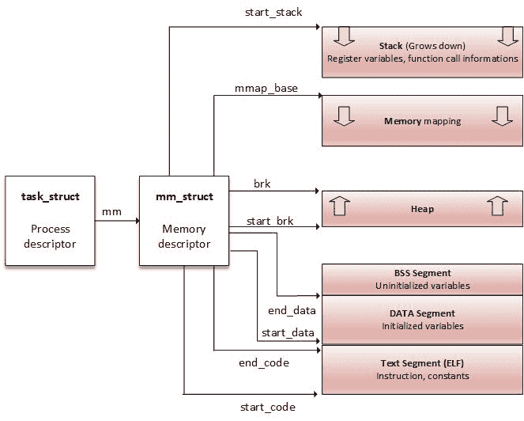

进程内存布局

从进程的角度来看，内存映射实际上可以看作是一组专门用于连续虚拟地址范围的页表条目。这个*连续虚拟地址范围*称为内存区域，或**虚拟内存区域**（**VMA**）。每个内存映射由起始地址和长度、权限（例如程序是否可以从该内存读取、写入或执行）以及关联资源（例如物理页面、交换页面、文件内容等）描述。

`mm_struct`有两种存储进程区域（VMA）的方式：

1.  在红黑树中，根元素由字段`mm_struct->mm_rb`指向。

1.  在一个链表中，第一个元素由字段``mm_struct->mmap``指向。

# 虚拟内存区域（VMA）

内核使用虚拟内存区域来跟踪进程的内存映射，例如，一个进程对于其代码有一个 VMA，对于每种类型的数据有一个 VMA，对于每个不同的内存映射（如果有的话）有一个 VMA 等等。VMAs 是处理器无关的结构，具有权限和访问控制标志。每个 VMA 都有一个起始地址和长度，它们的大小始终是页面大小（`PAGE_SIZE`）的倍数。VMA 由多个页面组成，每个页面在页表中都有一个条目。

VMA 描述的内存区域始终是虚拟连续的，而不是物理的。可以通过`/proc/<pid>/maps`文件或使用`pmap`命令来检查与进程关联的所有 VMA。

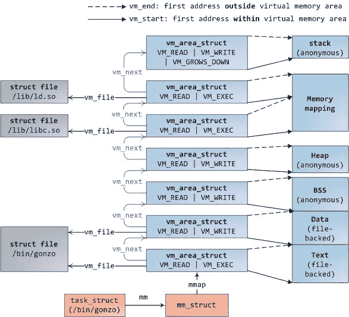

图片来源：http://duartes.org/gustavo/blog/post/how-the-kernel-manages-your-memory/

```
# cat /proc/1073/maps

00400000-00403000 r-xp 00000000 b3:04 6438 /usr/sbin/net-listener

00602000-00603000 rw-p 00002000 b3:04 6438 /usr/sbin/net-listener

00603000-00624000 rw-p 00000000 00:00 0 [heap]

7f0eebe4d000-7f0eebe54000 r-xp 00000000 b3:04 11717 /usr/lib/libffi.so.6.0.4

7f0eebe54000-7f0eec054000 ---p 00007000 b3:04 11717 /usr/lib/libffi.so.6.0.4

7f0eec054000-7f0eec055000 rw-p 00007000 b3:04 11717 /usr/lib/libffi.so.6.0.4

7f0eec055000-7f0eec069000 r-xp 00000000 b3:04 21629 /lib/libresolv-2.22.so

7f0eec069000-7f0eec268000 ---p 00014000 b3:04 21629 /lib/libresolv-2.22.so

[...]

7f0eee1e7000-7f0eee1e8000 rw-s 00000000 00:12 12532 /dev/shm/sem.thk-mcp-231016-sema

[...]

```

前面摘录中的每一行都代表一个 VMA，字段映射以下模式：`{address（start-end）} {permissions} {offset} {device（major:minor）} {inode} {pathname（image）}`：

+   `address`：这表示 VMA 的起始和结束地址。

+   `permissions`：这描述了区域的访问权限：`r`（读取）、`w`（写入）和`x`（执行），包括`p`（如果映射是私有的）和`s`（用于共享映射）。

+   `Offset`：在文件映射（`mmap`系统调用）的情况下，它是映射发生的文件中的偏移量。否则为`0`。

+   `major:minor`：在文件映射的情况下，它们表示文件存储的设备的主要和次要编号（保存文件的设备）。

+   `inode`：在从文件映射的情况下，表示映射文件的 inode 号。

+   `pathname`：这是映射文件的名称，否则为空白。还有其他区域名称，如`[heap]`，`[stack]`或`[vdso]`，表示虚拟动态共享对象，这是内核映射到每个进程地址空间的共享库，以减少系统调用切换到内核模式时的性能损失。

分配给进程的每个页面都属于一个区域；因此，任何不在 VMA 中的页面都不存在，也不能被进程引用。

高内存非常适合用户空间，因为用户空间的虚拟地址必须显式映射。因此，大多数高内存被用户应用程序占用。`__GFP_HIGHMEM`和`GFP_HIGHUSER`是请求分配（可能）高内存的标志。没有这些标志，所有内核分配只返回低内存。在 Linux 中，没有办法从用户空间分配连续的物理内存。

可以使用`find_vma`函数找到与给定虚拟地址对应的 VMA。`find_vma`在`linux/mm.h`中声明。

```
* Look up the first VMA which satisfies  addr < vm_end,  NULL if none. */ 
extern struct vm_area_struct * find_vma(struct mm_struct * mm, unsigned long addr); 
```

这是一个例子：

```
struct vm_area_struct *vma = find_vma(task->mm, 0x13000); 
if (vma == NULL) /* Not found ? */ 
    return -EFAULT; 
if (0x13000 >= vma->vm_end) /* Beyond the end of returned VMA ? */ 
    return -EFAULT; 
```

可以通过读取文件`/proc/<PID>/map`，`/proc/<PID>/smap`和`/proc/<PID>/pagemap`来获取内存映射的整个过程。

# 地址转换和 MMU

虚拟内存是一个概念，是给进程的一种幻觉，使其认为自己拥有大量几乎无限的内存，有时甚至比系统实际拥有的更多。CPU 负责在每次访问内存位置时将虚拟地址转换为物理地址。这种机制称为地址转换，由 CPU 的一部分**内存管理单元（MMU**）执行。

MMU 保护内存免受未经授权的访问。对于给定的进程，需要访问的任何页面必须存在于进程的 VMAs 之一，并且因此必须存在于进程页表中（每个进程都有自己的页表）。

内存以固定大小的块命名为**页**用于虚拟内存，**帧**用于物理内存，在我们的情况下大小为 4 KB。无论如何，您不需要猜测您为其编写驱动程序的系统的页面大小。它是由`PAGE_SIZE`宏在内核中定义和访问的。因此，请记住，页面大小是由硬件（CPU）强加的。考虑到 4 KB 页面大小的系统，字节 0 到 4095 位于页面 0 中，字节 4096-8191 位于页面 1 中，依此类推。

引入页表的概念是为了管理页面和帧之间的映射。页面分布在表上，以便每个 PTE 对应于页面和帧之间的映射。然后，每个进程都被分配一组页表来描述其整个内存空间。

为了遍历页，每个页被分配一个索引（类似于数组），称为页号。当涉及到帧时，它是 PFN**。**这样，虚拟内存地址由两部分组成：页号和偏移量。偏移量表示地址的 12 个最低有效位，而 13 个最低有效位表示它在 8 KB 页面大小系统上的情况：

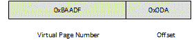

虚拟地址表示

操作系统或 CPU 如何知道给定虚拟地址对应的物理地址？它们使用页表作为转换表，并知道每个条目的索引是虚拟页号，值是 PFN。为了访问给定虚拟内存的物理内存，操作系统首先提取偏移量、虚拟页号，然后遍历进程的页表，以将虚拟页号与物理页匹配。一旦匹配发生，就可以访问该页框中的数据：

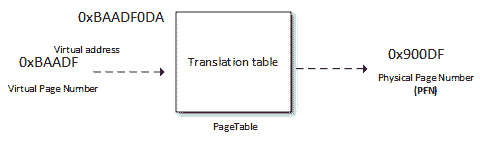

地址转换

偏移量用于指向帧内的正确位置。页表不仅保存物理和虚拟页号之间的映射，还保存访问控制信息（读/写访问权限、特权等）。

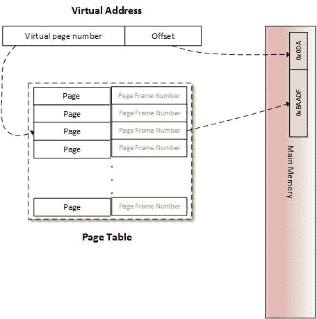

虚拟到物理地址转换

用于表示偏移量的位数由内核宏`PAGE_SHIFT`定义。`PAGE_SHIFT`是将一个位左移以获得`PAGE_SIZE`值的位数。它也是右移以将虚拟地址转换为页号和物理地址转换为页框号的位数。以下是内核源代码中`/include/asm-generic/page.h`中这些宏的定义*:*

```
#define PAGE_SHIFT      12 
#ifdef __ASSEMBLY__ 
#define PAGE_SIZE       (1 << PAGE_SHIFT) 
#else 
#define PAGE_SIZE       (1UL << PAGE_SHIFT) 
#endif 
```

页表是一个部分解决方案。让我们看看为什么。大多数架构需要 32 位（4 字节）来表示 PTE。每个进程都有其私有的 3GB 用户空间地址，我们需要 786,432 个条目来描述和覆盖进程的地址空间。这代表了每个进程花费太多的物理内存，只是为了描述内存映射。事实上，进程通常只使用其虚拟地址空间的一小部分但分散的部分。为了解决这个问题，引入了*级别*的概念。页表通过级别（页级别）进行层次化。存储多级页表所需的空间仅取决于实际使用的虚拟地址空间，而不是与虚拟地址空间的最大大小成比例。这样，未使用的内存不再表示，页表遍历时间缩短。这样，级别 N 中的每个表项将指向级别 N+1 的表中的一个条目。级别 1 是更高级别。

Linux 使用四级分页模型：

+   **页全局目录**（**PGD**）：这是第一级（级别 1）页表。内核中每个条目的类型是`pgd_t`（通常是`unsigned long`），并指向第二级表中的一个条目。在内核中，`tastk_struct`结构表示进程的描述，它又有一个成员（`mm`），其类型是`mm_struct`，用于描述和表示进程的内存空间。在`mm_struct`中，有一个特定于处理器的字段`pgd`，它是进程级别 1（PGD）页表的第一个条目（条目 0）的指针。每个进程只有一个 PGD，最多可以包含 1024 个条目。

+   **页上级目录**（**PUD**）：这仅存在于使用四级表的架构中。它代表间接的第二级。

+   **页中间目录**（**PMD**）：这是第三级间接层，仅存在于使用四级表的架构中。

+   **页表**（**PTE**）：树的叶子。它是一个`pte_t`数组，其中每个条目指向物理页。

并非所有级别都总是被使用。i.MX6 的 MMU 只支持 2 级页表（`PGD`和`PTE`），几乎所有 32 位 CPU 都是如此。在这种情况下，`PUD`和`PMD`被简单地忽略。

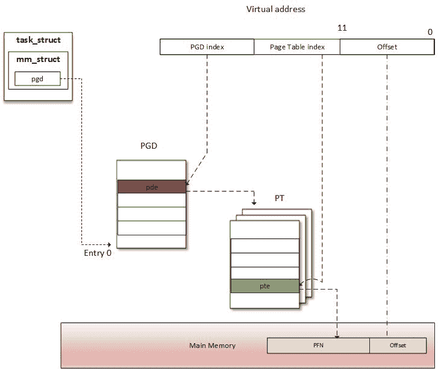

两级表概述

你可能会问 MMU 如何知道进程的页表。很简单，MMU 不存储任何地址。相反，在 CPU 中有一个特殊的寄存器，称为**页表基址寄存器**（**PTBR**）或**转换表基址寄存器 0**（**TTBR0**），它指向进程的一级（顶级）页表（PGD）的基址（条目 0）。这正是`struct mm_struct`的`pdg`字段指向的地方：`current->mm.pgd == TTBR0`。

在上下文切换（当新进程被调度并获得 CPU 时），内核立即配置 MMU，并使用新进程的`pgd`更新 PTBR。现在，当虚拟地址被提供给 MMU 时，它使用 PTBR 的内容来定位进程的一级页表（PGD），然后使用从虚拟地址的**最高有效位**（**MSBs**）提取的一级索引来找到适当的表项，其中包含指向适当的二级页表的基地址的指针。然后，从该基地址开始，它使用二级索引来找到适当的条目，依此类推，直到达到 PTE。 ARM 架构（我们的情况下是 i.MX6）具有 2 级页表。在这种情况下，二级条目是 PTE，并指向物理页（PFN）。只有在这一步找到物理页。为了访问页面中的确切内存位置，MMU 提取内存偏移量，也是虚拟地址的一部分，并指向物理页面中的相同偏移量。

当进程需要从内存位置读取或写入（当然我们谈论的是虚拟内存）时，MMU 执行该进程的页表中的翻译，以找到正确的条目（`PTE`）。从虚拟地址中提取虚拟页号，并由处理器用作进程页表的索引，以检索其页表条目。如果该偏移处有有效的页表条目，则处理器从该条目中获取页框号。如果没有，则意味着进程访问了其虚拟内存的未映射区域。然后引发页面错误，操作系统应该处理它。

在现实世界中，地址转换需要进行页表遍历，并且它并不总是一次性操作。至少有与表级别相同数量的内存访问。四级页表将需要四次内存访问。换句话说，每次虚拟访问都会导致五次物理内存访问。如果虚拟内存访问比物理访问慢四倍，那么虚拟内存概念将是无用的。幸运的是，SoC 制造商努力找到了一个聪明的技巧来解决这个性能问题：现代 CPU 使用一个小的关联和非常快速的内存，称为**翻译后备缓冲器**（**TLB**），以缓存最近访问的虚拟页面的 PTE。

# 页面查找和 TLB

在 MMU 进行地址转换之前，还有另一步骤。就像有一个用于最近访问数据的缓存一样，还有一个用于最近转换地址的缓存。数据缓存加快了数据访问过程，TLB 加快了虚拟地址转换（是的，地址转换是一项棘手的任务。它是内容可寻址存储器，简称（**CAM**），其中键是虚拟地址，值是物理地址。换句话说，TLB 是 MMU 的缓存。在每次内存访问时，MMU 首先检查 TLB 中最近使用的页面，其中包含一些当前分配给物理页面的虚拟地址范围。

# TLB 是如何工作的

在虚拟内存访问时，CPU 通过 TLB 尝试查找正在访问的页面的虚拟页号。这一步称为 TLB 查找。当找到 TLB 条目（发生匹配）时，就会发生**TLB 命中**，CPU 继续运行并使用在 TLB 条目中找到的 PFN 来计算目标物理地址。当发生 TLB 命中时，不会发生页面错误。可以看到，只要在 TLB 中找到翻译，虚拟内存访问就会像物理访问一样快。如果没有找到 TLB 条目（未发生匹配），就会发生**TLB 未命中**。

在 TLB 未命中事件中，根据处理器类型，TLB 未命中事件可以由软件或硬件通过 MMU 处理：

+   **软件处理**：CPU 引发 TLB 未命中中断，被操作系统捕获。然后操作系统遍历进程的页表以找到正确的 PTE。如果有匹配和有效的条目，那么 CPU 会在 TLB 中安装新的翻译。否则，将执行页面错误处理程序。

+   **硬件处理**：由 CPU（实际上是 MMU）在硬件中遍历进程的页表。如果有匹配和有效的条目，CPU 将新的转换添加到 TLB 中。否则，CPU 会引发页面错误中断，由操作系统处理。

在这两种情况下，页面错误处理程序是相同的：执行`do_page_fault()`函数，这取决于体系结构。对于 ARM，`do_page_fault`在`arch/arm/mm/fault.c`中定义：

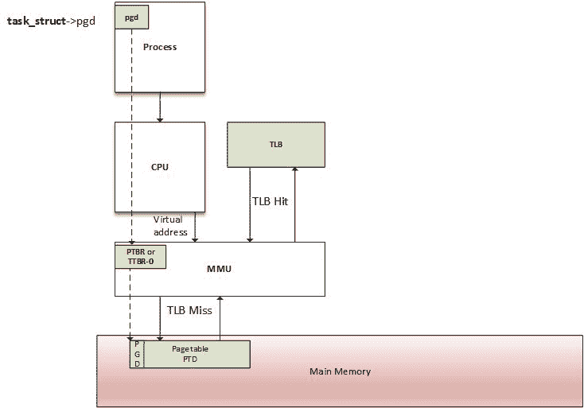

MMU 和 TLB 遍历过程

页表和页目录条目是与体系结构相关的。操作系统需要确保表的结构与 MMU 识别的结构相对应。在 ARM 处理器上，您必须将转换表的位置写入 CP15（协处理器 15）寄存器 c2，然后通过写入 CP15 寄存器 c1 来启用缓存和 MMU。详细信息请参阅[`infocenter.arm.com/help/index.jsp?topic=/com.arm.doc.dui0056d/BABHJIBH.htm`](http://infocenter.arm.com/help/index.jsp?topic=/com.arm.doc.dui0056d/BABHJIBH.htm)和[`infocenter.arm.com/help/index.jsp?topic=/com.arm.doc.ddi0433c/CIHFDBEJ.html`](http://infocenter.arm.com/help/index.jsp?topic=/com.arm.doc.ddi0433c/CIHFDBEJ.html)。

# 内存分配机制

让我们看一下下图，显示了 Linux 系统上存在的不同内存分配器，并稍后讨论它：

灵感来自：[`free-electrons.com/doc/training/linux-kernel/linux-kernel-slides.pdf`](http://free-electrons.com/doc/training/linux-kernel/linux-kernel-slides.pdf)。

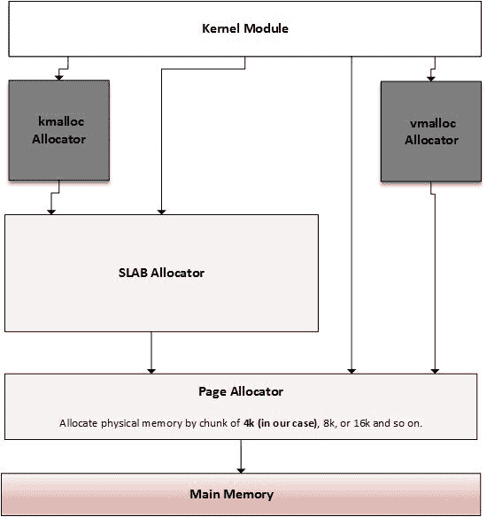

内核内存分配器概述

有一种分配机制可以满足任何类型的内存请求。根据您需要内存的用途，您可以选择最接近您目标的分配机制。主要的分配器是**页面分配器**，它只处理页面（页面是它可以提供的最小内存单位）。然后是建立在页面分配器之上的**SLAB 分配器**，它从页面中获取页面并返回较小的内存实体（通过 slab 和缓存）。这是**kmalloc 分配器**依赖的分配器。

# 页面分配器

页面分配器是 Linux 系统上的低级分配器，其他分配器依赖于它。系统的物理内存由固定大小的块（称为页面帧）组成。页面帧在内核中表示为`struct page`结构的实例。页面是操作系统在低级别对任何内存请求提供的最小内存单位。

# 页面分配 API

您将了解到，内核页面分配器使用伙伴算法分配和释放页面块。页面以 2 的幂大小分配在块中（为了从伙伴算法中获得最佳效果）。这意味着它可以分配 1 页、2 页、4 页、8 页、16 页等等：

1.  `alloc_pages(mask, order)`分配 2^(order)页并返回表示保留块的第一页的`struct page`实例。要分配一个页面，顺序应为 0。这就是`alloc_page(mask)`的作用：

```
struct page *alloc_pages(gfp_t mask, unsigned int order) 
#define alloc_page(gfp_mask) alloc_pages(gfp_mask, 0) 
```

`__free_pages()`用于释放使用`alloc_pages()`函数分配的内存。它接受指向分配页面的指针作为参数，与分配时使用的顺序相同。

```
void __free_pages(struct page *page, unsigned int order); 
```

1.  还有其他以相同方式工作的函数，但它们返回保留块的地址（虚拟地址）。这些是`__get_free_pages(mask, order)`和`__get_free_page(mask)`：

```
unsigned long __get_free_pages(gfp_t mask, unsigned int order); 
unsigned long get_zeroed_page(gfp_t mask); 
```

`free_pages()`用于释放使用`__get_free_pages()`分配的页面。它接受表示分配页面起始区域的内核地址，以及应该与分配时使用的相同的顺序：

```
free_pages(unsigned long addr, unsigned int order); 
```

在任一情况下，`mask`指定有关请求的详细信息，即内存区域和分配器的行为。可用选择是：

+   `GFP_USER`，用于用户内存分配。

+   `GFP_KERNEL`，用于内核分配的常用标志。

+   `GFP_HIGHMEM`，从 HIGH_MEM 区域请求内存。

+   `GFP_ATOMIC`，以无法休眠的原子方式分配内存。在需要从中断上下文中分配内存时使用。

有一个关于使用`GFP_HIGHMEM`的警告，不应与`__get_free_pages()`（或`__get_free_page()`）一起使用。由于 HIGHMEM 内存不能保证是连续的，因此无法返回从该区域分配的内存的地址。全局只允许在与内存相关的函数中使用`GFP_*`的子集：

```
unsigned long __get_free_pages(gfp_t gfp_mask, unsigned int order) 
{ 
   struct page *page; 

   /* 
    * __get_free_pages() returns a 32-bit address, which cannot represent 
    * a highmem page 
    */ 
   VM_BUG_ON((gfp_mask & __GFP_HIGHMEM) != 0); 

   page = alloc_pages(gfp_mask, order); 
   if (!page) 
         return 0; 
   return (unsigned long) page_address(page); 
} 
```

可以分配的最大页面数为 1024。这意味着在 4 Kb 大小的系统上，最多可以分配 1024*4 Kb = 4 MB。对于`kmalloc`也是一样的。

# 转换函数

`page_to_virt()`函数用于将结构页（例如由`alloc_pages()`返回）转换为内核地址。`virt_to_page()`接受内核虚拟地址并返回其关联的结构页实例（就好像是使用`alloc_pages()`函数分配的）。`virt_to_page()`和`page_to_virt()`都在`<asm/page.h>`中定义：

```
struct page *virt_to_page(void *kaddr); 
void *page_to_virt(struct page *pg) 
```

宏`page_address()`可用于返回与结构页实例的开始地址（当然是逻辑地址）对应的虚拟地址：

```
void *page_address(const struct page *page) 
```

我们可以看到它是如何在`get_zeroed_page()`函数中使用的：

```
unsigned long get_zeroed_page(unsigned int gfp_mask) 
{ 
    struct page * page; 

    page = alloc_pages(gfp_mask, 0); 
    if (page) { 
        void *address = page_address(page); 
        clear_page(address); 
        return (unsigned long) address; 
    } 
    return 0; 
} 
```

`__free_pages()`和`free_pages()`可以混合使用。它们之间的主要区别在于`free_page()`以虚拟地址作为参数，而`__free_page()`以`struct page`结构作为参数。

# 页桶分配器

页桶分配器是`kmalloc()`依赖的分配器。它的主要目的是消除由于小内存分配而引起的内存（释放）引起的碎片化，并加速常用对象的内存分配。

# 伙伴算法

为了分配内存，请求的大小会向上舍入为 2 的幂，并且伙伴分配器会搜索适当的列表。如果请求列表上不存在条目，则从下一个更大的列表（其块大小是前一个列表的两倍）中拆分为两半（称为**伙伴**）。分配器使用第一半，而另一半添加到下一个列表中。这是一种递归方法，当伙伴分配器成功找到可以拆分的块，或者达到最大块大小且没有可用的空闲块时停止。

以下案例研究受到[`dysphoria.net/OperatingSystems1/4_allocation_buddy_system.html`](http://dysphoria.net/OperatingSystems1/4_allocation_buddy_system.html)的启发。例如，如果最小分配大小为 1 KB，内存大小为 1 MB，伙伴分配器将为 1 KB 空洞创建一个空列表，为 2 KB 空洞创建一个空列表，为 4 KB 空洞创建一个列表，8 KB，16 KB，32 KB，64 KB，128 KB，256 KB，512 KB，以及一个 1 MB 空洞的列表。它们最初都是空的，除了 1 MB 列表只有一个空洞。

现在让我们想象一个场景，我们想要分配一个**70K**的块。伙伴分配器将其向上舍入为**128K**，然后将 1 MB 拆分为两个**512K**块，然后**256K**，最后**128K**，然后它将分配一个**128K**块给用户。以下是总结此场景的方案：

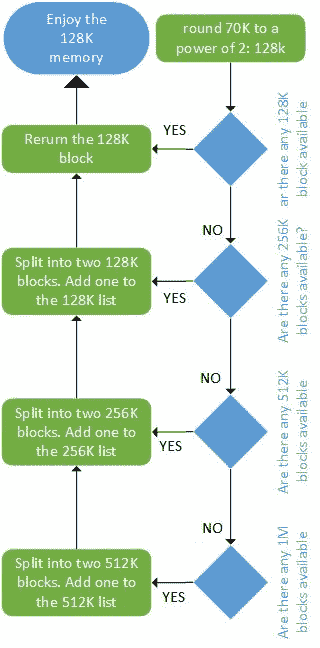

使用伙伴算法进行分配

释放与分配一样快。以下图总结了释放算法：

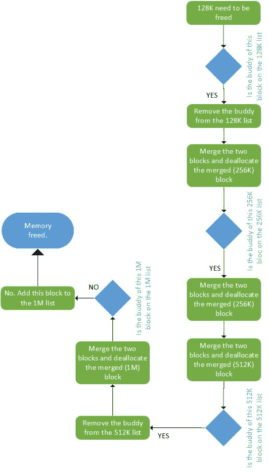

使用伙伴算法进行释放

# 对页桶分配器的探索

在我们介绍页桶分配器之前，让我们定义一些它使用的术语：

+   **页桶**：这是由几个页框组成的连续的物理内存块。每个页桶被分成相同大小的块，用于存储特定类型的内核对象，例如索引节点、互斥体等。每个页桶都是对象的数组。

+   **缓存**：由一个或多个页桶组成的链表，它们在内核中表示为`struct kmem_cache_t`结构的实例。缓存只存储相同类型的对象（例如，仅存储索引节点，或仅存储地址空间结构）

SLAB 可能处于以下状态之一：

+   **空**：这是 SLAB 上的所有对象（块）都标记为空闲

+   **部分**：SLAB 中存在已使用和空闲对象

+   **完整**：SLAB 上的所有对象都标记为已使用

由内存分配器构建缓存。最初，每个 SLAB 都标记为空。当为内核对象分配内存时，系统会在该类型对象的缓存中的部分/空闲 SLAB 上寻找该对象的空闲位置。如果找不到，系统将分配一个新的 SLAB 并将其添加到缓存中。新对象从此 SLAB 分配，并且该 SLAB 标记为**部分**。当代码完成内存（释放内存）时，对象将以其初始化状态简单地返回到 SLAB 缓存中。

这也是内核提供帮助函数以获取零初始化内存的原因，以消除先前的内容。SLAB 保持其对象的使用数量的引用计数，因此当缓存中的所有 SLAB 都已满并且请求另一个对象时，SLAB 分配器负责添加新的 SLAB：

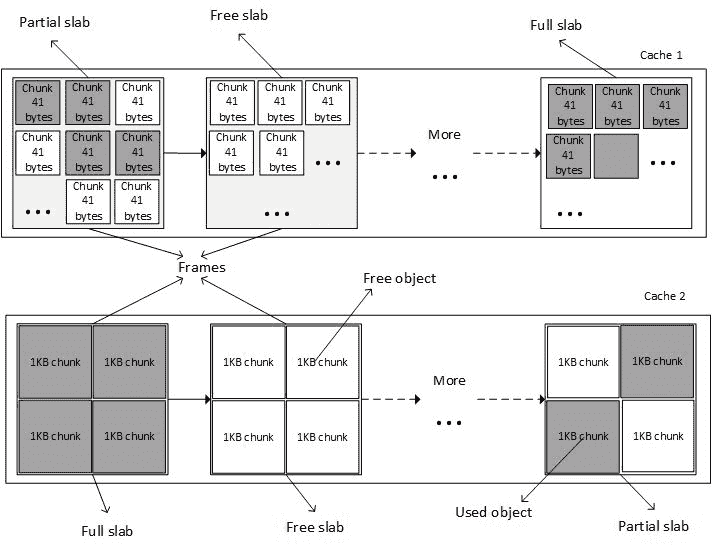

SLAB 缓存概述

这有点像创建每个对象的分配器。系统为每种类型的对象分配一个缓存，只有相同类型的对象才能存储在缓存中（例如，只有`task_struct`结构）。

内核中有不同类型的 SLAB 分配器，取决于是否需要紧凑性、缓存友好性或原始速度：

+   **SLOB**，尽可能紧凑

+   **SLAB**，尽可能缓存友好

+   **SLUB**，相当简单，需要较少的指令成本计数

# kmalloc 家族分配

`kmalloc`是一个内核内存分配函数，类似于用户空间的`malloc()`。`kmalloc`返回的内存在物理内存和虚拟内存中是连续的：

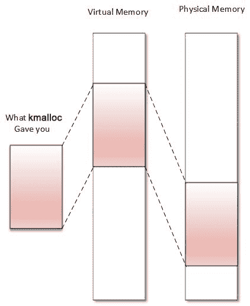

kmalloc 分配器是内核中的通用和高级内存分配器，依赖于 SLAB 分配器。从 kmalloc 返回的内存具有内核逻辑地址，因为它是从`LOW_MEM`区域分配的，除非指定了`HIGH_MEM`。它在`<linux/slab.h>`中声明，这是在驱动程序中使用 kmalloc 时要包含的头文件。原型如下：

```
void *kmalloc(size_t size, int flags); 
```

`size`指定要分配的内存的大小（以字节为单位）。`flag`确定应如何分配内存以及内存应该分配到哪里。可用的标志与页面分配器相同（`GFP_KERNEL`，`GFP_ATOMIC`，`GFP_DMA`等）。

+   `GFP_KERNEL`：这是标准标志。我们不能在中断处理程序中使用此标志，因为其代码可能会休眠。它总是从`LOM_MEM`区域返回内存（因此是逻辑地址）。

+   `GFP_ATOMIC`：这保证了分配的原子性。当我们处于中断上下文时，唯一要使用的标志。请不要滥用这一点，因为它使用了一个紧急内存池。

+   `GFP_USER`：这将内存分配给用户空间进程。然后，内存与分配给内核的内存是不同的并且分开的。

+   `GFP_HIGHUSER`：这从`HIGH_MEMORY`区域分配内存

+   `GFP_DMA`：这从`DMA_ZONE`分配内存。

成功分配内存后，kmalloc 返回分配的块的虚拟地址，保证是物理上连续的。在出错时，它返回`NULL`。

在分配小尺寸内存时，kmalloc 依赖于 SLAB 缓存。在这种情况下，内核将分配的区域大小舍入到它可以适应的最小 SLAB 缓存的大小。始终将其用作默认的内存分配器。在本书中使用的架构（ARM 和 x86）中，每个分配的最大尺寸为 4 MB，总分配量为 128 MB。请查看[`kaiwantech.wordpress.com/2011/08/17/kmalloc-and-vmalloc-linux-kernel-memory-allocation-api-limits/。`](https://kaiwantech.wordpress.com/2011/08/17/kmalloc-and-vmalloc-linux-kernel-memory-allocation-api-limits/)

`kfree`函数用于释放 kmalloc 分配的内存。以下是`kfree()`的原型；

```
void kfree(const void *ptr) 
```

让我们看一个例子：

```
#include <linux/init.h> 
#include <linux/module.h> 
#include <linux/slab.h> 
#include <linux/mm.h> 

MODULE_LICENSE("GPL");  
MODULE_AUTHOR("John Madieu"); 

void *ptr;  

static int  
alloc_init(void)  
{ 
    size_t size = 1024; /* allocate 1024 bytes */  
    ptr = kmalloc(size,GFP_KERNEL);  
    if(!ptr) { 
        /* handle error */ 
        pr_err("memory allocation failed\n");  
        return -ENOMEM;  
    }  
    else  
        pr_info("Memory allocated successfully\n");  
    return 0; 
} 

static void alloc_exit(void) 
{ 
    kfree(ptr);  
    pr_info("Memory freed\n");  
}  

module_init(alloc_init);  
module_exit(alloc_exit); 
```

其他类似的函数有：

```
void kzalloc(size_t size, gfp_t flags); 
void kzfree(const void *p); 
void *kcalloc(size_t n, size_t size, gfp_t flags); 
void *krealloc(const void *p, size_t new_size, gfp_t flags); 
```

`krealloc()`是用户空间`realloc()`函数的内核等价物。因为`kmalloc()`返回的内存保留了其先前版本的内容，如果暴露给用户空间，可能存在安全风险。要获取清零的 kmalloc 分配的内存，应该使用`kzalloc`。`kzfree()`是`kzalloc()`的释放函数，而`kcalloc()`为数组分配内存，其参数`n`和`size`分别表示数组中的元素数量和元素的大小。

由于`kmalloc()`返回的内存区域在内核永久映射中（即物理上连续），可以使用`virt_to_phys()`将内存地址转换为物理地址，或者使用`virt_to_bus()`将其转换为 IO 总线地址。这些宏在必要时内部调用`__pa()`或`__va()`。物理地址（`virt_to_phys(kmalloc'ed address)`）减去`PAGE_SHIFT`，将产生分配块所在的第一页的 PFN。

# vmalloc 分配器

`vmalloc()`是本书中将讨论的最后一个内核分配器。它只返回虚拟空间上连续的内存：

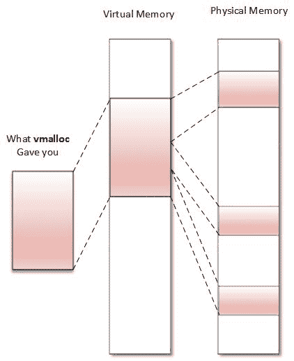

返回的内存总是来自`HIGH_MEM`区域。返回的地址不能转换为物理地址或总线地址，因为无法断定内存是否物理上连续。这意味着`vmalloc()`返回的内存不能在微处理器外部使用（您不能轻松地用于 DMA 目的）。使用`vmalloc()`为仅在软件中存在的大型（例如，为网络缓冲区）顺序分配内存是正确的。重要的是要注意，`vmalloc()`比`kmalloc()`或页面分配器函数要慢，因为它必须检索内存，构建页表，甚至重新映射到虚拟连续范围，而`kmalloc()`从不这样做。

在使用此 vmalloc API 之前，您应该在代码中包含此头文件：

```
#include <linux/vmalloc.h> 
```

以下是 vmalloc 家族的原型：

```
void *vmalloc(unsigned long size); 
void *vzalloc(unsigned long size); 
void vfree( void *addr); 
```

`size`是您需要分配的内存的大小。成功分配内存后，它返回分配的内存块的第一个字节的地址。失败时返回`NULL`。`vfree`函数用于释放`vmalloc()`分配的内存。

以下是使用`vmalloc`的示例：

```
#include<linux/init.h> 
#include<linux/module.h> 
#include <linux/vmalloc.h> 

void *ptr; 
static int alloc_init(void) 
{ 
    unsigned long size = 8192; 
    ptr = vmalloc(size); 
    if(!ptr) 
    { 
        /* handle error */ 
        printk("memory allocation failed\n"); 
        return -ENOMEM; 
    } 
    else 
        pr_info("Memory allocated successfully\n"); 
    return 0; 

} 

static void my_vmalloc_exit(void) /* function called at the time of rmmod */ 
{ 
    vfree(ptr); //free the allocated memory 
    printk("Memory freed\n"); 
} 
module_init(my_vmalloc_init); 
module_exit(my_vmalloc_exit); 

MODULE_LICENSE("GPL"); 
MODULE_AUTHOR("john Madieu, john.madieu@gmail.com"); 
```

可以使用`/proc/vmallocinfo`来显示系统上所有 vmalloc 分配的内存。`VMALLOC_START`和`VMALLOC_END`是两个限定 vmalloc 地址范围的符号。它们是与体系结构相关的，并在`<asm/pgtable.h>`中定义。

# 底层的进程内存分配

让我们专注于分配页面内存的低级分配器。内核将报告分配帧页（物理页），直到真正必要时（当这些页实际被访问时，通过读取或写入）。这种按需分配称为**惰性分配**，消除了分配永远不会被使用的页面的风险。

每当请求一个页面时，只更新页表，在大多数情况下，会创建一个新条目，这意味着只分配了虚拟内存。只有当您访问页面时，才会引发称为**页面故障**的中断。这个中断有一个专门的处理程序，称为页面故障处理程序，并且是由 MMU 响应对虚拟内存的访问尝试而立即成功。

实际上，无论访问类型是读取、写入还是执行，都会引发页面故障中断，指向页表中的条目未设置适当的权限位以允许该类型的访问。对该中断的响应有以下三种方式之一：

+   **硬错误**：页面不驻留在任何地方（既不在物理内存中，也不在内存映射文件中），这意味着处理程序无法立即解决错误。处理程序将执行 I/O 操作，以准备解决错误所需的物理页面，并且可能会挂起中断的进程并在系统解决问题时切换到另一个进程。

+   **软错误**：页面在内存中的其他位置（在另一个进程的工作集中）。这意味着错误处理程序可以通过立即将物理内存页面附加到适当的页表项，调整条目并恢复中断的指令来解决错误。

+   **错误无法解决**：这将导致总线错误或 segv。向有错误的进程发送`SIGSEGV`，杀死它（默认行为），除非为`SIGSEV`安装了信号处理程序以更改默认行为。

内存映射通常开始时不附加任何物理页面，通过定义虚拟地址范围而不附加任何相关的物理内存。实际的物理内存是在以后分配，以响应页面错误异常，当访问内存时，因为内核提供了一��标志来确定尝试访问是否合法，并指定页面错误处理程序的行为。因此，用户空间的`brk(), mmap()`和类似函数分配（虚拟）空间，但物理内存稍后附加。

在中断上下文中发生的页面错误会导致**双重故障**中断，通常会导致内核恐慌（调用`panic()`函数）。这就是为什么在中断上下文中分配的内存来自内存池，不会引发页面错误中断。如果在处理双重故障时发生中断，将生成三重故障异常，导致 CPU 关闭并立即重新启动操作系统。这种行为实际上是与架构相关的。

# 写时复制（CoW）案例

CoW（与`fork()`一起广泛使用）是内核功能，不会为两个或多个进程共享的数据多次分配内存，直到进程触及它（写入它）为止；在这种情况下，将为其私有副本分配内存。以下显示了页面错误处理程序如何管理 CoW（单页案例研究）：

+   将 PTE 添加到进程页表中，并标记为不可写。

+   映射将导致在进程 VMA 列表中创建一个 VMA。页面将添加到该 VMA，并将该 VMA 标记为可写。

+   在页面访问时（第一次写入），错误处理程序注意到差异，这意味着：**这是写时复制**。然后将分配一个物理页面，分配给上面添加的 PTE，更新 PTE 标志，刷新 TLB 条目，并执行`do_wp_page()`函数，该函数可以将内容从共享地址复制到新位置。

# 与 I/O 内存一起工作以与硬件通信

除了执行数据 RAM 导向的操作外，还可以执行 I/O 内存事务，以与硬件通信。当涉及访问设备的寄存器时，内核根据系统架构提供两种可能性：

+   **通过 I/O 端口**：这也称为**端口输入输出**（**PIO**）。寄存器可通过专用总线访问，并且需要特定指令（通常是汇编中的`in`和`out`）来访问这些寄存器。这是在 x86 架构上的情况。

+   **内存映射输入输出**（**MMIO**）：这是最常见和最常用的方法。设备的寄存器��映射到内存。只需读取和写入特定地址即可写入设备的寄存器。这是在 ARM 架构上的情况。

# PIO 设备访问

在使用 PIO 的系统上，有两个不同的地址空间，一个用于内存，我们已经讨论过，另一个用于 I/O 端口，称为端口地址空间，仅限于 65,536 个端口。这是一种旧的方式，在当今非常不常见。

内核导出了一些函数（符号）来处理 I/O 端口。在访问任何端口区域之前，我们必须首先通知内核我们正在使用一系列端口，使用`request_region()`函数，如果出错将返回`NULL`。完成区域后，必须调用`release_region()`。这两个都在`linux/ioport.h`中声明。它们的原型是：

```
struct resource *request_region(unsigned long start, 
                                 unsigned long len, char *name); 
void release_region(unsigned long start, unsigned long len); 
```

这些函数通知内核您打算使用/释放从`start`开始的`len`个端口的区域。`name`参数应设置为您设备的名称。它们的使用不是强制的。这是一种礼貌，可以防止两个或更多的驱动程序引用相同范围的端口。可以通过读取`/proc/ioports`文件的内容来显示系统上实际使用的端口的信息。

一旦完成区域保留，就可以使用以下函数访问端口：

```
u8 inb(unsigned long addr) 
u16 inw(unsigned long addr) 
u32 inl(unsigned long addr) 
```

分别访问（读取）大小为 8、16 或 32 位的端口，并且以下函数：

```
void outb(u8 b, unsigned long addr) 
void outw(u16 b, unsigned long addr) 
void outl(u32 b, unsigned long addr) 
```

写入`b`数据，大小为 8、16 或 32 位，到`addr`端口。

PIO 使用不同的指令集来访问 I/O 端口或 MMIO 的事实是一个缺点，因为 PIO 需要比正常内存更多的指令来完成相同的任务。例如，1 位测试在 MMIO 中只有一条指令，而 PIO 需要在测试位之前将数据读入寄存器，这不止一条指令。

# MMIO 设备访问

内存映射 I/O 与内存驻留在相同的地址空间中。内核使用通常由 RAM（实际上是`HIGH_MEM`）使用的地址空间的一部分来映射设备寄存器，因此在该地址处不是真正的内存（即 RAM），而是 I/O 设备。因此，与 I/O 设备通信就像读写专门用于该 I/O 设备的内存地址一样。

与 PIO 一样，有 MMIO 函数，用于通知内核我们打算使用内存区域。请记住，这只是纯粹的保留。这些是`request_mem_region()`和`release_mem_region()`：

```
struct resource* request_mem_region(unsigned long start, 
                                    unsigned long len, char *name) 
void release_mem_region(unsigned long start, unsigned long len) 
```

这也是一种礼貌。

可以通过读取`/proc/iomem`文件的内容来显示系统上实际使用的内存区域。

在访问内存区域之前（并且在成功请求之后），必须通过调用特定于体系结构的函数（利用 MMU 构建页表，因此不能从中断处理程序中调用）将该区域映射到内核地址空间。这些是`ioremap()`和`iounmap()`，它们也处理缓存一致性：

```
void __iomem *ioremap(unsigned long phys_add, unsigned long size) 
void iounmap(void __iomem *addr) 
```

`ioremap()`返回一个`__iomem void`指针，指向映射区域的起始位置。不要试图对这些指针进行解引用（通过读/写指针来获取/设置值）。内核提供了访问 ioremap'ed 内存的函数。这些是：

```
unsigned int ioread8(void __iomem *addr); 
unsigned int ioread16(void __iomem *addr); 
unsigned int ioread32(void __iomem *addr); 
void iowrite8(u8 value, void __iomem *addr); 
void iowrite16(u16 value, void __iomem *addr); 
void iowrite32(u32 value, void __iomem *addr); 
```

`ioremap`构建新的页表，就像`vmalloc`一样。但是，它实际上不分配任何内存，而是返回一个特殊的虚拟地址，可以用来访问指定的物理地址范围。

在 32 位系统上，MMIO 窃取物理内存地址空间以为内存映射 I/O 设备创建映射是一个缺点，因为它阻止系统将被窃取的内存用于一般 RAM 目的。

# __iomem cookie

`__iomem`是 Sparse 使用的内核 cookie，Sparse 是内核用于查找可能的编码错误的语义检查器。要利用 Sparse 提供的功能，应该在内核编译时启用它；如果没有，`__iomem` cookie 将被忽略。

在命令行中，`C=1`将为您启用 Sparse，但是首先应该在系统上安装 parse：

```
sudo apt-get install sparse

```

例如，在构建模块时，请使用：

```
make -C $KPATH M=$PWD C=1 modules

```

或者，如果 makefile 编写得很好，只需键入：

```
make C=1

```

以下显示了内核中如何定义`__iomem`：

```
#define __iomem    __attribute__((noderef, address_space(2))) 
```

这可以防止错误的驱动程序执行 I/O 内存访问。为所有 I/O 访问添加`__iomem`也是一种更严格的方式。因为即使在具有 MMU 的系统上，I/O 访问也是通过虚拟内存进行的，这个标记可以防止我们使用绝对物理地址，并要求我们使用`ioremap()`，它将返回一个带有`__iomem`标记的虚拟地址：

```
void __iomem *ioremap(phys_addr_t offset, unsigned long size); 
```

因此，我们可以使用专用函数，例如`ioread32()`和`iowrite32()`。你可能会想为什么不使用`readl()`/`writel()`函数。这些已经被弃用，因为它们不进行健全性检查，比`ioreadX()`/`iowriteX()`系列函数（只接受`__iomem`地址）更不安全（不需要`__iomem`）。

此外，`noderef`是 Sparse 用来确保程序员不对`__iomem`指针进行解引用的属性。即使在某些架构上可能有效，也不鼓励这样做。而是使用特殊的`ioreadX()`/`iowriteX()`函数。它是可移植的，并且适用于每种架构。现在让我们看看当对`__iomem`指针进行解引用时，Sparse 将如何警告我们：

```
#define BASE_ADDR 0x20E01F8 
void * _addrTX = ioremap(BASE_ADDR, 8); 
```

首先，Sparse 不高兴是因为错误的类型初始化程序：

```
 warning: incorrect type in initializer (different address spaces)

 expected void *_addrTX

 got void [noderef] <asn:2>*

```

或者：

```
u32 __iomem* _addrTX = ioremap(BASE_ADDR, 8); 
*_addrTX = 0xAABBCCDD; /* bad. No dereference */ 
pr_info("%x\n", *_addrTX); /* bad. No dereference */ 
```

Sparse 仍然不高兴：

```
Warning: dereference of noderef expression

```

最后一个例子让 Sparse 很高兴：

```
void __iomem* _addrTX = ioremap(BASE_ADDR, 8); 
iowrite32(0xAABBCCDD, _addrTX); 
pr_info("%x\n", ioread32(_addrTX)); 
```

你必须记住的两条规则是：

+   无论是作为返回类型还是作为参数类型，都要在需要的地方始终使用`__iomem`，并使用 Sparse 来确保你这样做了

+   不要对`__iomem`指针进行解引用；而是使用专用函数

# 内存（重新）映射

内核内存有时需要重新映射，无论是从内核到用户空间，还是从内核到内核空间。常见用例是将内核内存重新映射到用户空间，但还有其他情况，例如需要访问高内存。

# kmap

Linux 内核将其地址空间的前 896MB 永久映射到物理内存的前 896MB（低内存）。在 4GB 系统上，内核只剩下 128MB 来映射剩下的 3.2GB 物理内存（高内存）。低内存可以直接被内核寻址，因为有永久的一对一映射。当涉及到高内存（896MB 以上的内存）时，内核必须将所请求的高内存区域映射到其地址空间中，之前提到的 128MB 是专门为此保留的。用于执行此技巧的函数`kmap()`。`kmap()`用于将给定页面映射到内核地址空间中。

```
void *kmap(struct page *page); 
```

`page`是要映射的`struct page`结构的指针。当分配高内存页面时，它是不可直接寻址的。`kmap()`是必须调用的函数，用于将高内存临时映射到内核地址空间中。映射将持续到调用`kunmap()`为止：

```
void kunmap(struct page *page); 
```

临时地意味着一旦不再需要，映射就应该被取消。记住，128MB 不足以映射 3.2GB。最佳的编程实践是在不再需要时取消高内存映射。这就是为什么在每次访问高内存页面时都必须输入`kmap()`-`kunmap()`序列。

这个函数适用于高内存和低内存。也就是说，如果页面结构位于低内存中，那么只返回页面的虚拟地址（因为低内存页面已经有了永久映射）。如果页面属于高内存，内核的页表中将创建永久映射并返回地址：

```
void *kmap(struct page *page) 
{ 
   BUG_ON(in_interrupt()); 
   if (!PageHighMem(page)) 
         return page_address(page); 

   return kmap_high(page); 
} 
```

# 将内核内存映射到用户空间

映射物理地址是最有用的功能之一，特别是在嵌入式系统中。有时你可能想要与用户空间共享部分内核内存。如前所述，当在用户空间运行时，CPU 以非特权模式运行。为了让一个进程访问内核内存区域，我们需要将该区域重新映射到进程地址空间中。

# 使用`remap_pfn_range`

`remap_pfn_range()`将物理内存（通过内核逻辑地址）映射到用户空间进程。它特别适用于实现`mmap()`系统调用。

在文件（无论是设备文件还是其他文件）上调用`mmap()`系统调用后，CPU 将切换到特权模式，并运行相应的`file_operations.mmap()`内核函数，然后调用`remap_pfn_range()`。映射区域的内核 PTE 将被派生，并提供给进程，当然，具有不同的保护标志。进程的 VMA 列表将更新为一个新的 VMA 条目（具有适当的属性），它将使用 PTE 来访问相同的内存。

因此，内核只是复制 PTE 而不是浪费内存。但是，内核空间和用户空间的 PTE 具有不同的属性。`remap_pfn_range()`具有以下原型：

```
int remap_pfn_range(struct vm_area_struct *vma, unsigned long addr, 
             unsigned long pfn, unsigned long size, pgprot_t flags); 
```

成功调用将返回`0`，失败时返回负错误代码。大多数`remap_pfn_range()`的参数在调用`mmap()`方法时提供。

+   `vma`：这是内核在`file_operations.mmap()`调用的情况下提供的虚拟内存区域。它对应于用户进程的`vma`，其中应该进行映射。

+   `addr`：这是 VMA 应该开始的用户虚拟地址（`vma->vm_start`），这将导致从`addr`到`addr + size`之间的虚拟地址范围的映射。

+   `pfn`：这代表要映射的内核内存区域的页帧号。它对应于右移`PAGE_SHIFT`位的物理地址。应考虑`vma`偏移量（映射必须开始的对象中的偏移量）以产生 PFN。由于 VMA 结构的`vm_pgoff`字段包含以页数形式的偏移值，这正是您需要的（通过`PAGE_SHIFT`左移）以提取以字节形式的偏移量：`offset = vma->vm_pgoff << PAGE_SHIFT`）。最后，`pfn = virt_to_phys(buffer + offset) >> PAGE_SHIFT`。

+   `size`：这是被重新映射的区域的大小，以字节为单位。

+   `prot`：这代表新 VMA 请求的保护。驱动程序可以改变默认值，但应使用`vma->vm_page_prot`中的值作为骨架，使用 OR 运算符，因为用户空间已经设置了一些位。其中一些标志是：

+   `VM_IO`，指定设备的内存映射 I/O

+   `VM_DONTCOPY`，告诉内核在 fork 时不要复制这个`vma`

+   `VM_DONTEXPAND`，防止`vma`通过`mremap(2)`扩展

+   `VM_DONTDUMP`，防止`vma`被包含在核心转储中。

如果使用 I/O 内存，可能需要修改此值以禁用缓存（`vma->vm_page_prot = pgprot_noncached(vma->vm_page_prot);`）。

# 使用 io_remap_pfn_range

讨论的`remap_pfn_range()`函数在将 I/O 内存映射到用户空间时不再适用。在这种情况下，适当的函数是`io_remap_pfn_range()`，其参数相同。唯一改变的是 PFN 的来源。它的原型看起来像：

```
int io_remap_page_range(struct vm_area_struct *vma, 
                        unsigned long virt_addr, 
                        unsigned long phys_addr, 
                        unsigned long size, pgprot_t prot); 
```

在尝试将 I/O 内存映射到用户空间时，无需使用`ioremap()`。-`ioremap()`是为内核目的而设计的（将 I/O 内存映射到内核地址空间），而`io_remap_pfn_range`是为用户空间目的而设计的。

只需将真实的物理 I/O 地址（通过`PAGE_SHIFT`右移产生 PFN）直接传递给`io_remap_pfn_range()`。即使有一些体系结构将`io_remap_pfn_range()`定义为`remap_pfn_range()`，也有其他体系结构不是这种情况。出于可移植性的考虑，您应该只在 PFN 参数指向 RAM 的情况下使用`remap_pfn_range()`，并在`phys_addr`指向 I/O 内存的情况下使用`io_remap_pfn_range()`。

# mmap 文件操作

内核`mmap`函数是`struct file_operations`结构的一部分，当用户执行系统调用`mmap(2)`时执行，用于将物理内存映射到用户虚拟地址。内核将对该映射区域的任何访问通过通常的指针解引用转换为文件操作。甚至可以直接将设备物理内存映射到用户空间（参见`/dev/mem`）。基本上，写入内存就像写入文件一样。这只是一种更方便的调用`write()`的方式。

通常，用户空间进程出于安全目的不能直接访问设备内存。因此，用户空间进程使用`mmap()`系统调用请求内核将设备映射到调用进程的虚拟地址空间中。映射后，用户空间进程可以通过返回的地址直接写入设备内存。

mmap 系统调用声明如下：

```
 mmap (void *addr, size_t len, int prot, 
       int flags, int fd, ff_t offset); 
```

驱动程序应该已经定义了 mmap 文件操作（`file_operations.mmap`）以支持`mmap(2)`。从内核方面来看，驱动程序文件操作结构（`struct file_operations`结构）中的 mmap 字段具有以下原型：

```
int (*mmap) (struct file *filp, struct vm_area_struct *vma); 
```

其中：

+   `filp`是指向由 fd 参数翻译而来的驱动程序的打开设备文件的指针。

+   `vma`由内核分配并作为参数给出。它是指向映射应该放置的用户进程的 vma 的指针。为了理解内核如何创建新的 vma，让我们回顾一下`mmap(2)`系统调用的原型：

```
void *mmap(void *addr, size_t length, int prot, int flags, int fd, off_t offset); 
```

该函数的参数在某种程度上影响了 vma 的一些字段：

+   `addr`：是映射应该开始的用户空间虚拟地址。它对`vma>vm_start`有影响。如果指定了`NULL`（最便携的方式），则自动确定正确的地址。

+   `length`：这指定了映射的长度，并间接影响了`vma->vm_end`。请记住，`vma`的大小始终是`PAGE_SIZE`的倍数。换句话说，`PAGE_SIZE`始终是`vma`可以具有的最小大小。内核将始终更改`vma`的大小，使其成为`PAGE_SIZE`的倍数。

```
If length <= PAGE_SIZE 
    vma->vm_end - vma->vm_start == PAGE_SIZE. 
If PAGE_SIZE < length <= (N * PAGE_SIZE) 
             vma->vm_end - vma->vm_start == (N * PAGE_SIZE) 
```

+   `prot`：这影响了 VMA 的权限，驱动程序可以在`vma->vm_pro`中找到。如前所述，驱动程序可以更新这些值，但不能更改它们。

+   `flags`：这确定了驱动程序可以在`vma->vm_flags`中找到的映射类型。映射可以是私有的或共享的。

+   `offset`：这指定了映射区域内的偏移量，从而操纵了`vma->vm_pgoff`的值。

# 在内核中实现 mmap

由于用户空间代码无法访问内核内存，`mmap()`函数的目的是派生一个或多个受保护的内核页表条目（对应于要映射的内存），并复制用户空间页表，删除内核标志保护，并设置允许用户访问与内核相同内存的权限标志，而无需特殊权限。

编写 mmap 文件操作的步骤如下：

1.  获取映射偏移并检查它是否超出我们的缓冲区大小：

```
unsigned long offset = vma->vm_pgoff << PAGE_SHIFT;  
if (offset >= buffer_size) 
         return -EINVAL; 
```

1.  检查映射大小是否大于我们的缓冲区大小：

```
unsigned long size = vma->vm_end - vma->vm_start; 
if (size > (buffer_size - offset)) 
   return -EINVAL; 
```

1.  获取与我们缓冲区的`偏移`位置所在页面的 PFN 相对应的 PFN：

```
unsigned long pfn; 
/* we can use page_to_pfn on the struct page structure 
 * returned by virt_to_page 
 */ 
/* pfn = page_to_pfn (virt_to_page (buffer + offset)); */ 

/* Or make PAGE_SHIFT bits right-shift on the physical 
 * address returned by virt_to_phys 
 */       
pfn = virt_to_phys(buffer + offset) >> PAGE_SHIFT; 
```

1.  设置适当的标志，无论 I/O 内存是否存在：

+   +   +   使用`vma->vm_page_prot = pgprot_noncached(vma->vm_page_prot)`禁用缓存。

+   设置`VM_IO`标志：`vma->vm_flags |= VM_IO`。

+   防止 VMA 交换出去：`vma->vm_flags |= VM_DONTEXPAND | VM_DONTDUMP`。在 3.7 版本之前的内核中，应该只使用`VM_RESERVED`标志。

1.  使用计算的 PFN、大小和保护标志调用`remap_pfn_range`：

```
if (remap_pfn_range(vma, vma->vm_start, pfn, size, vma->vm_page_prot)) { 
   return -EAGAIN; 
} 
return 0; 
```

1.  将 mmap 函数传递给`struct file_operations`结构：

```
static const struct file_operations my_fops = { 
   .owner = THIS_MODULE, 
   [...] 
   .mmap = my_mmap, 
   [...] 
}; 
```

# Linux 缓存系统

缓存是频繁访问或新写入数据从或写入到一个小而更快的内存，称为**缓存**的过程。

脏内存是指数据支持（例如，文件支持）的内存，其内容已被修改（通常在缓存中），但尚未写回磁盘。数据的缓存版本比磁盘上的版本更新，这意味着两个版本不同步。缓存数据被写回磁盘的机制（后备存储）称为**写回**。我们最终会更新磁盘上的版本，使两者同步。*干净内存*是文件支持的内存，其中的内容与磁盘同步。

Linux 延迟写操作以加快读取过程，并通过仅在必要时写入数据来减少磁盘磨损。一个典型的例子是`dd`命令。其完整执行并不意味着数据被写入目标设备；这就是为什么`dd`在大多数情况下都与`sync`命令链接在一起的原因。

# 什么是缓存？

缓存是临时的、小型的、快速的内存，用于保存来自更大且通常非常慢的内存的数据副本，通常放置在数据工作集远远超过其他数据的系统中（例如，硬盘、内存）。

当第一次读取发生时，比如一个进程从大而慢的磁盘请求一些数据，请求的数据被返回给进程，并且访问的数据的副本也被跟踪并缓存。任何后续的读取都将从缓存中获取数据。任何数据修改都将应用于缓存，而不是主磁盘上。然后，内容已被修改并且与磁盘上的版本不同（更新）的缓存区域将被标记为**脏**。当缓存运行满时，由于缓存的数据被跟踪，新数据开始驱逐那些未被访问并且已经闲置了最长时间的数据，因此如果需要再次访问，它将不得不从大而慢的存储中获取。

# CPU 缓存 - 内存缓存

现代 CPU 上有三个缓存内存，按大小和访问速度排序：

+   **L1**缓存具有最少的内存（通常在 1k 到 64k 之间），可以在单个时钟周期内直接被 CPU 访问，这使得它也是最快的。经常使用的东西在 L1 中，并且保持在 L1 中，直到其他东西的使用比现有的更频繁，并且 L1 中的空间较少。如果是这样，它将被移动到更大的 L2 空间。

+   **L2**缓存是中间层，具有更多的内存（高达几兆字节），毗邻处理器，可以在少量时钟周期内访问。这适用于从 L2 到 L3 的移动。

+   **L3**缓存，比 L1 和 L2 更慢，可能比主内存（RAM）快两倍。每个核心可能有自己的 L1 和 L2 缓存；因此，它们都共享 L3 缓存。大小和速度是每个缓存级别之间的主要标准变化：L1 < L2 < L3。例如，原始内存访问可能是 100 纳秒，而 L1 缓存访问可能是 0.5 纳秒。

一个现实生活中的例子是图书馆可能会在展示区放置几本最受欢迎的书籍的副本，以便快速方便地获取，但是还有一个大规模的档案馆，其中有更多的收藏品，但需要等待图书管理员去取。展示柜类似于缓存，档案馆则是大型、慢速的内存。

CPU 缓存解决的主要问题是延迟，这间接增加了吞吐量，因为访问未缓存的内存可能需要一段时间。

# Linux 页面缓存 - 磁盘缓存

页面缓存，顾名思义，是 RAM 中页面的缓存，包含最近访问文件的块。RAM 充当了磁盘上页面的缓存。换句话说，它是文件内容的内核缓存。缓存的数据可以是常规文件系统文件、块设备文件或内存映射文件。每当调用`read()`操作时，内核首先检查数据是否存在于页面缓存中，如果找到则立即返回。否则，数据将从磁盘读取。

如果进程需要写入数据而不涉及任何缓存，必须使用`O_SYNC`标志，该标志保证`write()`命令在所有数据传输到磁盘之前不返回，或者`O_DIRECT`标志，该标志仅保证不会使用缓存进行数据传输。也就是说，`O_DIRECT`实际上取决于所使用的文件系统，不建议使用。

# 专用缓存（用户空间缓存）

+   **Web 浏览器缓存**：将经常访问的网页和图像存储到磁盘上，而不是从网络获取。而在线数据的第一次访问可能需要超过数百毫秒，第二次访问将在仅 10 毫秒内从缓存（在这种情况下是磁盘）中获取数据。

+   **libc 或用户应用程序缓存**：内存和磁盘缓存实现将尝试猜测您下次需要使用的内容，而浏览器缓存则会保留本地副本以备再次使用。

# 为什么要延迟将数据写入磁盘？

基本上有两个原因：

+   更好地利用磁盘特性；这是效率

+   允许应用程序在写入后立即继续；这是性能

例如，延迟磁盘访问并仅在达到一定大小时处理数据可能会提高磁盘性能，并减少 eMMC（在嵌入式系统上）的磨损平衡。每个块写入都合并为单个连续的写操作。此外，写入的数据被缓存，允许进程立即返回，以便任何后续读取都将从缓存中获取数据，从而使程序更具响应性。存储设备更喜欢少量大型操作，而不是多个小型操作。

通过稍后在永久存储上报告写操作，我们可以摆脱这些相对较慢的磁盘引入的延迟问题。

# 写缓存策略

根据缓存策略的不同，可以列举出几个好处：

+   减少数据访问的延迟，从而提高应用程序性能

+   改善存储寿命

+   减少系统工作负载

+   减少数据丢失的风险

缓存算法通常属于以下三种不同的策略之一：

1.  **写透** **缓存**，任何写操作都会自动更新内存缓存和永久存储。这种策略适用于不能容忍数据丢失的应用程序，以及写入数据然后频繁重新读取数据的应用程序（因为数据存储在缓存中，读取延迟低）。

1.  **写绕** **缓存**，类似于写透，不同之处在于它立即使缓存无效（这对系统也是昂贵的，因为任何写操作都会自动使缓存无效）。主要后果是任何后续读取都将从磁盘获取数据，这很慢，从而增加延迟。它防止缓存被充斥着随后不会被读取的数据。

1.  Linux 采用第三种也是最后一种策略，称为**写回缓存**，它可以在发生更改时每次将数据写入缓存，而不更新主存储器中的相应位置。相反，页面缓存中的相应页面被标记为**脏**（这项任务由 MMU 使用 TLB 完成），并添加到由内核维护的所谓列表中。只有在指定的时间间隔或在特定条件下，数据才会被写入永久存储的相应位置。当页面中的数据与页面缓存中的数据保持最新时，内核会从列表中删除页面，并且它们不会被标记为脏。

1.  在 Linux 系统中，可以从`/proc/meminfo`下的`Dirty`中找到这个信息：

```
    cat /proc/meminfo | grep Dirty

```

# 刷新线程

写回缓存将 I/O 数据操作推迟到页面缓存中。一组或内核线程，称为刷新线程，负责此操作。当满足以下任一情况时，脏页写回发生：

1.  当空闲内存低于指定阈值时，以重新获得被脏页占用的内存。

1.  当脏数据持续到特定时期。最旧的数据被写回磁盘，以确保脏数据不会无限期地保持脏。

1.  当用户进程调用`sync()`和`fsync()`系统调用时。这是按需写回。

# 设备管理的资源 - Devres

Devres 是一个内核设施，通过自动释放驱动程序中分配的资源来帮助开发人员。它简化了在`init`/`probe`/`open`函数中的错误处理。使用 devres，每个资源分配器都有其受管理的版本，它将负责资源释放和释放。

本节严重依赖于内核源树中的*Documentation/driver-model/devres.txt*文件，该文件处理 devres API 并列出支持的函数以及它们的描述。

使用资源管理函数分配的内存与设备相关联。devres 由与`struct device`相关联的任意大小的内存区域的链表组成。每个 devres 资源分配器将分配的资源插入列表中。资源保持可用，直到代码手动释放它，设备从系统中分离，或者驱动程序卸载。每个 devres 条目都与一个`release`函数相关联。释放 devres 有不同的方式。无论如何，在驱动程序分离时，所有 devres 条目都会被释放。在释放时，调用相关的释放函数，然后释放 devres 条目。

以下是驱动程序可用资源的列表：

+   私有数据结构的内存

+   中断（IRQs）

+   内存区域分配（`request_mem_region()`）

+   内存区域的 I/O 映射（`ioremap()`）

+   缓冲内存（可能带有 DMA 映射）

+   不同的框架数据结构：时钟、GPIO、PWM、USB 物理层、调节器、DMA 等

本章讨论的几乎每个函数都有其受管理版本。在大多数情况下，函数的受管理版本的名称是通过在原始函数名前加上`devm`来获得的。例如，`devm_kzalloc()`是`kzalloc()`的受管理版本。此外，参数保持不变，但向右移动，因为第一个参数是为其分配资源的设备结构。对于已经在其参数中给出了 struct device 的非受管理版本的函数，有一个例外：

```
void *kmalloc(size_t size, gfp_t flags) 
void * devm_kmalloc(struct device *dev, size_t size, gfp_t gfp) 
```

当设备从系统中分离或设备的驱动程序被卸载时，该内存会自动释放。如果不再需要，可以使用`devm_kfree()`释放内存。

旧的方法：

```
ret = request_irq(irq, my_isr, 0, my_name, my_data); 
if(ret) { 
    dev_err(dev, "Failed to register IRQ.\n"); 
    ret = -ENODEV; 
    goto failed_register_irq; /* Unroll */ 
} 
```

正确的方法：

```
ret = devm_request_irq(dev, irq, my_isr, 0, my_name, my_data); 
if(ret) { 
    dev_err(dev, "Failed to register IRQ.\n"); 
    return -ENODEV; /* Automatic unroll */ 
} 
```

# 总结

这一章是最重要的章节之一。它揭开了内核中的内存管理和分配（如何以及在哪里）。每个内存方面都有详细讨论，同时也解释了 dvres。缓存机制简要讨论，以便概述 I/O 操作时底层发生了什么。这是一个坚实的基础，引入和理解下一章，即处理 DMA 的章节。
