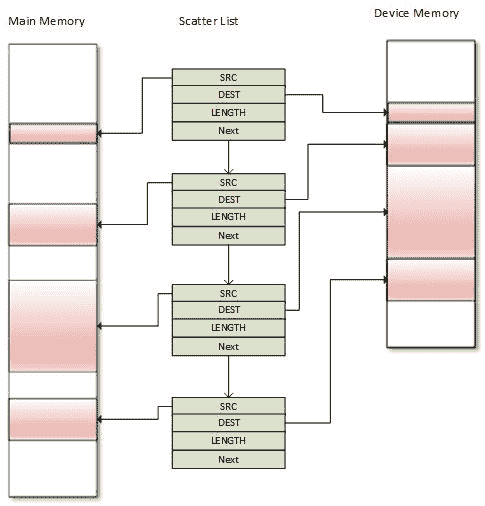
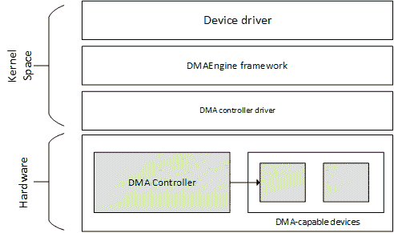

# 第十二章：DMA - 直接内存访问

DMA 是计算机系统的一种功能，允许设备在没有 CPU 干预的情况下访问主系统内存 RAM，从而使它们能够专注于其他任务。通常用于加速网络流量，但支持任何类型的复制。

DMA 控制器是负责 DMA 管理的外围设备。它主要出现在现代处理器和微控制器中。DMA 是一种用于执行内存读写操作而不占用 CPU 周期的功能。当需要传输一块数据时，处理器将源地址、目的地址和总字节数提供给 DMA 控制器。DMA 控制器然后自动将数据从源传输到目的地，而不占用 CPU 周期。当剩余字节数达到零时，块传输结束。

在本章中，我们将涵盖以下主题：

+   一致和非一致的 DMA 映射，以及一致性问题

+   DMA 引擎 API

+   DMA 和 DT 绑定

# 设置 DMA 映射

对于任何类型的 DMA 传输，都需要提供源地址、目的地址以及要传输的字数。在外围 DMA 的情况下，外围的 FIFO 作为源或目的地。当外围作为源时，内部或外部的内存位置作为目的地地址。当外围作为目的地时，内部或外部的内存位置作为源地址。

对于外围 DMA，我们根据传输方向指定源或目的地。换句话说，DMA 传输需要合适的内存映射。这是我们将在以下部分讨论的内容。

# 缓存一致性和 DMA

如[第十一章](http://kernel) *内核内存管理* 中所讨论的，最近访问的内存区域的副本存储在缓存中。DMA 内存也适用于这一点。事实上，两个独立设备之间共享的内存通常是缓存一致性问题的根源。缓存不一致是一个问题，因为其他设备可能不知道写入设备的更新。另一方面，缓存一致性确保每个写操作都似乎是瞬时发生的，因此共享相同内存区域的所有设备看到的是完全相同的变化序列。

在 LDD3 的以下摘录中，对一致性问题进行了详细说明：

让我们想象一个 CPU 配备了缓存和可以被设备直接使用 DMA 访问的外部内存。当 CPU 访问内存中的位置 X 时，当前值将存储在缓存中。对 X 的后续操作将更新 X 的缓存副本，但不会更新 X 的外部内存版本，假设是写回缓存。如果在下一次设备尝试访问 X 之前，缓存没有刷新到内存中，设备将收到 X 的旧值。同样，如果在设备将新值写入内存时，X 的缓存副本没有失效，那么 CPU 将操作 X 的旧值。

实际上有两种解决这个问题的方法：

+   基于硬件的解决方案。这样的系统是**一致的系统**。

+   一种基于软件的解决方案，其中操作系统负责确保缓存一致性。这样的系统称为**非一致的系统**。

# DMA 映射

任何合适的 DMA 传输都需要合适的内存映射。DMA 映射包括分配 DMA 缓冲区并为其生成总线地址。设备实际上使用总线地址。总线地址是`dma_addr_t`类型的每个实例。

区分两种类型的映射：**一致 DMA 映射**和**流式 DMA 映射**。可以在多个传输中使用前者，它会自动解决缓存一致性问题。因此，它太昂贵了。流式映射有很多约束，并且不会自动解决一致性问题，尽管有解决方案，其中包括每次传输之间的几个函数调用。一致映射通常存在于驱动程序的生命周期中，而流式映射通常在 DMA 传输完成后取消映射。

当可以时应使用流式映射，当必须时应使用一致映射。

回到代码；主要头文件应包括以下内容以处理 DMA 映射：

```
#include <linux/dma-mapping.h> 
```

# 一致映射

以下函数设置了一致映射：

```
void *dma_alloc_coherent(struct device *dev, size_t size, 
                     dma_addr_t *dma_handle, gfp_t flag)  
```

该函数处理缓冲区的分配和映射，并返回该缓冲区的内核虚拟地址，该地址为`size`字节宽，并可被 CPU 访问。`dev`是您的设备结构。第三个参数是一个输出参数，指向相关的总线地址。映射的内存保证是物理连续的，`flag`确定应如何分配内存，通常是`GFP_KERNEL`或`GFP_ATOMIC`（如果我们处于原子上下文中）。

请注意，据说这种映射是：

+   **一致（协调）**，因为它为执行 DMA 分配了设备的非缓存非缓冲内存

+   **同步**，因为设备或 CPU 的写入可以立即被任一方读取，而不必担心缓存一致性

为了释放映射，可以使用以下函数：

```
void dma_free_coherent(struct device *dev, size_t size, 
                 void *cpu_addr, dma_addr_t dma_handle); 
```

这里的`cpu_addr`对应于`dma_alloc_coherent()`返回的内核虚拟地址。这种映射是昂贵的，它最少可以分配一页。实际上，它只分配 2 的幂次方的页数。页面的顺序是用`int order = get_order(size)`获得的。应该将此映射用于设备生命周期内持续的缓冲区。

# 流式 DMA 映射

流式映射有更多的约束，并且与一致映射不同，原因如下：

+   映射需要使用已经分配的缓冲区。

+   映射可以接受多个非连续和分散的缓冲区。

+   映射的缓冲区属于设备而不再属于 CPU。在 CPU 可以使用缓冲区之前，应首先取消映射（在`dma_unmap_single()`或`dma_unmap_sg()`之后）。这是为了缓存目的。

+   对于写事务（CPU 到设备），驱动程序应在映射之前将数据放入缓冲区。

+   必须指定数据移入的方向，并且只能根据这个方向使用数据。

人们可能会想知道为什么在取消映射之前不应访问缓冲区。原因很简单：CPU 映射是可缓存的。用于流式映射的`dma_map_*()`系列函数将首先清除/使缓存无效，然后依赖 CPU 不访问它，直到相应的`dma_unmap_*()`。然后，CPU 可以访问缓冲区。

实际上有两种形式的流式映射：

+   单个缓冲区映射，只允许单页映射

+   分散/聚集映射，允许传递多个分散在内存中的缓冲区

对于任何映射，都应指定方向，通过`include/linux/dma-direction.h`中定义的`enum dma_data_direction`类型的符号：

```
enum dma_data_direction { 
   DMA_BIDIRECTIONAL = 0, 
   DMA_TO_DEVICE = 1, 
   DMA_FROM_DEVICE = 2, 
   DMA_NONE = 3, 
}; 
```

# 单个缓冲区映射

这是用于偶尔映射的。可以使用以下设置单个缓冲区：

```
dma_addr_t dma_map_single(struct device *dev, void *ptr, 
         size_t size, enum dma_data_direction direction); 
```

方向应该是`DMA_TO_DEVICE`，`DMA_FROM_DEVICE`或`DMA_BIDIRECTIONAL`，如前面的代码所述。`ptr`是缓冲区的内核虚拟地址，`dma_addr_t`是设备的返回总线地址。确保使用真正符合您需求的方向，而不仅仅是`DMA_BIDIRECTIONAL`。

应该使用以下方法释放映射：

```
void dma_unmap_single(struct device *dev, dma_addr_t dma_addr, 
              size_t size, enum dma_data_direction direction); 
```

# 分散/聚集映射

Scatter/gather 映射是一种特殊类型的流 DMA 映射，其中可以一次传输多个缓冲区区域，而不是分别映射每个缓冲区并逐个传输它们。假设您有几个可能不是物理上连续的缓冲区，所有这些缓冲区都需要同时传输到设备或从设备传输。由于以下情况可能发生：

+   一个 readv 或 writev 系统调用

+   磁盘 I/O 请求

+   或者只是映射内核 I/O 缓冲区中的页面列表

内核将 scatterlist 表示为一个连贯的结构，`struct scatterlist`：

```
struct scatterlist { 
   unsigned long page_link; 
   unsigned int offset; 
   unsigned int length; 
   dma_addr_t dma_address; 
   unsigned int dma_length; 
}; 
```

为了设置 scatterlist 映射，应该：

+   分配您的分散缓冲区。

+   创建 scatter 列表的数组，并使用`sg_set_buf()`填充分配的内存。请注意，scatterlist 条目必须是页面大小（除了末尾）。

+   在 scatterlist 上调用`dma_map_sg()`。

+   完成 DMA 后，调用`dma_unmap_sg()`取消映射 scatterlist。

虽然可以通过分别映射每个缓冲区来一次性发送多个缓冲区的内容，但是 scatter/gather 可以通过将 scatterlist 的指针和长度一起发送到设备来一次性发送所有缓冲区的内容，长度是列表中的条目数：

```
u32 *wbuf, *wbuf2, *wbuf3; 
wbuf = kzalloc(SDMA_BUF_SIZE, GFP_DMA); 
wbuf2 = kzalloc(SDMA_BUF_SIZE, GFP_DMA); 
wbuf3 = kzalloc(SDMA_BUF_SIZE/2, GFP_DMA); 

struct scatterlist sg[3]; 
sg_init_table(sg, 3); 
sg_set_buf(&sg[0], wbuf, SDMA_BUF_SIZE); 
sg_set_buf(&sg[1], wbuf2, SDMA_BUF_SIZE); 
sg_set_buf(&sg[2], wbuf3, SDMA_BUF_SIZE/2); 
ret = dma_map_sg(NULL, sg, 3, DMA_MEM_TO_MEM); 
```

适用于单缓冲区映射部分的相同规则也适用于 scatter/gather。



DMA scatter/gather

`dma_map_sg()`和`dma_unmap_sg()`负责缓存一致性。但是，如果需要使用相同的映射来在 DMA 传输之间访问（读/写）数据，则必须以适当的方式在每次传输之间同步缓冲区，通过`dma_sync_sg_for_cpu()`（如果 CPU 需要访问缓冲区）或`dma_sync_sg_for_device()`（如果是设备）。单个区域映射的类似函数是`dma_sync_single_for_cpu()`和`dma_sync_single_for_device()`：

```
void dma_sync_sg_for_cpu(struct device *dev, 
                         struct scatterlist *sg, 
                         int nents, 
                         enum dma_data_direction direction); 
void dma_sync_sg_for_device(struct device *dev, 
                          struct scatterlist *sg, int nents, 
                          enum dma_data_direction direction); 

void dma_sync_single_for_cpu(struct device *dev, dma_addr_t addr, 
                           size_t size, 
                           enum dma_data_direction dir) 

void dma_sync_single_for_device(struct device *dev, 
                           dma_addr_t addr, size_t size, 
                           enum dma_data_direction dir) 
```

在缓冲区被取消映射后，无需再次调用前面的函数。您只需读取内容。

# 完成的概念

本节将简要描述完成和 DMA 传输使用的 API 的必要部分。有关完整的描述，请随时查看内核文档*Documentation/scheduler/completion.txt*。内核编程中的一个常见模式涉及启动当前线程之外的某些活动，然后等待该活动完成。

在等待缓冲区被使用时，完成是`sleep()`的一个很好的替代方案。它适用于感知数据，这正是 DMA 回调所做的。

使用完成需要这个头文件：

```
<linux/completion.h>  
```

与其他内核设施数据结构一样，可以静态或动态地创建`struct completion`结构的实例：

+   静态声明和初始化如下：

```
 DECLARE_COMPLETION(my_comp); 
```

+   动态分配如下：

```
struct completion my_comp; 
init_completion(&my_comp); 
```

当驱动程序开始一些必须等待完成的工作（在我们的情况下是 DMA 事务）时，它只需将完成事件传递给`wait_for_completion()`函数： 

```
void wait_for_completion(struct completion *comp); 
```

当代码的其他部分决定完成已经发生（事务完成）时，它可以唤醒任何等待的人（实际上是需要访问 DMA 缓冲区的代码）：

```
void complete(struct completion *comp); 
void complete_all(struct completion *comp); 
```

可以猜到，`complete()`只会唤醒一个等待的进程，而`complete_all()`会唤醒每一个等待该事件的进程。即使在调用`wait_for_completion()`之前调用`complete()`，完成也是以这样一种方式实现的，即它们将正常工作。

随着下一节中使用的代码示例，您将更好地了解这是如何工作的。

# DMA 引擎 API

DMA 引擎是用于开发 DMA 控制器驱动程序的通用内核框架。DMA 的主要目标是在复制内存时卸载 CPU。通过使用通道，可以通过 DMA 引擎委托事务（I/O 数据传输）。DMA 引擎通过其驱动程序/API 公开一组通道，其他设备（从设备）可以使用这些通道。



DMA 引擎布局

在这里，我们将简单地介绍（从设备）API，这仅适用于从设备 DMA 使用。这里的强制性标头如下：

```
 #include <linux/dmaengine.h> 
```

从设备 DMA 的使用非常简单，包括以下步骤：

1.  分配 DMA 从设备通道。

1.  设置从设备和控制器特定参数。

1.  获取事务的描述符。

1.  提交事务。

1.  发出挂起的请求并等待回调通知。

可以将 DMA 通道视为 I/O 数据传输的高速公路

# 分配 DMA 从设备通道

使用`dma_request_channel()`请求通道。其原型如下：

```
struct dma_chan *dma_request_channel(const dma_cap_mask_t *mask, 
                          dma_filter_fn fn, void *fn_param); 
```

`mask`是一个位图掩码，表示通道必须满足的功能。主要用于指定驱动程序需要执行的传输类型：

```
enum dma_transaction_type { 
    DMA_MEMCPY,     /* Memory to memory copy */ 
    DMA_XOR,        /* Memory to memory XOR*/ 
    DMA_PQ,         /* Memory to memory P+Q computation */ 
    DMA_XOR_VAL,    /* Memory buffer parity check using XOR */ 
    DMA_PQ_VAL,     /* Memory buffer parity check using P+Q */ 
    DMA_INTERRUPT,  /* The device is able to generrate dummy transfer that will generate interrupts */ 
    DMA_SG,         /* Memory to memory scatter gather */ 
    DMA_PRIVATE,    /* channels are not to be used for global memcpy. Usually used with DMA_SLAVE */ 
    DMA_SLAVE,      /* Memory to device transfers */ 
    DMA_CYCLIC,     /* Device is ableto handle cyclic tranfers */ 
    DMA_INTERLEAVE, /* Memoty to memory interleaved transfer */ 
} 
```

`dma_cap_zero()`和`dma_cap_set()`函数用于清除掩码并设置我们需要的功能。例如：

```
dma_cap_mask my_dma_cap_mask; 
struct dma_chan *chan; 
dma_cap_zero(my_dma_cap_mask); 
dma_cap_set(DMA_MEMCPY, my_dma_cap_mask); /* Memory to memory copy */ 
chan = dma_request_channel(my_dma_cap_mask, NULL, NULL); 
```

在上述摘录中，`dma_filter_fn`被定义为：

```
typedef bool (*dma_filter_fn)(struct dma_chan *chan, 
                void *filter_param); 
```

如果`filter_fn`参数（可选）为`NULL`，`dma_request_channel()`将简单地返回满足能力掩码的第一个通道。否则，当掩码参数不足以指定必要的通道时，可以使用`filter_fn`例程作为系统中可用通道的过滤器。内核会为系统中的每个空闲通道调用`filter_fn`例程。在找到合适的通道时，`filter_fn`应返回`DMA_ACK`，这将标记给定通道为`dma_request_channel()`的返回值。

通过此接口分配的通道对调用者是独占的，直到调用`dma_release_channel()`为止：

```
void dma_release_channel(struct dma_chan *chan) 
```

# 设置从设备和控制器特定参数

这一步引入了一个新的数据结构`struct dma_slave_config`，它表示 DMA 从设备通道的运行时配置。这允许客户端指定设置，例如 DMA 方向、DMA 地址、总线宽度、DMA 突发长度等。

```
int dmaengine_slave_config(struct dma_chan *chan, 
struct dma_slave_config *config) 
```

`struct dma_slave_config`结构如下：

```
/* 
 * Please refer to the complete description in 
 * include/linux/dmaengine.h 
 */ 
struct dma_slave_config { 
   enum dma_transfer_direction direction; 
   phys_addr_t src_addr; 
   phys_addr_t dst_addr; 
   enum dma_slave_buswidth src_addr_width; 
   enum dma_slave_buswidth dst_addr_width; 
   u32 src_maxburst; 
   u32 dst_maxburst; 
   [...] 
}; 
```

以下是结构中每个元素的含义：

+   `direction`：这表示数据当前是否应该在此从设备通道上进出。可能的值为：

```
/* dma transfer mode and direction indicator */ 
enum dma_transfer_direction { 
    DMA_MEM_TO_MEM, /* Async/Memcpy mode */ 
    DMA_MEM_TO_DEV, /* From Memory to Device */ 
    DMA_DEV_TO_MEM, /* From Device to Memory */ 
    DMA_DEV_TO_DEV, /* From Device to Device */ 
    [...] 
}; 
```

+   `src_addr`：这是 DMA 从设备数据应该被读取（RX）的缓冲区的物理地址（实际上是总线地址）。如果源是内存，则此元素将被忽略。`dst_addr`是 DMA 从设备数据应该被写入（TX）的缓冲区的物理地址（实际上是总线地址），如果源是内存，则将被忽略。`src_addr_width`是 DMA 数据应该被读取的源（RX）寄存器的宽度（以字节为单位）。如果源是内存，根据架构的不同可能会被忽略。合法的值为 1、2、4 或 8。因此，`dst_addr_width`与`src_addr_width`相同，但用于目标（TX）。

+   任何总线宽度必顺为以下枚举值之一：

```
enum dma_slave_buswidth { 
        DMA_SLAVE_BUSWIDTH_UNDEFINED = 0, 
        DMA_SLAVE_BUSWIDTH_1_BYTE = 1, 
        DMA_SLAVE_BUSWIDTH_2_BYTES = 2, 
        DMA_SLAVE_BUSWIDTH_3_BYTES = 3, 
        DMA_SLAVE_BUSWIDTH_4_BYTES = 4, 
        DMA_SLAVE_BUSWIDTH_8_BYTES = 8, 
        DMA_SLAVE_BUSWIDTH_16_BYTES = 16, 
        DMA_SLAVE_BUSWIDTH_32_BYTES = 32, 
        DMA_SLAVE_BUSWIDTH_64_BYTES = 64, 
}; 
```

+   `src_maxburs`：这是可以一次发送到设备的最大字数（在这里，将字视为`src_addr_width`成员的单位，而不是字节）。通常是 I/O 外围设备上 FIFO 深度的一半，以防止溢出。这可能适用于内存源，也可能不适用。`dst_maxburst`与`src_maxburst`相同，但用于目标。

例如：

```
struct dma_chan *my_dma_chan; 
dma_addr_t dma_src, dma_dst; 
struct dma_slave_config my_dma_cfg = {0}; 

/* No filter callback, neither filter param */ 
my_dma_chan = dma_request_channel(my_dma_cap_mask, 0, NULL); 

/* scr_addr and dst_addr are ignored in this structure for mem to mem copy */ 
my_dma_cfg.direction = DMA_MEM_TO_MEM; 
my_dma_cfg.dst_addr_width = DMA_SLAVE_BUSWIDTH_32_BYTES; 

dmaengine_slave_config(my_dma_chan, &my_dma_cfg); 

char *rx_data, *tx_data; 
/* No error check */ 
rx_data = kzalloc(BUFFER_SIZE, GFP_DMA); 
tx_data = kzalloc(BUFFER_SIZE, GFP_DMA); 

feed_data(tx_data); 

/* get dma addresses */ 
dma_src_addr = dma_map_single(NULL, tx_data, 
BUFFER_SIZE, DMA_MEM_TO_MEM); 
dma_dst_addr = dma_map_single(NULL, rx_data, 
BUFFER_SIZE, DMA_MEM_TO_MEM); 
```

在上述摘录中，我们调用`dma_request_channel()`函数以获取 DMA 通道的所有者芯片，然后调用`dmaengine_slave_config()`来应用其配置。调用`dma_map_single()`以映射 rx 和 tx 缓冲区，以便可以用于 DMA 的目的。

# 获取事务的描述符

如果您记得本节的第一步，当请求 DMA 通道时，返回值是`struct dma_chan`结构的一个实例。如果您查看`include/linux/dmaengine.h`中的定义，您会注意到它包含一个`struct dma_device *device`字段，表示提供通道的 DMA 设备（实际上是控制器）。这个控制器的内核驱动程序负责（这是内核 API 对 DMA 控制器驱动程序施加的规则）暴露一组函数来准备 DMA 事务，其中每个函数对应一个 DMA 事务类型（在第 1 步中枚举）。根据事务类型，您别无选择，只能选择专用函数。其中一些函数是：

+   `device_prep_dma_memcpy()`：准备 memcpy 操作

+   `device_prep_dma_sg()`：准备分散/聚集的 memcpy 操作

+   `device_prep_dma_xor()`：进行 xor 操作

+   `device_prep_dma_xor_val()`：准备 xor 验证操作

+   `device_prep_dma_pq()`：准备 pq 操作

+   `device_prep_dma_pq_val()`：准备 pqzero_sum 操作

+   `device_prep_dma_memset()`：准备 memset 操作

+   `device_prep_dma_memset_sg()`：对分散列表进行 memset 操作

+   `device_prep_slave_sg()`：准备从属 DMA 操作

+   `device_prep_interleaved_dma()`：以通用方式传输表达式

让我们看看`drivers/dma/imx-sdma.c`，这是 i.MX6 DMA 控制器（SDMA）驱动程序。这些函数中的每一个都返回一个指向`struct dma_async_tx_descriptor`结构的指针，对应于事务描述符。对于内存到内存的复制，可以使用`device_prep_dma_memcpy`：

```
struct dma_device *dma_dev = my_dma_chan->device; 
struct dma_async_tx_descriptor *tx = NULL; 

tx = dma_dev->device_prep_dma_memcpy(my_dma_chan, dma_dst_addr, 
dma_src_addr, BUFFER_SIZE, 0); 

if (!tx) { 
    printk(KERN_ERR "%s: Failed to prepare DMA transfer\n", 
               __FUNCTION__); 
    /* dma_unmap_* the buffer */ 
} 
```

实际上，我们应该使用`dmaengine_prep_*` DMA 引擎 API。只需注意，这些函数在内部执行了我们之前执行的操作。例如，对于内存到内存，可以使用`device_prep_dma_memcpy()`函数：

```
struct dma_async_tx_descriptor *(*device_prep_dma_memcpy)( 
         struct dma_chan *chan, dma_addr_t dst, dma_addr_t src, 
         size_t len, unsigned long flags) 
```

我们的示例变成了：

```
struct dma_async_tx_descriptor *tx = NULL; 
tx = dma_dev->device_prep_dma_memcpy(my_dma_chan, dma_dst_addr, 
dma_src_addr, BUFFER_SIZE, 0); 
if (!tx) { 
    printk(KERN_ERR "%s: Failed to prepare DMA transfer\n", 
               __FUNCTION__); 
    /* dma_unmap_* the buffer */ 
} 
```

请查看`include/linux/dmaengine.h`，在`struct dma_device`结构的定义中，看看所有这些挂钩是如何实现的。

# 提交事务

要将事务放入驱动程序的挂起队列中，可以使用`dmaengine_submit()`。一旦描述符准备好并添加了回调信息，就应该将其放在 DMA 引擎驱动程序的挂起队列中：

```
dma_cookie_t dmaengine_submit(struct dma_async_tx_descriptor *desc) 
```

这个函数返回一个 cookie，可以用它来通过其他 DMA 引擎检查 DMA 活动的进度。`dmaengine_submit()`不会启动 DMA 操作，它只是将其添加到挂起队列中。如何启动事务将在下一步中讨论：

```
struct completion transfer_ok; 
init_completion(&transfer_ok); 
tx->callback = my_dma_callback; 

/* Submit our dma transfer */ 
dma_cookie_t cookie = dmaengine_submit(tx); 

if (dma_submit_error(cookie)) { 
    printk(KERN_ERR "%s: Failed to start DMA transfer\n", __FUNCTION__); 
    /* Handle that */ 
[...] 
} 
```

# 发出挂起的 DMA 请求并等待回调通知

启动事务是 DMA 传输设置的最后一步。通过在通道的挂起队列上调用`dma_async_issue_pending()`来激活通道中的事务。如果通道空闲，则启动队列中的第一个事务，并排队后续事务。在 DMA 操作完成后，启动队列中的下一个事务，并触发一个 tasklet。这个 tasklet 负责调用客户驱动程序完成回调例程进行通知，如果设置：

```
void dma_async_issue_pending(struct dma_chan *chan); 
```

一个示例可能如下所示：

```
dma_async_issue_pending(my_dma_chan); 
wait_for_completion(&transfer_ok); 

dma_unmap_single(my_dma_chan->device->dev, dma_src_addr, 
BUFFER_SIZE, DMA_MEM_TO_MEM); 
dma_unmap_single(my_dma_chan->device->dev, dma_src_addr, 
               BUFFER_SIZE, DMA_MEM_TO_MEM); 

/* Process buffer through rx_data and tx_data virtualaddresses. */ 
```

`wait_for_completion()`函数将阻塞，直到我们的 DMA 回调被调用，这将更新（完成）我们的完成变量，以便恢复先前被阻塞的代码。这是`while (!done) msleep(SOME_TIME);`的一个合适的替代方法。

```
static void my_dma_callback() 
{ 
    complete(transfer_ok); 
    return; 
} 
```

实际发出挂起事务的 DMA 引擎 API 函数是`dmaengine_issue_pending(struct dma_chan *chan)`，它是对`dma_async_issue_pending()`的封装。

# 将所有内容放在一起 - NXP SDMA（i.MX6）

SDMA 引擎是 i.MX6 中的可编程控制器，每个外设在此控制器中都有自己的复制功能。使用此`enum`来确定它们的地址：

```
enum sdma_peripheral_type { 
    IMX_DMATYPE_SSI,    /* MCU domain SSI */ 
    IMX_DMATYPE_SSI_SP, /* Shared SSI */ 
    IMX_DMATYPE_MMC,    /* MMC */ 
    IMX_DMATYPE_SDHC,   /* SDHC */ 
    IMX_DMATYPE_UART,   /* MCU domain UART */ 
    IMX_DMATYPE_UART_SP,    /* Shared UART */ 
    IMX_DMATYPE_FIRI,   /* FIRI */ 
    IMX_DMATYPE_CSPI,   /* MCU domain CSPI */ 
    IMX_DMATYPE_CSPI_SP,    /* Shared CSPI */ 
    IMX_DMATYPE_SIM,    /* SIM */ 
    IMX_DMATYPE_ATA,    /* ATA */ 
    IMX_DMATYPE_CCM,    /* CCM */ 
    IMX_DMATYPE_EXT,    /* External peripheral */ 
    IMX_DMATYPE_MSHC,   /* Memory Stick Host Controller */ 
    IMX_DMATYPE_MSHC_SP, /* Shared Memory Stick Host Controller */ 
    IMX_DMATYPE_DSP,    /* DSP */ 
    IMX_DMATYPE_MEMORY, /* Memory */ 
    IMX_DMATYPE_FIFO_MEMORY,/* FIFO type Memory */ 
    IMX_DMATYPE_SPDIF,  /* SPDIF */ 
    IMX_DMATYPE_IPU_MEMORY, /* IPU Memory */ 
    IMX_DMATYPE_ASRC,   /* ASRC */ 
    IMX_DMATYPE_ESAI,   /* ESAI */ 
    IMX_DMATYPE_SSI_DUAL,   /* SSI Dual FIFO */ 
    IMX_DMATYPE_ASRC_SP,    /* Shared ASRC */ 
    IMX_DMATYPE_SAI,    /* SAI */ 
}; 
```

尽管通用 DMA 引擎 API，任何构造函数都可以提供自己的自定义数据结构。这适用于`imx_dma_data`结构，它是一个私有数据（用于描述需要使用的 DMA 设备类型），将传递给过滤回调中`struct dma_chan`的`.private`字段：

```
struct imx_dma_data { 
    int dma_request; /* DMA request line */ 
    int dma_request2; /* secondary DMA request line */ 
    enum sdma_peripheral_type peripheral_type; 
    int priority; 
}; 

enum imx_dma_prio { 
    DMA_PRIO_HIGH = 0, 
    DMA_PRIO_MEDIUM = 1, 
    DMA_PRIO_LOW = 2 
}; 
```

这些结构和枚举都是特定于 i.MX 的，并在`include/linux/platform_data/dma-imx.h`中定义。现在，让我们编写我们的内核 DMA 模块。它分配两个缓冲区（源和目标）。用预定义数据填充源，并执行事务以将 src 复制到 dst。可以通过使用来自用户空间的数据（`copy_from_user()`）来改进此模块。此驱动程序受到 imx-test 软件包中提供的驱动程序的启发：

```
#include <linux/module.h> 
#include <linux/slab.h>     /* for kmalloc */ 
#include <linux/init.h> 
#include <linux/dma-mapping.h> 
#include <linux/fs.h> 
#include <linux/version.h> 
#if (LINUX_VERSION_CODE >= KERNEL_VERSION(3,0,35)) 
#include <linux/platform_data/dma-imx.h> 
#else 
#include <mach/dma.h> 
#endif 

#include <linux/dmaengine.h> 
#include <linux/device.h> 

#include <linux/io.h> 
#include <linux/delay.h> 

static int gMajor; /* major number of device */ 
static struct class *dma_tm_class; 
u32 *wbuf;  /* source buffer */ 
u32 *rbuf;  /* destinationn buffer */ 

struct dma_chan *dma_m2m_chan;  /* our dma channel */ 
struct completion dma_m2m_ok;   /* completion variable used in the DMA callback */ 
#define SDMA_BUF_SIZE  1024 
```

让我们定义过滤函数。当请求 DMA 通道时，控制器驱动程序可能会在通道列表中进行查找。对于细粒度的查找，可以提供一个回调方法，该方法将在找到的每个通道上调用。然后由回调来选择要使用的合适通道：

```
static bool dma_m2m_filter(struct dma_chan *chan, void *param) 
{ 
    if (!imx_dma_is_general_purpose(chan)) 
        return false; 
    chan->private = param; 
    return true; 
} 
```

`imx_dma_is_general_purpose`是一个特殊函数，用于检查控制器驱动程序的名称。`open`函数将分配缓冲区并请求 DMA 通道，给定我们的过滤函数作为回调：

```
int sdma_open(struct inode * inode, struct file * filp) 
{ 
    dma_cap_mask_t dma_m2m_mask; 
    struct imx_dma_data m2m_dma_data = {0}; 

    init_completion(&dma_m2m_ok); 

    dma_cap_zero(dma_m2m_mask); 
    dma_cap_set(DMA_MEMCPY, dma_m2m_mask); /* Set channel capacities */ 
    m2m_dma_data.peripheral_type = IMX_DMATYPE_MEMORY; /* choose the dma device type. This is proper to i.MX */ 
    m2m_dma_data.priority = DMA_PRIO_HIGH;  /* we need high priority */ 

    dma_m2m_chan = dma_request_channel(dma_m2m_mask, dma_m2m_filter, &m2m_dma_data); 
    if (!dma_m2m_chan) { 
        printk("Error opening the SDMA memory to memory channel\n"); 
        return -EINVAL; 
    } 

    wbuf = kzalloc(SDMA_BUF_SIZE, GFP_DMA); 
    if(!wbuf) { 
        printk("error wbuf !!!!!!!!!!!\n"); 
        return -1; 
    } 

    rbuf = kzalloc(SDMA_BUF_SIZE, GFP_DMA); 
    if(!rbuf) { 
        printk("error rbuf !!!!!!!!!!!\n"); 
        return -1; 
    } 

    return 0; 
} 
```

`release`函数只是`open`函数的反向操作；它释放缓冲区并释放 DMA 通道：

```
int sdma_release(struct inode * inode, struct file * filp) 
{ 
    dma_release_channel(dma_m2m_chan); 
    dma_m2m_chan = NULL; 
    kfree(wbuf); 
    kfree(rbuf); 
    return 0; 
} 
```

在`read`函数中，我们只是比较源缓冲区和目标缓冲区，并通知用户结果。

```
ssize_t sdma_read (struct file *filp, char __user * buf, 
size_t count, loff_t * offset) 
{ 
    int i; 
    for (i=0; i<SDMA_BUF_SIZE/4; i++) { 
        if (*(rbuf+i) != *(wbuf+i)) { 
            printk("Single DMA buffer copy falled!,r=%x,w=%x,%d\n", *(rbuf+i), *(wbuf+i), i); 
            return 0; 
        } 
    } 
    printk("buffer copy passed!\n"); 
    return 0; 
} 
```

我们使用完成来在事务终止时得到通知（唤醒）。此回调在我们的事务完成后调用，并将我们的完成变量设置为完成状态：

```
static void dma_m2m_callback(void *data) 
{ 
    printk("in %s\n",__func__); 
    complete(&dma_m2m_ok); 
    return ; 
} 
```

在`write`函数中，我们用数据填充源缓冲区，执行 DMA 映射以获取与我们的源和目标缓冲区对应的物理地址，并调用`device_prep_dma_memcpy`来获取事务描述符。然后，将该事务描述符提交给 DMA 引擎，使用`dmaengine_submit`，这时并不执行我们的事务。只有在我们在 DMA 通道上调用`dma_async_issue_pending`后，我们的待处理事务才会被处理：

```
ssize_t sdma_write(struct file * filp, const char __user * buf, 

                         size_t count, loff_t * offset) 
{ 
    u32 i; 
    struct dma_slave_config dma_m2m_config = {0}; 
    struct dma_async_tx_descriptor *dma_m2m_desc; /* transaction descriptor */ 
    dma_addr_t dma_src, dma_dst; 

    /* No copy_from_user, we just fill the source buffer with predefined data */ 
    for (i=0; i<SDMA_BUF_SIZE/4; i++) { 
        *(wbuf + i) = 0x56565656; 
    } 

    dma_m2m_config.direction = DMA_MEM_TO_MEM; 
    dma_m2m_config.dst_addr_width = DMA_SLAVE_BUSWIDTH_4_BYTES; 
    dmaengine_slave_config(dma_m2m_chan, &dma_m2m_config); 

    dma_src = dma_map_single(NULL, wbuf, SDMA_BUF_SIZE, DMA_TO_DEVICE); 
    dma_dst = dma_map_single(NULL, rbuf, SDMA_BUF_SIZE, DMA_FROM_DEVICE); 
    dma_m2m_desc = dma_m2m_chan->device->device_prep_dma_memcpy(dma_m2m_chan, dma_dst, dma_src, SDMA_BUF_SIZE,0); 
    if (!dma_m2m_desc) 
        printk("prep error!!\n"); 
    dma_m2m_desc->callback = dma_m2m_callback; 
    dmaengine_submit(dma_m2m_desc); 
    dma_async_issue_pending(dma_m2m_chan); 
    wait_for_completion(&dma_m2m_ok); 
    dma_unmap_single(NULL, dma_src, SDMA_BUF_SIZE, DMA_TO_DEVICE); 
    dma_unmap_single(NULL, dma_dst, SDMA_BUF_SIZE, DMA_FROM_DEVICE); 

    return 0; 
} 

struct file_operations dma_fops = { 
    open: sdma_open, 
    release: sdma_release, 
    read: sdma_read, 
    write: sdma_write, 
}; 
```

完整的代码可在书的存储库中找到：`chapter-12/imx-sdma/imx-sdma-single.c`。还有一个模块，可以执行相同的任务，但使用分散/聚集映射：`chapter-12/imx-sdma/imx-sdma-scatter-gather.c`。

# DMA DT 绑定

DMA 通道的 DT 绑定取决于 DMA 控制器节点，这是 SoC 相关的，一些参数（如 DMA 单元格）可能因 SoC 而异。此示例仅关注 i.MX SDMA 控制器，可以在内核源码中找到，位于*Documentation/devicetree/bindings/dma/fsl-imx-sdma.txt*。

# 使用者绑定

根据 SDMA 事件映射表，以下代码显示了 i.MX 6Dual/6Quad 外围设备的 DMA 请求信号：

```
uart1: serial@02020000 { 
    compatible = "fsl,imx6sx-uart", "fsl,imx21-uart"; 
    reg = <0x02020000 0x4000>; 
    interrupts = <GIC_SPI 26 IRQ_TYPE_LEVEL_HIGH>; 
    clocks = <&clks IMX6SX_CLK_UART_IPG>, 
                <&clks IMX6SX_CLK_UART_SERIAL>; 
    clock-names = "ipg", "per"; 
    dmas = <&sdma 25 4 0>, <&sdma 26 4 0>; 
    dma-names = "rx", "tx"; 
    status = "disabled"; 
}; 
```

DMA 属性中的第二个单元格（`25`和`26`）对应于 DMA 请求/事件 ID。这些值来自 SoC 手册（在我们的情况下是 i.MX53）。请查看[`community.nxp.com/servlet/JiveServlet/download/614186-1-373516/iMX6_Firmware_Guide.pdf`](https://community.nxp.com/servlet/JiveServlet/download/614186-1-373516/iMX6_Firmware_Guide.pdf)和 Linux 参考手册[`community.nxp.com/servlet/JiveServlet/download/614186-1-373515/i.MX_Linux_Reference_Manual.pdf`](https://community.nxp.com/servlet/JiveServlet/download/614186-1-373515/i.MX_Linux_Reference_Manual.pdf)。

第三个单元格指示要使用的优先级。请求指定参数的驱动程序代码在下面定义。可以在内核源树的`drivers/tty/serial/imx.c`中找到完整的代码：

```
static int imx_uart_dma_init(struct imx_port *sport) 
{ 
    struct dma_slave_config slave_config = {}; 
    struct device *dev = sport->port.dev; 
    int ret; 

    /* Prepare for RX : */ 
    sport->dma_chan_rx = dma_request_slave_channel(dev, "rx"); 
    if (!sport->dma_chan_rx) { 
        [...] /* cannot get the DMA channel. handle error */ 
    } 

    slave_config.direction = DMA_DEV_TO_MEM; 
    slave_config.src_addr = sport->port.mapbase + URXD0; 
    slave_config.src_addr_width = DMA_SLAVE_BUSWIDTH_1_BYTE; 
    /* one byte less than the watermark level to enable the aging timer */ 
    slave_config.src_maxburst = RXTL_DMA - 1; 
    ret = dmaengine_slave_config(sport->dma_chan_rx, &slave_config); 
    if (ret) { 
        [...] /* handle error */ 
    } 

    sport->rx_buf = kzalloc(PAGE_SIZE, GFP_KERNEL); 
    if (!sport->rx_buf) { 
        [...] /* handle error */ 
    } 

    /* Prepare for TX : */ 
    sport->dma_chan_tx = dma_request_slave_channel(dev, "tx"); 
    if (!sport->dma_chan_tx) { 
        [...] /* cannot get the DMA channel. handle error */ 
    } 

    slave_config.direction = DMA_MEM_TO_DEV; 
    slave_config.dst_addr = sport->port.mapbase + URTX0; 
    slave_config.dst_addr_width = DMA_SLAVE_BUSWIDTH_1_BYTE; 
    slave_config.dst_maxburst = TXTL_DMA; 
    ret = dmaengine_slave_config(sport->dma_chan_tx, &slave_config); 
    if (ret) { 
        [...] /* handle error */ 
    } 
    [...] 
} 
```

这里的魔法调用是`dma_request_slave_channel()`函数，它将使用`of_dma_request_slave_channel()`解析设备节点（在 DT 中），以根据 DMA 名称（参考第六章中的命名资源，*设备树的概念*）收集通道设置。

# 摘要

DMA 是许多现代 CPU 中的一个功能。本章为您提供了使用内核 DMA 映射和 DMA 引擎 API 的必要步骤，以充分利用此设备。在本章之后，我毫无疑问您将能够设置至少一个内存到内存的 DMA 传输。可以在内核源树中的*Documentation/dmaengine/*中找到更多信息。因此，下一章涉及一个完全不同的主题——Linux 设备模型。
