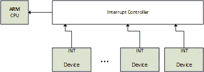
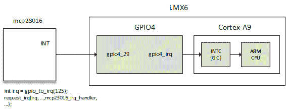
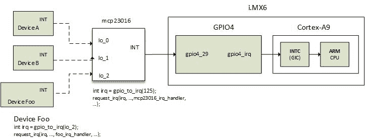

# 第十六章：高级 IRQ 管理

Linux 是一个系统，设备通过 IRQ 通知内核特定事件。CPU 暴露 IRQ 线，由连接的设备使用，因此当设备需要 CPU 时，它会向 CPU 发送请求。当 CPU 收到此请求时，它会停止其实际工作并保存其上下文，以便为设备发出的请求提供服务。在为设备提供服务之后，其状态将恢复到中断发生时停止的确切位置。有这么多的 IRQ 线，另一个设备负责它们给 CPU。该设备是中断控制器：



中断控制器和 IRQ 线

设备不仅可以引发中断，某些处理器操作也可以引发中断。有两种不同类型的中断：

1.  同步中断称为**异常**，由 CPU 在处理指令时产生。这些是**不可屏蔽中断**（**NMI**），是由于硬件故障等严重故障而产生的。它们始终由 CPU 处理。

1.  异步中断称为**中断**，由其他硬件设备发出。这些是正常的可屏蔽中断。这是我们将在本章的后续部分讨论的内容。因此，让我们深入了解异常：

异常是由内核处理的编程错误的后果，内核向程序发送信号并尝试从错误中恢复。这些被分类为以下两类：

+   **处理器检测到的异常**：CPU 对异常情况生成的异常，分为三组：

+   故障，通常可以纠正（虚假指令）。

+   陷阱，发生在用户进程中（无效的内存访问，除以零），也是响应系统调用切换到内核模式的机制。如果内核代码确实引起陷阱，它会立即发生恐慌。

+   中止，严重错误。

+   **程序化异常**：这些是由程序员请求的，像陷阱一样处理。

以下数组列出了不可屏蔽中断（有关更多详细信息，请参阅[`wiki.osdev.org/Exceptions`](http://wiki.osdev.org/Exceptions)）：

| **中断号** | **描述** |
| --- | --- |
| 0 | 除零错误 |
| 1 | 调试异常 |
| 2 | NMI 中断 |
| 3 | 断点 |
| 4 | 检测到溢出 |
| 5 | BOUND 范围超出 |
| 6 | 无效的操作码 |
| 7 | 协处理器（设备）不可用 |
| 8 | 双重故障 |
| 9 | 协处理器段溢出 |
| 10 | 无效的任务状态段 |
| 11 | 段不存在 |
| 12 | 栈故障 |
| 13 | 通用保护错误 |
| 14 | 页错误 |
| 15 | 保留 |
| 16 | 协处理器错误 |
| 17 - 31 | 保留 |
| 32 - 255 | 可屏蔽中断 |

NMI 足以覆盖整个异常列表。回到可屏蔽中断，它们的数量取决于连接的设备数量，以及它们实际如何共享这些 IRQ 线。有时它们是不够的，其中一些需要多路复用。常用的方法是通过 GPIO 控制器，它也充当中断控制器。在本章中，我们将讨论内核提供的管理 IRQ 的 API 以及多路复用的方式，并深入研究中断控制器驱动程序编写。

也就是说，在本章中将涵盖以下主题：

+   中断控制器和中断多路复用

+   高级外围 IRQ 管理

+   中断请求和传播（串联或嵌套）

+   GPIOLIB irqchip API

+   从 DT 处理中断控制器

# 多路复用中断和中断控制器

通常，仅有来自 CPU 的单个中断是不够的。大多数系统有数十甚至数百个中断。现在是中断控制器的时候，它允许它们进行多路复用。非常常见的架构或平台特定提供特定的设施，例如：

+   屏蔽/取消屏蔽单个中断

+   设置优先级

+   SMP 亲和力

+   像唤醒中断这样的奇特事物

IRQ 管理和中断控制器驱动程序都依赖于 IRQ 域，其依次建立在以下结构之上：

+   `struct irq_chip`：这个结构实现了一组描述如何驱动中断控制器的方法，并且这些方法直接被核心 IRQ 代码调用。

+   `struct irqdomain` 结构，提供：

+   给定中断控制器的固件节点的指针（fwnode）

+   将固件描述的 IRQ 转换为本地于此中断控制器的 ID 的方法（hwirq）

+   从 hwirq 中检索 IRQ 的 Linux 视图的方法

+   `struct irq_desc`：这个结构是 Linux 对中断的视图，包含所有核心内容，并且与 Linux 中断号一一对应

+   `struct irq_action`：这个结构 Linux 用于描述 IRQ 处理程序

+   `struct irq_data`：这个结构嵌入在 `struct irq_desc` 结构中，包含：

+   与管理此中断的 `irq_chip` 相关的数据

+   Linux IRQ 号和 hwirq

+   指向 `irq_chip` 的指针

几乎每个 `irq_chip` 调用都会给定一个 `irq_data` 作为参数，从中可以获取相应的 `irq_desc`。

所有前述结构都是 IRQ 域 API 的一部分。中断控制器在内核中由 `struct irq_chip` 结构的实例表示，该结构描述了实际的硬件设备，以及 IRQ 核心使用的一些方法：

```
struct irq_chip { 
   struct device *parent_device; 
   const char  *name; 
   void (*irq_enable)(struct irq_data *data); 
   void (*irq_disable)(struct irq_data *data); 

   void (*irq_ack)(struct irq_data *data); 
   void (*irq_mask)(struct irq_data *data); 
   void (*irq_unmask)(struct irq_data *data); 
   void (*irq_eoi)(struct irq_data *data); 

   int (*irq_set_affinity)(struct irq_data *data, const struct cpumask *dest, bool force); 
   int (*irq_retrigger)(struct irq_data *data); 
   int (*irq_set_type)(struct irq_data *data, unsigned int flow_type); 
   int (*irq_set_wake)(struct irq_data *data, unsigned int on); 

   void (*irq_bus_lock)(struct irq_data *data); 
   void (*irq_bus_sync_unlock)(struct irq_data *data); 

   int (*irq_get_irqchip_state)(struct irq_data *data, enum irqchip_irq_state which, bool *state); 
   int(*irq_set_irqchip_state)(struct irq_data *data, enum irqchip_irq_state which, bool state); 

   unsigned long flags; 
}; 
```

以下是结构中元素的含义：

+   `parent_device`：这是指向此 irqchip 的父级的指针。

+   `name`：这是 `/proc/interrupts` 文件的名称。

+   `irq_enable`：这个钩子函数用于启用中断，默认值是 `chip->unmask` 如果为 `NULL`。

+   `irq_disable`：这个函数用于禁用中断。

+   ***** `irq_ack`：这是一个新中断的开始。一些控制器不需要这个。Linux 在中断被触发后立即调用此函数，远在中断被服务之前。一些实现将此函数映射到 `chip->disable()`，以便在当前中断请求被服务之后，该线路上的另一个中断请求不会再次引发中断。

+   `irq_mask`：这个钩子函数用于在硬件中屏蔽中断源，使其无法再次触发。

+   `irq_unmask`：这个钩子函数用于取消屏蔽中断源。

+   `irq_eoi`：eoi 代表**中断结束**。Linux 在 IRQ 服务完成后立即调用此钩子。使用此函数根据需要重新配置控制器，以便在该线路上接收另一个中断请求。一些实现将此函数映射到 `chip->enable()`，以撤消 `chip->ack()` 中的操作。

+   `irq_set_affinity`：这个函数仅在 SMP 机器上设置 CPU 亲和性。在 SMP 环境中，此函数设置将服务中断的 CPU。在单处理器机器中不使用此函数。

+   `irq_retrigger`：这个函数重新触发硬件中断，将中断重新发送到 CPU。

+   `irq_set_type`：这个函数设置中断的流类型（IRQ_TYPE_LEVEL/等）。

+   `irq_set_wake`：这个函数用于启用/禁用中断的电源管理唤醒功能。

+   `irq_bus_lock`：这个函数用于锁定对慢总线（I2C）芯片的访问。在这里锁定互斥锁就足够了。

+   `irq_bus_sync_unlock`：这个函数用于同步和解锁慢总线（I2C）芯片。解锁之前锁定的互斥锁。

+   `irq_get_irqchip_state` 和 `irq_set_irqchip_state`：分别返回或设置中断的内部状态。

每个中断控制器都有一个域，对于控制器来说，这就像进程的地址空间一样（参见[第十一章](http://kernel)，*内核内存管理*）。中断控制器域在内核中被描述为 `struct irq_domain` 结构的实例。它管理硬件 IRQ 和 Linux IRQ（即虚拟 IRQ）之间的映射。它是硬件中断编号转换对象：

```
struct irq_domain { 
   const char *name; 
   const struct irq_domain_ops *ops; 
   void *host_data; 
   unsigned int flags; 

   /* Optional data */ 
   struct fwnode_handle *fwnode; 
   [...] 
}; 
```

+   `name` 是中断域的名称。

+   `ops` 是指向 irq_domain 方法的指针。

+   `host_data` 是所有者使用的私有数据指针。不会被 irqdomain 核心代码触及。

+   `flags`是每个`irq_domain`标志的主机。

+   `fwnode`是可选的。它是与`irq_domain`关联的 DT 节点的指针。在解码 DT 中断规范时使用。

中断控制器驱动程序通过调用`irq_domain_add_<mapping_method>()`函数之一创建并注册`irq_domain`，其中`<mapping_method>`是 hwirq 应该映射到 Linux IRQ 的方法。这些是：

1.  `irq_domain_add_linear()`：这使用一个由 hwirq 号索引的固定大小表。当映射 hwirq 时，为 hwirq 分配一个`irq_desc`，并将 IRQ 号存储在表中。这种线性映射适用于固定和小数量的 hwirq（~ <256）。这种映射的不便之处在于表的大小，它与最大可能的 hwirq 号一样大。因此，IRQ 号查找时间是固定的，`irq_desc`仅为正在使用的 IRQ 分配。大多数驱动程序应该使用线性映射。此函数具有以下原型：

```
struct irq_domain *irq_domain_add_linear(struct device_node *of_node, 
                            unsigned int size, 
                            const struct irq_domain_ops *ops, 
                            void *host_data) 
```

1.  `irq_domain_add_tree()`：这是`irq_domain`在 radix 树中维护 Linux IRQ 和 hwirq 号之间的映射。当映射 hwirq 时，将分配一个`irq_desc`，并且 hwirq 将用作 radix 树的查找键。如果 hwirq 号可能非常大，则树映射是一个不错的选择，因为它不需要分配一个与最大 hwirq 号一样大的表。缺点是 hwirq 到 IRQ 号的查找取决于表中有多少条目。很少有驱动程序应该需要这种映射。它具有以下原型：

```
struct irq_domain *irq_domain_add_tree(struct device_node *of_node, 
                                  const struct irq_domain_ops *ops, 
                                  void *host_data) 
```

1.  `irq_domain_add_nomap()`：您可能永远不会使用此方法。尽管如此，它的整个描述在*Documentation/IRQ-domain.txt*中可以找到，位于内核源树中。它的原型是：

```
struct irq_domain *irq_domain_add_nomap(struct device_node *of_node, 
                              unsigned int max_irq, 
                              const struct irq_domain_ops *ops, 
                              void *host_data)  
```

`of_node` 是指向中断控制器的 DT 节点的指针。`size` 表示域中中断的数量。`ops` 表示映射/取消映射域回调，`host_data` 是控制器的私有数据指针。

由于 IRQ 域在创建时为空（没有映射），因此应该使用`irq_create_mapping()`函数来创建映射并将其分配给域。在下一节中，我们将决定在代码中创建映射的正确位置：

```
unsigned int irq_create_mapping(struct irq_domain *domain, 
                                irq_hw_number_t hwirq) 
```

+   `domain`：这是此硬件中断所属的域，或者对于默认域为`NULL`。

+   `Hwirq`：这是该域空间中的硬件 IRQ 号

当编写同时作为中断控制器的 GPIO 控制器的驱动程序时，`irq_create_mapping()`是从`gpio_chip.to_irq()`回调函数内部调用的，如下所示：

```
return irq_create_mapping(gpiochip->irq_domain, offset); 
```

其他人更喜欢在`probe`函数内提前为每个 hwirq 创建映射，如下所示：

```
for (j = 0; j < gpiochip->chip.ngpio; j++) { 
      irq = irq_create_mapping( 
                 gpiochip ->irq_domain, j); 
} 
```

hwirq 是从 gpiochip 的 GPIO 偏移量。

如果 hwirq 的映射尚不存在，该函数将分配一个新的 Linux `irq_desc`结构，将其与 hwirq 关联，并调用`irq_domain_ops.map()`（通过`irq_domain_associate()`函数）回调，以便驱动程序可以执行任何必需的硬件设置：

```
struct irq_domain_ops { 
   int (*map)(struct irq_domain *d, unsigned int virq, irq_hw_number_t hw); 
   void (*unmap)(struct irq_domain *d, unsigned int virq); 
   int (*xlate)(struct irq_domain *d, struct device_node *node, 
              const u32 *intspec, unsigned int intsize, 
              unsigned long *out_hwirq, unsigned int *out_type); 
}; 
```

+   `.map()`：这在**虚拟 irq**（**virq**）号和 hwirq 号之间创建或更新映射。对于给定的映射，只调用一次。它通常使用`irq_set_chip_and_handler*`将 virq 与给定处理程序进行映射，以便调用`generic_handle_irq()`或`handle_nested_irq`将触发正确的处理程序。这里的魔法被称为`irq_set_chip_and_handler()`函数：

```
void irq_set_chip_and_handler(unsigned int irq, 
          struct irq_chip *chip, irq_flow_handler_t handle) 
```

其中：

+   `irq`：这是作为`map()`函数参数给出的 Linux IRQ。

+   `chip`：这是您的`irq_chip`。一些控制器非常愚蠢，几乎不需要在其`irq_chip`结构中做任何事情。在这种情况下，您应该传递`dummy_irq_chip`，它在`kernel/irq/dummychip.c`中定义，这是为这种控制器定义的内核`irq_chip`结构。

+   `handle`：这确定将调用使用 `request_irq()` 注册的真正处理程序的包装函数。其值取决于 IRQ 是边沿触发还是电平触发。在任何一种情况下，`handle` 应设置为 `handle_edge_irq` 或 `handle_level_irq`。这两个都是内核辅助函数，在调用真正的 IRQ 处理程序之前和之后执行一些技巧。示例如下：

```
    static int pcf857x_irq_domain_map(struct irq_domain  *domain, 
                            unsigned int irq, irq_hw_number_t hw) 
    { 
       struct pcf857x *gpio = domain->host_data; 

       irq_set_chip_and_handler(irq, &dummy_irq_chip,handle_level_irq); 
    #ifdef CONFIG_ARM 
       set_irq_flags(irq, IRQF_VALID); 
    #else 
       irq_set_noprobe(irq); 
    #endif 
       gpio->irq_mapped |= (1 << hw); 

       return 0; 
    } 
```

+   `xlate`：给定 DT 节点和中断说明符，此钩子解码硬件 IRQ 号码和 Linux IRQ 类型值。根据您的 DT 控制器节点中指定的 `#interrupt-cells`，内核提供了一个通用的翻译函数：

+   `irq_domain_xlate_twocell()`：用于直接双元绑定的通用翻译函数。适用于两个单元绑定的 DT IRQ 说明符，其中单元值直接映射到 hwirq 号码和 Linux irq 标志。

+   `irq_domain_xlate_onecell()`：直接单元绑定的通用 xlate。

+   `irq_domain_xlate_onetwocell():` 用于一个或两个单元绑定的通用 xlate。

给出了域操作的示例如下：

```
static struct irq_domain_ops mcp23016_irq_domain_ops = { 
   .map  = mcp23016_irq_domain_map, 
   .xlate  = irq_domain_xlate_twocell, 
}; 
```

当收到中断时，应使用 `irq_find_mapping()` 函数从 hwirq 号码中找到 Linux IRQ 号码。当然，在返回之前必须存在映射。Linux IRQ 号码始终与 `struct irq_desc` 结构相关联，这是 Linux 用来描述 IRQ 的结构：

```
struct irq_desc { 
   struct irq_common_data irq_common_data; 
   struct irq_data irq_data; 
   unsigned int __percpu *kstat_irqs; 
   irq_flow_handler_t handle_irq; 
   struct irqaction *action; 
   unsigned int irqs_unhandled; 
   raw_spinlock_t lock; 
   struct cpumask *percpu_enabled; 
   atomic_t threads_active; 
   wait_queue_head_t wait_for_threads; 
#ifdef CONFIG_PM_SLEEP 
   unsigned int nr_actions; 
   unsigned int no_suspend_depth; 
   unsigned int  force_resume_depth; 
#endif 
#ifdef CONFIG_PROC_FS 
   struct proc_dir_entry *dir; 
#endif 
   int parent_irq; 
   struct module *owner; 
   const char *name; 
}; 
```

这里未描述的一些字段是内部字段，由 IRQ 核心使用：

+   `irq_common_data` 是传递给芯片函数的每个 IRQ 和芯片数据

+   `kstat_irqs` 是自启动以来每个 CPU 的 IRQ 统计信息

+   `handle_irq` 是高级别 IRQ 事件处理程序

+   `action` 表示此描述符的 IRQ 动作列表

+   `irqs_unhandled` 是虚假未处理中断的统计字段

+   `lock` 表示 SMP 的锁定

+   `threads_active` 是当前正在运行此描述符的 IRQ 动作线程的数量

+   `wait_for_threads` 表示 `sync_irq` 等待线程处理程序的等待队列

+   `nr_actions` 是此描述符上安装的动作数量

+   `no_suspend_depth` 和 `force_resume_depth` 表示具有 `IRQF_NO_SUSPEND` 或 `IRQF_FORCE_RESUME` 标志设置的 IRQ 描述符上的 `irqactions` 数量

+   `dir` 表示 `/proc/irq/ procfs` 条目

+   `name` 命名了流处理程序，在 `/proc/interrupts` 输出中可见

`irq_desc.action` 字段是 `irqaction` 结构的列表，每个结构记录了与关联中断源的中断处理程序的地址。每次调用内核的 `request_irq()` 函数（或线程版本 `o`）都会在列表的末尾创建一个 `struct irqaction` 结构。例如，对于共享中断，该字段将包含与注册的处理程序数量相同的 IRQ 动作；

```
struct irqaction { 
   irq_handler_t handler; 
   void *dev_id; 
   void __percpu *percpu_dev_id; 
   struct irqaction *next; 
   irq_handler_t thread_fn; 
   struct task_struct *thread; 
   unsigned int irq; 
   unsigned int flags; 
   unsigned long thread_flags; 
   unsigned long thread_mask; 
   const char *name; 
   struct proc_dir_entry *dir; 
}; 
```

+   `handler` 是非线程（硬件）中断处理程序函数

+   `name` 是设备的名称

+   `dev_id` 是用于标识设备的 cookie

+   `percpu_dev_id` 是用于标识设备的 cookie

+   `next` 是共享中断的下一个 IRQ 动作的指针

+   `irq` 是 Linux 中断号

+   `flags` 表示 IRQ 的标志（参见 `IRQF_*`）

+   `thread_fn` 是线程中断处理程序函数，用于线程中断

+   `thread` 是线程中断的线程结构的指针

+   `thread_flags` 表示与线程相关的标志

+   `thread_mask` 是用于跟踪线程活动的位掩码

+   `dir` 指向 `/proc/irq/NN/<name>/` 条目

`irqaction.handler` 字段引用的中断处理程序只是与处理来自特定外部设备的中断相关的函数，它们对于将这些中断请求传递给主机微处理器的方式几乎没有（如果有的话）了解。它们不是微处理器级别的中断服务例程，因此不会通过 RTE 或类似的与中断相关的操作码退出。这使得基于中断驱动的设备驱动程序在不同的微处理器架构之间具有很大的可移植性

以下是`struct irq_data`结构的重要字段的定义，该结构是传递给芯片函数的每个 IRQ 芯片数据：

```
struct irq_data { 
   [...] 
   unsigned int irq; 
   unsigned long hwirq; 
   struct irq_common_data *common; 
   struct irq_chip *chip; 
   struct irq_domain *domain; 
   void *chip_data; 
}; 
```

+   `irq`是中断号（Linux IRQ）

+   `hwirq`是硬件中断号，局限于`irq_data.domain`中断域

+   `common`指向所有 irqchips 共享的数据

+   `chip`表示底层中断控制器硬件访问

+   `domain`表示中断转换域，负责在 hwirq 号和 Linux irq 号之间进行映射

+   `chip_data`是每个芯片方法的特定于平台的芯片私有数据，以允许共享芯片实现

# 高级外围 IRQ 管理

在第三章 *内核设施和辅助函数*中，我们介绍了外围 IRQ，使用`request_irq()`和`request_threaded_irq()`。使用`request_irq()`，可以注册一个在原子上下文中执行的处理程序（顶半部），从中可以使用在同一章节中讨论的不同机制之一调度底半部。另一方面，使用`request_thread_irq()`，可以为函数提供顶部和底部，以便前者将作为 hardirq 处理程序运行，可以决定引发第二个线程处理程序，后者将在内核线程中运行。

这些方法的问题在于，有时，请求 IRQ 的驱动程序不知道提供此 IRQ 线的中断的性质，特别是当中断控制器是一个离散芯片（通常是通过 SPI 或 I2C 总线连接的 GPIO 扩展器）时。现在有了`request_any_context_irq()`，请求 IRQ 的驱动程序知道处理程序是否在线程上下文中运行，并相应地调用`request_threaded_irq()`或`request_irq()`。这意味着无论我们的设备关联的 IRQ 来自可能不休眠的中断控制器（内存映射）还是来自可以休眠的中断控制器（在 I2C/SPI 总线后面），都不需要更改代码。它的原型如下：

```
int request_any_context_irq ( unsigned int irq, irq_handler_t handler, 
             unsigned long flags,  const char * name,  void * dev_id); 
```

以下是函数中每个参数的含义：

+   `irq`表示要分配的中断线。

+   `handler`是在发生 IRQ 时要调用的函数。根据上下文，此函数可能作为 hardirq 运行，也可能作为线程运行。

+   `flags`表示中断类型标志。与`request_irq()`中的标志相同。

+   `name`将用于调试目的，在`/proc/interrupts`中命名中断。

+   `dev_id`是传递回处理程序函数的 cookie。

`request_any_context_irq()`表示可以获得 hardirq 或 treaded。它的工作方式类似于通常的`request_irq()`，只是它检查 IRQ 级别是否配置为嵌套，并调用正确的后端。换句话说，它根据上下文选择硬件中断或线程处理方法。此函数在失败时返回负值。成功时，它返回`IRQC_IS_HARDIRQ`或`IRQC_IS_NESTED`。以下是一个用例：

```
static irqreturn_t packt_btn_interrupt(int irq, void *dev_id) 
{ 
    struct btn_data *priv = dev_id; 

   input_report_key(priv->i_dev, BTN_0, 
                    gpiod_get_value(priv->btn_gpiod) & 1); 
    input_sync(priv->i_dev); 
   return IRQ_HANDLED; 
} 

static int btn_probe(struct platform_device *pdev) 
{ 
    struct gpio_desc *gpiod; 
    int ret, irq; 

    [...] 
    gpiod = gpiod_get(&pdev->dev, "button", GPIOD_IN); 
    if (IS_ERR(gpiod)) 
        return -ENODEV; 

    priv->irq = gpiod_to_irq(priv->btn_gpiod); 
    priv->btn_gpiod = gpiod; 

    [...] 

    ret = request_any_context_irq(priv->irq, 
                  packt_btn_interrupt, 
                  (IRQF_TRIGGER_FALLING | IRQF_TRIGGER_RISING), 
                  "packt-input-button", priv); 
    if (ret < 0) { 
        dev_err(&pdev->dev, 
            "Unable to acquire interrupt for GPIO line\n"); 
        goto err_btn; 
    } 

    return ret; 
} 
```

上述代码是输入设备驱动程序的驱动程序示例的摘录。实际上，它是下一章中使用的代码。使用`request_any_context_irq()`的优势在于，不需要关心在 IRQ 处理程序中可以做什么，因为处理程序将运行的上下文取决于提供 IRQ 线的中断控制器。在我们的示例中，如果 GPIO 属于坐落在 I2C 或 SPI 总线上的控制器，处理程序将是线程化的。否则，处理程序将在 hardirq 中运行。

# 中断请求和传播

让我们考虑以下图，它表示链接的 IRQ 流



中断请求始终在 Linux IRQ 上执行（而不是 hwirq）。在 Linux 上请求 IRQ 的一般函数是`request_threaded_irq()`或`request_irq()`，它在内部调用前者：

```
int request_threaded_irq(unsigned int irq, irq_handler_t handler, 
                  irq_handler_t thread_fn, unsigned long irqflags, 
                  const char *devname, void *dev_id) 
```

当调用该函数时，该函数使用`irq_to_desc()`宏提取与 IRQ 关联的`struct irq_desc`，然后分配一个新的`struct irqaction`结构并设置它，填充处理程序、标志等参数。

```
action->handler = handler; 
action->thread_fn = thread_fn; 
action->flags = irqflags; 
action->name = devname; 
action->dev_id = dev_id; 
```

该函数最终通过调用`__setup_irq()`（通过`setup_irq()`）函数将描述符插入/注册到适当的 IRQ 列表中，该函数在`kernel/irq/manage.c`中定义。

现在，当发生中断时，内核会执行一些汇编代码以保存当前状态，并跳转到特定于体系结构的处理程序`handle_arch_irq`，该处理程序在`arch/arm/kernel/setup.c`的`setup_arch()`函数中的我们平台的`struct machine_desc`的`handle_irq`字段中设置：

```
handle_arch_irq = mdesc->handle_irq 
```

对于使用 ARM GIC 的 SoC，`handle_irq`回调使用`gic_handle_irq`设置，可以在`drivers/irqchip/irq-gic.c`或`drivers/irqchip/irq-gic-v3.c`中找到：

```
set_handle_irq(gic_handle_irq); 
```

`gic_handle_irq()`调用`handle_domain_irq()`，执行`generic_handle_irq()`，然后调用`generic_handle_irq_desc()`，最终调用`desc->handle_irq()`。查看`include/linux/irqdesc.h`以获取最后一次调用，查看`arch/arm/kernel/irq.c`以获取其他函数调用。`handle_irq`是实际的流处理程序调用，我们将其注册为`mcp23016_irq_handler`。

`gic_hande_irq()`是一个 GIC 中断处理程序。`generic_handle_irq()`将执行 SoC 的 GPIO4 IRQ 的处理程序，该处理程序将寻找负责中断的 GPIO 引脚，并调用`generic_handle_irq_desc()`，依此类推。现在您已经熟悉了中断传播，让我们通过编写自己的中断控制器来切换到一个实际的例子。

# 链接 IRQ

本节描述了父级中断处理程序如何调用子级中断处理程序，进而调用它们的子级中断处理程序，依此类推。内核提供了两种方法来在父级（中断控制器）设备的 IRQ 处理程序中调用子设备的中断处理程序，这些方法是链接和嵌套方法：

# 链接中断

这种方法用于 SoC 的内部 GPIO 控制器，它们是内存映射的，其访问不会休眠。链接意味着这些中断只是函数调用链（例如，SoC 的 GPIO 模块中断处理程序是从 GIC 中断处理程序调用的，就像函数调用一样）。`generic_handle_irq()`用于链接子 IRQ 处理程序，并在父 hwirq 处理程序内调用。即使在子中断处理程序内部，我们仍然处于原子上下文（硬件中断）。不能调用可能休眠的函数。

# 嵌套中断

这种方法用于坐在慢总线上的控制器，比如 I2C（例如，GPIO 扩展器），其访问可能会休眠（I2C 函数可能会休眠）。嵌套意味着这些中断处理程序不在硬件上下文中运行（它们实际上不是 hwirq，它们不在原子上下文中），而是线程化的，可以被抢占（或被另一个中断中断）。`handle_nested_irq()`用于创建嵌套中断子 IRQ。处理程序在`handle_nested_irq()`函数创建的新线程内部被调用；我们需要它们在进程上下文中运行，以便我们可以调用可能会休眠的总线函数（比如可能会休眠的 I2C 函数）。

# 案例研究- GPIO 和 IRQ 芯片

让我们考虑下面的图，它将一个中断控制器设备与另一个设备连接起来，我们将用它来描述中断复用：



mcp23016 IRQ 流程

假设您已将`io_1`和`io_2`配置为中断。即使中断发生在`io_1`或`io_2`上，相同的中断线也会触发中断控制器。现在 GPIO 驱动程序必须找出读取 GPIO 的中断状态寄存器，以找出哪个中断（`io_1`或`io_2`）实际上已触发。因此，在这种情况下，单个中断线是 16 个 GPIO 中断的复用。

现在让我们修改原始的 mcp23016 驱动程序，该驱动程序在第十五章中编写，*GPIO 控制器驱动程序 - gpio_chip*，以支持首先作为中断控制器的 IRQ 域 API。第二部分将介绍新的和推荐的 gpiolib irqchip API。这将被用作逐步指南来编写中断控制器驱动程序，至少对于 GPIO 控制器。

# 传统 GPIO 和 IRQ 芯片

1.  第一步，为我们的 gpiochip 分配一个`struct irq_domain`，它将存储 hwirq 和 virq 之间的映射。线性映射对我们来说是合适的。我们在`probe`函数中这样做。该域将保存我们的驱动程序希望提供的 IRQ 数量。例如，对于 I/O 扩展器，IRQ 的数量可以是扩展器提供的 GPIO 数量：

```
my_gpiochip->irq_domain = irq_domain_add_linear( client->dev.of_node, 
             my_gpiochip->chip.ngpio, &mcp23016_irq_domain_ops, NULL); 
```

`host_data`参数是`NULL`。因此，您可以传递任何您需要的数据结构。在分配域之前，我们的域 ops 结构应该被定义：

```
static struct irq_domain_ops mcp23016_irq_domain_ops = { 
   .map  = mcp23016_irq_domain_map, 
   .xlate  = irq_domain_xlate_twocell, 
}; 
```

在填充我们的 IRQ 域 ops 结构之前，我们必须至少定义`.map()`回调：

```
static int mcp23016_irq_domain_map( 
              struct irq_domain *domain, 
              unsigned int virq, irq_hw_number_t hw) 
{ 
   irq_set_chip_and_handler(virq, 
               &dummy_irq_chip, /* Dumb irqchip */ 
               handle_level_irq); /* Level trigerred irq */ 
   return 0; 
} 
```

我们的控制器不够智能。因此，没有必要设置`irq_chip`。我们将使用内核为这种芯片提供的一个：`dummy_irq_chip`。有些控制器足够智能，需要设置`irq_chip`。在`drivers/gpio/gpio-mcp23s08.c`中查看。

下一个 ops 回调是`.xlate`。在这里，我们再次使用内核提供的帮助程序。`irq_domain_xlate_twocell`是一个能够解析具有两个单元的中断指定符的帮助程序。我们可以在我们的控制器 DT 节点中添加`interrupt-cells = <2>;`。

1.  下一步是使用`irq_create_mapping()`函数填充域与 IRQ 映射。在我们的驱动程序中，我们将在`gpiochip.to_irq`回调中执行此操作，这样每当有人在 GPIO 上调用`gpio{d}_to_irq()`时，如果映射存在，它将被返回，如果不存在，它将被创建：

```
static int mcp23016_to_irq(struct gpio_chip *chip, 
                           unsigned offset) 
{ 
   return irq_create_mapping(chip->irq_domain, offset); 
} 
```

我们可以在`probe`函数中为每个 GPIO 都这样做，并在`.to_irq`函数中只调用`irq_find_mapping()`。

1.  现在仍然在`probe`函数中，我们需要注册我们控制器的 IRQ 处理程序，这个处理程序负责调用引发其引脚中断的正确处理程序：

```
devm_request_threaded_irq(client->irq, NULL, 
                          mcp23016_irq, irqflags, 
                          dev_name(chip->parent), mcp); 
```

在注册 IRQ 之前，函数`mcp23016`应该已经被定义：

```
static irqreturn_t mcp23016_irq(int irq, void *data) 
{ 
    struct mcp23016 *mcp = data; 
    unsigned int child_irq, i; 
    /* Do some stuff */ 
    [...] 
    for (i = 0; i < mcp->chip.ngpio; i++) { 
        if (gpio_value_changed_and_raised_irq(i)) { 
            child_irq = 
                  irq_find_mapping(mcp->chip.irqdomain, i); 
            handle_nested_irq(child_irq); 
        } 
    } 

    return IRQ_HANDLED; 
} 
```

`handle_nested_irq()`已经在前面的部分中描述，将为每个注册的处理程序创建一个专用线程。

# 新的 gpiolib irqchip API

几乎每个 GPIO 控制器驱动程序都在使用 IRQ 域来实现相同的目的。内核开发人员决定将这些代码移动到 gpiolib 框架中，通过`GPIOLIB_IRQCHIP` Kconfig 符号，以便协调开发并避免冗余代码。

该代码部分有助于处理 GPIO irqchips 和相关的`irq_domain`和资源分配回调，以及它们的设置，使用减少的帮助函数集。这些是`gpiochip_irqchip_add()`和`gpiochip_set_chained_irqchip()`。

`gpiochip_irqchip_add():` 这将一个 irqchip 添加到一个 gpiochip 中。这个函数的作用是：

+   将`gpiochip.to_irq`字段设置为`gpiochip_to_irq`，这是一个 IRQ 回调，只返回`irq_find_mapping(chip->irqdomain, offset);`

+   使用`irq_domain_add_simple()`函数为 gpiochip 分配一个 irq_domain，传递一个内核 IRQ 核心`irq_domain_ops`，称为`gpiochip_domain_ops`，并在`drivers/gpio/gpiolib.c`中定义。

+   使用`irq_create_mapping()`函数从 0 到`gpiochip.ngpio`创建映射

它的原型如下：

```
int gpiochip_irqchip_add(struct gpio_chip *gpiochip, 
                struct irq_chip *irqchip, 
                unsigned int first_irq, 
                irq_flow_handler_t handler, 
                unsigned int type) 
```

`gpiochip` 是我们的 GPIO 芯片，要添加 irqchip 到其中，`irqchip` 是要添加到 gpiochip 的 irqchip。如果没有动态分配，`first_irq` 是要从中分配 gpiochip IRQ 的基础（第一个）IRQ。`handler` 是要使用的 IRQ 处理程序（通常是预定义的 IRQ 核心函数），`type` 是该 irqchip 上 IRQ 的默认类型，传递 `IRQ_TYPE_NONE` 以使核心避免在硬件中设置任何默认类型。

此函数将处理两个单元格的简单 IRQ（因为它将 `irq_domain_ops.xlate` 设置为 `irq_domain_xlate_twocell`），并假定 gpiochip 上的所有引脚都可以生成唯一的 IRQ。

```
static const struct irq_domain_ops gpiochip_domain_ops = { 
   .map  = gpiochip_irq_map, 
   .unmap = gpiochip_irq_unmap, 
   /* Virtually all GPIO irqchips are twocell:ed */ 
   .xlate = irq_domain_xlate_twocell, 
}; 
```

`gpiochip_set_chained_irqchip()`：此函数将链式 irqchip 设置为从父 IRQ 到 `gpio_chip`，并将 `struct gpio_chip` 的指针传递为处理程序数据：

```
void gpiochip_set_chained_irqchip(struct gpio_chip *gpiochip, 
                       struct irq_chip *irqchip, int parent_irq, 
                       irq_flow_handler_t parent_handler) 
```

`parent_irq` 是此芯片连接到的 IRQ 号。在我们的 mcp23016 中，如 *Case study-GPIO and IRQ chip* 部分中的图所示，它对应于 `gpio4_29` 线的 IRQ。换句话说，它是此链式 irqchip 的父 IRQ 号。`parent_handler` 是累积的从 gpiochip 出来的 IRQ 的父中断处理程序。如果中断是嵌套而不是级联的，可以在此处理程序参数中传递 `NULL`。

有了这个新的 API，我们的 `probe` 函数中需要添加的唯一代码是：

```
/* Do we have an interrupt line? Enable the irqchip */ 
if (client->irq) { 
    status = gpiochip_irqchip_add(&gpio->chip, &dummy_irq_chip, 
                            0, handle_level_irq, IRQ_TYPE_NONE); 
    if (status) { 
        dev_err(&client->dev, "cannot add irqchip\n"); 
        goto fail_irq; 
    } 

    status = devm_request_threaded_irq(&client->dev, client->irq, 
                           NULL, mcp23016_irq, IRQF_ONESHOT | 
                           IRQF_TRIGGER_FALLING | IRQF_SHARED, 
                           dev_name(&client->dev), gpio); 
    if (status) 
       goto fail_irq; 

    gpiochip_set_chained_irqchip(&gpio->chip, 
                            &dummy_irq_chip, client->irq, NULL); 
} 
```

IRQ 核心为我们做了一切。甚至不需要定义 `gpiochip.to_irq` 函数，因为 API 已经设置了它。我们的示例使用了 IRQ 核心 `dummy_irq_chip`，但也可以自己定义。自内核 v4.10 版本以来，还添加了另外两个函数：`gpiochip_irqchip_add_nested()` 和 `gpiochip_set_nested_irqchip()`。请查看 *Documentation/gpio/driver.txt* 了解更多细节。在同一内核版本中使用此 API 的驱动程序是 `drivers/gpio/gpio-mcp23s08.c`。

# 中断控制器和 DT

现在我们将在 DT 中声明我们的控制器。如果你还记得第六章：*设备树的概念*，每个中断控制器必须具有设置为布尔属性 interrupt-controller 的属性。第二个强制性的布尔属性是 `gpio-controller`，因为它也是 GPIO 控制器。我们需要定义我们的设备的中断描述符需要多少个单元格。由于我们已将 `irq_domain_ops.xlate` 字段设置为 `irq_domain_xlate_twocell`，`#interrupt-cells` 应该是 2：

```
expander: mcp23016@20 { 
    compatible = "microchip,mcp23016"; 
    reg = <0x20>; 
    interrupt-controller; 
    #interrupt-cells = <2>; 
    gpio-controller; 
    #gpio-cells = <2>; 
    interrupt-parent = <&gpio4>; 
    interrupts = <29 IRQ_TYPE_EDGE_FALLING>; 
}; 
```

`interrupt-parent` 和 `interrupts` 属性描述了中断线连接。

最后，让我们说一下，我们有一个 mcp23016 的驱动程序，以及两个其他设备的驱动程序：`foo_device` 和 `bar_device`，当然都在 CPU 上运行。在 `foo_device` 驱动程序中，我们希望在 `mcp23016` 的 `io_2` 引脚发生变化时请求中断。`bar_device` 驱动程序需要分别用于复位和电源 GPIO 的 `io_8` 和 `io_12`。让我们在 DT 中声明这一点：

```
foo_device: foo_device@1c { 
    reg = <0x1c>; 
    interrupt-parent = <&expander>; 
    interrupts = <2 IRQ_TYPE_EDGE_RISING>; 
}; 

bar_device { 
    reset-gpios = <&expander 8 GPIO_ACTIVE_HIGH>; 
    power-gpios = <&expander 12 GPIO_ACTIVE_HIGH>; 
    /* Other properties do here */ 
}; 
```

# 总结

现在 IRQ 多路复用对你来说已经没有秘密了。我们讨论了 Linux 系统下 IRQ 管理的最重要的元素，即 IRQ 域 API。你已经掌握了开发中断控制器驱动程序的基础，以及从 DT 中管理它们的绑定。我们讨论了 IRQ 传播，以便了解从请求到处理的过程。这一章将帮助你理解下一章中的中断驱动部分，该部分涉及输入设备驱动程序。
