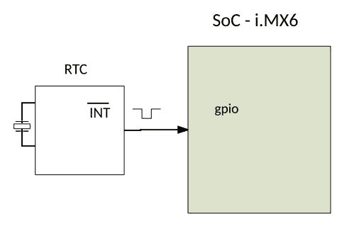

# 第十八章：RTC 驱动程序

**实时时钟**（**RTC**）是用于在非易失性存储器中跟踪绝对时间的设备，可以是内部到处理器，也可以是通过 I2C 或 SPI 总线外部连接的。

可以使用 RTC 执行以下操作：

+   读取和设置绝对时钟，并在时钟更新期间生成中断

+   生成周期性中断

+   设置闹钟

RTC 和系统时钟有不同的目的。前者是硬件时钟，以非易失性方式维护绝对时间和日期，而后者是由内核维护的软件时钟，用于实现`gettimeofday(2)`和`time(2)`系统调用，以及在文件上设置时间戳等。系统时钟报告从起始点开始的秒和微秒，定义为 POSIX 纪元：`1970-01-01 00:00:00 +0000 (UTC)`。

在本章中，我们将涵盖以下主题：

+   介绍 RTC 框架 API

+   描述此类驱动程序的架构，以及一个虚拟驱动程序示例

+   处理闹钟

+   从用户空间管理 RTC 设备，可以通过 sysfs 接口或使用 hwclock 工具

# RTC 框架数据结构

在 Linux 系统上，RTC 框架使用三种主要数据结构。它们是`strcut rtc_time`，`struct rtc_device`和`struct rtc_class_ops`结构。前者是表示给定日期和时间的不透明结构；第二个结构表示物理 RTC 设备；最后一个表示驱动程序公开的一组操作，并由 RTC 核心用于读取/更新设备的日期/时间/闹钟。

从驱动程序中提取 RTC 函数所需的唯一标头是：

```
#include <linux/rtc.h> 
```

同一个文件包含了前一节中列举的三个结构：

```
struct rtc_time { 
   int tm_sec;  /* seconds after the minute */ 
   int tm_min;  /* minutes after the hour - [0, 59] */ 
   int tm_hour; /* hours since midnight - [0, 23] */ 
   int tm_mday; /* day of the month - [1, 31] */ 
   int tm_mon;  /* months since January - [0, 11] */ 
   int tm_year; /* years since 1900 */ 
   int tm_wday; /* days since Sunday - [0, 6] */ 
   int tm_yday; /* days since January 1 - [0, 365] */ 
   int tm_isdst; /* Daylight saving time flag */ 
}; 
```

此结构类似于`<time.h>`中的`struct tm`，用于传递时间。下一个结构是`struct rtc_device`，它代表内核中的芯片：

```
struct rtc_device { 
   struct device dev; 
   struct module *owner; 

   int id; 
   char name[RTC_DEVICE_NAME_SIZE]; 

   const struct rtc_class_ops *ops; 
   struct mutex ops_lock; 

   struct cdev char_dev; 
   unsigned long flags; 

   unsigned long irq_data; 
   spinlock_t irq_lock; 
   wait_queue_head_t irq_queue; 

   struct rtc_task *irq_task; 
   spinlock_t irq_task_lock; 
   int irq_freq; 
   int max_user_freq; 

   struct work_struct irqwork; 
}; 
```

以下是结构的元素的含义：

+   `dev`：这是设备结构。

+   `owner`：这是拥有此 RTC 设备的模块。使用`THIS_MODULE`就足够了。

+   `id`：这是内核为 RTC 设备分配的全局索引`/dev/rtc<id>`。

+   `name`：这是给 RTC 设备的名称。

+   `ops`：这是由 RTC 设备公开的一组操作（如读取/设置时间/闹钟），由核心或用户空间管理。

+   `ops_lock`：这是内核内部使用的互斥锁，用于保护 ops 函数调用。

+   `cdev`：这是与此 RTC 相关联的字符设备，`/dev/rtc<id>`。

下一个重要的结构是`struct rtc_class_ops`，它是一组用作回调的函数，用于在 RTC 设备上执行标准和有限的操作。它是顶层和底层 RTC 驱动程序之间的通信接口：

```
struct rtc_class_ops { 
   int (*open)(struct device *); 
   void (*release)(struct device *); 
   int (*ioctl)(struct device *, unsigned int, unsigned long); 
   int (*read_time)(struct device *, struct rtc_time *); 
   int (*set_time)(struct device *, struct rtc_time *); 
   int (*read_alarm)(struct device *, struct rtc_wkalrm *); 
   int (*set_alarm)(struct device *, struct rtc_wkalrm *); 
   int (*read_callback)(struct device *, int data); 
   int (*alarm_irq_enable)(struct device *, unsigned int enabled); 
}; 
```

在前面的代码中，所有的钩子都以`struct device`结构作为参数，这与嵌入在`struct rtc_device`结构中的结构相同。这意味着从这些钩子中，可以随时访问 RTC 设备，使用`to_rtc_device()`宏，该宏建立在`container_of()`宏之上。

```
#define to_rtc_device(d) container_of(d, struct rtc_device, dev) 
```

当用户空间对设备调用`open()`，`release()`和`read_callback()`函数时，内核会内部调用这些钩子。

`read_time()`是一个从设备读取时间并填充`struct rtc_time`输出参数的驱动程序函数。此函数应在成功时返回`0`，否则返回负错误代码。

`set_time()`是一个驱动程序函数，根据输入参数给定的`struct rtc_time`结构更新设备的时间。返回参数的备注与`read_time`函数相同。

如果您的设备支持闹钟功能，驱动程序应提供`read_alarm()`和`set_alarm()`来读取/设置设备上的闹钟。`struct rtc_wkalrm`将在后面的章节中描述。还应提供`alarm_irq_enable()`来启用闹钟。

# RTC API

RTC 设备在内核中表示为`struct rtc_device`结构的实例。与其他内核框架设备注册不同（其中设备作为参数提供给注册函数），RTC 设备由核心构建并首先注册，然后`rtc_device`结构返回给驱动程序。使用`rtc_device_register()`函数将设备与内核构建和注册：

```
struct rtc_device *rtc_device_register(const char *name, 

                             struct device *dev, 
                             const struct rtc_class_ops *ops, 
                             struct module *owner) 
```

可以看到每个函数的每个参数的含义如下：

+   `name`：这是您的 RTC 设备名称。它可以是芯片的名称，例如：ds1343。

+   `dev`：这是父设备，用于设备模型的目的。例如，对于位于 I2C 或 SPI 总线上的芯片，`dev`可以使用`spi_device.dev`或`i2c_client.dev`进行设置。

+   `ops`：这是您的 RTC 操作，根据 RTC 具有的功能或驱动程序可以支持的功能进行填充。

+   `owner`：这是此 RTC 设备所属的模块。在大多数情况下，`THIS_MODULE`就足够了。

注册应该在`probe`函数中执行，显然，可以使用此函数的资源管理版本：

```
struct rtc_device *devm_rtc_device_register(struct device *dev, 
                              const char *name, 
                              const struct rtc_class_ops *ops, 
                              struct module *owner) 
```

这两个函数在成功时返回由内核构建的`struct rtc_device`结构的指针，或者返回一个指针错误，您应该使用`IS_ERR`和`PTR_ERR`宏。

相关的反向操作是`rtc_device_unregister()`和`devm_ rtc_device_unregister()`：

```
void rtc_device_unregister(struct rtc_device *rtc) 
void devm_rtc_device_unregister(struct device *dev,

                           struct rtc_device *rtc) 
```

# 读取和设置时间

驱动程序负责提供用于读取和设置设备时间的函数。这是 RTC 驱动程序可以提供的最少功能。在读取方面，读取回调函数被给予一个已分配/清零的`struct rtc_time`结构的指针，驱动程序必须填充该结构。因此，RTC 几乎总是以**二进制编码十进制**（**BCD**）存储/恢复时间，其中每个四位数（4 位的一系列）代表 0 到 9 之间的数字（而不是 0 到 15 之间的数字）。内核提供了两个宏，`bcd2bin()`和`bin2bcd()`，分别用于将 BCD 编码转换为十进制，或将十进制转换为 BCD。接下来您应该注意的是一些`rtc_time`字段，它们具有一些边界要求，并且需要进行一些转换。数据以 BCD 形式从设备中读取，应使用`bcd2bin()`进行转换。

由于`struct rtc_time`结构比较复杂，内核提供了`rtc_valid_tm()`辅助函数，以验证给定的`rtc_time`结构，并在成功时返回`0`，表示该结构表示一个有效的日期/时间：

```
int rtc_valid_tm(struct rtc_time *tm);
```

以下示例描述了 RTC 读取操作的回调：

```
static int foo_rtc_read_time(struct device *dev, struct rtc_time *tm) 
{ 
   struct foo_regs regs; 
   int error; 

   error = foo_device_read(dev, &regs, 0, sizeof(regs)); 
   if (error) 
         return error; 

   tm->tm_sec = bcd2bin(regs.seconds); 
   tm->tm_min = bcd2bin(regs.minutes); 
   tm->tm_hour = bcd2bin(regs.cent_hours); 
   tm->tm_mday = bcd2bin(regs.date); 

   /* 
    * This device returns weekdays from 1 to 7 
    * But rtc_time.wday expect days from 0 to 6\. 
    * So we need to substract 1 to the value returned by the chip 
    */ 
   tm->tm_wday = bcd2bin(regs.day) - 1; 

    /* 
    * This device returns months from 1 to 12 
    * But rtc_time.tm_month expect a months 0 to 11\. 
    * So we need to substract 1 to the value returned by the chip 
    */ 
   tm->tm_mon = bcd2bin(regs.month) - 1; 

    /* 
    * This device's Epoch is 2000\. 
    * But rtc_time.tm_year expect years from Epoch 1900\. 
    * So we need to add 100 to the value returned by the chip 
    */ 
   tm->tm_year = bcd2bin(regs.years) + 100; 

   return rtc_valid_tm(tm); 
} 
```

在使用 BCD 转换函数之前，需要以下标头：

```
#include <linux/bcd.h> 
```

在`set_time`函数中，输入参数是指向`struct rtc_time`的指针。该参数已经填充了要存储在 RTC 芯片中的值。不幸的是，这些值是十进制编码的，应在发送到芯片之前转换为 BCD。`bin2bcd`进行转换。对`struct rtc_time`结构的一些字段也应该引起注意。以下是描述通用`set_time`函数的伪代码：

```
static int foo_rtc_set_time(struct device *dev, struct rtc_time *tm) 
{ 

   regs.seconds = bin2bcd(tm->tm_sec); 
   regs.minutes = bin2bcd(tm->tm_min); 
   regs.cent_hours = bin2bcd(tm->tm_hour); 

   /* 
    * This device expects week days from 1 to 7 
    * But rtc_time.wday contains week days from 0 to 6\. 
    * So we need to add 1 to the value given by rtc_time.wday 
    */ 
   regs.day = bin2bcd(tm->tm_wday + 1); 
   regs.date = bin2bcd(tm->tm_mday); 

   /* 
    * This device expects months from 1 to 12 
    * But rtc_time.tm_mon contains months from 0 to 11\. 
    * So we need to add 1 to the value given by rtc_time.tm_mon 
    */ 
   regs.month = bin2bcd(tm->tm_mon + 1); 

   /* 
    * This device expects year since Epoch 2000 
    * But rtc_time.tm_year contains year since Epoch 1900\. 
    * We can just extract the year of the century with the 
    * rest of the division by 100\. 
    */ 
   regs.cent_hours |= BQ32K_CENT; 
   regs.years = bin2bcd(tm->tm_year % 100); 

   return write_into_device(dev, &regs, 0, sizeof(regs)); 
} 
```

RTC 的纪元与 POSIX 纪元不同，后者仅用于系统时钟。如果根据 RTC 的纪元和年寄存器的年份小于 1970 年，则假定它比实际时间晚 100 年，即在 2000 年至 2069 年之间。

# 驱动程序示例

可以用一个简单的虚拟驱动程序总结前面的概念，该驱动程序只是在系统上注册一个 RTC 设备：

```
#include <linux/platform_device.h> 
#include <linux/module.h> 
#include <linux/types.h> 
#include <linux/time.h> 
#include <linux/err.h> 
#include <linux/rtc.h> 
#include <linux/of.h> 

static int fake_rtc_read_time(struct device *dev, struct rtc_time *tm) 
{ 
   /* 
    * One can update "tm" with fake values and then call 
    */ 
   return rtc_valid_tm(tm); 
} 

static int fake_rtc_set_time(struct device *dev, struct rtc_time *tm) 
{ 
   return 0; 
} 

static const struct rtc_class_ops fake_rtc_ops = { 
   .read_time = fake_rtc_read_time, 
   .set_time = fake_rtc_set_time 
}; 

static const struct of_device_id rtc_dt_ids[] = { 
    { .compatible = "packt,rtc-fake", }, 
    { /* sentinel */ } 
}; 

static int fake_rtc_probe(struct platform_device *pdev) 
{ 
   struct rtc_device *rtc; 
   rtc = rtc_device_register(pdev->name, &pdev->dev, 
                           &fake_rtc_ops, THIS_MODULE); 

   if (IS_ERR(rtc)) 
         return PTR_ERR(rtc); 

   platform_set_drvdata(pdev, rtc); 
   pr_info("Fake RTC module loaded\n"); 

   return 0; 
} 

static int fake_rtc_remove(struct platform_device *pdev) 
{ 
   rtc_device_unregister(platform_get_drvdata(pdev)); 
   return 0; 
} 

static struct platform_driver fake_rtc_drv = { 
   .probe = fake_rtc_probe, 
   .remove = fake_rtc_remove, 
   .driver = { 
         .name = KBUILD_MODNAME, 
         .owner = THIS_MODULE, 
         .of_match_table = of_match_ptr(rtc_dt_ids), 
   }, 
}; 
module_platform_driver(fake_rtc_drv); 

MODULE_LICENSE("GPL"); 
MODULE_AUTHOR("John Madieu <john.madieu@gmail.com>"); 
MODULE_DESCRIPTION("Fake RTC driver description"); 
```

# 操作闹钟

RTC 闹钟是设备在特定时间触发的可编程事件。RTC 闹钟表示为`struct rtc_wkalarm`结构的实例：

```
struct rtc_wkalrm { 
unsigned char enabled;  /* 0 = alarm disabled, 1 = enabled */ 
unsigned char pending;  /* 0 = alarm not pending, 1 = pending */ 
struct rtc_time time;   /* time the alarm is set to */ 
}; 
```

驱动程序应提供`set_alarm()`和`read_alarm()`操作，以设置和读取警报应发生的时间，以及`alarm_irq_enable()`，这是一个用于启用/禁用警报的函数。当调用`set_alarm()`函数时，它将作为输入参数给出一个指向`struct rtc_wkalrm`的指针，其中的`.time`字段包含必须设置警报的时间。由驱动程序以正确的方式提取每个值（如有必要，使用`bin2dcb()`），并将其写入适当的寄存器中。`rtc_wkalrm.enabled`告诉警报设置后是否应启用警报。如果为 true，则驱动程序必须在芯片中启用警报。对于`read_alarm()`也是如此，它给出了一个指向`struct rtc_wkalrm`的指针，但这次作为输出参数。驱动程序必须使用从设备中读取的数据填充结构。

`{read | set}_alarm()`和`{read | set}_time()`函数的行为方式相同，只是每对函数从/存储数据到设备的不同寄存器集。

在向系统报告警报事件之前，必须将 RTC 芯片连接到 SoC 的 IRQ 线上。它依赖于 RTC 的 INT 线在警报发生时被拉低。根据制造商，该线保持低电平，直到读取状态寄存器或清除特殊位为止：



此时，我们可以使用通用的 IRQ API，例如`request_threaded_irq()`，以注册警报 IRQ 的处理程序。在 IRQ 处理程序内部，重要的是使用`rtc_update_irq()`函数通知内核有关 RTC IRQ 事件：

```
void rtc_update_irq(struct rtc_device *rtc, 
                 unsigned long num, unsigned long events) 
```

+   `rtc`：这是引发 IRQ 的 RTC 设备

+   `num`：显示正在报告的 IRQ 数量（通常为一个）

+   `events`：这是带有一个或多个`RTC_PF`，`RTC_AF`，`RTC_UF`的`RTC_IRQF`掩码

```
/* RTC interrupt flags */ 
#define RTC_IRQF 0x80 /* Any of the following is active */ 
#define RTC_PF 0x40  /* Periodic interrupt */ 
#define RTC_AF 0x20  /* Alarm interrupt */ 
#define RTC_UF 0x10  /* Update interrupt for 1Hz RTC */ 
```

该函数可以从任何上下文中调用，无论是原子的还是非原子的。IRQ 处理程序可能如下所示：

```
static irqreturn_t foo_rtc_alarm_irq(int irq, void *data) 
{ 
   struct foo_rtc_struct * foo_device = data; 
   dev_info(foo_device ->dev, "%s:irq(%d)\n", __func__, irq); 
   rtc_update_irq(foo_device ->rtc_dev, 1, RTC_IRQF | RTC_AF); 

   return IRQ_HANDLED; 
} 
```

请记住，具有警报功能的 RTC 设备可以用作唤醒源。也就是说，每当警报触发时，系统都可以从挂起模式唤醒。此功能依赖于 RTC 设备引发的中断。使用`device_init_wakeup()`函数声明设备为唤醒源。实际唤醒系统的 IRQ 也必须使用电源管理核心注册，使用`dev_pm_set_wake_irq()`函数：

```
int device_init_wakeup(struct device *dev, bool enable) 
int dev_pm_set_wake_irq(struct device *dev, int irq) 
```

我们不会在本书中详细讨论电源管理。想法只是为了让您了解 RTC 设备如何改进您的系统。驱动程序`drivers/rtc/rtc-ds1343.c`可能有助于实现这些功能。让我们通过为 SPI foo RTC 设备编写一个虚假的`probe`函数来将所有内容放在一起：

```
static const struct rtc_class_ops foo_rtc_ops = { 
   .read_time  = foo_rtc_read_time, 
   .set_time   = foo_rtc_set_time, 
   .read_alarm = foo_rtc_read_alarm, 
   .set_alarm  = foo_rtc_set_alarm, 
   .alarm_irq_enable = foo_rtc_alarm_irq_enable, 
   .ioctl      = foo_rtc_ioctl, 
}; 

static int foo_spi_probe(struct spi_device *spi) 
{ 
   int ret; 
    /* initialise and configure the RTC chip */ 
   [...] 

foo_rtc->rtc_dev = 
devm_rtc_device_register(&spi->dev, "foo-rtc", 
&foo_rtc_ops, THIS_MODULE); 
   if (IS_ERR(foo_rtc->rtc_dev)) { 
         dev_err(&spi->dev, "unable to register foo rtc\n"); 
         return PTR_ERR(priv->rtc); 
   } 

   foo_rtc->irq = spi->irq; 

   if (foo_rtc->irq >= 0) { 
         ret = devm_request_threaded_irq(&spi->dev, spi->irq, 
                                 NULL, foo_rtc_alarm_irq, 
                                 IRQF_ONESHOT, "foo-rtc", priv); 
         if (ret) { 
               foo_rtc->irq = -1; 
               dev_err(&spi->dev, 
                     "unable to request irq for rtc foo-rtc\n"); 
         } else { 
               device_init_wakeup(&spi->dev, true); 
               dev_pm_set_wake_irq(&spi->dev, spi->irq); 
         } 
   } 

   return 0; 
} 
```

# RTC 和用户空间

在 Linux 系统中，为了正确地从用户空间管理 RTC，有两个内核选项需要关注。这些选项是`CONFIG_RTC_HCTOSYS`和`CONFIG_RTC_HCTOSYS_DEVICE`。

`CONFIG_RTC_HCTOSYS`在内核构建过程中包括代码文件`drivers/rtc/hctosys.c`，该文件在启动和恢复时从 RTC 设置系统时间。启用此选项后，系统时间将使用从指定 RTC 设备读取的值进行设置。RTC 设备应在`CONFIG_RTC_HCTOSYS_DEVICE`中指定：

```
CONFIG_RTC_HCTOSYS=y 
CONFIG_RTC_HCTOSYS_DEVICE="rtc0" 
```

在前面的示例中，我们告诉内核从 RTC 设置系统时间，并指定要使用的 RTC 为`rtc0`。

# sysfs 接口

负责在 sysfs 中实例化 RTC 属性的内核代码在内核源树中的`drivers/rtc/rtc-sysfs.c`中定义。一旦注册，RTC 设备将在`/sys/class/rtc`目录下创建一个`rtc<id>`目录。该目录包含一组只读属性，其中最重要的是：

+   `date`：此文件打印 RTC 接口的当前日期：

```
$ cat /sys/class/rtc/rtc0/date

2017-08-28

```

+   `time`：打印此 RTC 的当前时间：

```
    $ cat /sys/class/rtc/rtc0/time

    14:54:20

```

+   `hctosys`：此属性指示 RTC 设备是否是`CONFIG_RTC_HCTOSYS_DEVICE`中指定的设备，这意味着此 RTC 用于在启动和恢复时设置系统时间。将`1`读为 true，将`0`读为 false：

```
 $ cat /sys/class/rtc/rtc0/hctosys
    1

```

+   `dev`：此属性显示设备的主要和次要。读作 major:minor：

```
 $ cat /sys/class/rtc/rtc0/dev
    251:0

```

+   `since_epoch`：此属性将打印自 UNIX 纪元（1970 年 1 月 1 日）以来经过的秒数：

```
    $ cat /sys/class/rtc/rtc0/since_epoch

    1503931738

```

# hwclock 实用程序

**硬件时钟**（**hwclock**）是用于访问 RTC 设备的工具。`man hwclock`命令可能比本节讨论的所有内容更有意义。也就是说，让我们写一些命令，从系统时钟设置 hwclock RTC：

```
 $ sudo ntpd -q    # make sure system clock is set from network time

 $ sudo hwclock --systohc   # set rtc from the system clock

 $ sudo hwclock --show      # check rtc was set

 Sat May 17 17:36:50 2017  -0.671045 seconds

```

上面的例子假设主机有一个可以访问 NTP 服务器的网络连接。也可以手动设置系统时间：

```
 $ sudo date -s '2017-08-28 17:14:00' '+%s' #set system clock manually

 $ sudo hwclock --systohc #synchronize rtc chip on system time

```

如果没有作为参数给出，`hwclock`假定 RTC 设备文件是`/dev/rtc`，实际上这是一个指向真实 RTC 设备的符号链接：

```
 $ ls -l /dev/rtc
 lrwxrwxrwx 1 root root 4 août  27 17:50 /dev/rtc -> rtc0

```

# 摘要

本章向您介绍了 RTC 框架及其 API。其减少的功能和数据结构使其成为最轻量级的框架，并且易于掌握。使用本章描述的技能，您将能够为大多数现有的 RTC 芯片开发驱动程序，甚至可以进一步处理这些设备，轻松设置日期和时间以及闹钟。下一章，PWM 驱动程序，与本章没有任何共同之处，但对于嵌入式工程师来说是必须了解的。
