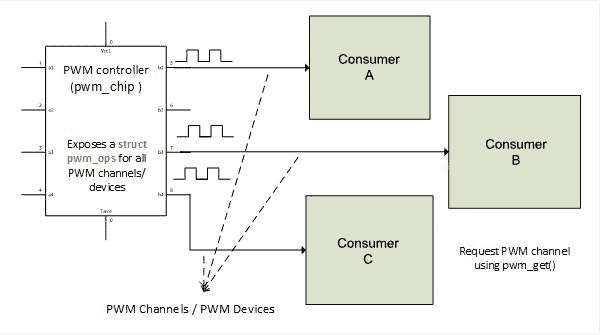

# 第十九章：PWM 驱动程序

**脉冲宽度调制**（**PWM**）类似于不断循环开关。它是一种用于控制舵机、电压调节等的硬件特性。PWM 最著名的应用包括：

+   电机速度控制

+   调光

+   电压调节

现在，让我们通过以下简单的图介绍 PWM：


前面的图描述了完整的 PWM 周期，介绍了我们需要在深入研究内核 PWM 框架之前澄清的一些术语：

+   `Ton`：这是信号高电平的持续时间。

+   `Toff`：这是信号低电平的持续时间。

+   `周期`：这是完整 PWM 周期的持续时间。它代表 PWM 信号的`Ton`和`Toff`的总和。

+   `占空比`：它表示信号在 PWM 信号周期内保持开启的时间的百分比。

不同的公式详细说明如下：

+   PWM 周期：

+   占空比：

您可以在[`en.wikipedia.org/wiki/Pulse-width_modulation`](https://en.wikipedia.org/wiki/Pulse-width_modulation)找到有关 PWM 的详细信息。

Linux PWM 框架有两个接口：

1.  **控制器接口**：公开 PWM 线的接口。它是 PWM 芯片，即生产者。

1.  **消费者接口**：由控制器公开的使用 PWM 线的设备。此类设备的驱动程序使用控制器导出的辅助函数，通过通用 PWM 框架。

消费者或生产者接口取决于以下头文件：

```
#include <linux/pwm.h> 
```

在本章中，我们将处理：

+   PWM 驱动程序架构和数据结构，用于控制器和消费者，以及一个虚拟驱动程序

+   在设备树中实例化 PWM 设备和控制器

+   请求和使用 PWM 设备

+   通过 sysfs 接口从用户空间使用 PWM

# PWM 控制器驱动程序

在编写 GPIO 控制器驱动程序时需要`struct gpio_chip`，在编写 IRQ 控制器驱动程序时需要`struct irq_chip`，PWM 控制器在内核中表示为`struct pwm_chip`结构的实例。



PWM 控制器和设备

```
struct pwm_chip { 
   struct device *dev; 
   const struct pwm_ops *ops; 
   int base; 
   unsigned int npwm; 

   struct pwm_device *pwms; 
   struct pwm_device * (*of_xlate)(struct pwm_chip *pc, 
                    const struct of_phandle_args *args); 
   unsigned int of_pwm_n_cells; 
   bool can_sleep; 
}; 
```

以下是结构中每个元素的含义：

+   `dev`：这代表与此芯片关联的设备。

+   `Ops`：这是一个数据结构，提供此芯片向消费者驱动程序公开的回调函数。

+   `Base`：这是由此芯片控制的第一个 PWM 的编号。如果`chip->base < 0`，则内核将动态分配一个基数。

+   `can_sleep`：如果 ops 字段的`.config()`、`.enable()`或`.disable()`操作可能休眠，则由芯片驱动程序设置为`true`。

+   `npwm`：这是此芯片提供的 PWM 通道（设备）的数量。

+   `pwms`：这是由框架分配给此芯片的 PWM 设备数组，供消费者驱动程序使用。

+   `of_xlate`：这是一个可选的回调，用于根据 DT PWM 指定器请求 PWM 设备。如果未定义，PWM 核心将将其设置为`of_pwm_simple_xlate`，同时将`of_pwm_n_cells`强制设置为`2`。

+   `of_pwm_n_cells`：这是 DT 中 PWM 指定器预期的单元数。

PWM 控制器/芯片的添加和移除依赖于两个基本函数，`pwmchip_add()`和`pwmchip_remove()`。每个函数都应该以填充的`struct pwm_chip`结构作为参数。它们各自的原型如下：

```
int pwmchip_add(struct pwm_chip *chip) 
int pwmchip_remove(struct pwm_chip *chip) 
```

与其他框架移除函数不返回值不同，`pwmchip_remove()`具有返回值。它在成功时返回`0`，如果芯片仍在使用（仍在请求），则返回`-EBUSY`。

每个 PWM 驱动程序必须通过`struct pwm_ops`字段实现一些钩子，该字段由 PWM 核心或消费者接口使用，以配置和充分利用其 PWM 通道。其中一些是可选的。

```
struct pwm_ops { 
   int (*request)(struct pwm_chip *chip, struct pwm_device *pwm); 
   void (*free)(struct pwm_chip *chip, struct pwm_device *pwm); 
   int (*config)(struct pwm_chip *chip, struct pwm_device *pwm, 
                           int duty_ns, int period_ns); 
   int (*set_polarity)(struct pwm_chip *chip, struct pwm_device *pwm, 
                           enum pwm_polarity polarity); 
   int (*enable)(struct pwm_chip *chip,struct pwm_device *pwm); 
   void (*disable)(struct pwm_chip *chip, struct pwm_device *pwm); 
   void (*get_state)(struct pwm_chip *chip, struct pwm_device *pwm, 
                struct pwm_state *state); /* since kernel v4.7 */ 
   struct module *owner; 
}; 
```

让我们看看结构中的每个元素的含义：

+   `request`：这是一个可选的钩子，如果提供，将在请求 PWM 通道时执行。

+   `free`：这与请求相同，在 PWM 释放时运行。

+   `config`：这是 PMW 配置钩子。它配置了这个 PWM 的占空比和周期长度。

+   `set_polarity`：这个钩子配置了 PWM 的极性。

+   `Enable`：这启用 PWM 线，开始输出切换。

+   `Disable`：这禁用 PWM 线，停止输出切换。

+   `Apply`：这个原子地应用一个新的 PWM 配置。状态参数应该根据实际的硬件配置进行调整。

+   `get_state`：这返回当前 PWM 状态。当 PWM 芯片注册时，每个 PWM 设备只调用一次这个函数。

+   `Owner`：这是拥有这个芯片的模块，通常是`THIS_MODULE`。

在 PWM 控制器驱动的`probe`函数中，最好的做法是检索 DT 资源，初始化硬件，填充`struct pwm_chip`和它的`struct pwm_ops`，然后使用`pwmchip_add`函数添加 PWM 芯片。

# 驱动示例

现在让我们通过编写一个虚拟 PWM 控制器的虚拟驱动来总结一下事情，它有三个通道：

```
#include <linux/module.h> 
#include <linux/of.h> 
#include <linux/platform_device.h> 
#include <linux/pwm.h> 

struct fake_chip { 
   struct pwm_chip chip; 
   int foo; 
   int bar; 
   /* put the client structure here (SPI/I2C) */ 
}; 

static inline struct fake_chip *to_fake_chip(struct pwm_chip *chip) 
{ 
   return container_of(chip, struct fake_chip, chip); 
} 

static int fake_pwm_request(struct pwm_chip *chip, 
                               struct pwm_device *pwm) 
{ 
   /* 
    * One may need to do some initialization when a PWM channel 
    * of the controller is requested. This should be done here. 
    * 
    * One may do something like  
    *     prepare_pwm_device(struct pwm_chip *chip, pwm->hwpwm); 
    */ 

   return 0; 
} 

static int fake_pwm_config(struct pwm_chip *chip, 
                       struct pwm_device *pwm, 
                      int duty_ns, int period_ns) 
{ 

    /* 
     * In this function, one ne can do something like: 
     *      struct fake_chip *priv = to_fake_chip(chip); 
     * 
     *      return send_command_to_set_config(priv, 
     *                      duty_ns, period_ns); 
     */ 

   return 0; 
} 

static int fake_pwm_enable(struct pwm_chip *chip, struct pwm_device *pwm) 
{ 
    /* 
     * In this function, one ne can do something like: 
     *  struct fake_chip *priv = to_fake_chip(chip); 
     * 
     * return foo_chip_set_pwm_enable(priv, pwm->hwpwm, true); 
     */ 

    pr_info("Somebody enabled PWM device number %d of this chip", 
             pwm->hwpwm); 
   return 0; 
} 

static void fake_pwm_disable(struct pwm_chip *chip, 
                              struct pwm_device *pwm) 
{ 
    /* 
     * In this function, one ne can do something like: 
     *  struct fake_chip *priv = to_fake_chip(chip); 
     * 
     * return foo_chip_set_pwm_enable(priv, pwm->hwpwm, false); 
     */ 

    pr_info("Somebody disabled PWM device number %d of this chip", 
              pwm->hwpwm); 
} 

static const struct pwm_ops fake_pwm_ops = { 
   .request = fake_pwm_request, 
   .config = fake_pwm_config, 
   .enable = fake_pwm_enable, 
   .disable = fake_pwm_disable, 
   .owner = THIS_MODULE, 
}; 

static int fake_pwm_probe(struct platform_device *pdev) 
{ 
   struct fake_chip *priv; 

   priv = devm_kzalloc(&pdev->dev, sizeof(*priv), GFP_KERNEL); 
   if (!priv) 
         return -ENOMEM; 

   priv->chip.ops = &fake_pwm_ops; 
   priv->chip.dev = &pdev->dev; 
   priv->chip.base = -1;   /* Dynamic base */ 
   priv->chip.npwm = 3;    /* 3 channel controller */  

   platform_set_drvdata(pdev, priv); 
   return pwmchip_add(&priv->chip); 
} 

static int fake_pwm_remove(struct platform_device *pdev) 
{ 
   struct fake_chip *priv = platform_get_drvdata(pdev); 
   return pwmchip_remove(&priv->chip); 
} 

static const struct of_device_id fake_pwm_dt_ids[] = { 
   { .compatible = "packt,fake-pwm", }, 
   { } 
}; 
MODULE_DEVICE_TABLE(of, fake_pwm_dt_ids); 

static struct platform_driver fake_pwm_driver = { 
   .driver = { 
         .name = KBUILD_MODNAME, 
.owner = THIS_MODULE, 
         .of_match_table = of_match_ptr(fake_pwm_dt_ids), 
   }, 
   .probe = fake_pwm_probe, 
   .remove = fake_pwm_remove, 
}; 
module_platform_driver(fake_pwm_driver); 

MODULE_AUTHOR("John Madieu <john.madieu@gmail.com>"); 
MODULE_DESCRIPTION("Fake pwm driver"); 
MODULE_LICENSE("GPL"); 
```

# PWM 控制器绑定

在 DT 中绑定 PWM 控制器时，最重要的属性是`#pwm-cells`。它表示用于表示该控制器的 PWM 设备的单元格数。如果记得，在`struct pwm_chip`结构中，`of_xlate`钩子用于翻译给定的 PWM 说明符。如果没有设置这个钩子，这里的`pwm-cells`必须设置为 2，否则，它应该与`of_pwm_n_cells`的值相同。以下是 i.MX6 SoC 设备树中 PWM 控制器节点的示例。

```
pwm3: pwm@02088000 { 
    #pwm-cells = <2>; 
    compatible = "fsl,imx6q-pwm", "fsl,imx27-pwm"; 
    reg = <0x02088000 0x4000>; 
    interrupts = <0 85 IRQ_TYPE_LEVEL_HIGH>; 
    clocks = <&clks IMX6QDL_CLK_IPG>, 
         <&clks IMX6QDL_CLK_PWM3>; 
    clock-names = "ipg", "per"; 
    status = "disabled"; 
}; 
```

另一方面，对应我们的虚拟 PWM 驱动的节点如下：

```
fake_pwm: pwm@0 { 
    #pwm-cells = <2>; 
    compatible = "packt,fake-pwm"; 
    /*  
     * Our driver does not use resource  
     * neither mem, IRQ, nor Clock) 
     */ 
}; 
```

# PWM 消费者接口

消费者是实际使用 PWM 通道的设备。在内核中，PWM 通道表示为`struct pwm_device`结构的实例：

```
struct pwm_device { 
   const char *label; 
   unsigned long flags; 
   unsigned int hwpwm; 
   unsigned int pwm; 
   struct pwm_chip *chip; 
   void *chip_data; 

  unsigned int period;     /* in nanoseconds */ 
  unsigned int duty_cycle; /* in nanoseconds */ 
  enum pwm_polarity polarity; 
}; 
```

+   `Label`：这是这个 PWM 设备的名称

+   `Flags`：这代表与 PWM 设备相关的标志

+   `hwpw`：这是 PWM 设备的相对索引，局部于芯片

+   `pwm`：这是 PWM 设备的系统全局索引

+   `chip`：这是一个 PWM 芯片，提供这个 PWM 设备的控制器

+   `chip_data`：这是与这个 PWM 设备关联的芯片私有数据

自内核 v4.7 以来，结构已更改为：

```
struct pwm_device { 
   const char *label; 
   unsigned long flags; 
   unsigned int hwpwm; 
   unsigned int pwm; 
   struct pwm_chip *chip; 
   void *chip_data; 

   struct pwm_args args; 
   struct pwm_state state; 
}; 
```

+   `args`：这代表与这个 PWM 设备相关的依赖于板的 PWM 参数，通常从 PWM 查找表或设备树中检索。PWM 参数代表用户想要在这个 PWM 设备上使用的初始配置，而不是当前的 PWM 硬件状态。

+   `状态`：这代表了当前 PWM 通道的状态。

```
struct pwm_args { 
   unsigned int period; /* Device's nitial period */ 
   enum pwm_polarity polarity; 
}; 

struct pwm_state { 
   unsigned int period; /* PWM period (in nanoseconds) */ 
   unsigned int duty_cycle; /* PWM duty cycle (in nanoseconds) */ 
   enum pwm_polarity polarity; /* PWM polarity */ 
   bool enabled; /* PWM enabled status */ 
} 
```

随着 Linux 的发展，PWM 框架面临了几次变化。这些变化涉及到从消费者端请求 PWM 设备的方式。我们可以将消费者接口分为两部分，或者更准确地说是两个版本。

**传统版本**，在这个版本中使用`pwm_request()`和`pwm_free()`来请求一个 PWM 设备，并在使用后释放它。

**新的和推荐的 API**，使用`pwm_get()`和`pwm_put()`函数。前者给定了消费者设备和通道名称作为参数来请求 PWM 设备，后者给定了要释放的 PWM 设备作为参数。这些函数的托管变体`devm_pwm_get()`和`devm_pwm_put()`也存在。

```
struct pwm_device *pwm_get(struct device *dev, const char *con_id) 
void pwm_put(struct pwm_device *pwm) 
```

`pwm_request()`/`pwm_get()`和`pwm_free()`/`pwm_put()`不能在原子上下文中调用，因为 PWM 核心使用互斥锁，可能会休眠。

在请求后，必须使用以下方式配置 PWM：

```
int pwm_config(struct pwm_device *pwm, int duty_ns, int period_ns); 
```

要开始/停止切换 PWM 输出，使用`pwm_enable()`/`pwm_disable()`。这两个函数都以`struct pwm_device`的指针作为参数，并且都是通过`pwm_chip.pwm_ops`字段公开的钩子的包装器。

```
int pwm_enable(struct pwm_device *pwm) 
void pwm_disable(struct pwm_device *pwm) 
```

`pwm_enable（）`在成功时返回`0`，在失败时返回负错误代码。一个很好的 PWM 消费者驱动程序的例子是内核源树中的`drivers/leds/leds-pwm.c`。以下是一个 PWM led 的消费者代码示例：

```
static void pwm_led_drive(struct pwm_device *pwm, 
                      struct private_data *priv) 
{ 
    /* Configure the PWM, applying a period and duty cycle */ 
    pwm_config(pwm, priv->duty, priv->pwm_period); 

    /* Start toggling */ 
    pwm_enable(pchip->pwmd); 

    [...] /* Do some work */ 

    /* And then stop toggling*/ 
    pwm_disable(pchip->pwmd); 
} 
```

# PWM 客户端绑定

PWM 设备可以从以下分配给消费者：

+   设备树

+   ACPI

+   静态查找表，在板`init`文件中。

本书将仅处理 DT 绑定，因为这是推荐的方法。当将 PWM 消费者（客户端）绑定到其驱动程序时，您需要提供其链接的控制器的 phandle。

建议您将 PWM 属性命名为`pwms`；由于 PWM 设备是命名资源，您可以提供一个可选的属性`pwm-names`，其中包含一个字符串列表，用于为`pwms`属性中列出的每个 PWM 设备命名。如果没有给出`pwm-names`属性，则将使用用户节点的名称作为回退。

使用多个 PWM 设备的设备的驱动程序可以使用`pwm-names`属性将`pwm_get（）`调用请求的 PWM 设备的名称映射到`pwms`属性给出的列表中的索引。

以下示例描述了基于 PWM 的背光设备，这是 PWM 设备绑定的内核文档的摘录（请参阅*Documentation/devicetree/bindings/pwm/pwm.txt*）：

```
pwm: pwm { 
    #pwm-cells = <2>; 
}; 

[...] 

bl: backlight { 
pwms = <&pwm 0 5000000>; 
   pwm-names = "backlight"; 
}; 
```

PWM 规范通常编码芯片相对 PWM 编号和以纳秒为单位的 PWM 周期。使用以下行：

```
pwms = <&pwm 0 5000000>; 
```

`0`对应于相对于控制器的 PWM 索引，`5000000`表示以纳秒为单位的周期。请注意，在前面的示例中，指定`pwm-names`是多余的，因为名称`backlight`无论如何都将用作回退。因此，驱动程序必须调用：

```
static int my_consummer_probe(struct platform_device *pdev) 
{ 
    struct pwm_device *pwm; 

    pwm = pwm_get(&pdev->dev, "backlight"); 
    if (IS_ERR(pwm)) { 
       pr_info("unable to request PWM, trying legacy API\n"); 
       /* 
        * Some drivers use the legacy API as fallback, in order 
        * to request a PWM ID, global to the system 
        * pwm = pwm_request(global_pwm_id, "pwm beeper"); 
        */ 
    } 

    [...] 
    return 0; 
} 
```

PWM 规范通常编码芯片相对 PWM 编号和以纳秒为单位的 PWM 周期。

# 使用 sysfs 接口的 PWM

PWM 核心`sysfs`根路径为`/sys/class/pwm/`。这是管理 PWM 设备的用户空间方式。系统中添加的每个 PWM 控制器/芯片都会在`sysfs`根路径下创建一个`pwmchipN`目录条目，其中`N`是 PWM 芯片的基础。该目录包含以下文件：

+   `npwm`：这是一个只读文件，打印此芯片支持的 PWM 通道数

+   `导出`：这是一个只写文件，允许将 PWM 通道导出供`sysfs`使用（此功能等效于 GPIO sysfs 接口）

+   `取消导出`：从`sysfs`中取消导出 PWM 通道（只写）

PWM 通道使用从 0 到`pwm<n-1>`的索引编号。这些数字是相对于芯片的。每个 PWM 通道导出都会在`pwmchipN`中创建一个`pwmX`目录，该目录与使用的`export`文件相同。**X**是导出的通道号。每个通道目录包含以下文件：

+   `周期`：这是一个可读/可写文件，用于获取/设置 PWM 信号的总周期。值以纳秒为单位。

+   `duty_cycle`：这是一个可读/可写文件，用于获取/设置 PWM 信号的占空比。它表示 PWM 信号的活动时间。值以纳秒为单位，必须始终小于周期。

+   `极性`：这是一个可读/可写文件，仅在此 PWM 设备的芯片支持极性反转时使用。最好只在此 PWM 未启用时更改极性。接受的值为字符串*normal*或*inversed*。

+   `启用`：这是一个可读/可写文件，用于启用（开始切换）/禁用（停止切换）PWM 信号。接受的值为：

+   0：已禁用

+   1：已启用

以下是通过`sysfs`接口从用户空间使用 PWM 的示例：

1.  启用 PWM：

```
 # echo 1 > /sys/class/pwm/pwmchip<pwmchipnr>/pwm<pwmnr>/enable

```

1.  设置 PWM 周期：

```
# echo **<value in nanoseconds> >** 

/sys/class/pwm/pwmchip**<pwmchipnr>**

/pwm**<pwmnr>**

/period

```

1.  设置 PWM 占空比：占空比的值必须小于 PWM 周期的值：

```
# echo **<value in nanoseconds>**

 > /sys/class/pwm/pwmchip**<pwmchipnr>**

/pwm**<pwmnr>**

/duty_cycle

```

1.  禁用 PWM：

```
 # echo 0 > /sys/class/pwm/pwmchip<pwmchipnr>/pwm<pwmnr>/enable 

```

完整的 PWM 框架 API 和 sysfs 描述可在内核源树中的*Documentation/pwm.txt*文件中找到。

# 摘要

到本章结束时，您将具备处理任何 PWM 控制器的能力，无论它是内存映射的还是外部连接在总线上的。本章描述的 API 将足以编写和增强控制器驱动程序作为消费者设备驱动程序。如果您对 PWM 内核端还不熟悉，可以完全使用用户空间 sysfs 接口。话虽如此，在下一章中，我们将讨论有时由 PWM 驱动的调节器。所以，请稍等，我们快要完成了。
