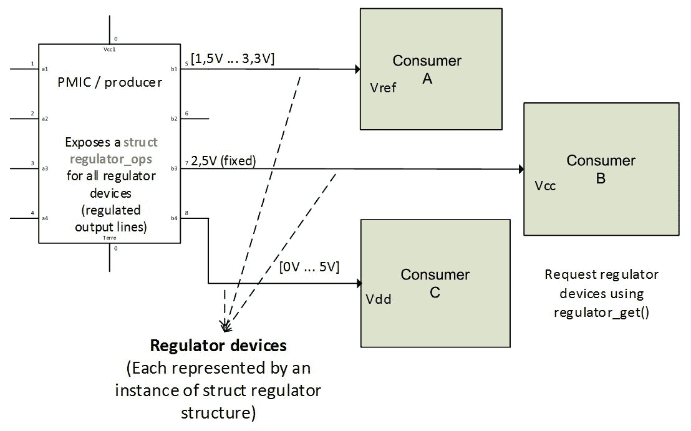

# 第二十章：调节器框架

调节器是一种为其他设备提供电源的电子设备。由调节器供电的设备称为消费者。有人说他们消耗调节器提供的电源。大多数调节器可以启用和禁用其输出，有些还可以控制其输出电压或电流。驱动程序应通过特定的函数和数据结构向消费者公开这些功能，我们将在本章讨论。

物理提供调节器的芯片称为**电源管理集成电路**（**PMIC**）：



Linux 调节器框架已经被设计用于接口和控制电压和电流调节器。它分为四个独立的接口，如下所示：

+   调节器驱动程序接口用于调节器 PMIC 驱动程序。此接口的结构可以在`include/linux/regulator/driver.h`中找到。

+   设备驱动程序的消费者接口。

+   用于板配置的机器接口。

+   用户空间的 sysfs 接口。

在本章中，我们将涵盖以下主题：

+   介绍 PMIC/生产者驱动程序接口、驱动程序方法和数据结构

+   ISL6271A MIC 驱动程序的案例研究，以及用于测试目的的虚拟调节器

+   调节器消费者接口及其 API

+   DT 中的调节器（生产者/消费者）绑定

# PMIC/生产者驱动程序接口

生产者是产生调节电压或电流的设备。这种设备的名称是 PMIC，它可以用于电源排序、电池管理、DC-DC 转换或简单的电源开关（开/关）。它通过软件控制调节输入电源的输出功率。

它涉及调节器驱动程序，特别是生产者 PMIC 方面，需要一些头文件：

```
#include <linux/platform_device.h> 
#include <linux/regulator/driver.h> 
#include <linux/regulator/of_regulator.h> 
```

# 驱动程序数据结构

我们将从调节器框架使用的数据结构的简短介绍开始。本节仅描述了生产者接口。

# 描述结构

内核通过`struct regulator_desc`结构描述了 PMIC 提供的每个调节器，该结构表征了调节器。通过调节器，我指的是任何独立的调节输出。例如，来自 Intersil 的 ISL6271A 是一个具有三个独立调节输出的 PMIC。然后，其驱动程序中应该有三个`regulator_desc`的实例。这个结构包含调节器的固定属性，看起来像下面这样：

```
struct regulator_desc { 
   const char *name; 
   const char *of_match; 

   int id; 
   unsigned n_voltages; 
   const struct regulator_ops *ops; 
   int irq; 
   enum regulator_type type; 
   struct module *owner; 

   unsigned int min_uV; 
   unsigned int uV_step; 
}; 
```

出于简单起见，我们将省略一些字段。完整的结构定义可以在`include/linux/regulator/driver.h`中找到：

+   `name`保存调节器的名称。

+   `of_match`保存了在 DT 中用于识别调节器的名称。

+   `id`是调节器的数字标识符。

+   `owner`表示提供调节器的模块。将此字段设置为`THIS_MODULE`。

+   `type`指示调节器是电压调节器还是电流调节器。它可以是`REGULATOR_VOLTAGE`或`REGULATOR_CURRENT`。任何其他值都将导致调节器注册失败。

+   `n_voltages`表示此调节器可用的选择器数量。它代表调节器可以输出的数值。对于固定输出电压，`n_voltages`应设置为 1。

+   `min_uV`表示此调节器可以提供的最小电压值。这是由最低选择器给出的电压。

+   `uV_step`表示每个选择器的电压增加。

+   `ops`表示调节器操作表。它是一个指向调节器可以支持的一组操作回调的结构。此字段稍后会讨论。

+   `irq`是调节器的中断号。

# 约束结构

当 PMIC 向消费者公开调节器时，它必须借助`struct regulation_constraints`结构为此调节器强加一些名义上的限制。这是一个收集调节器的安全限制并定义消费者不能越过的边界的结构。这是调节器驱动程序和消费者驱动程序之间的一种合同：

```
struct regulation_constraints { 
   const char *name; 

   /* voltage output range (inclusive) - for voltage control */ 
   int min_uV; 
   int max_uV; 

   int uV_offset; 

   /* current output range (inclusive) - for current control */ 
   int min_uA; 
   int max_uA; 

   /* valid regulator operating modes for this machine */ 
   unsigned int valid_modes_mask; 

   /* valid operations for regulator on this machine */ 
   unsigned int valid_ops_mask; 

   struct regulator_state state_disk; 
   struct regulator_state state_mem; 
   struct regulator_state state_standby; 
   suspend_state_t initial_state; /* suspend state to set at init */ 

   /* mode to set on startup */ 
   unsigned int initial_mode; 

   /* constraint flags */ 
   unsigned always_on:1;   /* regulator never off when system is on */ 
   unsigned boot_on:1;     /* bootloader/firmware enabled regulator */ 
   unsigned apply_uV:1;    /* apply uV constraint if min == max */ 
}; 
```

让我们描述结构中的每个元素：

+   `min_uV`，`min_uA`，`max_uA`和`max_uV`是消费者可以设置的最小电压/电流值。

+   `uV_offset` 是应用于消费者电压的补偿电压偏移量。

+   `valid_modes_mask`和`valid_ops_mask`分别是可以由消费者配置/执行的模式/操作的掩码。

+   如果寄存器永远不应该被禁用，则应设置`always_on`。

+   如果寄存器在系统初始启动时已启用，则应设置`boot_on`。如果寄存器不是由硬件或引导加载程序启用的，则在应用约束时将启用它。

+   `name`是用于显示目的的约束的描述性名称。

+   `apply_uV`在初始化时应用电压约束。

+   `input_uV`表示由另一个寄存器供电时该寄存器的输入电压。

+   `state_disk`，`state_mem` 和 `state_standby` 定义了系统在磁盘模式、内存模式或待机模式下挂起时的寄存器状态。

+   `initial_state` 表示默认设置为挂起状态。

+   `initial_mode`是启动时设置的模式。

# 初始化数据结构

有两种方法可以将`regulator_init_data`传递给驱动程序；这可以通过板初始化文件中的平台数据完成，也可以通过设备树中的节点使用`of_get_regulator_init_data`函数完成：

```
struct regulator_init_data { 
   struct regulation_constraints constraints; 

   /* optional regulator machine specific init */ 
   int (*regulator_init)(void *driver_data); 
   void *driver_data;      /* core does not touch this */ 
}; 
```

以下是结构中各元素的含义：

+   `constraints`表示寄存器约束

+   `regulator_init`是在核心注册寄存器时调用的可选回调

+   `driver_data`表示传递给`regulator_init`的数据

正如大家所看到的，`struct constraints`结构是`init data`的一部分。这是因为在初始化寄存器时，其约束直接应用于它，远在任何消费者使用之前。

# 将初始化数据输入到板文件中

该方法包括填充约束数组，可以从驱动程序内部或板文件中进行，并将其用作平台数据的一部分。以下是基于案例研究中的设备 ISL6271A from Intersil 的示例：

```
static struct regulator_init_data isl_init_data[] = { 
    [0] = { 
                .constraints = { 
                    .name           = "Core Buck", 
                    .min_uV         = 850000, 
                    .max_uV         = 1600000, 
                    .valid_modes_mask   = REGULATOR_MODE_NORMAL 
                                | REGULATOR_MODE_STANDBY, 
                    .valid_ops_mask     = REGULATOR_CHANGE_MODE 
                                | REGULATOR_CHANGE_STATUS, 
                }, 
        }, 
    [1] = { 
                .constraints = { 
                    .name           = "LDO1", 
                    .min_uV         = 1100000, 
                    .max_uV         = 1100000, 
                    .always_on      = true, 
                    .valid_modes_mask   = REGULATOR_MODE_NORMAL 
                                | REGULATOR_MODE_STANDBY, 
                    .valid_ops_mask     = REGULATOR_CHANGE_MODE 
                                | REGULATOR_CHANGE_STATUS, 
                }, 
        }, 
    [2] = { 
                .constraints = { 
                    .name           = "LDO2", 
                    .min_uV         = 1300000, 
                    .max_uV         = 1300000, 
                    .always_on      = true, 
                    .valid_modes_mask   = REGULATOR_MODE_NORMAL 
                                | REGULATOR_MODE_STANDBY, 
                    .valid_ops_mask     = REGULATOR_CHANGE_MODE 
                                | REGULATOR_CHANGE_STATUS, 
                }, 
        }, 
}; 
```

尽管此方法现在已被弃用，但这里仍介绍了它供您参考。新的推荐方法是 DT，将在下一节中介绍。

# 将初始化数据输入 DT

为了从 DT 中提取传递的初始化数据，我们需要引入一个新的数据类型`struct of_regulator_match`，它看起来像这样：

```
struct of_regulator_match { 
   const char *name; 
   void *driver_data; 
   struct regulator_init_data *init_data; 
   struct device_node *of_node; 
   const struct regulator_desc *desc; 
}; 
```

在使用此数据结构之前，我们需要弄清楚如何实现 DT 文件的寄存器绑定。

DT 中的每个 PMIC 节点都应该有一个名为`regulators`的子节点，在其中我们必须声明此 PMIC 提供的每个寄存器作为专用子节点。换句话说，每个 PMIC 的寄存器都被定义为`regulators`节点的子节点，而`regulators`节点又是 DT 中 PMIC 节点的子节点。

在寄存器节点中，您可以定义标准化的属性：

+   `regulator-name`：这是用作寄存器输出的描述性名称的字符串

+   `regulator-min-microvolt`：这是消费者可以设置的最小电压

+   `regulator-max-microvolt`：这是消费者可以设置的最大电压

+   `regulator-microvolt-offset`：这是应用于电压以补偿电压下降的偏移量

+   `regulator-min-microamp`：这是消费者可以设置的最小电流

+   `regulator-max-microamp`：这是消费者可以设置的最大电流

+   `regulator-always-on`：这是一个布尔值，指示寄存器是否永远不应该被禁用

+   `regulator-boot-on`：这是一个由引导加载程序/固件启用的寄存器

+   `<name>-supply`：这是父供电/寄存器节点的 phandle

+   `regulator-ramp-delay`：这是寄存器的斜坡延迟（以 uV/uS 为单位）

这些属性看起来真的像是`struct regulator_init_data`中的字段。回到`ISL6271A`驱动程序，其 DT 条目可能如下所示：

```
isl6271a@3c { 
   compatible = "isl6271a"; 
   reg = <0x3c>; 
   interrupts = <0 86 0x4>; 

    /* supposing our regulator is powered by another regulator */ 
   in-v1-supply = <&some_reg>; 
   [...] 

   regulators { 
         reg1: core_buck { 
               regulator-name = "Core Buck"; 
               regulator-min-microvolt = <850000>; 
               regulator-max-microvolt = <1600000>; 
         }; 

         reg2: ldo1 { 
               regulator-name = "LDO1"; 
               regulator-min-microvolt = <1100000>; 
               regulator-max-microvolt = <1100000>; 
               regulator-always-on; 
         }; 

         reg3: ldo2 { 
               regulator-name = "LDO2"; 
               regulator-min-microvolt = <1300000>; 
               regulator-max-microvolt = <1300000>; 
               regulator-always-on; 
         }; 
   }; 
}; 
```

使用内核辅助函数`of_regulator_match()`，给定`regulators`子节点作为参数，该函数将遍历每个调节器设备节点，并为每个构建一个`struct init_data`结构。在驱动程序方法部分讨论的`probe()`函数中有一个示例。

# 配置结构

调节器设备通过`struct regulator_config`结构进行配置，该结构保存调节器描述的可变元素。在向核心注册调节器时，将传递此结构：

```
struct regulator_config { 
   struct device *dev; 
   const struct regulator_init_data *init_data; 
   void *driver_data; 
   struct device_node *of_node; 
}; 
```

+   `dev`代表调节器所属的设备结构。

+   `init_data`是结构的最重要字段，因为它包含一个包含调节器约束（机器特定结构）的元素。

+   `driver_data`保存调节器的私有数据。

+   `of_node` 用于支持 DT 的驱动程序。这是要解析 DT 绑定的节点。开发人员负责设置此字段。它也可以是`NULL`。

# 设备操作结构

`struct regulator_ops`结构是一个回调列表，表示调节器可以执行的所有操作。这些回调是辅助函数，并由通用内核函数包装：

```
struct regulator_ops { 
   /* enumerate supported voltages */ 
   int (*list_voltage) (struct regulator_dev *, 
                        unsigned selector); 

   /* get/set regulator voltage */ 
   int (*set_voltage) (struct regulator_dev *, 
                        int min_uV, int max_uV, 
                        unsigned *selector); 
   int (*map_voltage)(struct regulator_dev *, 
                       int min_uV, int max_uV); 
   int (*set_voltage_sel) (struct regulator_dev *, 
                           unsigned selector); 
   int (*get_voltage) (struct regulator_dev *); 
   int (*get_voltage_sel) (struct regulator_dev *); 

   /* get/set regulator current  */ 
   int (*set_current_limit) (struct regulator_dev *, 
                          int min_uA, int max_uA); 
   int (*get_current_limit) (struct regulator_dev *); 

   int (*set_input_current_limit) (struct regulator_dev *, 
                                   int lim_uA); 
   int (*set_over_current_protection) (struct regulator_dev *); 
   int (*set_active_discharge) (struct regulator_dev *, 
                                bool enable); 

   /* enable/disable regulator */ 
   int (*enable) (struct regulator_dev *); 
   int (*disable) (struct regulator_dev *); 
   int (*is_enabled) (struct regulator_dev *); 

   /* get/set regulator operating mode (defined in consumer.h) */ 
   int (*set_mode) (struct regulator_dev *, unsigned int mode); 
   unsigned int (*get_mode) (struct regulator_dev *); 
}; 
```

回调名称很好地解释了它们的作用。这里没有列出的其他回调，您必须在消费者使用它们之前在调节器的约束中启用适当的掩码`valid_ops_mask`或`valid_modes_mask`。可用的操作掩码标志在`include/linux/regulator/machine.h`中定义。

因此，给定一个`struct regulator_dev`结构，可以通过调用`rdev_get_id()`函数获取相应调节器的 ID：

```
int rdev_get_id(struct regulator_dev *rdev) 
```

# 驱动程序方法

驱动程序方法包括`probe()`和`remove()`函数。如果此部分对您不清楚，请参考前面的数据结构。

# 探测功能

PMIC 驱动程序的`probe`功能可以分为几个步骤，列举如下：

1.  为此 PMIC 提供的所有调节器定义一个`struct regulator_desc`对象数组。在此步骤中，您应该已经定义了一个有效的`struct regulator_ops`，以链接到适当的`regulator_desc`。假设它们都支持相同的操作，可以对所有调节器使用相同的`regulator_ops`。

1.  现在在`probe`函数中，对于每个调节器：

+   +   从平台数据中获取适当的`struct regulator_init_data`，该数据必须已包含有效的`struct regulation_constraints`，或者从 DT 构建一个`struct regulation_constraints`，以构建一个新的`struct regulator_init_data`对象。

+   使用先前的`struct regulator_init_data`来设置`struct regulator_config`结构。如果驱动程序支持 DT，可以使`regulator_config.of_node`指向用于提取调节器属性的节点。

+   调用`regulator_register()`（或托管版本的`devm_regulator_register()`）来使用先前的`regulator_desc`和`regulator_config`作为参数向核心注册调节器。

使用`regulator_register()`函数或`devm_regulator_register()`，将调节器注册到内核中：

```
struct regulator_dev * regulator_register(const struct regulator_desc           *regulator_desc, const struct regulator_config *cfg) 
```

此函数返回一个我们到目前为止尚未讨论的数据类型：`struct regulator_dev`对象，定义在`include/linux/regulator/driver.h`中。该结构表示来自生产方的调节器设备的实例（在消费方方面不同）。`struct regulator_dev`结构的实例不应直接被任何东西使用，除了调节器核心和通知注入（应该获取互斥锁，而不是其他直接访问）。也就是说，为了跟踪驱动程序内部注册的调节器，应该为注册函数返回的每个`regulator_dev`对象保留引用。

# 删除功能

`remove()`函数是在`probe`期间执行的每个操作的地方。因此，你应该牢记的关键函数是`regulator_unregister()`，当需要从系统中移除调节器时：

```
void regulator_unregister(struct regulator_dev *rdev) 
```

这个函数接受一个`struct regulator_dev`结构的指针作为参数。这也是为每个注册的调节器保留引用的另一个原因。以下是 ISL6271A 驱动程序的`remove`函数：

```
static int __devexit isl6271a_remove(struct i2c_client *i2c) 
{ 
   struct isl_pmic *pmic = i2c_get_clientdata(i2c); 
   int i; 

   for (i = 0; i < 3; i++) 
         regulator_unregister(pmic->rdev[i]); 

   kfree(pmic); 
   return 0; 
} 
```

# 案例研究：Intersil ISL6271A 电压调节器

回顾一下，这个 PMIC 提供了三个调节器设备，其中只有一个可以改变其输出值。另外两个提供固定电压：

```
struct isl_pmic { 
   struct i2c_client *client; 
   struct regulator_dev    *rdev[3]; 
   struct mutex            mtx; 
}; 
```

首先我们定义 ops 回调函数，来设置`struct regulator_desc`：

1.  处理`get_voltage_sel`操作的回调函数：

```
static int isl6271a_get_voltage_sel(struct regulator_dev *rdev) 
{ 
   struct isl_pmic *pmic = rdev_get_drvdata(dev); 
   int idx = rdev_get_id(rdev); 
   idx = i2c_smbus_read_byte(pmic->client); 
   if (idx < 0) 
         [...] /* handle this error */ 

   return idx; 
} 
```

以下是处理`set_voltage_sel`操作的回调函数：

```
static int isl6271a_set_voltage_sel( 
struct regulator_dev *dev, unsigned selector) 
{ 
   struct isl_pmic *pmic = rdev_get_drvdata(dev); 
   int err; 

   err = i2c_smbus_write_byte(pmic->client, selector); 
   if (err < 0) 
         [...] /* handle this error */ 

   return err; 
} 
```

1.  既然我们已经完成了回调函数的定义，我们可以构建一个`struct regulator_ops`：

```
static struct regulator_ops isl_core_ops = { 
   .get_voltage_sel = isl6271a_get_voltage_sel, 
   .set_voltage_sel = isl6271a_set_voltage_sel, 
   .list_voltage     = regulator_list_voltage_linear, 
   .map_voltage      = regulator_map_voltage_linear, 
}; 

static struct regulator_ops isl_fixed_ops = { 
   .list_voltage     = regulator_list_voltage_linear, 
}; 
```

你可能会问`regulator_list_voltage_linear`和`regulator_list_voltage_linear`函数是从哪里来的。和许多其他调节器辅助函数一样，它们也在`drivers/regulator/helpers.c`中定义。内核为线性输出调节器提供了辅助函数，就像 ISL6271A 一样。

现在是时候为所有调节器构建一个`struct regulator_desc`数组了：

```
static const struct regulator_desc isl_rd[] = { 
   { 
         .name       = "Core Buck", 
         .id         = 0, 
         .n_voltages = 16, 
         .ops        = &isl_core_ops, 
         .type       = REGULATOR_VOLTAGE, 
         .owner            = THIS_MODULE, 
         .min_uV     = ISL6271A_VOLTAGE_MIN, 
         .uV_step    = ISL6271A_VOLTAGE_STEP, 
   }, { 
         .name       = "LDO1", 
         .id         = 1, 
         .n_voltages = 1, 
         .ops        = &isl_fixed_ops, 
         .type       = REGULATOR_VOLTAGE, 
         .owner            = THIS_MODULE, 
         .min_uV     = 1100000, 
   }, { 
         .name       = "LDO2", 
         .id         = 2, 
         .n_voltages = 1, 
         .ops        = &isl_fixed_ops, 
         .type       = REGULATOR_VOLTAGE, 
         .owner            = THIS_MODULE, 
         .min_uV     = 1300000, 
   }, 
}; 
```

`LDO1`和`LDO2`具有固定的输出电压。这就是为什么它们的`n_voltages`属性被设置为 1，它们的 ops 只提供`regulator_list_voltage_linear`映射。

1.  现在我们在`probe`函数中，这是我们需要构建`struct init_data`结构的地方。如果你记得，我们将使用之前介绍的`struct of_regulator_match`。我们应该声明一个该类型的数组，在其中我们应该设置每个需要获取`init_data`的调节器的`.name`属性：

```
static struct of_regulator_match isl6271a_matches[] = { 
   { .name = "core_buck",  }, 
   { .name = "ldo1",       }, 
   { .name = "ldo2",       }, 
}; 
```

仔细看，你会注意到`.name`属性的设置与设备树中调节器的标签完全相同。这是你应该关心和尊重的规则。

现在让我们看一下`probe`函数。ISL6271A 提供三个调节器输出，这意味着应该调用`regulator_register()`函数三次：

```
static int isl6271a_probe(struct i2c_client *i2c, 
                          const struct i2c_device_id *id) 
{ 
struct regulator_config config = { }; 
struct regulator_init_data *init_data     = 
dev_get_platdata(&i2c->dev); 
struct isl_pmic *pmic; 
int i, ret; 

    struct device *dev = &i2c->dev; 
    struct device_node *np, *parent; 

   if (!i2c_check_functionality(i2c->adapter, 
                     I2C_FUNC_SMBUS_BYTE_DATA)) 
         return -EIO; 

   pmic = devm_kzalloc(&i2c->dev, 
sizeof(struct isl_pmic), GFP_KERNEL); 
   if (!pmic) 
         return -ENOMEM; 

    /* Get the device (PMIC) node */ 
    np = of_node_get(dev->of_node); 
   if (!np) 
         return -EINVAL; 

    /* Get 'regulators' subnode */ 
    parent = of_get_child_by_name(np, "regulators"); 
   if (!parent) { 
         dev_err(dev, "regulators node not found\n"); 
         return -EINVAL; 
   } 

    /* fill isl6271a_matches array */ 
    ret = of_regulator_match(dev, parent, isl6271a_matches, 
                            ARRAY_SIZE(isl6271a_matches)); 

    of_node_put(parent); 
   if (ret < 0) { 
         dev_err(dev, "Error parsing regulator init data: %d\n", 
               ret); 
         return ret; 
   } 

   pmic->client = i2c; 
   mutex_init(&pmic->mtx); 

   for (i = 0; i < 3; i++) { 
        struct regulator_init_data *init_data; 
         struct regulator_desc *desc; 
         int val; 

         if (pdata) 
               /* Given as platform data */ 
               config.init_data = pdata->init_data[i]; 
         else 
               /* Fetched from device tree */ 
               config.init_data = isl6271a_matches[i].init_data; 

         config.dev = &i2c->dev; 
config.of_node = isl6271a_matches[i].of_node; 
config.ena_gpio = -EINVAL; 

         /* 
          * config is passed by reference because the kernel 
          * internally duplicate it to create its own copy 
          * so that it can override some fields 
          */ 
         pmic->rdev[i] = devm_regulator_register(&i2c->dev, 
                                 &isl_rd[i], &config); 
         if (IS_ERR(pmic->rdev[i])) { 
               dev_err(&i2c->dev, "failed to register %s\n", 
id->name); 
               return PTR_ERR(pmic->rdev[i]); 
         } 
   } 
   i2c_set_clientdata(i2c, pmic); 
   return 0; 
} 
```

对于固定调节器，`init_data`可以是`NULL`。这意味着对于 ISL6271A，只有可能改变电压输出的调节器可以被分配一个`init_data`。

```
/* Only the first regulator actually need it */ 
if (i == 0) 
    if(pdata) 
            config.init_data = init_data; /* pdata */ 
      else 
            isl6271a_matches[i].init_data; /* DT */ 
else 
    config.init_data = NULL; 
```

前面的驱动程序并没有填充`struct regulator_desc`的每个字段。这在很大程度上取决于我们为其编写驱动程序的设备类型。一些驱动程序将整个工作交给了调节器核心，只提供了调节器核心需要处理的芯片寄存器地址。这样的驱动程序使用**regmap** API，这是一个通用的 I2C 和 SPI 寄存器映射库。`drivers/regulator/max8649.c`就是一个例子。

# 驱动程序示例

让我们总结一下之前讨论的内容，对于一个带有两个调节器的虚拟 PMIC 的真实驱动程序，其中第一个调节器的电压范围为 850000 µV 到 1600000 µV，步进为 50000 µV，而第二个调节器的电压固定为 1300000 µV：

```
#include <linux/init.h> 
#include <linux/module.h> 
#include <linux/kernel.h> 
#include <linux/platform_device.h>      /* For platform devices */ 
#include <linux/interrupt.h>            /* For IRQ */ 
#include <linux/of.h>                   /* For DT*/ 
#include <linux/err.h> 
#include <linux/regulator/driver.h> 
#include <linux/regulator/machine.h> 

#define DUMMY_VOLTAGE_MIN    850000 
#define DUMMY_VOLTAGE_MAX    1600000 
#define DUMMY_VOLTAGE_STEP   50000 

struct my_private_data { 
    int foo; 
    int bar; 
    struct mutex lock; 
}; 

static const struct of_device_id regulator_dummy_ids[] = { 
    { .compatible = "packt,regulator-dummy", }, 
    { /* sentinel */ } 
}; 

static struct regulator_init_data dummy_initdata[] = { 
    [0] = { 
        .constraints = { 
            .always_on = 0, 
            .min_uV = DUMMY_VOLTAGE_MIN, 
            .max_uV = DUMMY_VOLTAGE_MAX, 
        }, 
    }, 
    [1] = { 
        .constraints = { 
            .always_on = 1, 
        }, 
    }, 
}; 

static int isl6271a_get_voltage_sel(struct regulator_dev *dev) 
{ 
    return 0; 
} 

static int isl6271a_set_voltage_sel(struct regulator_dev *dev, 
                    unsigned selector) 
{ 
    return 0; 
} 

static struct regulator_ops dummy_fixed_ops = { 
    .list_voltage   = regulator_list_voltage_linear, 
}; 

static struct regulator_ops dummy_core_ops = { 
    .get_voltage_sel = isl6271a_get_voltage_sel, 
    .set_voltage_sel = isl6271a_set_voltage_sel, 
    .list_voltage   = regulator_list_voltage_linear, 
    .map_voltage    = regulator_map_voltage_linear, 
}; 

static const struct regulator_desc dummy_desc[] = { 
    { 
        .name       = "Dummy Core", 
        .id     = 0, 
        .n_voltages = 16, 
        .ops        = &dummy_core_ops, 
        .type       = REGULATOR_VOLTAGE, 
        .owner      = THIS_MODULE, 
        .min_uV     = DUMMY_VOLTAGE_MIN, 
        .uV_step    = DUMMY_VOLTAGE_STEP, 
    }, { 
        .name       = "Dummy Fixed", 
        .id     = 1, 
        .n_voltages = 1, 
        .ops        = &dummy_fixed_ops, 
        .type       = REGULATOR_VOLTAGE, 
        .owner      = THIS_MODULE, 
        .min_uV     = 1300000, 
    }, 
}; 

static int my_pdrv_probe (struct platform_device *pdev) 
{ 
   struct regulator_config config = { }; 
   config.dev = &pdev->dev; 

   struct regulator_dev *dummy_regulator_rdev[2]; 

    int ret, i; 
    for (i = 0; i < 2; i++){ 
        config.init_data = &dummy_initdata[i]; 
        dummy_regulator_rdev[i] = \ 
              regulator_register(&dummy_desc[i], &config); 
        if (IS_ERR(dummy_regulator_rdev)) { 
            ret = PTR_ERR(dummy_regulator_rdev); 
            pr_err("Failed to register regulator: %d\n", ret); 
            return ret; 
        } 
    } 

    platform_set_drvdata(pdev, dummy_regulator_rdev); 
    return 0; 
} 

static void my_pdrv_remove(struct platform_device *pdev) 
{ 
    int i; 
    struct regulator_dev *dummy_regulator_rdev = \ 
                            platform_get_drvdata(pdev); 
    for (i = 0; i < 2; i++) 
        regulator_unregister(&dummy_regulator_rdev[i]); 
} 

static struct platform_driver mypdrv = { 
    .probe      = my_pdrv_probe, 
    .remove     = my_pdrv_remove, 
    .driver     = { 
        .name     = "regulator-dummy", 
        .of_match_table = of_match_ptr(regulator_dummy_ids),   
        .owner    = THIS_MODULE, 
    }, 
}; 
module_platform_driver(mypdrv); 
MODULE_AUTHOR("John Madieu <john.madieu@gmail.com>"); 
MODULE_LICENSE("GPL"); 
```

一旦模块加载并且设备匹配，内核将打印类似于这样的内容：

```
Dummy Core: at 850 mV

Dummy Fixed: 1300 mV

```

然后可以检查底层发生了什么：

```
 # ls /sys/class/regulator/

regulator.0 regulator.11 regulator.14 regulator.4 regulator.7

regulator.1 regulator.12 regulator.2 regulator.5 regulator.8

regulator.10 regulator.13 regulator.3 regulator.6 regulator.9 

```

`regulator.13`和`regulator.14`已经被我们的驱动程序添加。现在让我们检查它们的属性：

```
# cd /sys/class/regulator

# cat regulator.13/name

Dummy Core

# cat regulator.14/name

Dummy Fixed

# cat regulator.14/type

voltage

# cat regulator.14/microvolts

1300000

# cat regulator.13/microvolts

850000

```

# 调节器消费者接口

消费者接口只需要驱动程序包含一个头文件：

```
#include <linux/regulator/consumer.h> 
```

消费者可以是静态的或动态的。静态消费者只需要一个固定的供应，而动态消费者需要在运行时主动管理调节器。从消费者的角度来看，调节器设备在内核中表示为`drivers/regulator/internal.h`中定义的`struct regulator`结构的实例，如下所示：

```
/* 
 * struct regulator 
 * 
 * One for each consumer device. 
 */ 
struct regulator { 
   struct device *dev; 
   struct list_head list; 
   unsigned int always_on:1; 
   unsigned int bypass:1; 
   int uA_load; 
   int min_uV; 
   int max_uV; 
   char *supply_name; 
   struct device_attribute dev_attr; 
   struct regulator_dev *rdev; 
   struct dentry *debugfs; 
}; 
```

这个结构已经足够有意义，不需要我们添加任何注释。为了看到消费者如何轻松地使用调节器，这里有一个消费者获取调节器的小例子：

```
[...] 
int ret; 
struct regulator *reg; 
const char *supply = "vdd1"; 
int min_uV, max_uV; 
reg = regulator_get(dev, supply); 
[...] 
```

# 调节器设备请求

在获得对调节器的访问之前，消费者必须通过`regulator_get()`函数向内核请求。也可以使用托管版本，即`devm_regulator_get()`函数：

```
struct regulator *regulator_get(struct device *dev, 
const char *id) 
```

使用此函数的一个例子是：

```
    reg = regulator_get(dev, "Vcc"); 
```

消费者传递它的`struct device`指针和电源供应 ID。内核将尝试通过查阅 DT 或特定于机器的查找表来找到正确的调节器。如果我们只关注设备树，`*id`应该与设备树中调节器供应的`<name>`模式匹配。如果查找成功，那么此调用将返回一个指向为此消费者提供电源的`struct regulator`的指针。

要释放调节器，消费者驱动程序应调用：

```
void regulator_put(struct regulator *regulator) 
```

在调用此函数之前，驱动程序应确保对此调节器源进行的所有`regulator_enable()`调用都由`regulator_disable()`调用平衡。

一个消费者可以由多个调节器供应，例如，带有模拟和数字供应的编解码器消费者：

```
    digital = regulator_get(dev, "Vcc");  /* digital core */ 
    analog = regulator_get(dev, "Avdd");  /* analog */ 
```

消费者的`probe()`和`remove()`函数是抓取和释放调节器的适当位置。

# 控制调节器设备

调节器控制包括启用、禁用和设置调节器的输出值。

# 调节器输出启用和禁用

消费者可以通过调用以下方式启用其电源：

```
int regulator_enable(regulator); 
```

此函数成功返回 0。相反的操作是通过调用此函数来禁用电源：

```
int regulator_disable(regulator); 
```

要检查调节器是否已启用，消费者应调用此函数：

```
int regulator_is_enabled(regulator); 
```

如果调节器已启用，则此函数返回大于 0 的值。由于调节器可能会被引导加载程序提前启用或与其他消费者共享，因此可以使用`regulator_is_enabled()`函数来检查调节器状态。

这里有一个例子，

```
 printk (KERN_INFO "Regulator Enabled = %d\n", 
                           regulator_is_enabled(reg));     
```

对于共享的调节器，`regulator_disable()`只有在启用的引用计数为零时才会真正禁用调节器。也就是说，在紧急情况下，例如通过调用`regulator_force_disable()`可以强制禁用：

```
int regulator_force_disable(regulator); 
```

我们将在接下来的章节中讨论的每个函数实际上都是围绕着`regulator_ops`操作的一个包装器。例如，`regulator_set_voltage()`在检查相应的掩码允许此操作设置后，内部调用`regulator_ops.set_voltage`，依此类推。

# 电压控制和状态

对于需要根据其操作模式调整其电源的消费者，内核提供了这个：

```
int regulator_set_voltage(regulator, min_uV, max_uV); 
```

`min_uV`和`max_uV`是微伏的最小和最大可接受电压。

如果在调节器禁用时调用此函数，它将更改电压配置，以便在下次启用调节器时物理设置电压。也就是说，消费者可以通过调用`regulator_get_voltage()`来获取调节器配置的电压输出，无论调节器是否启用：

```
int regulator_get_voltage(regulator); 
```

这里有一个例子，

```
printk (KERN_INFO "Regulator Voltage = %d\n",  
regulator_get_voltage(reg)); 
```

# 电流限制控制和状态

我们在电压部分讨论的内容在这里也适用。例如，USB 驱动程序可能希望在供电时将限制设置为 500 毫安。

消费者可以通过调用以下方式控制其供应电流限制：

```
int regulator_set_current_limit(regulator, min_uA, max_uA); 
```

`min_uA`和`max_uA`是微安的最小和最大可接受电流限制。

同样，消费者可以通过调用`regulator_get_current_limit()`来获取调节器配置的电流限制，无论调节器是否启用：

```
int regulator_get_current_limit(regulator); 
```

# 工作模式控制和状态

为了有效的电源管理，一些消费者可能会在他们的操作状态改变时改变他们供应的工作模式。消费者驱动程序可以通过调用以下方式请求改变他们的供应调节器工作模式：

```
int regulator_set_optimum_mode(struct regulator *regulator, 
int load_uA); 
int regulator_set_mode(struct regulator *regulator, 
unsigned int mode); 
unsigned int regulator_get_mode(struct regulator *regulator); 
```

消费者应仅在了解调节器并且不与其他消费者共享调节器时，才能在调节器上使用`regulator_set_mode（）`。这被称为**直接模式**。`regulator_set_uptimum_mode（）`会导致核心进行一些后台工作，以确定请求电流的最佳操作模式。这被称为**间接模式**。

# 调节器绑定

本节仅涉及消费者接口绑定。因为 PMIC 绑定包括为该 PMIC 提供的调节器提供`init data`，所以您应该参考*将 init data 输入 DT*部分以了解生产者绑定。

消费者节点可以使用以下绑定引用其一个或多个供应/调节器：

```
<name>-supply: phandle to the regulator node 
```

这与 PWM 消费者绑定的原理相同。 `<name>` 应该有足够的意义，以便驱动程序在请求调节器时可以轻松地引用它。也就是说，`<name>` 必须与`regulator_get（）`函数的`*id`参数匹配：

```
twl_reg1: regulator@0 { 
   [...] 
}; 

twl_reg2: regulator@1 { 
   [...] 
}; 

mmc: mmc@0x0 { 
   [...] 
   vmmc-supply = <&twl_reg1>; 
   vmmcaux-supply = <&twl_reg2>; 
}; 
```

消费者代码（即 MMC 驱动程序）实际请求其供应可能如下所示：

```
struct regulator *main_regulator; 
struct regulator *aux_regulator;  
int ret; 
main_regulator = devm_regulator_get(dev, "vmmc"); 

/* 
 * It is a good practive to apply the config before 
 * enabling the regulator 
 */ 
if (!IS_ERR(io_regulator)) { 
   regulator_set_voltage(main_regulator, 
                    MMC_VOLTAGE_DIGITAL, 
                     MMC_VOLTAGE_DIGITAL); 
   ret = regulator_enable(io_regulator); 
} 
[...] 
aux_regulator = devm_regulator_get(dev, "vmmcaux"); 
[...] 
```

# 摘要

由于需要智能和平稳供电的各种设备，可以依靠本章来处理它们的电源管理。 PMIC 设备通常位于 SPI 或 I2C 总线上。在之前的章节中已经处理过这些总线，因此您应该能够编写任何 PMIC 驱动程序。现在让我们跳到下一章，该章涉及帧缓冲驱动程序，这是一个完全不同但同样有趣的主题。
