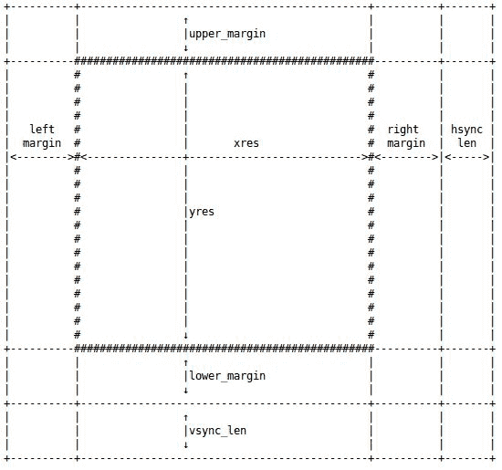

# 第二十一章：帧缓冲驱动程序

视频卡始终具有一定数量的 RAM。这个 RAM 是图像数据的位图在显示时缓冲的地方。从软件的角度来看，帧缓冲是一个字符设备，提供对这个 RAM 的访问。

也就是说，帧缓冲驱动程序提供了一个接口：

+   显示模式设置

+   访问视频缓冲区的内存

+   基本的 2D 加速操作（例如滚动）

为了提供这个接口，帧缓冲驱动程序通常直接与硬件通信。有一些众所周知的帧缓冲驱动程序，比如：

+   **intelfb**，这是各种英特尔 8xx/9xx 兼容图形设备的帧缓冲

+   **vesafb**，这是一个使用 VESA 标准接口与视频硬件通信的帧缓冲驱动程序

+   **mxcfb**，i.MX6 芯片系列的帧缓冲驱动程序

帧缓冲驱动程序是 Linux 下最简单的图形驱动程序形式，不要将它们与实现高级功能（如 3D 加速等）的 X.org 驱动程序混淆，也不要将它们与内核模式设置（KMS）驱动程序混淆，后者公开了帧缓冲和 GPU 功能（与 X.org 驱动程序一样）。

i.MX6 X.org 驱动程序是一个闭源的，称为**vivante**。

回到我们的帧缓冲驱动程序，它们是非常简单的 API 驱动程序，通过字符设备公开了视频卡功能，可以通过`/dev/fbX`条目从用户空间访问。有关 Linux 图形堆栈的更多信息，可以参考 Martin Fiedler 的全面讲座*Linux Graphics Demystified*：[`keyj.emphy.de/files/linuxgraphics_en.pdf`](http://keyj.emphy.de/files/linuxgraphics_en.pdf)。

在本章中，我们涵盖以下主题：

+   帧缓冲驱动程序数据结构和方法，从而涵盖了整个驱动程序架构

+   帧缓冲设备操作，加速和非加速

+   从用户空间访问帧缓冲

# 驱动程序数据结构

帧缓冲驱动程序严重依赖于四个数据结构，所有这些都在`include/linux/fb.h`中定义，这也是您应该在代码中包含的头文件，以便处理帧缓冲驱动程序：

```
#include <linux/fb.h> 
```

这些结构是`fb_var_screeninfo`，`fb_fix_screeninfo`，`fb_cmap`和`fb_info`。前三个可以在用户空间代码中使用。现在让我们描述每个结构的目的，它们的含义以及它们的用途。

1.  内核使用`struct struct fb_var_screeninfo`的实例来保存视频卡的可变属性。这些值是用户定义的，比如分辨率深度：

```
struct fb_var_screeninfo { 
   __u32 xres; /* visible resolution */ 
   __u32 yres; 

   __u32 xres_virtual; /* virtual resolution */ 
   __u32 yres_virtual; 

   __u32 xoffset; /* offset from virtual to visible resolution */ 
   __u32 yoffset; 

   __u32 bits_per_pixel; /* # of bits needed to hold a pixel */ 
   [...] 

   /* Timing: All values in pixclocks, except pixclock (of course) */ 
   __u32 pixclock;   /* pixel clock in ps (pico seconds) */ 
   __u32 left_margin;      /* time from sync to picture */ 
   __u32 right_margin; /* time from picture to sync */ 
   __u32 upper_margin; /* time from sync to picture */ 
   __u32 lower_margin; 
   __u32 hsync_len;  /* length of horizontal sync */ 
   __u32 vsync_len;  /* length of vertical sync */ 
   __u32 rotate; /* angle we rotate counter clockwise */ 
}; 
```

这可以总结为以下所示的图：



1.  视频卡的属性是固定的，要么由制造商固定，要么在设置模式时应用，并且否则不能更改。这通常是硬件信息。一个很好的例子是帧缓冲内存的开始，即使用户程序也不能更改。内核将这样的信息保存在`struct fb_fix_screeninfo`结构的实例中：

```
struct fb_fix_screeninfo { 
   char id[16];      /* identification string eg "TT Builtin" */ 
   unsigned long smem_start;     /* Start of frame buffer mem */ 
                           /* (physical address) */ 
   __u32 smem_len;/* Length of frame buffer mem */ 
   __u32 type;    /* see FB_TYPE_*           */ 
   __u32 type_aux; /* Interleave for interleaved Planes */ 
   __u32 visual;   /* see FB_VISUAL_*  */  
   __u16 xpanstep; /* zero if no hardware panning  */ 
   __u16 ypanstep;   /* zero if no hardware panning  */ 
   __u16 ywrapstep;  /* zero if no hardware ywrap    */ 
   __u32 line_length;  /* length of a line in bytes    */ 
   unsigned long mmio_start; /* Start of Memory Mapped I/O  
 *(physical address) 
 */ 
   __u32 mmio_len;   /* Length of Memory Mapped I/O  */ 
   __u32 accel;      /* Indicate to driver which   */ 
                     /* specific chip/card we have */ 
   __u16 capabilities; /* see FB_CAP_* */ 
}; 
```

1.  `struct fb_cmap`结构指定了颜色映射，用于以内核可以理解的方式存储用户对颜色的定义，以便将其发送到底层视频硬件。可以使用这个结构来定义您对不同颜色所需的 RGB 比例：

```
struct fb_cmap { 
    __u32 start;   /* First entry */ 
    __u32 len;     /* Number of entries */ 
    __u16 *red;    /* Red values */ 
    __u16 *green;  /* Green values */ 
    __u16 *blue;   /* Blue values */ 
    __u16 *transp; /* Transparency. Discussed later on */ 
}; 
```

1.  代表帧缓冲本身的`struct fb_info`结构是帧缓冲驱动程序的主要数据结构。与前面讨论的其他结构不同，`fb_info`仅存在于内核中，不是用户空间帧缓冲 API 的一部分：

```
struct fb_info { 
    [...] 
    struct fb_var_screeninfo var; /* Variable screen information. 
                                   Discussed earlier. */ 
    struct fb_fix_screeninfo fix; /* Fixed screen information. */ 
    struct fb_cmap cmap;          /* Color map. */ 
    struct fb_ops *fbops;         /* Driver operations.*/ 
    char __iomem *screen_base;    /* Frame buffer's 
                                   virtual address */ 
    unsigned long screen_size;    /* Frame buffer's size */ 
    [...] 
   struct device *device;        /* This is the parent */ 
struct device *dev;           /* This is this fb device */ 
#ifdef CONFIG_FB_BACKLIGHT 
      /* assigned backlight device */ 
      /* set before framebuffer registration,  
         remove after unregister */ 
      struct backlight_device *bl_dev; 

      /* Backlight level curve */ 
      struct mutex bl_curve_mutex;   
      u8 bl_curve[FB_BACKLIGHT_LEVELS]; 
#endif 
[...] 
void *par; /* Pointer to private memory */ 
}; 
```

`struct fb_info`结构应始终动态分配，使用`framebuffer_alloc()`，这是一个内核（帧缓冲核心）辅助函数，用于为帧缓冲设备的实例分配内存，以及它们的私有数据内存：

```
struct fb_info *framebuffer_alloc(size_t size, struct device *dev) 
```

在这个原型中，`size`表示私有区域的大小作为参数，并将其附加到分配的`fb_info`的末尾。可以使用`fb_info`结构中的`.par`指针引用此私有区域。`framebuffer_release()`执行相反的操作：

```
void framebuffer_release(struct fb_info *info) 
```

设置完成后，应使用`register_framebuffer()`向内核注册帧缓冲，如果出现错误，则返回负的`errno`，或者成功返回`零`：

```
int register_framebuffer(struct fb_info *fb_info) 
```

注册后，可以使用`unregister_framebuffer()`函数取消注册帧缓冲，如果出现错误，则返回负的`errno`，或者成功返回`零`：

```
int unregister_framebuffer(struct fb_info *fb_info) 
```

分配和注册应在设备探测期间完成，而取消注册和释放应在驱动程序的`remove()`函数内完成。

# 设备方法

在`struct fb_info`结构中，有一个`.fbops`字段，它是`struct fb_ops`结构的一个实例。该结构包含一组需要在帧缓冲设备上执行一些操作的函数。这些是`fbdev`和`fbcon`工具的入口点。该结构中的一些方法是强制性的，是使帧缓冲正常工作所需的最低要求，而其他方法是可选的，取决于驱动程序需要公开的功能，假设设备本身支持这些功能。

以下是`struct fb_ops`结构的定义：

```
    struct fb_ops { 
   /* open/release and usage marking */ 
   struct module *owner; 
   int (*fb_open)(struct fb_info *info, int user); 
   int (*fb_release)(struct fb_info *info, int user); 

   /* For framebuffers with strange nonlinear layouts or that do not 
    * work with normal memory mapped access 
    */ 
   ssize_t (*fb_read)(struct fb_info *info, char __user *buf, 
                  size_t count, loff_t *ppos); 
   ssize_t (*fb_write)(struct fb_info *info, const char __user *buf, 
                   size_t count, loff_t *ppos); 

   /* checks var and eventually tweaks it to something supported, 
    * DO NOT MODIFY PAR */ 
   int (*fb_check_var)(struct fb_var_screeninfo *var, struct fb_info *info); 

   /* set the video mode according to info->var */ 
   int (*fb_set_par)(struct fb_info *info); 

   /* set color register */ 
   int (*fb_setcolreg)(unsigned regno, unsigned red, unsigned green, 
                   unsigned blue, unsigned transp, struct fb_info *info); 

   /* set color registers in batch */ 
   int (*fb_setcmap)(struct fb_cmap *cmap, struct fb_info *info); 

   /* blank display */ 
   int (*fb_blank)(int blank_mode, struct fb_info *info); 

   /* pan display */ 
   int (*fb_pan_display)(struct fb_var_screeninfo *var, struct fb_info *info); 

   /* Draws a rectangle */ 
   void (*fb_fillrect) (struct fb_info *info, const struct fb_fillrect *rect); 
   /* Copy data from area to another */ 
   void (*fb_copyarea) (struct fb_info *info, const struct fb_copyarea *region); 
   /* Draws a image to the display */ 
   void (*fb_imageblit) (struct fb_info *info, const struct fb_image *image); 

   /* Draws cursor */ 
   int (*fb_cursor) (struct fb_info *info, struct fb_cursor *cursor); 

   /* wait for blit idle, optional */ 
   int (*fb_sync)(struct fb_info *info); 

   /* perform fb specific ioctl (optional) */ 
   int (*fb_ioctl)(struct fb_info *info, unsigned int cmd, 
               unsigned long arg); 

   /* Handle 32bit compat ioctl (optional) */ 
   int (*fb_compat_ioctl)(struct fb_info *info, unsigned cmd, 
               unsigned long arg); 

   /* perform fb specific mmap */ 
   int (*fb_mmap)(struct fb_info *info, struct vm_area_struct *vma); 

   /* get capability given var */ 
   void (*fb_get_caps)(struct fb_info *info, struct fb_blit_caps *caps, 
                   struct fb_var_screeninfo *var); 

   /* teardown any resources to do with this framebuffer */ 
   void (*fb_destroy)(struct fb_info *info); 
   [...] 
}; 
```

可以根据希望实现的功能设置不同的回调。

在[第四章](http://character)，*字符设备驱动程序*中，我们了解到字符设备可以通过`struct file_operations`结构导出一组文件操作，这些操作是与文件相关的系统调用的入口点，例如`open()`，`close()`，`read()`，`write()`，`mmap()`，`ioctl()`等。

也就是说，不要混淆`fb_ops`和`file_operations`结构。`fb_ops`提供了低级操作的抽象，而`file_operations`用于上层系统调用接口。内核在`drivers/video/fbdev/core/fbmem.c`中实现了帧缓冲文件操作，其中内部调用了我们在`fb_ops`中定义的方法。通过这种方式，可以根据系统调用接口的需要实现低级硬件操作，即`file_operations`结构。例如，当用户`open()`设备时，核心的打开文件操作方法将执行一些核心操作，并在设置时执行`fb_ops.fb_open()`方法，`release`，`mmap`等。

帧缓冲设备支持在`include/uapi/linux/fb.h`中定义的一些 ioctl 命令，用户程序可以使用这些命令来操作硬件。所有这些命令都由核心的`fops.ioctl`方法处理。对于其中的一些命令，核心的 ioctl 方法可能在内部执行`fb_ops`结构中定义的方法。

有人可能会想知道`fb_ops.ffb_ioctl`用于什么。当给定的 ioctl 命令内核不认识时，帧缓冲核心执行`fb_ops.fb_ioctl`。换句话说，`fb_ops.fb_ioctl`在帧缓冲核心的`fops.ioctl`方法的默认语句中执行。

# 驱动程序方法

驱动程序方法包括`probe()`和`remove()`函数。在进一步描述这些方法之前，让我们设置我们的`fb_ops`结构：

```
static struct fb_ops myfb_ops = { 
   .owner        = THIS_MODULE, 
   .fb_check_var = myfb_check_var, 
   .fb_set_par   = myfb_set_par, 
   .fb_setcolreg = myfb_setcolreg, 
   .fb_fillrect  = cfb_fillrect, /* Those three hooks are */  
   .fb_copyarea  = cfb_copyarea, /* non accelerated and */ 
   .fb_imageblit = cfb_imageblit, /* are provided by kernel */ 
   .fb_blank     = myfb_blank, 
}; 
```

+   `Probe`：驱动程序`probe`函数负责初始化硬件，使用`framebuffer_alloc()`函数创建`struct fb_info`结构，并在其上调用`register_framebuffer()`。以下示例假定设备是内存映射的。因此，可能存在非内存映射的情况，例如位于 SPI 总线上的屏幕。在这种情况下，应使用特定于总线的例程：

```
static int myfb_probe(struct platform_device *pdev) 
{ 
   struct fb_info *info; 
   struct resource *res; 
    [...] 

   dev_info(&pdev->dev, "My framebuffer driver\n"); 

/* 
 * Query resource, like DMA channels, I/O memory, 
 * regulators, and so on. 
 */ 
   res = platform_get_resource(pdev, IORESOURCE_MEM, 0); 
   if (!res) 
         return -ENODEV; 
   /* use request_mem_region(), ioremap() and so on */ 
    [...] 
    pwr = regulator_get(&pdev->dev, "lcd"); 

   info = framebuffer_alloc(sizeof( 
struct my_private_struct), &pdev->dev); 
   if (!info) 
         return -ENOMEM; 

   /* Device init and default info value*/ 
   [...] 
   info->fbops = &myfb_ops; 

    /* Clock setup, using devm_clk_get() and so on */ 
    [...] 

    /* DMA setup using dma_alloc_coherent() and so on*/   
    [...] 

    /* Register with the kernel */ 
   ret = register_framebuffer(info); 

   hardware_enable_controller(my_private_struct); 
   return 0; 
} 
```

+   `Remove`：`remove()`函数应释放在`probe()`中获取的任何内容，并调用：

```
static int myfb_remove(struct platform_device *pdev) 
{ 

   /* iounmap() memory and release_mem_region() */ 
   [...] 
   /* Reverse DMA, dma_free_*();*/ 
   [...] 

   hardware_disable_controller(fbi); 

    /* first unregister, */ 
   unregister_framebuffer(info); 
    /* and then free the memory */ 
   framebuffer_release(info); 

   return 0; 
} 
```

+   假设您使用了资源分配的管理器版本，您只需要使用`unregister_framebuffer()`和`framebuffer_release()`。其他所有操作都将由内核完成。

# 详细的 fb_ops

让我们描述一些在`fb_ops`结构中声明的钩子。也就是说，要了解编写帧缓冲区驱动程序的想法，可以查看内核中的`drivers/video/fbdev/vfb.c`，这是一个简单的虚拟帧缓冲区驱动程序。还可以查看其他特定的帧缓冲区驱动程序，比如 i.MX6，位于`drivers/video/fbdev/imxfb.c`，或者查看内核关于帧缓冲区驱动程序 API 的文档，位于`Documentation/fb/api.txt`。

# 检查信息

钩子`fb_ops->fb_check_var`负责检查帧缓冲区参数。其原型如下：

```
int (*fb_check_var)(struct fb_var_screeninfo *var, 
struct fb_info *info); 
```

此函数应检查帧缓冲区变量参数并调整为有效值。`var`表示应检查和调整的帧缓冲区变量参数：

```
static int myfb_check_var(struct fb_var_screeninfo *var, 
struct fb_info *info) 
{ 
   if (var->xres_virtual < var->xres) 
         var->xres_virtual = var->xres; 

   if (var->yres_virtual < var->yres) 
         var->yres_virtual = var->yres; 

   if ((var->bits_per_pixel != 32) && 
(var->bits_per_pixel != 24) && 
(var->bits_per_pixel != 16) && 
(var->bits_per_pixel != 12) && 
       (var->bits_per_pixel != 8)) 
         var->bits_per_pixel = 16; 

   switch (var->bits_per_pixel) { 
   case 8: 
         /* Adjust red*/ 
         var->red.length = 3; 
         var->red.offset = 5; 
         var->red.msb_right = 0; 

         /*adjust green*/ 
         var->green.length = 3; 
         var->green.offset = 2; 
         var->green.msb_right = 0; 

         /* adjust blue */ 
         var->blue.length = 2; 
         var->blue.offset = 0; 
         var->blue.msb_right = 0; 

         /* Adjust transparency */ 
         var->transp.length = 0; 
         var->transp.offset = 0; 
         var->transp.msb_right = 0; 
         break; 
   case 16: 
         [...] 
         break; 
   case 24: 
         [...] 
         break; 
   case 32: 
         var->red.length = 8; 
         var->red.offset = 16; 
         var->red.msb_right = 0; 

         var->green.length = 8; 
         var->green.offset = 8; 
         var->green.msb_right = 0; 

         var->blue.length = 8; 
         var->blue.offset = 0; 
         var->blue.msb_right = 0; 

         var->transp.length = 8; 
         var->transp.offset = 24; 
         var->transp.msb_right = 0; 
         break; 
   } 

   /* 
 * Any other field in *var* can be adjusted 
 * like var->xres,      var->yres, var->bits_per_pixel, 
 * var->pixclock and so on. 
 */ 
   return 0; 
} 
```

前面的代码根据用户选择的配置调整可变帧缓冲区属性。

# 设置控制器的参数

钩子`fp_ops->fb_set_par`是另一个硬件特定的钩子，负责向硬件发送参数。它根据用户设置`(info->var)`来对硬件进行编程：

```
static int myfb_set_par(struct fb_info *info) 
{ 
   struct fb_var_screeninfo *var = &info->var; 

   /* Make some compute or other sanity check */ 
   [...] 

    /* 
     * This function writes value to the hardware, 
     * in the appropriate registers 
     */ 
   set_controller_vars(var, info); 

   return 0; 
} 
```

# 屏幕空白

钩子`fb_ops->fb_blank`是一个硬件特定的钩子，负责屏幕空白。其原型如下：

```
int (*fb_blank)(int blank_mode, struct fb_info *info) 
```

`blank_mode`参数始终是以下值之一：

```
enum { 
   /* screen: unblanked, hsync: on,  vsync: on */ 
   FB_BLANK_UNBLANK       = VESA_NO_BLANKING, 

   /* screen: blanked,   hsync: on,  vsync: on */ 
   FB_BLANK_NORMAL        = VESA_NO_BLANKING + 1, 

   /* screen: blanked,   hsync: on,  vsync: off */ 
   FB_BLANK_VSYNC_SUSPEND = VESA_VSYNC_SUSPEND + 1, 

   /* screen: blanked,   hsync: off, vsync: on */ 
   FB_BLANK_HSYNC_SUSPEND = VESA_HSYNC_SUSPEND + 1, 

   /* screen: blanked,   hsync: off, vsync: off */ 
   FB_BLANK_POWERDOWN     = VESA_POWERDOWN + 1 
}; 
```

空白显示的通常方法是对`blank_mode`参数进行`switch case`操作，如下所示：

```
static int myfb_blank(int blank_mode, struct fb_info *info) 
{ 
   pr_debug("fb_blank: blank=%d\n", blank); 

   switch (blank) { 
   case FB_BLANK_POWERDOWN: 
   case FB_BLANK_VSYNC_SUSPEND: 
   case FB_BLANK_HSYNC_SUSPEND: 
   case FB_BLANK_NORMAL: 
         myfb_disable_controller(fbi); 
         break; 

   case FB_BLANK_UNBLANK: 
         myfb_enable_controller(fbi); 
         break; 
   } 
   return 0; 
} 
```

空白操作应该禁用控制器，停止其时钟并将其断电。取消空白应执行相反的操作。

# 加速方法

用户视频操作，如混合、拉伸、移动位图或动态渐变生成都是繁重的任务。它们需要图形加速才能获得可接受的性能。可以使用`struct fp_ops`结构的以下字段来实现帧缓冲区加速方法：

+   `.fb_imageblit()`: 此方法在显示器上绘制图像，非常有用

+   `.fb_copyarea()`: 此方法将矩形区域从一个屏幕区域复制到另一个屏幕区域

+   `.fb_fillrect():` 此方法以优化的方式填充一个带有像素行的矩形

因此，内核开发人员考虑到没有硬件加速的控制器，并提供了一种经过软件优化的方法。这使得加速实现是可选的，因为存在软件回退。也就是说，如果帧缓冲区控制器没有提供任何加速机制，必须使用内核通用例程填充这些方法。

这些分别是：

+   `cfb_imageblit()`: 这是用于 imageblit 的内核提供的回退。内核在启动过程中用它将标志输出到屏幕。

+   `cfb_copyarea()`: 用于区域复制操作。

+   `cfb_fillrect`(): 这是帧缓冲核心非加速方法，用于实现相同名称的操作。

# 把所有东西放在一起

在本节中，让我们总结前一节讨论的内容。为了编写帧缓冲区驱动程序，必须：

+   填充`struct fb_var_screeninfo`结构，以提供有关帧缓冲区可变属性的信息。这些属性可以由用户空间更改。

+   填充`struct fb_fix_screeninfo`结构，以提供固定参数。

+   设置`struct fb_ops`结构，提供必要的回调函数，帧缓冲区子系统将使用这些函数响应用户操作。

+   在`struct fb_ops`结构中，如果设备支持，必须提供加速函数回调。

+   设置`struct fb_info`结构，用之前步骤中填充的结构填充它，并在其上调用`register_framebuffer()`，以便在内核中注册它。

要了解编写简单帧缓冲区驱动程序的想法，可以查看内核中的`drivers/video/fbdev/vfb.c`，这是一个虚拟帧缓冲区驱动程序。可以通过`CONGIF_FB_VIRTUAL`选项在内核中启用它。

# 用户空间的帧缓冲区

通常通过`mmap()`命令访问帧缓冲内存，以便将帧缓冲内存映射到系统 RAM 的某个部分，从而在屏幕上绘制像素变得简单，影响内存值。屏幕参数（可变和固定）是通过 ioctl 命令提取的，特别是`FBIOGET_VSCREENINFO`和`FBIOGET_FSCREENINFO`。完整列表可在内核源代码的`include/uapi/linux/fb.h`中找到。

以下是在帧缓冲上绘制 300*300 正方形的示例代码：

```
#include <stdlib.h> 
#include <unistd.h> 
#include <stdio.h> 
#include <fcntl.h> 
#include <linux/fb.h> 
#include <sys/mman.h> 
#include <sys/ioctl.h> 

#define FBCTL(_fd, _cmd, _arg)         \ 
    if(ioctl(_fd, _cmd, _arg) == -1) { \ 
        ERROR("ioctl failed");         \ 
        exit(1); } 

int main() 
{ 
    int fd; 
    int x, y, pos; 
    int r, g, b; 
    unsigned short color; 
    void *fbmem; 

    struct fb_var_screeninfo var_info; 
    struct fb_fix_screeninfo fix_info; 

    fd = open(FBVIDEO, O_RDWR); 
    if (tfd == -1 || vfd == -1) { 
        exit(-1); 
    } 

    /* Gather variable screen info (virtual and visible) */ 
    FBCTL(fd, FBIOGET_VSCREENINFO, &var_info); 

    /* Gather fixed screen info */ 
    FBCTL(fd, FBIOGET_FSCREENINFO, &fix_info); 

    printf("****** Frame Buffer Info ******\n"); 
    printf("Visible: %d,%d  \nvirtual: %d,%d \n  line_len %d\n", 
           var_info.xres, this->var_info.yres, 
           var_info.xres_virtual, var_info.yres_virtual, 
           fix_info.line_length); 
    printf("dim %d,%d\n\n", var_info.width, var_info.height); 

    /* Let's mmap frame buffer memory */ 
    fbmem = mmap(0, v_var.yres_virtual * v_fix.line_length, \ 
                     PROT_WRITE | PROT_READ, \ 
                     MAP_SHARED, fd, 0); 

    if (fbmem == MAP_FAILED) { 
        perror("Video or Text frame bufer mmap failed"); 
        exit(1); 
    } 

    /* upper left corner (100,100). The square is 300px width */ 
    for (y = 100; y < 400; y++) { 
        for (x = 100; x < 400; x++) { 
            pos = (x + vinfo.xoffset) * (vinfo.bits_per_pixel / 8) 
                   +   (y + vinfo.yoffset) * finfo.line_length; 

            /* if 32 bits per pixel */ 
            if (vinfo.bits_per_pixel == 32) { 
                /* We prepare some blue color */ 
                *(fbmem + pos) = 100; 

                /* adding a little green */ 
                *(fbmem + pos + 1) = 15+(x-100)/2; 

                /* With lot of read */ 
                *(fbmem + pos + 2) = 200-(y-100)/5; 

                /* And no transparency */ 
                *(fbmem + pos + 3) = 0; 
            } else  { /* This assume 16bpp */ 
                r = 31-(y-100)/16; 
                g = (x-100)/6; 
                b = 10; 

                /* Compute color */  
                color = r << 11 | g << 5 | b; 
                *((unsigned short int*)(fbmem + pos)) = color; 
            } 
        } 
    } 

    munmap(fbp, screensize); 
    close(fbfd); 
    return 0; 
} 
```

还可以使用`cat`或`dd`命令将帧缓冲内存转储为原始图像：

```
 # cat /dev/fb0 > my_image 

```

使用以下命令将其写回：

```
 # cat my_image > /dev/fb0 

```

可以通过特殊的`/sys/class/graphics/fb<N>/blank sysfs`文件来使屏幕变暗/恢复亮度，其中`<N>`是帧缓冲索引。写入 1 将使屏幕变暗，而 0 将使其恢复亮度：

```
 # echo 0 > /sys/class/graphics/fb0/blank

    # echo 1 > /sys/class/graphics/fb0/blank

```

# 总结

帧缓冲驱动程序是 Linux 图形驱动程序的最简单形式，需要很少的实现工作。它们对硬件进行了很大的抽象。在这个阶段，您应该能够增强现有的驱动程序（例如具有图形加速功能），或者从头开始编写一个全新的驱动程序。但是，建议依赖于一个现有的驱动程序，其硬件与您需要编写驱动程序的硬件共享尽可能多的特征。让我们跳到下一个也是最后一个章节，处理网络设备。
