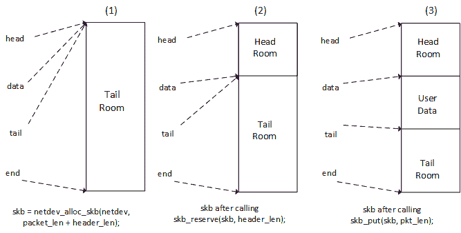

# 第二十二章：网络接口卡驱动程序

我们都知道网络是 Linux 内核固有的一部分。几年前，Linux 仅用于其网络性能，但现在情况已经改变；Linux 不仅仅是一个服务器，而且在数十亿嵌入式设备上运行。多年来，Linux 赢得了成为最佳网络操作系统的声誉。尽管如此，Linux 并不能做到一切。鉴于存在大量以太网控制器的多样性，Linux 别无选择，只能向需要为其网络设备编写驱动程序的开发人员或以一般方式进行内核网络开发的开发人员公开 API。该 API 提供了足够的抽象层，可以保证开发的代码的通用性，并且可以在其他架构上进行移植。本章将简要介绍处理**网络接口卡**（**NIC**）驱动程序开发的 API 的部分，并讨论其数据结构和方法。

在本章中，我们将涵盖以下主题：

+   NIC 驱动程序数据结构及其主要套接字缓冲区结构的详细介绍

+   NIC 驱动程序架构和方法描述，以及数据包的传输和接收

+   为测试目的开发一个虚拟 NIC 驱动程序

# 驱动程序数据结构

当你处理 NIC 设备时，有两个数据结构需要处理：

+   `struct sk_buff`结构，在`include/linux/skbuff.h`中定义，这是 Linux 网络代码中的基本数据结构，你的代码中也应该包含它：

```
#include <linux/skbuff.h>  
```

+   每个发送或接收的数据包都使用这个数据结构处理。

+   `struct net_device`结构；这是内核中表示任何 NIC 设备的结构。这是数据传输发生的接口。它在`include/linux/netdevice.h`中定义，你的代码中也应该包含它：

```
#include <linux/netdevice.h> 
```

其他应该在代码中包含的文件是`include/linux/etherdevice.h`，用于 MAC 和以太网相关函数（如`alloc_etherdev()`），以及`include/linux/ethtool.h`，用于 ethtools 支持：

```
#include <linux/ethtool.h>  
#include <linux/etherdevice.h> 
```

# 套接字缓冲区结构

这个结构包装了通过 NIC 传输的任何数据包：

```
struct sk_buff { 
  struct sk_buff * next; 
  struct sk_buff * prev; 
  ktime_t tstamp; 
  struct rb_node     rbnode; /* used in netem & tcp stack */ 
  struct sock * sk; 
  struct net_device * dev; 
  unsigned int       len; 
  unsigned int       data_len; 
  __u16              mac_len; 
  __u16              hdr_len; 
  unsigned int len; 
  unsigned int data_len; 
  __u16 mac_len; 
  __u16 hdr_len; 
  __u32 priority; 
  dma_cookie_t dma_cookie; 
  sk_buff_data_t tail; 
  sk_buff_data_t end; 
  unsigned char * head; 
  unsigned char * data; 
  unsigned int truesize; 
  atomic_t users; 
}; 
```

以下是结构中元素的含义：

+   `next`和`prev`：这表示列表中的下一个和上一个缓冲区。

+   `sk`：这是与此数据包关联的套接字。

+   `tstamp`：这是数据包到达/离开的时间。

+   `rbnode`：这是红黑树中`next`/`prev`的替代。

+   `dev`：表示数据包到达或离开的设备。该字段与此处未列出的其他两个字段相关联。它们是`input_dev`和`real_dev`。它们跟踪与数据包相关的设备。因此，`input_dev`始终指的是数据包接收自的设备。

+   `len`：这是数据包中的总字节数。套接字缓冲区（SKB）由线性数据缓冲区和一个或多个称为**rooms**的区域组成。如果存在这样的区域，`data_len`将保存数据区域的总字节数。

+   `mac_len`：这保存了 MAC 头的长度。

+   `csum`：这包含数据包的校验和。

+   `Priority`：这表示 QoS 中的数据包优先级。

+   `truesize`：这个字段跟踪数据包占用的系统内存字节数，包括`struct sk_buff`结构本身占用的内存。

+   `users`：这用于 SKB 对象的引用计数。

+   `Head`：Head、data、tail 是套接字缓冲区中不同区域（rooms）的指针。

+   `end`：这指向套接字缓冲区的末尾。

这个结构的只讨论了一些字段。完整的描述可以在`include/linux/skbuff.h`中找到。这是你应该包含以处理套接字缓冲区的头文件。

# 套接字缓冲区分配

套接字缓冲区的分配有点棘手，因为它至少需要三个不同的函数：

+   首先，整个内存分配应该使用`netdev_alloc_skb()`函数完成

+   使用`skb_reserve()`函数增加和对齐头部空间

+   使用`skb_put()`函数扩展缓冲区的已使用数据区域（将包含数据包）。

让我们看一下下面的图：



套接字缓冲区分配过程

1.  我们通过`netdev_alloc_skb()`函数分配足够大的缓冲区来包含一个数据包以及以太网头部：

```
struct sk_buff *netdev_alloc_skb(struct net_device *dev, 
                                   unsigned int length) 
```

该函数在失败时返回`NULL`。因此，即使它分配了内存，`netdev_alloc_skb()`也可以从原子上下文中调用。

由于以太网头部长度为 14 字节，需要进行一些对齐，以便 CPU 在访问缓冲区的这部分时不会遇到性能问题。`header_len`参数的适当名称应该是`header_alignment`，因为该参数用于对齐。通常值为 2，这就是内核为此目的在`include/linux/skbuff.h`中定义了专用宏`NET_IP_ALIGN`的原因：

```
#define NET_IP_ALIGN 2 
```

1.  第二步通过减少尾部空间为头部保留对齐内存。执行此操作的函数是`skb_reserve()`：

```
void skb_reserve(struct sk_buff *skb, int len) 
```

1.  最后一步是通过`skb_put()`函数扩展缓冲区的已使用数据区域，使其大小与数据包大小一样。该函数返回数据区域的第一个字节的指针：

```
unsigned char *skb_put(struct sk_buff *skb, unsigned int len) 
```

分配的套接字缓冲区应该转发到内核网络层。这是套接字缓冲区生命周期的最后一步。应该使用`netif_rx_ni()`函数来实现：

```
int netif_rx_ni(struct sk_buff *skb) 
```

我们将在本章节的部分中讨论如何使用前面的步骤来处理数据包接收。

# 网络接口结构

网络接口在内核中表示为`struct net_device`结构的实例，定义在`include/linux/netdevice.h`中：

```
struct net_device { 
   char name[IFNAMSIZ]; 
   char *ifalias; 
   unsigned long mem_end; 
   unsigned long mem_start; 
   unsigned long base_addr; 
   int irq; 
   netdev_features_t features; 
   netdev_features_t hw_features; 
   netdev_features_t  wanted_features; 
   int ifindex; 
   struct net_device_stats stats; 
   atomic_long_t rx_dropped; 
   atomic_long_t  tx_dropped; 
   const struct net_device_ops *netdev_ops; 
   const struct ethtool_ops *ethtool_ops; 
   unsigned int flags; 
   unsigned int priv_flags; 
   unsigned char link_mode; 
      unsigned char if_port; 
   unsigned char dma; 
   unsigned int mtu; 
   unsigned short type; 
   /* Interface address info. */ 
   unsigned char perm_addr[MAX_ADDR_LEN]; 
   unsigned char addr_assign_type; 
   unsigned char addr_len; 
   unsigned short neigh_priv_len; 
   unsigned short dev_id; 
   unsigned short dev_port; 
   unsigned long last_rx; 
   /* Interface address info used in eth_type_trans() */ 
   unsigned char *dev_addr; 

   struct device dev; 
   struct phy_device *phydev; 
}; 
```

`struct net_device`结构属于需要动态分配的内核数据结构，具有自己的分配函数。NIC 是通过`alloc_etherdev()`函数在内核中分配的。

```
struct net_device *alloc_etherdev(int sizeof_priv); 
```

该函数在失败时返回`NULL`。`sizeof_priv`参数表示要为附加到此 NIC 的私有数据结构分配的内存大小，并且可以使用`netdev_priv()`函数提取：

```
void *netdev_priv(const struct net_device *dev) 
```

给定`struct priv_struct`，这是我们的私有结构，以下是如何分配网络设备以及私有数据结构的实现：

```
struct net_device *net_dev; 
struct priv_struct *priv_net_struct; 
net_dev = alloc_etherdev(sizeof(struct priv_struct)); 
my_priv_struct = netdev_priv(dev); 
```

未使用的网络设备应该使用`free_netdev()`函数释放，该函数还会释放为私有数据分配的内存。只有在设备从内核中注销后才应该调用此方法：

```
void free_netdev(struct net_device *dev) 
```

在`net_device`结构完成并填充后，应该在其上调用`register_netdev()`。该函数在本章节的*Driver Methods*部分中有解释。请记住，该函数会将我们的网络设备注册到内核中，以便可以使用。也就是说，在调用此函数之前，您应该确保设备确实可以处理网络操作。

```
int register_netdev(struct net_device *dev) 
```

# 设备方法

网络设备属于不出现在`/dev`目录中的设备类别（不像块设备、输入设备或字符设备）。因此，像所有这些类型的设备一样，NIC 驱动程序会暴露一组设施以执行。内核通过`struct net_device_ops`结构公开可以在网络接口上执行的操作，该结构是`struct net_device`结构的一个字段，表示网络设备（`dev->netdev_ops`）。`struct net_device_ops`字段描述如下：

```
struct net_device_ops { 
   int (*ndo_init)(struct net_device *dev); 
   void (*ndo_uninit)(struct net_device *dev); 
   int (*ndo_open)(struct net_device *dev); 
   int (*ndo_stop)(struct net_device *dev); 
   netdev_tx_t (*ndo_start_xmit) (struct sk_buff *skb, 
                              struct net_device *dev); 
   void (*ndo_change_rx_flags)(struct net_device *dev, int flags); 
   void (*ndo_set_rx_mode)(struct net_device *dev); 
   int (*ndo_set_mac_address)(struct net_device *dev, void *addr); 
   int (*ndo_validate_addr)(struct net_device *dev); 
   int (*ndo_do_ioctl)(struct net_device *dev, 
                             struct ifreq *ifr, int cmd); 
   int (*ndo_set_config)(struct net_device *dev, struct ifmap *map); 
   int (*ndo_change_mtu)(struct net_device *dev, int new_mtu); 
   void (*ndo_tx_timeout) (struct net_device *dev); 

   struct net_device_stats* (*ndo_get_stats)( 
   struct net_device *dev); 
}; 
```

让我们看看结构中每个元素的含义：

+   `int (*ndo_init)(struct net_device *dev)`和`void(*ndo_uninit)(struct net_device *dev)`；它们是额外的初始化/反初始化函数，分别在驱动程序调用`register_netdev()`/`unregister_netdev()`以向内核注册/注销网络设备时执行。大多数驱动程序不提供这些函数，因为真正的工作是由`ndo_open()`和`ndo_stop()`函数完成的。

+   `int (*ndo_open)(struct net_device *dev)`；准备并打开接口。每当`ip`或`ifconfig`实用程序激活它时，接口就会打开。在此方法中，驱动程序应请求/映射/注册所需的任何系统资源（I/O 端口，中断请求，DMA 等），打开硬件，并执行设备需要的任何其他设置。

+   `int (*ndo_stop)(struct net_device *dev)`：当接口被关闭时（例如，`ifconfig <name> down`等），内核执行此函数。此函数应执行`ndo_open()`中所做的相反操作。

+   `int (*ndo_start_xmit) (struct sk_buff *skb, struct net_device *dev)`：每当内核想要通过此接口发送数据包时，就会调用此方法。

+   `void (*ndo_set_rx_mode)(struct net_device *dev)`：调用此方法以更改接口地址列表过滤模式，多播或混杂模式。建议提供此功能。

+   `void (*ndo_tx_timeout)(struct net_device *dev)`：当数据包传输在合理的时间内未能完成时，通常为`dev->watchdog`滴答声，内核会调用此方法。驱动程序应检查发生了什么问题，处理问题，并恢复数据包传输。

+   `struct net_device_stats *(*get_stats)(struct net_device *dev)`：此方法返回设备统计信息。这是当运行`netstat -i`或`ifconfig`时可以看到的内容。

前面的描述遗漏了很多字段。完整的结构描述可在`include/linux/netdevice.h`文件中找到。实际上，只有`ndo_start_xmit`是强制性的，但最好提供尽可能多的辅助钩子，以适应设备的功能。

# 打开和关闭

`ndo_open()`函数是由内核在授权用户（例如管理员）配置此网络接口时调用的，这些用户使用诸如`ifconfig`或`ip`之类的用户空间实用程序。

与其他网络设备操作一样，`ndo_open()`函数接收一个`struct net_device`对象作为其参数，驱动程序应该从中获取在分配`net_device`对象时存储在`priv`字段中的特定于设备的对象。

网络控制器通常在接收或完成数据包传输时引发中断。驱动程序需要注册一个中断处理程序，每当控制器引发中断时就会调用该处理程序。驱动程序可以在`init()`/`probe()`例程中或在`open`函数中注册中断处理程序。有些设备需要通过在硬件中的特殊寄存器中设置来启用中断。在这种情况下，可以在`probe`函数中请求中断，并在打开/关闭方法中设置/清除启用位。

让我们总结一下`open`函数应该做什么：

1.  更新接口的 MAC 地址（如果用户更改了它，并且您的设备允许这样做）。

1.  必要时重置硬件，并将其从低功耗模式中取出。

1.  请求任何资源（I/O 内存，DMA 通道，中断请求）。

1.  映射中断请求和注册中断处理程序。

1.  检查接口链接状态。

1.  调用`net_if_start_queue()`来让内核知道您的设备已准备好传输数据包。

`open`函数的示例如下：

```
/* 
 * This routine should set everything up new at each open, even 
 * registers that should only need to be set once at boot, so that 
 * there is non-reboot way to recover if something goes wrong. 
 */ 
static int enc28j60_net_open(struct net_device *dev) 
{ 
   struct priv_net_struct *priv = netdev_priv(dev); 

   if (!is_valid_ether_addr(dev->dev_addr)) { 
         [...] /* Maybe print a debug message ? */ 
         return -EADDRNOTAVAIL; 
   } 
   /* 
 * Reset the hardware here and take it out of low 
 * power mode 
 */ 
   my_netdev_lowpower(priv, false); 

   if (!my_netdev_hw_init(priv)) { 
         [...] /* handle hardware reset failure */ 
         return -EINVAL; 
   } 

   /* Update the MAC address (in case user has changed it) 
    * The new address is stored in netdev->dev_addr field 
 */ 
set_hw_macaddr_registers(netdev, MAC_REGADDR_START, 
netdev->addr_len, netdev->dev_addr); 

   /* Enable interrupts */ 
   my_netdev_hw_enable(priv); 

   /* We are now ready to accept transmit requests from 
    * the queueing layer of the networking. 
    */ 
   netif_start_queue(dev); 

   return 0; 
} 
```

`netif_start_queue()`简单地允许上层调用设备的`ndo_start_xmit`例程。换句话说，它通知内核设备已准备好处理传输请求。

另一方面，关闭方法只需执行在打开设备时所做操作的相反操作：

```
/* The inverse routine to net_open(). */ 
static int enc28j60_net_close(struct net_device *dev) 
{ 
   struct priv_net_struct *priv = netdev_priv(dev); 

   my_netdev_hw_disable(priv); 
   my_netdev_lowpower(priv, true); 

    /** 
     *   netif_stop_queue - stop transmitted packets 
     * 
     *   Stop upper layers calling the device ndo_start_xmit routine. 
     *   Used for flow control when transmit resources are unavailable. 
     */ 
   netif_stop_queue(dev); 

   return 0; 
} 
```

`netif_stop_queue()`只是`netif_start_queue()`的反向操作，告诉内核停止调用设备的`ndo_start_xmit`例程。我们不能再处理传输请求。

# 数据包处理

数据包处理包括数据包的传输和接收。这是任何网络接口驱动程序的主要任务。传输仅指发送传出帧，而接收指的是传入帧。

驱动网络数据交换有两种方式：轮询或中断。轮询是一种基于定时器的中断，由内核在给定的时间间隔内不断检查设备是否有任何变化。另一方面，中断模式是内核什么都不做，监听 IRQ 线，并等待设备通过 IRQ 通知变化。在高流量时，中断驱动的数据交换会增加系统开销。这就是为什么一些驱动程序混合了这两种方法。允许混合这两种方法的内核部分称为**新 API**（**NAPI**），在高流量时使用轮询，在流量变得正常时使用中断 IRQ 驱动管理。新驱动程序应该在硬件支持的情况下使用 NAPI。然而，本章不讨论 NAPI，而是专注于中断驱动的方法。

# 数据包接收

当数据包到达网络接口卡时，驱动程序必须围绕它构建一个新的套接字缓冲区，并将数据包复制到`sk_ff->data`字段中。复制的方式并不重要，也可以使用 DMA。驱动程序通常通过中断意识到新数据的到达。当网卡接收到一个数据包时，它会引发一个中断，由驱动程序处理，必须检查设备的中断状态寄存器，并检查引发中断的真正原因（可能是 RX ok，RX error 等）。对应于引发中断的事件的位将在状态寄存器中设置。

处理这个棘手的部分将在分配和构建套接字缓冲区。但幸运的是，我们已经在本章的第一部分讨论过这个问题。所以让我们不要浪费时间，直接跳到一个样本 RX 处理程序。驱动程序必须执行与其接收的数据包数量相同的`sk_buff`分配：

```
/* 
 * RX handler 
 * This function is called in the work responsible of packet 
 * reception (bottom half) handler. We use work because access to  
 * our device (which sit on a SPI bus) may sleep 
 */ 
static int my_rx_interrupt(struct net_device *ndev) 
{ 
   struct priv_net_struct *priv = netdev_priv(ndev); 
   int pk_counter, ret; 

   /* Let's get the number of packet our device received */ 
   pk_counter = my_device_reg_read(priv, REG_PKT_CNT); 

   if (pk_counter > priv->max_pk_counter) { 
         /* update statistics */ 
         priv->max_pk_counter = pk_counter; 
   } 
   ret = pk_counter; 

   /* set receive buffer start */ 
   priv->next_pk_ptr = KNOWN_START_REGISTER; 
   while (pk_counter-- > 0) 
         /*  
* By calling this internal helper function in a "while" 
* loop, packets get extracted one by one from the device 
* and forwarder to the network layer.  
*/ 
         my_hw_rx(ndev); 

   return ret; 
} 
```

以下的辅助程序负责从设备获取一个数据包，转发到内核网络，并减少数据包计数：

```
/* 
 * Hardware receive function. 
 * Read the buffer memory, update the FIFO pointer to 
 * free the buffer. 
 * This function decrements the packet counter. 
 */ 
static void my_hw_rx(struct net_device *ndev) 
{ 
   struct priv_net_struct *priv = netdev_priv(ndev); 
   struct sk_buff *skb = NULL; 
   u16 erxrdpt, next_packet, rxstat; 
   u8 rsv[RSV_SIZE]; 
   int packet_len; 

   packet_len = my_device_read_current_packet_size(); 
   /* Can't cross boundaries */ 
   if ((priv->next_pk_ptr > RXEND_INIT)) { 
         /* packet address corrupted: reset RX logic */ 
         [...] 
         /* Update RX errors stats */ 
         ndev->stats.rx_errors++; 
         return; 
   } 
   /* Read next packet pointer and rx status vector 
    * This is device-specific 
    */ 
   my_device_reg_read(priv, priv->next_pk_ptr, sizeof(rsv), rsv); 

   /* Check for errors in the device RX status reg, 
    * and update error stats accordingly 
    */ 
   if(an_error_is_detected_in_device_status_registers()) 
         /* Depending on the error, 
          * stats.rx_errors++; 
          * ndev->stats.rx_crc_errors++; 
          * ndev->stats.rx_frame_errors++; 
          * ndev->stats.rx_over_errors++; 
          */ 
   } else { 
         skb = netdev_alloc_skb(ndev, len + NET_IP_ALIGN); 
         if (!skb) { 
               ndev->stats.rx_dropped++; 
         } else { 
               skb_reserve(skb, NET_IP_ALIGN); 
               /* 
                 * copy the packet from the device' receive buffer 
                 * to the socket buffer data memory. 
                 * Remember skb_put() return a pointer to the 
                 * beginning of data region. 
                 */ 
               my_netdev_mem_read(priv, 
                     rx_packet_start(priv->next_pk_ptr), 
                     len, skb_put(skb, len)); 

               /* Set the packet's protocol ID */ 
               skb->protocol = eth_type_trans(skb, ndev); 
               /* update RX statistics */ 
               ndev->stats.rx_packets++; 
               ndev->stats.rx_bytes += len; 

               /* Submit socket buffer to the network layer */ 
               netif_rx_ni(skb); 
         } 
   } 
   /* Move the RX read pointer to the start of the next 
    * received packet. 
    */ 
   priv->next_pk_ptr = my_netdev_update_reg_next_pkt(); 
} 
```

当然，我们之所以从延迟工作中调用 RX 处理程序，是因为我们在 SPI 总线上。在 MMIO 设备的情况下，所有前面的操作都可以在 hwriq 中执行。看看 NXP FEC 驱动程序，在`drivers/net/ethernet/freescale/fec.c`中看看是如何实现的。

# 数据包传输

当内核需要从接口发送数据包时，它调用驱动程序的`ndo_start_xmit`方法，成功时应返回`NETDEV_TX_OK`，失败时应返回`NETDEV_TX_BUSY`，在这种情况下，当错误返回时，你不能对套接字缓冲区做任何事情，因为它仍然由网络排队层拥有。这意味着你不能修改任何 SKB 字段，或者释放 SKB 等等。这个函数受自旋锁的保护，防止并发调用。

在大多数情况下，数据包传输是异步进行的。传输的`sk_buff`由上层填充。它的`data`字段包含要发送的数据包。驱动程序应从`sk_buff->data`中提取数据包并将其写入设备硬件 FIFO，或将其放入临时 TX 缓冲区（如果设备在发送之前需要一定大小的数据）然后将其写入设备硬件 FIFO。只有当 FIFO 达到阈值（通常由驱动程序定义，或在设备数据表中提供）或驱动程序有意开始传输时，数据才会真正发送，通过在设备的特殊寄存器中设置一个位（一种触发器）。也就是说，驱动程序需要通知内核在硬件准备好接受新数据之前不要启动任何传输。通过`netif_st` `op_queue()`函数来完成此通知。

```
void netif_stop_queue(struct net_device *dev) 
```

发送数据包后，网络接口卡将引发中断。中断处理程序应检查中断发生的原因。在传输中断的情况下，应更新其统计数据（`net_device->stats.tx_errors`和`net_device->stats.tx_packets`），并通知内核设备可以发送新数据包。通过`netif_wake_queue()`来完成此通知：

```
void netif_wake_queue(struct net_device *dev) 
```

总结一下，数据包传输分为两部分：

+   `ndo_start_xmit`操作，通知内核设备忙，设置一切，并开始传输。

+   TX 中断处理程序，更新 TX 统计数据并通知内核设备再次可用。

`ndo_start_xmit`函数大致包含以下步骤：

1.  调用`netif_stop_queue()`来通知内核设备将忙于数据传输。

1.  将`sk_buff->data`的内容写入设备 FIFO。

1.  触发传输（指示设备开始传输）。

操作（2）和（3）可能导致设备在慢总线上休眠（例如 SPI），可能需要延迟到工作结构。这是我们示例的情况。

一旦数据包传输完成，TX 中断处理程序应执行以下步骤：

1.  根据设备是内存映射还是位于可能休眠的总线上，以下操作应直接在 hwirq 处理程序中执行，或者在工作（或线程中断）中调度执行：

1. 检查中断是否是传输中断。

2. 读取传输描述符状态寄存器并查看数据包的状态。

3. 如果传输中出现任何问题，增加错误统计数据。

4. 增加成功传输数据包的统计数据。

1.  启动传输队列，允许内核通过`netif_wake_queue()`函数再次调用驱动程序的`ndo_start_xmit`方法。

让我们在一个简短的示例代码中总结：

```
/* Somewhere in the code */ 
INIT_WORK(&priv->tx_work, my_netdev_hw_tx); 

static netdev_tx_t my_netdev_start_xmit(struct sk_buff *skb, 
                           struct net_device *dev) 
{ 
   struct priv_net_struct *priv = netdev_priv(dev); 

   /* Notify the kernel our device will be busy */ 
   netif_stop_queue(dev); 

   /* Remember the skb for deferred processing */ 
   priv->tx_skb = skb; 

   /* This work will copy data from sk_buffer->data to 
    * the hardware's FIFO and start transmission 
    */ 
   schedule_work(&priv->tx_work); 

   /* Everything is OK */ 
   return NETDEV_TX_OK; 
} 
The work is described below: 
/* 
 * Hardware transmit function. 
 * Fill the buffer memory and send the contents of the 
 * transmit buffer onto the network 
 */ 
static void my_netdev_hw_tx(struct priv_net_struct *priv) 
{ 
   /* Write packet to hardware device TX buffer memory */ 
   my_netdev_packet_write(priv, priv->tx_skb->len, 
priv->tx_skb->data); 

/*  
 * does this network device support write-verify? 
 * Perform it  
 */ 
[...]; 

   /* set TX request flag, 
 * so that the hardware can perform transmission. 
 * This is device-specific 
 */ 
   my_netdev_reg_bitset(priv, ECON1, ECON1_TXRTS); 
} 
```

TX 中断管理将在下一节中讨论。

# 驱动程序示例

我们可以在以下虚拟以太网驱动程序中总结上述讨论的概念：

```
#include <linux/module.h> 
#include <linux/kernel.h> 
#include <linux/errno.h> 
#include <linux/init.h> 
#include <linux/netdevice.h> 
#include <linux/etherdevice.h> 
#include <linux/ethtool.h> 
#include <linux/skbuff.h> 
#include <linux/slab.h> 
#include <linux/of.h>                   /* For DT*/ 
#include <linux/platform_device.h>      /* For platform devices */ 

struct eth_struct { 
    int bar; 
    int foo; 
    struct net_device *dummy_ndev; 
}; 

static int fake_eth_open(struct net_device *dev) { 
    printk("fake_eth_open called\n"); 
    /* We are now ready to accept transmit requests from 
    * the queueing layer of the networking. 
    */ 
   netif_start_queue(dev); 
    return 0; 
} 

static int fake_eth_release(struct net_device *dev) { 
    pr_info("fake_eth_release called\n"); 
    netif_stop_queue(dev); 
    return 0; 
} 

static int fake_eth_xmit(struct sk_buff *skb, struct net_device *ndev) {     
    pr_info("dummy xmit called...\n"); 
    ndev->stats.tx_bytes += skb->len; 
    ndev->stats.tx_packets++; 

    skb_tx_timestamp(skb); 
   dev_kfree_skb(skb); 
   return NETDEV_TX_OK; 
} 

static int fake_eth_init(struct net_device *dev) 
{ 
    pr_info("fake eth device initialized\n"); 
    return 0; 
}; 

static const struct net_device_ops my_netdev_ops = { 
     .ndo_init = fake_eth_init, 
     .ndo_open = fake_eth_open, 
     .ndo_stop = fake_eth_release, 
     .ndo_start_xmit = fake_eth_xmit, 
     .ndo_validate_addr    = eth_validate_addr, 
     .ndo_validate_addr    = eth_validate_addr, 
}; 

static const struct of_device_id fake_eth_dt_ids[] = { 
    { .compatible = "packt,fake-eth", }, 
    { /* sentinel */ } 
}; 

static int fake_eth_probe(struct platform_device *pdev) 
{ 
    int ret; 
    struct eth_struct *priv; 
    struct net_device *dummy_ndev; 

    priv = devm_kzalloc(&pdev->dev, sizeof(*priv), GFP_KERNEL); 
    if (!priv) 
        return -ENOMEM; 

    dummy_ndev = alloc_etherdev(sizeof(struct eth_struct)); 
    dummy_ndev->if_port = IF_PORT_10BASET; 
    dummy_ndev->netdev_ops = &my_netdev_ops; 

    /* If needed, dev->ethtool_ops = &fake_ethtool_ops; */ 

    ret = register_netdev(dummy_ndev); 
    if(ret) { 
        pr_info("dummy net dev: Error %d initalizing card ...", ret); 
        return ret; 
    } 

    priv->dummy_ndev = dummy_ndev; 
    platform_set_drvdata(pdev, priv); 
    return 0; 
} 

static int fake_eth_remove(struct platform_device *pdev) 
{ 
    struct eth_struct *priv; 
   priv = platform_get_drvdata(pdev); 
   pr_info("Cleaning Up the Module\n"); 
    unregister_netdev(priv->dummy_ndev); 
    free_netdev(priv->dummy_ndev); 

   return 0; 
} 

static struct platform_driver mypdrv = { 
    .probe      = fake_eth_probe, 
    .remove     = fake_eth_remove, 
    .driver     = { 
        .name     = "fake-eth", 
        .of_match_table = of_match_ptr(fake_eth_dt_ids),   
        .owner    = THIS_MODULE, 
    }, 
}; 
module_platform_driver(mypdrv); 

MODULE_LICENSE("GPL"); 
MODULE_AUTHOR("John Madieu <john.madieu@gmail.com>"); 
MODULE_DESCRIPTION("Fake Ethernet driver"); 
```

一旦模块加载并匹配设备，系统上将创建一个以太网接口。首先，让我们看看`dmesg`命令给我们显示了什么：

```
# dmesg

[...]

[146698.060074] fake eth device initialized

[146698.087297] IPv6: ADDRCONF(NETDEV_UP): eth0: link is not ready

```

如果运行`ifconfig -a`命令，接口将显示在屏幕上：

```
# ifconfig -a

[...]

eth0 Link encap:Ethernet HWaddr 00:00:00:00:00:00

BROADCAST MULTICAST MTU:1500 Metric:1

RX packets:0 errors:0 dropped:0 overruns:0 frame:0

TX packets:0 errors:0 dropped:0 overruns:0 carrier:0

collisions:0 txqueuelen:1000

RX bytes:0 (0.0 B) TX bytes:0 (0.0 B)

```

最后可以配置接口，分配 IP 地址，以便使用`ifconfig`显示：

```
# ifconfig eth0 192.168.1.45

# ifconfig

[...]

eth0 Link encap:Ethernet HWaddr 00:00:00:00:00:00

inet addr:192.168.1.45 Bcast:192.168.1.255 Mask:255.255.255.0

BROADCAST MULTICAST MTU:1500 Metric:1

RX packets:0 errors:0 dropped:0 overruns:0 frame:0

TX packets:0 errors:0 dropped:0 overruns:0 carrier:0

collisions:0 txqueuelen:1000

RX bytes:0 (0.0 B) TX bytes:0 (0.0 B)

```

# 状态和控制

设备控制是指内核需要自行改变接口属性的情况，或者响应用户操作。它可以使用`struct net_device_ops`结构公开的操作，如前所述，也可以使用另一个控制工具**ethtool**，它需要驱动程序引入一组新的钩子，我们将在下一节中讨论。相反，状态包括报告接口的状态。

# 中断处理程序

到目前为止，我们只处理了两种不同的中断：当新数据包到达或传出数据包的传输完成时；但现在硬件接口变得更加智能，它们能够报告其状态，无论是出于健全性目的还是数据传输目的。这样，网络接口也可以生成中断以信号错误、链路状态更改等。所有这些都应该在中断处理程序中处理。

这是我们的 hwrirq 处理程序的样子：

```
static irqreturn_t my_netdev_irq(int irq, void *dev_id) 
{ 
   struct priv_net_struct *priv = dev_id; 

   /* 
    * Can't do anything in interrupt context because we need to 
    * block (spi_sync() is blocking) so fire of the interrupt 
    * handling workqueue. 
    * Remember, we access our netdev registers through SPI bus 
    * via spi_sync() call. 
    */ 
   schedule_work(&priv->irq_work); 

   return IRQ_HANDLED; 
} 
```

因为我们的设备位于 SPI 总线上，所以一切都被延迟到`work_struct`中，其定义如下：

```
static void my_netdev_irq_work_handler(struct work_struct *work) 
{ 
   struct priv_net_struct *priv = 
         container_of(work, struct priv_net_struct, irq_work); 
   struct net_device *ndev = priv->netdev; 
   int intflags, loop; 

   /* disable further interrupts */ 
   my_netdev_reg_bitclear(priv, EIE, EIE_INTIE); 

   do { 
         loop = 0; 
         intflags = my_netdev_regb_read(priv, EIR); 
         /* DMA interrupt handler (not currently used) */ 
         if ((intflags & EIR_DMAIF) != 0) { 
               loop++; 
               handle_dma_complete(); 
               clear_dma_interrupt_flag(); 
         } 
         /* LINK changed handler */ 
         if ((intflags & EIR_LINKIF) != 0) { 
               loop++; 
               my_netdev_check_link_status(ndev); 
               clear_link_interrupt_flag(); 
         } 
         /* TX complete handler */ 
         if ((intflags & EIR_TXIF) != 0) { 
               bool err = false; 
               loop++; 
               priv->tx_retry_count = 0; 
               if (locked_regb_read(priv, ESTAT) & ESTAT_TXABRT) 
                     clear_tx_interrupt_flag(); 

         /* TX Error handler */ 
         if ((intflags & EIR_TXERIF) != 0) { 
               loop++; 
               /* 
                * Reset TX logic by setting/clearing appropriate 
                 * bit in the right register 
                 */ 
               [...] 

               /* Transmit Late collision check for retransmit */ 
               if (my_netdev_cpllision_bit_set())  
                     /* Handlecollision */ 
                     [...] 
         } 
         /* RX Error handler */ 
         if ((intflags & EIR_RXERIF) != 0) { 
               loop++; 
               /* Check free FIFO space to flag RX overrun */ 
               [...] 
         } 
         /* RX handler */ 
         if (my_rx_interrupt(ndev)) 
               loop++; 
   } while (loop); 

   /* re-enable interrupts */ 
   my_netdev_reg_bitset(priv, EIE, EIE_INTIE); 
} 
```

# Ethtool 支持

Ethtool 是一个用于检查和调整基于以太网的网络接口设置的小型实用程序。使用 ethtool，可以控制各种参数，如：

+   速度

+   媒体类型

+   双工操作

+   获取/设置 eeprom 寄存器内容

+   硬件校验和

+   唤醒 LAN 等。

需要 ethtool 支持的驱动程序应包括`<linux/ethtool.h>`。它依赖于`struct ethtool_ops`结构，这是该功能的核心，并包含一组用于 ethtool 操作支持的方法。其中大多数方法相对直接；有关详细信息，请参阅`include/linux/ethtool.h`。

为了使 ethtool 支持完全成为驱动程序的一部分，驱动程序应填充一个`ethtool_ops`结构并将其分配给`struct` `net_device`结构的`.ethtool_ops`字段。

```
my_netdev->ethtool_ops = &my_ethtool_ops; 
```

宏`SET_ETHTOOL_OPS`也可以用于此目的。请注意，即使接口处于关闭状态，也可以调用您的 ethtool 方法。

例如，以下驱动程序实现了 ethtool 支持：

+   `drivers/net/ethernet/microchip/enc28j60.c`

+   `drivers/net/ethernet/freescale/fec.c`

+   `drivers/net/usb/rtl8150.c`

# 驱动程序方法

驱动程序的方法是`probe()`和`remove()`函数。它们负责（取消）在内核中注册网络设备。驱动程序必须通过`struct` `net_device`结构的设备方法向内核提供其功能。这些是可以在网络接口上执行的操作：

```
static const struct net_device_ops my_netdev_ops = { 
   .ndo_open         = my_netdev_open, 
   .ndo_stop         = my_netdev_close, 
   .ndo_start_xmit   = my_netdev_start_xmit, 
   .ndo_set_rx_mode  = my_netdev_set_multicast_list, 
   .ndo_set_mac_address    = my_netdev_set_mac_address, 
   .ndo_tx_timeout   = my_netdev_tx_timeout, 
   .ndo_change_mtu   = eth_change_mtu, 
   .ndo_validate_addr      = eth_validate_addr, 
}; 
```

上述是大多数驱动程序实现的操作。

# 探测函数

`probe`函数非常基本，只需要执行设备的早期`init`，然后在内核中注册我们的网络设备。

换句话说，`probe`函数必须：

1.  使用`alloc_etherdev()`函数（通过`netdev_priv()`辅助）分配网络设备及其私有数据。

1.  初始化私有数据字段（互斥锁，自旋锁，工作队列等）。如果设备位于可能休眠的总线上（例如 SPI），应使用工作队列（和互斥锁）。在这种情况下，hwirq 只需确认内核代码，并安排将在设备上执行操作的工作。另一种解决方案是使用线程化的中断。如果设备是 MMIO，可以使用自旋锁来保护关键部分并摆脱工作队列。

1.  初始化总线特定的参数和功能（SPI，USB，PCI 等）。

1.  请求和映射资源（I/O 内存，DMA 通道，中断请求）。

1.  如有必要，生成一个随机 MAC 地址并分配给设备。

1.  填充必需的（或有用的）netdev 属性：`if_port`，`irq`，`netdev_ops`，`ethtool_ops`等。

1.  将设备置于低功耗状态（`open()`函数将其从此模式中移除）。

1.  最后，在设备上调用`register_netdev()`。

对于 SPI 网络设备，`probe`函数可能如下所示：

```
static int my_netdev_probe(struct spi_device *spi) 
{ 
   struct net_device *dev; 
   struct priv_net_struct *priv; 
   int ret = 0; 

   /* Allocate network interface */ 
   dev = alloc_etherdev(sizeof(struct priv_net_struct)); 
   if (!dev) 
         [...] /* handle -ENOMEM error */ 

   /* Private data */ 
   priv = netdev_priv(dev); 

   /* set private data and bus-specific parameter */ 
   [...] 

   /* Initialize some works */ 
   INIT_WORK(&priv->tx_work, data_tx_work_handler); 
   [...] 

   /* Devicerealy init, only few things */ 
   if (!my_netdev_chipset_init(dev)) 
         [...] /* handle -EIO error */  

   /* Generate and assign random MAC address to the device */ 
   eth_hw_addr_random(dev); 
   my_netdev_set_hw_macaddr(dev); 

   /* Board setup must set the relevant edge trigger type; 
    * level triggers won't currently work. 
    */ 
   ret = request_irq(spi->irq, my_netdev_irq, 0, DRV_NAME, priv); 
   if (ret < 0) 
         [...]; /* Handle irq request failure */ 

   /* Fill some netdev mandatory or useful properties */ 
   dev->if_port = IF_PORT_10BASET; 
   dev->irq = spi->irq; 
   dev->netdev_ops = &my_netdev_ops; 
   dev->ethtool_ops = &my_ethtool_ops; 

   /* Put device into sleep mode */ 
   My_netdev_lowpower(priv, true); 

   /* Register our device with the kernel */ 
   if (register_netdev(dev)) 
         [...]; /* Handle registration failure error */ 

   dev_info(&dev->dev, DRV_NAME " driver registered\n"); 

   return 0; 
} 
```

整个章节受到了 Microchip 的 enc28j60 的启发。您可以在`drivers/net/ethernet/microchip/enc28j60.c`中查看其代码。

`register_netdev()`函数接受一个完成的`struct net_device`对象并将其添加到内核接口；成功时返回 0，失败时返回负错误代码。`struct net_device`对象应存储在总线设备结构中，以便以后可以访问它。也就是说，如果您的网络设备是全局私有结构的一部分，那么您应该注册该结构。

请注意，重复的设备名称可能导致注册失败。

# 模块卸载

这是清理函数，它依赖于两个函数。我们的驱动程序释放函数可能如下所示：

```
static int my_netdev_remove(struct spi_device *spi) 
{ 
   struct priv_net_struct *priv = spi_get_drvdata(spi); 

   unregister_netdev(priv->netdev); 
   free_irq(spi->irq, priv); 
   free_netdev(priv->netdev); 

   return 0; 
} 
```

`unregister_netdev()`函数从系统中移除接口，内核将不再调用其方法；`free_netdev()`释放了`struct net_device`结构本身使用的内存，以及为私有数据分配的内存，以及与网络设备相关的任何内部分配的内存。请注意，您不应该自行释放`netdev->priv`。

# 总结

本章已经解释了编写 NIC 设备驱动程序所需的一切。即使本章依赖于位于 SPI 总线上的网络接口，但对于 USB 或 PCI 网络接口，原理是相同的。人们也可以使用提供用于测试目的的虚拟驱动程序。在本章之后，显然 NIC 驱动程序将不再是神秘的。
