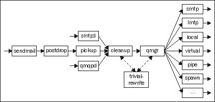

# 第二章：设置 Postfix

**邮件传输代理**（**MTA**）可能是邮件系统中最重要的部分。它负责接收来自互联网或您自己用户的消息，并尽其所能确保消息到达其目的地——其他邮件服务器或您用户的邮箱。

Postfix 被选为本书涵盖的邮件传输代理。Postfix 具有丰富的功能集，具有出色的安全记录，运行速度快，易于配置，并处于活跃的开发中。

本书假设您正在运行 Postfix 2.0 或更高版本。将注意到 Postfix 的任何特定于 2.0 之后版本的功能或行为。

# Postfix 简介

本节首先简要介绍了 Postfix 的工作原理，并描述了如何控制其行为。

## 什么是 Postfix

**Postfix**是由 IBM 研究员 Wietse Venema 开发的模块化邮件传输代理。它是免费软件，于 1998 年首次以**VMailer**的名称公开发布。它用**C**编写，目前包含约 105,000 行代码（不包括注释），因此相当小。它适用于大多数非历史性的 UNIX 和 Linux 变体。

作为纯邮件传输代理，Postfix 不提供任何允许用户通过**POP 或 IMAP**协议收取邮件的服务。这项任务必须由其他软件完成。本书讨论的用于从主机检索邮件的软件是**Courier IMAP**。

所有官方的 Postfix 文档，以及源代码和第三方软件的链接以及非常活跃的邮件列表的存档，都可以在 Postfix 网站[`www.postfix.org/.`](http://www.postfix.org/.)找到。

## Postfix 架构：概述

本节将描述 Postfix 邮件传输代理的不同部分，并解释当您通过系统发送消息时实际发生了什么。虽然这可能不是您读过的最激动人心的文本，但如果您希望成功管理 Postfix 服务器，了解 Postfix 工作原理的基础是必不可少的。

Postfix 分为多个独立的**守护程序**或后台进程，它们相互通信。这些守护程序有不同的责任领域，可能在不同的安全上下文中运行，并可能具有不同的规则，以限制其类型的进程数量。所有守护进程都是根据需要创建的，并由母守护进程`master`监督。一些守护程序很少或从不重新启动，但它们中的大多数在服务了可配置数量的请求或在可配置的空闲时间后会自杀。下图显示了消息如何在 Postfix 系统中流动，并可用于随后的文本。实线显示了消息内容的路径，而虚线显示了其他形式的通信。



这里不会描述所有 Postfix 守护程序，只会描述重要的守护程序。可以在[`www.postfix.org/OVERVIEW.html`](http://www.postfix.org/OVERVIEW.html)的*Postfix 架构概述*文档中找到所有守护程序的完整介绍。

### 新消息到达

新消息可以通过三种方式进入 Postfix 系统。最常见的方式当然是通过**简单邮件传输协议**（**SMTP**）。负责通过 SMTP 接收消息的守护程序被命名为`smtpd`。不常见的**QMQP 提交协议**，由 Daniel J. Bernstein 的 MTA **qmail**引入，也支持`qmqpd`守护程序。然而，本书不会讨论 QMQP。

消息到达的第三种方式是通过 `sendmail` 程序进行本地提交。这是从在 UNIX 主机上运行的程序和脚本提交邮件消息的标准方式。Postfix 提供了一个 `sendmail` 程序，它在大多数方面与 sendmail 邮件传输代理的 `sendmail` 程序兼容（[`www.sendmail.org/`](http://www.sendmail.org/)）。许多 UNIX 邮件用户代理，如 Mail、Pine 和 Mutt，以及诸如 SquirrelMail 和 IMP 等的网络邮件软件，使用 `sendmail` 接口提交新消息，尽管一些软件提供通过 SMTP 提交消息的选项。

`sendmail` 程序将消息传递给 **postdrop** 程序，后者将消息文件放在 Postfix `queue` 目录中的 `maildrop` 目录中。`pickup` 守护进程等待消息到达 `maildrop` 目录，并将其传递给 `cleanup` 守护进程。从那里开始，通过 `sendmail` 提交的消息与通过 SMTP 或 QMQP 提交的消息走同样的路线。即使 Postfix 当时没有在机器上运行，也可以通过 `sendmail` 提交消息。当 Postfix 下次启动时，`pickup` 将发现排队的消息文件并处理它们。

当 `smtpd, qmqpd` 或 `pickup` 接收到新消息时，它将其交给 `cleanup` 守护进程。该守护进程对消息的大小施加限制，执行用户配置的任何内容限制，根据配置需要重写发件人和/或收件人地址，添加任何缺失的必需标头，并执行其他一些操作。`cleanup` 守护进程使用 `trivial-rewrite` 守护进程进行一些地址重写操作。完成其任务后，`cleanup` 将队列文件放入传入队列并通知队列管理器。

### 调度消息交付

**队列管理器** `qmgr` 负责安排消息的交付。为了决定如何将消息交付给每个收件人（即交付方法和下一个目的地），`qmgr` 从 `trivial-rewrite` 获取帮助。队列管理器从 `master` 守护进程请求交付代理进程，并收集交付结果。

队列管理器负责从 `cleanup` 守护进程交接消息开始直到它们从队列中被移除。移除可能是因为它们已成功交付给所有收件人，也可能是因为它们在队列中停留的时间太长，Postfix 决定它们无法交付。默认情况下，消息将在队列中最多保留五天。队列管理器调用 `bounce` 守护进程向发件人发送 `bounce` 消息。

队列管理器用于不同目的的多个目录。传入队列会监视新消息，下一个目的地是**活动队列**。活动队列包含准备交付的消息，并等待被派发到交付代理。如果交付尝试失败，消息将被移动到**延迟队列**。该队列将定期扫描，如果是重新尝试消息交付的时间，消息的队列文件将被移回活动队列。当队列扫描时，消息的交付是否应该重新尝试取决于两个因素：消息到达以来经过了多长时间以及设置重新尝试之间的最小和最大时间间隔的两个配置参数。

除了这些队列，还有一个名为**hold**的特殊用途队列。这个队列包含了被系统管理员使用`postsuper`命令暂停的消息。Postfix 不会触及这些消息，直到它们被相同的命令解除暂停。暂停队列可用于暂时延迟某些消息的投递，例如因为它们很大，需要在非高峰时段投递，或者因为它们被视为可疑，需要在允许投递之前进行检查。

Postfix 使用的不同队列在*QSHAPE_README*文档中有详细描述（[`www.postfix.org/QSHAPE_README.html`](http://www.postfix.org/QSHAPE_README.html)）。该文档还描述了`qshape`，这是一个随 Postfix 一起提供的脚本，用于分析队列的内容，并帮助您识别瓶颈。

### 消息投递

Postfix 配备了许多投递代理，用于使用各种方式和协议投递消息。这些投递代理是在消息离开您的系统之前最后接触消息的守护程序。

Postfix SMTP 客户端`smtp`（不要与 SMTP 服务器`smtpd`混淆）用于通过 SMTP 协议将消息传递到其他主机。它与 LMTP 客户端`lmtp`非常相似，后者通过**本地邮件传输协议**（**LMTP**）传递消息。作为一种网络协议，LMTP 与 SMTP 非常相似，但 SMTP 用于在 MTA 之间传输消息，而 LMTP 用于将消息最终传递到用户可以访问消息的邮件存储中。

本地投递代理`local`将消息投递给系统上具有普通帐户的用户。它支持简单邮件列表或角色地址的别名，以及`.forward`文件，以便用户自己设置消息的转发。

如果您有虚拟邮箱用户，即在系统上没有真实帐户（例如 shell 帐户）的用户，他们的消息将通过`virtual` Postfix 守护程序传递。

如果 Postfix 的标准投递代理不够用，您可以编写自己的投递代理，并让 Postfix 为一些（或全部）消息调用它。在这种情况下，您可以使用`pipe`守护程序，通过标准输入流将消息正文传递给您的投递代理，或者您可以使用`spawn`守护程序，如果您想编写一个通过某种网络协议接收消息的投递代理。

### 支持程序

Postfix 包含许多支持程序，您可以使用这些程序来控制、测试和调试您的 Postfix 系统。这个列表并不详尽，只是对每个程序进行了简要描述，但其中一些程序将在本章后面使用。熟悉它们是个好主意，这样至少您知道它们可以帮助您解决什么样的问题。

| 程序 | 描述 |
| --- | --- |
| `mailq` | 查看 Postfix 队列的当前内容。输出包括每条消息的大小、到达时间、发件人地址和收件人地址。内部上，`mailq`只是调用`postqueue`命令，仅用于与`sendmail`邮件传输代理的向后兼容性。 |
| `newaliases` | 使用`postalias`命令重建所有本地别名文件。本地别名将在*虚拟别名域和本地别名*部分介绍。 |
| `postalias` | 重建单个别名文件或查询别名查找表。 |
| `postcat` | 显示存储在 Postfix 队列中的二进制队列文件的内容。 |
| `postconf` | 显示 Postfix 配置参数的当前或默认值。也可以修改主配置文件，在脚本中很有用。 |
| `postfix` | 启动、停止或重新启动 Postfix，或重新加载其配置。也可用于检查队列目录的完整性和一些其他很少使用的管理任务。 |
| `postmap` | 重建用于表查找或查询任何查找表的索引数据库文件。*使用 postmap 调试 Postfix 设置的查找表故障*部分讨论了如何使用它来调试 Postfix 设置。 |
| `postqueue` | 除了执行`mailq`程序的工作外，`postqueue`还可以用于刷新队列。刷新队列意味着将延迟队列中的所有消息移动到活动队列中。这可以用于安排立即发送消息，但要小心。如果您的服务器负载过重且性能不佳，刷新队列只会使情况变得更糟。`sendmail`程序也可以用于刷新队列，出于兼容性原因。 |
| `postsuper` | 允许您对已排队的消息采取行动，例如删除或重新排队。它还可以对队列目录进行结构检查，并修复诸如队列文件名称错误之类的问题。例如，如果整个队列目录已经移动或从备份中恢复，这样的检查是必要的。 |

# 安装和基本配置

在本节中，我们将介绍如何获取和安装 Postfix 以及如何进行基本配置更改。在本节结束时，您将能够使用 Postfix 发送和接收电子邮件。

## 选择 Postfix 版本

Postfix 开发有两个独立的分支——官方发布和实验发布。官方发布有时被称为稳定发布，但这有点误导，因为这意味着实验发布不稳定。事实并非如此。实验发布用于引入所有新的 Postfix 功能。当功能的实现和它们的接口（例如它们的配置参数）已经足够稳定时，它们将被引入官方发布。通常，官方发布只会进行错误修复和可移植性问题的修复。

实验发布可在生产环境中使用，但代码当然经过的测试较少，配置参数及其语义可能会在发布之间发生变化。如果您运行实验构建，您更有可能遇到稳定发布不应该有的错误和其他奇怪的问题。另一方面，您可以在使用稳定构建之前访问新功能。如果选择使用实验发布，您应该从源代码构建和安装 Postfix，而不是使用某些软件包管理系统（例如 RPM）。这将使您能够轻松应用任何新发现问题的补丁。

实验发布的版本号表示即将发布的官方版本的编号以及所讨论的实验发布的发布日期。例如，在撰写本文时，当前的官方发布版本是 2.6.3，当前的实验发布版本是 2.7-20090807。

## 从软件包安装

大多数 Linux 发行版都将 Postfix 作为一个可以轻松安装的软件包。除非您习惯于从源代码构建软件并且必要时调试可能出现的任何构建问题，否则最好使用发行版的软件包。大多数软件包都预先构建了一些额外的功能，否则需要更复杂的构建过程。

由于存在许多不同的打包系统，本书不会涵盖安装 Postfix 软件包的实际过程。请查阅您的软件包管理系统的文档以获取详细信息。

### 提示

对于允许同时安装多个邮件传输代理的发行版的用户，需要注意一点：如果您安装 Postfix 以替换另一个邮件传输代理，您应该确保以前的软件已从系统中正确删除。因为几乎所有的邮件传输代理都提供`sendmail`程序，这个文件安装时的名称可能是`sendmail.postfix`，并且符号链接从`sendmail`指向`sendmail.postfix`或者选择为主要邮件传输代理的任何邮件传输代理的`sendmail`程序。如果该符号链接不指向 Postfix 的`sendmail`程序，当您尝试发送消息时可能会感到惊讶。

## 从源代码安装

从原始源代码安装 Postfix 并不是很困难，这样可以让您运行任何您想要的版本，而不仅仅是您的 Linux 发行版的软件包维护者选择的版本。Postfix 源代码可以从主要 Postfix 网站[`www.postfix.org/download.html`](http://www.postfix.org/download.html)上访问的多个镜像中下载。

一旦您在一个合适的目录（例如`/usr/local/src`）中下载并解压了存档文件，您会注意到 Postfix 构建系统不使用 GNU autotools，因此在解压后的源代码存档的根目录中通常找不到`configure`脚本。Postfix 构建系统将自动处理此步骤。如果您想要在一些非标准位置安装 Postfix，不用担心，您将有机会稍后设置各种安装目录。

如果您需要启用非标准功能，例如对 MySQL 或 LDAP 查找的支持，您必须通知构建系统，并告知每个功能的库和头文件的位置。有关每个非标准功能的确切说明和详细信息，请查看每个`README`文件。例如，在`README_FILES/MYSQL_README`中找到的 MySQL 说明告诉您在构建 Postfix 时运行以下命令以启用 MySQL 支持：

```
$ make -f Makefile.init makefiles \ 'CCARGS=-DHAS_MYSQL -I/usr/local/mysql/include' \ 'AUXLIBS=-L/usr/local/mysql/lib -lmysqlclient -lz -lm'

```

调整路径，使其指向系统中的 MySQL 头文件和共享库所在的位置。您必须安装了 MySQL 的开发头文件和库。根据您的 Linux 发行版，这些可能需要单独安装。

如果您需要多个额外功能，您将不得不结合每个`README`文件中给出的命令。在这样做时要特别注意。所有引号、等号和空格都需要放在准确的位置。`CCARGS`和`AUXLIBS`变量只能设置一次，因此结合几个配置命令的一般形式是这样的：

```
$ make -f Makefile.init makefiles \ 'CCARGS=<feature 1 CCARGS setting> <feature 2 CCARGS setting>' \ 'AUXLIBS=<feature 1 AUXLIBS setting> <feature 2 AUXLIBS setting>'

```

完成后，您可以使用以下命令构建 Postfix：

```
$ make

```

构建完成后（希望没有错误），是时候创建一个用户和一些组，供 Postfix 的许多守护程序使用。首先添加两个组——`postfix`和`postdrop`。例如，您可以使用您的 Linux 发行版中可能可用的`groupadd`工具。

```
$ groupadd postfix 
$ groupadd postdrop

```

通过检查`/etc/group`的内容来验证。现在它应该包含类似于这样的行：

```
postfix:x:123:
postdrop:x:321:

```

下一步是创建一个名为`postfix`的用户。这个用户既不需要 shell 访问权限，也不需要有效的主目录。这个新用户的主要组应该是新创建的`postfix`组。以下是使用`useradd`工具执行此操作的方法：

```
$ useradd -c postfix -d /tmp -g postfix -s /bin/false postfix

```

再次通过检查`/etc/passwd`的内容来验证：

```
postfix:x:12345:123:postfix:/tmp:/bin/false

```

下一步，也是最后一步，是安装您新构建的 Postfix。如果您是在此特定的 Linux 安装中首次安装 Postfix，请运行以下命令：

```
$ make install

```

此命令将引导您完成交互式安装过程，在此过程中，您可以选择各种安装目录和文件位置。

如果您正在从以前的版本升级 Postfix，请运行以下命令：

```
$ make upgrade

```

好了！Postfix 现在已经安装在您的系统上，很快您就可以开始使用它了。

为了确保 Postfix 在系统启动时启动，需要采取一些额外措施。大多数 Linux 系统都有`SysV-style init`，因此您需要构建一个`init`脚本，并在运行级别目录中创建适当的链接。

## Postfix 配置

像大多数 UNIX 软件一样，Postfix 从存储在`/etc`目录或其子目录中的文本文件中读取其配置。Postfix 配置文件通常存储在`/etc/postfix`中，但您可以配置 Postfix 使用任何其他目录。Postfix 使用两个主要配置文件，`master.cf`和`main.cf`，以及您自己设置的任何辅助文件。

对这些文件的任何更改后，必须重新加载 Postfix。可以使用启动 Postfix 的相同程序来执行此操作，可以通过`init`脚本或您的发行版提供的其他一些服务管理工具来执行。

```
postfix reload
/etc/init.d/postfix reload
/etc/rc.d/init.d/postfix reload

```

### 注意

**更改后需要重新启动 Postfix**

如果更改`inet_interfaces`参数，则仅重新加载是不够的。必须停止并重新启动 Postfix 才能使更改生效。对于 Postfix 2.2 中引入的`inet_protocols`参数也是如此。

### main.cf

您将经常编辑的文件是`main.cf`。该文件定义了控制 Postfix 守护进程行为的参数。每行的格式如下：

```
parameter = value

```

这只是意味着名为`parameter`的配置参数被赋予内容`value`。在`main.cf`中，一个参数只能被指定一次。如果您在`main.cf`的不同位置错误地给出相同参数不同的内容，Postfix 将使用最后出现的内容。除此之外，在`main.cf`中列出参数的顺序是无关紧要的。但是，在参数内容中，关键字的顺序可能很重要。例如，以下两个参数设置不一定是等价的：

```
parameter = A, B
parameter = B, A

```

如果在`main.cf`中未指定参数的值，Postfix 将使用默认值。大多数参数的默认值在源代码中是硬编码的，但有些默认值是在构建时确定的，还有一些是在运行时确定的。

在`main.cf`中以`#`开头的行可以标记为注释。

```
# These two lines are comments. They can be used to temporarily
# disable parameters, or to explain the configuration.
mydomain = example.com
mydestination = $mydomain, localhost

```

这个简短的例子还展示了在设置参数值时如何插入另一个参数的当前值；只需直接输入一个美元符号，后面紧跟您希望获得其值的参数的名称。前面代码片段中的最后一行等同于以下内容：

```
mydestination = example.com, localhost

```

有时将所有内容放在一行上并不方便。通过以空格开头的方式，您告诉 Postfix 该行是前一行的延续。例如，以下两种方式是等价的：

```
smtpd_recipient_restrictions = permit_mynetworks, reject
smtpd_recipient_restrictions =
permit_mynetworks,
reject

```

从 Postfix 2.1 开始，`main.cf`配置文件的格式在`postconf(5)`手册页面中有详细说明，该页面还描述了所有可用的配置参数。该手册页面可从[`www.postfix.org/postconf.5.html`](http://www.postfix.org/postconf.5.html)在线获取。

`postconf`程序非常有用，可以用来检查`main.cf`参数的当前值和默认值。使用一个或多个参数名称作为选项启动程序，它将报告 Postfix 将使用的值。如果使用`-d`选项，`postconf`将报告您列出的参数的默认值。

例如，以下是如何比较`mydestination`的当前值与其默认值：

```
$ postconf mydestination
mydestination = $mydomain, localhost.$mydomain
$ postconf -d mydestination
mydestination = $myhostname, localhost.$mydomain, localhost

```

使用这种方法通常比查看`main.cf`或浏览庞大的手册页面以找到默认值更快。它还揭示了 Postfix 认为参数具有的实际值，使得更容易发现打字错误。

除了显示`main.cf`配置参数外，`postconf`程序还可以为您编辑`main.cf`。如果您想要在脚本中自动化配置更改，这将非常有用。这是通过`-e`选项完成的，该选项需要接下来的一个或多个参数赋值。

```
$ postconf relay_domains
relay_domains =
$ postconf -e relay_domains=example.com
$ postconf relay_domains
relay_domains = example.com

```

### master.cf

`master.cf`文件配置了前面讨论过的 Postfix 主守护程序。对于大多数简单的 Postfix 设置，`master.cf`根本不需要被修改。

`master.cf`中的每一行定义了某个程序执行的服务。例如，接收和处理 SMTP 连接的守护程序`smtpd`是一个服务。将消息传递给本地用户的程序`local`是另一个服务。除了 Postfix 从一开始就定义的 15 到 20 个服务之外，您还可以添加自己的服务。

`master.cf`中的第五列控制每个服务是否应在`chroot`环境中运行。`chroot`是 UNIX 的一个功能，它改变了文件系统的根目录，使得即使运行中的进程被具有 root 权限的恶意用户入侵，也无法访问新根目录之外的文件。Postfix 的源代码发行版默认完全禁用`chroot`，但一些 Linux 发行版已启用它。尽管`chroot`是一个非常有用的安全功能，可以作为额外的安全网，但它会使 Postfix 更难以维护，并且在其余系统没有得到严格保护的情况下几乎没有用处。

在 Postfix 2.2 及更高版本中，`master.cf`配置文件的格式在`master(5)`手册页中有文档记录。在早期版本中，大部分信息可以在`master.cf`文件的注释中找到。

### 查找表

一些信息无法方便地表示在`main.cf`或`master.cf`中。Postfix 的查找表概念允许将信息存储在外部文件、关系数据库或 LDAP 目录中。

对于 Postfix 来说，查找表是一个将一个字符串（查找键）映射到另一个字符串（查找结果）的抽象实体。数学倾向的人可能会将其视为一个函数或（键，值）元组的集合，程序员可能会将其视为哈希表。基本上，它的功能类似于电话簿；您查找一个名字，然后得到一个电话号码或地址。

Postfix 支持许多不同类型的查找表。其中一些被称为*索引*，这意味着使用`postmap`命令将用户编写的输入文件编译为 Postfix 读取的二进制格式。出于性能原因，这样做可以使表包含成千上万甚至数十万条目而不影响性能。这意味着您需要记住在编辑文件后使用`postmap`。

以下表格描述了最重要的查找表类型：

| 类型 | 描述 |
| --- | --- |
| `cdb` | 使用 CDB 库的索引映射类型。对于大量条目非常快速。由 Postfix 2.2 及更高版本支持。 |
| `cidr` | 允许使用 CIDR 表示法查找 IP 地址。由 Postfix 2.1 及更高版本支持。 |
| `dbm` | DBM 是一种经典的 UNIX 索引数据库格式，在 Linux 上也可用，但不建议使用，因为它使用两个文件来表示数据库。这增加了不一致性的风险，因为无法原子更新这两个文件。请改用哈希或 cdb。 |
| `hash` | 这种索引查找表类型可能是最常用的，它利用了 Berkeley DB 库。 |
| `ldap` | LDAP 目录通常用于企业和大学环境中存储用户数据库。Microsoft 的 Active Directory 也可以通过 LDAP 访问，简化了在异构环境中使用 Postfix 的操作。 |
| `mysql` | 支持广为人知的 MySQL 关系数据库引擎，允许您进行几乎任何类型的 SQL 查询。 |
| `pcre` | 允许将查找的字符串与一系列正则表达式进行匹配，第一个匹配的表达式获胜。使用广泛使用的**Perl 兼容正则表达式**（**PCRE**）库。 |
| `pgsql` | 也支持 PostgreSQL 关系数据库引擎。 |
| `proxy` | 代理类型是一种特殊的查找表类型，用于包装其他查找表。这对于减少并发连接的数量很有用，当查找表从具有高进程计数的服务中使用时。例如，从 SMTP 服务器访问 LDAP 目录可能会导致 LDAP 服务器的最大连接数达到上限，但通过代理查找表访问 LDAP 目录将减少并发性。 |
| `regexp` | 类似于`pcre`，但不依赖于 PCRE 库。支持的正则表达式语法有限，性能可能不如`pcre`。如果可能的话，选择`pcre`而不是`regexp`。 |
| `static` | 这种类型是一个特殊用途的类型，无论查找什么，它总是返回一个给定的字符串。这可以用在 Postfix 期望查找表引用而不是固定字符串的情况下，但您确实想要指定一个固定字符串时使用。 |

您可以为任何目的使用任何类型的查找表；Postfix 不会强加任何限制，除了安全考虑要求在某些情况下禁用正则表达式表的某些功能。也就是说，并非所有查找表类型都适合用于每个目的。

Postfix 始终支持许多查找表类型，但其中一些是可选的，并且需要支持才能编译到 Postfix 中。许多 Linux 供应商提供了额外的软件包，您可以安装以获取，例如，LDAP 支持。要找出您的 Postfix 安装支持哪些查找表类型，请使用`postconf`命令。

```
$ postconf -m
static
cidr
nis
regexp
environ
proxy
btree
unix
hash
pcre
ldap
sdbm

```

在大多数情况下，简单的索引查找表类型将是最方便的。索引查找表只是一个文本文件，您可以使用您喜欢的文本编辑器进行编辑。每行的第一部分，直到第一个空格或制表符，将被视为查找键，而行的其余部分将被视为相应的值。

```
key value

```

索引查找表类型的一个可能的缺点是，当您更新表时，您必须记得运行`postmap`。更新带有`postmap`的索引文件后，您不必重新加载或重新启动 Postfix。Postfix 将自行发现更新的文件，并根据需要重新启动其守护进程。

查找表的主题本身就可以填满一整章，因此本节只是简单涉及。我们将在本章的后面的一些地方使用查找表，例如，当我们设置垃圾邮件控制策略时。

有关查找表的更详细讨论和所有可用查找表类型的列表，请参阅`DATABASE_README`（[`www.postfix.org/DATABASE_README.html`](http://www.postfix.org/DATABASE_README.html)）和记录一些更复杂的查找表类型使用的手册页面。

## 启动 Postfix。

既然您已经安装了 Postfix，让我们进行一些基本配置更改，启动它，并进行测试。如果您从软件包中安装了 Postfix，您可能已经回答了一些配置问题，并已经启动了 Postfix。

### 域名和主机名

在启动 Postfix 之前，让我们在`main.cf`中审查一些基本设置。首先是您的域名和邮件主机的名称。`mydomain`参数应设置为您的主要互联网域。如果您运行 Example Inc.，拥有域`http://www.example.com/`，以下设置是合理的：

```
mydomain = example.com

```

`mydomain`的值将影响 Postfix 如何转换未完全合格的主机名。这意味着在发件人和收件人地址等位置遇到的所有裸主机名都将用该域进行修饰——在这种情况下，诸如`jeeves`的主机名将变成`jeeves.example.com`。我们还将在其他参数中使用`$parameter`符号提到`mydomain`。请注意，通过将`append_dot_mydomain`参数设置为`NO`可以禁用附加`mydomain`的功能，一些 Linux 发行版默认进行此修改。通常情况下，该值应保留为`YES`。

与之相关的一个参数是`myhostname`，它偶然告诉 Postfix 机器的主机名。主机名在其他情况下用作默认值，当 Postfix SMTP 服务器向客户端问候时以及 SMTP 客户端向服务器问好时。Postfix 通常能够自行确定这一点，但有时您可能想要覆盖这一点。使用`postconf`命令查看当前值是否合适。

```
$ postconf myhostname
myhostname = jeeves

```

是的，这看起来不错。请注意，此主机名未完全合格，因此各处使用的实际主机名将包括`mydomain`。

与`mydomain`相关的一个参数是`myorigin`。该参数指定应该用于修饰没有域部分的电子邮件地址的域。这可能看起来非常不规则，但实际上相当常见。使用`sendmail`程序提交的消息将默认以当前用户名作为发件人地址，因为用户名没有域，所以在消息传递到任何地方之前，用户名将在`myorigin`之前进行修饰。默认情况下，`myorigin`设置为与`myhostname`相同的值。

```
$ postconf -d myorigin
myorigin = $myhostname

```

这应该没问题，但您可能希望将其设置为`mydomain`。

```
myorigin = $mydomain

```

我们将要关注的下一个参数是`mydestination`。该参数非常重要，因为它告诉 Postfix 哪些域被视为本地域，也就是说，哪些域应该传递到此计算机上的 UNIX 帐户。与`mydomain`和`myorigin`不同，`mydestination`可以包含由空格或逗号分隔的多个域。通过在此处列出`example.com`，Postfix 将接受发送到`joe@example.com`的消息并将其传递给 UNIX 用户“joe”。

本地域的一个重要特性是它们都被视为相等。如果`example.com`和`example.net`都在`mydestination`中列出，那么`joe@example.com`将等同于`joe@example.net`。如果您需要其他用户不相等的域，即`joe@example.com`和`joe@example.net`应该导致不同的邮箱，您需要实现虚拟别名域，该域在*虚拟别名域*部分中有描述。

回到 Example Inc.，您将希望在`mydestination`中列出`example.com`作为您的主要域。旧域`example.net`也应该在一段时间内有效，因此也应该包括在内。此外，明智的做法是在`mydestination`中列出`myhostname`的值，并确保发送到`localhost`的邮件能够正确传递。这就得到了 Example Inc.的本地域的完整列表：

```
mydestination = $mydomain, example.net, $myhostname, localhost.$mydomain

```

那么为什么是`localhost.$mydomain`而不只是`localhost`，如果我们希望将`root@localhost`的消息传递到本地？请记住，`mydomain`用于修饰所有未完全合格的主机名（有人可能会争辩说`localhost`实际上已经是一个完全合格的主机名，但 Postfix 并没有为该主机名做特殊处理）。地址`root@localhost`将被重写为`root@localhost.example.com`，因此`localhost.example.com`是我们想要列在`mydestination`中的内容。

两个非常重要的 Postfix 参数`mynetworks`和`mynetworks_style`控制着允许哪些主机将您的服务器用作中继。设置这些参数不正确可能会导致您的服务器被垃圾邮件发送者等滥用，因此很重要确保设置正确。默认情况下，将允许直接连接到您的服务器的子网上的所有主机访问。在大多数情况下，这应该是安全的。这些参数和其他允许中继访问的方法将在第五章中深入讨论。

### 通过 ISP 间接邮件传递

一些互联网服务提供商（ISP）不允许他们的客户通过标准的 SMTP 端口（25）直接访问远程邮件服务器。相反，他们提供一个中继服务器，所有出站消息都必须通过该服务器。这种政策在家庭电缆或 DSL 连接中很常见，但是一些提供商对商业级连接也有相同的政策。如果是这种情况，您需要配置 Postfix 通过 ISP 的中继服务器间接地传递所有出站消息。

这是使用包含中继服务器的主机名或 IP 地址的`relayhost`参数完成的。允许以下形式：

```
relayhost = example.com
relayhost = [mail.example.com]
relayhost = [1.2.3.4]

```

第一种形式将导致 Postfix 对主机名执行 MX 查找，就像对正常消息传递一样。在第二个示例中将主机名括在方括号中会抑制 MX 查找。当指定 IP 地址时，第三种情况也需要使用方括号。

可选地，主机名或地址后面可以跟着`:port`来指定替代的 TCP 端口。请注意，您不能指定多个主机名或地址以实现备用或负载平衡行为。如果在正常中继服务器不可用时需要备用主机，请查看`fallback_relay`参数。有关其他参数的其他信息，请参阅*其他有用的配置参数*部分。

### 选择网络接口

`inet_interfaces`参数决定了 Postfix 将用于监听新连接和发送消息的网络接口。如果您有多个网络接口，并且不希望 Postfix 使用所有这些接口，您可以调整此参数以列出您希望 Postfix 使用的接口的地址或主机名。

一些 Linux 发行版默认将`inet_interfaces`设置为`localhost`，这意味着 Postfix 只会在环回接口上监听。这对工作站至少有些意义，但显然对需要从外部主机接收消息的服务器来说完全无法使用。如果您的 Linux 发行版的 Postfix 打包具有此功能，只需从`main.cf`中删除或注释`inet_interfaces`行以禁用它。然后 Postfix 将使用`all`的默认值，这当然意味着应该使用所有接口。

### 注意

更改`inet_interfaces`需要重新启动 Postfix。重新加载是不够的。

### 选择本地投递的邮箱格式

默认情况下，Postfix 将本地消息（发送到`mydestination`中列出的域的消息）以`mbox`格式传递到文件中。`mbox`邮箱格式将邮箱中的所有消息存储在单个文本文件中。这些文件以用户命名，并放入`mail_spool_directory`指定的目录中（通常为`/var/mail`或`/var/spool/mail`）。如果用户希望有额外的邮箱来存储消息，这些文件将存储在用户的主目录中的某个位置（通常为`$HOME/mail`或`$HOME/Mail`）。

`mbox`格式有一些缺陷，使其相当不理想。单文件格式使得删除消息变得昂贵，因为除非删除的消息是最后一条消息，否则整个文件必须完全重写，此时文件可以被截断。当多个进程需要同时访问同一个邮箱时，`mbox`也会出现障碍，当用户使用 POP 服务器检索和删除消息时，同时新邮件正在投递时会发生这种情况。这要求使用某种排他性锁定方法来避免可能损坏文件的并发访问。如果所有软件在同一台机器上运行，访问相同的本地文件系统，并且就使用哪种锁定方法达成一致，这样的锁定并不是一个大问题，但如果需要通过网络访问邮箱，比如通过 NFS 这样的网络文件系统，可靠的文件锁定可能会成为一个问题。最后，如果与磁盘配额一起使用，`mbox`会出现问题。当邮箱被重写时，它将使用原始存储的两倍。

为了避免这些问题，软件作者 D.J. Bernstein 设计了`maildir`格式的邮箱，例如`qmail`和`djbdns`。顾名思义，`maildir`使用目录和每个消息一个文件。删除消息总是非常快的，但另一方面，扫描邮箱并生成所有消息列表可能需要更长时间，因为所有消息文件都必须被打开和读取。`maildir`在 NFS 上使用是安全的。在`maildir`投递格式中，用户的收件箱通常位于`$HOME/Maildir`中。

要配置 Postfix 将新邮件投递给本地用户的`$HOME/Maildir`，请设置`home_mailbox`参数如下：

```
home_mailbox = Maildir/

```

请注意行尾的斜杠；这很重要！Postfix 遵循许多其他程序使用的惯例，即以斜杠结尾的邮箱位置表示`maildir`。如果省略斜杠，Postfix 将尝试将邮件投递到`mbox`文件`$HOME/Maildir`。

`home_mailbox`参数仅在 Postfix 自行进行投递时对本地域有效。如果投递由其他投递代理（如 Procmail 或 Maildrop）进行，您必须为`maildir`投递配置该软件。

本书的其余部分假定您已选择`maildir`投递。稍后将介绍的 IMAP/POP 服务器 Courier IMAP 根本不支持`mbox`格式。在`mbox`和`maildir`之间转换邮箱并不困难，因此如果以后想要切换格式，那也不是问题。

### 错误报告

最后一步是确保 Postfix 和世界各地的真实用户可以通知您作为 postmaster 的错误情况。互联网标准要求所有域都有一个 postmaster 地址，但您不需要创建具有该名称的帐户。相反，您可以使用 Postfix 的别名功能将发送到 postmaster 地址的消息重定向到您自己和管理邮件系统的其他人。此外，您还应该将消息重定向到 root 帐户。

本地别名将在*本地别名*部分中更详细地讨论，但现在应该立即完成此步骤，因此我们将快速浏览一下。为了使 Postfix 重定向 root 的消息并接受发送到 postmaster 的消息（即使不存在这样的用户帐户），必须修改本地别名表。配置参数`alias_maps`控制定义此类映射的查找表的位置：

```
$ postconf alias_maps
alias_maps = hash:/etc/aliases

```

在这个特定的系统上，本地别名存储在文件`/etc/aliases`中。编辑该文件，使其包含类似于以下两行的内容：

```
postmaster: root
root: jack, jill

```

这意味着发送到 postmaster 的消息将被发送到 root 用户，发送到 root 用户的消息将被重定向到用户"jack"和"jill"。保存文件并运行`newaliases`命令，以便 Postfix 可以应用对文件的更改。

### 注意

请注意，别名查找是递归的——Postfix 在`postmaster`查找成功后不会停止，它会继续查找`root`，最后是`jack`和`jill`。如果`jack`和`jill`没有别名条目，那么 Postfix 将停止查找递归。

Postfix 将向邮件管理员报告的问题类型可以通过`notify_classes`参数进行配置。默认情况下，只会报告资源问题，如磁盘空间不足问题和软件问题，但您可以配置 Postfix 以报告更多类型的问题。例如，您可能还想了解有关 SMTP 协议违规的信息：

```
notify_classes = resource, software, protocol

```

当 Postfix 报告问题时，会包括 SMTP 会话的转录。这可以是有价值的调试辅助工具。

选择更详尽的错误报告而不是简洁的报告。如果您收到太多错误报告，请查看是否可以使用投递代理或邮件客户端的过滤功能来删除您不感兴趣的错误报告。由糟糕编写的垃圾邮件软件生成的入站垃圾邮件的协议违规通常可以被忽略，但如果您自己的计算机行为不端，您会想知道这一点。

### 其他有用的配置参数

除了到目前为止涵盖的配置参数外，还将提到一些其他可能有用的参数。您很可能会使用它们的默认值。如果您想了解更多关于它们的信息，请查阅随您版本或 Postfix 一起提供的文档，或在线阅读文档[`www.postfix.org/documentation.html`](http://www.postfix.org/documentation.html)。

| 参数 | 描述 |
| --- | --- |
| `always_bcc` | 将每个消息的副本发送给指定的收件人。这可用于电子邮件归档。如果您需要更精细的控制哪些消息被复制，请查看`sender_bcc_maps`和`recipient_bcc_maps`。后两个参数要求 Postfix 2.1 或更高版本。 |
| `defer_transports` | 包含传输（投递代理）的名称，其投递应该被暂时推迟。这允许您暂停本地消息投递，如果家目录的文件系统损坏或不可用，但系统的其余部分正常工作。 |
| `delay_warning_time` | 默认情况下，Postfix 在消息无法投递一段时间后不会发送警告。将此参数设置为特定的持续时间，例如`5h`表示五小时，将导致 Postfix 为每个已经无法投递的消息发送一条警告消息。但要注意：您的用户可能无法正确解释此警告消息。尽管 Postfix 明确表示这只是一个警告，消息不需要重新发送，但许多用户不理解这一点，仍然重新发送延迟的消息。 |
| `mailbox_size_limit` | 此参数控制本地邮箱的最大大小或使用`maildir`邮箱时消息的最大大小。如今，默认值 50 MB 可能太低，特别是如果您正在使用默认的`mbox`格式进行邮箱存储。 |
| `maximal_queue_lifetime` | 指定 Postfix 在将消息的投递失败重试返回给发件人之前的时间。默认值为五天是合理的，不应该没有充分理由而更改。从 Postfix 2.1 开始，还有`bounce_queue_lifetime`，它是相同的东西，但用于带有空发件人地址的退信消息。 |
| `message_size_limit` | 此参数控制消息的最大大小。默认值为 10 MB 是合理的（邮件不是大文件的最佳传输方法），但可能需要调整。请记住，消息仅使用 7 位发送，因此如果您想允许 20 MB 的二进制文件，您必须增加约 35％以补偿文件的 7 位编码的开销。 |
| `proxy_interfaces` | 如果您的服务器通过代理或 NAT 设备连接到互联网，以至于 Postfix 无法确定可以用于到达服务器的所有网络地址，请将这些地址添加到此参数中。 |

### 启动 Postfix 并发送第一条消息

有了这些设置，现在是时候启动 Postfix 了。使用以下 Postfix 命令来执行此操作：

```
$ postfix start
postfix/postfix-script: starting the Postfix mail system

```

要验证 Postfix 是否正在运行，请查看日志文件。Postfix 通过标准的`syslog`接口记录日志，日志文件的确切位置取决于`syslog`守护程序的配置。邮件日志通常被命名为`/var/log/maillog`、`/var/log/mail.info`或类似的名称。您的`syslog`守护程序的配置，通常位于`/etc/syslog.conf`中，包含了详细信息。在启动 Postfix 后，您将在邮件日志的末尾找到以下内容：

```
Jan 3 21:03:28 jeeves postfix/postfix-script: starting the Postfix mail system
Jan 3 21:03:29 jeeves postfix/master[22429]: daemon started -- version 2.1.5

```

Postfix 现在已准备好接收和传递消息。要尝试它，请使用您喜欢的邮件客户端并向自己发送一封测试邮件。如果您的邮件客户端使用 SMTP，请记得重新配置它以使用您的服务器。

如果您在尝试发送测试消息时从邮件客户端收到错误消息，请再次阅读您的日志。它是否显示来自运行邮件客户端的主机的连接的任何痕迹？如果是，是否记录了任何错误消息？要获取有关如何调试 Postfix 问题的提示，请参阅*调试 Postfix 问题*部分。

一旦您成功发送了消息，您还需要检查它是否被正确传递。由于您尚未配置 POP 或 IMAP 服务器，因此这条路不可行。但是，如果您在服务器上安装了直接从文件系统读取邮件的邮件客户端（如 mail、Pine、Mutt 等），只要您的邮件客户端配置为在与 Postfix 传递消息相同的位置查找新消息，事情应该会顺利进行。如果您选择了`maildir`交付，那么您的邮件客户端的默认设置可能行不通。

无论如何，直接从文件系统读取邮箱始终是一个选择。对于普通的`mbox`交付，邮箱文件与用户名称相同，并位于`mail_spool_directory`配置参数指向的目录中。对于`maildir`交付，消息通常会在`$HOME/Maildir/new`目录中的自己的文件中找到。

如果一切顺利，消息将被传递到预期的位置。无论您选择哪种交付方式，请确保您知道传递的消息最终会到哪里。当您需要调试传递问题时，这种知识将非常有价值。

# 停止垃圾邮件和其他不需要的消息

本节将讨论 Postfix 提供的各种方法，以帮助阻止不需要的消息。垃圾邮件或未经请求的商业电子邮件可能是电子邮件服务器管理员面临的最大问题，但也可能存在其他类型的不想接收的消息。

Postfix 本身不能完全阻止所有垃圾邮件，但它可以捕捉到许多垃圾邮件。对于一些人来说，这可能是足够的，但如果您需要对抗大量的垃圾邮件，您可能需要像 SpamAssassin 这样的工具，该工具在第八章中有描述。即使您使用 SpamAssassin，Postfix 自己的轻量级方法也可以帮助减少服务器的负载，拒绝消息甚至在它们到达 SpamAssassin 之前。

## Postfix 的反垃圾邮件方法：概述

没有万能的方法可以阻止所有垃圾邮件，但 Postfix 提供了许多方法，可以帮助解决这个问题：

+   **SMTP 限制：** SMTP 限制允许您定义控制 Postfix 是否接受消息的规则。这些规则不能考虑消息的内容，只能考虑信封信息。SMTP 限制不仅仅是阻止垃圾邮件的工具，还是定义邮件系统使用政策的一般方法。

+   **DNS 阻止列表：**DNS 阻止列表是全球发布的包含已知垃圾邮件发送者和其他可能的垃圾邮件来源的 IP 地址的阻止列表。Postfix 允许您使用此信息来拒绝消息。

+   **匹配头表达式：**可以将头字段和消息正文与正则表达式进行匹配，从而拒绝某些类型的电子邮件。

+   **队列之后的内容过滤：**在 Postfix 接受消息后，不会立即将其传递到目的地。相反，它将被传递到一个内容过滤器，该过滤器可以对消息进行任何操作 - 删除它，扫描病毒，剥离不需要的附件等。内容过滤器有责任将消息重新提交到 Postfix，然后将其视为任何其他消息。

+   **在队列之前的内容过滤：**在队列之后的内容过滤的缺点是，Postfix 在将消息发送到内容过滤器之前始终接受消息。这意味着 Postfix 无法根据内容过滤器的判决拒绝消息。在 SMTP 会话期间，队列之前的内容过滤器接收消息并可以选择拒绝它们。由于每个打开的 SMTP 会话都需要一个队列之前的内容过滤器连接，这种类型的内容过滤器对于高流量站点来说更难扩展，并且需要额外的容量来处理流量突发。此功能要求 Postfix 2.1 或更高版本。

+   **Milters：**从 Postfix 2.3 开始，支持用于电子邮件内容检查的 Milter 插件协议。Milters 是在`sendmail`邮件传输代理中引入的，有许多可用的 Milters 用于垃圾邮件保护，防病毒检查，消息真实性和签名，例如符合 DKIM 标准。第三方 Milters 可以从[`www.milter.org/milters.`](http://www.milter.org/milters.)下载。

+   **访问策略委托：**如果 SMTP 限制不够富有表现力，您可以构建自己的访问策略服务器，Postfix 可以在每个 SMTP 会话期间联系该服务器。使用此工具，您可以强制执行几乎任何您想要的专门策略，只要该策略可以通过查看消息信封来执行。访问策略服务器将不会提供任何消息内容。Postfix 附带了一个非常简单的策略守护程序，用于实现灰名单，但其他人制作了几个其他策略守护程序。这些守护程序和其他 Postfix 附加软件的链接可以在[`www.postfix.org/addon.html`](http://www.postfix.org/addon.html)找到。

## 理解 SMTP 限制

Postfix 有一个简单但富有表现力的符号来定义将应用于通过 SMTP 到达的消息的规则。例如，您可以表达一个拒绝从某些网络发送的消息的策略，从声称使用特定主机名的客户端发送的消息，或者没有在 DNS 中有反向记录的客户端，除非它们是您自己的客户端。

Postfix 定义了许多配置参数，每个参数都可以包含一系列限制。每个限制列表可能包含零个或多个限制，每个限制在评估时可能会返回或不返回结果。与 Postfix 的其他一些地方一样，“第一个匹配获胜”的原则也适用于这里。这意味着限制按照它们指定的顺序进行评估，并且返回结果的第一个限制会终止当前限制列表的评估。

限制列表在 SMTP 会话期间进行评估。以下表格包含 Postfix 使用的限制列表，并显示它们在 SMTP 会话的哪个阶段进行评估：

| 参数 | 评估点 |
| --- | --- |
| `smtpd_client_restrictions` | 直接连接时。 |
| `smtpd_data_restrictions` | 当客户端发送`DATA`命令时。 |
| `smtpd_end_of_data_restrictions` | 当客户端发送完整消息时。此限制列表适用于 Postfix 2.2 及更高版本。 |
| `smtpd_etrn_restrictions` | 当客户端发送了`ETRN`命令时。这个命令在正常的 SMTP 会话中不会被使用。 |
| `smtpd_helo_restrictions` | 当客户端发送了带有`HELO`或`EHLO`的问候语时。 |
| `smtpd_recipient_restrictions` | 当客户端发送了带有`RCPT TO`的收件人地址时。 |
| `smtpd_sender_restrictions` | 当客户端发送了带有`MAIL FROM`的发件人地址时。 |

`smtpd_delay_reject`参数的默认值是`yes`，这意味着所有拒绝都将推迟到`RCPT TO`之后。这样做的原因是，一些客户端软件不喜欢在`RCPT TO`之前被拒绝，因此它们会断开连接并重试。另一个很好的原因是，推迟的拒绝给了 Postfix 记录更多信息的机会。这使得管理员更容易确定消息是否被拒绝，尽管不应该被拒绝。

一个常见的误解是，只有收件人地址的限制可以放在`smtpd_recipient_restrictions`中，只有发件人地址的限制可以放在`smtpd_sender_restrictions`中，等等，但由于`smtpd_delay_reject`的默认值，这并不正确。限制列表的名称只表示在 SMTP 会话的哪个阶段将应用列出的限制。

让我们探索 Postfix 默认施加的限制。我们可以使用`postconf`命令来检查最常用的限制列表的默认值。

```
$ postconf -d smtpd_client_restrictions smtpd_helo_restrictions \
smtpd_sender_restrictions smtpd_recipient_restrictions
smtpd_client_restrictions =
smtpd_helo_restrictions =
smtpd_sender_restrictions =
smtpd_recipient_restrictions = permit_mynetworks, reject_unauth_destination

```

这告诉我们，默认情况下，Postfix 没有任何客户端、`HELO`或发件人限制。但是，它确实有两个收件人限制。第一个`permit_mynetworks`，如果连接的客户端在`mynetworks`指定的网络中，则允许当前收件人。这个限制给了您自己的客户端中继访问权限。如果连接的客户端不在`mynetworks`中，将评估限制列表中的下一项。`reject_unauth_destination`将拒绝那些其域不是 Postfix 接受邮件的域之一的收件人。换句话说，`reject_unauth_destination`拒绝中继尝试。如果这里没有发生拒绝，那么限制列表的末尾已经到达。如果发生这种情况，Postfix 将接受消息。

一个限制列表中的`permit`结果不会导致整个消息被接受。只有同一列表中剩余的限制将被绕过。对于返回`reject`的限制，这一点并不成立——该结果始终是终端的，并停止对所有限制列表的评估。

有 50 多个标准的 SMTP 限制可供选择，在这里没有足够的空间来涵盖它们。这个表将呈现一些有用的限制。其他限制将在本章后面介绍。

| 限制 | 描述 |
| --- | --- |
| `permit_inet_interfaces` | 如果连接的客户端位于`inet_interfaces`中列出的网络中，则允许。这通常涵盖了运行 Postfix 的服务器连接到的所有网络。 |
| `permit_mynetworks` | 如果连接的客户端在`mynetworks`中列出，则允许。 |
| `permit_sasl_authenticated` | 如果连接的客户端已经进行了身份验证，则允许。（SMTP 身份验证在第五章中介绍。） |
| `reject` | 无条件拒绝请求。 |
| `reject_invalid_hostname` | 如果客户端提供的`HELO/EHLO`主机名的语法不正确，则拒绝。 |
| `reject_non_fqdn_hostname` | 如果客户端提供的`HELO/EHLO`主机名不是完全合格的域名，则拒绝。 |
| `reject_non_fqdn_recipient` | 如果收件人地址的域部分不是完全合格的域名，则拒绝。 |
| `reject_non_fqdn_sender` | 如果发件人地址的域部分不是完全合格的域名，则拒绝。 |
| `reject_unauth_destination` | 拒绝请求，除非收件人域是 Postfix 服务器托管的域之一，或者出于某种原因，将接受邮件。 |
| `reject_unknown_client_hostname` | 如果无法确定连接的客户端主机名，则拒绝。如果满足以下任一条件，则会发生这种情况：a) 客户端的 IP 地址无法解析为主机名，即 PTR 查找失败。b) 结果主机名的 A 记录查找失败。c) 从 A 记录查找中获得的 IP 地址均不匹配输入 IP 地址。在 Postfix 2.3 之前，此限制被命名为`reject_unknown_client`。 |
| `reject_unknown_recipient_domain` | 如果收件人地址的域部分在 DNS 中没有 A 记录或 MX 记录，则拒绝。 |
| `reject_unknown_reverse_client_hostname` | 如果连接的客户端 IP 地址无法解析为主机名，即 PTR 查找未返回结果，则拒绝。此功能在 Postfix 2.3 及更高版本中可用。 |
| `reject_unknown_sender_domain` | 如果发件人地址的域部分在 DNS 中没有 A 记录或 MX 记录，则拒绝。 |
| `reject_unlisted_recipient` | 如果收件人地址的域部分是由 Postfix 托管的域，且完整地址不是有效的收件人地址，则拒绝。默认情况下，此限制隐式地在`smtpd_recipient_restrictions`末尾进行评估。此行为由`smtpd_reject_unlisted_recipient`参数控制。通过使用`reject_unlisted_recipient`，您可以更早地实施限制。此限制在 Postfix 2.1 及更高版本中可用。之前的 Postfix 版本可以使用`check_recipient_maps`参数。 |
| `reject_unlisted_sender` | 如果发件人地址的域部分是由 Postfix 托管的域，并且完整地址不可接受为收件人地址，则拒绝。此功能背后的想法是没有理由接受已知不正确的发件人地址的消息。此限制在 Postfix 2.1 及更高版本中可用。另请参阅`smtpd_reject_unlisted_sender`参数。 |

### 访问映射

除了已经讨论的限制之外，Postfix 还定义了许多在访问映射中查找信息的限制。**访问映射**是一个查找表，其内容影响邮件是否会被接受。限制的名称控制了用作查找键的信息。

例如，`check_client_access`限制在查找表中查找客户端 IP 地址和主机名，允许您禁止已知发送垃圾邮件的某些客户端。除了限制名称，您还需要说明查找表的类型和名称。

```
smtpd_client_restrictions =
check_client_access hash:/etc/postfix/client_access

```

尽管不是详尽的列表，但以下是使用访问映射的最重要的限制：

| 限制名称 | 查找键 |
| --- | --- |
| `check_client_access` | 客户端 IP 地址和主机名。 |
| `check_sender_access` | 发件人地址。 |
| `check_sender_mx_access` | 发件人域的邮件交换主机名（MX 查找的结果）。此功能在 Postfix 2.1 中添加。 |
| `check_sender_ns_access` | 发件人域的名称服务器主机名（NS 查找的结果）。此功能在 Postfix 2.1 中添加。 |
| `check_recipient_access` | 收件人地址。 |
| `check_helo_access` | `HELO/EHLO`主机名。 |

除了`regexp`和`pcre`之外的所有查找表类型，Postfix 对于每个限制进行多次查找，略有不同，取决于所查找的数据类型（例如电子邮件地址或主机名）。这样可以进行不精确的通配符匹配，例如匹配域中的所有电子邮件地址。

对于`check_client_access`，Postfix 会分别查找客户端 IP 地址、客户端主机名和 IP 地址的部分，后者使得可以匹配整个 A、B 或 C 类网络（为了更好的粒度和完整的 CIDR 表示法，请使用`cidr`查找表类型）。对于具有地址 1.2.3.4 和主机名`mail.example.com`的客户端，按以下顺序尝试以下查找键：

+   mail.example.com

+   example.com

+   com

+   1.2.3.4

+   1.2.3

+   1.2

+   1

项目 2 和 3 假设使用`parent_domain_matches_subdomains`参数的默认值。Postfix 作者已指出这种行为可能会在将来发生变化。

对于查找键为电子邮件地址的限制，例如`check_sender_access`，Postfix 首先查找整个电子邮件地址，然后是域部分，然后是本地部分和@。然后，电子邮件地址`user@example.com`的完整查找列表变为：

1.  `user@example.com`

1.  `example.com`

1.  `com`

1.  `user@`

再次强调，项目 2 和 3 假设`parent_domain_matches_subdomains`的默认值。

出于简洁原因，省略了 IPv6 地址和包含接收者分隔符的电子邮件地址的查找。

对于给定查找键，识别以下结果（这还不是详尽的列表）。

| Result | Description |
| --- | --- |
| `OK` | 允许请求。 |
| `REJECT [optional text]` | 使用永久错误代码拒绝请求，并附带指定的错误消息或通用消息。 |
| `DUNNO` | 假装查找键未找到，并且不继续进行其他查找键。例如，如果查找`user@example.com`返回`DUNNO`，Postfix 将不会像通常那样查找`example.com`或`user@`。 |
| `DISCARD [optional text]` | 如果消息最终被接受，它将被丢弃而不会被传递。 |
| `HOLD [optional text]` | 将消息放在暂留队列中。被暂留的消息将不会被传递，并且可以使用`postcat`程序进行检查，随后释放以进行传递或删除。这可以作为隔离可能不需要的消息的简单方法。 |
| `REDIRECT email address` | 丢弃所有当前消息的收件人，并将消息仅发送到指定的地址。此功能在 Postfix 2.1 中添加。 |
| `PREPEND header: text` | 向消息添加额外的标题。此功能在 Postfix 2.1 中添加。 |
| `WARN [optional text]` | 在日志文件中放置警告消息。此功能在 Postfix 2.1 中添加。 |
| `restriction, restriction, …` | 应用一个或多个限制并使用它们的结果。除非使用限制类，否则此处只允许不涉及任何查找表的简单限制。这本书没有涵盖这些内容，但您可以在[`www.postfix.org/RESTRICTION_CLASS_README.html`](http://www.postfix.org/RESTRICTION_CLASS_README.html)上阅读有关它们的*RESTRICTION_CLASS_README*文档。 |

访问映射查找键和可能的结果值的完整文档可以在`access(5)`手册页或[`www.postfix.org/access.5.html`](http://www.postfix.org/access.5.html)上找到。

### 访问映射示例

以下是一系列示例，其中包含访问映射，讨论它们如何可以单独使用以及如何与其他限制一起形成相当表达的策略：

```
smtpd_client_restrictions =
check_client_access hash:/etc/postfix/client_access

```

在第一个示例中，查找将针对`hash-type`查找表`/etc/postfix/client_access`进行。此文件不是由 Postfix 创建的，您可以给它任何名称。我们回顾了*查找表*部分，`hash-type`查找表只是文本文件，应该使用`postmap`命令构建二进制文件（在本例中文件扩展名为`.db`），每当源文件更改时。

```
postmap hash:/etc/postfix/client_access

```

以下是一个`client_access`文件的示例：

```
# Block RFC 1918 networks
10 REJECT RFC 1918 address not allowed here
192.168 REJECT RFC 1918 address not allowed here
# Known spammers
12.34.56.78 REJECT
evil-spammer.example.com REJECT

```

这意味着什么？前两行非注释行用于拒绝似乎是从`10.0.0.0/8`和`192.168.0.0/16`网络连接的客户端。这些都不是有效的互联网地址，因此没有合法的客户端会从这些地址中的任何一个连接。拒绝将使用错误消息`RFC 1918` **地址不允许在此处**。如果您自己的客户端具有此类 RFC 1918 地址，则需要在`check_client_access`之前放置`permit_mynetworks`限制。否则，您将拒绝自己的客户端。

```
smtpd_client_restrictions =
permit_mynetworks,
check_client_access hash:/etc/postfix/client_access

```

索引访问映射支持在八位字节边界上进行网络块匹配，但不支持 CIDR 表示法（如`10.0.0.0/8`）。如果您需要使用 CIDR 表示法指定网络块，请考虑在 Postfix 2.1 及更高版本中提供的`CIDR`查找表类型。较早的版本可以使用 Rahul Dhesi 的`cidr2access`脚本（[`www.rahul.net/dhesi/software/cidr2access`](http://www.rahul.net/dhesi/software/cidr2access)）来将 CIDR 块扩展为适用于索引访问映射的表示法。

注意评论是如何用来解释为什么和何时添加条目的。如果有多个人在维护文件，这可能是有价值的。

最后几行用于匹配一对臭名昭著的垃圾邮件发送者（当然是虚构的），并演示这里接受完整的 IP 地址和主机名。这些拒绝将使用通用错误消息进行。

以下是另一个例子：

```
smtpd_sender_restrictions =
check_sender_access hash:/etc/postfix/sender_access

```

`/etc/postfix/sender_access`的内容：

```
hotmail.com reject_unknown_client
example.com permit_mynetworks, reject

```

如果有人尝试发送一个带有`hotmail.com`发件人地址的消息，试图传递消息的客户端将受到`reject_unknown_client`限制的约束，您可能还记得，该限制拒绝没有有效的 IP 地址和主机名之间的映射的客户端。

第二行举例说明了一个有用的策略，允许只有来自您的网络的客户端在发件人地址中使用您的域。

最后，如果您只在您的网络内部使用 Postfix，并且不需要允许其他人连接，以下两个限制将执行此策略：

```
smtpd_recipient_restrictions = permit_mynetworks, reject

```

### 实施新策略

在实施新策略时要小心。Postfix 的一些限制对于一般用途来说太严格，可能会拒绝大量合法的电子邮件。对于您计划实施的每个新限制，要检查消息被拒绝的条件，并尝试找出合法消息满足这些条件的情况。为了帮助您确定限制是否安全使用，可以使用`warn_if_reject`限制。此限制会影响限制列表中紧随其后的限制，如果紧随其后的限制应该导致拒绝，则将其转换为拒绝警告。拒绝警告会在邮件日志中放置一行，但不会拒绝消息。

例如，您可能希望评估`reject_unknown_client`限制，因为您已经注意到许多垃圾邮件消息是从没有在 DNS 中有反向指针的客户端接收的，也就是说，从它们的 IP 地址到映射回该 IP 地址的名称之间没有映射。

以下是一种方法：

```
smtpd_client_restrictions = warn_if_reject reject_unknown_client

```

这将导致类似于这样的日志消息：

```
Dec 31 16:39:31 jeeves postfix/smtpd[28478]: NOQUEUE: reject_warning: RCPT from unknown[222.101.15.127]: 450 Client host rejected: cannot find your hostname, [222.101.15.127]; from=<jdoe@example.com> to=<me@example.com> proto=SMTP helo=<222.101.15.127>

```

这些日志消息包含有关邮件信封的所有已知信息，这应该足够让您决定消息是否合法。几天后，检查您的邮件日志，并尝试确定被拒绝的不需要的消息和被拒绝的合法消息之间的比率是否可接受。

有许多具有良好准确性的垃圾邮件对策，其中一些在本书中有所涵盖。其他将根据垃圾邮件发送者的行为而在未来出现。在发明自己的识别垃圾邮件的方法时要非常小心——从少量垃圾邮件中挑选特征并得出这些特征是良好的垃圾邮件指标的结论是危险的，很可能会导致合法电子邮件的丢失。明智地选择并避免准确性低的方法。不要忘记检查合法的电子邮件，确保它们没有您所关联的垃圾邮件特征。

## 使用 DNS 黑名单

自 1997 年以来，**域名系统**（**DNS**）已被用于阻挠垃圾邮件。**基于 DNS 的黑名单**（**DNSBL**）或**实时黑名单**（**RBL**），也称为**黑名单**或**拦截列表**，使用 DNS 发布有关某些客户端或发件人域的信息。当您自己的邮件服务器被客户端联系时，您的服务器可以将客户端的 IP 地址或给定的发件人地址与一个或多个 DNSBL 的域结合起来，并执行 DNS 查找。如果 DNSBL 列出了该地址，查找成功，您的服务器可以选择，例如，拒绝客户端。

例如，假设您已经配置了 Postfix 使用广泛使用的`zen.spamhaus.org`黑名单。如果连接的客户端具有地址 1.2.3.4，Postfix 将在 DNS 中查找地址`4.3.2.1.zen.spamhaus.org`的 A 记录。如果存在这样的记录，Postfix 将不接受来自客户端的消息。

Postfix 支持三种类型的 DNSBL 查找——客户端主机地址、客户端主机名和发件人域。每种查找类型都有自己的限制，它们都要求您在限制名称之后指定 DNSBL 域的名称。

| DNSBL 类型 | 语法 | 描述 |
| --- | --- | --- |
| 客户端主机地址 | `reject_rbl_client rbl_domain` | 查找连接客户端的 IP 地址。这是最原始且最常见的 DNSBL 类型。 |
| 客户端主机名 | `reject_rhsbl_client rbl_domain` | 查找连接客户端的主机名。 |
| 发件人地址域 | `reject_rhsbl_sender rbl_domain` | 查找给定发件人地址的域。 |

请随意列出多个 DNSBL 限制。确保您使用与 DNSBL 类型对应的限制——对发件人地址域 DNSBL 使用`reject_rbl_client`是没有意义的。

以下代码显示了配置 Postfix 使用`zen.spamhaus.org`标准类型 DNSBL 和`dsn.rfc-ignorant.org`发件人域 DNSBL 的一种方法：

```
smtpd_recipient_restrictions =
permit_mynetworks,
reject_unauth_destination,
reject_rbl_client relays.ordb.org,
reject_rhsbl_sender dsn.rfc-ignorant.org

```

请注意，这些限制是在`permit_mynetworks`和`reject_unauth_destination`之后列出的。这是因为 DNSBL 查找相对昂贵，对于您自己的客户端或可能被拒绝的客户端进行这样的查找是没有意义的。为了避免不必要的延迟，请确保首先列出阻止最多消息的 DNSBL 限制。

### 选择 DNS 黑名单

起初，DNSBL 仅列出了**开放中继**，即接受来自所有客户端发往所有目的地的所有消息的 SMTP 服务器。开放中继曾经是垃圾邮件的主要来源，但近年来情况已经改变。如今，许多垃圾邮件是从无辜和无知的人的被劫持的家用计算机发送的。

不同的黑名单对于列出主机和删除列出的主机有不同的政策。自然而然，黑名单越大，您可能拒绝的合法消息就越多。在开始使用特定的 DNSBL 拒绝消息之前，您应该仔细检查这些政策，并最好在实际拒绝任何消息之前尝试一段时间。`warn_if_reject`限制可以帮助您进行此操作。

对于一些人效果很好并拒绝大量垃圾邮件但不拒绝合法消息的黑名单，对其他人可能没有多少价值，实际上可能拒绝更多的合法消息而不是垃圾邮件。在选择黑名单时要非常小心，并避免盲目地从其他人那里复制据称很好的 DNSBL 集。谨慎的另一个很好的理由是，DNSBL 有时会因为它们一直受到垃圾邮件发送者的攻击而被迫关闭。这在 2006 年发生在著名的`relays.ordb.org` DNSBL 上。被关闭的黑名单可能在一段时间后被重新配置为始终指示 IP 地址在黑名单中，也就是说，如果配置为使用该黑名单，您将拒绝所有邮件。

目前，用于`reject_rbl_client`的可能是最好的通用 DNSBL 是`zen.spamhaus.org`。误报率，即被错误拒绝的真实电子邮件的比例，可以预期非常低，同时捕获垃圾邮件的准确性保持很高。除非您有特殊需求，否则这可能是您唯一需要使用的 DNSBL。

在实施任何 DNSBL 之前，请确保您知道如何豁免某些客户端或域免受拒绝。迟早会有合法消息被阻止，无论您选择使用哪个 DNSBL。当这种情况发生时，开始查看文档并试图找出可以采取的措施已经太迟了。

解决问题的方法是在 DNSBL 限制之前拥有白名单访问映射。您应该使用哪种类型的访问映射取决于 DNSBL 类型，但在大多数情况下，`check_client_access`将是合适的，尽管如果您使用`reject_rhsbl_sender`，则更适合使用`check_sender_access`。

继续上一个例子，这是您可以豁免某些客户端和发件人地址免受后续限制拒绝的操作：

```
smtpd_recipient_restrictions =
permit_mynetworks,
reject_unauth_destination,
check_client_access hash:/etc/postfix/rbl_client_exceptions,
check_sender_access hash:/etc/postfix/rhsbl_sender_exceptions,
reject_rbl_client zen.spamhaus.org,
reject_rhsbl_sender dsn.rfc-ignorant.org

```

在`/etc/postfix/rbl_client_exceptions:`中：

```
# Added 2005-01-10 to avoid blocking legitimate mail. /jdoe
1.2.3.4 OK
example.net OK

```

在`/etc/postfix/rhsbl_client_exceptions:`中：

```
mybusinesspartner.com OK

```

## 基于内容停止消息

通常，无法在查看其内容之前发现不需要的消息。Postfix 为此提供了一些简单但非常有用的工具。其思想是将消息中的行与您提供的一组正则表达式进行匹配，如果匹配成功，则将执行一个操作。这称为**头部检查**或**正文检查**，具体取决于正在检查的消息的哪个部分。通常情况下，您使用头部和正文检查来拒绝消息，但消息也可以被丢弃或重定向到另一个收件人。头部和正文检查可以帮助您解决以下问题，所有这些问题将在以下部分中讨论：

+   对包含禁止文件名附件的消息做出反应

+   快速停止大规模病毒爆发

+   自定义记录某些头部字段

+   删除某些消息头

介绍正则表达式超出了本书的范围。如果您还没有这方面的知识，互联网上有许多正则表达式资源和教程，例如[`gnosis.cx/publish/programming/regular_expressions.html`](http://gnosis.cx/publish/programming/regular_expressions.html)和[`www.codeproject.com/KB/dotnet/regextutorial.aspx`](http://www.codeproject.com/KB/dotnet/regextutorial.aspx)。如果您正在寻找这方面的书籍，Jeffrey E. F. Friedl 的*Mastering Regular Expressions*（O'Reilly，2006）非常全面。

### 配置头部和正文检查

`main.cf`参数用于头部和正文检查`body_checks, header_checks, mime_header_checks`和`nested_header_checks`，可以包含一个或多个对正则表达式查找表（`regexp`或`pcre`）的引用，在接收消息时将被考虑。从技术上讲，您可以使用任何其他查找表类型，但只有正则表达式表才真正有用。以下参数用于消息的不同部分：

| 参数 | 适用于消息的部分 |
| --- | --- |
| `body_checks` | 每个消息部分的正文。 |
| `header_checks` | 所有非 MIME 顶级标题。 |

| `mime_header_checks` | 在任何消息部分中找到的所有 MIME 头。以下标题被认为是 MIME 头：

+   内容描述

+   内容分发

+   内容 ID

+   内容传输编码

+   内容类型

+   MIME 版本

|

| `nested_header_checks` | 附加到接收消息的消息中的所有非 MIME 消息头。 |
| --- | --- |

这意味着对于每个标题行，将针对`header_checks`中指定的查找表进行查找，消息正文中的每一行将导致针对`body_checks`中的查找表进行查找，依此类推。

正则表达式查找表的格式与普通索引查找表非常相似。一个很大的区别是它们不是索引的，也不应该通过`postmap`程序运行。在许多情况下，当守护程序重新启动时，Postfix 将再次读取正则表达式查找表。如果您需要立即更新，您必须重新加载 Postfix。

正则表达式查找表不仅适用于标题和正文检查。它们可以在 Postfix 期望查找表的任何地方使用。

用于标题和正文检查的查找表的右侧可以包含先前描述的许多允许在访问映射中使用的操作，但是一个操作`IGNORE`仅在这里可用。`IGNORE`操作只是从消息中删除匹配的行。

例如以下示例中的消息头被包装成多个物理行，将在使用作为查找键之前连接在一起。 

```
Received: by jeeves.example.com (Postfix, from userid 100)
id 2BB044302; Sat, 1 Jan 2005 20:29:43 +0100 (CET)

```

### 标题和正文检查示例

现在，让我们具体看看如何使用标题和正文检查。除非另有说明，所有这些示例都适用于`regexp`和`pcre`查找表类型。

许多计算机病毒通过电子邮件传播，其中大多数通过附加到消息的程序或脚本传播。尽管对包含禁止文件名附件的消息做出反应是一种粗糙和不精确的工具，但这是一种简单的方式，即使在消息到达任何防病毒扫描程序之前，也可以处理这些不需要的消息。通过避免大量的开销扫描，您的服务器可以处理更大的病毒爆发。没有完整的可以被禁止的文件名列表，但是只需阻止`.exe，.scr，.pif，.bat`等几个文件名可能对大多数人来说就足够了。如果您的用户需要发送或接收具有这些文件名扩展名的文件，则可能需要放松政策。要在 Postfix 中实现这一点，您需要认识到附件的文件名位于 Content-Disposition 或 Content-Type 头中。这些是 MIME 头，因此表达式需要放在`mime_header_checks`中。在这个例子中，消息将被拒绝，并显示指示违规文件名的文本。如果一个合法的邮件被拒绝，发件人希望能够解释错误消息并重新发送邮件。

```
/^Content-(Disposition|Type).*name\s*=\s*"?(.*\.(
ade|adp|bas|bat|chm|cmd|com|cpl|crt|dll|exe|hlp|hta|
inf|ins|isp|js|jse|lnk|mdb|mde|mdt|mdw|ms[cipt]|nws|
ops|pcd|pif|prf|reg|sc[frt]|sh[bsm]|swf|
vb[esx]?|vxd|ws[cfh]))(\?=)?"?\s*(;|$)/x
REJECT Attachment not allowed. Filename "$2" may not end with ".$3".

```

请注意除第一行外所有行的缩进。需要将这些行视为单行。查找表在这方面与`main.cf`和`master.cf`配置文件的工作方式相同。`/x`修饰符将导致所有空格被忽略。这个表达式最初由 Russell Mosemann 构建，后来由 Noel Jones 进一步完善，需要一个`pcre`查找表，但可以重写表达式以使用`regexp`。

`body_checks`可以是一个快速阻止大型病毒爆发的有用工具。以前的许多病毒爆发都有带有某些特征的消息，这使得它们很容易被阻止。如果文件名阻止不是一个选项，您可以尝试找到这些消息中独特的行，并构造合适的表达式。

```
/^Hi! How are you=3F$/ REJECT SirCam virus detected.
/^ I don't bite, weah!$/ REJECT Bagle.H virus detected.

```

如果您不确定一个表达式是否过于宽泛并捕获了合法消息，您可以使用`HOLD`或`WARN`而不是`REJECT`。`HOLD`将暂停消息，允许您检查它们并释放消息或删除消息。`WARN`将接受消息但记录该事件。

当新病毒刚开始传播且您使用的防病毒软件尚未更新以捕获它时，这种阻止病毒的方法也可能很有用。

`WARN`操作也可以用于获取某些标题字段的自定义日志记录。

```
/^Subject: / WARN

```

在`header_checks`中有这个表达式将导致所有主题头被记录为类似于以下的警告消息：

```
Jan 2 00:59:51 jeeves postfix/cleanup[6715]: 6F8184302: warning:
header Subject: Re: Lunch? from local; from=<jack@example.com>
to=<jill@example.com>

```

有时删除某些消息头可能是有用的。例如，一些提供 SMTP 客户端的编程库会向所有发送的消息添加一个 X-Library 头。显然，许多垃圾邮件发送者使用这些库，因此 SpamAssassin 对包含此头的消息给出了相当高的分数。如果您需要使用这样的库，并且无法或不愿意修改源代码以避免首次添加头，Postfix 可以帮助您删除它。这个`header_checks`表达式将删除通过 Postfix 的所有`X-Library`头：

```
/^X-Library: / IGNORE

```

### 注意事项

标题和正文检查是检查消息内容的简单而直接的工具。它们对许多事情都很有用，但不要试图过度使用它们来进行通用垃圾邮件打击。许多人尝试不正确地使用这些工具，本书将试图消除一些常见的误解。

标题和正文检查将逐行检查，不会在不同行之间保留任何状态。这意味着您无法拒绝包含一行上的一个不良词语和消息中其他地方的另一个不良词语的消息。不要被正则表达式查找表中允许的`if...endif`结构所迷惑！您不能以这种方式使用它们：

```
if /^From: spammer@example\.com/
/^Subject: Best mortgage rates/ REJECT
endif

```

记住，查找是逐行进行的。显然，以`From`开头的行不可能以`Subject`开头。

许多垃圾邮件消息的邮件正文采用**Base64**编码。由于 Base64 的工作原理，一个单词有许多可能的 Base64 表示。在消息内容被提供给标题和正文检查之前，Postfix 不执行任何解码。

这意味着使用`body_checks`来阻止包含不良词语的消息并不是普遍有效的。如果`body_checks`是您打击垃圾邮件的唯一工具，您将每天花费几个小时来维护您的正则表达式，以便捕获当天的垃圾邮件，但您仍然无法获得高准确性。

标题和正文检查适用于所有消息。您无法将某个发件人或某个客户端列入白名单。如果您托管多个域，您可以通过运行多个`cleanup`守护程序和多个监听不同 IP 地址的`smtpd`守护程序，或者您可以运行多个 Postfix 实例来为您托管的域使用不同的标题和正文检查。后者意味着您有多个队列目录和多个 Postfix 副本同时运行。这对于一些复杂的设置是必需的，但实际上可以简化使用单个实例可能实现的设置。

您无法使用标题和正文检查来检查某些内容的不存在，因此无法拒绝具有空正文或不包含秘密密码的消息。

在`body_checks`中有大量正则表达式不仅维护起来很麻烦，而且可能严重降低服务器的性能。一个合理的配置不应该需要超过，比如说，10 到 20 个表达式。如果您有太多的表达式，Postfix 的`cleanup`进程将使用大量的 CPU 时间。

# 虚拟别名域和本地别名

在本节中，将讨论一些 Postfix 的特性，用于地址重写以允许托管多个域并实现组地址（或分发列表）。

此外，本节将介绍如何使用 Postfix 在 MySQL 数据库中查找信息。练习的目标是使用 MySQL 查找别名查找，但您可以获得的知识将适用于所有其他可能希望与 Postfix 一起使用 MySQL 的情况。假设您具有基本的 SQL 知识，并且能够设置和操作 MySQL 服务器。

## 虚拟别名域

正如前面所解释的，即使您可以拥有多个本地域（在`mydestination`中列出的多个域），它们始终是等效的-它们共享单个本地部分命名空间。换句话说，`joe@localdomain1.com`就是`joe@localdomain2.com`就是`joe@localdomain3.com`。显然，这是不够好的。为了托管具有不同本地部分命名空间的多个域，您需要虚拟别名域。

### 注意

**虚拟别名域**是一个域，其中每个有效地址映射到一个或多个其他电子邮件地址，可能在其他域中。与地址通常直接映射到 UNIX 系统帐户的本地域相比。`joe@virtualdomain1`和`joe@virtualdomain2`可能导致完全不同的邮箱。

虚拟别名域有时被称为虚拟域，但为了避免与虚拟邮箱域混淆，有时也被称为虚拟域，将使用完整术语。

为了展示虚拟别名域在 Postfix 中的工作原理，让我们回到 Example Inc.的朋友，看看他们如何通过使用虚拟别名域来增强邮件系统的一些示例。

### 多个虚拟别名域映射到一个本地域

Example Inc.的董事们现在已经大幅扩大了业务，并希望为他们的分公司设置子域，以避免当不同办公室的两个人共享相同名称时出现名称冲突。对于他们在伦敦、巴黎和柏林的办公室，他们分别希望使用域`gb.example.com, fr.example.com`和`de.example.com`。他们有一个接收所有消息的单个 Postfix 服务器。

Example Inc 的问题的解决方案是让`gb.example.com, fr.example.com`和`de.example.com`都成为虚拟别名域。原始的`example.com`域应保持为本地域。Postfix 在`virtual_alias_domains`参数中查找虚拟别名域。

```
virtual_alias_domains = gb.example.com, fr.example.com, de.example.com

```

确保不要在`mydestination`中列出任何这些域。下一步是告诉 Postfix 虚拟别名域中的地址映射到`example.com`域中的哪些地址。这是通过在`virtual_alias_maps`参数中指定一个或多个查找表来完成的。首先，Example Inc.将只使用一个简单的`hash`类型查找表。当事情按我们的预期进行时，他们将创建一个等效的配置，该配置在 MySQL 数据库中查找数据。

```
virtual_alias_maps = hash:/etc/postfix/virtual

```

现在，Postfix 将使用他们放在`/etc/postfix/virtual`中的虚拟别名。虚拟别名查找表的格式非常简单；收件人地址是查找键，应将收件人地址重写为的地址/地址是结果。

```
joe@gb.example.com joe1@example.com
joe@de.example.com joe2@example.com
jane@fr.example.com jane@example.com

```

编辑`/etc/postfix/virtual`文件后，必须运行`postmap`以将文件转换为`/etc/postfix/virtual.db`。

```
$ postmap /etc/postfix/virtual

```

虚拟别名查找表的格式在`virtual(5)`手册页中有描述。

在上面的示例中，所有发送到`joe@gb.example.com`的消息将最终进入用户"joe1"的邮箱，所有发送到`joe@de.example.com`的消息将最终进入用户"joe2"的邮箱，所有发送到`jane@fr.example.com`的消息将最终进入用户"jane"的邮箱。请注意，引入虚拟别名域不会导致原始本地域停止接受消息。

简和我们的两个 Joe 也将收到发送到他们在`example.com`的实际用户名的消息。(joe1@example.com, `joe2@example.com`, 和 `jane@example.com`)。如果这是不希望的，可以使用`smtpd_recipient_restrictions`和`check_recipient_access`来拒绝发送消息给这些收件人的尝试。将限制添加到`main.cf`中的`smtpd_recipient_restrictions`设置（如果有的话）：

```
smtpd_recipient_restrictions =
...
check_recipient_access hash:/etc/postfix/recipient_access
...

```

然后将以下内容放入`/etc/postfix/recipient_access`并在文件上运行`postmap`：

```
example.com REJECT Email to this domain prohibited

```

### 一个虚拟别名域映射到多个本地域

在之前的设置运行一段时间后，Example Inc.的员工决定要回到所有员工都使用单一域的旧设置。名字冲突可以通过在地址中包含用户的姓氏来解决。他们还希望每个分支办公室都有一个邮件服务器，以避免用户访问邮箱时出现延迟和网络负载。伦敦用户的帐户将驻留在伦敦服务器上，巴黎用户在巴黎服务器上，柏林用户在柏林服务器上。这个问题是一个机会，可以看看使用虚拟别名域的不同方式。

在这个设置中的想法是，`example.com`将是虚拟域，每个 Postfix 服务器将有自己的本地域。伦敦办公室的服务器将把`gb.example.com`列为本地域。虚拟别名将用于将`example.com`地址映射到特定办公室的子域。这种映射可以在主服务器上独占地进行，也可以在每个分支办公室的服务器上进行。拥有单个主服务器会引入在服务器之间同步数据的问题，但这个问题可以通过将数据存储在关系数据库中轻松解决。如何在章节后面的*介绍 MySQL 查找*部分中讨论如何使用 MySQL 进行别名查找。

要实现这一点，首先从`mydestination`中删除`example.com`，然后将其添加到`virtual_alias_domains`中。这需要在所有服务器上完成。分支办公室服务器——其中一个很容易可以是主服务器——应该在`mydestination`中列出自己的域（`gb.example.com`等等）。不要忘记设置 DNS 服务器，以便将消息路由到分支办公室域的服务器。最后，虚拟别名表应该是这样的：

```
joe.smith@example.com joe1@gb.example.com
joe.schmidt@example.com joe2@de.example.com
jane.doe@example.com jane@fr.example.com

```

这个问题说明了一个重要的观点；虚拟别名表右侧的地址/地址不一定是本地的。任何域都可以放在那里。当主服务器收到发送到`joe.smith@example.com`的邮件时，情况就是这样：

1.  Postfix 在`virtual_alias_domains`中查找`example.com`是否是虚拟别名域，结果是肯定的。

1.  接下来，在`virtual_alias_maps`中查找`joe.smith@example.com`。查找返回`joe1@gb.example.com`。

1.  主服务器上的 Postfix 决定`gb.example.com`不是它托管的域，并使用 DNS 解析消息的目的地，最终将其传递给伦敦分支办公室服务器。

### 组地址

这个第三个也是最后一个虚拟别名的例子将只是简单地说明虚拟别名表的右侧可能包含多个地址，这些地址可以是其他别名的名称，而不是实际的帐户名称。

```
all@example.com managers@example.com,finance@example.com
managers@example.com joe.smith@example.com,joe.schmidt@example.com
finance@example.com jane.doe@example.com,jack.black@example.com

```

在这个例子中，发送到`all@example.com`的消息将发送给所有管理人员和所有财务人员，这意味着 Joe Smith、Joe Schmidt、Jane Doe 和 Jack Black。

也许不希望任何人发送消息到大型分发列表。幸运的是，您可以使用 Postfix 的 SMTP 限制来限制对敏感地址的访问。如果您只希望您自己的用户（`mynetworks`内的客户）被允许发送消息到一个地址，解决方案非常简单。在`main.cf`中，使用`check_recipient_access`限制来禁止访问该地址，但使用`permit_mynetworks`来豁免您自己的客户。

```
smtpd_recipient_restrictions =
permit_mynetworks,
check_recipient_access hash:/etc/postfix/restricted_recipients,
reject_unauth_destination

```

如果您已经在`main.cf`中使用`smtpd_recipient_restrictions`，则必须修改该参数，而不仅仅是添加上面示例中列出的内容。关键特性是在`permit_mynetworks`限制之后列出`check_recipient_access`限制。

`/etc/postfix/restricted_recipients`的内容：

```
all@example.com REJECT

```

在更复杂的情况下，比如当您想要禁止所有寄件人地址，除了少数寄件人地址或客户端，您可能需要使用 Postfix 的限制类功能。它在`RESTRICTION_CLASS_README`中有描述（[`www.postfix.org/RESTRICTION_CLASS_README.html`](http://www.postfix.org/RESTRICTION_CLASS_README.html)），以及针对这种特殊情况的示例。

### 引入 MySQL 查找

如果您的组织很大，使用别名的平面文本文件可能会很繁琐。将数据存储在真实数据库中有许多优势—许多用户可以同时编辑数据，用户们自己可以通过 Web 界面执行一些任务，数据可以轻松地在网络上共享等等。

Postfix 支持在多种*复杂*查找表类型中查找数据。这些包括 MySQL、PostgreSQL 和 LDAP。它之所以*复杂*，不是因为设置起来非常困难，而是因为本质上有更多可能出错的地方，是的，简单的索引文件（`hash, dbm, btree, cdb`）更容易正确获取。如果您想用查找表解决问题，始终从索引文件开始。当您让事情运转并理解为什么以及如何运转时，尝试将相同的想法转换为复杂的查找表类型。

Postfix 不要求您遵守某种特定的数据库模式。对于每个使用 MySQL 的查找表，您可以使用单独的配置，给出您选择使用的任何模式（或多或少—当前版本的 Postfix 并不完全允许任意的 MySQL 查询），返回所需的结果。每个配置都存储在一个单独的文件中，可以具有限制性权限，因为它们包含数据库密码。要在`main.cf`中使用 MySQL 查找虚拟别名，可以使用以下设置：

```
virtual_alias_maps = mysql:/etc/postfix/mysql-virtual.cf

```

配置文件遵循与`main.cf`相同的格式，并包含进行查找所需的所有信息—在本例中是虚拟别名查找。以下表格描述了您可以放入配置文件中的参数。这些参数将用于构建`SELECT`查询。在 Postfix 2.1 及更高版本中，此类配置文件的格式可以在`mysql_table(5)`手册页中找到。

| 参数 | 描述 |
| --- | --- |
| `hosts` | Postfix 将联系以执行查询的 MySQL 主机列表。可以包含 IP 地址、主机名或（以`unix:`为前缀时）本地 UNIX 域套接字的路径。如果指定多个主机，它们将以随机顺序尝试。任何 UNIX 域套接字主机将首先尝试。 |
| `user` | 应用于登录到 MySQL 服务器的用户名。 |
| `password` | 应用于登录到 MySQL 服务器的密码。 |
| `dbname` | 要使用的数据库的名称。 |
| `select_field` | 将查找结果取自的列名。 |
| `table` | 将搜索数据的表。 |
| `where_field` | 将查找键与之进行比较的表列。 |
| `additional_conditions` | 如果您需要在构建的查询末尾附加一些额外条件，可以在这里放置它们。 |
| `query` | 要执行的 SQL 查询，其中`%s`是要查找的字符串的占位符。此参数与`select_field, table, where_field`和`additional_conditions`是互斥的。此参数在 Postfix 2.2 中引入，并且是配置 MySQL 查询的推荐方式。 |

让我们从一个简单的例子开始。您有一个包含两列的别名表——“别名”和“地址”。 “别名”列是虚拟查找表的左侧（带有虚拟别名域的地址），而“地址”列是右侧（新地址）。

```
mysql> SELECT * FROM aliases;
+---------------------+------------------+
| alias | address |
+---------------------+------------------+
| joe@gb.example.com | joe1@example.com |
| joe@de.example.com | joe2@example.com |
| jane@fr.example.com | jane@example.com |
+---------------------+------------------+
3 rows in set (0.00 sec)

```

需要以下简单的 SQL 查询来查找虚拟域中的地址是否存在，并且是否应该重写为其他地址：

```
SELECT address FROM aliases WHERE alias = 'lookup key'

```

将其翻译成 Postfix MySQL 查找表配置将得到以下结果：

```
hosts = localhost
user = postfix
password = secret
dbname = mail
select_field = address
table = aliases
where_field = alias
additional_conditions =

```

使用 Postfix 2.2 的`query`参数的另一种解决方案将如下所示：

```
hosts = localhost
user = postfix
password = secret
dbname = mail
query = SELECT address FROM aliases WHERE alias ='%s'

```

为简洁起见，“主机、用户、密码”和`dbname`参数将在示例配置中被省略。

有时现实情况可能比这个简单的例子更复杂，所以我们将转向一些更困难的内容。

“select_field，table，where_field”和`additional_conditions`参数实际上只是直接插入到以下`SELECT`查询模板中，与查找字符串一起：

```
SELECT select_field FROM table WHERE where_field = 'lookup key' additional_conditions

```

这意味着`select_field`不一定是一个单独的列；它可以指定多个列组合成一个值，`table`可以是多个表，其中包括`additional_conditions`中的连接条件。例如，考虑这个稍微复杂的查询：

```
SELECT CONCAT(aliases.user, '@example.com') FROM aliases, domains
WHERE CONCAT(aliases.name, '@', domains.name) = 'lookup key'
AND aliases.domain = domains.id

```

需要以下查找表配置来执行它：

```
select_field = CONCAT(aliases.user, '@example.com')
table = aliases, domains
where_field = CONCAT(aliases.name, '@', domains.name)
additional_conditions = AND aliases.domain = domains.id

```

或者，使用`query`参数：

```
query = SELECT CONCAT(aliases.user, '@example.com')
FROM aliases, domains
WHERE CONCAT(aliases.name, '@', domains.name) = '%s'
AND aliases.domain = domains.id

```

在将新的 MySQL 查找表配置投入使用之前，您应该确保它对所有查找键返回所需的结果。这可以通过`postmap`程序完成，其过程在*使用 postmap 调试查找表*部分中有描述。

## 本地别名

本地别名是虚拟别名的一种替代方案。本地别名基本上以相同的方式工作，但它们只适用于本地域。本地别名表还提供了一些额外的功能。我们甚至在第一次启动 Postfix 之前的*错误报告*部分简要介绍了本地别名。

本地别名的查找表在`alias_maps`参数中指定。这些查找表的格式与虚拟别名略有不同，原因是为了与`sendmail`邮件传输代理的文件格式保持兼容。因此，您不应该使用`postmap`命令重建别名文件，而应该使用`postalias`。您也可以发现`newaliases`命令很方便。

许多人对两个类似的参数`alias_maps`和`alias_database`感到困惑。它们之间的区别在于，`alias_maps`包含 Postfix 将用于执行本地别名重写的查找表，`alias_database`包含在调用时`newaliases`命令将重建的查找表。只有索引查找表（`hash, btree, dbm, cdb`）需要重建，因此在那里列出 MySQL 查找表是没有意义的。

通常，您希望`alias_maps`和`alias_database`指向相同的查找表：

```
alias_maps = hash:/etc/aliases
alias_database = $alias_maps

```

与虚拟别名表相比，本地别名表中的查找键不包括域部分。该信息将是无用的，因为所有本地域都具有相同的本地部分命名空间。当使用索引文件进行本地别名时，查找键必须以冒号结尾，例如见下文：

```
$ cat /etc/aliases
postmaster: jack, jill
$ postalias /etc/aliases

```

这将把发送到任何本地域中的 postmaster 地址的消息发送给两个用户`jack`和`jill`，假设`myorigin`中的域是本地的。下一节将解释为什么这个假设很重要。

别名表的右侧不一定要指向本地用户。实际上，它们可以指向任何域中的任何有效地址。本地别名表的格式在`aliases(5)`手册页中有描述。

### 命令传递

到目前为止，所有可以使用本地别名完成的工作都可以使用虚拟别名完成。那么，本地别名的意义何在？一个重要的区别是本地别名支持将消息传递给命令。这通常是邮件列表管理软件所需的。Postfix 通过将消息内容传递到标准输入流来将消息传递给命令。

在传递消息时运行命令，使用以下语法：

```
mylist: |"/usr/local/mailman/bin/wrapper post mylist"

```

双引号仅在命令包含空格时才是必需的。

但是，如果您想在虚拟域上运行邮件列表怎么办？您将需要使用虚拟别名将虚拟域中的地址重写为本地别名。比如，您希望发送到地址`mylist@virtual.example.com`的消息被发布到`mylist`邮件列表，该列表通过命令传递接受消息。为了实现这一点，您将需要一个虚拟别名，如下所示：

```
mylist@virtual.example.com mylist@localhost

```

注意程序将以哪个用户身份运行。Postfix 通常使用别名文件的所有者，但如果所有者是 root 用户，则不会使用。在这种情况下，将使用`default_privs`参数中的用户（通常为“nobody”）来运行程序。

如果您编写自己的程序，希望 Postfix 将消息传递给该程序，请确保在发生错误时返回适当的退出状态。Postfix 使用`sysexits.h`中的错误状态常量来确定如果程序以非零退出状态退出时该做什么。根据退出状态，Postfix 将消息返回给发件人或让其保留在队列中并稍后重试传递。

## 常见陷阱

虚拟别名不仅适用于虚拟别名域，还适用于通过 Postfix 传递的所有消息。不认识这一点可能会导致意外。例如，如果您托管许多虚拟别名域，所有这些域都应该有一些共同的别名，比如`root, postmaster`和`abuse`，您可能会倾向于使用正则表达式查找表（`regexp`或`PCRE`）将这些地址的别名用于所有虚拟别名域。到您自己。

```
# Warning! Does not work!
/^abuse@/ abuse@example.com

```

不要这样做！由于虚拟别名适用于所有消息，您或您的用户发送的任何消息，例如`abuse@aol.com`或`abuse@mindspring.com`都将发送到您而不是预期的收件人。

一个非常常见的陷阱是认为右侧的非限定地址隐含地指向本地用户。例如，`joe`总是指本地用户 joe。这对虚拟别名和本地别名同样不正确。回想一下本章开头讨论`myorigin`参数时。就像在所有其他地方一样，Postfix 将使用`myorigin`来限定裸用户名。如果您的`myorigin`值恰好是列在`mydestination`中的本地域，那么`joe`确实将指本地用户 joe。为了避免意外，如果您有时将`myorigin`设置为非本地域，最好始终使用本地域限定右侧地址。由于`localhost.$mydomain`几乎总是列在`mydestination`中，一个很好的选择可能是`localhost`。

```
postmaster@example.com jack@localhost, jill@localhost

```

## 其他地址重写机制

虚拟和本地别名并不是 Postfix 提供的地址重写的唯一机制。最值得注意的是，规范重写可用于重写信封和标题中的发件人和/或收件人地址。这种类型的重写由参数`canonical_maps，sender_canonical_maps`和`recipient_canonical_maps`提供，除其他事项外，还可以用于将发件人地址重写为`joe@example.com`到`Joe.User@example.com`，如果您不想公开用户的实际用户名。

Postfix 如何重写地址以及重写发生的顺序在*ADDRESS_REWRITING_README*中有描述，可在[`www.postfix.org/ADDRESS_REWRITING_README.html`](http://www.postfix.org/ADDRESS_REWRITING_README.html)上找到。

# 故障排除 Postfix 问题

Postfix 提供了许多工具来简化问题解决。在 Postfix 邮件系统中实施新功能时，一定要一步步来。你对自己所做的事情越不确定，你所采取的步骤就应该越小。如果遇到问题，你会很早就发现它们，更容易找出问题出在哪里。特别是在使用 MySQL 数据库实现复杂查找表时，这一点尤为重要。

### 注意

如果你对复杂查找表感到稍微不舒服，永远不要同时引入新功能和复杂查找表配置。如果出现问题，你将更难找出从哪里开始。

在尝试新配置时，保持谨慎不会有坏处，直到配置完全测试通过。通过设置以下功能，所有永久错误将被转换为临时错误：

```
soft_bounce = yes

```

这意味着您的服务器拒绝的任何消息的传输都将被重试，并且 Postfix 将重试发送任何被远程服务器拒绝的消息。在这种设置下，密切监视日志，并寻找看起来不正常的拒绝。在测试完成后不要忘记关闭此功能！

## 阅读和解释日志文件

解决 Postfix 问题的一个关键元素是能够阅读和解释 Postfix 生成的日志消息。因为它们是纯文本文件，每行一个日志消息，所以不需要任何特殊的程序进行检查。日志已经被查看了几次，但本节将解释这些消息，并举例说明成功的邮件投递和失败的情况。阅读示例时，请参考“Postfix 架构：概述”部分中的图表，并注意日志条目的顺序如何紧随邮件通过 Postfix 的路径。

Kyle Dent 的文章*使用 Postfix 日志进行故障排除*中也讨论了理解 Postfix 的日志记录，网址为[`www.onlamp.com/pub/a/onlamp/2004/01/22/postfix.html`](http://www.onlamp.com/pub/a/onlamp/2004/01/22/postfix.html)。

### 消息队列 ID

每条接收和处理的消息的一个重要属性是队列 ID。队列 ID 是一个长度不等的十六进制数，用于标识消息。具有消息上下文的日志消息也将记录队列 ID。如果您有队列 ID（需要调整日志文件路径以适应您的系统），这将使您很容易找到与消息相关的所有日志消息。

```
$ grep 92AFD4302 /var/log/maillog

```

当`cleanup`守护程序在 Postfix 队列目录之一中创建队列文件时，将分配队列 ID。队列文件将保留在系统中，直到所有收件人已交付或消息过期，之后`qmgr`守护程序将删除队列文件。在 Postfix 的最新版本中，这个删除事件会被记录，我们将在示例中看到。

有时你会发现日志中没有队列 ID，而是出现`NOQUEUE`这个词，就像我们之前看到的例子一样：

```
Dec 31 16:39:31 jeeves postfix/smtpd[28478]: NOQUEUE: reject_warning: RCPT from unknown[222.101.15.127]: 450 Client host rejected: cannot find your hostname, [222.101.15.127]; from=<jdoe@example.com> to=<me@example.com> proto=SMTP helo=<222.101.15.127>

```

原因是这条消息尚未被分配队列文件，因此尚未被分配队列 ID。当第一个收件人被接受时，`cleanup`守护程序会创建队列文件。这有助于性能优化。

不要将队列 ID 与消息 ID 混淆。后者包含在每个消息的 Message-ID 标头中，并且通常在消息交给 Postfix 之前由邮件客户端添加。如果没有这样的标头字段，则 Postfix 的`cleanup`守护程序会为您添加一个。接收到的消息的`cleanup`守护程序将始终记录消息 ID。

```
Jan 5 23:49:13 jeeves postfix/cleanup[12547]: 92AFD4302:
message-id=<20041214021903.243BE2D4CF@mail.example.com>

```

Message-ID 标头包含计算机的主机名和当前日期和时间，对于每个消息都是唯一的。不要误以为队列 ID 也是唯一的。队列 ID 可以并且将被不同的消息重复使用，理论上每秒钟都可能发生（但这必须是在一个非常繁忙的系统上）。

### SMTP 提交和本地交付

让我们首先看两个成功的邮件交易示例。第一个示例显示通过 SMTP 接收消息并将其交付到本地邮箱，第二个示例将显示通过 SMTP 交付到外部邮箱的本地提交消息。

第一个示例显示了在通过 SMTP 接收消息并将其交付给本地用户后日志中包含的内容。

```
Jan 5 23:49:13 jeeves postfix/smtpd[12546]:
connect from mail.example.com[1.2.3.4]

```

`smtpd`守护程序已从客户端接收到连接。

```
Jan 5 23:49:13 jeeves postfix/smtpd[12546]: 92AFD4302:
client=mail.example.com[1.2.3.4]

```

Postfix 现在已接受此消息的第一个收件人，并从`cleanup`守护程序请求队列文件。这是包含队列 ID 的此消息的第一个日志条目。

```
Jan 5 23:49:13 jeeves postfix/cleanup[12547]: 92AFD4302:
message-id=<20041214021903.243BE2D4CF@mail.example.com>

```

`cleanup`守护程序已从`smtpd`守护程序接收到整个消息，并记录了消息 ID。

```
Jan 5 23:49:13 jeeves postfix/smtpd[12546]:
disconnect from mail.example.com[1.2.3.4]

```

客户端从 SMTP 服务器断开连接。

```
Jan 5 23:49:13 jeeves postfix/qmgr[22431]: 92AFD4302:
from=<joe@example.com>, size=4258, nrcpt=1 (queue active)

```

消息已进入活动队列，因此有资格进行交付（除非队列拥挤，否则交付将立即开始）。队列管理器记录了发件人地址、消息大小（以字节为单位）和总收件人数。报告的大小将略大于消息中的实际字节数以及存储在磁盘上的消息大小。这是因为报告的大小是队列文件中消息内容记录的总大小，这会产生一些额外开销。

```
Jan 5 23:49:14 jeeves postfix/local[12653]: 3C21A4305:
to=<jack@example.net>, orig_to=<postmaster@example.net>,
relay=local, delay=0.1, delays=0.04/0.03/0/0.03, dsn=2.0.0,
status=sent (delivered to maildir)

```

本地交付代理成功将消息交付给本地用户“jack”的`maildir`。消息最初是寄给`postmaster@example.net`的，但是某些地址重写机制（通常是本地或虚拟别名）重写了收件人地址。最后，消息在接收后约一秒钟后被交付（`delay`关键字）。

请注意，此消息在交付完成时记录。如果交付代理在交付过程中调用另一个程序，并且该程序记录了自己的消息，则这些消息将在此交付完成消息之前记录在日志中。

每个交付的收件人都会发出一条日志消息：

```
Jan 5 23:49:26 jeeves postfix/qmgr[22431]: 92AFD4302: removed

```

这条最终消息表示所有收件人都已交付，因此队列文件被删除。

### 本地提交和 SMTP 交付

我们的下一个示例与上一个示例有些相反。在这里，通过`sendmail`命令提交的消息通过 SMTP 交付到另一台主机：

```
Jan 6 01:41:29 jeeves postfix/pickup[12659]:
CBA844305: uid=100 from=<jack>

```

提交的消息已由`pickup`守护程序处理。消息由用户 ID 为`100`的用户提交，发件人是未经修饰的地址`jack:`

```
Jan 6 01:41:30 jeeves postfix/cleanup[13190]: CBA844305:
message-id=<20050106004129.CBA844305@example.net>

```

同样，消息已被`cleanup`守护程序读取，并记录了消息 ID：

```
Jan 6 01:41:30 jeeves postfix/qmgr[12661]: CBA844305:
from=<jack@example.net>, size=1309, nrcpt=1 (queue active)

```

请注意，先前未经修饰的发件人地址现在已被重写为完全合格的地址，可能是因为`myorigin`参数等于`example.net`。

```
Jan 6 01:41:31 jeeves postfix/smtp[13214]: CBA844305:
to=<joe@example.com>, relay=mail.example.com[1.2.3.4],
delay=1.3, delays=0.03/0.03/0.97/0.22, dsn=2.0.0,
status=sent (250 Ok: queued as DD8F02787)

```

该消息已通过`mail.example.com` SMTP 中继成功交付给收件人`joe@example.com`。在接受消息时，远程服务器说：

**250 Ok: queued as DD8F02787**

现在我们知道我们的消息在另一端的队列 ID。如果我们需要联系`example.com`的邮件管理员有关此消息，这些信息可能会有用：

```
Jan 6 01:41:31 jeeves postfix/qmgr[12661]: CBA844305: removed

```

交付完成，队列文件已删除。

希望您开始对消息发出的日志条目的一般格式有所了解，因此下一个示例将仅显示日志片段。

### SMTP 交付时的连接问题

以下示例显示了当多个主机在 DNS 中设置为接收某个域的消息，但其中一些主机暂时无法访问时会发生什么，导致 Postfix 在交付之前尝试其中一些主机。我们只会查看交付代理的日志：

```
Jan 2 14:19:46 poseidon postfix/smtp[998]: connect to
mx4.hotmail.com[65.54.190.230]: Connection timed out (port 25)
Jan 2 14:20:16 poseidon postfix/smtp[998]: connect to
mx1.hotmail.com[64.4.50.50]: Connection timed out (port 25)
Jan 2 14:20:46 poseidon postfix/smtp[998]: connect to
mx3.hotmail.com[64.4.50.179]: Connection timed out (port 25)
Jan 2 14:20:47 poseidon postfix/smtp[998]: 940C132ECE:
to=<postmaster@hotmail.com>, relay=mx4.hotmail.com[65.54.167.230],
delay=92, delays=92/0/0.27/0.28, dsn=2.0.0,
status=sent (250 <20050102131914.B7C4B32ECF@example.com> Queued mail for delivery)

```

显然，当 Postfix 尝试传递时，`hotmail.com`的三个接收邮件主机都无法访问。请注意连接尝试是如何均匀分布在 30 秒间隔的。这不是巧合；控制 Postfix 等待连接的`smtp_connect_timeout`参数的默认值确实是 30 秒。这三个 30 秒的超时也解释了最后一条消息记录的传递延迟为 92 秒。还要注意，Hotmail 给我们的接受消息不包含任何队列 ID，而是消息 ID——250 状态代码后的文本消息格式尚未标准化。

### 获取更详细的日志消息

在大多数情况下，Postfix 的默认日志记录足以解决问题，但有时需要更多的细节。对于这些罕见的情况，您可以通过确保 Postfix 的守护进程至少给出一个`-v`启动选项来要求守护进程记录更详细的消息。这是通过编辑`master.cf`并在您想要获得更详细日志记录的守护进程的行末尾添加`-v`来完成的。例如，要从 SMTP 服务器`smtpd`获取详细的日志记录，更改该行：

```
smtp inet n - n - - smtpd

```

对此：

```
smtp inet n - n - - smtpd -v

```

根据您的配置，第一行可能略有不同，但重要的部分是最后一列中的内容，即守护程序的名称。在 SMTP 服务器的情况下，繁忙的服务器可能会产生大量的日志记录。如果是这种情况，`debug_peer_list`参数会很有用。

此参数接受一个或多个主机名或网络地址，其日志记录级别将增加。这只在存在网络对等体的情况下才有意义，比如在 SMTP 服务器和 SMTP 客户端中。

如果您在向特定的远程服务器发送消息时遇到问题，比如`mail.example.com`，可以设置以下规则：

```
debug_peer_list = mail.example.com

```

然后，您可以在 Postfix 连接到特定主机时观察增加的日志记录。使用`debug_peer_list`时，无需修改`master.cf`。

## 使用 Postmap 进行查找表故障排除

`postmap`命令不仅用于重建索引查找表，还可以用于查询查找表，以检查查找是否按预期工作。这对于正则表达式查找表和复杂的查找表类型（如 MySQL、LDAP 和 PostgreSQL）尤其有用。在 Postfix 中使用新的查找表之前，应该先用`postmap`进行测试。要使用`postmap`执行查找，使用`-q`选项：

```
$ postmap -q postmaster@example.com mysql:/etc/postfix/ mysql-aliases.cf
jack@example.com

```

这将查询`/etc/postfix/mysql-aliases.cf`中描述的 MySQL 查找表，查找字符串`postmaster@example.com`，模拟 Postfix 的虚拟别名查找。

您还可以检查命令的退出状态，以确定查找是否成功。与往常一样，零退出状态表示成功。UNIX shell 将最后一个进程的退出状态存储在`$?`环境变量中。运行`postmap`后，您可以使用 echo shell 命令查看`$?`变量的内容：

```
$ postmap -q badaddress@example.com mysql:/etc/postfix/mysql-aliases.cf
$ echo $?
1

```

如果查找不按预期工作，您可以（就像 Postfix 守护进程一样）使用一个或多个`-v`启动选项来增加消息的详细程度。

请注意，postmap 执行*原始*查询。例如，如果您想知道 IP 地址`1.2.3.4`是否与以下访问映射行匹配：

```
1.2.3 REJECT

```

您不能使用以下命令进行测试：

```
$ postmap –q 1.2.3.4 hash:/etc/postfix/client_access

```

`postmap`命令不知道 Postfix 在访问映射上下文中如何匹配 IP 地址的规则，即使知道，也无法知道`1.2.3.4`是一个 IP 地址。

## 从 Postfix 邮件列表获取帮助

Postfix 的邮件列表称为 Postfix-users，是解决 Postfix 问题时非常有价值的资源。可以在[`www.postfix.org/lists.html`](http://www.postfix.org/lists.html)找到列表的存档链接以及订阅说明。

尽管列表上的人们非常乐于助人，但他们希望在请求帮助之前你能做好功课。这意味着你应该搜索列表存档，看看你的问题是否以前被问过，最重要的是，你应该先阅读文档。

在提问时，不要忘记说明你试图实现的更大目标。这经常被忽视，问题太具体了。了解更大的情况不仅会让帮助你变得更容易，而且还会揭示你选择的解决方法是否完全错误。然而，在描述时不要太啰嗦！毕竟，阅读 Postfix 用户列表的人也是人类，他们会厌倦过长的帖子。

因为他们是人类，他们也不是通灵者。因此，请确保提供完整的配置和可能与你的问题相关的任何日志消息。通过运行`postconf -n`来获取你的配置。该命令将打印出你在`main.cf`中设置的所有参数的值。不要发布`main.cf`的完整内容，也不要发布`postconf`的输出（不带`-n`）。`master.cf`的内容很少需要。

# 总结

现在是时候总结本章学到的东西了。我们首先快速了解了 Postfix 邮件传输代理的工作原理，然后看了如何安装软件并准备基本配置。

然后，我们研究了各种方法来阻止垃圾邮件和其他不需要的消息。我们引入了虚拟别名域，以完全使你的邮件服务器能够托管许多域。最后，我们看了一些结构化的技术，帮助你分析和解决 Postfix 的问题。
