# 第三章：使用 POP 和 IMAP 接收邮件

现在您有一个运行的电子邮件服务器，下一阶段是让用户访问他们的电子邮件。在本章中，您将学习以下内容：

+   什么是 POP 和 IMAP，以及如何选择应该实施哪种

+   如何安装和配置 Courier-IMAP，它可以提供 POP 和 IMAP 功能

+   如何配置电子邮件服务器以供客户端访问

+   如何配置流行的电子邮件客户端以使用电子邮件服务器提供的服务

# 在 POP 和 IMAP 之间进行选择

Postfix 将接收电子邮件并将其传递到用户的收件箱，但需要其他软件才能让用户轻松阅读他们的电子邮件。有两种从主机检索电子邮件的标准。第一种称为**邮局协议**（**POP**）。POP3 是最常用的 POP 版本。通常用于从服务器下载电子邮件，将其存储在客户端应用程序中，并从服务器中删除电子邮件。这通常由互联网服务提供商使用。然后，电子邮件由客户端应用程序进行操作，例如 Windows Live Mail 或 Mozilla Thunderbird。

第二个协议称为**Internet Message Access Protocol**（**IMAP**）。当您希望每封电子邮件都保留在服务器上时，通常使用 IMAP 系统。IMAP 允许用户为电子邮件创建文件夹，并在文件夹之间移动或复制电子邮件。客户端应用程序访问服务器上的电子邮件，但不必将其存储在客户端机器上。电子邮件服务器必须能够为所有用户存储所有电子邮件，并且数据量通常会随着时间的推移而增加。用户很少删除电子邮件。因此，在具有集中式 IT 设施的大型组织中更频繁地使用 IMAP。

一个名为**电子邮件客户端**的程序代表用户从邮件服务器检索邮件，电子邮件客户端与之通信的程序称为**电子邮件服务器**。有许多 POP3 和 IMAP 服务器。有些只执行其中一项任务。Courier-IMAP 软件套件包含了一个 POP3 和一个 IMAP 服务器，并在本章中进行了详细介绍。

Courier-IMAP 通过访问用户的`maildir`来运行。操作概述如下图所示：

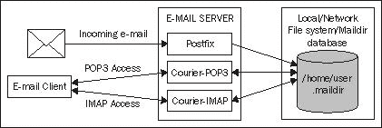

# 下载和安装 Courier-IMAP

**Courier**是一套程序，包括一个完整的 MTA。本书假定使用的 MTA 是**Postfix**。重要的是只安装和配置 Courier 的 POP3 和 IMAP 组件——如果同时有两个 MTA 运行，电子邮件系统将非常不稳定。

### 注意

术语“Courier”通常用于指代 Courier 软件的完整套件，包括 MTA。Courier-IMAP 通常用于指代服务器的 IMAP 和 POP3 部分。**Courier Authentication Library**是 Courier-IMAP 所需的另一个 Courier 模块。确保只安装 Courier Authentication Library 和 Courier-IMAP。

有几种安装 Courier-IMAP 的方法。Courier-IMAP **Redhat Package Managers** (**RPMs**)适用于多种不同的 Linux 发行版。这些将从发行版的制造商处获得，或者可能已经由第三方构建，通常是 Courier 的爱好者或开发人员。如果您的 Linux 发行版基于 RPM，但 RPM 中没有 Courier-IMAP 的软件包，则必须从源代码构建。

如果您的 Linux 发行版基于 Debian 软件包格式，则可能会提供 Courier-IMAP 的软件包。如果没有，则 Courier-IMAP 必须从源代码构建。

## 从发行库安装 Courier-IMAP

最好使用 Linux 发行商构建的软件包，如果可能的话。他们提供的任何软件包都应该是稳定的，性能良好，并且使用默认路径和文件位置以适应其余软件。如果您的发行版有软件包管理器，那么您应该使用它，因为它会自动安装 Courier-IMAP 需要的任何软件包。

重要的是要获得与正在使用的发行版匹配的软件包。针对不同发行版的软件包可能无法正常工作，并且可能使现有软件不稳定。

## 从 RPM 安装 Courier-IMAP

重要的是要获得与正在使用的发行版匹配的 RPM。针对其他发行版的 RPM 可能无法正常工作，并且可能使现有软件不稳定。

如果您的 Linux 发行版包含用于管理软件包的图形前端（例如 gnorpm），最好使用它，因为它会自动管理软件包之间的任何依赖关系。

要查找 Courier-IMAP 的 RPM，请首先检查 Linux 发行商是否提供了该软件包。如果是这样，请下载并使用它。如果分销商没有提供软件包，则可能由其他组织或个人提供适当的软件包。要检查这一点，请搜索网络。在[www.rpmfind.net](http://www.rpmfind.net)上有一个 RPM 数据库，搜索`courier-imap`和发行版的名称（例如 Fedora 或 Mandriva）将找到任何合适的软件包。最好使用设计用于特定版本发行版的软件包。例如，Mandriva Linux 2008.1 的软件包不应该用于 Mandriva Linux 2009.1。如果不确定，则最好按照下一节中的说明从源代码安装 Courier-IMAP。

如果无法使用 RPM 的前端，则首先下载 RPM 并使用命令提示符切换到包含文件的目录，然后以 root 身份使用`rpm`命令安装 RPM。

```
# rpm -ivh courier-imap-4.4.1-1mdv2009.1.i586.rpm

```

如果缺少所有先决条件软件，则 RPM 命令可能会失败。在这种情况下，输出将列出所需的软件。可以使用之前看到的`rpm`命令下载并安装适当的软件包。安装了所有先决条件软件后，可以使用之前解释的`rpm`命令安装 Courier-IMAP。

如果使用`rpm`命令安装 Courier-IMAP，则也可以使用它来卸载。命令如下：

```
# rpm -e Courier-IMAP

```

## 使用 Debian 软件包格式安装 Courier-IMAP

如果您的 Linux 发行版包含用于管理软件包的图形前端（例如 gnorpm），则可以使用它，如果您感到舒适的话。

您可以在任何基于 Debian 的系统上使用以下命令来安装 Courier-IMAP：

```
# apt-get install courier-imap

```

## 从源代码安装 Courier-IMAP

在现代 Linux 发行版上从源代码安装 Courier-IMAP 并不是一项困难的任务。在较旧版本的 Linux 以及其他 UNIX 平台（如 AIX、Solaris 和 HP-UX）上，可能会出现问题，特别是如果系统的其余软件不是最新的。

### 先决条件

安装 Courier-IMAP 需要满足以下先决条件：

+   **一个可用的 C++编译器：**我们建议使用**GNU C++编译器**，它是**GNU 编译器集合**（**GCC**）的一部分，又是几乎每个 Linux 发行版的一部分，并且大多数平台都可以免费获得。如果有 GCC 的 RPM 或其他软件包（几乎肯定会有），应优先使用它，而不是从源代码构建 GCC。

+   **一个** `make` **实用程序：**我们建议使用 GNU 的`make`实用程序，它将在大多数 Linux 发行版中提供，或者可以从[`gcc.gnu.org/`](http://gcc.gnu.org/)下载。

+   **GNU 链接器：**可在[www.gnu.org/software/binutils/](http://www.gnu.org/software/binutils/)上获得。

+   **GNU** Libtool：可在[www.gnu.org/software/libtool/](http://www.gnu.org/software/libtool/)上获得。

+   **Berkeley DB 库或 gdbm 库：**这些库允许程序在文件中创建数据库。同样，这些库应该以打包形式提供，但也可以从[www.sleepycat.com/](http://www.sleepycat.com/)和[`www.gnu.org/software/gdbm/gdbm.html`](http://www.gnu.org/software/gdbm/gdbm.html)下载。这两者中的一个或两者几乎肯定已经安装。

+   Courier-IMAP 源代码。

要成功安装 Courier-IMAP，必须首先安装所有这些先决条件。

### 构建 Courier 身份验证库

安装 Courier-IMAP 有两个阶段。首先，必须构建 Courier 身份验证库，通常称为`Courier-authlib`。完成此操作后，可以安装 Courier-IMAP。

### 注意

虽然这里提供了安装 Courier-IMAP 的说明，但是阅读随包提供的`README, READ.ME`或`INSTALL`文件总是一个好主意。如果在安装软件时遇到问题，请始终检查问题是否在任何提供的文档中提到。

`Courier-authlib`源可以从[www.courier-mta.org/authlib/](http://www.courier-mta.org/authlib/)下载。与许多开源软件包一样，Courier 身份验证库使用配置脚本来检测系统功能，然后使用`make`命令来构建和安装软件。

要构建 Courier 身份验证库，请输入以下命令。您应该看到类似以下的响应：

```
$ cd /tmp
$ tar xfj /path/to/courier-authlib-0.62.4.tar.bz2
$ cd courier-authlib-0.62.4/
$ ./configure
checking for a BSD-compatible install... /usr/bin/install -c
checking whether build environment is sane... yes
checking for a thread-safe mkdir -p... /bin/mkdir -p
checking for gawk... gawk
... (lots more output appears)
configure: creating ./config.status
config.status: creating Makefile
config.status: creating config.h
config.status: executing depfiles commands
config.status: executing libtool commands
$
$ make
$ make
/bin/sh ./config.status --file=authlib.html
config.status: creating authlib.html
echo "#define AUTHLDAPRC \"\"" >authldaprc.h
...(lots more output)
/bin/sh ./config.status --file=authlib.3
config.status: creating authlib.3
make[2]: Leaving directory `/tmp/courier-authlib-0.62.4'
make[1]: Leaving directory `/tmp/courier-authlib-0.62.4'
$ su -c make install (enter the root password)
# make install
make install-recursive
make[1]: Entering directory `/tmp/courier-authlib-0.62.4'
Making install in libltdl
make[2]: Entering directory `/tmp/courier-authlib-0.62.4/libltdl'
make install-am
...(lots more output)
make[4]: Leaving directory `/tmp/courier-authlib-0.62.4'
make[3]: Leaving directory `/tmp/courier-authlib-0.62.4'
make[2]: Leaving directory `/tmp/courier-authlib-0.62.4'
make[1]: Leaving directory `/tmp/courier-authlib-0.62.4'
#

```

命令成功执行后，Courier 身份验证库将被安装。在启动之前，需要进行一些配置。

请注意，如果您使用的是 Red Hat Linux 或其衍生产品之一，如 Fedora Core 或 CentOS，则`./configure`脚本会检测到这一点，并建议您使用 RPM 或`--with-redhat`参数：

```
$ ./configure
configure: WARNING: === I think you are trying to run this configure script
configure: WARNING: === on Red Hat/Fedora. You're doing too much work!
configure: WARNING: === It's much faster to create installable binary RPMs
configure: WARNING: === like this: http://www.courier-mta.org/FAQ.html#rpm
configure: WARNING: === When you do this you may find that RPM will tell you
configure: WARNING: === to install some other software first, before trying to
configure: WARNING: === build this one, and even tell you the name of RPMs you
configure: WARNING: === build this one, and even tell you the name of RPMs you
configure: WARNING: === need to install from the distribution CD. That's much
configure: WARNING: === easier than trying to figure out the same from some
configure: WARNING: === cryptic error message.
configure: WARNING:
configure: WARNING: === Even if you don't intend to use everything you need to
configure: WARNING: === have in order to build via RPM, you should still do as
configure: WARNING: === you're told. All the extra stuff (LDAP, SQL, etc...)
configure: WARNING: === goes into RPM sub-packages, which do not need to be
configure: WARNING: === installed.
configure: WARNING: === But, if you insist, you can simply add '--with-redhat'
configure: WARNING: === parameter to this configure script and not see this
configure: WARNING: === error message. You should also do this when upgrading
configure: WARNING: === and you didn't use RPM with the older version.
configure: error: ... in either case you better know what you're doing!

```

在这种情况下，将`--with-redhat`参数传递给`./configure`：

```
$ ./configure --with-redhat

```

### 配置 Courier 身份验证库

一旦安装了身份验证库，就需要做出一些决定。

Courier 身份验证库为系统管理员提供了在对用户进行身份验证时的灵活性。身份验证是用户通过提供有效的用户名和相应密码来证明其身份的过程。提供以下身份验证方法：

| 身份验证方法 | 描述 |
| --- | --- |
| `authshadow` | 默认情况下，大多数 Linux 发行版将用户密码存储在`/etc/shadow`系统文件中。使用`authshadow`进行身份验证会验证系统帐户的密码。只有当用户拥有系统帐户时，即可以使用 telnet 或`ssh`登录到计算机时，才适用。 |
| `authpwd` | 在旧系统上，密码存储在`/etc/passwd`文件中。 `authpwd`模块允许用户根据其系统密码进行身份验证。同样，用户必须拥有系统帐户。 |
| `authuserdb` | 与`authshadow`不同，每个用户都需要一个系统帐户，`authuserdb`将用户详细信息存储在系统帐户之外。这允许**虚拟邮箱**功能，其中可以定义用户，而无需在计算机上拥有真实帐户。一些脚本用于管理数据库，通常保存在`/etc/userdb`中。（许多发行版将其放在`/etc/courier/authlib/userdb`中。） |
| `authmysql` | 这类似于`authuserdb`，但是使用 MySQL 数据库而不是`authuserdb`中使用的文件。 MySQL 是大多数 Linux 发行版提供的流行关系数据库，并且相对于其他方法，它既有优势又有劣势。使用诸如 MySQL 之类的关系数据库会增加电子邮件服务器的复杂性，但可能会使身份验证更快，并且关系数据库将允许数据与其他应用程序共享（如果需要）。 |
| `authpam` | 身份验证由**可编程访问方法（PAM）**库提供。PAM 是一个常用的库，大多数 Linux 发行版都提供。PAM 是灵活的，可以从各种来源对用户进行身份验证，包括系统密码数据库（通常是`/etc/passwd`文件）。 |
| `authcustom` | 这允许系统管理员开发自己的自定义身份验证方法。 |

选择身份验证方法可能是一个困难的决定。以下是一些指导原则：

+   如果所有用户都有系统帐户，则可以使用`authshadow、authpwd`或`authpam`。如果 PAM 已安装和配置，应优先使用 PAM 而不是其他方法。

+   如果需要虚拟电子邮件系统，请使用`authdb`或`authmysql`。对于小型站点，选择`authmysql`而不是`authdb`没有太大优势。

在本书中，仅涵盖了使用`authshadow`或`authpwd`进行简单身份验证。虽然如果安装和配置了 PAM，则不需要额外的配置。`authuserdb`和`authmysql`需要进一步配置，这在身份验证库的文档中有描述。

`/usr/local/etc/courier/authlib`目录包含 Courier 身份验证库的配置文件。出于安全考虑，最好将整个目录设置为仅由属于`mail`组的用户可读。默认的`authdaemonrc`文件可以从安装目录复制过来。

```
# mkdir -p /usr/local/etc/courier/authlib
# chown mail:mail /usr/local/etc/courier/authlib/
# chmod 755 /usr/local/etc/courier/authlib/
# cp /tmp/courier-authlib-0.52/authdaemonrc /usr/local/etc/courier/
authlib

```

要以 root 用户身份完成配置，请编辑`/usr/local/etc/courier/authlib/authdaemonrc`文件，并更改以下条目：

```
authmodulelist="authshadow"
daemons=3
authdaemonvar=/var/lib/courier/authdaemon
DEBUG_LOGIN=0
DEFAULTOPTIONS=""

```

在以`authmodulelist`开头的行中，输入您希望使用的模块。

`daemons=`行列出了应该运行多少个进程，等待对用户进行身份验证。除非有非常多的用户，否则`3`到`5`之间的值应该足够了。守护进程的数量越多，身份验证库使用的内存就越多。其他进程可用的内存也会减少，这可能会影响整个系统的性能。

`authdaemonvar`行列出了 Courier 身份验证库放置其运行时文件的位置，特别是用于连接的套接字。此处列出的目录（在本例中是`/var/lib/courier/authdaemon`）应存在，并且只能由 root 用户读取。使用以下命令作为`root`创建目录：

```
# mkdir -p /var/lib/courier/authdaemon
# chmod 750 /var/lib/courier/authdaemon
# chown mail:mail /var/lib/courier/authdaemon

```

出于安全考虑，最好将`authdaemonrc`文件设置为只有特定用户可读。

```
# chown mail:mail /usr/local/etc/courier/authlib/authdaemonrc

```

系统启动时需要启动身份验证守护程序。通常，会在`/etc/init.d/`中放置一个脚本，以便轻松启动和停止守护程序。在身份验证库的源代码中包含了一个示例脚本`/courier-authlib.sysvinit`。应将此文件放置在`/etc/init.d`中。

```
# cd /tmp/courier-authlib-0.52
# cp courier-authlib.sysvinit /etc/init.d/courier-auth

```

将来，可以使用以下命令启动和停止服务：

```
# /etc/init.d/courier-auth start
# /etc/init.d/courier-auth stop

```

最初，应该直接从命令行运行守护程序。如果有任何错误，它们将被显示出来。

```
# /usr/local/sbin/authdaemond start
/usr/local/sbin/authdaemond: line 16: /usr/local/etc/authlib/authdaemonrc: No such file or directory

```

在刚刚显示的示例中，`/usr/local/etc/authlib/authdaemonrc`文件丢失，因为默认的`authdaemonrc`文件没有从安装目录复制过来。

如果服务已正确启动，可以通过传递`stop`参数来停止服务。

```
# /usr/local/sbin/authdaemond stop

```

请参考发行版的文档，以便在 Linux 启动时自动启动服务。在 Red Hat 系统上，可以使用`service`命令来配置服务自动启动。

```
# service courier-auth add default

```

对于其他发行版，可能会使用`chkconfig`命令。

```
# chkconfig -add imapd

```

### 解决错误

在构建的每个阶段都可能会产生错误。在运行`configure`脚本时出现错误可能与缺少的依赖关系有关。检查软件提供的`README`和`INSTALL`文件，并确保安装了所有依赖项。如果问题不明显，可以通过互联网搜索确切的错误消息来找到解决方案。

在构建时出现错误是不太常见的，因为大多数错误都会被 `configure` 脚本阻止。同样，错误消息应该提供关于错误来源的良好线索，并且使用互联网搜索引擎可能会有所帮助。

运行时错误通常是由于错误的配置。Courier Authentication Library 中有一些配置选项，但可能会出现错误。

如果找不到答案，可以向 Courier 邮件列表寻求帮助。与往常一样，首先搜索列表存档以寻求帮助，并查阅常见问题解答。对于 Courier-IMAP，邮件列表位于 [`lists.sourceforge.net/lists/listinfo/courier-imap/`](http://lists.sourceforge.net/lists/listinfo/courier-imap/)，可搜索的列表存档位于：[`sourceforge.net/mailarchive/forum.php?forum_id=7307/`](http://sourceforge.net/mailarchive/forum.php?forum_id=7307/)，常见问题解答位于 [`www.courier-mta.org/FAQ.html`](http://www.courier-mta.org/FAQ.html)。

## 构建 Courier-IMAP

Courier-IMAP 源代码以一个 tarball 的形式提供，其中包含所有文件，类似于 ZIP 文件。可以从 [`www.courier-mta.org/imap/`](http://www.courier-mta.org/imap/) 下载，但要小心下载 Courier-IMAP 的源代码，而不是 Courier MTA 的源代码。

### 注意

尽管这里提供了有关如何安装 Courier-IMAP 的详细信息，但始终建议阅读随软件包提供的 `README, READ.ME` 或 `INSTALL` 文件。如果在安装软件时遇到问题，请始终检查所提供的文档中是否提到了该问题。

要安装 Courier-IMAP，必须输入一些命令。与大多数以源代码形式提供的软件一样，首先运行配置脚本。配置脚本检查我们的计算机上安装的软件，并配置软件以便正确构建。

当 Courier-IMAP 用作 IMAP 服务器时，默认情况下假定其客户端将严格遵循 IMAP 标准。不幸的是，这通常不是情况，如果 Courier-IMAP 期望客户端严格遵循 IMAP 标准，可能无法将邮件传递到电子邮件客户端。Courier-IMAP 的开发人员意识到了这一点，并通过将 `--enable-workarounds-for-imap-client-bugs` 标志传递给配置脚本来构建与非标准客户端一起工作的能力。

Courier-IMAP 在构建时包含一个特殊的 `check` 功能。不幸的是，使用 `--enable-workarounds-for-imap-client-bugs` 会阻止检查成功运行。由于 `check` 功能很有用，我们将软件构建两次。首先不使用 `--enable-workarounds-for-imap-client-bugs` 构建，然后运行 `check`，然后再次使用该标志构建并安装软件。

要构建 Courier-IMAP，请输入以下命令。选择一个合适的目录来构建软件。在这个例子中，我们选择了 `/tmp`，软件会解压到 `courier-imap-3.0.8` 目录中。与 Courier Authentication Library 一样，配置脚本将检测是否正在使用 Red Hat 派生的 Linux 发行版，并且可以传递 `--with-redhat` 标志给配置。

```
$ cd /tmp
$ tar xfj /path/to/courier-imap-4.5.1.tar.bz2
$ cd /tmp/courier-imap-4.5.1
$ ./configure --with-redhat
checking for a BSD-compatible install... /usr/bin/install -c
checking whether build environment is sane... yes
checking for a thread-safe mkdir -p... /bin/mkdir -p
checking for gawk... gawk
checking whether make sets $(MAKE)... yes
... (a lot more output follows)
config.status: creating config.h
config.status: executing depfiles commands
config.status: executing libtool command
$ make check
Making check in numlib
make[1]: Entering directory `/tmp/courier-imap-4.5.1/numlib'
make[1]: Nothing to be done for `check'.
make[1]: Leaving directory `/tmp/courier-imap-4.5.1/numlib'
Making check in md5
... (a lot more output appears)
make[2]: Leaving directory `/tmp/courier-imap-4.5.1/imap'
make[1]: Leaving directory `/tmp/courier-imap-4.5.1/imap'
make[1]: Entering directory `/tmp/courier-imap-4.5.1'
make[1]: Nothing to be done for `check-am'.
make[1]: Leaving directory `/tmp/courier-imap-4.5.1'
$ ./configure --enable-workarounds-for-imap-client-bugs
checking for gcc... gcc
checking for C compiler default output file name... a.out
checking whether the C compiler works... yes
checking whether we are cross compiling... no
... (a lot more output follows)
config.status: creating config.h
config.status: executing depfiles commands
config.status: executing libtool command
$ make
$ make
make all-recursive
make[1]: Entering directory `/tmp/courier-imap-4.5.1'
make all-gmake-check FOO=BAR
----------------------------------------------------
(lots more output appears)
cp imap/imapd.cnf .
cp imap/pop3d.cnf .
cp -f ./maildir/quotawarnmsg quotawarnmsg.example
make[2]: Leaving directory `/tmp/courier-imap-4.5.1'
make[1]: Leaving directory `/tmp/courier-imap-4.5.1'
$ su -c "make install"
Password: (enter password for root)
Making install in numlib
make[1]: Entering directory `/tmp/courier-imap-4.5.1/numlib'
make[2]: Entering directory `/tmp/courier-imap-4.5.1/numlib'
make[2]: Nothing to be done for `install-exec-am'.
make[2]: Nothing to be done for `install-data-am'.
(lots more output appears)
Do not forget to run make install-configure
test -z "/usr/lib/courier-imap/share" || /bin/mkdir -p "/usr/lib/courier-imap/share"
/usr/bin/install -c mkimapdcert mkpop3dcert '/usr/lib/courier-imap/share'
make[2]: Leaving directory `/tmp/courier-imap-4.5.1'
make[1]: Leaving directory `/tmp/courier-imap-4.5.1'
$ su -c "make install-configure"
Password: (enter password for root)
make[1]: Entering directory `/tmp/courier-imap-4.5.1/numlib'
make[1]: Leaving directory `/tmp/courier-imap-4.5.1/numlib'
make[1]: Entering directory `/tmp/courier-imap-4.5.1/md5'
make[1]: Leaving directory `/tmp/courier-imap-4.5.1/md5'
(lots more output appears)
make install-configure-local DESTDIR=
make[1]: Entering directory `/tmp/courier-imap-4.5.1'
make[1]: Leaving directory `/tmp/courier-imap-4.5.1'
$

```

如果输出看起来类似于所示的内容，Courier-IMAP 已成功安装，您可以跳过下一节关于错误处理的部分。

### 处理错误

`configure` 命令可能会失败。配置尝试检测现有软件，并确保 Courier-IMAP 与其一起工作，但偶尔会出现错误。

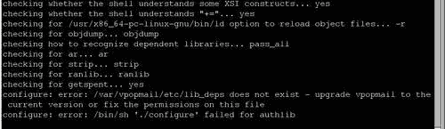

在这个例子中，`configure` 命令假设 `vpopmail` 已安装，并且在找不到 `vpopmail` 的部分时失败。实际上，`vpopmail` 没有安装，也无法被检测到。我们从 `INSTALL` 文件中得到以下信息：

```
...configure should automatically detect if you use vpopmail, and compile and install the authvchkpw authentication module.

```

这表明 `authvchkpw` 用于 `vpopmail`。在 `INSTALL` 文件的前面，我们读到：

```
* authvchkpw - this module is compiled by default only if the vpopmail account is defined.

```

检查`/etc/passwd`文件后，我们发现有一个解释检测的`vpopmail`帐户。缺少`vpopmail`文件解释了`configure`脚本的失败。在`INSTALL`文件中，描述了配置脚本的参数。

```
Options to configure:
...
* --without-module - explicitly specify that the authentication module named "module" should not be installed. See below for more details.
Example: --without-authdaemon.

```

因此，解决方案是使用`--without-authvchkpw`选项：

```
$ ./configure –without-authvchkpw

```

大多数问题可以用类似的方法解决。最好不要被不理解的术语和名称吓倒。不需要了解任何关于`vpopmail`的东西，只需搜索术语`"vpopmail"`（原始错误消息中提到的），就可以通过阅读文档解决错误。

如果找不到答案，可以通过 Courier 邮件列表寻求帮助。详细信息请参阅*解决错误*部分。

# 使用 POP3

如介绍中所述，当电子邮件要存储在客户端计算机上时，通常使用 POP3。当与电子邮件服务器的连接是间歇性的时，例如，使用拨号线访问 ISP 的电子邮件帐户时，通常会使用它。这种方法的优势在于电子邮件始终可供客户端使用，客户端可以在未连接到电子邮件服务器时工作。用户下次上线时可以阅读电子邮件并创建回复。

使用 POP3 的主要缺点是电子邮件通常只能在客户端 PC 上使用。如果客户端 PC 出现故障或被盗，除非进行了备份，否则电子邮件将丢失。

可以配置 POP3 客户端在服务器上保留电子邮件，以便其他客户端访问，但在这种情况下更常用的是 IMAP。

## 为 POP3 配置 Courier-IMAP

如果 Courier-IMAP 是从源代码构建的，则配置文件位于`/usr/lib/courier-imap/etc/courier-imap/`中。如果您使用的是打包的发行版，则可能位于`/etc/courier-imap`中。`pop3d`文件包含了 POP3 服务器的设置。

如果您使用的是 Courier-IMAP 的打包发行版，则可以使用以下命令找到配置文件：

```
# find / -name pop3d 2>/dev/null
/usr/lib/courier-imap/etc/pop3d
/usr/lib/courier-imap/bin/pop3d

```

编辑文件，找到并更改以下设置：

| 设置 | 描述 |
| --- | --- |
| `PIDFILE` | `pop3d`守护程序跟踪其使用的进程 ID。它指定一个有效的路径和一个暗示文件使用的名称。通常，这可能是`/var/run/pop3d.pid`。确保变量指向一个现有的目录（如`/var/run`）或创建指定的目录。 |
| `MAXDAEMONS` | 这指定可以同时运行的`pop3d`进程的最大数量。这个数字限制了可以同时连接的用户数量。比预期用户数量更高的数字可能是浪费的，但尝试连接的用户也包括在此数字中。将其设置为接近可能同时连接的最大用户数量的数字，或者稍微高一些。请注意，这是启动的进程的最大数量，而不是初始进程的数量。 |
| `MAXPERIP` | 这指定每个 IP 地址的最大连接数。低数字（如 4）可以防止恶意行为，例如拒绝服务攻击，其中试图使用邮件服务器上的所有连接。 |
| `POP3AUTH` | 如果使用 Courier 身份验证库守护程序，则将其设置为空，否则将其设置为指示执行的登录验证类型。对于 4.0 之前的版本，应将其设置为`LOGIN`。 |
| `PORT` | 这指定守护程序监听的端口。标准端口是`110`，只有在所有客户端软件都配置为使用非标准端口时才应选择不同的端口。 |
| `ADDRESS` | 这指定要监听的 IP 地址。如果机器有多个网络接口，Courier-IMAP 可以配置为仅在其中一个地址上监听。值为`0`表示应使用所有网络接口。 |
| `TCPDOPTS` | 这些是要使用的选项。通常使用的选项包括`nodnslookup`，它可以防止 POP3 守护程序尝试解析每个连接的名称，以及`-noidentlookup`，它可以防止它尝试对传入连接进行`ident`查询。指定这两个设置可以减少身份验证用户连接所需的时间。 |
| `MAILDIRPATH` | 这是典型用户的`maildir`路径。指定适合您系统的值，例如`.maildir`。 |

此处显示了一个示例`pop3d`配置文件：

```
PIDFILE=/var/run/pop3d.pid
MAXDAEMONS=40
MAXPERIP=4
POP3AUTH=""
PORT=110
ADDRESS=0
TCPDOPTS="-nodnslookup -noidentlookup"
MAILDIRPATH=.maildir

```

一旦配置了 POP3 服务器，就该是时候测试了。如果您使用的是由分发商提供的 Courier-IMAP 版本，请使用名为`/etc/init.d/courier-imap`的分发商启动脚本。这将尝试启动`imapd`以及`pop3d`，但由于大部分配置将由分发商完成，因此 IMAP 应该能够成功启动。

### 注意

如果您使用的是 Courier-IMAP 4.0 或更高版本，则必须在启动 POP3 或 IMAP 服务之前运行`courier-authdaemon`。确保按照前面描述的方式启动它们。

要启动 POP3 服务进行测试，请运行以下命令：

```
# /usr/lib/courier-imap/libexec/pop3d.rc start

```

一旦正确配置了 POP3 和 IMAP 服务，它们可以在机器启动时自动启动。这在*测试 IMAP 服务*部分有解释。即使不需要 IMAP，也可以按照说明进行操作。

## 测试 POP3 服务

测试 POP3 等服务的最简单方法是使用**telnet**实用程序并连接到适当的端口。这样可以避免网络连接或客户端配置可能出现的任何问题。POP3 使用端口`110`，因此将 telnet 连接到本地机器的端口`110`。

```
$ telnet localhost 110
Trying 127.0.0.1...
Connected to localhost.
Escape character is '^]'.
+OK Hello there.
USER username
+OK Password required.
PASS password
+OK logged in.
STAT
+OK 82 1450826
LIST
+OK POP3 clients that break here, they violate STD53.
1 5027
2 5130
3 6331
4 3632
5 1367
... all e-mails are listed, with their sizes in bytes
82 6427
.
RETR 1
+OK 5027 octets follow.
Return-Path: <user@domain.com>
X-Original-To: user@localhost
Delivered-To: user@machine.domain.com
Received: from isp (isp [255.255.255.255])
... e-mail is listed
.
QUIT
+OK Bye-bye.

```

外部主机关闭连接。

POP3 协议基于文本命令，因此可以使用 telnet 模拟客户端。最初，使用`USER`和`PASS`命令对用户进行身份验证。如果用户成功通过身份验证，则`STAT`命令将列出所有电子邮件及其组合大小（以字节为单位）。`LIST`列出每封电子邮件及其大小。`RETR`命令在指定命令时检索（或列出）一封电子邮件。`DELE`命令（未在示例中显示）将从服务器中删除一封电子邮件。

现在 POP3 正在运行，是时候配置电子邮件客户端来收取电子邮件了。

## 通过 Windows Live Mail 使用 POP3 检索电子邮件

Windows Live Mail 是一款流行的电子邮件客户端，适用于从 XP 版本开始的 Windows 版本。它包括连接到支持 POP3 和 IMAP 的服务器的功能。可在[`download.live.com/wlmail`](http://download.live.com/wlmail)下载。

以下是配置它的步骤：

1.  通过在开始菜单层次结构中找到它来启动 Windows Live Mail：**开始 | 所有程序 | Windows Live | Windows Live Mail**。第一次运行时，界面将自动显示创建新帐户的向导。否则，点击导航栏中的**添加电子邮件帐户**。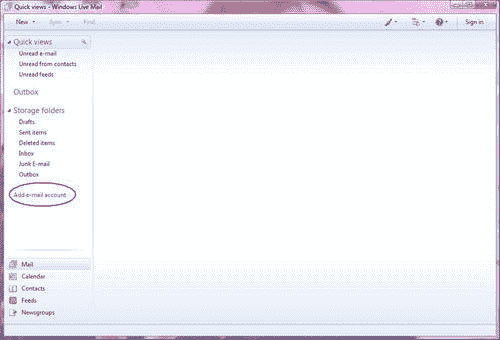

1.  将显示新帐户向导的第一页。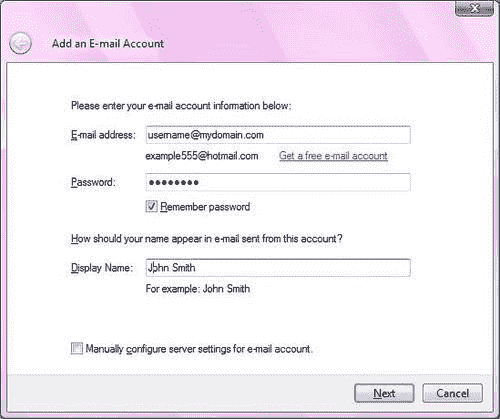

1.  以`username@domain`格式输入完整的电子邮件地址。您可以决定是否要输入密码 - 如果不勾选**记住密码**，则每次启动 Windows Live Mail 时都会提示输入密码。**显示名称**应为您的名字和姓氏 - 这将显示在发件邮件上。无需勾选**手动配置电子邮件帐户的服务器设置**复选框。

1.  点击**下一步**。向导的下一页需要一些服务器详细信息。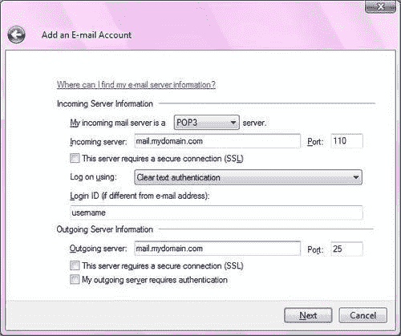

1.  默认情况下是**POP3**服务器。**传入服务器**应该是邮件服务器的名称（或 IP 地址）。默认的**端口**为**110**可以保持不变。不要勾选 SSL 连接的框，并将认证方法保持为**明文认证**。**登录 ID**应保持为在第一个屏幕中输入的电子邮件地址的用户名部分。**传出服务器**应该与**传入服务器**提供的相同，表单的其余部分可以保持默认值。

1.  按下**下一步**。您将看到一个确认屏幕。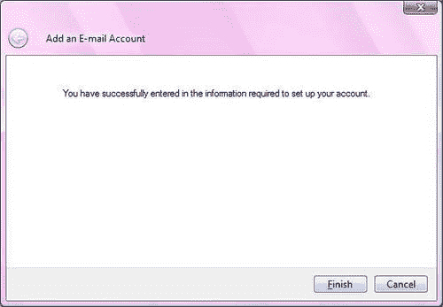

1.  当您单击**完成**时，Windows Live Mail 将尝试连接到电子邮件服务器并下载电子邮件。

1.  如果有任何错误，那么右键点击导航窗格中的帐户，然后选择**属性**。然后您可以检查和修改任何设置。

现在 POP3 已经成功配置，是时候转向 IMAP 了。

# 使用 IMAP

如前所述，使用 IMAP，邮件保存在服务器上，可能不保存在客户端上。这使得它非常适合具有中央管理功能的组织，因为它简化了备份，并且还允许用户更改他们工作的客户计算机。但是，这也意味着随着时间的推移，存储整个组织电子邮件所需的磁盘存储空间将不可避免地增加。当发送或接收大附件时，这一点尤为真实。如果用户依赖于能够访问他们的邮箱，那么如果邮件服务器在他们的工作时间内不可用，他们将感到不便。一些电子邮件客户端可以配置为复制电子邮件，从而避免中断。通过使用 IMAP 的创建文件夹和在它们之间移动电子邮件的能力，有时可以以相对简单的方式实现这一点。

## 配置 IMAP 的 Courier

安装了 Courier-IMAP 后，无论是从软件包还是从之前描述的源，都需要在使用之前进行配置。

### 注意

如果您已经按照前面描述的方式配置和测试了 POP3，那么在配置 IMAP 时应停止 Courier-IMAP 守护程序。如果您使用的是 Courier-IMAP 大于 4.0 的版本，则可以保持认证守护程序运行。

如果 Courier-IMAP 是从源代码构建的，则配置文件位于`/usr/lib/courier-imap/etc/courier-imap/`。在打包的发行版中，它们可能位于`/etc/courier-imap`。`imapd`文件包含 IMAP 服务器的设置。

如果您使用的是 Courier-IMAP 的打包发行版，则可以使用此命令找到配置文件：

```
# find / -name imapd 2>/dev/null

```

```
/usr/lib/courier-imap/etc/imapd
/usr/lib/courier-imap/bin/imapd

```

找到文件后，可以根据需要进行修改。以下是主要的配置指令：

| 设置 | 描述 |
| --- | --- |
| `PIDFILE` | `imapd`守护程序跟踪其使用的进程 ID。它指定一个有效的路径和名称，这表明文件的使用。通常，这可能是`/var/run/imapd.pid`。确保设置指向有效的目录。 |
| `MAXDAEMONS` | 这指定可以同时运行的`imapd`进程的最大数量。此数字限制可以同时连接的用户数量。高于预期用户数量的数字可能是浪费的，但尝试连接的用户也包括在此数字中。将其设置为最大可能同时连接的用户数量左右，或者略高一些的数字。 |
| `PORT` | 这指定守护程序侦听的端口。标准端口是`143`，只有当所有客户端软件都配置为使用非标准端口时，才应选择不同的端口。 |
| `ADDRESS` | 这指定要侦听的 IP 地址。如果机器有多个网络接口，Courier-IMAP 可以配置为仅侦听其中一个地址。值`0`表示应使用所有网络接口。 |
| `TCPDOPTS` | 这些是要使用的选项。典型的选项包括`-nodnslookup`，它可以防止 IMAP 守护程序尝试解析每个连接的名称，以及`-noidentlookup`，它可以防止它尝试对传入连接进行`ident`查询。指定这两个设置可以减少身份验证用户连接所需的时间。 |
| `MAILDIRPATH` | 这是典型用户的`maildir`的路径。为您的系统指定适当的值，例如`.maildir`。 |
| `MAXPERIP` | 这指定了每个 IP 地址的最大连接数。较低的数字可以防止恶意行为，例如拒绝服务攻击，即试图使用邮件服务器上的所有连接。一些电子邮件客户端会对服务器进行多次连接，因此诸如`5`之类的较低值可能会影响客户端软件的操作。 |
| `IMAP_CAPABILITY` | 这描述了服务器向客户端报告的 IMAP 功能。应该保持默认设置。 |
| `IMAP_EMPTYTRASH` | 这指定了电子邮件消息在某些文件夹中应保留的时间。在指定日期之前的消息在用户登录或注销时将自动删除。这可以用于在一定时间后自动从`Trash`文件夹中删除电子邮件。这适用于所有文件夹，因此`Sent items`文件夹中的电子邮件可以在较长时间后被删除。例如，`IMAP_EMPTYTRASH=Trash:7,Sent:30`指定`Trash`文件夹中的电子邮件在 7 天后被删除，`Sent`文件夹中的电子邮件将在 30 天后被删除。如果指定的文件夹中存在大量电子邮件，性能将受到影响，因为每次用户登录或注销 IMAP 服务器时都会检查每个文件。在这种情况下，最好禁用此设置，并定期运行一个单独的脚本来删除旧文件。 |
| `IMAP_IDLETIMEOUT` | 这是客户端在空闲状态（未向服务器发出任何请求）多长时间（以秒为单位）之后，连接将被关闭。低于默认值 60 的数值可能会导致客户端连接过早终止，但是一个良好编写的客户端将会在不通知用户的情况下重新连接。如果用户报告问题，应该使用更高的数值。 |
| `IMAP_TRASHFOLDERNAME` | 这指定了在删除电子邮件时要使用的文件夹。 |
| `SENDMAIL` | 这指定了用于发送电子邮件的`sendmail`的路径。您应该确保它指向由第二章中安装的 Postfix 安装的可执行文件。 |

这是一个`imapd`配置文件示例：

```
ADDRESS=0
IMAP_CAPABILITY="IMAP4rev1 UIDPLUS CHILDREN NAMESPACE THREAD=ORDEREDSUBJECT THREAD=REFERENCES SORT QUOTA IDLE"
IMAP_EMPTYTRASH=Trash:7
IMAP_IDLE_TIMEOUT=60
IMAP_TRASHFOLDERNAME=Trash
MAILDIRPATH=.maildir
MAXDAEMONS=40
MAXPERIP=10
PIDFILE=/var/run/imapd.pid
PORT=143
SENDMAIL=/usr/sbin/sendmail
TCPDOPTS="-nodnslookup -noidentlookup"

```

## 测试 IMAP 服务

要启动 IMAP 服务进行测试，请运行以下命令：

```
/usr/lib/courier-imap/libexec/imapd.rc start

```

测试 IMAP 等服务的最简单方法是使用 telnet 实用程序并连接到适当的端口。这样可以避免与网络连接或客户端配置相关的任何问题。IMAP 使用端口`143`，因此在本地机器上 telnet 到端口`143`：

```
$ telnet localhost 143
Connected to localhost.
Escape character is '^]'.
* OK [CAPABILITY IMAP4rev1 UIDPLUS CHILDREN NAMESPACE THREAD=ORDEREDSUBJECT THREAD=REFERENCES SORT QUOTA IDLE ACL ACL2=UNION STARTTLS] Courier-IMAP ready. Copyright 1998-2004 Double Precision, Inc. See COPYING for distribution information.
1 capability
* CAPABILITY IMAP4rev1 UIDPLUS CHILDREN NAMESPACE
THREAD=ORDEREDSUBJECT THREAD=REFERENCES SORT QUOTA IDLE ACL ACL2=UNION STARTTLS
1 OK CAPABILITY completed
2 login "username" "password"
2 OK LOGIN Ok.
3 namespace
* NAMESPACE (("INBOX." ".")) NIL (("#shared." ".")("shared." "."))
3 OK NAMESPACE completed.

```

每个命令都以标识符为前缀-这里我们使用递增的数字。第一个命令要求 IMAP 服务器列出其功能。第二个命令是用户登录，包括用户名和密码。如果成功，那么最终的命名空间命令将显示服务器已接受登录，并且客户端可以确定用户在文件夹层次结构中的位置。

这足以确认用户可以登录并发出命令。整个 IMAP 命令集非常庞大和复杂，并不适合通过 telnet 使用。

一旦正确配置了 POP3 和 IMAP 服务，它们可以在计算机启动时自动启动。如果您是从软件包安装的，那么发行商可能已经在`/etc/init.d`中创建了一个适当的启动脚本。根据发行版的不同，这可能会在计算机启动时启动。对于 Red Hat Linux，命令将是：

```
# service courier-imap add default

```

对于其他发行版，可能会使用`chkconfig`命令：

```
# chkconfig -add imapd

```

现在 IMAP 已经正确配置，是时候配置电子邮件客户端了。

## 使用 Mozilla Thunderbird 通过 IMAP 检索邮件

Mozilla Thunderbird 是一款流行的开源电子邮件客户端，可以从[`www.mozilla.org/`](http://www.mozilla.org/)下载。它可以与各种操作系统一起使用，包括 Windows 和 Linux。

以下是配置连接到 Courier-IMAP 服务器的步骤：

1.  从主 Thunderbird 屏幕中，选择**工具|账户设置**。

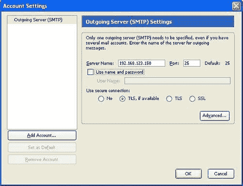

1.  点击**添加帐户...**按钮。在下一个屏幕上，选择**电子邮件帐户**，然后点击**下一步**。身份屏幕将打开。输入您的用户名和电子邮件地址，然后点击**下一步**。

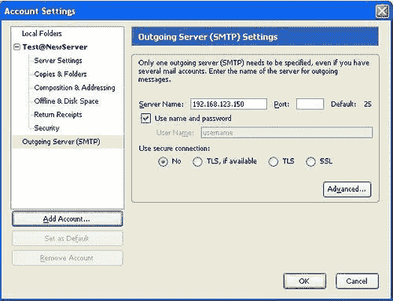

1.  在**服务器信息**屏幕上，选择**IMAP**作为服务器类型，并输入传入电子邮件服务器的名称或 IP 地址。然后点击**下一步**按钮。

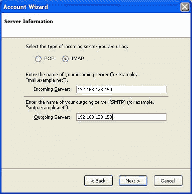

1.  在下一个屏幕上，输入**传入用户名**。这通常是 Linux 帐户名。

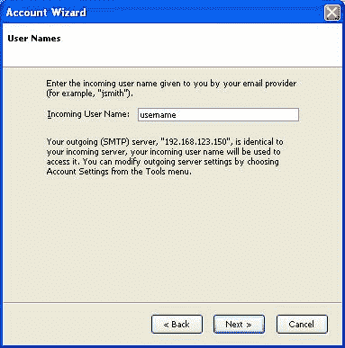

1.  最后，在**账户名称**字段中为电子邮件帐户提供一个有用的标签，以防将来定义另一个帐户。点击**下一步**。

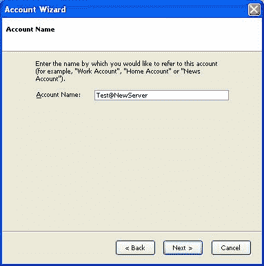

1.  在下一个屏幕上，总结了详细信息。点击**完成**保存帐户详细信息并退出**帐户向导**。

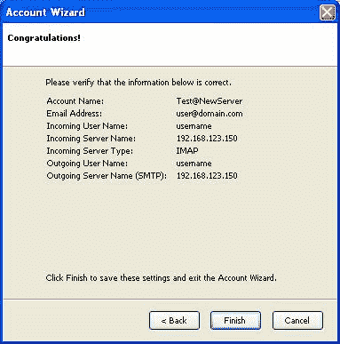

1.  最后，显示**账户设置**屏幕，列出您刚刚定义的帐户。点击**确定**。

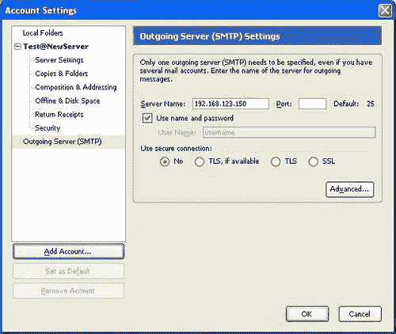

要检索消息，点击**文件|获取新消息**，并从菜单中选择您刚刚创建的帐户。

Thunderbird 将提示您输入密码。输入正确的密码并按*Enter*。然后 Thunderbird 将连接到 Courier-IMAP 并检索所有电子邮件的详细信息。如果您点击一封电子邮件，Thunderbird 将使用 IMAP 协议检索它。

# 摘要

在本章中，我们看到了用于检索电子邮件的两种邮件协议，POP3 和 IMAP，并解释了一些优缺点。然后介绍了 Courier-IMAP，它可以提供 POP3 和 IMAP 服务，并建议您使用 Linux 发行版的软件包。我们还描述了如何根据需要从源代码构建它。然后讨论了如何配置和测试 POP3 和 IMAP 服务，包括配置流行的电子邮件客户端。
