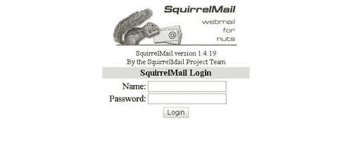
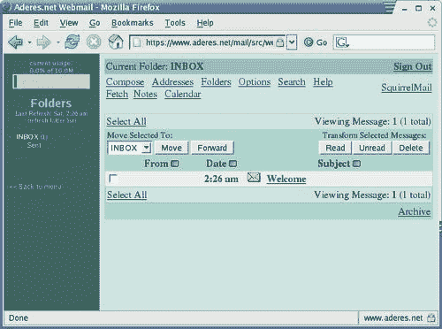
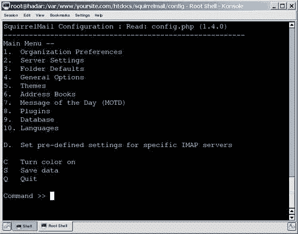
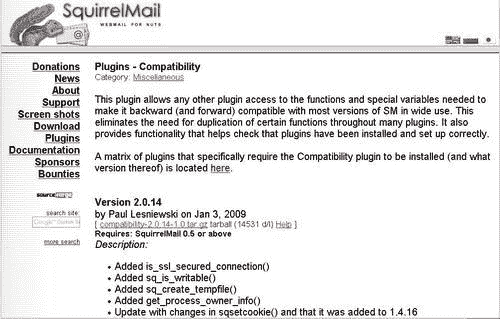
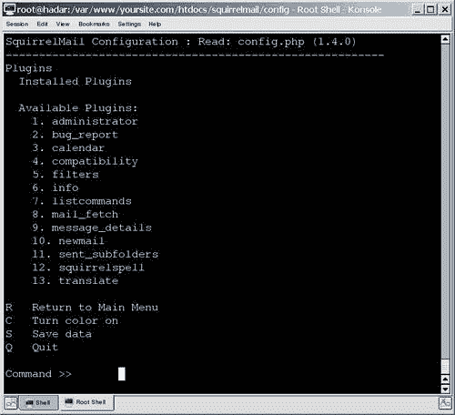

# 第四章：提供 Webmail 访问

您在之前的章节中学习了如何设置和配置电子邮件服务器。现在您的电子邮件服务器已经准备好服务了，您的用户将如何访问它？在本章中，您将学习以下内容：

+   webmail 访问解决方案的好处和缺点

+   SquirrelMail webmail 软件包

+   设置和配置 SquirrelMail

+   什么是 SquirrelMail 插件以及它们能做什么

+   如何使 SquirrelMail 更安全

在下一节中，我们将介绍 SquirrelMail 软件包，并检查这个和其他 webmail 访问解决方案的优缺点。之后，我们将逐步跟进 SquirrelMail 的安装和配置。接下来，我们将检查插件的安装，并包括有用插件的参考。最后，我们将提供一些关于如何保护 SquirrelMail 的提示。

# webmail 解决方案

Webmail 解决方案是在服务器上运行的程序或一系列脚本，可以通过网络访问，并提供类似于传统邮件客户端的电子邮件功能。它被 Yahoo! Mail、Microsoft Hotmail、Microsoft Outlook Web Access 和 Gmail 用作其电子邮件解决方案的主要界面。您可能已经熟悉各种形式的 webmail。

尽管我们将专门研究 SquirrelMail webmail 解决方案，但 SquirrelMail 的好处和缺点适用于市场上大多数 webmail 系统。从这个角度来看，我们将从一个一般的角度来处理这个问题，然后详细介绍 SquirrelMail 软件包。

## 好处

本节将重点介绍安装和维护 webmail 解决方案所提供的优势。与任何列表一样，它并不完全全面。许多好处将特定于特定情况；重要的是仔细审查和考虑以下特质如何影响您的个人情况。

我们将在本节中探讨的主要优点如下：

+   简单快捷的访问，几乎不需要设置

+   简单的远程访问

+   无需维护客户端软件或配置

+   提供用户界面来配置邮件服务器选项

+   可能的安全好处

### 简单快捷的访问

尽管传统的邮件访问解决方案非常适合某些情况，但通常很难设置和维护。通常，这涉及在客户端的本地计算机上安装软件并进行配置。这可能很困难，特别是在用户需要自己设置软件的情况下。配置通常更加困难，因为一些用户可能不够有能力甚至无法遵循非常详细的一系列说明。这些说明还需要为许多不同的邮件客户端在许多不同的平台上提供和维护。

然而，webmail 解决方案并没有大多数这些问题。所有用户的设置都可以在服务器上配置，因为应用程序本身驻留在服务器上。这意味着用户几乎不需要设置时间。一旦他们收到登录凭据，他们就可以访问 webmail 站点，并立即访问所有的邮件。用户能够立即访问站点发送和接收电子邮件。

由于互联网现在如此普遍，许多用户将熟悉 Google Mail 和 Windows Live Hotmail 等提供免费电子邮件服务的 webmail 站点。然而，开源软件包提供的用户界面可能更为原始，缺乏一些视觉特性。Squirrelmail 提供了访问电子邮件的功能，包括发送和接收附件，并提供了良好的用户界面。

值得一提的是，webmail 解决方案可以提供某些传统邮件客户端所称的 groupware 功能。这些功能让群体以补充电子邮件通信的方式进行沟通和协调。groupware 组件的示例包括私人日历、共享日历、会议安排、待办事项列表和其他类似工具。

这些应用程序可以预先配置，以便用户可以立即开始使用它们，而无需自行配置。SquirrelMail 网站提供了实现这些功能的多个插件。

### 便捷的远程访问

传统邮件访问软件的另一个问题是它不具备可移植性，因为电子邮件客户端需要在计算机上安装和配置。一旦在特定计算机上下载、安装和配置，它只能在该计算机上访问。没有网络邮件，外出的用户将无法从朋友的计算机、移动设备或机场的互联网亭访问电子邮件。

然而，在网络邮件解决方案中，可以从任何具有互联网连接的位置访问电子邮件。员工可以从任何具有互联网连接和合适浏览器的计算机访问他们的工作电子邮件。

作为管理员，您可以选择允许或拒绝用户在不安全的情况下访问电子邮件。通过要求连接加密，您可以确保用户在远程位置与服务器的通信是安全的。

### 无需维护客户端

即使软件邮件客户端已安装并正确配置，也必须进行维护。当发布新版本时，所有客户端都必须更新。这并不一定是一项容易的任务。软件如果不能按预期工作，可能会导致大量的支持呼叫。

在每个客户端上更新软件可能是一个非常大的管理负担。事实上，许多昂贵的软件包都是专门用于自动更新单个机器上的软件。尽管如此，通常会出现特定于每台本地机器的问题，必须单独解决。向远程分支位置或远程工作者传达说明或通知可能也很困难。使用网络邮件解决方案，这是不必要的。

与此相反，网络邮件解决方案是集中维护和管理的。网络邮件应用程序驻留在服务器上。使用网络邮件，只需要升级网络服务器和网络邮件包。任何异常或问题都可以在升级之前或期间处理。软件升级本身可以在测试系统上运行，然后再部署到实际系统上。虽然 SquirrelMail 的设置更改很少，但可以更新用户的设置，使其与更新版本中引入的更改兼容。

此外，在升级或更改邮件服务器平台时，测试工作量可以大大减少，因为只需要测试受支持的浏览器版本。建议对企业计算机强制使用特定的浏览器版本。与电子邮件客户端不同，无需在所有可能的客户端和软件平台上进行测试。

### 通过用户界面配置邮件服务器接口

许多传统的桌面电子邮件客户端只提供电子邮件功能，没有其他支持任务的功能（例如更改访问密码），这些任务是代表邮件用户执行的。服务器上的某些配置选项可能需要额外的软件应用程序或外部解决方案来满足这些需求。可能需要配置的邮件服务器选项的示例包括每个用户的密码和垃圾邮件过滤设置。

在 SquirrelMail 网络邮件应用程序的情况下，已开发了许多插件提供这些功能。例如，用户可以直接从网络邮件界面更改密码。此外，还有插件和系统允许用户轻松注册，无需任何直接人工干预。如果您有兴趣提供一项服务，用户可以在不需要管理开销的情况下注册，这可能很有用。

### 可能的安全好处

这个问题可以从两个不同的角度来看——这也是标题列为“可能的”安全好处的原因。尽管如此，这仍然是一个有趣的观点需要审查。

在软件客户端访问模型中，电子邮件传统上被下载到本地用户的计算机上，存储在一个或多个个人文件夹中。从安全的角度来看，这可能是一件坏事。系统的用户可能没有受过专业计算机管理员那样的计算机安全意识或知识。未经授权访问最终用户的计算机通常比访问配置正确且安全的服务器容易得多。这意味着偷走公司的笔记本电脑的人可能能够访问该计算机上存储的所有电子邮件。

与客户端访问模型相关的另一个缺点是，即使员工被解雇，他/她仍然可能访问存储在他/她本地办公室计算机上的所有电子邮件。在重要信息得到保护之前可能需要一定的时间。一名不满的工人可能轻松地连接一个外部存储设备到他们的本地办公室计算机，并下载他们想要的任何数据。

值得注意的是，在网络邮件模型中，所有电子邮件都是集中存储的。如果攻击者能够访问中央电子邮件服务器，他/她可能会访问该服务器上存储的所有电子邮件。然而，即使不使用网络邮件系统，如果中央邮件服务器受到损害，攻击者也可能会访问所有电子邮件。

## 缺点

本节重点讨论提供和支持网络邮件解决方案所带来的缺点。前一节中提到的警告适用：这个列表并不完全全面。每种情况都是独特的，可能带来独特的缺点。

我们将讨论网络邮件解决方案的以下缺点：

+   性能问题

+   与大量电子邮件的兼容性

+   与电子邮件附件的兼容性

+   安全问题

### 性能

传统的电子邮件客户端是按照客户端-服务器模型设计的。一个邮件服务器接受并传递电子邮件到其他邮件服务器。然而，桌面邮件客户端可以提供许多额外的提高生产力的功能，如消息排序、搜索、联系人列表管理、附件处理，以及更近期的功能，如垃圾邮件过滤和消息加密。

这些功能中的每一个可能需要一定的处理能力。当在台式电脑上存储一个用户的电子邮件时，所需的处理能力可能微乎其微，但是如果将这些功能应用到单个服务器上的大规模操作，可能会出现问题。

在审查性能问题时，重要的是考虑将访问网络邮件应用程序的潜在用户数量，并相应地调整服务器的大小。一个单一的服务器可能很容易处理大约 300 个用户，但如果用户数量显著增加，服务器负载可能会成为一个问题。

例如，搜索几年的存档邮件可能需要客户端计算机几秒钟。当一个用户使用网络邮件执行此任务时，负载将是相似的。然而，如果许多客户端在短时间间隔或同时请求此操作，服务器可能难以及时处理所有请求。这可能导致页面以较慢的速度提供，或者在极端情况下，服务器无法响应。

如果担心服务器可能无法处理特定用户负载，最好在适当条件下进行负载测试。

### 与大量电子邮件的兼容性

网络邮件解决方案不太适合大量邮件。这个缺点与前一个问题有关，但更多地与发送的数据量有关。即使是在相对较少的用户数量下，大量的电子邮件在网络邮件应用程序中可能很难管理。主要有以下两个原因：

+   首先，每次查看电子邮件和列出文件夹都必须从服务器发送。在传统的邮件客户端中，客户端软件可以管理电子邮件消息，创建适合用户的列表和视图。然而，在网络邮件解决方案中，这是在服务器上执行的。因此，如果有很多用户，这种开销可能会占用服务器资源的相当大比例。

+   其次，与网络邮件应用程序的每次交互都需要一个**超文本传输协议**（**HTTP**）请求和响应。这些消息通常比电子邮件服务器和桌面邮件客户端之间的消息要大。当使用网络邮件客户端时，可能会出现较少的并行性，换句话说，较少的同时进行的事情。桌面邮件客户端可能能够同时检查几个文件夹中的新电子邮件，但网络邮件客户端通常会依次执行这些任务，如果它们自动发生的话。

### 与电子邮件附件的兼容性

网络邮件解决方案不太适合电子邮件附件。由于网络邮件应用程序位于远程服务器上，任何和所有的电子邮件附件都必须首先上传到该服务器上。由于一些原因，可能很难或不可能完成这个操作，特别是对于太多附件或者尺寸较大的附件来说。

由于网络邮件服务器上的存储空间有限，可能会出现上传大附件的困难。大附件可能需要很长时间通过 HTTP 协议上传，甚至在 HTTPS 上需要更长的时间。此外，上传文件可能会受到许多文件大小限制的限制。与 SquirrelMail 一起使用的编程语言 PHP 在其默认配置中对上传文件施加了 2MB 的限制。

上述问题的解决方案可能在于网络邮件访问解决方案的性质——电子邮件和邮件访问软件位于服务器上。在传统的邮件客户端中，用户通常在意识到特定电子邮件消息的内容或大小之前下载电子邮件。与此相反，在网络邮件的情况下，用户可以在不下载附件的情况下查看带有大附件的电子邮件——这对于没有高速互联网连接的用户来说是一个特别的好处。

最后，从服务器下载和上传大型电子邮件附件可能会导致用户界面的性能问题。许多用户对网络邮件应用程序中附件的上传时间感到沮丧，特别是因为在附件上传之前无法发送消息。在传统的邮件客户端中，附件会立即附加，而消息需要时间发送。

### 安全问题

我们将要检查的最后一个问题是安全缺陷的潜在可能性。网络邮件访问解决方案的一个重要特性也带来了潜在的问题。远程访问的好处让用户访问其邮件的本地计算机存在潜在的不安全性。

一个不受直接控制的计算机可能会被第三方控制，意图访问您的信息。通常，计算机不会记录用户的个别按键。网吧和信息亭，甚至员工的家用计算机都可能运行恶意软件。这种恶意软件可能会监视按键和访问的网站。用户必须输入他/她的密码或登录凭据才能访问系统。当这些凭据被恶意软件记录并存储在计算机上时，它们可以被第三方拦截并用于未经授权的访问。

即使我们排除恶意意图，仍然有一些情况可能会构成安全风险。例如，许多现代网络浏览器提供了在输入密码时保存密码的选项。这个密码存储在访问网站的本地计算机上。如果用户登录到网络邮件应用程序并意外地将密码保存在本地计算机上，那么任何可以访问该本地计算机的用户可能可以访问这个密码。

最后，用户可能会无意中保持登录到网络邮件应用程序。在未注销的情况下，任何可以访问该特定计算机的用户可能能够访问用户的邮件帐户。

# SquirrelMail 网络邮件包

以下屏幕截图显示了 SquirrelMail 的登录界面：



选择 SquirrelMail 是基于它提供的以下功能的组合：

+   它是一个经过验证、稳定和成熟的网络邮件平台。

+   它已经被下载了两百多万次。

+   它是基于标准的，以纯 HTML 4.0 呈现页面，无需使用 JavaScript。

SquirrelMail 还包括以下功能（以及许多其他功能，通过灵活的插件系统）：

+   强大的 MIME 支持

+   地址簿功能

+   拼写检查器

+   支持发送和接收 HTML 电子邮件

+   模板和主题支持

+   虚拟主机支持

以下屏幕截图显示了收件箱，您可以看到其中一些功能：



# SquirrelMail 安装和配置

如果您不熟悉安装网络应用程序，SquirrelMail 的安装和配置可能看起来令人生畏。但是通过接下来将要讨论的说明，可以轻松安装 SquirrelMail。

## 安装前提条件

在继续之前，SquirrelMail 需要安装 PHP 和支持 PHP 脚本的网络服务器。在我们的情况下，我们将使用 Apache2 网络服务器，尽管其他服务器也可以工作。

首先，我们将讨论基本要求，以及如果不符合要求该怎么办。然后，我们将讨论一些可能影响 SquirrelMail 内某些功能的更高级要求。

### 基本要求

在撰写本文时，SquirrelMail 的最新稳定版本是 1.4.19。以下说明适用于此版本。SquirrelMail 安装有两个基本要求。

#### 安装 Apache2

任何支持 PHP 的现代版本的 Apache，无论是 1.x 系列还是 2.x 系列，都可以胜任。这里我们提供了使用 Apache2 的说明。要查询基于 RPM 软件包管理的系统上是否安装了 Apache，请在提示符下发出以下命令：

```
$ rpm -q apache

apache-1.3.20-16

```

如果像刚才看到的示例一样返回了 Apache 的版本，则系统上已安装了 Apache 网络服务器。

要查询基于 Debian 软件包管理的系统上是否安装了 Apache，请在提示符下发出以下命令：

```
$ apt-cache search --installed apache2 | grep HTTP
libapache2-mod-evasive - evasive module to minimize HTTP DoS or brute force attacks
libpoe-component-server-http-perl - foundation of a POE HTTP Daemon
libserf-0-0 - high-performance asynchronous HTTP client library
libserf-0-0-dbg - high-performance asynchronous HTTP client library debugging symbols
libserf-0-0-dev - high-performance asynchronous HTTP client library headers
nanoweb - HTTP server written in PHP
php-auth-http - HTTP authentication
apache2 - Apache HTTP Server metapackage
apache2-doc - Apache HTTP Server documentation
apache2-mpm-event - Apache HTTP Server - event driven model
apache2-mpm-prefork - Apache HTTP Server - traditional non-threaded model
apache2-mpm-worker - Apache HTTP Server - high speed threaded model
apache2.2-common - Apache HTTP Server common files

```

其他使用其他软件包管理系统的发行版也有类似的命令。

如果您没有安装 Apache，最好首先查看您的发行版，寻找 Apache 的副本，比如在您的操作系统安装光盘上或使用在线软件包存储库。或者，您可以访问 Apache 基金会的主页[`www.apache.org`](http://www.apache.org)。

#### PHP

安装 SquirrelMail 需要 PHP 编程语言（版本 4.1.0 或更高版本，包括所有 PHP 5 版本）。要检查系统是否安装了 PHP，只需尝试使用以下命令运行它：

```
$ php -v

```

如果命令成功，您将看到一条描述已安装的 PHP 版本的消息。如果存在 PHP 版本 4.1.0 或更高版本，则您的系统具有所需的软件。否则，您需要安装或升级当前的安装。与 Apache 一样，最好查找您的发行版以安装副本。或者，您也可以访问[`www.php.net`](http://www.php.net)。

### Perl

SquirrelMail 不需要 Perl 编程环境，但有它可用会使 SquirrelMail 的配置更加简单。在本章中，我们假设您将有 Perl 可用以便轻松配置 SquirrelMail。

要在基于 RPM 的系统上查询 Perl 安装，只需尝试使用以下命令运行它：

```
$ perl -v

```

如果命令成功，您将看到一条描述已安装的 Perl 版本的消息。

如果存在任何版本的 Perl，则您的系统具有所需的软件。否则，您需要安装或升级当前的安装。与 Apache 一样，最好查看您的发行版以安装副本。或者，您也可以访问[`www.perl.com/get.html`](http://www.perl.com/get.html)。

### 审查配置

您需要查看 PHP 配置文件`php.ini`，以确保设置正确。在大多数 Linux 系统上，此文件可能位于`/etc/php.ini`。

`php.ini`是一个文本文件，可以使用 Emacs 或 vi 等文本编辑器进行编辑。首先，如果您希望用户能够上传附件，请确保选项`file_uploads`设置为`On`：

```
; Whether to allow HTTP file uploads.
file_uploads = On

```

`php.ini`文件中您可能想要更改的下一个选项是`upload_max_filesize`。此设置适用于上传的附件，并确定上传文件的最大文件大小。将其更改为合理的值可能会有所帮助，例如`10M`。

```
; Maximum allowed size for uploaded files.
upload_max_filesize = 10M

```

## 安装 SquirrelMail

SquirrelMail 可以通过软件包或直接从源代码安装。虽然在任一方法中都不会进行源代码编译，但使用软件包可以更轻松地进行升级。

许多不同的 Linux 和 Unix 发行版都包括 SquirrelMail 软件包。从您的发行版安装适当的软件包以使用二进制方法。在许多 Linux 发行版上，这可能是一个以`squirrelmail…`开头的 RPM 文件。

但是，更新的 SquirrelMail 版本可能不包括在您特定的发行版中或不可用。

以下是使用 Linux 发行版提供的 SquirrelMail 版本的优点：

+   安装 SquirrelMail 将非常简单。

+   它将需要更少的配置，因为它将被配置为使用 Linux 发行版选择的标准位置。

+   更新将非常容易应用，并且迁移问题可以由软件包管理系统处理。

以下是使用 Linux 发行版提供的 SquirrelMail 版本的缺点：

+   它可能不是最新版本。例如，可能已发布了一个修复安全漏洞的更新版本，但 Linux 发行商可能尚未创建新的软件包。

+   有时，Linux 发行版会通过应用补丁来更改软件包。这些补丁可能会影响软件包的操作，并可能使获取支持或帮助变得更加困难。

### 源安装

如果您没有通过发行版安装 SquirrelMail，您将需要获取适当的 tarball。要这样做，请访问 SquirrelMail 网站[`www.squirrelmail.org`](http://www.squirrelmail.org)，然后单击**在此下载**。在撰写本文时，此链接为[`www.squirrelmail.org/download.php`](http://www.squirrelmail.org/download.php)。

有两个可供下载的版本，一个是**稳定版本**，另一个是**开发版本**。除非您有特定原因选择其他版本，通常最好选择稳定版本。下载并将此文件保存到中间位置。

```
$ cd /tmp
$ wget http://squirrelmail.org/countdl.php?fileurl=http%3A%2F%2Fprdownloa
ds.sourceforge.net%2Fsquirrelmail%2Fsquirrelmail-1.4.19.tar.gz

```

接下来，解压缩 tarball（`.tar.gz`）文件。您可以使用以下命令：

```
$ tar xfz squirrelmail-1.4.19.tar.gz

```

将刚创建的文件夹移动到您的 Web 根文件夹。这是 Apache 提供页面的目录。在这种情况下，我们将假设`/var/www/html`是您的 Web 根。我们还将把笨拙的`squirrelmail-1.4.3a`文件夹重命名为更简单的`mail`文件夹。在大多数系统上，您需要超级用户`root`权限才能执行此操作。

```
# mv squirrelmail-1.4.19 /var/www/html/mail
# cd /var/www/html/mail

```

在这里，我们使用了名称`mail`，因此用户将使用的 URL 将是`http://www.sitename.com/mail`。您可以选择另一个名称，比如`webmail`，并在输入的命令中使用该目录名称，而不是`mail`。

为 SquirrelMail 创建一个`data`目录，这样这个文件夹将无法从 Web 访问，也是有用且安全的。

```
# mv /var/www/html/mail/data /var/www/sqmdata

```

重要的是要使这个新创建的文件夹对 Web 服务器可写。为了能够做到这一点，您必须知道您的 Web 服务器所在的用户和组。这可能是`nobody`和`nobody, apache`和`apache`，或者其他内容。您需要验证这一点；它将在您的`httpd.conf`文件中列出为`User`和`Group`条目。

```
# chown -R nobody:nobody /var/www/sqmdata

```

最后，我们将创建一个目录来存储附件。这个目录很特别，虽然 Web 服务器应该有写入附件的权限，但不应该有读取权限。我们使用以下命令创建这个目录并分配正确的权限：

```
# mkdir /var/www/sqmdata/attachments
# chgrp -R nobody /var/www/sqmdata/attachments
# chmod 730 /var/www/sqmdata/attachments

```

SquirrelMail 现在已经正确安装。所有文件夹都已设置正确的权限，以保护中间文件不受窥视。

### 注意

如果用户中止包含上传附件的消息，则 Web 服务器上的附件文件将不会被删除。在服务器上创建一个 cron 作业以从附件目录中删除多余的文件是一个好习惯。例如，创建一个名为`remove_orphaned_attachments`的文件，并将其放在`/etc/cron.daily`目录中。编辑文件，添加以下行：

```
 #!/bin/sh
#!/bin/sh
rm `find /var/www/sqmdata/attachments -atime +2 | grep -v "\."| grep -v _`

```

这将每天运行，并搜索 SquirrelMail 附件目录中的孤立文件，并将其删除。

## 配置 SquirrelMail

SquirrelMail 是通过`config.php`文件进行配置的。为了帮助配置，还提供了一个`conf.pl` Perl 脚本。这些文件位于基本安装目录中的`config/`目录中。

```
# cd /var/www/html/mail/config
# ./conf.pl

```

运行此命令后，您应该看到以下菜单：



要从菜单中选择项目，请输入适当的字母或数字，然后按*Enter*键。随着 SquirrelMail 的开发，人们注意到 IMAP 服务器的行为并不总是一致的。为了充分利用您的设置，您应该告诉 SquirrelMail 您正在使用哪个 IMAP 服务器。要加载您的 IMAP 服务器的默认配置，请输入**D**选项，并输入您安装的 IMAP 服务器的名称。本书涵盖了 Courier IMAP 服务器，所以您应该选择它。再次按*Enter*，您将返回到主菜单。

我们将在菜单的各个子部分中移动并配置适当的选项。

输入 1，然后按*Enter*键选择**组织首选项**。您将得到一个可以更改的项目列表。您可能希望编辑**组织名称、组织标志**和**组织标题**字段。一旦您对这些进行了满意的修改，输入 R 返回到主菜单。

然后，输入 2 访问**服务器设置**。这允许您设置 IMAP 服务器设置。重要的是，您要将**域**字段更新为正确的值。

在我们的情况下，**更新 IMAP 设置**和**更新 SMTP 设置**的值应该是正确的。如果您想要使用位于不同机器上的 IMAP 或 SMTP 服务器，您可能希望更新这些值。

按下 R，然后按*Enter*键返回到主菜单。

接下来，输入 4 访问**常规选项**。您需要修改此部分中的两个选项。

+   数据目录为`/var/www/sqmdata`。

+   附件目录为`/var/www/sqmdata/attachments`。

+   输入 R，然后按*Enter*键返回主菜单。输入 S，然后按*Enter*键两次将设置保存到配置文件中。最后，输入 Q，然后按*Enter*键退出配置应用程序。

我们已经完成了配置 SquirrelMail 的基本操作所需的设置。您可以随时返回此脚本以更新您设置的任何设置。还有许多其他选项需要设置，包括主题和插件。

# SquirrelMail 插件

插件是扩展或添加功能到软件包的软件。SquirrelMail 是从头开始设计的，非常易于扩展，并包括强大的插件系统。目前，在 SquirrelMail 网站上有 200 多个不同的插件可用。它们可以在[`www.squirrelmail.org/plugins.php`](http://www.squirrelmail.org/plugins.php)获取。

它们提供的功能包括管理工具、视觉增强、用户界面调整、安全增强，甚至天气预报。在接下来的部分，我们将首先介绍如何安装和配置插件。之后，我们将介绍一些有用的插件，它们的功能，如何安装它们，等等。

## 安装插件

这些 SquirrelMail 的附加功能旨在简单设置和配置。事实上，它们中的大多数都遵循完全相同的安装过程。但是，有些需要自定义设置说明。对于所有插件，安装过程如下：

1.  下载并解压插件。

1.  如有需要，执行自定义安装。

1.  在`conf.pl`中启用插件。

## 示例插件安装

在本节中，我们将介绍**兼容性插件**的安装。为了安装为旧版本 SquirrelMail 创建的插件，需要此插件。无论您的安装有多简单，兼容性插件很可能是您设置的一部分。

### 下载和解压插件

SquirrelMail 的所有可用插件都列在 SquirrelMail 网站上，网址为[`www.squirrelmail.org/plugins.php`](http://www.squirrelmail.org/plugins.php)。

某些插件可能需要特定版本的 SquirrelMail。请验证您已安装此版本。一旦找到插件，请将其下载到 SquirrelMail 根文件夹中的`plugins/`目录。

您可以通过单击 SquirrelMail 插件网页上**杂项**类别中的插件页面上的**杂项**类别来找到兼容性插件。此页面列有**杂项**类别中的插件列表。找到兼容性，然后单击**详细信息和下载**，然后下载最新版本。



将 tarball 下载到 SquirrelMail 插件目录。

```
# cd /var/www/mail/plugins
# wget http://squirrelmail.org/countdl.php?fileurl=http%3A%2F%2Fwww.
squirrelmail.org%2Fplugins%2Fcompatibility-2.0.14-1.0.tar.gz

```

一旦您将插件下载到`plugins`目录中，使用以下命令解压缩它：

```
# tar zxvf compatibility-2.0.14-1.0.tar.gz

```

### 注意

如果已经安装了同名插件，则可能会覆盖其文件。请验证您是否没有同名插件，或在解压 tarball 之前保存文件。

### 执行自定义安装

当前版本的兼容性插件不需要任何额外的配置。但是，您应该始终检查插件的文档，因为某些其他插件可能需要自定义安装。一旦您解压了插件包，安装说明将列在新创建的`plugin`目录中的`INSTALL`文件中。在在配置管理器中启用插件之前，建议您先检查安装说明，因为某些插件可能需要自定义配置。

### 在 conf.pl 中启用插件

在配置编辑器的主菜单中，选项号码 8 用于配置和启用插件。启动`conf.pl`并选择选项**8**。

```
# cd /var/www/mail/plugins
# cd ../config
# ./conf.pl
SquirrelMail Configuration : Read: config_default.php (1.4.0) 
--------------------------------------------------------- 
Main Menu -- 
[...] 
7\. Message of the Day (MOTD) 
8\. Plugins 
9\. Database
[...] 
Command >>

```

当您第一次选择此选项时，应该会得到以下显示：



所有已安装和启用的插件都列在**已安装插件**列表下。所有已安装但未启用的插件都列在**可用插件**列表下。

一旦您在`plugins/`目录中解压缩了一个插件，它将显示在**可用插件**下。正如您在上一张图中所看到的，有许多已安装的插件，但没有一个是启用的。由于一个故障或配置错误的插件可能会导致 SquirrelMail 停止正常工作，建议逐个启用插件，并在每个插件启用后验证 SquirrelMail 是否正常工作。要启用兼容性插件，请在**可用插件**列表中找到它（在本例中，编号**4)** 并按*Enter*键。兼容性插件现在已安装。可以通过在**已安装插件**列表中找到它们并输入其编号并按*Enter*来禁用插件。

## 有用的插件

现在我们将看到一些有用的 SquirrelMail 插件，您可能考虑安装。

这些信息已经被编制成一个有用的参考，以便在决定是否安装插件时使用。每个插件包含四个特定的类别：

+   **类别：**插件在 SquirrelMail 网站上列出的类别

+   **作者：**按时间顺序编写插件的作者

+   **描述：**插件功能的简要描述

+   **要求：**插件成功安装的先决条件列表

| 插件名称 | 类别 | 作者 | 描述 | 要求 |
| --- | --- | --- | --- | --- |
| 兼容性插件 | 杂项 | Paul Lesneiwski | 此插件允许任何其他插件访问使其向后（和向前）兼容大多数广泛使用的 SM 版本所需的功能和特殊变量。这消除了在许多插件中重复某些功能的需要。它还提供了帮助检查插件是否已安装和设置正确的功能。 | 无 |
| 安全登录 | 登录 | Graham Norbury, Paul Lesneiwski | 如果 SquirrelMail 登录页面尚未被引用的超链接或书签请求，此插件将自动启用安全的 HTTPS/SSL 加密连接。可选地，在成功登录后可以再次关闭安全连接。 | SquirrelMail 版本 1.2.8 或更高版本，具有加密功能的 HTTPS/SSL 能力的 Web 服务器已在 SquirrelMail 安装中正常工作。 |
| HTTP 身份验证 | 登录 | Tyler Akins, Paul Lesniewski | 如果您将 SquirrelMail 放在 Web 服务器上受密码保护的目录后，并且如果 PHP 可以访问 Web 服务器使用的用户名和密码，此插件将绕过登录屏幕并使用该用户名/密码对。 | SquirrelMail >= 1.4.0 |
| 忘记密码 | 登录 | Tyler Akins, Paul Lesneiwski | 此插件提供了一个解决方案，用于避免浏览器潜在的漏洞，自动存储输入到网页中的用户名和密码。 | SquirrelMail >= 1.0.1 |
| HTML 邮件 | 撰写 | Paul Lesneiwski | 此插件允许使用 IE 5.5（及更高版本）和更新的 Mozilla（基于 Gecko 的浏览器，如 Firefox）的用户以 HTML 格式撰写和发送电子邮件。 | SquirrelMail >= 1.4.0 |
| 快速保存 | 撰写 | Ray Black III, Paul Lesneiwski | 此插件会自动保存正在撰写的消息，以防止由于从撰写屏幕浏览到更严重的问题（如浏览器或计算机崩溃）而导致消息内容意外丢失。 | SquirrelMail >= 1.2.9，兼容性插件，支持 JavaScript 的浏览器 |
| 检查配额使用情况（v） | 视觉添加 | Kerem Erkan | 此插件将检查并显示用户的邮件配额状态。 | SquirrelMail 1.4.0+；兼容性插件，版本 2.0.7+，UNIX，IMAP 或已安装和配置的 cPanel 配额 |
| 发送确认 | 杂项 | Paul Lesneiwski | 在成功发送消息后显示确认消息，以及其他功能。 | SquirrelMail >= 1.2.0，兼容性插件 |
| 超时用户 | 杂项 | Ray Black III，Paul Lesneiwski | 如果用户闲置一段时间，将自动注销用户。 | 兼容性插件 |
| 电子邮件页脚 | 杂项 | Ray Black III，Paul Lesneiwski | 此插件会自动在使用 SquirrelMail 发送的消息末尾附加自定义页脚。 | SquirrelMail >= 1.4.2 |
| 更改密码 | 更改密码 | Tyler Akins，Seth E. Randall | 允许用户使用 PAM 或 Courier 身份验证模块更改密码。 | SquirrelMail >= 1.4.0 |
| 通讯录导入导出 | 通讯录 | Lewis Bergman，Dustin Anders，Christian Sauer，Tomas Kuliavas | 允许从**CSV（逗号分隔值）**文件导入通讯录。 | SquirrelMail >= 1.4.4 |
| 插件更新（v0.7） | 管理员的解脱 | Jimmy Conner | 检查当前运行的插件是否有更新。 | SquirrelMail >= 1.4.2 |

还有许多其他插件可处理假期消息、日历、共享日历、笔记、待办事项列表、交换服务器集成、书签、天气信息等等。在 SquirrelMail 网站的**插件**部分查看所有可用的插件。

# 保护 SquirrelMail

SquirrelMail 软件包本身相当安全。它写得很好，不需要 JavaScript 来运行。但是，可以采取一些预防措施，以使 SquirrelMail 成为一个安全的邮件处理解决方案。

+   **使用 SSL 连接：**通过使用 SSL 连接，您可以确保所有通信都将被加密，因此用户名、密码和机密数据在传输过程中不会被拦截。这可以通过安装**Secure Login 插件**来实现。显然，还需要配置用于安全 SSL 访问的 Web 服务器；证书很可能需要生成或获取。

+   **超时未活动用户：**用户可能会保持登录状态并在完成后忽略注销。为了对抗这一点，应在一定时间后注销不活动的用户。**Timeout User 插件**可以实现这一点。

+   对抗“记住密码”：许多现代浏览器提供记住用户密码的功能。尽管这很方便，但这可能是一个很大的安全漏洞，特别是如果用户位于公共终端。为了对抗这一点，安装**Password Forget 插件**。该插件将更改用户名和密码输入字段中的名称，使浏览器更难建议给未来的用户。

+   **不要安装危害安全的插件：**像**Quick Save，HTML Mail**和**View As HTML**这样的插件可能会危害安全。

# 摘要

现在您已经完成了本章，您应该有一个可用的 SquirrelMail 安装，以及对 Web 邮件解决方案的优缺点有更深入的了解。您应该熟悉 Web 邮件解决方案的优缺点。优点包括远程访问、单一的中心维护点和更简单的测试；而缺点包括潜在的性能问题和允许来自潜在受损计算机的远程访问的安全风险。

现在您已经了解了 SquirrelMail 的主要特点，包括其灵活性和插件的可用性，以及安装 SquirrelMail 的先决条件，以及如何确定它们是否已安装。

您还学会了如何配置 SquirrelMail，包括定位、安装和配置插件。您已经了解了一个关键插件——兼容性插件的安装过程。还介绍了几个其他有用的插件。最后，您还学会了一些提高 SquirrelMail 安全性的方法，包括 Web 服务器配置和一些适当的插件。
