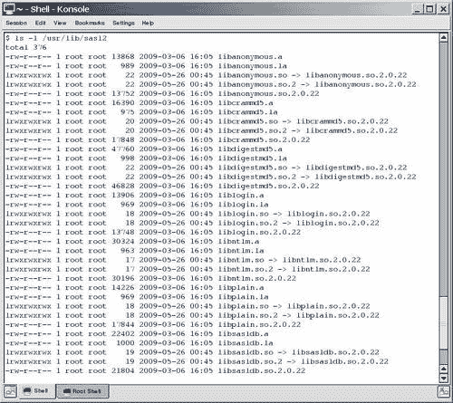
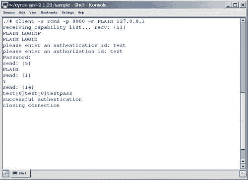
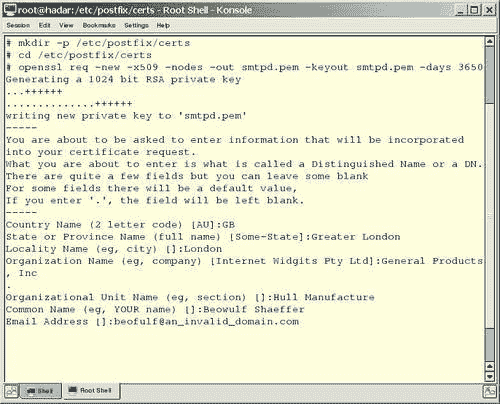

# 第五章：保护您的安装

对于您的 SMTP 服务器可能发生的所有事情，最糟糕的可能就是它被滥用为开放中继-一个未经您许可就向第三方中继邮件的服务器。 这将消耗大量带宽（可能会很昂贵），耗尽服务器资源（可能会减慢或停止其他服务），并且在时间和金钱上都可能很昂贵。 更严重的后果是，您的电子邮件服务器很可能最终会出现在一个或多个黑名单上，任何引用这些列表的电子邮件服务器都将拒绝接受来自您的服务器的任何邮件，直到您证明它是中继安全的。 如果您需要使用电子邮件来开展业务，您将面临一个大问题。

本章将解释如何：

+   保护 Postfix 免受中继滥用

+   区分静态分配和动态分配的 IP 地址

+   使用 Postfix 为静态 IP 地址配置中继权限

+   使用 Cyrus SASL 进行来自不可预测和动态 IP 地址的身份验证

+   使用安全套接字层防止用户名和密码以明文形式发送

+   配置 Postfix 以打败或至少减缓字典攻击，其中电子邮件发送到域内的许多电子邮件地址，希望其中一些能够到达有效的收件人

# 配置 Postfix 网络映射

当互联网主要由学术界使用时，没有人需要保护他们的邮件服务器免受中继滥用。 实际上，没有多少人拥有邮件服务器，因此允许其他没有电子邮件服务器的人使用您的服务器中继电子邮件被视为对他们的服务。

随着很快就被称为垃圾邮件的人的出现，情况发生了变化。 他们会滥用开放中继向大量远程收件人发送广告，使邮件服务器的所有者为流量付费。

这就是邮件管理员开始限制处理中继权限的时候。 他们过去只允许受信任的 IP 地址进行中继，拒绝来自其他 IP 地址的消息。 在这种情况下，受信任的 IP 地址是指可以静态关联（参见*静态 IP 范围*部分）到属于已知用户的主机的 IP 地址，或者已知属于受信任网络的 IP 地址范围。 这在大多数计算机上运行良好，因为大多数计算机都会有静态 IP 地址（IP 地址不会随时间改变）。

然而，当用户变得移动并使用拨号提供商访问互联网并希望在未知位置使用邮件服务器时，必须找到一种新的方法。 接入提供商会给这些用户动态 IP 地址，也就是说，他们的 IP 地址每次拨号时都会更改。

突然之间，用来区分好用户和坏用户的标准消失了。 邮件管理员要么必须放宽中继权限，允许整个潜在不受信任的 IP 网络使用中继，要么必须找到另一种处理动态 IP 地址中继的方法。 随着时间的推移，出现了几种处理动态 IP 地址中继的方法，例如：

+   SMTP-after-POP

+   虚拟专用网络

+   SMTP 身份验证

这三种方法在其要求和工作方式上有所不同。 以下各节详细介绍了每种方法。

## SMTP-after-POP

从历史上看，许多互联网连接都是拨号连接； 如果一个人希望发送电子邮件，他/她必须离线撰写邮件，启动拨号连接，然后告诉电子邮件客户端“发送和接收”邮件。 在这种情况下，邮件客户端首先发送邮件（通过 SMTP），然后检查服务器（通过 POP）是否有新邮件- SMTP 部分发生在 POP 部分之前。

这使得 SMTP 服务器无法找出发件人是否应该被允许中继，因为动态 IP 与使发件人成为受信任主机的任何其他标准无关。ISP 将能够识别拨号连接的 IP 地址作为他们自己的 IP 地址，并允许中继。来自他们自己网络之外的任何连接通常都会被拒绝。对于一个有着企业网络之外用户的小组织来说，要跟踪所有潜在的有效源 IP 地址是不可能的。

然而，交易可以被颠倒过来，检查邮件可以在发送邮件之前进行。检查邮件需要密码，这意味着用户可以被认证。流行的电子邮件客户端现在可以在启动时检查电子邮件，并定期检查新的电子邮件。如果 SMTP 服务器可以被告知特定 IP 地址的用户已通过 POP 服务器进行了身份验证，它可以允许中继。这就是 SMTP-after-POP 的本质。SMTP 服务器需要知道特定 IP 地址是否有经过身份验证的 POP 用户连接到它。

在最后一次连接到 POP 服务器之后，用户连接的有效时间必须有一个时间限制，否则一个旅行推销员可能会留下一百个不同的 IP 地址作为一个星期的有效中继主机，其中一个以后可能被垃圾邮件发送者占用。如今，电子邮件通常是在用户在线时编写的，并在定期自动检查新邮件之间发送。因此，发送到 SMTP 服务器的任何已编写的电子邮件通常会在进行 POP3 请求后的几分钟内发送，因此时间段可以很短，通常是几十分钟。

SMTP-after-POP 的缺点是，即使您只想允许中继消息，您也需要一个 POP 服务器。如果您不需要它，POP 服务器将使服务器的设置变得复杂。它还可能将您的 SMTP 服务器的更新绑定到您的 POP 服务器以保持兼容性。而且 POP 不是一种安全的身份验证方法，因为它可以被欺骗。

## 虚拟专用网络

**虚拟专用网络**（**VPN**）在验证 VPN 成功后，为客户端分配另一个私有 IP 地址。VPN 服务器将在已知的区块中分配 IP 地址。SMTP 服务器可以配置为允许来自分配给 VPN 的 IP 地址的邮件客户端进行中继。

再次强调，仅仅为了中继邮件而运行 VPN 需要大量的工作。只有在通过 VPN 提供额外的资源和服务时才会有回报，例如访问共享存储、数据库、内部网站或应用程序。

## SMTP 身份验证

**SMTP 身份验证**，也称为**SMTP AUTH**，使用不同的方法来识别有效的中继用户。它要求邮件客户端在 SMTP 对话期间向 SMTP 服务器发送用户名和密码，如果认证成功，它们可以进行中继。

它比运行一个完整的 POP 服务器或 VPN 要简单，而且它解决了在 SMTP 服务器中出现的问题。学会如何为一系列受信任的静态 IP 地址配置服务器后，您将了解如何提供 SMTP AUTH 所需的条件。

## 静态 IP 范围

默认情况下，Postfix 只允许来自自己的网络的主机中继消息。可信任的网络是您为网络接口配置的网络。运行`ifconfig -a`以获取已在系统上配置的列表。

如果您想更改默认设置，您可以使用`mynetworks_style`参数使用一些通用值，或者在`main.cf`中的`mynetworks`参数的值中提供显式的 IP 地址范围。

### 通用中继规则

要配置通用中继规则，您需要将以下值之一添加到`main.cf`中的`mynetworks_style`参数中：

+   `host:` 如果你配置`mynetworks_style = host`，Postfix 将只允许它运行的主机的 IP 地址发送消息到远程目的地。如果你只提供一个 webmail 界面，这可能是可以接受的，但没有桌面客户端能够连接。

+   `class:` 如果你配置`mynetworks_style = class`，Postfix 将允许它服务的网络类（A/B/C 网络类）中的每个主机进行中继。网络类指定了一系列 IP 地址，大约 255 个（C 类），65000 个（B 类），或者 1600 万（A 类）地址。

### 显式中继规则

显式中继规则允许更精细的中继权限。要使用这个，你需要理解用于指定网络地址范围的符号。如果你的网络跨越了从 192.168.1.0 到 192.168.1.255 的范围，那么这可以被指定为 192.168.1.0/24。24 被用作 32 位网络地址的前 24 位对于每个客户端都是相同的。如果你使用 DHCP 服务器（例如，在你的 Linux 服务器或为 DSL 连接提供防火墙），你的网络地址范围可能会被该设备定义，并且你应该在你的 Postfix 设置中使用适当的值。如果你手动分配 IP 地址并硬编码它们，你可以将每个 IP 地址单独指定为/32 范围，或者你可以确保每个 IP 地址在你分配它们后落入一个易于识别的范围内。A 类网络 10.0.0.0/8，B 类网络范围在 172.16.0.0 到 172.31.255.255 之间的 16 个，以及 C 类网络范围在 192.168.0.0 到 192.168.255.255 之间的 256 个。这些都可以用于私人网络地址，并且可以用于内部网络地址。

你可以在`main.cf`的`mynetworks`参数中添加一个远程和本地主机和/或网络的列表。如果你想允许本地主机、LAN 中的所有主机（在下面的示例中 IP 地址为`10.0.0.0`到`10.0.0.254`），以及你家中的静态 IP（这里为`192.0.34.166`）作为一个列表以 CIDR 表示，如下例所示：

```
mynetworks = 127.0.0.0/8, 10.0.0.0/24, 192.0.34.166/32

```

一旦你重新加载 Postfix，新的设置就会生效。

## 动态 IP 范围

在前一节中，你看到了如何允许静态 IP 地址进行中继。本节将展示如何配置 Postfix 允许动态 IP 地址进行中继。

尽管如本章介绍中所述，有几种方法可以实现这一点，但我们只会描述 SMTP 认证的方法。它提供了一个简单而稳定的机制，但设置并不简单。原因是 SMTP AUTH 并不是由 Postfix 自己处理的。另一个软件模块 Cyrus SASL 需要提供和处理 SMTP AUTH 给邮件客户端。你需要配置 Cyrus SASL，Postfix 以及它们之间的相互操作。

# Cyrus SASL

Cyrus SASL（[`cyrusimap.web.cmu.edu/`](http://cyrusimap.web.cmu.edu/)）是卡内基梅隆大学对 SASL 的实现。**SASL**（**简单认证和安全层**），是在 RFC 2222（[`www.ietf.org/rfc/rfc2222.txt`](http://www.ietf.org/rfc/rfc2222.txt)）中描述的认证框架。

SASL 旨在为任何需要使用或提供认证服务的应用程序提供一个与应用程序无关的认证框架。

Cyrus SASL 并不是今天唯一可用的 SASL，但它是第一个出现并在各种应用程序中使用的。例如 Postfix，Sendmail，Mutt 和 OpenLDAP。为了使用 Cyrus SASL，你需要了解它的架构，各个层是如何协同工作的，以及如何配置层的功能。

## SASL 层

SASL 由三层组成——**认证接口，机制**和**方法**。每个层都在处理认证请求时负责不同的工作。

认证过程通常经历以下步骤：

1.  客户端连接到 SASL 服务器。

1.  服务器宣布其能力。

1.  客户端识别在列出的功能中进行身份验证的选项。它还识别可以选择以处理身份验证的机制列表。

1.  客户端选择一种机制并计算出一条编码消息。消息的确切内容取决于所使用的机制。

1.  客户端向服务器发送命令`AUTH <机制> <编码消息>`。

1.  服务器接收身份验证请求并将其交给 SASL。

1.  SASL 识别机制并解码编码的消息。解码取决于所选择的机制。

1.  SASL 联系身份验证后端以验证客户端提供的信息。它确切地寻找什么取决于所使用的机制。

1.  如果它可以验证信息，它将告诉服务器，服务器应允许客户端中继消息。如果无法验证信息，它将告诉服务器，服务器可能拒绝客户端中继消息。在这两种情况下，服务器都会告诉客户端身份验证是否成功或失败。

让我们在以下部分更仔细地看一下 SASL 的三个层。

### 身份验证接口

在我们刚刚讨论的 1 到 5 步和第 9 步中，您可以看到客户端和服务器交换数据以处理身份验证。这部分通信发生在身份验证接口中。

尽管 SASL 定义了必须交换的数据，但它并没有指定数据在客户端和服务器之间如何通信。它将这留给它们特定的通信协议，这就是为什么 SASL 可以被各种服务使用，如 SMTP、IMAP 或 LDAP。

### 注意

SASL 并不像 SMTP 协议那样古老（参见：RFC 821）。它是后来在 RFC 2554 中添加的（[`www.ietf.org/rfc/rfc2554.txt`](http://www.ietf.org/rfc/rfc2554.txt)），该文档描述了**SMTP 身份验证的服务扩展**。

服务器提供 SMTP 身份验证以及其他功能的 SMTP 对话如下：

```
$ telnet mail.example.com 25
220 mail.example.com ESMTP Postfix
EHLO client.example.com
250-mail.example.com
250-PIPELINING
250-SIZE 10240000
250-VRFY
250-ETRN
250-ENHANCEDSTATUSCODES
250-AUTH PLAIN LOGIN CRAM-MD5 DIGEST-MD5 1)
250-AUTH=PLAIN LOGIN CRAM-MD5 DIGEST-MD5 2)
250 8BITMIME
QUIT

```

+   `250-AUTH PLAIN LOGIN CRAM-MD5 DIGEST-MD5 1):` 这一行告诉客户端服务器提供`SMTP AUTH`。它由两个逻辑部分组成。第一部分`250-AUTH`宣布了`SMTP AUTH`的功能，行的其余部分是客户端可以选择其首选项的可用机制的列表。

+   `250-AUTH=PLAIN LOGIN CRAM-MD5 DIGEST-MD5 2):` 这一行重复了上面的行，但在宣布 SMTP 身份验证的方式上有所不同。在`250-AUTH`之后，它添加了一个等号，就像这样`250-AUTH=`。这是为了那些不遵循 SASL 最终规范的损坏客户端。

### 机制

机制（如步骤 4 到 7 中描述的）代表 SASL 的第二层。它们确定身份验证期间使用的验证策略。SASL 已知有几种机制。它们在传输数据的方式和传输过程中的安全级别上有所不同。最常用的机制可以分为**明文**和**共享密钥**机制。

您永远不应该让 Postfix 向客户端提供的一种机制是**匿名**机制。我们将首先看一下这个。

+   `anonymous:` 匿名机制要求客户端发送任何它想要的字符串。它旨在允许匿名访问全局 IMAP 文件夹，但不适用于 SMTP。在 AUTH 行中提供`ANONYMOUS`的 SMTP 服务器最终会被滥用。您不应该在 SMTP 服务器中提供这个选项！Postfix 在默认配置中不提供匿名访问。

+   `plaintext:` Cyrus SASL 知道**PLAIN**和**LOGIN**明文机制。`LOGIN`与`PLAIN`几乎相同，但用于不完全遵循最终 SASL RFC 的邮件客户端，如 Outlook 和 Outlook Express。这两种机制都要求客户端计算用户名和密码的 Base64 编码字符串，并将其传输到服务器进行认证。明文机制的好处是几乎每个现在使用的邮件客户端都支持它们。坏消息是，如果在没有**传输层安全性**（**TLS**）的情况下使用明文机制，它们是不安全的。这是因为 Base64 编码的字符串只是编码，而不是加密——它很容易被解码。但是，在传输层加密会话期间使用明文机制传输一个是安全的。然而，如果使用 TLS，它将保护 Base64 编码的字符串免受窃听者的侵害。

+   `shared secret:` Cyrus SASL 中可用的共享密钥机制有**CRAM-MD5**和**DIGEST-MD5**。基于共享密钥的身份验证具有完全不同的策略来验证客户端。它基于客户端和服务器都共享一个秘密的假设。选择共享密钥机制的客户端只会告诉服务器特定的共享密钥机制的名称。然后，服务器将生成一个基于他们的秘密的挑战，并将其发送给客户端。然后客户端生成一个响应，证明它知道这个秘密。在整个认证过程中，既不会发送用户名也不会发送密码。这就是为什么共享密钥机制比之前提到的机制更安全。然而，最受欢迎的邮件客户端 Outlook 和 Outlook Express 不支持共享密钥机制。

### 注意

在异构网络上，您可能最终会同时提供明文和共享密钥机制。

现在已经介绍了机制，只剩下一层——方法层。这是配置和处理保存凭据的数据存储的查找的地方。下一节将告诉您更多关于方法的信息。

### 方法

SASL 所指的最后一层是方法层。方法由 Cyrus SASL 安装目录中的库表示。它们用于访问数据存储，Cyrus SASL 不仅将其称为方法，还将其称为认证后端。在 SASL 拥有的许多方法中，最常用的是：

+   `rimap:` `rimap`方法代表**远程 IMAP**，使 SASL 能够登录到 IMAP 服务器。它使用客户端提供的用户名和密码。成功的 IMAP 登录是成功的 SASL 认证。

+   `ldap:` `ldap`方法查询 LDAP 服务器以验证用户名和密码。如果查询成功，则认证成功。

+   `kerberos:` `kerberos`方法使用流行的 Kerberos 方法，并检查 Kerberos 票证。

+   `Getpwent/shadow:` `getpwent`和`shadow`方法访问系统的本地用户密码数据库，以验证认证请求。

+   `pam:` `pam`方法访问您在 PAM 设置中配置的任何 PAM 模块，以验证认证请求。

+   `sasldb:` `sasldb`方法读取甚至写入 Cyrus SASL 的名为 sasldb2 的数据库。通常，此数据库与 Cyrus IMAP 一起使用，但也可以在没有 IMAP 服务器的情况下使用。

+   `sql:` 此方法使用 SQL 查询来访问各种 SQL 服务器。目前支持的有 MySQL、PostgreSQL 和 SQLite。

现在您已经了解了 SASL 架构的三个层，是时候来看看处理它们之间所有请求的 SASL 服务了。它被称为**密码验证服务**，将在接下来的部分中进行描述。

### 密码验证服务

密码验证服务处理来自服务器的认证请求，进行特定于机制的计算，调用方法查询认证后端，最终将结果返回给发送认证请求的服务器。

### 注意

在 Postfix 的情况下，处理认证请求的服务器是`smtpd`守护程序。在*Postfix SMTP AUTH 配置*部分，您将学习如何配置`smtpd`守护程序以选择正确的密码验证服务。

Cyrus SASL 2.1.23 版本，目前的最新版本，为我们提供了三种不同的密码验证服务：

+   `saslauthd`

+   `auxprop`

+   `authdaemond`

您的邮件客户端可能成功使用的机制以及 Cyrus SASL 在认证期间可以访问的方法取决于您告诉 Postfix 使用的密码验证服务。

+   `saslauthd：saslauthd`是一个独立的守护程序。它可以作为 root 运行，这样就具有访问仅限 root 访问的源所需的特权。但是，`saslauthd`在支持的机制范围上受到限制；它只能处理明文机制。

+   `auxprop：auxprop`是**辅助属性插件**的简称，这是 Project Cyrus 邮件服务器架构中使用的术语。`auxprop`代表一个库，被提供认证的服务器使用。它以使用它的服务器的特权访问源。与`saslauthd`不同，`auxprop`可以处理 Cyrus SASL 认证框架中提供的每种机制。

+   `authdaemond：authdaemond`是一个专门编写的密码验证服务，用于使用 Courier 的`authdaemond`作为密码验证器。这样，您就可以访问 Courier 可以处理的任何认证后端。这个`auxprop`插件只能处理明文机制。

以下表格为您提供了密码验证服务（方法）可以处理的机制的概述：

| 方法/机制 | PLAIN | LOGIN | CRAM-MD5 | DIGEST-MD5 |
| --- | --- | --- | --- | --- |
| `saslauthd` | 是 | 是 | 否 | 否 |
| `auxprop` | 是 | 是 | 是 | 是 |
| `authdaemond` | 是 | 是 | 否 | 否 |

只有`auxprop`密码验证服务能够处理更安全的机制；`saslauthd`和`authdaemond`只能处理明文机制。

现在我们已经介绍了一些 Cyrus SASL 理论，现在是时候安装它了。这正是我们在接下来的部分要做的事情。

## 安装 Cyrus SASL

您的系统上很可能已经安装了 Cyrus SASL。但是，各种 Linux 发行版已经开始将 Cyrus SASL 安装在与典型默认位置`/usr/lib/sasl2`不同的位置。要检查 Cyrus SASL 是否安装在您的服务器上，可以运行软件包管理器并查询`cyrus-sasl`，或者运行`find`。对于 Red Hat 软件包管理器（在 Fedora Core 11 上）的查询，如果安装了 SASL，将返回类似于以下内容：

```
$ rpm -qa | grep sasl
cyrus-sasl-2.1.18-2.2
cyrus-sasl-devel-2.1.18-2.2
cyrus-sasl-plain-2.1.18-2.2
cyrus-sasl-md5-2.1.18-2.2

```

对于 Ubuntu 上的`dpkg`查询，如果安装了 SASL，将返回类似于以下内容：

```
$ dpkg -l | grep sasl
ii libsasl2-2 2.1.22.dfsg1-23ubuntu3
Cyrus SASL - authentication abstraction libr
ii libsasl2-modules 2.1.22.dfsg1-23ubuntu3
Cyrus SASL - pluggable authentication module2

```

查找`libsasl*.*`的结果如下：

```
$ find /usr -name 'libsasl*.*'
/usr/lib/libsasl.so.7.1.11
/usr/lib/libsasl2.so
/usr/lib/libsasl.la
/usr/lib/libsasl2.so.2.0.18
/usr/lib/libsasl.a
/usr/lib/libsasl2.a
/usr/lib/libsasl2.la
/usr/lib/sasl2/libsasldb.so.2.0.18
/usr/lib/sasl2/libsasldb.so.2
/usr/lib/sasl2/libsasldb.so
/usr/lib/sasl2/libsasldb.la
/usr/lib/libsasl.so.7
/usr/lib/libsasl.so
/usr/lib/libsasl2.so.2

```

这证明您的系统上已安装了 SASL。要验证 SASL 库的位置，只需像这样运行`ls`：



如前所述，您的发行版可能会将它们放在其他位置。在这种情况下，`find`方法将找到正确的位置，或者您的发行版的文档应该提供这些信息。

如果您没有安装 Cyrus SASL，您将需要使用软件包管理器获取它，或者手动安装它。

Cyrus 的最新版本通常可以从[`cyrusimap.web.cmu.edu/downloads.html`](http://cyrusimap.web.cmu.edu/downloads.html)下载。要下载 2.1.23 版本（始终选择最新的稳定版本，而不是开发版本），请执行以下命令：

```
$ cd /tmp
$ wget ftp://ftp.andrew.cmu.edu/pub/cyrus-mail/cyrus-sasl-2.1.23.tar.gz
$ tar xfz cyrus-sasl-2.1.23.tar.gz
$ cd cyrus-sasl-2.1.23

```

下载并解压源文件后，进入源目录并运行`configure`。典型的源配置如下：

```
$ ./configure \
installingCyrus SASL--with-plugindir=/usr/lib/sasl2 \
--disable-java \
--disable-krb4 \
--with-dblib=berkeley \
--with-saslauthd=/var/state/saslauthd \
--without-pwcheck \
--with-devrandom=/dev/urandom \
--enable-cram \
--enable-digest \
--enable-plain \
--enable-login \
--disable-otp \
--enable-sql \
--with-ldap=/usr \
--with-mysql=/usr \
--with-pgsql=/usr/lib/pgsql

```

这将配置 Cyrus SASL 以为您提供明文和共享密钥机制，并将构建`saslauthd`并为您提供包括对 MySQL 和 PostgreSQL 的支持在内的 SQL 方法。

`configure`脚本完成后，运行`make`，成为`root`，然后运行`make install`。

```
$ make
$ su -c "make install"
Password:

```

Cyrus SASL 将安装到`/usr/local/lib/sasl2`，但它将期望在`/usr/lib/sasl2`中找到库。您需要创建这样的符号链接：

```
$ su -c "ln -s /usr/local/lib/sasl2 /usr/lib/sasl2" 
Password:

```

最后，您需要检查 SASL 日志消息是否会被`syslogd`捕获并写入日志文件。Cyrus SASL 记录到`syslog auth`设施。检查您的`syslogd`配置，通常是`/etc/syslog.conf`，看看它是否包含捕获 auth 消息的行。

```
$ grep auth /etc/syslog.conf
auth,authpriv.* /var/log/auth.log
*.*;auth,authpriv.none -/var/log/syslog
auth,authpriv.none;\
auth,authpriv.none;\

```

如果找不到条目，请添加以下内容，保存文件，然后重新启动`syslogd`：

```
auth.* /var/log/auth.log

```

完成所有这些后，您就可以配置 SASL 了。

## 配置 Cyrus SASL

在返回到 Postfix 并处理特定于 Postfix 的 SMTP AUTH 设置之前，始终配置和测试 Cyrus SASL 非常重要。

遵循此过程的原因非常简单。一个无法进行身份验证的认证框架对于使用它的任何其他应用程序都没有帮助。当问题与 Cyrus SASL 相关时，您很可能会花费数小时来调试 Postfix。

要了解必须在何处以及如何配置 SASL，需要记住它是一个认证框架，旨在为许多应用程序提供其服务。这些应用程序可能对要使用的密码验证服务以及要提供的机制以及用于访问认证后端的方法有完全不同的要求。

Cyrus 是使用特定于应用程序的文件进行配置的。每个客户端应用程序的配置都在单独的文件中。当应用程序连接到 SASL 服务器时，它会发送其应用程序名称。Cyrus 使用此名称来查找要使用的正确配置文件。

在我们的情景中，需要 SMTP AUTH 的应用程序是 Postfix 中的`smtpd`守护程序。当它联系 SASL 时，它不仅发送认证数据，还发送其应用程序名称`smtpd`。

### 注意

应用程序名称`smtpd`是从 Postfix 发送到 Cyrus SASL 的默认值。您可以使用`smtpd_sasl_application_name`进行更改，但通常不需要。只有在运行需要不同 Cyrus SASL 配置的不同 Postfix 守护程序时才需要。

当 Cyrus SASL 接收到应用程序名称时，它将附加一个`.conf`并开始查找包含配置设置的配置文件。

默认情况下，`smtpd.conf`的位置是`/usr/lib/sasl2/smtpd.conf`，但出于各种原因，一些 Linux 发行版已经开始将其放在其他位置。在 Debian Linux 上，您将不得不在`/etc/postfix/sasl/smtpd.conf`中创建配置。Mandrake Linux 希望文件位于`/var/lib/sasl2/smtpd.conf`。所有其他人都知道它应该位于`/usr/lib/sasl2/smtpd.conf`。

检查您的系统，找出是否已经创建了`smtpd.conf`。如果没有，一个简单的`touch`命令（作为 root）将创建它：

```
# touch /usr/lib/sasl2/smtpd.conf

```

现在接下来的所有配置都将集中在`smtpd.conf`上。以下是我们将在其中放置的内容的快速概述：

+   我们想要使用的密码验证服务的名称

+   SASL 应将日志消息发送到日志输出的日志级别

+   在向客户端提供 SMTP AUTH 时，Postfix 应该宣传的机制列表

+   特定于所选密码验证服务的配置设置

最后，我们将配置密码验证服务应如何访问认证后端。这需要根据我们选择的密码验证服务来完成，并将在到达时进行解释。

### 选择密码验证服务

第一步配置是选择 SASL 在身份验证期间应使用的密码验证服务。告诉 SASL 应该处理身份验证的密码验证服务的参数是`pwcheck_method`。您可以提供的值是：

+   `saslauthd`

+   `auxprop`

+   `authdaemond`

根据您选择的密码验证服务，您将不得不添加正确的值。名称应该说明情况，并告诉您将调用哪个密码验证服务。使用`saslauthd`的配置将在`smtpd.conf`中添加以下行：

```
pwcheck_method: saslauthd

```

### 选择日志级别

Cyrus SASL 的日志处理不一致。Cyrus SASL 将记录取决于密码验证服务和正在使用的方法。定义日志级别的参数是`log_level`。在设置期间合理的设置将是日志级别 3。

```
log_level: 3

```

此行应添加到`smtpd.conf`中。

以下是 Cyrus SASL 知道的所有日志级别的列表：

| log_level value | Description |
| --- | --- |
| `0` | 无日志 |
| `1` | 记录异常错误；这是默认设置 |
| `2` | 记录所有身份验证失败 |
| `3` | 记录非致命警告 |
| `4` | 比 3 更详细 |
| `5` | 比 4 更详细 |
| `6` | 记录内部协议的跟踪 |
| `7` | 记录内部协议的跟踪，包括密码 |

### 选择有效的机制

您的下一步将是选择 Postfix 在向客户端广告 SMTP 身份验证时可以提供的机制。在 Cyrus SASL 中配置有效机制列表的参数是`mech_list`。这些机制的名称与我们在*机制*部分中介绍它们时使用的名称完全相同。

重要的是设置`mech_list`参数，并且只列出您的密码验证服务可以处理的机制。如果不这样做，Postfix 将提供 SASL 提供的所有机制，如果您的邮件客户端选择 SASL 密码验证服务无法处理的机制，身份验证将失败。

### 注意

请记住，密码验证服务`saslauthd`和`authdaemond`只能处理两种明文机制——`PLAIN`和`LOGIN`。因此，这些密码验证服务的`mech_list`必须只包含`PLAIN`和`LOGIN`这两个值。任何能够处理更强机制的邮件客户端都会优先选择更强的机制。它会进行计算并将结果发送给服务器。服务器将无法进行身份验证，因为`Saslauthd`和`authdaemond`都无法处理非明文机制。

以下示例将在`smtpd.conf`中为`saslauthd`定义有效机制：

```
mech_list: PLAIN LOGIN

```

任何`auxprop`密码验证服务的有效机制列表可以进一步列出以下机制：

```
mech_list: PLAIN LOGIN CRAM-MD5 DIGEST-MD5

```

### 注意

此列表中机制的顺序不会影响客户端选择的机制。选择哪种机制取决于客户端；通常会选择提供最强加密的机制。

在接下来的部分中，我们将看看如何配置密码验证服务以选择认证后端，以及如何提供额外信息以选择相关数据。如前所述，这由三个密码验证服务以不同方式处理。我们将分别查看每个密码验证服务。

#### saslauthd

在使用`saslauthd`之前，您需要检查它是否能够在`saslauthd`称为`state dir`的目录中建立套接字。请仔细检查，因为与套接字相关的两个常见问题是：

+   **该目录不存在：**在这种情况下，`saslauthd`将停止运行，并且您将找到指示缺少目录的日志消息。

+   **该目录对于除`saslauthd`之外的应用程序是不可访问的：**在这种情况下，您将在邮件日志中找到指示`smtpd`无法连接到套接字的日志消息。

要解决这些问题，您首先需要找出`saslauthd`希望建立套接字的位置。只需像示例中那样以 root 身份启动它，并寻找包含`run_path`的行：

```
# saslauthd -a shadow -d

```

```
saslauthd[3610] :main : num_procs : 5
saslauthd[3610] :main : mech_option: NULL
saslauthd[3610] :main : run_path : /var/run/saslauthd
saslauthd[3610] :main : auth_mech : shadow
saslauthd[3610] :main : could not chdir to: /var/run/saslauthd
saslauthd[3610] :main : chdir: No such file or directory
saslauthd[3610] :main : Check to make sure the directory exists and is
saslauthd[3610] :main : writeable by the user, this process runs as—If you get no errors, the daemon will start, but the -d flag means that it will not start in the background; it will tie up your terminal session. In this case, press *Ctrl+C* to terminate the process.

```

如前面的示例所示，`saslauthd`希望访问`/var/run/saslauthd`作为`run_path`。由于它无法访问该目录，它立即退出。现在有两种方法可以解决这个问题。这取决于您是从软件包中获取`saslauthd`还是从源代码安装它。

在第一种情况下，软件包维护者很可能使用默认设置构建了`saslauthd`；选择不同的位置作为`state dir`并配置`init-script`以通过给出`-m /path/to/state_dir`选项来覆盖默认路径。

在 Debian 系统中，您通常会在`/etc/default/saslauthd`中找到命令行选项。在 Red Hat 系统中，您通常会在`/etc/sysconfig/saslauthd`中找到传递给`saslauthd`的命令行选项。以下清单为您提供了 Fedora Core 2 的设置概述：

```
# Directory in which to place saslauthd's listening socket, pid file, and so
# on. This directory must already exist.
SOCKETDIR=/var/run/saslauthd
# Mechanism to use when checking passwords. Run "saslauthd -v" to get a list
# of which mechanism your installation was compiled to use.
MECH=shadow
# Additional flags to pass to saslauthd on the command line. See saslauthd(8)
# for the list of accepted flags.
FLAGS=

```

就大多数 Linux 发行版而言，`state dir`的典型位置要么是`/var/state/saslauthd`，要么是`/var/run/saslauthd`。

现在考虑手动构建`saslauthd`的情况。然后，您应该创建一个与您在执行`configure`脚本时使用的`--with-saslauthd`参数相匹配的目录。

在 SASL 配置示例中，`--with-saslauthd`的值为`/var/state/saslauthd`。创建此目录并使其对 root 用户和 postfix 组可访问，如下所示：

```
# mkdir /var/state/saslauthd
# chmod 750 /var/state/saslauthd
# chgrp postfix /var/state/saslauthd

```

一旦您验证了`saslauthd`可以在您的`state dir`中创建套接字和`pid`文件，您可以开始配置`saslauthd`以访问您选择的身份验证后端。

### 注意

以下示例假定您不必为`saslauthd`提供额外的运行路径。如果需要，请将其添加到给出的示例中。

##### 使用 IMAP 服务器作为身份验证后端

指定`-a`选项以及值`rimap`，使 Cyrus SASL 使用邮件客户端提供的凭据登录到 IMAP 服务器。此外，您必须使用`-O`选项告诉`saslauthd`它应该转到哪个 IMAP 服务器，如下所示：

```
# saslauthd -a rimap -O mail.example.com

```

成功登录到 IMAP 服务器后，`saslauthd`将向 Postfix 报告身份验证成功，Postfix 可能允许邮件客户端将凭据交给中继。

##### 使用 LDAP 服务器作为身份验证后端

与 IMAP 服务器验证凭据比与 LDAP 服务器验证凭据稍微复杂一些。它需要更多的配置，这就是为什么您不会在命令行上给出所有选项给`saslauthd`，而是将它们放入配置文件中。默认情况下，`saslauthd`期望将 LDAP 配置位于`/usr/local/etc/saslauthd.conf`。如果选择不同的位置，您需要在命令行上声明它。

```
# saslauthd -a ldap -O /etc/cyrussasl/saslauthd.conf

```

在前面的示例中，值`ldap`告诉`saslauthd`转到 LDAP 服务器，`-O`选项提供了配置文件的路径。您的配置文件可能包含以下参数：

```
ldap_servers: ldap://127.0.0.1/ ldap://172.16.10.7/
ldap_bind_dn: cn=saslauthd,dc=example,dc=com
ldap_bind_pw: Oy6k0qyR
ldap_timeout: 10
ldap_time_limit: 10
ldap_scope: sub
ldap_search_base: dc=people,dc=example,dc=com
ldap_auth_method: bind
ldap_filter: (|(&(cn=%u)(&(uid=%u@%r)(smtpAuth=Y)))
ldap_debug: 0
ldap_verbose: off
ldap_ssl: no
ldap_start_tls: no
ldap_referrals: yes

```

正如您可能已经预料到的那样，您将不得不调整设置以适应您的 LDAP 树和其他特定于您的 LDAP 服务器的设置。要获取所有 LDAP 相关参数的完整列表（这里列出的远不止这些），请查看随 Cyrus SASL 源代码一起提供的`LDAP_SASLAUTHD readme`，它位于`saslauthd`子目录中。

##### 使用本地用户帐户

这是大多数人使用`saslauthd`的配置。您可以配置`saslauthd`从本地密码文件或支持影子密码的系统上的本地影子密码文件中读取。

要从`/etc/passwd`中读取，请使用`-a getpwent`选项，如下所示：

```
# saslauthd -a getpwent

```

大多数现代 Linux 发行版不会将密码存储在`/etc/passwd`中，而是存储在`/etc/shadow`中。如果要让`saslauthd`从`/etc/shadow`中读取，请像这样以 root 身份运行它：

```
# saslauthd -a shadow

```

##### 使用 PAM

还可以使用**PAM（可插入认证模块）**作为认证后端，后者又必须配置为访问其他认证后端。首先像这样运行`saslauthd`：

```
# saslauthd -a pam

```

然后创建一个`/etc/pam.d/smtp`文件或在`/etc/pam.conf`中添加一个部分，并向其中添加特定于 PAM 的设置。如果您从软件包中安装了 Cyrus SASL，那么您很有可能已经有了这样一个文件。例如，在 Red Hat 上，它看起来像这样：

```
#%PAM-1.0
auth required pam_stack.so service=system-auth
account required pam_stack.so service=system-auth

```

### 注意

配置文件的名称必须是`smtp`。这在`RFC 2554`中已经定义，其中指出 SASL 在 SMTP 上的服务名称是`smtp`。postfix `smtpd`守护程序将`smtp`的值作为服务名称传递给 Cyrus SASL。然后`saslauthd`将其传递给 PAM，后者将在`smtp`文件中查找认证指令。

#### auxprop

**辅助属性插件**（或**auxprop)**的配置与`saslauthd`不同。您只需在`smtpd.conf`中添加特定于 auxprop 的设置，而不是传递命令行选项。您在`smtpd.conf`中设置的任何 auxprop 配置都应以以下三行开头：

```
log_level: 3
pwcheck_method: auxprop
mech_list: PLAIN LOGIN CRAM-MD5 DIGEST-MD5

```

要告诉 Cyrus SASL 要使用哪个插件，您需要向配置中添加一个额外的参数。该参数称为`auxprop_plugin`，我们将在以下部分中研究其用法。

##### 配置 sasldb 插件

auxprop 插件`sasldb`是 Cyrus SASL 的默认插件，即使您没有设置`auxprop_plugin`参数，它也会使用`sasldb`。`sasldb`是 SASL 自己的数据库，可以使用`saslpasswd2`实用程序进行操作。

### 注意

这往往会激怒那些尝试设置不同插件并在其配置中出现错误的人。如果 Cyrus SASL 使用默认配置而不是所需的配置，它将失败。当您收到一个错误消息，说 Cyrus SASL 找不到`sasldb`时，这可能是您配置错误的错误（除非您选择故意配置`sasldb`），第一步应该是检查您的配置文件。

要使用`sasldb`，首先需要创建一个`sasldb`数据库。使用以下命令作为 root 创建一个`sasldb2`文件并添加一个用户。

```
# saslpasswd2 -c -u example.com username

```

此命令将创建一个`sasldb2`文件，并将一个用户名为`example.com`的用户添加到其中。您需要特别注意添加的领域，因为它将成为邮件客户端稍后必须发送的用户名的一部分。

### 注意

领域是 Kerberose 基础设施概念的一部分。Kerberose 是一种分布式的、加密的认证协议。通过添加领域，您可以定义用户可以在其中执行操作的上下文（例如，域或主机）。如果您不添加领域，`saslpasswd2`将默认添加服务器的主机名。

现在您已经创建了数据库并添加了一个用户，您需要更改对`sasldb`的访问权限，以便 Postfix 也可以访问数据库。只需像这样将`postfix`组对`sasldb2`的访问权限：

```
# chgrp postfix /etc/sasldb2

```

不要因为`sasldb`被称为`sasldb2`而感到困惑。当 Cyrus SASL 主要版本 2.x 推出时，`sasldb`的格式发生了变化。出于兼容性的原因，新的`sasldb`文件被称为`sasldb2`。创建完数据库后，您需要告诉 Cyrus SASL 使用它。像这样在`smtpd.conf`中添加`auxprop_plugin`参数：

```
auxprop_plugin: sasldb

```

这就是您需要做的一切，您应该准备好开始测试了（请参阅*测试 Cyrus SASL 认证*部分）。如果出于任何原因，您需要将`sasldb`放在与默认位置不同的位置，您可以使用以下附加参数：

```
sasldb_path: /path/to/sasldb2

```

##### 配置 sql 插件

**sql auxprop**插件是一个通用插件，可以让您访问 MySQL、PostgreSQL 和 SQLite。我们将以配置 sql 插件访问 MySQL 数据库为例进行说明。访问其他两个数据库的配置几乎相同，只有一个我们将注意到的例外。

首先，您需要创建一个数据库。当然，这取决于您使用的数据库。连接到 MySQL，如果还没有数据库，则创建一个数据库。

```
mysql> CREATE DATABASE `mail`;

```

然后添加一个包含所有 SASL 用户身份验证所需内容的表。它看起来类似于这样：

```
CREATE TABLE `users` (
`id` int(11) unsigned NOT NULL auto_increment,
`username` varchar(255) NOT NULL default '0',
`userrealm` varchar(255) NOT NULL default 'example.com',
`userpassword` varchar(255) NOT NULL default 't1GRateY',
`auth` tinyint(1) default '1',
PRIMARY KEY (`id`),
UNIQUE KEY `id` (`id`)
) TYPE=MyISAM COMMENT='Users';

```

该表具有用户名、用户领域、用户密码和一个额外的`auth`字段，我们稍后将使用它来确定用户是否可以中继。这样我们可以将该表用于其他身份验证目的，例如，与 Apache 的`mysql`模块一起，用于授予对`httpd`上特定文件夹的访问权限。

### 提示

不要忘记为`userpassword`设置默认值，如前面的示例所示，否则获取中继权限所需的只是发送一个有效的用户名。

创建表后，为测试目的添加一个用户，如下所示：

```
INSERT INTO `users` VALUES (1,'test','example.com','testpass',0);

```

然后为 Postfix 添加一个用户，以便访问 MySQL 的用户数据库，如下所示：

```
mysql> CONNECT mysql;
mysql> INSERT INTO user VALUES ('localhost','postfix','','Y','Y','Y','Y','Y','Y','Y','Y','Y','Y','Y','Y','Y','Y');
mysql> UPDATE mysql.user SET password=PASSWORD("bu0tt^v") WHERE user='postfix' AND host='localhost';
mysql> GRANT SELECT, UPDATE ON mail.users TO 'postfix'@'localhost';
mysql> FLUSH PRIVILEGES;

```

设置 MySQL 完成后，您需要向`smtpd.conf`添加`sql auxprop-specific`参数。可用的参数如下：

+   `sql_engine:` 指定数据库类型。您可以选择`mysql, pgsql`或`sqlite`。在本示例中，我们使用`mysql`。如果选择不同的数据库，您需要相应地更改此值。

+   `sql_hostnames:` 指定数据库服务器名称。您可以指定一个或多个由逗号分隔的 FQDN 或 IP 地址。即使选择`localhost`，SQL 引擎也会尝试通过套接字进行通信。

+   `sql_database:` 告诉 Cyrus SASL 要连接的数据库的名称。

+   `sql_user:` 您在此处设置的值必须与连接到数据库的用户的名称匹配。

+   `sql_passwd:` 您在此处设置的值必须与连接到数据库的用户的密码匹配。它必须是明文密码。

+   `sql_select:` `sql_select`参数定义了用于验证用户的`SELECT`语句。

+   `sql_insert:` `sql_insert`参数定义了一个`INSERT`语句，允许 Cyrus SASL 在 SQL 数据库中创建用户。您将使用`saslpasswd2`程序来执行此操作。

+   `sql_update:` `sql_update`参数定义了`UPDATE`语句，允许 Cyrus SASL 修改数据库中的现有条目。如果您选择配置此参数，您将不得不与`sql_insert`参数结合使用。

+   `sql_usessl:` 您可以设置`yes, 1, on`或`true`来启用 SSL 以通过加密连接访问 MySQL。默认情况下，此选项为`off`。

将所有参数组合在一起的简单配置如下：

```
# Global parameters
log_level: 3
pwcheck_method: auxprop
mech_list: PLAIN LOGIN CRAM-MD5 DIGEST-MD5
# auxiliary Plugin parameters
auxprop_plugin: sql
sql_engine: mysql
sql_hostnames: localhost
sql_database: mail
sql_user: postfix
sql_passwd: bu0tt^v
sql_select: SELECT %p FROM users WHERE username = '%u' AND userrealm = '%r' AND auth = '1'
sql_usessl: no

```

如您所见，`sql_select`语句中使用了宏。它们的含义是：

+   `%u:` 此宏是要在身份验证期间查询的用户名的占位符。

+   `%p:` 此宏是密码的占位符。

+   `%r:` `r`代表领域，客户端提供的领域将插入到`%r`中。

+   `%v:` 此宏仅与`sql_update`或`sql_insert`语句结合使用。它表示应替换现有值的提交值。

### 提示

特别注意标记。必须使用单引号(')引用宏。

配置完成。如果您使用`auxprop`并按照到此为止的说明进行操作，您已准备好开始测试，并且可以跳过关于`authdaemond`的下一部分。

#### authdaemond

`authdaemond`是专门为与 Courier IMAP 配合使用而创建的。如果您配置 Cyrus SASL 使用`authdaemond`，它将连接到 Courier authlib 的`authdaemond`套接字，询问 Courier authlib 验证邮件客户端发送的凭据。一方面，Cyrus SASL 受益于 Courier authlib 可以用于用户验证的各种后端，但另一方面，Cyrus SASL 的`authdaemond`密码验证服务仅限于明文机制，这不如使用`auxprop`插件时所获得的好处多。

设置 authdaemond 密码验证服务非常简单。我们将在接下来的部分中看一下它。

##### 设置 authdaemond 密码验证服务

您的第一步是配置 Postfix 以使用`authdaemond`密码验证服务。与`saslauthd`或`auxprop`一样，您将`pwcheck_method`参数添加到您的`smtpd.conf`中，并选择它为`authdaemond`。

```
log_level: 3
pwcheck_method: authdaemond
mech_list: PLAIN LOGIN

```

由于`authdaemond`的限制，您还必须将机制列表限制为`PLAIN`和`LOGIN`——仅有的明文机制。

##### 配置 authdaemond 套接字路径

您需要告诉 Cyrus SASL 它可以在哪里找到由 Courier authlib 的`authdaemond`创建的套接字。

使用`authdaemond_path`参数提供包括套接字名称在内的完整路径。

```
authdaemond-path: /var/spool/authdaemon/socket

```

最后检查`authdaemond`目录的权限，并验证至少用户`postfix`可以访问该目录。完成后，您就可以开始测试了。

# 测试 Cyrus SASL 身份验证

没有测试工具，但您可以使用示例应用程序`sample-server`和`sample-client`来测试身份验证，而不会有其他应用程序（例如 Postfix）干扰测试。如果您从源代码构建了 Cyrus SASL，您可以在 Cyrus SASL 源代码的`sample`子目录中找到它们。基于 Fedora 的 Linux 发行版将示例包含在`cyrus-sasl-devel`软件包中，因此如果可用，您应该安装该软件包。基于 Debian 的 Linux 发行版没有类似的软件包，因此您现在必须自行构建它们。

要仅构建示例，请找到、下载并提取与您的软件包管理器安装相匹配的 Cyrus SASL 版本的发布版。要定位并安装源代码，请按照*Cyrus SASL 安装*部分中描述的说明进行操作。然后，不要发出`make install`命令，而是发出以下命令：

```
# cd sample
# make

```

我们将使用这些示例来测试我们在`smtpd.conf`中创建的 Cyrus SASL 配置。但是，这些程序不希望在`smtpd.conf`中找到它们的配置，而是在`sample.conf`中找到。我们将简单地创建一个从`sample.conf`到`smtpd.conf`的符号链接以满足要求：

```
# ln -s /usr/lib/sasl2/smtpd.conf /usr/lib/sasl2/sample.conf

```

接下来，我们需要启动服务器应用程序以便它监听传入的连接。像这样启动服务器：

```
$ ./server -s rcmd -p 8000
trying 2, 1, 6
trying 10, 1, 6
bind: Address already in use

```

不要担心`bind: Address already in use`的消息。服务器继续运行表明它已经成功监听指定的端口。这是因为应用程序启用了 IPv6，而底层系统不支持 IPv6。

如果您收到类似`./server: No such file or directory`的错误，请检查您是否已从您的发行版安装了`cyrus-sasl-devel`软件包，或者您从源代码构建的工作是否正确，并且您是否在正确的目录中。

服务器将在端口`8000`上监听传入的连接。接下来打开一个新的终端，并使用相同的端口和机制`PLAIN`启动客户端，并指向您的服务器实用程序应该在那里监听的`localhost`。在提示时，输入`test, test`和`testpass`，这些是测试服务器提供的有效值。成功的身份验证看起来像这样：



您应该能够在`auth`日志中看到一些日志记录。如果您要使用`saslauthd`，请在调试模式下在单独的终端上启动它，您将能够像这样跟踪身份验证：

```
# saslauthd -m /var/run/saslauthd -a shadow -d

```

```
saslauthd[4547] :main : num_procs : 5
saslauthd[4547] :main : mech_option: NULL
saslauthd[4547] :main : run_path : /var/run/saslauthd
saslauthd[4547] :main : auth_mech : shadow
saslauthd[4547] :ipc_init : using accept lock file: /var/run/saslauthd/mux.accept
saslauthd[4547] :detach_tty : master pid is: 0
saslauthd[4547] :ipc_init : listening on socket: /var/run/saslauthd/mux
saslauthd[4547] :main : using process model
saslauthd[4548] :get_accept_lock : acquired accept lock
saslauthd[4547] :have_baby : forked child: 4548
saslauthd[4547] :have_baby : forked child: 4549
saslauthd[4547] :have_baby : forked child: 4550
saslauthd[4547] :have_baby : forked child: 4551
saslauthd[4548] :rel_accept_lock : released accept lock
saslauthd[4548] :do_auth : auth success: [user=test] [service=rcmd] [realm=] [mech=shadow]
saslauthd[4548] :do_request : response: OK

```

saslauthd[4548] :get_accept_lock : acquired accept lock

如果您能够成功进行身份验证，请继续配置 Postfix 中的`SMTP AUTH`。如果您的身份验证失败，请跟随日志并按照之前讨论的设置和配置 SASL 的说明进行迭代。

# 配置 Postfix SMTP AUTH

现在，在设置和配置 Cyrus SASL 后，配置 Postfix 中的 `SMTP AUTH` 就变得非常简单了。您需要做的第一件事是检查 Postfix 是否构建支持 SMTP 身份验证。使用 `ldd` 实用程序检查 Postfix `smtpd` 守护程序是否已链接到 `libsasl`：

```
# ldd /usr/libexec/postfix/smtpd | grep libsasl
libsasl2.so.2 => /usr/lib/libsasl2.so.2 (0x00002aaaabb6a000)

```

如果没有任何输出，您可能需要重新构建 Postfix。阅读 Postfix `README_FILES` 目录中的 `SASL_README`，以获取有关必须在 `CCARGS` 和 `AUXLIBS` 语句中包含的详细信息。

## 准备配置

一旦您验证了 Postfix 支持 `SMTP AUTH`，您需要验证在配置 `SMTP AUTH` 时 `smtpd` 守护程序是否未运行 `chrooted`。许多人在意识到原因是 `chroot` 监狱之前，花费数小时配置无法访问 `saslauthd` 套接字的 `chrooted` Postfix。不运行 `chrooted` 的 Postfix `smtpd` 守护程序在 `/etc/postfix/master.cf` 中的 `chroot` 列中有一个 `n`：

```
# ==================================================================
# service type private unpriv chroot wakeup maxproc command + args
# (yes) (yes) (yes) (never) (100)
# ==================================================================
smtp inet n - n - - smtpd

```

如果 Postfix 在更改了 `smtpd` 的 `chroot` 设置后正在运行 `chrooted`，请重新加载它并转到 `main.cf`。

## 启用 SMTP AUTH

您要做的第一件事是通过添加 `smtpd_sasl_auth_enable` 参数并将其设置为 `yes` 来启用 `SMTP AUTH`。

```
smtpd_sasl_auth_enable = yes

```

这将使 Postfix 向使用 `ESMTP` 的客户端提供 `SMTP AUTH`，但在开始测试之前，您仍然需要配置一些设置。

## 设置安全策略

您将不得不决定 Postfix 应该使用 `smtpd_sasl_security_options` 参数提供哪些机制。此参数接受以下一个或多个值的列表：

+   `noanonymous:` 您应该始终设置此值，否则 Postfix 将向邮件客户端提供匿名身份验证。允许匿名身份验证将使您成为开放中继，并且不应该用于 SMTP 服务器。

+   `noplaintext:` `noplaintext` 值将阻止 Postfix 提供明文机制 `PLAIN` 和 `LOGIN`。通常情况下，您不希望这样做，因为大多数广泛使用的客户端只支持 `LOGIN`。如果设置了此选项，我们将无法对一些客户端进行身份验证。

+   `noactive:` 此设置排除了容易受到主动（非字典）攻击的 SASL 机制。

+   `nodictionary:` 此关键字排除了所有可以通过字典攻击破解的机制。

+   `mutual_auth:` 这种形式的身份验证要求服务器向客户端进行身份验证，反之亦然。如果设置了它，只有能够执行此形式或身份验证的服务器和客户端才能进行身份验证。这个选项几乎从不使用。

`smtpd_sasl_security_options` 参数的常见设置将在 `main.cf` 中添加以下行：

```
smtpd_sasl_security_options = noanonymous

```

这将防止匿名身份验证，并允许所有其他身份验证。

## 包括破损的客户端

接下来，您需要决定 Postfix 是否应该向破损的客户端提供 `SMTP AUTH`。在 `SMTP AUTH` 的上下文中，破损的客户端是指如果身份验证已按照 RFC 2222 要求的方式提供，它们将不会识别服务器的 SMTP AUTH 能力。相反，它们遵循了 RFC 草案，在显示 SMTP 通信期间的 `SMTP AUTH` 能力行中具有额外的 `=`。在破损的客户端中，包括几个版本的 Microsoft Outlook Express 和 Microsoft Outlook。要解决此问题，只需像这样向 `main.cf` 添加 `broken_sasl_auth_clients` 参数：

```
broken_sasl_auth_clients = yes

```

当 Postfix 列出其功能给邮件客户端时，将打印一个额外的 `AUTH` 行。此行将在其中具有额外的 `=`，并且破损的客户端将注意到 `SMTP AUTH` 能力。

最后，如果要限制可以中继到具有相同领域的用户组，添加 `smtpd_sasl_local_domain` 参数，并提供该值作为领域，如下所示：

```
smtpd_sasl_local_domain = example.com

```

Postfix 将在成功通过邮件客户端发送的所有用户名后附加该值，成功限制中继到那些用户名中包含 `smtpd_sasl_local_domain` 值的用户。

完成所有配置步骤后，重新加载 Postfix 以使设置生效并开始测试。作为 root 用户，发出以下命令：

```
# postfix reload

```

# 测试 SMTP AUTH

在测试 SMTP 身份验证时，不要使用常规邮件客户端，因为邮件客户端可能会引入一些问题。而是使用 Telnet 客户端程序并在 SMTP 通信中连接到 Postfix。您将需要以 Base64 编码形式发送测试用户的用户名和密码，因此第一步将是创建这样的字符串。使用以下命令为用户`test`使用密码`testpass`创建 Base64 编码的字符串：

```
$ perl -MMIME::Base64 -e 'print encode_base64("test\0test\0testpass");'
dGVzdAB0ZXN0AHRlc3RwYXNz

```

### 注意

请注意，`\0`将用户名与密码分开，用户名将需要重复两次。这是因为 SASL 期望两个可能不同的用户名（`userid, authid`）来支持未用于 SMTP 身份验证的附加功能。

还要记住，如果您的用户名或密码包含`@`或`$`字符，您将需要使用前置的`\`进行转义，否则 Perl 将解释它们，这将导致一个无法正常工作的 Base64 编码的字符串。

一旦您手头有 Base64 编码的字符串，使用 Telnet 程序连接到服务器的端口`25`，如下所示：

```
$ telnet mail.example.com 25
220 mail.example.com ESMTP Postfix
EHLO client.example.com
250-mail.example.com
250-PIPELINING
250-SIZE 10240000
250-VRFY
250-ETRN
250-STARTTLS
250-AUTH LOGIN PLAIN DIGEST-MD5 CRAM-MD5
250-AUTH=LOGIN PLAIN DIGEST-MD5 CRAM-MD5
250-XVERP
250 8BITMIME
AUTH PLAIN dGVzdAB0ZXN0AHRlc3RwYXNz
235 Authentication successful
QUIT
221 Bye

```

您可以看到在前面的示例中，身份验证是成功的。首先，邮件客户端在介绍时发送了`EHLO`，而 Postfix 则以一系列功能的列表做出了回应。如果您像我们的示例中所做的那样将`broken_sasl_auth_clients`参数设置为`yes`，您还会注意到包含`=`的额外`AUTH`行。

认证发生在客户端发送`AUTH`字符串以及它想要使用的机制时，对于明文机制，还附加了 Base64 编码的字符串。如果您的身份验证没有成功，但您能够在 SASL 测试期间进行身份验证，请查看`main.cf`中的参数，并仔细检查`master.cf`中`smtpd`的`chroot`状态。

# 为经过身份验证的客户端启用中继

如果身份验证成功，我们只需告诉 Postfix 允许已经经过身份验证的用户中继消息。这是通过编辑`main.cf`并在`smtpd_recipient_restrictions`的限制列表中添加`permit_sasl_authenticated`选项来完成的，如下所示：

```
smtpd_recipient_restrictions =
...
permit_sasl_authenticated
permit_mynetworks
reject_unauth_destination
...

```

重新加载 Postfix 并开始使用真实的邮件客户端进行测试。如果可能，请确保其 IP 地址不是`mynetworks`的一部分，因为 Postfix 可能被允许中继的原因不是因为`SMTP AUTH`成功。您可能希望在测试期间将中继限制为仅限服务器。更改`mynetwork_classes = host`设置，以便来自其他计算机的客户端不会自动成为 Postfix 网络的一部分。

如果您仍然遇到`SMTP AUTH`问题，请查看`saslfinger`（[`postfix.state-of-mind.de/patrick.koetter/saslfinger/`](http://postfix.state-of-mind.de/patrick.koetter/saslfinger/)）。这是一个脚本，它收集有关`SMTP AUTH`配置的各种有用信息，并为您提供输出，您可以在向 Postfix 邮件列表询问时附加到您的邮件中。

# 保护明文机制

我们已经注意到，使用明文机制的`SMTP AUTH`实际上并不安全，因为在身份验证期间发送的字符串仅仅是编码而不是加密。这就是**传输层安全**（**TLS**）派上用场的地方，因为它可以保护编码字符串的传输免受好奇的眼睛。

## 启用传输层安全

要启用 TLS，您必须生成密钥对和证书，然后修改 postfix 配置以识别它们。

要生成 SSL 证书，并使用 SSL，您需要安装 OpenSSL 软件包。在许多情况下，这将被安装，否则请使用您的发行版软件包管理器进行安装。

要创建证书，请以 root 身份发出以下命令：



这将在`/etc/postfix/certs`中创建名为`smtpd.key`和`smtpd.crt`的证书。将`smtpd_use_tls`参数添加到`main.cf`并将其设置为`yes`：

```
smtpd_use_tls = yes

```

然后，您需要告诉`smtpd`在哪里可以找到密钥和证书，通过添加`smtpd_tls_key_file`和`smtpd_tls_cert_file`参数：

```
smtpd_tls_key_file = /etc/postfix/certs/smtpd.key
smtpd_tls_cert_file = /etc/postfix/certs/smtpd.crt

```

发送证书以证明其身份的邮件服务器还必须随时保留认证机构的公共证书的副本。假设您已经将其添加到服务器的本地 CA 根存储中的`/usr/share/ssl/certs`，使用以下参数：

```
smtpd_tls_CAfile = /usr/share/ssl/certs/ca-bundle.crt

```

如果 CA 证书不是在一个文件中，而是在同一个目录中的单独文件中，例如`/usr/share/ssl/certs`，则使用以下参数：

```
smtpd_tls_CApath = /usr/share/ssl/certs/

```

一旦您完成了所有这些配置，您就完成了基本的 TLS 配置，可以开始保护明文认证。

## 配置安全策略

有几种方法可以使用 TLS 保护明文认证。最激进的方法是使用`smtpd_tls_auth_only`参数，并将其设置为`yes`。如果使用它，只有在邮件客户端和邮件服务器建立了加密通信层后，才会宣布`SMTP AUTH`。通过这样做，所有用户名/密码组合都将被加密，不容易被窃听。

然而，这惩罚了所有其他能够使用其他更安全机制的邮件客户端，比如共享密钥机制。如果你想更有选择性地处理这个问题，你应该采取以下方法，禁用未加密传输中的明文认证，但一旦建立了加密通信，就允许它。

首先，您需要重新配置您的`smtpd_sasl_security_options`参数，以排除向邮件客户端提供明文机制：

```
smtpd_sasl_security_options = noanonymous, noplaintext

```

然后设置额外的`smtpd_sasl_tls_security_options`参数，该参数控制相同的设置，但仅适用于 TLS 会话：

```
smtpd_sasl_tls_security_options = noanonymous

```

正如您所看到的，`smtpd_sasl_tls_security_options`参数不会排除明文机制。这样一来，可以使用其他非明文机制的客户端无需使用 TLS，而只能使用明文机制的客户端一旦建立了加密会话就可以安全地使用它。

一旦您重新加载了 Postfix，您就可以开始测试了。

### 注意

不要忘记将签署您服务器证书请求的认证机构的证书添加到您的邮件客户端的 CA 根存储中，否则它至少会抱怨无法验证服务器的身份。

# 字典攻击

字典攻击是指客户端试图向无数潜在收件人发送邮件，这些收件人的电子邮件地址是从字典中的单词或名称派生的：

```
anton@example.com
bertha@example.com
...
zebediah@example.com

```

如果您的服务器没有有效收件人地址列表，它必须接受这些邮件，无论收件人是否真的存在。然后，这些邮件的攻击需要像往常一样进行处理（病毒检查、垃圾邮件检查、本地投递），直到系统在某个阶段意识到收件人甚至不存在！

然后将生成一个非投递报告并发送回发件人。

因此，对于每个不存在的收件人，都会接受和处理一封邮件，并且另外生成一封邮件（退信），并且会进行投递尝试。

正如您所看到的，这种做法浪费了服务器的宝贵资源。因为服务器正忙于尝试传递本来不应该接受的邮件，合法的邮件在垃圾邮件的洪流中落后。垃圾邮件发送者还可以使用退信消息来确定进一步攻击的合法电子邮件地址。退信消息还可以提示使用哪个 SMTP 服务器，从而使他们能够针对特定版本中已知的任何漏洞。

## 收件人映射

Postfix 能够在接受消息之前验证收件人地址。它可以对本地域（列在`mydestination`中）和中继域（列在`relay_domains`中）运行检查。

### 检查本地域收件人

`local_recipient_maps`参数控制 Postfix 将保留为有效本地收件人的收件人。默认情况如下：

```
local_recipient_maps = proxy:unix:passwd.byname, $alias_maps

```

通过这个设置，Postfix 将检查本地`/etc/passwd`文件的收件人名称，以及已分配给`main.cf`中的`alias_maps`参数的任何映射。添加虚拟用户超出了本书的范围，但如果您需要扩展此列表，您可以创建一个包含用户的数据库，并添加路径到保存额外本地收件人的映射。

### 检查中继域收件人

`relay_recipient_maps`参数控制中继域的有效收件人。默认情况下为空，为了让 Postfix 获得更多控制权，您需要构建一个 Postfix 可以查找有效收件人的映射。

假设您的服务器中继邮件到`example.com`，那么您将创建以下配置：

```
relay_domains = example.com
relay_recipient_maps = hash:/etc/postfix/relay_recipients

```

`relay_domain`参数告诉 Postfix 中继`example.com`域的收件人，`relay_recipient_maps`参数指向一个保存有效收件人的映射。在映射中，您可以创建以下列表：

```
adam@example.com OK
eve@example.com OK

```

然后运行`postmap`命令创建一个索引映射，如下所示：

```
# postmap /etc/postfix/relay_recipients

```

为了让 postfix 识别新的数据库，重新加载它：

```
# postfix reload
postfix/postfix-script: refreshing the Postfix mail system

```

这将只允许`adam@example.com`和`eve@example.com`作为`example.com`域的收件人。发送到`snake@example.com`的邮件将被拒绝，并显示**User unknown in relay recipient table**错误消息。

## 限制连接速率

拒绝发送到不存在收件人的邮件会有很大帮助，但是当您的服务器受到字典攻击时，它仍会接受所有客户端的连接并生成适当的错误消息（或者接受邮件，如果偶然命中了有效的收件人地址）。

Postfix 的 anvil 服务器维护短期统计数据，以防御您的系统受到在可配置的时间段内以以下任一情况轰炸您的服务器的客户端：

+   同时会话过多

+   过多的连续请求

硬件和软件的限制决定了您的服务器每个给定时间单位能够处理的邮件数量，因此不接受超出服务器处理能力的邮件是有意义的。

```
anvil_rate_time_unit = 60s

```

上一行指定了用于所有以下限制的时间间隔：

+   `smtpd_client_connection_rate_limit = 40:` 这指定了客户端可以在`anvil_rate_time_unit`指定的时间段内建立的连接数。在这种情况下，是每 60 秒 40 个连接。

+   `smtpd_client_connection_count_limit = 16:` 这是任何客户端允许在`anvil_rate_time_unit`内建立的最大并发连接数。

+   `smtpd_client_message_rate_limit = 100:` 这是一个重要的限制，因为客户端可以重复使用已建立的连接并仅使用这个单个连接发送许多邮件。

+   `smtpd_client_recipient_rate_limit = 32:` 这是任何客户端允许在`anvil_rate_time_unit`内发送到此服务的最大收件人地址数量，无论 Postfix 是否实际接受这些收件人。

+   `smtpd_client_event_limit_exceptions = $mynetworks:` 这可以用来豁免某些网络或机器免受速率限制。您可能希望豁免邮件列表服务器免受速率限制，因为它无疑会在短时间内向许多收件人发送大量邮件。

`anvil`将发出关于最大连接速率（这里是`5/60s`）以及哪个客户端达到了最大速率（`212.227.51.110`）以及何时（`Dec28 13:19:23`）的详细日志数据。

```
Dec 28 13:25:03 mail postfix/anvil[4176]: statistics: max connection rate 5/60s for (smtp:212.227.51.110) at Dec 28 13:19:23

```

这第二个日志条目显示了哪个客户端建立了最多的并发连接以及何时：

```
Dec 28 13:25:03 mail postfix/anvil[4176]: statistics: max connection count 5 for (smtp:62.219.130.25) at Dec 28 13:20:19

```

如果任何限制被超出，`anvil`也会记录这一点：

```
Dec 28 11:33:24 mail postfix/smtpd[19507]: warning: Connection rate limit exceeded: 54 from pD9E83AD0.dip.t-dialin.net[217.232.58.208] for service smtp
Dec 28 12:14:17 mail postfix/smtpd[24642]: warning: Connection concurrency limit exceeded: 17 from hqm-smrly01.meti.go.jp[219.101.211.110] for service smtp

```

任何超出这些限制的客户端都将收到临时错误代码，因此表示它在稍后重试。合法的客户端将遵守并重试。开放代理和特洛伊木马可能不会重试。

# 摘要

在本章中，我们讨论了如何保护您的安装。涵盖了几个不同的主题，首先是配置 Postfix 只接受来自特定 IP 地址的电子邮件，这在所有用户都是办公室用户时非常有用。接下来，本章介绍了使用 SASL 对可能来自任何 IP 地址的用户进行身份验证。然后，我们看了如何使用 TLS 加密客户端和服务器之间的身份验证。最后，我们看了如何限制表现不佳的客户端，使用`anvil`守护程序限制在一定时间内连接过于频繁的客户端，以及一次打开太多连接的客户端。

本章介绍的措施将使您作为邮件管理员的生活更轻松，并有助于限制用户遭受的垃圾邮件数量，如果您无意中配置了开放中继，还可以限制传递给其他互联网用户的垃圾邮件数量。有关限制垃圾邮件的更多细节，请移步到描述使用开源垃圾邮件过滤工具 SpamAssassin 的第八章。或者继续阅读第六章，介绍使用 Procmail 在电子邮件到达时对其进行操作。
