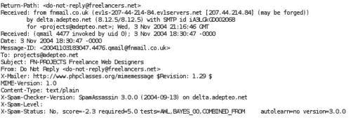

# 第六章：开始使用 Procmail

Procmail 是一种多功能的电子邮件过滤器，通常用于在将消息传递到用户收件箱之前处理消息。

本章包括以下主题：

+   Procmail 的简要介绍

+   Procmail 可以执行的典型过滤任务

+   如何在服务器上安装和设置邮件过滤系统，以处理您每天不愿意花时间处理的重复分类和存储任务

+   Procmail 食谱中规则和操作的基本结构

+   如何在我们的食谱中创建和测试规则

+   最后，一些执行过滤的示例食谱

通过本章结束时，您将了解过滤过程的基础知识，如何设置系统执行过滤以及如何对自己的邮件执行许多非常简单但极其有用的过滤操作。所有这些都将帮助您掌握已经或即将收到的所有邮件。

# 介绍 Procmail

Procmail 是一个邮件过滤器，它在邮件到达邮件服务器后但在最终交付给收件人之前执行。Procmail 的行为由许多用户编写的食谱（或脚本）控制。每个食谱可以包含许多模式匹配规则，以至少基于收件人、主题和消息内容选择消息。如果规则中的匹配条件选择消息作为候选项，食谱可以执行许多操作，将消息移动到文件夹，回复发件人，甚至在交付之前丢弃消息。与规则一样，操作是用户在食谱中编写的，可以对消息执行几乎任何操作。

Procmail 的主页位于[`www.procmail.org.`](http://www.procmail.org.)

## 谁写的以及何时写的

1.0 版本于 20 世纪 90 年代末发布，并发展成为基于 UNIX 的邮件系统中最好和最常用的邮件过滤解决方案之一。Procmail 最初由 Stephen R. van den Berg（`<srb@cuci.nl>`）设计和开发。1998 年秋，他意识到自己没有时间独自维护 Procmail，于是创建了一个用于讨论未来发展的邮件列表，并委任 Philip Guenther（`<guenther@sendmail.com>`）为维护者。

自 2001 年 9 月发布的 3.22 版本以来，Procmail 一直很稳定，因此大多数最近的安装将安装此最新版本，这也是我们在整本书中将使用的版本。

# 过滤系统如何帮助我？

到目前为止，您应该已经建立并运行了一个电子邮件系统，并发送和接收电子邮件。您可能已经注册了一些有用的邮件列表，消息以不同的间隔到达。您还应该收到通知您系统状态的消息。所有这些额外的、低优先级的信息很容易分散注意力，妨碍您阅读其他重要的电子邮件。

如何组织您的邮件取决于您个人的口味；如果您非常有条理，您可能已经在电子邮件客户端中设置了一些文件夹，并在阅读后将消息移动到适当的位置。尽管如此，您可能已经意识到，能够让系统自动将一些消息存储在与您重要电子邮件不同的位置将非常有用。

在设置自动流程时，您需要考虑的是如何识别邮件项目的内容。最重要的指标是发送给谁，标题或主题行，以及发件人详细信息。如果您现在花几分钟时间记录一下您已经处理邮件的方式，到达的消息类型以及您对它们的处理方式，您将更清楚地了解您可能想要设置的自动流程。

一般来说，您可能会收到几种不同类别的消息。

+   **邮件列表成员资格：**来自邮件组或邮件列表的邮件通常很容易通过发件人信息或主题行进行识别。一些组每隔几分钟发送一封消息，而其他组可能每个月只发送几封消息。通常，不同的邮件组项目由不同的信息片段进行识别。例如，一些组发送的消息的“发件人”地址是真实发件人的地址，而其他组会添加一个虚假或系统生成的“发件人”地址。例如，一些组可能会自动向“主题”字段添加前缀。

+   **自动系统消息：**您的服务器每天会生成大量消息。尽管通常只发送给系统管理员或 root 用户，但首先要做的一件事是确保您收到邮件的副本，以便及时了解系统状态和事件。您可以通过编辑`/etc/mail/aliases`或`/etc/aliases`文件（取决于系统设置）来做到这一点。这些系统生成的消息几乎总是可以识别出来自少数特定系统用户 ID。这些通常是`root`和`cron`。

+   **未经请求的大量电子邮件：**被识别为垃圾邮件的消息通常被认为不重要。因此，您可以选择将这些项目移动到一个单独的文件夹以供稍后查看，甚至完全丢弃它们。不建议自动丢弃垃圾邮件，因为任何误识别的邮件将永远丢失。

+   **个人消息：**来自客户、同事或朋友的邮件通常被认为是重要的。因此，通常会将其投递到收件箱，让您有机会提供更及时的回复。个人消息更难以通过过滤器识别，尤其是来自新客户或同事的消息，因此不属于前述任何一类的消息应该正常投递。

完成本章的工作后，您应该具备工具和知识，可以开始更详细地检查邮件并设置一些基本的过滤操作。

## 邮件过滤的潜在用途

您已经设置的基本邮件系统具有其自己的内置能力，可以根据用户设置处理传入的邮件。默认操作是将消息发送到收件箱；其他选项是自动将所有邮件转发给另一个用户。假设您在不同系统上有多个邮件帐户，并且希望所有邮件最终都发送到一个特定的邮件帐户。然后，您可以将该邮件发送到特定文件，或者将其传递给程序或应用程序，以便让其自行处理。

这种设置的缺点是所有邮件必须遵循一个特定的路线，因此随着时间的推移，已经创建了许多智能过滤邮件的选项。其中最强大和最受欢迎的之一是 Procmail。

### 过滤和分类邮件

Procmail 旨在处理系统内用户接收的邮件的各种处理和过滤任务。过滤仅适用于在系统上拥有帐户的用户，而不适用于虚拟用户，并且可以应用于所有用户或个别用户可以添加自己的过滤器。

对于系统管理员，Procmail 提供了一系列设施，用于对系统用户接收的所有邮件应用规则和操作。这些操作可能包括为了历史目的而复制所有邮件，或者在邮件内容可能在某种法律或商业情况下使用的企业中使用。

在本书的其他地方，我们将讨论识别电子邮件病毒和垃圾邮件的方法。Procmail 可以利用这些过程提供的信息，并根据这些过程添加的信息执行操作，例如将包含病毒的所有邮件存储在系统管理员检查的安全邮件文件夹中。

对于系统用户来说，对收件箱中的邮件进行的最常见操作是将其分类整理，以便根据您感兴趣的主题区域轻松找到所需的项目。典型的组织布局可能是一个分层的布局，类似于以下内容：

```
/mailgroups/Procmail
/mailgroups/postfix
/mailgroups/linux
/system/cron
/system/warnings
/system/status
/inbox

```

如果您计划长时间保留邮件以供历史参考，可能值得增加一两层来将邮件分隔成年份和月份。这样将来存档或清除旧邮件会更容易，同时搜索和排序也会更快。

### 转发邮件

有时您可能会收到很多很容易识别需要发送到另一个用户的另一个电子邮件地址的电子邮件。在这种情况下，您可以设置一个规则，将电子邮件转发到一个或多个其他电子邮件地址，而不是将文件存储在系统上。当然，您需要小心确保转发不会最终回到您，从而创建一个永无止境的循环。

以这种方式转发邮件比在邮件客户端软件内手动转发邮件具有很大的优势，除了不需要任何手动干预之外。通过 Procmail 转发的邮件是透明的，对收件人来说，它看起来就像邮件直接从原始发件人那里到达一样。而如果使用邮件客户端转发，它看起来就好像是由进行转发的人或帐户发送的。

如果需要将单个地址的所有邮件转发到单个其他地址，更有效的方法是使用 Postfix 邮件系统的别名机制。只有在需要根据在接收消息时才能确定的因素进行智能过滤邮件时，才应该使用 Procmail。

### 在应用程序中处理邮件

有些邮件可能适合传递到一个应用程序，应用程序可以对电子邮件进行一些处理。也许它可以阅读内容，然后将信息存储在错误跟踪数据库中，或者更新客户活动的公司历史记录。这些是在下一章中简要介绍的更高级的主题。

### 确认和离职/度假回复

如果您想要对某些消息发送自动回复，可以设置一个过滤器或规则来发送这样的消息。当您长时间离开办公室度假、休假或者生病时，可以设置一个自动回复服务，通知发件人在您能够回复他们的邮件之前需要一些时间，并可能提供其他联系方式或要求他们联系其他人。

重要的是要仔细组织这样的功能。您不应该向邮件组发送这样的回复，也不应该向已经知道您离开但需要在您回来后发送信息的人重复发送回复。这需要保留发送消息的地址日志，以避免重复发送消息。我们将在下一章中探讨设置这样一个服务。

## 文件锁定和完整性

在您使用 Procmail 的所有工作中要牢记的一个重要概念是，总是可能有多封邮件同时到达，争相处理。因此，很可能会有两封或更多邮件同时存储在同一位置，这是灾难的开始。假设有两封邮件同时到达的简单例子。第一封邮件打开存储位置并开始写入邮件内容，然后第二个进程也这样做。从中可能产生各种可能的结果，从完全丢失一封邮件，到两封邮件交织存储且完全无法阅读。

为了确保这种情况不会发生，需要遵守严格的锁定协议，以确保只有一个进程可以同时写入，所有其他应用程序都需要耐心等待轮到它们。Procmail 本身具有强制执行适用于所应用的进程类型的锁定协议的能力，并且默认情况下会锁定存储邮件的物理文件。

在一些情况下，邮件正在被应用程序处理，可以通过规则中的标志指示 Procmail 使用适当的锁定机制。这将在第七章中更全面地介绍。

## Procmail 不适用于哪些情况

Procmail 可能被认为适用于一些非常特定的邮件过滤和处理需求。在大多数情况下，它足够灵活和能干，至少可以在基本水平上执行任务。这些任务可能包括过滤与垃圾邮件相关的电子邮件，过滤病毒或运行邮件列表操作。对于每一个任务，都有一些超出仅使用 Procmail 过滤器能力的解决方案可用。我们将在第八章后面讨论使用 SpamAssassin 进行垃圾邮件过滤以及病毒过滤解决方案。

我们已经提到 Procmail 只适用于在 Procmail 运行的系统上拥有账户的用户。尽管如此，值得强调的是，Procmail 无法处理发送到虚拟用户的邮件，这些邮件最终会被发送到另一个系统上。如果需要处理这样的用户的邮件，可以在系统上创建一个真实的用户账户，然后使用 Procmail 作为其过滤过程的一部分来执行最终的转发。这并不是一个理想的用法，因为如果允许 Postfix 系统执行这项工作，它会比使用 Procmail 更有效率。

# 下载和安装 Procmail

由于软件现在已经相当成熟，Procmail 通常可以在大多数 Linux 发行版上安装，并且可以通过软件包管理器安装。这是安装 Procmail 的推荐方法。如果您的 Linux 发行版的软件包管理器中没有 Procmail，也可以从源代码安装。

## 通过软件包管理器安装

对于 Fedora 用户，如果尚未安装 Procmail，可以使用以下`yum`命令简单安装：

```
yum install procmail

```

对于基于 Debian 的用户，可以使用以下命令：

```
apt-get install procmail

```

这将确保 Procmail 的二进制文件正确安装在您的系统上，然后您可以决定如何将其集成到您的 Postfix 系统中。

## 从源代码安装

Procmail 可以从多个来源获取，但官方发布的版本由[www.procmail.org](http://www.procmail.org)维护和提供。在那里，您会找到一些镜像服务的链接，可以从中下载源文件。本书中使用的版本可以从[`www.procmail.org/procmail-3.22.tar.gz`](http://www.procmail.org/procmail-3.22.tar.gz)下载。

可以使用`wget`命令下载如下：

```
wget http://www.procmail.org/procmail-3.22.tar.gz

```

下载并解压缩存档后，`cd`到目录，例如`procmail-3.22`。在开始构建和安装软件之前，值得阅读`INSTALL`和`README`文档。

对于大多数 Linux 系统，最简单的安装方法可以通过按照这里列出的步骤来简化：

1.  运行`configure`命令来创建正确的构建环境：

```
$ ./configure

```

1.  配置脚本完成后，您可以运行`make`命令来构建软件可执行文件：

```
$ make

```

1.  最后一步，作为`root`，是将可执行文件复制到系统上的正确位置以进行操作：

```
# make install

```

在最后一步，软件被安装到`/usr/local`目录中。

在所有阶段，您应该检查进程输出是否有任何重要的错误或警告。

## 安装选项/注意事项

对于本书中的大多数人，您将是您正在管理的机器或机器的系统管理员，并且可能会应用安装以处理系统上所有用户的所有邮件。如果您不是管理员，或者您希望系统上只有有限数量的人利用 Procmail 的功能，您可以为单个用户安装 Procmail。

### 个别安装

如果您为自己使用或仅为服务器上的少数人安装 Procmail，则最常见的方法是在服务器上的家目录中直接从`.forward`文件中调用 Procmail 程序（此文件需要是可全局读取的）。

在使用 Postfix 作为 MTA 时，`.forward`中的条目应该是这样的：

```
"|IFS=' ' && exec /usr/bin/procmail -f- || exit 75 *#username*"

```

引号是必需的，用户名应该替换为您的用户名。其他 MTA 的语法可能不同，因此请查阅 MTA 文档。

您还需要在主目录中安装一个`.procmailrc`文件—这个文件保存了 Procmail 将用来过滤和传递电子邮件的规则。

### 系统范围的安装

如果您是系统管理员，可以决定全局安装 Procmail。这样做的好处是用户不再需要拥有`.forward`文件。只需在每个用户的`HOME`目录中有一个`.procmailrc`文件就足够了。在这种情况下，操作是透明的—如果`HOME`目录中没有`.procmailrc`文件，邮件将像往常一样传递。

可以创建一个全局的`.procmailrc`文件，该文件在用户自己的文件之前生效。在这种情况下，您需要小心确保配置包含以下指令，以便消息以最终用户的权限而不是 root 用户的权限存储。

```
DROPPRIVS=yes

```

这也有助于保护系统安全性的弱点。该文件通常存储在`/etc`目录中，如`/etc/procmailrc`，旨在为添加到系统的所有用户提供一组默认的个人规则。值得配置一个`.procmailrc`文件在用于系统的`add user`功能的骨架帐户中。请查阅 Linux 文档，了解如何设置这一点。

## 与 Postfix 集成以进行系统范围的传递

将 Procmail 集成到 Postfix 系统中很简单，但是，与任何其他配置更改一样，必须小心。Postfix 以 nobody 用户 ID 运行所有外部命令，例如 Procmail。因此，它将无法将邮件传递给用户`root`。为了确保重要的系统消息仍然可以收到，您应该确保配置了别名，以便将所有发送给 root 用户的邮件转发到一个真实的用户，该用户将读取邮箱。

### 为系统帐户创建别名

要为 root 用户创建别名，您必须编辑适当的`alias`文件，通常位于`/etc/aliases`或`/etc/mail/aliases`中。

如果找不到文件，请使用以下命令：

```
postconf alias_maps

```

别名文件中的条目应该如下所示，冒号（：）和电子邮件地址的开头之间只有一个制表符，并且没有尾随空格：

```
root: user@domain.com

```

创建文本条目后，您应该运行`newaliases`命令，将文本文件转换为数据库文件，以便供 Postfix 读取。

值得为可能接收邮件的任何其他系统帐户添加额外的别名。例如，您可能最终会得到类似以下的`aliases`文件：

```
# /etc/aliases
postmaster: root
nobody: root
hostmaster: root
usenet: root
news: root
webmaster: root
www: root
ftp: root
abuse: root
noc: root
security: root
root: user@example.com
clamav: root

```

### 将 Procmail 添加到 Postfix 配置

对于由 Procmail 进行系统范围的邮件投递，需要修改 Postfix 的`main.cf`文件，以指定将负责实际投递的应用程序。

编辑`/etc/postfix/main.cf`文件并添加以下行：

```
mailbox_command = /path/to/procmail

```

进行更改后，您需要使用以下命令指示 Postfix 文件已更改：

```
postfix reload

```

### 由 Postfix 提供的环境变量

Postfix 通过使用多个环境变量导出有关邮件包的信息。这些变量被修改以避免任何 shell 扩展问题，方法是用下划线字符替换所有可能对 shell 具有特殊含义的字符，包括空格。以下是导出的变量及其含义的列表：

| 变量 | 含义 |
| --- | --- |
| `DOMAIN` | 收件人地址中`@`右侧的文本 |
| `EXTENSION` | 可选的地址扩展部分 |
| `HOME` | 收件人的主目录 |
| `LOCAL` | 收件人地址中`@`左侧的文本，例如，`$USER+$EXTENSION` |
| `LOGNAME` | 收件人用户名 |
| `RECIPIENT` | 整个收件人地址，`$LOCAL@$DOMAIN` |
| `SENDER` | 完整的发件人地址 |
| `SHELL` | 收件人的登录 shell |

# 基本操作

当邮件到达并传递给 Procmail 程序时，操作的顺序遵循一组固定的格式。它从加载各种配置文件开始，以获取为特定用户设置的规则。然后依次通过每个规则测试消息，当找到合适的匹配时，应用规则。一些规则在完成后终止，而其他规则返回控制，以便对消息进行潜在处理的剩余规则进行评估。

## 配置文件

通常在`/etc/procmailrc`中进行系统范围的配置，而个人配置文件通常存储在用户的主目录中，称为`.procmailrc`。个别规则可以存储在单独的文件中，或者分组存储在多个文件中，然后作为主`.procmailrc`文件的一部分包含在邮件过滤过程中。通常，这些文件将存储在主目录的`Procmail`子目录中。

### 文件格式

配置文件中的条目以简单的文本格式按照基本布局进行。允许注释，并且由`#`字符后的文本组成；空行将被简单地忽略。规则本身不必按任何特定格式布局，但为了便于维护和可读性，值得以一致和简单的格式编写规则。

### 配置文件解剖

Procmail 配置文件内容可以分为三个主要部分：

+   变量：Procmail 需要执行其工作所需的信息可以被分配到配置文件中的变量中，类似于它们在 shell 编程中的使用方式。一些变量是从 Procmail 正在运行的 shell 环境中获取的，另一些是由 Procmail 自己创建的，用于脚本内部使用，而其他变量可以在脚本内部分配。变量的另一个用途是设置 Procmail 本身的操作方式的标志。

大多数脚本中可以设置一些有用的变量：

```
PATH=/usr/bin: /usr/local/bin:.
MAILDIR=$HOME/Maildir # Make sure it exists
DEFAULT=$MAILDIR/ # Trailing / indicates maildir format mailbox
LOGFILE=$HOME/procmail.log
LOG="
"
VERBOSE=yes

```

+   `VERBOSE`变量用于影响执行的日志级别，而`LOG`变量中嵌入的`NEWLINE`是故意的，旨在使日志文件更易于阅读。

+   第七章还包括一个简短的脚本，显示了在 Procmail 中分配的所有变量。

+   **注释：** `#`字符和后续的所有字符直到`NEWLINE`都将被忽略。这不适用于无法被注释的条件行。空行将被忽略，并且可以与注释一起用于记录您的配置并提高可读性。您应该注释您的规则，因为今天写规则时显而易见的东西，也许在六个月后不查看手册就无法解释了。

+   **规则或配方：** 配方是我们创建的规则的常见名称。以冒号（：）开头的行标志着配方的开始。配方的格式如下：

```
:0 [flags] [ : [locallockfile] ]
<zero or more conditions (one per line)>
<exactly one action line>

```

`：0`是 Procmail 早期版本的遗留物。冒号后面的数字最初是用来指示规则中包含的动作数量，现在由 Procmail 解析器自动计算。然而，为了兼容性，仍然需要`：0`。

# 分析一个简单的规则

假设我们从一个特定的邮件组收到大量邮件，我们订阅了这个邮件组。这些邮件很有趣，但不重要，我们更愿意在闲暇时阅读它们。主题是“神话怪兽”，来自这个邮件列表的所有电子邮件都有一个“To”地址`<mythical@monsters.com>`。我们决定创建一个专门的文件夹来存放这些邮件，并将所有邮件复制到这个文件夹中。这是一个简单的规则，您将能够轻松复制和修改以处理将来的邮件。

## 规则结构

以下是一个非常简单的`.procmail`文件的示例副本，取自用户的主目录，并旨在解释 Procmail 配置的一些基本特性。规则本身旨在将发送到特定电子邮件地址`<mythical@monsters.com>`的所有邮件存储在一个名为`monsters`的特殊文件夹中。大多数邮件将发送给多个人，包括您自己，而“To”地址可以提供有用的邮件内容指示。例如，邮件可能发送到`info@yourcompany.com`的分发列表，您需要对这封邮件进行优先处理。

花点时间阅读文件的内容，然后我们将依次分解并分析每个部分的功能。

```
#
# Here we assign variables
#
PATH=/usr/bin: /usr/local/bin:.
MAILDIR=$HOME/Maildir # Make sure it exists
DEFAULT=$MAILDIR/ # Trailing / indicates maildir format mailbox
LOGFILE=$HOME/procmail.log
LOG="
"
VERBOSE=yes
#
# This is the only rule within the file
#
:0: # Anything to mythical@monsters.com
* ^TO_ mythical@monsters.com
monsters/ # will go to monsters folder. Note the trailing /

```

### 变量分析

要详细检查这个文件，我们可以从定义语句开始，其中变量被赋予特定值。这些值将覆盖 Procmail 已经分配的任何值。通过进行手动赋值，我们可以确保路径针对脚本操作进行了优化，并且我们确定使用的值而不是假设 Procmail 可能分配的值。

```
PATH=/usr/bin: /usr/local/bin:.
MAILDIR=$HOME/Maildir
DEFAULT=$MAILDIR/
LOGFILE=$HOME/procmail.log
LOG="
"
VERBOSE=yes

```

这些设置指令用于定义一些基本参数：

+   `PATH`指令指定了 Procmail 可以找到任何可能需要执行的程序的位置。

+   `MAILDIR`指定了所有邮件项目将存储的目录。这个目录应该存在。

+   `DEFAULT`定义了如果为单独的规则定义了特定位置，则邮件将存储在哪里。根据 Postfix 章节中关于选择邮箱格式的建议，尾部的/（斜杠）表示 Procmail 应以 Maildir 格式传递邮件。

+   `LOGFILE`是存储所有跟踪信息的文件，以便我们可以看到发生了什么。

### 规则分析

接下来是以`:0`开头的配方说明。第二个`:`指示 Procmail 创建一个锁定文件，以确保一次只写入一个邮件消息到文件中，以避免消息存储的损坏。单行规则可以分解如下：

+   `*：`所有规则行都以`*`开头。这是 Procmail 知道它们是规则的方式。每个配方可能有一个或多个规则。

+   `^TO_：`这是一个特殊的 Procmail 内置宏，用于搜索大多数可能携带您地址的标题，例如`To：，Apparently-To：，Cc：，Resent-To：`等等，如果找到地址`<mythical@monsters.com.>`，则会匹配。

最后一行是操作行，默认情况下指定了`MAILDIR`变量指定的目录中的邮件文件夹。

### 提示

对于 Maildir 格式邮箱，文件夹名称末尾的斜杠是必需的，否则邮件将以不受 Courier-IMAP 支持的 unix mbox 格式传递。如果您正在使用 IMAP，文件夹名称还应以`.`（句号）为前缀，因为句号字符被指定为层次分隔符。

# 创建和测试规则

Procmail 允许您将规则和配方组织成多个文件，然后依次处理每个文件。这样可以更容易地管理规则，并根据需要打开或关闭规则。对于这个第一个测试案例，我们将创建一个特殊的规则集进行测试，并将所有规则组织在我们的主目录的子目录中。通常，子目录称为`Procmail`，但您可以自由使用自己的名称。

我们将从查看一个简单的个人规则并为单个用户进行测试开始。在本章后面，当我们涵盖了所有基础知识并且您对创建和设置规则的过程感到满意时，我们将展示如何开始将规则应用于所有系统用户。

## 一个“hello world”示例

几乎所有关于编程的书都以非常简单的“hello world”示例开始，以展示编程语言的基础知识。在这种情况下，我们将创建一个简单的个人规则，处理用户收到的所有电子邮件，并检查主题是否包含“hello world”这几个词。如果邮件主题包含这些特定词，邮件消息将存储在一个特殊的文件夹中。如果不包含这些魔术词，邮件将存储在用户的正常收件箱中。

## 创建 rc.testing

在生产环境中工作时，重要的是要确保编写和测试的规则不会干扰您的日常邮件活动。控制这一点的一种方法是创建一个专门用于测试新规则的特殊文件，并且只在实际进行测试工作时将其包含在 Procmail 处理中。当您对规则操作满意时，可以将其移动到自己的特定文件中，或者将其添加到其他类似或相关的规则中。在这个例子中，我们将创建一个用于测试规则的新文件`rc.testing`。在`$HOME/Procmail`目录中，使用您喜欢的编辑器创建文件`rc.testing`并输入以下行：

```
# LOGFILE should be specified early in the file so
# everything after it is logged
LOGFILE=$PMDIR/pmlog
# To insert a blank line between each message's log entry,
# Use the following LOG entry
LOG="
"
# Set to yes when debugging; VERBOSE default is no
VERBOSE=yes
#
# Simple test recipes
#
:0:
* ^Subject:.*hello world
TEST-HelloWorld

```

到目前为止，您可能已经开始认识到规则的结构。这个规则可以分解如下。

前几行设置了适用于我们测试环境的变量。由于它们是在测试脚本中分配的，因此它们只适用于脚本被包含在处理中的时候。一旦我们排除了测试脚本，测试设置当然就不适用了。

匹配所有以`Subject：`开头并包含字符串`hello world`的行。我们故意没有使用诸如`test`之类的字符串，因为少数系统可能会剥离看起来是测试消息的消息。请记住，Procmail 的默认操作是不区分大小写的，因此我们不需要测试所有变体，例如`Hello World.`

最后一行指示 Procmail 将输出存储在`TEST-HelloWorld`文件中。

在`$HOME/Procmail`目录中创建`testmail.txt`，使用您喜欢的编辑器创建文件`testmail.txt`并输入以下行：

```
From: me@example.com
To: me@example.com (self test)
Subject: My Hello World Test
BODY OF TEST MESSAGE SEPARATED BY EMPTY LINE

```

主题行与`rc.testing`中的规则不一致，该规则包含了候选字符串，以演示不区分大小写的匹配。

## 对脚本进行静态测试

从`Procmail`目录运行以下命令将生成调试输出：

```
formail -s procmail -m PMDIR=. rc.testing < testmail.txt

```

### 注意

在静态测试期间，我们已经在上一个命令中定义了变量`PMDIR`为我们当前的目录。

运行命令后，您可以查看错误消息的日志文件。如果一切正常，您将看到文件`TEST-HelloWorld`的创建，其中包含`testmail.txt`的内容以及日志中的以下输出。

```
procmail: [9060] Mon Jun 8 17:52:31 2009
procmail: Match on "^Subject:.*hello world"
procmail: Locking "TEST-HelloWorld.lock"
procmail: Assigning "LASTFOLDER=TEST-HelloWorld"
procmail: Opening "TEST-HelloWorld"
procmail: Acquiring kernel-lock
procmail: Unlocking "TEST-HelloWorld.lock"
From me@example.com Mon Jun 8 17:52:31 2009
Subject: My Hello World Test
Folder: TEST-HelloWorld 194

```

如果`Subject`行没有包含相关的匹配短语，您可能会在日志中看到以下输出：

```
procmail: [9073] Mon Jun 8 17:53:47 2009
procmail: No match on "^Subject:.*hello world"
From me@example.com Mon Jun 8 17:53:47 2009
Subject: My Goodbye World Test
Folder: **Bounced** 0

```

## 配置 Procmail 以处理 rc.testing

您需要编辑`.procmailrc`配置文件。可能已经有一些条目在里面，所以在进行任何更改之前最好备份文件。确保文件中包含以下行：

```
# Directory for storing procmail configuration and log files
PMDIR=$HOME/Procmail
# Load specific rule sets
INCLUDERC=$PMDIR/rc.testing

```

有些行使用`#`进行了故意注释。如果以后需要进行更详细的调试，可能需要这些行。

## 测试设置

使用以下命令，给自己发送两条消息：

```
echo "test message" | mail -s "hello world" $USER

```

主题行应包含字符串`hello world`，而另一条消息则不应包含此特定字符串。

当您检查邮件时，您应该发现主题中包含关键字的消息已存储在`TEST-HelloWorld`邮件文件夹中，而另一条消息则留在了正常的邮件收件箱中。

# 配置调试

如果一切正常——恭喜！您已经在组织您的邮件的道路上取得了很大进展。

如果结果不如预期，我们可以做一些简单的事情来找出问题所在。

## 检查脚本中的拼写错误

与任何编程过程一样，如果一开始不起作用，请检查代码，确保在编辑阶段没有引入明显的拼写错误。

## 查看错误消息的日志文件

如果这没有显示任何问题，您可以查看 Procmail 创建的日志文件。在这种情况下，日志文件称为`~/Procmail`目录中的`pmlog`。要查看最后几行，请使用以下命令：

```
tail ~/Procmail/pmlog

```

在以下示例中，缺少`:0`，因此规则行被跳过：

```
* ^Subject:.*hello world
TEST-HelloWorld

```

这将导致以下错误：

```
procmail: [10311] Mon Jun 8 18:21:34 2009
procmail: Skipped "* ^Subject:.* hello world"
procmail: Skipped "TEST"
procmail: Skipped "-HelloWorld"

```

在这里没有存储指令来遵循规则`:0:`

```
:0:
* ^Subject:.*hello world

```

这将导致以下错误：

```
procmail: [10356] Mon Jun 8 18:23:36 2009
procmail: Match on "^Subject:.* hello world"
procmail: Incomplete recipe

```

## 检查文件和目录权限

使用`ls`命令检查`~/.procmailrc`和`~/Procmail/*`文件以及`~/ home`目录的权限。规则文件应该可以被除所有者以外的用户写入，并且应该具有类似以下的权限：

```
rw-r--r—

```

主目录应具有以下权限，其中`?`可以是`r`或：

```
drwx?-x?-x

```

## 打开完整日志记录

当您创建更复杂的规则，或者仍然遇到问题时，您需要启用 Procmail 的**完整日志记录**功能。为此，您需要从`~/.procmailrc`文件中删除`#`注释，以便启用它们，如下所示：

```
# Directory for storing procmail configuration and log files
PMDIR=$HOME/Procmail
# LOGFILE should be specified early in the file so
# everything after it is logged
LOGFILE=$PMDIR/pmlog
# To insert a blank line between each message's log entry,
# add a return between the quotes (this is helpful for debugging)
LOG="
"
# Set to yes when debugging; VERBOSE default is no
VERBOSE=yes
# Load specific rule sets
INCLUDERC=$PMDIR/rc.testing

```

现在重新发送两条示例消息，并检查输出信息的日志文件。日志文件应指示一些问题区域供您调查。

## 采取措施避免灾难

在`.procmailrc`文件的开头插入以下配方将确保最近接收的 32 条消息都存储在`backup`目录中，确保在配方包含错误或产生意外副作用的情况下不会丢失宝贵的邮件。

```
# Create a backup cache of 32 most recent messages in case of mistakes.
# For this to work, you must first create the directory
# ${MAILDIR}/backup.
:0 c
backup
:0 ic
| cd backup && rm -f dummy `ls -t msg.* | sed -e 1,32d`

```

现在我们将假设这个工作，并在下一章中详细分析这个规则，看看它是如何工作的以及它的作用。

# 了解电子邮件结构

为了充分利用 Procmail 的功能，值得花一些时间了解典型电子邮件消息的基本结构。 随着时间的推移，结构变得越来越复杂，但仍然可以分解为两个离散的块。

## 消息正文

消息正文与标题之间由一个空白行分隔（所有标题必须连续出现，因为在空白行之后的任何标题都将被假定为消息正文的一部分）。

消息正文本身可以是一个由简单 ASCII 字符组成的简单文本消息，也可以是使用称为**MIME**的东西编码的部分的复杂组合。 这使得电子邮件能够传输从简单文本，HTML 或其他格式化页面到包括附件或嵌入对象（如图像）在内的各种形式的数据。 MIME 编码的讨论超出了本书的范围，并且对于您可能在邮件过滤中遇到的大多数过程来说并不是必要的。

如果您决定尝试处理消息正文中保存的数据，重要的是要记住，您在邮件程序的输出中看到的内容可能与原始邮件消息中传输的实际数据非常不同。

## 电子邮件标题

标题是电子邮件包含的标签，允许各种邮件组件发送和处理消息。 电子邮件标题的典型格式是由一个关键字组成的简单两部分结构，由`:`终止，并跟随关键字分配的信息。 标题提供了有关电子邮件是如何创建的，什么形式的邮件程序创建了消息，消息来自谁，应该发送给谁，以及它如何到达您的邮箱的大量信息。

以下邮件头与从`freelancers.net`的多个邮件列表中收到的一封电子邮件相关。 电子邮件最有用的识别特征是主题行，因为大多数其他邮件组使用了讨论的其他邮件头的相同值。



## 标题结构

先前的示例包含了大量的标题，这些标题是由邮件在从发件人到收件人的过程中经历的一系列过程插入的。 但是，有一小部分关键标题非常有用，用于处理电子邮件，并且在大量的规则中使用。

## 标题的官方定义

所有不以`X-`开头的标题都由相关标准机构分配特定功能。 关于它们的更多信息可以在**RFC（请求评论）文档 822**中找到，网址为[`www.ietf.org/rfc/rfc0822.txt`](http://www.ietf.org/rfc/rfc0822.txt)。

以`X-`开头的标题是用户定义的，并且仅适用于特定应用程序。 但是，一些应用程序可能使用与其他应用程序相同的标题标记，但出于不同的原因，并且提供的信息格式也不同。

# 示例规则集

为了帮助您理解 Procmail 规则的工作方式，我们将介绍几个简单但非常有用的规则集的设计和设置。 这应该有助于让您开始设计自己的规则集，以满足更具体的需要来过滤您的传入邮件项目。

所有这些示例都是基于从 Freelancers 邮件列表收到的邮件消息，先前示例标题取自其中。 它们都实现了相同的结果，并再次证明编程问题没有一个正确的解决方案。

## 来自标题

此标头解释了电子邮件的发起者是谁。可以使用各种格式，并由各种人类可读和计算机可读的信息项的各种组合组成。当您查看了一些电子邮件后，您将开始看到不同邮件系统和软件可以使用的各种模式。实际的标头格式并不一定重要，因为您要生成规则以匹配特定的电子邮件。

```
From: Do Not Reply <do-not-reply@freelancers.net>

```

## Return-Path 标头

此字段由最终传输系统添加到将消息传递给其接收者的消息中。该字段旨在包含有关消息的发件人地址和路由的确切信息。

```
Return-Path: <do-not-reply@freelancers.net>

```

### 通过 Return-Path 进行过滤

大多数邮件列表使用`Return-Path`标头：

```
:0:
* ^Return-Path: <do-not-reply@freelancers.net>
freelancers//

```

这是一个方便地过滤邮件列表项的方法。在这里，`^`字符执行一个特殊功能，指示 Procmail 在新行的开头开始匹配过程。这意味着包含短语的行不会被匹配。Procmail 的默认操作是，如果在标头或邮件正文的任何位置找到字符串，就返回匹配，具体取决于脚本设置的搜索位置。

## To 和 Cc 标头

邮件通常发送给一个或多个列在电子邮件的 To:或 Cc:标头中的人。与 From:标头一样，这些地址可能以多种方式格式化。这些标头对所有邮件接收者可见，并允许您查看所有列出的公共接收者。

```
To:projects@adepteo.net

```

有一个第三个接收者标头，不像 To:和 Cc:那样常见，但在大量邮件中经常使用。这是 Bcc:（暗送）。不幸的是，正如名称所暗示的那样，这是一个盲标头，因此信息不包含在实际的标头信息中，因此无法用于处理。

### 通过 To 或 Cc 进行过滤

Procmail 有许多特殊的内置宏，可用于识别邮件项。特殊规则`^TO_`旨在搜索所有可用的目标标头。规则必须写成四个字符，没有空格，并且 T 和 O 都是大写。匹配的短语必须紧跟在`_`后面，再次没有空格。

```
:0:
rule setsCc header, filtering by* ^TO_do-not-reply@freelancers.net
freelancers/

```

## 主题头

主题行通常包含在电子邮件头中，除非发件人决定根本不包括主题行。

**主题：FN-PROJECTS 自由职业网页设计师**

在这个例子中，发送到这个特定列表的所有邮件都以短语“FN-PROJECTS”开头，因此有时适合过滤。

### 通过主题进行过滤

当邮件列表在主题行中添加前缀时，此前缀可能适用于过滤：

```
:0:
* ^Subject: FN-PROJECTS
freelancers//

```

# 系统范围的规则

现在我们已经涵盖了设置规则、分析电子邮件以及通常看到所有处理操作如何交互的所有基础知识，我们将浏览一些系统范围的过滤、测试和操作的示例。

## 删除可执行文件

在第九章中，我们将看到如何将完整的病毒检查系统集成到 Postfix 邮件架构中。这将执行准确的病毒签名识别，并向邮件头添加适当的标志以指示邮件中是否存在病毒。但是，如果不可能设置这样的系统，这条规则将提供一种替代但更残酷的方法来阻止所有带有可执行附件的电子邮件。

如果您将以下内容放入`/etc/procmailrc`，它将影响通过系统传输的所有包含特定类型文档附件的邮件。

```
# Note: The whitespace in the [ ] in the code comprises a space and a tab character
:0
* < 256000
* ! ^Content-Type: text/plain
{
:0B
* ^(Content-(Type|Disposition):.*|[ ]*(file)?)name=("[^"]*|[^ ]*)\.(bat|cmd|com|exe|js|pif|scr)
/dev/null
}

```

规则以惯例的`:0`指令开始。

条件适用如下：

首先，确保我们只过滤大小小于 256 KB 的邮件。这主要是为了效率，大多数垃圾邮件都比这个大小小。如果您收到的病毒更大，您可以显然增加它，但是您的系统可能会负载更高。

下一行表示我们也只查看那些是 MIME 类型的消息（即不是纯文本），因为附件根据定义不能包含在纯文本消息中。

我们在花括号之间有一个子过滤器。`:0B`表示我们正在处理消息的正文，而不是标题。我们必须这样做，因为附件出现在正文中，而不是标题中。然后我们寻找具有可执行文件 MIME 标题特征的行。如果需要，您可以修改文件扩展名；这些只是常用于传输病毒的扩展名。

在这种情况下的操作是，如果匹配，则将此消息发送到`/dev/null`。请注意，这意味着不会向发件人发送任何消息反弹或错误消息；消息只是被丢弃，永远不会再次被看到。当然，您可以将消息存储在安全位置，并指定某人监视不包含病毒的有效消息的帐户。对于这个问题的更优雅的解决方案，请记得查看第九章。

## 大邮件

随着高速、始终在线的互联网连接的日益增加，人们开始发送越来越大的电子邮件。曾经，一个签名文件超过四行被认为是粗鲁的，而如今人们愉快地包含图像和壁纸，并发送电子邮件的 HTML 和文本版本，而不意识到他们发送的邮件大小。

将这样大的消息存储在收件箱中会大大增加搜索邮件消息的处理开销。一个简单的解决方案是将所有超过一定大小的消息移动到一个超大文件夹中。通过使用以下规则，可以非常简单地实现这一点，该规则查找大小超过 100,000 字节的消息，并将它们存储在`largemail`文件夹中。

```
:0:
* >100000
largemail/

```

这条规则的缺点是你的用户需要记住定期检查他们的收件箱和`largemail`文件夹。更优雅的解决方案将允许你复制消息的前几行以及标题和主题行，并将其存储在收件箱中，并通知你需要检查完整版本。这样的解决方案可以在下一章末尾的示例中看到。

# 总结

在本章中，我们已经了解了 Procmail 的一些基础知识。到目前为止，你应该熟悉 Procmail 用于加载配方的各种文件，过滤的核心原则以及可用的选项。我们还分析了电子邮件，设置了个人和系统范围的过滤器，并查看了一些简单的测试、日志记录和调试选项，这些选项将帮助我们更有效地管理公司的邮件。

我们只是刚刚触及了可能性的表面，但希望这点小小的尝试已经给你提供了大量关于如何处理和过滤你每天过载的电子邮件的想法。这可能已经给你提供了更高级过滤器的想法，下一章将提供更多关于如何设置这些过滤器的建议和解释。
