# 第八章：使用 SpamAssassin 打击垃圾邮件

垃圾邮件，或者有时被称为不受欢迎的商业电子邮件（UCE），是互联网的祸害。在过去的十年里，垃圾邮件不断增加，现在占据了超过一半的互联网带宽。六分之一的消费者已经对垃圾邮件采取了行动，因此有充分的商业理由将垃圾邮件从用户的收件箱中清除出去。有各种不同的垃圾邮件解决方案，从完全外包您的垃圾邮件到完全不采取任何行动。然而，如果您有自己的电子邮件服务器，您可以非常容易地添加垃圾邮件过滤。

SpamAssassin 是一个非常受欢迎的开源反垃圾邮件工具。它赢得了 2006 年 Linux New Media 奖，被评为“最佳基于 Linux 的反垃圾邮件解决方案”，被许多人认为是最好的免费、开源的反垃圾邮件工具，比许多商业产品更好。事实上，有几个商业产品和服务都是基于 SpamAssassin 或其先前版本的。

在本章中，您将学习：

+   为什么垃圾邮件很难处理，为什么垃圾邮件过滤器需要定期更新

+   如何下载、安装和配置 SpamAssassin

+   如何使用 SpamAssassin 过滤传入的电子邮件。

+   如何配置 SpamAssassin 以在每个用户或每个服务器的基础上运行

+   如何配置流行的电子邮件客户端以识别 SpamAssassin 放置在电子邮件中的标记

+   如何自定义 SpamAssassin 以自动更新新规则集，以保持系统的垃圾邮件检测良好。

+   如何使用 amavisd 集成垃圾邮件过滤和病毒识别

# 为什么过滤电子邮件

如果您没有收到任何垃圾邮件，可能没有必要过滤垃圾邮件。然而，一旦收到一封垃圾邮件，通常会接着收到更多。垃圾邮件发送者有时可以检测出是否查看了垃圾邮件，使用诸如 Web bug 之类的技术，这些技术是 HTML 电子邮件中的微小图像，从 Web 服务器获取，然后知道电子邮件地址是有效的和易受攻击的。如果垃圾邮件被过滤，最初的电子邮件可能永远不会被看到，因此垃圾邮件发送者可能不会再以垃圾邮件的形式攻击该电子邮件地址。

尽管针对垃圾邮件的法律行动，实际上垃圾邮件还在增加。在欧洲和美国，最近针对垃圾邮件的立法（2002/58/EC 指令和 S.877 法案）几乎没有效果，垃圾邮件在这两个地区仍在增加。

这主要原因是垃圾邮件是一个非常好的商业模式。发送垃圾邮件的成本非常低，每封邮件只需千分之一美分，只需低得多的点击率就可以获利。垃圾邮件发送者只需要将十万封垃圾邮件中的一封变成销售，就可以获利。因此，有很多垃圾邮件发送者，垃圾邮件被用来推广各种商品。由于使用恶意软件利用无辜的计算机代表他们发送垃圾邮件，垃圾邮件成本也是微不足道的。

相比之下，垃圾邮件对收件人的成本非常高。估计各种各样，从每封收到的垃圾邮件 10 美分，每年每名员工 1,000 美元，到仅在 2007 年全球总成本高达 1400 亿美元。这个成本主要是劳动力——通过堵塞收件箱和迫使他们处理许多额外电子邮件，分散人们的工作。垃圾邮件干扰日常工作，可能包括大多数人都觉得冒犯的内容。公司有责任保护员工免受这种内容的侵害。垃圾邮件过滤是一种非常廉价的方式，可以最大程度地减少成本并保护劳动力。

## 垃圾邮件是一个不断变化的目标

垃圾邮件并不是静态的。它每天都在变化，因为垃圾邮件发送者增加了新的方法到他们的武器库中，而反垃圾邮件者则制定了对策。因此，最好的反垃圾邮件工具是那些经常更新的工具。这与防病毒软件类似——病毒定义需要定期更新，否则新病毒将无法被检测到。

SpamAssassin 定期更新。除了软件的新版本外，还有一个积极的社区创建、评论和测试新的反垃圾邮件规则。这些规则可以自动下载，以获得最新的防垃圾邮件保护。

让我们讨论 SpamAssassin 用于打击垃圾邮件的一些措施：

+   **开放中继：**这些是允许垃圾邮件发送者发送邮件的电子邮件服务器，即使他们与服务器所有者没有任何联系。为了对抗这一点，反垃圾邮件社区开发了**黑名单**，也称为**黑名单**，可以被反垃圾邮件软件用来检测垃圾邮件。这在第五章中提到过，作为您的电子邮件服务器不应出现在的列表，因为它可能限制合法的电子邮件流量。通过黑名单服务器传递的任何电子邮件都比没有传递的电子邮件更加可疑。SpamAssassin 使用多个黑名单来测试电子邮件。

+   **关键词过滤器：**这些是对抗垃圾邮件的有用工具。垃圾邮件发送者倾向于一遍又一遍地重复相同的词和短语。SpamAssassin 广泛使用规则来检测这些短语。这些规则占据了大部分测试，先前提到的用户社区规则通常是这种形式。它们允许检测特定的单词、短语或字母、数字和标点符号的序列。

+   **黑名单和白名单：**这些用于列出已知的垃圾邮件发送者和良好电子邮件的来源。来自黑名单地址的电子邮件很可能是垃圾邮件，并且会相应地处理，而来自白名单地址的电子邮件则不太可能被视为垃圾邮件。SpamAssassin 允许用户手动输入黑名单和白名单，并根据其处理的电子邮件建立自动白名单和黑名单。

+   **统计过滤器：**这些是自动系统，给出电子邮件是垃圾邮件的概率。这种过滤是基于过滤器先前看到的垃圾邮件和非垃圾邮件。它们通常通过查找在一种类型的电子邮件中存在但在另一种类型中不存在的单词，并利用这种知识来确定新电子邮件的类型。SpamAssassin 有一个称为**贝叶斯过滤器**的统计过滤器，可以非常有效地提高检测率。

+   **内容数据库：**这些是大规模电子邮件检测系统。许多电子邮件服务器接收并将电子邮件提交到中央服务器。如果同一封电子邮件发送给成千上万的收件人，那么它很可能是垃圾邮件。内容数据库通过一种称为**哈希**的技术防止机密电子邮件被发送到服务器，并降低发送到服务器的数据量。SpamAssassin 可以与几个内容数据库集成，特别是 Vipul's Razor ([`razor.sourceforge.net/`](http://razor.sourceforge.net/))、Pyzor ([`sourceforge.net/apps/trac/pyzor/`](http://sourceforge.net/apps/trac/pyzor/))和**分布式校验和清除中心**，即**DCC** ([`www.rhyolite.com/dcc/`](http://www.rhyolite.com/dcc/))。

+   **URL 黑名单：**这类似于开放中继黑名单，但列出了垃圾邮件发送者使用的网站。几乎所有的垃圾邮件都会包含网址。建立这些网址的数据库可以快速检测垃圾邮件。这是一种非常有效的防止垃圾邮件的工具。默认情况下，SpamAssassin 使用**垃圾邮件 URI 实时黑名单**（**SURBLs**），无需进一步配置。

## 垃圾邮件过滤选项

垃圾邮件可以在服务器端或客户端进行过滤。接下来将解释这两种方法。在第一种情况下，垃圾邮件在客户端上进行过滤。

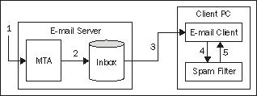

1.  邮件由 MTA 处理。

1.  然后将电子邮件放入适当用户的收件箱。

1.  电子邮件客户端从收件箱中读取所有新的电子邮件。

1.  然后，电子邮件客户端将电子邮件传递给过滤器。

1.  当过滤器返回结果时，客户端可以显示有效的电子邮件，要么丢弃垃圾邮件，要么将其存档到一个单独的文件夹中。

在这种方法中，垃圾邮件过滤始终由客户端完成，并且始终在处理新电子邮件时完成。通常当用户可能在场时，他或她可能会在电子邮件可见之前经历延迟，或者在客户端软件可以过滤垃圾邮件之前，收件箱中可能存在垃圾邮件的时间段。可以在客户端上执行的垃圾邮件过滤量可能有限。特别是，诸如开放中继阻止列表或 SURBL 之类的网络测试可能太耗时或复杂，无法在用户的个人电脑上执行。由于垃圾邮件是一个不断变化的目标，更新许多客户端个人电脑可能成为一项困难的管理任务。

在第二种情况下，垃圾邮件过滤是在电子邮件服务器上执行的。

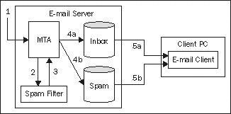

1.  传入的电子邮件由 MTA 接收。

1.  然后将其传递给垃圾邮件过滤器。

1.  然后将结果发送回 MTA。

1.  根据结果，MTA 将电子邮件放入适当用户的收件箱（**4a**），或者放入一个单独的垃圾邮件文件夹（**4b**）。

1.  电子邮件客户端可以访问用户的收件箱中的电子邮件，如果需要，也可以访问垃圾邮件文件夹。

这种方法有几个优点：

+   垃圾邮件过滤是在收到电子邮件时完成的，可能是一天中的任何时间。用户不太可能因延迟而感到不便。

+   服务器可以专门用于垃圾邮件过滤。它可以使用诸如开放中继阻止列表、在线内容数据库和 SURBL 之类的外部服务。

+   配置是集中的，这将简化设置（例如，防火墙可能需要配置为使用在线垃圾邮件测试）以及维护（更新规则或软件）。

另一方面，缺点包括：

+   现在存在一个单点故障。但是，经过小心配置，可以围绕一个破损的垃圾邮件过滤服务。如果服务不可用，电子邮件仍将被传递，但垃圾邮件将不会被过滤。

+   所有垃圾邮件必须由一个服务处理。如果此服务不可扩展，大量的电子邮件可能会影响邮件传递时间，导致过滤效果不佳或间歇性过滤，甚至可能导致电子邮件服务丢失。

# 介绍 SpamAssassin

实际上，垃圾邮件过滤涉及两个阶段——检测垃圾邮件，然后对其进行处理。SpamAssassin 是一个垃圾邮件检测器，它通过放置标头来修改它处理的电子邮件，以标记它是否是垃圾邮件。由 MTA 或电子邮件系统中的邮件传递代理对 SpamAssassin 在电子邮件中创建的标头做出反应，以过滤它。但是，电子邮件系统的另一部分也可能执行此任务。

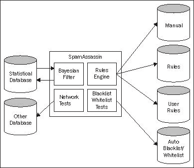

前面的图示给出了 SpamAssassin 的示意图。SpamAssassin 的核心是其**规则引擎**，确定调用哪些规则。规则触发各种测试的使用，包括贝叶斯过滤器、网络测试和自动白名单。

SpamAssassin 使用各种数据库来完成其工作，这些也显示出来。规则和分数是文本文件。SpamAssassin 分发中包含默认规则和分数，正如我们将看到的，系统管理员和用户都可以通过将它们添加到特定位置的文件中来添加规则或更改现有规则的分数。贝叶斯过滤器（这是 SpamAssassin 的一个重要部分，稍后将介绍）使用基于先前垃圾邮件和非垃圾邮件电子邮件的统计数据的数据库。**自动黑名单/白名单**也创建自己的数据库。

# 下载和安装 SpamAssassin

SpamAssassin 与本书中使用的大多数软件略有不同。它是用一种称为**Perl**的语言编写的，它有自己的分发方法称为**CPAN**（**Comprehensive Perl Archive Network**）。CPAN 是一个大型的 Perl 软件网站（通常是 Perl 模块），术语 CPAN 也是用于下载这些模块并安装它们的软件的名称。尽管 SpamAssassin 作为一个软件包由许多 Linux 发行版提供，但我们强烈建议您从源代码安装它，而不是使用软件包。这样，您将获得最新版本的 SpamAssassin，而不是在您的 Linux 发行商创建其发布时的版本。

大多数 Perl 用户将使用 CPAN 构建 Perl 模块并且不会遇到困难。CPAN 可以自动定位和安装任何依赖项（使所需组件正常工作所需的其他组件）。从 Perl 的角度来看，使用 CPAN 安装 Perl 模块就像在 Linux 中使用`rpm`或`apt-get`命令一样。基本操作非常简单，一旦系统配置好了，通常每次都能正常工作。

然而，学习和配置一种新的软件安装方式可能会让一些人望而却步。SpamAssassin 的发布以源代码形式分发，但基于**Red Hat Package Manager**（**RPM**）的系统的管理员可以轻松地将最新的 SpamAssassin 发布转换为 rpm 格式，然后可以使用常规的`rpm`命令来安装软件包。当 SpamAssassin 更新时，Debian 存储库也会相当快地更新，可以使用常规的`apt-get`命令来安装 SpamAssassin。我们强烈建议您优先使用`apt-get`、CPAN 或使用下面描述的`rpmbuild`命令来安装，而不是使用发行商提供的 RPM。

由于 SpamAssassin 是一个 Perl 模块，它首先出现在 CPAN 上。事实上，只有到达 CPAN 时才会发布。CPAN 的用户可以在发布几分钟后下载最新版本的 SpamAssassin。

如果从源代码构建 SpamAssassin，支持也更容易获得。一些发行商在创建他们的 SpamAssassin 的 RPM 时可能会做出不寻常的决定，或者可能修改某些默认值。这使得获得支持更加困难。

RPM 包也需要时间交付。发行商需要时间来构建和测试软件的新版本，然后才能发布它们，大多数软件包的更新速度不如 SpamAssassin 快。因此，Linux 发行版可能不提供最新的软件，提供的软件可能已经过时了几个版本。

## 使用 CPAN

使用 CPAN 安装 SpamAssassin 3.2.5 的先决条件如下：

+   **Perl 版本 5.6.1 或更高版本：**大多数现代 Linux 发行版将其作为基本软件包的一部分。

+   **多个 Perl 模块：**当前版本的 SpamAssassin 需要 Digest::SHA1、HTML::Parser 和 Net::DNS 模块。如果配置 CPAN 以遵循依赖关系，CPAN 将安装这些模块，但还有许多可选的 Perl 模块应该安装以获得最佳的垃圾邮件检测。CPAN 将发出带有模块名称的警告，这将使您能够识别并安装它们。

+   **C 编译器：**这可能不会默认安装，可能需要使用`rpm`命令添加。通常使用的编译器将被称为`gcc`。

+   **Internet 连接：**CPAN 将尝试使用`HTTP`或`FTP`下载模块，因此网络应该配置为允许此操作。

### 配置 CPAN

如果您以前使用过 CPAN，可以跳到下一节，*使用 CPAN 安装 SpamAssassin*。

如果 Internet 流量需要代理服务器，CPAN（以及其他 Perl 模块和脚本）将使用`http_proxy`环境变量。如果代理需要用户名和密码，则需要使用环境变量指定这些信息。由于 CPAN 通常以`root`身份运行，这些命令应该以`root`身份输入：

```
# HTTP_proxy=http://proxy.name:80
# export HTTP_proxy
# HTTP_proxy_user=username
# export HTTP_proxy_user
# HTTP_proxy_pass=password
# export HTTP_proxy_pass

```

接下来，输入以下命令：

```
# perl -MCPAN -e shell

```

如果输出类似于以下内容，则 CPAN 模块已安装并配置，您可以跳过下一节*使用 CPAN 安装 SpamAssassin*。

```
cpan shell -- CPAN exploration and modules installation (v1.7601)
ReadLine support enabled

```

如果输出提示手动配置，如下所示，CPAN 模块已安装但未配置。

```
Are you ready for manual configuration? [yes]

```

在配置期间，CPAN Perl 模块会提示回答大约 30 个问题。对于大多数问题，选择默认值是最佳响应。必须在使用 CPAN Perl 模块之前完成此初始配置。这些问题主要是关于各种实用程序的位置，可以通过按 Enter 选择默认值。我们应该更改默认值的唯一问题是关于构建先决模块的问题。如果我们配置 CPAN 以遵循依赖关系，它将在不提示的情况下安装所需的模块。

```
Policy on building prerequisites (follow, ask or ignore)? [ask] follow

```

配置 CPAN 后，通过输入`exit`并按*Enter*退出 shell。我们现在准备使用 CPAN 安装 SpamAssassin。

## 使用 CPAN 安装 SpamAssassin

要安装 SpamAssassin，请输入以下命令进入 CPAN shell：

```
# cpan

```

如果 CPAN 模块已正确配置，则将显示以下输出（或类似内容）：

```
cpan shell -- CPAN exploration and modules installation (v1.7601)
ReadLine support enabled

```

现在，在`cpan`提示符处，输入以下命令：

```
cpan> install Mail::SpamAssassin

```

CPAN 模块将查询在线数据库以查找 SpamAssassin 及其依赖项的最新版本，然后安装它们。在安装 SpamAssassin 之前将安装依赖项。以下是示例输出：

```
cpan> install Mail::SpamAssassin
CPAN: Storable loaded ok (v2.18)
Going to read '/root/.cpan/Metadata'
Database was generated on Mon, 03 Aug 2009 04:27:49 GMT
Running install for module 'Mail::SpamAssassin'
CPAN: Data::Dumper loaded ok (v2.121_14)
'YAML' not installed, falling back to Data::Dumper and Storable to read prefs '/root/.cpan/prefs'
Running make for J/JM/JMASON/Mail-SpamAssassin-3.2.5.tar.gz
CPAN: Digest::SHA loaded ok (v5.45)
CPAN: Compress::Zlib loaded ok (v2.015)
Checksum for /root/.cpan/sources/authors/id/J/JM/JMASON/Mail-SpamAssassin-3.2.5.tar.gz ok
Scanning cache /root/.cpan/build for sizes
............................................................................DONE
CPAN: Archive::Tar loaded ok (v1.38)
Will not use Archive::Tar, need 1.00
Mail-SpamAssassin-3.2.5
Mail-SpamAssassin-3.2.5/t
Mail-SpamAssassin-3.2.5/sql
Mail-SpamAssassin-3.2.5/lib
....
CPAN.pm: Going to build F/FE/FELICITY/Mail-SpamAssassin-3.00.tar.gz

```

SpamAssassin 可能需要用户回答一些问题。提供的答案可能会影响模块配置，或者只是安装前执行的测试的一部分。

```
CPAN.pm: Going to build J/JM/JMASON/Mail-SpamAssassin-3
What e-mail address or URL should be used in the suspected-spam report
text for users who want more information on your filter installation?
(In particular, ISPs should change this to a local Postmaster contact)
default text: [the administrator of that system] postmaster@myfomain.com
NOTE: settings for "make test" are now controlled using "t/config.dist".
See that file if you wish to customise what tests are run, and how.
checking module dependencies and their versions...

```

与许多 Perl 模块一样，SpamAssassin 非常灵活。如果可用，它可以利用功能，即使没有也可以工作。在使用 CPAN 时，您可能会看到以下消息：

```
optional module missing: Mail::SPF
optional module missing: Mail::SPF::Query
optional module missing: IP::Country
optional module missing: Razor2
optional module missing: Net::Ident
optional module missing: IO::Socket::INET6
optional module missing: IO::Socket::SSL
optional module missing: Mail::DomainKeys
optional module missing: Mail::DKIM
optional module missing: DBI
optional module missing: Encode::Detect

```

如果安装了提到的模块，SpamAssassin 将使用它们，这将改善电子邮件过滤。您可以中止 SpamAssassin 的安装，并使用 cpan `install Module::Name`命令安装模块。

如果让构建过程完成，它将测试 C 编译器的功能，配置和构建模块，创建文档并测试 SpamAssassin。在构建结束时，输出应类似于以下内容：

```
chmod 755 /usr/share/spamassassin
/usr/bin/make install -- OK
cpan>

```

这表明 SpamAssassin 已经正确安装。如果 SpamAssassin 安装成功，您可以跳过*测试安装*部分。

如果安装失败，输出可能如下所示：

```
Failed 17/68 test scripts, 75.00% okay. 50/1482 subtests
failed, 96.63% okay.
make: *** [test_dynamic] Error 29
/usr/bin/make test -- NOT OK
Running make install
make test had returned bad status, won't install without force
cpan>

```

如果输出不以`/usr/bin/make install -- OK`消息结束，则发生错误。首先，您应该检查所有输出以查找可能的警告和错误消息，特别是先决软件包。如果这没有帮助，那么支持途径将在*测试安装*部分中描述。

## 使用 rpmbuild 实用程序

如果使用基于 Red Hat 软件包管理器格式的 Linux 版本，则可以使用`rpmbuild`命令安装 SpamAssassin。从[`www.cpan.org/modules/01modules.index.html`](http://www.cpan.org/modules/01modules.index.html)下载 SpamAssassin 源代码到工作目录，然后发出以下命令构建 SpamAssassin：

```
# rpmbuild -tb Mail-SpamAssassin-3.2.5.tar.gz
```

```
Executing(%prep): /bin/sh -e /var/tmp/rpm-tmp.ORksvX
+ umask 022
+ cd /root/rpmbuild/BUILD
+ cd /root/rpmbuild/BUILD
+ rm -rf Mail-SpamAssassin-3.2.5
+ /usr/bin/gzip -dc /root/Mail-SpamAssassin-3.2.5.tar.gz
+ /bin/tar -xf -
+ STATUS=0
+ '[' 0 -ne 0 ']'
+ cd Mail-SpamAssassin-3.2.5
+ /bin/chmod -Rf a+rX,u+w,g-w,o-w .
+ exit 0
Executing(%build): /bin/sh -e /var/tmp/rpm-tmp.zgpcdd
...
... (output continues)
...
Wrote: /usr/src/redhat/RPMS/i386/spamassassin-3.0.4-1.i386.rpm Wrote: /usr/src/redhat/RPMS/i386/spamassassin-tools-3.0.4-1.i386.rpm Wrote: /usr/src/redhat/RPMS/i386/perl-Mail-SpamAssassin-3.0.4-1.i386.rpm Executing(%clean): /bin/sh -e /var/tmp/rpm-tmp.65065 + umask 022 + cd /usr/src/redhat/BUILD + cd Mail-SpamAssassin-3.0.4 + '[' /var/tmp/spamassassin-root '!=' / ']' + rm -rf /var/tmp/spamassassin-root + exit 0

```

由于缺少依赖关系，安装可能会失败。这些是 SpamAssassin 使用的 Perl 模块，需要单独安装。错误消息通常会暗示依赖项的名称，如以下安装中所示：

```
# rpmbuild -tb Mail-SpamAssassin-3.2.5.tar.gz
```

```
error: Failed build dependencies:
perl(Digest::SHA1) is needed by spamassassin-3.2.5-1.i386
perl(HTML::Parser) is needed by spamassassin-3.2.5-1.i386
perl(Net::DNS) is needed by spamassassin-3.2.5-1.i386

```

在这种情况下，需要 Perl 模块`Digest::SHA1, HTML::Parser`和`Net::DNS`。解决方案是使用 CPAN 安装它。在某些情况下，SpamAssassin 可能需要特定版本的软件包，这可能需要升级已安装的版本。

使用 CPAN 安装 SpamAssassin 时，所有依赖项都会自动安装。但是，使用`rpmbuild`命令时，需要手动安装依赖项。使用 CPAN 通常比`rpmbuild`更不麻烦。

## 使用预构建的 RPM

SpamAssassin 打包在许多 Linux 发行版中，并且通常可以从其他来源获得 SpamAssassin 的新版本的软件包。如前所述，RPM 不是安装 SpamAssassin 的推荐方法，但比在不寻常的平台上从源代码构建更可靠。

要安装 RPM，只需下载或在发行 CD 上找到它，并使用`rpm`命令安装它。以下命令可用于安装 SpamAssassin 的 RPM：

```
# rpm -ivh /path/to/rpmfile-9.99.rpm

```

也可以使用图形安装程序来安装 SpamAssassin 的 RPM。SpamAssassin 网站上列出的 RPM 通常是最新版本的 SpamAssassin，并且是完整的。如果无法安装这些 RPM，则应安装 Linux 发行版提供的 RPM。

## 测试安装

值得进行一些测试，以确保 SpamAssassin 已正确安装并且环境是完整的。如果要测试特定用户帐户，应登录到该帐户执行测试。

SpamAssassin 包括一个样本垃圾邮件和一个样本非垃圾邮件。可以通过处理样本电子邮件来进行测试。这些电子邮件位于 SpamAssassin 分发目录的根目录。如果您使用 CPAN 以`root`用户安装 SpamAssassin，则该目录的路径可能类似于`~root/.cpan/build/Mail-SpamAssassin-3.2.5/`，其中`3.2.5`是安装的 SpamAssassin 版本。如果找不到文件，请从[`www.cpan.org/modules/01modules.index.html`](http://www.cpan.org/modules/01modules.index.html)下载 SpamAssassin 源代码并将源代码解压缩到临时目录。样本电子邮件位于解压后源代码的根目录中。

要测试 SpamAssassin，请切换到包含`sample-spam.txt`的目录，并使用以下命令。每个命令后都显示了示例结果。

```
$ spamassassin -t < sample-nonspam.txt | grep X-Spam

```

```
[22674] warn: config: created user preferences file: /home/user/.spamassassin/user_prefs
X-Spam-Checker-Version: SpamAssassin 3.2.5 (2008-06-10) on
X-Spam-Level:
X-Spam-Status: No, score=0.0 required=5.0 tests=none autolearn=haX-

```

```
$ spamassassin -t < sample-spam.txt | grep X-Spam

```

```
X-Spam-Flag: YES
X-Spam-Checker-Version: SpamAssassin 3.2.5 (2008-06-10) on
X-Spam-Level: **************************************************
X-Spam-Status: Yes, score=1000.0 required=5.0 tests=GTUBE,NO_RECEIVED,
X-Spam-Report:
X-Spam-Prev-Subject: Test spam mail (GTUBE)

```

使用`sample-nonspam.txt`命令的输出应该是`X-Spam-Status: No`，使用`sample-spam.txt`命令的输出应该是`X-Spam-Flag: YES`和`X-Spam-Status: Yes`。

SpamAssassin 可以使用`--lint`标志验证其配置文件并报告任何错误。默认情况下，干净的 SpamAssassin 安装不应该有任何错误，但一旦网站被定制，一些规则可能会失败。在下面的示例中，`score`条目与规则不匹配：

```
$ spamassassin --lint

```

```
warning: score set for non-existent rule RULE_NAME
lint: 1 issues detected. please run with debug enabled for more
information

```

如果输出包含警告，那么出现了问题。在继续使用之前，值得修复 SpamAssassin。最好的参考资料是 SpamAssassin Wiki（[`wiki.apache.org/spamassassin/`](http://wiki.apache.org/spamassassin/)）、SpamAssassin 邮件列表的存档（[`wiki.apache.org/spamassassin/MailingLists`](http://wiki.apache.org/spamassassin/MailingLists)）以及您喜欢的搜索引擎。与大多数开源项目一样，开发人员是志愿者，他们欣赏那些在发布求助请求之前搜索解决方案的用户，因为大多数问题以前已经遇到过很多次。

### 修改后的电子邮件

除了提到的电子邮件标题之外，如果认为是垃圾邮件，SpamAssassin 还会修改电子邮件。它会将原始电子邮件转换为一个简单的电子邮件附件。如果检测到潜在病毒或其他危险内容，SpamAssassin 总是会包装电子邮件。在其默认配置中，它会在垃圾邮件周围添加一个信封电子邮件，但如果需要，可以关闭此功能。请参阅 SpamAssassin 文档中的`report_safe`指令。信封电子邮件如下所示：

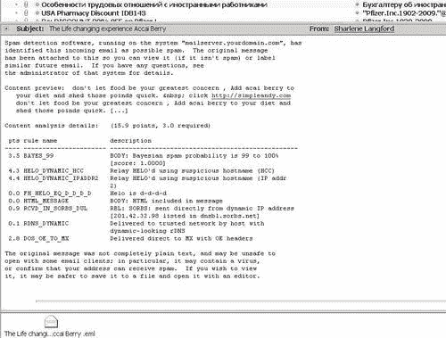

# 使用 SpamAssassin

现在 SpamAssassin 已安装，我们需要配置系统来使用它。SpamAssassin 可以以多种方式使用。它可以集成到 MTA 中以获得最大性能；它可以作为守护程序运行或作为简单脚本以避免复杂性；它可以为每个用户使用单独的设置或为所有用户使用单一设置；它可以用于所有帐户或仅用于选择的帐户。在本书中，我们将讨论三种使用 SpamAssassin 的方法。

第一种方法是使用 Procmail。这是配置最简单的方法，适用于低流量站点，例如每天少于 10,000 封电子邮件。

第二种方法是将 SpamAssassin 作为守护程序使用。这更有效，并且如果需要的话，仍然可以与 Procmail 一起使用。

第三种方法是将 SpamAssassin 与诸如 amavisd 之类的内容过滤器集成。这提供了性能优势，但有时内容过滤器与最新版本的 SpamAssassin 不兼容。如果有任何问题，通常会很快解决。

### 注意

为了帮助您充分利用 SpamAssassin，Packt Publishing 出版了*SpamAssassin: A practical guide to integration and configuration*，作者是 Alistair McDonald（ISBN 1-904811-12-4）。

## 使用 Procmail 与 SpamAssassin

Procmail 在第六章和第七章中有所涉及。如果你对 Procmail 有基本的了解，那么接下来的内容应该很容易理解。如果你直接跳到这一章而不了解 Procmail，那么最好先阅读第六章，该章节讨论了 Procmail 的基础知识。

在我们配置系统使用 SpamAssassin 之前，让我们考虑一下 SpamAssassin 的作用。SpamAssassin *不是*一个电子邮件过滤器。过滤器是改变电子邮件目的地的东西。SpamAssassin 会向电子邮件消息添加电子邮件头，以指示它是否是垃圾邮件。

考虑一个具有以下头部的电子邮件：

```
Return-Path: <user@domain.com>
X-Original-To: jdoe@localhost
Delivered-To: jdoe@host.domain.com
Received: from localhost (localhost [127.0.0.1])
by domain.com (Postfix) with ESMTP id 52A2CF2948
for <jdoe@localhost>; Thu, 11 Nov 2004 03:39:42 +0000 (GMT)
Received: from pop.ntlworld.com [62.253.162.50]
by localhost with POP3 (fetchmail-6.2.5)
for jdoe@localhost (single-drop); Thu, 11 Nov 2004 03:39:42 +0000 (GMT)
Message-ID: <D8F7B41C.4DDAFE7@anotherdomain.com>
Date: Wed, 10 Nov 2004 17:54:14 -0800
From: "stephen mellors" <gregory@anotherdomain.com>
User-Agent: MIME-tools 5.503 (Entity 5.501)
X-Accept-Language: en-us
MIME-Version: 1.0
To: "Jane Doe" <jdoe@domain.com>
Subject: nearest pharmacy online
Content-Type: text/plain;
charset="us-ascii"
Content-Transfer-Encoding: 7bit

```

SpamAssassin 将添加头部行。

```
X-Spam-Flag: YES
X-Spam-Checker-Version: SpamAssassin 3.1.0-r54722 (2004-10-13) on
host.domain.com
X-Spam-Level: *****
X-Spam-Status: Yes, score=5.8 required=5.0 tests=BAYES_05,HTML_00_10,
HTML_MESSAGE,MPART_ALT_DIFF autolearn=no
version=3.1.0-r54722

```

SpamAssassin 不会改变电子邮件的目的地，它只是添加头部，以便其他东西改变电子邮件的目的地。

判断一封电子邮件是否是垃圾邮件的最佳指标是`X-Spam-Flag`。如果是`YES`，SpamAssassin 认为该邮件是垃圾邮件，并且可以被 Procmail 过滤。

SpamAssassin 还为每封电子邮件分配一个分数，分数越高，该邮件是垃圾邮件的可能性就越大。确定一封电子邮件是否是垃圾邮件的阈值可以在系统范围或每个用户的基础上进行配置。如果您使用未经修改的 SpamAssassin 安装和没有自定义规则集，则默认值`5.0`是一个明智的默认值。

### 全局 procmailrc 文件

假设我们想要使用 SpamAssassin 检查所有传入的电子邮件是否为垃圾邮件。`/etc/procmailrc`文件中的命令将为所有用户运行，因此在这里执行 SpamAssassin 是理想的。

将以下简单的配方放置在`/etc/procmailrc`中，将为所有用户运行 SpamAssassin：

```
:0fw
| /usr/bin/spamassassin

```

要将所有垃圾邮件放在单独的垃圾邮件文件夹中，请确保`global/etc/procmailrc`文件中有一行指定默认目的地。例如：

```
DEFAULT=$HOME/.maildir/

```

如果不是，则添加一行指定`DEFAULT`。要将垃圾邮件过滤到文件夹中，请添加类似以下的配方：

```
* ^X-Spam-Flag: Yes
.SPAM/new

```

这假设每个用户已经配置了一个名为`SPAM`的文件夹。

要将所有垃圾邮件放在一个单一的中央文件夹中，请在配方中使用目的地的绝对路径：

```
* ^X-Spam-Flag: Yes
/var/spool/poss_spam

```

这将把所有垃圾邮件放在一个单独的文件夹中，可以由系统管理员进行审核。由于常规电子邮件偶尔会被错误地检测为垃圾邮件，因此该文件夹不应该是全世界可读的，这导致了一个更普遍的陈述。

### 注意

SpamAssassin 将在由 Postfix 使用的系统帐户下运行。这意味着贝叶斯数据库和自动白名单和黑名单将被所有用户共享。从安全的角度来看，重要的是 SpamAssassin 创建的各种数据库不可被全世界写入。

SpamAssassin 将用户特定文件存储在`~/.spamassassin/`目录中。以下是用户可能存在的文件列表：

| 文件 | 内容 |
| --- | --- |
| `auto-whitelist``aauto-whitelist.db``aauto-whitelist.dir``aauto-whitelist.pag` | SpamAssassin 创建一个用户发送非垃圾邮件的数据库，并使用它来预测特定发件人的电子邮件是垃圾邮件还是非垃圾邮件。这些文件用于跟踪用户。 |
| `bayes_journal``bayes_seen``bayes_toks` | SpamAssassin 使用一种称为贝叶斯分析的统计技术。这些文件用于此功能。 |
| `user_prefs` | 此文件允许为特定用户覆盖全局设置。该文件可以包含配置设置、规则和分数。 |

其中一些可能包含机密数据，例如，常规联系人将出现在自动白名单文件中。谨慎使用权限将确保这些文件不可被普通用户帐户读取。

### 在每个用户的基础上使用 SpamAssassin

也许有些用户不会收到垃圾邮件，或者用户共享白名单和贝叶斯数据库可能存在问题。SpamAssassin 可以通过将配方移动到特定用户的`~/.procmailrc`来在个人基础上运行。这应该提高每个用户的过滤性能，但会增加每个用户的磁盘空间使用量，并需要通过修改其`~/.procmailrc`设置每个单独的用户帐户。

典型用户的`.procmailrc`可能如下所示：

```
MAILDIR=$HOME/.maildir
:0fw
| /usr/bin/spamassassin
:0
* ^X-Spam-Flag: Yes
.SPAM/cur

```

如建议的，有时电子邮件可能被错误地检测为垃圾邮件。值得回顾垃圾邮件，以确保合法的电子邮件没有被错误分类。如果用户收到大量垃圾邮件，那么浏览所有这些邮件是耗时、乏味且容易出错的。Procmail 可以通过检查 SpamAssassin 在电子邮件标题中写入的垃圾邮件分数来过滤垃圾邮件。

低分垃圾邮件（例如，得分高达 9 分）可以放在一个名为`Probable_Spam`的文件夹中，而得分更高的垃圾邮件（更有可能是垃圾邮件）可以放在一个名为`Certain_Spam`的文件夹中。

为此，我们使用 SpamAssassin 创建的`X-Spam-Level`标题。这只是与`X-Spam-Level`值相关的星号数量。通过将具有超过一定数量星号的电子邮件移动到`Certain_Spam`文件夹，其余的垃圾邮件就是“Probable Spam”。标有`X-Spam-Flag: NO`的电子邮件显然不是垃圾邮件。

以下的`.procmailrc`文件将高分垃圾邮件与低分垃圾邮件和非垃圾邮件分开过滤：

```
MAILDIR=$HOME/.maildir
:0fw
| /usr/bin/spamassassin
:0
* ^X-Spam-Level: \*\*\*\*\*\*\*\*\*\*\*\*\*\*
.Certain_Spam/cur
:0
* ^X-Spam-FLAG: YES
.Probable_Spam/cur

```

## 使用 SpamAssassin 作为 Postfix 的守护程序

守护程序是一个后台进程；它等待工作，处理工作，然后等待更多工作。使用这种方法实际上提高了性能（只要有足够的内存），因为响应性得到了改善——程序始终准备好并等待，不需要每次需要标记垃圾邮件时加载。

要将 SpamAssassin 作为守护程序使用，应添加一个用户帐户——以`root`身份运行任何服务都是危险的。作为`root`，输入以下命令以创建名为 spam 的用户和组：

```
# groupadd spam
# useradd -m -d /home/spam -g spam -s /bin/false spam
# chmod 0700 /home/spam

```

要配置 Postfix 运行 SpamAssassin，使用 SpamAssassin 作为守护程序。必须更改 Postfix 的`master.cf`文件。编辑文件并找到以`'smtp inet'`开头的行。修改该行以在末尾添加`-o content_filter=spamd`。

```
smtp inet n - n - - smtpd -o content_filter=spamd

```

在文件末尾添加以下行：

```
spamd unix - n n - - pipe
flags=R user=spam argv=/usr/bin/spamc
-e /usr/sbin/sendmail -oi -f ${sender} ${recipient}

```

如果文本跨越多行，则任何继续的行必须以所示的空格开头。对文件的更改定义了一个名为`spamd`的过滤器，该过滤器为每条消息运行`spamc`客户端，并且还指定应在通过 SMTP 接收电子邮件时运行该过滤器。

在此行上，`spamd`是过滤器的名称，并与`content_filter`行中使用的名称匹配。`user=`部分指定应用于运行命令的用户上下文。`argv=`部分描述应运行的程序。Procmail 使用其他标志，它们的存在很重要。

## 使用 SpamAssassin 与 amavisd-new

**amavisd-new**是 MTA 和内容检查器之间的接口。尽管它的名字是 amavisd-new，但它是一个经过良好维护的开源软件包。内容检查器扫描电子邮件以查找病毒和/或垃圾邮件。amavisd-new 略有不同。就像`spamd`一样，它是用 Perl 编写的并作为守护进程运行，但它不是通过`spamc`或`spamassassin`客户端访问 SpamAssassin，而是将 SpamAssassin 加载到内存中并直接访问 SpamAssassin 函数。因此，它与 SpamAssassin 紧密耦合，可能需要与 SpamAssassin 同时升级。

与其他基于 Perl 的应用程序和实用程序不同，amavisd-new 无法从 CPAN 获取。但是，它以源代码和 RPM 形式提供给许多 Linux 发行版，并且也可用于基于 debian 的存储库。可用版本的详细信息在[`www.ijs.si/software/amavisd/#download`](http://www.ijs.si/software/amavisd/#download)上列出。我们建议，如果您的发行商提供的 SpamAssassin 版本是最新的，那么您应该使用他们提供的 SpamAssassin 和 amavisd 的软件包。

### 从软件包安装 amavisd-new

要从软件包安装 amavisd-new，请在基于 RPM 的发行版上使用`rpm`命令。amavisd-new 有许多依赖项，所有这些依赖项都是 Perl 模块。每个版本可能具有不同的依赖项，这些依赖项在软件包的安装文件中列出。版本 2.6.2 的 Perl 先决条件如下：

```
Archive::Zip
BerkeleyDB
Convert::BinHex
Convert::TNEF
Convert::UUlib
Crypt::OpenSSL::Bignum
Crypt::OpenSSL::RSA
Digest::HMAC
Digest::Sha1
IO::Multiplex
IO::Stringy
MIME::Tools
Mail::DKIM
Net::CIDR
Net::DNS
Net::IP
Net::Server
Unix::Syslog

```

要查看特定版本的 amavisd-new 的先决条件，请按照这里所示的方式下载源代码并解压缩，然后阅读安装文件。

```
$ cd /some/dir
$ wget http://www.ijs.si/software/amavisd/amavisd-new-2.6.2.tar.gz
$ tar xfz amavisd-new-2.6.2.tar.gz
$ cd amavisd-new-2.6.2
$ vi INSTALL

```

其中一些依赖项可能已经安装，因为它们也被 SpamAssassin 使用。

### 安装先决条件

一些基于 RPM 的 Linux 发行版可能会自动安装先决条件作为依赖项。对于其他发行版，必须从 CPAN 下载并安装所有先决条件。使用`cpan`命令最容易实现这一点。另一种方法是分别下载每个先决条件的源代码，并使用以下命令安装它：

```
$ cd /some/directory
$ gunzip -c source-nn.tar.gz | tar xf -
$ cd source-nn
$ perl Makefile.pl
$ make test
$ su
# make install

```

### 从源代码安装

amavisd-new 没有 makefile、配置脚本或安装例程。要安装它，唯一的可执行脚本应复制到`/usr/local/bin`，并修改其属性以确保它不能被非 root 用户修改：

```
# cp amavisd /usr/local/sbin/
# chown root /usr/local/sbin/amavisd
# chmod 755 /usr/local/sbin/amavisd

```

示例`amavisd.conf`文件应复制到`/etc`，并且其属性也应该被修改。

```
# cp amavisd.conf /etc/
# chown root /etc/amavisd.conf
# chmod 644 /etc/amavisd.conf

```

amavisd-new 必须配置为作为守护进程运行，因此示例`init`脚本应复制到适当的目录。

```
# cp amavisd_init.sh /etc/init.d/amavisd-new

```

`init`脚本也应添加到系统启动中。大多数 Linux 发行版使用`chkconfig`命令来执行此操作。

```
# chkconfig --add amavisd-new

```

### 为 amavisd-new 创建用户帐户

要创建用户帐户，首先使用`groupadd`命令创建一个专用组，然后使用`useradd`命令添加用户。

```
# groupadd amavis
# useradd -m -d /home/amavis -g amavis -s /bin/false amavis

```

### 配置 amavisd-new

`/etc/amavisd.conf`文件需要进行一些更改。该文件将被解析为 Perl 源代码，语法很重要。每行应以分号结尾，大小写很重要。以下变量声明行应更改为包含以下值：

```
$MYHOME = '/home/amavis';
$mydomain = 'domain.com';
$daemon_user = 'amavis';
$daemon_group = 'amavis';
$max_servers = 5; # number of pre-forked children (default 2)

```

确保为`$mydomain`指定了正确的域。为`$max_servers`指定的数字`5`是将同时运行的守护进程的数量。如果您有适量的电子邮件，例如每秒少于十封邮件，那么默认设置就足够了。

在`/etc/amavisd.conf`中，有一个关于 SpamAssassin 相关配置设置的部分：

```
$sa_tag_level_deflt = 2.0;
$sa_tag2_level_deflt = 6.2;
$sa_kill_level_deflt = 6.9;

```

这三个设置与正在处理的电子邮件相关的 SpamAssassin 分数级别一起使用。`$sa_tag_level_deflt`设置是将正常邮件与垃圾邮件分开的阈值，并且将`X-Spam-Status`和`X-Spam-Level`头添加到电子邮件中。

得分低于此阈值的电子邮件不会添加头，而得分高于阈值的电子邮件将添加头。`$sa_kill_level_deflt`设置是拒绝垃圾邮件的阈值。

默认配置是拒绝垃圾邮件。要将垃圾邮件转发到另一个电子邮件地址，请找到指定`$final_spam_destiny`的行，如果不存在则添加一行，并将其设置为以下内容：

```
$final_spam_destiny = D_PASS; # (defaults to D_REJECT)

```

必须定义垃圾邮件的接收者。找到指定`$spam_quarantine_to`的行，并更改它或添加一个以包含电子邮件地址。在此步骤中早期配置的`$mydomain`变量可以用于引用域名，记得在`@`符号前加上反斜杠。

```
$spam_quarantine_to = "spam-quarantine\@$mydomain";

```

现在，应该启动 amavisd-new。大多数 Linux 发行版使用以下命令：

```
# /etc/init.d/amavisd-new start

```

### 配置 Postfix 以运行 amavisd-new

编辑`/etc/postfix/master.cf`并找到以下行：

```
smtp inet n - n - - smtpd

```

在此之后添加以下内容：

```
smtp-amavis unix y - 5 smtp
-o smtp_data_done_timeout=1200
-o disable_dns_lookups=yes
127.0.0.1:10025 inet n y-- smtpd
-o content_filter=
-o local_recipient_maps=
-o relay_recipient_maps=
-o smtpd_restriction_classes=
-o smtpd_recipient_restrictions=permit_mynetworks,reject
-o mynetworks=127.0.0.0/8
-o strict_rfc821_envelopes=yes

```

在`smtp-amavis`行中，数字`5`指定可以同时使用的实例数。这应该对应于`amavisd.conf`文件中指定的`$max_servers`条目。

编辑`/etc/postfix/main.cf`并在文件末尾添加以下行：

```
content_filter = smtp-amavis:[localhost]:10024

```

使用`postfix reload`命令重新启动 Postfix：

```
# postfix reload

```

# 配置电子邮件客户端

通过使用电子邮件客户端而不是使用 Procmail 将垃圾邮件放入单独的文件夹中，可以执行此操作。大多数电子邮件客户端允许创建规则或过滤器。这些通常在阅读新邮件或打开文件夹时生效。

电子邮件客户端中的规则根据电子邮件头的值运行。最好使用`X‑Spam-Flag`并搜索值`YES`。将标记的邮件移动到单独的文件夹的过程如下所述：

1.  为存储垃圾邮件创建文件夹或邮箱。文件夹名称应该直观，例如`Spam`。

1.  创建一个在电子邮件到达时运行的规则。该规则应该在邮件头中查找文本`X‑Spam-Flag`。

1.  规则上的操作应该是将电子邮件移动到在第一步创建的“垃圾邮件”文件夹中。

1.  创建过滤器后，发送测试邮件，包括垃圾邮件和非垃圾邮件，以检查过滤器是否正常工作。

## Microsoft Outlook

Microsoft Outlook 在大型组织中很受欢迎。它与 IMAP 服务器集成良好。按照以下步骤配置 Outlook 以根据电子邮件头中的`X‑Spam‑Flag`过滤垃圾邮件：

### 注意

这些说明基于随 Microsoft Office XP 一起提供的 Outlook；其他版本具有类似的配置细节。

1.  创建一个用于存储垃圾邮件的文件夹。单击文件夹列表中的“Inbox”以选择它，右键单击并从菜单中选择“新建文件夹”。选择 Spam 或其他有意义的名称，然后单击“确定”。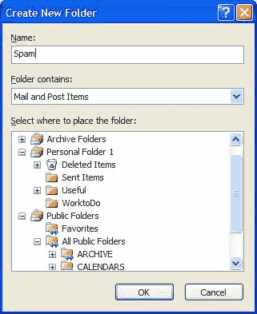

1.  单击“工具”菜单，然后选择“规则和警报”。单击“新建规则”以创建新规则。

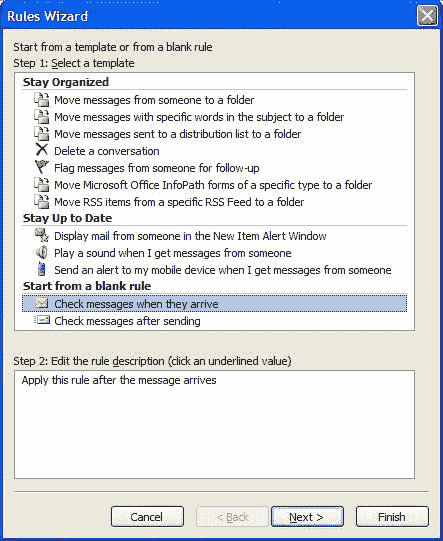

1.  从“从空白规则开始”下选择“在邮件到达时检查邮件”。单击“下一步”。

1.  在邮件头中检查特定单词。这将允许 Outlook 检查 X-Spam-Flag 电子邮件头。单击“特定单词”以选择正确的短语。

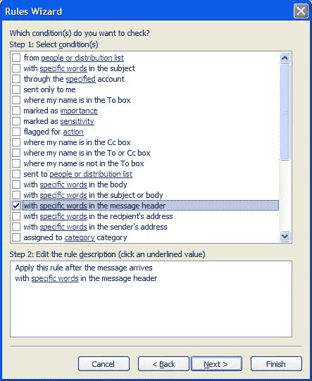

1.  在下一个对话框中，仔细输入“X-Spam-Flag: YES”，然后单击“添加”。然后单击“确定”，再单击“下一步”。

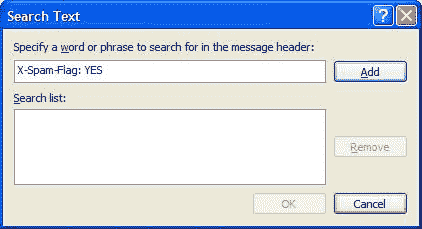

1.  下一个窗口提供了选择操作的选项。选择“将其移动到指定的文件夹”，然后单击“指定”，这将显示一个文件夹列表。

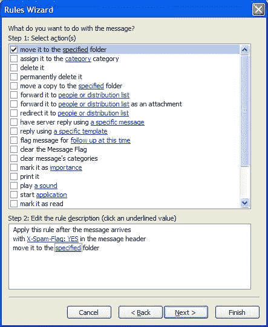

1.  选择之前创建的文件夹，然后单击“确定”。单击“完成”。没有例外情况，因此再次单击“下一步”。

1.  规则向导允许立即在收件箱中的任何现有邮件上运行规则。要做到这一点，请确保“启用此规则”旁边的复选框被选中。

1.  最后，单击“完成”，规则将被创建并应用于收件箱中的所有邮件。

## Microsoft Outlook Express

Outlook Express 随 Windows 的大多数版本一起提供，包括 Windows XP。它提供了 POP3 连接和许多功能，如 HTML 电子邮件。一些电子邮件客户端，包括 Outlook Express，不允许对每个电子邮件头部进行过滤，而只能对特定的头部进行过滤，比如`From:`和`Subject:`头部。默认情况下，SpamAssassin 只写入额外的头部，但可以配置为更改电子邮件的`主题、发件人`或`收件人`头部。要做到这一点，应该更改`/etc/spamassassin/local.cf`文件。这种更改也可以通过编辑`~user/.spamassassin/user_prefs`来实现每个用户的基础上。

将以下行添加到文件中：

```
rewrite_header Subject *****SPAM*****

```

这将把电子邮件的标题更改为`*****SPAM*****`。如果需要，可以更改标签。

现在 SpamAssassin 配置完成，Outlook Express 可以配置为对修改后的消息主题进行操作。按照以下步骤进行：

1.  为垃圾邮件创建一个文件夹。要做到这一点，选择**文件**菜单，点击**文件夹**，然后点击**新建**。输入**垃圾邮件**，或者其他描述性的名称作为文件夹名称，然后点击**确定**。

1.  选择**工具**菜单，然后选择**消息规则**，然后选择**新建**。在下一个窗口中，确保条件包括**主题行包含特定单词**，操作包括**将其移动到指定的文件夹**。

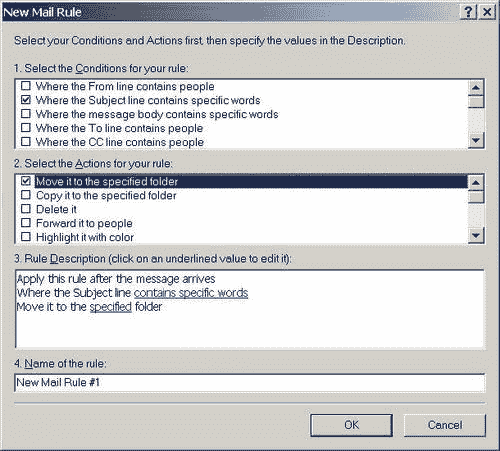

1.  点击**包含特定单词**，并输入*******SPAM*******，或者在配置 SpamAssassin 时选择的替代短语。点击**确定**。

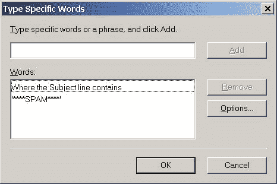

1.  在**规则描述**的下一行中点击**指定**。选择创建的文件夹，然后点击**确定**。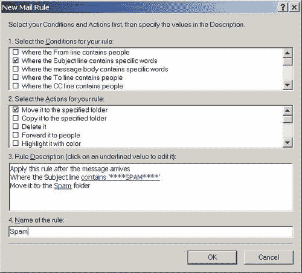

1.  规则已经总结。给它一个有意义的名称，比如垃圾邮件，然后点击**确定**保存它。

## Mozilla Thunderbird

Mozilla Thunderbird 是一个免费的开源电子邮件客户端，具有大部分 Microsoft Outlook 的功能。可以在[www.mozilla.org/products/thunderbird/](http://www.mozilla.org/products/thunderbird/)免费获取。它具有完整的过滤功能。要配置它，请按照以下步骤进行：

1.  创建一个文件夹来存储垃圾邮件。点击**文件**菜单，选择**新建** | **文件夹**。选择一个位置（收件箱应该没问题），然后输入一个名称，比如**垃圾邮件**。点击**确定**。

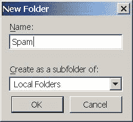

1.  点击**工具**菜单，选择**消息过滤器**。点击**新建**按钮创建一个新的过滤器。

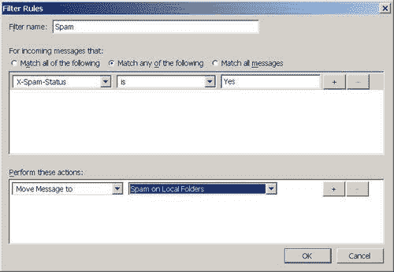

1.  在下一个对话框中，选择一个过滤器的名称，比如**垃圾邮件**。然后选择**匹配以下任意内容**按钮。在左侧列表中，输入**X-Spam-Status**，在中间列表中选择**是**，在右侧选择**是**。在下面的框中，点击**移动消息到**，并选择在第一步创建的文件夹。

1.  点击**确定**，规则摘要将显示规则。点击**立即运行**以测试规则。

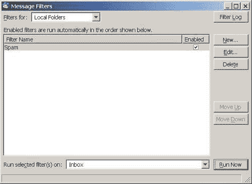

# 自定义 SpamAssassin

SpamAssassin 非常灵活。几乎每个设置都可以在系统范围或用户特定的基础上进行配置。

## 自定义的原因

如果 SpamAssassin 如此出色，为什么还要配置它呢？嗯，有几个原因值得改进 SpamAssassin 的垃圾邮件过滤。

+   SpamAssassin 默认情况下（即安装但未自定义时）通常能够检测超过 80%的垃圾邮件。添加一些自定义后，检测率可以超过 95%。

+   每个人的垃圾邮件都是不同的，一个用户的垃圾邮件可能看起来像另一个用户的正常邮件。试图变得普遍化，SpamAssassin 可能无法为每个用户过滤垃圾邮件。

+   SpamAssassin 的一些功能默认情况下是禁用的。通过启用它们，可以提高垃圾邮件识别率。

本章讨论了以下配置选项：

+   **修改规则的分数：**这允许禁用规则，给予较差规则较少的权重，并给予较好规则更高的权重。

+   **获取和使用新规则：**这可以改善垃圾邮件检测。

+   **将电子邮件地址添加到白名单和黑名单：**这允许来自指定发件人的电子邮件始终被视为垃圾邮件，无论内容如何，或者相反。

+   **启用 SpamAssassin 的贝叶斯过滤器：**这可以将过滤准确度从 80%提高到 95%或更高。

## 规则和分数

标准、站点范围和用户特定设置的配置文件保存在不同的目录中，如下所示：

+   标准配置设置存储在`/usr/share/spamassassin`中。

+   站点范围的自定义和设置存储在`/etc/mail/spamassassin/`中。SpamAssassin 会检查所有与`*.cf`匹配的文件。

+   用户特定设置存储在`~/.spamassassin/local.cf`中。

大部分标准配置文件用于简单规则及其分数。

规则通常是与字母、数字或其他打印字符匹配。规则使用一种称为正则表达式或简称为 regex 的技术编写。这是一种简写方法，用于指定某些字符组合将触发规则。规则可能尝试检测特定单词，例如“劳力士”，或者可能按特定顺序查找特定单词，例如“在线购买劳力士”。规则存储在文本文件中。

默认文件存储在`/usr/share/spamassassin`中。这些文件是随 SpamAssassin 一起提供的，并且可能会在每个版本中更改。最好不要修改这些文件或在此目录中放置新文件，因为升级到 SpamAssassin 将覆盖这些文件。SpamAssassin 使用的大部分规则以及应用于每个规则的分数在此目录中的文件中定义。

默认设置可以被站点范围配置文件覆盖。这些文件放置在`/etc/mail/spamassassin`中。SpamAssassin 将读取此目录中与`*.cf`匹配的所有文件。在此处进行的设置可以覆盖默认文件中的设置。它们可以包括定义新规则和新规则分数。

用户特定的自定义可以放置在`~/.spamassassin/local.cf`文件中。在此处进行的设置可以覆盖在`/etc/mail/spamassassin`中定义的站点范围设置和在`/usr/share/spamassassin/`中定义的默认设置。可以在此处定义新规则，并覆盖现有规则的分数。

SpamAssassin 首先按字母数字顺序读取`/usr/share/spamassassin`中的所有文件；`10_misc.cf`将在`23_bayes.cf`之前读取。然后，SpamAssassin 再次按字母数字顺序读取`/etc/mail/spamassassin/`中的所有`.cf`文件。最后，SpamAssassin 读取`~user/.spamassassin/user_prefs`。如果在两个文件中定义了规则或分数，则使用最后读取的文件中的设置。这允许管理员覆盖默认设置，用户覆盖站点范围设置。

规则文件中的每一行可以是空白的，也可以包含注释或命令。井号（#）符号用于注释。规则通常有三个部分，规则定义、文本描述和分数或一系列分数。约定规定，SpamAssassin 提供的所有规则分数应该位于单独的文件中。该文件是`/usr/share/spamassassin/50_scores.cf`。

## 修改规则分数

最简单的配置更改是更改规则分数。这样做的两个原因是：

+   一个规则非常擅长检测垃圾邮件，但得分很低。触发该规则的电子邮件未被检测为垃圾邮件。

+   一个规则正在作用于非垃圾邮件。因此，触发该规则的电子邮件被错误地检测为垃圾邮件。

当运行 SpamAssassin 时产生积极结果的规则将列在电子邮件的`X-Spam-Status:`头中：

```
X-Spam-Status: Yes, score=5.8 required=5.0 tests=BAYES_05,HTML_00_10,
HTML_MESSAGE,MPART_ALT_DIFF autolearn=no
version=3.1.0-r54722

```

应用于电子邮件的规则在`tests=`之后列出。如果一个规则在应该标记为垃圾邮件的电子邮件中不断出现，但实际上没有被标记为垃圾邮件，那么该规则的分数应该增加。如果一个规则经常在错误分类为垃圾邮件的电子邮件中触发，则应该降低分数。

要查找当前分数，请在可以定义分数的所有位置使用`grep`实用程序。

```
grep score.*RULE_NAME
$ grep score.*BAYES /usr/share/spamassassin/* /etc/mail/spamassassin/* ~/.spamassassin/local.cf

```

```
/etc/mail/spamassassin/local_scores.cf:score RULE_NAME 0 0 1.665 2.599
/etc/mail/spamassassin/local_scores.cf: 4.34

```

在前面的示例中，该规则具有默认分数，该分数在`/etc/mail/spamassassin/local_scores.cf`中被覆盖。

该规则的原始分数有四个值。SpamAssassin 根据是否使用网络测试（例如测试开放继电器）以及是否使用贝叶斯过滤器来更改其使用的分数。列出了四个分数，这些分数在以下情况下使用：

|   | **未使用贝叶斯过滤器** | **使用贝叶斯过滤器** |
| --- | --- | --- |
| **未使用外部测试** | 第一分数 | 第三分数 |
| **使用外部测试** | 第二分数 | 第四分数 |

如果只给出一个分数，如在`/etc/mail/spamassassin/local_scores.cf`中覆盖，它将在所有情况下使用。

在前面的示例中，系统管理员已经在`/etc/mail/spamassassin/local_scores.cf`中用一个值覆盖了默认分数。要更改特定用户的此值，他们的`~/.spamassassin/local.cf`可能如下所示：

```
score RULE_NAME 1.2

```

这将从`/etc/mail/spamassassin/local_scores.cf`中设置的`4.34`分数更改为`1.2`。要完全禁用该规则，可以将分数设置为零。

```
score RULE_NAME 0

```

可以花费无数小时来配置规则分数。SpamAssassin 包括工具，通过检查现有的垃圾邮件和非垃圾邮件来重新计算最佳的规则分数。这些工具在 Packt 出版的《SpamAssassin》一书中有详细介绍。

## 使用其他规则集

SpamAssassin 拥有庞大的追随者群，并且 SpamAssassin 的设计使得添加新的规则集变得容易，这些规则集是一组规则和这些规则的默认分数。有许多不同的规则集可用。大多数基于特定主题，例如查找通常与垃圾邮件一起出售的药物名称或在垃圾邮件中找到的电话号码。大多数自定义规则集都列在 SpamAssassin Wiki 的自定义规则集页面上，网址为[`wiki.apache.org/spamassassin/CustomRulesets`](http://wiki.apache.org/spamassassin/CustomRulesets)。

由于对抗垃圾邮件的斗争如此激烈，已经开发了可能每天上传的规则集。SpamAssassin 通过`sa-update`实用程序提供了这种能力。您可以选择定期使用`sa-update`，或者下载特定的规则集并保留它，或者手动更新您选择的规则集。为了获得最佳的垃圾邮件过滤结果，建议使用`sa-update`。

如果要手动安装规则集，Wiki 页面提供了每个规则集的一般描述和下载它的 URL。选择了规则集后，我们按以下方式安装它：

1.  在浏览器中，跟随 SpamAssassin Wiki 页面上的链接。在大多数情况下，链接将指向一个与`*.cf`匹配的文件，并且浏览器将以文本文件的形式打开它。

1.  使用浏览器保存文件（通常，**文件**菜单有**另存为**选项）。

1.  将文件复制到`/etc/mail/spamassassin` - 如果文件放在此位置，规则将自动运行。

1.  检查文件中是否有分数，否则规则将不会被使用。

1.  监视垃圾邮件性能，以确保合法的电子邮件不被检测为垃圾邮件。

向 SpamAssassin 添加规则将增加 SpamAssassin 使用的内存，并增加处理电子邮件所需的时间。最好谨慎地逐渐添加新的规则集，以确保了解对机器的影响。

您可以手动监视规则集，并使用相同的过程在您的系统上更新它。

如果选择使用`sa-update`，应该计划其使用。sa-update 可以使用多个频道，这些频道基本上是规则集的来源。默认情况下，使用 updates.spamassassin.org 频道；另一个流行的频道是 OpenProtect 频道，称为[saupdates.openprotect.com](http://saupdates.openprotect.com)。

要启用`sa-update`，必须定期运行它，例如通过 cron。在系统中添加一个 cron 条目，调用以下命令，以更新基本规则集：

```
sa-update

```

如果使用额外的频道，命令可能如下：

```
sa-update –channel saupdates.openprotect.com

```

### 提示

为了防止 DNS 中毒和冒充，SpamAssassin 允许对规则集进行数字签名。要使用签名的规则集，请使用`—gpgkey`参数`sa-update`。正确的`—gpgkey`参数值将在 SpamAssassin 维基页面上的规则集中描述。

## 白名单和黑名单

SpamAssassin 非常擅长检测垃圾邮件，但总会存在错误的风险。通过使用已知的垃圾邮件生产者的电子邮件地址列表（黑名单），可以过滤掉那些一直使用相同电子邮件地址或域名的垃圾邮件发送者的电子邮件。通过使用已知的合法电子邮件发送者的电子邮件地址列表（白名单），可以确保来自常规或重要通讯者的电子邮件被过滤为正常邮件。这可以防止重要电子邮件的延迟或未投递，否则可能被标记为垃圾邮件。

列出单个电子邮件地址的黑名单的用途有限，因为垃圾邮件发送者通常会在每次垃圾邮件运行中使用不同或随机的电子邮件地址。然而，一些垃圾邮件发送者会在多次运行中使用相同的域。由于 SpamAssassin 允许在其黑名单中使用通配符，可以将整个域列入黑名单。这对于过滤垃圾邮件更有用。

手动白名单和黑名单涉及向全局配置文件`/etc/mail/spamassassin/local.cf`和/或`~/.spamassassin/user_prefs`中添加配置指令。

白名单和黑名单条目允许使用`?`和`*`字符分别匹配单个字符或多个字符。因此，如果白名单条目为`*@domain.com`，那么`joe@domain.com`和`bill@domain.com`都会匹配。对于一个读取`*@yahoo?.com`的条目，`joe@yahoo1.com`和`bill@yahoo2.com`会匹配，但`billy@yahoo22.com`不会匹配。`*@yahoo*.com`将匹配所有三个示例。

白名单和黑名单规则不会立即导致电子邮件被标记为垃圾邮件或正常邮件，尽管分数受到严重加权。`USER_IN_WHITELIST`规则的默认分数为`-100.0`。从技术上讲，电子邮件可能会匹配白名单条目，但仍会触发足够多的其他测试，导致其被标记为垃圾邮件。尽管在实践中，这不太可能发生，除非分数已从默认值更改。

要将电子邮件地址或整个域列入黑名单，请使用`blacklist_from`指令。

```
blacklist_from user@spammer.com
blacklist_from *@spamdomain.com

```

要将电子邮件地址或域加入白名单，请使用`whitelist_from`指令。

```
whitelist_from user@mycompany.com
whitelist_from *@mytradingpartner.com

```

SpamAssassin 有更复杂的规则来管理白名单和黑名单，以及自动白名单/黑名单。黑名单和白名单都可以指定为离散项`(blacklist joe@domain.com`和`bill@another.com)`或通配符（黑名单每个`joe`，并黑名单来自`domain.com`的所有人）。通配符特别强大，应该注意确保合法的电子邮件不被拒绝。

## 贝叶斯过滤

这使用统计技术来确定电子邮件是否为垃圾邮件，基于先前的两种类型的电子邮件。在它起作用之前，需要用已知的垃圾邮件和已知的非垃圾邮件对其进行训练。重要的是正确分类电子邮件，否则过滤器的有效性将降低。学习过程是在电子邮件服务器上完成的，样本电子邮件应存储在可访问的位置。

`sa-learn`命令用于训练贝叶斯过滤器，使用已知的正常邮件或垃圾邮件。SpamAssassin 安装程序通常会将`sa-learn`放置在路径中，通常在`/usr/bin/sa-learn`中。

它在命令行上使用，并传递一个目录、文件或一系列文件。为了使其工作，电子邮件必须存储在服务器上或以合适的格式从客户端导出。SpamAssassin 识别`mbox`格式，许多电子邮件客户端使用兼容的格式。要使用`sa-learn`，可以将一个目录或一系列目录传递给命令：

```
$ sa-learn --ham ~/.maildir/.Trash/cur/ ~/.maildir/cur

```

```
Learned from 75 message(s) (175 message(s) examined).

```

如果使用`mbox`格式，则应使用`mbox`标志，以便 SpamAssassin 搜索多封电子邮件的文件。

```
$ sa-learn -mbox --spam ~/mbox/spam ~/mbox/bad-spam

```

```
Learned from 75 message(s) (175 message(s) examined).

```

如果 SpamAssassin 已经从一封电子邮件中学到了东西，`sa-learn`会检测到这一点，并且不会对其进行两次处理。在上面的示例中，已经处理了 175 封邮件中的 100 封，并在此次运行中被忽略。剩下的 75 封邮件之前没有被处理过。

如果`sa-learn`传递了多封邮件，可能有一段时间没有反馈。`--showdots`标志在处理每封电子邮件时提供点（.）的反馈。

```
$ sa-learn --spam --showdots ~/.SPAM/cur ~/.SPAM/new
.........................

```

```
Learned from 20 message(s) (25 message(s) examined).

```

一旦 SpamAssassin 学习了足够多的电子邮件，它将自动开始使用贝叶斯过滤器。可以通过使用自动学习功能来保持其最新状态。

不应该在没有额外用户输入的情况下使用自动学习。这样做有两个原因。

+   SpamAssassin 偶尔会错误地检测垃圾邮件，将垃圾邮件学习为非垃圾邮件的示例。自动学习会混淆贝叶斯过滤器并降低其效果。

+   电子邮件被自动学习的分数阈值高于作为垃圾邮件检测的阈值。换句话说，电子邮件可能被检测为垃圾邮件，但不会被自动学习。在这种情况下，SpamAssassin 的其余部分在检测边缘垃圾邮件（得分接近垃圾邮件阈值的邮件）方面做得相当不错，但贝叶斯过滤器没有被教导这些邮件。

要使用自动学习，将`bayes_auto_learn`标志设置为`1`。这可以在`/etc/mail/spamassassin/local.cf`文件中进行全局配置，也可以在用户的`~/.spamassassin/user_prefs`文件中进行覆盖。另外两个配置标志也会影响自动学习，即学习正常邮件和垃圾邮件的阈值。这些值与 SpamAssassin 对每封电子邮件的分数单位相同。

```
bayes_auto_learn 1
bayes_auto_learn_threshold_nonspam 0.1
bayes_auto_learn_threshold_spam 12.0

```

启用自动学习后，任何分配的分数低于`bayes_auto_learn_threshold_nonspam`的电子邮件都会被学习为正常邮件。任何分配的值大于`bayes_auto_learn_threshold_spam`的电子邮件都会被学习为垃圾邮件。

建议将`bayes_auto_learn_threshold_nonspam`阈值保持较低（接近或低于零）。这将避免垃圾邮件逃脱检测后被用作训练贝叶斯过滤器的示例的情况。保持`bayes_auto_learn_threshold_spam`阈值较高在某种程度上是一个选择的问题；然而，它应该高于过去被错误分类为垃圾邮件的任何邮件的分数。这可能会发生在默认垃圾邮件阈值为`5`的情况下，直到`10`的分数。因此，对垃圾邮件使用小于`10`的自动学习阈值可能会导致非垃圾邮件被错误地学习为垃圾邮件。如果发生这种情况，贝叶斯数据库将开始失去效力，未来的贝叶斯结果将受到影响。

SpamAssassin 将贝叶斯数据库保存在用户主目录中的`.spamassassin`目录中的三个文件中。通常使用的格式是伯克利 DB 格式，文件命名如下：

```
bayes_journal
bayes_seen
bayes_toks

```

`bayes_journal`文件用作临时存储区域。有时它不存在。这个文件通常相对较小，大约为 10 KB。`bayes_seen`和`bayes_toks`文件的大小可以达到几兆字节。

# 其他 SpamAssassin 功能

本章只是揭示了 SpamAssassin 的能力的一部分。如果垃圾邮件对组织造成问题，SpamAssassin 将值得进一步研究。它包含的其他一些功能如下：

+   **网络测试：**SpamAssassin 可以与开放中继数据库集成。（3.x 发行版包含对 30 多个数据库的测试，尽管并非所有数据库都是默认启用的。）开放中继测试不需要快速的机器或大量的 RAM，因此是相对廉价的测试。它们具有相当成功的检测率。

+   **外部内容数据库：**SpamAssassin 可以与外部内容数据库集成。这些工作在一个参与网络中。所有参与者将他们收到的所有电子邮件的详细信息发送到中央服务器。如果电子邮件以前发送过多次，那么该电子邮件很可能是发送给许多用户的垃圾邮件。这些服务被设计为不发送机密数据。

+   **白名单和黑名单：**SpamAssassin 包括自动白名单和黑名单，其工作方式类似于前面描述的手动列表。这在防止常规通信者的电子邮件被错误地检测为垃圾邮件方面特别有效。

+   **创建新规则：**可以编写和开发新规则。创建规则并不特别困难，只需一点想象力和合适的垃圾邮件来源。系统管理员可以摆脱任何未能被默认 SpamAssassin 规则检测到的持续垃圾邮件。

+   **可定制的标头：**SpamAssassin 添加到电子邮件中的标头可以定制，并且可以编写新的标头。SpamAssassin 还将尝试检测病毒和特洛伊木马软件，并将像这样的电子邮件地址包装在特殊的信封电子邮件中。

+   **多个安装：**SpamAssassin 可以安装在多台机器上，为一个或多个电子邮件服务器提供服务。在非常高容量的电子邮件系统中，可以运行许多垃圾邮件服务器，每个服务器只处理垃圾邮件。这导致高吞吐量，高可用性的服务。

+   **可定制的规则分数：**SpamAssassin 包括工具，可以根据组织接收到的垃圾邮件和合法电子邮件的样本来定制规则分数。这有助于提高过滤率。使用 SpamAssassin 3.0，这些工具得到了显着改进，执行此操作的过程比早期版本要少得多。

# 总结

在本章中，您已经了解了如何获取和安装 SpamAssassin。介绍了使用 SpamAssassin 的三种不同方法，并提出了针对特定安装选择哪种选项的建议。

流行电子邮件客户端的配置也被涵盖，即 Microsoft Outlook，Microsoft Outlook Express 和 Mozilla Thunderbird。
