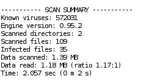
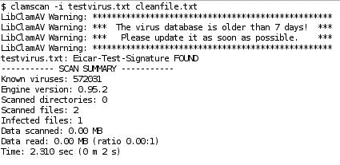
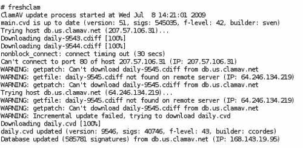
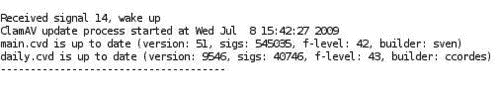
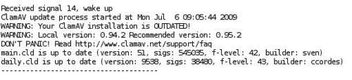

# 第九章。防病毒保护

一种普遍的观点是 Linux 不容易受到病毒攻击，那么为什么要安装防病毒解决方案？虽然 Linux 确实很少受到病毒攻击，但主要目标不是保护邮件服务器免受感染，而是减少或消除对接收者的任何风险。您的组织可能有运行 Windows 的客户端 PC，容易受到病毒攻击，或者您可能收到带有病毒的电子邮件，您可能会将其转发给客户或商业伙伴。

使用 Procmail 进行过滤的众多选项之一是删除电子邮件中的可执行附件，以保护系统免受可能的病毒攻击。这将是一个粗糙的操作，最坏的情况下，它将删除不包含病毒的文件，并可能留下其他受感染的文档，如不是可执行文件的脚本。

也可以在客户端扫描电子邮件。但在公司环境中，不一定能够依赖每个人的机器都是最新的，并且正确安装了适当的病毒检测软件。明显的解决方案是在服务器上运行一个高效的进程，以确保组织发送或接收的所有电子邮件都经过正确的病毒扫描。

针对基于 Linux 的系统有许多防病毒解决方案可用。我们选择专注于 Clam AntiVirus，通常称为 ClamAV。这是一个开源软件，并定期更新病毒数据库，以便在下载之前进行检查。

在本章中，我们将学习：

+   ClamAV 可以检测到可能包含病毒的文档类型

+   安装和配置 ClamAV 组件以检测病毒

+   建立程序以维护最新的防病毒数据库

+   将 ClamAV 与 Postfix 集成，以扫描所有传入的电子邮件消息和附件

+   通过使用包含测试病毒签名的样本文件和测试电子邮件伯恩病毒来广泛测试我们的安装

+   将每个 ClamAV 组件添加到我们的系统启动和关闭程序中

# ClamAV 简介

Clam AntiVirus 是一个面向 Linux、Windows 和 Mac OS X 的开源防病毒工具包。ClamAV 的主要设计特点是将其与邮件服务器集成，以执行附件扫描并帮助过滤已知病毒。该软件包提供了一个灵活和可扩展的多线程守护程序（`clamd`）、一个命令行扫描程序（`clamscan`）和一个通过互联网进行自动更新的工具（`freshclam`）。这些程序基于一个共享库`libclamav`，与 Clam AntiVirus 软件包一起分发，您也可以将其与自己的软件一起使用。

我们将在本章中使用的 ClamAV 版本是最新的稳定版本 0.95.2，具有最新的病毒数据库和签名，可以检测超过 580,000 种病毒、蠕虫和特洛伊木马，包括 Microsoft Office 宏病毒、移动恶意软件和其他威胁。虽然本书未涉及，但它也能够在 Linux 下进行适当安装并进行实时扫描。

# 支持的文档类型

ClamAV 可以提供对大多数文档类型的保护，这些文档类型可能包含或传播病毒：

+   UNIX 和类 UNIX 操作系统（如 Linux、Solaris 和 OpenBSD）使用的**ELF**（**可执行和链接格式**）文件。

+   **可移植可执行文件**（**PE**）文件（32/64 位）使用 UPX、FSG、Petite、WWPack32 压缩，并使用 SUE、Yoda's Cryptor 等进行混淆。这是 Microsoft Windows 可执行文件的标准格式，也是病毒最常见的传输方式之一。

+   许多形式的 Microsoft 文档可能包含脚本或可执行文件。ClamAV 可以处理以下文档和存档类型：

+   MS OLE2

+   MS Cabinet 文件

+   MS CHM（压缩 HTML）

+   MS SZDD

+   MS Office Word 和 Excel 文档

+   支持其他特殊文件和格式，包括：

+   HTML

+   RTF

+   PDF

+   使用 CryptFF 和 ScrEnc 加密的文件

+   uuencode

+   TNEF（winmail.dat）

+   ClamAV 可以处理的其他常见存档格式包括任何形式的文档：

+   RAR（2.0）

+   ZIP

+   gzip

+   bzip2

+   tar

+   BinHex

+   SIS（SymbianOS 软件包）

+   AutoIt

扫描存档还包括扫描存档中保存的支持的文档格式。

# 下载和安装 ClamAV

由于几乎每天都会发现病毒，因此安装最新稳定版本的 ClamAV 软件非常值得。如果您的系统已经安装了 ClamAV，则可能是基于过时的安装包进行安装。强烈建议您从 ClamAV 网站下载并安装最新版本，以确保系统对病毒具有最高级别的安全性。

## 添加新的系统用户和组

您将不得不为 ClamAV 系统添加一个新用户和组。

```
# groupadd clamav
# useradd -g clamav -s /bin/false -c "Clam AntiVirus" clamav

```

## 从软件包安装

ClamAV 有许多安装包可供选择，详细信息可以在 ClamAV 网站上找到（[`www.clamav.net/download/packages/packages-linux.`](http://www.clamav.net/download/packages/packages-linux.)）

### 注意

由于许可限制，大多数二进制软件包没有内置的 RAR 支持。因此，我们建议您在任何许可问题得到解决之前从源代码安装 ClamAV。

如果您使用的是基于 Red Hat 的系统，则可以使用以下选项之一执行安装，具体取决于您安装了哪个发行版：

```
# yum update clamav

```

或者

```
# up2date -u clamav

```

如果您使用的是基于 Debian 的系统，则可以使用以下命令执行安装：

```
# apt-get install clamav clamav-daemon clamav-freshclam

```

### 注意

确保安装的版本是 0.95.2 或更高版本，因为与以前的版本相比有重大改进。一般来说，您应该始终安装最新的稳定版本。

## 从源代码安装

从原始源代码安装 ClamAV 并不是很困难，可以让您运行任何您想要的版本，而不仅仅是您的 Linux 发行版的软件包维护者选择的版本。ClamAV 源代码可以从主 ClamAV 网站的多个镜像下载（[`www.clamav.net/download/sources`](http://www.clamav.net/download/sources)）。

### 要求

编译 ClamAV 需要以下元素：

+   zlib 和 zlib-devel 软件包

+   gcc 编译器套件

以下软件包是可选的，但强烈推荐：

+   bzip2 和 bzip2-devel 库

+   解压包

### 构建和安装

下载并解压缩存档后，`cd`到目录，例如`clamav-0.95.2`。在开始构建和安装软件之前，值得阅读`INSTALL`和`README`文档。

对于大多数 Linux 系统，最简单的安装方法可以通过按照这里列出的步骤来简化：

1.  运行`configure`实用程序通过运行`configure`命令来创建正确的构建环境：

```
$ ./configure --sysconfdir=/etc

```

1.  配置脚本完成后，可以运行`make`命令来构建软件可执行文件。

```
$ make

```

1.  最后一步是以`root`身份将可执行文件复制到系统上的正确位置以进行操作。

```
# make install

```

在最后一步，软件安装到`/usr/local`目录，配置文件安装到`/etc`，如`—sysconfdir`选项所示。

在所有阶段，您都应该检查进程输出是否有任何重大错误或警告。

与所有从源代码构建的软件包一样，在完成本章的构建、安装和测试步骤后，您可能希望删除解压的存档。

### 快速测试

我们可以通过尝试扫描源目录中的示例测试病毒文件来验证软件是否正确安装：

### 注意

提供的测试病毒文件不包含真正的病毒，是无害的。它们包含专门设计用于测试目的的行业认可的病毒签名。

```
$ clamscan -r -l scan.txt clamav-x.yz/test

```

它应该在`clamav-x.yz/test`目录中找到一些测试文件。扫描结果将保存在`scan.txt`日志文件中。检查日志文件，特别注意任何警告，指示对特定文件或存档格式的支持未被编译进去。日志文件的末尾应该包含类似以下的摘要：



# 编辑配置文件

安装软件后，需要编辑两个配置文件。第一个文件`/etc/clamd.conf`是用于实际病毒扫描软件的。这个文件的大部分重要配置选项在接下来的章节中讨论。第二个配置文件`/etc/freshclam.conf`将在本章后面讨论。这是我们添加自动病毒数据库更新的配置选项的地方。

## clamd

您必须编辑配置文件才能使用守护进程，否则`clamd`将无法运行。

```
$ clamd

```

```
ERROR: Please edit the example config file /etc/clamd.conf.

```

这显示了默认配置文件的位置。该文件的格式和选项在`clamd.conf(5)`手册中有详细描述。`config`文件有很好的注释，配置应该是直观的。

### 检查示例配置文件

提供的示例`config`文件在每个重要配置值处都有注释，非常详细。以下是一些您可能希望修改的关键值：

```
##
## Example config file for the Clam AV daemon
## Please read the clamd.conf(5) manual before editing this file.
##
# Comment or remove the line below.
#Example

```

`Example`行将导致程序因配置错误而停止运行，并且是故意包含的，以强制您在软件正确运行之前编辑文件。在编辑完文件后，在该行的开头加上`#`就足以解决这个问题。

```
# Uncomment this option to enable logging.
# LogFile must be writable for the user running daemon.
# A full path is required.
# Default: disabled
LogFile /var/log/clamav/clamd.log

```

建立一个日志文件非常值得，以便您可以在运行的最初几周内检查错误并监视正确的操作。之后，您可以决定是否停止记录或保持其运行。

```
# Log time with each message.
# Default: disabled
LogTime yes

```

在日志文件中启用时间戳可以确保您可以追踪事件被记录的时间，以帮助调试问题并将事件与其他日志文件中的条目匹配。

```
# Path to the database directory.
# Default: hardcoded (depends on installation options)
#DatabaseDirectory /var/lib/clamav
DatabaseDirectory /usr/local/share/clamav

```

确保数据库目录正确配置，以确切地知道病毒签名信息存储在哪里。安装过程将创建文件`main.cvd`，可能还有`daily.cld`，作为包含病毒签名的数据库文件。

```
# The daemon works in a local OR a network mode. Due to security # reasons we recommend the local mode.
# Path to a local socket file the daemon will listen on.
# Default: disabled
LocalSocket /var/run/clamav/clamd.sock

```

使用本地模式是一个重要的配置更改，也是确保安装了 ClamAV 的系统的安全所必需的。

```
# This option allows you to save a process identifier of the listening
# daemon (main thread).
# Default: disabled
PidFile /var/run/clamav/clamd.pid

```

这对于启动和停止脚本非常有用。如前面的示例所示，ClamAV 目录必须是可写的。

```
# TCP address.
# By default we bind to INADDR_ANY, probably not wise.
# Enable the following to provide some degree of protection
# from the outside world.
# Default: disabled
TCPAddr 127.0.0.1

```

这是另一个与安全相关的配置项，以确保只有本地进程可以访问该服务。

```
# Execute a command when virus is found. In the command string %v # will
# be replaced by a virus name.
# Default: disabled
#VirusEvent /usr/local/bin/send_sms 123456789 "VIRUS ALERT: %v"

```

在某些情况下，这可能是一个有用的功能。然而，由于病毒传递的广泛范围和频率，这可能会成为一个显著的烦恼，因为消息可能会在整个夜晚或白天到达。

```
# Run as a selected user (clamd must be started by root).
# Default: disabled
User clamav

```

通过为 ClamAV 创建一个专门的用户，我们可以将文件和进程的所有权分配给这个用户 ID，并通过限制对只有这个用户 ID 的访问来提高文件的安全性。此外，当在系统上列出运行的进程时，很容易识别出 ClamAV 系统拥有的进程。

## freshclam

您必须编辑配置文件，否则`freshclam`将无法运行。

```
$ freshclam

```

```
ERROR: Please edit the example config file /etc/freshclam.conf

```

源分发中还包括了一个`freshclam`配置文件的示例。如果您需要更多关于配置选项和格式的信息，您应该参考*freshclam.conf(5)*手册页。

### 最近的镜像

互联网上有许多镜像服务器可供下载最新的防病毒数据库。为了避免过载任何一个服务器，配置文件应设置为确保下载来自最近可用的服务器。包含的`update`实用程序利用 DNS 系统来定位基于您请求的国家代码的合适服务器。

需要修改的配置文件条目是`DatabaseMirror`。您还可以指定参数`MaxAttempts`——从服务器下载数据库的次数。

默认的数据库镜像是`clamav.database.net`，但您可以在配置文件中应用多个条目。配置条目应使用格式`db.xx.clamav.net`，其中`xx`代表您的正常两字母 ISO 国家代码。例如，如果您的服务器在美国，您应该将以下行添加到`freshclam.conf`。两字母国家代码的完整列表可在[`www.iana.org/cctld/cctld-whois.htm`](http://www.iana.org/cctld/cctld-whois.htm)上找到。

```
DatabaseMirror db.us.clamav.net
DatabaseMirror db.local.clamav.net

```

如果由于任何原因与第一个条目的连接失败，将尝试从第二个镜像条目下载。您不应该只使用默认条目，因为这可能导致您的服务器或 IP 地址被 ClamAV 数据库管理员列入黑名单，因为过载，您可能无法获取任何更新。

### 检查示例配置文件

提供的示例`config`文件在每个重要配置值处都有注释，非常详细。以下是一些您可能希望修改的关键值：

```
##
## Example config file for freshclam
## Please read the freshclam.conf(5) manual before editing this file.
## This file may be optionally merged with clamd.conf.
##
# Comment or remove the line below.
#Example

```

确保此行已注释以允许守护程序运行。

```
# Path to the log file (make sure it has proper permissions)
# Default: disabled
UpdateLogFile /var/log/clamav/freshclam.log

```

启用日志文件对于跟踪正在应用的持续更新以及在早期测试阶段监视系统的正确操作非常有用。

```
# Enable verbose logging.
# Default: disabled
LogVerbose

```

前面的选项使得更详细的错误消息能够包含在更新日志文件中。

```
# Use DNS to verify virus database version. Freshclam uses DNS TXT # records to verify database and software versions. We highly # recommend enabling this option.
# Default: disabled
DNSDatabaseInfo current.cvd.clamav.net
# Uncomment the following line and replace XY with your country
# code. See http://www.iana.org/cctld/cctld-whois.htm for the full # list.
# Default: There is no default, which results in an error when running freshclam
DatabaseMirror db.us.clamav.net

```

这是一个重要的配置，可以减少网络流量开销，并确保您从地理位置接近的服务器获取更新。

```
# database.clamav.net is a round-robin record which points to our # most
# reliable mirrors. It's used as a fall back in case db.XY.clamav.net
# is not working. DO NOT TOUCH the following line unless you know
# what you are doing.
DatabaseMirror database.clamav.net

```

正如说明所说——不要动这一行。

```
# Number of database checks per day.
# Default: 12 (every two hours)
Checks 24

```

对于忙碌的服务器和大量流量的服务器，值得以更频繁的间隔更新病毒数据库。但是，这仅建议适用于运行 ClamAV 软件版本 0.8 或更高版本的系统。

```
# Run command after successful database update.
# Default: disabled
#OnUpdateExecute command
# Run command when database update process fails..
# Default: disabled
#OnErrorExecute command

```

为了帮助监控对配置文件的更新，您刚刚看到的选项可用于在更新正确或不正确时应用适当的操作。

## 文件权限

根据先前的建议，`clamd`将作为`clamav`用户运行，并且默认情况下，当启动时，`freshclam`会放弃权限并切换到`clamav`用户。因此，应使用以下命令设置在前面示例中看到的配置文件中指定的套接字、PID 和日志文件的所有权，以允许正确访问：

```
# mkdir /var/log/clamav /var/run/clamav
# chown clamav:clamav /var/log/clamav /var/run/clamav

```

`freshclam`和`clamd`运行的用户可以在`freshclam.conf`和`clamd.conf`中更改。但是，如果更改这些参数，您应验证 ClamAV 进程是否可以访问病毒定义数据库。

# 安装后测试

现在我们已经安装了 ClamAV 的主要组件，我们可以验证每个组件的正确操作。

+   `clamscan`——命令行扫描程序

+   `clamd`——ClamAV 守护程序

+   `freshclam`——病毒定义更新程序

对于这些测试，我们需要一个病毒，或者至少一个看起来像病毒的非破坏性文件。

## EICAR 测试病毒

许多防病毒研究人员已经共同努力制作了一个文件，他们（以及许多其他产品）检测到它像是病毒。就此类目的，达成一致意见简化了用户的事务。

这个测试文件被称为**EICAR**（**欧洲计算机防病毒研究所）标准防病毒测试文件**。该文件本身不是病毒，它根本不包含任何程序代码，因此可以安全地传递给其他人。但是，大多数防病毒产品会对该文件做出反应，就好像它真的是一个病毒，这可能会使它成为一个相当棘手的文件，如果您或接收者已经有良好的病毒防护系统，可能会很难操作或通过电子邮件发送。

该文件是一个完全由可打印的 ASCII 字符组成的文本文件，因此可以很容易地使用常规文本编辑器创建。任何支持 EICAR 测试文件的防病毒产品都应该能够在任何以以下 68 个字符开头的文件中检测到它：

```
X5O!P%@AP[4\PZX54(P^)7CC)7}$EICAR-STANDARD-ANTIVIRUS-TEST-FILE!$H+H*

```

在创建此文件时，您应该注意以下事实。该文件仅使用大写字母、数字和标点符号，并且不包括空格。在重新创建此文件时可能会出现一些常见错误。这些错误包括确保第三个字符是大写字母`O`，而不是数字零（0），并且所有的 68 个字符都在一行上，这必须是文件中的第一行。

有关 EICAR 防病毒测试文件的更多信息，请访问[`www.eicar.org/anti_virus_test_file.htm`](http://www.eicar.org/anti_virus_test_file.htm)。

## 测试 clamscan

我们需要运行的第一个测试是确保病毒扫描程序已安装，并且病毒定义数据库已正确配置和包含。病毒数据库是安装过程的一部分。

这样做的最简单方法是在服务器上创建 EICAR 测试文件的副本，然后运行`clamscan`程序。我们使用`—i`标志，以便只显示感染的文件。您应该得到以下输出：



请注意关于过时病毒数据库的警告。这是正常的，在进行`freshclam`测试期间将会得到纠正。

## 测试 clamd

通过使用`clamdscan`程序，我们可以再次扫描测试文件，但是通过指示`clamd`进程进行扫描。这是一个很好的测试，以确保`clamd`守护程序进程正在运行。

预期的输出应该看起来像以下内容：

```
$ clamdscan testvirus.txt

```

```
/home/ian/testvirus.txt: Eicar-Test-Signature FOUND
----------- SCAN SUMMARY -----------
Infected files: 1
Time: 0.000 sec (0 m 0 s)

```

如果 clamd 守护程序没有运行，可以使用`# clamd`命令启动它。

在运行此测试后，您还应检查`clamd`日志文件（在`clamd.conf`中配置）是否包含任何意外的错误或警告。

## 测试 freshclam

使用`freshclam`程序进行交互式操作，我们可以使用最新的定义更新病毒数据库。此测试将仅更新数据库一次。稍后我们将看到如何执行自动更新。使用以下命令（作为超级用户），我们期望得到类似以下的输出：



从输出中，我们可以看到更新过程成功下载了两个差异更新，并在第三次出现网络问题时失败。下载最新数据库与当前数据库之间的差异有助于减少网络流量和服务器负载。在这种情况下，`freshclam`检测到了失败，并下载了最新的每日更新，以使病毒数据库更新到具有增加病毒签名数量的状态。

现在如果再次运行`clamscan`测试，您会注意到不再显示过时警告。

在运行此测试后，您还应检查`freshclam`日志文件是否包含类似于先前代码的输出。

# ClamSMTP 介绍

为了扫描通过服务器的所有电子邮件，需要在 Postfix 和 ClamAV 之间使用软件接口。我们将使用的接口是**ClamSMTP**。来自 ClamSMTP 网站（[`memberwebs.com/stef/software/clamsmtp/`](http://memberwebs.com/stef/software/clamsmtp/)）的以下介绍描述了 SMTP 病毒过滤器：

> ClamSMTP 是一个 SMTP 过滤器，允许您使用 ClamAV 防病毒软件检查病毒。它接受 SMTP 连接并将 SMTP 命令和响应转发到另一个 SMTP 服务器。在转发之前拦截并扫描“DATA”电子邮件正文。ClamSMTP 旨在轻量、可靠和简单，而不是拥有大量选项。它是用 C 编写的，没有主要依赖关系。

Postfix 旨在允许调用外部过滤器来处理邮件消息，并将处理后的数据返回给 Postfix 以进行进一步交付。ClamSMTP 已经被设计为直接在 Postfix 和 ClamAV 之间工作，以确保高效运行。

一些 Linux 发行版可能会维护 ClamSMTP 的软件包，可以通过相关软件包管理器安装。但是，您仍然应该完成后续的配置和集成 ClamSMTP 到 Postfix 的指示。

最新的源代码可以从[`memberwebs.com/stef/software/clamsmtp/`](http://memberwebs.com/stef/software/clamsmtp/)下载，直接使用`wget`命令下载到您的 Linux 系统上。切换到适当的位置以下载和构建软件。当前版本（1.10）的命令选项将是`wget <url>`。

```
$ wget http://memberwebs.com/stef/software/clamsmtp/clamsmtp-1.10.tar.gz

```

您应该检查网站以获取可以下载的最新版本。下载文件后，使用`tar`命令解压文件的内容。

```
$ tar xvfz clamsmtp-1.10.tar.gz

```

这将创建一个目录结构，其中包含当前目录下的所有相关文件。

## 构建和安装

在构建和安装软件之前，值得阅读`INSTALL`和`README`文档。

对于大多数 Linux 系统，最简单的安装方法如下：

1.  运行`configure`实用程序通过运行`configure`命令创建正确的构建环境。

```
$ ./configure --sysconfdir=/etc

```

1.  配置脚本完成后，您可以运行`make`命令来构建软件可执行文件：

```
$ make

```

1.  最后一步，作为`root`，是将可执行文件复制到系统上的正确位置以进行操作：

```
# make install

```

在最后一步，软件安装到`/usr/local`目录，配置文件安装到`/etc`目录。

在所有阶段，您应该检查进程输出以查找任何重要的错误或警告。

## 配置到 Postfix

Postfix 通过将邮件项目通过外部进程来支持邮件过滤。此操作可以在邮件排队之前或之后执行。Postfix 与`clamsmtp`之间的通信方式是假装`clamsmtp`本身是一个 SMTP 服务器。这种简单的方法提供了一种简单的方式来创建分布式架构，不同的进程可以在不同的机器上工作，以在非常繁忙的网络中分散负载。对于我们的用途，我们将假设我们只使用一台机器，所有软件都在该机器上运行。

`clamsmtp`过滤器接口是专门设计为在 ClamAV 和 Postfix 邮件系统之间提供接口。该过滤器被实现为用于邮件防病毒扫描的后队列过滤器。

第一个配置选项需要向 Postfix 的`main.cf`文件添加行：

```
content_filter = scan:127.0.0.1:10025
receive_override_options = no_address_mappings

```

`content_filter`指令强制 Postfix 通过名为`scan`的服务在端口`10025`上发送所有邮件。扫描服务将是我们使用`clamsmtpd`设置的服务。`receive_override_options`的指令配置 Postfix 执行`no_address_mappings`。这可以防止 Postfix 扩展任何电子邮件别名或组，否则将导致接收到重复的电子邮件。

第二个配置更改需要在 Postfix 的`master.cf`文件中进行。

```
# AV scan filter (used by content_filter)
scan unix - - n - 16 smtp
-o smtp_send_xforward_command=yes
-o smtp_enforce_tls=no
# For injecting mail back into postfix from the filter
127.0.0.1:10026 inet n - n - 16 smtpd
-o content_filter=
-o receive_override_options=no_unknown_recipient_checks,no_header_body_checks
-o smtpd_helo_restrictions=
-o smtpd_client_restrictions=
-o smtpd_sender_restrictions=
-o smtpd_recipient_restrictions=permit_mynetworks,reject
-o mynetworks_style=host
-o smtpd_authorized_xforward_hosts=127.0.0.0/8

```

### 注意

文件的格式非常重要。您应该确保在您添加的文本中，`=`（等号）周围没有空格或`,（逗号）`。

“前两行实际上创建了`scan`服务。其余的行设置了一个服务，用于接受邮件返回到 Postfix 以进行投递。其他选项是为了防止邮件循环发生并放宽地址检查。当这些更改完成后，您需要使用以下命令让 Postfix 重新读取修改后的配置文件：”

```
**# postfix reload** 
```

## “配置 clamSMTP”

“您必须创建配置文件`/etc/clamsmtpd.conf`，否则`clamsmtpd`将无法运行：”

```
**$ clamsmtpd
clamsmtpd: configuration file not found: /etc/clamsmtpd.conf** 
```

“源分发`doc`目录中包含了一个示例`clamsmtp.conf`配置文件。在`clamsmtp`软件正常运行之前，需要将其复制到正确的位置并进行编辑。”

```
**# cp clamsmtpd.conf /etc/clamsmtpd.conf** 
```

“该文件的格式和选项在`clamsmtpd.conf(5)`手册中有详细描述。”

### “检查样本配置文件”

“提供的示例**config**文件非常详细地记录了每个重要配置值的注释。以下是您可能希望修改的一些关键值。”

```
# The address to send scanned mail to.
# This option is required unless TransparentProxy is enabled
**OutAddress: 127.0.0.1:10026** 
```

“由于我们在此配置中只使用一台机器，因此我们应该将`OutAddress`选项指定为`127.0.0.1:10026`，以匹配`master.cf`中指定的选项。”

```
# The maximum number of connection allowed at once.
# Be sure that clamd can also handle this many connections
#MaxConnections: 64
# Amount of time (in seconds) to wait on network IO
#TimeOut: 180
# Keep Alives (ie: NOOP's to server)
#KeepAlives: 0
# Send XCLIENT commands to receiving server
#XClient: off
# Address to listen on (defaults to all local addresses on port 10025)
#Listen: 0.0.0.0:10025 
```

“此地址与`main.cf`中指定的选项匹配。”

```
# The address clamd is listening on
**ClamAddress: /var/run/clamav/clamd.sock** 
```

“这应该与`clamd.conf`文件中的`LocalSocket`选项匹配。”

```
# A header to add to all scanned email
#Header: X-Virus-Scanned: ClamAV using ClamSMTP
# Directory for temporary files
#TempDirectory: /tmp
# What to do when we see a virus (use 'bounce' or 'pass' or 'drop'
**Action: drop** 
```

“丢弃消息。”

```
# Whether or not to keep virus files
#Quarantine: off
# Enable transparent proxy support
#TransparentProxy: off
# User to switch to
**User: clamav** 
```

“重要的是要确保进程以与您用于运行`clamd`相同的用户身份运行，否则您可能会发现每个进程在访问其他临时文件时出现问题。”

```
# Virus actions: There's an option to run a script every time a virus is found.
# !IMPORTANT! This can open a hole in your server's security big enough to drive
# farm vehicles through. Be sure you know what you're doing. !IMPORTANT!
#VirusAction: /path/to/some/script.sh 
```

“现在我们准备启动`clamsmtpd`进程。您应该以`root`身份启动此进程，并验证该进程是否存在并以`clamav`用户 ID 运行。”

```
**# clamsmtpd** 
```

“如果启动服务时遇到问题，请确保`clamd`（ClamAV 守护程序）正在运行，并且它正在监听您指定的套接字。您可以在`clamd.conf`中使用`LocalSocket`或`TCPSocket`指令进行设置（确保只取消注释其中一行）。您还应确保`ScanMail`指令设置为`on`。”

“# 测试电子邮件过滤”

病毒，根据定义，是我们希望尽量避免接触的东西。但为了确保我们的过滤和检测过程正常运行，并且我们得到充分的保护，我们需要访问病毒进行测试。在现实世界的生产环境中使用真正的病毒进行测试，就像在办公室的垃圾桶里点火来测试烟雾探测器是否正常工作一样。这样的测试会产生有意义的结果，但伴随着令人不愉快的风险和不可接受的副作用。因此，我们需要 EICAR 测试文件，可以安全地发送邮件，并且显然不是病毒，但您的防病毒软件会对其做出反应，就像它是病毒一样。

## 测试邮件传播的病毒过滤

第一个测试是检查您是否仍然可以收到邮件。

```
$ echo "Clean mail" | sendmail $USER

```

您应该收到您的邮件，并在标题中添加以下行：

```
X-virus-scanned: ClamAV using ClamSMTP

```

如果您没有收到邮件，请检查系统、postfix 和 clamd 日志文件。如果需要，您还可以使用`-d 4`选项停止和重新启动`clamsmtpd`守护进程以获得额外的调试输出。

通过简单地将 EICAR 病毒作为电子邮件附件发送给自己，可以执行第二个简单的测试，以检测邮件传播的病毒。

必须将示例 EICAR 病毒文件创建为电子邮件的附件。从 Linux 命令提示符中执行以下命令链将发送一个非常简单的 uuencoded 附件副本的感染病毒文件。

```
$ uuencode testvirus.txt test_virus | sendmail $USER

```

如果一切正常并且配置正确，您不应该收到邮件，因为`clamsmtp`被指示丢弃该消息。消息的缺失并不意味着一切都正常，因此请检查系统或 postfix 日志文件，查看类似以下条目的内容：

```
Jul 8 19:38:57 ian postfix/smtp[6873]: 26E66F42CB: to=<ian@example.com>, orig_to=<ian>, relay=127.0.0.1[127.0.0.1]:10025, delay=0.1, delays=0.06/0/0.04/0, dsn=2.0.0, status=sent (250 Virus Detected; Discarded Email)

```

这证明了检测包含病毒的简单附件的简单情况。

当然，在现实世界中，病毒比你平均的电子邮件附件要聪明一些。需要进行彻底的测试，以确保过滤设置正确。幸运的是，有一个网站（[`www.gfi.com/emailsecuritytest/`](http://www.gfi.com/emailsecuritytest/)）可以向您发送包含 EICAR 病毒的电子邮件，以多种方式编码。目前它支持 17 个单独的测试。

## 彻底的电子邮件测试

该网站[`www.gfi.com/emailsecuritytest/`](http://www.gfi.com/emailsecuritytest/)要求您注册要测试的电子邮件地址，并向该地址发送确认电子邮件。在这封电子邮件中有一个链接，确认您是控制该电子邮件地址的有效用户。然后，您可以将这些 17 个病毒和电子邮件客户端利用测试中的任何一个或全部发送到这个电子邮件地址。如果任何携带病毒的电子邮件最终未被过滤到您的收件箱中，那么安装就失败了。

### 注意

然而，该网站上有一些测试消息并不严格是病毒，因此不会被 ClamAV 进程检测到。这是因为这些消息本身并不包含病毒，因此没有东西可以找到，因此也没有东西可以停止。

根据定义，ClamAV 只捕获恶意代码。gfi（[`www.gfi.com/emailsecuritytest/`](http://www.gfi.com/emailsecuritytest/)）网站发送这种类型的测试消息。这些消息的性质是它们有一些格式错误的 MIME 标记，可以欺骗 Outlook 客户端。杀毒软件的工作不是检测这样的消息。

# 自动更新病毒数据

ClamAV 由志愿者提供，用于分发软件和病毒数据库的服务器和带宽是自愿资助的。因此，重要的是要确保在维护最新数据库的更新频率和过载各种服务器之间保持平衡。

### 注意

ClamAV 组建议以下操作：如果您运行的是 ClamAV 0.8x 或更高版本，可以每小时检查四次数据库更新，只要您在`freshclam.conf`中有以下选项：DNSDatabaseInfo current.cvd.clamav.net。

如果您没有这个选项，您必须坚持每小时检查一次。

## 设置自动更新

ClamAV 的病毒数据库文件可以以多种方式从 ClamAV 服务器下载。这包括使用自动化或手动工具，如`wget`。但这不是更新的首选方式。

我们之前使用 ClamAV 安装的`freshclam`实用程序是执行更新的首选方法。它将定期自动下载最新的杀毒软件数据库。它可以设置为自动从`cron`条目或命令行工作，也可以作为守护进程运行并处理自己的调度。当`freshclam`由具有 root 权限的用户启动时，它会放弃特权并切换用户 ID 为`clamav`用户。

`freshclam`使用 DNS 系统的功能来获取准备下载的最新病毒数据库的详细信息以及可以从哪里获取。这可以显著减少您自己以及远程系统的负载，因为在大多数情况下，执行的唯一操作是与 DNS 服务器的检查。只有在有更新版本可用时，它才会尝试执行下载。

我们现在准备启动`freshclam`进程。如果您决定将其作为守护进程运行，只需执行以下命令：

```
# freshclam –d

```

然后检查进程是否正在运行，并且日志文件是否被正确更新。

另一种可用的方法是使用`cron`守护程序安排`freshclam`进程定期运行。为此，您需要为`root`或`clamav`用户的`crontab`文件添加以下条目：

```
N * * * *       /usr/local/bin/freshclam –quiet

```

### 注意

`N`可以是您选择的`1`到`59`之间的任意数字。请不要选择任何 10 的倍数，因为已经有太多服务器在使用这些时间段。

代理设置仅可通过配置文件进行配置，并且在启用`HTTPProxyPassword`时，`freshclam`将要求配置文件的所有者具有严格的只读权限。例如，

```
# chmod 0600 /etc/freshclam.conf

```

以下是代理设置的示例：

```
HTTPProxyServer myproxyserver.com
HTTPProxyPort 1234
HTTPProxyUsername myusername
HTTPProxyPassword mypass

```

# 自动化启动和关闭

如果您通过软件包管理器而不是从源代码安装了 ClamAV 和 ClamSMTP 组件中的任何一个或全部组件，则可能已提供必要的启动脚本。请检查是否已将必要的脚本包含在引导启动顺序中。

如果您从源代码安装了 ClamAV，则以下脚本是用于在引导时启动和停止必要守护程序的示例。根据您的发行版，文件位置可能会有所不同，您可能需要执行其他命令来为每个脚本设置运行级别。请参阅您的发行版文档。

## ClamSMTP

ClamSMTP 源中提供的一个贡献脚本是用于在系统引导时自动启动和停止操作守护程序的脚本。检查脚本中的路径名是否与配置文件和安装目录中的路径名匹配，然后从 ClamSMTP 源树的根目录执行以下命令：

```
# cp scripts/clamsmtpd.sh /etc/init.d/clamsmtpd

```

复制文件后，请确保脚本具有执行权限，并且除系统根用户外，其他人无法修改它。

```
# ls -al /etc/init.d/clamsmtpd
-rwxr-xr-x 1 root root 756 2009-07-09 15:51 /etc/init.d/clamsmtpd

```

将脚本添加到系统启动中。

```
# update-rc.d clamsmtpd defaults

```

## ClamAV

以下是一个示例脚本，用于在引导时启动和停止`clamd`和`freshclamd`守护程序。与以前一样，验证路径名，根据需要调整脚本，并在将其添加到系统启动之前将脚本复制到系统初始化目录。

如果`freshclam`作为`cron`作业运行，而不是作为守护程序运行，则从脚本中删除启动和停止`freshclam`进程的行。

```
#!/bin/sh
#
# Startup script for the Clam AntiVirus Daemons
#
[ -x /usr/local/sbin/clamd ] || [ -x /usr/local/bin/freshclam ] || exit 0
# See how we were called.
case "$1" in
start)
echo -n "Starting Clam AntiVirus Daemon: "
/usr/local/sbin/clamd
echo -n "Starting FreshClam Daemon: "
/usr/local/bin/freshclam -d -p /var/run/clamav/freshclam.pid
;;
stop)
echo -n "Stopping Clam AntiVirus Daemon: "
[ -f /var/run/clamav/clamd.pid ] && kill `cat /var/run/clamav/clamd.pid`
rm -f /var/run/clamav/clamd.socket
rm -f /var/run/clamav/clamd.pid
echo -n "Stopping FreshClam Daemon: "
[ -f /var/run/clamav/freshclam.pid ] && kill `cat /var/run/clamav/freshclam.pid`
rm -f /var/run/clamav/freshclam.pid
;;
*)
echo "Usage: clamav {start|stop}"
;;
esac

```

# 监视日志文件

定期监视日志文件非常重要。在这里，您将能够跟踪病毒数据库的定期更新，并确保您的系统受到尽可能多的保护。

定期更新消息应该类似于以下内容：



偶尔会发布新软件并需要更新。在这种情况下，您将在日志文件中收到警告消息，例如以下内容：



在出现互联网连接问题或远程文件在更新时不可用的情况下，该过程可能会记录瞬态错误消息。只要这些错误不持续存在，就无需采取任何行动。

# 文件消毒

常见的请求是在转发给最终接收者之前自动对文件进行消毒。在当前版本（0.95）中，ClamAV 无法对文件进行消毒。以下信息可从 ClamAV 文档中获取。

> 我们将在接下来的一个稳定版本中添加对 OLE2 文件的消毒支持。没有计划对其他类型的文件进行消毒。原因有很多：清除文件中的病毒在今天几乎是毫无意义的。清理后很少有任何有用的东西留下，即使有，你会相信它吗？

# 总结

我们现在已经安装并配置了一个非常高效的防病毒系统，用于检查所有传入电子邮件中的感染附件，并且已经显着加强了我们的系统——服务器和工作站——以防止攻击。

我们的邮件传输代理 Postfix 现在可以通过 ClamSMTP 内容过滤接口，使用 ClamAV 守护程序来过滤所有消息，以扫描和检测针对病毒签名数据库的各种威胁。通过使用`freshclam`，我们已经确保我们的检测数据库始终保持最新，以防范最新的威胁和任何新发布的病毒。在这场持续的战斗中，仍然需要保持不懈的警惕，以确保软件和文件始终保持完全最新。
