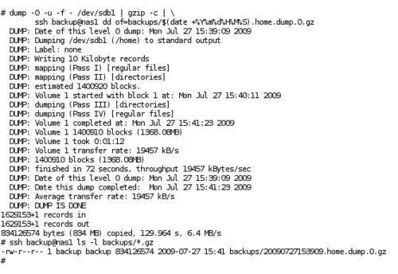
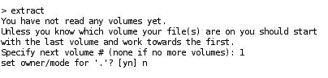

# 第十章。备份您的系统

为了从重大硬件或软件故障中的灾难性服务丢失中恢复，绝对必须有备份。备份应该让您恢复软件（或者软件的配置）和其他需要重新建立服务的数据。这包括用户的邮件，系统的邮件队列以及它们的认证数据等。

本章将指导您完成必要的步骤，以防止系统故障，并在发生故障时如何从中恢复。阅读完本章后，您将了解：

+   可用的备份选项

+   我们需要备份哪些数据

+   我们备份介质的存储考虑

+   如何为邮箱执行增量和完整备份

+   完成文件系统恢复所需的步骤

+   如何恢复单个电子邮件

+   如何备份我们的服务器配置

+   设置自动备份计划

# 备份选项

选择最合适的备份选项总是一个权衡。您必须权衡业务停机成本，备份媒体和硬件的价格和可用性，用户数据的价值（在我们的情况下，用户的电子邮件），以及管理备份操作的人员成本。

对于我们的小型办公室电子邮件服务器，我们将提出一个简单但可靠的解决方案，使用多年来许多管理员采用的经过验证的技术和工具。

我们采取的任何备份都需要存储在备份介质上。最方便的解决方案是拥有一个备用的 Linux 机器，配备多个硬盘，与我们的电子邮件服务器相连，最好位于另一栋建筑物中。如果我们想要保护自己免受火灾等灾难性事件的影响，将备份存储在离站位置是必不可少的。

如果远程服务器不可用，另一种选择可能是连接到服务器的一些热插拔外部硬盘，甚至在紧急情况下使用 DVD 刻录机。磁带驱动器也是一个选择，但通常磁带驱动器和介质的成本大于服务器。如果可移动介质是唯一的选择，那么不要把备份堆叠在服务器顶部或桌子抽屉里，将它们移动到一个安全的离站位置。保留最新备份介质的本地副本以更快地应对紧急恢复情况可能更方便。

## RAID

RAID 是“冗余磁盘阵列”的缩写。通过在 RAID 设置中使用多个磁盘，数据分布在磁盘上，但操作系统将该阵列视为单个设备。通过在整个阵列中复制和分割数据，可以显著减少磁盘故障的容忍度，提高数据可靠性，可能提高 I/O 性能。如果阵列中的硬盘故障，旧硬盘可以被更换为新硬盘。然后，RAID 控制器（无论是硬件控制器还是软件控制器）会重建数据。有关 RAID 和可用的各种配置选项的更多信息，请访问[`en.wikipedia.org/wiki/RAID`](http://en.wikipedia.org/wiki/RAID)。

然而，单独使用 RAID 并不是一个备份解决方案。已删除的文件或电子邮件，无论是意外还是恶意删除，都无法恢复。RAID 无法保护用户错误或严重的硬件故障，例如使服务器烧毁的电涌甚至火灾。

使用 RAID 增加数据可用性是一件好事，但并不是适当备份和恢复策略的替代品。

## 镜像备份

磁盘镜像备份程序将从硬盘逐扇区地复制数据，而不考虑硬盘上的任何文件或结构。备份是硬盘的精确镜像——主引导记录，分区表和所有数据。

在发生重大硬件故障的情况下，恢复系统的步骤如下：

1.  更换或修复故障的硬件。

1.  引导 Linux 光盘，其中包含磁盘镜像恢复程序。

1.  将每个磁盘的映像写入备份。

1.  重新启动。

表面上看，这似乎是一种快速恢复服务的吸引人且快速的方法。然而，使用磁盘映像进行备份存在一些问题。

+   通常无法将磁盘映像恢复到大小或几何不同的新磁盘上。

+   新硬件几乎肯定会有不同的配置（主板、网络卡、磁盘控制器等），并且恢复的 Linux 内核可能没有必要的驱动程序来成功引导。

+   磁盘映像很大。映像是磁盘的总大小，而不仅仅是存储在其中的数据大小。多个磁盘映像的空间需求很快就会累积起来。

+   恢复单个用户文件非常麻烦。需要将磁盘映像恢复到备用磁盘上，挂载到运行中的系统上，然后找到后，复制到所需的位置。

总体系统故障很少发生，映像恢复的感觉上便利和快速通常被文件系统备份的灵活性所抵消。

## 文件系统备份

与映像备份不同，文件系统备份了解文件系统的结构，因此也了解硬盘上的数据。因此，只复制分配的磁盘部分，而不复制空闲空间。备份是针对文件系统中的所有文件而不是按扇区复制。

因为文件系统备份是这样完成的，这意味着可以仅复制自上次备份以来发生更改的文件，从而产生较小的后续备份文件。

在发生重大硬件故障时，恢复系统的步骤如下：

1.  更换或修复故障的硬件。

1.  安装 Linux 发行版。

1.  安装本书中的邮件服务器应用程序。

1.  应用任何补丁。

1.  恢复应用程序配置数据备份。

1.  恢复用户数据备份。

1.  重新启动

与映像备份相比，这种方法需要的时间略长，涉及的步骤更多，但确实具有许多优点。

+   替换磁盘不需要与原来的大小或几何相同。

+   只要您的 Linux 发行版支持新硬件，就不会出现兼容性问题。

+   备份文件大小要小得多。

+   恢复单个文件要简单得多。

如前所述，主要系统故障并不常见。尽管完成完全恢复的步骤比映像备份更繁琐，但较小且更快的备份以及用户数据选择性恢复的优势是显著的。

为了减少意外磁盘故障的可能性，系统工具可用于监视磁盘驱动器的健康状况。有关更多信息，请访问[`en.wikipedia.org/wiki/S.M.A.R.T.`](http://en.wikipedia.org/wiki/S.M.A.R.T)。

## 临时备份

文件系统备份仅备份整个文件系统，而不是单个文件或目录。偶尔，我们可能希望在我们的应用程序的重大配置更改后复制几个文件的副本。

使用标准的 Linux 工具，如`tar`或`cp`，可以将重要的更改文件复制到正常备份计划的文件系统中的目录。

# 备份什么

备份始终伴随着一个大问题：“我们应该备份什么？”

有许多因素影响我们最终的决定。当然，我们希望备份服务器的配置，因为这对服务器的功能至关重要。但我们也希望备份用户的数据，因为这是我们业务的宝贵资产。公司是否有政策允许人们使用电子邮件进行私人通信？如果有，我们是否也应该备份这些消息？

我们应该只备份我们需要将系统恢复到正常状态所需的内容。这可以节省备份介质上的空间，并缩短执行备份和必要时恢复所需的时间。

毕竟，备份介质上的空间是有限的，因此宝贵的。备份所有用户的邮件比完全备份`/tmp`目录更重要。此外，我们备份的数据越少，执行备份所需的时间就越少，因此更快地将系统资源（CPU 周期、I/O 带宽）返回到它们的主要用途——处理用户的邮件。

以下是我们需要备份以获得可用系统的项目列表：

+   系统清单

+   服务所需的已安装软件

+   软件配置文件

+   用户的凭据

+   用户的邮箱

+   日志文件（用于计费目的和最终用户请求）

+   Postfix 邮件队列

以下各节描述了讨论的每个项目。

## 系统清单

在部分或完全硬件故障的情况下，记录当前系统布局是有用的。在大多数情况下，替换硬件通常会和甚至更好地满足我们当前的设置。为了恢复我们的系统，我们需要知道磁盘如何分区以及挂载点的组织方式。将我们的用户数据恢复到一个太小的磁盘上将会很困难。

使用以下命令的输出，我们将有足够的信息来重新创建我们的磁盘布局：

```
# fdisk -l > disk_layout.txt

```

该命令打印出每个磁盘的分区表，并将输出保存到文件中。

```
# df -h >> disk_layout.txt

```

该命令将每个挂载点的容量和使用情况追加到我们的文件中。

```
# mount >> disk_layout.txt

```

`mount`命令列出当前的挂载点，我们将其追加到文件中。

可能还有其他信息在文件`/etc/fstab`中，我们稍后会备份。

## 获取已安装软件的列表

为了恢复我们安装的软件，我们需要有当前安装的软件列表。

在 Debian 中，可以使用以下命令。文件`installed_software.txt`包含系统上已安装/未安装的软件的当前状态。

```
# dpkg --get-selections > installed_software.txt

```

在基于 RPM 的发行版中，这将是：

```
# rpm -qa > installed_software.txt

```

在基于 Debian 的系统中，稍后可以使用此文件安装相同的软件集。

```
# dpkg --set-selections < installed_software.txt
# dselect

```

在`dselect`实用程序中，选择`i`进行“安装”，然后确认安装。

在基于 RPM 的发行版中，这将是：

```
# yum -y install $(cat installed_software.txt)

```

### 注意

刚才讨论的命令仅列出通过软件包管理器安装的软件。如果您从源代码安装了软件，请记下您安装的应用程序和版本。

## 系统配置文件

如果没有这些，服务器将无法执行预期的职责。至少需要备份的配置文件包括：

+   `/etc/courier:`该目录保存了 Courier-IMAP 的配置数据。

+   `/etc/postfix:`该目录保存了 Postfix 的配置数据。

目录树`/etc`包括诸如网络设置、路由等项目，我们否则需要记住。建议备份整个`/etc`树。

### 注意

如果您从非标准位置安装了带有配置文件的软件，请确保将这些配置文件包含在备份候选列表中。

## 认证数据

用户如果没有这些，将无法使用他们的用户名和密码组合进行身份验证。需要备份的数据取决于认证的方式，并且可能包括三个文件“/etc/passwd，/etc/shadow”和`/etc/group`，以及一个 MySQL 数据库（如果用户的凭据存储在该数据库中）。

## 用户的邮箱

这是用户的邮件存储位置。这包括整个`/home`及其子目录树。这是我们备份的主要内容——大量的数据。

## 日志文件

我们至少应该存储由 Postfix 和 Courier 生成的日志。这些将需要用于处理用户请求，比如“我的邮件去哪了？”。如果用户根据发送和/或接收的邮件量计费，我们肯定需要备份 Postfix 的日志。

由于 Postfix 和 Courier 的日志通常是由系统的`syslogd`守护程序写入的，我们需要检查`/etc/syslog.conf`文件，看看这些日志去哪里。这两个程序都使用`syslog`邮件设施记录它们的消息。

为了确保完全覆盖，最好备份`/var/log`的整个目录树。

## 邮件队列

根据情况，备份工作系统的 Postfix 队列可能有意义，也可能没有意义。

使用 Postfix，电子邮件消息至少会两次进入磁盘。

+   电子邮件消息第一次到达您的驱动器是在被 Postfix 接受时；它们被写入 Postfix 的`queue_directory`，然后交付继续进行。

### 注意

病毒扫描程序或检测垃圾邮件的程序（例如`clamav`和`spamassassin`）可能会产生更多的磁盘 I/O。

+   如果是本地域的邮件，我们的服务器是这些邮件的最终目的地，在`queue_directory`中的寿命极短。它们进入队列，然后立即传递到用户的邮箱。这是它们第二次进入磁盘。

+   如果是发往其他域的邮件（因为服务器充当中继），那么 Postfix 将立即联系收件人的邮件服务器，并尝试在那里传递消息。只有在出现问题的情况下，队列中才会包含大量尚未传递的电子邮件。这些问题包括：

+   `content_filter`很慢或者无法运行：例如`clamsmtp`或其他产品。

+   **远程站点存在问题：**大型免费电子邮件提供商经常出现问题，因此可能无法立即接受我们的电子邮件。

在这两种情况下，延迟队列将填满尚未传递的邮件，显然在发生故障时应该备份。如果服务器非常忙，队列中可能会有相当多的延迟邮件。

Postfix 邮件队列包括目录树`/var/spool/postfix`及其子目录。

# 不需要备份的内容

我们不需要备份所有已安装的二进制文件，因为这些可以通过前面提到的“已安装软件列表”简单地重新安装。当我们需要重建系统时，这当然假定安装介质是可用的。作为注重安全的管理员，我们通过安装供应商的补丁来保持系统的最新状态。随着时间的推移，已安装和随后打补丁的软件版本将与安装介质上的版本有很大不同。如果这些更新可以通过互联网安装（例如使用 Red Hat 的 up2date 或 Debian 的 apt-get），我们就不必将它们保存在现场。

# 备份用户的电子邮件

我们将使用 dump 来备份包含我们邮箱的整个分区。dump 命令将文件系统上的文件复制到指定的磁盘、磁带或其他媒体。

使用它的一些原因是：

+   它非常快（在我的测试中，网络是瓶颈）

+   它很简单（一个命令就足够了）

+   它可以无人值守运行（例如，作为`cron`作业）

+   它不需要安装任何额外的软件

+   它不需要图形用户界面

+   自 1975 年左右的 AT&T UNIX 版本 6 以来，它已经非常成熟了

`restore`命令执行与`dump`相反的操作。使用`dump`备份的文件系统可以作为完整的文件系统进行恢复，或者可以选择性地恢复某些文件或目录。

## 邮件存储

我们建议将邮箱（`/home`）放在单独的分区上，有很多原因。

+   文件系统维护可以独立于系统的其他部分进行（简单地卸载`/home`，执行`fsck`，然后再次挂载）。

+   可以将该分区放在单独的磁盘或 RAID 上，从而将用户的 I/O（在该分区上）与系统的 I/O（日志、邮件队列、病毒扫描程序）分开。

最重要的是：

+   使用`dump/restore`，我们可以转储整个分区。（好吧，这并不完全正确，但是只有整个分区才能轻松进行`dump/restore`。）

+   包含邮箱的超额分区不会对系统写入日志文件或其他重要系统信息产生负面影响。如果所有数据（日志、邮箱、系统文件）都在一个分区上，填满这个分区将导致日志记录停止。

Courier 和 Postfix 都使用 Maildir 格式存储用户邮箱。它们将每封邮件存储为单独的文件，即使对于单个邮件，也可以轻松进行恢复操作。

使用 Maildir 格式非常容易进行备份操作。

+   “备份电子邮件”对应于“将文件备份到备份介质”。

+   “恢复电子邮件”对应于“从备份介质中恢复文件”。

+   “备份邮箱”对应于“将 Maildir 及其所有子目录备份到备份介质”。

+   “恢复邮箱”对应于“从备份介质中恢复 Maildir 及其所有子目录”。

## 使用 dump

基本上有两种备份数据的方法。简单的方法是在每次备份时存储所有数据。这称为完整备份。它的优点是简单性，主要缺点是需要存储在备份介质上的大量数据。这个问题通过增量备份的概念得到解决。增量备份仅保存自上次增量（或完整）备份以来的更改。

如果备份介质上的空间允许每天进行完整备份，我们可以为了简单起见这样做。这样我们只需要查看最后一个完整备份来恢复所有数据。

增量备份很简单。备份软件只需要备份自上次备份以来最近创建或更改的文件和目录。

如果空间不允许使用这种简单的解决方案，我们可以使用以下方案：

+   每周执行一次完整备份

+   每天进行六次增量备份

如果我们需要从头开始恢复，首先恢复最后一个完整备份，然后恢复最多六个增量备份。这样我们最多会丢失一天的邮件，这是我们在每日备份间隔下能够做到的。稍后我们将看到更复杂的增量备份策略，以减少恢复完整转储后需要的增量恢复次数。

有关`dump(8)`和`restore(8)`的详细信息，请参阅系统手册页。

现在我们将看一下使用`dump`命令备份邮箱的实际任务。

### 完整转储

我们现在将执行包含用户 Maildirs 的分区的完整备份。在这个例子中，这个分区将是`/dev/sdb1`（我们的 SATA 磁盘的第一个分区）。因此，我们将要备份`/dev/sdb1`。

要找出我们需要在系统上备份的分区，我们需要检查`mount`命令的输出：

```
# mount

```

```
/dev/sda1 on / type ext3 (rw,relatime,errors=remount-ro)
tmpfs on /lib/init/rw type tmpfs (rw,nosuid,mode=0755)
/proc on /proc type proc (rw,noexec,nosuid,nodev)
sysfs on /sys type sysfs (rw,noexec,nosuid,nodev)
varrun on /var/run type tmpfs (rw,nosuid,mode=0755)
varlock on /var/lock type tmpfs (rw,noexec,nosuid,nodev,mode=1777)
udev on /dev type tmpfs (rw,mode=0755)
tmpfs on /dev/shm type tmpfs (rw,nosuid,nodev)
devpts on /dev/pts type devpts (rw,noexec,nosuid,gid=5,mode=620)
fusectl on /sys/fs/fuse/connections type fusectl (rw)
lrm on /lib/modules/2.6.27-14-generic/volatile type tmpfs (rw,mode=755)
/dev/sdb1 on /home type ext3 (rw,relatime)

```

我们可以看到，`/home`是`/dev/sdb1`的分区。

我们的计划是使用`dump`工具为这个分区创建备份。这些备份数据需要传输到我们的备份介质，可以是另一块磁盘、磁带，或者在我们的情况下是远程备份服务器上的磁盘。

有各种方法可以在网络上传输数据，其中之一是`ssh`。这是一种网络协议，可以促进两个设备之间的安全通信。

为了将我们的备份数据通过网络传输到备份服务器中的另一块磁盘，我们利用 Linux 的强大功能来结合`dump`程序和`ssh`协议。

`dump`程序的输出将被输入到`gzip`中以压缩转储，然后传输到`ssh`，然后在备份服务器上生成另一个`dd`程序，最终将数据写入其磁盘。

以下代码行将分区中的邮箱完全转储到远程系统上的文件。我们假设邮箱位于挂载为`/home`的分区`/dev/sdb1`上。

以 root 用户身份运行以下命令：

```
# dump -0 -u -b 1024 -f - /dev/sdb1 | \
gzip -c | \
ssh user@backup-host.domain.com \
dd of=/backupdirectory/$(date +%Y%m%d%H%M%S).home.dump.0.gz

```

该命令看起来很复杂，所以让我们逐步分解每个步骤：

+   `dump -0 -u -b 1024 -f -`执行分区`/dev/sdb1`（在我们的示例中包含`/home`）的级别`0`（`full`）转储，使用块大小`1024`（以获得最佳性能），并在成功转储后更新（`-u`）文件`/var/lib/dumpdates`。`-u`选项很重要，因为它记录了此转储的日期和时间，因此随后的增量转储可以确定自上次转储以来已更改或创建的文件。转储的输出进入指定为（`-`）的文件（`-f`），该文件表示`stdout`，标准输出。

+   由于`dump`数据进入标准输出（`stdout`），我们可以将该输出管道传输到`gzip`以压缩转储的大小。`-c`选项告诉`gzip`将压缩输出写入`stdout`。

+   然后，压缩级别 0 的转储输出被传送到`ssh`命令，该命令与系统`backup-host.domain.com`建立远程连接，以`user`身份登录。一旦登录，远程系统执行`dd`命令。我们建议使用`ssh`提供的基于密钥的身份验证方案。这样，备份可以无人值守运行，因为没有人需要输入登录`backup-host.domain.com`上的`user`所需的密码。

+   在远程服务器上，最后一步是使用`dd`命令写入输出。输出文件名由`dd`的`of`选项指定。输出文件名已经构造成易于识别文件系统、转储日期和时间、转储级别以及后缀`.gz`以指示此转储文件已被压缩。文件名部分`$(date +%Y%m%d%H%M%S`)是在本地系统上执行的 shell 扩展（而不是远程系统），以输出当前日期和时间以`YYYYMMDDHHMMSS`格式。最终的输出文件名将类似于`20090727115323.dump.0.gz`。

有关每个命令的更多信息，请参阅`dump、gzip、ssh、dd`和`date`的系统手册页面。

输出将类似于以下内容：



下一个示例将简单地将备份数据写入一个目录，这次没有`stdout`的巫术！

以下代码行将完整转储包含邮箱的分区写入一个单独的磁盘上的文件以保存备份：

```
# dump -0 -u -f /backupdirectory/fulldump /dev/sdb1

```

当然，这比通过`ssh`将所有数据加密并在传输过程中进行解密（这需要大量时间和 CPU 功率）快得多简单得多，但如果我们的服务器被烧毁，内置硬盘上的备份将毫无帮助。

请记住，`/backupdirectory/fulldump`也可以是 NFS 挂载或 SMB 挂载。这将为您提供简单命令行和远程备份的优势。因此，请确保您有远程备份。无论哪种方式都很容易。

### 增量转储

增量转储的执行方式与完整转储完全相同，只是我们将级别选项从 0 更改为 1、2 或 3，等等，具体取决于我们希望备份多少更改。请记住，级别数字大于 0 告诉转储复制自上次较低级别转储以来新建或修改的所有文件。这最好通过一些示例来说明。为了清晰起见，我们将简单地转储到一个文件中，但在实践中，我们通常会使用与使用`gzip、ssh、dd`等相同的命令序列。

假设我们的级别 0 转储是在星期日晚上进行的。第一个增量转储（级别 1，由`-1`选项指示）然后在星期一晚上进行，如下所示：

```
# dump -1 -u -f mon.dump.1 /dev/sdb1

```

这将保存自上次完整转储以来新建或更改的所有内容到`mon.dump.1`。这个转储文件将比之前的完整转储小得多，只包含星期一的更改。假设在第二天我们重复这个级别 1 转储

```
# dump -1 -u -f tue.dump.1 /dev/sdb1

```

第二个增量转储`tue.dump.1`将包含周一和周二所做的所有更改，因为 1 级转储将备份自 0 级转储以来发生的所有更改。为了将系统恢复到最新的备份，我们只需要恢复周二的备份。因此，有人可能认为周一的转储现在已经过时；然而，如果用户希望恢复在周一创建并在周二意外删除的文件，我们仍然需要第一次备份。

反复执行 1 级转储允许非常快速的恢复，因为只需要恢复两个转储文件，即 0 级转储和最新的 1 级转储。缺点是每个后续转储文件的大小都会增加，并且完成时间会越来越长。这种方案有时被称为差异备份。

另一种选择是使用额外的转储级别来减少每个备份文件的大小。

例如，以下一系列命令在我们的初始 0 级转储后执行了许多增量备份：

```
# dump -1 -u -f mon.dump.1 /dev/sdb1
# dump -2 -u -f tue.dump.2 /dev/sdb1
# dump -3 -u -f wed.dump.3 /dev/sdb1
# dump -4 -u -f thu.dump.4 /dev/sdb1

```

在这个例子中，每天的转储文件只包含自上一个转储以来的新文件和更改文件。从周二开始的每个转储操作将更快地完成，并且生成的文件大小比我们之前的例子要小。然而，恢复将需要更长时间。要恢复到最新的备份，我们需要恢复完整的转储，然后按顺序恢复从周一到周四的每个增量转储。

在一个小的临时文件系统上尝试这些示例可能是一个有用的练习，以便了解不同级别的转储之间的交互。可以使用以下命令检查每个转储文件：

```
# restore -t -f filename

```

对于好奇的人，文件`/var/lib/dumpdates`也可以在每次转储后进行检查，以验证每次转储的日期和级别。

正如本章开头所述，一切都是一种权衡，因此选择适当的备份策略涉及平衡媒体成本、人员成本和恢复时间。

到目前为止，我们所有的备份都是在挂载的磁盘上执行的，这使得验证备份是不可能的。原因是我们刚刚备份的数据不断变化。请记住，每个文件代表一封电子邮件。每当用户收到新邮件或删除旧邮件时，文件系统的状态都会发生变化。用户不断地收邮件、阅读邮件和删除邮件，即使在进行备份之前也是如此。

`restore`命令确实有`-C`选项，用于将转储与原始磁盘内容进行比较，但只有在我们转储的文件系统未挂载时才是明智的。在大多数情况下，卸载每个文件系统是不切实际的，并且会显著中断服务。

## 使用 restore

所有已备份的数据在使用之前都需要被恢复。

这可以通过两种方式完成，交互式或非交互式。

### 交互式恢复

要交互地从转储中恢复数据，我们需要将转储从备份介质复制到我们的系统上，或者在存储转储的计算机上执行文件选择以进行恢复。如果我们只提取几个文件，可以在临时目录中执行此操作，并在恢复完成后将生成的文件移动到正确的位置。对于更多的文件，例如整个用户帐户，我们可以在开始恢复之前`cd`到最终目的地。

对于交互式恢复，请运行以下命令：

```
# restore -i -f /backupdirectory/subdir/dumpfile
>

```

`>`是交互式接口的提示符，用于恢复。这是一个简陋的界面，可用的命令有限。它允许通过转储进行导航，就好像我们在实时文件系统上一样。使用`ls`和`cd`来显示目录内容或更改目录。输入`?`以获取支持的命令列表。

一旦找到要恢复的数据，输入以下命令之一：

+   `> add directoryname`

+   `> add filename`

这将把特定的“目录名”和其下所有数据，或者只是“文件名”添加到需要还原的文件集中。对于其他文件或目录重复此操作。

一旦我们添加了所有需要恢复的数据，我们发出`extract`命令。



前一个屏幕截图中显示的输出与磁带上的卷号有关。一个转储文件可能已经分割成多卷磁带集，但在处理硬盘上的转储文件时，选择卷`1`。通常我们会选择`n`以保留工作目录的当前所有权和权限。

一旦必要的文件被提取出来，执行以下命令：

```
> quit

```

对于最后一个完整转储和每个增量转储，按顺序进行，直到可用的最后一个增量转储。这样可以确保我们还原自上次完整备份以来的所有更改。

### 注意

如果我们要还原的数据在两次转储之间没有发生变化，我们在第二个增量转储中将找不到它。

### 网络上的非交互式还原

如果我们只想还原几个邮箱，手动方法是有意义的。如果我们需要完全恢复所有邮箱，我们需要使用非交互式方案。这不需要目标系统上的额外存储空间，因为转储数据正在通过网络传输。

在我们新安装的、新分区的硬盘上重新创建文件系统并挂载它：

```
# mke2fs -j /dev/sdb1
# mount /dev/sdb1 /home

```

`-j`选项对`mke2fs`在`/dev/sdb1`上创建一个 ext3 日志文件系统，并将其挂载为`/home`。

请注意，我们需要使用创建备份时使用的相同文件系统来重新创建数据！

让还原开始。

```
# cd /home
# ssh user@backup-host.domain.com \
dd if=/backupdirectory/20090601030034.home.dump.0.gz | \
gunzip -c | restore -r -f -

```

就像我们在网络上执行备份时一样，现在我们也要用还原来做同样的操作。

```
ssh user@backup-host.domain.com

```

前一行将以下命令作为`backup-host.domain.com`主机上的`user`执行，尽管这次使用`dd`命令使用`if`选项读取压缩的转储文件并将输出发送到`stdout`。

```
dd if=/backupdirectory/20090601030034.home.dump.0.gz

```

输出通过网络传输并输入到`gunzip`中解压文件，最终传输到`restore -r -f -`。`-r`选项指示还原从转储文件的内容到原始位置使用原始权限和所有权重新构建整个文件系统。如果需要，可以使用`restore`的`-v`选项进行详细输出。

### 注意

在发出`restore`命令之前，必须确保我们位于正确的目录中，否则可能会对现有文件系统造成严重损坏。

还原的输出看起来会像这样：

```
# ssh backup@nas1 dd if=backups/20090727153909.home.dump.0.gz \ | gunzip -c | restore -r -f -
restore: ./lost+found: File exists
1629153+1 records in
1629153+1 records out
834126574 bytes (834 MB) copied, 71.4752 s, 11.7 MB/s
#

```

关于`lost+found`存在的警告是正常的，可以安全地忽略。

然后，这个操作应该对每个需要将系统恢复到所需状态的增量转储文件重复进行。如果我们以错误的顺序还原增量转储，将会出现错误“增量磁带太低”或“增量磁带太高”。一旦我们收到这些错误中的一个，就无法完成完整的还原，必须从级别 0 的转储重新开始还原。

当使用`-r`选项执行还原命令时，它将创建文件`restoresymtable`。这是一个检查点文件，还原命令在还原多个转储时使用它来帮助下一个`restore`命令确定哪些目录或文件需要更新、创建或删除。

一旦文件系统完全还原并验证，我们应该删除`restoresymtable`文件。如果这个文件包含在下一个转储中，旧的`restoresymtable`文件可能会覆盖正在创建的文件，并阻止其他转储的还原。

作为最后一步，对新还原的文件系统执行级别 0 的`dump`。

# 备份配置和日志

备份配置数据和重要日志文件有两种方法。

+   **将数据存储在我们的备份介质上：**使用这种方法，我们将直接备份到我们的备份服务器。

+   **将数据添加到我们的备份计划中：**这种方法将包括必要的文件作为我们用户数据备份的一部分。

任何一种情况都是同样有效的，实际上是个人偏好的问题。

作为提醒，之前我们列出了需要备份的系统重要部分。这些是：

| 系统的重要部分 | 示例命令 |
| --- | --- |
| --- | --- |
| 系统清单 | `disk_layout.txt` |
| 已安装软件列表 | `installed_software.txt` |
| 系统配置文件 | `/etc` |
| 认证数据 | `/etc/password /etc/groups /etc/shadow` |
| 日志文件 | `/var/log` |
| 邮件队列 | `/var/spool/postfix` |

由于每个系统都不同，您应该确保下面给出的示例命令涵盖了所有必要的文件。

## 将配置和日志传输到备份介质

为了简化操作，我们只需使用`tar`工具创建文件和目录的存档，并将其存储在备份服务器上完整或增量转储的相同目录中：

```
# tar cz disk_layout.txt installed_software.txt \
/etc /var/log /var/spool/postfix | \
ssh user@backup-host.domain.com \
dd of=/backupdirectory/$(date +%Y%m%d%H%M%S).config.tar.gz

```

或者，我们可以在`/home`文件系统上创建`tar`存档，并将其作为我们正常备份计划的一部分进行备份。

```
# mkdir -p /home/config
# chmod 600 /home/config
# tar czf /home/config/$(date +%Y%m%d%H%M%S).config.tar.gz \
disk_layout.txt installed_software.txt \
/etc /var/log /var/spool/postfix

```

在这两种情况下，我们使用`tar`命令，选项为`c`创建存档，`z`压缩，`f`作为输出存档名称。还要注意，我们已经限制了对`/home/config`目录的访问，因为它包含了应该受到保护的敏感信息的存档。

有关`tar`的更多信息，请参阅系统手册页。

## 恢复配置

根据之前使用的方法，恢复我们的配置和日志文件相对简单。我们可以从备份服务器复制所需的存档，或者直接使用`/home/config`中的存档。在任何情况下，解压存档都是使用以下命令执行的：

```
# mkdir tmpdir
# cd tmpdir
# tar xzf xxxxx.config.tar.gz

```

请注意，在扩展存档之前，我们已经创建并移动到了一个临时目录。如果我们执行`tar`命令时当前目录是`/`，我们将覆盖`/etc、/var/log`和`/var/spool/postfix`中的所有文件，可能会产生不良后果。

现在我们已经解压了存档，我们可以比较并复制我们需要恢复的文件。

# 自动化备份

现在我们已经看到如何备份我们的系统，我们需要建立一个自动化的程序来消除手动调用`dump`的繁琐。

转储的手册页确实提供了一些关于多久进行备份以及在哪个级别减少恢复时间的指导。

> *在发生灾难性的磁盘事件时，通过错开增量转储的时间，可以将将所有必要的备份磁带或文件恢复到磁盘所需的时间最小化。错开增量转储的有效方法以最小化磁带数量如下：*
> 
> *始终从 0 级备份开始。这应该在固定的时间间隔内进行，比如每个月或每两个月一次，并且使用一组永久保存的新磁带*。
> 
> *在进行 0 级备份后，每天对活动文件系统进行转储，使用修改后的汉诺塔算法，转储级别的顺序为：3 2 5 4 7 6 9 8 9 9 . . . 对于每天的转储，应该可以使用固定数量的磁带，每周使用一次。每周进行 1 级转储，并且每天的汉诺塔序列从 3 开始重复。对于每周转储，每个转储的文件系统也使用一组固定的磁带，也是循环使用的*。
> 
> *几个月后，每天和每周的磁带应该被从转储周期中移出，并带入新的磁带*。

这一系列转储看起来相当奇怪，需要更多的解释。通过这个过程，我们将说明如何最小化转储的大小并减少恢复所需的数量。

一旦进行了级别 3 的转储，恢复只是恢复转储 0 和 3。第二天后，级别 2 的转储将备份自上次较低级别的转储以来发生的所有更改，即级别 0。这使级别 3 的转储无效。然后，级别 5 的转储将备份自级别 2 转储以来的更改。随着序列的进行，使用更高级别和更低级别来跳过天数，以前的转储变得无效，不再需要完成完全恢复。每个转储仍应保留，以防我们需要在以后的某个时间恢复意外删除的单个文件。

到了周末，执行级别 1 的转储，使之前几周的转储级别都变得过时，然后在月底重新开始，进行新的级别 0 的转储。

以下表格说明了每天采取的转储级别以及恢复数据到最新版本所需的次数：

| 日期 | 转储级别 | 需要的恢复级别 |
| --- | --- | --- |
| 1 | 0 | 0 |
| 2, 9, 16, 23, 30 | 3 | 0, 1*, 3 |
| 3, 10, 17, 24, 31 | 2 | 0, 1*, 2 |
| 4, 11, 18, 25 | 5 | 0, 1*, 2, 5 |
| 5, 12, 19, 26 | 4 | 0, 1*, 2, 4 |
| 6, 13, 20, 27 | 7 | 0, 1*, 2, 4, 7 |
| 7, 14, 21, 28 | 6 | 0, 1*, 2, 4, 6 |
| 8, 15, 22, 29 | 1 | 0,1 |

### 注意

在第一周，级别 1 的转储（标有*）在恢复过程中不是必需的。从第八天开始，级别 1 的转储总是必需的。

从表中我们可以看到，即使在月底，只需要几次转储就可以恢复我们的数据，而不是每天创建增量转储时需要的几十次。

通过我们的月度备份计划，一个简单的脚本和添加一些条目到`cron`，将完成自动备份过程。

## 备份脚本

以下示例 bash 脚本将存档我们的系统配置和日志文件，并将请求的文件系统转储到远程备份服务器。这只是一个示例脚本，应根据您的需求进行修改。为了清晰起见，任何错误检查和日志记录都已省略。

```
#!/bin/sh
# The name of the dump, e.g. home or users
NAME=$1
# The partition to dump, e.g. /dev/sdb1
DEVICE=$2
# The dump level, e.g. 0 or 3 etc.
LEVEL=$3
# ssh login name and host
#
USERNAME=user
BACKUPHOST=backuphost
# Take a system inventory.
#
/sbin/fdisk -l > /tmp/disk_layout.txt
/bin/df -h >> /tmp/disk_layout.txt
/bin/mount >> /tmp/disk_layout.txt
# Installed software (Debian)
#
/usr/bin/dpkg --get-selections > /tmp/installed_software.txt
# Archive our system configuration and logs
#
/bin/tar cz /tmp/disk_layout.txt /tmp/installed_software.txt \
/etc /var/log /var/spool/postfix | \
/usr/bin/ssh $USERNAME@$BACKUPHOST \
/bin/dd of=$(date +%Y%m%d%H%M%S).config.tar.gz
# Perform the dump to the remote backup server.
#
/usr/sbin/dump -u -$LEVEL -f - $DEVICE | \
/bin/gzip -c | ssh $USERNAME@$BACKUPHOST \
/bin/dd $(date +%Y%m%d%H%M%S).$NAME.dump.$LEVEL.gz"
# Remove temporary files.
#
rm -f /tmp/disk_layout.txt /tmp/installed_software.txt
exit 0

```

该脚本需要 3 个参数，转储的名称，要转储的分区和转储级别。

典型的用法如下：

```
# remote-dump.sh home /home 0

```

上一个脚本每次运行都会存档`/etc`。您可能希望将这些命令移到一个单独的脚本中，每周或每月执行此任务。如果脚本将用于转储其他文件系统，则这一点尤为重要。

脚本不会删除以前几个月的旧转储文件，这可能会填满我们的备份服务器，从而阻止未来的备份。最好制定程序，根据组织的数据保留政策，删除或存档旧的转储文件。

## 添加 crontab 条目

每晚自动运行我们的备份脚本只是使用备份计划表中的条目并执行脚本来转储正确的分区。以下示例`crontab`条目每晚在 02:10 执行我们的脚本来转储`/home`。每个月的第一天，执行级别 0 的转储，然后每隔七天执行一次每周级别 1 的转储。其他条目实现了修改后的“汉诺塔”算法。

```
10 02 1 * * /bin/remote-dump.sh home /home 0
10 02 2,9,16,23,30 * * /bin/remote-dump.sh home /home 3
10 02 3,10,17,24,31 * * /bin/remote-dump.sh home /home 2
10 02 4,11,18,25 * * /bin/remote-dump.sh home /home 5
10 02 5,12,19,26 * * /bin/remote-dump.sh home /home 4
10 02 6,13,20,27 * * /bin/remote-dump.sh home /home 7
10 02 7,14,21,28 * * /bin/remote-dump.sh home /home 6
10 02 8,15,22,29 * * /bin/remote-dump.sh home /home 1

```

一旦我们的自动备份程序就位，我们需要密切关注任何错误，并验证远程服务器上转储文件的完整性。

# 验证恢复程序

即使做了最好的计划，事情也会出错，而且总是在最不方便的时候。

采取积极的灾难恢复方法，进行良好的规划和实践，将在太迟之前就能发现任何问题。验证系统备份的完整性只有通过恢复它们并检查恢复的系统是否完全可操作才是真正可能的。

您应该问自己一些问题，比如，“如果远程服务器出现故障，需要采取哪些措施？”您是先修复备份服务器还是切换到另一台服务器以减小没有备份的时间窗口？如果邮件服务器出现故障，您是否熟悉恢复程序？例如，是否可以在短时间内获得替换硬件，比如在星期天？

有许多管理员勤奋地进行备份，却发现在需要时备份无用，因为磁带驱动器错误或备份脚本中的轻微语法错误覆盖了有效的转储文件，导致数据损坏。

为自己构想情景，并在备用硬件上练习完全裸金属恢复，或者恢复单个用户的电子邮件。

验证恢复程序是否有效将使您相信您可以从数据丢失中恢复过来。

# 总结

在本章中，我们描述了如何备份电子邮件和邮件服务器配置。我们从介绍应该考虑备份的内容开始，最后使用自动完全和增量备份的复杂解决方案结束。

特别是，我们描述了使用`dump`命令的过程，以及如何复制我们的数据。我们使用`restore`命令来恢复完整的文件系统和选择性文件。

本章指导您备份和恢复服务器宝贵数据的过程。它展示了为什么要备份，备份哪些数据，不同的备份和恢复方法，以及进行自动每日备份的程序。

在实施本章中向您展示的所有程序之后，您将睡得更香甜，而且无论如何，您的用户都会喜欢系统所能提供的范围和功能。
