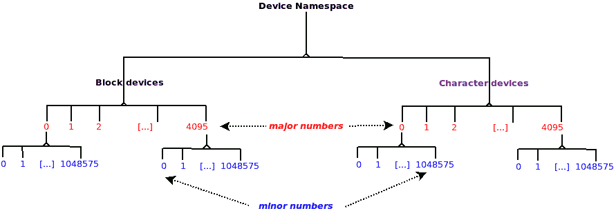
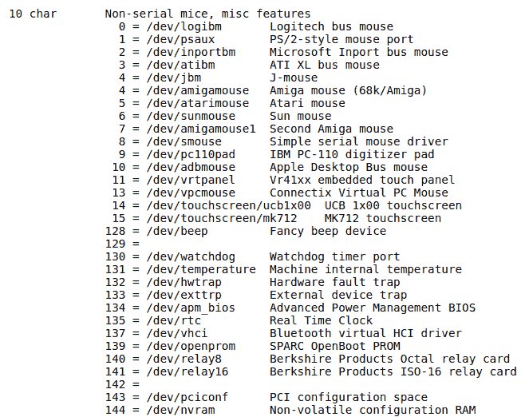
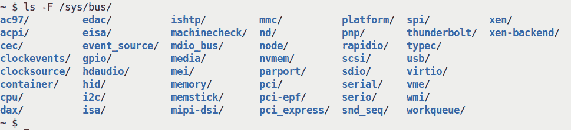
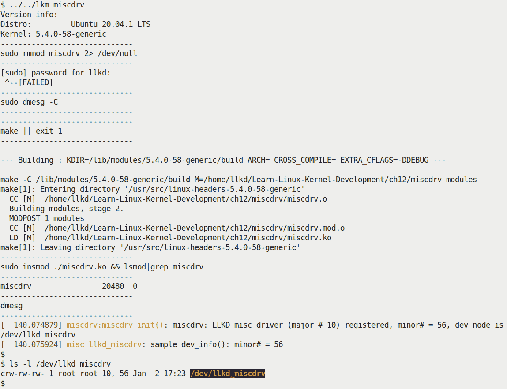
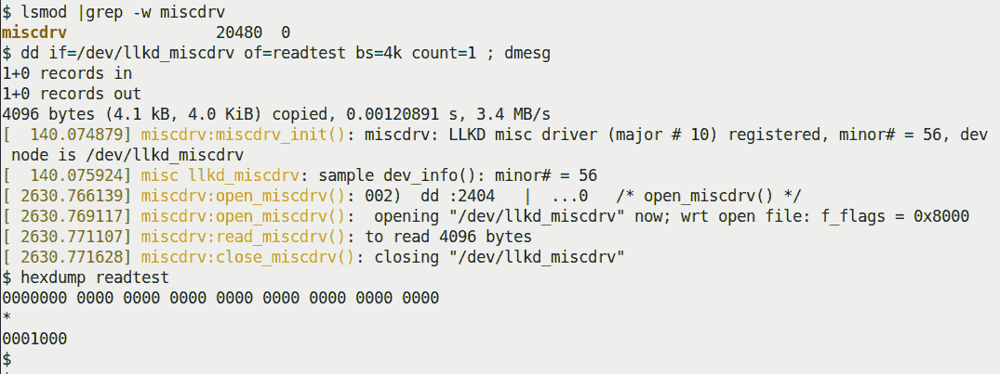
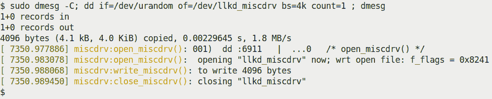
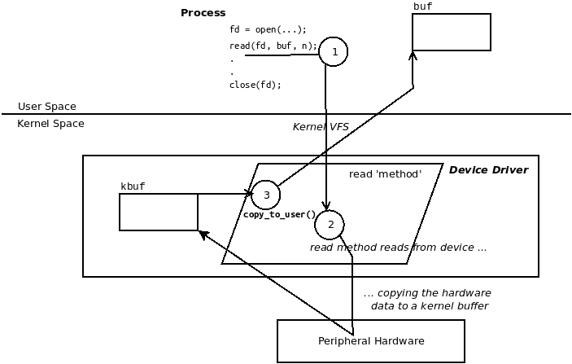
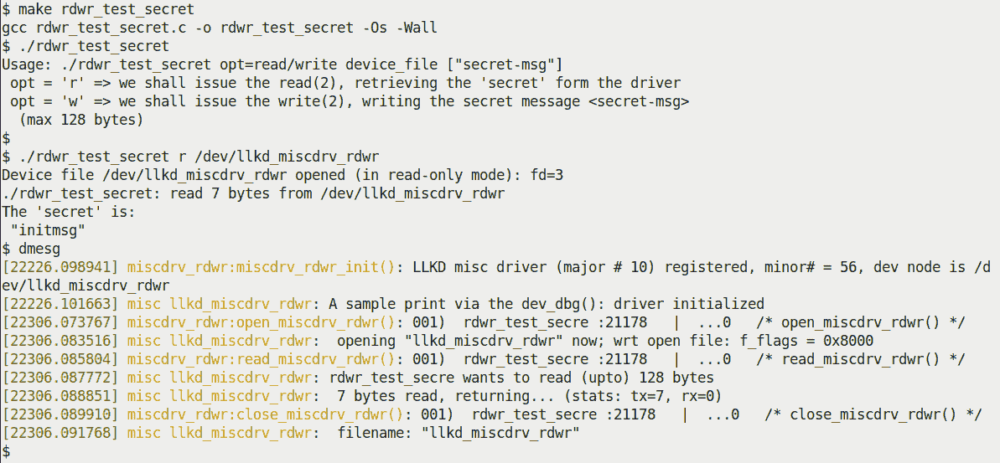
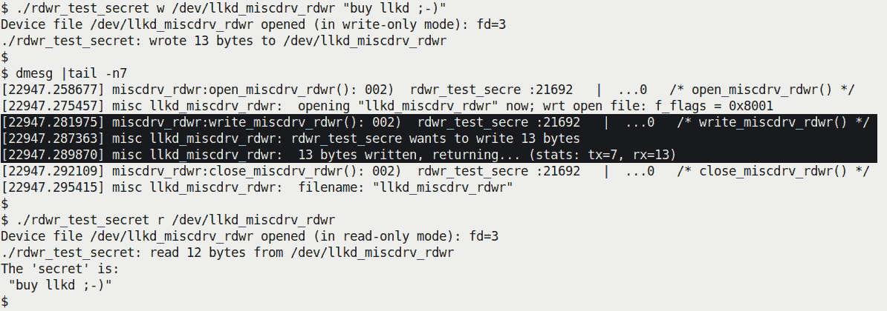
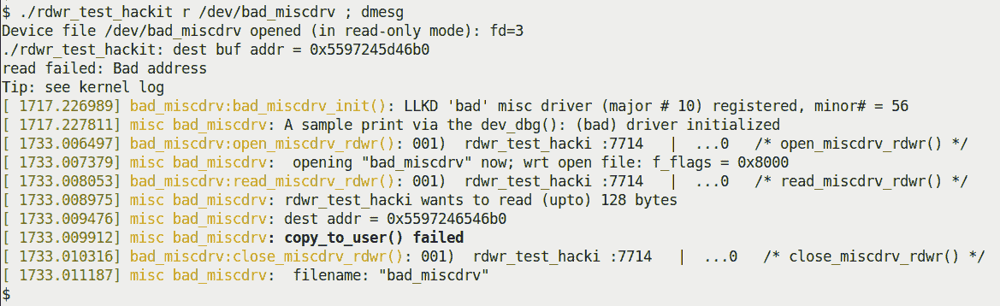

# 第一章：编写一个简单的杂项字符设备驱动程序

毫无疑问，设备驱动程序是一个广阔而有趣的话题。不仅如此，它们可能是我们使用的**可加载内核模块**（**LKM**）框架中最常见的用途。在这里，我们将介绍如何编写一些简单但完整的 Linux 字符设备驱动程序，这些驱动程序属于一个名为`misc`的类；是的，这是杂项的缩写。我们希望强调的是，本章的范围和覆盖范围有限 - 在这里，我们不试图深入探讨 Linux 驱动程序模型及其许多框架的细节；相反，我们建议您通过本章的*进一步阅读*部分参考这个主题的几本优秀的书籍和教程。我们的目标是快速让您熟悉编写简单字符设备驱动程序的整体概念。

话虽如此，这本书确实有几章专门介绍驱动程序作者需要了解的内容。除了这个介绍性的章节，我们还详细介绍了驱动程序作者如何处理硬件 I/O 内存、硬件中断处理（以及其许多子主题）以及内核机制，如延迟、定时器、内核线程和工作队列。各种用户-内核通信路径或接口的使用也得到了详细介绍。本书的最后两章则专注于对于任何内核开发，包括驱动程序，都非常重要的内容 - 内核同步。

我们更喜欢编写一个简单的 Linux *字符* *设备驱动程序*，而不仅仅是我们的“常规”内核模块，原因如下：

+   到目前为止，我们的内核模块相当简单，只有`init`和`cleanup`函数，没有其他内容。设备驱动程序为内核提供了*多个*入口点；这些是与文件相关的系统调用，称为*驱动程序的方法*。因此，我们可以有一个`open()`方法，一个`read()`方法，一个`write()`方法，一个`llseek()`方法，一个`[unlocked|compat]_ioctl()`方法，一个`release()`方法等等。

FYI，驱动程序作者可以连接的所有可能的“方法”（函数）都在这个关键的内核数据结构中：`include/linux/fs.h:file_operations`（在*理解进程、驱动程序和内核之间的连接*部分中会更详细地介绍）。

+   这种情况更加现实，也更加有趣。

在本章中，我们将涵盖以下主题：

+   开始编写一个简单的杂项字符设备驱动程序

+   从内核到用户空间的数据复制，反之亦然

+   一个带有秘密的杂项驱动程序

+   问题和安全问题

# 技术要求

我假设您已经阅读了*前言*部分*为了充分利用本书*，并且已经适当地准备了一个运行 Ubuntu 18.04 LTS（或更高版本稳定发布版）的虚拟机，并安装了所有必需的软件包。如果没有，我强烈建议您首先这样做。为了充分利用本书，我强烈建议您首先设置好工作环境，包括克隆本书的 GitHub 代码库，并以实际操作的方式进行工作。代码库可以在这里找到：[`github.com/PacktPublishing/Linux-Kernel-Programming-Part-2`](https://github.com/PacktPublishing/Linux-Kernel-Programming-Part-2/tree/main/ch1)。

# 开始编写一个简单的杂项字符设备驱动程序

在本节中，您将首先学习所需的背景材料 - 了解设备文件（或节点）及其层次结构的基础知识。之后，您将通过实际编写一个非常简单的`misc`字符驱动程序的代码来了解原始字符设备驱动程序背后的内核框架。在此过程中，我们将介绍如何创建设备节点并通过用户空间应用程序测试驱动程序。让我们开始吧！

## 了解设备基础知识

需要一些快速的背景知识。

**设备驱动程序**是操作系统和外围硬件设备之间的接口。它可以内联编写 - 也就是说，编译在内核映像文件中 - 或者更常见的是在内核源树之外编写为内核模块（我们在伴随指南*Linux 内核编程*的*第四章*，*编写您的第一个内核模块 - LKMs 第一部分*和*第五章*，*编写您的第一个内核模块 - LKMs 第二部分*中详细介绍了 LKM 框架）。无论哪种方式，驱动程序代码肯定在操作系统特权级别下在内核空间中运行（用户空间设备驱动程序确实存在，但可能存在性能问题；虽然在许多情况下很有用，但我们在这里不涉及它们。请查看*进一步阅读*部分）。

为了让用户空间应用程序能够访问内核中的底层设备驱动程序，需要一些 I/O 机制。Unix（因此也是 Linux）的设计是让进程打开一种特殊类型的文件 - **设备文件**或**设备节点**。这些文件通常位于`/dev`目录中，并且在现代系统中是动态和自动填充的。设备节点作为设备驱动程序的入口点。

为了让内核区分设备文件，它在它们的 inode 数据结构中使用了两个属性：

+   文件类型 - 字符（char）或块

+   主要和次要编号

您会发现**命名空间** - 设备类型和`{major＃，minor＃}`对 - 形成**层次结构**。设备（因此它们的驱动程序）在内核中以树状层次结构组织（内核中的驱动程序核心代码负责此操作）。首先根据设备类型进行层次划分 - 块或字符。在其中，每种类型都有一些*n*个主要编号，每个主要编号通过一些*m*个次要编号进一步分类；*图 1.1*显示了这种层次结构。

现在，块设备和字符设备之间的关键区别在于块设备具有（内核级）能力进行挂载，因此成为用户可访问的文件系统的一部分。字符设备无法挂载；因此，存储设备倾向于基于块。以这种方式考虑（有点简单但有用）：如果（硬件）设备既不是存储设备也不是网络设备，那么它就是字符设备。大量设备属于“字符”类，包括您典型的 I2C/SPI（集成电路/串行外围接口）传感器芯片（温度、压力、湿度等）、触摸屏、**实时时钟**（**RTC**）、媒体（视频、摄像头、音频）、键盘、鼠标等。USB 在内核中形成了一个基础设施支持的类。USB 设备可以是块设备（U 盘、USB 磁盘）、字符设备（鼠标、键盘、摄像头）或网络（USB dongles）设备。

从 Linux 2.6 开始，`{major:minor}`对是 inode 中的一个单个无符号 32 位数量，一个位掩码（它是`dev_t i_rdev`成员）。在这 32 位中，最高 12 位表示主要编号，剩下的最低 20 位表示次要编号。快速计算表明，因此可以有多达 2¹² = 4,096 个主要编号和 2²⁰个次要编号，即一百万个次要编号。因此，快速查看*图 1.1*；在块层次结构中，可能有 4,096 个主要编号，每个主要编号最多可以有 1 百万个次要编号。同样，在字符层次结构中，可能有 4,096 个主要编号，每个主要编号最多可以有 1 百万个次要编号。



图 1.1 - 设备命名空间或层次结构

你可能会想：这个*主要号:次要号*对到底意味着什么？把主要号想象成代表设备的**类别**（它是 SCSI 磁盘，键盘，**电传打字机**（**tty**）或**伪终端**（**pty**）设备，回环设备（是的，这些是伪硬件设备），操纵杆，磁带设备，帧缓冲器，传感器芯片，触摸屏等等的设备类别）。确实有大量的设备；为了了解有多少，我们建议你查看这里的内核文档：[`www.kernel.org/doc/Documentation/admin-guide/devices.txt`](https://www.kernel.org/doc/Documentation/admin-guide/devices.txt)（这实际上是 Linux 操作系统所有可用设备的官方注册表。它正式称为**LANANA** - **Linux 分配的名称和编号管理机构**！只有这些人才能正式分配设备节点 - 类型和*主要号:次要号*到设备）。

次要号的含义（解释）完全由驱动程序的作者决定；内核不会干涉。通常，驱动程序解释设备的次要号，表示设备的物理或逻辑实例，或表示某种功能。（例如，**小型计算机系统接口**（**SCSI**）驱动程序 - 类型为块，主要号`#8` - 使用次要号表示多达 16 个磁盘的逻辑分区。另一方面，字符主要号`#119`由 VMware 的虚拟网络控制驱动程序使用。在这里，次要号被解释为第一个虚拟网络，第二个虚拟网络，依此类推。）同样，所有驱动程序本身都会为它们的次要号分配含义。但是每个好的规则都有例外。在这里，规则的例外 - 内核不解释次要号 - 是`misc`类（类型为字符，主要号`#10`）。它使用次要号作为第二级主要号。这将在下一节中介绍。

一个常见的问题是命名空间的耗尽。多年前做出的决定将各种各样的杂项字符设备 - 许多鼠标（不是动物王国的那种），传感器，触摸屏等等 - “收集”到一个称为`misc`或'**杂项**'类的类中，分配字符主要号为 10。在`misc`类中有许多设备及其对应的驱动程序。实际上，它们共享相同的主要号，并依赖于唯一的次要号来识别自己。我们将使用这个类编写一些驱动程序，并利用内核的`misc`框架。

许多设备已经通过**LANANA（Linux 分配的名称和编号管理机构）**分配到了`misc`字符设备类中。*图 1.2*显示了来自[`www.kernel.org/doc/Documentation/admin-guide/devices.txt`](https://www.kernel.org/doc/Documentation/admin-guide/devices.txt)的部分截图，显示了前几个`misc`设备，它们分配的次要号和简要描述。请查看参考链接获取完整列表：



图 1.2 - 杂项设备的部分截图：字符类型，主要号 10

在*图 1.2*中，最左边的一列有`10 char`，指定它在设备层次结构（*图 1.1*）下分配了主要的`# 10`。右边的列是以`minor# = /dev/<foo> <description>`的形式；很明显，这是分配的次要号，后面跟着（在`=`号之后）设备节点和一行描述。

## 关于 Linux 设备模型的简短说明

不详细介绍，现代统一的 Linux 设备模型（LDM）的快速概述是重要的。从 2.6 内核开始，现代 Linux 具有一个奇妙的功能，即 LDM，它以一种广泛和大胆的方式实现了许多与系统和其中的设备有关的目标。在其许多功能中，它创建了一个复杂的分层树，统一了系统组件、所有外围设备及其驱动程序。这个树被暴露给用户空间，通过 sysfs 伪文件系统（类似于 procfs 将一些内核和进程/线程内部细节暴露给用户空间），通常挂载在/sys 下。在/sys 下，您会找到几个目录-您可以将它们视为 LDM 的“视口”。在我们的 x86_64 Ubuntu VM 上，我们展示了挂载在/sys 下的 sysfs 文件系统：

```
$ mount | grep -w sysfs
sysfs on /sys type sysfs (rw,nosuid,nodev,noexec,relatime)
```

此外，看一眼里面：

```
$ ls -F /sys/
block/ bus/ class/ dev/ devices/ firmware/ fs/ hypervisor/ kernel/ module/ power/
```

将这些目录视为 LDM 的视口-查看系统上设备的不同方式。当然，随着事物的发展，进入的东西往往比出去的多（膨胀方面！）。一些非明显的目录现在已经进入了这里。尽管（与 procfs 一样）sysfs 被正式记录为应用程序二进制接口（ABI）接口，但这是可能随时更改/弃用的；现实情况是这个系统会一直存在-当然会随着时间的推移而发展。

LDM 可以被简单地认为具有-并将这些主要组件联系在一起-这些主要组件：

+   系统上的总线。

+   它们上的设备。

+   驱动设备的设备驱动程序（通常也称为客户端驱动程序）。

基本的 LDM 原则是***每个设备都必须驻留在总线上***。这可能看起来很明显：USB 设备将在 USB 总线上，PCI 设备将在 PCI 总线上，I2C 设备将在 I2C 总线上，依此类推。因此，在/sys/bus 层次结构下，您将能够通过它们所驻留的总线“看到”所有设备：



图 1.3-现代 Linux 上的不同总线或总线驱动程序基础设施（在 x86_64 上）

内核的驱动程序核心提供总线驱动程序（通常是内核映像的一部分或根据需要在引导时自动加载），这当然使总线发挥作用。它们的工作是什么？至关重要的是，它们组织和识别上面的设备。如果出现新设备（也许您插入了一个 U 盘），USB 总线驱动程序将识别这一事实并将其绑定到其（USB 大容量存储）设备驱动程序！一旦成功绑定（有许多术语用于描述这一点：绑定、枚举、发现），内核驱动程序框架将调用驱动程序的注册 probe（）方法（函数）。现在，这个探测方法设置设备，分配资源、IRQ、内存设置，根据需要注册它等等。

关于 LDM 的另一个关键方面是，现代基于 LDM 的驱动程序通常应该执行以下操作：

+   向（专门的）内核框架注册。

+   向总线注册。

它注册自己的内核框架取决于您正在处理的设备类型；例如，驻留在 I2C 总线上的 RTC 芯片的驱动程序将通过 rtc_register_device（）API 将自己注册到内核的 RTC 框架，并通过 i2c_register_driver（）API 将自己注册到 I2C 总线（内部）。另一方面，驻留在 PCI 总线上的网络适配器（NIC）的驱动程序通常会通过 register_netdev（）API 将自己注册到内核的网络基础设施，并通过 pci_register_driver（）API 将自己注册到 PCI 总线。向专门的内核框架注册可以使驱动程序作者的工作变得更加容易-内核通常会提供辅助例程（甚至数据结构）来处理 I/O 细节等。例如，考虑先前提到的 RTC 芯片驱动程序。

你不需要知道如何通过 I2C 总线与芯片进行通信，在 I2C 协议要求的**串行时钟**（**SCL**）/**串行数据**（**SDA**）线上发送数据。内核 I2C 总线框架为您提供了方便的例程（例如通常使用的`i2c_smbus_*()`API），让您可以轻松地与问题芯片进行总线通信！

如果你想知道如何获取有关这些驱动程序 API 的更多信息，好消息是：官方的内核文档有很多内容可供参考。请查阅*Linux 驱动程序实现者 API 指南*：[`www.kernel.org/doc/html/latest/driver-api/index.html`](https://www.kernel.org/doc/html/latest/driver-api/index.html)。

（我们将在接下来的两章中展示驱动程序的`probe()`方法的一些示例；在那之前，请耐心等待。）相反，当设备从总线上分离或内核模块被卸载（或系统关闭时），分离会导致驱动程序的`remove()`（或`disconnect()`）方法被调用。在这两者之间，设备通过其驱动程序（总线和客户端）进行工作！

请注意，我们在这里忽略了很多内部细节，因为它们超出了本书的范围。重点是让你对 LDM 有一个概念性的理解。请参考*进一步阅读*部分的文章和链接，以获取更详细的信息。

在这里，我们希望保持我们的驱动程序覆盖范围非常简单和最小化，更专注于基本原理。因此，我们选择编写一个使用可能是最简单的内核框架 - `misc`或*杂项*内核框架的驱动程序。在这种情况下，驱动程序甚至不需要显式地向任何总线（驱动程序）注册。事实上，更像是这样：我们的驱动程序直接在硬件上工作，而无需任何特定的总线基础设施支持。

在我们特定的示例中，使用`misc`内核框架，由于我们没有显式地向任何总线（驱动程序）注册，因此我们甚至不需要`probe()`/`remove()`方法。这使得事情变得简单。另一方面，一旦你理解了这种最简单的驱动程序，我鼓励你进一步学习，尝试编写具有典型内核框架注册加总线驱动程序注册的设备驱动程序，从而使用`probe()`/`remove()`方法。一个很好的开始是学习如何编写一个简单的**平台驱动程序**，将其注册到内核的`misc`框架和*平台总线*，这是一个伪总线基础设施，支持不在任何物理总线上的设备（这比你最初想象的要常见得多；现代**SoC**（**系统芯片**）内置的几个外围设备不在任何物理总线上，因此它们的驱动程序通常是平台驱动程序）。要开始，请在内核源树中的`drivers/`目录下查找调用`platform_driver_register()` API 的代码。官方的内核文档在这里涵盖了平台设备和驱动程序：[`www.kernel.org/doc/html/latest/driver-api/driver-model/platform.html#platform-devices-and-drivers`](https://www.kernel.org/doc/html/latest/driver-api/driver-model/platform.html#platform-devices-and-drivers)。

作为额外的帮助，请注意以下内容：

- 请参阅第二章，*用户-内核通信路径*，特别是*创建一个简单的平台设备*和*平台设备*部分。

- 本章的一个练习（请参阅*问题*部分）是编写这样的驱动程序。我在这里提供了一个示例（非常简单的实现）：`solutions_to_assgn/ch12/misc_plat/`。

然而，我们确实需要内核的`misc`框架支持，因此我们向其注册。接下来，理解这一点也很关键：我们的驱动程序是逻辑驱动程序，意味着它没有实际的物理设备或芯片在驱动。这通常是情况（当然，您可以说这里正在处理的硬件是 RAM）。

因此，如果我们要编写属于`misc`类的 Linux 字符设备驱动程序，我们首先需要向其注册。接下来，我们将需要一个唯一（未使用的）次编号。同样，有一种方法可以让内核动态地为我们分配一个空闲的次编号。以下部分涵盖了这些方面以及更多内容。

## 编写 misc 驱动程序代码-第一部分

话不多说，让我们来看一下编写一个简单骨架字符`misc`设备驱动程序的代码吧！（当然，这只是部分实际代码；我强烈建议您`git clone`本书的 GitHub 存储库，详细查看并尝试自己编写代码。）

让我们一步一步来看：在我们的第一个设备驱动程序（使用 LKM 框架）的`init`代码中，我们必须首先使用适当的 Linux 内核框架向其注册我们的驱动程序；在这种情况下，使用`misc`框架。这是通过`misc_register()`API 完成的。它接受一个参数，即指向`miscdevice`类型的数据结构的指针，描述了我们正在设置的杂项设备：

```
// ch1/miscdrv/miscdrv.c
#define pr_fmt(fmt) "%s:%s(): " fmt, KBUILD_MODNAME, __func__
[...]
#include <linux/miscdevice.h>
#include <linux/fs.h>              /* the fops, file data structures */
[...]

static struct miscdevice llkd_miscdev = {
    .minor = MISC_DYNAMIC_MINOR, /* kernel dynamically assigns a free minor# */
    .name = "llkd_miscdrv",      /* when misc_register() is invoked, the kernel
             * will auto-create a device file as /dev/llkd_miscdrv ;
             * also populated within /sys/class/misc/ and /sys/devices/virtual/misc/ */
    .mode = 0666,            /* ... dev node perms set as specified here */
    .fops = &llkd_misc_fops, /* connect to this driver's 'functionality' */
};

static int __init miscdrv_init(void)
{
    int ret;
    struct device *dev;

    ret = misc_register(&llkd_miscdev);
    if (ret != 0) {
        pr_notice("misc device registration failed, aborting\n");
        return ret;
    }
    [ ... ]
```

在`miscdevice`结构实例中，我们进行了以下操作：

1.  我们将`minor`字段设置为`MISC_DYNAMIC_MINOR`。这会请求内核在成功注册后动态为我们分配一个可用的次编号（一旦注册成功，此`minor`字段将填充为分配的实际次编号）。

1.  我们初始化了`name`字段。在成功注册后，内核框架会自动为我们创建一个设备节点（形式为`/dev/<name>`）！如预期的那样，类型将是字符，主编号将是`10`，次编号将是动态分配的值。这是使用内核框架的优势之一；否则，我们可能需要想办法自己创建设备节点；顺便说一下，`mknod(1)`实用程序可以在具有 root 权限（或具有`CAP_MKNOD`权限）时创建设备文件；它通过调用`mknod(2)`系统调用来工作！

1.  设备节点的权限将设置为您初始化`mode`字段的值（在这里，我们故意保持它是宽松的，并且通过`0666`八进制值对所有人可读可写）。

1.  我们将推迟讨论文件操作（`fops`）结构成员的讨论到接下来的部分。

所有`misc`驱动程序都是字符类型，并使用相同的主编号（`10`），但当然需要唯一的次编号。

### 理解进程、驱动程序和内核之间的连接。

在这里，我们将深入了解 Linux 上字符设备驱动程序成功注册时的内核内部。实际上，您将了解底层原始字符驱动程序框架的工作原理。

`file_operations`结构，或者通常称为**fops**（发音为*eff-opps*），对于驱动程序作者来说至关重要；`fops`结构的大多数成员都是函数指针-将它们视为**虚方法**。它们代表了可能在（设备）文件上发出的所有可能的与文件相关的系统调用。因此，它有`open`、`read`、`write`、`poll`、`mmap`、`release`等多个成员（其中大多数是函数指针）。这个关键数据结构的一些成员在这里显示出来：

```
// include/linux/fs.h struct file_operations {
    struct module *owner;
    loff_t (*llseek) (struct file *, loff_t, int);
    ssize_t (*read) (struct file *, char __user *, size_t, loff_t *);
    ssize_t (*write) (struct file *, const char __user *, size_t, loff_t *);
[...]
    __poll_t (*poll) (struct file *, struct poll_table_struct *);
    long (*unlocked_ioctl) (struct file *, unsigned int, unsigned long);
    long (*compat_ioctl) (struct file *, unsigned int, unsigned long);
    int (*mmap) (struct file *, struct vm_area_struct *);
    unsigned long mmap_supported_flags;
    int (*open) (struct inode *, struct file *);
    int (*flush) (struct file *, fl_owner_t id); 
    int (*release) (struct inode *, struct file *);
[...]
    int (*fadvise)(struct file *, loff_t, loff_t, int);
} __randomize_layout;
```

驱动程序作者（或底层内核框架）的一个关键工作是填充这些函数指针，从而将它们链接到驱动程序中的实际代码。当然，您不需要实现每个单独的函数；请参考“处理不支持的方法”部分了解详情。

现在，假设您已经编写了驱动程序来为一些`f_op`方法设置函数。一旦您的驱动程序通过内核框架注册到内核中，当任何用户空间进程（或线程）打开注册到该驱动程序的设备文件时，内核**虚拟文件系统开关**（**VFS**）层将接管。不深入细节，可以说 VFS 为设备文件分配并初始化了该进程的打开文件数据结构（`struct file`）。现在，回想一下我们`struct miscdevice`初始化中的最后一行；它是这样的：

```
   .fops = &llkd_misc_fops, /* connect to this driver's 'functionality' */
```

这行代码有一个关键的作用：它将进程的文件操作指针（在进程的打开文件结构中）与设备驱动程序的文件操作结构绑定在一起。*功能性 - 驱动程序将执行的操作 - *现在已经为此设备文件设置好了！

让我们详细说明一下。现在（在驱动程序初始化之后），用户模式进程通过对其发出`open(2)`系统调用来打开驱动程序的设备文件。假设一切顺利（应该如此），进程现在通过内核深处的`file_operations`结构指针连接到您的驱动程序。这里有一个关键点：在`open(2)`系统调用成功返回后，进程在该（设备）文件上发出任何与文件相关的系统调用`foo()`，内核 VFS 层将以面向对象的方式（我们在本书中之前已经指出过！）盲目地并信任地调用已注册的**`fops->foo()`**方法！用户空间进程打开的文件，通常是`/dev`中的设备文件，由`struct file`元数据结构在内部表示（指向此结构的指针`struct file *filp`被传递给驱动程序）。因此，在伪代码方面，当用户空间发出与文件相关的系统调用`foo()`时，内核 VFS 层实际上执行以下操作：

```
/* pseudocode: kernel VFS layer (not the driver) */
if (filp->f_op->foo)
    filp->f_op->foo(); /* invoke the 'registered' driver method corresponding to 'foo()' */
```

因此，如果打开设备文件的用户空间进程在其上调用`read(2)`系统调用，内核 VFS 将调用`filp->f_op->read(...)`，实际上将控制权重定向到设备驱动程序。作为设备驱动程序作者，您的工作是提供`read(2)`的功能！对于所有其他与文件相关的系统调用也是如此。这基本上是 Unix 和 Linux 实现的众所周知的*如果不是进程，就是文件设计*原则。

#### 处理不支持的方法

不必填充`f_ops`结构的每个成员，只需填充驱动程序支持的成员。如果是这种情况，并且您已经填充了一些方法但遗漏了，比如`poll`方法，如果用户空间进程在您的设备上调用`poll(2)`（也许您已经记录了它不应该这样做，但如果它这样做了呢？），那么会发生什么？在这种情况下，内核 VFS 检测到`foo`指针（在本例中为`poll`）为`NULL`，将返回适当的负整数（实际上，遵循相同的`0`/`-E`协议）。`glibc`代码将这个数乘以`-1`，并将调用进程的`errno`变量设置为该值，表示系统调用失败。

要注意的两点：

+   VFS 返回的负`errno`值通常并不直观。（例如，如果您将`f_op`的`read()`函数指针设置为`NULL`，VFS 会导致发送回`EINVAL`值。这使得用户空间进程认为`read(2)`失败是因为`"无效参数"`错误，但实际上根本不是这种情况！）

+   `lseek(2)`系统调用使驱动程序在文件中的指定位置寻址 - 当然，这里指的是设备。内核故意将`f_op`函数指针命名为`llseek`（注意两个`l`）。这只是为了提醒您，`lseek`的返回值可以是 64 位（long long）数量。现在，对于大多数硬件设备，`lseek`值是没有意义的，因此大多数驱动程序不需要实现它（不像文件系统）。现在问题是：即使您不支持`lseek`（您已将`f_op`的`llseek`成员设置为`NULL`），它仍然返回一个随机的正值，从而导致用户模式应用错误地得出它成功了的结论。因此，如果您不实现`lseek`，您需要执行以下操作：

1.  将`llseek`明确设置为特殊的`no_llseek`值，这将导致返回一个失败值（`-ESPIPE`；`非法寻址`）。

1.  在这种情况下，您还需要在驱动程序的`open()`方法中调用`nonseekable_open()`函数，指定文件是不可寻址的（通常在`open()`方法中这样调用：`return nonseekable_open(struct inode *inode, struct file *filp);`）。有关详细信息等，均在 LWN 文章中有所涵盖：[`lwn.net/Articles/97154/`](https://lwn.net/Articles/97154/)。您可以在此处看到这对许多驱动程序造成的更改：[`lwn.net/Articles/97180/`](https://lwn.net/Articles/97180/)。

如果您不支持某个功能，返回的适当值是`-ENOSYS`，这将使用户模式进程看到错误`Function not implemented`（当它调用`perror(3)`或`strerror(3)`库 API 时）。这是清晰的，明确的；用户空间开发人员现在将了解到您的驱动程序不支持此功能。因此，实现驱动程序的一种方法是为所有文件操作方法设置指针，并为驱动程序中的所有文件相关系统调用（`f_op`方法）编写例程。对于您支持的功能，编写代码；对于您未实现的功能，只需返回值`-ENOSYS`。虽然这样做有点费力，但它将导致用户空间的明确返回值。

## 编写 misc 驱动程序代码 - 第二部分

掌握了这些知识后，再次查看`ch1/miscdrv/miscdrv.c`的`init`代码。您将看到，就像在上一节中描述的那样，我们已将`miscdev`结构的`fops`成员初始化为`file_operations`结构，从而设置了驱动程序的功能。驱动程序的相关代码片段如下：

```
static const struct file_operations llkd_misc_fops = {
    .open = open_miscdrv,
    .read = read_miscdrv,
    .write = write_miscdrv,
    .release = close_miscdrv,
};

static struct miscdevice llkd_miscdev = {
    [ ... ]
    .fops = &llkd_misc_fops, /* connect to this driver's 'functionality' */
};
```

因此，现在您可以看到：当打开我们的设备文件的用户空间进程（或线程）调用`read(2)`系统调用时，内核 VFS 层将跟随指针（通用地，`filp->f_op->foo()`）并调用`read_miscdrv()`函数，实际上将控制权交给设备驱动程序！有关读取方法的编写方式将在下一节中介绍。

继续我们简单的`misc`驱动程序的`init`代码：

```
    [ ... ] 
    /* Retrieve the device pointer for this device */
    dev = llkd_miscdev.this_device;
    pr_info("LLKD misc driver (major # 10) registered, minor# = %d,"
            " dev node is /dev/%s\n", llkd_miscdev.minor, llkd_miscdev.name);
    dev_info(dev, "sample dev_info(): minor# = %d\n", llkd_miscdev.minor);
    return 0;        /* success */
}
```

我们的驱动程序检索到`device`结构的指针 - 这是每个驱动程序都需要的东西。在`misc`内核框架中，它在`miscdevice`结构的`this_device`成员中可用。

接下来，`pr_info()`显示动态获取的次要号。`dev_info()`辅助例程更有趣：作为驱动程序作者，**您应该在发出`printk`时使用这些`dev_xxx()`辅助程序**；它还将为设备添加有用的信息前缀。`dev_xxx()`和`pr_xxx()`辅助程序之间的语法唯一的区别是前者的第一个参数是指向设备结构的指针。

好的，让我们开始动手吧！我们构建驱动程序并将其`insmod`到内核空间（我们使用我们的`lkm`辅助脚本来执行）：



图 1.4 - 在 x86_64 Ubuntu VM 上构建和加载我们的 miscdrv.ko 骨架 misc 驱动程序的屏幕截图

（顺便说一句，正如你在*图 1.4*中看到的，我在一个更新的发行版 Ubuntu 20.04.1 LTS 上运行了 5.4.0-58-generic 内核的`misc`驱动程序。）请注意*图 1.4*底部的两个打印；第一个是通过`pr_info()`发出的（前缀是`pr_fmt()`宏的内容，如*Linux 内核编程-第四章，编写你的第一个内核模块-LKMs 第一部分*中的*通过 pr_fmt 宏标准化 printk 输出*部分所解释的）。第二个打印是通过`dev_info()`辅助例程发出的-它的前缀是`misc llkd_miscdrv`，表示它来自内核的`misc`框架，具体来说是来自`llkd_miscdrv`设备！（`dev_xxx()`例程是多功能的；根据它们所在的总线，它们将显示各种细节。这对于调试和日志记录很有用。我们再次重申：在编写驱动程序时，建议使用`dev_*()`例程。）你还可以看到`/dev/llkd_miscdrv`设备节点确实被创建了，具有预期的类型（字符）和主次对（这里是 10 和 56）。

## 编写杂项驱动程序代码-第三部分

现在，`init`代码已经完成，驱动程序功能已经通过文件操作结构设置好，并且驱动程序已经注册到内核的`misc`框架中。那么，接下来会发生什么呢？实际上，除非一个进程打开与你的驱动程序相关的设备文件并执行某种输入/输出（I/O，即读/写）操作，否则什么也不会发生。

因此，让我们假设一个用户模式进程（或线程）在你的驱动程序的设备节点上发出`open(2)`系统调用（回想一下，当驱动程序向内核的`misc`框架注册时，设备节点已经被自动创建）。最重要的是，正如你在*理解进程、驱动程序和内核之间的连接*部分学到的那样，对于在你的设备节点上发出的任何与文件相关的系统调用，VFS 基本上会调用驱动程序的（`f_op`）注册方法。因此，在这里，VFS 将执行这样的操作：`filp->f-op->open()`，从而在我们的`file_operations`结构中调用我们的驱动程序的`open`方法，即`open_miscdrv()`函数！

但是，作为驱动程序作者，你应该如何实现你的驱动程序的`open`方法的代码呢？关键点在于：你的`open`函数的签名**应该与**`file_operation`结构的`open`完全相同；实际上，对于任何函数都是如此。因此，我们实现`open_miscdrv()`函数如下：

```
/*
 * open_miscdrv()
 * The driver's open 'method'; this 'hook' will get invoked by the kernel VFS
 * when the device file is opened. Here, we simply print out some relevant info.
 * The POSIX standard requires open() to return the file descriptor on success;
 * note, though, that this is done within the kernel VFS (when we return). So,
 * all we do here is return 0 indicating success.
 * (The nonseekable_open(), in conjunction with the fop's llseek pointer set to
 * no_llseek, tells the kernel that our device is not seek-able).
 */
static int open_miscdrv(struct inode *inode, struct file *filp)
{
    char *buf = kzalloc(PATH_MAX, GFP_KERNEL);

    if (unlikely(!buf))
        return -ENOMEM;
    PRINT_CTX(); // displays process (or atomic) context info
    pr_info(" opening \"%s\" now; wrt open file: f_flags = 0x%x\n",
        file_path(filp, buf, PATH_MAX), filp->f_flags);
    kfree(buf);
    return nonseekable_open(inode, filp);
}
```

请注意我们的`open`例程`open_miscdrv()`函数的签名如何与`f_op`结构的`open`函数指针完全匹配（你可以随时在[`elixir.bootlin.com/linux/v5.4/source/include/linux/fs.h#L1814`](https://elixir.bootlin.com/linux/v5.4/source/include/linux/fs.h#L1814)查找 5.4 Linux 的`file_operations`结构）。

在这个简单的驱动程序中，在我们的`open`方法中，我们实际上没有太多事情要做。我们通过`kzalloc()`为缓冲区（用于保存设备路径名）分配一些内存，使用我们的`PRINT_CTX()`宏（在`convenient.h`头文件中）显示当前上下文-当前正在打开设备的进程。然后我们通过`pr_info()`发出一个`printk`显示一些 VFS 层的细节（路径名和打开标志值）；你可以使用方便的 API `file_path()`来获取文件的路径名，就像我们在这里做的一样（为此，我们需要分配并在使用后释放内核内存缓冲区）。然后，由于这个驱动程序不支持寻址，我们调用`nonseekable_open()` API（如*处理不支持的方法*部分所讨论的）。

对设备文件的`open(2)`系统调用应该成功。用户模式进程现在将拥有一个有效的文件描述符 - 打开文件的句柄（这里实际上是一个设备节点）。现在，假设用户模式进程想要从硬件中读取数据；因此，它发出`read(2)`系统调用。如前所述，内核 VFS 现在将自动调用我们的驱动程序的读取方法`read_miscdrv()`。再次强调，它的签名完全模仿了`file_operations`数据结构中的读取函数签名。这是我们驱动程序读取方法的简单代码：

```
/*
 * read_miscdrv()
 * The driver's read 'method'; it has effectively 'taken over' the read syscall
 * functionality! Here, we simply print out some info.
 * The POSIX standard requires that the read() and write() system calls return
 * the number of bytes read or written on success, 0 on EOF (for read) and -1 (-ve errno)
 * on failure; we simply return 'count', pretending that we 'always succeed'.
 */
static ssize_t read_miscdrv(struct file *filp, char __user *ubuf, size_t count, loff_t *off)
{
        pr_info("to read %zd bytes\n", count);
        return count;
}
```

前面的评论是不言自明的。在其中，我们发出`pr_info()`，显示用户空间进程想要读取的字节数。然后，我们简单地返回读取的字节数，意味着成功！实际上，我们（基本上）什么都没做。其余的驱动程序方法非常相似。

## 测试我们简单的 misc 驱动程序

让我们测试我们真正简单的骨架`misc`字符驱动程序（在`ch1/miscdrv`目录中；我们假设您已经按照*图 1.4*中所示构建并插入了它）。我们通过对其发出`open(2)`、`read(2)`、`write(2)`和`close(2)`系统调用来测试它；我们应该如何做呢？我们总是可以编写一个小的 C 程序来精确地做到这一点，但更简单的方法是使用有用的`dd(1)`“磁盘复制”实用程序。我们像这样使用它：

```
dd if=/dev/llkd_miscdrv of=readtest bs=4k count=1
```

内部`dd`通过`if=`（这里是`dd`的第一个参数；`if=`指定输入文件）打开我们传递给它的文件（`/dev/llkd_miscdrv`），它将从中读取（通过`read(2)`系统调用，当然）。输出将被写入由参数`of=`指定的文件（`dd`的第二个参数，是一个名为`readtest`的常规文件）；`bs`指定要执行 I/O 的块大小，`count`是要执行 I/O 的次数）。完成所需的 I/O 后，`dd`进程将`close(2)`这些文件。这个顺序反映在内核日志中（*图 1.5*）：



图 1.5 - 屏幕截图显示我们通过 dd(1)最小化测试了 miscdrv 驱动程序的读取方法

在验证我们的驱动程序（LKM）已插入后，我们发出`dd(1)`命令，让它从我们的设备中读取 4,096 字节（因为块大小（`bs`）设置为`4k`，`count`设置为`1`）。我们让它通过`of=`选项开关将输出写入一个名为`readtest`的文件。查看内核日志，您可以看到（*图 1.5*）`dd`进程确实已经打开了我们的设备（我们的`PRINT_CTX()`宏的输出显示，它是当前运行我们驱动程序代码的进程上下文！）。接下来，我们可以看到（通过`pr_fmt()`的输出）控制转到我们驱动程序的读取方法，在其中我们发出一个简单的`printk`并返回值 4096，表示成功（尽管我们实际上并没有读取任何东西！）。然后，设备被`dd`关闭。此外，使用`hexdump(1)`实用程序进行快速检查，我们确实从驱动程序（在文件`readtest`中；请意识到这是因为`dd`将其读取缓冲区初始化为`NULL`）接收到了`0x1000`（4,096）个空值（如预期的那样）。

我们在代码中使用的`PRINT_CTX()`宏位于我们的`convenient.h`头文件中。请看一下；它非常有教育意义（我们尝试模拟内核`Ftrace`基础设施的`latency output`格式，它在一个小空间内显示了很多细节，一行输出）。这在第四章中的*处理硬件中断*部分中有详细说明。现在不要担心所有的细节...

*图 1.6*显示了我们（最小化地）通过`dd(1)`测试写入我们的驱动程序。这次我们通过利用内核内置的`mem`驱动程序的`/dev/urandom`功能，读取了`4k`的随机数据，并将随机数据写入我们的设备节点；实际上，写入我们的“设备”：



图 1.6 - 屏幕截图显示我们通过 dd(1)最小化测试我们的 miscdrv 驱动程序的写入方法

（顺便说一句，我还包括了一个简单的用户空间测试应用程序用于驱动程序；可以在这里找到：`ch1/miscdrv/rdwr_test.c`。我会留给你阅读它的代码并尝试。）

你可能会想：我们显然成功地从用户空间向驱动程序读取和写入数据，但是，等等，我们实际上从未在驱动程序代码中看到任何数据传输发生。是的，这是下一节的主题：您将如何实际将数据从用户空间进程缓冲区复制到内核驱动程序的缓冲区，反之亦然。继续阅读！

# 将数据从内核空间复制到用户空间，反之亦然

设备驱动程序的一个主要工作是使用户空间应用程序能够透明地读取和写入外围硬件设备的数据（通常是某种芯片；虽然它可能根本不是硬件），将设备视为普通文件。因此，要从设备读取数据，应用程序打开与该设备对应的设备文件，从而获得文件描述符，然后简单地使用该`fd`发出`read(2)`系统调用（*图 1.7*中的*步骤 1*）！内核 VFS 拦截读取，并且，正如我们所见，控制流到底层设备驱动程序的读取方法（当然是一个 C 函数）。驱动程序代码现在与硬件设备"通信"，实际执行 I/O，读取操作。（确切地说，硬件读取（或写入）的具体方式取决于硬件的类型——它是内存映射设备、端口、网络芯片等等？我们将在这里不再深入讨论；下一章会讲到。）驱动程序从设备读取数据后，现在将这些数据放入内核缓冲区`kbuf`（以下图中的*步骤 2*。当然，我们假设驱动程序作者通过`[k|v]malloc()`或其他适当的内核 API 为其分配了内存）。

现在我们在内核空间缓冲区中有硬件设备数据。我们应该如何将其传输到用户空间进程的内存缓冲区？我们将利用使这变得容易的内核 API，下面将介绍这一点。

## 利用内核 API 执行数据传输

现在，如前所述，让我们假设您的驱动程序已经读取了硬件数据，并且现在它存在于内核内存缓冲区中。我们如何将它传输到用户空间？一个天真的方法是简单地尝试通过`memcpy()`来执行这个操作，但*不，*那不起作用（为什么？一，它是不安全的，二，它非常依赖架构；它在一些架构上工作，在其他架构上不工作）。因此，一个关键点：内核提供了一对内联函数来在内核空间和用户空间之间传输数据。它们分别是`copy_to_user()`和`copy_from_user()`，并且确实非常常用。

使用它们很简单。两者都接受三个参数：`to`指针（目标缓冲区），`from`指针（源缓冲区）和`n`，要复制的字节数（将其视为`memcpy`操作）：

```
include <linux/uaccess.h>   /* Note! used to be <asm/uaccess.h> upto 4.11 */

unsigned long copy_to_user(void __user *to, const void *from, unsigned long n);
unsigned long copy_from_user(void *to, const void __user *from, unsigned long n);
```

返回值是未复制的字节数；换句话说，返回值为`0`表示成功，非零返回值表示未复制给定数量的字节。如果发生非零返回，您应该（遵循通常的`0/-E`返回约定）返回一个错误，指示 I/O 故障，返回`-EIO`或`-EFAULT`（这样在用户空间设置`errno`的正数对应值）。以下（伪）代码说明了设备驱动程序如何使用`copy_to_user()`函数将一些数据从内核复制到用户空间：

```
static ssize_t read_method(struct file *filp, char __user *ubuf, size_t count, loff_t *off)
{
     char *kbuf = kzalloc(...);
     [ ... ]
     /* ... do what's required to get data from the hardware device into kbuf ... */
    if (copy_to_user(buf, kbuf, count)) {
        dev_warn(dev, "copy_to_user() failed\n");
        goto out_rd_fail;
    }
    [ ... ]
    return count;    /* success */
out_rd_fail:
    kfree(kbuf);
 return -EIO; /* or -EFAULT */
}
```

在这里，当然，我们假设您有一个有效的分配的内核内存缓冲区`kbuf`，以及一个有效的设备指针（`struct device *dev`）。*图 1.7*说明了前面（伪）代码试图实现的内容：



图 1.7-读取：copy_to_user()：将数据从硬件复制到内核缓冲区，然后复制到用户空间缓冲区

使用`copy_from_user()`内联函数的语义也适用。它通常用于驱动程序的写入方法，将用户空间进程上下文中写入的数据拉入内核空间缓冲区。我们将让您自行想象这一点。

同样重要的是要意识到，这两个例程（`copy_[from|to]_user()`）在运行过程中可能会导致进程上下文（页面）故障，从而休眠；换句话说，调用调度程序。因此，**它们只能在安全休眠的进程上下文中使用，绝不能在任何类型的原子或中断上下文中使用**（我们在第四章中对`might_sleep()`助手进行了更多解释-一个调试辅助工具-在*不要阻塞-发现可能阻塞的代码路径*部分）。

对于好奇的读者（希望您是其中之一！），这里有一些链接，详细解释了**为什么**您不能只使用简单的`memcpy()`，而必须使用`copy_[from|to]_user()`内联函数来复制数据从内核到用户空间和反之：

+   [ht](https://stackoverflow.com/questions/14970698/copy-to-user-vs-memcpy)[tps://stackoverflow.com/questions/14970698/copy-to-user-vs-memcpy](https://stackoverflow.com/questions/14970698/copy-to-user-vs-memcpy) [](https://stackoverflow.com/questions/14970698/copy-to-user-vs-memcpy)

+   [https:](https://www.quora.com/Why-we-need-copy_from_user-as-the-kernel-can-access-all-the-memory-If-we-see-the-copy_from_user-implementation-again-we-are-copying-data-to-the-kernel-memory-using-memcpy-Doesnt-it-an-extra-overhead)[//www.quora.com/Why-we-need-copy_from_user-as-the-kernel-can-access-all-the-memory-If-we-see-the-copy_from_user-implementation-again-we-are-copying-data-to-the-kernel-memory-using-memcpy-Doesnt-it-an-extra-overhead](https://www.quora.com/Why-we-need-copy_from_user-as-the-kernel-can-access-all-the-memory-If-we-see-the-copy_from_user-implementation-again-we-are-copying-data-to-the-kernel-memory-using-memcpy-Doesnt-it-an-extra-overhead)。

在接下来的部分，我们将编写一个更完整的`misc`框架字符设备驱动程序，实际上执行一些 I/O，读取和写入数据。

# 一个带有秘密的杂项驱动程序

现在您了解了如何在用户空间和内核空间之间复制数据（以及反向），让我们基于我们之前的骨架（`ch1/miscdrv/`）杂项驱动程序编写另一个设备驱动程序（`ch1/miscdrv_rdwr`）。关键区别在于我们在整个过程中使用了一些全局数据项（在一个结构内），并实际进行了一些 I/O 读取和写入。在这里，让我们介绍**驱动程序上下文或私有驱动程序数据结构**的概念；这个想法是有一个方便访问的数据结构，其中包含所有相关信息。在这里，我们将这个结构命名为`struct drv_ctx`（在接下来的代码清单中可以看到）。在驱动程序初始化时，我们分配内存并对其进行初始化。

好吧，这里没有真正的秘密，只是让它听起来有趣。我们驱动程序上下文数据结构中的一个成员是所谓的秘密消息（它是`drv_ctx.oursecret`成员，以及一些（虚假）统计和配置词）。这是我们建议使用的简单“驱动程序上下文”或私有数据结构：

```
// ch1/miscdrv_rdwr/miscdrv_rdwr.c
[ ... ]
/* The driver 'context' (or private) data structure;
 * all relevant 'state info' reg the driver is here. */
struct drv_ctx {
    struct device *dev;
    int tx, rx, err, myword;
    u32 config1, config2;
    u64 config3;
#define MAXBYTES 128 /* Must match the userspace app; we should actually
                      * use a common header file for things like this */
    char oursecret[MAXBYTES];
};
static struct drv_ctx *ctx;
```

好的，现在让我们继续看代码并理解它。

## 编写“秘密”杂项设备驱动程序的代码

我们将讨论我们的秘密杂项字符设备驱动程序的实现细节分为五个部分：驱动程序初始化，读取方法，写入方法功能实现，驱动程序清理，最后是将使用我们的设备驱动程序的用户空间应用程序。

### 我们的秘密驱动程序-初始化代码

在我们的秘密设备驱动程序的`init`代码中（当然是一个内核模块，因此在`insmod(8)`上调用），我们首先将驱动程序注册为一个`misc`字符驱动程序与内核（通过`misc_register()` API，如前面的*编写 misc 驱动程序代码-第一部分*部分所示；我们不会在这里重复这段代码）。

接下来，我们通过有用的托管分配`devm_kzalloc()` API（正如您在配套指南*Linux 内核编程*，第八章，*模块作者的内核内存分配-第一部分*，在*使用内核的资源管理内存分配 API*部分中学到的）为我们的驱动程序的“上下文”结构分配内核内存，并对其进行初始化。请注意，您必须确保您首先获取设备指针`dev`，然后才能使用此 API；我们从我们的`miscdevice`结构的`this_device`成员中检索它（如下所示）：

```
// ch1/miscdrv_rdwr/​miscdrv_rdwr.c
[ ... ]
static int __init miscdrv_rdwr_init(void)
{
    int ret;
    struct device *dev;

    ret = misc_register(&llkd_miscdev);
    [ ... ]
    dev = llkd_miscdev.this_device;
    [ ... ]
    ctx = devm_kzalloc(dev, sizeof(struct drv_ctx), GFP_KERNEL);
    if (unlikely(!ctx))
        return -ENOMEM;

    ctx->dev = dev;
    strscpy(ctx->oursecret, "initmsg", 8);
    [ ... ]
    return 0;         /* success */
}
```

好吧，显然，我们已经初始化了`ctx`私有结构实例的`dev`成员以及`'secret'`字符串为`'initmsg'`字符串（并不是一个非常令人信服的秘密，但就让它保持这样吧）。这里的想法是，当用户空间进程（或线程）打开我们的设备文件并对其进行`read(2)`时，我们通过调用`copy_to_user()`助手函数将秘密传回（复制）给它！同样，当用户模式应用程序向我们写入数据（是的，通过`write(2)`系统调用），我们认为写入的数据是新的秘密。因此，我们从其用户空间缓冲区中获取它-通过`copy_from_user()`助手函数-并在驱动程序内存中更新它。

为什么不简单地使用`strcpy()`（或`strncpy()`）API 来初始化`ctx->oursecret`成员？这非常重要：从安全性的角度来看，它们不够安全。此外，内核社区已经将`strlcpy()` API 标记为**已弃用**（[`www.kernel.org/doc/html/latest/process/deprecated.html#strlcpy`](https://www.kernel.org/doc/html/latest/process/deprecated.html#strlcpy)）。总的来说，尽量避免使用已弃用的东西，如内核文档中所述：[`www.kernel.org/doc/html/latest/process/deprecated.html#deprecated-interfaces-language-features-attributes-and-conventions`](https://www.kernel.org/doc/html/latest/process/deprecated.html#deprecated-interfaces-language-features-attributes-and-conventions)。

很明显，这个新驱动程序的有趣部分是 I/O 功能- *读* 和 *写* 方法；继续进行吧！

### 我们的秘密驱动程序-读取方法

我们首先展示读取方法的相关代码-这是用户空间进程（或线程）如何读取我们驱动程序中的秘密信息（在其上下文结构中）的方法：

```
static ssize_t
read_miscdrv_rdwr(struct file *filp, char __user *ubuf, size_t count, loff_t *off)
{
    int ret = count, secret_len = strlen(ctx->oursecret);
    struct device *dev = ctx->dev;
    char tasknm[TASK_COMM_LEN];

    PRINT_CTX();
    dev_info(dev, "%s wants to read (upto) %zd bytes\n", get_task_comm(tasknm, current), count);

    ret = -EINVAL;
    if (count < MAXBYTES) {
    [...] *<< we don't display some validity checks here >>*

    /* In a 'real' driver, we would now actually read the content of the
     * [...]
     * Returns 0 on success, i.e., non-zero return implies an I/O fault).
     * Here, we simply copy the content of our context structure's 
 * 'secret' member to userspace. */
    ret = -EFAULT;
    if (copy_to_user(ubuf, ctx->oursecret, secret_len)) {
        dev_warn(dev, "copy_to_user() failed\n");
        goto out_notok;
    }
    ret = secret_len;

    // Update stats
    ctx->tx += secret_len; // our 'transmit' is wrt this driver
    dev_info(dev, " %d bytes read, returning... (stats: tx=%d, rx=%d)\n",
            secret_len, ctx->tx, ctx->rx);
out_notok:
    return ret;
}
```

`copy_to_user()`例程完成了它的工作-它将`ctx->oursecret`源缓冲区复制到目标指针`ubuf`用户空间缓冲区，用于`secret_len`字节，从而将秘密传输到用户空间应用程序。现在，让我们来看看驱动程序的写入方法。

### 我们的秘密驱动程序-写入方法

最终用户可以通过向驱动程序写入新的秘密来更改秘密，通过`write(2)`系统调用到驱动程序的设备节点。内核通过 VFS 层将写入重定向到我们的驱动程序的写入方法（正如您在*理解进程、驱动程序和内核之间的连接*部分中学到的）：

```
static ssize_t
write_miscdrv_rdwr(struct file *filp, const char __user *ubuf, size_t count, loff_t *off)
{
    int ret = count;
    void *kbuf = NULL;
    struct device *dev = ctx->dev;
    char tasknm[TASK_COMM_LEN];

    PRINT_CTX();
    if (unlikely(count > MAXBYTES)) { /* paranoia */
        dev_warn(dev, "count %zu exceeds max # of bytes allowed, "
                "aborting write\n", count);
        goto out_nomem;
    }
    dev_info(dev, "%s wants to write %zd bytes\n", get_task_comm(tasknm, current), count);

    ret = -ENOMEM;
    kbuf = kvmalloc(count, GFP_KERNEL);
    if (unlikely(!kbuf))
        goto out_nomem;
    memset(kbuf, 0, count);

    /* Copy in the user supplied buffer 'ubuf' - the data content
     * to write ... */
    ret = -EFAULT;
    if (copy_from_user(kbuf, ubuf, count)) {
        dev_warn(dev, "copy_from_user() failed\n");
        goto out_cfu;
     }

    /* In a 'real' driver, we would now actually write (for 'count' bytes)
     * the content of the 'ubuf' buffer to the device hardware (or 
     * whatever), and then return.
     * Here, we do nothing, we just pretend we've done everything :-)
     */
    strscpy(ctx->oursecret, kbuf, (count > MAXBYTES ? MAXBYTES : count));
    [...]
    // Update stats
    ctx->rx += count; // our 'receive' is wrt this driver

    ret = count;
    dev_info(dev, " %zd bytes written, returning... (stats: tx=%d, rx=%d)\n",
            count, ctx->tx, ctx->rx);
out_cfu:
    kvfree(kbuf);
out_nomem:
    return ret;
}
```

我们使用`kvmalloc()` API 来分配内存，以容纳我们将要复制的用户数据的缓冲区。当然，实际的复制是通过`copy_from_user()`例程完成的。在这里，我们使用它将用户空间应用程序传递的数据复制到我们的内核缓冲区`kbuf`中。然后，我们通过`strscpy()`例程更新我们的驱动程序上下文结构的`oursecret`成员到这个值，从而更新秘密！（随后对驱动程序的读取现在将显示新的秘密。）另外，请注意以下内容：

+   我们如何一贯地使用`dev_xxx()`助手代替通常的`printk`例程。这是设备驱动程序的推荐做法。

+   （现在典型的）使用`goto`进行最佳错误处理。

这涵盖了驱动程序的核心内容。

### 我们的秘密驱动程序 – 清理

重要的是要意识到我们必须释放我们分配的任何缓冲区。然而，在这里，由于我们在`init`代码中执行了托管分配（`devm_kzalloc()`），我们无需担心清理工作；内核会处理它。当然，在驱动程序的清理代码路径（在`rmmod(8)`上调用时），我们会从内核中注销`misc`驱动程序：

```
static void __exit miscdrv_rdwr_exit(void)
{
    misc_deregister(&llkd_miscdev);
    pr_info("LLKD misc (rdwr) driver deregistered, bye\n");
}
```

你会注意到，我们在这个版本的驱动程序中还似乎无用地使用了两个全局整数`ga`和`gb`。确实，在这里它们没有真正的意义；我们之所以有它们，只有在本书的最后两章关于内核同步的内容中才会变得清楚。现在请忽略它们。

在这一点上，你可能会意识到我们在这个驱动程序中任意访问全局数据的方式**可能会引起并发问题（*数据竞争！*）**；确实；我们将把内核并发和同步的深入重要的内容留到本书的最后两章。

### 我们的秘密驱动程序 – 用户空间测试应用程序

仅仅编写内核组件，即设备驱动程序，是不够的；你还必须编写一个用户空间应用程序来实际使用驱动程序。我们将在这里这样做。（同样，你也可以使用`dd(1)`。）

为了使用设备驱动程序，用户空间应用程序首先必须打开与之对应的设备文件。（在这里，为了节省空间，我们不完整显示应用程序代码，只显示其中最相关的部分。我们期望你已经克隆了本书的 Git 存储库并且在代码上进行了工作。）打开设备文件的代码如下：

```
// ch1/miscdrv_rdwr/rdwr_test_secret.c
int main(int argc, char **argv)
{
    char opt = 'r';
    int fd, flags = O_RDONLY;
    ssize_t n;
    char *buf = NULL;
    size_t num = 0;
[...]
    if ('w' == opt)
        flags = O_WRONLY;
    fd = open(argv[2], flags, 0); if (fd== -1) {
    [...]
```

这个应用程序的第二个参数是要打开的设备文件。为了读取或写入，进程将需要内存：

```
    if ('w' == opt)
        num = strlen(argv[3])+1;    // IMP! +1 to include the NULL byte!
    else
        num = MAXBYTES;
    buf = malloc(num);
    if (!buf) {
        [...]
```

接下来，让我们看看代码块，让应用程序调用（伪）设备上的读取或写入（取决于第一个参数是`r`还是`w`）（为简洁起见，我们不显示错误处理代码）：

```
    if ('r' == opt) {
        n = read(fd, buf, num);
        if( n < 0 ) [...]
        printf("%s: read %zd bytes from %s\n", argv[0], n, argv[2]);
        printf("The 'secret' is:\n \"%.*s\"\n", (int)n, buf);
    } else {
        strncpy(buf, argv[3], num);
        n = write(fd, buf, num);
        if( n < 0 ) [ ... ]
        printf("%s: wrote %zd bytes to %s\n", argv[0], n, argv[2]);
    }
    [...]
    free(buf);
    close(fd);
    exit(EXIT_SUCCESS); 
} 
```

（在尝试这个驱动程序之前，请确保先卸载之前的`miscdrv`驱动程序的内核模块。）现在，确保这个驱动程序已经构建并插入，否则将导致`open(2)`系统调用失败。我们展示了一些试运行。首先，让我们构建用户模式应用程序，插入驱动程序（*图 1.8*中未显示），并从刚创建的设备节点中读取：



图 1.8 – miscdrv_rdwr：（最小程度地）测试读取；原始秘密被揭示

用户模式应用程序成功从驱动程序接收了 7 个字节；这是（初始）秘密值，它显示出来。内核日志反映了驱动程序的初始化，几秒钟后，你可以看到（通过我们发出的`printk`的`dev_xxx()`实例）`rdwr_test_secret`应用程序在进程上下文中运行了驱动程序的代码。设备的打开，随后的读取和关闭方法都清晰可见。（注意进程名称被截断为`rdwr_test_secre`；这是因为任务结构的`comm`成员是被截断为 16 个字符的进程名称。）

在*图 1.9*中，我们展示了写入我们的设备节点的互补操作，改变了秘密值；随后的读取确实显示它已经生效：



图 1.9 – miscdrv_rdwr：（最小程度地）测试写入；一个新的，优秀的秘密被写入

写入发生的内核日志部分在*图 1.9*中被突出显示。它有效；我绝对鼓励你自己尝试一下，一边查看内核日志。

现在，是时候深入一点了。事实是，作为驱动程序作者，你必须学会在*安全*方面非常小心，否则各种令人讨厌的惊喜都会等着你。下一节将让你了解这一关键领域。

# 问题和安全问题

对于新手驱动程序作者来说，一个重要的考虑是安全性。问题是，即使是在驱动程序中使用非常常见的`copy_[from|to]_user()`函数也可能让恶意用户很容易 - 且非法地 - 覆盖用户空间和内核空间的内存。如何？以下部分将详细解释这一点；然后，我们甚至会向您展示一个（有点牵强，但仍然有效）的黑客。

## 黑客秘密驱动程序

思考一下：我们有`copy_to_user()`辅助例程；第一个参数是目标`to`地址，应该是用户空间虚拟地址（UVA），当然。常规用法将遵守这一点，并提供一个合法和有效的用户空间虚拟地址作为目标地址，一切都会很好。

但如果我们不这样做呢？如果我们传递另一个用户空间地址，或者，检查一下 - 一个*内核*虚拟地址（KVA） - 替代它呢？`copy_to_user()`代码现在将以内核特权运行，用源地址（第二个参数）中的任何数据覆盖目标，覆盖字节数为第三个参数！实际上，黑客经常尝试这样的技术，将代码插入用户空间缓冲区并以内核特权执行，导致相当致命的**特权升级**（privesc）场景。

为了清楚地展示不仔细设计和实现驱动程序的不利影响，我们故意在先前驱动程序的读写方法中引入错误（实际上是错误！）的“坏”版本（尽管在这里，我们只考虑与非常常见的`copy_[from|to]_user()`例程有关的情况，而不考虑其他情况）。

为了更加亲身地感受这一点，我们将编写我们的`ch1/miscdrv_rdwr`驱动程序的“坏”版本。我们将称之为（非常聪明地）`ch1/bad_miscdrv`。在这个版本中，我们故意内置了两个有错误的代码路径：

+   驱动程序的读取方法中的一个

+   另一个更令人兴奋的，很快您将看到，在写方法中。

让我们检查两者。我们将从有错误的读取开始。

### 坏驱动程序 - 有错误的读取()

为了帮助您看到代码中发生了什么变化，我们首先对这个（故意）坏驱动程序代码与我们先前（好的）版本进行`diff(1)`，得到了差异，当然（在以下片段中，我们将输出限制为最相关的内容）。

```
// in ch1/bad_miscdrv
$ diff -u ../miscdrv_rdwr/miscdrv_rdwr.c bad_miscdrv.c
[ ... ]
+#include <linux/cred.h>            ​// access to struct cred
#include "../../convenient.h"
[ ... ]
static ssize_t read_miscdrv_rdwr(struct file *filp, char __user *ubuf,
[ ... ]
+ void *kbuf = NULL;
+ void *new_dest = NULL;
[ ... ]
+#define READ_BUG
+//#undef READ_BUG
+#ifdef READ_BUG
[ ... ]
+ new_dest = ubuf+(512*1024);
+#else
+ new_dest = ubuf;
+#endif
[ ... ]
+ if (copy_to_user(new_dest, ctx->oursecret, secret_len)) {
[ ... ]
```

因此，很明显：在我们“坏”驱动程序的读取方法中，如果定义了`READ_BUG`宏，我们将修改用户空间目标指针，使其指向一个非法位置（比我们实际应该复制数据的位置多 512 KB！）。这里的要点在于：我们可以做任意这样的事情，因为我们是以内核特权运行的*。*它会导致问题和错误是另一回事。

让我们试试：首先确保您已构建并加载了`bad_miscdrv`内核模块（您可以使用我们的`lkm`便利脚本来执行）。我们的试运行，通过我们的`ch1/bad_miscdrv/rdwr_test_hackit`用户模式应用程序发出`read(2)`系统调用，结果失败（请参见以下屏幕截图）：



图 1.10 - 屏幕截图显示我们的 bad_miscdrv 杂项驱动程序执行“坏”读取

啊，这很有趣；我们的测试应用程序（`rdwr_test_hackit`）的`read(2)`系统调用确实失败，`perror(3)`例程指示失败原因为`Bad address`。但是为什么？为什么驱动程序，以内核特权运行，实际上没有写入目标地址（这里是`0x5597245d46b0`，错误的地址；正如我们所知，它试图写入正确目标地址的 512 KB *之后*。我们故意编写了驱动程序的读取方法代码来这样做）。

这是因为内核确保`copy_[from|to]_user()`例程在尝试读取或写入非法地址时（理想情况下）会失败！在内部，进行了几项检查：`access_ok()`是一个简单的检查，只是确保 I/O 在预期段（用户或内核）中执行。现代 Linux 内核具有更好的检查；除了简单的`access_ok()`检查之外，内核还会通过（如果启用）**KASAN**（**内核地址消毒剂**，一种编译器插装特性；KASAN 确实非常有用，在开发和测试过程中是*必须的*！），检查对象大小（包括溢出检查），然后才调用执行实际复制的工作例程，`raw_copy_[from|to]_user()`。

好的，现在让我们继续讨论更有趣的情况，即有 bug 的写入，我们将（虽然以一种虚构的方式）安排成一次攻击！继续阅读...

### 坏驱动程序 - 有 bug 的写入 - 特权提升！

恶意黑客真正想要什么，他们的圣杯？当然是系统上的 root shell（得到 root 权限？）。通过在我们的驱动程序的写入方法中使用大量虚构的代码（因此这个黑客并不是一个真正好的黑客；它相当学术），让我们去获取它！为了做到这一点，我们修改用户模式应用程序以及设备驱动程序。让我们先看看用户模式应用程序的变化。

#### 用户空间测试应用程序修改

我们稍微修改了用户空间应用程序 - 实际上是我们的进程上下文。这个用户模式测试应用程序的特定版本在一个方面与之前的版本不同：我们现在有一个名为`HACKIT`的宏。如果定义了它（默认情况下是定义的），这个进程将故意只向用户空间缓冲区写入零，并将其发送到我们的坏驱动程序的写入方法。如果驱动程序定义了`DANGER_GETROOT_BUG`宏（默认情况下是定义的），那么它将把零写入进程的 UID 成员，从而使用户模式进程获得 root 权限！

在传统的 Unix/Linux 范式中，如果**真实用户 ID**（**RUID**）和/或**有效用户 ID**（**EUID**）（它们在`struct cred`中的任务结构中）被设置为特殊值零（`0`），这意味着该进程具有超级用户（root）权限。如今，POSIX 权限模型被认为是一种更优越的处理权限的方式，因为它允许在线程上分配细粒度的权限 - *capabilities*，而不是像 root 一样给予进程或线程对系统的完全控制。

这是用户空间测试应用程序与之前版本的快速`diff`，让您看到对代码所做的更改（再次，我们将输出限制在最相关的部分）：

```
// in ch1/bad_miscdrv
$ diff -u ../miscdrv/rdwr_test.c rdwr_test_hackit.c
[ ... ]
+#define HACKIT
[ ... ]
+#ifndef HACKIT
+     strncpy(buf, argv[3], num);
+#else
+     printf("%s: attempting to get root ...\n", argv[0]);
+     /*
+      * Write only 0's ... our 'bad' driver will write this into
+      * this process's current->cred->uid member, thus making us
+      * root !
+      */
+     memset(buf, 0, num);
 #endif
- } else { // test writing ..
          n = write(fd, buf, num);
[ ... ]
+     printf("%s: wrote %zd bytes to %s\n", argv[0], n, argv[2]);
+#ifdef HACKIT
+     if (getuid() == 0) {
+         printf(" !Pwned! uid==%d\n", getuid());
+         /* the hacker's holy grail: spawn a root shell */
+         execl("/bin/sh", "sh", (char *)NULL);
+     }
+#endif
[ ... ]
```

这意味着（所谓的）秘密从未被写入；没关系。现在，让我们看看对驱动程序所做的修改。

#### 设备驱动程序修改

为了查看我们的坏`misc`驱动程序的写入方法如何改变，我们将继续查看相同的`diff`（我们的坏驱动程序与好驱动程序的对比），就像我们在*坏驱动程序 - 有 bug 的读取*部分所做的那样。以下代码中的注释是相当不言自明的。看一下：

```
// in ch1/bad_miscdrv
$ diff -u ../miscdrv_rdwr/miscdrv_rdwr.c bad_miscdrv.c
[...]           
         // << this is within the driver's write method >>
 static ssize_t write_miscdrv_rdwr(struct file *filp, const char __user *ubuf,
 size_t count, loff_t *off)
 {
        int ret = count;
        struct device *dev = ctx->dev;
+       void *new_dest = NULL;
[ ... ]
+#define DANGER_GETROOT_BUG
+//#undef DANGER_GETROOT_BUG
+#ifdef DANGER_GETROOT_BUG
+     /* Make the destination of the copy_from_user() point to the current
+      * process context's (real) UID; this way, we redirect the driver to
+      * write zero's here. Why? Simple: traditionally, a UID == 0 is what
+      * defines root capability!
+      */
+      new_dest = &current->cred->uid; +      count = 4; /* change count as we're only updating a 32-bit quantity */
+      pr_info(" [current->cred=%px]\n", (TYPECST)current->cred);
+#else
+      new_dest = kbuf;
+#endif
```

从前面的代码中的关键点是，当定义了`DANGER_GETROOT_BUG`宏（默认情况下是定义的）时，我们将`new_dest`指针设置为凭证结构中（实际的）UID 成员的地址，这个结构本身位于任务结构中（由`current`引用）的进程上下文中！（如果所有这些听起来都很陌生，请阅读配套指南*Linux 内核编程*，第六章*内核内部要点-进程和线程*）。这样，当我们调用`copy_to_user()`例程执行写入用户空间时，它实际上将零写入`current->cred`中的进程 UID 成员。零的 UID 是（传统上）定义为 root。另外，请注意我们将写入限制为 4 个字节（因为我们只写入 32 位数量）。

（顺便说一句，我们的“坏”驱动程序构建确实发出了警告；在这里，由于是故意的，我们只是忽略了它）：

```
Linux-Kernel-Programming-Part-2/ch1/bad_miscdrv/bad_miscdrv.c:229:11: warning: assignment discards ‘const’ qualifier from pointer target type [-Wdiscarded-qualifiers]
 229 | new_dest = &current->cred->uid;
 |          ^
```

这里是`copy_from_user()`代码调用：

```
[...]
+       dev_info(dev, "dest addr = " ADDRFMT "\n", (TYPECST)new_dest);
        ret = -EFAULT;
-       if (copy_from_user(kbuf, ubuf, count)) {
+       if (copy_from_user(new_dest, ubuf, count)) {
                dev_warn(dev, "copy_from_user() failed\n");
                goto out_cfu;
        }
[...]
```

显然，前面的`copy_to_user()`例程将把用户提供的缓冲区`ubuf`写入到`new_dest`目标缓冲区中 - 关键是，我们已经指向了`current->cred->uid` - 用于`count`字节。

#### 现在让我们获取 root 权限

当然，实践出真知，对吧？所以，让我们试一下我们的黑客技巧；在这里，我们假设您已经卸载了之前版本的“misc”驱动程序，并构建并加载了`bad_miscdrv`内核模块到内存中：

在下一章中，您将学习作为驱动程序作者的一个关键任务 - 如何有效地将设备驱动程序与用户空间进程进行接口；详细介绍了几种有用的方法，并进行了对比。

图 1.11 - 屏幕截图显示我们的 bad_miscdrv misc 驱动程序执行了一个“坏”写操作，导致了 root 权限提升！

看看吧；**我们确实获得了 root 权限！**我们的`rdwr_test_hackit`应用程序检测到我们确实拥有 root 权限（通过一个简单的`getuid(2)`系统调用），然后做了合乎逻辑的事情：它执行了一个 root shell（通过一个`execl(3)`API），然后，我们进入了一个 root shell。我们展示了内核日志：

```
$ dmesg 
[ 63.847549] bad_miscdrv:bad_miscdrv_init(): LLKD 'bad' misc driver (major # 10) registered, minor# = 56
[ 63.848452] misc bad_miscdrv: A sample print via the dev_dbg(): (bad) driver initialized
[ 84.186882] bad_miscdrv:open_miscdrv_rdwr(): 000) rdwr_test_hacki :2765 | ...0 /* open_miscdrv_rdwr() */
[ 84.190521] misc bad_miscdrv: opening "bad_miscdrv" now; wrt open file: f_flags = 0x8001
[ 84.191557] bad_miscdrv:write_miscdrv_rdwr(): 000) rdwr_test_hacki :2765 | ...0 /* write_miscdrv_rdwr() */
[ 84.192358] misc bad_miscdrv: rdwr_test_hacki wants to write 4 bytes to (original) ubuf = 0x55648b8f36b0
[ 84.192971] misc bad_miscdrv: [current->cred=ffff9f67765c3b40]
[ 84.193392] misc bad_miscdrv: dest addr = ffff9f67765c3b44 count=4
[ 84.193803] misc bad_miscdrv: 4 bytes written, returning... (stats: tx=0, rx=4)
[ 89.002675] bad_miscdrv:close_miscdrv_rdwr(): 000) [sh]:2765 | ...0 /* close_miscdrv_rdwr() */
[ 89.005992] misc bad_miscdrv: filename: "bad_miscdrv"
$ 
```

您可以看到它是如何工作的：原始用户模式缓冲区`ubuf`的内核虚拟地址为`0x55648b8f36b0`。在黑客中，我们将其修改为新的目标地址（内核虚拟地址）`0xffff9f67765c3b44`，这是（在本例中）`struct cred`的 UID 成员的内核虚拟地址（在进程的任务结构中）。不仅如此，我们的驱动程序还将要写入的字节数（`count`）修改为`4`（字节），因为我们正在更新一个 32 位的数量。

请注意：这些黑客只是黑客。它们肯定会导致您的系统变得不稳定（在我们的“调试”内核上运行时，KASAN 实际上检测到了空指针解引用！）。

这些演示证明了一个事实，即作为内核和/或驱动程序作者，您必须时刻警惕编程问题、安全性等。有了这个，我们完成了本节，实际上也完成了本章。

# 总结

这结束了本章关于在 Linux 操作系统上编写简单的`misc`类字符设备驱动程序的内容；所以，太棒了，您现在知道了在 Linux 上编写设备驱动程序的基础知识！

本章以设备基础知识的介绍开始，重要的是，现代 LDM 的简要要点。然后，您学习了如何编写一个简单的字符设备驱动程序，并在内核的`misc`框架中注册。在此过程中，您还了解了进程、驱动程序和内核 VFS 之间的连接。在用户和内核地址空间之间复制数据是必不可少的；我们看到了如何做到这一点。一个更全面的`misc`驱动程序演示（我们的“秘密”驱动程序）向您展示了如何执行 I/O - 读取和写入 - 在用户和内核空间之间传输数据。本章的关键部分是最后一节，您在其中学习了（至少开始了）有关安全性和驱动程序的知识；一个“黑客”甚至演示了*privesc*攻击！

如前所述，编写 Linux 驱动程序这一广泛主题还有很多内容；事实上，整整一本书都是关于这个的！请查看本章的*进一步阅读*部分，找到相关的书籍和在线参考资料。

确保您对本章的内容清楚，完成所给的练习，查阅*进一步阅读*资源，然后深入下一章。

# 问题

1.  加载第一个`miscdrv`骨架`misc`驱动程序内核模块，并对其进行`lseek(2)`操作；会发生什么？（是否成功？`lseek`的返回值是什么？）如果没有，好的，您将如何解决这个问题？

1.  编写一个`misc`类字符驱动程序，它的行为类似于一个简单的转换程序（假设其路径名为`/dev/convert`）。例如，将华氏温度写入，它应该返回（写入内核日志）摄氏温度。因此，执行`echo 98.6 > /dev/convert`应该导致内核日志中写入值`37 C`。另外，做以下操作：

1.  验证传递给驱动程序的数据是否为数值。

1.  如何处理浮点值？（提示：参考*Linux 内核编程*，*第五章*，*编写您的第一个内核模块 LKM-第二部分*中的*内核中不允许浮点*一节。）

1.  编写一个“任务显示”驱动程序；在这里，我们希望用户空间进程将线程（或进程）PID 写入其中。当您从驱动程序的设备节点中读取（假设其路径名为`/dev/task_display`）时，您应该收到有关任务的详细信息（当然是从其任务结构中提取的）。例如，执行`echo 1 > /dev/task_display`，然后执行`cat /dev/task_display`应该使驱动程序将 PID 1 的任务详细信息发出到内核日志中。不要忘记添加有效性检查（检查 PID 是否有效等）。

1.  （稍微高级一点：）编写一个“正确的”基于 LDM 的驱动程序；这里介绍的`misc`驱动程序已经在内核的`misc`框架中注册，但是简单地、隐式地使用原始字符接口作为总线。LDM 更喜欢驱动程序必须在内核框架和总线驱动程序中注册。因此，编写一个“演示”驱动程序，它将自己注册到内核的`misc`框架和平台总线。这将涉及创建一个虚拟的平台设备。

（*请注意以下提示*：

a) 请参阅第二章，*用户-内核通信路径*，特别是*创建一个简单的平台设备*和*平台设备*部分。

b) 可以在这里找到对该驱动程序的可能解决方案：`solutions_to_assgn/ch12/misc_plat/`。

您会发现一些问题的答案在书的 GitHub 存储库中：[`github.com/PacktPublishing/Linux-Kernel-Programming-Part-2/tree/main/solutions_to_assgn`](https://github.com/PacktPublishing/Linux-Kernel-Programming-Part-2/tree/main/solutions_to_assgn)。

# 进一步阅读

+   Linux 设备驱动程序书籍：

+   *Linux 设备驱动程序开发*，John Madieu，Packt，2017 年 10 月：[`www.amazon.in/Linux-Device-Drivers-Development-Madieu/dp/1785280007/ref=sr_1_2?keywords=linux+device+driver&qid=1555486515&s=books&sr=1-2`](https://www.amazon.in/Linux-Device-Drivers-Development-Madieu/dp/1785280007/ref=sr_1_2?keywords=linux+device+driver&qid=1555486515&s=books&sr=1-2)；覆盖面广，而且非常新（截至本文撰写时；它涵盖了 4.13 内核）

+   *嵌入式处理器的 Linux 驱动程序开发-第二版：学习使用 4.9 LTS 内核开发嵌入式 Linux 驱动程序*，Alberto Liberal de los Rios：[`www.amazon.in/Linux-Driver-Development-Embedded-Processors-ebook/dp/B07L512BHG/ref=sr_1_6?crid=3RLFFZQXGAMF4&keywords=linux+driver+development+embedded&qid=1555486342&s=books&sprefix=linux+driver+%2Cstripbooks%2C270&sr=1-6-catcorr`](https://www.amazon.in/Linux-Driver-Development-Embedded-Processors-ebook/dp/B07L512BHG/ref=sr_1_6?crid=3RLFFZQXGAMF4&keywords=linux+driver+development+embedded&qid=1555486342&s=books&sprefix=linux+driver+%2Cstripbooks%2C270&sr=1-6-catcorr)；非常好，而且很新（4.9 内核）

+   *Essential Linux Device Drivers*，Sreekrishnan Venkateswaran，Pearson：[`www.amazon.in/Essential-Drivers-Prentice-Software-Development/dp/0132396556/ref=tmm_hrd_swatch_0?_encoding=UTF8&qid=&sr=`](https://www.amazon.in/Essential-Drivers-Prentice-Software-Development/dp/0132396556/ref=tmm_hrd_swatch_0?_encoding=UTF8&qid=&sr=)；非常好，覆盖面广

+   《Linux 设备驱动程序》，Rubini，Hartmann，Corbet，第 3 版：[`www.amazon.in/Linux-Device-Drivers-Kernel-Hardware/dp/8173668493/ref=sr_1_1?keywords=linux+device+driver&qid=1555486515&s=books&sr=1-1`](https://www.amazon.in/Linux-Device-Drivers-Kernel-Hardware/dp/8173668493/ref=sr_1_1?keywords=linux+device+driver&qid=1555486515&s=books&sr=1-1)；古老但著名的 LDD3 书籍

+   官方内核文档：

+   Linux 内核设备模型：[`www.kernel.org/doc/html/latest/driver-api/driver-model/overview.html#the-linux-kernel-device-model`](https://www.kernel.org/doc/html/latest/driver-api/driver-model/overview.html#the-linux-kernel-device-model)。

+   内核驱动程序 API 手册；这是最近 Linux 内核源代码中执行`make pdfdocs`时生成的 PDF 文档之一。

+   已弃用的接口、语言特性、属性和约定：[`www.kernel.org/doc/html/latest/process/deprecated.html#deprecated-interfaces-language-features-attributes-and-conventions`](https://www.kernel.org/doc/html/latest/process/deprecated.html#deprecated-interfaces-language-features-attributes-and-conventions)。

+   实用教程：

+   《设备驱动程序，第八部分：访问 x86 特定的 I/O 映射硬件》，Anil K Pugalia，OpenSourceForU，2011 年 7 月：[`opensourceforu.com/2011/07/accessing-x86-specific-io-mapped-hardware-in-linux/`](https://opensourceforu.com/2011/07/accessing-x86-specific-io-mapped-hardware-in-linux/)

+   用户空间设备驱动程序；观看 Chris Simmonds 的这个有趣的视频演示：*如何避免为嵌入式 Linux 编写设备驱动程序*：[`www.youtube.com/watch?v=QIO2pJqMxjE&t=909s`](https://www.youtube.com/watch?v=QIO2pJqMxjE&t=909s)
