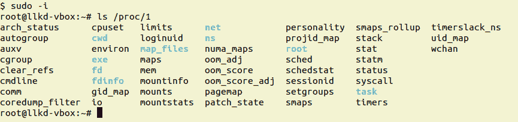
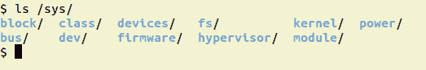
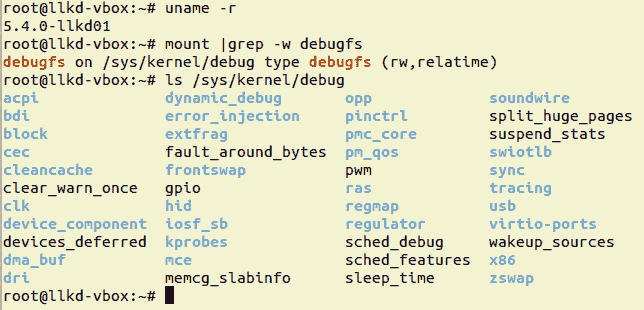
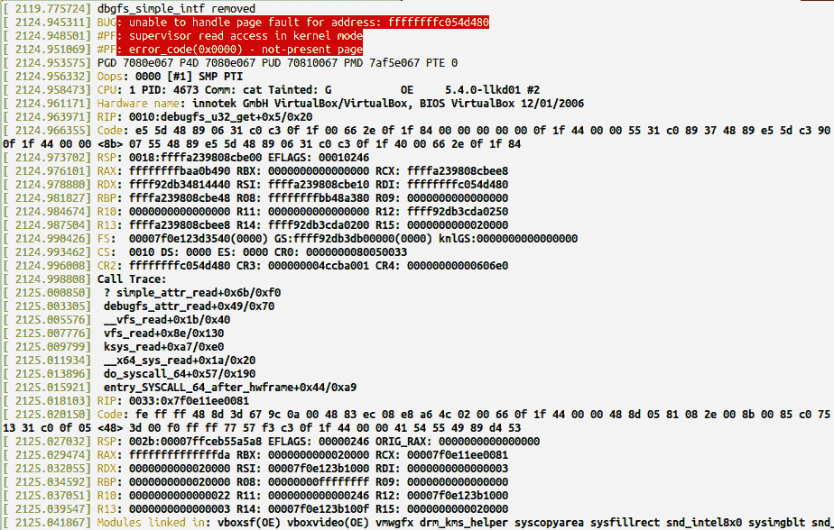
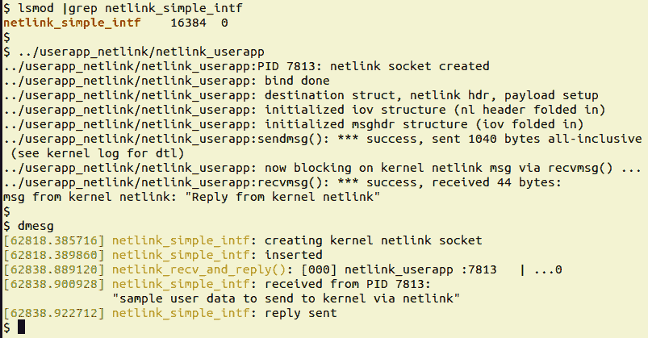

# 第二章：用户-内核通信路径

考虑这种情况：你已经成功地为一个压力传感器设备开发了一个设备驱动程序（可能是通过使用内核的 I2C API 来通过 I2C 协议从芯片获取压力）。因此，你在驱动程序中有了当前的压力值，这当然意味着它在内核内存空间中。问题是，你现在如何让一个用户空间应用程序检索这个值呢？嗯，正如我们在上一章中学到的，你可以在驱动程序的 fops 结构中始终包含一个.read 方法。当用户空间应用程序发出 read(2)系统调用时，控制将通过虚拟文件系统（VFS）转移到你的驱动程序的 read 方法。在那里，你执行 copy_to_user()（或等效操作），使用户模式应用程序接收到该值。然而，还有其他一些更好的方法来做到这一点。

在本章中，你将了解可用的各种通信接口或路径，作为在用户和内核地址空间之间进行通信或接口的手段。这是编写驱动程序代码的一个重要方面，因为如果没有这些知识，你将如何能够实现一个关键的事情——在内核空间组件（通常是设备驱动程序，但实际上可以是任何东西）和用户空间进程或线程之间高效地传输信息？不仅如此，我们将学习的一些技术通常也用于调试（和/或诊断）目的。在本章中，我们将涵盖几种技术来实现内核和用户（虚拟）地址空间之间的通信：通过传统的 proc 文件系统 procfs 进行通信，通过 sys 文件系统 sysfs 进行驱动程序的更好方式，通过调试文件系统 debugfs 进行通信，通过 netlink 套接字进行通信，以及通过 ioctl(2)系统调用进行通信。

本章将涵盖以下主题：

+   与用户空间 C 应用程序通信/接口的内核驱动程序的方法

+   通过 proc 文件系统（procfs）进行接口

+   通过 sys 文件系统 sysfs 进行接口

+   通过调试文件系统 debugfs 进行接口

+   通过 netlink 套接字进行接口

+   通过 ioctl 系统调用进行接口

+   比较接口方法-表格

让我们开始吧！

# 技术要求

我假设你已经阅读了前言，相关部分是“充分利用本书”，并已经适当地准备了一个运行 Ubuntu 18.04 LTS（或更高稳定版本）的虚拟机，并安装了所有必需的软件包。如果没有，我建议你首先这样做。

为了充分利用本书，我强烈建议你首先设置工作环境，包括克隆本书的 GitHub 存储库（[`github.com/PacktPublishing/Linux-Kernel-Programming-Part-2`](https://github.com/PacktPublishing/Linux-Kernel-Programming-Part-2/tree/main/ch2)）以获取相关代码，并以实际操作的方式进行工作。

# 与用户空间 C 应用程序通信/接口的内核驱动程序的方法

正如我们在介绍中提到的，在本章中，我们希望学习如何在内核空间组件（通常是设备驱动程序，但实际上可以是任何东西）和用户空间进程或线程之间高效地传输信息。首先，让我们简单列举内核或驱动程序作者可用的各种技术，用于与用户空间 C 应用程序进行通信或接口。嗯，用户空间组件可以是 C 应用程序，shell 脚本（这两者我们通常在本书中展示），甚至其他应用程序，如 C++/Java 应用程序，Python/Perl 脚本等。

正如我们在伴随指南*Linux 内核编程*的*第四章*，*编写您的第一个内核模块 - LKMs 第一部分*中的*库和系统调用 API*子章节中所看到的，用户空间应用程序和内核之间的基本接口包括设备驱动程序的系统调用 API*。现在，在上一章中，您学习了为 Linux 编写字符设备驱动程序的基础知识。在其中，您还学习了如何通过让用户模式应用程序打开设备文件并发出`read(2)`和`write(2)`系统调用来在用户和内核地址空间之间传输数据。这导致 VFS 调用驱动程序的读/写方法，并且您的驱动程序通过`copy_{from|to}_user()`API 执行数据传输。因此，这里的问题是：如果我们已经涵盖了这一点，那么在这方面还有什么其他要学习的呢？

啊，还有很多！事实上，还有其他几种用户模式应用程序和内核之间的接口技术。当然，它们都非常依赖于使用系统调用；毕竟，没有其他（同步的、程序化的）方式从用户空间进入内核！然而，这些技术是不同的。本章的目的是向您展示各种可用的通信接口，因为当然，根据项目的不同，可能有一种更适合使用。让我们来看看本章将用于用户和内核地址空间之间的接口的各种技术：

+   通过传统的 procfs 接口

+   通过 sysfs

+   通过 debugfs

+   通过 netlink 套接字进行接口

+   通过`ioctl(2)`系统调用

在本章中，我们将通过提供驱动程序代码示例详细讨论这些接口技术。此外，我们还将简要探讨它们对*调试*目的的适用性。因此，让我们从使用 procfs 接口开始。

# 通过 proc 文件系统（procfs）进行接口

在本节中，我们将介绍 proc 文件系统是什么，以及您如何将其作为用户和内核地址空间之间的接口。proc 文件系统是一个强大且易于编程的接口，通常用于状态报告和调试核心内核系统。

请注意，从 Linux 2.6 版本开始，对于上游贡献，这个接口*不*应该被驱动程序作者使用（它严格意味着仅用于内核内部使用）。尽管如此，为了完整起见，我们将在这里介绍它。

## 了解 proc 文件系统

Linux 有一个名为*proc*的虚拟文件系统；它的默认挂载点是`/proc`。关于 proc 文件系统的第一件事是要意识到，它的内容*不*在非易失性磁盘上。它的内容在 RAM 中，因此是易失性的。您在`/proc`下看到的文件和目录都是内核代码为 proc 设置的伪文件；内核通过（几乎）总是显示文件的*大小*为零来暗示这一事实：

```
$ mount | grep -w proc
proc on /proc type proc (rw,nosuid,nodev,noexec,relatime)
$ ls -l /proc/
total 0
dr-xr-xr-x  8 root  root          0 Jan 27 11:13 1/
dr-xr-xr-x  8 root  root          0 Jan 29 08:22 10/
dr-xr-xr-x  8 root  root          0 Jan 29 08:22 11/
dr-xr-xr-x  8 root  root          0 Jan 29 08:22 11550/
[...]
-r--r--r--  1 root  root          0 Jan 29 08:22 consoles
-r--r--r--  1 root  root          0 Jan 29 08:19 cpuinfo
-r--r--r--  1 root  root          0 Jan 29 08:22 crypto
-r--r--r--  1 root  root          0 Jan 29 08:20 devices
-r--r--r--  1 root  root          0 Jan 29 08:22 diskstats
[...]
-r--r--r--  1 root  root          0 Jan 29 08:22 vmstat
-r--r--r--  1 root  root          0 Jan 29 08:22 zoneinfo
$ 
```

让我们总结一下关于 Linux 强大的 proc 文件系统的一些关键点。

/proc 下的对象（文件、目录、软链接等）都是伪对象；它们存在于 RAM 中！

### /proc 下的目录

/proc 下的目录的名称是整数值，代表当前在系统上运行的进程。目录的名称是进程的 PID（从技术上讲，它是进程的 TGID。我们在伴随指南*Linux 内核编程*的*第六章*，*内核和内存管理内部要点*中介绍了 TGID/PID）。

这个文件夹 - `/proc/PID/` - 包含有关此进程的信息。因此，例如，对于*init*或*systemd*进程（始终是 PID `1`），您可以在`/proc/1/`文件夹下查看有关此进程的详细信息（其属性、打开文件、内存布局、子进程等）。

例如，在这里，我们将获得 root shell 并执行`ls /proc/1`：



图 2.1 - 在 x86_64 客户系统上执行 ls /proc/1 的屏幕截图

关于`/proc/<PID>/...`下的伪文件和文件夹的完整详细信息可以在`proc(5)`的手册页中找到（通过`man 5 proc`来查看）；试一试并参考它！

请注意，`/proc`下的精确内容因内核版本和（CPU）架构而异；x86_64 架构往往具有最丰富的内容。

### proc 文件系统的目的

proc 文件系统的*目的*是双重的：

+   首先，它是一个简单的接口，供开发人员、系统管理员和任何人深入了解内核，以便他们可以获取有关进程、内核甚至硬件内部的信息。只需要使用这个接口，你就可以知道基本的 shell 命令，比如`cd`、`cat`、`echo`、`ls`等等。

+   其次，作为*root*用户，有时候是所有者，你可以写入`/proc/sys`下的某些伪文件，从而调整各种内核参数。这个功能被称为**sysctl***。例如，你可以在`/proc/sys/net/ipv4/`中调整各种 IPv4 网络参数。它们都在这里有文档：[`www.kernel.org/doc/Documentation/networking/ip-sysctl.txt`](https://www.kernel.org/doc/Documentation/networking/ip-sysctl.txt)。

更改基于 proc 的可调参数的值很容易；例如，让我们更改在任何给定时间点上允许的最大线程数。以*root*身份运行以下命令：

```
# cat /proc/sys/kernel/threads-max
15741
# echo 10000 > /proc/sys/kernel/threads-max
# cat /proc/sys/kernel/threads-max
10000
#
```

至此，我们完成了。然而，应该清楚的是，前面的操作是*易失性*的——更改只适用于本次会话；重新启动或重启将导致它恢复到默认值。那么，我们如何使更改*永久*生效呢？简短的答案是：使用`sysctl(8)`实用程序；参考其手册页以获取更多详细信息。

现在准备好编写一些 procfs 接口代码了吗？不要那么着急——下一节会告诉你为什么这可能*并不*是一个好主意。

### procfs 对驱动程序作者是禁用的

尽管我们可以使用 proc 文件系统与用户模式应用程序进行接口，但这里有一个重要的要点要注意！你必须意识到 procfs 是内核中许多类似设施的**应用程序二进制接口**（**ABI**）。内核社区并不保证它会保持稳定，就像内核*API*和它们的内部数据结构一样。事实上，自 2.6 内核以来，内核人员已经非常清楚地表明了这一点——*设备驱动程序作者（等等）不应该使用 procfs*来进行他们自己的目的或接口，调试或其他用途。在早期的 2.6 Linux 中，使用 proc 来进行上述目的是相当常见的（根据内核社区的说法，proc 是专为内核内部使用而滥用的！）。

因此，如果 procfs 被认为对于我们作为驱动程序作者来说是禁用的或不推荐使用的，那么我们用什么设施来与用户空间进程通信呢？驱动程序作者应该使用 sysfs 设施来*导出*他们的接口。实际上，不仅仅是 sysfs；你还有几种选择，比如 sysfs、debugfs、netlink 套接字和 ioctl 系统调用。我们将在本章后面详细介绍这些内容。

然而，现实情况是，关于驱动程序作者不使用 procfs 的这个“规则”是针对社区的。这意味着，如果你打算将你的驱动程序或内核模块上游到主线内核，从而在 GPLv2 许可下贡献你的代码，*那么*所有社区规则肯定适用。如果不是，那么你可以自行决定。当然，遵循内核社区的指南和规则只会是一件好事；我们强烈建议你这样做。在阻止非核心内容（如驱动程序）使用 proc 的方面，不幸的是，目前没有最新的内核文档可用于 proc API/ABI。

在 5.4.0 内核上，有大约 70 多个`proc_create()`内核 API 的调用者，其中有一些是（通常是较老的）驱动程序和文件系统。

尽管如此（您已经被警告！），让我们学习如何通过 procfs 与内核代码交互用户空间进程。

## 使用 procfs 与用户空间进行接口

作为内核模块或设备驱动程序开发人员，我们实际上可以在`/proc`下创建自己的条目，利用这作为与用户空间的简单接口。我们如何做到这一点？内核提供了 API 来在 procfs 下创建目录和文件。我们将在本节中学习如何使用它们。

### 基本的 procfs API

在这里，我们不打算深入研究 procfs API 集的细节；相反，我们将只涵盖足够让您能够理解和使用它们。要了解更深入的细节，请参考终极资源：内核代码库。我们将在这里介绍的例程已经被导出，因此可以供像您这样的驱动程序作者使用。此外，正如我们之前提到的，所有 procfs 文件对象实际上都是伪对象，也就是说它们只存在于 RAM 中。

在这里，我们假设您了解如何设计和实现一个简单的 LKM；您可以在本书的附属指南*Linux Kernel Programming*的第四和第五章中找到更多细节。

让我们开始探索一些简单的 procfs API，它们允许您执行一些关键任务-在 proc 文件系统下创建目录，创建（伪）文件，并分别删除它们。对于所有这些任务，请确保包含相关的头文件；也就是说，`#include <linux/proc_fs.h>`：

1.  在`/proc`下创建一个名为`name`的目录：

```
struct proc_dir_entry *proc_mkdir(const char *name,
                         struct proc_dir_entry *parent);
```

第一个参数是目录的名称，而第二个参数是要在其下创建它的父目录的指针。在这里传递`NULL`会在根目录下创建目录；也就是说，在`/proc`下。保存返回值，因为您通常会将其用作后续 API 的参数。

`proc_mkdir_data()`例程允许您传递一个数据项（`void *`）；请注意，它是通过`EXPORT_SYMBOL_GPL`导出的。

1.  创建一个名为`/proc/parent/name`的 procfs（伪）文件：

```
struct proc_dir_entry *proc_create(const char *name, umode_t mode,
                         struct proc_dir_entry *parent,
                         const struct file_operations *proc_fops);
```

这里的关键参数是`struct file_operations`，我们在上一章中介绍过。您需要用要实现的“方法”填充它（后面会更多介绍）。想想看：这真的是非常强大的东西；使用`fops`结构，您可以在驱动程序（或内核模块）中设置“回调”函数，内核的 proc 文件系统层将会遵守它们：当用户空间进程从您的 proc 文件中读取时，它（VFS）将调用驱动程序的`.read`方法或回调函数。如果用户空间应用程序写入，它将调用驱动程序的`.write`回调！

1.  删除一个 procfs 条目：

```
void remove_proc_entry(const char *name, struct proc_dir_entry *parent)
```

此 API 删除指定的`/proc/name`条目并释放它（如果未被使用）；类似地（通常更方便），使用`remove_proc_subtree()` API 来删除`/proc`中的整个子树（通常在清理或发生错误时）。

现在我们知道了基础知识，经验法则要求我们将这些 API 应用到实践中！为此，让我们找出在`/proc`下创建哪些目录/文件。

### 我们将创建四个 procfs 文件

为了清楚地说明 procfs 作为接口技术的用法，我们将让我们的内核模块在`/proc`下创建一个目录。在该目录下，它将创建四个 procfs（伪）文件。请注意，默认情况下，所有 procfs 文件的*owner:group*属性都是*root:root*。现在，创建一个名为`/proc/proc_simple_intf`的目录，并在其中创建四个（伪）文件。在`/proc/proc_simple_intf`目录下的四个 procfs（伪）文件的名称和属性如下表所示：

| **procfs 'file'的名称** | **R：读取回调上的操作，通过用户空间读取调用** | **W：写入回调上的操作，通过用户空间写入调用** | **Procfs 'file'权限** |
| --- | --- | --- | --- |
| `llkdproc_dbg_level` | 检索（到用户空间）全局变量的当前值；即 `debug_level` | 更新 `debug_level` 全局变量为用户空间写入的值 | `0644` |
| `llkdproc_show_pgoff` | 检索（到用户空间）内核的 `PAGE_OFFSET` 值 | – 无写回调 – | `0444` |
| `llkdproc_show_drvctx` | 检索（到用户空间）驱动程序“上下文”结构中的当前值；即 `drv_ctx` | – 无写回调 – | `0440` |
| `llkdproc_config1`（也被视为 `dbg_level`） | 检索（到用户空间）上下文变量的当前值；即 `drvctx->config1` | 更新驱动程序上下文成员 `drvctx->config1` 为用户空间写入的值 | `0644` |

我们将查看用于在 `/proc` 下创建 `proc_simple_intf` 目录和其中四个文件的 API 和实际代码（由于空间不足，我们实际上不会显示所有代码；只显示与“调试级别”获取和设置相关的代码；这不是问题，其余代码在概念上非常相似）。

### 尝试动态调试级别 procfs 控制

首先，让我们查看我们将在本章节中始终使用的“驱动程序上下文”数据结构（实际上，在上一章节中首次使用）：

```
// ch2/procfs_simple_intf/procfs_simple_intf.c
[ ... ]
/* Borrowed from ch1; the 'driver context' data structure;
 * all relevant 'state info' reg the driver and (fictional) 'device'
 * is maintained here.
 */
struct drv_ctx {
    int tx, rx, err, myword, power;
    u32 config1; /* treated as equivalent to 'debug level' of our driver */
    u32 config2;
    u64 config3;
#define MAXBYTES   128
    char oursecret[MAXBYTES];
};
static struct drv_ctx *gdrvctx;
static int debug_level; /* 'off' (0) by default ... */
```

在这里，我们还可以看到我们有一个名为 `debug_level` 的全局整数；这将动态控制“项目”的调试详细程度。调试级别分配了一个范围 `[0-2]`，我们有以下内容：

+   `0` 意味着*没有调试消息*（默认值）。

+   `1` 是*中等调试*详细程度。

+   `2` 意味着*高调试*详细程度。

整个架构的美妙之处 – 实际上整个重点在于 – 我们将能够通过我们创建的 procfs 接口从用户空间查询和设置这个 `debug_level` 变量！这将允许最终用户（出于安全原因，需要 *root* 访问权限）在运行时动态地改变调试级别（这是许多产品中常见的功能）。

在深入了解代码级细节之前，让我们先试一下，这样我们就知道可以期待什么：

1.  在这里，使用我们的 `lkm` 便捷包装脚本，我们必须构建并 `insmod(8)` 内核模块（本书源代码树中的 `ch2/proc_simple_intf`）：

```
$ cd <booksrc>/ch2/proc_simple_intf
$ ../../lkm procfs_simple_intf          *<-- builds the kernel module*
Version info:
[...]
[24826.234323] procfs_simple_intf:procfs_simple_intf_init():321: proc dir (/proc/procfs_simple_intf) created
[24826.240592] procfs_simple_intf:procfs_simple_intf_init():333: proc file 1 (/proc/procfs_simple_intf/llkdproc_debug_level) created
[24826.245072] procfs_simple_intf:procfs_simple_intf_init():348: proc file 2 (/proc/procfs_simple_intf/llkdproc_show_pgoff) created
[24826.248628] procfs_simple_intf:alloc_init_drvctx():218: allocated and init the driver context structure
[24826.251784] procfs_simple_intf:procfs_simple_intf_init():368: proc file 3 (/proc/procfs_simple_intf/llkdproc_show_drvctx) created
[24826.255145] procfs_simple_intf:procfs_simple_intf_init():378: proc file 4 (/proc/procfs_simple_intf/llkdproc_config1) created
[24826.259203] procfs_simple_intf initialized
$ 
```

在这里，我们构建并插入了内核模块；`dmesg(1)` 显示了内核 *printks*，显示我们创建的 procfs 文件之一是与动态调试功能相关的文件（在这里用粗体突出显示；由于这些是伪文件，文件大小将显示为 `0` 字节）。

1.  现在，让我们通过查询 `debug_level` 的当前值来测试它：

```
$ cat /proc/procfs_simple_intf/llkdproc_debug_level
debug_level:0
$
```

1.  很好，它是零 – 默认值 – 如预期的那样。现在，让我们将调试级别更改为 `2`：

```
$ sudo sh -c "echo 2 > /proc/procfs_simple_intf/llkdproc_debug_level"
$ cat /proc/procfs_simple_intf/llkdproc_debug_level
debug_level:2
$
```

请注意，我们必须以 *root* 身份发出 `echo`。正如我们所看到的，调试级别确实已经改变（为值 `2`）！尝试设置超出范围的值也被捕获（并且 `debug_level` 变量的值被重置为其最后有效的值），如下所示：

```
$ sudo sh -c "echo 5 > /proc/procfs_simple_intf/llkdproc_debug_level"
sh: echo: I/O error
$ dmesg
[...]
[ 6756.415727] procfs_simple_intf: trying to set invalid value for debug_level [allowed range: 0-2]; resetting to previous (2)
```

好的，它按预期工作。然而，问题是，所有这些在代码级别是如何工作的？继续阅读以了解详情！

### 通过 procfs 动态控制 debug_level

让我们回答前面提到的问题 – *代码中是如何做到的？* 实际上非常简单：

1.  首先，在内核模块的 `init` 代码中，我们必须创建我们的 procfs 目录，并以内核模块的名称命名它：

```
static struct proc_dir_entry *gprocdir;
[...]
gprocdir = proc_mkdir(OURMODNAME, NULL);
```

1.  同样，在内核模块的 `init` 代码中，我们必须创建控制项目“调试级别”的 `procfs` 文件：

```
// ch2/procfs_simple_intf/procfs_simple_intf.c[...]
#define PROC_FILE1           "llkdproc_debug_level"
#define PROC_FILE1_PERMS     0644
[...]
static int __init procfs_simple_intf_init(void)
{
    int stat = 0;
    [...]
    /* 1\. Create the PROC_FILE1 proc entry under the parent dir OURMODNAME;
     * this will serve as the 'dynamically view/modify debug_level'
     * (pseudo) file */
    if (!proc_create(PROC_FILE1, PROC_FILE1_PERMS, gprocdir,
 &fops_rdwr_dbg_level)) {
    [...]
    pr_debug("proc file 1 (/proc/%s/%s) created\n", OURMODNAME, PROC_FILE1);
    [...]
```

在这里，我们使用了 `proc_create()` API 来创建 *procfs* 文件，并将其“链接”到提供的 `file_operations` 结构。

1.  fops 结构（技术上是`struct file_operations`）在这里是关键的数据结构。正如我们在第一章 *编写简单的杂项字符设备驱动程序*中学到的，这是我们为设备上的各种文件操作分配*功能*的地方，或者在这种情况下，procfs 文件。这是初始化我们的 fops 的代码：

```
static const struct file_operations fops_rdwr_dbg_level = {
    .owner = THIS_MODULE,
    .open = myproc_open_dbg_level,
    .read = seq_read,
    .write = myproc_write_debug_level,
    .llseek = seq_lseek,
    .release = single_release,
};
```

1.  fops 的`open`方法指向一个我们必须定义的函数：

```
static int myproc_open_dbg_level(struct inode *inode, struct file *file)
{
    return single_open(file, proc_show_debug_level, NULL);
}
```

使用内核的`single_open()` API，我们注册了这样一个事实，即每当这个文件被读取时-最终是通过用户空间的`read(2)`系统调用完成的- proc 文件系统将“回调”我们的`proc_show_debug_level()`例程（作为`single_open()`的第二个参数）。

我们不会在这里打扰`single_open()` API 的内部实现；如果你感兴趣，你可以在这里查找：`fs/seq_file.c:single_open()`。

因此，总结一下，要在 procfs 中注册一个“读”方法，我们需要做以下工作：

+   将`fops.open`指针初始化为`foo()`函数。

+   在`foo()`函数中，调用`single_open()`，将读回调函数作为第二个参数。

这里有一些历史；不深入讨论，可以说 procfs 的旧工作方式存在问题。特别是，你无法在没有手动迭代内容的情况下传输超过一个页面的数据（使用读或写）。在 2.6.12 引入的*序列迭代器*功能解决了这些问题。如今，使用`single_open()`及其类似功能（`seq_read`、`seq_lseek`和`seq_release`内置内核函数）是使用 procfs 的更简单和正确的方法。

1.  那么，当用户空间*写入*（通过`write(2)`系统调用）到一个 proc 文件时怎么办？简单：在前面的代码中，你可以看到我们已经注册了`fops_rdwr_dbg_level.write`方法作为`myproc_write_debug_level()`函数，这意味着每当写入这个（伪）文件时，这个函数将被*回调*（在*步骤 6*中解释了*读*回调之后）。

我们通过`single_open`注册的*读*回调函数的代码如下：

```
/* Our proc file 1: displays the current value of debug_level */
static int proc_show_debug_level(struct seq_file *seq, void *v)
{
    if (mutex_lock_interruptible(&mtx))
        return -ERESTARTSYS;
    seq_printf(seq, "debug_level:%d\n", debug_level);
    mutex_unlock(&mtx);
    return 0;
}
```

`seq_printf()`在概念上类似于熟悉的`sprintf()` API。它正确地将提供给它的数据打印到`seq_file`对象上。当我们在这里说“打印”时，我们真正的意思是它有效地将数据缓冲区传递给发出了读系统调用的用户空间进程或线程，从而*将数据传输到用户空间*。

哦，是的，`mutex_{un}lock*()` API 是什么情况？它们用于一些关键的*锁定*。我们将在第六章 *内核同步-第一部分*和第七章 *内核同步-第二部分*中对锁定进行详细讨论；现在，只需理解这些是必需的同步原语。

1.  我们通过`fops_rdwr_dbg_level.write`注册的*写*回调函数如下：

```
#define DEBUG_LEVEL_MIN     0
#define DEBUG_LEVEL_MAX     2
[...]
/* proc file 1 : modify the driver's debug_level global variable as per what user space writes */
static ssize_t myproc_write_debug_level(struct file *filp, 
                const char __user *ubuf, size_t count, loff_t *off)
{
   char buf[12];
   int ret = count, prev_dbglevel;
   [...]
   prev_dbglevel = debug_level;
 *// < ... validity checks (not shown here) ... >*
   /* Get the user mode buffer content into the kernel (into 'buf') */
   if (copy_from_user(buf, ubuf, count)) {
        ret = -EFAULT;
        goto out;
   }
   [...]
   ret = kstrtoint(buf, 0, &debug_level); /* update it! */
   if (ret)
        goto out;
  if (debug_level < DEBUG_LEVEL_MIN || debug_level > DEBUG_LEVEL_MAX) {
            [...]
            debug_level = prev_dbglevel;
            ret = -EFAULT; goto out;
   }
   /* just for fun, let's say that our drv ctx 'config1'
      represents the debug level */
   gdrvctx->config1 = debug_level;
   ret = count;
out:
   mutex_unlock(&mtx);
   return ret;
}
```

在我们的写方法实现中（注意它在结构上与字符设备驱动程序的写方法有多相似），我们进行了一些有效性检查，然后将用户空间进程写入的数据复制到我们这里（回想一下我们如何使用`echo`命令写入 procfs 文件），通过通常的`copy_from_user()`函数。然后，我们使用内核内置的`kstrtoint()` API（类似的还有几个）将字符串缓冲区转换为整数，并将结果存储在我们的全局变量中；也就是`debug_level`！再次验证它，如果一切正常，我们还设置（只是作为一个例子）我们驱动程序上下文的`config1`成员为相同的值，然后返回一个成功消息。

1.  内核模块的其余代码非常相似-我们为剩下的三个 procfs 文件设置功能。我留给你详细浏览代码并尝试它。

1.  另一个快速演示：让我们将`debug_level`设置为`1`，然后通过我们创建的第三个 procfs 文件转储驱动程序上下文结构：

```
$ cat /proc/procfs_simple_intf/llkdproc_debug_level
debug_level:0
$ sudo sh -c "echo 1 > /proc/procfs_simple_intf/llkdproc_debug_level"
```

1.  好的，`debug_level`变量现在将具有值`1`；现在，让我们转储驱动程序上下文结构：

```
$ cat /proc/procfs_simple_intf/llkdproc_show_drvctx 
cat: /proc/procfs_simple_intf/llkdproc_show_drvctx: Permission denied
$ sudo cat /proc/procfs_simple_intf/llkdproc_show_drvctx 
prodname:procfs_simple_intf
tx:0,rx:0,err:0,myword:0,power:1
config1:0x1,config2:0x48524a5f,config3:0x424c0a52
oursecret:AhA xxx
$ 
```

我们需要*root*访问权限才能这样做。一旦完成，我们可以清楚地看到我们的`drv_ctx`数据结构的所有成员。不仅如此，我们还验证了加粗显示的`config1`成员现在的值为`1`，因此反映了设计的“调试级别”。

另外，请注意输出是故意以高度可解析的格式生成到用户空间，几乎类似于 JSON。当然，作为一个小练习，你可以安排精确地做到这一点！

最近大量的**物联网**（**IoT**）产品使用 RESTful API 进行通信；通常解析的格式是 JSON。养成在易于解析的格式（如 JSON）中设计和实现内核到用户（反之亦然）的通信的习惯只会有所帮助。

有了这个，你已经学会了如何创建 procfs 目录、其中的文件，以及最重要的是如何创建和使用读写回调函数，以便当用户模式进程读取或写入你的 proc 文件时，你可以从内核深处做出适当的响应。正如我们之前提到的，由于空间不足，我们将不描述驱动其余三个 procfs 文件的代码。从概念上讲，这与我们刚刚讨论的非常相似。我们希望你能仔细阅读并尝试一下！

## 一些杂项 procfs API

让我们通过查看一些剩余的杂项 procfs API 来结束本节。你可以使用`proc_symlink()`函数在`/proc`中创建一个符号或软链接。

接下来，`proc_create_single_data()` API 可能非常有用；它被用作一个“快捷方式”，在那里你只需要将一个“读”方法附加到一个 procfs 文件：

```
struct proc_dir_entry *proc_create_single_data(const char *name, umode_t mode, struct     
        proc_dir_entry *parent, int (*show)(struct seq_file *, void *), void *data);
```

使用这个 API 可以消除对单独的 fops 数据结构的需求。我们可以使用这个函数来创建和处理我们的第二个 procfs 文件——`llkdproc_show_pgoff`文件：

```
... proc_create_single_data(PROC_FILE2, PROC_FILE2_PERMS, gprocdir, proc_show_pgoff, 0) ...
```

从用户空间读取时，内核的 VFS 和 proc 层代码路径将调用已注册的方法——我们模块的`proc_show_pgoff()`函数——在其中我们轻松地调用`seq_printf()`将`PAGE_OFFSET`的值发送到用户空间：

```
seq_printf(seq, "%s:PAGE_OFFSET:0x%px\n", OURMODNAME, PAGE_OFFSET);
```

此外，请注意`proc_create_single_data` API 的以下内容：

+   你可以利用`proc_create_single_data()`的第五个参数将任何数据项传递给读回调（在那里作为`seq_file`成员`private`检索，非常类似于我们在上一章中使用`filp->private_data`的方式）。

+   内核主线中的一些通常较老的驱动程序确实使用这个函数来创建它们的 procfs 接口。其中之一是 RTC 驱动程序（在`/proc/driver/rtc`设置一个条目）。SCSI `megaraid`驱动程序（`drivers/scsi/megaraid`）使用这个例程至少 10 次来设置它的 proc 接口（当启用配置选项时；默认情况下是启用的）。

小心！我发现在运行分发（默认）内核的 Ubuntu 18.04 LTS 系统上，这个 API——`proc_create_single_data()`——甚至都不可用，所以构建失败了。在我们自定义的“纯净”5.4 LTS 内核上，它运行得很好。

此外，关于我们在这里设置的 procfs API，有一些文档，尽管这些文档往往是用于内部使用而不是用于模块：[`www.kernel.org/doc/html/latest/filesystems/api-summary.html#the-proc-filesystem`](https://www.kernel.org/doc/html/latest/filesystems/api-summary.html#the-proc-filesystem)。

因此，正如我们之前提到的，使用 procfs API 是一个**因人而异**（**YMMV**）的情况！在发布之前，请仔细测试你的代码。最好遵循内核社区的指南，并简单地对 procfs 作为驱动程序接口技术说**不**。不用担心，我们将在本章的其余部分中看到更好的方法！

这完成了我们对使用 procfs 作为有用通信接口的覆盖。现在，让我们学习如何为驱动程序使用更合适的接口- sysfs 接口。

# 通过 sys 文件系统进行接口

2.6 Linux 内核发布的一个关键特性是现代*设备模型*的出现。基本上，一系列复杂的类似树状的分层数据结构对系统上所有设备进行建模。实际上，它远不止于此；**sysfs**树包括以下内容（以及其他内容）：

+   系统上存在的每个总线（也可以是虚拟或伪总线）

+   每个总线上的设备

+   每个绑定到总线上设备的设备驱动程序

因此，它不仅仅是外围设备，还有底层系统总线，每个总线上的设备以及绑定到设备的设备驱动程序，这些都是在运行时由设备模型创建和维护的。这个模型的内部工作对于您作为典型的驱动程序作者来说是不可见的；您不必真正担心它。在系统引导时，以及每当新设备变得可见时，*驱动程序核心*（内置内核机制的一部分）会在 sysfs 树下生成所需的虚拟文件。（相反，当设备被移除或分离时，其条目会从树中消失。）

请记住，从*与 proc 文件系统进行接口*部分可以看出，对于设备驱动程序的接口目的来说，使用 procfs 并不是真正正确的方法，至少对于想要上游移动的代码来说。那么，什么才是正确的方法呢？啊，*创建 sysfs（伪）文件被认为是设备驱动程序与用户空间进行接口的“正确方式”*。

所以，现在我们明白了！sysfs 是一个虚拟文件系统，通常挂载在`/sys`目录上。实际上，sysfs 与 procfs 非常相似，是一个内核导出的信息（设备和其他）树，发送到用户空间。您可以将 sysfs 视为对现代设备模型具有不同*视口*。通过 sysfs，您可以以几种不同的方式或通过不同的“视口”查看系统；例如，您可以通过它支持的各种总线（*总线*视图-PCI、USB、平台、I2C、SPI 等）查看系统，通过各种设备的“类”（*类*视图），通过*设备*本身，通过*块*设备视口等等。下面的屏幕截图显示了我在 Ubuntu 18.04 LTS VM 上的`/sys`目录的内容：



图 2.2 - 屏幕截图显示了 x86_64 Ubuntu VM 上 sysfs（/sys）的内容

我们可以看到，通过 sysfs，还有其他几个视口可以用来查看系统。当然，在这一部分，我们希望了解如何通过 sysfs 将设备驱动程序与用户空间进行接口，如何编写代码在 sysfs 下创建我们的驱动程序（伪）文件，以及如何注册从中读取/写入的回调。让我们首先看一下基本的 sysfs API。

## 在代码中创建一个 sysfs（伪）文件

在 sysfs 下创建伪（或虚拟）文件的一种方法是通过`device_create_file()`API。其签名如下：

```
drivers/base/core.c:int device_create_file(struct device *dev,
                         const struct device_attribute *attr);
```

让我们逐个考虑它的两个参数；首先，有一个指向`struct device`的指针。第二个参数是指向设备属性结构的指针；我们稍后将对其进行解释和处理（在*设置设备属性和创建 sysfs 文件*部分）。现在，让我们只关注第一个参数-设备结构。这似乎很直观-设备由一个称为`device`的元数据结构表示（它是驱动程序核心的一部分；您可以在`include/linux/device.h`头文件中查找其完整定义）。

请注意，当您编写（或处理）“真实”设备驱动程序时，很有可能会存在或产生一个通用的*设备结构*。这通常发生在*注册*设备时；一个底层设备结构通常作为该设备的专用结构的成员而提供。例如，所有结构，如`platform_device`、`pci_device`、`net_device`、`usb_device`、`i2c_client`、`serial_port`等，都嵌入了一个`struct device`成员。因此，您可以使用该设备结构指针作为在 sysfs 下创建文件的 API 的参数。请放心，您很快就会看到这在代码中被执行！因此，让我们通过创建一个简单的“平台设备”来获得一个设备结构。您将在下一节中学习如何做到这一点！

## 创建一个简单的平台设备

显然，为了在 sysfs 下创建（伪）文件，我们需要一些东西作为`device_create_file()`的第一个参数，即一个指向`struct device`的指针。然而，对于我们这里和现在的演示 sysfs 驱动程序，我们实际上没有任何真正的设备，因此也没有`struct device`可以操作！

那么，我们不能创建一个*人工*或*伪设备*并简单地使用它吗？是的，但是如何，更重要的是，为什么我们需要这样做？至关重要的是要理解，现代**Linux 设备模型**（**LDM**）是建立在三个关键组件上的：**必须存在一个底层总线，设备驻留在上面，并且设备由设备驱动程序“绑定”和驱动**。（我们已经在第一章中提到过，*编写一个简单的 misc 字符设备驱动程序*，在*A quick note on the Linux Device Model*部分）。

所有这些都必须注册到驱动核心。现在，不要担心驾驶它们的公交车和公交车司机；它们将在内核的驱动核心子系统内部注册和处理。然而，当没有真正的*设备*时，我们将不得不创建一个伪设备以便与模型一起工作。再次，有几种方法可以做这样的事情，但我们将创建**一个***平台设备**。*这个设备将“存在”于一个伪总线（即，它只存在于软件中）上，称为***平台总线***。

### 平台设备

一个快速但重要的侧面：*平台设备*通常用于表示嵌入式板内**系统芯片**（**SoC**）上各种设备的多样性。SoC 通常是一个集成了各种组件的非常复杂的芯片。除了处理单元（CPU/GPU）外，它可能还包括多个外围设备，包括以太网 MAC、USB、多媒体、串行 UART、时钟、I2C、SPI、闪存芯片控制器等。我们需要将这些组件枚举为平台设备的原因是 SoC 内部没有物理总线；因此使用平台总线。

传统上，用于实例化这些 SoC 平台设备的代码保存在内核源代码中的“板”文件（或文件）中（`arch/<arch>/...`）。由于它变得过载，它已经从纯内核源代码中移出，转移到一个称为**设备树**的有用硬件描述格式中（在内核源树中的**设备树源**（**DTS**）文件中）。

在我们的 Ubuntu 18.04 LTS 虚拟机中，让我们看看 sysfs 下的平台设备：

```
$ ls /sys/devices/platform/
alarmtimer  'Fixed MDIO bus.0'   intel_pmc_core.0   platform-framebuffer.0   reg-dummy   
serial8250 eisa.0  i8042  pcspkr power rtc_cmos uevent
$
```

*Bootlin*网站（以前称为*Free Electrons*）提供了关于嵌入式 Linux、驱动程序等方面的出色材料。他们网站上的这个链接指向了关于 LDM 的优秀材料：[`bootlin.com/pub/conferences/2019/elce/opdenacker-kernel-programming-device-model/`](https://bootlin.com/pub/conferences/2019/elce/opdenacker-kernel-programming-device-model/)。

回到驱动程序：我们通过`platform_device_register_simple()` API 将我们的（人工）平台设备注册到（已经存在的）平台总线驱动程序，从而使其存在。在我们这样做的时候，驱动核心将*生成*所需的 sysfs 目录和一些样板 sysfs 条目（或文件）。在这里，在我们的 sysfs 演示驱动程序的初始化代码中，我们将通过将其注册到驱动核心来设置一个（可能最简单的）*平台设备*：

```
// ch2/sysfs_simple_intf/sysfs_simple_intf.c
include <linux/platform_device.h>
static struct platform_device *sysfs_demo_platdev;
[...]
#define PLAT_NAME    "llkd_sysfs_simple_intf_device"
sysfs_demo_platdev =
     platform_device_register_simple(PLAT_NAME, -1, NULL, 0);
[...]
```

`platform_device_register_simple()` API 返回一个指向`struct platform_device`的指针。该结构的成员之一是`struct device dev`。我们现在得到了我们一直在寻找的：一个*设备* *结构*。此外，需要注意的是，当这个注册 API 运行时，效果在 sysfs 中是可见的。你可以很容易地看到新的平台设备，以及一些样板 sysfs 对象，由驱动核心在这里创建（通过 sysfs 对我们可见）；让我们构建和*insmod*我们的内核模块来看看这一点：

```
$ cd <...>/ch2/sysfs_simple_intf
$ make && sudo insmod ./sysfs_simple_intf.ko
[...]
$ ls -l /sys/devices/platform/llkd_sysfs_simple_intf_device/
total 0
-rw-r--r-- 1 root root 4.0K Feb 15 20:22 driver_override
-rw-r--r-- 1 root root 4.0K Feb 15 20:22 llkdsysfs_debug_level
-r--r--r-- 1 root root 4.0K Feb 15 20:22 llkdsysfs_pgoff
-r--r--r-- 1 root root 4.0K Feb 15 20:22 llkdsysfs_pressure
-r--r--r-- 1 root root 4.0K Feb 15 20:22 modalias
drwxr-xr-x 2 root root 0 Feb 15 20:22 power/
lrwxrwxrwx 1 root root 0 Feb 15 20:22 subsystem -> ../../../bus/platform/
-rw-r--r-- 1 root root 4.0K Feb 15 20:21 uevent
$ 
```

我们可以以不同的方式创建一个`struct device`；通用的方法是设置并发出`device_create()` API。创建 sysfs 文件的另一种方法，同时绕过设备结构的需要，是创建一个“对象”并调用`sysfs_create_file()` API。（在*进一步阅读*部分可以找到使用这两种方法的教程链接）。在这里，我们更喜欢使用“平台设备”，因为它更接近于编写（平台）驱动程序。

还有另一种有效的方法。正如我们在第一章中所看到的，*编写一个简单的杂项字符设备驱动程序*，我们构建了一个符合内核`misc`框架的简单字符驱动程序。在那里，我们实例化了一个`struct miscdevice`；一旦注册（通过`misc_register()` API），这个结构将包含一个名为`struct device *this_device;`的成员，因此我们可以将其用作有效的设备指针！因此，我们可以简单地扩展我们之前的`misc`设备驱动程序并在这里使用它。然而，为了学习一些关于平台驱动程序的知识，我们选择了这种方法。（我们将扩展我们之前的`misc`设备驱动程序以便它可以使用 sysfs API 并创建/使用 sysfs 文件的方法留给你作为练习）。

回到我们的驱动程序，与初始化代码相比，在*清理*代码中，我们必须取消注册我们的平台设备：

```
platform_device_unregister(sysfs_demo_platdev);
```

现在，让我们把所有这些知识联系在一起，实际上看一下生成 sysfs 文件的代码，以及它们的读取和写入回调函数！

## 把所有这些联系在一起——设置设备属性并创建 sysfs 文件

正如我们在本节开头提到的，`device_create_file()` API 是我们将用来创建我们的 sysfs 文件的 API：

```
int device_create_file(struct device *dev, const struct device_attribute *attr);
```

在上一节中，你学会了如何获取设备结构（我们 API 的第一个参数）。现在，让我们弄清楚如何初始化和使用第二个参数；也就是`device_attribute`结构。该结构本身定义如下：

```
// include/linux/device.hstruct device_attribute {
    struct attribute attr;
    ssize_t (*show)(struct device *dev, struct device_attribute *attr,
                    char *buf);
    ssize_t (*store)(struct device *dev, struct device_attribute *attr,
                     const char *buf, size_t count);
};
```

第一个成员`attr`本质上包括 sysfs 文件的*名称*和*模式*（权限掩码）。另外两个成员是函数指针（“虚函数”，类似于**文件操作**或**fops**结构中的函数）：

+   `show`：表示*读取回调*函数

+   `store`：表示*写入回调*函数

我们的工作是初始化这个`device_attribute`结构，从而设置 sysfs 文件。虽然你可以手动初始化它，但也有一个更简单的方法：内核提供了（几个）用于初始化`struct device_attribute`的宏；其中之一是`DEVICE_ATTR()`宏：

```
// include/linux/device.h
define DEVICE_ATTR(_name, _mode, _show, _store) \
   struct device_attribute dev_attr_##_name = __ATTR(_name, _mode, _show, _store)
```

注意`dev_attr_##_name`执行的“字符串化”，确保结构的名称后缀是作为`DEVICE_ATTR`的第一个参数传递的名称。此外，实际的“工作”宏，名为`__ATTR()`，实际上在预处理时在代码中实例化了一个`device_attribute`结构，通过字符串化使结构的名称变为`dev_attr_<name>`：

```
// include/linux/sysfs.h
#define __ATTR(_name, _mode, _show, _store) { \
    .attr = {.name = __stringify(_name), \
    .mode = VERIFY_OCTAL_PERMISSIONS(_mode) }, \
    .show = _show, \
    .store = _store, \
}
```

此外，内核定义了额外的简单包装宏，以覆盖这些宏，以指定 sysfs 文件的*模式*（权限），从而使驱动程序作者更加简单。其中包括`DEVICE_ATTR_RW(_name)`，`DEVICE_ATTR_RO(_name)`和`DEVICE_ATTR_WO(_name)`：

```
#define DEVICE_ATTR_RW(_name) \
     struct device_attribute dev_attr_##_name = __ATTR_RW(_name)
#define __ATTR_RW(_name) __ATTR(_name, 0644, _name##_show, _name##_store)
```

有了这段代码，我们可以创建一个**读写**（**RW**），**只读**（**RO**）或**只写**（**WO**）的 sysfs 文件。现在，我们希望设置一个可以读取和写入的 sysfs 文件。在内部，这是一个“挂钩”或回调，用于查询或设置一个`debug_level`全局变量，就像我们之前在 procfs 的示例内核模块中所做的那样！

现在我们有了足够的背景知识，让我们深入了解代码！

### 实现我们的 sysfs 文件和它的回调的代码

让我们看看我们简单的*sysfs 接口驱动程序*的相关部分的代码，并逐步尝试一些东西：

1.  设置设备属性结构（通过`DEVICE_ATTR_RW`宏；有关更多信息，请参见前面的部分），并创建我们的第一个 sysfs（伪）文件：

```
// ch2/sysfs_simple_intf/sysfs_simple_intf.c
#define SYSFS_FILE1 llkdsysfs_debug_level
// [... *<we show the actual read/write callback functions just a bit further down>* ...]
static DEVICE_ATTR_RW(SYSFS_FILE1);

int __init sysfs_simple_intf_init(void)
{
 [...]
*/* << 0\. The platform device is created via the platform_device_register_simple() API; code already shown above ... >> */*

 // 1\. Create our first sysfile file : llkdsysfs_debug_level
 /* The device_create_file() API creates a sysfs attribute file for
  * given device (1st parameter); the second parameter is the pointer
  * to it's struct device_attribute structure dev_attr_<name> which was
  * instantiated by our DEV_ATTR{_RW|RO} macros above ... */
  stat = device_create_file(&sysfs_demo_platdev->dev, &dev_attr_SYSFS_FILE1);
[...]
```

从这里显示的宏的定义中，我们可以推断出`static DEVICE_ATTR_RW(SYSFS_FILE1);`实例化了一个初始化的`device_attribute`结构，名称为`llkdsysfs_debug_level`（因为这就是`SYSFS_FILE1`宏的评估结果），模式为`0644`；读回调名称将是`llkdsysfs_debug_level_show()`，写回调名称将是`llkdsysfs_debug_level_store()`！

1.  这是读取和写入回调的相关代码（同样，我们不会在这里显示整个代码）。首先，让我们看看读取回调：

```
/* debug_level: sysfs entry point for the 'show' (read) callback */
static ssize_t llkdsysfs_debug_level_show(struct device *dev,
                                          struct device_attribute *attr,
                                          char *buf)
{
        int n;
        if (mutex_lock_interruptible(&mtx))
                return -ERESTARTSYS;
        pr_debug("In the 'show' method: name: %s, debug_level=%d\n",   
                 dev->kobj.name, debug_level); 
        n = snprintf(buf, 25, "%d\n", debug_level);
        mutex_unlock(&mtx);
        return n;
}
```

这是如何工作的？在读取我们的 sysfs 文件时，将调用前面的回调函数。在其中，简单地写入用户提供的缓冲指针`buf`（它的第三个参数；我们使用内核的`snprintf()`API 来做到这一点），会将提供的值（这里是`debug_level`）传输到用户空间！

1.  让我们构建并`insmod(8)`内核模块（为方便起见，我们将使用我们的`lkm`包装脚本来执行）：

```
$ ../../lkm sysfs_simple_intf          // <-- build and insmod it[...]
[83907.192247] sysfs_simple_intf:sysfs_simple_intf_init():237: sysfs file [1] (/sys/devices/platform/llkd_sysfs_simple_intf_device/llkdsysfs_debug_level) created
[83907.197279] sysfs_simple_intf:sysfs_simple_intf_init():250: sysfs file [2] (/sys/devices/platform/llkd_sysfs_simple_intf_device/llkdsysfs_pgoff) created
[83907.201959] sysfs_simple_intf:sysfs_simple_intf_init():264: sysfs file [3] (/sys/devices/platform/llkd_sysfs_simple_intf_device/llkdsysfs_pressure) created
[83907.205888] sysfs_simple_intf initialized
$
```

1.  现在，让我们列出并读取与调试级别相关的 sysfs 文件：

```
$ ls -l /sys/devices/platform/llkd_sysfs_simple_intf_device/llkdsysfs_debug_level
-rw-r--r-- 1 root root 4096 Feb   4 17:41 /sys/devices/platform/llkd_sysfs_simple_intf_device/llkdsysfs_debug_level
$ cat /sys/devices/platform/llkd_sysfs_simple_intf_device/llkdsysfs_debug_level
0
```

这反映了调试级别目前为`0`。

1.  现在，让我们来看看我们的*写回调*的代码，用于调试级别的 sysfs 文件：

```
#define DEBUG_LEVEL_MIN 0
#define DEBUG_LEVEL_MAX 2

static ssize_t llkdsysfs_debug_level_store(struct device *dev,
                                           struct device_attribute *attr,
                                           const char *buf, size_t count)
{
        int ret = (int)count, prev_dbglevel;
        if (mutex_lock_interruptible(&mtx))
                return -ERESTARTSYS;

        prev_dbglevel = debug_level;
        pr_debug("In the 'store' method:\ncount=%zu, buf=0x%px count=%zu\n"
        "Buffer contents: \"%.*s\"\n", count, buf, count, (int)count, buf);
        if (count == 0 || count > 12) {
                ret = -EINVAL;
                goto out;
        }

        ret = kstrtoint(buf, 0, &debug_level); /* update it! */
 *// < ... validity checks ... >*
        ret = count;
 out:
        mutex_unlock(&mtx);
        return ret;
}
```

同样，应该清楚`kstrtoint()`内核 API 用于将用户空间的`buf`字符串转换为整数值，然后我们进行验证。此外，`kstrtoint`的第三个参数是要写入的整数，因此更新它！

1.  现在，让我们尝试更新`debug_level`的值，从它的 sysfs 文件中：

```
$ sudo sh -c "echo 2 > /sys/devices/platform/llkd_sysfs_simple_intf_device/llkdsysfs_debug_level"
$ cat /sys/devices/platform/llkd_sysfs_simple_intf_device/llkdsysfs_debug_level
2
$
```

看，它有效了！

1.  就像我们在与 procfs 进行接口时所做的那样，我们在 sysfs 代码示例中提供了更多的代码。在这里，我们有另一个（只读）sysfs 接口来显示`PAGE_OFFSET`的值，还有一个新的接口。想象一下，这个驱动程序的工作是获取一个“pressure”值（可能通过一个 I2C 驱动的压力传感器芯片）。让我们假设我们已经这样做了，并将这个压力值存储在一个名为`gpressure`的整数全局变量中。要向用户空间“显示”当前的压力值，我们必须使用一个 sysfs 文件。在这里：

在内部，为了这个演示的目的，我们已经随机将`gpressure`全局变量设置为值`25`。

```
$ cat /sys/devices/platform/llkd_sysfs_simple_intf_device/llkdsysfs_pressure
25$
```

仔细看输出；为什么在`25`之后立即出现提示？因为我们只是打印了值本身 - 没有换行，什么都没有；这是预期的。显示“pressure”值的代码确实很简单：

```
/* show 'pressure' value: sysfs entry point for the 'show' (read) callback */
static ssize_t llkdsysfs_pressure_show(struct device *dev,
                       struct device_attribute *attr, char *buf)
{
        int n;
        if (mutex_lock_interruptible(&mtx))
                return -ERESTARTSYS;
        pr_debug("In the 'show' method: pressure=%u\n", gpressure);
        n = snprintf(buf, 25, "%u", gpressure);
        mutex_unlock(&mtx);
        return n;
}
/* The DEVICE_ATTR{_RW|RO|WO}() macro instantiates a struct device_attribute dev_attr_<name> here...   */
static DEVICE_ATTR_RO(llkdsysfs_pressure); 
```

有了这些，你已经学会了如何通过 sysfs 与用户空间进行接口交互！像往常一样，我敦促你实际编写代码并尝试这些技能；看一下本章末尾的*问题*部分，自己尝试（相关的）任务。现在，让我们继续学习 sysfs，了解一个关于其 ABI 的重要*规则*。

## “一个 sysfs 文件对应一个值”的规则

到目前为止，你已经了解了如何为用户空间内核接口目的创建和使用 sysfs，但有一个关键点我们一直忽略。关于使用 sysfs 文件，有一个“规则”，规定你只能读取或写入一个值！把这看作是*一个值对应一个文件*的规则。

因此，就像我们使用“压力”值的示例一样，我们只返回压力的当前值，没有其他内容。因此，与其他接口技术不同，sysfs 并不适用于那些可能希望将任意冗长的信息包（比如驱动程序上下文结构的内容）返回给用户空间的情况；换句话说，它并不适用于纯粹的“调试”目的。

内核文档和关于 sysfs 使用的“规则”可以在这里找到：[`www.kernel.org/doc/html/latest/admin-guide/sysfs-rules.html#rules-on-how-to-access-information-in-sysfs`](https://www.kernel.org/doc/html/latest/admin-guide/sysfs-rules.html#rules-on-how-to-access-information-in-sysfs)。

此外，这里有关于 sysfs API 的文档：[`www.kernel.org/doc/html/latest/filesystems/api-summary.html#the-filesystem-for-exporting-kernel-objects`](https://www.kernel.org/doc/html/latest/filesystems/api-summary.html#the-filesystem-for-exporting-kernel-objects)。

内核通常提供多种不同的方式来创建 sysfs 对象；例如，使用`sysfs_create_files()` API，你可以一次创建多个 sysfs 文件：`int __must_check sysfs_create_files(struct kobject *kobj, const struct attribute * const *attr);`。在这里，你需要提供一个指向`kobject`的指针和一个指向属性结构列表的指针。

这就结束了我们关于 sysfs 作为接口技术的讨论；总之，sysfs 确实被认为是驱动程序作者向用户空间显示和/或设置特定驱动程序值的*正确方式*。由于“一个 sysfs 文件对应一个值”的约定，sysfs 实际上并不理想地适用于调试信息的分发。这很好地引出了我们的下一个主题——debugfs！

# 通过调试文件系统（debugfs）进行接口

想象一下，作为 Linux 驱动程序开发人员，你面临的困境：你希望实现一种简单而优雅的方式，从你的驱动程序向用户空间提供调试“挂钩”。例如，用户只需在（伪）文件上执行`cat(1)`，就会导致你的驱动程序的“调试回调”函数被调用。然后它将继续向用户模式进程转储一些状态信息（也许是“驱动程序上下文”结构），用户模式进程将忠实地将其转储到标准输出。

好的，没问题：在 2.6 版本发布之前的日子里，我们可以（就像你在*通过 proc 文件系统（procfs）进行接口*部分学到的那样）愉快地使用 procfs 层来将我们的驱动程序与用户空间进行接口。然后，从 Linux 2.6 开始，内核社区否决了这种方法。我们被告知严格停止使用 procfs，而是使用 sysfs 层作为我们的驱动程序与用户空间进行接口的手段。然而，正如我们在*通过 sys 文件系统（sysfs）进行接口*部分看到的那样，它有一个严格的*一个值对应一个文件*的规则。这对于从驱动程序发送和接收单个值（通常是环境传感器值等）非常适用，但很快就排除了除了最简单的调试接口以外的所有情况。我们可以使用 ioctl 方法（正如我们将看到的）来设置一个调试接口，但这样做要困难得多。

那么，你能做什么呢？幸运的是，从大约 2.6.12 版的 Linux 开始，就有了一个优雅的解决方案，称为 debugfs。这个“调试文件系统”非常容易使用，并且在传达驱动程序作者（实际上是任何人）可以用它来做任何他们选择的目的时非常明确！没有一个文件规则 - 忘记那个，没有规则。

当然，就像我们处理的其他基于文件系统的方法一样 - procfs，sysfs 和现在的 debugfs - 内核社区明确声称所有这些接口都是 ABI，因此它们的稳定性和寿命是*不*被保证的。虽然这是正式采取的立场，但现实是这些接口已经成为现实世界中的事实标准；毫无征兆地将它们剥离出去真的不会为任何人服务。

以下截图显示了我们的 x86-64 Ubuntu 18.04.3 LTS 客户机上 debugfs 的内容（运行我们在伴随书籍*Linux Kernel Programming*，*第三章*，*从源代码构建 5.0 Linux 内核，第二部分*中构建的"custom" 5.4.0 内核）：



图 2.3 - 展示了 x86_64 Linux VM 上 debugfs 文件系统内容的截图

与 procfs 和 sysfs 一样，由于 debugfs 是一个内核特性（毕竟它是一个虚拟文件系统！），它内部的内容非常依赖于内核版本和 CPU 架构。正如我们之前提到的，通过查看这个截图，现在应该很明显，debugfs 有很多真实世界的“用户”。

## 检查 debugfs 的存在

首先，为了利用强大的*debugfs*接口，它必须在内核配置中启用。相关的 Kconfig 宏是`CONFIG_DEBUG_FS`。让我们检查一下我们的 5.4 自定义内核上是否启用了它：

在这里，我们假设您已经将`CONFIG_IKCONFIG`和`CONFIG_IKCONFIG_PROC`选项设置为`y`，因此允许我们使用`/proc/config.gz`伪文件来访问当前内核的配置。

```
$ zcat /proc/config.gz | grep -w CONFIG_DEBUG_FS
CONFIG_DEBUG_FS=y
```

的确如此；它通常在发行版中默认启用。

接下来，debugfs 的默认挂载点是`/sys/kernel/debug`。因此，我们可以看到它在内部依赖于 sysfs 内核特性的存在和默认挂载，这是默认情况下的。让我们来检查一下在我们的 Ubuntu 18.04 x86_64 VM 上 debugfs 被挂载在哪里：

```
$ mount | grep -w debugfs
debugfs on /sys/kernel/debug type debugfs (rw,relatime)
```

它可用并且挂载在预期的位置；也就是说，`/sys/kernel/debug`。

当然，最好的做法是永远不要假设这将永远是它被挂载的位置；在您的脚本或用户模式 C 程序中，要费心去检查和验证它。事实上，让我重新表达一下：*永远不要假设任何事情是一个很好的做法；做假设是错误的一个很好的来源*。

顺便说一下，一个有趣的 Linux 特性是文件系统可以被挂载在不同的，甚至多个位置；此外，一些人更喜欢创建一个符号链接到`/sys/kernel/debug`作为`/debug`；这取决于你，真的。

像往常一样，我们的意图是在 debugfs 的保护下创建我们的（伪）文件，然后注册并利用它们的读/写回调，以便将我们的驱动程序与用户空间进行接口。为此，我们需要了解 debugfs API 的基本用法。我们将在下一节中为您指向这方面的文档。

## 查找 debugfs API 文档

内核提供了关于使用 debugfs API 的简明而出色的文档（由 Jonathan Corbet, LWN 提供）：[`www.kernel.org/doc/Documentation/filesystems/debugfs.txt`](https://www.kernel.org/doc/Documentation/filesystems/debugfs.txt)（当然，您也可以直接在内核代码库中查找）。

我建议您参考这份文档，学习如何使用 debugfs API，因为它易于阅读和理解；这样，您就可以避免在这里不必要地重复相同的信息。除了前面提到的文档之外，现代内核文档系统（基于“Sphinx”）还提供了相当详细的 debugfs API 页面：[`www.kernel.org/doc/html/latest/filesystems/api-summary.html?highlight=debugfs#the-debugfs-filesystem`](https://www.kernel.org/doc/html/latest/filesystems/api-summary.html?highlight=debugfs#the-debugfs-filesystem)。

请注意，所有 debugfs API 都只向内核模块公开为 GPL（因此需要模块在“GPL”许可下发布（这可以是双重许可，但必须是“GPL”））。

## 与 debugfs 的接口示例

Debugfs 被故意设计为“没有特定规则”的思维方式，使其成为用于调试目的的理想接口。为什么？它允许您构造任意的字节流并将其发送到用户空间，包括使用`debugfs_create_blob()`API 发送二进制“blob”。

我们之前的示例内核模块使用 procfs 和 sysfs 构建和使用了三到四个（伪）文件。为了快速演示 debugfs，我们将只使用两个“文件”：

+   `llkd_dbgfs_show_drvctx`：正如您无疑猜到的那样，当读取时，它将导致我们（现在熟悉的）“驱动程序上下文”数据结构的当前内容被转储到控制台；我们将确保伪文件的模式是只读的（由 root）。

+   `llkd_dbgfs_debug_level`：这个文件的模式将是读写（仅由 root）；当读取时，它将显示`debug_level`的当前值；当写入一个整数时，我们将更新内核模块中的`debug_level`的值为传递的值。

在我们的内核模块的初始化代码中，我们将首先在`debugfs`下创建一个目录：

```
// ch2/debugfs_simple_intf/debugfs_simple_intf.c

static struct dentry *gparent;
[...]
static int debugfs_simple_intf_init(void)
{
    int stat = 0;
    struct dentry *file1, *file2;
    [...]
    gparent = debugfs_create_dir(OURMODNAME, NULL);
```

现在我们有了一个起点——一个目录——让我们继续创建它下面的 debugfs（伪）文件。

### 创建和使用第一个 debugfs 文件

为了可读性和节省空间，我们不会在这里展示错误处理代码部分。

就像在 procfs 的示例中一样，我们必须分配和初始化我们的“驱动程序上下文”数据结构的一个实例（我们没有在这里展示代码，因为它是重复的，请参考 GitHub 源代码）。

然后，通过通用的`debugfs_create_file()`API，我们必须创建一个`debugfs`文件，并将其与一个`file_operations`结构相关联。这实际上只是注册了一个读回调：

```
static const struct file_operations dbgfs_drvctx_fops = {
    .read = dbgfs_show_drvctx,
};
[...]
*// < ... init function ... >*
   /* Generic debugfs file + passing a pointer to a data structure as a
    * demo.. the 4th param is a generic void * ptr; it's contents will be
    * stored into the i_private field of the file's inode.
    */
#define DBGFS_FILE1 "llkd_dbgfs_show_drvctx"
    file1 = debugfs_create_file(DBGFS_FILE1, 0440, gparent,
                (void *)gdrvctx, &dbgfs_drvctx_fops);
    [...]
```

从 Linux 5.8 开始（请回忆我们正在使用 5.4 LTS 内核），一些 debugfs 创建 API 的返回值已被移除（它们将返回`void`）；Greg Kroah-Hartman 的补丁提到这样做是因为没有人在使用它们。这在 Linux 中非常典型——不需要的功能被剥离，内核继续演进……

显然，“读”回调是我们的`dbgfs_show_drvctx()`函数。作为提醒，每当读取`debugfs`文件（`llkd_dbgfs_show_drvctx`）时，这个函数会被 debugfs 层自动调用；这是我们的 debugfs 读回调函数的代码：

```
static ssize_t dbgfs_show_drvctx(struct file *filp, char __user * ubuf,
                                 size_t count, loff_t * fpos)
{
    struct drv_ctx *data = (struct drv_ctx *)filp->f_inode->i_private;
                       // retrieve the "data" from the inode
#define MAXUPASS 256   // careful- the kernel stack is small!
    char locbuf[MAXUPASS];

    if (mutex_lock_interruptible(&mtx))
        return -ERESTARTSYS;

   /* As an experiment, we set our 'config3' member of the drv ctx stucture
    * to the current 'jiffies' value (# of timer interrupts since boot);
    * so, every time we 'cat' this file, the 'config3' value should change!
    */
   data->config3 = jiffies;
   snprintf(locbuf, MAXUPASS - 1,
            "prodname:%s\n"
            "tx:%d,rx:%d,err:%d,myword:%d,power:%d\n"
            "config1:0x%x,config2:0x%x,config3:0x%llx (%llu)\n"
            "oursecret:%s\n",
            OURMODNAME,
            data->tx, data->rx, data->err, data->myword, data->power,
            data->config1, data->config2, data->config3, data->config3,
            data->oursecret);

    mutex_unlock(&mtx);
    return simple_read_from_buffer(ubuf, MAXUPASS, fpos, locbuf,
                                   strlen(locbuf));
}
```

请注意，我们通过解引用 debugfs 文件的 inode 成员`i_private`来检索“data”指针（我们的驱动程序上下文结构）。

正如我们在第一章中提到的，*编写一个简单的杂项字符设备驱动程序*，使用`data`指针从文件的 inode 中解引用驱动程序上下文结构是驱动程序作者为避免使用全局变量而采用的一种类似的常见技术之一。在这里，`gdrvctx` *是*一个全局变量，所以这是一个无关紧要的问题；我们只是用它来演示典型的用例。

使用`snprintf()`API，我们可以用当前驱动程序“上下文”结构的内容填充一个本地缓冲区，然后通过`simple_read_from_buffer()`API 将其传递给发出读取的用户空间应用程序，通常会导致它显示在终端/控制台窗口上。这`simple_read_from_buffer()`API 是`copy_to_user()`的一个包装器。

让我们试一试：

```
$ ../../lkm debugfs_simple_intf
[...]
[200221.725752] dbgfs_simple_intf: allocated and init the driver context structure
[200221.728158] dbgfs_simple_intf: debugfs file 1 <debugfs_mountpt>/dbgfs_simple_intf/llkd_dbgfs_show_drvctx created
[200221.732167] dbgfs_simple_intf: debugfs file 2 <debugfs_mountpt>/dbgfs_simple_intf/llkd_dbgfs_debug_level created
[200221.735723] dbgfs_simple_intf initialized
```

正如我们所看到的，两个 debugfs 文件都如预期地创建了；让我们验证一下（这里要小心；你只能以*root*身份查看 debugfs）：

```
$ ls -l /sys/kernel/debug/dbgfs_simple_intf
ls: cannot access '/sys/kernel/debug/dbgfs_simple_intf': Permission denied
$ sudo ls -l /sys/kernel/debug/dbgfs_simple_intf
total 0
-rw-r--r-- 1 root root 0 Feb  7 15:58 llkd_dbgfs_debug_level
-r--r----- 1 root root 0 Feb  7 15:58 llkd_dbgfs_show_drvctx
$
```

伪文件已创建并具有正确的权限。现在，让我们从`llkd_dbgfs_show_drvctx`文件中读取（作为 root 用户）：

```
$ sudo cat /sys/kernel/debug/dbgfs_simple_intf/llkd_dbgfs_show_drvctx
prodname:dbgfs_simple_intf
tx:0,rx:0,err:0,myword:0,power:1
config1:0x0,config2:0x48524a5f,config3:0x102fbcbc2 (4345023426)
oursecret:AhA yyy
$
```

它有效；几秒钟后再次进行读取。注意`config3`的值已经发生了变化。为什么？记得我们将它设置为`jiffies`值 - 自系统启动以来发生的定时器“滴答”/中断的数量：

```
$ sudo cat /sys/kernel/debug/dbgfs_simple_intf/llkd_dbgfs_show_drvctx | grep config3
config1:0x0,config2:0x48524a5f,config3:0x102fbe828 (4345030696)
$
```

创建并使用了第一个 debugfs 文件后，让我们了解第二个 debugfs 文件。

### 创建和使用第二个 debugfs 文件

让我们继续进行第二个 debugfs 文件。我们将使用一个有趣的快捷辅助 debugfs API，名为`debugfs_create_u32()`来创建它。这个 API*自动*设置内部回调，允许你在驱动程序中指定的无符号 32 位全局变量上进行读/写。这个“辅助”例程的主要优势在于，你不需要显式提供`file_operations`结构，甚至任何回调例程。debugfs 层“理解”并在内部设置事情，以便读取或写入数字（全局）变量总是有效的！看一下*init*代码路径中的以下代码，它创建并设置了我们的第二个 debugfs 文件：

```
static int debug_level;    /* 'off' (0) by default ... */ 
[...]
 /* 3\. Create the debugfs file for the debug_level global; we use the
    * helper routine to make it simple! There is a downside: we have no
    * chance to perform a validity check on the value being written.. */
#define DBGFS_FILE2     "llkd_dbgfs_debug_level"
   file2 = debugfs_create_u32(DBGFS_FILE2, 0644, gparent, &debug_level);
   [...]
   pr_debug("%s: debugfs file 2 <debugfs_mountpt>/%s/%s created\n",
             OURMODNAME, OURMODNAME, DBGFS_FILE2);
```

就是这么简单！现在，读取这个文件将产生`debug_level`的当前值；写入它将把它设置为写入的值。让我们来做这个：

```
$ sudo cat /sys/kernel/debug/dbgfs_simple_intf/llkd_dbgfs_debug_level
0
$ sudo sh -c "echo 5 > /sys/kernel/debug/dbgfs_simple_intf/llkd_dbgfs_debug_level"
$ sudo cat /sys/kernel/debug/dbgfs_simple_intf/llkd_dbgfs_debug_level
5
$ 
```

这样做是有效的，但这种“捷径”方法也有一个缺点：由于这一切都是在内部完成的，我们无法*验证*被写入的值。因此，在这里，我们将值`5`写入了`debug_level`；它有效，但是这是一个无效值（至少让我们假设是这样）！那么，如何纠正这个问题呢？简单：不要使用这种辅助方法；而是通过通用的`debugfs_create_file()`API 以“通常”的方式进行操作（就像我们为第一个 debugfs 文件所做的那样）。这里的优势在于，我们为读和写设置了显式的回调例程，通过在 fops 结构中指定它们，我们可以控制被写入的值（我把这个任务留给你作为练习）。就像生活一样，这是一个权衡；有得有失。

## 用于处理数字全局变量的辅助 debugfs API

你刚刚学会了如何使用`debugfs_create_u32()`辅助 API 来设置一个 debugfs 文件，以读/写一个无符号 32 位整数全局变量。事实上，debugfs 层提供了一堆类似的“辅助”API，用于隐式读/写模块内的数字（整数）全局变量。

用于创建可以读/写不同位大小的无符号整数（8 位、16 位、32 位和 64 位）全局变量的 debugfs 条目的辅助例程如下。最后一个参数是关键的 - 内核/模块中全局整数的地址：

```
// include/linux/debugfs.h
struct dentry *debugfs_create_u8(const char *name, umode_t mode,
                 struct dentry *parent, u8 *value);
struct dentry *debugfs_create_u16(const char *name, umode_t mode,
                 struct dentry *parent, u16 *value);
struct dentry *debugfs_create_u32(const char *name, umode_t mode,
                 struct dentry *parent, u32 *value);
struct dentry *debugfs_create_u64(const char *name, umode_t mode,
                 struct dentry *parent, u64 *value);
```

前面的 API 使用十进制基数；为了方便使用*十六进制基数*，我们有以下辅助程序：

```
struct dentry *debugfs_create_x8(const char *name, umode_t mode,
                 struct dentry *parent, u8 *value);
struct dentry *debugfs_create_x16(const char *name, umode_t mode,
                 struct dentry *parent, u16 *value);
struct dentry *debugfs_create_x32(const char *name, umode_t mode,
                 struct dentry *parent, u32 *value);
struct dentry *debugfs_create_x64(const char *name, umode_t mode,
                 struct dentry *parent, u64 *value);
```

另外，内核还为那些变量大小不确定的情况提供了一个辅助 API；因此，使用`debugfs_create_size_t()`辅助程序创建一个适用于`size_t`大小变量的 debugfs 文件。

对于那些只需要查看数字全局变量的驱动程序，或者在不担心无效值的情况下更新它的驱动程序，这些 debugfs 辅助 API 非常有用，实际上在主线内核中被几个驱动程序常用（我们很快将在 MMC 驱动程序中看到一个例子）。为了规避“有效性检查”问题，通常我们可以安排*用户空间*应用程序（或脚本）执行有效性检查；事实上，这通常是做事情的“正确方式”。

UNIX 范例有一句话：*提供机制，而不是策略*。

当使用*boolean*类型的全局变量时，debugfs 提供以下辅助 API：

```
struct dentry *debugfs_create_bool(const char *name, umode_t mode,
                  struct dentry *parent, bool *value);
```

从“文件”中读取将只返回`Y`或`N`（后面跟着一个换行符）；显然，如果第四个`value`参数的当前值非零，则返回`Y`，否则返回`N`。在写入时，可以写入`Y`或`N`或`1`或`0`；其他值将不被接受。

想想看：你可以通过写入`1`到一个名为`power`的布尔变量来通过你的“机器人”设备控制你的“机器人”设备驱动程序，以打开它，并使用`0`来关闭它！可能性是无穷无尽的。

debugfs 的内核文档提供了一些其他杂项 API；我留给你去看一看。现在我们已经介绍了如何创建和使用我们的演示 debugfs 伪文件，让我们学习如何删除它们。

### 删除 debugfs 伪文件(s)

当模块被移除（比如通过`rmmod(8)`），我们必须删除我们的 debugfs 文件。以前的做法是通过`debugfs_remove()` API，每个 debugfs 文件都必须单独删除（至少可以说是痛苦的）。现代方法使这变得非常简单：

```
void debugfs_remove_recursive(struct dentry *dentry);
```

传递指向整个“父”目录的指针（我们首先创建的那个），整个分支将被递归地删除；完美。

在这一点上不删除你的 debugfs 文件，因此将它们留在文件系统中处于孤立状态，这是在自找麻烦！想想看：当有人（试图）以后读取或写入它们时会发生什么？**一个内核 bug，或者一个*Oops***，就是这样。

#### 看到一个内核 bug - 一个 Oops！

让我们让它发生 - 一个内核 bug！激动人心，是吧！？

好的，要创建一个内核 bug，我们必须确保当我们移除（卸载）内核模块时，清理（删除）所有 debugfs 文件的 API，`debugfs_remove_recursive()`，*不*被调用。因此，每次移除模块后，我们的 debugfs 目录和文件似乎仍然存在！但是，如果你尝试对它们中的任何一个进行操作 - 读/写 - 它们将处于*孤立状态*，因此，在尝试取消引用其元数据时，内部 debugfs 代码路径将执行无效的内存引用，导致（内核级）bug。

在内核空间中，bug 确实是一件非常严重的事情；理论上，它永远不应该发生！这就是所谓的*Oops*；作为处理这个问题的一部分，将调用一个内部内核函数，通过`printk`将有用的诊断信息转储到内存中的内核日志缓冲区，以及控制台设备（在生产系统上，它也可能被定向到其他地方，以便以后可以检索和调查；例如，通过内核的*kdump*机制）。

让我们引入一个模块参数，控制我们是否（故意）导致*Oops*发生或不发生：

```
// ch2/debugfs_simple_intf/debugfs_simple_intf.c
[...]
/* Module parameters */
static int cause_an_oops;
module_param(cause_an_oops, int, 0644);
MODULE_PARM_DESC(cause_an_oops,
"Setting this to 1 can cause a kernel bug, an Oops; if 1, we do NOT perform required cleanup! so, after removal, any op on the debugfs files will cause an Oops! (default is 0, no bug)");
```

在我们的驱动程序的清理代码路径中，我们检查`cause_an_oops`变量是否非零，并故意*不*（递归地）删除我们的 debugfs 文件，从而设置 bug：

```
static void debugfs_simple_intf_cleanup(void)
{
        kfree(gdrvctx);
        if (!cause_an_oops)
 debugfs_remove_recursive(gparent);
        pr_info("%s removed\n", OURMODNAME);
}
```

当我们“正常”使用`insmod(8)`时，默认情况下，可怕的`cause_an_oops`模块参数为`0`，从而确保一切正常工作。但让我们冒险一下！我们正在构建内核模块，当我们插入它时，我们必须传递参数并将其设置为`1`（请注意，这里我们在我们的自定义`5.4.0-llkd01`内核上的 x86_64 Ubuntu 18.04 LTS 客户系统上以*root*身份运行）：

```
# id
uid=0(root) gid=0(root) groups=0(root)
# insmod ./debugfs_simple_intf.ko cause_an_oops=1
# cat /sys/kernel/debug/dbgfs_simple_intf/llkd_dbgfs_debug_level
0
# dmesg 
[ 2061.048140] dbgfs_simple_intf: allocated and init the driver context structure
[ 2061.050690] dbgfs_simple_intf: debugfs file 1 <debugfs_mountpt>/dbgfs_simple_intf/llkd_dbgfs_show_drvctx created
[ 2061.053638] dbgfs_simple_intf: debugfs file 2 <debugfs_mountpt>/dbgfs_simple_intf/llkd_dbgfs_debug_level created
[ 2061.057089] dbgfs_simple_intf initialized (fyi, our 'cause an Oops' setting is currently On)
# 
```

现在，让我们移除内核模块 - 在内部，用于清理（递归删除）我们的 debugfs 文件的代码不会运行。在这里，我们实际上是通过尝试读取我们的 debugfs 文件来触发内核 bug，*Oops*：

```
# rmmod debugfs_simple_intf
# cat /sys/kernel/debug/dbgfs_simple_intf/llkd_dbgfs_debug_level 
Killed
```

控制台上的`Killed`消息是不祥的！这是一个暗示，表明出了（严重的）问题。查看内核日志确认我们确实遇到了*Oops*！以下（部分裁剪的）屏幕截图显示了这一点：



图 2.4 - 内核 Oops 的部分屏幕截图，内核级 bug

由于提供的内核调试详细信息超出了本书的范围，我们将不在此深入讨论。尽管如此，了解一点是相当直观的。仔细看前面的屏幕截图：在`BUG:`语句中，您可以看到导致 bug 的**内核虚拟地址**（**kva**），称为 Oops（我们在配套指南*Linux 内核编程-第七章，内存管理内部基础知识*中介绍了 kva 空间；这对于驱动程序作者来说是非常关键的信息）：

```
CPU: 1 PID: 4673 Comm: cat Tainted: G OE 5.4.0-llkd01 #2
```

这显示了 CPU（`1`）上正在运行的进程上下文（`cat`），被污染的标志和内核版本。输出中真正关键的一部分是：

```
RIP: 0010:debugfs_u32_get+0x5/0x20
```

这告诉你 CPU 指令指针（x86_64 上名为 RIP 的寄存器）在`debugfs_u32_get()`函数中，距离函数的机器码开始处的偏移量为`0x5`字节（此外，内核还计算出函数的长度为`0x20`字节）！

将这些信息与`objdump(1)`和`addr2line(1)`等强大工具结合使用，可以帮助准确定位代码中的 bug 的位置！

CPU 寄存器被转储；更好的是，*调用跟踪*或*调用堆栈* - 进程上下文的*内核模式堆栈的内容*（请参阅*Linux 内核编程*，*第六章*，*内核内部基础知识，进程和线程*，了解有关内核堆栈的详细信息）- 显示了导致此时刻的代码；也就是说，崩溃（从下到上读取堆栈跟踪）。另一个快速提示：如果调用跟踪输出中的内核函数前面有一个`?`符号，只需忽略它（这可能是之前留下的“闪烁”）。

实际上，生产系统上的内核 bug *必须* 导致整个系统恐慌（停机）。在非生产系统上（就像我们正在运行的那样），可能会发生内核恐慌，也可能不会；在这里，没有。尽管如此，内核 bug 必须以最高级别的严重性对待，它确实是一个停机故障，必须修复。大多数发行版将 procfs 文件`/proc/sys/kernel/panic_on_oops`设置为`0`，但在生产系统上，它通常会设置为值`1`。

这里的道义很明显：debugfs 没有自动清理；我们必须自己清理。好了，让我们通过查找内核中的一些实际使用情况来结束对 debugfs 的讨论。

## Debugfs - 实际用户

正如我们之前提到的，debugfs API 有几个“真实世界”的用户；我们能找到其中一些吗？好吧，有一种方法：只需在内核源树的`drivers/`目录下搜索名为`*debugfs*.c`的文件；您可能会感到惊讶（我在 5.4.0 内核树中找到了 114 个这样的文件！）。让我们看看其中的一些：

```
$ cd <kernel-source-tree> ; find drivers/ -iname "*debugfs*.c" 
drivers/block/drbd/drbd_debugfs.c
drivers/mmc/core/debugfs.c
drivers/platform/x86/intel_telemetry_debugfs.c
[...]
drivers/infiniband/hw/qib/qib_debugfs.c
drivers/infiniband/hw/hfi1/debugfs.c
[...]
drivers/media/usb/uvc/uvc_debugfs.c
drivers/acpi/debugfs.c
drivers/net/wireless/mediatek/mt76/debugfs.c
[...]
drivers/net/wireless/intel/iwlwifi/mvm/debugfs-vif.c
drivers/net/wimax/i2400m/debugfs.c
drivers/net/ethernet/broadcom/bnxt/bnxt_debugfs.c
drivers/net/ethernet/marvell/mvpp2/mvpp2_debugfs.c
drivers/net/ethernet/mellanox/mlx5/core/debugfs.c
[...]
drivers/misc/genwqe/card_debugfs.c
drivers/misc/mei/debugfs.c
drivers/misc/cxl/debugfs.c
[...]
drivers/usb/mtu3/mtu3_debugfs.c
drivers/sh/intc/virq-debugfs.c
drivers/soundwire/debugfs.c
[...]
drivers/crypto/ccree/cc_debugfs.c
```

看看（其中一些）它们；它们的代码公开了 debugfs 接口。这并不总是为了纯粹的调试目的；许多 debugfs 文件用于实际生产用途！例如，MMC 驱动程序包含以下代码行，该代码行使用 debugfs“辅助”API 获取 x32 全局变量：

```
drivers/mmc/core/debugfs.c:mmc_add_card_debugfs():
debugfs_create_x32("state", S_IRUSR, root, &card->state);
```

这将创建一个名为`state`的 debugfs 文件，当读取时，会显示卡的“状态”。

好的，这完成了我们如何通过强大的 debugfs 框架与用户空间进行接口的覆盖。我们的演示 debugfs 驱动程序创建了一个 debugfs 目录和其中的两个 debugfs 伪文件；然后您学会了如何为它们设置和使用读取和写入回调处理程序。像`debugfs_create_u32()`这样的“快捷”API 也很强大。不仅如此，我们甚至设法生成了一个内核错误 - 一个 Oops！现在，让我们学习如何通过一种特殊类型的套接字进行通信，称为 netlink 套接字。

# 通过 netlink 套接字进行接口

在这里，您将学习如何使用一个熟悉且无处不在的网络抽象 - 套接字，来进行内核和用户空间的接口！熟悉网络应用程序编程的程序员对其优势赞不绝口。

熟悉使用 C/C++和套接字 API 的网络编程在这里有所帮助。请参阅*进一步阅读*部分，了解有关此主题的一些好教程。

## 使用套接字的优势

除其他外，套接字技术为我们提供了几个优势（相对于其他典型的用户模式 IPC 机制，如管道，SysV IPC/POSIX IPC 机制（消息队列，共享内存，信号量等）），如下：

+   双向同时数据传输（全双工）。

+   在互联网上是无损的，至少在某些传输层协议（如 TCP）上，当然，在本地主机上也是如此，这在这里是适用的。

+   高速数据传输，尤其是在本地主机上！

+   流量控制语义始终有效。

+   异步通信；消息可以排队，因此发送方不必等待接收方。

+   特别是关于我们的主题，在其他用户<->内核通信路径（如 procfs，sysfs，debugfs 和 ioctl）中，用户空间应用程序必须启动到内核空间的传输；使用 netlink 套接字，*内核可以启动传输*。

+   此外，到目前为止我们所见过的所有其他机制（procfs，sysfs 和 debugfs），散布在整个文件系统中的各种接口文件可能会导致内核命名空间污染；使用 netlink 套接字（顺便说一句，使用 ioctl 也是如此），情况并非如此，因为没有文件。

这些优势可能有所帮助，具体取决于您正在开发的产品类型。现在，让我们了解一下 netlink 套接字是什么。

## 理解什么是 netlink 套接字

那么，netlink 套接字是什么？我们将保持简单 - *netlink 套接字*是一个仅存在于 Linux OS 自 2.2 版本以来的“特殊”套接字系列。使用它，您可以在用户模式进程（或线程）和内核中的组件之间建立**进程间通信**（**IPC**）；在我们的情况下，通常是一个驱动程序的内核模块。

在许多方面类似于 UNIX 域数据报套接字；它是用于*本地主机* *仅*通信，而不是跨系统。虽然 UNIX 域套接字使用路径名作为它们的命名空间（一个特殊的“套接字”文件），netlink 套接字使用 PID。从学究的角度来看，这是一个端口 ID 而不是进程 ID，尽管实际上，进程 ID 经常被用作命名空间。现代内核核心（除了驱动程序）在许多情况下使用 netlink 套接字 - 例如，iproute2 网络实用程序使用它来配置无线驱动程序。另一个有趣的例子是，udev 功能使用 netlink 套接字在内核 udev 实现和用户空间守护进程（udevd 或 systemd-udevd）之间进行通信，用于设备发现、设备节点供应等等。

在这里，我们将设计和实现一个简单的用户<->内核消息演示，使用 netlink 套接字。为此，我们将不得不编写两个程序（至少）——一个作为用户空间应用程序，发出基于套接字的系统调用，另一个作为内核空间组件（这里是内核模块）。我们将让用户空间进程向内核模块发送一个“消息”；内核模块应该接收并打印它（到内核日志缓冲区）。然后内核模块将回复给用户空间进程，该进程正阻塞在这个事件上。

因此，不再拖延，让我们开始编写一些使用 netlink 套接字的代码；我们将从用户空间应用程序开始。继续阅读！

## 编写用户空间 netlink 套接字应用程序

按照以下步骤运行*用户空间*应用程序：

1.  我们必须做的第一件事就是获得一个*套接字*。传统上，套接字被定义为通信的端点；因此，一对套接字形成一个连接。我们将使用`socket(2)`系统调用来执行此操作。它的签名是

`int socket(int domain, int type, int protocol);`。

不详细讨论，这是我们要做的：

+   +   我们将`domain`指定为特殊的`PF_NETLINK`家族的一部分，因此请求一个 netlink 套接字。

+   使用原始套接字将`type`设置为`SOCK_RAW`（有效地跳过传输层）。

+   `protocol`是要使用的协议。由于我们使用原始套接字，协议留待我们或内核实现；让内核 netlink 代码执行这一点是正确的方法。在这里，我们使用一个未使用的协议号；即`31`。

1.  下一步是通过通常的`bind(2)`系统调用语义绑定套接字。首先，我们必须为此目的初始化一个 netlink 源`socketaddr`结构（在其中我们指定家族为 netlink，PID 值为调用进程的 PID（仅用于单播））。以下代码是前面提到的前两个步骤（为了清晰起见，我们不会在这里显示错误检查代码）：

```
// ch2/netlink_simple_intf/userapp_netlink/netlink_userapp.c
#define NETLINK_MY_UNIT_PROTO        31
    // kernel netlink protocol # (registered by our kernel module)
#define NLSPACE 1024

[...] 
 /* 1\. Get ourselves an endpoint - a netlink socket! */
sd = socket(PF_NETLINK, SOCK_RAW, NETLINK_MY_UNIT_PROTO);
printf("%s:PID %d: netlink socket created\n", argv[0], getpid());

/* 2\. Setup the netlink source addr structure and bind it */
memset(&src_nl, 0, sizeof(src_nl));
src_nl.nl_family = AF_NETLINK;
/* Note carefully: nl_pid is NOT necessarily the PID of the sender process; it's actually 'port id' and can be any unique number */
src_nl.nl_pid = getpid();
src_nl.nl_groups = 0x0; // no multicast
bind(sd, (struct sockaddr *)&src_nl, sizeof(src_nl))
```

1.  接下来，我们必须初始化一个 netlink“目标地址”结构。在这里，我们将 PID 成员设置为`0`，这是一个特殊值，表示目标是内核：

```
/* 3\. Setup the netlink destination addr structure */
memset(&dest_nl, 0, sizeof(dest_nl));
dest_nl.nl_family = AF_NETLINK;
dest_nl.nl_groups = 0x0; // no multicast
dest_nl.nl_pid = 0;      // destined for the kernel
```

1.  接下来，我们必须分配和初始化一个 netlink“头”数据结构。除其他事项外，它指定了源 PID 和重要的是我们将传递给内核组件的数据“有效载荷”。在这里，我们正在使用辅助宏，如`NLMSG_DATA()`来指定 netlink 头结构内的正确数据位置：

```
/* 4\. Allocate and setup the netlink header (including the payload) */
nlhdr = (struct nlmsghdr *)malloc(NLMSG_SPACE(NLSPACE));
memset(nlhdr, 0, NLMSG_SPACE(NLSPACE));
nlhdr->nlmsg_len = NLMSG_SPACE(NLSPACE);
nlhdr->nlmsg_pid = getpid();
/* Setup the payload to transmit */
strncpy(NLMSG_DATA(nlhdr), thedata, strlen(thedata)+1);
```

1.  接下来，必须初始化一个`iovec`结构以引用 netlink 头，并初始化一个`msghdr`数据结构以指向目标地址和`iovec`：

```
/* 5\. Setup the iovec and ... */
memset(&iov, 0, sizeof(struct iovec));
iov.iov_base = (void *)nlhdr;
iov.iov_len = nlhdr->nlmsg_len;
[...]
/* ... now setup the message header structure */
memset(&msg, 0, sizeof(struct msghdr));
msg.msg_name = (void *)&dest_nl;   // dest addr
msg.msg_namelen = sizeof(dest_nl); // size of dest addr
msg.msg_iov = &iov;
msg.msg_iovlen = 1; // # elements in msg_iov
```

1.  最后，消息通过`sendmsg(2)`系统调用发送（传输）（它接受套接字描述符和前面提到的`msghdr`结构作为参数）：

```
/* 6\. Actually (finally!) send the message via sendmsg(2) */
nsent = sendmsg(sd, &msg, 0);
```

1.  内核组件——一个内核模块，我们将很快讨论——现在应该通过其 netlink 套接字接收消息并显示消息的内容；我们安排它然后礼貌地回复。为了抓取回复，我们的用户空间应用现在必须在套接字上执行阻塞读取：

```
/* 7\. Block on incoming msg from the kernel-space netlink component */
printf("%s: now blocking on kernel netlink msg via recvmsg() ...\n", argv[0]);
nrecv = recvmsg(sd, &msg, 0);
```

我们必须使用`recvmsg(2)`系统调用来执行此操作。当它被解除阻塞时，它说明消息已被接收。

为什么数据结构需要这么多的抽象和封装？嗯，这通常是事物演变的方式——`msghdr`结构被创建是为了让`sendmsg(2)`API 使用更少的参数。但这意味着参数必须放在某个地方；它们深深地嵌入在`msghdr`中，指向目标地址和`iovec`，`iovec`的`base`成员指向 netlink 头结构，其中包含有效载荷！哇。

作为一个实验，如果我们过早地构建和运行用户模式 netlink 应用程序，*没有*内核端的代码，会发生什么？当然会失败...但是具体是如何失败的呢？好吧，采用经验主义的方法。通过尝试使用受人尊敬的`strace(1)`实用程序，我们可以看到`socket(2)`系统调用返回失败，原因是`协议不受支持`：

```
$ strace -e trace=network ./netlink_userapp
socket(AF_NETLINK, SOCK_RAW, 0x1f /* NETLINK_??? */) = -1 EPROTONOSUPPORT (Protocol not supported)
netlink_u: netlink socket creation failed: Protocol not supported
+++ exited with 1 +++
$
```

这是正确的；内核中还没有`协议号 31`（`31` = `0x1f`，我们正在使用的协议号）！我们还没有做到这一点。所以，这是用户空间的情况。现在，让我们完成拼图，让它真正起作用！我们将通过查看内核组件（模块/驱动程序）的编写方式来完成这一点。

## 将内核空间 netlink 套接字代码编写为内核模块

内核为 netlink 提供了基础架构，包括 API 和数据结构；所有所需的都已导出，因此作为模块作者，这些都对您可用。我们使用其中的几个；编程内核 netlink 组件（我们的内核模块）的步骤在这里概述：

1.  就像用户空间应用程序一样，我们必须首先获取 netlink 套接字。内核 API 是`netlink_kernel_create()`，其签名如下：

```
struct sock * netlink_kernel_create(struct net *, int , struct netlink_kernel_cfg *);
```

第一个参数是一个通用网络结构；我们在这里传递内核现有和有效的`init_net`结构。第二个参数是要使用的*协议号（单位）*；我们将指定与用户空间应用程序相同的数字（`31`）。第三个参数是指向（可选）netlink 配置结构的指针；在这里，我们只将输入成员设置为我们的函数的空值。当用户空间进程（或线程）向内核 netlink 组件提供任何输入（即传输某些内容）时，将调用此函数。因此，在我们的内核模块的`init`例程中，我们有以下内容：

```
// ch2/netlink_simple_intf/kernelspace_netlink/netlink_simple_intf.c
#define OURMODNAME               "netlink_simple_intf"
#define NETLINK_MY_UNIT_PROTO    31 
    // kernel netlink protocol # that we're registering
static struct sock *nlsock;
[...]
static struct netlink_kernel_cfg nl_kernel_cfg = { 
    .input = netlink_recv_and_reply,
};
[...]
nlsock = netlink_kernel_create(&init_net, NETLINK_MY_UNIT_PROTO,
            &nl_kernel_cfg);
```

1.  正如我们之前提到的，当用户空间进程（或线程）向我们的内核（netlink）模块或驱动程序提供任何输入（即传输某些内容）时，将调用回调函数。重要的是要理解它在进程上下文中运行，而不是任何一种中断上下文；我们使用我们的`convenient.h:PRINT_CTX()`宏来验证这一点（我们将在第四章中介绍这一点，*处理硬件中断*，在*完全弄清上下文*部分）。在这里，我们只是显示接收到的消息，然后通过向我们的用户空间对等进程发送一个示例消息来进行回复。从传递给我们的回调函数的套接字缓冲结构中检索到的来自我们的用户空间对等进程的数据有效载荷可以从其中的 netlink 头结构中检索到。您可以在这里看到如何检索数据和发送者 PID：

```
static void netlink_recv_and_reply(struct sk_buff *skb)
{
    struct nlmsghdr *nlh;
    struct sk_buff *skb_tx;
    char *reply = "Reply from kernel netlink";
    int pid, msgsz, stat;

    /* Find that this code runs in process context, the process
     * (or thread) being the one that issued the sendmsg(2) */
    PRINT_CTX();

    nlh = (struct nlmsghdr *)skb->data;
    pid = nlh->nlmsg_pid; /*pid of sending process */
    pr_info("%s: received from PID %d:\n"
        "\"%s\"\n", OURMODNAME, pid, (char *)NLMSG_DATA(nlh));
```

*套接字缓冲*数据结构 - `struct sk_buff` - 被认为是 Linux 内核网络协议栈中的关键数据结构。它包含有关网络数据包的所有元数据，包括对它的动态指针。它必须快速分配和释放（特别是当网络代码在中断上下文中运行时）；这确实是可能的，因为它在内核的 slab（SLUB）缓存上（有关内核 slab 分配器的详细信息，请参见配套指南*Linux 内核编程*，*第七章*，*内存管理内部 - 基础知识*，*第八章*，*模块作者的内核内存分配 - 第一部分*，以及*第九章*，*模块作者的内核内存分配 - 第二部分*）。

现在，我们需要了解，我们可以通过首先取消引用传递给我们的回调例程的套接字缓冲（`skb`）结构的`data`成员来检索网络数据包的有效载荷！接下来，这个`data`成员实际上是由我们的用户空间对等方设置的 netlink 消息头结构的指针。然后，我们取消引用它以获取实际的有效载荷。

1.  现在我们想要“回复”我们的用户空间对等进程；这涉及执行一些操作。首先，我们必须使用`nlmsg_new()` API 分配一个新的 netlink 消息，这实际上是对`alloc_skb()`的一个薄包装，通过`nlmsg_put()` API 将 netlink 消息添加到刚分配的套接字缓冲区中，然后使用适当的宏（`nlmsg_data()`）将数据（有效载荷）复制到 netlink 头中：

```
    //--- Let's be polite and reply
    msgsz = strlen(reply);
    skb_tx = nlmsg_new(msgsz, 0);
    [...]
    // Setup the payload
    nlh = nlmsg_put(skb_tx, 0, 0, NLMSG_DONE, msgsz, 0);
    NETLINK_CB(skb_tx).dst_group = 0; /* unicast only (cb is the
        * skb's control buffer), dest group 0 => unicast */
    strncpy(nlmsg_data(nlh), reply, msgsz);
```

1.  我们通过`nlmsg_unicast()` API 将回复发送给我们的用户空间对等进程（甚至可以进行 netlink 消息的多播）：

```
    // Send it
    stat = nlmsg_unicast(nlsock, skb_tx, pid);
```

1.  这只留下了清理工作（当内核模块被移除时调用）；`netlink_kernel_release()` API 实际上是`netlink_kernel_create()`的反向操作，它清理 netlink 套接字，关闭它：

```
static void __exit netlink_simple_intf_exit(void)
{
    netlink_kernel_release(nlsock);
    pr_info("%s: removed\n", OURMODNAME);
}
```

现在我们已经编写了用户空间应用程序和内核模块，以通过 netlink 套接字进行接口，让我们实际尝试一下！

## 尝试我们的 netlink 接口项目

是时候验证一切是否如广告所述。让我们开始吧：

1.  首先，构建并将内核模块插入内核内存：

我们的`lkm`便利脚本可以轻松完成这项工作；这个会话是在我们熟悉的 x86_64 客户端 VM 上进行的，运行的是 Ubuntu 18.04 LTS 和自定义的 5.4.0 Linux 内核。

```
$ cd <booksrc>/ch2/netlink_simple_intf/kernelspace_netlink $ ../../../lkm netlink_simple_intf
Version info:
Distro:     Ubuntu 18.04.4 LTS
Kernel: 5.4.0-llkd01
[...]
make || exit 1
[...] Building for: KREL=5.4.0-llkd01 ARCH=x86 CROSS_COMPILE= EXTRA_CFLAGS= -DDEBUG
  CC [M]  /home/llkd/booksrc/ch13/netlink_simple_intf/kernelspace_netlink/netlink_simple_intf.o
[...]
sudo insmod ./netlink_simple_intf.ko && lsmod|grep netlink_simple_intf
------------------------------
netlink_simple_intf    16384  0
[...]
[58155.082713] netlink_simple_intf: creating kernel netlink socket
[58155.084445] netlink_simple_intf: inserted
$ 
```

1.  有了这些，它已经加载并准备好了。接下来，我们将构建并尝试我们的用户空间应用程序：

```
$ cd ../userapp_netlink/
$ make netlink_userapp
[...] 
```

这导致了以下输出：



图 2.5 - 屏幕截图显示用户<->内核通过我们的示例 netlink 套接字代码进行通信

它起作用了；内核 netlink 模块接收并显示了从用户空间进程（`PID 7813`）发送给它的消息。然后内核模块以自己的消息回复给它的用户空间对等体，成功接收并显示它（通过`printf()`）。你也试试看。完成后，不要忘记使用`sudo rmmod netlink_simple_intf`删除内核模块。

另外：内核中存在一个连接器驱动程序。它的目的是简化基于 netlink 的通信的开发，使内核和用户空间开发人员都能更简单地设置和使用基于 netlink 的通信接口。我们不会在这里深入讨论；请参考内核中的文档（[`elixir.bootlin.com/linux/v5.4/source/Documentation/driver-api/connector.rst`](https://elixir.bootlin.com/linux/v5.4/source/Documentation/driver-api/connector.rst)）。内核源树中还提供了一些示例代码（在`samples/connector`中）。

有了这些，您已经学会了如何通过强大的 netlink 套接字机制在用户模式应用程序和内核组件之间进行接口。正如我们之前提到的，它在内核树中有几个实际用例。现在，让我们继续并涵盖另一种用户-内核接口方法，通过流行的`ioctl(2)`系统调用。

# 通过 ioctl 系统调用进行接口

**ioctl**是一个系统调用；为什么有个滑稽的名字*ioctl*？它是**输入输出控制**的缩写。虽然读取和写入系统调用（以及其他调用）用于有效地从设备（或文件；记住 UNIX 范式*如果不是进程，就是文件！*）传输*数据*，但*ioctl*系统调用用于向设备（通过其驱动程序）*发出* *命令*。例如，更改控制台设备的终端特性，格式化时向磁盘写入轨道，向步进电机发送控制命令，控制摄像头或音频设备等，都是发送命令给设备的实例。

让我们考虑一个虚构的例子。我们有一个设备，并为其开发了一个（字符）设备驱动程序。该设备有各种*寄存器*，通常是设备上的小型硬件内存，例如 8 位、16 位或 32 位 - 其中一些是控制寄存器。通过适当地对它们进行 I/O（读取和写入），我们控制设备（好吧，这确实是整个重点，不是吗；有关使用硬件内存和设备寄存器的详细工作细节将在下一章中介绍）。那么，作为驱动程序作者，您将如何与希望在此设备上执行各种控制操作的用户空间程序进行通信或接口？我们通常会设计用户空间 C（或 C++）程序，通过对设备文件执行`open(2)`来打开设备，并随后发出读取和写入系统调用。

但正如我们刚才提到的，当*传输* *数据*时，`read(2)`和`write(2)`系统调用 API 是适当的，而在这里，我们打算执行**控制操作**。那么，我们需要另一个系统调用来执行这样的操作...我们是否需要创建和编码一个新的系统调用（或多个系统调用）？不，比那简单得多：我们通过*ioctl 系统调用进行多路复用*，利用它来执行我们设备上需要的任何控制操作！如何做到？啊，回想一下上一章中至关重要的`file_operations`（fops）数据结构；我们现在将初始化另一个成员，`.ioctl`，为我们的 ioctl 方法函数，从而允许我们的设备驱动程序挂接到这个系统调用：

```
static struct file_operations ioct_intf_fops = { 
    .llseek = no_llseek,
    .ioctl = ioct_intf_ioctl,
    [...]
};
```

现实情况是，我们必须弄清楚在 Linux 内核版本 2.6.36 或更高版本上运行模块时，我们应该使用`ioctl`还是`file_operations`结构的`unlocked_ioctl`成员；接下来会更多地介绍这个问题。

实际上，向内核添加新的系统调用并不是一件轻松的事情！内核开发人员并不会随意添加系统调用 - 毕竟这是一个安全敏感的接口。有关此更多信息请参阅：[`www.kernel.org/doc/html/latest/kernel-hacking/hacking.html#ioctls-not-writing-a-new-system-call`](https://www.kernel.org/doc/html/latest/kernel-hacking/hacking.html#ioctls-not-writing-a-new-system-call)。

接下来会更多地介绍使用 ioctl 进行接口。

## 在用户空间和内核空间中使用 ioctl

`ioctl(2)`系统调用的签名如下：

```
#include <sys/ioctl.h>
int ioctl(int fd, unsigned long request, ...);
```

参数列表是*可变参数*。现实和通常情况下，我们传递两个或三个参数：

+   第一个参数很明显 - 打开的设备文件的文件描述符（在我们的情况下）。

+   第二个参数称为`request`，这是有趣的：它是要传递给驱动程序的命令。实际上，它是一个*编码*，封装了所谓的 ioctl 魔术数：一个数字和一个类型（读/写）。

+   （可选的）第三个参数，通常称为`arg`，也是一个`unsigned long`数量；我们使用它来以通常的方式传递一些数据给底层驱动程序，或者经常通过传递它的（虚拟）地址并让内核写入它来将数据返回给用户空间，利用 C 语言的所谓**值-结果**或**输入-输出**参数样式。

现在，正确使用 ioctl 并不像许多其他 API 那样简单。想一想：您很容易会遇到这样的情况，即几个用户空间应用程序正在向其底层设备驱动程序发出`ioctl(2)`系统调用（发出各种命令）。一个问题变得明显：内核 VFS 层如何将 ioctl 请求定向到正确的驱动程序？ioctl 通常在具有唯一*(major, minor)*号码的字符设备文件上执行；因此，另一个驱动程序如何接收您的 ioctl 命令（除非您故意、可能恶意地设置设备文件）？

然而，存在一个协议来实现对 ioctl 的安全和正确使用；每个应用程序和驱动程序都定义一个魔术数字，该数字将被编码到其所有 ioctl 请求中。首先，驱动程序将验证其接收到的每个 ioctl 请求是否包含*它的*魔术数字；只有在这种情况下，它才会继续处理；否则，它将简单地丢弃它。当然，这引出了对*ABI*的需求 - 我们需要为每个“注册”的驱动程序分配唯一的魔术数字（它可以是一个范围）。由于这创建了一个 ABI，内核文档将是相同的；您可以在这里找到有关谁在使用哪个魔术数字（或代码）的详细信息：[`www.kernel.org/doc/Documentation/ioctl/ioctl-number.txt`](https://www.kernel.org/doc/Documentation/ioctl/ioctl-number.txt)。

接下来，对底层驱动程序的 ioctl 请求基本上可以是四种情况之一：向设备“写入”命令，从设备“读取”（或查询）命令，执行读/写传输的命令，或者什么都不是的命令。这些信息（再次）通过定义某些位来*编码*到请求中：为了使这项工作更容易，我们有四个辅助宏，允许我们构造 ioctl 命令：

+   `_IO(type,nr)`: 编码一个没有参数的 ioctl 命令

+   `_IO**R**(type,nr,datatype)`: 编码一个用于从内核/驱动程序读取数据的 ioctl 命令

+   `_IO**W**(type,nr,datatype)`: 编码一个用于向内核/驱动程序写入数据的 ioctl 命令

+   `_IO**WR**(type,nr,datatype)`: 编码一个用于读/写传输的 ioctl 命令

这些宏在用户空间的`<sys/ioctl.h>`头文件中定义，在内核中位于`include/uapi/asm-generic/ioctl.h`。典型（并且相当明显的）最佳实践是创建一个*公共头*文件，定义应用程序/驱动程序的 ioctl 命令，并在用户模式应用程序和设备驱动程序中包含该文件。

在这里，作为演示，我们将设计并实现一个用户空间应用程序和一个内核空间设备驱动程序，以驱动一个通过`ioctl(2)`系统调用进行通信的虚构设备。因此，我们必须定义一些通过*ioctl*接口发出的命令。我们将在一个公共头文件中完成这个工作，如下所示：

```
// ch2/ioctl_intf/ioctl_llkd.h

/* The 'magic' number for our driver; see Documentation/ioctl/ioctl-number.rst 
 * Of course, we don't know for _sure_ if the magic # we choose here this
 * will remain free; it really doesn't matter, this is just for demo purposes;
 * don't try and upstream this without further investigation :-)
 */
#define IOCTL_LLKD_MAGIC        0xA8

#define IOCTL_LLKD_MAXIOCTL        3
/* our dummy ioctl (IOC) RESET command */
#define IOCTL_LLKD_IOCRESET     _IO(IOCTL_LLKD_MAGIC, 0)
/* our dummy ioctl (IOC) Query POWER command */
#define IOCTL_LLKD_IOCQPOWER    _IOR(IOCTL_LLKD_MAGIC, 1, int)
/* our dummy ioctl (IOC) Set POWER command */
#define IOCTL_LLKD_IOCSPOWER    _IOW(IOCTL_LLKD_MAGIC, 2, int)
```

我们必须尽量使宏中使用的名称有意义。我们的三个命令（用粗体标出）都以`IOCTL_LLKD_`为前缀，表明它们都是我们虚构的`LLKD`项目的 ioctl 命令；接下来，它们以`IOC{Q|S}`为后缀，其中`IOC`表示它是一个 ioctl 命令，`Q`表示它是一个查询操作，`S`表示它是一个设置操作。

现在，让我们从用户空间和内核空间（驱动程序）的代码级别学习如何设置事物。

### 用户空间 - 使用 ioctl 系统调用

`ioctl(2)`系统调用的*用户空间*签名如下：

```
#include <sys/ioctl.h>
int ioctl(int fd, unsigned long request, ...);
```

在这里，我们可以看到它接受一个可变参数列表；ioctl 的参数如下：

+   **第一个参数**：文件或设备的文件描述符（在我们的情况下）执行 ioctl 操作（我们通过在设备文件上执行*open*来获得`fd`）。

+   **第二个参数**：发出给底层设备驱动程序（或文件系统或任何`fd`代表的东西）的请求或命令。

+   **可选的第三（或更多）个参数**：通常，第三个参数是一个整数（或指向整数或数据结构的指针）；我们使用这种方法来在发出*设置*类型的命令时向驱动程序传递一些额外信息，或者通过众所周知的*传引用* C 范式从驱动程序中检索一些信息，其中我们传递指针并让驱动程序“poke”它，从而将参数视为实际上是一个返回值。

实际上，ioctl 经常被用作*通用*系统调用。使用 ioctl 在硬件和软件上执行命令操作的情况几乎令人尴尬地多！请参阅内核文档（`Documentation/ioctl/<...>`）以查看许多实际的真实世界示例。例如，您将在这里找到有关谁在 ioctl 中使用哪个魔术数字（或代码）的详细信息：[`www.kernel.org/doc/Documentation/ioctl/ioctl-number.txt`](https://www.kernel.org/doc/Documentation/ioctl/ioctl-number.txt)。

（类似地，`ioctl_list(2)`手册页面显示了 x86 内核中 ioctl 调用的完整列表；尽管这些文档文件似乎相当古老。现在似乎在这里：[`github.com/torvalds/linux/tree/master/Documentation/userspace-api/ioctl`](https://github.com/torvalds/linux/tree/master/Documentation/userspace-api/ioctl)。）

让我们来看一些用户空间 C 应用程序的片段，特别是在发出`ioctl(2)`系统调用时（为了简洁和可读性，我们省略了错误检查代码；完整的代码可以在本书的 GitHub 存储库中找到）：

```
// ch2/ioctl_intf/user space_ioctl/ioctl_llkd_userspace.c
#include "../ioctl_llkd.h"
[...]
ioctl(fd, IOCTL_LLKD_IOCRESET, 0);   // 1\. reset the device
ioctl(fd, IOCTL_LLKD_IOCQPOWER, &power); // 2\. query the 'power status'

// 3\. Toggle it's power status
if (0 == power) {
        printf("%s: Device OFF, powering it On now ...\n", argv[0]);
        if (ioctl(fd, IOCTL_LLKD_IOCSPOWER, 1) == -1) { [...]
        printf("%s: power is ON now.\n", argv[0]);
    } else if (1 == power) {
        printf("%s: Device ON, powering it OFF in 3s ...\n", argv[0]);
        sleep(3); /* yes, careful here of sleep & signals! */
        if (ioctl(fd, IOCTL_LLKD_IOCSPOWER, 0) == -1) { [...]
        printf("%s: power OFF ok, exiting..\n", argv[0]);
    }
[...]
```

我们的驱动程序如何处理这些用户空间发出的 ioctls 呢？让我们找出来。

### 内核空间-使用 ioctl 系统调用

在前面的部分中，我们看到内核驱动程序将不得不初始化其`file_operations`结构以包括`ioctl`方法。不过，这还不是全部：Linux 内核不断发展；在早期的内核版本中，开发人员使用了非常粗粒度的锁，虽然它起作用，但严重影响了性能（我们将在第六章和第七章中详细讨论锁定）。它是如此糟糕以至于被称为**Big Kernel Lock**（**BKL**）！好消息是，到了内核版本 2.6.36，开发人员摆脱了这个臭名昭著的锁。不过，这样做也产生了一些副作用：其中之一是发送到内核中的 ioctl 方法的参数数量从旧方法中的四个变为了新方法中的三个，这个新方法被称为`unlocked_ioctl`。因此，对于我们的演示驱动程序，我们将在初始化驱动程序的`file_operations`结构时使用以下*ioctl*方法：

```
// ch2/ioctl_intf/kerneldrv_ioctl/ioctl_llkd_kdrv.c
#include "../ioctl_llkd.h"
#include <linux/version.h>
[...]
static struct file_operations ioctl_intf_fops = { 
    .llseek = no_llseek,
#if LINUX_VERSION_CODE >= KERNEL_VERSION(2, 6, 36)
    .unlocked_ioctl = ioctl_intf_ioctl, // use the 'unlocked' version
#else
    .ioctl = ioctl_intf_ioctl, // 'old' way
#endif
};
```

显然，由于它在 fops 驱动程序中定义，ioctl 被认为是一个私有驱动程序接口（`driver-private`）。此外，在驱动程序代码中的函数定义中也必须考虑到关于更新的“解锁”版本的同样事实；我们的驱动程序也这样做了：

```
#if LINUX_VERSION_CODE >= KERNEL_VERSION(2, 6, 36)
static long ioctl_intf_ioctl(struct file *filp, unsigned int cmd, unsigned long arg)
#else
static int ioctl_intf_ioctl(struct inode *ino, struct file *filp, unsigned int cmd, unsigned long arg)
#endif
{
[...]
```

这里的关键代码是驱动程序的 ioctl 方法。想想看：一旦基本的有效性检查完成，驱动程序实际上所做的就是对用户空间应用程序发出的所有可能的有效 ioctl 命令执行*switch-case*。让我们来看一下以下代码（为了可读性，我们将跳过`#if LINUX_VERSION_CODE >= ...`宏指令，只显示现代 ioctl 函数签名以及一些有效性检查；您可以在本书的 GitHub 存储库中查看完整的代码）：

```
static long ioctl_intf_ioctl(struct file *filp, unsigned int cmd, unsigned long arg)
{
    int retval = 0;
    pr_debug("In ioctl method, cmd=%d\n", _IOC_NR(cmd));

    /* Verify stuff: is the ioctl's for us? etc.. */
    [...]

    switch (cmd) {
    case IOCTL_LLKD_IOCRESET:
        pr_debug("In ioctl cmd option: IOCTL_LLKD_IOCRESET\n");
        /* ... Insert the code here to write to a control register to reset  
           the device ... */
        break;
    case IOCTL_LLKD_IOCQPOWER:  /* Get: arg is pointer to result */
        pr_debug("In ioctl cmd option: IOCTL_LLKD_IOCQPOWER\n"
            "arg=0x%x (drv) power=%d\n", (unsigned int)arg, power);
        if (!capable(CAP_SYS_ADMIN))
            return -EPERM;
        /* ... Insert the code here to read a status register to query the
         * power state of the device ... * here, imagine we've done that 
         * and placed it into a variable 'power'
         */
        retval = __put_user(power, (int __user *)arg);
        break;
    case IOCTL_LLKD_IOCSPOWER:  /* Set: arg is the value to set */
        if (!capable(CAP_SYS_ADMIN))
            return -EPERM;
        power = arg;
        /* ... Insert the code here to write a control register to set the
         * power state of the device ... */
        pr_debug("In ioctl cmd option: IOCTL_LLKD_IOCSPOWER\n"
            "power=%d now.\n", power);
        break;
    default:
        return -ENOTTY;
    }
[...]
```

`_IOC_NR`宏用于从`cmd`参数中提取命令号。在这里，我们可以看到驱动程序对通过用户空间进程发出的`ioctl`的三种有效情况做出了“反应”：

+   在接收到`IOCTL_LLKD_IOC**RESET**`命令时，它执行设备复位。

+   在接收到`IOCTL_LLKD_IOC**Q**POWER`命令时，它查询（`Q`表示查询）并返回当前的电源状态（通过将其值插入到第三个参数`arg`中，使用*value-result* C 编程方法）。

+   在接收到`IOCTL_LLKD_IOC**S**POWER`命令时，它设置（`S`表示设置）电源状态（设置为第三个参数`arg`中传递的值）。

当然，由于我们正在处理一个纯虚构的设备，我们的驱动程序实际上并不执行任何寄存器（或其他硬件）工作。这个驱动程序只是一个您可以利用的模板。

如果黑客试图发出我们的驱动程序不知道的命令（相当笨拙的黑客），会发生什么？好吧，初始的有效性检查会捕捉到它；即使他们没有，我们将在*ioctl*方法中命中`default`情况，导致驱动程序向用户空间返回`-ENOTTY`。这将通过 glibc“粘合”代码将用户空间进程（或线程的）`errno`值设置为`ENOTTY`，通知它 ioctl 方法无法提供服务。我们的用户空间`perror(3)` API 将显示`Inappropriate ioctl for device`错误消息。事实上，如果驱动程序没有*ioctl*方法（也就是说，如果`file_operations`结构中的 ioctl 成员设置为`NULL`），并且用户空间应用程序发出`ioctl`方法，就会发生这种情况。

我把这个用户空间/驱动程序项目示例留给你来尝试；为了方便起见，一旦加载了驱动程序（通过 insmod），您可以使用`ch2/userspace_ioctl/cr8devnode.sh`便捷脚本生成设备文件。设置好之后，运行用户空间应用程序；您会发现连续运行它会重复切换我们虚构设备的“电源状态”。

## ioctl 作为调试接口

正如我们在本章开头提到的，使用*ioctl*接口进行调试有什么问题？它可以用于这个目的。您可以随时在*switch-case*块中插入一个“debug”命令；它可以用于向用户空间应用程序提供有用的信息，例如驱动程序状态、关键变量的值（也包括健康监测）等。

不仅如此，除非明确向最终用户或客户记录，通过 ioctl 接口使用的精确命令是未知的；因此，您应该在提供足够的细节给其他团队或客户的同时记录接口。这带来了一个有趣的观点：您可能选择故意不记录某个 ioctl 命令；它现在是一个“隐藏”的命令，可以被现场工程师等人使用来检查设备。（我把这个任务留给你来完成。）

ioctl 的内核文档包括这个文件：[`www.kernel.org/doc/Documentation/ioctl/botching-up-ioctls.txt`](https://www.kernel.org/doc/Documentation/ioctl/botching-up-ioctls.txt)。虽然偏向于内核图形堆栈开发人员，但它描述了典型的设计错误、权衡和更多内容。

太棒了 - 你快完成了！您已经学会了如何通过各种技术将内核模块或驱动程序与用户模式进程或线程（在用户空间应用程序内）进行接口。我们从 procfs 开始，然后转向使用 sysfs 和 debugfs。netlink 套接字和 ioctl 系统调用完成了我们对这些接口方法的研究。

但是在所有这些选择中，项目中应该实际使用哪种？下一节将通过快速比较这些不同的接口方法来帮助您做出决定。

# 接口方法的比较 - 表格

在本节中，我们根据一些参数创建了一个快速比较表，列出了本章中描述的各种用户-内核接口方法：

| **参数/接口方法** | **procfs** | **sysfs** | **        debugfs** | **netlink socket** | **ioctl** |
| --- | --- | --- | --- | --- | --- |
| **开发的便利性** | 易于学习和使用。 | （相对）易于学习和使用。 | （非常）易于学习和使用。 | 更难；必须编写用户空间 C + 驱动程序代码 + 理解套接字 API。 | 公平/更难；必须编写用户空间 C + 驱动程序代码。 |
| **适用于什么用途** | 仅适用于核心内核（一些较旧的驱动程序可能仍在使用）；最好避免使用驱动程序。 | 设备驱动程序接口。 | 用于生产和调试目的的驱动程序（和其他）接口。 | 各种接口：用户包括设备驱动程序、核心网络代码、udev 系统等。 | 主要用于设备驱动程序接口（包括许多）。 |
| 接口可见性 | 对所有人可见；使用权限来控制访问。 | 对所有人可见；使用权限来控制访问。 | 对所有人可见；使用权限来控制访问。 | 从文件系统中隐藏；不会污染内核命名空间。 | 从文件系统中隐藏；不会污染内核命名空间。 |
| **驱动程序/模块作者的上游内核 ABI*** | 驱动程序中的使用已在主线中弃用。 | “正确的方式”；与用户空间接口驱动程序的正式接受方法。 | 在主线中得到很好的支持并被驱动程序和其他产品广泛使用。 | 得到很好的支持（自 2.2 版以来）。 | 得到很好的支持。 |
| **用于（驱动程序）调试目的** | 是的（尽管在主线中不应该）。 | 不是/不理想。 | 是的，非常有用！按设计“没有规则”。 | 不是/不理想。 | 是的；（甚至）通过隐藏命令。 |

* 正如我们之前提到的，内核社区文件 procfs、sysfs 和 debugfs 都是*ABI；它们的稳定性和寿命没有得到保证。虽然这是社区采纳的正式立场，但实际上使用这些文件系统的许多实际接口已成为现实世界中产品使用的事实接口。然而，我们应该遵循内核社区关于它们使用的“规则”和指南。

# 总结

在本章中，我们涵盖了设备驱动程序作者的一个重要方面-如何确切地*在用户和内核（驱动程序）空间之间进行接口*。我们向您介绍了几种接口方法；我们从一个较旧的接口开始，即通过古老的 proc 文件系统进行接口（然后提到了为什么这不是驱动程序作者首选的方法）。然后我们转向通过基于 2.6 的*sysfs*进行接口。这事实上是用户空间的*首选接口，至少对于设备驱动程序来说。然而，sysfs 有局限性（回想一下每个 sysfs 文件一个值的规则）。因此，使用完全自由格式的*debugfs*接口技术确实使编写调试（和其他）接口变得非常简单和强大。netlink 套接字是一种强大的接口技术，被网络子系统、udev 和一些驱动程序使用；尽管需要一些关于套接字编程和内核套接字缓冲区的知识。对于设备驱动程序进行通用命令操作，ioctl 系统调用是一个巨大的多路复用器，经常被设备驱动程序作者（和其他组件）用于与用户空间进行接口。

掌握了这些知识，您现在可以实际将您的驱动程序级代码与用户空间应用程序（或脚本）集成；通常，用户模式**图形用户界面**（**GUI**）将希望显示从内核或设备驱动程序接收到的一些值。您现在知道如何将这些值从内核空间设备驱动程序传递！

在下一章中，您将学习到一个典型的任务驱动程序作者必须执行的任务：与硬件芯片内存打交道！确保您对本章的内容清楚，完成提供的练习，查阅*进一步阅读*资源，然后深入下一章。到时见！

# 问题

1.  `sysfs_on_misc`：*sysfs 分配#1*：扩展我们在第一章中编写的一个`misc`设备驱动程序；设置两个 sysfs 文件及其读/写回调；从用户空间进行测试。

1.  `sysfs_addrxlate`：*sysfs 分配#2（稍微高级一点）*：*地址转换：*利用本章和*Linux 内核编程*书中获得的知识，*第七章，内存管理内部-基本知识*，*直接映射 RAM 和地址转换*部分，编写一个简单的平台驱动程序，提供两个名为`addrxlate_kva2pa`和`addrxlate_pa2kva`的 sysfs 接口文件。将 kva 写入 sysfs 文件`addrxlate_kva2pa`，驱动程序应读取并将*kva*转换为其对应的**物理地址**（**pa**）；然后，从同一文件中读取应导致显示*pa*。对`addrxlate_pa2kva` sysfs 文件执行相同操作。

1.  `dbgfs_disp_pgoff`：*debugfs 分配#1*：编写一个内核模块，在此处设置一个 debugfs 文件：`<debugfs_mount_point>/dbgfs_disp_pgoff`。在读取时，它应该显示（到用户空间）`PAGE_OFFSET`内核宏的当前值。

1.  `dbgfs_showall_threads`：*debugfs 分配#2*：编写一个内核模块，在此处设置一个 debugfs 文件：`<debugfs_mount_point>/dbgfs_showall_threads/dbgfs_showall_threads`。在读取时，它应该显示每个活动线程的一些属性。（这类似于我们在*Linux 内核编程*书中的代码：[`github.com/PacktPublishing/Linux-Kernel-Programming/tree/master/ch6/foreach/thrd_showall`](https://github.com/PacktPublishing/Linux-Kernel-Programming/tree/master/ch6/foreach/thrd_showall)。请注意，线程仅在 insmod 时间显示*；*使用 debugfs 文件，您可以选择任何时间显示所有线程的信息）！

*建议的输出格式为 CSV 格式：*`TGID,PID,current,stack-start,name,#threads`。方括号中的`[name]`字段=>内核线程*;*

*`#threads`字段应该只显示一个正整数*；*这里没有输出意味着单线程进程；例如：`130,130,0xffff9f8b3cd38000,0xffffc13280420000,[watchdogd]`)

1.  *ioctl 分配#1*：使用提供的`ch2/ioctl_intf/`代码作为模板，编写一个用户空间 C 应用程序和一个内核空间（char）设备驱动程序，实现`ioctl`方法。添加一个名为`IOCTL_LLKD_IOCQPGOFF`的 ioctl 命令，以将`PAGE_OFFSET`（在内核中）的值返回给用户空间。

1.  `ioctl_undoc`：*ioctl 分配#2*：使用提供的`ch2/ioctl_intf/`代码作为模板，编写一个用户空间 C 应用程序和一个内核空间（char）设备驱动程序，实现`ioctl`方法。添加一个驱动程序上下文数据结构（我们在几个示例中使用了这些），然后分配和初始化它。现在，除了我们使用的三个以前的 ioctl 命令之外，还设置第四个未记录的命令（您可以称之为`IOCTL_LLKD_IOCQDRVSTAT`）。当通过`ioctl(2)`从用户空间查询时，它必须将驱动程序上下文数据结构的内容返回给用户空间；用户空间 C 应用程序必须打印出该结构的每个成员的当前内容。

您会发现一些问题的答案在书的 GitHub 存储库中：[`github.com/PacktPublishing/Linux-Kernel-Programming-Part-2/tree/main/solutions_to_assgn`](https://github.com/PacktPublishing/Linux-Kernel-Programming-Part-2/tree/main/solutions_to_assgn)。

# 进一步阅读

您可以参考以下链接，了解本章涵盖的主题的更多信息。有关在 Linux 设备驱动程序中使用非常常见的 I2C 协议的更多信息，请访问以下链接：

+   有关 I2C 协议基础知识的文章：*如何在 STM32F103C8T6 中使用 I2C？STM32 I2C 教程*，2020 年 3 月：[`www.electronicshub.org/how-to-use-i2c-in-stm32f103c8t6/`](https://www.electronicshub.org/how-to-use-i2c-in-stm32f103c8t6/)

+   内核文档：实现 I2C 设备驱动程序：[`www.kernel.org/doc/html/latest/i2c/writing-clients.html`](https://www.kernel.org/doc/html/latest/i2c/writing-clients.html)
