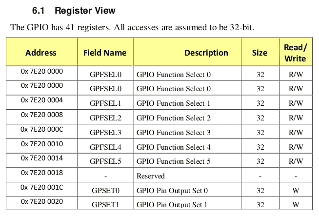
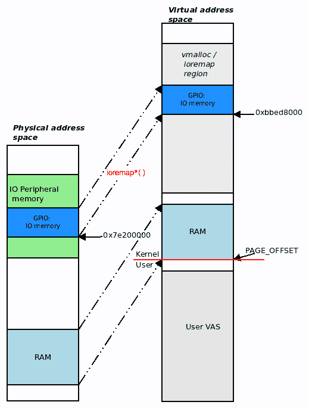

# 第三章：使用硬件 I/O 内存

在这一章中，我们将专注于编写设备驱动程序的一个重要与硬件相关的方面：如何准确地访问和执行对硬件（或外围）I/O 内存的 I/O（输入/输出，读取和写入）。

你将在本章中获得的知识背后的动机很简单：没有这个，你如何实际控制设备呢？大多数设备都是通过对它们的硬件寄存器和/或外围内存进行精心校准的写入和读取来驱动的，也称为硬件 I/O 内存。作为一个基于虚拟内存的操作系统，Linux 在处理外围 I/O 内存时需要一些抽象。

在本章中，我们将涵盖以下主题：

+   从内核访问硬件 I/O 内存

+   理解和使用内存映射 I/O

+   理解和使用端口映射 I/O

让我们开始吧！

# 技术要求

我假设你已经阅读了*前言*部分*为了充分利用本书*，并适当地准备了一个运行 Ubuntu 18.04 LTS（或更高版本）的虚拟机，并安装了所有必需的软件包。如果没有，我强烈建议你首先这样做。为了充分利用本书，我强烈建议你首先设置好工作环境，包括克隆本书的 GitHub 代码库，并以实际操作的方式进行工作。代码库可以在这里找到：[`github.com/PacktPublishing/Linux-Kernel-Programming-Part-2`](https://github.com/PacktPublishing/Linux-Kernel-Programming-Part-2)。

# 从内核访问硬件 I/O 内存

作为设备驱动程序的作者，你可能会面临的一个有趣问题是：你需要能够访问和处理外围芯片的 I/O 内存、硬件寄存器和/或硬件内存。实际上，这通常是驱动程序以"金属"级别的方式对硬件进行编程的方式：通过对其发出命令来控制它的寄存器和/或外围内存。然而，在 Linux 上直接访问硬件 I/O 内存存在一个问题。在本节中，我们将看看这个问题，并为其提供解决方案。

## 理解直接访问的问题

现在，当然，芯片上的这个硬件内存，所谓的 I/O 内存，不是 RAM。Linux 内核拒绝模块或驱动程序的作者直接访问这样的硬件 I/O 内存位置。我们已经知道原因：在现代基于 VM 的操作系统中，所有内存访问都必须通过**内存管理单元**（**MMU**）和分页表。

让我们快速总结一下在伴随指南*Linux 内核编程*中*第七章* *内存管理内部-基础*中所见的关键方面：默认情况下，内存是虚拟化的，这意味着所有地址都是虚拟的而不是物理的（这包括内核段或 VAS 内的地址）。可以这样理解：一旦进程（或内核）访问虚拟地址进行读取、写入或执行，系统就必须在相应的物理地址处获取内存内容。这涉及在运行时将虚拟地址转换为物理地址；硬件优化（CPU 缓存、**转换旁路缓冲器**（**TLB**）等）可以加速这一过程。所进行的过程如下：

1.  首先，CPU 缓存（L1-D/L1-I，L2 等）会被检查，以查看由这个虚拟地址引用的内存是否已经在 CPU 缓存（硅）上。

1.  如果内存已经在板上，我们就有了缓存命中，工作就完成了。如果没有（这是一个**最后一级缓存**—**LLC**未命中—昂贵！），虚拟地址就会被馈送到微处理器 MMU。

1.  现在 MMU 在处理器 TLB(s)中寻找相应的物理地址。如果找到了，我们就有了 TLB 命中，工作就完成了；如果没有，我们就有了 TLB 未命中（这是昂贵的！）。

1.  MMU 现在遍历进行访问的用户空间进程的分页表；或者，如果内核进行了访问，它会遍历内核分页表，将虚拟地址转换为相应的物理地址。在这一点上，物理地址被放置在总线上，工作完成。

有关更多信息，请参阅 TI 的 OMAP35x 的*技术参考手册* [`www.ti.com/lit/ug/spruf98y/spruf98y.pdf?ts=1594376085647`](https://www.ti.com/lit/ug/spruf98y/spruf98y.pdf?ts=1594376085647)；*MMU 功能描述*主题（第 946 页）用出色的图表进行了说明（对于我们的目的，请参见*图 8.4*、*8.6*和*8.7* - 后者是描述前述过程的流程图）。

此外，我们提到实际地址转换过程当然是非常依赖于架构的。在一些系统上，顺序如下所示；在其他系统上（通常在 ARM 上），MMU（包括 TLB 查找）首先执行，然后检查 CPU 缓存。

因此，想一想：即使是普通的 RAM 位置在现代操作系统上运行的软件也不是直接访问的；这是因为它的内存是虚拟化的。在这种情况下，分页表（每个进程以及内核本身的）使操作系统能够在运行时将虚拟地址转换为其物理对应地址。（我们在我们的配套书籍*Linux 内核编程*的*第七章*，*内存管理内部-基本*，*虚拟寻址和地址转换*部分中详细介绍了这些领域；如果需要，可以回顾一下以刷新这些关键点。）

现在，如果我们有一个包含 I/O 内存的硬件外围设备或芯片，如果考虑到这个内存不是 RAM，问题似乎更加复杂。那么，这个内存不是通过分页表进行映射的吗？还是？在下一节中，我们将看一下这个问题的两种常见解决方案，所以请继续阅读！

## 解决方案-通过 I/O 内存或 I/O 端口进行映射

为了解决这个问题，我们必须了解现代处理器提供了两种广泛的方式，通过这两种方式可以访问和处理硬件 I/O（外围芯片）内存：

+   通过为这些外围设备保留处理器地址空间的某些区域；也就是说，通过**内存映射 I/O**（**MMIO**）作为 I/O 的映射类型。

+   通过提供不同的汇编（和相应的机器）CPU 指令来直接访问 I/O 内存。使用这种 I/O 的映射类型称为**端口映射 I/O**（**PMIO**或简称**PIO**）。

我们将分别考虑这两种技术，即*理解和使用内存映射 I/O*和*理解和使用端口映射 I/O*部分。不过，在这之前，我们需要学习如何礼貌地请求内核允许使用这些 I/O 资源！

## 请求内核的许可

想一想：即使您知道要使用哪些 API 来以某种方式映射或处理 I/O 内存，首先，您需要从操作系统*请求权限。毕竟，操作系统是系统的整体资源管理器，您必须在使用其资源之前得到它的许可。当然，这还有更多内容-当您请求时，您实际上是在请求它设置一些内部数据结构，使内核能够理解哪个驱动程序或子系统正在使用哪个 I/O 内存区域或端口。

在执行任何外围 I/O 之前，您应该要求内核允许这样做，并假设您得到了允许，您将执行 I/O。之后，您应该将 I/O 区域释放回内核。这个过程涉及以下步骤：

1.  **I/O 之前**：请求访问内存或端口区域。

1.  **在从内核核心收到绿灯后，执行实际的 I/O**：您可以使用 MMIO 或 PMIO 来执行此操作（详细信息请参见下表）。

1.  **I/O 之后**：将内存或端口区域释放回操作系统。

那么，如何执行这些请求、I/O 和释放操作呢？有一些 API 可以做到这一点，您应该使用哪些取决于您是使用 MMIO 还是 PMIO。以下表格总结了在执行 I/O 之前应该使用的 API，然后在完成这项工作后释放该区域的 API（执行 I/O 的实际 API 将在后面介绍）：

| **访问 I/O 内存的方法** | **MMIO** | **PMIO** |
| --- | --- | --- |
| 在执行任何 I/O 之前，请求对 I/O 内存/端口区域的访问。 | `request_mem_region()` | `request_region()` |
| 执行 I/O 操作。 | （参见*MMIO - 执行实际 I/O*部分） | （参见*PMIO - 执行实际 I/O*部分） |
| 在执行 I/O 操作后，释放该区域。 | `release_mem_region()` | `release_region()` |

前面表格中显示的函数在`linux/ioport.h`头文件中定义为宏，它们的签名如下：

```
request_mem_region(start, n, name);  [...] ; release_mem_region(start, n);
request_region(start, n, name);      [...] ; release_region(start, n);
```

所有这些宏本质上都是对`__request_region()`和`__release_region()`内部 API 的包装。这些宏的参数如下：

+   `start`是 I/O 内存区域或端口的起始位置；对于 MMIO，它是物理（或总线）地址，而对于 PMIO，它是端口号。

+   `n`是正在请求的区域的长度。

+   `name`是您想要将映射区域或端口范围与之关联的任何名称。通常是执行 I/O 操作的驱动程序的名称（您可以在 proc 文件系统中看到它；在我们介绍如何使用 MMIO 和 PMIO 时，我们将更详细地讨论这一点）。

`request_[mem_]region()`API/宏的返回值是指向`struct resource`的指针（关于这一点我们稍后会详细介绍）。如果返回`NULL`，这意味着资源未能被保留；驱动程序通常返回`-EBUSY`，表示资源现在正忙或不可用（可能是因为另一个组件/驱动程序已经请求并正在使用它）。

我们将在接下来的部分提供一些使用这些 API/宏的实际示例。现在，让我们学习如何实际映射和使用 I/O 内存。我们将从几乎所有现代处理器都支持的常见方法开始；即 MMIO。

# 理解和使用内存映射 I/O

在 MMIO 方法中，CPU 理解到其地址空间的某个区域（或多个区域）被保留用于 I/O 外围设备内存。您可以通过参考给定处理器（或 SoC）的数据表的物理内存映射来查找这些区域。

为了更清晰地说明这一点，让我们来看一个真实的例子：树莓派。正如您所知，这款热门的开发板使用的是 Broadcom BCM2835（或更高版本）SoC。*BCM2835 ARM Peripherals*文档位于[`github.com/raspberrypi/documentation/blob/master/hardware/raspberrypi/bcm2835/BCM2835-ARM-Peripherals.pdf`](https://github.com/raspberrypi/documentation/blob/master/hardware/raspberrypi/bcm2835/BCM2835-ARM-Peripherals.pdf)，*第 90 页*提供了其物理内存映射的一小部分的截图。SoC 的**通用输入/输出**（**GPIO**）寄存器的映射显示了处理器地址空间中的一部分硬件 I/O 内存：



图 3.1 - BCM2835 上的物理内存映射显示了 GPIO 寄存器组

事实上更加复杂；BCM2835 SoC 有多个 MMU：其中一个——VC/ARM MMU（**VC**在这里代表**VideoCore**）——将 ARM 总线地址转换为 ARM 物理地址，之后常规的 ARM MMU 将物理地址转换为虚拟地址。请查看前述*BCM2835 ARM Peripherals*文档的*第 5 页*上的图表以了解这一点。

正如我们所看到的，这是一个寄存器块（或者说是银行），包含了一组 32 位寄存器，用于类似的目的（这里是 GPIO）。在前面的图中，对我们当前目的至关重要的一列是第一列，即**地址**列：这是物理或总线地址，是 ARM 处理器物理地址空间中看到 GPIO 寄存器的位置。它从`0x7e20 0000`开始（因为这是前面截图中的第一个地址），并且有一个有限的长度（这里记录为有 41 个 32 位寄存器，所以我们将区域的长度取为*41 * 4*字节）。

## 使用 ioremap*() API

现在，正如我们在*理解直接访问的问题*部分所看到的，直接在这些物理或总线地址上进行 I/O 操作是行不通的。我们应该告诉 Linux 将这些总线地址映射到内核的 VAS 中，这样我们就可以通过内核虚拟地址（KVA）来访问它！我们该如何做到这一点呢？内核为此提供了 API；驱动程序作者经常使用的一个常见 API 是`ioremap()`。它的签名如下：

```
#include <asm/io.h>
void __iomem *ioremap(phys_addr_t offset, size_t size)
```

`asm/io.h`头文件根据需要成为一个特定于架构的头文件。注意`ioremap()`的第一个参数是一个物理（或总线）地址（它的数据类型是`phys_addr_t`）。这是 Linux 中你作为驱动程序作者必须提供物理地址而不是虚拟地址的罕见情况之一（另一个典型情况是执行**直接内存访问**（**DMA**）操作时）。第二个参数是显而易见的；这是我们必须映射的内存 I/O 区域的大小或长度。当调用`ioremap()`例程时，将从`offset`开始，将长度为`size`字节的 I/O 芯片或外围内存映射到内核的 VAS！这是必要的 - 在内核特权下，你的驱动程序现在可以通过返回指针访问这个 I/O 内存区域，从而对内存区域进行 I/O 操作。

想一想！就像`mmap()`系统调用允许你将 KVA 空间的一部分映射到用户空间进程一样，`[devm_]ioremap*()`（以及其他相关的）API 允许你将外围 I/O 内存的一部分映射到 KVA 空间。

`ioremap()` API 返回一个`void *`类型的 KVA（因为它是一个地址位置）。那么这里看起来奇怪的`__iomem`指令（`void __iomem *`）是什么？它只是一个编译器属性，在构建时会被清除；它只是为了提醒我们人类（以及执行静态分析代码的人）这是一个 I/O 地址，而不是你常规的 RAM 地址！

因此，在前面的例子中，在树莓派设备上，你可以通过以下方式将 GPIO 寄存器银行映射到 KVA（这不是实际的代码，而是一个示例，用来展示如何调用`ioremap()` API）：

```
#define GPIO_REG_BASE    0x7e200000
#define GPIO_REG_LEN     164    // 41 * 4
static void __iomem *iobase;
[...]
if (!request_mem_region(GPIO_REG_BASE, GPIO_REG_LEN, "mydriver")) {
    dev_warn(dev, "couldn't get region for MMIO, aborting\n");
    return -EBUSY;   // or -EINVAL, as appropriate
}
iobase = ioremap(GPIO_REG_BASE, GPIO_REG_LEN);
if (!iobase) // handle any error
    [... perform the required IO ... ]
iounmap(iobase);
release_mem_region(GPIO_REG_BASE, GPIO_REG_LEN);
```

`iobase`变量现在保存了`ioremap()`的返回值；它是一个 KVA，即内核虚拟地址。只要它不是 NULL（你应该验证这一点！），你现在可以使用它。因此，在这个例子中，`ioremap()`的返回值是树莓派的 GPIO 寄存器（外围 I/O 内存）在内核 VAS 中的映射位置，现在可以使用了。

完成后，你应该使用`iounmap()` API 取消映射（如前面的代码片段中所示）；`iounmap()` API 的参数是显而易见的 - I/O 映射的起始位置（`ioremap()`返回的值）：

```
void iounmap(volatile void __iomem *io_addr);
```

因此，当我们将(GPIO 寄存器)I/O 内存映射到内核 VAS 时，我们得到一个 KVA，这样我们就可以使用它。有趣的是，`ioremap()` API 的返回值通常是内核 VAS 的*vmalloc*区域内的地址（关于这些细节，请参考伴随指南*Linux Kernel Programming* - 第七章，*内存管理内部 - 基本知识*）。这是因为`ioremap`通常分配并使用所需的虚拟内存来自内核的 vmalloc 区域（尽管并非总是如此；变体如`ioremap_cache()`可以使用 vmalloc 之外的区域）。在这里，假设返回值 – 我们的`iobase`地址 – 是`0xbbed 8000`（参考图 3.2：在这里有一个 2:2 GB 的 VM 分割，你可以看到`iobase`返回地址确实是内核的 vmalloc 区域内的 KVA）。

以下是一个概念性图表显示这一点：



图 3.2 – I/O 外围内存的物理到虚拟映射

将前面的图表（*图 3.2*）与我们在伴随指南*Linux Kernel Programming*中涵盖的树莓派内核 VAS 的详细图表进行比较，*第七章*，*内存管理内部 - 基本知识*（*图 7.12*），是一件有趣的事情。

这也是一个教育性的图表，展示了 Aarch64 或 ARM64 处理器上内存的物理/虚拟映射；你可以在官方 ARM 文档中查找到，即*ARM Cortex-A Series Programmer's Guide for ARMv8-A*，在*The Memory Management Unit*部分 – 查看*Figure 12.2:*[`developer.arm.com/documentation/den0024/a/The-Memory-Management-Unit`](https://developer.arm.com/documentation/den0024/a/The-Memory-Management-Unit)。

## 新一代 – devm_* 管理的 API

现在你了解了如何使用`request_mem_region()`和刚刚看到的`ioremap*()` API，猜猜看？事实上，这两个 API 现在被视为已弃用；作为现代驱动程序作者，你应该使用更好的资源管理`devm_*` API。（我们介绍了旧的 API 是出于几个原因，包括许多旧驱动程序仍然在使用它们，以及为了理解使用`ioremap()`资源管理 API 的基础知识和完整性。）

首先，让我们看看新的资源管理 ioremap，称为`devm_ioremap()`，位于`lib/devres.c`中：

```
/** 
 * devm_ioremap - Managed ioremap()
 * @dev: Generic device to remap IO address for
 * @offset: Resource address to map
 * @size: Size of map
 *
 * Managed ioremap(). Map is automatically unmapped on driver detach.
 */ 
void __iomem *devm_ioremap(struct device *dev, resource_size_t offset,
               resource_size_t size)
```

就像我们学习了关于非常常见的`kmalloc`*/*`kzalloc` API（参考伴随指南*Linux Kernel Programming*，*第八章*，*模块作者的内核内存分配 - 第一部分*），`devm_kmalloc()`和`devm_kzalloc()` API 也简化了我们的生活，因为它们保证在设备分离或驱动程序移除时释放已分配的内存。类似地，使用`devm_ioremap()`意味着你不需要显式调用`iounmap()` API，因为内核的*devres*框架将在驱动程序分离时处理它！

再次强调，由于本书的主要重点不是编写设备驱动程序，我们将提及但不深入探讨使用现代**Linux 设备模型**（**LDM**）与`probe()`和`remove()`/`disconnect()`钩子的细节。其他专门讨论这一主题的文献可以在本章末尾的*进一步阅读*部分找到。

请注意，任何`devm_*()` API 的第一个参数都是指向`struct device`的指针（我们在第一章中向你展示了如何获取这个指针，*编写一个简单的 misc 字符设备驱动程序*，当我们介绍如何编写一个简单的`misc`驱动程序时）。

### 获取设备资源

`devm_ioremap()` API 的第二个参数（请参阅前面部分的签名）是`resource_size_t offset`。正式参数名`offset`有点误导-它实际上是用于重新映射到内核 VAS 的外围 I/O 内存区域的物理或总线地址（实际上，`resource_size_t`数据类型只是`phys_addr_t`的`typedef`，即物理地址）。

这部分和以下部分的覆盖对于 Linux 设备驱动程序作者非常重要，因为它介绍了一些关键思想（**设备树**（**DT**）、平台和`devres` API 等），并包含了一些常用的策略。

但是，您将如何获得`devm_ioremap()` API 的第一个参数-总线或物理地址？确实是一个常见问题！当然，这是非常特定于设备的。话虽如此，起始总线或物理地址只是驱动程序作者可以-并且有时必须-指定的几个 I/O 资源中的一个。Linux 内核提供了一个强大的框架-**I/O 资源管理**框架-专门用于此目的，它允许您获取/设置硬件资源。

可用的资源有几种类型；包括设备 MMIO 范围、I/O 端口范围、**中断请求**（**IRQ**）线、寄存器偏移、DMA 和总线值。

现在，为了使所有这些工作，必须基于每个设备来指定 I/O 资源。这样做有两种广泛的方式：

+   **传统方法**：通过在内核源代码树中硬编码它们（I/O 资源），通常称为特定于板的文件。 （例如，对于流行的 ARM CPU，这些通常可以在`arch/arm/mach->foo/...`找到，其中`foo`是机器（`mach`）或平台/板名称。例如，Linux 3.10.6 中在这些特定于板的文件中定义的平台设备数量为 1,670；迁移到现代 DT 方法后，这个数字在 5.4.0 内核源代码树中减少到 885。）

+   **现代方法**：通过以一种可以在操作系统启动时发现它们的方式放置它们（I/O 资源）；这通常用于嵌入式系统，如 ARM-32、AArch64 和 PPC，通过描述板或平台的硬件拓扑（板上的所有硬件设备，如 SoC、CPU、外围设备、磁盘、闪存芯片、传感器芯片等）来完成，使用一种称为 DT 的硬件特定语言（类似于 VHDL）。**设备树源**（**DTS**）文件位于内核源代码树下（对于 ARM，在`arch/arm/boot/dts/`），并在内核构建时编译（通过 DT 编译器；即`dtc`）成一种称为**设备树块**（**DTB**）的二进制格式。DTB 通常由引导加载程序传递给内核。在早期引导期间，内核读取、展开和解释 DTB，根据需要创建平台（和其他）设备，然后将它们绑定到适当的驱动程序。

DT 对 x86[_64]系统不适用。最接近的等效物可能是 ACPI 表。另外，需要注意的是 DT 并不是 Linux 特定的技术；它被设计为与操作系统无关，通用的组织称为**开放固件**（**OF**）。

正如我们之前提到的，使用这种现代模型，内核和/或设备驱动程序必须从 DTB 中获取资源信息（这些信息填充在`include/linux/ioport.h:struct resource`中）。如何做到？平台驱动程序通常通过`platform_get_*()` API 来实现这一点。

我们希望通过内核源中的**Video For Linux**（**V4L**）媒体控制器驱动程序的示例来澄清这一点。这个驱动程序是用于三星 Exynos 4 SoC 上的 SP5 TV 混频器的（用于一些 Galaxy S2 型号）驱动程序。甚至在*V4L 驱动程序特定文档*部分下有一些内核文档：[`www.kernel.org/doc/html/v5.4/media/v4l-drivers/fimc.html#the-samsung-s5p-exynos4-fimc-driver`](https://www.kernel.org/doc/html/v5.4/media/v4l-drivers/fimc.html#the-samsung-s5p-exynos4-fimc-driver)。

以下代码可以在 drivers/gpu/drm/exynos/exynos_mixer.c 中找到。在这里，驱动程序利用 platform_get_resource() API 来获取 I/O 内存资源的值；也就是说，该外围芯片的 I/O 内存的起始物理地址：

```
    struct resource *res;
    [...]
    res = platform_get_resource(mixer_ctx-pdev, IORESOURCE_MEM, 0);
    if (res == NULL) {
        dev_err(dev, "get memory resource failed.\n");
        return -ENXIO;
    } 

    mixer_ctx->mixer_regs = devm_ioremap(dev, res-start,
 resource_size(res));
    if (mixer_ctx->mixer_regs == NULL) {
        dev_err(dev, "register mapping failed.\n");
        return -ENXIO;
    }
    [...]
```

在前面的代码片段中，驱动程序使用 platform_get_resource() API 来获取 IORESOURCE_MEM 类型资源（MMIO 内存！）的资源结构的指针。然后，它使用 devm_ioremap() API 将这个 MMIO 区域映射到内核 VAS（在前一节中有详细解释）。使用 devm 版本减轻了手动取消映射 I/O 内存的需要（或由于错误），从而减少了泄漏的机会！

### 使用 devm_ioremap_resource() API 一体化

作为驱动程序作者，您应该了解并使用这个有用的例程：devm_ioremap_resource()管理的 API 执行了请求的 I/O 内存区域的（有效性）检查，从内核请求它（内部通过 devm_request_mem_region() API），并重新映射它（内部通过 devm_ioremap()）！这使得它成为像您这样的驱动程序作者的一个有用的包装器，它的使用非常普遍（在 5.4.0 内核代码库中，它被使用了超过 1400 次）。它的签名如下：

```
void __iomem *devm_ioremap_resource(struct device *dev, const struct resource *res);
```

以下是来自 drivers/char/hw_random/bcm2835-rng.c 的使用示例：

```
static int bcm2835_rng_probe(struct platform_device *pdev)
{
    [...]
    struct resource *r; 
    [...]
    r = platform_get_resource(pdev, IORESOURCE_MEM, 0); 

    /* map peripheral */
    priv->base = devm_ioremap_resource(dev, r); 
    if (IS_ERR(priv->base))
        return PTR_ERR(priv->base);
    [...]
```

再次，与现代 LDM 典型的情况一样，此代码作为驱动程序的 probe 例程的一部分执行。同样（这是非常常见的），首先使用 platform_get_resource() API，以获取并放置物理（或总线）地址的值在 resource 结构中，其地址作为第二个参数传递给 devm_ioremap_resource()。现在，使用 MMIO 的 I/O 内存已经被检查、请求和重新映射到内核 VAS，准备供驱动程序使用！

您可能已经遇到过 devm_request_and_ioremap() API，它通常用于类似的目的；2013 年，它被 devm_ioremap_resource() API 所取代。

最后，有几种 ioremap()的变体。[devm_]ioremap_nocache()和 ioremap_cache() API 就是这样的例子，它们影响 CPU 的缓存模式。

驱动程序作者最好仔细阅读内核源代码中这些例程的（特定于体系结构的）注释；例如，在 x86 上的 arch/x86/mm/ioremap.c:ioremap_nocache()。

现在，已经涵盖了如何获取资源信息并使用现代的 devm_*()管理 API 的重要部分，让我们学习如何解释与 MMIO 有关的/proc 的输出。

## 通过/proc/iomem 查找新映射

一旦您执行了映射（通过刚刚涵盖的[devm_]ioremap*()API 之一），它实际上可以通过只读伪文件/proc/iomem 看到。事实上，当您成功调用 request_mem_region()时，将在/proc/iomem 下生成一个新条目。查看它需要 root 访问权限（更正确地说，您可以以非 root 身份查看它，但只会看到所有地址为 0；这是出于安全目的）。因此，让我们在我们可靠的 x86_64 Ubuntu 客户 VM 上看一下这个。在以下输出中，由于空间不足和为了清晰起见，我们将显示部分截断：

```
$ sudo cat /proc/iomem 
[sudo] password for llkd: 
00000000-00000fff : Reserved
00001000-0009fbff : System RAM
0009fc00-0009ffff : Reserved
000a0000-000bffff : PCI Bus 0000:00
000c0000-000c7fff : Video ROM
000e2000-000ef3ff : Adapter ROM
000f0000-000fffff : Reserved
000f0000-000fffff : System ROM
00100000-3ffeffff : System RAM
18800000-194031d0 : Kernel code
194031d1-19e6a1ff : Kernel data
1a0e2000-1a33dfff : Kernel bss
3fff0000-3fffffff : ACPI Tables
40000000-fdffffff : PCI Bus 0000:00
[...]
fee00000-fee00fff : Local APIC
fee00000-fee00fff : Reserved
fffc0000-ffffffff : Reserved
$ 
```

真正重要的是要意识到左侧列中显示的地址范围不是虚拟的 - 它们是物理（或总线）地址。您可以看到系统（或平台）RAM 映射的位置。此外，在其中，您可以看到内核代码、数据和 bss 部分的确切位置（以物理地址表示）。实际上，我的`procmap`实用程序（[`github.com/kaiwan/procmap`](https://github.com/kaiwan/procmap)）正是使用这些信息（将物理地址转换为虚拟地址）。

为了对比一下，让我们在我们的树莓派 3 设备上运行相同的命令（B+型号搭载了 Broadcom BCM2837 SoC，带有四核 ARM Cortex A53）。同样，由于空间限制和为了清晰起见，我们将显示输出的部分内容：

```
pi@raspberrypi:~ $ sudo cat /proc/iomem
00000000-3b3fffff : System RAM
00008000-00bfffff : Kernel code
00d00000-00e74147 : Kernel data
3f006000-3f006fff : dwc_otg
3f007000-3f007eff : dma@7e007000
[...]
3f200000-3f2000b3 : gpio@7e200000
3f201000-3f2011ff : serial@7e201000
3f201000-3f2011ff : serial@7e201000
3f202000-3f2020ff : mmc@7e202000
[...]
pi@raspberrypi:~ $ 
```

请注意 GPIO 寄存器组显示为`gpio@7e200000`，正如我们在*图 3.1*中看到的那样，这是物理地址。您可能会想知道为什么 ARM 的格式看起来与 x86_64 的格式不同。左列现在表示什么？在这里，内核允许 BSP/平台团队决定如何构建和设置（通过`/proc/iomem`）用于显示的 I/O 内存区域，这是有道理的！他们最了解硬件平台。我们之前提到过这一点，但事实是 BCM2835 SoC（树莓派使用的 SoC）有多个 MMU。其中一个 MMU 是粗粒度 VC/ARM MMU，它将 ARM 总线地址转换为 ARM 物理地址，然后常规的 ARM MMU 将物理地址转换为虚拟地址。因此，在这里，ARM 总线地址`start-end`值显示在左列，ARM 物理地址作为后缀显示在`@`符号后面（`gpio@xxx`）。因此，对于被映射的前述 GPIO 寄存器，ARM 总线地址是`3f200000`-`3f2000b3`，ARM 物理地址是`0x7e200000`。

让我们通过提到关于`/proc/iomem`伪文件的一些要点来完成本节：

+   `/proc/iomem`显示了内核和/或各种设备驱动程序当前正在映射的物理（和/或总线）地址。但是，确切的显示格式非常依赖于架构和设备。

+   每当`request_mem_region()` API 运行时，都会为`/proc/iomem`生成一个条目。

+   当相应的`release_mem_region()` API 运行时，条目将被移除。

+   您可以在`kernel/resource.c:ioresources_init()`中找到相关的内核代码。

因此，现在您已经成功将 I/O 内存区域映射到内核 VAS，您将如何实际读取/写入这个 I/O 内存？MMIO 的 API 是什么？下一节将深入探讨这个话题。

## MMIO - 执行实际 I/O

在使用 MMIO 方法时，外围 I/O 内存被映射到内核 VAS，因此对于驱动程序作者来说，它看起来就像普通的内存，就像 RAM 一样。我们需要小心：有一些注意事项和警告需要遵守。您不应该将该区域视为普通的 RAM 并直接通过通常的 C 例程访问它！

在接下来的几节中，我们将向您展示如何对通过 MMIO 方法重新映射的任何外围 I/O 区域执行 I/O（读取和写入）。我们将从执行小（1 到 8 字节）I/O 的常见情况开始，然后转向重复 I/O，再看看如何对 MMIO 区域进行`memset`和`memcpy`。

### 在 MMIO 内存区域上执行 1 到 8 字节的读写

那么，您究竟如何通过 MMIO 方法访问和执行外围 I/O 内存上的 I/O（读取和写入）？内核提供了允许您读取和写入芯片内存的 API。通过使用这些 API（或宏/内联函数），您可以以四种可能的位宽进行 I/O，即 8 位、16 位、32 位，在 64 位系统上是 64 位。

+   MMIO 读取：`ioread8()`、`ioread16()`、`ioread32()`和`ioread64()`

+   MMIO 写入：`iowrite8()`、`iowrite16()`、`iowrite32()`和`iowrite64()`

**I/O 读取例程**的签名如下：

```
#include <linux/io.h>
u8 ioread8(const volatile void __iomem *addr);
u16 ioread16(const volatile void __iomem *addr);
u32 ioread32(const volatile void __iomem *addr);
#ifdef CONFIG_64BIT
u64 ioread64(const volatile void __iomem *addr);
#endif
```

`ioreadN()` API 的单个参数是必须从中读取的 I/O 内存位置的地址。通常，它是从我们看到的`*ioremap*()` API 之一获得的返回值，再加上一个偏移量（偏移量可以是`0`）。在基本地址（`__iomem`）上添加偏移量是一件非常常见的事情，因为硬件设计者故意以这种方式布置寄存器，以便软件可以轻松地按顺序访问，作为数组（或寄存器组）！驱动程序作者利用了这一点。当然，这里没有捷径，因为你不能假设任何东西 - 你必须仔细研究你为其编写驱动程序的特定 I/O 外设的数据表；魔鬼就在细节中！

`u8`返回类型是指定无符号 8 位数据类型的`typedef`（相反，`s`前缀表示有符号数据类型）。其他数据类型也是一样的（有`s8`、`u8`、`s16`、`u16`、`s32`、`u32`、`s64`和`u64`，都非常有用且明确）。

**I/O 写入例程**的签名如下：

```
#include <linux/io.h>
void iowrite8(u8 value, volatile void __iomem *addr);
void iowrite16(u16 value, volatile void __iomem *addr);
void iowrite32(u32 value, volatile void __iomem *addr);
#ifdef CONFIG_64BIT
void u64 iowrite64(u64 value, const volatile void __iomem *addr);
#endif
```

`iowriteN()` API 的第一个参数是要写入的值（适当位宽的值），而第二个参数指定要写入的位置；也就是 MMIO 地址（同样，这是通过`*ioremap*()` API 之一获得的）。请注意，这里没有返回值。这是因为这些 I/O 例程实际上是在硬件上工作的，所以它们不会失败：它们总是成功的！当然，你的驱动程序可能仍然无法工作，但这可能是由于许多原因（资源不可用，错误映射，使用错误的偏移量，时间或同步问题等）。但是，I/O 例程仍然会工作。

驱动程序作者常用的一个常见测试是，他们将一个值`n`写入一个寄存器并读取它；你应该得到相同的值（`n`）。（当然，这只有在寄存器/硬件不会立即改变或消耗它的情况下才成立。）

### 在 MMIO 内存区域上执行重复 I/O

`ioread[8|16|32|64]()`和`iowrite[8|16|32|64]()` API 只能处理 1 到 8 字节的小数据量。但是如果我们想要读取或写入几十或几百字节怎么办？你总是可以在循环中编码这些 API。但是，内核预期到这一点，提供了更有效的辅助例程，内部使用紧凑的汇编循环。这些被称为 MMIO API 的重复版本：

+   用于读取的 API 是`ioread[8|16|32|64]_rep()`。

+   用于写入的 API 是`iowrite[8|16|32|64]_rep()`。

让我们看看其中一个的签名；也就是，8 位重复读取的签名。其余读取完全类似。

```
#include <linux/io.h>

void ioread8_rep(const volatile void __iomem *addr, void *buffer, unsigned int count);
```

这将从源地址`addr`（一个 MMIO 位置）读取`count`字节到由`buffer`指定的（内核空间）目标缓冲区。类似地，以下是重复 8 位写入的签名：

```
void iowrite8_rep(volatile void __iomem *addr, const void *buffer, unsigned int count);
```

这将从源（内核空间）缓冲区`buffer`写入`count`字节到目标地址`addr`（一个 MMIO 位置）。

除了这些 API 之外，内核还有一些变体的辅助程序；例如，对于字节顺序，它提供了`ioread32be()`，其中`be`是大端。

### 在 MMIO 内存区域上进行设置和复制

内核还为使用 MMIO 时的`memset()`和`memcpy()`操作提供了辅助例程。请注意，你必须使用以下辅助程序：

```
#include linux/io.h

void memset_io(volatile void __iomem *addr, int value, size_t size);
```

这将设置从起始地址`addr`（一个 MMIO 位置）开始的 I/O 内存为`size`字节的`value`参数指定的值。

为了复制内存，有两个辅助例程可用，取决于内存传输的方向：

```
void memcpy_fromio(void *buffer, const volatile void __iomem *addr, size_t size);
void memcpy_toio(volatile void __iomem *addr, const void *buffer, size_t size);
```

第一个例程将内存从 MMIO 位置`addr`复制到（内核空间）目标缓冲区（`buffer`）的`size`字节；第二个例程将内存从（内核空间）源缓冲区（`buffer`）复制到目标 MMIO 位置`addr`的`size`字节。同样，对于所有这些辅助程序，请注意没有返回值；它们总是成功的。另外，对于所有前面的例程，请确保包括`linux/io.h`头文件。

最初，通常包括`asm/io.h`头文件。但是现在，`linux/io.h`头文件是其上的一个抽象层，并在内部包括`asm/io.h`文件。

需要注意的是，内核具有用于执行 MMIO 的较旧的辅助例程；这些是`read[b|w|l|q]()`和`write[b|w|l|q]()` API 辅助程序。在这里，附加到读/写的字母指定了位宽；这实际上非常简单：

+   `b`：字节宽（8 位）

+   `w`：字宽（16 位）

+   `l`：长宽（32 位）

+   `q`：四字宽（64 位）；仅适用于 64 位机器

请注意，对于现代内核，不希望您使用这些例程，而是使用前面提到的`ioread/iowrite[8|16|32|64]()` API 辅助程序。我们在这里提到它们的唯一原因是仍然有几个驱动程序使用这些较旧的辅助例程。语法和语义与新的辅助程序完全类似，因此如果需要，我会留给您自己查找它们。

让我们通过总结（不要太关注我们到目前为止所涵盖的所有细节）**驱动程序在执行 MMIO 时遵循的典型顺序**来结束本节：

1.  通过`request_mem_region()`从内核请求内存区域（在`/proc/iomem`中生成一个条目）。

1.  通过`[devm_]ioremap[_resource|[no]cache()`将外围 I/O 内存重新映射到内核 VAS；现代驱动程序通常使用`managed devm_ioremap()`（或`devm_ioremap_resource()` API）来执行此操作

1.  通过一个或多个现代辅助例程执行实际 I/O：

+   `ioread[8|16|32|64]()`

+   `iowrite[8|16|32|64]()`

+   `memset_io() / memcpy_fromio() / memcpy_toio()`

+   （较旧的辅助例程：`read[b|w|l|q]()`和`write[b|w|l|q]()`）

1.  完成后，取消映射 MMIO 区域；也就是`iounmap()`。只有在需要时才会执行此操作（使用`managed` `devm_ioremap*()` API 时，这是不必要的）。

1.  通过`release_mem_region()`将 MMIO 区域释放回内核（清除`/proc/iomem`中的条目）。

由于 MMIO 是与外围芯片通信的强大手段，您可能会想象所有驱动程序（包括所谓的总线驱动程序）都设计和编写以使用它（和/或端口 I/O），但事实并非如此。这是由于性能问题。毕竟，对外围设备执行 MMIO（或 PMIO）需要处理器的持续交互和关注。在许多设备类别上（想想在智能手机或平板电脑上流式传输高清媒体内容！），这只是太慢了。那么，与外围设备通信的高性能方式是什么？答案是 DMA*，这是本书范围之外的一个话题（请查看*进一步阅读*部分，了解有关 DMA 的有用驱动程序书籍和资源的建议）。那么，MMIO 用在哪里？实际上，它用于许多较低速的外围设备，包括状态和控制操作。

虽然 MMIO 是对外围设备执行 I/O 的最常见方式，端口 I/O 是另一种方式。因此，让我们学习如何使用它。

# 理解和使用端口映射 I/O

正如我们在“解决方案-通过 I/O 内存或 I/O 端口进行映射”部分中早些时候提到的，除了 MMIO，还有另一种在外围设备内存上执行 I/O 的方法，称为 PMIO，或者简称为 PIO。它的工作方式与 MMIO 完全不同。在这里，CPU 具有不同的汇编（和相应的机器）指令，使其能够直接读取和写入 I/O 内存位置。不仅如此，而且这个 I/O 内存范围是一个完全独立的地址空间，与 RAM 完全不同。这些内存位置被称为端口。不要混淆这里使用的术语“端口”与网络技术中使用的相同术语；把这个端口看作是一个硬件寄存器，这更接近其含义。（虽然通常是 8 位，外围芯片寄存器实际上可以是三种位宽：8、16 或 32 位。）

事实上，大多数现代处理器，即使支持具有独立 I/O 端口地址空间的 PMIO，也倾向于主要使用 MMIO 方法进行外围 I/O 映射。主流处理器系列中支持 PMIO 并经常使用它的是 x86。在这些处理器上，如其**物理内存映射**中所记录的，有一段地址位置专门用于此目的。这被称为**端口地址范围**，通常在 x86 上跨越从物理地址`0x0`到`0xffff`的范围；也就是说，长度为 64 千字节。这个区域包含哪些寄存器？通常在 x86 上，有各种 I/O 外围设备的寄存器（通常是数据/状态/控制）。一些常见的包括 i8042 键盘/鼠标控制器芯片，DMA 控制器（DMAC），定时器，RTC 等。我们将在“通过/proc/ioports 查找端口”部分中更详细地讨论这些。

## PMIO - 执行实际 I/O

端口 I/O 与我们在 MMIO 中看到的所有热闹相比要简单得多。这是因为处理器提供了机器指令来直接执行工作。当然，就像 MMIO 一样，你需要礼貌地请求内核允许访问 PIO 区域（我们在“请求内核的许可”部分中介绍了这一点）。用于执行此操作的 API 是`request_region()`和`release_region()`（它们的参数与它们的 MMIO 对应 API 完全相同）。

那么，你如何访问和执行 I/O（读取和写入）*I/O* *端口*？同样，内核提供了 API 包装器，用于对底层的汇编/机器指令进行读取和写入。使用它们，你可以以三种可能的位宽进行 I/O 读取和写入；即 8 位、16 位和 32 位。

+   PMIO 读取：`inb()`，`inw()`和`inl()`

+   PMIO 写入：`outb()`，`outw()`和`outl()`

相当直观地，`b`表示字节宽（8 位），`w`表示字宽（16 位），`l`表示长宽（32 位）。

**端口 I/O 读例程**的签名如下：

```
#include <linux/io.h>
u8 inb(unsigned long addr);
u16 inw(unsigned long addr);
u32 inl(unsigned long addr);
```

`in[b|w|l]()`包装器的单个参数是将要从中读取的端口 I/O 内存位置的端口地址。我们在“获取设备资源”部分中介绍了这一点（对于像你这样的驱动程序开发人员来说，这是一个非常关键的部分！）。端口也是一种资源，这意味着它可以以通常的方式获得：在现代嵌入式系统上，这是通过解析设备树（或 ACPI 表）来完成的；旧的方法是在特定于板的源文件中硬编码这些值。实际上，对于许多常见的外围设备，端口号或端口地址范围是众所周知的，这意味着它可以被硬编码到驱动程序中（这经常发生在驱动程序的头文件中）。再次强调，最好不要简单地假设任何事情，确保你参考所涉及外围设备的数据表。

现在，让我们回到 API。返回值是一个无符号整数（位宽取决于所使用的辅助例程）。它是在发出读取时端口（寄存器）上的当前值。

**端口 I/O 写例程**的签名如下：

```
#include <linux/io.h>
void outb(u8 value, unsigned long addr);
void outw(u16 value, unsigned long addr);
void outl(u32 value, unsigned long addr);
```

第一个参数是要写入硬件（端口）的值，而第二个参数是要写入的 I/O 端口内存的端口地址。与 MMIO 一样，这些助手 I/O 例程总是成功的，没有失败的问题。至少在 x86 上，对 I/O 端口的写入保证在执行下一条指令之前完成。

### PIO 示例 - i8042

为了帮助澄清事情，让我们看一下 i8042 键盘和鼠标控制器的设备驱动程序的一些代码片段，尽管现在被认为相当古老，但在 x86 系统上仍然非常常见。

您可以在这里找到 8042 控制器的基本原理图：[`wiki.osdev.org/File:Ps2-kbc.png`](https://wiki.osdev.org/File:Ps2-kbc.png)。

有趣的部分（至少对我们来说）在驱动程序的头文件中：

```
// drivers/input/serio/i8042-io.h
/*
 * Register numbers.
 */
#define I8042_COMMAND_REG   0x64
#define I8042_STATUS_REG    0x64
#define I8042_DATA_REG      0x60
```

在前面的代码片段中，我们可以看到这个驱动程序使用的 I/O 端口或硬件寄存器。为什么状态和数据寄存器解析为相同的 I/O 端口（`0x64`）地址？*方向*很重要：读取它使 I/O 端口`0x64`的行为像状态寄存器，而写入它使其行为像命令寄存器！此外，数据表将向您展示这些是 8 位寄存器；因此，在这里，实际的 I/O 是通过`inb()`和`outb()`助手执行的。驱动程序在小的内联例程中进一步抽象了这些：

```
[...]
static inline int i8042_read_data(void)
{
    return inb(I8042_DATA_REG);
}
static inline int i8042_read_status(void)
{
    return inb(I8042_STATUS_REG);
}
static inline void i8042_write_data(int val)
{
    outb(val, I8042_DATA_REG);
}
static inline void i8042_write_command(int val)
{
    outb(val, I8042_COMMAND_REG);
}
```

当然，事实是这个驱动程序做的事情远不止我们在这里展示的，包括处理硬件中断，初始化和处理多个端口，阻塞读写，刷新缓冲区，在内核崩溃时闪烁键盘 LED 等等。我们不会在这里进一步探讨这个问题。

## 通过/proc/ioports 查找端口

内核通过`/proc/ioports`伪文件提供了对端口地址空间的视图。让我们在我们的 x86_64 虚拟机上检查一下（再次，我们只显示部分输出）：

```
$ sudo cat /proc/ioports 
[sudo] password for llkd: 
0000-0cf7 : PCI Bus 0000:00
  0000-001f : dma1
  0020-0021 : pic1
  0040-0043 : timer0
  0050-0053 : timer1
  0060-0060 : keyboard
 0064-0064 : keyboard
  0070-0071 : rtc_cmos
  0070-0071 : rtc0
[...]
  d270-d27f : 0000:00:0d.0
  d270-d27f : ahci
$ 
```

我们已经用粗体标出了键盘端口。请注意端口号与我们之前看到的 i8042 驱动程序代码匹配。有趣的是，在树莓派上运行相同的命令什么也没有；这是因为没有驱动程序或子系统使用任何 I/O 端口。与 MMIO 类似，当`request_region()` API 运行时，`/proc/ioports`中会生成一个条目，相反，当相应的`release_region()` API 运行时，它会被删除。

现在，让我们快速提一下与端口 I/O 相关的一些事情。

## 端口 I/O - 还有一些要注意的地方

PIO 还有一些更多或更少的杂项要点，作为驱动程序作者，您应该注意：

+   就像 MMIO 提供了重复的 I/O 例程（回想一下`ioread|iowrite[8|16|32|64]_rep()`助手），PMIO（或 PIO）为那些希望多次读取或写入相同 I/O 端口的情况提供了类似的重复功能。这些是常规端口助手例程的所谓*字符串版本*；它们的名称中有一个`s`来提醒你这一点。内核源代码中包含了一个简洁总结这一点的注释：

```
// include/asm-generic/io.h/*
 * {in,out}s{b,w,l}{,_p}() are variants of the above that repeatedly access a
 * single I/O port multiple times.
 */
*we don't show the complete code below, just the 'signature' as such* 
void insb(unsigned long addr, void *buffer, unsigned int count);
void insw(unsigned long addr, void *buffer, unsigned int count);
void insl(unsigned long addr, void *buffer, unsigned int count);

void outsb(unsigned long addr, const void *buffer, unsigned int count);
void outsw(unsigned long addr, const void *buffer, unsigned int count);
void outsl(unsigned long addr, const void *buffer, unsigned int count);
```

因此，例如，`insw()`助手例程将从起始地址`addr`（即 I/O 端口地址）读取`count`次（也就是*count*2*字节，因为每次都是 2 字节或 16 位读取）到目标缓冲区`buffer`的连续位置（`readsw()`内联函数是内部实现）。

类似地，`outsw()`助手例程写入了`count`次（也就是*count*2*字节，因为每次都是 2 字节或 16 位读取），从`buffer`的源缓冲区到`address`的 I/O 端口（`writesw()`内联函数是内部实现）。

+   接下来，内核似乎提供了与`in|out[b|w|l]()`等价的辅助 API；也就是`in|out[b|w|l]_p()`。在这里，后缀`_p`意味着 I/O 中引入了*暂停*或延迟。最初，这是为了慢速外围设备；然而，现在似乎已经成为了向后兼容的无关紧要的问题：这些“延迟 I/O”例程只是对常规例程的简单包装（实际上没有延迟）。

+   还有用户空间等效的 PIO API（您可以使用其中一个来编写用户空间驱动程序）。当然，成功在用户模式下发出`in|out[b|w|l]()` API 需要发出进程成功调用`iopl(2)`/`ioperm(2)`系统调用，这又需要 root 访问权限（或者您需要设置`CAP_SYS_RAWIO`能力位；这也可以出于安全目的而做）。

有了这些，我们已经结束了对端口 I/O 的讨论，也结束了本章。

# 总结

在本章中，您了解了为什么我们不能直接使用外围 I/O 内存。接下来，我们介绍了如何在 Linux 设备驱动程序框架内访问和执行 I/O（读取和写入）硬件（或外围）I/O 内存。您了解到有两种广泛的方法可以做到这一点：通过 MMIO（常见方法）和 P(M)IO。

我们了解到像 x86 这样的系统通常同时采用这两种方法，因为这就是外围设备的设计方式。MMIO 和/或 PMIO 访问是任何驱动程序的关键任务 - 毕竟，这就是我们与硬件交流和控制的方式！不仅如此，而且许多底层总线驱动程序（用于 Linux 上的各种总线，如 I2C、USB、SPI、PCI 等）在内部使用 MMIO/PMIO 执行外围 I/O。因此，完成本章的工作很出色！

在下一章中，我们将看到另一个重要的与硬件相关的领域：理解、处理和使用硬件中断。

# 问题

假设您已经将一个 8 位寄存器组映射到外围芯片（通过驱动程序的`xxx_probe()`方法中的`devm_ioremap_resource()` API；假设成功）。现在，您想要读取第三个 8 位寄存器中的当前内容。以下是一些（伪）代码，您可以使用它来做到这一点。研究它并找出其中的错误。

```
char val;
void __iomem *base = devm_ioremap_resource(dev, r);
[...]
val = ioread8(base+3);
```

你能提出一个解决方案吗？

此练习的可能解决方案可以在[`github.com/PacktPublishing/Linux-Kernel-Programming-Part-2/tree/main/solutions_to_assgn`](https://github.com/PacktPublishing/Linux-Kernel-Programming-Part-2/tree/main/solutions_to_assgn)找到。

# 进一步阅读

+   现代（和较旧的）*Linux 设备驱动程序*书籍：与 LDM 一起工作：

+   *Linux 设备驱动程序开发，Madieu*，Packt，2017 年 10 月 - 这是一个提供现代和广泛覆盖的优秀资源。

+   《嵌入式处理器的 Linux 驱动程序开发》，Alberto Liberal de los Ríos，第二版，2018 年。

+   *基本 Linux 设备驱动程序*，Sreekrishnan Venkateswaran，Pearson，2008 年 3 月 - 这是一本较旧的书，但提供了对各种类型的 Linux 驱动程序的出色覆盖！

+   《Linux 设备驱动程序》，Rubini，Corbet，GK-Hartman，O'Reilly，2005 年 2 月 - 这是旧的 Linux 驱动程序圣经；怎么可能被遗漏呢？

+   设备树：

+   设备树规范：[`www.devicetree.org/`](https://www.devicetree.org/)。

+   *设备树参考*，eLinux：[`elinux.org/Device_Tree_Reference`](https://elinux.org/Device_Tree_Reference)。

+   *生成和编译设备树以配置您的[Arietta](http://www.acmesystems.it/arietta) G25 板的硬件设置*：[`linux.tanzilli.com/`](http://linux.tanzilli.com/) - 这提供了一个非常有趣和交互式的配置，可以用于设备树！

+   DMA：

+   文章：*直接内存访问简介*，2003 年 10 月：[`www.embedded.com/introduction-to-direct-memory-access/`](https://www.embedded.com/introduction-to-direct-memory-access/)

+   LWN 内核索引：有关 DMA 的文章：[`lwn.net/Kernel/Index/#Direct_memory_access`](https://lwn.net/Kernel/Index/#Direct_memory_access)

+   Linux 内核文档：*DMAEngine 文档*：[`www.kernel.org/doc/html/latest/driver-api/dmaengine/index.html`](https://www.kernel.org/doc/html/latest/driver-api/dmaengine/index.html)

+   *Linux 内核有一个“DMA 测试”内核模块*；文档：[`www.kernel.org/doc/html/latest/driver-api/dmaengine/dmatest.html`](https://www.kernel.org/doc/html/latest/driver-api/dmaengine/dmatest.html)

+   *Stack Overflow：从内核到用户空间（DMA）*：[`stackoverflow.com/questions/11137058/from-the-kernel-to-the-user-space-dma`](https://stackoverflow.com/questions/11137058/from-the-kernel-to-the-user-space-dma)

+   Laurent Pinchart – *掌握 dma 和 iommu api | ELC 2014*：[`www.youtube.com/watch?v=n07zPcbdX_w`](https://www.youtube.com/watch?v=n07zPcbdX_w)

+   硬件/CPU：

+   Intel x86 架构，Min：[`www.slideshare.net/multics69/intel-x86-architecture`](https://www.slideshare.net/multics69/intel-x86-architecture)
