# 第四章：处理硬件中断

在本章中，我们将重点关注编写设备驱动程序的一个非常关键的方面：硬件中断是什么，更重要的是，作为驱动程序作者，您如何处理它们。事实上，大部分（如果不是全部）您有兴趣为其编写设备驱动程序的外围设备通过断言硬件中断来指示它们需要立即采取行动。这实际上是一个电信号，最终会提醒处理器的控制单元（通常，这个警报必须将控制重定向到受影响的外围设备的中断处理程序，因为它需要立即处理）。

要处理这些类型的中断，您需要了解它们的工作原理的一些基本知识；也就是说，操作系统如何处理它们，以及作为驱动程序作者的您应该如何与它们一起工作。Linux 增加了一层复杂性，因为作为一个基于 VM 的丰富操作系统，它在处理中断时需要和使用一些抽象。因此，您将首先学习关于如何处理硬件中断的（非常）基本工作流程。然后，我们将看看像您这样的驱动程序作者主要感兴趣的主题：如何精确分配 IRQ 并编写处理程序代码本身 - 有一些非常具体的要求和禁忌！然后，我们将介绍和使用较新的线程中断模型的动机，启用/禁用特定的 IRQ，通过 proc 查看有关 IRQ 线的信息，以及上半部分和下半部分的用途以及如何使用它们。我们将通过回答一些关于中断处理的常见问题来结束本章。

在本章中，我们将涵盖以下主题：

+   硬件中断以及内核如何处理它们

+   分配硬件 IRQ

+   实现中断处理程序

+   使用线程中断模型

+   启用和禁用 IRQ

+   查看所有分配的中断（IRQ）线

+   理解和使用上半部分和下半部分

+   回答一些剩下的常见问题

让我们开始吧！

# 技术要求

本章假设您已经阅读了*前言*部分*为了充分利用本书*，并且已经适当准备了运行 Ubuntu 18.04 LTS（或更高版本稳定发布版）的虚拟机，并安装了所有必需的软件包。如果没有，我强烈建议您首先这样做。为了充分利用本书，我强烈建议您首先设置工作环境，包括克隆本书的 GitHub 存储库以获取代码，并以实际操作的方式进行工作。存储库可以在这里找到：[`github.com/PacktPublishing/Linux-Kernel-Programming-Part-2`](https://github.com/PacktPublishing/Linux-Kernel-Programming-Part-2/tree/main/ch4)。

# 硬件中断以及内核如何处理它们

许多，如果不是大多数，外围控制器使用硬件中断来通知操作系统或设备驱动程序需要一些（通常是紧急的）操作。典型的例子包括网络适配器（NIC）、块设备（磁盘）、USB 设备、AV 设备，人机接口设备（HID）如键盘、鼠标、触摸屏和视频屏幕，时钟/定时器芯片，DMA 控制器等。硬件中断背后的主要思想是效率。与其不断轮询芯片（在备电设备上，这可能导致电池迅速耗尽！），中断是一种只在需要时才运行低级软件的手段。

这是一个快速的硬件级概述（不涉及太多细节）：现代系统主板将具有某种中断控制器芯片，通常称为**[IO][A]PIC**，在 x86 上称为**IO-[Advanced] Programmable Interrupt Controller**（x86 IO-APIC 的内核文档可在[`www.kernel.org/doc/html/latest/x86/i386/IO-APIC.html#io-apic`](https://www.kernel.org/doc/html/latest/x86/i386/IO-APIC.html#io-apic)找到），或者在 ARM 上称为**通用中断控制器**（**GIC**）。PIC（为了简单起见，我们将使用通用术语 PIC）与 CPU 的中断引脚相连。能够断言中断的板载外围设备将具有到 PIC 的 IRQ 线。

**IRQ**是**Interrupt ReQuest**的常用缩写；它表示分配给外围设备的中断线（或线）。

假设所讨论的外围设备是网络适配器（NIC），并且接收到一个网络数据包。以下是（高度简化的）流程：

1.  外围设备（NIC）现在需要发出（断言）硬件中断；因此，它在 PIC 上断言其线（根据需要为低或高逻辑；所有这些都是硬件内部的）。

1.  PIC 在看到外围线被断言后，将断言的线值保存在寄存器中。

1.  然后，PIC 断言 CPU 的中断引脚。

1.  处理器上的控制单元在每个 CPU 上的每条机器指令运行后都会检查硬件中断的存在。因此，如果发生硬件中断，它几乎立即就会知道。然后，CPU 将引发硬件中断（当然，中断可以被屏蔽；我们将在*启用和禁用 IRQs*部分中更详细地讨论这一点）。

1.  操作系统上的低级（BSP/平台）代码将与此相连，并做出反应（通常是在汇编级别的代码）；例如，在 ARM-32 上，硬件中断的低级 C 入口点是`arch/arm/kernel/irq.c:asm_do_IRQ()`。

1.  从这里开始，操作系统执行代码路径，最终调用驱动程序的已注册中断处理程序例程，以便为该中断提供服务。（再次强调，我们不打算在本章节关注硬件层面，甚至不关注硬件中断的特定于架构的平台级细节。我想关注的是对驱动程序作者有关的内容 - 如何处理它们！）。

硬件中断在 Linux 操作系统中是最高优先级的：它会抢占当前正在运行的任何内容 - 无论是用户空间还是内核空间的代码路径。话虽如此，稍后我们将看到，在现代 Linux 内核上，可以采用线程化中断模型来改变这一点；请稍作耐心 - 我们会讲到的！

现在，让我们离题一下。我们提到了一个典型外围设备的例子，即网络控制器（或 NIC），并且基本上说它通过硬件中断来服务数据包的传输和接收（Tx/Rx）。这曾经是真的，但对于现代高速 NIC（通常为 10 Gbps 及更高速度）来说，情况并非总是如此。为什么？答案很有趣：中断以极快的速度打断处理器，可能导致系统陷入一个称为**活锁**的问题情况；即它无法应对极高的中断需求！与死锁一样（在第六章中介绍，*内核同步 - 第一部分*），系统实际上会冻结或挂起。那么，对于活锁，我们该怎么办？大多数高端现代 NIC 支持轮询模式操作；现代操作系统（如 Linux）具有名为**NAPI**的网络接收路径基础设施（请注意，这与婴儿无关 - 它是**New API**的缩写），它允许驱动程序根据需求在中断和轮询模式之间切换，从而更有效地处理网络数据包（在接收路径上）。

现在我们已经介绍了硬件中断，让我们学习作为驱动程序作者如何与它们一起工作。本章剩下的大部分部分将涉及这一点。让我们首先学习如何分配或注册一个 IRQ 线。

# 分配硬件 IRQ

编写设备驱动程序的一个关键部分通常是陷入和处理硬件中断，即您为其编写驱动程序的芯片发出的中断。你如何做到这一点？问题在于硬件中断从中断控制器芯片到 CPU 的路由方式差异很大；这是非常特定于平台的。好消息是，Linux 内核提供了一个抽象层来抽象掉所有硬件级别的差异；它被称为**通用中断（或 IRQ）处理层**。基本上，它在幕后执行所需的工作，并公开完全通用的 API 和数据结构。因此，至少在理论上，您的代码将在任何平台上运行。这个**通用 IRQ 层**就是我们作为驱动程序作者主要要使用的；当然，我们使用的所有 API 和辅助例程都属于这个类别。

回想一下，至少最初，真正处理中断的是核心内核（正如我们在上一节中学到的）。然后，它会参考一个链表数组（这是 Linux 上非常常见的数据结构；这里，数组的索引是 IRQ 号）来找出要调用的驱动程序级函数。 （不详细介绍，列表上的节点是 IRQ 描述符结构；即`include/linux/interrupt.h:struct irqaction`。）但是，如何将您的驱动程序的中断处理程序函数放入此列表中，以便内核在设备发生中断时调用它？啊，这就是关键：您要向内核注册它。现代 Linux 提供了至少四种（API）方式，通过这些方式您可以注册对中断线的兴趣，如下所示：

+   `request_irq()`

+   `devm_request_irq()`

+   `request_threaded_irq()`

+   `devm_request_threaded_irq()`（推荐！）

让我们逐个解决它们（还有一些略有不同的其他例程）。在这过程中，我们将查看一些驱动程序的代码，并学习如何处理线程中断。有很多东西要学习和做；让我们开始吧！

## 使用`request_irq()`分配您的中断处理程序

就像我们在 I/O 内存和 I/O 端口中看到的那样，IRQ 线被认为是内核负责的**资源**。`request_irq()`内核 API 可以被认为是驱动程序作者注册对 IRQ 的兴趣并将此资源分配给自己的传统方法，从而允许内核在中断异步到达时调用他们的处理程序。

你可能会觉得这个讨论似乎与用户空间**信号处理**非常类似。在那里，我们调用`sigaction(2)`系统调用来注册对信号的兴趣。当信号（异步）到达时，内核调用注册的信号处理程序（用户模式）例程！

这里有一些关键的区别。首先，用户空间信号处理程序不是中断；其次，用户空间信号处理程序纯粹在非特权用户模式下运行；相比之下，您的驱动程序的内核空间中断处理程序以（异步）内核特权和中断上下文运行！

此外，一些信号实际上是**处理器异常**引发的软件副作用；广义上讲，当发生非法情况并且必须“捕获”（切换）到内核空间处理时，处理器将引发**故障、陷阱或中止**。尝试访问无效页面（或没有足够权限）的进程或线程会导致 MMU 引发故障或中止；这将导致操作系统故障处理代码在进程上下文（即`current`）上引发`SIGSEGV`信号！然而，引发某种异常并*不*总是意味着存在问题 - 系统调用只是对操作系统的陷阱；也就是说，通过 x86/ARM 上的`syscall / SWI`进行编程异常（通过`syscall / SWI`）。

内核源代码中的以下注释（在下面的片段中部分重现）告诉我们更多关于`request[_threaded]_irq()` API 的信息：

```
// kernel/irq/manage.c:request_threaded_irq()
[...]
 * This call allocates interrupt resources and enables the
 * interrupt line and IRQ handling. From the point this
 * call is made your handler function may be invoked.
```

实际上，`request_irq()`只是`request_threaded_irq()` API 的一个薄包装；我们将在后面讨论这个 API。`request_irq()` API 的签名如下：

```
#include <linux/interrupt.h>

​int __must_check
request_irq(unsigned int irq, irq_handler_t (*handler_func)(int, void *), unsigned long flags, const char *name, void *dev);
```

始终包括`linux/interrupt.h`头文件。让我们逐个检查`request_irq()`的每个参数：

+   `int irq`：这是您尝试注册或陷阱/挂钩的 IRQ 线。这意味着当特定中断触发时，将调用您的中断处理程序函数（第二个参数`handler_func`）。关于`irq`的问题是：我如何找出 IRQ 号是多少？我们在第三章中解决了这个通用问题，*使用硬件 I/O 内存*，在（真正关键的）*获取设备资源*部分。为了快速重申，**IRQ 线是一种资源**，这意味着它是以通常的方式获得的 - 在现代嵌入式系统上，它是通过解析**设备树**（**DT**）获得的；旧的方法是在特定于板的源文件中硬编码值（放心，您将看到通过 DT 查询 IRQ 线的示例在*IRQ 分配 - 现代方式 - 管理的中断设施*部分）。在 PC 类型系统上，您可能不得不诉诸于询问设备所在总线（对于冷设备）。在这里，PCI 总线（和朋友们）非常常见。内核甚至提供了 PCI 辅助例程，您可以使用它来查询资源，并找出分配的 IRQ 线。

+   `irq_handler_t (*handler_func)(int, void *)`：这个参数是指向中断处理程序函数的指针（在 C 中，只提供函数的名称就足够了）。当硬件中断触发时，当然，这是将异步调用的代码。它的工作是为中断提供服务（稍后详细介绍）。内核如何知道它在哪里？回想一下`struct irqaction`，这是由`request_irq()`例程填充的结构。它的成员之一是`handler`，并设置为这个第二个参数。

+   `unsigned long flags`：这是`request_irq()`的第三个参数，是一个标志位掩码。当设置为零时，它实现其默认行为（我们将在*设置中断标志*部分讨论一些关键的中断标志）。

+   `const char *name`：这是拥有中断的代码/驱动程序的名称。通常，这设置为设备驱动程序的名称（这样，`/proc/interrupts`可以向您显示正在使用中断的驱动程序的名称；它是最右边的列；详细信息在*查看所有分配的中断（IRQ）* *线*部分后面）。

+   `void *dev`：这是`request_irq()`的第五个也是最后一个参数，允许您传递任何数据项（通常称为 cookie）给中断处理程序例程，这是一种常见的软件技术。在第二个参数中，您可以看到中断处理程序例程是`void *`类型。这就是这个参数被传递的地方。

大多数真实世界的驱动程序都会有一些上下文或私有数据结构，用于存储所有所需的信息。此外，这种上下文结构通常嵌入到驱动程序的设备（通常由子系统或驱动程序框架专门化）结构中。事实上，内核通常会帮助您这样做；例如，网络驱动程序使用`alloc_etherdev()`将它们的数据嵌入到`struct net_device`中，平台驱动程序将它们的数据嵌入到`struct platform_device`的`platform_device.device.platform_data`成员中，I2C 客户端驱动程序使用`i2c_set_clientdata()`助手将它们的私有/上下文数据“设置”到`i2c_client`结构中，依此类推。

请注意，当您使用*共享*中断时（我们将很快解释这一点），您*必须*将此参数初始化为非 NULL 值（否则，`free_irq()`将如何知道要释放哪个处理程序？）。如果您没有上下文结构或任何特定的内容要传递，那么在这里传递`THIS_MODULE`宏就可以了（假设您正在使用可加载内核模块框架编写驱动程序；它是指向内核模块元数据结构的指针；也就是`struct module`）。

`request_irq()`的返回值是一个整数，按照通常的`0/-E`内核约定（请参阅配套指南*Linux 内核编程 - 第四章，编写您的第一个内核模块 - LKMs 第一部分*，*0/-E 返回约定*一节），成功时为`0`，失败时为负的`errno`值。正如`__must_check`编译器属性明确指出的那样，您肯定应该检查失败的情况（这在任何情况下都是良好的编程实践）。

**Linux 驱动程序验证（LDV）项目**：在配套指南*Linux 内核编程*，*第一章 - 内核工作空间设置*，*LDV - Linux 驱动程序验证 - 项目*一节中，我们提到该项目对 Linux 模块（主要是驱动程序）以及核心内核的各种编程方面有有用的“规则”。

关于我们当前的主题，这里有一个规则，一个否定的规则，暗示着您*不能*这样做：“*探测 IRQ 时不进行延迟*”（[`linuxtesting.org/ldv/online?action=show_rule&rule_id=0037`](http://linuxtesting.org/ldv/online?action=show_rule&rule_id=0037)）。这个讨论实际上适用于 x86[_64]系统。在这里，在某些情况下，您可能需要物理探测正确的 IRQ 线路号。为此，内核通过`probe_irq_{on|off}()` API（`probe_irq_on()`返回可以使用的潜在 IRQ 线路的位掩码）提供了“自动探测”功能。问题是，在`probe_irq_on()`和`probe_irq_off()` API 之间需要延迟；不调用此延迟可能会导致问题。前面提到的 LDV 页面详细介绍了这一点，所以请查看。用于执行延迟的实际 API 通常是`udelay()`。不用担心，我们在第五章，*使用内核定时器、线程和工作队列*的*为内核中的给定时间延迟*一节中详细介绍了它（以及其他几个）。

在驱动程序的代码中，您应该在哪里调用`request_irq()` API（或其等效物）？对于几乎所有遵循现代**Linux 设备模型**（**LDM**）的现代驱动程序，即设备和驱动程序的现代内核框架，`probe()`方法（实际上是一个函数）是正确的地方。

### 释放 IRQ 线

相反，当驱动程序被卸载或设备被分离时，`remove()`（或`disconnect()`）方法是您应该调用相反例程`free_irq()`的正确位置，以将 IRQ 线释放回内核：

```
void *free_irq(unsigned int, void *);
```

`free_irq()`的第一个参数是要释放回内核的 IRQ 线。第二个参数再次是传递给中断处理程序的相同值（通过`request_irq()`的最后一个参数），因此您通常必须使用设备结构指针（其中嵌入了驱动程序的上下文或私有数据结构）或`THIS_MODULE`宏来填充它。

返回值是`request_irq()`例程的第四个参数（是的，它是一个字符串）成功时是*设备名称*参数，失败时是`NULL`。

作为驱动程序作者，重要的是要注意执行以下操作：

+   在共享 IRQ 线时，在调用`free_irq()`之前在板上禁用中断

+   仅从进程上下文中调用

此外，`free_irq()`只有在此 IRQ 线的所有执行中断都完成时才会返回。

在查看一些代码之前，我们需要简要介绍另外两个领域：中断标志和电平/边沿触发中断的概念。

## 设置中断标志

在使用`{devm_}request{_threaded}_irq()`APIs（我们将很快介绍`request_irq()`的变体）分配中断（IRQ 线）时，您可以指定某些中断标志，这些标志将影响中断线的配置和/或行为。负责此操作的参数是`unsigned long flags`（正如我们在*使用 request_irq()分配中断处理程序*部分中提到的）。重要的是要意识到它是一个位掩码；您可以按位或多个标志以获得它们的组合效果。标志值大致分为几类：与 IRQ 线共享、中断线程和挂起/恢复行为有关的标志。它们都在`linux/interrupt.h`头文件中以`IRQF_foo`格式。以下是一些最常见的：

+   `IRQF_SHARED`：这允许您在多个设备之间共享 IRQ 线（对 PCI 总线上的设备是必需的）。

+   `IRQF_ONESHOT`：硬中断处理程序执行完成后不启用 IRQ。此标志通常由线程中断（在*使用线程中断模型*部分中介绍）使用，以确保 IRQ 保持禁用，直到线程处理程序完成。

`__IRQF_TIMER`标志是一个特例。它用于将中断标记为定时器中断。正如在配套指南*Linux 内核编程*，*第十章*，*CPU 调度器-第一部分*和*第十一章*，*CPU 调度器-第二部分*中所看到的，当我们研究 CPU 调度时，定时器中断以周期性间隔触发，并负责实现内核的定时器/超时机制，调度器相关的日常工作等。

定时器中断标志由此宏指定：

```
#define IRQF_TIMER(__IRQF_TIMER | IRQF_NO_SUSPEND | IRQF_NO_THREAD)
```

除了指定它标记为定时器中断（`__IRQF_TIMER`）之外，`IRQF_NO_SUSPEND`标志指定即使系统进入挂起状态，中断仍保持启用。此外，`IRQF_NO_THREAD`标志指定此中断不能使用线程模型（我们将在*使用线程中断模型*部分中介绍）。

我们可以使用几种其他中断标志，包括`IRQF_PROBE_SHARED`、`IRQF_PERCPU`、`IRQF_NOBALANCING`、`IRQF_IRQPOLL`、`IRQF_FORCE_RESUME`、`IRQF_EARLY_RESUME`和`IRQF_COND_SUSPEND`。我们不会在这里明确介绍它们（请看一下`linux/interrupt.h`头文件中简要描述它们的注释头）。

现在，让我们简要了解一下电平触发和边沿触发中断。

### 理解电平触发和边沿触发中断-简要说明

当外围设备断言中断时，中断控制器被触发以锁存此事件。它用于触发 CPU 中的硬件中断的电气特性分为两大类：

+   **电平触发**：当电平发生变化（从非活动到活动或激活）时触发中断；直到去激活，该线保持激活状态。即使在处理程序返回后，如果线仍处于激活状态，您将再次收到中断。

+   **边沿触发**：当电平从非活动变为活动时，中断仅触发一次。

此外，中断可以是高触发或低触发，在上升或下降（时钟）边缘。内核允许通过附加标志（例如`IRQF_TRIGGER_NONE`，`IRQF_TRIGGER_RISING`，`IRQF_TRIGGER_FALLING`，`IRQF_TRIGGER_HIGH`，`IRQF_TRIGGER_LOW`等）进行配置和指定。这些外围芯片的低级电气特性通常在 BSP 级代码中预先配置或在 DT 中指定。

电平触发中断会迫使您了解中断源，以便您可以正确地去激活（或*ack*）它（在共享 IRQ 的情况下，在检查它是否属于您之后）。通常，这是您在服务它时必须做的第一件事；否则，它将继续触发。例如，如果当某个设备寄存器达到值`0xff`时触发中断，那么驱动程序必须在去激活之前将寄存器设置为`0x0`！这很容易理解，但正确处理可能会很困难。

另一方面，边沿触发中断易于处理，因为不需要了解中断源，但也容易错过！一般来说，固件设计人员使用边沿触发中断（尽管这不是一个规则）。同样，这些特性实际上是在硬件/固件边界上。您应该研究为您编写驱动程序的外围设备提供的数据表和任何相关文档（例如 OEM 的应用说明）。

到目前为止，您可能已经意识到编写设备驱动程序（好！）需要两个不同的知识领域。首先，您需要深入了解硬件/固件及其工作原理，控制/数据平面，寄存器组，I/O 内存等。其次，您需要对操作系统（Linux）及其内核/驱动程序框架有深入（足够）的了解，了解 Linux 的工作原理，内存管理，调度，中断模型等。此外，您需要了解现代 LDM 和内核驱动程序框架以及如何进行调试和分析。您在这些方面的能力越强，编写驱动程序的能力就越强！

我们将学习如何查找在*查看所有分配的（IRQ）线*部分中使用的触发类型。查看*更多关于 IRQ 边沿/电平触发的链接*部分以获取更多链接。

现在，让我们继续看一些有趣的东西。为了帮助消化到目前为止学到的东西，我们将看一些来自 Linux 网络驱动程序的小代码片段！

### 代码视图 1 - IXGB 网络驱动程序

现在是时候看一些代码了。让我们看一下英特尔 IXGB 网络适配器驱动程序的一些小代码片段（该驱动程序驱动着英特尔 82597EX 系列中的几个英特尔网络适配器）。在市场上有许多可用的产品，英特尔有一条名为**IXGB 网络适配器**的产品线。控制器是英特尔 82597EX；这些通常是用于服务器的 10 千兆以太网适配器（有关此控制器的英特尔产品简介可以在[`www.intel.com/Assets/PDF/prodbrief/pro10GbE_LR_SA-DS.pdf`](https://www.intel.com/Assets/PDF/prodbrief/pro10GbE_LR_SA-DS.pdf)找到）。

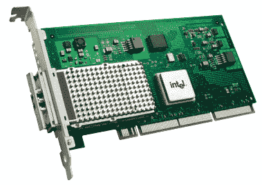

图 4.1 - 英特尔 PRO/10GbE LR 服务器适配器（IXGB，82597EX）网络适配器

首先，让我们看一下它调用`request_irq()`来分配 IRQ 线：

```
// drivers/net/ethernet/intel/ixgb/ixgb_main.c
[...]int
ixgb_up(struct ixgb_adapter *adapter)
{
    struct net_device *netdev = adapter->netdev;
    int err, irq_flags = IRQF_SHARED;
    [...]
    err = request_irq(adapter->pdev->irq, ixgb_intr, irq_flags,
                      netdev->name, netdev);
    [...]
```

在前面的代码片段中，您可以看到驱动程序调用`request_irq()`API 来在网络驱动程序的`ixgb_up()`方法中分配此中断。当网络接口被启动时（由网络实用程序如`ip(8)`或（较早的）`ifconfig(8)`调用），将调用此方法。让我们依次查看传递给`request_irq()`的参数：

+   在这里，IRQ 号码-第一个参数-是从`pci_dev`结构的`irq`成员中查询的（因为此设备位于 PCI 总线上）。`pdev`结构指针在这个驱动程序的上下文（或私有）元数据结构中，名为`ixgb_adapter`。它的成员称为`irq`。

+   第二个参数是指向中断处理程序例程的指针（通常被称为*hardirq handler*；我们稍后将更详细地查看所有这些）；在这里，它是名为`ixgb_intr()`的函数。

+   第三个参数是`flags`位掩码。您可以看到这里驱动程序指定此中断是共享的（通过`IRQF_SHARED`标志）。这是 PCI 规范的一部分，用于在该总线上的设备共享它们的中断线。这意味着驱动程序需要验证中断是否真的是为它而来的。它在中断处理程序中执行此操作（通常是非常特定于硬件的代码，通常检查给定寄存器的某个预期值）。

+   第四个参数是处理此中断的驱动程序的名称。它是通过专门的`net_device`结构的`name`成员获得的（该成员已经通过此驱动程序在其探测方法`ixgb_probe()`中调用`register_netdev()`注册到内核的网络框架中）。

+   第五个参数是传递给中断处理程序例程的值。正如我们之前提到的，它（再次）是专门的`net_device`结构（其中内部嵌入了驱动程序上下文结构（`struct ixgb_adapter`）！）。

相反，当网络接口关闭时，内核会调用`ixgb_down()`方法。当这种情况发生时，它会禁用 NAPI 并使用`free_irq()`释放 IRQ 线。

```
void
ixgb_down(struct ixgb_adapter *adapter, bool kill_watchdog)
{
    struct net_device *netdev = adapter->netdev;
    [...]
    napi_disable(&adapter->napi);
    /* waiting for NAPI to complete can re-enable interrupts */
    ixgb_irq_disable(adapter);
    free_irq(adapter-pdev->irq, netdev);
    [...]
```

现在您已经学会了如何通过`request_irq()`陷入硬件中断，我们需要了解有关编写中断处理程序例程代码的一些关键要点，这就是处理中断的实际工作所在。

# 实现中断处理程序例程

通常，中断是硬件外围设备通知系统（实际上是驱动程序）数据已经可用并且应该接收的方式。这是典型驱动程序的操作：它们从设备缓冲区（或端口等）中获取传入的数据。不仅如此，还有可能有用户模式进程（或线程）需要这些数据。因此，他们很可能已经打开了设备文件并发出了`read(2)`（或等效）系统调用。这使得他们当前正在阻塞（睡眠），等待设备传来的数据。

在检测到当前没有可用数据时，驱动程序的*read*方法通常会使用`wait_event*()`API 之一将进程上下文置于睡眠状态。

因此，一旦您的驱动程序的中断处理程序将数据获取到某个内核缓冲区中，它通常会唤醒正在睡眠的读取者。他们现在通过驱动程序的读取方法（在进程上下文中）运行，获取数据，并根据需要将其传输到用户空间缓冲区中。

这一部分分为两个主要部分。首先，我们将学习在我们的中断处理程序中可以做什么和不能做什么。然后，我们将介绍编写代码的机制。

## 中断上下文指南-要做和不要做的事情

中断处理程序例程是您典型的 C 代码，但有一些注意事项。关于设计和实现硬件中断处理程序的一些关键点如下：

+   **处理程序在中断上下文中运行，因此不要阻塞**：首先，这段代码始终在中断上下文中运行；也就是说，在原子上下文中。在可抢占的内核上，抢占被禁用，因此它有一些关于它可以做和不能做的限制。特别是，它不能做任何直接或间接调用调度器（`schedule()`）的事情！

实际上，你**不能**做以下事情：

+   在内核和用户空间之间传输数据可能会导致页面错误，在原子上下文中是不允许的。

+   在内存分配中使用`GFP_KERNEL`标志。你必须使用`GFP_ATOMIC`标志，以便分配是非阻塞的 - 它要么立即成功，要么立即失败。

+   调用任何会阻塞的 API（最终调用`schedule()`）。换句话说，它必须是纯非阻塞的代码路径。（我们在伴随指南*Linux 内核编程* - *第八章*，*模块作者的内核内存分配 - 第一部分*的*永远不要在中断或原子上下文中休眠*部分中详细介绍了原因）。

+   **中断屏蔽**：默认情况下，当你的中断处理程序运行时，本地 CPU 核心上的**所有**中断都被屏蔽（禁用），你正在处理的特定中断在**所有核心**上都被屏蔽。因此，你的代码本质上是可重入安全的。

+   **保持快速！**：你正在编写的代码会打断其他进程 - 在你粗鲁地打断它之前系统正在运行的其他“业务”；因此，你必须尽可能快地完成所需的工作，并返回，让被打断的代码路径继续。重要的系统软件指标包括最坏情况下的中断长度和最坏情况下的中断禁用时间（我们将在本章末尾的*测量指标和延迟*部分再详细介绍一些内容）。

这些要点非常重要，因此我们将在以下小节中更详细地介绍它们。

### 不要阻塞 - 发现可能会阻塞的代码路径

这实际上归结为这样一个事实，当你处于中断或原子上下文中时，不要做任何会调用`schedule()`的事情。现在，让我们看看如果我们的中断处理程序的伪代码如下会发生什么：

```
my_interrupt()
{
    struct mys *sp;
    ack_intr();
    x = read_regX();
    sp = kzalloc(SIZE_HWBUF, GFP_KERNEL);
    if (!sp)
        return -ENOMEM;
    sp = fetch_data_from_hw();
    copy_to_user(ubuf, sp, count);
    kfree(sp);
}
```

你有没有发现这里存在潜在的大问题（尽管可能还很微妙）？（在继续之前花点时间发现它们。）

首先，使用`GFP_KERNEL`标志调用`kzalloc()`可能会导致内核代码调用`schedule()`！如果是这样，这将导致“Oops”，这是一个内核错误。在典型的生产环境中，这会导致内核恐慌（因为*sysctl*命名为`panic_on_oops`通常在生产中设置为`1`；执行`sysctl kernel.panic_on_oops`将显示当前设置）。接下来，调用`copy_to_user()`可能导致页面错误，因此需要进行上下文切换，这当然会调用`schedule()`；这是不可能的 - 再次，这是一个严重的错误 - 在原子或中断上下文中！

因此，更通用地说，让我们的中断处理程序调用一个名为`a()`的函数，`a()`的调用链如下：

```
        a() -- b() -- c() -- [...] -- g() -- schedule() -- [...]
```

在这里，你可以看到调用`a()`最终会导致调用`schedule()`，正如我们刚刚指出的那样，这将导致“Oops”，这是一个内核错误。因此，问题是，作为驱动程序开发人员，当你调用`a()`时，你如何知道它会导致调用`schedule()`？关于这一点，你需要了解并利用一些要点：

+   （如在伴随指南*Linux 内核编程*-*第八章* *模块作者的内核内存分配-第一部分*中提到）您可以通过直接查看内核来提前了解您的内核代码是否会进入原子或中断上下文。当您配置内核时（同样，如在伴随指南*Linux 内核编程*中所见，回想一下`make menuconfig`来自*Linux 内核编程*-*第二章* *从源代码构建 5.x Linux 内核-第一部分*），您可以打开一个内核配置选项，这将帮助您准确地发现这种情况。在 Kernel Hacking / Lock Debugging 菜单下查看。在那里，您会找到一个名为 Sleep inside atomic section checking 的布尔可调节项。将其打开！

配置选项名为`CONFIG_DEBUG_ATOMIC_SLEEP`；您可以随时在内核的配置文件中使用 grep 进行搜索。如在伴随指南*Linux 内核编程*-*第五章* *编写您的第一个内核模块-LKMs 第二部分*中所见，在*配置调试内核*部分，我们指定应该打开此选项！

+   接下来（这有点迂腐，但会帮助您！），养成查看有关问题函数的内核文档的习惯（甚至更好的是，简要查看其代码）。它是一个阻塞调用的事实通常会在注释标题中有所记录或指定。

+   内核有一个名为`might_sleep()`的辅助宏；它对这些情况非常有用的调试辅助工具！下面的屏幕截图（来自内核源码，`include/linux/kernel.h`）清楚地解释了它：

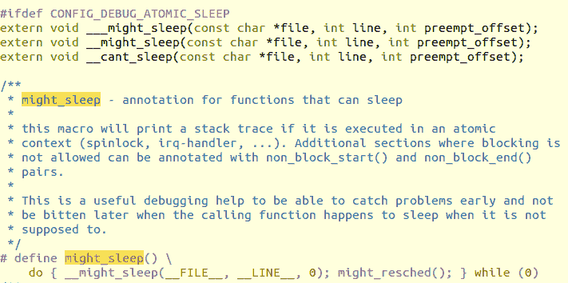

图 4.2-对 might_sleep()的注释很有帮助

同样，内核提供了一些辅助宏，如`might_resched()`、`cant_sleep()`、`non_block_start()`、`non_block_end()`等。

+   只是为了提醒您，我们在伴随指南*Linux 内核编程*-*第八章* *模块作者的内核内存分配第一部分*的*处理 GFP 标志*部分（以及其他地方）中提到了几乎相同的事情-关于不在原子上下文中阻塞。此外，我们还向您展示了有用的 LDV 项目（在伴随指南*Linux 内核编程*-*第一章* *内核工作空间设置*中提到，在*LDV-Linux 驱动程序验证-项目*部分）如何捕获并修复了内核和驱动程序模块代码中的几个此类违规行为。

在本节的开头，我们提到，通常情况下，睡眠的用户空间读取器会在数据到达时阻塞。其到达通常由硬件中断信号。然后，您的中断处理程序例程将数据获取到内核 VAS 缓冲区并唤醒睡眠者。嘿，这是不允许的吗？不-`wake_up*()` API 在性质上是非阻塞的。您需要理解的是，它们只会将进程（或线程）的状态从睡眠（`TASK_{UN}INTERRUPTIBLE`）切换到唤醒，准备运行（`TASK_RUNNING`）。这不会调用调度程序；内核将在下一个机会点进行调度（我们在伴随指南*Linux 内核编程*-*第十章* *CPU 调度程序-第一部分*和*第十一章* *CPU 调度程序-第二部分*中讨论了 CPU 调度）。

### 中断屏蔽-默认值和控制

回想一下中断控制器芯片（PIC/GIC）将具有屏蔽寄存器。操作系统可以根据需要对其进行编程**屏蔽或阻止硬件中断**（当然，某些中断可能是不可屏蔽的；**不可屏蔽中断**（**NMI**）是我们稍后在本章中讨论的典型情况）。

然而，重要的是要意识到，尽可能保持中断启用（未屏蔽）是操作系统质量的一个关键指标！为什么？如果中断被阻塞，外围设备无法响应，系统的性能会下降或受到影响（仅按下并释放键盘键会导致两个硬件中断）。您必须尽可能长时间地保持中断启用。使用自旋锁会导致中断和抢占被禁用！保持关键部分短暂（我们将在本书的最后两章中深入介绍锁定）。

接下来，当涉及到 Linux 操作系统上的默认行为时，当硬件中断发生并且该中断未被屏蔽（通常是默认情况），假设它是 IRQn（其中*n*是中断号），**内核确保在其中断（hardirq）处理程序执行时，所有在处理程序执行的本地 CPU 核心上的中断都被禁用，并且 IRQn 在所有 CPU 上都被禁用**。因此，您的处理程序代码本质上是可重入安全的。这很好，因为这意味着您永远不必担心以下问题：

+   自己屏蔽中断

+   何时在该 CPU 核心上以原子方式完成且不被中断

正如我们将在后面看到的，底半部仍然可以被顶半部中断，因此需要锁定。

当 IRQn 在 CPU 核心 1 上执行时，其他 CPU 核心上的中断仍然启用（未屏蔽）。因此，在多核系统硬件上，中断可以在不同的 CPU 核心上并行运行。只要它们不相互干扰全局数据，这是可以的！如果它们这样做，您将不得不使用锁定，这是我们将在本书的最后两章中详细介绍的内容。

此外，在 Linux 上，**所有中断都是对等的**，因此它们之间没有优先级；换句话说，它们都以相同的优先级运行。只要它未被屏蔽，任何硬件中断都可以在任何时间点中断系统；中断甚至可以中断中断！但它们通常不会这样做。这是因为，正如我们刚刚了解的，当中断 IRQn 在 CPU 核心上运行时，该核心上的所有中断都被禁用（屏蔽），并且 IRQn 在全局范围内（跨所有核心）被禁用，直到完成；例外是 NMI。

### 保持快速

中断就是它所暗示的：它中断了机器上的正常工作；这是一个必须被容忍的烦恼。上下文必须被保存，处理程序必须被执行（连同底半部，我们将在*理解和使用顶半部和底半部*部分中介绍），然后必须将上下文恢复到被中断的状态。所以，你明白了：这是一个关键的代码路径，所以不要磕磕绊绊-**要快速和非阻塞！**

它还提出了一个问题，快有多快？虽然答案当然是依赖于平台的，但一个经验法则是：尽可能快地处理中断，**在几十微秒内**。如果它一直超过 100 微秒，那么确实需要考虑使用替代策略。我们将在本章后面介绍当发生这种情况时可以做什么。

关于我们简单的`my_interrupt()`伪代码片段（在*不要阻塞-发现可能阻塞的代码路径*部分中显示）,首先，问问自己，在关键的非阻塞需要快速执行的代码路径（例如中断处理程序）中，我真的需要分配内存吗？您是否可以设计模块/驱动程序以更早地分配内存（并且只使用指针）？

再次，现实情况是，有时需要做相当多的工作才能正确地处理中断（网络/块驱动程序是很好的例子）。我们将很快介绍一些我们可以用来处理这个问题的典型策略。

## 编写中断处理程序例程

现在，让我们快速学习它的机械部分。硬件中断处理程序例程（通常称为**hardirq**例程）的签名如下：

```
static irqreturn_t interrupt_handler(int irq, void *data);
```

当您的驱动程序注册了兴趣（通过`request_irq()`或友元 API）的硬件 IRQ 被触发时，中断处理程序例程由内核的通用 IRQ 层调用。它接收两个参数：

+   第一个参数是 IRQ 线（整数）。触发这个会调用处理程序。

+   第二个参数是通过`request_irq()`的最后一个参数传递的值。正如我们之前提到的，它通常是驱动程序的专用设备结构，嵌入了驱动程序上下文或私有数据。因此，它的数据类型是通用的`void *`，允许`request_irq()`传递任何类型，适当地在处理程序例程中进行类型转换并使用它。

处理程序是常规的 C 代码，但是有了我们在前一节中提到的所有注意事项！请务必遵循这些准则。虽然细节是硬件特定的，通常，您的中断处理程序的第一个责任是在板上清除中断，实际上是确认它并告诉 PIC。这通常是通过向板上或控制器上的指定硬件寄存器写入一些特定位来实现的；阅读您特定芯片、芯片组或硬件设备的数据表以弄清楚这一点。在这里，`in_irq()`宏将返回`true`，通知您的代码当前处于 hardirq 上下文中。

处理程序所做的其余工作显然是非常特定于设备的。例如，输入驱动程序将希望扫描刚刚从某个寄存器或外围内存位置按下或释放的键码（或触摸屏坐标或鼠标键/移动等），并可能将其保存在某个内存缓冲区中。或者，它可能立即将其传递到其上面的通用输入层。我们不会在这里深入探讨这些细节。再次强调，驱动程序框架是您需要了解的驱动程序类型；这超出了本书的范围。

那么从您的 hardirq 处理程序返回的值是什么？`irqreturn_t`返回值是一个`enum`，如下所示：

```
// include/linux/irqreturn.h

/**
 * enum irqreturn
 * @IRQ_NONE interrupt was not from this device or was not handled
 * @IRQ_HANDLED interrupt was handled by this device
 * @IRQ_WAKE_THREAD handler requests to wake the handler thread
 */
enum irqreturn {
    IRQ_NONE = (0 0),
    IRQ_HANDLED = (1 0),
    IRQ_WAKE_THREAD = (1 1),
};

```

前面的注释标题清楚地指出了它的含义。基本上，通用的 IRQ 框架坚持要求您返回`IRQ_HANDLED`值，如果您的驱动程序处理了中断。如果中断不是您的，或者您无法处理它，应该返回`IRQ_NONE`值。（这也有助于内核检测虚假中断。如果您无法确定它是否是您的中断，只需返回`IRQ_HANDLED`。）我们将很快看到`IRQ_WAKE_THREAD`是如何使用的。

现在，让我们看一些更多的代码！在下一节中，我们将检查两个驱动程序的硬件中断处理程序代码（我们在本章和上一章中都遇到过）。

### 代码视图 2 - i8042 驱动程序的中断处理程序

在上一章中，第三章，*使用硬件 I/O 内存*，在*A PIO 示例 - i8042*部分，我们学习了 i8042 设备驱动程序如何使用一些非常简单的辅助程序在 i8042 芯片的 I/O 端口上执行 I/O（读/写）（这通常是 x86 系统上的键盘/鼠标控制器）。以下代码片段显示了其硬件中断处理程序例程的一些代码；您可以清楚地看到它同时读取了状态寄存器和数据寄存器：

```
// drivers/input/serio/i8042.c
/*
 * i8042_interrupt() is the most important function in this driver -
 * it handles the interrupts from the i8042, and sends incoming bytes
 * to the upper layers.
 */
static irqreturn_t i8042_interrupt(int irq, void *dev_id)
{
    unsigned char str, data;
    [...]
    str = i8042_read_status();
    [...] 
    data = i8042_read_data();
    [...]
    if (likely(serio && !filtered))
        serio_interrupt(serio, data, dfl);
 out:
    return IRQ_RETVAL(ret);
}
```

在这里，`serio_interrupt()`调用是这个驱动程序将从硬件读取的数据传递给上层的“输入”层，该层将进一步处理它，并最终使其准备好供用户空间进程使用。（在本章末尾的*问题*部分中看一下；您可以尝试的练习之一是编写一个简单的“键盘记录器”设备驱动程序。）

### 代码视图 3 - IXGB 网络驱动程序的中断处理程序

让我们看另一个例子。在这里，我们正在查看 Intel IXGB 以太网适配器的设备驱动程序的硬件中断处理程序，这是我们之前提到的：

```
// drivers/net/ethernet/intel/ixgb/ixgb_main.c
static irqreturn_t
ixgb_intr(int irq, void *data)
{
    struct net_device *netdev = data;
    struct ixgb_adapter *adapter = netdev_priv(netdev);
    struct ixgb_hw *hw = &adapter-hw;
    u32 icr = IXGB_READ_REG(hw, ICR);

    if (unlikely(!icr))
        return IRQ_NONE; /* Not our interrupt */
    [...]
    if (napi_schedule_prep(&adapter-napi)) {
        [...]
        IXGB_WRITE_REG(&adapter-hw, IMC, ~0);
        __napi_schedule(&adapter-napi);
    }
    return IRQ_HANDLED;
}
```

在前面的代码片段中，注意驱动程序如何从第二个参数接收的`net_device`结构（用于网络设备的专用结构）中获得对其私有（或上下文）元数据结构（`struct ixgb_adapter`）的访问权限；这是非常典型的。（在这里，`netdev_priv()`助手用于从通用的`net_device`结构中提取驱动程序的私有结构，类似于众所周知的`container_of()`助手宏。事实上，这个助手在类似的情况下也经常被使用。）

接下来，它通过`IXGB_READ_REG()`宏执行外围 I/O 内存读取（它使用 MMIO 方法，详情请参阅上一章关于 MMIO 的详细信息；`IXGB_READ_REG()`是一个调用我们在上一章中介绍的`readl()`API 的宏，用于执行 32 位 MMIO 读取的旧风格例程）。不要错过这里的关键点：这是驱动程序确定中断是否适用于它的方式，因为它是一个共享中断！如果它适用于它（可能的情况），它将继续执行它的工作；由于此适配器支持 NAPI，驱动程序现在安排轮询 NAPI 读取以吸收网络数据包并将其发送到网络协议栈进行进一步处理（实际上并不是那么简单；实际的内存传输工作将通过 DMA 执行）。

现在，一个分歧但重要的问题：您需要学习如何以现代方式（通过`devm_*`API）分配 IRQ 线。这被称为托管方法。

## IRQ 分配-现代方式-托管中断设施

许多现代驱动程序使用内核的*devres*或托管 API 框架来实现各种目的。现代 Linux 内核中的托管 API 为您提供了一个优势，即无需担心释放已分配的资源（我们已经介绍了其中的一些，包括`devm_k{m,z}alloc()`和`devm_ioremap{_resource}()`）。当然，您必须适当地使用它们，通常是在驱动程序的探测方法（或`init`代码）中。

建议在编写驱动程序时使用这种更新的 API 风格。在这里，我们将展示如何使用`devm_request_irq()`API 来分配（注册）硬件中断。它的签名如下：

```
#include <linux/interrupt.h>

int __must_check
devm_request_irq(struct device *dev, unsigned int irq, irq_handler_t handler,
                  unsigned long irqflags, const char *devname, void *dev_id);
```

第一个参数是设备的`device`结构的指针（正如我们在第一章中看到的，*编写一个简单的 misc 字符设备驱动程序*，必须通过注册到适当的内核框架来获取）。剩下的五个参数与`request_irq()`相同；我们这里不再重复。整个重点是，一旦注册，您就不必调用`free_irq()`；内核将根据需要自动调用它（在驱动程序移除或设备分离时）。这极大地帮助我们开发人员避免常见和臭名昭著的泄漏类型错误。

为了帮助澄清其用法，让我们快速看一个例子。以下是来自 V4L 电视调谐器驱动程序的一部分代码。

```
// drivers/gpu/drm/exynos/exynos_mixer.c
[...]
    res = platform_get_resource(mixer_ctx->pdev, IORESOURCE_IRQ, 0);
    if (res == NULL) {
        dev_err(dev, "get interrupt resource failed.\n");
        return -ENXIO;
    }

 ret = devm_request_irq(dev, res->start, mixer_irq_handler,
 0, "drm_mixer", mixer_ctx);
    if (ret) {
        dev_err(dev, "request interrupt failed.\n");
        return ret;
    }
    mixer_ctx-irq = res->start;
[...]
```

正如我们在第三章中关于获取 MMIO 的物理地址所看到的，*使用硬件 I/O 内存*，在*获取设备资源*部分，这里，相同的驱动程序使用`platform_get_resource()`API 来提取 IRQ 号（将资源类型指定为带有`IORESOURCE_IRQ`的 IRQ 线）。一旦获得，它就会使用`devm_request_irq()`API 来分配或注册中断！因此，可以预期在这个驱动程序中搜索`free_irq()`将不会得到任何结果。

接下来，我们将学习什么是线程中断，如何处理线程中断，更重要的是它的原因。

# 使用线程中断模型

正如在配套指南*Linux 内核编程 - 第十一章*，*CPU 调度器 - 第二部分*，*将主线 Linux 转换为 RTOS*部分中所看到的，我们介绍了 Linux 的实时补丁（RTL），它允许您对 Linux 进行补丁、配置、构建和运行为 RTOS！如果您对此感到困惑，请回头查看。我们不会在这里重复相同的信息。

**实时 Linux（RTL）**项目的工作已经稳步地被回溯到主线 Linux 内核中。RTL 带来的关键变化之一是将**线程中断**功能合并到主线内核中。这发生在内核版本 2.6.30（2009 年 6 月）。这项技术做了一些乍一看似乎非常奇怪的事情：它“转换”硬件中断处理程序，基本上成为一个内核线程。

正如您将在下一章中了解到的那样，内核线程与用户模式线程非常相似 - 它在进程上下文中独立运行，并且有自己的任务结构（因此有自己的 PID、TGID 等），这意味着它可以被调度；也就是说，在可运行状态时，它与其他竞争线程争夺 CPU 核心的运行。关键区别在于用户模式线程始终有两个地址空间 - 它所属的进程 VAS（用户空间）和它发出系统调用时切换到的内核 VAS。另一方面，内核线程纯粹在内核空间中运行，并且没有用户空间的视图；它只看到它始终在其中执行的内核 VAS（从技术上讲，它的`current-mm`值始终为`NULL`！）。

那么，你如何决定是否应该使用线程中断？在这变得完全清晰之前，我们需要涵盖一些更多的话题（对于那些急切的人，这里是简短的答案：当中断工作需要超过 100 微秒时，使用线程中断处理程序作为一个快速的启发式方法；跳到*硬中断、任务、线程处理程序 - 什么时候使用*部分并查看那里的表以快速查看）。

现在，让我们通过查看可用的 API（常规和托管的 API）来学习如何使用线程中断模型。然后，我们将学习如何使用托管版本以及如何在驱动程序中使用它。之后，我们将查看其内部实现并更深入地探讨其中的原因。

## 使用线程中断模型 - API

为了理解线程中断模型的内部工作原理，让我们来看看相关的 API。我们已经介绍了如何使用`request_irq()`API。让我们看看它的实现：

```
// include/linux/interrupt.hstatic inline int __must_check
request_irq(unsigned int irq, irq_handler_t handler, unsigned long flags, const char *name, void *dev)
{
    return request_threaded_irq(irq, handler, NULL, flags, name, dev);
}
```

这个 API 只是`request_threaded_irq()`API 的一个薄包装！它的签名如下：

```
int __must_check
request_threaded_irq(unsigned int irq, irq_handler_t handler,
               irq_handler_t thread_fn,
               unsigned long flags, const char *name, void *dev);
```

除了第三个参数外，其他参数与`request_irq()`是相同的。以下是一些要注意的关键点：

+   `irq_handler_t handler`：第二个参数是指向通常的中断处理程序函数的指针。我们现在称它为主处理程序。如果它为空，而`thread_fn`（第三个参数）不为空，则会自动安装一个默认的主处理程序（如果您想了解这个默认的主处理程序，我们将在*内部实现线程中断*部分中更详细地介绍）。

+   `irq_handler_t thread_fn`：第三个参数是指向线程中断函数的指针；API 的行为取决于您是否将此参数传递为 null：

+   如果它不为空，则实际的中断服务由此函数执行。它在专用内核线程的上下文（进程）中运行 - 这就是线程中断！

+   如果它为空，也就是在调用`request_irq()`时的默认情况下，只有主处理程序运行，不会创建内核线程。

如果指定了主处理程序（第二个参数），则在所谓的**硬中断**或**硬中断**上下文中运行（与`request_irq()`的情况一样）。如果主处理程序不为空，则您应该编写它的代码，并（最少）在其中执行以下操作：

+   验证中断是否为您服务; 如果不是，请返回`IRQ_NONE`。

+   如果是为您服务的，那么您可以在板/设备上清除和/或禁用中断。

+   返回`IRQ_WAKE_THREAD`; 这将导致内核唤醒代表您的线程中断处理程序的内核线程。内核线程的名称将以`irq/irq#-name`的格式。现在，这个内核线程将在内部调用`thread_fn()`函数，您将在其中执行实际的中断处理工作。

另一方面，如果主处理程序为空，那么当中断触发时，只会自动运行您的线程处理程序 - 第三个参数指定的函数**作为内核线程**。

与`request_irq()`一样，`request_threaded_irq()`的返回值是一个整数，遵循通常的`0/-E`内核约定：成功返回`0`，失败返回负的`errno`值。您应该检查它。

## 使用托管线程中断模型-推荐的方式

再次，对于现代驱动程序，使用托管 API 来分配线程中断将是推荐的方法。内核为此目的提供了`devm_request_threaded_irq()`API:

```
#include linux/interrupt.h

int __must_check
 devm_request_threaded_irq(struct device *dev, unsigned int irq,
               irq_handler_t handler, irq_handler_t thread_fn,
               unsigned long irqflags, const char *devname,
               void *dev_id);
```

除了第一个参数（指向设备结构的指针）之外的所有参数都与`request_threaded_irq()`的参数相同。这样做的关键优势在于，您无需担心释放 IRQ 线。内核将在设备分离或驱动程序移除时自动释放它，就像我们在`devm_request_irq()`中学到的那样。与`request_threaded_irq()`一样，`devm_request_threaded_irq()`的返回值是一个整数，遵循通常的`0/-E`内核约定：成功返回`0`，失败返回负的 errno 值; 你应该检查它。

不要忘记！使用托管`devm_request_threaded_irq()`API 是分配线程中断的现代推荐方法。但是，请注意，这并不总是正确的方法; 有关更多信息，请参阅*使用线程处理程序时的约束*部分。

线程中断处理程序函数的签名与 hardirq 中断处理程序的签名相同:

```
static irqreturn_t threaded_handler(int irq, void *data);
```

参数的含义也是相同的。

线程中断通常使用`IRQF_ONESHOT`中断标志; `include/linux/interrupt.h`中的内核注释最好描述了它:

```
 * IRQF_ONESHOT - Interrupt is not reenabled after the hardirq handler finished.
 * Used by threaded interrupts which need to keep the
 * irq line disabled until the threaded handler has been run.
```

事实上，内核**坚持要求**在您的驱动程序包含线程处理程序并且主处理程序是内核默认值时使用`IRQF_ONESHOT`标志。当级联触发中断在起作用时，不使用`IRQF_ONESHOT`标志将是致命的。为了安全起见，内核会抛出一个错误-当`irqflags`位掩码参数中不存在这个标志时-即使是边缘触发。如果您感兴趣，`kernel/irq/manage.c:__setup_irq()`中的代码检查了这一点（链接: [`elixir.bootlin.com/linux/v5.4/source/kernel/irq/manage.c#L1486`](https://elixir.bootlin.com/linux/v5.4/source/kernel/irq/manage.c#L1486)）。

存在一个名为`threadirqs`的内核参数，您可以将其传递给内核命令行（通过引导加载程序）。这会强制线程化所有中断处理程序，除了那些明确标记为`IRQF_NO_THREAD`的中断处理程序。要了解有关此内核参数的更多信息，请转到[`www.kernel.org/doc/html/latest/admin-guide/kernel-parameters.html`](https://www.kernel.org/doc/html/latest/admin-guide/kernel-parameters.html)。

在下一小节中，我们将看一下 Linux 驱动程序的 STM32 微控制器之一。在这里，我们将重点关注通过刚刚介绍的“托管”API 进行中断分配的方式。

### 代码视图 4 - STM32 F7 微控制器的线程中断处理程序

STM32 F7 是由 STMicroelectronics 制造的一系列微控制器中的一部分，基于 ARM-Cortex M7F 核心:

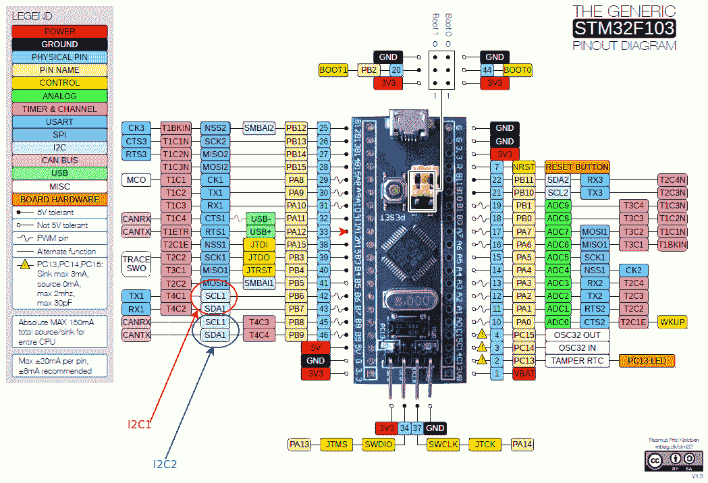

图 4.3 - 带有一些 I2C 引脚突出显示的 STM32F103 微控制器引脚布局（见左下角）

图片来源：前面的图片，我稍作修改后，来自[`www.electronicshub.org/wp-content/uploads/2020/02/STM32F103C8T6-Blue-Pill-Pin-Layout.gif`](https://www.electronicshub.org/wp-content/uploads/2020/02/STM32F103C8T6-Blue-Pill-Pin-Layout.gif)。图片由 Rasmus Friis Kjekisen 提供。此图片属于知识共享 CC BY-SA 1.0 许可证（[`creativecommons.org/licenses/by-sa/1.0/`](https://creativecommons.org/licenses/by-sa/1.0/)）。

Linux 内核通过各种驱动程序和 DTS 文件支持 STM32 F7。在这里，我们将看一小部分微控制器的 I2C 总线驱动程序（`drivers/i2c/busses/i2c-stm32f7.c`）的代码。它分配了两个硬件中断：

+   通过`devm_request_threaded_irq()`API 的事件 IRQ 线

+   通过`request_irq()`API 的错误 IRQ 线

分配 IRQ 线的代码如预期地位于其`probe`方法中：

```
// drivers/i2c/busses/i2c-stm32f7.c
static int stm32f7_i2c_probe(struct platform_device *pdev)
{
    struct stm32f7_i2c_dev *i2c_dev;
    const struct stm32f7_i2c_setup *setup;
    struct resource *res;
    int irq_error, irq_event, ret;

    [...]
    irq_event = platform_get_irq(pdev, 0);
    [...]
    irq_error = platform_get_irq(pdev, 1);
    [...]
    ret = devm_request_threaded_irq(&pdev->dev, irq_event,
 stm32f7_i2c_isr_event,
 stm32f7_i2c_isr_event_thread,
 IRQF_ONESHOT,
 pdev->name, i2c_dev);
    [...]
    ret = devm_request_irq(&pdev->dev, irq_error, stm32f7_i2c_isr_error, 0,
                   pdev->name, i2c_dev);
```

让我们关注对`devm_request_threaded_irq()`的调用。第一个参数是指向设备结构的指针。由于这是一个平台驱动程序（通过`module_platform_driver`包装宏注册），其 probe 方法接收`struct platform_device *pdev`参数；设备结构从中提取。第二个参数是要分配的 IRQ 线。同样，如我们已经看到的，它是通过辅助例程提取的。在这里，这是`platform_get_irq()`API。

第三个参数指定了主处理程序；也就是硬中断。由于它不为空，当 IRQ 被触发时将调用此例程。它对设备和 I2C 传输进行硬件特定的验证，如果一切正常，它将返回`IRQ_WAKE_THREAD`值。这会唤醒线程中断例程，第四个参数，函数`stm32f7_i2c_isr_event_thread()`将作为内核线程在进程上下文中运行！`irqflags`参数被设置为`IRQF_ONESHOT`，这在线程处理程序中很典型；它指定 IRQ 线保持禁用，直到线程处理程序完成（不仅仅是硬中断）。线程处理程序例程完成其工作并在完成时返回`IRQ_HANDLED`。

由于错误的 IRQ 线是通过`devm_request_irq()`API 分配的，并且因为我们已经介绍了如何使用这个 API（请参阅*IRQ allocation – the modern way – the managed interrupt facility*部分），我们不会在这里重复任何关于它的信息。

现在，让我们看看内核是如何内部实现线程中断模型的。

## 内部实现线程中断

正如我们之前提到的，如果主处理程序为空并且线程函数非空，内核将使用默认的主处理程序。该函数被称为`irq_default_primary_handler()`，它的作用是返回`IRQ_WAKE_THREAD`值，从而唤醒（并使可调度）内核线程。

此外，运行您的`thread_fn`例程的实际内核线程是在`request_threaded_irq()`API 的代码中创建的。调用图（截至 Linux 内核 5.4.0 版本）如下：

```
   kernel/irq/manage.c:request_threaded_irq() --  __setup_irq() --
          setup_irq_thread() -- kernel/kthread.c:kthread_create()
```

调用`kthread_create()`API 如下。在这里，您可以清楚地看到新内核线程的名称格式将采用`irq/irq#-name`格式：

```
t = kthread_create(irq_thread, new, "irq/%d-%s", irq, new->name);
```

在这里（我们不显示代码），新的内核线程被设置为`SCHED_FIFO`调度策略和`MAX_USER_RT_PRIO/2`实时调度优先级，通常为`50`（`SCHED_FIFO`范围为`1`到`99`，`MAX_USER_RT_PRIO`为`100`）。我们将在*为什么使用线程中断？*部分介绍这一点。如果您对线程调度策略及其优先级不确定，请参阅配套指南*Linux Kernel Programming -* *第十章*，*CPU Scheduler – Part 1*，*The POSIX scheduling policies*部分。

内核完全管理代表线程中断处理程序的内核线程。正如我们已经看到的，它通过`[devm_]request_threaded_irq()`API 在 IRQ 分配时创建它；然后，内核线程简单地休眠。内核会在需要时唤醒它，每当分配的 IRQ 被触发时；当调用`free_irq()`时，内核将销毁它。目前不要担心细节；我们将在下一章中介绍内核线程和其他有趣的主题。

到目前为止，虽然您已经学会了如何使用线程中断模型，但尚未清楚地解释了为什么（以及何时）应该使用。下一节将详细介绍这一点。

## 为什么要使用线程中断？

通常会问的一个关键问题是，当常规的 hardirq 类型中断存在时，为什么要使用线程中断？完整的答案有点复杂；以下是主要原因：

+   真正使其实时。

+   它消除/减少了 softirq 瓶颈。由于线程处理程序实际上在进程上下文中运行其代码，因此它不被认为是与 hardirq 处理程序一样关键的代码路径；因此，您可以在中断处理时花费更长的时间。

+   +   当 hardirq 执行 IRQn 时，系统中所有核心上的 IRQ 线都被禁用。如果执行时间较长（当然，您应该设计它不这样做），那么系统的响应可能会显着下降；另一方面，当线程处理程序执行时，默认情况下硬件 IRQ 线是启用的。这对性能和响应性是有利的。（请注意，有许多情况下驱动程序不希望出现这种行为；也就是说，它希望在处理中断时禁用 IRQ。要做到这一点，请指定`IRQF_ONESHOT`标志。）

简而言之，作为一个快速的经验法则，**当中断处理一直超过 100 微秒时，使用线程中断模型**（参见*Hardirqs，tasklets，threaded handlers-何时使用*部分中的表）。

在接下来的小节中，我们将扩展这些观点。

### 线程中断-真正实时

这是一个关键点，需要一些解释。

标准 Linux OS 上的优先级从最高到最低依次如下（我们将每个项目后缀为它运行的*context*；它将是进程或中断。如果您对此不清楚，那么您理解这一点非常重要；请参考配套指南*Linux Kernel Programming - **第六章*，*内核内部要点-进程和线程*，*理解进程和中断上下文*部分，以获取更多信息）：

+   硬件中断：这些会抢占任何东西。hardirq 处理程序在 CPU 上原子地运行（完成，不中断）；`context:interrupt`。

+   实时线程（`SCHED_FIFO`或`SCHED_RR`调度策略），内核空间和用户空间都具有正实时优先级（`rtprio`）；`context:process`：

+   在相同的实时优先级（`current-rtprio`）下，内核线程会比相同实时优先级的用户空间线程稍微提高优先级。

+   处理器异常：这包括系统调用（它们实际上是同步异常；例如，在 x86 上是`syscall`，在 ARM 上是`SWI`），页错误，保护错误等；`context:process`。

+   用户模式线程：它们默认使用`SCHED_OTHER`调度策略，`rtprio`为`0`；`context:process`。

以下图表显示了 Linux 上的相对优先级（这个图表有点简单；稍后会通过*图 4.10*和*图 4.11*看到更精细的图表）：

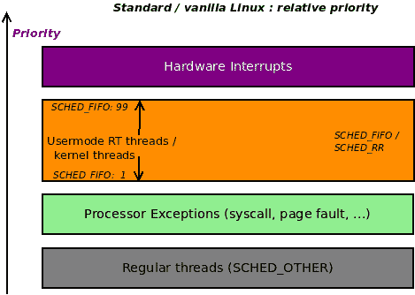

图 4.4-标准 Linux OS 上的相对优先级

假设您正在开发一个实时多线程应用程序。在进程中有数十个活动线程，其中三个（我们简单地称它们为 A、B 和 C）被认为是关键的“实时”线程。因此，您让应用程序授予它们`SCHED_FIFO`调度策略和分别为 30、45 和 60 的实时优先级（如果您对这些内容不清楚，请参考配套指南*Linux 内核编程-第十章*，*CPU 调度器-第一部分*和*第十一章*，*CPU 调度器-第二部分*，关于 CPU 调度）。由于这是一个实时应用程序，这些线程完成工作的最长时间是有限的。换句话说，存在一个*截止日期*；在我们的示例场景中，假设线程 B 完成工作的*最坏情况截止日期*是 12 毫秒。

现在，就相对优先级而言，这将如何运作？为简单起见，假设系统有一个单 CPU 核心。现在，另一个线程 X（使用`SCHED_OTHER`调度策略，并且实时优先级为`0`，这是默认的调度策略/优先级值）当前正在 CPU 上执行代码。但是，如果任何您的实时线程正在等待的“事件”发生，它将抢占当前正在执行的线程并运行。这是预期的；请记住，实时调度的基本规则非常简单：*最高优先级的可运行线程必须是正在运行的线程*。好的。现在，我们需要考虑硬件中断。正如我们所见，硬件中断具有最高优先级。这意味着它将抢占任何东西，包括您的（所谓的）实时线程（请参见前面的图表）！

假设中断处理需要 200 微秒；在像 Linux 这样的强大操作系统上，这并不算太糟糕。然而，在这种情况下，五个硬件中断将消耗 1 毫秒；如果设备变得繁忙（例如有大量传入数据包），并且连续发出 20 个硬件中断，会怎么样？这肯定会被优先考虑，并且会消耗（至少）4 毫秒！您的实时线程肯定会在中断处理运行时被抢占，并且无法获得它所需的 CPU，直到为时已晚！（12 毫秒）截止日期早已过期，系统将失败（如果您的应用程序是真正的实时应用程序，这可能是灾难性的）。

以下图表以概念上表示了这种情况（为简洁和清晰起见，我们只显示了一个我们的用户空间`SCHED_FIFO`实时线程；即`rtprio`为 45 的线程 B）：

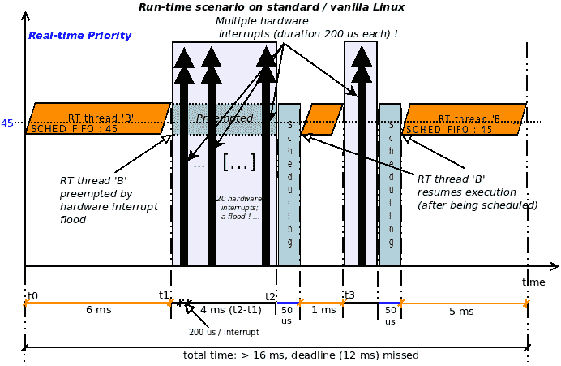

图 4.5：硬中断模型-用户模式 RT SCHED_FIFO 线程被硬件中断洪水打断；截止日期未能满足

实时线程 B 被描述为从时间`t0`（x 轴上）开始运行；y 轴表示实时优先级；线程 B 的`rtprio`为 45；它有 12 毫秒（硬截止日期）来完成工作。然而，假设经过 6 毫秒（在时间`t1`）后，发生了一个硬件中断。

在*图 4.5*中，我们没有显示执行低级中断设置代码。现在，在时间`t1`触发硬件中断导致中断处理程序被调用；也就是说，hardirq（在前面的图中显示为大黑色垂直双箭头）。显然，硬件中断会抢占线程 B。现在，假设它需要 200 微秒来执行；这不多，但是如果出现一连串的中断（比如 20 个，因此占用了 4 毫秒）会怎么样！这在前面的图中有所描述：中断以快速的速度持续到时间`t2`；只有在它们全部完成后，上下文才会被恢复。因此，调度代码运行并且（假设）上下文切换回线程 B，将其给予处理器（在现代英特尔 CPU 上，我们采取保守的上下文切换时间为 50 微秒：[`blog.tsunanet.net/2010/11/how-long-does-it-take-to-make-context.html`](https://blog.tsunanet.net/2010/11/how-long-does-it-take-to-make-context.html)）。然而，不久之后，在时间`t3`，硬件中断再次触发，再次抢占 B。这可能会无限期地继续下去；RT 线程最终会运行（当中断风暴完成时），但可能会或可能不会满足其截止日期！这是主要问题。

前面段落中描述的问题并不能通过简单提高用户模式线程的实时优先级来解决；硬件中断仍然会始终抢占它们，无论它们的优先级如何。

通过将 RTL 项目中的**线程化中断**从主线 Linux 移植，我们可以**解决**这个问题。如何？想一想：使用*线程化中断*模型，现在大部分中断处理工作是由一个以实时优先级`50`运行的`SCHED_FIFO`内核线程执行的。因此，只需设计您的用户空间应用程序，在必要时具有`SCHED_FIFO` RT 线程，其实时优先级**高于`50`**。**这将确保它们优先于硬件中断处理程序运行！**

这里的关键思想是，一个处于`SCHED_FIFO`策略下，实时优先级为 50 的用户模式线程，实际上可以抢占（线程化的）硬件中断！确实是一件了不起的事情。

因此，对于我们的示例场景，现在假设我们正在使用线程化中断。接下来，调整用户空间多线程应用程序的设计：将我们的三个实时线程分配为`SCHED_FIFO`策略，并且实时优先级分别为 60、65 和 70。以下图概念上描述了这种情况（为了清晰起见，我们只显示了我们的用户空间`SCHED_FIFO`线程之一，线程 B，这次的`rtprio`为`65`）：

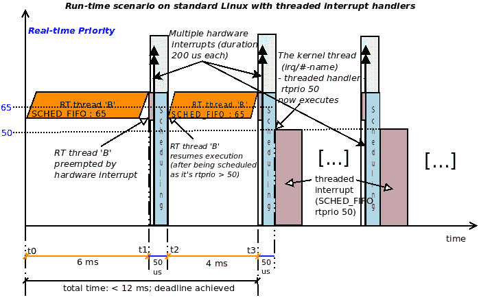

图 4.6-线程化中断模型-一个用户模式 RT SCHED_FIFO rtprio 50 线程可以抢占线程化中断；达到截止日期

在前面的图中，RT 线程 B 现在处于`SCHED_FIFO`调度策略，`rtprio`为`65`。它最多有 12 毫秒的时间来完成（达到它的截止日期）。同样，假设它执行了 6 毫秒（从`t0`到`t1`）；在时间`t1`，硬件中断触发。在这里，低级设置代码和（内核默认或驱动程序的）hardirq 处理程序将立即执行，抢占处理器上的任何东西。然而，hardirq 或主处理程序执行的时间非常短（最多几微秒）。这是，正如我们已经讨论过的，现在正在执行的主处理程序；它将在返回`IRQ_WAKE_THREAD`值之前执行所需的最低限度的工作，这将使内核唤醒代表线程处理程序的内核线程。然而-这是关键-线程中断，它是`SCHED_FIFO`，优先级为`50`，现在正在与其他可运行的线程竞争 CPU 资源。由于线程 B 是一个`SCHED_FIFO`实时线程，其 rtprio 为`65`，**它将击败线程处理程序到 CPU 并且会运行！**

总之，在前面的图中，正在发生以下情况：

+   时间`t0`到`t1`：用户模式 RT 线程（`SCHED_FIFO`，`rtprio 65`）正在执行其代码（持续 6 毫秒）

+   在时间`t1`，细灰色条代表 hardirq 低级设置/BSP 代码。

+   细黑色双箭头垂直线代表主要的 hardirq 处理程序（上面两者只需几微秒即可完成）。

+   蓝色条是调度代码。

+   紫色条（在`t3` + 50 微秒处）代表以 rtprio `50`运行的线程中断处理程序。

所有这些的要点是，B 线程在其截止日期内完成了其工作（在这里，例如，它在 10 毫秒多一点的时间内满足了其截止日期）。

除非时间限制非常关键，否则使用线程中断模型来处理设备的中断对大多数设备和驱动程序都非常有效。在撰写本文时，倾向于保持传统的上/下半部分方法（在*理解和使用上半部分和下半部分*部分中有详细介绍）的设备通常是高性能网络、块和（一些）多媒体设备。

## 使用线程处理程序时的约束

关于线程处理程序的最后一件事：内核不会盲目地允许您为任何 IRQ 使用线程处理程序；它遵守一些约束。在注册线程处理程序时（通过`[devm_]request_threaded_irq()`API），它执行几个有效性检查，其中我们已经提到了一个：`IRQF_ONESHOT`必须存在于线程处理程序中。

它还取决于实际的 IRQ 线路；例如，我曾经尝试在 x86 上使用线程处理程序处理 IRQ `1`（通常是 i8042 键盘/鼠标控制器芯片的中断线）。它失败了，内核显示如下：

```
genirq: Flags mismatch irq 1\. 00002080 (driver-name) vs. 00000080 (i8042)
```

因此，从前面的输出中，我们可以看到 i8042 只接受`0x80`的 IRQ 标志位掩码，而我传递了一个值为`0x2080`；稍微检查一下就会发现`0x2000`标志确实是`IRQF_ONESHOT`标志；显然，这会导致不匹配并且不被允许。不仅如此，还要注意谁标记了错误-是内核的通用 IRQ 层（`genirq`）在幕后检查事情。 （请注意，这种错误检查不仅限于线程中断。）

此外，某些关键设备将发现使用线程处理程序实际上会减慢它们的速度；这对于现代 NIC、块设备和一些多媒体设备非常典型。它们通常使用 hardirq 上半部分和 tasklet/softirq 下半部分机制（这将在*理解和使用上半部分和下半部分*部分中解释）。

## 使用 hardirq 或线程处理程序

在我们结束本节之前，还有一个有趣的要考虑的问题：内核提供了一个 IRQ 分配 API，根据某些情况，将设置您的中断处理程序作为传统的 hardirq 处理程序或线程处理程序。此 API 称为`request_any_context_irq()`；请注意，它仅作为 GPL 导出。其签名如下：

```
int __must_check
request_any_context_irq(unsigned int irq, irq_handler_t handler,
            unsigned long flags, const char *name, void *dev_id);
```

参数与`request_irq()`相同。当调用时，此例程将决定中断处理程序函数（`handler`参数）将在原子 hardirq 上下文中运行还是在可睡眠的进程上下文中运行，即内核线程的上下文，换句话说，作为线程处理程序。您如何知道`handler()`将在哪个上下文中运行？返回值让您知道基于`handler()`将在其中运行的上下文：

+   如果它将在 hardirq 上下文中运行，则返回值为`IRQC_IS_HARDIRQ`。

+   如果它将在进程/线程上下文中运行，则返回值为`IRQC_IS_NESTED`。

+   失败时将返回负的`errno`（您应该检查这一点）。

但这实际上意味着什么呢？基本上，有些控制器位于慢总线上（I2C 是一个很好的例子）；它们产生使用所谓的“嵌套”中断的处理程序，这实际上意味着处理程序的性质不是原子的。它可能调用会休眠的函数（再次，I2C 函数就是一个很好的例子），因此需要是可抢占的。使用`request_any_context_irq()` API 可以确保如果是这种情况，底层的通用 IRQ 代码会检测到并为您提供适当的处理接口。GPIO 驱动的矩阵键盘驱动程序是另一个使用此 API 的例子（`drivers/input/keyboard/matrix_keypad.c`）。

有了这些覆盖，现在你知道了什么是线程中断，以及为什么它们非常有用。现在，让我们来看一个更短的话题：作为驱动程序作者，你如何有选择地启用/禁用 IRQ 线。

# 启用和禁用 IRQs

通常，核心内核（和/或特定于体系结构的）代码处理低级中断管理。这包括在需要时屏蔽它们。然而，一些驱动程序以及操作系统在启用/禁用硬件中断时需要细粒度的控制。由于您的驱动程序或模块代码以内核特权运行，内核提供了（导出的）辅助程序，允许您做到这一点： 

| **简要评论** | **API 或辅助程序** |
| --- | --- |
| **禁用/启用本地处理器上的所有中断** |  |
| 无条件地禁用当前处理器核心上的所有中断。 | `local_irq_disable()` |
| 无条件地启用当前处理器核心上的所有中断。 | `local_irq_enable()` |
| 保存本地（当前）处理器核心上的所有中断的状态（中断掩码），然后禁用所有中断。状态保存在传递的`flags`参数中。 | `local_irq_save(unsigned long flags);` |
| 恢复传递的状态（中断掩码），从而根据`flags`参数在本地（当前）处理器核心上启用中断。 | `local_irq_restore(unsigned long flags);` |
| **禁用/启用特定的 IRQ 线** |  |
| 禁用 IRQ 线`irq`；将等待并同步任何待处理的中断（在该 IRQ 线上）完成后再返回。 | `void disable_irq(unsigned int irq);` |
| 禁用 IRQ 线`irq`；不会等待任何待处理的中断（在该 IRQ 线上）完成（`nosync`）。 | `void disable_irq_nosync(unsigned int irq);` |
| 禁用 IRQ 线`irq`并等待活动的 hardirq 处理程序完成后再返回。如果与此 IRQ 线相关的任何线程处理程序处于活动状态（需要 GPL），则返回`false`。 | `bool disable_hardirq(unsigned int irq);` |
| 启用 IRQ 线`irq`；撤消对`disable_irq()`的一次调用的影响。 | `void enable_irq(unsigned int irq);` |

`local_irq_disable() / local_irq_enable()`助手旨在禁用/启用当前处理器核心上的所有中断（除 NMI）。

`local_irq_disable()`/`local_irq_enable()`在 x86[_64]上的实现是通过（臭名昭著的）`cli`/`sti`一对机器指令来完成的；在过去的坏日子里，这些指令会在整个系统上禁用/启用中断，作用于所有 CPU。现在，它们在每个 CPU 上都可以工作。

`disable_{hard}irq*()`/`enable_irq()`辅助程序旨在选择性地禁用/启用特定的 IRQ 线，并作为一对调用。前面提到的一些例程可以从中断上下文中调用，尽管这应该谨慎进行！最好确保您从进程上下文中调用它们。之所以说“谨慎”，是因为其中几个辅助程序通过内部调用非阻塞例程（例如`cpu_relax()`）来工作，该例程通过在处理器上重复运行一些机器指令来等待。 （`cpu_relax()`是这种“需要谨慎使用”的情况的一个很好的例子，因为它通过在无限循环中调用`nop`机器指令来工作；当任何硬件中断触发时，循环将退出，这正是我们在等待的！现在，在中断上下文中等待一段时间被认为是错误的；因此有了“谨慎”这一说法。）`disable_hardirq()`的内核提交（链接：[`github.com/torvalds/linux/commit/02cea3958664723a5d2236f0f0058de97c7e4693`](https://github.com/torvalds/linux/commit/02cea3958664723a5d2236f0f0058de97c7e4693)）解释了它是用于在需要从原子上下文中禁用中断的情况下，*比如 netpoll*。

在禁用中断时，要注意确保您没有持有（已锁定）处理程序可能使用的任何共享资源。这将导致（自身）死锁！（锁定及其许多场景将在本书的最后两章中详细解释。）

## NMI

所有先前的 API 和辅助程序都适用于所有硬件中断，除了**不可屏蔽中断**（NMI）。NMI 是特定于体系结构的中断，用于实现诸如硬件看门狗和调试功能（例如，所有核心的无条件内核堆栈转储；我们将很快展示一个例子）。此外，NMI 中断线不能共享。

可以通过内核的所谓的**魔术 SysRq**设施来快速展示利用 NMI 的一个例子。要查看为魔术 SysRq 分配的键盘热键，您必须通过输入`[Alt][SysRq][letter]`键组合来调用或触发它。

魔术 SysRq 触发：与其让手指扭曲输入`[Alt][SysRq][letter]`，不如使用更简单的方法 - 更重要的是非交互式的方法：只需将相关字母作为根用户回显到`proc`伪文件中：`echo letter/proc/sysrq-trigger`。

但我们需要输入哪个字母呢？以下输出显示了您可以找到的一种快速方法。这是魔术 SysRq 的快速帮助（我在我的 Raspberry Pi 3B+上执行了这个操作）：

```
rpi # dmesg -C
rpi # echo ? /proc/sysrq-trigger
rpi # dmesg
[ 294.928223] sysrq: HELP : loglevel(0-9) reboot(b) crash(c) terminate-all-tasks(e) memory-full-oom-kill(f) kill-all-tasks(i) thaw-filesystems(j) sak(k) show-backtrace-all-active-cpus(l) show-memory-usage(m) nice-all-RT-tasks(n) poweroff(o) show-registers(p) show-all-timers(q) unraw(r) sync(s) show-task-states(t) unmount(u) show-blocked-tasks(w) dump-ftrace-buffer(z) 
rpi # 
```

我们目前感兴趣的是粗体显示的 - 字母`l`（小写 L） - `show-backtrace-all-active-cpus（l）`。一旦触发，它确实如约 - 它显示所有活动 CPU 上内核模式堆栈的堆栈回溯！（这可以作为一个有用的调试辅助工具，因为您将看到每个 CPU 核心当前正在运行的内容。）如何？它通过向它们发送 NMI 来实现这一点；也就是说，向所有 CPU 核心发送 NMI！这是我们可以看到在命令被触发的那一刻 CPU 正在做什么的一种方式！当系统出现问题时，这可能非常有用。

在这里，`echo l /proc/sysrq-trigger`（作为根用户）就可以了！以下是部分屏幕截图显示的输出：

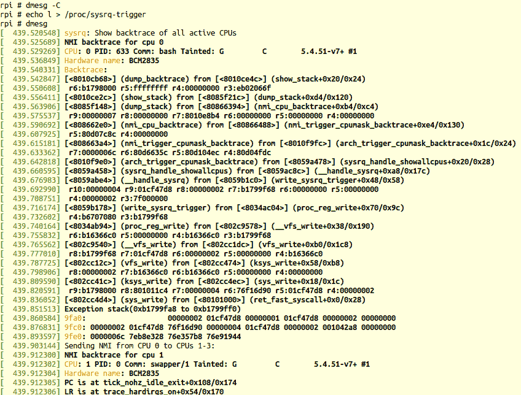

图 4.7 - 发送 NMI 到所有 CPU 时的输出，显示每个 CPU 的内核堆栈回溯

在前面的屏幕截图中，您可以看到`bash` PID 633 正在 CPU `0`上运行，内核线程`swapper/1`正在 CPU `1`上运行（可以看到每个的内核堆栈；以自下而上的方式阅读）。

可以在`drivers/tty/sysrq.c`找到魔术 SysRq 设施的代码；浏览一下会很有趣。以下是在 x86 上触发魔术 SysRq `l`时发生的近似调用图：

```
include/linux/nmi.h:trigger_all_cpu_backtrace() arch_trigger_cpumask_backtrace()
    arch/x86/kernel/apic/hw_nmi.c:arch_trigger_cpumask_backtrace() 
    nmi_trigger_cpumask_backtrace()
```

最后一个函数实际上成为了通用的（非特定于架构）代码，位于`lib/nmi_backtrace.c:nmi_trigger_cpumask_backtrace()`。这里的代码通过向每个 CPU 发送 NMI 来触发 CPU 回溯。这是通过`nmi_cpu_backtrace()`函数实现的。这个函数反过来通过调用`show_regs()`或`dump_stack()`例程显示了我们在前面的屏幕截图中看到的信息，这些例程最终成为了特定于架构的代码，用于转储 CPU 寄存器以及内核模式堆栈。该代码还足够智能，不会尝试在处于低功耗（空闲）状态的 CPU 核心上显示回溯。 

在现实世界中，事情并不总是简单的；请参阅 Steven Rostedt 在 x86 NMI 上所面临的复杂问题以及它们是如何解决的这篇文章：*x86 NMI iret 问题*，2012 年 3 月：[`lwn.net/Articles/484932/`](https://lwn.net/Articles/484932/)。

到目前为止，我们实际上还没有看到分配的 IRQ 线的内核视图；接口自然是通过`procfs`文件系统；让我们深入研究一下。

# 查看所有分配的中断（IRQ）线

现在您已经了解了关于 IRQ 和中断处理的足够细节，我们可以（终于！）利用内核的`proc`文件系统，以便我们可以窥视当前分配的 IRQ。我们可以通过读取`/proc/interrupts`伪文件的内容来做到这一点。我们将展示一些屏幕截图：第一个（*图 4.8*）显示了在我的 Raspberry Pi ZeroW 上每个 CPU 每个 I/O 设备服务的中断数量的 IRQ 状态，而第二个（*图 4.9*）显示了我们“通常”的 x86_64 Ubuntu 18.04 VM 上的情况：

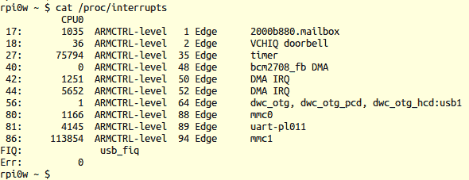

图 4.8 - Raspberry Pi ZeroW 上的 IRQ 状态

在前面的`/proc/interrupts`输出中，系统上的每个 IRQ 线（或记录）都会发出一行。让我们解释一下输出的每一列：

+   第一列是已分配的 IRQ 号码。

+   第二列（以后）显示了每个 CPU 核心已服务的硬中断数（从系统启动到现在）。该数字表示中断处理程序在该 CPU 核心上运行的次数（列数因正在处理系统上的 IRQ 的活动核心数而变化）。在前面的屏幕截图中，Raspberry Pi Zero 只有一个 CPU 核心，而我们的 x86_64 VM 有两个（虚拟化的）CPU 核心，中断分布和处理在这些核心上进行（在*负载平衡中断和 IRQ 亲和力*部分中有更多信息）。

+   第三（或更后面）列显示了中断控制器芯片。在 x86（*图 4.9*中的第四列），IO-APIC 表示中断控制器是一种增强型中断控制器，用于在多核系统上将中断分发到各个核心或 CPU 组（在高端系统上，可能会使用多个 IO-APIC）。

+   之后的列显示了正在使用的中断触发类型；即，电平触发或边沿触发（我们在*理解电平触发和边沿触发中断*部分中讨论过这一点）。在这里，`Edge`告诉我们 IRQ 是边沿触发的。它前面的数字（例如，在前面的屏幕截图中的`35 Edge`）非常依赖于系统。它通常代表中断源（内核将其映射到 IRQ 线；许多嵌入式设备驱动程序通常使用 GPIO 引脚作为中断源）。最好不要尝试解释它（除非您确实知道如何），而只依赖于 IRQ 号码（第一列）。

+   右侧的最后一列显示了 IRQ 线的当前所有者。通常，这是设备驱动程序或内核组件的名称（通过`*request_*irq()`API 之一分配了此 IRQ 线）。

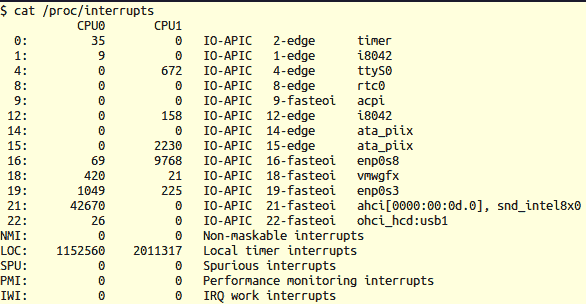

图 4.9 - x86_64 Ubuntu 18.04 VM 上的 IRQ 状态（截断屏幕截图）

从 2.6.24 内核开始，对于 x86 和 AMD64 系统（或 x86_64），即使是非设备（I/O）中断（系统中断）也会显示在这里，例如 NMI，**本地定时器中断**（**LOC**），PMI，IWI 等。您可以在*图 4.9*中看到，最后一行显示了`IWI`，这是**Inter-Work Interrupt**。

显示`/proc/interrupts`的前述输出的内核 procfs 代码 - 即其`show`方法 - 可以在`kernel/irq/proc.c:show_interrupts()`（链接：[`elixir.bootlin.com/linux/v5.4/source/kernel/irq/proc.c#L438`](https://elixir.bootlin.com/linux/v5.4/source/kernel/irq/proc.c#L438)）中找到。首先，它打印标题行，然后为每个 IRQ 行发出一行“记录”。统计数据主要来自每个 IRQ 行的元数据结构 - `struct irq_desc`；在每个 IRQ 中，它通过`for_each_online_cpu()`辅助例程循环遍历每个处理器核心，打印为每个处理器核心服务的 hardirqs 数量。最后（最后一列），它通过`struct irqaction`的`name`成员打印 IRQ 行的“所有者”。 x86 的特定于体系结构的中断（例如`NMI`，`LOC`，`PMI`和`IWI` IRQ）通过`arch/x86/kernel/irq.c:arch_show_interrupts()`中的代码显示。

在 x86 上，IRQ 0 始终是**定时器中断**。在伴随指南*Linux Kernel Programming -* *第十章* *CPU 调度器 - 第一部分*中，我们了解到，理论上，定时器中断每秒触发`HZ`次。实际上，为了效率，现在已经用每个 CPU 的周期性**高分辨率定时器**（**HRT**）替换；它显示为名为**LOC**（用于`/proc/interrupts`中的定时器中断的**LOCal**）的 IRQ。

这实际上解释了为什么`timer`行下的硬件定时器中断数量非常低；看看这个（在一个带有四个（虚拟）CPU 的 x86_64 客户端上）：

$ egrep "timer|LOC" /proc/interrupts ; sleep 1 ; egrep "timer|LOC" /proc/interrupts

` 0:       33          0          0          0  IO-APIC   2-edge      timer`

`LOC:      11038      11809      10058       8848  Local timer interrupts`

` 0:       33          0          0          0  IO-APIC   2-edge      timer`

`LOC:      11104      11844      10086       8889  Local timer interrupts`

`$`请注意 IRQ 0 不增加，但`LOC` IRQ 确实增加（每个 CPU 核心）。

`/proc/stat`伪文件还提供了有关每个 CPU 基础上利用服务中断和可以服务的中断数量的一些信息（有关更多详细信息，请参阅`proc(5)`的手册页）。

如*理解和使用上半部和下半部*部分详细解释的那样，softirqs 可以通过`/proc/softirqs`查看；稍后会详细介绍。

有了这些，您已经学会了如何查看分配的 IRQ 行。但是，中断处理的一个主要方面仍然存在：理解所谓的上半部/下半部二分法，为什么它们存在以及如何与它们一起工作。我们将在下一节中讨论这个问题。

# 理解和使用上半部和下半部

已经非常强调了您的中断处理程序必须**快速**完成其工作（如*保持快速*部分和其他地方所解释的）。话虽如此，实际上确实出现了一个实际问题。让我们考虑这种情况：您已经分配了 IRQn 并编写了中断处理程序函数来处理此中断。正如您可能记得的那样，我们在这里谈论的函数，通常称为**hardirq**或**ISR（中断服务例程）**或主处理程序，是`request_{threaded}_irq()`API 的第二个参数，`devm_request_irq()`API 的第三个参数，以及`devm_request_threaded_irq()`API 的第四个参数。

正如我们之前提到的，有一个快速的启发式法则要遵循：如果你的`hardirq`例程的处理一直超过 100 微秒，那么你需要使用替代策略。假设你的处理程序在这个时间内完成得很好；在这种情况下，就没有问题了！但如果它确实需要更多的时间呢？也许外设的低级规范要求在中断到达时你要做一些事情（比如有 10 个项目要完成）。你正确地编写了代码来做到这一点，但它几乎总是超过了时间限制（100 微秒作为一个经验法则）！那么，你该怎么办？一方面，有这些内核人员对你大声呼喊要**快点完成**；另一方面，外设的低级规范要求你按照几个关键步骤正确处理中断！（谈论处于两难境地！）

正如我们之前暗示的，这些情况下有两种广泛的策略。

+   使用线程中断来处理大部分工作；被认为是现代的方法。

+   使用“底半部”例程来处理大部分工作；传统的方法。

我们在“使用线程中断模型”部分详细介绍了线程中断的概念理解、实际用法和*为什么*。

+   所谓的**顶半部**是在硬件中断触发时最初调用的函数。这对你来说是很熟悉的 - 它只是通过`*request_*irq()`API 之一注册的**hardirq**、ISR 或主处理程序例程（为了清楚起见：通过这些 API 之一：`request_irq()` / `devm_request_irq()` / `request_threaded_irq()` / `devm_request_threaded_irq()`）。

+   我们还注册了一个所谓的**底半部**例程来执行大部分中断处理工作。

换句话说，中断处理被**分成两半** - 顶部和底部。然而，这并不是一个令人愉快的描述方式（因为英语单词“half”让你直觉地认为例程的大小大致相同）；实际情况更像是这样：

+   顶半部执行所需的最低限度的工作（通常是确认中断，也许在顶半部的持续时间内关闭板上的中断，然后执行任何（最小的）硬件特定工作，包括根据需要从/向设备接收/发送一些数据）。

+   底半部例程执行大部分中断处理工作。

那么，什么是底半部？它只是一个适当注册到内核的 C 函数。你应该使用的实际注册 API 取决于你打算使用的**底半部的类型**。有三种类型：

+   旧的**底半部**机制，现在已经被弃用；它被缩写为**BH**（你基本上可以忽略它）。

+   现代推荐的（如果你一开始就使用了这种上下半部技术）机制：**tasklet**。

+   底层内核机制：**softirq**。

你会发现 tasklet 实际上是建立在内核 softirq 之上的。

事实是：顶半部 - 我们一直在使用的`hardirq`处理程序 - 像我们之前提到的那样，只做最低限度的工作；然后“调度”它的底半部并退出（返回）。这里的“调度”并不意味着它调用`schedule()`，因为那太荒谬了（毕竟我们处于中断上下文中！）；这只是用来描述这个事实的词。内核将保证一旦顶半部完成，底半部将尽快运行；特别是，没有用户或内核线程会抢占它。

不过，等一下：即使我们做了这一切 - 将处理程序分成两个部分并让它们共同执行工作 - 那么我们节省了什么时间呢？毕竟，这原本就是最初的意图。现在执行完毕会不会花更长的时间，因为要调用两个函数而不是一个函数的开销呢？啊，这带我们来到一个非常关键的观点：**上半部分（硬中断）始终在当前 CPU 上以所有中断被禁用（屏蔽）的状态运行，并且它正在处理的 IRQ 在所有 CPU 上都被禁用（屏蔽）的状态下运行，但下半部分处理程序在所有中断被启用的状态下运行。**

请注意，下半部分仍然在原子或中断上下文中运行！因此，适用于硬中断（上半部分）处理程序的相同注意事项也适用于下半部分处理程序：

+   你不能传输数据（到或从用户内核空间）。

+   你只能使用`GFP_ATOMIC`标志分配内存（如果你真的必须）。

+   你不能直接或间接调用`schedule()`。

这个下半部分处理是所谓的内核*延迟功能*的一个子集；内核有几种这样的延迟功能机制：

+   工作队列（基于内核线程）；`context:process`

+   下半部分/任务 let（基于 softirqs）；`context:interrupt`

+   Softirqs；`context:interrupt`

+   内核定时器；`context:interrupt`

我们将在第五章中介绍内核定时器和工作队列，*使用内核定时器、线程和工作队列*。

所有这些机制都允许内核（或驱动程序）指定一些工作必须在以后进行（它是延迟的），在安全时才能执行。

到这一点，你应该能够理解我们已经讨论过的线程中断机制在某种程度上类似于延迟功能机制。这被认为是现代的使用方法；尽管对于大多数外围设备来说性能是可以接受的，但一些设备类别 - 通常是网络/块/多媒体 - 仍可能需要传统的上半部分和下半部分机制来提供足够高的性能。此外，我们再次强调：上半部分和下半部分始终在原子（中断）上下文中运行，而线程处理程序实际上在进程上下文中运行；你可以将这视为优势或劣势。事实上，尽管线程处理程序在技术上处于进程上下文中，但最好在其中执行快速的非阻塞操作。

## 指定和使用任务 let

任务 let 和内核的 softirq 机制之间的一个关键区别是，任务 let 更容易使用，这使它成为典型驱动程序的不错选择。当然，如果可以使用线程处理程序，那就直接使用；稍后，我们将展示一张表，帮助你决定何时使用何种方法。任务 let 更容易使用的一个关键因素是（在 SMP 系统上）特定的任务 let 永远不会并行运行；换句话说，给定的任务 let 将一次只在一个 CPU 上运行（使其与自身不并发，或串行化）。

`linux/interrupt.h`中的头部注释给出了任务 let 的一些重要属性：

```
[...] Properties:
   * If tasklet_schedule() is called, then tasklet is guaranteed
     to be executed on some cpu at least once after this.
   * If the tasklet is already scheduled, but its execution is still not
     started, it will be executed only once.
   * If this tasklet is already running on another CPU (or schedule is 
     called from tasklet itself), it is rescheduled for later.
   * Tasklet is strictly serialized wrt itself, but not
     wrt another tasklets. If client needs some intertask synchronization,
     he makes it with spinlocks. [...]
```

我们将很快展示`tasklet_schedule()`函数。前面评论块中的最后一点将在本书的最后两章中涵盖。

那么，我们如何使用任务 let 呢？首先，我们必须使用`tasklet_init()`API 进行设置；然后，我们必须安排它执行。让我们学习如何做到这一点。

### 初始化任务 let

`tasklet_init()`函数初始化一个任务 let；其签名如下：

```
#include <linux/interrupt.h>
void tasklet_init(struct tasklet_struct *t, void (*func)(unsigned long), unsigned long data);
```

让我们检查它的参数：

+   `struct tasklet_struct *t`：这个结构是表示任务 let 的元数据。正如你已经知道的，一个指针本身没有内存！记得为数据结构分配内存，然后将指针传递到这里。

+   `void (*func)(unsigned long)`：这就是 tasklet 函数本身 - **“底半部分”**，一旦硬中断完成就会运行；这个底半部分函数执行大部分中断处理过程。

+   `unsigned long data`：任何你希望传递给 tasklet 例程的数据项（一个 cookie）。

这个初始化工作应该在哪里执行？通常，这是在驱动程序的*probe*（或`init`）函数中完成的。所以，现在它已经初始化并准备就绪，我们该如何调用它呢？让我们找出来。

### 运行 tasklet

Tasklet 是底半部分。因此，在顶半部分，也就是你的硬中断处理程序例程中，你应该在返回之前做的最后一件事是“安排”你的 tasklet 执行：

```
void tasklet_schedule(struct tasklet_struct *t);
```

只需将指向你（初始化的）tasklet 结构的指针传递给`tasklet_schedule()` API；内核会处理剩下的事情。内核做了什么？它安排这个 tasklet 执行；实际上，你的 tasklet 函数代码保证在控制返回到首先被中断的任务之前运行（无论是用户还是内核线程）。更多细节可以在*理解内核如何运行 softirqs*部分找到。

关于 tasklet，有一些事情你需要明确：

+   Tasklet 在中断（原子）上下文中执行它的代码；实际上它是一个 softirq 上下文。所以，请记住，所有适用于顶半部分的限制在这里也适用！（查看*中断上下文指南 - 做什么和不做什么*部分，了解有关限制的详细信息）

+   同步（在 SMP 框架上）：

+   给定的 tasklet 永远不会与自身并行运行。

+   不同的 tasklet *可以*在不同的 CPU 核心上并行运行。

+   你的 tasklet 本身可能会被硬中断打断，包括你自己的 IRQ！这是因为 tasklet 默认情况下在本地核心上以所有中断启用的状态运行，当然，硬中断在系统上是最高优先级的。

+   锁定影响真的很重要 - 我们将在本书的最后两章中详细介绍这些领域（特别是当我们涵盖*自旋锁*时）。

一些（通用驱动程序）示例代码如下（为了清晰起见，我们避免显示任何错误路径）：

```
#include <"convenient.h">               // has the PRINT_CTX() macro
static struct tasklet_struct *ts;
[...]
static int __init mydriver_init(void)
{
    struct device *dev;
    [...]
    /* Register the device with the kernel 'misc' driver framework */
    ret = misc_register(&keylog_miscdev);
    dev = keylog_miscdev.this_device;

    ts = devm_kzalloc(dev, sizeof(struct tasklet_struct), GFP_KERNEL);
    tasklet_init(ts, mydrv_tasklet, 0);

    ret = devm_request_irq(dev, MYDRV_IRQ, my_hardirq_handler,
                    IRQF_SHARED, OURMODNAME, THIS_MODULE);
    [...]
```

在前面的代码片段中，我们声明了一个全局指针`ts`，指向`struct tasklet_struct`；在驱动程序的`init`代码中，我们将驱动程序注册为属于`misc`内核框架。接下来，我们通过有用的`devm_kzalloc()` API 为 tasklet 结构分配了 RAM。然后，我们通过`tasklet_init()` API 初始化了 tasklet。请注意，我们指定了函数名（第二个参数），并简单地传递了`0`作为第三个参数，这是要传递的 cookie（许多真实的驱动程序在这里传递它们的上下文/私有数据结构指针）。然后，我们通过`devm_request_irq()` API 分配了一个 IRQ 线。

让我们继续看一下这个通用驱动程序的代码：

```
/ * Our 'bottom half' tasklet routine */
static void mydrv_tasklet(unsigned long data)
{
    PRINT_CTX();   // from our convenient.h header
    process_it();  // majority of the interrupt work done here
}

/* Our 'hardirq' interrupt handler routine - our 'top half' */
static irqreturn_t my_hardirq_handler(int irq, void *data)
{
    /* minimal work: ack/disable hardirq, fetch and/or queue data, etc ... */
 tasklet_schedule(ts);
    return IRQ_HANDLED;
}
```

在前面的代码中，让我们想象我们在顶半部分（`my_hardirq_handler()`函数）中做了所需的最小工作。然后我们启动了我们的 tasklet，以便通过调用`tasklet_schedule()` API 来运行。你会发现 tasklet 几乎会在硬中断之后立即运行（在前面的代码中，tasklet 函数被称为`mydrv_tasklet()`）。在 tasklet 中，你应该执行大部分中断处理工作。在其中，我们调用了我们的宏`PRINT_CTX()`；正如你将在*完全弄清上下文*部分中看到的，它打印了关于我们当前上下文的各种细节，这对于调试/学习很有帮助（你会发现它显示了，除其他事项外，我们当前正在中断上下文中运行）。

除了`tasklet_schedule()`API，你可以通过`tasklet_hi_schedule()`API 使用一个替代例程。这在内部使 tasklet 成为*最高优先级的 softirq*（softirq 优先级`0`）！（更多信息可以在*理解内核 softirq 机制*部分找到。）请注意，这几乎从不会发生；tasklet 享有的默认（softirq）优先级通常是足够的。将其设置为`hi`级别实际上只是为极端情况而设计的；尽可能避免它。

在 Linux 5.4.0 版本中，有 70 多个实例使用了`tasklet_hi_schedule()`函数。这些驱动程序通常是高性能网络驱动程序-一些 GPU、加密、USB 和 mmc 驱动程序，以及其他一些驱动程序。

当涉及到 tasklets 时，内核不断发展。最近（截至 2020 年 7 月）由*Kees Cook*和其他人提出的补丁旨在现代化 tasklet 例程（回调）。有关更多信息，请访问[`www.openwall.com/lists/kernel-hardening/2020/07/16/1`](https://www.openwall.com/lists/kernel-hardening/2020/07/16/1)。

## 理解内核 softirq 机制

在这一点上，你了解到底部的一半，tasklet，是一个延迟功能机制，而运行时不会屏蔽中断。它们被设计成让你同时获得最好的两个世界：如果情况需要，它们允许驱动程序进行相当长时间的中断处理*并且*以延迟安全的方式进行，同时允许系统的业务（通过硬件中断）继续进行。

你已经学会了如何使用 tasklet-它是延迟功能机制的一个很好的例子。但它们是如何内部实现的呢？内核通过一个称为**softirq**（或**软件中断**）机制的基础设施来实现 tasklets。虽然在表面上它们类似于我们之前看到的线程中断，但在许多重要方面它们实际上是非常不同的。下面 softirqs 的特征将帮助你理解它们：

+   Softirqs 是一个纯粹的内核延迟功能机制，因为它们在内核编译时静态分配（它们都是硬编码到内核中的）；你不能动态创建一个新的 softirq。

+   内核（截至 5.4 版本）提供了总共 10 个离散的 softirqs：

+   每个 softirq 都设计为满足特定的需求，通常与特定的硬件中断或内核活动相关联。（这里的例外可能是保留给通用 tasklet 的 soft IRQs：`HI_SOFTIRQ`和`TASKLET_SOFTIRQ`。）

+   这 10 个 softirqs 有一个优先级排序（并且将按照该顺序被消耗）。

+   任务是，实际上，一个薄的抽象在一个特定的 softirq（`TASKLET_SOFTIRQ`）之上，其中有 10 个可用的。任务是唯一一个可以随意注册、运行和注销的，这使它成为许多设备驱动程序的理想选择。

+   Softirqs 在中断-softirq-上下文中运行；`in_softirq()`宏在这里返回`true`，意味着你在 softirq（或 tasklet）上下文中。

+   所有 softirq 服务都被认为是系统上的高优先级。在硬件中断（`hardirq/ISR/primary`处理程序）之后，softirq 在系统上具有最高优先级。未决的 softirqs 在内核恢复首先中断的进程上下文之前被消耗。

以下图表是我们之前对标准 Linux 优先级的描述的超集；这个包括 softirqs（其中包括 tasklet）：

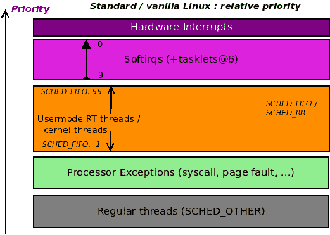

图 4.10-标准 Linux 上的相对优先级，显示 softirqs

所以，是的，正如你所看到的，softirqs 是 Linux 上一个非常高优先级的机制；有 10 个不同的优先级。它们是什么，以及它们的用途，将在下一小节中介绍。

### 可用的 softirqs 及其用途

由给定 softirq 执行的工作被静态编译到内核映像中（它是固定的）。通过以下代码完成了 softirq 和它采取的行动（实际上是通过`action`函数指针运行的代码）的耦合：

```
// kernel/softirq.c
void open_softirq(int nr, void (*action)(struct softirq_action *)) 
{
    softirq_vec[nr].action = action;
}
```

以下图表是 Linux 上可用的 softirqs 及其优先级级别的概念表示（截至内核版本 5.4），其中`0`为最高，`9`为最低的 softirq 优先级级别：

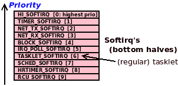

图 4.11 - Linux 上的 10 个 softirq 按优先级顺序排列（0：最高，9：最低）

以下表格总结了各个内核的 softirq 按其优先级的顺序（`0`：`HI_SOFTIRQ`为最高优先级），以及其功能、用途的动作或向量和注释：

| **Softirq#** | **Softirq** | **注释（用途/功能）** | **“action”或“vector”函数** |
| --- | --- | --- | --- |
| `0` | `HI_SOFTIRQ` | **Hi-tasklet**：最高优先级的 softirq；在调用`tasklet_hi_schedule()`时使用。不建议大多数用例使用。请改用常规 tasklet（softirq #`6`）。 | `tasklet_hi_action()` |
| `1` | `TIMER_SOFTIRQ` | **Timer**：定时器中断的底半部分运行已过期的定时器以及其他“日常”任务（包括调度器 CPU `runqueue` + `vruntime`更新，增加已知的`jiffies_64`变量等）。 | `run_timer_softirq()` |
| `2` | `NET_TX_SOFTIRQ` | **Net**：网络堆栈传输路径底部（qdisc）。 | `net_tx_action()` |
| `3` | `NET_RX_SOFTIRQ` | **Net**：网络堆栈接收路径底部（NAPI 轮询）。 | `net_rx_action()` |
| `4` | `BLOCK_SOFTIRQ` | **Block**：块处理（完成 I/O 操作；调用块 MQ 的`complete`函数，`blk_mq_ops`）。 | `blk_done_softirq()` |
| `5` | `IRQ_POLL_SOFTIRQ` | **irqpoll**：实现内核的块层轮询中断模式（相当于网络层的 NAPI 处理）。 | `irq_poll_softirq()` |
| `6` | `TASKLET_SOFTIRQ` | **常规 tasklet**：实现 tasklet 底部机制，唯一的动态（灵活）softirq：可以由驱动程序根据需要注册、使用和注销。 | `tasklet_action()` |
| `7` | `SCHED_SOFTIRQ` | **sched**：由 SMP 上的 CFS 调度器用于周期性负载平衡；如果需要，将任务迁移到其他运行队列。 | `run_rebalance_domains()` |
| `8` | `HRTIMER_SOFTIRQ` | **HRT**：用于**高分辨率定时器**（**HRT**）。在 4.2 版本中被移除，并在 4.16 版本中以更好的形式重新进入内核。 | `hrtimer_run_softirq()` |
| `9` | `RCU_SOFTIRQ` | **RCU**：执行**读复制更新**（**RCU**）处理，一种在核心内核中使用的无锁技术。 | `rcu_core_si() / rcu_process_callbacks()` |

这很有趣；网络和块堆栈是非常高优先级的代码路径（定时器中断也是），因此它们的代码必须尽快运行。因此，它们有明确的 softirqs 来服务这些关键代码路径。

我们能看到迄今为止已经触发的 softirqs 吗？当然，就像我们可以查看硬中断一样（通过其`proc/interrupts`伪文件）。我们有`/proc/softirqs`伪文件来跟踪 softirqs。这是我本地（四核）x86_64 Ubuntu 系统的一个示例截图：

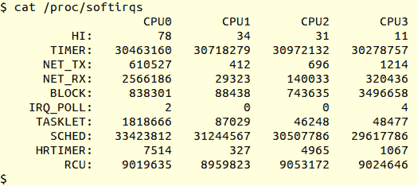

图 4.12 - 本地 x86_64 系统上/proc/softirqs 的输出，有 4 个 CPU 核心

就像`/proc/interrupts`一样，前面截图中显示的数字表示从系统启动以来在特定 CPU 核心上发生特定 softirq 的次数。另外，值得一提的是，强大的`crash`工具有一个有用的命令，`irq`，显示关于中断的信息；`irq -b`显示内核上定义的 softirqs。

### 了解内核如何运行 softirqs

以下是在 x86 触发硬件中断时使用的（近似）调用图：

```
do_IRQ() -> handle_irq() -> entering_irq() -> hardirq top-half runs -> exiting_irq() -> irq_exit() -> invoke_softirq() -> do_softirq() -> ... bottom half runs: tasklet/softirq ... -> restore context
```

前面的一些代码路径是与体系结构相关的。请注意，“标记上下文为中断”上下文实际上是一个人为的产物。内核被标记为进入这个上下文在`entering_irq()`函数中，并且一旦`exiting_irq()`返回（在 x86 上），它就被标记为离开。但是等等！`exiting_irq()`内联函数调用`kernel/softirq.c:irq_exit()`函数（[`elixir.bootlin.com/linux/v5.4/source/kernel/softirq.c#`](https://elixir.bootlin.com/linux/v5.4/source/kernel/softirq.c#L403)[L403](https://elixir.bootlin.com/linux/v5.4/source/kernel/softirq.c#L403)）。在这个例程中，内核处理并消耗所有待处理的 softirq。从`do_softirq()`开始的基本调用图如下：

```
   do_softirq() --  [assembly]do_softirq_own_stack -- __do_softirq()
```

真正的工作发生在内部的`__do_softirq()`例程中（[`elixir.bootlin.com/linux/v5.4/source/kernel/softirq.c#L249`](https://elixir.bootlin.com/linux/v5.4/source/kernel/softirq.c#L249)）。在这里，任何待处理的 softirq 按优先级顺序被消耗。请注意，在上下文恢复到中断任务之前，softirq 处理是在之前完成的。

现在，让我们简要关注一些 tasklet 执行的内部细节，然后是如何使用 ksoftirqd 内核线程来卸载 softirq 工作。

#### 运行 tasklets

关于 tasklet 调用的内部工作：我们知道 tasklet softirq 通过`tasklet_schedule()`运行。这个 API 最终会调用内核的内部`__tasklet_schedule_common()`函数（[`elixir.bootlin.com/linux/v5.4/source/kernel/softirq.c#L471`](https://elixir.bootlin.com/linux/v5.4/source/kernel/softirq.c#L471)），它内部调用`raise_softirq_irqoff(softirq_nr)`（[`elixir.bootlin.com/linux/v5.4/source/kernel/softirq.c#L423`](https://elixir.bootlin.com/linux/v5.4/source/kernel/softirq.c#L423)）。这会触发`softirq_nr` softirq；对于常规 tasklet，这个值是`TASKLET_SOFTIRQ`，而当通过`tasklet_hi_schedule()`API 调度 tasklet 时，这个值是`HI_SOFTIRQ`，最高优先级的 softirq！很少使用，如果有的话。

我们现在知道，“schedule”功能已经设置了 softirq；在这里，实际的执行发生在 softirq 在该优先级级别（这里是`0`或`6`）实际运行时。运行 softirq 的函数称为`do_softirq()`；对于常规的 tasklet，它最终会调用`tasklet_action()` softirq 向量（如前表所示）；这将调用`tasklet_action_common()`（[`elixir.bootlin.com/linux/v5.4/source/kernel/softirq.c#L501`](https://elixir.bootlin.com/linux/v5.4/source/kernel/softirq.c#L501)），然后（经过一些列表设置）启用硬件中断（通过`local_irq_enable()`），然后循环遍历每个 CPU 的 tasklet 列表，运行其中的 tasklet 函数。你注意到这里提到的几乎所有函数都是与体系结构无关的吗？- 这是一件好事。

#### 使用 ksoftirqd 内核线程

当有大量 softirq 等待处理时，softirq 会对系统施加巨大负载。这在网络（以及在某种程度上，块）层中反复出现，导致了轮询模式 IRQ 处理的开发；对于网络（接收）路径，称为 NAPI，对于块层，称为中断轮询处理。但是，即使使用了轮询模式处理，softirq 洪水仍然持续存在怎么办？内核还有一个更加巧妙的方法：如果 softirq 处理超过 2 毫秒，内核会将待处理的 softirq 工作卸载到每个 CPU 内核线程上，命名为`ksoftirqd/n`（其中`n`表示 CPU 编号，从`0`开始）。这种方法的好处是，因为内核线程必须与其他线程竞争 CPU 资源，用户空间不会完全被耗尽 CPU（这可能会发生在纯硬中断/软中断负载中）。

这听起来像是一个好的解决方案，但现实世界并不这么认为。2019 年 2 月，一系列设置软中断向量细粒度屏蔽的补丁看起来很有希望，但最终似乎已经消失了（请阅读*进一步阅读*部分提供的非常有趣的细节）。Linus Torvalds 的以下电子邮件很好地澄清了真正的问题（[`lore.kernel.org/lkml/CAHk-=wgOZuGZaVOOiC=drG6ykVkOGk8RRXZ_CrPBMXHKjTg0dg@mail.gmail.com/#t`](https://lore.kernel.org/lkml/CAHk-=wgOZuGZaVOOiC=drG6ykVkOGk8RRXZ_CrPBMXHKjTg0dg@mail.gmail.com/#t)）：

```
... Note that this is all really fairly independent of the whole masking
logic. Yes, the masking logic comes into play too (allowing you to run
a subset of softirq's at a time), but on the whole the complaints I've
seen have not been "the networking softirq takes so long that it
delays USB tasklet handling", but they have been along the lines of
"the networking softirq gets invoked so often that it then floods the
system and triggers [k]softirqd, and _that_ then makes tasklet handling
latency go up insanely ..."
```

陈述的最后部分正中要害。

因此，问题是：我们能够*测量*硬中断/软中断实例和延迟吗？我们将在*测量指标和延迟*部分进行介绍。

### 软中断和并发

就像我们在任务 let 方面学到的那样，必须了解关于*并发*的一些要点，关于软中断：

+   正如在任务 let（在 SMP 上）中指出的，任务 let 永远不会与自身并行运行；这是一个使其更容易使用的特性。这对软中断并不成立：同一个软中断向量确实可以在另一个 CPU 上与自身并行运行！因此，软中断向量代码在使用锁定（和避免死锁）时必须特别小心。

+   软中断总是可以被硬中断中断，包括引发它被提出的 IRQ（这是因为，与任务 let 一样，软中断在本地核心上以所有中断启用运行）。

+   一个软中断不能抢占另一个当前正在执行的软中断，即使它们有优先级；它们按优先顺序消耗。

+   事实上，内核提供了诸如`spin_lock_bh()`这样的 API，允许您在持有锁时禁用软中断处理。这是为了防止当硬中断和软中断处理程序都在处理共享数据时发生死锁。锁定的影响确实很重要。我们将在本书的最后两章中详细介绍这一点。

## 硬中断、任务 let 和线程处理程序——在何时使用

正如您已经知道的，硬中断代码旨在进行最少的设置和中断处理，将大部分中断处理留给通过我们一直在谈论的安全方式执行的延迟功能机制，即任务 let 和/或软中断。这个“下半部分”以及延迟功能处理按优先顺序进行——首先是软中断内核定时器，然后是任务 let（这两者只是基础软中断机制的特殊情况），然后是线程中断，最后是工作队列（后两者使用基础内核线程）。

因此，重要的问题是，在编写驱动程序时，您应该使用这些中的哪一个？是否根本应该使用延迟机制？这实际上取决于**您的完整中断处理所需的时间**。如果您的完整中断处理可以在几微秒内始终完成，那么只需使用上半部分硬中断；不需要其他。

但如果情况并非如此呢？看一下下表；第一列指定了完成中断处理所需的总时间，而其他列提供了一些建议以及利弊：

| **时间：如果硬件中断处理** **需要一致** | **该怎么办** | **利/弊** |
| --- | --- | --- |
| <= 10 微秒 | 仅使用硬中断（上半部分）；不需要其他。 | 最佳情况；不太典型。 |
| 10 到 100 微秒之间 | 仅使用硬中断或硬中断和任务 let（软中断）。 | 运行压力测试/工作负载，看看是否真的需要任务 let。在使用上，它略有不鼓励，而更倾向于线程处理程序或工作队列。 |
| 100 微秒，非关键设备 | 使用主处理程序（hardirq）；也就是说，要么使用自己的处理程序函数（如果需要特定于硬件的工作），要么简单地使用内核默认值和*线程化*处理程序。或者，如果可以接受，只需使用*工作队列*（在下一章中介绍）。 | 这避免了 softirq 处理，有助于减少系统延迟，但可能导致处理速度稍慢。这是因为线程化处理程序与其他线程竞争 CPU 时间。工作队列也是基于内核线程并具有类似特性。 |
| 100 微秒，关键设备（通常是网络、块和一些多媒体设备） | 使用主处理程序（hardirq/top half）和一个 tasklet（bottom half）。 | 当大量中断到达时，它优先处理设备。这也是一个缺点，因为这可能导致"活锁"问题和软中断的长延迟！测试并确定。 |
| 100 微秒，极其关键的工作/设备 | 使用主处理程序（hardirq/top half）和一个 hi-tasklet 或（可能）自己的（新！）softirq。 | 这是一个相当极端的，不太可能的情况；要添加自己的 softirq，您需要更改内部（GPL 许可的）内核代码。这使得它需要高维护（除非您的核心内核更改+驱动程序被贡献上游！）。 |

第一列中的微秒时间当然是有争议的，取决于架构和板卡，并且随着时间的推移可能会发生变化。100 微秒作为基线的建议值仅仅是一种启发式方法。

正如我们已经提到的，softirq 处理本身应该在几百微秒内完成；大量未处理的 softirq 可能再次导致活锁情况。内核通过两种方式来减轻（或降低）这种情况：

+   线程化中断或工作队列（都基于内核线程）

+   调用`ksoftirqd/n`内核线程来接管 softirq 处理。

前面的情况在*进程*上下文中运行，因此减轻了通过调度程序使真正（用户空间）线程饥饿的问题（因为内核线程本身必须竞争 CPU 资源）。

关于前表的最后一行，创建新的 softirq 的唯一方法是实际进入内核代码并对其进行修改。这意味着修改（GPL 许可的）内核代码库。在嵌入式项目方面，修改内核源代码并不罕见。然而，添加 softirq 被认为是（非常）罕见的，而且根本不是一个好主意，因为延迟可能已经很高，而不需要更多的 softirq 处理！这已经很多年没有发生了。

在实时性和确定性方面，在伴随指南*Linux 内核编程*的*第十一章* *CPU 调度器-第二部分*中，在*查看结果*部分，我们提到在运行标准 Linux 的微处理器上，中断处理的*抖动*（时间变化）大约为+/- 10 微秒。使用 RTL 内核会好很多，但并非百分之百确定性。那么，在 Linux 上处理中断时可以完全确定吗？一个有趣的方法是使用-如果启用并且可能-**FIQs**，即一些处理器（尤其是 ARM）提供的所谓*快速中断*机制。它们在 Linux 内核范围之外工作，这正是为什么编写 FIQ 中断处理程序会消除任何内核引起的抖动。点击此处查看更多信息：[`bootlin.com/blog/fiq-handlers-in-the-arm-linux-kernel/`](https://bootlin.com/blog/fiq-handlers-in-the-arm-linux-kernel/)。

最后，可能值得一提的是（在撰写本文时）这里正在进行大量的反思：一些内核开发人员的观点是，整个上半部分下半部分机制不再需要。然而，事实是这种机制已经深深嵌入到内核结构中，使得它不容易移除。

## 完全弄清上下文

*中断上下文指南 - 要做什么和不要做什么*部分明确指出：当您处于任何类型的中断（或原子）上下文中时，不要调用任何可能会阻塞的 API（最终调用`schedule()`）；这实际上归结为几个关键点（正如我们所看到的）。其中一个是您不应进行任何内核到用户空间（或反之）的数据传输；另一个是，如果必须分配内存，请使用`GFP_ATOMIC`标志。

当然，这引出了一个问题：**我怎么知道我的驱动程序（或模块）代码当前是在进程还是中断（原子）上下文中运行？**此外，如果它在中断上下文中运行，它是在顶半部还是底半部？对所有这些的简短回答是内核提供了几个宏，您可以使用这些宏来弄清楚这一点。这些宏在`linux/preempt.h`头文件中定义。我们将在这里显示相关的内核注释头，而不是不必要地重复信息；它清楚地命名和描述了这些宏：

```
// include/linux/preempt.h[...]/*
 * Are we doing bottom half or hardware interrupt processing?
 *
 * in_irq()       - We're in (hard) IRQ context
 * in_softirq()   - We have BH disabled, or are processing softirqs
 * in_interrupt() - We're in NMI,IRQ,SoftIRQ context or have BH disabled
 * in_serving_softirq() - We're in softirq context
 * in_nmi()       - We're in NMI context
 * in_task()      - We're in task context
 [...]
```

我们在配套指南*Linux Kernel Programming*的*第六章* *Kernel Internals Essentials – Processes and Threads*的*确定上下文*部分中涵盖了这个主题的一个子集。

因此，很简单；在我们的`convenient.h`头文件中（[`github.com/PacktPublishing/Linux-Kernel-Programming-Part-2/blob/main/convenient.h`](https://github.com/PacktPublishing/Linux-Kernel-Programming-Part-2/blob/main/convenient.h)），我们定义了一个方便的宏`PRINT_CTX()`，当调用时，将当前上下文打印到内核日志中。这条消息被非常有意地格式化。以下是调用时发出的典型输出的示例：

```
001)  rdwr_drv_secret :29141   |  .N.0   /* read_miscdrv_rdwr() */
```

起初，这种格式可能对您来说看起来很奇怪。但是，我只是遵循内核的`Ftrace（延迟）输出`格式来显示上下文（除了`DURATION`列；我们这里没有）。`Ftrace`输出格式得到了开发人员和内核用户的良好支持和理解。以下输出向您展示了如何解释它：

```
The Ftrace 'latency-format'
                                    _-----= irqs-off           [d]
                                   / _----= need-resched       [N]
                                  | / _---= hardirq/softirq    [H|h|s] [1]
                                  || / _--= preempt-depth      [#]
                                  ||| /
 CPU TASK              PID        ||||        FUNCTION CALLS
 |    |                 |         ||||         |   |   |   |
001)  rdwr_drv_secret :29141    | .N.0    /* read_miscdrv_rdwr() */

[1] 'h' = hard irq is running ; 'H' = hard irq occurred inside a softirq
```

这可能非常有用，因为它可以帮助您理解并因此调试困难的情况！您不仅可以看到正在运行的内容（其名称和 PID，以及在哪个 CPU 核心上），还可以看到四个有趣的列（用粗体突出显示（`.N.0`））。这四列的 ASCII 艺术视图实际上与`Ftrace`本身生成的完全相同。让我们解释一下这四列（在我们的示例中，它的值是`.N.0`）：

+   **列 1**：中断状态。如果中断已启用（通常情况下），则显示`.`，如果已禁用，则显示`d`。

+   **列 2**：`TIF_NEED_RESCHED`位状态。如果为`1`，内核将在下一个机会点调用`schedule()`（从系统调用返回或从中断返回，以先到者为准）。如果设置，则显示`N`，如果清除，则显示`.`。

+   **列 3**：如果我们处于中断上下文中，我们可以使用更多的宏来检查我们是否处于硬中断（顶半部）或软中断（底半部）上下文。它显示如下：

+   `.`：进程（任务）上下文

+   中断/原子上下文：

+   `h`：硬中断正在运行

+   `H`：在软中断内发生了硬中断（也就是说，在软中断执行时发生了硬中断，打断了它）

+   `s`：Softirq（或 tasklet）上下文

+   **列 4**：称为`preempt_depth`的整数值（来自位掩码）。基本上，每次获取锁时它都会增加，每次解锁时都会减少。因此，如果它是正数，那么意味着代码在关键或原子部分中。

以下是我们的`convenient.h:PRINT_CTX()`宏的代码实现（仔细研究代码，并在您的代码中使用该宏来理解它的用法）的一部分：

```
// convenient.h
[...]
#define PRINT_CTX() do {                                      \
  int PRINTCTX_SHOWHDR = 0;                                   \
  char intr = '.';                                            \
  if (!in_task()) {                                           \
      if (in_irq() && in_softirq())                           \
          intr = 'H'; /* hardirq occurred inside a softirq */ \
      else if (in_irq())                                      \
          intr = 'h'; /* hardirq is running */                \
      else if (in_softirq())                                  \
          intr = 's';                                         \
  }                                                           \
  else                                                        \
      intr = '.';                                             \
```

它基本上围绕`if`条件进行旋转，并通过`in_task()`宏检查代码是否处于进程（或任务）上下文中，从而处于中断（或原子）上下文中。

您可能已经在这样的情况下使用`in_interrupt()`宏。如果它返回`true`，则您的代码在中断上下文中，而如果返回`false`，则不在。然而，对于现代代码的建议是*不*依赖于这个宏（和`in_softirq()`），因为底半部禁用可能会干扰其正确工作。因此，我们使用`in_task()`代替。

让我们继续查看`PRINT_CTX()`宏的代码：

```
[...]
if (PRINTCTX_SHOWHDR == 1) \
    pr_debug("CPU) task_name:PID | irqs,need-resched,hard/softirq,preempt-depth /* func_name() */\n"); \
pr_debug( \
    "%03d) %c%s%c:%d | " \
    "%c%c%c%u " \
    "/* %s() */\n" \
    , smp_processor_id(), \
    (!current-mm?'[':' '), current-comm, (!current-mm?']':' '), current-pid, \
    (irqs_disabled()?'d':'.'), \
    (need_resched()?'N':'.'), \
    intr, \
    (preempt_count() && 0xff), __func__); \
} while (0)
```

如果`PRINTCTX_SHOWHDR`变量设置为`1`，它会打印一个标题行；默认情况下为`0`。这是宏发出（调试级别的）printk（通过`pr_debug()`）的地方，它以 Ftrace（延迟）格式显示上下文信息，就像前面的片段中看到的那样。

### 查看上下文 - 示例

例如，在我们的`ch1/miscdrv_rdwr`杂项驱动程序代码（实际上还有其他几个），我们使用了这个宏（`PRINT_CTX()`）来显示上下文。以下是我们的简单`rdwr_drv_secret`应用程序从驱动程序中读取“秘密消息”时的一些示例输出（为了清晰起见，我删除了`dmesg`的时间戳）：

```
CPU) task_name:PID | irqs,need-resched,hard/softirq,preempt-depth /* func_name() */
001)  rdwr_drv_secret :29141   |  .N.0   /* read_miscdrv_rdwr() */
```

标题行显示如何解释输出。（实际上，默认情况下这个标题行是关闭的。我暂时将`PRINTCTX_SHOWHDR`变量的值更改为`1`，以便在这里显示它。）

以下是另一个示例，来自一个（非内核）驱动程序，当运行（底半部）任务时的代码（我们在“理解和使用顶半部和底半部”部分中介绍了任务）：

```
000)  gnome-terminal- :3075   |  .Ns1   /* mydrv_tasklet() */
```

让我们更详细地解释前面的输出；从左到右：

+   `000)`：任务在 CPU 核心`0`上运行。

+   被中断的任务是 PID 为`3075`的`gnome-terminal*-*`进程。实际上，它可能是在这个任务完成之前被触发的硬中断打断的，并且只有在任务完成后才会恢复执行，最好的情况下。

+   我们可以从前面的四列输出（`.Ns1`部分）推断出以下内容：

+   `.`：所有中断（在本地核心，核心`#0`）都已启用。

+   `N`：`TIF_NEED_RESCHED`位被设置（意味着调度器代码将在下一个调度“机会点”被触发时运行；意识到它很可能会被（在进程上下文中）`gnome-terminal-`线程运行）。

+   `s`：任务是一个中断 - 更确切地说，是一个软中断上下文（确切地说，是`TASKLET_SOFTIRQ`软中断）；一个原子上下文；这是预期的 - 我们正在运行一个任务！

+   `1`：`preempt_depth`的值为`1`；这意味着当前正在持有（自旋）锁（再次，这意味着我们当前处于原子上下文中）。

+   在任务上下文中运行的驱动程序函数被称为`mydrv_tasklet()`。

通常，在中断上下文中查看这样的捕获时，被中断的任务会显示为`swapper/n`内核线程（其中`n`是 CPU 核心的编号）。这通常意味着`swapper/n`内核线程被硬中断打断，进一步意味着在该 CPU 处于空闲状态时触发了中断（因为`swapper/n`线程只在这时运行），这在轻负载系统上是一个相当常见的情况。

## Linux 如何优先处理活动

现在您已经了解了跨全范围的许多领域，我们可以放大看看 Linux 内核如何优先处理事情。以下（概念性）图表 - 之前类似图表的超集 - 很好地总结了这一点：

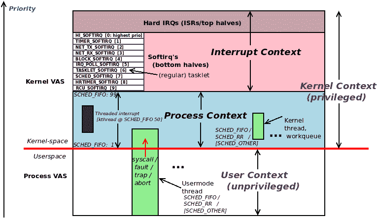

图 4.13 - 用户、内核进程上下文和内核中断上下文之间的相对优先级

这个图表非常直观，所以请仔细研究它。

在这一长篇章节中，您已经了解了通过上半部和下半部机制处理中断的原因以及它们的组织和驱动程序的使用方式。您现在了解到所有的下半部机制都是通过 softirqs 进行内部实现的；tasklet 是您作为驱动程序作者可以轻松访问的主要下半部机制。当然，这并不意味着您必须使用它们-如果您可以仅使用上半部，甚至更好的是只使用一个线程处理程序，那就太好了。*Hardirqs、tasklets 和线程处理程序-在何时使用*部分详细介绍了这些考虑因素。

几个常见问题已经回答完毕！然而，还有一些杂项领域需要探讨。让我们通过熟悉的*FAQ*格式来看看！

# 回答了一些剩下的常见问题

以下是关于硬件中断及其处理方式的一些常见问题。我们还没有涉及这些领域：

+   在多核系统上，所有硬件中断都路由到一个 CPU 吗？如果不是，它们如何进行负载平衡？我可以改变这个吗？

+   内核是否维护一个单独的 IRQ 堆栈？

+   我如何获得关于中断的指标？我能测量中断延迟吗？

这里的想法是提供简短的答案；我们鼓励您深入挖掘并自己尝试！重复一遍，记住，*经验法则是最好的！*

## 负载均衡中断和 IRQ 亲和性

首先，在多核（SMP）系统上，硬件中断路由到 CPU 核心的方式往往是与板和中断控制器特定的。话虽如此，Linux 上的通用 IRQ 层提供了一个非常有用的抽象：它允许（并实现）中断负载平衡，以便不会有 CPU（一组 CPU）过载。甚至还有前端实用程序`irqbalance(1)`和`irqbalance-ui(1)`，允许管理员（或 root 用户）执行 IRQ 平衡（`irqbalance-ui`是`irqbalance`的`ncurses`前端）。

您可以更改已发送到处理器核心的中断吗？是的，通过`/proc/irq/IRQ/smp_affinity`伪文件！这是一个指定允许将此 IRQ 路由到的 CPU 的位掩码。**问题是**默认设置总是允许所有 CPU 核心处理中断。例如，在一个有八个核心的系统上，IRQ 线的`smp_affinity`值将是`0xff`（二进制为`1111 1111`）。为什么这是个问题？**CPU 缓存**。简而言之，如果多个核心处理相同的中断，缓存会被破坏，因此可能会发生许多缓存失效（以保持内存与 CPU 缓存的一致性），导致各种性能问题；这在具有数十个核心和多个 NIC 的高端系统上尤其如此。

我们在第七章中更多地涵盖了 CPU 缓存问题，*内核同步-第二部分*中的*缓存效应和伪共享*部分。

建议您将单个重要的 IRQ 线（例如以太网中断）与特定的 CPU 核心（或者至多与一个支持超线程的物理核心）关联起来。不仅如此，将相关的网络应用程序进程和线程关联到同一个核心可能会带来更好的性能（我们在配套指南*Linux 内核编程*-*第十一章*-*CPU 调度器-第二部分*的*理解、查询和设置 CPU 亲和性掩码*部分中介绍了进程/线程 CPU 亲和性）。

让我们再讨论几个要点：

+   `/proc/interrupts`的输出将反映 IRQ 亲和性（和 IRQ 平衡），并允许您准确地看到系统上已经路由到哪个 CPU 核心的中断数量（我们在*查看所有分配的中断（IRQ）线*部分详细介绍了如何解释其输出）。

+   `irqbalance`服务实际上可能会导致问题，因为它会在启动时将 IRQ 亲和性设置恢复为默认值（[`unix.stackexchange.com/questions/68812/making-a-irq-smp-affinity-change-permanent`](https://unix.stackexchange.com/questions/68812/making-a-irq-smp-affinity-change-permanent)）；如果您仔细调整设置，可能需要禁用它（可能通过`rc.local`或等效的`systemd`脚本在启动时）。较新版本的`irqbalance`允许您禁止 IRQ 线并且不会（重新）设置它们。

## 内核是否维护单独的 IRQ 堆栈？

在*第六章*的*Linux 内核编程*伴随指南中，*内核内部和基本要点-进程和线程*，在*组织进程、线程及其堆栈-用户和内核空间*部分，我们涵盖了一些关键点：每个用户空间线程都有两个堆栈：一个用户空间堆栈和一个内核空间堆栈。当线程在非特权用户空间运行时，它使用用户模式堆栈，而当它切换到特权内核空间（通过系统调用或异常）时，它使用内核模式堆栈（参考*Linux 内核编程*伴随指南中的*图 6.3*）。接下来，内核模式堆栈非常有限且大小固定-它只有 2 或 4 页长（取决于您的架构是 32 位还是 64 位）！

因此，想象一下，您的驱动程序代码（比如说，`ioctl()`方法）正在一个深度嵌套的代码路径中运行。这意味着该进程上下文的内核模式堆栈已经装满了元数据-它正在调用的每个函数的堆栈帧。现在，硬件中断到达了！这也是必须运行的代码，因此需要一个堆栈。我们可以让它简单地使用已经在使用中的内核模式堆栈，*但*这会大大增加堆栈溢出的机会（因为我们嵌套很深并且堆栈很小）。内核中的堆栈溢出是灾难性的，因为系统将会无法启动/死机，而没有真正的线索指出根本原因（好吧，`CONFIG_VMAP_STACK`内核配置是为了减轻这种情况而引入的，并且在 x86_64 上默认设置）。

长话短说，在几乎所有现代架构上，内核为硬件中断处理分配了*每个 CPU 一个单独的内核空间堆栈*。这被称为**IRQ 堆栈**。当硬件中断到达时，堆栈位置（通过适当的 CPU 堆栈指针寄存器）被切换到正在处理中断的 CPU 的 IRQ 堆栈上（并在中断退出时恢复）。一些架构（PPC）有一个名为`CONFIG_IRQSTACKS`的内核配置来启用 IRQ 堆栈。IRQ 堆栈的大小是固定的，其值取决于架构。在 x86_64 上，它有 4 页长（16 KB，典型的 4K 页面大小）。

## 测量指标和延迟

我们已经在*Linux 内核编程*伴随指南的*第十一章*，*CPU 调度器-第二部分*，*延迟及其测量*部分，讨论了延迟是什么以及如何测量调度延迟。在这里，我们将看一下系统延迟及其测量的更多方面。

正如您已经知道的，`procfs`是一个丰富的信息源；我们已经看到每个 CPU 核心生成的硬中断和软中断的数量可以通过`/proc/interrupts`和`/proc/softirqs`（伪）文件查看。类似的信息也可以通过`/proc/stat`获得。

### 使用[e]BPF 测量中断

在配套指南*Linux Kernel Programming* - *Chapter 1*，*Kernel Workspace Setup*，在*Modern tracing and performance analysis with [e]BPF*部分，我们指出了在（最新的 4.x）Linux 上进行跟踪、性能测量和分析的现代方法是[e]BPF，即**增强型伯克利数据包过滤器**（也称为 BPF）。在其库存的众多工具中（[`github.com/iovisor/bcc#tools`](https://github.com/iovisor/bcc#tools)），有两个适合我们的即时目的，即跟踪、测量和分析中断（硬中断和软中断）。 （在 Ubuntu 上，这些工具的名称为`toolname-bpfcc`，其中`toolname`是所讨论工具的名称，例如`hardirqs-bpfcc`和`softirqs-bpfcc`）。这些工具动态跟踪中断（在撰写本文时，它们尚未基于内核跟踪点）。您需要 root 访问权限来运行这些[e]BPF 工具。

重要提示：您可以通过阅读[`github.com/iovisor/bcc/blob/master/INSTALL.md`](https://github.com/iovisor/bcc/blob/master/INSTALL.md)的安装说明，在您的常规主机 Linux 发行版上安装 BCC 工具。为什么不在我们的 Linux 虚拟机上进行呢？当您运行发行版内核（例如 Ubuntu 或 Fedora 提供的内核）时，您可以这样做。您之所以可以这样做，是因为 BCC 工具集的安装包括（并依赖于）`linux-headers-$(uname -r)`软件包的安装；这个`linux-headers`软件包仅适用于发行版内核（而不适用于您可能在虚拟机上运行的自定义 5.4 内核）。

#### 测量服务各个硬中断的时间

`hardirqs[-bpfcc]`工具显示了服务硬中断（硬件中断）的总时间。以下截图显示了我们运行`hardirqs-bpfcc`工具。在这里，您可以看到每秒服务硬中断的总时间（第一个参数）持续 3 秒（第二个参数）：

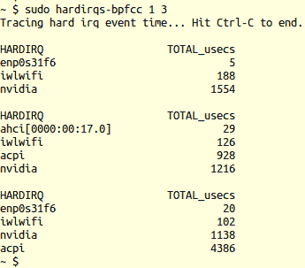

图 4.14 - hardirqs-bpfcc 显示了每秒服务硬中断的时间，持续 3 秒

以下截图显示了我们使用相同的工具生成硬中断时间分布的直方图（通过`-d`开关）：

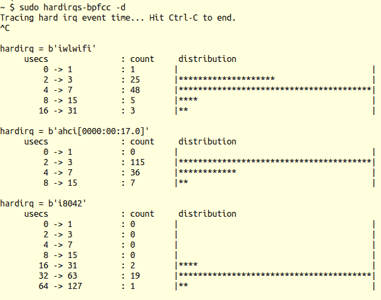

图 14.15 - hardirqs-bpfcc -d 显示直方图

注意大多数网络硬中断（`iwlwifi`，48 个）只需要 4 到 7 微秒完成，尽管其中一些（三个）需要 16 到 31 微秒。

您可以在[`github.com/iovisor/bcc/blob/master/tools/hardirqs_example.txt`](https://github.com/iovisor/bcc/blob/master/tools/hardirqs_example.txt)找到更多使用`hardirqs[-bpfcc]`工具的示例。查阅其手册页也会有益处。

#### 测量服务各个软中断的时间

与之前对硬中断的操作类似，我们现在将使用`softirqs[-bpfcc]`工具。它显示了服务软中断（软件中断）的总时间。同样，您需要 root 访问权限来运行这些[e]BPF 工具。

首先，让我们让我们的系统（运行 Ubuntu 的本机 x86_64）承受一些压力（在这里，它正在进行网络下载、网络上传和磁盘活动）。以下截图显示了我们运行`softirqs-bpfcc`工具，该工具提供了有关每秒服务软中断的总时间的信息（第一个参数）永久（没有第二个参数）：

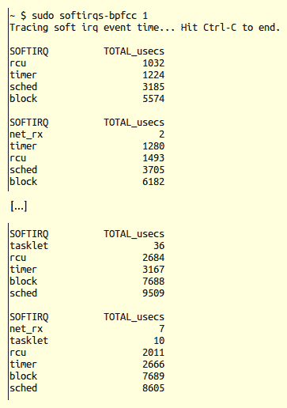

图 4.16 - softirqs-bpfcc 显示了在一些 I/O 压力下每秒服务软中断的时间

注意`tasklet`软中断也起作用。

让我们看另一个使用相同工具生成软中断时间分布的直方图的示例（再次使用系统在一些 I/O - 网络和磁盘 - 压力下，通过`-d`开关）。以下截图显示了运行`sudo softirqs-bpfcc -d`命令后得到的输出：

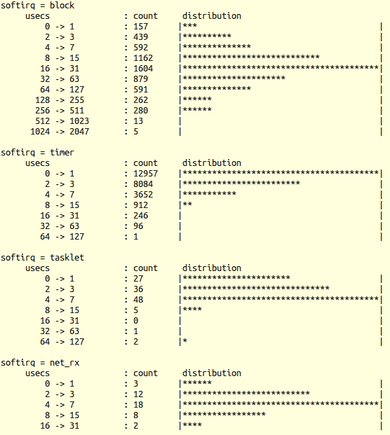

图 4.17 - softirqs-bpfcc -d 显示了一个直方图（在一些 I/O 压力下）

同样，在这个小样本集中，大多数`NET_RX_SOFTIRQ`实例只花费了 4 到 7 微秒，而大多数`BLOCK_SOFTIRQ`实例花费了 16 到 31 微秒来完成。

这些[e]BPF 工具也有手册页（包括示例）。我建议你在本地 Linux 系统上安装这些[e]BPF（参见伴随指南*Linux 内核编程*的*第一章*，*内核工作空间设置*，*使用[e]BPF 进行现代跟踪和性能分析*部分）。看一看，尝试一下这些工具。

### 使用 Ftrace 来掌握系统延迟

Linux 内核本身内置了一个非常强大的跟踪引擎，称为**Ftrace**。就像你可以通过（非常有用的）`strace(1)`（以及`ltrace(1)`）在用户空间跟踪系统调用和库 API 一样，你也可以通过 Ftrace 跟踪几乎在内核空间中运行的每个函数。不过，Ftrace 不仅仅是一个函数跟踪器 - 它是一个框架，是内核底层跟踪基础设施的关键。

Steven Rostedt 是 Ftrace 的原始作者。他的论文*使用 Ftrace 找到延迟的起源*非常值得一读。你可以在这里找到：[`static.lwn.net/images/conf/rtlws11/papers/proc/p02.pdf`](https://static.lwn.net/images/conf/rtlws11/papers/proc/p02.pdf)。

在本节中，我们不打算深入介绍如何使用 Ftrace，因为这并不是本主题的一部分。学习使用 Ftrace 并不困难，而且是你内核调试工具中的一件宝贵武器！如果你对此不熟悉，请阅读本章末尾的*进一步阅读*部分中我们提供的有关 Ftrace 的链接。

**延迟**是某事应该发生和实际发生之间的延迟（理论和实践之间的玩笑差异）。操作系统中的系统延迟可能是性能问题的潜在原因。其中包括中断和调度延迟。但是这些延迟的实际原因是什么？借鉴史蒂夫·罗斯特德之前提到的论文，有四个*事件*导致这些延迟：

+   **中断禁用**：如果中断关闭，中断在打开之前无法被服务（在这里，我们将专注于测量这个）。

+   **抢占禁用**：如果是这种情况，被唤醒的线程在抢占被启用之前无法运行。

+   **调度延迟**：线程被调度运行和实际在核心上运行之间的延迟（我们在伴随指南*Linux 内核编程*的*第十一章，CPU 调度器-第二部分*的*延迟及其测量*部分中介绍了如何测量这个延迟）。

+   **中断倒置**：当中断优先于具有更高优先级的任务运行时发生的延迟（类似于优先级倒置，这可能发生在硬实时系统中；当然，正如你所学到的，这正是为什么线程处理程序至关重要）。

Ftrace 可以记录除最后一个之外的所有事件。在这里，我们将专注于学习如何利用 Ftrace 找到（或者说采样）硬件中断被禁用的最坏情况时间。这被称为`irqsoff`延迟跟踪。让我们开始吧！

#### 使用 Ftrace 找到中断禁用的最坏情况时间延迟

Ftrace 有许多插件（或跟踪器）可以使用。首先，你需要确保内核中实际启用了`irqsoff`延迟跟踪器（或 Ftrace 的插件）。你可以通过两种不同的方式来检查：

+   检查内核配置文件（在其中使用`grep`查找`CONFIG_IRQSOFF_TRACER`）。

+   通过 Ftrace 基础设施检查可用的跟踪器（或插件）。

我们将选择后一种选项：

```
$ sudo cat /sys/kernel/debug/tracing/available_tracers
hwlat blk mmiotrace function_graph wakeup_dl wakeup_rt wakeup function nop
```

在前面的输出中，我们需要的`irqsoff`跟踪器缺失！这通常是情况，并意味着您需要配置内核（打开它）并（重新）构建您的自定义 5.4 内核。（这将作为本章末尾的*问题*部分的练习提供。）我们还建议您安装一个非常有用的 Ftrace 前端工具，称为`trace-cmd(1)`实用程序（我们在配套指南*Linux 内核编程*的*第一章*“内核工作空间设置”中提到了这个实用程序，并在*第十一章，CPU 调度器-第二部分*的*使用 trace-cmd 进行可视化*部分中使用了它）。

Lockdep 在这里可能会引起问题：如果启用了，最好在执行延迟跟踪时禁用内核的 lockdep 功能（它可能会增加太多开销）。我们将在第七章“内核同步-第二部分”中详细讨论 lockdep。

一旦启用了`CONFIG_IRQSOFF_TRACER`（并安装了`trace-cmd`），请按照以下步骤让 Ftrace 的延迟跟踪器找出**最坏情况的*中断关闭*延迟**。毋庸置疑，这些步骤必须以 root 身份执行：

1.  获取 root shell（您需要 root 权限来执行此操作）：

```
sudo /bin/bash
```

1.  重置 Ftrace 框架（可以使用`trace-cmd(1)`前端来完成）：

```
trace-cmd reset
```

1.  切换到 ftrace 的目录：

```
cd /sys/kernel/debug/tracing
```

通常可以在这里找到。如果您在不同目录下挂载了`debugfs`伪文件系统，请转到那里（并进入其中的`tracing`目录）。

1.  使用`echo 0 tracing_on`关闭所有跟踪（确保在`0`和`>`符号之间留有空格）。

1.  将`irqsoff`跟踪器设置为当前跟踪器：

```
echo irqsoff current_tracer
```

1.  现在，打开跟踪：

```
echo 1 tracing_on
 ... it runs! ... 
```

1.  以下输出显示了最坏情况的`irqsoff 延迟`（通常以微秒显示；不用担心，我们很快会展示一个示例运行）：

```
cat tracing_max_latency
[...]
```

1.  获取并阅读完整报告。所有 Ftrace 输出都保存在`trace`伪文件中：

```
cp trace /tmp/mytrc.txt
cat /tmp/mytrc.txt
```

1.  重置 Ftrace 框架：

```
trace-cmd reset
```

我们获得的输出将如下所示：

```
# cat /tmp/mytrc.txt
# tracer: irqsoff
#
# irqsoff latency trace v1.1.5 on 5.4.0-llkd01
# --------------------------------------------------------------------
# latency: 234 us, #53/53, CPU#1 | (M:desktop VP:0, KP:0, SP:0 HP:0 #P:2)
#    -----------------
#    | task: sshd-25311 (uid:1000 nice:0 policy:0 rt_prio:0)
#    -----------------
# = started at: schedule
# = ended at: finish_task_switch
[...]
```

在这里，最坏情况的`irqsoff`延迟为 234 微秒（在执行`sshd`任务的 PID 25311 时经历），这意味着硬件中断在此期间关闭。为了方便起见，我提供了一个简单的 Bash 脚本包装器（`ch4/irqsoff_latency_ftrc.sh`），可以完成相同的工作。

现在，我们将提到一些其他有用的工具，您可以用来测量系统延迟。

### 其他工具

以下是一些有关捕获和分析系统延迟（以及更多内容）的工具值得一提：

+   您可以学习如何设置和使用强大的**Linux 跟踪工具-下一代**（LTTng）工具集来记录系统运行时的跟踪。我强烈推荐使用出色的**Trace Compass** GUI 来进行分析。实际上，在配套指南*Linux 内核编程-第一章*“内核工作空间设置”中的*Linux 跟踪工具下一代（LTTng）*部分，我们展示了 Trace Compass GUI 用于显示和分析 IRQ 线 1 和 130 的有趣截图（分别是我的本机 x86_64 系统上 i8042 和 Wi-Fi 芯片的中断线）。

+   您还可以尝试使用`latencytop`工具来确定用户空间线程阻塞的内核操作。要执行此操作，您需要在内核配置中打开`CONFIG_LATENCYTOP`。

+   除了延迟度量，您还可以使用`dstat(1)`、`mpstat(1)`、`watch(1)`等工具来获得类似“top”的中断视图（[`unix.stackexchange.com/questions/8699/is-there-a-utility-that-interprets-proc-interrupts-data-in-time`](https://unix.stackexchange.com/questions/8699/is-there-a-utility-that-interprets-proc-interrupts-data-in-time)）。

至此，我们已经完成了本节和本章。

# 总结

恭喜！这一章很长，但很值得。你将学到很多关于如何处理硬件中断的知识。我们首先简要地了解了操作系统如何处理中断，然后学习了作为驱动程序作者，你必须如何处理它们。为此，你学会了通过几种方法分配 IRQ 线（和释放它们）并实现硬件中断例程。在这里，讨论了几个限制和注意事项，基本上归结为这是一个原子活动。然后，我们讨论了“线程中断”模型的方法和原因；它通常被认为是处理中断的现代推荐方式。之后，我们了解并学习了如何处理硬中断/软中断和顶部/底部。最后，我们以典型的 FAQ 风格，介绍了关于负载均衡中断、IRQ 堆栈以及如何使用一些有用的框架和工具来测量中断指标和延迟的信息。

所有这些对于工程一个良好编写的必须与硬件中断一起工作的驱动程序来说都是必要的知识！

下一章涵盖了与时间相关的工作领域：内核空间内的延迟和超时，创建和管理内核线程，以及使用内核工作队列。我建议你努力完成本章的练习，浏览*进一步阅读*部分的众多资源，然后休息一下（嘿，只工作不玩耍，聪明的孩子也变傻！）再继续深入！到时见！

# 问题

1.  在 x86 系统上（虚拟机也可以），显示定时器中断（IRQ `0`）的数量保持不变，另一个周期性系统中断实际上是不断增加的（因此在每个 CPU 上跟踪时间）。

*提示：* 使用与中断相关的`proc`伪文件。

1.  ***keylogger_simple；仅限本机 x86 [仅用于道德黑客攻击；可能无法在虚拟机上运行]***

（稍微高级一点）使用“misc”内核框架编写一个简单的键盘记录器驱动程序。将其陷入 i8042 的 IRQ 1 中，以便在键盘按下/释放时“捕获”它并读取键盘扫描码。使用`kfifo`数据结构将键盘扫描码保存在内核空间内存中。有一个用户模式进程（或线程）定期从驱动程序的`kfifo`中读取数据项到用户空间缓冲区，并将其写入日志文件。编写一个应用程序（或使用另一个线程）来解释键盘按键。

*提示：*

1.  你能确保它只在 x86 上运行（正如它应该的那样）吗？可以；在你的代码开头使用`#ifdef CONFIG_X86`！

1.  你能确保它只在本机系统上运行，而不是在虚拟机中吗？是的，你可以在包装脚本中使用`virt-what`脚本来加载驱动程序；只有在不在虚拟机上时才执行`insmod`（或`modprobe`）。

1.  编写驱动程序实际上是实现按键记录器的一种困难（而且相当不必要！）的方式（在这里，你只是为了学习而这样做，以便了解如何在设备驱动程序中处理硬件中断）。在更高级别的抽象层上工作实际上更简单更好 - 基本上是通过查询内核的`events`层来获取按键。你可以通过使用事件监视和捕获工具`evtest(1)`来实现这一点（以 root 身份运行；[`www.kernel.org/doc/html/latest/input/input_uapi.html`](https://www.kernel.org/doc/html/latest/input/input_uapi.html)）。

*此任务的参考资料：*

+   *使用内核 kfifo*：[`elixir.bootlin.com/linux/latest/source/samples/kfifo/bytestream-example.c`](https://elixir.bootlin.com/linux/latest/source/samples/kfifo/bytestream-example.c)

+   *美国键盘映射和解释*：[`www.philipstorr.id.au/pcbook/book3/scancode.htm`](http://www.philipstorr.id.au/pcbook/book3/scancode.htm)；[`www.osdever.net/bkerndev/Docs/keyboard.htm`](http://www.osdever.net/bkerndev/Docs/keyboard.htm)

1.  内核提供了通常称为 ______ 的“延迟功能”机制；它们被故意设计为兼顾最佳的两个方面：（i）__________ 和（ii）__________。

1.  顶半部分；尽快运行 hardirq；然后立即恢复中断上下文。

1.  底半部分；如果情况需要，允许驱动程序作者进行相当长时间的中断处理。在延迟的、安全的方式下进行，同时允许系统的业务继续进行。

1.  更好的一半；在中断上下文中做更多的工作，这样你就不必以后付出代价。

1.  底半部分；在禁用中断的情况下运行中断代码，并让其运行很长时间。

1.  使用代码浏览工具（`cscope(1)`是一个不错的选择）来查找使用`tasklet_hi_schedule()`API 的驱动程序。

1.  使用 Ftrace `irqsoff`延迟跟踪器插件来查找中断被关闭的最长时间。

*提示*：这将涉及使用`irqsoff`插件（`CONFIG_IRQSOFF_TRACER`）；如果默认情况下没有打开，您将需要配置内核以包含它（以及其他所需的跟踪器；您可以在`make menuconfig：Kernel Hacking / Tracers`下找到它们）。然后，您必须构建内核并关闭它。

*提示*：在测量诸如系统延迟（关闭中断，关闭中断和抢占，调度延迟）等事物时，最好禁用`lockdep`。

*参考：* *使用 Ftrace 查找延迟的起源*，Steven Rostedt，RedHat：[`static.lwn.net/images/conf/rtlws11/papers/proc/p02.pdf`](https://static.lwn.net/images/conf/rtlws11/papers/proc/p02.pdf)。

一些先前问题的解决方案可以在[`github.com/PacktPublishing/Linux-Kernel-Programming-Part-2/tree/main/solutions_to_assgn`](https://github.com/PacktPublishing/Linux-Kernel-Programming-Part-2/tree/main/solutions_to_assgn)找到。

# 进一步阅读

+   内核文档：*Linux 通用 IRQ 处理*：[`www.kernel.org/doc/html/latest/core-api/genericirq.html#linux-generic-irq-handling`](https://www.kernel.org/doc/html/latest/core-api/genericirq.html#linux-generic-irq-handling)

+   LWN 内核中断索引：[`lwn.net/Kernel/Index/#Interrupts`](https://lwn.net/Kernel/Index/#Interrupts)

+   在级别/边缘触发的中断：

+   *边沿触发与电平触发中断*，'13 年 3 月：[`venkateshabbarapu.blogspot.com/2013/03/edge-triggered-vs-level-triggered.html`](http://venkateshabbarapu.blogspot.com/2013/03/edge-triggered-vs-level-triggered.html)

+   *电平触发与边沿触发中断*，'08 年 11 月：[`www.garystringham.com/level-triggered-vs-edge-triggered-interrupts/`](https://www.garystringham.com/level-triggered-vs-edge-triggered-interrupts/)

+   *如何以编程方式禁用不可屏蔽中断？*：[`stackoverflow.com/questions/55394608/how-do-i-disable-non-maskable-interrupts-programmatically`](https://stackoverflow.com/questions/55394608/how-do-i-disable-non-maskable-interrupts-programmatically)

+   *可线程化的 NAPI 轮询，softirqs 和适当的修复*，Jon Corbet，2016 年 5 月，LWN：[`lwn.net/Articles/687617/`](https://lwn.net/Articles/687617/)

+   可能的未来方向：软中断向量细粒度屏蔽：

+   *每向量软中断屏蔽*，Jon Corbet，2019 年 2 月，LWN：[`lwn.net/Articles/779738/`](https://lwn.net/Articles/779738/)

+   *软中断可中断（或每向量屏蔽）*，Frederic Weisbecker，SuSe：[`linuxplumbersconf.org/event/4/contributions/420/attachments/375/609/lpc_softirq.pdf`](https://linuxplumbersconf.org/event/4/contributions/420/attachments/375/609/lpc_softirq.pdf)

+   IRQ 平衡和亲和性：

+   *IRQ 平衡*，ntop 项目：[`www.ntop.org/pf_ring/irq-balancing/`](https://www.ntop.org/pf_ring/irq-balancing/)

+   *设置中断亲和性系统*，RHEL8：[`access.redhat.com/documentation/en-us/red_hat_enterprise_linux/8/html/monitoring_and_managing_system_status_and_performance/configuring-an-operating-system-to-optimize-cpu-utilization_monitoring-and_managing-system-status-and-performance#setting-interrupt-affinity-systems_configuring-an-operating-system-to-optimize-cpu-utilization`](https://access.redhat.com/documentation/en-us/red_hat_enterprise_linux/8/html/monitoring_and_managing_system_status_and_performance/configuring-an-operating-system-to-optimize-cpu-utilization_monitoring-and_managing-system-status-and-performance#setting-interrupt-affinity-systems_configuring-an-operating-system-to-optimize-cpu-utilization)

+   现代性能测量和分析的 eBPF 方法：

+   *Linux bcc/eBPF 跟踪工具*，Brendan Gregg：[`github.com/iovisor/bcc#tools`](https://github.com/iovisor/bcc#tools)

+   *bcc 教程*：[`github.com/iovisor/bcc/blob/master/docs/tutorial.md#bcc-tutorial`](https://github.com/iovisor/bcc/blob/master/docs/tutorial.md#bcc-tutorial)

+   Ftrace：

+   内核文档：*ftrace-函数跟踪器*：[`www.kernel.org/doc/Documentation/trace/ftrace.txt`](https://www.kernel.org/doc/Documentation/trace/ftrace.txt)

+   以下是有关 LWN 上 Ftrace 文章的链接集合（其中一些在此处提到）：[`lwn.net/Kernel/Index/#Ftrace`](https://lwn.net/Kernel/Index/#Ftrace)

+   *使用 ftrace 调试内核-第一部分*，Steven Rostedt，LWN，2009 年 12 月：[`lwn.net/Articles/365835/`](https://lwn.net/Articles/365835/)

+   *ftrace 函数跟踪器的秘密*，Steven Rostedt，LWN，2010 年 1 月：[`lwn.net/Articles/370423/`](https://lwn.net/Articles/370423/)

+   *trace-cmd：ftrace 的前端*，Steven Rostedt，LWN，2010 年 10 月：[`lwn.net/Articles/410200/`](https://lwn.net/Articles/410200/)

+   *使用 Ftrace 查找延迟的起源*，Steven Rostedt，2011 年 10 月：[`static.lwn.net/images/conf/rtlws11/papers/proc/p02.pdf`](https://static.lwn.net/images/conf/rtlws11/papers/proc/p02.pdf)

+   *LWN 上有关* *延迟*的内核索引：[`lwn.net/Kernel/Index/#Latency`](https://lwn.net/Kernel/Index/#Latency)
