# 第五章：使用内核定时器、线程和工作队列

如果你的设备驱动的低级规范要求在执行`func_a()`和`func_b()`之间应该有 50 毫秒的延迟呢？此外，根据你的情况，当你在进程或中断上下文中运行时，延迟应该起作用。在驱动的另一部分，如果你需要异步定期执行某种监控功能（比如，每秒一次）怎么办？或者你需要在内核中静默执行工作的线程（或多个线程）？

这些都是各种软件中非常常见的要求，包括我们所在的领域- Linux 内核模块（和驱动）开发！在本章中，你将学习如何在内核空间中设置、理解和使用延迟，以及如何使用内核定时器、内核线程和工作队列。

在本章中，你将学习如何最优地执行这些任务。简而言之，我们将涵盖以下主题：

+   在内核中延迟一段时间

+   设置和使用内核定时器

+   创建和使用内核线程

+   使用内核工作队列

让我们开始吧！

# 技术要求

我假设你已经阅读了前言部分，以便充分利用本书，并已经准备好运行 Ubuntu 18.04 LTS（或更高版本的稳定发布版）的虚拟机，并安装了所有必需的软件包。如果没有，我强烈建议你首先这样做。为了充分利用本书，我强烈建议你首先设置好工作环境，包括克隆本书的 GitHub 代码库，并以实际操作的方式进行工作。代码库可以在这里找到：[`github.com/PacktPublishing/Linux-Kernel-Programming-Part-2`](https://github.com/PacktPublishing/Linux-Kernel-Programming-Part-2/tree/main/ch5)。

# 在内核中延迟一段时间

通常情况下，你的内核或驱动代码需要在继续执行下一条指令之前等待一段时间。在 Linux 内核空间中，可以通过一组延迟 API 来实现这一点。从一开始，需要理解的一个关键点是，你可以通过两种广泛的方式强制延迟：

+   通过永远不会导致进程休眠的非阻塞或原子 API 进行延迟（换句话说，它永远不会调度出）

+   通过导致当前进程上下文休眠的阻塞 API 进行延迟（换句话说，通过调度出）

（正如我们在《Linux 内核编程》的配套指南中详细介绍的那样，我们在 CPU 调度的章节中涵盖了这一点，《第十章- CPU 调度器-第一部分》和《第十一章- CPU 调度器-第二部分》），将进程上下文内部休眠意味着内核的核心`schedule()`函数在某个时刻被调用，最终导致上下文切换发生。这引出了一个非常重要的观点（我们之前提到过！）：在任何原子或中断上下文中运行时，绝对不能调用`schedule()`。

通常情况下，就像我们在插入延迟的情况下一样，你必须弄清楚你打算插入延迟的代码所在的上下文是什么。我们在配套指南《Linux 内核编程-第六章-内核内部要点-进程和线程》的“确定上下文”部分中涵盖了这一点；如果你不清楚，请参考一下。（我们在《第四章-处理硬件中断》中对此进行了更详细的讨论。）

接下来，请仔细考虑一下：如果你确实处于原子（或中断）上下文中，是否真的需要延迟？原子或中断上下文的整个目的是，其中的执行时间应尽可能短暂；强烈建议你以这种方式设计。这意味着除非你无法避免，否则不要在原子代码中插入延迟。

+   **使用第一种类型**：这些是永远不会导致休眠发生的非阻塞或原子 API。当您的代码处于原子（或中断）上下文中，并且您确实需要一个短暂的非阻塞延迟时，您应该使用这些 API；但是多短呢？作为一个经验法则，对于 1 毫秒或更短的非阻塞原子延迟使用这些 API。即使您需要在原子上下文中延迟超过一毫秒 - 比如，在中断处理程序的代码中（*但为什么要在中断中延迟！？*） - 使用这些`*delay()`API（`*`字符表示通配符；在这里，您将看到它表示`ndelay()`、`delay()`和`mdelay()`例程）。

+   **使用第二种类型**：这些是导致当前进程上下文休眠的阻塞 API。当您的代码处于进程（或任务）上下文中，需要阻塞性较长时间的延迟时，您应该使用这些；实际上，对于超过一毫秒的延迟。这些内核 API 遵循`*sleep()`的形式。（再次，不详细讨论，想想这个：如果您在进程上下文中，但在自旋锁的临界区内，那就是一个原子上下文 - 如果您必须加入延迟，那么您必须使用`*delay()`API！我们将在本书的最后两章中涵盖自旋锁等更多内容。）

现在，让我们来看看这些内核 API，看看它们是如何使用的。我们将首先看一下`*delay()`原子 API。

## 理解如何使用*delay()原子 API

话不多说，让我们来看一张表，快速总结一下可用的（对于我们模块作者来说）非阻塞或原子`*delay()`内核 API；*它们旨在用于任何类型的原子或中断上下文，其中您不能阻塞或休眠*（或调用`schedule()`）：

| **API** | **注释** |
| --- | --- |
| `ndelay(ns);` | 延迟`ns`纳秒。 |
| `udelay(us);` | 延迟`us`微秒。 |
| `mdelay(ms);` | 延迟`ms`毫秒。 |

表 5.1 - *delay()非阻塞 API

关于这些 API、它们的内部实现和使用，有一些要注意的地方：

+   在使用这些宏/API 时，始终包括`<linux/delay.h>`头文件。

+   你应该根据你需要延迟的时间调用适当的例程；例如，如果你需要执行一个原子非阻塞延迟，比如 30 毫秒，你应该调用`mdelay(30)`而不是`udelay(30*1000)`。内核代码提到了这一点：`linux/delay.h` - *"对于大于几毫秒的间隔使用 udelay()可能会在高 loops_per_jiffy（高 bogomips）的机器上出现溢出风险...".*

+   这些 API 的内部实现，就像 Linux 上的许多 API 一样，是微妙的：在`<linux/delay.h>`头文件中，这些函数（或宏）有一个更高级的抽象实现；在特定于体系结构的头文件中（`<asm-<arch>/delay.h>`或`<asm-generic/delay.h>`；其中`arch`当然是 CPU），通常会有一个特定于体系结构的低级实现，它会在调用时自动覆盖高级版本（链接器会确保这一点）。

+   在当前的实现中，这些 API 最终都会转换为对`udelay()`的包装；这个函数本身会转换为一个紧凑的汇编循环，执行所谓的“忙循环”！（对于 x86，代码可以在`arch/x86/lib/delay.c:__const_udelay()`中找到）。不详细讨论，早期在引导过程中，内核会校准一些值：所谓的**bogomips -**虚假 MIPS - 和**每个 jiffy 的循环**（**lpj**）值。基本上，内核会在那个特定系统上找出，为了使一个定时器滴答或一个 jiffy 经过多少次循环。这个值被称为系统的 bogomips 值，并且可以在内核日志中看到。例如，在我的 Core-i7 笔记本上，它是这样的：

```
Calibrating delay loop (skipped), value calculated using timer frequency.. 5199.98 BogoMIPS (lpj=10399968)
```

+   对于超过`MAX_UDELAY_MS`（设置为 5 毫秒）的延迟，内核将在循环中内部调用`udelay()`函数。

请记住，`*delay()` APIs 必须在任何类型的原子上下文中使用，例如中断处理程序（顶部或底部），因为它们保证不会发生睡眠 - 因此也不会调用`schedule()`。提醒一下（我们在*第四章*中提到过这一点，*处理硬件中断*）：`might_sleep()`用作调试辅助工具；内核（和驱动程序）在代码库中的某些地方内部使用`might_sleep()`宏，即代码在进程上下文中运行时；也就是说，它可以睡眠。现在，如果`might_sleep()`在原子上下文中被调用，那就是完全错误的 - 然后会发出一个嘈杂的`printk`堆栈跟踪，从而帮助您及早发现并修复这些问题。您也可以在进程上下文中使用这些`*delay()` APIs。

在这些讨论中，您经常会遇到`jiffies`内核变量；基本上，将`jiffies`视为一个全局的无符号 64 位值，它在每次定时器中断（或定时器滴答）时递增（它在内部受到溢出的保护）。因此，这个不断递增的变量被用作测量正常运行时间的一种方式，以及实现简单超时和延迟的手段。

现在，让我们看看可用的第二种类型的延迟 APIs - 阻塞类型。

## 了解如何使用*sleep*() 阻塞 APIs

让我们再看一个表，它快速总结了可用的（对我们模块作者来说）阻塞`*sleep*()`内核 APIs；这些只能在进程上下文中使用，当安全睡眠时；也就是说，在进程上下文实际上进入睡眠状态的延迟期间，然后在完成时唤醒：

| **API** | **内部“支持”** | **评论** |
| --- | --- | --- |
| `usleep_range(umin, umax);` | `hrtimers`（高分辨率定时器） | 睡眠介于`umin`和`umax`微秒之间。在唤醒时间灵活的情况下使用。这是**推荐的 API**。 |
| `msleep(ms);` | `jiffies`/`legacy_timers` | 睡眠`ms`毫秒。通常用于持续时间为 10 毫秒或更长的睡眠。 |
| `msleep_interruptible(ms);` | `jiffies`/`legacy_timers` | `msleep(ms);`的可中断变体。 |
| `ssleep(s);` | `jiffies`/`legacy_timers` | 睡眠`s`秒。这是用于睡眠时间大于 1 秒的情况（对`msleep()`的封装）。 |

表 5.2 - *sleep*() 阻塞 APIs

关于这些 API、它们的内部实现和使用，有一些要注意的地方：

+   在使用这些宏/ API 时，请确保包含`<linux/delay.h>`头文件。

+   所有这些`*sleep()` API 都是以这样一种方式内部实现的，即它们会使当前进程上下文进入睡眠状态（也就是通过内部调用`schedule()`）；因此，当进程上下文“安全睡眠”时，它们必须只能被调用。再次强调，仅仅因为您的代码在进程上下文中，并不一定意味着它是安全的睡眠；例如，自旋锁的临界区是原子的；因此，在那里您不能调用上述的`*sleep()` API！

+   我们提到`usleep_range()`是**首选/推荐的 API**，当您需要短暂的睡眠时使用它 - 但是为什么？这将在*让我们试试 - 延迟和睡眠实际需要多长时间？*部分中变得更清晰。

正如您所知，Linux 上的睡眠可以分为两种类型：可中断和不可中断。后者意味着没有信号任务可以“打扰”睡眠。因此，当您调用`msleep(ms);`时，它会通过内部调用以下内容将当前进程上下文置于睡眠状态，持续`ms`：

```
__set_current_state(TASK_UNINTERRUPTIBLE);
return schedule_timeout(timeout);
```

`schedule_timeout()`例程通过设置一个内核定时器（我们下一个话题！）来工作，该定时器将在所需的时间内到期，然后立即通过调用`schedule()`将进程置于睡眠状态！（对于好奇的人，可以在这里查看它的代码：`kernel/time/timer.c:schedule_timeout()`。）`msleep_interruptible()`的实现非常类似，只是调用了`__set_current_state(TASK_INTERRUPTIBLE);`。作为设计启发，遵循*提供机制，而不是策略*的 UNIX 范式；这样，调用`msleep_interruptible()`可能是一个好主意，因为在用户空间应用程序中终止工作（例如用户按下`^C`）时，内核或驱动程序会顺从地释放任务：它的进程上下文被唤醒，运行适当的信号处理程序，生活继续。在内核空间不受用户生成的信号干扰很重要的情况下，使用`msleep()`变体。

同样，作为一个经验法则，根据延迟的持续时间使用以下 API：

+   **超过 10 毫秒的延迟**：`msleep()`或`msleep_interruptible()`

+   **超过 1 秒的延迟**：`ssleep()`

正如你所期望的，`ssleep()`是`msleep()`的简单包装；并且变成了`msleep(seconds * 1000);`。

实现（近似）等效于用户空间`sleep(3)`API 的一种简单方法可以在我们的`convenient.h`头文件中看到；本质上，它使用了`schedule_timeout()`API：

```
#ifdef __KERNEL__
void delay_sec(long);
/*------------ delay_sec --------------------------------------------------
 * Delays execution for @val seconds.
 * If @val is -1, we sleep forever!
 * MUST be called from process context.
 * (We deliberately do not inline this function; this way, we can see it's
 * entry within a kernel stack call trace).
 */
void delay_sec(long val)
{
    asm (""); // force the compiler to not inline it!
    if (in_task()) {
        set_current_state(TASK_INTERRUPTIBLE);
        if (-1 == val)
            schedule_timeout(MAX_SCHEDULE_TIMEOUT);
        else
            schedule_timeout(val * HZ);
    } 
}
#endif /* #ifdef __KERNEL__ */
```

现在你已经学会了如何延迟（是的，请微笑），让我们继续学习一个有用的技能：给内核代码加上时间戳。这样可以快速计算特定代码执行所需的时间。

## 在内核代码中获取时间戳

能够获取准确的时间戳对内核开放使用这一设施非常重要。例如，`dmesg(1)`实用程序以`seconds.microseconds`格式显示系统启动以来的时间；Ftrace 跟踪通常显示函数执行所需的时间。在用户模式下，我们经常使用`gettimeofday(2)`系统调用来获取时间戳。在内核中，存在多个接口；通常使用`ktime_get_*()`系列例程来获取准确的时间戳。对于我们的目的，以下例程很有用：

```
u64 ktime_get_real_ns(void);
```

这个例程通过`ktime_get_real()`API 内部查询墙（时钟）时间，然后将结果转换为纳秒数量。我们不会在这里烦恼内部细节。此外，这个 API 还有几个变体；例如，`ktime_get_real_fast_ns()`，`ktime_get_real_ts64()`等。前者既快速又 NMI 安全。

现在你知道如何获取时间戳，你可以计算一段代码执行所需的时间，而且精度相当高，甚至可以达到纳秒级别的分辨率！你可以使用以下伪代码来实现这一点：

```
#include <linux/ktime.h>
t1 = ktime_get_real_ns();
foo();
bar();
t2 = ktime_get_real_ns();
time_taken_ns = (t2 -> t1);
```

在这里，计算了（虚构的）`foo()`和`bar()`函数执行所需的时间，并且结果（以纳秒为单位）存储在`time_taken_ns`变量中。`<linux/ktime.h>`内核头文件本身包括了`<linux/timekeeping.h>`头文件，其中定义了`ktime_get_*()`系列例程。

在我们的`convenient.h`头文件中提供了一个宏来帮助你计算两个时间戳之间的时间：`SHOW_DELTA(later, earlier);`。确保将后一个时间戳作为第一个参数，第一个时间戳作为第二个参数。

下一节的代码示例将帮助我们采用这种方法。

## 让我们来试试看-延迟和睡眠实际上需要多长时间？

到目前为止，你已经知道如何使用`*delay()`和`*sleep()`API 来构建延迟和睡眠（非阻塞和阻塞）。不过，我们还没有真正在内核模块中尝试过。而且，延迟和睡眠是否像我们所相信的那样准确呢？让我们像往常一样*经验主义*（这很重要！）而不是做任何假设。让我们亲自尝试一下！

我们将在本小节中查看的演示内核模块执行两种延迟，顺序如下：

+   首先，它使用`*delay()`例程（您在*理解如何使用*delay()原子**API*部分中了解到）来实现 10 纳秒、10 微秒和 10 毫秒的原子非阻塞延迟。

+   接下来，它使用`*sleep()`例程（您在*理解如何使用*sleep()阻塞**API*部分中了解到）来实现 10 微秒、10 毫秒和 1 秒的阻塞延迟。

我们这样调用这段代码：

```
DILLY_DALLY("udelay() for     10,000 ns", udelay(10));
```

这里，`DILLY_DALLY()`是一个自定义宏。其实现如下：

```
// ch5/delays_sleeps/delays_sleeps.c
/*
 * DILLY_DALLY() macro:
 * Runs the code @run_this while measuring the time it takes; prints the string
 * @code_str to the kernel log along with the actual time taken (in ns, us
 * and ms).
 * Macro inspired from the book 'Linux Device Drivers Cookbook', PacktPub.
 */
#define DILLY_DALLY(code_str, run_this) do {    \
    u64 t1, t2;                                 \
    t1 = ktime_get_real_ns();                   \
 run_this;                                   \
 t2 = ktime_get_real_ns();                   \
    pr_info(code_str "-> actual: %11llu ns = %7llu us = %4llu ms\n", \
        (t2-t1), (t2-t1)/1000, (t2-t1)/1000000);\
} while(0)
```

在这里，我们以简单的方式实现了时间差计算；一个良好的实现将涉及检查`t2`的值是否大于`t1`，是否发生溢出等。

我们在内核模块的`init`函数中调用它，用于各种延迟和睡眠，如下所示：

```
    [ ... ]
    /* Atomic busy-loops, no sleep! */
    pr_info("\n1\. *delay() functions (atomic, in a delay loop):\n");
    DILLY_DALLY("ndelay() for         10 ns", ndelay(10));
    /* udelay() is the preferred interface */
    DILLY_DALLY("udelay() for     10,000 ns", udelay(10));
    DILLY_DALLY("mdelay() for 10,000,000 ns", mdelay(10));

    /* Non-atomic blocking APIs; causes schedule() to be invoked */
    pr_info("\n2\. *sleep() functions (process ctx, sleeps/schedule()'s out):\n");
    /* usleep_range(): HRT-based, 'flexible'; for approx range [10us - 20ms] */
    DILLY_DALLY("usleep_range(10,10) for 10,000 ns", usleep_range(10, 10));
    /* msleep(): jiffies/legacy-based; for longer sleeps (> 10ms) */
    DILLY_DALLY("msleep(10) for      10,000,000 ns", msleep(10));
    DILLY_DALLY("msleep_interruptible(10)         ", msleep_interruptible(10));
    /* ssleep() is a wrapper over msleep(): = msleep(ms*1000); */
    DILLY_DALLY("ssleep(1)                        ", ssleep(1));
```

当我们的可靠的 x86_64 Ubuntu VM 上运行内核模块时，这是一些示例输出：

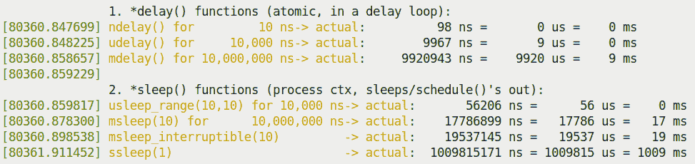

图 5.1 - 部分截图显示我们的 delays_sleeps.ko 内核模块的输出

仔细研究前面的输出；奇怪的是，`udelay(10)`和`mdelay(10)`例程似乎在所需的延迟期间*之前*完成了执行（在我们的示例输出中，分别为`9 微秒`和`9 毫秒`）！为什么？事实是**`*delay()`例程往往会提前完成**。这个事实在内核源代码中有记录。让我们来看看这里的相关代码部分（这是不言自明的）：

```
// include/linux/delay.h
/*
 [ ... ]
 * Delay routines, using a pre-computed "loops_per_jiffy" value.
 *
 * Please note that ndelay(), udelay() and mdelay() may return early for
 * several reasons:
 * 1\. computed loops_per_jiffy too low (due to the time taken to
 * execute the timer interrupt.)
 * 2\. cache behavior affecting the time it takes to execute the
 * loop function.
 * 3\. CPU clock rate changes.
 *
 * Please see this thread:
 * http://lists.openwall.net/linux-kernel/2011/01/09/56
```

`*sleep()`例程具有相反的特性；它们几乎总是**比要求的时间*睡眠更长**。同样，这些是标准 Linux 等非实时操作系统中预期的问题。

您可以通过几种方式**减轻这些问题**：

+   在标准 Linux 中，用户模式下，执行以下操作：

+   首先，最好使用**高分辨率定时器（HRT）**接口以获得高精度。这又是从 RTL 项目合并到主流 Linux（早在 2006 年）的代码。它支持需要小于单个*jiffy*（您知道，这与定时器“tick”、内核`CONFIG_HZ`值紧密耦合）的分辨率的定时器；例如，当`HZ`值为 100 时，一个 jiffy 为 1000/100 = 10 毫秒；当`HZ`为 250 时，一个 jiffy 为 4 毫秒，依此类推。

+   完成后，为什么不使用 Linux 的软实时调度功能呢？在这里，您可以指定`SCHED_FIFO`或`SCHED_RR`的调度策略，并为用户模式线程设置高优先级（范围为 1 到 99；我们在配套指南*Linux 内核编程*的*第十章* *CPU 调度器-第一部分*中介绍了这些细节）。

大多数现代 Linux 系统都支持 HRT。但是，如何利用它呢？这很简单：建议您在*用户空间*编写您的定时器代码，并使用标准的 POSIX 定时器 API（例如`timer_create(2)`和`timer_settime(2)`系统调用）。由于本书关注内核开发，我们不会在这里深入探讨这些用户空间 API。实际上，这个主题在我的早期著作*Linux 系统编程实践*的*第十三章* *定时器*的*较新的 POSIX（间隔）定时器*部分有详细介绍。

+   内核开发人员已经费心清楚地记录了一些关于在内核中使用这些延迟和睡眠 API 时的出色建议。非常重要的是，您浏览一下官方内核文档中的这份文件：[`www.kernel.org/doc/Documentation/timers/timers-howto.rst`](https://www.kernel.org/doc/Documentation/timers/timers-howto.rst)。

+   将 Linux OS 配置为 RTOS 并构建；这将显著减少调度“抖动”（我们在配套指南*Linux 内核编程*的*第十一章* *CPU 调度器-第二部分*的*将主线 Linux 转换为 RTOS*部分中详细介绍了这个主题）。

有趣的是，使用我们“更好”的 Makefile 的 checkpatch 目标可能会带来真正的好处。让我们看看它（内核的 checkpatch Perl 脚本）已经捕捉到了什么（首先确保你在正确的源目录中）：

```
$ cd <...>/ch5/delays_sleeps $ make checkpatch 
make clean
[ ... ]
--- cleaning ---
[ ... ]
--- kernel code style check with checkpatch.pl ---

/lib/modules/5.4.0-58-generic/build/scripts/checkpatch.pl --no-tree -f --max-line-length=95 *.[ch]
[ ... ]
WARNING: usleep_range should not use min == max args; see Documentation/timers/timers-howto.rst
#63: FILE: delays_sleeps.c:63:
+ DILLY_DALLY("XXXXXXXXXXXXXXXXXXXXXXXXXXXXXXXXX", usleep_range(10, 10));

total: 0 errors, 2 warnings, 79 lines checked
[ ... ]
```

这真的很好！确保你使用我们“更好”的`Makefile`中的目标（我们在伴随指南*Linux 内核编程*的*第五章，编写你的第一个内核模块 LKM - 第二部分*中详细介绍了这一点，在*为你的内核模块提供一个“更好”的 Makefile 模板*部分）。

有了这个，我们已经完成了对内核延迟和内核内睡眠的研究。有了这个基础，你现在将学习如何在本章的其余部分设置和使用内核定时器、内核线程和工作队列。

## “sed”驱动程序——演示内核定时器、内核线程和工作队列

为了使本章更有趣和实用，我们将开始演变一个名为**简单加密解密**的杂项字符“驱动程序”（简称**sed**驱动程序）（不要与著名的`sed(1)`实用程序混淆）。不，你猜对了也不会得到大奖，它提供了一些非常简单的文本加密/解密支持。

这里的重点是，我们应该想象在这个驱动程序的规范中，有一个条款要求工作（实际上是加密/解密功能）在给定的时间间隔内完成——实际上是*在给定的截止日期内*。为了检查这一点，我们将设计我们的驱动程序，使其具有一个内核定时器，在给定的时间间隔内到期；驱动程序将检查功能确实在这个时间限制内完成！

我们将演变一系列`sed`驱动程序及其用户空间对应程序（应用程序）：

+   第一个驱动程序——`sed1`驱动程序和用户模式应用程序（`ch5/sed1`）——将执行我们刚才描述的操作：演示用户模式应用程序将使用`ioctl`系统调用与驱动程序进行接口，并启动加密/解密消息功能。驱动程序将专注于一个内核定时器，我们将设置它在给定的截止日期前到期。如果它到期了，我们认为操作失败；如果没有，定时器被取消，操作就成功了。

+   第二个版本，`sed2`（`ch5/sed2`），将执行与`sed1`相同的操作，只是这里实际的加密/解密消息功能将在一个单独创建的内核线程的上下文中执行！这改变了项目的设计。

+   第三个版本，`sed3`（`ch5/sed3`），将再次执行与`sed1`和`sed2`相同的操作，只是这次实际的加密/解密消息功能将由内核工作队列执行！

现在你已经学会了如何执行延迟（原子和阻塞）和捕获时间戳，让我们学习如何设置和使用内核定时器。

# 设置和使用内核定时器

**定时器**提供了软件在指定时间过去时异步通知的手段。各种软件，无论是在用户空间还是内核空间，都需要定时器；这通常包括网络协议实现、块层代码、设备驱动程序和各种内核子系统。这个定时器提供了异步通知的手段，从而允许驱动程序与运行的定时器并行执行工作。一个重要的问题是，*我怎么知道定时器何时到期？*在用户空间应用程序中，通常情况下，内核会向相关进程发送一个信号（信号通常是`SIGALRM`）。

在内核空间中，这有点微妙。正如您从我们对硬件中断的上半部分和下半部分的讨论中所了解的（请参阅*第四章，处理硬件中断*，*理解和使用上半部分和下半部分*部分），在定时器中断的上半部分（或 ISR）完成后，内核将确保运行定时器中断的下半部分或定时器 softirq（正如我们在第四章中所示，*处理硬件中断*部分*可用的 softirq 及其用途*）。这是一个非常高优先级的 softirq，称为`TIMER_SOFTIRQ`。这个 softirq 就是消耗已到期的定时器！实际上-这一点非常重要-您的定时器的“回调”函数-定时器到期时将运行的函数-由定时器 softirq 运行*因此在原子（中断）上下文中运行*。因此，它在能够和不能做的方面受到限制（同样，这在*第四章*，*处理硬件中断*中有详细解释）。

在下一节中，您将学习如何设置和使用内核定时器。

## 使用内核定时器

要使用内核定时器，您必须遵循一些步骤。简而言之，要做的是（我们稍后会详细讨论）：

1.  使用`timer_setup()`宏初始化定时器元数据结构（`struct timer_list`）。这里初始化的关键项目如下：

+   到期时间（`jiffies`应达到的值，定时器才会到期）

+   定时器到期时要调用的函数-实际上是定时器的“回调”函数

1.  编写定时器回调例程的代码。

1.  在适当的时候，“启动”定时器-也就是，通过调用`add_timer()`（或`mod_timer()`）函数来启动。

1.  当定时器超时（到期）时，操作系统将自动调用您的定时器回调函数（在*步骤 2*中设置的函数）；请记住，它将在定时器 softirq 或原子或中断上下文中运行。

1.  （可选）*定时器默认不是循环的，它们默认是一次性的*。要使定时器再次运行，您将需要调用`mod_timer()` API；这是如何设置间隔定时器-在给定的固定时间间隔后超时。如果不执行此步骤，您的定时器将是一次性定时器-它将倒计时并到期一次。

1.  完成后，使用`del_timer[_sync]()`删除定时器；这也可以用于取消超时。它返回一个值，表示是否已停用挂起的定时器；也就是说，对于活动定时器返回`1`，对于被取消的非活动定时器返回`0`。

`timer_list`数据结构是我们这里相关的；其中，相关成员（模块/驱动程序作者）如下所示：

```
// include/linux/timer.h
struct timer_list {[ ... ]
    unsigned long expires;
    void (*function)(struct timer_list *);
    u32 flags; 
[ ...] };
```

使用`timer_setup()`宏进行初始化：

```
timer_setup(timer, callback, flags);
```

`timer_setup()`的参数如下：

+   `@timer`：指向`timer_list`数据结构的指针（这应该首先分配内存；另外，用`@`作为形式参数名的前缀是一种常见的约定）。

+   `@callback`：回调函数的指针。这是操作系统在定时器到期时调用的函数（在 softirq 上下文中）。它的签名是`void (*function)(struct timer_list *);`。回调函数中接收的参数是指向`timer_list`数据结构的指针。那么，我们如何在定时器回调中传递和访问一些任意数据呢？我们很快就会回答这个问题。

+   `@flags`：这些是定时器标志。我们通常将其传递为`0`（意味着没有特殊行为）。您可以指定的标志是`TIMER_DEFERRABLE`、`TIMER_PINNED`和`TIMER_IRQSAFE`。让我们在内核源代码中看一下：

```
// include/linux/timer.h
/**
 * @TIMER_DEFERRABLE: A deferrable timer will work normally when the
 * system is busy, but will not cause a CPU to come out of idle just
 * to service it; instead, the timer will be serviced when the CPU
 * eventually wakes up with a subsequent non-deferrable timer.
  [ ... ]
 * @TIMER_PINNED: A pinned timer will not be affected by any timer
 * placement heuristics (like, NOHZ) and will always expire on the CPU
 * on which the timer was enqueued.
```

在必要时，使用`TIMER_DEFERRABLE`标志是有用的，当需要监视功耗时（例如在备电设备上）。第三个标志`TIMER_IRQSAFE`只是特定目的；避免使用它。

接下来，使用`add_timer()` API 来启动定时器。一旦调用，定时器就是“活动的”并开始倒计时：

```
void add_timer(struct timer_list *timer);
```

它的参数是你刚刚初始化的`timer_list`结构的指针（通过`timer_setup()`宏）。

### 我们的简单内核定时器模块-代码视图 1

不多说了，让我们来看一下使用**可加载内核模块**（**LKM**）框架编写的简单内核定时器代码的第一部分（可以在`ch5/timer_simple`找到）。和大多数驱动程序一样，我们保留一个包含在运行时所需的信息的上下文或私有数据结构；在这里，我们称之为`st_ctx`。我们将其实例化为`ctx`变量。我们还在一个名为`exp_ms`的全局变量中指定了过期时间（为 420 毫秒）。

```
// ch5/timer_simple/timer_simple.c
#include <linux/timer.h>
[ ... ]
static struct st_ctx {
    struct timer_list tmr;
    int data;
} ctx;
static unsigned long exp_ms = 420;
```

现在，让我们来看一下我们*init*代码的第一部分：

```
static int __init timer_simple_init(void)
{
    ctx.data = INITIAL_VALUE;

    /* Initialize our kernel timer */
    ctx.tmr.expires = jiffies + msecs_to_jiffies(exp_ms);
    ctx.tmr.flags = 0;
    timer_setup(&ctx.tmr, ding, 0);
```

这非常简单。首先，我们初始化`ctx`数据结构，将`data`成员设置为值`3`。这里的一个关键点是`timer_list`结构在我们的`ctx`结构内部，所以我们必须初始化它。现在，设置定时器回调函数（`function`参数）和`flags`参数的值很简单；那么设置过期时间呢？你必须将`timer_list.expires`成员设置为内核中`jiffies`变量（实际上是宏）必须达到的值；在那一点，定时器将会过期！所以，我们设置它在未来 420 毫秒后过期，方法是将当前的 jiffies 值加到 420 毫秒经过的 jiffies 值上，就像这样：

```
ctx.tmr.expires = jiffies + msecs_to_jiffies(exp_ms);
```

`msecs_to_jiffies()`方便的例程在这里帮了我们一个忙，因为它将传递给`jiffies`的毫秒值转换了一下。将这个结果加到当前的`jiffies`值上将会给我们一个`jiffies`在未来的值，在 420 毫秒后，也就是我们希望内核定时器过期的时间。

这段代码是在`include/linux/jiffies.h:msecs_to_jiffies()`中的一个内联函数；注释帮助我们理解它是如何工作的。同样地，内核包含了`usecs_to_jiffies()`、`nsecs_to_jiffies()`、`timeval_to_jiffies()`和`jiffies_to_timeval()`（内联）函数辅助例程。

*init*代码的下一部分如下：

```
    pr_info("timer set to expire in %ld ms\n", exp_ms);
    add_timer(&ctx.tmr); /* Arm it; let's get going! */
    return 0;     /* success */
}
```

正如我们所看到的，通过调用`add_timer()` API，我们已经启动了我们的内核定时器。它现在是活动的并且在倒计时……大约 420 毫秒后，它将会过期。（为什么是大约？正如你在*让我们试试吧-延迟和睡眠到底需要多长时间？*部分看到的，延迟和睡眠的 API 并不是那么精确。事实上，一个建议给你后续工作的练习是测试超时的准确性；你可以在*Questions/kernel_timer_check*部分找到这个。此外，在这个练习的一个示例解决方案中，我们将展示使用`time_after()`宏是一个好主意；它执行一个有效性检查，以确保第二个时间戳实际上比第一个晚。类似的宏可以在`include/linux/jiffies.h`中找到；请参阅这一行之前的注释：`include/linux/jiffies.h:#define time_after(a,b)`）。

### 我们的简单内核定时器模块-代码视图 2

`add_timer()`启动了我们的内核定时器。正如你刚才看到的，它很快就会过期。内部地，正如我们之前提到的，内核的定时器软中断将运行我们的定时器回调函数。在前面的部分，我们初始化了回调函数为`ding()`函数（哈，*拟声词* - 一个描述它所描述的声音的词 - 在行动中！）通过`timer_setup()` API。因此，当定时器过期时，这段代码将会运行：

```
static void ding(struct timer_list *timer)
{
    struct st_ctx *priv = from_timer(priv, timer, tmr);
    /* from_timer() is in fact a wrapper around the well known
     * container_of() macro! This allows us to retrieve access to our
     * 'parent' driver context structure */
    pr_debug("timed out... data=%d\n", priv->data--);
    PRINT_CTX();

    /* until countdown done, fire it again! */
    if (priv->data)
        mod_timer(&priv->tmr, jiffies + msecs_to_jiffies(exp_ms));
}
```

关于这个函数有一些事情需要记住：

+   定时器回调处理程序代码（这里是`ding()`）在原子（中断，软中断）上下文中运行；因此，你不被允许调用任何阻塞 API，内存分配除了使用`GFP_ATOMIC`标志之外，或者在内核和用户空间之间进行任何数据传输（我们在前一章的*中断上下文指南-要做什么和不要做什么*部分详细介绍了这一点）。

+   回调函数接收`timer_list`结构的指针作为参数。由于我们非常有意地将`struct timer_list`保留在我们的上下文或私有数据结构中，我们可以有用地使用`from_timer()`宏来检索指向我们私有结构的指针；也就是`struct st_ctx`）。前面显示的代码的第一行就是这样做的。这是如何工作的？让我们看看它的实现：

```
 // include/linux/timer.h
 #define from_timer(var, callback_timer, timer_fieldname) \
           container_of(callback_timer, typeof(*var), timer_fieldname)

```

它实际上是`container_of()`宏的包装器！

+   然后，我们打印并减少我们的`data`值。

+   然后我们发出我们的`PRINT_CTX()`宏（回想一下，它是在我们的`convenient.h`头文件中定义的）。它将显示我们正在 softirq 上下文中运行。

+   接下来，只要我们的数据成员是正数，我们就通过调用`mod_timer()`API 来强制另一个超时（相同的时间段）：

```
int mod_timer(struct timer_list *timer, unsigned long expires);
```

如您所见，使用`mod_timer()`，定时器再次触发完全取决于您；这被认为是更新定时器到期日期的有效方法。通过使用`mod_timer()`，甚至可以启动非活动定时器（`add_timer()`的工作）；在这种情况下，返回值为`0`，否则为`1`（意味着我们修改了现有的活动定时器）。

### 我们的简单内核定时器模块 - 运行它

现在，让我们测试我们的内核定时器模块。在我们的 x86_64 Ubuntu VM 上，我们将使用我们的`lkm`便利脚本来加载内核模块。以下截图显示了这个过程的部分视图和内核日志：

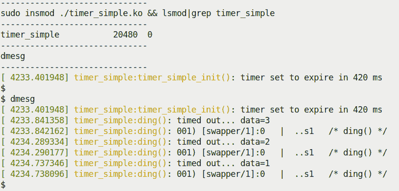

图 5.2 - 运行我们的 timer_simple.ko 内核模块的部分截图

研究这里显示的`dmesg`（内核日志）输出。由于我们将私有结构的`data`成员的初始值设置为`3`，内核定时器会过期三次（正如我们的逻辑要求的那样）。查看最左边的时间戳；您可以看到第二个定时器到期发生在`4234.289334`（秒.微秒），第三个在`4234.737346`；快速减法表明时间差为 448,012 微秒；即约 448 毫秒。这是合理的，因为我们要求的超时为 420 毫秒（略高于此；printks 的开销也很重要）。

`PRINT_CTX()`宏的输出也很有启发性；让我们看看前面截图中显示的第二个：

```
[ 4234.290177] timer_simple:ding(): 001) [swapper/1]:0   |  ..s1   /* ding() */
```

这表明（如*第四章*中详细解释的那样，*处理硬件中断*），代码在 CPU 1（`001`）上以 softirq 上下文（`s`在`..s1`中）运行。此外，被定时器中断和 softirq 中断的进程上下文是`swapper/1`内核线程；这是 CPU 1 上空闲时运行的 CPU 空闲线程。这是合理的，在空闲或轻负载系统上很典型。当定时器中断被启动并随后的 softirq 到来并运行我们的定时器回调时，系统（或至少 CPU 1）是空闲的。

## sed1 - 使用我们的演示 sed1 驱动程序实现超时

在这一部分，我们将编写一个更有趣的驱动程序（代码可以在`ch5/sed1/sed1_driver`中找到）。我们将设计它以便加密和/或解密给定的消息（当然非常简单）。基本思想是用户模式应用程序（可以在`ch5/userapp_sed`中找到）作为其用户界面。运行时，它打开我们的`misc`字符驱动程序的设备文件（`/dev/sed1_drv`）并对其进行`ioctl(2)`系统调用。

我们提供了在线材料，以帮助您了解如何通过几种常见方法将内核模块或设备驱动程序与用户空间进程进行接口：通过 procfs、sysfs、debugfs、netlink 套接字和`ioctl()`系统调用（[`github.com/PacktPublishing/Learn-Linux-Kernel-Development/blob/master/User_kernel_communication_pathways.pdf`](https://github.com/PacktPublishing/Learn-Linux-Kernel-Development/blob/master/User_kernel_communication_pathways.pdf)）！

`ioctl()`调用传递了一个封装传递的数据、其长度、要对其执行的操作（或转换）以及`timed_out`字段的数据结构（以确定是否由于未能在截止日期前完成而失败）。有效的操作如下：

+   加密：`XF_ENCRYPT`

+   解密：`XF_DECRYPT`

由于空间不足，我们不打算在这里详细显示代码 - 毕竟，阅读了这么多书，现在你已经有能力自己浏览和理解代码了！尽管如此，与本节相关的某些关键细节将被显示。

让我们来看一下它的整体设计：

+   我们的`sed1`驱动程序（`ch5/sed1/sed1_driver/sed1_drv.c`）实际上是一个伪驱动程序，它不是在任何外围硬件控制器或芯片上运行，而是在内存上运行；尽管如此，它是一个完整的`misc`类字符设备驱动程序。

+   它注册自己作为一个`misc`设备；在这个过程中，内核会自动创建一个设备节点（这里我们称之为`/dev/sed1_drv`）。

+   我们安排它有一个驱动程序“上下文”结构（`struct stMyCtx`），其中包含它在整个过程中使用的关键成员；其中一个是用于内核定时器的`struct timer_list`结构，在`init`代码路径中进行初始化（使用`timer_setup()`API）。

+   一个用户空间应用程序（`ch5/sed1/userapp_sed/userapp_sed1.c`）打开我们的`sed1`驱动程序的设备文件（它作为参数传递给它，以及要加密的消息）。它调用了一个`ioctl(2)`系统调用 - 命令是加密 - 以及`arg`参数，它是一个指向包含所有必需信息的结构的指针（包括要加密的消息负载）。让我们简要看一下：

```
​ kd->data_xform = XF_ENCRYPT;
 ioctl(fd, IOCTL_LLKD_SED_IOC_ENCRYPT_MSG, kd);
```

+   我们的`sed1`驱动程序的`ioctl`方法接管。在执行有效性检查后，它复制元数据结构（通过通常的`copy_from_user()`）并启动我们的`process_it()`函数，然后调用我们的`encrypt_decrypt_payload()`例程。

+   `encrypt_decrypt_payload()`是关键例程。它做以下事情：

+   启动我们的内核定时器（使用`mod_timer()`API），设置它在`TIMER_EXPIRE_MS`毫秒后过期（这里，我们将`TIMER_EXPIRE_MS`设置为`1`）。

+   获取时间戳，`t1 = ktime_get_real_ns();`。

+   启动实际工作 - 它是加密还是解密操作（我们保持它非常简单：对负载的每个字节进行简单的`XOR`操作，然后递增；解密时相反）。

+   工作完成后，立即做两件事：获取第二个时间戳，`t2 = ktime_get_real_ns();`，并取消内核定时器（使用`del_timer()`API）。

+   显示完成所需的时间（通过我们的`SHOW_DELTA()`宏）。

+   然后用户空间应用程序休眠 1 秒钟（以收集自己），并运行`ioctl`解密，导致我们的驱动程序解密消息。

+   最后，终止。

以下是`sed1`驱动程序的相关代码：

```
// ch5/sed1/sed1_driver/sed1_drv.c
[ ... ]
static void encrypt_decrypt_payload(int work, struct sed_ds *kd, struct sed_ds *kdret)
{
        int i;
        ktime_t t1, t2;   // a s64 qty
        struct stMyCtx *priv = gpriv;
        [ ... ]
        /* Start - the timer; set it to expire in TIMER_EXPIRE_MS ms */
        mod_timer(&priv->timr, jiffies + msecs_to_jiffies(TIMER_EXPIRE_MS));
        t1 = ktime_get_real_ns();

        // perform the actual processing on the payload
        memcpy(kdret, kd, sizeof(struct sed_ds));
        if (work == WORK_IS_ENCRYPT) {
                for (i = 0; i < kd->len; i++) {
                        kdret->data[i] ^= CRYPT_OFFSET;
                        kdret->data[i] += CRYPT_OFFSET;
                }
        } else if (work == WORK_IS_DECRYPT) {
                for (i = 0; i < kd->len; i++) {
                        kdret->data[i] -= CRYPT_OFFSET;
                        kdret->data[i] ^= CRYPT_OFFSET;
                }
        }
        kdret->len = kd->len;
        // work done!
        [ ... // code to miss the deadline here! (explained below) ... ]
        t2 = ktime_get_real_ns();

        // work done, cancel the timeout
        if (del_timer(&priv->timr) == 0)
                pr_debug("cancelled the timer while it's inactive! (deadline missed?)\n");
        else
                pr_debug("processing complete, timeout cancelled\n");
        SHOW_DELTA(t2, t1);
}
```

就是这样！为了了解它是如何工作的，让我们看看它的运行情况。首先，我们必须插入我们的内核驱动程序（LKM）：

```
$ sudo insmod ./sed1_drv.ko
$ dmesg 
[29519.684832] misc sed1_drv: LLKD sed1_drv misc driver (major # 10) registered, minor# = 55,
 dev node is /dev/sed1_drv
[29519.689403] sed1_drv:sed1_drv_init(): init done (make_it_fail is off)
[29519.690358] misc sed1_drv: loaded.
$ 
```

以下截图显示了它加密和解密的示例运行（这里我们故意运行了这个应用的**Address Sanitizer**（**ASan**）调试版本；这可能会暴露 bug，所以为什么不呢！）：

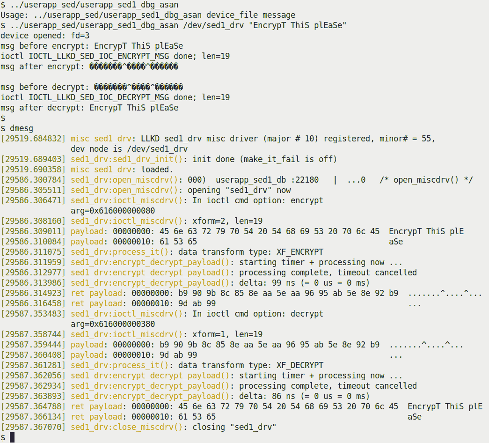

图 5.3 - 我们的`sed1`迷你项目在规定的截止日期内加密和解密消息

一切进行得很顺利。

让我们来看看我们内核定时器回调函数的代码。在我们简单的`sed1`驱动程序中，我们只需要让它做以下事情：

+   原子地将我们私有结构中的整数`timed_out`设置为`1`，表示失败。当我们将数据结构通过`ioctl()`复制回用户模式应用程序时，这允许它轻松检测失败并报告/记录它（有关使用原子操作符等更多细节将在本书的最后两章中介绍）。

+   向内核日志发出`printk`（在`KERN_NOTICE`级别），指示我们超时了。

+   调用我们的`PRINT_CTX()`宏来显示上下文细节。

我们的内核定时器回调函数的代码如下：

```
static void timesup(struct timer_list *timer)
{
    struct stMyCtx *priv = from_timer(priv, timer, timr);

    atomic_set(&priv->timed_out, 1);
    pr_notice("*** Timer expired! ***\n");
    PRINT_CTX();
}
```

我们能看到这段代码 - `timesup()`定时器到期函数 - 运行吗？我们安排下一步就是这样做。

### 故意错过公交车

我之前遗漏的部分是一个有趣的细节：就在第二个时间戳被取之前，我们插入了一小段代码，故意错过了神圣的截止日期！怎么做？实际上非常简单：

```
static void encrypt_decrypt_payload(int work, struct sed_ds *kd, struct sed_ds *kdret)
{
    [ ... ]
    // work done!
    if (make_it_fail == 1)
 msleep(TIMER_EXPIRE_MS + 1);
    t2 = ktime_get_real_ns();
```

`make_it_fail`是一个模块参数，默认设置为`0`；因此，只有当你想要冒险（是的，有点夸张！）时，你才应该将其传递为`1`。让我们试一试，看看我们的内核定时器何时到期。用户模式应用程序也会检测到这一点，并报告失败：

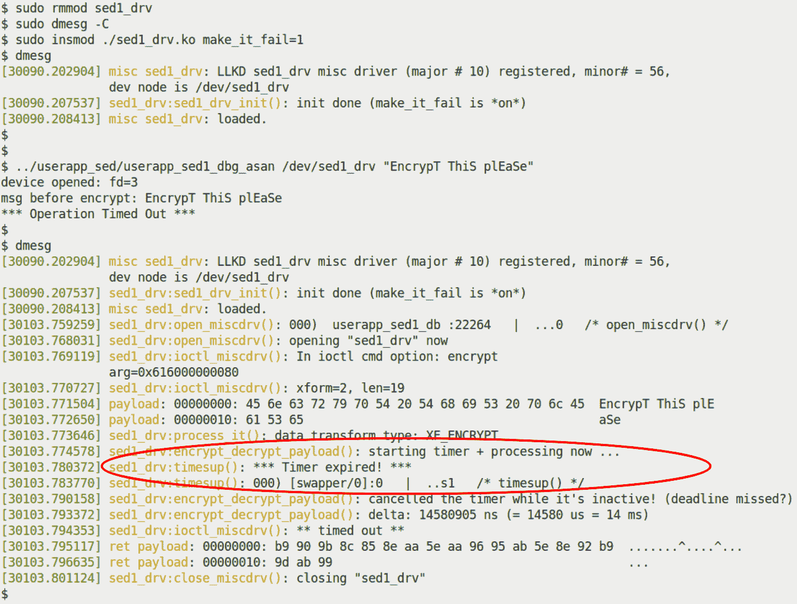

图 5.4 - 我们的 sed1 迷你项目运行时，make_it_fail 模块参数设置为 1，导致截止日期被错过

这次，截止日期在定时器被取消之前就已经过期，因此导致它到期并触发。它的`timesup()`回调函数随后运行（在前面的截图中突出显示）。我强烈建议您花时间详细阅读驱动程序和用户模式应用程序的代码，并自行尝试。

我们之前简要使用的`schedule_timeout()`函数是使用内核定时器的一个很好的例子！它的内部实现可以在这里看到：`kernel/time/timer.c:schedule_timeout()`.

关于定时器的其他信息可以在`proc`文件系统中找到；其中相关的（伪）文件包括`/proc/[pid]/timers`（每个进程的 POSIX 定时器）和`/proc/timer_list`伪文件（其中包含有关所有待处理的高分辨率定时器以及所有时钟事件源的信息。请注意，内核版本 4.10 之后，`/proc/timer_stats`伪文件消失了）。您可以在关于`proc(5)`的 man 页面上找到更多关于它们的信息，网址为[`man7.org/linux/man-pages/man5/proc.5.html`](https://man7.org/linux/man-pages/man5/proc.5.html)。

在下一节中，您将学习如何创建和使用内核线程以使其对您有利。继续阅读！

# 创建和使用内核线程

线程是一个执行路径；它纯粹关注执行给定的函数。那个函数就是它的生命和范围；一旦它从那个函数返回，它就死了。在用户空间，线程是进程内的执行路径；进程可以是单线程或多线程的。在许多方面，内核线程与用户模式线程非常相似。在内核空间，线程也是一个执行路径，只是它在内核 VAS 中运行，具有内核特权。这意味着内核也是多线程的。快速查看`ps(1)`的输出（使用**伯克利软件发行版**（**BSD**）风格的`aux`选项开关运行）可以显示出内核线程 - 它们的名称被括在方括号中：

```
$ ps aux
USER         PID %CPU %MEM    VSZ   RSS TTY        STAT START   TIME COMMAND
root           1  0.0  0.5 167464 11548 ?          Ss   06:20   0:00 /sbin/init splash 3
root           2  0.0  0.0      0     0 ?          S    06:20   0:00 [kthreadd]
root           3  0.0  0.0      0     0 ?          I<   06:20   0:00 [rcu_gp]
root           4  0.0  0.0      0     0 ?          I<   06:20   0:00 [rcu_par_gp]
root           6  0.0  0.0      0     0 ?          I<   06:20   0:00 [kworker/0:0H-kblockd]
root           9  0.0  0.0      0     0 ?          I<   06:20   0:00 [mm_percpu_wq]
root          10  0.0  0.0      0     0 ?          S    06:20   0:00 [ksoftirqd/0]
root          11  0.0  0.0      0     0 ?          I    06:20   0:05 [rcu_sched]
root          12  0.0  0.0      0     0 ?          S    06:20   0:00 [migration/0]
[ ... ]
root          18  0.0  0.0      0     0 ?          S    06:20   0:00 [ksoftirqd/1]
[ ... ]
```

大多数内核线程都是为了特定目的而创建的；通常它们在系统启动时创建并永远运行（在一个无限循环中）。它们会进入睡眠状态，当需要做一些工作时，就会唤醒，执行它，并立即回到睡眠状态。一个很好的例子是`ksoftirqd/n`内核线程（通常每个 CPU 核心有一个；`n`表示核心编号）；当软中断负载过重时，它们会被内核唤醒，以帮助消耗待处理的软中断（我们在第四章中讨论过这一点，*处理硬件中断*，在*使用 ksoftirqd 内核线程*部分；在前面的`ps`输出中，您可以在双核 VM 上看到它们；它们的 PID 分别为 10 和 18）。同样，内核还使用“kworker”工作线程，它们是动态的 - 随着工作的需要而来去（快速运行`ps aux | grep kworker`应该会显示出其中几个）。

让我们来看看内核线程的一些特点：

+   它们总是在内核 VAS 中执行，在内核模式下具有内核特权。

+   它们总是在进程上下文中运行（参考伴随指南*Linux 内核编程 - 第六章，内核内部要点 - 进程和线程*，*理解进程和中断上下文*部分），它们有一个任务结构（因此有一个 PID 和所有其他典型的线程属性，尽管它们的*凭据*总是设置为`0`，意味着具有根访问权限）。

+   它们与其他线程（包括用户模式线程）竞争 CPU 资源，通过 CPU 调度程序；内核线程（通常缩写为**kthreads**）确实会获得优先级的轻微提升。

+   由于它们纯粹在内核 VAS 中运行，它们对用户 VAS 是盲目的；因此，它们的`current->mm`值始终为`NULL`（实际上，这是识别内核线程的一种快速方法）。

+   所有内核线程都是从名为`kthreadd`的内核线程派生出来的，它的 PID 是`2`。这是在早期引导期间由内核（技术上是第一个 PID 为`0`的`swapper/0`内核线程）创建的；你可以通过执行`pstree -t -p 2`来验证这一点（查阅`pstree(1)`的手册页以获取使用详情）。

+   它们有命名约定。内核线程的命名方式不同，尽管有一些约定是遵循的。通常，名称以`/n`结尾；这表示它是一个每 CPU 内核线程。数字指定了它所关联的 CPU 核心（我们在伴随指南*Linux 内核编程 - 第十一章，CPU 调度程序 - 第二部分*中介绍了 CPU 亲和力，在*理解、查询和设置 CPU 亲和力掩码*部分）。此外，内核线程用于特定目的，它们的名称反映了这一点；例如，`irq/%d-%s`（其中`%d`是 PID，`%s`是名称）是一个线程中断处理程序（在*第四章，处理硬件中断*中介绍）。你可以通过阅读内核文档*减少由每 CPU 内核线程引起的 OS 抖动*，了解如何找到内核线程的名称以及内核线程的许多实际用途（以及如何调整它们以减少抖动），网址为[`www.kernel.org/doc/Documentation/kernel-per-CPU-kthreads.txt`](https://www.kernel.org/doc/Documentation/kernel-per-CPU-kthreads.txt)。

我们感兴趣的是，内核模块和设备驱动程序通常需要在后台运行某些代码路径，与它和内核通常执行的其他工作并行进行。假设你需要在发生异步事件时阻塞，或者需要在某些事件发生时在内核中执行一个用户模式进程，这是耗时的。内核线程在这里就派上用场了；因此，我们将重点关注作为模块作者如何创建和管理内核线程。

是的，你可以在内核中执行用户模式进程或应用程序！内核提供了一些**用户模式辅助**（**umh**）API 来实现这一点，其中一个常见的是`call_usermode_helper()`。你可以在这里查看它的实现：`kernel/umh.c:int call_usermodehelper(const char *path, char **argv, char **envp, int wait)`。不过要小心，你不应该滥用这个 API 从内核中调用任何应用程序 - 这只是糟糕的设计！在内核中使用这个 API 的实际用例非常少；使用`cscope(1)`来查看它。

好的；有了这些，让我们学习如何创建和使用内核线程。

## 一个简单的演示 - 创建一个内核线程

创建内核线程的主要 API（对于我们模块/驱动程序的作者来说）是`kthread_create()`；它是一个调用`kthread_create_on_node()`API 的宏。事实是，仅仅调用`kthread_create()`是不足以使您的内核线程执行任何有用的操作的；这是因为，虽然这个宏确实创建了内核线程，但您需要通过将其状态设置为运行并唤醒它来使其成为调度程序的候选者。这可以通过`wake_up_process()`API 来实现（一旦成功，它将被排入 CPU 运行队列，从而使其可以在不久的将来运行）。好消息是，`kthread_run()`辅助宏可以用来一次性调用`kthread_create()`和`wake_up_process()`。让我们来看看它在内核中的实现：

```
// include/linux/kthread.h
/**
 * kthread_run - create and wake a thread.
 * @threadfn: the function to run until signal_pending(current).
 * @data: data ptr for @threadfn.
 * @namefmt: printf-style name for the thread.
 *
 * Description: Convenient wrapper for kthread_create() followed by
 * wake_up_process(). Returns the kthread or ERR_PTR(-ENOMEM).
 */
#define kthread_run(threadfn, data, namefmt, ...) \
({ \
    struct task_struct *__k \
        = kthread_create(threadfn, data, namefmt, ## __VA_ARGS__); \
    if (!IS_ERR(__k)) \
        wake_up_process(__k); \
    __k; \
})
```

前面代码片段中的注释清楚地说明了`kthread_run()`的参数和返回值。

为了演示如何创建和使用内核线程，我们将编写一个名为`kthread_simple`的内核模块。以下是其`init`方法的相关代码：

```
// ch5/kthread_simple/kthread_simple.c
static int kthread_simple_init(void)
{   [ ... ]
    gkthrd_ts = kthread_run(simple_kthread, NULL, "llkd/%s", KTHREAD_NAME);
    if (IS_ERR(gkthrd_ts)) {
        ret = PTR_ERR(gkthrd_ts); // it's usually -ENOMEM
        pr_err("kthread creation failed (%d)\n", ret);
        return ret;
    } 
    get_task_struct(gkthrd_ts); // inc refcnt, marking the task struct as in use
    [ ... ]
```

`kthread_run()`的第一个参数是新的内核线程的核心功能！在这里，我们不打算向我们的新生内核线程传递任何数据，这就是为什么第二个参数是`NULL`。其余参数是 printf 风格的格式字符串，指定了它的名称。一旦成功，它将返回指向新内核线程任务结构的指针（我们在伴随指南*Linux 内核编程*-*第六章*-*内核内部要点-进程和线程*-*了解和访问内核任务结构*部分中详细介绍了任务结构）。现在，`get_task_struct()`内联函数很重要-它增加了传递给它的任务结构的引用计数。这标记着任务正在使用中（稍后，在清理代码中，我们将发出`kthread_stop()`辅助例程；它将执行相反的操作，从而减少（最终释放）任务结构的引用计数）。

现在，让我们看看我们的内核线程本身（我们只会显示相关的代码片段）：

```
static int simple_kthread(void *arg)
{
    PRINT_CTX();
    if (!current->mm)
        pr_info("mm field NULL, we are a kernel thread!\n");
```

一旦`kthread_run()`成功创建内核线程，它将开始与系统的其余部分并行运行其代码：现在它是可调度的线程！我们的`PRINT_CTX()`宏显示它在进程上下文中运行，确实是一个内核线程。（我们模仿了将其名称括在方括号中的传统，以显示这一点。验证当前`mm`指针是否为`NULL`的检查证实了这一点。）您可以在*图 5.5*中看到输出。您内核线程例程中的所有代码都将在*进程上下文*中运行；因此，您可以执行阻塞操作（与中断上下文不同）。

接下来，默认情况下，内核线程以 root 所有权运行，并且所有信号都被屏蔽。但是，作为一个简单的测试案例，我们可以通过`allow_signal()`辅助例程打开一些信号。之后，我们简单地循环（我们很快会到`kthread_should_stop()`例程）；在循环体中，我们通过将任务状态设置为`TASK_INTERRUPTIBLE`（意味着睡眠可以被信号中断）并调用`schedule()`来让自己进入睡眠状态：

```
    allow_signal(SIGINT);
    allow_signal(SIGQUIT);

    while (!kthread_should_stop()) {
        pr_info("FYI, I, kernel thread PID %d, am going to sleep now...\n",
            current->pid);
        set_current_state(TASK_INTERRUPTIBLE);
        schedule(); // yield the processor, go to sleep...
        /* Aaaaaand we're back! Here, it's typically due to either the
         * SIGINT or SIGQUIT signal hitting us! */
        if (signal_pending(current))
            break;
    }
```

因此，只有当我们被唤醒时-当您向内核线程发送`SIGINT`或`SIGQUIT`信号时会发生这种情况-我们才会恢复执行。当这发生时，我们跳出循环（请注意我们首先使用`signal_pending()`辅助例程验证了这一点！）。现在，我们的内核线程在循环外恢复执行，只是（故意而戏剧性地）死亡：

```
    set_current_state(TASK_RUNNING);
    pr_info("FYI, I, kernel thread PID %d, have been rudely awoken; I shall"
            " now exit... Good day Sir!\n", current->pid);
    return 0;
}
```

内核模块的清理代码如下：

```
static void kthread_simple_exit(void)
{
    kthread_stop(gkthrd_ts);   /* waits for our kthread to terminate; 
                                * it also internally invokes 
                                * the put_task_struct() to decrement task's  
                                * reference count
                                */
    pr_info("kthread stopped, and LKM removed.\n");
}
```

在清理代码路径中，你应该调用`kthread_stop()`，它执行必要的清理。在内部，它实际上等待内核线程死亡（通过`wait_for_completion()`例程）。因此，如果你在没有通过发送`SIGINT`或`SIGQUIT`信号杀死内核线程的情况下调用`rmmod`，`rmmod`进程将似乎挂起；它（也就是`rmmod`进程）正在等待（嗯，`kthread_stop()`实际上是在等待）内核线程死亡！这就是为什么，如果内核线程还没有被发送信号，这可能会导致问题。

处理内核线程停止的更好方法应该不是从用户空间发送信号给它。确实有一个更好的方法：正确的方法是使用`kthread_should_stop()`例程作为它运行的`while`循环的（反向）条件，这正是我们要做的！在前面的代码中，我们有以下内容：

```
while (!kthread_should_stop()) {
```

`kthread_should_stop()`例程返回一个布尔值，如果内核线程现在应该停止（终止）则为真！在清理代码路径中调用`kthread_stop()`将导致`kthread_should_stop()`返回 true，从而导致我们的内核线程跳出`while`循环并通过简单的`return 0;`终止。这个值（`0`）被传回`kthread_stop()`。由于这个原因，即使没有向我们的内核线程发送信号，内核模块也能成功卸载。我们将把测试这种情况留给你作为一个简单的练习！

注意`kthread_stop()`的返回值可能会有用：它是一个整数，是运行的线程函数的结果 - 实际上，它说明了你的内核线程是否成功（返回`0`）完成了它的工作。如果你的内核线程从未被唤醒，它将是值`-EINTR`。

## 运行 kthread_simple 内核线程演示

现在，让我们试一下（`ch5/kthread_simple`）！我们可以通过`insmod(8)`进行模块插入；模块按计划插入到内核中。如下截图所示的内核日志，以及快速的`ps`，证明我们全新的内核线程确实已经被创建。另外，正如你从代码（`ch5/kthread_simple/kthread_simple.c`）中看到的，我们的内核线程将自己置于睡眠状态（通过将其状态设置为`TASK_INTERRUPTIBLE`，然后调用`schedule()`）：

！[](img/9c126689-076e-44b5-9a88-b20b3004f4d4.png)

图 5.5 - 部分截图显示我们的内核线程诞生、活着 - 还有，嗯，睡着了

通过名称快速运行`ps(1) grep`来查找我们的内核线程，可以看到我们的内核线程是活着的（而且睡着的）。

```
$ ps -e |grep kt_simple
 11372   ?        00:00:00 llkd/kt_simple
$
```

让我们来点新意，给我们的内核线程发送`SIGQUIT`信号。这将唤醒它（因为我们已经设置了它的信号掩码以允许`SIGINT`和`SIGQUIT`信号），将其状态设置为`TASK_RUNNING`，然后，简单地退出。然后我们使用`rmmod(8)`来移除内核模块，如下截图所示：

！[](img/c3f089f4-57d3-4048-a739-8fe84c1e7292.png)

图 5.6 - 部分截图显示我们的内核线程唤醒和模块成功卸载

现在你已经了解了如何创建和使用内核线程，让我们继续设计和实现我们的`sed`驱动程序的第二个版本。

## sed2 驱动程序 - 设计与实现

在这一部分（如在*“sed”驱动程序 - 演示内核定时器、内核线程和工作队列*部分中提到的），我们将编写`sed1`驱动程序的下一个演变，称为`sed2`。

### sed2 - 设计

我们的`sed` v2（`sed2`*;*代码：`ch5/sed2/`）小项目与我们的`sed1`项目非常相似。关键区别在于，这一次，我们将通过驱动程序专门为此目的创建的内核线程来进行“工作”。这个版本与上一个版本的主要区别如下：

+   有一个全局共享的内存缓冲区用于保存元数据和有效载荷；也就是说，要加密/解密的消息。这是我们驱动程序上下文结构`struct stMyCtx`中的`struct sed_ds->shmem`成员。

+   加密/解密的工作现在在内核线程（由此驱动程序生成）中执行；我们让内核线程保持休眠。只有在出现工作时，驱动程序才会唤醒 kthread 并让其消耗（执行）工作。

+   现在我们在 kthread 的上下文中运行内核定时器，并显示它是否过早到期（表明未满足截止日期）。

+   快速测试表明，在内核线程的关键部分消除了几个`pr_debug()` printks 可以大大减少完成工作所需的时间！（如果您希望消除此开销，可以随时更改 Makefile 的`EXTRA_CFLAGS`变量以取消定义`DEBUG`符号（通过使用`EXTRA_CFLAGS += -UDEBUG`）！）。因此，在这里，截止日期更长（10 毫秒）。

因此，简而言之，这里的整个想法主要是演示使用自定义内核线程以及内核定时器来超时操作。一个重要的理解点改变了整体设计（特别是用户空间应用程序与我们的`sed2`驱动程序交互的方式），即由于我们在内核线程的上下文中运行工作，这与发出`ioctl()`的进程的上下文不同。因此，非常重要的是要意识到以下几点：

+   您不能简单地将数据从内核线程的进程上下文传输到用户空间进程 - 它们完全不同（它们在不同的虚拟地址空间中运行：用户模式进程有自己完整的 VAS 和 PID 等；内核线程实际上生活在内核 VAS 中，有自己的 PID 和内核模式堆栈）。因此，使用`copy_{from|to}_user()`（以及类似的）例程来从 kthread 通信到用户模式应用程序是不可能的。

+   危险的*竞争*可能性很大；内核线程与用户进程上下文异步运行；因此，如果我们不小心，就可能产生与并发相关的错误。这就是本书最后两章的整个原因，我们将在其中涵盖内核同步、锁定（以及相关）概念和技术。目前，请耐心等待 - 我们通过使用一些简单的轮询技巧来代替适当的同步，尽量保持简单。

我们的`sed2`项目内有四个操作：

+   **加密**消息（这也将消息从用户空间传输到驱动程序；因此，这必须首先完成）。

+   **解密**消息。

+   **检索**消息（从驱动程序发送到用户空间应用程序）。

+   **销毁**消息（实际上，它被重置 - 驱动程序内的内存和元数据被清除）。

重要的是要意识到，由于存在竞争的可能性，我们*不能简单地*直接从 kthread 传输数据到用户空间应用程序。因此，我们必须执行以下操作：

+   我们必须通过发出`ioctl()`系统调用在用户空间进程的进程上下文中执行检索和销毁操作。

+   我们必须在我们的内核线程的进程上下文中异步执行加密和解密操作（我们在内核线程中运行它，不是因为我们*必须*，而是因为我们想要；毕竟，这是这个主题的重点！）。

这个设计可以用一个简单的 ASCII 艺术图来总结：

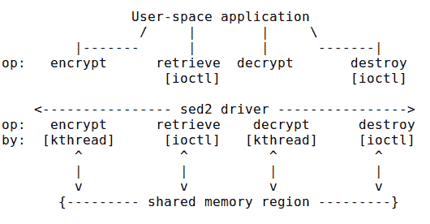

图 5.7 - 我们的 sed2 迷你项目的高级设计

好了，现在让我们来查看`sed2`的相关代码实现。

### sed2 驱动程序 - 代码实现

在代码方面，`sed2`驱动程序中用于加密操作的`ioctl()`方法的代码如下（为了清晰起见，我们不会在这里显示所有的错误检查代码；我们只会显示最相关的部分）。您可以在`ch5/sed2/`找到完整的代码：

```
// ch5/sed2/sed2_driver/sed2_drv.c
[ ... ]
#if LINUX_VERSION_CODE >= KERNEL_VERSION(2, 6, 36)
static long ioctl_miscdrv(struct file *filp, unsigned int cmd, unsigned long arg)
#else
static int ioctl_miscdrv(struct inode *ino, struct file *filp, unsigned int cmd, unsigned long arg)
#endif
{
    struct stMyCtx *priv = gpriv;

[ ... ]
switch (cmd) {
    case IOCTL_LLKD_SED_IOC_ENCRYPT_MSG: /* kthread: encrypts the msg passed in */
        [ ... ]
        if (atomic_read(&priv->msg_state) == XF_ENCRYPT) { // already encrypted?
            pr_notice("encrypt op: message is currently encrypted; aborting op...\n");
            return -EBADRQC; /* 'Invalid request code' */
        }
        if (copy_from_user(priv->kdata, (struct sed_ds *)arg, sizeof(struct sed_ds))) {
         [ ... ]

        POLL_ON_WORK_DONE(1);
        /* Wake up our kernel thread and have it encrypt the message ! */
        if (!wake_up_process(priv->kthrd_work))
            pr_warn("worker kthread already running when awoken?\n");
        [ ... ]
```

驱动程序在其`ioctl()`方法中执行了几个有效性检查后，开始工作：对于加密操作，我们检查当前有效载荷是否已经加密（显然，我们在上下文结构中有一个状态成员，用于更新并保存这些信息；即`priv->msg_state`）。如果一切正常，它会从用户空间应用程序中复制消息（以及`struct sed_ds`中所需的元数据）。然后，它*唤醒我们的内核线程*（通过`wake_up_process()` API；参数是从`kthread_create()` API 返回的任务结构指针）。这会导致内核线程恢复执行！

在`init`代码中，我们使用`kthread_create()` API（而不是`kthread_run()`宏）创建了 kthread，因为我们*不*希望 kthread 立即运行！相反，我们更喜欢让它保持睡眠状态，只有在需要工作时才唤醒它。这是我们在使用工作线程时应该遵循的典型方法（所谓的管理者-工作者模型）。

在我们的`init`方法中创建内核线程的代码如下：

```
static int __init sed2_drv_init(void)
{
    [ ... ]
    gpriv->kthrd_work = kthread_create(worker_kthread, NULL, "%s/%s", DRVNAME, KTHREAD_NAME);
    if (IS_ERR(gpriv->kthrd_work)) {
        ret = PTR_ERR(gpriv->kthrd_work); // it's usually -ENOMEM
        dev_err(dev, "kthread creation failed (%d)\n", ret);
        return ret;
    }
    get_task_struct(gpriv->kthrd_work); // inc refcnt, marking the task struct as in use
    pr_info("worker kthread created... (PID %d)\n", task_pid_nr(gpriv->kthrd_work));
    [ ... ]
```

之后，通过`timer_setup()` API 初始化了定时器。我们的工作线程的（截断的）代码如下所示：

```
static int worker_kthread(void *arg)
{
    struct stMyCtx *priv = gpriv;

    while (!kthread_should_stop()) {
        /* Start - the timer; set it to expire in TIMER_EXPIRE_MS ms */
        if (mod_timer(&priv->timr, jiffies + msecs_to_jiffies(TIMER_EXPIRE_MS)))
            pr_alert("timer already active?\n");
        priv->t1 = ktime_get_real_ns();

        /*--------------- Critical section begins --------------------------*/
        atomic_set(&priv->work_done, 0);
        switch (priv->kdata->data_xform) {
        [ ... ]
        case XF_ENCRYPT:
            pr_debug("data transform type: XF_ENCRYPT\n");
            encrypt_decrypt_payload(WORK_IS_ENCRYPT, priv->kdata);
 atomic_set(&priv->msg_state, XF_ENCRYPT);
            break;
        case XF_DECRYPT:
            pr_debug("data transform type: XF_DECRYPT\n");
            encrypt_decrypt_payload(WORK_IS_DECRYPT, priv->kdata);
            atomic_set(&priv->msg_state, XF_DECRYPT);
            break;
        [ ... ]
        priv->t2 = ktime_get_real_ns();
        // work done, cancel the timeout
        if (del_timer(&priv->timr) == 0)
        [ ... ]
```

在这里，您可以看到定时器被启动（`mod_timer()`），根据需要调用实际的加密/解密功能，捕获时间戳，然后取消内核定时器。这就是`sed1`中发生的事情，只是这次（`sed2`）工作发生在我们的内核线程的上下文中！内核线程函数然后使自己进入睡眠状态，通过（正如在配套指南*Linux 内核编程 - 第十章，CPU 调度器 - 第一部分和第十一章，CPU 调度器 - 第二部分中所介绍的）将任务状态设置为睡眠状态（`TASK_INTERRUPTIBLE`）并调用`schedule()`来让出处理器。

等一下 - 在`ioctl()`方法中，您是否注意到在唤醒内核线程之前调用了`POLL_ON_WORK_DONE(1);`宏？看一下以下代码：

```
        [ ... ]       
         POLL_ON_WORK_DONE(1);
        /* Wake up our kernel thread 
         * and have it encrypt the message ! 
         */
        if (!wake_up_process(priv->kthrd_work))
            pr_warn("worker kthread already running when awoken?\n");
        /*
         * Now, our kernel thread is doing the 'work'; 
         * it will either be done, or it will miss it's 
         * deadline and fail. Attempting to lookup the payload 
         * or do anything more here would be a
         * mistake, a race! Why? We're currently running in 
         * the ioctl() process context; the kernel thread runs 
         * in it's own process context! (If we must look it up, 
         * then we really require a (mutex) lock; we shall
         * discuss locking in detail in the book's last two chapters.
         */
        break;
```

使用轮询来规避可能的竞争：如果一个（用户模式）线程调用`ioctl()`来加密给定的消息，同时在另一个 CPU 核心上，另一个用户模式线程调用`ioctl()`来解密给定的消息会发生什么？这将导致并发问题！再次强调，本书的最后两章致力于理解和处理这些问题；但在这里和现在，我们能做什么？让我们实现一个简陋的同步解决方案：*轮询*。

这并不理想，但只能这样做。我们将利用驱动程序在驱动程序上下文结构中设置的一个名为`work_done`的原子变量，当工作完成时，其值为`1`；否则为`0`。我们在这个宏中进行轮询：

```
/*
 * Is our kthread performing any ongoing work right now? poll...
 * Not ideal (but we'll live with it); ideally, use a lock (we cover locking in
 * this book's last two chapters)
 */
#define POLL_ON_WORK_DONE(sleep_ms) do { \
        while (atomic_read(&priv->work_done) == 0) \
            msleep_interruptible(sleep_ms); \
} while (0)
```

为了使这段代码看起来更加可接受，我们不会独占处理器；如果工作还没有完成，我们会通过`msleep_interruptible()` API 睡眠一毫秒，并再次尝试。

到目前为止，我们已经涵盖了`sed2`的`encrypt`和`decrypt`功能的相关代码（这两个功能都在我们的工作线程的上下文中运行）。现在，让我们看看剩下的两个功能 - 检索和销毁消息。这些功能是在原始用户空间进程上下文中执行的 - 发出`ioctl()`系统调用的进程（或线程）。以下是它们的相关代码：

```
// ch5/sed2/sed2_driver/sed2_drv.c : ioctl() method
[ ... ]
case IOCTL_LLKD_SED_IOC_RETRIEVE_MSG: /* ioctl: retrieves the encrypted msg */
        if (atomic_read(&priv->timed_out) == 1) {
            pr_debug("the encrypt op had timed out! returning -ETIMEDOUT\n");
            return -ETIMEDOUT;
        }
        if (copy_to_user((struct sed_ds *)arg, (struct sed_ds *)priv->kdata, sizeof(struct sed_ds))) {
           //  [ ... error handling ... ]
        break;
    case IOCTL_LLKD_SED_IOC_DESTROY_MSG: /* ioctl: destroys the msg */
        pr_debug("In ioctl 'destroy' cmd option\n");
        memset(priv->kdata, 0, sizeof(struct sed_ds));
        atomic_set(&priv->msg_state, 0);
        atomic_set(&priv->work_done, 1);
        atomic_set(&priv->timed_out, 0);
        priv->t1 = priv->t2 = 0;
        break;
[ ... ]
```

现在您已经看到了（相关的）`sed2`代码，让我们来尝试一下吧！

### sed2 - 尝试它

让我们来看看我们的`sed2`迷你项目的一个示例运行，确保您仔细查看它们：

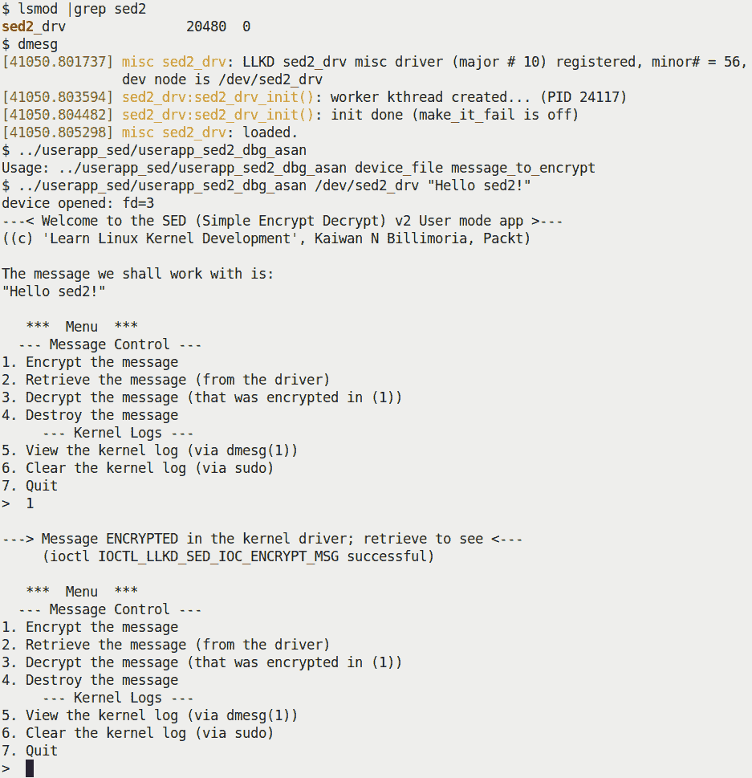

图 5.8 - 我们的 sed2 迷你项目展示了一个交互式菜单系统。在这里，一条消息已成功加密

因此，我们已经加密了一条消息，但我们如何查看它呢？简单：我们使用菜单！选择选项`2`来检索（加密的）消息（它将显示供您悠闲阅读），选项`3`来解密它，再次选择选项`2`来查看它，选项`5`来查看内核日志-非常有用！以下截图显示了其中一些选项：

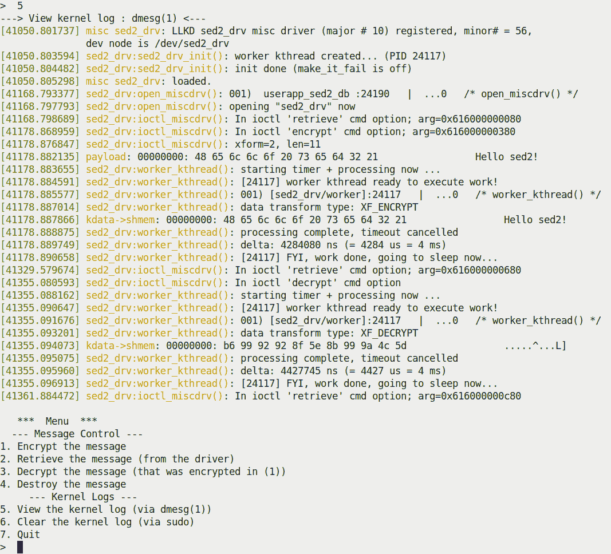

图 5.9-我们的 sed2 迷你项目展示了一个交互式菜单系统。在这里，一条消息已经成功加密

正如内核日志中所示，我们的用户模式应用程序（`userapp_sed2_dbg_asan`）已经打开了设备并发出了检索操作，然后几秒钟后进行了加密操作（前面截图左下角的时间戳可以帮助你弄清楚这一点）。然后，驱动程序唤醒了内核线程；你可以看到它的 printk 输出，以及`PRINT_CTX()`的输出，如下所示：

```
[41178.885577] sed2_drv:worker_kthread(): 001) [sed2_drv/worker]:24117   |  ...0   /* worker_kthread() */
```

然后，加密操作完成（成功并在截止日期内；定时器被取消）：

```
[41178.888875] sed2_drv:worker_kthread(): processing complete, timeout cancelled
```

类似地，其他操作也在进行中。我们将在这里避免显示用户空间应用程序的代码，因为它是一个简单的用户模式“C”程序。这次（不寻常的是），它是一个带有简单菜单的交互式应用程序（如屏幕截图所示）；请查看一下。我将让你自己详细阅读和理解`sed2`代码，并尝试自己使用它。

## 查询和设置内核线程的调度策略/优先级

最后，你如何查询和/或更改内核线程的调度策略和（实时）优先级呢？内核为此提供了 API（`sched_setscheduler_nocheck()`API 经常在内核中使用）。作为一个实际的例子，内核将需要内核线程来处理中断-我们在第四章中介绍的*线程化中断*模型，在*内部实现线程化中断*部分中已经涵盖了。

它通过`kthread_create()`创建这些线程，并通过`sched_setscheduler_nocheck()`API 更改它们的调度策略和实时优先级。我们不会在这里明确介绍它们的用法，因为我们在配套指南*Linux 内核编程*的*第十一章*“CPU 调度器-第二部分”中已经介绍过了。有趣的是：`sched_setscheduler_nocheck()`API 只是对底层`_sched_setscheduler()`例程的简单包装。为什么呢？`_sched_setscheduler()`API 根本没有被导出，因此模块作者无法使用它；`sched_setscheduler_nocheck()`包装器是通过`EXPORT_SYMBOL_GPL()`宏导出的（这意味着只有 GPL 许可的代码才能使用它！）。

那么，如何查询和/或更改**用户空间线程**的调度策略和（实时）优先级呢？Pthreads 库提供了包装 API 来做到这一点；`pthread_[get|set]schedparam(3)`对可以在这里使用，因为它们是对`sched_[get|set]scheduler(2)`和`sched_[get|set]attr(2)`等系统调用的包装。它们需要 root 访问权限，并且出于安全目的，在二进制可执行文件中设置了`CAP_SYS_NICE`能力位。

尽管本书只涵盖内核编程，但我在这里提到它，因为这是一个非常强大的东西：实际上，用户空间应用程序的设计者/开发者有能力创建和部署完全适合其目的的应用程序线程：具有不同调度策略的实时线程，实时优先级在 1 到 99 之间，非实时线程（基本 nice 值为`0`），等等。不加区别地创建内核线程是不被赞成的，原因很明显-每个额外的内核线程都会增加开销，无论是内存还是 CPU 周期。当你处于设计阶段时，请暂停一下并思考：你真的需要一个或多个内核线程吗？还是有更好的方法来做这些事情？工作队列通常就是这样-更好的方法！

现在，让我们来看看工作队列！

# 使用内核工作队列

**工作队列**是在创建和管理内核工作线程方面的一个抽象层。它们有助于解决一个关键问题：直接与内核线程一起工作，特别是当涉及到多个线程时，不仅困难，而且很容易导致危险的错误，如竞争（从而可能导致死锁），以及线程管理不善，导致效率损失。工作队列是在 Linux 内核中使用的*底半部*机制（连同 tasklets 和 softirqs）。

Linux 内核中的现代工作队列实现 - 称为**并发管理工作队列**（**cmwq**）- 实际上是一个非常复杂的框架，具有根据特定要求动态和高效地提供内核线程的各种策略。

在这本书中，我们更喜欢专注于内核全局工作队列的使用，而不是其内部设计和实现。如果您想了解更多关于内部工作的信息，我建议您阅读这里的“官方”内核文档：[`www.kernel.org/doc/Documentation/core-api/workqueue.rst`](https://www.kernel.org/doc/Documentation/core-api/workqueue.rst)。*进一步阅读*部分还包含一些有用的资源。

工作队列的关键特征如下：

+   工作队列任务（回调）始终在可抢占的进程上下文中执行。一旦你意识到它们是由内核（工作）线程执行的，这一点就很明显，这些线程在可抢占的进程上下文中运行。

+   默认情况下，所有中断都是启用的，不会采取任何锁。

+   上述观点意味着你可以在你的工作队列函数中进行漫长的、阻塞的、I/O 密集型的工作（这与原子上下文（如硬中断、tasklet 或 softirq）完全相反！）。

+   就像你了解内核线程一样，通过典型的`copy_[to|from]_user()`和类似的例程传输数据到用户空间（*不*可能）；这是因为你的工作队列处理程序（函数）在其自己的进程上下文中执行 - 即内核线程的上下文。正如我们所知，内核线程没有用户映射。

+   内核工作队列框架维护工作池。这些工作池实际上是以不同方式组织的几个内核工作线程。内核处理所有管理它们以及并发性问题的复杂性。以下截图显示了几个工作队列内核工作线程（这是在我的 x86_64 Ubuntu 20.04 虚拟机上拍摄的）：

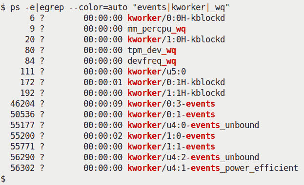

图 5.10 - 为内核工作队列的底半部机制提供服务的几个内核线程

正如我们在*创建和使用内核线程*部分中提到的，了解 kthread 的名称并了解 kthreads 的许多实际用途（以及如何调整它们以减少抖动）的一种方法是阅读相关的内核文档；也就是说，*减少由于每个 CPU kthreads 而导致的 OS 抖动*（[`www.kernel.org/doc/Documentation/kernel-per-CPU-kthreads.txt`](https://www.kernel.org/doc/Documentation/kernel-per-CPU-kthreads.txt)）。

关于如何使用工作队列（以及其他底半部机制），请参阅*第四章*，*处理硬件中断*，*硬中断、tasklet 和线程处理程序 - 何时使用*部分，特别是那里的表格。

重要的是要理解内核始终有一个可用的默认工作队列；它被称为***内核全局工作队列***或***系统工作队列***。为了避免过度使用系统，强烈建议您使用它。我们将使用内核全局工作队列，将我们的工作任务排队，并让它消耗我们的工作。

你甚至可以使用和创建其他类型的工作队列！内核提供了复杂的*cmwq*框架，以及一组 API，帮助您创建特定类型的工作队列。我们将在下一节中更详细地讨论这个问题。

## 最低限度的工作队列内部

我们在这里不会深入讨论工作队列的内部；实际上，我们只会浅尝辄止（正如我们之前提到的，我们在这里的目的只是专注于使用内核全局工作队列）。

始终建议您使用默认的内核全局（系统）工作队列来处理异步后台工作。如果认为这不够用，不用担心 - 有一些接口可以让您创建自己的工作队列。（请记住，这样做会增加系统的压力！）要分配一个新的工作队列实例，您可以使用`alloc_workqueue()` API；这是用于创建（分配）工作队列的主要 API（通过现代*cmwq*框架）：

```
include/linux/workqueue.h
struct workqueue_struct *alloc_workqueue(const char *fmt, unsigned int flags, int max_active, ...);
```

请注意，它是通过`EXPORT_SYMBOL_GPL()`导出的，这意味着它只对使用 GPL 许可证的模块和驱动程序可用。`fmt`（以及`max_active`后面的参数）指定了如何命名池中的工作队列线程。`flags`参数指定了特殊行为值或其他特性的位掩码，例如以下内容：

+   当工作队列在内存压力下需要前进保证时，请使用`WQ_MEM_RECLAIM`标志。

+   当工作项需要由一个优先级较高的 kthreads 工作池来服务时，请使用`WQ_HIGHPRI`标志。

+   使用`WQ_SYSFS`标志，使一些工作队列的细节通过 sysfs 对用户空间可见（实际上，在`/sys/devices/virtual/workqueue/`下查看）。

+   同样，还有其他几个标志。查看官方内核文档以获取更多详细信息（[`www.kernel.org/doc/Documentation/core-api/workqueue.rst`](https://www.kernel.org/doc/Documentation/core-api/workqueue.rst)；它提供了一些有趣的内容，关于减少内核中工作队列执行的“抖动”）。

`max_active`参数用于指定每个 CPU 可以分配给工作项的最大内核线程数。

大体上，有两种类型的工作队列：

+   **单线程**（**ST**）**工作队列或有序工作队列**：在这里，系统中任何给定时间只能有一个线程处于活动状态。它们可以使用`alloc_ordered_workqueue()`来创建（实际上只是一个在`alloc_workqueue()`上指定有序标志和`max_active`设置为`1`的包装器）。

+   **多线程**（**MT**）**工作队列**：这是默认选项。确切的`flags`指定了行为；`max_active`指定了每个 CPU 可能拥有的工作项的最大工作线程数。

所有的工作队列都可以通过`alloc_workqueue()` API 来创建。创建它们的代码如下：

```
// kernel/workqueue.c
​int __init workqueue_init_early(void)
{
    [ ... ]
    system_wq = alloc_workqueue("events", 0, 0);
    system_highpri_wq = alloc_workqueue("events_highpri", WQ_HIGHPRI, 0);
    system_long_wq = alloc_workqueue("events_long", 0, 0);
    system_unbound_wq = alloc_workqueue("events_unbound", WQ_UNBOUND, WQ_UNBOUND_MAX_ACTIVE);
    system_freezable_wq = alloc_workqueue("events_freezable", WQ_FREEZABLE, 0);
    system_power_efficient_wq = alloc_workqueue("events_power_efficient", WQ_POWER_EFFICIENT, 0);
    system_freezable_power_efficient_wq = alloc_workqueue("events_freezable_power_efficient",
                          WQ_FREEZABLE | WQ_POWER_EFFICIENT, 0);
[ ... ]
```

这发生在引导过程的早期（确切地说是在早期的 init 内核代码路径中）。第一个被加粗了；这是正在创建的内核全局工作队列或系统工作队列。它的工作池被命名为`events`。（属于这个池的内核线程的名称遵循这个命名约定，并且在它们的名称中有`events`这个词；再次参见*图 5.10*。其他工作池的 kthreads 也是如此。）

底层框架已经发展了很多；早期的*传统*工作队列框架（2010 年之前）曾经使用`create_workqueue()`和相关 API；然而，现在这些被认为是不推荐的。现代**并发管理工作队列**（**cmwq**）框架（2010 年以后）有趣的是，它向后兼容旧的框架。以下表总结了旧的工作队列 API 与现代 cmwq 的映射：

| **传统（旧的和不推荐的）工作队列 API** | **现代（cmwq）工作队列 API** |
| --- | --- |
| `create_workqueue(name)` | `alloc_workqueue(name,WQ_MEM_RECLAIM, 1)` |
| `create_singlethread_workqueue(name)` | `alloc_ordered_workqueue(name, WQ_MEM_RECLAIM)` |
| `create_freezable_workqueue(name)` | `alloc_workqueue(name, WQ_FREEZABLE &#124; WQ_UNBOUND &#124; WQ_MEM_RECLAIM, 1)` |

表 5.3 - 旧的工作队列 API 与现代 cmwq 的映射

以下图表以简单的概念方式总结了内核工作队列子系统：

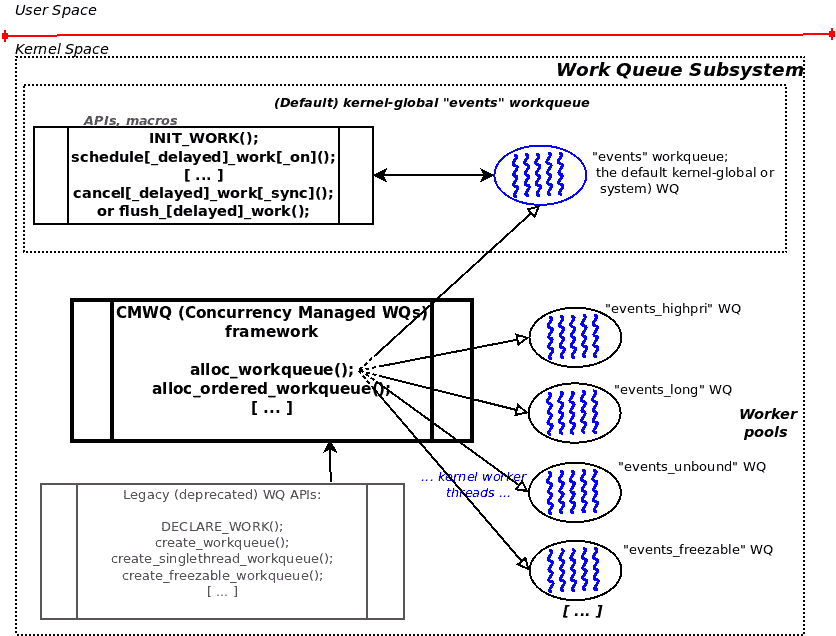

图 5.11 - 内核工作队列子系统的简单概念视图

内核的工作队列框架动态维护这些工作线程池；一些，如`events`工作队列（对应于全局内核工作队列）是通用的，而其他一些是为特定目的创建和维护的（就其内核线程的名称而言，如块 I/O，`kworker*blockd`，内存控制，`kworker*mm_percpu_wq`，特定设备的，如 tpm，`tpm_dev_wq`，CPU 频率管理驱动程序，`devfreq_wq`等）。

请注意，内核工作队列子系统自动、优雅、高效地维护所有这些工作队列（及其相关的内核线程的工作线程池）。

那么，您如何实际使用工作队列？下一节将向您展示如何使用全局内核工作队列。接下来将是一个演示内核模块，清楚地展示了其用法。

## 使用全局内核工作队列

在本节中，我们将学习如何使用全局内核（也称为系统或事件工作队列，这是默认的）工作队列。这通常涉及使用您的工作任务初始化工作队列，让它消耗您的工作，并最终进行清理。

### 为您的任务初始化全局内核工作队列 - INIT_WORK()

将工作排队到这个工作队列上实际上非常容易：使用`INIT_WORK()`宏！这个宏接受两个参数：

```
#include <linux/workqueue.h>
INIT_WORK(struct work_struct *_work, work_func_t _func);
```

`work_struct`结构是工作队列的工作结构（至少从模块/驱动程序作者的角度来看）；您需要为其分配内存并将指针作为第一个参数传递。`INIT_WORK()`的第二个参数是指向工作队列回调函数的指针 - 这个函数将被工作队列的工作线程消耗！`work_func_t`是一个`typedef`，指定了这个函数的签名，即`void (*work_func_t)(struct work_struct *work)`。

### 让您的工作任务执行 - schedule_work()

调用`INIT_WORK()`会将指定的工作结构和函数注册到内部默认的全局内核工作队列中。但它不会执行它 - 还没有！您需要在适当的时刻调用`schedule_work()`API 来告诉它何时执行您的“工作”：

```
bool schedule_work(struct work_struct *work);
```

显然，`schedule_work()`的参数是指向`work_struct`结构的指针（您之前通过`INIT_WORK()`宏初始化）。它返回一个布尔值（直接引用源代码）：如果@work 已经在全局内核工作队列上，则返回`%false`，否则返回`%true`。实际上，`schedule_work()`检查通过工作结构指定的函数是否已经在全局内核工作队列上；如果没有，它会将其排队在那里；如果它已经在那里，它会保持在同一位置（不会添加更多的实例）。然后标记工作项以执行。这通常会在相应的内核线程被调度时立即发生，从而给您一个运行您的工作的机会。

要使您的模块或驱动程序中的两个工作项（函数）通过（默认）全局内核工作队列执行，只需两次调用`INIT_WORK()`宏，每次传递不同的工作结构和函数。类似地，对于更多的工作项，为每个工作项调用`INIT_WORK()`...（例如，考虑这个内核块驱动程序（`drivers/block/mtip32xx/mtip32xx.c`）：显然，对于 Micron PCIe SSD，它在其探测方法中连续调用`INIT_WORK()`八次（！），使用数组来保存所有的项目）。

请注意，您可以在原子上下文中调用`schedule_work()`！这个调用是非阻塞的；它只是安排工作项在稍后的延迟（和安全）时间点被消耗时运行在进程上下文中。

#### 调度工作任务的变化

我们刚刚描述的`schedule_work()` API 有一些变体，所有这些变体都可以通过`schedule[_delayed]_work[_on]()`API 获得。让我们简要列举一下。首先，让我们看一下`schedule_delayed_work()`内联函数，其签名如下：

```
bool schedule_delayed_work(struct delayed_work *dwork, unsigned long delay);
```

当您希望延迟执行工作队列处理程序函数一定时间时，请使用此例程；第二个参数`delay`是您希望等待的`jiffies`数。现在，我们知道`jiffies`变量每秒增加`HZ`个`jiffies`；因此，要延迟`n`秒执行您的工作任务，请指定`n * jiffies`。同样，您也可以将`msecs_to_jiffies(n)`值作为第二个参数传递，以便`n`毫秒后执行。

接下来，请注意`schedule_delayed_work()`的第一个参数不同；它是一个`delayed_work`结构，其中包含了现在熟悉的`work_struct`结构作为成员，以及其他一些管理成员（内核定时器、指向工作队列结构的指针和 CPU 编号）。要初始化它，只需为其分配内存，然后利用`INIT_DELAYED_WORK()`宏（语法与`INIT_WORK()`保持相同）；它将负责所有初始化工作。

主题的另一个轻微变体是`schedule[_delayed]_work_on()`例程；名称中的`on`允许您指定执行工作任务时将在哪个 CPU 核心上安排。以下是`schedule_delayed_work_on()`内联函数的签名：

```
bool schedule_delayed_work_on(int cpu, struct delayed_work *dwork, unsigned long delay);
```

第一个参数指定要在其上执行工作任务的 CPU 核心，而其余两个参数与`schedule_delayed_work()`例程的参数相同。（您可以使用`schedule_delayed_work()`例程在给定的 CPU 核心上立即安排您的任务）。

### 清理 - 取消或刷新您的工作任务

在某个时候，您会希望确保您的工作任务已经完成执行。您可能希望在销毁工作队列之前（假设这是一个自定义创建的工作队列，而不是内核全局的工作队列），或者更可能是在使用内核全局工作队列时，在 LKM 或驱动程序的清理方法中执行此操作。在这里使用的典型 API 是`cancel_[delayed_]work[_sync]()`。它的变体和签名如下：

```
bool cancel_work_sync(struct work_struct *work);
bool cancel_delayed_work(struct delayed_work *dwork);
bool cancel_delayed_work_sync(struct delayed_work *dwork);
```

这很简单：一旦使用了`INIT_WORK()`和`schedule_work()`例程，请使用`cancel_work_sync()`；当您延迟了工作任务时，请使用后两者。请注意，其中两个例程的后缀是`_sync`；这意味着取消是*同步的* - 内核将等待您的工作任务完成执行，然后这些函数才会返回！这通常是我们想要的。这些例程返回一个布尔值：如果有待处理的工作，则返回`True`，否则返回`False`。

在内核模块中，不取消（或刷新）您的工作任务在清理（`rmmod`）代码路径中是导致严重问题的一种确定方法；请确保您这样做！

内核工作队列子系统还提供了一些`flush_*()`例程（包括`flush_scheduled_work()`、`flush_workqueue()`和`flush_[delayed_]work()`）。内核文档（[`www.kernel.org/doc/html/latest/core-api/workqueue.html`](https://www.kernel.org/doc/html/latest/core-api/workqueue.html)）明确警告我们，这些例程不容易使用，因为您很容易因为它们而导致死锁问题。建议您改用前面提到的`cancel_[delayed_]work[_sync]()`API。

### 工作流程的快速总结

在使用内核全局工作队列时，出现了一个简单的模式（工作流程）：

1.  *初始化*工作任务。

1.  在适当的时间点，*安排*它执行（也许延迟和/或在特定的 CPU 核心上）。

1.  清理。通常，在内核模块（或驱动程序）的清理代码路径中，*取消*它。（最好是同步进行，以便首先完成任何待处理的工作任务。在这里，我们将坚持使用推荐的`cancel*work*()`例程，避免使用`flush_*()`例程）。

让我们用表格总结一下：

| **使用内核全局工作队列** | **常规工作任务** | **延迟工作任务** | **在给定 CPU 上执行工作任务** |
| --- | --- | --- | --- |
| 1. 初始化 | `INIT_WORK()` | `INIT_DELAYED_WORK()` | *<立即或延迟都可以>* |
| 2. 安排工作任务执行 | `schedule_work()` | `schedule_delayed_work()` | `schedule_delayed_work_on()` |
| 3. 取消（或刷新）它；*foo_sync()*以确保它完成 | `cancel_work_sync()` | `cancel_delayed_work_sync()` | *<立即或延迟都可以>* |

表 5.4 - 使用内核全局工作队列 - 工作流程摘要

在接下来的几节中，我们将编写一个简单的内核模块，使用内核默认工作队列来执行工作任务。

## 我们的简单工作队列内核模块 - 代码视图

让我们动手使用工作队列！在接下来的几节中，我们将编写一个简单的演示内核模块（`ch5/workq_simple`），演示使用内核默认工作队列来执行工作任务。实际上，它是建立在我们之前用来演示内核定时器的 LKM（`ch5/timer_simple`）之上的。让我们来看看代码（像往常一样，我们不会在这里展示完整的代码，只展示最相关的部分）。我们将从它的私有上下文数据结构和*init*方法开始：

```
static struct st_ctx {
    struct work_struct work;
    struct timer_list tmr;
    int data;
} ctx;
[ ... ]
static int __init workq_simple_init(void)
{
    ctx.data = INITIAL_VALUE;
    /* Initialize our work queue */
 INIT_WORK(&ctx.work, work_func);
    /* Initialize our kernel timer */
    ctx.tmr.expires = jiffies + msecs_to_jiffies(exp_ms);
    ctx.tmr.flags = 0;
    timer_setup(&ctx.tmr, ding, 0);
    add_timer(&ctx.tmr); /* Arm it; let's get going! */
    return 0;
}
```

一个需要考虑的关键问题是：我们将如何将一些有用的数据项传递给我们的工作函数？`work_struct`结构只有一个用于内部目的的原子长整型。一个好的（非常典型的！）技巧是将你的`work_struct`结构嵌入到驱动程序的上下文结构中；然后，在工作任务回调函数中，使用`container_of()`宏来访问父上下文数据结构！这是一种经常使用的策略。（`container_of()`是一个强大的宏，但并不容易解释！我们在*进一步阅读*部分提供了一些有用的链接。）因此，在前面的代码中，我们的驱动程序上下文结构嵌入了一个`struct work_struct`。你可以在`INIT_WORK()`宏中看到我们的工作任务的初始化。

一旦定时器被装备好（`add_timer()`在这里起作用），它将在大约 420 毫秒后到期，并且定时器回调函数将在定时器 softirq 上下文中运行（这实际上是一个原子上下文）：

```
static void ding(struct timer_list *timer)
{ 
    struct st_ctx *priv = from_timer(priv, timer, tmr);
    pr_debug("timed out... data=%d\n", priv->data--);
    PRINT_CTX();

    /* until countdown done, fire it again! */
    if (priv->data)
        mod_timer(&priv->tmr, jiffies + msecs_to_jiffies(exp_ms));
    /* Now 'schedule' our work queue function to run */
    if (!schedule_work(&priv->work))
        pr_notice("our work's already on the kernel-global workqueue!\n");
}
```

在减少`data`变量之后，它设置定时器再次触发（通过`mod_timer()`，在 420 毫秒后），然后通过`schedule_work()` API，安排我们的工作队列回调运行！内核将意识到现在必须执行（消耗）工作队列函数，只要是可行的。但是等一下 - 工作队列回调必须且将仅在进程上下文中通过全局内核工作线程运行 - 所谓的事件线程。因此，只有在我们退出这个 softirq 上下文并且（其中之一）"事件"内核工作线程在 CPU 运行队列上，并且实际运行时，我们的工作队列回调函数才会被调用。

放松 - 它很快就会发生...使用工作队列的整个目的不仅是线程管理完全由内核负责，而且函数在进程上下文中运行，因此可以执行漫长的阻塞或 I/O 操作。

再次，多快是“很快”？让我们尝试测量一下：我们在`schedule_work()`之后立即（通过通常的`ktime_get_real_ns()`内联函数）获取一个时间戳作为工作队列函数中的第一行代码。我们信任的`SHOW_DELTA()`宏显示了时间差。正如预期的那样，它很小，通常在几百分之几微秒的范围内（当然，这取决于几个因素，包括硬件平台、内核版本等）。高负载系统会导致切换到事件内核线程花费更长的时间，这可能会导致工作队列的功能执行出现延迟。您将在以下部分的截图捕获（*图 5.12*）中看到一个样本运行。

以下代码是我们的工作任务函数。这是我们使用`container_of()`宏访问我们模块上下文结构的地方：

```
/* work_func() - our workqueue callback function! */
static void work_func(struct work_struct *work)
{
    struct st_ctx *priv = container_of(work, struct st_ctx, work);

    t2 = ktime_get_real_ns();
    pr_info("In our workq function: data=%d\n", priv->data);
    PRINT_CTX();
    SHOW_DELTA(t2, t1);
}
```

此外，我们的`PRINT_CTX()`宏的输出明确显示了这个函数是在进程上下文中运行的。

在*延迟*工作任务回调函数中使用`container_of()`时要小心 - 您必须将第三个参数指定为`struct delayed_work`的`work`成员（我们的一个练习问题让您尝试这个东西！也提供了解决方案...）。我建议您先掌握基础知识，然后再尝试自己做这个。

在下一节中，我们将运行我们的内核模块。

## 我们的简单工作队列内核模块 - 运行它

让我们试一试！看一下以下的截图：

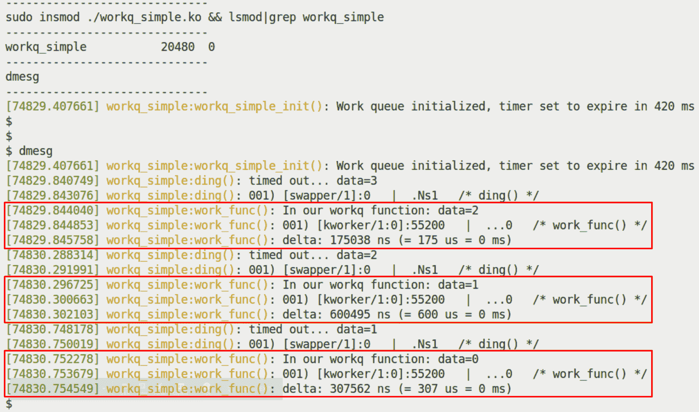

图 5.12 - 我们的 workq_simple.ko LKM，突出显示了工作队列函数的执行

让我们更详细地看一下这段代码：

+   通过我们的`lkm`辅助脚本，我们构建然后`insmod(8)`内核模块；也就是`workq_simple.ko`。

+   内核日志通过`dmesg(1)`显示：

+   在 init 方法中初始化和启用了工作队列和内核定时器。

+   定时器到期（大约 420 毫秒）；您可以看到它的 printks（显示`timed out...`和我们的`data`变量的值）。

+   它调用`schedule_work()`API，导致我们的工作队列函数运行。

+   如前面的截图所示，我们的工作队列函数`work_func()`确实运行了；它显示了数据变量的当前值，证明它正确地访问了我们的“上下文”或私有数据结构。

请注意，我们在这个 LKM 中使用了我们的`PRINT_CTX()`宏（它在我们的`convenient.h`头文件中）来揭示一些有趣的东西：

+   +   当它在定时器回调函数的上下文中运行时，它的状态位包含`s`字符（在四字符字段中的第三个字符 - `.Ns1`或类似的），表明它在*softirq*（中断、原子）上下文中运行。

+   当它在工作队列回调函数的上下文中运行时，它的状态位的第三个字符将*永远*不包含`s`字符；它将始终是一个`.`，*证明工作队列总是在进程上下文中执行！*

接下来，`SHOW_DELTA()`宏计算并输出了工作队列被调度和实际执行之间的时间差。正如您所看到的（至少在我们轻载的 x86_64 虚拟机上），它在几百微秒的范围内。

为什么不查找实际使用来消耗我们的工作队列的内核工作线程呢？在这里只需要对 PID 进行简单的`ps(1)`。在这种特殊情况下，它恰好是内核的每个 CPU 核心的通用工作队列消费者线程之一 - 一个内核工作线程（`kworker/...`线程）：

```
$ ps -el | grep -w 55200
 1 I     0   55200       2  0  80  0 -    0 -    ?       00:00:02 kworker/1:0-mm_percpu_wq
 $
```

当然，内核代码库中到处都是工作队列的使用（特别是许多设备驱动程序）。请使用`cscope(1)`来查找和浏览这类代码的实例。

## sed3 迷你项目 - 简要介绍

让我们通过简要地看一下我们的`sed2`项目演变为`sed3`来结束本章。这个小项目与`sed2`相同，只是更简单！（加/解密）工作现在是通过我们的工作任务（函数）通过内核的工作队列功能或底半机制来执行的。我们使用一个工作队列 - 默认的内核全局工作队列 - 来完成工作，而不是手动创建和管理 k 线程（就像我们在`sed2`中所做的那样）！

以下截图显示我们访问样本运行的内核日志；在运行中，我们让用户模式应用程序进行加密，然后解密，最后检索消息进行查看。我们在这里突出显示了有趣的部分 - 通过内核全局工作队列的工作线程执行我们的工作任务 - 在两个红色矩形中：

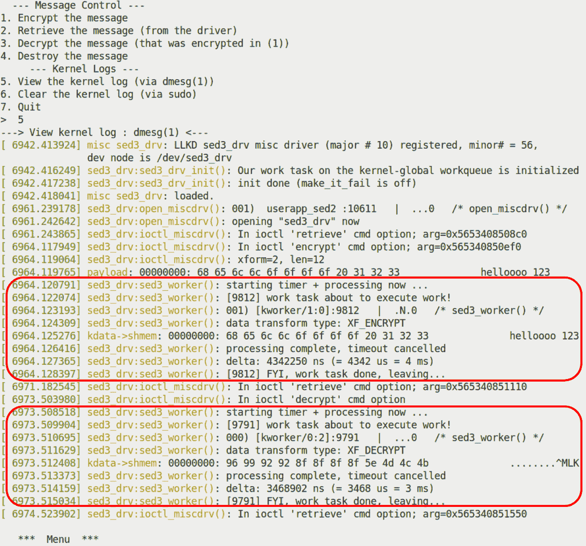

图 5.13 - 运行我们的 sed3 驱动程序时的内核日志；通过默认的内核全局工作队列运行的工作任务被突出显示

顺便说一句，用户模式应用程序与我们在`sed2`中使用的应用程序相同。前面的截图显示了（通过我们可靠的`PRINT_CTX()`宏）内核工作线程，内核全局工作队列用于运行我们的加密和解密工作；在这种情况下，加密工作是`[kworker/1:0]` PID 9812，解密工作是`[kworker/0:2]` PID 9791。请注意它们都在进程上下文中运行。我们将让您浏览`sed3`（`ch5/sed3`）的代码。

这就结束了本节。在这里，您了解了内核工作队列基础设施确实是模块/驱动程序作者的福音，因为它帮助您在关于内核线程的底层细节、它们的创建以及复杂的管理和操作方面添加了一个强大的抽象层。这使得您可以非常轻松地在内核中执行工作 - 尤其是通过使用预先存在的内核全局（默认）工作队列 - 而不必担心这些令人讨厌的细节。

# 总结

干得好！在本章中，我们涵盖了很多内容。首先，您学会了如何在内核空间中创建延迟，包括原子和阻塞类型（通过`*delay()`和`*sleep()`例程）。接下来，您学会了如何在 LKM（或驱动程序）中设置和使用内核定时器 - 这是一个非常常见和必需的任务。直接创建和使用内核线程可能是一种令人兴奋（甚至困难）的体验，这就是为什么您学会了如何做到这一点的基础知识。之后，您看了内核工作队列子系统，它解决了复杂性（和并发性）问题。您了解了它是什么，以及如何实际利用内核全局（默认）工作队列在需要时执行您的工作任务。

我们设计和实现的三个`sed`（简单加密解密）演示驱动程序向您展示了这些有趣技术的一个更复杂的用例：`sed1`实现了超时，`sed2`增加了内核线程来执行工作，`sed3`使用内核全局工作队列在需要时消耗工作。

请花一些时间来解决本章的以下*问题*/练习，并浏览*进一步阅读*资源。完成后，我建议您休息一下，然后重新开始。我们快要完成了：最后两章涵盖了一个非常关键的主题 - 内核同步！

# 问题

1.  找出以下伪代码中的错误。

```
static my_chip_tasklet(void)
{
    // ... process data
    if (!copy_to_user(to, from, count)) {
        pr_warn("..."); [...]
    }
}
static irqreturn_t chip_hardisr(int irq, void *data)
{
    // ack irq
    // << ... fetch data into kfifo ... >>
    // << ... call func_a(), delay, then call func_b() >>
    func_a();
    usleep(100); // 100 us delay required here! see datasheet pg ...
    func_b();
    tasklet_schedule(...);
    return IRQ_HANDLED;
}
my_chip_probe(...)
{
    // ...
    request_irq(CHIP_IRQ, chip_hardisr, ...);
    // ...
    tasklet_init(...);
}
```

1.  `timer_simple_check`: 增强`timer_simple`内核模块，以便检查设置超时和实际服务之间经过的时间量。

1.  `kclock`: 编写一个内核模块，设置一个内核定时器，以便每秒超时一次。然后，使用这个来将时间戳打印到内核日志中，实际上得到一个简单的“时钟应用程序”在内核中。

1.  `mutlitime`*：开发一个内核模块，以秒数作为参数发出定时器回调。默认为零（表示没有定时器，因此是一个有效性错误）。它应该这样工作：如果传递的数字是 3，它应该创建三个内核定时器；第一个将在 3 秒后到期，第二个在 2 秒后到期，最后一个在 1 秒后到期。换句话说，如果传递的数字是“n”，它应该创建“n”个内核定时器；第一个将在“n”秒后到期，第二个在“n-1”秒后到期，第三个在“n-2”秒后到期，依此类推，直到计数达到零。

1.  在本章中提供的`sed[123]`迷你项目中构建并运行，并通过查看内核日志验证它们是否按预期工作。

1.  `workq_simple2`：我们提供的`ch5/workq_simple` LKM 设置并通过内核全局工作队列“消耗”一个工作项（函数）；增强它，以便设置并执行两个“工作”任务。验证它是否正常工作。

1.  `workq_delayed`：在之前的任务（`workq_simple2`）的基础上构建，以执行两个工作任务，再加上一个任务（来自 init 代码路径）。第三个任务应该延迟执行；延迟的时间量应该作为名为`work_delay_ms`的模块参数传递（以毫秒为单位；默认值应为 500 毫秒）。

[*提示：*在延迟工作任务回调函数中使用`container_of()`时要小心；您必须将第三个参数指定为`struct delayed_work`的`work`成员；查看我们提供的解决方案]。

您将在书的 GitHub 存储库中找到一些问题的答案：[`github.com/PacktPublishing/Linux-Kernel-Programming-Part-2/tree/main/solutions_to_assgn`](https://github.com/PacktPublishing/Linux-Kernel-Programming-Part-2/tree/main/solutions_to_assgn)。

# 进一步阅读

+   内核文档：*延迟，睡眠机制*：[`www.kernel.org/doc/Documentation/timers/timers-howto.tx`](https://www.kernel.org/doc/Documentation/timers/timers-howto.txt)

+   内核定时器系统：[`elinux.org/Kernel_Timer_Systems#Timer_information`](https://elinux.org/Kernel_Timer_Systems#Timer_information)

+   工作队列：

+   这是一个非常好的演示：*使用工作队列进行异步执行*，Bhaktipriya Shridhar：[`events.static.linuxfound.org/sites/events/files/slides/Async%20execution%20with%20wqs.pdf`](https://events.static.linuxfound.org/sites/events/files/slides/Async%20execution%20with%20wqs.pdf)

+   内核文档：*并发管理工作队列（cmwq）*：[`www.kernel.org/doc/html/latest/core-api/workqueue.html#concurrency-managed-workqueue-cmwq`](https://www.kernel.org/doc/html/latest/core-api/workqueue.html#concurrency-managed-workqueue-cmwq)

+   解释了`container_of()`宏：

+   *神奇的 container_of()宏*，2012 年 11 月：[`radek.io/2012/11/10/magical-container_of-macro/`](https://radek.io/2012/11/10/magical-container_of-macro/)

+   *在 Linux 内核中理解 container_of 宏*：[`embetronicx.com/tutorials/linux/c-programming/understanding-of-container_of-macro-in-linux-kernel/`](https://embetronicx.com/tutorials/linux/c-programming/understanding-of-container_of-macro-in-linux-kernel/)
