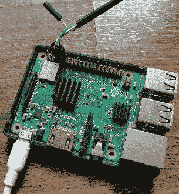
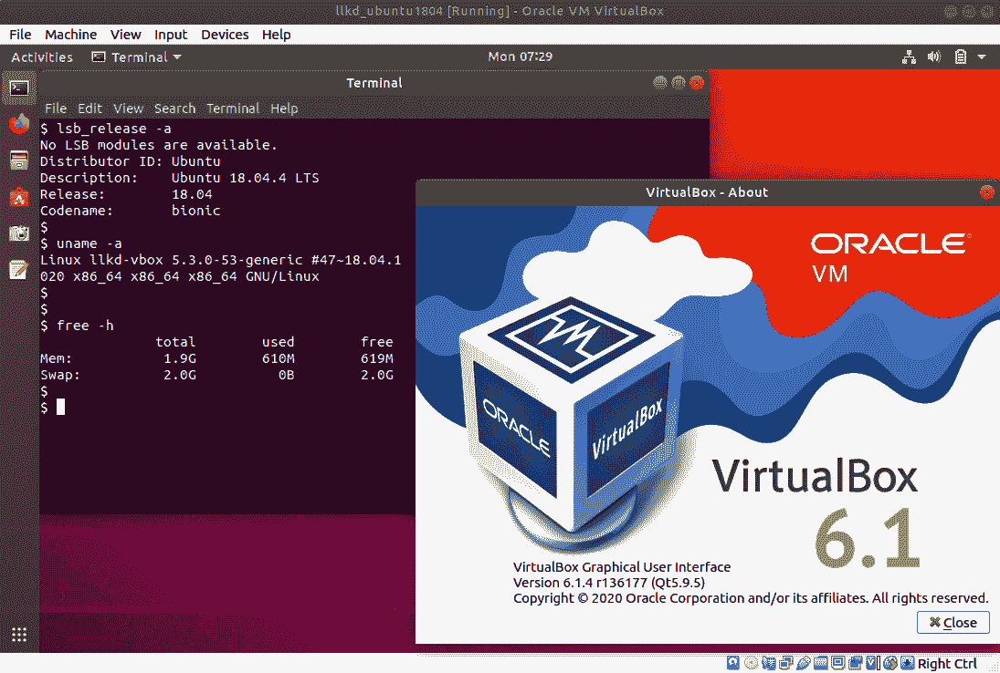
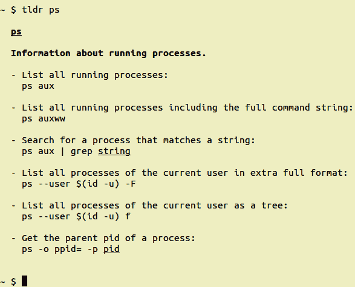
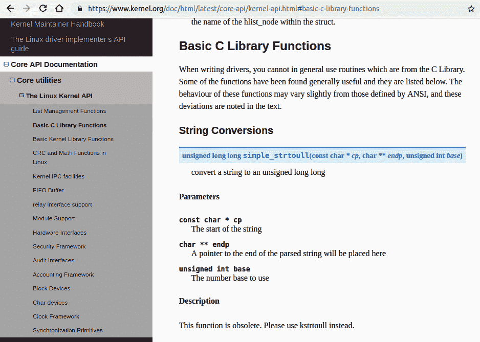
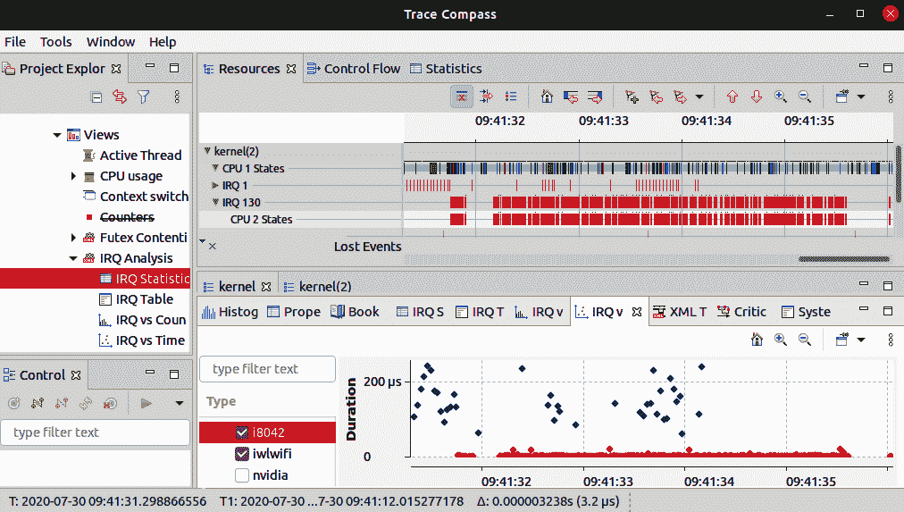
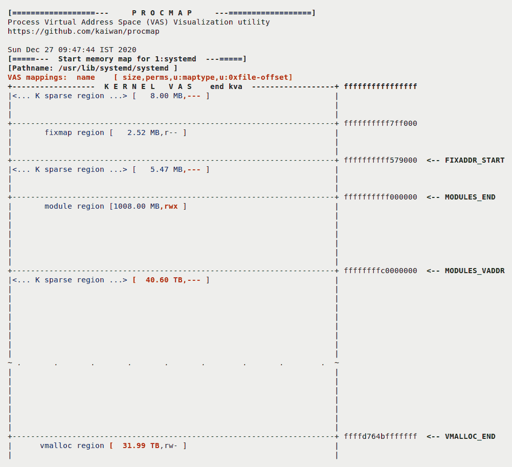
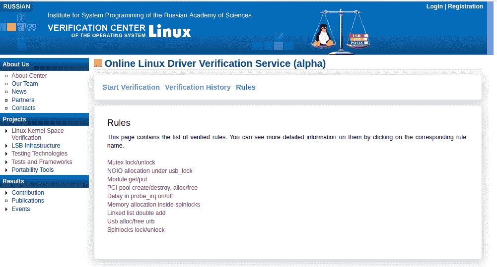

# 第一章：内核工作区设置

你好，欢迎来到这本关于学习 Linux 内核开发的书。为了充分利用本书，非常重要的是您首先设置我们将在整本书中使用的工作区环境。本章将教您如何做到这一点并开始。

我们将安装最新的 Linux 发行版，最好作为**虚拟机**（**VM**），并设置它以包括所有必需的软件包。我们还将在 GitHub 上克隆本书的代码库，并了解一些有用的项目，这些项目将在这个过程中帮助我们。

学习某事的最佳方法是*经验主义*-不要完全相信任何人的话，而是尝试并亲身体验。因此，本书为您提供了许多实践实验和内核代码示例，您可以并且必须自己尝试；这将极大地帮助您取得实质性进展，深入学习和理解 Linux 内核和驱动程序开发的各个方面。所以，让我们开始吧！

本章将带领我们通过以下主题，帮助我们设置我们的环境：

+   作为客户 VM 运行 Linux

+   设置软件-分发和软件包

+   一些额外有用的项目

# 技术要求

您需要一台现代台式机或笔记本电脑。Ubuntu 桌面指定了以下作为“推荐系统要求”的分发安装和使用：

+   2 GHz 双核处理器或更好。

+   内存：

+   在物理主机上运行：2 GB 或更多系统内存（更多肯定会有所帮助）。

+   作为客户 VM 运行：主机系统应至少有 4 GB RAM（内存越多越好，体验越流畅）。

+   25 GB 的可用硬盘空间（我建议更多，至少是这个的两倍）。

+   安装介质的 DVD 驱动器或 USB 端口（在设置 Ubuntu 作为客户 VM 时不需要）。

+   互联网访问绝对是有帮助的，有时是必需的。

由于从源代码构建 Linux 内核等任务是一个非常消耗内存和 CPU 的过程，我强烈建议您在具有充足内存和磁盘空间的强大 Linux 系统上尝试。很明显-主机系统的 RAM 和 CPU 功率越大，越好！

像任何经验丰富的内核贡献者一样，我会说在本地 Linux 系统上工作是最好的。但是，出于本书的目的，我们不能假设您总是有一个专用的本地 Linux 框可供使用。因此，我们将假设您正在使用 Linux 客户端。在客户 VM 中工作还增加了一个额外的隔离层，因此更安全。

**克隆我们的代码库**：本书的完整源代码可以在 GitHub 上免费获取，网址为[`github.com/PacktPublishing/Linux-Kernel-Programming`](https://github.com/PacktPublishing/Learn-Linux-Kernel-Development)*.* 您可以通过克隆`git`树来克隆并使用它。

```
git clone https://github.com/PacktPublishing/Linux-Kernel-Programming.git
```

源代码按章节组织。每个章节都表示为一个目录-例如，`ch1/`包含本章的源代码。源树的根目录有一些对所有章节都通用的代码，比如源文件`convenient.h`，`klib_llkd.c`等等。

为了高效地浏览代码，我强烈建议您始终使用`ctags(1)`和/或`cscope(1)`对代码库进行索引。例如，要设置`ctags`索引，只需`cd`到源树的根目录，然后输入`ctags -R`。

除非另有说明，我们在书中展示的代码输出是在 x86-64 *Ubuntu 18.04.3 LTS* 客户 VM 上看到的输出（在 Oracle VirtualBox 6.1 下运行）。您应该意识到，由于（通常是轻微的）分布-甚至在相同的发行版中但是不同的版本-差异，这里显示的输出可能不完全匹配您在 Linux 系统上看到的内容。

# 作为客户 VM 运行 Linux

正如之前讨论的，与使用本机 Linux 系统相比，一个实用和方便的替代方法是在虚拟机上安装和使用 Linux 发行版作为客户端操作系统。重要的是，您安装一个最近的 Linux 发行版，最好作为虚拟机，以确保安全并避免不愉快的数据丢失或其他意外。事实上，当在内核级别工作时，突然崩溃系统（以及由此产生的数据丢失风险）实际上是一个常见的情况。我建议使用**Oracle VirtualBox 6.x**（或最新的稳定版本）或其他虚拟化软件，如**VMware Workstation***.*

这两者都是免费提供的。只是这本书的代码已经在*VirtualBox 6.1*上进行了测试。Oracle VirtualBox 被认为是**开源软件**（**OSS**），并且根据 GPL v2 许可（与 Linux 内核相同）。您可以从[`www.virtualbox.org/wiki/Downloads`](https://www.virtualbox.org/wiki/Downloads)下载它。其文档可以在这里找到：[`www.virtualbox.org/wiki/End-user_documentation`](https://www.virtualbox.org/wiki/End-user_documentation)。

主机系统应该是 MS Windows 10 或更高版本（当然，甚至 Windows 7 也可以），最近的 Linux 发行版（例如 Ubuntu 或 Fedora）或 macOS。因此，让我们通过安装我们的 Linux 客户端来开始。

## 安装 64 位 Linux 客户端

在这里，我不会深入讨论在 Oracle VirtualBox 上安装 Linux 作为客户端的细节，原因是这种安装与 Linux 内核开发*没有*直接关联。有许多设置 Linux 虚拟机的方法；我们真的不想在这里讨论每种方法的细节和利弊。

但如果您对此不熟悉，不用担心。为了您的方便，这里有一些非常好的资源可以帮助您：

+   Abhishek Prakash 撰写的非常清晰的教程，名为*在 VirtualBox 中在 Windows 上安装 Linux*（*It's FOSS！，2019 年 8 月*）：[`itsfoss.com/install-linux-in-virtualbox/`](https://itsfoss.com/install-linux-in-virtualbox/)。

+   另一个同样出色的资源是*在 Oracle VirtualBox 上安装 Ubuntu：*[`brb.nci.nih.gov/seqtools/installUbuntu.html`](https://brb.nci.nih.gov/seqtools/installUbuntu.html)。

此外，您可以在本章末尾的*进一步阅读*部分查找有关在 VirtualBox 上安装 Linux 客户端的有用资源。

在安装 Linux 虚拟机时，请记住以下几点。

### 打开您的 x86 系统的虚拟化扩展支持

安装 64 位 Linux 客户端需要在主机系统的**基本输入/输出系统**（**BIOS**）设置中打开 CPU 虚拟化扩展支持（Intel VT-x 或 AMD-SV）。让我们看看如何做到这一点：

1.  我们的第一步是确保我们的 CPU 支持虚拟化：

1.  **在 Windows 主机上检查这一点有两种广泛的方法**：

+   首先，运行任务管理器应用程序并切换到性能选项卡。在 CPU 图表下，您将看到，除其他几个选项外，有一个名为虚拟化的选项，后面跟着启用或禁用。

+   在 Windows 系统上检查的第二种方法是打开命令窗口（cmd）。在命令提示符中，键入`systeminfo`并按*Enter*。在输出中将看到`固件中启用了虚拟化`一行。它将后面跟着`是`或`否`。

1.  **在 Linux 主机上检查这一点**，从终端，输入以下命令（处理器虚拟化扩展支持：`vmx`是 Intel 处理器的检查，`smv`是 AMD 处理器的检查）：

```
egrep --color "vmx|svm" /proc/cpuinfo 
```

对于 Intel CPU，如果支持虚拟化，`vmx`标志将显示出来（以颜色显示）。对于 AMD CPU，`svm`将显示出来（以颜色显示）。有了这个，我们知道我们的 CPU 支持虚拟化。但是为了使用它，我们需要在计算机 BIOS 中启用它。

1.  通过按*Del*或*F12*进入 BIOS（按键的确切按键因 BIOS 而异）。请参阅系统手册，了解要使用哪个键。搜索诸如`虚拟化`或`虚拟化技术（VT-x）`之类的术语。以下是 Award BIOS 的示例：

！[](img/72bfc0d7-0c9b-4ffc-8393-427ca3b78384.png)

图 1.1 - 将 BIOS 虚拟化选项设置为已启用状态

如果您使用的是 Asus EFI-BIOS，则如果默认情况下未设置该条目，则必须将该条目设置为`[Enabled]`。访问[`superuser.com/questions/367290/how-to-enable-hardware-virtualization-on-asus-motherboard/375351#375351`](https://superuser.com/questions/367290/how-to-enable-hardware-virtualization-on-asus-motherboard/375351#375351)。 [](https://superuser.com/questions/367290/how-to-enable-hardware-virtualization-on-asus-motherboard/375351#375351)

1.  现在，选择在 VM 的 VirtualBox 设置菜单中使用硬件虚拟化。要做到这一点，请单击系统，然后加速。之后，检查框，如下面的屏幕截图所示：

！[](img/e815207f-62a8-4a25-ae0b-b27d80b98be6.png)

图 1.2 - 在 VirtualBox VM 设置中启用硬件虚拟化选项

这就是我们启用主机处理器的硬件虚拟化功能以获得最佳性能的方法。

### 为磁盘分配足够的空间

对于大多数台式机/笔记本系统，为客户 VM 分配 1 GB 的 RAM 和两个 CPU 应该足够了。

但是，在为客户的磁盘分配空间时，请慷慨一些。我强烈建议您将其设置为 50 GB 甚至更多，而不是通常/默认的 8 GB 建议。当然，这意味着主机系统有更多的磁盘空间可用！此外，您可以将此金额指定为*动态分配*或*按需分配*。虚拟机监视程序将以最佳方式“增长”虚拟磁盘，而不是一开始就给它整个空间。

### 安装 Oracle VirtualBox 客户附加组件

为了获得最佳性能，重要的是在客户 VM 中安装 Oracle VirtualBox 客户附加组件。这些本质上是用于优化性能的 para-virtualization 加速软件。让我们看看如何在 Ubuntu 客户会话中执行此操作：

1.  首先，更新您的 Ubuntu 客户操作系统的软件包。您可以使用以下命令来执行此操作：

```
sudo apt update

sudo apt upgrade 
```

1.  完成后，重新启动您的 Ubuntu 客户操作系统，然后使用以下命令安装所需的软件包：

```
sudo apt install build-essential dkms linux-headers-$(uname -r)
```

1.  现在，从 VM 菜单栏，转到设备 | 插入客户附加 CD 映像.... 这将在 VM 内部挂载`客户附加 ISO`文件。以下屏幕截图显示了这样做的样子：

！[](img/389c7708-c2c5-4b5b-b039-a454da17fab0.png)

图 1.3 - VirtualBox | 设备 | 插入客户附加 CD 映像

1.  现在，将弹出一个对话框窗口，提示您运行安装程序以启动它。选择运行。

1.  客户添加安装现在将在显示的终端窗口中进行。完成后，按*Enter*键关闭窗口。然后，关闭 Ubuntu 客户操作系统，以便从 VirtualBox 管理器更改一些设置，如下所述。

1.  现在，要在客户机和主机之间启用共享剪贴板和拖放功能，请转到常规 | 高级，并使用下拉菜单启用两个选项（共享剪贴板和拖放）：

！[](img/aa611c54-cea4-4676-8abc-c0e5cd159d39.png)

图 1.4 - VirtualBox：启用主机和客户之间的功能

1.  然后，单击 OK 保存设置。现在启动到您的客户系统，登录并测试一切是否正常工作。

截至撰写本文时，Fedora 29 在安装所需的共享文件夹功能的`vboxsf`内核模块时存在问题。我建议您参考以下资源来尝试纠正这种情况：*Bug 1576832* - virtualbox-guest-additions does not mount shared folder (*[`bugzilla.redhat.com/show_bug.cgi?id=1576832`](https://bugzilla.redhat.com/show_bug.cgi?id=1576832))。如果这种方法不起作用，您可以使用`scp(1)`通过 SSH 在主机和来宾 VM 之间传输文件；要这样做，请使用以下命令安装并启动 SSH 守护程序：

`sudo yum install openssh-server`

`sudo systemctl start sshd`

记得定期更新来宾 VM，当提示时。这是一个必要的安全要求。您可以通过以下方式手动执行：

```
sudo /usr/bin/update-manager 
```

最后，请不要在来宾 VM 上保存任何重要数据。我们将进行内核开发。崩溃来宾内核实际上是一个常见的情况。虽然这通常不会导致数据丢失，但你永远无法确定！为了安全起见，请始终备份任何重要数据。这也适用于 Fedora。要了解如何将 Fedora 安装为 VirtualBox 来宾，请访问[`fedoramagazine.org/install-fedora-virtualbox-guest/`](https://fedoramagazine.org/install-fedora-virtualbox-guest/)。

有时，特别是当 X Window 系统（或 Wayland）GUI 的开销太高时，最好只是在控制台模式下工作。您可以通过在引导加载程序中的内核命令行中附加`3`（运行级别）来实现。但是，在 VirtualBox 中以控制台模式工作可能不是那么愉快的体验（例如，剪贴板不可用，屏幕大小和字体不太理想）。因此，只需从主机系统中进行远程登录（通过`ssh`，`putty`或等效工具）到 VM 中，这是一种很好的工作方式。

## 使用树莓派进行实验

树莓派是一种流行的信用卡大小的**单板计算机**（**SBC**），就像一个具有 USB 端口，microSD 卡，HDMI，音频，以太网，GPIO 等的小型 PC。驱动它的**SoC**（**系统芯片**）来自 Broadcom，其中包含 ARM 核心或核心集群。当然，这并非强制要求，但在本书中，我们还努力在树莓派 3 Model B+目标上测试和运行我们的代码。在不同的目标架构上运行代码始终是发现可能缺陷并有助于测试的好方法。我鼓励您也这样做：



图 1.5-连接到其 GPIO 引脚的树莓派的 USB 到串行适配器电缆

您可以使用数字监视器/电视通过 HDMI 作为输出设备和传统键盘/鼠标通过其 USB 端口，或者更常见的是通过`ssh(1)`远程 shell 在树莓派目标上工作。但是，在某些情况下，SSH 方法并不适用。在树莓派上有一个*串行控制台*有所帮助，特别是在进行内核调试时。

我建议您查看以下文章，该文章将帮助您建立 USB 到串行连接，从而可以从 PC /笔记本电脑登录到树莓派的控制台：*使用树莓派在控制台上工作，* kaiwanTECH：[`kaiwantech.wordpress.com/2018/12/16/working-on-the-console-with-the-raspberry-pi/`](https://kaiwantech.wordpress.com/2018/12/16/working-on-the-console-with-the-raspberry-pi/)。

要设置您的树莓派，请参阅官方文档：[`www.raspberrypi.org/documentation/`](https://www.raspberrypi.org/documentation/)。我们的树莓派系统运行“官方”Raspbian（树莓派的 Debian）Linux 操作系统，带有最新（写作时）的 4.14 Linux 内核。在树莓派的控制台上，我们运行以下命令：

```
rpi $ lsb_release -a
No LSB modules are available.
Distributor ID: Raspbian
Description:    Raspbian GNU/Linux 9.6 (stretch)
Release:        9.6
Codename:       stretch
rpi $ uname -a
Linux raspberrypi 4.14.79-v7+ #1159 SMP Sun Nov 4 17:50:20 GMT 2018 armv7l GNU/Linux
rpi $ 
```

如果您没有树莓派，或者它不方便使用，那怎么办？嗯，总是有办法——模拟！虽然不如拥有真正的设备好，但用强大的**自由开源软件**（**FOSS**）模拟器**QEMU**或**Quick Emulator**模拟树莓派是一个不错的开始方式，至少是这样。

由于设置通过 QEMU 模拟树莓派的细节超出了本书的范围，我们将不予涵盖。但是，您可以查看以下链接以了解更多信息：*在 Linux 上模拟树莓派*：[`embedonix.com/articles/linux/emulating-raspberry-pi-on-linux/`](http://embedonix.com/articles/linux/emulating-raspberry-pi-on-linux/)和*qemu-rpi-kernel，GitHub*：[`github.com/dhruvvyas90/qemu-rpi-kernel/wiki`](https://github.com/dhruvvyas90/qemu-rpi-kernel/wiki)。

当然，您不必局限于树莓派家族；还有几个其他出色的原型板可供选择。其中一个让人印象深刻的是流行的**BeagleBone Black**（**BBB**）开发板。

实际上，对于专业开发和产品工作来说，树莓派并不是最佳选择，原因有几个……稍微搜索一下就能理解。话虽如此，作为学习和基本原型环境，它很难被超越，因为它拥有强大的社区（和技术爱好者）支持。

在这篇深度文章中，讨论并对比了几种嵌入式 Linux（以及更多）的现代微处理器选择：*SO YOU WANT TO BUILD AN EMBEDDED LINUX SYSTEM?*，Jay Carlson，2020 年 10 月：[`jaycarlson.net/embedded-linux/`](https://jaycarlson.net/embedded-linux/)；请查看。

到目前为止，我希望您已经设置了 Linux 作为虚拟机（或者正在使用本地的“测试”Linux 框）并克隆了本书的 GitHub 代码库。到目前为止，我们已经涵盖了一些关于将 Linux 设置为虚拟机（以及可选地使用树莓派或 BeagleBone 等开发板）的信息。现在让我们继续进行一个关键步骤：在我们的 Linux 虚拟系统上实际安装软件组件，以便我们可以在系统上学习和编写 Linux 内核代码！

# 设置软件——发行版和软件包

建议使用以下或更高版本的稳定版 Linux 发行版。正如前一节中提到的，它们始终可以安装为 Windows 或 Linux 主机系统的虚拟操作系统，首选当然是 Ubuntu Linux 18.04 LTS 桌面。以下截图显示了推荐的版本和用户界面：



图 1.6 - Oracle VirtualBox 6.1 运行 Ubuntu 18.04.4 LTS 作为虚拟机

上一个版本——Ubuntu 18.04 LTS 桌面——至少对于本书来说是首选版本。选择这个版本的两个主要原因很简单：

+   Ubuntu Linux 是当今工业中最受欢迎的 Linux（内核）开发工作站环境之一，如果不是*最*受欢迎的话。

+   由于篇幅和清晰度的限制，我们无法在本书中展示多个环境的代码/构建输出。因此，我们选择以 Ubuntu 18.04 LTS 桌面上看到的输出来展示。

Ubuntu 16.04 LTS 桌面也是一个不错的选择（它也有**长期支持**（**LTS**）），一切都应该可以正常工作。要下载它，请访问[`www.ubuntu.com/download/desktop`](https://www.ubuntu.com/download/desktop)。

还可以考虑一些其他 Linux 发行版，包括以下内容：

+   **CentOS 8 Linux（不是 CentOS Stream）**：CentOS Linux 是一个基本上是 RedHat 流行企业服务器发行版（在我们的案例中是 RHEL 8）的克隆。您可以从这里下载：[`www.centos.org/download/`](https://www.centos.org/download/)。

+   **Fedora Workstation**：Fedora 也是一个非常知名的 FOSS Linux 发行版。您可以将其视为 RedHat 企业产品中最终会出现的项目和代码的测试平台。从[`getfedora.org/`](https://getfedora.org/)下载（下载 Fedora Workstation 镜像）。

+   **Raspberry Pi 作为目标**：最好参考官方文档来设置您的 Raspberry Pi（*Raspberry Pi 文档*：[`www.raspberrypi.org/documentation/`](https://www.raspberrypi.org/documentation/)）。也许值得注意的是，广泛提供完全预安装的 Raspberry Pi“套件”，还配备了一些硬件配件。

如果您想学习如何在 SD 卡上安装 Raspberry Pi OS 映像，请访问[`www.raspberrypi.org/documentation/installation/installing-images/`](https://www.raspberrypi.org/documentation/installation/installing-images)。

+   **BeagleBone Black 作为目标**：BBB 与 Raspberry Pi 一样，是业余爱好者和专业人士非常受欢迎的嵌入式 ARM SBC。您可以从这里开始：[`beagleboard.org/black`](https://beagleboard.org/black)。BBB 的系统参考手册可以在这里找到：[`cdn.sparkfun.com/datasheets/Dev/Beagle/BBB_SRM_C.pdf`](https://cdn.sparkfun.com/datasheets/Dev/Beagle/BBB_SRM_C.pdf)。尽管我们没有在 BBB 上运行示例，但它仍然是一个有效的嵌入式 Linux 系统，一旦正确设置，您可以在上面运行本书的代码。

在我们结束对书中软件发行版的选择讨论之前，还有一些要注意的地方：

+   这些发行版在其默认形式下是 FOSS 和非专有的，可以作为最终用户免费使用。

+   尽管我们的目标是成为与 Linux 发行版无关，但代码只在 Ubuntu 18.04 LTS 上进行了测试，并在 CentOS 8 上进行了“轻微”测试，以及在运行基于 Debian 的 Raspbian GNU/Linux 9.9（stretch）的 Raspberry Pi 3 Model B+上进行了测试。

+   我们将尽可能使用最新的（在撰写时）**稳定的 LTS**

**Linux 内核版本 5.4**用于我们的内核构建和代码运行。作为 LTS 内核，5.4 内核是一个非常好的选择来运行和学习。

有趣的是，5.4 LTS 内核的寿命将会很长；从 2019 年 11 月一直到 2025 年 12 月！这是个好消息：本书的内容将在未来几年内保持最新和有效！

+   对于这本书，我们将以名为`llkd`的用户帐户登录。

要最大限度地提高安全性（使用最新的防御和修复），您必须运行最新的**长期支持**（**LTS**）内核，以便用于您的项目或产品。

现在我们已经选择了我们的 Linux 发行版和/或硬件板和 VM，是时候安装必要的软件包了。

## 安装软件包

当您使用典型的 Linux 桌面发行版（如任何最近的 Ubuntu、CentOS 或 Fedora Linux 系统）时，默认安装的软件包将包括系统程序员所需的最小设置：本地工具链，其中包括`gcc`编译器和头文件，以及`make`实用程序/软件包。

在本书中，我们将学习如何使用 VM 和/或在外部处理器（ARM 或 AArch64 是典型情况）上运行的目标系统编写内核空间代码。为了有效地在这些系统上开发内核代码，我们需要安装一些软件包。继续阅读。

### 安装 Oracle VirtualBox 客户附加组件

确保您已安装了客户端 VM（如前所述）。然后，跟着做：

1.  登录到您的 Linux 客户 VM，首先在终端窗口（shell 上）运行以下命令：

```
sudo apt update
sudo apt install gcc make perl
```

1.  现在安装 Oracle VirtualBox 客户附加组件。参考*如何在 Ubuntu 中安装 VirtualBox 客户附加组件：*[`www.tecmint.com/install-virtualbox-guest-additions-in-ubuntu/`](https://www.tecmint.com/install-virtualbox-guest-additions-in-ubuntu/)。

只有当您将 Ubuntu 作为使用 Oracle VirtualBox 作为 hypervisor 应用程序的 VM 运行时才适用。

### 安装所需的软件包

要安装这些软件包，请执行以下步骤：

1.  在 Ubuntu VM 中，首先执行以下操作：

```
sudo apt update
```

1.  现在，在一行中运行以下命令：

```
sudo apt install git fakeroot build-essential tar ncurses-dev tar xz-utils libssl-dev bc stress python3-distutils libelf-dev linux-headers-$(uname -r) bison flex libncurses5-dev util-linux net-tools linux-tools-$(uname -r) exuberant-ctags cscope sysfsutils gnome-system-monitor curl perf-tools-unstable gnuplot rt-tests indent tree pstree smem libnuma-dev numactl hwloc bpfcc-tools sparse flawfinder cppcheck tuna hexdump openjdk-14-jre trace-cmd virt-what
```

首先执行安装`gcc`，`make`和`perl`的命令，以便可以直接安装 Oracle VirtualBox Guest Additions。这些（Guest Additions）本质上是 para-virtualization 加速软件。安装它们对于性能优化很重要。

这本书有时提到在另一个 CPU 架构上运行程序-通常是 ARM-可能是一个有用的练习。如果您想尝试（有趣！）这样的东西，请继续阅读；否则，可以随意跳到*重要的安装注意事项*部分。

### 安装交叉工具链和 QEMU

在 ARM 机器上尝试事物的一种方法是实际在物理 ARM-based SBC 上这样做；例如，树莓派是一个非常受欢迎的选择。在这种情况下，典型的开发工作流程是首先在 x86-64 主机系统上构建 ARM 代码。但为了这样做，我们需要安装一个**交叉工具链**-一组工具，允许您在一个设计为在不同*目标*CPU 上执行的主机 CPU 上构建软件。一个 x86-64 *主机*构建 ARM *目标*的程序是一个非常常见的情况，确实是我们的用例。稍后将详细介绍安装交叉编译器的详细信息。

通常，尝试事物的另一种方法是模拟 ARM/Linux 系统-这样可以减轻对硬件的需求！为此，我们建议使用出色的**QEMU**项目（[`www.qemu.org/`](https://www.qemu.org/)）。

要安装所需的 QEMU 软件包，请执行以下操作：

+   对于 Ubuntu 的安装，请使用以下命令：

```
sudo apt install qemu-system-arm
```

+   对于 Fedora 的安装，请使用以下命令：

```
sudo dnf install qemu-system-arm-<version#>
```

要在 Fedora 上获取版本号，只需输入前面的命令，然后在输入所需的软件包名称（这里是`qemu-system-arm-`）后，按两次*Tab*键。它将自动完成，提供一个选择列表。选择最新版本，然后按*Enter*。

CentOS 8 似乎没有简单的方法来安装我们需要的 QEMU 软件包。（您可以通过源代码安装交叉工具链，但这很具有挑战性；或者，获取一个合适的二进制软件包。）由于这些困难，我们将跳过在 CentOS 上展示交叉编译。

### 安装交叉编译器

如果您打算编写一个在特定主机系统上编译但必须在另一个目标系统上执行的 C 程序，那么您需要使用所谓的交叉编译器或交叉工具链进行编译。例如，在我们的用例中，我们希望在一个 x86-64 主机上工作。甚至可以是 x86-64 虚拟机，没有问题，但在 ARM-32 目标上运行我们的代码：

+   在 Ubuntu 上，您可以使用以下命令安装交叉工具链：

```
sudo apt install crossbuild-essential-armhf 
```

前面的命令安装了适用于 ARM-32“硬浮点”（armhf）系统（例如树莓派）的 x86_64 到 ARM-32 工具链（通常很好）。它会安装`arm-linux-gnueabihf-<foo>`一组工具；其中`<foo>`代表交叉工具，如`addr2line`，`as`，`g++`，`gcc`，`gcov`，`gprof`，`ld`，`nm`，`objcopy`，`objdump`，`readelf`，`size`，`strip`等。 （在这种情况下，交叉编译器前缀是`arm-linux-gnueabihf-`）。此外，虽然不是强制的，您也可以这样安装`arm-linux-gnueabi-<foo>`交叉工具集：

```
sudo apt install gcc-arm-linux-gnueabi binutils-arm-linux-gnueabi
```

+   在 Fedora 上，您可以使用以下命令安装交叉工具链：

```
sudo dnf install arm-none-eabi-binutils-cs-<ver#> arm-none-eabi-gcc-cs-<ver#>
```

对于 Fedora Linux，与之前相同的提示适用-使用*Tab*键来帮助自动完成命令。

安装和使用交叉工具链可能需要一些新手用户的阅读。您可以访问*进一步阅读*部分，我在那里放置了一些有用的链接，这些链接肯定会帮助很大。

## 重要的安装注意事项

我们现在将提到一些剩下的要点，其中大部分涉及软件安装或在特定发行版上工作时的其他问题：

+   在 CentOS 8 上，您可以使用以下命令安装 Python：

```
sudo dnf install python3
```

然而，这实际上并没有创建（必需的）**符号链接**（**symlink**），`/usr/bin/python`；为什么呢？查看此链接获取详细信息：[`developers.redhat.com/blog/2019/05/07/what-no-python-in-red-hat-enterprise-linux-8/`](https://developers.redhat.com/blog/2019/05/07/what-no-python-in-red-hat-enterprise-linux-8/)。

手动创建符号链接，例如 `python3`，请执行以下操作：

```
sudo alternatives --set python /usr/bin/python3
```

+   如果未安装 OpenSSL 头文件，内核构建可能会失败。在 CentOS 8 上使用以下命令修复：

```
sudo dnf install openssl-devel
```

+   在 CentOS 8 上，可以使用以下命令安装 `lsb_release` 实用程序：

```
sudo dnf install redhat-lsb-core
```

+   在 Fedora 上，执行以下操作：

+   安装这两个包，确保在 Fedora 系统上构建内核时满足依赖关系：

`sudo dnf install openssl-devel-1:1.1.1d-2.fc31 elfutils-libelf-devel`（前面的`openssl-devel`包后缀为相关的 Fedora 版本号（这里是`.fc31`；根据您的系统需要进行调整）。

+   为了使用 `lsb_release` 命令，您必须安装 `redhat-lsb-core` 包。

恭喜！软件设置完成，您的内核之旅开始了！现在，让我们看看一些额外的有用项目，以完成本章。强烈建议您也阅读这些。

# 额外有用的项目

本节为您带来了一些额外的杂项项目的详细信息，您可能会发现它们非常有用。在本书的一些适当的地方，我们提到或直接使用了其中一些，因此理解它们非常重要。

让我们开始熟悉并重要的 Linux *man 页面*项目。

## 使用 Linux man 页面

您一定已经注意到了大多数 Linux/Unix 文献中遵循的惯例：

+   *用户命令* 的后缀为 `(1)` – 例如， `gcc(1)` 或 `gcc.1`

+   *系统调用* 带有 `(2)` – 例如， `fork(2)` 或 `fork().2`

+   *库 API* 带有 `(3)` – 例如， `pthread_create(3)` 或 `pthread_create().3`

正如您无疑所知，括号中的数字（或句号后面的数字）表示命令/API 所属的**手册**（**man**页面）的部分。通过 `man(1)` 快速检查，通过 `man man` 命令 （这就是我们喜欢 Unix/Linux 的原因！）可以查看 Unix/Linux 手册的部分：

```
$ man man
[...]
A section, if provided, will direct man to look only in that section of
the manual. [...]

       The table below shows the section numbers of the manual followed by the types of pages they contain.

       1   Executable programs or shell commands
       2   System calls (functions provided by the kernel)
       3   Library calls (functions within program libraries)
       4   Special files (usually found in /dev)
       5   File formats and conventions eg /etc/passwd
       6   Games
       7   Miscellaneous (including macro packages and conventions), e.g. 
           man(7), groff(7)
       8   System administration commands (usually only for root)
       9   Kernel routines [Non standard]
[...]
```

因此，例如，要查找 `stat(2)` 系统调用的 man 页面，您将使用以下命令：

```
man 2 stat # (or: man stat.2)
```

有时（实际上经常），`man`页面太详细了，不值得阅读，只需要一个快速答案。这就是 `tldr` 项目的用途 – 继续阅读！

### tldr 变种

当我们讨论`man`页面时，一个常见的烦恼是命令的`man`页面有时太大了。以 `ps(1)` 实用程序为例。它有一个很大的`man`页面，因为它当然有大量的选项开关。不过，有一个简化和总结的“常见用法”页面会很好，对吧？这正是 `tldr` 页面项目的目标。

**TL;DR** 字面意思是 **太长了；没读***.*

他们提供*“简化和社区驱动的 man 页面。”*因此，一旦安装，`tldr ps` 提供了一个简洁的摘要，介绍了最常用的`ps` 命令选项开关，以便做一些有用的事情：



图 1.7 – tldr 实用程序的截图：tldr ps

所有 Ubuntu 仓库都有 `tldr` 包。使用 `sudo apt install tldr` 进行安装。

确实值得一看。如果您想了解更多，请访问 [`tldr.sh/`](https://tldr.sh/)。

早些时候，我们提到用户空间系统调用属于 man 页面的第二部分，库子例程属于第三部分，内核 API 属于第九部分。鉴于此，在本书中，为什么我们不将，比如，`printk`内核函数（或 API）指定为`printk(9)` - 因为`man man`向我们展示手册的第九部分是*Kernel routines*？嗯，实际上这是虚构的（至少在今天的 Linux 上）：*内核 API 实际上没有 man 页面！*那么，你如何获取内核 API 的文档等？这正是我们将在下一节中简要探讨的内容。

## 查找和使用 Linux 内核文档

社区经过多年的努力，已经将 Linux 内核文档发展和演变到一个良好的状态。内核文档的*最新版本*以一种漂亮和现代的“web”风格呈现，可以在这里在线访问：[`www.kernel.org/doc/html/latest/`](https://www.kernel.org/doc/html/latest/)。

当然，正如我们将在下一章中提到的那样，内核文档始终可以在内核源树中的该内核版本中找到，位于名为`Documentation/`的目录中。

作为在线内核文档的一个例子，可以查看以下页面的部分截图*Core Kernel Documentation*/*Basic C Library Functions* ([`www.kernel.org/doc/html/latest/core-api/kernel-api.html#basic-c-library-functions`](https://www.kernel.org/doc/html/latest/core-api/kernel-api.html#basic-c-library-functions))：



图 1.8 - 部分截图显示现代在线 Linux 内核文档的一小部分

从截图中可以看出，现代文档非常全面。

### 从源代码生成内核文档

你可以从内核源树中以各种流行的格式（包括 PDF、HTML、LaTeX、EPUB 或 XML）生成完整的 Linux 内核文档，以*Javadoc*或*Doxygen*风格。内核内部使用的现代文档系统称为**Sphinx**。在内核源树中使用`make help`将显示几个*文档目标*，其中包括`htmldocs`、`pdfdocs`等。因此，例如，你可以`cd`到内核源树并运行`make pdfdocs`来构建完整的 Linux 内核文档作为 PDF 文档（PDF 文档以及其他一些元文档将放在`Documentation/output/latex`中）。至少在第一次，你可能会被提示安装几个软件包和实用程序（我们没有明确显示这一点）。

如果前面的细节还不是很清楚，不要担心。我建议你先阅读第二章，*从源代码构建 5.x Linux 内核-第一部分*，和第三章，*从源代码构建 5.x Linux 内核-第二部分*，然后再回顾这些细节。

## Linux 内核的静态分析工具

静态分析工具是通过检查源代码来尝试识别其中潜在错误的工具。它们对开发人员非常有用，尽管你必须学会如何“驯服”它们 - 因为它们可能会产生误报。

存在一些有用的静态分析工具。其中，对于 Linux 内核代码分析更相关的工具包括以下内容：

+   Sparse: [`sparse.wiki.kernel.org/index.php/Main_Page`](https://sparse.wiki.kernel.org/index.php/Main_Page)

+   Coccinelle: [`coccinelle.lip6.fr/`](http://coccinelle.lip6.fr/)（需要安装`ocaml`包）

+   Smatch: [`smatch.sourceforge.net/`](http://smatch.sourceforge.net/)，[`repo.or.cz/w/smatch.git`](http://repo.or.cz/w/smatch.git)

+   Flawfinder: [`dwheeler.com/flawfinder/`](https://dwheeler.com/flawfinder/)

+   Cppcheck: [`github.com/danmar/cppcheck`](https://github.com/danmar/cppcheck)

例如，要安装并尝试 Sparse，请执行以下操作：

```
sudo apt install sparse
cd <kernel-src-tree>
make C=1 CHECK="/usr/bin/sparse" 
```

还有一些高质量的商业静态分析工具可用。其中包括以下内容：

+   SonarQube: [`www.sonarqube.org/`](https://www.sonarqube.org/)（提供免费的开源社区版）

+   Coverity Scan: [`scan.coverity.com/`](https://scan.coverity.com/)

+   Klocwork: [`www.meteonic.com/klocwork`](https://www.meteonic.com/klocwork)

`clang`是 GCC 的前端，即使用于内核构建也越来越受欢迎。您可以使用`sudo apt install clang clang-tools`在 Ubuntu 上安装它。

静态分析工具可以帮助解决问题。花时间学习如何有效使用它们是值得的！

## Linux Trace Toolkit next generation

用于*跟踪*和*分析*的绝佳工具是功能强大的**Linux Tracing Toolkit next generation**（LTTng）工具集，这是一个 Linux 基金会项目。LTTng 允许您详细跟踪用户空间（应用程序）和/或内核代码路径。这可以极大地帮助您了解性能瓶颈出现在哪里，以及帮助您了解整体代码流程，从而了解代码实际执行任务的方式。

为了学习如何安装和使用它，我建议您参考这里非常好的文档：[`lttng.org/docs`](https://lttng.org/docs)（尝试[`lttng.org/download/`](https://lttng.org/download/) 安装常见的 Linux 发行版）。强烈建议您安装 Trace Compass GUI：[`www.eclipse.org/tracecompass/`](https://www.eclipse.org/tracecompass/)。它提供了一个优秀的 GUI 来检查和解释 LTTng 的输出。

Trace Compass 最低要求安装**Java Runtime Environment**（JRE）。我在我的 Ubuntu 20.04 LTS 系统上安装了一个，使用`sudo apt install openjdk-14-jre`。

举个例子（我忍不住！），这是 LTTng 捕获的截图，由出色的 Trace Compass GUI“可视化”。在这里，我展示了一些硬件中断（IRQ 线 1 和 130，分别是我的本机 x86_64 系统上 i8042 和 Wi-Fi 芯片组的中断线。）



图 1.9 - Trace Compass GUI 的示例截图；由 LTTng 记录的显示 IRQ 线 1 和 130 的样本

前面截图上部的粉色表示硬件中断的发生。在下面，在 IRQ vs Time 标签（仅部分可见），可以看到中断分布。（在分布图中，*y*轴是所花费的时间；有趣的是，网络中断处理程序 - 以红色显示 - 似乎花费的时间很少，i8042 键盘/鼠标控制器芯片的处理程序 - 以蓝色显示 - 花费更多时间，甚至超过 200 微秒！）

## procmap 实用程序

`procmap`实用程序的设计目的是可视化内核**虚拟地址空间**（VAS）的完整内存映射，以及任何给定进程的用户 VAS。

其 GitHub 页面上的描述总结如下：

<q>它以垂直平铺的格式输出给定进程的完整内存映射的简单可视化，按降序虚拟地址排序。脚本具有智能功能，可以显示内核和用户空间映射，并计算并显示将出现的稀疏内存区域。此外，每个段或映射都按相对大小进行缩放（并以颜色编码以便阅读）。在 64 位系统上，它还显示所谓的非规范稀疏区域或“空洞”（通常接近 x86_64 上的 16,384 PB）。</q>

该实用程序包括查看仅内核空间或用户空间、详细和调试模式、将输出以便于的 CSV 格式导出到指定文件以及其他选项。它还有一个内核组件，目前可以在 x86_64、AArch32 和 Aarch64 CPU 上**工作**（并自动检测）。

请注意，我仍在开发此实用程序...目前仍有一些注意事项。欢迎反馈和贡献！

从[`github.com/kaiwan/procmap`](https://github.com/kaiwan/procmap)下载/克隆它：



图 1.10- procmap 实用程序输出的部分截图，仅显示 x86_64 内核 VAS 的顶部部分

我们在第七章中充分利用了这个实用程序，*内存管理内部-基础*。

## 简单的嵌入式 ARM Linux 系统 FOSS 项目

**SEALS**或**Simple Embedded ARM Linux System**是一个非常简单的“骨架”Linux 基本系统，运行在模拟的 ARM 机器上。它提供了一个主要的 Bash 脚本，通过菜单询问最终用户需要什么功能，然后相应地继续为 ARM 交叉编译 Linux 内核，然后创建和初始化一个简单的根文件系统。然后可以调用 QEMU（`qemu-system-arm`）来模拟和运行 ARM 平台（Versatile Express CA-9 是默认的模拟板）。有用的是，该脚本构建目标内核、根文件系统和根文件系统映像文件，并设置引导。它甚至有一个简单的 GUI（或控制台）前端，以使最终用户的使用变得更简单一些。该项目的 GitHub 页面在这里：[`github.com/kaiwan/seals/`](https://github.com/kaiwan/seals/)。克隆它并试试看...我们强烈建议您查看其 wiki 部分页面以获取帮助。

## 使用[e]BPF 进行现代跟踪和性能分析

作为众所周知的**伯克利数据包过滤器**或**BPF**的扩展，**eBPF**是**扩展 BPF**（顺便说一句，现代用法是简单地将其称为**BPF**，去掉前缀'e'）。简而言之，BPF 用于在内核中提供支持基本上是为了有效地跟踪网络数据包。BPF 是非常近期的内核创新-仅从 Linux 4.0 内核开始可用。它扩展了 BPF 的概念，允许您跟踪的不仅仅是网络堆栈。此外，它适用于跟踪内核空间和用户空间应用程序。*实际上，BPF 及其前端是在 Linux 系统上进行跟踪和性能分析的现代方法*。

要使用 BPF，您需要具有以下系统：

+   Linux 内核 4.0 或更高版本

+   BPF 的内核支持（[`github.com/iovisor/bcc/blob/master/INSTALL.md#kernel-configuration`](https://github.com/iovisor/bcc/blob/master/INSTALL.md#kernel-configuration)）

+   已安装**BCC**或`bpftrace`前端（在流行的 Linux 发行版上安装它们的链接：[`github.com/iovisor/bcc/blob/master/INSTALL.md#installing-bcc`](https://github.com/iovisor/bcc/blob/master/INSTALL.md#installing-bcc)）

+   目标系统上的根访问权限

直接使用 BPF 内核功能非常困难，因此有几个更容易的前端可供使用。其中，BCC 和`bpftrace`被认为是有用的。查看以下链接，了解有多少强大的 BCC 工具可用于帮助跟踪不同的 Linux 子系统和硬件：[`github.com/iovisor/bcc/blob/master/images/bcc_tracing_tools_2019.png`](https://github.com/iovisor/bcc/blob/master/images/bcc_tracing_tools_2019.png)。

重要提示：您可以通过阅读此处的安装说明在您的常规主机 Linux 发行版上安装 BCC 工具：[`github.com/iovisor/bcc/blob/master/INSTALL.md`](https://github.com/iovisor/bcc/blob/master/INSTALL.md)。为什么不能在我们的 Linux VM 上安装？当运行发行版内核（如 Ubuntu 或 Fedora 提供的内核）时，您可以。原因是：BCC 工具集的安装包括（并依赖于）`linux-headers-$(uname -r)`包的安装；这个`linux-headers`包仅适用于发行版内核（而不适用于我们经常在客人上运行的自定义 5.4 内核）。

BCC 的主要网站可以在[`github.com/iovisor/bcc`](https://github.com/iovisor/bcc)找到。

## LDV - Linux 驱动程序验证 - 项目

成立于 2005 年的俄罗斯 Linux 验证中心是一个开源项目；它拥有专家，并因此专门从事复杂软件项目的自动化测试。这包括在核心 Linux 内核以及主要的内核内设备驱动程序上执行的全面测试套件、框架和详细分析（静态和动态）。该项目还非常注重对*内核模块*的测试和验证，而许多类似的项目往往只是粗略地涉及。

我们特别感兴趣的是在线 Linux 驱动程序验证服务页面([`linuxtesting.org/ldv/online?action=rules`](http://linuxtesting.org/ldv/online?action=rules))；它包含了一些经过验证的规则（图 1.11）：



图 1.11 - Linux 驱动程序验证（LDV）项目网站的“规则”页面的屏幕截图

通过浏览这些规则，我们不仅能够看到规则，还能看到这些规则在主线内核中被驱动程序/内核代码违反的实际案例，从而引入了错误。LDV 项目已成功发现并修复（通过通常方式发送补丁）了几个驱动程序/内核错误。在接下来的几章中，我们将提到这些 LDV 规则违反的实例（例如，内存泄漏，**使用后释放**（UAF）错误和锁定违规）已经被发现，并（可能）已经修复。

以下是 LDV 网站上一些有用的链接：

+   Linux 验证中心主页；[`linuxtesting.org/`](http://linuxtesting.org/)

+   Linux 内核空间验证；[`linuxtesting.org/kernel`](http://linuxtesting.org/kernel)

+   在线 Linux 驱动程序验证服务页面**具有经过验证的规则**：[`linuxtesting.org/ldv/online?action=rules`](http://linuxtesting.org/ldv/online?action=rules)

+   *Linux 内核中的问题*页面；列出了现有驱动程序中发现的 400 多个问题（大部分也已经修复）；[`linuxtesting.org/results/ldv`](http://linuxtesting.org/results/ldv)

# 总结

在本章中，我们详细介绍了设置适当的开发环境的硬件和软件要求，以便开始进行 Linux 内核开发。此外，我们提到了基础知识，并在适当的地方提供了设置树莓派设备、安装强大工具如 QEMU 和交叉工具链等的链接。我们还介绍了其他一些“杂项”工具和项目，作为一个新手内核和/或设备驱动程序开发人员，您可能会发现这些工具和如何开始查找内核文档的信息很有用。

在本书中，我们强烈建议并期望您以实际操作的方式尝试并开展内核代码的工作。为此，您必须设置一个适当的内核工作空间环境，我们在本章中已经成功完成了这一点。

现在我们的环境已经准备好，让我们继续探索 Linux 内核开发的广阔世界吧！接下来的两章将教您如何从源代码下载、提取、配置和构建 Linux 内核。

# 问题

最后，这里有一些问题供您测试对本章材料的了解：[`github.com/PacktPublishing/Linux-Kernel-Programming/tree/master/questions`](https://github.com/PacktPublishing/Linux-Kernel-Programming/tree/master/questions)。您会发现一些问题的答案在书的 GitHub 存储库中：[`github.com/PacktPublishing/Linux-Kernel-Programming/tree/master/solutions_to_assgn`](https://github.com/PacktPublishing/Linux-Kernel-Programming/tree/master/solutions_to_assgn)。

# 进一步阅读

为了帮助您深入了解这个主题并提供有用的材料，我们在本书的 GitHub 存储库中提供了一个相当详细的在线参考和链接列表（有时甚至包括书籍）。*进一步阅读*文档在这里可用：[`github.com/PacktPublishing/Linux-Kernel-Programming/blob/master/Further_Reading.md`](https://github.com/PacktPublishing/Linux-Kernel-Programming/blob/master/Further_Reading.md)。
