# 第二章：从源代码构建 5.x Linux 内核 - 第一部分

从源代码构建 Linux 内核是开始内核开发之旅的有趣方式！请放心，这是一个漫长而艰巨的旅程，但这就是其中的乐趣，对吧？内核构建主题本身足够大，值得分成两章，本章和下一章。

本章和下一章的主要目的是详细描述如何从头开始、从源代码构建 Linux 内核。在本章中，您将首先学习如何将稳定的原始 Linux 内核源树下载到一个 Linux**虚拟机**（**VM**）上（通过原始内核，我们指的是 Linux 内核社区在其存储库上发布的普通默认内核源代码，[`www.kernel.org`](https://kernel.org)）。接下来，我们将学习一些关于内核源代码布局的知识 - 实际上是对内核代码库的一个整体概览。然后是实际的内核构建过程。

在继续之前，一个关键信息：任何 Linux 系统，无论是超级计算机还是微型嵌入式设备，都有三个必需的组件：引导加载程序、**操作系统**（**OS**）内核和根文件系统。在本章中，我们只关注从源代码构建 Linux 内核。我们不深入研究根文件系统的细节，并且（在下一章中）学习如何最小化配置（非常特定于 x86 的）GNU GRUB 引导加载程序。

在本章中，我们将涵盖以下主题：

+   内核构建的前提条件

+   构建内核的步骤

+   第 1 步 - 获取 Linux 内核源树

+   第 2 步 - 提取内核源树

+   第 3 步 - 配置 Linux 内核

+   自定义内核菜单 - 添加我们自己的菜单项

# 技术要求

我假设您已经阅读了第一章，*内核工作空间设置*，并已经适当地准备了一个运行 Ubuntu 18.04 LTS（或 CentOS 8，或这些发行版的后续稳定版本）的客户 VM，并安装了所有必需的软件包。如果没有，我强烈建议您首先这样做。

为了充分利用本书，我强烈建议您首先设置工作空间环境，包括克隆本书的 GitHub 存储库（[`github.com/PacktPublishing/Linux-Kernel-Programming`](https://github.com/PacktPublishing/Linux-Kernel-Programming)）以获取代码，并进行实际操作。

# 内核构建的前提条件

从一开始就了解一些事情对我们在构建和使用 Linux 内核的旅程中会有所帮助。首先，Linux 内核及其姊妹项目是完全去中心化的 - 这是一个虚拟的、在线的开源社区！我们最接近办公室的地方是：Linux 内核（以及几十个相关项目）的管理权在 Linux 基金会（[`linuxfoundation.org/`](https://linuxfoundation.org/)）的有力掌握之下；此外，它管理着 Linux 内核组织，这是一个私人基金会，向公众免费分发 Linux 内核（[`www.kernel.org/nonprofit.html`](https://www.kernel.org/nonprofit.html)）。

本节讨论的一些关键点包括以下内容：

+   内核发布，或版本号命名法

+   典型的内核开发工作流程

+   存储库中不同类型的内核源树的存在

有了这些信息，您将更好地了解内核构建过程。好的，让我们逐个讨论前面提到的每一点。

## **内核发布命名法**

要查看内核版本号，只需在 shell 上运行`uname -r`。如何准确解释`uname -r`的输出？在我们的 Ubuntu 18.04 LTS 客户 VM 上，我们运行`uname(1)`，传递`-r`选项开关，只显示当前的内核发布或版本：

```
$ uname -r
5.0.0-36-generic 
```

当然，在您阅读本文时，Ubuntu 18.04 LTS 内核肯定已经升级到了更高的版本；这是完全正常的。在我写这一章节时，5.0.0-36-generic 内核是我在 Ubuntu 18.04.3 LTS 中遇到的版本。

现代 Linux 内核发布号命名规范如下：

```
major#.minor#[.patchlevel][-EXTRAVERSION]
```

这也经常被写成或描述为`w.x[.y][-z]`。

方括号表示`patchlevel`和`EXTRAVERSION`组件是可选的。以下表总结了发布号的各个组件的含义：

| **发布号组件** | **含义** | **示例号码** |
| --- | --- | --- |
| 主要`#`（或`w`） | 主要号码；目前，我们在 5.x 内核系列上，因此主要号码是`5`。 | `2`，`3`，`4`和`5` |
| 次要`#`（或`x`） | 次要号码，在主要号码之下。 | `0`及以上 |
| `[patchlevel]`（或`y`） | 在次要号码之下 - 也称为 ABI 或修订版 - 在需要时应用于稳定内核，以进行重要的错误/安全修复。 | `0`及以上 |
| `[-EXTRAVERSION]`（或`-z`） | 也称为`localversion`；通常由发行版内核用于跟踪其内部更改。 | 变化；Ubuntu 使用`w.x.y-'n'-generic` |

表 2.1 - Linux 内核发布命名规范

因此，我们现在可以解释我们 Ubuntu 18.04 LTS 发行版的内核发布号`5.0.0-36-generic`：

+   **主要#（或 w）**：`5`

+   **次要#（或 x）**：`0`

+   **[patchlevel]（或 y）**：`0`

+   **[-EXTRAVERSION]（或-z）**：`-36-generic`

请注意，发行版内核可能会或可能不会严格遵循这些约定，这取决于他们自己。在[`www.kernel.org/`](https://www.kernel.org/)发布的常规或原始内核确实遵循这些约定（至少在 Linus 决定更改它们之前）。

（a）作为一个有趣的练习配置内核的一部分，我们将稍后更改我们构建的内核的`localversion`（又名`-EXTRAVERSION`）组件。

（b）在 2.6 之前的内核中（也就是说，现在是古老的东西），*次要号*具有特殊的含义；如果是偶数，表示稳定的内核发布，如果是奇数，表示不稳定或测试版发布。现在不再是这样了。

## 内核开发工作流程 - 基础知识

在这里，我们简要概述了典型的内核开发工作流程。任何像您一样对内核开发感兴趣的人，至少应该对这个过程有基本的了解。

可以在内核文档中找到详细描述：[`www.kernel.org/doc/html/latest/process/2.Process.html#how-the-development-process-works`](https://www.kernel.org/doc/html/latest/process/2.Process.html#how-the-development-process-works)。

一个常见的误解，尤其是在它的初期，是 Linux 内核是以一种非常临时的方式开发的。这一点完全不正确！内核开发过程已经发展成为一个（大部分）良好运转的系统，有着详细的文件化流程和对内核贡献者应该了解的期望。我建议您查看前面的链接以获取完整的详细信息。

为了让我们一窥典型的开发周期，让我们假设我们在系统上克隆了最新的主线 Linux Git 内核树。

关于强大的`git(1)`**源代码管理**（**SCM**）工具的使用细节超出了本书的范围。请参阅*进一步阅读*部分，了解如何使用 Git 的有用链接。显然，我强烈建议至少基本了解如何使用`git(1)`。

如前所述，截至撰写本文时，**5.4 内核**是最新的**长期稳定**（**LTS**）版本，因此我们将在接下来的材料中使用它。那么，它是如何产生的呢？显然，它是从**发布候选**（**rc**）内核和之前的稳定内核发布演变而来的，在这种情况下，是*v5.4-rc'n'*内核和之前的稳定*v5.3*。我们使用以下`git log`命令按日期顺序获取内核 Git 树中标签的可读日志。在这里，我们只对导致 5.4 LTS 内核发布的工作感兴趣，因此我们故意截断了以下输出，只显示了那部分内容：

`git log`命令（我们在下面的代码块中使用，实际上任何其他`git`子命令）只能在`git`树上工作。我们纯粹使用以下内容来演示内核的演变。稍后，我们将展示如何克隆 Git 树。

```
$ git log --date-order --graph --tags --simplify-by-decoration --pretty=format:'%ai %h %d'
* 2019-11-24 16:32:01 -0800 219d54332a09  (tag: v5.4)
* 2019-11-17 14:47:30 -0800 af42d3466bdc  (tag: v5.4-rc8)
* 2019-11-10 16:17:15 -0800 31f4f5b495a6  (tag: v5.4-rc7)
* 2019-11-03 14:07:26 -0800 a99d8080aaf3  (tag: v5.4-rc6)
* 2019-10-27 13:19:19 -0400 d6d5df1db6e9  (tag: v5.4-rc5)
* 2019-10-20 15:56:22 -0400 7d194c2100ad  (tag: v5.4-rc4)
* 2019-10-13 16:37:36 -0700 4f5cafb5cb84  (tag: v5.4-rc3)
* 2019-10-06 14:27:30 -0700 da0c9ea146cb  (tag: v5.4-rc2)
* 2019-09-30 10:35:40 -0700 54ecb8f7028c  (tag: v5.4-rc1)
* 2019-09-15 14:19:32 -0700 4d856f72c10e  (tag: v5.3)
* 2019-09-08 13:33:15 -0700 f74c2bb98776  (tag: v5.3-rc8)
* 2019-09-02 09:57:40 -0700 089cf7f6ecb2  (tag: v5.3-rc7)
* 2019-08-25 12:01:23 -0700 a55aa89aab90  (tag: v5.3-rc6)
[...]
```

啊哈！在前面的代码块中，您可以清楚地看到稳定的 5.4 内核于 2019 年 11 月 24 日发布，5.3 树于 2019 年 9 月 15 日发布（您也可以通过查找其他有用的内核资源来验证，例如[`kernelnewbies.org/LinuxVersions`](https://kernelnewbies.org/LinuxVersions)）。

对于最终导致 5.4 内核的开发系列，后一个日期（2019 年 9 月 15 日）标志着所谓的**合并窗口**的开始，为期（大约）两周的下一个稳定内核。在此期间，开发人员被允许向内核树提交新代码（实际上，实际工作早在很早之前就已经进行了；这项工作的成果现在已经在此时合并到主线）。

两周后（2019 年 9 月 30 日），合并窗口关闭，`rc`内核工作开始，`5.4-rc1`是`rc`版本的第一个版本，当然。`-rc`（也称为预补丁）树主要用于合并补丁和修复（回归）错误，最终导致由主要维护者（Linus Torvalds 和 Andrew Morton）确定为“稳定”的内核树。预补丁（`-rc`发布）的数量有所不同。通常，这个“错误修复”窗口需要 6 到 10 周的时间，之后新的稳定内核才会发布。在前面的代码块中，我们可以看到八个发布候选内核最终导致了 2019 年 11 月 24 日发布了 v5.4 树（共计 70 天）。

可以通过[`github.com/torvalds/linux/releases`](https://github.com/torvalds/linux/releases)页面更直观地看到：

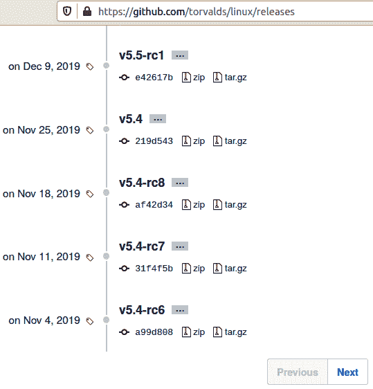

图 2.1 - 导致 5.4 LTS 内核的发布（自下而上阅读）

前面的截图是部分截图，显示了各种*v5.4-rc'n'*发布候选内核最终导致了 LTS 5.4 树的发布（2019 年 11 月 25 日，*v5.4-rc8*是最后一个`rc`发布）。工作从未真正停止：到 2019 年 12 月初，*v5.5-rc1*发布候选版本已经发布。

通常情况下，以 5.x 内核系列为例（对于任何其他最近的`major`内核系列也是如此），内核开发工作流程如下：

1.  5.x 稳定版本已经发布。因此，5.x+1（主线）内核的合并窗口已经开始。

1.  合并窗口保持开放约 2 周，新的补丁被合并到主线。

1.  一旦（通常）过去了 2 周，合并窗口就会关闭。

1.  `rc`（也称为主线，预补丁）内核开始。*5.x+1-rc1, 5.x+1-rc2, ..., 5.x+1-rcn*被发布。这个过程需要 6 到 8 周的时间。

1.  稳定版本已经发布：新的*5.x+1*稳定内核已经发布。

1.  发布被移交给“稳定团队”：

+   重大的错误或安全修复导致了*5.x+1.y*的发布：

*5.x+1.1, 5**.x+1.2, ... , 5.x+1.n*。

+   维护直到下一个稳定发布或**生命周期结束**（EOL）日期到达

...整个过程重复。

因此，当您看到 Linux 内核发布时，名称和涉及的过程将变得合乎情理。现在让我们继续看看不同类型的内核源树。

## 内核源树的类型

有几种类型的 Linux 内核源树。关键的是**长期支持**（LTS）内核。好吧，LTS 发布内核到底是什么？它只是一个“特殊”的发布，内核维护者将继续在其上进行重要的错误和安全修复的后移（嗯，安全问题通常只是错误），直到给定的 EOL 日期。

LTS 内核的“寿命”通常至少为 2 年，它可以延长多年（有时会延长）。我们将在本书中使用的**5.4 LTS 内核**是第 20 个 LTS 内核，其**寿命超过 6 年-从 2019 年 11 月到 2025 年 12 月**。

存储库中有几种类型的发布内核。然而，在这里，我们提到一个不完整的列表，按稳定性从低到高排序（因此，它们的生命周期从最短到最长）：

+   **-next 树**：这确实是最前沿的，子系统树中收集了新的补丁进行测试和审查。这是上游内核贡献者将要处理的内容。

+   **预补丁，也称为-rc 或主线**：这些是在发布之前生成的候选版本内核。

+   **稳定内核**：顾名思义，这是业务端。这些内核通常会被发行版和其他项目采用（至少起初是这样）。它们也被称为原始内核。

+   **发行版和 LTS 内核**：发行版内核（显然）是发行版提供的内核。它们通常以基本的原始/稳定内核开始。LTS 内核是专门维护更长时间的内核，使它们特别适用于行业/生产项目和产品。

在本书中，我们将一直使用撰写时的最新 LTS 内核，即 5.4 LTS 内核。正如我在第一章中提到的，*内核工作区设置*，5.4 LTS 内核最初计划的 EOL 是“至少 2021 年 12 月”。最近（2020 年 6 月），它现在被推迟到**2025 年 12 月**，使本书的内容在未来几年仍然有效！

+   **超长期支持（SLTS）内核**：更长时间维护的 LTS 内核（由*民用基础设施平台*（[`www.cip-project.org/`](https://www.cip-project.org/)）提供支持，这是一个 Linux 基金会项目）。

这是相当直观的。尽管如此，我建议您访问 kernel.org 的 Releases 页面获取有关发布内核类型的详细信息：[`www.kernel.org/releases.html`](https://www.kernel.org/releases.html)。同样，要获取更多详细信息，请访问*开发过程如何工作*（[`www.kernel.org/doc/html/latest/process/2.Process.html#how-the-development-process-works`](https://www.kernel.org/doc/html/latest/process/2.Process.html#how-the-development-process-works)）。

有趣的是，某些 LTS 内核是非常长期的发布，称为**SLTS**或**超长期支持**内核。例如，4.4 Linux 内核（第 16 个 LTS 发布）被认为是一个 SLTS 内核。作为 SLTS 选择的第一个内核，民用基础设施平台将提供支持至少到 2026 年，可能一直到 2036 年。

以非交互式可脚本化的方式查询存储库`www.kernel.org`可以使用`curl(1)`（以下输出是截至 2021 年 1 月 5 日的 Linux 状态）：

```
$ curl -L https://www.kernel.org/finger_banner The latest stable version of the Linux kernel is: 5.10.4
The latest mainline version of the Linux kernel is: 5.11-rc2
The latest stable 5.10 version of the Linux kernel is: 5.10.4
The latest stable 5.9 version of the Linux kernel is: 5.9.16 (EOL)
The latest longterm 5.4 version of the Linux kernel is: 5.4.86
The latest longterm 4.19 version of the Linux kernel is: 4.19.164
The latest longterm 4.14 version of the Linux kernel is: 4.14.213
The latest longterm 4.9 version of the Linux kernel is: 4.9.249
The latest longterm 4.4 version of the Linux kernel is: 4.4.249
The latest linux-next version of the Linux kernel is: next-20210105
$ 
```

当然，当您阅读本书时，内核极有可能（事实上是肯定的）已经进化，并且稍后的版本会出现。对于这样一本书，我能做的就是选择撰写时的最新 LTS 内核。

当然，这已经发生了！5.10 内核于 2020 年 12 月 13 日发布，截至撰写时（即将印刷之前），5.11 内核的工作正在进行中……

最后，另一种安全下载给定内核的方法是由内核维护者提供的，他们提供了一个脚本来安全地下载给定的 Linux 内核源树，并验证其 PGP 签名。该脚本在这里可用：[`git.kernel.org/pub/scm/linux/kernel/git/mricon/korg-helpers.git/tree/get-verified-tarball`](https://git.kernel.org/pub/scm/linux/kernel/git/mricon/korg-helpers.git/tree/get-verified-tarball)。

好了，现在我们已经掌握了内核版本命名规则和内核源树类型的知识，是时候开始我们构建内核的旅程了。

# 从源码构建内核的步骤

作为一个方便和快速的参考，以下是构建 Linux 内核源码所需的关键步骤。由于每个步骤的解释都非常详细，您可以参考这个摘要来了解整体情况。步骤如下：

1.  通过以下选项之一获取 Linux 内核源树：

+   下载特定内核源作为压缩文件

+   克隆（内核）Git 树

1.  将内核源树提取到家目录中的某个位置（如果您通过克隆 Git 树获得内核，则跳过此步骤）。

1.  配置：根据新内核的需要选择内核支持选项，

`make [x|g|menu]config`，其中`make menuconfig`是首选方式。

1.  使用`make [-j'n'] all`构建内核的可加载模块和任何**设备树块**（**DTB**）。这将构建压缩的内核映像（`arch/<arch>/boot/[b|z|u]image`）、未压缩的内核映像（`vmlinux`）、`System.map`、内核模块对象和任何已配置的 DTB(s)文件。

1.  使用`sudo make modules_install`安装刚构建的内核模块。

此步骤默认将内核模块安装在`/lib/modules/$(uname -r)/`下。

1.  设置 GRUB 引导加载程序和`initramfs`（之前称为`initrd`）映像（特定于 x86）：

`sudo make install`：

+   这将在`/boot`下创建并安装`initramfs`（或`initrd`）映像。

+   它更新引导加载程序配置文件以启动新内核（第一个条目）。

1.  自定义 GRUB 引导加载程序菜单（可选）。

本章是关于这个主题的两章中的第一章，基本上涵盖了*步骤 1 到 3*，还包括了许多必需的背景材料。下一章将涵盖剩下的步骤，*4 到 7*。所以，让我们从*第 1 步*开始。

# 第 1 步——获取 Linux 内核源树

在这一部分，我们将看到两种获取 Linux 内核源树的广泛方法：

+   通过从 Linux 内核公共存储库（[`www.kernel.org`](https://www.kernel.org)）下载和提取特定的内核源树

+   通过克隆 Linus Torvalds 的源树（或其他人的）——例如，`linux-next` Git 树

但是你如何决定使用哪种方法？对于像您这样在项目或产品上工作的大多数开发人员来说，决定已经做出了——项目使用一个非常特定的 Linux 内核版本。因此，您将下载该特定的内核源树，如果需要，可能会对其应用特定于项目的补丁，并使用它。

对于那些打算向主线内核贡献或"上游"代码的人来说，第二种方法——克隆 Git 树——是您应该选择的方式。（当然，这还有更多内容；我们在*内核源树类型*部分中描述了一些细节）。

在接下来的部分中，我们将演示这两种方法。首先，我们描述了一种从内核存储库下载特定内核源树（而不是 Git 树）的方法。我们选择了截至撰写时的**最新 LTS 5.4 Linux 内核**来进行演示。在第二种方法中，我们克隆了一个 Git 树。

## 下载特定的内核树

首先，内核源代码在哪里？简短的答案是它在[`www.kernel.org`](https://www.kernel.org)上可见的公共内核存储库服务器上。该站点的主页显示了最新的稳定 Linux 内核版本，以及最新的`longterm`和`linux-next`发布（下面的截图显示了 2019 年 11 月 29 日的站点。它显示了以众所周知的`yyyy-mm-dd`格式的日期）：

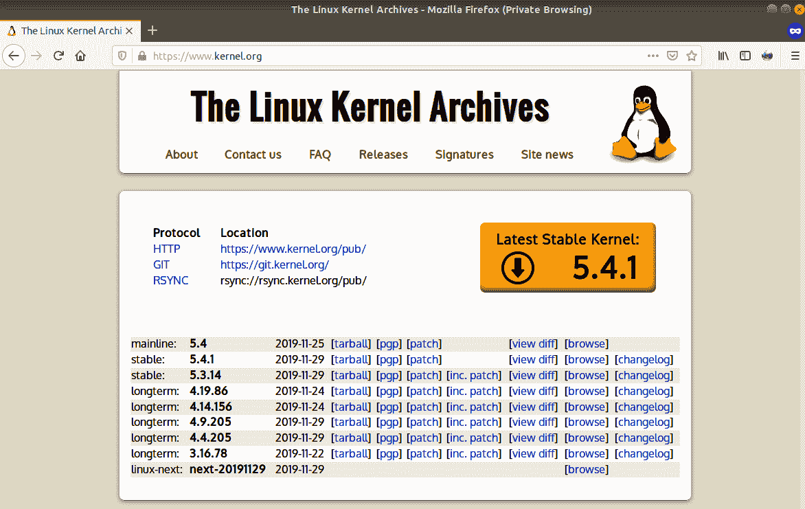

图 2.2 - kernel.org 网站（截至 2019 年 11 月 29 日）

快速提醒：我们还提供了一个 PDF 文件，其中包含本书中使用的截图/图表的全彩图像。您可以在这里下载：`static.packt-cdn.com/downloads/9781789953435_ColorImages.pdf`。

有许多种方法可以下载（压缩的）内核源文件。让我们看看其中的两种：

+   一个交互式，也许是最简单的方法，是访问上述网站，然后简单地点击适当的`tarball`链接。浏览器将会下载图像文件（以`.tar.xz`格式）到您的系统。

+   或者，您可以使用`wget(1)`实用程序（我们也可以使用强大的`curl(1)`实用程序来做到这一点）从命令行（shell 或 CLI）下载它。例如，要下载稳定的 5.4.0 内核源代码压缩文件，我们可以这样做：

```
wget --https-only -O ~/Downloads/linux-5.4.0.tar.xz https://mirrors.edge.kernel.org/pub/linux/kernel/v5.x/linux-5.4.0.tar.xz
```

如果前面的`wget(1)`实用程序不起作用，很可能是因为内核（压缩的）`tarball`链接发生了变化。例如，如果对于`5.4.0.tar.xz`不起作用，尝试相同的`wget`实用程序，但将版本更改为`5.4.1.tar.xz`。

这将安全地下载 5.4.0 压缩的内核源树到您计算机的`~/Downloads`文件夹中。当然，您可能不希望在存储库的主页上显示的内核版本。例如，如果对于我的特定项目，我需要最新的 4.19 稳定（LTS）内核，第 19 个 LTS 版本，怎么办？简单：通过浏览器，只需点击[`www.kernel.org/pub/`](https://www.kernel.org/pub/)（或镜像[`mirrors.edge.kernel.org/pub/`](https://mirrors.edge.kernel.org/pub/)）链接（在前几行显示的“HTTP”链接右侧）并导航到服务器上的`linux/kernel/v4.x/`目录（您可能会被引导到一个镜像站点）。或者，只需将`wget(1)`指向 URL（在撰写时，这里碰巧是[`mirrors.edge.kernel.org/pub/linux/kernel/v4.x/linux-4.19.164.tar.xz`](https://mirrors.edge.kernel.org/pub/linux/kernel/v4.x/linux-4.19.164.tar.xz)）。

## 克隆 Git 树

对于像您这样的开发人员，正在研究并寻求向上游贡献代码，您*必须*在 Linux 内核代码库的最新版本上工作。嗯，内核社区内有最新版本的微妙变化。如前所述，`linux-next`树以及其中的某个特定分支或标签，是为此目的而工作的树。

在这本书中，我们并不打算深入探讨建立`linux-next`树的血腥细节。这个过程已经有非常好的文档记录，我们更愿意不仅仅重复指令（详细链接请参见*进一步阅读*部分）。关于如何克隆`linux-next`树的详细页面在这里：*使用 linux-next*，[`www.kernel.org/doc/man-pages/linux-next.html`](https://www.kernel.org/doc/man-pages/linux-next.html)，正如在那里提到的，*linux-next*树*，[`git.kernel.org/cgit/linux/kernel/git/next/linux-next.git`](http://git.kernel.org/cgit/linux/kernel/git/next/linux-next.git)，是用于下一个内核合并窗口的补丁的存储区。如果你正在进行最前沿的内核开发，你可能希望从那个树上工作，而不是 Linus Torvalds 的主线树。

对于我们的目的，克隆*mainline*Linux Git 存储库（Torvalds 的 Git 树）已经足够了。像这样做（在一行上输入）：

```
git clone https://git.kernel.org/pub/scm/linux/kernel/git/torvalds/linux.git
```

请注意，克隆完整的 Linux 内核树是一个耗时、耗网络和耗磁盘的操作！确保您有足够的磁盘空间可用（至少几个 GB）。

执行`git clone --depth n <...>`，其中`n`是一个整数值，非常有用，可以限制历史记录（提交）的深度，从而降低下载/磁盘使用量。正如`git-clone(1)`的`man`页面中提到的`--depth`选项：“创建一个浅克隆，其历史记录被截断为指定数量的提交。”

根据前面的提示，为什么不执行以下操作（再次在一行上输入）？

```
git clone --depth=3 https://git.kernel.org/pub/scm/linux/kernel/git/torvalds/linux.git
```

如果您打算在这个主线 Git 树上工作，请跳过*步骤*2 - *提取内核源树*部分（因为`git clone`操作将在任何情况下提取源树），并继续进行下一部分（*步骤 3 - 配置 Linux 内核*）。

# 步骤 2 - 提取内核源树

如前所述，本节适用于那些从存储库[`www.kernel.org`](https://www.kernel.org)下载了特定的 Linux 内核并打算构建它的人。在本书中，我们使用 5.4 LTS 内核版本。另一方面，如果您已经在主线 Linux Git 树上执行了`git clone`，就像在前面的部分中所示的那样，您可以安全地跳过本节，继续进行下一节内核配置。

现在下载已经完成，让我们继续。下一步是提取内核源树 - 记住，它是一个经过 tar 和压缩的（通常是`.tar.xz`）文件。

我们假设，如本章前面详细介绍的那样，您现在已经将 Linux 内核版本 5.4 代码库下载为一个压缩文件（放入`~/Downloads`目录）：

```
$ cd ~/Downloads ; ls -lh linux-5.4.tar.xz
-rw-rw-r-- 1 llkd llkd 105M Nov 26 08:04 linux-5.4.tar.xz
```

提取这个文件的简单方法是使用无处不在的`tar(1)`实用程序来完成：

```
tar xf ~/Downloads/linux-5.4.tar.xz
```

这将把内核源树提取到`~/Downloads`目录中名为`linux-5.4`的目录中。但是，如果我们想要将其提取到另一个文件夹，比如`~/kernels`中，那么可以这样做：

```
mkdir -p ~/kernels
tar xf ~/Downloads/linux-5.4.tar.xz --directory=${HOME}/kernels/
```

这将把内核源提取到`~/kernels/linux-5.4/`文件夹中。为了方便起见，也是一个良好的做法，让我们设置一个*环境变量*，指向我们内核源树根目录的位置：

```
export LLKD_KSRC=${HOME}/kernels/linux-5.4
```

请注意，从现在开始，我们将假设这个变量保存着内核源树的位置。

虽然您可以随时使用 GUI 文件管理器应用程序（如`Nautilus(1)`）来提取压缩文件，但我强烈建议您熟悉使用 Linux CLI 来执行这些操作。

当您需要快速查找常用命令的最常用选项时，不要忘记`tldr(1)`！例如，对于`tar(1)`，只需使用`tldr tar`来查找。

您注意到了吗？我们将内核源树提取到*任何*家目录下的任何目录中（甚至其他地方），不像以前那样总是提取到可写的根目录位置（通常是`/usr/src/`）。现在，只要说不（对于那个）。

如果您现在只想继续进行内核构建操作，请跳过以下部分并继续。如果感兴趣（我们当然希望如此！），下一节是一个简短但重要的偏离，看一下内核源树的结构和布局。

## **内核源树的简要介绍**

内核源代码现在可以在您的系统上使用了！很酷，让我们快速看一下：

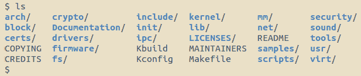

图 2.3 - 5.4 Linux 内核源树的根目录

太好了！它有多大？在内核源树的根目录中快速执行`du -m .`，可以看到这个特定的内核源树（记住，它是版本 5.4）的大小略大于 1,000 MB - 几乎是 1 GB！

值得一提的是，Linux 内核在**代码行数（SLOCs）**方面已经变得很大，并且正在变得越来越大。目前的估计是超过 2000 万行代码。当然，要意识到在构建内核时，并不是所有的代码都会被编译。

我们如何知道这段代码是哪个版本的 Linux 内核呢？很简单，一个快速的方法就是查看项目的 Makefile 的前几行。顺便说一句，内核在很多地方都使用 Makefile；大多数目录都有一个。我们将把这个 Makefile，也就是内核源代码树根目录下的 Makefile，称为*顶层 Makefile*：

```
$ head Makefile
# SPDX-License-Identifier: GPL-2.0
VERSION = 5
PATCHLEVEL = 4
SUBLEVEL = 0
EXTRAVERSION =
NAME = Kleptomaniac Octopus

# *DOCUMENTATION*
# To see a list of typical targets execute "make help"
# More info can be located in ./README
$
```

显然，这是 5.4.0 内核的源代码。

让我们来看看内核源代码树的整体情况。以下表格总结了 Linux 内核源代码树根目录中（更）重要的文件和目录的广泛分类和目的：

| **文件或目录名称** | **目的** |
| --- | --- |
| **顶层文件** |  |
| `README` | 项目的 `README` 文件。它告诉我们内核文档存放在哪里 - 提示，它在名为 `Documentation` 的目录中 - 以及如何开始使用它。文档非常重要；它是由内核开发人员自己编写的真实内容。 |
| `COPYING` | 内核源代码发布的许可条款。绝大多数都是根据著名的 GNU GPL v2（写作 GPL-2.0）许可证发布的 [1]。 |
| `MAINTAINERS` | *常见问题：* *XYZ 出了问题，我应该联系谁获取支持？* 这正是这个文件提供的 - 所有内核子系统的列表，甚至到个别组件（如特定驱动程序）的级别，它的状态，当前维护者，邮件列表，网站等等。非常有帮助！甚至有一个辅助脚本可以找到需要联系的人或团队：`scripts/get_maintainer.pl` [2]。 |
| Makefile | 这是内核的顶层 Makefile；`kbuild` 内核构建系统以及内核模块最初使用这个 Makefile 进行构建。 |
| **主要子系统目录** |  |
| `kernel/` | 核心内核子系统：这里的代码涉及进程/线程生命周期，CPU 调度，锁定，cgroups，定时器，中断，信号，模块，跟踪等等。 |
| `mm/` | 大部分**内存管理**（**mm**）代码都在这里。我们将在第六章中涵盖一些内容，即*内核内部要点 - 进程和线程*，以及在第七章中涵盖一些相关内容，即*内存管理内部要点*，以及在第八章中涵盖一些内容，即*模块作者的内核内存分配 - 第一部分*。 |
| `fs/` | 这里的代码实现了两个关键的文件系统功能：抽象层 - 内核**虚拟文件系统开关**（**VFS**），以及各个文件系统驱动程序（例如 `ext[2 | 4]`，`btrfs`，`nfs`，`ntfs`，`overlayfs`，`squashfs`，`jffs2`，`fat`，`f2fs` 等）。 |
| `block/` | 底层（对于 VFS/FS）块 I/O 代码路径。它包括实现页面缓存、通用块 I/O 层、I/O 调度器等代码。 |
| `net/` | 完整（按照**请求评论**（**RFC**）的要求 - [`whatis.techtarget.com/definition/Request-for-Comments-RFC`](https://whatis.techtarget.com/definition/Request-for-Comments-RFC)）实现了网络协议栈。包括高质量的 TCP、UDP、IP 等许多网络协议的实现。 |
| `ipc/` | **进程间通信**（**IPC**）子系统代码；涵盖 IPC 机制，如（SysV 和 POSIX）消息队列，共享内存，信号量等。 |
| `sound/` | 音频子系统代码，也称为**高级 Linux 音频架构**（**ALSA**）。 |
| `virt/` | *虚拟化*（hypervisor）代码；流行且强大的**内核虚拟机**（**KVM**）就是在这里实现的。 |
| **基础设施/其他** |  |
| `arch/` | 这里存放着特定架构的代码（在这里，架构指的是 CPU）。Linux 最初是为 i386 架构的一个小型爱好项目。现在可能是最多移植的操作系统（请参见表后面的 *步骤 3* 中的架构移植）。 |
| `crypto/` | 此目录包含密码（加密/解密算法，也称为转换）的内核级实现和内核 API，以为需要加密服务的消费者提供服务。 |
| `include/` | 此目录包含与架构无关的内核头文件（还有一些特定架构的头文件在 `arch/<cpu>/include/...` 下）。 |
| `init/` | 与架构无关的内核初始化代码；也许我们能接近内核的主要功能（记住，内核不是一个应用程序）就在这里：`init/main.c:start_kernel()`，其中的 `start_kernel()` 函数被认为是内核初始化期间的早期 C 入口点。 |
| `lib/` | 这是内核最接近库的等价物。重要的是要理解，内核不支持像用户空间应用程序那样的共享库。这里的代码会自动链接到内核映像文件中，因此在运行时对内核可用（`/lib` 中存在各种有用的组件：[解]压缩、校验和、位图、数学、字符串例程、树算法等）。 |
| `scripts/` | 这里存放着各种脚本，其中一些用于内核构建，许多用于其他目的（如静态/动态分析等），主要是 Bash 和 Perl。 |
| `security/` | 包含内核的 **Linux 安全模块**（**LSM**），这是一个旨在对用户应用程序对内核空间的访问控制施加更严格限制的 **强制访问控制**（**MAC**）框架，比默认内核模型（称为 **自由访问控制**（**DAC**））更严格。目前，Linux 支持几种 LSM；其中一些知名的是 SELinux、AppArmor、Smack、Tomoyo、Integrity 和 Yama（请注意，LSM 默认情况下是“关闭”的）。 |
| `tools/` | 这里存放着各种工具，主要是与内核有“紧密耦合”的用户空间应用程序（或脚本），如现代性能分析工具 *perf* 就是一个很好的例子。 |

表 2.2 – Linux 内核源代码树的布局

表中以下是一些重要的解释：

1.  **内核许可证**：不要陷入法律细节，这里是事物的实质：由于内核是根据 GNU GPL-2.0 许可证发布的（**GNU GPL** 是 **GNU 通用公共许可证**），任何直接使用内核代码库的项目（即使只有一点点！）都自动属于这个许可证（GPL-2.0 的“衍生作品”属性）。这些项目或产品必须按照相同的许可条款发布其内核。实际上，实际情况要复杂得多；许多在 Linux 内核上运行的商业产品确实包含专有的用户空间和/或内核空间代码。它们通常通过重构内核（通常是设备驱动程序）工作为 **可加载内核模块**（**LKM**）格式来实现。可以以 *双重许可* 模式发布内核模块（LKM）（例如，双重 BSD/GPL；LKM 是 第四章 和 第五章 的主题，我们在那里涵盖了一些关于内核模块许可的信息）。一些人更喜欢专有许可证，他们设法发布其内核代码，而不受 GPL-2.0 条款的约束；从技术上讲，这可能是可能的，但（至少）被认为是反社会的（甚至可能违法）。感兴趣的人可以在本章的 *进一步阅读* 文档中找到更多关于许可证的链接。

1.  `MAINTAINERS`：运行`get_maintainer.pl` Perl 脚本的示例（注意：它只能在 Git 树上运行）：

```
$ scripts/get_maintainer.pl -f drivers/android/ Greg Kroah-Hartman <gregkh@linuxfoundation.org> (supporter:ANDROID DRIVERS)
"Arve Hjønnevåg" <arve@android.com> (supporter:ANDROID DRIVERS)
Todd Kjos <tkjos@android.com> (supporter:ANDROID DRIVERS)
Martijn Coenen <maco@android.com> (supporter:ANDROID DRIVERS)
Joel Fernandes <joel@joelfernandes.org> (supporter:ANDROID DRIVERS)
Christian Brauner <christian@brauner.io> (supporter:ANDROID DRIVERS)
devel@driverdev.osuosl.org (open list:ANDROID DRIVERS)
linux-kernel@vger.kernel.org (open list)
$ 
```

1.  Linux `arch`（CPU）端口：

```
$ cd ${LLKD_KSRC} ; ls arch/
alpha/ arm64/ h8300/   Kconfig     mips/  openrisc/ riscv/ sparc/ x86/
arc/   c6x/   hexagon/ m68k/       nds32/ parisc/   s390/  um/    xtensa/
arm/   csky/  ia64/    microblaze/ nios2/ powerpc/  sh/    unicore32/
```

作为内核或驱动程序开发人员，浏览内核源代码树是你必须要习惯（甚至喜欢！）的事情。当代码量接近 2000 万 SLOC 时，搜索特定函数或变量可能是一项艰巨的任务！要使用高效的代码浏览工具。我建议使用`ctags(1)`和`cscope(1)`这些**自由开源软件**（**FOSS**）工具。事实上，内核的顶层`Makefile`有针对这些工具的目标：

`make tags ; make cscope`

我们现在已经完成了*步骤 2*，提取内核源代码树！作为奖励，您还学会了有关内核源代码布局的基础知识。现在让我们继续进行*步骤 3*的过程，并学习如何在构建之前*配置*Linux 内核。

# 第 3 步-配置 Linux 内核

配置新内核可能是内核构建过程中*最*关键的一步。Linux 备受好评的原因之一是其多功能性。普遍的误解是认为（企业级）服务器、数据中心、工作站和微型嵌入式 Linux 设备有各自独立的 Linux 内核代码库-不，*它们都使用同一个统一的 Linux 内核源代码！*因此，仔细*配置*内核以满足特定用例（服务器、桌面、嵌入式或混合/自定义）是一个强大的功能和要求。这正是我们在这里深入研究的内容。

无论如何都要执行内核配置步骤。即使您觉得不需要对现有（或默认）配置进行任何更改，至少在构建过程的一部分中运行此步骤非常重要。否则，这里自动生成的某些标头将丢失并引起问题。至少应执行`make oldconfig`。这将将内核配置设置为现有系统的配置，用户仅对任何新选项进行请求。

首先，让我们了解一下**内核构建**（**kbuild**）系统的一些必要背景。

## 了解 kbuild 构建系统

Linux 内核用于配置和构建内核的基础设施被称为**kbuild**系统。不深入了解复杂的细节，kbuild 系统通过四个关键组件将复杂的内核配置和构建过程联系在一起：

+   `CONFIG_FOO`符号

+   菜单规范文件，称为`Kconfig`

+   Makefile(s)

+   总体内核配置文件

这些组件的目的总结如下：

| **Kbuild 组件** | **简要目的** |
| --- | --- |
| 配置符号：`CONFIG_FOO` | 每个内核可配置的`FOO`都由`CONFIG_FOO`宏表示。根据用户的选择，该宏将解析为`y`、`m`或`n`中的一个：- `y=yes`：表示将该功能构建到内核映像本身中- `m=module`：表示将其构建为一个独立对象，即内核模块- `n=no`：表示不构建该功能请注意，`CONFIG_FOO`是一个字母数字字符串（很快我们将看到，您可以使用`make menuconfig`选项查找精确的配置选项名称，导航到配置选项，并选择`<帮助>`按钮）。 |
| `Kconfig`文件 | 这是`CONFIG_FOO`符号定义的地方。kbuild 语法指定了它的类型（布尔值、三态值、[alpha]数字等）和依赖树。此外，对于基于菜单的配置 UI（通过`make [menu&#124;g&#124;x]config`之一调用），它指定了菜单条目本身。当然，我们稍后将使用此功能。 |
| Makefile(s) | kbuild 系统使用*递归*Makefile 方法。内核源代码树根文件夹下的 Makefile 称为*顶层*Makefile，在每个子文件夹中都有一个 Makefile 来构建那里的源代码。5.4 原始内核源代码中总共有 2500 多个 Makefile！ |
| `.config`文件 | 最终，它的本质-实际的内核配置-以 ASCII 文本文件的形式生成并存储在内核源树根目录中的`.config`文件中。请保管好这个文件，它是产品的关键部分。 |

表 2.3 - Kbuild 构建系统的主要组件

关键是获得一个可用的`.config`文件。我们如何做到这一点？我们进行迭代。我们从“默认”配置开始-下一节的主题-并根据需要仔细地进行自定义配置。

## 到达默认配置

那么，您如何决定初始内核配置从哪里开始？存在几种技术；一些常见的技术如下：

+   不指定任何内容；kbuild 系统将引入默认内核配置。

+   使用现有发行版的内核配置。

+   基于当前加载在内存中的内核模块构建自定义配置。

第一种方法的好处是简单性。内核将处理细节，为您提供默认配置。缺点是默认配置实际上相当大（在这里，我们指的是构建面向 x86 桌面或服务器类型系统的 Linux）-大量选项被打开，以防万一，这可能会使构建时间非常长，内核映像大小非常大。当然，您随后需要手动配置内核以获得所需的设置。

这带来了一个问题，*默认内核配置存储在哪里*？kbuild 系统使用优先级列表回退方案来检索默认配置。优先级列表及其顺序（第一个优先级最高）在`init/Kconfig:DEFCONFIG_LIST`中指定：

```
$ cat init/Kconfig
config DEFCONFIG_LIST
    string
    depends on !UML 
    option defconfig_list
    default "/lib/modules/$(shell,uname -r)/.config"
    default "/etc/kernel-config"
    default "/boot/config-$(shell,uname -r)"
    default ARCH_DEFCONFIG
    default "arch/$(ARCH)/defconfig"
config CC_IS_GCC
[...]
```

顺便说一句，关于`Kconfig`的内核文档（在此处找到：[`www.kernel.org/doc/Documentation/kbuild/kconfig-language.txt`](https://www.kernel.org/doc/Documentation/kbuild/kconfig-language.txt)）记录了`defconfig_list`是什么：

```
"defconfig_list"
    This declares a list of default entries which can be used when
    looking for the default configuration (which is used when the main
    .config doesn't exists yet.)
```

从列表中可以看出，kbuild 系统首先检查`/lib/modules/$(uname -r)`文件夹中是否存在`.config`文件。如果找到，其中的值将被用作默认值。如果未找到，则接下来检查`/etc/kernel-config`文件是否存在。如果找到，其中的值将被用作默认值，如果未找到，则继续检查前面优先级列表中的下一个选项，依此类推。但请注意，内核源树根目录中存在`.config`文件将覆盖所有这些！

## 获取内核配置的良好起点

这带我们来到一个**非常重要的观点**：玩弄内核配置作为学习练习是可以的（就像我们在这里做的那样），但对于生产系统，使用已知、经过测试和工作的内核配置真的非常重要。

在这里，为了帮助您理解选择内核配置的有效起点的微妙之处，我们将看到三种获得内核配置起点的方法（我们希望）是典型的：

+   首先，对于典型的小型嵌入式 Linux 系统要遵循的方法

+   接下来，一种模拟发行版配置的方法

+   最后，一种基于现有（或其他）系统的内核模块的内核配置的方法（`localmodconfig`方法）

让我们更详细地检查每种方法。

### 典型嵌入式 Linux 系统的内核配置

使用此方法的典型目标系统是小型嵌入式 Linux 系统。这里的目标是从已知、经过测试和工作的内核配置开始我们的嵌入式 Linux 项目。那么，我们究竟如何做到这一点呢？

有趣的是，内核代码库本身为各种硬件平台提供了已知、经过测试和工作的内核配置文件。我们只需选择与我们的嵌入式目标板匹配（或最接近匹配）的配置文件。这些内核配置文件位于内核源树中的`arch/<arch>/configs/`目录中。配置文件的格式为`<platform-name>_defconfig`。让我们快速看一下；看一下以下屏幕截图，显示了在 v5.4 Linux 内核代码库上执行`ls arch/arm/configs`命令：

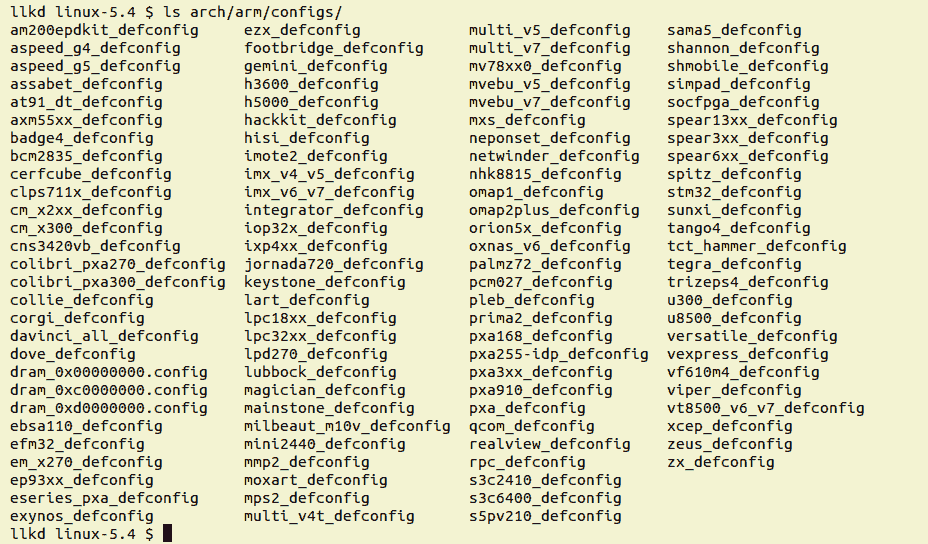

图 2.4 - 5.4 Linux 内核中 arch/arm/configs 的内容

因此，例如，如果您发现自己为具有三星 Exynos **片上系统**（**SoC**）的硬件平台配置 Linux 内核，请不要从默认的 x86-64 内核配置文件开始（或者尝试使用它）。这样不会起作用。即使您成功了，内核也不会干净地构建/工作。选择适当的内核配置文件：对于我们的示例，`arch/arm/configs/exynos_defconfig`文件将是一个很好的起点。您可以将此文件复制到内核源树的根目录中的`.config`，然后继续对其进行微调以满足项目特定需求。

举个例子，树莓派（[`www.raspberrypi.org/`](https://www.raspberrypi.org/)）是一种流行的业余爱好者平台。内核配置文件 - 在其内核源树中 - 使用（作为基础）的是这个：`arch/arm/configs/bcm2835_defconfig`。文件名反映了树莓派板使用的是基于 Broadcom 2835 的 SoC。您可以在这里找到有关树莓派内核编译的详细信息：[`www.raspberrypi.org/documentation/linux/kernel/building.md`](https://www.raspberrypi.org/documentation/linux/kernel/building.md)。不过，我们将在第三章中至少涵盖其中的一些内容，*从源代码构建 5.x Linux 内核 - 第二部分*，在*树莓派的内核构建*部分。

查看哪个平台的配置文件适合哪个平台的简单方法是在目标平台上执行`make help`。输出的后半部分显示了*特定架构目标*标题下的配置文件（请注意，这是针对外部 CPU 的，不适用于 x86[-64]）。

对产品进行内核配置的仔细调整和设置是*平台*或**板支持包**（**BSP**）团队工程师通常进行的重要工作的一部分。

### 使用发行版配置作为起点的内核配置

使用这种方法的典型目标系统是桌面或服务器 Linux 系统。

接下来，这第二种方法也很快：

```
cp /boot/config-5.0.0-36-generic ${LLKD_KSRC}/.config
```

在这里，我们只需将现有的 Linux 发行版（这里是我们的 Ubuntu 18.04.3 LTS 虚拟机）的配置文件复制到内核源树根目录中的`.config`文件中，从而使发行版配置成为起点，然后可以进一步编辑（更通用的命令：`cp /boot/config-$(uname -r) ${LLKD_KSRC}/.config`）。

### 通过 localmodconfig 方法调整内核配置

使用这种方法的典型目标系统是桌面或服务器 Linux 系统。

我们考虑的第三种方法是一个很好的方法，当目标是从基于现有系统的内核配置开始时，通常相对于桌面或服务器 Linux 系统的典型默认配置来说，它相对较小。在这里，我们通过简单地将`lsmod(8)`的输出重定向到临时文件，然后将该文件提供给构建，向 kbuild 系统提供了系统上当前运行的内核模块的快照。可以通过以下方式实现：

```
lsmod > /tmp/lsmod.now
cd ${LLKD_KSRC}
make LSMOD=/tmp/lsmod.now localmodconfig
```

`lsmod(8)`实用程序简单地列出当前驻留在系统（内核）内存中的所有内核模块。我们将在第四章中详细介绍这个（很多）。我们将其输出保存在一个临时文件中，并将其传递到 Makefile 的`localmodconfig`目标中的`LSMOD`环境变量中。此目标的工作是以一种只包括基本功能以及这些内核模块提供的功能的方式配置内核，并排除其余部分，从而实际上给我们提供了当前内核的合理外观（或`lsmod`输出所代表的任何内核）。我们将使用这种技术来配置我们的 5.4 内核，接下来是*使用 localmodconfig 方法开始*部分。

好了，这就结束了为内核配置设置起点的三种方法。事实上，我们只是触及了表面。许多更多的技术被编码到 kbuild 系统本身中，以明确地生成给定方式的内核配置！如何？通过`make`的配置目标。在`Configuration targets`标题下查看它们：

```
$ cd ${LKDC_KSRC}         *# root of the kernel source tree*
$ make help
Cleaning targets:
 clean             - Remove most generated files but keep the config and
 enough build support to build external modules
 mrproper          - Remove all generated files + config + various backup     
                     files
 distclean         - mrproper + remove editor backup and patch files

Configuration targets:
 config           - Update current config utilising a line-oriented  
                    program
 nconfig          - Update current config utilising a ncurses menu based 
                    program
 menuconfig       - Update current config utilising a menu based program
 xconfig          - Update current config utilising a Qt based front-end
 gconfig          - Update current config utilising a GTK+ based front-end
 oldconfig        - Update current config utilising a provided .config as 
                    base
 localmodconfig   - Update current config disabling modules not loaded
 localyesconfig   - Update current config converting local mods to core
 defconfig        - New config with default from ARCH supplied defconfig
 savedefconfig    - Save current config as ./defconfig (minimal config)
 allnoconfig      - New config where all options are answered with no
 allyesconfig     - New config where all options are accepted with yes
 allmodconfig     - New config selecting modules when possible
 alldefconfig     - New config with all symbols set to default
 randconfig       - New config with random answer to all options
 listnewconfig    - List new options
 olddefconfig     - Same as oldconfig but sets new symbols to their
                    default value without prompting
 kvmconfig        - Enable additional options for kvm guest kernel support
 xenconfig        - Enable additional options for xen dom0 and guest   
                    kernel support
 tinyconfig       - Configure the tiniest possible kernel
 testconfig       - Run Kconfig unit tests (requires python3 and pytest)

Other generic targets:
  all             - Build all targets marked with [*]
[...]
$
```

一个快速但非常有用的要点：为了确保一张干净的纸，首先使用`mrproper`目标。接下来我们将展示所有步骤的摘要，所以现在不要担心。

## 使用 localmodconfig 方法开始

现在，让我们快速开始使用我们之前讨论过的第三种方法 - `localmodconfig`技术为我们的新内核创建一个基本内核配置。如前所述，这种现有的仅内核模块方法是一个很好的方法，当目标是在基于 x86 的系统上获得内核配置的起点时，通过保持相对较小的内核配置，从而使构建速度更快。

不要忘记：当前正在执行的内核配置适用于您典型的基于 x86 的桌面/服务器系统。对于嵌入式目标，方法是不同的（如在*典型嵌入式 Linux 系统的内核配置*部分中所见）。我们将在第三章中进一步介绍这一点，*从源代码构建 5.x Linux 内核 - 第二部分*，在*树莓派的内核构建*部分。

如前所述，首先获取当前加载的内核模块的快照，然后通过指定`localmodconfig`目标让 kbuild 系统对其进行操作，如下所示：

```
lsmod > /tmp/lsmod.now
cd ${LLKD_KSRC} ; make LSMOD=/tmp/lsmod.now localmodconfig
```

现在，要理解的是：当我们执行实际的`make [...] localmodconfig`命令时，当前正在构建的内核（版本 5.4）与当前实际运行构建的内核（`$(uname -r) = 5.0.0-36-generic`）之间的配置选项可能会有差异，甚至很可能会有差异。在这些情况下，kbuild 系统将在控制台（终端）窗口上显示每个新的配置选项以及您可以设置的可用值。然后，它将提示用户选择正在构建的内核中遇到的任何新的配置选项的值。您将看到这是一系列问题，并提示在命令行上回答它们。

提示将以`(NEW)`为后缀，实际上告诉您这是一个*新*的内核配置选项，并希望您回答如何配置它。

在这里，至少，我们将采取简单的方法：只需按`[Enter]`键接受默认选择，如下所示：

```
$ uname -r5.0.0-36-generic $ make LSMOD=/tmp/lsmod.now localmodconfig 
using config: '/boot/config-5.0.0-36-generic'
vboxsf config not found!!
module vboxguest did not have configs CONFIG_VBOXGUEST
*
* Restart config...
*
*
* General setup
*
Compile also drivers which will not load (COMPILE_TEST) [N/y/?] n
Local version - append to kernel release (LOCALVERSION) [] 
Automatically append version information to the version string (LOCALVERSION_AUTO) [N/y/?] n
Build ID Salt (BUILD_SALT) [] (NEW) [Enter] Kernel compression mode
> 1\. Gzip (KERNEL_GZIP)
  2\. Bzip2 (KERNEL_BZIP2)
  3\. LZMA (KERNEL_LZMA)
  4\. XZ (KERNEL_XZ)
  5\. LZO (KERNEL_LZO)
  6\. LZ4 (KERNEL_LZ4)
choice[1-6?]: 1
Default hostname (DEFAULT_HOSTNAME) [(none)] (none)
Support for paging of anonymous memory (swap) (SWAP) [Y/n/?] y
System V IPC (SYSVIPC) [Y/n/?] y
[...]
Enable userfaultfd() system call (USERFAULTFD) [Y/n/?] y
Enable rseq() system call (RSEQ) [Y/n/?] (NEW)
[...]
  Test static keys (TEST_STATIC_KEYS) [N/m/?] n
  kmod stress tester (TEST_KMOD) [N/m/?] n
  Test memcat_p() helper function (TEST_MEMCAT_P) [N/m/y/?] (NEW)
#
# configuration written to .config
#
$ ls -la .config
-rw-r--r-- 1 llkd llkd  140764 Mar  7 17:31 .config
$ 
```

按下`[Enter]`键多次后，询问终于结束，kbuild 系统将新生成的配置写入当前工作目录中的`.config`文件中（我们截断了先前的输出，因为它太庞大，而且没有必要完全重现）。

前面两个步骤负责通过`localmodconfig`方法生成`.config`文件。在结束本节之前，这里有一些要注意的关键点：

+   为了确保完全干净的状态，在内核源代码树的根目录中运行`make mrproper`或`make distclean`（当您想从头开始重新启动时很有用；请放心，总有一天会发生！请注意，这将删除内核配置文件）。

+   在本章中，所有与内核配置步骤和相关截图都是在 Ubuntu 18.04.3 LTS x86-64 虚拟机上执行的，我们将其用作构建全新的 5.4 Linux 内核的主机。菜单项的名称、存在和内容，以及菜单系统（UI）的外观和感觉可能会根据（a）架构（CPU）和（b）内核版本而有所不同。

+   正如前面提到的，在生产系统或项目中，平台或**板支持包**（**BSP**）团队，或者如果您与嵌入式 Linux BSP 供应商合作，他们会提供一个已知的、可工作和经过测试的内核配置文件。请将其用作起点，将其复制到内核源代码树根目录中的`.config`文件中。

随着构建内核的经验增加，您会意识到第一次正确设置内核配置的工作量（至关重要！）更大；当然，第一次构建所需的时间也更长。不过，一旦正确完成，整个过程通常会变得简单得多 - 一个可以一遍又一遍运行的配方。

现在，让我们学习如何使用一个有用且直观的 UI 来调整我们的内核配置。

## 通过 make menuconfig UI 调整我们的内核配置

好的，很好，我们现在有一个通过`localmodconfig` Makefile 目标为我们生成的初始内核配置文件（`.config`），如前一节详细介绍的那样，这是一个很好的起点。现在，我们希望进一步检查和微调我们的内核配置。一种方法是通过`menuconfig` Makefile 目标 - 实际上，是推荐的方法。这个目标让 kbuild 系统生成一个相当复杂的（基于 C 的）程序可执行文件（`scripts/kconfig/mconf`），向最终用户呈现一个整洁的基于菜单的 UI。在下面的代码块中，当我们第一次调用该命令时，kbuild 系统会构建`mconf`可执行文件并调用它：

```
$ make menuconfig
 UPD scripts/kconfig/.mconf-cfg
 HOSTCC scripts/kconfig/mconf.o
 HOSTCC scripts/kconfig/lxdialog/checklist.o
 HOSTCC scripts/kconfig/lxdialog/inputbox.o
 HOSTCC scripts/kconfig/lxdialog/menubox.o
 HOSTCC scripts/kconfig/lxdialog/textbox.o
 HOSTCC scripts/kconfig/lxdialog/util.o
 HOSTCC scripts/kconfig/lxdialog/yesno.o
 HOSTLD scripts/kconfig/mconf
scripts/kconfig/mconf Kconfig
...
```

当然，一张图片无疑价值千言万语，这是`menuconfig`的 UI 外观：

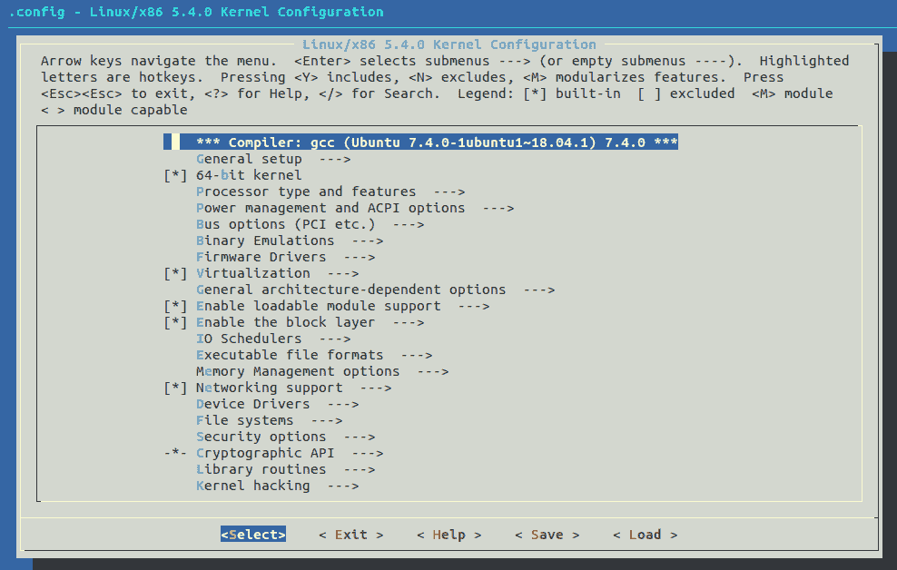

图 2.5 - 通过 make menuconfig 进行内核配置的主菜单（在 x86-64 上）

作为经验丰富的开发人员，或者任何足够使用计算机的人都知道，事情可能会出错。例如，以下情景 - 在新安装的 Ubuntu 系统上第一次运行`make menuconfig`：

```
$ make menuconfig
 UPD     scripts/kconfig/.mconf-cfg
 HOSTCC  scripts/kconfig/mconf.o
 YACC    scripts/kconfig/zconf.tab.c
/bin/sh: 1: bison: not found
scripts/Makefile.lib:196: recipe for target 'scripts/kconfig/zconf.tab.c' failed
make[1]: *** [scripts/kconfig/zconf.tab.c] Error 127
Makefile:539: recipe for target 'menuconfig' failed
make: *** [menuconfig] Error 2
$
```

等一下，不要慌（还）。仔细阅读失败消息。`YACC [...]`后的一行提供了线索：`/bin/sh: 1: bison: not found`。啊，所以用以下命令安装`bison(1)`：

`sudo apt install bison`

现在，一切应该都好了。嗯，几乎；同样，在新安装的 Ubuntu 系统上，`make menuconfig`然后抱怨`flex(1)`未安装。所以，我们安装它（你猜对了：通过`sudo apt install flex`）。此外，在 Ubuntu 上，您需要安装`libncurses5-dev`包（在 Fedora 上，执行`sudo dnf install ncurses-devel`）。

如果您已经阅读并遵循了第一章，*内核* *工作空间设置*，那么您应该已经安装了所有这些先决条件包。如果没有，请立即参考并安装所有所需的包。记住，*种瓜得瓜，种豆得豆……*

继续前进，kbuild 开源框架（顺便说一句，它在许多项目中被重复使用）通过其 UI 向用户提供了一些线索。菜单条目前缀的含义如下：

+   `[.]`: 内核功能，布尔选项（要么开启，要么关闭）：

+   `[*]`: 开启，功能已编译并内置到内核镜像中（编译进内核）（y）

+   `[ ]`: 关闭，根本没有构建（n）

+   `<.>`：一个可以处于三种状态之一的特性（三态）：

+   `<*>`：打开，特性已编译并内建（编译进）内核镜像（y）

+   `<M>`：模块，作为内核模块编译和内建（m）

+   `< >`：关闭，完全不构建（n）

+   `{.}`：此配置选项存在依赖关系；因此，它需要被构建（编译）为模块（m）或内建到内核镜像中（y）。

+   `-*-`：一个依赖需要将此项目编译进（y）。

+   `（...）`：提示：需要输入字母数字（在此选项上按`[Enter]`键，然后会出现提示）。

+   `<菜单项>  --->`：后面有一个子菜单（在此项目上按`[Enter]`键导航到子菜单）。

再次，经验法则至关重要。让我们实际尝试使用`make menuconfig` UI 来看看它是如何工作的。这是下一节的主题。

### 使用 make menuconfig UI 的示例用法

通过方便的`menuconfig`目标来感受使用 kbuild 菜单系统的过程，让我们逐步进行导航到名为`内核.config 支持`的三态菜单项。它默认是关闭的，所以让我们打开它；也就是说，让我们把它设为`y`，内建到内核镜像中。我们可以在主屏幕上的`常规设置`主菜单项下找到它。

打开此功能到`y`会实现什么？当打开到`y`（或者当设置为`M`时，一个内核模块将可用，并且一旦加载，当前运行的内核配置设置可以通过两种方式随时查找：

+   通过运行`scripts/extract-ikconfig`脚本

+   直接读取`/proc/config.gz`伪文件的内容（当然，它是`gzip(1)`压缩的；首先解压缩，然后读取）

作为一个学习练习，我们现在将学习如何为 x86-64 架构的 5.4 Linux 内核配置内核配置选项，其值如下表所示。现在，不要担心每个选项的含义；这只是为了练习内核配置系统：

| **特性** | **在 make menuconfig UI 中的效果和位置** | **选择<帮助>按钮**

**查看精确的 CONFIG_<FOO>选项** | **值：原始** **-> 新值** |

| 本地版本 | 设置内核发布/版本的`-EXTRAVERSION`组件（使用`uname -r`查看）；`常规设置 / 附加到内核发布的本地版本` | `CONFIG_LOCALVERSION` | (none) -> `-llkd01` |
| --- | --- | --- | --- |
| 内核配置文件支持 | 允许您查看当前内核配置详细信息；`常规设置 / 内核.config 支持` | `CONFIG_IKCONFIG` |  `n` -> `y` |
| 与前面相同，还可以通过 procfs 访问 | 允许您通过**proc 文件系统**（**procfs**）查看当前内核配置详细信息；`常规设置 / 通过/proc/config.gz 启用对.config 的访问` | `CONFIG_IKCONFIG_PROC` | `n` -> `y` |
| 内核分析 | 内核分析支持；`常规设置 / 分析支持` | `CONFIG_PROFILING` | `y` -> `n` |
| HAM 无线电 | HAM 无线电支持；`网络支持 / 业余无线电支持` | `CONFIG_HAMRADIO` | `y` -> `n` |
| VirtualBox 支持 | VirtualBox 的（Para）虚拟化支持；`设备驱动程序 / 虚拟化驱动程序 / Virtual Box 客户端集成支持` | `CONFIG_VBOXGUEST` | `n` -> `m` |
| **用户空间 IO 驱动程序**（**UIO**） | UIO 支持；`设备驱动程序 / 用户空间 IO 驱动程序` | `CONFIG_UIO` | `n` -> `m` |
| 前面加上具有通用中断处理的 UIO 平台驱动程序 | 具有通用中断处理的 UIO 平台驱动程序；`设备驱动程序 / 用户空间 IO 驱动程序 / 具有通用中断处理的用户空间 IO 平台驱动程序` | `CONFIG_UIO_PDRV_GENIRQ` | `n` -> `m` |
| MS-DOS 文件系统支持 | `文件系统 / DOS/FAT/NT 文件系统 / MSDOS 文件系统支持` | `CONFIG_MSDOS_FS` | `n` -> `m` |
| 安全性：LSMs | 关闭内核 LSMs；`安全选项 / 启用不同的安全模型` *(注意：对于生产系统，通常最好保持此选项打开！)* | `CONFIG_SECURITY` | `y` -> `n` |
| 内核调试：堆栈利用信息 | `内核调试 / 内存调试 / 堆栈利用信息检测` | `CONFIG_DEBUG_STACK_USAGE` | `n` -> `y` |

表 2.4 – 需要配置的项目

您如何解释这个表格？让我们以第一行为例；我们逐列地讨论它：

+   **第一列**指定我们要修改（编辑/启用/禁用）的内核*特性*。在这里，它是内核版本字符串的最后部分（如在`uname -r`的输出中显示）。它被称为发布的`-EXTRAVERSION`组件（详细信息请参阅*内核发布命名规范*部分）。

+   **第二列**指定了两件事：

+   首先，我们要做什么。在这里，我们想要*设置*内核发布字符串的`-EXTRAVERSION`组件。

+   第二，显示了此内核配置选项在`menuconfig` UI 中的位置。在这里，它在`General Setup`子菜单中，在其中是名为`Local version - append to kernel release`的菜单项。我们将其写为`General Setup / Local version - append to kernel release`。

+   **第三列**指定内核配置选项的名称为`CONFIG_<FOO>`。如果需要，您可以在菜单系统中搜索此选项。在这个例子中，它被称为`CONFIG_LOCALVERSION`。

+   **第四列**显示了此内核配置选项的原始*值*以及我们希望您将其更改为的值（“新”值）。它以*原始值 -> 新值*的格式显示。在我们的示例中，它是`(none) -> -llkd01`，意味着`-EXTRAVERSION`字符串组件的原始值为空，我们希望您修改它，将其更改为值`-llkd01`。

另一方面，对于我们展示的几个项目，可能不会立即显而易见——比如`n -> m`；这是什么意思？`n -> m`意味着您应该将原始值从`n`（未选择）更改为`m`（选择为内核模块进行构建）。同样，`y -> n`字符串表示将配置选项从打开更改为关闭。

您可以通过按下/键（就像 vi 一样；我们将在接下来的部分中展示更多内容）在`menuconfig`系统 UI 中*搜索*内核配置选项。

然后（实际上是在接下来的章节中），我们将使用这些新的配置选项构建内核（和模块），从中引导，并验证前面的内核配置选项是否按我们所需设置。

但是现在，您需要做您的部分：启动菜单 UI（通常使用`make menuconfig`），然后导航菜单系统，找到先前描述的相关内核配置选项，并根据需要进行编辑，以符合前表中第四列显示的内容。

请注意，根据您当前运行的 Linux 发行版及其内核模块（我们使用`lsmod(8)`生成了初始配置，记得吗？），在配置内核时看到的实际值和默认值可能与*Ubuntu 18.04.3 LTS*发行版（运行 5.0.0-36-generic 内核）的值不同，正如我们之前使用和展示的那样。

在这里，为了保持讨论的理智和紧凑，我们只会展示设置前表中显示的第二个和第三个内核配置选项的完整详细步骤（`Kernel .config support`）。剩下的编辑由您完成。让我们开始吧：

1.  切换到内核源树的根目录（无论您在磁盘上的哪个位置提取了它）：

```
cd ${LLKD_KSRC}
```

1.  根据先前描述的第三种方法（在*Tuned kernel config via the localmodconfig approach*部分）设置初始内核配置文件：

```
lsmod > /tmp/lsmod.now
make LSMOD=/tmp/lsmod.now localmodconfig
```

1.  运行 UI：

```
make menuconfig
```

1.  一旦`menuconfig` UI 加载完成，转到`General Setup`菜单项。通常，在 x86-64 上，它是第二个项目。使用键盘箭头键导航到它，并按*Enter*键进入。

1.  现在你在`General Setup`菜单项中。按下箭头键几次向下滚动菜单项。我们滚动到我们感兴趣的菜单——`Kernel .config support`——并将其突出显示；屏幕应该看起来（有点）像这样：

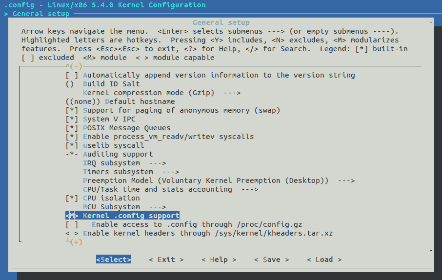

图 2.6 - 通过 make menuconfig 进行内核配置；通用设置/内核.config 支持

对于 x86-64 上的 5.4.0 原始 Linux 内核，`通用设置/内核.config 支持`是从`通用设置`菜单顶部开始的第 20 个菜单项。

1.  一旦在`Kernel .config support`菜单项上，我们可以从其`<M>`前缀（在前面的屏幕截图中）看到，它是一个三态菜单项，最初设置为模块的选择`<M>`。

1.  保持这个项目（`Kernel .config support`）突出显示，使用右箭头键导航到底部工具栏上的`< Help >`按钮上，并在`< Help >`按钮上按*Enter*键。屏幕现在应该看起来（有点）像这样：

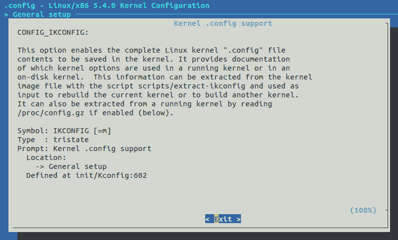

图 2.7 - 通过 make menuconfig 进行内核配置；一个示例帮助屏幕

帮助屏幕非常有信息量。事实上，一些内核配置帮助屏幕非常丰富并且实际上很有帮助。不幸的是，有些则不是。

1.  好的，接下来，按*Enter*在`< Exit >`按钮上，这样我们就回到了上一个屏幕。

1.  然后，通过按空格键切换`Kernel .config support`菜单项（假设初始状态为`<M>`；也就是说，设置为模块）。按一次空格键会使 UI 项目显示如下：

```
<*> Kernel .config support
[ ]   Enable access to .config through /proc/config.gz (NEW)
```

注意它如何变成了`<*>`，这意味着这个功能将被构建到内核镜像本身中（实际上，它将始终处于打开状态）。现在，让我们这样做（当然，再次按空格键会将其切换到关闭状态`< >`，然后再回到原始的`<M>`状态）。

1.  现在，项目处于`<*>`（是）状态，向下滚动到下一个菜单项，`[*] Enable access to .config through /proc/config.gz`，并启用它（再次按空格键）；屏幕现在应该看起来（有点）像这样（我们只放大了相关部分）：

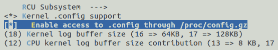

图 2.8 - 通过 make menuconfig 进行内核配置：将布尔配置选项切换到打开状态

您可以随时使用右箭头键转到`< Help >`并查看此项目的帮助屏幕。

在这里，我们不会探索剩余的内核配置菜单；我会留给你去找到并按照前面的表格设置。

1.  回到主菜单（主屏幕），使用右箭头键导航到`< Exit >`按钮上并按*Enter*。会弹出一个对话框：

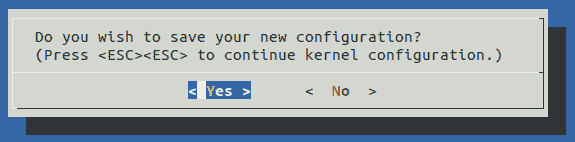

图 2.9 - 通过 make menuconfig 进行内核配置：保存对话框

很简单，不是吗？在`< Yes >`按钮上按*Enter*保存并退出。如果选择`< No >`按钮，您将失去所有配置更改（在本次会话期间进行的更改）。或者，您可以按*Esc*键*两次*来摆脱这个对话框并继续处理内核配置。

1.  保存并退出。在`< Yes >`按钮上按*Enter*。菜单系统 UI 现在保存了新的内核配置并退出；我们回到控制台（一个 shell 或终端窗口）提示符。

但是新的内核配置保存在哪里？这很重要：内核配置被写入内核源树根目录中的一个简单的 ASCII 文本文件中，名为**`.config`**。也就是说，它保存在`${LLKD_KSRC}/.config`中。

如前所述，每个内核配置选项都与形式为`CONFIG_<FOO>`的配置变量相关联，其中`<FOO>`当然被适当的名称替换。在内部，这些变量成为构建系统和实际上内核源代码使用的*宏*。例如，考虑一下`Kernel .config support`选项：

```
$ grep IKCONFIG .config
CONFIG_IKCONFIG=y
CONFIG_IKCONFIG_PROC=y
$
```

啊哈！配置现在反映了我们已经完成的事实：

+   打开了`CONFIG_IKCONFIG`内核功能（`=y`表示它已经打开，并将构建到内核镜像中）。

+   `/proc/config.gz`（伪）文件现在可用，作为`CONFIG_IKCONFIG_PROC=y`。

注意*：最好不要尝试手动编辑`.config`文件（“手动”）。你可能不知道有几个相互依赖；始终使用 kbuild 菜单系统（我们建议通过`make menuconfig`）来编辑它。

实际上，在我们迄今为止与 kbuild 系统的快速冒险中，底层已经发生了很多事情。下一节将稍微探讨一下这个问题，在菜单系统中搜索以及清晰地可视化原始（或旧）和新的内核配置文件之间的差异。

## 关于 kbuild 的更多信息

通过`make menuconfig`或其他方法在内核源树的根目录中创建或编辑`.config`文件并不是 kbuild 系统处理配置的最后一步。不，它现在会内部调用一个名为`syncconfig`的目标，这个目标之前被（误）命名为`silentoldconfig`。这个目标让 kbuild 生成一些头文件，这些头文件进一步用于构建内核的设置。这些文件包括`include/config`下的一些元头文件，以及`include/generated/autoconf.h`头文件，它将内核配置存储为 C 宏，从而使内核的 Makefile(s)和内核代码能够根据内核功能是否可用来做出决策。

接下来，如果你正在寻找特定的内核配置选项，但很难找到它怎么办？没问题，`menuconfig` UI 系统有一个`Search Configuration Parameter`功能。就像著名的`vi(1)`编辑器一样，按下`/`（正斜杠）键会弹出一个搜索对话框，然后输入你的搜索词，带有或不带有`CONFIG_`前缀，然后选择`< Ok >`按钮让它继续进行。

以下几张截图显示了搜索对话框和结果对话框（例如，我们搜索了术语`vbox`）：

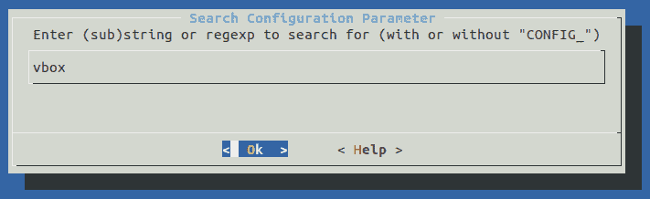

图 2.10 - 通过`make menuconfig`进行内核配置：搜索配置参数的结果对话框

前面搜索的结果对话框很有趣。它揭示了关于配置选项的几条信息：

+   配置指令（只需在`Symbol:`中加上`CONFIG_`前缀）

+   配置的类型（布尔值、三态值、字母数字等）

+   提示字符串

+   重要的是，它在菜单系统中的位置（这样你就可以找到它）

+   它的内部依赖，如果有的话

+   它自动选择的任何配置选项（如果选择了它本身，则打开）

以下是结果对话框的截图：

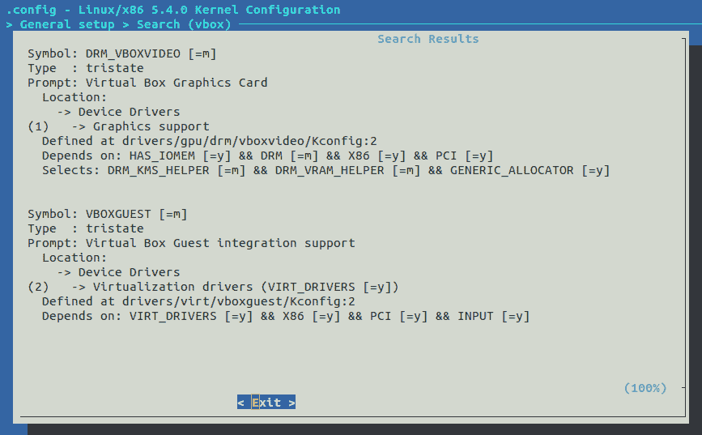

图 2.11 - 通过`make menuconfig`进行内核配置：前面搜索的结果对话框

所有这些信息都包含在一个 ASCII 文本文件中，该文件由 kbuild 系统用于构建菜单系统 UI - 这个文件称为`Kconfig`（实际上有几个）。它的位置也显示出来了（在`Defined at ...`行）。

### 查找配置中的差异

一旦要写入`.config`内核配置文件，kbuild 系统会检查它是否已经存在，如果存在，它会备份为`.config.old`。知道这一点，我们总是可以区分这两个文件，看到我们所做的更改。然而，使用典型的`diff(1)`实用程序来做这件事使得差异很难解释。内核提供了一个更好的方法，一个专门用于做这件事的基于控制台的脚本。内核源树中的`scripts/diffconfig`脚本对此非常有用。为了看到原因，让我们首先运行它的帮助屏幕：

```
$ scripts/diffconfig --help
Usage: diffconfig [-h] [-m] [<config1> <config2>]

Diffconfig is a simple utility for comparing two .config files.
Using standard diff to compare .config files often includes extraneous and
distracting information. This utility produces sorted output with only the
changes in configuration values between the two files.

Added and removed items are shown with a leading plus or minus, respectively.
Changed items show the old and new values on a single line.
[...]
```

现在，我们来试一下：

```
$ scripts/diffconfig .config.old .config
-AX25 n
-DEFAULT_SECURITY_APPARMOR y
-DEFAULT_SECURITY_SELINUX n
-DEFAULT_SECURITY_SMACK n
[...]
-SIGNATURE y
 DEBUG_STACK_USAGE n -> y
 DEFAULT_SECURITY_DAC n -> y
 FS_DAX y -> n
 HAMRADIO y -> n
 IKCONFIG m -> y
 IKCONFIG_PROC n -> y
 LOCALVERSION "" -> "-llkd01"
 MSDOS_FS n -> m
 PROFILING y -> n
 SECURITY y -> n
 UIO n -> m
+UIO_AEC n
 VBOXGUEST n -> m
[...]
$ 
```

如果您修改了内核配置更改，如前表所示，您应该通过内核的`diffconfig`脚本看到类似于前面代码块中显示的输出。它清楚地向我们展示了我们改变了哪些内核配置选项以及如何改变的。

在我们结束之前，快速注意一些关键的事情：*内核安全*。虽然用户空间安全加固技术已经大大增长，但内核空间安全加固技术实际上正在追赶。仔细配置内核的配置选项在确定给定 Linux 内核的安全姿态方面起着关键作用；问题是，有太多的选项（实际上是意见），往往很难（交叉）检查哪些是从安全角度来看是一个好主意，哪些不是。Alexander Popov 编写了一个非常有用的 Python 脚本，名为`kconfig-hardened-check`；它可以运行以检查和比较给定的内核配置（通过通常的配置文件）与一组预定的加固偏好（来自各种 Linux 内核安全项目：著名的**内核自我保护项目**（**KSPP**），最后一个公共 grsecurity 补丁，CLIP OS 和安全锁定 LSM）。查找`kconfig-hardened-check` GitHub 存储库，尝试一下！

好了！你现在已经完成了 Linux 内核构建的前三个步骤，相当了不起。（当然，我们将在下一章中完成构建过程的其余四个步骤。）我们将以一个关于学习有用技能的最后一节结束本章-如何自定义内核 UI 菜单。

# 自定义内核菜单-添加我们自己的菜单项

所以，假设你开发了一个设备驱动程序，一个实验性的新调度类，一个自定义的`debugfs`（调试文件系统）回调，或者其他一些很酷的内核特性。你将如何让团队中的其他人，或者说，你的客户，知道这个奇妙的新内核特性存在，并允许他们选择它（作为内置或内核模块）并因此构建和使用它？答案是在内核配置菜单的适当位置插入*一个新的菜单项*。

为此，首先了解一下各种`Kconfig*`文件及其所在位置是很有用的。让我们找出来。

## Kconfig*文件

内核源树根目录中的`Kconfig`文件用于填充`menuconfig` UI 的初始屏幕。如果你愿意，可以看一下它。它通过在内核源树的不同文件夹中源化各种其他`Kconfig`文件来工作。以下表总结了更重要的`Kconfig*`文件以及它们在 kbuild UI 中服务的菜单：

| **菜单** | **定义它的 Kconfig 文件位置** |
| --- | --- |
| 主菜单，初始屏幕 | `Kconfig` |
| 通用设置+启用可加载模块支持 | `init/Kconfig` |

| 处理器类型和特性+总线选项+二进制模拟

（特定于架构；上面的菜单标题是为 x86；一般来说，Kconfig 文件在这里：`arch/<arch>/Kconfig`）| `arch/<arch>/Kconfig` |

| 电源管理 | `kernel/power/Kconfig` |
| --- | --- |
| 固件驱动程序 | `drivers/firmware/Kconfig` |
| 虚拟化 | `arch/<arch>/kvm/Kconfig` |
| 通用架构相关选项 | `arch/Kconfig` |
| 启用块层+IO 调度程序 | `block/Kconfig` |
| 可执行文件格式 | `fs/Kconfig.binfmt` |
| 内存管理选项 | `mm/Kconfig` |
| 网络支持 | `net/Kconfig, net/*/Kconfig` |
| 设备驱动程序 | `drivers/Kconfig, drivers/*/Kconfig` |
| 文件系统 | `fs/Kconfig, fs/*/Kconfig` |
| 安全选项 | `security/Kconfig, security/*/Kconfig*` |
| 加密 API | `crypto/Kconfig, crypto/*/Kconfig` |
| 库例程 | `lib/Kconfig, lib/*/Kconfig` |
| 内核黑客 | `lib/Kconfig.debug, lib/Kconfig.*` |

表 2.5-内核配置菜单项及定义它们的相应 Kconfig*文件

通常，一个`Kconfig`文件驱动一个菜单。现在，让我们继续添加菜单项。

## 在 Kconfig 文件中创建一个新的菜单项

作为一个微不足道的例子，让我们在`General Setup`菜单中添加我们自己的布尔`dummy`配置选项。我们希望配置名称为`CONFIG_LLKD_OPTION1`。从前面的表中可以看出，要编辑的相关`Kconfig`文件是`init/Kconfig`，因为这是定义`General Setup`菜单的菜单元文件。

让我们开始吧：

1.  为了安全起见，始终制作备份副本：

```
cp init/Kconfig init/Kconfig.orig
```

1.  现在，编辑`init/Kconfig`文件：

```
vi init/Kconfig
```

在文件中找到适当的位置；在这里，我们选择在`CONFIG_LOCALVERSION_AUTO`之后插入我们的菜单项。以下截图显示了我们的新条目：

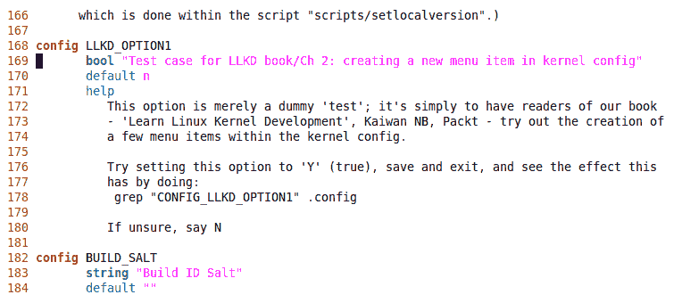

图 2.12 - 编辑 init/Kconfig 并插入我们自己的菜单项

我们已经将前面的文本作为补丁提供给了我们书籍的*GitHub*源代码树中的原始`init/Kconfig`文件。在`ch2/Kconfig.patch`下找到它。

新项目以`config`关键字开头，后跟您的新`CONFIG_LLKD_OPTION1`配置变量的`FOO`部分。现在，只需阅读我们在`Kconfig`文件中关于此条目的陈述。有关`Kconfig`语言/语法的更多细节在接下来的*A few details on the Kconfig language*部分中。

1.  保存文件并退出编辑器。

1.  重新配置内核。导航到我们的新菜单项并打开该功能（请注意，在下面的截图中，默认情况下它是高亮显示的并且*关闭*）：

```
make menuconfig
[...]
```

这是输出：

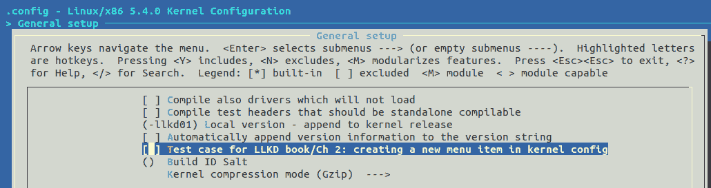

图 2.13 - 通过 make menuconfig 进行内核配置，显示我们的新菜单项

1.  打开它（使用空格键切换），然后保存并退出菜单系统。

在此期间，尝试按下`< Help >`按钮。您应该看到我们在`Kconfig`文件中提供的“帮助”。

1.  检查我们的功能是否已被选择：

```
$ grep "LLKD_OPTION1" .config
CONFIG_LLKD_OPTION1=y
$ grep "LLKD_OPTION1" include/generated/autoconf.h 
$  
```

我们发现确实已经在我们的`.config`文件中设置为*on*，但是（还没有！）在内核的内部自动生成的头文件中。这将在构建内核时发生。

1.  构建内核（不用担心；有关构建内核的完整细节在下一章中找到。您可以首先阅读第三章，*从源代码构建 5.x Linux 内核-第二部分*，然后再回到这一点，如果您愿意的话...）:

```
make -j4
```

1.  完成后，重新检查`autoconf.h`头文件，查看我们的新配置选项是否存在：

```
$ grep "LLKD_OPTION1" include/generated/autoconf.h 
#define CONFIG_LLKD_OPTION1 1
```

成功了！是的，但是在实际项目（或产品）中工作时，我们通常需要进一步设置，设置我们的配置项在使用此配置选项的代码相关的 Makefile 中。

这是一个快速示例，内核的顶层（或其他位置）Makefile 中，以下行将确保我们自己的代码（以下内容在`llkd_option1.c`源文件中）在构建时编译到内核中。将此行添加到相关的 Makefile 末尾：

```
obj-${CONFIG_LLKD_OPTION1}  +=  llkd_option1.o
```

现在不要担心内核`Makefile`语法相当奇怪。接下来的几章将对此进行一些解释。

此外，您应该意识到，同一个配置也可以作为内核代码片段中的普通 C 宏使用；例如，我们可以这样做：

```
#ifdef CONFIG_LLKD_OPTION1
    do_our_thing();
#endif
```

然而，非常值得注意的是，Linux 内核社区已经制定并严格遵守了某些严格的编码风格指南。在这种情况下，指南规定应尽量避免条件编译，如果需要使用`Kconfig`符号作为条件，则请按照以下方式进行：

```
if (IS_ENABLED(CONFIG_LLKD_OPTION1)) {
    do_our_thing();
}
```

Linux 内核*编码风格指南*可以在这里找到：[`www.kernel.org/doc/html/latest/process/coding-style.html`](https://www.kernel.org/doc/html/latest/process/coding-style.html)。我建议您经常参考它们，并且当然要遵循它们！

## 关于 Kconfig 语言的一些细节

到目前为止，我们对`Kconfig`语言的使用只是冰山一角。事实上，kbuild 系统使用`Kconfig`语言（或语法）来使用简单的 ASCII 文本指令来表达和创建菜单。该语言包括菜单条目、属性、（反向）依赖项、可见性约束、帮助文本等等。

内核文档了`Kconfig`语言的构造和语法：[`www.kernel.org/doc/Documentation/kbuild/kconfig-language.txt`](https://www.kernel.org/doc/Documentation/kbuild/kconfig-language.txt)。请参考此文档以获取完整的详细信息。

以下表格简要介绍了更常见的`Kconfig`构造（并不完整）：

| **构造** | **含义** |
| --- | --- |
| `config <FOO>` | 在这里指定菜单条目名称（格式为`CONFIG_FOO`）；只需放入`FOO`部分。 |
| **菜单属性** |  |
| `  bool ["<description>"]` | 将配置选项指定为*布尔*；在`.config`中的值将是`Y`（内建到内核映像中）或不存在（将显示为已注释的条目）。 |
| `  tristate ["description>"]` | 将配置选项指定为*三态*；在`.config`中的值将是`Y`、`M`（作为内核模块构建）或不存在（将显示为已注释的条目）。 |
| `  int ["<description>"]` | 将配置选项指定为*整数*值。 |
| `     range x-y` | 整数范围从`x`到`y`。 |
| `  default <value>` | 指定默认值；根据需要使用`y`、`m`、`n`或其他值。 |
| ` prompt "<description>"` | 描述内核配置的句子。 |
| `depends on "expr"` | 为菜单项定义一个依赖项；可以使用`depends on FOO1 && FOO2 && (FOO3 &#124;&#124; FOO4)`类型的语法来定义多个依赖项。 |
| `select <config> [if "expr"]` | 定义一个反向依赖项。 |
| `help "help-text"` | 在选择`<帮助>`按钮时显示的文本。 |

表 2.6 - Kconfig，一些构造

为了帮助理解语法，以下是来自`lib/Kconfig.debug`（描述 UI 的`Kernel Hacking`-内核调试，实际上-部分菜单项的文件）的一些示例：

1.  我们将从一个简单的开始（`CONFIG_DEBUG_INFO`选项）：

```
config DEBUG_INFO
    bool "Compile the kernel with debug info"
    depends on DEBUG_KERNEL && !COMPILE_TEST
    help
      If you say Y here the resulting kernel image will include
      debugging info resulting in a larger kernel image. [...]
```

1.  接下来，让我们来看一下`CONFIG_FRAME_WARN`选项。注意`range`和条件默认值语法，如下所示：

```
config FRAME_WARN
    int "Warn for stack frames larger than (needs gcc 4.4)"
    range 0 8192
    default 3072 if KASAN_EXTRA
    default 2048 if GCC_PLUGIN_LATENT_ENTROPY
    default 1280 if (!64BIT && PARISC)
    default 1024 if (!64BIT && !PARISC)
    default 2048 if 64BIT
    help
      Tell gcc to warn at build time for stack frames larger than this.
      Setting this too low will cause a lot of warnings.
      Setting it to 0 disables the warning.
      Requires gcc 4.4
```

1.  接下来，`CONFIG_HAVE_DEBUG_STACKOVERFLOW`选项是一个简单的布尔值；它要么开启，要么关闭。`CONFIG_DEBUG_STACKOVERFLOW`选项也是一个布尔值。请注意它如何依赖于另外两个选项，使用布尔 AND（`&&`）运算符分隔：

```
config HAVE_DEBUG_STACKOVERFLOW
        bool

config DEBUG_STACKOVERFLOW
        bool "Check for stack overflows"
        depends on DEBUG_KERNEL && HAVE_DEBUG_STACKOVERFLOW
        ---help---
          Say Y here if you want to check for overflows of kernel, IRQ
          and exception stacks (if your architecture uses them). This 
          option will show detailed messages if free stack space drops
          below a certain limit. [...]
```

好了！这完成了我们对在内核配置中创建（或编辑）自定义菜单条目的覆盖，也完成了本章。

# 总结

在本章中，您首先学习了如何获取 Linux 内核源代码树。然后，您了解了其发布（或版本）命名法，各种类型的 Linux 内核（`-next`树，`-rc`/主线树，稳定版，LTS，SLTS 和发行版），以及基本的内核开发工作流程。在这个过程中，您甚至快速浏览了内核源代码树，以便更清楚地了解其布局。接下来，您将看到如何将压缩的内核源代码树提取到磁盘上，并且关键的是如何配置内核-这是过程中的关键步骤。此外，您还学会了如何自定义内核菜单，向其中添加自己的条目，以及有关 kbuild 系统和相关的`Kconfig`文件的一些知识。

了解如何获取和配置 Linux 内核是一项有用的技能。我们刚刚开始了这段漫长而激动人心的旅程。您将意识到，随着对内核内部、驱动程序和目标系统硬件的更多经验和知识，您调整内核以适应项目目的的能力将会变得更好。

我们已经走了一半的路；我建议您首先消化这些材料，重要的是-尝试本章中的步骤，解决问题/练习，并浏览*Further reading*部分。然后，在下一章中，让我们实际构建 5.4.0 内核并进行验证！

# 问题

最后，这里有一些问题供您测试对本章材料的了解：[`github.com/PacktPublishing/Linux-Kernel-Programming/tree/master/questions`](https://github.com/PacktPublishing/Linux-Kernel-Programming/tree/master/questions)。您会在本书的 GitHub 存储库中找到一些问题的答案：[`github.com/PacktPublishing/Linux-Kernel-Programming/tree/master/solutions_to_assgn`](https://github.com/PacktPublishing/Linux-Kernel-Programming/tree/master/solutions_to_assgn)。

# 进一步阅读

为了帮助您深入了解有用的材料，我们在本书的 GitHub 存储库中提供了一个相当详细的在线参考和链接列表（有时甚至包括书籍）的 Further reading 文档。 *Further reading* 文档在这里可用：[`github.com/PacktPublishing/Linux-Kernel-Programming/blob/master/Further_Reading.md`](https://github.com/PacktPublishing/Linux-Kernel-Programming/blob/master/Further_Reading.md)。
