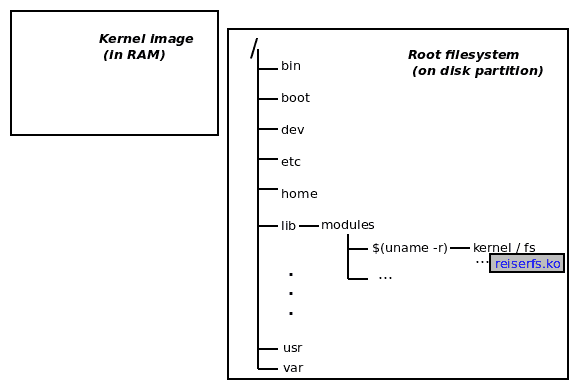
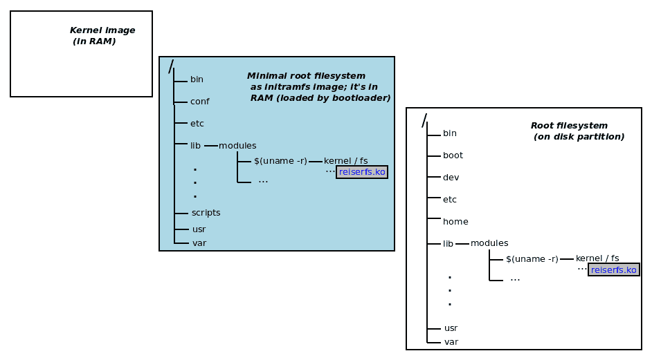
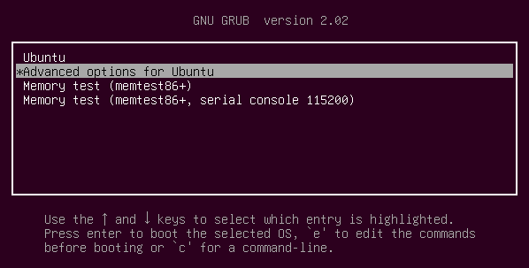
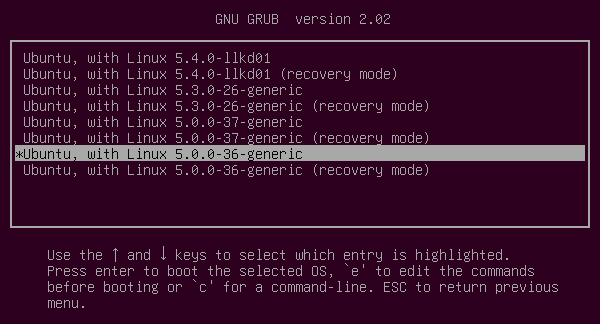
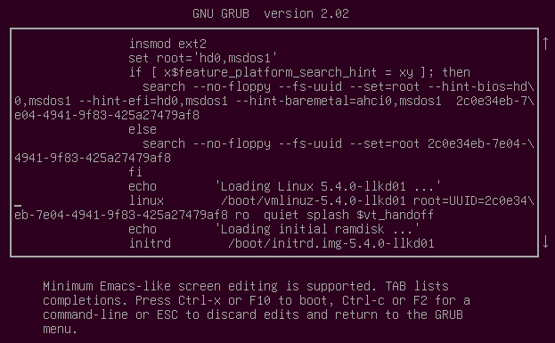
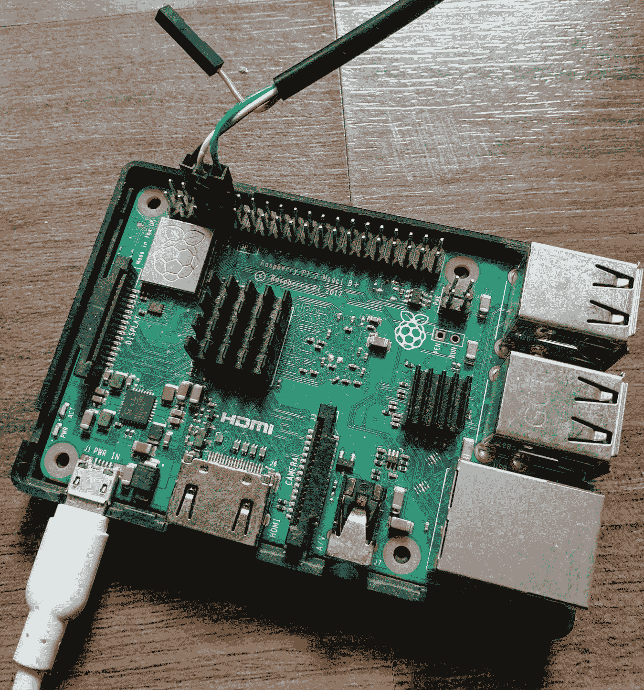

# 第三章：从源代码构建 5.x Linux 内核 - 第二部分

本章继续上一章的内容。在上一章中，在“从源代码构建内核的步骤”部分，我们涵盖了构建内核的前三个步骤。在那里，您学会了如何下载和提取内核源树，甚至是`git clone`（*步骤 1*和*2*）。然后，我们继续了解内核源树布局，以及正确到达配置内核起始点的各种方法（*步骤 3*）。我们甚至在内核配置菜单中添加了自定义菜单项。

在本章中，我们继续我们的内核构建任务，覆盖了剩下的四个步骤来实际构建它。首先，当然，我们要构建它（*步骤 4*）。然后您将看到如何正确安装作为构建的一部分生成的内核模块（*步骤 5*）。接下来，我们运行一个简单的命令来设置 GRUB 引导加载程序并生成`initramfs`（或`initrd`）镜像（*步骤 6*）。还讨论了使用`initramfs`镜像的动机以及它的使用方式。然后介绍了一些有关配置 GRUB 引导加载程序（对于 x86）的细节（*步骤 7*）。

在本章结束时，我们将使用新的内核镜像引导系统，并验证它是否按预期构建。然后，我们将学习如何为外部架构（即 ARM，所讨论的板子是著名的树莓派）*交叉编译* Linux 内核。

简而言之，涵盖的领域如下：

+   第 4 步 - 构建内核镜像和模块

+   第 5 步 - 安装内核模块

+   第 6 步 - 生成 initramfs 镜像和引导加载程序设置

+   了解 initramfs 框架

+   第 7 步 - 自定义 GRUB 引导加载程序

+   验证我们新内核的配置

+   树莓派的内核构建

+   内核构建的其他提示

# 技术要求

在开始之前，我假设您已经下载、提取（如果需要）并配置了内核，因此有一个`.config`文件准备好了。如果您还没有，请参考上一章，了解如何确切地完成这些步骤。现在我们可以继续构建它了。

# 第 4 步 - 构建内核镜像和模块

从最终用户的角度来看，执行构建实际上非常简单。在最简单的形式中，只需确保您在配置的内核源树的根目录中，并键入`make`。就是这样 - 内核镜像和任何内核模块（在嵌入式系统上可能还有**设备树二进制**（**DTB**））将被构建。喝杯咖啡吧！第一次可能需要一段时间。

当然，我们可以向`make`传递各种`Makefile`目标。在命令行上快速发出`make help`命令会显示相当多的信息。请记住，实际上我们之前就用过这个命令，事实上，以查看所有可能的配置目标。在这里，我们用它来查看`all`目标默认构建了什么：

```
$ cd ${LLKD_KSRC}     # the env var LLKD_KSRC holds the 'root' of our 
                      # 5.4 kernel source tree
$ make help
[...]
Other generic targets:
  all - Build all targets marked with [*]
* vmlinux - Build the bare kernel
* modules - Build all modules
[...]
Architecture specific targets (x86):
* bzImage - Compressed kernel image (arch/x86/boot/bzImage)
[...]
$ 
```

好的，执行`make all`将得到前面三个带有`*`前缀的目标；它们代表什么意思呢？

+   `vmlinux`实际上与未压缩的内核镜像的名称相匹配。

+   `modules`目标意味着所有标记为`m`（用于模块）的内核配置选项将作为内核模块（`.ko`文件）构建在内核源树中（有关内核模块的具体内容以及如何编程的细节将在接下来的两章中讨论）。

+   `bzImage`是特定于架构的。在 x86[-64]系统上，这是压缩内核镜像的名称 - 引导加载程序实际加载到 RAM 中并在内存中解压缩并引导的镜像文件。

那么，一个常见问题：如果`bzImage`是我们用来引导和初始化系统的实际内核，那么`vmlinux`是用来做什么的？请注意，`vmlinux`是未压缩的内核映像。它可能很大（甚至在调试构建期间生成的内核符号存在时非常大）。虽然我们从不通过`vmlinux`引导，但它仍然很重要。出于内核调试目的，请保留它（不幸的是，这超出了本书的范围）。

使用 kbuild 系统，只需运行`make`命令就相当于`make all`。

内核代码库非常庞大。目前的估计在 2000 万**源代码行**（**SLOC**）左右，因此，构建内核确实是*一个非常占用内存和 CPU 的工作*。事实上，有些人使用内核构建作为压力测试！现代的`make(1)`实用程序功能强大，能够处理多个进程。我们可以要求它生成多个进程来并行处理构建的不同（无关）部分，从而提高吞吐量，缩短构建时间。相关选项是`-j'n'`，其中`n`是并行运行的任务数量的上限。用于确定这一点的启发式（经验法则）如下：

```
n = num-CPU-cores * factor;
```

在这里，`factor`是 2（或者在具有数百个 CPU 核心的高端系统上为 1.5）。从技术上讲，我们需要内部的核心是“线程化”的或者使用**同时多线程**（**SMT**）-这是英特尔所称的*超线程*，这样启发式才有用。

有关并行化`make`及其工作原理的更多详细信息可以在`make(1)`的 man 页面中找到（使用`man 1 make`调用），在`PARALLEL MAKE AND THE JOBSERVER`部分。

另一个常见问题：您的系统上有多少 CPU 核心？有几种方法可以确定这一点，其中一种简单的方法是使用`nproc(1)`实用程序：

```
$ nproc
2 
```

关于`nproc(1)`和相关实用程序的一点说明：

a) 对`nproc(1)`执行`strace(1)`会发现它基本上是使用`sched_getaffinity(2)`系统调用。我们将在第九章 *CPU 调度器-第一部分*和第十章 *CPU 调度器-第二部分*中提到更多关于这个和相关系统调用的内容。

b) FYI，`lscpu(1)`实用程序提供核心数以及其他有用的 CPU 信息。例如，它显示是否在**虚拟机**（**VM**）上运行（`virt-what`脚本也是如此）。在 Linux 系统上试一下。

显然，我们的客户机虚拟机已配置为具有两个 CPU 核心，因此让`n=2*2=4`。所以，我们开始构建内核。以下输出来自我们可靠的 x86_64 Ubuntu 18.04 LTS 客户机系统，配置为具有 2GB 的 RAM 和两个 CPU 核心。

请记住，内核必须首先*配置。*有关详细信息，请参阅第二章 *从源代码构建 5.x Linux 内核-第一部分*。

再次，当您开始时，内核构建可能会发出警告，尽管在这种情况下不是致命的：

```
$ time make -j4
scripts/kconfig/conf --syncconfig Kconfig
 UPD include/config/kernel.release
warning: Cannot use CONFIG_STACK_VALIDATION=y, please install libelf-dev, libelf-devel or elfutils-libelf-devel
[...]
```

因此，为了解决这个问题，我们中断构建，使用*Ctrl* + *C*，然后按照输出的建议安装`libelf-dev`软件包。在我们的 Ubuntu 系统上，`sudo apt install libelf-dev`就足够了。如果您按照第一章 *内核工作区设置*中的详细设置进行操作，这种情况就不会发生。重试，现在它可以工作了！为了让您感受一下，我们展示了构建输出的一些小片段。但是，最好还是自己尝试一下：

正因为内核构建非常依赖 CPU 和 RAM，因此在虚拟机上进行这项工作要比在本机 Linux 系统上慢得多。通过至少将客户机引导到运行级别 3（多用户网络，无 GUI）来节省 RAM 是有帮助的：[`www.if-not-true-then-false.com/2012/howto-change-runlevel-on-grub2/`](https://www.if-not-true-then-false.com/2012/howto-change-runlevel-on-grub2/)。

```
$ cd ${LLKD_KSRC} $ time make -j4 scripts/kconfig/conf --syncconfig Kconfig SYSHDR arch/x86/include/generated/asm/unistd_32_ia32.h
 SYSTBL arch/x86/include/generated/asm/syscalls_32.h
[...]
  DESCEND objtool
  HOSTCC /home/llkd/kernels/linux-5.4/tools/objtool/fixdep.o
  HOSTLD /home/llkd/kernels/linux-5.4/tools/objtool/fixdep-in.o
  LINK /home/llkd/kernels/linux-5.4/tools/objtool/fixdep
[...]

[...]
  LD      vmlinux.o
  MODPOST vmlinux.o
  MODINFO modules.builtin.modinfo
  LD      .tmp_vmlinux1
  KSYM    .tmp_kallsyms1.o
  LD      .tmp_vmlinux2
  KSYM    .tmp_kallsyms2.o
 LD      vmlinux
  SORTEX  vmlinux
  SYSMAP  System.map
  Building modules, stage 2.
 MODPOST 59 modules
  CC      arch/x86/boot/a20.o
[...]
  LD      arch/x86/boot/setup.elf
  OBJCOPY arch/x86/boot/setup.bin
  BUILD   arch/x86/boot/bzImage
Setup is 17724 bytes (padded to 17920 bytes).
System is 8385 kB
CRC 6f010e63
  CC [M]  drivers/hid/hid.mod.o
Kernel: arch/x86/boot/bzImage is ready  (#1)
```

好的，内核映像（在这里称为`bzImage`）和`vmlinux`文件已经成功地通过拼接生成的各种目标文件构建，正如在先前的输出中所见 - 先前块的最后一行确认了这一事实。但是，请稍等，构建还没有完成。kbuild 系统现在继续完成所有内核模块的构建；输出的最后部分如下所示：

```
[...]
  CC [M]  drivers/hid/usbhid/usbhid.mod.o
  CC [M]  drivers/i2c/algos/i2c-algo-bit.mod.o
[...]
  LD [M] sound/pci/snd-intel8x0.ko
  LD [M] sound/soundcore.ko

real     17m31.980s
user     23m58.451s
sys      3m22.280s
$
```

整个过程似乎总共花了大约 17.5 分钟。`time(1)`实用程序给出了一个（非常）粗略的时间概念，即后面的命令所花费的时间。

如果您想要准确的 CPU 分析，请学会使用强大的`perf(1)`实用程序。在这里，您可以尝试使用`perf stat make -j4`命令。我建议您在发行版内核上尝试此操作，否则，`perf`本身将必须为您的自定义内核手动构建。

此外，在先前的输出中，`Kernel: arch/x86/boot/bzImage is ready (#1)`，`#1`意味着这是内核的第一个构建。此数字将在后续构建中自动递增，并在您引导到新内核然后执行`uname -a`时显示。

由于我们正在进行并行构建（通过`make -j4`，意味着四个进程并行执行构建），所有构建过程仍然写入相同的`stdout`位置 - 终端窗口。因此，输出可能是无序或混乱的。

构建应该干净地运行，没有任何错误或警告。嗯，有时会看到编译器警告，但我们将轻松地忽略它们。如果在此步骤中遇到编译器错误，从而导致构建失败，怎么办？我们怎么委婉地表达这？哦，好吧，我们不能 - 这很可能是您的问题，而不是内核社区的问题。请检查并重新检查每一步，如果一切都失败了，请使用`make mrproper`命令从头开始重做！很多时候，内核构建失败意味着内核配置错误（可能会冲突的随机选择的配置）、工具链的过时版本或不正确的打补丁，等等。

假设一切顺利，正如它应该的那样，在此步骤终止时，kbuild 系统已生成了三个关键文件（其中有许多）。

在内核源树的根目录中，我们有以下内容：

+   未压缩的内核映像文件`vmlinux`（仅用于调试）

+   符号地址映射文件`System.map`

+   压缩的可引导内核映像文件`bzImage`（请参阅以下输出）

让我们来看看它们！通过向`ls(1)`传递`-h`选项，我们使输出（特别是文件大小）更易于阅读：

```
$ ls -lh vmlinux System.map
-rw-rw-r-- 1 llkd llkd 4.1M Jan 17 12:27 System.map
-rwxrwxr-x 1 llkd llkd 591M Jan 17 12:27 vmlinux
$ file ./vmlinux
./vmlinux: ELF 64-bit LSB executable, x86-64, version 1 (SYSV), statically linked, BuildID[sha1]=<...>, with debug_info, not stripped
```

如您所见，`vmlinux`文件非常庞大。这是因为它包含了所有内核符号以及额外的调试信息编码进去。（顺便说一句，`vmlinux`和`System.map`文件在内核调试上下文中使用；保留它们。）有用的`file(1)`实用程序向我们展示了有关此映像文件的更多细节。引导加载程序加载并引导的实际内核映像文件将始终位于`arch/<arch>/boot/`的通用位置；因此，对于 x86 架构，我们有以下内容：

```
$ ls -l arch/x86/boot/bzImage -rw-rw-r-- 1 llkd llkd 8604032 Jan 17 12:27 arch/x86/boot/bzImage$ file arch/x86/boot/bzImage
arch/x86/boot/bzImage: Linux kernel x86 boot executable bzImage, version 5.4.0-llkd01 (llkd@llkd-vbox) #1 SMP Thu [...], RO-rootFS, swap_dev 0x8, Normal VGA
```

x86_64 架构的压缩内核映像版本`5.4.0-llkd01`大小略大于 8MB。`file(1)`实用程序再次清楚地显示它确实是用于 x86 架构的 Linux 内核引导映像。

内核文档记录了在内核构建过程中可以通过设置各种环境变量执行的几个调整和开关。此文档可以在内核源树中的`Documentation/kbuild/kbuild.rst`找到。实际上，我们将在接下来的材料中使用`INSTALL_MOD_PATH`、`ARCH`和`CROSS_COMPILE`环境变量。

太好了！我们的内核映像和模块已经准备就绪！继续阅读，因为我们将在下一步中安装内核模块。

# 第 5 步 - 安装内核模块

在上一步中，所有标记为`m`的内核配置选项实际上现在都已经构建完成。正如你将了解的那样，这还不够：它们现在必须被安装到系统上已知的位置。本节涵盖了这些细节。

## 在内核源代码中定位内核模块

要查看前一步生成的内核模块 - 内核构建 - 让我们在内核源文件夹中执行一个快速的`find(1)`命令。了解所使用的命名约定，其中内核模块文件名以`.ko`结尾。

```
$ cd ${LLKD_KSRC}
$ find . -name "*.ko"
./arch/x86/events/intel/intel-rapl-perf.ko
./arch/x86/crypto/crc32-pclmul.ko
./arch/x86/crypto/ghash-clmulni-intel.ko
[...]
./net/ipv4/netfilter/ip_tables.ko
./net/sched/sch_fq_codel.ko
$ find . -name "*.ko" | wc -l
59 
```

我们可以从前面的输出中看到，在这个特定的构建中，总共构建了 59 个内核模块（为了简洁起见，实际的`find`输出在前面的块中被截断）。

现在回想一下我在第二章中要求你进行的练习，*从源代码构建 5.x Linux 内核 - 第一部分*，在*使用 make menuconfig UI 的示例*部分。在那里，在*表 2.4*中，最后一列指定了我们所做更改的类型。寻找`n -> m`（或`y -> m`）的更改，这意味着我们正在配置该特定功能以构建为内核模块。在那里，我们可以看到这包括以下功能：

+   VirtualBox 支持，`n -> m`

+   **用户空间 I/O**（**UIO**）驱动程序，`n -> m`；以及具有通用中断处理的 UIO 平台驱动程序，`n -> m`

+   MS-DOS 文件系统支持，`n -> m`

由于这些功能被要求构建为模块，它们不会被编码到`vmlinux`或`bzImage`内核映像文件中。不，它们将作为独立的（嗯，有点）*内核模块*存在。让我们在内核源树中寻找前面功能的内核模块（显示它们的路径名和大小，使用一些脚本技巧）：

```
$ find . -name "*.ko" -ls | egrep -i "vbox|msdos|uio" | awk '{printf "%-40s %9d\n", $11, $7}'
./fs/fat/msdos.ko                           361896
./drivers/virt/vboxguest/vboxguest.ko       948752
./drivers/gpu/drm/vboxvideo/vboxvideo.ko   3279528
./drivers/uio/uio.ko                        408136
./drivers/uio/uio_pdrv_genirq.ko            324568
$ 
```

好的，很好，二进制内核模块确实已经在内核源树中生成。但这还不够。为什么？它们需要被*安装*到根文件系统中的一个众所周知的位置，以便在引导时，系统*实际上可以找到并加载它们*到内核内存中。这就是为什么我们需要*安装*内核模块。根文件系统中的“众所周知的位置”是**`/lib/modules/$(uname -r)/`**，其中`$(uname -r)`产生内核版本号，当然。

## 安装内核模块

执行内核模块安装很简单；（在构建步骤之后）只需调用`modules_install` Makefile 目标。让我们这样做：

```
$ cd ${LLKD_KSRC} $ sudo make modules_install [sudo] password for llkd: 
  INSTALL arch/x86/crypto/aesni-intel.ko
  INSTALL arch/x86/crypto/crc32-pclmul.ko
  INSTALL arch/x86/crypto/crct10dif-pclmul.ko
[...]
  INSTALL sound/pci/snd-intel8x0.ko
  INSTALL sound/soundcore.ko
  DEPMOD 5.4.0-llkd01
$ 
```

请注意，我们使用`sudo(8)`以*root*（超级用户）身份执行安装。这是因为默认的安装位置（在`/lib/modules/`下）只有 root 可写。一旦内核模块准备好并复制过去（在前面的输出块中显示为`INSTALL`的工作），kbuild 系统运行一个名为`depmod(8)`的实用程序。它的工作基本上是解决内核模块之间的依赖关系，并将它们（如果存在）编码到一些元文件中（有关`depmod(8)`的更多详细信息，请参阅[`linux.die.net/man/8/depmod`](https://linux.die.net/man/8/depmod)上的 man 页面）。

现在让我们看看模块安装步骤的结果：

```
$ uname -r
5.0.0-36-generic        # this is the 'distro' kernel (for Ubuntu 18.04.3 LTS) we're running on
$ ls /lib/modules/
5.0.0-23-generic 5.0.0-36-generic 5.4.0-llkd01
$ 
```

在前面的代码中，我们可以看到对于每个（Linux）内核，我们可以将系统引导到的文件夹在`/lib/modules/`下，其名称是内核版本，正如预期的那样。让我们查看感兴趣的文件夹 - 我们新内核的（`5.4.0-llkd01`）。在那里，在`kernel/`子目录下 - 在各种目录中 - 存放着刚安装的内核模块：

```
$ ls /lib/modules/5.4.0-llkd01/kernel/
arch/  crypto/  drivers/  fs/  net/  sound/
```

顺便说一句，`/lib/modules/<kernel-ver>/modules.builtin`文件中列出了所有已安装的内核模块（在`/lib/modules/<kernel-ver>/kernel/`下）。

让我们在这里搜索我们之前提到的内核模块：

```
$ find /lib/modules/5.4.0-llkd01/kernel/ -name "*.ko" | egrep "vboxguest|msdos|uio"
/lib/modules/5.4.0-llkd01/kernel/fs/fat/msdos.ko
/lib/modules/5.4.0-llkd01/kernel/drivers/virt/vboxguest/vboxguest.ko
/lib/modules/5.4.0-llkd01/kernel/drivers/uio/uio.ko
/lib/modules/5.4.0-llkd01/kernel/drivers/uio/uio_pdrv_genirq.ko
$ 
```

它们都显示出来了。太棒了！

最后一个关键点：在内核构建过程中，我们可以将内核模块安装到*我们*指定的位置，覆盖（默认的）`/lib/modules/<kernel-ver>`位置。这是通过将环境变量`INSTALL_MOD_PATH`设置为所需的位置来完成的；例如，执行以下操作：

```
export STG_MYKMODS=../staging/rootfs/my_kernel_modules
make INSTALL_MOD_PATH=${STG_MYKMODS} modules_install
```

有了这个，我们所有的内核模块都安装到了`${STG_MYKMODS}/`文件夹中。请注意，如果`INSTALL_MOD_PATH`指向不需要*root*写入的位置，也许就不需要`sudo`。

这种技术 - 覆盖*内核模块的安装位置* - 在为嵌入式目标构建 Linux 内核和内核模块时特别有用。显然，我们绝对*不*应该用嵌入式目标的内核模块覆盖主机系统的内核模块；那可能是灾难性的！

下一步是生成所谓的`initramfs`（或`initrd`）镜像并设置引导加载程序。我们还需要清楚地了解这个`initramfs`镜像到底是什么，以及使用它的动机。接下来的部分将深入探讨这些细节。

# 第 6 步 - 生成`initramfs`镜像和引导加载程序设置

首先，请注意，这个讨论非常偏向于 x86[_64]架构。对于典型的 x86 桌面或服务器内核构建过程，这一步被内部分成了两个不同的部分：

+   生成`initramfs`（以前称为`initrd`）镜像

+   （GRUB）引导加载程序设置为新的内核镜像

在这里，将它封装成一个单一步骤的原因是，在 x86 架构上，方便的脚本执行这两个任务，看起来就像是一个单一步骤。

想知道这个`initramfs`（或`initrd`）镜像文件到底是什么？请参阅下面的*了解 initramfs 框架*部分以获取详细信息。我们很快就会到那里。

现在，让我们继续并生成**initramfs**（即**初始 RAM 文件系统**）镜像文件，并更新引导加载程序。在 x86[_64] Ubuntu 上执行这个操作非常简单，只需一步即可完成：

```
$ sudo make install sh ./arch/x86/boot/install.sh 5.4.0-llkd01 arch/x86/boot/bzImage \
  System.map "/boot"
run-parts: executing /etc/kernel/postinst.d/apt-auto-removal 5.4.0-llkd01 /boot/vmlinuz-5.4.0-llkd01
run-parts: executing /etc/kernel/postinst.d/initramfs-tools 5.4.0-llkd01 /boot/vmlinuz-5.4.0-llkd01
update-initramfs: Generating /boot/initrd.img-5.4.0-llkd01
[...]
run-parts: executing /etc/kernel/postinst.d/zz-update-grub 5.4.0-llkd01 /boot/vmlinuz-5.4.0-llkd01
Sourcing file `/etc/default/grub'
Generating grub configuration file ...
Found linux image: /boot/vmlinuz-5.4.0-llkd01
Found initrd image: /boot/initrd.img-5.4.0-llkd01
[...]
Found linux image: /boot/vmlinuz-5.0.0-36-generic
Found initrd image: /boot/initrd.img-5.0.0-36-generic
[...]
done
$
```

请注意，再次，我们在`make install`命令前加上了`sudo(8)`。显然，这是因为我们需要*root*权限来写入相关的文件和文件夹。

就是这样，我们完成了：一个全新的 5.4 内核，以及所有请求的内核模块和`initramfs`镜像，都已经生成，并且（GRUB）引导加载程序已经更新。剩下的就是重新启动系统，在引导加载程序菜单屏幕上选择新的内核镜像，启动，登录，并验证一切是否正常。

## 在 Fedora 30 及以上版本上生成`initramfs`镜像

不幸的是，在 Fedora 30 及以上版本中，生成`initramfs`镜像似乎并不像在前面的部分中使用 Ubuntu 那样容易。一些人建议通过`ARCH`环境变量明确指定架构。看一下：

```
$ sudo make ARCH=x86_64 install
sh ./arch/x86/boot/install.sh 5.4.0-llkd01 arch/x86/boot/bzImage \
System.map "/boot"
Cannot find LILO.
$
```

失败了！想知道为什么吗？我不会在这里详细介绍，但这个链接应该会帮到你：[`discussion.fedoraproject.org/t/installing-manually-builded-kernel-in-system-with-grub2/1895`](https://discussion.fedoraproject.org/t/installing-manually-builded-kernel-in-system-with-grub2/1895)。为了解决这个问题，以下是我在我的 Fedora 31 VM 上所做的（是的，它成功了！）：

1.  手动创建`initramfs`镜像：

```
 sudo mkinitrd /boot/initramfs-5.4.0-llkd01.img 5.4.0-llkd01
```

1.  确保安装了`grubby`软件包：

```
sudo dnf install grubby-deprecated-8.40-36.fc31.x86_64
```

在输入`grubby-`后按两次*Tab*键会自动完成完整的软件包名称。

1.  重新运行`make install`命令：

```
$ sudo make ARCH=x86_64 install
 sh ./arch/x86/boot/install.sh 5.4.0-llkd01 arch/x86/boot/bzImage \
 System.map "/boot"
 grubby fatal error: unable to find a suitable template
 grubby fatal error: unable to find a suitable template
 grubby: doing this would leave no kernel entries. Not writing out new config.
 $
```

尽管`make install`命令似乎失败了，但它已经足够成功了。让我们偷看一下`/boot`目录的内容来验证一下：

```
 $ ls -lht /boot
 total 204M
 -rw-------. 1 root root  44M Mar 26 13:08 initramfs-5.4.0-llkd01.img
 lrwxrwxrwx. 1 root root   29 Mar 26 13:07 System.map -> /boot/System.map-5.4.0-llkd01
 lrwxrwxrwx. 1 root root   26 Mar 26 13:07 vmlinuz -> /boot/vmlinuz-5.4.0-llkd01
 -rw-r--r--. 1 root root 4.1M Mar 26 13:07 System.map-5.4.0-llkd01
 -rw-r--r--. 1 root root 9.0M Mar 26 13:07 vmlinuz-5.4.0-llkd01
[...]
```

的确，`initramfs`镜像、`System.map`文件和`vmlinuz`（以及所需的符号链接）似乎已经设置好了！重新启动，从 GRUB 菜单中选择新的内核，并验证它是否正常工作。

在这一步中，我们生成了`initramfs`镜像。问题是，在我们执行此操作时，*kbuild*系统在幕后执行了什么？继续阅读以了解详情。

## 生成 initramfs 镜像-在幕后

请回想一下前一节中，当`sudo make install`命令执行时，您将首先看到什么（以下是为了您的方便而重现的）：

```
$ sudo make install sh ./arch/x86/boot/install.sh 5.4.0-llkd01 arch/x86/boot/bzImage \
 System.map "/boot"
```

显然，(`install.sh`)是一个正在执行的脚本。在其工作的一部分内部，它将以下文件复制到`/boot`文件夹中，名称格式通常为`<filename>-$(uname -r)`：

```
System.map-5.4.0-llkd01, initrd.img-5.4.0-llkd01, vmlinuz-5.4.0-llkd01, config-5.4.0-llkd01
```

`initramfs`镜像也被构建。一个名为`update-initramfs`的 shell 脚本执行此任务（它本身是另一个名为`mkinitramfs(8)`的脚本的方便包装，该脚本执行实际工作）。构建后，`initramfs`镜像也被复制到`/boot`目录中，在前面的输出片段中被视为`initrd.img-5.4.0-llkd01`。

如果要复制到`/boot`的文件已经存在，则将其备份为`<filename>-$(uname -r).old`。名为`vmlinuz-<kernel-ver>`的文件是`arch/x86/boot/bzImage`文件的副本。换句话说，它是压缩的内核镜像-引导加载程序将被配置为将其加载到 RAM 中，解压缩并跳转到其入口点，从而将控制权交给内核！

为什么叫`vmlinux`（回想一下，这是存储在内核源树根目录中的未压缩内核镜像文件）和`vmlinuz`？这是一个古老的 Unix 惯例，Linux OS 非常乐意遵循：在许多 Unix 版本中，内核被称为`vmunix`，因此 Linux 将其称为`vmlinux`，压缩的内核被称为`vmlinuz`；`vmlinuz`中的`z`是为了暗示（默认情况下）`gzip(1)`压缩。

此外，位于`/boot/grub/grub.cfg`的 GRUB 引导加载程序配置文件将被更新，以反映新的内核现在可用于引导。

同样值得强调的是，所有这些都是*非常特定于架构*的。前面的讨论是关于在 Ubuntu Linux x86[-64]系统上构建内核的。虽然在概念上类似，但内核镜像文件名、它们的位置，特别是引导加载程序，在不同的架构上有所不同。

如果您愿意，可以直接跳到*自定义 GRUB 引导加载程序*部分。如果您感兴趣（我希望如此），请继续阅读。在下一节中，我们将更详细地描述`initramfs`*/*`inird`框架的*如何*和*为什么*。

# 理解 initramfs 框架

还有一个谜团！这个`initramfs`或`initrd`镜像到底是干什么的？它为什么存在？

首先，使用此功能是一个选择-配置指令称为`CONFIG_BLK_DEV_INITRD`。默认情况下为`y`。简而言之，对于那些事先不知道某些事情的系统，比如引导磁盘主机适配器或控制器类型（SCSI，RAID 等），根文件系统格式化为确切的文件系统类型（是`ext2`，`ext3`，`ext4`，`btrfs`，`reiserfs`，`f2fs`还是其他？），或者对于那些这些功能总是作为内核模块构建的系统，我们需要`initramfs`功能。为什么确切的原因一会儿就会变得清楚。另外，正如前面提到的，`initrd`现在被认为是一个较旧的术语。如今，我们更经常使用`initramfs`这个术语。

## 为什么要使用 initramfs 框架？

`initramfs`框架本质上是早期内核引导和用户模式之间的一种中间人。它允许我们在实际根文件系统被挂载之前运行用户空间应用程序（或脚本）。这在许多情况下都很有用，以下列表详细说明了其中的一些情况。关键点是，`initramfs`允许我们在内核在引导时通常无法运行的用户模式应用程序。

实际上，在各种用途中，这个框架使我们能够做一些事情，包括以下内容：

+   设置控制台字体。

+   自定义键盘布局设置。

+   在控制台设备上打印自定义欢迎消息。

+   接受密码（用于加密磁盘）。

+   根据需要加载内核模块。

+   如果出现故障，生成“救援”shell。

+   还有更多！

想象一下，你正在从事构建和维护新 Linux 发行版的业务。现在，在安装时，你的发行版的最终用户可能会决定用`reiserfs`文件系统格式化他们的 SCSI 磁盘（FYI，这是内核中最早的通用日志文件系统）。问题是，你无法预先知道最终用户会做出什么选择 - 它可能是任何一种文件系统。因此，你决定预先构建和提供大量的内核模块，几乎可以满足所有可能性。好吧，当安装完成并且用户的系统启动时，在这种情况下，内核将需要`reiserfs.ko`内核模块才能成功挂载根文件系统，从而继续系统启动。



图 3.1 - 磁盘上的根文件系统尚未挂载，内核映像在 RAM 中

但是，请等一下，想想这个，我们现在有一个经典的*鸡和蛋问题*：为了使内核挂载根文件系统，它需要将`reiserfs.ko`内核模块文件加载到 RAM 中（因为它包含必要的代码，能够与文件系统一起工作）。*但是*，该文件本身嵌入在`reiserfs`根文件系统中；准确地说，在`/lib/modules/<kernel-ver>/kernel/fs/reiserfs/`目录中！（见图 3.1）。`initramfs`框架的主要目的之一是解决这个*鸡和蛋问题*。

`initramfs`镜像文件是一个压缩的`cpio`存档（`cpio`是`tar(1)`使用的平面文件格式）。正如我们在前一节中看到的，`update-initramfs`脚本在内部调用`mkinitramfs`脚本（至少在 Ubuntu 上是这样）。这些脚本构建一个包含内核模块以及支持基础设施（如`/etc`和`/lib`文件夹）的最小根文件系统，以简单的`cpio`文件格式，然后通常进行 gzip 压缩。现在形成了所谓的`initramfs`（或`initrd`）镜像文件，正如我们之前看到的，它将被放置在`/boot/initrd.img-<kernel-ver>`中。那么这有什么帮助呢？

在引导时，如果我们使用`initramfs`功能，引导加载程序将在其工作的一部分中将`initramfs`镜像文件加载到 RAM 中。接下来，当内核本身在系统上运行时，它会检测到`initramfs`镜像的存在，解压缩它，并使用其内容（通过脚本）将所需的内核模块加载到 RAM 中（图 3.2）：



图 3.2 - initramfs 镜像充当早期内核和实际根文件系统可用性之间的中间人

关于 x86 引导过程和 initramfs 镜像的更多细节可以在以下部分找到。

## 了解 x86 上的引导过程的基础知识

在下面的列表中，我们提供了关于 x86[_64]桌面（或笔记本电脑）、工作站或服务器上典型引导过程的简要概述：

1.  早期引导，POST，BIOS 初始化 - **BIOS**（即 x86 上的*固件*，简称**基本输入输出系统**）将第一个可引导磁盘的第一个扇区加载到 RAM 中，并跳转到其入口点。这形成了通常被称为*第一阶段*引导加载程序的东西，其主要工作是将*第二阶段（更大）引导加载程序*代码加载到内存并跳转到它。

1.  现在第二阶段引导加载程序代码接管了控制。它的主要工作是将实际（第三阶段）GRUB 引导加载程序*加载到内存并跳转到其入口点（GRUB 通常是 x86[-64]系统上使用的引导加载程序）

1.  引导加载程序将传递压缩的内核图像文件（`/boot/vmlinuz-<kernel-ver>`）以及压缩的`initramfs`图像文件（`/boot/initrd.img-<kernel-ver>`）作为参数。引导加载程序将（简单地）执行以下操作：

+   +   执行低级硬件初始化。

+   将这些图像加载到 RAM 中，对内核图像进行一定程度的解压缩。

+   它将*跳转到内核入口点*。

1.  Linux 内核现在控制着机器，将初始化硬件和软件环境。它不会对引导加载程序之前执行的工作做任何假设。

1.  在完成大部分硬件和软件初始化后，它注意到`initramfs`功能已经打开（`CONFIG_BLK_DEV_INITRD=y`）。因此，它将在 RAM 中定位（并且如果需要，解压缩）`initramfs`（`initrd`）图像（参见图 3.2）。

1.  然后，它将*将其*作为 RAM 中的临时根文件系统*挂载*。

1.  我们现在在内存中设置了一个基本的最小根文件系统。因此，`initrd`启动脚本现在运行，执行加载所需的内核模块到 RAM 中的任务（实际上是加载根文件系统驱动程序，包括在我们的场景中的`reiserfs.ko`内核模块；再次参见图 3.2）。

1.  然后，内核执行*pivot-root*，*卸载*临时的`initrd`根文件系统，释放其内存，并*挂载真正的根文件系统*；现在这是可能的，因为提供该文件系统支持的内核模块确实可用。

1.  一旦（实际的）根文件系统成功挂载，系统初始化就可以继续进行。内核继续，最终调用第一个用户空间进程，通常是`/sbin/init` PID `1`。

1.  *SysV **init*框架现在继续初始化系统，按照配置的方式启动系统服务。

需要注意的几点：

(a) 在现代 Linux 系统上，传统的（即：旧的）SysV *init*框架已经大部分被一个名为**systemd**的现代优化框架所取代。因此，在许多（如果不是大多数）现代 Linux 系统上，包括嵌入式系统，传统的`/sbin/init`已被`systemd`取代（或者是其可执行文件的符号链接）。在本章末尾的*进一步阅读*部分了解更多关于*systemd*的信息。

(b) 顺便说一句，本书不涵盖根文件系统本身的生成；作为一个简单的例子，我建议您查看我在第一章中提到的 SEALS 项目的代码（在[`github.com/kaiwan/seals`](https://github.com/kaiwan/seals)）；它有一个脚本，可以从头开始生成一个非常简单或“骨架”根文件系统。

现在您了解了`initrd`/`initramfs`背后的动机，我们将在下一节中深入了解`initramfs`。请继续阅读！

## 关于 initramfs 框架的更多信息

`initramfs`框架帮助的另一个地方是启动磁盘*加密*的计算机。在引导过程的早期阶段，内核将不得不询问用户密码，如果正确，就会继续挂载磁盘等。但是，请考虑一下：如果没有建立 C 运行时环境，即包含库、加载程序、所需的内核模块（可能是加密支持的内核模块）等的根文件系统，我们如何运行一个请求密码的 C 程序可执行文件？

请记住，内核*本身*尚未完成初始化；用户空间应用程序如何运行？再次，`initramfs`框架通过确实在内存中设置一个临时用户空间运行环境来解决这个问题，其中包含所需的根文件系统，包含库、加载程序、内核模块等。

我们可以验证吗？可以！让我们来看看`initramfs`映像文件。在 Ubuntu 上，`lsinitramfs(8)`脚本正好用于此目的（在 Fedora 上，相当应的脚本称为`lsinitrd`）：

```
$ lsinitramfs /boot/initrd.img-5.4.0-llkd01 | wc -l
334
$ lsinitramfs /boot/initrd.img-5.4.0-llkd01
.
kernel
kernel/x86
[...]
lib
lib/systemd
lib/systemd/network
lib/systemd/network/99-default.link
lib/systemd/systemd-udevd
[...]
lib/modules/5.4.0-llkd01/kernel/drivers/net/ethernet/intel/e1000/e1000.ko
lib/modules/5.4.0-llkd01/modules.dep
[...]
lib/x86_64-linux-gnu/libc-2.27.so
[...]
lib/x86_64-linux-gnu/libaudit.so.1
lib/x86_64-linux-gnu/ld-2.27.so
lib/x86_64-linux-gnu/libpthread.so.0
[...]
etc/udev/udev.conf
etc/fstab
etc/modprobe.d
[...]
bin/dmesg
bin/date
bin/udevadm
bin/reboot
[...]
sbin/fsck.ext4
sbin/dmsetup
sbin/blkid
sbin/modprobe
[...]
scripts/local-premount/resume
scripts/local-premount/ntfs_3g
$
```

里面有相当多的内容：我们截断输出以显示一些精选片段。显然，我们可以看到一个*最小*的根文件系统，支持所需的运行时库、内核模块、`/etc`、`/bin`和`/sbin`目录，以及它们的实用程序。

构建`initramfs`（或`initrd`）映像的细节超出了我们希望在这里涵盖的范围。我建议您查看这些脚本以揭示它们的内部工作（在 Ubuntu 上）：`/usr/sbin/update-initramfs`，这是`/usr/sbin/mkinitramfs` shell 脚本的包装脚本。有关更多信息，请参阅*进一步阅读*部分。

此外，现代系统通常具有所谓的混合`initramfs`：一个由早期`ramfs`映像和常规或主`ramfs`映像组成的`initramfs`映像。事实上，我们需要特殊的工具来解包/打包（解压缩/压缩）这些映像。Ubuntu 分别提供了`unmkinitramfs(8)`和`mkinitramfs(8)`脚本来执行这些操作。

作为一个快速实验，让我们将我们全新的`initramfs`映像（在上一节中生成的映像）解压到一个临时目录中。同样，这是在我们的 Ubuntu 18.04 LTS 虚拟机上执行的。使用`tree(1)`查看其输出以便阅读：

```
$ TMPDIR=$(mktemp -d)
$ unmkinitramfs /boot/initrd.img-5.4.0-llkd01 ${TMPDIR}
$ tree ${TMPDIR} | less
/tmp/tmp.T53zY3gR91
├── early
│   └── kernel
│       └── x86
│           └── microcode
│               └── AuthenticAMD.bin
└── main
    ├── bin
    │   ├── [
    │   ├── [[
    │   ├── acpid
    │   ├── ash
    │   ├── awk
[...]
  ├── etc
    │   ├── console-setup
    │   │   ├── cached_UTF-8_del.kmap.gz
[...]
   ├── init
   ├── lib
[...]
    │   ├── modules
    │   │   └── 5.4.0-llkd01
    │   │   ├── kernel
    │   │   │   └── drivers
[...]
    ├── scripts
    │   ├── functions
    │   ├── init-bottom
[...]
    └── var
        └── lib
            └── dhcp
$ 
```

这结束了我们对 x86 上`initramfs`框架和引导过程基础的（相当冗长的）讨论。好消息是，现在，掌握了这些知识，您可以通过根据需要调整`initramfs`映像来进一步定制产品-这是一项重要的技能！

例如（正如前面提到的），在现代系统中，*安全性*是一个关键因素，能够在块级别对磁盘进行加密是一个强大的安全功能；这在很大程度上涉及调整`initramfs`映像。 （再次强调，由于这超出了本书的范围，请参阅本章末尾的*进一步阅读*部分，以获取有关此内容和其他方面的有用链接。）

现在让我们通过对（x86）GRUB 引导加载程序的引导脚本进行一些简单的定制来完成内核构建。

# 第 7 步-定制 GRUB 引导加载程序

我们现在已经完成了第二章中概述的*步骤 1*至*6*，*从源代码构建 5.x Linux 内核-第一部分*，在*从源代码构建内核的步骤*部分。我们可以重新启动系统；当然，首先关闭所有应用程序和文件。默认情况下，现代**GRUB**（**GRand Unified** **Bootloader**）引导加载程序甚至在重新启动时都不会显示任何菜单；它将默认引导到新构建的内核（请记住，在这里，我们仅描述了 x86[_64]系统运行 Ubuntu 的这个过程）。

在 x86[_64]上，您可以在系统早期启动期间始终进入 GRUB 菜单。只需确保在启动过程中按住*Shift*键。

如果我们希望每次启动系统时都看到并定制 GRUB 菜单，从而可能选择要引导的备用内核/操作系统，该怎么办？在开发过程中，这通常非常有用，因此让我们看看如何做到这一点。

## 定制 GRUB-基础知识

定制 GRUB 非常容易。请注意以下内容：

+   以下步骤是在“目标”系统本身上执行的（而不是在主机上）；在我们的情况下，是 Ubuntu 18.04 虚拟机。

+   这已在我们的 Ubuntu 18.04 LTS 客户系统上进行了测试和验证。

以下是我们定制的一系列快速步骤：

1.  让我们安全起见，保留 GRUB 引导加载程序配置文件的备份副本：

```
sudo cp /etc/default/grub /etc/default/grub.orig

```

`/etc/default/grub`文件是涉及的用户配置文件。在编辑之前，为了安全起见，我们进行备份。这总是一个好主意。

1.  编辑它。您可以使用`vi(1)`或您选择的编辑器：

```
sudo vi /etc/default/grub 
```

1.  要始终在启动时显示 GRUB 提示符，请插入此行：

```
GRUB_HIDDEN_TIMEOUT_QUIET=false
```

在某些 Linux 发行版上，您可能会有`GRUB_TIMEOUT_STYLE=hidden`指令；只需将其更改为`GRUB_TIMEOUT_STYLE=menu`即可实现相同的效果。

1.  根据需要设置启动默认操作系统的超时时间（以秒为单位）；默认为`10`秒；请参阅以下示例：

```
GRUB_TIMEOUT=3
```

将上述超时值设置为以下值将产生以下结果：

+   `0`：立即启动系统，不显示菜单。

+   `-1`：无限等待。

此外，如果存在`GRUB_HIDDEN_TIMEOUT`指令，只需将其注释掉：

```
#GRUB_HIDDEN_TIMEOUT=1
```

1.  最后，以*root*身份运行`update-grub(8)`程序，使您的更改生效：

```
sudo update-grub
```

上述命令通常会导致`initramfs`镜像被刷新（重新生成）。完成后，您可以准备重新启动系统。不过等一下！接下来的部分将向您展示如何修改 GRUB 的配置，以便默认启动您选择的内核。

## 选择默认要启动的内核

GRUB 默认内核预设为数字零（通过`GRUB_DEFAULT=0`指令）。这将确保“第一个内核” - 最近添加的内核 - 默认启动（超时后）。这可能不是我们想要的；例如，在我们的 Ubuntu 18.04.3 LTS 虚拟机上，我们将其设置为默认的 Ubuntu *发行版内核*，就像之前一样，通过编辑`/etc/default/grub`文件（当然是作为 root 用户）：

```
GRUB_DEFAULT="Advanced options for Ubuntu>Ubuntu, with Linux 5.0.0-36-generic"
```

当然，这意味着如果您的发行版被更新或升级，您必须再次手动更改上述行，以反映您希望默认启动的新发行版内核，然后运行`sudo update-grub`。

好了，我们新编辑的 GRUB 配置文件如下所示：

```
$ cat /etc/default/grub
[...]
#GRUB_DEFAULT=0
GRUB_DEFAULT="Advanced options for Ubuntu>Ubuntu, with Linux 5.0.0-36-generic"
#GRUB_TIMEOUT_STYLE=hidden
GRUB_HIDDEN_TIMEOUT_QUIET=false
GRUB_TIMEOUT=3
GRUB_DISTRIBUTOR=`lsb_release -i -s 2> /dev/null || echo Debian`
GRUB_CMDLINE_LINUX_DEFAULT="quiet splash"
GRUB_CMDLINE_LINUX=""
[...] 
```

与前一部分一样，不要忘记：如果您在这里进行任何更改，请运行`sudo update-grub`命令使更改生效。

需要注意的其他事项：

a) 此外，您可以添加“漂亮”的调整，比如通过`BACKGROUND_IMAGE="<img_file>"`指令来更改背景图片（或颜色）。

b) 在 Fedora 上，GRUB 引导程序配置文件有点不同；运行此命令以在每次启动时显示 GRUB 菜单：

`sudo grub2-editenv - unset menu_auto_hide` 详细信息可以在*Fedora wiki: Changes/HiddenGrubMenu*中找到：[`fedoraproject.org/wiki/Changes/HiddenGrubMenu`](https://fedoraproject.org/wiki/Changes/HiddenGrubMenu)。

c) 不幸的是，GRUB2（最新版本现在是 2）似乎在几乎每个 Linux 发行版上都有不同的实现方式，导致在尝试以一种特定的方式进行调整时出现不兼容性。

现在让我们重新启动虚拟机系统，进入 GRUB 菜单，并启动我们的新内核。

全部完成！让我们（终于！）重新启动系统：

```
$ sudo reboot
[sudo] password for llkd: 
```

一旦系统完成关机程序并重新启动，您应该很快就会看到 GRUB 引导程序菜单（下一部分还显示了几个屏幕截图）。一定要通过按任意键来中断它！

虽然总是可能的，但我建议您不要删除原始的发行版内核镜像（以及相关的`initrd`、`System.map`文件等）。如果您全新的内核无法启动呢？（*如果泰坦尼克号都会发生...*）通过保留我们的原始镜像，我们就有了备用选项：从原始发行版内核启动，解决我们的问题，并重试。

作为最坏的情况，如果所有其他内核/`initrd`镜像都已被删除，您的单个新内核无法成功启动呢？好吧，您总是可以通过 USB 闪存驱动器引导到*恢复模式*的 Linux；关于这方面的一些搜索将产生许多链接和视频教程。

## 通过 GNU GRUB 引导程序引导我们的虚拟机

现在我们的虚拟机客人（使用*Oracle VirtualBox hypervisor*）即将启动； 一旦它（模拟的）BIOS 例程完成，GNU GRUB 引导加载程序屏幕首先显示出来。 这是因为我们故意将`GRUB_HIDDEN_TIMEOUT_QUIET` GRUB 配置指令更改为`false`。 请参阅以下截图（图 3.3）。 截图中看到的特定样式是 Ubuntu 发行版自定义的样式：



图 3.3 - GRUB2 引导加载程序 - 在系统启动时暂停

现在让我们直接引导我们的虚拟机：

1.  按下任何键盘键（除了*Enter*）以确保默认内核在超时（回想一下，我们将其设置为 3 秒）到期后不会引导。

1.  如果还没有到达那里，请滚动到`Ubuntu 的高级选项`菜单，将其突出显示，然后按*Enter*。

1.  现在你会看到一个类似的菜单，但可能不完全相同，如下截图（图 3.4）。 对于 GRUB 检测到并可以引导的每个内核，都显示了两行 - 一个是内核本身，另一个是进入相同内核的特殊恢复模式引导选项：



图 3.4 - GRUB2 引导加载程序显示可引导的内核

注意默认引导的内核 - 在我们的情况下，默认高亮显示了`5.0.0-36-generic`内核，带有一个星号（`*`）。

前面的截图显示了一些“额外”的行项目。 这是因为在拍摄这张截图时，我已经更新了虚拟机，因此还安装了一些更新的内核。 我们可以看到`5.0.0-37-generic`和`5.3.0-26-generic`内核。 没关系； 我们在这里忽略它们。

1.  无论如何，只需滚动到感兴趣的条目，也就是`5.4.0-llkd01`内核条目。 在这里，它是 GRUB 菜单的第一行（因为它是可引导操作系统的 GRUB 菜单的最新添加）：`Ubuntu, with Linux 5.4.0-llkd01`。

1.  一旦你突出显示了前面的菜单项，按*Enter*，完成！ 引导加载程序将继续执行它的工作，将内核映像和`initrd`映像解压缩并加载到 RAM 中，并跳转到 Linux 内核的入口点，从而将控制权交给 Linux！

好了，如果一切顺利，就像应该的那样，你将成功引导到全新构建的 5.4.0 Linux 内核！ 祝贺你完成了一项出色的任务。 再说一遍，你可以做得更多 - 以下部分将向你展示如何在运行时（引导时）进一步编辑和自定义 GRUB 的配置。 再次，这种技能偶尔会派上用场 - 例如，*忘记了 root 密码？* 是的，确实，你实际上可以使用这种技术*绕过它*！ 继续阅读以了解详情。

## 尝试使用 GRUB 提示

你可以进一步进行实验； 而不仅仅是在`Ubuntu, with Linux 5.4.0-llkd01`内核的菜单条目上按*Enter*，确保突出显示此行并按`e`键（进行编辑）。 现在我们将进入 GRUB 的*编辑屏幕*，在这里我们可以自由更改任何值。 这是按下*e*键后的截图：



图 3.5 - GRUB2 引导加载程序 - 自定义 5.4.0-llkd01 内核的详细信息

这个截图是在向下滚动几行后拍摄的； 仔细看，你可以在编辑框底部的第三行的开头处看到光标（一个下划线状的， "**`_`**"）。 这是关键的一行； 它以适当缩进的关键字`linux`开头。 它指定通过 GRUB 引导加载程序传递给 Linux 内核的*内核参数*列表。

尝试在这里做一些实验。 举个简单的例子，从这个条目中删除单词`quiet`和`splash`，然后按*Ctrl* + *X*或*F10*进行引导。 这一次，漂亮的 Ubuntu 启动画面不会出现； 你直接在控制台中看到所有内核消息闪过。

一个常见的问题：如果我们忘记了密码，因此无法登录怎么办？有几种方法可以解决这个问题。其中一种是通过引导加载程序：像我们一样进入 GRUB 菜单，转到相关的菜单项，按*e*进行编辑，滚动到以单词`linux`开头的行，并在此条目的末尾添加单词`single`（或只是数字`1`），使其看起来像这样：

```
               linux       /boot/vmlinuz-5.0.0-36-generic \ root=UUID=<...> ro quiet splash single
```

现在，当您启动时，内核将以单用户模式启动，并为您，永远感激的用户，提供具有 root 访问权限的 shell。只需运行`passwd <username>`命令来更改您的密码。

进入单用户模式的确切过程因发行版而异。在 Red Hat/Fedora/CentOS 上编辑 GRUB2 菜单的确切内容与其他发行版有些不同。请参阅*进一步阅读*部分，了解如何为这些系统设置的链接。

这教会了我们一些关于*安全*的东西，不是吗？当可以在没有密码的情况下访问引导加载程序菜单（甚至是 BIOS）时，系统被认为是不安全的！事实上，在高度安全的环境中，甚至必须限制对控制台设备的物理访问。

现在您已经学会了如何自定义 GRUB 引导加载程序，并且我期望您已经启动到了新的 5.4 Linux 内核！让我们不要假设，让我们验证内核是否确实按照我们的计划配置。

# 验证我们新内核的配置

好的，回到我们的讨论：我们现在已经启动到我们新构建的内核中。但是等等，让我们不要盲目地假设，让我们实际验证一下是否一切都按计划进行。*经验主义方法*总是最好的：

```
$ uname -r
5.4.0-llkd01
```

事实上，我们现在正在我们刚构建的**5.4.0** Linux 内核上运行 Ubuntu 18.04.3 LTS！

回想一下我们在第二章中编辑的内核配置表，*从源代码构建 5.x Linux 内核-第一部分*，在*表 2.4*中。我们应该逐行检查我们已经更改的每个配置是否实际生效。让我们列出其中一些，从关注的`CONFIG_'FOO'`名称开始，如下所示：

+   `CONFIG_LOCALVERSION`：`uname -r`的前面输出清楚地显示了内核版本的`localversion`（或`-EXTRAVERSION`）部分已经设置为我们想要的`-llkd01`字符串。

+   `CONFIG_IKCONFIG`：允许我们查看当前内核配置的详细信息。让我们检查一下。请记住，您需要将`LLKD_KSRC`环境变量设置为您的 5.4 内核源代码树目录的根位置：

```
$ ${LLKD_KSRC}/scripts/extract-ikconfig /boot/vmlinuz-5.4.0-llkd01
#
# Automatically generated file; DO NOT EDIT.
# Linux/x86 5.4.0 Kernel Configuration
[...]
CONFIG_IRQ_WORK=y
[...]
```

它奏效了！我们可以通过`scripts/extract-ikconfig`脚本看到整个内核配置。我们将使用这个脚本来`grep(1)`我们在上述*表 2.4*中更改的其余配置指令：

```
$ scripts/extract-ikconfig /boot/vmlinuz-5.4.0-llkd01 | egrep "IKCONFIG|HAMRADIO|PROFILING|VBOXGUEST|UIO|MSDOS_FS|SECURITY|DEBUG_STACK_USAGE"
CONFIG_IKCONFIG=y
CONFIG_IKCONFIG_PROC=y
# CONFIG_PROFILING is not set
# CONFIG_HAMRADIO is not set
CONFIG_UIO=m
# CONFIG_UIO_CIF is not set
CONFIG_UIO_PDRV_GENIRQ=m
# CONFIG_UIO_DMEM_GENIRQ is not set
[...]
CONFIG_VBOXGUEST=m
CONFIG_EXT4_FS_SECURITY=y
CONFIG_MSDOS_FS=m
# CONFIG_SECURITY_DMESG_RESTRICT is not set
# CONFIG_SECURITY is not set
CONFIG_SECURITYFS=y
CONFIG_DEFAULT_SECURITY_DAC=y
CONFIG_DEBUG_STACK_USAGE=y
$ 
```

仔细查看前面的输出，我们可以看到我们确实得到了我们想要的结果。我们的新内核配置设置与第二章中*从源代码构建 5.x Linux 内核-第一部分*，*表 2.4*中预期的设置完全匹配；完美。

或者，由于我们启用了`CONFIG_IKCONFIG_PROC`选项，我们可以通过查找（压缩的）`proc`文件系统条目`/proc/config.gz`来实现相同的验证，就像这样：

```
gunzip -c /proc/config.gz | egrep \ "IKCONFIG|HAMRADIO|PROFILING|VBOXGUEST|UIO|MSDOS_FS|SECURITY|DEBUG_STACK_USAGE"
```

所以，内核构建完成了！太棒了。我建议您回到第二章，*从源代码构建 5.x Linux 内核-第一部分*，在*从源代码构建内核的步骤*部分，再次查看整个过程的高级概述。我们将以树莓派设备内核的有趣*交叉编译*和一些剩余的提示结束本章。

# 树莓派的内核构建

一个受欢迎且相对便宜的**单板计算机**（**SBC**）用于实验和原型设计是基于 ARM 的树莓派。爱好者和改装者发现它非常有用，可以尝试并学习如何使用嵌入式 Linux，特别是因为它有强大的社区支持（有许多问答论坛）和良好的支持：



图 3.6-树莓派 3 型 B+设备（请注意，照片中看到的 USB 转串口电缆不随设备一起提供）

有两种方式可以为目标设备构建内核：

+   在功能强大的主机系统上构建内核，通常是运行 Linux 发行版的 Intel/AMD x86_64（或 Mac）台式机或笔记本电脑。

+   在目标设备本身上进行构建。

我们将遵循第一种方法-它更快，被认为是执行嵌入式 Linux 开发的正确方法。

我们假设（像往常一样）我们正在运行我们的 Ubuntu 18.04 LTS 虚拟机。所以，想想看；现在，主机系统实际上是嵌入式 Linux 虚拟机！此外，我们的目标是为 ARM 32 位架构构建内核，而不是 64 位。

在虚拟机上执行大型下载和内核构建操作并不是理想的。根据主机和客户端的功率和 RAM，这将需要一段时间。它可能会比在本机 Linux 框上构建慢两倍。尽管如此，假设您在客户端设置了足够的磁盘空间（当然主机实际上有这个空间可用），这个过程是有效的。

我们将不得不使用*x86_64 到 ARM（32 位）交叉编译器*来构建内核，或者为树莓派目标构建任何组件。这意味着还需要安装适当的**交叉工具链**来执行构建。

在接下来的几个部分中，我们将工作分为三个离散的步骤：

1.  为设备获取适当的内核源树

1.  学习如何安装适当的交叉工具链

1.  配置和构建内核

那么让我们开始吧！

## 第 1 步-克隆内核源树

我们任意选择一个*暂存文件夹*（构建发生的地方）用于内核源树和交叉工具链，并将其分配给一个环境变量（以避免硬编码）：

1.  设置您的工作空间。我们将一个环境变量设置为`RPI_STG`（不需要使用这个环境变量的确切名称；只需选择一个合理的名称并坚持使用）到暂存文件夹的位置-我们将在那里进行工作。随时使用适合您系统的值：

```
export RPI_STG=~/rpi_work
mkdir -p ${RPI_STG}/kernel_rpi ${RPI_STG}/rpi_tools
```

确保您有足够的磁盘空间可用：内核源树大约占用 900 MB，工具链大约占用 1.5 GB。您至少需要另外一千兆字节的工作空间。

1.  下载树莓派内核源树（我们从官方源克隆，树莓派 GitHub 内核树库，链接：[`github.com/raspberrypi/linux/`](https://github.com/raspberrypi/linux/)）：

```
cd ${RPI_STG}/kernel_rpi
git clone --depth=1 --branch rpi-5.4.y https://github.com/raspberrypi/linux.git
```

内核源树被克隆到一个名为`linux/`的目录下（即`${RPI_WORK}/kernel_rpi/linux`）。请注意，在前面的代码中，我们有以下内容：

+   我们选择的特定树莓派内核树分支*不是*最新的（在撰写本文时，最新的是 5.11 系列），它是 5.4 内核；这完全没问题（它是 LTS 内核，也与我们的 x86 内核匹配！）。

+   我们将`--depth`参数设置为`1`传递给`git clone`以减少下载和解压负载。

现在树莓派内核源已安装。让我们简要验证一下：

```
$ cd ${RPI_STG}/kernel_rpi/linux ; head -n5 Makefile
# SPDX-License-Identifier: GPL-2.0
VERSION = 5
PATCHLEVEL = 4
SUBLEVEL = 51
EXTRAVERSION =
```

好的，这是 5.4.51 树莓派内核端口（我们在 x86_64 上使用的内核版本是 5.4.0；轻微的变化没问题）。

## 第 2 步-安装交叉工具链

现在是时候在您的主机系统上安装适用于执行实际构建的*交叉工具链*。事实上，有几个可用的工作工具链...在这里，我将展示两种获取和安装工具链的方法。第一种是最简单的，通常足够了，而第二种方法安装了一个更复杂的版本。

### 第一种方法-通过 apt 包安装

这非常简单且效果很好；通常使用这种方法：

```
sudo apt install ​crossbuild-essential-armhf
```

工具通常安装在`/usr/bin/`下，因此已经包含在您的`PATH`中；您可以直接使用它们。例如，检查 ARM-32 `gcc`编译器的位置和版本如下：

```
$ which arm-linux-gnueabihf-gcc
/usr/bin/arm-linux-gnueabihf-gcc
$ arm-linux-gnueabihf-gcc --version |head -n1
arm-linux-gnueabihf-gcc (Ubuntu 9.3.0-17ubuntu1~20.04) 9.3.0
```

此外，请记住：此工具链适用于构建 ARM 32 位架构的内核，而不适用于 64 位架构。如果您的意图是构建 64 位架构（这里我们不涉及），您将需要安装一个 x86_64 到 ARM64 的工具链，使用`sudo apt install crossbuild-essential-arm64`。

### 第二种方法-通过源代码库安装

这是一种更复杂的方法。在这里，我们从树莓派的 GitHub 存储库克隆工具链：

1.  下载工具链。让我们将其放在名为`rpi_tools`的文件夹中，放在我们的树莓派分期目录中：

```
cd ${RPI_STG}/rpi_tools
git clone https://github.com/raspberrypi/tools
```

1.  更新`PATH`环境变量，使其包含工具链二进制文件：

```
export PATH=${PATH}:${RPI_STG}/rpi_tools/tools/arm-bcm2708/arm-linux-gnueabihf/bin/

```

设置`PATH`环境变量（如前面的代码所示）是必需的。但是，它只对当前的 shell 会话有效。通过将前面的行放入启动脚本（通常是您的`${HOME}/.bashrc`文件或等效文件）使其永久化。

如前所述，也可以使用其他工具链。例如，ARM 开发（A 型处理器）的几个工具链可在 ARM 开发者网站上找到。

## 第 3 步-配置和构建内核

让我们配置内核（适用于树莓派 2、3 和 3[B]+）。在开始之前，*非常重要*要记住以下内容：

+   **`ARCH`**环境变量应设置为要进行交叉编译的 CPU（架构），即编译后的代码将在该 CPU 上运行。要设置`ARCH`的值，是内核源树中`arch/`目录下的目录名称。例如，将`ARCH`设置为`arm`用于 ARM32，`arm64`用于 ARM64，`powerpc`用于 PowerPC，`openrisc`用于 OpenRISC 处理器。

+   **`CROSS_COMPILE`**环境变量应设置为交叉编译器（工具链）的前缀。基本上，它是在工具链中每个实用程序之前的前几个常见字母。在我们的下面的示例中，所有工具链实用程序（C 编译器`gcc`，链接器，C++，`objdump`等）都以`arm-linux-gnueabihf-`开头，因此我们将`CROSS_COMPILE`设置为这个。`Makefile`将始终调用实用程序为`${CROSS_COMPILE}<utility>`，因此调用正确的工具链可执行文件。这意味着工具链目录应该在`PATH`变量中（正如我们在前面的部分中提到的）。

好的，让我们构建内核：

```
cd ${RPI_STG}/kernel_rpi/linux
make mrproper
KERNEL=kernel7
make ARCH=arm CROSS_COMPILE=arm-linux-gnueabihf- bcm2709_defconfig
```

关于配置目标`bcm2709_defconfig`的简要说明：这一关键点在第二章中提到，*从源代码构建 5.x Linux 内核-第一部分*。我们必须确保使用适当的特定于板的内核配置文件作为起点。在这里，这是树莓派 2、树莓派 3、树莓派 3+和计算模块 3 设备上 Broadcom SoC 的正确内核配置文件。指定的`bcm2709_defconfig`配置目标会解析`arch/arm/configs/bcm2709_defconfig`文件的内容。（树莓派网站将其文档化为适用于树莓派 2、树莓派 3、树莓派 3+和计算模块 3 默认构建配置的`bcm2709_defconfig`。重要提示：如果您为其他类型的树莓派设备构建内核，请参阅[`www.raspberrypi.org/documentation/linux/kernel/building.md`](https://www.raspberrypi.org/documentation/linux/kernel/building.md)。）

顺便说一句，`kernel7`的值是这样的，因为处理器是基于 ARMv7 的（实际上，从树莓派 3 开始，SoC 是 64 位 ARMv8，兼容在 32 位 ARMv7 模式下运行；在这里，因为我们正在为 ARM32（AArch32）构建 32 位内核，我们指定`KERNEL=kernel7`）。

SoCs 的种类、它们的封装以及它们的命名方式造成了很多混乱；这个链接可能会有所帮助：[`raspberrypi.stackexchange.com/questions/840/why-is-the-cpu-sometimes-referred-to-as-bcm2708-sometimes-bcm2835`](https://raspberrypi.stackexchange.com/questions/840/why-is-the-cpu-sometimes-referred-to-as-bcm2708-sometimes-bcm2835)。

如果需要对内核配置进行任何进一步的定制，您可以使用以下方法：

```
make ARCH=arm menuconfig
```

如果不需要，可以跳过此步骤并继续。使用以下方法构建（交叉编译）内核、内核模块和 DTB：

```
make -j4 ARCH=arm CROSS_COMPILE=arm-linux-gnueabihf- zImage modules dtbs
```

（根据您的构建主机适当调整`-jn`）。一旦构建成功完成，我们可以看到生成了以下文件：

```
$ ls -lh vmlinux System.map arch/arm/boot/zImage
-rwxrwxr-x 1 llkd llkd  5.3M Jul 23 12:58 arch/arm/boot/zImage
-rw-rw-r-- 1 llkd llkd  2.5M Jul 23 12:58 System.map
-rwxrwxr-x 1 llkd llkd   16M Jul 23 12:58 vmlinux
$ 
```

在这里，我们的目的只是展示 Linux 内核如何配置和构建为不同于编译主机的架构，或者换句话说，进行交叉编译。关于将内核映像（和 DTB 文件）放在 microSD 卡上等细节不在此讨论范围内。我建议您查阅树莓派内核构建的完整文档，可以在这里找到：[`www.raspberrypi.org/documentation/linux/kernel/building.md`](https://www.raspberrypi.org/documentation/linux/kernel/building.md)。

尽管如此，这里有一个快速提示，可以在树莓派 3[B+]上尝试新内核：

1.  挂载 microSD 卡。通常会有一个 Raspbian 发行版和两个分区，`boot`和`rootfs`，分别对应`mmcblk0p1`和`mmcblk0p2`分区。

1.  **引导加载程序和相关二进制文件**：关键是将低级启动二进制文件，包括引导加载程序本身，放到 SD 卡的引导分区上；这包括`bootcode.bin`（实际的引导加载程序）、`fixup*.dat`和`start*.elf`二进制文件；`/boot`文件夹的内容在这里解释：[`www.raspberrypi.org/documentation/configuration/boot_folder.md`](https://www.raspberrypi.org/documentation/configuration/boot_folder.md)。（如果您不确定如何获取这些二进制文件，最简单的方法可能是在 SD 卡上安装一个标准版本的树莓派 OS；这些二进制文件将被安装在其引导分区内。标准的树莓派 OS 镜像可以从[`www.raspberrypi.org/downloads/`](https://www.raspberrypi.org/downloads)获取；另外，新的 Raspberry Pi Imager 应用程序（适用于 Windows、macOS、Linux）使得首次安装变得非常容易）。

1.  如果存在，备份并用我们刚刚构建的`zImage`文件替换 microSD 卡上`/boot`分区内的`kernel7.img`文件，命名为`kernel7.img`。

1.  安装刚构建的内核模块；确保您将位置指定为 microSD 卡的根文件系统，使用`INSTALL_MOD_PATH`环境变量！（未这样做可能会覆盖主机的模块，这将是灾难性的！）在这里，我们假设 microSD 卡的第二个分区（其中包含根文件系统）被挂载在`/media/${USER}/rootfs`下；然后，执行以下操作（一行内全部执行）：

```
sudo env PATH=$PATH make ARCH=arm CROSS_COMPILE=arm-linux-gnueabihf-  INSTALL_MOD_PATH=/media/${USER}/rootfs modules_install
```

1.  在 SD 卡上安装刚生成的 DTB（和叠加）：

```
sudo cp arch/arm/boot/dts/*.dtb /media/${USER}/boot
sudo cp arch/arm/boot/dts/overlays/*.dtb* arch/arm/boot/dts/overlays/README /media/${USER}/boot/overlays
sync 
```

1.  卸载 SD 卡，重新插入设备，然后尝试。

再次，为了确保它能正常工作，请参考官方文档（可在[`www.raspberrypi.org/documentation/linux/kernel/building.md`](https://www.raspberrypi.org/documentation/linux/kernel/building.md)找到）。我们没有涵盖有关生成和复制内核模块和 DTB 到 microSD 卡的详细信息。

另外，值得一提的是，我们在第十一章中再次讨论了树莓派的内核配置和构建，*CPU 调度器-第二部分*。

这完成了我们对树莓派内核交叉编译的简要介绍。我们将以一些杂项但仍然有用的提示结束本章。

# 内核构建的杂项提示

我们以一些提示结束了从源代码构建 Linux 内核的本章。以下各小节都包含了您需要注意的提示。

对于新手来说，经常会感到困惑的一点是：一旦我们配置、构建并从新的 Linux 内核引导，我们会注意到根文件系统和任何其他挂载的文件系统仍然与原始（发行版或自定义）系统上的相同。只有内核本身发生了变化。这是完全有意的，因为 Unix 范式要求内核和根文件系统之间*松散耦合*。由于根文件系统包含所有应用程序、系统工具和实用程序，包括库，实际上，我们可以为相同的基本系统拥有几个内核，以适应不同的产品风格。

## 最低版本要求

要成功构建内核，您必须确保您的构建系统具有工具链（和其他杂项工具和实用程序）的文档化的*最低版本*。这些信息清楚地在内核文档的*编译内核的最低要求*部分中，可在[ ](https://github.com/torvalds/linux/blob/master/Documentation/process/changes.rst#minimal-requirements-to-compile-the-kernel)[`github.com/torvalds/linux/blob/master/Documentation/process/changes.rst#minimal-requirements-to-compile-the-kernel`](https://github.com/torvalds/linux/blob/master/Documentation/process/changes.rst#minimal-requirements-to-compile-the-kernel)找到。

例如，在撰写本文时，推荐的`gcc`最低版本为 4.9，`make`的最低版本为 3.81。

## 为其他站点构建内核

在本书的内核构建步骤中，我们在某个系统上（这里是一个 x86_64 客户机）构建了 Linux 内核，并从同一系统上引导了新构建的内核。如果情况不是这样，比如当您为另一个站点或客户现场构建内核时，经常会发生什么？虽然始终可以在远程系统上手动放置这些部件，但有一种更简单和更正确的方法——将内核和相关的元工作（`initrd`镜像、内核模块集合、内核头文件等）打包成一个众所周知的**软件包格式**（Debian 的`deb`、Red Hat 的`rpm`等）！在内核的顶层`Makefile`上快速输入`help`命令，就会显示这些软件包目标：

```
$ make help
[ ... ]
Kernel packaging:
 rpm-pkg - Build both source and binary RPM kernel packages
 binrpm-pkg - Build only the binary kernel RPM package
 deb-pkg - Build both source and binary deb kernel packages
 bindeb-pkg - Build only the binary kernel deb package
 snap-pkg - Build only the binary kernel snap package (will connect to external hosts)
 tar-pkg - Build the kernel as an uncompressed tarball
 targz-pkg - Build the kernel as a gzip compressed tarball
 tarbz2-pkg - Build the kernel as a bzip2 compressed tarball
 tarxz-pkg - Build the kernel as a xz compressed tarball
[ ... ]
```

因此，例如，要构建内核及其关联文件作为 Debian 软件包，只需执行以下操作：

```
$ make -j8 bindeb-pkg
scripts/kconfig/conf --syncconfig Kconfig
sh ./scripts/package/mkdebian
dpkg-buildpackage -r"fakeroot -u" -a$(cat debian/arch) -b -nc -uc
dpkg-buildpackage: info: source package linux-5.4.0-min1
dpkg-buildpackage: info: source version 5.4.0-min1-1
dpkg-buildpackage: info: source distribution bionic
[ ... ]
```

实际的软件包被写入到紧挨着内核源目录的目录中。例如，从我们刚刚运行的命令中，这里是生成的`deb`软件包：

```
$ ls -l ../*.deb
-rw-r--r-- 1 kaiwan kaiwan 11106860 Feb 19 17:05 ../linux-headers-5.4.0-min1_5.4.0-min1-1_amd64.deb
-rw-r--r-- 1 kaiwan kaiwan 8206880 Feb 19 17:05 ../linux-image-5.4.0-min1_5.4.0-min1-1_amd64.deb
-rw-r--r-- 1 kaiwan kaiwan 1066996 Feb 19 17:05 ../linux-libc-dev_5.4.0-min1-1_amd64.deb
```

这确实非常方便！现在，你可以在任何其他匹配的（在 CPU 和 Linux 版本方面）系统上直接安装软件包，只需使用简单的`dpkg -i <package-name>`命令。

## 观看内核构建运行

在内核构建运行时查看详细信息（`gcc(1)`编译器标志等），将**`V=1`**详细选项开关传递给`make(1)`。以下是在设置为*on*的详细开关下构建 Raspberry Pi 3 内核时的一些示例输出：

```
$ make V=1 ARCH=arm CROSS_COMPILE=arm-linux-gnueabihf- zImage modules dtbs
[...]
make -f ./scripts/Makefile.build obj=kernel/sched
arm-linux-gnueabihf-gcc -Wp,-MD,kernel/sched/.core.o.d 
 -nostdinc 
 -isystem <...>/gcc-linaro-7.3.1-2018.05-x86_64_arm-linux-gnueabihf/bin/../lib/gcc/arm-linux-gnueabihf/7.3.1/include 
 -I./arch/arm/include -I./arch/arm/include/generated/uapi 
 -I./arch/arm/include/generated -I./include 
 -I./arch/arm/include/uapi -I./include/uapi 
 -I./include/generated/uapi -include ./include/linux/kconfig.h 
 -D__KERNEL__ -mlittle-endian -Wall -Wundef -Wstrict-prototypes 
 -Wno-trigraphs -fno-strict-aliasing -fno-common 
 -Werror-implicit-function-declaration -Wno-format-security 
 -std=gnu89 -fno-PIE -fno-dwarf2-cfi-asm -fno-omit-frame-pointer 
 -mapcs -mno-sched-prolog -fno-ipa-sra -mabi=aapcs-linux 
 -mno-thumb-interwork -mfpu=vfp -funwind-tables -marm 
 -D__LINUX_ARM_ARCH__=7 -march=armv7-a -msoft-float -Uarm 
 -fno-delete-null-pointer-checks -Wno-frame-address 
 -Wno-format-truncation -Wno-format-overflow 
 -Wno-int-in-bool-context -O2 --param=allow-store-data-races=0 
 -DCC_HAVE_ASM_GOTO -Wframe-larger-than=1024 -fno-stack-protector 
 -Wno-unused-but-set-variable -Wno-unused-const-variable 
 -fno-omit-frame-pointer -fno-optimize-sibling-calls 
 -fno-var-tracking-assignments -pg -Wdeclaration-after-statement 
 -Wno-pointer-sign -fno-strict-overflow -fno-stack-check 
 -fconserve-stack -Werror=implicit-int -Werror=strict-prototypes 
 -Werror=date-time -Werror=incompatible-pointer-types 
 -fno-omit-frame-pointer -DKBUILD_BASENAME='"core"' 
 -DKBUILD_MODNAME='"core"' -c -o kernel/sched/.tmp_core.o  
 kernel/sched/core.c
[...]
```

请注意，我们通过插入新行和突出显示一些开关，使前面的输出更加易读。这种细节可以帮助调试构建失败的情况。

## 构建过程的快捷 shell 语法

一个快捷的 shell（通常是 Bash）语法到构建过程（假设内核配置步骤已完成）可能是以下示例，用于非交互式构建脚本：

```
time make -j4 [ARCH=<...> CROSS_COMPILE=<...>] all && sudo make modules_install && sudo make install
```

在上面的代码中，**`&&`**和**`||`**元素是 shell（Bash）的便利条件列表语法：

+   `cmd1 && cmd2`意味着：只有在`cmd1`成功运行时才运行`cmd2`。

+   `cmd1 || cmd2`意味着：只有在`cmd1`失败时才运行`cmd2`。

## 处理编译器开关问题

很久以前，2016 年 10 月，当尝试为 x86_64 构建一个（较旧的 3.x）内核时，我遇到了以下错误：

```
$ make
[...]
CC scripts/mod/empty.o
scripts/mod/empty.c:1:0: error: code model kernel does not support PIC mode
/* empty file to figure out endianness / word size */
[...]
```

事实证明，这根本不是内核问题。相反，这是 Ubuntu 16.10 上的编译器开关问题：`gcc(1)`默认坚持使用`-fPIE`（其中**PIE**缩写为**Position Independent Executable**）标志。在较旧的内核的 Makefile 中，我们需要关闭这个选项。这个问题已经解决了。

这个关于*AskUbuntu*网站上的 Q&A，关于*Kernel doesn't support PIC mode for compiling?*，描述了如何做到这一点：[`askubuntu.com/questions/851433/kernel-doesnt-support-pic-mode-for-compiling`](https://askubuntu.com/questions/851433/kernel-doesnt-support-pic-mode-for-compiling)。

（有趣的是，在前面的*Watching the kernel build run*部分，使用最近的内核时，构建确实使用了**`-fno-PIE`**编译器开关。）

## 处理缺少的 OpenSSL 开发头文件

有一次，在 Ubuntu 上的 x86_64 内核构建失败，出现了以下错误：

```
[...] fatal error: openssl/opensslv.h: No such file or directory
```

这只是缺少 OpenSSL 开发头文件的情况；这在这里的*Minimal requirements to compile the kernel*文档中清楚地提到：[`github.com/torvalds/linux/blob/master/Documentation/process/changes.rst#openssl`](https://github.com/torvalds/linux/blob/master/Documentation/process/changes.rst#openssl)。具体来说，它提到从 v4.3 及更高版本开始，需要`openssl`开发包。 

FYI，这个 Q&A 也展示了如何安装`openssl-devel`软件包（或等效的；例如，在 Raspberry Pi 上，需要安装`libssl-dev`软件包）来解决这个问题：*OpenSSL missing during ./configure. How to fix?*，可在[`superuser.com/questions/371901/openssl-missing-during-configure-how-to-fix`](https://superuser.com/questions/371901/openssl-missing-during-configure-how-to-fix)找到。

实际上，在一个纯净的 x86_64 *Fedora 29*发行版上也发生了完全相同的错误：

```
make -j4
[...]
HOSTCC scripts/sign-file
scripts/sign-file.c:25:10: fatal error: openssl/opensslv.h: No such file or directory
 #include <openssl/opensslv.h>
 ^~~~~~~~~~~~~~~~~~~~
compilation terminated.
make[1]: *** [scripts/Makefile.host:90: scripts/sign-file] Error 1
make[1]: *** Waiting for unfinished jobs....
make: *** [Makefile:1067: scripts] Error 2
make: *** Waiting for unfinished jobs....
```

修复方法如下：

```
sudo dnf install openssl-devel-1:1.1.1-3.fc29
```

最后，请记住一个几乎可以保证成功的方法：当你遇到那些你*无法解决*的构建和/或引导错误时：将确切的错误消息复制到剪贴板中，转到 Google（或其他搜索引擎），并输入类似于`linux kernel build <ver ...> fails with <paste-your-error-message-here>`。你可能会惊讶地发现这有多么有帮助。如果没有，要认真地进行研究，如果你真的找不到任何相关/正确的答案，就在适当的论坛上发布你的（深思熟虑的）问题。

存在几个 Linux“构建器”项目，这些项目是用于构建整个 Linux 系统或发行版的复杂框架（通常用于嵌入式 Linux 项目）。截至撰写本文时，***Yocto***（[`www.yoctoproject.org/`](https://www.yoctoproject.org/)）被认为是行业标准的 Linux 构建器项目，而***Buildroot***（[`buildroot.org/`](https://buildroot.org/)）是一个更老但得到很好支持的项目；它们确实值得一看。

# 总结

本章以及前一章详细介绍了如何从源代码构建 Linux 内核。我们从实际的内核（和内核模块）构建过程开始。构建完成后，我们展示了如何将内核模块安装到系统上。然后我们继续讨论了生成`initramfs`（或`initrd`）镜像的实际操作，并解释了背后的动机。内核构建的最后一步是（简单的）自定义引导加载程序（这里，我们只关注 x86 GRUB）。然后我们展示了如何通过新构建的内核引导系统，并验证其配置是否符合预期。作为一个有用的附加功能，我们还展示了如何为另一个处理器（在这种情况下是 ARM）交叉编译 Linux 内核的基础知识。最后，我们分享了一些额外的提示，以帮助你进行内核构建。

再次强调，如果你还没有这样做，我们建议你仔细审查并尝试这里提到的程序，并构建自己的定制 Linux 内核。

因此，恭喜你成功地从头开始构建了一个 Linux 内核！你可能会发现，在实际项目（或产品）中，你可能*不需要*像我们努力地仔细展示的那样执行内核构建过程的每一步。为什么呢？原因之一是可能会有一个单独的 BSP 团队负责这个方面；另一个原因 - 在嵌入式 Linux 项目中尤其可能，是正在使用像*Yocto*（或*Buildroot*）这样的 Linux 构建框架。Yocto 通常会处理构建的机械方面。*然而*，你真的需要能够根据项目要求*配置*内核；这仍然需要在这里获得的知识和理解。

接下来的两章将带你深入了解 Linux 内核开发世界，向你展示如何编写你的第一个内核模块。

# 问题

最后，这里有一些问题供你测试对本章材料的了解：[`github.com/PacktPublishing/Linux-Kernel-Programming/tree/master/questions`](https://github.com/PacktPublishing/Linux-Kernel-Programming/tree/master/questions)。你会发现其中一些问题的答案在本书的 GitHub 存储库中：[`github.com/PacktPublishing/Linux-Kernel-Programming/tree/master/solutions_to_assgn`](https://github.com/PacktPublishing/Linux-Kernel-Programming/tree/master/solutions_to_assgn)。

# 进一步阅读

为了帮助你深入学习这个主题，我们在本书的 GitHub 存储库中提供了一个相当详细的在线参考和链接列表（有时甚至包括书籍）的 Further reading 文档。*Further reading*文档在这里可用：[`github.com/PacktPublishing/Linux-Kernel-Programming/blob/master/Further_Reading.md`](https://github.com/PacktPublishing/Linux-Kernel-Programming/blob/master/Further_Reading.md)。
