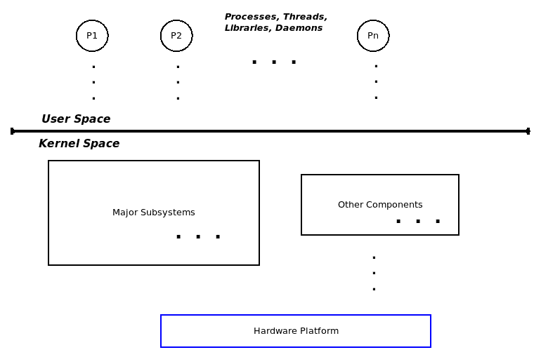
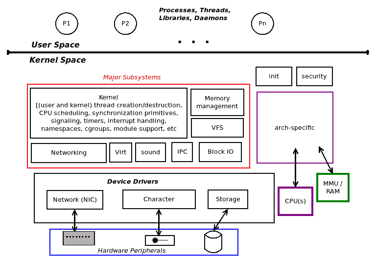
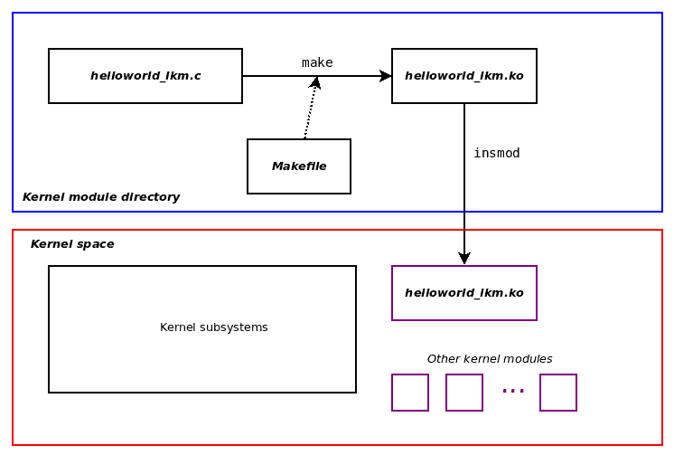
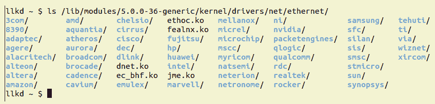
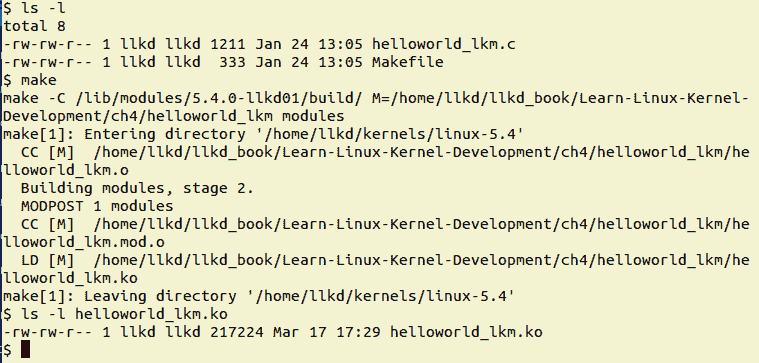
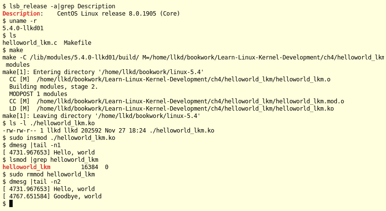
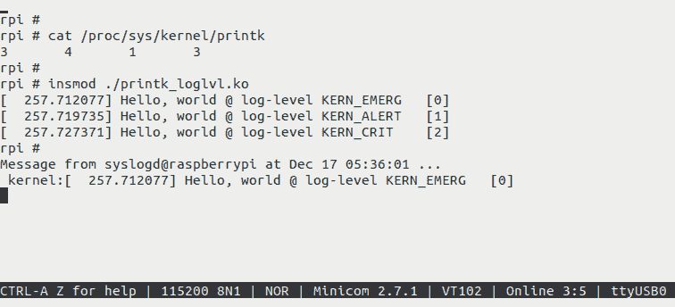
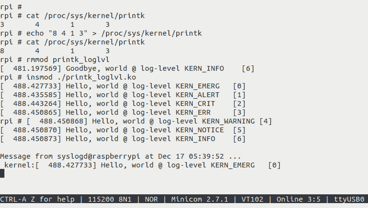
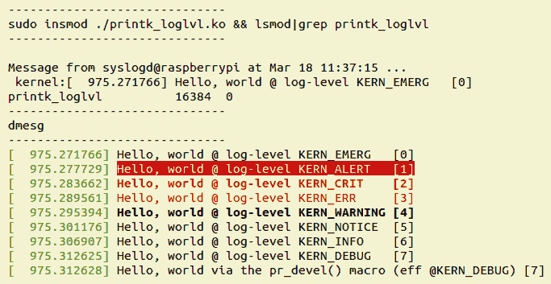

# 第四章：编写您的第一个内核模块 - LKMs 第一部分

欢迎来到您学习 Linux 内核开发的基本方面-**可加载内核模块**（**LKM**）框架以及如何被*模块用户*或*模块作者*使用的旅程，他通常是内核或设备驱动程序员。这个主题相当广泛，因此分为两章-这一章和下一章。

在本章中，我们将首先快速了解 Linux 内核架构的基础知识，这将帮助我们理解 LKM 框架。然后，我们将探讨为什么内核模块有用，并编写我们自己的简单的*Hello, world* LKM，构建并运行它。我们将看到消息是如何写入内核日志的，并理解并利用 LKM Makefile。到本章结束时，您将已经学会了 Linux 内核架构和 LKM 框架的基础知识，并应用它来编写一个简单但完整的内核代码。

在本章中，我们涵盖了以下内容：

+   理解内核架构-第 I 部分

+   探索 LKMs

+   编写我们的第一个内核模块

+   内核模块的常见操作

+   理解内核日志和 printk

+   理解内核模块 Makefile 的基础知识

# 技术要求

如果您已经仔细遵循了第一章，*内核工作空间设置*，随后的技术先决条件已经得到了满足。（该章还提到了各种有用的开源工具和项目；我强烈建议您至少浏览一次。）为了您的方便，我们在这里总结了一些关键点。

要在 Linux 发行版（或自定义系统）上构建和使用内核模块，至少需要安装以下两个组件：

+   **工具链**：这包括编译器、汇编器、链接器/加载器、C 库和各种其他部分。如果为本地系统构建，正如我们现在假设的那样，那么任何现代 Linux 发行版都会预先安装本地工具链。如果没有，只需安装适用于您发行版的`gcc`软件包即可；在基于 Ubuntu 或 Debian 的 Linux 系统上，使用以下命令：

```
sudo apt install gcc
```

+   **内核头文件**：这些头文件将在编译过程中使用。实际上，您安装的软件包不仅安装内核头文件，还安装其他所需的部分（例如内核 Makefile）到系统上。再次强调，任何现代 Linux 发行版都应该预先安装内核头文件。如果没有（您可以使用`dpkg(1)`进行检查，如下所示），只需安装适用于您发行版的软件包；在基于 Ubuntu 或 Debian 的 Linux 系统上，使用以下命令：

```
$ sudo apt install linux-headers-generic $ dpkg -l | grep linux-headers | awk '{print $1, $2}'
ii linux-headers-5.3.0-28
ii linux-headers-5.3.0-28-generic
ii linux-headers-5.3.0-40
ii linux-headers-5.3.0-40-generic
ii linux-headers-generic-hwe-18.04
$ 
```

这里，使用`dpkg(1)`工具的第二个命令只是用来验证`linux-headers`软件包是否已经安装。

在某些发行版上，此软件包可能被命名为`kernel-headers-<ver#>`。此外，对于直接在树莓派上进行开发，安装名为`raspberrypi-kernel-headers`的相关内核头文件软件包。

本书的整个源代码树可在其 GitHub 存储库中找到，网址为[`github.com/PacktPublishing/Linux-Kernel-Programming`](https://github.com/PacktPublishing/Linux-Kernel-Programming)，本章的代码位于`ch4`目录下。我们期望您进行克隆：

```
git clone https://github.com/PacktPublishing/Linux-Kernel-Programming.git

```

本章的代码位于其目录名称下，`chn`（其中`n`是章节编号；所以在这里，它位于`ch4/`下）。

# 理解内核架构-第一部分

在本节中，我们开始加深对内核的理解。更具体地说，在这里，我们深入探讨了用户空间和内核空间以及构成 Linux 内核的主要子系统和各种组件。目前，这些信息在更高的抽象级别上处理，并且故意保持简洁。我们将在第六章，*内核内部基础知识-进程和线程**.*中更深入地了解内核的结构。

## 用户空间和内核空间

现代微处理器支持至少两个特权级别。以英特尔/AMD x86[-64]家族为例，支持四个特权级别（它们称之为*环级*），而 ARM（32 位）微处理器家族支持多达七个（ARM 称之为*执行模式*；其中六个是特权的，一个是非特权的）。

这里的关键点是，为了平台的安全性和稳定性，所有运行在这些处理器上的现代操作系统都将使用（至少）两个特权级别（或模式）：

+   **用户空间**：*应用程序*在*非特权用户模式*下运行

+   **内核空间**：*内核*（及其所有组件）在特权模式下运行- *内核模式*

以下图显示了这种基本架构：



图 4.1-基本架构-两个特权模式

接下来是有关 Linux 系统架构的一些细节；请继续阅读。

## 库和系统调用 API

用户空间应用程序通常依赖于**应用程序编程接口**（**APIs**）来执行它们的工作。*库*本质上是 API 的集合或存档，允许您使用标准化、编写良好且经过充分测试的接口（并利用通常的好处：无需重新发明轮子、可移植性、标准化等）。Linux 系统有几个库；即使在企业级系统上也不少见数百个。其中，*所有*用户模式 Linux 应用程序（可执行文件）都会被“自动链接”到一个重要的、始终使用的库中：`glibc`* - GNU 标准 C 库*，正如您将会了解的那样。然而，库只能在用户模式下使用；内核没有库（在接下来的章节中会详细介绍）。

库 API 的示例是众所周知的`printf(3)`（回想一下，来自第一章，*内核工作空间设置*，可以找到此 API 的 man 页面部分），`scanf(3)`，`strcmp(3)`，`malloc(3)`和`free(3)`。

现在，一个关键点：如果用户和内核是分开的地址空间，并且处于不同的特权级别，用户进程如何能够*访问*内核呢？简短的答案是*通过系统调用*。**系统调用**是一种特殊的 API，因为它是用户空间进程访问内核的唯一合法（同步）方式。换句话说，系统调用是进入内核空间的唯一合法*入口点*。它们有能力从非特权用户模式切换到特权内核模式（更多关于这一点和单片设计的内容请参阅第六章，*内核内部要点-进程和线程*，在*进程和中断上下文*部分）。系统调用的示例包括`fork(2)`，`execve(2)`，`open(2)`，`read(2)`，`write(2)`，`socket(2)`，`accept(2)`，`chmod(2)`等。

在线查看所有库和系统调用 API 的 man 页面：

- 库 API，man 第三部分：[`linux.die.net/man/3/`](https://linux.die.net/man/3/)

- 系统调用 API，man 第二部分：[`linux.die.net/man/2/`](https://linux.die.net/man/2/)

这里强调的重点是，用户应用程序和内核之间实际上只能通过系统调用进行通信；这就是接口。在本书中，我们不会深入探讨这些细节。如果您对了解更多感兴趣，请参考 Packt 出版的书籍*《Linux 系统编程实践》*，特别是*第一章，Linux 系统架构*。

## 内核空间组件

当然，本书完全专注于内核空间。今天的 Linux 内核是一个相当庞大和复杂的东西。在内部，它由几个主要子系统和几个组件组成。对内核子系统和组件的广泛枚举得到以下列表：

+   **核心内核**：这段代码处理任何现代操作系统的典型核心工作，包括（用户和内核）进程和线程的创建/销毁，CPU 调度，同步原语，信号，定时器，中断处理，命名空间，cgroups，模块支持，加密等等。

+   **内存管理（MM）**：这处理所有与内存相关的工作，包括设置和维护内核和进程**虚拟地址空间**（**VASes**）。

+   **VFS（用于文件系统支持）**：**虚拟文件系统开关**（**VFS**）是 Linux 内核中实际文件系统的抽象层（例如，`ext[2|4]`，`vfat`，`reiserfs`，`ntfs`，`msdos`，`iso9660`，JFFS2 和 UFS）的实现。

+   **块 IO**：实现实际文件 I/O 的代码路径，从 VFS 直到块设备驱动程序以及其中的所有内容（实际上，相当多！），都包含在这里。

+   **网络协议栈**：Linux 以其对模型各层的众所周知（和不那么众所周知）的网络协议的精确、高质量实现而闻名，TCP/IP 可能是其中最著名的。

+   **进程间通信（IPC）支持**：这里实现了 IPC 机制；Linux 支持消息队列，共享内存，信号量（旧的 SysV 和新的 POSIX），以及其他 IPC 机制。

+   **声音支持**：这里包含了实现音频的所有代码，从固件到驱动程序和编解码器。

+   **虚拟化支持**：Linux 已经成为大大小小的云提供商的极其受欢迎的选择，一个重要原因是其高质量、低占用的虚拟化引擎，**基于内核的虚拟机**（**KVM**）。

所有这些构成了主要的内核子系统；此外，我们还有这些：

+   特定于体系结构（即特定于 CPU）的代码

+   内核初始化

+   安全框架

+   许多类型的设备驱动程序

回想一下，在第二章中，*从源代码构建 5.x Linux 内核 - 第一部分*，*内核源代码树简要介绍*部分给出了与主要子系统和其他组件对应的内核源代码树（代码）布局。

众所周知，Linux 内核遵循**单片内核架构**。基本上，单片设计是指*所有*内核组件（我们在本节中提到的）都存在并共享内核地址空间（或内核*段*）。这可以清楚地在下图中看到：



图 4.2 - Linux 内核空间 - 主要子系统和块

另一个你应该知道的事实是，这些地址空间当然是*虚拟*地址空间，而不是物理地址空间。内核将（利用硬件，如 MMU/TLB/高速缓存）*映射*，在页面粒度级别，虚拟页面到物理页面帧。它通过使用*主*内核分页表将内核虚拟页面映射到物理帧，并且对于每个存活的进程，它通过为每个进程使用单独的分页表将进程的虚拟页面映射到物理页面帧。

在第六章中，*内核内部要点 - 进程和线程*（以及后续章节）中，等待您更深入地了解内核和内存管理架构和内部。

现在我们对用户空间和内核空间有了基本的了解，让我们继续并开始我们的 LKM 框架之旅。

# 探索 LKM

简而言之，内核模块是一种提供内核级功能而不必在内核源代码树中工作的方法。

想象一种情景，你必须向 Linux 内核添加支持功能 - 也许是为了使用某个硬件外围芯片而添加一个新的设备驱动程序，一个新的文件系统，或者一个新的 I/O 调度程序。一种明显的方法是：更新内核源代码树，构建并测试新代码。

尽管这看起来很简单，实际上需要大量工作 - 我们编写的代码的每一次更改，无论多么微小，都需要我们重新构建内核映像，然后重新启动系统以进行测试。必须有一种更清洁、更简单的方法；事实上是有的 - *LKM 框架*！

## LKM 框架

LKM 框架是一种在内核源树之外编译内核代码的方法，通常被称为“树外”代码，从某种程度上使其独立于内核，然后将其插入或*插入*到内核内存中，使其运行并执行其工作，然后将其（或*拔出*）从内核内存中移除。 

内核模块的源代码通常由一个或多个 C 源文件、头文件和一个 Makefile 组成，通过`make(1)`构建成一个*内核模块*。内核模块本身只是一个二进制对象文件，而不是一个二进制可执行文件。在 Linux 2.4 及更早版本中，内核模块的文件名带有`.o`后缀；在现代的 2.6 Linux 及更高版本中，它的后缀是`.ko`（**k**ernel **o**bject）。构建完成后，你可以将这个`.ko`文件 - 内核模块 - 插入到运行时的内核中，有效地使其成为内核的一部分。

请注意，并非所有内核功能都可以通过 LKM 框架提供。一些核心功能，如核心 CPU 调度器代码、内存管理、信号、定时器、中断管理代码路径等，只能在内核内部开发。同样，内核模块只允许访问完整内核 API 的子集；稍后会详细介绍。

你可能会问：我如何*插入*一个对象到内核中？让我们简单点 - 答案是：通过`insmod(8)`实用程序。现在，让我们跳过细节（这些将在即将到来的*运行内核模块*部分中解释）。以下图提供了首先构建，然后将内核模块插入内核内存的概述：



图 4.3 - 构建然后将内核模块插入内核内存

不用担心：内核模块的 C 源代码以及其 Makefile 的实际代码将在接下来的部分中详细介绍；现在，我们只想获得概念上的理解。

内核模块被加载到内核内存中，并驻留在内核 VAS（*图 4.3*的下半部分）中，由内核为其分配的空间中。毫无疑问，*它是内核代码，并以内核特权运行*。这样，你作为内核（或驱动程序）开发人员就不必每次都重新配置、重建和重新启动系统。你只需要编辑内核模块的代码，重新构建它，从内存中删除旧版本（如果存在），然后插入新版本。这样可以节省时间，提高生产效率。

内核模块有利的一个原因是它们适用于动态产品配置。例如，内核模块可以设计为在不同的价格点提供不同的功能；为嵌入式产品生成最终图像的脚本可以根据客户愿意支付的价格安装一组特定的内核模块。以下是另一个示例，说明了这项技术在*调试*或故障排除场景中的应用：内核模块可以用于在现有产品上动态生成诊断和调试日志。诸如 kprobes 之类的技术正是允许这样做的。

实际上，LKM 框架通过允许我们向内核内存中插入和移除实时代码的方式，为我们提供了一种动态扩展内核功能的手段。这种根据我们的意愿插入和拔出内核功能的能力使我们意识到 Linux 内核不仅是纯粹的单片式，它也是*模块化*的。

## 内核源树中的内核模块

事实上，内核模块对象对我们来说并不陌生。在第三章，*从源代码构建 5.x Linux 内核-第二部分*，我们在内核构建过程中构建了内核模块并将其安装。

请记住，这些内核模块是内核源代码的一部分，并且通过在 tristate 内核 menuconfig 提示中选择`M`来配置为模块。它们被安装在`/lib/modules/$(uname -r)/`目录下。因此，要查看一下我们当前运行的 Ubuntu 18.04.3 LTS 客户机内核下安装的内核模块，我们可以这样做：

```
$ lsb_release -a 2>/dev/null |grep Description
Description:    Ubuntu 18.04.3 LTS
$ uname -r
5.0.0-36-generic
$ find /lib/modules/$(uname -r)/ -name "*.ko" | wc -l
5359
```

好吧，Canonical 和其他地方的人很忙！超过五千个内核模块...想想看-这是有道理的：发行商无法预先知道用户最终会使用什么硬件外围设备（特别是在像 x86 架构系统这样的通用计算机上）。内核模块作为一种方便的手段，可以支持大量硬件而不会使内核镜像文件（例如`bzImage`或`zImage`）变得非常臃肿。

我们 Ubuntu Linux 系统中安装的内核模块位于`/lib/modules/$(uname -r)/kernel`目录中，如下所示：

```
$ ls /lib/modules/5.0.0-36-generic/kernel/
arch/  block/  crypto/  drivers/  fs/  kernel/  lib/  mm/  net/  samples/  sound/  spl/  ubuntu/  virt/  zfs/
$ ls /lib/modules/5.4.0-llkd01/kernel/
arch/  crypto/  drivers/  fs/  net/  sound/
$ 
```

在这里，查看`/lib/modules/$(uname -r)`下的发行版内核（Ubuntu 18.04.3 LTS 运行`5.0.0-36-generic`内核）的`kernel/`目录的顶层，我们可以看到有许多子文件夹和成千上万的内核模块。相比之下，对于我们构建的内核（有关详细信息，请参阅第二章，*从源代码构建 5.x Linux 内核-第一部分*，和第三章，*从源代码构建 5.x Linux 内核-第二部分*），数量要少得多。您会回忆起我们在第二章中的讨论，*从源代码构建 5.x Linux 内核-第一部分*，我们故意使用了`localmodconfig`目标来保持构建的小巧和快速。因此，在这里，我们定制的 5.4.0 内核只构建了大约 60 个内核模块。

设备驱动程序是一个经常使用内核模块的领域。例如，让我们看一个作为内核模块架构的网络设备驱动程序。您可以在发行版内核的`kernel/drivers/net/ethernet`文件夹下找到几个（还有一些熟悉的品牌！）：



图 4.4-我们发行版内核的以太网网络驱动程序（内核模块）的内容

许多基于 Intel 的笔记本电脑上都使用 Intel 1GbE **网络接口卡**（**NIC**）以太网适配器。驱动它的网络设备驱动程序称为`e1000`驱动程序。我们的 x86-64 Ubuntu 18.04.3 客户机（在 x86-64 主机笔记本电脑上运行）显示它确实使用了这个驱动程序：

```
$ lsmod | grep e1000
e1000                 139264  0
```

我们很快将更详细地介绍`lsmod(8)`（'列出模块'）实用程序。对我们来说更重要的是，我们可以看到它是一个内核模块！如何获取有关这个特定内核模块的更多信息？通过利用`modinfo(8)`实用程序很容易实现（为了可读性，我们在这里截断了它的详细输出）：

```
$ ls -l /lib/modules/5.0.0-36-generic/kernel/drivers/net/ethernet/intel/e1000
total 220
-rw-r--r-- 1 root root 221729 Nov 12 16:16 e1000.ko
$ modinfo /lib/modules/5.0.0-36-generic/kernel/drivers/net/ethernet/intel/e1000/e1000.ko
filename:       /lib/modules/5.0.0-36-generic/kernel/drivers/net/ethernet/intel/e1000/e1000.ko
version:        7.3.21-k8-NAPI
license:        GPL v2
description:    Intel(R) PRO/1000 Network Driver
author:         Intel Corporation, <linux.nics@intel.com>
srcversion:     C521B82214E3F5A010A9383
alias:          pci:v00008086d00002E6Esv*sd*bc*sc*i*
[...]
name:           e1000
vermagic:       5.0.0-36-generic SMP mod_unload 
[...]
parm:           copybreak:Maximum size of packet that is copied to a new 
                buffer on receive (uint)
parm:           debug:Debug level (0=none,...,16=all) (int)
$  
```

`modinfo(8)`实用程序允许我们查看内核模块的二进制图像并提取有关它的一些详细信息；有关使用`modinfo`的更多信息将在下一节中介绍。

另一种获取系统有用信息的方法，包括有关当前加载的内核模块的信息，是通过`systool(1)`实用程序。对于已安装的内核模块（有关在下一章中*自动加载系统引导时安装*内核模块的详细信息），执行`systool -m <module-name> -v`可以显示有关它的信息。查阅`systool(1)`手册页以获取使用详细信息。

最重要的是，内核模块已成为构建和分发某些类型的内核组件的*实用*方法，*设备驱动程序*是它们最常见的用例。其他用途包括但不限于文件系统、网络防火墙、数据包嗅探器和自定义内核代码。

因此，如果您想学习如何编写 Linux 设备驱动程序、文件系统或防火墙，您必须首先学习如何编写内核模块，从而利用内核强大的 LKM 框架。这正是我们接下来要做的事情。

# 编写我们的第一个内核模块

在引入新的编程语言或主题时，模仿原始的*K&R Hello, world*程序作为第一段代码已经成为一种被广泛接受的计算机编程传统。我很高兴遵循这一受尊敬的传统来介绍强大的 LKM 框架。在本节中，您将学习编写简单 LKM 的步骤。我们会详细解释代码。

## 介绍我们的 Hello, world LKM C 代码

话不多说，这里是一些简单的*Hello, world* C 代码，实现了遵循 Linux 内核的 LKM 框架：

出于可读性和空间限制的原因，这里只显示了源代码的关键部分。要查看完整的源代码，构建并运行它，本书的整个源树都可以在 GitHub 仓库中找到：[`github.com/PacktPublishing/Linux-Kernel-Programming`](https://github.com/PacktPublishing/Linux-Kernel-Programming)。我们期望您能够克隆它：

`git clone https://github.com/PacktPublishing/Linux-Kernel-Programming.git`

```
// ch4/helloworld_lkm/hellowworld_lkm.c
#include <linux/init.h>
#include <linux/kernel.h>
#include <linux/module.h>

MODULE_AUTHOR("<insert your name here>");
MODULE_DESCRIPTION("LLKD book:ch4/helloworld_lkm: hello, world, our first LKM");
MODULE_LICENSE("Dual MIT/GPL");
MODULE_VERSION("0.1");

static int __init helloworld_lkm_init(void)
{
    printk(KERN_INFO "Hello, world\n");
    return 0;     /* success */
}

static void __exit helloworld_lkm_exit(void)
{
    printk(KERN_INFO "Goodbye, world\n");
}

module_init(helloworld_lkm_init);
module_exit(helloworld_lkm_exit);
```

您可以立即尝试这个简单的*Hello, world*内核模块！只需像这里显示的那样`cd`到正确的源目录，并获取我们的辅助`lkm`脚本来构建和运行它：

```
$ cd <...>/ch4/helloworld_lkm
$ ../../lkm helloworld_lkm
Version info:
Distro:     Ubuntu 18.04.3 LTS
Kernel: 5.0.0-36-generic
[...]
dmesg[ 5399.230367] Hello, world
$ 
```

*如何*和*为什么*很快会有详细的解释。尽管代码很小，但我们的第一个内核模块需要仔细阅读和理解。请继续阅读。

## 分解

以下小节解释了前面*Hello, world* C 代码的几乎每一行。请记住，尽管程序看起来非常小和琐碎，但对于它和周围的 LKM 框架，有很多需要理解的地方。本章的其余部分将重点介绍这一点，并进行详细讨论。我强烈建议您花时间阅读和理解这些基础知识。这将在以后可能出现的难以调试的情况下对您有很大帮助。

### 内核头文件

我们使用`#include`包含了一些头文件。与用户空间的'C'应用程序开发不同，这些是*内核头文件*（如*技术要求*部分所述）。请回顾第三章，*从源代码构建 5.x Linux 内核 - 第二部分*，内核模块安装在特定的根可写分支下。让我们再次检查一下（这里，我们正在运行我们的客户 x86_64 Ubuntu VM，使用的是 5.0.0-36-generic 发行版内核）。

```
$ ls -l /lib/modules/$(uname -r)/
total 5552
lrwxrwxrwx  1 root root      39 Nov 12 16:16 build -> /usr/src/linux-headers-5.0.0-36-generic/
drwxr-xr-x  2 root root    4096 Nov 28 08:49 initrd/
[...]
```

请注意名为`build`的符号链接或软链接。它指向系统上内核头文件的位置。在前面的代码中，它位于`/usr/src/linux-headers-5.0.0-36-generic/`下！正如您将看到的，我们将向用于构建内核模块的 Makefile 提供这些信息。（此外，一些系统有一个名为`source`的类似软链接）。

`kernel-headers`或`linux-headers`软件包将有限的内核源树解压到系统上，通常位于`/usr/src/...`下。然而，这段代码并不完整，因此我们使用了短语*有限*源树。这是因为构建模块并不需要完整的内核源树 - 只需要打包和提取所需的组件（头文件，Makefile 等）。

我们的*Hello, world*内核模块中的第一行代码是`#include <linux/init.h>`。

编译器通过在`/lib/modules/$(uname -r)/build/include/`下搜索先前提到的内核头文件来解决这个问题。因此，通过跟随`build`软链接，我们可以看到它最终拾取了这个头文件：

```
$ ls -l /usr/src/linux-headers-5.0.0-36-generic/include/linux/init.h
-rw-r--r-- 1 root root 9704 Mar  4  2019 /usr/src/linux-headers-5.0.0-36-generic/include/linux/init.h
```

其他包含在内核模块源代码中的内核头文件也是如此。

### 模块宏

接下来，我们有一些形式为`MODULE_FOO()`的模块宏；大多数都很直观：

+   `MODULE_AUTHOR()`: 指定内核模块的作者

+   `MODULE_DESCRIPTION()`: 简要描述此 LKM 的功能

+   `MODULE_LICENSE()`: 指定内核模块发布的许可证

+   `MODULE_VERSION()`: 指定内核模块的（本地）版本

在没有源代码的情况下，如何将这些信息传达给最终用户（或客户）？啊，`modinfo(8)`实用程序正是这样做的！这些宏及其信息可能看起来微不足道，但在项目和产品中非常重要。例如，供应商通过在所有已安装的内核模块上使用`grep`对`modinfo`输出来确定代码正在运行的（开源）许可证。

### 入口和出口点

永远不要忘记，内核模块毕竟是*以内核特权运行的内核代码*。它*不是*一个应用程序，因此没有像我们熟悉和喜爱的`main()`函数那样的入口点。这当然引出了一个问题：内核模块的入口和出口点是什么？请注意，在我们简单的内核模块底部，以下行：

```
module_init(helloworld_lkm_init);
module_exit(helloworld_lkm_exit);
```

`module_[init|exit]()`代码是分别指定入口和出口点的宏。每个参数都是一个函数指针。使用现代 C 编译器，我们可以只指定函数的名称。因此，在我们的代码中，以下内容适用：

+   `helloworld_lkm_init()`函数是入口点。

+   `helloworld_lkm_exit()`函数是出口点。

这些入口和出口点几乎可以被认为是内核模块的*构造函数/析构函数*对。从技术上讲，当然不是这样，因为这不是面向对象的 C++代码，而是普通的 C。尽管如此，这是一个有用的类比。

### 返回值

注意`init`和`exit`函数的签名如下：

```
static int  __init <modulename>_init(void);
static void __exit <modulename>_exit(void);
```

作为良好的编码实践，我们已经使用了函数的命名格式`<modulename>__[init|exit]()`，其中`<modulename>`被替换为内核模块的名称。您会意识到这种命名约定只是这样 - 从技术上讲是不必要的，但它是直观的，因此有帮助。显然，这两个例程都不接收任何参数。

将这两个函数标记为`static`限定符意味着它们对这个内核模块是私有的。这正是我们想要的。

现在让我们继续讨论内核模块的`init`函数返回值所遵循的重要约定。

#### 0/-E 返回约定

内核模块的`init`函数要返回一个类型为`int`的值；这是一个关键方面。Linux 内核已经形成了一种*风格*或约定，如果你愿意的话，关于从中返回值的方式（从内核空间到用户空间进程）。LKM 框架遵循了俗称的`0/-E`约定：

+   成功时，返回整数值`0`。

+   失败时，返回用户空间全局未初始化整数`errno`的负值。

请注意，`errno`是一个全局变量，驻留在用户进程 VAS 中的未初始化数据段中。除了很少的例外情况，每当 Linux 系统调用失败时，都会返回`-1`，并且`errno`被设置为一个正值，表示失败代码；这项工作是由`glibc`在`syscall`返回路径上的“粘合”代码完成的。

此外，`errno`值实际上是全局英文错误消息表的索引（`const char * const sys_errlist[]`）；这就是`perror(3)`、`strerror_r`等函数如何打印出失败诊断信息的真正原因。

顺便说一句，您可以从这些（内核源树）头文件中查找可用的**错误代码完整列表**：`include/uapi/asm-generic/errno-base.h` 和 `include/uapi/asm-generic/errno.h`。

一个快速的例子可以帮助我们清楚地了解如何从内核模块的`init`函数返回：假设我们的内核模块的`init`函数正在尝试动态分配一些内核内存（有关`kmalloc()`API 等的详细信息将在以后的章节中介绍；现在请忽略它）。然后，我们可以这样编写代码：

```
[...]
ptr = kmalloc(87, GFP_KERNEL);
if (!ptr) {
    pr_warning("%s:%s:%d: kmalloc failed!\n", __FILE__, __func__, __LINE__);
    return -ENOMEM;
}
[...]
return 0;   /* success */
```

如果内存分配失败（很少见，但嘿，这是可能的！），我们会执行以下操作：

1.  首先，我们发出一个警告`printk`。实际上，在这种特殊情况下——"内存不足"——这是迂腐和不必要的。如果内核空间内存分配失败，内核肯定会发出足够的诊断信息！请参阅此链接以获取更多详细信息：[`lkml.org/lkml/2014/6/10/382`](https://lkml.org/lkml/2014/6/10/382)；我们之所以在这里这样做，只是因为讨论刚开始，为了读者的连贯性。

1.  返回`-ENOMEM`值：

+   在用户空间返回此值的层实际上是`glibc`；它有一些"粘合"代码，将此值乘以`-1`并将全局整数`errno`设置为它。

+   现在，`[f]init_module(2)`系统调用将返回`-1`，表示失败（这是因为`insmod(8)`实际上调用了这个系统调用，您很快就会看到）。

+   `errno`将被设置为`ENOMEM`，反映了由于内存分配失败而导致内核模块插入失败的事实。

相反，框架*期望*`init`函数在成功时返回值`0`。实际上，在旧的内核版本中，如果在成功时未返回`0`，内核模块将被突然从内核内存中卸载。如今，内核不会卸载内核模块，但会发出警告消息，指出已返回一个*可疑*的非零值。

清理例程没有太多可说的。它不接收任何参数，也不返回任何内容（`void`）。它的工作是在内核模块从内核内存中卸载之前执行所有必需的清理。

*不*在您的内核模块中包括`module_exit()`宏将使其不可能卸载（当然，除非系统关闭或重新启动）。有趣...（我建议您尝试这个小练习！）。

当然，事情永远不会那么简单：只有在内核构建时将`CONFIG_MODULE_FORCE_UNLOAD`标志设置为`Disabled`（默认情况下）时，才能保证这种阻止卸载的行为。

#### ERR_PTR 和 PTR_ERR 宏

在返回值的讨论中，您现在了解到内核模块的`init`例程必须返回一个整数。如果您希望返回一个指针呢？`ERR_PTR()`内联函数来帮助我们，允许我们返回一个指针，只需将其强制转换为`void *`即可。事实上，情况会更好：您可以使用`IS_ERR()`内联函数来检查错误（它实际上只是确定值是否在[-1 到-4095]范围内），通过`ERR_PTR()`内联函数将负错误值编码为指针，并使用相反的例程`PTR_ERR()`从指针中检索此值。

作为一个简单的例子，看看这里给出的被调用者代码。这次，我们的（示例）函数`myfunc()`返回一个指针（指向一个名为`mystruct`的结构），而不是一个整数：

```
struct mystruct * myfunc(void)
{
    struct mystruct *mys = NULL;
    mys = kzalloc(sizeof(struct mystruct), GFP_KERNEL);
    if (!mys)
        return ERR_PTR(-ENOMEM);
    [...]
    return mys;
}
```

调用者代码如下：

```
[...]
gmys = myfunc();
if (IS_ERR(gmys)) {
    pr_warn("%s: myfunc alloc failed, aborting...\n", OURMODNAME);
    stat = PTR_ERR(gmys); /* sets 'stat' to the value -ENOMEM */
    goto out_fail_1;
}
[...]
return stat;
out_fail_1:
    return stat;
}
```

顺便说一句，内联函数`ERR_PTR()`、`PTR_ERR()`和`IS_ERR()`都在（内核头文件）`include/linux/err.h`文件中。内核文档（[`kernel.readthedocs.io/en/sphinx-samples/kernel-hacking.html#return-conventions`](https://kernel.readthedocs.io/en/sphinx-samples/kernel-hacking.html#return-conventions)）讨论了内核函数的返回约定。此外，你可以在内核源代码树中的`crypto/api-samples`代码下找到这些函数的用法示例：[`www.kernel.org/doc/html/v4.17/crypto/api-samples.html`](https://www.kernel.org/doc/html/v4.17/crypto/api-samples.html)。

#### __init 和 __exit 关键字

一个微小的遗留问题：在前面的函数签名中我们看到的`__init`和`__exit`宏到底是什么？这些只是链接器插入的内存优化属性。

`__init`宏为代码定义了一个`init.text`部分。同样，任何声明了`__initdata`属性的数据都会进入`init.data`部分。这里的重点是`init`函数中的代码和数据在初始化期间只使用一次。一旦被调用，它就再也不会被调用；所以一旦被调用，它就会被释放掉（通过`free_initmem()`）。

`__exit`宏的情况类似，当然，这只对内核模块有意义。一旦调用`cleanup`函数，所有内存都会被释放。如果代码是静态内核映像的一部分（或者模块支持被禁用），这个宏就没有效果了。

好了，但到目前为止，我们还没有解释一些实际问题：你到底如何将内核模块对象加载到内核内存中，让它执行，然后卸载它，以及你可能希望执行的其他一些操作。让我们在下一节讨论这些问题。

# 内核模块的常见操作

现在让我们深入讨论一下你到底如何构建、加载和卸载内核模块。除此之外，我们还将介绍关于非常有用的`printk()`内核 API、使用`lsmod(8)`列出当前加载的内核模块的基础知识，以及用于在内核模块开发过程中自动执行一些常见任务的便利脚本。所以，让我们开始吧！

## 构建内核模块

我们强烈建议你尝试一下我们简单的*Hello, world*内核模块练习（如果你还没有这样做的话）！为此，我们假设你已经克隆了本书的 GitHub 存储库（[`github.com/PacktPublishing/Linux-Kernel-Programming`](https://github.com/PacktPublishing/Linux-Kernel-Programming)）。如果还没有，请现在克隆（参考*技术要求*部分获取详细信息）。

在这里，我们逐步展示了你到底如何构建并将我们的第一个内核模块插入到内核内存中。再次提醒一下：我们在运行 Ubuntu 18.04.3 LTS 发行版的 x86-64 Linux 虚拟机（在 Oracle VirtualBox 6.1 下）上执行了这些步骤。

1.  切换到本书源代码章节目录和子目录。我们的第一个内核模块位于自己的文件夹中（应该是这样！）叫做`helloworld_lkm`：

```
 cd <book-code-dir>/ch4/helloworld_lkm
```

`<book-code-dir>`当然是你克隆了本书的 GitHub 存储库的文件夹；在这里（见截图，图 4.5），你可以看到它是`/home/llkd/book_llkd/Linux-Kernel-Programming/`。

1.  现在验证代码库：

```
$ pwd
*<book-code-dir>*/ch4/helloworld_lkm
$ ls -l
total 8
-rw-rw-r-- 1 llkd llkd 1211 Jan 24 13:01 helloworld_lkm.c
-rw-rw-r-- 1 llkd llkd  333 Jan 24 13:01 Makefile
$ 
```

1.  使用`make`进行构建：



图 4.5 - 列出并构建我们的第一个*Hello, world*内核模块

前面的截图显示内核模块已经成功构建。它是`./helloworld_lkm.ko`文件。（另外，注意我们是从我们之前章节中构建的自定义 5.4.0 内核引导的。）

## 运行内核模块

为了让内核模块运行，你需要首先将它加载到内核内存空间中。这被称为将模块*插入*到内核内存中。

将内核模块放入 Linux 内核段可以通过几种方式完成，最终都归结为调用`[f]init_module(2)`系统调用之一。为了方便起见，存在几个包装实用程序将这样做（或者您总是可以编写一个）。我们将在下面使用流行的`insmod(8)`（读作“**ins**ert **mod**ule”）实用程序；`insmod`的参数是要插入的内核模块的路径名：

```
$ insmod ./helloworld_lkm.ko 
insmod: ERROR: could not insert module ./helloworld_lkm.ko: Operation not permitted
$ 
```

它失败了！实际上，失败的原因应该是非常明显的。想一想：将代码插入内核在很大程度上甚至优于在系统上成为*root*（超级用户）- 再次提醒您：*它是内核代码，并且将以内核特权运行*。如果任何用户都被允许插入或删除内核模块，黑客将有一天的乐趣！部署恶意代码将变得相当简单。因此，出于安全原因，**只有具有 root 访问权限才能插入或删除内核模块**。

从技术上讲，作为*root*意味着进程（或线程）的**真实**和/或**有效** **UID**（**RUID**/**EUID**）值是特殊值*零*。不仅如此，而且现代内核通过现代和优越的 POSIX Capabilities 模型“看到”线程具有某些**capabilities**；只有具有`CAP_SYS_MODULE`能力的进程/线程才能（卸载）加载内核模块。我们建议读者查看`capabilities(7)`的手册页以获取更多详细信息。

所以，让我们再次尝试将我们的内核模块插入内存，这次使用`sudo(8)`的*root*权限：

```
$ sudo insmod ./helloworld_lkm.ko
[sudo] password for llkd: 
$ echo $?
0
```

现在可以了！正如前面提到的，`insmod(8)`实用程序通过调用`[f]init_module(2)`系统调用来工作。`insmod(8)`实用程序（实际上是内部的`[f]init_module(2)`系统调用）*失败*的情况是什么时候？

有一些情况：

+   **权限**：未以 root 身份运行或缺少`CAP_SYS_MODULE`能力（`errno <- EPERM`）。

+   `proc`文件系统中的内核可调参数，`/proc/sys/kernel/modules_disabled`，被设置为`1`（默认为`0`）。

+   具有相同名称的内核模块已经在内核内存中（`errno <- EEXISTS`）。

好的，一切看起来都很好。`$?`的结果为`0`意味着上一个 shell 命令成功了。这很好，但是我们的*Hello, world*消息在哪里？继续阅读！

## 快速查看内核 printk()

为了发出消息，用户空间的 C 开发人员通常会使用可靠的`printf(3)` glibc API（或者在编写 C++代码时可能会使用`cout`）。但是，重要的是要理解，在内核空间中，*没有库*。因此，我们*无法*访问老式的`printf()` API*。相反，它在内核中基本上被重新实现为`printk()`内核 API（想知道它的代码在哪里吗？它在内核源树中的这里：`kernel/printk/printk.c:printk()`）。

通过`printk()` API 发出消息非常简单，并且与使用`printf(3)`非常相似。在我们简单的内核模块中，这就是发生操作的地方：

```
printk(KERN_INFO "Hello, world\n");
```

虽然乍一看与`printf`非常相似，但`printk`实际上是非常不同的。在相似之处，API 接收一个格式字符串作为其参数。格式字符串几乎与`printf`的格式字符串完全相同。

但相似之处就到此为止。`printf`和`printk`之间的关键区别在于：用户空间的`printf(3)`库 API 通过根据请求格式化文本字符串并调用`write(2)`系统调用来工作，而后者实际上执行对`stdout` *设备*的写入，默认情况下是终端窗口（或控制台设备）。内核`printk` API 也根据请求格式化其文本字符串，但其*输出* *目的地*不同。它至少写入一个地方-以下列表中的第一个-可能还会写入几个地方：

+   RAM 中的内核日志缓冲区（易失性）

+   一个日志文件，内核日志文件（非易失性）

+   控制台设备

现在，我们将跳过关于`printk`工作原理的内部细节。另外，请忽略`printk` API 中的`KERN_INFO`标记；我们很快会涵盖所有这些内容。

当您通过`printk`发出消息时，可以保证输出进入内核内存（RAM）中的日志缓冲区。这实际上构成了**内核日志**。重要的是要注意，在图形模式下使用 X 服务器进程运行时（在典型的 Linux 发行版上工作时的默认环境），您永远不会直接看到`printk`输出。因此，这里显而易见的问题是：您如何查看内核日志缓冲区内容？有几种方法。现在，让我们简单快速地使用一种方法。

使用`dmesg(1)`实用程序！默认情况下，`dmesg`将将整个内核日志缓冲区内容转储到标准输出。在这里，我们使用它查找内核日志缓冲区的最后两行：

```
$ dmesg | tail -n2
[ 2912.880797] hello: loading out-of-tree module taints kernel.
[ 2912.881098] Hello, world
$ 
```

终于找到了：我们的*Hello, world*消息！

现在可以简单地忽略`loading out-of-tree module taints kernel.`的消息。出于安全原因，大多数现代 Linux 发行版将内核标记为*污染*（字面上是"污染"或"污染"）如果插入了第三方"out-of-tree"（或非签名）内核模块。 （嗯，这实际上更像是伪法律掩盖，类似于：“如果从这一点开始出了问题，我们不负责任等等...”；你懂的）。

为了有点变化，这里是我们在运行 5.4 Linux LTS 内核的 x86-64 CentOS 8 虚拟机上插入和移除*Hello, world*内核模块的屏幕截图（详细信息如下）：



图 4.6 - 屏幕截图显示我们在 CentOS 8 x86-64 虚拟机上使用*Hello, world*内核模块

在由`dmesg(1)`实用程序显示的内核日志中，最左边的列中的数字是一个简单的时间戳，格式为`[秒.微秒]`，表示自系统启动以来经过的时间（尽管不建议将其视为完全准确）。顺便说一句，这个时间戳是一个`Kconfig`变量 - 一个内核配置选项 - 名为`CONFIG_PRINTK_TIME`；它可以被`printk.time`内核参数覆盖。

## 列出活动的内核模块

回到我们的内核模块：到目前为止，我们已经构建了它，将它加载到内核中，并验证了它的入口点`helloworld_lkm_init()`函数被调用，从而执行了`printk` API。那么，它现在做什么？嗯，实际上什么都不做；内核模块只是（愉快地？）坐在内核内存中什么都不做。实际上，我们可以很容易地使用`lsmod(8)`实用程序查找它。

```
$ lsmod | head
Module                  Size  Used by
helloworld_lkm         16384  0
isofs                  32768  0
fuse                  139264  3
tun                    57344  0
[...]
e1000                 155648  0
dm_mirror              28672  0
dm_region_hash         20480  1 dm_mirror
dm_log                 20480  2 dm_region_hash,dm_mirror
dm_mod                151552  11 dm_log,dm_mirror
$
```

`lsmod`显示当前驻留在内核内存中（或*活动*）的所有内核模块，按时间顺序排列。它的输出是列格式化的，有三列和一个可选的第四列。让我们分别看看每一列：

+   第一列显示内核模块的*名称*。

+   第二列是内核中占用的（静态）*大小*（以字节为单位）。

+   第三列是模块的*使用计数*。

+   可选的第四列（以及可能随后的更多内容）将在下一章中解释（在*理解模块堆叠*部分）。另外，在最近的 x86-64 Linux 内核上，似乎至少需要 16 KB 的内核内存来存储一个内核模块。

所以，很好：到目前为止，您已经成功构建、加载并运行了您的第一个内核模块到内核内存中，并且基本上可以工作：接下来呢？嗯，实际上并没有太多！我们只是在下一节学习如何卸载它。当然还有更多要学的...继续吧！

## 从内核内存中卸载模块

要卸载内核模块，我们使用方便的实用程序`rmmod(8)`（*删除模块*）：

```
$ rmmod 
rmmod: ERROR: missing module name.
$ rmmod helloworld_lkm
rmmod: ERROR: could not remove 'helloworld_lkm': Operation not permitted
rmmod: ERROR: could not remove module helloworld_lkm: Operation not permitted
$ sudo rmmod helloworld_lkm
[sudo] password for llkd: 
$ dmesg |tail -n2
[ 2912.881098] Hello, world
[ 5551.863410] Goodbye, world
$
```

`rmmod(8)` 的参数是内核模块的*名称*（如 `lsmod(8)` 的第一列中所示），而不是路径名。显然，就像 `insmod(8)` 一样，我们需要以 *root* 用户身份运行 `rmmod(8)` 实用程序才能成功。

在这里，我们还可以看到，由于我们的 `rmmod`，内核模块的退出例程（或 "析构函数"）`helloworld_lkm_exit()` 函数被调用。它反过来调用了 `printk`，发出了 *Goodbye, world* 消息（我们用 `dmesg` 查找到）。

`rmmod`（请注意，在内部，它变成了 `delete_module(2)` 系统调用）*失败* 的情况是什么时候？以下是一些情况：

+   **权限**：如果不以 root 用户身份运行，或者缺少 `CAP_SYS_MODULE` 能力（`errno <- EPERM`）。

+   如果另一个模块正在使用内核模块的代码和/或数据（如果存在依赖关系；这在下一章的 *模块堆叠* 部分中有详细介绍），或者模块当前正在被进程（或线程）使用，则模块使用计数将为正，并且 `rmmod` 将失败（`errno <- EBUSY`）。

+   内核模块没有使用 `module_exit()` 宏指定退出例程（或析构函数）*和* `CONFIG_MODULE_FORCE_UNLOAD` 内核配置选项被禁用。

与模块管理相关的几个便利实用程序只是指向单个 `kmod(8)` 实用程序的符号（软）链接（类似于流行的 *busybox* 实用程序所做的）。这些包装器是 `lsmod(8), rmmod(8)`, `insmod(8)`, `modinfo(8)`, `modprobe(8)`, 和 `depmod(8)`。让我们看看其中的一些：

```
$ ls -l $(which insmod) ; ls -l $(which lsmod) ; ls -l $(which rmmod)
lrwxrwxrwx 1 root root 9 Oct 24 04:50 /sbin/insmod -> /bin/kmod
lrwxrwxrwx 1 root root 9 Oct 24 04:50 /sbin/lsmod -> /bin/kmod
lrwxrwxrwx 1 root root 9 Oct 24 04:50 /sbin/rmmod -> /bin/kmod
$ 
```

请注意，这些实用程序的确切位置（`/bin`，`/sbin`或`/usr/sbin`）可能会随着发行版的不同而有所变化。

## 我们的 lkm 便利脚本

让我们用一个名为 `lkm` 的简单而有用的自定义 Bash 脚本来结束这个 *第一个内核模块* 的讨论，它可以通过自动化内核模块的构建、加载、`dmesg` 和卸载工作流程来帮助你。这是它的内容（完整的代码在书籍源代码树的根目录中）：

```
#!/bin/bash
# lkm : a silly kernel module dev - build, load, unload - helper wrapper script
[...]
unset ARCH
unset CROSS_COMPILE
name=$(basename "${0}")

# Display and run the provided command.
# Parameter(s) : the command to run
runcmd()
{
    local SEP="------------------------------"
    [ $# -eq 0 ] && return
    echo "${SEP}
$*
${SEP}"
    eval "$@"
    [ $? -ne 0 ] && echo " ^--[FAILED]"
}

### "main" here
[ $# -ne 1 ] && {
  echo "Usage: ${name} name-of-kernel-module-file (without the .c)"
  exit 1
}
[[ "${1}" = *"."* ]] && {
  echo "Usage: ${name} name-of-kernel-module-file ONLY (do NOT put any extension)."
  exit 1
}
echo "Version info:"
which lsb_release >/dev/null 2>&1 && {
  echo -n "Distro: "
  lsb_release -a 2>/dev/null |grep "Description" |awk -F':' '{print $2}'
}
echo -n "Kernel: " ; uname -r
runcmd "sudo rmmod $1 2> /dev/null"
runcmd "make clean"
runcmd "sudo dmesg -c > /dev/null"
runcmd "make || exit 1"
[ ! -f "$1".ko ] && {
  echo "[!] ${name}: $1.ko has not been built, aborting..."
  exit 1
}
runcmd "sudo insmod ./$1.ko && lsmod|grep $1"
runcmd dmesg
exit 0
```

给定内核模块的名称作为参数 - 没有任何扩展部分（例如 `.c`）- `lkm` 脚本执行一些有效性检查，显示一些版本信息，然后使用包装器 `runcmd()` bash 函数来显示并运行给定命令的名称，从而轻松完成 `clean/build/load/lsmod/dmesg` 工作流程。让我们在我们的第一个内核模块上试一试：

```
$ pwd
<...>/ch4/helloworld_lkm
$ ../../lkm
Usage: lkm name-of-kernel-module-file (without the .c)
$ ../../lkm helloworld_lkm
Version info:
Distro:          Ubuntu 18.04.3 LTS
Kernel: 5.0.0-36-generic
------------------------------
sudo rmmod helloworld_lkm 2> /dev/null
------------------------------
[sudo] password for llkd: 
------------------------------
sudo dmesg -C
------------------------------
------------------------------
make || exit 1
------------------------------
make -C /lib/modules/5.0.0-36-generic/build/ M=/home/llkd/book_llkd/Learn-Linux-Kernel-Development/ch4/helloworld_lkm modules
make[1]: Entering directory '/usr/src/linux-headers-5.0.0-36-generic'
  CC [M]  /home/llkd/book_llkd/Learn-Linux-Kernel-Development/ch4/helloworld_lkm/helloworld_lkm.o
  Building modules, stage 2.
  MODPOST 1 modules
  CC      /home/llkd/book_llkd/Learn-Linux-Kernel-Development/ch4/helloworld_lkm/helloworld_lkm.mod.o
  LD [M]  /home/llkd/book_llkd/Learn-Linux-Kernel-Development/ch4/helloworld_lkm/helloworld_lkm.ko
make[1]: Leaving directory '/usr/src/linux-headers-5.0.0-36-generic'
------------------------------
sudo insmod ./helloworld_lkm.ko && lsmod|grep helloworld_lkm
------------------------------
helloworld_lkm         16384  0
------------------------------
dmesg
------------------------------
[ 8132.596795] Hello, world
$ 
```

全部完成！记得使用 `rmmod(8)` 卸载内核模块。

恭喜！你现在已经学会了如何编写并尝试一个简单的 *Hello, world* 内核模块。不过，在你休息之前，还有很多工作要做；下一节将更详细地探讨有关内核日志记录和多功能 printk API 的关键细节。

# 理解内核日志和 printk

关于通过 printk 内核 API 记录内核消息仍有很多内容需要涵盖。本节深入探讨了一些细节。对于像你这样的新手内核开发人员来说，清楚地理解这些内容非常重要。

在本节中，我们将更详细地探讨内核日志记录。我们将了解到 printk 输出是如何处理的，以及其利弊。我们将讨论 printk 日志级别，现代系统如何通过 systemd 日志记录消息，以及如何将输出定向到控制台设备。我们将以限制 printk 和用户生成的打印输出，从用户空间生成 printk，并标准化 printk 输出格式的注意来结束本讨论。

我们之前在 *快速查看内核* *printk* 部分看到了使用内核 printk API 功能的基本知识。在这里，我们将更详细地探讨关于 `printk()` API 的使用。在我们简单的内核模块中，这是发出 "*Hello, world*" 消息的代码行：

```
printk(KERN_INFO "Hello, world\n");
```

再次强调，`printk`与`printf`类似，都涉及*格式字符串*以及其工作原理 - 但相似之处就到此为止。值得强调的是，`printf(3)`是一个*用户空间库*API，通过调用`write(2)`系统调用来工作，该系统调用写入*stdout 设备*，默认情况下通常是终端窗口（或控制台设备）。而`printk`是一个*内核空间*API，其输出实际上会被发送到至少一个位置，如下列表中所示的第一个位置，可能还会发送到更多位置：

+   内核日志缓冲区（在 RAM 中；易失性）

+   内核日志文件（非易失性）

+   控制台设备

让我们更详细地检查内核日志缓冲区。

## 使用内核内存环形缓冲区

内核日志缓冲区只是内核地址空间中的一个内存缓冲区，用于保存（记录）`printk`的输出。更具体地说，它是全局变量`__log_buf[]`。在内核源代码中的定义如下：

```
kernel/printk/printk.c:
#define __LOG_BUF_LEN (1 << CONFIG_LOG_BUF_SHIFT)
static char __log_buf[__LOG_BUF_LEN] __aligned(LOG_ALIGN);
```

它被设计为一个*环形缓冲区*；它有一个有限的大小（`__LOG_BUF_LEN`字节），一旦满了，就会从第一个字节开始覆盖。因此，它被称为“环形”或循环缓冲区）。在这里，我们可以看到大小是基于`Kconfig`变量`CONFIG_LOG_BUF_SHIFT`（C 中的`1 << n`表示`2^n`）。这个值是显示的，并且可以作为内核`(菜单)配置`的一部分被覆盖：`常规设置 > 内核日志缓冲区大小`。

它是一个整数值，范围为`12 - 25`（我们可以随时搜索`init/Kconfig`并查看其规范），默认值为`18`。因此，日志缓冲区的大小=2¹⁸=256 KB。但是，实际运行时的大小也受其他配置指令的影响，特别是`LOG_CPU_MAX_BUF_SHIFT`，它使大小成为系统上 CPU 数量的函数。此外，相关的`Kconfig`文件中说，*"当使用 log_buf_len 内核参数时，此选项将被忽略，因为它会强制使用环形缓冲区的确切（2 的幂）大小。"*因此，这很有趣；我们经常可以通过传递*内核参数*（通过引导加载程序）来覆盖默认值！

内核参数非常有用，种类繁多，值得一看。请参阅官方文档：[`www.kernel.org/doc/html/latest/admin-guide/kernel-parameters.html`](https://www.kernel.org/doc/html/latest/admin-guide/kernel-parameters.html)。来自 Linux 内核文档关于`log_buf_len`内核参数的片段揭示了细节：

```
log_buf_len=n[KMG]   Sets the size of the printk ring buffer,
                     in bytes. n must be a power of two and greater                
                     than the minimal size. The minimal size is defined
                     by LOG_BUF_SHIFT kernel config parameter. There is
                     also CONFIG_LOG_CPU_MAX_BUF_SHIFT config parameter
                     that allows to increase the default size depending  
                     on the number of CPUs. See init/Kconfig for more 
                     details.
```

无论内核日志缓冲区的大小如何，处理 printk API 时会出现两个问题：

+   它的消息被记录在*易失性*内存（RAM）中；如果系统崩溃或以任何方式断电，我们将丢失宝贵的内核日志（通常会影响我们的调试能力）。

+   默认情况下，日志缓冲区并不是很大，通常只有 256 KB；大量的打印会使环形缓冲区不堪重负，导致信息丢失。

我们该如何解决这个问题？继续阅读...

## 内核日志和 systemd 的 journalctl

解决前面提到的问题的一个明显方法是将内核的`printk`写入（追加）到文件中。这正是大多数现代 Linux 发行版的设置方式。日志文件的位置因发行版而异：传统上，基于 Red Hat 的发行版会写入`/var/log/messages`文件，而基于 Debian 的发行版会写入`/var/log/syslog`。传统上，内核的`printk`会连接到用户空间的*系统日志守护程序*（`syslogd`）以执行文件记录，因此自动获得更复杂功能的好处，如日志轮换、压缩和归档。

然而，在过去的几年里，系统日志已经完全被一个称为**systemd**的有用而强大的系统初始化新框架所取代（它取代了旧的 SysV init 框架，或者通常与其一起工作）。事实上，即使是嵌入式 Linux 设备也经常使用 systemd。在 systemd 框架内，日志记录由一个名为`systemd-journal`的守护进程执行，而`journalctl(1)`实用程序是其用户界面。

systemd 及其相关实用程序的详细覆盖范围超出了本书的范围。请参考本章的*进一步阅读*部分，了解更多相关内容。

使用日志记录来检索和解释日志的一个关键优势是，**所有**来自应用程序、库、系统守护进程、内核、驱动程序等的日志都会被写入（合并）在这里。这样，我们就可以看到一个（反向）时间线事件，而不必手动将不同的日志拼接成一个时间线。`journalctl(1)`实用程序的 man 页面详细介绍了它的各种选项。在这里，我们提供了一些（希望）基于这个实用程序的方便别名：

```
#--- a few journalctl(1) aliases
# jlog: current (from most recent) boot only, everything
alias jlog='/bin/journalctl -b --all --catalog --no-pager'
# jlogr: current (from most recent) boot only, everything,
#  in *reverse* chronological order
alias jlogr='/bin/journalctl -b --all --catalog --no-pager --reverse'
# jlogall: *everything*, all time; --merge => _all_ logs merged
alias jlogall='/bin/journalctl --all --catalog --merge --no-pager'
# jlogf: *watch* log, akin to 'tail -f' mode;
#  very useful to 'watch live' logs
alias jlogf='/bin/journalctl -f'
# jlogk: only kernel messages, this (from most recent) boot
alias jlogk='/bin/journalctl -b -k --no-pager'
```

注意`-b`选项`current boot`意味着日志是从当前系统启动日期显示的。可以使用`journalctl --list-boots`查看存储的系统（重新）启动的编号列表。

我们故意使用`--no-pager`选项，因为它允许我们进一步使用`[e]grep(1)`、`awk(1)`、`sort(1)`等来过滤输出，根据需要。以下是使用`journalctl(1)`的一个简单示例：

```
$ journalctl -k |tail -n2
Mar 17 17:33:16 llkd-vbox kernel: Hello, world
Mar 17 17:47:26 llkd-vbox kernel: Goodbye, world
$  
```

注意日志的默认格式：

```
[timestamp] [hostname] [source]: [... log message ...]
```

在这里`[source]`是内核消息的内核，或者写入消息的特定应用程序或服务的名称。

从`journalctl(1)`的 man 页面中看一些用法示例是有用的：

```
Show all kernel logs from previous boot:
    journalctl -k -b -1

Show a live log display from a system service apache.service:
    journalctl -f -u apache
```

将内核消息非易失性地记录到文件中当然是非常有用的。但要注意，存在一些情况，通常由硬件限制所决定，可能会使这种记录变得不可能。例如，一个小型、高度资源受限的嵌入式 Linux 设备可能会使用小型内部闪存芯片作为存储介质。现在，它不仅很小，而且所有的空间几乎都被应用程序、库、内核和引导加载程序所使用，而且闪存芯片有一个有效的擦写周期限制，它们可以承受的擦写周期数量有限。因此，写入几百万次可能会使其报废！因此，有时系统设计人员故意和/或另外使用更便宜的外部闪存存储器，比如（微）SD/MMC 卡（用于非关键数据），以减轻这种影响，因为它们很容易更换。

让我们继续了解 printk 日志级别。

## 使用 printk 日志级别

为了理解和使用 printk 日志级别，让我们从我们的`helloworld_lkm`内核模块的第一个 printk 开始，重现那一行代码：

```
printk(KERN_INFO "Hello, world\n");
```

现在让我们来解决房间里的大象：`KERN_INFO`到底意味着什么？首先，现在要小心：它*不是*你的本能反应所说的参数。注意它和格式字符串之间没有逗号字符，只有空格。`KERN_INFO`只是内核 printk 记录的**八个**日志级别中的一个。立即要理解的一个关键点是，这个日志级别*不是*任何优先级；它的存在允许我们*根据日志级别过滤消息*。内核为 printk 定义了八个可能的日志级别；它们是：

```
// include/linux/kern_levels.h
#ifndef __KERN_LEVELS_H__
#define __KERN_LEVELS_H__

#define KERN_SOH       "\001"             /* ASCII Start Of Header */
#define KERN_SOH_ASCII '\001'

#define KERN_EMERG    KERN_SOH      "0"   /* system is unusable */
#define KERN_ALERT    KERN_SOH      "1"   /* action must be taken  
                                             immediately */
#define KERN_CRIT     KERN_SOH      "2"   /* critical conditions */
#define KERN_ERR      KERN_SOH      "3"   /* error conditions */
#define KERN_WARNING  KERN_SOH      "4"   /* warning conditions */
#define KERN_NOTICE   KERN_SOH      "5"   /* normal but significant 
                                             condition */
#define KERN_INFO     KERN_SOH      "6"   /* informational */
#define KERN_DEBUG    KERN_SOH      "7"   /* debug-level messages */

#define KERN_DEFAULT  KERN_SOH      "d"   /* the default kernel loglevel */
```

因此，现在我们看到`KERN_<FOO>`日志级别只是被添加到由 printk 发出的内核消息的字符串（"0"、"1"、...、"7"）；没有更多。这使我们有了根据日志级别过滤消息的有用能力。它们右侧的注释清楚地向开发人员显示了何时使用哪个日志级别。

`KERN_SOH`是什么？那就是 ASCII **报头开始**（**SOH**）值`\001`。查看`ascii(7)`的 man 页面；`ascii(1)`实用程序以各种数字基数转储 ASCII 表。从这里，我们可以清楚地看到数字`1`（或`\001`）是`SOH`字符，这里遵循的是一个约定。

让我们快速看一下 Linux 内核源树中的一些实际示例。当内核的`hangcheck-timer`设备驱动程序（有点类似于软件看门狗）确定某个定时器到期（默认为 60 秒）被延迟超过一定阈值（默认为 180 秒）时，它会重新启动系统！在这里，我们展示了相关的内核代码 - `hangcheck-timer`驱动程序在这方面发出`printk`的地方：

```
// drivers/char/hangcheck-timer.c[...]if (hangcheck_reboot) {
  printk(KERN_CRIT "Hangcheck: hangcheck is restarting the machine.\n");
  emergency_restart();
} else {
[...]
```

查看`printk` API 是如何调用的，日志级别设置为`KERN_CRIT`。

另一方面，发出信息消息可能正是医生所开的处方：在这里，我们看到通用并行打印机驱动程序礼貌地通知所有相关方打印机着火了（相当低调，是吧？）

```
// drivers/char/lp.c[...]
 if (last != LP_PERRORP) {
     last = LP_PERRORP;
     printk(KERN_INFO "lp%d on fire\n", minor);
 }
```

您可能会认为设备着火将使`printk`符合“紧急”日志级别...好吧，至少`arch/x86/kernel/cpu/mce/p5.c:pentium_machine_check()`函数遵循了这一点：

```
// arch/x86/kernel/cpu/mce/p5.c
[...]
 pr_emerg("CPU#%d: Machine Check Exception: 0x%8X (type 0x%8X).\n",
         smp_processor_id(), loaddr, lotype);

    if (lotype & (1<<5)) {
        pr_emerg("CPU#%d: Possible thermal failure (CPU on fire ?).\n",
             smp_processor_id());
    } 
[...]
```

（`pr_<foo>()`方便宏将在下面介绍）。

**常见问题解答***：*如果在`printk()`中未指定日志级别，则打印将以什么日志级别发出？默认为`4`，即`KERN_WARNING`（*写入控制台*部分详细说明了为什么）。请注意，您应始终在使用`printk`时指定适当的日志级别。

有一种简单的方法来指定内核消息日志级别。这是我们接下来要深入研究的内容。

### pr_<foo>方便宏

这里提供的方便**`pr_<foo>()`**宏可以减轻编码痛苦。笨拙的

`printk(KERN_FOO "<format-str>");`被优雅地替换为

`pr_foo("<format-str>");`，其中`<foo>`是日志级别；鼓励使用它们：

```
// include/linux/printk.h:
[...]
/*
 * These can be used to print at the various log levels.
 * All of these will print unconditionally, although note that pr_debug()
 * and other debug macros are compiled out unless either DEBUG is defined
 * or CONFIG_DYNAMIC_DEBUG is set.
 */
#define pr_emerg(fmt, ...) \
        printk(KERN_EMERG pr_fmt(fmt), ##__VA_ARGS__)
#define pr_alert(fmt, ...) \
        printk(KERN_ALERT pr_fmt(fmt), ##__VA_ARGS__)
#define pr_crit(fmt, ...) \
        printk(KERN_CRIT pr_fmt(fmt), ##__VA_ARGS__)
#define pr_err(fmt, ...) \
        printk(KERN_ERR pr_fmt(fmt), ##__VA_ARGS__)
#define pr_warning(fmt, ...) \
        printk(KERN_WARNING pr_fmt(fmt), ##__VA_ARGS__)
#define pr_warn pr_warning
#define pr_notice(fmt, ...) \
        printk(KERN_NOTICE pr_fmt(fmt), ##__VA_ARGS__)
#define pr_info(fmt, ...) \
        printk(KERN_INFO pr_fmt(fmt), ##__VA_ARGS__)
[...]
/* pr_devel() should produce zero code unless DEBUG is defined */
#ifdef DEBUG
#define pr_devel(fmt, ...) \
    printk(KERN_DEBUG pr_fmt(fmt), ##__VA_ARGS__)
#else
#define pr_devel(fmt, ...) \
    no_printk(KERN_DEBUG pr_fmt(fmt), ##__VA_ARGS__)
#endif
```

内核允许我们将`loglevel=n`作为内核命令行参数传递，其中`n`是介于`0`和`7`之间的整数，对应于先前提到的八个日志级别。预期的是（很快您将会了解到），所有具有低于传递的日志级别的`printk`实例也将被定向到控制台设备。

直接将内核消息写入控制台设备有时非常有用；下一节将详细介绍如何实现这一点。

### 连接到控制台

回想一下，`printk`输出可能会到达三个位置：

+   第一个是内核内存日志缓冲区（始终）

+   第二个是非易失性日志文件

+   最后一个（我们将在这里讨论）：*控制台设备*

传统上，控制台设备是一个纯内核功能，超级用户登录的初始终端窗口（`/dev/console`）在非图形环境中。有趣的是，在 Linux 上，我们可以定义几个控制台 - 一个**电传打字机终端**（**tty**）窗口（如`/dev/console`），文本模式 VGA，帧缓冲区，甚至是通过 USB 提供的串行端口（这在嵌入式系统开发中很常见；请参阅本章的*进一步阅读*部分中的有关 Linux 控制台的更多信息）。

例如，当我们通过 USB 到 RS232 TTL UART（USB 到串行）电缆将树莓派连接到 x86-64 笔记本电脑时（请参阅本章的*进一步阅读*部分，了解有关这个非常有用的附件以及如何在树莓派上设置它的博客文章！），然后使用`minicom(1)`（或`screen(1)`）获取串行控制台时，这就是显示为`tty`设备的内容 - 它是串行端口：

```
rpi # tty
/dev/ttyS0
```

这里的重点是，控制台通常是*足够重要*的日志消息的目标，包括那些源自内核深处的消息。Linux 的`printk`使用基于`proc`的机制有条件地将其数据传递到控制台设备。为了更好地理解这一点，让我们首先查看相关的`proc`伪文件：

```
$ cat /proc/sys/kernel/printk
4    4    1    7
$ 
```

我们将前面的四个数字解释为 printk 日志级别（`0`为最高，“紧急”级别为`7`为最低）。前面的四个整数序列的含义是这样的：

+   当前（控制台）日志级别

*- 暗示着所有低于此值的消息将出现在控制台设备上！*

+   缺乏显式日志级别的消息的默认级别

+   允许的最低日志级别

+   启动时的默认日志级别

由此可见，日志级别`4`对应于`KERN_WARNING`。因此，第一个数字为`4`（实际上是 Linux 发行版的典型默认值），*所有低于日志级别 4 的 printk 实例将出现在控制台设备上*，当然也会被记录到文件中-实际上，所有以下日志级别的消息：`KERN_EMERG`、`KERN_ALERT`、`KERN_CRIT`和`KERN_ERR`。

日志级别为`0 [KERN_EMERG]`的内核消息*总是*打印到控制台，确实打印到所有终端窗口和内核日志文件，而不受任何设置的影响。

值得注意的是，当在嵌入式 Linux 或任何内核开发中工作时，通常会在控制台设备上工作，就像刚才给出的树莓派示例一样。将`proc printk`伪文件的第一个整数值设置为`8`将*保证所有 printk 实例直接出现在控制台上*，**从而使 printk 的行为类似于常规的 printf！**在这里，我们展示了 root 用户如何轻松设置这一点：

```
# echo "8 4 1 7" > /proc/sys/kernel/printk
```

（当然，这必须以 root 身份完成。）这在开发和测试过程中非常方便。

在我的树莓派上，我保留了一个包含以下行的启动脚本：

`[ $(id -u) -eq 0 ] && echo "8 4 1 7" > /proc/sys/kernel/printk`

因此，以 root 身份运行时，这将生效，所有 printk 实例现在直接出现在`minicom(1)`控制台上，就像`printf`一样。

谈到多功能的树莓派，下一节演示了在树莓派上运行内核模块。

### 将输出写入树莓派控制台

接下来是我们的第二个内核模块！在这里，我们将发出九个 printk 实例，每个实例都在八个日志级别中的一个，另外一个通过`pr_devel()`宏（实际上只是`KERN_DEBUG`日志级别）。让我们来看看相关的代码：

```
// ch4/printk_loglvl/printk_loglvl.c
static int __init printk_loglvl_init(void)
{
    pr_emerg ("Hello, world @ log-level KERN_EMERG   [0]\n");
    pr_alert ("Hello, world @ log-level KERN_ALERT   [1]\n");
    pr_crit  ("Hello, world @ log-level KERN_CRIT    [2]\n");
    pr_err   ("Hello, world @ log-level KERN_ERR     [3]\n");
    pr_warn  ("Hello, world @ log-level KERN_WARNING [4]\n");
    pr_notice("Hello, world @ log-level KERN_NOTICE  [5]\n");
    pr_info  ("Hello, world @ log-level KERN_INFO    [6]\n");
    pr_debug ("Hello, world @ log-level KERN_DEBUG   [7]\n");
    pr_devel("Hello, world via the pr_devel() macro"
        " (eff @KERN_DEBUG) [7]\n");
    return 0; /* success */
}
static void __exit printk_loglvl_exit(void)
{
    pr_info("Goodbye, world @ log-level KERN_INFO [6]\n");
}
module_init(printk_loglvl_init);
module_exit(printk_loglvl_exit);
```

现在，我们将讨论在树莓派设备上运行前述`printk_loglvl`内核模块时的输出。如果您没有或者不方便使用树莓派，那没问题；请继续在 x86-64 虚拟机上尝试。

在树莓派设备上（我在这里使用的是运行默认树莓派 OS 的树莓派 3B+型号），我们登录并通过简单的`sudo -s`获取 root shell。然后我们构建内核模块。如果您在树莓派上安装了默认的树莓派镜像，所有必需的开发工具、内核头文件等都将预先安装！图 4.7 是在树莓派板上运行我们的`printk_loglvl`内核模块的截图。另外，重要的是要意识到我们正在**控制台设备**上运行，因为我们正在使用前面提到的 USB 转串口电缆通过`minicom(1)`终端仿真器应用程序（而不是简单地通过 SSH 连接）：



图 4.7 - minicom 终端仿真器应用程序窗口-控制台-带有 printk_loglvl 内核模块输出

从 x86-64 环境中注意到一些与之有点不同：在这里，默认情况下，`/proc/sys/kernel/printk`输出的第一个整数-当前控制台日志级别-是 3（而不是 4）。好吧，这意味着所有内核 printk 实例的日志级别低于日志级别 3 将直接出现在控制台设备上。看一下截图：情况确实如此！此外，正如预期的那样，“紧急”日志级别（`0`）的 printk 实例始终出现在控制台上，确实出现在每个打开的终端窗口上。

现在是有趣的部分：让我们（当然是作为 root）将当前控制台日志级别（记住，它是`/proc/sys/kernel/printk`输出中的第一个整数）设置为值`8`。这样，*所有的 printk*实例应该直接出现在控制台上。我们在这里精确测试了这一点：



图 4.8 - minicom 终端 - 实际上是控制台 - 窗口，控制台日志级别设置为 8

确实，正如预期的那样，我们在控制台设备上看到了*所有*的`printk`实例，无需使用`dmesg`。

不过，等一下：`pr_debug()`和`pr_devel()`宏发出的内核消息在日志级别`KERN_DEBUG`（即整数值`7`）上发生了什么？它在这里*没有*出现，也没有在接下来的`dmesg`输出中出现？我们马上解释这一点，请继续阅读。

当然，通过`dmesg(1)`，所有内核消息（至少是 RAM 中内核日志缓冲区中的消息）都会显示出来。我们在这里看到了这种情况：

```
rpi # rmmod printk_loglvl
rpi # dmesg
[...]
[ 1408.603812] Hello, world @ log-level KERN_EMERG   [0]
[ 1408.611335] Hello, world @ log-level KERN_ALERT   [1]
[ 1408.618625] Hello, world @ log-level KERN_CRIT    [2]
[ 1408.625778] Hello, world @ log-level KERN_ERR     [3]
[ 1408.625781] Hello, world @ log-level KERN_WARNING [4]
[ 1408.625784] Hello, world @ log-level KERN_NOTICE  [5]
[ 1408.625787] Hello, world @ log-level KERN_INFO    [6]
[ 1762.985496] Goodbye, world @ log-level KERN_INFO    [6]
rpi # 
```

除了`KERN_DEBUG`之外的所有`printk`实例都可以通过`dmesg`实用程序查看内核日志来看到。那么，如何显示调试消息呢？接下来会介绍。

### 启用 pr_debug()内核消息

啊是的，`pr_debug()`原来是一个特殊情况：除非为内核模块*定义*了`DEBUG`符号，否则在日志级别`KERN_DEBUG`下的`printk`实例不会显示出来。我们编辑内核模块的 Makefile 以启用这一功能。至少有两种设置方法：

+   将这行插入到 Makefile 中：

```
CFLAGS_printk_loglvl.o := -DDEBUG
```

通用的是`CFLAGS_<filename>.o := -DDEBUG`。

+   我们也可以将这个语句插入到 Makefile 中：

```
EXTRA_CFLAGS += -DDEBUG
```

在我们的 Makefile 中，我们故意保持`-DDEBUG`注释掉，现在，为了尝试它，取消以下注释掉的行中的一个：

```
# Enable the pr_debug() as well (rm the comment from one of the lines below)
#EXTRA_CFLAGS += -DDEBUG
#CFLAGS_printk_loglvl.o := -DDEBUG
```

完成后，我们从内存中删除旧的过时内核模块，重新构建它，并使用我们的`lkm`脚本插入它。输出显示`pr_debug()`现在生效了：

```
# exit                      << exit from the previous root shell >>
$ ../../lkm printk_loglvl Version info:
Distro:     Ubuntu 18.04.3 LTS
Kernel: 5.4.0-llkd01
------------------------------
sudo rmmod printk_loglvl 2> /dev/null
------------------------------
[...]
sudo insmod ./printk_loglvl.ko && lsmod|grep printk_loglvl
------------------------------
printk_loglvl          16384  0
------------------------------
dmesg
------------------------------
[  975.271766] Hello, world @ log-level KERN_EMERG [0]
[  975.277729] Hello, world @ log-level KERN_ALERT [1]
[  975.283662] Hello, world @ log-level KERN_CRIT [2]
[  975.289561] Hello, world @ log-level KERN_ERR [3]
[  975.295394] Hello, world @ log-level KERN_WARNING [4]
[  975.301176] Hello, world @ log-level KERN_NOTICE [5]
[  975.306907] Hello, world @ log-level KERN_INFO [6]
[  975.312625] Hello, world @ log-level KERN_DEBUG [7]
[  975.312628] Hello, world via the pr_devel() macro (eff @KERN_DEBUG) [7]
$
```

`lkm`脚本输出的部分截图（图 4.9）清楚地显示了`dmesg`的颜色编码，`KERN_ALERT / KERN_CRIT / KERN_ERR`的背景以红色/粗体红色字体/红色前景颜色突出显示，`KERN_WARNING`以粗体黑色字体显示，帮助我们人类快速发现重要的内核消息。



图 4.9 - lkm 脚本输出的部分截图

请注意，当启用动态调试功能（`CONFIG_DYNAMIC_DEBUG=y`）时，`pr_debug()`的行为并不相同。

设备驱动程序作者应该注意，为了发出调试`printk`实例，他们应该避免使用`pr_debug()`。相反，建议设备驱动程序使用`dev_dbg()`宏（另外传递给相关设备的参数）。此外，`pr_devel()`是用于内核内部调试`printk`实例的，其输出在生产系统中永远不应该可见。

现在，回到控制台输出部分。因此，也许出于内核调试的目的（如果没有其他目的），有没有一种保证的方法可以确保*所有*的 printk 实例都被定向到控制台*？*是的，确实 - 只需传递名为`ignore_level`的内核（启动时）参数。有关此更多详细信息，请查阅官方内核文档中的描述：[`www.kernel.org/doc/html/latest/admin-guide/kernel-parameters.html`](https://www.kernel.org/doc/html/latest/admin-guide/kernel-parameters.html)。忽略 printk 日志级别也是可能的：如上所述，您可以通过这样做打开忽略 printk 日志级别的功能，从而允许所有 printk 出现在控制台设备上（反之亦然，通过向同一伪文件中回显 N 来关闭它）：

```
sudo bash -c "echo Y > /sys/module/printk/parameters/ignore_loglevel"
```

dmesg(1)实用程序也可以用于通过各种选项开关（特别是--console-level 选项）控制启用/禁用内核消息到控制台设备，以及控制台日志级别（即在该级别以下的消息将出现在控制台上）。我让你浏览一下 dmesg(1)的 man 页面以获取详细信息。

下一部分涉及另一个非常有用的日志记录功能：速率限制。

## 限制 printk 实例的速率

当我们从执行非常频繁的代码路径发出 printk 实例时，printk 实例的数量可能会迅速超出内核日志缓冲区（在 RAM 中；请记住它是一个循环缓冲区），从而覆盖可能是关键信息。此外，不断增长的非易失性日志文件然后几乎无限地重复相同的 printk 实例也不是一个好主意，会浪费磁盘空间，或者更糟糕的是，闪存空间。例如，想象一下在中断处理程序代码路径中有一个大的 printk。如果硬件中断以每秒 100 次的频率被调用，也就是每秒 100 次！

为了缓解这些问题，内核提供了一个有趣的替代方案：*速率限制*printk*。printk_ratelimited()宏的语法与常规 printk 相同；关键点是当满足某些条件时，它会有效地抑制常规打印。内核通过 proc 文件系统提供了两个控制文件，名为 printk_ratelimit 和 printk_ratelimit_burst，用于此目的。在这里，我们直接复制了 sysctl 文档（来自 https://www.kernel.org/doc/Documentation/sysctl/kernel.txt），该文档解释了这两个（伪）文件的确切含义：

```
printk_ratelimit:
Some warning messages are rate limited. printk_ratelimit specifies
the minimum length of time between these messages (in jiffies), by
default we allow one every 5 seconds.
A value of 0 will disable rate limiting.
==============================================================
printk_ratelimit_burst:
While long term we enforce one message per printk_ratelimit
seconds, we do allow a burst of messages to pass through.
printk_ratelimit_burst specifies the number of messages we can
send before ratelimiting kicks in.
```

在我们的 Ubuntu 18.04.3 LTS 客户系统上，我们发现它们（默认）的值如下：

```
$ cat /proc/sys/kernel/printk_ratelimit /proc/sys/kernel/printk_ratelimit_burst
5
10
$ 
```

这意味着默认情况下，在 5 秒的时间间隔内发生的相同消息最多可以通过 10 个实例，然后速率限制才会生效。

当 printk 速率限制器抑制内核 printk 实例时，会发出一条有用的消息，其中提到确切抑制了多少早期的 printk 回调。例如，我们有一个自定义内核模块，它利用 Kprobes 框架在每次调用 schedule()之前发出一个 printk 实例，这是内核的核心调度例程。

Kprobe 本质上是一个用于生产系统故障排除的仪器框架；使用它，您可以指定一个函数，该函数可以在给定内核例程之前或之后执行。细节超出了本书的范围。

现在，由于调度经常发生，常规的 printk 会导致内核日志缓冲区迅速溢出。正是这种情况需要使用速率限制的 printk。在这里，我们看到了我们示例内核模块的一些示例输出（我们这里不显示它的代码），它使用了 printk_ratelimited() API 通过设置一个称为 handle_pre_schedule()的*预处理程序*函数的 kprobe 来设置一个 printk 实例：

```
[ 1000.154763] kprobe schedule pre_handler: intr ctx = 0 :process systemd-journal:237
[ 1005.162183] handler_pre_schedule: 5860 callbacks suppressed
[ 1005.162185] kprobe schedule pre_handler: intr ctx = 0 :process dndX11:1071
```

在 Linux 内核的实时时钟（RTC）驱动程序的中断处理程序代码中，可以看到使用速率限制 printk 的代码级示例，位置在 drivers/char/rtc.c 中：

```
static void rtc_dropped_irq(struct timer_list *unused)
{ 
[...]
    spin_unlock_irq(&rtc_lock);
    printk_ratelimited(KERN_WARNING "rtc: lost some interrupts at         %ldHz.\n", freq);
    /* Now we have new data */
    wake_up_interruptible(&rtc_wait);
[...]
}
```

不要混淆 printk_ratelimited()宏和旧的（现在已弃用的）printk_ratelimit()宏。此外，实际的速率限制代码在 lib/ratelimit.c:___ratelimit()中。

此外，就像我们之前看到的 pr_<foo>宏一样，内核还提供了相应的 pr_<foo>_ratelimited 宏，用于在启用速率限制时以日志级别<foo>生成内核 printk。以下是它们的快速列表：

```
pr_emerg_ratelimited(fmt, ...)
pr_alert_ratelimited(fmt, ...)
pr_crit_ratelimited(fmt, ...) 
pr_err_ratelimited(fmt, ...)  
pr_warn_ratelimited(fmt, ...) 
pr_notice_ratelimited(fmt, ...)
pr_info_ratelimited(fmt, ...)  
```

我们能否从用户空间生成内核级消息？听起来很有趣；这是我们的下一个子主题。

## 从用户空间生成内核消息

我们程序员经常使用的一种流行的调试技术是在代码的各个地方添加打印，这经常可以帮助我们缩小问题的来源。这确实是一种有用的调试技术，称为**instrumenting**代码。内核开发人员经常使用值得尊敬的 printk API 来实现这一目的。

因此，想象一下，您已经编写了一个内核模块，并且正在调试它（通过添加几个 printk）。您的内核代码现在发出了几个 printk 实例，当然，您可以在运行时通过`dmesg`或其他方式看到。这很好，但是，特别是因为您正在运行一些自动化的用户空间测试脚本，您可能希望通过打印某个特定消息来查看脚本在我们的内核模块中启动某个动作的位置。作为一个具体的例子，假设我们希望日志看起来像这样：

```
test_script: msg 1 ; kernel_module: msg n, msg n+1, ..., msg n+m ; test_script: msg 2 ; ...
```

我们的用户空间测试脚本可以像内核的 printk 一样，将消息写入内核日志缓冲区，通过写入特殊的`/dev/kmsg`设备文件：

```
echo "test_script: msg 1" > /dev/kmsg
```

嗯，等一下 - 这样做当然需要以 root 访问权限运行。但是，请注意，这里简单的在`echo`之前加上`sudo(8)`是行不通的：

```
$ sudo echo "test_script: msg 1" > /dev/kmsg
bash: /dev/kmsg: Permission denied
$ sudo bash -c "echo \"test_script: msg 1\" > /dev/kmsg"
[sudo] password for llkd:
$ dmesg |tail -n1
[55527.523756] test_script: msg 1
$ 
```

第二次尝试中使用的语法是有效的，但是更简单的方法是获取一个 root shell 并执行此类任务。

还有一件事：`dmesg(1)`实用程序有几个选项，旨在使输出更易读；我们通过我们的`dmesg`的示例别名显示了其中一些选项，之后我们使用它。

```
$ alias dmesg='/bin/dmesg --decode --nopager --color --ctime'
$ dmesg | tail -n1
user :warn : [Sat Dec 14 17:21:50 2019] test_script: msg 1
$ 
```

通过特殊的`/dev/kmsg`设备文件写入内核日志的消息将以当前默认的日志级别打印，通常是`4 : KERN_WARNING`。我们可以通过实际在消息前加上所需的日志级别（作为字符串格式的数字）来覆盖这一点。例如，要在用户空间中以日志级别`6 : KERN_INFO`写入内核日志，使用以下命令：

```
$ sudo bash -c "echo \"<6>test_script: test msg at KERN_INFO\"   \
   > /dev/kmsg"
$ dmesg | tail -n2
user :warn : [Fri Dec 14 17:21:50 2018] test_script: msg 1
user :info : [Fri Dec 14 17:31:48 2018] test_script: test msg at KERN_INFO
```

我们可以看到我们后来的消息是以日志级别`6`发出的，就像`echo`中指定的那样。

用户生成的内核消息和内核`printk()`生成的消息之间实际上没有办法区分；它们看起来是一样的。因此，当然，可以简单地在消息中插入一些特殊的签名字节或字符串，例如`@user@`，以帮助您区分这些用户生成的打印消息和内核消息。

## 通过 pr_fmt 宏标准化 printk 输出

关于内核 printk 的最后一个但重要的一点；经常，为了给您的`printk()`输出提供上下文（*它到底发生在哪里？*），您可能会像这样编写代码，利用各种 gcc 宏（如`__FILE__`、`__func__`和`__LINE__`）。

```
pr_warning("%s:%s():%d: kmalloc failed!\n", OURMODNAME,  __func__, __LINE__);
```

这很好；问题是，如果您的项目中有很多 printk，要保证标准的 printk 格式（例如，首先显示模块名称，然后是函数名称，可能还有行号，就像这里看到的那样）总是由项目中的每个人遵循，这可能会相当痛苦。

输入`pr_fmt`宏；在代码的开头定义这个宏（必须在第一个`#include`之前），可以保证代码中每个后续的 printk 都将以这个宏指定的格式为前缀。让我们举个例子（我们展示了下一章的代码片段；不用担心，它真的非常简单，可以作为您未来内核模块的模板）。

```
// ch5/lkm_template/lkm_template.c
[ ... ]
 */
#define pr_fmt(fmt) "%s:%s(): " fmt, KBUILD_MODNAME, __func__

#include <linux/init.h>
#include <linux/module.h>
#include <linux/kernel.h>
[ ... ]
static int __init lkm_template_init(void)
{
    pr_info("inserted\n");
    [ ... ]
```

`pr_fmt()`宏以粗体字突出显示；它使用预定义的`KBUILD_MODNAME`宏来替换您的内核模块的名称，并使用 gcc 的`__func__`指定符来显示我们当前运行的函数的名称！（您甚至可以添加一个`%d`，与相应的`__LINE__`宏匹配，以显示行号）。因此，最重要的是：我们在这个 LKM 的`init`函数中发出的`pr_info()`将在内核日志中显示如下：

```
[381534.391966] lkm_template:lkm_template_init(): inserted
```

注意 LKM 名称和函数名称是自动添加前缀的。这非常有用，而且非常常见；在内核中，成百上千的源文件以`pr_fmt()`开头。(在 5.4 内核代码库中快速搜索发现代码库中有超过 2000 个此宏的实例！我们也将遵循这个惯例，尽管并非所有的演示内核模块都是如此)。

`pr_fmt()`也影响了驱动程序作者推荐的 printk 使用方式 - 通过`dev_<foo>()`函数。

## 可移植性和 printk 格式说明符

关于多功能的 printk 内核 API，有一个问题需要考虑，那就是如何确保你的 printk 输出在任何 CPU 上看起来正确（格式正确）并且同样适用，无论位宽如何？这里涉及到可移植性问题；好消息是，熟悉提供的各种格式说明符将在这方面帮助你很多，实际上可以让你编写与体系结构无关的 printk。

重要的是要意识到`size_t` - 发音为*size type* - 是无符号整数的`typedef`；同样，`ssize_t`（*signed size type*）是有符号整数的`typedef`。

以下是一些常见的`printk`格式说明符，当编写可移植代码时要记住：

+   对于`size_t`，`ssize_t`（有符号和无符号）整数：分别使用`%zd`和`%zu`

+   内核指针：使用`%pK`进行安全处理（散列值），使用`%px`表示实际指针（在生产中不要使用！），另外，使用`%pa`表示物理地址（必须通过引用传递）

+   原始缓冲区作为十六进制字符的字符串：`%*ph`（其中`*`被字符的数量替换；用于 64 个字符以内的缓冲区，使用`print_hex_dump_bytes()`例程进行更多操作）；还有其他变体（请参阅内核文档，链接如下）

+   使用`%pI4`表示 IPv4 地址，使用`%pI6`表示 IPv6 地址（也有变体）

printk 格式说明符的详尽列表，以及何时使用（附有示例）是官方内核文档的一部分：[`www.kernel.org/doc/Documentation/printk-formats.txt`](https://www.kernel.org/doc/Documentation/printk-formats.txt)。内核还明确记录了在`printk()`语句中使用未装饰的`%p`可能会导致安全问题（链接：[`www.kernel.org/doc/html/latest/process/deprecated.html#p-format-specifier`](https://www.kernel.org/doc/html/latest/process/deprecated.html#p-format-specifier)）。我建议你浏览一下！

好了！让我们通过学习内核模块的 Makefile 如何构建内核来完成本章的内容。

# 理解内核模块 Makefile 的基础知识。

你可能已经注意到，我们倾向于遵循一种*每个目录一个内核模块*的规则。是的，这确实有助于保持事情井然有序。因此，让我们来看看我们的第二个内核模块，`ch4/printk_loglvl`。要构建它，我们只需`cd`到它的文件夹，输入`make`，然后（祈祷！）完成。我们有了`printk_loglevel.ko`内核模块对象（然后我们可以使用`insmod(8)/rmmod(8)`）。但是当我们输入`make`时，它究竟是如何构建的呢？啊，解释这一点正是本节的目的。

由于这是我们处理 LKM 框架及其相应 Makefile 的第一章，我们将保持事情简单，特别是在这里的 Makefile 方面。然而，在接下来的章节中，我们将介绍一个更复杂、更简单*更好*的 Makefile（仍然很容易理解）。然后我们将在所有后续的代码中使用这个更好的 Makefile；请留意并使用它！

正如你所知，`make`命令默认会在当前目录中查找名为`Makefile`的文件；如果存在，它将解析并执行其中指定的命令序列。这是我们的内核模块`printk_loglevel`项目的`Makefile`：

```
// ch4/printk_loglvl/Makefile
PWD       := $(shell pwd)obj-m     += printk_loglvl.o

# Enable the pr_debug() as well (rm the comment from the line below)
#EXTRA_CFLAGS += -DDEBUG
#CFLAGS_printk_loglvl.o := -DDEBUG

all:
    make -C /lib/modules/$(shell uname -r)/build/ M=$(PWD) modules
install:
    make -C /lib/modules/$(shell uname -r)/build/ M=$(PWD) modules_install
clean:
    make -C /lib/modules/$(shell uname -r)/build/ M=$(PWD) clean
```

Unix 的`Makefile`语法基本上要求这样做：

```
target: [dependent-source-file(s)]
        rule(s)
```

`rule(s)`实例总是以`[Tab]`字符为前缀，而不是空格。

让我们了解一下这个 Makefile 的基本工作原理。首先，一个关键点是：内核的`Kbuild`系统（我们自第二章以来一直在提及和使用，*从源代码构建 5.x Linux 内核-第一部分*），主要使用两个软件变量字符串进行构建，这两个变量字符串在两个`obj-y`和`obj-m`变量中链接起来。

`obj-y`字符串包含要构建并*合并*到最终内核镜像文件中的所有对象的连接列表-未压缩的`vmlinux`和压缩（可引导）`[b]zImage`镜像。想一想-这是有道理的：`obj-y`中的`y`代表*Yes*。所有内核内置和`Kconfig`选项在内核配置过程中设置为`Y`（或默认为`Y`）的都通过此项链接在一起，构建，并最终通过`Kbuild`构建系统编织到最终的内核镜像文件中。

另一方面，现在很容易看到`obj-m`字符串是所有内核对象的连接列表，要*分别*构建为*内核模块*！这正是为什么我们的 Makefile 有这一重要行：

```
obj-m += printk_loglvl.o
```

实际上，它告诉`Kbuild`系统包括我们的代码；更正确地说，它告诉它隐式地将`printk_loglvl.c`源代码编译成`printk_loglvl.o`二进制对象，然后将此对象添加到`obj-m`列表中。接下来，由于`make`的默认规则是`all`规则，它被处理：

```
all:
    make -C /lib/modules/$(shell uname -r)/build/ M=$(PWD) modules
```

这个单一语句的处理非常复杂；以下是发生的事情：

1.  `-C`选项开关到`make`使`make`进程*更改目录*（通过`chdir(2)`系统调用）到跟在`-C`后面的目录名。因此，它会更改到内核`build`文件夹（正如我们之前介绍的，这是通过`kernel-headers`包安装的`有限`内核源树的位置）。

1.  一旦到达那里，它就会*解析*内核*顶层*Makefile 的内容-也就是说，位于这个有限内核源树根目录中的 Makefile。这是一个关键点。这样可以保证所有内核模块与它们正在构建的内核紧密耦合（稍后会详细介绍）。这也保证了内核模块使用与内核镜像本身完全相同的一组规则构建，即编译器/链接器配置（`CFLAGS`选项，编译器选项开关等）。所有这些都是二进制兼容性所必需的。

1.  接下来，您可以看到变量`M`的初始化，指定的目标是`modules`；因此，`make`进程现在更改到由`M`变量指定的目录，您可以看到它设置为`$(PWD)` - 我们开始的文件夹（当前工作目录；Makefile 中的`PWD := $(shell pwd)`将其初始化为正确的值）！

有趣的是，这是一个递归构建：构建过程，非常重要的是，解析了内核顶层 Makefile 后，现在切换回内核模块的目录并构建其中的模块。

您是否注意到，构建内核模块时，还会生成相当多的中间工作文件？其中包括`modules.order`、`<file>.mod.c`、`<file>.o`、`Module.symvers`、`<file>.mod.o`、`.<file>.o.cmd`、`.<file>.ko.cmd`、一个名为`.tmp_versions/`的文件夹，当然还有内核模块二进制对象本身，`<file>.ko`-整个构建过程的重点。摆脱所有这些对象，包括内核模块对象本身，很容易：只需执行`make clean`。`clean`规则会将所有这些清理干净。（我们将在下一章中深入探讨`install`目标。）

您可以在这里查找`modules.order`和`modules.builtin`文件（以及其他文件）的用途：`Documentation/kbuild/kbuild.rst`。

另外，正如之前提到的，我们将在接下来的章节中介绍并使用一个更复杂的 Makefile 变体 - **一个更好的 Makefile**；它旨在帮助您，内核模块/驱动程序开发人员，通过运行与内核编码风格检查、静态分析、简单打包以及（一个虚拟目标）相关的目标，提高代码质量。

随着这一章的结束，我们结束了。干得好 - 您现在已经在学习 Linux 内核开发的道路上取得了良好的进展！

# 摘要

在本章中，我们介绍了 Linux 内核架构和 LKM 框架的基础知识。您了解了什么是内核模块以及它的用途。然后，我们编写了一个简单但完整的内核模块，一个非常基本的*Hello, world*。然后，材料进一步深入探讨了它的工作原理，以及如何加载它，查看模块列表并卸载它。详细介绍了使用 printk 进行内核日志记录，以及限制 printk 的速率，从用户空间生成内核消息，标准化其输出格式，并了解内核模块 Makefile 的基础知识。

这结束了本章；我敦促你去研究示例代码（通过本书的 GitHub 存储库），完成*问题*/作业，然后继续下一章，继续我们的 Linux 内核模块编写覆盖范围。

# 问题

最后，这里有一些问题供您测试对本章材料的了解：[`github.com/PacktPublishing/Linux-Kernel-Programming/tree/master/questions`](https://github.com/PacktPublishing/Linux-Kernel-Programming/tree/master/questions)。您会发现一些问题的答案在书的 GitHub 存储库中：[`github.com/PacktPublishing/Linux-Kernel-Programming/tree/master/solutions_to_assgn`](https://github.com/PacktPublishing/Linux-Kernel-Programming/tree/master/solutions_to_assgn)。

# 进一步阅读

为了帮助您深入了解有用的材料，我们在本书的 GitHub 存储库中提供了一个相当详细的在线参考和链接列表（有时甚至包括书籍）的*进一步阅读*文档。*进一步阅读*文档在这里可用：[`github.com/PacktPublishing/Linux-Kernel-Programming/blob/master/Further_Reading.md`](https://github.com/PacktPublishing/Linux-Kernel-Programming/blob/master/Further_Reading.md)。
