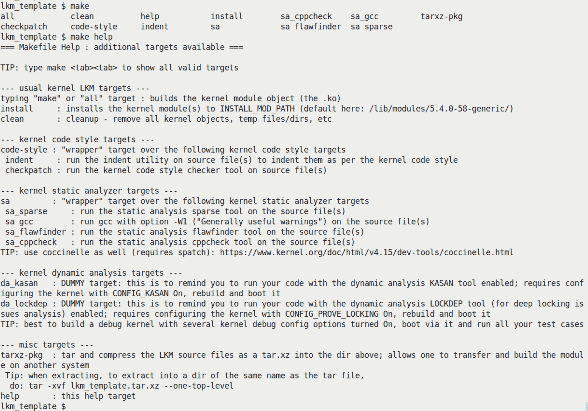
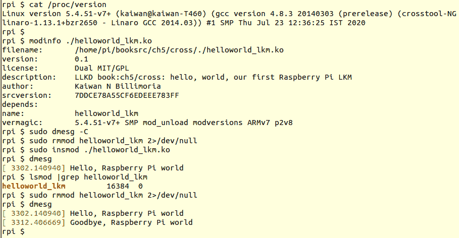
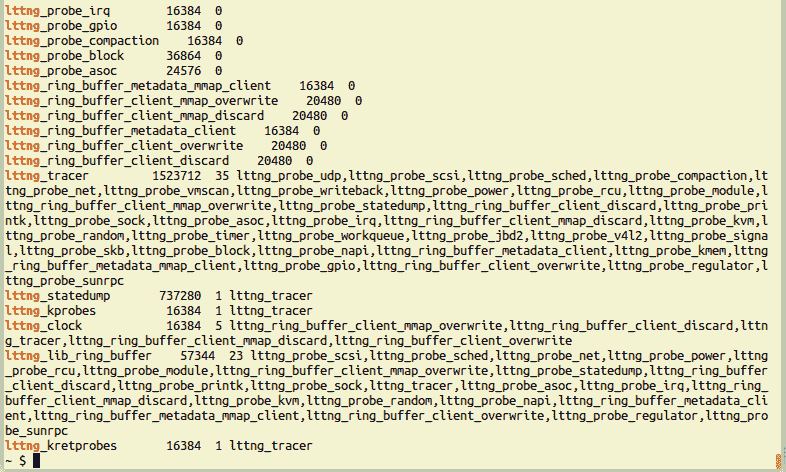
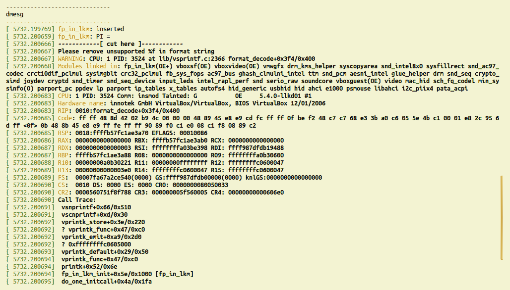
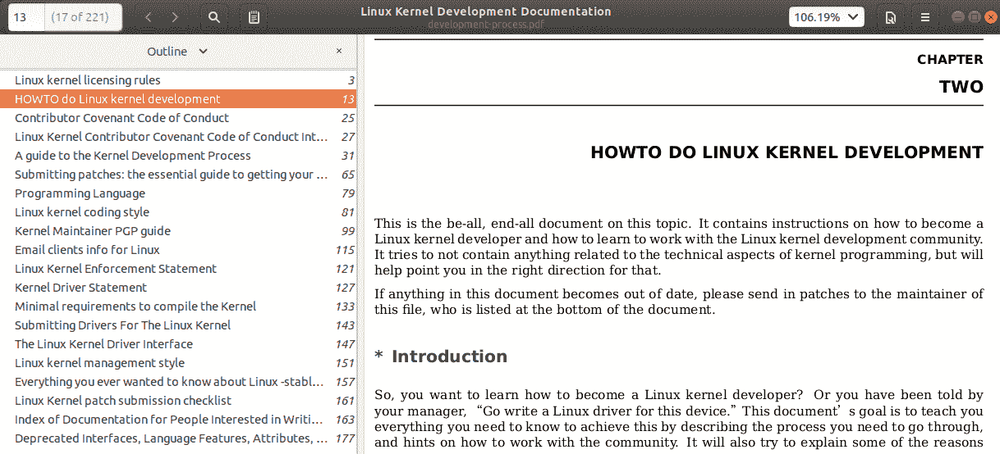

# 第五章：编写您的第一个内核模块-LKMs 第二部分

本章是关于**可加载内核模块**（**LKM**）框架及如何使用它编写内核模块的覆盖的后半部分。为了充分利用它，我希望您在阅读本章之前完成上一章，并尝试那里的代码和问题。

在本章中，我们将继续上一章的内容。在这里，我们将介绍如何使用“更好”的 Makefile 来编写 LKMs，为 ARM 平台交叉编译内核模块（作为典型示例），模块堆叠是什么以及如何执行，以及如何设置和使用模块参数。在此过程中，除其他事项外，您还将了解内核 API/ABI 的稳定性（或者说，缺乏稳定性！），编写用户空间和内核代码之间的关键区别，系统启动时自动加载内核模块以及安全性问题以及如何解决它们。最后，我们将介绍内核文档（包括编码风格）和对主线的贡献。

简而言之，本章将涵盖以下主题：

+   一个“更好”的内核模块 Makefile 模板

+   交叉编译内核模块

+   收集最小系统信息

+   许可内核模块

+   为内核模块模拟“类库”功能

+   向内核模块传递参数

+   内核中不允许浮点数

+   系统启动时自动加载模块

+   内核模块和安全性-概述

+   内核开发人员的编码风格指南

+   为主线内核做出贡献

# 技术要求

本章的技术要求——所需的软件包——与第四章中的*技术要求*部分所示的内容相同，请参考。您可以在本书的 GitHub 存储库中找到本章的源代码。使用以下命令进行克隆：

```
git clone https://github.com/PacktPublishing/Linux-Kernel-Programming
```

书中显示的代码通常只是相关片段。请跟随存储库中的完整源代码。对于本章（以及随后的章节），有关技术要求的更多信息请参阅以下部分。

# 一个“更好”的内核模块 Makefile 模板

上一章向您介绍了用于从源代码生成内核模块、安装和清理的 Makefile。然而，正如我们在那里简要提到的，我现在将介绍我认为更好的“更好”的 Makefile，并解释它为什么更好。

最终，我们都必须编写更好、更安全的代码——无论是用户空间还是内核空间。好消息是，有几种工具可以帮助改进代码的健壮性和安全性，其中包括静态和动态分析器（在第一章中已经提到了几种，*内核工作空间设置*，我就不在这里重复了）。

我设计了一个简单但有用的内核模块 Makefile“模板”，其中包括几个目标，可帮助您运行这些工具。这些目标使您可以非常轻松地执行有价值的检查和分析；*可能是您会忘记、忽视或永远推迟的事情！* 这些目标包括以下内容：

+   “通常”的目标——`build`、`install`和`clean`。

+   内核编码风格生成和检查（通过`indent(1)`和内核的`checkpatch.pl`脚本，分别）。

+   内核静态分析目标（`sparse`、`gcc`和`flawfinder`），并提到**Coccinelle**。

+   一对“虚拟”的内核动态分析目标（`KASAN`和`LOCKDEP / CONFIG_PROVE_LOCKING`），鼓励您为所有测试用例配置、构建和使用“调试”内核。

+   一个简单的`tarxz-pkg`目标，将源文件打包并压缩到前一个目录。这使您可以将压缩的`tar-xz`文件传输到任何其他 Linux 系统，并在那里提取和构建 LKM。

+   一个“虚拟”的动态分析目标，指出您应该投入时间来配置和构建一个“调试”内核，并使用它来捕捉错误！（稍后将更多内容）

您可以在`ch5/lkm_template`目录中找到代码（以及`README`文件）。为了帮助您理解其用途和功能，并帮助您入门，以下图简单地显示了当运行其`help`目标时代码产生的输出的屏幕截图：



图 5.1 - 来自我们“更好”的 Makefile 的 helptarget 的输出

在*图 5.1*中，我们首先执行`make`，然后按两次*Tab*键，这样它就会显示所有可用的目标。请仔细研究并使用它！例如，运行`make sa`将导致它在您的代码上运行所有**静态分析**（`sa`）目标！

还需要注意的是，使用这个 Makefile 将需要您在系统上安装一些软件包/应用程序；这些包括（对于基本的 Ubuntu 系统）`indent(1)`，`linux-headers-$(uname -r)`，`sparse(1)`，`flawfinder(1)`，`cppcheck(1)`和`tar(1)`。（第一章，*内核工作区设置*，已经指出这些应该被安装）。

另外，请注意，Makefile 中所谓的**动态分析**（`da`）目标仅仅是不做任何事情，只是打印一条消息的虚拟目标。它们只是*提醒您*通过在适当配置的“调试”内核上运行代码来彻底测试您的代码！

说到“调试”内核，下一节将向您展示如何配置一个。

## 配置“调试”内核

（有关配置和构建内核的详细信息，请参阅第二章，*从源代码构建 5.x Linux 内核-第一部分*，和第三章，*从源代码构建 5.x Linux 内核-第二部分*）。

在*调试内核*上运行代码可以帮助您发现难以发现的错误和问题。我强烈建议在开发和测试期间这样做！在这里，我至少希望您配置您的自定义 5.4 内核，使以下内核调试配置选项打开（在`make menuconfig`界面中，您会发现大多数选项在`Kernel Hacking`子菜单下；以下列表是针对 Linux 5.4.0 的）：

+   `CONFIG_DEBUG_INFO`

+   `CONFIG_DEBUG_FS`（`debugfs`伪文件系统）

+   `CONFIG_MAGIC_SYSRQ`（Magic SysRq 热键功能）

+   `CONFIG_DEBUG_KERNEL`

+   `CONFIG_DEBUG_MISC`

+   内存调试：

+   `CONFIG_SLUB_DEBUG`。

+   `CONFIG_DEBUG_MEMORY_INIT`。

+   `CONFIG_KASAN`：这是**内核地址消毒剂**端口；但是，截至撰写本文时，它仅适用于 64 位系统。

+   `CONFIG_DEBUG_SHIRQ`

+   `CONFIG_SCHED_STACK_END_CHECK`

+   锁调试：

+   `CONFIG_PROVE_LOCKING`：非常强大的`lockdep`功能来捕获锁定错误！这将打开其他几个锁调试配置，详细说明在第十三章，*内核同步-第二部分*。

+   `CONFIG_LOCK_STAT`

+   `CONFIG_DEBUG_ATOMIC_SLEEP`

+   `CONFIG_STACKTRACE`

+   `CONFIG_DEBUG_BUGVERBOSE`

+   `CONFIG_FTRACE`（`ftrace`：在其子菜单中，至少打开一些“跟踪器”）

+   `CONFIG_BUG_ON_DATA_CORRUPTION`

+   `CONFIG_KGDB`（内核 GDB；可选）

+   `CONFIG_UBSAN`

+   `CONFIG_EARLY_PRINTK`

+   `CONFIG_DEBUG_BOOT_PARAMS`

+   `CONFIG_UNWINDER_FRAME_POINTER`（选择`FRAME_POINTER`和`CONFIG_STACK_VALIDATION`）

需要注意的几件事：

a) 如果您现在不明白先前提到的所有内核调试配置选项的作用，也不要太担心；在您完成本书时，大多数选项都会变得清晰起来。

b) 打开一些`Ftrace`跟踪器（或插件），例如`CONFIG_IRQSOFF_TRACER`，这在我们的*Linux 内核编程（第二部分）*书中的*处理硬件中断*章节中实际上会有用；（请注意，尽管 Ftrace 本身可能默认启用，但并非所有跟踪器都是默认启用的）。

请注意，打开这些配置选项*确实*会带来性能损失，但没关系。我们正在运行这种“调试”内核，目的是*捕捉错误和漏洞*（尤其是难以发现的种类！）。它确实可以拯救生命！在你的项目中，*你的工作流程应该涉及你的代码在以下两者上进行测试和运行*：

+   *调试*内核系统，其中所有必需的内核调试配置选项都已打开（如先前所示的最小配置）

+   *生产*内核系统（在其中所有或大部分先前的内核调试选项将被关闭）

毋庸置疑，我们将在本书中所有后续的 LKM 代码中使用先前的 Makefile 风格。

好了，现在你已经准备好了，让我们来探讨一个有趣且实际的场景-为另一个目标（通常是 ARM）编译你的内核模块。

# 交叉编译内核模块

在第三章中，*从源代码构建 5.x Linux 内核-第二部分*，在*为树莓派构建内核*部分，我们展示了如何为“外部”目标架构（如 ARM、PowerPC、MIPS 等）交叉编译 Linux 内核。基本上，对于内核模块也可以做同样的事情；通过适当设置“特殊”的`ARCH`和`CROSS_COMPILE`环境变量，可以轻松地交叉编译内核模块。

例如，假设我们正在开发一个嵌入式 Linux 产品；我们的代码将在一个具有 AArch32（ARM-32）CPU 的目标设备上运行。为什么不举一个实际的例子。让我们为树莓派 3 *单板计算机*（**SBC**）交叉编译我们的*Hello, world*内核模块！

这很有趣。你会发现，尽管看起来简单直接，但我们最终会进行四次迭代才成功。为什么？继续阅读以了解详情。

## 为交叉编译设置系统

交叉编译内核模块的先决条件非常明确：

+   我们需要为目标系统安装*内核源树*，作为主机系统工作空间的一部分，通常是 x86_64 台式机（对于我们的示例，使用树莓派作为目标，请参考官方树莓派文档：[`www.raspberrypi.org/documentation/linux/kernel/building.md`](https://www.raspberrypi.org/documentation/linux/kernel/building.md)）。

+   现在我们需要一个交叉工具链。通常，主机系统是 x86_64，而目标是 ARM-32，因此我们需要一个*x86_64 到 ARM32 的交叉工具链*。同样，正如在第三章中明确提到的，*从源代码构建 5.x Linux 内核-第二部分*，*为树莓派构建内核*，你必须下载并安装 Raspberry Pi 特定的 x86_64 到 ARM 工具链作为主机系统工作空间的一部分（请参考第三章，*从源代码构建 5.x Linux 内核-第二部分*，了解如何安装工具链）。

好了，从这一点开始，我将假设你已经安装了 x86_64 到 ARM 交叉工具链。我还将假设*工具链前缀*是`arm-linux-gnueabihf-`；我们可以通过尝试调用`gcc`交叉编译器来快速检查工具链是否已安装并将其二进制文件添加到路径中：

```
$ arm-linux-gnueabihf-gcc
arm-linux-gnueabihf-gcc: fatal error: no input files
compilation terminated.
$ 
```

它可以工作-只是我们没有传递任何 C 程序作为编译参数，因此它会报错。

你也可以使用`arm-linux-gnueabihf-gcc --version`命令查看编译器版本。

## 尝试 1-设置“特殊”的环境变量

实际上，交叉编译内核模块非常容易（或者我们认为是这样！）。只需确保适当设置“特殊”的`ARCH`和`CROSS_COMPILE`环境变量。按照以下步骤进行：

1.  让我们重新为树莓派目标构建我们的第一个*Hello, world*内核模块。以下是构建方法：

为了不破坏原始代码，我们创建一个名为`cross`的新文件夹，其中包含从第四章复制的（helloworld_lkm）代码，*编写你的第一个内核模块 - LKMs 第一部分*。

```
cd <dest-dir>/ch5/cross
```

这里，`<dest-dir>`是书的 GitHub 源树的根目录。

1.  现在，运行以下命令：

```
make ARCH=arm CROSS_COMPILE=arm-linux-gnueabihf-
```

但它并不会立即起作用（或者可能会起作用；请参阅以下信息框）。我们会得到编译失败，如下所示：

```
$ make ARCH=arm CROSS_COMPILE=arm-linux-gnueabihf- make -C /lib/modules/5.4.0-llkd01/build/ M=/home/llkd/book_llkd/Linux-Kernel-Programming/ch5/cross modules
make[1]: Entering directory '/home/llkd/kernels/linux-5.4'
  CC [M]  /home/llkd/book_llkd/Linux-Kernel-Programming/ch5/cross/helloworld_lkm.o
arm-linux-gnueabihf-gcc: error: unrecognized command line option ‘-fstack-protector-strong’
scripts/Makefile.build:265: recipe for target '/home/llkd/book_llkd/Linux-Kernel-Programming/ch5/cross/helloworld_lkm.o' failed
[...]
make: *** [all] Error 2
$ 
```

为什么失败了？

假设所有工具都按照之前讨论的技术要求设置好，交叉编译应该可以工作。这是因为书中提供的`Makefile`是一个正确工作的，树莓派内核已经正确配置和构建，设备已经引导到这个内核，并且内核模块已经针对它进行了编译。在这本书中，这里的目的是解释细节；因此，我们从没有假设开始，并引导您正确执行交叉编译的过程。

前面的交叉编译尝试失败的线索在于，它试图使用 - *构建对* - 当前*主机系统*的内核源，而不是目标的内核源树。因此，*我们需要修改* *Makefile* *以指向目标的正确内核源树*。这样做真的很容易。在下面的代码中，我们看到了（已更正的）Makefile 代码的典型写法：

```
# ch5/cross/Makefile:
# To support cross-compiling for kernel modules:
# For architecture (cpu) 'arch', invoke make as:
# make ARCH=<arch> CROSS_COMPILE=<cross-compiler-prefix> 
ifeq ($(ARCH),arm)
  # *UPDATE* 'KDIR' below to point to the ARM Linux kernel source tree on 
  # your box
  KDIR ?= ~/rpi_work/kernel_rpi/linux
else ifeq ($(ARCH),arm64)
  # *UPDATE* 'KDIR' below to point to the ARM64 (Aarch64) Linux kernel 
  # source tree on your box
  KDIR ?= ~/kernel/linux-4.14
else ifeq ($(ARCH),powerpc)
  # *UPDATE* 'KDIR' below to point to the PPC64 Linux kernel source tree  
  # on your box
  KDIR ?= ~/kernel/linux-4.9.1
else
  # 'KDIR' is the Linux 'kernel headers' package on your host system; this 
  # is usually an x86_64, but could be anything, really (f.e. building 
  # directly on a Raspberry Pi implies that it's the host)
  KDIR ?= /lib/modules/$(shell uname -r)/build
endif

PWD          := $(shell pwd)
obj-m        += helloworld_lkm.o
EXTRA_CFLAGS += -DDEBUG

all:
    @echo
    @echo '--- Building : KDIR=${KDIR} ARCH=${ARCH} CROSS_COMPILE=${CROSS_COMPILE} EXTRA_CFLAGS=${EXTRA_CFLAGS} ---'
    @echo
    make -C $(KDIR) M=$(PWD) modules
[...]
```

仔细查看（在前一节中解释的新的和“更好”的）Makefile，您将看到它是如何工作的：

+   最重要的是，我们有条件地设置`KDIR`变量，根据`ARCH`环境变量的值指向正确的内核源树（当然，我已经用一些内核源树的路径名作为 ARM[64]和 PowerPC 的示例；请用实际的内核源树路径替换路径名）

+   像往常一样，我们设置`obj-m += <module-name>.o`。

+   我们还设置`CFLAGS_EXTRA`以添加`DEBUG`符号（这样`DEBUG`符号就在我们的 LKM 中定义了，甚至`pr_debug()/pr_devel()`宏也可以工作）。

+   `@echo '<...>'`行等同于 shell 的`echo`命令；它只是在构建时发出一些有用的信息（`@`前缀隐藏了 echo 语句本身的显示）。

+   最后，我们有“通常”的 Makefile 目标：`all`，`install`和`clean` - 这些与之前相同，*除了*这个重要的变化：**我们让它改变目录**（通过`-C`开关）到`KDIR`的值！

+   尽管在上述代码中没有显示，但这个“更好”的 Makefile 有几个额外有用的目标。您应该花时间去探索和使用它们（如前一节所述；首先，只需输入`make help`，研究输出并尝试一些东西）。

完成所有这些后，让我们使用这个版本重试交叉编译并看看结果如何。

## 尝试 2 - 将 Makefile 指向目标的正确内核源树

现在，有了前一节中描述的*增强*Makefile，它*应该*可以工作。在我们将尝试这个的新目录中 - `cross`（因为我们是交叉编译，不是因为我们生气！） - 请按照以下步骤操作：

1.  使用适用于交叉编译的`make`命令尝试构建（第二次）。

```
$ make ARCH=arm CROSS_COMPILE=arm-linux-gnueabihf- 
--- Building : KDIR=~/rpi_work/kernel_rpi/linux ARCH=arm CROSS_COMPILE=arm-linux-gnueabihf- EXTRA_CFLAGS=-DDEBUG ---

make -C ~/rpi_work/kernel_rpi/linux M=/home/llkd/booksrc/ch5/cross modules
make[1]: Entering directory '/home/llkd/rpi_work/kernel_rpi/linux'

ERROR: Kernel configuration is invalid.
 include/generated/autoconf.h or include/config/auto.conf are missing.
 Run 'make oldconfig && make prepare' on kernel src to fix it.

 WARNING: Symbol version dump ./Module.symvers
 is missing; modules will have no dependencies and modversions.
[...]
make: *** [all] Error 2
$ 
```

实际失败的原因是，我们正在编译内核模块的树莓派内核仍处于“原始”状态。它甚至没有`.config`文件（以及其他所需的头文件，如前面的输出所告知的）存在于其根目录中，它需要（至少）被配置。

1.  为了解决这个问题，请切换到您的树莓派内核源树的根目录，并按照以下步骤操作：

```
$ cd ~/rpi-work/kernel_rpi/linux $ make ARCH=arm bcmrpi_defconfig
#
# configuration written to .config
#
$ make ARCH=arm CROSS_COMPILE=arm-linux-gnueabihf- oldconfig
scripts/kconfig/conf --oldconfig Kconfig
#
# configuration written to .config
#
$ make ARCH=arm CROSS_COMPILE=arm-linux-gnueabihf- prepare
scripts/kconfig/conf --silentoldconfig Kconfig
 CHK include/config/kernel.release
 UPD include/config/kernel.release
 WRAP arch/arm/include/generated/asm/bitsperlong.h
 WRAP arch/arm/include/generated/asm/clkdev.h
 [...]
$ make ARCH=arm CROSS_COMPILE=arm-linux-gnueabihf-
 CHK include/config/kernel.release
 CHK include/generated/uapi/linux/version.h
 CHK include/generated/utsrelease.h
 [...]
 HOSTCC scripts/recordmcount
 HOSTCC scripts/sortextable
 [...]
$
```

请注意，这些步骤实际上与执行树莓派内核的部分构建非常相似！实际上，如果您已经按照第三章中所述的方式构建（交叉编译）了内核，*从源代码构建 5.x Linux 内核 - 第二部分*，那么内核模块的交叉编译应该可以在这里看到的中间步骤无需工作。

## 尝试 3 - 交叉编译我们的内核模块

现在我们在主机系统上有一个配置好的树莓派内核源树和增强的 Makefile（参见*尝试 2 - 将 Makefile 指向目标的正确内核源树*部分），它*应该*可以工作。让我们重试一下：

1.  我们（再次）尝试构建（交叉编译）内核。像往常一样，发出`make`命令，同时传递`ARCH`和`CROSS_COMPILE`环境变量：

```
$ ls -l
total 12
-rw-rw-r-- 1 llkd llkd 1456 Mar 18 17:48 helloworld_lkm.c
-rw-rw-r-- 1 llkd llkd 6470 Jul  6 17:30 Makefile
$ make ARCH=arm CROSS_COMPILE=arm-linux-gnueabihf- --- Building : KDIR=~/rpi_work/kernel_rpi/linux ARCH=arm CROSS_COMPILE=arm-linux-gnueabihf- EXTRA_CFLAGS=-DDEBUG ---

make -C ~/rpi_work/kernel_rpi/linux M=/home/llkd/booksrc/ch5/cross modules
make[1]: Entering directory '/home/llkd/rpi_work/kernel_rpi/linux' 
 WARNING: Symbol version dump ./Module.symvers
 is missing; modules will have no dependencies and modversions.

Building for: ARCH=arm CROSS_COMPILE=arm-linux-gnueabihf- EXTRA_CFLAGS= -DDEBUG
 CC [M] /home/llkd/book_llkd/Linux-Kernel-Programming/ch5/cross/helloworld_lkm.o
​  Building modules, stage 2.
  MODPOST 1 modules
  CC /home/llkd/booksrc/ch5/cross/helloworld_lkm.mod.o
  LD [M] /home/llkd/booksrc/ch5/cross/helloworld_lkm.ko
make[1]: Leaving directory '/home/llkd/rpi_work/kernel_rpi/linux'
$ file ./helloworld_lkm.ko 
./helloworld_lkm.ko: ELF 32-bit LSB relocatable, ARM, EABI5 version 1 (SYSV), BuildID[sha1]=17...e, not stripped
$
```

构建成功！`helloworld_lkm.ko`内核模块确实已经针对 ARM 架构进行了交叉编译（使用树莓派交叉工具链和内核源树）。

我们现在可以忽略关于`Module.symvers`文件的前面警告。因为（在这里）整个树莓派内核尚未构建。

另外，值得一提的是，在运行 GCC 9.x 或更高版本和内核版本为 4.9 或更高版本的最近主机上，会发出一些编译器属性警告。当我尝试使用`arm-linux-gnueabihf-gcc`版本 9.3.0 和树莓派内核版本 4.14.114 交叉编译这个内核模块时，会发出诸如此类的警告：

./include/linux/module.h:131:6: 警告：'init_module'指定的属性比其目标'helloworld_lkm_init'更少限制：'cold' [-Wmissing-attributes]

Miguel Ojeda 指出了这一点（[`lore.kernel.org/lkml/CANiq72=T8nH3HHkYvWF+vPMscgwXki1Ugiq6C9PhVHJUHAwDYw@mail.gmail.com/`](https://lore.kernel.org/lkml/CANiq72=T8nH3HHkYvWF+vPMscgwXki1Ugiq6C9PhVHJUHAwDYw@mail.gmail.com/)），甚至生成了一个处理此问题的补丁（[`github.com/ojeda/linux/commits/compiler-attributes-backport`](https://github.com/ojeda/linux/commits/compiler-attributes-backport)）。截至撰写本文时，该补丁已应用于内核主线和*最近的*树莓派内核（因此，`rpi-5.4.y`分支可以正常工作，但较早的分支，如`rpi-4.9.y`分支似乎没有）！因此会出现编译器警告...实际上，如果您看到这些警告，请将树莓派分支更新到`rpi-5.4.y`或更高版本（或者暂时忽略它们）。

1.  然而，实践出真知。因此，我们启动树莓派，通过`scp(1)`将交叉编译的内核模块对象文件传输到它，然后在树莓派上的`ssh(1)`会话中尝试它（以下输出直接来自设备）：

```
$ sudo insmod ./helloworld_lkm.ko insmod: ERROR: could not insert module ./helloworld_lkm.ko: Invalid module format $ 
```

很明显，前面代码中的`insmod(8)`失败了！*重要的是要理解为什么。*

这实际上与我们试图加载模块的内核版本不匹配以及模块已编译的内核版本有关。

1.  在树莓派上登录后，打印出我们正在运行的当前树莓派内核版本，并使用`modinfo(8)`实用程序打印出有关内核模块本身的详细信息：

```
rpi ~ $ cat /proc/version 
Linux version 4.19.75-v7+ (dom@buildbot) (gcc version 4.9.3 (crosstool-NG crosstool-ng-1.22.0-88-g8460611)) #1270 SMP Tue Sep 24 18:45:11 BST 2019
rpi ~ $ modinfo ./helloworld_lkm.ko 
filename: /home/pi/./helloworld_lkm.ko
version: 0.1
license: Dual MIT/GPL
description: LLKD book:ch5/cross: hello, world, our first Raspberry Pi LKM
author: Kaiwan N Billimoria
srcversion: 7DDCE78A55CF6EDEEE783FF
depends: 
name: helloworld_lkm
vermagic: 5.4.51-v7+ SMP mod_unload modversions ARMv7 p2v8 
rpi ~ $ 
```

从前面的输出中，很明显，我们在树莓派上运行`4.19.75-v7+`内核。实际上，这是我在设备的 microSD 卡上安装*默认*Raspbian OS 时继承的内核（这是一个故意引入的场景，最初*不*使用我们为树莓派早期构建的 5.4 内核）。另一方面，内核模块显示它已经针对`5.4.51-v7+` Linux 内核进行了编译（来自`modinfo(8)`的`vermagic`字符串显示了这一点）。*很明显，存在不匹配。*那又怎样呢？

Linux 内核有一个规则，是*内核* **应用二进制接口**（**ABI**）的一部分：**只有当内核模块构建在它上面时，它才会将内核模块插入内核内存** - 精确的内核版本，构建标志，甚至内核配置选项都很重要！

构建的内核是您在 Makefile 中指定的内核源位置（我们之前通过`KDIR`变量这样做）。

换句话说，内核模块与其构建的内核之外的内核**不兼容**。例如，如果我们在 Ubuntu 18.04 LTS 上构建一个内核模块，那么它将*只*在运行这个精确环境的系统上工作（库，内核或工具链）！它将*不*在 Fedora 29 或 RHEL 7.x，树莓派等上工作。现在 - 再次思考一下 - 这并不意味着内核模块完全不兼容。不，它们在不同架构之间是*源代码兼容*的（至少它们可以或者*应该*被编写成这样）。因此，假设你有源代码，你总是可以在给定的系统上*重新构建*一个内核模块，然后它将在该系统上工作。只是*二进制映像*（`.ko`文件）与其构建的精确内核之外的内核不兼容。

放松，这个问题实际上很容易发现。查看内核日志：

```
$ dmesg |tail -n2 [ 296.130074] helloworld_lkm: no symbol version for module_layout
[ 296.130093] helloworld_lkm: version magic '5.4.51-v7+ mod_unload modversions ARMv6 p2v8 ' should be '4.19.75-v7+ SMP mod_unload modversions ARMv7 p2v8 ' $ 
```

在设备上，当前运行的内核是：`4.19.75-v7+`。内核直接告诉我们，我们的内核模块已经构建在`5.4.51-v7+`内核版本上（它还显示了一些预期的内核配置）以及它应该是什么。存在不匹配！因此无法插入内核模块。

虽然我们在这里不使用这种方法，但是有一种方法可以确保成功构建和部署第三方的内核模块（只要它们的源代码是可用的），通过一个名为**DKMS**（**动态内核模块支持**）的框架。以下是直接从中引用的一句话：

<q>动态内核模块支持（DKMS）是一个启用生成 Linux 内核模块的程序/框架</q><q>其源代码通常驻留在内核源树之外。其概念是在安装新内核时自动重建 DKMS 模块。</q>

作为 DKMS 使用的一个例子，Oracle VirtualBox hypervisor（在 Linux 主机上运行时）使用 DKMS 自动构建和保持其内核模块的最新状态。

## 尝试 4 - 交叉编译我们的内核模块

因此，现在我们了解了问题，有两种可能的解决方案：

+   我们必须使用产品所需的自定义配置内核，并构建所有我们的内核模块。

+   或者，我们可以重建内核模块以匹配当前运行的内核设备。

现在，在典型的嵌入式 Linux 项目中，您几乎肯定会为目标设备拥有一个自定义配置的内核，您必须与之一起工作。产品的所有内核模块将/必须构建在其上。因此，我们遵循第一种方法 - 我们必须使用我们自定义配置和构建的（5.4！）内核引导设备，因为我们的内核模块是构建在其上的，现在它应该肯定可以工作。

我们（简要地）在第三章中涵盖了树莓派的内核构建，*从源代码构建 5.x Linux 内核 - 第二部分*。如果需要，可以返回那里查看详细信息。

好的，我将假设您已经按照第三章中涵盖的步骤，并且现在已经为树莓派配置和构建了一个 5.4 内核。关于如何将我们的自定义`zImage`复制到设备的 microSD 卡等细节在这里没有涵盖。我建议您查看官方的树莓派文档：[`www.raspberrypi.org/documentation/linux/kernel/building.md`](https://www.raspberrypi.org/documentation/linux/kernel/building.md)。

尽管如此，我们将指出一种方便的方法来在设备上切换内核（这里，我假设设备是运行 32 位内核的树莓派 3B+）：

1.  将您定制构建的`zImage`内核二进制文件复制到设备的 microSD 卡的`/boot`分区。将原始的 Raspberry Pi 内核映像 - Raspbian 内核映像 - 保存为`kernel7.img.orig`。

1.  从主机系统上复制（`scp`）刚刚交叉编译的内核模块（ARM 上的`helloworld_lkm.ko`，在上一节中完成）到 microSD 卡（通常是`/home/pi`）。

1.  接下来，再次在设备的 microSD 卡上，编辑`/boot/config.txt`文件，通过`kernel=xxx`行设置内核引导。设备上的此文件片段显示了这一点：

```
rpi $ cat /boot/config.txt
[...]
# KNB: enable the UART (for the adapter cable: USB To RS232 TTL UART 
# PL2303HX Converter USB to COM)
enable_uart=1
# KNB: select the kernel to boot from via kernel=xxx
#kernel=kernel7.img.orig
kernel=zImage
rpi $ 
```

1.  保存并重新启动后，我们登录到设备并重试我们的内核模块。图 5.2 是一个屏幕截图，显示了刚刚交叉编译的`helloworld_lkm.ko`内核模块在树莓派设备上的使用：



图 5.2 - 在树莓派上使用的交叉编译的 LKM

啊，成功了！请注意，这次当前内核版本（`5.4.51-v7+`）与模块构建时的内核版本完全匹配 - 在`modinfo(8)`输出中，我们可以看到`vermagic`字符串显示为`5.4.51-v7+`。

如果您看到`rmmod(8)`出现非致命错误（尽管清理钩子仍然被调用），原因是您尚未完全在设备上设置新构建的内核。您将不得不复制所有内核模块（位于`/lib/modules/<kernel-ver>`下）并在那里运行`depmod(8)`实用程序。在这里，我们不会深入探讨这些细节 - 如前所述，树莓派的官方文档涵盖了所有这些步骤。

当然，树莓派是一个非常强大的系统；您可以在树莓派上安装（默认的）Raspbian 操作系统以及开发工具和内核头文件，从而在板上编译内核模块！（无需交叉编译。）然而，在这里，我们遵循了交叉编译的方法，因为这在嵌入式 Linux 项目中很典型。

LKM 框架是一个相当庞大的工作。还有很多需要探索的地方。让我们开始吧。在下一节中，我们将研究如何从内核模块中获取一些最小的系统信息。

# 收集最小的系统信息

在我们上一节的简单演示中（`ch5/cross/helloworld_lkm.c`），我们已经硬编码了一个`printk()`来发出一个`"Hello/Goodbye, Raspberry Pi world\n"`字符串，无论内核模块是否真的在树莓派设备上运行。为了更好地“检测”一些系统细节（如 CPU 或操作系统），我们建议您参考我们的样本`ch5/min_sysinfo/min_sysinfo.c`内核模块。在下面的代码片段中，我们只显示相关函数：

```
// ch5/min_sysinfo/min_sysinfo.c
[ ... ]
void llkd_sysinfo(void)
{
    char msg[128];

    memset(msg, 0, strlen(msg));
    snprintf(msg, 47, "%s(): minimal Platform Info:\nCPU: ", __func__);

    /* Strictly speaking, all this #if... is considered ugly and should be
     * isolated as far as is possible */
#ifdef CONFIG_X86
#if(BITS_PER_LONG == 32)
    strncat(msg, "x86-32, ", 9);
#else
    strncat(msg, "x86_64, ", 9);
#endif
#endif
#ifdef CONFIG_ARM
    strncat(msg, "ARM-32, ", 9);
#endif
#ifdef CONFIG_ARM64
    strncat(msg, "Aarch64, ", 10);
#endif
#ifdef CONFIG_MIPS
    strncat(msg, "MIPS, ", 7);
#endif
#ifdef CONFIG_PPC
    strncat(msg, "PowerPC, ", 10);
#endif
#ifdef CONFIG_S390
    strncat(msg, "IBM S390, ", 11);
#endif

#ifdef __BIG_ENDIAN
    strncat(msg, "big-endian; ", 13);
#else
    strncat(msg, "little-endian; ", 16);
#endif

#if(BITS_PER_LONG == 32)
    strncat(msg, "32-bit OS.\n", 12);
#elif(BITS_PER_LONG == 64)
    strncat(msg, "64-bit OS.\n", 12);
#endif
    pr_info("%s", msg);

  show_sizeof();
 /* Word ranges: min & max: defines are in include/linux/limits.h */
 [ ... ]
}
EXPORT_SYMBOL(lkdc_sysinfo);
```

（此 LKM 显示的其他细节 - 如各种原始数据类型的大小和字范围 - 这里没有显示；请参考我们的 GitHub 存储库中的源代码并自行尝试。）前面的内核模块代码是有益的，因为它有助于演示如何编写可移植的代码。请记住，内核模块本身是一个二进制的不可移植的目标文件，但它的源代码可能（也许应该，取决于您的项目）以这样一种方式编写，以便在各种架构上都是可移植的。然后在目标架构上进行简单的构建（或为目标架构构建）将使其准备好部署。

现在，请忽略此处使用的`EXPORT_SYMBOL()`宏。我们将很快介绍其用法。

在我们现在熟悉的 x86_64 Ubuntu 18.04 LTS 客户机上构建并运行它，我们得到了这个输出：

```
$ cd ch5/min_sysinfo
$ make
[...]
$ sudo insmod ./min_sysinfo.ko 
$ dmesg
[...]
[29626.257341] min_sysinfo: inserted
[29626.257352] llkd_sysinfo(): minimal Platform Info:
              CPU: x86_64, little-endian; 64-bit OS.
$ 
```

太棒了！类似地（如前面演示的），我们可以为 ARM-32（树莓派）*交叉编译*这个内核模块，然后将交叉编译的内核模块传输（`scp(1)`）到我们的树莓派目标并在那里运行（以下输出来自运行 32 位 Raspbian OS 的树莓派 3B+）：

```
$ sudo insmod ./min_sysinfo.ko
$ dmesg
[...]
[    80.428363] min_sysinfo: inserted
[    80.428370] llkd_sysinfo(): minimal Platform Info:
               CPU: ARM-32, little-endian; 32-bit OS.
$
```

事实上，这揭示了一些有趣的事情；树莓派 3B+拥有本地*64 位 CPU*，但默认情况下（截至撰写本文时）运行 32 位操作系统，因此出现了前面的输出。我们将留给你在树莓派（或其他设备）上安装 64 位 Linux 操作系统，并重新运行这个内核模块。

强大的*Yocto 项目*（[`www.yoctoproject.org/`](https://www.yoctoproject.org/)）是一种（行业标准）生成树莓派 64 位操作系统的方法。另外（也更容易快速尝试），Ubuntu 为该设备提供了自定义的 Ubuntu 64 位内核和根文件系统（[`wiki.ubuntu.com/ARM/RaspberryPi`](https://wiki.ubuntu.com/ARM/RaspberryPi)）。

## 更加注重安全性

当然，安全性是当今的一个关键问题。专业开发人员被期望编写安全的代码。近年来，针对 Linux 内核已经有许多已知的漏洞利用（有关更多信息，请参阅*进一步阅读*部分）。与此同时，许多工作正在进行中，以改进 Linux 内核的安全性。

在我们之前的内核模块（`ch5/min_sysinfo/min_sysinfo.c`）中，要注意使用旧式的例程（比如`sprintf`、`strlen`等等；是的，在内核中存在这些）！*静态分析器*可以在捕获潜在的与安全相关的和其他错误方面大有裨益；我们强烈建议您使用它们。第一章，*内核工作区设置*，提到了内核的几种有用的静态分析工具。在下面的代码中，我们使用了我们“更好”的`Makefile`中的`sa`目标之一来运行一个相对简单的静态分析器：`flawfinder(1)`（由 David Wheeler 编写）：

```
$ make [tab][tab] all        clean      help       install     sa_cppcheck    sa_gcc    
tarxz-pkg  checkpatch code-style indent      sa             sa_flawfinder sa_sparse $ make sa_flawfinder 
make clean
make[1]: Entering directory '/home/llkd/llkd_book/Linux-Kernel-Programming/ch5/min_sysinfo'

--- cleaning ---

[...]

--- static analysis with flawfinder ---

flawfinder *.c
Flawfinder version 1.31, (C) 2001-2014 David A. Wheeler.
Number of rules (primarily dangerous function names) in C/C++ ruleset: 169
Examining min_sysinfo.c

FINAL RESULTS:

min_sysinfo.c:60: [2] (buffer) char:
  Statically-sized arrays can be improperly restricted, leading to potential overflows or other issues (CWE-119:CWE-120). Perform bounds checking, use functions that limit length, or ensure that the size is larger than the maximum possible length.

[...]

min_sysinfo.c:138: [1] (buffer) strlen:
  Does not handle strings that are not \0-terminated; if given one it may
  perform an over-read (it could cause a crash if unprotected) (CWE-126).
[...]
```

仔细看一下`flawfinder(1)`发出的警告，特别是关于`strlen()`函数的警告（它生成了许多警告！）。在这里我们确实面临这种情况！记住，未初始化的局部变量（比如我们的`msg`缓冲区）在声明时具有*随机内容*。因此，`strlen()`函数可能会产生我们期望的值，也可能不会。

`flawfinder`的输出甚至提到了**CWE**编号（在这里是 CWE-126），表示在这里看到的*一般类*的安全问题；（搜索一下你会看到详细信息。在这种情况下，CWE-126 代表缓冲区过读问题：[`cwe.mitre.org/data/definitions/126.html`](https://cwe.mitre.org/data/definitions/126.html)）。

同样，我们避免使用`strncat()`，并用`strlcat()`函数替换它。因此，考虑到安全性问题，我们将`llkd_sysinfo()`函数的代码重写为`llkd_sysinfo2()`。

我们还添加了一些代码行，以显示平台上无符号和有符号变量的*范围*（最小值、最大值）（以 10 进制和 16 进制表示）。我们留给你来阅读。作为一个简单的任务，运行这个内核模块在你的 Linux 设备上，并验证输出。

现在，让我们继续讨论一下 Linux 内核和内核模块代码的许可问题。

# 许可内核模块

众所周知，Linux 内核代码本身是根据 GNU GPL v2（也称为 GPL-2.0；GPL 代表通用公共许可证）许可的，就大多数人而言，将保持这种状态。如前所述，在第四章中，*编写您的第一个内核模块 - LKMs 第一部分*，许可您的内核代码是必需且重要的。基本上，至少对于我们的目的来说，讨论的核心是：如果您的意图是直接使用内核代码和/或向主线内核贡献您的代码（接下来会有一些说明），您*必须*以与 Linux 内核发布的相同许可证发布代码：GNU GPL-2.0。对于内核模块，情况仍然有点“灵活”，我们可以这么说。无论如何，为了与内核社区合作并得到他们的帮助（这是一个巨大的优势），您应该或者预期将代码发布为 GNU GPL-2.0 许可证（尽管双重许可证当然是可能和可接受的）。

使用`MODULE_LICENSE()`宏来指定许可证。从内核头文件`include/linux/module.h`中复制的以下注释清楚地显示了哪些许可证“标识”是可接受的（请注意双重许可）。显然，内核社区强烈建议将内核模块发布为 GPL-2.0（GPL v2）和/或其他许可证，如 BSD/MIT/MPL。如果您打算向内核主线贡献代码，毫无疑问，单独的 GPL-2.0 就是要发布的许可证：

```
// include/linux/module.h
[...]
/*
 * The following license idents are currently accepted as indicating free
 * software modules
 *
 * "GPL"                       [GNU Public License v2 or later]
 * "GPL v2"                    [GNU Public License v2]
 * "GPL and additional rights" [GNU Public License v2 rights and more]
 * "Dual BSD/GPL"              [GNU Public License v2
 *                              or BSD license choice]
 * "Dual MIT/GPL"              [GNU Public License v2
 *                              or MIT license choice]
 * "Dual MPL/GPL"              [GNU Public License v2
 *                              or Mozilla license choice]
 *
 * The following other idents are available
 *
 * "Proprietary" [Non free products]
 *
 * There are dual licensed components, but when running with Linux it is the GPL that is relevant so this is a non issue. Similarly LGPL linked with GPL is a GPL combined work.
 *
 * This exists for several reasons
 * 1\. So modinfo can show license info for users wanting to vet their setup is free
 * 2\. So the community can ignore bug reports including proprietary modules
 * 3\. So vendors can do likewise based on their own policies
 */
#define MODULE_LICENSE(_license) MODULE_INFO(license, _license)
[...]
```

顺便说一句，内核源代码树有一个`LICENSES/`目录，在其中您将找到有关许可证的详细信息；在这个文件夹上快速执行`ls`命令会显示其中的子文件夹：

```
$ ls <...>/linux-5.4/LICENSES/
deprecated/ dual/ exceptions/ preferred/
```

我们将留给您去查看，并且将讨论许可证的内容到此为止；现实情况是，这是一个需要法律知识的复杂话题。您最好咨询公司内的专业法律人员（律师）（或者雇佣他们）以确保您的产品或服务的法律角度正确。

在这个话题上，为了保持一致，最近的内核有一个规定：每个单独的源文件的第一行必须是一个 SPDX 许可证标识符（详见[`spdx.org/`](https://spdx.org/)）。当然，脚本需要第一行指定解释器。此外，一些关于 GPL 许可证的常见问题的答案可以在这里找到：[`www.gnu.org/licenses/gpl-faq.html`](https://www.gnu.org/licenses/gpl-faq.html)。

有关许可模型、不滥用`MODULE_LICENSE`宏，特别是多许可证/双许可证的更多信息，请参阅本章“进一步阅读”部分提供的链接。现在，让我们回到技术方面。下一节将解释如何在内核空间有效地模拟类库功能。

# 在内核模块中模拟“类库”功能

用户模式和内核模式编程之间的一个主要区别是后者完全没有熟悉的“库”概念。库本质上是 API 的集合或存档，方便开发人员实现重要目标，通常包括：*不要重复造轮子、软件重用、模块化*等。但在 Linux 内核中，库根本不存在。

然而，好消息是，大体上说，有两种技术可以在内核空间为我们的内核模块实现“类库”功能：

+   第一种技术：显式“链接”多个源文件（包括“库”代码）到您的内核模块对象中。

+   第二个被称为模块堆叠。

请继续阅读，我们将更详细地讨论这些技术。也许有点剧透，但立即了解的话会很有用：前面的技术中的第一种通常优于第二种。不过，这取决于项目。请在下一节中阅读详细信息；我们将在进行时列出一些优缺点。

## 通过多个源文件执行库模拟

到目前为止，我们处理的内核模块都只有一个 C 源文件。那么对于（相当典型的）现实世界中存在*多个 C 源文件的单个内核模块*的情况呢？所有源文件都必须被编译，然后链接在一起成为一个`.ko`二进制对象。

例如，假设我们正在构建一个名为`projx`的内核模块项目。它由三个 C 源文件组成：`prj1.c, prj2.c`和`prj3.c`。我们希望最终的内核模块被称为`projx.ko`。Makefile 是您指定这些关系的地方，如下所示：

```
obj-m      := projx.o
projx-objs := prj1.o prj2.o prj3.o
```

在上述代码中，请注意`projx`标签在`obj-m`指令*之后*和作为前缀使用的情况

`-objs`指令在下一行。当然，您可以使用任何标签。我们之前的示例将使内核构建系统将三个单独的 C 源文件编译为单独的目标（`.o`）文件，然后将它们*链接*在一起，形成最终的二进制内核模块对象文件，`projx.ko`，正如我们所期望的那样。

我们可以利用这种机制在我们书籍的源树中构建一个小的例程“库”（此处的“内核库”源文件位于源树的根目录中：`klib_llkd.h`和`klib_llkd.c`）。其想法是其他内核模块可以通过链接到这里的函数来使用这里的函数！例如，在即将到来的第七章*，内存管理内部 - 基本知识*中，我们的`ch7/lowlevel_mem/lowlevel_mem.c`内核模块代码调用了我们库代码中的一个函数，`../../klib_llkd.c`。所谓的“链接到”我们所谓的“库”代码是通过将以下内容放入`lowlevel_mem`内核模块的 Makefile 中实现的：

```
obj-m                 += lowlevel_mem_lib.o
lowlevel_mem_lib-objs := lowlevel_mem.o ../../klib_llkd.o
```

第二行指定要构建的源文件（成为目标文件）；它们是`lowlevel_mem.c`内核模块的代码和`../../klib_llkd`库代码。然后，将它们链接成一个单一的二进制内核模块，`lowlevel_mem_lib.ko`，实现我们的目标。（为什么不在本章末尾的*问题*部分中处理指定的作业 5.1。）

## 了解内核模块中的函数和变量作用域

在深入研究之前，快速回顾一些基础知识是个好主意。在使用 C 进行编程时，您应该了解以下内容：

+   在函数内声明的变量显然只在函数内部可见，并且仅在该函数内部具有作用域。

+   使用`static`限定符前缀的变量和函数仅在当前“单元”内具有作用域；实际上是在它们被声明的文件内。这很好，因为它有助于减少命名空间污染。静态（和全局）数据变量在该函数内保留其值。

在 2.6 Linux 之前（即<= 2.4.x，现在是古代历史），内核模块的静态和全局变量以及所有函数都会自动在整个内核中可见。回顾起来，这显然不是一个好主意。从 2.5 开始（因此 2.6 及以后的现代 Linux）决定反转：**所有内核模块变量（静态和全局数据）和函数默认范围仅限于其内核模块，并且因此在外部不可见**。因此，如果两个内核模块`lkmA`和`lkmB`有一个名为`maya`的全局变量，它对每个模块都是唯一的；不会发生冲突。

要更改作用域，LKM 框架提供了`EXPORT_SYMBOL()`宏。使用它，您可以声明数据项或函数为*全局*作用域 - 实际上，对所有其他内核模块以及内核核心可见。

让我们举一个简单的例子。我们有一个名为`prj_core`的内核模块，其中包含一个全局变量和一个函数：

```
static int my_glob = 5;
static long my_foo(int key)
{ [...]
}
```

尽管两者都可以在这个内核模块内部使用，但在外部都看不到。这是有意为之的。为了使它们在这个内核模块外部可见，我们可以*导出*它们：

```
int my_glob = 5;
EXPORT_SYMBOL(my_glob);

long my_foo(int key)
{ [...]
}
EXPORT_SYMBOL(my_foo);
```

现在，这两者都在这个内核模块之外具有作用域（请注意，在前面的代码块中，`static`关键字已经被故意删除）。*其他内核模块（以及核心内核）现在可以“看到”并使用它们*。确切地说，这个想法以两种广泛的方式得到了利用：

+   首先，内核导出了一个经过深思熟虑的全局变量和函数的子集，这些变量和函数构成了其核心功能的一部分，也是其他子系统的一部分。现在，这些全局变量和函数是可见的，因此可以从内核模块中使用！我们很快将看到一些示例用法。

+   其次，内核模块作者（通常是设备驱动程序）使用这个概念来导出某些数据和/或功能，以便其他内核模块在更高的抽象级别上可以利用这个设计并使用这些数据和/或功能 - 这个概念被称为*模块堆叠*，我们将很快通过一个例子来深入探讨它。

例如，对于第一个用例，设备驱动程序的作者可能希望处理来自外围设备的硬件中断。通常的做法是通过`request_irq()`API 来实现，实际上，这个 API 只是对这个 API 的一个薄包装（内联）：

```
// kernel/irq/manage.c
int request_threaded_irq(unsigned int irq, irq_handler_t handler,
                         irq_handler_t thread_fn, unsigned long irqflags,
                         const char *devname, void *dev_id)
{
    struct irqaction *action;
[...]
    return retval;
}
EXPORT_SYMBOL(request_threaded_irq);
```

正因为`request_threaded_irq()`函数是*导出的*，它可以从设备驱动程序中调用，而设备驱动程序往往是作为内核模块编写的。同样，开发人员经常需要一些“便利”例程 - 例如，字符串处理例程。Linux 内核在`lib/string.c`中提供了几个常见字符串处理函数的实现（您期望它们存在）：`str[n]casecmp`、`str[n|l|s]cpy`、`str[n|l]cat`、`str[n]cmp`、`strchr[nul]`、`str[n|r]chr`、`str[n]len`等等。当然，这些都是通过`EXPORT_SYMBOL()`宏*导出*的，以使它们可见，从而可供模块作者使用。

在这里，我们使用`str[n|l|s]cpy`表示内核提供了四个函数：`strcpy`、`strncpy`、`strlcpy`和`strscpy`。请注意，一些接口可能已被弃用（`strcpy()`、`strncpy()`和`strlcpy()`）。一般来说，始终避免使用此处记录的弃用内容：*弃用接口、语言特性、属性和约定*（[`www.kernel.org/doc/html/latest/process/deprecated.html#deprecated-interfaces-language-features-attributes-and-conventions`](https://www.kernel.org/doc/html/latest/process/deprecated.html#deprecated-interfaces-language-features-attributes-and-conventions)）。

另一方面，让我们来看一下内核核心深处的**CFS**（**完全公平调度器**）调度代码的一小部分。在这里，当调度代码需要找到另一个任务进行上下文切换时，会调用`pick_next_task_fair()`函数：

```
// kernel/sched/fair.c
static struct task_struct *
pick_next_task_fair(struct rq *rq, struct task_struct *prev, struct rq_flags *rf)
{
        struct cfs_rq *cfs_rq = &rq->cfs;
[...]
        if (new_tasks > 0)
                goto again;
        return NULL;
}
```

我们这里并不真的想研究调度（第十章，*CPU 调度器 - 第一部分*，和第十一章，*CPU 调度器 - 第二部分*，已经涵盖了它），这里的重点是：由于前面的函数*没有*用`EXPORT_SYMBOL()`宏标记，它永远不能被内核模块调用。它仍然是核心内核的*私有*。

您还可以使用相同的宏将数据结构标记为已导出。此外，显而易见，只有全局范围的数据 - 而不是局部变量 - 可以被标记为已导出。

如果您想了解`EXPORT_SYMBOL()`宏的工作原理，请参考本章的*进一步阅读*部分，其中链接到了本书的 GitHub 存储库。

回想一下我们对内核模块许可的简要讨论。Linux 内核有一个，我们可以说，有趣的命题：还有一个名为`EXPORT_SYMBOL_GPL()`的宏。它就像它的表兄弟`EXPORT_SYMBOL()`宏一样，只是，是的，导出的数据项或函数只对那些在他们的`MODULE_LICENSE()`宏中包含`GPL`一词的内核模块可见！啊，内核社区的甜蜜复仇。它确实在内核代码库的几个地方使用。（我会把这留给你作为一个练习，在代码中找到这个宏的出现；在 5.4.0 内核上，使用`cscope(1)`进行快速搜索，发现“只有”14,000 多个使用实例！）

要查看所有导出的符号，请导航到内核源树的根目录，并发出`make export_report`命令。请注意，这仅适用于已配置和构建的内核树。

现在让我们看一下实现类似库的内核特性的另一个关键方法：模块堆叠。

## 理解模块堆叠

这里的第二个重要想法- *模块堆叠* - 是我们现在将进一步深入研究的。

模块堆叠是一个概念，为内核模块作者提供了类似“库”的功能。在这里，我们通常以这样的方式设计我们的项目或产品，有一个或多个“核心”内核模块，其工作是充当某种库。它将包括数据结构和功能（函数/API），这些将被*导出*到其他内核模块（前面的部分讨论了符号的导出）。

为了更好地理解这一点，让我们看一些真实的例子。首先，在我的主机系统上，一个 Ubuntu 18.04.3 LTS 本机 Linux 系统上，我在*Oracle VirtualBox 6.1*虚拟化应用程序上运行了一个或多个客户 VM。好的，在主机系统上执行快速的`lsmod(8)`，同时过滤字符串`vbox`，会显示如下内容：

```
$ lsmod | grep vbox
vboxnetadp             28672  0
vboxnetflt             28672  1
vboxdrv               479232  3 vboxnetadp,vboxnetflt
$ 
```

回想一下我们之前的讨论，第三列是*使用计数*。在第一行中是`0`，但在第三行中是`3`。不仅如此，`vboxdrv`内核模块右侧列出了两个内核模块。如果任何内核模块出现在第三列之后，它们代表**依赖关系**；这样读：右侧显示的内核模块*依赖于*左侧的内核模块。

因此，在前面的例子中，`vboxnetadp`和`vboxnetflt`内核模块依赖于`vboxdrv`内核模块。以什么方式依赖它？当然是使用`vboxdrv`核心内核模块中的数据结构和/或功能（API）！一般来说，出现在第三列右侧的内核模块意味着它们使用左侧内核模块的一个或多个数据结构和/或功能（导致使用计数的增加；这个使用计数是一个*引用计数器*的很好例子（这里，它实际上是一个 32 位原子变量），这是我们在最后一章中深入讨论的内容）。实际上，`vboxdrv`内核模块类似于一个“库”（在有限的意义上，与用户模式库相关的通常含义除外，除了提供模块化功能）。您可以看到，在这个快照中，它的使用计数是`3`，依赖它的内核模块堆叠在它的上面-字面上！（您可以在`lsmod(1)`输出的前两行中看到它们。）另外，请注意，`vboxnetflt`内核模块有一个正的使用计数（`1`），但在它的右侧没有内核模块显示；这仍然意味着某些东西目前在使用它，通常是一个进程或线程。

FYI，我们在这个示例中看到的**Oracle VirtualBox**内核模块实际上是**VirtualBox Guest Additions**的实现。它们本质上是一种半虚拟化构造，有助于加速客户 VM 的工作。Oracle VirtualBox 也为 Windows 和 macOS 主机提供类似的功能（所有主要的虚拟化供应商也是如此）。

作为承诺的模块堆叠的另一个例子：运行强大的**LTTng**（**Linux Tracing Toolkit next generation**）框架使您能够执行详细的系统分析。LTTng 项目安装和使用了相当多的内核模块（通常是 40 个或更多）。其中一些内核模块是“堆叠”的，允许项目精确利用我们在这里讨论的“类似库”的功能。

在下图中（在 Ubuntu 18.04.4 LTS 系统上安装了 LTTng 后），查看`lsmod | grep --color=auto "^lttng"`输出的部分截图，涉及其内核模块：



图 5.3 - LTTng 产品中的大量模块堆叠

可以看到，`lttng_tracer`内核模块右侧有 35 个内核模块，表示它们“堆叠”在其上，使用它提供的功能（类似地，`lttng_lib_ring_buffer`内核模块有 23 个内核模块“依赖”它）。

这里有一些快速的脚本魔法，可以查看所有使用计数非零的内核模块（它们通常 - 但并不总是 - 有一些依赖的内核模块显示在它们的右侧）：

```
lsmod | awk '$3 > 0 {print $0}'
```

模块堆叠的一个含义是：只有在使用计数为`0`时，才能成功地`rmmod(8)`一个内核模块；也就是说，它没有在使用中。因此，对于前面的第一个示例，我们只能在移除两个依赖它的内核模块之后（从而将使用计数减少到`0`）才能移除`vboxdrv`内核模块。

### 尝试模块堆叠

让我们为模块堆叠构建一个非常简单的概念验证代码。为此，我们将构建两个内核模块：

+   第一个我们将称为`core_lkm`；它的工作是充当一种“库”，为内核和其他模块提供一些函数（API）。

+   我们的第二个内核模块`user_lkm`是“用户”（或消费者）“库”的使用者；它将简单地调用第一个内核模块中的函数（并使用一些数据）。

为了做到这一点，我们的一对内核模块需要做到以下几点：

+   核心内核模块必须使用`EXPORT_SYMBOL()`宏将一些数据和函数标记为*导出*。

+   用户内核模块必须声明其期望使用的数据和/或函数为外部数据，通过 C 的`extern`关键字（请记住，导出数据或功能只是设置适当的链接；编译器仍然需要知道被调用的数据和/或函数）。

+   使用最近的工具链，允许将导出的函数和数据项标记为`static`。但会产生一个警告；我们不使用`static`关键字来导出符号。

+   编辑自定义 Makefile 以构建两个内核模块。

代码如下；首先是核心或库内核模块。为了（希望）使其更有趣，我们将把之前一个模块的函数代码 - `ch5/min_sysinfo/min_sysinfo.c:llkd_sysinfo2()` - 复制到这个内核模块中，并*导出*它，从而使其对我们的第二个“用户”LKM 可见，后者将调用该函数：

这里我们不显示完整的代码；您可以参考本书的 GitHub 存储库。

```
// ch5/modstacking/core_lkm.c
#define pr_fmt(fmt) "%s:%s(): " fmt, KBUILD_MODNAME, __func__
#include <linux/init.h>
#include <linux/module.h>

#define MODNAME     "core_lkm"
#define THE_ONE     0xfedface
MODULE_LICENSE("Dual MIT/GPL");

int exp_int = 200;
EXPORT_SYMBOL_GPL(exp_int);

/* Functions to be called from other LKMs */
void llkd_sysinfo2(void)
{
[...]
}
EXPORT_SYMBOL(llkd_sysinfo2);

#if(BITS_PER_LONG == 32)
u32 get_skey(int p)
#else // 64-bit
u64 get_skey(int p)
#endif
{
#if(BITS_PER_LONG == 32)
    u32 secret = 0x567def;
#else // 64-bit
    u64 secret = 0x123abc567def;
#endif
    if (p == THE_ONE)
        return secret;
    return 0;
}
EXPORT_SYMBOL(get_skey);
[...]
```

接下来是`user_lkm`内核模块，它是“堆叠”在`core_lkm`内核模块之上的一个：

```
// ch5/modstacking/user_lkm.c
#define pr_fmt(fmt) "%s:%s(): " fmt, KBUILD_MODNAME, __func__
#define MODNAME "user_lkm"

#if 1
MODULE_LICENSE("Dual MIT/GPL");
#else
MODULE_LICENSE("MIT");
#endif

extern void llkd_sysinfo2(void);
extern long get_skey(int);
extern int exp_int;

/* Call some functions within the 'core' module */
static int __init user_lkm_init(void)
{
#define THE_ONE 0xfedface
     pr_info("%s: inserted\n", MODNAME);
     u64 sk = get_skey(THE_ONE);
     pr_debug("%s: Called get_skey(), ret = 0x%llx = %llu\n",
             MODNAME, sk, sk);
     pr_debug("%s: exp_int = %d\n", MODNAME, exp_int);
 llkd_sysinfo2();
     return 0;
}

static void __exit user_lkm_exit(void)
{
    pr_info("%s: bids you adieu\n", MODNAME);
}
module_init(user_lkm_init);
module_exit(user_lkm_exit);
```

Makefile 基本上与我们之前的内核模块相同，只是这次我们需要构建两个内核模块对象，如下所示：

```
obj-m     := core_lkm.o
obj-m     += user_lkm.o
```

好的，让我们试一下：

1.  首先，构建内核模块：

```
$ make

--- Building : KDIR=/lib/modules/5.4.0-llkd02-kasan/build ARCH= CROSS_COMPILE= EXTRA_CFLAGS=-DDEBUG ---

make -C /lib/modules/5.4.0-llkd02-kasan/build M=/home/llkd/booksrc/ch5/modstacking modules
make[1]: Entering directory '/home/llkd/kernels/linux-5.4'
  CC [M] /home/llkd/booksrc/ch5/modstacking/core_lkm.o
  CC [M] /home/llkd/booksrc/ch5/modstacking/user_lkm.o
  [...]
  Building modules, stage 2.
  MODPOST 2 modules
  CC [M] /home/llkd/booksrc/ch5/modstacking/core_lkm.mod.o
  LD [M] /home/llkd/booksrc/ch5/modstacking/core_lkm.ko
  CC [M] /home/llkd/booksrc/ch5/modstacking/user_lkm.mod.o
  LD [M] /home/llkd/booksrc/ch5/modstacking/user_lkm.ko
make[1]: Leaving directory '/home/llkd/kernels/linux-5.4'
$ ls *.ko
core_lkm.ko  user_lkm.ko
$ 
```

请注意，我们正在针对我们自定义的 5.4.0 内核构建我们的内核模块。请注意其完整版本是`5.4.0-llkd02-kasan`；这是故意的。这是我构建并用作测试平台的“调试内核”！

1.  现在，让我们进行一系列快速测试，以演示*模块堆叠*概念的证明。让我们首先*错误地*进行：我们将首先尝试在插入`core_lkm`模块之前插入`user_lkm`内核模块。

这将失败-为什么？您将意识到`user_lkm`内核模块依赖的导出功能（和数据）尚未（尚未）在内核中可用。更具体地说，符号将不会位于内核的符号表中，因为具有这些符号的`core_lkm`内核模块尚未插入：

```
$ sudo dmesg -C
$ sudo insmod ./user_lkm.ko 
insmod: ERROR: could not insert module ./user_lkm.ko: Unknown symbol in module
$ dmesg 
[13204.476455] user_lkm: Unknown symbol exp_int (err -2)
[13204.476493] user_lkm: Unknown symbol get_skey (err -2)
[13204.476531] user_lkm: Unknown symbol llkd_sysinfo2 (err -2)
$ 
```

正如预期的那样，由于所需的（要导出的）符号不可用，`insmod（8）`失败（您在内核日志中看到的精确错误消息可能会略有不同，这取决于内核版本和设置的调试配置选项）。

1.  现在，让我们做对：

```
$ sudo insmod ./core_lkm.ko 
$ dmesg 
[...]
[19221.183494] core_lkm: inserted
$ sudo insmod ./user_lkm.ko 
$ dmesg 
[...]
[19221.183494] core_lkm:core_lkm_init(): inserted
[19242.669208] core_lkm:core_lkm_init(): /home/llkd/book_llkd/Linux-Kernel-Programming/ch5/modstacking/core_lkm.c:get_skey():100: I've been called
[19242.669212] user_lkm:user_lkm_init(): inserted
[19242.669217] user_lkm:user_lkm:user_lkm_init(): Called get_skey(), ret = 0x123abc567def = 20043477188079
[19242.669219] user_lkm:user_lkm_init(): exp_int = 200
[19242.669223] core_lkm:llkd_sysinfo2(): minimal Platform Info:
 CPU: x86_64, little-endian; 64-bit OS.
$ 
```

1.  它按预期工作！使用`lsmod（8）`检查模块列表：

```
$ lsmod | egrep "core_lkm|user_lkm"
user_lkm               20480  0
core_lkm               16384  1 user_lkm
$ 
```

请注意，对于`core_lkm`内核模块，使用计数列已增加到`1`*并且*现在我们可以看到`user_lkm`内核模块依赖于`core_lkm`。回想一下，在`lsmod`输出的极右列中显示的内核模块依赖于极左列中的内核模块。

1.  现在，让我们删除内核模块。删除内核模块也有*顺序依赖性*（就像插入一样）。首先尝试删除`core_lkm`失败，因为显然，仍然有另一个模块在内核内存中依赖其代码/数据；换句话说，它仍在使用中：

```
$ sudo rmmod core_lkm 
rmmod: ERROR: Module core_lkm is in use by: user_lkm
$ 
```

请注意，如果模块*安装*到系统上，那么您可以使用`modprobe -r <modules...>`命令来删除所有相关模块；我们将在*系统引导时自动加载模块*部分中介绍这个主题。

1.  前面的`rmmod（8）`失败消息是不言自明的。因此，让我们做对：

```
$ sudo rmmod user_lkm core_lkm 
$ dmesg 
[...]
 CPU: x86_64, little-endian; 64-bit OS.
[19489.717265] user_lkm:user_lkm_exit(): bids you adieu
[19489.732018] core_lkm:core_lkm_exit(): bids you adieu
$ 
```

好了！

您将注意到在`user_lkm`内核模块的代码中，我们发布的许可是在条件`#if`语句中：

```
#if 1
MODULE_LICENSE("Dual MIT/GPL");
#else
MODULE_LICENSE("MIT");
#endif
```

我们可以看到它（默认）以*双 MIT/GPL*许可发布；那又怎样？想一想：在`core_lkm`内核模块的代码中，我们有以下内容：

```
int exp_int = 200;
EXPORT_SYMBOL_GPL(exp_int);
```

`exp_int`整数*仅对在 GPL 许可下运行的内核模块可见。*因此，请尝试更改`core_lkm`中的`#if 1`语句为`#if 0`，从而现在仅在 MIT 许可下发布它。现在，重新构建并重试。它在构建阶段本身*失败*：

```
$ make
[...]
Building for: kver=5.4.0-llkd01 ARCH=x86 CROSS_COMPILE= EXTRA_CFLAGS=-DDEBUG
  Building modules, stage 2.
  MODPOST 2 modules
FATAL: modpost: GPL-incompatible module user_lkm.ko uses GPL-only symbol 'exp_int'
[...]
$ 
```

许可确实很重要！在结束本节之前，这里是模块堆叠可能出错的一些事项的快速清单；也就是说，要检查的事项：

+   插入/删除时内核模块的错误顺序

+   尝试插入已经在内核内存中的导出例程-名称空间冲突问题：

```
$ sudo insmod ./min_sysinfo.ko
[...]
$ cd ../modstacking ; sudo insmod ./core_lkm.ko
insmod: ERROR: could not insert module ./core_lkm.ko: Invalid module format
$ dmesg
[...]
[32077.823472] core_lkm: exports duplicate symbol llkd_sysinfo2 (owned by min_sysinfo)
$ sudo rmmod min_sysinfo
$ sudo insmod ./core_lkm.ko * # now it's ok*
```

+   由于使用`EXPORT_SYMBOL_GPL（）`宏引起的许可问题

始终查看内核日志（使用`dmesg（1）`或`journalctl（1）`）。它经常有助于显示实际出了什么问题。

因此，让我们总结一下：为了在内核模块空间中模拟类似库的功能，我们探索了两种技术：

+   我们使用的第一种技术通过*将多个源文件链接到单个内核模块中*来工作。

+   这与*模块堆叠*技术相反，后者实际上构建了多个内核模块并将它们“堆叠”在一起。

第一种技术不仅效果很好，而且还具有这些优点：

+   我们不必明确标记（通过`EXPORT_SYMBOL（）`）我们使用的每个数据/函数符号作为已导出的。

+   这些功能仅对实际链接到的内核模块可用（而不是*整个*内核，包括其他模块）。这是一件好事！所有这些都是以稍微调整 Makefile 的代价 - 绝对值得。

“链接”方法的一个缺点：在链接多个文件时，内核模块的大小可能会变得很大。

这就是您学习内核编程强大功能的结束——将多个源文件链接在一起形成一个内核模块，和/或利用模块堆叠设计，这两者都允许您开发更复杂的内核项目。

在接下来的部分中，我们将深入探讨如何向内核模块传递参数。

# 向内核模块传递参数

一种常见的调试技术是*instrument*您的代码；也就是说，在适当的位置插入打印，以便您可以跟踪代码的路径。当然，在内核模块中，我们会使用多功能的`printk`函数来实现这一目的。因此，让我们假设我们做了以下操作（伪代码）：

```
#define pr_fmt(fmt) "%s:%s():%d: " fmt, KBUILD_MODNAME, __func__, __LINE__
[ ... ]
func_x() { 
    pr_debug("At 1\n");
    [...]
    while (<cond>) {
        pr_debug("At 2: j=0x%x\n", j); 
        [...] 
 }
 [...]
}
```

好的，很好。但是我们不希望调试打印出现在生产（或发布）版本中。这正是我们使用`pr_debug()`的原因：它只在定义了符号`DEBUG`时才发出一个 printk！确实，但是如果，有趣的是，我们的客户是一个工程客户，并希望*动态打开或关闭这些调试打印*呢？您可能会采取几种方法；其中一种如下伪代码所示：

```
static int debug_level;     /* will be init to zero */
func_x() { 
    if (debug_level >= 1) pr_debug("At 1\n");
    [...]
    while (<cond>) {
        if (debug_level >= 2) 
            pr_debug("At 2: j=0x%x\n", j); 
        [...] 
    }
 [...]
}
```

啊，这很好。那么，我们真正要说的是：*如果我们可以将*`debug_level`*模块变量**作为我们的内核模块的参数*，那将是一个强大的功能，内核模块的用户可以控制哪些调试消息出现或不出现。

## 声明和使用模块参数

模块参数作为*name=value*对在模块插入（`insmod`）时传递给内核模块。例如，假设我们有一个名为`mp_debug_level`的*模块参数*，那么我们可以在`insmod(8)`时传递其值，如下所示：

```
sudo insmod modparams1.ko mp_debug_level=2
```

在这里，`mp`前缀代表模块参数。当然，不一定要这样命名，这有点迂腐，但可能会使其更直观一些。

这将是强大的。现在，最终用户可以决定*verbosity* 他们希望*debug-level* 消息。我们甚至可以轻松安排默认值为`0`。

您可能会想：内核模块没有`main()`函数，因此没有常规的`(argc, argv)`参数列表，那么您究竟如何传递参数呢？事实上，这是一种链接器的技巧；只需这样做：将您打算的模块参数声明为全局（静态）变量，然后通过使用`module_param()`宏指定构建系统将其视为模块参数。

通过我们的第一个模块参数的演示内核模块，这一点很容易看出（通常情况下，完整的源代码和`Makefile`可以在本书的 GitHub 存储库中找到）：

```
// ch5/modparams/modparams1/modparams1.c
[ ... ]
/* Module parameters */
static int mp_debug_level;
module_param(mp_debug_level, int, 0660);
MODULE_PARM_DESC(mp_debug_level,
"Debug level [0-2]; 0 => no debug messages, 2 => high verbosity");

static char *mp_strparam = "My string param";
module_param(mp_strparam, charp, 0660);
MODULE_PARM_DESC(mp_strparam, "A demo string parameter");
```

在`static int mp_debug_level;`语句中，将其更改为`static int mp_debug_level = 0;`是没有害处的，这样明确地将变量初始化为 0，对吗？嗯，不是的：内核的`scripts/checkpatch.pl`脚本输出显示，内核社区并不认为这是良好的编码风格：

`ERROR: do not initialise statics to 0`

`#28: FILE: modparams1.c:28:`

`+static int mp_debug_level = 0;`

在上述代码块中，我们通过`module_param()`宏声明了两个模块参数。`module_param()`宏接受三个参数：

+   第一个参数：变量名（我们希望将其视为模块参数）。这应该使用`static`限定符声明。

+   第二个参数：其数据类型。

+   第三个参数：权限（实际上，它通过`sysfs`的可见性；这将在下文中解释）。

`MODULE_PARM_DESC()`宏允许我们“描述”参数代表什么。想想看，这是如何通知内核模块（或驱动程序）的最终用户以及实际可用的参数。查找是通过`modinfo(8)`实用程序执行的。此外，您可以使用`-p`选项开关，仅将参数信息打印到模块，如下所示：

```
cd <booksrc>/ch5/modparams/modparams1
make
$ modinfo -p ./modparams1.ko 
parm:          mp_debug_level:Debug level [0-2]; 0 => no debug messages, 2 => high verbosity (int)
parm:          mp_strparam:A demo string parameter (charp)
$ 
```

`modinfo(8)`输出显示可用的模块参数（如果有的话）。在这里，我们可以看到我们的`modparams1.ko`内核模块有两个参数，它们的名称、描述和数据类型（在括号内；`charp`是字符指针，一个字符串）都显示出来了。好了，现在让我们快速运行一下我们的演示内核模块：

```
sudo dmesg -C
sudo insmod ./modparams1.ko 
dmesg 
[42724.936349] modparams1: inserted
[42724.936354] module parameters passed: mp_debug_level=0 mp_strparam=My string param
```

在这里，我们从`dmesg(1)`输出中看到，由于我们没有显式传递任何内核模块参数，模块变量显然保留了它们的默认（原始）值。让我们重新做一遍，这次传递显式值给模块参数：

```
sudo rmmod modparams1 
sudo insmod ./modparams1.ko mp_debug_level=2 mp_strparam=\"Hello modparams1\"
$ dmesg 
[...]
[42734.162840] modparams1: removed
[42766.146876] modparams1: inserted
[42766.146880] module parameters passed: mp_debug_level=2 mp_strparam=Hello modparams1
$ 
```

它按预期工作。既然我们已经看到了如何声明和传递一些参数给内核模块，现在让我们来看看如何在运行时检索甚至修改它们。

## 插入后获取/设置模块参数

让我们仔细看一下我们之前的`modparams1.c`源文件中`module_param()`宏的用法：

```
module_param(mp_debug_level, int, 0660);
```

注意第三个参数，*权限*（或*模式*）：它是`0660`（当然，这是一个*八进制*数，意味着所有者和组有读写访问权限，其他人没有访问权限）。这有点令人困惑，直到你意识到如果指定了*permissions*参数为非零，伪文件将在`sysfs`文件系统下创建，表示内核模块参数，这里是：`/sys/module/<module-name>/parameters/`：

`sysfs`通常挂载在`/sys`下。此外，默认情况下，所有伪文件的所有者和组都是 root。

1.  因此，对于我们的`modparams1`内核模块（假设它加载到内核内存中），让我们查找它们：

```
$ ls /sys/module/modparams1/
coresize   holders/    initsize  initstate  notes/  parameters/  refcnt sections/  srcversion  taint     uevent     version
$ ls -l /sys/module/modparams1/parameters/
total 0
-rw-rw---- 1 root root 4096 Jan  1 17:39 mp_debug_level
-rw-rw---- 1 root root 4096 Jan  1 17:39 mp_strparam
$ 
```

确实，它们在那里！不仅如此，它的真正美妙之处在于这些“参数”现在可以随意读取和写入，任何时候（当然只有 root 权限）！

1.  检查一下：

```
$ cat /sys/module/modparams1/parameters/mp_debug_level 
cat: /sys/module/modparams1/parameters/mp_debug_level: Permission denied
$ sudo cat /sys/module/modparams1/parameters/mp_debug_level
[sudo] password for llkd: 
2
```

是的，我们的`mp_debug_level`内核模块参数的当前值确实是`2`。

1.  让我们动态将其更改为`0`，表示`modparams1`内核模块不会发出“调试”消息：

```
$ sudo bash -c "echo 0 > /sys/module/modparams1/parameters/mp_debug_level"
$ sudo cat /sys/module/modparams1/parameters/mp_debug_level 
0
```

完成了。您可以类似地获取和/或设置`mp_strparam`参数；我们将留给您尝试这个作为一个简单的练习。这是强大的东西：您可以编写简单的脚本来通过内核模块参数控制设备（或其他内容）的行为，获取（或切断）调试信息等等；可能性是相当无限的。

实际上，将`module_param()`的第三个参数编码为字面八进制数（例如`0660`）在某些圈子里不被认为是最佳的编程实践。通过适当的宏（在`include/uapi/linux/stat.h`中指定）指定`sysfs`伪文件的权限，例如：

```
module_param(mp_debug_level, int, S_IRUSR|S_IWUSR|S_IRGRP|S_IWGRP);
```

然而，话虽如此，我们的“更好”的*Makefile*的*checkpatch*目标（当然，调用内核的`scripts/checkpatch.pl`“编码风格”Perl 脚本检查器）礼貌地告诉我们，简单地使用八进制权限更好：

```
$ make checkpatch
[ ... ]
checkpatch.pl: /lib/modules/<ver>/build//scripts/checkpatch.pl --no-tree -f *.[ch]
[ ... ]
WARNING: Symbolic permissions 'S_IRUSR|S_IWUSR|S_IRGRP|S_IWGRP' are not preferred. Consider using octal permissions '0660'.
 #29: FILE: modparams1.c:29:
 +module_param(mp_debug_level, int, S_IRUSR|S_IWUSR|S_IRGRP|S_IWGRP);
```

因此，内核社区并不同意。因此，我们将只使用“通常”的八进制数表示法`0660`。

## 内核模块参数数据类型和验证

在我们之前的简单内核模块中，我们设置了整数和字符串数据类型（`charp`）的两个参数。还可以使用哪些数据类型？事实证明有几种，`moduleparam.h`包含文件中都有（在注释中重复显示）：

```
// include/linux/moduleparam.h
[...]
 * Standard types are:
 * byte, short, ushort, int, uint, long, ulong
 * charp: a character pointer
 * bool: a bool, values 0/1, y/n, Y/N.
 * invbool: the above, only sense-reversed (N = true).
```

甚至可以根据需要定义自己的数据类型。通常，标准类型已经足够了。

### 验证内核模块参数

所有内核模块参数默认都是*可选的*；用户可以选择是否显式传递它们。但是如果我们的项目要求用户*必须显式传递*给定内核模块参数的值怎么办？我们在这里解决这个问题：让我们增强我们之前的内核模块，创建另一个（`ch5/modparams/modparams2`），关键区别在于我们设置了一个名为`control_freak`的额外参数。现在，我们*要求*用户在模块插入时*必须*传递这个参数：

1.  在代码中设置新的模块参数：

```
static int control_freak;
module_param(control_freak, int, 0660);
MODULE_PARM_DESC(control_freak, "Set to the project's control level [1-5]. MANDATORY");
```

1.  我们如何实现这种“强制传递”呢？嗯，这实际上有点小聪明：只需在插入时检查值是否为默认值（这里是`0`）。如果是，默认值，那么用适当的消息中止（我们还进行了一个简单的有效性检查，以确保传递的整数在给定范围内）。以下是`ch5/modparams/modparams2/modparams2.c`的初始化代码：

```
static int __init modparams2_init(void)
{
    pr_info("%s: inserted\n", OUR_MODNAME);
    if (mp_debug_level > 0)
        pr_info("module parameters passed: "
                "mp_debug_level=%d mp_strparam=%s\n control_freak=%d\n",
                mp_debug_level, mp_strparam, control_freak);

    /* param 'control_freak': if it hasn't been passed (implicit guess), 
     * or is the same old value, or isn't within the right range,
     * it's Unacceptable!  :-)
     */
    if ((control_freak < 1) || (control_freak > 5)) {
        pr_warn("%s: Must pass along module parameter"
              " 'control_freak', value in the range [1-5]; aborting...\n",
              OUR_MODNAME);
        return -EINVAL;
    }
    return 0; /* success */
}
```

1.  另外，作为一个快速演示，注意我们如何发出一个`printk`，只有当`mp_debug_level`为正数时才显示模块参数值。

1.  最后，在这个话题上，内核框架提供了一种更严格的方式来“获取/设置”内核（模块）参数并对其进行有效性检查，通过`module_parm_cb()`宏（`cb`代表回调）。我们不会在这里深入讨论这个问题；我建议你参考*进一步阅读*文档中提到的博客文章，了解如何使用它的详细信息。

现在，让我们继续讨论如何（以及为什么）覆盖模块参数的名称。

### 覆盖模块参数的名称

为了解释这个特性，让我们以(5.4.0)内核源代码树中的一个例子来说明：直接映射缓冲 I/O 库驱动程序`drivers/md/dm-bufio.c`需要使用`dm_bufio_current_allocated`变量作为模块参数。然而，这个名称实际上是一个*内部变量*，对于这个驱动程序的用户来说并不是非常直观的。这个驱动程序的作者更希望使用另一个名称——`current_allocated_bytes`——作为*别名*或*名称覆盖*。可以通过`module_param_named()`宏来实现这一点，通过覆盖并完全等效于内部变量名称的方式，如下所示：

```
// drivers/md/dm-bufio.c
[...]
module_param_named(current_allocated_bytes, dm_bufio_current_allocated, ulong, S_IRUGO);
MODULE_PARM_DESC(current_allocated_bytes, "Memory currently used by the cache");
```

因此，当用户对这个驱动程序执行`insmod`时，他们可以做如下的事情：

```
sudo insmod <path/to/>dm-bufio.ko current_allocated_bytes=4096 ...
```

在内部，实际变量`dm_bufio_current_allocated`将被赋值为`4096`。

### 与硬件相关的内核参数

出于安全原因，指定硬件特定值的模块或内核参数有一个单独的宏——`module_param_hw[_named|array]()`. David Howells 于 2016 年 12 月 1 日提交了一系列补丁，用于支持这些新的硬件参数内核。补丁邮件[[`lwn.net/Articles/708274/`](https://lwn.net/Articles/708274/)]提到了以下内容：

```
Provided an annotation for module parameters that specify hardware
parameters (such as io ports, iomem addresses, irqs, dma channels, fixed
dma buffers and other types).

This will enable such parameters to be locked down in the core parameter
parser for secure boot support.  [...]
```

这就结束了我们对内核模块参数的讨论。让我们继续讨论一个特殊的方面——内核中的浮点使用。

# 内核中不允许浮点数

多年前，当我在温度传感器设备驱动程序上工作时，我有过一次有趣的经历（尽管当时并不那么有趣）。试图将毫摄氏度作为“常规”摄氏度值来表达温度值时，我做了类似以下的事情：

```
double temp;
[... processing ...]
temp = temp / 1000.0;
printk(KERN_INFO "temperature is %.3f degrees C\n", temp);
```

从那时起一切都变得糟糕了！

备受尊敬的 LDD（*Linux 设备驱动程序*，作者为*Corbet, Rubini, and G-K-Hartman*）书指出了我的错误——**浮点**（FP）算术在内核空间是不允许的！这是一个有意识的设计决定——保存处理器（FP）状态，打开 FP 单元，进行操作，然后关闭和恢复 FP 状态在内核中并不被认为是值得做的事情。内核（或驱动程序）开发人员最好*不要*在内核空间尝试执行 FP 工作。

那么，你会问，那你怎么做（以我的例子为例）温度转换呢？简单：将*整数*毫摄氏度值*传递给用户空间*，然后在那里执行 FP 工作！

话虽如此，显然有一种方法可以强制内核执行 FP：将你的浮点代码放在`kernel_fpu_begin()`和`kernel_fpu_end()`宏之间。在内核代码库中有一些地方确实使用了这种技术（通常是一些涵盖加密/AES、CRC 等的代码路径）。不过，建议是典型的模块（或驱动程序）开发人员*只在内核中执行整数算术*。

尽管如此，为了测试整个场景（永远记住，*实证方法 - 实际尝试事物 - 是唯一现实的前进方式！*），我们编写了一个简单的内核模块，试图执行一些 FP 工作。代码的关键部分在这里显示：

```
// ch5/fp_in_kernel/fp_in_kernel.c
static double num = 22.0, den = 7.0, mypi;
static int __init fp_in_lkm_init(void)
{
    [...]
    kernel_fpu_begin();
    mypi = num/den;
    kernel_fpu_end();
#if 1
    pr_info("%s: PI = %.4f = %.4f\n", OURMODNAME, mypi, num/den);
#endif
    return 0;     /* success */
}
```

它实际上是有效的，*直到* *我们尝试通过* `printk()` *显示 FP 值*！在那一点上，它变得非常疯狂。请看下面的截图：



图 5.4 - 当我们尝试在内核空间中打印 FP 数字时，WARN_ONCE()的输出

关键行是`Please remove unsupported %f in format string`。

这告诉我们一个故事。系统实际上并没有崩溃或恐慌，因为这只是一个通过`WARN_ONCE()`宏输出到内核日志的*警告*。但请注意，在生产系统上，`/proc/sys/kernel/panic_on_warn`伪文件很可能被设置为值`1`，导致内核（完全正确地）恐慌。

在前面截图（图 5.3）中的部分，从`Call Trace:`开始，当然是对进程或线程的*内核模式堆栈*的当前状态的一瞥，它是在前面的`WARN_ONCE()`代码路径中“捕获”的（稍等，你将在第六章中学到关于用户模式和内核模式堆栈等关键细节）。通过自下而上地阅读内核堆栈来解释内核堆栈；所以在这里，`do_one_initcall`函数调用了属于方括号中的内核模块的`fp_in_lkm_init`（`[fp_in_lkm_init]`），然后调用了`printk()`，然后试图打印 FP（浮点）数量，结果导致了各种麻烦！

明显的道理是：*避免在内核空间中使用浮点数运算*。现在让我们继续讨论如何在系统启动时安装和自动加载内核模块。

# 在系统启动时自动加载模块

到目前为止，我们编写了简单的“外部”内核模块，它们驻留在自己的私有目录中，并且通常需要通过`insmod(8)`或`modprobe(8)`实用程序手动加载。在大多数真实项目和产品中，你将需要*在启动时自动加载*你的外部内核模块。本节介绍了如何实现这一点。

假设我们有一个名为`foo.ko`的内核模块。我们假设我们可以访问源代码和 Makefile。为了在系统启动时*自动加载*它，你需要首先将内核模块*安装*到系统上已知的位置。为此，我们期望模块的 Makefile 包含一个`install`目标，通常是：

```
install:
 make -C $(KDIR) M=$(PWD) modules_install
```

这并不是什么新鲜事；我们一直在我们的演示内核模块的`Makefile`中放置`install`目标。

为了演示这个“自动加载”过程，我们展示了实际*安装和自动加载*我们的`ch5/min_sysinfo`内核模块的步骤：

1.  首先，切换到模块的源目录：

```
cd <...>/ch5/min_sysinfo
```

1.  接下来，首先重要的是构建内核模块（使用`make`），并且在成功后安装它（很快你会看到，我们的“更好”的 Makefile 通过保证先进行构建，然后进行安装和`depmod`来简化这个过程）：

```
make && sudo make install   
```

假设它构建成功，`sudo make install`命令然后会在`/lib/modules/<kernel-ver>/extra/`安装内核模块，这是预期的（也请看下面的信息框和提示）：

```
$ cd <...>/ch5/min_sysinfo
$ make                *<-- ensure it's first built 'locally'   
               generating the min_sysinfo.ko kernel module object*
[...]
$ sudo make install Building for: KREL= ARCH= CROSS_COMPILE= EXTRA_CFLAGS=-DDEBUG
make -C /lib/modules/5.4.0-llkd01/build M=<...>/ch5/min_sysinfo modules_install
make[1]: Entering directory '/home/llkd/kernels/linux-5.4'
 INSTALL <...>/ch5/min_sysinfo/min_sysinfo.ko
 DEPMOD  5.4.0-llkd01
make[1]: Leaving directory '/home/llkd/kernels/linux-5.4'
$ ls -l /lib/modules/5.4.0-llkd01/extra/
total 228
-rw-r--r-- 1 root root 232513 Dec 30 16:23 min_sysinfo.ko
$ 
```

在`sudo make install`期间，可能会看到关于 SSL 的（非致命的）错误；它们可以安全地忽略。它们表明系统未能“签名”内核模块。关于这一点，稍后会有关于安全性的说明。

另外，如果你发现`sudo make install`失败，也可以尝试以下方法：

a) 切换到 root shell（`sudo -s`）并在其中运行`make ; make install`命令。

b) 一个有用的参考资料：*Makefile: installing external Linux kernel module, StackOverflow, June 2016* ([`unix.stackexchange.com/questions/288540/makefile-installing-external-linux-kernel-module`](https://unix.stackexchange.com/questions/288540/makefile-installing-external-linux-kernel-module))。

1.  然后通常会在`sudo make install`中默认调用另一个模块实用程序`depmod(8)`（可以从前面的输出中看到）。以防万一（无论出于什么原因），这没有发生，您总是可以手动调用`depmod`：它的工作基本上是解决模块依赖关系（有关详细信息，请参阅其手册页）：`sudo depmod`。安装内核模块后，您可以使用其`--dry-run`选项开关查看`depmod(8)`的效果：

```
$ sudo depmod --dry-run | grep min_sysinfo
extra/min_sysinfo.ko:
alias symbol:lkdc_sysinfo2 min_sysinfo
alias symbol:lkdc_sysinfo min_sysinfo
$ 
```

1.  在启动时自动加载内核模块：一种方法是创建`/etc/modules-load.d/<foo>.conf`配置文件（当然，您需要 root 访问权限来创建此文件）；简单情况：只需在其中放入内核模块的`foo`名称，就是这样。任何以`#`字符开头的行都被视为注释并被忽略。对于我们的`min_sysinfo`示例，我们有以下内容：

```
$ cat /etc/modules-load.d/min_sysinfo.conf 
# Auto load kernel module for LLKD book: ch5/min_sysinfo
min_sysinfo
$
```

另外，通知 systemd 加载我们的内核模块的另一种（甚至更简单的）方法是将模块的*名称*输入到（现有的）`/etc/modules-load.d/modules.conf`文件中。

1.  使用`sync; sudo reboot`重新启动系统。

系统启动后，使用`lsmod(8)`并查看内核日志（也许可以用`dmesg(1)`）。您应该会看到与内核模块加载相关的相关信息（在我们的示例中是`min_sysinfo`）。

```
[... system boots up ...]

$ lsmod | grep min_sysinfo
min_sysinfo         16384  0
$ dmesg | grep -C2 min_sysinfo
[...]
[ 2.395649] min_sysinfo: loading out-of-tree module taints kernel.
[ 2.395667] min_sysinfo: module verification failed: signature and/or required key missing - tainting kernel
[ 2.395814] min_sysinfo: inserted
[ 2.395815] lkdc_sysinfo(): minimal Platform Info:
               CPU: x86_64, little-endian; 64-bit OS.
$
```

好了，完成了：我们的`min_sysinfo`内核模块确实已经在启动时自动加载到内核空间中！

正如您刚刚学到的，您必须首先构建您的内核模块，然后执行安装；为了帮助自动化这一过程，我们的“更好”的 Makefile 在其模块安装`install`目标中包含以下内容：

```
// ch5/min_sysinfo/Makefile
[ ... ]
install:
    @echo
    @echo "--- installing ---"
    @echo " [First, invoke the 'make' ]"
    make
    @echo
    @echo " [Now for the 'sudo make install' ]"
    sudo make -C $(KDIR) M=$(PWD) modules_install
 sudo depmod
```

它确保首先进行构建，然后进行安装，（显式地）进行`depmod(8)`。

如果您的自动加载的内核模块在加载时需要传递一些（模块）参数，该怎么办？有两种方法可以确保这种情况发生：通过所谓的 modprobe 配置文件（在`/etc/modprobe.d/`下）或者，如果模块是内核内置的，通过内核命令行。

这里我们展示第一种方法：简单地设置您的 modprobe 配置文件（在这里作为示例，我们使用`mykmod`作为我们 LKM 的名称；同样，您需要 root 访问权限来创建此文件）：`/etc/modprobe.d/mykmod.conf`；在其中，您可以像这样传递参数：

```
options <module-name> <parameter-name>=<value>
```

例如，我的 x86_64 Ubuntu 20.04 LTS 系统上的`/etc/modprobe.d/alsa-base.conf` modprobe 配置文件包含以下行（还有其他几行）：

```
# Ubuntu #62691, enable MPU for snd-cmipci
options snd-cmipci mpu_port=0x330 fm_port=0x388
```

接下来是有关内核模块自动加载相关项目的一些要点。

## 模块自动加载-其他详细信息

一旦内核模块已经通过`sudo make install`安装到系统上（如前所示），您还可以通过一个“更智能”的`insmod(8)`实用程序的版本，称为`modprobe(8)`，将其插入内核交互式地（或通过脚本）。对于我们的示例，我们可以首先`rmmod(8)`模块，然后执行以下操作：

```
sudo modprobe min_sysinfo
```

有趣的是，在有多个内核模块对象要加载的情况下（例如，*模块堆叠*设计），`modprobe`如何知道加载内核模块的*顺序*？在本地进行构建时，构建过程会生成一个名为`modules.order`的文件。它告诉诸如`modprobe`之类的实用程序加载内核模块的顺序，以便解决所有依赖关系。当内核模块被*安装*到内核中（即，到`/lib/modules/$(uname -r)/extra/`或类似位置），`depmod(8)`实用程序会生成一个`/lib/modules/$(uname -r)/modules.dep`文件。其中包含依赖信息 - 它指定一个内核模块是否依赖于另一个。使用这些信息，modprobe 然后按照所需的顺序加载它们。为了充实这一点，让我们安装我们的模块堆叠示例：

```
$ cd <...>/ch5/modstacking
$ make && sudo make install
[...]
$ ls -l /lib/modules/5.4.0-llkd01/extra/
total 668K
-rw-r--r-- 1 root root 218K Jan 31 08:41 core_lkm.ko
-rw-r--r-- 1 root root 228K Dec 30 16:23 min_sysinfo.ko
-rw-r--r-- 1 root root 217K Jan 31 08:41 user_lkm.ko
$ 
```

显然，我们模块堆叠示例中的两个内核模块（`core_lkm.ko`和`user_lkm.ko`）现在安装在预期位置`/lib/modules/$(uname -r)/extra/`下。现在，来看一下这个：

```
$ grep user_lkm /lib/modules/5.4.0-llkd01/* 2>/dev/null
/lib/modules/5.4.0-llkd01/modules.dep:extra/user_lkm.ko: extra/core_lkm.ko
Binary file /lib/modules/5.4.0-llkd01/modules.dep.bin matches
$
```

`grep`后的第一行输出是相关的：`depmod`已经安排`modules.dep`文件显示`extra/user_lkm.ko`内核模块依赖于`extra/core_lkm.ko`内核模块（通过`<k1.ko>: <k2.ko>...`表示，意味着`k1.ko`模块依赖于`k2.ko`模块）。因此，modprobe 看到这一点，按照所需的顺序加载它们，避免任何问题。

（顺便说一句，谈到这个话题，生成的`Module.symvers`文件包含所有导出符号的信息。）

接下来，回想一下 Linux 上的新（ish）`init`框架，*systemd*。事实上，在现代 Linux 系统上，实际上是 systemd 负责在系统启动时自动加载内核模块，通过解析诸如`/etc/modules-load.d/*`之类的文件的内容（负责此操作的 systemd 服务是`systemd-modules-load.service(8)`。有关详细信息，请参阅`modules-load.d(5)`的 man 页面）。

相反，有时您可能会发现某个自动加载的内核模块表现不佳 - 导致死机或延迟，或者根本不起作用 - 因此您肯定想要禁用它的加载。这可以通过*黑名单*模块来实现。您可以在内核命令行上指定这一点（当其他方法都失败时很方便！）或者在（前面提到的）`/etc/modules-load.d/<foo>.conf`配置文件中指定。在内核命令行上，通过`module_blacklist=mod1,mod2,...`，内核文档向我们展示了语法/解释：

```
module_blacklist=  [KNL] Do not load a comma-separated list of
                        modules.  Useful for debugging problem modules.
```

您可以通过执行`cat /proc/cmdline`来查找当前的内核命令行。

谈到内核命令行，还存在一些其他有用的选项，使我们能够使用内核的帮助来调试与内核初始化有关的问题。例如，内核在这方面提供了以下参数之一（来源：[`www.kernel.org/doc/html/latest/admin-guide/kernel-parameters.html`](https://www.kernel.org/doc/html/latest/admin-guide/kernel-parameters.html)）：

```
debug           [KNL] Enable kernel debugging (events log level).
[...]
initcall_debug  [KNL] Trace initcalls as they are executed. Useful
                      for working out where the kernel is dying during
                      startup.
[...]
ignore_loglevel [KNL] Ignore loglevel setting - this will print /all/
                      kernel messages to the console. Useful for  
                      debugging. We also add it as printk module 
                      parameter, so users could change it dynamically, 
                      usually by /sys/module/printk/parameters/ignore_loglevel.
```

顺便说一句，并且正如本章前面提到的，还有一个用于第三方内核模块自动重建的替代框架，称为**动态内核模块支持**（**DKMS**）。

本章的*进一步阅读*文档还提供了一些有用的链接。总之，在系统启动时将内核模块自动加载到内存中是一个有用且经常需要的功能。构建高质量的产品需要对*安全性*有深刻的理解，并具有构建*安全性*的知识；这是下一节的主题。

# 内核模块和安全性 - 概述

讽刺的现实是，过去几年中，花费大量精力改进*用户空间*安全考虑已经取得了相当大的回报。几十年前，恶意用户进行有效的**缓冲区溢出**（**BoF**）攻击是完全可能的，但今天却很难实现。为什么？因为有许多层加强的安全机制来防止许多这些攻击类别。

快速列举一些对策：编译器保护（`-fstack-protector[...]`）

-Wformat-security, -D_FORTIFY_SOURCE=2`, partial/full RELRO, better sanity and security checker tools (`checksec.sh`, the address sanitizers, paxtest, static analysis tools, and so on), secure libraries, hardware-level protection mechanisms (NX, SMEP, SMAP, and so on), [K]ASLR, better testing (fuzzing), and so on.

讽刺的是，过去几年中*内核空间*攻击变得越来越常见！已经证明，即使是透露一个有效的内核（虚拟）地址（及其对应的符号）给一个聪明的攻击者，她也可以找到一些关键的内核结构的位置，从而为进行各种**特权升级**（**privesc**）攻击铺平道路。因此，即使是透露一个看似无害的内核信息（如内核地址及其关联的符号）也可能是一个**信息泄漏**（或信息泄漏）并且必须在生产系统上予以防止。接下来，我们将列举并简要描述 Linux 内核提供的一些安全功能。然而，最终，内核开发人员-也就是您！-在其中扮演了重要角色：首先编写安全的代码！使用我们的“更好”的 Makefile 是一个很好的开始方式-其中的几个目标与安全有关（例如所有的静态分析目标）。

## 影响系统日志的 proc 文件系统可调整参数

我们直接参考`proc(5)`的手册页面-非常有价值！-以获取有关这两个与安全相关的可调整参数的信息：

+   `dmesg_restrict`

+   `kptr_restrict`

首先是`dmesg_restrict`：

```
dmesg_restrict
/proc/sys/kernel/dmesg_restrict (since Linux 2.6.37)
 The value in this file determines who can see kernel syslog contents. A  value of 0 in this file imposes no restrictions. If the value is 1, only privileged users can read the kernel syslog. (See syslog(2) for more details.) Since Linux 3.4, only users with the CAP_SYS_ADMIN capability may change the value in this file.
```

默认值（在我们的 Ubuntu 和 Fedora 平台上）是`0`：

```
$ cat /proc/sys/kernel/dmesg_restrict
0
```

Linux 内核使用强大的细粒度 POSIX *capabilities*模型。`CAP_SYS_ADMIN`能力本质上是传统*root（超级用户/系统管理员）*访问的一个捕捉所有。`CAP_SYSLOG`能力赋予进程（或线程）执行特权`syslog(2)`操作的能力。

如前所述，“泄漏”内核地址及其关联的符号可能导致基于信息泄漏的攻击。为了帮助防止这些情况，建议内核和模块的作者始终使用新的`printf`风格格式来打印内核地址：而不是使用熟悉的`%p`或`%px`来打印内核地址，应该使用新的**`%pK`**格式来打印地址。（使用`%px`格式确保实际地址被打印出来；在生产中应避免使用这种格式）。这有什么帮助呢？请继续阅读...

`kptr_restrict`可调整参数（2.6.38 及以上版本）影响`printk()`输出时打印内核地址；使用`printk("&var = **%pK**\n", &var);`

而不是老旧的`printk("&var = %p\n", &var);`被认为是一种安全最佳实践。了解`kptr_restrict`可调整参数的工作原理对此至关重要：

```
kptr_restrict
/proc/sys/kernel/kptr_restrict (since Linux 2.6.38)
 The value in this file determines whether kernel addresses are exposed via /proc files and other interfaces. A value of 0 in this file imposes no restrictions. If the value is 1, kernel pointers printed using the %pK format specifier will be replaced with zeros unless the user has the CAP_SYSLOG capability. If the value is 2, kernel pointers printed using the %pK format specifier will be replaced with zeros regardless of the user's capabilities. The initial default value for this file was 1, but the default was changed to 0 in Linux 2.6.39\. Since Linux 3.4, only users with the CAP_SYS_ADMIN capability can change the value in this file.
```

默认值（在我们最近的 Ubuntu 和 Fedora 平台上）是`1`：

```
$ cat /proc/sys/kernel/kptr_restrict 
1
```

在生产系统上，您可以-而且*必须*将这些可调整参数更改为安全值（1 或 2）以确保安全。当然，只有开发人员使用这些安全措施时，安全措施才能发挥作用；截至 Linux 内核 5.4.0 版本，整个 Linux 内核代码库中只有（仅有！）14 个使用`%pK`格式指定符，而使用`%p`的使用约为 5200 多次，显式使用`%px`格式指定符的使用约为 230 次。

a）由于`procfs`是一个易失性文件系统，您可以始终使用`sysctl(8)`实用程序和`-w`选项开关（或直接更新`/etc/sysctl.conf`文件）使更改永久生效。

b）为了调试的目的，如果必须打印实际的内核（未修改的）地址，建议您使用`%px`格式说明符；在生产系统上，请删除这些打印！

c）有关`printk`格式说明符的详细内核文档可以在[`www.kernel.org/doc/html/latest/core-api/printk-formats.html#how-to-get-printk-format-specifiers-right`](https://www.kernel.org/doc/html/latest/core-api/printk-formats.html#how-to-get-printk-format-specifiers-right)找到；请浏览一下。

随着 2018 年初硬件级缺陷的出现（现在众所周知的*Meltdown，Spectre*和其他处理器推测安全问题），人们对*检测信息泄漏*产生了一种新的紧迫感，从而使开发人员和管理员能够将其封锁。

一个有用的 Perl 脚本`scripts/leaking_addresses.pl`在 4.14 版中发布（2017 年 11 月；我很高兴能在这项重要工作中提供帮助：[`github.com/torvalds/linux/commit/1410fe4eea22959bd31c05e4c1846f1718300bde`](https://github.com/torvalds/linux/commit/1410fe4eea22959bd31c05e4c1846f1718300bde)），并且正在进行更多的检查以检测泄漏的内核地址。

## 内核模块的加密签名

一旦恶意攻击者在系统上立足，他们通常会尝试某种特权升级向量，以获得 root 访问权限。一旦实现了这一点，典型的下一步是安装*rootkit*：基本上是一组脚本和内核模块，它们几乎会接管系统（通过“劫持”系统调用，设置后门和键盘记录器等）。

当然，这并不容易 - 现代生产质量的 Linux 系统的安全姿态，包括**Linux 安全模块**（**LSMs**）等，意味着这并不是一件微不足道的事情，但对于一个技术娴熟且积极进取的攻击者来说，任何事情都有可能。假设他们安装了足够复杂的 rootkit，系统现在被认为是受到了威胁。

一个有趣的想法是：即使具有 root 访问权限，也不要允许`insmod(8)`（或`modprobe(8)`，甚至底层的`[f]init_module(2)`系统调用）将内核模块插入内核地址空间**除非它们使用安全密钥进行了加密签名**，而该密钥在内核的密钥环中。这一强大的安全功能是在 3.7 内核中引入的（相关提交在这里：[`git.kernel.org/pub/scm/linux/kernel/git/torvalds/linux.git/commit/?id=106a4ee258d14818467829bf0e12aeae14c16cd7`](https://git.kernel.org/pub/scm/linux/kernel/git/torvalds/linux.git/commit/?id=106a4ee258d14818467829bf0e12aeae14c16cd7)）。

有关对内核模块进行加密签名的详细信息超出了本书的范围；您可以在这里参考官方内核文档：[`www.kernel.org/doc/html/latest/admin-guide/module-signing.html`](https://www.kernel.org/doc/html/latest/admin-guide/module-signing.html)。

有关此功能的一些相关内核配置选项是`CONFIG_MODULE_SIG`，`CONFIG_MODULE_SIG_FORCE`，`CONFIG_MODULE_SIG_ALL`等。要了解这究竟意味着什么，请参阅第一个选项的`Kconfig 'help'`部分，如下所示（来自`init/Kconfig`）：

```
config MODULE_SIG
 bool "Module signature verification"
 depends on MODULES
 select SYSTEM_DATA_VERIFICATION
 help
  Check modules for valid signatures upon load: the signature is simply  
  appended to the module. For more information see  
  <file:Documentation/admin-guide/module-signing.rst>. Note that this  
  option adds the OpenSSL development packages as a kernel build   
  dependency so that the signing tool can use its crypto library.

 !!!WARNING!!! If you enable this option, you MUST make sure that the  
 module DOES NOT get stripped after being signed. This includes the
 debuginfo strip done by some packagers (such as rpmbuild) and
 inclusion into an initramfs that wants the module size reduced
```

内核配置`MODULE_SIG_FORCE`是一个布尔值（默认为`n`）。只有在打开`MODULE_SIG`时才会起作用。如果`MODULE_SIG_FORCE`设置为`y`，那么内核模块*必须*具有有效的签名才能加载。如果没有，加载将失败。如果其值保持为`n`，这意味着即使未签名的内核模块也将加载到内核中，但内核将被标记为有瑕疵。这往往是典型现代 Linux 发行版的默认设置。在以下代码块中，我们查找了我们的 x86_64 Ubuntu 20.04.1 LTS 客户 VM 上的这些内核配置：

```
$ grep MODULE_SIG /boot/config-5.4.0-58-generic 
CONFIG_MODULE_SIG_FORMAT=y
CONFIG_MODULE_SIG=y
# CONFIG_MODULE_SIG_FORCE is not set
CONFIG_MODULE_SIG_ALL=y
[ ... ] 
```

在生产系统上鼓励对内核模块进行加密签名（近年来，随着（I）IoT 边缘设备变得更加普遍，安全性是一个关键问题）。

## 完全禁用内核模块

偏执的人可能希望完全禁用内核模块的加载（和卸载）。这相当激烈，但嘿，这样你就可以完全锁定系统的内核空间（以及使任何 rootkit 基本上无害）。有两种广泛的方法可以实现这一点：

+   首先，通过在构建之前的内核配置期间将`CONFIG_MODULES`内核配置设置为关闭（默认情况下是打开的）。这样做相当激烈 – 它使决定成为永久的！

+   其次，假设`CONFIG_MODULES`已打开，模块加载可以通过`modules_disabled` `sysctl`可调参数在运行时动态关闭；看一下这个：

```
$ cat /proc/sys/kernel/modules_disabled
0 
```

当然，默认情况下是*关闭*（`0`）。像往常一样，`proc(5)`的 man 页面告诉了我们这个故事：

```
/proc/sys/kernel/modules_disabled (since Linux 2.6.31)
 A toggle value indicating if modules are allowed to be loaded in an otherwise modular kernel. This toggle defaults to off (0), but can be set true (1). Once true, modules can be neither loaded nor unloaded, and the toggle cannot be set back to false. The file is present only if the kernel is built with the CONFIG_MODULES option enabled.
```

总之，当然，内核安全加固和恶意攻击是一场猫鼠游戏。例如，（K）ASLR（我们将在接下来的 Linux 内存管理章节中讨论（K）ASLR 的含义）经常被打败。另请参阅这篇文章 – *在 Android 上有效地绕过 kptr_restrict*：[`bits-please.blogspot.com/2015/08/effectively-bypassing-kptrrestrict-on.html`](http://bits-please.blogspot.com/2015/08/effectively-bypassing-kptrrestrict-on.html)。安全并不容易；它总是在不断地进步中。几乎可以说：开发人员 – 无论是用户空间还是内核空间 – *必须*编写具有安全意识的代码，并且持续使用工具和测试*。*

让我们通过关于 Linux 内核编码风格指南、访问内核文档以及如何进行对主线内核的贡献的主题来完成本章。

# 内核开发人员的编码风格指南

许多大型项目都规定了自己的一套编码准则；Linux 内核社区也是如此。遵循 Linux 内核*编码风格*指南是一个非常好的主意。您可以在这里找到官方文档：[`www.kernel.org/doc/html/latest/process/coding-style.html`](https://www.kernel.org/doc/html/latest/process/coding-style.html)（请务必阅读！）。

此外，作为想要上游您的代码的开发人员的（相当详尽的）代码提交检查清单的一部分，您应该通过一个 Perl 脚本运行您的补丁，检查您的代码是否符合 Linux 内核编码风格：`scripts/checkpatch.pl`。

默认情况下，此脚本仅在格式良好的`git`补丁上运行。可以对独立的 C 代码（如您的树外内核模块代码）运行它，方法如下（正如我们的“更好”的 Makefile 确实做到的）：

```
<kernel-src>/scripts/checkpatch.pl --no-tree -f <filename>.c
```

在您的内核代码中养成这样的习惯是有帮助的，可以帮助您发现那些令人讨厌的小问题 – 以及更严重的问题！ – 否则可能会阻碍您的补丁。再次提醒您：我们的“更好”的 Makefile 的`indent`和`checkpatch`目标是为此而设计的。

除了编码风格指南，您会发现，时不时地，您需要深入研究详细且有用的内核文档。温馨提示：我们在第一章 *内核工作区设置*的*查找和使用 Linux 内核文档*部分中介绍了定位和使用内核文档。

我们现在将通过简要介绍如何开始一个崇高的目标来完成本章：为主线 Linux 内核项目贡献代码。

# 为主线内核做贡献

在本书中，我们通常通过 LKM 框架在内核源树之外进行内核开发。如果您正在内核树中编写代码，并明确目标是将您的代码上游到内核主线，该怎么办呢？这确实是一个值得赞扬的目标 - 开源的整个基础源自社区愿意付出努力并将其贡献到项目上游。

## 开始为内核做贡献

当然，最常见的问题是*我该如何开始*？为了帮助您准确地解决这个问题，内核文档中有一个非常详细的答案：*如何进行 Linux 内核开发*：[`www.kernel.org/doc/html/latest/process/howto.html#howto-do-linux-kernel-development`](https://www.kernel.org/doc/html/latest/process/howto.html#howto-do-linux-kernel-development)。

实际上，您可以通过`make pdfdocs`命令在内核源树的根目录生成完整的 Linux 内核文档；一旦成功，您将在此找到 PDF 文档：`<kernel-source-tree>/Documentation/output/latex/development-process.pdf`。

这是 Linux 内核开发过程的非常详细的指南，包括代码提交的指南。此处显示了该文档的裁剪截图：



图 5.5 - 生成的内核开发文档的（部分）截图

作为内核开发过程的一部分，为了保持质量标准，一个严格且*必须遵循*的清单 - 一种长长的配方！ - 是内核补丁提交过程的重要部分。官方清单位于此处：*Linux 内核补丁提交清单*：[`www.kernel.org/doc/html/latest/process/submit-checklist.html#linux-kernel-patch-submission-checklist`](https://www.kernel.org/doc/html/latest/process/submit-checklist.html#linux-kernel-patch-submission-checklist)。

虽然对于内核新手来说可能看起来是一项繁重的任务，但仔细遵循这个清单会给您的工作带来严谨性和可信度，并最终产生优秀的代码。我强烈鼓励您阅读内核补丁提交清单并尝试其中提到的程序。

有没有一个真正实用的动手提示，一个几乎可以保证成为内核黑客的方法？当然，继续阅读本书！哈哈，是的，此外，参加简直太棒了的**Eudyptula 挑战**（[`www.eudyptula-challenge.org/`](http://www.eudyptula-challenge.org/)）哦，等等，很不幸，截至撰写本文时，它已经关闭了。

不要担心；这里有一个网站，上面发布了所有挑战（以及解决方案，但不要作弊！）。一定要去看看并尝试这些挑战。这将极大地提升您的内核编程技能：[`github.com/agelastic/eudyptula`](https://github.com/agelastic/eudyptula)。

# 总结

在本章中，我们涵盖了使用 LKM 框架编写内核模块的第二个章节，其中包括与这一重要主题相关的几个（剩余的）领域：其中包括使用“更好”的 Makefile 来为您的内核模块进行配置，配置调试内核的提示（这非常重要！），交叉编译内核模块，从内核模块中收集一些最小的平台信息，甚至涉及内核模块的许可证问题。我们还探讨了使用两种不同方法（一种是首选的链接方法，另一种是模块堆叠方法）来模拟类似库的特性，使用模块参数，避免浮点运算，内核模块的自动加载等等。安全问题及其解决方法也很重要。最后，我们通过介绍内核编码风格指南、内核文档以及如何开始为主线内核做出贡献来结束了本章。所以，恭喜！您现在知道如何开发内核模块，甚至可以开始迈向内核上游贡献的旅程。

在下一章中，我们将深入探讨一个有趣且必要的主题。我们将开始深入探讨 Linux 内核及其内存管理子系统的*内部*。

# 问题

最后，这里有一些问题供您测试对本章材料的了解：[`github.com/PacktPublishing/Linux-Kernel-Programming/tree/master/questions`](https://github.com/PacktPublishing/Linux-Kernel-Programming/tree/master/questions)。您会在书的 GitHub 存储库中找到一些问题的答案：[`github.com/PacktPublishing/Linux-Kernel-Programming/tree/master/solutions_to_assgn`](https://github.com/PacktPublishing/Linux-Kernel-Programming/tree/master/solutions_to_assgn)。

# 进一步阅读

为了帮助您深入研究这个主题并提供有用的材料，我们在这本书的 GitHub 存储库中提供了一个相当详细的在线参考和链接（有时甚至包括书籍）的*进一步阅读*markdown 文档 - 按章节组织。*进一步阅读*文档在这里可用：[`github.com/PacktPublishing/Linux-Kernel-Programming/blob/master/Further_Reading.md`](https://github.com/PacktPublishing/Linux-Kernel-Programming/blob/master/Further_Reading.md)。
