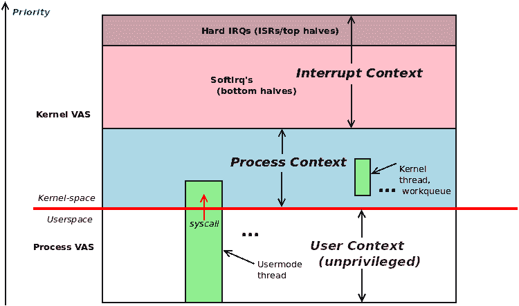
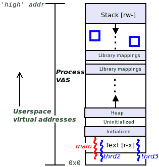
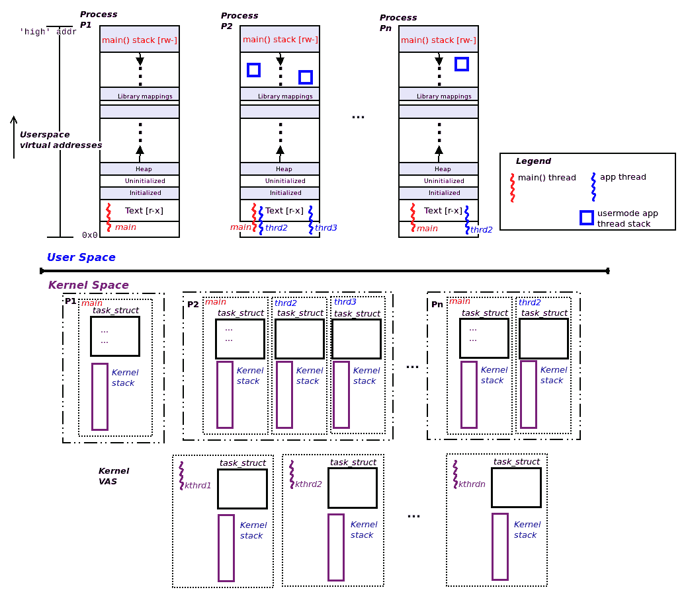
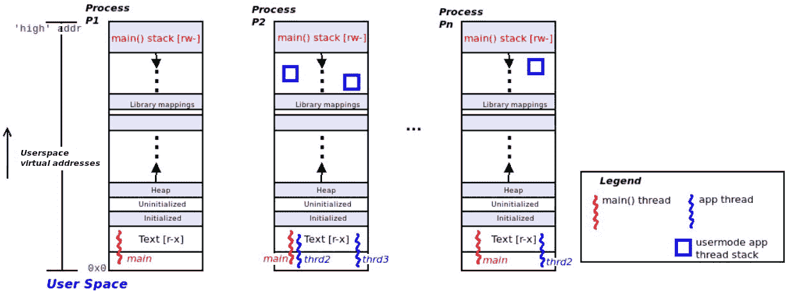
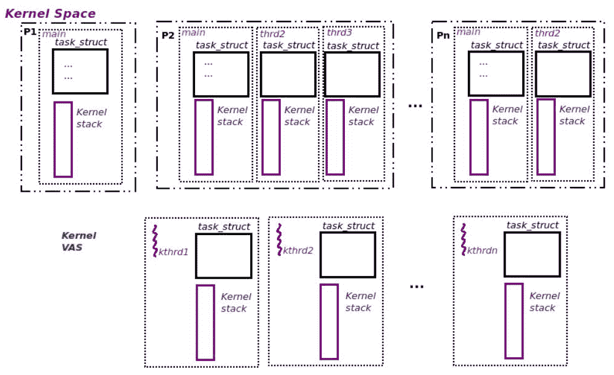
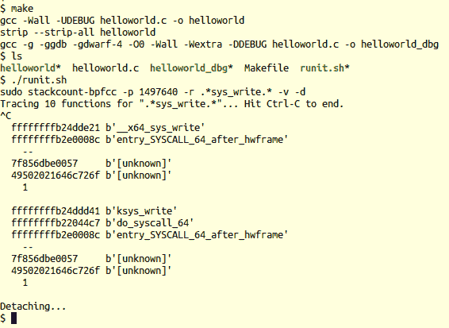
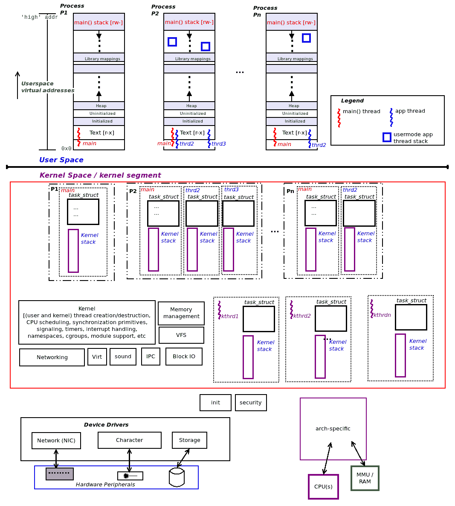
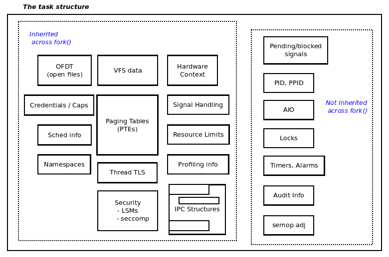
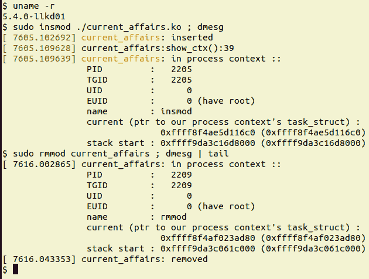
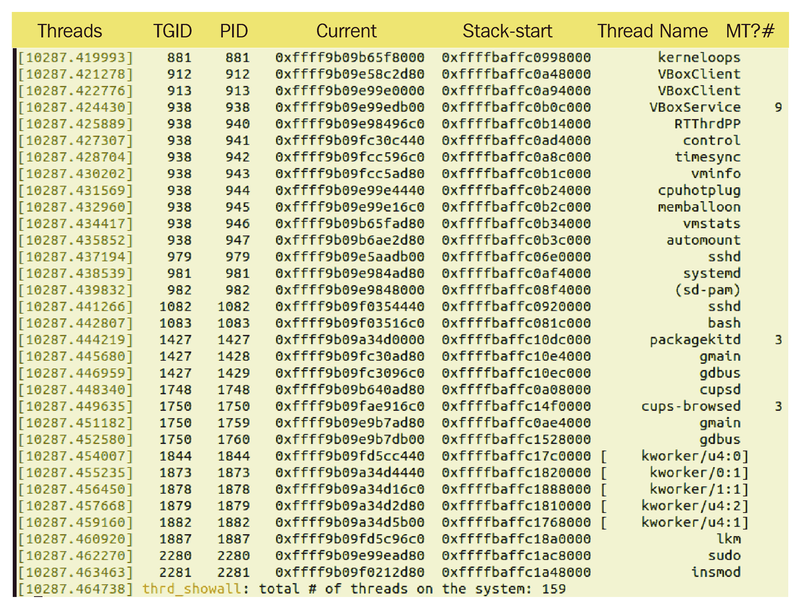

# 第六章：内核内部基础知识-进程和线程

内核内部，特别是与内存管理有关的部分，是一个广阔而复杂的主题。在本书中，我们并不打算深入研究内核和内存内部的细节。同时，我希望为像你这样的新手内核或设备驱动程序开发人员提供足够的，绝对必要的背景知识，以成功地解决理解内核架构的关键主题，包括进程、线程及其堆栈的管理。您还将能够正确高效地管理动态内核内存（重点是使用可加载内核模块（LKM）框架编写内核或驱动程序代码）。作为一个附带的好处，掌握了这些知识，你会发现自己在调试用户空间和内核空间代码方面变得更加熟练。

我将基本内部讨论分为两章，这一章和下一章。本章涵盖了 Linux 内核内部架构的关键方面，特别是关于内核内部如何管理进程和线程。下一章将专注于内存管理内部，这是理解和使用 Linux 内核的另一个关键方面。当然，事实上，所有这些事情并不真正在一两章中涵盖，而是分布在本书中（例如，有关进程/线程的 CPU 调度的详细信息将在后面的章节中找到；内存内部，硬件中断，同步等等也是如此）。

简而言之，本章涵盖了以下主题：

+   理解进程和中断上下文

+   理解进程 VAS 的基础知识（虚拟地址空间）

+   组织进程、线程及其堆栈-用户空间和内核空间

+   理解和访问内核任务结构

+   通过当前任务结构进行工作

+   遍历内核的任务列表

# 技术要求

我假设你已经阅读了第一章，“内核工作空间设置”，并已经适当地准备了运行 Ubuntu 18.04 LTS（或更高版本）的虚拟机，并安装了所有必需的软件包。如果没有，我建议你先这样做。

为了充分利用本书，我强烈建议你首先设置好工作环境，包括克隆本书的 GitHub 代码库（在这里找到：[`github.com/PacktPublishing/Linux-Kernel-Programming`](https://github.com/PacktPublishing/Linux-Kernel-Programming)），并且动手实践。

我假设你已经熟悉基本的虚拟内存概念，用户模式进程的虚拟地址空间（VAS）布局，堆栈等。尽管如此，我们会在接下来的“理解进程 VAS 的基础知识”部分中花几页来解释这些基础知识。

# 理解进程和中断上下文

在第四章，“编写你的第一个内核模块-LKMs，第一部分”，我们介绍了一个简短的名为“内核架构 I”的部分（如果你还没有阅读，我建议你在继续之前先阅读）。我们现在将扩展这个讨论。

重要的是要理解，大多数现代操作系统都是**单片式**设计。单片式字面上意味着*单一的大块石头*。我们稍后会详细讨论这如何适用于我们喜爱的操作系统！现在，我们将单片式理解为这样：当一个进程或线程发出系统调用时，它切换到（特权）内核模式并执行内核代码，并可能处理内核数据。是的，没有内核或内核线程代表它执行代码；进程（或线程）*本身*执行内核代码。因此，我们说内核代码在用户空间进程或线程的上下文中执行 - 我们称之为**进程上下文**。想想看，内核的重要部分正是以这种方式执行的，包括设备驱动程序的大部分代码。

好吧，你可能会问，既然你理解了这一点，除了进程上下文之外，内核代码还可以以什么其他方式执行？还有另一种方式：当硬件中断（来自外围设备 - 键盘、网络卡、磁盘等）触发时，CPU 的控制单元保存当前上下文，并立即重新定位 CPU 以运行中断处理程序的代码（**中断服务例程**—**ISR**）。现在，这段代码也在内核（特权）模式下运行 - 实际上，这是另一种异步切换到内核模式的方式！许多设备驱动程序的中断代码路径就是这样执行的；我们说以这种方式执行的内核代码处于**中断上下文**中。

因此，任何一段内核代码都是在两种上下文中的一种中进入并执行的：

+   **进程上下文**：内核从系统调用或处理器*异常*（如页面错误）中进入，并执行内核代码，处理内核数据；这是同步的（自上而下）。

+   **中断上下文**：内核从外围芯片的硬件中断进入，并执行内核代码，处理内核数据；这是异步的（自下而上）。

*图 6.1*显示了概念视图：用户模式进程和线程在非特权用户上下文中执行；用户模式线程可以通过发出*系统调用*切换到特权内核模式。该图还显示了纯*内核线程*也存在于 Linux 中；它们与用户模式线程非常相似，关键区别在于它们只在内核空间中执行；它们甚至不能*看到*用户 VAS。通过系统调用（或处理器异常）同步切换到内核模式后，任务现在在*进程上下文*中运行内核代码。（内核线程也在进程上下文中运行内核代码。）然而，硬件中断是另一回事 - 它们导致执行异步进入内核；它们执行的代码（通常是设备驱动程序的中断处理程序）运行在所谓的*中断上下文*中。

*图 6.1*显示了更多细节 - 中断上下文的上半部分、下半部分、内核线程和工作队列；我们请求您耐心等待，我们将在后面的章节中涵盖所有这些内容以及更多内容：



图 6.1 - 概念图显示了非特权用户模式执行和特权内核模式执行，同时具有进程和中断上下文

在本书的后面，我们将向您展示如何准确检查您的内核代码当前正在运行的*上下文*。继续阅读！

# 理解进程虚拟地址空间的基础

虚拟内存的一个基本“规则”是：所有可寻址的内存都在一个盒子里；也就是说，它是*沙盒*的。我们把这个“盒子”看作*进程镜像*或*进程*VAS。禁止看盒子外面的东西。

在这里，我们只提供了进程用户虚拟地址空间的快速概述。有关详细信息，请参阅本章末尾的*进一步阅读*部分。

用户虚拟地址空间被划分为称为*段*或更专业的*映射*的同质内存区域。每个 Linux 进程至少有这些映射（或段）：



图 6.2 - 进程 VAS

让我们快速了解一下这些段或映射的简要情况：

+   **文本段**：这是存储机器代码的地方；静态（模式：`r-x`）。

+   **数据段**：全局和静态数据变量存储在这里（模式：`rw-`）。它内部分为三个不同的段：

+   **初始化数据段**：预初始化的变量存储在这里；静态。

+   **未初始化数据段**：未初始化的变量存储在这里（在运行时自动初始化为`0`；这个区域有时被称为*bss*）；静态。

+   **堆段**：内存分配和释放的*库 API*（熟悉的`malloc(3)`系列例程）从这里获取内存。这也不完全正确。在现代系统上，只有低于`MMAP_THRESHOLD`（默认为 128 KB）的`malloc()`实例从堆中获取内存。任何更高的内存都将作为进程 VAS 中的一个单独的“映射”分配（通过强大的`mmap(2)`系统调用）。它是一个动态段（可以增长/缩小）。堆上的最后一个合法引用位置被称为*程序断点*。

+   **库（文本，数据）**：所有进程动态链接的共享库都被映射到进程 VAS 中（在运行时，通过加载器）（模式：`r-x`/`rw-`）。

+   **堆栈**：使用**后进先出**（**LIFO**）语义的内存区域；堆栈用于*实现高级语言的函数调用*机制。它包括参数传递、局部变量实例化（和销毁）以及返回值传播。它是一个动态段。在所有现代处理器上（包括 x86 和 ARM 系列），*堆栈向较低地址“增长”*（称为完全降序堆栈）。每次调用函数时，都会分配并初始化一个*堆栈帧*；堆栈帧的精确布局非常依赖于 CPU（你必须参考相应的 CPU**应用程序二进制接口**（**ABI**）文档；参见*进一步阅读*部分的参考资料）。SP 寄存器（或等效寄存器）始终指向当前帧，堆栈的顶部；由于堆栈向较低（虚拟）地址增长，堆栈的顶部实际上是最低（虚拟）地址！这是不直观但却是真实的（模式：`rw-`）。

当然，你会理解进程必须包含至少一个*执行线程*（线程是进程内的执行路径）；那个线程通常是`main()`函数。在*图 6.2*中，我们举例展示了三个执行线程 - `main`，`thrd2`和`thrd3`。*此外，如预期的那样，每个线程在 VAS 中共享一切*，*除了堆栈；正如你所知，每个线程都有自己的私有堆栈。`main`的堆栈显示在进程（用户）VAS 的顶部；`thrd2`和`thrd3`线程的堆栈显示在库映射和`main`的堆栈之间，并用两个（蓝色）方块表示。

我设计并实现了一个我认为非常有用的学习/教学和调试实用程序，名为***procmap***（[`github.com/kaiwan/procmap`](https://github.com/kaiwan/procmap)）；它是一个基于控制台的进程 VAS 可视化实用程序。它实际上可以向你展示进程 VAS（非常详细）；我们将在下一章开始使用它。不过，这并不妨碍你立即尝试它；在你的 Linux 系统上克隆它并试用一下。

现在你已经了解了进程 VAS 的基础知识，是时候深入了解有关进程 VAS、用户和内核地址空间以及它们的线程和堆栈的内核内部了。

# 组织进程、线程及其堆栈 - 用户和内核空间

传统的**UNIX 进程模型** - *一切都是进程；如果不是进程，就是文件* - 有很多优点。事实上，它仍然是在近五十年的时间跨度之后操作系统遵循的*模型*，这充分证明了这一点。当然，现在**线程**很重要；*线程只是进程内的执行路径*。线程*共享*所有*进程资源，包括用户 VAS，*除了堆栈。*每个线程都有自己的私有堆栈区域（这是完全合理的；否则，线程如何能够真正并行运行，因为堆栈保存了执行上下文）。

我们关注*线程*而不是进程的另一个原因在第十章中更清楚地阐明，*CPU 调度器，第一部分**。*现在，我们只能说：*线程而不是进程是内核可调度实体*（也称为 KSE）。这实际上是 Linux 操作系统架构的一个关键方面的结果。在 Linux 操作系统上，*每个线程 - 包括内核线程 - 都映射到一个称为**任务结构**的内核元数据结构。任务结构（也称为*进程描述符*）本质上是一个大型的内核数据结构，内核将其用作属性结构。对于每个*线程*，内核维护一个相应的*任务结构*（见*图 6.3*，不用担心，我们将在接下来的部分中更多地介绍任务结构）。

下一个真正关键的要点是：*每个特权级别受 CPU 支持的线程都需要一个堆栈。*在现代操作系统（如 Linux）中，我们支持两个特权级别 - *非特权用户模式（或用户空间）和特权内核模式（或内核空间）*。因此，在 Linux 上，*每个用户空间线程都有两个堆栈*：

+   用户空间堆栈：当线程执行用户模式代码路径时，此堆栈处于活动状态。

+   内核空间堆栈：当线程切换到内核模式（通过系统调用或处理器异常）并执行内核代码路径（在进程上下文中）时，此堆栈处于活动状态。

当然，每个好的规则都有例外：*内核线程*是纯粹存在于内核中的线程，因此只能“看到”内核（虚拟）地址空间；它们无法“看到”用户空间。因此，它们只会执行内核空间代码路径，因此它们只有**一个堆栈** - 内核空间堆栈。

*图 6.3*将地址空间分为两部分 - 用户空间和内核空间。在图的上半部分 - 用户空间 - 您可以看到几个进程及其*用户 VASes*。在图的底部 - 内核空间 - 您可以看到，对于每个用户模式线程，都有一个内核元数据结构（struct `task_struct`，我们稍后将详细介绍）和该线程的内核模式堆栈。此外，我们还看到（在底部）三个内核线程（标记为`kthrd1`，`kthrd2`和`kthrdn`）；如预期的那样，它们也有一个表示其内部（属性）的`task_struct`元数据结构和一个内核模式堆栈：



图 6.3 - 进程、线程、堆栈和任务结构 - 用户和内核 VAS

为了帮助使这个讨论更具实际意义，让我们执行一个简单的 Bash 脚本（`ch6/countem.sh`），它会计算当前存活的进程和线程的数量。我在我的本机 x86_64 Ubuntu 18.04 LTS 上执行了这个操作；请参阅以下结果输出：

```
$ cd <booksrc>/ch6
$ ./countem.sh
System release info:
Distributor ID: Ubuntu
Description:    Ubuntu 18.04.4 LTS
Release:        18.04
Codename:       bionic

Total # of processes alive               =       362
Total # of threads alive                 =      1234
Total # of kernel threads alive          =       181
Thus, total # of user-mode threads alive =      1053
$ 
```

我将让您查看此简单脚本的代码：`ch6/countem.sh`。研究前面的输出并理解它。当然，您会意识到这是某个时间点的*快照*。它可能会发生变化。

在接下来的部分中，我们将讨论分成两部分（对应于两个地址空间） - 用户空间中图 6.3 中所见的内容和内核空间中图 6.3 中所见的内容。让我们从用户空间组件开始。

## 用户空间组织

关于我们在前面部分运行的`countem.sh` Bash 脚本，我们现在将对其进行分解并讨论一些关键点，目前我们只限于 VAS 的*用户空间部分*。请注意仔细阅读和理解这一点（我们在下面的讨论中提到的数字是指我们在前面部分运行`countem.sh`脚本的示例）。为了更好地理解，我在这里放置了图表的用户空间部分：



*图 6.4* - 图 6.3 中整体图片的用户空间部分

在这里（图 6.4）你可以看到三个单独的进程。每个进程至少有一个执行线程（`main()`线程）。在前面的示例中，我们展示了三个进程`P1`，`P2`和`Pn`，分别包含一个，三个和两个线程，包括`main()`。从我们之前在`countem.sh`脚本的示例运行中，`Pn`将有*n*=362。

请注意，这些图表纯粹是概念性的。实际上，具有 PID 2 的“进程”通常是一个名为`kthreadd`的单线程内核线程。

每个进程由几个段（技术上是映射）组成。广义上，用户模式段（映射）如下：

+   **文本**：代码; `r-x`

+   **数据段**：`rw-`；包括三个不同的映射 - 初始化数据段，未初始化数据段（或`bss`），以及一个“向上增长”的`heap`

+   **库映射**：对于进程动态链接到的每个共享库的文本和数据

+   **向下增长的堆栈**

关于这些堆栈，我们从之前的示例运行中看到系统上目前有 1,053 个用户模式线程。这意味着也有 1,053 个用户空间堆栈，因为每个用户模式线程都会存在一个用户模式堆栈。关于这些用户空间线程堆栈，我们可以说以下内容：

+   每个用户空间堆栈始终存在于`main()`线程，它将位于用户 VAS 的顶部 - 高端附近; 如果进程是单线程的（只有一个`main()`线程），那么它将只有一个用户模式堆栈; *图 6.4*中的`P1`进程显示了这种情况。

+   如果进程是多线程的，它将对每个活动的线程（包括`main()`）有一个用户模式线程堆栈；*图 6.4*中的进程`P2`和`Pn`说明了这种情况。这些堆栈要么在调用`fork(2)`（对于`main()`）时分配，要么在进程内的`pthread_create(3)`（对于进程内的其他线程）时分配，这将导致内核中的进程上下文中执行这段代码路径：

```
sys_fork() --> do_fork() --> _do_fork()
```

+   顺便说一下，在 Linux 上，`pthread_create(3)`库 API 调用（非常特定于 Linux）`clone(2)`系统调用；这个系统调用最终调用`_do_fork()`；传递的`clone_flags`参数告诉内核如何创建“自定义进程”；换句话说，一个线程！

+   这些用户空间堆栈当然是动态的；它们可以增长/缩小到堆栈大小资源限制（`RLIMIT_STACK`，通常为 8 MB；您可以使用`prlimit(1)`实用程序查找它）。

在看到并理解了用户空间部分之后，现在让我们深入了解内核空间的情况。

## 内核空间组织

继续我们关于在前面部分运行的`countem.sh` Bash 脚本的讨论，我们现在将对其进行分解并讨论一些关键点，目前我们只限于 VAS 的*内核空间部分*。请注意仔细阅读和理解这一点（在阅读我们在前面部分运行的`countem.sh`脚本时输出的数字）。为了更好地理解，我在这里放置了图表的内核空间部分（图 6.5）：



*图 6.5* - 图 6.3 中整体图片的内核空间部分

再次，从我们之前的样本运行中，您可以看到系统上目前有 1,053 个用户模式线程和 181 个内核线程。这导致了总共 1,234 个内核空间堆栈。为什么？如前所述，每个用户模式线程都有两个堆栈-一个用户模式堆栈和一个内核模式堆栈。因此，我们将为每个用户模式线程有 1,053 个内核模式堆栈，以及为（纯粹的）内核线程有 181 个内核模式堆栈（请记住，内核线程只有一个内核模式堆栈；它们根本无法“看到”用户空间）。让我们列出内核模式堆栈的一些特征：

+   每个应用程序（用户模式）线程都将有一个内核模式堆栈，包括`main()`。

+   **内核模式堆栈的大小是*固定的（静态的）且非常小***。从实际角度来看，它们在 32 位操作系统上的大小为 2 页，在 64 位操作系统上的大小为 4 页（每页通常为 4 KB）。

+   它们在线程创建时分配（通常归结为`_do_fork()`）。

再次，让我们对此非常清楚：每个用户模式线程都有两个堆栈-一个用户模式堆栈和一个内核模式堆栈。这一规则的例外是内核线程；它们只有一个内核模式堆栈（因为它们没有用户映射，因此没有用户空间“段”）。在*图 6.5*的下部，我们展示了三个内核线程- `kthrd1`，`kthrd2`和`kthrdn`（在我们之前的样本运行中，`kthrdn`将为*n*=181）。此外，每个内核线程在创建时都有一个任务结构和一个内核模式堆栈分配给它。

内核模式堆栈在大多数方面与用户模式堆栈相似-每次调用函数时，都会设置一个*堆栈帧*（帧布局特定于体系结构，并且是 CPU ABI 文档的一部分；有关这些细节的更多信息，请参见*进一步阅读*部分）；CPU 有一个寄存器来跟踪堆栈的当前位置（通常称为**堆栈指针**（**SP**）），堆栈“向*较低*虚拟地址增长”。但是，与动态用户模式堆栈不同，*内核模式堆栈的大小是固定的且较小*。

对于内核/驱动程序开发人员来说，非常重要的一个含义是内核模式堆栈的大小相当小（两页或四页），因此要非常小心，不要通过执行堆栈密集型工作（如递归）来溢出内核堆栈。

存在一个内核可配置项，可以在编译时警告您关于高（内核）堆栈使用情况；以下是来自`lib/Kconfig.debug`文件的文本：

`CONFIG_FRAME_WARN：`

“告诉 gcc 在构建时警告堆栈帧大于此值。”

“设置得太低会导致很多警告。”

“将其设置为 0 会禁用警告。”

“需要 gcc 4.4”

### 总结当前情况

好的，现在让我们总结一下我们从`countem.sh`脚本的先前样本运行中学到的内容和发现的内容：

+   **任务结构**：

+   每个活动的线程（用户或内核）在内核中都有一个相应的任务结构（`struct task_struct`）；这是内核跟踪它的方式，所有属性都存储在这里（您将在*理解和访问内核任务结构*部分中了解更多）。

+   关于我们`ch6/countem.sh`脚本的样本运行：

+   由于系统上有总共 1,234 个线程（用户和内核），这意味着内核内存中有 1,234 个*任务（元数据）结构*（在代码中为`struct task_struct`），我们可以说以下内容：

+   1,053 个这些任务结构代表用户线程。

+   剩下的 181 个任务结构代表内核线程。

+   **堆栈**：

+   每个用户空间线程都有两个堆栈：

+   当线程执行用户模式代码路径时，会有一个用户模式堆栈。

+   内核模式堆栈（在线程执行内核模式代码路径时发挥作用）

+   纯内核线程只有一个堆栈-内核模式堆栈

+   关于我们`ch6/countem.sh`脚本的样本运行：

+   1,053 个用户空间堆栈（在用户空间）。

+   1,053 个内核空间堆栈（在内核内存中）。

+   181 个内核空间堆栈（对应活动的 181 个内核线程）。

+   这总共有 1053+1053+181 = 2,287 个堆栈！

在讨论用户和内核模式堆栈时，我们还应该简要提到这一点：许多体系结构（包括 x86 和 ARM64）支持为*中断处理*支持单独的每 CPU 堆栈。当外部硬件中断发生时，CPU 的控制单元立即将控制重新定向到最终的中断处理代码（可能在设备驱动程序内）。单独的每 CPU 中断堆栈用于保存中断代码路径的堆栈帧；这有助于避免对被中断的进程/线程的现有（小）内核模式堆栈施加太大压力。

好的，现在你了解了进程/线程及其堆栈的用户空间和内核空间的整体组织，让我们继续看看你如何实际“查看”内核和用户空间堆栈的内容。除了用于学习目的外，这些知识还可以在调试情况下极大地帮助你。

## 查看用户和内核堆栈

*堆栈*通常是调试会话的关键。当然，堆栈保存了进程或线程的*当前执行上下文* – 它现在在哪里 – 这使我们能够推断它在做什么。更重要的是，能够看到和解释线程的*调用堆栈（或调用链/回溯）*至关重要，这使我们能够准确理解我们是如何到达这里的。所有这些宝贵的信息都驻留在堆栈中。但等等，每个线程都有两个堆栈 – 用户空间和内核空间堆栈。我们如何查看它们呢？

在这里，我们将展示查看给定进程或线程的内核和用户模式堆栈的两种广泛方法，首先是通过“传统”方法，然后是更近代的方法（通过[e]BPF）。请继续阅读。

### 查看堆栈的传统方法

让我们首先学习使用我们将称之为“传统”方法来查看给定进程或线程的内核和用户模式堆栈。让我们从内核模式堆栈开始。

#### 查看给定线程或进程的内核空间堆栈

好消息；这真的很容易。Linux 内核通过通常的机制使堆栈可见，以将内核内部暴露给用户空间 – 强大的 `proc` 文件系统接口。只需查看 `/proc/<pid>/stack`。

所以，好吧，让我们查看一下我们 *Bash* 进程的内核模式堆栈。假设在我们的 x86_64 Ubuntu 客户机上（运行 5.4 内核），我们的 Bash 进程的 PID 是 `3085`：

在现代内核上，为了避免*信息泄漏*，查看进程或线程的内核模式堆栈需要*root*访问权限作为安全要求。

```
$ sudo cat /proc/3085/stack
[<0>] do_wait+0x1cb/0x230
[<0>] kernel_wait4+0x89/0x130
[<0>] __do_sys_wait4+0x95/0xa0
[<0>] __x64_sys_wait4+0x1e/0x20
[<0>] do_syscall_64+0x5a/0x120
[<0>] entry_SYSCALL_64_after_hwframe+0x44/0xa9
$ 
```

在前面的输出中，每行代表堆栈上的一个*调用帧*。为了帮助解释内核堆栈回溯，了解以下几点是值得的：

+   应该以自下而上的方式阅读（从底部到顶部）。

+   每行输出代表一个 *调用帧*；实际上是调用链中的一个函数。

+   出现为 `??` 的函数名意味着内核无法可靠地解释堆栈。忽略它，这是内核说这是一个无效的堆栈帧（留下的“闪烁”）；内核回溯代码通常是正确的！

+   在 Linux 上，任何 `foo()` 系统调用通常会成为内核中的 `SyS_foo()` 函数。而且，很多时候但并非总是，`SyS_foo()` 是一个调用“真正”代码 `do_foo()` 的包装器。一个细节：在内核代码中，你可能会看到 `SYSCALL_DEFINEn(foo, ...)` 这种类型的宏；这个宏会变成 `SyS_foo()` 例程；附加的数字 `n` 在 [0, 6] 范围内；它是从用户空间传递给内核的系统调用的参数数量。

现在再看一下前面的输出；应该很清楚：我们的 *Bash* 进程目前正在执行 `do_wait()` 函数；它是通过系统调用 `wait4()` 这个系统调用到达那里的！这是完全正确的；shell 通过 fork 出一个子进程，然后通过 `wait4(2)` 系统调用等待其终止。

好奇的读者（您！）应该注意，在前面片段中显示的每个堆栈帧的最左列中的`[<0>]`是该函数的*文本（代码）地址*的占位符。出于*安全*原因（防止信息泄漏），它在现代内核上被清零。 （与内核和进程布局相关的另一个安全措施在第七章中讨论，*内存管理内部-基本知识*，在*KASLR*和*用户模式 ASLR*部分中讨论了*随机化内存布局*）。

#### 查看给定线程或进程的用户空间堆栈

具有讽刺意味的是，在典型的 Linux 发行版上查看进程或线程的*用户空间堆栈*似乎更难（与我们刚刚在前一节中看到的查看内核模式堆栈相反）。有一个实用程序可以做到这一点：`gstack(1)`。实际上，它只是一个简单的包装器，通过批处理模式调用`gdb(1)`，让`gdb`调用它的`backtrace`命令。

很遗憾，在 Ubuntu（至少是 18.04 LTS）上似乎存在一个问题；在任何本地软件包中都找不到`gstack`程序。（Ubuntu 确实有一个`pstack(1)`实用程序，但至少在我的测试 VM 上，它无法正常工作。）一个解决方法是直接使用`gdb`（您可以始终`attach <PID>`并发出`[thread apply all] bt`命令来查看用户模式堆栈）。

然而，在我的 x86_64 Fedora 29 客户系统上，`gstack(1)`实用程序安装和运行良好；一个示例如下（我们的 Bash 进程的 PID 恰好是`12696`）：

```
$ gstack 12696
#0 0x00007fa6f60754eb in waitpid () from /lib64/libc.so.6
#1 0x0000556f26c03629 in ?? ()
#2 0x0000556f26c04cc3 in wait_for ()
#3 0x0000556f26bf375c in execute_command_internal ()
#4 0x0000556f26bf39b6 in execute_command ()
#5 0x0000556f26bdb389 in reader_loop ()
#6 0x0000556f26bd9b69 in main ()
$ 
```

同样，每行代表一个调用帧。从下到上阅读。显然，*Bash*执行一个命令，最终调用`waitpid()`系统调用（实际上，在现代 Linux 系统上，`waitpid()`只是对实际`wait4(2)`系统调用的`glibc`包装器！再次，简单地忽略任何标记为`??`的调用帧）。

能够窥视内核和用户空间堆栈（如前面的片段所示），并使用包括`strace(1)`和`ltrace(1)`在内的实用程序分别跟踪进程/线程的系统和库调用，可以在调试时提供巨大的帮助！不要忽视它们。

现在，对于这个问题的“现代”方法。

### [e]BPF-查看两个堆栈的现代方法

现在-更加令人兴奋！-让我们学习（基本知识）使用一种强大的现代方法，利用（在撰写本文时）非常新的技术-称为**扩展伯克利数据包过滤器**（**eBPF**；或简称 BPF。我们在第一章中提到过[e]BPF 项目，*内核工作空间设置*，在*其他有用的项目*部分下。）旧的 BPF 已经存在很长时间，并且已经用于网络数据包跟踪；[e]BPF 是一个最近的创新，仅在 4.x Linux 内核中可用（这当然意味着您需要在 4.x 或更近的 Linux 系统上使用这种方法）。

直接使用底层内核级 BPF 字节码技术（极其）难以做到；因此，好消息是有几个易于使用的前端（工具和脚本）可以使用这项技术。（显示当前 BCC 性能分析工具的图表可以在[`www.brendangregg.com/BPF/bcc_tracing_tools_early2019.png`](http://www.brendangregg.com/BPF/bcc_tracing_tools_early2019.png)找到；[e]BPF 前端的列表可以在[`www.brendangregg.com/ebpf.html#frontends`](http://www.brendangregg.com/ebpf.html#frontends)找到；这些链接来自*Brendan Gregg*的博客。）在前端中，**BCC**和**bpftrace**被认为非常有用。在这里，我们将简单地使用一个名为`stackcount`的 BCC 工具进行快速演示（至少在 Ubuntu 上它的名称是`stackcount-bpfcc(8)`）。另一个优势是使用这个工具可以同时看到内核和用户模式堆栈；不需要单独的工具。

您可以通过阅读此处的安装说明在*主机*Linux 发行版上安装 BCC 工具：[`github.com/iovisor/bcc/blob/master/INSTALL.md`](https://github.com/iovisor/bcc/blob/master/INSTALL.md)。为什么不能在我们的 Linux 虚拟机上安装？您可以在运行发行版内核（例如 Ubuntu 或 Fedora 提供的内核）时安装。原因是：BCC 工具集的安装包括`linux-headers-$(uname -r)`包的安装；后者仅适用于发行版内核（而不适用于我们在虚拟机上运行的自定义 5.4 内核）。

在以下示例中，我们使用`stackcount` BCC 工具（在我的 x86_64 Ubuntu 18.04 LTS 主机系统上）来查找我们的 VirtualBox Fedora31 客户机进程的堆栈（毕竟，虚拟机是主机系统上的一个进程！）。对于这个工具，您必须指定一个感兴趣的函数（或函数）（有趣的是，您可以在这样做时指定用户空间或内核空间函数，并且还可以使用“通配符”或正则表达式！）；只有在调用这些函数时，堆栈才会被跟踪和报告。例如，我们选择包含名称`malloc`的任何函数：

```
$ sudo stackcount-bpfcc -p 29819 -r ".*malloc.*" -v -d
Tracing 73 functions for ".*malloc.*"... Hit Ctrl-C to end.
^C
 ffffffff99a56811 __kmalloc_reserve.isra.43
 ffffffff99a59436 alloc_skb_with_frags
 ffffffff99a51f72 sock_alloc_send_pskb
 ffffffff99b2e986 unix_stream_sendmsg
 ffffffff99a4d43e sock_sendmsg
 ffffffff99a4d4e3 sock_write_iter
 ffffffff9947f59a do_iter_readv_writev
 ffffffff99480cf6 do_iter_write
 ffffffff99480ed8 vfs_writev
 ffffffff99480fb8 do_writev
 ffffffff99482810 sys_writev
 ffffffff99203bb3 do_syscall_64
 ffffffff99c00081 entry_SYSCALL_64_after_hwframe
   --
 7fd0cc31b6e7     __GI___writev
 12bc             [unknown]
 600000195        [unknown]
 1
[...]
```

[e]BPF 程序可能由于合并到主线 5.4 内核的新*内核锁定*功能而失败（尽管默认情况下已禁用）。这是一个**Linux 安全模块**（**LSM**），它在 Linux 系统上启用了额外的“硬”安全级别。当然，安全性是一把双刃剑；拥有一个非常安全的系统意味着某些事情将无法按预期工作，其中包括一些 BPF 程序。有关内核锁定的更多信息，请参阅*进一步阅读*部分。

传递的`-d`选项开关打印分隔符`--`；它表示进程的内核模式和用户模式堆栈之间的边界。（不幸的是，由于大多数生产用户模式应用程序将剥离其符号信息，因此大多数用户模式堆栈帧只会显示为“`[unknown]`”。）至少在这个系统上，内核堆栈帧非常清晰；甚至打印了所讨论的文本（代码）函数的虚拟地址。 （为了帮助您更好地理解堆栈跟踪：首先，从下到上阅读它；其次，如前所述，在 Linux 上，任何`foo()`系统调用通常会成为内核中的`SyS_foo()`函数，并且通常`SyS_foo()`是`do_foo()`的包装函数。）

请注意，`stackcount-bpfcc`工具仅适用于 Linux 4.6+，并且需要 root 访问权限。有关详细信息，请参阅其手册页。

作为第二个更简单的示例，我们编写一个简单的*Hello, world*程序（有一个无限循环的警告，以便我们可以捕获发生的`write(2)`系统调用），启用符号信息构建它（也就是说，使用`gcc -g ...`），并使用一个简单的 Bash 脚本执行与以前相同的工作：跟踪内核和用户模式堆栈的执行过程。（您将在`ch6/ebpf_stacktrace_eg/`中找到代码。）显示示例运行的屏幕截图（好吧，这里有一个例外：我在 x86_64 Ubuntu *20.04* LTS 主机上运行了脚本）如下：



图 6.6 - 使用 stackcount-bpfcc BCC 工具对我们的 Hello, world 进程的内核和用户模式堆栈进行跟踪的示例运行

我们在这里只是浅尝辄止；BPF 工具，如 BCC 和`bpftrace`，确实是在 Linux 操作系统上进行系统、应用程序跟踪和性能分析的现代、强大方法。确实要花时间学习如何使用这些强大的工具！（每个 BCC 工具都有专门的手册*带有示例*。）我们建议您参考*进一步阅读*部分，了解有关 BPF、BCC 和`bpftrace`的链接。

让我们通过放大镜来总结本节，看看到目前为止您学到了什么！

## 进程 VAS 的一览无余

在我们结束本节之前，重要的是退后一步，看看每个进程的完整 VAS，以及它对整个系统的外观；换句话说，放大并查看完整系统地址空间的“一览无余”。这就是我们尝试用以下相当大而详细的图表（*图 6.7*）来做的。

对于那些阅读本书的纸质副本的人，我强烈建议您从此 PDF 文档中以全彩色查看本书的图表`static.packt-cdn.com/downloads/9781789953435_ColorImages.pdf`。

除了您刚刚了解和看到的内容 - 进程用户空间段、（用户和内核）线程和内核模式堆栈 - 不要忘记内核中还有许多其他元数据：任务结构、内核线程、内存描述符元数据结构等等。它们都是*内核 VAS*的一部分，通常被称为*内核段*。内核段中除了任务和堆栈之外还有更多内容。它还包含（显然！）静态内核（核心）代码和数据，实际上，内核的所有主要（和次要）*子系统*，特定于架构的代码等等（我们在第四章*，编写您的第一个内核模块 - LKMs 第一部分*中讨论过）。

正如刚才提到的，以下图表试图总结并展示所有（或大部分）这些信息：



图 6.7 - 用户和内核 VAS 的进程、线程、堆栈和任务结构的一览无余

哇，这是相当复杂的事情，不是吗？在前面图表中的红色框圈出了*核心内核代码和数据* - 主要的内核子系统，并显示了任务结构和内核模式堆栈。其余部分被认为是非核心内容；这包括设备驱动程序。（特定于架构的代码可以被认为是核心代码；我们只是在这里单独显示它。）此外，不要让前面的信息使您感到不知所措；只需专注于我们现在关注的内容 - 进程、线程、它们的任务结构和堆栈。如果您仍然不清楚，请务必重新阅读前面的材料。

现在，让我们继续真正理解并学习如何引用每个活动线程的关键或“根”元数据结构 - 任务结构。

# 理解和访问内核任务结构

正如您现在所了解的，每个用户空间和内核空间线程在 Linux 内核中都由一个包含其所有属性的元数据结构表示 - 任务结构。*任务结构*在内核代码中表示为`include/linux/sched.h:struct task_struct`。

不幸的是，它经常被称为“进程描述符”，导致了无尽的混乱！幸运的是，短语*任务结构*要好得多；它代表了一个可运行的任务，实际上是一个*线程*。

因此，在 Linux 设计中，每个进程由一个或多个线程组成，*每个线程映射到一个称为任务结构的内核数据结构*（`struct task_struct`）。

任务结构是线程的“根”元数据结构 - 它封装了操作系统为该线程所需的所有信息。这包括关于其内存（段、分页表、使用信息等）、CPU 调度详细信息、当前打开的任何文件、凭据、能力位掩码、定时器、锁定、异步 I/O（AIO）上下文、硬件上下文、信令、IPC 对象、资源限制、（可选）审计、安全和分析信息等等。

*图 6.8*是 Linux 内核*任务结构*的概念表示，以及它包含的大部分信息（元数据）。



图 6.8 - Linux 内核任务结构：struct task_struct

从*图 6.8*可以看出，任务结构包含有关系统上每个单个任务（进程/线程）的大量信息（再次强调：这也包括内核线程）。我们以图 6.8 中的分隔概念格式显示了此数据结构中封装的不同类型的属性。此外，可以看到，某些属性将被*继承*给子进程或线程在`fork(2)`（或`pthread_create(3)`）时；某些属性将不会被继承，而将仅仅被重置。（内核模式堆栈为

至少目前，可以说内核“了解”任务是进程还是线程。我们稍后将演示一个内核模块（`ch6/foreach/thrd_showall`），它将准确展示我们如何确定这一点（稍等，我们会到那里的！）。

现在让我们开始更详细地了解任务结构中一些更重要的成员；继续阅读！

在这里，我只打算让你对内核任务结构有一个“感觉”；我们现在不需要深入细节。在本书的后面部分，我们将根据需要深入研究特定领域。

## 查看任务结构

首先，回想一下任务结构本质上是进程或线程的“根”数据结构 - 它包含任务的所有属性（正如我们之前所见）。因此，它相当庞大；强大的`crash(8)`实用程序（用于分析 Linux 崩溃转储数据或调查活动系统）报告其在 x86_64 上的大小为 9,088 字节，`sizeof`操作符也是如此。

任务结构在`include/linux/sched.h`内核头文件中定义（这是一个相当关键的头文件）。在以下代码中，我们显示了它的定义，并且要注意我们只显示了其中的一些成员。（另外，像这样的`<<尖括号注释>>`用于非常简要地解释成员）：

```
// include/linux/sched.h
struct task_struct {
#ifdef CONFIG_THREAD_INFO_IN_TASK
    /*
     * For reasons of header soup (see current_thread_info()), this
     * must be the first element of task_struct.
     */
    struct thread_info      thread_info;   << important flags and status bits >>
#endif
    /* -1 unrunnable, 0 runnable, >0 stopped: */
    volatile long           state;
    [...]
    void                *stack; << the location of the kernel-mode stack >>
    [...]
    /* Current CPU: */
    unsigned int cpu;
    [...]
<< the members that follow are to do with CPU scheduling; some of them are discussed in Ch 9 & 10 on CPU Scheduling >>
    int on_rq;
    int prio;
    int static_prio;
    int normal_prio;
    unsigned int rt_priority;
    const struct sched_class *sched_class;
    struct sched_entity se;
    struct sched_rt_entity rt;
    [...]
```

在以下代码块中继续查看任务结构，查看与内存管理`(mm)`、PID 和 TGID 值、凭据结构、打开文件、信号处理等相关的成员。再次强调，不打算（全部）详细研究它们；在本章的后续部分以及可能在本书的其他章节中，我们将重新讨论它们：

```
    [...]
    struct mm_struct *mm;      << memory management info >>
    struct mm_struct *active_mm;
    [...]
    pid_t pid;      << task PID and TGID values; explained below >>
    pid_t tgid;
    [...]
    /* Context switch counts: */
    unsigned long nvcsw;
    unsigned long nivcsw;
    [...]
    /* Effective (overridable) subjective task credentials (COW): */
    const struct cred __rcu *cred;
    [...]
    char comm[TASK_COMM_LEN];             << task name >>
    [...]
     /* Open file information: */
    struct files_struct *files;      << pointer to the 'open files' ds >>
    [...]
     /* Signal handlers: */
    struct signal_struct *signal;
    struct sighand_struct *sighand;
    sigset_t blocked;
    sigset_t real_blocked;
    [...]
#ifdef CONFIG_VMAP_STACK
    struct vm_struct *stack_vm_area;
#endif
    [...]
#ifdef CONFIG_SECURITY
    /* Used by LSM modules for access restriction: */
    void *security;
#endif
    [...]
    /* CPU-specific state of this task: */
    struct thread_struct thread;       << task hardware context detail >>
    [...]
};
```

请注意，前述代码中的`struct task_struct`成员是根据 5.4.0 内核源代码显示的；在其他内核版本中，成员可能会发生变化！当然，毋庸置疑，整本书都是如此 - 所有代码/数据都是基于 5.4.0 LTS Linux 内核呈现的（将在 2025 年 12 月之前维护）。

好了，现在你对任务结构内的成员有了更好的了解，那么你如何访问它及其各个成员呢？继续阅读。

## 使用 current 访问任务结构

你会回忆，在前述`countem.sh`脚本的示例运行中（在*组织进程、线程及其堆栈 - 用户空间和内核空间*部分），我们发现系统上有总共 1,234 个线程（用户和内核）是活跃的。这意味着内核内存中将有 1,234 个任务结构对象。

它们需要以内核可以在需要时轻松访问它们的方式进行组织。因此，内核内存中的所有任务结构对象都被链接到一个称为**任务列表**的*循环双向链表*上。这种组织方式是为了使各种内核代码路径可以对它们进行迭代（通常是`procfs`代码等）。即使如此，请考虑这一点：当一个进程或线程在运行内核代码（在进程上下文中）时，它如何找出在内核内存中存在的数百或数千个`task_struct`中属于它的那个？这事实上是一个非平凡的任务。内核开发人员已经发展出一种方法来保证您可以找到代表当前运行内核代码的线程的特定任务结构。这是通过一个名为`current`的宏实现的。可以这样理解：

+   查找`current`会返回正在运行内核代码的线程的`task_struct`指针，换句话说，*当前在某个特定处理器核心上运行的进程上下文*。

+   `current`类似（但当然不完全相同）于面向对象语言中称为`this`指针的东西。

`current`宏的实现非常特定于体系结构。在这里，我们不深入研究这些令人讨厌的细节。可以说，实现经过精心设计，以便快速（通常通过*O(1)*算法）。例如，在一些具有许多通用寄存器的**精简指令集计算机**（**RISC**）体系结构上（例如 PowerPC 和 Aarch64 处理器），有一个寄存器专门用于保存`current`的值！

我建议您浏览内核源树并查看`current`的实现细节（在`arch/<arch>/asm/current.h`下）。在 ARM32 上，*O(1)*计算会产生结果；在 AArch64 和 PowerPC 上，它存储在寄存器中（因此查找速度非常快）。在 x86_64 架构中，实现使用`per-cpu` *变量*来保存`current`（避免使用昂贵的锁定）。在您的代码中包含`<linux/sched.h>`头文件是必需的，以包含`current`的定义。

我们可以使用`current`来解引用任务结构并从中获取信息；例如，可以按以下方式查找进程（或线程）PID 和名称：

```
#include <linux/sched.h>
current->pid, current->comm
```

在下一节中，您将看到一个完整的内核模块，它会遍历任务列表，并打印出它遇到的每个任务结构的一些细节。

## 确定上下文

正如您现在所知，内核代码在两种上下文中运行之一：

+   进程（或任务）上下文

+   中断（或原子）上下文

它们是互斥的-内核代码在任何给定时间点都在进程或原子/中断上下文中运行。

在编写内核或驱动程序代码时，通常需要首先弄清楚您正在处理的代码运行在*什么上下文*中。了解这一点的一种方法是使用以下宏：

```
#include <linux/preempt.h>
 in_task()
```

它返回一个布尔值：如果您的代码在进程（或任务）上下文中运行，则返回`True`，在这种情况下通常可以安全休眠；返回`False`意味着您处于某种原子或中断上下文中，这种情况下永远不安全休眠。

您可能已经遇到了`in_interrupt()`宏的用法；如果它返回`True`，则您的代码在中断上下文中，如果返回`False`，则不在。然而，对于现代代码的建议是*不*依赖于这个宏（因为**Bottom Half**（**BH**）禁用可能会干扰这一点）。因此，我们建议使用`in_task()`代替。

但是要注意！这可能会有点棘手：虽然`in_task()`返回`True`意味着您的代码处于进程上下文中，但这个事实本身并*不*保证当前*安全休眠*。休眠实际上意味着调用调度程序代码和随后的上下文切换（我们在第十章 *CPU 调度程序-第一部分*和第十一章 *CPU 调度程序-第二部分*中详细介绍了这一点）。例如，您可能处于进程上下文，但持有自旋锁（内核中非常常用的锁）；在锁定和解锁之间的代码-所谓的*临界区* -必须以原子方式运行！这意味着尽管您的代码可能处于进程（或任务）上下文中，但如果尝试发出任何阻塞（休眠）API，仍会导致错误！

还要注意：只有在*进程上下文*中运行时，`current`才被认为是有效的。

是的；到目前为止，您已经学到了有关任务结构的有用背景信息，以及如何通过`current`宏访问它，以及这样做的注意事项-例如弄清楚您的内核或驱动程序代码当前运行的上下文。因此，现在，让我们实际编写一些内核模块代码来检查内核任务结构的一部分。

# 通过当前使用任务结构

在这里，我们将编写一个简单的内核模块，以显示任务结构的一些成员，并揭示其*进程上下文*以及其*初始化*和*清理*代码路径运行的情况。为此，我们编写一个`show_ctx()`函数，它使用`current`来访问任务结构的一些成员并显示它们的值。它被从*init*和*cleanup*方法中调用，如下所示：

出于可读性和空间限制的原因，这里只显示了源代码的关键部分。本书的整个源代码树都可以在其 GitHub 存储库中找到；我们希望您克隆并使用它：`git clone https://github.com/PacktPublishing/Linux-Kernel-Programming.git`。

```
/* code: ch6/current_affairs/current_affairs.c */[ ... ]
#include <linux/sched.h>     /* current */
#include <linux/cred.h>      /* current_{e}{u,g}id() */
#include <linux/uidgid.h>    /* {from,make}_kuid() */
[...]
#define OURMODNAME    "current_affairs"
[ ... ]

static void show_ctx(char *nm)
{
    /* Extract the task UID and EUID using helper methods provided */
    unsigned int uid = from_kuid(&init_user_ns, current_uid());
    unsigned int euid = from_kuid(&init_user_ns, current_euid());

    pr_info("%s:%s():%d ", nm, __func__, __LINE__);
    if (likely(in_task())) {
                pr_info(
                "%s: in process context ::\n"
                " PID         : %6d\n"
                " TGID        : %6d\n"
                " UID         : %6u\n"
                " EUID        : %6u (%s root)\n"
                " name        : %s\n"
                " current (ptr to our process context's task_struct) :\n"
                "           0x%pK (0x%px)\n"
 " stack start : 0x%pK (0x%px)\n",
                nm, 
                /* always better to use the helper methods provided */
                task_pid_nr(current), task_tgid_nr(current), 
                /* ... rather than the 'usual' direct lookups:
                    current->pid, current->tgid, */
                uid, euid,
                (euid == 0?"have":"don't have"),
                current->comm,
                current, current,
 current->stack, current->stack);
    } else
      pr_alert("%s: in interrupt context [Should NOT Happen here!]\n", nm);
}
```

正如前面的代码中所用粗体标出的那样，您可以看到（对于某些成员），我们可以简单地对`current`指针进行解引用，以访问各种`task_struct`成员并显示它们（通过内核日志缓冲区）。

太好了！前面的代码片段确实向您展示了如何通过`current`直接访问一些`task_struct`成员；但并非所有成员都可以或应该直接访问。相反，内核提供了一些辅助方法来访问它们；让我们接下来深入了解一下。

## 内置内核辅助方法和优化

在前面的代码中，我们使用了内核的一些*内置辅助方法*来提取任务结构的各个成员。这是推荐的方法；例如，我们使用`task_pid_nr()`来查看 PID 成员，而不是直接通过`current->pid`。同样，任务结构中的进程凭据（例如我们在前面的代码中显示的`EUID`成员）在`struct cred`中进行了抽象，并且通过辅助例程提供对它们的访问，就像我们在前面的代码中使用的`from_kuid()`一样。类似地，还有其他几种辅助方法；在`include/linux/sched.h`中的`struct task_struct`定义的下方查找它们。

为什么会这样？为什么不直接通过`current-><member-name>`访问任务结构成员？嗯，有各种真正的原因；也许访问需要获取*锁*（我们在本书的最后两章中详细介绍了锁定和同步的关键主题）。也许有更优化的访问方式；继续阅读以了解更多...

此外，正如前面的代码所示，我们可以通过使用`in_task()`宏轻松地确定内核代码（我们的内核模块）是在进程还是中断上下文中运行-如果在进程（或任务）上下文中，则返回`True`，否则返回`False`。

有趣的是，我们还使用`likely()`宏（它变成了一个编译器`__built-in_expect`属性）来给编译器的分支预测设置一个提示，并优化被送入 CPU 流水线的指令序列，从而保持我们的代码在“快速路径”上（关于`likely()/unlikely()`宏的微优化，可以在本章的*进一步阅读*部分找到更多信息）。您会经常看到内核代码在开发者“知道”代码路径是可能还是不太可能的情况下使用`likely()/unlikely()`宏。

前面的`[un]likely()`宏是微优化的一个很好的例子，展示了 Linux 内核如何利用`gcc(1)`编译器。事实上，直到最近，Linux 内核*只能*使用`gcc`进行编译；最近的补丁正在慢慢地使得使用`clang(1)`进行编译成为现实。（值得一提的是，现代的**Android 开源项目**（**AOSP**）是使用`clang`进行编译的。）

好了，现在我们已经了解了我们的内核模块的`show_ctx()`函数的工作原理，让我们试一试。

## 尝试使用内核模块打印进程上下文信息

我们构建我们的`current_affair.ko`内核模块（这里不显示构建输出），然后将其插入到内核空间（通常使用`insmod(8)`）。现在让我们使用`dmesg(1)`查看内核日志，然后使用`rmmod(8)`卸载它并再次使用`dmesg(1)`。以下截图显示了这一过程：



图 6.9 - current_affairs.ko 内核模块的输出

显然，从前面的截图中可以看出，*进程上下文* - 运行`current_affairs.ko:current_affairs_init()`内核代码的进程（或线程） - 是`insmod`进程（查看输出：'name        : insmod'），而执行清理代码的`current_affairs.ko:current_affairs_exit()`进程上下文是`rmmod`进程！

请注意前面图中左列的时间戳（`[sec.usec]`），它们帮助我们理解`rmmod`在`insmod`后约 11 秒被调用。

这个小型演示内核模块的内涵远不止表面看到的那么简单。它实际上对于理解 Linux 内核架构非常有帮助。接下来的部分将解释为什么如此。

### 看到 Linux 操作系统是单片式的

除了使用`current`宏的练习之外，这个内核模块（`ch6/current_affairs`）的一个关键点是清楚地向您展示了 Linux 操作系统的*单片式特性*。在前面的代码中，我们看到当我们对我们的内核模块文件（`current_affairs.ko`）执行`insmod(8)`进程时，它被插入到内核中并且其*init*代码路径运行了；*谁运行了它？* 啊，这个问题通过检查输出得到了答案：`insmod`进程本身在进程上下文中运行它，从而证明了 Linux 内核的单片式特性！（`rmmod(8)`进程和*cleanup*代码路径也是如此；它是由`rmmod`进程在进程上下文中运行的。）

请注意并清楚地注意：没有一个“内核”（或内核线程）执行内核模块的代码，而是用户空间进程（或线程）*本身*通过发出系统调用（回想一下`insmod(8)`和`rmmod(8)`工具都发出系统调用）切换到内核空间并执行内核模块的代码。这就是单片式内核的工作原理。

当然，这种内核代码的执行方式就是我们所说的*在进程上下文中运行*，与在*中断上下文中运行*相对。然而，Linux 内核并不被认为是纯粹的单片式；如果是这样的话，它将是一个硬编码的内存块。相反，像所有现代操作系统一样，Linux 支持*模块化*（通过 LKM 框架）。

顺便提一下，您可以在内核空间内创建和运行*内核线程*；当调度时，它们仍然在进程上下文中执行内核代码。

### 使用 printk 进行安全编码

在我们之前的内核模块演示（`ch6/current_affairs/current_affairs.c`）中，你可能已经注意到了`printk`与'特殊'`%pK`格式说明符的使用。我们在这里重复相关的代码片段：

```
 pr_info(
 [...]
     " current (ptr to our process context's task_struct) :\n"
     " 0x%pK (0x%px)\n"
     " stack start : 0x%pK (0x%px)\n",
     [...]
     current, (long unsigned)current,
     current->stack, (long unsigned)current->stack); [...]
```

回想一下我们在第五章中的讨论，*编写你的第一个内核模块 - LKMs 第二部分*，在*影响系统日志的 Proc 文件系统可调参数*部分，当打印地址时（首先，在生产中你真的不应该打印地址），我敦促你不要使用通常的 `%p`（或 `%px`），而是使用**`%pK`**格式说明符。这就是我们在前面的代码中所做的；*这是为了安全*，*以防止内核信息泄漏*。在一个经过良好调整（为安全）的系统中，`%pK` 会产生一个简单的哈希值，而不是显示实际地址。为了证明这一点，我们还通过 `0x%px` 格式说明符显示实际的内核地址，以进行对比。

有趣的是，`%pK` 在默认桌面版的 Ubuntu 18.04 LTS 系统上似乎没有效果。两种格式——`%pK` 和 `0x%px`——打印出来的值是相同的（如图 6.9 所示）；这*不是*预期的结果。然而，在我的 x86_64 Fedora 31 VM 上，它确实按预期工作，使用 `%pK` 会产生一个简单的哈希（不正确）值，而使用 `0x%px` 会产生正确的内核地址。以下是我在 Fedora 31 VM 上的相关输出：

```
$ sudo insmod ./current_affairs.ko
[...]
$ dmesg
[...]
name : insmod
 current (ptr to our process context's task_struct) :
 0x0000000049ee4bd2 (0xffff9bd6770fa700)
 stack start : 0x00000000c3f1cd84 (0xffffb42280c68000)
[...]
```

在前面的输出中，我们可以清楚地看到区别。

在生产系统（嵌入式或其他）中要保持安全：将`kernel.kptr_restrict`设置为`1`（或者更好的是`2`），从而对指针进行清理，并将`kernel.dmesg_restrict`设置为`1`（只允许特权用户读取内核日志）。

现在，让我们转向更有趣的事情：在接下来的部分，你将学习如何迭代 Linux 内核的*任务列表*，从而实际上学习如何获取系统中每个进程和/或线程的内核级信息。

# 迭代内核的任务列表

正如前面提到的，所有的任务结构都以一个称为*任务列表*的链表形式组织在内核内存中（允许对它们进行迭代）。这个列表数据结构已经发展成为非常常用的*循环双向链表*。事实上，用于处理这些列表的核心内核代码已经被分解到一个名为`list.h`的头文件中；它是众所周知的，也被期望用于任何基于列表的工作。

`include/linux/types.h:list_head`数据结构形成了基本的双向循环链表；正如预期的那样，它由两个指针组成，一个指向列表上的`prev`成员，另一个指向`next`成员。

你可以通过`include/linux/sched/signal.h`头文件中方便提供的宏来方便地迭代与任务相关的各种列表，适用于版本>= 4.11；请注意，对于 4.10 及更早版本的内核，这些宏在`include/linux/sched.h`中。

现在，让我们把这个讨论变得实证和实践。在接下来的几节中，我们将编写内核模块以两种方式迭代内核任务列表：

+   **一**：迭代内核任务列表并显示所有*活动的进程*。

+   **二**：迭代内核任务列表并显示所有*活动的线程*。

我们展示了后一种情况的详细代码视图。继续阅读，并确保自己尝试一下！

## 迭代任务列表 I - 显示所有进程

内核提供了一个方便的例程，即`for_each_process()`宏，它让你可以轻松地迭代任务列表中的每个*进程*：

```
// include/linux/sched/signal.h:
#define for_each_process(p) \
    for (p = &init_task ; (p = next_task(p)) != &init_task ; )
```

显然，这个宏扩展成一个`for`循环，允许我们在循环列表上进行循环。`init_task`是一个方便的“头”或起始指针 - 它指向第一个用户空间进程的任务结构，传统上是`init(1)`，现在是`systemd(1)`。

请注意，`for_each_process()`宏专门设计为只迭代每个*进程*的`main()`线程，而不是（'子'或对等）线程。

我们的`ch6/foreach/prcs_showall`内核模块的简短片段输出如下（在我们的 x86_64 Ubuntu 18.04 LTS 客户机系统上运行时）：

```
$ cd ch6/foreach/prcs_showall; ../../../lkm prcs_showall
 [...]
 [ 111.657574] prcs_showall: inserted
 [ 111.658820]      Name       |  TGID  |  PID  |  RUID  |  EUID 
 [ 111.659619] systemd         |       1|      1|       0|       0
 [ 111.660330] kthreadd        |       2|      2|       0|       0
 [...]
 [ 111.778937] kworker/0:5     |    1123|   1123|       0|       0
 [ 111.779833] lkm             |    1143|   1143|    1000|    1000
 [ 111.780835] sudo            |    1536|   1536|       0|       0
 [ 111.781819] insmod          |    1537|   1537|       0|       0
```

请注意，在前面的片段中，每个进程的 TGID 和 PID 始终相等，'证明'`for_each_process()`宏只迭代每个进程的*主*线程（而不是每个线程）。我们将在下一节中解释详细信息。

我们将留给你作为练习的是，研究和尝试运行示例内核模块`ch6/foreach/prcs_showall`。

## 迭代任务列表 II-显示所有线程

为了迭代系统上每个*活动正常*的*线程*，我们可以使用`do_each_thread() { ... } while_each_thread()` *宏对*；我们编写一个示例内核模块来执行此操作（这里：`ch6/foreach/thrd_showall/`）。

在深入代码之前，让我们先构建它，`insmod`它（在我们的 x86_64 Ubuntu 18.04 LTS 客户机上），并查看它通过`dmesg(1)`发出的输出的底部部分。由于在这里显示完整的输出并不是真正可能的-它太大了-我只显示了以下截图中输出的底部部分。此外，我们已经复制了标题（图 6.9），以便您可以理解每列代表什么：



图 6.10-来自我们的 thrd_showall.ko 内核模块的输出

在图 6.9 中，注意所有（内核模式）栈的起始地址（第五列）都以零结尾：

`0xffff .... .... .000`，这意味着栈区域始终对齐在页面边界上（因为`0x1000`在十进制中是`4096`）。这是因为内核模式栈始终是固定大小的，并且是系统页面大小的倍数（通常为 4 KB）。

按照惯例，在我们的内核模块中，如果线程是*内核线程*，则其名称将显示在方括号内。

在继续编码之前，我们首先需要稍微详细地检查任务结构的 TGID 和 PID 成员。

### 区分进程和线程- TGID 和 PID

想一想：由于 Linux 内核使用一个唯一的任务结构（`struct task_struct`）来表示每个线程，并且其中的唯一成员具有 PID，这意味着在 Linux 内核中，*每个线程都有一个唯一的 PID*。这带来了一个问题：同一个进程的多个线程如何共享一个公共 PID？这违反了 POSIX.1b 标准（*pthreads*；事实上，有一段时间 Linux 不符合标准，造成了移植问题等）。

为了解决这个令人讨厌的用户空间标准问题，Red Hat 的 Ingo Molnar 在 2.5 内核系列中提出并主线了一个补丁。任务结构中滑入了一个新成员称为**线程组标识符**或 TGID。它的工作原理是：如果进程是单线程的，`tgid`和`pid`的值相等。如果是多线程进程，则*主*线程的`tgid`值等于其`pid`值；进程的其他线程将继承*主*线程的`tgid`值，但将保留自己独特的`pid`值。

为了更好地理解这一点，让我们从前面的截图中取一个实际的例子。在图 6.9 中，注意右侧最后一列出现正整数时，表示多线程进程中的线程数。

因此，查看图 6.9 中看到的`VBoxService`进程；为了方便起见，我们将该片段复制如下（注意：我们：消除了第一列，`dmesg`时间戳，并添加了标题行，以便更好地可读性）：它具有 PID 和 TGID 值为`938`，表示其*主*线程（称为`VBoxService`；为了清晰起见，我们已用粗体字显示），以及总共*九个线程*：

```
 PID  TGID        current            stack-start     Thread Name  MT?#
 938   938   0xffff9b09e99edb00  0xffffbaffc0b0c000  VBoxService   9
 938   940   0xffff9b09e98496c0  0xffffbaffc0b14000     RTThrdPP
 938   941   0xffff9b09fc30c440  0xffffbaffc0ad4000      control
 938   942   0xffff9b09fcc596c0  0xffffbaffc0a8c000     timesync
 938   943   0xffff9b09fcc5ad80  0xffffbaffc0b1c000       vminfo
 938   944   0xffff9b09e99e4440  0xffffbaffc0b24000   cpuhotplug
 938   945   0xffff9b09e99e16c0  0xffffbaffc0b2c000   memballoon
 938   946   0xffff9b09b65fad80  0xffffbaffc0b34000      vmstats
 938   947   0xffff9b09b6ae2d80  0xffffbaffc0b3c000    automount
```

这九个线程是什么？首先，当然，*主*线程是`VBoxService`，下面显示的八个分别是：`RTThrdPP`，`control`，`timesync`，`vminfo`，`cpuhotplug`，`memballoon`，`vmstats`和`automount`。我们怎么知道这一点呢？很简单：仔细看前面代码块中代表 TGID 和 PID 的第一列和第二列：如果它们相同，那么它就是进程的主线程；*如果 TGID 重复，那么进程是多线程的*，PID 值代表“子”线程的唯一 ID。

事实上，完全可以通过普遍存在的 GNU `ps(1)`命令在用户空间看到内核的 TGID/PID 表示，方法是使用它的`-LA`选项（还有其他方法）：

```
$ ps -LA
    PID   LWP  TTY          TIME  CMD
      1     1  ?        00:00:02  systemd
      2     2  ?        00:00:00  kthreadd
      3     3  ?        00:00:00  rcu_gp
[...]
    938   938  ?        00:00:00  VBoxService
    938   940  ?        00:00:00  RTThrdPP
    938   941  ?        00:00:00  control
    938   942  ?        00:00:00  timesync
    938   943  ?        00:00:03  vminfo
    938   944  ?        00:00:00  cpuhotplug
    938   945  ?        00:00:00  memballoon
    938   946  ?        00:00:00  vmstats
    938   947  ?        00:00:00  automount
 [...]
```

`ps(1)`的标签如下：

+   第一列是`PID` - 这实际上代表了内核中此任务的任务结构的`tgid`成员。

+   第二列是`LWP`（轻量级进程或线程！） - 这实际上代表了内核中此任务的任务结构的`pid`成员。

请注意，只有使用 GNU 的`ps(1)`才能传递参数（如`-LA`）并查看线程；这在像*busybox*这样的轻量级`ps`实现中是不可能的。不过这并不是问题：你总是可以通过查看 procfs 来查找相同的信息；在这个例子中，在`/proc/938/task`下，你会看到代表子线程的子文件夹。猜猜：GNU 的`ps`实际上也是这样工作的！

好的，现在进入代码部分...

## 迭代任务列表 III - 代码

现在让我们看看我们的`thrd_showall`内核模块的（相关）代码：

```
// ch6/foreach/thrd_showall/thrd_showall.c */
[...]
#include <linux/sched.h>     /* current */
#include <linux/version.h>
#if LINUX_VERSION_CODE > KERNEL_VERSION(4, 10, 0)
#include <linux/sched/signal.h>
#endif
[...]

static int showthrds(void)
{
    struct task_struct *g, *t;      // 'g' : process ptr; 't': thread ptr
    [...]
#if 0
    /* the tasklist_lock reader-writer spinlock for the task list 'should'
     * be used here, but, it's not exported, hence unavailable to our 
     * kernel module */
    read_lock(&tasklist_lock);
#endif
    disp_idle_thread();
```

关于前面的代码，有几点需要注意：

+   我们使用`LINUX_VERSION_CODE()`宏来有条件地包含一个头文件。

+   现在请暂时忽略*锁定*工作 - 使用（或不使用）`tasklist_lock()`和`task_[un]lock()`API。

+   不要忘记 CPU 空闲线程！每个 CPU 核心都有一个专用的空闲线程（名为`swapper/n`），当没有其他线程想要运行时它就运行（n 是核心编号，从 0 开始）。我们运行的`do .. while`循环不从这个线程开始（`ps(1)`也从不显示它）。我们包括一个小例程来显示它，利用了空闲线程的硬编码任务结构在`init_task`处可用并导出的事实（一个细节：`init_task`总是指第一个 CPU 的 - 核心#0 - 空闲线程）。

让我们继续：为了迭代每个活动的线程，我们需要使用一对宏形成一个循环：`do_each_thread() { ... } while_each_thread()`这一对宏正是这样做的，允许我们迭代系统上的每个*线程*。以下代码显示了这一点：

```
    do_each_thread(g, t) {
        task_lock(t);
        snprintf(buf, BUFMAX-1, "%6d %6d ", g->tgid, t->pid);

        /* task_struct addr and kernel-mode stack addr */
        snprintf(tmp, TMPMAX-1, " 0x%px", t);
        strncat(buf, tmp, TMPMAX);
        snprintf(tmp, TMPMAX-1, " 0x%px", t->stack);
        strncat(buf, tmp, TMPMAX);

        [...] *<< see notes below >>*

        total++;
        memset(buf, 0, sizeof(buf));       *<< cleanup >>*
        memset(tmp, 0, sizeof(tmp));
        task_unlock(t);
     } while_each_thread(g, t); #if 0
   /* <same as above, reg the reader-writer spinlock for the task list> */
   read_unlock(&tasklist_lock);
#endif
    return total;
}
```

参考前面的代码，`do_each_thread() { ... } while_each_thread()`这一对宏形成一个循环，允许我们迭代系统上的每个*线程*：

+   我们遵循一种策略，使用一个临时变量（名为`tmp`）来获取一个数据项，然后将其附加到一个“结果”缓冲区`buf`中，我们在每次循环迭代时打印一次。

+   获取`TGID`，`PID`，`task_struct`和`stack`的起始地址是微不足道的 - 在这里，保持简单，我们只是使用`current`来解引用它们（当然，你也可以使用我们在本章前面看到的更复杂的内核辅助方法来做到这一点；在这里，我们希望保持简单）。还要注意的是，这里我们故意*不*使用（更安全的）`%pK` printk 格式说明符，而是使用通用的`%px`说明符来显示任务结构和内核模式堆栈的*实际*内核虚拟地址。

+   根据需要进行清理（增加总线程计数器，将临时缓冲区`memset()`为`NULL`等）。

+   完成后，我们返回我们迭代过的总线程数。

在下面的代码块中，我们覆盖了在前面的代码块中故意省略的代码部分。我们获取线程的名称，并在它是一个内核线程时在方括号内打印它。我们还查询进程中线程的数量。解释在代码之后。

```
        if (!g->mm) {    // kernel thread
        /* One might question why we don't use the get_task_comm() to
         * obtain the task's name here; the short reason: it causes a
         * deadlock! We shall explore this (and how to avoid it) in
         * some detail in the chapters on Synchronization. For now, we
         * just do it the simple way ...
         */
            snprintf(tmp, TMPMAX-1, " [%16s]", t->comm);
        } else {
            snprintf(tmp, TMPMAX-1, "  %16s ", t->comm);
        }
        strncat(buf, tmp, TMPMAX);

        /* Is this the "main" thread of a multithreaded process?
         * We check by seeing if (a) it's a user space thread,
         * (b) its TGID == its PID, and (c), there are >1 threads in
         * the process.
         * If so, display the number of threads in the overall process
         * to the right..
         */
        nr_thrds = get_nr_threads(g);
        if (g->mm && (g->tgid == t->pid) && (nr_thrds > 1)) {
            snprintf(tmp, TMPMAX-1, " %3d", nr_thrds);
            strncat(buf, tmp, TMPMAX);
        }
```

在前面的代码中，我们可以说以下内容：

+   *内核线程*没有用户空间映射。`main()`线程的`current->mm`是指向`mm_struct`类型结构的指针，并表示整个进程的*用户空间*映射；如果为`NULL`，那么这是一个内核线程（因为内核线程没有用户空间映射）；我们检查并相应地打印名称。

+   我们也打印线程的名称（通过查找任务结构的`comm`成员）。您可能会问为什么我们不在这里使用`get_task_comm()`例程来获取任务的名称；简短的原因是：它会导致*死锁*！我们将在后面关于内核同步的章节中详细探讨这一点（以及如何避免它）。目前，我们只是用简单的方式做。

+   我们通过`get_nr_threads()`宏方便地获取给定进程中线程的数量；在前面的代码块中的宏上面的代码注释中已经清楚解释了其余部分。

很好！通过这样，我们（暂时）完成了对 Linux 内核内部和架构的讨论，重点是进程、线程及其堆栈。

# 总结

在本章中，我们涵盖了内核内部的关键方面，这将帮助您作为内核模块或设备驱动程序的作者更好地理解操作系统的内部工作。您详细研究了进程及其线程和堆栈之间的组织和关系（无论是用户空间还是内核空间）。我们研究了内核的`task_struct`数据结构，并学习了如何通过内核模块以不同的方式迭代*任务列表*。

尽管这可能不明显，但事实是，理解这些内核内部细节是成为经验丰富的内核（和/或设备驱动程序）开发人员的必要和必需步骤。本章的内容将帮助您调试许多系统编程场景，并为我们更深入地探索 Linux 内核，特别是内存管理方面奠定基础。

接下来的章节以及随后的几章确实非常关键：我们将涵盖您需要了解的关于内存管理内部的深层和复杂主题。我建议您先消化本章的内容，浏览感兴趣的*进一步阅读*链接，完成练习（*问题*部分），然后继续下一章！

# 问题

最后，这里是一些问题供您测试对本章材料的了解：[`github.com/PacktPublishing/Linux-Kernel-Programming/tree/master/questions`](https://github.com/PacktPublishing/Linux-Kernel-Programming/tree/master/questions)。您会发现一些问题的答案在书的 GitHub 存储库中：[`github.com/PacktPublishing/Linux-Kernel-Programming/tree/master/solutions_to_assgn`](https://github.com/PacktPublishing/Linux-Kernel-Programming/tree/master/solutions_to_assgn)。

# 进一步阅读

为了帮助您深入了解有用的材料，我们在本书的 GitHub 存储库中提供了一个相当详细的在线参考和链接列表（有时甚至包括书籍）。*进一步阅读*文档在这里可用：[`github.com/PacktPublishing/Linux-Kernel-Programming/blob/master/Further_Reading.md`](https://github.com/PacktPublishing/Linux-Kernel-Programming/blob/master/Further_Reading.md)。
