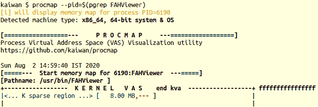

# 第七章：内存管理内部 - 基本要点

内核内部，特别是关于内存管理的部分，是一个广阔而复杂的主题。在本书中，我不打算深入研究内核内存的细节。与此同时，我希望为像您这样的新兴内核或设备驱动程序开发人员提供足够的背景知识，以成功地解决这一关键主题。

因此，本章将帮助您充分了解 Linux 操作系统上内存管理是如何执行的；这包括深入研究虚拟内存（VM）分割，以及对进程的用户模式和内核段进行深入的检查，以及覆盖内核如何管理物理内存的基础知识。实际上，您将了解进程和系统的内存映射 - 虚拟和物理。

这些背景知识将在帮助您正确和高效地管理动态内核内存方面发挥重要作用（重点是使用**可加载内核模块**（LKM）框架编写内核或驱动程序代码；这方面 - 动态内存管理 - 在本书的接下来的两章中是重点）。作为一个重要的附带好处，掌握了这些知识，您将发现自己在调试用户和内核空间代码方面变得更加熟练。（这一点的重要性不言而喻！调试代码既是一门艺术，也是一门科学，也是一种现实。）

在本章中，我们将涵盖以下内容：

+   理解虚拟内存分割

+   检查进程 VAS

+   检查内核段

+   随机化内存布局 - [K]ASLR

+   物理内存

# 技术要求

我假设您已经阅读了第一章，*内核工作空间设置*，并已经适当地准备了运行 Ubuntu 18.04 LTS（或更高版本）的虚拟机，并安装了所有必需的软件包。如果没有，我建议您先这样做。为了充分利用本书，我强烈建议您首先设置工作环境，包括克隆本书的 GitHub 代码库（[`github.com/PacktPublishing/Linux-Kernel-Programming`](https://github.com/PacktPublishing/Linux-Kernel-Programming)），并以实际操作的方式进行工作。

我假设您熟悉基本的虚拟内存概念，用户模式进程**虚拟地址空间**（VAS）段的布局，用户和内核模式的堆栈，任务结构等。如果您对此不确定，我强烈建议您先阅读前一章。

# 理解虚拟内存分割

在本章中，我们将广泛地研究 Linux 内核以两种方式管理内存：

+   基于虚拟内存的方法，其中内存是虚拟化的（通常情况）

+   查看内核实际如何组织物理内存（RAM 页面）

首先，让我们从虚拟内存视图开始，然后在本章后面讨论物理内存组织。

正如我们在前一章中所看到的，在*理解进程虚拟地址空间（VAS）的基础*部分，进程 VAS 的一个关键属性是它是完全自包含的，一个沙盒。你不能看到盒子外面。在第六章，*内核内部基本要点 - 进程和线程*，图 6.2 中，我们看到进程 VAS 范围从虚拟地址`0`到我们简单地称为高地址。这个高地址的实际值是多少？显然，这是 VAS 的最高范围，因此取决于用于寻址的位数：

+   在运行在 32 位处理器上的 Linux 操作系统（或为 32 位编译）上，最高虚拟地址将是*2³² = 4 GB*。

+   在运行在（并为）64 位处理器编译的 Linux 操作系统上，最高虚拟地址将是*2⁶⁴=16 EB*。（EB 是 exabyte 的缩写。相信我，这是一个巨大的数量。16 EB 相当于数字*16 x 10¹⁸。）

为了简单起见，为了使数字易于管理，让我们现在专注于 32 位地址空间（我们肯定也会涵盖 64 位寻址）。因此，根据我们的讨论，在 32 位系统上，进程 VAS 从 0 到 4 GB-这个区域包括空白空间（未使用的区域，称为**稀疏区域**或**空洞**）和通常称为**段**（或更正确地说是**映射**）的内存有效区域-文本、数据、库和堆栈（所有这些在第六章中已经有了详细的介绍，*内核内部要点-进程和线程*）。

在我们理解虚拟内存的旅程中，拿出众所周知的`Hello, world` C 程序，并在 Linux 系统上理解它的内部工作是很有用的；这就是下一节要讨论的内容！

## 深入了解-Hello, world C 程序

对了，这里有谁知道如何编写经典的`Hello, world` C 程序吗？好的，非常有趣，让我们来看看其中有意义的一行：

```
printf("Hello, world.\n");
```

该进程正在调用`printf(3)`函数。你写过`printf()`的代码吗？“当然没有”，你说，“它在标准的`libc` C 库中，通常是 Linux 上的`glibc`（GNU `libc`）。”但是等等，除非`printf`（以及所有其他库 API）的代码和数据实际上在进程 VAS 中，我们怎么能访问它呢？（记住，你不能看*盒子外*！）为此，`printf(3)`的代码（和数据）（实际上是`glibc`库的）必须在进程*盒子*内——进程 VAS 内被映射。它确实被映射到了进程 VAS 中，在库段或映射中（正如我们在第六章中看到的，*内核内部要点-进程和线程*，*图 6.1*）。这是怎么发生的？

事实上，在应用程序启动时，作为 C 运行时环境设置的一部分，有一个小的**可执行和可链接格式**（**ELF**）二进制文件（嵌入到你的`a.out`二进制可执行文件中）称为**加载器**（`ld.so`或`ld-linux.so`）。它很早就获得了控制权。它检测所有需要的共享库，并通过打开库文件并发出`mmap(2)`系统调用将它们全部内存映射到进程 VAS 中-库文本（代码）和数据段。因此，一旦库的代码和数据被映射到进程 VAS 中，进程就可以访问它，因此-等待它-`printf()` API 可以成功调用！（我们在这里跳过了内存映射和链接的血腥细节）。

进一步验证这一点，`ldd(1)`脚本（以下输出来自 x86_64 系统）显示确实如此：

```
$ gcc helloworld.c -o helloworld
$ ./helloworld
Hello, world
$ ldd ./helloworld
 linux-vdso.so.1 (0x00007fffcfce3000)
 libc.so.6 => /lib/x86_64-linux-gnu/libc.so.6 (0x00007feb7b85b000)
 /lib64/ld-linux-x86-64.so.2 (0x00007feb7be4e000)
$
```

需要注意的一些要点：

+   每个 Linux 进程-自动且默认-链接到至少两个对象：`glibc`共享库和程序加载器（不需要显式的链接器开关）。

+   加载程序的名称因架构而异。在我们的 x86_64 系统上，它是`ld-linux-x86-64.so.2`。

+   在前面的`ldd`输出中，括号中的地址是映射位置的虚拟地址。例如，在前面的输出中，`glibc`被映射到我们的进程 VAS 的**用户虚拟地址**（**UVA**），等于`0x00007feb7b85b000`。请注意，这是运行时相关的（也因为**地址空间布局随机化**（**ASLR**）语义而变化（稍后会看到））。

+   出于安全原因（以及在除 x86 之外的架构上），最好使用`objdump(1)`实用程序来查找这类细节。

尝试对`Hello, world`二进制可执行文件执行`strace(1)`，你会看到大量的`mmap()`系统调用，映射`glibc`（和其他）段！

让我们更深入地研究我们简单的`Hello, world`应用程序。

### 超越 printf() API

正如你所知，`printf(3)` API 转换为 `write(2)` 系统调用，这当然会将 `"Hello, world"` 字符串写入 `stdout`（默认情况下是终端窗口或控制台设备）。

我们也明白，由于`write(2)`是一个系统调用，这意味着运行此代码的当前进程-进程上下文-现在必须切换到内核模式并运行`write(2)`的内核代码（单内核架构）！确实如此。但等一下：`write(2)`的内核代码在内核 VAS 中（参见第六章，*内核内部要点-进程和线程*，图 6.1）。关键在于，如果内核 VAS 在盒子外面，那么我们怎么调用它呢？

嗯，可以通过将内核放在单独的 4GB VAS 中来完成，但这种方法会导致非常缓慢的上下文切换，所以不会这样做。

它的工程方式是这样的：用户和内核 VAS 都存在于同一个'盒子'中-可用 VAS。具体是如何实现的呢？通过*分割*可用地址空间，将用户和内核分配在某个`User:Kernel :: u:k`比例中。这被称为**VM 分割**（比例`u:k`通常以 GB、TB 甚至 PB 表示）。

以下图表代表了运行 Linux 操作系统的 ARM-32 系统上具有*2:2* VM 分割（以 GB 为单位）的 32 位 Linux 进程；即，总共 4GB 的进程 VAS 被分割为 2GB 的用户空间和 2GB 的内核空间。这通常是运行 Linux 操作系统的 ARM-32 系统上的典型 VM 分割。


图 7.1- User:Kernel :: 2:2 GB VM split on an ARM-32 system running Linux

所以，现在内核 VAS 在盒子内，突然清楚并且至关重要的是要理解这一点：当用户模式进程或线程发出系统调用时，会发生上下文切换到内核的 2GB VAS（包括各种 CPU 寄存器，包括堆栈指针在内的寄存器会得到更新），在同一个进程的 VAS 内。发出系统调用的线程现在以特权内核模式在进程上下文中运行其内核代码（并且处理内核空间数据）。完成后，它从系统调用返回，上下文切换回非特权用户模式，并且现在在第一个 2GB VAS 内运行用户模式代码。

内核 VAS 的确切虚拟地址-也称为**内核段**-通常通过内核中的`PAGE_OFFSET`宏表示。我们将在*描述内核段布局的宏和变量*部分中进一步研究这一点，以及其他一些关键的宏。

关于 VM 分割的确切位置和大小的决定是在哪里做出的呢？啊，在 32 位 Linux 上，这是一个内核构建时可配置的。它是在内核构建中作为`make [ARCH=xxx] menuconfig`过程的一部分完成的-例如，当为 Broadcom BCM2835（或 BCM2837）**SoC**（Raspberry Pi 是一个搭载这个 SoC 的热门开发板）配置内核时。以下是来自官方内核配置文件的片段（输出来自 Raspberry Pi 控制台）：

```
$ uname -r
5.4.51-v7+
$ sudo modprobe configs      *<< gain access to /proc/config.gz via this LKM >>* $ zcat /proc/config.gz | grep -C3 VMSPLIT
[...]
# CONFIG_BIG_LITTLE is not set
# CONFIG_VMSPLIT_3G is not set
# CONFIG_VMSPLIT_3G_OPT is not set
CONFIG_VMSPLIT_2G=y
# CONFIG_VMSPLIT_1G is not set
CONFIG_PAGE_OFFSET=0x80000000
CONFIG_NR_CPUS=4
[...]
```

如前面的片段所示，`CONFIG_VMSPLIT_2G`内核配置选项设置为`y`，意味着默认的 VM 分割是`user:kernel :: 2:2`。对于 32 位架构，VM 分割位置是**可调整的**（如前面的片段中所示，`CONFIG_VMSPLIT_[1|2|3]G`；`CONFIG_PAGE_OFFSET`相应地设置）。对于 2:2 的 VM 分割，`PAGE_OFFSET`实际上是在虚拟地址`0x8000 0000`（2GB）的中间位置！

IA-32 处理器（Intel x86-32）的默认 VM 分割是 3:1（GB）。有趣的是，运行在 IA-32 上的（古老的）Windows 3.x 操作系统具有相同的 VM 分割，这表明这些概念基本上与操作系统无关。在本章的后面，我们将涵盖几种更多的架构及其 VM 分割，以及其他细节。

无法直接为 64 位架构配置 VM 分割。因此，现在我们了解了 32 位系统上的 VM 分割，让我们继续研究如何在 64 位系统上进行 VM 分割。

## 64 位 Linux 系统上的 VM 分割

首先值得注意的是，在 64 位系统上，并非所有 64 位都用于寻址。在标准或典型的 x86_64 Linux OS 配置中，使用（**最低有效位**（**LSB**））48 位进行寻址。为什么不使用全部 64 位？因为太多了！没有现有的计算机接近拥有甚至一半的完整*2**⁶⁴** = 18,446,744,073,709,551,616* 字节，相当于 16 EB（即 16,384 PB）的 RAM！

“为什么”，您可能会想，“我们为什么将其等同于 RAM？”。请继续阅读 - 在此变得清晰之前，需要涵盖更多内容。在*检查内核段*部分，您将完全理解这一点。

### 虚拟寻址和地址转换

在进一步深入了解这些细节之前，非常重要的是清楚地理解一些关键点。

考虑来自 C 程序的一个小而典型的代码片段：

```
int i = 5;
printf("address of i is 0x%x\n", &i);
```

您看到`printf()`发出的地址是虚拟地址而不是物理地址。我们区分两种虚拟地址：

+   如果在用户空间进程中运行此代码，您将看到变量`i`的地址是 UVA。

+   如果在内核中运行此代码，或者在内核模块中运行此代码（当然，您将使用`printk()` API），您将看到变量`i`的地址是**内核虚拟地址**（**KVA**）。

接下来，虚拟地址不是绝对值（相对于`0`的偏移量）；它实际上是*位掩码*：

+   在 32 位 Linux 操作系统上，32 个可用位被分为**页全局目录**（**PGD**）值，**页表**（**PT**）值和偏移量。

+   这些成为**MMU**（现代微处理器硅片内部的**内存管理单元**）进行地址转换的索引。

我们不打算在这里详细介绍 MMU 级别的地址转换。这也非常与架构相关。请参考*进一步阅读*部分，了解有关此主题的有用链接。

+   如预期的那样，在 64 位系统上，即使使用 48 位寻址，虚拟地址位掩码中将有更多字段。

好吧，如果这种 48 位寻址是 x86_64 处理器上的典型情况，那么 64 位虚拟地址中的位是如何布局的？未使用的 16 位 MSB 会发生什么？以下图解答了这个问题；这是 x86_64 Linux 系统上虚拟地址的分解表示：


图 7.2 - 在具有 4 KB 页面的 Intel x86_64 处理器上分解 64 位虚拟地址

基本上，使用 48 位寻址，我们使用 0 到 47 位（LSB 48 位）并忽略**最高有效位**（**MSB**）的 16 位，将其视为符号扩展。不过，未使用的符号扩展 MSB 16 位的值随着您所在的地址空间而变化：

+   **内核 VAS**：MSB 16 位始终设置为`1`。

+   **用户 VAS**：MSB 16 位始终设置为`0`。

这是有用的信息！知道这一点，仅通过查看（完整的 64 位）虚拟地址，您因此可以判断它是 KVA 还是 UVA：

+   64 位 Linux 系统上的 KVA 始终遵循格式`0xffff .... .... ....`。

+   UVA 始终具有格式`0x0000 .... .... ....`。

**警告**：前面的格式仅适用于将虚拟地址自定义为 KVA 或 UVA 的处理器（实际上是 MMU）； x86 和 ARM 系列处理器属于这一范畴。

现在可以看到（我在这里重申），事实是虚拟地址不是绝对地址（绝对偏移量从零开始，正如你可能错误地想象的那样），而是实际上是位掩码。事实上，内存管理是一个复杂的领域，工作是共享的：**操作系统负责创建和操作每个进程的分页表，工具链（编译器）生成虚拟地址，而处理器 MMU 实际上执行运行时地址转换，将给定的（用户或内核）虚拟地址转换为物理（RAM）地址！**

我们不会在本书中深入讨论硬件分页（以及各种硬件加速技术，如**转换旁路缓冲**（**TLB**）和 CPU 缓存）。这个特定的主题已经被其他一些优秀的书籍和参考网站很好地涵盖，这些书籍和网站在本章的*进一步阅读*部分中提到。

回到 64 位处理器上的 VAS。64 位系统上可用的 VAS 是一个巨大的*2**⁶⁴ **= 16 EB*（*16 x 10**¹⁸*字节！）。故事是这样的，当 AMD 工程师首次将 Linux 内核移植到 x86_64（或 AMD64）64 位处理器时，他们必须决定如何在这个巨大的 VAS 中布置进程和内核段。即使在今天的 x86_64 Linux 操作系统上，这个巨大的 64 位 VAS 的划分基本上保持不变。这个巨大的 64 位 VAS 划分如下。在这里，我们假设 48 位寻址和 4 KB 页面大小：

+   规范的下半部分，128 TB：用户 VAS 和虚拟地址范围从`0x0`到`0x0000 7fff ffff ffff`

+   规范的上半部分，128 TB：内核 VAS 和虚拟地址范围从`0xffff 8000 0000 0000`到`0xffff ffff ffff ffff`

*规范*这个词实际上意味着*根据法律*或*根据共同惯例*。

在 x86_64 平台上可以看到这个 64 位 VM 分割，如下图所示：


图 7.3 - Intel x86_64（或 AMD64）16 EB VAS 布局（48 位寻址）；VM 分割是用户：内核:: 128 TB：128 TB

在上图中，中间未使用的区域 - 空洞或稀疏区域 - 也称为**非规范地址**区域。有趣的是，使用 48 位寻址方案，绝大多数 VAS 都未被使用。这就是为什么我们称 VAS 非常稀疏。

上图显然不是按比例绘制的！请记住，这一切都是*虚拟*内存空间，而不是物理内存。

为了结束我们对 VM 分割的讨论，以下图表显示了不同 CPU 架构的一些常见`用户：内核`VM 分割比例（我们假设 MMU 页面大小为 4 KB）：


图 7.4 - 不同 CPU 架构的常见用户：内核 VM 分割比例（4 KB 页面大小）

我们用粗体红色突出显示第三行，因为它被认为是常见情况：在 x86_64（或 AMD64）架构上运行 Linux，使用`用户：内核:: 128 TB:128 TB` VM 分割。在阅读表格时要小心：第六列和第八列的数字，结束 vaddr，每个都是单个 64 位数量，而不是两个数字。数字可能只是简单地绕回去了。因此，例如，在 x86_64 行中，第 6 列是*单个*数字`0x0000 7fff ffff ffff`而不是两个数字。

第三列，地址位，告诉我们，在 64 位处理器上，实际上没有真正的处理器使用所有 64 位进行寻址。

在 x86_64 下，上表显示了两个 VM 分割：

+   第一个，128 TB：128 TB（4 级分页）是今天在 Linux x86_64 位系统上使用的典型 VM 分割（嵌入式笔记本电脑，个人电脑，工作站和服务器）。它将物理地址空间限制为 64 TB（RAM）。

+   第二个，64 PB：64 PB，截至目前为止，仍然纯理论；它支持所谓的 5 级分页，从 4.14 版 Linux 开始；分配的 VAS（56 位寻址；总共 128PB 的 VAS 和 4PB 的物理地址空间！）是如此巨大，以至于截至目前为止，没有实际的计算机（尚未）使用它。

请注意，运行在 Linux 上的 AArch64（ARM-64）架构的两行仅仅是代表性的。正在开发产品的 BSP 供应商或平台团队可能会使用不同的分割。有趣的是，（旧）Windows 32 位操作系统上的 VM 分割是 2:2（GB）。

实际上驻留在内核 VAS 中的是什么，或者通常所说的内核段？所有内核代码、数据结构（包括任务结构、列表、内核模式堆栈、分页表等等）、设备驱动程序、内核模块等等都在这里（正如第六章中*内核内部要点 - 进程和线程*的*图 6.7*的下半部分所显示的；我们在*理解内核段*部分中详细介绍了这一点）。

重要的是要意识到，在 Linux 上，作为性能优化，内核内存始终是不可交换的；也就是说，内核内存永远不会被换出到交换分区。用户空间内存页总是可以进行分页，除非被锁定（参见`mlockall`系统调用）。

有了这个背景，您现在可以理解完整的进程 VAS 布局。继续阅读。

## 进程 VAS - 完整视图

再次参考*图 7.1*；它显示了单个 32 位进程的实际进程 VAS 布局。当然，现实情况是 - 这是关键的 - **系统上所有活动的进程都有自己独特的用户模式 VAS，但共享相同的内核段**。与*图 7.1*形成对比的是，它显示了 2:2（GB）的 VM 分割，下图显示了典型 IA-32 系统的实际情况，其中有 3:1（GB）的 VM 分割：


图 7.5 - 进程具有独特的用户 VAS，但共享内核段（32 位操作系统）；IA-32 的 VM 分割为 3:1

请注意，在前面的图中，地址空间反映了 3:1（GB）的 VM 分割。用户地址空间从`0`扩展到`0xbfff ffff`（`0xc000 0000`是 3GB 标记；这是`PAGE_OFFSET`宏的设置），内核 VAS 从`0xc000 0000`（3GB）扩展到`0xffff ffff`（4GB）。

在本章的后面，我们将介绍一个有用的实用程序`procmap`的用法。它将帮助您详细可视化 VAS，包括内核和用户 VAS，类似于我们之前的图表所显示的方式。

需要注意的几点：

+   在图 7.5 中显示的示例中，`PAGE_OFFSET`的值为`0xc000 0000`。

+   我们在这里展示的图表和数字并不是所有架构上的绝对和约束性的；它们往往是非常特定于架构的，许多高度定制的 Linux 系统可能会改变它们。

+   *图 7.5*详细介绍了 32 位 Linux 操作系统上的 VM 布局。在 64 位 Linux 上，*概念*保持不变，只是数字（显著）变化。正如前面的章节中所详细介绍的，x86_64（带 48 位寻址）Linux 系统上的 VM 分割变为`User：Kernel :: 128 TB：128 TB`。

现在，一旦理解了进程的虚拟内存布局的基本原理，您会发现它在解密和在难以调试的情况下取得进展方面非常有帮助。像往常一样，还有更多内容；接下来的部分将介绍用户空间和内核空间内存映射（内核段），以及一些关于物理内存映射的内容。继续阅读！

# 检查进程 VAS

我们已经介绍了每个进程 VAS 由哪些段或映射组成（参见第六章中的*理解进程虚拟地址空间（VAS）基础知识*部分）。我们了解到进程 VAS 包括各种映射或段，其中包括文本（代码）、数据段、库映射，以及至少一个堆栈。在这里，我们将对此进行更详细的讨论。

能够深入内核并查看各种运行时值是开发人员像您这样的重要技能，以及用户、QA、系统管理员、DevOps 等。Linux 内核为我们提供了一个令人惊叹的接口来做到这一点 - 这就是，你猜对了，`proc`文件系统（`procfs`）。

这在 Linux 上始终存在（至少应该存在），并且挂载在`/proc`下。`procfs`系统有两个主要作用：

+   提供一组统一的（伪或虚拟）文件和目录，使您能够深入了解内核和硬件的内部细节。

+   提供一组统一的可写根文件，允许系统管理员修改关键的内核参数。这些文件位于`/proc/sys/`下，并被称为`sysctl` - 它们是 Linux 内核的调整旋钮。

熟悉`proc`文件系统确实是必须的。我建议您查看一下，并阅读关于`proc(5)`的优秀手册页。例如，简单地执行`cat /proc/PID/status`（其中`PID`当然是给定进程或线程的唯一进程标识符）会产生一大堆有用的进程或线程任务结构的细节！

在概念上类似于`procfs`的是`sysfs`文件系统，它挂载在`/sys`下（在其下是`debugfs`，通常挂载在`/sys/kernel/debug`）。`sysfs`是 2.6 Linux 新设备和驱动程序模型的表示；它公开了系统上所有设备的树形结构，以及几个内核调整旋钮。

## 详细检查用户 VAS

让我们从检查任何给定进程的用户 VAS 开始。用户 VAS 的相当详细的映射可以通过`procfs`获得，特别是通过`/proc/PID/maps`伪文件。让我们学习如何使用这个接口来窥视进程的用户空间内存映射。我们将看到两种方法：

+   直接通过`procfs`接口的`/proc/PID/maps`伪文件

+   使用一些有用的前端（使输出更易于理解）

让我们从第一个开始。

### 直接使用 procfs 查看进程内存映射

查找任意进程的内部进程细节需要`root`访问权限，而查找自己拥有的进程的细节（包括调用进程本身）则不需要。因此，举个简单的例子，我们将使用`self`关键字来查找调用进程的 VAS，而不是 PID。以下屏幕截图显示了这一点（在 x86_64 Ubuntu 18.04 LTS 客户机上）：


图 7.6 - cat /proc/self/maps 命令的输出

在前面的屏幕截图中，您实际上可以看到`cat`进程的用户 VAS - 该进程的用户 VAS 的实际内存映射！还要注意，前面的`procfs`输出是按（用户）虚拟地址（UVA）升序排序的。

熟悉使用强大的`mmap(2)`系统调用将有助于更好地理解后续的讨论。至少要浏览一下它的手册页。

#### 解释/proc/PID/maps 输出

要解释图 7.6 的输出，请逐行阅读。**每行代表了进程的用户模式 VAS 的一个段或映射**（在前面的示例中，是`cat`进程的）。每行包括以下字段。

为了更容易，我将只展示一行输出，我们将在接下来的注释中标记并引用这些字段：

```
 start_uva  -  end_uva   mode,mapping  start-off   mj:mn inode# image-name 
555d83b65000-555d83b6d000    r-xp      00000000    08:01 524313   /bin/cat
```

在这里，整行表示进程（用户）VAS 中的一个段，或更正确地说，是一个*映射*。`uva`是用户虚拟地址。每个段的`start_uva`和`end_uva`显示为前两个字段（或列）。因此，映射（段）的长度可以轻松计算（`end_uva`-`start_uva`字节）。因此，在前面的行中，`start_uva`是`0x555d83b65000`，`end_uva`是`0x555d83b6d000`（长度可以计算为 32 KB）；但是，这个段是什么？请继续阅读...

第三个字段`r-xp`实际上是两个信息的组合：

+   前三个字母表示段（通常以`rwx`表示）的模式（权限）。

+   下一个字母表示映射是私有的（`p`）还是共享的（`s`）。在内部，这是由`mmap(2)`系统调用的第四个参数`flags`设置的；实际上是**`mmap(2)`**系统调用在内部负责创建进程中的每个段或映射！

+   因此，对于前面显示的示例段，第三个字段的值为`r-xp`，我们现在可以知道它是一个文本（代码）段，并且是一个私有映射（如预期的那样）。

第四个字段`start-off`（这里是值`0`）是从已映射到进程 VAS 的文件开头的起始偏移量。显然，此值仅对文件映射有效。您可以通过查看倒数第二个（第六个）字段来判断当前段是否是文件映射。对于不是文件映射的映射 - 称为**匿名映射** - 它始终为`0`（例如表示堆或栈段的映射）。在我们之前的示例行中，这是一个文件映射（`/bin/cat`），从该文件开头的偏移量为`0`字节（如我们在前一段中计算的映射长度为 32 KB）。

第五个字段（`08:01`）的格式为`mj:mn`，其中`mj`是设备文件的主编号，`mn`是映像所在设备文件的次编号。与第四个字段类似，它仅对文件映射有效，否则显示为`00:00`；在我们之前的示例行中，这是一个文件映射（`/bin/cat`），设备文件的主编号和次编号（文件所在的*设备*）分别为`8`和`1`。

第六个字段（`524313`）表示映像文件的索引节点号 - 正在映射到进程 VAS 的文件的内容。索引节点是**VFS（虚拟文件系统）**的关键数据结构；它保存文件对象的所有元数据，除了其名称（名称在目录文件中）。同样，此值仅对文件映射有效，否则显示为`0`。实际上，这是一种快速判断映射是文件映射还是匿名映射的方法！在我们之前的示例映射中，显然是文件映射（`/bin/cat`），索引节点号是`524313`。事实上，我们可以确认：

```
ls -i /bin/cat
524313 /bin/cat
```

第七个和最后一个字段表示正在映射到用户 VAS 的文件的路径名。在这里，因为我们正在查看`cat(1)`进程的内存映射，路径名（对于文件映射的段）当然是`/bin/cat`。如果映射表示文件，则文件的索引节点号（第六个字段）显示为正值；如果不是 - 意味着是没有后备存储的纯内存或匿名映射 - 索引节点号显示为`0`，此字段将为空。

现在应该很明显了，但我们仍然会指出这一点 - 这是一个关键点：前面看到的所有地址都是*虚拟*地址，而不是物理地址。此外，它们仅属于用户空间，因此被称为*UVA*，并且始终通过该进程的唯一分页表访问（和转换）。此外，前面的屏幕截图是在 64 位（x86_64）Linux 客户机上拍摄的。因此，在这里，我们看到 64 位虚拟地址。

虽然虚拟地址的显示方式不是完整的 64 位数字 - 例如，显示为`0x555d83b65000`而不是`0x0000555d83b65000` - 但我希望您注意到，因为它是**用户虚拟地址**（**UVA**），最高 16 位为零！

好了，这涵盖了如何解释特定段或映射，但似乎还有一些奇怪的 - `vvar`，`vdso`和`vsyscall`映射。让我们看看它们的含义。

#### vsyscall 页面

您是否注意到图 7.6 的输出中有一些不太寻常的东西？那里的最后一行 - 所谓的`vsyscall`条目 - 映射了一个内核页面（到目前为止，您知道我们如何判断：其起始和结束虚拟地址的最高 16 位被设置）。在这里，我们只提到这是一个（旧的）用于执行系统调用的优化。它通过减轻对于一小部分不真正需要的系统调用而实际上不需要切换到内核模式来工作。

目前，在 x86 上，这些包括`gettimeofday(2)`，`time(2)`和`getcpu(2)`系统调用。实际上，上面的`vvar`和`vdso`（又名 vDSO）映射是同一主题的现代变体。如果您对此感兴趣，可以访问本章的*进一步阅读*部分了解更多信息。

因此，您现在已经看到了如何通过直接阅读和解释`/proc/PID/maps`（伪）文件的输出来检查任何给定进程的用户空间内存映射。还有其他方便的前端可以这样做；我们现在将检查一些。

### 查看进程内存映射的前端

除了通过`/proc/PID/maps`（我们在上一节中看到如何解释）的原始或直接格式外，还有一些包装实用程序可以帮助我们更轻松地解释用户模式 VAS。其中包括额外的（原始）`/proc/PID/smaps`伪文件，`pmap(1)`和`smem(8)`实用程序，以及我自己的简单实用程序（名为`procmap`）。

内核通过`/proc/PID/smaps`伪文件在`proc`下提供了每个段或映射的详细信息。尝试`cat /proc/self/smaps`来查看这些信息。您会注意到对于每个段（映射），都提供了大量详细信息。`proc(5)`的 man 页面有助于解释所见到的许多字段。

对于`pmap(1)`和`smem(8)`实用程序，我建议您查阅它们的 man 页面以获取详细信息。例如，对于`pmap(1)`，man 页面告诉我们更详细的`-X`和`-XX`选项：

```
-X Show even more details than the -x option. WARNING: format changes according to /proc/PID/smaps
-XX Show everything the kernel provides
```

关于`smem(8)`实用程序，事实是它*不*显示进程 VAS；相反，它更多地是回答一个常见问题：即确定哪个进程占用了最多的物理内存。它使用诸如**Resident Set Size**（**RSS**），**Proportional Set Size**（**PSS**）和**Unique Set Size**（**USS**）等指标来呈现更清晰的图片。我将把进一步探索这些实用程序作为一个练习留给您，亲爱的读者！

现在，让我们继续探讨如何使用一个有用的实用程序 - `procmap` - 以相当详细的方式查看任何给定进程的内核和用户内存映射。

#### procmap 进程 VAS 可视化实用程序

作为一个小型的学习和教学（以及在调试期间有帮助！）项目，我编写并托管了一个名为`procmap`的小型项目，可以在 GitHub 上找到：[`github.com/kaiwan/procmap`](https://github.com/kaiwan/procmap)（使用`git clone`进行克隆）。其`README.md`文件的一部分有助于解释其目的：

```
procmap is designed to be a console/CLI utility to visualize the complete memory map of a Linux process, in effect, to visualize the memory mappings of both the kernel and user mode Virtual Address Space (VAS). It outputs a simple visualization, in a vertically-tiled format ordered by descending virtual address, of the complete memory map of a given process (see screenshots below). The script has the intelligence to show kernel and user space mappings as well as calculate and show the sparse memory regions that will be present. Also, each segment or mapping is scaled by relative size (and color-coded for readability). On 64-bit systems, it also shows the so-called non-canonical sparse region or 'hole' (typically close to 16,384 PB on the x86_64).
```

顺便说一句：在撰写本材料时（2020 年 4 月/5 月），COVID-19 大流行席卷全球大部分地区。类似于早期的*SETI@home*项目（[`setiathome.berkeley.edu/`](https://setiathome.berkeley.edu/)），*Folding@home*项目（[`foldingathome.org/category/covid-19/`](https://foldingathome.org/category/covid-19/)）是一个分布式计算项目，利用互联网连接的家用（或任何）计算机来帮助模拟和解决与 COVID-19 治疗相关的问题（以及找到治愈我们的其他严重疾病）。您可以从[`foldingathome.org/start-folding/`](https://foldingathome.org/start-folding/)下载软件（安装它，并在系统空闲时运行）。我就是这样做的；这是在我的（本机）Ubuntu Linux 系统上运行的 FAH 查看器（一个漂亮的 GUI 显示蛋白质分子！）进程的部分截图：

```
$ ps -e|grep -i FAH
6190 ? 00:00:13 FAHViewer
```

好了，让我们使用`procmap`实用程序来查询它的 VAS。我们如何调用它？简单，看看接下来的内容（由于空间不足，我不会在这里显示所有信息、警告等；请自行尝试）：

```
$ git clone https://github.com/kaiwan/procmap
$ cd procmap
$ ./procmap
Options:
 --only-user : show ONLY the user mode mappings or segments
 --only-kernel : show ONLY the kernel-space mappings or segments
 [default is to show BOTH]
 --export-maps=filename
     write all map information gleaned to the file you specify in CSV
 --export-kernel=filename
     write kernel information gleaned to the file you specify in CSV
 --verbose : verbose mode (try it! see below for details)
 --debug : run in debug mode
 --version|--ver : display version info.
See the config file as well.
[...]
```

请注意，这个`procmap`实用程序与 BSD Unix 提供的`procmap`实用程序不同。它还依赖于`bc(1)`和`smem(8)`实用程序；请确保它们已安装。

当我只使用`--pid=<PID>`运行`procmap`实用程序时，它将显示给定进程的内核和用户空间 VAS。现在，由于我们尚未涵盖有关内核 VAS（或段）的详细信息，我不会在这里显示内核空间的详细输出；让我们把它推迟到即将到来的部分，*检查内核段*。随着我们的进行，您将发现`procmap`实用程序的部分截图仅显示用户 VAS 输出。完整的输出可能会相当冗长，当然取决于所涉及的进程；请自行尝试。

正如您将看到的，它试图以垂直平铺的格式提供完整进程内存映射的基本可视化 – 包括内核和用户空间 VAS（如前所述，这里我们只显示截断的截图）：



图 7.7 – 部分截图：从 procmap 实用程序的内核 VAS 输出的第一行

请注意，从前面（部分）截图中，有一些事情：

+   `procmap` （Bash）脚本自动检测到我们正在运行的是 x86_64 64 位系统。

+   虽然我们现在不专注于它，但内核 VAS 的输出首先出现；这是自然的，因为我们按照虚拟地址降序显示输出（图 7.1、7.3 和 7.5 重申了这一点）

+   您可以看到第一行（在`KERNEL VAS`标题之后）对应于 VAS 的顶部 – 值为`0xffff ffff ffff ffff`（因为我们是 64 位）。

继续看 `procmap` 输出的下一部分，让我们看一下`FAHViewer` 进程的用户 VAS 的上端的截断视图：


图 7.8 – 部分截图：procmap 实用程序的用户 VAS 输出的前几行（高端）

图 7.8 是`procmap`输出的部分截图，显示了用户空间 VAS；在其顶部，您可以看到（高）端 UVA。

在我们的 x86_64 系统上（请记住，这是与架构相关的），（高）`end_uva`值是

`0x0000 7fff ffff ffff` 和 `start_uva` 当然是 `0x0`。`procmap` 如何找出精确的地址值呢？哦，它相当复杂：对于内核空间内存信息，它使用一个内核模块（一个 LKM！）来查询内核，并根据系统架构设置一个配置文件；用户空间的细节当然来自 `/proc/PID/maps` 直接的 `procfs` 伪文件。

顺便说一句，`procmap`的内核组件，一个内核模块，建立了一种与用户空间进行交互的方式 – 通过创建和设置一个`debugfs`（伪）文件的`procmap`脚本。 

以下屏幕截图显示了进程用户模式 VAS 的低端的部分截图，直到最低的 UVA `0x0`：


图 7.9 - 部分截图：进程用户 VAS 输出的最后几行（低端）来自 procmap 实用程序

最后一个映射，一个单页，如预期的那样，是空指针陷阱页（从 UVA `0x1000`到`0x0`；我们将在即将到来的*空指针陷阱页*部分中解释其目的）。

然后，`procmap`实用程序（如果在其配置文件中启用）会计算并显示一些统计信息；这包括内核和用户模式 VAS 的大小，64 位系统上稀疏区域占用的用户空间内存量（通常是空间的绝大部分！）的绝对数量和百分比，报告的物理 RAM 量，最后，由`ps(1)`和`smem(8)`实用程序报告的此特定进程的内存使用详细信息。

通常情况下，在 64 位系统上（参见图 7.3），进程 VAS 的*稀疏*（空）内存区域占用了可用地址空间的接近 100%！（通常是诸如 127.99[...] TB 的 VAS 占用了 128 TB 可用空间的情况。）这意味着 99.99[...]%的内存空间是稀疏的（空的）！这就是 64 位系统上巨大的 VAS 的现实。实际上，巨大的 128 TB 的 VAS（就像在 x86_64 上一样）中只有一小部分被使用。当然，稀疏和已使用的 VAS 的实际数量取决于特定应用程序进程的大小。

能够清晰地可视化进程 VAS 在深层次调试或分析问题时可以提供很大帮助。

如果您正在阅读本书的实体版本，请务必从出版商的网站下载图表/图像的全彩 PDF：`static.packt-cdn.com/downloads/9781789953435_ColorImages.pdf`。

您还会看到输出末尾（如果启用）打印出的统计信息显示了目标进程设置的**虚拟内存区域**（**VMAs**）的数量。接下来的部分简要解释了 VMA 是什么。让我们开始吧！

## 理解 VMA 的基础知识

在`/proc/PID/maps`的输出中，实际上每行输出都是从一个称为 VMA 的内核元数据结构中推断出来的。这实际上非常简单：内核使用 VMA 数据结构来抽象我们所说的段或映射。因此，在用户 VAS 中的每个段都有一个由操作系统维护的 VMA 对象。请意识到，只有用户空间段或映射受到称为 VMA 的内核元数据结构的管理；内核段本身没有 VMA。

那么，给定进程会有多少个 VMA？嗯，它等于其用户 VAS 中的映射（段）数量。在我们的*FAHViewer*进程示例中，它恰好有 206 个段或映射，这意味着内核内存中为该进程维护了 206 个 VMA 元数据对象，代表了 206 个用户空间段或映射。

从编程的角度来看，内核通过根据`current->mm->mmap`的任务结构维护 VMA“链”（实际上是红黑树数据结构，出于效率原因）来进行管理。为什么指针称为`mmap`？这是非常有意义的：每次执行`mmap(2)`系统调用（即内存映射操作）时，内核都会在调用进程的（即在`current`实例内）VAS 中生成一个映射（或“段”）和代表它的 VMA 对象。

VMA 元数据结构类似于一个包含映射的伞，包括内核执行各种内存管理操作所需的所有信息：处理页面错误（非常常见），在 I/O 期间将文件内容缓存到（或从）内核页缓存中等等。

页面错误处理是一个非常重要的操作系统活动，其算法占用了相当大一部分内核 VMA 对象的使用；然而，在本书中，我们不深入讨论这些细节，因为对内核模块/驱动程序的作者来说，这些细节基本上是透明的。

为了让您感受一下，我们将在下面的片段中展示内核 VMA 数据结构的一些成员；旁边的注释有助于解释它们的目的：

```
// include/linux/mm_types.h
struct vm_area_struct {
    /* The first cache line has the info for VMA tree walking. */
    unsigned long vm_start;     /* Our start address within vm_mm. */
    unsigned long vm_end;       /* The first byte after our end address
    within vm_mm. */

    /* linked list of VM areas per task, sorted by address */
    struct vm_area_struct *vm_next, *vm_prev;
    struct rb_node vm_rb;
    [...]
    struct mm_struct *vm_mm;     /* The address space we belong to. */
    pgprot_t vm_page_prot;       /* Access permissions of this VMA. */
    unsigned long vm_flags;      /* Flags, see mm.h. */
    [...]
    /* Function pointers to deal with this struct. */
    const struct vm_operations_struct *vm_ops;
    /* Information about our backing store: */
    unsigned long vm_pgoff;/* Offset (within vm_file) in PAGE_SIZE units */
    struct file * vm_file;       /* File we map to (can be NULL). */
    [...]
} __randomize_layout
```

现在应该更清楚了`cat /proc/PID/maps`是如何在底层工作的：当用户空间执行`cat /proc/self/maps`时，`cat`发出了一个`read(2)`系统调用；这导致`cat`进程切换到内核模式，并在内核中以内核特权运行`read(2)`系统调用代码。在这里，内核**虚拟文件系统开关**（**VFS**）将控制权重定向到适当的`procfs`回调处理程序（函数）。这段代码遍历了每个 VMA 元数据结构（对于`current`，也就是我们的`cat`进程），将相关信息发送回用户空间。`cat`进程然后忠实地将通过读取接收到的数据转储到`stdout`，因此我们看到了它：进程的所有段或映射 - 实际上是用户模式 VAS 的内存映射！

好了，通过这一部分，我们总结了检查进程用户 VAS 的细节。这种知识不仅有助于理解用户模式 VAS 的精确布局，还有助于调试用户空间内存问题！

现在，让我们继续理解内存管理的另一个关键方面 - 内核 VAS 的详细布局，换句话说，内核段。

# 检查内核段

正如我们在前一章中讨论过的，以及在*图 7.5*中所见，非常重要的是要理解所有进程都有自己独特的用户 VAS，但共享内核空间 - 我们称之为内核段或内核 VAS。让我们开始这一部分，从开始检查内核段的一些常见（与架构无关）区域。

内核段的内存布局非常依赖于架构（CPU）。然而，所有架构都有一些共同点。下面的基本图表代表了用户 VAS 和内核段（以水平平铺的格式），在 x86_32 上以 3:1 的 VM 分割中看到：


图 7.10 - 在 x86_32 上以 3:1 VM 分割为焦点的用户和内核 VAS

让我们逐个地过一遍每个区域：

+   **用户模式 VAS**：这是用户 VAS；我们在前一章和本章的早些部分详细介绍了它；在这个特定的例子中，它占用了 3GB 的 VAS（从`0x0`到`0xbfff ffff`）。

+   所有接下来的内容都属于内核 VAS 或内核段；在这个特定的例子中，它占用了 1GB 的 VAS（从`0xc000 0000`到`0xffff ffff`）；现在让我们逐个部分来检查它。

+   **低端内存区域**：这是平台（系统）RAM 直接映射到内核的地方。（我们将在*直接映射 RAM 和地址转换*部分更详细地介绍这个关键主题。如果有帮助的话，您可以先阅读该部分，然后再回到这里）。现在先跳过一点，让我们先了解一下内核段中平台 RAM 映射的基本位置，这个位置由一个名为`PAGE_OFFSET`的内核宏指定。这个宏的精确值非常依赖于架构；我们将把这个讨论留到后面的部分。现在，我们要求您只是相信，在具有 3:1（GB）VM 分割的 IA-32 上，`PAGE_OFFSET`的值是`0xc000 0000`。

内核低内存区域的长度或大小等于系统上的 RAM 量。（至少是内核看到的 RAM 量；例如，启用 kdump 功能会让操作系统提前保留一些 RAM）。构成这个区域的虚拟地址被称为**内核逻辑地址**，因为它们与它们的物理对应物有固定的偏移量。核心内核和设备驱动程序可以通过各种 API（我们将在接下来的两章中详细介绍这些 API）从这个区域分配（物理连续的）内存。内核静态文本（代码）、数据和 BSS（未初始化数据）内存也驻留在这个低内存区域内。

+   **内核 vmalloc 区域**：这是内核 VAS 的一个完全虚拟的区域。核心内核和/或设备驱动程序代码可以使用`vmalloc()`（和其他类似的）API 从这个区域分配虚拟连续的内存。同样，我们将在第八章和第九章中详细介绍这一点，即*模块作者的内核内存分配第一部分*和*模块作者的内核内存分配第二部分*。这也是所谓的`ioremap`空间。

+   内核模块空间：内核 VAS 的一个区域被留出来，用于存放**可加载内核模块**（**LKMs**）的静态文本和数据所占用的内存。当您执行`insmod(8)`时，生成的`[f]init_module(2)`系统调用的底层内核代码会从这个区域分配内存（通常通过`vmalloc()` API），并将内核模块的（静态）代码和数据加载到那里。

前面的图（图 7.10）故意保持简单甚至有点模糊，因为确切的内核虚拟内存布局非常依赖于架构。我们将暂时抑制绘制详细图表的冲动。相反，为了使这个讨论不那么学究，更实用和有用，我们将在即将到来的一节中介绍一个内核模块，该模块查询并打印有关内核段布局的相关信息。只有在我们对特定架构的内核段的各个区域有了实际值之后，我们才会呈现详细的图表。

学究地（如图 7.10 所示），属于低内存区域的地址被称为内核逻辑地址（它们与它们的物理对应物有固定的偏移量），而内核段的其余地址被称为 KVA。尽管在这里做出了这样的区分，请意识到，实际上，这是一个相当学究的区分：我们通常会简单地将内核段内的所有地址称为 KVA。

在此之前，还有几个其他信息要涵盖。让我们从另一个特殊情况开始，这主要是由 32 位架构的限制带来的：内核段的所谓高内存区域。

## 32 位系统上的高内存

关于我们之前简要讨论过的内核低内存区域，有一个有趣的观察结果。在一个 32 位系统上，例如，3:1（GB）的 VM 分割（就像图 7.10 所描述的那样），拥有（例如）512 MB RAM 的系统将其 512 MB RAM 直接映射到从`PAGE_OFFSET`（3 GB 或 KVA `0xc000 0000`）开始的内核中。这是非常清楚的。

但是想一想：如果系统有更多的 RAM，比如 2GB，会发生什么？现在很明显，我们无法将整个 RAM 直接映射到 lowmem 区域。它根本就放不下（例如，在这个例子中，整个可用的内核 VAS 只有 1GB，而 RAM 是 2GB）！因此，在 32 位 Linux 操作系统上，允许将一定数量的内存（通常是 IA-32 上的 768MB）直接映射，因此落入 lowmem 区域。剩下的 RAM 则*间接映射*到另一个内存区域，称为`ZONE_HIGHMEM`（我们认为它是一个高内存区域或*区域*，与 lowmem 相对；关于内存区域的更多信息将在后面的部分*区域*中介绍）。更准确地说，由于内核现在发现不可能一次性直接映射所有物理内存，它设置了一个（虚拟）区域，可以在其中设置和使用该 RAM 的临时虚拟映射。这就是所谓的高内存区域。

不要被“高内存”这个词所迷惑；首先，它不一定放在内核段的“高”位置，其次，这并不是`high_memory`全局变量所代表的 - 它（`high_memory`）代表了内核的 lowmem 区域的上限。关于这一点，后面的部分会有更多介绍，*描述内核段布局的宏和变量*。

然而，现在（特别是 32 位系统越来越少使用），这些问题在 64 位 Linux 上完全消失了。想想看：在 64 位 Linux 上，x86_64 的内核段大小达到了 128 TB（！）。目前没有任何系统的 RAM 接近这么多。因此，所有平台的 RAM 确实（轻松地）可以直接映射到内核段，而`ZONE_HIGHMEM`（或等效）的需求也消失了。

再次，内核文档提供了有关这个“高内存”区域的详细信息。如果感兴趣，请查看：[`www.kernel.org/doc/Documentation/vm/highmem.txt`](https://www.kernel.org/doc/Documentation/vm/highmem.txt)。

好的，现在让我们来做我们一直在等待的事情 - 编写一个内核模块（LKM）来深入了解内核段的一些细节。

## 编写一个内核模块来显示有关内核段的信息

正如我们所了解的，内核段由各种区域组成。有些是所有架构（与架构无关）共有的：它们包括 lowmem 区域（其中包含未压缩的内核映像 - 其代码、数据、BSS 等）、内核模块区域、`vmalloc`/`ioremap`区域等。

这些区域在内核段中的精确位置，以及可能存在的区域，都与特定的架构（CPU）有关。为了帮助理解并针对任何给定的系统进行固定，让我们开发一个内核模块，查询并打印有关内核段的各种细节（实际上，如果需要，它还会打印一些有用的用户空间内存细节）。

### 通过 dmesg 查看树莓派上的内核段

在跳入并分析这样一个内核模块的代码之前，事实上，类似于我们在这里尝试的事情 - 打印内核段/VAS 中各种有趣区域的位置和大小 - 已经在流行的树莓派（ARM）Linux 内核的早期引导时执行。在下面的片段中，我们展示了树莓派 3 B+（运行默认的 32 位树莓派 OS）启动时内核日志的相关输出：

```
rpi $ uname -r 4.19.97-v7+ rpi $ journalctl -b -k
[...]
Apr 02 14:32:48 raspberrypi kernel: Virtual kernel memory layout:
                       vector  : 0xffff0000 - 0xffff1000   (   4 kB)
                       fixmap  : 0xffc00000 - 0xfff00000   (3072 kB)
                       vmalloc : 0xbb800000 - 0xff800000   (1088 MB)
                       lowmem  : 0x80000000 - 0xbb400000   ( 948 MB)
                       modules : 0x7f000000 - 0x80000000   (  16 MB)
                         .text : 0x(ptrval) - 0x(ptrval)   (9184 kB)
                         .init : 0x(ptrval) - 0x(ptrval)   (1024 kB)
                         .data : 0x(ptrval) - 0x(ptrval)   ( 654 kB)
                          .bss : 0x(ptrval) - 0x(ptrval)   ( 823 kB)
[...]
```

需要注意的是，前面的打印非常特定于操作系统和设备。默认的树莓派 32 位操作系统会打印这些信息，而其他操作系统可能不会：**YMMV**（**你的情况可能有所不同**！）。例如，我在设备上构建和运行的标准的树莓派 5.4 内核中，这些信息性的打印是不存在的。在最近的内核版本中（如在 4.19.97-v7+树莓派操作系统内核的前面日志中所见），出于安全原因 - 防止内核信息泄漏 - 许多早期的`printk`函数不会显示“真实”的内核地址（指针）值；你可能只会看到它打印了`0x(ptrval)`字符串。

这个**`0x(ptrval)`**输出意味着内核故意不显示甚至是散列的 printk（回想一下第五章，*编写你的第一个内核模块 - LKMs 第二部分*中的`%pK`格式说明符），因为系统熵还不够高。如果你坚持要看到一个（弱）散列的 printk，你可以在启动时传递`debug_boot_weak_hash`内核参数（在这里查找内核启动参数的详细信息：[`www.kernel.org/doc/html/latest/admin-guide/kernel-parameters.html`](https://www.kernel.org/doc/html/latest/admin-guide/kernel-parameters.html)）。

有趣的是，（如前面信息框中提到的），打印这个`Virtual kernel memory layout :`信息的代码非常特定于树莓派内核补丁！它可以在树莓派内核源代码树中找到：[`github.com/raspberrypi/linux/blob/rpi-5.4.y/arch/arm/mm/init.c`](https://github.com/raspberrypi/linux/blob/rpi-5.4.y/arch/arm/mm/init.c)。

现在，为了查询和打印类似的信息，你必须首先熟悉一些关键的内核宏和全局变量；我们将在下一节中这样做。

### 描述内核段布局的宏和变量

要编写一个显示相关内核段信息的内核模块，我们需要知道如何询问内核这些细节。在本节中，我们将简要描述内核中表示内核段内存的一些关键宏和变量（在大多数架构上，按 KVA 降序排列）：

+   **向量表** 是一个常见的操作系统数据结构 - 它是一个函数指针数组（也称为切换表或跳转表）。它是特定于架构的：ARM-32 使用它来初始化它的向量，以便当处理器发生异常或模式更改（如中断，系统调用，页错误，MMU 中止等）时，处理器知道要运行的代码：

| **宏或变量** | **解释** |
| --- | --- |
| `VECTORS_BASE` | 通常仅适用于 ARM-32；内核向量表的起始 KVA，跨越 1 页 |

+   **fix map 区域** 是一系列编译时的特殊或保留的虚拟地址；它们在启动时被用来修复内核段中必须为其提供内存的必需内核元素。典型的例子包括初始化内核页表，早期的`ioremap`和`vmalloc`区域等。同样，它是一个与架构相关的区域，因此在不同的 CPU 上使用方式不同：

| **宏或变量** | **解释** |
| --- | --- |
| `FIXADDR_START` | 内核 fixmap 区域的起始 KVA，跨越`FIXADDR_SIZE`字节 |

+   **内核模块** 在内核段中的特定范围内分配内存 - 用于它们的静态文本和数据。内核模块区域的精确位置因架构而异。在 ARM 32 位系统上，实际上是放在用户 VAS 的正上方；而在 64 位系统上，通常放在内核段的更高位置：

| **内核模块（LKMs）区域** | **从这里分配内存用于 LKMs 的静态代码+数据** |
| --- | --- |
| **`MODULES_VADDR`** | 内核模块区域的起始 KVA |
| `MODULES_END` | 内核模块区域的结束 KVA；大小为`MODULES_END - MODULES_VADDR` |

+   **KASAN***:* 现代内核（从 x86_64 的 4.0 版本开始，ARM64 的 4.4 版本开始）采用了一种强大的机制来检测和报告内存问题。它基于用户空间**地址 SANitizer**（***ASAN***）代码库，因此被称为**内核地址 SANitizer**（**KASAN**）。它的强大之处在于能够（通过编译时的插装）检测内存问题，如**释放后使用**（**UAF**）和**越界**（**OOB**）访问（包括缓冲区溢出/溢出）。但是，它仅在 64 位 Linux 上工作，并且需要一个相当大的**阴影内存区域**（大小为内核 VAS 的八分之一，如果启用则显示其范围）。它是一个内核配置功能（`CONFIG_KASAN`），通常仅用于调试目的（但在调试和测试期间保持启用非常关键！）：

| **KASAN 阴影内存区域（仅适用于 64 位）** | **[可选]（仅在 64 位且仅在 CONFIG_KASAN 定义的情况下；请参见以下更多信息）** |
| --- | --- |
| `KASAN_SHADOW_START` | KASAN 区域的 KVA 起始 |
| `KASAN_SHADOW_END` | KASAN 区域的 KVA 结束；大小为`KASAN_SHADOW_END - KASAN_SHADOW_START` |

+   **vmalloc 区域**是为`vmalloc()`（及其相关函数）分配内存的空间；我们将在接下来的两章节中详细介绍各种内存分配 API：

| **vmalloc 区域** | **用于通过 vmalloc()和相关函数分配的内存** |
| --- | --- |
| **`VMALLOC_START`** | `vmalloc`区域的 KVA 起始 |
| `VMALLOC_END` | `vmalloc`区域的结束 KVA；大小为`VMALLOC_END - VMALLOC_START` |

+   **低内存区域** - 根据`1:1 ::物理页框:内核页`的基础，直接映射到内核段的 RAM 区域 - 实际上是 Linux 内核映射和管理（通常）所有 RAM 的区域。此外，它通常在内核中设置为`ZONE_NORMAL`（稍后我们还将介绍区域）：

| **低内存区域** | **直接映射内存区域** |
| --- | --- |
| `PAGE_OFFSET` | 低内存区域的 KVA 起始；也代表某些架构上内核段的起始，并且（通常）是 32 位上的 VM 分割值。 |
| `high_memory` | 低内存区域的结束 KVA，直接映射内存的上限；实际上，这个值减去`PAGE_OFFSET`就是系统上 RAM 的数量（注意，这并不一定适用于所有架构）；不要与`ZONE_HIGHMEM`混淆。 |

+   **高内存区域**或区域是一个可选区域。它可能存在于一些 32 位系统上（通常是当 RAM 的数量大于内核段本身的大小时）。在这种情况下，它通常设置为`ZONE_HIGHMEM`（稍后我们将介绍区域）。此外，您可以在之前的标题为*32 位系统上的高内存*的部分中了解更多关于这个高内存区域的信息：

| **高内存区域（仅适用于 32 位）** | **[可选] 在一些 32 位系统上可能存在 HIGHMEM** |
| --- | --- |
| `PKMAP_BASE` | 高内存区域的 KVA 起始，直到`LAST_PKMAP`页；表示所谓的高内存页的内核映射（较旧，仅适用于 32 位） |

+   内核镜像本身（未压缩）- 其代码、`init`和数据区域 - 是私有符号，因此对内核模块不可用；我们不尝试打印它们：

| **内核（静态）镜像** | **未压缩内核镜像的内容（请参见以下）；不导出，因此对模块不可用** |
| --- | --- |
| `_text, _etext` | 内核文本（代码）区域的起始和结束 KVA（分别） |
| `__init_begin, __init_end` | 内核`init`部分区域的起始和结束 KVA（分别） |
| `_sdata, _edata` | 内核静态数据区域的起始和结束 KVA（分别） |
| `__bss_start, __bss_stop` | 内核 BSS（未初始化数据）区域的起始和结束 KVA（分别） |

+   **用户 VAS**：最后一项当然是进程用户 VAS。它位于内核段的下方（按虚拟地址降序排列），大小为`TASK_SIZE`字节。在本章的前面部分已经详细讨论过：

| **用户 VAS** | **用户虚拟地址空间（VAS）** |
| --- | --- |
| （用户模式 VAS 如下）`TASK_SIZE` | （通过`procfs`或我们的`procmap`实用程序脚本之前详细检查过）；内核宏`TASK_SIZE`表示用户 VAS 的大小（字节）。 |

好了，我们已经看到了几个内核宏和变量，实际上描述了内核 VAS。

继续我们的内核模块的代码，很快您将看到它的`init`方法调用了两个重要的函数：

+   `show_kernelseg_info()`，打印相关的内核段细节

+   `show_userspace_info()`，打印相关的用户 VAS 细节（这是可选的，通过内核参数决定）

我们将从描述内核段函数并查看其输出开始。此外，Makefile 的设置方式是，它链接到我们的内核库代码的对象文件`klib_llkd.c`*，并生成一个名为`show_kernel_seg.ko`的内核模块对象。

### 试一下 - 查看内核段细节

为了清晰起见，我们将在本节中仅显示源代码的相关部分。 请从本书的 GitHub 存储库中克隆并使用完整的代码。 还要记住之前提到的`procmap`实用程序； 它有一个内核组件，一个 LKM，它确实与此类似 - 使内核级信息可用于用户空间。 由于它更复杂，我们不会在这里深入研究它的代码； 看到以下演示内核模块`show_kernel_seg`的代码在这里已经足够了：

```
// ch7/show_kernel_seg/kernel_seg.c
[...]
static void show_kernelseg_info(void)
{
    pr_info("\nSome Kernel Details [by decreasing address]\n"
    "+-------------------------------------------------------------+\n");
#ifdef CONFIG_ARM
  /* On ARM, the definition of VECTORS_BASE turns up only in kernels >= 4.11 */
#if LINUX_VERSION_CODE > KERNEL_VERSION(4, 11, 0)
    pr_info("|vector table: "
        " %px - %px | [%4ld KB]\n",
        SHOW_DELTA_K(VECTORS_BASE, VECTORS_BASE + PAGE_SIZE));
#endif
#endif
```

前面的代码片段显示了 ARM 向量表的范围。 当然，这是有条件的。 输出仅在 ARM-32 上发生 - 因此有`#ifdef CONFIG_ARM`预处理指令。（此外，我们使用`%px` printk 格式说明符确保代码是可移植的。）

在这个演示内核模块中使用的`SHOW_DELTA_*()`宏在我们的`convenient.h`头文件中定义，并且是帮助程序，使我们能够轻松显示传递给它的低值和高值，计算两个数量之间的差异，并显示它； 这是相关的代码：

```
// convenient.h
[...]
/* SHOW_DELTA_*(low, hi) :
 * Show the low val, high val and the delta (hi-low) in either bytes/KB/MB/GB, as required.
 * Inspired from raspberry pi kernel src: arch/arm/mm/init.c:MLM()
 */
#define SHOW_DELTA_b(low, hi) (low), (hi), ((hi) - (low))
#define SHOW_DELTA_K(low, hi) (low), (hi), (((hi) - (low)) >> 10)
#define SHOW_DELTA_M(low, hi) (low), (hi), (((hi) - (low)) >> 20)
#define SHOW_DELTA_G(low, hi) (low), (hi), (((hi) - (low)) >> 30)
#define SHOW_DELTA_MG(low, hi) (low), (hi), (((hi) - (low)) >> 20), (((hi) - (low)) >> 30)
```

在以下代码中，我们展示了发出`printk`函数描述以下区域范围的代码片段：

+   内核模块区域

+   （可选）KASAN 区域

+   vmalloc 区域

+   低内存和可能的高内存区域

关于内核模块区域，如下面源代码中的详细注释所解释的那样，我们尝试保持按降序 KVAs 的顺序：

```
// ch7/show_kernel_seg/kernel_seg.c
[...]
/* kernel module region
 * For the modules region, it's high in the kernel segment on typical 64- 
 * bit systems, but the other way around on many 32-bit systems 
 * (particularly ARM-32); so we rearrange the order in which it's shown 
 * depending on the arch, thus trying to maintain a 'by descending address' ordering. */
#if (BITS_PER_LONG == 64)
  pr_info("|module region: "
    " %px - %px | [%4ld MB]\n",
    SHOW_DELTA_M(MODULES_VADDR, MODULES_END));
#endif

#ifdef CONFIG_KASAN     // KASAN region: Kernel Address SANitizer
  pr_info("|KASAN shadow: "
    " %px - %px | [%2ld GB]\n",
    SHOW_DELTA_G(KASAN_SHADOW_START, KASAN_SHADOW_END));
#endif

  /* vmalloc region */
  pr_info("|vmalloc region: "
    " %px - %px | [%4ld MB = %2ld GB]\n",
    SHOW_DELTA_MG(VMALLOC_START, VMALLOC_END));

  /* lowmem region */
  pr_info("|lowmem region: "
    " %px - %px | [%4ld MB = %2ld GB]\n"
#if (BITS_PER_LONG == 32)
    "|            (above:PAGE_OFFSET - highmem)     |\n",
#else
    "|                (above:PAGE_OFFSET - highmem) |\n",
#endif
    SHOW_DELTA_MG((unsigned long)PAGE_OFFSET, (unsigned long)high_memory));

  /* (possible) highmem region; may be present on some 32-bit systems */
#ifdef CONFIG_HIGHMEM
  pr_info("|HIGHMEM region: "
    " %px - %px | [%4ld MB]\n",
    SHOW_DELTA_M(PKMAP_BASE, (PKMAP_BASE) + (LAST_PKMAP * PAGE_SIZE)));
#endif
[ ... ]
#if (BITS_PER_LONG == 32) /* modules region: see the comment above reg this */
  pr_info("|module region: "
    " %px - %px | [%4ld MB]\n",
    SHOW_DELTA_M(MODULES_VADDR, MODULES_END));
#endif
  pr_info(ELLPS);
}
```

让我们在 ARM-32 Raspberry Pi 3 B+上构建和插入我们的 LKM； 以下屏幕截图显示了它的设置，然后是内核日志：


图 7.11 - 在运行标准 Raspberry Pi 32 位 Linux 的 Raspberry Pi 3B+上显示 show_kernel_seg.ko LKM 的输出

正如预期的那样，我们收到的关于内核段的输出完全匹配标准 Raspberry Pi 内核在启动时打印的内容（您可以参考*通过 dmesg 查看 Raspberry Pi 上的内核段*部分来验证这一点）。 从`PAGE_OFFSET`的值（图 7.11 中的 KVA `0x8000 0000`）可以解释出来，我们的 Raspberry Pi 的内核的 VM 分割配置为 2:2（GB）（因为十六进制值`0x8000 0000`在十进制基数中为 2 GB。有趣的是，更近期的 Raspberry Pi 4 Model B 设备上的默认 Raspberry Pi 32 位操作系统配置为 3:1（GB）VM 分割）。

从技术上讲，在 ARM-32 系统上，至少用户空间略低于 2 GB（*2 GB - 16 MB = 2,032 MB*），因为这 16 MB 被视为*内核模块区域*，就在`PAGE_OFFSET`下面；确实，这可以在图 7.11 中看到（这里的内核模块区域跨越了`0x7f00 0000`到`0x8000 0000`的 16 MB）。 此外，正如您很快将看到的，`TASK_SIZE`宏的值 - 用户 VAS 的大小 - 也反映了这一事实。

我们在以下图表中展示了大部分这些信息：


图 7.12 - Raspberry Pi 3B+上 ARM-32 进程的完整 VAS，具有 2:2 GB VM 分割

请注意，由于不同型号之间的差异、可用 RAM 的数量，甚至设备树的不同，图 7.12 中显示的布局可能与您拥有的树莓派上的布局并不完全匹配。

好了，现在您知道如何在内核模块中打印相关的内核段宏和变量，帮助您了解任何 Linux 系统上的内核 VM 布局！在接下来的部分中，我们将尝试通过我们的`procmap`实用程序“看”（可视化）内核 VAS。

### 通过 procmap 的内核 VAS

好了，这很有趣：在前面的图中以某些细节看到的内存映射布局的视图正是我们前面提到的`procmap`实用程序提供的！正如之前承诺的，现在让我们看一下运行`procmap`时内核 VAS 的截图（之前，我们展示了用户 VAS 的截图）。

为了与即时讨论保持同步，我们现在将展示`procmap`在同一台树莓派 3B+系统上提供内核 VAS 的“视觉”视图的截图（我们可以指定`--only-kernel`开关来仅显示内核 VAS；尽管我们在这里没有这样做）。由于我们必须在某个进程上运行`procmap`，我们任意选择*systemd* PID `1`；我们还使用`--verbose`选项开关。然而，似乎失败了：


图 7.13 - 显示 procmap 内核模块构建失败的截图

为什么构建内核模块失败了（这是`procmap`项目的一部分）？我在项目的`README.md`文件中提到了这一点（[`github.com/kaiwan/procmap/blob/master/README.md#procmap`](https://github.com/kaiwan/procmap/blob/master/README.md#procmap)）：

```
[...]to build a kernel module on the target system, you will require it to have a kernel development environment setup; this boils down to having the compiler, make and - key here - the 'kernel headers' package installed for the kernel version it's currently running upon. [...]
```

我们的*自定义*5.4 内核（用于树莓派）的内核头文件包不可用，因此失败了。虽然您可以想象地将整个 5.4 树莓派内核源树复制到设备上，并设置`/lib/module/<kver>/build`符号链接，但这并不被认为是正确的做法。那么，正确的做法是什么？当然是从主机上*交叉编译*树莓派的`procmap`内核模块！我们在这里的第三章中涵盖了有关从源代码构建树莓派内核的交叉编译的详细信息，*构建 5.x Linux 内核的第二部分*，在*树莓派的内核构建*部分；当然，这也适用于交叉编译内核模块。

我想强调一点：树莓派上的`procmap`内核模块构建仅因为在运行自定义内核时缺少树莓派提供的内核头文件包而失败。如果您愿意使用默认的树莓派内核（之前称为 Raspbian OS），那么内核头文件包肯定是可安装的（或已安装），一切都将正常工作。同样，在您典型的 x86_64 Linux 发行版上，`procmap.ko`内核模块可以在运行时得到干净地构建和插入。请仔细阅读`procmap`项目的`README.md`文件；其中，标有*IMPORTANT: Running procmap on systems other than x86_64*的部分详细说明了如何交叉编译`procmap`内核模块。

一旦您成功在主机系统上交叉编译了`procmap`内核模块，通过`scp(1)`将`procmap.ko`内核模块复制到设备上，并将其放置在`procmap/procmap_kernel`目录下；现在您已经准备好了！

这是复制到树莓派上的内核模块：

```
cd <...>/procmap/procmap_kernel
ls -l procmap.ko
-rw-r--r-- 1 pi pi 7909 Jul 31 07:45 procmap.ko
```

（您也可以在其上运行`modinfo(8)`实用程序，以验证它是否为 ARM 构建。）

有了这个，让我们重试一下我们的`procmap`运行，以显示内核 VAS 的详细信息：


图 7.14 - 显示 procmap 内核模块成功插入和各种系统详细信息的截图

现在它确实起作用了！由于我们已经将`verbose`选项指定给`procmap`，因此您可以看到它的详细进展，以及非常有用的各种感兴趣的内核变量/宏及其当前值。

好的，让我们继续查看我们真正想要的内容-树莓派 3B+上内核 VAS 的“可视地图”，按 KVA 降序排列；以下截图捕获了`procmap`的输出：


图 7.15-我们的 procmap 实用程序输出的部分截图，显示了树莓派 3B+上完整的内核 VAS（32 位 Linux）

完整的内核 VAS-从`end_kva`（值为`0xffff ffff`）右到内核的开始，`start_kva`（`0x7f00 0000`，正如你所看到的，是内核模块区域）-被显示出来。请注意（绿色）标签右侧的某些关键地址的标注！为了完整起见，我们还在前面的截图中包括了内核-用户边界（以及用户 VAS 的上部分，就像我们一直在说的那样！）。由于前面的输出是在 32 位系统上，用户 VAS 紧随内核段。然而，在 64 位系统上，内核段和用户 VAS 之间有一个（巨大的！）“非规范”稀疏区域。在 x86_64 上（正如我们已经讨论过的），它跨越了 VAS 的绝大部分：16,383.75 拍字节（总 VAS 为 16,384 拍字节）！

我将把运行这个`procmap`项目的练习留给你，仔细研究你的 x86_64 或其他盒子或虚拟机上的输出。它在带有 3:1 虚拟机分割的 BeagleBone Black 嵌入式板上也能正常工作，显示了预期的详细信息。顺便说一句，这构成了一个作业。

我还提供了一个解决方案，以三个（大的、拼接在一起的）`procmap`输出的截图形式，分别是在本机 x86_64 系统、BeagleBone Black（AArch32）板和运行 64 位操作系统（AArch64）的树莓派上：`solutions_to_assgn/ch7`。研究`procmap`的代码*，*特别是它的内核模块组件，肯定会有所帮助。毕竟它是开源的！

让我们通过查看我们之前的演示内核模块`ch7/show_kernel_seg`提供的用户段视图来完成本节。

### 尝试一下-用户段

现在，让我们回到我们的`ch7/show_kernel_seg`LKM 演示程序。我们提供了一个名为`show_uservas`的内核模块参数（默认值为`0`）；当设置为`1`时，还会显示有关进程上下文的*用户空间*的一些详细信息。以下是模块参数的定义：

```
static int show_uservas;
module_param(show_uservas, int, 0660);
MODULE_PARM_DESC(show_uservas,
"Show some user space VAS details; 0 = no (default), 1 = show");
```

好了，在同一设备上（我们的树莓派 3 B+），让我们再次运行我们的`show_kernel_seg`内核模块，这次请求它也显示用户空间的详细信息（通过前面提到的参数）。以下截图显示了完整的输出：


图 7.16-我们的 show_kernel_seg.ko LKM 的输出截图，显示了在树莓派 3B+上运行时内核和用户 VAS 的详细信息，带有树莓派 32 位 Linux 操作系统

这很有用；我们现在可以看到进程的（或多或少）完整的内存映射-所谓的“上（规范）半”内核空间以及“下（规范）半”用户空间-一次性看清楚（是的，没错，尽管`procmap`项目显示得更好，更详细）。

我将把运行这个内核模块的练习留给你，仔细研究你的 x86_64 或其他盒子或虚拟机上的输出。也要仔细阅读代码。我们通过从`current`中解引用`mm_struct`结构（名为`mm`的任务结构成员）打印了你在前面截图中看到的用户空间详细信息的代码段。回想一下，`mm`是进程用户映射的抽象。执行此操作的代码片段如下：

```
// ch7/show_kernel_seg/kernel_seg.c
[ ... ]
static void show_userspace_info(void)
{
    pr_info (
    "+------------ Above is kernel-seg; below, user VAS  ----------+\n"
    ELLPS
    "|Process environment "
      " %px - %px | [ %4zd bytes]\n"
    "| arguments "
    " %px - %px | [ %4zd bytes]\n"
    "| stack start %px\n"
    [...],
        SHOW_DELTA_b(current->mm->env_start, current->mm->env_end),
        SHOW_DELTA_b(current->mm->arg_start, current->mm->arg_end),
        current->mm->start_stack,
    [...]
```

还记得用户 VAS 开头的所谓空陷阱页面吗？（再次，`procmap`的输出-参见*图 7.9*显示了空陷阱页面。）让我们在下一节中看看它是用来做什么的。

#### 空陷阱页面

您是否注意到前面的图表（图 7.9）和图 7.12 中，极左边（尽管非常小！）用户空间开头的单个页面，名为**null trap**页面？这是什么？很简单：虚拟页面`0`在硬件 MMU/PTE 级别上没有权限。因此，对该页面的任何访问，无论是`r`，`w`还是`x`（读/写/执行），都将导致 MMU 引发所谓的故障或异常。这将使处理器跳转到 OS 处理程序（故障处理程序）。它运行，杀死试图访问没有权限的内存区域的罪犯！

非常有趣：先前提到的 OS 处理程序实际上在进程上下文中运行，猜猜`current`是什么：哦，它是启动这个坏`NULL`指针查找的进程（或线程）！在故障处理程序代码中，`SIGSEGV`信号被传递给故障进程（`current`），导致其死亡（通过段错误）。简而言之，这就是 OS 如何捕获众所周知的`NULL`指针解引用错误的方式。

### 查看内核文档中的内存布局

回到内核段；显然，对于 64 位 VAS，内核段比 32 位的要大得多。正如我们之前看到的，对于 x86_64，它通常是 128 TB。再次研究先前显示的 VM 分割表（图 7.4 中的*64 位 Linux 系统上的 VM 分割*部分）；在那里，第四列是不同架构的 VM 分割。您可以看到在 64 位 Intel/AMD 和 AArch64（ARM64）上，这些数字比 32 位的大得多。有关特定于架构的详细信息，我们建议您参考此处有关进程虚拟内存布局的“官方”内核文档：

| **架构** | **内核源树中的文档位置** |
| --- | --- |
| ARM-32 | `Documentation/arm/memory.txt`。 |
| AArch64 | `Documentation/arm64/memory.txt`。 |
| x86_64 | `Documentation/x86/x86_64/mm.txt` 注意：此文档的可读性最近得到了极大改善（截至撰写时）Linux 4.20 的提交`32b8976`：[`github.com/torvalds/linux/commit/32b89760ddf4477da436c272be2abc016e169031`](https://github.com/torvalds/linux/commit/32b89760ddf4477da436c272be2abc016e169031)。我建议您浏览此文件：[`www.kernel.org/doc/Documentation/x86/x86_64/mm.txt`](https://www.kernel.org/doc/Documentation/x86/x86_64/mm.txt)。 |

冒着重复的风险，我敦促您尝试这个`show_kernel_seg`内核模块 - 更好的是，`procmap`项目（[`github.com/kaiwan/procmap`](https://github.com/kaiwan/procmap)）- 在不同的 Linux 系统上并研究输出。然后，您可以直接看到任何给定进程的“内存映射” - 完整的进程 VAS - 包括内核段！在处理和/或调试系统层问题时，这种理解至关重要。

再次冒着过度陈述的风险，前两节 - 涵盖对*用户和内核 VASes*进行详细检查 - 确实非常重要。确保花费足够的时间来研究它们并处理示例代码和作业。做得好！

在我们通过 Linux 内核内存管理的旅程中继续前进，现在让我们来看看另一个有趣的主题 - [K]ASLR 通过内存布局随机化功能的保护。继续阅读！

# 随机化内存布局 - KASLR

在信息安全圈中，众所周知的事实是，利用**proc 文件系统**（procfs）和各种强大的工具，恶意用户可以预先知道进程 VAS 中各种函数和/或全局变量的精确位置（虚拟地址），从而设计攻击并最终 compromise 给定系统。因此，为了安全起见，为了使攻击者无法依赖于“已知”虚拟地址，用户空间以及内核空间支持**ASLR（地址空间布局随机化）**和**KASLR（内核 ASLR）**技术（通常发音为*Ass-**ler* / *Kass-ler*）。

这里的关键词是*随机化:* 当启用此功能时，它会*改变*进程（和内核）内存布局的部分位置，以绝对数字来说，它会通过随机（页面对齐）数量*偏移内存的部分*从给定的基址。我们到底在谈论哪些“内存部分”？关于用户空间映射（稍后我们将讨论 KASLR），共享库的起始地址（它们的加载地址），`mmap(2)`-based 分配（记住，任何`malloc()`函数（`/calloc/realloc`*）*超过 128 KB 都会成为`mmap`-based 分配，而不是堆外分配），堆栈起始位置，堆和 vDSO 页面；所有这些都可以在进程运行（启动）时被随机化。

因此，攻击者不能依赖于，比如说，`glibc`函数（比如`system(3)`）在任何给定进程中被映射到特定的固定 UVA；不仅如此，位置每次进程运行时都会变化！在 ASLR 之前，以及在不支持或关闭 ASLR 的系统上，可以提前确定给定架构和软件版本的符号位置（procfs 加上诸如`objdump`、`readelf`、`nm`等实用程序使这变得非常容易）。

关键在于要意识到[K]ASLR 只是一种统计保护。事实上，通常情况下，并没有太多比特可用于随机化，因此熵并不是很好。这意味着即使在 64 位系统上，页面大小的偏移量也不是很多，因此可能导致实现受到削弱。

现在让我们简要地看一下关于用户模式和内核模式 ASLR（后者被称为 KASLR）的更多细节；以下各节分别涵盖了这些领域。

## 用户模式 ASLR

通常所说的 ASLR 指的是用户模式 ASLR。它的启用意味着这种保护在每个进程的用户空间映射上都是可用的。实际上，ASLR 的启用意味着用户模式进程的绝对内存映射每次运行时都会有所变化。

ASLR 在 Linux 上已经得到支持很长时间了（自 2.6.12 以来）。内核在 procfs 中有一个可调的伪文件，可以查询和设置（作为 root）ASLR 的状态；在这里：`/proc/sys/kernel/randomize_va_space`。

它可以有三个可能的值；这三个值及其含义如下表所示：

| **可调值** | **在`/proc/sys/kernel/randomize_va_space`中对该值的解释** |
| --- | --- |
| `0` | （用户模式）ASLR 已关闭；或者可以通过在启动时传递内核参数`norandmaps`来关闭。 |
| `1` | （用户模式）ASLR 已开启：基于`mmap(2)`的分配，堆栈和 vDSO 页面被随机化。这也意味着共享库加载位置和共享内存段被随机化。 |
| `2` | （用户模式）ASLR 已开启：所有前述（值`1`）*加上*堆位置被随机化（自 2.6.25 起）；这是默认的操作系统值。 |

（正如前面的一节中所指出的，*vsyscall 页面*，vDSO 页面是一种系统调用优化，允许一些频繁发出的系统调用（`gettimeofday(2)`是一个典型的例子）以更少的开销来调用。如果感兴趣，您可以在这里查看有关 vDSO(7)的 man 页面的更多详细信息：[`man7.org/linux/man-pages/man7/vdso.7.html`](https://man7.org/linux/man-pages/man7/vdso.7.html)。[)](https://man7.org/linux/man-pages/man7/vdso.7.html)

用户模式 ASLR 可以通过在启动时通过引导加载程序向内核传递`norandmaps`参数来关闭。

## KASLR

类似于（用户）ASLR - 而且，更近期的是从 3.14 内核开始 - 甚至*内核*VAS 也可以通过启用 KASLR 来随机化（在某种程度上）。在这里，内核和内核段内的模块代码的基本位置将通过与 RAM 基址的页面对齐随机偏移量而被随机化。这将在该会话中保持有效；也就是说，直到重新上电或重启。

存在多个内核配置变量，使平台开发人员能够启用或禁用这些随机化选项。作为 x86 特定的一个例子，以下是直接从`Documentation/x86/x86_64/mm.txt`中引用的：

“请注意，如果启用了 CONFIG_RANDOMIZE_MEMORY，所有物理内存的直接映射，vmalloc/ioremap 空间和虚拟内存映射都将被随机化。它们的顺序被保留，但它们的基址将在引导时提前偏移。”

KASLR 可以通过向内核传递参数（通过引导加载程序）在引导时进行控制：

+   通过传递`nokaslr`参数明确关闭

+   通过传递`kaslr`参数明确打开

那么，您的 Linux 系统当前的设置是什么？我们可以更改它吗？当然可以（只要我们有*root*访问权限）；下一节将向您展示如何通过 Bash 脚本进行操作。

## 使用脚本查询/设置 KASLR 状态

我们在`<book-source>/ch7/ASLR_check.sh`提供了一个简单的 Bash 脚本。它检查（用户模式）ASLR 和 KASLR 的存在，并打印（彩色编码！）有关它们的状态信息。它还允许您更改 ASLR 值。

让我们在我们的 x86_64 Ubuntu 18.04 客户端上试一试。由于我们的脚本被编程为彩色编码，我们在这里展示它的输出截图：


图 7.17 - 当我们的 ch7/ASLR_check.sh Bash 脚本在 x86_64 Ubuntu 客户端上运行时显示的输出截图

它运行，向您显示（至少在此框上）用户模式和 KASLR 确实已打开。不仅如此，我们编写了一个小的“测试”例程来查看 ASLR 的功能。它非常简单：运行以下命令两次：

```
grep -E "heap|stack" /proc/self/maps
```

根据您在早期章节中学到的内容，*解释/proc/PID/maps 输出*，您现在可以在图 7.17 中看到，堆和栈段的 UVAs 在每次运行中都是*不同的*，从而证明 ASLR 功能确实有效！例如，看一下起始堆 UVA：在第一次运行中，它是`0x5609 15f8 2000`，在第二次运行中，它是`0x5585 2f9f 1000`。

接下来，我们将进行一个示例运行，其中我们向脚本传递参数`0`，从而关闭 ASLR；以下截图显示了（预期的）输出：


图 7.18 - 展示了如何通过我们的 ch7/ASLR_check.sh 脚本在 x86_64 Ubuntu 客户端上关闭 ASLR 的截图

这一次，我们可以看到 ASLR 默认是打开的，但我们关闭了它。这在上面的截图中以粗体和红色清楚地突出显示。（请记住再次打开它。）此外，正如预期的那样，由于它已关闭，堆和栈的 UVAs（分别）在两次测试运行中保持不变，这是不安全的。我将让您浏览并理解脚本的源代码。

要利用 ASLR，应用程序必须使用`-fPIE`和`-pie`GCC 标志进行编译（**PIE**代表**Position Independent Executable**）。

ASLR 和 KASLR 都可以防御一些攻击向量，典型情况下是返回到 libc，**Return-Oriented Programming**(ROP)。然而，不幸的是，白帽和黑帽安全是一场猫鼠游戏，[K]ASLR 和类似的方法被击败是一些高级攻击确实做得很好。有关更多详细信息，请参阅本章的*进一步阅读*部分（在*Linux 内核安全*标题下）。

谈到安全性，存在许多有用的工具来对系统进行漏洞检查。查看以下内容：

+   `checksec.sh`脚本（[`www.trapkit.de/tools/checksec.html`](http://www.trapkit.de/tools/checksec.html)）显示各种“硬化”措施及其当前状态（对于单个文件和进程）：RELRO，堆栈 canary，启用 NX，PIE，RPATH，RUNPATH，符号的存在和编译器强化。

+   grsecurity 的 PaX 套件。

+   `hardening-check`脚本（checksec 的替代品）。

+   `kconfig-hardened-check` Perl 脚本（[`github.com/a13xp0p0v/kconfig-hardened-check`](https://github.com/a13xp0p0v/kconfig-hardened-check)）检查（并建议）内核配置选项，以防止一些预定义的检查清单中的安全问题。

+   其他几个：Lynis，`linuxprivchecker.py`，内存等等。

因此，下次你在多次运行或会话中看到不同的内核或用户虚拟地址时，你会知道这可能是由于[K]ASLR 保护功能。现在，让我们通过继续探索 Linux 内核如何组织和处理物理内存来完成本章。

# 物理内存

现在我们已经详细研究了*虚拟内存*视图，包括用户和内核 VASes，让我们转向 Linux 操作系统上物理内存组织的主题。

## 物理 RAM 组织

Linux 内核在启动时将物理 RAM 组织和分区为一个类似树状的层次结构，包括节点、区域和页框（页框是物理 RAM 页面）（参见图 7.19 和图 7.20）。节点被划分为区域，区域由页框组成。节点抽象了一个物理的 RAM“bank”，它将与一个或多个处理器（CPU）核心相关联。在硬件级别上，微处理器连接到 RAM 控制器芯片；任何内存控制器芯片，因此任何 RAM，也可以从任何 CPU 访问，通过一个互连。显然，能够物理上接近线程正在分配（内核）内存的核心的 RAM 将会提高性能。这个想法被支持所谓的 NUMA 模型的硬件和操作系统所利用（这个含义很快就会解释）。

### 节点

基本上，*节点*是用于表示系统主板上的物理 RAM 模块及其相关控制器芯片的数据结构。是的，我们在这里谈论的是实际的*硬件*通过软件元数据进行抽象。它总是与系统主板上的物理插座（或处理器核心集合）相关联。存在两种类型的层次结构：

+   **非统一内存访问（NUMA）**系统：核心对内核分配请求的位置很重要（内存被*非*统一地处理），从而提高性能。

+   **统一内存访问（UMA）**系统：核心对内核分配请求的位置并不重要（内存被统一处理）

真正的 NUMA 系统是那些硬件是多核（两个或更多 CPU 核心，SMP）*并且*有两个或更多物理 RAM“bank”，每个与一个 CPU（或多个 CPU）相关联。换句话说，NUMA 系统将始终具有两个或更多节点，而 UMA 系统将具有一个节点（FYI，抽象节点的数据结构称为`pg_data_t`，在这里定义：`include/linux/mmzone.h:pg_data_t`）。

你可能会想为什么会有这么复杂的结构？嗯，这就是——还有什么——都是关于性能！ NUMA 系统（它们通常倾向于是相当昂贵的服务器级机器）和它们运行的操作系统（通常是 Linux/Unix/Windows）都是设计成这样的方式，当一个特定 CPU 核心上的进程（或线程）想要执行内核内存分配时，软件会保证通过从最接近核心的节点获取所需的内存（RAM）来实现高性能（因此有了 NUMA 的名字！）。UMA 系统（典型的嵌入式系统、智能手机、笔记本电脑和台式电脑）不会获得这样的好处，也不会有影响。现在的企业级服务器系统可以拥有数百个处理器和数 TB，甚至数 PB 的 RAM！这些几乎总是作为 NUMA 系统进行架构。

然而，由于 Linux 的设计方式，这是一个关键点，即使是常规的 UMA 系统也被内核视为 NUMA（好吧，伪 NUMA）。它们将有*恰好一个节点*；所以这是一个快速检查系统是否是 NUMA 还是 UMA 的方法 - 如果有两个或更多节点，它是一个真正的 NUMA 系统；只有一个，它就是一个“伪 NUMA”或伪 NUMA 盒子。你怎么检查？`numactl(8)`实用程序是一种方法（尝试执行`numactl --hardware`）。还有其他方法（通过*procfs*本身）。稍等一下，你会到达那里的……

因此，一个更简单的可视化方法是：在 NUMA 盒子上，一个或多个 CPU 核心与一块（硬件模块）物理 RAM 相关联。因此，NUMA 系统总是一个**对称多处理器**（**SMP**）系统。

为了使这个讨论更实际，让我们简要地想象一下实际服务器系统的微体系结构——一个运行 AMD Epyc/Ryzen/Threadripper（以及旧的 Bulldozer）CPU 的系统。它有以下内容：

+   在主板上有两个物理插槽（P#0 和 P#1）内的 32 个 CPU 核心（由操作系统看到）。每个插槽包含一个 8x2 CPU 核心的包（8x2，因为实际上每个核心都是超线程的；操作系统甚至将超线程核心视为可用核心）。

+   总共 32GB 的 RAM 分成四个物理内存条，每个 8GB。

因此，Linux 内存管理代码在引导时检测到这种拓扑结构后，将设置*四个节点*来表示它。（我们不会在这里深入讨论处理器的各种（L1/L2/L3 等）缓存；在下图后的*提示*框中有一种方法可以查看所有这些。）

以下概念图显示了在运行 Linux OS 的一些 AMD 服务器系统上形成的四个树状层次结构的近似情况 - 每个节点一个。图 7.19 在系统上显示了每个物理 RAM 条的节点/区域/页框：


图 7.19 - Linux 上物理内存层次结构的（近似概念视图）

使用强大的`lstopo(1)`实用程序（及其相关的`hwloc-*` - 硬件位置 - 实用程序）来图形化查看系统的硬件（CPU）拓扑结构！（在 Ubuntu 上，使用`sudo apt install hwloc`进行安装）。值得一提的是，由`lstopo(1)`生成的先前提到的 AMD 服务器系统的硬件拓扑图可以在这里看到：[`en.wikipedia.org/wiki/CPU_cache#/media/File:Hwloc.png`](https://en.wikipedia.org/wiki/CPU_cache#/media/File:Hwloc.png)。

再次强调这里的关键点：为了性能（这里是指图 7.19），在某个处理器上运行一些内核或驱动程序代码的线程在进程上下文中请求内核获取一些 RAM。内核的 MM 层，了解 NUMA，将首先从 NUMA 节点＃2 上的任何区域中的任何空闲 RAM 页框中服务请求（作为第一优先级），因为它“最接近”发出请求的处理器核心。以防在 NUMA 节点＃2 中的任何区域中没有可用的空闲页框，内核有一个智能的回退系统。它现在可能跨连接并从另一个节点：区域请求 RAM 页框（不用担心，我们将在下一章节中更详细地介绍这些方面）。

### 区域

区域可以被认为是 Linux 平滑处理和处理硬件怪癖的方式。这些在 x86 上大量存在，Linux 当然是在那里“长大”的。它们还处理一些软件困难（在现在大部分是遗留的 32 位 i386 架构上查找`ZONE_HIGHMEM`；我们在前面的章节中讨论了这个概念，*32 位系统上的高内存*）。

区域由*页框*组成 - 物理 RAM 页。更技术性地说，每个节点内的每个区域都分配了一系列**页框号**（**PFN**）：


图 7.20 - Linux 上物理内存层次结构的另一个视图 - 节点、区域和页框

在图 7.10 中，您可以看到一个通用（示例）Linux 系统，具有*N*个节点（从`0`到`N-1`），每个节点包含（假设）三个区域，每个区域由 RAM 的物理页面框架组成。每个节点的区域数量（和名称）由内核在启动时动态确定。您可以通过深入*procfs*来检查 Linux 系统上的层次结构。在下面的代码中，我们来看一下一个具有 16GB RAM 的本机 Linux x86_64 系统：

```
$ cat /proc/buddyinfo 
Node 0, zone     DMA      3      2     4    3    3    1   0   0  1   1   3 
Node 0, zone   DMA32  31306  10918  1373  942  505  196  48  16  4   0   0 
Node 0, zone  Normal  49135   7455  1917  535  237   89  19   3  0   0   0
$ 
```

最左边的列显示我们只有一个节点 - `Node 0`。这告诉我们实际上我们在一个*UMA 系统*上，尽管 Linux 操作系统会将其视为（伪/假）NUMA 系统。这个单一的节点`0`分为三个区域，标记为`DMA`，`DMA32`和`Normal`，每个区域当然由页面框架组成。现在先忽略右边的数字；我们将在下一章中解释它们的含义。

Linux 在 UMA 系统上“伪造”NUMA 节点的另一种方法可以从内核日志中看到。我们在同一个本机 x86_64 系统上运行以下命令，该系统具有 16GB 的 RAM。为了便于阅读，我用省略号替换了显示时间戳和主机名的前几列：

```
$ journalctl -b -k --no-pager | grep -A7 "NUMA"
 <...>: No NUMA configuration found
 <...>: Faking a node at [mem 0x0000000000000000-0x00000004427fffff]
 <...>: NODE_DATA(0) allocated [mem 0x4427d5000-0x4427fffff]
 <...>: Zone ranges:
   <...>:DMA     [mem 0x0000000000001000-0x0000000000ffffff]
 <...>:   DMA32    [mem 0x0000000001000000-0x00000000ffffffff]
 <...>:   Normal   [mem 0x0000000100000000-0x00000004427fffff]
 <...>:   Device   empty
 $
```

我们可以清楚地看到，由于系统被检测为非 NUMA（因此是 UMA），内核会伪造一个节点。节点的范围是系统上的总 RAM 量（这里是`0x0-0x00000004427fffff`，确实是 16GB）。我们还可以看到在这个特定系统上，内核实例化了三个区域 - `DMA`，`DMA32`和`Normal` - 来组织可用的物理页面框架。这与我们之前看到的`/proc/buddyinfo`输出相吻合。顺便说一下，在 Linux 上代表*区域*的数据结构在这里定义：`include/linux/mmzone.h:struct zone`。我们将在本书的后面有机会访问它。

为了更好地理解 Linux 内核如何组织 RAM，让我们从最开始 - 启动时间开始。

## 直接映射的 RAM 和地址转换

在启动时，Linux 内核将所有（可用的）系统 RAM（也称为*平台 RAM*）直接映射到内核段。因此，我们有以下内容：

+   物理页面框架`0`映射到内核虚拟页面`0`。

+   物理页面框架`1`映射到内核虚拟页面`1`。

+   物理页面框架`2`映射到内核虚拟页面`2`，依此类推。

因此，我们称之为 1:1 或直接映射，身份映射的 RAM 或线性地址。一个关键点是所有这些内核虚拟页面都与它们的物理对应物有固定偏移（如前所述，这些内核地址被称为内核逻辑地址）。固定偏移是`PAGE_OFFSET`值（这里是`0xc000 0000`）。

所以，想象一下。在一个 32 位系统上，3:1（GB）的虚拟内存分配，物理地址`0x0` = 内核逻辑地址`0xc000 0000`（`PAGE_OFFSET`）。如前所述，术语*内核逻辑地址*适用于与其物理对应物有固定偏移的内核地址。因此，直接映射的 RAM 映射到内核逻辑地址。这个直接映射内存区域通常被称为内核段中的*低内存*（或简称为**lowmem**）区域。

我们已经在之前展示了一个几乎相同的图表，在图 7.10 中。在下图中，稍作修改，实际上显示了前三个（物理）页面框架如何映射到内核段的前三个内核虚拟页面（在内核段的低内存区域）：


图 7.21 - 直接映射的 RAM - 32 位系统，3:1（GB）虚拟内存分配

例如，图 7.21 显示了在 32 位系统上平台 RAM 直接映射到内核段的情况，VM 分割比为 3:1（GB）。物理 RAM 地址`0x0`映射到内核的位置是`PAGE_OFFSET`内核宏（在前面的图中，它是内核逻辑地址`0xc000 0000`）。请注意，图 7.21 还显示了左侧的*用户 VAS*，范围从`0x0`到`PAGE_OFFSET-1`（大小为`TASK_SIZE`字节）。我们已经在之前的*检查内核段*部分详细介绍了内核段的其余部分。

理解物理到虚拟页面的映射可能会诱使你得出这些看似合乎逻辑的结论：

+   给定一个 KVA，计算相应的**物理地址**（**PA**） - 也就是执行 KVA 到 PA 计算 - 只需这样做：

```
pa = kva - PAGE_OFFSET
```

+   相反，给定一个 PA，计算相应的 KVA - 也就是执行 PA 到 KVA 计算 - 只需这样做：

```
kva = pa + PAGE_OFFSET
```

再次参考图 7.21。RAM 直接映射到内核段（从`PAGE_OFFSET`开始）确实预示着这个结论。所以，这是正确的。但请注意，这里请仔细注意：**这些地址转换计算仅适用于直接映射或线性地址** - 换句话说，内核低端内存区域的 KVAs（技术上来说，是内核逻辑地址） - **不适用于任何其他地方的 UVAs，以及除了低端内存区域之外的任何和所有 KVAs**（包括模块地址，`vmalloc`/`ioremap`（MMIO）地址，KASAN 地址，（可能的）高端内存区域地址，DMA 内存区域等）。

正如你所预料的，内核确实提供了 API 来执行这些地址转换；当然，它们的实现是与体系结构相关的。它们如下：

| 内核 API 它的作用 |
| --- |
| `phys_addr_t virt_to_phys(volatile void *address)` | 将给定的虚拟地址转换为其物理对应地址（返回值） |
| `void *phys_to_virt(phys_addr_t address)` | 将给定的物理地址转换为虚拟地址（返回值） |

x86 的`virt_to_phys()` API 上面有一条注释，明确提倡这个 API（以及类似的 API）**不应该被驱动程序作者使用**；为了清晰和完整，我们在这里重现了内核源代码中的注释：

```
// arch/x86/include/asm/io.h
[...]
/**
 *  virt_to_phys    -   map virtual addresses to physical
 *  @address: address to remap
 *
 *  The returned physical address is the physical (CPU) mapping for
 *  the memory address given. It is only valid to use this function on
 *  addresses directly mapped or allocated via kmalloc.
 *
 *  This function does not give bus mappings for DMA transfers. In
 *  almost all conceivable cases a device driver should not be using
 *  this function
 */
static inline phys_addr_t virt_to_phys(volatile void *address)
[...]
```

前面的注释提到了（非常常见的）`kmalloc()` API。不用担心，它在接下来的两章中会有详细介绍。当然，对于`phys_to_virt()` API 也有类似的注释。

那么谁会（少量地）使用这些地址转换 API（以及类似的）呢？当然是内核内部的*mm*代码！作为演示，我们在本书中至少在两个地方使用了它们：在下一章中，在一个名为`ch8/lowlevel_mem`的 LKM 中（实际上，它的使用是在我们的“内核库”代码`klib_llkd.c`的一个函数中）。

值得一提的是，强大的`crash(8)`实用程序确实可以通过其`vtop`（虚拟到物理）命令将任何给定的虚拟地址转换为物理地址（反之亦然，通过其`ptov`命令也可以实现相反的转换！）。

另一个关键点是：通过将所有物理 RAM 映射到其中，不要被误导以为内核正在*保留*RAM 给自己。不，它没有；它只是*映射*了所有可用的 RAM，从而使它可以分配给任何想要的人——核心内核代码、内核线程、设备驱动程序或用户空间应用程序。这是操作系统的工作之一；毕竟，它是系统资源管理器。当然，在引导时，一定会占用（分配）一定部分 RAM——静态内核代码、数据、内核页表等，但您应该意识到这是非常小的。举个例子，在我的 1GB RAM 的虚拟机上，内核代码、数据和 BSS 通常总共占用大约 25MB 的 RAM。所有内核内存总共约 100MB，而用户空间内存使用量大约为 550MB！几乎总是用户空间占用内存最多。

您可以尝试使用`smem(8)`实用程序和`--system -p`选项开关，以查看内存使用情况的百分比摘要（还可以使用`--realmem=`开关传递系统上实际的 RAM 数量）。

回到重点：我们知道内核页表在引导过程中早早地设置好了。因此，当应用程序启动时，*内核已经将所有 RAM 映射并可用*，准备分配！因此，我们理解，虽然内核将页框*直接映射*到其虚拟地址空间，用户模式进程却没有这么幸运——它们只能通过操作系统在进程创建（`fork(2)`）时在每个进程基础上设置的分页表*间接映射*页框。再次强调，通过强大的`mmap(2)`系统调用进行内存映射可以提供将文件或匿名页面“直接映射”到用户虚拟地址空间的错觉。

还有一些额外的要点需要注意：

(a) 为了性能，内核内存（内核页面）*永远不会被交换*，即使它们没有被使用。

(b) 有时候，你可能会认为，*用户空间内存页面通过操作系统在每个进程基础上设置的分页表，映射到（物理）页框上（假设页面是常驻的）*，这是相当明显的。是的，但内核内存页面呢？请非常清楚地理解这一点：*所有内核页面也通过内核“主”分页表映射到页框上。内核内存也是虚拟化的，就像用户空间内存一样。* 在这方面，对于您这位感兴趣的读者，我在 Stack Overflow 上发起了一个问答：*内核虚拟地址到物理 RAM 的确切转换是如何进行的？：*[`stackoverflow.com/questions/36639607/how-exactly-do-kernel-virtual-addresses-get-translated-to-physical-ram`](http://stackoverflow.com/questions/36639607/how-exactly-do-kernel-virtual-addresses-get-translated-to-physical-ram)。(c) Linux 内核中已经内置了几种内存优化技术（很多是配置选项）；其中包括**透明巨大页面**（**THPs**）和对云/虚拟化工作负载至关重要的**内核同页合并**（**KSM**，也称为内存去重）*。* 我建议您参考本章的*进一步阅读*部分以获取更多信息。

好的，通过对物理 RAM 管理的一些方面进行覆盖，我们完成了本章的内容；进展非常不错！

# 总结

在本章中，我们深入研究了内核内存管理这一大主题，对于像您这样的内核模块或设备驱动程序作者来说，我们提供了足够详细的级别；而且还有更多内容要学习！一个关键的拼图——VM 分割以及在运行 Linux 操作系统的各种架构上如何实现它——作为一个起点。然后我们深入研究了这个分割的两个区域：首先是用户空间（进程 VAS），然后是内核 VAS（或内核段）。在这里，我们涵盖了许多细节和工具/实用程序，以及如何检查它（特别是通过相当强大的`procmap`实用程序）。我们构建了一个演示内核模块，可以生成内核和调用进程的相当完整的内存映射。用户和内核内存布局随机化技术（[K]ASLR）也被简要讨论了一下。最后，我们看了一下 Linux 内存中 RAM 的物理组织。

本章中学到的所有信息和概念实际上都非常有用；不仅适用于设计和编写更好的内核/设备驱动程序代码，而且在遇到系统级问题和错误时也非常有用。

这一章是一个漫长而且关键的章节；完成得很好！接下来，在接下来的两章中，您将继续学习如何有效地分配（和释放）内核内存的关键和实际方面，以及这一常见活动背后的重要概念。继续前进！

# 问题

最后，这里有一些问题供您测试对本章材料的了解：[`github.com/PacktPublishing/Linux-Kernel-Programming/tree/master/questions`](https://github.com/PacktPublishing/Linux-Kernel-Programming/tree/master/questions)。您会发现一些问题的答案在书的 GitHub 存储库中：[`github.com/PacktPublishing/Linux-Kernel-Programming/tree/master/solutions_to_assgn`](https://github.com/PacktPublishing/Linux-Kernel-Programming/tree/master/solutions_to_assgn)。

# 进一步阅读

为了帮助您深入研究这个主题并提供有用的材料，我们在本书的 GitHub 存储库中提供了一个相当详细的在线参考和链接列表（有时甚至包括书籍）的 Further reading 文档。*Further reading*文档在这里可用：[`github.com/PacktPublishing/Linux-Kernel-Programming/blob/master/Further_Reading.md`](https://github.com/PacktPublishing/Linux-Kernel-Programming/blob/master/Further_Reading.md)。
