# 第八章：模块作者的内核内存分配-第一部分

在前两章中，一章介绍了内核内部方面和架构，另一章介绍了内存管理内部的基本知识，我们涵盖了为本章和下一章提供所需的背景信息的关键方面。在本章和下一章中，我们将着手实际分配和释放内核内存的各种方式。我们将通过您可以测试和调整的内核模块来演示这一点，详细说明其中的原因和方法，并提供许多实用的技巧，以使像您这样的内核或驱动程序开发人员在处理内核模块内存时能够获得最大的效率。

在本章中，我们将介绍内核的两个主要内存分配器——**页面分配器**（**PA**）（又称**Buddy System Allocator**（**BSA**））和 slab 分配器。我们将深入研究在内核模块中使用它们的 API 的细节。实际上，我们将远远超出简单地了解如何使用 API，清楚地展示在所有情况下都不是最佳的原因，以及如何克服这些情况。第九章，*模块作者的内核内存分配-第二部分*，将继续介绍内核内存分配器，深入探讨一些更高级的领域。

在本章中，我们将涵盖以下主题：

+   介绍内核内存分配器

+   理解和使用内核页面分配器（或 BSA）

+   理解和使用内核 slab 分配器

+   kmalloc API 的大小限制

+   Slab 分配器-一些额外的细节

+   使用 slab 分配器时的注意事项

# 技术要求

我假设您已经阅读了第一章，*内核工作空间设置*，并已经适当准备了一个运行 Ubuntu 18.04 LTS（或更高稳定版本）的虚拟机，并安装了所有必需的软件包。如果没有，我强烈建议您首先这样做。

为了充分利用本书，我强烈建议您首先设置好工作空间

环境，包括克隆本书的 GitHub 存储库（[`github.com/PacktPublishing/Linux-Kernel-Programming`](https://github.com/PacktPublishing/Linux-Kernel-Programming)）以获取代码，并进行实际操作。

请参考*Hands-On System Programming with Linux*，Kaiwan N Billimoria, Packt ([`www.packtpub.com/networking-and-servers/hands-system-programming-linux`](https://www.packtpub.com/networking-and-servers/hands-system-programming-linux))作为本章的先决条件（确实是必读的）：

+   *第一章*，*Linux 系统架构*

+   *第二章*，*虚拟内存*

# 介绍内核内存分配器

像任何其他操作系统一样，Linux 内核需要一个稳固的算法和实现来执行一个非常关键的任务——分配和释放内存或页面帧（RAM）。Linux 操作系统中的主要（de）分配器引擎被称为 PA 或 BSA。在内部，它使用所谓的伙伴系统算法来高效地组织和分配系统 RAM 的空闲块。我们将在*理解和使用内核页面分配器（或 BSA）*部分找到更多关于该算法的信息。

在本章和本书中，当我们使用*(de)allocate*这种表示法时，请将其理解为*allocate*和*deallocate*两个词。

当然，作为不完美的，页面分配器并不是获取和释放系统内存的唯一或总是最佳方式。Linux 内核中存在其他技术来实现这一点。其中之一是内核的**slab 分配器**或**slab 缓存**系统（我们在这里使用*slab*这个词作为这种类型分配器的通用名称，因为它起源于这个名称；实际上，Linux 内核使用的现代 slab 分配器的内部实现称为 SLUB（无队列 slab 分配器）；稍后会详细介绍）。

可以这样理解：slab 分配器解决了一些问题，并通过页面分配器优化了性能。到底解决了哪些问题？我们很快就会看到。不过，现在，真的很重要的是要理解，实际（de）分配物理内存的唯一方式是通过页面分配器。页面分配器是 Linux 操作系统上内存（de）分配的主要引擎！

为了避免混淆和重复，我们从现在开始将这个主要分配引擎称为页面分配器。*您将了解到它也被称为 BSA（源自驱动它的算法的名称）。*

因此，slab 分配器是建立在页面分配器之上的。各种核心内核子系统以及内核中的非核心代码，如设备驱动程序，都可以直接通过页面分配器或间接通过 slab 分配器分配（和释放）内存；以下图表说明了这一点：

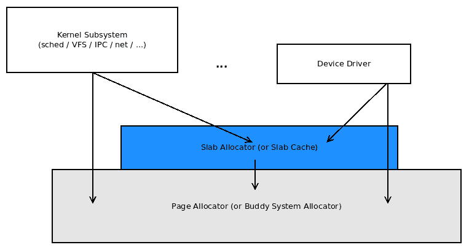

图 8.1 - Linux 的页面分配器引擎，上面是 slab 分配器

首先，有几件事要澄清：

+   整个 Linux 内核及其所有核心组件和子系统（不包括内存管理子系统本身）最终都使用页面分配器（或 BSA）进行内存（de）分配。这包括非核心内容，如内核模块和设备驱动程序。

+   前面的系统完全驻留在内核（虚拟）地址空间中，不可直接从用户空间访问。

+   页面帧（RAM）从页面分配器获取内存的地方位于内核低内存区域，或内核段的直接映射 RAM 区域（我们在上一章节详细介绍了内核段）

+   slab 分配器最终是页面分配器的用户，因此它的内存也是从那里获取的（这再次意味着从内核低内存区域获取）

+   用户空间使用熟悉的`malloc`系列 API 进行动态内存分配并不直接映射到前面的层（也就是说，在用户空间调用`malloc(3)`并不直接导致对页面或 slab 分配器的调用）。它是间接的。具体是如何？您将会学到；请耐心等待！（这个关键内容实际上在下一章的两个部分中找到，涉及到需求分页；在您学习那一章时要注意！）

+   另外，要明确的是，Linux 内核内存是不可交换的。它永远不会被交换到磁盘上；这是在早期 Linux 时代决定的，以保持性能高。用户空间内存页面默认是可交换的；系统程序员可以通过`mlock()`/`mlockall()`系统调用来改变这一点。

现在，系好安全带！有了对页面分配器和 slab 分配器的基本理解，让我们开始学习 Linux 内核内存分配器的工作原理，更重要的是，如何与它们良好地配合工作。

# 理解和使用内核页面分配器（或 BSA）

在这一部分，您将了解 Linux 内核主要（de）分配器引擎的两个方面：

+   首先，我们将介绍这个软件背后算法的基础知识（称为伙伴系统）。

+   然后，我们将介绍它向内核或驱动程序开发人员公开的 API 的实际使用。

理解页面分配器背后的算法的基础知识是重要的。然后您将能够了解其优缺点，以及在哪种情况下使用哪些 API。让我们从它的内部工作原理开始。再次提醒，本书关于内部内存管理细节的范围是有限的。我们将涵盖到足够的深度，不再深入。

## 页面分配器的基本工作原理

我们将把这个讨论分成几个相关的部分。让我们从内核的页面分配器如何通过其 freelist 数据结构跟踪空闲物理页面帧开始。

### Freelist 组织

页面分配器（伙伴系统）算法的关键是其主要内部元数据结构。它被称为伙伴系统空闲列表，由指向（非常常见的！）双向循环列表的指针数组组成。这个指针数组的索引称为列表的顺序 - 它是要提高 2 的幂。数组长度从`0`到`MAX_ORDER-1`。`MAX_ORDER`的值取决于体系结构。在 x86 和 ARM 上，它是 11，而在大型系统（如 Itanium）上，它是 17。因此，在 x86 和 ARM 上，顺序范围从 2⁰到 2¹⁰；也就是从 1 到 1,024。这是什么意思？请继续阅读...

每个双向循环链表指向大小为*2^(order)*的自由物理连续页面帧。因此（假设页面大小为 4 KB），我们最终得到以下列表：

+   2⁰ = 1 页 = 4 KB 块

+   2¹ = 2 页 = 8 KB 块

+   2² = 4 页 = 16 KB 块

+   2³ = 8 页 = 32 KB 块

+   2¹⁰ = 1024 页 = 1024*4 KB = 4 MB 块

以下图表是对（单个实例的）页面分配器空闲列表的简化概念说明：

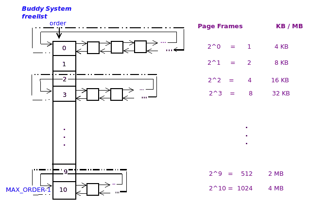

图 8.2 - 具有 4 KB 页面大小和 MAX_ORDER 为 11 的系统上的伙伴系统/页面分配器空闲列表

在上图中，每个内存“块”由一个正方形框表示（为了简单起见，我们在图中使用相同的大小）。当然，在内部，这些并不是实际的内存页面；相反，这些框代表指向物理内存帧的元数据结构（struct page）。在图的右侧，我们显示了可以排入左侧列表的每个物理连续空闲内存块的大小。

内核通过`proc`文件系统（在我们的 Ubuntu 虚拟机上，内存为 1 GB）为我们提供了对页面分配器当前状态的方便（汇总）视图：

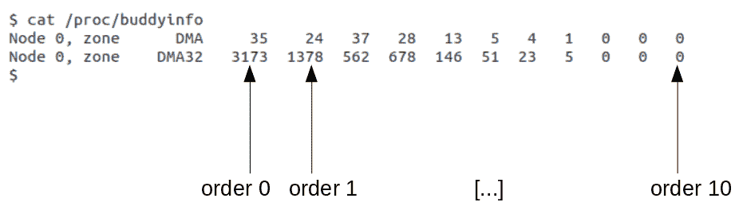

图 8.3 - 样本/proc/buddyinfo 输出的带注释的屏幕截图

我们的虚拟机是一个伪 NUMA 框，有一个节点（`Node 0`）和两个区域（`DMA`和`DMA32`）。在`zone XXX`后面的数字是从顺序 0，顺序 1，顺序 2 一直到`MAX_ORDER-1`（这里是*11 - 1 = 10*）的空闲（物理连续！）页框的数量。因此，让我们从前面的输出中取几个例子：

+   在节点`0`，`zone DMA`的顺序`0`列表中有 35 个单页的空闲 RAM 块。

+   在节点`0`，`zone DMA32`，顺序`3`，这里显示的数字是 678；现在，取*2^(order) = 2³* = 8* *页框 = 32 KB*（假设页面大小为 4 KB）；这意味着在该列表上有 678 个 32 KB 的物理连续空闲 RAM 块。

重要的是要注意**每个块都保证是物理连续的 RAM**。还要注意，给定顺序上的内存块的大小始终是前一个顺序的两倍（并且是下一个顺序的一半）。当然，这是因为它们都是 2 的幂。

请注意，`MAX_ORDER`可以（并且确实）随体系结构变化。在常规 x86 和 ARM 系统上，它是`11`，在空闲列表的顺序 10 上产生 4 MB 的物理连续 RAM 的最大块大小。在运行 Itanium（IA-64）处理器的高端企业服务器级系统上，`MAX_ORDER`可以高达`17`（意味着在空闲列表的顺序（17-1）上的最大块大小，因此在 16 的顺序上是*2¹⁶ = 65,536 页 = 512 MB 块*的物理连续 RAM，对于 4 KB 页面大小）。IA-64 MMU 支持从仅有的 4 KB 到 256 MB 的八种页面大小。作为另一个例子，对于 16 MB 的页面大小，顺序 16 列表可能每个具有*65,536 * 16 MB = 1 TB*的物理连续 RAM 块！

另一个关键点：内核保留多个 BSA 空闲列表 - 每个存在于系统上的 node:zone 都有一个！这为在 NUMA 系统上分配内存提供了一种自然的方式。

下图显示了内核如何实例化多个*空闲列表-系统上每个节点：区域一个*（图表来源：*Professional Linux Kernel Architecture*，Mauerer，Wrox Press，2008 年 10 月）：

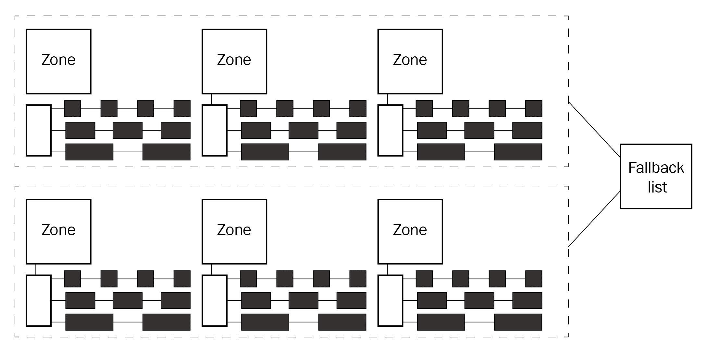

图 8.4-页面分配器（BSA）“空闲列表”，系统上每个节点：区域一个；图表来源：*Professional Linux Kernel Architecture*，Mauerer，Wrox Press，2008 年 10 月

此外，如图 8.5 所示，当内核被调用以通过页面分配器分配 RAM 时，它会选择最佳的空闲列表来分配内存-与请求的线程所在的*节点*相关联的列表（回想一下前一章的 NUMA 架构）。如果该节点没有内存或由于某种原因无法分配内存，内核将使用备用列表来确定从哪个空闲列表尝试分配内存（实际上，实际情况更加复杂；我们在*页面分配器内部-更多细节*部分提供了一些更多的细节）。

现在让我们以概念方式了解所有这些实际上是如何工作的。

### 页面分配器的工作原理

实际的（解）分配策略可以通过一个简单的例子来解释。假设一个设备驱动程序请求 128 KB 的内存。为了满足这个请求，（简化和概念化的）页面分配器算法将执行以下操作：

1.  该算法以页面的形式表示要分配的数量（这里是 128 KB），因此，这里是（假设页面大小为 4 KB）*128/4=32 页*。

1.  接下来，它确定 2 必须被提高到多少次方才能得到 32。这就是*log*[2]*32*，结果是 5（因为 2⁵等于 32）。

1.  现在，它检查适当的*节点：区域*页面分配器空闲列表上的顺序 5 列表。如果有可用的内存块（大小为*2**⁵**页=128 KB*），则从列表中出列，更新列表，并分配给请求者。任务完成！返回给调用者。

为什么我们说*适当的节点：区域**页面分配器空闲列表*？这是否意味着有不止一个？是的，确实如此！我们再次重申：实际情况是系统上将有几个空闲列表数据结构，每个*节点：区域*一个（还可以在*页面分配器内部-更多细节*部分中查看更多细节）。

1.  如果顺序 5 列表上没有可用的内存块（即为空），那么它将检查下一个顺序的列表；也就是顺序 6 的链表（如果不为空，它将有*2⁶**页=256 KB*的内存块排队，每个块的大小是我们想要的两倍）。

1.  如果顺序 6 列表不为空，那么它将从中取出（出列）一个内存块（大小为 256 KB，是所需大小的两倍），并执行以下操作：

+   更新列表以反映现在已经移除了一个块。

+   将这个块切成两半，从而得到两个 128 KB 的半块或**伙伴**！（请参阅下面的信息框。）

+   将一半（大小为 128 KB）迁移（入列）到顺序 5 列表。

+   将另一半（大小为 128 KB）分配给请求者。

+   任务完成！返回给调用者。

1.  如果顺序 6 列表也是空的，那么它将使用顺序 7 列表重复前面的过程，直到成功为止。

1.  如果所有剩余的高阶列表都为空（null），则请求将失败。

我们可以将内存块切成两半，因为列表上的每个块都保证是物理上连续的内存。切割后，我们得到两个半块；每个都被称为**伙伴块**，因此这个算法的名称。从学术角度来说，它被称为二进制伙伴系统，因为我们使用 2 的幂大小的内存块。**伙伴块**被定义为与另一个相同大小且物理相邻的块。

你会明白前面的描述是概念性的。实际的代码实现当然更复杂和优化。顺便说一句，代码-作为**分区伙伴分配器的核心**，正如它的注释所提到的，就在这里：`mm/page_alloc.c:__alloc_pages_nodemask()`。超出了本书的范围，我们不会尝试深入研究分配器的代码级细节。

### 通过几种情景来工作

现在我们已经了解了算法的基础，让我们考虑一些情景：首先是一个简单直接的情况，然后是一些更复杂的情况。

#### **最简单的情况**

假设一个内核空间设备驱动程序（或一些核心代码）请求 128 KB，并从一个空闲列表数据结构的 order 5 列表中接收到一个内存块。在以后的某个时间点，它将必然通过使用页面分配器的一个 free API 来释放内存块。现在，这个 API 的算法通过它的 order 计算出刚刚释放的块属于 order 5 列表；因此，它将其排队在那里。

#### **更复杂的情况**

现在，假设与之前的简单情况不同，当设备驱动程序请求 128 KB 时，order 5 列表为空；因此，根据页面分配器算法，我们转到下一个 order 6 的列表并检查它。假设它不为空；算法现在出列一个 256 KB 的块并将其分割（或切割）成两半。现在，一半（大小为 128 KB）发送给请求者，剩下的一半（同样大小为 128 KB）排队到 order 5 列表。

伙伴系统的真正有趣的特性是当请求者（设备驱动程序）在以后的某个时间点释放内存块时会发生什么。正如预期的那样，算法通过它的 order 计算出刚刚释放的块属于 order 5 列表。但在盲目地将其排队到那里之前，**它会寻找它的伙伴块**，在这种情况下，它（可能）找到了！现在它将两个伙伴块合并成一个更大的块（大小为 256 KB）并将合并后的块排队到*order 6*列表。这太棒了-它实际上帮助了**碎片整理内存**！

#### **失败的情况**

现在让我们通过不使用方便的 2 的幂大小作为需求来增加趣味性。这一次，假设设备驱动程序请求大小为 132 KB 的内存块。伙伴系统分配器会怎么做？当然，它不能分配比请求的内存更少，它会分配更多-你猜到了（见*图 8.2*），下一个可用的内存块是大小为 256 KB 的 order 7。但消费者（驱动程序）只会看到并使用分配给它的 256 KB 块的前 132 KB。剩下的（124 KB）是**浪费**的（想想看，接近 50%的浪费！）。这被称为**内部碎片（或浪费）**，是二进制伙伴系统的关键失败！

你会发现，对于这种情况确实有一种缓解方法：有一个补丁用于处理类似的情况（通过`alloc_pages_exact() / free_pages_exact()` API）。我们将很快介绍使用页面分配器的 API。

### 页面分配器内部-更多细节

在本书中，我们不打算深入研究页面分配器内部的代码级细节。话虽如此，事实是：在数据结构方面，`zone`结构包含一个`free_area`结构的数组。这是有道理的；正如你所学到的，系统上可以有（通常有）多个页面分配器空闲列表，每个节点：区域一个：

```
// include/linux/mmzone.h
struct zone { 
    [ ... ] 
    /* free areas of different sizes */
    struct free_area free_area[MAX_ORDER];
    [ ... ]
};
```

`free_area`结构是双向循环链表的实现（在该节点：区域内的空闲内存页框中）以及当前空闲的页框数量：

```
struct free_area {
    struct list_head free_list[MIGRATE_TYPES];
    unsigned long nr_free;
};
```

为什么是一个链表数组而不是一个链表？不深入细节，我们将提到，实际上，到目前为止，伙伴系统空闲列表的内核布局比表面上的更复杂：从 2.6.24 内核开始，我们看到的每个空闲列表实际上进一步分解为多个空闲列表，以满足不同的*页面迁移类型*。这是为了处理在尝试保持内存碎片整理时出现的复杂情况。除此之外，如前所述，这些空闲列表存在于系统上的每个*节点：区域*。因此，例如，在一个实际的 NUMA 系统上，每个节点有 4 个区域，每个节点有 3 个区域，将有 12（4 x 3）个空闲列表。不仅如此，每个空闲列表实际上进一步分解为 6 个空闲列表，每个迁移类型一个。因此，在这样的系统上，整个系统将存在*6 x 12 = 72*个空闲列表数据结构！

如果您感兴趣，请深入了解细节，并查看`/proc/buddyinfo`的输出-这是伙伴系统空闲列表状态的一个很好的总结视图（如图 8.3 所示）。接下来，为了获得更详细和更现实的视图（如前面提到的类型，显示*所有*空闲列表），查看`/proc/pagetypeinfo`（需要 root 访问）-它显示所有空闲列表（也分解为页面迁移类型）。

页面分配器（伙伴系统）算法的设计是*最佳适配*类之一。它的主要优点是实际上有助于在系统运行时整理物理内存。简而言之，它的优缺点如下。

页面分配器（伙伴系统）算法的优点如下：

+   有助于碎片整理内存（防止外部碎片）

+   保证分配物理连续的内存块

+   保证 CPU 缓存行对齐的内存块

+   快速（足够快；算法时间复杂度为*O(log n)*）

另一方面，迄今为止最大的缺点是内部碎片或浪费可能过高。

好的，很棒！我们已经涵盖了页面或伙伴系统分配器内部工作的大量背景材料。现在是动手的时候：让我们现在深入了解并使用页面分配器 API 来分配和释放内存。

## 学习如何使用页面分配器 API

Linux 内核提供了一组 API 来通过页面分配器分配和释放内存（RAM），这些通常被称为低级（de）分配器例程。以下表格总结了页面分配 API；您会注意到所有具有两个参数的 API 或宏，第一个参数称为*GFP 标志或位掩码*；我们将很快详细解释它，请现在忽略它。第二个参数是`order`-空闲列表的顺序，即要分配的内存量为 2^(order)页帧。所有原型都可以在`include/linux/gfp.h`中找到：

| **API 或宏名称** | **评论** | **API 签名或宏** |
| --- | --- | --- |
| `__get_free_page()` | 分配一个页面帧。分配的内存将具有随机内容；它是`__get_free_pages()`API 的包装器。返回值是刚分配的内存的内核逻辑地址的指针。 | `#define __get_free_page(gfp_mask) \ __get_free_pages((gfp_mask), 0)`​ |
| `__get_free_pages()` | 分配*2^(order)*个物理连续的页面帧。分配的内存将具有随机内容；返回值是刚分配的内存的内核逻辑地址的指针。 | `unsigned long __get_free_pages(gfp_t gfp_mask, unsigned int order);` |
| `get_zeroed_page()` | 分配一个页面帧；其内容设置为 ASCII 零（`NULL`；即，它被清零）；返回值是刚分配的内存的内核逻辑地址的指针。 | `unsigned long get_zeroed_page(gfp_t gfp_mask);` |
| `alloc_page()` | 分配一个页面帧。分配的内存将具有随机内容；是`alloc_pages()` API 的包装器；返回值是指向刚分配的内存的`page`元数据结构的指针；可以通过`page_address()`函数将其转换为内核逻辑地址。 | `#define alloc_page(gfp_mask) \ alloc_pages(gfp_mask, 0)` |
| `alloc_pages()` | 分配*2^(order)*个物理连续页面帧。分配的内存将具有随机内容；返回值是指向刚分配的内存的`page`元数据结构开头的指针；可以通过`page_address()`函数将其转换为内核逻辑地址。 | `struct page * alloc_pages(gfp_t gfp_mask, unsigned int order);` |

表 8.1 - 低级（BSA/page）分配器 - 流行的导出分配 API

所有先前的 API 都是通过`EXPORT_SYMBOL()`宏导出的，因此可供内核模块和设备驱动程序开发人员使用。不用担心，您很快就会看到一个演示如何使用它们的内核模块。

Linux 内核认为维护一个（小）元数据结构来跟踪每个 RAM 页面帧是值得的。它被称为`page`结构。关键在于，要小心：与通常的返回指向新分配的内存块开头的指针（虚拟地址）的语义不同，注意先前提到的`alloc_page()`和`alloc_pages()` API 都返回指向新分配的内存的`page`结构开头的指针，而不是内存块本身（其他 API 所做的）。您必须通过调用返回的页面结构地址上的`page_address()` API 来获取新分配的内存开头的实际指针。在*编写内核模块以演示使用页面分配器 API*部分的示例代码将说明所有先前 API 的用法。

在这里提到的页面分配器 API 之前，至关重要的是了解至少关于**获取空闲页面**（GFP）标志的基础知识，这是接下来的部分的主题。

### 处理 GFP 标志

您会注意到所有先前的分配器 API（或宏）的第一个参数是`gfp_t gfp_mask`。这是什么意思？基本上，这些是 GFP 标志。这些是内核内部内存管理代码层使用的标志（有几个）。对于典型的内核模块（或设备驱动程序）开发人员来说，只有两个 GFP 标志至关重要（如前所述，其余是用于内部使用）。它们如下：

+   `GFP_KERNEL`

+   `GFP_ATOMIC`

在通过页面分配器 API 执行内存分配时决定使用哪个是重要的；始终记住的一个关键规则是：

*如果在进程上下文中并且可以安全休眠，则使用 GFP_KERNEL 标志。如果不安全休眠（通常在任何类型的原子或中断上下文中），必须使用 GFP_ATOMIC 标志。*

遵循上述规则至关重要。搞错了会导致整个机器冻结、内核崩溃和/或发生随机的不良情况。那么*安全/不安全休眠*这些陈述到底意味着什么？为此以及更多内容，我们推迟到接下来的*深入挖掘 GFP 标志*部分。尽管如此，这真的很重要，所以我强烈建议您阅读它。

**Linux 驱动程序验证**（LDV）项目：回到第一章，*内核工作空间设置*，在*LDV - Linux 驱动程序验证*项目部分，我们提到该项目对于 Linux 模块（主要是驱动程序）以及核心内核的各种编程方面有有用的“规则”。

关于我们当前的主题，这里有一个规则，一个否定的规则，暗示着你*不能*这样做：“在持有自旋锁时使用阻塞内存分配”([`linuxtesting.org/ldv/online?action=show_rule&rule_id=0043`](http://linuxtesting.org/ldv/online?action=show_rule&rule_id=0043))。持有自旋锁时，你不允许做任何可能会阻塞的事情；这包括内核空间内存分配。因此，非常重要的是，在任何原子或非阻塞上下文中执行内存分配时，必须使用`GFP_ATOMIC`标志，比如在持有自旋锁时（你会发现这在互斥锁中并不适用；在持有互斥锁时，你可以执行阻塞活动）。违反这个规则会导致不稳定，甚至可能引发（隐式）死锁的可能性。LDV 页面提到了一个违反这个规则的设备驱动程序以及随后的修复([`git.kernel.org/pub/scm/linux/kernel/git/torvalds/linux.git/commit/?id=5b0691508aa99d309101a49b4b084dc16b3d7019`](https://git.kernel.org/pub/scm/linux/kernel/git/torvalds/linux.git/commit/?id=5b0691508aa99d309101a49b4b084dc16b3d7019))。看一下：补丁清楚地显示了（在我们即将介绍的`kzalloc()`API 的上下文中）`GFP_KERNEL`标志被替换为`GFP_ATOMIC`标志。

另一个常用的 GFP 标志是`__GFP_ZERO`。它的使用向内核表明你想要零化的内存页面。它经常与`GFP_KERNEL`或`GFP_ATOMIC`标志按位或操作，以返回初始化为零的内存。

内核开发人员确实费心详细记录了 GFP 标志。在`include/linux/gfp.h`中有一个长而详细的注释；标题是`DOC: 有用的 GFP 标志组合`。

目前，为了让我们快速入门，只需了解使用`GFP_KERNEL`标志与 Linux 内核的内存分配 API 确实是内核内部分配的常见情况。

### 使用页面分配器释放页面

当然，分配内存的另一面是释放内存。内核中的内存泄漏绝对不是你想要贡献的东西。在*表 8.1*中显示的页面分配器 API 中，这里是相应的释放 API：

| **API 或宏名称** | **评论** | **API 签名或宏** |
| --- | --- | --- |
| `free_page()` | 释放通过`__get_free_page()`、`get_zeroed_page()`或`alloc_page()`API 分配的（单个）页面；它只是`free_pages()`API 的简单包装 | `#define free_page(addr) __free_pages((addr), 0)` |
| `free_pages()` | 释放通过`__get_free_pages()`或`alloc_pages()`API 分配的多个页面（实际上是`__free_pages()`的包装） | `void free_pages(unsigned long addr, unsigned int order)` |
| `__free_pages()` | （与前一行相同，另外）这是执行实际工作的基础例程；还要注意第一个参数是指向`page`元数据结构的指针。 | `void __free_pages(struct page *page, unsigned int order)` |

表 8.2 - 与页面分配器一起使用的常见释放页面 API

您可以看到前面函数中实际的基础 API 是`free_pages()`，它本身只是`mm/page_alloc.c:__free_pages()`代码的包装。`free_pages()`API 的第一个参数是指向被释放内存块的起始指针；当然，这是分配例程的返回值。然而，基础 API`__free_pages()`的第一个参数是指向被释放内存块的*page*元数据结构的指针。

一般来说，除非您真的知道自己在做什么，您肯定应该调用`foo()`包装例程而不是其内部的`__foo()`例程。这样做的一个原因是简单的正确性（也许包装器在调用底层例程之前使用了一些必要的同步机制 - 比如锁）。另一个原因是有效性检查（这有助于代码保持健壮和安全）。通常，`__foo()`例程会绕过有效性检查以换取速度。

正如所有有经验的 C/C++应用程序开发人员所知，分配和随后释放内存是错误的丰富来源！这主要是因为 C 是一种无管理语言，就内存而言；因此，您可能会遇到各种各样的内存错误。这些包括众所周知的内存泄漏，读/写的缓冲区溢出/下溢，双重释放和**使用后释放**（UAF）错误。

不幸的是，在内核空间中也没有什么不同；只是后果会更严重！要特别小心！请务必确保以下内容：

+   偏爱初始化分配的内存为零的例程。

+   在执行分配时考虑并使用适当的 GFP 标志 - 更多内容请参阅*GFP 标志 - 深入挖掘*部分，但简而言之，请注意以下内容：

+   在可以安全休眠的进程上下文中，使用`GFP_KERNEL`。

+   在原子上下文中，比如处理中断时，使用`GFP_ATOMIC`。

+   在使用页面分配器时（就像我们现在正在做的那样），尽量保持分配大小为圆整的 2 的幂页（关于这一点的原因以及在不需要这么多内存时如何减轻这一点 - 典型情况下 - 将在本章后续部分详细介绍）。

+   您只会尝试释放您之前分配的内存；不用说，不要忘记释放它，也不要重复释放它。

+   确保原始内存块的指针不受重用、操纵（`ptr ++`或类似的操作）和破坏，以便在完成时正确释放它。

+   检查（并再次检查！）传递给 API 的参数。是否需要指向先前分配的块或其底层`page`结构的指针？

在生产中发现困难和/或担心问题？别忘了，您有帮助！学习如何使用内核内部的强大静态分析工具（Coccinelle、`sparse`和其他工具，如`cppcheck`或`smatch`）。对于动态分析，学习如何安装和使用**KASAN**（内核地址消毒剂）。

回想一下我在第五章中提供的 Makefile 模板，*编写您的第一个内核模块 - LKMs 第二部分*，在*A better Makefile template*部分。它包含使用了几种这些工具的目标；请使用它！

好了，既然我们已经涵盖了页面分配器的（常见的）分配和释放 API，现在是时候将这些知识付诸实践了。让我们写一些代码！

### 编写一个内核模块来演示使用页面分配器 API

现在让我们动手使用我们迄今为止学到的低级页面分配器和释放 API。在本节中，我们将展示相关的代码片段，然后在必要时进行解释，来自我们的演示内核模块（`ch8/lowlevel_mem/lowlevel_mem.c`）。

在我们小型 LKM 的主要工作例程`bsa_alloc()`中，我们用粗体字突出显示了显示我们试图实现的代码注释。需要注意的几点：

1.  首先，我们做了一些非常有趣的事情：我们使用我们的小内核“库”函数`klib_llkd.c:show_phy_pages()`，直接向您展示物理 RAM 页框如何在内核低端内存区域与内核虚拟页进行身份映射！（`show_phy_pages()`例程的确切工作将很快讨论）：

```
// ch8/lowlevel_mem/lowlevel_mem.c
[...]
static int bsa_alloc(void)
{
    int stat = -ENOMEM;
    u64 numpg2alloc = 0;
    const struct page *pg_ptr1;

    /* 0\. Show the identity mapping: physical RAM page frames to kernel virtual
     * addresses, from PAGE_OFFSET for 5 pages */
    pr_info("%s: 0\. Show identity mapping: RAM page frames : kernel virtual pages :: 1:1\n", OURMODNAME);
    show_phy_pages((void *)PAGE_OFFSET, 5 * PAGE_SIZE, 1);
```

1.  接下来，我们通过底层的`__get_free_page()`页面分配器 API 分配一页内存（我们之前在*表 8.1*中看到过）：

```
  /* 1\. Allocate one page with the __get_free_page() API */
  gptr1 = (void *) __get_free_page(GFP_KERNEL);
  if (!gptr1) {
        pr_warn("%s: __get_free_page() failed!\n", OURMODNAME);
        /* As per convention, we emit a printk above saying that the
         * allocation failed. In practice it isn't required; the kernel
         * will definitely emit many warning printk's if a memory alloc
         * request ever fails! Thus, we do this only once (here; could also
         * use the WARN_ONCE()); from now on we don't pedantically print any
         * error message on a memory allocation request failing. */
        goto out1;
  }
  pr_info("%s: 1\. __get_free_page() alloc'ed 1 page from the BSA @ %pK (%px)\n",
      OURMODNAME, gptr1, gptr1);
```

注意我们发出一个`printk`函数，显示内核的逻辑地址。回想一下上一章，这是页面分配器内存，位于内核段/VAS 的直接映射 RAM 或 lowmem 区域。

出于安全考虑，我们应该一致且只使用`%pK`格式说明符来打印内核地址，以便在内核日志中显示哈希值而不是真实的虚拟地址。然而，在这里，为了向您展示实际的内核虚拟地址，我们还使用了`%px`格式说明符（与`%pK`一样，也是可移植的；出于安全考虑，请不要在生产中使用`%px`格式说明符）。

接下来，请注意在发出第一个`__get_free_page()` API（在前面的代码片段中）之后的详细注释。它提到您实际上不必打印内存不足的错误或警告消息。（好奇吗？要找出原因，请访问[`lkml.org/lkml/2014/6/10/382`](https://lkml.org/lkml/2014/6/10/382)。）在这个示例模块中（以及之前的几个模块和将要跟进的模块），我们通过使用适当的 printk 格式说明符（如`%zd`、`%zu`、`%pK`、`%px`和`%pa`）来编码我们的 printk（或`pr_foo()`宏）实例，以实现可移植性。

1.  让我们继续使用页面分配器进行第二次内存分配；请参阅以下代码片段：

```
/*2\. Allocate 2^bsa_alloc_order pages with the __get_free_pages() API */
  numpg2alloc = powerof(2, bsa_alloc_order); // returns 2^bsa_alloc_order
  gptr2 = (void *) __get_free_pages(GFP_KERNEL|__GFP_ZERO, bsa_alloc_order);
  if (!gptr2) {
      /* no error/warning printk now; see above comment */
      goto out2;
  }
  pr_info("%s: 2\. __get_free_pages() alloc'ed 2^%d = %lld page(s) = %lld bytes\n"
      " from the BSA @ %pK (%px)\n",
      OURMODNAME, bsa_alloc_order, powerof(2, bsa_alloc_order),
      numpg2alloc * PAGE_SIZE, gptr2, gptr2);
  pr_info(" (PAGE_SIZE = %ld bytes)\n", PAGE_SIZE);
```

在前面的代码片段中（请参阅代码注释），我们通过页面分配器的`__get_free_pages()` API（因为我们模块参数`bsa_alloc_order`的默认值是`3`）分配了 2³ - 也就是 8 页的内存。

一旁注意到，我们使用`GFP_KERNEL|__GFP_ZERO` GFP 标志来确保分配的内存被清零，这是最佳实践。然而，清零大内存块可能会导致轻微的性能损失。

现在，我们问自己一个问题：有没有办法验证内存是否真的是物理上连续的（承诺的）？事实证明，是的，我们实际上可以检索并打印出每个分配的页框的起始物理地址，并检索其**页框号**（PFN）。

PFN 是一个简单的概念：它只是索引或页码 - 例如，物理地址 8192 的 PFN 是 2（*8192/4096*）。由于我们已经展示了如何（以及何时可以）将内核虚拟地址转换为它们的物理对应物（反之亦然；这个覆盖在第七章中，*内存管理内部 - 基本知识*，在*直接映射 RAM 和地址转换*部分），我们就不在这里重复了。

为了完成将虚拟地址转换为物理地址并检查连续性的工作，我们编写了一个小的“库”函数，它保存在本书 GitHub 源树的根目录中的一个单独的 C 文件`klib_llkd.c`中。我们的意图是修改我们的内核模块的 Makefile，以便将这个库文件的代码也链接进来！（正确地完成这个工作在第五章中已经涵盖了，*编写您的第一个内核模块 - LKMs 第二部分*，在*通过多个源文件执行库模拟*部分。）这是我们对库例程的调用（就像在步骤 0 中所做的那样）：

```
show_phy_pages(gptr2, numpg2alloc * PAGE_SIZE, 1);
```

以下是我们库例程的代码（在`<booksrc>/klib_llkd.c`源文件中；为了清晰起见，我们不会在这里展示整个代码）：

```
// klib_llkd.c
[...]
/* show_phy_pages - show the virtual, physical addresses and PFNs of the memory range provided on a per-page basis.
 * @kaddr: the starting kernel virtual address
 * @len: length of the memory piece (bytes)
 * @contiguity_check: if True, check for physical contiguity of pages
 * 'Walk' the virtually contiguous 'array' of pages one by one (that is, page by page),  
 * printing the virt and physical address (and PFN- page frame number). This way, we can see 
 * if the memory really is *physically* contiguous or not
 */
void show_phy_pages(const void *kaddr, size_t len, bool contiguity_check)
{
    [...]
    if (len % PAGE_SIZE)
        loops++;
    for (i = 0; i < len/PAGE_SIZE; i++) {
        pa = virt_to_phys(vaddr+(i*PAGE_SIZE));
 pfn = PHYS_PFN(pa);

        if (!!contiguity_check) {
        /* what's with the 'if !!(<cond>) ...' ??
         * a 'C' trick: ensures that the if condition always evaluates
         * to a boolean - either 0 or 1 */
            if (i && pfn != prev_pfn + 1)
                pr_notice(" *** physical NON-contiguity detected ***\n");
        }
        pr_info("%05d 0x%px %pa %ld\n", i, vaddr+(i*PAGE_SIZE), &pa, pfn);
        if (!!contiguity_check)
            prev_pfn = pfn;
    }
}
```

研究前面的函数。我们逐个遍历给定的内存范围（虚拟页），获取物理地址和 PFN，然后通过 printk 发出（请注意，我们使用`%pa`格式说明符来可移植地打印*物理地址* - 它需要通过引用传递）。不仅如此，如果第三个参数`contiguity_check`是`1`，我们将检查 PFN 是否只相差一个数字，从而检查页面是否确实是物理上连续的。 （顺便说一句，我们使用的简单`powerof()`函数也在我们的库代码中。）

不过，有一个关键点：让内核模块与物理地址一起工作是*极不鼓励*的。只有内核的内部内存管理代码直接使用物理地址。甚至硬件设备驱动程序直接使用物理内存的真实案例非常少见（DMA 是其中之一，使用`*ioremap*`API 是另一个）。

我们只在这里这样做是为了证明一点-由页面分配器分配的内存（通过单个 API 调用）是物理连续的。此外，请意识到我们使用的`virt_to_phys()`（和其他）API 保证仅在直接映射内存（内核低内存区域）上工作，而不是在`vmalloc`范围、IO 内存范围、总线内存、DMA 缓冲区等其他地方。

1.  现在，让我们继续进行内核模块代码：

```
    /* 3\. Allocate and init one page with the get_zeroed_page() API */
    gptr3 = (void *) get_zeroed_page(GFP_KERNEL);
    if (!gptr3)
        goto out3;
    pr_info("%s: 3\. get_zeroed_page() alloc'ed 1 page from the BSA @ %pK (%px)\n", 
        OURMODNAME, gptr3, gptr3);
```

如前面的代码片段所示，我们分配了一页内存，但通过使用 PA `get_zeroed_page()` API 确保它被清零。`pr_info()`显示了哈希和实际的 KVA（使用`%pK`或`%px`以便地址以便以可移植的方式打印，无论你是在 32 位还是 64 位系统上运行）。

1.  接下来，我们使用`alloc_page()` API 分配一页。小心！它不会返回分配页面的指针，而是返回代表分配页面的元数据结构`page`的指针；这是函数签名：`struct page * alloc_page(gfp_mask)`。因此，我们使用`page_address()`助手将其转换为内核逻辑（或虚拟）地址：

```
/* 4\. Allocate one page with the alloc_page() API.
 pg_ptr1 = alloc_page(GFP_KERNEL);
 if (!pg_ptr1)
     goto out4;

 gptr4 = page_address(pg_ptr1);
 pr_info("%s: 4\. alloc_page() alloc'ed 1 page from the BSA @ %pK (%px)\n"
         " (struct page addr=%pK (%px)\n)",
        OURMODNAME, (void *)gptr4, (void *)gptr4, pg_ptr1, pg_ptr1);
```

在前面的代码片段中，我们通过`alloc_page()` PA API 分配了一页内存。正如所解释的，我们需要将其返回的页面元数据结构转换为 KVA（或内核逻辑地址）通过`page_address()` API。

1.  接下来，使用`alloc_pages()` API 分配和`init` *2³ = 8 页*。与前面的代码片段一样，这里也适用相同的警告：

```
 /* 5\. Allocate and init 2³ = 8 pages with the alloc_pages() API.
 gptr5 = page_address(alloc_pages(GFP_KERNEL, 3));
 if (!gptr5)
     goto out5;
 pr_info("%s: 5\. alloc_pages() alloc'ed %lld pages from the BSA @ %pK (%px)\n", 
     OURMODNAME, powerof(2, 3), (void *)gptr5, (void *)gptr5);
```

在前面的代码片段中，我们将`alloc_pages()`包装在`page_address()` API 中，以分配*2³ = 8*页内存！

有趣的是，我们在代码中使用了几个本地的`goto`语句（请在存储库中查看代码）。仔细观察，你会注意到它实际上保持了*错误处理代码路径*的清晰和逻辑。这确实是 Linux 内核*编码风格*指南的一部分。

对（有时有争议的）`goto`的使用在这里清楚地记录在这里：[`www.kernel.org/doc/html/v5.4/process/coding-style.html#centralized-exiting-of-functions`](https://www.kernel.org/doc/html/v5.4/process/coding-style.html#centralized-exiting-of-functions)。我敦促你去查看！一旦你理解了使用模式，你会发现它有助于减少所有太典型的内存泄漏（等等）清理错误！

1.  最后，在清理方法中，在从内核内存中删除之前，我们释放了在内核模块的清理代码中刚刚分配的所有内存块。

1.  为了将我们的库`klib_llkd`代码与我们的`lowlevel_mem`内核模块链接起来，`Makefile`更改为以下内容（回想一下，我们在第五章中学习了如何将多个源文件编译成单个内核模块，*编写你的第一个内核模块-LKMs 第二部分*，在*通过多个源文件执行库模拟*部分）：

```
 PWD                   := $(shell pwd)
 obj-m                 += lowlevel_mem_lkm.o
 lowlevel_mem_lkm-objs := lowlevel_mem.o ../../klib_lkdc.o
 EXTRA_CFLAGS          += -DDEBUG
```

同样，在这个示例 LKM 中，我们经常使用`%px` printk 格式说明符，以便我们可以看到实际的虚拟地址而不是哈希值（内核安全功能）。在这里可以，但在生产中不要这样做。

哎呀！这是相当多的内容。确保你理解了代码，然后继续看它的运行。

### 部署我们的 lowlevel_mem_lkm 内核模块

好了，是时候看看我们的内核模块在运行中的情况了！让我们在树莓派 4（运行默认的树莓派 OS）和 x86_64 VM（运行 Fedora 31）上构建和部署它。

在 Raspberry Pi 4 Model B 上（运行 Raspberry Pi 内核版本 5.4.79-v7l+），我们构建然后`insmod(8)`我们的`lowlevel_mem_lkm`内核模块。以下截图显示了输出：

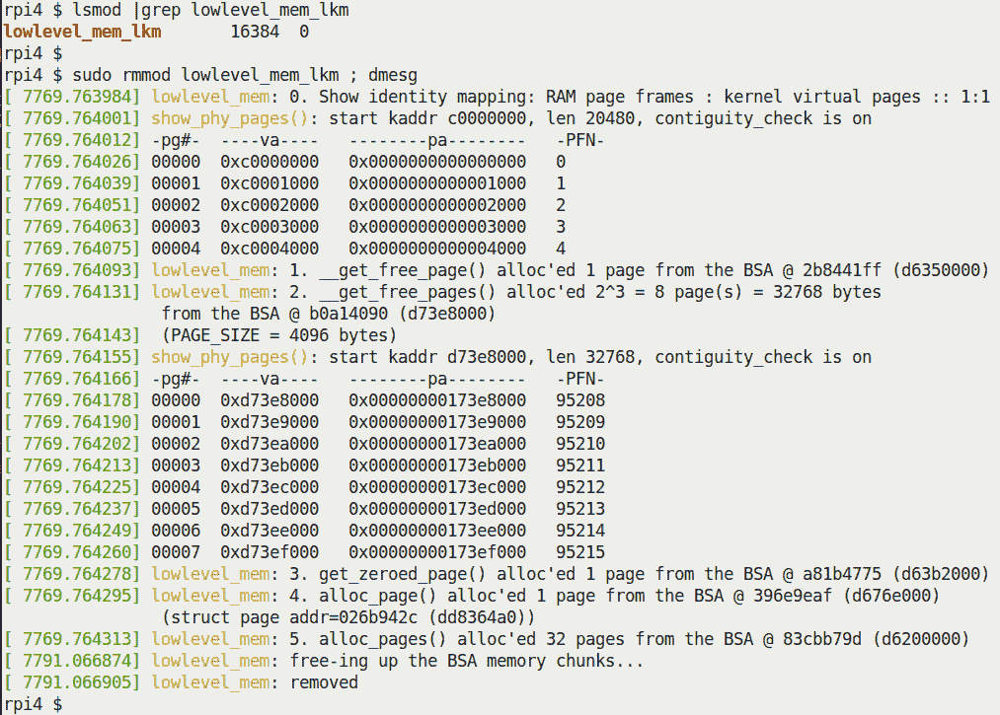

图 8.5 - 在 Raspberry Pi 4 Model B 上的 lowlevel_mem_lkm 内核模块的输出

看看！在图 8.6 的输出的第 0 步中，我们的`show_phy_pages()`库例程清楚地显示 KVA `0xc000 0000`具有 PA `0x0`，KVA `0xc000 1000`具有 PA `0x1000`，依此类推，共五页（右侧还有 PFN）；你可以清楚地看到物理 RAM 页框与内核虚拟页（在内核段的 lowmem 区域）的 1:1 身份映射！

接下来，使用`__get_free_page()`API 进行初始内存分配如预期进行。更有趣的是我们的第 2 种情况。在这里，我们可以清楚地看到每个分配的页面（从 0 到 7，共 8 页）的物理地址和 PFN 是连续的，显示出分配的内存页面确实是物理上连续的！

我们在运行我们自定义的 5.4 'debug'内核的 Ubuntu 20.04 上的 x86_64 VM 上构建和运行相同的模块。以下截图显示了输出：

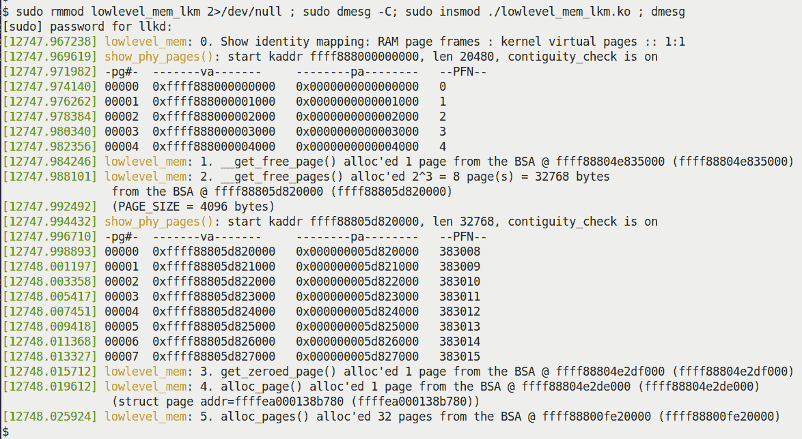

图 8.6 - 在运行 Ubuntu 20.04 的 x86_64 VM 上的 lowlevel_mem_lkm 内核模块的输出

这一次（参见图 8.7），由于`PAGE_OFFSET`值是 64 位数量（这里的值是`0xffff 8880 0000 0000`），你可以再次清楚地看到物理 RAM 页框与内核虚拟地址的身份映射（5 页）。让我们花点时间仔细看看页分配器 API 返回的内核逻辑地址。在图 8.7 中，你可以看到它们都在`0xffff 8880 .... ....`范围内。以下片段来自 x86_64 的内核源树中的`Documentation/x86/x86_64/mm.txt`，记录了 x86_64 上的虚拟内存布局（部分）：

如果这一切对你来说都很新奇，请参考第七章，*内存管理内部-基本知识*，特别是*检查内核段*和*直接映射的 RAM 和地址转换*部分。

```
0000000000000000 - 00007fffffffffff (=47 bits) user space, different per mm hole caused by [47:63] sign extension
ffff800000000000 - ffff87ffffffffff (=43 bits) guard hole, reserved for hypervisor
ffff880000000000 - ffffc7ffffffffff (=64 TB) direct mapping of all phys. memory
ffffc80000000000 - ffffc8ffffffffff (=40 bits) hole
ffffc90000000000 - ffffe8ffffffffff (=45 bits) vmalloc/ioremap space
```

很清楚，不是吗？页分配器内存（伙伴系统空闲列表）直接映射到内核 VAS 的直接映射或 lowmem 区域内的空闲物理 RAM。因此，它显然会从这个区域返回内存。你可以在前面的文档输出中看到这个区域（用粗体字突出显示）- 内核直接映射或 lowmem 区域。再次强调特定的地址范围非常与架构相关。在前面的代码中，这是 x86_64 上的（最大可能的）范围。

虽然很想宣称你现在已经完成了页分配器及其 API，但现实情况是（像往常一样）并非完全如此。请继续阅读，看看为什么-理解这些方面真的很重要。

### 页分配器和内部碎片

虽然表面上看起来一切都很好，但我敦促你深入一点。在表面之下，一个巨大的（不愉快的！）惊喜可能在等待着你：那些毫不知情的内核/驱动程序开发人员。我们之前介绍的有关页分配器的 API（参见*表 8.1*）有能力在内部产生碎片-简单来说，**浪费**-内核内存的非常重要部分！

要理解为什么会这样，你必须至少了解页分配器算法及其空闲列表数据结构的基础知识。*页分配器的基本工作*部分涵盖了这一点（以防你还没有阅读，请务必阅读）。

在*通过几种情景*部分，你会看到当我们请求方便的、完全舍入的二次幂大小的页面时，情况会非常顺利。然而，当情况不是这样时——比如说驱动程序请求 132 KB 的内存——那么我们就会遇到一个主要问题：内部碎片或浪费非常高。这是一个严重的缺点，必须加以解决。我们将看到实际上有两种方法。请继续阅读！

#### 确切的页面分配器 API

意识到默认页面分配器（或 BSA）内存在浪费的巨大潜力后，来自 Freescale Semiconductor 的开发人员（请参见信息框）为内核页面分配器贡献了一个扩展 API 的补丁，添加了一些新的 API。

在 2.6.27-rc1 系列中，2008 年 7 月 24 日，Timur Tabi 提交了一个补丁来减轻页面分配器浪费问题。这是相关的提交：[`github.com/torvalds/linux/commit/2be0ffe2b29bd31d3debd0877797892ff2d91f4c`](https://github.com/torvalds/linux/commit/2be0ffe2b29bd31d3debd0877797892ff2d91f4c)。

使用这些 API 可以更有效地分配大块（多个页面）内存，**浪费要少得多**。用于分配和释放内存的新（嗯，至少在 2008 年是*新的*）API 对如下：

```
#include <linux/gfp.h>
void *alloc_pages_exact(size_t size, gfp_t gfp_mask);
void free_pages_exact(void *virt, size_t size);
```

`alloc_pages_exact()`API 的第一个参数`size`是以字节为单位的，第二个参数是之前讨论过的“通常”的 GFP 标志值（在*处理 GFP 标志*部分；对于可能休眠的进程上下文情况，使用`GFP_KERNEL`，对于永不休眠的中断或原子上下文情况，使用`GFP_ATOMIC`）。

请注意，由此 API 分配的内存仍然保证是物理上连续的。此外，一次（通过一个函数调用）可以分配的数量受到`MAX_ORDER`的限制；事实上，这也适用于我们迄今为止看到的所有其他常规页面分配 API。我们将在即将到来的*kmalloc API 的大小限制*部分中讨论更多关于这方面的内容。在那里，你会意识到讨论实际上不仅限于 slab 缓存，还包括页面分配器！

`free_pages_exact()` API 只能用于释放由其对应的`alloc_pages_exact()`分配的内存。此外，要注意“free”例程的第一个参数当然是匹配的“alloc”例程返回的值（指向新分配的内存块的指针）。

`alloc_pages_exact()`的实现很简单而巧妙：它首先通过`__get_free_pages()`API“通常”分配整个请求的内存块。然后，它循环——从要使用的内存的末尾到实际分配的内存量（通常远大于此）——释放那些不必要的内存页面！因此，在我们的例子中，如果通过`alloc_pages_exact()`API 分配了 132 KB，它实际上会首先通过`__get_free_pages()`分配 256 KB，然后释放从 132 KB 到 256 KB 的内存！

开源之美的又一个例子！可以在这里找到使用这些 API 的演示：`ch8/page_exact_loop`；我们将留给你来尝试。

在我们开始这一部分之前，我们提到了解决页面分配器浪费问题的两种方法。一种是使用更有效的`alloc_pages_exact()`和`free_pages_exact()`API，就像我们刚刚学到的那样；另一种是使用不同的层来分配内存——*slab 分配器*。我们很快就会涉及到它；在那之前，请耐心等待。接下来，让我们更详细地了解（典型的）GFP 标志以及你作为内核模块或驱动程序作者应该如何使用它们，这一点非常重要。

## GFP 标志——深入挖掘

关于我们对低级页面分配器 API 的讨论，每个函数的第一个参数都是所谓的 GFP 掩码。在讨论 API 及其使用时，我们提到了一个*关键规则*。

如果在*进程上下文中并且可以安全地休眠*，请使用`GFP_KERNEL`标志。如果*不安全*休眠（通常是在任何类型的中断上下文或持有某些类型的锁时），*必须*使用`GFP_ATOMIC`标志。

我们将在接下来的章节中详细阐述这一点。

### 永远不要在中断或原子上下文中休眠

短语*安全休眠*实际上是什么意思？为了回答这个问题，想想阻塞调用（API）：*阻塞调用*是指调用进程（或线程）因为在等待某些事件而进入休眠状态，而它正在等待的事件尚未发生。因此，它等待 - 它“休眠”。当在将来的某个时间点，它正在等待的事件发生或到达时，它会被内核唤醒并继续前进。

用户空间阻塞 API 的一个例子是`sleep(3)`。在这里，它正在等待的事件是一定时间的流逝。另一个例子是`read(2)`及其变体，其中正在等待的事件是存储或网络数据的可用性。使用`wait4(2)`，正在等待的事件是子进程的死亡或停止/继续，等等。

因此，任何可能阻塞的函数最终可能会花费一些时间处于休眠状态（在休眠时，它肯定不在 CPU 运行队列中，并且在等待队列中）。在内核模式下调用这种*可能阻塞*的功能（当然，这是我们在处理内核模块时所处的模式）*只允许在进程上下文中*。**在不安全休眠的上下文中调用任何类型的阻塞调用都是错误的**。*把这看作是一个黄金法则。这也被称为在原子上下文中休眠 - 这是错误的，是有 bug 的，绝对*不*应该发生。

您可能会想，*我怎么能*预先*知道我的代码是否会进入原子或中断上下文*？在某种程度上，内核会帮助我们：在配置内核时（回想一下第二章，*从源代码构建 5.x Linux 内核 - 第一部分*中的`make menuconfig`），在`Kernel Hacking / Lock Debugging`菜单下，有一个名为`"Sleep inside atomic section checking"`的布尔可调节项。打开它！（配置选项名为`CONFIG_DEBUG_ATOMIC_SLEEP`；您可以随时在内核配置文件中使用 grep 查找它。同样，在第五章，*编写您的第一个内核模块 - LKMs 第二部分*，在“配置”内核部分，这是您绝对应该打开的东西。）

另一种思考这种情况的方式是如何确切地让一个进程或线程进入休眠状态？简短的答案是通过调用调度代码 - `schedule()`函数。因此，根据我们刚刚学到的内容（作为推论），`schedule()`只能在安全休眠的上下文中调用；进程上下文通常是安全的，中断上下文永远不安全。

这一点非常重要！（我们在第四章中简要介绍了进程和中断上下文，*编写您的第一个内核模块 - LKMs 第一部分*，在*进程和中断上下文*部分中，以及开发人员如何使用`in_task()`宏来确定代码当前是否在进程或中断上下文中运行。）同样，您可以使用`in_atomic()`宏；如果代码处于*原子上下文* - 在这种情况下，它通常会在没有中断的情况下运行完成 - 它返回`True`；否则，返回`False`。您可以同时处于进程上下文和原子上下文 - 例如，当持有某些类型的锁时（自旋锁；当然，我们稍后会在关于*同步*的章节中介绍这一点）；反之则不会发生。

除了我们关注的 GFP 标志——`GFP_KERNEL`和`GFP_ATOMIC`之外，内核还有几个其他`[__]GFP_*`标志，用于内部使用；其中有几个是专门用于回收内存的。这些包括（但不限于）`__GFP_IO`，`__GFP_FS`，`__GFP_DIRECT_RECLAIM`，`__GFP_KSWAPD_RECLAIM`，`__GFP_RECLAIM`，`__GFP_NORETRY`等等。在本书中，我们不打算深入研究这些细节。我建议您查看`include/linux/gfp.h`中对它们的详细注释（也请参阅*进一步阅读*部分）。

**Linux 驱动程序验证**（**LDV**）项目：回到第一章，*内核工作空间设置*，我们提到这个项目对 Linux 模块（主要是驱动程序）以及核心内核的各种编程方面有有用的“规则”。

关于我们当前的主题，这是其中一个规则，一个否定的规则，暗示着你*不能*这样做：*在持有 USB 设备锁时不禁用 IO 进行内存分配*（[`linuxtesting.org/ldv/online?action=show_rule&rule_id=0077`](http://linuxtesting.org/ldv/online?action=show_rule&rule_id=0077)）。一些快速背景：当你指定`GFP_KERNEL`标志时，它隐含地意味着（除其他事项外）内核可以启动 IO（输入/输出；读/写）操作来回收内存。问题是，有时这可能会有问题，不应该这样做；为了解决这个问题，你应该在分配内核内存时使用 GFP 位掩码的一部分`GFP_NOIO`标志。

这正是这个 LDV“规则”所指的情况：在`usb_lock_device()`和`usb_unlock_device()`API 之间，不应该使用`GFP_KERNEL`标志，而应该使用`GFP_NOIO`标志。（你可以在这段代码中看到使用这个标志的几个实例：`drivers/usb/core/message.c`）。LDV 页面提到了一些 USB 相关的驱动程序代码源文件已经修复以符合这个规则。

好了，现在你已经掌握了大量关于页面分配器的细节（毕竟，它是 RAM（de）分配的内部“引擎”！），它的 API 以及如何使用它们，让我们继续讨论一个非常重要的主题——slab 分配器背后的动机，它的 API 以及如何使用它们。

# 理解和使用内核 slab 分配器

正如本章的第一节*介绍内核内存分配器*中所看到的，*slab 分配器*或*slab 缓存*位于页面分配器（或 BSA）之上（请参阅*图 8.1*）。slab 分配器通过两个主要的想法或目的来证明它的存在：

+   **对象缓存**：在这里，它作为常见“对象”的缓存，用于在 Linux 内核中高性能地分配（和随后释放）频繁分配的数据结构。

+   通过提供小巧方便的大小的缓存，通常是**页面的片段**，来减少页面分配器的高浪费（内部碎片）。

现在让我们以更详细的方式来检查这些想法。

## 对象缓存的想法

好的，我们从这些设计理念中的第一个开始——常见对象的缓存概念。很久以前，SunOS 的开发人员 Jeff Bonwick 注意到操作系统内部频繁分配和释放某些内核对象（通常是数据结构）。因此，他有了在某种程度上*预分配*它们的想法。这演变成了我们所说的*slab 缓存*。

因此，在 Linux 操作系统上，内核（作为引导时初始化的一部分）将相当多的对象预先分配到几个 slab 缓存中。原因是：性能！当核心内核代码（或设备驱动程序）需要为这些对象之一分配内存时，它直接请求 slab 分配器。如果有缓存，分配几乎是立即的（反之亦然在释放时）。你可能会想，*这真的有必要吗*？确实有！

高性能被要求的一个很好的例子是网络和块 IO 子系统的关键代码路径。正因为这个原因，内核在 slab 缓存中*自动缓存*（*预分配*）了几个网络和块 IO 数据结构（网络堆栈的套接字缓冲区`sk_buff`，块层的`biovec`，当然还有核心的`task_struct`数据结构或对象，这是一些很好的例子）。同样，文件系统的元数据结构（如`inode`和`dentry`结构等），内存描述符（`struct mm_struct`）等也都是在 slab 缓存中*预分配*的。我们能看到这些缓存的对象吗？是的，稍后我们将通过`/proc/slabinfo`来做到这一点。

slab（或者更正确地说，SLUB）分配器具有更优越的性能的另一个原因是传统的基于堆的分配器往往会频繁分配和释放内存，从而产生“空洞”（碎片）。因为 slab 对象在缓存中只分配一次（在启动时），并在那里释放（因此实际上并没有真正“释放”），所以性能保持很高。当然，现代内核具有智能功能，当内存压力过高时，会以一种优雅的方式开始释放 slab 缓存。

slab 缓存的当前状态 - 对象缓存、缓存中的对象数量、正在使用的数量、每个对象的大小等 - 可以通过几种方式查看：通过`proc`和`sysfs`文件系统的原始视图，或者通过各种前端实用程序（如`slabtop(1)`、`vmstat(8)`和`slabinfo`）的更易读的视图。在下面的代码片段中，在运行 Ubuntu 18.04 LTS 的本机 x86_64（带有 16 GB RAM），我们查看了从`/proc/slabinfo`输出的前 10 行：

```
$ sudo head /proc/slabinfo 
slabinfo - version: 2.1
# name <active_objs> <num_objs> <objsize> <objperslab> <pagesperslab> : tunables <limit> <batchcount> <sharedfactor> : slabdata <active_slabs> <num_slabs> <sharedavail>
lttng_event     0     0     280   29   2 : tunables 0 0 0 : slabdata 0 0 0
kvm_async_pf    0     0     136   30   1 : tunables 0 0 0 : slabdata 0 0 0
kvm_vcpu        0     0   24576    1   8 : tunables 0 0 0 : slabdata 0 0 0
kvm_mmu_page_header 0 0     168   24   1 : tunables 0 0 0 : slabdata 0 0 0
pte_list_desc   0     0      32  128   1 : tunables 0 0 0 : slabdata 0 0 0
i915_request  112   112     576   28   4 : tunables 0 0 0 : slabdata 4 4 0
ext4_groupinfo_4k 6482 6496 144   28   1 : tunables 0 0 0 : slabdata 232 232 0
scsi_sense_cache 325 416 128 32 1 : tunables 0 0 0 : slabdata 13 13 0
```

需要注意的几点：

+   即使是读取`/proc/slabinfo`也需要 root 访问权限（因此，我们使用`sudo(8)`）。

+   在前面的输出中，最左边的一列是 slab 缓存的名称。它通常，但并不总是，与内核中实际缓存的数据结构的名称匹配。

+   然后，对于每个缓存，以这种格式提供信息：`<statistics> : <tunables> : <slabdata>`。在`slabinfo(5)`的 man 页面中解释了标题行中显示的每个字段的含义（使用`man 5 slabinfo`查找）。

顺便说一句，`slabinfo`实用程序是内核源代码树中`tools/`目录下的用户空间 C 代码的一个例子（还有其他几个）。它显示了一堆 slab 层统计信息（尝试使用`-X`开关）。要构建它，请执行以下操作：

```
cd <ksrc-tree>/tools/vm
make slabinfo
```

在这一点上你可能会问，*slab 缓存当前总共使用了多少内存*？这很容易通过在`/proc/meminfo`中查找`Slab:`条目来回答，如下所示：

```
$ grep "^Slab:" /proc/meminfo
Slab:            1580772 kB
```

显然，slab 缓存可以使用大量内存！事实上，这是 Linux 上一个让新手感到困惑的常见特性：内核可以并且*会*使用 RAM 进行缓存，从而大大提高性能。当然，它被设计为在内存压力增加时智能地减少用于缓存的内存量。在常规的 Linux 系统上，大部分内存可能用于缓存（特别是*页面缓存*；它用于在进行 IO 时缓存文件的内容）。这是可以接受的，*只要*内存压力低。`free(1)`实用程序清楚地显示了这一点（同样，在我的带有 16 GB RAM 的 x86_64 Ubuntu 系统上，在这个例子中）：

```
$ free -h
              total     used     free     shared     buff/cache  available
Mem:           15Gi    5.5Gi    1.4Gi      704Mi          8.6Gi      9.0Gi
Swap:         7.6Gi       0B    7.6Gi
$ 
```

`buff/cache`列指示了 Linux 内核使用的两个缓存 - 缓冲区和页面缓存。实际上，在内核使用的各种缓存中，*页面缓存*是一个关键的缓存，通常占据了大部分内存使用量。

查看`/proc/meminfo`以获取有关系统内存使用的细粒度详细信息；显示的字段很多。`proc(5)`的 man 页面在`/proc/meminfo`部分描述了这些字段。

现在你已经了解了 slab 分配器背后的动机（这方面还有更多内容），让我们深入学习如何使用它为核心内核和模块作者提供的 API。

## 学习如何使用 slab 分配器 API

到目前为止，您可能已经注意到我们还没有解释 slab 分配器（缓存）背后的第二个“设计理念”，即通过提供小巧方便的缓存（通常是页面的片段）来**减少页分配器的高浪费（内部碎片）**。我们将看到这实际上意味着什么，以及内核 slab 分配器 API。

### 分配 slab 内存

尽管在 slab 层内存在多个执行内存分配和释放的 API，但只有几个真正关键的 API，其余属于“便利或辅助”功能类别（我们当然会在后面提到）。对于内核模块或设备驱动程序作者来说，关键的 slab 分配 API 如下：

```
#include <linux/slab.h>
void *kmalloc(size_t size, gfp_t flags);
void *kzalloc(size_t size, gfp_t flags);
```

在使用任何 slab 分配器 API 时，请务必包含`<linux/slab.h>`头文件。

`kmalloc()`和`kzalloc()`例程往往是内核内存分配中**最常用的 API**。在 5.4.0 Linux 内核源代码树上使用非常有用的`cscope(1)`代码浏览工具进行快速检查（我们并不追求完全精确）后，发现了（大约）使用频率：`kmalloc()`被调用了大约 4600 次，而`kzalloc()`被调用了超过 11000 次！

这两个函数都有两个参数：要传递的第一个参数是以字节为单位所需的内存分配的大小，而第二个参数是要分配的内存类型，通过现在熟悉的 GFP 标志指定（我们已经在前面的部分中涵盖了这个主题，即**处理 GFP 标志**和**GFP 标志-深入挖掘**。如果您对它们不熟悉，我建议您先阅读这些部分）。

为了减轻**整数溢出**（IoF）错误的风险，您应该避免动态计算要分配的内存大小（第一个参数）。内核文档警告我们要特别注意这一点（链接：

[`www.kernel.org/doc/html/latest/process/deprecated.html#open-coded-arithmetic-in-allocator-arguments`](https://www.kernel.org/doc/html/latest/process/deprecated.html#open-coded-arithmetic-in-allocator-arguments)。

总的来说，要始终避免使用此处记录的过时内容：*过时的接口、语言特性、属性和约定*（链接：[`www.kernel.org/doc/html/latest/process/deprecated.html#deprecated-interfaces-language-features-attributes-and-conventions`](https://www.kernel.org/doc/html/latest/process/deprecated.html#deprecated-interfaces-language-features-attributes-and-conventions)）。

成功分配后，返回值是一个指针，即刚刚分配的内存块（或 slab）的*内核逻辑地址*（请记住，它仍然是虚拟地址，*不是*物理地址）。确实，您应该注意到，除了第二个参数之外，`kmalloc()`和`kzalloc()`API 与它们的用户空间对应物 glibc `malloc(3)`（及其伙伴）API 非常相似。不过，不要误解：它们完全不同。`malloc()`返回一个用户空间虚拟地址，并且如前所述，用户模式的`malloc(3)`和内核模式的`k[m|z]alloc()`之间没有直接的对应关系（因此，对`malloc()`的调用*不会*立即导致对`kmalloc()`的调用；稍后会详细介绍！）。

其次，重要的是要理解这些 slab 分配器 API 返回的内存**保证是物理上连续的**。此外，另一个关键的好处是返回地址保证在 CPU 缓存行边界上；也就是说，它将是**缓存行对齐**的。这两点都是重要的性能增强的好处。

每个 CPU 在 CPU 缓存<->RAM 中以原子单位读取和写入数据。缓存行的大小因 CPU 而异。你可以使用`getconf(1)`实用程序查找这个信息 - 例如，尝试执行`getconf -a|grep LINESIZE`。在现代 CPU 上，指令和数据的缓存行通常是分开的（CPU 缓存本身也是如此）。典型的 CPU 缓存行大小为 64 字节。

`kmalloc()`分配的内存块在分配后立即是随机的（就像`malloc(3)`一样）。事实上，`kzalloc()`被推荐和建议的 API 之所以被使用，是因为它*将分配的内存设置为零*。一些开发人员认为内存块的初始化需要一些时间，从而降低了性能。我们的反驳是，除非内存分配代码在一个极端时间关键的代码路径中（这在设计上并不是一个好的设计，但有时是无法避免的），你应该作为最佳实践*在分配时初始化你的内存*。这样可以避免一系列内存错误和安全副作用。

Linux 内核核心代码的许多部分肯定会使用 slab 层来管理内存。在其中，*有*时间关键的代码路径 - 很好的例子可以在网络和块 IO 子系统中找到。为了最大化性能，slab（实际上是 SLUB）层代码已经被编写成*无锁*（通过一种称为 per-CPU 变量的无锁技术）。在*进一步阅读*部分中可以了解更多关于性能挑战和实现细节。

### 释放 slab 内存

当然，你必须在将来的某个时候释放你分配的 slab 内存（以防内存泄漏）；`kfree()`例程就是为此目的而存在的。类似于用户空间的`free(3)`API，`kfree()`接受一个参数 - 要释放的内存块的指针。它必须是有效的内核逻辑（或虚拟）地址，并且必须已经被 slab 层 API（`k[m|z]alloc()`或其帮助程序之一）初始化。它的 API 签名很简单：

```
void kfree(const void *);
```

就像`free(3)`一样，`kfree()`没有返回值。如前所述，务必确保传递给`kfree()`的参数是`k[m|z]alloc()`返回的精确值。传递错误的值将导致内存损坏，最终导致系统不稳定。

还有一些额外的要点需要注意。

假设我们使用`kzalloc()`分配了一些 slab 内存：

```
static char *kptr = kzalloc(1024, GFP_KERNEL);
```

之后，在使用后，我们想要释放它，所以我们做以下操作：

```
if (kptr)
    kfree(kptr);
```

这段代码 - 在释放之前检查`kptr`的值是否不是`NULL` - *是不必要的*；只需执行`kfree(kptr);`就可以了。

另一个*不正确*的代码示例（伪代码）如下所示：

```
static char *kptr = NULL;
 while (<some-condition-is-true>) {
       if (!kptr)
                kptr = kmalloc(num, GFP_KERNEL);
        [... work on the slab memory ...]
       kfree(kptr);
 }
```

有趣的是：在第二次循环迭代开始，程序员*假设*`kptr`指针变量在被释放时会被设置为`NULL`！这显然不是事实（尽管这本来是一个很好的语义；同样的论点也适用于“通常”的用户空间库 API）。因此，我们遇到了一个危险的 bug：在循环的第二次迭代中，`if`条件很可能会变为 false，从而跳过分配。然后，我们遇到了`kfree()`，这当然会破坏内存（由于双重释放的 bug）！（我们在 LKM 中提供了这种情况的演示：`ch8/slab2_buggy`）。

关于在分配内存后（或期间）*初始化*内存缓冲区，就像我们提到分配时一样，释放内存也是一样的。您应该意识到`kfree()`API 只是将刚释放的 slab 返回到其相应的缓存中，内部内存内容保持不变！因此，在释放内存块之前，一个（稍微迂琐的）最佳实践是*清除（覆盖）*内存内容。这对于安全原因尤为重要（例如在“信息泄漏”情况下，恶意攻击者可能会扫描已释放的内存以寻找“秘密”）。Linux 内核提供了`kzfree()`API，专门用于此目的（签名与`kfree()`相同）。

*小心！*为了覆盖“秘密”，简单的`memset()`目标缓冲区可能不起作用。为什么？编译器可能会优化掉代码（因为不再使用缓冲区）。大卫·惠勒在他的优秀作品*安全编程 HOWTO*（[`dwheeler.com/secure-programs/`](https://dwheeler.com/secure-programs/)）中提到了这一事实，并提供了解决方案：“似乎在所有平台上都有效的一种方法是编写具有第一个参数的内部“挥发性”的 memset 的自己的实现。”（此代码基于迈克尔·霍华德提出的解决方案）：

`void *guaranteed_memset(void *v,int c,size_t n)`

`{ volatile char *p=v; while (n--) *p++=c; return v; }`

然后将此定义放入外部文件中，以强制该函数为外部函数（在相应的`.h`文件中定义函数，并在调用者中`#include`该文件，这是通常的做法）。这种方法似乎在任何优化级别下都是安全的（即使函数被内联）。

内核的`kzfree()`API 应该可以正常工作。在用户空间进行类似操作时要小心。

### 数据结构-一些设计提示

在内核空间使用 slab API 进行内存分配是非常推荐的。首先，它保证了物理上连续和缓存行对齐的内存。这对性能非常有利；此外，让我们看看一些可以带来巨大回报的快速提示。

*CPU 缓存*可以提供巨大的性能提升。因此，特别是对于时间关键的代码，要注意设计数据结构以获得最佳性能：

+   将最重要的（频繁访问的，“热”）成员放在一起并置于结构的顶部。要了解原因，想象一下您的数据结构中有五个重要成员（总大小为 56 字节）；将它们全部放在结构的顶部。假设 CPU 缓存行大小为 64 字节。现在，当您的代码访问*任何一个*这五个重要成员（无论读取/写入），*所有五个成员都将被取到 CPU 缓存中，因为 CPU 的内存读/写以 CPU 缓存行大小的原子单位工作；*这优化了性能（因为在缓存上的操作通常比在 RAM 上的操作快几倍）。

+   尝试对齐结构成员，使单个成员不会“掉出”缓存行。通常，编译器在这方面会有所帮助，但您甚至可以使用编译器属性来明确指定这一点。

+   顺序访问内存会因 CPU 缓存的有效使用而导致高性能。但是，我们不能认真地要求将所有数据结构都变成数组！经验丰富的设计师和开发人员知道使用链表是非常常见的。但是，这实际上会损害性能吗？嗯，是的，在某种程度上。因此，建议：使用链表。将列表的“节点”作为一个大数据结构（顶部和一起的“热”成员）。这样，我们尽量最大化两种情况的优势，因为大结构本质上是一个数组。（想想看，我们在第六章中看到的任务结构列表，*内核内部要点-进程和线程*，*任务列表*是一个具有大数据结构作为节点的链表的完美实际例子）。

即将到来的部分涉及一个关键方面：我们确切地了解内核在通过流行的`k[m|z]alloc()` API 分配（slab）内存时使用的 slab 缓存。

### 用于 kmalloc 的实际 slab 缓存

在尝试使用基本的 slab API 创建内核模块之前，我们将进行一个快速的偏离-尽管非常重要。重要的是要了解`k[m|z]alloc()` API 分配的内存确切来自哪里。好吧，是来自 slab 缓存，但确切是哪些？在`sudo vmstat -m`的输出上快速使用`grep`为我们揭示了这一点（以下截图是我们的 x86_64 Ubuntu 客户端）：

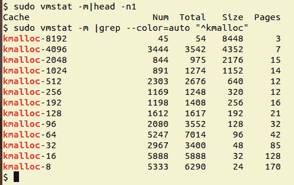

图 8.7-显示 kmalloc-n slab 缓存的 sudo vmstat -m 截图

这非常有趣！内核有一系列专用的 slab 缓存，用于各种大小的通用`kmalloc`内存，*从 8192 字节到仅有 8 字节！*这告诉我们一些东西-使用页面分配器，如果我们请求了，比如，12 字节的内存，它最终会给我们整个页面（4 KB）-浪费太多了。在这里，使用 slab 分配器，对 12 字节的分配请求实际上分配了 16 字节（从图 8.8 中看到的倒数第二个缓存）！太棒了。

另请注意以下内容：

+   在`kfree()`之后，内存被释放回适当的 slab 缓存中。

+   `kmalloc`的 slab 缓存的精确大小因架构而异。在我们的树莓派系统（当然是 ARM CPU）上，通用内存`kmalloc-N`缓存范围从 64 字节到 8192 字节。

+   前面的截图也透露了一个线索。通常，需求是小到微小的内存片段。例如，在前面的截图中，标有`Num`的列代表*当前活动对象的数量*，最大数量来自 8 字节和 16 字节的`kmalloc` slab 缓存（当然，这不一定总是这种情况。快速提示：使用`slabtop(1)`实用程序（您需要以 root 身份运行）：靠近顶部的行显示当前经常使用的 slab 缓存。）

当然，Linux 不断发展。截至 5.0 主线内核，引入了一种新的`kmalloc`缓存类型，称为可回收缓存（命名格式为`kmalloc-rcl-N`）。因此，在 5.x 内核上进行与之前相同的 grep 操作也会显示这些缓存。

```
$ sudo vmstat -m | grep --color=auto "^kmalloc"
kmalloc-rcl-8k                0      0    8192      4
kmalloc-rcl-4k                0      0    4096      8
kmalloc-rcl-2k                0      0    2048     16
[...]
kmalloc-8k                   52     52    8192      4
kmalloc-4k                   99    120    4096      8
kmalloc-2k                  521    560    2048     16
[...]
```

新的`kmalloc-rcl-N`缓存在内部帮助更有效地回收页面并作为防止碎片化的措施。但是，像您这样的模块作者不需要关心这些细节。（此工作的提交可以在此处查看：[`github.com/torvalds/linux/commit/1291523f2c1d631fea34102fd241fb54a4e8f7a0`](https://github.com/torvalds/linux/commit/1291523f2c1d631fea34102fd241fb54a4e8f7a0)。）

`vmstat -m`本质上是内核的`/sys/kernel/slab`内容的包装器（后面会有更多内容）。可以使用诸如`slabtop(1)`和强大的`crash(1)`实用程序（在“实时”系统上，相关的 crash 命令是`kmem -s`（或`kmem -S`））来查看 slab 缓存的深层内部细节。

好了！是时候再次动手演示使用板块分配器 API 的代码了！

### 编写一个使用基本板块 API 的内核模块

在接下来的代码片段中，看一下演示内核模块代码（位于`ch8/slab1/`）。在`init`代码中，我们仅执行了一些板块层分配（通过`kmalloc()`和`kzalloc()`API），打印了一些信息，并在清理代码路径中释放了缓冲区（当然，完整的源代码可以在本书的 GitHub 存储库中找到）。让我们一步一步地看代码的相关部分。

在这个内核模块的`init`代码开始时，我们通过`kmalloc()`板块分配 API 为一个全局指针（`gkptr`）分配了 1,024 字节的内存（记住：指针没有内存！）。请注意，由于我们肯定是在进程上下文中运行，因此“安全地休眠”，我们在第二个参数中使用了`GFP_KERNEL`标志（以防您想要参考，前面的章节*GFP 标志-深入挖掘*已经涵盖了）：

```
// ch8/slab1/slab1.c
[...]
#include <linux/slab.h>
[...]
static char *gkptr;
struct myctx {
    u32 iarr[100];
    u64 uarr[100];
    char uname[128], passwd[16], config[16];
};
static struct myctx *ctx;

static int __init slab1_init(void)
{
    /* 1\. Allocate slab memory for 1 KB using the kmalloc() */
    gkptr = kmalloc(1024, GFP_KERNEL);
    if (!gkptr) {
        WARN_ONCE(1, "%s: kmalloc() failed!\n", OURMODNAME);
        /* As mentioned earlier, there is really no need to print an
         * error msg when a memory alloc fails; the situation "shouldn't"  
         * typically occur, and if it does, the kernel will emit a chain 
         * of messages in any case. Here, we use the WARN_ONCE()
         * macro pedantically, and as this is a 'learning' program.. */
        goto out_fail1;
    }
    pr_info("kmalloc() succeeds, (actual KVA) ret value = %px\n", gkptr);
    /* We use the %px format specifier here to show the actual KVA; in production, Don't! */
    print_hex_dump_bytes("gkptr before memset: ", DUMP_PREFIX_OFFSET, gkptr, 32);
    memset(gkptr, 'm', 1024);
    print_hex_dump_bytes(" gkptr after memset: ", DUMP_PREFIX_OFFSET, gkptr, 32);
```

在前面的代码中，还要注意我们使用`print_hex_dump_bytes()`内核便捷例程作为以人类可读格式转储缓冲区内存的便捷方式。它的签名是：

```
void print_hex_dump_bytes(const char *prefix_str, int prefix_type,
     const void *buf, size_t len);
```

其中`prefix_str`是您想要添加到每行十六进制转储的任何字符串；`prefix_type`是`DUMP_PREFIX_OFFSET`、`DUMP_PREFIX_ADDRESS`或`DUMP_PREFIX_NONE`中的一个；`buf`是要进行十六进制转储的源缓冲区；`len`是要转储的字节数。

接下来是许多设备驱动程序遵循的典型策略（*最佳实践*）：它们将所有所需的或上下文信息保存在一个单一的数据结构中，通常称为*驱动程序上下文*结构。我们通过声明一个（愚蠢/示例）名为`myctx`的数据结构以及一个名为`ctx`的全局指针来模仿这一点（结构和指针定义在前面的代码块中）：

```
    /* 2\. Allocate memory for and initialize our 'context' structure */
    ctx = kzalloc(sizeof(struct myctx), GFP_KERNEL);
    if (!ctx)
        goto out_fail2;
    pr_info("%s: context struct alloc'ed and initialized (actual KVA ret = %px)\n",
        OURMODNAME, ctx);
    print_hex_dump_bytes("ctx: ", DUMP_PREFIX_OFFSET, ctx, 32);

    return 0;        /* success */
out_fail2:
    kfree(gkptr);
out_fail1:
    return -ENOMEM;
}
```

在数据结构之后，我们通过有用的`kzalloc()`包装 API 为`ctx`分配并初始化了`myctx`数据结构的大小。随后的*hexdump*将显示它确实被初始化为全零（为了可读性，我们只会“转储”前 32 个字节）。

请注意我们如何使用`goto`处理错误路径；这在本书的前面已经提到过几次，所以我们不会在这里重复了。最后，在内核模块的清理代码中，我们使用`kfree()`释放了两个缓冲区，防止内存泄漏：

```
static void __exit slab1_exit(void)
{
    kfree(ctx);
 kfree(gkptr);
    pr_info("%s: freed slab memory, removed\n", OURMODNAME);
}
```

接下来是我在我的树莓派 4 上运行的一个示例截图。我使用我们的`../../lkm`便捷脚本来构建、加载和执行`dmesg`：

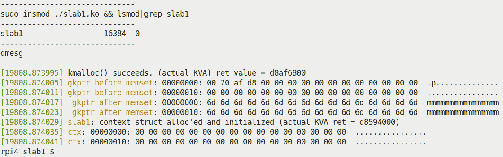

图 8.8-我们的 slab1.ko 内核模块在树莓派 4 上运行的部分截图

好了，现在您已经掌握了使用常见板块分配器 API`kmalloc()`、`kzalloc()`和`kfree()`的基础知识，让我们继续。在下一节中，我们将深入探讨一个非常关键的问题-在通过板块（和页面）分配器获取的内存上的大小限制的现实。继续阅读！

# kmalloc API 的大小限制

页面和板块分配器的一个关键优势是，它们在分配时提供的内存块不仅在逻辑上是连续的（显而易见），而且还保证是*物理上连续的内存*。这是一件大事，肯定会提高性能。

但是（总会有*但是*，不是吗！），正因为有了这个保证，所以在执行分配时不可能提供任意*大*的大小。换句话说，您可以通过一次对我们亲爱的`k[m|z]alloc()`API 的调用从板块分配器获取的内存量是有明确限制的。这个限制是多少？（这确实是一个经常被问到的问题。）

首先，您应该了解，从技术上讲，限制由两个因素决定：

+   系统页面大小（由`PAGE_SIZE`宏确定）

+   第二，"orders"的数量（由`MAX_ORDER`宏确定）；也就是说，在页面分配器（或 BSA）空闲列表数据结构中的列表数量（见图 8.2）

使用标准的 4 KB 页面大小和`MAX_ORDER`值为 11，可以使用单个`kmalloc()`或`kzalloc()`API 调用分配的最大内存量为 4 MB。这在 x86_64 和 ARM 架构上都是如此。

您可能会想知道，*这个 4 MB 的限制到底是如何得出的*？想一想：一旦 slab 分配请求超过内核提供的最大 slab 缓存大小（通常为 8 KB），内核就会简单地将请求传递给页面分配器。页面分配器的最大可分配大小由`MAX_ORDER`确定。将其设置为`11`，最大可分配的缓冲区大小为*2^((MAX_ORDER-1)) = 2¹⁰页 = 1024 页 = 1024 * 4K = 4 MB*！

## 测试极限 - 一次性内存分配

对于开发人员（以及其他所有人来说），一个非常关键的事情是**要有实证精神**！英语单词*empirical*的意思是基于所经历或所见，而不是基于理论。这是一个始终要遵循的关键规则 - 不要简单地假设事情或接受它们的表面价值。自己尝试一下，看看。

让我们做一些非常有趣的事情：编写一个内核模块，从（通用）slab 缓存中分配内存（当然是通过`kmalloc()`API）。我们将在循环中这样做，每次迭代分配 - 和释放 - 一个（计算出的）数量。这里的关键点是，我们将不断增加给定“步长”大小的分配量。当`kmalloc()`失败时，循环终止；这样，我们可以测试通过单个`kmalloc()`调用实际上可以分配多少内存（当然，您会意识到，`kzalloc()`作为`kmalloc()`的简单包装，面临着完全相同的限制）。

在下面的代码片段中，我们展示了相关代码。`test_maxallocsz()`函数从内核模块的`init`代码中调用：

```
// ch8/slab3_maxsize/slab3_maxsize.c
[...]
static int stepsz = 200000;
module_param(stepsz, int, 0644);
MODULE_PARM_DESC(stepsz,
"Amount to increase allocation by on each loop iteration (default=200000");

static int test_maxallocsz(void)
{
  size_t size2alloc = 0;
  void *p;

  while (1) {
      p = kmalloc(size2alloc, GFP_KERNEL);
      if (!p) {
          pr_alert("kmalloc fail, size2alloc=%zu\n", size2alloc);
          return -ENOMEM;
      }
      pr_info("kmalloc(%7zu) = 0x%pK\n", size2alloc, p);
      kfree(p);
 size2alloc += stepsz;
  }
  return 0;
}
```

顺便说一下，注意我们的`printk()`函数如何使用`%zu`格式说明符来表示`size_t`（本质上是一个无符号整数）变量？`%zu`是一个可移植性辅助工具；它使变量格式对 32 位和 64 位系统都是正确的！

让我们在我们的树莓派设备上构建（在主机上进行交叉编译）并插入这个内核模块，该设备运行我们自定义构建的 5.4.51-v7+内核；几乎立即，在`insmod(8)`时，您将看到一个错误消息，`insmod`进程打印出`Cannot allocate memory`；下面（截断的）截图显示了这一点：

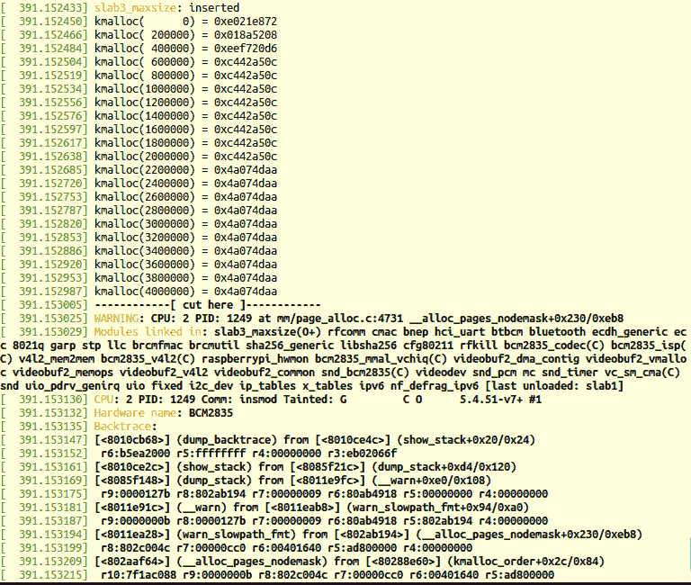

图 8.9 - 在树莓派 3 上运行自定义 5.4.51 内核的 slab3_maxsize.ko 内核模块的第一个 insmod(8)

这是预期的！想一想，我们的内核模块代码的`init`函数确实在最后失败了，出现了`ENOMEM`。不要被这个扔出去；查看内核日志会揭示实际发生了什么。事实上，在这个内核模块的第一次测试运行中，您会发现在`kmalloc()`失败的地方，内核会转储一些诊断信息，包括相当长的内核堆栈跟踪。这是因为它调用了一个`WARN()`宏。

所以，我们的 slab 内存分配工作了，直到某个点。要清楚地看到失败点，只需在内核日志（`dmesg`）显示中向下滚动。以下截图显示了这一点：

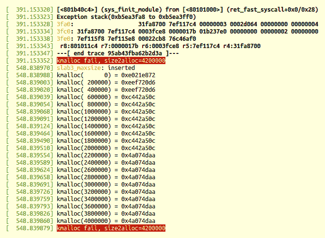

图 8.10 - 部分截图显示了在树莓派 3 上运行我们的 slab3_maxsize.ko 内核模块的 dmesg 输出的下部分

啊哈，看一下输出的最后一行（图 8.11）：`kmalloc()`在分配超过 4 MB（在 4,200,000 字节处）时失败，正如预期的那样；在那之前，它成功了。

有趣的是，注意我们故意在循环中的第一次分配中使用了大小为`0`；它没有失败：

+   `kmalloc(0, GFP_xxx);`返回零指针；在 x86[_64]上，它的值是`16`或`0x10`（详细信息请参阅`include/linux/slab.h`）。实际上，它是一个无效的虚拟地址，位于页面`0`的`NULL`指针陷阱。当然，访问它将导致页面错误（源自 MMU）。

+   同样地，尝试`kfree(NULL);`或`kfree()`零指针的结果是`kfree()`变成了一个无操作。

等等，一个非常重要的要点要注意：在*用于 kmalloc 的实际 slab 缓存*部分，我们看到用于向调用者分配内存的 slab 缓存是`kmalloc-n`slab 缓存，其中`n`的范围是`64`到`8192`字节（在树莓派上，因此对于本讨论是 ARM）。另外，FYI，您可以执行`sudo vmstat -m | grep -v "\-rcl\-" | grep --color=auto "^kmalloc"`来验证这一点。

但显然，在前面的内核模块代码示例中，我们通过`kmalloc()`分配了更大数量的内存（从 0 字节到 4 MB）。它真正的工作方式是`kmalloc()`API 仅对小于或等于 8192 字节的内存分配使用`kmalloc-'n'`slab 缓存（如果可用）；任何对更大内存块的分配请求都会传递给底层的页面（或伙伴系统）分配器！现在，回想一下我们在上一章学到的：页面分配器使用伙伴系统空闲列表（基于每个*节点:区域*）*和*在空闲列表上排队的内存块的最大尺寸为*2^((MAX_ORDER-1)) = 2¹⁰* *页*，当然，这是 4 MB（给定页面大小为 4 KB 和`MAX_ORDER`为`11`）。这与我们的理论讨论完美地结合在一起。

因此，从理论上和实践上来看，你现在可以看到（再次给定 4 KB 的页面大小和`MAX_ORDER`为`11`），通过单次调用`kmalloc()`（或`kzalloc()`）分配的内存的最大尺寸是 4 MB。

### 通过/proc/buddyinfo 伪文件检查

非常重要的是要意识到，尽管我们已经确定一次最多可以获得 4 MB 的 RAM，但这绝对不意味着你总是会得到那么多。不，当然不是。这完全取决于内存请求时特定空闲列表中的空闲内存量。想想看：如果你在运行了几天（或几周）的 Linux 系统上运行。找到物理上连续的 4 MB 的空闲 RAM 块的可能性是相当低的（再次取决于系统上的 RAM 量和其工作负载）。

作为一个经验法则，如果前面的实验没有产生我们认为的最大尺寸的最大分配（即 4 MB），为什么不在一个新启动的客户系统上尝试呢？现在，有物理上连续的 4 MB 的空闲 RAM 的机会要好得多。对此不确定？让我们再次进行实证研究，并查看`/proc/buddyinfo`的内容-在使用中和新启动的系统上-以确定内存块是否可用。在我们使用中的 x86_64 Ubuntu 客户系统上，只有 1 GB 的 RAM，我们查看到：

```
$ cat /proc/buddyinfo 
Node 0, zone      DMA    225  154   46   30   14   9   1   1   0   0   0 
Node 0, zone    DMA32    314  861  326  291  138  50  27   2   5   0   0 
  order --->               0    1    2    3    4   5   6   7   8   9  10
```

正如我们之前学到的（在*空闲列表组织*部分），在前面的代码块中看到的数字是顺序`0`到`MAX_ORDER-1`（通常是*0*到*11-1=10*），它们代表该顺序中的*2^(order)*连续空闲页框的数量。

在前面的输出中，我们可以看到我们在`10`列表（即 4 MB 块）上没有空闲块（为零）。在一个新启动的 Linux 系统上，可能性很高。在接下来的输出中，在刚刚重新启动的相同系统上，我们看到在节点`0`，DMA32 区域有 7 个空闲的物理连续的 4 MB RAM 块可用：

```
$ cat /proc/buddyinfo 
Node 0, zone      DMA      10   2    2    3   3   3   3   2   2   0   0 
Node 0, zone    DMA32     276 143  349  189  99   3   6   3   6   4   7 
 order --->                0   1    2    3   4   5   6   7   8   9  10
```

重申这一点，在一个刚刚运行了大约半小时的树莓派上，我们有以下情况：

```
rpi ~/ $ cat /proc/buddyinfo 
Node 0, zone   Normal    82   32   11   6   5   3   3   3   4   4   160
```

在这里，有 160 个 4 MB 的物理连续 RAM 块可用（空闲）。

当然，还有更多可以探索的。在接下来的部分中，我们将介绍更多关于使用板块分配器的内容 - 资源管理的 API 替代方案，可用的额外板块辅助 API，以及现代 Linux 内核中的 cgroups 和内存的注意事项。

# 板块分配器 - 一些额外的细节

还有一些关键点需要探讨。首先，关于使用内核的资源管理版本的内存分配 API 的一些信息，然后是内核内部的一些额外可用的板块辅助例程，然后简要介绍 cgroups 和内存。我们强烈建议您也阅读这些部分。请继续阅读！

## 使用内核的资源管理内存分配 API

对于设备驱动程序来说，内核提供了一些受管理的内存分配 API。这些正式称为设备资源管理或 devres API（关于此的内核文档链接是[`www.kernel.org/doc/Documentation/driver-model/devres.txt`](https://www.kernel.org/doc/Documentation/driver-model/devres.txt)）。它们都以`devm_`为前缀；虽然有几个，但我们在这里只关注一个常见用例 - 即在使用这些 API 替代通常的`k[m|z]alloc()`时。它们如下：

+   `void * devm_kmalloc(struct device *dev, size_t size, gfp_t gfp);`

+   `void * devm_kzalloc(struct device *dev, size_t size, gfp_t gfp);`

这些资源管理的 API 之所以有用，是因为*开发人员无需显式释放它们分配的内存*。内核资源管理框架保证它将在驱动程序分离时或者如果是内核模块时，在模块被移除时（或设备被分离时，以先发生者为准）自动释放内存缓冲区。这个特性立即增强了代码的健壮性。为什么？简单，我们都是人，都会犯错误。泄漏内存（尤其是在错误代码路径上）确实是一个相当常见的错误！

关于使用这些 API 的一些相关要点：

+   一个关键点 - 请不要盲目尝试用相应的`devm_k[m|z]alloc()`替换`k[m|z]alloc()`！这些受资源管理的分配实际上只设计用于设备驱动程序的`init`和/或`probe()`方法（所有与内核统一设备模型一起工作的驱动程序通常会提供`probe()`和`remove()`（或`disconnect()`）方法。我们将不在这里深入讨论这些方面）。

+   `devm_kzalloc()`通常更受欢迎，因为它也初始化缓冲区。在内部（与`kzalloc()`一样），它只是`devm_kmalloc()` API 的一个薄包装器。

+   第二个和第三个参数与`k[m|z]alloc()` API 一样 - 要分配的字节数和要使用的 GFP 标志。不过，第一个参数是指向`struct device`的指针。显然，它代表您的驱动程序正在驱动的*设备*。

+   由这些 API 分配的内存是自动释放的（在驱动程序分离或模块移除时），您不必做任何事情。但是，它可以通过`devm_kfree()` API 释放。不过，您这样做通常表明受管理的 API 不是正确的选择...

+   许可：受管理的 API 仅对在 GPL 下许可的模块（以及其他可能的许可）可用。

## 额外的板块辅助 API

还有几个辅助的板块分配器 API，是`k[m|z]alloc()` API 家族的朋友。这些包括用于为数组分配内存的`kcalloc()`和`kmalloc_array()` API，以及`krealloc()`，其行为类似于熟悉的用户空间 API`realloc(3)`。

与为元素数组分配内存一起，`array_size()`和`struct_size()`内核辅助程序非常有帮助。特别是，`struct_size()`已被广泛用于防止（实际上修复）在分配结构数组时的许多整数溢出（以及相关）错误，这确实是一个常见的任务。作为一个快速的例子，这里是来自`net/bluetooth/mgmt.c`的一个小代码片段：

```
rp = kmalloc(struct_size(rp, addr, i), GFP_KERNEL);
 if (!rp) {
     err = -ENOMEM; [...]
```

值得浏览一下`include/linux/overflow.h`内核头文件。

`kzfree()`类似于`kfree()`，但会清零（可能更大的）被释放的内存区域。（为什么更大？这将在下一节中解释。）请注意，这被认为是一种安全措施，但可能会影响性能。

这些 API 的资源管理版本也是可用的：`devm_kcalloc()`和`devm_kmalloc_array()`。

## 控制组和内存

Linux 内核支持一个非常复杂的资源管理系统，称为**cgroups**（控制组），简而言之，它们用于分层组织进程并执行资源管理（有关 cgroups 的更多信息，以及 cgroups v2 CPU 控制器用法示例，可以在第十一章中找到，*CPU 调度器-第二部分*，关于 CPU 调度）。

在几个资源控制器中，有一个用于内存带宽的控制器。通过仔细配置它，系统管理员可以有效地调节系统上内存的分配。内存保护是可能的，既可以作为（所谓的）硬保护，也可以通过某些`memcg`（内存 cgroup）伪文件（特别是`memory.min`和`memory.low`文件）作为尽力保护。类似地，在 cgroup 内，`memory.high`和`memory.max`伪文件是控制 cgroup 内存使用的主要机制。当然，这里提到的远不止这些，我建议你查阅有关新 cgroups（v2）的内核文档：[`www.kernel.org/doc/html/latest/admin-guide/cgroup-v2.html`](https://www.kernel.org/doc/html/latest/admin-guide/cgroup-v2.html)。

好的，现在你已经学会了如何更好地使用 slab 分配器 API，让我们再深入一点。事实是，关于 slab 分配器 API 分配的内存块大小仍然有一些重要的注意事项。继续阅读以了解它们是什么！

# 使用 slab 分配器时的注意事项

我们将把这个讨论分成三部分。我们将首先重新审视一些必要的背景（我们之前已经涵盖了），然后实际上详细说明两个用例的问题-第一个非常简单，第二个是问题的更真实的案例。

## 背景细节和结论

到目前为止，你已经学到了一些关键点：

+   *页面*（或*buddy 系统*）*分配器*向调用者分配 2 的幂次方页。要提高 2 的幂次方，称为*阶*；它通常范围从`0`到`10`（在 x86[_64]和 ARM 上都是如此）。

+   这很好，除非不是。当请求的内存量非常小时，*浪费*（或内部碎片）可能会很大。

+   对于页面的片段请求（小于 4,096 字节）非常常见。因此，*slab 分配器，叠加在页面分配器上*（见图 8.1）被设计为具有对象缓存，以及小的通用内存缓存，以有效地满足对小内存量的请求。

+   页面分配器保证物理上连续的页面和高速缓存对齐的内存。

+   slab 分配器保证物理上连续和高速缓存对齐的内存。

因此，很棒-这让我们得出结论，当需要的内存量较大且接近 2 的幂时，请使用页面分配器。当内存量相当小（小于一页）时，请使用 slab 分配器。事实上，`kmalloc()`的内核源代码中有一条注释，简洁地总结了应该如何使用`kmalloc()` API（如下所示以粗体字重现）：

```
// include/linux/slab.h
[...]
 * kmalloc - allocate memory
 * @size: how many bytes of memory are required.
 * @flags: the type of memory to allocate.
 * kmalloc is the normal method of allocating memory
 * for objects smaller than page size in the kernel.
```

听起来很棒，但还有一个问题！为了看到它，让我们学习如何使用另一个有用的 slab API，`ksize()`。它的签名如下：

```
size_t ksize(const void *);
```

`ksize()`的参数是指向现有 slab 缓存的指针（它必须是有效的）。换句话说，它是 slab 分配器 API 的返回地址（通常是`k[m|z]alloc()`）。返回值是分配的实际字节数。

好的，现在你知道`ksize()`的用途，让我们首先以一种更实际的方式使用它，然后再用一个更好的方式！

## 使用 ksize()测试 slab 分配 - 情况 1

为了理解我们的意思，考虑一个小例子（为了可读性，我们不会显示必要的有效性检查。此外，由于这是一个小的代码片段，我们没有将其提供为书中代码库中的内核模块）：

```
struct mysmallctx {
    int tx, rx;
    char passwd[8], config[4];
} *ctx;

pr_info("sizeof struct mysmallctx = %zd bytes\n", sizeof(struct mysmallctx));
ctx = kzalloc(sizeof(struct mysmallctx), GFP_KERNEL);
pr_info("(context structure allocated and initialized to zero)\n"
        "*actual* size allocated = %zu bytes\n", ksize(ctx));
```

在我的 x86_64 Ubuntu 虚拟机系统上的结果输出如下：

```
$ dmesg
[...]
sizeof struct mysmallctx = 20 bytes
(context structure allocated and initialized to zero)
*actual* size allocated = 32 bytes
```

因此，我们尝试使用`kzalloc()`分配 20 字节，但实际上获得了 32 字节（因此浪费了 12 字节，或 60％！）。这是预期的。回想一下`kmalloc-n` slab 缓存 - 在 x86 上，有一个用于 16 字节的缓存，另一个用于 32 字节（还有许多其他）。因此，当我们要求介于两者之间的数量时，显然会从两者中较大的一个获取内存。（顺便说一句，在我们基于 ARM 的树莓派系统上，`kmalloc`的最小 slab 缓存是 64 字节，因此当我们要求 20 字节时，我们当然会得到 64 字节。）

请注意，`ksize()` API 仅适用于已分配的 slab 内存；您不能将其用于任何页分配器 API 的返回值（我们在*理解和使用内核页分配器（或 BSA）*部分中看到）。

现在是第二个更有趣的用例。

## 使用 ksize()测试 slab 分配 - 情况 2

好的，现在，让我们扩展我们之前的内核模块（`ch8/slab3_maxsize`）到`ch8/slab4_actualsize`。在这里，我们将执行相同的循环，使用`kmalloc()`分配内存并像以前一样释放它，但这一次，我们还将通过调用`ksize()`API 记录由 slab 层在每个循环迭代中分配给我们的实际内存量：

```
// ch8/slab4_actualsize/slab4_actualsize.c
static int test_maxallocsz(void)
{
    size_t size2alloc = 100, actual_alloced;
    void *p;

    pr_info("kmalloc(      n) :  Actual : Wastage : Waste %%\n");
    while (1) {
        p = kmalloc(size2alloc, GFP_KERNEL);
        if (!p) {
            pr_alert("kmalloc fail, size2alloc=%zu\n", size2alloc);
            return -ENOMEM;
        }
        actual_alloced = ksize(p);
        /* Print the size2alloc, the amount actually allocated,
         * the delta between the two, and the percentage of waste
         * (integer arithmetic, of course :-)  */
        pr_info("kmalloc(%7zu) : %7zu : %7zu : %3zu%%\n",
              size2alloc, actual_alloced, (actual_alloced-size2alloc),
              (((actual_alloced-size2alloc)*100)/size2alloc));        kfree(p);
        size2alloc += stepsz;
    }
    return 0;
}
```

这个内核模块的输出确实很有趣！在下图中，我们展示了我在运行我们自定义构建的 5.4.0 内核的 x86_64 Ubuntu 18.04 LTS 虚拟机上获得的输出的部分截图：

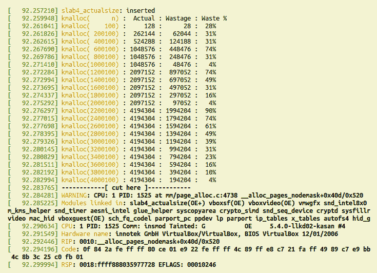

图 8.11 - slab4_actualsize.ko 内核模块的部分截图

内核模块的`printk`输出可以在前面的截图中清楚地看到。屏幕的其余部分是内核的诊断信息 - 这是因为内核空间内存分配请求失败而发出的。所有这些内核诊断信息都是由内核调用`WARN_ONCE()`宏的第一次调用产生的，因为底层页分配器代码`mm/page_alloc.c:__alloc_pages_nodemask()` - 众所周知的伙伴系统分配器的“核心” - 失败了！这通常不应该发生，因此有诊断信息（内核诊断的详细信息超出了本书的范围，因此我们将不予讨论。话虽如此，我们在接下来的章节中确实会在一定程度上检查内核堆栈回溯）。

### 解释情况 2 的输出

仔细看前面的截图（图 8.12；在这里，我们将简单地忽略由`WARN()`宏发出的内核诊断，因为内核级内存分配失败而调用了它！）。图 8.12 的输出有五列，如下：

+   来自`dmesg(1)`的时间戳；我们忽略它。

+   `kmalloc(n)`：`kmalloc()`请求的字节数（其中`n`是所需的数量）。

+   由 slab 分配器分配的实际字节数（通过`ksize()`揭示）。

+   浪费（字节）：实际字节和所需字节之间的差异。

+   浪费的百分比。

例如，在第二次分配中，我们请求了 200,100 字节，但实际获得了 262,144 字节（256 KB）。这是有道理的，因为这是伙伴系统空闲列表中的一个页面分配器列表的确切大小（它是*6 阶*，因为*2⁶ = 64 页 = 64 x 4 = 256 KB*；参见*图 8.2*）。因此，差值，或者实际上是浪费，是*262,144 - 200,100 = 62,044 字节*，以百分比表示，为 31%。

就像这样：请求的（或所需的）大小越接近内核可用的（或实际的）大小，浪费就越少；反之亦然。让我们从前面的输出中再看一个例子（为了清晰起见，以下是剪辑输出）：

```
[...]
[92.273695] kmalloc(1600100) : 2097152 :  497052 : 31%
[92.274337] kmalloc(1800100) : 2097152 :  297052 : 16%
[92.275292] kmalloc(2000100) : 2097152 :   97052 :  4%
[92.276297] kmalloc(2200100) : 4194304 : 1994204 : 90%
[92.277015] kmalloc(2400100) : 4194304 : 1794204 : 74%
[92.277698] kmalloc(2600100) : 4194304 : 1594204 : 61%
[...]
```

从前面的输出中，您可以看到当`kmalloc()`请求 1,600,100 字节（大约 1.5 MB）时，实际上获得了 2,097,152 字节（确切的 2 MB），浪费为 31%。随着我们接近分配的“边界”或阈值（内核的 slab 缓存或页面分配器内存块的实际大小）*，浪费逐渐减少：到 16%，然后降至 4%。但是请注意：在下一个分配中，当我们跨越该阈值，要求*略高于*2 MB（2,200,100 字节）时，我们实际上获得了 4 MB，*浪费了 90%*！然后，随着我们接近 4 MB 的内存大小，浪费再次减少...

这很重要！您可能认为仅通过使用 slab 分配器 API 非常高效，但实际上，当请求的内存量超过 slab 层可以提供的最大大小时（通常为 8 KB，在我们之前的实验中经常出现），slab 层会调用页面分配器。因此，页面分配器由于通常的浪费问题，最终分配的内存远远超过您实际需要的，或者实际上永远不会使用的。多么浪费！

寓言：*检查并反复检查使用 slab API 分配内存的代码*。使用`ksize()`对其进行试验，以找出实际分配了多少内存，而不是您认为分配了多少内存。

没有捷径。嗯，有一个：如果您需要的内存少于一页（非常典型的用例），只需使用 slab API。如果需要更多，前面的讨论就会起作用。另一件事：使用`alloc_pages_exact() / free_pages_exact()` API（在*一个解决方案 - 精确页面分配器 API*部分中介绍）也应该有助于减少浪费。

### 绘图

有趣的是，我们使用著名的`gnuplot(1)`实用程序从先前收集的数据绘制图形。实际上，我们必须最小限度地修改内核模块，只输出我们想要绘制的内容：要分配的内存量（*x*轴），以及运行时实际发生的浪费百分比（*y*轴）。您可以在书的 GitHub 存储库中找到我们略微修改的内核模块的代码，链接在这里：`ch8/slab4_actualsize`（[`github.com/PacktPublishing/Linux-Kernel-Programming/tree/master/ch8/slab4_actualsize`](https://github.com/PacktPublishing/Linux-Kernel-Programming/tree/master/ch8/slab4_actualsize)）。

因此，我们构建并插入这个内核模块，“整理”内核日志，将数据保存在`gnuplot`所需的适当的列格式中（保存在名为`2plotdata.txt`的文件中）。虽然我们不打算在这里深入讨论如何使用`gnuplot(1)`（请参阅*进一步阅读*部分以获取教程链接），但在以下代码片段中，我们展示了生成图形的基本命令：

```
gnuplot> set title "Slab/Page Allocator: Requested vs Actually allocated size Wastage in Percent"
gnuplot> set xlabel "Required size"
gnuplot> set ylabel "%age Waste"
gnuplot> plot "2plotdata.txt" using 1:100 title "Required Size" with points, "2plotdata.txt" title "Wastage %age" with linespoints 
gnuplot> 
```

看哪，图：

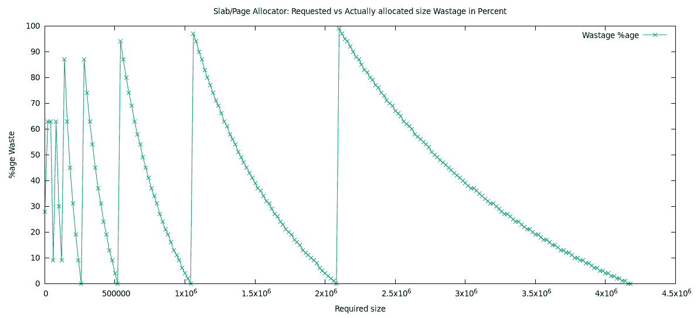

图 8.12 - 显示 kmalloc()请求的大小（x 轴）与产生的浪费（作为百分比；y 轴）的图形

这个“锯齿”形状的图表有助于可视化您刚刚学到的内容。一个`kmalloc()`（或`kzalloc()`，或者*任何*页面分配器 API）分配请求的大小越接近内核预定义的空闲列表大小，浪费就越少。但一旦超过这个阈值，浪费就会飙升（尖峰），接近 100%（如前图中的垂直线所示）。

因此，我们已经涵盖了大量的内容。然而，我们还没有完成：下一节非常简要地介绍了内核中实际的 slab 层实现（是的，有几种）。让我们来看看吧！

## 内核中的 Slab 层实现

最后，我们提到了一个事实，即至少有三种不同的互斥的内核级 slab 分配器实现；在运行时只能使用其中一种。在*配置*内核时选择在运行时使用的分配器（您在第二章中详细了解了此过程，*从源代码构建 5.x Linux 内核-第一部分*）。相关的内核配置选项如下：

+   `CONFIG_SLAB`

+   `CONFIG_SLUB`

+   `CONFIG_SLOB`

第一个（`SLAB`）是早期的、得到很好支持（但相当未优化）的分配器；第二个（`SLUB`，未排队的分配器）在内存效率、性能和诊断方面是对第一个的重大改进，并且是默认选择的分配器。`SLOB`分配器是一种极端简化，根据内核配置帮助，“在大型系统上表现不佳”。

# 摘要

在本章中，您详细了解了页面（或伙伴系统）和 slab 分配器的工作原理。请记住，内核内部分配（和释放）RAM 的实际“引擎”最终是*页面（或伙伴系统）分配器*，slab 分配器则在其上层提供了对典型小于页面大小的分配请求的优化，并有效地分配了几种众所周知的内核数据结构（“对象”）。

您学会了如何有效地使用页面和 slab 分配器提供的 API，以及几个演示内核模块，以便以实际操作的方式展示这一点。我们非常正确地关注了开发人员发出对某个*N*字节数的内存请求的实际问题，但您学会了这可能是非常次优的，因为内核实际上分配了更多的内存（浪费可能接近 100%）！现在您知道如何检查和减轻这些情况。干得好！

以下章节涵盖了更多关于最佳分配策略的内容，以及有关内核内存分配的一些更高级主题，包括创建自定义 slab 缓存，使用`vmalloc`接口，以及*OOM killer*的相关内容等。因此，首先确保您已经理解了本章的内容，并且已经完成了内核模块和作业（如下所示）。然后，让我们继续下一章吧！

# 问题

随着我们的结束，这里有一些问题供您测试对本章材料的了解：[`github.com/PacktPublishing/Linux-Kernel-Programming/tree/master/questions`](https://github.com/PacktPublishing/Linux-Kernel-Programming/tree/master/questions)。您会在书的 GitHub 存储库中找到一些问题的答案：[`github.com/PacktPublishing/Linux-Kernel-Programming/tree/master/solutions_to_assgn`](https://github.com/PacktPublishing/Linux-Kernel-Programming/tree/master/solutions_to_assgn)。

# 进一步阅读

为了帮助您深入了解这个主题并提供有用的材料，我们在本书的 GitHub 存储库中提供了一个相当详细的在线参考和链接列表（有时甚至包括书籍）。*进一步阅读*文档在这里可用：[`github.com/PacktPublishing/Linux-Kernel-Programming/blob/master/Further_Reading.md`](https://github.com/PacktPublishing/Linux-Kernel-Programming/blob/master/Further_Reading.md)。
