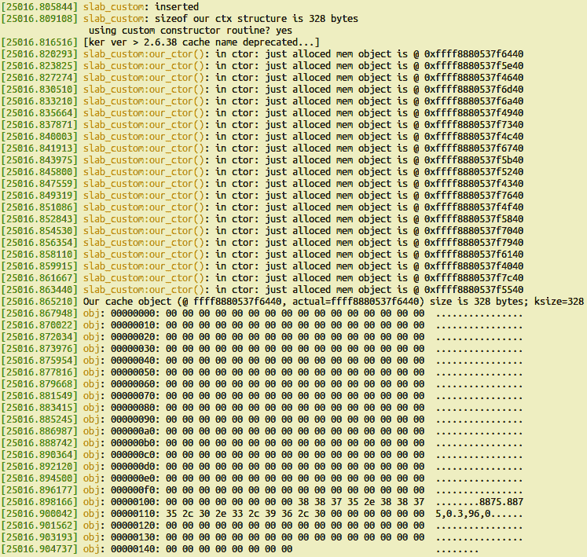
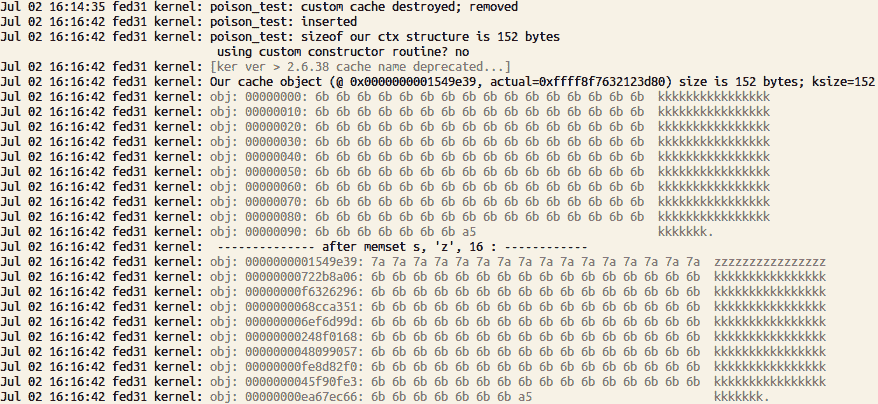
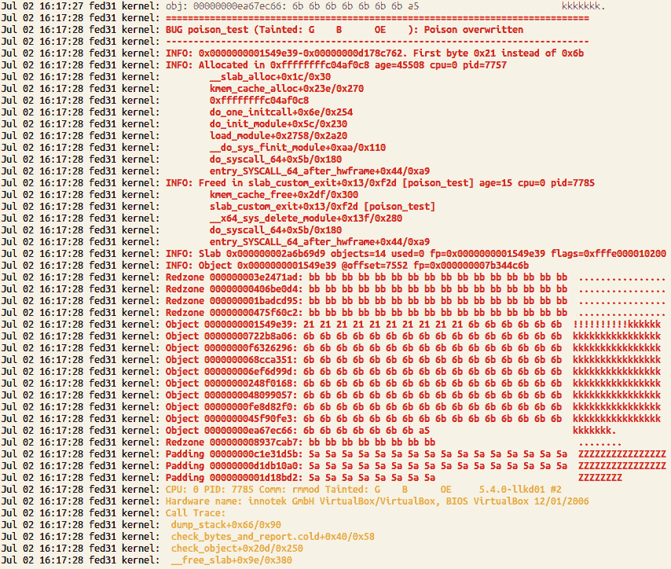
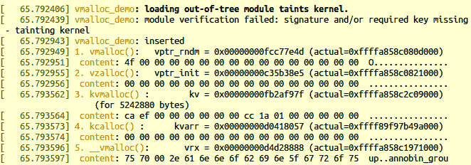
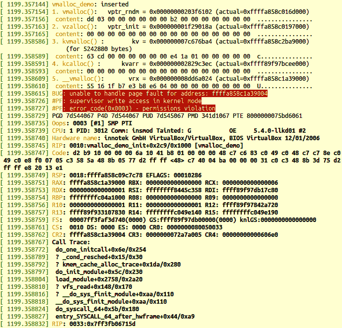
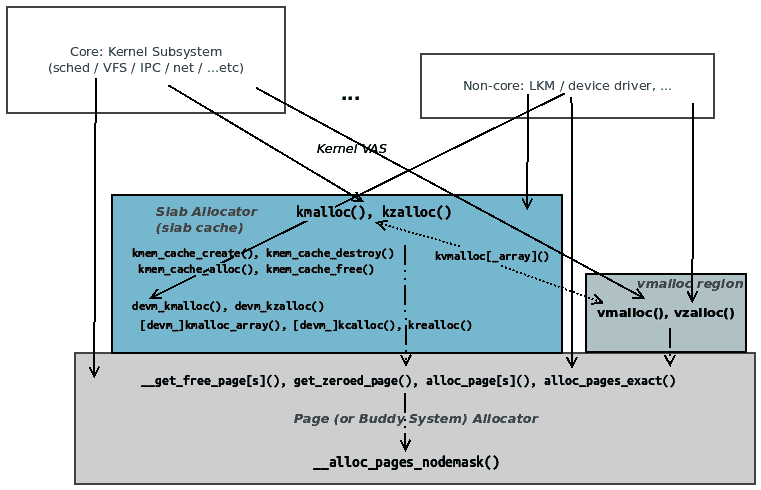
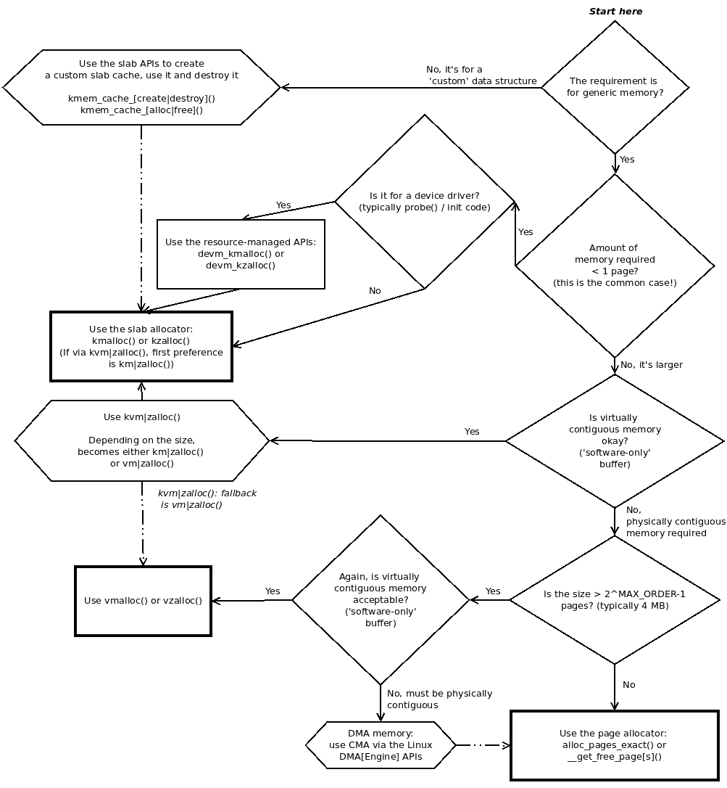
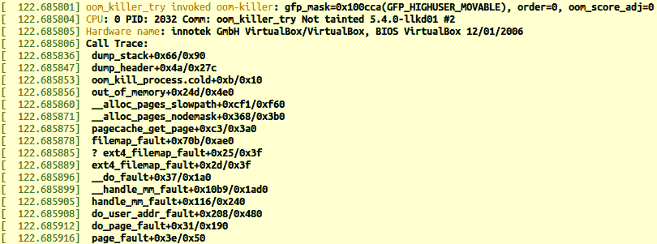

# 第九章：模块作者的内核内存分配-第二部分

上一章详细介绍了通过内核中的页面（BSA）和 slab 分配器进行内存分配的可用 API 的基础知识（以及更多！）。在本章中，我们将进一步深入探讨这个广泛而有趣的主题。我们将涵盖创建自定义 slab 缓存、`vmalloc`接口，以及非常重要的是，鉴于选择的丰富性，应在哪种情况下使用哪些 API。关于令人恐惧的**内存不足**（**OOM**）杀手和需求分页的内部内核细节有助于完善这些重要主题。

这些领域往往是在处理内核模块时理解的关键方面之一，特别是设备驱动程序。一个 Linux 系统项目突然崩溃，控制台上只有一个`Killed`消息，需要一些解释，对吧！？OOM 杀手就是背后的甜蜜家伙...

简而言之，在本章中，主要涵盖了以下主要领域：

+   创建自定义 slab 缓存

+   在 slab 层进行调试

+   理解和使用内核 vmalloc()API

+   内核中的内存分配-何时使用哪些 API

+   保持存活- OOM 杀手

# 技术要求

我假设您已经阅读了第一章，*内核工作空间设置*，并已经适当地准备了一个运行 Ubuntu 18.04 LTS（或更高稳定版本）的虚拟机，并安装了所有必需的软件包。如果没有，我强烈建议您首先这样做。

此外，本章的最后一节让您故意运行一个*非常*占用内存的应用程序；如此占用内存以至于内核将采取一些极端的行动！显然，我强烈建议您在一个安全的、隔离的系统上尝试这样的东西，最好是一个 Linux 测试虚拟机（上面没有重要数据）。

为了充分利用本书，我强烈建议您首先设置工作空间

环境，包括克隆本书的 GitHub 存储库以获取代码，并以实际操作的方式进行工作。GitHub 存储库可以在[`github.com/PacktPublishing/Linux-Kernel-Programming`](https://github.com/PacktPublishing/Linux-Kernel-Programming)找到。

# 创建自定义 slab 缓存

如前一章节中详细解释的，slab 缓存背后的关键设计概念是对象缓存的强大理念。通过缓存频繁使用的对象-实际上是数据结构-性能得到提升。因此，想象一下：如果我们正在编写一个驱动程序，在该驱动程序中，某个数据结构（对象）被非常频繁地分配和释放？通常，我们会使用通常的`kzalloc()`（或`kmalloc()`）然后是`kfree()`API 来分配和释放这个对象。不过好消息是：Linux 内核充分地向我们模块作者公开了 slab 层 API，允许我们创建*我们自己的自定义 slab 缓存*。在本节中，您将学习如何利用这一强大功能。

## 在内核模块中创建和使用自定义 slab 缓存

在本节中，我们将创建，使用和随后销毁自定义 slab 缓存。在广义上，我们将执行以下步骤：

1.  使用`kmem_cache_create()`API 创建给定大小的自定义 slab 缓存。这通常作为内核模块的初始化代码路径的一部分进行（或者在驱动程序中的探测方法中进行）。

1.  使用 slab 缓存。在这里我们将做以下事情：

1.  使用`kmem_cache_alloc()`API 来分配自定义对象的单个实例在您的 slab 缓存中。

1.  使用对象。

1.  使用`kmem_cache_free()`API 将其释放回缓存。

1.  使用`kmem_cache_destroy()`在完成后销毁自定义 slab 缓存。这通常作为内核模块的清理代码路径的一部分进行（或者在驱动程序中的删除/分离/断开方法中进行）。

让我们稍微详细地探讨这些 API 中的每一个。我们从创建自定义（slab）缓存开始。

### 创建自定义 slab 缓存

首先，当然，让我们学习如何创建自定义的 slab 缓存。`kmem_cache_create()`内核 API 的签名如下：

```
#include <linux/slab.h>
struct kmem_cache *kmem_cache_create(const char *name, unsigned int size,  
           unsigned int align, slab_flags_t flags, void (*ctor)(void *));
```

第一个参数是缓存的*名称* - 将由`proc`（因此也由`proc`上的其他包装工具，如`vmstat(8)`，`slabtop(1)`等）显示。它通常与被缓存的数据结构或对象的名称匹配（但不一定要匹配）。

第二个参数`size`实际上是关键的参数-它是新缓存中每个对象的字节大小。基于此对象大小（使用最佳适配算法），内核的 slab 层构造了一个对象缓存。由于三个原因，缓存内每个对象的实际大小将比请求的稍大：

+   一，我们总是可以提供更多，但绝不会比请求的内存少。

+   二，需要一些用于元数据（管理信息）的空间。

+   第三，内核在能够提供所需确切大小的缓存方面存在限制。它使用最接近的可能匹配大小的内存（回想一下第八章，*模块作者的内核内存分配-第一部分*，在*使用 slab 分配器时的注意事项*部分，我们清楚地看到实际上可能使用更多（有时是很多！）内存）。

回想一下第八章，*模块作者的内核内存分配-第一部分*，`ksize()`API 可用于查询分配对象的实际大小。还有另一个 API，我们可以查询新 slab 缓存中个别对象的大小：

`unsigned int kmem_cache_size(struct kmem_cache *s);`。您很快将看到这个被使用。

第三个参数`align`是缓存内对象所需的*对齐*。如果不重要，只需将其传递为`0`。然而，通常有非常特定的对齐要求，例如，确保对象对齐到机器上的字大小（32 位或 64 位）。为此，将值传递为`sizeof(long)`（此参数的单位是字节，而不是位）。

第四个参数`flags`可以是`0`（表示没有特殊行为），也可以是以下标志值的按位或运算符。为了清晰起见，我们直接从源文件`mm/slab_common.c`的注释中复制以下标志的信息：

```
// mm/slab_common.c
[...]
 * The flags are
 *
 * %SLAB_POISON - Poison the slab with a known test pattern (a5a5a5a5)
 * to catch references to uninitialized memory.
 *
 * %SLAB_RED_ZONE - Insert `Red` zones around the allocated memory to check
 * for buffer overruns.
 *
 * %SLAB_HWCACHE_ALIGN - Align the objects in this cache to a hardware
 * cacheline. This can be beneficial if you're counting cycles as closely
 * as davem.
[...]
```

让我们快速检查一下标志：

+   第一个标志`SLAB_POISON`提供了 slab 毒化，即将缓存内存初始化为先前已知的值（`0xa5a5a5a5`）。这样做可以在调试情况下有所帮助。

+   第二个标志`SLAB_RED_ZONE`很有趣，它在分配的缓冲区周围插入红色区域（类似于保护页面）。这是检查缓冲区溢出错误的常见方法。它几乎总是在调试环境中使用（通常在开发过程中）。

+   第三个可能的标志`SLAB_HWCACHE_ALIGN`非常常用，实际上也是性能推荐的。它保证所有缓存对象都对齐到硬件（CPU）缓存行大小。这正是通过流行的`k[m|z]alloc()`API 分配的内存如何对齐到硬件（CPU）缓存行的。

最后，`kmem_cache_create()`的第五个参数也非常有趣：一个函数指针，`void (*ctor)(void *);`。它被建模为一个*构造函数*（就像面向对象和 OOP 语言中的构造函数）。它方便地允许您在分配时从自定义 slab 缓存初始化 slab 对象！作为内核中此功能的一个示例，请参阅名为`integrity`的**Linux 安全模块**（**LSM**）的代码：

```
 security/integrity/iint.c:integrity_iintcache_init()
```

它调用以下内容：

```
iint_cache = kmem_cache_create("iint_cache", sizeof(struct integrity_iint_cache),
 0, SLAB_PANIC, init_once);
```

`init_once()`函数初始化了刚刚分配的缓存对象实例。请记住，构造函数在此缓存分配新页面时被调用。

尽管这似乎有些违直觉，但事实是现代 Linux 内核在设计方面相当面向对象。当然，代码大多是传统的过程式语言 C。然而，在内核中有大量的架构实现（驱动程序模型是其中之一）在设计上是面向对象的：通过虚拟函数指针表进行方法分派 - 策略设计模式等。在 LWN 上有一篇关于此的两部分文章，详细介绍了这一点：*内核中的面向对象设计模式，第一部分，2011 年 6 月*（[`lwn.net/Articles/444910/`](https://lwn.net/Articles/444910/)）。

`kmem_cache_create()` API 的返回值在成功时是指向新创建的自定义 slab 缓存的指针，失败时是`NULL`。通常会将此指针保持为全局，因为您将需要访问它以实际从中分配对象（我们的下一步）。

重要的是要理解`kmem_cache_create()` API 只能从进程上下文中调用。许多内核代码（包括许多驱动程序）创建并使用自己的自定义 slab 缓存。例如，在 5.4.0 Linux 内核中，有超过 350 个实例调用了此 API。

好了，现在您有了一个自定义（slab）缓存，那么您究竟如何使用它来分配内存对象呢？接下来的部分将详细介绍这一点。

### 使用新的 slab 缓存的内存

好吧，我们创建了一个自定义的 slab 缓存。要使用它，您必须发出`kmem_cache_alloc()` API。它的作用是：给定一个 slab 缓存的指针（您刚刚创建的），它在该 slab 缓存上分配一个对象的单个实例（实际上，这确实是`k[m|z]alloc()` API 在底层是如何工作的）。它的签名如下（当然，记得始终为所有基于 slab 的 API 包含`<linux/slab.h>`头文件）：

```
void *kmem_cache_alloc(struct kmem_cache *s, gfp_t gfpflags);
```

让我们看看它的参数：

+   `kmem_cache_alloc()`的第一个参数是指向我们在上一步中创建的（自定义）缓存的指针（从`kmem_cache_create()` API 的返回值）。

+   第二个参数是要传递的通常的 GFP 标志（记住基本规则：对于正常的进程上下文分配，请使用`GFP_KERNEL`，否则如果处于任何类型的原子或中断上下文中，请使用`GFP_ATOMIC`）。

与现在熟悉的`k[m|z]alloc()` API 一样，返回值是指向新分配的内存块的指针 - 内核逻辑地址（当然是 KVA）。

使用新分配的内存对象，并在完成后，不要忘记使用以下方法释放它：

```
void kmem_cache_free(struct kmem_cache *, void *);
```

在这里，关于`kmem_cache_free()` API，请注意以下内容：

+   `kmem_cache_free()`的第一个参数再次是指向您在上一步中创建的（自定义）slab 缓存的指针（从`kmem_cache_create()`的返回值）。

+   第二个参数是指向您希望释放的内存对象的指针 - 刚刚使用`kmem_cache_alloc()`分配的对象实例 - 因此，它将返回到由第一个参数指定的缓存！

与`k[z]free()` API 类似，没有返回值。

### 销毁自定义缓存

当完全完成时（通常在内核模块的清理或退出代码路径中，或者您的驱动程序的`remove`方法中），您必须销毁先前创建的自定义 slab 缓存，使用以下行：

```
void kmem_cache_destroy(struct kmem_cache *);
```

参数当然是指向您在上一步中创建的（自定义）缓存的指针（从`kmem_cache_create()` API 的返回值）。

现在您已经了解了该过程及其相关的 API，让我们来使用一个创建自己的自定义 slab 缓存的内核模块，并在完成后销毁它。

## 自定义 slab - 演示内核模块

是时候动手写一些代码了！让我们看一个简单的演示，使用前面的 API 来创建我们自己的自定义 slab 缓存。像往常一样，我们这里只显示相关的代码。我建议您克隆本书的 GitHub 存储库并自己尝试一下！您可以在`ch9/slab_custom/slab_custom.c`中找到此文件的代码。

在我们的初始化代码路径中，我们首先调用以下函数来创建我们的自定义 slab 缓存：

```
// ch9/slab_custom/slab_custom.c
#define OURCACHENAME   "our_ctx"
/* Our 'demo' structure, that (we imagine) is often allocated and freed;
 * hence, we create a custom slab cache to hold pre-allocated 'instances'
 * of it... Its size: 328 bytes.
 */
struct myctx {
    u32 iarr[10];
    u64 uarr[10];
    char uname[128], passwd[16], config[64];
};
static struct kmem_cache *gctx_cachep; 
```

在上述代码中，我们声明了一个（全局）指针（`gctx_cachep`）指向即将创建的自定义 slab 缓存 - 它将保存对象；即我们虚构的经常分配的数据结构`myctx`。

接下来，看看创建自定义 slab 缓存的代码：

```
static int create_our_cache(void)
{
    int ret = 0;
    void *ctor_fn = NULL;

    if (use_ctor == 1)
        ctor_fn = our_ctor;
    pr_info("sizeof our ctx structure is %zu bytes\n"
            " using custom constructor routine? %s\n",
            sizeof(struct myctx), use_ctor==1?"yes":"no");

  /* Create a new slab cache:
   * kmem_cache_create(const char *name, unsigned int size, unsigned int 
      align, slab_flags_t flags, void (*ctor)(void *));  */
    gctx_cachep = kmem_cache_create(OURCACHENAME, // name of our cache
          sizeof(struct myctx), // (min) size of each object
          sizeof(long),         // alignment
          SLAB_POISON |         /* use slab poison values (explained soon) */
          SLAB_RED_ZONE |       /* good for catching buffer under|over-flow bugs */
          SLAB_HWCACHE_ALIGN,   /* good for performance */
          ctor_fn);             // ctor: here, on by default

  if (!gctx_cachep) {
        [...]
        if (IS_ERR(gctx_cachep))
            ret = PTR_ERR(gctx_cachep);
  }
  return ret;
}
```

嘿，这很有趣：注意我们的缓存创建 API 提供了一个构造函数来帮助初始化任何新分配的对象；在这里：

```
/* The parameter is the pointer to the just allocated memory 'object' from
 * our custom slab cache; here, this is our 'constructor' routine; so, we
 * initialize our just allocated memory object.
 */
static void our_ctor(void *new)
{
    struct myctx *ctx = new;
    struct task_struct *p = current;

    /* TIP: to see how exactly we got here, insert this call:
     *  dump_stack();
     * (read it bottom-up ignoring call frames that begin with '?') */
    pr_info("in ctor: just alloced mem object is @ 0x%llx\n", ctx);

    memset(ctx, 0, sizeof(struct myctx));
    /* As a demo, we init the 'config' field of our structure to some
     * (arbitrary) 'accounting' values from our task_struct
     */
    snprintf(ctx->config, 6*sizeof(u64)+5, "%d.%d,%ld.%ld,%ld,%ld",
            p->tgid, p->pid,
            p->nvcsw, p->nivcsw, p->min_flt, p->maj_flt);
}
```

上述代码中的注释是不言自明的；请仔细查看。构造函数例程，如果设置（取决于我们`use_ctor`模块参数的值；默认为`1`），将在内核每当为我们的缓存分配新内存对象时自动调用。

在初始化代码路径中，我们调用`use_our_cache()`函数。它通过`kmem_cache_alloc()`API 分配了我们的`myctx`对象的一个实例，如果我们的自定义构造函数例程已启用，它会运行，初始化对象。然后我们将其内存转储以显示它确实按照编码进行了初始化，并在完成时释放它（为简洁起见，我们将不显示错误代码路径）：

```
    obj = kmem_cache_alloc(gctx_cachep, GFP_KERNEL);
    pr_info("Our cache object size is %u bytes; ksize=%lu\n",
            kmem_cache_size(gctx_cachep), ksize(obj));
    print_hex_dump_bytes("obj: ", DUMP_PREFIX_OFFSET, obj, sizeof(struct myctx));
 kmem_cache_free(gctx_cachep, obj);
```

最后，在退出代码路径中，我们销毁我们的自定义 slab 缓存：

```
kmem_cache_destroy(gctx_cachep);
```

来自一个样本运行的以下输出帮助我们理解它是如何工作的。以下只是部分截图，显示了我们的 x86_64 Ubuntu 18.04 LTS 客户机上运行 Linux 5.4 内核的输出：



图 9.1 - 在 x86_64 VM 上的 slab_custom 内核模块的输出

太棒了！等一下，这里有几个要注意的关键点：

+   由于我们的构造函数例程默认启用（我们的`use_ctor`模块参数的值为`1`），每当内核 slab 层为我们的新缓存分配新对象实例时，它都会运行。在这里，我们只执行了一个`kmem_cache_alloc()`，但我们的构造函数例程已经运行了 21 次，这意味着内核的 slab 代码（预）分配了 21 个对象给我们的全新缓存！当然，这个数字会有所变化。

+   第二，非常重要的一点要注意！如前面的截图所示，每个对象的*大小*似乎是 328 字节（由`sizeof()`、`kmem_cache_size()`和`ksize()`显示）。然而，再次强调，这并不是真的！内核分配的对象的实际大小更大；我们可以通过`vmstat(8)`看到这一点。

```
$ sudo vmstat -m | head -n1
Cache                       Num  Total  Size  Pages
$ sudo vmstat -m | grep our_ctx
our_ctx                       0     21   768     21
$ 
```

正如我们之前看到的那样，每个分配的对象的实际大小不是 328 字节，而是 768 字节（确切的数字会有所变化；在一个案例中，我看到它是 448 字节）。这对您来说是很重要的，确实需要检查。我们在接下来的*在 slab 层调试*部分中展示了另一种相当容易检查这一点的方法。

FYI，您可以随时查看`vmstat(8)`的 man 页面，以了解先前看到的每一列的确切含义。

我们将用 slab 收缩器接口结束关于创建和使用自定义 slab 缓存的讨论。

## 理解 slab 收缩器

缓存对性能有利。想象一下从磁盘读取大文件的内容与从 RAM 读取其内容的情况。毫无疑问，基于 RAM 的 I/O 要快得多！可以想象，Linux 内核利用这些想法，因此维护了几个缓存-页面缓存、目录项缓存、索引节点缓存、slab 缓存等等。这些缓存确实极大地提高了性能，但是，仔细想想，实际上并不是强制性要求。当内存压力达到较高水平时（意味着使用的内存过多，可用内存过少），Linux 内核有机制智能地释放缓存（也称为内存回收-这是一个持续进行的过程；内核线程（通常命名为`kswapd*`）作为其管理任务的一部分回收内存；在*回收内存-内核管理任务和*OOM*部分中会更多地介绍）。

在 slab 缓存的情况下，事实上是一些内核子系统和驱动程序会像我们在本章前面讨论的那样创建自己的自定义 slab 缓存。为了与内核良好集成并合作，最佳实践要求您的自定义 slab 缓存代码应该注册一个 shrinker 接口。当这样做时，当内存压力足够高时，内核可能会调用多个 slab 收缩器回调，预期通过释放（收缩）slab 对象来缓解内存压力。

与内核注册 shrinker 函数的 API 是`register_shrinker()`API。它的单个参数（截至 Linux 5.4）是指向`shrinker`结构的指针。该结构包含（除其他管理成员外）两个回调例程：

+   第一个例程`count_objects()`仅计算并返回将要释放的对象的数量（当实际调用时）。如果返回`0`，这意味着现在无法确定可释放的内存对象的数量，或者我们现在甚至不应该尝试释放任何对象。

+   第二个例程`scan_objects()`仅在第一个回调例程返回非零值时调用；当 slab 缓存层调用它时，它实际上释放或收缩了相关的 slab 缓存。它返回在此回收周期中实际释放的对象数量，或者如果回收尝试无法进行（可能会导致死锁）则返回`SHRINK_STOP`。

我们现在将通过快速总结使用此层进行内存（解）分配的利弊来结束对 slab 层的讨论-对于您作为内核/驱动程序作者来说，这是非常重要的，需要敏锐意识到！

## slab 分配器-利弊-总结

在本节中，我们非常简要地总结了您现在已经学到的内容。这旨在让您快速查阅和回顾这些关键要点！

使用 slab 分配器（或 slab 缓存）API 来分配和释放内核内存的优点如下：

+   （非常）快速（因为它使用预缓存的内存对象）。

+   保证物理上连续的内存块。

+   当创建缓存时使用`SLAB_HWCACHE_ALIGN`标志时，保证硬件（CPU）缓存行对齐的内存。这适用于`kmalloc()`、`kzalloc()`等。

+   您可以为特定（频繁分配/释放）对象创建自定义的 slab 缓存。

使用 slab 分配器（或 slab 缓存）API 的缺点如下：

+   一次只能分配有限数量的内存；通常，通过 slab 接口直接分配 8 KB，或者通过大多数当前平台上的页面分配器间接分配高达 4 MB 的内存（当然，精确的上限取决于架构）。

+   使用`k[m|z]alloc()`API 不正确：请求过多的内存，或者请求一个略高于阈值的内存大小（在第八章中详细讨论，*内核内存分配给模块作者-第一部分*，在*kmalloc API 的大小限制*部分），肯定会导致内部碎片（浪费）。它的设计只是真正优化常见情况-分配小于一页大小的内存。

现在，让我们继续讨论另一个对于内核/驱动程序开发人员来说非常关键的方面-当内存分配/释放出现问题时，特别是在 slab 层内部。

# 在 slab 层调试

内存损坏不幸地是错误的一个非常常见的根本原因。能够调试它们是一个关键的技能。我们现在将看一下一些处理这个问题的方法。在深入细节之前，请记住，以下讨论是关于*SLUB*（未排队的分配器）实现的 slab 层。这是大多数 Linux 安装的默认设置（我们在第八章中提到，内核内存分配给模块作者-第一部分，*内核内存分配给模块作者-第一部分*，在*内核中的 slab 层实现*部分，当前的 Linux 内核有三个互斥的 slab 层实现）。

此外，我们的意图并不是深入讨论关于内存调试的内核调试工具-这本身就是一个庞大的话题，不幸的是超出了本书的范围。尽管如此，我会说你最好熟悉已经提到的强大框架/工具，特别是以下内容：

+   **KASAN**（**内核地址消毒剂**；从 x86_64 和 AArch64，4.x 内核开始可用）

+   SLUB 调试技术（在这里介绍）

+   `kmemleak`（尽管 KASAN 更好）

+   `kmemcheck`（请注意，`kmemcheck`在 Linux 4.15 中被移除）

不要忘记在*进一步阅读*部分寻找这些链接。好的，让我们来看看一些有用的方法，帮助开发人员在 slab 层调试代码。

## 通过 slab 毒害调试

一个非常有用的功能是所谓的 slab 毒害。在这种情况下，“毒害”一词意味着用特定的签名字节或易于识别的模式刺激内存。然而，使用这个的前提是`CONFIG_SLUB_DEBUG`内核配置选项是开启的。你怎么检查？简单：

```
$ grep -w CONFIG_SLUB_DEBUG /boot/config-5.4.0-llkd01
CONFIG_SLUB_DEBUG=y
```

在前面的代码中看到的`=y`表示它确实是开启的。现在（假设它已经开启），如果你使用`SLAB_POISON`标志创建一个 slab 缓存（我们在*创建自定义 slab 缓存*部分中介绍了创建 slab 缓存），那么当内存被分配时，它总是被初始化为特殊值或内存模式`0x5a5a5a5a`-它被毒害了（这是非常有意义的：十六进制值`0x5a`是 ASCII 字符`Z`代表零）！所以，想一想，如果你在内核诊断消息或转储中看到这个值，也称为*Oops*，那么很有可能这是一个（不幸地相当典型的）未初始化内存错误或**UMR**（未初始化内存读取）。

为什么在前面的句子中使用*也许*这个词？嗯，简单地因为调试深藏的错误是一件非常困难的事情！可能出现的症状并不一定是问题的根本原因。因此，不幸的开发人员经常被各种红鲱引入歧途！现实是调试既是一门艺术又是一门科学；对生态系统（这里是 Linux 内核）的深入了解在帮助你有效调试困难情况方面起到了很大作用。

如果未设置`SLAB_POISON`标志，则未初始化的 slab 内存将设置为`0x6b6b6b6b`内存模式（十六进制`0x6b`是 ASCII 字符`k`（见图 9.2））。同样，当 slab 高速缓存内存被释放并且`CONFIG_SLUB_DEBUG`打开时，内核将相同的内存模式（`0x6b6b6b6b；'k'`）写入其中。这也非常有用，可以让我们发现（内核认为的）未初始化或空闲内存。

毒值在`include/linux/poison.h`中定义如下：

```
/* ...and for poisoning */
#define POISON_INUSE    0x5a    /* for use-uninitialized poisoning */
#define POISON_FREE     0x6b    /* for use-after-free poisoning */
#define POISON_END      0xa5    /* end-byte of poisoning */
```

关于内核 SLUB 实现的 slab 分配器，让我们来看一下**何时**（具体情况由以下`if`部分确定）以及*slab 中毒发生的类型*的摘要视图，以及以下伪代码中的类型：

```
if CONFIG_SLUB_DEBUG is enabled
   AND the SLAB_POISON flag is set
   AND there's no custom constructor function
   AND it's type-safe-by-RCU
```

然后毒化 slab 发生如下：

+   slab 内存在初始化时设置为`POISON_INUSE（0x5a = ASCII 'Z'）`；此代码在此处：`mm/slub.c:setup_page_debug()`。

+   slab 对象在`mm/slub.c:init_object()`中初始化为`POISON_FREE（0x6b = ASCII 'k'）`。

+   slab 对象的最后一个字节在`mm/slub.c:init_object()`中初始化为`POISON_END（0xa5）`。

（因此，由于 slab 层执行这些 slab 内存初始化的方式，我们最终得到值`0x6b`（ASCII `k`）作为刚分配的 slab 内存的初始值）。请注意，为了使其工作，您不应安装自定义构造函数。此外，您现在可以忽略`it's-type-safe-by-RCU`指令；通常情况下是这样（即，“is type-safe-by-RCU”为真；FYI，RCU（Read Copy Update）是一种高级同步技术，超出了本书的范围）。从在 SLUB 调试模式下运行时 slab 的初始化方式可以看出，内存内容实际上被初始化为值`POISON_FREE（0x6b = ASCII 'k'）`。因此，如果内存释放后此值发生变化，内核可以检测到并触发报告（通过 printk）。当然，这是一个众所周知的**使用后释放**（**UAF**）内存错误的案例！类似地，在红色区域之前或之后写入（这些实际上是保护区域，通常初始化为`0xbb`）将触发写入缓冲区下/溢出错误，内核将报告。有用！

### 试一下-触发 UAF 错误

为了帮助您更好地理解这一点，我们将在本节的屏幕截图中展示一个示例。执行以下步骤：

1.  首先确保启用了`CONFIG_SLUB_DEBUG`内核配置（应设置为`y`；这通常是发行版内核的情况）

1.  然后，在包括内核命令行`slub_debug=`指令的情况下启动系统（这将打开完整的 SLUB 调试；或者您可以传递更精细的变体，例如`slub_debug=FZPU`（请参阅此处的内核文档以了解每个字段的解释：[`www.kernel.org/doc/Documentation/vm/slub.txt`](https://www.kernel.org/doc/Documentation/vm/slub.txt)）；作为演示，在我的 Fedora 31 虚拟机上，我传递了以下内核命令行-这里重要的是，`slub_debug=FZPU`以粗体字体突出显示：

```
$ cat /proc/cmdline
BOOT_IMAGE=(hd0,msdos1)/vmlinuz-5.4.0-llkd01 root=/dev/mapper/fedora_localhost--live-root ro resume=/dev/mapper/fedora_localhost--live-swap rd.lvm.lv=fedora_localhost-live/root rd.lvm.lv=fedora_localhost-live/swap rhgb slub_debug=FZPU 3
```

（有关`slub_debug`参数的更多详细信息，请参阅下一节*​引导和运行时的 SLUB 调试选项*）。

1.  编写一个创建新的自定义 slab 高速缓存的内核模块（当然其中存在内存错误！）。确保未指定构造函数（示例代码在此处：`ch9/poison_test`；我将留给您浏览代码并测试的练习）。

1.  我们在这里尝试一下：通过`kmem_cache_alloc()`（或等效方法）分配一些 slab 内存。下面是一个屏幕截图（图 9.2），显示分配的内存，以及在执行快速的`memset()`将前 16 个字节设置为`z`（`0x7a`）后的相同区域：



图 9.2-分配和 memset()后的 slab 内存）。

1.  现在，来说说 bug！在清理方法中，我们释放了分配的 slab，然后尝试对其进行另一个`memset()`，*从而触发了 UAF bug*。同样，我们通过另一张屏幕截图（图 9.3）显示内核日志：



图 9.3 - 内核报告 UAF bug！

请注意内核如何报告这一点（前面图中红色的第一段文字）作为`Poison overwritten` bug。事实上就是这样：我们用`0x21`（故意是 ASCII 字符`!`）覆盖了`0x6b`毒值。在释放了来自 slab 缓存的缓冲区后，如果内核在有效负载中检测到毒值之外的任何值（`POISON_FREE = 0x6b = ASCII 'k'`），就会触发 bug。（还要注意，红区 - 保护区 - 的值初始化为`0xbb`）。

下一节将提供有关可用的 SLUB 层调试选项的更多细节。

## 引导和运行时的 SLUB 调试选项

在使用 SLUB 实现（默认）时，调试内核级 slab 问题非常强大，因为内核具有完整的调试信息。只是默认情况下它是关闭的。有各种方式（视口）可以打开和查看 slab 调试级别的信息；有大量的细节可用！其中一些方法包括以下内容：

+   通过在内核命令行上传递`slub_debug=`字符串（当然是通过引导加载程序）。这会打开完整的 SLUB 内核级调试。

+   要查看的特定调试信息可以通过传递给`slub_debug=`字符串的选项进行微调（在`=`后面不传递任何内容意味着启用所有 SLUB 调试选项）；例如，传递`slub_debug=FZ`会启用以下选项：

+   `F`: 对齐检查（启用`SLAB_DEBUG_CONSISTENCY_CHECKS`）；请注意，打开此选项可能会减慢系统速度。

+   `Z`: 红色分区。

+   即使没有通过内核命令行打开 SLUB 调试功能，我们仍然可以通过在`/sys/kernel/slab/<slab-name>`下的适当伪文件中写入`1`（作为 root 用户）来启用/禁用它：

+   回想一下我们之前的演示内核模块（`ch9/slab_custom`）；一旦加载到内核中，可以像这样查看每个分配对象的理论和实际大小：

```
$ sudo cat /sys/kernel/slab/our_ctx/object_size  /sys/kernel/slab/our_ctx/slab_size 
328 768
```

+   +   还有其他几个伪文件；在`/sys/kernel/slab/<name-of-slab>/`上执行`ls(1)`将会显示它们。例如，通过在`/sys/kernel/slab/our_ctx/ctor`上执行`cat`来查找到我们的`ch9/slab_custom` slab 缓存的构造函数：

```
$ sudo cat /sys/kernel/slab/our_ctx/ctor
our_ctor+0x0/0xe1 [slab_custom]
```

在这里可以找到一些相关的详细信息（非常有用！）：*SLUB 的简短用户指南*（[`www.kernel.org/doc/Documentation/vm/slub.txt`](https://www.kernel.org/doc/Documentation/vm/slub.txt)）。

此外，快速查看内核源树的`tools/vm`文件夹将会发现一些有趣的程序（这里相关的是`slabinfo.c`）和一个用于生成图表的脚本（通过`gnuplot(1)`）。前面段落提到的文档提供了有关生成图表的使用细节。

作为一个重要的附带说明，内核有大量（而且有用！）的*内核参数*可以在引导时（通过引导加载程序）选择性地传递给它。在这里的文档中可以看到完整的列表：*内核的命令行参数*（[`www.kernel.org/doc/html/latest/admin-guide/kernel-parameters.html`](https://www.kernel.org/doc/html/latest/admin-guide/kernel-parameters.html)）。

好了，这（终于）结束了我们对 slab 分配器的覆盖（从上一章延续到这一章）。您已经了解到它是在页面分配器之上的一层，解决了两个关键问题：一是允许内核创建和维护对象缓存，以便非常高效地执行一些重要的内核数据结构的分配和释放；二是包括通用内存缓存，允许您以非常低的开销（与二进制伙伴系统分配器不同）分配小量的 RAM——页面的片段。事实就是这样：slab API 是驱动程序中真正常用的 API；不仅如此，现代驱动程序作者还利用了资源管理的`devm_k{m,z}alloc()` API；我们鼓励您这样做。不过要小心：我们详细讨论了实际分配的内存可能比您想象的要多（使用`ksize()`来找出实际分配了多少）。您还学会了如何创建自定义的 slab 缓存，以及如何进行 slab 层的调试。

现在让我们学习`vmalloc()` API 是什么，如何以及何时用于内核内存分配。

# 理解并使用内核 vmalloc() API

在前一章中，我们已经学到，内核内存分配的最终引擎只有一个——页面（或伙伴系统）分配器。在其上层是 slab 分配器（或 slab 缓存）机制。此外，内核地址空间中还有另一个完全虚拟的地址空间，可以随意分配虚拟页面，这就是所谓的内核`vmalloc`区域。

当虚拟页面实际被使用时（由内核中的某个东西或通过进程或线程的用户空间使用），它实际上是通过页面分配器分配的物理页面帧（这对所有用户空间内存帧也是最终真实的，尽管是间接的方式；这一点我们稍后在*需求分页和 OOM*部分会详细介绍）。

在内核段或 VAS（我们在第七章中详细介绍了这些内容，*内存管理内部-基础*，在*检查内核段*部分），是*vmalloc*地址空间，从`VMALLOC_START`到`VMALLOC_END-1`。它起初是一个完全虚拟的区域，也就是说，它的虚拟页面最初并未映射到任何物理页面帧上。

要快速复习一下，可以重新查看用户和内核段的图表——实际上是完整的 VAS——通过重新查看*图 7.12*。您可以在第七章中的*内存管理内部-基础*部分的*尝试-查看内核段详细信息*部分找到这个图表。

在本书中，我们的目的不是深入研究内核的`vmalloc`区域的内部细节。相反，我们提供足够的信息，让您作为模块或驱动程序的作者，在运行时使用这个区域来分配虚拟内存。

## 学习使用 vmalloc 系列 API

您可以使用`vmalloc()` API 从内核的`vmalloc`区域中分配虚拟内存（当然是在内核空间中）：

```
#include <linux/vmalloc.h>
void *vmalloc(unsigned long size);
```

关于 vmalloc 的一些关键点：

+   `vmalloc()`API 将连续的虚拟内存分配给调用者。并不保证分配的区域在物理上是连续的；可能是连续的，也可能不是（事实上，分配越大，物理上连续的可能性就越小）。

+   理论上分配的虚拟页面的内容是随机的；实际上，它似乎是与架构相关的（至少在 x86_64 上，似乎会将内存区域清零）；当然，（尽管可能会稍微影响性能）建议您通过使用`vzalloc()`包装 API 来确保内存清零。

+   `vmalloc()`（以及相关函数）API 只能在进程上下文中调用（因为它可能导致调用者休眠）。

+   `vmalloc()`的返回值是成功时的 KVA（在内核 vmalloc 区域内），失败时为`NULL`。

+   刚刚分配的 vmalloc 内存的起始位置保证在页面边界上（换句话说，它总是页面对齐的）。

+   实际分配的内存（来自页面分配器）可能比请求的大小要大（因为它在内部分配足够的页面来覆盖请求的大小）

你会发现，这个 API 看起来非常类似于熟悉的用户空间`malloc(3)`。事实上，乍一看确实如此，只是当然，它是内核空间的分配（还要记住，两者之间没有直接的对应关系）。

在这种情况下，`vmalloc()`对我们模块或驱动程序的作者有什么帮助呢？当你需要一个大的虚拟连续缓冲区，其大小大于 slab API（即`k{m|z}alloc()`和友元）可以提供的大小时——请记住，在 ARM 和 x86[_64]上，单个分配通常为 4MB——那么你应该使用`vmalloc`！

值得一提的是，内核出于各种原因使用`vmalloc()`，其中一些如下：

+   在加载内核模块时为内核模块的（静态）内存分配空间（在`kernel/module.c:load_module()`中）。

+   如果定义了`CONFIG_VMAP_STACK`，那么`vmalloc()`用于为每个线程的内核模式堆栈分配内存（在`kernel/fork.c:alloc_thread_stack_node()`中）。

+   在内部，为了处理一个叫做`ioremap()`的操作。

+   在 Linux 套接字过滤器（bpf）代码路径中等。

为了方便起见，内核提供了`vzalloc()`包装 API（类似于`kzalloc()`）来分配并清零内存区域——这是一个良好的编码实践，但可能会稍微影响时间关键的代码路径：

```
void *vzalloc(unsigned long size);
```

一旦你使用了分配的虚拟缓冲区，当然你必须释放它：

```
void vfree(const void *addr);
```

如预期的那样，传递给`vfree()`的参数是`v[m|z]alloc()`的返回地址（甚至是这些调用的底层`__vmalloc()` API）。传递`NULL`会导致它只是无害地返回。

在下面的片段中，我们展示了我们的`ch9/vmalloc_demo`内核模块的一些示例代码。和往常一样，我建议你克隆本书的 GitHub 存储库并自己尝试一下（为了简洁起见，我们没有在下面的片段中显示整个源代码；我们显示了模块初始化代码调用的主要`vmalloc_try()`函数）。

这是代码的第一部分。如果`vmalloc()` API 出现任何问题，我们通过内核的`pr_warn()`辅助程序生成警告。请注意，以下的`pr_warn()`辅助程序实际上并不是必需的；在这里我有点迂腐，我们保留它……其他情况也是如此，如下所示：

```
// ch9/vmalloc_demo/vmalloc_demo.c
#define pr_fmt(fmt) "%s:%s(): " fmt, KBUILD_MODNAME, __func__
[...]
#define KVN_MIN_BYTES     16
#define DISP_BYTES        16
static void *vptr_rndm, *vptr_init, *kv, *kvarr, *vrx;

static int vmalloc_try(void)
{
    if (!(vptr_rndm = vmalloc(10000))) {
        pr_warn("vmalloc failed\n");
        goto err_out1;
    }
    pr_info("1\. vmalloc(): vptr_rndm = 0x%pK (actual=0x%px)\n", 
            vptr_rndm, vptr_rndm);
    print_hex_dump_bytes(" content: ", DUMP_PREFIX_NONE, vptr_rndm,     
                DISP_BYTES);
```

在上面的代码块中，`vmalloc()` API 分配了一个至少有 10,000 字节的连续内核虚拟内存区域；实际上，内存是页面对齐的！我们使用内核的`print_hex_dump_bytes()`辅助例程来转储这个区域的前 16 个字节。

接下来，看一下以下代码如何使用`vzalloc()` API 再次分配另一个至少有 10,000 字节的连续内核虚拟内存区域（尽管它是页面对齐的内存）；这次，内存内容被设置为零：

```
    /* 2\. vzalloc(); memory contents are set to zeroes */
    if (!(vptr_init = vzalloc(10000))) {
        pr_warn("%s: vzalloc failed\n", OURMODNAME);
        goto err_out2;
    }
    pr_info("2\. vzalloc(): vptr_init = 0x%pK (actual=0x%px)\n",
            vptr_init, (TYPECST)vptr_init);
    print_hex_dump_bytes(" content: ", DUMP_PREFIX_NONE, vptr_init, 
                DISP_BYTES);
```

关于以下代码的一些要点：首先，注意使用`goto`进行错误处理（在多个`goto`实例的目标标签处，我们使用`vfree()`根据需要释放先前分配的内存缓冲区），这是典型的内核代码。其次，暂时忽略`kvmalloc()`、`kcalloc()`和`__vmalloc()`等友元例程；我们将在*vmalloc 的友元*部分介绍它们：

```
  /* 3\. kvmalloc(): allocate 'kvn' bytes with the kvmalloc(); if kvn is
   * large (enough), this will become a vmalloc() under the hood, else
   * it falls back to a kmalloc() */
    if (!(kv = kvmalloc(kvn, GFP_KERNEL))) {
        pr_warn("kvmalloc failed\n");
        goto err_out3;
    }
    [...]

    /* 4\. kcalloc(): allocate an array of 1000 64-bit quantities and zero
     * out the memory */
    if (!(kvarr = kcalloc(1000, sizeof(u64), GFP_KERNEL))) {
        pr_warn("kvmalloc_array failed\n");
        goto err_out4;
    }
    [...]
    /* 5\. __vmalloc(): <seen later> */
    [...]
    return 0;
err_out5:
  vfree(kvarr);
err_out4:
    vfree(kv);
err_out3:
    vfree(vptr_init);
err_out2:
    vfree(vptr_rndm);
err_out1:
    return -ENOMEM;
}
```

在我们内核模块的清理代码路径中，我们当然释放了分配的内存区域：

```
static void __exit vmalloc_demo_exit(void)
{
    vfree(vrx);
    kvfree(kvarr);
    kvfree(kv);
    vfree(vptr_init);
    vfree(vptr_rndm);
    pr_info("removed\n");
}
```

我们将让你自己尝试并验证这个演示内核模块。

现在，让我们简要地探讨另一个非常关键的方面——用户空间的`malloc()`或内核空间的`vmalloc()`内存分配如何变成物理内存？继续阅读以了解更多！

## 关于内存分配和需求分页的简要说明

不深入研究`vmalloc()`（或用户空间`malloc()`）的内部工作细节，我们仍然会涵盖一些关键点，这些关键点是像你这样的有能力的内核/驱动程序开发人员必须理解的。

首先，vmalloc-ed 虚拟内存必须在某个时候（在使用时）变成物理内存。这种物理内存是通过内核中唯一的方式分配的 - 通过页面（或伙伴系统）分配器。这是一个有点间接的过程，简要解释如下。

使用`vmalloc()`时，一个关键点应该被理解：`vmalloc()`只会导致虚拟内存页面被分配（它们只是被操作系统标记为保留）。此时实际上并没有分配物理内存。实际的物理页面框架只有在这些虚拟页面被触摸时才会被分配 - 而且也是逐页进行 - 无论是读取、写入还是执行。直到程序或进程实际尝试使用它之前，实际上并没有分配物理内存的这一关键原则被称为各种名称 - *需求分页、延迟分配、按需分配*等等。事实上，文档中明确说明了这一点：

"vmalloc 空间被懒惰地同步到使用页面错误处理程序的进程的不同 PML4/PML5 页面中..."

清楚地了解`vmalloc()`和相关内容以及用户空间 glibc `malloc()`系列例程的内存分配实际工作原理是非常有启发性的 - 这一切都是通过需求分页！这意味着这些 API 的成功返回实际上并不意味着*物理*内存分配。当`vmalloc()`或者用户空间的`malloc()`返回成功时，到目前为止实际上只是保留了一个虚拟内存区域；实际上还没有分配物理内存！*实际的物理页面框架分配只会在虚拟页面被访问时（无论是读取、写入还是执行）逐页进行*。

但这是如何在内部发生的呢？简而言之，答案是：每当内核或进程访问虚拟地址时，虚拟地址都会被 CPU 核心上的硅片的一部分**内存管理单元**（MMU）解释。MMU 的**转换旁路缓冲器**（TLB）*（我们没有能力在这里深入研究所有这些，抱歉！）*现在将被检查是否*命中*。如果是，内存转换（虚拟到物理地址）已经可用；如果不是，我们有一个 TLB 缺失。如果是这样，MMU 现在将*遍历*进程的分页表，有效地转换虚拟地址，从而获得*物理地址。*它将这个地址放在地址总线上，CPU 就可以继续进行。

但是，想一想，如果 MMU 找不到匹配的物理地址会怎么样？这可能是由于许多原因之一，其中之一就是我们这里的情况 - 我们（还）*没有*物理页面框架，只有一个虚拟页面。在这一点上，MMU 基本上放弃了，因为它无法处理。相反，它*调用操作系统的页面错误处理程序代码* - 在进程的上下文中运行的异常或错误处理程序 - 在`current`的上下文中。这个页面错误处理程序实际上解决了这种情况；在我们的情况下，使用`vmalloc()`（或者甚至是用户空间的`malloc()`！），它请求页面分配器为单个物理页面框架（在 order `0`处）并将其映射到虚拟页面。

同样重要的是要意识到，通过页面（伙伴系统）和 slab 分配器进行的内核内存分配并不是懒惰分页（或延迟分配）的情况。在那里，当分配内存时，要理解实际的物理页面框架是立即分配的。（在 Linux 上，实际上一切都非常快，因为伙伴系统的空闲列表已经将所有系统物理 RAM 映射到内核的 lowmem 区域，因此可以随意使用。）

回想一下我们在之前的程序`ch8/lowlevel_mem`中所做的事情；在那里，我们使用我们的`show_phy_pages()`库例程来显示给定内存范围的虚拟地址、物理地址和**页面帧号**（PFN），从而验证低级页面分配器例程确实分配了物理连续的内存块。现在，您可能会想，为什么不在这个`vmalloc_demo`内核模块中调用相同的函数？如果分配的（虚拟）页面的 PFN 不是连续的，我们再次证明，确实只是虚拟连续的。尝试听起来很诱人，但是不起作用！为什么？因为，正如之前所述（在第八章中，*模块作者的内核内存分配-第一部分*）：除了直接映射（身份映射/低内存区域）的地址之外，不要尝试将任何其他地址从虚拟转换为物理-页面或 slab 分配器提供的地址。它在`vmalloc`中根本不起作用。

`vmalloc`和一些相关信息的一些附加点将在下文中介绍；请继续阅读。

## vmalloc()的朋友

在许多情况下，执行内存分配的精确 API（或内存层）对调用者并不真正重要。因此，在许多内核代码路径中出现了以下伪代码的使用模式：

```
kptr = kmalloc(n);
if (!kptr) {
    kptr = vmalloc(n);
    if (unlikely(!kptr))
        <... failed, cleanup ...>
}
<ok, continue with kptr>
```

这种代码的更清晰的替代方案是`kvmalloc()`API。在内部，它尝试以以下方式分配所请求的`n`字节的内存：首先，通过更有效的`kmalloc()`；如果成功，很好，我们很快就获得了物理连续的内存并完成了；如果没有成功，它会回退到通过更慢但更可靠的`vmalloc()`分配内存（从而获得虚拟连续的内存）。它的签名如下：

```
#include <linux/mm.h>
void *kvmalloc(size_t size, gfp_t flags);
```

（记得包含头文件。）请注意，对于（内部的）`vmalloc()`要通过（如果需要的话），只需提供`GFP_KERNEL`标志。与往常一样，返回值是指向分配内存的指针（内核虚拟地址），或者在失败时为`NULL`。释放使用`kvfree`获得的内存：

```
void kvfree(const void *addr);
```

在这里，参数当然是从`kvmalloc()`返回的地址。

类似地，与`{k|v}zalloc()`API 类似，我们还有`kvzalloc()`API，它当然*将*内存内容设置为零。我建议您优先使用它而不是`kvmalloc()`API（通常的警告：它更安全但速度稍慢）。

此外，您可以使用`kvmalloc_array()`API 为*数组*分配虚拟连续内存。它分配`n`个`size`字节的元素。其实现如下所示：

```
// include/linux/mm.h
static inline void *kvmalloc_array(size_t n, size_t size, gfp_t flags)
{
        size_t bytes;
        if (unlikely(check_mul_overflow(n, size, &bytes)))
                return NULL;
        return kvmalloc(bytes, flags);
}
```

这里的一个关键点：注意对危险的整数溢出（IoF）错误进行有效性检查；这很重要和有趣；在代码中进行类似的有效性检查，以编写健壮的代码。

接下来，`kvcalloc()`API 在功能上等同于用户空间 API`calloc(3)`，只是`kvmalloc_array()`API 的简单包装器：

```
void *kvcalloc(size_t n, size_t size, gfp_t flags);
```

我们还提到，对于需要 NUMA 意识的代码（我们在第七章“内存管理内部-基本知识”中涵盖了 NUMA 和相关主题，*物理 RAM 组织*部分），可以使用以下 API，我们可以指定要从特定 NUMA 节点分配内存的参数（这是指向 NUMA 系统的要点；请看后面不久会出现的信息框）：

```
void *kvmalloc_node(size_t size, gfp_t flags, int node);
```

同样，我们也有`kzalloc_node()`API，它将内存内容设置为零。

实际上，通常我们看到的大多数内核空间内存 API 最终都归结为一个*以 NUMA 节点作为参数*的 API。例如，对于主要的页面分配器 API 之一，`__get_free_page()`API 的调用链如下：

`__get_free_page() -> __get_free_pages() -> alloc_pages() -> alloc_pages_current()

-> __alloc_pages_nodemask() `. **`__alloc_pages_nodemask()`** API 被认为是分区伙伴分配器的*核心*；请注意它的第四个参数，（NUMA）nodemask：

`mm/page_alloc.c:struct page *`

`__alloc_pages_nodemask(gfp_t gfp_mask, unsigned int order,

int preferred_nid, nodemask_t *nodemask);`

当然，您必须释放您获取的内存；对于前面的`kv*()`API（和`kcalloc()`API），请使用`kvfree()`释放获得的内存。

另一个值得了解的内部细节，以及`k[v|z]malloc[_array]()`API 有用的原因：对于常规的`kmalloc()`，如果请求的内存足够小（当前定义为`CONFIG_PAGE_ALLOC_COSTLY_ORDER`，即`3`，表示 8 页或更少），内核将无限重试分配内存；这实际上会影响性能！使用`kvmalloc()`API，不会进行无限重试（此行为通过 GFP 标志`__GFP_NORETRY|__GFP_NOWARN`指定），从而加快速度。LWN 的一篇文章详细介绍了 slab 分配器的相当奇怪的无限重试语义：*“太小而无法失败”的内存分配规则，Jon Corbet，2014 年 12 月*（[`lwn.net/Articles/627419/`](https://lwn.net/Articles/627419/)）。

关于我们在本节中看到的`vmalloc_demo`内核模块，再快速看一下代码（`ch9/vmalloc_demo/vmalloc_demo.c`）。我们使用`kvmalloc()`以及`kcalloc()`（*注释中的步骤 3 和 4*）。让我们在 x86_64 Fedora 31 客户系统上运行它并查看输出：



图 9.4-加载我们的 vmalloc_demo.ko 内核模块时的输出

我们可以从前面的输出中的 API 中看到实际的返回（内核虚拟）地址-请注意它们都属于内核的 vmalloc 区域。注意`kvmalloc()`（图 9.4 中的步骤 3）的返回地址；让我们在`proc`下搜索一下：

```
$ sudo grep "⁰x00000000fb2af97f" /proc/vmallocinfo
0x00000000fb2af97f-0x00000000ddc1eb2c 5246976 0xffffffffc04a113d pages=1280 vmalloc vpages N0=1280
```

就是这样！我们可以清楚地看到，使用`kvmalloc()`API 为大量内存（5 MB）分配导致内部调用了`vmalloc()`API（`kmalloc()`API 将失败并且不会发出警告，也不会重试），因此，正如您所看到的，命中了`/proc/vmallocinfo`。

要解释`/proc/vmallocinfo`的前面字段，请参阅这里的内核文档：[`www.kernel.org/doc/Documentation/filesystems/proc.txt`](https://www.kernel.org/doc/Documentation/filesystems/proc.txt)。

在我们的`ch9/vmalloc_demo`内核模块中，通过将`kvnum=<# bytes to alloc>`作为模块参数传递来更改通过`kvmalloc()`分配的内存量。

FYI，内核提供了一个内部辅助 API，`vmalloc_exec()`-它（再次）是`vmalloc()`API 的包装器，并用于分配具有执行权限的虚拟连续内存区域。一个有趣的用户是内核模块分配代码路径（`kernel/module.c:module_alloc()`）；内核模块的（可执行部分）内存空间是通过这个例程分配的。不过，这个例程并没有被导出。

我们提到的另一个辅助例程是`vmalloc_user()`；它（再次）是`vmalloc()`API 的包装器，并用于分配适合映射到用户 VAS 的零内存的虚拟连续内存区域。这个例程是公开的；例如，它被几个设备驱动程序以及内核的性能事件环缓冲区使用。

## 指定内存保护

如果您打算为您分配的内存页面指定特定的内存保护（读、写和执行保护的组合），该怎么办？在这种情况下，使用底层的`__vmalloc()`API（它是公开的）。请参考内核源代码中的以下注释（`mm/vmalloc.c`）：

```
* For tight control over page level allocator and protection flags
* use __vmalloc() instead.
```

`__vmalloc()`API 的签名显示了我们如何实现这一点：

```
void *__vmalloc(unsigned long size, gfp_t gfp_mask, pgprot_t prot);
```

值得一提的是，从 5.8 内核开始，`__vmalloc()`函数的第三个参数——`pgprot_t prot`已被移除（因为除了通常的用户之外，没有其他用户需要页面权限；[`github.com/torvalds/linux/commit/88dca4ca5a93d2c09e5bbc6a62fbfc3af83c4fca`](https://github.com/torvalds/linux/commit/88dca4ca5a93d2c09e5bbc6a62fbfc3af83c4fca)）。这告诉我们关于内核社区的另一件事——如果一个功能没有被任何人使用，它就会被简单地移除。

前两个参数是通常的嫌疑犯——以字节为单位的内存大小和用于分配的 GFP 标志。第三个参数在这里是感兴趣的：`prot`代表我们可以为内存页面指定的内存保护位掩码。例如，要分配 42 个设置为只读（`r--`）的页面，我们可以这样做：

```
vrx = __vmalloc(42 * PAGE_SIZE, GFP_KERNEL, PAGE_KERNEL_RO);
```

然后，当然，调用`vfree()`来将内存释放回系统。

### 测试它——一个快速的**概念验证**

我们将在我们的`vmalloc_demo`内核模块中尝试一个快速的概念验证。我们通过`__vmalloc()`内核 API 分配了一个内存区域，指定页面保护为只读（或*RO*）。然后我们通过读取和写入只读内存区域来测试它。以下是其中的一部分代码片段。

请注意，我们默认情况下未定义以下代码中的（愚蠢的）`WR2ROMEM_BUG`宏，这样你，无辜的读者，就不会让我们邪恶的`vmalloc_demo`内核模块在你身上崩溃。因此，为了尝试这个 PoC，请取消注释定义语句（如下所示），从而允许错误的代码执行：

```
static int vmalloc_try(void)
{
    [...]
    /* 5\. __vmalloc(): allocate some 42 pages and set protections to RO */
/* #undef WR2ROMEM_BUG */
#define WR2ROMEM_BUG /* 'Normal' usage: keep this commented out, else we 
                      *  will crash! Read  the book, Ch 9, for details :-) */
    if (!(vrx = __vmalloc(42*PAGE_SIZE, GFP_KERNEL, PAGE_KERNEL_RO))) {
        pr_warn("%s: __vmalloc failed\n", OURMODNAME);
        goto err_out5;
    }
    pr_info("5\. __vmalloc(): vrx = 0x%pK (actual=0x%px)\n", vrx, vrx);
    /* Try reading the memory, should be fine */
    print_hex_dump_bytes(" vrx: ", DUMP_PREFIX_NONE, vrx, DISP_BYTES);
#ifdef WR2ROMEM_BUG
    /* Try writing to the RO memory! We find that the kernel crashes
     * (emits an Oops!) */
   *(u64 *)(vrx+4) = 0xba;
#endif
    return 0;
    [...]
```

运行时，在我们尝试写入只读内存的地方，它会崩溃！请参见以下部分截图（图 9.5；在我们的 x86_64 Fedora 客户机上运行）：



图 9.5——当我们尝试写入只读内存区域时发生的内核 Oops！

这证明了我们执行的`__vmalloc()` API 成功地将内存区域设置为只读。再次强调，对于前面（部分可见）的内核诊断或*Oops*消息的解释细节超出了本书的范围。然而，很容易看出在前面的图中突出显示的问题的根本原因：以下行文字确切地指出了这个错误的原因：

```
BUG: unable to handle page fault for address: ffffa858c1a39004
#PF: supervisor write access in kernel mode
#PF: error_code(0x0003) - permissions violation
```

在用户空间应用程序中，可以通过`mprotect(2)`系统调用对任意内存区域执行类似的内存保护设置；请查阅其手册以获取使用详情（它甚至友好地提供了示例代码！）。

### 为什么要将内存设置为只读？

在分配时指定内存保护，比如只读，可能看起来是一个相当无用的事情：那么你怎么初始化那块内存为一些有意义的内容呢？嗯，想一想——**guard pages**就是这种情况的完美用例（类似于 SLUB 层在调试模式下保留的 redzone 页面）；它确实是有用的。

如果我们想要为某些目的而使用只读页面呢？那么，我们可以使用一些替代方法，而不是使用`__vmalloc()`，也许是通过`mmap()`方法将一些内核内存映射到用户空间，然后使用用户空间应用程序的`mprotect(2)`系统调用来设置适当的保护（甚至通过著名且经过测试的 LSM 框架，如 SELinux、AppArmor、Integrity 等来设置保护）。

我们用一个快速比较来结束本节：典型的内核内存分配器 API：`kmalloc()`和`vmalloc()`。

## `kmalloc()`和`vmalloc()` API——一个快速比较

以下表格中简要比较了`kmalloc()`（或`kzalloc()`）和`vmalloc()`（或`vzalloc()`）API：

| **特征** | **`kmalloc()`或`kzalloc()`** | **`vmalloc()`或`vzalloc()`** |
| --- | --- | --- |
| **分配的内存是** | 物理连续的 | 虚拟（逻辑）连续的 |
| 内存对齐 | 对硬件（CPU）缓存行对齐 | 页面对齐 |
| 最小粒度 | 与架构相关；在 x86[_64]上最低为 8 字节 | 1 页 |
| 性能 | 对于小内存分配（典型情况下）更快（分配物理 RAM）；适用于小于 1 页的分配 | 较慢，按需分页（只分配虚拟内存；涉及页面错误处理程序的延迟分配 RAM）；可以为大（虚拟）分配提供服务 |
| 大小限制 | 有限（通常为 4 MB） | 非常大（64 位系统上内核 vmalloc 区域甚至可以达到数 TB，但 32 位系统上要少得多） |
| 适用性 | 适用于几乎所有性能要求较高的用例，所需内存较小，包括 DMA（仍然，请使用 DMA API）；可以在原子/中断上下文中工作 | 适用于大型软件（几乎）连续的缓冲区；较慢，不能在原子/中断上下文中分配 |

这并不意味着其中一个优于另一个。它们的使用取决于具体情况。这将引出我们下一个 - 确实非常重要的 - 话题：在何时决定使用哪种内存分配 API？做出正确的决定对于获得最佳系统性能和稳定性非常关键 - 请继续阅读以了解如何做出选择！

# 内核中的内存分配 - 何时使用哪些 API

迄今为止我们学到的东西的一个非常快速的总结：内核内存分配（和释放）的基础引擎称为页面（或伙伴系统）分配器。最终，每个内存分配（和随后的释放）都经过这一层。然而，它也有自己的问题，其中主要问题是内部碎片或浪费（由于其最小粒度是一个页面）。因此，我们有了位于其上面的 slab 分配器（或 slab 缓存），它提供了对象缓存的功能，并缓存页面的片段（有助于减轻页面分配器的浪费问题）。此外，不要忘记您可以创建自己的自定义 slab 缓存，并且正如我们刚刚看到的，内核有一个`vmalloc`区域和 API 来从中分配*虚拟*页面。

有了这些信息，让我们继续。要了解何时使用哪种 API，让我们首先看看内核内存分配 API 集。

## 可视化内核内存分配 API 集

以下概念图向我们展示了 Linux 内核的内存分配层以及其中的显著 API；请注意以下内容：

+   在这里，我们只展示了内核向模块/驱动程序作者公开的（通常使用的）API（除了最终执行分配的`__alloc_pages_nodemask()` API 在底部！）。

+   为简洁起见，我们没有展示相应的内存释放 API。

以下是一个图表，显示了几个（向模块/驱动程序作者公开的）内核内存分配 API：



图 9.6 - 概念图显示内核的内存分配 API 集（用于模块/驱动程序作者）

既然您已经看到了（公开的）可用内存分配 API 的丰富选择，接下来的部分将深入探讨如何帮助您在何种情况下做出正确的选择。

## 选择适当的内核内存分配 API

有了这么多选择的 API，我们该如何选择？虽然我们在本章以及上一章已经讨论过这个问题，但我们会再次总结，因为这非常重要。大体上来说，有两种看待它的方式 - 使用的 API 取决于以下因素：

+   所需内存的数量

+   所需的内存类型

我们将在本节中说明这两种情况。

首先，通过扫描以下流程图（从标签“从这里开始”右上方开始），决定使用哪种 API 来分配内存的类型、数量和连续性：



图 9.7 - 决定为模块/驱动程序使用哪种内核内存分配 API 的决策流程图

当然，这并不是微不足道的；不仅如此，我想提醒您回顾一下我们在本章早些时候讨论过的详细内容，包括要使用的 GFP 标志（以及*不要在原子上下文中休眠*的规则）；实际上，以下内容：

+   在任何原子上下文中，包括中断上下文，确保只使用`GFP_ATOMIC`标志。

+   否则（进程上下文），您可以决定是否使用`GFP_ATOMIC`或`GFP_KERNEL`标志；当可以安全休眠时，请使用`GFP_KERNEL`

+   然后，如在*使用 slab 分配器时的注意事项*部分所述：在使用`k[m|z]alloc()` API 和相关函数时，请确保使用`ksize()`检查实际分配的内存。

接下来，根据要分配的内存类型决定使用哪个 API，扫描以下表：

| **所需内存类型** | **分配方法** | **API** |
| --- | --- | --- |
| 内核模块，典型情况：小量（少于一页），物理上连续的常规用法 | Slab 分配器 | `k[m | z]alloc()`，`kcalloc()`和`krealloc()` |
| 设备驱动程序：小量（<1 页），物理上连续的常规用法；适用于驱动程序`probe()`或 init 方法；建议驱动程序使用 | 资源管理 API | `devm_kzalloc()`和`devm_kmalloc()` |

物理上连续，通用用途 | 页面分配器 | `__get_free_page[s]()`, `get_zeroed_page()`和

`alloc_page[s][_exact]()` |

| 对于**直接内存访问**（**DMA**），物理上连续的情况下，可以使用专门的 DMA API 层，带有 CMA（或 slab/page 分配器） | （这里不涵盖：`dma_alloc_coherent(), dma_map_[single | sg]()`, Linux DMA 引擎 API 等） |
| --- | --- | --- |
| 对于大型软件缓冲区，虚拟上连续的情况下，可以通过页面分配器间接使用 | `v[m | z]alloc()` |
| 在运行时大小不确定时，虚拟或物理上连续的情况下，可以使用 slab 或 vmalloc 区域 | `kvmalloc[_array]()` |
| 自定义数据结构（对象） | 创建并使用自定义 slab 缓存 | `kmem_cache_[create | destroy]()`和`kmem_cache_[alloc | free]()` |

（当然，这个表格与*图 9.7*中的流程图有一些重叠）。作为一个通用的经验法则，您的首选应该是 slab 分配器 API，即通过`kzalloc()`或`kmalloc()`；这些对于典型小于一页的分配来说是最有效的。此外，请记住，当运行时所需大小不确定时，您可以使用`kvmalloc()` API。同样，如果所需大小恰好是完全舍入的 2 的幂页数（2⁰、2¹、...、2^(MAX_ORDER-1) *页*），那么使用页面分配器 API 将是最佳的。

## 关于 DMA 和 CMA 的说明

关于 DMA 的话题，虽然其研究和使用超出了本书的范围，但我仍然想提一下，Linux 有一套专门为 DMA 设计的 API，称为*DMA 引擎*。执行 DMA 操作的驱动程序作者非常希望使用这些 API，而不是直接使用 slab 或页面分配器 API（微妙的硬件问题确实会出现）。

此外，几年前，三星工程师成功地将一个补丁合并到主线内核中，称为**连续内存分配器**（**CMA**）。基本上，它允许分配*大的物理上连续的内存*块（超过典型的 4 MB 限制！）。这对于一些内存需求量大的设备的 DMA 是必需的（你想在大屏平板电脑或电视上播放超高清质量的电影吗？）。很酷的是，CMA 代码被透明地构建到 DMA 引擎和 DMA API 中。因此，像往常一样，执行 DMA 操作的驱动程序作者应该坚持使用 Linux DMA 引擎层。

如果您有兴趣了解 DMA 和 CMA，请参阅本章的进一步阅读部分提供的链接。

同时，要意识到我们的讨论大多是关于典型的内核模块或设备驱动程序作者。在操作系统本身，对单页的需求往往非常高（由于操作系统通过页面错误处理程序服务需求分页 - 即所谓的*次要*错误）。因此，在底层，内存管理子系统往往频繁地发出`__get_free_page[s]()`API。此外，为了满足*页面缓存*（和其他内部缓存）的内存需求，页面分配器发挥着重要作用。

好的，干得好，通过这个你（几乎！）完成了我们对各种内核内存分配层和 API（用于模块/驱动程序作者）的两章覆盖。让我们用一个重要的剩余领域来结束这个大主题 - Linux 内核（相当有争议的）OOM killer；继续阅读吧！

# 保持活力 - OOM killer

让我们首先介绍一些关于内核内存管理的背景细节，特别是有关回收空闲内存的内容。这将使您能够理解内核*OOM killer*组件是什么，如何与它一起工作，甚至如何故意调用它。

## 回收内存 - 内核的例行公事和 OOM

正如您所知，内核会尽量将内存页面的工作集保持在内存金字塔（或层次结构）的最高位置，以实现最佳性能。

系统上所谓的内存金字塔（或内存层次结构）包括（按顺序，从最小但速度最快到最大但速度最慢）：CPU 寄存器、CPU 缓存（L1、L2、L3...）、RAM 和交换空间（原始磁盘/闪存/SSD 分区）。在我们的后续讨论中，我们忽略 CPU 寄存器，因为它们的大小微不足道。

因此，处理器使用其硬件缓存（L1、L2 等）来保存页面的工作集。但当然，CPU 缓存内存非常有限，因此很快就会用完，导致内存溢出到下一个分层级别 - RAM。在现代系统中，甚至是许多嵌入式系统，都有相当多的 RAM；但是，如果操作系统的 RAM 不足，它会将无法放入 RAM 的内存页面溢出到原始磁盘分区 - *交换空间*。因此，系统继续正常工作，尽管一旦使用交换空间，性能成本就会显著增加。

为了确保 RAM 中始终有一定数量的空闲内存页面可用，Linux 内核不断进行后台页面回收工作 - 实际上，您可以将其视为例行公事。谁实际执行这项工作？`kswapd`内核线程不断监视系统上的内存使用情况，并在它们感觉到内存不足时调用页面回收机制。

这项页面回收工作是基于每个*节点:区域*的基础进行的。内核使用所谓的*水印级别* - 最小、低和高 - 每个*节点:区域*来智能地确定何时回收内存页面。您可以随时查看`/proc/zoneinfo`以查看当前的水印级别。（请注意，水印级别的单位是页面。）此外，正如我们之前提到的，缓存通常是第一个受害者，并且在内存压力增加时会被缩小。

但让我们假设反面：如果所有这些内存回收工作都没有帮助，内存压力继续增加，直到完整的内存金字塔耗尽，即使是几页的内核分配也失败（或者无限重试，坦率地说，这也是无用的，也许更糟糕）？如果所有 CPU 缓存、RAM 和交换空间（几乎完全）都满了呢？嗯，大多数系统在这一点上就死了（实际上，它们并没有死，它们只是变得非常慢，看起来好像它们永远挂起）。然而，作为 Linux 的 Linux 内核在这些情况下往往是积极的；它调用一个名为 OOM killer 的组件。OOM killer 的工作 - 你猜对了！ - 是识别并立即杀死内存占用进程（通过发送致命的 SIGKILL 信号；它甚至可能会杀死一大堆进程）。

正如您可能想象的那样，它也经历了自己的争议。早期版本的 OOM killer 已经（完全正确地）受到了批评。最近的版本使用了更好的启发式方法，效果相当不错。

您可以在此 LWN 文章（2015 年 12 月）中找到有关改进的 OOM killer 工作（启动策略和 OOM reaper 线程）的更多信息：*Towards more predictable and reliable out-of-memory handling:* [`lwn.net/Articles/668126/`](https://lwn.net/Articles/668126/)。

## 故意调用 OOM killer

要测试内核 OOM killer，我们必须对系统施加巨大的内存压力。因此，内核将释放其武器 - OOM killer，一旦被调用，将识别并杀死一些进程。因此，显然，我强烈建议您在一个安全的隔离系统上尝试这样的东西，最好是一个测试 Linux VM（上面没有重要数据）。

### 通过 Magic SysRq 调用 OOM killer

内核提供了一个有趣的功能，称为 Magic SysRq：基本上，某些键盘组合（或加速器）会导致回调到一些内核代码。例如，假设它已启用，在 x86[_64]系统上按下`Alt-SysRq-b`组合键将导致冷启动！小心，不要随便输入任何内容，确保阅读相关文档：[`www.kernel.org/doc/Documentation/admin-guide/sysrq.rst`](https://www.kernel.org/doc/Documentation/admin-guide/sysrq.rst)。

让我们尝试一些有趣的事情；我们在我们的 Fedora Linux VM 上运行以下命令：

```
$ cat /proc/sys/kernel/sysrq
16
```

这表明 Magic SysRq 功能部分启用（本节开头提到的内核文档给出了详细信息）。要完全启用它，我们运行以下命令：

```
$ sudo sh -c "echo 1 > /proc/sys/kernel/sysrq"
```

好吧，为了到达这里的要点：您可以使用 Magic SysRq 来调用 OOM killer！

小心！通过 Magic SysRq 或其他方式调用 OOM killer *将*导致一些进程 - 通常是*重*进程 - 无条件死亡！

如何？以 root 身份，只需输入以下内容：

```
# echo f > /proc/sysrq-trigger
```

查看内核日志，看看是否发生了什么有趣的事情！

### 通过一个疯狂的分配器程序调用 OOM killer

在接下来的部分中，我们还将演示一种更加实用和有趣的方式，通过这种方式，您可以（很可能）邀请 OOM killer。编写一个简单的用户空间 C 程序，作为一个疯狂的分配器，执行（通常）成千上万的内存分配，向每个页面写入一些内容，当然，永远不释放内存，从而对内存资源施加巨大压力。

像往常一样，我们在以下片段中只显示源代码的最相关部分；请参考并克隆本书的 GitHub 存储库以获取完整的代码；请记住，这是一个用户模式应用程序，而不是内核模块：

```
// ch9/oom_killer_try/oom_killer_try.c
#define BLK     (getpagesize()*2)
static int force_page_fault = 0;
int main(int argc, char **argv)
{
  char *p;
  int i = 0, j = 1, stepval = 5000, verbose = 0;
  [...]

  do {
      p = (char *)malloc(BLK);
      if (!p) {
          fprintf(stderr, "%s: loop #%d: malloc failure.\n",
                  argv[0], i);
          break;
      }

      if (force_page_fault) {
          p[1103] &= 0x0b; // write something into a byte of the 1st page
          p[5227] |= 0xaa; // write something into a byte of the 2nd page
      }
      if (!(i % stepval)) { // every 'stepval' iterations..
          if (!verbose) {
              if (!(j%5)) printf(". ");
         [...]
      }
      i++;
 } while (p && (i < atoi(argv[1])));
```

在以下代码块中，我们展示了在 x86_64 Fedora 31 VM 上运行我们的自定义 5.4.0 Linux 内核的*crazy allocator*程序时获得的一些输出：

```
$ cat /proc/sys/vm/overcommit_memory  /proc/sys/vm/overcommit_ratio0
50                       
$                           << explained below >>

$ ./oom-killer-try
Usage: ./oom-killer-try alloc-loop-count force-page-fault[0|1] [verbose_flag[0|1]]
$ ./oom-killer-try 2000000 0
./oom-killer-try: PID 28896
..... ..... ..... ..... ..... ..... ..... ..... ..... ..... ..... ..... ..... ..... ..... ..... ..... ..... ..... ..... ..... ..... ..... ..... ..... ..... ..... ..... ..... ..... ...Killed
$
```

`Killed`消息是一个线索！用户模式进程已被内核终止。一旦我们瞥一眼内核日志，原因就显而易见了——当然是 OOM 杀手（我们在*需求分页和 OOM*部分展示了内核日志）。

## 理解 OOM 杀手背后的原理

瞥一眼我们的`oom_killer_try`应用程序的前面输出：（在这次运行中）出现了 33 个周期（`.`）之后是可怕的`Killed`消息。在我们的代码中，我们每次分配（2 页或 8KB）时发出一个`.`（通过`printf`）。因此，在这里，我们有 33 次 5 个周期，意味着 33 * 5 = 165 次=> 165 * 5000 * 8K ~= 6,445MB。因此，我们可以得出结论，我们的进程（虚拟地）分配了大约 6,445MB（约 6.29GB）的内存后，OOM 杀手终止了我们的进程！现在您需要理解为什么会在这个特定的数字发生这种情况。

在这个特定的 Fedora Linux VM 上，RAM 为 2GB，交换空间为 2GB；因此，在*内存金字塔*中，总可用内存=（CPU 缓存+）RAM + 交换空间。

这是 4GB（为了简单起见，让我们忽略 CPU 缓存中的相当微不足道的内存量）。但是，这就引出了一个问题，为什么内核在 4GB 点（或更低）没有调用 OOM 杀手呢？为什么只在大约 6GB 时？这是一个有趣的观点：Linux 内核遵循**VM 过度承诺**策略，故意过度承诺内存（在一定程度上）。要理解这一点，请查看当前的`vm.overcommit`设置：

```
$ cat /proc/sys/vm/overcommit_memory
0
```

这确实是默认值（`0`）。可设置的值（仅由 root 设置）如下：

+   `0`：允许使用启发式算法进行内存过度承诺；*默认设置*。

+   `1`：总是过度承诺；换句话说，从不拒绝任何`malloc(3)`；对于某些使用稀疏内存的科学应用程序很有用。

+   `2`：以下注释直接引用自内核文档（[`www.kernel.org/doc/html/v4.18/vm/overcommit-accounting.html#overcommit-accounting`](https://www.kernel.org/doc/html/v4.18/vm/overcommit-accounting.html#overcommit-accounting)）：

*"不要过度承诺。系统的总地址空间承诺不得超过交换空间加上可配置数量（默认为物理 RAM 的 50%）。根据您使用的数量，在大多数情况下，这意味着进程在访问页面时不会被终止，但将在适当的内存分配错误时收到错误。适用于希望保证其内存分配将来可用而无需初始化每个页面的应用程序"*

过度承诺程度由过度承诺比率确定：

```
$ cat /proc/sys/vm/overcommit_ratio
50
```

我们将在以下部分中检查两种情况。

### 情况 1——vm.overcommit 设置为 2，关闭过度承诺

首先，请记住，这*不是*默认设置。当`tunable`设置为`2`时，用于计算总（可能过度承诺的）可用内存的公式如下：

*总可用内存=（RAM + 交换空间）*（过度承诺比率/100）;*

这个公式仅适用于`vm.overcommit == 2`时。

在我们的 Fedora 31 VM 上，`vm.overcommit == 2`，RAM 和交换空间各为 2GB，这将产生以下结果（以 GB 为单位）：

*总可用内存=（2 + 2）*（50/100）= 4 * 0.5 = 2GB*

这个值——（过度）承诺限制——也可以在`/proc/meminfo`中看到，作为`CommitLimit`字段。

### 情况 2——vm.overcommit 设置为 0，过度承诺开启，为默认设置

这*是*默认设置。`vm.overcommit`设置为`0`（而不是`2`）：使用此设置，内核有效地计算总（过度）承诺的内存大小如下：

*总可用内存=（RAM + 交换空间）*（过度承诺比率+100）%;*

这个公式仅适用于`vm.overcommit == 0`时。

在我们的 Fedora 31 VM 上，`vm.overcommit == 0`，RAM 和交换空间各为 2GB，这个公式将产生以下结果（以 GB 为单位）：

*总可用内存=（2 + 2）*（50+100）% = 4 * 150% = 6GB*

因此，系统有效地*假装*有总共 6GB 的内存可用。现在我们明白了：当我们的`oom_killer_try`进程分配了大量内存并且超出了这个限制（6GB）时，OOM killer 就会介入！

我们现在明白，内核在`/proc/sys/vm`下提供了几个 VM 过度承诺的可调参数，允许系统管理员（或 root）对其进行微调（包括通过将`vm.overcommit`设置为值`2`来关闭它）。乍一看，关闭它似乎很诱人。不过，请暂停一下，仔细考虑一下；在大多数工作负载上，保持内核默认的 VM 过度承诺是最好的。

例如，在我的 Fedora 31 客户端 VM 上将`vm.overcommit`值设置为`2`会导致有效可用内存变为只有 2GB。典型的内存使用，特别是在 GUI 运行时，远远超过了这个值，导致系统甚至无法在 GUI 模式下登录用户！以下链接有助于更好地了解这个主题：Linux 内核文档：[`www.kernel.org/doc/Documentation/vm/overcommit-accounting`](https://www.kernel.org/doc/Documentation/vm/overcommit-accounting)和*在 Linux 中禁用内存过度承诺的缺点是什么？*：[`www.quora.com/What-are-the-disadvantages-of-disabling-memory-overcommit-in-Linux`](https://www.quora.com/What-are-the-disadvantages-of-disabling-memory-overcommit-in-Linux)。（请查看*更多阅读*部分了解更多信息。）

## 需求分页和 OOM

回想一下我们在本章早些时候学到的真正重要的事实，在*内存分配和需求分页简要说明*部分：由于操作系统使用的需求分页（或延迟分配）策略，当通过`malloc(3)`（和其他函数）分配内存页面时，实际上只会在进程 VAS 的某个区域保留虚拟内存空间，此时并不会分配物理内存。只有当你对虚拟页面的任何字节执行某些操作 - 读取、写入或执行 - 时，MMU 才会引发页面错误（一个*次要*错误），并且操作系统的页面错误处理程序会相应地运行。如果它认为这个内存访问是合法的，它会通过页面分配器分配一个物理帧。

在我们简单的`oom_killer_try`应用程序中，我们通过它的第三个参数`force_page_fault`来操纵这个想法：当设置为`1`时，我们通过在每个循环迭代中写入任何东西来精确模拟这种情况（如果需要，请再次查看代码）。

所以，现在你知道了这一点，让我们将我们的应用程序重新运行，将第三个参数`force_page_fault`设置为`1`，确实强制发生页面错误！这是我在我的 Fedora 31 VM 上运行此操作（在我们自定义的 5.4.0 内核上）时产生的输出：

```
$ cat /proc/sys/vm/overcommit_memory /proc/sys/vm/overcommit_ratio0
50
$ free -h
              total    used    free     shared   buff/cache    available
Mem:          1.9Gi   1.0Gi    76Mi       12Mi        866Mi        773Mi
Swap:         2.1Gi   3.0Mi   2.1Gi
$ ./oom-killer-try
Usage: ./oom-killer-try alloc-loop-count force-page-fault[0|1] [verbose_flag[0|1]]
$ ./oom-killer-try 900000 1
./oom_killer_try: PID 2032 (verbose mode: off)
..... ..... ..... ..... ..... ..... ..... ..... ..... ..... ..... ..... ..... ..... ..... .Killed
$ 
$ free -h
              total    used    free    shared   buff/cache     available
Mem:          1.9Gi   238Mi   1.5Gi     2.0Mi        192Mi         1.6Gi
Swap:         2.1Gi   428Mi   1.6Gi
$
```

这一次，你可以真切地感觉到系统在为内存而奋斗。这一次，它很快就耗尽了内存，*实际物理内存已经分配*。（从前面的输出中，我们在这个特定情况下看到了 15 x 5 + 1 个点（`. `或句号）；也就是说，15 乘以 5 个点加 1 个点=> = 76 次=> 76 * 5000 个循环迭代* 8K 每次迭代~= 2969 MB 虚拟*和物理*分配！）

显然，在这一点上，发生了两件事中的一件：

+   系统的 RAM 和交换空间都用完了，因此无法分配页面，从而引发了 OOM killer。

+   计算出的（人为的）内核 VM 提交限制已超出。

我们可以轻松查找这个内核 VM 提交值（再次在我运行此操作的 Fedora 31 VM 上）：

```
$ grep CommitLimit /proc/meminfo
CommitLimit: 3182372 kB
```

这相当于约 3108 MB（远远超过我们计算的 2969 MB）。因此，在这种情况下，很可能是由于所有的 RAM 和交换空间都被用来运行 GUI 和现有的应用程序，第一种情况发生了。

还要注意，在运行我们的程序之前，较大系统缓存（页面和缓冲缓存）使用的内存量是相当可观的。`free(1)`实用程序的输出中的名为`buff/cache`的列显示了这一点。在运行我们疯狂的分配器应用程序之前，2GB 中的 866MB 用于页面缓存。然而，一旦我们的程序运行，它对操作系统施加了如此大的内存压力，以至于大量的交换 - 将 RAM 页面换出到名为“swap”的原始磁盘分区 - 被执行，并且所有缓存都被释放。不可避免地（因为我们拒绝释放任何内存），OOM killer 介入并杀死我们，导致大量内存被回收。OOM killer 清理后的空闲内存和缓存使用量分别为 1.5GB 和 192MB。（当前缓存使用量较低；随着系统运行，它将增加。）

查看内核日志后，确实发现 OOM killer 来过了！请注意，以下部分截图仅显示了在运行 5.4.0 内核的 x86_64 Fedora 31 虚拟机上的堆栈转储：



图 9.8 - OOM killer 后的内核日志，显示内核调用堆栈

以自下而上的方式阅读*图 9.8*中的内核模式堆栈（忽略以`?`开头的帧）：显然，发生了页错误；您可以看到调用帧：`page_fault()` | `do_page_fault()` | `[ ... ]` | `__hande_mm_fault()` | `__do_fault()` | `[ ... ]` | `__alloc_pages_nodemask()`。

想一想，这是完全正常的：MMU 在尝试为没有物理对应物的虚拟页面提供服务时引发了错误。操作系统的错误处理代码运行（在进程上下文中，意味着`current`运行其代码！）；最终导致操作系统调用页面分配器例程的`__alloc_pages_nodemask()`函数，正如我们之前所了解的，这实际上是分区伙伴系统（或页面）分配器的核心 - 内存分配的引擎！

不正常的是，这一次它（`__alloc_pages_nodemask()`函数）失败了！这被认为是一个关键问题，导致操作系统调用 OOM killer（您可以在前面的图中看到`out_of_memory`调用帧）。

在诊断转储的后期，内核努力为杀死给定进程提供理由。它显示了所有线程的表格，它们的内存使用情况（以及各种其他统计数据）。实际上，由于`sysctl：/proc/sys/vm/oom_dump_tasks`默认为`1`，这些统计数据被显示出来。以下是一个示例（在以下输出中，我们已经删除了`dmesg`的最左边的时间戳列，以使数据更易读）：

```
[...]
Tasks state (memory values in pages):
[ pid ]  uid  tgid total_vm    rss pgtables_bytes swapents oom_score_adj name
[  607]    0   607    11774      8   106496       361   -250 systemd-journal
[  622]    0   622    11097      0    90112      1021  -1000 systemd-udevd
[  732]    0   732     7804      0    69632       153  -1000 auditd

              [...]

[ 1950] 1000  1950    56717      1   77824        571  0    bash
[ 2032] 1000  2032   755460 434468 6086656     317451  0    oom_killer_try
oom-kill:constraint=CONSTRAINT_NONE,nodemask=(null),cpuset=/,mems_allowed=0,global_oom,task_memcg=/user.slice/user-1000.slice/session-3.scope,task=oom_killer_try,pid=2032,uid=1000
Out of memory: Killed process 2032 (oom_killer_try) total-vm:3021840kB, anon-rss:1737872kB, file-rss:0kB, shmem-rss:0kB, UID:1000 pgtables:6086656kB oom_score_adj:0
oom_reaper: reaped process 2032 (oom_killer_try), now anon-rss:0kB, file-rss:0kB, shmem-rss:0kB
$ 
```

在上述输出中，我们已经用粗体突出显示了`rss`（*Resident Set Size*）列，因为这是对所讨论进程的物理内存使用的良好指示（单位为 KB）。显然，我们的`oom_killer_try`进程使用了大量的物理内存。还要注意它的交换条目（`swapents`）数量非常高。现代内核（4.6 及更高版本）使用专门的`oom_reaper`内核线程来执行收割（杀死）受害进程的工作（上述输出的最后一行显示了这个内核线程收割了我们美妙的`oom_killer_try`进程！）。有趣的是，Linux 内核的 OOM 可以被认为是（最后的）防御措施，用来防止分叉炸弹和类似的（分布式）拒绝服务（D）DoS 攻击。

## 理解 OOM 分数

为了加快在关键时刻（当 OOM killer 被调用时）发现内存占用过多的进程，内核会为每个进程分配和维护一个*OOM 分数*（您可以随时在`/proc/<pid>/oom_score`伪文件中查找该值）。

OOM 分数范围是`0`到`1000`：

+   OOM 分数为`0`意味着该进程没有使用任何可用内存

+   OOM 分数为`1000`意味着该进程使用了其可用内存的 100％

显然，具有最高 OOM 分数的进程获胜。它的奖励-它会被 OOM killer 立即杀死（说到干燥的幽默）。不过，内核有启发式方法来保护重要任务。例如，内置的启发式方法意味着 OOM killer 不会选择任何属于 root 的进程、内核线程或具有硬件设备打开的任务作为其受害者。

如果我们想确保某个进程永远不会被 OOM killer 杀死怎么办？虽然需要 root 访问权限，但这是完全可能的。内核提供了一个可调节的`/proc/<pid>/oom_score_adj`，即 OOM 调整值（默认为`0`）。*net* OOM 分数是`oom_score`值和调整值的总和：

```
  net_oom_score = oom_score + oom_score_adj;
```

因此，将进程的`oom_score_adj`值设置为`1000`几乎可以保证它会被杀死，而将其设置为`-1000`则产生完全相反的效果-它永远不会被选为受害者。

快速查询（甚至设置）进程的 OOM 分数（以及 OOM 调整值）的方法是使用`choom(1)`实用程序。例如，要查询 systemd 进程的 OOM 分数和 OOM 调整值，只需执行`choom -p 1`。我们做了显而易见的事情-编写了一个简单的脚本（内部使用`choom(1)`）来查询系统上当前所有进程的 OOM 分数（在这里：`ch9/query_process_oom.sh`；请在您的系统上尝试一下）。快速提示：系统上 OOM 分数最高的（十个）进程可以通过以下方式快速查看（第三列是 net OOM 分数）：

```
./query_process_oom.sh | sort -k3n | tail
```

随此，我们结束了本节，也结束了本章。

# 总结

在本章中，我们延续了上一章的内容。我们详细介绍了如何创建和使用自定义的 slab 缓存（在您的驱动程序或模块非常频繁地分配和释放某个数据结构时非常有用），以及如何使用一些内核基础设施来帮助您调试 slab（SLUB）内存问题。然后，我们了解并使用了内核的`vmalloc` API（和相关内容），包括如何在内存页面上设置给定的内存保护。有了丰富的内存 API 和可用的策略，您如何选择在特定情况下使用哪一个呢？我们通过一个有用的*决策图*和表格来解决了这个重要问题。最后，我们深入了解了内核的*OOM killer*组件以及如何与其一起工作。

正如我之前提到的，对 Linux 内存管理内部和导出 API 集的深入了解将对您作为内核模块和/或设备驱动程序作者有很大帮助。事实是，我们都知道，开发人员花费了大量时间在故障排除和调试代码上；在这里获得的复杂知识和技能将帮助您更好地应对这些困难。

这完成了本书对 Linux 内核内存管理的明确覆盖。尽管我们涵盖了许多领域，但也留下或只是粗略地涉及了一些领域。

事实上，Linux 内存管理是一个庞大而复杂的主题，值得为了学习、编写更高效的代码和调试复杂情况而加以理解。

学习强大的`crash(1)`实用程序的（基本）用法（用于深入查看内核，通过实时会话或内核转储文件），然后利用这些知识重新查看本章和上一章的内容，确实是一种强大的学习方式！

在完成了 Linux 内存管理的学习之后，接下来的两章将让您了解另一个核心操作系统主题-在 Linux 操作系统上如何执行*CPU 调度*。休息一下，完成以下作业和问题，浏览引起您兴趣的*进一步阅读*材料。然后，精力充沛地跟我一起进入下一个令人兴奋的领域！

# 问题

最后，这里有一些问题供您测试对本章材料的了解：[`github.com/PacktPublishing/Linux-Kernel-Programming/tree/master/questions`](https://github.com/PacktPublishing/Linux-Kernel-Programming/tree/master/questions)。您会在本书的 GitHub 存储库中找到一些问题的答案：[`github.com/PacktPublishing/Linux-Kernel-Programming/tree/master/solutions_to_assgn`](https://github.com/PacktPublishing/Linux-Kernel-Programming/tree/master/solutions_to_assgn)。

# 进一步阅读

为了帮助您深入研究这一主题并获取有用的材料，我们在本书的 GitHub 存储库中提供了一个相当详细的在线参考和链接列表（有时甚至包括书籍）的“进一步阅读”文档。*进一步阅读*文档在这里可用：[`github.com/PacktPublishing/Linux-Kernel-Programming/blob/master/Further_Reading.md`](https://github.com/PacktPublishing/Linux-Kernel-Programming/blob/master/Further_Reading.md)。
