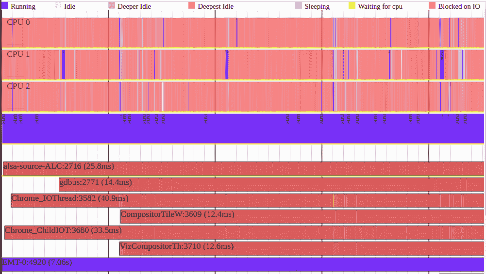
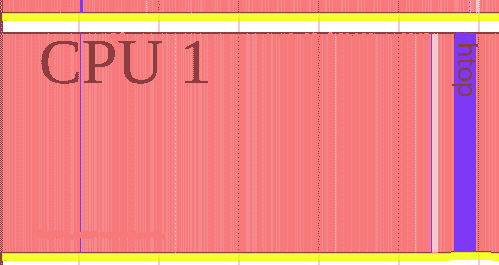
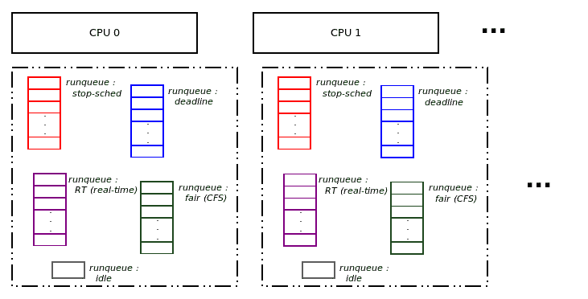
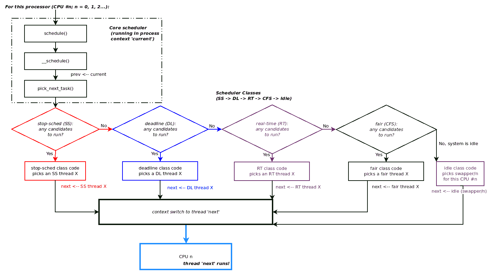
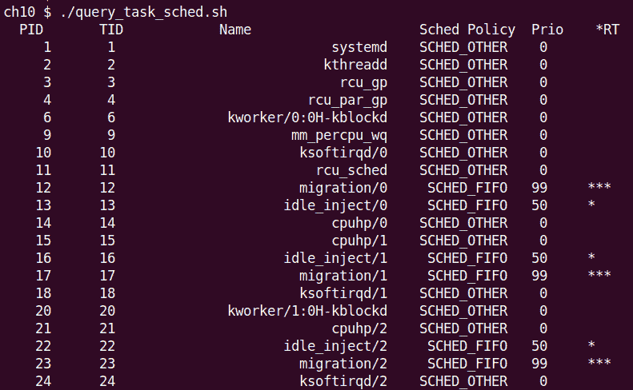

# 第十章：CPU 调度器 - 第一部分

在本章和下一章中，您将深入了解一个关键的操作系统主题 - 即 Linux 操作系统上的 CPU 调度。我将尝试通过提出（并回答）典型问题并执行与调度相关的常见任务来使学习更加实际。了解操作系统级别的调度工作不仅对于内核（和驱动程序）开发人员来说很重要，而且还会自动使您成为更好的系统架构师（甚至对于用户空间应用程序）。

我们将首先介绍基本背景材料；这将包括 Linux 上的**内核可调度实体**（**KSE**），以及 Linux 实现的 POSIX 调度策略。然后，我们将使用工具 - `perf`和其他工具 - 来可视化操作系统在 CPU 上运行任务并在它们之间切换的控制流。这对于应用程序的性能分析也很有用！之后，我们将更深入地了解 Linux 上 CPU 调度的工作原理，包括模块化调度类、**完全公平调度**（**CFS**）、核心调度函数的运行等。在此过程中，我们还将介绍如何以编程方式（动态地）查询和设置系统上任何线程的调度策略和优先级。

在本章中，我们将涵盖以下领域：

+   学习 CPU 调度内部 - 第一部分 - 基本背景

+   可视化流程

+   学习 CPU 调度内部 - 第二部分

+   线程 - 调度策略和优先级

+   学习 CPU 调度内部 - 第三部分

现在，让我们开始这个有趣的话题吧！

# 技术要求

我假设您已经阅读了第一章 *内核工作区设置*，并已经适当地准备了一个运行 Ubuntu 18.04 LTS（或更高稳定版本）的客户**虚拟机**（**VM**）并安装了所有必需的软件包。如果没有，我强烈建议您首先这样做。

为了充分利用本书，我强烈建议您首先设置工作环境，包括克隆本书的 GitHub 存储库以获取代码并进行实际操作。存储库可以在这里找到：[`github.com/PacktPublishing/Linux-Kernel-Programming`](https://github.com/PacktPublishing/Linux-Kernel-Programming)。

# 学习 CPU 调度内部 - 第一部分 - 基本背景

让我们快速了解一下我们需要了解 Linux 上 CPU 调度的基本背景信息。

请注意，在本书中，我们不打算涵盖 Linux 上熟练的系统程序员应该已经非常了解的材料；这包括基础知识，如进程（或线程）状态，状态机及其转换，以及更多关于实时性、POSIX 调度策略等的信息。这些内容（以及更多内容）已经在我之前的一本书中详细介绍过：《Linux 系统编程实战》，由 Packt 于 2018 年 10 月出版。

## Linux 上的 KSE 是什么？

正如您在第六章中所学到的，在*内核内部要点 - 进程和线程*一节中，每个进程 - 实际上是系统上存活的每个线程 - 都被赋予一个任务结构（`struct task_struct`）以及用户模式和内核模式堆栈。

在这里，需要问的关键问题是：在进行调度时，*它作用于哪个对象*，换句话说，什么是**内核可调度实体**，**KSE**？在 Linux 上，**KSE 是一个线程**，而不是一个进程（当然，每个进程至少包含一个线程）。因此，线程是进行调度的粒度级别。

举个例子来解释这一点：如果我们假设有一个 CPU 核心和 10 个用户空间进程，每个进程包括三个线程，再加上五个内核线程，那么我们总共有（10 x 3）+ 5，等于 35 个线程。除了五个内核线程外，每个线程都有用户和内核栈以及一个任务结构（内核线程只有内核栈和任务结构；所有这些都在第六章中得到了详细解释，*内核内部要点-进程和线程*，在*组织进程、线程及其栈-用户空间和内核空间*部分）。现在，如果所有这 35 个线程都是可运行的，那么它们将竞争单个处理器（尽管它们不太可能同时都是可运行的，但为了讨论的完整性，让我们假设它们都是可运行的），那么现在有 35 个*线程*竞争 CPU 资源，而不是 10 个进程和五个内核线程。

现在我们了解了 KSE 是一个线程，我们（几乎）总是在调度上下文中引用线程。既然这一点已经理解，让我们继续讨论 Linux 实现的调度策略。

## POSIX 调度策略

重要的是要意识到 Linux 内核不仅实现了一个实现 CPU 调度的算法；事实上，POSIX 标准规定了一个 POSIX 兼容的操作系统必须遵循的最少三种调度策略（实际上是算法）。Linux 不仅实现了这三种，还实现了更多，采用了一种称为调度类的强大设计（稍后在本章的*理解模块化调度类*部分中详细介绍）。

关于 Linux 上的 POSIX 调度策略（以及更多）的信息在我早期的书籍*Hands-On System Programming with Linux*中有更详细的介绍，该书于 2018 年 10 月由 Packt 出版。 

现在，让我们简要总结一下 POSIX 调度策略以及它们在下表中的影响：

| **调度策略** | **关键点** | **优先级范围** |
| --- | --- | --- |
| `SCHED_OTHER`或`SCHED_NORMAL` | 始终是默认值；具有此策略的线程是非实时的；在内部实现为**完全公平调度**（CFS）类（稍后在*关于 CFS 和 vruntime 值*部分中看到）。这种调度策略背后的动机是公平性和整体吞吐量。 | 实时优先级为`0`；非实时优先级称为 nice 值：范围从-20 到+19（较低的数字意味着更高的优先级），基数为 0 |

| `SCHED_RR` | 这种调度策略背后的动机是一种（软）实时策略，相对积极。具有有限时间片（通常默认为 100 毫秒）。

`SCHED_RR`线程将在以下情况下让出处理器（如果且仅如果）：

- 它在 I/O 上阻塞（进入睡眠状态）。

- 它停止或终止。

- 更高优先级的实时线程变为可运行状态（将抢占此线程）。

- 它的时间片到期。|（软）实时：1 到 99（较高的数字

意味着更高的优先级）|

| `SCHED_FIFO` | 这种调度策略背后的动机是一种（软）实时策略，相对来说非常积极。`SCHED_FIFO`线程将在以下情况下让出处理器：

- 它在 I/O 上阻塞（进入睡眠状态）。

- 它停止或终止。

- 更高优先级的实时线程变为可运行状态（将抢占此线程）。

它实际上有无限的时间片。|（与`SCHED_RR`相同）|

| `SCHED_BATCH` | 这种调度策略背后的动机是适用于非交互式批处理作业的调度策略，较少的抢占。 | Nice 值范围（-20 到+19） |
| --- | --- | --- |
| `SCHED_IDLE` | 特殊情况：通常 PID`0`内核线程（传统上称为`swapper`；实际上是每个 CPU 的空闲线程）使用此策略。它始终保证是系统中优先级最低的线程，并且只在没有其他线程想要 CPU 时运行。 | 所有优先级中最低的（可以认为低于 nice 值+19） |

重要的是要注意，当我们在上表中说实时时，我们实际上指的是*软*实时（或者最好是*硬*实时），而不是**实时操作系统**（**RTOS**）中的硬实时。Linux 是一个**GPOS**，一个**通用操作系统**，而不是 RTOS。话虽如此，您可以通过应用外部补丁系列（称为 RTL，由 Linux 基金会支持）将普通的 Linux 转换为真正的硬实时 RTOS；您将在以下章节*将主线 Linux 转换为 RTOS*中学习如何做到这一点。

请注意，`SCHED_FIFO`线程实际上具有无限的时间片，并且运行直到它希望停止或前面提到的条件之一成立。在这一点上，重要的是要理解我们只关注线程（KSE）调度；在诸如 Linux 的操作系统上，现实情况是硬件（和软件）*中断*总是优先的，并且甚至会抢占（内核或用户空间）`SCHED_FIFO`线程！请参考图 6.1 以了解这一点。此外，我们将在第十四章*处理硬件中断*中详细介绍硬件中断。在我们的讨论中，我们暂时将忽略中断。

优先级缩放很简单：

+   非实时线程（`SCHED_OTHER`）具有`0`的实时优先级；这确保它们甚至不能与实时线程竞争。它们使用一个（旧的 UNIX 风格）称为**nice value**的优先级值，范围从-20 到+19（-20 是最高优先级，+19 是最差的）。

在现代 Linux 上的实现方式是，每个 nice 级别对应于 CPU 带宽的大约 10%的变化（或增量，加或减），这是一个相当大的数量。

+   实时线程（`SCHED_FIFO / SCHED_RR`）具有 1 到 99 的实时优先级范围，1 是最低优先级，99 是最高优先级。可以这样理解：在一个不可抢占的 Linux 系统上，一个`SCHED_FIFO`优先级为 99 的线程在一个无法中断的无限循环中旋转，实际上会使机器挂起！（当然，即使这样也会被中断 - 包括硬中断和软中断；请参见图 6.1。）

调度策略和优先级（静态 nice 值和实时优先级）当然是任务结构的成员。线程所属的调度类是独占的：一个线程在特定时间点只能属于一个调度策略（不用担心，我们稍后将在*CPU 调度内部 - 第二部分*中详细介绍调度类）。

此外，您应该意识到在现代 Linux 内核上，还有其他调度类（stop-schedule 和 deadline），它们实际上比我们之前提到的 FIFO/RR 更优先（优先级更高）。既然您已经了解了基础知识，让我们继续看一些非常有趣的东西：我们实际上如何*可视化*控制流。继续阅读！

# 可视化流程

多核系统导致进程和线程在不同处理器上并发执行。这对于获得更高的吞吐量和性能非常有用，但也会导致共享可写数据的同步问题。因此，例如，在一个具有四个处理器核心的硬件平台上，我们可以期望进程（和线程）在它们上面并行执行。这并不是什么新鲜事；不过，有没有一种方法可以实际上看到哪些进程或线程在哪个 CPU 核心上执行 - 也就是说，有没有一种可视化处理器时间线的方法？事实证明确实有几种方法可以做到这一点。在接下来的章节中，我们将首先使用`perf`来看一种有趣的方法，然后再使用其他方法（使用 LTTng、Trace Compass 和 Ftrace）。

## 使用 perf 来可视化流程

Linux 拥有庞大的开发人员和**质量保证**（**QA**）工具库，其中`perf(1)`是一个非常强大的工具。简而言之，`perf`工具集是在 Linux 系统上执行 CPU 性能分析的现代方式。（除了一些提示外，我们在本书中不会详细介绍`perf`。）

类似于古老的`top(1)`实用程序，要详细了解正在占用 CPU 的情况（比`top(1)`更详细），**`perf(1)`**一系列实用程序非常出色。不过，请注意，与应用程序相比，`perf`与其运行的内核紧密耦合，这是相当不寻常的。首先，你需要安装`linux-tools-$(uname -r)`包。此外，自定义的 5.4 内核包将不可用；因此，在使用`perf`时，我建议你使用标准（或发行版）内核引导你的虚拟机，安装`linux-tools-$(uname -r)`包，然后尝试使用`perf`。（当然，你也可以在内核源代码树中的`tools/perf/`文件夹下手动构建`perf`。）

安装并运行`perf`后，请尝试这些`perf`命令：

```
sudo perf top
sudo perf top --sort comm,dso
sudo perf top -r 90 --sort pid,comm,dso,symbol
```

（顺便说一句，`comm`意味着命令/进程的名称，`**dso**`是**动态共享对象**的缩写）。使用`alias`会更容易；尝试这个（一行）以获得更详细的信息（调用堆栈也可以展开！）：

```
alias ptopv='sudo perf top -r 80 -f 99 --sort pid,comm,dso,symbol --demangle-kernel -v --call-graph dwarf,fractal'
```

`perf(1)`的`man`页面提供了详细信息；使用`man perf-<foo>`表示法 - 例如，`man perf-top` - 以获取有关`perf top`的帮助。

使用`perf`的一种方法是了解在哪个 CPU 上运行了什么任务；这是通过`perf`中的`timechart`子命令完成的。你可以使用`perf`记录系统范围的事件，也可以记录特定进程的事件。要记录系统范围的事件，请运行以下命令：

```
sudo perf timechart record
```

通过信号（`^C`）终止记录会话。这将默认生成一个名为`perf.data`的二进制数据文件。现在可以使用以下命令进行检查：

```
sudo perf timechart 
```

这个命令生成了一个**可伸缩矢量图形**（**SVG**）文件！它可以在矢量绘图工具（如 Inkscape，或通过 ImageMagick 中的`display`命令）中查看，或者直接在 Web 浏览器中查看。研究时间表可能会很有趣；我建议你试试。不过，请注意，矢量图像可能会很大，因此打开需要一段时间。

以下是在运行 Ubuntu 18.10 的本机 Linux x86_64 笔记本电脑上进行的系统范围采样运行：

```
$ sudo perf timechart record
[sudo] password for <user>:
^C[ perf record: Woken up 18 times to write data ] 
[ perf record: Captured and wrote 6.899 MB perf.data (196166 samples) ] 
$ ls -lh perf.data 
-rw------- 1 root root 7.0M Jun 18 12:57 perf.data 
$ sudo perf timechart
Written 7.1 seconds of trace to output.svg.
```

可以配置`perf`以使用非 root 访问权限。在这里，我们不这样做；我们只是通过`sudo(8)`以 root 身份运行`perf`。

`perf`生成的 SVG 文件的屏幕截图如下所示。要查看 SVG 文件，你可以简单地将其拖放到你的 Web 浏览器中：



图 10.1 - （部分）屏幕截图显示由 sudo perf timechart 生成的 SVG 文件

在前面的屏幕截图中，举个例子，你可以看到`EMT-0`线程很忙，占用了最大的 CPU 周期（不幸的是，CPU 3 这个短语不太清楚；仔细看看紫色条下面的 CPU 2）。这是有道理的；它是代表我们运行 Fedora 29 的 VirtualBox 的**虚拟 CPU**（**VCPU**）的线程（**EMT**代表**模拟器线程**）！

你可以放大和缩小这个 SVG 文件，研究`perf`默认记录的调度和 CPU 事件。下图是前面截图的部分屏幕截图，放大 400%至 CPU 1 区域，显示了在 CPU＃1 上运行的`htop`（紫色条实际上显示了它执行时的时间段）：



图 10.2 - 对 perf timechart 的 SVG 文件的部分屏幕截图，放大 400%至 CPU 1 区域

还有什么？通过使用`-I`选项切换到`perf timechart record`，你可以请求仅记录系统范围的磁盘 I/O（和网络，显然）事件。这可能特别有用，因为通常真正的性能瓶颈是由 I/O 活动引起的（而不是 CPU；I/O 通常是罪魁祸首！）。`perf-timechart(1)`的`man`页面详细介绍了更多有用的选项；例如，`--callchain`用于执行堆栈回溯记录。另一个例子是，`--highlight <name>`选项将突出显示所有名称为`<name>`的任务。

您可以使用`perf data convert -- all --to-ctf`将`perf`的二进制`perf.data`记录文件转换为流行的**通用跟踪格式**（**CTF**）文件格式，其中最后一个参数是存储 CTF 文件的目录。这有什么用呢？CTF 是强大的 GUI 可视化器和分析工具（例如 Trace Compass）使用的本机数据格式（稍后在第十一章中的*CPU 调度程序-第二部分*中可以看到）。

然而，正如 Trace Compass Perf Profiling 用户指南中所提到的那样（[`archive.eclipse.org/tracecompass.incubator/doc/org.eclipse.tracecompass.incubator.perf.profiling.doc.user/User-Guide.html`](https://archive.eclipse.org/tracecompass.incubator/doc/org.eclipse.tracecompass.incubator.perf.profiling.doc.user/User-Guide.html)）：“并非所有 Linux 发行版都具有内置的 ctf 转换。需要使用环境变量 LIBBABELTRACE=1 和 LIBBABELTRACE_DIR=/path/to/libbabeltrace 来编译 perf（因此 linux）以启用该支持。”

不幸的是，在撰写本文时，Ubuntu 就是这种情况。

## 通过替代（CLI）方法来可视化流程

当然，还有其他方法可以可视化每个处理器上正在运行的内容；我们在这里提到了一些，并保存了另一个有趣的方法（LTTng），将在第十一章中的*CPU 调度程序-第二部分*中的*使用 LTTng 和 Trace Compass 进行可视化*部分中介绍。

+   再次使用`perf(1)`运行`sudo perf sched record`命令；这将记录活动。通过使用`^C`信号终止它，然后使用`sudo perf sched map`来查看处理器上的执行情况（CLI 地图）。

+   一些简单的 Bash 脚本可以显示在给定核心上正在执行的内容（这是对`ps(1)`的简单封装）。在下面的片段中，我们展示了一些示例 Bash 函数；例如，以下`c0()`函数显示了当前在 CPU 核心`#0`上正在执行的内容，而`c1()`则对`#1`核心执行相同的操作。

```
# Show thread(s) running on cpu core 'n' - func c'n'
function c0() 
{ 
    ps -eLF | awk '{ if($5==0) print $0}' 
} 
function c1() 
{ 
    ps -eLF | awk '{ if($5==1) print $0}' 
} 
```

在广泛讨论`perf`的话题上，Brendan Gregg 有一系列非常有用的脚本，可以在使用`perf`监视生产 Linux 系统时执行许多必要的工作；请在这里查看它们：[`github.com/brendangregg/perf-tools`](https://github.com/brendangregg/perf-tools)（一些发行版将它们作为名为`perf-tools[-unstable]`的软件包包含在内）。

尝试使用这些替代方案（包括`perf-tools[-unstable]`包）！

# 了解 CPU 调度内部工作原理-第二部分

本节详细介绍了内核 CPU 调度的内部工作原理，重点是现代设计的核心部分，即模块化调度类。

## 了解模块化调度类

内核开发人员 Ingo Molnar（以及其他人）重新设计了内核调度程序的内部结构，引入了一种称为**调度类**的新方法（这是在 2007 年 10 月发布 2.6.23 内核时的情况）。

顺便说一句，这里的“类”一词并非巧合；许多 Linux 内核功能本质上都是以**面向对象**的方式设计的。当然，C 语言不允许我们直接在代码中表达这一点（因此结构中有数据和函数指针成员的比例很高，模拟了一个类）。然而，设计往往是面向对象的（您将在*Linux 内核编程第二部分*书中再次看到这一点）。有关此内容的更多详细信息，请参阅本章的*进一步阅读*部分。

在核心调度代码下引入了一层抽象，即`schedule()`函数。`schedule()`下的这一层通常称为调度类，设计上是模块化的。这里的“模块化”意味着调度类可以从内联内核代码中添加或删除；这与**可加载内核模块**（**LKM**）框架无关。

基本思想是：当核心调度程序代码（由`schedule()`函数封装）被调用时，了解到它下面有各种可用的调度类别，它按照预定义的优先级顺序迭代每个类别，询问每个类别是否有一个需要调度到处理器上的线程（或进程）（我们很快就会看到具体是如何做的）。

截至 Linux 内核 5.4，这些是内核中的调度类别，按优先级顺序列出，优先级最高的排在前面：

```
// kernel/sched/sched.h
[ ... ] 
extern const struct sched_class stop_sched_class; 
extern const struct sched_class dl_sched_class; 
extern const struct sched_class rt_sched_class; 
extern const struct sched_class fair_sched_class; 
extern const struct sched_class idle_sched_class;
```

这就是我们所拥有的五个调度程序类别 - 停止调度、截止时间、（软）实时、公平和空闲 - 按优先级顺序排列，从高到低。抽象这些调度类别的数据结构`struct sched_class`被串联在一个单链表上，核心调度代码对其进行迭代。（稍后您将了解`sched_class`结构是什么；现在请忽略它）。

每个线程都与其自己独特的任务结构（`task_struct`）相关联；在任务结构中，`policy`成员指定线程遵循的调度策略（通常是`SCHED_FIFO`、`SCHED_RR`或`SCHED_OTHER`中的一个）。它是独占的 - 一个线程在任何给定时间点只能遵循一个调度策略（尽管它可以改变）。类似地，任务结构的另一个成员`struct sched_class`保存线程所属的模块化调度类别（也是独占的）。调度策略和优先级都是动态的，可以通过编程查询和设置（或通过实用程序；您很快就会看到这一点）。

因此，您现在将意识到，所有遵循`SCHED_FIFO`或`SCHED_RR`调度策略的线程都映射到`rt_sched_class`（在其任务结构中的`sched_class`），所有遵循`SCHED_OTHER`（或`SCHED_NORMAL`）的线程都映射到`fair_sched_class`，而空闲线程（`swapper/n`，其中`n`是从`0`开始的 CPU 编号）始终映射到`idle_sched_class`调度类别。

当内核需要进行调度时，这是基本的调用顺序：

```
schedule() --> __schedule() --> pick_next_task() 
```

前面的调度类别的实际迭代发生在这里；请参见`pick_next_task()`的（部分）代码，如下：

```
// kernel/sched/core.c
 /* 
  * Pick up the highest-prio task: 
  */ 
static inline struct task_struct * 
pick_next_task(struct rq *rq, struct task_struct *prev, struct rq_flags *rf) 
{ 
    const struct sched_class *class; 
    struct task_struct *p; 

    /* Optimization: [...] */
    [...]

   for_each_class(class) { 
        p = class->pick_next_task(rq, NULL, NULL);
        if (p)
            return p;
    }

    /* The idle class should always have a runnable task: */
    BUG();
}
```

前面的`for_each_class()`宏设置了一个`for`循环，用于迭代所有调度类别。其实现如下：

```
// kernel/sched/sched.h
[...]
#ifdef CONFIG_SMP
#define sched_class_highest (&stop_sched_class)
#else
#define sched_class_highest (&dl_sched_class)
#endif

#define for_class_range(class, _from, _to) \
    for (class = (_from); class != (_to); class = class->next)

#define for_each_class(class) \
    for_class_range(class, sched_class_highest, NULL)
```

从前面的实现中可以看出，代码导致每个类都被要求通过`pick_next_task()`"方法"来安排下一个调度的任务，从`sched_class_highest`到`NULL`（意味着它们所在的链表的末尾）。现在，调度类代码确定它是否有任何想要执行的候选者。怎么做？实际上很简单；它只是查找它的**runqueue**数据结构。

现在，这是一个关键点：*内核为每个处理器核心和每个调度类别维护一个运行队列*！因此，如果我们有一个有 8 个 CPU 核心的系统，那么我们将有*8 个核心 * 5 个调度类别 = 40 个运行队列*！运行队列实际上是作为每个 CPU 变量实现的，这是一种有趣的无锁技术（例外情况：在**单处理器**（**UP**）系统上，`stop-sched`类别不存在）：



图 10.3 - 每个 CPU 核心每个调度类都有一个运行队列

请注意，在前面的图中，我展示运行队列的方式可能让它们看起来像数组。这并不是本意，这只是一个概念图。实际使用的运行队列数据结构取决于调度类别（类别代码实现了运行队列）。它可以是一个链表数组（就像实时类别一样），也可以是一棵树 - 一棵**红黑（rb）树** - 就像公平类别一样，等等。

为了更好地理解调度器类模型，我们将设计一个例子：假设在对称多处理器（**SMP**）或多核系统上，我们有 100 个线程处于活动状态（在用户空间和内核空间）。其中，有一些线程在竞争 CPU；也就是说，它们处于准备运行（run）状态，意味着它们是可运行的，因此被排队在运行队列数据结构上：

+   线程 S1：调度器类，`stop-sched`（**SS**）

+   线程 D1 和 D2：调度器类，**Deadline**（**DL**）

+   线程 RT1 和 RT2：调度器类，**Real Time**（**RT**）

+   线程 F1、F2 和 F3：调度器类，CFS（或公平）

+   线程 I1：调度器类，空闲。

想象一下，一开始，线程 F2 正在处理器核心上，愉快地执行代码。在某个时刻，内核希望在该 CPU 上切换到其他任务（是什么触发了这个？你很快就会看到）。在调度代码路径上，内核代码最终进入`kernel/sched/core.c:void schedule(void)`内核例程（稍后会跟进代码级细节）。现在重要的是要理解`pick_next_task()`例程，由`schedule()`调用，遍历调度器类的链表，询问每个类是否有候选者可以运行。它的代码路径（概念上，当然）看起来像这样：

1.  核心调度器代码（`schedule()`）：“*嘿，SS，你有任何想要运行的线程吗？*”

1.  SS 类代码：遍历其运行队列并找到一个可运行的线程；因此它回答：“*是的，我有，它是线程 S1*”

1.  核心调度器代码（`schedule()`）：“*好的，让我们切换到 S1 上下文*”

工作完成了。但是，如果在该处理器的 SS 运行队列上没有可运行的线程 S1（或者它已经进入睡眠状态，或者已经停止，或者它在另一个 CPU 的运行队列上）。那么，SS 会说“*不*”，然后会询问下一个最重要的调度类 DL。如果它有潜在的候选线程想要运行（在我们的例子中是 D1 和 D2），它的类代码将确定 D1 或 D2 中应该运行的线程，并且内核调度器将忠实地上下文切换到它。这个过程会继续进行 RT 和公平（CFS）调度类。（一图胜千言，对吧：参见图 10.4）。

很可能（在您典型的中度负载的 Linux 系统上），在问题 CPU 上没有 SS、DL 或 RT 候选线程想要运行，通常至少会有一个公平（CFS）线程想要运行；因此，它将被选择并进行上下文切换。如果没有想要运行的线程（没有 SS/DL/RT/CFS 类线程想要运行），这意味着系统目前处于空闲状态（懒惰的家伙）。现在，空闲类被问及是否想要运行：它总是说是！这是有道理的：毕竟，当没有其他人需要时，CPU 空闲线程的工作就是在处理器上运行。因此，在这种情况下，内核将上下文切换到空闲线程（通常标记为`swapper/n`，其中`n`是它正在执行的 CPU 编号（从`0`开始））。

还要注意，`swapper/n`（CPU 空闲）内核线程不会出现在`ps(1)`列表中，尽管它一直存在（回想一下我们在第六章中展示的代码，*内核内部要点-进程和线程*，这里：`ch6/foreach/thrd_showall/thrd_showall.c`。在那里，我们编写了一个`disp_idle_thread()`例程来显示 CPU 空闲线程的一些细节，即使我们在那里使用的内核的`do_each_thread() { ... } while_each_thread()`循环也不显示空闲线程）。

以下图表清楚地总结了核心调度代码如何按优先顺序调用调度类，切换到最终选择的下一个线程：



图 10.4-遍历每个调度类以选择下一个要运行的任务

在接下来的章节中，你将学习如何通过一些强大的工具来可视化内核流程。在那里，实际上可以看到对模块化调度器类进行迭代的工作。

### 询问调度类

核心调度器代码（`pick_next_task()`）如何询问调度类是否有任何想要运行的线程？我们已经看到了这一点，但我觉得值得为了清晰起见重复以下代码片段（大部分从`__schedule()`调用，也从线程迁移代码路径调用）：

```
// kernel/sched/core.c
[ ... ] 
static inline struct task_struct * 
pick_next_task(struct rq *rq, struct task_struct *prev, struct rq_flags *rf) 
{ 
    const struct sched_class *class;
    struct task_struct *p;
    [ ... ] 
for_each_class(class){
        p = class->pick_next_task(rq, NULL, NULL);
        if (p)
            return p;
    }
    [ ... ]

```

注意在这里的面向对象的特性：`class->pick_next_task()`代码，实际上是调用调度类`class`的`pick_next_task()`方法！方便的返回值是选定任务的任务结构的指针，现在代码切换到该任务。

前面的段落当然意味着，有一个`class`结构，体现了我们对调度类的真正意思。确实如此：它包含了所有可能的操作，以及有用的挂钩，你可能在调度类中需要。它（令人惊讶地）被称为`sched_class`结构：

```
// location: kernel/sched/sched.h
[ ... ] 
struct sched_class {
    const struct sched_class *next;
    [...]
    void (*enqueue_task) (struct rq *rq, struct task_struct *p, int flags); 
    void (*dequeue_task) (struct rq *rq, struct task_struct *p, int flags);
    [ ... ]
    struct task_struct * (*pick_next_task)(struct rq *rq,
                           struct task_struct *prev,
                           struct rq_flags *rf);
    [ ... ] 
    void (*task_tick)(struct rq *rq, struct task_struct *p, int queued); 
    void (*task_fork)(struct task_struct *p); 
    [ ... ]
};
```

（这个结构的成员比我们在这里展示的要多得多；在代码中查找它）。显然，每个调度类都实例化了这个结构，并适当地填充了它的方法（当然是函数指针）。核心调度代码在调度类的链接列表上进行迭代（以及内核的其他地方），根据需要调用方法和挂钩函数，只要它不是`NULL`。

举个例子，让我们看看公平调度类（CFS）如何实现其调度类的调度算法：

```
// kernel/sched/fair.c
const struct sched_class fair_sched_class = {
    .next = &idle_sched_class,
    .enqueue_task = enqueue_task_fair,
    .dequeue_task = dequeue_task_fair,
    [ ... ]
    .pick_next_task = pick_next_task_fair,
    [ ... ]
    .task_tick = task_tick_fair,
    .task_fork = task_fork_fair,
    .prio_changed = prio_changed_fair,
    [ ... ]
};
```

现在你看到了：公平调度类用于选择下一个要运行的任务的代码（当核心调度器询问时）是函数`pick_next_task_fair()`。FYI，`task_tick`和`task_fork`成员是调度类挂钩的很好的例子；这些函数将分别在每个定时器滴答（即每个定时器中断，理论上至少每秒触发`CONFIG_HZ`次）和当属于这个调度类的线程 fork 时，由调度器核心调用。

也许一个有趣的深入研究的 Linux 内核项目：创建你自己的调度类，具有特定的方法和挂钩，实现其内部调度算法。根据需要链接所有的部分（插入到所需优先级的调度类链接列表中等），并进行测试！现在你可以看到为什么它们被称为模块化调度类了。

现在你了解了现代模块化 CPU 调度器工作背后的架构，让我们简要地看一下 CFS 背后的算法，也许是通用 Linux 上最常用的调度类。

### 关于 CFS 和 vruntime 值

自 2.6.23 版本以来，CFS 一直是常规线程的事实内核 CPU 调度代码；大多数线程都是`SCHED_OTHER`，由 CFS 驱动。CFS 背后的驱动力是公平性和整体吞吐量。简而言之，在其实现中，内核跟踪每个可运行的 CFS（`SCHED_OTHER`）线程的实际 CPU 运行时间（以纳秒为粒度）；具有最小运行时间的线程最值得运行，并将在下一个调度切换时被授予处理器。相反，不断占用处理器的线程将累积大量运行时间，因此将受到惩罚（这实际上是相当具有因果报应的）！

不深入讨论 CFS 实现的内部细节，任务结构中嵌入了另一个数据结构`struct sched_entity`，其中包含一个名为`vruntime`的无符号 64 位值。在简单的层面上，这是一个单调计数器，用于跟踪线程在处理器上累积（运行）的时间，以纳秒为单位。

在实践中，这里需要大量的代码级调整、检查和平衡。例如，通常情况下，内核会将`vruntime`值重置为`0`，触发另一个调度纪元。此外，还有各种可调参数在`/proc/sys/kernel/sched_*`下，以帮助更好地微调 CPU 调度器的行为。

CFS 如何选择下一个要运行的任务被封装在`kernel/sched/fair.c:pick_next_task_fair()`函数中。从理论上讲，CFS 的工作方式非常简单：将所有可运行的任务（对于该 CPU）排队到运行队列上，这是一个 rb-tree（一种自平衡二叉搜索树），使得在树上花费最少处理器时间的任务是树上最左边的叶节点，其后的节点表示下一个要运行的任务，然后是下一个。

实际上，从左到右扫描树可以给出未来任务执行的时间表。这是如何保证的？通过使用前面提到的`vruntime`值作为任务排队到 rb-tree 上的关键！

当内核需要调度并询问 CFS 时，CFS 类代码 - 我们已经提到过了，`pick_next_task_fair()`函数 - *简单地选择树上最左边的叶节点*，返回嵌入其中的任务结构的指针；根据定义，它是具有最低`vruntime`值的任务，实际上是运行时间最短的任务！（遍历树是一个*O(log n)*时间复杂度算法，但由于一些代码优化和对最左边叶节点的巧妙缓存，实际上将其转换为一个非常理想的*O(1)*算法！）当然，实际代码比这里透露的要复杂得多；它需要进行多个检查和平衡。我们不会在这里深入讨论细节。

我们建议那些对 CFS 更多了解的人参考有关该主题的内核文档，网址为[`www.kernel.org/doc/Documentation/scheduler/sched-design-CFS.txt`](https://www.kernel.org/doc/%20Documentation/scheduler/sched-design-CFS.txt)。

此外，内核包含了一些在`/proc/sys/kernel/sched_*`下的可调参数，对调度产生直接影响。关于这些参数以及如何使用它们的说明可以在*Tuning the Task Scheduler*页面找到（[`documentation.suse.com/sles/12-SP4/html/SLES-all/cha-tuning-taskscheduler.html`](https://documentation.suse.com/sles/12-SP4/html/SLES-all/cha-tuning-taskscheduler.html)），而在文章[`www.scylladb.com/2016/06/10/read-latency-and-scylla-jmx-process/`](https://www.scylladb.com/2016/06/10/read-latency-and-scylla-jmx-process/)中可以找到一个出色的实际用例。

现在让我们继续学习如何查询任何给定线程的调度策略和优先级。

# 线程 - 调度策略和优先级

在本节中，您将学习如何查询系统上任何给定线程的调度策略和优先级。（但是关于以编程方式查询和设置相同的讨论我们推迟到下一章，在*查询和设置线程的调度策略和优先级*部分。）

我们了解到，在 Linux 上，线程就是 KSE；它实际上是被调度并在处理器上运行的东西。此外，Linux 有多种选择可供使用的调度策略（或算法）。策略以及分配给给定任务（进程或线程）的优先级是基于每个线程的，其中默认值始终是`SCHED_OTHER`策略，实时优先级为`0`。

在给定的 Linux 系统上，我们总是可以看到所有活动的进程（通过简单的`ps -A`），甚至可以看到每个活动的线程（使用 GNU `ps`，`ps -LA`）。但这并不告诉我们这些任务正在运行的调度策略和优先级；我们如何查询呢？

这其实很简单：在 shell 上，`chrt(1)`实用程序非常适合查询和设置给定进程的调度策略和/或优先级。使用`-p`选项开关发出`chrt`并提供 PID 作为参数，它将显示所讨论任务的调度策略以及实时优先级；例如，让我们查询`init`进程（或 systemd）的 PID`1`的情况：

```
$ chrt -p 1 
pid 1's current scheduling policy: SCHED_OTHER 
pid 1's current scheduling priority: 0 
$ 
```

像往常一样，`chrt(1)`的`man`页面提供了所有选项开关及其用法；请查看一下。

在以下（部分）屏幕截图中，我们展示了一个简单的 Bash 脚本（`ch10/query_task_sched.sh`，本质上是`chrt`的包装器），它查询并显示了所有活动线程（在运行时）的调度策略和实时优先级：



图 10.5 - 我们的 ch10/query_task_sched.sh Bash 脚本的（部分）屏幕截图

一些需要注意的事项：

+   在我们的脚本中，通过使用 GNU `ps(1)`，使用`ps -LA`，我们能够捕获系统上所有活动的线程；它们的 PID 和 TID 都会显示出来。正如您在第六章中学到的，*内核内部基础知识-进程和线程*，PID 是内核 TGID 的用户空间等价物，而 TID 是内核 PID 的用户空间等价物。因此，我们可以得出以下结论：

+   如果 PID 和 TID 匹配，那么它 - 在该行中看到的线程（第三列有它的名称） - 是该进程的主线程。

+   如果 PID 和 TID 匹配，并且 PID 只出现一次，那么它是一个单线程进程。

+   如果我们在左侧列中多次具有相同的 PID（最左侧列）和不同的 TID（第二列），那么这些是该进程的子线程（或工作线程）。我们的脚本通过将 TID 号稍微向右缩进来显示这一点。

+   请注意，在典型的 Linux 系统（甚至是嵌入式系统）上，绝大多数线程都倾向于是非实时的（`SCHED_OTHER`策略）。在典型的桌面、服务器甚至嵌入式 Linux 上，大多数线程都是`SCHED_OTHER`（默认策略），只有少数实时线程（FIFO/RR）。**Deadline**（**DL**）和**Stop-Sched**（**SS**）线程确实非常罕见。

+   请注意以下关于前述输出中出现的实时线程的观察：

+   我们的脚本通过在极右边显示一个星号来突出显示任何实时线程（具有策略：`SCHED_FIFO`或`SCHED_RR`）。

+   此外，任何实时优先级为 99（最大可能值）的实时线程将在极右边有三个星号（这些往往是专门的内核线程）。

+   当与调度策略进行布尔 OR 运算时，`SCHED_RESET_ON_FORK`标志会禁止任何子进程（通过`fork(2)`）继承特权调度策略（这是一项安全措施）。

+   更改线程的调度策略和/或优先级可以使用`chrt(1)`来执行；但是，您应该意识到这是一个需要 root 权限的敏感操作（或者，现在应该是首选机制的能力模型，`CAP_SYS_NICE`能力位是相关的能力）。

我们将让您自行查看脚本（`ch10/query_task_sched.sh`）的代码。另外，请注意（注意！）性能和 shell 脚本实际上并不搭配（所以在性能方面不要期望太多）。想一想，shell 脚本中的每个外部命令（我们这里有几个，如`awk`、`grep`和`cut`）都涉及到 fork-exec-wait 语义和上下文切换。而且，这些都是在循环中执行的。

`tuna(8)`程序可用于查询和设置各种属性；这包括进程/线程级别的调度策略/优先级和 CPU 亲和力掩码，以及中断请求（IRQ）亲和力。

你可能会问，具有`SCHED_FIFO`策略和实时优先级`99`的（少数）线程是否总是占用系统的处理器？实际上并不是；事实是这些线程大部分时间都是睡眠的。当内核确实需要它们执行一些工作时，它会唤醒它们。由于它们的实时策略和优先级，几乎可以保证它们将获得 CPU 并执行所需的时间（工作完成后再次进入睡眠状态）。关键是：当它们需要处理器时，它们将得到（类似于实时操作系统，但没有实时操作系统提供的铁定保证和确定性）。

`chrt(1)`实用程序如何查询（和设置）实时调度策略/优先级？嗯，这显而易见：由于它们驻留在内核虚拟地址空间（VAS）中的任务结构中，`chrt`进程必须发出系统调用。有几种系统调用变体执行这些任务：`chrt(1)`使用的是`sched_getattr(2)`进行查询，`sched_setattr(2)`系统调用用于设置调度策略和优先级。（务必查阅`sched(7)`手册页，了解更多与调度程序相关的系统调用的详细信息。）对`chrt`进行快速的`strace(1)`将验证这一点！

```
$ strace chrt -p 1
[ ... ] 
sched_getattr(1, {size=48, sched_policy=SCHED_OTHER, sched_flags=0, 
sched_nice=0, sched_priority=0, sched_runtime=0, sched_deadline=0, 
sched_period=0}, 48, 0) = 0 
fstat(1, {st_mode=S_IFCHR|0620, st_rdev=makedev(136, 6), ...}) = 0 
write(1, "pid 1's current scheduling polic"..., 47) = 47 
write(1, "pid 1's current scheduling prior"..., 39) = 39 
[ ... ] $ 
```

现在你已经掌握了查询（甚至设置）线程调度策略/优先级的实际知识，是时候深入一点了。在接下来的部分中，我们将进一步探讨 Linux CPU 调度程序的内部工作原理。我们将弄清楚谁运行调度程序的代码以及何时运行。好奇吗？继续阅读！

# 了解 CPU 调度内部 - 第三部分

在前面的部分中，你学到了核心内核调度代码嵌入了`void schedule(void)`函数中，并且模块化调度器类被迭代，最终选择一个线程进行上下文切换。这一切都很好；现在一个关键问题是：`schedule()`代码路径由谁和何时运行？

## 谁运行调度器代码？

关于调度工作方式的一个微妙但关键的误解不幸地被许多人持有：我们想象存在一种称为“调度程序”的内核线程（或类似实体），定期运行和调度任务。这是完全错误的；在像 Linux 这样的单内核操作系统中，调度是由进程上下文自身执行的，即在 CPU 上运行的常规线程！

实际上，调度代码总是由当前执行内核代码的进程上下文运行，换句话说，由`current`运行。

这也可能是一个适当的时机来提醒您 Linux 内核的一个“黄金规则”：调度代码绝对不能在任何原子或中断上下文中运行。换句话说，中断上下文代码必须保证是非阻塞的；这就是为什么你不能在中断上下文中使用`GFP_KERNEL`标志调用`kmalloc()` - 它可能会阻塞！但是使用`GFP_ATOMIC`标志就可以，因为这指示内核内存管理代码永远不会阻塞。此外，当调度代码运行时，内核抢占被禁用；这是有道理的。

## 调度程序何时运行？

操作系统调度程序的工作是在竞争使用处理器（CPU）资源的线程之间进行仲裁，共享处理器资源。但是如果系统很忙，有许多线程不断竞争和获取处理器呢？更准确地说，为了确保任务之间公平共享 CPU 资源，必须确保图片中的警察，即调度程序本身，定期在处理器上运行。听起来不错，但你究竟如何确保呢？

这是一个（看似）合乎逻辑的方法：当定时器中断触发时调用调度程序；也就是说，它每秒有`CONFIG_HZ`次运行的机会（通常设置为值 250）！不过，我们在第八章中学到了一个黄金法则，*模块作者的内核内存分配 - 第一部分*，在*永远不要在中断或原子上下文中休眠*部分：你不能在任何类型的原子或中断上下文中调用调度程序；因此，在定时器中断代码路径中调用它是被明确禁止的。那么，操作系统该怎么办呢？

实际上的做法是，定时器中断上下文和进程上下文代码路径都用于进行调度工作。我们将在下一节简要描述详细信息。

### 定时器中断部分

在定时器中断中（在`kernel/sched/core.c:scheduler_tick()`的代码中，其中中断被禁用），内核执行必要的元工作，以保持调度平稳运行；这涉及到适当地不断更新每个 CPU 的运行队列，负载平衡工作等。请注意，实际上*从不*在这里调用`schedule()`函数。最多，调度类钩子函数（对于被中断的进程上下文`current`）`sched_class:task_tick()`，如果非空，将被调用。例如，对于属于公平（CFS）类的任何线程，在`task_tick_fair()`中会在这里更新`vruntime`成员（虚拟运行时间，任务在处理器上花费的（优先级偏置）时间）。

更具体地说，前面段落中描述的所有工作都发生在定时器中断软中断`TIMER_SOFTIRQ`中。

现在，一个关键点，就是调度代码决定：我们是否需要抢占`current`？在定时器中断代码路径中，如果内核检测到当前任务已超过其时间量子，或者出于任何原因必须被抢占（也许现在运行队列上有另一个具有更高优先级的可运行线程），代码会设置一个名为`need_resched`的“全局”标志。（我们在“全局”一词中加引号的原因是它实际上并不是真正的全局内核；它实际上只是`current`实例的`thread_info->flags`位掩码中的一个位，名为`TIF_NEED_RESCHED`。为什么？这样访问位实际上更快！）值得强调的是，在典型（可能）情况下，不会有必要抢占`current`，因此`thread_info.flags:TIF_NEED_RESCHED`位将保持清除。如果设置，调度程序激活将很快发生；但具体何时发生？请继续阅读...

### 进程上下文部分

一旦刚刚描述的调度工作的定时器中断部分完成（当然，这些事情确实非常迅速地完成），控制权就会交回到进程上下文（线程`current`）中，它会运行我们认为是从中断中退出的路径。在这里，它会检查`TIF_NEED_RESCHED`位是否已设置 - `need_resched()`辅助例程会执行此任务。如果返回`True`，这表明需要立即进行重新调度：内核将调用`schedule()`！在这里，这样做是可以的，因为我们现在正在运行进程上下文。（请牢记：我们在这里谈论的所有代码都是由`current`，即相关的进程上下文运行的。）

当然，现在关键问题是代码的确切位置，该代码将识别`TIF_NEED_RESCHED`位是否已被设置（由先前描述的定时器中断部分）？啊，这就成了问题的关键：内核安排了内核代码基础中存在几个**调度机会点**。两个调度机会点如下：

+   从系统调用代码路径返回。

+   从中断代码路径返回。

所以，请考虑一下：每当运行在用户空间的任何线程发出系统调用时，该线程就会（上下文）切换到内核模式，并在内核中以内核特权运行代码。当然，系统调用是有限长度的；完成后，它们将遵循一个众所周知的返回路径，以便切换回用户模式并在那里继续执行。在这个返回路径上，引入了一个调度机会点：检查其`thread_info`结构中的`TIF_NEED_RESCHED`位是否设置。如果是，调度器就会被激活。

顺便说一句，执行此操作的代码是与体系结构相关的；在 x86 上是这里：`arch/x86/entry/common.c:exit_to_usermode_loop()`。在其中，与我们相关的部分是：

```
static void exit_to_usermode_loop(struct pt_regs *regs, u32 cached_flags)
{
[...]
 if (cached_flags & _TIF_NEED_RESCHED)
 schedule();
```

类似地，在处理（任何）硬件中断之后（和任何需要运行的相关软中断处理程序），在内核中的进程上下文切换回之后（内核中的一个工件——`irq_exit()`），但在恢复中断的上下文之前，内核检查`TIF_NEED_RESCHED`位：如果设置了，就调用`schedule()`。

让我们总结一下关于设置和识别`TIF_NEED_RESCHED`位的前面讨论：

+   定时器中断（软中断）在以下情况下设置`thread_info:flags TIF_NEED_RESCHED`位：

+   如果调度类的`scheduler_tick()`钩子函数内的逻辑需要抢占；例如，在 CFS 上，如果当前任务的`vruntime`值超过另一个可运行线程的给定阈值（通常为 2.25 毫秒；相关的可调参数是`/proc/sys/kernel/sched_min_granularity_ns`）。

+   如果一个更高优先级的线程可运行（在同一个 CPU 和运行队列上；通过`try_to_wake_up()`）。

+   在进程上下文中，发生了这样的事情：在中断返回和系统调用返回路径上，检查`TIF_NEED_RESCHED`的值：

+   如果设置为（`1`），则调用`schedule()`；否则，继续处理。

顺便说一句，这些调度机会点——从硬件中断返回或系统调用——也用作信号识别点。如果`current`上有信号挂起，它会在恢复上下文或返回到用户空间之前得到处理。

### 可抢占内核

让我们来看一个假设的情况：你在一个只有一个 CPU 的系统上运行。一个模拟时钟应用程序在 GUI 上运行，还有一个 C 程序`a.out`，它的一行代码是（呻吟）`while(1);`。那么，你认为：CPU 占用者*while 1*进程会无限期地占用 CPU，从而导致 GUI 时钟应用程序停止滴答（它的秒针会完全停止移动吗）？

稍加思考（和实验）就会发现，尽管有一个占用 CPU 的应用程序，GUI 时钟应用程序仍在继续滴答！实际上，这才是操作系统级调度器的全部意义：它可以并且确实抢占占用 CPU 的用户空间进程。（我们之前简要讨论了 CFS 算法；CFS 将导致侵占 CPU 的进程累积一个巨大的`vruntime`值，从而在其 rb-tree 运行队列上向右移动更多，从而对自身进行惩罚！）所有现代操作系统都支持这种类型的抢占——它被称为**用户模式抢占**。

但是现在，请考虑这样一个问题：如果你在单处理器系统上编写一个执行相同`while(1)`无限循环的内核模块会怎样？这可能是一个问题：系统现在将会简单地挂起。操作系统如何抢占自己（因为我们知道内核模块以内核特权在内核模式下运行）？好吧，你猜怎么着：多年来，Linux 一直提供了一个构建时配置选项来使内核可抢占，`CONFIG_PREEMPT`。（实际上，这只是朝着减少延迟和改进内核和调度器响应的长期目标的演变。这项工作的大部分来自早期和一些持续的努力：**低延迟**（LowLat）补丁，（旧的）RTLinux 工作等等。我们将在下一章中更多地介绍实时（RTOS）Linux - RTL。）一旦打开了`CONFIG_PREEMPT`内核配置选项并构建并引导内核，我们现在运行的是一个可抢占的内核——操作系统有能力抢占自己。

要查看此选项，在`make menuconfig`中，导航到 General Setup | Preemption Model。

基本上有三个可用的内核配置选项，就抢占而言：

| **抢占类型** | **特点** | **适用于** |
| --- | --- | --- |
| `CONFIG_PREEMPT_NONE` | 传统模型，面向高整体吞吐量。 | 服务器/企业级和计算密集型系统 |
| `CONFIG_PREEMPT_VOLUNTARY` | 可抢占内核（桌面）；操作系统内更明确的抢占机会点；导致更低的延迟，更好的应用程序响应。通常是发行版的默认设置。 | 用于桌面的工作站/台式机，运行 Linux 的笔记本电脑 |
| `CONFIG_PREEMPT` | LowLat 内核；（几乎）整个内核都是可抢占的；意味着甚至内核代码路径的非自愿抢占现在也是可能的；以稍微降低吞吐量和略微增加运行时开销为代价，产生更低的延迟（平均为几十微秒到低百微秒范围）。 | 快速多媒体系统（桌面，笔记本电脑，甚至现代嵌入式产品：智能手机，平板电脑等） |

`kernel/Kconfig.preempt` kbuild 配置文件包含了可抢占内核选项的相关菜单条目。（正如你将在下一章中看到的，当将 Linux 构建为 RTOS 时，内核抢占的第四个选择出现了。）

### CPU 调度器入口点

在核心内核调度函数`kernel/sched/core.c:__schedule()`之前的详细注释非常值得一读；它们指定了内核 CPU 调度器的所有可能入口点。我们在这里直接从 5.4 内核代码库中复制了它们，所以一定要看一下。请记住：以下代码是由即将通过上下文切换到其他线程的进程上下文中运行的！这个线程是谁？当然是`current`！

`__schedule()`函数有（其他）两个本地变量，指向名为`prev`和`next`的`task_struct`结构体的指针。名为`prev`的指针设置为`rq->curr`，这只是`current`！名为`next`的指针将设置为即将进行上下文切换的任务，即将运行的任务！所以，你看：`current`运行调度器代码，执行工作，然后通过上下文切换到`next`将自己从处理器中踢出！这是我们提到的大评论：

```
// kernel/sched/core.c/*
 * __schedule() is the main scheduler function.
 * The main means of driving the scheduler and thus entering this function are:
 * 1\. Explicit blocking: mutex, semaphore, waitqueue, etc.
 *
 * 2\. TIF_NEED_RESCHED flag is checked on interrupt and user space return
 *    paths. For example, see arch/x86/entry_64.S.
 *
 *    To drive preemption between tasks, the scheduler sets the flag in timer
 *    interrupt handler scheduler_tick().
 *
 * 3\. Wakeups don't really cause entry into schedule(). They add a
 *    task to the run-queue and that's it.
 *
 *    Now, if the new task added to the run-queue preempts the current
 *    task, then the wakeup sets TIF_NEED_RESCHED and schedule() gets
 *    called on the nearest possible occasion:
 *    - If the kernel is preemptible (CONFIG_PREEMPTION=y):
 *
 *    - in syscall or exception context, at the next outmost
 *      preempt_enable(). (this might be as soon as the wake_up()'s
 *      spin_unlock()!)
 *
 *    - in IRQ context, return from interrupt-handler to
 *      preemptible context
 *
 *    - If the kernel is not preemptible (CONFIG_PREEMPTION is not set)
 *      then at the next:
 *       - cond_resched() call
 *       - explicit schedule() call
 *       - return from syscall or exception to user-space
 *       - return from interrupt-handler to user-space
 * WARNING: must be called with preemption disabled!
 */
```

前面的代码是一个大评论，详细说明了内核 CPU 核心调度代码`__schedule()`如何被调用。`__schedule()`本身的一些相关片段可以在以下代码中看到，重申了我们一直在讨论的要点：

```
static void __sched notrace __schedule(bool preempt)
{
    struct task_struct *prev, *next;
    [...] struct rq *rq;
    int cpu;

    cpu = smp_processor_id();
    rq = cpu_rq(cpu);
    prev = rq->curr;                 *<< this is 'current' ! >>*

    [ ... ]

    next = pick_next_task(rq, prev, &rf);  *<< here we 'pick' the task to run next in an 'object-
                                          oriented' manner, as discussed earlier in detail ... >>*
    clear_tsk_need_resched(prev);
    clear_preempt_need_resched();

    if (likely(prev != next)) {
        [ ... ]
        /* Also unlocks the rq: */
        rq = context_switch(rq, prev, next, &rf);
    [ ... ]
}
```

接下来是关于实际上下文切换的简短说明。

#### 上下文切换

最后，简要介绍一下（调度程序）上下文切换。上下文切换（在 CPU 调度程序的上下文中）的工作非常明显：在简单地切换到下一个任务之前，操作系统必须保存先前任务的状态，也就是当前正在执行的任务的状态；换句话说，`current`的状态。您会回忆起第六章中所述，*内核内部要点-进程和线程*，任务结构包含一个内联结构，用于存储/检索线程的硬件上下文；它是成员`struct thread_struct thread`（在 x86 上，它始终是任务结构的最后一个成员）。在 Linux 中，一个内联函数，`kernel/sched/core.c:context_switch()`，执行了这项工作，从`prev`任务（也就是从`current`）切换到`next`任务，即本次调度轮或抢占的赢家。这个切换基本上是在两个（特定于体系结构）阶段中完成的。

+   **内存（MM）切换**：将特定于体系结构的 CPU 寄存器切换到`next`的内存描述符结构（`struct mm_struct`）。在 x86[_64]上，此寄存器称为`CR3`（**控制寄存器 3**）；在 ARM 上，它称为`TTBR0`（**翻译表基址寄存器`0`**）寄存器。

+   **实际的 CPU 切换**：通过保存`prev`的堆栈和 CPU 寄存器状态，并将`next`的堆栈和 CPU 寄存器状态恢复到处理器上，从`prev`切换到`next`；这是在`switch_to()`宏内完成的。

上下文切换的详细实现不是我们将在这里涵盖的内容；请查看*进一步阅读*部分以获取更多资源。

# 总结

在本章中，您了解了多功能 Linux 内核 CPU 调度程序的几个领域和方面。首先，您看到实际的 KSE 是一个线程而不是一个进程，然后了解了操作系统实现的可用调度策略。接下来，您了解到为了以出色的可扩展方式支持多个 CPU，内核使用了每个调度类别每个 CPU 核心一个运行队列的设计。然后介绍了如何查询任何给定线程的调度策略和优先级，以及 CPU 调度程序的内部实现的更深层细节。我们重点介绍了现代调度程序如何利用模块化调度类别设计，实际运行调度程序代码的人员以及何时运行，最后简要介绍了上下文切换。

下一章将让您继续这个旅程，更深入地了解内核级 CPU 调度程序的工作原理。我建议您首先充分消化本章的内容，解决所提出的问题，然后再继续下一章。干得好！

# 问题

最后，这里有一些问题供您测试对本章材料的了解：[`github.com/PacktPublishing/Linux-Kernel-Programming/tree/master/questions`](https://github.com/PacktPublishing/Linux-Kernel-Programming/tree/master/questions)。您会发现一些问题的答案在书的 GitHub 存储库中：[`github.com/PacktPublishing/Linux-Kernel-Programming/tree/master/solutions_to_assgn`](https://github.com/PacktPublishing/Linux-Kernel-Programming/tree/master/solutions_to_assgn)。

# 进一步阅读

为了帮助您深入研究有用的材料，我们在本书的 GitHub 存储库的*进一步阅读*文档中提供了一个相当详细的在线参考和链接列表（有时甚至包括书籍）。*进一步阅读*文档在这里可用：[`github.com/PacktPublishing/Linux-Kernel-Programming/blob/master/Further_Reading.md`](https://github.com/PacktPublishing/Linux-Kernel-Programming/blob/master/Further_Reading.md)。
