# 第十一章：CPU 调度程序-第二部分

在我们的第二章中，我们继续讨论 Linux 内核 CPU 调度程序，延续了上一章的内容。在上一章中，我们涵盖了关于 Linux 操作系统 CPU 调度程序工作（和可视化）的几个关键领域。这包括关于 Linux 上的 KSE 是什么，Linux 实现的 POSIX 调度策略，使用`perf`来查看调度程序流程，以及现代调度程序设计是基于模块化调度类的。我们还介绍了如何查询任何线程的调度策略和优先级（使用一些命令行实用程序），并深入了解了操作系统调度程序的内部工作。

有了这些背景，我们现在准备在 Linux 上更多地探索 CPU 调度程序；在本章中，我们将涵盖以下领域：

+   使用 LTTng 和`trace-cmd`可视化流程

+   理解、查询和设置 CPU 亲和性掩码

+   查询和设置线程的调度策略和优先级

+   使用 cgroups 控制 CPU 带宽

+   将主线 Linux 转换为 RTOS

+   延迟及其测量

我们期望您在阅读本章之前已经阅读过（或具有相应的知识）之前的章节。

# 技术要求

我假设您已经阅读了（或具有相应的知识）之前的章节第一章 *内核工作空间设置*，并已经适当准备了一个运行 Ubuntu 18.04 LTS（或更高版本）的客户**虚拟机**（**VM**）并安装了所有必需的软件包。如果没有，我强烈建议您首先这样做。

为了充分利用本书，我强烈建议您首先设置工作环境，包括克隆本书的 GitHub 存储库以获取代码，并进行实际操作。存储库可以在这里找到：[`github.com/PacktPublishing/Linux-Kernel-Programming`](https://github.com/PacktPublishing/Linux-Kernel-Programming)。

# 使用 LTTng 和 trace-cmd 可视化流程

在上一章中，我们看到了如何使用`perf`（和一些替代方案）可视化线程在处理器上的流动。现在，我们将使用更强大、更直观的性能分析工具来做到这一点：使用 LTTng（和 Trace Compass GUI）以及`trace-cmd`（一个 Ftrace 前端和 KernelShark GUI）。

请注意，这里的意图是仅介绍您这些强大的跟踪技术；我们没有足够的范围或空间来充分涵盖这些主题。

## 使用 LTTng 和 Trace Compass 进行可视化

**Linux Trace Toolkit Next Generation**（**LTTng**）是一组开源工具，使您能够同时跟踪用户空间和内核空间。有点讽刺的是，跟踪内核很容易，而跟踪用户空间（应用程序、库甚至脚本）需要开发人员手动将仪器插入应用程序（所谓的 tracepoints）（内核的 tracepoint 仪器由 LTTng 作为内核模块提供）。高质量的 LTTng 文档可以在这里在线获得：[`lttng.org/docs/v2.12/`](https://lttng.org/docs/v2.12/)（截至撰写本文时，覆盖版本 2.12）。

我们在这里不涵盖 LTTng 的安装；详细信息可在[`lttng.org/docs/v2.12/#doc-installing-lttng`](https://lttng.org/docs/v2.12/#doc-installing-lttng)找到。一旦安装完成（它有点庞大-在我的本机 x86_64 Ubuntu 系统上，有超过 40 个与 LTTng 相关的内核模块加载！），使用 LTTng-就像我们在这里做的系统范围内的内核会话-是容易的，并且分为两个明显的阶段：记录，然后是数据分析；这些步骤如下。（由于本书专注于内核开发，我们不涵盖使用 LTTng 跟踪用户空间应用程序。）

### 使用 LTTng 记录内核跟踪会话

您可以按照以下方式记录系统范围内的内核跟踪会话（在这里，我们故意保持讨论尽可能简单）：

1.  创建一个新会话，并将输出目录设置为`<dir>`以保存跟踪元数据：

```
sudo lttng create <session-name> --output=<dir>
```

1.  只需启用所有内核事件（可能会导致生成大量跟踪元数据）：

```
sudo lttng enable-event --kernel --all

```

1.  开始记录“内核会话”：

```
sudo lttng start
```

允许一些时间流逝（您跟踪的时间越长，跟踪元数据使用的磁盘空间就越多）。在此期间，LTTng 正在记录所有内核活动。

1.  停止记录：

```
sudo lttng stop
```

1.  销毁会话；不用担心，这不会删除跟踪元数据：

```
sudo lttng destroy
```

所有前面的命令都应该以管理员权限（或等效权限）运行。

我有一些包装脚本可以进行跟踪（LTTng、Ftrace、`trace-cmd`），在[`github.com/kaiwan/L5_debug_trg/tree/master/kernel_debug/tracing`](https://github.com/kaiwan/L5_debug_trg/tree/master/kernel_debug/tracing)中查看。

跟踪元数据文件（以**通用跟踪格式**（**CTF**）文件格式）保存到前面指定的输出目录。

### 使用 GUI 进行报告 - Trace Compass

数据分析可以通过两种方式进行 - 使用通常与 LTTng 捆绑在一起的基于 CLI 的系统`babeltrace`，或者通过一个复杂的 GUI 称为**Trace Compass**。GUI 更具吸引力；我们这里只展示了它的基本用法。

Trace Compass 是一个功能强大的跨平台 GUI 应用程序，并且与 Eclipse 集成得很好。实际上，我们直接引用自 Eclipse Trace Compass 网站（[`projects.eclipse.org/projects/tools.tracecompass`](https://projects.eclipse.org/projects/tools.tracecompass)）：

“*Eclipse Trace Compass 是一个开源应用程序，通过读取和分析系统的日志或跟踪来解决性能和可靠性问题。它的目标是提供视图、图形、指标等，以帮助从跟踪中提取有用信息，这种方式比庞大的文本转储更加用户友好和信息丰富。*”

它可以从这里下载（和安装）：[`www.eclipse.org/tracecompass/`](https://www.eclipse.org/tracecompass/)。

Trace Compass 最低需要安装**Java Runtime Environment**（**JRE**）。我在我的 Ubuntu 20.04 LTS 系统上安装了一个，使用`sudo apt install openjdk-14-jre`。

安装完成后，启动 Trace Compass，单击“文件”|“打开跟踪”菜单，并导航到您在前面步骤中保存跟踪会话的跟踪元数据的输出目录。Trace Compass 将读取元数据并以可视化方式显示，以及提供各种透视图和工具视图。我们的简短系统范围内的内核跟踪会话的部分屏幕截图显示在这里（*图 11.1*）；您可以清楚地看到上下文切换（显示为`sched_switch`事件 - 请参阅事件类型列）从`gnome-shell`进程到`swapper/1`内核线程（在 CPU＃1 上运行的空闲线程）：

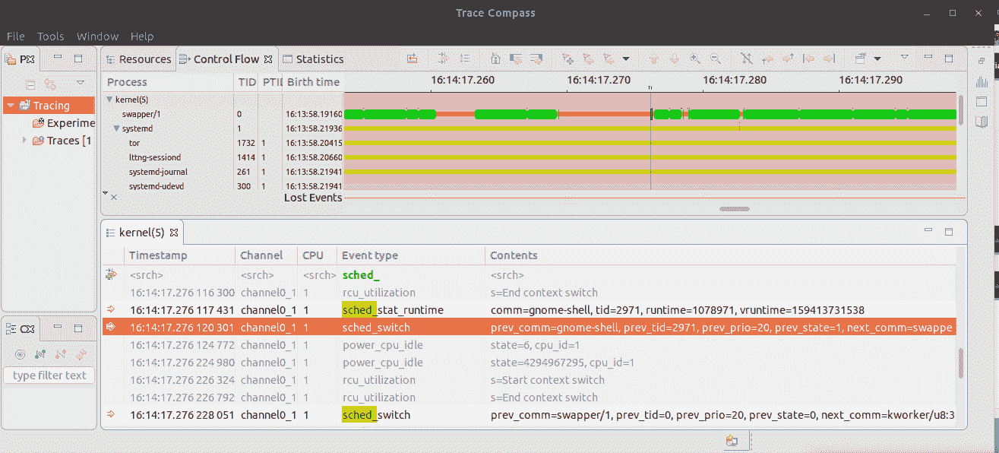

图 11.1 - Trace Compass GUI 显示通过 LTTng 获得的示例内核跟踪会话

仔细看前面的屏幕截图（图 11.1）；在下方的水平窗格中，不仅可以看到执行的内核函数，*还*可以（在标签为内容的列下）看到每个参数在那个时间点的值！这确实非常有用。

## 使用 trace-cmd 进行可视化

现代 Linux 内核（从 2.6.27 开始）嵌入了一个非常强大的跟踪引擎，称为**Ftrace**。Ftrace 是用户空间`strace(1)`实用程序的粗糙内核等效物，但这样说有点贬低它了！Ftrace 允许系统管理员（或开发人员、测试人员，或任何具有 root 权限的人）直接查看内核空间中执行的每个函数，执行它的是谁（哪个线程），运行时间有多长，它调用了哪些 API，包括发生的中断（硬中断和软中断），各种类型的延迟测量等等。您可以使用 Ftrace 了解系统实用程序、应用程序和内核的实际工作原理，以及在操作系统级别执行深度跟踪。

在这本书中，我们不深入研究原始 Ftrace 的用法（因为这偏离了手头的主题）；相反，使用一个用户空间包装器覆盖 Ftrace，一个更方便的接口，称为`trace-cmd(1)`，只是更快更容易（再次强调，我们只是浅尝辄止，展示了`trace-cmd`的一个示例）。

对于 Ftrace 的详细信息和用法，感兴趣的读者会发现这个内核文档有用：[`www.kernel.org/doc/Documentation/trace/ftrace.rst`](https://www.kernel.org/doc/Documentation/trace/ftrace.rst)。

大多数现代 Linux 发行版都允许通过其软件包管理系统安装`trace-cmd`；例如，在 Ubuntu 上，`sudo apt install trace-cmd`就足以安装它（如果需要在自定义的 Linux 上，比如 ARM，您总是可以从其 GitHub 存储库上的源代码进行交叉编译：[`git.kernel.org/pub/scm/linux/kernel/git/rostedt/trace-cmd.git/tree/`](https://git.kernel.org/pub/scm/linux/kernel/git/rostedt/trace-cmd.git/tree/)）。

让我们进行一个简单的`trace-cmd`会话；首先，我们将在运行`ps(1)`实用程序时记录数据样本；然后，我们将通过`trace-cmd report`**命令行界面**（CLI）以及一个名为 KernelShark 的 GUI 前端来检查捕获的数据（它实际上是`trace-cmd`包的一部分）。

### 使用 trace-cmd record 记录一个示例会话

在本节中，我们使用`trace-cmd(1)`记录一个会话；我们使用了一些（许多可能的）选项开关来记录`trace-cmd`；通常，`trace-cmd-foo(1)`（用`check-events`、`hist`、`record`、`report`、`reset`等替换`foo`）的 man 页面非常有用，可以找到各种选项开关和用法详情。特别适用于`trace-cmd record`的一些有用选项开关如下：

+   `-o`：指定输出文件名（如果未指定，则默认为`trace.dat`）。

+   `-p`：要使用的插件之一，如`function`、`function_graph`、`preemptirqsoff`、`irqsoff`、`preemptoff`和`wakeup`；在我们的小型演示中，我们使用了`function-graph`插件（内核中还可以配置其他几个插件）。

+   -F：要跟踪的命令（或应用程序）；这非常有用，可以让您精确指定要独占跟踪的进程（或线程）（否则，跟踪所有线程在尝试解密输出时可能会产生大量噪音）；同样，您可以使用`-P`选项开关来指定要跟踪的 PID。

+   `-r priority`：以指定的实时优先级运行`trace-cmd`线程（典型范围为 1 到 99；我们将很快介绍查询和设置线程的调度策略和优先级）；这样可以更好地捕获所需的样本。

在这里，我们进行了一个快速演示：我们运行`ps -LA`；在运行时，所有内核流量都（独占地）由`trace-cmd`通过其`record`功能捕获（我们使用了`function-graph`插件）：

```
$ sudo trace-cmd record -o trace_ps.dat -r 99 -p function_graph -F ps -LA
plugin 'function_graph'
PID     LWP TTY         TIME CMD
 1        1   ?     00:01:42 systemd
 2        2   ?     00:00:00 kthreadd
[ ... ]
32701   734 tty2   00:00:00 ThreadPoolForeg
CPU 2: 48176 events lost
CPU0 data recorded at offset=0x761000
[ ... ]
CPU3 data recorded at offset=0xf180000
114688 bytes in size
$ ls -lh trace_ps.dat
-rw-r--r-- 1 root root 242M Jun 25 11:23 trace_ps.dat
$
```

结果是一个相当大的数据文件（因为我们捕获了所有事件并且进行了`ps -LA`显示所有活动线程，所以花了一些时间，因此捕获的数据样本相当大。还要意识到，默认情况下，内核跟踪是在系统上的所有 CPU 上执行的；您可以通过`-M cpumask`选项进行更改）。

在上面的示例中，我们捕获了所有事件。`-e`选项开关允许您指定要跟踪的事件类别；例如，要跟踪`ping(1)`实用程序并仅捕获与网络和内核内存相关的事件，请运行以下命令：

`sudo trace-cmd record -e kmem -e net -p function_graph -F ping -c1 packtpub.com`。

### 使用 trace-cmd report（CLI）进行报告和解释

从前一节继续，在命令行上，我们可以得到一个（非常！）详细的报告，说明了`ps`进程运行时内核中发生了什么；使用`trace-cmd report`命令来查看这个。我们还传递了`-l`选项开关：它以 Ftrace 的**延迟格式**显示报告，显示了许多有用的细节；`-i`开关当然指定了要使用的输入文件：

```
trace-cmd report -i ./trace_ps.dat -l > report_tc_ps.txt 
```

现在变得非常有趣！我们展示了我们用`vim(1)`打开的（巨大）输出文件的一些部分截图；首先我们有以下内容：

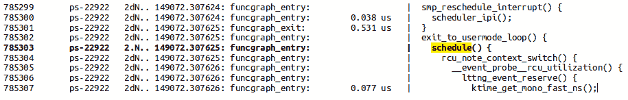

图 11.2 - 显示 trace-cmd 报告输出的部分屏幕截图

看看图 11.2；对内核 API`schedule()`的调用被故意突出显示并以粗体字显示（*图 11.2*，在第`785303`行！）。为了解释这一行上的所有内容，我们必须理解每个（以空格分隔的）列；共有八列：

+   第一列：这里只是`vim`显示的文件中的行号（让我们忽略它）。

+   第二列：这是调用此函数的进程上下文（函数本身在第 8 列）；显然，在这里，进程是`ps-PID`（其 PID 在`-`字符后附加）。

+   第三列：有用！一系列五个字符，显示为**延迟格式**（我们使用了`-l`选项切换到`trace-cmd record`，记住！）；这（在我们之前的情况下，是`2.N..`）非常有用，可以解释如下：

+   第一个字符是它运行的 CPU 核心（所以这里是核心＃2）（请注意，作为一个一般规则，除了第一个字符外，如果字符是一个句点`。`，它意味着它是零或不适用）。

+   第二个字符代表硬件中断状态：

+   `.` 意味着默认的硬件中断被启用。

+   `d` 意味着硬件中断当前被禁用。

+   第三个字符代表了`need_resched`位（我们在前一章节中解释过，在*调度程序何时运行？*部分）：

+   `.` 意味着它被清除。

+   `N` 意味着它被设置（这意味着内核需要尽快执行重新调度！）。

+   第四个字符只有在中断正在进行时才有意义，否则，它只是一个`。`，意味着我们处于进程上下文中；如果中断正在进行 - 意味着我们处于中断上下文中 - 其值是以下之一：

+   `h` 意味着我们正在执行硬中断（或者顶半部中断）上下文。

+   `H` 意味着我们正在软中断中发生的硬中断中执行。

+   `s` 意味着我们正在软中断（或者底半部）中断上下文中执行。

+   第五个字符代表抢占计数或深度；如果是`。`，它是零，意味着内核处于可抢占状态；如果不为零，会显示一个整数，意味着已经获取了那么多内核级别的锁，迫使内核进入不可抢占状态。

+   顺便说一句，输出与 Ftrace 的原始输出非常相似，只是在原始 Ftrace 的情况下，我们只会看到四个字符 - 第一个字符（CPU 核心编号）在这里不会显示；它显示为最左边的列；这是原始 Ftrace（而不是`trace-cmd`）延迟格式的部分屏幕截图：

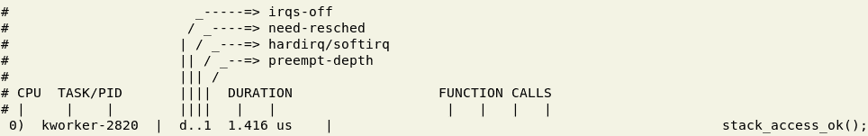

图 11.3 - 专注于原始 Ftrace 的四字符延迟格式（第四字段）的部分屏幕截图

前面的屏幕截图直接从原始 Ftrace 输出中整理出来。

+   +   因此，解释我们对`schedule()`调用的例子，我们可以看到字符是`2.N..`，意味着进程`ps`的 PID 为`22922`在 CPU 核心＃2 上执行在进程上下文中（没有中断），并且`need-resched`（技术上，`thread_info.flags:TIF_NEED_RESCHED`）位被设置（表示需要尽快重新调度！）。

+   （现在回到图 11.2 中的剩余列）

第四列：以*秒:微秒*格式的时间戳。

+   第 5 列：发生的事件的名称（在这里，我们使用了`function_graph`插件，它将是`funcgraph_entry`或`fungraph_exit`，分别表示函数的进入或退出）。

+   第 6 列[可选]：前一个函数调用的持续时间，显示了所花费的时间及其单位（us = 微秒）；前缀字符用于表示函数执行时间很长（我们简单地将其视为此列的一部分）；来自内核 Ftrace 文档（这里：[`www.kernel.org/doc/Documentation/trace/ftrace.rst`](https://www.kernel.org/doc/Documentation/trace/ftrace.rst)），我们有以下内容：

+   `+`，这意味着一个函数超过了 10 微秒

+   `!`，这意味着一个函数超过了 100 微秒

+   `#`，这意味着一个函数超过了 1,000 微秒

+   `*`，这意味着一个函数超过了 10 毫秒

+   `@`，这意味着一个函数超过了 100 毫秒

+   `$`，这意味着一个函数超过了 1 秒

+   第 7 列：只是分隔符`|`。

+   第 8 列：极右列是正在执行的内核函数的名称；右边的开括号`{`表示刚刚调用了该函数；只有一个闭括号`}`的列表示前一个函数的结束（与开括号匹配）。

这种详细程度在排除内核（甚至用户空间）问题和深入了解内核流程方面非常有价值。

当使用`trace-cmd record`而没有使用`-p function-graph`选项开关时，我们失去了漂亮的缩进函数调用图形式的输出，但我们也得到了一些东西：现在你将看到每个函数调用右侧的所有函数参数及其运行时值！这在某些时候确实是一个非常有价值的辅助工具。

我忍不住想展示同一份报告中的另一个片段 - 另一个关于我们在现代 Linux 上学到的调度类如何工作的有趣例子（在上一章中介绍过）；这实际上在`trace-cmd`输出中显示出来了：

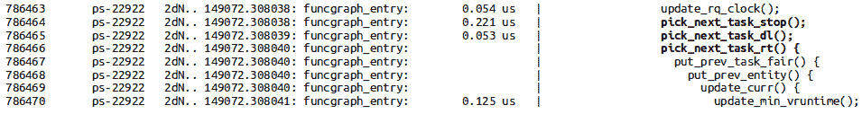

图 11.4 - `trace-cmd`报告输出的部分截图

仔细解释前面的截图（*图 11.4*）：第二行（右侧函数名列为粗体字体，紧随其后的两个函数也是如此）显示了`pick_next_task_stop()`函数被调用；这意味着发生了一次调度，内核中的核心调度代码按照优先级顺序遍历调度类的链表，询问每个类是否有要调度的线程；如果有，核心调度程序上下文切换到它（正如在前一章中详细解释的那样，在*模块化调度类*部分）。

在图 11.4 中，你真的看到了这种情况发生：核心调度代码询问**stop-sched**（**SS**）、**deadline**（**DL**）和**real-time**（**RT**）类是否有任何想要运行的线程，依次调用`pick_next_task_stop()`、`pick_next_task_dl()`和`pick_next_task_rt()`函数。显然，对于所有这些类，答案都是否定的，因为接下来要运行的函数是公平（CFS）类的函数（为什么`pick_next_task_fair()`函数在前面的截图中没有显示呢？啊，这又是代码优化：内核开发人员知道这是可能的情况，他们会直接调用公平类代码大部分时间）。

我们在这里介绍的强大的 Ftrace 框架和`trace-cmd`实用程序只是基础；我建议你查阅`trace-cmd-<foo>`（其中`<foo>`被替换为`record`、`report`等）的 man 页面，那里通常会显示很好的示例。此外，关于 Ftrace（和`trace-cmd`）还有一些非常好的文章 - 请参考*进一步阅读*部分。

### 使用 GUI 前端进行报告和解释

更多好消息：`trace-cmd`工具集包括一个 GUI 前端，用于更人性化的解释和分析，称为 KernelShark（尽管在我看来，它不像 Trace Compass 那样功能齐全）。在 Ubuntu/Debian 上安装它就像执行`sudo apt install kernelshark`一样简单。

下面，我们运行`kernelshark`，将我们之前的`trace-cmd`记录会话的跟踪数据文件输出作为参数传递给它（将参数调整为 KernelShark 所在位置，以引用您保存跟踪元数据的位置）：

```
$ kernelshark ./trace_ps.dat
```

显示了运行前述跟踪数据的 KernelShark 的屏幕截图：

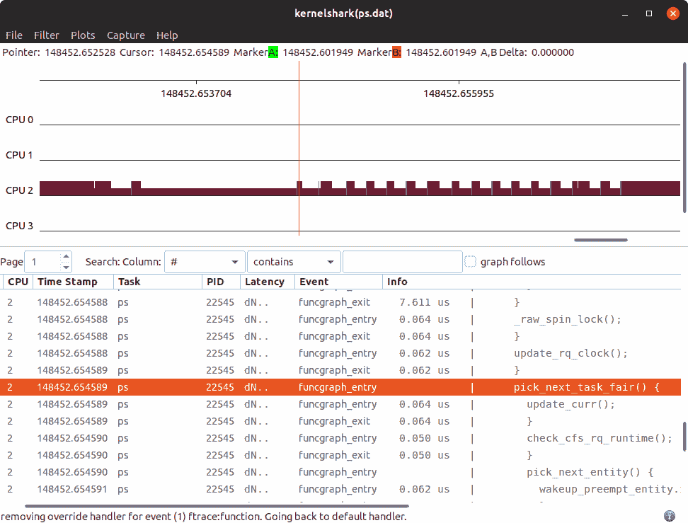

图 11.5 - 显示先前捕获的数据的 kernelshark GUI 的屏幕截图

有趣的是，`ps`进程在 CPU＃2 上运行（正如我们之前在 CLI 版本中看到的）。在这里，我们还可以看到在较低的平铺水平窗格中执行的函数；例如，我们已经突出显示了`pick_next_task_fair()`的条目。列是相当明显的，`Latency`列格式（四个字符，而不是五个）的解释如我们之前为（原始）Ftrace 解释的那样。

**快速测验**：在图 11.5 中看到的 Latency 格式字段`dN..`意味着什么？

答案：它意味着，当前，我们有以下情况：

+   第一列 `d`：硬件中断被禁用。

+   第二列 `N`：`need_resched`位被设置（暗示需要在下一个可用的调度机会点调用调度程序）。

+   第三列 `.`：内核`pick_next_task_fair()`函数的代码正在进程上下文中运行（任务是`ps`，PID 为`22545`；记住，Linux 是一个单内核！）。

+   第四列 `.`：抢占深度（计数）为零，暗示内核处于可抢占状态。

现在我们已经介绍了使用这些强大工具来帮助生成和可视化与内核执行和调度相关的数据，让我们继续下一个领域：在下一节中，我们将专注于另一个重要方面 - 线程的 CPU 亲和性掩码到底是什么，以及如何以编程方式（以及其他方式）获取/设置它。

# 理解、查询和设置 CPU 亲和性掩码

任务结构是一个根数据结构，包含几十个线程属性，其中有一些属性直接与调度有关：优先级（*nice*以及 RT 优先级值），调度类结构指针，线程所在的运行队列（如果有的话），等等。

其中一个重要成员是**CPU 亲和性位掩码**（实际的结构成员是`cpumask_t cpus_allowed`）。这也告诉你 CPU 亲和性位掩码是每个线程的数量；这是有道理的 - 在 Linux 上，KSE 是一个线程。它本质上是一个位数组，每个位代表一个 CPU 核心（在变量内有足够的位可用）；如果对应于核心的位被设置（`1`），则允许在该核心上调度和执行线程；如果清除（`0`），则不允许。

默认情况下，所有 CPU 亲和性掩码位都被设置；因此，线程可以在任何核心上运行。例如，在一个有（操作系统看到的）四个 CPU 核心的盒子上，每个线程的默认 CPU 亲和性位掩码将是二进制`1111`（`0xf`）。（看一下图 11.6，看看 CPU 亲和性位掩码的概念上是什么样子。）

在运行时，调度程序决定线程实际上将在哪个核心上运行。事实上，想想看，这真的是隐含的：默认情况下，每个 CPU 核心都有一个与之关联的运行队列；每个可运行的线程将在单个 CPU 运行队列上；因此，它有资格运行，并且默认情况下在表示它的运行队列的 CPU 上运行。当然，调度程序有一个负载平衡器组件，可以根据需要将线程迁移到其他 CPU 核心（实际上是运行队列）（称为`migration/n`的内核线程在这个任务中协助）。

内核确实向用户空间暴露了 API（系统调用，当然，`sched_{s,g}etaffinity(2)`及其`pthread`包装库 API），这允许应用程序根据需要将线程（或多个线程）关联到特定的 CPU 核心上（按照相同的逻辑，我们也可以在内核中为任何给定的内核线程执行此操作）。例如，将 CPU 亲和性掩码设置为`1010`二进制，相当于十六进制的`0xa`，意味着该线程只能在 CPU 核心一和三上执行（从零开始计数）。

一个关键点：尽管您可以操纵 CPU 亲和性掩码，但建议避免这样做；内核调度程序详细了解 CPU 拓扑，并且可以最佳地平衡系统负载。

尽管如此，显式设置线程的 CPU 亲和性掩码可能是有益的，原因如下：

+   通过确保线程始终在同一 CPU 核心上运行，可以大大减少缓存失效（从而减少不愉快的缓存“跳动”）。

+   核心之间的线程迁移成本被有效地消除。

+   CPU 保留——一种策略，通过保证所有其他线程明确不允许在该核心上执行，将核心（或核心）专门分配给一个线程。

前两者在某些特殊情况下很有用；第三个，CPU 保留，往往是在一些时间关键的实时系统中使用的一种技术，其成本是合理的。但实际上，进行 CPU 保留是相当困难的，需要在（每个！）线程创建时进行操作；成本可能是禁止的。因此，这实际上是通过指定某个 CPU（或更多）从所有任务中*隔离*出来来实现的；Linux 内核提供了一个内核参数`isolcpus`来完成这项工作。

在这方面，我们直接引用了`sched_{s,g}etaffinity(2)`系统调用的 man 页面上的内容：

isolcpus 引导选项可用于在引导时隔离一个或多个 CPU，以便不会安排任何进程到这些 CPU 上运行。在使用此引导选项之后，将进程调度到被隔离的 CPU 的唯一方法是通过 sched_setaffinity()或 cpuset(7)机制。有关更多信息，请参阅内核源文件 Documentation/admin-guide/kernel-parameters.txt。如该文件中所述，isolcpus 是隔离 CPU 的首选机制（与手动设置系统上所有进程的 CPU 亲和性的替代方案相比）。

需要注意的是，先前提到的`isolcpus`内核参数现在被认为是不推荐使用的；最好使用 cgroups 的`cpusets`控制器代替（`cpusets`是一个 cgroup 特性或控制器；我们稍后在本章中会对 cgroups 进行一些介绍，在*使用 cgroups 进行 CPU 带宽控制*部分）。

我们建议您在内核参数文档中查看更多详细信息（在此处：[`www.kernel.org/doc/Documentation/admin-guide/kernel-parameters.txt`](https://www.kernel.org/doc/Documentation/admin-guide/kernel-parameters.txt)），特别是在标记为`isolcpus=`的参数下。

既然你已经了解了它的理论，让我们实际编写一个用户空间 C 程序来查询和/或设置任何给定线程的 CPU 亲和性掩码。

## 查询和设置线程的 CPU 亲和性掩码

作为演示，我们提供了一个小型用户空间 C 程序来查询和设置用户空间进程（或线程）的 CPU 亲和性掩码。使用`sched_getaffinity(2)`系统调用来查询 CPU 亲和性掩码，并使用其对应的设置来设置它。

```
#define _GNU_SOURCE
#include <sched.h>

int sched_getaffinity(pid_t pid, size_t cpusetsize,
                        cpu_set_t *mask);
int sched_setaffinity(pid_t pid, size_t cpusetsize,
                        const cpu_set_t *mask);
```

一种名为`cpu_set_t`的专门数据类型用于表示 CPU 亲和掩码；它非常复杂：它的大小是根据系统上看到的 CPU 核心数量动态分配的。这种 CPU 掩码（类型为`cpu_set_t`）必须首先初始化为零；`CPU_ZERO()`宏可以实现这一点（还有几个类似的辅助宏；请参考`CPU_SET(3)`的手册页）。在前面的系统调用中的第二个参数是 CPU 集的大小（我们只需使用`sizeof`运算符来获取它）。

为了更好地理解这一点，值得看一下我们的代码的一个示例运行（`ch11/cpu_affinity/userspc_cpuaffinity.c`）；我们在一个具有 12 个 CPU 核心的本机 Linux 系统上运行它：

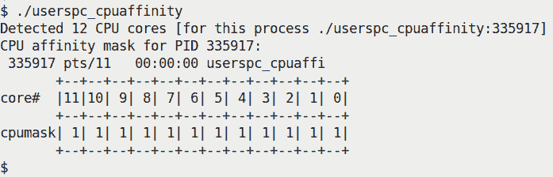

图 11.6 - 我们的演示用户空间应用程序显示 CPU 亲和掩码

在这里，我们没有使用任何参数运行应用程序。在这种模式下，它查询自身的 CPU 亲和掩码（即`userspc_cpuaffinity`调用进程的亲和掩码）。我们打印出位掩码的位数：正如您在前面的屏幕截图中清楚地看到的那样，它是二进制`1111 1111 1111`（相当于`0xfff`），这意味着默认情况下该进程有资格在系统上的任何 12 个 CPU 核心上运行。

该应用程序通过有用的`popen(3)`库 API 运行`nproc(1)`实用程序来检测可用的 CPU 核心数量。请注意，`nproc`返回的值是调用进程可用的 CPU 核心数量；它可能少于实际的 CPU 核心数量（通常是相同的）；可用核心数量可以通过几种方式进行更改，正确的方式是通过 cgroup `cpuset`资源控制器（我们稍后在本章中介绍一些关于 cgroups 的信息）。

查询代码如下：

```
// ch11/cpu_affinity/userspc_cpuaffinity.c

static int query_cpu_affinity(pid_t pid)
{
    cpu_set_t cpumask;

    CPU_ZERO(&cpumask);
    if (sched_getaffinity(pid, sizeof(cpu_set_t), &cpumask) < 0) {
        perror("sched_getaffinity() failed");
        return -1;
    }
    disp_cpumask(pid, &cpumask, numcores);
    return 0;
}
```

我们的`disp_cpumask()`函数绘制位掩码（请自行查看）。

如果传递了额外的参数 - 进程（或线程）的 PID 作为第一个参数，CPU 位掩码作为第二个参数 - 那么我们将尝试*设置*该进程（或线程）的 CPU 亲和掩码为传递的值。当然，更改 CPU 亲和掩码需要您拥有该进程或具有 root 权限（更正确地说，需要具有`CAP_SYS_NICE`权限）。

一个快速演示：在图 11.7 中，`nproc(1)`显示了 CPU 核心的数量；然后，我们运行我们的应用程序来查询和设置我们的 shell 进程的 CPU 亲和掩码。在笔记本电脑上，假设`bash`的亲和掩码一开始是`0xfff`（二进制`1111 1111 1111`），如预期的那样；我们将其更改为`0xdae`（二进制`1101 1010 1110`），然后再次查询以验证更改：

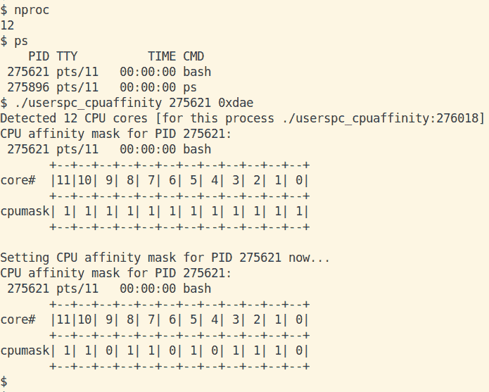

图 11.7 - 我们的演示应用程序查询然后设置 bash 的 CPU 亲和掩码为 0xdae

好的，这很有趣：首先，该应用程序正确地检测到了可用的 CPU 核心数量为 12；然后，它查询了（默认的）bash 进程的 CPU 亲和掩码（因为我们将其 PID 作为第一个参数传递）；如预期的那样，它显示为`0xfff`。然后，因为我们还传递了第二个参数 - 要设置的位掩码（`0xdae`） - 它这样做了，将 bash 的 CPU 亲和掩码设置为`0xdae`。现在，由于我们所在的终端窗口正是这个 bash 进程，再次运行`nproc`会显示值为 8，而不是 12！这是正确的：bash 进程现在只有八个 CPU 核心可用。（这是因为我们在退出时没有将 CPU 亲和掩码恢复到其原始值。）

以下是设置 CPU 亲和掩码的相关代码：

```
// ch11/cpu_affinity/userspc_cpuaffinity.c
static int set_cpu_affinity(pid_t pid, unsigned long bitmask)
{
    cpu_set_t cpumask;
    int i;

    printf("\nSetting CPU affinity mask for PID %d now...\n", pid);
    CPU_ZERO(&cpumask);

    /* Iterate over the given bitmask, setting CPU bits as required */
    for (i=0; i<sizeof(unsigned long)*8; i++) {
        /* printf("bit %d: %d\n", i, (bitmask >> i) & 1); */
        if ((bitmask >> i) & 1)
            CPU_SET(i, &cpumask);
    }

    if (sched_setaffinity(pid, sizeof(cpu_set_t), &cpumask) < 0) {
        perror("sched_setaffinity() failed");
        return -1;
    }
    disp_cpumask(pid, &cpumask, numcores);
    return 0;
}
```

在前面的代码片段中，您可以看到我们首先适当地设置了`cpu_set_t`位掩码（通过循环遍历每个位），然后使用`sched_setaffinity(2)`系统调用在给定的`pid`上设置新的 CPU 亲和掩码。

### 使用 taskset(1)执行 CPU 亲和

类似于我们在前一章中使用方便的用户空间实用程序`chrt(1)`来获取（或设置）进程（或线程）的调度策略和/或优先级，您可以使用用户空间`taskset(1)`实用程序来获取和/或设置给定进程（或线程）的 CPU 亲和性掩码。以下是一些快速示例；请注意，这些示例是在一个具有 4 个 CPU 核心的 x86_64 Linux 系统上运行的：

+   使用`taskset`查询 systemd（PID 1）的 CPU 亲和性掩码：

```
$ taskset -p 1
pid 1's current affinity mask: f 
$
```

+   使用`taskset`确保编译器及其后代（汇编器和链接器）仅在前两个 CPU 核心上运行；taskset 的第一个参数是 CPU 亲和性位掩码（`03`是二进制`0011`）：

```
$ taskset 03 gcc userspc_cpuaffinity.c -o userspc_cpuaffinity -Wall 
```

查阅`taskset(1)`的手册页面以获取完整的使用详情。

### 在内核线程上设置 CPU 亲和性掩码

例如，如果我们想演示一种称为 per-CPU 变量的同步技术，我们需要创建两个内核线程，并确保它们分别在不同的 CPU 核心上运行。为此，我们必须设置每个内核线程的 CPU 亲和性掩码（第一个设置为`0`，第二个设置为`1`，以便它们只在 CPU `0`和`1`上执行）。问题是，这不是一个干净的工作 - 老实说，相当*糟糕*，绝对*不*推荐。代码中的以下注释显示了原因：

```
  /* ch17/6_percpuvar/6_percpuvar.c */
  /* WARNING! This is considered a hack.
   * As sched_setaffinity() isn't exported, we don't have access to it
   * within this kernel module. So, here we resort to a hack: we use
   * kallsyms_lookup_name() (which works when CONFIG_KALLSYMS is defined)
   * to retrieve the function pointer, subsequently calling the function
   * via it's pointer (with 'C' what you do is only limited by your
   * imagination :).
   */
  ptr_sched_setaffinity = (void *)kallsyms_lookup_name("sched_setaffinity");
```

稍后，我们调用函数指针，实际上调用`sched_setaffinity`代码，如下所示：

```
    cpumask_clear(&mask);
    cpumask_set_cpu(cpu, &mask); // 1st param is the CPU number, not bitmask
    /* !HACK! sched_setaffinity() is NOT exported, we can't call it
     *   sched_setaffinity(0, &mask); // 0 => on self 
     * so we invoke it via it's function pointer */
    ret = (*ptr_sched_setaffinity)(0, &mask);   // 0 => on self
```

非常不寻常和有争议；它确实有效，但请在生产中避免这样的黑客行为。

现在你知道如何获取/设置线程的 CPU 亲和性掩码，让我们继续下一个逻辑步骤：如何获取/设置线程的调度策略和优先级！下一节将深入细节。

# 查询和设置线程的调度策略和优先级

在第十章中，*CPU 调度器-第一部分*，在*线程-哪种调度策略和优先级*部分，您学会了如何通过`chrt(1)`查询任何给定线程的调度策略和优先级（我们还演示了一个简单的 bash 脚本来实现）。在那里，我们提到了`chrt(1)`内部调用`sched_getattr(2)`系统调用来查询这些属性。

非常类似地，可以通过使用`chrt(1)`实用程序（例如在脚本中简单地这样做）或在（用户空间）C 应用程序中使用`sched_setattr(2)`系统调用来设置调度策略和优先级。此外，内核还公开其他 API：`sched_{g,s}etscheduler(2)`及其`pthread`库包装器 API，`pthread_{g,s}etschedparam(3)`（由于这些都是用户空间 API，我们让您自行查阅它们的手册页面以获取详细信息并尝试它们）。

## 在内核中-在内核线程上

现在你知道，内核绝对不是一个进程也不是一个线程。话虽如此，内核确实包含内核线程；与它们的用户空间对应物一样，内核线程可以根据需要创建（从核心内核、设备驱动程序、内核模块中）。它们是可调度实体（KSEs！），当然，它们每个都有一个任务结构；因此，它们的调度策略和优先级可以根据需要查询或设置。

因此，就要点而言：要设置内核线程的调度策略和/或优先级，内核通常使用`kernel/sched/core.c:sched_setscheduler_nocheck()`（GFP 导出）内核 API；在这里，我们展示了它的签名和典型用法的示例；随后的注释使其相当不言自明。

```
// kernel/sched/core.c
/**
 * sched_setscheduler_nocheck - change the scheduling policy and/or RT priority of a thread from kernelspace.
 * @p: the task in question.
 * @policy: new policy.
 * @param: structure containing the new RT priority.
 *
 * Just like sched_setscheduler, only don't bother checking if the
 * current context has permission. For example, this is needed in
 * stop_machine(): we create temporary high priority worker threads,
 * but our caller might not have that capability.
 *
 * Return: 0 on success. An error code otherwise.
 */
int sched_setscheduler_nocheck(struct task_struct *p, int policy,
                   const struct sched_param *param)
{
    return _sched_setscheduler(p, policy, param, false);
}
EXPORT_SYMBOL_GPL(sched_setscheduler_nocheck);
```

内核对内核线程的一个很好的例子是内核（相当常见地）使用线程化中断。在这里，内核必须创建一个专用的内核线程，其具有`SCHED_FIFO`（软）实时调度策略和实时优先级值为`50`（介于中间），用于处理中断。这里展示了设置内核线程调度策略和优先级的相关代码：

```
// kernel/irq/manage.c
static int
setup_irq_thread(struct irqaction *new, unsigned int irq, bool secondary)
{ 
    struct task_struct *t;
    struct sched_param param = {
        .sched_priority = MAX_USER_RT_PRIO/2,
    };
    [ ... ]
    sched_setscheduler_nocheck(t, SCHED_FIFO, &param);
    [ ... ]
```

（这里我们不展示通过`kthread_create()` API 创建内核线程的代码。另外，FYI，`MAX_USER_RT_PRIO`的值是`100`。）

现在您在很大程度上了解了操作系统级别的 CPU 调度是如何工作的，我们将继续进行另一个非常引人入胜的讨论——cgroups；请继续阅读！

# 使用 cgroups 进行 CPU 带宽控制

在过去，内核社区曾经为一个相当棘手的问题而苦苦挣扎：尽管调度算法及其实现（早期的 2.6.0 O(1)调度器，稍后（2.6.23）的**完全公平调度器**（CFS））承诺了完全公平的调度，但实际上并非如此。想想这个：假设您与其他九个人一起登录到 Linux 服务器。其他一切都相等的情况下，处理器时间可能（或多或少）在所有十个人之间（相对）公平地共享；当然，您会明白，真正运行的不是人，而是代表他们运行的进程和线程。

至少目前，让我们假设它基本上是公平的。但是，如果您编写一个用户空间程序，在循环中不加选择地生成多个新线程，每个线程都执行大量的 CPU 密集型工作（也许还额外分配大量内存；例如文件（解）压缩应用程序）！那么 CPU 带宽分配在任何实际意义上都不再公平，您的账户将有效地占用 CPU（也许还占用其他系统资源，如内存）！

需要一个精确有效地分配和管理 CPU（和其他资源）带宽的解决方案；最终，谷歌工程师提供了补丁，将现代 cgroups 解决方案放入了 Linux 内核（在 2.6.24 版本）。简而言之，cgroups 是一个内核功能，允许系统管理员（或任何具有 root 访问权限的人）对系统上的各种资源（或在 cgroup 词汇中称为*控制器*）执行带宽分配和细粒度资源管理。请注意：使用 cgroups，不仅可以仔细分配和监视处理器（CPU 带宽），还可以根据项目或产品的需要仔细分配和监视内存、网络、块 I/O（等等）带宽。

所以，嘿，您现在感兴趣了！如何启用这个 cgroups 功能？简单——这是一个您可以通过通常的方式在内核中启用（或禁用）的内核功能：通过配置内核！相关菜单（通过方便的`make menuconfig`界面）是`General setup / Control Group support`。尝试这样做：在内核配置文件中使用`grep`查找`CGROUP`；如果需要，调整内核配置，重新构建，使用新内核重新启动并进行测试。（我们在第二章中详细介绍了内核配置，*从源代码构建 5.x Linux 内核–第一部分*，以及在第三章中介绍了内核构建和安装，*从源代码构建 5.x Linux 内核–第二部分*）。

好消息：cgroups 在运行 systemd init 框架的任何（足够新的）Linux 系统上默认启用。正如刚才提到的，您可以通过查询 cgroup 控制器来查看启用的控制器，并根据需要修改配置。

从 2.6.24 开始，与所有其他内核功能一样，cgroups 不断发展。最近，已经达到了足够改进的 cgroup 功能与旧版本不兼容的地步，导致了一个新的 cgroup 发布，即被命名为 cgroups v2（或简称为 cgroups2）；这在 4.5 内核系列中被宣布为生产就绪（旧版本现在被称为 cgroups v1 或遗留 cgroups 实现）。请注意，截至目前为止，两者可以并且确实共存（有一些限制；许多应用程序和框架仍然使用旧的 cgroups v1，并且尚未迁移到 v2）。

为什么要使用 cgroups v2 而不是 cgroups v1 的详细原因可以在内核文档中找到：[`www.kernel.org/doc/html/latest/admin-guide/cgroup-v2.html#issues-with-v1-and-rationales-for-v2`](https://www.kernel.org/doc/html/latest/admin-guide/cgroup-v2.html#issues-with-v1-and-rationales-for-v2)

`cgroups(7)`手册详细描述了接口和各种可用的（资源）控制器（有时称为*子系统*）；对于 cgroups v1，它们是`cpu`、`cpuacct`、`cpuset`、`memory`、`devices`、`freezer`、`net_cls`、`blkio`、`perf_event`、`net_prio`、`hugetlb`、`pids`和`rdma`。我们建议感兴趣的读者查阅该手册以获取详细信息；例如，PIDS 控制器在防止 fork 炸弹（通常是一个愚蠢但仍然致命的 DoS 攻击，在其中`fork(2)`系统调用在无限循环中被发出！）方面非常有用，允许您限制可以从该 cgroup（或其后代）fork 出的进程数量。在运行 cgroups v1 的 Linux 系统上，查看`/proc/cgroups`的内容：它显示了可用的 v1 控制器及其当前使用情况。

控制组通过一个专门构建的合成（伪）文件系统进行公开，通常挂载在`/sys/fs/cgroup`下。在 cgroups v2 中，所有控制器都挂载在单个层次结构（或树）中。这与 cgroups v1 不同，cgroups v1 中可以将多个控制器挂载在多个层次结构或组下。现代 init 框架*systemd*同时使用 v1 和 v2 cgroups。`cgroups(7)`手册确实提到了`systemd(1)`在启动时自动挂载 cgroups v2 文件系统（在`/sys/fs/cgroup/unified`处）的事实。

在 cgroups v2 中，这些是支持的控制器（或资源限制器或子系统）：`cpu`、`cpuset`、`io`、`memory`、`pids`、`perf_event`和`rdma`（前五个通常被部署）。

在本章中，重点是 CPU 调度；因此，我们不深入研究其他控制器，而是限制我们的讨论在使用 cgroups v2 `cpu`控制器来限制 CPU 带宽分配的示例上。有关使用其他控制器的更多信息，请参考前面提到的资源（以及本章的*进一步阅读*部分中找到的其他资源）。

## 在 Linux 系统上查找 cgroups v2

首先，让我们查找可用的 v2 控制器；要这样做，请找到 cgroups v2 挂载点；通常在这里：

```
$ mount | grep cgroup2 
cgroup2 on /sys/fs/cgroup/unified type cgroup2 
   (rw,nosuid,nodev,noexec,relatime,nsdelegate) 
$ sudo cat /sys/fs/cgroup/unified/cgroup.controllers 
$ 
```

嘿，`cgroup2`中没有任何控制器吗？实际上，在存在*混合* cgroups，v1 和 v2 的情况下，这是默认情况（截至目前为止）。要专门使用较新版本，并且使所有配置的控制器可见，您必须首先通过在启动时传递此内核命令行参数来禁用 cgroups v1：`cgroup_no_v1=all`（请注意，所有可用的内核参数可以方便地在此处查看：[`www.kernel.org/doc/Documentation/admin-guide/kernel-parameters.txt`](https://www.kernel.org/doc/Documentation/admin-guide/kernel-parameters.txt)）。

使用上述选项重新启动系统后，您可以检查您在 GRUB（在 x86 上）或者在嵌入式系统上可能通过 U-Boot 指定的内核参数是否已被内核解析：

```
$ cat /proc/cmdline
 BOOT_IMAGE=/boot/vmlinuz-4.15.0-118-generic root=UUID=<...> ro console=ttyS0,115200n8 console=tty0 ignore_loglevel quiet splash cgroup_no_v1=all 3
$
```

好的，现在让我们重试查找`cgroup2`控制器；您应该会发现它通常挂载在`/sys/fs/cgroup/`下 - `unified`文件夹不再存在（因为我们使用了`cgroup_no_v1=all`参数进行引导）：

```
$ cat /sys/fs/cgroup/cgroup.controllers
cpu io memory pids 
```

啊，现在我们看到它们了（您看到的确切控制器取决于内核的配置方式）。

cgroups2 的工作规则超出了本书的范围；如果您愿意，建议您阅读这里的内容：[`www.kernel.org/doc/html/latest/admin-guide/cgroup-v2.html#control-group-v2`](https://www.kernel.org/doc/html/latest/admin-guide/cgroup-v2.html#control-group-v2)。此外，cgroup 中的所有`cgroup.<foo>`伪文件都在*核心接口文件*部分（[`www.kernel.org/doc/html/latest/admin-guide/cgroup-v2.html#core-interface-files`](https://www.kernel.org/doc/html/latest/admin-guide/cgroup-v2.html#core-interface-files)）中有详细描述。类似的信息也以更简单的方式呈现在`cgroups(7)`的出色 man 页面中（在 Ubuntu 上使用`man 7 cgroups`查找）。

## 试一试 - cgroups v2 CPU 控制器

让我们尝试一些有趣的事情：我们将在系统的 cgroups v2 层次结构下创建一个新的子组。然后我们将为其设置一个 CPU 控制器，运行一些测试进程（这些进程会占用系统的 CPU 核心），并设置一个用户指定的上限，限制这些进程实际可以使用多少 CPU 带宽！

在这里，我们概述了您通常会采取的步骤（所有这些步骤都需要您以 root 访问权限运行）：

1.  确保您的内核支持 cgroups v2：

+   您应该在运行 4.5 或更高版本的内核。

+   在存在混合 cgroups（旧的 v1 和较新的 v2，这是写作时的默认设置）的情况下，请检查您的内核命令行是否包含`cgroup_no_v1=all`字符串。在这里，我们假设 cgroup v2 层次结构得到支持并挂载在`/sys/fs/cgroup`下。

1.  向 cgroups v2 层次结构添加`cpu`控制器；这是通过以下方式实现的，作为 root 用户：

```
echo "+cpu" > /sys/fs/cgroup/cgroup.subtree_control
```

cgroups v2 的内核文档（[`www.kernel.org/doc/html/latest/admin-guide/cgroup-v2.html#cpu`](https://www.kernel.org/doc/html/latest/admin-guide/cgroup-v2.html#cpu)）提到了这一点：*警告：cgroup2 尚不支持对实时进程的控制，cpu 控制器只能在所有 RT 进程位于根 cgroup 时启用。请注意，系统管理软件可能已经在系统引导过程中将 RT 进程放入非根 cgroup 中，这些进程可能需要移动到根 cgroup 中，然后才能启用 cpu 控制器。*

1.  创建一个子组：这是通过在 cgroup v2 层次结构下创建一个具有所需子组名称的目录来完成的；例如，要创建一个名为`test_group`的子组，使用以下命令：

```
mkdir /sys/fs/cgroup/test_group
```

1.  有趣的地方在于：设置将属于此子组的进程的最大允许 CPU 带宽；这是通过写入`<cgroups-v2-mount-point>/<sub-group>/cpu.max`（伪）文件来实现的。为了清楚起见，根据内核文档（[`www.kernel.org/doc/html/latest/admin-guide/cgroup-v2.html#cpu-interface-files`](https://www.kernel.org/doc/html/latest/admin-guide/cgroup-v2.html#cpu-interface-files)）对此文件的解释如下：

```
cpu.max
A read-write two value file which exists on non-root cgroups. The default is “max 100000”. The maximum bandwidth limit. It’s in the following format: 
$MAX $PERIOD
which indicates that the group may consume upto $MAX in each $PERIOD duration. “max” for $MAX indicates no limit. If only one number is written, $MAX is updated.
```

实际上，子控制组中的所有进程将被允许在`$PERIOD`微秒内运行`$MAX`次；例如，当`MAX = 300,000`和`PERIOD = 1,000,000`时，我们实际上允许子控制组中的所有进程在 1 秒内运行 0.3 秒！

1.  将一些进程插入新的子控制组；这是通过将它们的 PID 写入`<cgroups-v2-mount-point>/<sub-group>/cgroup.procs`伪文件来实现的：

+   您可以通过查找每个进程的`/proc/<PID>/cgroup`伪文件的内容进一步验证它们是否实际属于这个子组；如果它包含形式为`0::/<sub-group>`的行，则它确实属于该子组！

1.  就是这样；*新子组下的进程现在将在强加的 CPU 带宽约束下执行它们的工作*；完成后，它们将像往常一样终止...您可以通过简单的`rmdir <cgroups-v2-mount-point>/<sub-group>`来删除子组。

实际执行上述步骤的 bash 脚本在这里可用：`ch11/cgroups_v2_cpu_eg/cgv2_cpu_ctrl.sh`。一定要查看它！为了使其有趣，它允许您传递最大允许的 CPU 带宽-在*步骤 4*中讨论的`$MAX`值！不仅如此；我们还故意编写了一个测试脚本（`simp.sh`），它会在 CPU 上进行大量操作-它们会生成我们重定向到文件的整数值。因此，它们在其生命周期内生成的整数数量是它们可用的 CPU 带宽的指示...通过这种方式，我们可以测试脚本并实际看到 cgroups（v2）的运行！

这里进行几次测试运行将帮助您理解这一点：

```
$ sudo ./cgv2_cpu_ctrl.sh
[sudo] password for <username>: 
Usage: cgv2_cpu_ctrl.sh max-to-utilize(us)
 This value (microseconds) is the max amount of time the processes in the sub-control
 group we create will be allowed to utilize the CPU; it's relative to the period,
 which is the value 1000000;
 So, f.e., passing the value 300,000 (out of 1,000,000) implies a max CPU utilization
 of 0.3 seconds out of 1 second (i.e., 30% utilization).
 The valid range for the $MAX value is [1000-1000000].
$ 
```

您需要以 root 身份运行它，并将`$MAX`值作为参数传递（之前看到的使用屏幕已经很清楚地解释了它，包括显示有效范围（微秒值））。

在下面的截图中，我们使用参数`800000`运行 bash 脚本，意味着 CPU 带宽为 1,000,000 中的 800,000；实际上，CPU 利用率为每秒 0.8 秒的相当高的 CPU 利用率（80%）：

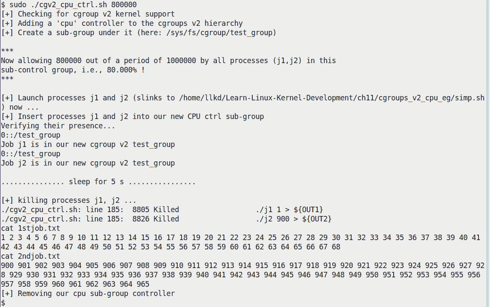

图 11.8-运行我们的 cgroups v2 CPU 控制器演示 bash 脚本，有效的最大 CPU 带宽为 80%

研究我们脚本的*图 11.8*输出；您可以看到它完成了它的工作：在验证 cgroup v2 支持后，它添加了一个`cpu`控制器并创建了一个子组（称为`test_group`）。然后继续启动两个名为`j1`和`j2`的测试进程（实际上，它们只是指向我们的`simp.sh`脚本的符号链接）。一旦启动，它们当然会运行。然后脚本查询并将它们的 PID 添加到子控制组（如*步骤 5*所示）。我们给这两个进程 5 秒钟来运行；然后脚本显示它们写入的文件的内容。它被设计成作业`j1`从`1`开始写入整数，作业`j2`从`900`开始写入整数。在前面的截图中，您可以清楚地看到，在其生命周期内，并在有效的 80% CPU 带宽下，作业`j1`从 1 到 68 输出数字；同样（在相同的约束下），作业`j2`从`900`到`965`输出数字（实际上是相似数量的工作）。然后脚本清理，终止作业并删除子组。

然而，为了真正欣赏效果，我们再次运行我们的脚本（研究以下输出），但这次最大 CPU 带宽只有 1,000（`$MAX`值）-实际上，最大 CPU 利用率只有 0.1%！：

```
$ sudo ./cgv2_cpu_ctrl.sh 1000 [+] Checking for cgroup v2 kernel support
[+] Adding a 'cpu' controller to the cgroups v2 hierarchy
[+] Create a sub-group under it (here: /sys/fs/cgroup/test_group)

***
Now allowing 1000 out of a period of 1000000 by all processes (j1,j2) in this
sub-control group, i.e., .100% !
***

[+] Launch processes j1 and j2 (slinks to /home/llkd/Learn-Linux-Kernel-Development/ch11/cgroups_v2_cpu_eg/simp.sh) now ...
[+] Insert processes j1 and j2 into our new CPU ctrl sub-group
Verifying their presence...
0::/test_group
Job j1 is in our new cgroup v2 test_group
0::/test_group
Job j2 is in our new cgroup v2 test_group

............... sleep for 5 s ................

[+] killing processes j1, j2 ...
./cgv2_cpu_ctrl.sh: line 185: 10322 Killed ./j1 1 > ${OUT1}
cat 1stjob.txt
1 2 3 
cat 2ndjob.txt
900 901 
[+] Removing our cpu sub-group controller
rmdir: failed to remove '/sys/fs/cgroup/test_group': Device or resource busy
./cgv2_cpu_ctrl.sh: line 27: 10343 Killed ./j2 900 > ${OUT2}
$  
```

有何不同！这次我们的作业`j1`和`j2`实际上只能输出两到三个整数（如前面输出中看到的作业 j1 的值为`1 2 3`，作业 j2 的值为`900 901`），清楚地证明了 cgroups v2 CPU 控制器的有效性。

容器，本质上是轻量级的虚拟机（在某种程度上），目前是一个炙手可热的商品。今天使用的大多数容器技术（Docker、LXC、Kubernetes 等）在本质上都是两种内置的 Linux 内核技术，即命名空间和 cgroups 的结合。

通过这样，我们完成了对一个非常强大和有用的内核特性：cgroups 的简要介绍。让我们继续本章的最后一部分：学习如何将常规 Linux 转换为实时操作系统！

# 将主线 Linux 转换为 RTOS

主线或原始的 Linux（从[`kernel.org`](https://kernel.org)下载的内核）明显*不是*一个**实时操作系统**（**RTOS**）；它是一个**通用操作系统**（**GPOS**；就像 Windows，macOS，Unix 一样）。在 RTOS 中，当硬实时特性发挥作用时，软件不仅必须获得正确的结果，还有与此相关的截止日期；它必须保证每次都满足这些截止日期。尽管主线 Linux 操作系统不是 RTOS，但它的表现非常出色：它很容易符合软实时操作系统的标准（在大多数情况下都能满足截止日期）。然而，真正的硬实时领域（例如军事行动，许多类型的交通，机器人技术，电信，工厂自动化，股票交易，医疗电子设备等）需要 RTOS。

在这种情况下的另一个关键点是**确定性**：关于实时的一个经常被忽视的点是，软件响应时间并不总是需要非常快（比如说在几微秒内响应）；它可能会慢得多（在几十毫秒的范围内）；这本身并不是 RTOS 中真正重要的事情。真正重要的是系统是可靠的，以相同一致的方式工作，并始终保证截止日期得到满足。

例如，对调度请求的响应时间应该是一致的，而不是一直在变化。与所需时间（或基线）的差异通常被称为**抖动**；RTOS 致力于保持抖动微小，甚至可以忽略不计。在 GPOS 中，这通常是不可能的，抖动可能会变化得非常大 - 一会儿很低，下一刻很高。总的来说，能够在极端工作负荷的情况下保持稳定的响应和最小的抖动的能力被称为确定性，并且是 RTOS 的标志。为了提供这样的确定性响应，算法必须尽可能地设计为*O(1)*时间复杂度。

Thomas Gleixner 和社区支持已经为此目标努力了很长时间；事实上，自 2.6.18 内核以来，已经有了将 Linux 内核转换为 RTOS 的离线补丁。这些补丁可以在许多内核版本中找到，网址是：[`mirrors.edge.kernel.org/pub/linux/kernel/projects/rt/`](https://mirrors.edge.kernel.org/pub/linux/kernel/projects/rt/)。这个项目的旧名称是`PREEMPT_RT`；后来（2015 年 10 月起），**Linux 基金会**（**LF**）接管了这个项目 - 这是一个非常积极的举措！ - 并将其命名为**实时 Linux**（**RTL**）协作项目（[`wiki.linuxfoundation.org/realtime/rtl/start#the_rtl_collaborative_project`](https://wiki.linuxfoundation.org/realtime/rtl/start#the_rtl_collaborative_project)），或 RTL（不要将这个项目与 Xenomai 或 RTAI 等共核方法，或者旧的、现在已经废弃的尝试称为 RTLinux 混淆）。

当然，一个常见的问题是“为什么这些补丁不直接合并到主线中呢？”事实证明：

+   很多 RTL 工作确实已经合并到了主线内核中；这包括重要领域，如调度子系统，互斥锁，lockdep，线程中断，PI，跟踪等。事实上，RTL 的一个持续的主要目标是尽可能多地合并它（我们在*主线和 RTL - 技术差异总结*部分展示了一个总结表）。

+   Linus Torvalds 认为，Linux 作为一个主要设计和架构为 GPOS，不应该具有只有 RTOS 真正需要的高度侵入性功能；因此，尽管补丁确实被合并了，但这是一个缓慢的审慎过程。

在本章的*进一步阅读*部分，我们包括了一些有趣的文章和有关 RTL（和硬实时）的参考资料；请阅读一下。

接下来您将要做的事情确实很有趣：您将学习如何使用 RTL 补丁对主线 5.4 LTS 内核进行打补丁、配置、构建和引导；因此，您最终将运行一个 RTOS - *实时 Linux 或 RTL*！我们将在我们的 x86_64 Linux VM（或本机系统）上执行此操作。

我们不会止步于此；然后您将学习更多内容 - 常规 Linux 和 RTL 之间的技术差异，系统延迟是什么，以及如何实际测量它。为此，我们将首先在树莓派设备的内核源上应用 RTL 补丁，配置和构建它，并将其用作使用*cyclictest*应用程序进行系统延迟测量的测试平台（您还将学习使用现代 BPF 工具来测量调度程序延迟）。让我们首先在 x86_64 上为我们的 5.4 内核构建一个 RTL 内核！

## 为主线 5.x 内核（在 x86_64 上）构建 RTL

在本节中，您将逐步学习如何以实际操作的方式打补丁、配置和构建 Linux 作为 RTOS。如前一节所述，这些实时补丁已经存在很长时间了；现在是时候利用它们了。

### 获取 RTL 补丁

导航至[`mirrors.edge.kernel.org/pub/linux/kernel/projects/rt/5.4/`](https://mirrors.edge.kernel.org/pub/linux/kernel/projects/rt/5.4/)（或者，如果您使用的是另一个内核，转到此目录的上一级目录并选择所需的内核版本）：

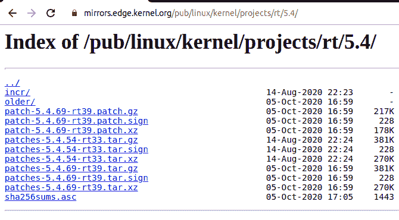

图 11.9 - 5.4 LTS Linux 内核的 RTL 补丁的截图

您很快会注意到 RTL 补丁仅适用于所讨论的内核的某些版本（在这里是 5.4.y）；接下来会有更多内容。在前面的截图中，您可以看到两种类型的补丁文件 - 解释如下：

+   `patch-<kver>rt[nn].patch.[gz|xz]`：前缀是`patch-`；这是补丁的完整集合，用于在一个统一的（压缩的）文件中打补丁到主线内核（版本`<kver>`）。

+   `patches-<kver>-rt[nn].patch.[gz|xz]`：前缀是`patches-`；这个压缩文件包含了用于这个版本的 RTL 的每个单独的补丁（作为单独的文件）。

（还有，正如您应该知道的，`<fname>.patch.gz`和`<fname>.patch.xz`是相同的存档；只是压缩器不同 - `.sign`文件是 PGP 签名文件。）

我们将使用第一种类型；通过单击链接（或通过`wget(1)`）将`patch-<kver>rt[nn].patch.xz`文件下载到目标系统。

请注意，对于 5.4.x 内核（截至撰写时），RTL 补丁似乎只存在于 5.4.54 和 5.4.69 版本（而不是 5.4.0，我们一直在使用的内核）。

实际上，RTL 补丁适用的特定内核版本可能与我在撰写本文时提到的不同。这是预期的 - 只需按照这里提到的步骤用您正在使用的发布号替换即可。

别担心 - 我们马上就会向您展示一个解决方法。这确实是事实；社区不可能针对每个单独的内核发布构建补丁 - 这些实在太多了。这确实有一个重要的含义：要么我们将我们的 5.4.0 内核打补丁到 5.4.69，要么我们只需下载 5.4.69 内核并对其应用 RTL 补丁。

第一种方法可行，但工作量更大（特别是在没有 git/ketchup/quilt 等补丁工具的情况下；在这里，我们选择不使用 git 来应用补丁，而是直接在稳定的内核树上工作）。由于 Linux 内核补丁是增量的，我们将不得不下载从 5.4.0 到 5.4.69 的每个补丁（总共 69 个补丁！），并依次按顺序应用它们：首先是 5.4.1，然后是 5.4.2，然后是 5.4.3，依此类推，直到最后一个！在这里，为了简化事情，我们知道要打补丁的内核是 5.4.69，所以最好直接下载并提取它。因此，前往[`www.kernel.org/`](https://www.kernel.org/)并这样做。因此，我们最终下载了两个文件：

+   主线 5.4.69 的压缩内核源代码：[`mirrors.edge.kernel.org/pub/linux/kernel/v5.x/linux-5.4.69.tar.xz`](https://mirrors.edge.kernel.org/pub/linux/kernel/v5.x/linux-5.4.69.tar.xz)

+   5.4.69 的 RTL 补丁：[`mirrors.edge.kernel.org/pub/linux/kernel/projects/rt/5.4/patches-5.4.69-rt39.tar.xz`](https://mirrors.edge.kernel.org/pub/linux/kernel/projects/rt/5.4/patches-5.4.69-rt39.tar.xz)

（如第三章 *从源代码构建 5.x Linux 内核-第二部分*中详细解释的那样，如果您打算为另一个目标交叉编译内核，通常的做法是在功能强大的工作站上构建它，然后在那里下载。）

接下来，提取 RTL 补丁文件以及内核代码基础`tar.xz`文件，以获取内核源代码树（这里是版本 5.4.69；当然，这些细节在第二章 *从源代码构建 5.x Linux 内核-第一部分*中已经详细介绍过）。到目前为止，您的工作目录内容应该类似于这样：

```
$ ls -lh
total 106M
drwxrwxr-x 24 kaiwan kaiwan 4.0K Oct  1 16:49 linux-5.4.69/
-rw-rw-r--  1 kaiwan kaiwan 105M Oct 13 16:35 linux-5.4.69.tar.xz
-rw-rw-r--  1 kaiwan kaiwan 836K Oct 13 16:33 patch-5.4.69-rt39.patch
$ 
```

（FYI，`unxz(1)`实用程序可用于提取`.xz`压缩的补丁文件。）对于好奇的读者：看一下补丁（文件`patch-5.4.69-rt39.patch`），看看为实现硬实时内核所做的所有代码级更改；当然不是简单的！技术更改的概述将在即将到来的*主线和 RTL-技术差异摘要*部分中看到。既然我们已经准备就绪，让我们开始将补丁应用到稳定的 5.4.69 内核树上；接下来的部分只涵盖这一点。

### 应用 RTL 补丁

确保将提取的补丁文件`patch-5.4.69-rt39.patch`放在 5.4.69 内核源代码树的上一级目录中（如前所示）。现在，让我们应用补丁。小心-（显然）不要尝试将压缩文件应用为补丁；提取并使用未压缩的补丁文件。为了确保补丁正确应用，我们首先使用`--dry-run`（虚拟运行）选项来使用`patch(1)`：

```
$ cd linux-5.4.69
$ patch -p1 --dry-run < ../patch-5.4.69-rt39.patch 
checking file Documentation/RCU/Design/Expedited-Grace-Periods/Expedited-Grace-Periods.html
checking file Documentation/RCU/Design/Requirements/Requirements.html
[ ... ]
checking file virt/kvm/arm/arm.c
$ echo $?
0
```

一切顺利，现在让我们实际应用它：

```
$ patch -p1 < ../patch-5.4.69-rt39.patch patching file Documentation/RCU/Design/Expedited-Grace-Periods/Expedited-Grace-Periods.html
patching file Documentation/RCU/Design/Requirements/Requirements.html
[ ... ] 
```

太好了-我们现在已经准备好了 RTL 补丁内核！

当然，有多种方法和各种快捷方式可以使用；例如，您还可以通过`xzcat ../patch-5.4.69-rt39.patch.xz | patch -p1`命令（或类似命令）来实现前面的操作。

### 配置和构建 RTL 内核

我们在第二章 *从源代码构建 5.x Linux 内核-第一部分*和第三章 *从源代码构建 5.x Linux 内核-第二部分*中详细介绍了内核配置和构建步骤，因此我们不会在这里重复。几乎所有内容都保持不变；唯一的显著区别是我们必须配置此内核以利用 RTL（这在新的 RTL 维基网站上有解释，网址为：[`wiki.linuxfoundation.org/realtime/documentation/howto/applications/preemptrt_setup`](https://wiki.linuxfoundation.org/realtime/documentation/howto/applications/preemptrt_setup)）。

为了将要构建的内核特性减少到大约匹配当前系统配置，我们首先在内核源树目录（`linux-5.4.69`）中执行以下操作（我们也在第二章中介绍过，*从源代码构建 5.x Linux 内核 - 第一部分*，在*通过 localmodconfig 方法调整内核配置*部分）：

```
$ lsmod > /tmp/mylsmod 
$ make LSMOD=/tmp/mylsmod localmodconfig
```

接下来，使用`make menuconfig`启动内核配置：

1.  导航到`通用设置`子菜单：

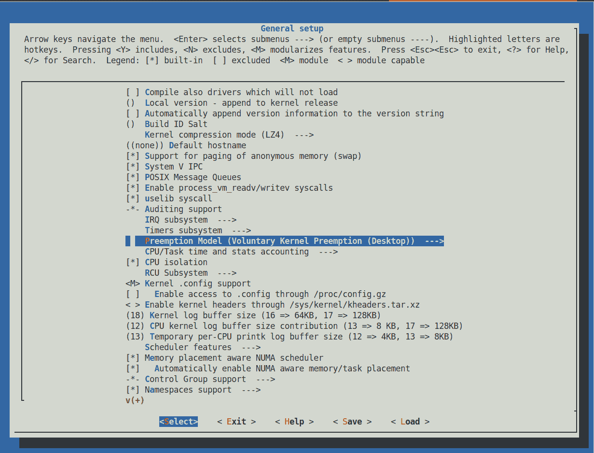

图 11.10 - 进行 menuconfig / 通用设置：配置 RTL 补丁内核

1.  一旦到达那里，向下滚动到`抢占模型`子菜单；我们在前面的截图中看到它被突出显示，以及当前（默认）选择的抢占模型是`自愿内核抢占（桌面）`。

1.  在这里按*Enter*会进入`抢占模型`子菜单：

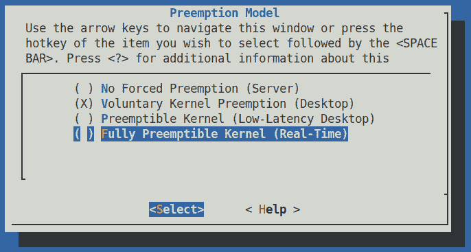

图 11.11 - 进行 menuconfig / 通用设置 / 抢占模型的配置 RTL 补丁内核

就是这样！回想一下前一章，在*可抢占内核*部分，我们描述了这个内核配置菜单实际上有三个项目（在图 11.11 中看到的前三个）。现在有四个。第四个项目 - `完全可抢占内核（实时）`选项 - 是由于我们刚刚应用的 RTL 补丁而添加的！

1.  因此，要为 RTL 配置内核，请向下滚动并选择`完全可抢占内核（实时）`菜单选项（参见图 11.1）。这对应于内核`CONFIG_PREEMPT_RT`配置宏，其`<帮助>`非常描述性（确实要看一看）；事实上，它以这样的陈述结束：*如果您正在构建需要实时保证的系统内核，请选择此选项*。

在较早版本的内核（包括 5.0.x）中，`抢占模型`子菜单显示了五个选择项；其中两个是用于 RT：一个称为基本 RT，另一个是我们在这里看到的第四个选择 - 现在（5.4.x）它们已经被简单地合并为一个真正的实时选项。

1.  一旦选择了第四个选项并保存并退出`menuconfig` UI，（重新）检查已选择完全可抢占内核 - 实际上是 RTL：

```
$ grep PREEMPT_RT .config
CONFIG_PREEMPT_RT=y
```

好的，看起来不错！（当然，在构建之前，您可以根据产品的需要调整其他内核配置选项。）

1.  现在让我们构建 RTL 内核：

```
make -j4 && sudo make modules_install install 
```

1.  一旦成功构建和安装，重新启动系统；在启动时，按下一个键以显示 GRUB 引导加载程序菜单（按住其中一个*Shift*键可以确保在启动时显示 GRUB 菜单）；在 GRUB 菜单中，选择新构建的`5.4.69-rtl` RTL 内核（实际上，刚刚安装的内核通常是默认选择的）。现在应该可以启动了；一旦登录并进入 shell，让我们验证内核版本：

```
$ uname -r
5.4.69-rt39-rtl-llkd1
```

注意`CONFIG_LOCALVERSION`设置为值`-rtl-llkd1`。（还可以通过`uname -a`看到`PREEMPT RT`字符串。）现在我们 - 如承诺的那样 - 运行 Linux，RTL，作为硬实时操作系统，即 RTOS！

然而，非常重要的是要理解，对于真正的硬实时，仅仅拥有一个硬实时内核是*不够的；你必须非常小心地设计和编写你的用户空间（应用程序、库和工具）以及你的内核模块/驱动程序，以符合实时性。例如，频繁的页面错误可能会使确定性成为过去式，并导致高延迟（和高抖动）。 （回想一下你在第九章中学到的，*模块作者的内核内存分配 - 第二部分*，在*内存分配和需求分页的简短说明*部分。页面错误是生活的一部分，经常发生；小的页面错误通常不会引起太多担忧。但在硬实时的情况下呢？无论如何，“主要错误”都会妨碍性能。）诸如使用`mlockall(2)`来锁定实时应用程序进程的所有页面可能是必需的。这里提供了编写实时代码的几种其他技术和建议：[`rt.wiki.kernel.org/index.php/HOWTO:_Build_an_ RT-application`](https://rt.wiki.kernel.org/index.php/HOWTO:_Build_an_RT-application)。（同样，关于 CPU 亲和性和屏蔽、`cpuset`管理、中断请求（IRQ）优先级等主题可以在先前提到的旧 RT 维基站点上找到；[`rt.wiki.kernel.org/index.php/Main_Page`](https://rt.wiki.kernel.org/index.php/Main_Page)。）

所以，很好 - 现在你知道如何配置和构建 Linux 作为 RTOS！我鼓励你自己尝试一下。接下来，我们将总结标准和 RTL 内核之间的关键差异。

## 主线和 RTL - 技术差异总结

为了让你更深入地了解这个有趣的主题领域，在本节中，我们将进一步深入探讨：我们总结了标准（或主线）和 RTL 内核之间的关键差异。

在下表中，我们总结了标准（或主线）和 RTL 内核之间的一些关键差异。RTL 项目的主要目标是最终完全整合到常规主线内核树中。由于这个过程是渐进的，从 RTL 合并到主线的补丁是缓慢但稳定的；有趣的是，正如你可以从下表的最右列看到的那样，在撰写本文时，大部分（约 80%）的 RTL 工作实际上已经合并到了主线内核中，并且它还在继续：

| **组件/特性** | **标准或主线（原始）Linux** | **RTL（完全可抢占/硬实时 Linux）** | **RT 工作合并到主线？** |
| --- | --- | --- | --- |
| 自旋锁 | 自旋锁关键部分是不可抢占的内核代码 | 尽可能可抢占；称为“睡眠自旋锁”！实际上，自旋锁已转换为互斥锁。 | 否 |
| 中断处理 | 传统上通过顶半部分和底半部分（hardirq/tasklet/softirq）机制完成 | 线程中断：大多数中断处理在内核线程内完成（2.6.30，2009 年 6 月）。 | 是 |
| HRTs（高分辨率定时器） | 由于从 RTL 合并而可用 | 具有纳秒分辨率的定时器（2.6.16，2006 年 3 月）。 | 是 |
| RW 锁 | 无界；写者可能会挨饿 | 具有有界写入延迟的公平 RW 锁。 | 否 |
| lockdep | 由于从 RTL 合并而可用 | 非常强大（内核空间）的工具，用于检测和证明锁的正确性或缺乏正确性。 | 是 |
| 跟踪 | 由于从 RTL 合并而可用的一些跟踪技术 | Ftrace 的起源（在某种程度上也包括 perf）是 RT 开发人员试图找到延迟问题。 | 是 |
| 调度器 | 由于从 RTL 合并而可用的许多调度器功能 | 首先在这里进行了实时调度的工作以及截止时间调度类（`SCHED_DEADLINE`）（3.14，2014 年 3 月）；此外，完全无滴答操作（3.10，2013 年 6 月）。 | 是 |

不要担心-我们一定会在书的后续章节中涵盖许多前面的细节。

当然，一个众所周知的（至少应该是）经验法则就是：*没有银弹*。这当然意味着，没有一个解决方案适用于所有需求。

如果你还没有这样做，请务必读一读弗雷德里克·P·布鲁克斯的《神话般的程序员：软件工程论文》这本仍然相关的书。

如第十章中所述，《CPU 调度器-第一部分》，在*可抢占内核*部分，Linux 内核可以配置为使用`CONFIG_PREEMPT`选项；这通常被称为**低延迟**（或**LowLat**）内核，并提供接近实时的性能。在许多领域（虚拟化、电信等），使用 LowLat 内核可能比使用硬实时 RTL 内核更好，主要是由于 RTL 的开销。通常情况下，使用硬实时，用户空间应用程序可能会受到吞吐量的影响，CPU 可用性降低，因此延迟更高。（请参阅*进一步阅读*部分，了解 Ubuntu 的一份白皮书，其中对比了原始发行版内核、低延迟可抢占内核和完全可抢占内核-实际上是 RTL 内核。）

考虑到延迟，接下来的部分将帮助您了解系统延迟的确切含义；然后，您将学习一些在实时系统上测量它的方法。继续！

# 延迟及其测量

我们经常遇到术语延迟；在内核的上下文中，它到底是什么意思呢？延迟的同义词是延迟，这是一个很好的提示。*延迟（或延迟）是反应所需的时间* - 在我们这里的上下文中，内核调度程序唤醒用户空间线程（或进程）的时间，使其可运行，以及它实际在处理器上运行的时间是**调度延迟**。（不过，请注意，调度延迟这个术语也在另一个上下文中使用，指的是每个可运行任务保证至少运行一次的时间间隔；在这里的可调整项是：`/proc/sys/kernel/sched_latency_ns`，至少在最近的 x86_64 Linux 上，默认值为 24 毫秒）。类似地，从硬件中断发生（比如网络中断）到它实际由其处理程序例程服务的经过的时间是中断延迟。

**cyclictest**用户空间程序是由 Thomas Gleixner 编写的；它的目的是测量内核延迟。其输出值以微秒为单位。平均延迟和最大延迟通常是感兴趣的值-如果它们在系统的可接受范围内，那么一切都很好；如果不在范围内，这可能指向产品特定的重新设计和/或内核配置调整，检查其他时间关键的代码路径（包括用户空间）等。

让我们以 cyclictest 进程本身作为一个例子，来清楚地理解调度延迟。cyclictest 进程被运行；在内部，它发出`nanosleep(2)`（或者，如果传递了`-n`选项开关，则是`clock_nanosleep(2)`系统调用），将自己置于指定的时间间隔的睡眠状态。由于这些`*sleep()`系统调用显然是阻塞的，内核在内部将 cyclictest（为简单起见，我们在下图中将其称为`ct`）进程排入等待队列，这只是一个保存睡眠任务的内核数据结构。

等待队列与事件相关联；当事件发生时，内核唤醒所有在该事件上休眠的任务。在这里，所讨论的事件是定时器的到期；这是由定时器硬件发出的硬件中断（或 IRQ）来传达的；这开始了必须发生的事件链，以使 cyclictest 进程唤醒并在处理器上运行。当然，关键点在于，说起来容易做起来难：在进程实际在处理器核心上运行的路径上可能发生许多潜在的延迟！以下图表试图传达的就是潜在的延迟来源：

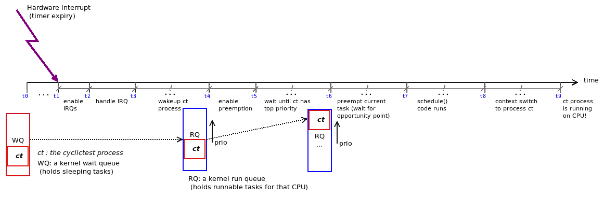

图 11.12 - 唤醒、上下文切换和运行 cyclictest（ct）进程的路径；可能发生多个延迟

（部分前述输入来自于优秀的演示*使用和理解实时 Cyclictest 基准测试，Rowand，2013 年 10 月*。）仔细研究图 11.12；它显示了从硬件中断由于定时器到期的断言（在时间`t0`，因为 cyclictest 进程通过`nanosleep()` API 发出的休眠在时间`t1`完成），通过 IRQ 处理（`t1`到`t3`），以及 ct 进程唤醒的时间线 - 作为其结果，它被排入将来运行的核心的运行队列（在`t3`和`t4`之间）。

从那里，它最终将成为调度类别的最高优先级，或者最好或最值得的任务（在时间`t6`；我们在前一章中介绍了这些细节），因此，它将抢占当前正在运行的线程（`t6`）。`schedule()`代码将执行（时间`t7`到`t8`），上下文切换将发生在`schedule()`的尾端，最后(!)，cyclictest 进程将实际在处理器核心上执行（时间`t9`）。虽然乍看起来可能很复杂，但实际情况是这是一个简化的图表，因为其他潜在的延迟源已被省略（例如，由于 IPI、SMI、缓存迁移、前述事件的多次发生、额外中断在不合适的时刻触发导致更多延迟等）。

确定具有实时优先级的用户空间任务的最大延迟值的经验法则如下：

```
max_latency = CLK_WAVELENGTH x 105 s
```

例如，树莓派 3 型号的 CPU 时钟运行频率为 1 GHz；其波长（一个时钟周期到下一个时钟周期之间的时间）是频率的倒数，即 10^(-9)或 1 纳秒。因此，根据前述方程，理论最大延迟应该是（在）10^(-7)秒，约为 10 纳秒。正如您很快会发现的，这仅仅是理论上的。

## 使用 cyclictest 测量调度延迟

为了使这更有趣（以及在受限系统上运行延迟测试），我们将使用众所周知的 cyclictest 应用程序进行延迟测量，同时系统处于一定负载（通过`stress(1)`实用程序）下运行，使用同样著名的树莓派设备。本节分为四个逻辑部分：

1.  首先，在树莓派设备上设置工作环境。

1.  其次，在内核源上下载和应用 RT 补丁，进行配置和构建。

1.  第三，安装 cyclictest 应用程序，以及设备上的其他一些必需的软件包（包括`stress`）。

1.  第四，运行测试用例并分析结果（甚至绘制图表来帮助分析）。

第一步和第二步的大部分内容已经在第三章中详细介绍过，*从源代码构建 5.x Linux 内核-第二部分*，在*树莓派的内核构建*部分。这包括下载树莓派特定的内核源树，配置内核和安装适当的工具链；我们不会在这里重复这些信息。唯一的显著差异是，我们首先必须将 RT 补丁应用到内核源树中，并配置为硬实时；我们将在下一节中介绍这一点。

让我们开始吧！

### 获取并应用 RTL 补丁集

检查运行在您的树莓派设备上的主线或发行版内核版本（用任何其他设备替换树莓派，您可能在其上运行 Linux）；例如，在我使用的树莓派 3B+上，它正在运行带有 5.4.51-v7+内核的标准 Raspbian（或树莓派 OS）GNU/Linux 10（buster）。

我们希望为树莓派构建一个 RTL 内核，使其与当前运行的标准内核尽可能匹配；对于我们的情况，它正在运行 5.4.51[-v7+]，最接近的可用 RTL 补丁是内核版本 5.4.y-rt[nn]（[`mirrors.edge.kernel.org/pub/linux/kernel/projects/rt/5.4/`](https://mirrors.edge.kernel.org/pub/linux/kernel/projects/rt/5.4/)）；我们马上就会回到这一点...

让我们一步一步来：

1.  下载树莓派特定的内核源树到您的主机系统磁盘的步骤已经在第三章中详细介绍过，*从源代码构建 5.x Linux 内核-第二部分*，在*树莓派的内核构建*部分；请参考并获取源树。

1.  完成此步骤后，您应该会看到一个名为`linux`的目录；它保存了树莓派内核源代码，截至撰写本文的时间，内核版本为 5.4.y。`y`的值是多少？这很容易；只需执行以下操作：

```
$ head -n4 linux/Makefile 
# SPDX-License-Identifier: GPL-2.0
VERSION = 5
PATCHLEVEL = 4
SUBLEVEL = 70
```

这里的`SUBLEVEL`变量是`y`的值；显然，它是 70，使得内核版本为 5.4.70。

1.  接下来，让我们下载适当的实时（RTL）补丁：最好是一个精确匹配，也就是说，补丁的名称应该类似于`patch-5.4.70-rt[nn].tar.xz`。幸运的是，它确实存在于服务器上；让我们获取它（请注意，我们下载`patch-<kver>-rt[nn]`文件；因为它是统一的补丁，所以更容易处理）：

`wget https://mirrors.edge.kernel.org/pub/linux/kernel/projects/rt/5.4/patch-5.4.70-rt40.patch.xz`。

这确实引发了一个问题：如果可用的 RTL 补丁的版本与设备的内核版本*不完全匹配*会怎么样？很不幸，这确实会发生。在这种情况下，为了最有可能将其应用于设备内核，选择最接近的匹配并尝试应用它；通常会成功，也许会有轻微的警告... 如果不行，您将不得不手动调整代码库以适应补丁集，或者切换到存在 RTL 补丁的内核版本（推荐）。

不要忘记解压补丁文件！

1.  现在应用补丁（如前面所示，在*应用 RTL 补丁*部分）：

```
cd linux
patch -p1 < ../patch-5.4.70-rt40.patch
```

1.  配置打补丁的内核，打开`CONFIG_PREEMPT_RT`内核配置选项（如前面所述）：

1.  不过，正如我们在第三章中学到的，*从源代码构建 5.x Linux 内核-第二部分*，对于目标，设置初始内核配置是*至关重要*的；在这里，由于目标设备是树莓派 3[B+]，请执行以下操作：

```
make ARCH=arm bcm2709_defconfig
```

1.  1.  使用`make ARCH=arm menuconfig`命令自定义您的内核配置。在这里，当然，您应该转到`General setup / Preemption Model`，并选择第四个选项，`CONFIG_PREEMPT_RT`，以打开硬实时抢占特性。

1.  我还假设您已经为树莓派安装了适当的 x86_64 到 ARM32 的工具链：

```
make -j4 ARCH=arm CROSS_COMPILE=arm-linux-gnueabihf- zImage modules dtbs
```

提示：安装适当的工具链（用于 x86_64 到 ARM32）可以像这样简单地进行：`sudo apt install ​crossbuild-essential-armhf`。现在构建内核（与我们之前描述的*配置和构建 RTL 内核*部分相同），不同之处在于我们进行交叉编译（使用之前安装的 x86_64 到 ARM32 交叉编译器）。

1.  安装刚构建的内核模块；确保你使用`INSTALL_MOD_PATH`环境变量指定了 SD 卡的根文件系统的位置（否则它可能会覆盖你主机上的模块，这将是灾难性的！）。假设 microSD 卡的第二个分区（包含根文件系统）挂载在`/media/${USER}/rootfs`下，然后执行以下操作（一行命令）：

```
sudo env PATH=$PATH make ARCH=arm CROSS_COMPILE=arm-linux-gnueabihf- INSTALL_MOD_PATH=/media/${USER}/rootfs modules_install
```

1.  将图像文件（引导加载程序文件，内核`zImage`文件，**设备树块**（**DTB**），内核模块）复制到树莓派 SD 卡上（这些细节在官方树莓派文档中有介绍：[`www.raspberrypi.org/documentation/linux/kernel/building.md`](https://www.raspberrypi.org/documentation/linux/kernel/building.md)；我们也在第三章中（轻微地）介绍了这一点，*从源代码构建 5.x Linux 内核-第二部分*）。

1.  测试：使用 SD 卡中的新内核映像引导树莓派。你应该能够登录到一个 shell（通常是通过`ssh`）。验证内核版本和配置：

```
rpi ~ $ uname -a 
Linux raspberrypi 5.4.70-rt40-v7-llkd-rtl+ #1 SMP PREEMPT_RT Thu Oct 15 07:58:13 IST 2020 armv7l GNU/Linux
rpi ~ $ zcat /proc/config.gz |grep PREEMPT_RT
CONFIG_PREEMPT_RT=y
```

我们确实在设备上运行了一个硬实时内核！所以，很好 - 这解决了“准备”部分；现在你可以继续下一步了。

### 在设备上安装 cyclictest（和其他所需的软件包）

我们打算通过 cyclictest 应用程序对标准和新创建的 RTL 内核运行测试用例。这意味着，当然，我们必须首先获取 cyclictest 的源代码并在设备上构建它（请注意，这里的工作是在树莓派上进行的）。

这里有一篇文章介绍了这个过程：*树莓派 3 在标准和实时 Linux 4.9 内核上的延迟*：[`metebalci.com/blog/latency-of-raspberry-pi-3-on-standard-and-real-time-linux-4.9-kernel/`](https://metebalci.com/blog/latency-of-raspberry-pi-3-on-standard-and-real-time-linux-4.9-kernel/)。

它提到了在树莓派 3 上运行 RTL 内核时遇到的问题以及一个解决方法（重要！）：（除了通常的参数之外）还要传递这两个内核参数：`dwc_otg.fiq_enable=0`和`dwc_otg.fiq_fsm_enable=0`。你可以将这些参数放在设备上的`/boot/cmdline.txt`文件中。

首先，确保所有所需的软件包都已安装到你的树莓派上：

```
sudo apt install coreutils build-essential stress gnuplot libnuma-dev
```

`libnuma-dev`软件包是可选的，可能在树莓派 OS 上不可用（即使没有也可以继续）。

现在让我们获取 cyclictest 的源代码：

```
git clone git://git.kernel.org/pub/scm/utils/rt-tests/rt-tests.git
```

有点奇怪的是，最初只会存在一个文件，`README`。阅读它（惊喜，惊喜）。它告诉你如何获取和构建稳定版本；很简单，只需按照以下步骤进行：

```
git checkout -b stable/v1.0 origin/stable/v1.0
make
```

对我们来说很幸运，**开源自动化开发实验室**（**OSADL**）有一个非常有用的 bash 脚本包装器，可以运行 cyclictest 甚至绘制延迟图。从这里获取脚本：[`www.osadl.org/uploads/media/mklatencyplot.bash`](https://www.osadl.org/uploads/media/mklatencyplot.bash)（关于它的说明：[https://www.osadl.org/Create-a-latency-plot-from-cyclictest-hi.bash-script-for-latency-plot.0.html?&no_cache=1&sword_list[0]=cyclictest](https://www.osadl.org/Create-a-latency-plot-from-cyclictest-hi.bash-script-for-latency-plot.0.html?&no_cache=1&sword_list%5B0%5D=cyclictest)）。我已经对它进行了轻微修改以适应我们的目的；它在本书的 GitHub 存储库中：`ch11/latency_test/latency_test.sh`。

### 运行测试用例

为了对系统（调度）延迟有一个好的概念，我们将运行三个测试用例；在所有三个测试中，`cyclictest` 应用程序将在 `stress(1)` 实用程序将系统置于负载下时对系统延迟进行采样：

1.  树莓派 3 型 B+（4 个 CPU 核心）运行 5.4 32 位 RTL 补丁内核

1.  树莓派 3 型 B+（4 个 CPU 核心）运行标准 5.4 32 位树莓派 OS 内核

1.  x86_64（4 个 CPU 核心）Ubuntu 20.04 LTS 运行标准的 5.4（主线）64 位内核

我们使用一个名为 `runtest` 的小包装脚本覆盖 `latency_test.sh` 脚本以方便起见。它运行 `latency_test.sh` 脚本来测量系统延迟，同时运行 `stress(1)` 实用程序；它使用以下参数调用 `stress`，对系统施加 CPU、I/O 和内存负载：

```
stress --cpu 6 --io 2 --hdd 4 --hdd-bytes 1MB --vm 2 --vm-bytes 128M --timeout 1h
```

（顺便说一句，还有一个名为 `stress-ng` 的后续版本可用。）当 `stress` 应用程序执行加载系统时，`cyclictest(8)` 应用程序对系统延迟进行采样，并将其 `stdout` 写入文件：

```
sudo cyclictest --duration=1h -m -Sp90 -i200 -h400 -q >output
```

（请参考`stress(1)`和`cyclictest(8)`的 man 页面以了解参数。）它将运行一个小时（为了更准确的结果，建议您将测试运行更长时间 - 也许 12 小时）。我们的 `runtest` 脚本（以及底层脚本）在内部使用适当的参数运行 `cyclictest`；它捕获并显示最小、平均和最大延迟的挂钟时间（通过`time(1)`），并生成直方图图表。请注意，这里我们运行 `cyclictest` 的最长持续时间为一小时。

默认情况下，我们的 `runtest` 包装脚本具有一个名为 LAT 的变量，其中包含以下设置的 `latency_tests` 目录的路径名：`LAT=~/booksrc/ch11/latency_tests`。确保您首先更新它以反映系统上 `latency_tests` 目录的位置。

我们在树莓派 3B+上运行 RTL 内核的测试用例#1 的脚本截图如下：

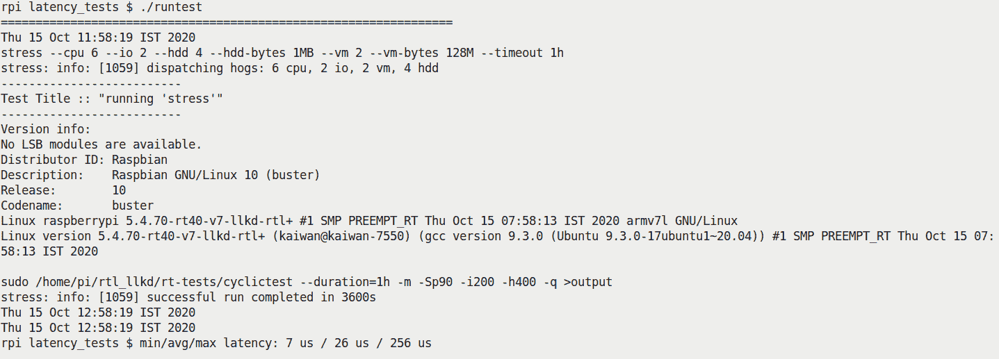

图 11.13 - 在受压力的 RTL 内核上运行树莓派 3B+的 cyclictest 的第一个测试用例

研究前面的截图；您可以清楚地看到系统详细信息，内核版本（请注意，这是 RTL 补丁的`PREEMPT_RT`内核！），以及 cyclictest 的最小、平均和最大（调度）延迟测量结果。

### 查看结果

我们对剩下的两个测试用例进行类似的过程，并在图 11.14 中总结所有三个的结果：

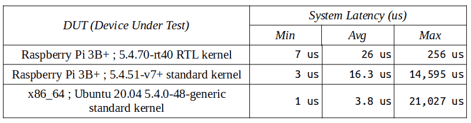

图 11.14 - 我们运行的（简单的）测试用例结果，显示了在一些压力下不同内核和系统的最小/平均/最大延迟

有趣的是，尽管 RTL 内核的最大延迟远低于其他标准内核，但最小延迟，更重要的是平均延迟，对于标准内核来说更好。这最终导致标准内核的整体吞吐量更高（这个观点之前也强调过）。

`latency_test.sh` bash 脚本调用 `gnuplot(1)` 实用程序生成图表，标题行显示最小/平均/最大延迟值（以微秒为单位）和运行测试的内核。请记住，测试用例#1 和#2 在树莓派 3B+设备上运行，而测试用例#3 在通用（更强大）的 x86_64 系统上运行。这里是所有三个测试用例的 `gnuplot` 图表：


图 11.15 - 测试用例#1 绘图：树莓派 3B+运行 5.4 RTL 内核的 cyclictest 延迟测量

图 11.15 显示了由`gnuplot(1)`（从我们的`ch11/latency_test/latency_test.sh`脚本中调用）绘制的测试用例＃1 的图表。被测试设备（DUT），Raspberry Pi 3B+，有四个 CPU 核心（由操作系统看到）。注意图表如何告诉我们故事 - 绝大多数样本位于左上角，意味着大部分时间延迟非常小（100,000 到 1,000,000 延迟样本（y 轴）落在几微秒到 50 微秒（x 轴）之间！）。这真的很好！当然，在另一个极端会有离群值 - 所有 CPU 核心的样本具有更高的延迟（在 100 到 256 微秒之间），尽管样本数量要小得多。cyclictest 应用程序给出了最小、平均和最大系统延迟值。使用 RTL 补丁内核，虽然最大延迟实际上非常好（非常低），但平均延迟可能相当高：

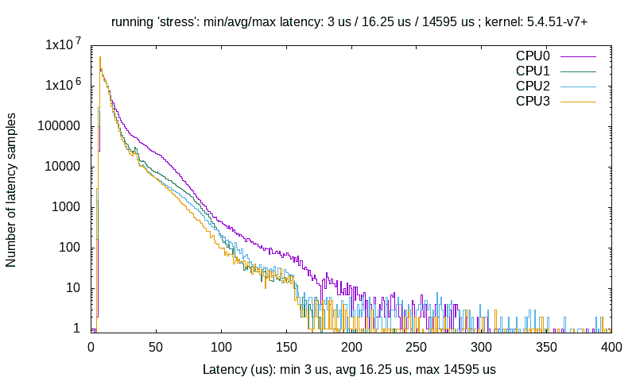

图 11.16 - 测试用例＃2 图：在运行标准（主线）5.4 内核的 Raspberry Pi 3B+上进行的 cyclictest 延迟测量

图 11.16 显示了测试用例＃2 的图表。与先前的测试用例一样，实际上，在这里甚至更加明显，系统延迟样本的绝大多数表现出非常低的延迟！标准内核因此做得非常好；即使平均延迟也是一个“不错”的值。然而，最坏情况（最大）延迟值确实可能非常大 - *这正是为什么它不是一个 RTOS*。对于大多数工作负载，延迟往往是“通常”很好的，但是一些特殊情况往往会出现。换句话说，它是*不确定的* - 这是 RTOS 的关键特征：

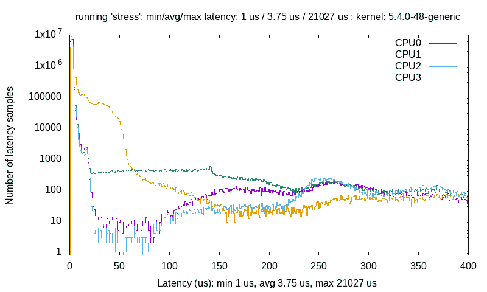

图 11.17 - 测试用例＃3 图：在运行标准（主线）5.4 内核的 x86_64 Ubuntu 20.04 LTS 上进行的 cyclictest 延迟测量

图 11.17 显示了测试用例＃3 的图表。这里的方差 - 或**抖动** - 更加明显（再次，非确定性！），尽管最小和平均系统延迟值确实非常好。当然，它是在一个远比前两个测试用例更强大的系统上运行的 - 一个桌面级的 x86_64 - 最大延迟值 - 尽管这里有更多的特殊情况，但往往相当高。再次强调，这不是一个 RTOS - 它不是确定性的。

你是否注意到图表清楚地展示了*抖动*：测试用例＃1 具有最少的抖动（图表往往很快下降到 x 轴 - 这意味着很少数量的延迟样本，如果不是零，表现出较高的延迟），而测试用例＃3 具有最多的抖动（图表大部分仍然远高于*x*轴！）。

再次强调这一点：结果清楚地表明，它是确定性的（非常少的抖动）与 RTOS，而与 GPOS 则是高度非确定性的！（作为一个经验法则，标准 Linux 在中断处理方面会产生大约+/- 10 微秒的抖动，而在运行 RTOS 的微控制器上，抖动会小得多，大约+/- 10 纳秒！）

进行这个实验，你会意识到基准测试是一件棘手的事情；你不应该对少数测试运行读太多（长时间运行测试，有一个大样本集是重要的）。使用您期望在系统上体验的真实工作负载进行测试，将是查看哪个内核配置产生更优越性能的更好方法；它确实会随着工作负载的变化而变化！

（Canonical 的一个有趣案例研究显示了某些工作负载的常规、低延迟和实时内核的统计数据；在本章的*进一步阅读*部分查找）。如前所述，通常情况下，RTL 内核的*最大*延迟特性往往会导致整体吞吐量较低（用户空间可能因为 RTL 的相当无情的优先级而遭受降低的 CPU）。

## 通过现代 BPF 工具测量调度器延迟

不详细介绍，但我们不得不提及最近和强大的[e]BPF Linux 内核功能及其相关前端；有一些专门用于测量调度器和运行队列相关系统延迟的工具。 （我们在第一章中介绍了[e]BPF 工具的安装，*现代跟踪和性能分析与[e]BPF*部分）。

以下表格总结了一些这些工具（BPF 前端）；所有这些工具都需要以 root 身份运行（与任何 BPF 工具一样）；它们将它们的输出显示为直方图（默认为微秒）：

| **BPF 工具** | **它测量什么** |
| --- | --- |
| `runqlat-bpfcc` | 计算任务在运行队列上等待的时间，等待在处理器上运行 |
| `runqslower-bpfcc` | （读作 runqueue slower）；计算任务在运行队列上等待的时间，显示只有超过给定阈值的线程，默认为 10 毫秒（可以通过传递微秒为单位的时间阈值来调整）；实际上，您可以看到哪些任务面临（相对）较长的调度延迟。 |
| `runqlen-bpfcc` | 显示调度器运行队列长度+占用（当前排队等待运行的线程数） |

这些工具还可以根据每个进程的任务基础提供这些指标，或者甚至可以根据 PID 命名空间（用于容器分析；当然，这些选项取决于具体的工具）。请查阅这些工具的 man 页面（第八部分），了解更多细节（甚至包括示例用法！）。

甚至还有更多与调度相关的[e]BPF 前端：`cpudist- cpudist-bpfcc`、`cpuunclaimed-bpfcc`、`offcputime-bpfcc`、`wakeuptime-bpfcc`等等。请参阅*进一步阅读*部分获取资源。

所以，到目前为止，您不仅能够理解，甚至可以测量系统的延迟（通过`cyclictest`应用程序和一些现代 BPF 工具）。

我们在本章中结束时列出了一些杂项但有用的小（内核空间）例程供查看：

+   `rt_prio()`: 给定优先级作为参数，返回一个布尔值，指示它是否是实时任务。

+   `rt_task()`: 基于任务的优先级值，给定任务结构指针作为参数，返回一个布尔值，指示它是否是实时任务（是`rt_prio()`的包装）。

+   `task_is_realtime()`: 类似，但基于任务的调度策略。给定任务结构指针作为参数，返回一个布尔值，指示它是否是实时任务。

# 总结

在这本关于 Linux 操作系统上 CPU 调度的第二章中，您学到了一些关键内容。其中，您学会了如何使用强大的工具（如 LTTng 和 Trace Compass GUI）来可视化内核流，以及使用`trace-cmd(1)`实用程序，这是内核强大的 Ftrace 框架的便捷前端。然后，您了解了如何以编程方式查询和设置任何线程的 CPU 亲和力掩码。这自然而然地引出了如何以编程方式查询和设置任何线程的调度策略和优先级的讨论。整个“完全公平”的概念（通过 CFS 实现）被质疑，并且对称为 cgroups 的优雅解决方案进行了一些阐述。您甚至学会了如何利用 cgroups v2 CPU 控制器为子组中的进程分配所需的 CPU 带宽。然后我们了解到，尽管 Linux 是一个 GPOS，但 RTL 补丁集确实存在，一旦应用并且内核配置和构建完成，您就可以将 Linux 运行为真正的硬实时系统，即 RTOS。

最后，您学会了如何通过 cyclictest 应用程序以及一些现代 BPF 工具来测量系统的延迟。我们甚至在 Raspberry Pi 3 设备上使用 cyclictest 进行了测试，并在 RTL 和标准内核上进行了对比。

这是相当多的内容！一定要花时间透彻理解材料，并且以实际操作的方式进行工作。

# 问题

在我们结束时，这里有一些问题列表，供您测试对本章材料的了解：[`github.com/PacktPublishing/Linux-Kernel-Programming/tree/master/questions`](https://github.com/PacktPublishing/Linux-Kernel-Programming/tree/master/questions)。您会发现一些问题的答案在书的 GitHub 存储库中：[`github.com/PacktPublishing/Linux-Kernel-Programming/tree/master/solutions_to_assgn`](https://github.com/PacktPublishing/Linux-Kernel-Programming/tree/master/solutions_to_assgn)。

# 进一步阅读

为了帮助您深入了解这个主题并提供有用的材料，我们在本书的 GitHub 存储库中提供了一个相当详细的在线参考和链接列表（有时甚至包括书籍）的《进一步阅读》文档。*进一步阅读*文档在这里可用：[`github.com/PacktPublishing/Linux-Kernel-Programming/blob/master/Further_Reading.md`](https://github.com/PacktPublishing/Linux-Kernel-Programming/blob/master/Further_Reading.md)。
