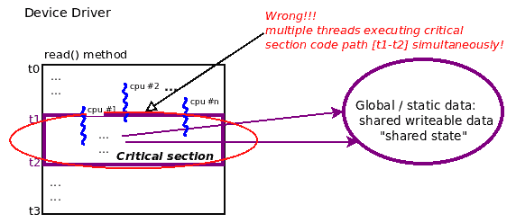
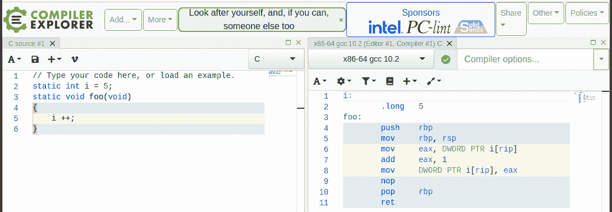
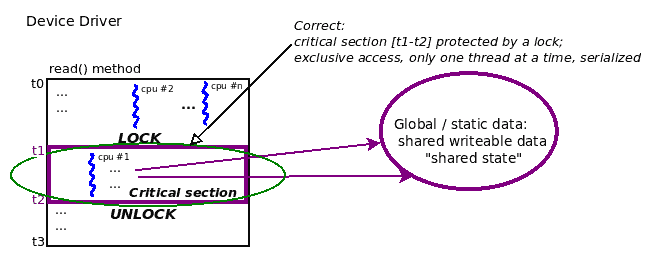
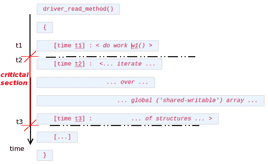
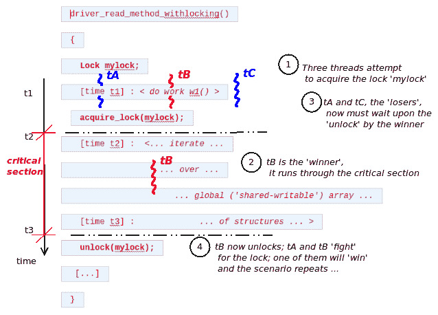
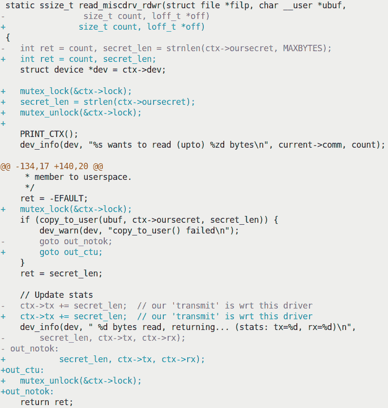
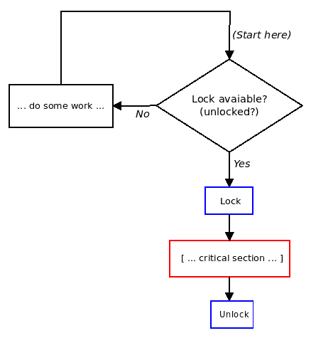
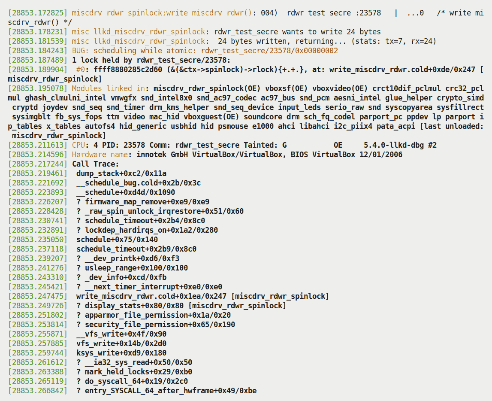
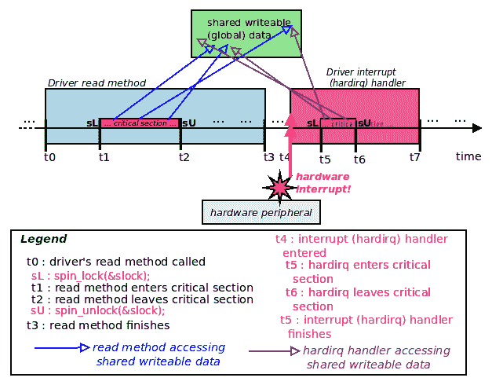

# 第十二章：内核同步 - 第一部分

任何熟悉在多线程环境中编程的开发人员（甚至在单线程环境中，多个进程在共享内存上工作，或者中断是可能的情况下）都知道，当两个或多个线程（一般的代码路径）可能会竞争时，需要进行**同步**。也就是说，它们的结果是无法预测的。纯粹的代码本身从来不是问题，因为它的权限是读/执行（`r-x`）；在多个 CPU 核心上同时读取和执行代码不仅完全正常和安全，而且是受鼓励的（它会提高吞吐量，这就是为什么多线程是个好主意）。然而，当你开始处理共享可写数据时，你就需要开始非常小心了！

围绕并发及其控制 - 同步 - 的讨论是多样的，特别是在像 Linux 内核（其子系统和相关区域，如设备驱动程序）这样的复杂软件环境中。因此，为了方便起见，我们将把这个大主题分成两章，本章和下一章。

在本章中，我们将涵盖以下主题：

+   关键部分，独占执行和原子性

+   Linux 内核中的并发问题

+   互斥锁还是自旋锁？何时使用

+   使用互斥锁

+   使用自旋锁

+   锁定和中断

让我们开始吧！

# 关键部分，独占执行和原子性

想象一下，你正在为一个多核系统编写软件（嗯，现在，通常情况下，你会在多核系统上工作，甚至在大多数嵌入式项目中）。正如我们在介绍中提到的，同时运行多个代码路径不仅是安全的，而且是可取的（否则，为什么要花那些钱呢，对吧？）。另一方面，在并发（并行和同时）代码路径中，其中**共享可写数据**（也称为**共享状态**）以任何方式被访问的地方，你需要保证在任何给定的时间点，只有一个线程可以同时处理该数据！这真的很关键；为什么？想想看：如果你允许多个并发代码路径同时在共享可写数据上工作，你实际上是在自找麻烦：**数据损坏**（"竞争"）可能会发生。

## 什么是关键部分？

可以并行执行并且可以处理（读取和/或写入）共享可写数据（共享状态）的代码路径称为关键部分。它们需要保护免受并行性的影响。识别和保护关键部分免受同时执行是你作为设计师/架构师/开发人员必须处理的隐含要求。

关键部分是一段代码，必须要么独占地运行；也就是说，单独运行（序列化），要么是原子的；也就是说，不可分割地完成，没有中断。

通过独占执行，我们暗示在任何给定的时间点，只有一个线程在运行关键部分的代码；这显然是出于数据安全的原因而必需的。

这个概念也提出了*原子性*的重要概念：单个原子操作是不可分割的。在任何现代处理器上，两个操作被认为总是**原子的**；也就是说，它们不能被中断，并且会运行到完成：

+   单个机器语言指令的执行。

+   对齐的原始数据类型的读取或写入，该类型在处理器的字长内（通常为 32 位或 64 位）；例如，在 64 位系统上读取或写入 64 位整数保证是原子的。读取该变量的线程永远不会看到中间、断裂或脏的结果；它们要么看到旧值，要么看到新值。

因此，如果您有一些处理共享（全局或静态）可写数据的代码行，在没有任何显式同步机制的情况下，不能保证独占运行。请注意，有时需要原子地运行临界区的代码，*以及独占地运行*，但并非始终如此。

当临界区的代码在安全睡眠的进程上下文中运行时（例如通过用户应用程序对驱动程序进行典型文件操作（打开、读取、写入、ioctl、mmap 等），或者内核线程或工作队列的执行路径），也许不需要临界区真正是原子的。但是，当其代码在非阻塞原子上下文中运行时（例如硬中断、tasklet 或 softirq），*它必须像独占地运行一样原子地运行*（我们将在*使用互斥锁还是自旋锁？何时使用*部分中更详细地讨论这些问题）。

一个概念性的例子将有助于澄清事情。假设三个线程（来自用户空间应用程序）在多核系统上几乎同时尝试打开和读取您的驱动程序。在没有任何干预的情况下，它们可能会同时运行临界区的代码，从而并行地处理共享可写数据，从而很可能破坏它！现在，让我们看一个概念性的图表，看看临界区代码路径内的非独占执行是错误的（我们甚至不会在这里谈论原子性）：



图 12.1-一个概念性图表，显示了多个线程同时在临界区代码路径内运行，违反了临界区代码路径。

如前图所示，在您的设备驱动程序中，在其（比如）读取方法中，您正在运行一些代码以执行其工作（从硬件中读取一些数据）。让我们更深入地看一下这个图表*在不同时间点进行数据访问*：

+   从时间`t0`到`t1`：没有或只有本地变量数据被访问。这是并发安全的，不需要保护，可以并行运行（因为每个线程都有自己的私有堆栈）。

+   从时间`t1`到`t2`：访问全局/静态共享可写数据。这是*不*并发安全的；这是**一个临界区**，因此必须**受到保护**，以防并发访问。它应该只包含独占运行的代码（独自，一次只有一个线程，串行运行），可能是原子的。

+   从时间`t2`到`t3`：没有或只有本地变量数据被访问。这是并发安全的，不需要保护，可以并行运行（因为每个线程都有自己的私有堆栈）。

在本书中，我们假设您已经意识到需要*同步临界区*；我们将不再讨论这个特定的主题。有兴趣的人可以参考我的早期著作，*《Linux 系统编程实战》（Packt 出版社，2018 年 10 月）*，其中详细介绍了这些问题（特别是*第十五章*，*使用 Pthreads 进行多线程编程第二部分-同步*）。

因此，了解这一点，我们现在可以重新阐述临界区的概念，同时提到情况何时出现（在项目符号和斜体中显示在项目符号中）。临界区是必须按以下方式运行的代码：

+   **(始终) 独占地**：独自（串行）

+   **(在原子上下文中) 原子地**：不可分割地，完整地，没有中断

在下一节中，我们将看一个经典场景-全局整数的增量。

## 一个经典案例-全局 i++

想想这个经典的例子：在一个并发的代码路径中，一个全局的`i`整数正在被增加，其中多个执行线程可以同时执行。对计算机硬件和软件的天真理解会让你相信这个操作显然是原子的。然而，现代硬件和软件（编译器和操作系统）实际上比你想象的要复杂得多，因此会引起各种看不见的（对应用程序开发者来说）性能驱动的优化。

我们不打算在这里深入讨论太多细节，但现实情况是现代处理器非常复杂：它们采用了许多技术来提高性能，其中一些是超标量和超流水线执行，以便并行执行多个独立指令和各种指令的几个部分（分别），进行即时指令和/或内存重排序，在复杂的层次结构的 CPU 缓存中缓存内存，虚假共享等等！我们将在第十三章中的*内核同步 - 第二部分*中的*缓存效应 - 虚假共享*和*内存屏障*部分中深入探讨其中的一些细节。

Matt Kline 在 2020 年 4 月发表的论文《每个系统程序员都应该了解并发性》（[`assets.bitbashing.io/papers/concurrency-primer.pdf`](https://assets.bitbashing.io/papers/concurrency-primer.pdf)）非常出色，是这个主题上必读的内容；一定要阅读！

所有这些使得情况比乍一看复杂得多。让我们继续讨论经典的`i ++`：

```
static int i = 5;
[ ... ]
foo()
{
    [ ... ]
    i ++;     // is this safe? yes, if truly atomic... but is it truly atomic??
}
```

这个增量操作本身安全吗？简短的答案是否定的，你必须保护它。为什么？这是一个关键部分 - 我们正在访问共享的可写数据进行读取和/或写入操作。更长的答案是，这实际上取决于增量操作是否真正是原子的（不可分割的）；如果是，那么`i ++`在并行性的情况下不会造成危险 - 如果不是，就会有危险！那么，我们如何知道`i ++`是否真正是原子的呢？有两件事决定了这一点：

+   处理器的**指令集架构**（ISA），它确定了（在处理器的低级别上）在运行时执行的机器指令。

+   编译器。

如果 ISA 有能力使用单个机器指令执行整数增量，*并且*编译器有智能使用它，*那么*它是真正原子的 - 它是安全的，不需要锁定。否则，它是不安全的，需要锁定！

**试一试**：将浏览器导航到这个精彩的编译器资源网站：[`godbolt.org/`](https://godbolt.org/)。选择 C 作为编程语言，然后在左侧窗格中声明全局的`i`整数并在一个函数中进行增量。在右侧窗格中使用适当的编译器和编译器选项进行编译。你将看到为 C 高级`i ++;`语句生成的实际机器代码。如果它确实是一个单一的机器指令，那么它将是安全的；如果不是，你将需要锁定。总的来说，你会发现你真的无法判断：实际上，你*不能*假设事情是安全的 - 你必须假设它默认是不安全的并加以保护！这可以在以下截图中看到：



图 12.2 - 即使是最新的稳定 gcc 版本，但没有优化，x86_64 gcc 对 i ++产生了多个指令

前面的截图清楚地显示了这一点：左右两个窗格中的黄色背景区域分别是 C 源代码和编译器生成的相应汇编代码（基于 x86_64 ISA 和编译器的优化级别）。默认情况下，没有优化，`i ++`会变成三条机器指令。这正是我们所期望的：它对应于*获取*（内存到寄存器）、*增量*和*存储*（寄存器到内存）！现在，这*不是*原子的；完全有可能，在其中一条机器指令执行后，控制单元干扰并将指令流切换到不同的位置。这甚至可能导致另一个进程或线程被上下文切换！

好消息是，通过在“编译器选项...”窗口中快速添加`-O2`，`i ++`只变成了一条机器指令-真正的原子操作！然而，我们无法预测这些事情；有一天，您的代码可能在一个相当低端的 ARM（RISC）系统上执行，增加了需要多条机器指令来执行`i ++`的机会。（不用担心-我们将在*使用原子整数操作符*部分介绍专门针对整数的优化锁技术）。

现代语言提供本地原子操作符；对于 C/C++来说，这是相当近期的（从 2011 年起）；ISO C++11 和 ISO C11 标准为此提供了现成的和内置的原子变量。稍微搜索一下就可以快速找到它们。现代 glibc 也在使用它们。例如，如果您在用户空间中使用信号处理，您将知道要使用`volatile sig_atomic_t`数据类型来安全地访问和/或更新信号处理程序中的原子整数。那么内核呢？在下一章中，您将了解 Linux 内核对这一关键问题的解决方案。我们将在*使用原子整数操作符*和*使用原子位操作符*部分进行介绍。

Linux 内核当然是一个并发环境：多个执行线程在多个 CPU 核心上并行运行。不仅如此，即使在单处理器（UP/单 CPU）系统上，硬件中断、陷阱、故障、异常和软件信号也可能导致数据完整性问题。毋庸置疑，保护代码路径中所需的并发性比说起来要容易；识别和保护关键部分使用诸如锁等技术的同步原语和技术是绝对必要的，这也是为什么这是本章和下一章的核心主题。

## 概念-锁

我们需要同步，因为事实上，如果没有任何干预，线程可以同时执行关键部分，其中共享可写数据（共享状态）正在被处理。为了消除并发性，我们需要摆脱并行性，我们需要*序列化*关键部分内的代码-共享数据正在被处理的地方（用于读取和/或写入）。

强制使代码路径变得序列化的常见技术是使用**锁**。基本上，锁通过保证在任何给定时间点上只有一个执行线程可以“获取”或拥有锁来工作。因此，在代码中使用锁来保护关键部分将给您我们所追求的东西-独占地运行关键部分的代码（也许是原子的；关于这一点将在后面详细介绍）。



图 12.3-一个概念图，显示了如何使用锁来保护关键部分代码路径，确保独占性

前面的图表显示了解决前面提到的情况的一种方法：使用锁来保护关键部分！锁（和解锁）在概念上是如何工作的呢？

锁的基本前提是每当有争用时 - 也就是说，当多个竞争的线程（比如，`n`个线程）尝试获取锁（`LOCK`操作）时 - 恰好只有一个线程会成功。这被称为锁的“赢家”或“所有者”。它将*lock* API 视为非阻塞调用，因此在执行临界区代码时会继续运行 - 并且是独占的（临界区实际上是*lock*和*unlock*操作之间的代码！）。那么剩下的`n-1`个“失败者”线程会发生什么呢？它们（也许）将锁 API 视为阻塞调用；它们实际上在等待。等待什么？当然是由锁的所有者（“赢家”线程）执行的*unlock*操作！一旦解锁，剩下的`n-1`个线程现在竞争下一个“赢家”位置；当然，其中一个将“赢”并继续前进；在此期间，`n-2`个失败者现在将等待（新的）赢家的*unlock*；这一过程重复，直到所有`n`个线程（最终和顺序地）获取锁。

现在，锁当然有效，但 - 这应该是相当直观的 - 它会导致（相当大的！）开销，因为它破坏了并行性并使执行流程串行化！为了帮助您可视化这种情况，想象一个漏斗，狭窄的茎是临界区，一次只能容纳一个线程。所有其他线程都被堵住；锁创建了瓶颈：


图 12.4 - 锁创建了一个瓶颈，类似于物理漏斗

另一个经常提到的物理类比是一条高速公路，有几条车道汇入一条非常繁忙 - 交通拥堵的车道（也许是一个设计不佳的收费站）。再次，并行性 - 车辆（线程）在不同车道（CPU）中与其他车辆并行行驶 - 被丢失，需要串行行为 - 车辆被迫排队排队。

因此，作为软件架构师，我们必须尽量设计我们的产品/项目，以便最小化锁的需求。虽然在大多数现实世界的项目中完全消除全局变量是不切实际的，但优化和最小化它们的使用是必要的。我们将在以后介绍更多相关内容，包括一些非常有趣的无锁编程技术。

另一个非常关键的点是，一个新手程序员可能天真地认为对可写数据对象进行读取是完全安全的，因此不需要显式保护（除了在处理器总线大小内的对齐原始数据类型之外）；这是不正确的。这种情况可能导致所谓的**脏读或破碎读**，即在另一个写入线程同时写入时，可能读取到过时的数据，而你 - 在没有锁的情况下 - 正在读取同一个数据项。

由于我们正在讨论原子性，正如我们刚刚了解的那样，在典型的现代微处理器上，唯一保证是原子的是单个机器语言指令或对处理器总线宽度内的对齐原始数据类型的读/写。那么，如何标记几行“C”代码，使其真正原子化？在用户空间，这甚至是不可能的（我们可以接近，但无法保证原子性）。

在用户空间应用程序中如何“接近”原子性？您可以始终构建一个用户线程来使用`SCHED_FIFO`策略和`99`的实时优先级。这样，当它想要运行时，除了硬件中断/异常之外，几乎没有其他东西可以抢占它。（旧的音频子系统实现就大量依赖于此。）

在内核空间，我们可以编写真正原子化的代码。具体来说，我们可以使用自旋锁！我们将很快更详细地了解自旋锁。

### 关键点摘要

让我们总结一些关于关键部分的关键点。仔细审查这些内容非常重要，保持这些内容方便，并确保您在实践中使用它们：

+   **关键部分**是可以并行执行并且可以处理（读取和/或写入）共享可写数据（也称为“共享状态”）的代码路径。

+   因为它在共享可写数据上工作，关键部分需要保护免受以下方面的影响：

+   并行性（也就是说，它必须独立/串行/以互斥的方式运行）

+   在原子（中断）非阻塞上下文中运行时 - 原子地：不可分割地，完整地，没有中断。一旦受保护，您可以安全地访问共享状态，直到“解锁”。

+   代码库中的每个关键部分都必须被识别和保护：

+   识别关键部分至关重要！仔细审查您的代码，并确保您没有错过它们。

+   可以通过各种技术来保护它们；一个非常常见的技术是*锁定*（还有无锁编程，我们将在下一章节中看到）。

+   一个常见的错误是只保护*写入*全局可写数据的关键部分；您还必须保护*读取*全局可写数据的关键部分；否则，您会面临**撕裂或脏读！**为了帮助澄清这一关键点，想象一下在 32 位系统上读取和写入无符号 64 位数据项；在这种情况下，操作无法是原子的（需要两次加载/存储操作）。因此，如果在一个线程中读取数据项的值的同时，另一个线程正在同时写入数据项，会发生什么？写入线程会以某种方式“锁定”，但是因为您认为读取是安全的，读取线程不会获取锁；由于不幸的时间巧合，您最终可能会执行部分/撕裂/脏读！我们将在接下来的章节和下一章节中学习如何通过使用各种技术来克服这些问题。

+   另一个致命的错误是不使用相同的锁来保护给定的数据项。

+   未能保护关键部分会导致**数据竞争**，即结果 - 被读/写的数据的实际值 - 是“竞争的”，这意味着它会根据运行时情况和时间而变化。这被称为一个错误。（一旦在“现场”中，这种错误非常难以看到，重现，确定其根本原因并修复。我们将在下一章节中介绍一些非常有用的内容，以帮助您解决这个问题，在*内核中的锁调试*部分；一定要阅读！）

+   **异常**：在以下情况下，您是安全的（隐式地，无需显式保护）：

+   当您处理局部变量时。它们分配在线程的私有堆栈上（或者，在中断上下文中，分配在本地 IRQ 堆栈上），因此，根据定义，是安全的。

+   当您在代码中处理共享可写数据时，这些代码不可能在另一个上下文中运行；也就是说，它是串行化的。在我们的上下文中，LKM 的*init*和*cleanup*方法符合条件（它们仅在`insmod`和`rmmod`上运行一次，串行地运行）。

+   当您处理真正的常量和只读共享数据时（不过不要让 C 的`const`关键字愚弄您！）。

+   锁定本质上是复杂的；您必须仔细思考，设计和实现以避免*死锁*。我们将在*锁定指南和死锁*部分中更详细地介绍这一点。

# Linux 内核中的并发关注点

在内核代码中识别关键部分至关重要；如果您甚至看不到它，您如何保护它？以下是一些建议，可以帮助您作为新兴的内核/驱动程序开发人员识别并发关注点 - 因此关键部分可能出现的地方：

+   **对称多处理器**（**SMP**）系统的存在（`CONFIG_SMP`）

+   可抢占内核的存在

+   阻塞 I/O

+   硬件中断（在 SMP 或 UP 系统上）

这些是需要理解的关键点，我们将在本节中讨论每一个。

## 多核 SMP 系统和数据竞争

第一点是非常明显的；请看以下截图中显示的伪代码：



图 12.5 - 伪代码 - 在（虚构的）驱动程序读取方法中的临界区；由于没有锁定，这是错误的

这与我们在*图 12.1*和*12.3*中展示的情况类似；只是这里，我们用伪代码来展示并发性。显然，从时间`t2`到时间`t3`，驱动程序正在处理一些全局共享的可写数据，因此这是一个临界区。

现在，想象一个具有四个 CPU 核心（SMP 系统）的系统；两个用户空间进程，P1（在 CPU 0 上运行）和 P2（在 CPU 2 上运行），可以同时打开设备文件并同时发出`read(2)`系统调用。现在，两个进程将同时执行驱动程序读取“方法”，因此同时处理共享可写数据！这（在`t2`和`t3`之间的代码）是一个临界区，由于我们违反了基本的排他规则 - 临界区必须由单个线程在任何时间点执行 - 我们很可能最终损坏数据、应用程序，甚至更糟。

换句话说，现在这是一个**数据竞争**；取决于微妙的时间巧合，我们可能会或可能不会生成错误（错误）。这种不确定性 - 微妙的时间巧合 - 正是发现和修复这种错误极其困难的原因（它可能逃脱了您的测试工作）。

这句格言非常不幸地是真的：*测试可以检测到错误的存在，但不能检测到它们的缺失。*更重要的是，如果您的测试未能捕捉到竞争（和错误），允许它们在现场自由发挥，那么情况会更糟。

您可能会觉得，由于您的产品是在单个 CPU 核心（UP）上运行的小型嵌入式系统，因此关于控制并发性（通常通过锁定）的讨论不适用于您。我们不这么认为：几乎所有现代产品，如果尚未这样做，都将转向多核（也许是在它们的下一代阶段）。更重要的是，即使是 UP 系统也存在并发性问题，我们将在下文中探讨。

## 可抢占内核，阻塞 I/O 和数据竞争

想象一下，您正在在已配置为可抢占的 Linux 内核上运行您的内核模块或驱动程序（即`CONFIG_PREEMPT`已打开；我们在第十章中涵盖了这个主题，*CPU 调度器 - 第一部分*）。考虑一个进程 P1，在进程上下文中运行驱动程序的读取方法代码，处理全局数组。现在，在临界区内（在时间`t2`和`t3`之间），如果内核*抢占*了进程 P1 并切换到另一个进程 P2，后者正好在等待执行这条代码路径？这是危险的，同样是数据竞争。这甚至可能发生在 UP 系统上！

另一个有些类似的情景（同样可能发生在单核（UP）或多核系统上）：进程 P1 正在通过驱动程序方法的临界区运行（在时间`t2`和`t3`之间；再次参见*图 12.5*）。这一次，在临界区内，如果遇到阻塞调用会怎么样呢？

**阻塞调用**是一个导致调用进程上下文进入休眠状态，等待事件发生的函数；当事件发生时，内核将“唤醒”该任务，并且它将从中断的地方恢复执行。这也被称为 I/O 阻塞，非常常见；许多 API（包括几个用户空间库和系统调用，以及几个内核 API）本质上是阻塞的。在这种情况下，进程 P1 实际上从 CPU 上的上下文切换并进入休眠状态，这意味着`schedule()`的代码运行并将其排队到等待队列。在此期间，在 P1 被切换回之前，如果另一个进程 P2 被调度运行会怎么样？如果该进程也在运行这个特定的代码路径怎么办？想一想 - 当 P1 回来时，共享数据可能已经在其“下面”发生了变化，导致各种错误；再次，数据竞争，一个 bug！

## 硬件中断和数据竞争

最后，设想这样的情景：进程 P1 再次无辜地运行驱动程序的读取方法代码；它进入临界区（在时间`t2`和`t3`之间；再次参见*图 12.5*）。它取得了一些进展，但然后，哎呀，硬件中断触发了（在同一个 CPU 上）！（你将在*Linux 内核编程（第二部分）*中详细了解。）在 Linux 操作系统上，硬件（外围）中断具有最高的优先级；它们默认情况下会抢占任何代码（包括内核代码）。因此，进程（或线程）P1 至少会被暂时搁置，从而失去处理器；中断处理代码将抢占它并运行。

好吧，你可能会想，那又怎样？的确，这是一个非常普遍的现象！硬件中断在现代系统上非常频繁地触发，有效地（字面上）中断了各种任务上下文（在你的 shell 上快速执行`vmstat 3`命令；`system`标签下的列`in`显示了你的系统在最近 1 秒内触发的硬件中断数量！）。要问的关键问题是：中断处理代码（无论是硬中断的顶半部分还是所谓的任务或软中断的底半部分，无论哪个发生了），*是否共享并处理了它刚刚中断的进程上下文的相同可写数据？*

如果是这样，那么，*休斯顿，我们有问题* - 数据竞争！如果不是，那么你中断的代码对于中断代码路径来说不是一个临界区，这很好。事实是，大多数设备驱动程序确实处理中断；因此，驱动程序的作者（你！）有责任确保没有全局或静态数据 - 实际上，没有临界区 - 在进程上下文和中断代码路径之间共享。如果它们是（这确实会发生），你必须以某种方式保护这些数据，以防数据竞争和可能的损坏。

这些情景可能让你觉得防范这些并发问题是一个非常艰巨的任务；在各种可能的并发问题存在的情况下，如何确保数据的安全？有趣的是，实际的 API 并不难学习使用；我们再次强调，**识别临界区**是关键。

再次，关于锁（概念上）如何工作，锁定指南（非常重要；我们很快会回顾它们），以及如何防止死锁的类型，都在我早期的书籍*《Linux 系统编程实战》（Packt，2018 年 10 月）*中有详细介绍。这本书在*第十五章* *使用 Pthreads 进行多线程编程第 II 部分 - 同步*中详细介绍了这些内容。

话不多说，让我们深入探讨将保护我们的临界区的主要同步技术 - 锁定。

## 锁定指南和死锁

锁定，本质上是一个复杂的问题；它往往会产生复杂的交织情况。不充分理解它可能会导致性能问题和错误-死锁、循环依赖、中断不安全的锁定等。以下锁定指南对确保正确编写代码至关重要：

+   **锁定粒度**：锁定和解锁之间的“距离”（实际上是关键部分的长度）不应该是粗粒度的（关键部分太长），它应该是“足够细”; 这是什么意思？下面的几点解释了这一点：

+   在这里你需要小心。在大型项目中，保持太少的锁是一个问题，保持太多的锁也是一个问题！太少的锁可能会导致性能问题（因为相同的锁会被重复使用，因此往往会受到高度争用）。

+   拥有很多锁实际上对性能有好处，但对复杂性控制不利。这也导致另一个关键点的理解：在代码库中有很多锁的情况下，你应该非常清楚哪个锁保护哪个共享数据对象。如果你使用，比如，`lockA`来保护`mystructX`，但在一个遥远的代码路径（也许是一个中断处理程序）中你忘记了这一点，并尝试使用另一个锁，`lockB`，来保护同一个结构！现在这些事情可能听起来很明显，但（有经验的开发人员知道），在足够的压力下，即使显而易见的事情也并非总是显而易见！

+   尝试平衡事物。在大型项目中，使用一个锁来保护一个全局（共享）数据结构是典型的。 （为锁变量命名可能本身就会成为一个大问题！这就是为什么我们将保护数据结构的锁放在其中作为成员。）

+   **锁的顺序**至关重要；**锁必须始终以相同的顺序获取**，并且他们的顺序应该由所有在项目上工作的开发人员记录和遵循（注释锁也很有用；在下一章关于*lockdep*的部分中会更多介绍）。不正确的锁顺序经常导致死锁。

+   尽量避免递归锁定。

+   注意防止饥饿；验证一旦获取锁，确实“足够快”释放锁。

+   **简单是关键**：尽量避免复杂性或过度设计，特别是涉及锁的复杂情况。

在锁定的话题上，（危险的）死锁问题出现了。**死锁**是无法取得任何进展；换句话说，应用程序和/或内核组件似乎无限期地挂起。虽然我们不打算在这里深入研究死锁的可怕细节，但我会快速提到一些可能发生的常见死锁场景：

+   简单情况，单锁，进程上下文：

+   我们尝试两次获取相同的锁；这会导致**自死锁**。

+   简单情况，多个（两个或更多）锁，进程上下文-一个例子：

+   在 CPU `0`上，线程 A 获取锁 A，然后想要获取锁 B。

+   同时，在 CPU `1`上，线程 B 获取锁 B，然后想要获取锁 A。

+   结果是死锁，通常称为**AB-BA** **死锁**。

+   它可以被扩展；例如，AB-BC-CA **循环依赖**（A-B-C 锁链）导致死锁。

+   复杂情况，单锁，进程和中断上下文：

+   锁 A 在中断上下文中获取。

+   如果中断发生（在另一个核心上），处理程序尝试获取锁 A 会发生什么？死锁是结果！因此，在中断上下文中获取的锁必须始终与中断禁用一起使用。（如何？我们将在涵盖自旋锁时更详细地讨论这个问题。）

+   更复杂的情况，多个锁，进程和中断（硬中断和软中断）上下文

在更简单的情况下，始终遵循*锁定顺序指南*就足够了：始终按照有文档记录的顺序获取和释放锁（我们将在*使用互斥锁*部分的内核代码中提供一个示例）。然而，这可能会变得非常复杂；复杂的死锁情况甚至会使经验丰富的开发人员感到困惑。幸运的是，***lockdep*** - Linux 内核的运行时锁依赖验证器 - 可以捕捉到每一个死锁情况！（不用担心 - 我们会到那里的：我们将在下一章中详细介绍 lockdep）。当我们涵盖自旋锁（*使用自旋锁*部分）时，我们将遇到类似于之前提到的进程和/或中断上下文场景；在那里清楚地说明了要使用的自旋锁类型。

关于死锁，Steve Rostedt 在 2011 年的 Linux Plumber's Conference 上做了一个关于 lockdep 的非常详细的介绍；相关幻灯片内容丰富，探讨了简单和复杂的死锁场景，以及 lockdep 如何检测它们（[`blog.linuxplumbersconf.org/2011/ocw/sessions/153`](https://blog.linuxplumbersconf.org/2011/ocw/sessions/153)）。

另外，现实情况是，不仅是死锁，甚至**活锁**情况也可能同样致命！活锁本质上是一种类似于死锁的情况；只是参与任务的状态是运行而不是等待。例如，中断“风暴”可能导致活锁；现代网络驱动程序通过关闭中断（在中断负载下）并采用称为**新 API;切换中断**（**NAPI**）的轮询技术来减轻这种效应（在适当时重新打开中断；好吧，这比较复杂，但我们就到这里吧）。

对于那些一直生活在石头下的人来说，你会知道 Linux 内核有两种主要类型的锁：互斥锁和自旋锁。实际上，还有其他几种类型，包括其他同步（和“无锁”编程）技术，所有这些都将在本章和下一章中涵盖。

# 互斥锁还是自旋锁？在何时使用

学习使用互斥锁和自旋锁的确切语义非常简单（在内核 API 集中进行适当的抽象，使得对于典型的驱动程序开发人员或模块作者来说更容易）。在这种情况下的关键问题是一个概念性的问题：两种锁之间的真正区别是什么？更重要的是，在什么情况下应该使用哪种锁？您将在本节中找到这些问题的答案。

以前的驱动程序读取方法的伪代码（*图 12.5*）作为基本示例，假设有三个线程 - **tA**，**tB**和**tC** - 在并行运行（在 SMP 系统上）通过此代码。我们将通过在临界区开始之前（时间**t2**）获取锁来解决这个并发问题，同时避免任何数据竞争，并在临界区代码路径结束后（时间**t3**）释放锁（解锁）。让我们再次看一下伪代码，这次使用锁定以确保它是正确的：



图 12.6 - 伪代码 - 在（虚构的）驱动程序读取方法中的临界区；正确，带锁定

当三个线程尝试同时获取锁时，系统保证只有一个线程会获得。假设**tB**（线程 B）获得了锁：现在它是“赢家”或“所有者”线程。这意味着线程**tA**和**tC**是“输家”；他们会等待解锁！“赢家”（**tB**）完成临界区并解锁锁时，之前的输家之间的竞争重新开始；其中一个将成为下一个赢家，过程重复。

两种锁类型 - 互斥锁和自旋锁 - 的关键区别在于失败者等待解锁的方式。使用互斥锁时，失败的线程会进入睡眠状态；也就是说，它们会通过睡眠来等待。当获胜者执行解锁时，内核会唤醒失败者（所有失败者），它们会再次运行，争夺锁。（事实上，互斥锁和信号量有时被称为睡眠锁。）

然而，使用**自旋锁**，没有睡眠的问题；失败者会在锁上旋转等待，直到它被解锁。从概念上看，情况如下：

```
while (locked) ;
```

请注意，这仅仅是概念上的。好好想一想 - 这实际上是轮询。然而，作为一个好的程序员，你会明白，轮询通常被认为是一个坏主意。那么，为什么自旋锁会这样工作呢？其实并不是这样；它只是以这种方式呈现出来是为了概念上的目的。很快你就会明白，自旋锁只在多核（SMP）系统上才有意义。在这样的系统中，当获胜的线程离开并运行临界区代码时，失败者会在其他 CPU 核心上旋转等待！实际上，在实现级别上，用于实现现代自旋锁的代码是高度优化的（并且与体系结构相关），并不是通过简单地“旋转”来工作（例如，许多 ARM 的自旋锁实现使用**等待事件**（**WFE**）机器语言指令，该指令使 CPU 在低功耗状态下等待；请参阅*进一步阅读*部分，了解有关自旋锁内部实现的几个资源）。

## 理论上确定使用哪种锁

自旋锁的实现方式并不是我们关心的重点；自旋锁的开销比互斥锁低这一事实对我们很有兴趣。为什么呢？其实很简单：对于互斥锁来说，失败的线程必须进入睡眠状态。为了做到这一点，内部会调用`schedule()`函数，这意味着失败者将把互斥锁 API 视为一个阻塞调用！调用调度程序最终会导致处理器被切换上下文。相反，当拥有者线程解锁锁时，失败的线程必须被唤醒；同样，它将被切换回处理器。因此，互斥锁/解锁操作的最小“成本”是在给定机器上执行两次上下文切换所需的时间。（请参阅下一节中的*信息框*。）通过再次查看前面的屏幕截图，我们可以确定一些事情，包括在临界区（“锁定”代码路径）中花费的时间；也就是说，`t_locked = t3 - t2`。

假设`t_ctxsw`代表上下文切换的时间。正如我们所了解的，互斥锁/解锁操作的最小成本是`2 * t_ctxsw`。现在，假设以下表达式为真：

```
t_locked < 2 * t_ctxsw
```

换句话说，如果在临界区内花费的时间少于两次上下文切换所需的时间，那么使用互斥锁就是错误的，因为这样的开销太大；执行元工作的时间比实际工作的时间更多 - 这种现象被称为**抖动**。这种情况 - 非常短的临界区存在的情况 - 在现代操作系统（如 Linux）中经常出现。因此，总之，对于短的非阻塞临界区，使用自旋锁（远远）优于使用互斥锁。

## 实际上确定使用哪种锁

因此，根据`t_locked < 2 * t_ctxsw`的“规则”进行操作在理论上可能很好，但等等：你真的期望精确测量每种情况中临界区内的上下文切换时间和花费的时间吗？当然不是 - 那太不现实和过分了。

从实际角度来看，可以这样理解：互斥锁通过让失败的线程在解锁时睡眠来工作；自旋锁不会（失败的线程“自旋”）。让我们回顾一下 Linux 内核的一个黄金规则：内核不能在任何类型的原子上下文中睡眠（调用`schedule()`）。因此，我们永远不能在中断上下文中使用互斥锁，或者在任何不安全睡眠的上下文中使用；然而，使用自旋锁是可以的。（记住，一个阻塞的 API 是通过调用`schedule()`来使调用上下文进入睡眠状态的。）让我们总结一下：

+   关键部分是否在原子（中断）上下文中运行，或者在进程上下文中运行，其中它不能睡眠？使用自旋锁。

+   关键部分是否在进程上下文中运行，并且在关键部分需要睡眠吗？使用互斥锁。

当然，使用自旋锁的开销比使用互斥锁要低；因此，你甚至可以在进程上下文中使用自旋锁（比如我们虚构的驱动程序的读方法），只要关键部分不阻塞（睡眠）。

[1] 上下文切换所需的时间是不同的；它在很大程度上取决于硬件和操作系统的质量。最近（2018 年 9 月）的测量结果显示，在固定的 CPU 上，上下文切换时间大约为 1.2 到 1.5 微秒，在没有固定的情况下大约为 2.2 微秒（https://eli.thegreenplace.net/2018/measuring-context-switching-and-memory-overheads-for-linux-threads/）。

硬件和 Linux 操作系统都有了巨大的改进，因此平均上下文切换时间也有了显著提高。一篇 1998 年 12 月的 Linux Journal 文章确定，在 x86 类系统上，平均上下文切换时间为 19 微秒，最坏情况下为 30 微秒。

这带来了一个问题，我们如何知道代码当前是在进程上下文还是中断上下文中运行的？很简单：我们的`PRINT_CTX()`宏（在我们的`convenient.h`头文件中）可以告诉我们这一点：

```
if (in_task())
    /* we're in process context (usually safe to sleep / block) */
else
    /* we're in an atomic or interrupt context (cannot sleep / block) */
```

（我们的`PRINT_CTX()`宏的实现细节在《Linux 内核编程（第二部分）》中有介绍）。

现在你明白了在什么情况下使用互斥锁或自旋锁，让我们进入实际用法。我们将从如何使用互斥锁开始！

# 使用互斥锁

互斥锁也被称为可睡眠或阻塞互斥锁。正如你所学到的，如果关键部分可以睡眠（阻塞），则它们在进程上下文中使用。它们不能在任何类型的原子或中断上下文（顶半部、底半部，如 tasklets 或 softirqs 等）、内核定时器，甚至不允许阻塞的进程上下文中使用。

## 初始化互斥锁

在内核中，互斥锁“对象”表示为`struct mutex`数据结构。考虑以下代码：

```
#include <linux/mutex.h>
struct mutex mymtx;
```

要使用互斥锁，*必须*显式地将其初始化为解锁状态。初始化可以通过`DEFINE_MUTEX()`宏进行静态执行（声明和初始化对象），也可以通过`mutex_init()`函数进行动态执行（实际上是对`__mutex_init()`函数的宏包装）。

例如，要声明和初始化一个名为`mymtx`的互斥锁对象，我们可以使用`DEFINE_MUTEX(mymtx);`。

我们也可以动态地做这个。为什么是动态的？通常，互斥锁是它所保护的（全局）数据结构的成员（聪明！）。例如，假设我们在驱动程序代码中有以下全局上下文结构（请注意，这段代码是虚构的）：

```
struct mydrv_priv {
    <member 1>;
    <member 2>;
    [...]
    struct mutex mymtx; /* protects access to mydrv_priv */
    [...]
};
```

然后，在你的驱动程序（或 LKM）的`init`方法中，执行以下操作：

```
static int init_mydrv(struct mydrv_priv *drvctx)
{
    [...]
    mutex_init(drvctx->mymtx);
    [...]
}
```

将锁变量作为（父）数据结构的成员保护起来是 Linux 中常见（而巧妙）的模式；这种方法的附加好处是避免了命名空间污染，并且清楚地表明了哪个互斥锁保护了哪个共享数据项（这在庞大的项目中可能比看起来更为严重，尤其是在 Linux 内核等庞大项目中！）。

将保护全局或共享数据结构的锁作为该数据结构的成员。

## 正确使用互斥锁

通常情况下，你可以在内核源代码树中找到非常有见地的注释。这里有一个很好的总结了你必须遵循以正确使用互斥锁的规则的注释；请仔细阅读：

```
// include/linux/mutex.h
/*
 * Simple, straightforward mutexes with strict semantics:
 *
 * - only one task can hold the mutex at a time
 * - only the owner can unlock the mutex
 * - multiple unlocks are not permitted
 * - recursive locking is not permitted
 * - a mutex object must be initialized via the API
 * - a mutex object must not be initialized via memset or copying
 * - task may not exit with mutex held
 * - memory areas where held locks reside must not be freed
 * - held mutexes must not be reinitialized
 * - mutexes may not be used in hardware or software interrupt
 * contexts such as tasklets and timers
 *
 * These semantics are fully enforced when DEBUG_MUTEXES is
 * enabled. Furthermore, besides enforcing the above rules, the mutex
 * [ ... ]
```

作为内核开发人员，你必须理解以下内容：

+   关键部分会导致代码路径*被序列化，破坏了并行性*。因此，至关重要的是将关键部分保持尽可能短。与此相关的是**锁定数据，而不是代码**。

+   尝试重新获取已经获取（锁定）的互斥锁——实际上是*递归*锁定——*不*受支持，并且会导致自我死锁。

+   **锁定顺序**：这是防止危险死锁情况的一个非常重要的经验法则。在存在多个线程和多个锁的情况下，关键的是*锁定的顺序被记录并且所有在项目上工作的开发人员都严格遵循*。实际的锁定顺序本身并不是不可侵犯的，但一旦决定了，就必须遵循。在浏览内核源代码树时，你会发现许多地方，内核开发人员确保这样做，并且（通常）为其他开发人员写下了一条注释以便他们看到并遵循。这里有一个来自 slab 分配器代码（`mm/slub.c`）的示例注释：

```
/*
 * Lock order:
 * 1\. slab_mutex (Global Mutex)
 * 2\. node->list_lock
 * 3\. slab_lock(page) (Only on some arches and for debugging)
```

现在我们从概念上理解了互斥锁的工作原理（并且理解了它们的初始化），让我们学习如何使用锁定/解锁 API。

## 互斥锁和解锁 API 及其用法

互斥锁的实际锁定和解锁 API 如下。以下代码分别显示了如何锁定和解锁互斥锁：

```
void __sched mutex_lock(struct mutex *lock);
void __sched mutex_unlock(struct mutex *lock);
```

（这里忽略`__sched`；这只是一个编译器属性，使得这个函数在`WCHAN`输出中消失，在 procfs 中出现，并且在`ps(1)`的某些选项开关下显示出来。）

再次强调，在`kernel/locking/mutex.c`源代码中的注释非常详细和描述性；我鼓励你更详细地查看这个文件。我们在这里只展示了其中的一些代码，这些代码直接取自 5.4 版 Linux 内核源代码树：

```
// kernel/locking/mutex.c
[ ... ]
/**
 * mutex_lock - acquire the mutex
 * @lock: the mutex to be acquired
 *
 * Lock the mutex exclusively for this task. If the mutex is not
 * available right now, it will sleep until it can get it.
 *
 * The mutex must later on be released by the same task that
 * acquired it. Recursive locking is not allowed. The task
 * may not exit without first unlocking the mutex. Also, kernel
 * memory where the mutex resides must not be freed with
 * the mutex still locked. The mutex must first be initialized
 * (or statically defined) before it can be locked. memset()-ing
 * the mutex to 0 is not allowed.
 *
 * (The CONFIG_DEBUG_MUTEXES .config option turns on debugging
 * checks that will enforce the restrictions and will also do
 * deadlock debugging)
 *
 * This function is similar to (but not equivalent to) down().
 */
void __sched mutex_lock(struct mutex *lock)
{
    might_sleep();

    if (!__mutex_trylock_fast(lock))
        __mutex_lock_slowpath(lock);
}
EXPORT_SYMBOL(mutex_lock);
```

`might_sleep()`是一个具有有趣调试属性的宏；它捕捉到了应该在原子上下文中执行但实际上没有执行的代码！（关于`might_sleep()`的解释可以在*Linux 内核编程（第二部分）*书中找到）。因此，请考虑：`might_sleep()`是`mutex_lock()`中的第一行代码，这意味着这段代码路径不应该被任何处于原子上下文中的东西执行，因为它可能会休眠。这意味着只有在进程上下文中安全休眠时才应该使用互斥锁！

**一个快速而重要的提醒**：Linux 内核可以配置大量的调试选项；在这种情况下，`CONFIG_DEBUG_MUTEXES`配置选项将帮助你捕捉可能的与互斥锁相关的错误，包括死锁。同样，在 Kernel Hacking 菜单下，你会找到大量与调试相关的内核配置选项。我们在第五章中讨论过这一点，*编写你的第一个内核模块——LKMs 第二部分*。关于锁调试，有几个非常有用的内核配置；我们将在下一章中介绍这些内容，在*内核中的锁调试*部分。

### 互斥锁——通过[不]可中断的睡眠？

和我们迄今为止看到的互斥锁一样，还有更多。你已经知道 Linux 进程（或线程）会在状态机的各种状态之间循环。在 Linux 上，睡眠有两种离散状态-可中断睡眠和不可中断睡眠。处于可中断睡眠状态的进程（或线程）是敏感的，这意味着它会响应用户空间信号，而处于不可中断睡眠状态的任务对用户信号不敏感。

在一个具有人机交互的应用程序中，根据一个经验法则，你通常应该将一个进程置于可中断睡眠状态（当它在锁上阻塞时），这样就由最终用户决定是否通过按下*Ctrl* + *C*（或某种涉及信号的机制）来中止应用程序。在类 Unix 系统上通常遵循的设计规则是：**提供机制，而不是策略**。话虽如此，在非交互式代码路径上，通常情况下你必须等待锁来无限期地等待，这意味着已经传递给任务的信号不应该中止阻塞等待。在 Linux 上，不可中断的情况是最常见的。

所以，问题来了：`mutex_lock()` API 总是将调用任务置于不可中断的睡眠状态。如果这不是你想要的，可以使用`mutex_lock_interruptible()` API 将调用任务置于可中断的睡眠状态。在语法上有一个不同之处；后者在成功时返回整数值`0`，在失败时返回`-EINTR`（记住`0`/`-E`返回约定）（由于信号中断）。

一般来说，使用`mutex_lock()`比使用`mutex_lock_interruptible()`更快；当临界区很短时（因此几乎可以保证锁只持有很短的时间，这是一个非常理想的特性）使用它。

内核 5.4.0 包含超过 18,500 个`mutex_lock()`和 800 多个`mutex_lock_interruptible()` API 的调用实例；你可以通过内核源树上强大的`cscope(1)`实用程序来检查这一点。

理论上，内核也提供了`mutex_destroy()` API。这是`mutex_init()`的相反操作；它的工作是将互斥锁标记为不可用。它只能在互斥锁处于未锁定状态时调用一次，并且一旦调用，就不能再使用互斥锁。这有点理论性，因为在常规系统上，它只是一个空函数；只有在启用了`CONFIG_DEBUG_MUTEXES`的内核上，它才变成实际的（简单的）代码。因此，当使用互斥锁时，我们应该使用这种模式，如下面的伪代码所示：

```
DEFINE_MUTEX(...);        // init: initialize the mutex object
/* or */ mutex_init();
[ ... ]
    /* critical section: perform the (mutex) locking, unlocking */
    mutex_lock[_interruptible]();
    << ... critical section ... >>
    mutex_unlock();
    mutex_destroy();      // cleanup: destroy the mutex object
```

现在你已经学会了如何使用互斥锁 API，让我们把这些知识付诸实践。在下一节中，我们将在我们早期的一个（编写不良-没有保护！）“misc”驱动程序的基础上，通过使用互斥对象来锁定必要的临界区。

## 互斥锁示例驱动程序

我们在《Linux 内核编程（第二部分）》一书中的*编写简单的杂项字符设备驱动程序*章节中创建了一个简单的设备驱动程序代码示例，即`miscdrv_rdwr`。在那里，我们编写了一个简单的`misc`类字符设备驱动程序，并使用了一个用户空间实用程序（`miscdrv_rdwr/rdwr_drv_secret.c`）来从设备驱动程序的内存中读取和写入（所谓的）秘密。

然而，在那段代码中我们明显（这里应该用“惊人地”才对！）没有保护共享（全局）可写数据！这在现实世界中会让我们付出昂贵的代价。我敦促你花一些时间思考这个问题：两个（或三个或更多）用户模式进程打开这个驱动程序的设备文件，然后同时发出各种 I/O 读写操作是不可行的。在这里，全局共享可写数据（在这种特殊情况下，两个全局整数和驱动程序上下文数据结构）很容易被破坏。

因此，让我们通过复制这个驱动程序并更正我们的错误来学习（我们现在将其称为`ch12/1_miscdrv_rdwr_mutexlock/1_miscdrv_rdwr_mutexlock.c`），并重新编写其中的一些部分。关键是我们必须使用互斥锁来保护所有关键部分。而不是在这里显示代码（毕竟，它在本书的 GitHub 存储库中[`github.com/PacktPublishing/Linux-Kernel-Programming`](https://github.com/PacktPublishing/Linux-Kernel-Programming)，请使用`git clone`！），让我们做一些有趣的事情：让我们看一下旧的未受保护版本和新的受保护代码版本之间的“差异”（`diff(1)`生成的差异-增量）。这里的输出已经被截断：

```
$ pwd
<...>/ch12/1_miscdrv_rdwr_mutexlock
$ diff -u ../../ch12/miscdrv_rdwr/miscdrv_rdwr.c miscdrv_rdwr_mutexlock.c > miscdrv_rdwr.patch
$ cat miscdrv_rdwr.patch
[ ... ]
+#include <linux/mutex.h> // mutex lock, unlock, etc
 #include "../../convenient.h"
[ ... ] 
-#define OURMODNAME "miscdrv_rdwr"
+#define OURMODNAME "miscdrv_rdwr_mutexlock"

+DEFINE_MUTEX(lock1); // this mutex lock is meant to protect the integers ga and gb
[ ... ]
+     struct mutex lock; // this mutex protects this data structure
 };
[ ... ]
```

在这里，我们可以看到在驱动程序的更新安全版本中，我们声明并初始化了一个名为`lock1`的互斥变量；我们将使用它来保护（仅用于演示目的）驱动程序中的两个全局整数`ga`和`gb`。接下来，重要的是，在“驱动程序上下文”数据结构`drv_ctx`中声明了一个名为`lock`的互斥锁；这将用于保护对该数据结构成员的任何和所有访问。它在`init`代码中初始化：

```
+     mutex_init(&ctx->lock);
+
+     /* Initialize the "secret" value :-) */
      strscpy(ctx->oursecret, "initmsg", 8);
-     dev_dbg(ctx->dev, "A sample print via the dev_dbg(): driver initialized\n");
+     /* Why don't we protect the above strscpy() with the mutex lock?
+      * It's working on shared writable data, yes?
+      * Yes, BUT this is the init code; it's guaranteed to run in exactly
+      * one context (typically the insmod(8) process), thus there is
+      * no concurrency possible here. The same goes for the cleanup
+      * code path.
+      */
```

这个详细的注释清楚地解释了为什么我们不需要在`strscpy()`周围进行锁定/解锁。再次强调，这应该是显而易见的，但是局部变量隐式地对每个进程上下文是私有的（因为它们驻留在该进程或线程的内核模式堆栈中），因此不需要保护（每个线程/进程都有一个变量的单独*实例*，所以没有人会干涉别人的工作！）。在我们忘记之前，*清理*代码路径（通过`rmmod(8)`进程上下文调用）必须销毁互斥锁：

```
-static void __exit miscdrv_rdwr_exit(void)
+static void __exit miscdrv_exit_mutexlock(void)
 {
+     mutex_destroy(&lock1);
+     mutex_destroy(&ctx->lock);
      misc_deregister(&llkd_miscdev);
 }
```

现在，让我们看一下驱动程序的打开方法的差异：

```
+
+     mutex_lock(&lock1);
+     ga++; gb--;
+     mutex_unlock(&lock1);
+
+     dev_info(dev, " filename: \"%s\"\n"
      [ ... ]
```

这就是我们操纵全局整数的地方，*使其成为一个关键部分*；与此程序的先前版本（在*Linux 内核编程（第二部分）*中）不同，在这里，我们*确实保护了这个关键部分*，使用了`lock1`互斥体。所以，关键部分在这里是代码`ga++; gb--;`：在（互斥体）锁定和解锁操作之间的代码。

但是（总会有但是，不是吗？），一切并不顺利！看一下`mutex_unlock()`代码行后面的`printk`函数（`dev_info()`）：

```
+ dev_info(dev, " filename: \"%s\"\n"
+         " wrt open file: f_flags = 0x%x\n"
+         " ga = %d, gb = %d\n",
+         filp->f_path.dentry->d_iname, filp->f_flags, ga, gb);
```

这看起来对你来说没问题吗？不，仔细看：我们*读取*全局整数`ga`和`gb`的值。回想一下基本原理：在并发存在的情况下（在这个驱动程序的*open*方法中肯定是可能的），*即使没有锁定，读取共享可写数据也可能是不安全的*。如果这对你来说没有意义，请想一想：如果一个线程正在读取整数，另一个线程同时正在更新（写入）它们；那么呢？这种情况被称为**脏读**（或**断裂读**）；我们可能会读取过时的数据，必须加以保护。（事实上，这并不是一个脏读的很好的例子，因为在大多数处理器上，读取和写入单个整数项目确实是一个原子操作。然而，我们不应该假设这样的事情-我们只需要做好我们的工作并保护它。）

实际上，还有另一个类似的等待中的错误：我们已经从打开文件结构（`filp`指针）中读取数据，而没有费心保护它（实际上，打开文件结构有一个锁；我们应该使用它！我们稍后会这样做）。

诸如*脏读*之类的事物发生的具体语义通常非常依赖于体系结构（机器）；然而，我们作为模块或驱动程序的作者的工作是明确的：我们必须确保保护所有关键部分。这包括对共享可写数据的读取。

目前，我们将这些标记为潜在错误（错误）。我们将在*使用原子整数操作符*部分以更加性能友好的方式处理这个问题。查看驱动程序读取方法的差异会发现一些有趣的东西（忽略这里显示的行号；它们可能会改变）：



图 12.7 - 驱动程序读取()方法的差异；查看新版本中互斥锁的使用

我们现在已经使用了驱动程序上下文结构的互斥锁来保护关键部分。对于设备驱动程序的*写*和*关闭*（释放）方法都是一样的（生成补丁并查看）。

请注意，用户模式应用程序保持不变，这意味着为了测试新的更安全的版本，我们必须继续使用`ch12/miscdrv_rdwr/rdwr_drv_secret.c`中的用户模式应用程序。在调试内核上运行和测试此驱动程序代码，该内核包含各种锁定错误和死锁检测功能，这是至关重要的（我们将在下一章中返回这些“调试”功能，在*内核中的锁调试*部分）。

在前面的代码中，我们在`copy_to_user()`例程之前刚好取得了互斥锁；这很好。然而，我们只在`dev_info()`之后释放它。为什么不在这个`printk`之前释放它，从而缩短关键部分的时间？

仔细观察`dev_info()`会发现为什么它在关键部分*内部*。我们在这里打印了三个变量的值：`secret_len`读取的字节数以及`ctx->tx`和`ctx->rx`分别"传输"和"接收"的字节数。`secret_len`是一个局部变量，不需要保护，但另外两个变量在全局驱动程序上下文结构中，因此需要保护，即使是（可能是脏的）读取也需要保护。

## 互斥锁 - 一些剩余的要点

在本节中，我们将介绍有关互斥锁的一些其他要点。

### 互斥锁 API 变体

首先，让我们看一下互斥锁 API 的一些变体；除了可中断变体（在*互斥锁 - 通过[不]可中断睡眠？*部分中描述），我们还有*trylock，可杀死*和*io*变体。

#### 互斥 trylock 变体

如果您想要实现**忙等待**语义，即测试（互斥）锁的可用性，如果可用（表示当前未锁定），则获取/锁定它并继续关键部分代码路径？如果不可用（当前处于锁定状态），则不等待锁；而是执行其他工作并重试。实际上，这是一种非阻塞的互斥锁变体，称为 trylock；以下流程图显示了它的工作原理：



图 12.8 - "忙等待"语义，非阻塞 trylock 操作

互斥锁的此 trylock 变体的 API 如下所示：

```
int mutex_trylock(struct mutex *lock);
```

此 API 的返回值表示运行时发生了什么：

+   返回值`1`表示成功获取了锁。

+   返回值`0`表示锁当前被争用（已锁定）。

虽然尝试使用`mutex_trylock()` API 来确定互斥锁的锁定状态或解锁状态听起来很诱人，但这本质上是"竞态"。接下来，请注意，在高度争用的锁路径中使用此 trylock 变体可能会降低您获得锁的机会。trylock 变体传统上用于死锁预防代码，该代码可能需要退出某个锁定顺序序列，并通过另一个序列进行重试（排序）。

另外，关于 trylock 变体，尽管文献使用术语*尝试原子地获取互斥锁*，但它在原子或中断上下文中不起作用 - 它*仅*在进程上下文中起作用（与任何类型的互斥锁一样）。通常情况下，锁必须由所有者上下文调用的`mutex_unlock()`释放。

我建议你尝试使用 trylock 互斥锁变体作为练习。在本章末尾的*问题*部分查看作业！

#### 互斥锁可中断和可杀死变体

正如您已经了解的那样，当驱动程序（或模块）愿意接受任何（用户空间）信号中断时，将使用`mutex_lock_interruptible()`API（并返回`-ERESTARTSYS`以告知内核 VFS 层执行信号处理；用户空间系统调用将以`errno`设置为`EINTR`失败）。一个例子可以在内核中的模块处理代码中找到，在`delete_module(2)`系统调用中（`rmmod(8)`调用）：

```
// kernel/module.c
[ ... ]
SYSCALL_DEFINE2(delete_module, const char __user *, name_user,
        unsigned int, flags)
{
    struct module *mod;
    [ ... ]
    if (!capable(CAP_SYS_MODULE) || modules_disabled)
        return -EPERM;
    [ ... ]
    if (mutex_lock_interruptible(&module_mutex) != 0)
 return -EINTR;
    mod = find_module(name);
    [ ... ]
out:
    mutex_unlock(&module_mutex);
    return ret;
}
```

请注意 API 在失败时返回`-EINTR`。（`SYSCALL_DEFINEn()`宏成为系统调用签名；`n`表示此特定系统调用接受的参数数量。还要注意权限检查-除非您以 root 身份运行或具有`CAP_SYS_MODULE`权限（或者模块加载完全被禁用），否则系统调用将返回失败（`-EPERM`）。）

然而，如果您的驱动程序只愿意被致命信号（*将杀死*用户空间上下文的信号）中断，那么请使用`mutex_lock_killable()`API（签名与可中断变体相同）。

#### 互斥锁 io 变体

`mutex_lock_io()`API 在语法上与`mutex_lock()`API 相同；唯一的区别是内核认为失败线程的等待时间与等待 I/O 相同（`kernel/locking/mutex.c:mutex_lock_io()`中的代码注释清楚地记录了这一点；看一看）。这在会计方面很重要。

您可以在内核中找到诸如`mutex_lock[_interruptible]_nested()`之类的相当奇特的 API，这里重点是`nested`后缀。但是，请注意，Linux 内核不建议开发人员使用嵌套（或递归）锁定（正如我们在*正确使用互斥锁*部分中提到的）。此外，这些 API 仅在存在`CONFIG_DEBUG_LOCK_ALLOC`配置选项时才会被编译；实际上，嵌套 API 是为了支持内核锁验证器机制而添加的。它们只应在特殊情况下使用（在同一类型的锁定实例之间必须包含嵌套级别的情况）。

在下一节中，我们将回答一个典型的常见问题：互斥锁和信号量对象之间有什么区别？Linux 是否甚至有信号量对象？继续阅读以了解更多！

### 信号量和互斥锁

Linux 内核确实提供了信号量对象，以及您可以对（二进制）信号量执行的常规操作：

+   通过`down[_interruptible]()`（和变体）API 获取信号量锁

+   通过`up()`API 释放信号量。

一般来说，信号量是一个较旧的实现，因此建议您使用互斥锁来替代它。

值得一看的常见问题是：*互斥锁和信号量之间有什么区别？*它们在概念上似乎相似，但实际上是非常不同的：

+   信号量是互斥锁的一种更通用的形式；互斥锁可以被获取（随后释放或解锁）一次，而信号量可以被获取（随后释放）多次。

+   互斥锁用于保护临界区免受同时访问，而信号量应该用作向另一个等待任务发出信号的机制，表明已经达到了某个里程碑（通常，生产者任务通过信号量对象发布信号，等待接收的消费者任务继续进行进一步工作）。

+   互斥锁具有锁的所有权概念，只有所有者上下文才能执行解锁；二进制信号量没有所有权。

### 优先级反转和 RT 互斥锁

使用任何类型的锁时需要注意的一点是，您应该仔细设计和编码，以防止可能出现的可怕的*死锁*情况（关于这一点，我们将在下一章的*锁验证器 lockdep - 及早捕捉锁定问题*部分详细介绍）。

除了死锁，使用互斥时还会出现另一种风险情景：优先级反转（在本书中我们不会深入讨论细节）。可以说，无限的**优先级反转**情况可能是致命的；最终结果是产品的高（最高）优先级线程被长时间挡在 CPU 之外。

正如我在早期的书*Hands-on System Programming with Linux*中详细介绍的那样，正是这个优先级反转问题在 1997 年 7 月击中了 NASA 的火星探路者机器人，就在火星表面！请参阅本章的*进一步阅读*部分，了解有关这一问题的有趣资源，这是每个软件开发人员都应该知道的事情！

用户空间 Pthreads 互斥实现当然具有**优先级继承**（**PI**）语义。但是 Linux 内核内部呢？对此，Ingo Molnar 提供了基于 PI-futex 的 RT-mutex（实时互斥；实际上是扩展为具有 PI 功能的互斥。`futex(2)`是一个复杂的系统调用，提供快速的用户空间互斥）。当启用`CONFIG_RT_MUTEXES`配置选项时，这些功能就可用了。与“常规”互斥语义非常相似，RT-mutex API 用于初始化、（解）锁定和销毁 RT-mutex 对象。（此代码已从 Ingo Molnar 的`-rt`树合并到主线内核中）。就实际使用而言，RT-mutex 用于内部实现 PI futex（`futex(2)`系统调用本身在内部实现了用户空间 Pthreads 互斥）。除此之外，内核锁定自测代码和 I2C 子系统直接使用 RT-mutex。

因此，对于典型的模块（或驱动程序）作者来说，这些 API 并不经常使用。内核确实提供了一些关于 RT-mutex 内部设计的文档，涵盖了优先级反转、优先级继承等等。

### 内部设计

关于内核中互斥锁的内部实现的现实情况：Linux 在可能的情况下尝试实现*快速路径*方法。

**快速路径**是最优化的高性能代码路径；例如，没有锁定和阻塞的路径。其目的是让代码尽可能地遵循这条快速路径。只有在真的不可能的情况下，内核才会退回到（可能的）“中间路径”，然后是“慢路径”方法；它仍然有效，但速度较慢。

在没有锁定争用的情况下（即，锁定状态一开始就是未锁定状态），会采用这种快速路径。因此，锁定时会立即完成，没有麻烦。然而，如果互斥已经被锁定，那么内核通常会使用中间路径的乐观自旋实现，使其更像是混合（互斥/自旋锁）锁类型。如果这也不可能，就会采用“慢路径”——试图获取锁的进程上下文可能会进入睡眠状态。如果您对其内部实现感兴趣，可以在官方内核文档中找到更多详细信息：[`www.kernel.org/doc/Documentation/locking/mutex-design.rst`](https://www.kernel.org/doc/Documentation/locking/mutex-design.rst)。

*LDV（Linux Driver Verification）项目：*在第一章中，*内核工作空间设置*部分的*LDV - Linux Driver Verification - 项目*中，我们提到该项目对 Linux 模块（主要是驱动程序）以及核心内核的各种编程方面有有用的“规则”。

关于我们当前的主题，这里有一个规则：*两次锁定互斥锁或在先前未锁定的情况下解锁*（[`linuxtesting.org/ldv/online?action=show_rule&rule_id=0032`](http://linuxtesting.org/ldv/online?action=show_rule&rule_id=0032)）。它提到了您不能使用互斥锁做的事情的类型（我们已经在*正确使用互斥锁*部分中涵盖了这一点）。有趣的是：您可以看到一个实际的 bug 示例 - 一个互斥锁双重获取尝试，导致（自身）死锁 - 在内核驱动程序中（以及随后的修复）。

现在您已经了解了如何使用互斥锁，让我们继续看看内核中另一个非常常见的锁 - 自旋锁。

# 使用自旋锁

在*互斥锁还是自旋锁？何时使用*部分，您学会了何时使用自旋锁而不是互斥锁，反之亦然。为了方便起见，我们在此重复了我们之前提供的关键陈述：

+   **临界区是否在原子（中断）上下文中运行，或者在进程上下文中无法睡眠的情况下？** 使用自旋锁。

+   **临界区是否在进程上下文中运行，且在临界区中需要睡眠？** 使用互斥锁。

在这一部分，我们假设您现在决定使用自旋锁。

## 自旋锁 - 简单用法

对于所有自旋锁 API，您必须包含相关的头文件；即`include <linux/spinlock.h>`。

与互斥锁类似，*必须*在使用之前声明和初始化自旋锁为未锁定状态。自旋锁是通过名为`spinlock_t`的`typedef`数据类型声明的“对象”（在`include/linux/spinlock_types.h`中定义的结构）。它可以通过`spin_lock_init()`宏进行动态初始化：

```
spinlock_t lock;
spin_lock_init(&lock);
```

或者，可以使用`DEFINE_SPINLOCK(lock);`进行静态执行（声明和初始化）。

与互斥锁一样，在（全局/静态）数据结构中声明自旋锁旨在防止并发访问，并且通常是一个非常好的主意。正如我们之前提到的，这个想法在内核中经常被使用；例如，Linux 内核上表示打开文件的数据结构称为`struct file`：

```
// include/linux/fs.h
struct file {
    [...]
    struct path f_path;
    struct inode *f_inode; /* cached value */
    const struct file_operations *f_op;
    /*
     * Protects f_ep_links, f_flags.
     * Must not be taken from IRQ context.
     */
    spinlock_t f_lock;
    [...]
    struct mutex f_pos_lock;
    loff_t f_pos;
    [...]
```

看看这个：对于`file`结构，名为`f_lock`的自旋锁变量是保护`file`数据结构的`f_ep_links`和`f_flags`成员的自旋锁（它还有一个互斥锁来保护另一个成员；即文件的当前寻位位置`f_pos`）。

您如何实际上锁定和解锁自旋锁？内核向我们模块/驱动程序作者公开了许多 API 的变体；自旋锁的最简单形式的（解）锁 API 如下：

```
void spin_lock(spinlock_t *lock);
<< ... critical section ... >>
void spin_unlock(spinlock_t *lock);
```

请注意，自旋锁没有`mutex_destroy()`API 的等效物。

现在，让我们看看自旋锁 API 的运行情况！

## 自旋锁 - 一个示例驱动程序

与我们之前使用互斥锁示例驱动程序（*互斥锁 - 一个示例驱动程序*部分）类似，为了说明自旋锁的简单用法，我们将把之前的`ch12/1_miscdrv_rdwr_mutexlock`驱动程序复制为起始模板，然后放置在一个新的内核驱动程序中；即`ch12/2_miscdrv_rdwr_spinlock`。同样，在这里，我们只会展示差异的小部分（`diff(1)`生成的差异，我们不会展示每一行的差异，只展示相关部分）：

```
// location: ch12/2_miscdrv_rdwr_spinlock/
+#include <linux/spinlock.h>
[ ... ]
-#define OURMODNAME "miscdrv_rdwr_mutexlock"
+#define OURMODNAME "miscdrv_rdwr_spinlock"
[ ... ]
static int ga, gb = 1;
-DEFINE_MUTEX(lock1); // this mutex lock is meant to protect the integers ga and gb
+DEFINE_SPINLOCK(lock1); // this spinlock protects the global integers ga and gb
[ ... ]
+/* The driver 'context' data structure;
+ * all relevant 'state info' reg the driver is here.
  */
 struct drv_ctx {
    struct device *dev;
@@ -63,10 +66,22 @@
    u64 config3;
 #define MAXBYTES 128
    char oursecret[MAXBYTES];
- struct mutex lock; // this mutex protects this data structure
+ struct mutex mutex; // this mutex protects this data structure
+ spinlock_t spinlock; // ...so does this spinlock
 };
 static struct drv_ctx *ctx;
```

这一次，为了保护我们的`drv_ctx`全局数据结构的成员，我们既有原始的互斥锁，也有一个新的自旋锁。这是非常常见的；互斥锁保护了临界区中可能发生阻塞的成员使用，而自旋锁用于保护在临界区中可能发生阻塞（睡眠 - 记住它可能会睡眠）的成员。

当然，我们必须确保初始化所有的锁，使它们处于未锁定状态。我们可以在驱动程序的`init`代码中执行这个操作（继续输出补丁）：

```
-   mutex_init(&ctx->lock);
+   mutex_init(&ctx->mutex);
+   spin_lock_init(&ctx->spinlock);
```

在驱动程序的`open`方法中，我们用自旋锁替换了互斥锁，以保护全局整数的增量和减量：

```
 * open_miscdrv_rdwr()
@@ -82,14 +97,15 @@

    PRINT_CTX(); // displays process (or intr) context info

-   mutex_lock(&lock1);
+   spin_lock(&lock1);
    ga++; gb--;
-   mutex_unlock(&lock1);
+   spin_unlock(&lock1);
```

现在，在驱动程序的`read`方法中，我们使用自旋锁而不是互斥锁来保护一些关键部分：

```
 static ssize_t read_miscdrv_rdwr(struct file *filp, char __user *ubuf, size_t count, loff_t  *off)
 {
-   int ret = count, secret_len;
+   int ret = count, secret_len, err_path = 0;
    struct device *dev = ctx->dev;

-   mutex_lock(&ctx->lock);
+   spin_lock(&ctx->spinlock);
    secret_len = strlen(ctx->oursecret);
-   mutex_unlock(&ctx->lock);
+   spin_unlock(&ctx->spinlock);
```

但这还不是全部！继续进行驱动程序的`read`方法，仔细看一下以下代码和注释：

```
[ ... ]
@@ -139,20 +157,28 @@
     * member to userspace.
     */
    ret = -EFAULT;
-   mutex_lock(&ctx->lock);
+   mutex_lock(&ctx->mutex);
+   /* Why don't we just use the spinlock??
+    * Because - VERY IMP! - remember that the spinlock can only be used when
+    * the critical section will not sleep or block in any manner; here,
+    * the critical section invokes the copy_to_user(); it very much can
+    * cause a 'sleep' (a schedule()) to occur.
+    */
    if (copy_to_user(ubuf, ctx->oursecret, secret_len)) {
[ ... ]
```

在保护可能有阻塞 API 的关键部分数据时——比如在`copy_to_user()`中——我们*必须*只使用互斥锁！（由于空间有限，我们没有在这里显示更多的代码差异；我们希望您能阅读自旋锁示例驱动程序代码并自行尝试。）

## 测试——在原子上下文中睡眠

您已经学到了我们不应该在任何原子或中断上下文中睡觉（阻塞）。让我们来测试一下。一如既往，经验主义方法——即自己测试而不是依赖他人的经验——是关键！

我们如何测试这个问题呢？很简单：我们将使用一个简单的整数模块参数`buggy`，当设置为`1`时（默认值为`0`），会执行违反这一规则的自旋锁关键部分内的代码路径。我们将调用`schedule_timeout()` API（正如您在第十五章“定时器、内核线程和更多”中学到的，在“理解如何使用*sleep()阻塞 API*”部分内部调用`schedule()`；这是我们在内核空间中睡眠的方式）。以下是相关代码：

```
// ch12/2_miscdrv_rdwr_spinlock/2_miscdrv_rdwr_spinlock.c
[ ... ]
static int buggy;
module_param(buggy, int, 0600);
MODULE_PARM_DESC(buggy,
"If 1, cause an error by issuing a blocking call within a spinlock critical section");
[ ... ]
static ssize_t write_miscdrv_rdwr(struct file *filp, const char __user *ubuf,
                size_t count, loff_t *off)
{
    int ret, err_path = 0;
    [ ... ]
    spin_lock(&ctx->spinlock);
    strscpy(ctx->oursecret, kbuf, (count > MAXBYTES ? MAXBYTES : count));
    [ ... ]
    if (1 == buggy) {
        /* We're still holding the spinlock! */
        set_current_state(TASK_INTERRUPTIBLE);
        schedule_timeout(1*HZ); /* ... and this is a blocking call!
 * Congratulations! you've just engineered a bug */
    }
    spin_unlock(&ctx->spinlock);
    [ ... ]
}
```

现在，让我们来测试一下这个（错误的）代码路径，分别在两个内核中进行：首先是我们定制的 5.4“调试”内核（我们在这个内核中启用了几个内核调试配置选项（主要是从`make menuconfig`中的`Kernel Hacking`菜单），如第五章中所解释的，“编写您的第一个内核模块——LKMs 第二部分”），其次是一个没有启用任何相关内核调试选项的通用发行版（我们通常在 Ubuntu 上运行）5.4 内核。

### 在 5.4 调试内核上进行测试

首先确保您已经构建了定制的 5.4 内核，并且所有必需的内核调试配置选项都已启用（如果需要，请回顾第五章，“编写您的第一个内核模块——LKMs 第二部分”，“配置调试内核”部分）。然后，启动调试内核（这里命名为`5.4.0-llkd-dbg`）。现在，在此调试内核上构建驱动程序（在`ch12/2_miscdrv_rdwr_spinlock/`中进行通常的`make`应该可以完成这一步；您可能会发现，在调试内核上，构建速度明显较慢！）：

```
$ lsb_release -a 2>/dev/null | grep "^Description" ; uname -r
Description: Ubuntu 20.04.1 LTS
5.4.0-llkd-dbg $ make
[ ... ]
$ modinfo ./miscdrv_rdwr_spinlock.ko 
filename: /home/llkd/llkd_src/ch12/2_miscdrv_rdwr_spinlock/./miscdrv_rdwr_spinlock.ko
[ ... ]
description: LLKD book:ch12/2_miscdrv_rdwr_spinlock: simple misc char driver rewritten with spinlocks
[ ... ]
parm: buggy:If 1, cause an error by issuing a blocking call within a spinlock critical section (int)
$ sudo virt-what
virtualbox
kvm
$ 
```

如您所见，我们在 x86_64 Ubuntu 20.04 虚拟机上运行我们定制的 5.4.0“debug”内核。

您如何知道自己是在虚拟机（VM）上运行还是在“裸机”（本机）系统上运行？`virt-what(1)`是一个有用的小脚本，可以显示这一点（您可以在 Ubuntu 上使用`sudo apt install virt-what`进行安装）。

要运行我们的测试用例，将驱动程序插入内核，并将`buggy`模块参数设置为`1`。通过我们的用户空间应用程序调用驱动程序的`read`方法（即`ch12/miscdrv_rdwr/rdwr_test_secret`）不是问题，如下所示：

```
$ sudo dmesg -C
$ sudo insmod ./miscdrv_rdwr_spinlock.ko buggy=1
$ ../../ch12/miscdrv_rdwr/rdwr_test_secret 
Usage: ../../ch12/miscdrv_rdwr/rdwr_test_secret opt=read/write device_file ["secret-msg"]
 opt = 'r' => we shall issue the read(2), retrieving the 'secret' form the driver
 opt = 'w' => we shall issue the write(2), writing the secret message <secret-msg>
  (max 128 bytes)
$ 
$ ../../ch12/miscdrv_rdwr/rdwr_test_secret r /dev/llkd_miscdrv_rdwr_spinlock 
Device file /dev/llkd_miscdrv_rdwr_spinlock opened (in read-only mode): fd=3
../../ch12/miscdrv_rdwr/rdwr_test_secret: read 7 bytes from /dev/llkd_miscdrv_rdwr_spinlock
The 'secret' is:
 "initmsg"
$ 
```

接下来，我们通过用户模式应用程序向驱动程序发出`write(2)`；这一次，我们的错误代码路径被执行。正如您所看到的，我们在自旋锁关键部分内（即在锁定和解锁之间）调用了`schedule_timeout()`。调试内核将此检测为错误，并在内核日志中生成（令人印象深刻的大量）调试诊断信息（请注意，这样的错误很可能会导致系统挂起，因此请先在虚拟机上进行测试）：



图 12.9——由我们故意触发的“在原子上下文中调度”错误引发的内核诊断

前面的截图显示了发生的部分情况（在查看`ch12/2_miscdrv_rdwr_spinlock/2_miscdrv_rdwr_spinlock.c`中的驱动程序代码时跟随）：

1.  首先，我们有我们的用户模式应用程序的进程上下文（`rdwr_test_secre`；请注意名称被截断为前 16 个字符，包括`NULL`字节），它进入了驱动程序的写入方法；也就是`write_miscdrv_rdwr()`。这可以在我们有用的`PRINT_CTX()`宏的输出中看到（我们在这里重现了这一行）：

```
miscdrv_rdwr_spinlock:write_miscdrv_rdwr(): 004) rdwr_test_secre :23578 | ...0 /*  write_miscdrv_rdwr() */
```

1.  它从用户空间写入进程中复制新的“秘密”并写入了 24 个字节。

1.  然后它“获取”自旋锁，进入临界区，并将这些数据复制到我们驱动程序上下文结构的`oursecret`成员中。

1.  之后，`if (1 == buggy) {`评估为真。

1.  然后，它调用`schedule_timeout()`，这是一个阻塞 API（因为它内部调用`schedule()`），触发了错误，这在红色下面有明显标出：

```
BUG: scheduling while atomic: rdwr_test_secre/23578/0x00000002
```

1.  内核现在转储了大量的诊断输出。首先要转储的是**调用堆栈**。

进程的调用堆栈或堆栈回溯（或“调用跟踪”）的内核模式堆栈 - 在这里，是我们的用户空间应用程序`rdwr_drv_secret`，它在进程上下文中运行我们（有错误的）驱动程序的代码 - 可以在*图 12.9*中清楚地看到。`Call Trace:`标题之后的每一行本质上都是内核堆栈上的一个调用帧。

作为提示，忽略以`?`符号开头的堆栈帧；它们实际上是可疑的调用帧，很可能是在相同内存区域中以前的堆栈使用中留下的“剩余物”。这里值得进行一次与内存相关的小的偏离：这就是堆栈分配的真正工作原理；堆栈内存不是按照每个调用帧的基础分配和释放的，因为那将是非常昂贵的。只有当堆栈内存页耗尽时，才会自动*故障*新的内存页！（回想一下我们在第九章中的讨论，*模块作者的内核内存分配 - 第二部分*，*关于内存分配和需求分页的简短说明*部分。）因此，事实是，当代码调用和从函数返回时，相同的堆栈内存页往往会不断被重用。

不仅如此，出于性能原因，内存不是每次都擦除，导致以前的帧留下的残留物经常出现。（它们实际上可以“破坏”图像。然而，幸运的是，现代堆栈调用帧跟踪算法通常能够出色地找出正确的堆栈跟踪。）

按照堆栈跟踪自下而上（*总是自下而上阅读*），我们可以看到，正如预期的那样，我们的用户空间`write(2)`系统调用（它经常显示为（类似于）`SyS_write`或者在 x86 上显示为`__x64_sys_write`，尽管在*图 12.9*中不可见）调用了内核的 VFS 层代码（你可以在这里看到`vfs_write()`，它调用了`__vfs_write()`），进一步调用了我们的驱动程序的写入方法；也就是`write_miscdrv_rdwr()`！正如我们所知，这段代码调用了有错误的代码路径，我们在其中调用了`schedule_timeout()`，这又调用了`schedule()`（和`__schedule()`），导致整个**`BUG: scheduling while atomic`**错误触发。

`调度时原子`代码路径的格式是从以下代码行中检索的，可以在`kernel/sched/core.c`中找到：

```
printk(KERN_ERR "BUG: scheduling while atomic: %s/%d/0x%08x\n", prev->comm, prev->pid, preempt_count());
```

有趣！在这里，你可以看到它打印了以下字符串：

```
      BUG: scheduling while atomic: rdwr_test_secre/23578/0x00000002
```

在`atomic:`之后，它打印进程名称 - PID - 然后调用`preempt_count()`内联函数，打印*抢占深度*；抢占深度是一个计数器，每次获取锁时递增，每次解锁时递减。因此，如果它是正数，这意味着代码在临界区或原子区域内；在这里，它显示为值`2`。

请注意，这个错误在这次测试运行中得到了很好的解决，因为`CONFIG_DEBUG_ATOMIC_SLEEP`调试内核配置选项已经打开。这是因为我们正在运行一个自定义的“调试内核”（内核版本 5.4.0）！配置选项的详细信息（你可以在`make menuconfig`中交互式地找到并设置这个选项，在`Kernel Hacking`菜单下）如下：

```
// lib/Kconfig.debug
[ ... ]
config DEBUG_ATOMIC_SLEEP
    bool "Sleep inside atomic section checking"
    select PREEMPT_COUNT
    depends on DEBUG_KERNEL
    depends on !ARCH_NO_PREEMPT
    help 
      If you say Y here, various routines which may sleep will become very 
 noisy if they are called inside atomic sections: when a spinlock is
 held, inside an rcu read side critical section, inside preempt disabled
 sections, inside an interrupt, etc...
```

### 在一个 5.4 非调试发行版内核上进行测试

作为对比的测试，我们现在将在我们的 Ubuntu 20.04 LTS VM 上执行完全相同的操作，我们将通过其默认的通用“发行版”5.4 Linux 内核进行引导，通常情况下*不配置为“调试”内核*（这里，`CONFIG_DEBUG_ATOMIC_SLEEP`内核配置选项未设置）。

首先，我们插入我们的（有错误的）驱动程序。然后，当我们运行我们的`rdwr_drv_secret`进程以将新的秘密写入驱动程序时，错误的代码路径被执行。然而，这一次，内核*没有崩溃，也没有报告任何问题*（查看`dmesg(1)`输出可以验证这一点）：

```
$ uname -r
5.4.0-56-generic
$ sudo insmod ./miscdrv_rdwr_spinlock.ko buggy=1
$ ../../ch12/miscdrv_rdwr/rdwr_test_secret w /dev/llkd_miscdrv_rdwr_spinlock "passwdcosts500bucksdude"
Device file /dev/llkd_miscdrv_rdwr_spinlock opened (in write-only mode): fd=3
../../ch12/miscdrv_rdwr/rdwr_test_secret: wrote 24 bytes to /dev/llkd_miscdrv_rdwr_spinlock
$ dmesg 
[ ... ]
[ 65.420017] miscdrv_rdwr_spinlock:miscdrv_init_spinlock(): LLKD misc driver (major # 10) registered, minor# = 56, dev node is /dev/llkd_miscdrv_rdwr
[ 81.665077] miscdrv_rdwr_spinlock:miscdrv_exit_spinlock(): miscdrv_rdwr_spinlock: LLKD misc driver deregistered, bye
[ 86.798720] miscdrv_rdwr_spinlock:miscdrv_init_spinlock(): VERMAGIC_STRING = 5.4.0-56-generic SMP mod_unload 
[ 86.799890] miscdrv_rdwr_spinlock:miscdrv_init_spinlock(): LLKD misc driver (major # 10) registered, minor# = 56, dev node is /dev/llkd_miscdrv_rdwr
[ 130.214238] misc llkd_miscdrv_rdwr_spinlock: filename: "llkd_miscdrv_rdwr_spinlock"
                wrt open file: f_flags = 0x8001
                ga = 1, gb = 0
[ 130.219233] misc llkd_miscdrv_rdwr_spinlock: stats: tx=0, rx=0
[ 130.219680] misc llkd_miscdrv_rdwr_spinlock: rdwr_test_secre wants to write 24 bytes
[ 130.220329] misc llkd_miscdrv_rdwr_spinlock: 24 bytes written, returning... (stats: tx=0, rx=24)
[ 131.249639] misc llkd_miscdrv_rdwr_spinlock: filename: "llkd_miscdrv_rdwr_spinlock"
                ga = 0, gb = 1
[ 131.253511] misc llkd_miscdrv_rdwr_spinlock: stats: tx=0, rx=24
$ 
```

我们知道我们的写入方法有一个致命的错误，但它似乎没有以任何方式失败！这真的很糟糕；这种情况可能会让你错误地得出结论，认为你的代码没有问题，而实际上一个难以察觉的错误悄悄地等待着某一天突然袭击！

为了帮助我们调查底层发生了什么，让我们再次运行我们的测试应用程序（`rdwr_drv_secret`进程），但这次通过强大的`trace-cmd(1)`工具（它是 Ftrace 内核基础设施的一个非常有用的包装器；以下是它的截断输出：

Linux 内核的**Ftrace**基础设施是内核的主要跟踪基础设施；它提供了几乎每个在内核空间执行的函数的详细跟踪。在这里，我们通过一个方便的前端利用 Ftrace：`trace-cmd(1)`实用程序。这些确实是非常强大和有用的调试工具；我们在第一章中提到了几个其他工具，但不幸的是，细节超出了本书的范围。查看手册页以了解更多信息。

```
$ sudo trace-cmd record -p function_graph -F ../../ch12/miscdrv_rdwr/rdwr_test_secret w /dev/llkd_miscdrv_rdwr_spinlock "passwdcosts500bucks"
$ sudo trace-cmd report -I -S -l > report.txt
$ sudo less report.txt
[ ... ]
```

输出可以在以下截图中看到：


图 12.10-`trace-cmd(1)`报告输出的部分截图

正如你所看到的，我们的用户模式应用程序中的`write(2)`系统调用变成了预期的`vfs_write()`，它本身（经过安全检查后）调用`__vfs_write()`，然后调用我们的驱动程序的写入方法-`write_miscdrv_rdwr()`函数！

在（大量的）Ftrace 输出流中，我们可以看到`schedule_timeout()`函数确实被调用了：


图 12.11-`trace-cmd(1)`报告输出的部分截图，显示了（错误的！）调用`schedule_timeout()`和`schedule()`在原子上下文中

在`schedule_timeout()`之后的几行输出中，我们可以清楚地看到`schedule()`被调用！所以，我们得到了答案：我们的驱动程序（当然是故意的）执行了一些错误的操作-在原子上下文中调用`schedule()`。但这里的关键点再次是，在这个 Ubuntu 系统上，我们*没有*运行“调试”内核，这就是为什么我们有以下情况：

```
$ grep DEBUG_ATOMIC_SLEEP /boot/config-5.4.0-56-generic
# CONFIG_DEBUG_ATOMIC_SLEEP is not set
$
```

这就是为什么这个错误没有被报告！这证明了在“调试”内核上运行测试用例的有用性-确实进行内核开发-一个启用了许多调试功能的内核。（作为练习，如果你还没有这样做，准备一个“调试”内核并在其上运行这个测试用例。）

*LDV（Linux Driver Verification）项目：*在第一章中，*内核工作空间设置*，在*LDV-Linux 驱动程序验证*项目一节中，我们提到这个项目对 Linux 模块（主要是驱动程序）以及核心内核的各种编程方面有有用的“规则”。

关于我们当前的话题，这里有一个规则：*使用自旋锁和解锁函数* ([`linuxtesting.org/ldv/online?action=show_rule&rule_id=0039`](http://linuxtesting.org/ldv/online?action=show_rule&rule_id=0039))。它提到了关于正确使用自旋锁的关键点；有趣的是，这里展示了一个实际的驱动程序中的 bug 实例，其中尝试两次释放自旋锁 - 这是对锁定规则的明显违反，导致系统不稳定。

# 锁定和中断

到目前为止，我们已经学会了如何使用互斥锁，以及对于自旋锁，基本的`spin_[un]lock()` API。自旋锁还有一些其他 API 变体，我们将在这里检查更常见的一些。

要确切理解为什么可能需要其他自旋锁 API，让我们来看一个场景：作为驱动程序作者，你发现你正在处理的设备断言了硬件中断；因此，你为其编写了中断处理程序（你可以在*Linux Kernel Programming (Part 2)*书中详细了解）。现在，在为驱动程序实现`read`方法时，你发现在其中有一个非阻塞的临界区。这很容易处理：正如你已经学到的，你应该使用自旋锁来保护它。但是，如果在`read`方法的临界区中，设备的硬件中断触发了怎么办？正如你所知，*硬件中断会抢占任何事情*；因此，控制权将转移到中断处理程序代码，抢占驱动程序的`read`方法。

关键问题是：这是一个问题吗？这个答案取决于你的中断处理程序和你的`read`方法在做什么以及它们是如何实现的。让我们想象一些情景：

+   中断处理程序（理想情况下）只使用本地变量，因此即使`read`方法在临界区中，它实际上并不重要；中断处理将非常快速地完成，并且控制将被交还给被中断的内容（同样，这还有更多内容；正如你所知，任何现有的底半部分，如 tasklet 或 softirq，也可能需要执行）。换句话说，在这种情况下实际上并没有竞争。

+   中断处理程序正在处理（全局）共享可写数据，但*不是*你的读取方法正在使用的数据项。因此，再次，这里没有冲突，也没有与读取代码的竞争。当然，你应该意识到，中断代码*确实有一个临界区，必须受到保护*（也许需要另一个自旋锁）。

+   中断处理程序正在处理与你的`read`方法使用的相同的全局共享可写数据。在这种情况下，我们可以看到确实存在竞争的潜力，因此我们需要锁定！

让我们专注于第三种情况。显然，我们应该使用自旋锁来保护中断处理代码中的临界区（请记住，在任何类型的中断上下文中使用互斥锁是不允许的）。此外，*除非我们在`read`方法和中断处理程序的代码路径中都使用完全相同的自旋锁*，否则它们将根本不受保护！（在处理锁时要小心；花时间仔细思考你的设计和代码。）

让我们试着更加实际一些（暂时使用伪代码）：假设我们有一个名为`gCtx`的全局（共享）数据结构；我们在驱动程序中的`read`方法以及中断处理程序（硬中断处理程序）中对其进行操作。由于它是共享的，它是一个临界区，因此需要保护；由于我们在原子（中断）上下文中运行，*不能使用互斥锁*，因此必须使用自旋锁（这里，自旋锁变量称为`slock`）。以下伪代码显示了这种情况的一些时间戳（`t1, t2, ...`）：

```
// Driver read method ; WRONG ! driver_read(...)                  << time t0 >>
{
    [ ... ]
    spin_lock(&slock);
    <<--- time t1 : start of critical section >>
... << operating on global data object gCtx >> ...
    spin_unlock(&slock);
    <<--- time t2 : end of critical section >>
    [ ... ]
}                                << time t3 >>
```

以下伪代码是设备驱动程序的中断处理程序：

```
handle_interrupt(...)           << time t4; hardware interrupt fires!     >>
{
    [ ... ]
    spin_lock(&slock);
    <<--- time t5: start of critical section >>
    ... << operating on global data object gCtx >> ...
    spin_unlock(&slock);
    <<--- time t6 : end of critical section >>
    [ ... ]
}                               << time t7 >> 
```

这可以用以下图表总结：



图 12.12 - 时间线 - 驱动程序的读方法和硬中断处理程序在处理全局数据时按顺序运行；这里没有问题

幸运的是，一切都进行得很顺利——“幸运”是因为硬件中断是在`read`函数的关键部分完成之后才触发的。当然，我们不能指望运气成为我们产品的唯一安全标志！硬件中断是异步的；如果它在一个不太合适的时间（对我们来说）触发了——比如，在`read`方法的关键部分在时间 t1 和 t2 之间运行时会怎么样？好吧，自旋锁会执行它的工作并保护我们的数据吗？

在这一点上，中断处理程序的代码将尝试获取相同的自旋锁（`&slock`）。等一下——它无法“获取”它，因为它当前被锁定了！在这种情况下，它会“自旋”，实际上是在等待解锁。但是它如何解锁呢？它无法解锁，这就是我们所面临的一个**(自我)死锁**。

有趣的是，自旋锁在 SMP（多核）系统上更直观并且更有意义。假设`read`方法在 CPU 核心 1 上运行；中断可以在另一个 CPU 核心，比如核心 2 上被传递。中断代码路径将在 CPU 核心 2 上的锁上“自旋”，而`read`方法在核心 1 上完成关键部分，然后解锁自旋锁，从而解除中断处理程序的阻塞。但是在**UP**（单处理器，只有一个 CPU 核心）上呢？那么它会如何工作呢？啊，所以这是解决这个难题的方法：当与中断“竞争”时，*无论是单处理器还是 SMP，都简单地使用*自旋锁 API 的*`_irq`*变体*：

```
#include <linux/spinlock.h>
void spin_lock_irq(spinlock_t *lock);
```

`spin_lock_irq()` API 在运行它的处理器核心上（即本地核心）内部禁用中断；因此，在我们的`read`方法中使用这个 API，将会在本地核心上禁用中断，从而通过中断使任何可能的“竞争”变得不可能。（如果中断确实在另一个 CPU 核心上触发，自旋锁技术将像之前讨论的那样正常工作！）

`spin_lock_irq()`的实现是相当嵌套的（就像大多数自旋锁功能一样），但是很快；在下一行，它最终会调用`local_irq_disable()`和`preempt_disable()`宏，从而在它正在运行的本地处理器核心上禁用中断和内核抢占。（禁用硬件中断也会有（可取的）副作用，即禁用内核抢占。）

`spin_lock_irq()`与相应的`spin_unlock_irq()` API 配对使用。因此，对于这种情况的自旋锁的正确使用（与我们之前看到的相反）如下：

```
// Driver read method ; CORRECT ! driver_read(...)                  << time t0 >>
{
    [ ... ]
    spin_lock_irq(&slock);
    <<--- time t1 : start of critical section >>
*[now all interrupts + preemption on local CPU core are masked (disabled)]*
... << operating on global data object gCtx >> ...
    spin_unlock_irq(&slock);
    <<--- time t2 : end of critical section >>
    [ ... ]
}                                << time t3 >>
```

在我们自满地拍拍自己的后背并休息一天之前，让我们考虑另一种情况。这一次，在一个更复杂的产品（或项目）上，有可能在代码库上工作的几个开发人员中，有人故意将中断屏蔽设置为某个值，从而阻止一些中断而允许其他中断。为了举例说明，让我们假设这在之前的某个时间点 t0 发生了。现在，正如我们之前描述的，另一个开发人员（就是你！）过来了，并且为了保护驱动程序的`read`方法中的关键部分，使用了`spin_lock_irq()` API。听起来正确，是吗？是的，但是这个 API 有权利*关闭（屏蔽）所有硬件中断*（和内核抢占，我们暂时忽略）。它通过在本地 CPU 核心上低级地操作（非常特定于架构的）硬件中断屏蔽寄存器来实现。假设将对应于中断的位设置为`1`会启用该中断，而清除该位（为`0`）会禁用或屏蔽它。由于这个原因，我们可能会得到以下情况：

+   时间 t0：中断屏蔽被设置为某个值，比如`0x8e (10001110b)`，启用了一些中断并禁用了一些中断。这对项目很重要（在这里，为了简单起见，我们假设有一个 8 位的屏蔽寄存器）

*[...时间流逝...].*

+   时间`t1`：在进入驱动程序`read`方法的临界区之前调用

`spin_lock_irq(&slock);`。这个 API 将内部效果是将注册的中断屏蔽位清零，从而禁用所有中断（正如我们*认为*所需的）。

+   时间`t2`：现在，硬件中断无法在这个 CPU 核心上触发，所以我们继续完成临界区。完成后，我们调用

`spin_unlock_irq(&slock);`。这个 API 将内部效果是将注册的中断屏蔽位设置为`1`，重新启用所有中断。

然而，中断屏蔽寄存器现在被错误地“恢复”为值`0xff (11111111b)`，*而不是*原始开发者想要、需要和假设的值`0x8e`！这可能会（并且可能会）在项目中造成一些问题。

解决方案非常简单：不要假设任何东西，**只需保存和恢复中断屏蔽**。可以通过以下 API 对实现这一点：

```
#include <linux/spinlock.h>
 unsigned long spin_lock_irqsave(spinlock_t *lock, unsigned long flags);
 void spin_unlock_irqrestore(spinlock_t *lock, unsigned long flags);
```

锁定和解锁函数的第一个参数都是要使用的自旋锁变量。第二个参数`flags`必须是`unsigned long`类型的本地变量。这将用于保存和恢复中断屏蔽：

```
spinlock_t slock;
spin_lock_init(&slock);
[ ... ]
driver_read(...) 
{
    [ ... ]
    spin_lock_irqsave(&slock, flags);
    << ... critical section ... >>
    spin_unlock_irqrestore(&slock, flags);
    [ ... ]
}
```

要严谨一点，`spin_lock_irqsave()`不是一个 API，而是一个宏；我们将其显示为 API 是为了可读性。此宏的返回值虽然不是 void，但这是一个内部细节（这里更新了`flags`参数变量）。

如果任务或软中断（底半部中断机制）有一个与您的进程上下文代码路径“竞争”的临界区，那么在这种情况下，使用`spin_lock_bh()`例程可能是所需的，因为它可以在本地处理器上禁用底半部，然后获取自旋锁，从而保护临界区（类似于`spin_lock_irq[save]()`在进程上下文中通过禁用本地核心上的硬件中断来保护临界区的方式）：

```
void spin_lock_bh(spinlock_t *lock);
```

当然，在高性能敏感代码路径中，*开销*确实很重要（网络堆栈就是一个很好的例子）。因此，使用最简单形式的自旋锁将有助于处理更复杂的变体。尽管如此，肯定会有需要使用更强形式的自旋锁 API 的情况。例如，在 Linux 内核 5.4.0 上，这是我们看到的不同形式自旋锁 API 的使用实例数量的近似值：`spin_lock()`:超过 9,400 个使用实例；`spin_lock_irq()`:超过 3,600 个使用实例；`spin_lock_irqsave()`:超过 15,000 个使用实例；和`spin_lock_bh()`:超过 3,700 个使用实例。（我们不从中得出任何重大推论；只是我们希望指出，在 Linux 内核中广泛使用更强形式的自旋锁 API）。

最后，让我们简要说明一下自旋锁的内部实现：在底层内部方面，实现往往是非常特定于架构的代码，通常由在微处理器上执行非常快的原子机器语言指令组成。例如，在流行的 x86[_64]架构中，自旋锁最终归结为自旋锁结构成员上的*原子测试和设置*机器指令（通常通过`cmpxchg`机器语言指令实现）。在 ARM 机器上，正如我们之前提到的，实现的核心往往是`wfe`（等待事件，以及**SetEvent**（**SEV**））机器指令。（您将在*进一步阅读*部分找到关于其内部实现的资源）。无论如何，作为内核或驱动程序的作者，您在使用自旋锁时应该只使用公开的 API（和宏）。

## 使用自旋锁-快速总结

让我们快速总结一下自旋锁：

+   **最简单，开销最低**：在进程上下文中保护关键部分时，使用非中断自旋锁原语`spin_lock()`/`spin_unlock()`（要么没有中断需要处理，要么有中断，但我们根本不与它们竞争；实际上，当中断不起作用或不重要时使用这个）。

+   **中等开销**：当中断起作用并且很重要时（进程和中断上下文可以“竞争”；也就是说，它们共享全局数据）使用禁用中断（以及内核抢占禁用）版本，`spin_lock_irq() / spin_unlock_irq()`。

+   **最强（相对而言），开销最高**：这是使用自旋锁的最安全方式。它与中等开销相同，只是通过`spin_lock_irqsave()` / `spin_unlock_irqrestore()`对中断掩码执行保存和恢复，以确保以前的中断掩码设置不会被意外覆盖，这可能会发生在前一种情况下。

正如我们之前所看到的，自旋锁在等待锁时在其运行的处理器上“自旋”是不可能的（在另一个线程同时在同一处理器上运行时，你怎么能在一个可用的 CPU 上自旋呢？）。事实上，在 UP 系统上，自旋锁 API 的唯一真正效果是它可以禁用处理器上的硬件中断和内核抢占！然而，在 SMP（多核）系统上，自旋逻辑实际上会起作用，因此锁定语义会按预期工作。但是等一下——这不应该让你感到压力，新手内核/驱动程序开发人员；事实上，整个重点是你应该简单地按照描述使用自旋锁 API，你将永远不必担心 UP 与 SMP；做什么和不做什么的细节都被内部实现隐藏起来。

尽管这本书是基于 5.4 LTS 内核的，但 5.8 内核从**实时 Linux**（**RTL**，之前称为 PREEMPT_RT）项目中添加了一个新功能，值得在这里快速提一下：“**本地锁**”。虽然本地锁的主要用例是（硬）实时内核，但它们也对非实时内核有所帮助，主要是通过静态分析进行锁调试，以及通过 lockdep 进行运行时调试（我们将在下一章中介绍 lockdep）。这是有关该主题的 LWN 文章：[`lwn.net/Articles/828477/`](https://lwn.net/Articles/828477/)。

通过这一点，我们完成了关于自旋锁的部分，这是 Linux 内核中几乎所有子系统（包括驱动程序）都使用的一种极其常见和关键的锁。

# 总结

祝贺你完成了这一章节！

理解并发及其相关问题对于任何软件专业人员来说绝对至关重要。在本章中，您学习了关于关键部分、其中独占执行的需求以及原子性含义的关键概念。然后，您了解了在为 Linux 操作系统编写代码时为什么需要关注并发。之后，我们详细介绍了实际的锁技术——互斥锁和自旋锁。您还学会了在何时使用哪种锁。最后，我们讨论了在硬件中断（以及可能的底半部分）起作用时如何处理并发问题。

但我们还没有完成！我们还需要学习更多概念和技术，这正是我们将在下一章，也是最后一章中做的。我建议你先浏览本章的内容，以及*进一步阅读*部分和提供的练习，然后再深入研究最后一章！

# 问题

最后，这里有一些问题供您测试对本章材料的了解：[`github.com/PacktPublishing/Linux-Kernel-Programming/tree/master/questions`](https://github.com/PacktPublishing/Linux-Kernel-Programming/tree/master/questions)。您会在本书的 GitHub 存储库中找到一些问题的答案：[`github.com/PacktPublishing/Linux-Kernel-Programming/tree/master/solutions_to_assgn`](https://github.com/PacktPublishing/Linux-Kernel-Programming/tree/master/solutions_to_assgn)。

# 进一步阅读

为了帮助您深入了解这个主题并提供有用的材料，我们在本书的 GitHub 存储库中提供了一个相当详细的在线参考和链接列表（有时甚至包括书籍）的《进一步阅读》文档。*进一步阅读*文档在这里可用：[`github.com/PacktPublishing/Linux-Kernel-Programming/blob/master/Further_Reading.md`](https://github.com/PacktPublishing/Linux-Kernel-Programming/blob/master/Further_Reading.md)。
