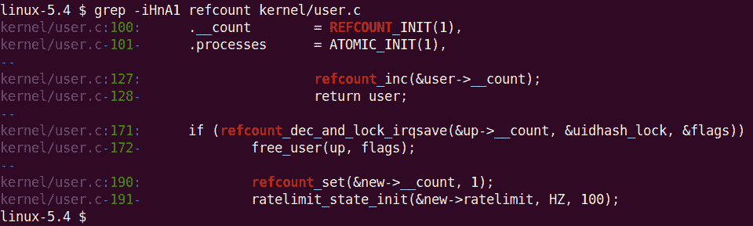

# 第十三章：内核同步 - 第二部分

本章继续讨论上一章的内容，即内核同步和处理内核中的并发。我建议如果你还没有阅读上一章，那么先阅读上一章，然后再继续阅读本章。

在这里，我们将继续学习有关内核同步和处理内核空间并发的广泛主题。与以往一样，这些材料是针对内核和/或设备驱动程序开发人员的。在本章中，我们将涵盖以下内容：

+   使用`atomic_t`和`refcount_t`接口

+   使用 RMW 原子操作符

+   使用读写自旋锁

+   缓存效应和伪共享

+   使用基于 CPU 的无锁编程

+   内核中的锁调试

+   内存屏障 - 介绍

# 使用`atomic_t`和`refcount_t`接口

在我们简单的演示杂项字符设备驱动程序（`miscdrv_rdwr/miscdrv_rdwr.c`）的`open`方法（以及其他地方），我们定义并操作了两个静态全局整数`ga`和`gb`：

```
static int ga, gb = 1;
[...]
ga++; gb--;
```

到目前为止，你应该已经明白了，我们操作这些整数的地方是一个潜在的错误，如果保持原样：它是共享可写数据（在共享状态下），因此*是一个关键部分，因此需要保护免受* *并发访问*。你明白了；因此，我们逐步改进了这一点。在上一章中，了解了这个问题，在我们的`ch12/1_miscdrv_rdwr_mutexlock/1_miscdrv_rdwr_mutexlock.c`程序中，我们首先使用*互斥锁*来保护关键部分。后来，你了解到，使用*自旋锁*来保护非阻塞关键部分，比如这个，从性能上来说会（远远）优于使用互斥锁；因此，在我们的下一个驱动程序`ch12/2_miscdrv_rdwr_spinlock/2_miscdrv_rdwr_spinlock.c`中，我们使用了自旋锁：

```
spin_lock(&lock1);
ga++; gb--;
spin_unlock(&lock1);
```

这很好，但我们仍然可以做得更好！原来在内核中操作全局整数是如此普遍（想想引用或资源计数器的增加和减少等），以至于内核提供了一类操作符，称为**refcount**和**原子整数操作符**或接口；这些接口专门设计用于原子地（安全和不可分割地）操作**只有整数**。

## 更新的`refcount_t`与旧的`atomic_t`接口

在这个主题领域的开始，重要的是要提到这一点：从 4.11 内核开始，有一个名为`refcount_t`的新的和更好的接口集，用于内核空间对象的引用计数。它极大地改进了内核的安全性（通过大大改进的**整数溢出**（**IoF**）和**使用后释放**（**UAF**）保护以及内存排序保证，而旧的`atomic_t`接口缺乏）。`refcount_t`接口，就像 Linux 上使用的其他安全技术一样，源自 The PaX Team 的工作 - [`pax.grsecurity.net/`](https://pax.grsecurity.net/)（它被称为`PAX_REFCOUNT`）。

话虽如此，事实是（截至撰写本文时），旧的`atomic_t`接口在内核核心和驱动程序中仍然被广泛使用（它们正在逐渐转换，旧的`atomic_t`接口正在移动到更新的`refcount_t`模型和 API 集）。因此，在这个主题中，我们同时涵盖了两者，指出差异并提到哪些`refcount_t` API 在适用的地方取代了`atomic_t` API。将`refcount_t`接口视为（旧的）`atomic_t`接口的变体，专门用于引用计数。

`atomic_t`运算符和`refcount_t`运算符之间的一个关键区别在于前者适用于有符号整数，而后者基本上设计为仅适用于`unsigned int`数量；更具体地，这很重要，它仅在严格指定的范围内工作：`1`到**`UINT_MAX-1`**（或在`!CONFIG_REFCOUNT_FULL`时为`[1..INT_MAX]`）。内核有一个名为`CONFIG_REFCOUNT_FULL`的配置选项；如果设置，它将执行（更慢和更彻底的）"完整"引用计数验证。这对安全性有益，但可能会导致性能略有下降（典型的默认设置是将此配置关闭；这是我们的 x86_64 Ubuntu guest 的情况）。

试图将`refcount_t`变量设置为`0`或负数，或者为`[U]INT_MAX`或更高，是不可能的；这对于防止整数下溢/上溢问题以及在许多情况下防止使用后释放类错误非常有益！（好吧，不是不可能；它会通过`WARN()`宏触发（吵闹的）警告。）想想看，`refcount_t`变量只能用于内核对象引用计数，其他用途不行。

因此，这确实是所需的行为；引用计数器必须从正值开始（通常在对象新实例化时为`1`），每当代码获取或获取引用时增加（或添加到），并且每当代码放置或离开对象上的引用时减少（或减去）。您应该仔细操作引用计数器（匹配您的获取和放置），始终保持其值在合法范围内。

相当令人费解的是，至少对于通用的与体系结构无关的 refcount 实现，`refcount_t` API 是在`atomic_t` API 集上内部实现的。例如，`refcount_set()` API - 用于将引用计数的值原子设置为传递的参数 - 在内核中是这样实现的：

```
// include/linux/refcount.h
/**
 * refcount_set - set a refcount's value
 * @r: the refcount
 * @n: value to which the refcount will be set
 */
static inline void refcount_set(refcount_t *r, unsigned int n)
{
    atomic_set(&r->refs, n); 
}
```

它是对`atomic_set()`的一个薄包装（我们很快会介绍）。这里的明显常见问题是：为什么要使用 refcount API？有几个原因：

+   计数器在`REFCOUNT_SATURATED`值（默认设置为`UINT_MAX`）处饱和，并且一旦到达那里就不会再动了。这很关键：它避免了计数器的包装，这可能会导致奇怪和偶发的 UAF 错误；这甚至被认为是一个关键的安全修复（[`kernsec.org/wiki/index.php/Kernel_Protections/refcount_t`](https://kernsec.org/wiki/index.php/Kernel_Protections/refcount_t)）。

+   一些较新的 refcount API 确实提供了**内存排序**保证；特别是`refcount_t` API - 与它们的较旧的`atomic_t`表亲相比 - 它们提供的内存排序保证在[`www.kernel.org/doc/html/latest/core-api/refcount-vs-atomic.html#refcount-t-api-compared-to-atomic-t`](https://www.kernel.org/doc/html/latest/core-api/refcount-vs-atomic.html#refcount-t-api-compared-to-atomic-t)中有明确的文档记录（如果您对底层细节感兴趣，请查看）。

+   还要意识到，与先前提到的通用实现不同，依赖于体系结构的 refcount 实现（如果存在的话；例如，x86 有，而 ARM 没有）可能会有所不同。

*内存排序*到底是什么，它如何影响我们？事实上，这是一个复杂的话题，不幸的是，关于这个话题的内部细节超出了本书的范围。了解基础知识是值得的：我建议您阅读**Linux-Kernel Memory Model**（**LKMM**），其中包括处理器内存排序等内容。我们在这里向您推荐这里的良好文档：*Linux-Kernel Memory Model 解释*（[`github.com/torvalds/linux/blob/master/tools/memory-model/Documentation/explanation.txt`](https://github.com/torvalds/linux/blob/master/tools/memory-model/Documentation/explanation.txt)）。

## 更简单的 atomic_t 和 refcount_t 接口

关于`atomic_t`接口，我们应该提到所有以下`atomic_t`构造仅适用于 32 位整数；当然，现在 64 位整数已经很常见，64 位原子整数操作符也是可用的。它们通常在语义上与它们的 32 位对应物相同，区别在于名称（`atomic_foo()`变成`atomic64_foo()`）。因此，64 位原子整数的主要数据类型称为`atomic64_t`（又名`atomic_long_t`）。另一方面，`refcount_t`接口适用于 32 位和 64 位整数。

下表显示了如何并排声明和初始化`atomic_t`和`refcount_t`变量，以便您可以进行比较和对比：

| | (旧) atomic_t（仅限 32 位） | (新) refcount_t（32 位和 64 位） |
| --- | --- | --- |
| 要包含的头文件 | `<linux/atomic.h>` | `<linux/refcount.h>` |
| 声明和初始化变量 | `static atomic_t gb = ATOMIC_INIT(1);` | `static refcount_t gb = REFCOUNT_INIT(1);` |

表 17.1 - 旧的 atomic_t 与新的 refcount_t 接口用于引用计数：头文件和初始化

内核中可用的所有`atomic_t`和`refcount_t`API 的完整集合非常庞大；为了在本节中保持简单和清晰，我们只列出了一些常用的（原子 32 位）和`refcount_t`接口（它们作用于通用的`atomic_t`或`refcount_t`变量`v`）。

| 操作 | (旧) atomic_t 接口 | (新) refcount_t 接口 [范围：0 到[U]INT_MAX] |
| --- | --- | --- |
| 要包含的头文件 | `<linux/atomic.h>` | `<linux/refcount.h>` |
| 声明和初始化变量 | `static atomic_t v = ATOMIC_INIT(1);` | `static refcount_t v = REFCOUNT_INIT(1);` |
| 原子性地读取`v`的当前值 | `int atomic_read(atomic_t *v)` | `unsigned int refcount_read(const refcount_t *v)` |
| 原子性地将`v`设置为值`i` | `void atomic_set(atomic_t *v, i)` | `void refcount_set(refcount_t *v, int i)` |
| 原子性地将`v`的值增加`1` | `void atomic_inc(atomic_t *v)` | `void refcount_inc(refcount_t *v)` |
| 原子性地将`v`的值减少`1` | `void atomic_dec(atomic_t *v)` | `void refcount_dec(refcount_t *v)` |
| 原子性地将`i`的值添加到`v` | `void atomic_add(i, atomic_t *v)` | `void refcount_add(int i, refcount_t *v)` |
| 原子性地从`v`中减去`i`的值 | `void atomic_sub(i, atomic_t *v)` | `void refcount_sub(int i, refcount_t *v)` |
| 原子性地将`i`的值添加到`v`并返回结果 | `int atomic_add_return(i, atomic_t *v)` | `bool refcount_add_not_zero(int i, refcount_t *v)`（不是精确匹配；将`i`添加到`v`，除非它是`0`。） |
| 原子性地从`v`中减去`i`的值并返回结果 | `int atomic_sub_return(i, atomic_t *v)` | `bool refcount_sub_and_test(int i, refcount_t *r)`（不是精确匹配；从`v`中减去`i`并测试；如果结果引用计数为`0`，则返回`true`，否则返回`false`。） |

表 17.2 - 旧的 atomic_t 与新的 refcount_t 接口用于引用计数：API

您现在已经看到了几个`atomic_t`和`refcount_t`宏和 API；让我们快速检查内核中它们的使用示例。

### 在内核代码库中使用 refcount_t 的示例

在我们关于内核线程的演示内核模块之一（在`ch15/kthread_simple/kthread_simple.c`中），我们创建了一个内核线程，然后使用`get_task_struct()`内联函数来标记内核线程的任务结构正在使用中。正如您现在可以猜到的那样，`get_task_struct()`例程通过`refcount_inc()`API 增加任务结构的引用计数 - 一个名为`usage`的`refcount_t`变量：

```
// include/linux/sched/task.h
static inline struct task_struct *get_task_struct(struct task_struct *t) 
{
    refcount_inc(&t->usage);
    return t;
}
```

相反的例程`put_task_struct()`对引用计数执行后续递减。它内部使用的实际例程`refcount_dec_and_test()`测试新的 refcount 值是否已经下降到`0`；如果是，它返回`true`，如果是这种情况，这意味着任务结构没有被任何人引用。调用`__put_task_struct()`释放它：

```
static inline void put_task_struct(struct task_struct *t) 
{
    if (refcount_dec_and_test(&t->usage))
        __put_task_struct(t);
}
```

内核中另一个使用 refcounting API 的例子可以在`kernel/user.c`中找到（它有助于跟踪用户通过每个用户结构声明的进程、文件等的数量）：



图 13.1 - 屏幕截图显示内核/user.c 中 refcount_t 接口的使用

查阅`refcount_t` API 接口文档（[`www.kernel.org/doc/html/latest/driver-api/basics.html#reference-counting`](https://www.kernel.org/doc/html/latest/driver-api/basics.html#reference-counting)）；`refcount_dec_and_lock_irqsave()`返回`true`，如果能够将引用计数减少到`0`，则在禁用中断的情况下保留自旋锁，否则返回`false`。

作为练习，将我们先前的`ch16/2_miscdrv_rdwr_spinlock/miscdrv_rdwr_spinlock.c`驱动程序代码转换为使用 refcount；它具有整数`ga`和`gb`，在读取或写入时，通过自旋锁进行保护。现在，将它们变成 refcount 变量，并在处理它们时使用适当的`refcount_t` API。

小心！不要让它们的值超出允许的范围，`[0..[U]INT_MAX]`！（请记住，对于完整的 refcount 验证（`CONFIG_REFCOUNT_FULL`打开），范围是`[1..UINT_MAX-1]`，当不是完整验证（默认）时，范围是`[1..INT_MAX]`）。这样做通常会导致调用`WARN()`宏（此演示中的代码在我们的 GitHub 存储库中不包括）：


图 13.2 - （部分）屏幕截图显示当我们错误地尝试将 refcount_t 变量设置为<= 0 时，WARN()宏触发

内核有一个有趣且有用的测试基础设施，称为**Linux 内核转储测试模块**（**LKDTM**）；请参阅`drivers/misc/lkdtm/refcount.c`，了解对 refcount 接口运行的许多测试用例，您可以从中学习...另外，您还可以通过内核的故障注入框架使用 LKDTM 来测试和评估内核对故障情况的反应（请参阅此处的文档：*使用 Linux 内核转储测试模块（LKDTM）引发崩溃* - [`www.kernel.org/doc/html/latest/fault-injection/provoke-crashes.html#provoking-crashes-with-linux-kernel-dump-test-module-lkdtm`](https://www.kernel.org/doc/html/latest/fault-injection/provoke-crashes.html#provoking-crashes-with-linux-kernel-dump-test-module-lkdtm)）。

迄今为止，所有涵盖的原子接口都是针对 32 位整数进行操作的；那么 64 位呢？接下来就是。

## 64 位原子整数操作符

正如本主题开头提到的，我们迄今为止处理的`atomic_t`整数操作符集都是针对传统的 32 位整数进行操作的（这个讨论不适用于较新的`refcount_t`接口；它们无论如何都是针对 32 位和 64 位数量进行操作）。显然，随着 64 位系统成为现在的常态而不是例外，内核社区为 64 位整数提供了一套相同的原子整数操作符。区别如下：

+   将 64 位原子整数声明为`atomic64_t`类型的变量（即`atomic_long_t`）。

+   对于所有操作符，使用`atomic64_`前缀代替`atomic_`前缀。

因此，看下面的例子：

+   使用`ATOMIC64_INIT()`代替`ATOMIC_INIT()`。

+   使用`atomic64_read()`代替`atomic_read()`。

+   使用`atomic64_dec_if_positive()`代替`atomic64_dec_if_positive()`。

最近的 C 和 C++语言标准——C11 和 C++11——提供了一个原子操作库，帮助开发人员更容易地实现原子性，因为它们具有隐式的语言支持；我们不会在这里深入讨论这个方面。可以在这里找到参考资料（C11 也有几乎相同的等价物）：[`en.cppreference.com/w/c/atomic`](https://en.cppreference.com/w/c/atomic)。

请注意，所有这些例程——32 位和 64 位的原子`_operators`——都是**与体系结构无关**的。值得重复的关键一点是，对原子整数进行的任何和所有操作都必须通过将变量声明为`atomic_t`并通过提供的方法来完成。这包括初始化甚至（整数）读取操作。

在内部实现方面，`foo()`原子整数操作通常是一个宏，它变成一个内联函数，然后调用特定于体系结构的`arch_foo()`函数。通常情况下，浏览官方内核文档中的原子操作符总是一个好主意（在内核源树中，它在这里：`Documentation/atomic_t.txt`；访问[`www.kernel.org/doc/Documentation/atomic_t.txt`](https://www.kernel.org/doc/Documentation/atomic_t.txt)）。它将众多的原子整数 API 整齐地分类为不同的集合。值得一提的是，特定于体系结构的*内存排序问题*会影响内部实现。在这里，我们不会深入讨论内部情况。如果感兴趣，请参考官方内核文档网站上的这个页面[`www.kernel.org/doc/html/v4.16/core-api/refcount-vs-atomic.html#refcount-t-api-compared-to-atomic-t`](https://www.kernel.org/doc/html/v4.16/core-api/refcount-vs-atomic.html#refcount-t-api-compared-to-atomic-t)（此外，关于内存排序的细节超出了本书的范围；请查看内核文档[`www.kernel.org/doc/Documentation/memory-barriers.txt`](https://www.kernel.org/doc/Documentation/memory-barriers.txt)）。 

我们没有尝试在这里展示所有的原子和引用计数 API（这真的不是必要的）；官方内核文档对此进行了覆盖：

+   `atomic_t`接口：

+   原子和位掩码操作的语义和行为（[`www.kernel.org/doc/html/v5.4/core-api/atomic_ops.html#semantics-and-behavior-of-atomic-and-bitmask-operations`](https://www.kernel.org/doc/html/v5.4/core-api/atomic_ops.html#semantics-and-behavior-of-atomic-and-bitmask-operations)）

+   API 参考：原子操作（[`www.kernel.org/doc/html/latest/driver-api/basics.html#atomics`](https://www.kernel.org/doc/html/latest/driver-api/basics.html#atomics)）

+   （更新的）内核对象引用计数的`refcount_t`接口：

+   `refcount_t` API 与`atomic_t`进行比较（[`www.kernel.org/doc/html/latest/core-api/refcount-vs-atomic.html#refcount-t-api-compared-to-atomic-t`](https://www.kernel.org/doc/html/latest/core-api/refcount-vs-atomic.html#refcount-t-api-compared-to-atomic-t)）

+   API 参考：引用计数（[`www.kernel.org/doc/html/latest/driver-api/basics.html#reference-counting`](https://www.kernel.org/doc/html/latest/driver-api/basics.html#reference-counting)）

让我们继续讨论在驱动程序中使用的典型构造——**读取修改写入**（**RMW**）。继续阅读！

# 使用 RMW 原子操作符

还有一组更高级的原子操作，称为 RMW API，也是可用的。在其许多用途中（我们将在接下来的部分中列出），是对位进行原子 RMW 操作，换句话说，以原子方式（安全、不可分割地）执行位操作。作为操作设备或外围*寄存器*的设备驱动程序作者，这确实是您将发现自己在使用的东西。

本节材料假定您至少具有基本的访问外围设备（芯片）内存和寄存器的理解；我们在第十三章“使用硬件 I/O 内存”中详细介绍了这一点。请确保在继续之前您已经理解了它。

经常需要对寄存器执行位操作（使用按位`AND＆`和按位`OR |`最常见的运算符），这是为了修改其值，设置和/或清除其中的一些位。问题是，仅仅执行一些 C 操作来查询或设置设备寄存器是不够的。不要忘记并发问题！继续阅读完整的故事。

## RMW 原子操作-操作设备寄存器

首先让我们快速了解一些基础知识：一个字节由 8 位组成，从位`0`，即**最低有效位**（**LSB**），到位`7`，即**最高有效位**（**MSB**）。 （实际上，这在`include/linux/bits.h`中以`BITS_PER_BYTE`宏的形式正式定义，还有一些其他有趣的定义。）

**寄存器**基本上是外围设备中的一小块内存；通常，其大小，即寄存器位宽，为 8、16 或 32 位之一。设备寄存器提供控制、状态和其他信息，并且通常是可编程的。实际上，这在很大程度上是作为驱动程序作者将要做的事情-适当地编程设备寄存器以使设备执行某些操作，并查询它。

为了充实这个讨论，让我们考虑一个假设的设备，它有两个寄存器：一个状态寄存器和一个控制寄存器，每个寄存器宽度为 8 位。（在现实世界中，每个设备或芯片都有一个*数据表*，其中提供了芯片和寄存器级硬件的详细规格；这对于驱动程序作者来说是一个必不可少的文档）。硬件人员通常设计设备，使得几个寄存器按顺序组合在一个更大的内存块中；这称为寄存器银行。通过具有第一个寄存器的基址和每个后续寄存器的偏移量，很容易寻址任何给定的寄存器（在这里，我们不会深入探讨在诸如 Linux 的操作系统的虚拟地址空间中如何将寄存器“映射”）。例如，在头文件中可以这样描述（纯粹是假设的）寄存器：

```
#define REG_BASE        0x5a00
#define STATUS_REG      (REG_BASE+0x0)
#define CTRL_REG        (REG_BASE+0x1)
```

现在，假设为了打开我们的虚构设备，数据表告诉我们可以通过将控制寄存器的第`7`位（MSB）设置为`1`来实现。正如每个驱动程序作者迅速学到的那样，修改寄存器有一个神圣的序列：

1.  **读取**寄存器的当前值到临时变量中。

1.  **修改**变量为所需值。

1.  **将**变量写回寄存器。

这通常被称为**RMW 序列**；因此，很好，我们像这样编写（伪）代码：

```
turn_on_dev()
{
    u8 tmp;

    tmp = ioread8(CTRL_REG);  /* read: current register value into tmp */
    tmp |= 0x80;              /* modify: set bit 7 (MSB) */
    iowrite8(tmp, CTRL_REG);  /* write: new tmp value into register */
}
```

（顺便说一句，Linux 上实际使用的例程**MMIO**-**内存映射 I/O**-是`ioread[8|16|32]()`和`iowrite[8|16|32]()`。）

这里的一个关键点：*这还不够好*；原因是**并发，数据竞争！**想想看：一个寄存器（CPU 和设备寄存器）实际上是一个*全局共享的可写内存位置*；因此，访问它*构成一个临界区*，您必须小心保护免受并发访问！如何做到这一点很容易；我们可以暂时使用自旋锁。将`spin_[un]lock()` API 插入临界区- RMW 序列的前述伪代码是微不足道的。

然而，处理小量数据时实现数据安全的更好方法是：*原子操作符*！然而，Linux 更进一步，为以下两种情况提供了一组原子 API：

+   **原子非 RMW 操作**（我们之前看到的，在*使用 atomic_t 和 refcount_t 接口*部分）

+   **原子 RMW 操作**；这些包括几种类型的运算符，可以归类为几个不同的类别：算术、按位、交换（交换）、引用计数、杂项和屏障

让我们不要重复造轮子；内核文档（[`www.kernel.org/doc/Documentation/atomic_t.txt`](https://www.kernel.org/doc/Documentation/atomic_t.txt)）包含了所有所需的信息。我们将只展示这份文件的相关部分，直接引用自`Documentation/atomic_t.txt`内核代码库：

```
// Documentation/atomic_t.txt
[ ... ]
Non-RMW ops:
  atomic_read(), atomic_set()
  atomic_read_acquire(), atomic_set_release()

RMW atomic operations:

Arithmetic:
  atomic_{add,sub,inc,dec}()
  atomic_{add,sub,inc,dec}_return{,_relaxed,_acquire,_release}()
  atomic_fetch_{add,sub,inc,dec}{,_relaxed,_acquire,_release}()

Bitwise:
  atomic_{and,or,xor,andnot}()
  atomic_fetch_{and,or,xor,andnot}{,_relaxed,_acquire,_release}()

Swap:
  atomic_xchg{,_relaxed,_acquire,_release}()
  atomic_cmpxchg{,_relaxed,_acquire,_release}()
  atomic_try_cmpxchg{,_relaxed,_acquire,_release}()

Reference count (but please see refcount_t):
  atomic_add_unless(), atomic_inc_not_zero()
  atomic_sub_and_test(), atomic_dec_and_test()

Misc:
  atomic_inc_and_test(), atomic_add_negative()
  atomic_dec_unless_positive(), atomic_inc_unless_negative()
[ ... ]
```

好了，现在你知道了这些 RMW（和非 RMW）操作符，让我们来实际操作一下 - 我们将看看如何使用 RMW 操作符进行位操作。

### 使用 RMW 位操作符

在这里，我们将专注于使用 RMW 位操作符；其他操作符的探索留给您（参考提到的内核文档）。因此，让我们再次考虑如何更有效地编写我们的伪代码示例。我们可以使用`set_bit()` API 在任何寄存器或内存项中设置（为`1`）任何给定的位：

```
void set_bit(unsigned int nr, volatile unsigned long *p);
```

这个原子地 - 安全地和不可分割地 - 将`p`的第`nr`位设置为`1`。（事实上，设备寄存器（可能还有设备内存）被映射到内核虚拟地址空间，因此看起来就像是 RAM 位置 - 就像这里的地址`p`一样。这被称为 MMIO，是驱动程序作者映射和处理设备内存的常用方式。再次强调，我们在*Linux 内核编程（第二部分）*中介绍了这一点）

因此，使用 RMW 原子操作符，我们可以安全地实现我们之前（错误地）尝试的事情 - 用一行代码打开我们的（虚构的）设备：

```
set_bit(7, CTRL_REG);
```

以下表总结了常见的 RMW 位原子 API：

| **RMW 位原子 API** | **注释** |
| --- | --- |
| `void set_bit(unsigned int nr, volatile unsigned long *p);` | 原子地设置（设置为`1`）`p`的第`nr`位。 |
| `void clear_bit(unsigned int nr, volatile unsigned long *p)` | 原子地清除（设置为`0`）`p`的第`nr`位。 |
| `void change_bit(unsigned int nr, volatile unsigned long *p)` | 原子地切换`p`的第`nr`位。 |
| *以下 API 返回正在操作的位（nr）的先前值* |  |
| `int test_and_set_bit(unsigned int nr, volatile unsigned long *p)` | 原子地设置`p`的第`nr`位，并返回先前的值（内核 API 文档位于[`www.kernel.org/doc/htmldocs/kernel-api/API-test-and-set-bit.html`](https://www.kernel.org/doc/htmldocs/kernel-api/API-test-and-set-bit.html)）。 |
| `int test_and_clear_bit(unsigned int nr, volatile unsigned long *p)` | 原子地清除`p`的第`nr`位，并返回先前的值。 |
| `int test_and_change_bit(unsigned int nr, volatile unsigned long *p)` | 原子地切换`p`的第`nr`位，并返回先前的值。 |

表 17.3 - 常见的 RMW 位原子 API

注意：这些原子 API 不仅仅是相对于它们运行的 CPU 核心是原子的，现在也是相对于所有/其他核心是原子的。实际上，这意味着如果您在多个 CPU 上并行执行原子操作，也就是说，如果它们（可以）竞争，那么这是一个临界区，您必须用锁（通常是自旋锁）保护它！

尝试一些这些 RMW 原子 API 将有助于建立您对它们的信心；我们将在接下来的部分中这样做。

### 使用位原子操作符 - 一个例子

让我们来看一个快速的内核模块，演示了 Linux 内核的 RMW 原子位操作符的使用（`ch13/1_rmw_atomic_bitops`）。您应该意识到这些操作符可以在*任何内存*上工作，无论是寄存器还是 RAM；在这里，我们在示例 LKM 中的一个简单静态全局变量（名为`mem`）上操作。非常简单；让我们来看一下：

```
// ch13/1_rmw_atomic_bitops/rmw_atomic_bitops.c
[ ... ]
#include <linux/spinlock.h>
#include <linux/atomic.h>
#include <linux/bitops.h>
#include "../../convenient.h"
[ ... ]
static unsigned long mem;
static u64 t1, t2; 
static int MSB = BITS_PER_BYTE - 1;
DEFINE_SPINLOCK(slock);
```

我们包括所需的头文件，并声明和初始化一些全局变量（注意我们的`MSB`变量如何使用`BIT_PER_BYTE`）。我们使用一个简单的宏`SHOW()`，用`printk`显示格式化输出。`init`代码路径是实际工作的地方：

```
[ ... ]
#define SHOW(n, p, msg) do {                                   \
    pr_info("%2d:%27s: mem : %3ld = 0x%02lx\n", n, msg, p, p); \
} while (0)
[ ... ]
static int __init atomic_rmw_bitops_init(void)
{
    int i = 1, ret;

    pr_info("%s: inserted\n", OURMODNAME);
    SHOW(i++, mem, "at init");

    setmsb_optimal(i++);
    setmsb_suboptimal(i++);

    clear_bit(MSB, &mem);
    SHOW(i++, mem, "clear_bit(7,&mem)");

    change_bit(MSB, &mem);
    SHOW(i++, mem, "change_bit(7,&mem)");

    ret = test_and_set_bit(0, &mem);
    SHOW(i++, mem, "test_and_set_bit(0,&mem)");
    pr_info(" ret = %d\n", ret);

    ret = test_and_clear_bit(0, &mem);
    SHOW(i++, mem, "test_and_clear_bit(0,&mem)");
    pr_info(" ret (prev value of bit 0) = %d\n", ret);

    ret = test_and_change_bit(1, &mem);
    SHOW(i++, mem, "test_and_change_bit(1,&mem)");
    pr_info(" ret (prev value of bit 1) = %d\n", ret);

    pr_info("%2d: test_bit(%d-0,&mem):\n", i, MSB);
    for (i = MSB; i >= 0; i--)
        pr_info(" bit %d (0x%02lx) : %s\n", i, BIT(i), test_bit(i, &mem)?"set":"cleared");

    return 0; /* success */
}
```

我们在这里使用的 RMW 原子操作符以粗体字突出显示。这个演示的关键部分是展示使用 RMW 位原子操作符不仅更容易，而且比使用传统方法更快，传统方法是在自旋锁的限制下手动执行 RMW 操作。这是这两种方法的两个函数：

```
/* Set the MSB; optimally, with the set_bit() RMW atomic API */
static inline void setmsb_optimal(int i)
{
    t1 = ktime_get_real_ns();
    set_bit(MSB, &mem);
    t2 = ktime_get_real_ns();
    SHOW(i, mem, "set_bit(7,&mem)");
    SHOW_DELTA(t2, t1);
}
/* Set the MSB; the traditional way, using a spinlock to protect the RMW
 * critical section */
static inline void setmsb_suboptimal(int i)
{
    u8 tmp;

    t1 = ktime_get_real_ns();
    spin_lock(&slock);
 /* critical section: RMW : read, modify, write */
    tmp = mem;
    tmp |= 0x80; // 0x80 = 1000 0000 binary
    mem = tmp;
    spin_unlock(&slock);
    t2 = ktime_get_real_ns();

    SHOW(i, mem, "set msb suboptimal: 7,&mem");
    SHOW_DELTA(t2, t1);
}
```

我们在`init`方法中早期调用这些函数；请注意，我们通过`ktime_get_real_ns()`例程获取时间戳，并通过我们在`convenient.h`头文件中定义的`SHOW_DELTA()`宏显示所花费的时间。好了，这是输出：


图 13.3 - 来自我们的 ch13/1_rmw_atomic_bitops LKM 的输出截图，展示了一些原子 RMW 操作符的工作情况

（我在我的 x86_64 Ubuntu 20.04 虚拟机上运行了这个演示 LKM。）现代方法 - 通过`set_bit()` RMW 原子位 API - 在这个示例运行中只需 415 纳秒就能执行；传统方法慢了大约 265 倍！而且（通过`set_bit()`）的代码也简单得多...

在与原子位操作相关的一点上，以下部分是对内核中用于搜索位掩码的高效 API 的简要介绍 - 这在内核中是一个相当常见的操作。

## 高效搜索位掩码

几种算法依赖于对位掩码进行非常快速的搜索；几个调度算法（例如`SCHED_FIFO`和`SCHED_RR`，你在第十章和第十一章中学到的）通常在内部需要这样做。有效地实现这一点变得很重要（特别是对于操作系统级别的性能敏感的代码路径）。因此，内核提供了一些 API 来扫描给定的位掩码（这些原型可以在`include/asm-generic/bitops/find.h`中找到）：

+   `unsigned long find_first_bit(const unsigned long *addr, unsigned long size)`: 在内存区域中查找第一个设置的位；返回第一个设置的位的位数，否则（没有设置位）返回`@size`。

+   `unsigned long find_first_zero_bit(const unsigned long *addr, unsigned long size)`: 在内存区域中查找第一个清除的位；返回第一个清除的位的位数，否则（没有清除的位）返回`@size`。

+   其他例程包括`find_next_bit()`、`find_next_and_bit()`、`find_last_bit()`。

浏览`<linux/bitops.h>`头文件还会发现其他一些非常有趣的宏，比如`for_each_{clear,set}_bit{_from}`。

# 使用读写自旋锁

想象一下内核（或驱动程序）代码的一部分，在其中正在搜索一个大型的全局双向循环链表（有几千个节点）。现在，由于数据结构是全局的（共享和可写），访问它构成了一个需要保护的关键部分。

假设搜索列表是一个非阻塞操作的场景，你通常会使用自旋锁来保护关键部分。一个天真的方法可能会建议根本不使用锁，因为我们*只是在列表中读取数据*，而不是更新它。但是，当然（正如你已经学到的），即使在共享可写数据上进行读取也必须受到保护，以防止同时发生意外写入，从而导致脏读或断裂读。

因此，我们得出结论，我们需要自旋锁；我们可以想象伪代码可能看起来像这样：

```
spin_lock(mylist_lock);
for (p = &listhead; (p = next_node(p)) != &listhead; ) {
    << ... search for something ... 
         found? break out ... >>
}
spin_unlock(mylist_lock);
```

那么问题是什么？当然是性能！想象一下，在多核系统上，几个线程几乎同时到达这段代码片段；每个线程都会尝试获取自旋锁，但只有一个获胜的线程会获取它，遍历整个列表，然后执行解锁，允许下一个线程继续。换句话说，执行现在是*串行化*的，大大减慢了速度。但是没办法；还是有办法吗？

进入**读写自旋锁**。使用这种锁定构造，要求所有对受保护数据进行读取的线程都会请求**读锁**，而任何需要对列表进行写访问的线程都会请求**独占写锁**。只要没有写锁在起作用，读锁将立即授予任何请求的线程。实际上，这种构造*允许所有读者并发访问数据，也就是说，实际上根本没有真正的锁定*。只要只有读者，这是可以的。一旦有写入线程出现，它就会请求写锁。现在，正常的锁定语义适用：写入者**必须等待**所有读者解锁。一旦发生这种情况，写入者就会获得独占写锁并继续。因此，现在，如果任何读者或写者尝试访问，它们将被迫等待以在写入者解锁时进行自旋。

因此，对于那些数据访问模式中读取非常频繁而写入很少，并且关键部分相当长的情况，读写自旋锁是一种性能增强的锁。

## 读写自旋锁接口

使用自旋锁后，使用读写变体是很简单的；锁数据类型被抽象为`rwlock_t`结构（代替`spinlock_t`），在 API 名称方面，只需用`read`或`write`替换`spin`：

```
#include <linux/rwlock.h>
rwlock_t mylist_lock;
```

读写自旋锁的最基本 API 如下：

```
void read_lock(rwlock_t *lock);
void write_lock(rwlock_t *lock);
```

例如，内核的`tty`层有处理**安全关键**（**SAK**）的代码；SAK 是一种安全功能，是一种防止特洛伊木马式凭据黑客的手段，通过终止与 TTY 设备关联的所有进程。当用户按下 SAK 时（[`www.kernel.org/doc/html/latest/security/sak.html`](https://www.kernel.org/doc/html/latest/security/sak.html)），这将发生（也就是说，当用户按下 SAK，默认映射为`Alt-SysRq-k`序列时），在其代码路径中，它必须迭代所有任务，终止整个会话和任何打开 TTY 设备的线程。为此，它必须以读模式获取名为`tasklist_lock`的读写自旋锁。相关代码如下（截断），其中`tasklist_lock`上的`read_[un]lock()`被突出显示：

```
// drivers/tty/tty_io.c
void __do_SAK(struct tty_struct *tty)
{
    [...]
    read_lock(&tasklist_lock);
    /* Kill the entire session */
    do_each_pid_task(session, PIDTYPE_SID, p) {
        tty_notice(tty, "SAK: killed process %d (%s): by session\n", task_pid_nr(p), p->comm);
        group_send_sig_info(SIGKILL, SEND_SIG_PRIV, p, PIDTYPE_SID);
    } while_each_pid_task(session, PIDTYPE_SID, p);
    [...]
    /* Now kill any processes that happen to have the tty open */
    do_each_thread(g, p) {
        [...]
    } while_each_thread(g, p);
    read_unlock(&tasklist_lock);
```

另外，您可能还记得，在第六章的*遍历任务列表*部分，*内核内部基础知识-进程和线程*中，我们做了类似的事情：我们编写了一个内核模块（`ch6/foreach/thrd_show_all`），它遍历了任务列表中的所有线程，并输出了每个线程的一些详细信息。因此，现在我们了解了并发处理的情况，难道我们不应该使用这个锁-`tasklist_lock`-保护任务列表的读写自旋锁吗？是的，但它没有起作用（`insmod(8)`失败，并显示消息`thrd_showall: Unknown symbol tasklist_lock (err -2)`）。原因当然是，这个`tasklist_lock`变量*没有*被导出，因此我们的内核模块无法使用它。

作为内核代码库中读写自旋锁的另一个例子，`ext4`文件系统在处理其范围状态树时使用了一个。我们不打算在这里深入讨论细节；我们只是简单提一下，即在这里相当频繁地使用了一个读写自旋锁（在 inode 结构中，`inode->i_es_lock`）来保护范围状态树免受数据竞争的影响（`fs/ext4/extents_status.c`）。

内核源树中有许多这样的例子；网络堆栈中的许多地方，包括 ping 代码（`net/ipv4/ping.c`）使用`rwlock_t`，路由表查找，邻居，PPP 代码，文件系统等等。

就像普通自旋锁一样，我们有典型的读写自旋锁 API 的变体：`{read,write}_lock_irq{save}()`与相应的`{read,write}_unlock_irq{restore}()`，以及`{read,write}_{un}lock_bh()`接口。请注意，即使是读取 IRQ 锁也会禁用内核抢占。

## 谨慎一些。

读写自旋锁存在问题。其中一个典型问题是，不幸的是，**写者可能会饿死**，当阻塞在多个读者上时。想想看：假设当前有三个读取线程持有读写锁。现在，一个写者想要锁。它必须等到所有三个读者解锁。但是如果在此期间，更多的读者出现了（这是完全可能的）？这对于写者来说是一场灾难，他现在必须等待更长的时间-实际上是挨饿。（可能需要仔细地检查或分析涉及的代码路径，以弄清楚是否确实是这种情况。）

不仅如此，*缓存效应* - 即缓存乒乓 - 当几个不同 CPU 核心上的读取线程并行读取相同的共享状态时（同时持有读写锁）时，经常会发生；我们实际上在*缓存效应和伪共享*部分中讨论了这一点。内核关于自旋锁的文档（[`www.kernel.org/doc/Documentation/locking/spinlocks.txt`](https://www.kernel.org/doc/Documentation/locking/spinlocks.txt)）也说了类似的话。以下是直接引用的一句话：“*注意！读写锁需要比简单自旋锁更多的原子内存操作。除非读取临界区很长，否则最好只使用自旋锁*。”事实上，内核社区正在努力尽可能地删除读写自旋锁，将它们移动到更高级的无锁技术（例如**RCU-读复制更新**，一种先进的无锁技术）。因此，滥用读写自旋锁是不明智的。

关于自旋锁用法的简洁明了的内核文档（由 Linus Torvalds 本人编写），非常值得一读，可以在这里找到：[`www.kernel.org/doc/Documentation/locking/spinlocks.txt`](https://www.kernel.org/doc/Documentation/locking/spinlocks.txt)。

## 读写信号量

我们之前提到了信号量对象（第十二章，*内核同步-第一部分*，在*信号量和互斥体*部分），将其与互斥体进行对比。在那里，您了解到最好只使用互斥体。在这里，我们指出在内核中，就像存在读写自旋锁一样，也存在*读写信号量*。用例和语义与读写自旋锁类似。相关的宏/API（在`<linux/rwsem.h>`中）是`{down,up}_{read,write}_{trylock,killable}()`。`struct mm_struct`结构中的一个常见示例（它本身在任务结构中）是一个读写信号量：`struct rw_semaphore mmap_sem;`。

结束这个讨论，我们只是简单地提到了内核中的其他几种相关的同步机制。在用户空间应用程序开发中广泛使用的一种同步机制（我们特别考虑的是 Linux 用户空间中的 Pthreads 框架）是**条件变量**（**CV**）。简而言之，它提供了两个或更多线程根据数据项的值或某种特定状态进行同步的能力。在 Linux 内核中，它的等效物被称为*完成机制*。请在内核文档中找到有关其用法的详细信息：[`www.kernel.org/doc/html/latest/scheduler/completion.html#completions-wait-for-completion-barrier-apis`](https://www.kernel.org/doc/html/latest/scheduler/completion.html#completions-wait-for-completion-barrier-apis)。

序列锁主要用于写入情况（相对于读写自旋锁/信号量锁，后者适用于大部分读取场景），在受保护的变量上写入远远超过读取的情况下使用。这并不是一个非常常见的情况；使用序列锁的一个很好的例子是全局变量`jiffies_64`的更新。

对于好奇的人，`jiffies_64`全局变量的更新代码从这里开始：`kernel/time/tick-sched.c:tick_do_update_jiffies64()`。这个函数会判断是否需要更新 jiffies，如果需要，就会调用`do_timer(++ticks);`来实际更新它。同时，`write_seq[un]lock(&jiffies_lock);`API 提供了对大部分写入关键部分的保护。

# 缓存效应和伪共享

现代处理器在内部使用多级并行缓存内存，以便在处理内存时提供非常显著的加速（我们在第八章中简要提到过，*模块作者的内核内存分配 - 第一部分*，*分配 slab 内存*部分）。我们意识到现代 CPU 实际上并不直接读写 RAM；当软件指示要从某个地址开始读取 RAM 的一个字节时，CPU 实际上会从起始地址读取几个字节 - 一整个**缓存行**的字节（通常是 64 字节）填充到所有 CPU 缓存中（比如 L1、L2 和 L3：1、2 和 3 级）。这样，访问顺序内存的下几个元素会得到巨大的加速，因为首先在缓存中检查（首先在 L1 中，然后在 L2 中，然后在 L3 中，缓存命中变得可能）。它更快的原因很简单：访问 CPU 缓存内存通常需要 1 到几个（个位数）纳秒，而访问 RAM 可能需要 50 到 100 纳秒（当然，这取决于所涉及的硬件系统和你愿意花费的金额！）。

软件开发人员利用这种现象做一些事情，比如：

+   将数据结构的重要成员放在一起（希望在一个缓存行内）并放在结构的顶部

+   填充结构成员，使得我们不会超出缓存行（同样，这些点已经在第八章中涵盖，*模块作者的内核内存分配 - 第一部分*，*数据结构 - 一些设计提示*部分）。

然而，存在风险，事情确实会出错。举个例子，考虑这样声明的两个变量：`u16 ax = 1, bx = 2;`（`u16`表示无符号 16 位整数值）。

现在，它们被声明为相邻的，很可能在运行时占用相同的 CPU 缓存行。为了理解问题是什么，让我们举个例子：考虑一个双核系统，每个核有两个 CPU 缓存，L1 和 L2，以及一个公共或统一的 L3 缓存。现在，一个线程*T1*正在处理变量`ax`，另一个线程*T2*正在同时（在另一个 CPU 核心上）处理变量`bx`。所以，想一想：当线程*T1*在 CPU `0`上从主内存（RAM）访问`ax`时，它的 CPU 缓存将被`ax`和`bx`的当前值填充（因为它们在同一个缓存行内！）。同样地，当线程*T2*在 CPU `1`上从 RAM 访问`bx`时，它的 CPU 缓存也会被两个变量的当前值填充。*图 13.4*在概念上描述了这种情况：


图 13.4 - 当线程 T1 和 T2 并行处理两个相邻变量时，每个变量都在不同的缓存行上，CPU 缓存内存的概念描述

到目前为止还好；但是如果*T1*执行一个操作，比如`ax ++`，同时，*T2*执行`bx ++`呢？那又怎样？（顺便说一句，你可能会想：为什么他们不使用锁？有趣的是，这与本讨论无关；因为每个线程正在访问不同的变量，所以没有数据竞争。问题在于它们在同一个 CPU 缓存行中。）

这里的问题是**缓存一致性**。处理器和/或处理器与操作系统（这都是与体系结构相关的东西）将必须保持缓存和 RAM 相互同步或一致。因此，一旦*T1*修改了`ax`，CPU `0`的特定缓存行将被使无效，也就是说，CPU `0`的缓存到 RAM 的刷新将会发生，以更新 RAM 到新值，然后立即，RAM 到 CPU `1`的缓存更新也必须发生，以保持一切一致！

但是缓存行也包含`bx`，正如我们所说，`bx`也被*T2*在 CPU `1`上修改过。因此，大约在同一时间，CPU `1`的缓存行将被刷新到 RAM，带有`bx`的新值，并随后更新到 CPU `0`的缓存中（与此同时，统一的 L3 缓存也将被读取/更新）。正如你可以想象的那样，对这些变量的任何更新都将导致大量的缓存和 RAM 流量；它们会反弹。事实上，这经常被称为**缓存乒乓**！这种效应非常有害，会显著减慢处理速度。这种现象被称为**伪共享**。

识别伪共享是困难的部分；我们必须寻找在共享缓存行上的变量，这些变量被不同的上下文（线程或其他）同时更新。

有趣的是，在内存管理层的一个关键数据结构的早期实现，`include/linux/mmzone.h:struct zone`，遭受了这个非常相同的伪共享问题：两个相邻声明的自旋锁！这个问题已经被解决（我们在第七章中简要讨论了*内存区域*，在*物理 RAM 组织/区域*部分）。

你如何修复这种伪共享？很简单：只需确保变量之间的间距足够远，以确保它们*不共享相同的缓存行*（通常在变量之间插入虚拟填充字节以实现此目的）。在*进一步阅读*部分也可以参考有关伪共享的参考资料。

# 无锁编程与每 CPU 变量

正如你所学到的，当操作共享可写数据时，关键部分必须以某种方式受到保护。锁定可能是最常用的技术来实现这种保护。然而，并非一切都很顺利，因为性能可能会受到影响。要了解原因，考虑一下与锁定的一些类比：一个是漏斗，漏斗的茎部只宽到足以允许一个线程一次通过，不多。另一个是繁忙高速公路上的单个收费站或繁忙十字路口的交通灯。这些类比帮助我们可视化和理解为什么锁定会导致瓶颈，在某些极端情况下会使性能减慢。更糟糕的是，这些不利影响在拥有几百个核心的高端多核系统上可能会被放大；实际上，锁定不会很好地扩展。

另一个问题是*锁争用*；特定锁被获取的频率有多高？在系统中增加锁的数量有助于降低两个或多个进程（或线程）之间对特定锁的争用。这被称为**锁效率**。然而，同样，这并不可扩展到极大程度：过一段时间后，在系统上拥有数千个锁（实际上是 Linux 内核的情况）并不是好消息——产生微妙的死锁条件的机会会显著增加。

因此，存在许多挑战-性能问题、死锁、优先级反转风险、车队（由于锁定顺序，快速代码路径可能需要等待第一个较慢的代码路径，后者也需要锁定），等等。将内核进一步发展为可扩展的方式，需要使用*无锁算法*及其在内核中的实现。这导致了几种创新技术，其中包括每个 CPU（PCP）数据、无锁数据结构（设计为）和 RCU。

在本书中，我们选择详细介绍每个 CPU 作为一种无锁编程技术。关于 RCU（及其相关的设计为无锁数据结构）的详细信息超出了本书的范围。请参考本章的*进一步阅读*部分，了解有关 RCU、其含义以及在 Linux 内核中的使用的几个有用资源。

## 每个 CPU 变量

正如其名称所示，**每个 CPU 变量**通过为系统上的每个（活动的）CPU 保留*一个副本*的变量，即所讨论的数据项。实际上，通过避免在线程之间共享数据，我们摆脱了并发的问题区域，即临界区。使用每个 CPU 数据技术，由于每个 CPU 都引用其自己的数据副本，运行在该处理器上的线程可以在没有竞争的情况下操纵它。 （这大致类似于局部变量；由于局部变量位于每个线程的私有堆栈上，它们不在线程之间共享，因此没有临界区，也不需要锁定。）在这里，锁定的需求也被消除了-使其成为一种*无锁*技术！

因此，想象一下：如果您在一个具有四个活动 CPU 核心的系统上运行，那么该系统上的每个 CPU 变量本质上是一个四个元素的数组：元素`0`表示第一个 CPU 上的数据值，元素`1`表示第二个 CPU 核心上的数据值，依此类推。了解这一点，您会意识到每个 CPU 变量在某种程度上也类似于用户空间 Pthreads **线程本地存储**（**TLS**）实现，其中每个线程自动获取带有`__thread`关键字标记的（TLS）变量的副本。在这里和每个 CPU 变量中，应该很明显：仅对小数据项使用每个 CPU 变量。这是因为数据项会被复制为每个 CPU 核心的一个实例（在具有几百个核心的高端系统上，开销会增加）。我们在内核代码库中提到了一些每个 CPU 使用的示例（在*内核中的每个 CPU 使用*部分）。

现在，在处理每个 CPU 变量时，您必须使用内核提供的辅助方法（宏和 API），而不是尝试直接访问它们（就像我们在 refcount 和 atomic 操作符中看到的那样）。

### 使用每个 CPU

让我们将对每个 CPU 数据的辅助 API 和宏（方法）的讨论分为两部分。首先，您将学习如何分配、初始化和随后释放每个 CPU 数据项。然后，您将学习如何使用（读/写）它。

#### 分配、初始化和释放每个 CPU 变量

每个 CPU 变量大致分为两种类型：静态分配和动态分配。静态分配的每个 CPU 变量是在编译时分配的，通常通过其中一个宏：`DEFINE_PER_CPU`或`DECLARE_PER_CPU`。使用`DEFINE`允许您分配和初始化变量。以下是分配一个整数作为每个 CPU 变量的示例：

```
#include <linux/percpu.h>
DEFINE_PER_CPU(int, pcpa);      // signature: DEFINE_PER_CPU(type, name)
```

现在，在一个具有四个 CPU 核心的系统上，它在初始化时会概念上看起来像这样：


图 13.5 - 在具有四个活动 CPU 的系统上对每个 CPU 数据项的概念表示

实际实现比这复杂得多，当然，可以参考本章的*进一步阅读*部分，了解更多内部实现的内容。

简而言之，使用每个 CPU 变量对于性能敏感的代码路径上的性能增强是有益的，因为：

+   我们避免使用昂贵的、性能破坏的锁。

+   每个 CPU 变量的访问和操作保证保持在一个特定的 CPU 核心上；这消除了昂贵的缓存效应，如缓存乒乓和伪共享（在*缓存效应和伪共享*部分中介绍）。

通过`alloc_percpu()`或`alloc_percpu_gfp()`包装器宏可以动态分配每个 CPU 数据，只需传递要分配为每个 CPU 的对象的数据类型，对于后者，还要传递`gfp`分配标志：

```
alloc_percpu_gfp;
```

通过底层的`__alloc_per_cpu[_gfp]()`例程是通过`EXPORT_SYMBOL_GPL()`导出的（因此只能在 LKM 以 GPL 兼容许可证发布时使用）。

正如您所了解的，资源管理的`devm_*()` API 变体允许您（通常在编写驱动程序时）方便地使用这些例程来分配内存；内核将负责释放它，有助于防止泄漏情况。`devm_alloc_percpu(dev, type)`宏允许您将其用作`__alloc_percpu()`的资源管理版本。

通过前述例程分配的内存必须随后使用`void free_percpu(void __percpu * __pdata)` API 释放。

#### 在每个 CPU 变量上执行 I/O（读取和写入）

当然，一个关键问题是，你究竟如何访问（读取）和更新（写入）每个 CPU 变量？内核提供了几个辅助例程来做到这一点；让我们举一个简单的例子来理解。我们定义一个单个整数每个 CPU 变量，并在以后的某个时间点，我们想要访问并打印它的当前值。你应该意识到，由于每个 CPU，检索到的值将根据代码当前运行的 CPU 核心自动计算；换句话说，如果以下代码在核心`1`上运行，那么实际上将获取`pcpa[1]`的值（实际操作并非完全如此；这只是概念性的）：

```
DEFINE_PER_CPU(int, pcpa);
int val;
[ ... ]
val = get_cpu_var(pcpa);
pr_info("cpu0: pcpa = %+d\n", val);
put_cpu_var(pcpa);
```

`{get,put}_cpu_var()`宏对允许我们安全地检索或修改给定每个 CPU 变量（其参数）的每个 CPU 值。重要的是要理解`get_cpu_var()`和`put_cpu_var()`之间的代码（或等效代码）实际上是一个关键部分-一个原子上下文-在这里内核抢占被禁用，任何类型的阻塞（或休眠）都是不允许的。如果您在这里做任何阻塞（休眠）的操作，那就是内核错误。例如，看看如果您尝试在`get_cpu_var()`/`put_cpu_var()`宏对之间通过`vmalloc()`分配内存会发生什么：

```
void *p;
val = get_cpu_var(pcpa);
p = vmalloc(20000);
pr_info("cpu1: pcpa = %+d\n", val);
put_cpu_var(pcpa);
vfree(p);
[ ... ]

$ sudo insmod <whatever>.ko
$ dmesg
[ ... ]
BUG: sleeping function called from invalid context at mm/slab.h:421
[67641.443225] in_atomic(): 1, irqs_disabled(): 0, pid: 12085, name:
thrd_1/1
[ ... ]
$
```

（顺便说一句，在关键部分内部调用`printk()`（或`pr_<foo>()`）包装器是可以的，因为它们是非阻塞的。）问题在于`vmalloc()` API 可能是一个阻塞的；它可能会休眠（我们在第九章中详细讨论过，*模块作者的内核内存分配-第二部分*，在*理解和使用内核 vmalloc() API*部分），并且在`get_cpu_var()`/`put_cpu_var()`对之间的代码必须是原子的和非阻塞的。

在内部，`get_cpu_var()`宏调用`preempt_disable()`，禁用内核抢占，并且`put_cpu_var()`通过调用`preempt_enable()`来撤消这一操作。正如之前所见（在*CPU 调度*章节中），这可以嵌套，并且内核维护一个`preempt_count`变量来确定内核抢占是否实际上已启用或禁用。

总之，您在使用这些宏时必须仔细匹配`{get,put}_cpu_var()`（例如，如果我们调用`get`宏两次，我们也必须调用相应的`put`宏两次）。

`get_cpu_var()`是一个*lvalue*，因此可以进行操作；例如，要增加每个 CPU 的`pcpa`变量，只需执行以下操作：

```
get_cpu_var(pcpa) ++;
put_cpu_var(pcpa);
```

您还可以（安全地）通过宏检索当前每个 CPU 的值：

```
per_cpu(var, cpu);
```

因此，要为系统上的每个 CPU 核心检索每 CPU 的`pcpa`变量，请使用以下内容：

```
for_each_online_cpu(i) {
 val = per_cpu(pcpa, i);
    pr_info(" cpu %2d: pcpa = %+d\n", i, val);
}
```

FYI，你可以始终使用`smp_processor_id()`宏来确定你当前运行在哪个 CPU 核心上；事实上，这正是我们的`convenient.h:PRINT_CTX()`宏的工作原理。

类似地，内核提供了用于处理需要每 CPU 的变量指针的例程，`{get,put}_cpu_ptr()`和`per_cpu_ptr()`宏。当处理每 CPU 数据结构时，这些宏被广泛使用（而不仅仅是一个简单的整数）；我们安全地检索到我们当前运行的 CPU 的结构的指针，并使用它（`per_cpu_ptr()`）。

### 每 CPU - 一个示例内核模块

通过我们的示例每 CPU 演示内核模块的实际操作会有助于使用这一强大的功能（代码在这里：`ch13/2_percpu`）。在这里，我们定义并使用两个每 CPU 变量：

+   一个静态分配和初始化的每 CPU 整数

+   一个动态分配的每 CPU 数据结构

作为帮助演示每 CPU 变量的有趣方式，让我们这样做：我们将安排我们的演示内核模块产生一对内核线程。让我们称它们为`thrd_0`和`thrd_1`。此外，一旦创建，我们将利用 CPU 掩码（和 API）*使*我们的`thrd_0`内核线程在 CPU `0`上运行，我们的`thrd_1`内核线程在 CPU `1`上运行（因此，它们将被调度在只这些核心上运行；当然，我们必须在至少有两个 CPU 核心的 VM 上测试这段代码）。

以下代码片段说明了我们如何定义和使用每 CPU 变量（我们省略了创建内核线程并设置它们的 CPU 亲和性掩码的代码，因为它们与本章的覆盖范围无关；然而，浏览完整的代码并尝试它是非常重要的！）：

```
// ch13/2_percpu/percpu_var.c
[ ... ]
/*--- The per-cpu variables, an integer 'pcpa' and a data structure --- */
/* This per-cpu integer 'pcpa' is statically allocated and initialized to 0 */
DEFINE_PER_CPU(int, pcpa);

/* This per-cpu structure will be dynamically allocated via alloc_percpu() */
static struct drv_ctx {
    int tx, rx; /* here, as a demo, we just use these two members,
                   ignoring the rest */
    [ ... ]
} *pcp_ctx;
[ ... ]

static int __init init_percpu_var(void)
{
    [ ... ]
    /* Dynamically allocate the per-cpu structures */
    ret = -ENOMEM;
 pcp_ctx = (struct drv_ctx __percpu *) alloc_percpu(struct drv_ctx);
    if (!pcp_ctx) {
        [ ... ]
}
```

为什么不使用资源管理的`devm_alloc_percpu()`呢？是的，在适当的时候你应该使用；然而，在这里，因为我们没有一个方便的`struct device *dev`指针，这是`devm_alloc_percpu()`所需的第一个参数。

顺便说一句，我在编写这个内核模块时遇到了一个问题；为了设置 CPU 掩码（为每个内核线程更改 CPU 亲和性），内核 API 是`sched_setaffinity()`函数，但不幸的是，这个函数对我们来说是*不可导出*的，因此我们无法使用它。因此，我们执行了一个绝对被认为是黑客行为的操作：通过`kallsyms_lookup_name()`（当`CONFIG_KALLSYMS`被定义时起作用）获得不合作函数的地址，然后将其作为函数指针调用。它能工作，但绝对不是编码的正确方式。

我们的设计思想是创建两个内核线程，并让它们分别操作每个 CPU 的数据变量。如果这些是普通的全局变量，这肯定构成了一个临界区，当然我们需要一个锁；但在这里，正因为它们是*每 CPU*，并且我们保证我们的线程在*不同的核心上运行，我们可以同时使用不同的数据更新它们！我们的内核线程工作例程如下；它的参数是线程编号（`0`或`1`）。我们相应地分支并操作每 CPU 数据（我们的第一个内核线程将整数递增三次，而我们的第二个内核线程将其递减三次）：

```
/* Our kernel thread worker routine */
static int thrd_work(void *arg)
{
    int i, val;
    long thrd = (long)arg;
    struct drv_ctx *ctx;
    [ ... ]

    /* Set CPU affinity mask to 'thrd', which is either 0 or 1 */
    if (set_cpuaffinity(thrd) < 0) {
        [ ... ]
    SHOW_CPU_CTX();

    if (thrd == 0) { /* our kthread #0 runs on CPU 0 */
        for (i=0; i<THRD0_ITERS; i++) {
            /* Operate on our perpcu integer */
 val = ++ get_cpu_var(pcpa);
            pr_info(" thrd_0/cpu0: pcpa = %+d\n", val);
            put_cpu_var(pcpa);

            /* Operate on our perpcu structure */
 ctx = get_cpu_ptr(pcp_ctx);
            ctx->tx += 100;
            pr_info(" thrd_0/cpu0: pcp ctx: tx = %5d, rx = %5d\n",
                ctx->tx, ctx->rx);
            put_cpu_ptr(pcp_ctx);
        }
    } else if (thrd == 1) { /* our kthread #1 runs on CPU 1 */
        for (i=0; i<THRD1_ITERS; i++) {
            /* Operate on our perpcu integer */
 val = -- get_cpu_var(pcpa);
            pr_info(" thrd_1/cpu1: pcpa = %+d\n", val);
           put_cpu_var(pcpa);

            /* Operate on our perpcu structure */
            ctx = get_cpu_ptr(pcp_ctx); ctx->rx += 200;
            pr_info(" thrd_1/cpu1: pcp ctx: tx = %5d, rx = %5d\n",
                ctx->tx, ctx->rx); put_cpu_ptr(pcp_ctx);        }}
    disp_vars();
    pr_info("Our kernel thread #%ld exiting now...\n", thrd);
    return 0;
}
```

在运行时的效果是有趣的；请参阅以下内核日志：


图 13.6 - 显示我们的 ch13/2_percpu/percpu_var LKM 运行时内核日志的屏幕截图

在*图 13.6*的最后三行输出中，你可以看到 CPU `0`和 CPU `1`上我们的每 CPU 数据变量的值的摘要（我们通过我们的`disp_vars()`函数显示）。显然，对于每 CPU 的`pcpa`整数（以及`pcp_ctx`数据结构），值是*不同的*，正如预期的那样，*没有显式的锁*。

刚刚演示的内核模块使用`for_each_online_cpu(i)`宏在每个在线 CPU 上显示我们的 per-CPU 变量的值。接下来，如果您的虚拟机有六个 CPU，但希望其中只有两个在运行时处于“活动”状态，该怎么办？有几种安排的方法；其中一种是在启动时将`maxcpus=n`参数传递给 VM 的内核 - 您可以通过查找`/proc/cmdline`来查看是否存在：

`$ cat /proc/cmdline` `BOOT_IMAGE=/boot/vmlinuz-5.4.0-llkd-dbg root=UUID=1c4<...> ro console=ttyS0,115200n8 console=tty0  quiet splash 3 **maxcpus=2**` 还要注意我们正在运行我们自定义的`5.4.0-llkd-dbg`调试内核。

### 内核中的 per-CPU 使用

在 Linux 内核中，per-CPU 变量被广泛使用；一个有趣的案例是在 x86 架构上实现`current`宏（我们在第六章中介绍了使用`current`宏，*内核内部要点-进程和线程*，在*使用 current 访问任务结构*部分）。事实上，`current`经常被查找（和设置）；将其作为 per-CPU 可以确保我们保持其无锁访问！以下是实现它的代码：

```
// arch/x86/include/asm/current.h
[ ... ]
DECLARE_PER_CPU(struct task_struct *, current_task);
static __always_inline struct task_struct *get_current(void)
{
    return this_cpu_read_stable(current_task);
}
#define current get_current()
```

`DECLARE_PER_CPU()`宏声明名为`current_task`的变量为`struct task_struct *`类型的 per-CPU 变量。`get_current()`内联函数在这个 per-CPU 变量上调用`this_cpu_read_stable()`辅助函数，从而在当前运行的 CPU 核心上读取`current`的值（请阅读[`elixir.bootlin.com/linux/v5.4/source/arch/x86/include/asm/percpu.h#L383`](https://elixir.bootlin.com/linux/v5.4/source/arch/x86/include/asm/percpu.h#L383)处的注释以了解这个例程的作用）。好的，这很好，但一个常见问题：这个`current_task`的 per-CPU 变量在哪里更新？想一想：内核必须在*上下文切换*到另一个任务时更改（更新）`current`。

这确实是情况；它确实是在上下文切换代码（`arch/x86/kernel/process_64.c:__switch_to()`；在[`elixir.bootlin.com/linux/v5.4/source/arch/x86/kernel/process_64.c#L504`](https://elixir.bootlin.com/linux/v5.4/source/arch/x86/kernel/process_64.c#L504)处）中更新的。

```
__visible __notrace_funcgraph struct task_struct *
__switch_to(struct task_struct *prev_p, struct task_struct *next_p)
{
    [ ... ]
 this_cpu_write(current_task, next_p);
    [ ... ]
}
```

接下来，通过`__alloc_percpu()`在内核代码库中展示 per-CPU 使用的快速实验：在内核源代码树的根目录中运行`cscope -d`（这假定您已经通过`make cscope`构建了`cscope`索引）。在`cscope`菜单中，在`查找调用此函数的函数：`提示下，键入`__alloc_percpu`。结果如下：


图 13.7 - 显示调用 __alloc_percpu() API 的内核代码的（部分）cscope -d 输出的屏幕截图

当然，这只是内核代码库中 per-CPU 使用的部分列表，仅跟踪通过`__alloc_percpu()`底层 API 的使用。搜索调用`alloc_percpu[_gfp]()`（`__alloc_percpu[_gfp]()`的包装器）的函数会有更多命中。

通过这样，我们完成了关于内核同步技术和 API 的讨论，让我们通过学习一个关键领域来结束本章：在内核代码中调试锁定问题时的工具和技巧！

# 内核中的锁调试

内核有几种方法可以帮助调试与内核级锁定问题有关的困难情况，*死锁*是其中一个主要问题。

以防您还没有，确保您首先从上一章（第十二章）的基本同步、锁定和死锁指南中阅读了基础知识，特别是*独占执行和原子性*和*Linux 内核中的并发问题*部分。

在任何调试场景中，都存在不同的调试发生的时间点，因此可能需要使用不同的工具和技术。广义上说，bug 可能会在软件开发生命周期（SDLC）中的不同时间点被注意到和调试（真的）：

+   开发过程中

+   开发之后但发布之前（测试，质量保证（QA）等）

+   内部发布后

+   发布后，在现场

一个众所周知且不幸的真理：bug 距离开发越远，修复的成本就越高！因此，您确实希望尽早找到并修复它们！

由于本书专注于内核开发，因此我们将在这里专注于一些工具和技术，用于在开发时调试锁定问题。

**重要提示**：我们期望到目前为止，您正在运行一个调试内核，即一个专门为开发/调试目的而配置的内核。性能会受到影响，但没关系 - 我们现在是在捕虫！我们在第五章中介绍了典型调试内核的配置，即*编写您的第一个内核模块 - LKMs 第二部分*，在*配置调试内核*部分，甚至提供了一个用于调试的示例内核配置文件：`ch5/kconfigs/sample_kconfig_llkd_dbg.config`。实际上，下面还涵盖了为锁调试配置调试内核的具体内容。

## 为锁调试配置调试内核

由于锁调试的相关性和重要性，我们将快速浏览一下*Linux 内核补丁提交清单*文档（[`www.kernel.org/doc/html/v5.4/process/submit-checklist.html`](https://www.kernel.org/doc/html/v5.4/process/submit-checklist.html)），该文档与我们在这里讨论的内容最相关，即启用调试内核（特别是用于锁调试）：

```
// https://www.kernel.org/doc/html/v5.4/process/submit-checklist.html
[...]
12\. Has been tested with CONFIG_PREEMPT, CONFIG_DEBUG_PREEMPT, CONFIG_DEBUG_SLAB, CONFIG_DEBUG_PAGEALLOC, CONFIG_DEBUG_MUTEXES, CONFIG_DEBUG_SPINLOCK, CONFIG_DEBUG_ATOMIC_SLEEP, CONFIG_PROVE_RCU and CONFIG_DEBUG_OBJECTS_RCU_HEAD all simultaneously enabled. 
13\. Has been build- and runtime tested with and without CONFIG_SMP and CONFIG_PREEMPT.

16\. All codepaths have been exercised with all lockdep features enabled.
[ ... ]
```

尽管本书未涉及，但我不能不提到一个非常强大的动态内存错误检测器，称为**内核地址 SANitizer**（**KASAN**）。简而言之，它使用基于编译时的仪器化动态分析来捕获常见的与内存相关的错误（它适用于 GCC 和 Clang）。**ASan**（**地址检测器**）由 Google 工程师贡献，用于监视和检测用户空间应用程序中的内存问题（在*Linux 的系统编程实践*书中有详细介绍，并与 valgrind 进行了比较）。内核等效物 KASAN 自 4.0 内核以来已经适用于 x86_64 和 AArch64（从 4.4 Linux 开始）。有关详细信息（如启用和使用它），可以在内核文档中找到（[`www.kernel.org/doc/html/v5.4/dev-tools/kasan.html#the-kernel-address-sanitizer-kasan`](https://www.kernel.org/doc/html/v5.4/dev-tools/kasan.html#the-kernel-address-sanitizer-kasan)）；我强烈建议您在调试内核中启用它。

正如我们在第二章中看到的，*从源代码构建 5.x Linux 内核 - 第一部分*，我们可以根据我们的要求配置我们的 Linux 内核。在这里（在 5.4.0 内核源代码树的根目录中），我们执行`make menuconfig`并导航到`内核调试/锁调试（自旋锁，互斥锁等...）`菜单（见我们的 x86_64 Ubuntu 20.04 LTS 客户 VM 上的*图 13.8*）：


图 13.8 - 截断的内核调试/锁调试（自旋锁，互斥锁等...）菜单的屏幕截图，显示了我们调试内核所需的项目已启用

*图 13.8*是一个（截断的）屏幕截图，显示了我们调试内核所需的`<内核调试>锁调试（自旋锁，互斥锁等...）`菜单中的项目已启用。

与交互式地逐个浏览每个菜单项并选择`<帮助>`按钮以查看其内容不同，获得相同的帮助信息的一个更简单的方法是窥视相关的 Kconfig 文件（描述菜单）。在这里，它是`lib/Kconfig.debug`，因为所有与调试相关的菜单都在那里。对于我们的特定情况，搜索`menu "锁调试（自旋锁，互斥锁等...)"`字符串，其中`锁调试`部分开始（见下表）。

以下表总结了每个内核锁调试配置选项帮助调试的内容（我们没有显示所有选项，对于其中一些选项，直接引用了`lib/Kconfig.debug`文件中的内容）：

| **锁调试菜单标题** | **它的作用** |
| --- | --- |
| 锁调试：证明锁正确性（`CONFIG_PROVE_LOCKING`） | 这是`lockdep`内核选项-打开它以获得持续的锁正确性证明。任何与锁相关的死锁*甚至在实际发生之前就会报告*；非常有用！（稍后详细解释。） |
| 锁使用统计（`CONFIG_LOCK_STAT`） | 跟踪锁争用点（稍后详细解释）。 |
| RT 互斥锁调试，死锁检测（`CONFIG_DEBUG_RT_MUTEXES`） | “*这允许自动检测和报告 rt 互斥锁语义违规和 rt 互斥锁相关的死锁（锁死）*。” |
| 自旋锁和`rw-lock`调试：基本检查（`CONFIG_DEBUG_SPINLOCK`） | 打开此选项（以及`CONFIG_SMP`）有助于捕捉缺少自旋锁初始化和其他常见自旋锁错误。 |
| 互斥锁调试：基本检查（`CONFIG_DEBUG_MUTEXES`） | “*此功能允许检测和报告互斥锁语义违规*。” |
| RW 信号量调试：基本检查（`CONFIG_DEBUG_RWSEMS`） | 允许检测和报告不匹配的 RW 信号量锁定和解锁。 |
| 锁调试：检测错误释放的活锁（`CONFIG_DEBUG_LOCK_ALLOC`） | “*此功能将检查内核是否通过任何内存释放例程（`kfree()，kmem_cache_free()，free_pages()，vfree()`等）错误释放任何持有的锁（自旋锁，rwlock，互斥锁或 rwsem），是否通过`spin_lock_init()/mutex_init()`等错误重新初始化任何活锁，或者是否在任务退出期间持有任何锁*。” |
| 原子段内睡眠检查（`CONFIG_DEBUG_ATOMIC_SLEEP`） | “*如果在这里选择 Y，各种可能会睡眠的例程在自旋锁被持有时，rcu 读取侧临界段内，禁用抢占段内，中断内等情况下会变得非常嘈杂...*” |
| 锁 API 启动时自测试（`CONFIG_DEBUG_LOCKING_API_SELFTESTS`） | “*如果您希望内核在启动时运行简短的自测试，请在此处选择 Y。自测试检查调试机制是否检测到常见类型的锁错误。（如果禁用锁调试，则当然不会检测到这些错误。）以下锁 API 已覆盖：自旋锁，读写锁，互斥锁和 rwsem*。” |
| 锁的折磨测试（`CONFIG_LOCK_TORTURE_TEST`） | “*此选项提供一个内核模块，对内核锁原语进行折磨测试。如果需要，可以在运行的内核上构建内核模块进行测试。”（可以内联构建为'`Y`'，也可以作为模块外部构建为'*`M`*')*。” |

表 17.4-典型的内核锁调试配置选项及其含义

如先前建议的，在开发和测试过程中使用调试内核时打开所有或大多数这些锁调试选项是一个好主意。当然，预期的是这样做可能会显著减慢执行速度（并使用更多内存）；就像生活中一样，这是一个你必须决定的权衡：你在检测常见的锁问题、错误和死锁方面取得了进展，但代价是速度。这是一个你应该更愿意做出的权衡，特别是在开发（或重构）代码时。 

## 锁验证器 lockdep - 及早捕捉锁定问题

Linux 内核具有一个非常有用的功能，可以被内核开发人员利用：运行时锁正确性或锁依赖验证器；简而言之，lockdep。基本思想是：每当内核中发生任何锁定活动时，即任何内核级别锁的获取或释放，或涉及多个锁的任何锁定序列时，lockdep 运行时就会发挥作用。

这是被跟踪或映射的（有关性能影响及其如何被缓解的更多信息，请参见下一段）。通过应用正确锁定的众所周知的规则（您在前一章的*锁定指南和死锁*部分中已经得到了一些提示），lockdep 然后对所做的正确性的有效性做出结论。

其美妙之处在于 lockdep 实现了 100%的数学证明（或闭合），即锁序列是正确的还是不正确的。以下是内核文档对该主题的直接引用（[`www.kernel.org/doc/html/v5.4/locking/lockdep-design.html`](https://www.kernel.org/doc/html/v5.4/locking/lockdep-design.html)）：

“验证器在数学上实现了完美的‘闭合’（锁定正确性的证明），因为对于内核生命周期中至少发生一次的每个简单的独立单任务锁定序列，验证器都以 100%的确定性证明了这些锁定序列的任何组合和时序都不会导致任何类别的锁相关死锁。”

此外，lockdep 通过发出`WARN*()`宏来警告您任何违反以下锁定错误类别的情况：死锁/锁反转场景、循环锁依赖关系以及硬中断/软中断安全/不安全的锁定错误。这些信息是宝贵的；使用 lockdep 验证您的代码可以通过及早捕捉锁定问题来节省数百个被浪费的生产时间。 （顺便说一句，lockdep 跟踪所有锁及其锁定序列或“锁链”；这些可以通过`/proc/lockdep_chains`查看。）

关于*性能缓解*的一点说明：您可能会想象，随着成千上万甚至更多的锁实例在周围漂浮，验证每个单个锁序列将会非常慢（实际上，事实证明这是一个 O(N²)算法时间复杂度的任务！）。这根本行不通；因此，lockdep 通过验证任何锁定场景（比如，在某个代码路径上，先获取锁 A，然后获取锁 B - 这被称为*锁序列*或*锁链*）**仅一次**，即第一次发生时。 （它通过维护每个锁链的 64 位哈希来知道这一点。）

原始用户空间方法：一种非常原始的尝试检测死锁的方法是通过用户空间，只需使用 GNU `ps(1)`；执行`ps -LA -o state,pid,cmd | grep "^D"`会打印出处于`D`（不可中断睡眠（TASK_UNINTERRUPTIBLE））状态的任何线程。这可能是由于死锁，但也可能不是；如果它持续了很长时间，那么它很可能是死锁。试一试！当然，lockdep 是一个更优越的解决方案。（请注意，这仅适用于 GNU `ps`，而不适用于轻量级的 ps，如`busybox ps`。）

其他有用的用户空间工具是`strace(1)`和`ltrace(1)` - 它们分别提供了由进程（或线程）发出的每个系统和库调用的详细跟踪；您可能能够捕捉到挂起的进程/线程并查看它被卡在哪里（使用`strace -p <PID>`对挂起的进程可能特别有用）。

您需要明确的另一点是：`lockdep`*将*发出关于（数学上）不正确的锁定的警告*即使在运行时实际上没有发生死锁*！`lockdep`提供了证据表明确实存在可能在将来某个时刻导致错误（死锁、不安全的锁定等）的问题；它通常是完全正确的；认真对待并修复问题。（再说一遍，通常情况下，软件世界中没有任何东西是 100%正确的 100%的时间：如果 bug 潜入了`lockdep`代码本身怎么办？甚至有一个`CONFIG_DEBUG_LOCKDEP`配置选项。最重要的是，我们作为人类开发人员必须仔细评估情况，检查错误的积极性。）

接下来，`lockdep`在*锁类*上工作；这只是一个“逻辑”锁，而不是该锁的“物理”实例。例如，内核的打开文件数据结构`struct file`有两个锁-互斥锁和自旋锁-`lockdep`将每个锁视为一个锁类。即使在运行时内存中存在数千个`struct file`实例，`lockdep`也只会跟踪它作为一个类。有关`lockdep`内部设计的更多详细信息，我们建议您参考官方内核文档（[`www.kernel.org/doc/html/v5.4/locking/lockdep-design.html`](https://www.kernel.org/doc/html/v5.4/locking/lockdep-design.html)）。

## 示例-使用 lockdep 捕获死锁 bug

在这里，我们假设您现在已经构建并正在运行一个启用了`lockdep`的调试内核（如在“为锁调试配置调试内核”部分中详细描述）。验证它确实已启用：

```
$ uname -r
5.4.0-llkd-dbg
$ grep PROVE_LOCKING /boot/config-5.4.0-llkd-dbg
CONFIG_PROVE_LOCKING=y
$
```

好的！现在，让我们亲自体验一些死锁，看看`lockdep`将如何帮助您捕获它们。继续阅读！

### 示例 1-使用 lockdep 捕获自死锁 bug

作为第一个示例，让我们回到我们的一个内核模块第六章中的*内核内部要点-进程和线程*，在*遍历任务列表*部分，这里：`ch6/foreach/thrd_showall/thrd_showall.c`。在这里，我们循环遍历每个线程，从其任务结构中打印一些细节；关于这一点，这里有一个代码片段，我们在其中获取线程的名称（回想一下，它在任务结构的一个成员中称为`comm`）：

```
// ch6/foreach/thrd_showall/thrd_showall.c
static int showthrds(void)
{
    struct task_struct *g = NULL, *t = NULL; /* 'g' : process ptr; 't': thread ptr */
    [ ... ]
    do_each_thread(g, t) { /* 'g' : process ptr; 't': thread ptr */
        task_lock(t);
        [ ... ]
        if (!g->mm) {    // kernel thread
            snprintf(tmp, TMPMAX-1, " [%16s]", t->comm);
        } else {
            snprintf(tmp, TMPMAX-1, " %16s ", t->comm);
        }
        snprintf(buf, BUFMAX-1, "%s%s", buf, tmp);
        [ ... ]
```

这个方法有效，但似乎有更好的方法：而不是直接使用`t->comm`查找线程的名称（就像我们在这里做的那样），内核提供了`{get,set}_task_comm()`辅助例程来获取和设置任务的名称。因此，我们重写代码以使用`get_task_comm()`辅助宏；它的第一个参数是放置名称的缓冲区（预期您已为其分配了内存），第二个参数是要查询其名称的线程的任务结构的指针（以下代码片段来自这里：`ch13/3_lockdep/buggy_thrdshow_eg/thrd_showall_buggy.c`）：

```
// ch13/3_lockdep/buggy_lockdep/thrd_showall_buggy.c
static int showthrds_buggy(void)
{
    struct task_struct *g, *t; /* 'g' : process ptr; 't': thread ptr */
    [ ... ]
    char buf[BUFMAX], tmp[TMPMAX], tasknm[TASK_COMM_LEN];
    [ ... ]
    do_each_thread(g, t) { /* 'g' : process ptr; 't': thread ptr */
        task_lock(t);
        [ ... ]
        get_task_comm(tasknm, t);
        if (!g->mm) // kernel thread
            snprintf(tmp, sizeof(tasknm)+3, " [%16s]", tasknm);
        else
            snprintf(tmp, sizeof(tasknm)+3, " %16s ", tasknm);
        [ ... ]
```

当编译并插入到我们的测试系统（一个 VM，谢天谢地）的内核中时，它可能会变得奇怪，甚至只是简单地挂起！（当我这样做时，我能够在系统完全无响应之前通过`dmesg(1)`检索内核日志。）

如果你的系统在插入这个 LKM 时就挂起了怎么办？嗯，这就是内核调试的困难所在！你可以尝试的一件事（在我在 x86_64 Fedora 29 VM 上尝试这个例子时对我有效）是重新启动挂起的 VM，并使用`journalctl --since="1 hour ago"`命令利用 systemd 强大的`journalctl(1)`工具查看内核日志；你应该能够看到`lockdep`的 printks。不幸的是，不能保证内核日志的关键部分会被保存到磁盘（在挂起时）以便`journalctl`能够检索。这就是为什么使用内核的**kdump**功能 - 然后使用`crash(8)`对内核转储映像文件进行事后分析 - 可以成为救命稻草的原因（参见本章的*进一步阅读*部分中有关使用`kdump`和`crash`的资源）。

看一下内核日志，很明显：`lockdep`捕获到了（自身）死锁（我们在截图中展示了输出的相关部分）：


图 13.9 - （部分）截图显示我们有 bug 的模块加载后的内核日志；lockdep 捕获到了自身死锁！

虽然后面还有更多的细节（包括`insmod(8)`的内核栈的堆栈回溯 - 因为它是进程上下文，这种情况下的寄存器值等），但我们在前面的图中看到的足以推断出发生了什么。显然，`lockdep`告诉我们`insmod/2367 正在尝试获取锁：`，然后是`但任务已经持有锁：`。接下来（仔细看*图 13.9*），`insmod`持有的锁是`(p->alloc_lock)`（暂时忽略后面的内容；我们马上会解释），实际尝试获取它的例程（在`at:`后面显示）是`__get_task_comm+0x28/0x50`。现在我们有了进展：让我们弄清楚我们调用`get_task_comm()`时到底发生了什么；我们发现它是一个宏，是实际工作例程`__get_task_comm()`的包装器。它的代码如下：

```
// fs/exec.c
char *__get_task_comm(char *buf, size_t buf_size, struct task_struct *tsk)
{
    task_lock(tsk);
    strncpy(buf, tsk->comm, buf_size);
    task_unlock(tsk);
    return buf; 
}
EXPORT_SYMBOL_GPL(__get_task_comm);
```

哦，问题就在这里：`__get_task_comm()`函数*试图重新获取我们已经持有的同一个锁，导致（自身）死锁*！我们在哪里获取它的？回想一下，在我们（有 bug 的）内核模块进入循环后的第一行代码是我们调用`task_lock(t)`，然后几行代码后，我们调用`get_task_comm()`，它在内部试图重新获取同一个锁：结果就是*自身死锁*：

```
do_each_thread(g, t) {   /* 'g' : process ptr; 't': thread ptr */
    task_lock(t);
    [ ... ]
    get_task_comm(tasknm, t);
```

此外，找到这个特定锁是很容易的；查找`task_lock()`例程的代码：

```
// include/linux/sched/task.h */
static inline void task_lock(struct task_struct *p)
{
    spin_lock(&p->alloc_lock);
}
```

所以，现在一切都说得通了；这是`task`结构中名为`alloc_lock`的自旋锁，就像`lockdep`告诉我们的那样。

`lockdep`的报告中有一些令人困惑的标记。看下面的这些行：

```
[ 1021.449384] insmod/2367 is trying to acquire lock:
[ 1021.451361] ffff88805de73f08 (&(&p->alloc_lock)->rlock){+.+.}, at: __get_task_comm+0x28/0x50
[ 1021.453676]
               but task is already holding lock:
[ 1021.457365] ffff88805de73f08 (&(&p->alloc_lock)->rlock){+.+.}, at: showthrds_buggy+0x13e/0x6d1 [thrd_showall_buggy]
```

忽略时间戳，前面代码块中第二行最左边的数字是用于标识特定锁序列的 64 位轻量级哈希值。请注意，它与下一行中的哈希值完全相同；因此，我们知道它是同一个锁！`{+.+.}`是 lockdep 对此锁获取状态的表示（含义：`+`表示在启用 IRQ 的情况下获取锁，`.`表示在禁用 IRQ 且不在 IRQ 上下文中获取锁，等等）。这些在内核文档中有解释（[`www.kernel.org/doc/Documentation/locking/lockdep-design.txt`](https://www.kernel.org/doc/Documentation/locking/lockdep-design.txt)）；我们就到此为止。

Steve Rostedt 在 2011 年的 Linux Plumber's Conference 上做了一次关于解释`lockdep`输出的详细演示；相关幻灯片很有启发性，探讨了简单和复杂的死锁场景以及`lockdep`如何检测它们：

*Lockdep: How to read its cryptic output* ([`blog.linuxplumbersconf.org/2011/ocw/sessions/153`](https://blog.linuxplumbersconf.org/2011/ocw/sessions/153)).

#### 修复它

既然我们理解了这个问题，我们该如何解决呢？看到 lockdep 的报告（*图 13.9*）并解释它，很简单：（如前所述）由于任务结构自旋锁`alloc_lock`在`do-while`循环开始时已经被获取（通过`task_lock(t)`），确保在调用`get_task_comm()`例程之前（它在内部获取并释放相同的锁）解锁它，然后执行`get_task_comm()`，然后再次锁定它。

下面的屏幕截图（*图 13.10*）显示了旧版有 bug 的代码（`ch13/3_lockdep/buggy_thrdshow_eg/thrd_showall_buggy.c`）和我们代码的新修复版本（`ch13/3_lockdep/fixed_lockdep/thrd_showall_fixed.c`）之间的差异（通过`diff(1)`实用程序）：


图 13.10 - （部分）屏幕截图显示了我们演示 thrdshow LKM 的有 bug 和修复版本之间的关键部分

太好了，下面是另一个例子 - 捕获 AB-BA 死锁！

### 例 2 - 使用 lockdep 捕获 AB-BA 死锁

作为另一个例子，让我们看看一个（演示）内核模块，它故意创建了一个**循环依赖**，最终会导致死锁。代码在这里：`ch13/3_lockdep/deadlock_eg_AB-BA`。我们基于我们之前的一个模块（`ch13/2_percpu`）创建了这个模块；正如您可能记得的那样，我们创建了两个内核线程，并确保（通过使用一个被篡改的`sched_setaffinity()`）每个内核线程在唯一的 CPU 核心上运行（第一个内核线程在 CPU 核心`0`上运行，第二个在核心`1`上运行）。

这样，我们就有了并发性。现在，在线程内部，我们让它们使用两个自旋锁`lockA`和`lockB`。了解到我们有一个具有两个或更多锁的进程上下文，我们记录并遵循锁定顺序规则：*首先获取 lockA，然后获取 lockB*。太好了，所以，一种不应该这样做的方式是：

```
kthread 0 on CPU #0                kthread 1 on CPU #1
  Take lockA                           Take lockB
     <perform work>                       <perform work>
                                          (Try and) take lockA
                                          < ... spins forever :
                                                DEADLOCK ... >
(Try and) take lockB
< ... spins forever : 
      DEADLOCK ... >
```

当然，这是经典的 AB-BA 死锁！因为程序（实际上是内核线程 1）忽略了锁定顺序规则（当`lock_ooo`模块参数设置为`1`时），它发生了死锁。这里是相关的代码（我们没有在这里展示整个程序；请克隆本书的 GitHub 存储库[`github.com/PacktPublishing/Linux-Kernel-Programming`](https://github.com/PacktPublishing/Linux-Kernel-Programming)并自行尝试）：

```
// ch13/3_lockdep/deadlock_eg_AB-BA/deadlock_eg_AB-BA.c
[ ... ]
/* Our kernel thread worker routine */
static int thrd_work(void *arg)
{
    [ ... ]
   if (thrd == 0) { /* our kthread #0 runs on CPU 0 */
        pr_info(" Thread #%ld: locking: we do:"
            " lockA --> lockB\n", thrd);
        for (i = 0; i < THRD0_ITERS; i ++) {
            /* In this thread, perform the locking per the lock ordering 'rule';
 * first take lockA, then lockB */
            pr_info(" iteration #%d on cpu #%ld\n", i, thrd);
            spin_lock(&lockA);
            DELAY_LOOP('A', 3); 
            spin_lock(&lockB);
            DELAY_LOOP('B', 2); 
            spin_unlock(&lockB);
            spin_unlock(&lockA);
        }
```

我们的内核线程`0`正确执行了，遵循了锁定顺序规则；与之前的代码相关的我们的内核线程`1`的代码如下：

```
   [ ... ]
   } else if (thrd == 1) { /* our kthread #1 runs on CPU 1 */
        for (i = 0; i < THRD1_ITERS; i ++) {
            /* In this thread, if the parameter lock_ooo is 1, *violate* the
 * lock ordering 'rule'; first (attempt to) take lockB, then lockA */
            pr_info(" iteration #%d on cpu #%ld\n", i, thrd);
            if (lock_ooo == 1) {        // violate the rule, naughty boy!
                pr_info(" Thread #%ld: locking: we do: lockB --> lockA\n",thrd);
                spin_lock(&lockB);
                DELAY_LOOP('B', 2);
                spin_lock(&lockA);
                DELAY_LOOP('A', 3);
                spin_unlock(&lockA);
                spin_unlock(&lockB);
            } else if (lock_ooo == 0) { // follow the rule, good boy!
                pr_info(" Thread #%ld: locking: we do: lockA --> lockB\n",thrd);
                spin_lock(&lockA);
                DELAY_LOOP('B', 2);
                spin_lock(&lockB);
                DELAY_LOOP('A', 3);
                spin_unlock(&lockB);
                spin_unlock(&lockA);
            }
    [ ... ]
```

使用`lock_ooo`内核模块参数设置为`0`（默认值）构建并运行它；我们发现，遵守锁定顺序规则，一切正常：

```
$ sudo insmod ./deadlock_eg_AB-BA.ko
$ dmesg
[10234.023746] deadlock_eg_AB-BA: inserted (param: lock_ooo=0)
[10234.026753] thrd_work():115: *** thread PID 6666 on cpu 0 now ***
[10234.028299] Thread #0: locking: we do: lockA --> lockB
[10234.029606] iteration #0 on cpu #0
[10234.030765] A
[10234.030766] A
[10234.030847] thrd_work():115: *** thread PID 6667 on cpu 1 now ***
[10234.031861] A
[10234.031916] B
[10234.032850] iteration #0 on cpu #1
[10234.032853] Thread #1: locking: we do: lockA --> lockB
[10234.038831] B
[10234.038836] Our kernel thread #0 exiting now...
[10234.038869] B
[10234.038870] B
[10234.042347] A
[10234.043363] A
[10234.044490] A
[10234.045551] Our kernel thread #1 exiting now...
$ 
```

现在，我们将其运行，将`lock_ooo`内核模块参数设置为`1`，并发现，正如预期的那样，系统被锁定！我们违反了锁定顺序规则，因此系统陷入了死锁！这次，重新启动 VM 并执行`journalctl --since="10 min ago"`得到了 lockdep 的报告：

```
======================================================
WARNING: possible circular locking dependency detected
5.4.0-llkd-dbg #2 Tainted: G OE
------------------------------------------------------
thrd_0/0/6734 is trying to acquire lock:
ffffffffc0fb2518 (lockB){+.+.}, at: thrd_work.cold+0x188/0x24c [deadlock_eg_AB_BA]

but task is already holding lock:
ffffffffc0fb2598 (lockA){+.+.}, at: thrd_work.cold+0x149/0x24c [deadlock_eg_AB_BA]

which lock already depends on the new lock.
[ ... ]
other info that might help us debug this:

 Possible unsafe locking scenario:

       CPU0                    CPU1
       ----                    ----
  lock(lockA);
                               lock(lockB);
                               lock(lockA);
  lock(lockB);

 *** DEADLOCK ***

[ ... lots more output follows ... ]
```

`lockdep`报告非常惊人。在句子`可能存在不安全的锁定场景：`之后的行中，它几乎精确地显示了运行时发生的情况 - `CPU1 : lock(lockB); --> lock(lockA);`的**out-of-order**（**ooo**）锁定序列！由于`lockA`已经被 CPU 0 上的内核线程获取，CPU 1 上的内核线程永远旋转 - 这是 AB-BA 死锁的根本原因。

此外，非常有趣的是，模块插入后不久（`lock_ooo`设置为`1`），内核还检测到了软锁定 bug。 printk 被定向到我们的控制台，日志级别为`KERN_EMERG`，这使我们能够看到这一点，尽管系统似乎已经挂起。它甚至显示了问题的起源地的相关内核线程（同样，这个输出是在我的 x86_64 Ubuntu 20.04 LTS VM 上运行自定义 5.4.0 调试内核）：

```
Message from syslogd@seawolf-VirtualBox at Dec 24 11:01:51 ...
kernel:[10939.279524] watchdog: BUG: soft lockup - CPU#0 stuck for 22s! [thrd_0/0:6734]
Message from syslogd@seawolf-VirtualBox at Dec 24 11:01:51 ...
kernel:[10939.287525] watchdog: BUG: soft lockup - CPU#1 stuck for 23s! [thrd_1/1:6735]
```

（顺便说一句，检测到这一点并喷出前面的消息的代码在这里：`kernel/watchdog.c:watchdog_timer_fn()`）。

另一个注意事项：`/proc/lockdep_chains`输出还“证明”了采用了（或存在）不正确的锁定顺序：

```
$ sudo cat /proc/lockdep_chains
[ ... ]
irq_context: 0
[000000005c6094ba] lockA
[000000009746aa1e] lockB
[ ... ]
irq_context: 0
[000000009746aa1e] lockB
[000000005c6094ba] lockA
```

还要记住，`lockdep`只报告一次 - 第一次 - 违反任何内核锁定规则。

## 锁依赖 - 注释和问题

让我们用一些关于强大的`lockdep`基础设施的要点来总结一下。

### 锁依赖注释

在用户空间，您可能熟悉使用非常有用的`assert()`宏。在那里，您断言一个布尔表达式，一个条件（例如，`assert(p == 5);`）。如果断言在运行时为真，则什么也不会发生，执行会继续；当断言为假时，进程将被中止，并且一个嘈杂的`printf()`会指示哪个断言以及它失败的位置。这使开发人员能够检查他们期望的运行时条件。因此，断言可能非常有价值 - 它们有助于捕获错误！

类似地，`lockdep`允许内核开发人员通过`lockdep_assert_held()`宏在特定点断言锁已持有。这称为**锁依赖注释**。宏定义如下：

```
// include/linux/lockdep.h
#define lockdep_assert_held(l) do { \
        WARN_ON(debug_locks && !lockdep_is_held(l)); \
    } while (0)
```

断言失败会导致警告（通过`WARN_ON()`）。这非常有价值，因为它意味着尽管应该现在持有锁`l`，但实际上并没有。还要注意，这些断言只在启用锁调试时才起作用（这是内核中启用锁调试时的默认设置；只有在`lockdep`或其他内核锁定基础设施发生错误时才会关闭）。事实上，内核代码库在核心和驱动程序代码中都广泛使用`lockdep`注释。（还有一些形式的`lockdep`断言的变体，如`lockdep_assert_held*()`以及很少使用的`lockdep_*pin_lock()`宏。）

### 锁依赖问题

在使用`lockdep`时可能会出现一些问题：

+   重复加载和卸载模块可能导致`lockdep`的内部锁类限制超出（原因在内核文档中解释，即加载`x.ko`内核模块会为其所有锁创建一组新的锁类，而卸载`x.ko`不会删除它们；实际上会被重用）。实际上，要么不要重复加载/卸载模块，要么重置系统。

+   特别是在数据结构有大量锁的情况下（比如结构数组），未能正确初始化每个锁可能导致`lockdep`锁类溢出。

当锁调试被禁用时，`debug_locks`整数设置为`0`（即使在调试内核上也是如此）；这可能导致出现此消息：`*WARNING* lock debugging disabled!! - possibly due to a lockdep warning`。这甚至可能是由于`lockdep`之前发出警告而发生的。重新启动系统并重试。

尽管本书基于 5.4 LTS 内核，但在撰写时最近合并到了 5.8 内核中一个强大的功能：**内核并发性检查器**（**KCSAN**）。这是 Linux 内核的数据竞争检测器，通过编译时插装工作。您可以在这些 LWN 文章中找到更多详细信息：*使用 KCSAN 查找竞争条件*，LWN，2019 年 10 月（[`lwn.net/Articles/802128/`](https://lwn.net/Articles/802128/)）和*并发错误应该害怕大坏数据竞争检测器（第一部分）*，LWN，2020 年 4 月（[`lwn.net/Articles/816850/`](https://lwn.net/Articles/816850/)）。

另外，值得一提的是，存在一些工具用于捕获*用户空间应用程序*中的锁定错误和死锁。其中包括著名的`helgrind`（来自 Valgrind 套件）、**TSan**（**Thread Sanitizer**），它提供了编译时的仪器来检查多线程应用程序中的数据竞争，以及 lockdep 本身；lockdep 也可以在用户空间中使用（作为库）！此外，现代的[e]BPF 框架提供了`deadlock-bpfcc(8)`前端。它专门设计用于在给定的运行进程（或线程）中查找潜在的死锁（锁顺序倒置）。

## 锁统计

锁可能会*争用*，这是当一个上下文想要获取锁，但它已经被占用，因此必须等待解锁发生。严重的争用可能会导致严重的性能瓶颈；内核提供了锁统计，以便*轻松识别严重争用的锁*。通过打开`CONFIG_LOCK_STAT`内核配置选项来启用锁统计（如果没有打开，`/proc/lock_stat`条目将不存在，这是大多数发行版内核的典型情况）。

锁统计代码利用了`lockdep`在锁定代码路径（`__contended`，`__acquired`和`__released`钩子）中插入钩子来在这些关键点收集统计信息。内核关于锁统计的文档（[`www.kernel.org/doc/html/latest/locking/lockstat.html#lock-statistics`](https://www.kernel.org/doc/html/latest/locking/lockstat.html#lock-statistics)）清楚地传达了这些信息（以及更多信息），并提供了一个有用的状态图；请查阅。

### 查看锁统计

查看锁统计的一些快速提示和基本命令如下（当然，这假设`CONFIG_LOCK_STAT`已打开）：

| **做什么？** | **命令** |
| --- | --- |
| 清除锁统计 | `sudo sh -c "echo 0 > /proc/lock_stat"` |
| 启用锁统计 | `sudo sh -c "echo 1 > /proc/sys/kernel/lock_stat"` |
| 禁用锁统计 | `sudo sh -c "echo 0 > /proc/sys/kernel/lock_stat"` |

接下来，一个简单的演示来查看锁定统计：我们编写一个非常简单的 Bash 脚本`ch13/3_lockdep/lock_stats_demo.sh`（在本书的 GitHub 存储库中查看其代码）。它清除并启用锁定统计，然后简单地运行`cat /proc/self/cmdline`命令。这实际上会触发内核深处的一系列代码运行（主要在`fs/proc`内）；需要查找几个全局的可写数据结构。这将构成一个关键部分，因此将会获取锁。我们的脚本将禁用锁统计，然后使用 grep 查看锁定统计以查看一些锁，过滤掉其余的部分：

```
egrep "alloc_lock|task|mm" /proc/lock_stat                                                                        
```

运行后，我们得到的输出如下（同样，在我们的 x86_64 Ubuntu 20.04 LTS VM 上运行我们的自定义 5.4.0 调试内核）：


图 13.11 - 屏幕截图显示我们的 lock_stats_demo.sh 脚本运行，显示一些锁统计

图 13.11 中的输出在水平方向上相当长，因此会换行。显示的时间单位是微秒。`class name`字段是锁类；我们可以看到与任务和内存结构（`task_struct`和`mm_struct`）相关的几个锁！我们不会重复材料，而是建议您查阅内核关于锁统计的文档，该文档解释了前面的每个字段（`con-bounces`，`waittime*`等等；提示：`con`是`contended`的缩写）以及如何解释输出。正如预期的那样，在*图 13.11*中，我们可以看到在这个简单的情况下：

+   第一个字段`class_name`是锁类；在这里可以看到锁的（符号）名称。

+   对于锁没有真正的争用（字段 2 和 3）。

+   等待时间（`waittime*`，字段 3 到 6）为 0。

+   `acquisitions`字段（＃9）是锁被获取（占用）的总次数；它是正数（对于`mm_struct`信号量`&mm->mmap_sem*`甚至超过 300 次）。

+   最后四个字段，10 到 13，是累积锁持有时间统计（`holdtime-{min|max|total|avg}`）。同样，在这里，您可以看到 mm_struct `mmap_sem*`锁的平均持有时间最长。

+   （注意任务结构的自旋锁名为`alloc_lock`也被占用；我们在*示例 1 - 使用 lockdep 捕获自死锁错误*部分遇到了它）。

系统上争用最激烈的锁可以通过`sudo grep ":" /proc/lock_stat | head`查找。当然，您应该意识到这是上次重置（清除）锁统计信息时的情况。

请注意，由于锁调试被禁用，锁统计信息可能会被禁用；例如，您可能会遇到这种情况：

```
$ sudo cat /proc/lock_stat
lock_stat version 0.4
*WARNING* lock debugging disabled!! - possibly due to a lockdep warning
```

这个警告可能需要您重新启动系统。

好了，您几乎完成了！让我们用一些简短的内容来结束本章，介绍一下内存屏障。

# 内存屏障 - 介绍

最后但同样重要的是，让我们简要讨论另一个问题 - **内存屏障**。这是什么意思？有时，程序流程对人类程序员来说变得不可知，因为微处理器、内存控制器和编译器*可能重新排序*内存读取和写入。在大多数情况下，这些“技巧”保持良性并且被优化。但是有些情况 - 通常跨硬件边界，例如多核系统上的 CPU 核心、CPU 到外围设备，以及反之亦然的**UniProcessor**（**UP**） - 在这些情况下，*不应该发生*重新排序；必须遵守原始和预期的内存加载和存储顺序。*内存屏障*（通常是嵌入在`*mb*()`宏中的机器级指令）是一种抑制这种重新排序的方法；这是一种强制 CPU/内存控制器和编译器按照期望的顺序排序指令/数据的方法。

可以通过使用以下宏将内存屏障放置到代码路径中：`#include <asm/barrier.h>`：

+   `rmb()`: 将读（或加载）内存屏障插入指令流中

+   `wmb()`: 将写（或存储）内存屏障插入指令流中

+   `mb()`: 通用内存屏障；直接引用内核内存屏障文档（[`www.kernel.org/doc/Documentation/memory-barriers.txt`](https://www.kernel.org/doc/Documentation/memory-barriers.txt)）中的描述，"*通用内存屏障保证在屏障之前指定的所有 LOAD 和 STORE 操作将在屏障之后指定的所有 LOAD 和 STORE 操作之前发生*。"

内存屏障确保在前面的指令或数据访问执行之前，后续的指令将不会执行，从而保持顺序。在某些（罕见）情况下，DMA 可能是一个例子，驱动程序作者使用内存屏障。在使用 DMA 时，重要的是阅读内核文档（[`www.kernel.org/doc/Documentation/DMA-API-HOWTO.txt`](https://www.kernel.org/doc/Documentation/DMA-API-HOWTO.txt)）。它提到了内存屏障的使用位置以及不使用它们的危险；请参阅接下来的示例以了解更多信息。

由于内存屏障的放置通常对我们许多人来说是一个相当令人困惑的事情，我们建议您参考处理器或外围设备的相关技术参考手册，以获取更多详细信息。例如，在树莓派上，SoC 是 Broadcom BCM2835 系列；参考其外围设备手册 - *BCM2835 ARM 外围设备*手册（[`www.raspberrypi.org/app/uploads/2012/02/BCM2835-ARM-Peripherals.pdf`](https://www.raspberrypi.org/app/uploads/2012/02/BCM2835-ARM-Peripherals.pdf)），1.3 节，*用于正确内存排序的外围设备访问注意事项* - 有助于弄清何时以及何时不使用内存屏障。

## 在设备驱动程序中使用内存屏障的示例

例如，以 Realtek 8139“快速以太网”网络驱动程序为例。为了通过 DMA 传输网络数据包，必须首先设置 DMA（传输）描述符对象。对于这个特定的硬件（NIC 芯片），DMA 描述符对象定义如下：

```
//​ drivers/net/ethernet/realtek/8139cp.c
struct cp_desc {
    __le32 opts1;
    __le32 opts2;
    __le64 addr;
};
```

DMA 描述符对象，名为`struct cp_desc`，有三个“字”。每个都必须初始化。现在，为了确保 DMA 控制器正确解释描述符，通常至关重要的是要求 DMA 描述符的写入按照驱动程序作者的意图进行。为了保证这一点，使用了内存屏障。事实上，相关的内核文档——*动态 DMA 映射指南*（[`www.kernel.org/doc/Documentation/DMA-API-HOWTO.txt`](https://www.kernel.org/doc/Documentation/DMA-API-HOWTO.txt)）——告诉我们确保这确实是这种情况。因此，例如，在设置 DMA 描述符时，必须按照以下方式编码才能在所有平台上获得正确的行为：

```
desc->word0 = address;
wmb();
desc->word1 = DESC_VALID;
```

因此，查看 DMA 传输描述符在实践中是如何设置的（由 Realtek 8139 驱动程序代码如下）：

```
// drivers/net/ethernet/realtek/8139cp.c
[ ... ]
static netdev_tx_t cp_start_xmit([...])
{
    [ ... ]
    len = skb->len;
    mapping = dma_map_single(&cp->pdev->dev, skb->data, len, PCI_DMA_TODEVICE);
    [ ... ]
    struct cp_desc *txd;
    [ ... ]
    txd->opts2 = opts2;
    txd->addr = cpu_to_le64(mapping);
    wmb();
    opts1 |= eor | len | FirstFrag | LastFrag;
    txd->opts1 = cpu_to_le32(opts1);
    wmb();
    [...]
```

根据芯片数据表的要求，驱动程序要求将`txd->opts2`和`txd->addr`的字存储到内存中，然后存储`txd->opts1`的字。由于*这些写入的顺序很重要*，驱动程序使用了`wmb()`写内存屏障。（另外，FYI，RCU 当然是适当的内存屏障的使用者，以强制执行内存顺序。）

此外，对于单个变量使用`READ_ONCE()`和`WRITE_ONCE()`宏*绝对保证编译器和 CPU 将按照您的意思执行*。它将根据需要排除编译器优化，使用必要的内存屏障，并在多个核上的多个线程同时访问所涉及的变量时保证缓存一致性。

有关详细信息，请参阅内核文档中关于内存屏障的部分（[`www.kernel.org/doc/Documentation/DMA-API-HOWTO.txt`](https://www.kernel.org/doc/Documentation/DMA-API-HOWTO.txt)）。好消息是，大部分情况都是在幕后处理的；对于驱动程序作者来说，只有在执行操作，如设置 DMA 描述符或启动和结束 CPU 到外围设备（反之亦然）的通信时，才可能需要屏障。

最后一件事——一个（不幸的）常见问题：使用`volatile`关键字会不会神奇地消除并发问题？当然不会。`volatile`关键字只是告诉编译器禁用围绕该变量的常见优化（代码路径之外的东西也可能修改标记为`volatile`的变量），仅此而已。这在处理 MMIO 时经常是必需的和有用的。关于内存屏障，有趣的是，编译器不会重新排序标记为`volatile`的变量的读取或写入，与其他`volatile`变量相比。然而，原子性是一个单独的构造，*不*通过使用`volatile`关键字来保证。

# 总结

哇，你知道吗！？恭喜你，你做到了，你完成了这本书！

在本章中，我们继续了上一章的内容，继续学习有关内核同步的知识。在这里，您学会了如何通过`atomic_t`和更新`refcount_t`接口更有效地和安全地对整数进行锁定。在其中，您学会了如何在驱动程序作者常见的活动中，即更新设备的寄存器时，可以原子地和安全地使用典型的 RMW 序列。然后介绍了读-写自旋锁，这是有趣且有用的，尽管有一些注意事项。您将看到，由于不幸的缓存副作用，很容易错误地产生不利的性能问题，包括查看伪共享问题以及如何避免它。

开发者的福音—— 无锁算法和编程技术——然后详细介绍了 Linux 内核中的每 CPU 变量。学会如何谨慎地使用这些技术非常重要（尤其是更高级的形式，如 RCU）。最后，您将了解内存屏障是什么，它们通常在哪里使用。

您在 Linux 内核（以及相关领域，如设备驱动程序）中的长期工作之旅现在已经认真开始了。但请注意，如果没有持续的动手实践和实际操作这些材料，收获很快就会消失……我敦促您与这些主题和其他主题保持联系。随着您的知识和经验的增长，为 Linux 内核（或任何开源项目）做出贡献是一项高尚的努力，您会受益匪浅。 

# 问题

随着我们的结束，这里有一些问题供您测试对本章材料的了解：[`github.com/PacktPublishing/Linux-Kernel-Programming/tree/master/questions`](https://github.com/PacktPublishing/Linux-Kernel-Programming/tree/master/questions)。您会发现一些问题的答案在书的 GitHub 存储库中：[`github.com/PacktPublishing/Linux-Kernel-Programming/tree/master/solutions_to_assgn`](https://github.com/PacktPublishing/Linux-Kernel-Programming/tree/master/solutions_to_assgn)。

# 进一步阅读

为了帮助您深入学习这个主题，我们在本书的 GitHub 存储库中提供了一个相当详细的在线参考和链接列表（有时甚至包括书籍）。*进一步阅读*文档在这里可用：[`github.com/PacktPublishing/Linux-Kernel-Programming/blob/master/Further_Reading.md`](https://github.com/PacktPublishing/Linux-Kernel-Programming/blob/master/Further_Reading.md)。
