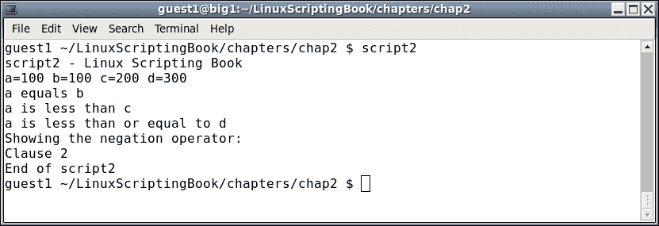
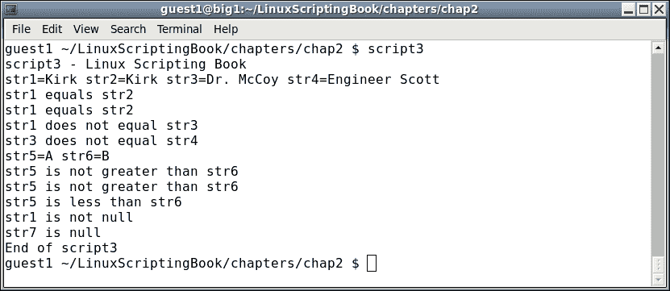
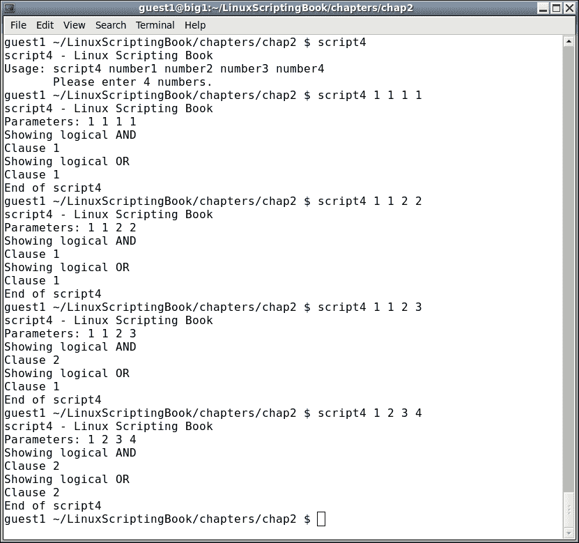
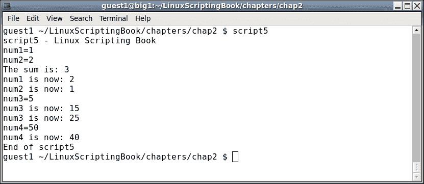
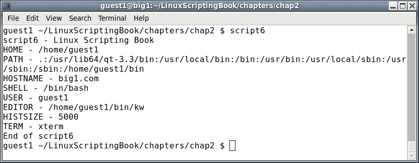
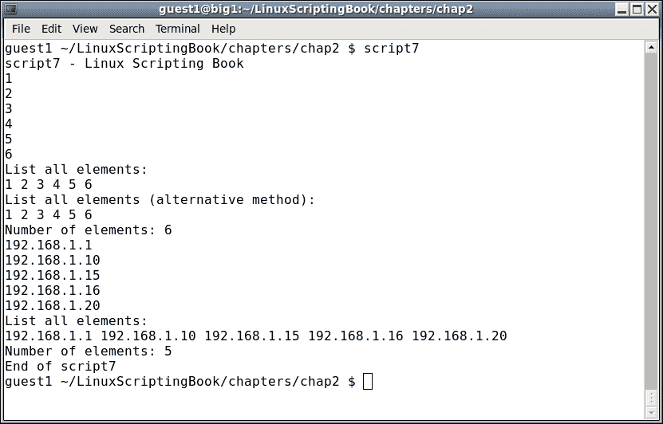

# 第二章：使用变量

本章将展示变量在 Linux 系统和脚本中的使用方式。

本章涵盖的主题有：

+   在脚本中使用变量

+   使用条件语句验证参数

+   字符串的比较运算符

+   环境变量

# 在脚本中使用变量

变量只是一些值的占位符。值可以改变；但是，变量名称将始终相同。这是一个简单的例子：

```
   a=1
```

这将值`1`分配给变量`a`。这里还有一个：

```
   b=2
```

要显示变量包含的内容，请使用`echo`语句：

```
   echo Variable a is: $a
```

### 注意

请注意变量名称前面的`$`。这是为了显示变量的内容而必需的。

如果您在任何时候看不到您期望的结果，请首先检查`$`。

以下是使用命令行的示例：

```
$ a=1
$ echo a
a
$ echo $a
1
$ b="Jim"
$ echo b
b
$ echo $b
Jim
```

Bash 脚本中的所有变量都被视为字符串。这与 C 等编程语言不同，那里一切都是强类型的。在前面的示例中，即使`a`和`b`看起来是整数，它们也是字符串。

这是一个简短的脚本，让我们开始：

## 第二章-脚本 1

```
#!/bin/sh
#
# 6/13/2017
#
echo "script1"

# Variables
a="1"
b=2
c="Jim"
d="Lewis"
e="Jim Lewis"
pi=3.141592

# Statements
echo $a
echo $b
echo $c
echo $d
echo $e
echo $pi
echo "End of script1"
```

在我的系统上运行时的输出如下：

第二章-脚本 1

由于所有变量都是字符串，我也可以这样做：

```
a="1"
b="2"
```

当字符串包含空格时，引用字符串很重要，例如这里的变量`d`和`e`。

### 注意

我发现如果我引用程序中的所有字符串，但不引用数字，那么更容易跟踪我如何使用变量（即作为字符串还是数字）。

# 使用条件语句验证参数

当将变量用作数字时，可以测试和比较变量与其他变量。

以下是可以使用的一些运算符的列表：

| 运算符 | 说明 |
| --- | --- |
| `-eq` | 这代表等于 |
| `-ne` | 这代表不等于 |
| `-gt` | 这代表大于 |
| `-lt` | 这代表小于 |
| `-ge` | 这代表大于或等于 |
| `-le` | 这代表小于或等于 |
| `!` | 这代表否定运算符 |

让我们在下一个示例脚本中看一下这个：

## 第二章-脚本 2

```
#!/bin/sh
#
# 6/13/2017
#
echo "script2"

# Numeric variables
a=100
b=100
c=200
d=300

echo a=$a b=$b c=$c d=$d     # display the values

# Conditional tests
if [ $a -eq $b ] ; then
 echo a equals b
fi

if [ $a -ne $b ] ; then
 echo a does not equal b
fi

if [ $a -gt $c ] ; then
 echo a is greater than c
fi

if [ $a -lt $c ] ; then
 echo a is less than c
fi

if [ $a -ge $d ] ; then
 echo a is greater than or equal to d
fi

if [ $a -le $d ] ; then
 echo a is less than or equal to d
fi

echo Showing the negation operator:
if [ ! $a -eq $b ] ; then
 echo Clause 1
else
 echo Clause 2
fi
echo "End of script2"
```

输出如下：



为了帮助理解本章，请在您的系统上运行脚本。尝试更改变量的值，看看它如何影响输出。

我们在第一章中看到了否定运算符，*开始使用 Shell 脚本*，当我们查看文件时。作为提醒，它否定了表达式。您还可以说它执行与原始语句相反的操作。

考虑以下示例：

```
a=1
b=1
if [ $a -eq $b ] ; then
  echo Clause 1
else
  echo Clause 2
fi
```

运行此脚本时，它将显示`条款 1`。现在考虑这个：

```
a=1
b=1
if [ ! $a -eq $b ] ; then    # negation
  echo Clause 1
else
  echo Clause 2
fi
```

由于否定运算符，它现在将显示`条款 2`。在您的系统上试一试。

# 字符串的比较运算符

字符串的比较与数字的比较不同。以下是部分列表：

| 运算符 | 说明 |
| --- | --- |
| `=` | 这代表等于 |
| `!=` | 这代表不等于 |
| `>` | 这代表大于 |
| `<` | 这代表小于 |

现在让我们看一下*脚本 3*：

## 第二章-脚本 3

```
  1  #!/bin/sh
  2  #
  3  # 6/13/2017
  4  #
  5  echo "script3"
  6  
  7  # String variables
  8  str1="Kirk"
  9  str2="Kirk"
 10  str3="Spock"
 11  str3="Dr. McCoy"
 12  str4="Engineer Scott"
 13  str5="A"
 14  str6="B"
 15  
 16  echo str1=$str1 str2=$str2 str3=$str3 str4=$str4
 17  
 18  if [ "$str1" = "$str2" ] ; then
 19   echo str1 equals str2
 20  else
 21   echo str1 does not equal str2
 22  fi
 23  
 24  if [ "$str1" != "$str2" ] ; then
 25   echo str1 does not equal str2
 26  else
 27   echo str1 equals str2
 28  fi
 29  
 30  if [ "$str1" = "$str3" ] ; then
 31   echo str1 equals str3
 32  else
 33   echo str1 does not equal str3
 34  fi
 35  
 36  if [ "$str3" = "$str4" ] ; then
 37   echo str3 equals str4
 38  else
 39   echo str3 does not equal str4
 40  fi
 41  
 42  echo str5=$str5 str6=$str6
 43  
 44  if [ "$str5" \> "$str6" ] ; then        # must escape the >
 45   echo str5 is greater than str6
 46  else
 47   echo str5 is not greater than str6
 48  fi
 49  
 50  if [[ "$str5" > "$str6" ]] ; then       # or use double brackets
 51   echo str5 is greater than str6
 52  else
 53   echo str5 is not greater than str6
 54  fi
 55  
 56  if [[ "$str5" < "$str6" ]] ; then       # double brackets
 57   echo str5 is less than str6
 58  else
 59   echo str5 is not less than str6
 60  fi
 61  
 62  if [ -n "$str1" ] ; then     # test if str1 is not null
 63   echo str1 is not null
 64  fi
 65  
 66  if [ -z "$str7" ] ; then     # test if str7 is null
 67   echo str7 is null
 68  fi
 69  echo "End of script3"
 70
```

这是我系统的输出：



让我们逐行看一下这个：

+   第 7-14 行设置了变量

+   第 16 行显示它们的值

+   第 18 行检查相等性

+   第 24 行使用不等运算符

+   直到第 50 行的内容都是不言自明的

+   第 44 行需要一些澄清。为了避免语法错误，必须转义`>`和`<`运算符

+   这是通过使用反斜杠（或转义）`\`字符来实现的

+   第 50 行显示了如何使用双括号处理大于运算符。正如您在第 58 行中看到的那样，它也适用于小于运算符。我的偏好将是在需要时使用双括号。

+   第 62 行显示了如何检查一个字符串是否为`not null`。

+   第 66 行显示了如何检查一个字符串是否为`null`。

仔细查看这个脚本，确保你能够清楚地理解它。还要注意`str7`被显示为`null`，但实际上我们并没有声明`str7`。在脚本中这样做是可以的，不会产生错误。然而，作为编程的一般规则，最好在使用变量之前声明所有变量。这样你和其他人都能更容易理解和调试你的代码。

在编程中经常出现的一种情况是有多个条件需要测试。例如，如果某件事是真的，而另一件事也是真的，就采取这个行动。这是通过使用逻辑运算符来实现的。

这里是*脚本 4*，展示了逻辑运算符的使用：

## 第二章 - 脚本 4

```
#!/bin/sh
#
# 5/1/2017
#
echo "script4 - Linux Scripting Book"

if [ $# -ne 4 ] ; then
 echo "Usage: script4 number1 number2 number3 number4"
 echo "       Please enter 4 numbers."

 exit 255
fi

echo Parameters: $1 $2 $3 $4

echo Showing logical AND
if [[ $1 -eq $2 && $3 -eq $4 ]] ; then      # logical AND
 echo Clause 1
else
 echo Clause 2
fi

echo Showing logical OR
if [[ $1 -eq $2 || $3 -eq $4 ]] ; then      # logical OR
 echo Clause 1
else
 echo Clause 2
fi

echo "End of script4"
exit 0
```

这是我的系统上的输出：



在你的系统上使用不同的参数运行这个脚本。在每次尝试时，尝试确定输出是什么，然后运行它。直到你每次都能做对为止，重复这个过程。现在理解这个概念将对我们在后面处理更复杂的脚本时非常有帮助。

现在让我们看一下*脚本 5*，看看如何执行数学运算：

## 第二章 - 脚本 5

```
#!/bin/sh
#
# 5/1/2017
#
echo "script5 - Linux Scripting Book"

num1=1
num2=2
num3=0
num4=0
sum=0

echo num1=$num1
echo num2=$num2

let sum=num1+num2
echo "The sum is: $sum"

let num1++
echo "num1 is now: $num1"

let num2--
echo "num2 is now: $num2"

let num3=5
echo num3=$num3

let num3=num3+10
echo "num3 is now: $num3"

let num3+=10
echo "num3 is now: $num3"

let num4=50
echo "num4=$num4"

let num4-=10
echo "num4 is now: $num4"

echo "End of script5"
```

以下是输出：



如你所见，变量和以前一样设置。使用`let`命令执行数学运算。注意没有使用`$`前缀：

```
let sum=num1+num2
```

还要注意一些操作的简写方式。例如，假设你想将变量`num1`增加`1`。你可以这样做：

```
let num1=num1+1
```

或者，你可以使用简写表示法：

```
let num1++
```

运行这个脚本，并改变一些值，以了解数学运算的工作原理。我们将在后面的章节中更详细地讨论这个问题。

# 环境变量

到目前为止，我们只谈到了脚本中局部的变量。还有一些系统范围的环境变量（env vars），它们在任何 Linux 系统中都扮演着非常重要的角色。以下是一些，读者可能已经知道其中一些：

| 变量 | 角色 |
| --- | --- |
| `HOME` | 用户的主目录 |
| `PATH` | 用于搜索命令的目录 |
| `PS1` | 命令行提示符 |
| `HOSTNAME` | 主机名 |
| `SHELL` | 正在使用的 shell |
| `USER` | 本次会话的用户 |
| `EDITOR` | 用于`crontab`和其他程序的文本编辑器 |
| `HISTSIZE` | 历史命令中将显示的命令数 |
| `TERM` | 正在使用的命令行终端的类型 |

这些大多是不言自明的，但我会提到一些。

`PS1`环境变量控制 shell 提示作为命令行的一部分显示的内容。默认设置通常是类似`[guest1@big1 ~]$`的东西，这并不像它本来可以做的那样有用。至少，一个好的提示至少显示主机名和当前目录。

例如，当我在这一章上工作时，我的系统提示看起来就像这样：

```
   big1 ~/LinuxScriptingBook/chapters/chap2 $
```

`big1`是我的系统的主机名，`~/LinuxScriptingBook/chapters/chap2`是当前目录。记住波浪号`~`代表用户的`home`目录；所以在我的情况下，这会扩展到：

```
 /home/guest1/LinuxScriptingBook/chapters/chap2
```

`"$"`表示我是在一个访客账户下运行。

为了启用这个功能，我的`PS1`环境变量在`/home/guest1/.bashrc`中定义如下：

```
   export PS1="\h \w $ "
```

`"\h"`显示主机名，`\w`显示当前目录。这是一个非常有用的提示，我已经使用了很多年。这是如何显示用户名的方法：

```
   export PS1="\u \h \w $ "
```

现在提示看起来是这样的：

```
 guest1 big1 ~/LinuxScriptingBook/chapters/chap2 $
```

如果你在`.bashrc`文件中更改`PS1`变量，请确保在文件中已经存在的任何其他行之后这样做。

例如，这是我的`guest1`账户下原始`.bashrc`文件的内容：

```
# .bashrc

# Source global definitions
if [ -f /etc/bashrc ]; then
    . /etc/bashrc
fi

# User specific aliases and functions
```

在这些行之后放置你的`PS1`定义。

### 注意

如果你每天登录很多不同的机器，有一个我发现非常有用的`PS1`技巧。这将在后面的章节中展示。

你可能已经注意到，在本书的示例中，我并不总是使用一个良好的`PS1`变量。这是在书的创作过程中编辑掉的，以节省空间。

`EDITOR`变量非常有用。这告诉系统要使用哪个文本编辑器来编辑用户的`crontab`（`crontab -e`）等内容。如果没有设置，默认为 vi 编辑器。可以通过将其放入用户的`.bashrc`文件中进行更改。这是我 root 账户的样子：

```
   export EDITOR=/lewis/bin64/kw
```

当我运行`crontab -l`（或`-e`）时，我的自己编写的文本编辑器会出现，而不是 vi。非常方便！

在这里我们将看一下*脚本 6*，它展示了我`guest1`账户下系统上的一些变量：

## 第二章 - 脚本 6

```
#!/bin/sh
#
# 5/1/2017
#
echo "script6 - Linux Scripting Book"

echo HOME - $HOME
echo PATH - $PATH
echo HOSTNAME - $HOSTNAME
echo SHELL - $SHELL
echo USER - $USER
echo EDITOR - $EDITOR
echo HISTSIZE - $HISTSIZE
echo TERM - $TERM

echo "End of script6"
```

这是输出：



你也可以创建和使用自己的环境变量。这是 Linux 系统的一个非常强大的功能。这里有一些我在`/root/.bashrc`文件中使用的例子：

```
BIN=/lewis/bin64
DOWN=/home/guest1/Downloads
DESK=/home/guest1/Desktop
JAVAPATH=/usr/lib/jvm/java-1.7.0-openjdk-1.7.0.99.x86_64/include/
KW_WORKDIR=/root
L1=guest1@192.168.1.21
L4=guest1@192.168.1.2
LBCUR=/home/guest1/LinuxScriptingBook/chapters/chap2
export BIN DOWN DESK JAVAPATH KW_WORKDIR L1 L4 LBCUR
```

+   `BIN`：这是我的可执行文件和脚本的目录在根目录下

+   `DOWN`：这是用于电子邮件附件下载的目录等

+   `DESK`：这是屏幕截图的下载目录

+   `JAVAPATH`：这是我编写 Java 应用程序时要使用的目录

+   `KW_WORKDIR`：这是我的编辑器放置其工作文件的位置

+   `L1`和`L2`：这是我笔记本电脑的 IP 地址

+   `LBCUR`：这是我为本书工作的当前目录

确保导出你的变量，以便其他终端可以访问它们。还记得当你做出改变时要源化你的`.bashrc`。在我的系统上，命令是：

```
    guest1 $ . /home/guest1/.bashrc
```

### 提示

不要忘记命令开头的句点！

我将在后面的章节中展示这些环境变量如何与别名配对。例如，我的系统上的`bin`命令是一个将当前目录更改为`/lewis/bin64`目录的别名。这是 Linux 系统中最强大的功能之一，然而，我总是惊讶地发现它并不经常被使用。

我们在本章中要介绍的最后一种变量类型叫做数组。假设你想编写一个包含实验室中所有机器 IP 地址的脚本。你可以这样做：

```
L0=192.168.1.1
L1=192.168.1.10
L2=192.168.1.15
L3=192.168.1.16
L4=192.168.1.20
L5=192.168.1.26
```

这将起作用，事实上我在我的家庭办公室/实验室中做了类似的事情。然而，假设你有很多机器。使用数组可以让你的生活变得简单得多。

看一下*脚本 7*：

## 第二章 - 脚本 7

```
#!/bin/sh
#
# 5/1/2017
#
echo "script7 - Linux Scripting Book"

array_var=(1 2 3 4 5 6)

echo ${array_var[0]}
echo ${array_var[1]}
echo ${array_var[2]}
echo ${array_var[3]}
echo ${array_var[4]}
echo ${array_var[5]}

echo "List all elements:"
echo ${array_var[*]}

echo "List all elements (alternative method):"
echo ${array_var[@]}

echo "Number of elements: ${#array_var[*]}"
labip[0]="192.168.1.1"
labip[1]="192.168.1.10"
labip[2]="192.168.1.15"
labip[3]="192.168.1.16"
labip[4]="192.168.1.20"

echo ${labip[0]}
echo ${labip[1]}
echo ${labip[2]}
echo ${labip[3]}
echo ${labip[4]}

echo "List all elements:"
echo ${labip[*]}

echo "Number of elements: ${#labip[*]}"
echo "End of script7"
```

这是我系统上的输出：



在你的系统上运行这个脚本并尝试进行实验。如果你以前从未见过或使用过数组，不要让它们吓到你；你很快就会熟悉它们。这是另一个容易忘记`${数组变量}`语法的地方，所以如果脚本不按你的意愿执行（或生成错误），首先检查这个。

在下一章中，当我们讨论循环时，我们将更详细地讨论数组。

# 总结

在本章中，我们介绍了如何声明和使用环境变量和本地变量。我们讨论了如何进行数学运算以及如何处理数组。

我们还介绍了在脚本中使用变量。*脚本 1*展示了如何分配一个变量并显示其值。*脚本 2*展示了如何处理数字变量，*脚本 3*展示了如何比较字符串。*脚本 4*展示了逻辑运算符，*脚本 5*展示了如何进行数学运算。*脚本 6*展示了如何使用环境变量，*脚本 7*展示了如何使用数组。
